# Korianthas (Bane of the Gold Coast)

   

**Breton Arcanist • Ebonheart Pact Alliance**

---

## ⭐ Champion Points

| **Total** | **Spent** | **Available** |
|:---------:|:---------:|:-------------:|
| 735 | 705 | 40 ⚠️ |

### ⚒️ Craft (240/275 points) ██████████░░ 87%

- **Out of Sight**: 30 points
- **Wanderer**: 50 points
- **Fortune's Favor**: 50 points
- **Gilded Fingers**: 50 points
- **Breakfall**: 10 points
- **Steed's Blessing**: 50 points

### ⚔️ Warfare (230/270 points) ██████████░░ 85%

- **Precision**: 10 points
- **Fighting Finesse**: 50 points
- **Piercing**: 10 points
- **Master-at-Arms**: 50 points
- **Deadly Aim**: 50 points
- **Thaumaturge**: 50 points
- **Eldritch Insight**: 10 points

### 💪 Fitness (235/270 points) ██████████░░ 87%

- **Hero's Vigor**: 10 points
- **Bloody Renewal**: 50 points
- **Mystic Tenacity**: 10 points
- **Tumbling**: 15 points
- **Rejuvenation**: 50 points
- **Fortified**: 50 points
- **Boundless Vitality**: 50 points

---

## 🎯 Champion Points Visual

```mermaid
%%{init: {'theme':'base', 'themeVariables': { 'background':'transparent','fontSize':'14px','primaryColor':'#e8f4f0','primaryTextColor':'#000','primaryBorderColor':'#4a9d7f','lineColor':'#999','secondaryColor':'#f0f4f8','tertiaryColor':'#faf0f0'}}}%%

graph LR
  %%%% Champion Point Investment Visualization
  %%%% Enhanced readability with clear visual hierarchy

  %%%% ========================================
  %% ⚒️ CRAFT CONSTELLATION (240/564 pts)
  %%%% ========================================

  subgraph CRAFT ["⚒️ CRAFT CONSTELLATION"]
    direction TB
    
    CRAFT_TITLE["<b>Slottable Stars</b>"]
    C_R1["⭐ Gilded Fingers<br/><b>50/50 pts</b> | MAXED"]
    C_IND1["⭐ Steed's Blessing<br/><b>50/50 pts</b> | MAXED"]
    C_IND2["Breakfall<br/><b>10/50 pts</b> | ○○○ 20%"]
    
    CRAFT_PASS["<b>Passive Stars</b>"]
    C_R6["Wanderer<br/><b>50/100 pts</b> | ●●○ 50%"]
    C_Fortune's_Favor["⭐ Fortune's Favor<br/><b>50/50 pts</b> | MAXED"]
    C_Out_of_Sight["Out of Sight<br/><b>30/50 pts</b> | ●●○ 60%"]
    
    CRAFT_AVAIL["💎 <b>40 points available</b>"]
    
    CRAFT_TITLE -.-> C_R1 & C_IND1 & C_IND2
    CRAFT_PASS -.-> C_R6 & C_Fortune's_Favor & C_Out_of_Sight

    style CRAFT_TITLE fill:transparent,stroke:none,color:#4a9d7f
    style CRAFT_PASS fill:transparent,stroke:none,color:#4a9d7f
    style C_R1 fill:#4a9d7f,stroke:#ffd700,stroke-width:4px,color:#fff
    style C_IND1 fill:#4a9d7f,stroke:#ffd700,stroke-width:4px,color:#fff
    style C_IND2 fill:#4a9d7f,stroke:#4a9d7f,stroke-width:3px,color:#fff
    style C_R6 fill:#4a9d7f,stroke:#4a9d7f,stroke-width:2px,color:#fff
    style C_Fortune's_Favor fill:#4a9d7f,stroke:#4a9d7f,stroke-width:2px,color:#fff
    style C_Out_of_Sight fill:#4a9d7f,stroke:#4a9d7f,stroke-width:2px,color:#fff
    style CRAFT_AVAIL fill:#d4e8df,stroke:#4a9d7f,stroke-width:2px,stroke-dasharray:5 5,color:#4a9d7f

  end
  style CRAFT fill:transparent,stroke:#4a9d7f,stroke-width:3px

  %%%% ========================================
  %% ⚔️ WARFARE CONSTELLATION (230/564 pts)
  %%%% ========================================

  subgraph WARFARE ["⚔️ WARFARE CONSTELLATION"]
    direction TB
    
    WARFARE_TITLE["<b>Slottable Stars</b>"]
    W_IND1["⭐ Deadly Aim<br/><b>50/50 pts</b> | MAXED"]
    W_IND2["⭐ Master-at-Arms<br/><b>50/50 pts</b> | MAXED"]
    W_IND3["⭐ Thaumaturge<br/><b>50/50 pts</b> | MAXED"]
    
    WARFARE_PASS["<b>Passive Stars</b>"]
    W_C1["⭐ Fighting Finesse<br/><b>50/50 pts</b> | MAXED"]
    W_R1["Precision<br/><b>10/50 pts</b> | ○○○ 20%"]
    
    WARFARE_BASE["<b>Independent Stars</b>"]
    W_BASE1["Eldritch Insight<br/><b>10/50 pts</b> | ○○○ 20%"]
    
    WARFARE_AVAIL["💎 <b>40 points available</b>"]
    
    WARFARE_TITLE -.-> W_IND1 & W_IND2 & W_IND3
    WARFARE_PASS -.-> W_C1 & W_R1
    WARFARE_BASE -.-> W_BASE1

    style WARFARE_TITLE fill:transparent,stroke:none,color:#5b7fb8
    style WARFARE_PASS fill:transparent,stroke:none,color:#5b7fb8
    style WARFARE_BASE fill:transparent,stroke:none,color:#5b7fb8
    style W_IND1 fill:#5b7fb8,stroke:#ffd700,stroke-width:4px,color:#fff
    style W_IND2 fill:#5b7fb8,stroke:#ffd700,stroke-width:4px,color:#fff
    style W_IND3 fill:#5b7fb8,stroke:#ffd700,stroke-width:4px,color:#fff
    style W_C1 fill:#5b7fb8,stroke:#5b7fb8,stroke-width:2px,color:#fff
    style W_R1 fill:#5b7fb8,stroke:#5b7fb8,stroke-width:2px,color:#fff
    style W_BASE1 fill:#5b7fb8,stroke:#ff8c00,stroke-width:3px,color:#fff
    style WARFARE_AVAIL fill:#d4e4f0,stroke:#5b7fb8,stroke-width:2px,stroke-dasharray:5 5,color:#5b7fb8

  end
  style WARFARE fill:transparent,stroke:#5b7fb8,stroke-width:3px

  %%%% ========================================
  %% 💪 FITNESS CONSTELLATION (235/564 pts)
  %%%% ========================================

  subgraph FITNESS ["💪 FITNESS CONSTELLATION"]
    direction TB
    
    FITNESS_TITLE["<b>Slottable Stars</b>"]
    SS3["Bloody Renewal<br/><b>50/75 pts</b> | ●●○ 66%"]
    
    FITNESS_PASS["<b>Passive Stars</b>"]
    SD4["⭐ Fortified<br/><b>50/50 pts</b> | MAXED"]
    F_L1["Tumbling<br/><b>15/50 pts</b> | ●○○ 30%"]
    F_L3["Hero's Vigor<br/><b>10/50 pts</b> | ○○○ 20%"]
    F_C1["Mystic Tenacity<br/><b>10/50 pts</b> | ○○○ 20%"]
    
    FITNESS_BASE["<b>Independent Stars</b>"]
    F_BASE3["⭐ Rejuvenation<br/><b>50/50 pts</b> | MAXED"]
    F_BASE1["⭐ Boundless Vitality<br/><b>50/50 pts</b> | MAXED"]
    
    FITNESS_AVAIL["💎 <b>40 points available</b>"]
    
    FITNESS_TITLE -.-> SS3
    FITNESS_PASS -.-> SD4 & F_L1 & F_L3 & F_C1
    FITNESS_BASE -.-> F_BASE3 & F_BASE1

    style FITNESS_TITLE fill:transparent,stroke:none,color:#b87a7a
    style FITNESS_PASS fill:transparent,stroke:none,color:#b87a7a
    style FITNESS_BASE fill:transparent,stroke:none,color:#b87a7a
    style SS3 fill:#b87a7a,stroke:#b87a7a,stroke-width:3px,color:#fff
    style SD4 fill:#b87a7a,stroke:#b87a7a,stroke-width:2px,color:#fff
    style F_L1 fill:#b87a7a,stroke:#b87a7a,stroke-width:2px,color:#fff
    style F_L3 fill:#b87a7a,stroke:#b87a7a,stroke-width:2px,color:#fff
    style F_C1 fill:#b87a7a,stroke:#b87a7a,stroke-width:2px,color:#fff
    style F_BASE3 fill:#b87a7a,stroke:#ff8c00,stroke-width:3px,color:#fff
    style F_BASE1 fill:#b87a7a,stroke:#ff8c00,stroke-width:3px,color:#fff
    style FITNESS_AVAIL fill:#f0d4d4,stroke:#b87a7a,stroke-width:2px,stroke-dasharray:5 5,color:#b87a7a

  end
  style FITNESS fill:transparent,stroke:#b87a7a,stroke-width:3px

  %%%% ========================================
  %%%% LEGEND
  %%%% ========================================

  subgraph LEGEND ["📖 LEGEND & VISUAL GUIDE"]
    direction TB
    
    LEG_STARS["<b>Star Types</b>"]
    LEG_S1["⭐ Gold Border = Maxed Slottable"]
    LEG_S2["🔶 Orange Border = Independent Star"]
    LEG_S3["Standard Border = In Progress"]
    
    LEG_FILL["<b>Progress Indicators</b>"]
    LEG_F1["⭐ = 100% Maxed"]
    LEG_F2["●●● = 75-99%"]
    LEG_F3["●●○ = 50-74%"]
    LEG_F4["●○○ = 25-49%"]
    LEG_F5["○○○ = 1-24%"]
    
    LEG_STARS -.-> LEG_S1 & LEG_S2 & LEG_S3
    LEG_FILL -.-> LEG_F1 & LEG_F2 & LEG_F3 & LEG_F4 & LEG_F5

    style LEG_STARS fill:transparent,stroke:none,color:#ccc
    style LEG_FILL fill:transparent,stroke:none,color:#ccc
    style LEG_S1 fill:#fff,stroke:#ffd700,stroke-width:3px,color:#333
    style LEG_S2 fill:#fff,stroke:#ff8c00,stroke-width:3px,color:#333
    style LEG_S3 fill:#fff,stroke:#999,stroke-width:2px,color:#333
    style LEG_F1 fill:#eee,stroke:#333,stroke-width:1px,color:#333
    style LEG_F2 fill:#eee,stroke:#333,stroke-width:1px,color:#333
    style LEG_F3 fill:#eee,stroke:#333,stroke-width:1px,color:#333
    style LEG_F4 fill:#eee,stroke:#333,stroke-width:1px,color:#333
    style LEG_F5 fill:#eee,stroke:#333,stroke-width:1px,color:#333
  end
  style LEGEND fill:transparent,stroke:#999,stroke-width:3px
```

---
                                                                              

 

**⚔️ CharacterMarkdown**

Generated on 11/10/2025

                                                                                     

