# Dextera Dei (Silencer)

   

**Imperial Sorcerer • Aldmeri Dominion Alliance**

---

## 📑 Table of Contents

- [📋 Overview](#overview)
  - [General](#general)
  - [Currency](#currency)
  - [Character Stats](#character-stats)
- [📝 Build Notes](#build-notes)
- [⚔️ Combat Arsenal](#combat-arsenal)
  - [Equipment & Active Sets](#equipment-active-sets)
  - [Champion Points](#champion-points)
  - [Character Progress](#character-progress)
  - [Companions](#companions)
- [⚔️ PvP](#pvp)
  - [Alliance War Skills](#alliance-war-skills)
- [🏰 Guild Membership](#guild-membership)
- [🎨 Collectibles](#collectibles)
- [🎒 Inventory](#inventory)
- [🏆 Achievements](#achievements)
- [🏺 Antiquities](#antiquities)
- [📜 Quests](#quests)

---

## 📋 Overview

### General

| **Attribute** | **Value** |
| --- | --- |
| **Level** | 50 |
| **Class** | [Sorcerer](https://en.uesp.net/wiki/Online:Sorcerer) |
| **Race** | [Imperial](https://en.uesp.net/wiki/Online:Imperial) |
| **Alliance** | [Aldmeri Dominion](https://en.uesp.net/wiki/Online:Aldmeri_Dominion) |
| **Server** | [NA Megaserver](https://en.uesp.net/wiki/Online:Megaservers) |
| **Account** | @SOLAEGIS |

| **Attribute** | **Value** |
| --- | --- |
| **Champion Points** | 747 |
| **Attributes** | 🔵 0 / ❤️ 0 / ⚡ 64 |
| **Skill Points** | 🎯 54 available - Ready to spend |
| **Vampire/Werewolf Status** | 🧛 Vampire Stage 1 |
| **Title** | [Silencer](https://en.uesp.net/wiki/Online:Silencer) |
| **Age** | 7 days, 21 hours, 37 minutes, and 41 seconds |

| **Attribute** | **Value** |
| --- | --- |
| **ESO Plus** | ✅ Active |
| **🪨 Mundus Stone** | [The Thief](https://en.uesp.net/wiki/Online:The_Thief_(Mundus_Stone)) |
| **🍖 Active Buffs** | Other: [Major Savagery](https://en.uesp.net/wiki/Online:Major_Savagery), [Major Prophecy](https://en.uesp.net/wiki/Online:Major_Prophecy), [Vampire Stage 3](https://en.uesp.net/wiki/Online:Vampire) |
| **Location** | [Alik'r Desert](https://en.uesp.net/wiki/Online:Alik'r_Desert) (Myrkwasa Dolmen) |
| **🐴 Riding Skills** | 🐴 60 / 💪 60 / 🎒 60 ✅ |

### Currency

| **Attribute** | **Value** |
| --- | --- |
| **Gold** | 5,353 |
| **Transmute Crystals** | 60 |
| **Event Tickets** | 2 |

### Character Stats

| **Category** | **Stat** | **Value** |
| --- | --- | ---: |
| 💚 **Resources** | Health | 19,400 |
|  | Magicka | 12,000 |
|  | Stamina | 22,422 |
| ⚔️ **Offensive** | Weapon Power | 3,576 |
|  | Spell Power | 3,576 |

| **Category** | **Stat** | **Value** |
| --- | --- | ---: |
| 🎯 **Critical** | Weapon Crit | 10,717 (48.9%) |
|  | Spell Crit | 10,717 (48.9%) |
| ⚔️ **Penetration** | Physical | 3,860 |
|  | Spell | 3,860 |

| **Category** | **Stat** | **Value** |
| --- | --- | ---: |
| 🛡️ **Defensive** | Physical Resist | 12,543 (83.3%) |
|  | Spell Resist | 12,543 (83.3%) |
| ♻️ **Recovery** | Health | 216 |
|  | Magicka | 745 |
|  | Stamina | 954 |

## 📝 Build Notes

# Dextera Dei - Origins of the Storm

## Before the Fall
**Dextera Amatius** was born to an Imperial noble house serving the Ruby Throne. Gifted with storm magic from childhood, she trained as a **Battlemage** in the Imperial Legion, destined for command. Her parents named her "Right Hand" - expecting her to serve emperors.

The Planemeld changed everything.

## The Gold Coast Betrayal
During Molag Bal's invasion, Dextera's Legion unit was dispatched to the **Gold Coast** to investigate Daedric cult activity. Her commander - secretly a Dark Brotherhood contractor - sold out the entire platoon.

**The ambush came at dusk.**

Cultists slaughtered her unit. Dextera survived only by unleashing a storm so violent it killed allies and enemies alike. She crawled from the wreckage, the sole survivor, branded a murderer by Imperial records.

## The Dark Gift
Bleeding out in **Kvatch Cathedral**, she was found by a **vampire** - an ancient Dark Brotherhood Silencer named **Verandis**. He offered a choice:

*"Die a disgraced soldier, or live as an instrument of divine judgment."*

She drank.

## Rebirth
**Seven days ago**, Dextera Dei rose from her coffin. The Imperial who served light became the **Silencer** who serves shadow. She kept her name - "Right Hand of God" - but redefined its meaning.

Now she hunts from **Summerset to Skyrim**, wielding daggers and storm magic. Each contract is judgment. Each kill is righteous. The Dark Brotherhood gave her purpose. Vampirism gave her power.

The **Psijic Order** recruited her recently, sensing potential in one who walks between life and death, order and chaos.

## Philosophy
*"The Legion abandoned me. The Brotherhood saved me. I am no longer the Empire's right hand - I am **God's**, and God's will is death."*

**In darkness, I am the storm.**

## ⚔️ Combat Arsenal

### ⚔️ ⚔️ ⚔️ Front Bar (Main Hand)

| **1** | **2** | **3** | **4** | **5** | **⚡** |
| :---: | :---: | :---: | :---: | :---: | :---: |
| [Rending Slashes](https://en.uesp.net/wiki/Online:Rending_Slashes) | [Hidden Blade](https://en.uesp.net/wiki/Online:Hidden_Blade) | [Soul Trap](https://en.uesp.net/wiki/Online:Soul_Trap) | [Bound Armaments](https://en.uesp.net/wiki/Online:Bound_Armaments) | [Bolt Escape](https://en.uesp.net/wiki/Online:Bolt_Escape) | [Summon Storm Atronach](https://en.uesp.net/wiki/Online:Summon_Storm_Atronach) |

### 🔮 🔮 🔮 Back Bar (Backup)

| **1** | **2** | **3** | **4** | **5** | **⚡** |
| :---: | :---: | :---: | :---: | :---: | :---: |
| [Lethal Arrow](https://en.uesp.net/wiki/Online:Lethal_Arrow) | [Poison Arrow](https://en.uesp.net/wiki/Online:Poison_Arrow) | [Critical Surge](https://en.uesp.net/wiki/Online:Critical_Surge) | [Hurricane](https://en.uesp.net/wiki/Online:Hurricane) | [Resolving Vigor](https://en.uesp.net/wiki/Online:Resolving_Vigor) | [Empty] |

## ⚔️ Equipment & Active Sets

| **Set** | **Progress** |
| --- | --- |
| 🟢 **[Night Mother's Gaze Set](https://en.uesp.net/wiki/Online:Night_Mother's_Gaze_Set)** | `5/5` ██████████ 100% |
| ⚪ **[Law of Julianos Set](https://en.uesp.net/wiki/Online:Law_of_Julianos_Set)** | `1/5` ██░░░░░░░░ 20% |
| 🟢 **[Hunding's Rage Set](https://en.uesp.net/wiki/Online:Hunding's_Rage_Set)** | `5/5` ██████████ 100% *(+2 extra)* |

### 📋 Equipment Details

| **Slot** | **Item** | **Set** | **Quality** | **Trait** | **Type** | **Enchantment** |
| --- | --- | --- | --- | --- | --- | --- |
| ⛑️ **Head** | Helmet of the Night Mother | [Night Mother's Gaze Set](https://en.uesp.net/wiki/Online:Night_Mother's_Gaze_Set) | ⭐ Epic | Divines | Medium • ⚒️ Crafted | - |
| 💎 **Neck** | Necklace of Julianos | [Law of Julianos Set](https://en.uesp.net/wiki/Online:Law_of_Julianos_Set) | ⭐ Epic | Bloodthirsty | None • ⚒️ Crafted | - |
| 🛡️ **Chest** | Jack of the Night Mother | [Night Mother's Gaze Set](https://en.uesp.net/wiki/Online:Night_Mother's_Gaze_Set) | ⭐ Epic | Divines | Medium • ⚒️ Crafted | - |
| 👑 **Shoulders** | Arm Cops of the Night Mother | [Night Mother's Gaze Set](https://en.uesp.net/wiki/Online:Night_Mother's_Gaze_Set) | ⭐ Epic | Divines | Medium • ⚒️ Crafted | - |
| ⚔️ **Main Hand** | Dagger of Hunding's Rage | [Hunding's Rage Set](https://en.uesp.net/wiki/Online:Hunding's_Rage_Set) | ⭐ Epic | Sharpened | None • ⚒️ Crafted | - |
| 🛡️ **Off Hand** | Dagger of Hunding's Rage | [Hunding's Rage Set](https://en.uesp.net/wiki/Online:Hunding's_Rage_Set) | ⭐ Epic | Sharpened | None • ⚒️ Crafted | - |
| ⚡ **Waist** | Belt of Hunding's Rage | [Hunding's Rage Set](https://en.uesp.net/wiki/Online:Hunding's_Rage_Set) | ⭐ Epic | Divines | Medium • ⚒️ Crafted | - |
| 👖 **Legs** | Guards of the Night Mother | [Night Mother's Gaze Set](https://en.uesp.net/wiki/Online:Night_Mother's_Gaze_Set) | ⭐ Epic | Divines | Medium • ⚒️ Crafted | - |
| 👟 **Feet** | Boots of Hunding's Rage | [Hunding's Rage Set](https://en.uesp.net/wiki/Online:Hunding's_Rage_Set) | ⭐ Epic | Divines | Medium • ⚒️ Crafted | - |
| 💍 **Ring 1** | Ring of Hunding's Rage | [Hunding's Rage Set](https://en.uesp.net/wiki/Online:Hunding's_Rage_Set) | ⭐ Epic | Infused | None • ⚒️ Crafted | - |
| 💍 **Ring 2** | Ring of Hunding's Rage | [Hunding's Rage Set](https://en.uesp.net/wiki/Online:Hunding's_Rage_Set) | ⭐ Epic | Infused | None • ⚒️ Crafted | - |
| ✋ **Hands** | Bracers of the Night Mother | [Night Mother's Gaze Set](https://en.uesp.net/wiki/Online:Night_Mother's_Gaze_Set) | ⭐ Epic | Divines | Medium • ⚒️ Crafted | - |
| 🔮 **Backup Main Hand** | Bow of Hunding's Rage | [Hunding's Rage Set](https://en.uesp.net/wiki/Online:Hunding's_Rage_Set) | ⭐ Epic | Infused | None • ⚒️ Crafted | - |

---

## 📜 Character Progress

### Progress Overview

| **Maxed Skill Lines** | **In Progress** | **Early Progress** | **Abilities with Morphs** | **Overall Completion** |
| ---: | ---: | ---: | ---: | ---: |
| 15 | 6 | 23 | 35 | 34% |

🌿 Skill Morphs (35 abilities with morph choices)

### ⚔️ Class (13 abilities with morph choices)

#### Dark Magic (Rank 25)

🔒 **[Negate Magic](https://en.uesp.net/wiki/Online:Negate_Magic)** (Rank 4)

  

  
Other morph options

  ⚪ **Morph 1**: [Suppression Field](https://en.uesp.net/wiki/Online:Suppression_Field)
  ⚪ **Morph 2**: [Absorption Field](https://en.uesp.net/wiki/Online:Absorption_Field)

  

🔒 **[Crystal Shard](https://en.uesp.net/wiki/Online:Crystal_Shard)** (Rank 4)

  

  
Other morph options

  ⚪ **Morph 1**: [Crystal Weapon](https://en.uesp.net/wiki/Online:Crystal_Weapon)
  ⚪ **Morph 2**: [Crystal Fragments](https://en.uesp.net/wiki/Online:Crystal_Fragments)

  

#### Daedric Summoning (Rank 50)

⚠️ **[Summon Storm Atronach](https://en.uesp.net/wiki/Online:Summon_Storm_Atronach)** (Rank 4)

  

  
Other morph options

  ⚪ **Morph 1**: [Greater Storm Atronach](https://en.uesp.net/wiki/Online:Greater_Storm_Atronach)
  ⚪ **Morph 2**: [Summon Charged Atronach](https://en.uesp.net/wiki/Online:Summon_Charged_Atronach)

  

🔒 **[Summon Unstable Familiar](https://en.uesp.net/wiki/Online:Summon_Unstable_Familiar)** (Rank 4)

  

  
Other morph options

  ⚪ **Morph 1**: [Summon Unstable Clannfear](https://en.uesp.net/wiki/Online:Summon_Unstable_Clannfear)
  ⚪ **Morph 2**: [Summon Volatile Familiar](https://en.uesp.net/wiki/Online:Summon_Volatile_Familiar)

  

🔒 **[Daedric Curse](https://en.uesp.net/wiki/Online:Daedric_Curse)** (Rank 4)

  

  
Other morph options

  ⚪ **Morph 1**: [Daedric Prey](https://en.uesp.net/wiki/Online:Daedric_Prey)
  ⚪ **Morph 2**: [Haunting Curse](https://en.uesp.net/wiki/Online:Haunting_Curse)

  

🔒 **[Summon Winged Twilight](https://en.uesp.net/wiki/Online:Summon_Winged_Twilight)** (Rank 4)

  

  
Other morph options

  ⚪ **Morph 1**: [Summon Twilight Tormentor](https://en.uesp.net/wiki/Online:Summon_Twilight_Tormentor)
  ⚪ **Morph 2**: [Summon Twilight Matriarch](https://en.uesp.net/wiki/Online:Summon_Twilight_Matriarch)

  

✅ **[Bound Armaments](https://en.uesp.net/wiki/Online:Bound_Armaments)** (Rank 1)

  ✅ **Morph 1**: [Bound Armaments](https://en.uesp.net/wiki/Online:Bound_Armaments)

  

  
Other morph options

  ⚪ **Morph 2**: [Bound Aegis](https://en.uesp.net/wiki/Online:Bound_Aegis)

  

#### Storm Calling (Rank 50)

🔒 **[Overload](https://en.uesp.net/wiki/Online:Overload)** (Rank 4)

  

  
Other morph options

  ⚪ **Morph 1**: [Power Overload](https://en.uesp.net/wiki/Online:Power_Overload)
  ⚪ **Morph 2**: [Energy Overload](https://en.uesp.net/wiki/Online:Energy_Overload)

  

🔒 **[Mages' Fury](https://en.uesp.net/wiki/Online:Mages'_Fury)** (Rank 4)

  

  
Other morph options

  ⚪ **Morph 1**: [Mages' Wrath](https://en.uesp.net/wiki/Online:Mages'_Wrath)
  ⚪ **Morph 2**: [Endless Fury](https://en.uesp.net/wiki/Online:Endless_Fury)

  

✅ **[Hurricane](https://en.uesp.net/wiki/Online:Hurricane)** (Rank 4)

  ✅ **Morph 1**: [Hurricane](https://en.uesp.net/wiki/Online:Hurricane)

  

  
Other morph options

  ⚪ **Morph 2**: [Boundless Storm](https://en.uesp.net/wiki/Online:Boundless_Storm)

  

🔒 **[Lightning Splash](https://en.uesp.net/wiki/Online:Lightning_Splash)** (Rank 1)

  

  
Other morph options

  ⚪ **Morph 1**: [Liquid Lightning](https://en.uesp.net/wiki/Online:Liquid_Lightning)
  ⚪ **Morph 2**: [Lightning Flood](https://en.uesp.net/wiki/Online:Lightning_Flood)

  

✅ **[Critical Surge](https://en.uesp.net/wiki/Online:Critical_Surge)** (Rank 4)

  ✅ **Morph 2**: [Critical Surge](https://en.uesp.net/wiki/Online:Critical_Surge)

  

  
Other morph options

  ⚪ **Morph 1**: [Power Surge](https://en.uesp.net/wiki/Online:Power_Surge)

  

🔒 **[Bolt Escape](https://en.uesp.net/wiki/Online:Bolt_Escape)** (Rank 1)

  

  
Other morph options

  ⚪ **Morph 1**: [Streak](https://en.uesp.net/wiki/Online:Streak)
  ⚪ **Morph 2**: [Ball of Lightning](https://en.uesp.net/wiki/Online:Ball_of_Lightning)

  

### ⚔️ Weapon (17 abilities with morph choices)

#### Two Handed (Rank 48)

🔒 **[Uppercut](https://en.uesp.net/wiki/Online:Uppercut)** (Rank 4)

  

  
Other morph options

  ⚪ **Morph 1**: [Dizzying Swing](https://en.uesp.net/wiki/Online:Dizzying_Swing)
  ⚪ **Morph 2**: [Wrecking Blow](https://en.uesp.net/wiki/Online:Wrecking_Blow)

  

🔒 **[Critical Charge](https://en.uesp.net/wiki/Online:Critical_Charge)** (Rank 4)

  

  
Other morph options

  ⚪ **Morph 1**: [Stampede](https://en.uesp.net/wiki/Online:Stampede)
  ⚪ **Morph 2**: [Critical Rush](https://en.uesp.net/wiki/Online:Critical_Rush)

  

🔒 **[Cleave](https://en.uesp.net/wiki/Online:Cleave)** (Rank 4)

  

  
Other morph options

  ⚪ **Morph 1**: [Carve](https://en.uesp.net/wiki/Online:Carve)
  ⚪ **Morph 2**: [Brawler](https://en.uesp.net/wiki/Online:Brawler)

  

🔒 **[Reverse Slash](https://en.uesp.net/wiki/Online:Reverse_Slash)** (Rank 4)

  

  
Other morph options

  ⚪ **Morph 1**: [Reverse Slice](https://en.uesp.net/wiki/Online:Reverse_Slice)
  ⚪ **Morph 2**: [Executioner](https://en.uesp.net/wiki/Online:Executioner)

  

#### Dual Wield (Rank 50)

🔒 **[Flurry](https://en.uesp.net/wiki/Online:Flurry)** (Rank 4)

  

  
Other morph options

  ⚪ **Morph 1**: [Rapid Strikes](https://en.uesp.net/wiki/Online:Rapid_Strikes)
  ⚪ **Morph 2**: [Bloodthirst](https://en.uesp.net/wiki/Online:Bloodthirst)

  

✅ **[Rending Slashes](https://en.uesp.net/wiki/Online:Rending_Slashes)** (Rank 1)

  ✅ **Morph 1**: [Rending Slashes](https://en.uesp.net/wiki/Online:Rending_Slashes)

  

  
Other morph options

  ⚪ **Morph 2**: [Blood Craze](https://en.uesp.net/wiki/Online:Blood_Craze)

  

🔒 **[Whirlwind](https://en.uesp.net/wiki/Online:Whirlwind)** (Rank 4)

  

  
Other morph options

  ⚪ **Morph 1**: [Whirling Blades](https://en.uesp.net/wiki/Online:Whirling_Blades)
  ⚪ **Morph 2**: [Steel Tornado](https://en.uesp.net/wiki/Online:Steel_Tornado)

  

🔒 **[Blade Cloak](https://en.uesp.net/wiki/Online:Blade_Cloak)** (Rank 1)

  

  
Other morph options

  ⚪ **Morph 1**: [Quick Cloak](https://en.uesp.net/wiki/Online:Quick_Cloak)
  ⚪ **Morph 2**: [Deadly Cloak](https://en.uesp.net/wiki/Online:Deadly_Cloak)

  

🔒 **[Hidden Blade](https://en.uesp.net/wiki/Online:Hidden_Blade)** (Rank 1)

  

  
Other morph options

  ⚪ **Morph 1**: [Shrouded Daggers](https://en.uesp.net/wiki/Online:Shrouded_Daggers)
  ⚪ **Morph 2**: [Flying Blade](https://en.uesp.net/wiki/Online:Flying_Blade)

  

#### Bow (Rank 50)

✅ **[Lethal Arrow](https://en.uesp.net/wiki/Online:Lethal_Arrow)** (Rank 1)

  ✅ **Morph 1**: [Lethal Arrow](https://en.uesp.net/wiki/Online:Lethal_Arrow)

  

  
Other morph options

  ⚪ **Morph 2**: [Focused Aim](https://en.uesp.net/wiki/Online:Focused_Aim)

  

🔒 **[Volley](https://en.uesp.net/wiki/Online:Volley)** (Rank 4)

  

  
Other morph options

  ⚪ **Morph 1**: [Endless Hail](https://en.uesp.net/wiki/Online:Endless_Hail)
  ⚪ **Morph 2**: [Arrow Barrage](https://en.uesp.net/wiki/Online:Arrow_Barrage)

  

🔒 **[Scatter Shot](https://en.uesp.net/wiki/Online:Scatter_Shot)** (Rank 4)

  

  
Other morph options

  ⚪ **Morph 1**: [Magnum Shot](https://en.uesp.net/wiki/Online:Magnum_Shot)
  ⚪ **Morph 2**: [Draining Shot](https://en.uesp.net/wiki/Online:Draining_Shot)

  

🔒 **[Arrow Spray](https://en.uesp.net/wiki/Online:Arrow_Spray)** (Rank 4)

  

  
Other morph options

  ⚪ **Morph 1**: [Bombard](https://en.uesp.net/wiki/Online:Bombard)
  ⚪ **Morph 2**: [Acid Spray](https://en.uesp.net/wiki/Online:Acid_Spray)

  

🔒 **[Poison Arrow](https://en.uesp.net/wiki/Online:Poison_Arrow)** (Rank 2)

  

  
Other morph options

  ⚪ **Morph 1**: [Venom Arrow](https://en.uesp.net/wiki/Online:Venom_Arrow)
  ⚪ **Morph 2**: [Poison Injection](https://en.uesp.net/wiki/Online:Poison_Injection)

  

#### Destruction Staff (Rank 34)

🔒 **[Destructive Touch](https://en.uesp.net/wiki/Online:Destructive_Touch)** (Rank 2)

  

  
Other morph options

  ⚪ **Morph 1**: [Destructive Clench](https://en.uesp.net/wiki/Online:Destructive_Clench)
  ⚪ **Morph 2**: [Destructive Reach](https://en.uesp.net/wiki/Online:Destructive_Reach)

  

🔒 **[Weakness to Elements](https://en.uesp.net/wiki/Online:Weakness_to_Elements)** (Rank 4)

  

  
Other morph options

  ⚪ **Morph 1**: [Elemental Susceptibility](https://en.uesp.net/wiki/Online:Elemental_Susceptibility)
  ⚪ **Morph 2**: [Elemental Drain](https://en.uesp.net/wiki/Online:Elemental_Drain)

  

#### Restoration Staff (Rank 5)

🔒 **[Grand Healing](https://en.uesp.net/wiki/Online:Grand_Healing)** (Rank 4)

  

  
Other morph options

  ⚪ **Morph 1**: [Illustrious Healing](https://en.uesp.net/wiki/Online:Illustrious_Healing)
  ⚪ **Morph 2**: [Healing Springs](https://en.uesp.net/wiki/Online:Healing_Springs)

  

### 🌍 World (2 abilities with morph choices)

#### Soul Magic (Rank 5)

⚠️ **[Soul Trap](https://en.uesp.net/wiki/Online:Soul_Trap)** (Rank 4)

  

  
Other morph options

  ⚪ **Morph 1**: [Soul Splitting Trap](https://en.uesp.net/wiki/Online:Soul_Splitting_Trap)
  ⚪ **Morph 2**: [Consuming Trap](https://en.uesp.net/wiki/Online:Consuming_Trap)

  

#### Vampire (Rank 10)

🔒 **[Eviscerate](https://en.uesp.net/wiki/Online:Eviscerate)** (Rank 4)

  

  
Other morph options

  ⚪ **Morph 1**: [Blood for Blood](https://en.uesp.net/wiki/Online:Blood_for_Blood)
  ⚪ **Morph 2**: [Arterial Burst](https://en.uesp.net/wiki/Online:Arterial_Burst)

  

### 🏰 Guild (2 abilities with morph choices)

#### Fighters Guild (Rank 8)

🔒 **[Silver Bolts](https://en.uesp.net/wiki/Online:Silver_Bolts)** (Rank 1)

  

  
Other morph options

  ⚪ **Morph 1**: [Silver Shards](https://en.uesp.net/wiki/Online:Silver_Shards)
  ⚪ **Morph 2**: [Silver Leash](https://en.uesp.net/wiki/Online:Silver_Leash)

  

#### Mages Guild (Rank 7)

🔒 **[Magelight](https://en.uesp.net/wiki/Online:Magelight)** (Rank 1)

  

  
Other morph options

  ⚪ **Morph 1**: [Inner Light](https://en.uesp.net/wiki/Online:Inner_Light)
  ⚪ **Morph 2**: [Radiant Magelight](https://en.uesp.net/wiki/Online:Radiant_Magelight)

  

### ⚔️ Alliance War (1 abilities with morph choices)

#### Assault (Rank 2)

✅ **[Resolving Vigor](https://en.uesp.net/wiki/Online:Resolving_Vigor)** (Rank 1)

  ✅ **Morph 2**: [Resolving Vigor](https://en.uesp.net/wiki/Online:Resolving_Vigor)

  

  
Other morph options

  ⚪ **Morph 1**: [Echoing Vigor](https://en.uesp.net/wiki/Online:Echoing_Vigor)

  

### ✅ Maxed Skills

🔥 Class (2 skill lines maxed)

**[Daedric Summoning](https://en.uesp.net/wiki/Online:Daedric_Summoning)**, **[Storm Calling](https://en.uesp.net/wiki/Online:Storm_Calling)**

✨ Passives

- 🔒 [Rebate](https://en.uesp.net/wiki/Online:Rebate) (8/8) *(from [Daedric Summoning](https://en.uesp.net/wiki/Online:Daedric_Summoning))*
- 🔒 [Power Stone](https://en.uesp.net/wiki/Online:Power_Stone) (14/14) *(from [Daedric Summoning](https://en.uesp.net/wiki/Online:Daedric_Summoning))*
- 🔒 [Daedric Protection](https://en.uesp.net/wiki/Online:Daedric_Protection) (22/22) *(from [Daedric Summoning](https://en.uesp.net/wiki/Online:Daedric_Summoning))*
- 🔒 [Expert Summoner](https://en.uesp.net/wiki/Online:Expert_Summoner) (39/39) *(from [Daedric Summoning](https://en.uesp.net/wiki/Online:Daedric_Summoning))*
- ✅ [Capacitor](https://en.uesp.net/wiki/Online:Capacitor) (8/8) *(from [Storm Calling](https://en.uesp.net/wiki/Online:Storm_Calling))*
- ✅ [Energized](https://en.uesp.net/wiki/Online:Energized) (14/14) *(from [Storm Calling](https://en.uesp.net/wiki/Online:Storm_Calling))*
- 🔒 [Amplitude](https://en.uesp.net/wiki/Online:Amplitude) (22/22) *(from [Storm Calling](https://en.uesp.net/wiki/Online:Storm_Calling))*
- ✅ [Expert Mage](https://en.uesp.net/wiki/Online:Expert_Mage) (39/39) *(from [Storm Calling](https://en.uesp.net/wiki/Online:Storm_Calling))*

⚔️ Weapon (2 skill lines maxed)

**[Dual Wield](https://en.uesp.net/wiki/Online:Dual_Wield)**, **[Bow](https://en.uesp.net/wiki/Online:Bow)**

✨ Passives

- ✅ [Slaughter](https://en.uesp.net/wiki/Online:Slaughter) (5/5) *(from [Dual Wield](https://en.uesp.net/wiki/Online:Dual_Wield))*
- ✅ [Dual Wield Expert](https://en.uesp.net/wiki/Online:Dual_Wield_Expert) (10/10) *(from [Dual Wield](https://en.uesp.net/wiki/Online:Dual_Wield))*
- ✅ [Controlled Fury](https://en.uesp.net/wiki/Online:Controlled_Fury) (25/25) *(from [Dual Wield](https://en.uesp.net/wiki/Online:Dual_Wield))*
- ✅ [Ruffian](https://en.uesp.net/wiki/Online:Ruffian) (28/28) *(from [Dual Wield](https://en.uesp.net/wiki/Online:Dual_Wield))*
- ✅ [Twin Blade and Blunt](https://en.uesp.net/wiki/Online:Twin_Blade_and_Blunt) (41/41) *(from [Dual Wield](https://en.uesp.net/wiki/Online:Dual_Wield))*
- 🔒 [Vinedusk Training](https://en.uesp.net/wiki/Online:Vinedusk_Training) (5/5) *(from [Bow](https://en.uesp.net/wiki/Online:Bow))*
- ✅ [Accuracy](https://en.uesp.net/wiki/Online:Accuracy) (10/10) *(from [Bow](https://en.uesp.net/wiki/Online:Bow))*
- ✅ [Ranger](https://en.uesp.net/wiki/Online:Ranger) (17/17) *(from [Bow](https://en.uesp.net/wiki/Online:Bow))*
- ✅ [Hawk Eye](https://en.uesp.net/wiki/Online:Hawk_Eye) (30/30) *(from [Bow](https://en.uesp.net/wiki/Online:Bow))*
- ✅ [Hasty Retreat](https://en.uesp.net/wiki/Online:Hasty_Retreat) (41/41) *(from [Bow](https://en.uesp.net/wiki/Online:Bow))*

⭐ Racial (10 skill lines maxed)

**[Imperial Skills](https://en.uesp.net/wiki/Online:Imperial)**, **[Orc Skills](https://en.uesp.net/wiki/Online:Orc)**, **[High Elf Skills](https://en.uesp.net/wiki/Online:High_Elf)**, **[Wood Elf Skills](https://en.uesp.net/wiki/Online:Wood_Elf)**, **[Khajiit Skills](https://en.uesp.net/wiki/Online:Khajiit)**, **[Breton Skills](https://en.uesp.net/wiki/Online:Breton)**, **[Redguard Skills](https://en.uesp.net/wiki/Online:Redguard)**, **[Argonian Skills](https://en.uesp.net/wiki/Online:Argonian)**, **[Dark Elf Skills](https://en.uesp.net/wiki/Online:Dark_Elf)**, **[Nord Skills](https://en.uesp.net/wiki/Online:Nord)**

✨ Passives

- ✅ [Diplomat](https://en.uesp.net/wiki/Online:Diplomat) *(from [Imperial Skills](https://en.uesp.net/wiki/Online:Imperial))*
- ✅ [Tough](https://en.uesp.net/wiki/Online:Tough) (5/5) *(from [Imperial Skills](https://en.uesp.net/wiki/Online:Imperial))*
- ✅ [Imperial Mettle](https://en.uesp.net/wiki/Online:Imperial_Mettle) (10/10) *(from [Imperial Skills](https://en.uesp.net/wiki/Online:Imperial))*
- ✅ [Red Diamond](https://en.uesp.net/wiki/Online:Red_Diamond) (25/25) *(from [Imperial Skills](https://en.uesp.net/wiki/Online:Imperial))*
- 🔒 [Craftsman](https://en.uesp.net/wiki/Online:Craftsman) *(from [Orc Skills](https://en.uesp.net/wiki/Online:Orc))*
- 🔒 [Brawny](https://en.uesp.net/wiki/Online:Brawny) (5/5) *(from [Orc Skills](https://en.uesp.net/wiki/Online:Orc))*
- 🔒 [Unflinching Rage](https://en.uesp.net/wiki/Online:Unflinching_Rage) (10/10) *(from [Orc Skills](https://en.uesp.net/wiki/Online:Orc))*
- 🔒 [Swift Warrior](https://en.uesp.net/wiki/Online:Swift_Warrior) (25/25) *(from [Orc Skills](https://en.uesp.net/wiki/Online:Orc))*
- 🔒 [Highborn](https://en.uesp.net/wiki/Online:Highborn) *(from [High Elf Skills](https://en.uesp.net/wiki/Online:High_Elf))*
- 🔒 [Spell Recharge](https://en.uesp.net/wiki/Online:Spell_Recharge) (5/5) *(from [High Elf Skills](https://en.uesp.net/wiki/Online:High_Elf))*
- 🔒 [Syrabane's Boon](https://en.uesp.net/wiki/Online:Syrabane's_Boon) (10/10) *(from [High Elf Skills](https://en.uesp.net/wiki/Online:High_Elf))*
- 🔒 [Elemental Talent](https://en.uesp.net/wiki/Online:Elemental_Talent) (25/25) *(from [High Elf Skills](https://en.uesp.net/wiki/Online:High_Elf))*
- 🔒 [Acrobat](https://en.uesp.net/wiki/Online:Acrobat) *(from [Wood Elf Skills](https://en.uesp.net/wiki/Online:Wood_Elf))*
- 🔒 [Hunter's Eye](https://en.uesp.net/wiki/Online:Hunter's_Eye) (5/5) *(from [Wood Elf Skills](https://en.uesp.net/wiki/Online:Wood_Elf))*
- 🔒 [Y'ffre's Endurance](https://en.uesp.net/wiki/Online:Y'ffre's_Endurance) (10/10) *(from [Wood Elf Skills](https://en.uesp.net/wiki/Online:Wood_Elf))*
- 🔒 [Resist Affliction](https://en.uesp.net/wiki/Online:Resist_Affliction) (25/25) *(from [Wood Elf Skills](https://en.uesp.net/wiki/Online:Wood_Elf))*
- 🔒 [Cutpurse](https://en.uesp.net/wiki/Online:Cutpurse) *(from [Khajiit Skills](https://en.uesp.net/wiki/Online:Khajiit))*
- 🔒 [Robustness](https://en.uesp.net/wiki/Online:Robustness) (5/5) *(from [Khajiit Skills](https://en.uesp.net/wiki/Online:Khajiit))*
- 🔒 [Lunar Blessings](https://en.uesp.net/wiki/Online:Lunar_Blessings) (10/10) *(from [Khajiit Skills](https://en.uesp.net/wiki/Online:Khajiit))*
- 🔒 [Feline Ambush](https://en.uesp.net/wiki/Online:Feline_Ambush) (25/25) *(from [Khajiit Skills](https://en.uesp.net/wiki/Online:Khajiit))*
- 🔒 [Opportunist](https://en.uesp.net/wiki/Online:Opportunist) *(from [Breton Skills](https://en.uesp.net/wiki/Online:Breton))*
- 🔒 [Gift of Magnus](https://en.uesp.net/wiki/Online:Gift_of_Magnus) (5/5) *(from [Breton Skills](https://en.uesp.net/wiki/Online:Breton))*
- 🔒 [Spell Attunement](https://en.uesp.net/wiki/Online:Spell_Attunement) (10/10) *(from [Breton Skills](https://en.uesp.net/wiki/Online:Breton))*
- 🔒 [Magicka Mastery](https://en.uesp.net/wiki/Online:Magicka_Mastery) (25/25) *(from [Breton Skills](https://en.uesp.net/wiki/Online:Breton))*
- 🔒 [Wayfarer](https://en.uesp.net/wiki/Online:Wayfarer) *(from [Redguard Skills](https://en.uesp.net/wiki/Online:Redguard))*
- 🔒 [Martial Training](https://en.uesp.net/wiki/Online:Martial_Training) (5/5) *(from [Redguard Skills](https://en.uesp.net/wiki/Online:Redguard))*
- 🔒 [Conditioning](https://en.uesp.net/wiki/Online:Conditioning) (10/10) *(from [Redguard Skills](https://en.uesp.net/wiki/Online:Redguard))*
- 🔒 [Adrenaline Rush](https://en.uesp.net/wiki/Online:Adrenaline_Rush) (25/25) *(from [Redguard Skills](https://en.uesp.net/wiki/Online:Redguard))*
- 🔒 [Amphibian](https://en.uesp.net/wiki/Online:Amphibian) *(from [Argonian Skills](https://en.uesp.net/wiki/Online:Argonian))*
- 🔒 [Life Mender](https://en.uesp.net/wiki/Online:Life_Mender) (5/5) *(from [Argonian Skills](https://en.uesp.net/wiki/Online:Argonian))*
- 🔒 [Argonian Resistance](https://en.uesp.net/wiki/Online:Argonian_Resistance) (10/10) *(from [Argonian Skills](https://en.uesp.net/wiki/Online:Argonian))*
- 🔒 [Resourceful](https://en.uesp.net/wiki/Online:Resourceful) (25/25) *(from [Argonian Skills](https://en.uesp.net/wiki/Online:Argonian))*
- 🔒 [Ashlander](https://en.uesp.net/wiki/Online:Ashlander) *(from [Dark Elf Skills](https://en.uesp.net/wiki/Online:Dark_Elf))*
- 🔒 [Dynamic](https://en.uesp.net/wiki/Online:Dynamic) (5/5) *(from [Dark Elf Skills](https://en.uesp.net/wiki/Online:Dark_Elf))*
- 🔒 [Resist Flame](https://en.uesp.net/wiki/Online:Resist_Flame) (10/10) *(from [Dark Elf Skills](https://en.uesp.net/wiki/Online:Dark_Elf))*
- 🔒 [Ruination](https://en.uesp.net/wiki/Online:Ruination) (25/25) *(from [Dark Elf Skills](https://en.uesp.net/wiki/Online:Dark_Elf))*
- 🔒 [Reveler](https://en.uesp.net/wiki/Online:Reveler) *(from [Nord Skills](https://en.uesp.net/wiki/Online:Nord))*
- 🔒 [Resist Frost](https://en.uesp.net/wiki/Online:Resist_Frost) (5/5) *(from [Nord Skills](https://en.uesp.net/wiki/Online:Nord))*
- 🔒 [Stalwart](https://en.uesp.net/wiki/Online:Stalwart) (10/10) *(from [Nord Skills](https://en.uesp.net/wiki/Online:Nord))*
- 🔒 [Rugged](https://en.uesp.net/wiki/Online:Rugged) (25/25) *(from [Nord Skills](https://en.uesp.net/wiki/Online:Nord))*

🛡️ Armor (1 skill line maxed)

**[Medium Armor](https://en.uesp.net/wiki/Online:Medium_Armor)**

✨ Passives

- ✅ [Medium Armor Bonuses](https://en.uesp.net/wiki/Online:Medium_Armor_Bonuses) *(from [Medium Armor](https://en.uesp.net/wiki/Online:Medium_Armor))*
- ✅ [Dexterity](https://en.uesp.net/wiki/Online:Dexterity) (2/2) *(from [Medium Armor](https://en.uesp.net/wiki/Online:Medium_Armor))*
- ✅ [Wind Walker](https://en.uesp.net/wiki/Online:Wind_Walker) (6/6) *(from [Medium Armor](https://en.uesp.net/wiki/Online:Medium_Armor))*
- ✅ [Improved Sneak](https://en.uesp.net/wiki/Online:Improved_Sneak) (14/14) *(from [Medium Armor](https://en.uesp.net/wiki/Online:Medium_Armor))*
- ✅ [Agility](https://en.uesp.net/wiki/Online:Agility) (38/38) *(from [Medium Armor](https://en.uesp.net/wiki/Online:Medium_Armor))*
- ✅ [Athletics](https://en.uesp.net/wiki/Online:Athletics) (42/42) *(from [Medium Armor](https://en.uesp.net/wiki/Online:Medium_Armor))*

### 📈 In-Progress Skills

⚔️ Weapon (2 skill lines in progress)

- **[Two Handed](https://en.uesp.net/wiki/Online:Two_Handed)**: Rank 48 █████████░ 99%
- **[Destruction Staff](https://en.uesp.net/wiki/Online:Destruction_Staff)**: Rank 34 █████████░ 96%

✨ Passives

- 🔒 [Forceful](https://en.uesp.net/wiki/Online:Forceful) (5/5) *(from [Two Handed](https://en.uesp.net/wiki/Online:Two_Handed))*
- 🔒 [Heavy Weapons](https://en.uesp.net/wiki/Online:Heavy_Weapons) (10/10) *(from [Two Handed](https://en.uesp.net/wiki/Online:Two_Handed))*
- 🔒 [Balanced Blade](https://en.uesp.net/wiki/Online:Balanced_Blade) (17/17) *(from [Two Handed](https://en.uesp.net/wiki/Online:Two_Handed))*
- 🔒 [Follow Up](https://en.uesp.net/wiki/Online:Follow_Up) (30/30) *(from [Two Handed](https://en.uesp.net/wiki/Online:Two_Handed))*
- 🔒 [Battle Rush](https://en.uesp.net/wiki/Online:Battle_Rush) (41/41) *(from [Two Handed](https://en.uesp.net/wiki/Online:Two_Handed))*
- 🔒 [Tri Focus](https://en.uesp.net/wiki/Online:Tri_Focus) (5/5) *(from [Destruction Staff](https://en.uesp.net/wiki/Online:Destruction_Staff))*
- 🔒 [Penetrating Magic](https://en.uesp.net/wiki/Online:Penetrating_Magic) (10/10) *(from [Destruction Staff](https://en.uesp.net/wiki/Online:Destruction_Staff))*
- 🔒 [Elemental Force](https://en.uesp.net/wiki/Online:Elemental_Force) (25/25) *(from [Destruction Staff](https://en.uesp.net/wiki/Online:Destruction_Staff))*
- 🔒 [Ancient Knowledge](https://en.uesp.net/wiki/Online:Ancient_Knowledge) (28/28) *(from [Destruction Staff](https://en.uesp.net/wiki/Online:Destruction_Staff))*
- 🔒 [Destruction Expert](https://en.uesp.net/wiki/Online:Destruction_Expert) (41/41) *(from [Destruction Staff](https://en.uesp.net/wiki/Online:Destruction_Staff))*

🌍 World (1 skill line in progress)

- **[Legerdemain](https://en.uesp.net/wiki/Online:Legerdemain)**: Rank 20 ██████████ 100%

✨ Passives

- 🔒 [Improved Hiding](https://en.uesp.net/wiki/Online:Improved_Hiding) *(from [Legerdemain](https://en.uesp.net/wiki/Online:Legerdemain))*
- 🔒 [Light Fingers](https://en.uesp.net/wiki/Online:Light_Fingers) (2/2) *(from [Legerdemain](https://en.uesp.net/wiki/Online:Legerdemain))*
- 🔒 [Trafficker](https://en.uesp.net/wiki/Online:Trafficker) (3/3) *(from [Legerdemain](https://en.uesp.net/wiki/Online:Legerdemain))*
- 🔒 [Locksmith](https://en.uesp.net/wiki/Online:Locksmith) (5/5) *(from [Legerdemain](https://en.uesp.net/wiki/Online:Legerdemain))*
- 🔒 [Kickback](https://en.uesp.net/wiki/Online:Kickback) (6/6) *(from [Legerdemain](https://en.uesp.net/wiki/Online:Legerdemain))*

🛡️ Armor (1 skill line in progress)

- **[Light Armor](https://en.uesp.net/wiki/Online:Light_Armor)**: Rank 30 █████████░ 95%

✨ Passives

- ✅ [Light Armor Bonuses](https://en.uesp.net/wiki/Online:Light_Armor_Bonuses) *(from [Light Armor](https://en.uesp.net/wiki/Online:Light_Armor))*
- ✅ [Light Armor Penalties](https://en.uesp.net/wiki/Online:Light_Armor_Penalties) *(from [Light Armor](https://en.uesp.net/wiki/Online:Light_Armor))*
- 🔒 [Grace](https://en.uesp.net/wiki/Online:Grace) (2/2) *(from [Light Armor](https://en.uesp.net/wiki/Online:Light_Armor))*
- 🔒 [Evocation](https://en.uesp.net/wiki/Online:Evocation) (6/6) *(from [Light Armor](https://en.uesp.net/wiki/Online:Light_Armor))*
- 🔒 [Spell Warding](https://en.uesp.net/wiki/Online:Spell_Warding) (14/14) *(from [Light Armor](https://en.uesp.net/wiki/Online:Light_Armor))*
- 🔒 [Prodigy](https://en.uesp.net/wiki/Online:Prodigy) (38/38) *(from [Light Armor](https://en.uesp.net/wiki/Online:Light_Armor))*
- 🔒 [Concentration](https://en.uesp.net/wiki/Online:Concentration) (42/42) *(from [Light Armor](https://en.uesp.net/wiki/Online:Light_Armor))*

⚒️ Craft (1 skill line in progress)

- **[Clothing](https://en.uesp.net/wiki/Online:Clothing)**: Rank 25 █████████░ 95%

✨ Passives

- ✅ [Tailoring](https://en.uesp.net/wiki/Online:Tailoring) *(from [Clothing](https://en.uesp.net/wiki/Online:Clothing))*
- 🔒 [Keen Eye: Cloth](https://en.uesp.net/wiki/Online:Keen_Eye:_Cloth) (2/2) *(from [Clothing](https://en.uesp.net/wiki/Online:Clothing))*
- 🔒 [Outfitter Hireling](https://en.uesp.net/wiki/Online:Outfitter_Hireling) (3/3) *(from [Clothing](https://en.uesp.net/wiki/Online:Clothing))*
- 🔒 [Unraveling](https://en.uesp.net/wiki/Online:Unraveling) (4/4) *(from [Clothing](https://en.uesp.net/wiki/Online:Clothing))*
- 🔒 [Stitching](https://en.uesp.net/wiki/Online:Stitching) (8/8) *(from [Clothing](https://en.uesp.net/wiki/Online:Clothing))*
- 🔒 [Tannin Expertise](https://en.uesp.net/wiki/Online:Tannin_Expertise) (10/10) *(from [Clothing](https://en.uesp.net/wiki/Online:Clothing))*

🔥 Class (1 skill line in progress)

- **[Dark Magic](https://en.uesp.net/wiki/Online:Dark_Magic)**: Rank 25 █████████░ 91%

✨ Passives

- 🔒 [Unholy Knowledge](https://en.uesp.net/wiki/Online:Unholy_Knowledge) (8/8) *(from [Dark Magic](https://en.uesp.net/wiki/Online:Dark_Magic))*
- ✅ [Blood Magic](https://en.uesp.net/wiki/Online:Blood_Magic) (14/14) *(from [Dark Magic](https://en.uesp.net/wiki/Online:Dark_Magic))*
- 🔒 [Persistence](https://en.uesp.net/wiki/Online:Persistence) (22/22) *(from [Dark Magic](https://en.uesp.net/wiki/Online:Dark_Magic))*
- 🔒 [Exploitation](https://en.uesp.net/wiki/Online:Exploitation) (39/39) *(from [Dark Magic](https://en.uesp.net/wiki/Online:Dark_Magic))*

### ⚪ Early Progress Skills

🏰 Guild (6 skill lines)

- **[Dark Brotherhood](https://en.uesp.net/wiki/Online:Dark_Brotherhood)**: Rank 10 █████████░ 97%
- **[Fighters Guild](https://en.uesp.net/wiki/Online:Fighters_Guild)**: Rank 8 ████████░░ 82%
- **[Mages Guild](https://en.uesp.net/wiki/Online:Mages_Guild)**: Rank 7 ████████░░ 87%
- **[Psijic Order](https://en.uesp.net/wiki/Online:Psijic_Order)**: Rank 1 ░░░░░░░░░░ 0%
- **[Thieves Guild](https://en.uesp.net/wiki/Online:Thieves_Guild)**: Rank 2 ███████░░░ 71%
- **[Undaunted](https://en.uesp.net/wiki/Online:Undaunted)**: Rank 2 ██████░░░░ 66%

✨ Passives

- ✅ [Blade of Woe](https://en.uesp.net/wiki/Online:Blade_of_Woe) *(from [Dark Brotherhood](https://en.uesp.net/wiki/Online:Dark_Brotherhood))*
- 🔒 [Scales of Pitiless Justice](https://en.uesp.net/wiki/Online:Scales_of_Pitiless_Justice) (2/2) *(from [Dark Brotherhood](https://en.uesp.net/wiki/Online:Dark_Brotherhood))*
- 🔒 [Padomaic Sprint](https://en.uesp.net/wiki/Online:Padomaic_Sprint) (3/3) *(from [Dark Brotherhood](https://en.uesp.net/wiki/Online:Dark_Brotherhood))*
- 🔒 [Shadowy Supplier](https://en.uesp.net/wiki/Online:Shadowy_Supplier) (4/4) *(from [Dark Brotherhood](https://en.uesp.net/wiki/Online:Dark_Brotherhood))*
- 🔒 [Shadow Rider](https://en.uesp.net/wiki/Online:Shadow_Rider) (7/7) *(from [Dark Brotherhood](https://en.uesp.net/wiki/Online:Dark_Brotherhood))*
- 🔒 [Spectral Assassin](https://en.uesp.net/wiki/Online:Spectral_Assassin) (10/10) *(from [Dark Brotherhood](https://en.uesp.net/wiki/Online:Dark_Brotherhood))*
- 🔒 [Intimidating Presence](https://en.uesp.net/wiki/Online:Intimidating_Presence) *(from [Fighters Guild](https://en.uesp.net/wiki/Online:Fighters_Guild))*
- ✅ [Slayer](https://en.uesp.net/wiki/Online:Slayer) (3/3) *(from [Fighters Guild](https://en.uesp.net/wiki/Online:Fighters_Guild))*
- ✅ [Banish the Wicked](https://en.uesp.net/wiki/Online:Banish_the_Wicked) (5/5) *(from [Fighters Guild](https://en.uesp.net/wiki/Online:Fighters_Guild))*
- ✅ [Skilled Tracker](https://en.uesp.net/wiki/Online:Skilled_Tracker) (7/7) *(from [Fighters Guild](https://en.uesp.net/wiki/Online:Fighters_Guild))*
- 🔒 [Bounty Hunter](https://en.uesp.net/wiki/Online:Bounty_Hunter) (9/9) *(from [Fighters Guild](https://en.uesp.net/wiki/Online:Fighters_Guild))*
- 🔒 [Persuasive Will](https://en.uesp.net/wiki/Online:Persuasive_Will) *(from [Mages Guild](https://en.uesp.net/wiki/Online:Mages_Guild))*
- 🔒 [Mage Adept](https://en.uesp.net/wiki/Online:Mage_Adept) (3/3) *(from [Mages Guild](https://en.uesp.net/wiki/Online:Mages_Guild))*
- 🔒 [Everlasting Magic](https://en.uesp.net/wiki/Online:Everlasting_Magic) (5/5) *(from [Mages Guild](https://en.uesp.net/wiki/Online:Mages_Guild))*

- 🔒 [Magicka Controller](https://en.uesp.net/wiki/Online:Magicka_Controller) (7/7) *(from [Mages Guild](https://en.uesp.net/wiki/Online:Mages_Guild))*
- 🔒 [Might of the Guild](https://en.uesp.net/wiki/Online:Might_of_the_Guild) (9/9) *(from [Mages Guild](https://en.uesp.net/wiki/Online:Mages_Guild))*
- 🔒 [See the Unseen](https://en.uesp.net/wiki/Online:See_the_Unseen) *(from [Psijic Order](https://en.uesp.net/wiki/Online:Psijic_Order))*
- 🔒 [Clairvoyance](https://en.uesp.net/wiki/Online:Clairvoyance) (3/3) *(from [Psijic Order](https://en.uesp.net/wiki/Online:Psijic_Order))*
- 🔒 [Spell Orb](https://en.uesp.net/wiki/Online:Spell_Orb) (4/4) *(from [Psijic Order](https://en.uesp.net/wiki/Online:Psijic_Order))*
- 🔒 [Concentrated Barrier](https://en.uesp.net/wiki/Online:Concentrated_Barrier) (6/6) *(from [Psijic Order](https://en.uesp.net/wiki/Online:Psijic_Order))*
- 🔒 [Deliberation](https://en.uesp.net/wiki/Online:Deliberation) (9/9) *(from [Psijic Order](https://en.uesp.net/wiki/Online:Psijic_Order))*
- ✅ [Finders Keepers](https://en.uesp.net/wiki/Online:Finders_Keepers) *(from [Thieves Guild](https://en.uesp.net/wiki/Online:Thieves_Guild))*
- 🔒 [Swiftly Forgotten](https://en.uesp.net/wiki/Online:Swiftly_Forgotten) (2/2) *(from [Thieves Guild](https://en.uesp.net/wiki/Online:Thieves_Guild))*
- 🔒 [Haggling](https://en.uesp.net/wiki/Online:Haggling) (3/3) *(from [Thieves Guild](https://en.uesp.net/wiki/Online:Thieves_Guild))*
- 🔒 [Clemency](https://en.uesp.net/wiki/Online:Clemency) (4/4) *(from [Thieves Guild](https://en.uesp.net/wiki/Online:Thieves_Guild))*
- 🔒 [Timely Escape](https://en.uesp.net/wiki/Online:Timely_Escape) (7/7) *(from [Thieves Guild](https://en.uesp.net/wiki/Online:Thieves_Guild))*
- 🔒 [Veil of Shadows](https://en.uesp.net/wiki/Online:Veil_of_Shadows) (10/10) *(from [Thieves Guild](https://en.uesp.net/wiki/Online:Thieves_Guild))*
- 🔒 [Undaunted Command](https://en.uesp.net/wiki/Online:Undaunted_Command) (6/6) *(from [Undaunted](https://en.uesp.net/wiki/Online:Undaunted))*
- 🔒 [Undaunted Mettle](https://en.uesp.net/wiki/Online:Undaunted_Mettle) (7/7) *(from [Undaunted](https://en.uesp.net/wiki/Online:Undaunted))*

⚔️ Weapon (2 skill lines)

- **[One Hand and Shield](https://en.uesp.net/wiki/Online:One_Hand_and_Shield)**: Rank 7 ██████░░░░ 64%
- **[Restoration Staff](https://en.uesp.net/wiki/Online:Restoration_Staff)**: Rank 5 ███████░░░ 74%

✨ Passives

- 🔒 [Fortress](https://en.uesp.net/wiki/Online:Fortress) (5/5) *(from [One Hand and Shield](https://en.uesp.net/wiki/Online:One_Hand_and_Shield))*
- 🔒 [Sword and Board](https://en.uesp.net/wiki/Online:Sword_and_Board) (10/10) *(from [One Hand and Shield](https://en.uesp.net/wiki/Online:One_Hand_and_Shield))*
- 🔒 [Deadly Bash](https://en.uesp.net/wiki/Online:Deadly_Bash) (17/17) *(from [One Hand and Shield](https://en.uesp.net/wiki/Online:One_Hand_and_Shield))*
- 🔒 [Deflect Bolts](https://en.uesp.net/wiki/Online:Deflect_Bolts) (30/30) *(from [One Hand and Shield](https://en.uesp.net/wiki/Online:One_Hand_and_Shield))*
- 🔒 [Battlefield Mobility](https://en.uesp.net/wiki/Online:Battlefield_Mobility) (41/41) *(from [One Hand and Shield](https://en.uesp.net/wiki/Online:One_Hand_and_Shield))*
- 🔒 [Essence Drain](https://en.uesp.net/wiki/Online:Essence_Drain) (5/5) *(from [Restoration Staff](https://en.uesp.net/wiki/Online:Restoration_Staff))*
- 🔒 [Restoration Expert](https://en.uesp.net/wiki/Online:Restoration_Expert) (10/10) *(from [Restoration Staff](https://en.uesp.net/wiki/Online:Restoration_Staff))*
- 🔒 [Cycle of Life](https://en.uesp.net/wiki/Online:Cycle_of_Life) (25/25) *(from [Restoration Staff](https://en.uesp.net/wiki/Online:Restoration_Staff))*
- 🔒 [Absorb](https://en.uesp.net/wiki/Online:Absorb) (28/28) *(from [Restoration Staff](https://en.uesp.net/wiki/Online:Restoration_Staff))*
- 🔒 [Restoration Master](https://en.uesp.net/wiki/Online:Restoration_Master) (41/41) *(from [Restoration Staff](https://en.uesp.net/wiki/Online:Restoration_Staff))*

🌍 World (5 skill lines)

- **[Excavation](https://en.uesp.net/wiki/Online:Excavation)**: Rank 1 ░░░░░░░░░░ 0%
- **[Scrying](https://en.uesp.net/wiki/Online:Scrying)**: Rank 1 ░░░░░░░░░░ 0%
- **[Soul Magic](https://en.uesp.net/wiki/Online:Soul_Magic)**: Rank 5 ████████░░ 80%
- **[Vampire](https://en.uesp.net/wiki/Online:Vampire)**: Rank 10 ██████████ 100%
- **[Werewolf](https://en.uesp.net/wiki/Online:Werewolf)**: Rank 1 ░░░░░░░░░░ 0%

✨ Passives

- 🔒 [Hand Brush](https://en.uesp.net/wiki/Online:Hand_Brush) *(from [Excavation](https://en.uesp.net/wiki/Online:Excavation))*
- 🔒 [Augur](https://en.uesp.net/wiki/Online:Augur) *(from [Excavation](https://en.uesp.net/wiki/Online:Excavation))*
- 🔒 [Trowel](https://en.uesp.net/wiki/Online:Trowel) (2/2) *(from [Excavation](https://en.uesp.net/wiki/Online:Excavation))*
- 🔒 [Keen Eye: Dig Sites](https://en.uesp.net/wiki/Online:Keen_Eye:_Dig_Sites) (2/2) *(from [Excavation](https://en.uesp.net/wiki/Online:Excavation))*
- 🔒 [Excavator's Reserves](https://en.uesp.net/wiki/Online:Excavator's_Reserves) (3/3) *(from [Excavation](https://en.uesp.net/wiki/Online:Excavation))*
- 🔒 [Heavy Shovel](https://en.uesp.net/wiki/Online:Heavy_Shovel) (4/4) *(from [Excavation](https://en.uesp.net/wiki/Online:Excavation))*
- 🔒 [Keen Eye: Treasure Chests](https://en.uesp.net/wiki/Online:Keen_Eye:_Treasure_Chests) (7/7) *(from [Excavation](https://en.uesp.net/wiki/Online:Excavation))*
- 🔒 [Scry](https://en.uesp.net/wiki/Online:Scry) *(from [Scrying](https://en.uesp.net/wiki/Online:Scrying))*
- 🔒 [Antiquarian Insight](https://en.uesp.net/wiki/Online:Antiquarian_Insight) *(from [Scrying](https://en.uesp.net/wiki/Online:Scrying))*
- 🔒 [Scrier's Patience](https://en.uesp.net/wiki/Online:Scrier's_Patience) (2/2) *(from [Scrying](https://en.uesp.net/wiki/Online:Scrying))*
- 🔒 [Coalescence](https://en.uesp.net/wiki/Online:Coalescence) (2/2) *(from [Scrying](https://en.uesp.net/wiki/Online:Scrying))*
- 🔒 [Future Focus](https://en.uesp.net/wiki/Online:Future_Focus) (4/4) *(from [Scrying](https://en.uesp.net/wiki/Online:Scrying))*
- 🔒 [Dilation](https://en.uesp.net/wiki/Online:Dilation) (4/4) *(from [Scrying](https://en.uesp.net/wiki/Online:Scrying))*
- 🔒 [Farsight](https://en.uesp.net/wiki/Online:Farsight) (6/6) *(from [Scrying](https://en.uesp.net/wiki/Online:Scrying))*
- 🔒 [Preemptive Power](https://en.uesp.net/wiki/Online:Preemptive_Power) (9/9) *(from [Scrying](https://en.uesp.net/wiki/Online:Scrying))*
- 🔒 [Soul Summons](https://en.uesp.net/wiki/Online:Soul_Summons) (2/2) *(from [Soul Magic](https://en.uesp.net/wiki/Online:Soul_Magic))*
- 🔒 [Soul Shatter](https://en.uesp.net/wiki/Online:Soul_Shatter) (2/2) *(from [Soul Magic](https://en.uesp.net/wiki/Online:Soul_Magic))*
- 🔒 [Soul Lock](https://en.uesp.net/wiki/Online:Soul_Lock) (3/3) *(from [Soul Magic](https://en.uesp.net/wiki/Online:Soul_Magic))*
- ✅ [Feed](https://en.uesp.net/wiki/Online:Feed) *(from [Vampire](https://en.uesp.net/wiki/Online:Vampire))*
- ✅ [Dark Stalker](https://en.uesp.net/wiki/Online:Dark_Stalker) (3/3) *(from [Vampire](https://en.uesp.net/wiki/Online:Vampire))*
- ✅ [Strike from the Shadows](https://en.uesp.net/wiki/Online:Strike_from_the_Shadows) (4/4) *(from [Vampire](https://en.uesp.net/wiki/Online:Vampire))*
- ✅ [Undeath](https://en.uesp.net/wiki/Online:Undeath) (6/6) *(from [Vampire](https://en.uesp.net/wiki/Online:Vampire))*
- 🔒 [Blood Ritual](https://en.uesp.net/wiki/Online:Blood_Ritual) (6/6) *(from [Vampire](https://en.uesp.net/wiki/Online:Vampire))*
- ✅ [Unnatural Movement](https://en.uesp.net/wiki/Online:Unnatural_Movement) (7/7) *(from [Vampire](https://en.uesp.net/wiki/Online:Vampire))*
- 🔒 [Devour](https://en.uesp.net/wiki/Online:Devour) *(from [Werewolf](https://en.uesp.net/wiki/Online:Werewolf))*
- 🔒 [Pursuit](https://en.uesp.net/wiki/Online:Pursuit) (3/3) *(from [Werewolf](https://en.uesp.net/wiki/Online:Werewolf))*
- 🔒 [Blood Rage](https://en.uesp.net/wiki/Online:Blood_Rage) (4/4) *(from [Werewolf](https://en.uesp.net/wiki/Online:Werewolf))*
- 🔒 [Savage Strength](https://en.uesp.net/wiki/Online:Savage_Strength) (6/6) *(from [Werewolf](https://en.uesp.net/wiki/Online:Werewolf))*
- 🔒 [Bloodmoon](https://en.uesp.net/wiki/Online:Bloodmoon) (6/6) *(from [Werewolf](https://en.uesp.net/wiki/Online:Werewolf))*
- 🔒 [Call of the Pack](https://en.uesp.net/wiki/Online:Call_of_the_Pack) (7/7) *(from [Werewolf](https://en.uesp.net/wiki/Online:Werewolf))*

🛡️ Armor (1 skill line)

- **[Heavy Armor](https://en.uesp.net/wiki/Online:Heavy_Armor)**: Rank 15 █████████░ 98%

✨ Passives

- ✅ [Heavy Armor Bonuses](https://en.uesp.net/wiki/Online:Heavy_Armor_Bonuses) *(from [Heavy Armor](https://en.uesp.net/wiki/Online:Heavy_Armor))*
- ✅ [Heavy Armor Penalties](https://en.uesp.net/wiki/Online:Heavy_Armor_Penalties) *(from [Heavy Armor](https://en.uesp.net/wiki/Online:Heavy_Armor))*
- 🔒 [Resolve](https://en.uesp.net/wiki/Online:Resolve) (2/2) *(from [Heavy Armor](https://en.uesp.net/wiki/Online:Heavy_Armor))*
- 🔒 [Constitution](https://en.uesp.net/wiki/Online:Constitution) (6/6) *(from [Heavy Armor](https://en.uesp.net/wiki/Online:Heavy_Armor))*
- 🔒 [Juggernaut](https://en.uesp.net/wiki/Online:Juggernaut) (14/14) *(from [Heavy Armor](https://en.uesp.net/wiki/Online:Heavy_Armor))*
- 🔒 [Revitalize](https://en.uesp.net/wiki/Online:Revitalize) (38/38) *(from [Heavy Armor](https://en.uesp.net/wiki/Online:Heavy_Armor))*
- 🔒 [Rapid Mending](https://en.uesp.net/wiki/Online:Rapid_Mending) (42/42) *(from [Heavy Armor](https://en.uesp.net/wiki/Online:Heavy_Armor))*

⚒️ Craft (6 skill lines)

- **[Alchemy](https://en.uesp.net/wiki/Online:Alchemy)**: Rank 4 ███████░░░ 71%
- **[Blacksmithing](https://en.uesp.net/wiki/Online:Blacksmithing)**: Rank 19 █████████░ 93%
- **[Enchanting](https://en.uesp.net/wiki/Online:Enchanting)**: Rank 7 ███████░░░ 75%
- **[Jewelry Crafting](https://en.uesp.net/wiki/Online:Jewelry_Crafting)**: Rank 2 █████░░░░░ 55%
- **[Provisioning](https://en.uesp.net/wiki/Online:Provisioning)**: Rank 6 ███████░░░ 72%
- **[Woodworking](https://en.uesp.net/wiki/Online:Woodworking)**: Rank 18 █████████░ 93%

✨ Passives

- ✅ [Solvent Proficiency](https://en.uesp.net/wiki/Online:Solvent_Proficiency) *(from [Alchemy](https://en.uesp.net/wiki/Online:Alchemy))*
- 🔒 [Keen Eye: Reagents](https://en.uesp.net/wiki/Online:Keen_Eye:_Reagents) (2/2) *(from [Alchemy](https://en.uesp.net/wiki/Online:Alchemy))*
- 🔒 [Medicinal Use](https://en.uesp.net/wiki/Online:Medicinal_Use) (8/8) *(from [Alchemy](https://en.uesp.net/wiki/Online:Alchemy))*
- 🔒 [Chemistry](https://en.uesp.net/wiki/Online:Chemistry) (12/12) *(from [Alchemy](https://en.uesp.net/wiki/Online:Alchemy))*
- 🔒 [Laboratory Use](https://en.uesp.net/wiki/Online:Laboratory_Use) (15/15) *(from [Alchemy](https://en.uesp.net/wiki/Online:Alchemy))*
- 🔒 [Snakeblood](https://en.uesp.net/wiki/Online:Snakeblood) (23/23) *(from [Alchemy](https://en.uesp.net/wiki/Online:Alchemy))*
- ✅ [Metalworking](https://en.uesp.net/wiki/Online:Metalworking) *(from [Blacksmithing](https://en.uesp.net/wiki/Online:Blacksmithing))*
- 🔒 [Keen Eye: Ore](https://en.uesp.net/wiki/Online:Keen_Eye:_Ore) (2/2) *(from [Blacksmithing](https://en.uesp.net/wiki/Online:Blacksmithing))*
- 🔒 [Miner Hireling](https://en.uesp.net/wiki/Online:Miner_Hireling) (3/3) *(from [Blacksmithing](https://en.uesp.net/wiki/Online:Blacksmithing))*
- 🔒 [Metal Extraction](https://en.uesp.net/wiki/Online:Metal_Extraction) (4/4) *(from [Blacksmithing](https://en.uesp.net/wiki/Online:Blacksmithing))*
- 🔒 [Metallurgy](https://en.uesp.net/wiki/Online:Metallurgy) (8/8) *(from [Blacksmithing](https://en.uesp.net/wiki/Online:Blacksmithing))*
- 🔒 [Temper Expertise](https://en.uesp.net/wiki/Online:Temper_Expertise) (10/10) *(from [Blacksmithing](https://en.uesp.net/wiki/Online:Blacksmithing))*
- ✅ [Potency Improvement](https://en.uesp.net/wiki/Online:Potency_Improvement) *(from [Enchanting](https://en.uesp.net/wiki/Online:Enchanting))*
- ✅ [Aspect Improvement](https://en.uesp.net/wiki/Online:Aspect_Improvement) *(from [Enchanting](https://en.uesp.net/wiki/Online:Enchanting))*
- 🔒 [Keen Eye: Rune Stones](https://en.uesp.net/wiki/Online:Keen_Eye:_Rune_Stones) (2/2) *(from [Enchanting](https://en.uesp.net/wiki/Online:Enchanting))*
- 🔒 [Enchanter Hireling](https://en.uesp.net/wiki/Online:Enchanter_Hireling) (3/3) *(from [Enchanting](https://en.uesp.net/wiki/Online:Enchanting))*
- 🔒 [Runestone Extraction](https://en.uesp.net/wiki/Online:Runestone_Extraction) (4/4) *(from [Enchanting](https://en.uesp.net/wiki/Online:Enchanting))*
- ✅ [Engraver](https://en.uesp.net/wiki/Online:Engraver) *(from [Jewelry Crafting](https://en.uesp.net/wiki/Online:Jewelry_Crafting))*
- 🔒 [Keen Eye: Jewelry](https://en.uesp.net/wiki/Online:Keen_Eye:_Jewelry) (2/2) *(from [Jewelry Crafting](https://en.uesp.net/wiki/Online:Jewelry_Crafting))*
- 🔒 [Jewelry Extraction](https://en.uesp.net/wiki/Online:Jewelry_Extraction) (4/4) *(from [Jewelry Crafting](https://en.uesp.net/wiki/Online:Jewelry_Crafting))*
- 🔒 [Lapidary Research](https://en.uesp.net/wiki/Online:Lapidary_Research) (8/8) *(from [Jewelry Crafting](https://en.uesp.net/wiki/Online:Jewelry_Crafting))*
- 🔒 [Platings Expertise](https://en.uesp.net/wiki/Online:Platings_Expertise) (10/10) *(from [Jewelry Crafting](https://en.uesp.net/wiki/Online:Jewelry_Crafting))*
- ✅ [Recipe Improvement](https://en.uesp.net/wiki/Online:Recipe_Improvement) *(from [Provisioning](https://en.uesp.net/wiki/Online:Provisioning))*
- ✅ [Recipe Quality](https://en.uesp.net/wiki/Online:Recipe_Quality) *(from [Provisioning](https://en.uesp.net/wiki/Online:Provisioning))*
- 🔒 [Gourmand](https://en.uesp.net/wiki/Online:Gourmand) (3/3) *(from [Provisioning](https://en.uesp.net/wiki/Online:Provisioning))*
- 🔒 [Connoisseur](https://en.uesp.net/wiki/Online:Connoisseur) (5/5) *(from [Provisioning](https://en.uesp.net/wiki/Online:Provisioning))*
- 🔒 [Chef](https://en.uesp.net/wiki/Online:Chef) (7/7) *(from [Provisioning](https://en.uesp.net/wiki/Online:Provisioning))*
- 🔒 [Brewer](https://en.uesp.net/wiki/Online:Brewer) (9/9) *(from [Provisioning](https://en.uesp.net/wiki/Online:Provisioning))*
- 🔒 [Forager Hireling](https://en.uesp.net/wiki/Online:Forager_Hireling) (28/28) *(from [Provisioning](https://en.uesp.net/wiki/Online:Provisioning))*
- ✅ [Woodworking](https://en.uesp.net/wiki/Online:Woodworking) *(from [Woodworking](https://en.uesp.net/wiki/Online:Woodworking))*
- 🔒 [Keen Eye: Wood](https://en.uesp.net/wiki/Online:Keen_Eye:_Wood) (2/2) *(from [Woodworking](https://en.uesp.net/wiki/Online:Woodworking))*
- 🔒 [Lumberjack Hireling](https://en.uesp.net/wiki/Online:Lumberjack_Hireling) (3/3) *(from [Woodworking](https://en.uesp.net/wiki/Online:Woodworking))*
- 🔒 [Wood Extraction](https://en.uesp.net/wiki/Online:Wood_Extraction) (4/4) *(from [Woodworking](https://en.uesp.net/wiki/Online:Woodworking))*
- 🔒 [Carpentry](https://en.uesp.net/wiki/Online:Carpentry) (8/8) *(from [Woodworking](https://en.uesp.net/wiki/Online:Woodworking))*
- 🔒 [Resin Expertise](https://en.uesp.net/wiki/Online:Resin_Expertise) (10/10) *(from [Woodworking](https://en.uesp.net/wiki/Online:Woodworking))*

---

## ⭐ Champion Points

| **Total** | **Spent** | **Available** |
| :---: | :---: | :---: |
| 747 | 729 | 27 ⚠️ |

| **⚒️ Craft** | ** ** |
| --- | ---: |
| ███████████░ 93% | 249/267 points |
| **[Out of Sight](https://en.uesp.net/wiki/Online:Out_of_Sight)** | 30 points |
| **[Fortune's Favor](https://en.uesp.net/wiki/Online:Fortune's_Favor)** | 29 points |
| **[Fleet Phantom](https://en.uesp.net/wiki/Online:Fleet_Phantom)** | 40 points |
| **[Gilded Fingers](https://en.uesp.net/wiki/Online:Gilded_Fingers)** | 50 points |
| **[Steed's Blessing](https://en.uesp.net/wiki/Online:Steed's_Blessing)** | 50 points |
| **[Sustaining Shadows](https://en.uesp.net/wiki/Online:Sustaining_Shadows)** | 50 points |

| **⚔️ Warfare** | ** ** |
| --- | ---: |
| ██████████░░ 89% | 240/267 points |
| **[Precision](https://en.uesp.net/wiki/Online:Precision)** | 10 points |
| **[Piercing](https://en.uesp.net/wiki/Online:Piercing)** | 20 points |
| **[Master-at-Arms](https://en.uesp.net/wiki/Online:Master-at-Arms)** | 50 points |
| **[Deadly Aim](https://en.uesp.net/wiki/Online:Deadly_Aim)** | 50 points |
| **[Wrathful Strikes](https://en.uesp.net/wiki/Online:Wrathful_Strikes)** | 50 points |
| **[Backstabber](https://en.uesp.net/wiki/Online:Backstabber)** | 50 points |
| **[Tireless Discipline](https://en.uesp.net/wiki/Online:Tireless_Discipline)** | 10 points |

| **💪 Fitness** | ** ** |
| --- | ---: |
| ██████████░░ 89% | 240/267 points |
| **[Mystic Tenacity](https://en.uesp.net/wiki/Online:Mystic_Tenacity)** | 10 points |
| **[Sustained by Suffering](https://en.uesp.net/wiki/Online:Sustained_by_Suffering)** | 50 points |
| **[Tumbling](https://en.uesp.net/wiki/Online:Tumbling)** | 30 points |
| **[Rejuvenation](https://en.uesp.net/wiki/Online:Rejuvenation)** | 50 points |
| **[Fortified](https://en.uesp.net/wiki/Online:Fortified)** | 50 points |
| **[Boundless Vitality](https://en.uesp.net/wiki/Online:Boundless_Vitality)** | 50 points |

---

## 🎯 Champion Points Visual

```mermaid
%%{init: {'theme':'base', 'themeVariables': { 'background':'transparent','fontSize':'14px','primaryColor':'#e8f4f0','primaryTextColor':'#000','primaryBorderColor':'#4a9d7f','lineColor':'#999','secondaryColor':'#f0f4f8','tertiaryColor':'#faf0f0'}}}%%

graph LR
  %%%% Champion Point Investment Visualization
  %%%% Enhanced readability with clear visual hierarchy

  %%%% ========================================
  %% ⚒️ CRAFT CONSTELLATION (249/564 pts)
  %%%% ========================================

  subgraph CRAFT ["⚒️ CRAFT CONSTELLATION"]
    direction TB

    CRAFT_TITLE["<b>Slottable Stars</b>"]
    C_R1["⭐ Gilded Fingers<br/><b>50/50 pts</b> | MAXED"]
    C_IND1["⭐ Steed's Blessing<br/><b>50/50 pts</b> | MAXED"]

    CRAFT_PASS["<b>Passive Stars</b>"]
    C_Sustaining_Shadows["⭐ Sustaining Shadows<br/><b>50/50 pts</b> | MAXED"]
    C_Out_of_Sight["Out of Sight<br/><b>30/50 pts</b> | ●●○ 60%"]
    C_Fortune's_Favor["Fortune's Favor<br/><b>29/50 pts</b> | ●●○ 57%"]

    CRAFT_BASE["<b>Independent Stars</b>"]
    C_BASE1["Fleet Phantom<br/><b>40/50 pts</b> | ●●● 80%"]

    CRAFT_AVAIL["💎 <b>27 points available</b>"]

    CRAFT_TITLE -.-> C_R1 & C_IND1
    CRAFT_PASS -.-> C_Sustaining_Shadows & C_Out_of_Sight & C_Fortune's_Favor
    CRAFT_BASE -.-> C_BASE1

    style CRAFT_TITLE fill:transparent,stroke:none,color:#4a9d7f
    style CRAFT_PASS fill:transparent,stroke:none,color:#4a9d7f
    style CRAFT_BASE fill:transparent,stroke:none,color:#4a9d7f
    style C_R1 fill:#4a9d7f,stroke:#ffd700,stroke-width:4px,color:#fff
    style C_IND1 fill:#4a9d7f,stroke:#ffd700,stroke-width:4px,color:#fff
    style C_Sustaining_Shadows fill:#4a9d7f,stroke:#4a9d7f,stroke-width:2px,color:#fff
    style C_Out_of_Sight fill:#4a9d7f,stroke:#4a9d7f,stroke-width:2px,color:#fff
    style C_Fortune's_Favor fill:#4a9d7f,stroke:#4a9d7f,stroke-width:2px,color:#fff
    style C_BASE1 fill:#4a9d7f,stroke:#ff8c00,stroke-width:3px,color:#fff


















































































































































































































































































































































































































































































    style CRAFT_AVAIL fill:#d4e8df,stroke:#4a9d7f,stroke-width:2px,stroke-dasharray:5 5,color:#4a9d7f

  end
  style CRAFT fill:transparent,stroke:#4a9d7f,stroke-width:3px

  %%%% ========================================
  %% ⚔️ WARFARE CONSTELLATION (240/564 pts)
  %%%% ========================================

  subgraph WARFARE ["⚔️ WARFARE CONSTELLATION"]
    direction TB

    WARFARE_TITLE["<b>Slottable Stars</b>"]
    W_IND1["⭐ Deadly Aim<br/><b>50/50 pts</b> | MAXED"]
    W_IND2["⭐ Master-at-Arms<br/><b>50/50 pts</b> | MAXED"]
    EM1["⭐ Wrathful Strikes<br/><b>50/50 pts</b> | MAXED"]

    WARFARE_PASS["<b>Passive Stars</b>"]
    W_R3["⭐ Backstabber<br/><b>50/50 pts</b> | MAXED"]
    W_R1["Piercing<br/><b>20/50 pts</b> | ●○○ 40%"]

    WARFARE_BASE["<b>Independent Stars</b>"]
    W_BASE2["Tireless Discipline<br/><b>10/50 pts</b> | ○○○ 20%"]

    WARFARE_AVAIL["💎 <b>27 points available</b>"]

    WARFARE_TITLE -.-> W_IND1 & W_IND2 & EM1
    WARFARE_PASS -.-> W_R3 & W_R1
    WARFARE_BASE -.-> W_BASE2

    style WARFARE_TITLE fill:transparent,stroke:none,color:#5b7fb8
    style WARFARE_PASS fill:transparent,stroke:none,color:#5b7fb8
    style WARFARE_BASE fill:transparent,stroke:none,color:#5b7fb8
    style W_IND1 fill:#5b7fb8,stroke:#ffd700,stroke-width:4px,color:#fff
    style W_IND2 fill:#5b7fb8,stroke:#ffd700,stroke-width:4px,color:#fff
    style EM1 fill:#5b7fb8,stroke:#ffd700,stroke-width:4px,color:#fff
    style W_R3 fill:#5b7fb8,stroke:#5b7fb8,stroke-width:2px,color:#fff
    style W_R1 fill:#5b7fb8,stroke:#5b7fb8,stroke-width:2px,color:#fff
    style W_BASE2 fill:#5b7fb8,stroke:#ff8c00,stroke-width:3px,color:#fff
    style WARFARE_AVAIL fill:#d4e4f0,stroke:#5b7fb8,stroke-width:2px,stroke-dasharray:5 5,color:#5b7fb8

  end
  style WARFARE fill:transparent,stroke:#5b7fb8,stroke-width:3px

  %%%% ========================================
  %% 💪 FITNESS CONSTELLATION (240/564 pts)
  %%%% ========================================

  subgraph FITNESS ["💪 FITNESS CONSTELLATION"]
    direction TB

    FITNESS_TITLE["<b>Slottable Stars</b>"]
    F_IND3["⭐ Sustained by Suffering<br/><b>50/50 pts</b> | MAXED"]

    FITNESS_PASS["<b>Passive Stars</b>"]
    SD4["⭐ Fortified<br/><b>50/50 pts</b> | MAXED"]
    F_L1["Tumbling<br/><b>30/50 pts</b> | ●●○ 60%"]
    F_C1["Mystic Tenacity<br/><b>10/50 pts</b> | ○○○ 20%"]

    FITNESS_BASE["<b>Independent Stars</b>"]
    F_BASE3["⭐ Rejuvenation<br/><b>50/50 pts</b> | MAXED"]
    F_BASE1["⭐ Boundless Vitality<br/><b>50/50 pts</b> | MAXED"]

    FITNESS_AVAIL["💎 <b>27 points available</b>"]

    FITNESS_TITLE -.-> F_IND3
    FITNESS_PASS -.-> SD4 & F_L1 & F_C1
    FITNESS_BASE -.-> F_BASE3 & F_BASE1

    style FITNESS_TITLE fill:transparent,stroke:none,color:#b87a7a
    style FITNESS_PASS fill:transparent,stroke:none,color:#b87a7a
    style FITNESS_BASE fill:transparent,stroke:none,color:#b87a7a
    style F_IND3 fill:#b87a7a,stroke:#ffd700,stroke-width:4px,color:#fff
    style SD4 fill:#b87a7a,stroke:#b87a7a,stroke-width:2px,color:#fff
    style F_L1 fill:#b87a7a,stroke:#b87a7a,stroke-width:2px,color:#fff
    style F_C1 fill:#b87a7a,stroke:#b87a7a,stroke-width:2px,color:#fff
    style F_BASE3 fill:#b87a7a,stroke:#ff8c00,stroke-width:3px,color:#fff
    style F_BASE1 fill:#b87a7a,stroke:#ff8c00,stroke-width:3px,color:#fff
    style FITNESS_AVAIL fill:#f0d4d4,stroke:#b87a7a,stroke-width:2px,stroke-dasharray:5 5,color:#b87a7a

  end
  style FITNESS fill:transparent,stroke:#b87a7a,stroke-width:3px

  %%%% ========================================
  %%%% LEGEND
  %%%% ========================================

  subgraph LEGEND ["📖 LEGEND & VISUAL GUIDE"]
    direction TB

    LEG_STARS["<b>Star Types</b>"]
    LEG_S1["⭐ Gold Border = Maxed Slottable"]
    LEG_S2["🔶 Orange Border = Independent Star"]
    LEG_S3["Standard Border = In Progress"]

    LEG_FILL["<b>Progress Indicators</b>"]
    LEG_F1["⭐ = 100% Maxed"]
    LEG_F2["●●● = 75-99%"]
    LEG_F3["●●○ = 50-74%"]
    LEG_F4["●○○ = 25-49%"]
    LEG_F5["○○○ = 1-24%"]

    LEG_STARS -.-> LEG_S1 & LEG_S2 & LEG_S3
    LEG_FILL -.-> LEG_F1 & LEG_F2 & LEG_F3 & LEG_F4 & LEG_F5

    style LEG_STARS fill:transparent,stroke:none,color:#ccc
    style LEG_FILL fill:transparent,stroke:none,color:#ccc
    style LEG_S1 fill:#fff,stroke:#ffd700,stroke-width:3px,color:#333
    style LEG_S2 fill:#fff,stroke:#ff8c00,stroke-width:3px,color:#333
    style LEG_S3 fill:#fff,stroke:#999,stroke-width:2px,color:#333
    style LEG_F1 fill:#eee,stroke:#333,stroke-width:1px,color:#333
    style LEG_F2 fill:#eee,stroke:#333,stroke-width:1px,color:#333
    style LEG_F3 fill:#eee,stroke:#333,stroke-width:1px,color:#333
    style LEG_F4 fill:#eee,stroke:#333,stroke-width:1px,color:#333
    style LEG_F5 fill:#eee,stroke:#333,stroke-width:1px,color:#333
  end
  style LEGEND fill:transparent,stroke:#999,stroke-width:3px
```

## 👥 Companions

| **Available Companions** |
| --- |
| [Bastian Hallix](https://en.uesp.net/wiki/Online:Bastian_Hallix) |

### Active Companion

#### 🧙 [Bastian Hallix](https://en.uesp.net/wiki/Online:Bastian_Hallix)

#### Front Bar

| **1** | **2** | **3** | **4** | **5** | **⚡** |
| :---: | :---: | :---: | :---: | :---: | :---: |
| [Fiery Flail](https://en.uesp.net/wiki/Online:Fiery_Flail) | [Destructive Blast](https://en.uesp.net/wiki/Online:Destructive_Blast) | [Scorching Strike](https://en.uesp.net/wiki/Online:Scorching_Strike) | [Drake's Blood](https://en.uesp.net/wiki/Online:Drake's_Blood) | [Crushing Claws](https://en.uesp.net/wiki/Online:Crushing_Claws) | [Empty] |

| **Slot** | **Item** | **Quality** | **Trait** |
| --- | --- | --- | --- |
| ⚔️ **Main Hand** | Companion's Ice Staff (Level 1, Epic) ⚠️ | Epic | Aggressive |
| ⛑️ **Head** | Companion's Helmet (Level 1, Superior) ⚠️ | Superior | Aggressive |
| 🛡️ **Chest** | Companion's Jack (Level 1, Superior) ⚠️ | Superior | Aggressive |
| 👑 **Shoulders** | Companion's Arm Cops (Level 1, Superior) ⚠️ | Superior | Aggressive |
| ✋ **Hands** | Companion's Bracers (Level 1, Superior) ⚠️ | Superior | Aggressive |
| ⚡ **Waist** | Companion's Belt (Level 1, Superior) ⚠️ | Superior | Quickened |
| 👖 **Legs** | Companion's Greaves (Level 1, Fine) ⚠️ | Fine | Bolstered |
| 👟 **Feet** | Companion's Boots (Level 1, Fine) ⚠️ | Fine | Quickened |

> [!WARNING]
> 👥 **Companion underleveled**: Bastian Hallix (Level 16/20) - Needs XP
> 👥 **Companion outdated gear**: 8 pieces below level - Upgrade equipment
> 👥 **Companion empty ability slots**: 1 - Assign abilities

---

## ⚔️ PvP

### PvP Profile

#### Alliance War Status

| **Category** | **Value** |
| --- | --- |
| Rank | Volunteer Grade 1 (Rank 1) |
| Alliance Points | 1,469 |
| Progress to Next | 769 / 901 AP to next grade ████████░░ 85.3% |
| AP Needed | 132 |
| Alliance | Aldmeri Dominion |

<strong>🏰 Alliance War</strong>

#### ⚪ Early Progress
- **[Assault](https://en.uesp.net/wiki/Online:Assault)**: Rank 2 █░░░░░░░░░ 18%
- **[Emperor](https://en.uesp.net/wiki/Online:Emperor)**: Rank 1 ░░░░░░░░░░ 0%
- **[Support](https://en.uesp.net/wiki/Online:Support)**: Rank 2 █░░░░░░░░░ 18%

#### ✨ Passives
- 🔒 [Continuous Attack](https://en.uesp.net/wiki/Online:Continuous_Attack) (3/3) *(from [Assault](https://en.uesp.net/wiki/Online:Assault))*
- 🔒 [Reach](https://en.uesp.net/wiki/Online:Reach) (5/5) *(from [Assault](https://en.uesp.net/wiki/Online:Assault))*
- 🔒 [Combat Frenzy](https://en.uesp.net/wiki/Online:Combat_Frenzy) (8/8) *(from [Assault](https://en.uesp.net/wiki/Online:Assault))*
- 🔒 [Emperor](https://en.uesp.net/wiki/Online:Emperor) *(from [Emperor](https://en.uesp.net/wiki/Online:Emperor))*
- 🔒 [Monarch](https://en.uesp.net/wiki/Online:Monarch) *(from [Emperor](https://en.uesp.net/wiki/Online:Emperor))*
- 🔒 [Authority](https://en.uesp.net/wiki/Online:Authority) *(from [Emperor](https://en.uesp.net/wiki/Online:Emperor))*
- 🔒 [Domination](https://en.uesp.net/wiki/Online:Domination) *(from [Emperor](https://en.uesp.net/wiki/Online:Emperor))*
- 🔒 [Tactician](https://en.uesp.net/wiki/Online:Tactician) *(from [Emperor](https://en.uesp.net/wiki/Online:Emperor))*
- 🔒 [Magicka Aid](https://en.uesp.net/wiki/Online:Magicka_Aid) (3/3) *(from [Support](https://en.uesp.net/wiki/Online:Support))*
- 🔒 [Combat Medic](https://en.uesp.net/wiki/Online:Combat_Medic) (5/5) *(from [Support](https://en.uesp.net/wiki/Online:Support))*
- 🔒 [Battle Resurrection](https://en.uesp.net/wiki/Online:Battle_Resurrection) (8/8) *(from [Support](https://en.uesp.net/wiki/Online:Support))*

---

## 🏰 Guild Membership

| **Guild Name** | **Rank** | **Members** | **Alliance** |
| --- | --- | ---: | --- |
| **Swiftrunners** | Scouts | 58 | [Aldmeri Dominion](https://en.uesp.net/wiki/Online:Aldmeri_Dominion) |
| **Paradox Raiding** | Member | 496 | [Ebonheart Pact](https://en.uesp.net/wiki/Online:Ebonheart_Pact) |
| **Alphabet Mafia** | Associate | 453 | [Daggerfall Covenant](https://en.uesp.net/wiki/Online:Daggerfall_Covenant) |

---

## 🎨 Collectibles

🗺️ DLC & Chapter Access (13 accessible)

- ✅ Morrowind (Vvardenfell)
- ✅ Summerset
- ✅ Elsweyr (Northern)
- ✅ Greymoor (Western Skyrim)
- ✅ Blackwood
- ✅ High Isle
- ✅ Necrom (Telvanni Peninsula)
- ✅ Gold Road (West Weald)
- ✅ Gold Coast
- ✅ Hew's Bane
- ✅ Wrothgar
- ✅ Clockwork City
- ✅ Murkmire

**ESO Plus Active** - All DLCs and Chapters are accessible.

🐴 Mounts (14 of 697)

| Progress |
| --- |
| ░░░░░░░░░░░░░░░░░░░░ 2% (14/697) |

- [Rahd-m'Athra](https://en.uesp.net/wiki/Online:Rahd-m'Athra)
- [Psijic Escort Charger](https://en.uesp.net/wiki/Online:Psijic_Escort_Charger)
- [Nightmare Senche](https://en.uesp.net/wiki/Online:Nightmare_Senche)
- [Flame Atronach Senche](https://en.uesp.net/wiki/Online:Flame_Atronach_Senche)
- [Imperial Horse](https://en.uesp.net/wiki/Online:Imperial_Horse)
- [Tessellated Guar](https://en.uesp.net/wiki/Online:Tessellated_Guar)
- [Midnight Steed](https://en.uesp.net/wiki/Online:Midnight_Steed)
- [Skulltooth Coastal Durzog](https://en.uesp.net/wiki/Online:Skulltooth_Coastal_Durzog)
- [Senche-Leopard](https://en.uesp.net/wiki/Online:Senche-Leopard)
- [Sorrel Horse](https://en.uesp.net/wiki/Online:Sorrel_Horse)
- [Dwarven War Horse](https://en.uesp.net/wiki/Online:Dwarven_War_Horse)
- [Nix-Ox War-Steed](https://en.uesp.net/wiki/Online:Nix-Ox_War-Steed)
- [Noweyr Steed](https://en.uesp.net/wiki/Online:Noweyr_Steed)
- [Wormwrithe Bear-Lizard](https://en.uesp.net/wiki/Online:Wormwrithe_Bear-Lizard)

🐾 Pets (37 of 679)

| Progress |
| --- |
| █░░░░░░░░░░░░░░░░░░░ 5% (37/679) |

- [Housecat](https://en.uesp.net/wiki/Online:Housecat)
- [Dwarven Spider](https://en.uesp.net/wiki/Online:Dwarven_Spider)
- [Jackal](https://en.uesp.net/wiki/Online:Jackal)
- [Vermilion Scuttler](https://en.uesp.net/wiki/Online:Vermilion_Scuttler)
- [Big-Eared Ginger Kitten](https://en.uesp.net/wiki/Online:Big-Eared_Ginger_Kitten)
- [Psijic Mascot Bear Cub](https://en.uesp.net/wiki/Online:Psijic_Mascot_Bear_Cub)
- [Dusky Fennec Fox](https://en.uesp.net/wiki/Online:Dusky_Fennec_Fox)
- [Hot Pepper Bantam Guar](https://en.uesp.net/wiki/Online:Hot_Pepper_Bantam_Guar)
- [Verdigris Haj Mota](https://en.uesp.net/wiki/Online:Verdigris_Haj_Mota)
- [Abecean Ratter Cat](https://en.uesp.net/wiki/Online:Abecean_Ratter_Cat)
- [Coldharbour Dremnaken Runt](https://en.uesp.net/wiki/Online:Coldharbour_Dremnaken_Runt)
- [Sylvan Nixad](https://en.uesp.net/wiki/Online:Sylvan_Nixad)
- [Blue Dragon Imp](https://en.uesp.net/wiki/Online:Blue_Dragon_Imp)
- [Infernium Dwarven Spiderling](https://en.uesp.net/wiki/Online:Infernium_Dwarven_Spiderling)
- [Scintillant Dovah-Fly](https://en.uesp.net/wiki/Online:Scintillant_Dovah-Fly)
- [Psijic Mascot Pony](https://en.uesp.net/wiki/Online:Psijic_Mascot_Pony)
- [Psijic Mascot Guar Calf](https://en.uesp.net/wiki/Online:Psijic_Mascot_Guar_Calf)
- [Grisly Banekin Mummy](https://en.uesp.net/wiki/Online:Grisly_Banekin_Mummy)
- [Viridescent Dragon Frog](https://en.uesp.net/wiki/Online:Viridescent_Dragon_Frog)
- [Ambersheen Vale Fawn](https://en.uesp.net/wiki/Online:Ambersheen_Vale_Fawn)
- [Dwarven War Dog](https://en.uesp.net/wiki/Online:Dwarven_War_Dog)
- [Golden Eagle](https://en.uesp.net/wiki/Online:Golden_Eagle)
- [Imgakin Monkey](https://en.uesp.net/wiki/Online:Imgakin_Monkey)
- [Vvardvark](https://en.uesp.net/wiki/Online:Vvardvark)
- [Crimson Torchbug](https://en.uesp.net/wiki/Online:Crimson_Torchbug)
- [Noweyr Pony](https://en.uesp.net/wiki/Online:Noweyr_Pony)
- [Pocket Salamander](https://en.uesp.net/wiki/Online:Pocket_Salamander)
- [Pocket Mammoth](https://en.uesp.net/wiki/Online:Pocket_Mammoth)
- [Green Dragon Imp](https://en.uesp.net/wiki/Online:Green_Dragon_Imp)
- [Steam-Driven Brassilisk](https://en.uesp.net/wiki/Online:Steam-Driven_Brassilisk)
- [Alik'r Dune-Hound](https://en.uesp.net/wiki/Online:Alik'r_Dune-Hound)
- [Nibenay Mudcrab](https://en.uesp.net/wiki/Online:Nibenay_Mudcrab)
- [Dozen-Banded Vvardvark](https://en.uesp.net/wiki/Online:Dozen-Banded_Vvardvark)
- [Echalette](https://en.uesp.net/wiki/Online:Echalette)
- [Haunted House Cat](https://en.uesp.net/wiki/Online:Haunted_House_Cat)
- [Long-Winged Bat](https://en.uesp.net/wiki/Online:Long-Winged_Bat)
- [Spectral Mudcrab](https://en.uesp.net/wiki/Online:Spectral_Mudcrab)

👗 Costumes (46 of 312)

| Progress |
| --- |
| ██░░░░░░░░░░░░░░░░░░ 14% (46/312) |

- [Austere Warden Outfit](https://en.uesp.net/wiki/Online:Austere_Warden_Outfit)
- [Black Hand Robe](https://en.uesp.net/wiki/Online:Black_Hand_Robe)
- [Bloodthorn Robes](https://en.uesp.net/wiki/Online:Bloodthorn_Robes)
- [Colovian Uniform](https://en.uesp.net/wiki/Online:Colovian_Uniform)
- [Courier Uniform](https://en.uesp.net/wiki/Online:Courier_Uniform)
- [Court of Bedlam](https://en.uesp.net/wiki/Online:Court_of_Bedlam)
- [Covenant Scout](https://en.uesp.net/wiki/Online:Covenant_Scout)
- [Crown Dishdasha](https://en.uesp.net/wiki/Online:Crown_Dishdasha)
- [Cyrod Patrician Formal Gown](https://en.uesp.net/wiki/Online:Cyrod_Patrician_Formal_Gown)
- [Dark Seducer](https://en.uesp.net/wiki/Online:Dark_Seducer)
- [Dunmer Cultural Garb](https://en.uesp.net/wiki/Online:Dunmer_Cultural_Garb)
- [Forebear Dishdasha](https://en.uesp.net/wiki/Online:Forebear_Dishdasha)
- [Fort Amol Guard Armor](https://en.uesp.net/wiki/Online:Fort_Amol_Guard_Armor)
- [Frostedge Bandit Armor](https://en.uesp.net/wiki/Online:Frostedge_Bandit_Armor)
- [Golden Saint](https://en.uesp.net/wiki/Online:Golden_Saint)
- [Grim Harvester](https://en.uesp.net/wiki/Online:Grim_Harvester)
- [Hollow Moon Garb](https://en.uesp.net/wiki/Online:Hollow_Moon_Garb)
- [Imperial Chancellor](https://en.uesp.net/wiki/Online:Imperial_Chancellor)
- [Keeper's Garb](https://en.uesp.net/wiki/Online:Keeper's_Garb)
- [Lion Guard Knight](https://en.uesp.net/wiki/Online:Lion_Guard_Knight)
- [Mages Guild Formal Robes](https://en.uesp.net/wiki/Online:Mages_Guild_Formal_Robes)
- [Mages Guild Leggings Uniform](https://en.uesp.net/wiki/Online:Mages_Guild_Leggings_Uniform)
- [Mages Guild Research Robes](https://en.uesp.net/wiki/Online:Mages_Guild_Research_Robes)
- [Mannimarco](https://en.uesp.net/wiki/Online:Mannimarco)
- [Merchant Lord's Formal Regalia](https://en.uesp.net/wiki/Online:Merchant_Lord's_Formal_Regalia)
- [Midnight Union Garb](https://en.uesp.net/wiki/Online:Midnight_Union_Garb)
- [Noble Clan-Chief](https://en.uesp.net/wiki/Online:Noble_Clan-Chief)
- [Nordic Bather's Towel](https://en.uesp.net/wiki/Online:Nordic_Bather's_Towel)
- [Phaer Mercenary Armor](https://en.uesp.net/wiki/Online:Phaer_Mercenary_Armor)
- [Quendelunn Veiled Heritance Garb](https://en.uesp.net/wiki/Online:Quendelunn_Veiled_Heritance_Garb)
- [Red Rook Armor](https://en.uesp.net/wiki/Online:Red_Rook_Armor)
- [Regalia of the Scarlet Judge](https://en.uesp.net/wiki/Online:Regalia_of_the_Scarlet_Judge)
- [Satakalaaam Imperial Armor](https://en.uesp.net/wiki/Online:Satakalaaam_Imperial_Armor)
- [Sea Drake Garb](https://en.uesp.net/wiki/Online:Sea_Drake_Garb)
- [Sea Viper Armor](https://en.uesp.net/wiki/Online:Sea_Viper_Armor)
- [Servant's Outfit](https://en.uesp.net/wiki/Online:Servant's_Outfit)
- [Servant's Robes](https://en.uesp.net/wiki/Online:Servant's_Robes)
- [Seventh Legion Armor](https://en.uesp.net/wiki/Online:Seventh_Legion_Armor)
- [Shrouded Armor](https://en.uesp.net/wiki/Online:Shrouded_Armor)
- [Skald's Damask Jerkin](https://en.uesp.net/wiki/Online:Skald's_Damask_Jerkin)
- [Steel Shrike Uniform](https://en.uesp.net/wiki/Online:Steel_Shrike_Uniform)
- [Stormfist Uniform](https://en.uesp.net/wiki/Online:Stormfist_Uniform)
- [Thieves Guild Leathers](https://en.uesp.net/wiki/Online:Thieves_Guild_Leathers)
- [Upriver Striped Sash-Kilt](https://en.uesp.net/wiki/Online:Upriver_Striped_Sash-Kilt)
- [Vanguard Uniform](https://en.uesp.net/wiki/Online:Vanguard_Uniform)
- [Vulkhel Guard Marine Armor](https://en.uesp.net/wiki/Online:Vulkhel_Guard_Marine_Armor)

🎭 Emotes (7 of 225)

| Progress |
| --- |
| ░░░░░░░░░░░░░░░░░░░░ 3% (7/225) |

- [Belly Laugh](https://en.uesp.net/wiki/Online:Belly_Laugh)
- [Go Quietly](https://en.uesp.net/wiki/Online:Go_Quietly)
- [Kiss This](https://en.uesp.net/wiki/Online:Kiss_This)
- [Marshmallow Toasty Treat](https://en.uesp.net/wiki/Online:Marshmallow_Toasty_Treat)
- [Showtime](https://en.uesp.net/wiki/Online:Showtime)
- [Teatime](https://en.uesp.net/wiki/Online:Teatime)
- [Wickerman Mishap](https://en.uesp.net/wiki/Online:Wickerman_Mishap)

🎪 Mementos (31 of 201)

| Progress |
| --- |
| ███░░░░░░░░░░░░░░░░░ 15% (31/201) |

- [Almalexia's Enchanted Lantern](https://en.uesp.net/wiki/Online:Almalexia's_Enchanted_Lantern)
- [Battered Bear Trap](https://en.uesp.net/wiki/Online:Battered_Bear_Trap)
- [Blackfeather Court Whistle](https://en.uesp.net/wiki/Online:Blackfeather_Court_Whistle)
- [Blade of the Blood Oath](https://en.uesp.net/wiki/Online:Blade_of_the_Blood_Oath)
- [Bonesnap Binding Stone](https://en.uesp.net/wiki/Online:Bonesnap_Binding_Stone)
- [Breda's Bottomless Mead Mug](https://en.uesp.net/wiki/Online:Breda's_Bottomless_Mead_Mug)
- [Cherry Blossom Branch](https://en.uesp.net/wiki/Online:Cherry_Blossom_Branch)
- [Clockwork Obscuros](https://en.uesp.net/wiki/Online:Clockwork_Obscuros)
- [Coin of Illusory Riches](https://en.uesp.net/wiki/Online:Coin_of_Illusory_Riches)
- [Discourse Amaranthine](https://en.uesp.net/wiki/Online:Discourse_Amaranthine)
- [Dwarven Puzzle Orb](https://en.uesp.net/wiki/Online:Dwarven_Puzzle_Orb)
- [Finvir's Trinket](https://en.uesp.net/wiki/Online:Finvir's_Trinket)
- [Fire-Breather's Torches](https://en.uesp.net/wiki/Online:Fire-Breather's_Torches)
- [Jubilee Cake 2017](https://en.uesp.net/wiki/Online:Jubilee_Cake_2017)
- [Jubilee Cake 2018](https://en.uesp.net/wiki/Online:Jubilee_Cake_2018)
- [Jubilee Cake 2020](https://en.uesp.net/wiki/Online:Jubilee_Cake_2020)
- [Lena's Wand of Finding](https://en.uesp.net/wiki/Online:Lena's_Wand_of_Finding)
- [Mud Ball Pouch](https://en.uesp.net/wiki/Online:Mud_Ball_Pouch)
- [Murkmire Grave-Stake](https://en.uesp.net/wiki/Online:Murkmire_Grave-Stake)
- [Nanwen's Sword](https://en.uesp.net/wiki/Online:Nanwen's_Sword)
- [Questionable Meat Sack](https://en.uesp.net/wiki/Online:Questionable_Meat_Sack)
- [Red Revelry Bottle](https://en.uesp.net/wiki/Online:Red_Revelry_Bottle)
- [Remnant of Meridia's Light](https://en.uesp.net/wiki/Online:Remnant_of_Meridia's_Light)
- [Scalecaller Rune of Levitation](https://en.uesp.net/wiki/Online:Scalecaller_Rune_of_Levitation)
- [Sea Sload Dorsal Fin](https://en.uesp.net/wiki/Online:Sea_Sload_Dorsal_Fin)
- [Sword-Swallower's Blade](https://en.uesp.net/wiki/Online:Sword-Swallower's_Blade)
- [The Pie of Misrule](https://en.uesp.net/wiki/Online:The_Pie_of_Misrule)
- [Token of Root Sunder](https://en.uesp.net/wiki/Online:Token_of_Root_Sunder)
- [Witch's Bonfire Dust](https://en.uesp.net/wiki/Online:Witch's_Bonfire_Dust)
- [Witchmother's Whistle](https://en.uesp.net/wiki/Online:Witchmother's_Whistle)
- [Yokudan Totem](https://en.uesp.net/wiki/Online:Yokudan_Totem)

🎨 Skins (0 of 106)

| Progress |
| --- |
| ░░░░░░░░░░░░░░░░░░░░ 0% (0/106) |

*No skins owned*

🦎 Polymorphs (1 of 43)

| Progress |
| --- |
| ░░░░░░░░░░░░░░░░░░░░ 2% (1/43) |

- [Skeleton](https://en.uesp.net/wiki/Online:Skeleton)

🎭 Personalities (1 of 29)

| Progress |
| --- |
| ░░░░░░░░░░░░░░░░░░░░ 3% (1/29) |

- [Assassin](https://en.uesp.net/wiki/Online:Assassin)

👑 Titles (26 of 26)

| Progress |
| --- |
| ████████████████████ 100% (26/26) |

**Owned Titles:**
• [Abyssal Champion](https://en.uesp.net/wiki/Online:Abyssal_Champion)
• [Assassin](https://en.uesp.net/wiki/Online:Assassin)
• [Bane of the Gold Coast](https://en.uesp.net/wiki/Online:Bane_of_the_Gold_Coast)
• [Champion of Blackwood](https://en.uesp.net/wiki/Online:Champion_of_Blackwood)
• [Covenant Hero](https://en.uesp.net/wiki/Online:Covenant_Hero)
• [Daedric Lord Slayer](https://en.uesp.net/wiki/Online:Daedric_Lord_Slayer)
• [Dark Executioner](https://en.uesp.net/wiki/Online:Dark_Executioner)
• [Dragon Master-at-Arms](https://en.uesp.net/wiki/Online:Dragon_Master-at-Arms)
• [Emissary](https://en.uesp.net/wiki/Online:Emissary)
• [Enemy of Coldharbour](https://en.uesp.net/wiki/Online:Enemy_of_Coldharbour)
• [Fighters Guild Victor](https://en.uesp.net/wiki/Online:Fighters_Guild_Victor)
• [Grand Sorcerer](https://en.uesp.net/wiki/Online:Grand_Sorcerer)
• [Lady of Misrule](https://en.uesp.net/wiki/Online:Lady_of_Misrule)
• [Light's Champion](https://en.uesp.net/wiki/Online:Light's_Champion)
• [Locksmith](https://en.uesp.net/wiki/Online:Locksmith)
• [Magnanimous](https://en.uesp.net/wiki/Online:Magnanimous)
• [Master Thief](https://en.uesp.net/wiki/Online:Master_Thief)
• [Master Wizard](https://en.uesp.net/wiki/Online:Master_Wizard)
• [Monster Hunter](https://en.uesp.net/wiki/Online:Monster_Hunter)
• [Mystic](https://en.uesp.net/wiki/Online:Mystic)
• [Recruit](https://en.uesp.net/wiki/Online:Recruit)
• [Silencer](https://en.uesp.net/wiki/Online:Silencer)
• [Style Master](https://en.uesp.net/wiki/Online:Style_Master)
• [Sun's Dusk Reaper](https://en.uesp.net/wiki/Online:Sun's_Dusk_Reaper)
• [Tyro](https://en.uesp.net/wiki/Online:Tyro)
• [Volunteer](https://en.uesp.net/wiki/Online:Volunteer)

🏠 Housing (5 of 85)

| Progress |
| --- |
| █░░░░░░░░░░░░░░░░░░░ 5% (5/85) |

**Owned Houses:**
• [Grand Psijic Villa](https://en.uesp.net/wiki/Online:Grand_Psijic_Villa)
• [Mara's Kiss Public House](https://en.uesp.net/wiki/Online:Mara's_Kiss_Public_House)
• [Sugar Bowl Suite](https://en.uesp.net/wiki/Online:Sugar_Bowl_Suite)
• [The Ebony Flask Inn Room](https://en.uesp.net/wiki/Online:The_Ebony_Flask_Inn_Room)
• [The Rosy Lion](https://en.uesp.net/wiki/Online:The_Rosy_Lion)

## 🎒 Inventory

| **Storage** | **Used** | **Max** | **Capacity** |
| --- | ---: | ---: | --- |
| Backpack | 40 | 150 | ██░░░░░░░░ 26% |
| Bank | 238 | 480 | ████░░░░░░ 49% |
| Crafting Bag | ∞ | ∞ | ESO Plus |

<strong>Backpack Items</strong> (40 unique items)

#### Apparel (5 items)

| **Item** | **Stack** | **Quality** |
| --- | ---: | --- |
| ⚪ ancestor silk hat | 1 | ⚪ |
| 🟢 Companion's Ring | 1 | 🟢 |
| 🟢 Necklace of the Order of Diagna | 1 | 🟢 |
| 🔵 Ring of the Order of Diagna | 1 | 🔵 |
| 🔵 rubedo leather boots of Health | 1 | 🔵 |

#### Container (3 items)

| **Item** | **Stack** | **Quality** |
| --- | ---: | --- |
| 🟡 Runebox: Colovian Fur Hood | 1 | 🟡 |
| 🟡 Runebox: Marshmallow Toasty Treat Emote | 1 | 🟡 |
| 🟡 Runebox: Pumpkin Spectre Mask | 1 | 🟡 |

#### Drink (3 items)

| **Item** | **Stack** | **Quality** |
| --- | ---: | --- |
| ⚪ Fredas Night Infusion | 2 | ⚪ |
| ⚪ Lemonic Invigoration | 4 | ⚪ |
| ⚪ Sailor's Warning Festival Grog | 4 | ⚪ |

#### Food (5 items)

| **Item** | **Stack** | **Quality** |
| --- | ---: | --- |
| ⚪ Bravil's Best Beet Risotto | 7 | ⚪ |
| 🟣 Crown Fortifying Meal | 10 | 🟣 |
| ⚪ Crusty Bread | 21 | ⚪ |
| ⚪ Solstheim Elk and Scuttle | 1 | ⚪ |
| ⚪ Vvardenfell Ash Yam Loaf | 8 | ⚪ |

#### Jewelry Glyph (1 items)

| **Item** | **Stack** | **Quality** |
| --- | ---: | --- |
| ⚪ Truly Superb Glyph of Reduce Feat Cost | 1 | ⚪ |

#### Lockpick (2 items)

| **Item** | **Stack** | **Quality** |
| --- | ---: | --- |
| ⚪ Lockpick | 6 | ⚪ |
| ⚪ Lockpick | 197 | ⚪ |

#### Poison (1 items)

| **Item** | **Stack** | **Quality** |
| --- | ---: | --- |
| 🟡 Crown Lethal Poison | 100 | 🟡 |

#### Potion (3 items)

| **Item** | **Stack** | **Quality** |
| --- | ---: | --- |
| 🟣 Crown Tri-Restoration Potion | 75 | 🟣 |
| ⚪ Essence of stamina | 2 | ⚪ |
| ⚪ Roguish Stealth Draught | 10 | ⚪ |

#### Recipe (1 items)

| **Item** | **Stack** | **Quality** |
| --- | ---: | --- |
| 🟢 Recipe: Lilmoth Garlic Hagfish | 1 | 🟢 |

#### Soul Gem (2 items)

| **Item** | **Stack** | **Quality** |
| --- | ---: | --- |
| 🟢 Soul Gem | 75 | 🟢 |
| ⚪ Soul Gem (Empty) | 1 | ⚪ |

#### Style Material (1 items)

| **Item** | **Stack** | **Quality** |
| --- | ---: | --- |
| ⚪ Nickel | 1 | ⚪ |

#### Trash (2 items)

| **Item** | **Stack** | **Quality** |
| --- | ---: | --- |
| ⚪ Daedra Husk | 2 | ⚪ |
| ⚪ Elemental Essence | 1 | ⚪ |

#### Trophy (8 items)

| **Item** | **Stack** | **Quality** |
| --- | ---: | --- |
| 🟡 Anthology of Abodes Available for Acquisition | 1 | 🟡 |
| ⚪ Disposable Juggling Knives | 50 | ⚪ |
| ⚪ Disposable Swallower's Sword | 10 | ⚪ |
| ⚪ Fire-Breather's Oil Bun | 90 | ⚪ |
| ⚪ Heart of the Indrik | 1 | ⚪ |
| 🟢 Litany of Blood | 1 | 🟢 |
| ⚪ Mud Ball | 40 | ⚪ |
| ⚪ The Unraveling Staff | 1 | ⚪ |

#### Weapon (3 items)

| **Item** | **Stack** | **Quality** |
| --- | ---: | --- |
| 🟢 rubedite mace of Flame | 1 | 🟢 |
| ⚪ Ruby Ash inferno staff | 1 | ⚪ |
| 🔵 ruby ash inferno staff of Shock | 1 | 🔵 |

<strong>Bank Items</strong> (238 unique items)

#### Alliance War Repair (2 items)

| **Item** | **Stack** | **Quality** |
| --- | ---: | --- |
| ⚪ Keep Door Woodwork Repair Kit | 10 | ⚪ |
| ⚪ Keep Wall Masonry Repair Kit | 10 | ⚪ |

#### Apparel (59 items)

| **Item** | **Stack** | **Quality** |
| --- | ---: | --- |
| 🔵 ancestor silk hat of Magicka | 1 | 🔵 |
| 🟣 Arm Cops of the Night Mother | 1 | 🟣 |
| 🔵 Blessed Girdle | 1 | 🔵 |
| 🟢 Companion's Bracers | 1 | 🟢 |
| 🟢 Companion's Bracers | 1 | 🟢 |
| 🟢 Companion's Bracers | 1 | 🟢 |
| 🔵 Companion's Bracers | 1 | 🔵 |
| 🔵 Companion's Breeches | 1 | 🔵 |
| 🟢 Companion's Breeches | 1 | 🟢 |
| 🟢 Companion's Cuirass | 1 | 🟢 |
| 🟢 Companion's Epaulets | 1 | 🟢 |
| 🔵 Companion's Gauntlets | 1 | 🔵 |
| 🔵 Companion's Girdle | 1 | 🔵 |
| 🟢 Companion's Gloves | 1 | 🟢 |
| 🟢 Companion's Greaves | 1 | 🟢 |
| 🔵 Companion's Hat | 1 | 🔵 |
| 🔵 Companion's Hat | 1 | 🔵 |
| 🟢 Companion's Hat | 1 | 🟢 |
| 🔵 Companion's Hat | 1 | 🔵 |
| 🔵 Companion's Helm | 1 | 🔵 |
| 🟢 Companion's Helmet | 1 | 🟢 |
| 🟣 Companion's Jack | 1 | 🟣 |
| 🟢 Companion's Jack | 1 | 🟢 |
| 🟢 Companion's Jack | 1 | 🟢 |
| 🟢 Companion's Jerkin | 1 | 🟢 |
| 🟢 Companion's Jerkin | 1 | 🟢 |
| 🔵 Companion's Jerkin | 1 | 🔵 |
| 🟣 Companion's Jerkin | 1 | 🟣 |
| 🟢 Companion's Jerkin | 1 | 🟢 |
| 🟢 Companion's Jerkin | 1 | 🟢 |
| 🔵 Companion's Jerkin | 1 | 🔵 |
| 🟢 Companion's Necklace | 1 | 🟢 |
| 🟢 Companion's Necklace | 1 | 🟢 |
| 🟢 Companion's Necklace | 1 | 🟢 |
| 🔵 Companion's Pauldrons | 1 | 🔵 |
| 🟢 Companion's Pauldrons | 1 | 🟢 |
| 🟢 Companion's Ring | 1 | 🟢 |
| 🔵 Companion's Ring | 1 | 🔵 |
| 🔵 Companion's Ring | 1 | 🔵 |
| 🔵 Companion's Ring | 1 | 🔵 |
| 🟢 Companion's Robe | 1 | 🟢 |
| 🟢 Companion's Robe | 1 | 🟢 |
| 🟢 Companion's Robe | 1 | 🟢 |
| 🔵 Companion's Robe | 1 | 🔵 |
| 🟢 Companion's Robe | 1 | 🟢 |
| 🟢 Companion's Sabatons | 1 | 🟢 |
| 🟢 Companion's Sash | 1 | 🟢 |
| 🟢 Companion's Sash | 1 | 🟢 |
| 🟢 Companion's Shoes | 1 | 🟢 |
| 🔵 Companion's Shoes | 1 | 🔵 |
| 🟣 Exemplary Infused Necklace | 1 | 🟣 |
| 🟣 Exemplary Infused Necklace | 1 | 🟣 |
| 🟣 Exemplary Infused Ring | 1 | 🟣 |
| 🟣 Exemplary Protective Necklace | 1 | 🟣 |
| 🔵 Full Belly Pauldrons | 1 | 🔵 |
| 🔵 Marksman's Necklace | 1 | 🔵 |
| 🟣 Ring of Endurance | 1 | 🟣 |
| 🟣 Ring of Endurance | 1 | 🟣 |
| 🔵 Xanmeer Genesis Pauldrons | 1 | 🔵 |

#### Collectible (3 items)

| **Item** | **Stack** | **Quality** |
| --- | ---: | --- |
| 🟡 Style Page: Glenmoril Wyrd Breeches | 1 | 🟡 |
| 🟡 Style Page: Jephrine Paladin Girdle | 1 | 🟡 |
| 🟡 Style Page: Opal Swarm Mother Shield | 1 | 🟡 |

#### Crown Item (7 items)

| **Item** | **Stack** | **Quality** |
| --- | ---: | --- |
| 🟡 Crown Experience Scroll | 82 | 🟡 |
| 🟡 Gold Coast Experience Scroll | 15 | 🟡 |
| 🟡 Instant All Research | 10 | 🟡 |
| 🟡 Instant Blacksmithing Research | 2 | 🟡 |
| 🟡 Instant Clothing Research | 3 | 🟡 |
| 🟡 Major Gold Coast Experience Scroll | 6 | 🟡 |
| 🟡 Major Gold Coast Experience Scroll | 4 | 🟡 |

#### Crown Repair (1 items)

| **Item** | **Stack** | **Quality** |
| --- | ---: | --- |
| 🔵 Crown Repair Kit | 55 | 🔵 |

#### Food (2 items)

| **Item** | **Stack** | **Quality** |
| --- | ---: | --- |
| 🟣 Crown Fortifying Meal | 10 | 🟣 |
| ⚪ Tomato Garlic Chutney | 8 | ⚪ |

#### Motif (21 items)

| **Item** | **Stack** | **Quality** |
| --- | ---: | --- |
| 🔵 Crafting Motif 2: Dark Elf Style | 3 | 🔵 |
| 🔵 Crafting Motif 4: Nord Style | 2 | 🔵 |
| 🔵 Crafting Motif 5: Breton Style | 1 | 🔵 |
| 🔵 Crafting Motif 6: Redguard Style | 3 | 🔵 |
| 🔵 Crafting Motif 8: Orc Style | 2 | 🔵 |
| 🔵 Crafting Motif 9: Argonian Style | 1 | 🔵 |
| 🟣 Crafting Motif 12: Barbaric Style | 2 | 🟣 |
| 🟣 Crafting Motif 15: Dwemer Helmets | 1 | 🟣 |
| 🟣 Crafting Motif 34: Assassins League Axes | 3 | 🟣 |
| 🟣 Crafting Motif 34: Assassins League Daggers | 1 | 🟣 |
| 🟣 Crafting Motif 34: Assassins League Shoulders | 1 | 🟣 |
| 🟣 Crafting Motif 38: Draugr Maces | 1 | 🟣 |
| 🟣 Crafting Motif 39: Minotaur Bows | 1 | 🟣 |
| 🟣 Crafting Motif 40: Order Hour Axes | 2 | 🟣 |
| 🟣 Crafting Motif 40: Order Hour Belts | 2 | 🟣 |
| 🟣 Crafting Motif 40: Order Hour Chests | 1 | 🟣 |
| 🟣 Crafting Motif 40: Order Hour Legs | 1 | 🟣 |
| 🟣 Crafting Motif 62: Sapiarch Legs | 1 | 🟣 |
| 🟣 Crafting Motif 63: Dremora Shields | 1 | 🟣 |
| 🟣 Crafting Motif 63: Dremora Shoulders | 2 | 🟣 |
| 🟣 Crafting Motif 63: Dremora Staves | 6 | 🟣 |

#### Poison (3 items)

| **Item** | **Stack** | **Quality** |
| --- | ---: | --- |
| 🟡 Crown Lethal Poison | 919 | 🟡 |
| 🟡 Crown Lethal Poison | 1000 | 🟡 |
| 🟡 Gold Coast Draining Poison | 100 | 🟡 |

#### Potion (8 items)

| **Item** | **Stack** | **Quality** |
| --- | ---: | --- |
| 🟣 Crown Tri-Restoration Potion | 200 | 🟣 |
| 🟣 Crown Tri-Restoration Potion | 200 | 🟣 |
| 🟣 Crown Tri-Restoration Potion | 75 | 🟣 |
| 🟣 Crown Tri-Restoration Potion | 200 | 🟣 |
| 🟣 Crown Tri-Restoration Potion | 200 | 🟣 |
| 🟣 Gold Coast Spellcaster Elixir | 100 | 🟣 |
| 🟣 Gold Coast Swift Survivor Elixir | 200 | 🟣 |
| 🟣 Gold Coast Warrior Elixir | 100 | 🟣 |

#### Recipe (23 items)

| **Item** | **Stack** | **Quality** |
| --- | ---: | --- |
| 🟢 Blueprint: Redguard Candelabra, Practical | 1 | 🟢 |
| 🟢 Diagram: Dark Elf Candle, Claw Base | 1 | 🟢 |
| 🔵 Pattern: Flag, Tattered Red | 1 | 🔵 |
| 🟢 Recipe: Borscht | 1 | 🟢 |
| 🔵 Recipe: Bowl of "Peeled Eyeballs" | 4 | 🔵 |
| 🟢 Recipe: Chicken Breast | 1 | 🟢 |
| 🟢 Recipe: Clarified Syrah Wine | 2 | 🟢 |
| 🟢 Recipe: Gilane Garlicky Greens | 2 | 🟢 |
| 🟢 Recipe: Gingerose Tea | 2 | 🟢 |
| 🟢 Recipe: Grilled Hare | 3 | 🟢 |
| 🟢 Recipe: Hunter's Pie | 4 | 🟢 |
| 🟢 Recipe: Meady-Matey Infusion | 1 | 🟢 |
| 🟢 Recipe: Melon Jelly | 3 | 🟢 |
| 🟢 Recipe: Millet and Beef Stuffed Peppers | 1 | 🟢 |
| 🟢 Recipe: Morning Reveille Tea | 3 | 🟢 |
| 🟢 Recipe: Pan-Fried Trout | 1 | 🟢 |
| 🔵 Recipe: Punkin Bunny | 1 | 🔵 |
| 🔵 Recipe: Rabbit Loin with Bitter Greens | 1 | 🔵 |
| 🟢 Recipe: Roast Corn | 2 | 🟢 |
| 🟢 Recipe: Roast Pig | 1 | 🟢 |
| 🟢 Recipe: Sweet Sanguine Apples | 7 | 🟢 |
| 🟢 Recipe: Tomato Soup | 2 | 🟢 |
| 🟣 Recipe: Witchmother's Party Punch | 1 | 🟣 |

#### Style Material (1 items)

| **Item** | **Stack** | **Quality** |
| --- | ---: | --- |
| 🟡 Crown Mimic Stone | 6 | 🟡 |

#### Tool (1 items)

| **Item** | **Stack** | **Quality** |
| --- | ---: | --- |
| 🟢 Equipment Repair Kit | 7 | 🟢 |

#### Trophy (35 items)

| **Item** | **Stack** | **Quality** |
| --- | ---: | --- |
| 🟡 Anthology of Abodes Available for Acquisition | 1 | 🟡 |
| 🟡 Attunable Blacksmithing Station, Bound | 1 | 🟡 |
| 🟡 Attunable Clothing Station, Bound | 1 | 🟡 |
| 🟡 Attunable Woodworking Station, Bound | 1 | 🟡 |
| 🟣 Big-Eared Ginger Kitten's Feather Toy | 1 | 🟣 |
| 🟣 Big-Eared Ginger Kitten's Milk Saucer | 1 | 🟣 |
| 🟣 Big-Eared Ginger Kitten's Sleeping-Basket | 2 | 🟣 |
| 🔵 Blackreach: Greymoor Caverns Treasure Map II | 1 | 🔵 |
| 🟣 Bonedust Pigment | 2 | 🟣 |
| 🔵 Clockwork City Treasure Map I | 1 | 🔵 |
| 🟣 Coral Haj Mota Decoy | 1 | 🟣 |
| 🔵 Cyrodiil Treasure Map II | 1 | 🔵 |
| 🟣 Glass Style Motif Fragment | 5 | 🟣 |
| 🔵 Gold Coast Treasure Map I | 1 | 🔵 |
| 🟣 Harvested Soul Fragment | 1 | 🟣 |
| 🟣 Harvested Soul Fragment | 1 | 🟣 |
| 🔵 Khenarthi's Roost Treasure Map IV | 1 | 🔵 |
| 🟣 Leniency Edict | 6 | 🟣 |
| 🟣 Plague-Drenched Fabric | 1 | 🟣 |
| 🟡 Pledge of Mara | 1 | 🟡 |
| 🟣 Psijic Glowglobe's Meteoric Glass | 1 | 🟣 |
| 🔵 Reaper's March Treasure Map II | 1 | 🔵 |
| 🟣 Shard of Writhing Bone | 3 | 🟣 |
| 🔵 Skeletal Marionette Parts | 1 | 🔵 |
| 🔵 Summerset Treasure Map V | 1 | 🔵 |
| 🔵 The Reach Treasure Map | 1 | 🔵 |
| 🔵 The Rift Treasure Map I | 1 | 🔵 |
| 🔵 The Rift Treasure Map II | 1 | 🔵 |
| 🔵 Vvardenfell Treasure Map II | 1 | 🔵 |
| 🔵 Vvardenfell Treasure Map III | 1 | 🔵 |
| 🟡 Wayshrine Navigation Chart | 1 | 🟡 |
| 🔵 West Weald Treasure Map II | 1 | 🔵 |
| 🔵 Western Skyrim Treasure Map IV | 1 | 🔵 |
| 🟣 Writhing Haj Mota Scale | 7 | 🟣 |
| 🟣 Writhing Haj Mota Scale | 25 | 🟣 |

#### Weapon (72 items)

| **Item** | **Stack** | **Quality** |
| --- | ---: | --- |
| 🔵 Blessed Bow | 1 | 🔵 |
| 🟢 Companion's Axe | 1 | 🟢 |
| 🟢 Companion's Axe | 1 | 🟢 |
| 🟢 Companion's Axe | 1 | 🟢 |
| 🟢 Companion's Battle Axe | 1 | 🟢 |
| 🟢 Companion's Battle Axe | 1 | 🟢 |
| 🔵 Companion's Battle Axe | 1 | 🔵 |
| 🟢 Companion's Bow | 1 | 🟢 |
| 🔵 Companion's Bow | 1 | 🔵 |
| 🟢 Companion's Bow | 1 | 🟢 |
| 🟢 Companion's Bow | 1 | 🟢 |
| 🟢 Companion's Bow | 1 | 🟢 |
| 🔵 Companion's Bow | 1 | 🔵 |
| 🟢 Companion's Bow | 1 | 🟢 |
| 🔵 Companion's Dagger | 1 | 🔵 |
| 🔵 Companion's Dagger | 1 | 🔵 |
| 🔵 Companion's Dagger | 1 | 🔵 |
| 🟢 Companion's Dagger | 1 | 🟢 |
| 🟢 Companion's Dagger | 1 | 🟢 |
| 🔵 Companion's Greatsword | 1 | 🔵 |
| 🟢 Companion's Greatsword | 1 | 🟢 |
| 🟢 Companion's Greatsword | 1 | 🟢 |
| 🟢 Companion's Greatsword | 1 | 🟢 |
| 🟢 Companion's Ice Staff | 1 | 🟢 |
| 🔵 Companion's Ice Staff | 1 | 🔵 |
| 🟢 Companion's Ice Staff | 1 | 🟢 |
| 🟢 Companion's Ice Staff | 1 | 🟢 |
| 🔵 Companion's Lightning Staff | 1 | 🔵 |
| 🔵 Companion's Lightning Staff | 1 | 🔵 |
| 🟢 Companion's Lightning Staff | 1 | 🟢 |
| 🔵 Companion's Mace | 1 | 🔵 |
| 🟢 Companion's Mace | 1 | 🟢 |
| 🟢 Companion's Maul | 1 | 🟢 |
| 🟢 Companion's Maul | 1 | 🟢 |
| 🔵 Companion's Maul | 1 | 🔵 |
| 🟢 Companion's Maul | 1 | 🟢 |
| 🟣 Companion's Maul | 1 | 🟣 |
| 🟢 Companion's Maul | 1 | 🟢 |
| 🔵 Companion's Maul | 1 | 🔵 |
| 🔵 Companion's Restoration Staff | 1 | 🔵 |
| 🟢 Companion's Restoration Staff | 1 | 🟢 |
| 🟢 Companion's Restoration Staff | 1 | 🟢 |
| 🟢 Companion's Restoration Staff | 1 | 🟢 |
| 🟣 Companion's Restoration Staff | 1 | 🟣 |
| 🔵 Companion's Restoration Staff | 1 | 🔵 |
| 🔵 Companion's Restoration Staff | 1 | 🔵 |
| 🟢 Companion's Restoration Staff | 1 | 🟢 |
| 🔵 Companion's Restoration Staff | 1 | 🔵 |
| 🔵 Companion's Restoration Staff | 1 | 🔵 |
| 🔵 Companion's Restoration Staff | 1 | 🔵 |
| 🔵 Companion's Restoration Staff | 1 | 🔵 |
| 🟢 Companion's Restoration Staff | 1 | 🟢 |
| 🟣 Companion's Restoration Staff | 1 | 🟣 |
| 🟢 Companion's Restoration Staff | 1 | 🟢 |
| 🟣 Companion's Restoration Staff | 1 | 🟣 |
| 🔵 Companion's Restoration Staff | 1 | 🔵 |
| 🟢 Companion's Restoration Staff | 1 | 🟢 |
| 🔵 Companion's Restoration Staff | 1 | 🔵 |
| 🔵 Companion's Restoration Staff | 1 | 🔵 |
| 🟢 Companion's Restoration Staff | 1 | 🟢 |
| 🟢 Companion's Restoration Staff | 1 | 🟢 |
| 🟢 Companion's Restoration Staff | 1 | 🟢 |
| 🔵 Companion's Shield | 1 | 🔵 |
| 🔵 Companion's Shield | 1 | 🔵 |
| 🟢 Companion's Shield | 1 | 🟢 |
| 🟢 Companion's Shield | 1 | 🟢 |
| 🟣 Companion's Shield | 1 | 🟣 |
| 🟢 Companion's Shield | 1 | 🟢 |
| 🔵 Companion's Sword | 1 | 🔵 |
| 🔵 Companion's Sword | 1 | 🔵 |
| 🟢 Companion's Sword | 1 | 🟢 |
| 🔵 Undertaker's Restoration Staff | 1 | 🔵 |

<strong>Crafting Bag Items</strong> (367 unique items)

#### Armor Trait (9 items)

| **Item** | **Stack** | **Quality** |
| --- | ---: | --- |
| ⚪ Almandine | 735 | ⚪ |
| ⚪ Bloodstone | 853 | ⚪ |
| ⚪ Diamond | 452 | ⚪ |
| ⚪ Emerald | 393 | ⚪ |
| ⚪ Fortified Nirncrux | 4 | ⚪ |
| ⚪ Garnet | 463 | ⚪ |
| ⚪ Quartz | 575 | ⚪ |
| ⚪ Sapphire | 356 | ⚪ |
| ⚪ Sardonyx | 825 | ⚪ |

#### Aspect Runestone (5 items)

| **Item** | **Stack** | **Quality** |
| --- | ---: | --- |
| 🔵 Denata | 938 | 🔵 |
| 🟢 Jejota | 1924 | 🟢 |
| 🟡 Kuta | 172 | 🟡 |
| 🟣 Rekuta | 591 | 🟣 |
| ⚪ Ta | 3099 | ⚪ |

#### Essence Runestone (17 items)

| **Item** | **Stack** | **Quality** |
| --- | ---: | --- |
| ⚪ Dekeipa | 281 | ⚪ |
| ⚪ Deni | 931 | ⚪ |
| ⚪ Denima | 289 | ⚪ |
| ⚪ Deteri | 183 | ⚪ |
| ⚪ Haoko | 208 | ⚪ |
| ⚪ Kaderi | 178 | ⚪ |
| ⚪ Kuoko | 215 | ⚪ |
| ⚪ Makderi | 190 | ⚪ |
| ⚪ Makko | 946 | ⚪ |
| ⚪ Makkoma | 333 | ⚪ |
| ⚪ Meip | 368 | ⚪ |
| ⚪ Oko | 940 | ⚪ |
| ⚪ Okoma | 264 | ⚪ |
| ⚪ Okori | 170 | ⚪ |
| ⚪ Oru | 191 | ⚪ |
| ⚪ Rakeipa | 355 | ⚪ |
| ⚪ Taderi | 229 | ⚪ |

#### Furnishing Material (8 items)

| **Item** | **Stack** | **Quality** |
| --- | ---: | --- |
| ⚪ Alchemical Resin | 1044 | ⚪ |
| ⚪ Bast | 398 | ⚪ |
| ⚪ Clean Pelt | 522 | ⚪ |
| ⚪ Decorative Wax | 653 | ⚪ |
| ⚪ Heartwood | 557 | ⚪ |
| ⚪ Mundane Rune | 1072 | ⚪ |
| ⚪ Ochre | 254 | ⚪ |
| ⚪ Regulus | 395 | ⚪ |

#### Ingredient (50 items)

| **Item** | **Stack** | **Quality** |
| --- | ---: | --- |
| ⚪ Acai Berry | 923 | ⚪ |
| ⚪ Apples | 1325 | ⚪ |
| ⚪ Bananas | 387 | ⚪ |
| ⚪ Barley | 906 | ⚪ |
| ⚪ Beets | 252 | ⚪ |
| 🟣 Bervez Juice | 41 | 🟣 |
| ⚪ Bittergreen | 363 | ⚪ |
| ⚪ Carrots | 214 | ⚪ |
| ⚪ Cheese | 93 | ⚪ |
| ⚪ Coffee | 782 | ⚪ |
| ⚪ Comberry | 353 | ⚪ |
| ⚪ Corn | 216 | ⚪ |
| ⚪ Fish | 376 | ⚪ |
| ⚪ Flour | 289 | ⚪ |
| 🟣 Frost Mirriam | 26 | 🟣 |
| ⚪ Game | 154 | ⚪ |
| ⚪ Garlic | 148 | ⚪ |
| ⚪ Ginger | 633 | ⚪ |
| ⚪ Ginkgo | 760 | ⚪ |
| ⚪ Ginseng | 844 | ⚪ |
| ⚪ Greens | 356 | ⚪ |
| ⚪ Guarana | 826 | ⚪ |
| ⚪ Honey | 696 | ⚪ |
| ⚪ Isinglass | 556 | ⚪ |
| ⚪ Jasmine | 297 | ⚪ |
| ⚪ Jazbay Grapes | 331 | ⚪ |
| ⚪ Lemon | 668 | ⚪ |
| ⚪ Lotus | 377 | ⚪ |
| ⚪ Melon | 486 | ⚪ |
| ⚪ Metheglin | 682 | ⚪ |
| ⚪ Millet | 309 | ⚪ |
| ⚪ Mint | 339 | ⚪ |
| ⚪ Potato | 176 | ⚪ |
| ⚪ Poultry | 217 | ⚪ |
| ⚪ Pumpkin | 457 | ⚪ |
| ⚪ Radish | 141 | ⚪ |
| ⚪ Red Meat | 193 | ⚪ |
| ⚪ Rice | 1022 | ⚪ |
| ⚪ Rose | 413 | ⚪ |
| ⚪ Rye | 1122 | ⚪ |
| ⚪ Saltrice | 426 | ⚪ |
| ⚪ Seasoning | 393 | ⚪ |
| ⚪ Seaweed | 703 | ⚪ |
| ⚪ Small Game | 165 | ⚪ |
| ⚪ Surilie Grapes | 1058 | ⚪ |
| ⚪ Tomato | 327 | ⚪ |
| ⚪ Wheat | 976 | ⚪ |
| ⚪ White Meat | 163 | ⚪ |
| ⚪ Yeast | 1034 | ⚪ |
| ⚪ Yerba Mate | 695 | ⚪ |

#### Ink (1 items)

| **Item** | **Stack** | **Quality** |
| --- | ---: | --- |
| ⚪ Luminous Ink | 20 | ⚪ |

#### Jewelry Trait (5 items)

| **Item** | **Stack** | **Quality** |
| --- | ---: | --- |
| ⚪ antimony | 38 | ⚪ |
| ⚪ Aurbic Amber | 7 | ⚪ |
| ⚪ cobalt | 27 | ⚪ |
| ⚪ Titanium | 13 | ⚪ |
| ⚪ zinc | 28 | ⚪ |

#### Lure (6 items)

| **Item** | **Stack** | **Quality** |
| --- | ---: | --- |
| ⚪ crawlers, Foul Bait | 1097 | ⚪ |
| ⚪ fish roe, Foul Bait | 2 | ⚪ |
| ⚪ guts, Lake Bait | 757 | ⚪ |
| ⚪ insect parts, River Bait | 322 | ⚪ |
| ⚪ shad, River Bait | 25 | ⚪ |
| ⚪ worms, Saltwater Bait | 1140 | ⚪ |

#### Material (45 items)

| **Item** | **Stack** | **Quality** |
| --- | ---: | --- |
| ⚪ Ancestor Silk | 2455 | ⚪ |
| ⚪ Calcinium ingot | 220 | ⚪ |
| ⚪ copper ounce | 1610 | ⚪ |
| ⚪ cotton | 1517 | ⚪ |
| ⚪ dwarven ingot | 2188 | ⚪ |
| ⚪ ebonthread | 705 | ⚪ |
| ⚪ ebony ingot | 1309 | ⚪ |
| ⚪ electrum ounce | 139 | ⚪ |
| ⚪ fell hide | 596 | ⚪ |
| ⚪ flax | 1033 | ⚪ |
| ⚪ Galatite ingot | 175 | ⚪ |
| ⚪ hide | 680 | ⚪ |
| ⚪ Iron Hide | 46 | ⚪ |
| ⚪ Iron ingot | 825 | ⚪ |
| ⚪ ironthread | 44 | ⚪ |
| ⚪ jute | 771 | ⚪ |
| ⚪ Kresh Fiber | 82 | ⚪ |
| ⚪ leather | 1125 | ⚪ |
| ⚪ orichalcum ingot | 2058 | ⚪ |
| ⚪ pewter ounce | 2153 | ⚪ |
| ⚪ platinum ounce | 1424 | ⚪ |
| ⚪ quicksilver ingot | 146 | ⚪ |
| ⚪ rawhide | 2598 | ⚪ |
| ⚪ Rubedite Ingot | 4144 | ⚪ |
| ⚪ Rubedo Leather | 865 | ⚪ |
| ⚪ sanded ash | 88 | ⚪ |
| ⚪ sanded beech | 1630 | ⚪ |
| ⚪ sanded birch | 124 | ⚪ |
| ⚪ sanded hickory | 1865 | ⚪ |
| ⚪ sanded mahogany | 1134 | ⚪ |
| ⚪ sanded maple | 1281 | ⚪ |
| ⚪ sanded nightwood | 213 | ⚪ |
| ⚪ sanded oak | 1541 | ⚪ |
| ⚪ Sanded Ruby Ash | 1574 | ⚪ |
| ⚪ sanded yew | 818 | ⚪ |
| ⚪ Shadowhide | 694 | ⚪ |
| ⚪ silver ounce | 316 | ⚪ |
| ⚪ silverweave | 107 | ⚪ |
| ⚪ spidersilk | 2039 | ⚪ |
| ⚪ Steel ingot | 1847 | ⚪ |
| ⚪ superb hide | 77 | ⚪ |
| ⚪ thick leather | 1082 | ⚪ |
| ⚪ topgrain hide | 60 | ⚪ |
| ⚪ void cloth | 602 | ⚪ |
| ⚪ voidstone ingot | 741 | ⚪ |

#### Plating (4 items)

| **Item** | **Stack** | **Quality** |
| --- | ---: | --- |
| 🟡 Chromium Plating | 38 | 🟡 |
| 🔵 Iridium Plating | 160 | 🔵 |
| 🟢 Terne Plating | 283 | 🟢 |
| 🟣 Zircon Plating | 5 | 🟣 |

#### Poison Solvent (9 items)

| **Item** | **Stack** | **Quality** |
| --- | ---: | --- |
| ⚪ Alkahest | 1741 | ⚪ |
| ⚪ Gall | 786 | ⚪ |
| ⚪ Grease | 2073 | ⚪ |
| ⚪ Ichor | 2098 | ⚪ |
| ⚪ Night-Oil | 8 | ⚪ |
| ⚪ Pitch-Bile | 157 | ⚪ |
| ⚪ Slime | 357 | ⚪ |
| ⚪ Tarblack | 25 | ⚪ |
| ⚪ Terebinthine | 1180 | ⚪ |

#### Potency Runestone (30 items)

| **Item** | **Stack** | **Quality** |
| --- | ---: | --- |
| ⚪ Denara | 15 | ⚪ |
| ⚪ Edode | 39 | ⚪ |
| ⚪ Edora | 108 | ⚪ |
| ⚪ Hade | 107 | ⚪ |
| ⚪ Idode | 38 | ⚪ |
| ⚪ Itade | 241 | ⚪ |
| ⚪ Jaera | 125 | ⚪ |
| ⚪ Jayde | 46 | ⚪ |
| ⚪ Jehade | 182 | ⚪ |
| ⚪ Jejora | 81 | ⚪ |
| ⚪ Jera | 130 | ⚪ |
| ⚪ Jode | 161 | ⚪ |
| ⚪ Jora | 285 | ⚪ |
| ⚪ Kude | 59 | ⚪ |
| ⚪ Kura | 40 | ⚪ |
| ⚪ Notade | 162 | ⚪ |
| ⚪ Ode | 57 | ⚪ |
| ⚪ Odra | 96 | ⚪ |
| ⚪ Pode | 5 | ⚪ |
| ⚪ Pojode | 63 | ⚪ |
| ⚪ Pojora | 76 | ⚪ |
| ⚪ Pora | 200 | ⚪ |
| ⚪ Porade | 342 | ⚪ |
| ⚪ Rede | 17 | ⚪ |
| ⚪ Rejera | 290 | ⚪ |
| ⚪ Rekude | 74 | ⚪ |
| ⚪ Rekura | 9 | ⚪ |
| ⚪ Repora | 454 | ⚪ |
| ⚪ Rera | 4 | ⚪ |
| ⚪ Tade | 45 | ⚪ |

#### Potion Solvent (9 items)

| **Item** | **Stack** | **Quality** |
| --- | ---: | --- |
| ⚪ cleansed water | 899 | ⚪ |
| ⚪ clear water | 901 | ⚪ |
| ⚪ cloud mist | 40 | ⚪ |
| ⚪ filtered water | 545 | ⚪ |
| ⚪ Lorkhan's Tears | 700 | ⚪ |
| ⚪ natural water | 987 | ⚪ |
| ⚪ pristine water | 429 | ⚪ |
| ⚪ purified water | 89 | ⚪ |
| ⚪ Star Dew | 60 | ⚪ |

#### Raw Material (48 items)

| **Item** | **Stack** | **Quality** |
| --- | ---: | --- |
| ⚪ Ashes of Remorse | 2 | ⚪ |
| ⚪ Calcinium ore | 3 | ⚪ |
| ⚪ Cassiterite Sand | 3 | ⚪ |
| ⚪ Coarse Chalk | 5 | ⚪ |
| ⚪ copper dust | 9 | ⚪ |
| ⚪ Dried Blood | 2 | ⚪ |
| ⚪ dwarven ore | 1 | ⚪ |
| ⚪ Dwemer Scrap | 8 | ⚪ |
| ⚪ ebony ore | 5 | ⚪ |
| ⚪ electrum dust | 1 | ⚪ |
| ⚪ fell hide scraps | 9 | ⚪ |
| ⚪ Galatite ore | 5 | ⚪ |
| ⚪ Grain of Pearl Sand | 4 | ⚪ |
| ⚪ hide scraps | 8 | ⚪ |
| ⚪ high iron ore | 1 | ⚪ |
| ⚪ iron hide scraps | 7 | ⚪ |
| ⚪ iron ore | 25 | ⚪ |
| ⚪ leather scraps | 3 | ⚪ |
| ⚪ Malachite Shard | 3 | ⚪ |
| ⚪ orichalcum ore | 30 | ⚪ |
| ⚪ Oxblood Fungus Spore | 4 | ⚪ |
| ⚪ pewter dust | 4 | ⚪ |
| ⚪ platinum dust | 259 | ⚪ |
| ⚪ Quicksilver ore | 8 | ⚪ |
| ⚪ raw ancestor silk | 137 | ⚪ |
| ⚪ raw cotton | 16 | ⚪ |
| ⚪ raw ebonthread | 5 | ⚪ |
| ⚪ raw flax | 2 | ⚪ |
| ⚪ raw jute | 18 | ⚪ |
| ⚪ raw Kreshweed | 3 | ⚪ |
| ⚪ raw silverweed | 2 | ⚪ |
| ⚪ raw spidersilk | 8 | ⚪ |
| ⚪ raw void bloom | 2 | ⚪ |
| ⚪ rawhide scraps | 23 | ⚪ |
| ⚪ rough ash | 3 | ⚪ |
| ⚪ rough beech | 16 | ⚪ |
| ⚪ rough mahogany | 1 | ⚪ |
| ⚪ rough maple | 23 | ⚪ |
| ⚪ rough oak | 7 | ⚪ |
| ⚪ rough ruby ash | 305 | ⚪ |
| ⚪ rough yew | 8 | ⚪ |
| ⚪ rubedite ore | 77 | ⚪ |
| ⚪ rubedo hide scraps | 83 | ⚪ |
| ⚪ shadowhide scraps | 8 | ⚪ |
| ⚪ silver dust | 7 | ⚪ |
| ⚪ superb hide scraps | 6 | ⚪ |
| ⚪ topgrain hide scraps | 2 | ⚪ |
| ⚪ Viridian Dust | 2 | ⚪ |

#### Raw Trait (6 items)

| **Item** | **Stack** | **Quality** |
| --- | ---: | --- |
| ⚪ Pulverized Antimony | 6 | ⚪ |
| ⚪ Pulverized Aurbic Amber | 1 | ⚪ |
| ⚪ Pulverized Cobalt | 10 | ⚪ |
| ⚪ Pulverized Slaughterstone | 2 | ⚪ |
| ⚪ Pulverized Titanium | 4 | ⚪ |
| ⚪ Pulverized Zinc | 2 | ⚪ |

#### Reagent (30 items)

| **Item** | **Stack** | **Quality** |
| --- | ---: | --- |
| 🟢 Beetle Scuttle | 235 | 🟢 |
| 🟢 blessed thistle | 459 | 🟢 |
| 🟢 blue entoloma | 462 | 🟢 |
| 🟢 bugloss | 650 | 🟢 |
| 🟢 Butterfly Wing | 65 | 🟢 |
| 🟢 Clam Gall | 3 | 🟢 |
| 🟢 columbine | 432 | 🟢 |
| 🟢 corn flower | 551 | 🟢 |
| 🟢 Dragon's Bile | 11 | 🟢 |
| 🟢 Dragon's Blood | 6 | 🟢 |
| 🟢 dragonthorn | 578 | 🟢 |
| 🟢 emetic russula | 441 | 🟢 |
| 🟢 Fleshfly Larva||Fleshfly Larvae | 426 | 🟢 |
| 🟢 imp stool | 367 | 🟢 |
| 🟢 lady's smock | 568 | 🟢 |
| 🟢 luminous russula | 308 | 🟢 |
| 🟢 mountain flower | 422 | 🟢 |
| 🟢 Mudcrab Chitin | 47 | 🟢 |
| 🟢 namira's rot | 319 | 🟢 |
| 🟢 Nightshade | 379 | 🟢 |
| 🟢 nirnroot | 419 | 🟢 |
| 🟢 Powdered Mother of Pearl | 9 | 🟢 |
| 🟢 Scrib Jelly | 245 | 🟢 |
| 🟢 Spider Egg | 747 | 🟢 |
| 🟢 stinkhorn | 354 | 🟢 |
| 🟢 Torchbug Thorax | 55 | 🟢 |
| 🟢 violet coprinus | 314 | 🟢 |
| 🟢 water hyacinth | 575 | 🟢 |
| 🟢 white cap | 318 | 🟢 |
| 🟢 wormwood | 531 | 🟢 |

#### Resin (4 items)

| **Item** | **Stack** | **Quality** |
| --- | ---: | --- |
| 🟣 mastic | 126 | 🟣 |
| 🟢 pitch | 776 | 🟢 |
| 🟡 rosin | 23 | 🟡 |
| 🔵 turpen | 600 | 🔵 |

#### Style Material (64 items)

| **Item** | **Stack** | **Quality** |
| --- | ---: | --- |
| ⚪ Adamantite | 831 | ⚪ |
| ⚪ Amber Marble | 663 | ⚪ |
| ⚪ Ancient Sandstone | 17 | ⚪ |
| ⚪ Argentum | 952 | ⚪ |
| ⚪ Ash Canvas | 9 | ⚪ |
| ⚪ Auric Tusk | 10 | ⚪ |
| ⚪ Azure Plasm | 100 | ⚪ |
| ⚪ Black Beeswax | 228 | ⚪ |
| ⚪ Bone | 832 | ⚪ |
| ⚪ Bronze | 541 | ⚪ |
| ⚪ Brooch of Fellowship | 28 | ⚪ |
| ⚪ Cassiterite | 9 | ⚪ |
| ⚪ Corundum | 836 | ⚪ |
| ⚪ Crocodile Leather | 1 | ⚪ |
| 🟡 Crown Mimic Stone | 70 | 🟡 |
| ⚪ Culanda Lacquer | 34 | ⚪ |
| ⚪ Daedra Heart | 493 | ⚪ |
| ⚪ Desecrated Grave Soil | 18 | ⚪ |
| ⚪ Dragon Scute | 12 | ⚪ |
| ⚪ Dragonthread | 41 | ⚪ |
| ⚪ Dwemer Frame | 14 | ⚪ |
| ⚪ Eagle Feather | 7 | ⚪ |
| ⚪ Etched Molybdenum | 1 | ⚪ |
| ⚪ Ferrous Salts | 17 | ⚪ |
| ⚪ Fine Chalk | 64 | ⚪ |
| ⚪ Firesong Skarn | 2 | ⚪ |
| ⚪ flint | 831 | ⚪ |
| ⚪ Goldscale | 4 | ⚪ |
| ⚪ Hackwing Plumage | 3 | ⚪ |
| ⚪ Hawk Skull | 1 | ⚪ |
| ⚪ High Isle Filigree | 5 | ⚪ |
| ⚪ Ivory Brigade Clasp | 6 | ⚪ |
| ⚪ Laurel | 84 | ⚪ |
| ⚪ Lion Fang | 5 | ⚪ |
| ⚪ Malachite | 72 | ⚪ |
| ⚪ Manganese | 832 | ⚪ |
| ⚪ Marsh Nettle Sprig | 5 | ⚪ |
| ⚪ Minotaur Bezoar | 5 | ⚪ |
| ⚪ Molybdenum | 722 | ⚪ |
| ⚪ Moonstone | 835 | ⚪ |
| ⚪ Nickel | 805 | ⚪ |
| ⚪ Obsidian | 815 | ⚪ |
| ⚪ Oxblood Fungus | 688 | ⚪ |
| ⚪ Palladium | 637 | ⚪ |
| ⚪ Pearl Sand | 618 | ⚪ |
| ⚪ Polished Shilling | 7 | ⚪ |
| ⚪ Potash | 4 | ⚪ |
| ⚪ Pristine Shroud | 5 | ⚪ |
| ⚪ Refined Bonemold Resin | 5 | ⚪ |
| ⚪ Rogue's Soot | 22 | ⚪ |
| ⚪ Shimmering Sand | 8 | ⚪ |
| ⚪ Star Sapphire | 72 | ⚪ |
| ⚪ Starmetal | 833 | ⚪ |
| ⚪ Stendarr Stamp | 2 | ⚪ |
| ⚪ Tainted Blood | 64 | ⚪ |
| ⚪ Tempered Brass | 2 | ⚪ |
| ⚪ Tenebrous Cord | 52 | ⚪ |
| ⚪ Tide-Born Feathers | 16 | ⚪ |
| ⚪ Vibrant Tumeric | 1 | ⚪ |
| ⚪ Vitrified Malondo | 72 | ⚪ |
| ⚪ Volcanic Viridian | 5 | ⚪ |
| ⚪ Warrior's Heart Ashes | 25 | ⚪ |
| ⚪ Wolfsbane Incense | 176 | ⚪ |
| ⚪ Wrought Ferrofungus | 1 | ⚪ |

#### Tannin (4 items)

| **Item** | **Stack** | **Quality** |
| --- | ---: | --- |
| 🟡 dreugh wax | 34 | 🟡 |
| 🟣 elegant lining | 233 | 🟣 |
| 🔵 embroidery | 993 | 🔵 |
| 🟢 hemming | 1055 | 🟢 |

#### Temper (4 items)

| **Item** | **Stack** | **Quality** |
| --- | ---: | --- |
| 🔵 dwarven oil | 777 | 🔵 |
| 🟣 grain solvent | 178 | 🟣 |
| 🟢 honing stone | 967 | 🟢 |
| 🟡 tempering alloy | 31 | 🟡 |

#### Weapon Trait (9 items)

| **Item** | **Stack** | **Quality** |
| --- | ---: | --- |
| ⚪ Amethyst | 655 | ⚪ |
| ⚪ Carnelian | 169 | ⚪ |
| ⚪ Chysolite | 379 | ⚪ |
| ⚪ Citrine | 550 | ⚪ |
| ⚪ Fire Opal | 345 | ⚪ |
| ⚪ Jade | 313 | ⚪ |
| ⚪ Potent Nirncrux | 3 | ⚪ |
| ⚪ Ruby | 345 | ⚪ |
| ⚪ Turquoise | 369 | ⚪ |

## 🏆 Achievement Progress

| **Total Achievements** | **Completed** | **Completion %** | **Points Earned** | **Total Points** |
| ---: | ---: | ---: | ---: | ---: |
| 2,816 | 666 | 23% | 12,360 | 72,540 |

### 📊 Achievement Categories

| **Category** | **Completed** | **Total** | **Progress** | **Points** |
| --- | ---: | ---: | --- | ---: |
| 📈 **Character** | 59 | 190 | ██░░░░░░ 31% | 5,360 |
| 🎨 **Collectibles** | 3 | 46 | ░░░░░░░░ 6% | 1,510 |
| ⚔️ **Combat** | 125 | 720 | █░░░░░░░ 17% | 12,565 |
| ⚒️ **Crafting** | 56 | 78 | █████░░░ 71% | 1,510 |
| 🏰 **Dungeons** | 4 | 29 | █░░░░░░░ 13% | 1,020 |
| 💰 **Economy** | 20 | 66 | ██░░░░░░ 30% | 1,265 |
| 🎉 **Events** | 11 | 71 | █░░░░░░░ 15% | 2,325 |
| 🗺️ **Exploration** | 182 | 356 | ████░░░░ 51% | 4,590 |
| 🏠 **Housing** | 2 | 29 | ░░░░░░░░ 6% | 275 |
| 📚 **Lorebooks** | 2 | 16 | ░░░░░░░░ 12% | 265 |
| 🔧 **Miscellaneous** | 148 | 734 | █░░░░░░░ 20% | 12,820 |
| 🏰 **PvP** | 9 | 67 | █░░░░░░░ 13% | 965 |
| ⭐ **Skyshards** | 15 | 31 | ███░░░░░ 48% | 475 |
| 👥 **Social** | 18 | 279 | ░░░░░░░░ 6% | 9,135 |
| 🧛 **Vampire** | 9 | 72 | ░░░░░░░░ 12% | 975 |
| 🐺 **Werewolf** | 3 | 32 | ░░░░░░░░ 9% | 695 |

### 🔄 In-Progress Achievements

#### 🐺 Werewolf

##### Trophies

| **Achievement** | **Progress** | **Points** |
| --- | --- | ---: |
| 🔄 **Tamriel Beast Collector** | 7/12 (58%) | 10 |

#### ⚒️ Crafting

##### Alchemy

| **Achievement** | **Progress** | **Points** |
| --- | --- | ---: |
| 🔄 **Anomalous Taste Tester** | 2/6 (33%) | 50 |
| 🔄 **Dragon's Blood** | 3/4 (75%) | 5 |

#### ⚒️ Crafting

##### Jester's Festival

| **Achievement** | **Progress** | **Points** |
| --- | --- | ---: |
| 🔄 **Jester's Personal Chef** | 3/4 (75%) | 10 |

#### ⚒️ Crafting

##### Jewelry Crafting

| **Achievement** | **Progress** | **Points** |
| --- | --- | ---: |
| 🔄 **Legendary Jewelry Crafter** | 3/4 (75%) | 50 |

#### 📈 Character

##### Coldharbour

| **Achievement** | **Progress** | **Points** |
| --- | --- | ---: |
| 🔄 **Radiant Champion** | 1/3 (33%) | 15 |

#### 📈 Character

##### Exploration

| **Achievement** | **Progress** | **Points** |
| --- | --- | ---: |
| 🔄 **Crimson Coin Conqueror** | 1/5 (20%) | 50 |
| 🔄 **Sunhold Conqueror** | 1/5 (20%) | 50 |
| 🔄 **Sunhold Vanquisher** | 1/5 (20%) | 10 |

#### 📈 Character

##### Public Dungeons

| **Achievement** | **Progress** | **Points** |
| --- | --- | ---: |
| 🔄 **Bonesnap Ruins Conqueror** | 4/6 (66%) | 50 |
| 🔄 **Crimson Cove Conqueror** | 1/7 (14%) | 50 |
| 🔄 **Crimson Cove Vanquisher** | 1/7 (14%) | 10 |
| 🔄 **Crow's Wood Conqueror** | 4/5 (80%) | 50 |
| 🔄 **Daggerfall Covenant Conqueror** | 2/5 (40%) | 50 |
| 🔄 **Forgotten Crypts Conqueror** | 2/4 (50%) | 50 |
| 🔄 **Forgotten Crypts Vanquisher** | 2/4 (50%) | 10 |
| 🔄 **Hall of the Dead Conqueror** | 2/6 (33%) | 50 |
| 🔄 **Hall of the Dead Vanquisher** | 2/6 (33%) | 10 |
| 🔄 **Root Sunder Conqueror** | 3/6 (50%) | 50 |
| 🔄 **Rulanyil's Fall Conqueror** | 5/6 (83%) | 50 |
| 🔄 **Sanguine's Demesne Conqueror** | 3/6 (50%) | 50 |
| 🔄 **The Vile Manse Conqueror** | 2/6 (33%) | 50 |
| 🔄 **The Vile Manse Vanquisher** | 2/6 (33%) | 10 |
| 🔄 **Toothmaul Gully Conqueror** | 3/5 (60%) | 50 |

#### 📈 Character

##### Quests

| **Achievement** | **Progress** | **Points** |
| --- | --- | ---: |
| 🔄 **Champion of High Isle** | 2/7 (28%) | 50 |
| 🔄 **Champion of Solstice** | 2/11 (18%) | 50 |
| 🔄 **Champion of Vivec** | 1/4 (25%) | 50 |

#### 📈 Character

##### Skill Styling

| **Achievement** | **Progress** | **Points** |
| --- | --- | ---: |
| 🔄 **Tomes of Life Beyond Death** | 2/3 (66%) | 10 |
| 🔄 **Tracker of Temporal Tomes** | 4/5 (80%) | 10 |

#### 🎉 Events

##### Anniversary

| **Achievement** | **Progress** | **Points** |
| --- | --- | ---: |
| 🔄 **Commemorative Incursion Breaker** | 1/9 (11%) | 50 |

#### 🎉 Events

##### Jester's Festival

| **Achievement** | **Progress** | **Points** |
| --- | --- | ---: |
| 🔄 **Royal Jester** | 2/6 (33%) | 50 |

#### 🎉 Events

##### Siege Camps

| **Achievement** | **Progress** | **Points** |
| --- | --- | ---: |
| 🔄 **Siege Camp Vanguard** | 1/5 (20%) | 5 |

#### 🎉 Events

##### Witches Festival

| **Achievement** | **Progress** | **Points** |
| --- | --- | ---: |
| 🔄 **Dremora Style Master** | 9/14 (64%) | 50 |
| 🔄 **The Plundered Masses** | 6/8 (75%) | 10 |

#### 💰 Economy

##### Exploration

| **Achievement** | **Progress** | **Points** |
| --- | --- | ---: |
| 🔄 **Dragon's Hoard** | 16534/20000 (82%) | 15 |
| 🔄 **Eagle's Nest-Egg** | 15717/20000 (78%) | 15 |
| 🔄 **Lion's Golden Pride** | 16625/20000 (83%) | 15 |
| 🔄 **Magnanimous Magnate** | 1/4 (25%) | 50 |

#### 💰 Economy

##### Guilds

| **Achievement** | **Progress** | **Points** |
| --- | --- | ---: |
| 🔄 **This One's On Me** | 3/16 (18%) | 15 |

#### 💰 Economy

##### Justice

| **Achievement** | **Progress** | **Points** |
| --- | --- | ---: |
| 🔄 **Felonious Recompense** | 19846/200000 (9%) | 15 |

#### 🗺️ Exploration

##### Aldmeri Dominion

| **Achievement** | **Progress** | **Points** |
| --- | --- | ---: |
| 🔄 **Aldmeri Master Explorer** | 4/6 (66%) | 50 |
| 🔄 **Malabal Tor Cave Delver** | 4/6 (66%) | 15 |
| 🔄 **Malabal Tor Pathfinder** | 4/7 (57%) | 5 |
| 🔄 **Reaper's March Cave Delver** | 3/6 (50%) | 15 |
| 🔄 **Reaper's March Pathfinder** | 5/7 (71%) | 5 |

#### 🗺️ Exploration

##### Anniversary

| **Achievement** | **Progress** | **Points** |
| --- | --- | ---: |
| 🔄 **Adventurer Across a Decade** | 5/23 (21%) | 50 |
| 🔄 **Commemorative Pathfinder** | 6/21 (28%) | 50 |

#### 🗺️ Exploration

##### Coldharbour

| **Achievement** | **Progress** | **Points** |
| --- | --- | ---: |
| 🔄 **Coldharbour Pathfinder** | 3/7 (42%) | 5 |

#### 🗺️ Exploration

##### Craglorn

| **Achievement** | **Progress** | **Points** |
| --- | --- | ---: |
| 🔄 **Celestial Investigator** | 1/5 (20%) | 50 |
| 🔄 **Lower Craglorn Cave Delver** | 3/12 (25%) | 15 |
| 🔄 **Lower Craglorn Pathfinder** | 8/9 (88%) | 5 |

#### 🗺️ Exploration

##### Cyrodiil

| **Achievement** | **Progress** | **Points** |
| --- | --- | ---: |
| 🔄 **Breakneck Cave Explorer** | 1/2 (50%) | 10 |
| 🔄 **Toadstool Hollow Explorer** | 3/5 (60%) | 10 |

#### 🗺️ Exploration

##### Daggerfall Covenant

| **Achievement** | **Progress** | **Points** |
| --- | --- | ---: |
| 🔄 **Bangkorai Cave Delver** | 4/6 (66%) | 15 |
| 🔄 **Bangkorai Master Explorer** | 1/2 (50%) | 50 |
| 🔄 **Daggerfall Master Explorer** | 4/6 (66%) | 50 |
| 🔄 **Rivenspire Cave Delver** | 4/6 (66%) | 15 |
| 🔄 **Rivenspire Master Explorer** | 1/2 (50%) | 50 |

#### 🗺️ Exploration

##### Ebonheart Pact

| **Achievement** | **Progress** | **Points** |
| --- | --- | ---: |
| 🔄 **Ebonheart Master Explorer** | 4/6 (66%) | 50 |
| 🔄 **Shadowfen Cave Delver** | 4/6 (66%) | 15 |
| 🔄 **Shadowfen Master Explorer** | 1/2 (50%) | 50 |
| 🔄 **The Rift Cave Delver** | 4/6 (66%) | 15 |
| 🔄 **The Rift Pathfinder** | 6/7 (85%) | 5 |

#### 🗺️ Exploration

##### Exploration

| **Achievement** | **Progress** | **Points** |
| --- | --- | ---: |
| 🔄 **Clockwork City Cave Delver** | 1/2 (50%) | 10 |
| 🔄 **Clockwork City Pathfinder** | 3/6 (50%) | 10 |
| 🔄 **Daedric Explorer** | 17/25 (68%) | 10 |
| 🔄 **Galen Cave Delver** | 1/2 (50%) | 10 |
| 🔄 **Galen Pathfinder** | 3/6 (50%) | 10 |
| 🔄 **High Isle Pathfinder** | 2/6 (33%) | 10 |
| 🔄 **Morrowind Pathfinder** | 5/9 (55%) | 10 |
| 🔄 **Murkmire Cave Delver** | 1/2 (50%) | 10 |
| 🔄 **Murkmire Pathfinder** | 2/6 (33%) | 10 |
| 🔄 **Northern Elsweyr Pathfinder** | 6/7 (85%) | 10 |
| 🔄 **Solstice Pathfinder** | 2/10 (20%) | 10 |
| 🔄 **Wanderers of Western Solstice** | 2/5 (40%) | 10 |

#### 🎨 Collectibles

##### Blackrose Prison

| **Achievement** | **Progress** | **Points** |
| --- | --- | ---: |
| 🔄 **Honor Guard Style Master** | 1/14 (7%) | 50 |

#### 🎨 Collectibles

##### General

| **Achievement** | **Progress** | **Points** |
| --- | --- | ---: |
| 🔄 **Moongrave Style Master** | 1/14 (7%) | 50 |
| 🔄 **Thorn Legion Style Master** | 1/14 (7%) | 50 |

#### 🧛 Vampire

##### Daggerfall Covenant

| **Achievement** | **Progress** | **Points** |
| --- | --- | ---: |
| 🔄 **Curse Breaker** | 1/3 (33%) | 15 |

#### 🧛 Vampire

##### Trophies

| **Achievement** | **Progress** | **Points** |
| --- | --- | ---: |
| 🔄 **Undead Hoarder** | 4/6 (66%) | 10 |

#### 🏰 Dungeons

##### Trials

| **Achievement** | **Progress** | **Points** |
| --- | --- | ---: |
| 🔄 **Trials Damage Dealer** | 834915/1000000 (83%) | 10 |

#### 🏰 PvP

##### Cyrodiil

| **Achievement** | **Progress** | **Points** |
| --- | --- | ---: |
| 🔄 **Cyrodiil Cave Delver** | 3/18 (16%) | 50 |

#### 🏰 PvP

##### Dark Anchors

| **Achievement** | **Progress** | **Points** |
| --- | --- | ---: |
| 🔄 **Imperial Anchor Shatterer** | 3/10 (30%) | 15 |

#### 🏰 PvP

##### Siege Camps

| **Achievement** | **Progress** | **Points** |
| --- | --- | ---: |
| 🔄 **Sentinel of the Siege Camps** | 1/5 (20%) | 10 |

#### 🏰 PvP

##### Skyshards

| **Achievement** | **Progress** | **Points** |
| --- | --- | ---: |
| 🔄 **Cyrodiil Aldmeri Skyshard Hunter** | 10/15 (66%) | 15 |
| 🔄 **Cyrodiil Covenant Skyshards** | 11/15 (73%) | 15 |
| 🔄 **Cyrodiil Pact Skyshard Hunter** | 10/15 (66%) | 15 |

#### 🔧 Miscellaneous

##### Aldmeri Dominion

| **Achievement** | **Progress** | **Points** |
| --- | --- | ---: |
| 🔄 **Dominion Cave Delver** | 3/5 (60%) | 50 |
| 🔄 **Hallowed Moons** | 2/3 (66%) | 15 |
| 🔄 **Malabal Tor Adventurer** | 19/40 (47%) | 50 |
| 🔄 **Matchmaker** | 2/3 (66%) | 15 |
| 🔄 **Peacemaker** | 1/2 (50%) | 5 |
| 🔄 **Reaper's March Adventurer** | 27/45 (60%) | 50 |

#### 🔧 Miscellaneous

##### Anniversary

| **Achievement** | **Progress** | **Points** |
| --- | --- | ---: |
| 🔄 **Commemorative Activity Achiever** | 1/5 (20%) | 10 |
| 🔄 **Commemorative Cave Delver** | 6/24 (25%) | 50 |
| 🔄 **Commemorative Mundus Missionary** | 10/13 (76%) | 10 |
| 🔄 **Commemorative Safebox Looter** | 1/39 (2%) | 50 |

#### 🔧 Miscellaneous

##### Class

| **Achievement** | **Progress** | **Points** |
| --- | --- | ---: |
| 🔄 **Class Master of the Second Era** | 4/7 (57%) | 50 |
| 🔄 **Necromancer Class Mastery** | 1/3 (33%) | 50 |
| 🔄 **Warden Class Mastery** | 1/3 (33%) | 50 |

#### 🔧 Miscellaneous

##### Coldharbour

| **Achievement** | **Progress** | **Points** |
| --- | --- | ---: |
| 🔄 **Coldharbour Adventurer** | 11/29 (37%) | 50 |

#### 🔧 Miscellaneous

##### Companions

| **Achievement** | **Progress** | **Points** |
| --- | --- | ---: |
| 🔄 **A Bloom on the Horizon** | 2/4 (50%) | 15 |
| 🔄 **Bastian's Companion** | 1/3 (33%) | 10 |
| 🔄 **Brother-in-Arms** | 2/5 (40%) | 15 |
| 🔄 **Companion Compatibility** | 3/5 (60%) | 50 |
| 🔄 **Ember's Companion** | 1/4 (25%) | 10 |
| 🔄 **Isobel's Companion** | 1/4 (25%) | 10 |
| 🔄 **Isobel's Favor** | 2/5 (40%) | 10 |
| 🔄 **Mirri's Companion** | 2/3 (66%) | 10 |
| 🔄 **Tanlorin's Favor** | 2/6 (33%) | 10 |
| 🔄 **Treasured Comrade** | 2/5 (40%) | 15 |
| 🔄 **Zerith-var's Companion** | 1/4 (25%) | 10 |
| 🔄 **Zerith-var's Favor** | 2/6 (33%) | 10 |

#### 🔧 Miscellaneous

##### Cyrodiil

| **Achievement** | **Progress** | **Points** |
| --- | --- | ---: |
| 🔄 **Bruma Adventurer** | 4/10 (40%) | 10 |
| 🔄 **Chorrol Weynon Priory Adventurer** | 4/10 (40%) | 10 |
| 🔄 **Cropsford Adventurer** | 9/10 (90%) | 10 |
| 🔄 **Vlastarus Adventurer** | 4/10 (40%) | 10 |

#### 🔧 Miscellaneous

##### Daggerfall Covenant

| **Achievement** | **Progress** | **Points** |
| --- | --- | ---: |
| 🔄 **Covenant Cave Delver** | 3/5 (60%) | 50 |
| 🔄 **End of Empire** | 2/3 (66%) | 15 |

#### 🔧 Miscellaneous

##### Ebonheart Pact

| **Achievement** | **Progress** | **Points** |
| --- | --- | ---: |
| 🔄 **Pact Cave Delver** | 3/5 (60%) | 50 |
| 🔄 **The Rift Adventurer** | 48/61 (78%) | 50 |

#### 🔧 Miscellaneous

##### Enchanting

| **Achievement** | **Progress** | **Points** |
| --- | --- | ---: |
| 🔄 **Aspect** | 1/5 (20%) | 10 |
| 🔄 **Essence** | 1/17 (5%) | 10 |
| 🔄 **Positive Potency** | 1/14 (7%) | 10 |

#### 🔧 Miscellaneous

##### Exploration

| **Achievement** | **Progress** | **Points** |
| --- | --- | ---: |
| 🔄 **Blackest Sacrament** | 19/21 (90%) | 15 |
| 🔄 **Flawless Sacrament** | 5/6 (83%) | 50 |
| 🔄 **Flower of Chivalry** | 2/9 (22%) | 10 |
| 🔄 **Lost in the Wilds** | 1/5 (20%) | 10 |
| 🔄 **Seeker of the Green** | 1/5 (20%) | 10 |
| 🔄 **The Lady in the Cistern** | 3/7 (42%) | 5 |

#### 🔧 Miscellaneous

##### Jester's Festival

| **Achievement** | **Progress** | **Points** |
| --- | --- | ---: |
| 🔄 **Illusive Dazzler** | 11/50 (22%) | 5 |

#### 🔧 Miscellaneous

##### Quests

| **Achievement** | **Progress** | **Points** |
| --- | --- | ---: |
| 🔄 **Ashlands Stalker** | 1/7 (14%) | 5 |
| 🔄 **Clockwork City Adventurer** | 3/20 (15%) | 15 |
| 🔄 **Elsweyr Grand Adventurer** | 17/32 (53%) | 50 |
| 🔄 **Galen Grand Adventurer** | 2/16 (12%) | 15 |
| 🔄 **High Isle Grand Adventurer** | 8/30 (26%) | 50 |
| 🔄 **Kingmaker** | 1/4 (25%) | 15 |
| 🔄 **Morrowind Grand Adventurer** | 23/32 (71%) | 50 |
| 🔄 **Murkmire Adventurer** | 2/20 (10%) | 15 |
| 🔄 **West Solstice Grand Adventurer** | 3/16 (18%) | 15 |

#### 🔧 Miscellaneous

##### Trophies

| **Achievement** | **Progress** | **Points** |
| --- | --- | ---: |
| 🔄 **Chitin Accumulator** | 5/8 (62%) | 10 |
| 🔄 **Monstrous Component Collector** | 2/7 (28%) | 10 |
| 🔄 **Nature Collector** | 3/7 (42%) | 10 |
| 🔄 **Oblivion Shard Gatherer** | 2/5 (40%) | 10 |

#### 🔧 Miscellaneous

##### Volcanic Vents

| **Achievement** | **Progress** | **Points** |
| --- | --- | ---: |
| 🔄 **Quench the Caldera** | 1/7 (14%) | 10 |

#### ⭐ Skyshards

##### Anniversary

| **Achievement** | **Progress** | **Points** |
| --- | --- | ---: |
| 🔄 **Commemorative Skyshard Hunter** | 3/20 (15%) | 50 |

#### ⭐ Skyshards

##### Exploration

| **Achievement** | **Progress** | **Points** |
| --- | --- | ---: |
| 🔄 **Wrothgar Skyshard Hunter** | 15/17 (88%) | 15 |

#### ⭐ Skyshards

##### Skyshards

| **Achievement** | **Progress** | **Points** |
| --- | --- | ---: |
| 🔄 **Bangkorai Skyshard Hunter** | 14/16 (87%) | 15 |
| 🔄 **Coldharbour Skyshard Hunter** | 7/16 (43%) | 15 |
| 🔄 **Covenant Skyshard Hunter** | 5/7 (71%) | 15 |
| 🔄 **Craglorn Skyshard Hunter** | 1/2 (50%) | 15 |
| 🔄 **Dominion Skyshard Hunter** | 4/6 (66%) | 15 |
| 🔄 **Eastmarch Skyshard Hunter** | 15/16 (93%) | 15 |
| 🔄 **Lower Craglorn Skyshards** | 4/12 (33%) | 15 |
| 🔄 **Malabal Tor Skyshard Hunter** | 13/16 (81%) | 15 |
| 🔄 **Pact Skyshard Hunter** | 4/7 (57%) | 15 |
| 🔄 **Reaper's March Skyshard Hunter** | 13/16 (81%) | 15 |
| 🔄 **Rivenspire Skyshard Hunter** | 11/16 (68%) | 15 |
| 🔄 **Shadowfen Skyshard Hunter** | 14/16 (87%) | 15 |
| 🔄 **Tamriel Skyshard Hunter** | 13/24 (54%) | 50 |
| 🔄 **The Rift Skyshard Hunter** | 13/16 (81%) | 15 |

#### 👥 Social

##### Aldmeri Dominion

| **Achievement** | **Progress** | **Points** |
| --- | --- | ---: |
| 🔄 **Defender of Grahtwood** | 4/6 (66%) | 15 |
| 🔄 **Defender of Greenshade** | 4/6 (66%) | 15 |
| 🔄 **Defender of Malabal Tor** | 2/6 (33%) | 15 |
| 🔄 **Defender of Reaper's March** | 1/6 (16%) | 15 |
| 🔄 **Defender of the Aldmeri Dominion** | 1/5 (20%) | 50 |

#### 👥 Social

##### Anniversary

| **Achievement** | **Progress** | **Points** |
| --- | --- | ---: |
| 🔄 **Commemorative Defender** | 4/21 (19%) | 50 |

#### 👥 Social

##### Coldharbour

| **Achievement** | **Progress** | **Points** |
| --- | --- | ---: |
| 🔄 **Defender of Coldharbour** | 1/6 (16%) | 15 |

#### 👥 Social

##### Daggerfall Covenant

| **Achievement** | **Progress** | **Points** |
| --- | --- | ---: |
| 🔄 **Defender of Alik'r Desert** | 5/6 (83%) | 15 |
| 🔄 **Defender of Bangkorai** | 5/6 (83%) | 15 |
| 🔄 **Defender of Daggerfall Covenant** | 2/5 (40%) | 50 |
| 🔄 **Defender of Rivenspire** | 4/6 (66%) | 15 |

#### 👥 Social

##### Ebonheart Pact

| **Achievement** | **Progress** | **Points** |
| --- | --- | ---: |
| 🔄 **Defender of Eastmarch** | 3/6 (50%) | 15 |
| 🔄 **Defender of Shadowfen** | 5/6 (83%) | 15 |
| 🔄 **Defender of the Ebonheart Pact** | 2/5 (40%) | 50 |
| 🔄 **Defender of the Rift** | 3/6 (50%) | 15 |

#### 👥 Social

##### Group Dungeons

| **Achievement** | **Progress** | **Points** |
| --- | --- | ---: |
| 🔄 **Vanquisher of the Dominion** | 1/5 (20%) | 50 |
| 🔄 **Vanquisher of the Pact** | 1/5 (20%) | 50 |

#### ⚔️ Combat

##### Cloudrest

| **Achievement** | **Progress** | **Points** |
| --- | --- | ---: |
| 🔄 **The Mystic's Ice** | 1/20 (5%) | 15 |

#### ⚔️ Combat

##### Craglorn

| **Achievement** | **Progress** | **Points** |
| --- | --- | ---: |
| 🔄 **Serpents and Secrets** | 2/3 (66%) | 50 |

#### ⚔️ Combat

##### Dark Anchors

| **Achievement** | **Progress** | **Points** |
| --- | --- | ---: |
| 🔄 **Covenant Anchor Shatterer** | 13/15 (86%) | 15 |
| 🔄 **Dominion Anchor Shatterer** | 14/15 (93%) | 15 |
| 🔄 **Pact Anchor Shatterer** | 12/15 (80%) | 15 |

#### ⚔️ Combat

##### Ebonheart Pact

| **Achievement** | **Progress** | **Points** |
| --- | --- | ---: |
| 🔄 **Shattered Remnants** | 2/3 (66%) | 15 |

#### ⚔️ Combat

##### Exploration

| **Achievement** | **Progress** | **Points** |
| --- | --- | ---: |
| 🔄 **Defender of Blackwood** | 2/6 (33%) | 15 |
| 🔄 **Defender of Morrowind** | 2/6 (33%) | 15 |
| 🔄 **Defender of Northern Elsweyr** | 4/6 (66%) | 15 |
| 🔄 **Voriplasm Slayer** | 9/100 (9%) | 5 |

#### ⚔️ Combat

##### Group Dungeons

| **Achievement** | **Progress** | **Points** |
| --- | --- | ---: |
| 🔄 **Wayrest Sewers I Vanquisher** | 2/3 (66%) | 10 |

#### ⚔️ Combat

##### Scribing

| **Achievement** | **Progress** | **Points** |
| --- | --- | ---: |
| 🔄 **Ink Acquirer** | 2/5 (40%) | 5 |

#### ⚔️ Combat

##### Volcanic Vents

| **Achievement** | **Progress** | **Points** |
| --- | --- | ---: |
| 🔄 **Basalt Assault** | 2/5 (40%) | 10 |

#### 📚 Lorebooks

##### Exploration

| **Achievement** | **Progress** | **Points** |
| --- | --- | ---: |
| 🔄 **High Isle Cave Delver** | 1/6 (16%) | 15 |
| 🔄 **Morrowind Cave Delver** | 5/6 (83%) | 15 |
| 🔄 **Northern Elsweyr Cave Delver** | 4/6 (66%) | 15 |

### 🎉 Recent Achievements

| **Achievement** | **Points** | **Category** |
| --- | ---: | --- |
| ✅ **Sunport Savior** | 10 | 🔧 Miscellaneous |
| ✅ **Siege Camp Liberator** | 5 | 🏰 PvP |
| ✅ **Sword Sunderer** | 10 | ⚔️ Combat |
| ✅ **Lustrous Metal Finder** | 10 | ⚒️ Crafting |
| ✅ **Restoration Staff Master** | 15 | 📈 Character |
| ✅ **Psijic Sage** | 10 | 🔧 Miscellaneous |
| ✅ **Psijic Order Skill Master** | 50 | 📈 Character |
| ✅ **Psijic Chronologer** | 10 | 🔧 Miscellaneous |
| ✅ **Psijic Shadow-Walker** | 10 | 🔧 Miscellaneous |
| ✅ **Psijic Staff Finder** | 10 | 🔧 Miscellaneous |

---

 

**⚔️ CharacterMarkdown by @solaegis**

Generated on 11/16/2025

