<!-- Chunk 1 (20647 bytes before padding) -->

# Korianthas (Bane of the Gold Coast)

   

**Breton Arcanist • Ebonheart Pact Alliance**

---

## 📑 Table of Contents

- [📋 Overview](#overview)
  - [General](#general)
  - [Currency](#currency)
  - [Character Stats](#character-stats)
- [⚔️ Combat Arsenal](#combat-arsenal)
  - [Equipment & Active Sets](#equipment-active-sets)
  - [Champion Points](#champion-points)
  - [Character Progress](#character-progress)
  - [Companions](#companions)
- [⚔️ PvP](#pvp)
  - [Alliance War Skills](#alliance-war-skills)
- [🏰 Guild Membership](#guild-membership)
- [🎨 Collectibles](#collectibles)
- [🎒 Inventory](#inventory)

---

## 📋 Overview

### General

| **Attribute** | **Value** |
| --- | --- |
| **Level** | 24 |
| **Class** | [Arcanist](https://en.uesp.net/wiki/Online:Arcanist) |
| **Race** | [Breton](https://en.uesp.net/wiki/Online:Breton) |
| **Alliance** | [Ebonheart Pact](https://en.uesp.net/wiki/Online:Ebonheart_Pact) |
| **Server** | [NA Megaserver](https://en.uesp.net/wiki/Online:Megaservers) |

| **Attribute** | **Value** |
| --- | --- |
| **Account** | @SOLAEGIS |
| **Champion Points** | 739 |
| **Attributes** | 🔵 29 / ❤️ 0 / ⚡ 0 |
| **Skill Points** | 🎯 9 available - Ready to spend |
| **Title** | [Bane of the Gold Coast](https://en.uesp.net/wiki/Online:Bane_of_the_Gold_Coast) |

| **Attribute** | **Value** |
| --- | --- |
| **Age** | 1 day, 7 hours, 33 minutes, and 25 seconds |
| **ESO Plus** | ✅ Active |
| **🪨 Mundus Stone** | [The Apprentice](https://en.uesp.net/wiki/Online:The_Apprentice_(Mundus_Stone)) |
| **Location** | [Gold Coast](https://en.uesp.net/wiki/Online:Gold_Coast) (Anvil) |
| **🐴 Riding Skills** | 🐴 6 / 💪 0 / 🎒 0 |

### Currency

| **Attribute** | **Value** |
| --- | --- |
| **Transmute Crystals** | 60 |
| **Event Tickets** | 2 |

### Character Stats

| **Category** | **Stat** | **Value** |
| --- | --- | ---: |
| 💚 **Resources** | Health | 25,878 |
|  | Magicka | 24,596 |
|  | Stamina | 19,850 |
| ⚔️ **Offensive** | Weapon Power | 2,037 |
|  | Spell Power | 2,275 |

| **Category** | **Stat** | **Value** |
| --- | --- | ---: |
| 🎯 **Critical** | Weapon Crit | 2,341 (10.6%) |
|  | Spell Crit | 2,341 (10.6%) |
| ⚔️ **Penetration** | Physical | 350 |
|  | Spell | 350 |

| **Category** | **Stat** | **Value** |
| --- | --- | ---: |
| 🛡️ **Defensive** | Physical Resist | 13,471 (91.8%) |
|  | Spell Resist | 14,131 (92.1%) |
| ♻️ **Recovery** | Health | 1,134 |
|  | Magicka | 1,657 |
|  | Stamina | 1,527 |

## ⚔️ Combat Arsenal

### ⚔️ ⚔️ ⚔️ Front Bar (Main Hand)

| **1** | **2** | **3** | **4** | **5** | **⚡** |
| :---: | :---: | :---: | :---: | :---: | :---: |
| [Escalating Runeblades](https://en.uesp.net/wiki/Online:Escalating_Runeblades) | [Runic Sunder](https://en.uesp.net/wiki/Online:Runic_Sunder) | [Pragmatic Fatecarver](https://en.uesp.net/wiki/Online:Pragmatic_Fatecarver) | [Abyssal Impact](https://en.uesp.net/wiki/Online:Abyssal_Impact) | [Evolving Runemend](https://en.uesp.net/wiki/Online:Evolving_Runemend) | [The Languid Eye](https://en.uesp.net/wiki/Online:The_Languid_Eye) |

### 🔮 🔮 🔮 Back Bar (Backup)

| **1** | **2** | **3** | **4** | **5** | **⚡** |
| :---: | :---: | :---: | :---: | :---: | :---: |
| [Wall of Frost](https://en.uesp.net/wiki/Online:Wall_of_Frost) | [Magelight](https://en.uesp.net/wiki/Online:Magelight) | [Escalating Runeblades](https://en.uesp.net/wiki/Online:Escalating_Runeblades) | [Evolving Runemend](https://en.uesp.net/wiki/Online:Evolving_Runemend) | [Runic Sunder](https://en.uesp.net/wiki/Online:Runic_Sunder) | [The Languid Eye](https://en.uesp.net/wiki/Online:The_Languid_Eye) |

## ⚔️ Equipment & Active Sets

| **Set** | **Progress** |
| --- | --- |
| 🟢 **[Armor of the Trainee Set](https://en.uesp.net/wiki/Online:Armor_of_the_Trainee_Set)** | `5/5` ██████████ 100% |
| ⚪ **[Wyrd Tree's Blessing Set](https://en.uesp.net/wiki/Online:Wyrd_Tree's_Blessing_Set)** | `1/5` ██░░░░░░░░ 20% |
| ⚪ **[Twin Sisters Set](https://en.uesp.net/wiki/Online:Twin_Sisters_Set)** | `1/5` ██░░░░░░░░ 20% |
| ⚪ **[Hide of the Werewolf Set](https://en.uesp.net/wiki/Online:Hide_of_the_Werewolf_Set)** | `1/5` ██░░░░░░░░ 20% |

### 📋 Equipment Details

| **Slot** | **Item** | **Set** | **Quality** | **Trait** | **Type** | **Enchantment** |
| --- | --- | --- | --- | --- | --- | --- |
| ⛑️ **Head** | steel helm of Magicka | - | 🔮 Superior | Invigorating | Heavy | - |
| 💎 **Neck** | Necklace of the Trainee | [Armor of the Trainee Set](https://en.uesp.net/wiki/Online:Armor_of_the_Trainee_Set) | 🔮 Superior | Healthy | None | - |
| 🛡️ **Chest** | Jack of the Twin Sisters | [Twin Sisters Set](https://en.uesp.net/wiki/Online:Twin_Sisters_Set) | 🔮 Superior | Training | Medium | - |
| 👑 **Shoulders** | linen epaulets of Health | - | ⚡ Fine | Infused | Light | - |
| ⚔️ **Main Hand** | oak ice staff of Shock | - | 🔮 Superior | Defending | None | - |
| ⚡ **Waist** | Lion Guard Girdle | [Wyrd Tree's Blessing Set](https://en.uesp.net/wiki/Online:Wyrd_Tree's_Blessing_Set) | ⚡ Fine | Sturdy | Heavy | - |
| 👖 **Legs** | Werewolf Hide Guards | [Hide of the Werewolf Set](https://en.uesp.net/wiki/Online:Hide_of_the_Werewolf_Set) | 🔮 Superior | Invigorating | Medium | - |
| 👟 **Feet** | Shoes of the Trainee | [Armor of the Trainee Set](https://en.uesp.net/wiki/Online:Armor_of_the_Trainee_Set) | 🔮 Superior | Training | Light | - |
| 💍 **Ring 1** | Ring of the Trainee | [Armor of the Trainee Set](https://en.uesp.net/wiki/Online:Armor_of_the_Trainee_Set) | 🔮 Superior | Healthy | None | - |
| 💍 **Ring 2** | Ring of the Trainee | [Armor of the Trainee Set](https://en.uesp.net/wiki/Online:Armor_of_the_Trainee_Set) | 🔮 Superior | Healthy | None | - |
| ✋ **Hands** | Gloves of the Trainee | [Armor of the Trainee Set](https://en.uesp.net/wiki/Online:Armor_of_the_Trainee_Set) | 🔮 Superior | Training | Light | - |
| 🔮 **Backup Main Hand** | oak lightning staff of Frost | - | 🔮 Superior | Charged | None | - |

---

## 📜 Character Progress

### Progress Overview

| **Maxed Skill Lines** | **In Progress** | **Early Progress** | **Abilities with Morphs** | **Overall Completion** |
| ---: | ---: | ---: | ---: | ---: |
| 10 | 4 | 29 | 8 | 23% |

🌿 Skill Morphs (8 abilities with morph choices)

### ⚔️ Class (5 abilities with morph choices)

#### Herald of the Tome (Rank 32)

✅ **[The Languid Eye](https://en.uesp.net/wiki/Online:The_Languid_Eye)** (Rank 1)

  ✅ **Morph 2**: [The Languid Eye](https://en.uesp.net/wiki/Online:The_Languid_Eye)

  

  
Other morph options

  ⚪ **Morph 1**: [The Tide King's Gaze](https://en.uesp.net/wiki/Online:The_Tide_King's_Gaze)

  

✅ **[Escalating Runeblades](https://en.uesp.net/wiki/Online:Escalating_Runeblades)** (Rank 3)

  ✅ **Morph 2**: [Escalating Runeblades](https://en.uesp.net/wiki/Online:Escalating_Runeblades)

  

  
Other morph options

  ⚪ **Morph 1**: [Writhing Runeblades](https://en.uesp.net/wiki/Online:Writhing_Runeblades)

  

✅ **[Pragmatic Fatecarver](https://en.uesp.net/wiki/Online:Pragmatic_Fatecarver)** (Rank 3)

  ✅ **Morph 2**: [Pragmatic Fatecarver](https://en.uesp.net/wiki/Online:Pragmatic_Fatecarver)

  

  
Other morph options

  ⚪ **Morph 1**: [Exhausting Fatecarver](https://en.uesp.net/wiki/Online:Exhausting_Fatecarver)

  

🔒 **[Abyssal Impact](https://en.uesp.net/wiki/Online:Abyssal_Impact)** (Rank 3)

  

  
Other morph options

  ⚪ **Morph 1**: [Cephaliarch's Flail](https://en.uesp.net/wiki/Online:Cephaliarch's_Flail)
  ⚪ **Morph 2**: [Tentacular Dread](https://en.uesp.net/wiki/Online:Tentacular_Dread)

  

#### Curative Runeforms (Rank 24)

✅ **[Evolving Runemend](https://en.uesp.net/wiki/Online:Evolving_Runemend)** (Rank 3)

  ✅ **Morph 1**: [Evolving Runemend](https://en.uesp.net/wiki/Online:Evolving_Runemend)

  

  
Other morph options

  ⚪ **Morph 2**: [Audacious Runemend](https://en.uesp.net/wiki/Online:Audacious_Runemend)

  

### ⚔️ Weapon (1 abilities with morph choices)

#### Destruction Staff (Rank 18)

🔒 **[Wall of Elements](https://en.uesp.net/wiki/Online:Wall_of_Elements)** (Rank 1)

  

  
Other morph options

  ⚪ **Morph 1**: [Unstable Wall of Elements](https://en.uesp.net/wiki/Online:Unstable_Wall_of_Elements)
  ⚪ **Morph 2**: [Elemental Blockade](https://en.uesp.net/wiki/Online:Elemental_Blockade)

  

### 🌍 World (1 abilities with morph choices)

#### Soul Magic (Rank 3)

⚠️ **[Soul Trap](https://en.uesp.net/wiki/Online:Soul_Trap)** (Rank 4)

  

  
Other morph options

  ⚪ **Morph 1**: [Soul Splitting Trap](https://en.uesp.net/wiki/Online:Soul_Splitting_Trap)
  ⚪ **Morph 2**: [Consuming Trap](https://en.uesp.net/wiki/Online:Consuming_Trap)

  

### 🏰 Guild (1 abilities with morph choices)

#### Mages Guild (Rank 2)

🔒 **[Magelight](https://en.uesp.net/wiki/Online:Magelight)** (Rank 1)

  

  
Other morph options

  ⚪ **Morph 1**: [Inner Light](https://en.uesp.net/wiki/Online:Inner_Light)
  ⚪ **Morph 2**: [Radiant Magelight](https://en.uesp.net/wiki/Online:Radiant_Magelight)

  

### ✅ Maxed Skills

⭐ Racial (10 skill lines maxed)

**[Breton Skills](https://en.uesp.net/wiki/Online:Breton)**, **[Orc Skills](https://en.uesp.net/wiki/Online:Orc)**, **[High Elf Skills](https://en.uesp.net/wiki/Online:High_Elf)**, **[Wood Elf Skills](https://en.uesp.net/wiki/Online:Wood_Elf)**, **[Khajiit Skills](https://en.uesp.net/wiki/Online:Khajiit)**, **[Imperial Skills](https://en.uesp.net/wiki/Online:Imperial)**, **[Redguard Skills](https://en.uesp.net/wiki/Online:Redguard)**, **[Argonian Skills](https://en.uesp.net/wiki/Online:Argonian)**, **[Dark Elf Skills](https://en.uesp.net/wiki/Online:Dark_Elf)**, **[Nord Skills](https://en.uesp.net/wiki/Online:Nord)**

✨ Passives

- ✅ [Opportunist](https://en.uesp.net/wiki/Online:Opportunist) *(from [Breton Skills](https://en.uesp.net/wiki/Online:Breton))*
- ✅ [Gift of Magnus](https://en.uesp.net/wiki/Online:Gift_of_Magnus) (5/5) *(from [Breton Skills](https://en.uesp.net/wiki/Online:Breton))*
- ✅ [Spell Attunement](https://en.uesp.net/wiki/Online:Spell_Attunement) (10/10) *(from [Breton Skills](https://en.uesp.net/wiki/Online:Breton))*
- 🔒 [Magicka Mastery](https://en.uesp.net/wiki/Online:Magicka_Mastery) (25/25) *(from [Breton Skills](https://en.uesp.net/wiki/Online:Breton))*
- 🔒 [Craftsman](https://en.uesp.net/wiki/Online:Craftsman) *(from [Orc Skills](https://en.uesp.net/wiki/Online:Orc))*
- 🔒 [Brawny](https://en.uesp.net/wiki/Online:Brawny) (5/5) *(from [Orc Skills](https://en.uesp.net/wiki/Online:Orc))*
- 🔒 [Unflinching Rage](https://en.uesp.net/wiki/Online:Unflinching_Rage) (10/10) *(from [Orc Skills](https://en.uesp.net/wiki/Online:Orc))*
- 🔒 [Swift Warrior](https://en.uesp.net/wiki/Online:Swift_Warrior) (25/25) *(from [Orc Skills](https://en.uesp.net/wiki/Online:Orc))*
- 🔒 [Highborn](https://en.uesp.net/wiki/Online:Highborn) *(from [High Elf Skills](https://en.uesp.net/wiki/Online:High_Elf))*
- 🔒 [Spell Recharge](https://en.uesp.net/wiki/Online:Spell_Recharge) (5/5) *(from [High Elf Skills](https://en.uesp.net/wiki/Online:High_Elf))*
- 🔒 [Syrabane's Boon](https://en.uesp.net/wiki/Online:Syrabane's_Boon) (10/10) *(from [High Elf Skills](https://en.uesp.net/wiki/Online:High_Elf))*
- 🔒 [Elemental Talent](https://en.uesp.net/wiki/Online:Elemental_Talent) (25/25) *(from [High Elf Skills](https://en.uesp.net/wiki/Online:High_Elf))*
- 🔒 [Acrobat](https://en.uesp.net/wiki/Online:Acrobat) *(from [Wood Elf Skills](https://en.uesp.net/wiki/Online:Wood_Elf))*
- 🔒 [Hunter's Eye](https://en.uesp.net/wiki/Online:Hunter's_Eye) (5/5) *(from [Wood Elf Skills](https://en.uesp.net/wiki/Online:Wood_Elf))*
- 🔒 [Y'ffre's Endurance](https://en.uesp.net/wiki/Online:Y'ffre's_Endurance) (10/10) *(from [Wood Elf Skills](https://en.uesp.net/wiki/Online:Wood_Elf))*
- 🔒 [Resist Affliction](https://en.uesp.net/wiki/Online:Resist_Affliction) (25/25) *(from [Wood Elf Skills](https://en.uesp.net/wiki/Online:Wood_Elf))*
- 🔒 [Cutpurse](https://en.uesp.net/wiki/Online:Cutpurse) *(from [Khajiit Skills](https://en.uesp.net/wiki/Online:Khajiit))*
- 🔒 [Robustness](https://en.uesp.net/wiki/Online:Robustness) (5/5) *(from [Khajiit Skills](https://en.uesp.net/wiki/Online:Khajiit))*
- 🔒 [Lunar Blessings](https://en.uesp.net/wiki/Online:Lunar_Blessings) (10/10) *(from [Khajiit Skills](https://en.uesp.net/wiki/Online:Khajiit))*
- 🔒 [Feline Ambush](https://en.uesp.net/wiki/Online:Feline_Ambush) (25/25) *(from [Khajiit Skills](https://en.uesp.net/wiki/Online:Khajiit))*
- 🔒 [Diplomat](https://en.uesp.net/wiki/Online:Diplomat) *(from [Imperial Skills](https://en.uesp.net/wiki/Online:Imperial))*
- 🔒 [Tough](https://en.uesp.net/wiki/Online:Tough) (5/5) *(from [Imperial Skills](https://en.uesp.net/wiki/Online:Imperial))*
- 🔒 [Imperial Mettle](https://en.uesp.net/wiki/Online:Imperial_Mettle) (10/10) *(from [Imperial Skills](https://en.uesp.net/wiki/Online:Imperial))*
- 🔒 [Red Diamond](https://en.uesp.net/wiki/Online:Red_Diamond) (25/25) *(from [Imperial Skills](https://en.uesp.net/wiki/Online:Imperial))*
- 🔒 [Wayfarer](https://en.uesp.net/wiki/Online:Wayfarer) *(from [Redguard Skills](https://en.uesp.net/wiki/Online:Redguard))*
- 🔒 [Martial Training](https://en.uesp.net/wiki/Online:Martial_Training) (5/5) *(from [Redguard Skills](https://en.uesp.net/wiki/Online:Redguard))*
- 🔒 [Conditioning](https://en.uesp.net/wiki/Online:Conditioning) (10/10) *(from [Redguard Skills](https://en.uesp.net/wiki/Online:Redguard))*
- 🔒 [Adrenaline Rush](https://en.uesp.net/wiki/Online:Adrenaline_Rush) (25/25) *(from [Redguard Skills](https://en.uesp.net/wiki/Online:Redguard))*
- 🔒 [Amphibian](https://en.uesp.net/wiki/Online:Amphibian) *(from [Argonian Skills](https://en.uesp.net/wiki/Online:Argonian))*
- 🔒 [Life Mender](https://en.uesp.net/wiki/Online:Life_Mender) (5/5) *(from [Argonian Skills](https://en.uesp.net/wiki/Online:Argonian))*
- 🔒 [Argonian Resistance](https://en.uesp.net/wiki/Online:Argonian_Resistance) (10/10) *(from [Argonian Skills](https://en.uesp.net/wiki/Online:Argonian))*
- 🔒 [Resourceful](https://en.uesp.net/wiki/Online:Resourceful) (25/25) *(from [Argonian Skills](https://en.uesp.net/wiki/Online:Argonian))*
- 🔒 [Ashlander](https://en.uesp.net/wiki/Online:Ashlander) *(from [Dark Elf Skills](https://en.uesp.net/wiki/Online:Dark_Elf))*
- 🔒 [Dynamic](https://en.uesp.net/wiki/Online:Dynamic) (5/5) *(from [Dark Elf Skills](https://en.uesp.net/wiki/Online:Dark_Elf))*
- 🔒 [Resist Flame](https://en.uesp.net/wiki/Online:Resist_Flame) (10/10) *(from [Dark Elf Skills](https://en.uesp.net/wiki/Online:Dark_Elf))*
- 🔒 [Ruination](https://en.uesp.net/wiki/Online:Ruination) (25/25) *(from [Dark Elf Skills](https://en.uesp.net/wiki/Online:Dark_Elf))*
- 🔒 [Reveler](https://en.uesp.net/wiki/Online:Reveler) *(from [Nord Skills](https://en.uesp.net/wiki/Online:Nord))*
- 🔒 [Resist Frost](https://en.uesp.net/wiki/Online:Resist_Frost) (5/5) *(from [Nord Skills](https://en.uesp.net/wiki/Online:Nord))*
- 🔒 [Stalwart](https://en.uesp.net/wiki/Online:Stalwart) (10/10) *(from [Nord Skills](https://en.uesp.net/wiki/Online:Nord))*
- 🔒 [Rugged](https://en.uesp.net/wiki/Online:Rugged) (25/25) *(from [Nord Skills](https://en.uesp.net/wiki/Online:Nord))*

### 📈 In-Progress Skills

🔥 Class (2 skill lines in progress)

- **[Herald of the Tome](https://en.uesp.net/wiki/Online:Herald_of_the_Tome)**: Rank 32 █████████░ 92%
- **[Curative Runeforms](https://en.uesp.net/wiki/Online:Curative_Runeforms)**: Rank 24 █████████░ 90%

✨ Passives

- ✅ [Fated Fortune](https://en.uesp.net/wiki/Online:Fated_Fortune) (8/8) *(from [Herald of the Tome](https://en.uesp.net/wiki/Online:Herald_of_the_Tome))*
- ✅ [Harnessed Quintessence](https://en.uesp.net/wiki/Online:Harnessed_Quintessence) (14/14) *(from [Herald of the Tome](https://en.uesp.net/wiki/Online:Herald_of_the_Tome))*
- ✅ [Psychic Lesion](https://en.uesp.net/wiki/Online:Psychic_Lesion) (22/22) *(from [Herald of the Tome](https://en.uesp.net/wiki/Online:Herald_of_the_Tome))*
- 🔒 [Splintered Secrets](https://en.uesp.net/wiki/Online:Splintered_Secrets) (39/39) *(from [Herald of the Tome](https://en.uesp.net/wiki/Online:Herald_of_the_Tome))*
- ✅ [Healing Tides](https://en.uesp.net/wiki/Online:Healing_Tides) (8/8) *(from [Curative Runeforms](https://en.uesp.net/wiki/Online:Curative_Runeforms))*
- ✅ [Hideous Clarity](https://en.uesp.net/wiki/Online:Hideous_Clarity) (14/14) *(from [Curative Runeforms](https://en.uesp.net/wiki/Online:Curative_Runeforms))*
- ✅ [Erudition](https://en.uesp.net/wiki/Online:Erudition) (22/22) *(from [Curative Runeforms](https://en.uesp.net/wiki/Online:Curative_Runeforms))*
- 🔒 [Intricate Runeforms](https://en.uesp.net/wiki/Online:Intricate_Runeforms) (39/39) *(from [Curative Runeforms](https://en.uesp.net/wiki/Online:Curative_Runeforms))*

🛡️ Armor (2 skill lines in progress)

- **[Light Armor](https://en.uesp.net/wiki/Online:Light_Armor)**: Rank 25 █████████░ 97%
- **[Medium Armor](https://en.uesp.net/wiki/Online:Medium_Armor)**: Rank 21 █████████░ 92%

✨ Passives

- ✅ [Light Armor Bonuses](https://en.uesp.net/wiki/Online:Light_Armor_Bonuses) *(from [Light Armor](https://en.uesp.net/wiki/Online:Light_Armor))*
- ✅ [Light Armor Penalties](https://en.uesp.net/wiki/Online:Light_Armor_Penalties) *(from [Light Armor](https://en.uesp.net/wiki/Online:Light_Armor))*
- ✅ [Grace](https://en.uesp.net/wiki/Online:Grace) (2/2) *(from [Light Armor](https://en.uesp.net/wiki/Online:Light_Armor))*
- ✅ [Evocation](https://en.uesp.net/wiki/Online:Evocation) (6/6) *(from [Light Armor](https://en.uesp.net/wiki/Online:Light_Armor))*
- 🔒 [Spell Warding](https://en.uesp.net/wiki/Online:Spell_Warding) (14/14) *(from [Light Armor](https://en.uesp.net/wiki/Online:Light_Armor))*
- 🔒 [Prodigy](https://en.uesp.net/wiki/Online:Prodigy) (38/38) *(from [Light Armor](https://en.uesp.net/wiki/Online:Light_Armor))*
- 🔒 [Concentration](https://en.uesp.net/wiki/Online:Concentration) (42/42) *(from [Light Armor](https://en.uesp.net/wiki/Online:Light_Armor))*
- ✅ [Medium Armor Bonuses](https://en.uesp.net/wiki/Online:Medium_Armor_Bonuses) *(from [Medium Armor](https://en.uesp.net/wiki/Online:Medium_Armor))*
- 🔒 [Dexterity](https://en.uesp.net/wiki/Online:Dexterity) (2/2) *(from [Medium Armor](https://en.uesp.net/wiki/Online:Medium_Armor))*
- 🔒 [Wind Walker](https://en.uesp.net/wiki/Online:Wind_Walker) (6/6) *(from [Medium Armor](https://en.uesp.net/wiki/Online:Medium_Armor))*
- 🔒 [Improved Sneak](https://en.uesp.net/wiki/Online:Improved_Sneak) (14/14) *(from [Medium Armor](https://en.uesp.net/wiki/Online:Medium_Armor))*
- 🔒 [Agility](https://en.uesp.net/wiki/Online:Agility) (38/38) *(from [Medium Armor](https://en.uesp.net/wiki/Online:Medium_Armor))*
- 🔒 [Athletics](https://en.uesp.net/wiki/Online:Athletics) (42/42) *(from [Medium Armor](https://en.uesp.net/wiki/Online:Medium_Armor))*

<!-- Chunk 2 (20423 bytes before padding) -->

### ⚪ Early Progress Skills

🛡️ Armor (1 skill line)

- **[Heavy Armor](https://en.uesp.net/wiki/Online:Heavy_Armor)**: Rank 15 █████████░ 97%

✨ Passives

- ✅ [Heavy Armor Bonuses](https://en.uesp.net/wiki/Online:Heavy_Armor_Bonuses) *(from [Heavy Armor](https://en.uesp.net/wiki/Online:Heavy_Armor))*
- ✅ [Heavy Armor Penalties](https://en.uesp.net/wiki/Online:Heavy_Armor_Penalties) *(from [Heavy Armor](https://en.uesp.net/wiki/Online:Heavy_Armor))*
- 🔒 [Resolve](https://en.uesp.net/wiki/Online:Resolve) (2/2) *(from [Heavy Armor](https://en.uesp.net/wiki/Online:Heavy_Armor))*
- 🔒 [Constitution](https://en.uesp.net/wiki/Online:Constitution) (6/6) *(from [Heavy Armor](https://en.uesp.net/wiki/Online:Heavy_Armor))*
- 🔒 [Juggernaut](https://en.uesp.net/wiki/Online:Juggernaut) (14/14) *(from [Heavy Armor](https://en.uesp.net/wiki/Online:Heavy_Armor))*
- 🔒 [Revitalize](https://en.uesp.net/wiki/Online:Revitalize) (38/38) *(from [Heavy Armor](https://en.uesp.net/wiki/Online:Heavy_Armor))*
- 🔒 [Rapid Mending](https://en.uesp.net/wiki/Online:Rapid_Mending) (42/42) *(from [Heavy Armor](https://en.uesp.net/wiki/Online:Heavy_Armor))*

⚔️ Weapon (6 skill lines)

- **[Two Handed](https://en.uesp.net/wiki/Online:Two_Handed)**: Rank 2 ████░░░░░░ 48%
- **[One Hand and Shield](https://en.uesp.net/wiki/Online:One_Hand_and_Shield)**: Rank 1 ░░░░░░░░░░ 0%
- **[Dual Wield](https://en.uesp.net/wiki/Online:Dual_Wield)**: Rank 1 ░░░░░░░░░░ 0%
- **[Bow](https://en.uesp.net/wiki/Online:Bow)**: Rank 2 ░░░░░░░░░░ 3%
- **[Destruction Staff](https://en.uesp.net/wiki/Online:Destruction_Staff)**: Rank 18 █████████░ 98%
- **[Restoration Staff](https://en.uesp.net/wiki/Online:Restoration_Staff)**: Rank 19 █████████░ 95%

✨ Passives

- 🔒 [Forceful](https://en.uesp.net/wiki/Online:Forceful) (5/5) *(from [Two Handed](https://en.uesp.net/wiki/Online:Two_Handed))*
- 🔒 [Heavy Weapons](https://en.uesp.net/wiki/Online:Heavy_Weapons) (10/10) *(from [Two Handed](https://en.uesp.net/wiki/Online:Two_Handed))*
- 🔒 [Balanced Blade](https://en.uesp.net/wiki/Online:Balanced_Blade) (17/17) *(from [Two Handed](https://en.uesp.net/wiki/Online:Two_Handed))*
- 🔒 [Follow Up](https://en.uesp.net/wiki/Online:Follow_Up) (30/30) *(from [Two Handed](https://en.uesp.net/wiki/Online:Two_Handed))*
- 🔒 [Battle Rush](https://en.uesp.net/wiki/Online:Battle_Rush) (41/41) *(from [Two Handed](https://en.uesp.net/wiki/Online:Two_Handed))*
- 🔒 [Fortress](https://en.uesp.net/wiki/Online:Fortress) (5/5) *(from [One Hand and Shield](https://en.uesp.net/wiki/Online:One_Hand_and_Shield))*
- 🔒 [Sword and Board](https://en.uesp.net/wiki/Online:Sword_and_Board) (10/10) *(from [One Hand and Shield](https://en.uesp.net/wiki/Online:One_Hand_and_Shield))*
- 🔒 [Deadly Bash](https://en.uesp.net/wiki/Online:Deadly_Bash) (17/17) *(from [One Hand and Shield](https://en.uesp.net/wiki/Online:One_Hand_and_Shield))*
- 🔒 [Deflect Bolts](https://en.uesp.net/wiki/Online:Deflect_Bolts) (30/30) *(from [One Hand and Shield](https://en.uesp.net/wiki/Online:One_Hand_and_Shield))*
- 🔒 [Battlefield Mobility](https://en.uesp.net/wiki/Online:Battlefield_Mobility) (41/41) *(from [One Hand and Shield](https://en.uesp.net/wiki/Online:One_Hand_and_Shield))*
- 🔒 [Slaughter](https://en.uesp.net/wiki/Online:Slaughter) (5/5) *(from [Dual Wield](https://en.uesp.net/wiki/Online:Dual_Wield))*
- 🔒 [Dual Wield Expert](https://en.uesp.net/wiki/Online:Dual_Wield_Expert) (10/10) *(from [Dual Wield](https://en.uesp.net/wiki/Online:Dual_Wield))*
- 🔒 [Controlled Fury](https://en.uesp.net/wiki/Online:Controlled_Fury) (25/25) *(from [Dual Wield](https://en.uesp.net/wiki/Online:Dual_Wield))*
- 🔒 [Ruffian](https://en.uesp.net/wiki/Online:Ruffian) (28/28) *(from [Dual Wield](https://en.uesp.net/wiki/Online:Dual_Wield))*
- 🔒 [Twin Blade and Blunt](https://en.uesp.net/wiki/Online:Twin_Blade_and_Blunt) (41/41) *(from [Dual Wield](https://en.uesp.net/wiki/Online:Dual_Wield))*
- 🔒 [Vinedusk Training](https://en.uesp.net/wiki/Online:Vinedusk_Training) (5/5) *(from [Bow](https://en.uesp.net/wiki/Online:Bow))*
- 🔒 [Accuracy](https://en.uesp.net/wiki/Online:Accuracy) (10/10) *(from [Bow](https://en.uesp.net/wiki/Online:Bow))*
- 🔒 [Ranger](https://en.uesp.net/wiki/Online:Ranger) (17/17) *(from [Bow](https://en.uesp.net/wiki/Online:Bow))*
- 🔒 [Hawk Eye](https://en.uesp.net/wiki/Online:Hawk_Eye) (30/30) *(from [Bow](https://en.uesp.net/wiki/Online:Bow))*
- 🔒 [Hasty Retreat](https://en.uesp.net/wiki/Online:Hasty_Retreat) (41/41) *(from [Bow](https://en.uesp.net/wiki/Online:Bow))*
- ✅ [Tri Focus](https://en.uesp.net/wiki/Online:Tri_Focus) (5/5) *(from [Destruction Staff](https://en.uesp.net/wiki/Online:Destruction_Staff))*
- ✅ [Penetrating Magic](https://en.uesp.net/wiki/Online:Penetrating_Magic) (10/10) *(from [Destruction Staff](https://en.uesp.net/wiki/Online:Destruction_Staff))*
- 🔒 [Elemental Force](https://en.uesp.net/wiki/Online:Elemental_Force) (25/25) *(from [Destruction Staff](https://en.uesp.net/wiki/Online:Destruction_Staff))*
- 🔒 [Ancient Knowledge](https://en.uesp.net/wiki/Online:Ancient_Knowledge) (28/28) *(from [Destruction Staff](https://en.uesp.net/wiki/Online:Destruction_Staff))*
- 🔒 [Destruction Expert](https://en.uesp.net/wiki/Online:Destruction_Expert) (41/41) *(from [Destruction Staff](https://en.uesp.net/wiki/Online:Destruction_Staff))*
- ✅ [Essence Drain](https://en.uesp.net/wiki/Online:Essence_Drain) (5/5) *(from [Restoration Staff](https://en.uesp.net/wiki/Online:Restoration_Staff))*
- ✅ [Restoration Expert](https://en.uesp.net/wiki/Online:Restoration_Expert) (10/10) *(from [Restoration Staff](https://en.uesp.net/wiki/Online:Restoration_Staff))*
- 🔒 [Cycle of Life](https://en.uesp.net/wiki/Online:Cycle_of_Life) (25/25) *(from [Restoration Staff](https://en.uesp.net/wiki/Online:Restoration_Staff))*
- 🔒 [Absorb](https://en.uesp.net/wiki/Online:Absorb) (28/28) *(from [Restoration Staff](https://en.uesp.net/wiki/Online:Restoration_Staff))*
- 🔒 [Restoration Master](https://en.uesp.net/wiki/Online:Restoration_Master) (41/41) *(from [Restoration Staff](https://en.uesp.net/wiki/Online:Restoration_Staff))*

🌍 World (6 skill lines)

- **[Excavation](https://en.uesp.net/wiki/Online:Excavation)**: Rank 1 ░░░░░░░░░░ 0%
- **[Legerdemain](https://en.uesp.net/wiki/Online:Legerdemain)**: Rank 3 ████████░░ 82%
- **[Scrying](https://en.uesp.net/wiki/Online:Scrying)**: Rank 1 ░░░░░░░░░░ 0%
- **[Soul Magic](https://en.uesp.net/wiki/Online:Soul_Magic)**: Rank 3 ██████░░░░ 66%
- **[Vampire](https://en.uesp.net/wiki/Online:Vampire)**: Rank 1 ░░░░░░░░░░ 0%
- **[Werewolf](https://en.uesp.net/wiki/Online:Werewolf)**: Rank 1 ░░░░░░░░░░ 0%

✨ Passives

- 🔒 [Hand Brush](https://en.uesp.net/wiki/Online:Hand_Brush) *(from [Excavation](https://en.uesp.net/wiki/Online:Excavation))*
- 🔒 [Augur](https://en.uesp.net/wiki/Online:Augur) *(from [Excavation](https://en.uesp.net/wiki/Online:Excavation))*
- 🔒 [Trowel](https://en.uesp.net/wiki/Online:Trowel) (2/2) *(from [Excavation](https://en.uesp.net/wiki/Online:Excavation))*
- 🔒 [Keen Eye: Dig Sites](https://en.uesp.net/wiki/Online:Keen_Eye:_Dig_Sites) (2/2) *(from [Excavation](https://en.uesp.net/wiki/Online:Excavation))*
- 🔒 [Excavator's Reserves](https://en.uesp.net/wiki/Online:Excavator's_Reserves) (3/3) *(from [Excavation](https://en.uesp.net/wiki/Online:Excavation))*
- 🔒 [Heavy Shovel](https://en.uesp.net/wiki/Online:Heavy_Shovel) (4/4) *(from [Excavation](https://en.uesp.net/wiki/Online:Excavation))*
- 🔒 [Keen Eye: Treasure Chests](https://en.uesp.net/wiki/Online:Keen_Eye:_Treasure_Chests) (7/7) *(from [Excavation](https://en.uesp.net/wiki/Online:Excavation))*
- 🔒 [Improved Hiding](https://en.uesp.net/wiki/Online:Improved_Hiding) *(from [Legerdemain](https://en.uesp.net/wiki/Online:Legerdemain))*
- 🔒 [Light Fingers](https://en.uesp.net/wiki/Online:Light_Fingers) (2/2) *(from [Legerdemain](https://en.uesp.net/wiki/Online:Legerdemain))*
- 🔒 [Trafficker](https://en.uesp.net/wiki/Online:Trafficker) (3/3) *(from [Legerdemain](https://en.uesp.net/wiki/Online:Legerdemain))*
- 🔒 [Locksmith](https://en.uesp.net/wiki/Online:Locksmith) (5/5) *(from [Legerdemain](https://en.uesp.net/wiki/Online:Legerdemain))*
- 🔒 [Kickback](https://en.uesp.net/wiki/Online:Kickback) (6/6) *(from [Legerdemain](https://en.uesp.net/wiki/Online:Legerdemain))*
- 🔒 [Scry](https://en.uesp.net/wiki/Online:Scry) *(from [Scrying](https://en.uesp.net/wiki/Online:Scrying))*
- 🔒 [Antiquarian Insight](https://en.uesp.net/wiki/Online:Antiquarian_Insight) *(from [Scrying](https://en.uesp.net/wiki/Online:Scrying))*
- 🔒 [Scrier's Patience](https://en.uesp.net/wiki/Online:Scrier's_Patience) (2/2) *(from [Scrying](https://en.uesp.net/wiki/Online:Scrying))*
- 🔒 [Coalescence](https://en.uesp.net/wiki/Online:Coalescence) (2/2) *(from [Scrying](https://en.uesp.net/wiki/Online:Scrying))*
- 🔒 [Future Focus](https://en.uesp.net/wiki/Online:Future_Focus) (4/4) *(from [Scrying](https://en.uesp.net/wiki/Online:Scrying))*
- 🔒 [Dilation](https://en.uesp.net/wiki/Online:Dilation) (4/4) *(from [Scrying](https://en.uesp.net/wiki/Online:Scrying))*
- 🔒 [Farsight](https://en.uesp.net/wiki/Online:Farsight) (6/6) *(from [Scrying](https://en.uesp.net/wiki/Online:Scrying))*
- 🔒 [Preemptive Power](https://en.uesp.net/wiki/Online:Preemptive_Power) (9/9) *(from [Scrying](https://en.uesp.net/wiki/Online:Scrying))*
- 🔒 [Soul Summons](https://en.uesp.net/wiki/Online:Soul_Summons) (2/2) *(from [Soul Magic](https://en.uesp.net/wiki/Online:Soul_Magic))*
- 🔒 [Soul Shatter](https://en.uesp.net/wiki/Online:Soul_Shatter) (2/2) *(from [Soul Magic](https://en.uesp.net/wiki/Online:Soul_Magic))*
- 🔒 [Soul Lock](https://en.uesp.net/wiki/Online:Soul_Lock) (3/3) *(from [Soul Magic](https://en.uesp.net/wiki/Online:Soul_Magic))*
- 🔒 [Feed](https://en.uesp.net/wiki/Online:Feed) *(from [Vampire](https://en.uesp.net/wiki/Online:Vampire))*
- 🔒 [Dark Stalker](https://en.uesp.net/wiki/Online:Dark_Stalker) (3/3) *(from [Vampire](https://en.uesp.net/wiki/Online:Vampire))*
- 🔒 [Strike from the Shadows](https://en.uesp.net/wiki/Online:Strike_from_the_Shadows) (4/4) *(from [Vampire](https://en.uesp.net/wiki/Online:Vampire))*
- 🔒 [Undeath](https://en.uesp.net/wiki/Online:Undeath) (6/6) *(from [Vampire](https://en.uesp.net/wiki/Online:Vampire))*
- 🔒 [Blood Ritual](https://en.uesp.net/wiki/Online:Blood_Ritual) (6/6) *(from [Vampire](https://en.uesp.net/wiki/Online:Vampire))*
- 🔒 [Unnatural Movement](https://en.uesp.net/wiki/Online:Unnatural_Movement) (7/7) *(from [Vampire](https://en.uesp.net/wiki/Online:Vampire))*
- 🔒 [Devour](https://en.uesp.net/wiki/Online:Devour) *(from [Werewolf](https://en.uesp.net/wiki/Online:Werewolf))*
- 🔒 [Pursuit](https://en.uesp.net/wiki/Online:Pursuit) (3/3) *(from [Werewolf](https://en.uesp.net/wiki/Online:Werewolf))*
- 🔒 [Blood Rage](https://en.uesp.net/wiki/Online:Blood_Rage) (4/4) *(from [Werewolf](https://en.uesp.net/wiki/Online:Werewolf))*
- 🔒 [Savage Strength](https://en.uesp.net/wiki/Online:Savage_Strength) (6/6) *(from [Werewolf](https://en.uesp.net/wiki/Online:Werewolf))*
- 🔒 [Bloodmoon](https://en.uesp.net/wiki/Online:Bloodmoon) (6/6) *(from [Werewolf](https://en.uesp.net/wiki/Online:Werewolf))*
- 🔒 [Call of the Pack](https://en.uesp.net/wiki/Online:Call_of_the_Pack) (7/7) *(from [Werewolf](https://en.uesp.net/wiki/Online:Werewolf))*

⚒️ Craft (7 skill lines)

- **[Alchemy](https://en.uesp.net/wiki/Online:Alchemy)**: Rank 7 █████████░ 98%
- **[Blacksmithing](https://en.uesp.net/wiki/Online:Blacksmithing)**: Rank 7 █████████░ 94%
- **[Clothing](https://en.uesp.net/wiki/Online:Clothing)**: Rank 7 █████████░ 95%
- **[Enchanting](https://en.uesp.net/wiki/Online:Enchanting)**: Rank 6 █████████░ 92%
- **[Jewelry Crafting](https://en.uesp.net/wiki/Online:Jewelry_Crafting)**: Rank 5 █████████░ 96%
- **[Provisioning](https://en.uesp.net/wiki/Online:Provisioning)**: Rank 3 ███████░░░ 71%
- **[Woodworking](https://en.uesp.net/wiki/Online:Woodworking)**: Rank 9 ████████░░ 88%

✨ Passives

- ✅ [Solvent Proficiency](https://en.uesp.net/wiki/Online:Solvent_Proficiency) *(from [Alchemy](https://en.uesp.net/wiki/Online:Alchemy))*
- 🔒 [Keen Eye: Reagents](https://en.uesp.net/wiki/Online:Keen_Eye:_Reagents) (2/2) *(from [Alchemy](https://en.uesp.net/wiki/Online:Alchemy))*
- 🔒 [Medicinal Use](https://en.uesp.net/wiki/Online:Medicinal_Use) (8/8) *(from [Alchemy](https://en.uesp.net/wiki/Online:Alchemy))*
- 🔒 [Chemistry](https://en.uesp.net/wiki/Online:Chemistry) (12/12) *(from [Alchemy](https://en.uesp.net/wiki/Online:Alchemy))*
- 🔒 [Laboratory Use](https://en.uesp.net/wiki/Online:Laboratory_Use) (15/15) *(from [Alchemy](https://en.uesp.net/wiki/Online:Alchemy))*
- 🔒 [Snakeblood](https://en.uesp.net/wiki/Online:Snakeblood) (23/23) *(from [Alchemy](https://en.uesp.net/wiki/Online:Alchemy))*
- ✅ [Metalworking](https://en.uesp.net/wiki/Online:Metalworking) *(from [Blacksmithing](https://en.uesp.net/wiki/Online:Blacksmithing))*
- 🔒 [Keen Eye: Ore](https://en.uesp.net/wiki/Online:Keen_Eye:_Ore) (2/2) *(from [Blacksmithing](https://en.uesp.net/wiki/Online:Blacksmithing))*
- 🔒 [Miner Hireling](https://en.uesp.net/wiki/Online:Miner_Hireling) (3/3) *(from [Blacksmithing](https://en.uesp.net/wiki/Online:Blacksmithing))*
- 🔒 [Metal Extraction](https://en.uesp.net/wiki/Online:Metal_Extraction) (4/4) *(from [Blacksmithing](https://en.uesp.net/wiki/Online:Blacksmithing))*
- 🔒 [Metallurgy](https://en.uesp.net/wiki/Online:Metallurgy) (8/8) *(from [Blacksmithing](https://en.uesp.net/wiki/Online:Blacksmithing))*
- 🔒 [Temper Expertise](https://en.uesp.net/wiki/Online:Temper_Expertise) (10/10) *(from [Blacksmithing](https://en.uesp.net/wiki/Online:Blacksmithing))*
- ✅ [Tailoring](https://en.uesp.net/wiki/Online:Tailoring) *(from [Clothing](https://en.uesp.net/wiki/Online:Clothing))*
- 🔒 [Keen Eye: Cloth](https://en.uesp.net/wiki/Online:Keen_Eye:_Cloth) (2/2) *(from [Clothing](https://en.uesp.net/wiki/Online:Clothing))*
- 🔒 [Outfitter Hireling](https://en.uesp.net/wiki/Online:Outfitter_Hireling) (3/3) *(from [Clothing](https://en.uesp.net/wiki/Online:Clothing))*
- 🔒 [Unraveling](https://en.uesp.net/wiki/Online:Unraveling) (4/4) *(from [Clothing](https://en.uesp.net/wiki/Online:Clothing))*
- 🔒 [Stitching](https://en.uesp.net/wiki/Online:Stitching) (8/8) *(from [Clothing](https://en.uesp.net/wiki/Online:Clothing))*
- 🔒 [Tannin Expertise](https://en.uesp.net/wiki/Online:Tannin_Expertise) (10/10) *(from [Clothing](https://en.uesp.net/wiki/Online:Clothing))*
- ✅ [Potency Improvement](https://en.uesp.net/wiki/Online:Potency_Improvement) *(from [Enchanting](https://en.uesp.net/wiki/Online:Enchanting))*
- ✅ [Aspect Improvement](https://en.uesp.net/wiki/Online:Aspect_Improvement) *(from [Enchanting](https://en.uesp.net/wiki/Online:Enchanting))*
- 🔒 [Keen Eye: Rune Stones](https://en.uesp.net/wiki/Online:Keen_Eye:_Rune_Stones) (2/2) *(from [Enchanting](https://en.uesp.net/wiki/Online:Enchanting))*
- 🔒 [Enchanter Hireling](https://en.uesp.net/wiki/Online:Enchanter_Hireling) (3/3) *(from [Enchanting](https://en.uesp.net/wiki/Online:Enchanting))*
- 🔒 [Runestone Extraction](https://en.uesp.net/wiki/Online:Runestone_Extraction) (4/4) *(from [Enchanting](https://en.uesp.net/wiki/Online:Enchanting))*
- ✅ [Engraver](https://en.uesp.net/wiki/Online:Engraver) *(from [Jewelry Crafting](https://en.uesp.net/wiki/Online:Jewelry_Crafting))*
- 🔒 [Keen Eye: Jewelry](https://en.uesp.net/wiki/Online:Keen_Eye:_Jewelry) (2/2) *(from [Jewelry Crafting](https://en.uesp.net/wiki/Online:Jewelry_Crafting))*
- 🔒 [Jewelry Extraction](https://en.uesp.net/wiki/Online:Jewelry_Extraction) (4/4) *(from [Jewelry Crafting](https://en.uesp.net/wiki/Online:Jewelry_Crafting))*
- 🔒 [Lapidary Research](https://en.uesp.net/wiki/Online:Lapidary_Research) (8/8) *(from [Jewelry Crafting](https://en.uesp.net/wiki/Online:Jewelry_Crafting))*
- 🔒 [Platings Expertise](https://en.uesp.net/wiki/Online:Platings_Expertise) (10/10) *(from [Jewelry Crafting](https://en.uesp.net/wiki/Online:Jewelry_Crafting))*
- ✅ [Recipe Improvement](https://en.uesp.net/wiki/Online:Recipe_Improvement) *(from [Provisioning](https://en.uesp.net/wiki/Online:Provisioning))*
- ✅ [Recipe Quality](https://en.uesp.net/wiki/Online:Recipe_Quality) *(from [Provisioning](https://en.uesp.net/wiki/Online:Provisioning))*
- 🔒 [Gourmand](https://en.uesp.net/wiki/Online:Gourmand) (3/3) *(from [Provisioning](https://en.uesp.net/wiki/Online:Provisioning))*
- 🔒 [Connoisseur](https://en.uesp.net/wiki/Online:Connoisseur) (5/5) *(from [Provisioning](https://en.uesp.net/wiki/Online:Provisioning))*
- 🔒 [Chef](https://en.uesp.net/wiki/Online:Chef) (7/7) *(from [Provisioning](https://en.uesp.net/wiki/Online:Provisioning))*
- 🔒 [Brewer](https://en.uesp.net/wiki/Online:Brewer) (9/9) *(from [Provisioning](https://en.uesp.net/wiki/Online:Provisioning))*
- 🔒 [Forager Hireling](https://en.uesp.net/wiki/Online:Forager_Hireling) (28/28) *(from [Provisioning](https://en.uesp.net/wiki/Online:Provisioning))*
- ✅ [Woodworking](https://en.uesp.net/wiki/Online:Woodworking) *(from [Woodworking](https://en.uesp.net/wiki/Online:Woodworking))*
- 🔒 [Keen Eye: Wood](https://en.uesp.net/wiki/Online:Keen_Eye:_Wood) (2/2) *(from [Woodworking](https://en.uesp.net/wiki/Online:Woodworking))*
- 🔒 [Lumberjack Hireling](https://en.uesp.net/wiki/Online:Lumberjack_Hireling) (3/3) *(from [Woodworking](https://en.uesp.net/wiki/Online:Woodworking))*
- 🔒 [Wood Extraction](https://en.uesp.net/wiki/Online:Wood_Extraction) (4/4) *(from [Woodworking](https://en.uesp.net/wiki/Online:Woodworking))*
- 🔒 [Carpentry](https://en.uesp.net/wiki/Online:Carpentry) (8/8) *(from [Woodworking](https://en.uesp.net/wiki/Online:Woodworking))*
- 🔒 [Resin Expertise](https://en.uesp.net/wiki/Online:Resin_Expertise) (10/10) *(from [Woodworking](https://en.uesp.net/wiki/Online:Woodworking))*

🏰 Guild (6 skill lines)

- **[Dark Brotherhood](https://en.uesp.net/wiki/Online:Dark_Brotherhood)**: Rank 1 ██░░░░░░░░ 20%
- **[Fighters Guild](https://en.uesp.net/wiki/Online:Fighters_Guild)**: Rank 5 ███████░░░ 70%
- **[Mages Guild](https://en.uesp.net/wiki/Online:Mages_Guild)**: Rank 2 ██████░░░░ 68%
- **[Psijic Order](https://en.uesp.net/wiki/Online:Psijic_Order)**: Rank 1 ░░░░░░░░░░ 0%
- **[Thieves Guild](https://en.uesp.net/wiki/Online:Thieves_Guild)**: Rank 1 ░░░░░░░░░░ 0%
- **[Undaunted](https://en.uesp.net/wiki/Online:Undaunted)**: Rank 1 ░░░░░░░░░░ 0%

✨ Passives

- ✅ [Blade of Woe](https://en.uesp.net/wiki/Online:Blade_of_Woe) *(from [Dark Brotherhood](https://en.uesp.net/wiki/Online:Dark_Brotherhood))*
- 🔒 [Scales of Pitiless Justice](https://en.uesp.net/wiki/Online:Scales_of_Pitiless_Justice) (2/2) *(from [Dark Brotherhood](https://en.uesp.net/wiki/Online:Dark_Brotherhood))*
- 🔒 [Padomaic Sprint](https://en.uesp.net/wiki/Online:Padomaic_Sprint) (3/3) *(from [Dark Brotherhood](https://en.uesp.net/wiki/Online:Dark_Brotherhood))*
- 🔒 [Shadowy Supplier](https://en.uesp.net/wiki/Online:Shadowy_Supplier) (4/4) *(from [Dark Brotherhood](https://en.uesp.net/wiki/Online:Dark_Brotherhood))*
- 🔒 [Shadow Rider](https://en.uesp.net/wiki/Online:Shadow_Rider) (7/7) *(from [Dark Brotherhood](https://en.uesp.net/wiki/Online:Dark_Brotherhood))*

<!-- Chunk 3 (20408 bytes before padding) -->

- 🔒 [Spectral Assassin](https://en.uesp.net/wiki/Online:Spectral_Assassin) (10/10) *(from [Dark Brotherhood](https://en.uesp.net/wiki/Online:Dark_Brotherhood))*
- 🔒 [Intimidating Presence](https://en.uesp.net/wiki/Online:Intimidating_Presence) *(from [Fighters Guild](https://en.uesp.net/wiki/Online:Fighters_Guild))*
- 🔒 [Slayer](https://en.uesp.net/wiki/Online:Slayer) (3/3) *(from [Fighters Guild](https://en.uesp.net/wiki/Online:Fighters_Guild))*
- 🔒 [Banish the Wicked](https://en.uesp.net/wiki/Online:Banish_the_Wicked) (5/5) *(from [Fighters Guild](https://en.uesp.net/wiki/Online:Fighters_Guild))*
- 🔒 [Skilled Tracker](https://en.uesp.net/wiki/Online:Skilled_Tracker) (7/7) *(from [Fighters Guild](https://en.uesp.net/wiki/Online:Fighters_Guild))*
- 🔒 [Bounty Hunter](https://en.uesp.net/wiki/Online:Bounty_Hunter) (9/9) *(from [Fighters Guild](https://en.uesp.net/wiki/Online:Fighters_Guild))*
- 🔒 [Persuasive Will](https://en.uesp.net/wiki/Online:Persuasive_Will) *(from [Mages Guild](https://en.uesp.net/wiki/Online:Mages_Guild))*
- 🔒 [Mage Adept](https://en.uesp.net/wiki/Online:Mage_Adept) (3/3) *(from [Mages Guild](https://en.uesp.net/wiki/Online:Mages_Guild))*
- 🔒 [Everlasting Magic](https://en.uesp.net/wiki/Online:Everlasting_Magic) (5/5) *(from [Mages Guild](https://en.uesp.net/wiki/Online:Mages_Guild))*
- 🔒 [Magicka Controller](https://en.uesp.net/wiki/Online:Magicka_Controller) (7/7) *(from [Mages Guild](https://en.uesp.net/wiki/Online:Mages_Guild))*
- 🔒 [Might of the Guild](https://en.uesp.net/wiki/Online:Might_of_the_Guild) (9/9) *(from [Mages Guild](https://en.uesp.net/wiki/Online:Mages_Guild))*
- 🔒 [See the Unseen](https://en.uesp.net/wiki/Online:See_the_Unseen) *(from [Psijic Order](https://en.uesp.net/wiki/Online:Psijic_Order))*
- 🔒 [Clairvoyance](https://en.uesp.net/wiki/Online:Clairvoyance) (3/3) *(from [Psijic Order](https://en.uesp.net/wiki/Online:Psijic_Order))*
- 🔒 [Spell Orb](https://en.uesp.net/wiki/Online:Spell_Orb) (4/4) *(from [Psijic Order](https://en.uesp.net/wiki/Online:Psijic_Order))*
- 🔒 [Concentrated Barrier](https://en.uesp.net/wiki/Online:Concentrated_Barrier) (6/6) *(from [Psijic Order](https://en.uesp.net/wiki/Online:Psijic_Order))*
- 🔒 [Deliberation](https://en.uesp.net/wiki/Online:Deliberation) (9/9) *(from [Psijic Order](https://en.uesp.net/wiki/Online:Psijic_Order))*
- ✅ [Finders Keepers](https://en.uesp.net/wiki/Online:Finders_Keepers) *(from [Thieves Guild](https://en.uesp.net/wiki/Online:Thieves_Guild))*
- 🔒 [Swiftly Forgotten](https://en.uesp.net/wiki/Online:Swiftly_Forgotten) (2/2) *(from [Thieves Guild](https://en.uesp.net/wiki/Online:Thieves_Guild))*
- 🔒 [Haggling](https://en.uesp.net/wiki/Online:Haggling) (3/3) *(from [Thieves Guild](https://en.uesp.net/wiki/Online:Thieves_Guild))*
- 🔒 [Clemency](https://en.uesp.net/wiki/Online:Clemency) (4/4) *(from [Thieves Guild](https://en.uesp.net/wiki/Online:Thieves_Guild))*
- 🔒 [Timely Escape](https://en.uesp.net/wiki/Online:Timely_Escape) (7/7) *(from [Thieves Guild](https://en.uesp.net/wiki/Online:Thieves_Guild))*
- 🔒 [Veil of Shadows](https://en.uesp.net/wiki/Online:Veil_of_Shadows) (10/10) *(from [Thieves Guild](https://en.uesp.net/wiki/Online:Thieves_Guild))*
- 🔒 [Undaunted Command](https://en.uesp.net/wiki/Online:Undaunted_Command) (6/6) *(from [Undaunted](https://en.uesp.net/wiki/Online:Undaunted))*
- 🔒 [Undaunted Mettle](https://en.uesp.net/wiki/Online:Undaunted_Mettle) (7/7) *(from [Undaunted](https://en.uesp.net/wiki/Online:Undaunted))*

---

## ⭐ Champion Points

| **Total** | **Spent** | **Available** |
| :---: | :---: | :---: |
| 739 | 705 | 44 ⚠️ |

| **⚒️ Craft** | ** ** |
| --- | ---: |
| ██████████░░ 86% | 240/279 points |
| **[Out of Sight](https://en.uesp.net/wiki/Online:Out_of_Sight)** | 30 points |
| **[Wanderer](https://en.uesp.net/wiki/Online:Wanderer)** | 50 points |
| **[Fortune's Favor](https://en.uesp.net/wiki/Online:Fortune's_Favor)** | 50 points |
| **[Gilded Fingers](https://en.uesp.net/wiki/Online:Gilded_Fingers)** | 50 points |
| **[Breakfall](https://en.uesp.net/wiki/Online:Breakfall)** | 10 points |
| **[Steed's Blessing](https://en.uesp.net/wiki/Online:Steed's_Blessing)** | 50 points |

| **⚔️ Warfare** | ** ** |
| --- | ---: |
| █████████░░░ 83% | 230/274 points |
| **[Precision](https://en.uesp.net/wiki/Online:Precision)** | 10 points |
| **[Fighting Finesse](https://en.uesp.net/wiki/Online:Fighting_Finesse)** | 50 points |
| **[Piercing](https://en.uesp.net/wiki/Online:Piercing)** | 10 points |
| **[Master-at-Arms](https://en.uesp.net/wiki/Online:Master-at-Arms)** | 50 points |
| **[Deadly Aim](https://en.uesp.net/wiki/Online:Deadly_Aim)** | 50 points |
| **[Thaumaturge](https://en.uesp.net/wiki/Online:Thaumaturge)** | 50 points |
| **[Eldritch Insight](https://en.uesp.net/wiki/Online:Eldritch_Insight)** | 10 points |

| **💪 Fitness** | ** ** |
| --- | ---: |
| ██████████░░ 85% | 235/274 points |
| **[Hero's Vigor](https://en.uesp.net/wiki/Online:Hero's_Vigor)** | 10 points |
| **[Bloody Renewal](https://en.uesp.net/wiki/Online:Bloody_Renewal)** | 50 points |
| **[Mystic Tenacity](https://en.uesp.net/wiki/Online:Mystic_Tenacity)** | 10 points |
| **[Tumbling](https://en.uesp.net/wiki/Online:Tumbling)** | 15 points |
| **[Rejuvenation](https://en.uesp.net/wiki/Online:Rejuvenation)** | 50 points |
| **[Fortified](https://en.uesp.net/wiki/Online:Fortified)** | 50 points |
| **[Boundless Vitality](https://en.uesp.net/wiki/Online:Boundless_Vitality)** | 50 points |

---

## 🎯 Champion Points Visual

```mermaid
%%{init: {'theme':'base', 'themeVariables': { 'background':'transparent','fontSize':'14px','primaryColor':'#e8f4f0','primaryTextColor':'#000','primaryBorderColor':'#4a9d7f','lineColor':'#999','secondaryColor':'#f0f4f8','tertiaryColor':'#faf0f0'}}}%%

graph LR
  %%%% Champion Point Investment Visualization
  %%%% Enhanced readability with clear visual hierarchy

  %%%% ========================================
  %% ⚒️ CRAFT CONSTELLATION (240/564 pts)
  %%%% ========================================

  subgraph CRAFT ["⚒️ CRAFT CONSTELLATION"]
    direction TB
    
    CRAFT_TITLE["<b>Slottable Stars</b>"]
    C_R1["⭐ Gilded Fingers<br/><b>50/50 pts</b> | MAXED"]
    C_IND1["⭐ Steed's Blessing<br/><b>50/50 pts</b> | MAXED"]
    C_IND2["Breakfall<br/><b>10/50 pts</b> | ○○○ 20%"]
    
    CRAFT_PASS["<b>Passive Stars</b>"]
    C_R6["Wanderer<br/><b>50/100 pts</b> | ●●○ 50%"]
    C_Fortune's_Favor["⭐ Fortune's Favor<br/><b>50/50 pts</b> | MAXED"]
    C_Out_of_Sight["Out of Sight<br/><b>30/50 pts</b> | ●●○ 60%"]
    
    CRAFT_AVAIL["💎 <b>44 points available</b>"]
    
    CRAFT_TITLE -.-> C_R1 & C_IND1 & C_IND2
    CRAFT_PASS -.-> C_R6 & C_Fortune's_Favor & C_Out_of_Sight

    style CRAFT_TITLE fill:transparent,stroke:none,color:#4a9d7f
    style CRAFT_PASS fill:transparent,stroke:none,color:#4a9d7f
    style C_R1 fill:#4a9d7f,stroke:#ffd700,stroke-width:4px,color:#fff
    style C_IND1 fill:#4a9d7f,stroke:#ffd700,stroke-width:4px,color:#fff
    style C_IND2 fill:#4a9d7f,stroke:#4a9d7f,stroke-width:3px,color:#fff
    style C_R6 fill:#4a9d7f,stroke:#4a9d7f,stroke-width:2px,color:#fff
    style C_Fortune's_Favor fill:#4a9d7f,stroke:#4a9d7f,stroke-width:2px,color:#fff
    style C_Out_of_Sight fill:#4a9d7f,stroke:#4a9d7f,stroke-width:2px,color:#fff
    style CRAFT_AVAIL fill:#d4e8df,stroke:#4a9d7f,stroke-width:2px,stroke-dasharray:5 5,color:#4a9d7f

  end
  style CRAFT fill:transparent,stroke:#4a9d7f,stroke-width:3px

  %%%% ========================================
  %% ⚔️ WARFARE CONSTELLATION (230/564 pts)
  %%%% ========================================

  subgraph WARFARE ["⚔️ WARFARE CONSTELLATION"]
    direction TB
    
    WARFARE_TITLE["<b>Slottable Stars</b>"]
    W_IND1["⭐ Deadly Aim<br/><b>50/50 pts</b> | MAXED"]
    W_IND2["⭐ Master-at-Arms<br/><b>50/50 pts</b> | MAXED"]
    W_IND3["⭐ Thaumaturge<br/><b>50/50 pts</b> | MAXED"]
    
    WARFARE_PASS["<b>Passive Stars</b>"]
    W_C1["⭐ Fighting Finesse<br/><b>50/50 pts</b> | MAXED"]
    W_R1["Precision<br/><b>10/50 pts</b> | ○○○ 20%"]
    
    WARFARE_BASE["<b>Independent Stars</b>"]
    W_BASE1["Eldritch Insight<br/><b>10/50 pts</b> | ○○○ 20%"]
    
    WARFARE_AVAIL["💎 <b>44 points available</b>"]
    
    WARFARE_TITLE -.-> W_IND1 & W_IND2 & W_IND3
    WARFARE_PASS -.-> W_C1 & W_R1
    WARFARE_BASE -.-> W_BASE1

    style WARFARE_TITLE fill:transparent,stroke:none,color:#5b7fb8
    style WARFARE_PASS fill:transparent,stroke:none,color:#5b7fb8
    style WARFARE_BASE fill:transparent,stroke:none,color:#5b7fb8
    style W_IND1 fill:#5b7fb8,stroke:#ffd700,stroke-width:4px,color:#fff
    style W_IND2 fill:#5b7fb8,stroke:#ffd700,stroke-width:4px,color:#fff
    style W_IND3 fill:#5b7fb8,stroke:#ffd700,stroke-width:4px,color:#fff
    style W_C1 fill:#5b7fb8,stroke:#5b7fb8,stroke-width:2px,color:#fff
    style W_R1 fill:#5b7fb8,stroke:#5b7fb8,stroke-width:2px,color:#fff
    style W_BASE1 fill:#5b7fb8,stroke:#ff8c00,stroke-width:3px,color:#fff
    style WARFARE_AVAIL fill:#d4e4f0,stroke:#5b7fb8,stroke-width:2px,stroke-dasharray:5 5,color:#5b7fb8

  end
  style WARFARE fill:transparent,stroke:#5b7fb8,stroke-width:3px

  %%%% ========================================
  %% 💪 FITNESS CONSTELLATION (235/564 pts)
  %%%% ========================================

  subgraph FITNESS ["💪 FITNESS CONSTELLATION"]
    direction TB
    
    FITNESS_TITLE["<b>Slottable Stars</b>"]
    SS3["Bloody Renewal<br/><b>50/75 pts</b> | ●●○ 66%"]
    
    FITNESS_PASS["<b>Passive Stars</b>"]
    SD4["⭐ Fortified<br/><b>50/50 pts</b> | MAXED"]
    F_L1["Tumbling<br/><b>15/50 pts</b> | ●○○ 30%"]
    F_L3["Hero's Vigor<br/><b>10/50 pts</b> | ○○○ 20%"]
    F_C1["Mystic Tenacity<br/><b>10/50 pts</b> | ○○○ 20%"]
    
    FITNESS_BASE["<b>Independent Stars</b>"]
    F_BASE3["⭐ Rejuvenation<br/><b>50/50 pts</b> | MAXED"]
    F_BASE1["⭐ Boundless Vitality<br/><b>50/50 pts</b> | MAXED"]
    
    FITNESS_AVAIL["💎 <b>44 points available</b>"]
    
    FITNESS_TITLE -.-> SS3
    FITNESS_PASS -.-> SD4 & F_L1 & F_L3 & F_C1
    FITNESS_BASE -.-> F_BASE3 & F_BASE1

    style FITNESS_TITLE fill:transparent,stroke:none,color:#b87a7a
    style FITNESS_PASS fill:transparent,stroke:none,color:#b87a7a
    style FITNESS_BASE fill:transparent,stroke:none,color:#b87a7a
    style SS3 fill:#b87a7a,stroke:#b87a7a,stroke-width:3px,color:#fff
    style SD4 fill:#b87a7a,stroke:#b87a7a,stroke-width:2px,color:#fff
    style F_L1 fill:#b87a7a,stroke:#b87a7a,stroke-width:2px,color:#fff
    style F_L3 fill:#b87a7a,stroke:#b87a7a,stroke-width:2px,color:#fff
    style F_C1 fill:#b87a7a,stroke:#b87a7a,stroke-width:2px,color:#fff
    style F_BASE3 fill:#b87a7a,stroke:#ff8c00,stroke-width:3px,color:#fff
    style F_BASE1 fill:#b87a7a,stroke:#ff8c00,stroke-width:3px,color:#fff
    style FITNESS_AVAIL fill:#f0d4d4,stroke:#b87a7a,stroke-width:2px,stroke-dasharray:5 5,color:#b87a7a

  end
  style FITNESS fill:transparent,stroke:#b87a7a,stroke-width:3px

  %%%% ========================================
  %%%% LEGEND
  %%%% ========================================

  subgraph LEGEND ["📖 LEGEND & VISUAL GUIDE"]
    direction TB
    
    LEG_STARS["<b>Star Types</b>"]
    LEG_S1["⭐ Gold Border = Maxed Slottable"]
    LEG_S2["🔶 Orange Border = Independent Star"]
    LEG_S3["Standard Border = In Progress"]
    
    LEG_FILL["<b>Progress Indicators</b>"]
    LEG_F1["⭐ = 100% Maxed"]
    LEG_F2["●●● = 75-99%"]
    LEG_F3["●●○ = 50-74%"]
    LEG_F4["●○○ = 25-49%"]
    LEG_F5["○○○ = 1-24%"]
    
    LEG_STARS -.-> LEG_S1 & LEG_S2 & LEG_S3
    LEG_FILL -.-> LEG_F1 & LEG_F2 & LEG_F3 & LEG_F4 & LEG_F5

    style LEG_STARS fill:transparent,stroke:none,color:#ccc
    style LEG_FILL fill:transparent,stroke:none,color:#ccc
    style LEG_S1 fill:#fff,stroke:#ffd700,stroke-width:3px,color:#333
    style LEG_S2 fill:#fff,stroke:#ff8c00,stroke-width:3px,color:#333
    style LEG_S3 fill:#fff,stroke:#999,stroke-width:2px,color:#333
    style LEG_F1 fill:#eee,stroke:#333,stroke-width:1px,color:#333
    style LEG_F2 fill:#eee,stroke:#333,stroke-width:1px,color:#333
    style LEG_F3 fill:#eee,stroke:#333,stroke-width:1px,color:#333
    style LEG_F4 fill:#eee,stroke:#333,stroke-width:1px,color:#333
    style LEG_F5 fill:#eee,stroke:#333,stroke-width:1px,color:#333
  end
  style LEGEND fill:transparent,stroke:#999,stroke-width:3px
```

## 👥 Companions

| **Available Companions** |
| --- |
| [Bastian Hallix](https://en.uesp.net/wiki/Online:Bastian_Hallix) |

### Active Companion

#### 🧙 [Bastian Hallix](https://en.uesp.net/wiki/Online:Bastian_Hallix)

#### Front Bar

| **1** | **2** | **3** | **4** | **5** | **⚡** |
| :---: | :---: | :---: | :---: | :---: | :---: |
| [Fiery Flail](https://en.uesp.net/wiki/Online:Fiery_Flail) | [Destructive Blast](https://en.uesp.net/wiki/Online:Destructive_Blast) | [Scorching Strike](https://en.uesp.net/wiki/Online:Scorching_Strike) | [Drake's Blood](https://en.uesp.net/wiki/Online:Drake's_Blood) | [Crushing Claws](https://en.uesp.net/wiki/Online:Crushing_Claws) | [Empty] |

| **Slot** | **Item** | **Quality** | **Trait** |
| --- | --- | --- | --- |
| ⚔️ **Main Hand** | Companion's Ice Staff (Level 1, Epic) ⚠️ | Epic | Aggressive |
| ⛑️ **Head** | Companion's Helmet (Level 1, Superior) ⚠️ | Superior | Aggressive |
| 🛡️ **Chest** | Companion's Jack (Level 1, Superior) ⚠️ | Superior | Aggressive |
| 👑 **Shoulders** | Companion's Arm Cops (Level 1, Superior) ⚠️ | Superior | Aggressive |
| ✋ **Hands** | Companion's Bracers (Level 1, Superior) ⚠️ | Superior | Aggressive |
| ⚡ **Waist** | Companion's Belt (Level 1, Superior) ⚠️ | Superior | Quickened |
| 👖 **Legs** | Companion's Greaves (Level 1, Fine) ⚠️ | Fine | Bolstered |
| 👟 **Feet** | Companion's Boots (Level 1, Fine) ⚠️ | Fine | Quickened |

> [!WARNING]
> 👥 **Companion underleveled**: Bastian Hallix (Level 16/20) - Needs XP
> 👥 **Companion outdated gear**: 8 pieces below level - Upgrade equipment
> 👥 **Companion empty ability slots**: 1 - Assign abilities

---

## ⚔️ PvP

### PvP Profile

#### Alliance War Status

| **Category** | **Value** |
| --- | --- |
| Alliance | Ebonheart Pact |

<strong>🏰 Alliance War</strong>

#### ⚪ Early Progress
- **[Assault](https://en.uesp.net/wiki/Online:Assault)**: Rank 1 ░░░░░░░░░░ 0%
- **[Emperor](https://en.uesp.net/wiki/Online:Emperor)**: Rank 1 ░░░░░░░░░░ 0%
- **[Support](https://en.uesp.net/wiki/Online:Support)**: Rank 1 ░░░░░░░░░░ 0%

#### ✨ Passives
- 🔒 [Continuous Attack](https://en.uesp.net/wiki/Online:Continuous_Attack) (3/3) *(from [Assault](https://en.uesp.net/wiki/Online:Assault))*
- 🔒 [Reach](https://en.uesp.net/wiki/Online:Reach) (5/5) *(from [Assault](https://en.uesp.net/wiki/Online:Assault))*
- 🔒 [Combat Frenzy](https://en.uesp.net/wiki/Online:Combat_Frenzy) (8/8) *(from [Assault](https://en.uesp.net/wiki/Online:Assault))*
- 🔒 [Emperor](https://en.uesp.net/wiki/Online:Emperor) *(from [Emperor](https://en.uesp.net/wiki/Online:Emperor))*
- 🔒 [Monarch](https://en.uesp.net/wiki/Online:Monarch) *(from [Emperor](https://en.uesp.net/wiki/Online:Emperor))*
- 🔒 [Authority](https://en.uesp.net/wiki/Online:Authority) *(from [Emperor](https://en.uesp.net/wiki/Online:Emperor))*
- 🔒 [Domination](https://en.uesp.net/wiki/Online:Domination) *(from [Emperor](https://en.uesp.net/wiki/Online:Emperor))*
- 🔒 [Tactician](https://en.uesp.net/wiki/Online:Tactician) *(from [Emperor](https://en.uesp.net/wiki/Online:Emperor))*
- 🔒 [Magicka Aid](https://en.uesp.net/wiki/Online:Magicka_Aid) (3/3) *(from [Support](https://en.uesp.net/wiki/Online:Support))*
- 🔒 [Combat Medic](https://en.uesp.net/wiki/Online:Combat_Medic) (5/5) *(from [Support](https://en.uesp.net/wiki/Online:Support))*
- 🔒 [Battle Resurrection](https://en.uesp.net/wiki/Online:Battle_Resurrection) (8/8) *(from [Support](https://en.uesp.net/wiki/Online:Support))*

---

## 🏰 Guild Membership

| **Guild Name** | **Rank** | **Members** | **Alliance** |
| --- | --- | ---: | --- |
| **Swiftrunners** | Scouts | 58 | [Aldmeri Dominion](https://en.uesp.net/wiki/Online:Aldmeri_Dominion) |
| **Paradox Raiding** | Member | 497 | [Ebonheart Pact](https://en.uesp.net/wiki/Online:Ebonheart_Pact) |
| **Alphabet Mafia** | Associate | 449 | [Daggerfall Covenant](https://en.uesp.net/wiki/Online:Daggerfall_Covenant) |

---

## 🎨 Collectibles

🗺️ DLC & Chapter Access (13 accessible)

- ✅ Morrowind (Vvardenfell)
- ✅ Summerset
- ✅ Elsweyr (Northern)
- ✅ Greymoor (Western Skyrim)
- ✅ Blackwood
- ✅ High Isle
- ✅ Necrom (Telvanni Peninsula)
- ✅ Gold Road (West Weald)
- ✅ Gold Coast
- ✅ Hew's Bane
- ✅ Wrothgar
- ✅ Clockwork City
- ✅ Murkmire

**ESO Plus Active** - All DLCs and Chapters are accessible.

🐴 Mounts (14 of 697)

| Progress |
| --- |
| ░░░░░░░░░░░░░░░░░░░░ 2% (14/697) |

- [Rahd-m'Athra](https://en.uesp.net/wiki/Online:Rahd-m'Athra)
- [Psijic Escort Charger](https://en.uesp.net/wiki/Online:Psijic_Escort_Charger)
- [Nightmare Senche](https://en.uesp.net/wiki/Online:Nightmare_Senche)
- [Flame Atronach Senche](https://en.uesp.net/wiki/Online:Flame_Atronach_Senche)
- [Imperial Horse](https://en.uesp.net/wiki/Online:Imperial_Horse)
- [Tessellated Guar](https://en.uesp.net/wiki/Online:Tessellated_Guar)
- [Midnight Steed](https://en.uesp.net/wiki/Online:Midnight_Steed)
- [Skulltooth Coastal Durzog](https://en.uesp.net/wiki/Online:Skulltooth_Coastal_Durzog)
- [Senche-Leopard](https://en.uesp.net/wiki/Online:Senche-Leopard)
- [Sorrel Horse](https://en.uesp.net/wiki/Online:Sorrel_Horse)
- [Dwarven War Horse](https://en.uesp.net/wiki/Online:Dwarven_War_Horse)
- [Nix-Ox War-Steed](https://en.uesp.net/wiki/Online:Nix-Ox_War-Steed)
- [Noweyr Steed](https://en.uesp.net/wiki/Online:Noweyr_Steed)
- [Wormwrithe Bear-Lizard](https://en.uesp.net/wiki/Online:Wormwrithe_Bear-Lizard)

🐾 Pets (37 of 679)

| Progress |
| --- |
| █░░░░░░░░░░░░░░░░░░░ 5% (37/679) |

- [Housecat](https://en.uesp.net/wiki/Online:Housecat)
- [Dwarven Spider](https://en.uesp.net/wiki/Online:Dwarven_Spider)
- [Jackal](https://en.uesp.net/wiki/Online:Jackal)
- [Vermilion Scuttler](https://en.uesp.net/wiki/Online:Vermilion_Scuttler)
- [Big-Eared Ginger Kitten](https://en.uesp.net/wiki/Online:Big-Eared_Ginger_Kitten)
- [Psijic Mascot Bear Cub](https://en.uesp.net/wiki/Online:Psijic_Mascot_Bear_Cub)
- [Dusky Fennec Fox](https://en.uesp.net/wiki/Online:Dusky_Fennec_Fox)
- [Hot Pepper Bantam Guar](https://en.uesp.net/wiki/Online:Hot_Pepper_Bantam_Guar)
- [Verdigris Haj Mota](https://en.uesp.net/wiki/Online:Verdigris_Haj_Mota)
- [Abecean Ratter Cat](https://en.uesp.net/wiki/Online:Abecean_Ratter_Cat)
- [Coldharbour Dremnaken Runt](https://en.uesp.net/wiki/Online:Coldharbour_Dremnaken_Runt)
- [Sylvan Nixad](https://en.uesp.net/wiki/Online:Sylvan_Nixad)
- [Blue Dragon Imp](https://en.uesp.net/wiki/Online:Blue_Dragon_Imp)
- [Infernium Dwarven Spiderling](https://en.uesp.net/wiki/Online:Infernium_Dwarven_Spiderling)
- [Scintillant Dovah-Fly](https://en.uesp.net/wiki/Online:Scintillant_Dovah-Fly)
- [Psijic Mascot Pony](https://en.uesp.net/wiki/Online:Psijic_Mascot_Pony)
- [Psijic Mascot Guar Calf](https://en.uesp.net/wiki/Online:Psijic_Mascot_Guar_Calf)
- [Grisly Banekin Mummy](https://en.uesp.net/wiki/Online:Grisly_Banekin_Mummy)
- [Viridescent Dragon Frog](https://en.uesp.net/wiki/Online:Viridescent_Dragon_Frog)
- [Ambersheen Vale Fawn](https://en.uesp.net/wiki/Online:Ambersheen_Vale_Fawn)
- [Dwarven War Dog](https://en.uesp.net/wiki/Online:Dwarven_War_Dog)

<!-- Chunk 4 (20418 bytes before padding) -->

- [Golden Eagle](https://en.uesp.net/wiki/Online:Golden_Eagle)
- [Imgakin Monkey](https://en.uesp.net/wiki/Online:Imgakin_Monkey)
- [Vvardvark](https://en.uesp.net/wiki/Online:Vvardvark)
- [Crimson Torchbug](https://en.uesp.net/wiki/Online:Crimson_Torchbug)
- [Noweyr Pony](https://en.uesp.net/wiki/Online:Noweyr_Pony)
- [Pocket Salamander](https://en.uesp.net/wiki/Online:Pocket_Salamander)
- [Pocket Mammoth](https://en.uesp.net/wiki/Online:Pocket_Mammoth)
- [Green Dragon Imp](https://en.uesp.net/wiki/Online:Green_Dragon_Imp)
- [Steam-Driven Brassilisk](https://en.uesp.net/wiki/Online:Steam-Driven_Brassilisk)
- [Alik'r Dune-Hound](https://en.uesp.net/wiki/Online:Alik'r_Dune-Hound)
- [Nibenay Mudcrab](https://en.uesp.net/wiki/Online:Nibenay_Mudcrab)
- [Dozen-Banded Vvardvark](https://en.uesp.net/wiki/Online:Dozen-Banded_Vvardvark)
- [Echalette](https://en.uesp.net/wiki/Online:Echalette)
- [Haunted House Cat](https://en.uesp.net/wiki/Online:Haunted_House_Cat)
- [Long-Winged Bat](https://en.uesp.net/wiki/Online:Long-Winged_Bat)
- [Spectral Mudcrab](https://en.uesp.net/wiki/Online:Spectral_Mudcrab)

👗 Costumes (46 of 312)

| Progress |
| --- |
| ██░░░░░░░░░░░░░░░░░░ 14% (46/312) |

- [Austere Warden Outfit](https://en.uesp.net/wiki/Online:Austere_Warden_Outfit)
- [Black Hand Robe](https://en.uesp.net/wiki/Online:Black_Hand_Robe)
- [Bloodthorn Robes](https://en.uesp.net/wiki/Online:Bloodthorn_Robes)
- [Colovian Uniform](https://en.uesp.net/wiki/Online:Colovian_Uniform)
- [Courier Uniform](https://en.uesp.net/wiki/Online:Courier_Uniform)
- [Court of Bedlam](https://en.uesp.net/wiki/Online:Court_of_Bedlam)
- [Covenant Scout](https://en.uesp.net/wiki/Online:Covenant_Scout)
- [Crown Dishdasha](https://en.uesp.net/wiki/Online:Crown_Dishdasha)
- [Cyrod Patrician Formal Gown](https://en.uesp.net/wiki/Online:Cyrod_Patrician_Formal_Gown)
- [Dark Seducer](https://en.uesp.net/wiki/Online:Dark_Seducer)
- [Dunmer Cultural Garb](https://en.uesp.net/wiki/Online:Dunmer_Cultural_Garb)
- [Forebear Dishdasha](https://en.uesp.net/wiki/Online:Forebear_Dishdasha)
- [Fort Amol Guard Armor](https://en.uesp.net/wiki/Online:Fort_Amol_Guard_Armor)
- [Frostedge Bandit Armor](https://en.uesp.net/wiki/Online:Frostedge_Bandit_Armor)
- [Golden Saint](https://en.uesp.net/wiki/Online:Golden_Saint)
- [Grim Harvester](https://en.uesp.net/wiki/Online:Grim_Harvester)
- [Hollow Moon Garb](https://en.uesp.net/wiki/Online:Hollow_Moon_Garb)
- [Imperial Chancellor](https://en.uesp.net/wiki/Online:Imperial_Chancellor)
- [Keeper's Garb](https://en.uesp.net/wiki/Online:Keeper's_Garb)
- [Lion Guard Knight](https://en.uesp.net/wiki/Online:Lion_Guard_Knight)
- [Mages Guild Formal Robes](https://en.uesp.net/wiki/Online:Mages_Guild_Formal_Robes)
- [Mages Guild Leggings Uniform](https://en.uesp.net/wiki/Online:Mages_Guild_Leggings_Uniform)
- [Mages Guild Research Robes](https://en.uesp.net/wiki/Online:Mages_Guild_Research_Robes)
- [Mannimarco](https://en.uesp.net/wiki/Online:Mannimarco)
- [Merchant Lord's Formal Regalia](https://en.uesp.net/wiki/Online:Merchant_Lord's_Formal_Regalia)
- [Midnight Union Garb](https://en.uesp.net/wiki/Online:Midnight_Union_Garb)
- [Noble Clan-Chief](https://en.uesp.net/wiki/Online:Noble_Clan-Chief)
- [Nordic Bather's Towel](https://en.uesp.net/wiki/Online:Nordic_Bather's_Towel)
- [Phaer Mercenary Armor](https://en.uesp.net/wiki/Online:Phaer_Mercenary_Armor)
- [Quendelunn Veiled Heritance Garb](https://en.uesp.net/wiki/Online:Quendelunn_Veiled_Heritance_Garb)
- [Red Rook Armor](https://en.uesp.net/wiki/Online:Red_Rook_Armor)
- [Regalia of the Scarlet Judge](https://en.uesp.net/wiki/Online:Regalia_of_the_Scarlet_Judge)
- [Satakalaaam Imperial Armor](https://en.uesp.net/wiki/Online:Satakalaaam_Imperial_Armor)
- [Sea Drake Garb](https://en.uesp.net/wiki/Online:Sea_Drake_Garb)
- [Sea Viper Armor](https://en.uesp.net/wiki/Online:Sea_Viper_Armor)
- [Servant's Outfit](https://en.uesp.net/wiki/Online:Servant's_Outfit)
- [Servant's Robes](https://en.uesp.net/wiki/Online:Servant's_Robes)
- [Seventh Legion Armor](https://en.uesp.net/wiki/Online:Seventh_Legion_Armor)
- [Shrouded Armor](https://en.uesp.net/wiki/Online:Shrouded_Armor)
- [Skald's Damask Jerkin](https://en.uesp.net/wiki/Online:Skald's_Damask_Jerkin)
- [Steel Shrike Uniform](https://en.uesp.net/wiki/Online:Steel_Shrike_Uniform)
- [Stormfist Uniform](https://en.uesp.net/wiki/Online:Stormfist_Uniform)
- [Thieves Guild Leathers](https://en.uesp.net/wiki/Online:Thieves_Guild_Leathers)
- [Upriver Striped Sash-Kilt](https://en.uesp.net/wiki/Online:Upriver_Striped_Sash-Kilt)
- [Vanguard Uniform](https://en.uesp.net/wiki/Online:Vanguard_Uniform)
- [Vulkhel Guard Marine Armor](https://en.uesp.net/wiki/Online:Vulkhel_Guard_Marine_Armor)

🎭 Emotes (7 of 225)

| Progress |
| --- |
| ░░░░░░░░░░░░░░░░░░░░ 3% (7/225) |

- [Belly Laugh](https://en.uesp.net/wiki/Online:Belly_Laugh)
- [Go Quietly](https://en.uesp.net/wiki/Online:Go_Quietly)
- [Kiss This](https://en.uesp.net/wiki/Online:Kiss_This)
- [Marshmallow Toasty Treat](https://en.uesp.net/wiki/Online:Marshmallow_Toasty_Treat)
- [Showtime](https://en.uesp.net/wiki/Online:Showtime)
- [Teatime](https://en.uesp.net/wiki/Online:Teatime)
- [Wickerman Mishap](https://en.uesp.net/wiki/Online:Wickerman_Mishap)

🎪 Mementos (30 of 201)

| Progress |
| --- |
| ██░░░░░░░░░░░░░░░░░░ 14% (30/201) |

- [Almalexia's Enchanted Lantern](https://en.uesp.net/wiki/Online:Almalexia's_Enchanted_Lantern)
- [Battered Bear Trap](https://en.uesp.net/wiki/Online:Battered_Bear_Trap)
- [Blackfeather Court Whistle](https://en.uesp.net/wiki/Online:Blackfeather_Court_Whistle)
- [Blade of the Blood Oath](https://en.uesp.net/wiki/Online:Blade_of_the_Blood_Oath)
- [Bonesnap Binding Stone](https://en.uesp.net/wiki/Online:Bonesnap_Binding_Stone)
- [Breda's Bottomless Mead Mug](https://en.uesp.net/wiki/Online:Breda's_Bottomless_Mead_Mug)
- [Cherry Blossom Branch](https://en.uesp.net/wiki/Online:Cherry_Blossom_Branch)
- [Clockwork Obscuros](https://en.uesp.net/wiki/Online:Clockwork_Obscuros)
- [Coin of Illusory Riches](https://en.uesp.net/wiki/Online:Coin_of_Illusory_Riches)
- [Discourse Amaranthine](https://en.uesp.net/wiki/Online:Discourse_Amaranthine)
- [Dwarven Puzzle Orb](https://en.uesp.net/wiki/Online:Dwarven_Puzzle_Orb)
- [Finvir's Trinket](https://en.uesp.net/wiki/Online:Finvir's_Trinket)
- [Fire-Breather's Torches](https://en.uesp.net/wiki/Online:Fire-Breather's_Torches)
- [Jubilee Cake 2017](https://en.uesp.net/wiki/Online:Jubilee_Cake_2017)
- [Jubilee Cake 2018](https://en.uesp.net/wiki/Online:Jubilee_Cake_2018)
- [Jubilee Cake 2020](https://en.uesp.net/wiki/Online:Jubilee_Cake_2020)
- [Lena's Wand of Finding](https://en.uesp.net/wiki/Online:Lena's_Wand_of_Finding)
- [Mud Ball Pouch](https://en.uesp.net/wiki/Online:Mud_Ball_Pouch)
- [Murkmire Grave-Stake](https://en.uesp.net/wiki/Online:Murkmire_Grave-Stake)
- [Nanwen's Sword](https://en.uesp.net/wiki/Online:Nanwen's_Sword)
- [Questionable Meat Sack](https://en.uesp.net/wiki/Online:Questionable_Meat_Sack)
- [Remnant of Meridia's Light](https://en.uesp.net/wiki/Online:Remnant_of_Meridia's_Light)
- [Scalecaller Rune of Levitation](https://en.uesp.net/wiki/Online:Scalecaller_Rune_of_Levitation)
- [Sea Sload Dorsal Fin](https://en.uesp.net/wiki/Online:Sea_Sload_Dorsal_Fin)
- [Sword-Swallower's Blade](https://en.uesp.net/wiki/Online:Sword-Swallower's_Blade)
- [The Pie of Misrule](https://en.uesp.net/wiki/Online:The_Pie_of_Misrule)
- [Token of Root Sunder](https://en.uesp.net/wiki/Online:Token_of_Root_Sunder)
- [Witch's Bonfire Dust](https://en.uesp.net/wiki/Online:Witch's_Bonfire_Dust)
- [Witchmother's Whistle](https://en.uesp.net/wiki/Online:Witchmother's_Whistle)
- [Yokudan Totem](https://en.uesp.net/wiki/Online:Yokudan_Totem)

🎨 Skins (0 of 106)

| Progress |
| --- |
| ░░░░░░░░░░░░░░░░░░░░ 0% (0/106) |

*No skins owned*

🦎 Polymorphs (1 of 43)

| Progress |
| --- |
| ░░░░░░░░░░░░░░░░░░░░ 2% (1/43) |

- [Skeleton](https://en.uesp.net/wiki/Online:Skeleton)

🎭 Personalities (1 of 29)

| Progress |
| --- |
| ░░░░░░░░░░░░░░░░░░░░ 3% (1/29) |

- [Assassin](https://en.uesp.net/wiki/Online:Assassin)

👑 Titles (26 of 26)

| Progress |
| --- |
| ████████████████████ 100% (26/26) |

**Owned Titles:**
• [Abyssal Champion](https://en.uesp.net/wiki/Online:Abyssal_Champion)
• [Assassin](https://en.uesp.net/wiki/Online:Assassin)
• [Bane of the Gold Coast](https://en.uesp.net/wiki/Online:Bane_of_the_Gold_Coast)
• [Champion of Blackwood](https://en.uesp.net/wiki/Online:Champion_of_Blackwood)
• [Covenant Hero](https://en.uesp.net/wiki/Online:Covenant_Hero)
• [Daedric Lord Slayer](https://en.uesp.net/wiki/Online:Daedric_Lord_Slayer)
• [Dark Executioner](https://en.uesp.net/wiki/Online:Dark_Executioner)
• [Dragon Master-at-Arms](https://en.uesp.net/wiki/Online:Dragon_Master-at-Arms)
• [Emissary](https://en.uesp.net/wiki/Online:Emissary)
• [Enemy of Coldharbour](https://en.uesp.net/wiki/Online:Enemy_of_Coldharbour)
• [Fighters Guild Victor](https://en.uesp.net/wiki/Online:Fighters_Guild_Victor)
• [Grand Sorcerer](https://en.uesp.net/wiki/Online:Grand_Sorcerer)
• [Light's Champion](https://en.uesp.net/wiki/Online:Light's_Champion)
• [Locksmith](https://en.uesp.net/wiki/Online:Locksmith)
• [Lord of Misrule](https://en.uesp.net/wiki/Online:Lord_of_Misrule)
• [Magnanimous](https://en.uesp.net/wiki/Online:Magnanimous)
• [Master Thief](https://en.uesp.net/wiki/Online:Master_Thief)
• [Master Wizard](https://en.uesp.net/wiki/Online:Master_Wizard)
• [Monster Hunter](https://en.uesp.net/wiki/Online:Monster_Hunter)
• [Mystic](https://en.uesp.net/wiki/Online:Mystic)
• [Recruit](https://en.uesp.net/wiki/Online:Recruit)
• [Silencer](https://en.uesp.net/wiki/Online:Silencer)
• [Style Master](https://en.uesp.net/wiki/Online:Style_Master)
• [Sun's Dusk Reaper](https://en.uesp.net/wiki/Online:Sun's_Dusk_Reaper)
• [Tyro](https://en.uesp.net/wiki/Online:Tyro)
• [Volunteer](https://en.uesp.net/wiki/Online:Volunteer)

🏠 Housing (5 of 85)

| Progress |
| --- |
| █░░░░░░░░░░░░░░░░░░░ 5% (5/85) |

**Owned Houses:**
• [Grand Psijic Villa](https://en.uesp.net/wiki/Online:Grand_Psijic_Villa)
• [Mara's Kiss Public House](https://en.uesp.net/wiki/Online:Mara's_Kiss_Public_House)
• [Sugar Bowl Suite](https://en.uesp.net/wiki/Online:Sugar_Bowl_Suite)
• [The Ebony Flask Inn Room](https://en.uesp.net/wiki/Online:The_Ebony_Flask_Inn_Room)
• [The Rosy Lion](https://en.uesp.net/wiki/Online:The_Rosy_Lion)

## 🎒 Inventory

| **Storage** | **Used** | **Max** | **Capacity** |
| --- | ---: | ---: | --- |
| Backpack | 20 | 80 | ██░░░░░░░░ 25% |
| Bank | 230 | 480 | ████░░░░░░ 47% |
| Crafting Bag | ∞ | ∞ | ESO Plus |

<strong>Backpack Items</strong> (20 unique items)

#### Container (4 items)

| **Item** | **Stack** | **Quality** |
| --- | ---: | --- |
| ⚪ Blacksmith's Advanced Crafting Crate | 1 | ⚪ |
| 🟡 Glorious Writhing Rewards Coffer | 1 | 🟡 |
| 🔵 Unidentified Sithis' Touch Equipment | 1 | 🔵 |
| 🔵 Writhing Rewards Coffer | 1 | 🔵 |

#### Crown Item (1 items)

| **Item** | **Stack** | **Quality** |
| --- | ---: | --- |
| 🟡 Bound Crown Experience Scroll | 1 | 🟡 |

#### Crown Repair (1 items)

| **Item** | **Stack** | **Quality** |
| --- | ---: | --- |
| 🔵 Bound Crown Repair Kit | 1 | 🔵 |

#### Drink (1 items)

| **Item** | **Stack** | **Quality** |
| --- | ---: | --- |
| 🟣 Bound Crown Refreshing Drink | 1 | 🟣 |

#### Food (2 items)

| **Item** | **Stack** | **Quality** |
| --- | ---: | --- |
| 🟣 Bound Crown Fortifying Meal | 1 | 🟣 |
| ⚪ Crusty Bread | 2 | ⚪ |

#### Lockpick (1 items)

| **Item** | **Stack** | **Quality** |
| --- | ---: | --- |
| ⚪ Lockpick | 66 | ⚪ |

#### Potion (2 items)

| **Item** | **Stack** | **Quality** |
| --- | ---: | --- |
| 🟣 Bound Crown Tri-Restoration Potion | 25 | 🟣 |
| 🟣 Bound Gold Coast Swift Survivor Elixir | 25 | 🟣 |

#### Soul Gem (1 items)

| **Item** | **Stack** | **Quality** |
| --- | ---: | --- |
| 🟢 Soul Gem | 174 | 🟢 |

#### Tool (1 items)

| **Item** | **Stack** | **Quality** |
| --- | ---: | --- |
| 🟢 Equipment Repair Kit | 11 | 🟢 |

#### Trophy (2 items)

| **Item** | **Stack** | **Quality** |
| --- | ---: | --- |
| 🟡 "Room to Spare" Housing Brochure | 1 | 🟡 |
| 🔵 Counterfeit Pardon Edict | 3 | 🔵 |

#### Unopened (4 items)

| **Item** | **Stack** | **Quality** |
| --- | ---: | --- |
| 🔵 Unidentified Alchemist Survey Report | 1 | 🔵 |
| 🔵 Unidentified Clothier Survey Report | 1 | 🔵 |
| 🔵 Unidentified Enchanter Survey Report | 1 | 🔵 |
| 🔵 Unidentified Jewelry Crafter Survey Report | 1 | 🔵 |

<strong>Bank Items</strong> (230 unique items)

#### Alliance War Repair (2 items)

| **Item** | **Stack** | **Quality** |
| --- | ---: | --- |
| ⚪ Keep Door Woodwork Repair Kit | 10 | ⚪ |
| ⚪ Keep Wall Masonry Repair Kit | 10 | ⚪ |

#### Apparel (66 items)

| **Item** | **Stack** | **Quality** |
| --- | ---: | --- |
| 🔵 Breeches of a Mother's Sorrow | 1 | 🔵 |
| 🟡 Breeches of Julianos | 1 | 🟡 |
| 🔵 Briarheart Band | 1 | 🔵 |
| 🔵 Companion's Bracers | 1 | 🔵 |
| 🟢 Companion's Bracers | 1 | 🟢 |
| 🟢 Companion's Bracers | 1 | 🟢 |
| 🟢 Companion's Bracers | 1 | 🟢 |
| 🔵 Companion's Breeches | 1 | 🔵 |
| 🟢 Companion's Breeches | 1 | 🟢 |
| 🟢 Companion's Cuirass | 1 | 🟢 |
| 🟢 Companion's Epaulets | 1 | 🟢 |
| 🔵 Companion's Gauntlets | 1 | 🔵 |
| 🔵 Companion's Girdle | 1 | 🔵 |
| 🟢 Companion's Gloves | 1 | 🟢 |
| 🟢 Companion's Greaves | 1 | 🟢 |
| 🔵 Companion's Hat | 1 | 🔵 |
| 🔵 Companion's Hat | 1 | 🔵 |
| 🔵 Companion's Hat | 1 | 🔵 |
| 🟢 Companion's Hat | 1 | 🟢 |
| 🔵 Companion's Helm | 1 | 🔵 |
| 🟢 Companion's Helmet | 1 | 🟢 |
| 🟣 Companion's Jack | 1 | 🟣 |
| 🟢 Companion's Jack | 1 | 🟢 |
| 🟢 Companion's Jack | 1 | 🟢 |
| 🟢 Companion's Jerkin | 1 | 🟢 |
| 🔵 Companion's Jerkin | 1 | 🔵 |
| 🟣 Companion's Jerkin | 1 | 🟣 |
| 🔵 Companion's Jerkin | 1 | 🔵 |
| 🟢 Companion's Jerkin | 1 | 🟢 |
| 🟢 Companion's Jerkin | 1 | 🟢 |
| 🟢 Companion's Jerkin | 1 | 🟢 |
| 🟢 Companion's Necklace | 1 | 🟢 |
| 🟢 Companion's Necklace | 1 | 🟢 |
| 🟢 Companion's Necklace | 1 | 🟢 |
| 🟢 Companion's Pauldrons | 1 | 🟢 |
| 🔵 Companion's Pauldrons | 1 | 🔵 |
| 🔵 Companion's Ring | 1 | 🔵 |
| 🟢 Companion's Ring | 1 | 🟢 |
| 🔵 Companion's Ring | 1 | 🔵 |
| 🔵 Companion's Ring | 1 | 🔵 |
| 🔵 Companion's Robe | 1 | 🔵 |
| 🟢 Companion's Robe | 1 | 🟢 |
| 🟢 Companion's Robe | 1 | 🟢 |
| 🟢 Companion's Robe | 1 | 🟢 |
| 🟢 Companion's Robe | 1 | 🟢 |
| 🟢 Companion's Sabatons | 1 | 🟢 |
| 🟢 Companion's Sash | 1 | 🟢 |
| 🟢 Companion's Sash | 1 | 🟢 |
| 🔵 Companion's Shoes | 1 | 🔵 |
| 🟢 Companion's Shoes | 1 | 🟢 |
| 🟣 Exemplary Infused Necklace | 1 | 🟣 |
| 🟣 Exemplary Infused Necklace | 1 | 🟣 |
| 🟣 Exemplary Infused Ring | 1 | 🟣 |
| 🟣 Exemplary Protective Necklace | 1 | 🟣 |
| 🟡 Gloves of Julianos | 1 | 🟡 |
| 🔵 Guards of the Twin Sisters | 1 | 🔵 |
| 🟡 Hat of Julianos | 1 | 🟡 |
| 🔵 Helmet of the Twin Sisters | 1 | 🔵 |
| ⚪ hide arm cops | 1 | ⚪ |
| 🟡 Jerkin of Julianos | 1 | 🟡 |
| 🟣 Necklace of Julianos | 1 | 🟣 |
| ⚪ pewter ring | 1 | ⚪ |
| 🟣 Ring of Julianos | 1 | 🟣 |
| 🟣 Ring of Julianos | 1 | 🟣 |
| 🟡 Sash of Julianos | 1 | 🟡 |
| 🟣 Vanus's Ring | 1 | 🟣 |

#### Collectible (2 items)

| **Item** | **Stack** | **Quality** |
| --- | ---: | --- |
| 🟡 Style Page: Jephrine Paladin Girdle | 1 | 🟡 |
| 🟡 Style Page: Opal Swarm Mother Shield | 1 | 🟡 |

#### Crown Item (8 items)

| **Item** | **Stack** | **Quality** |
| --- | ---: | --- |
| 🟡 Attribute Respecification Scroll | 3 | 🟡 |
| 🟡 Crown Experience Scroll | 77 | 🟡 |
| 🟡 Gold Coast Experience Scroll | 15 | 🟡 |
| 🟡 Instant All Research | 5 | 🟡 |
| 🟡 Instant Blacksmithing Research | 2 | 🟡 |
| 🟡 Instant Clothing Research | 3 | 🟡 |
| 🟡 Major Gold Coast Experience Scroll | 6 | 🟡 |
| 🟡 Major Gold Coast Experience Scroll | 4 | 🟡 |

#### Crown Repair (1 items)

| **Item** | **Stack** | **Quality** |
| --- | ---: | --- |
| 🔵 Crown Repair Kit | 55 | 🔵 |

#### Food (1 items)

| **Item** | **Stack** | **Quality** |
| --- | ---: | --- |
| ⚪ Tomato Garlic Chutney | 8 | ⚪ |

#### Motif (21 items)

| **Item** | **Stack** | **Quality** |
| --- | ---: | --- |
| 🔵 Crafting Motif 2: Dark Elf Style | 3 | 🔵 |
| 🔵 Crafting Motif 4: Nord Style | 2 | 🔵 |
| 🔵 Crafting Motif 5: Breton Style | 1 | 🔵 |
| 🔵 Crafting Motif 6: Redguard Style | 3 | 🔵 |
| 🔵 Crafting Motif 8: Orc Style | 2 | 🔵 |
| 🔵 Crafting Motif 9: Argonian Style | 1 | 🔵 |
| 🟣 Crafting Motif 12: Barbaric Style | 2 | 🟣 |
| 🟣 Crafting Motif 15: Dwemer Helmets | 1 | 🟣 |
| 🟣 Crafting Motif 34: Assassins League Axes | 3 | 🟣 |
| 🟣 Crafting Motif 34: Assassins League Daggers | 1 | 🟣 |
| 🟣 Crafting Motif 34: Assassins League Shoulders | 1 | 🟣 |
| 🟣 Crafting Motif 38: Draugr Maces | 1 | 🟣 |
| 🟣 Crafting Motif 39: Minotaur Bows | 1 | 🟣 |
| 🟣 Crafting Motif 40: Order Hour Axes | 2 | 🟣 |
| 🟣 Crafting Motif 40: Order Hour Belts | 2 | 🟣 |
| 🟣 Crafting Motif 40: Order Hour Chests | 1 | 🟣 |
| 🟣 Crafting Motif 40: Order Hour Legs | 1 | 🟣 |
| 🟣 Crafting Motif 62: Sapiarch Legs | 1 | 🟣 |
| 🟣 Crafting Motif 63: Dremora Shields | 1 | 🟣 |
| 🟣 Crafting Motif 63: Dremora Shoulders | 2 | 🟣 |
| 🟣 Crafting Motif 63: Dremora Staves | 6 | 🟣 |

#### Poison (3 items)

| **Item** | **Stack** | **Quality** |
| --- | ---: | --- |
| 🟡 Crown Lethal Poison | 919 | 🟡 |
| 🟡 Crown Lethal Poison | 1000 | 🟡 |
| 🟡 Gold Coast Draining Poison | 100 | 🟡 |

#### Potion (8 items)

| **Item** | **Stack** | **Quality** |
| --- | ---: | --- |
| 🟣 Crown Tri-Restoration Potion | 200 | 🟣 |
| 🟣 Crown Tri-Restoration Potion | 200 | 🟣 |
| 🟣 Crown Tri-Restoration Potion | 200 | 🟣 |
| 🟣 Crown Tri-Restoration Potion | 75 | 🟣 |
| 🟣 Crown Tri-Restoration Potion | 200 | 🟣 |
| 🟣 Gold Coast Spellcaster Elixir | 100 | 🟣 |
| 🟣 Gold Coast Swift Survivor Elixir | 200 | 🟣 |
| 🟣 Gold Coast Warrior Elixir | 100 | 🟣 |

#### Recipe (22 items)

| **Item** | **Stack** | **Quality** |
| --- | ---: | --- |
| 🟢 Blueprint: Redguard Candelabra, Practical | 1 | 🟢 |
| 🔵 Design: Breton Urn, Glazed | 1 | 🔵 |
| 🟢 Diagram: Dark Elf Candle, Claw Base | 1 | 🟢 |
| 🔵 Recipe: Bowl of "Peeled Eyeballs" | 4 | 🔵 |
| 🟢 Recipe: Chicken Breast | 1 | 🟢 |
| 🟢 Recipe: Clarified Syrah Wine | 2 | 🟢 |
| 🟢 Recipe: Gilane Garlicky Greens | 2 | 🟢 |
| 🟢 Recipe: Gingerose Tea | 1 | 🟢 |
| 🟢 Recipe: Grilled Hare | 3 | 🟢 |
| 🟢 Recipe: Hunter's Pie | 4 | 🟢 |
| 🟢 Recipe: Meady-Matey Infusion | 1 | 🟢 |
| 🟢 Recipe: Melon Jelly | 3 | 🟢 |
| 🟢 Recipe: Millet and Beef Stuffed Peppers | 1 | 🟢 |
| 🟢 Recipe: Morning Reveille Tea | 3 | 🟢 |
| 🟢 Recipe: Pan-Fried Trout | 1 | 🟢 |
| 🔵 Recipe: Punkin Bunny | 1 | 🔵 |
| 🔵 Recipe: Rabbit Loin with Bitter Greens | 1 | 🔵 |
| 🟢 Recipe: Roast Corn | 2 | 🟢 |
| 🟢 Recipe: Roast Pig | 1 | 🟢 |
| 🟢 Recipe: Sweet Sanguine Apples | 7 | 🟢 |
| 🟢 Recipe: Tomato Soup | 2 | 🟢 |
| 🟣 Recipe: Witchmother's Party Punch | 1 | 🟣 |

<!-- Chunk 5 (20410 bytes before padding) -->

#### Trophy (18 items)

| **Item** | **Stack** | **Quality** |
| --- | ---: | --- |
| 🟡 Anthology of Abodes Available for Acquisition | 1 | 🟡 |
| 🔵 Blackreach: Greymoor Caverns Treasure Map II | 1 | 🔵 |
| 🔵 Clockwork City Treasure Map I | 1 | 🔵 |
| 🔵 Cyrodiil Treasure Map II | 1 | 🔵 |
| 🔵 Gold Coast Treasure Map I | 1 | 🔵 |
| 🔵 Khenarthi's Roost Treasure Map IV | 1 | 🔵 |
| 🟡 Pledge of Mara | 1 | 🟡 |
| 🔵 Reaper's March Treasure Map II | 1 | 🔵 |
| 🔵 Summerset Treasure Map V | 1 | 🔵 |
| 🔵 The Reach Treasure Map | 1 | 🔵 |
| 🔵 The Rift Treasure Map I | 1 | 🔵 |
| 🔵 The Rift Treasure Map II | 1 | 🔵 |
| 🔵 Vvardenfell Treasure Map II | 1 | 🔵 |
| 🔵 Vvardenfell Treasure Map III | 1 | 🔵 |
| 🟡 Wayshrine Navigation Chart | 1 | 🟡 |
| 🔵 West Weald Treasure Map II | 1 | 🔵 |
| 🔵 Western Skyrim Treasure Map IV | 1 | 🔵 |
| 🟣 Writhing Haj Mota Scale | 3 | 🟣 |

#### Weapon (75 items)

| **Item** | **Stack** | **Quality** |
| --- | ---: | --- |
| 🟢 Bow of the Trainee | 1 | 🟢 |
| 🟢 Companion's Axe | 1 | 🟢 |
| 🟢 Companion's Axe | 1 | 🟢 |
| 🟢 Companion's Axe | 1 | 🟢 |
| 🟢 Companion's Battle Axe | 1 | 🟢 |
| 🟢 Companion's Battle Axe | 1 | 🟢 |
| 🔵 Companion's Battle Axe | 1 | 🔵 |
| 🟢 Companion's Bow | 1 | 🟢 |
| 🟢 Companion's Bow | 1 | 🟢 |
| 🟢 Companion's Bow | 1 | 🟢 |
| 🟢 Companion's Bow | 1 | 🟢 |
| 🔵 Companion's Bow | 1 | 🔵 |
| 🔵 Companion's Bow | 1 | 🔵 |
| 🟢 Companion's Bow | 1 | 🟢 |
| 🔵 Companion's Dagger | 1 | 🔵 |
| 🔵 Companion's Dagger | 1 | 🔵 |
| 🟢 Companion's Dagger | 1 | 🟢 |
| 🟢 Companion's Dagger | 1 | 🟢 |
| 🔵 Companion's Dagger | 1 | 🔵 |
| 🔵 Companion's Greatsword | 1 | 🔵 |
| 🟢 Companion's Greatsword | 1 | 🟢 |
| 🟢 Companion's Greatsword | 1 | 🟢 |
| 🟢 Companion's Greatsword | 1 | 🟢 |
| 🟢 Companion's Ice Staff | 1 | 🟢 |
| 🟢 Companion's Ice Staff | 1 | 🟢 |
| 🔵 Companion's Ice Staff | 1 | 🔵 |
| 🟢 Companion's Ice Staff | 1 | 🟢 |
| 🔵 Companion's Lightning Staff | 1 | 🔵 |
| 🟢 Companion's Lightning Staff | 1 | 🟢 |
| 🔵 Companion's Lightning Staff | 1 | 🔵 |
| 🔵 Companion's Mace | 1 | 🔵 |
| 🟢 Companion's Mace | 1 | 🟢 |
| 🟢 Companion's Maul | 1 | 🟢 |
| 🟢 Companion's Maul | 1 | 🟢 |
| 🔵 Companion's Maul | 1 | 🔵 |
| 🟢 Companion's Maul | 1 | 🟢 |
| 🟣 Companion's Maul | 1 | 🟣 |
| 🔵 Companion's Maul | 1 | 🔵 |
| 🟢 Companion's Maul | 1 | 🟢 |
| 🟢 Companion's Restoration Staff | 1 | 🟢 |
| 🔵 Companion's Restoration Staff | 1 | 🔵 |
| 🟢 Companion's Restoration Staff | 1 | 🟢 |
| 🔵 Companion's Restoration Staff | 1 | 🔵 |
| 🟢 Companion's Restoration Staff | 1 | 🟢 |
| 🟢 Companion's Restoration Staff | 1 | 🟢 |
| 🟣 Companion's Restoration Staff | 1 | 🟣 |
| 🔵 Companion's Restoration Staff | 1 | 🔵 |
| 🟣 Companion's Restoration Staff | 1 | 🟣 |
| 🟢 Companion's Restoration Staff | 1 | 🟢 |
| 🔵 Companion's Restoration Staff | 1 | 🔵 |
| 🔵 Companion's Restoration Staff | 1 | 🔵 |
| 🔵 Companion's Restoration Staff | 1 | 🔵 |
| 🟢 Companion's Restoration Staff | 1 | 🟢 |
| 🟣 Companion's Restoration Staff | 1 | 🟣 |
| 🟢 Companion's Restoration Staff | 1 | 🟢 |
| 🔵 Companion's Restoration Staff | 1 | 🔵 |
| 🟢 Companion's Restoration Staff | 1 | 🟢 |
| 🔵 Companion's Restoration Staff | 1 | 🔵 |
| 🔵 Companion's Restoration Staff | 1 | 🔵 |
| 🔵 Companion's Restoration Staff | 1 | 🔵 |
| 🟢 Companion's Restoration Staff | 1 | 🟢 |
| 🟢 Companion's Restoration Staff | 1 | 🟢 |
| 🔵 Companion's Shield | 1 | 🔵 |
| 🟢 Companion's Shield | 1 | 🟢 |
| 🔵 Companion's Shield | 1 | 🔵 |
| 🟣 Companion's Shield | 1 | 🟣 |
| 🟢 Companion's Shield | 1 | 🟢 |
| 🟢 Companion's Shield | 1 | 🟢 |
| 🟢 Companion's Sword | 1 | 🟢 |
| 🔵 Companion's Sword | 1 | 🔵 |
| 🔵 Companion's Sword | 1 | 🔵 |
| 🟣 Inferno Staff of Julianos | 1 | 🟣 |
| ⚪ iron battle axe | 1 | ⚪ |
| ⚪ oak bow | 1 | ⚪ |
| ⚪ oak lightning staff | 1 | ⚪ |

#### Weapon Glyph (3 items)

| **Item** | **Stack** | **Quality** |
| --- | ---: | --- |
| 🟢 trifling Glyph of Absorb Stamina | 1 | 🟢 |
| 🟢 trifling Glyph of Crushing | 1 | 🟢 |
| 🟢 trifling Glyph of Foulness | 1 | 🟢 |

## 🏆 Achievement Progress

| **Total Achievements** | **Completed** | **Completion %** | **Points Earned** | **Total Points** |
| ---: | ---: | ---: | ---: | ---: |
| 2,816 | 662 | 23% | 12,260 | 72,540 |

### 📊 Achievement Categories

| **Category** | **Completed** | **Total** | **Progress** | **Points** |
| --- | ---: | ---: | --- | ---: |
| 📈 **Character** | 59 | 164 | ██░░░░░░ 35% | 4,810 |
| 🎨 **Collectibles** | 5 | 50 | ░░░░░░░░ 10% | 1,145 |
| ⚔️ **Combat** | 124 | 716 | █░░░░░░░ 17% | 12,445 |
| ⚒️ **Crafting** | 51 | 67 | ██████░░ 76% | 1,325 |
| 🏰 **Dungeons** | 9 | 268 | ░░░░░░░░ 3% | 10,235 |
| 💰 **Economy** | 13 | 48 | ██░░░░░░ 27% | 870 |
| 🎉 **Events** | 10 | 69 | █░░░░░░░ 14% | 2,230 |
| 🗺️ **Exploration** | 186 | 364 | ████░░░░ 51% | 4,695 |
| 🏠 **Housing** | 2 | 30 | ░░░░░░░░ 6% | 285 |
| 📚 **Lorebooks** | 2 | 21 | ░░░░░░░░ 9% | 435 |
| 🔧 **Miscellaneous** | 151 | 764 | █░░░░░░░ 19% | 13,460 |
| 🏰 **PvP** | 8 | 63 | ░░░░░░░░ 12% | 865 |
| ⭐ **Skyshards** | 16 | 38 | ███░░░░░ 42% | 560 |
| 👥 **Social** | 13 | 53 | █░░░░░░░ 24% | 735 |
| 🧛 **Vampire** | 10 | 72 | █░░░░░░░ 13% | 980 |
| 🐺 **Werewolf** | 3 | 29 | ░░░░░░░░ 10% | 670 |

### 🔄 In-Progress Achievements

#### ⭐ Skyshards

##### Anniversary

| **Achievement** | **Progress** | **Points** |
| --- | --- | ---: |
| 🔄 **Commemorative Skyshard Hunter** | 3/20 (15%) | 50 |

#### ⭐ Skyshards

##### Exploration

| **Achievement** | **Progress** | **Points** |
| --- | --- | ---: |
| 🔄 **Wrothgar Skyshard Hunter** | 15/17 (88%) | 15 |

#### ⭐ Skyshards

##### Skyshards

| **Achievement** | **Progress** | **Points** |
| --- | --- | ---: |
| 🔄 **Bangkorai Skyshard Hunter** | 14/16 (87%) | 15 |
| 🔄 **Coldharbour Skyshard Hunter** | 7/16 (43%) | 15 |
| 🔄 **Covenant Skyshard Hunter** | 5/7 (71%) | 15 |
| 🔄 **Craglorn Skyshard Hunter** | 1/2 (50%) | 15 |
| 🔄 **Cyrodiil Aldmeri Skyshard Hunter** | 10/15 (66%) | 15 |
| 🔄 **Cyrodiil Covenant Skyshards** | 11/15 (73%) | 15 |
| 🔄 **Cyrodiil Pact Skyshard Hunter** | 10/15 (66%) | 15 |
| 🔄 **Dominion Skyshard Hunter** | 4/6 (66%) | 15 |
| 🔄 **Eastmarch Skyshard Hunter** | 15/16 (93%) | 15 |
| 🔄 **Lower Craglorn Skyshards** | 4/12 (33%) | 15 |
| 🔄 **Malabal Tor Skyshard Hunter** | 13/16 (81%) | 15 |
| 🔄 **Pact Skyshard Hunter** | 4/7 (57%) | 15 |
| 🔄 **Reaper's March Skyshard Hunter** | 13/16 (81%) | 15 |
| 🔄 **Rivenspire Skyshard Hunter** | 11/16 (68%) | 15 |
| 🔄 **Shadowfen Skyshard Hunter** | 14/16 (87%) | 15 |
| 🔄 **Tamriel Skyshard Hunter** | 13/24 (54%) | 50 |
| 🔄 **The Rift Skyshard Hunter** | 13/16 (81%) | 15 |

#### 🏰 PvP

##### Dark Anchors

| **Achievement** | **Progress** | **Points** |
| --- | --- | ---: |
| 🔄 **Imperial Anchor Shatterer** | 3/10 (30%) | 15 |

#### 🔧 Miscellaneous

##### Aldmeri Dominion

| **Achievement** | **Progress** | **Points** |
| --- | --- | ---: |
| 🔄 **Dominion Cave Delver** | 3/5 (60%) | 50 |
| 🔄 **Hallowed Moons** | 2/3 (66%) | 15 |
| 🔄 **Malabal Tor Adventurer** | 19/40 (47%) | 50 |
| 🔄 **Matchmaker** | 2/3 (66%) | 15 |
| 🔄 **Peacemaker** | 1/2 (50%) | 5 |
| 🔄 **Reaper's March Adventurer** | 27/45 (60%) | 50 |

#### 🔧 Miscellaneous

##### Anniversary

| **Achievement** | **Progress** | **Points** |
| --- | --- | ---: |
| 🔄 **Commemorative Activity Achiever** | 1/5 (20%) | 10 |
| 🔄 **Commemorative Cave Delver** | 6/24 (25%) | 50 |
| 🔄 **Commemorative Mundus Missionary** | 10/13 (76%) | 10 |
| 🔄 **Commemorative Safebox Looter** | 1/39 (2%) | 50 |

#### 🔧 Miscellaneous

##### Class

| **Achievement** | **Progress** | **Points** |
| --- | --- | ---: |
| 🔄 **Class Master of the Second Era** | 4/7 (57%) | 50 |
| 🔄 **Necromancer Class Mastery** | 1/3 (33%) | 50 |
| 🔄 **Warden Class Mastery** | 1/3 (33%) | 50 |

#### 🔧 Miscellaneous

##### Coldharbour

| **Achievement** | **Progress** | **Points** |
| --- | --- | ---: |
| 🔄 **Coldharbour Adventurer** | 11/29 (37%) | 50 |

#### 🔧 Miscellaneous

##### Companions

| **Achievement** | **Progress** | **Points** |
| --- | --- | ---: |
| 🔄 **A Bloom on the Horizon** | 2/4 (50%) | 15 |
| 🔄 **Bastian's Companion** | 1/3 (33%) | 10 |
| 🔄 **Brother-in-Arms** | 2/5 (40%) | 15 |
| 🔄 **Companion Compatibility** | 3/5 (60%) | 50 |
| 🔄 **Ember's Companion** | 1/4 (25%) | 10 |
| 🔄 **Isobel's Companion** | 1/4 (25%) | 10 |
| 🔄 **Isobel's Favor** | 2/5 (40%) | 10 |
| 🔄 **Mirri's Companion** | 2/3 (66%) | 10 |
| 🔄 **Tanlorin's Favor** | 2/6 (33%) | 10 |
| 🔄 **Treasured Comrade** | 2/5 (40%) | 15 |
| 🔄 **Zerith-var's Companion** | 1/4 (25%) | 10 |
| 🔄 **Zerith-var's Favor** | 2/6 (33%) | 10 |

#### 🔧 Miscellaneous

##### Cyrodiil

| **Achievement** | **Progress** | **Points** |
| --- | --- | ---: |
| 🔄 **Bruma Adventurer** | 4/10 (40%) | 10 |
| 🔄 **Chorrol Weynon Priory Adventurer** | 4/10 (40%) | 10 |
| 🔄 **Cropsford Adventurer** | 9/10 (90%) | 10 |
| 🔄 **Vlastarus Adventurer** | 4/10 (40%) | 10 |

#### 🔧 Miscellaneous

##### Daggerfall Covenant

| **Achievement** | **Progress** | **Points** |
| --- | --- | ---: |
| 🔄 **Covenant Cave Delver** | 3/5 (60%) | 50 |
| 🔄 **End of Empire** | 2/3 (66%) | 15 |

#### 🔧 Miscellaneous

##### Ebonheart Pact

| **Achievement** | **Progress** | **Points** |
| --- | --- | ---: |
| 🔄 **Pact Cave Delver** | 3/5 (60%) | 50 |
| 🔄 **The Rift Adventurer** | 48/61 (78%) | 50 |

#### 🔧 Miscellaneous

##### Enchanting

| **Achievement** | **Progress** | **Points** |
| --- | --- | ---: |
| 🔄 **Aspect** | 1/5 (20%) | 10 |
| 🔄 **Essence** | 3/17 (17%) | 10 |
| 🔄 **Positive Potency** | 1/14 (7%) | 10 |

#### 🔧 Miscellaneous

##### Exploration

| **Achievement** | **Progress** | **Points** |
| --- | --- | ---: |
| 🔄 **Blackest Sacrament** | 19/21 (90%) | 15 |
| 🔄 **Flawless Sacrament** | 5/6 (83%) | 50 |
| 🔄 **Flower of Chivalry** | 2/9 (22%) | 10 |
| 🔄 **Lost in the Wilds** | 1/5 (20%) | 10 |
| 🔄 **Seeker of the Green** | 1/5 (20%) | 10 |
| 🔄 **The Lady in the Cistern** | 3/7 (42%) | 5 |

#### 🔧 Miscellaneous

##### Jester's Festival

| **Achievement** | **Progress** | **Points** |
| --- | --- | ---: |
| 🔄 **Illusive Dazzler** | 11/50 (22%) | 5 |

#### 🔧 Miscellaneous

##### Quests

| **Achievement** | **Progress** | **Points** |
| --- | --- | ---: |
| 🔄 **Ashlands Stalker** | 1/7 (14%) | 5 |
| 🔄 **Clockwork City Adventurer** | 3/20 (15%) | 15 |
| 🔄 **Elsweyr Grand Adventurer** | 17/32 (53%) | 50 |
| 🔄 **Galen Grand Adventurer** | 2/16 (12%) | 15 |
| 🔄 **High Isle Grand Adventurer** | 8/30 (26%) | 50 |
| 🔄 **Kingmaker** | 1/4 (25%) | 15 |
| 🔄 **Morrowind Grand Adventurer** | 23/32 (71%) | 50 |
| 🔄 **Murkmire Adventurer** | 2/20 (10%) | 15 |
| 🔄 **West Solstice Grand Adventurer** | 1/16 (6%) | 15 |

#### 🔧 Miscellaneous

##### Trophies

| **Achievement** | **Progress** | **Points** |
| --- | --- | ---: |
| 🔄 **Chitin Accumulator** | 5/8 (62%) | 10 |
| 🔄 **Monstrous Component Collector** | 2/7 (28%) | 10 |
| 🔄 **Nature Collector** | 3/7 (42%) | 10 |
| 🔄 **Oblivion Shard Gatherer** | 2/5 (40%) | 10 |

#### 🔧 Miscellaneous

##### Volcanic Vents

| **Achievement** | **Progress** | **Points** |
| --- | --- | ---: |
| 🔄 **Quench the Caldera** | 1/7 (14%) | 10 |

#### 🐺 Werewolf

##### Trophies

| **Achievement** | **Progress** | **Points** |
| --- | --- | ---: |
| 🔄 **Tamriel Beast Collector** | 7/12 (58%) | 10 |

#### 🗺️ Exploration

##### Aldmeri Dominion

| **Achievement** | **Progress** | **Points** |
| --- | --- | ---: |
| 🔄 **Aldmeri Master Explorer** | 4/6 (66%) | 50 |
| 🔄 **Malabal Tor Cave Delver** | 4/6 (66%) | 15 |
| 🔄 **Malabal Tor Pathfinder** | 4/7 (57%) | 5 |
| 🔄 **Reaper's March Cave Delver** | 3/6 (50%) | 15 |
| 🔄 **Reaper's March Pathfinder** | 5/7 (71%) | 5 |

#### 🗺️ Exploration

##### Anniversary

| **Achievement** | **Progress** | **Points** |
| --- | --- | ---: |
| 🔄 **Adventurer Across a Decade** | 5/23 (21%) | 50 |
| 🔄 **Commemorative Pathfinder** | 6/21 (28%) | 50 |

#### 🗺️ Exploration

##### Coldharbour

| **Achievement** | **Progress** | **Points** |
| --- | --- | ---: |
| 🔄 **Coldharbour Pathfinder** | 3/7 (42%) | 5 |

#### 🗺️ Exploration

##### Craglorn

| **Achievement** | **Progress** | **Points** |
| --- | --- | ---: |
| 🔄 **Celestial Investigator** | 1/5 (20%) | 50 |
| 🔄 **Lower Craglorn Cave Delver** | 3/12 (25%) | 15 |
| 🔄 **Lower Craglorn Pathfinder** | 8/9 (88%) | 5 |

#### 🗺️ Exploration

##### Cyrodiil

| **Achievement** | **Progress** | **Points** |
| --- | --- | ---: |
| 🔄 **Breakneck Cave Explorer** | 1/2 (50%) | 10 |
| 🔄 **Toadstool Hollow Explorer** | 3/5 (60%) | 10 |

#### 🗺️ Exploration

##### Daggerfall Covenant

| **Achievement** | **Progress** | **Points** |
| --- | --- | ---: |
| 🔄 **Bangkorai Cave Delver** | 4/6 (66%) | 15 |
| 🔄 **Bangkorai Master Explorer** | 1/2 (50%) | 50 |
| 🔄 **Daggerfall Master Explorer** | 4/6 (66%) | 50 |
| 🔄 **Rivenspire Cave Delver** | 4/6 (66%) | 15 |
| 🔄 **Rivenspire Master Explorer** | 1/2 (50%) | 50 |

#### 🗺️ Exploration

##### Ebonheart Pact

| **Achievement** | **Progress** | **Points** |
| --- | --- | ---: |
| 🔄 **Ebonheart Master Explorer** | 4/6 (66%) | 50 |
| 🔄 **Shadowfen Cave Delver** | 4/6 (66%) | 15 |
| 🔄 **Shadowfen Master Explorer** | 1/2 (50%) | 50 |
| 🔄 **The Rift Cave Delver** | 4/6 (66%) | 15 |
| 🔄 **The Rift Pathfinder** | 6/7 (85%) | 5 |

#### 🗺️ Exploration

##### Exploration

| **Achievement** | **Progress** | **Points** |
| --- | --- | ---: |
| 🔄 **Clockwork City Cave Delver** | 1/2 (50%) | 10 |
| 🔄 **Clockwork City Pathfinder** | 3/6 (50%) | 10 |
| 🔄 **Daedric Explorer** | 17/25 (68%) | 10 |
| 🔄 **Galen Cave Delver** | 1/2 (50%) | 10 |
| 🔄 **Galen Pathfinder** | 3/6 (50%) | 10 |
| 🔄 **High Isle Pathfinder** | 2/6 (33%) | 10 |
| 🔄 **Morrowind Pathfinder** | 5/9 (55%) | 10 |
| 🔄 **Murkmire Cave Delver** | 1/2 (50%) | 10 |
| 🔄 **Murkmire Pathfinder** | 2/6 (33%) | 10 |
| 🔄 **Northern Elsweyr Pathfinder** | 6/7 (85%) | 10 |
| 🔄 **Solstice Pathfinder** | 2/10 (20%) | 10 |
| 🔄 **Wanderers of Western Solstice** | 2/5 (40%) | 10 |

#### 🎨 Collectibles

##### Blackrose Prison

| **Achievement** | **Progress** | **Points** |
| --- | --- | ---: |
| 🔄 **Honor Guard Style Master** | 1/14 (7%) | 50 |

#### 🎨 Collectibles

##### Skill Styling

| **Achievement** | **Progress** | **Points** |
| --- | --- | ---: |
| 🔄 **Tomes of Life Beyond Death** | 2/3 (66%) | 10 |
| 🔄 **Tracker of Temporal Tomes** | 4/5 (80%) | 10 |

#### 💰 Economy

##### Exploration

| **Achievement** | **Progress** | **Points** |
| --- | --- | ---: |
| 🔄 **Dragon's Hoard** | 16534/20000 (82%) | 15 |
| 🔄 **Eagle's Nest-Egg** | 15717/20000 (78%) | 15 |
| 🔄 **Lion's Golden Pride** | 16625/20000 (83%) | 15 |
| 🔄 **Magnanimous Magnate** | 1/4 (25%) | 50 |

#### 💰 Economy

##### Guilds

| **Achievement** | **Progress** | **Points** |
| --- | --- | ---: |
| 🔄 **This One's On Me** | 3/16 (18%) | 15 |

#### 💰 Economy

##### Justice

| **Achievement** | **Progress** | **Points** |
| --- | --- | ---: |
| 🔄 **Felonious Recompense** | 19846/200000 (9%) | 15 |

#### 🧛 Vampire

##### Alchemy

| **Achievement** | **Progress** | **Points** |
| --- | --- | ---: |
| 🔄 **Dragon's Blood** | 3/4 (75%) | 5 |

#### 🧛 Vampire

##### Daggerfall Covenant

| **Achievement** | **Progress** | **Points** |
| --- | --- | ---: |
| 🔄 **Curse Breaker** | 1/3 (33%) | 15 |

#### 🧛 Vampire

##### Trophies

| **Achievement** | **Progress** | **Points** |
| --- | --- | ---: |
| 🔄 **Undead Hoarder** | 4/6 (66%) | 10 |

#### 📈 Character

##### Coldharbour

| **Achievement** | **Progress** | **Points** |
| --- | --- | ---: |
| 🔄 **Radiant Champion** | 1/3 (33%) | 15 |

#### 📈 Character

##### Exploration

| **Achievement** | **Progress** | **Points** |
| --- | --- | ---: |
| 🔄 **Crimson Coin Conqueror** | 1/5 (20%) | 50 |
| 🔄 **Sunhold Conqueror** | 1/5 (20%) | 50 |
| 🔄 **Sunhold Vanquisher** | 1/5 (20%) | 10 |

#### 📈 Character

##### Public Dungeons

| **Achievement** | **Progress** | **Points** |
| --- | --- | ---: |
| 🔄 **Bonesnap Ruins Conqueror** | 4/6 (66%) | 50 |
| 🔄 **Crimson Cove Conqueror** | 1/7 (14%) | 50 |
| 🔄 **Crimson Cove Vanquisher** | 1/7 (14%) | 10 |
| 🔄 **Crow's Wood Conqueror** | 4/5 (80%) | 50 |
| 🔄 **Forgotten Crypts Conqueror** | 2/4 (50%) | 50 |
| 🔄 **Forgotten Crypts Vanquisher** | 2/4 (50%) | 10 |
| 🔄 **Hall of the Dead Conqueror** | 2/6 (33%) | 50 |
| 🔄 **Hall of the Dead Vanquisher** | 2/6 (33%) | 10 |
| 🔄 **Root Sunder Conqueror** | 3/6 (50%) | 50 |
| 🔄 **Rulanyil's Fall Conqueror** | 5/6 (83%) | 50 |
| 🔄 **Sanguine's Demesne Conqueror** | 3/6 (50%) | 50 |
| 🔄 **The Vile Manse Conqueror** | 2/6 (33%) | 50 |
| 🔄 **The Vile Manse Vanquisher** | 2/6 (33%) | 10 |
| 🔄 **Toothmaul Gully Conqueror** | 3/5 (60%) | 50 |

#### 📈 Character

##### Quests

| **Achievement** | **Progress** | **Points** |
| --- | --- | ---: |
| 🔄 **Champion of High Isle** | 2/7 (28%) | 50 |
| 🔄 **Champion of Solstice** | 1/11 (9%) | 50 |
| 🔄 **Champion of Vivec** | 1/4 (25%) | 50 |

#### 🏰 Dungeons

##### Aldmeri Dominion

| **Achievement** | **Progress** | **Points** |
| --- | --- | ---: |
| 🔄 **Defender of Grahtwood** | 4/6 (66%) | 15 |
| 🔄 **Defender of Greenshade** | 4/6 (66%) | 15 |
| 🔄 **Defender of Malabal Tor** | 2/6 (33%) | 15 |
| 🔄 **Defender of Reaper's March** | 1/6 (16%) | 15 |
| 🔄 **Defender of the Aldmeri Dominion** | 1/5 (20%) | 50 |

#### 🏰 Dungeons

##### Anniversary

| **Achievement** | **Progress** | **Points** |
| --- | --- | ---: |
| 🔄 **Commemorative Defender** | 4/21 (19%) | 50 |

#### 🏰 Dungeons

##### Coldharbour

| **Achievement** | **Progress** | **Points** |
| --- | --- | ---: |
| 🔄 **Defender of Coldharbour** | 1/6 (16%) | 15 |

#### 🏰 Dungeons

##### Daggerfall Covenant

| **Achievement** | **Progress** | **Points** |
| --- | --- | ---: |
| 🔄 **Defender of Alik'r Desert** | 5/6 (83%) | 15 |
| 🔄 **Defender of Bangkorai** | 5/6 (83%) | 15 |
| 🔄 **Defender of Daggerfall Covenant** | 2/5 (40%) | 50 |
| 🔄 **Defender of Rivenspire** | 4/6 (66%) | 15 |

#### 🏰 Dungeons

##### Ebonheart Pact

| **Achievement** | **Progress** | **Points** |
| --- | --- | ---: |
| 🔄 **Defender of Eastmarch** | 3/6 (50%) | 15 |
| 🔄 **Defender of Shadowfen** | 5/6 (83%) | 15 |
| 🔄 **Defender of the Ebonheart Pact** | 2/5 (40%) | 50 |
| 🔄 **Defender of the Rift** | 3/6 (50%) | 15 |

<!-- Chunk 6 (5571 bytes before padding) -->

#### 🏰 Dungeons

##### General

| **Achievement** | **Progress** | **Points** |
| --- | --- | ---: |
| 🔄 **Moongrave Style Master** | 1/14 (7%) | 50 |
| 🔄 **Thorn Legion Style Master** | 1/14 (7%) | 50 |

#### 🏰 Dungeons

##### Group Dungeons

| **Achievement** | **Progress** | **Points** |
| --- | --- | ---: |
| 🔄 **Vanquisher of the Dominion** | 1/5 (20%) | 50 |
| 🔄 **Vanquisher of the Pact** | 1/5 (20%) | 50 |

#### 🏰 Dungeons

##### Public Dungeons

| **Achievement** | **Progress** | **Points** |
| --- | --- | ---: |
| 🔄 **Daggerfall Covenant Conqueror** | 2/5 (40%) | 50 |

#### 🏰 Dungeons

##### Trials

| **Achievement** | **Progress** | **Points** |
| --- | --- | ---: |
| 🔄 **Trials Damage Dealer** | 834915/1000000 (83%) | 10 |

#### ⚒️ Crafting

##### Alchemy

| **Achievement** | **Progress** | **Points** |
| --- | --- | ---: |
| 🔄 **Anomalous Taste Tester** | 2/6 (33%) | 50 |

#### ⚒️ Crafting

##### Jewelry Crafting

| **Achievement** | **Progress** | **Points** |
| --- | --- | ---: |
| 🔄 **Legendary Jewelry Crafter** | 3/4 (75%) | 50 |

#### 🎉 Events

##### Anniversary

| **Achievement** | **Progress** | **Points** |
| --- | --- | ---: |
| 🔄 **Commemorative Incursion Breaker** | 1/9 (11%) | 50 |

#### 🎉 Events

##### Jester's Festival

| **Achievement** | **Progress** | **Points** |
| --- | --- | ---: |
| 🔄 **Jester's Personal Chef** | 3/4 (75%) | 10 |
| 🔄 **Royal Jester** | 2/6 (33%) | 50 |

#### 🎉 Events

##### Witches Festival

| **Achievement** | **Progress** | **Points** |
| --- | --- | ---: |
| 🔄 **Dremora Style Master** | 9/14 (64%) | 50 |
| 🔄 **The Plundered Masses** | 6/8 (75%) | 10 |

#### 📚 Lorebooks

##### Cyrodiil

| **Achievement** | **Progress** | **Points** |
| --- | --- | ---: |
| 🔄 **Cyrodiil Cave Delver** | 3/18 (16%) | 50 |

#### 📚 Lorebooks

##### Exploration

| **Achievement** | **Progress** | **Points** |
| --- | --- | ---: |
| 🔄 **High Isle Cave Delver** | 1/6 (16%) | 15 |
| 🔄 **Morrowind Cave Delver** | 5/6 (83%) | 15 |
| 🔄 **Northern Elsweyr Cave Delver** | 4/6 (66%) | 15 |

#### ⚔️ Combat

##### Cloudrest

| **Achievement** | **Progress** | **Points** |
| --- | --- | ---: |
| 🔄 **The Mystic's Ice** | 1/20 (5%) | 15 |

#### ⚔️ Combat

##### Craglorn

| **Achievement** | **Progress** | **Points** |
| --- | --- | ---: |
| 🔄 **Serpents and Secrets** | 2/3 (66%) | 50 |

#### ⚔️ Combat

##### Dark Anchors

| **Achievement** | **Progress** | **Points** |
| --- | --- | ---: |
| 🔄 **Covenant Anchor Shatterer** | 13/15 (86%) | 15 |
| 🔄 **Dominion Anchor Shatterer** | 13/15 (86%) | 15 |
| 🔄 **Pact Anchor Shatterer** | 12/15 (80%) | 15 |

#### ⚔️ Combat

##### Ebonheart Pact

| **Achievement** | **Progress** | **Points** |
| --- | --- | ---: |
| 🔄 **Shattered Remnants** | 2/3 (66%) | 15 |

#### ⚔️ Combat

##### Exploration

| **Achievement** | **Progress** | **Points** |
| --- | --- | ---: |
| 🔄 **Defender of Blackwood** | 2/6 (33%) | 15 |
| 🔄 **Defender of Morrowind** | 2/6 (33%) | 15 |
| 🔄 **Defender of Northern Elsweyr** | 3/6 (50%) | 15 |
| 🔄 **Voriplasm Slayer** | 9/100 (9%) | 5 |

#### ⚔️ Combat

##### Group Dungeons

| **Achievement** | **Progress** | **Points** |
| --- | --- | ---: |
| 🔄 **Wayrest Sewers I Vanquisher** | 2/3 (66%) | 10 |

#### ⚔️ Combat

##### Scribing

| **Achievement** | **Progress** | **Points** |
| --- | --- | ---: |
| 🔄 **Ink Acquirer** | 1/5 (20%) | 5 |

#### ⚔️ Combat

##### Volcanic Vents

| **Achievement** | **Progress** | **Points** |
| --- | --- | ---: |
| 🔄 **Basalt Assault** | 2/5 (40%) | 10 |

### 🎉 Recent Achievements

| **Achievement** | **Points** | **Category** |
| --- | ---: | --- |
| ✅ **Psijic Sage** | 10 | 🔧 Miscellaneous |
| ✅ **Psijic Order Skill Master** | 50 | 📈 Character |
| ✅ **Psijic Chronologer** | 10 | 🔧 Miscellaneous |
| ✅ **Psijic Shadow-Walker** | 10 | 🔧 Miscellaneous |
| ✅ **Psijic Staff Finder** | 10 | 🔧 Miscellaneous |
| ✅ **Psijic Mudslinger** | 10 | 🔧 Miscellaneous |
| ✅ **Psijic Forester** | 10 | 🔧 Miscellaneous |
| ✅ **Psijic Repairer** | 10 | 🔧 Miscellaneous |
| ✅ **Psijic Regulator** | 10 | 🔧 Miscellaneous |
| ✅ **Herald of the Tome Apprentice** | 10 | 📈 Character |

<strong>📝 Build Notes</strong>

works

---

 

**⚔️ CharacterMarkdown by @solaegis**

Generated on 11/13/2025

                                                                                                                                                                                                                                                                                                                                                                                                                                                                                                                                                                      

