# Masisi (Daedric Lord Slayer)

   

**Imperial Dragonknight • Ebonheart Pact Alliance**

---

## 📑 Table of Contents

- [📋 Overview](#overview)
  - [General](#general)
  - [Currency](#currency)
  - [Character Stats](#character-stats)
- [⚔️ Combat Arsenal](#combat-arsenal)
  - [Equipment & Active Sets](#equipment-active-sets)
  - [Champion Points](#champion-points)
  - [Character Progress](#character-progress)
  - [Companions](#companions)
- [⚔️ PvP](#pvp)
- [🏰 Guild Membership](#guild-membership)
- [🎨 Collectibles](#collectibles)
- [🎒 Inventory](#inventory)

---

## 📋 Overview

### General

<table>
<thead>
<tr>
<th style="background-color: #0078d4; color: white; padding: 8px; text-align: left;"><strong>Attribute</strong></th>
<th style="background-color: #0078d4; color: white; padding: 8px; text-align: left;"><strong>Value</strong></th>
</tr>
</thead>
<tbody>
<tr>
<td style="padding: 8px; text-align: left;">Build</td>
<td style="padding: 8px; text-align: left;">Imperial Dragonknight Magicka DPS</td>
</tr>
<tr>
<td style="padding: 8px; text-align: left;">Alliance</td>
<td style="padding: 8px; text-align: left;">Ebonheart Pact</td>
</tr>
<tr>
<td style="padding: 8px; text-align: left;">Location</td>
<td style="padding: 8px; text-align: left;">Stonefalls (Davon's Watch Wayshrine)</td>
</tr>
</tbody>
</table>

<table>
<thead>
<tr>
<th style="background-color: #0078d4; color: white; padding: 8px; text-align: left;"><strong>Attribute</strong></th>
<th style="background-color: #0078d4; color: white; padding: 8px; text-align: left;"><strong>Value</strong></th>
</tr>
</thead>
<tbody>
<tr>
<td style="padding: 8px; text-align: left;">Character Gold</td>
<td style="padding: 8px; text-align: left;">278,828</td>
</tr>
<tr>
<td style="padding: 8px; text-align: left;">Tel Var</td>
<td style="padding: 8px; text-align: left;">2,500</td>
</tr>
<tr>
<td style="padding: 8px; text-align: left;">Transmute Crystals</td>
<td style="padding: 8px; text-align: left;">60</td>
</tr>
<tr>
<td style="padding: 8px; text-align: left;">Event Tickets</td>
<td style="padding: 8px; text-align: left;">2</td>
</tr>
<tr>
<td style="padding: 8px; text-align: left;">Bank Usage</td>
<td style="padding: 8px; text-align: left;">✅ 240/480</td>
</tr>
<tr>
<td style="padding: 8px; text-align: left;">Skill Points</td>
<td style="padding: 8px; text-align: left;">None</td>
</tr>
</tbody>
</table>

<table>
<thead>
<tr>
<th style="background-color: #0078d4; color: white; padding: 8px; text-align: left;"><strong>Attribute</strong></th>
<th style="background-color: #0078d4; color: white; padding: 8px; text-align: left;"><strong>Value</strong></th>
</tr>
</thead>
<tbody>
<tr>
<td style="padding: 8px; text-align: left;">Sets</td>
<td style="padding: 8px; text-align: left;">Fortified Brass • Hide of Morihaus</td>
</tr>
<tr>
<td style="padding: 8px; text-align: left;">Attributes</td>
<td style="padding: 8px; text-align: left;">🔵 49 / ❤️ 15 / ⚡ 0</td>
</tr>
</tbody>
</table>

### Character Stats

| Category | Stat | Value |
|:---------|:-----|------:|
| 💚 **Resources** | Health | 28,936 |
| | Magicka | 18,970 |
| | Stamina | 14,000 |
| ⚔️ **Offensive** | Weapon Power | 2,235 |
| | Spell Power | 2,235 |
| 🎯 **Critical** | Weapon Crit | 5,130 (23.4%) |
| | Spell Crit | 5,130 (23.4%) |
| ⚔️ **Penetration** | Physical | 700 |
| | Spell | 700 |
| 🛡️ **Defensive** | Physical Resist | 30,144 (92.3%) |
| | Spell Resist | 30,144 (92.3%) |
| ♻️ **Recovery** | Health | 1,254 |
| | Magicka | 1,180 |
| | Stamina | 604 |

## ⚔️ Combat Arsenal

### ⚔️ ⚔️ ⚔️ Front Bar (Main Hand)

<table>
<thead>
<tr>
<th style="background-color: #0078d4; color: white; padding: 8px; text-align: center;"><strong>1</strong></th>
<th style="background-color: #0078d4; color: white; padding: 8px; text-align: center;"><strong>2</strong></th>
<th style="background-color: #0078d4; color: white; padding: 8px; text-align: center;"><strong>3</strong></th>
<th style="background-color: #0078d4; color: white; padding: 8px; text-align: center;"><strong>4</strong></th>
<th style="background-color: #0078d4; color: white; padding: 8px; text-align: center;"><strong>5</strong></th>
<th style="background-color: #0078d4; color: white; padding: 8px; text-align: center;"><strong>⚡</strong></th>
</tr>
</thead>
<tbody>
<tr>
<td style="padding: 8px; text-align: center;">Pierce Armor</td>
<td style="padding: 8px; text-align: center;">Obsidian Shield</td>
<td style="padding: 8px; text-align: center;">Coagulating Blood</td>
<td style="padding: 8px; text-align: center;">Molten Armaments</td>
<td style="padding: 8px; text-align: center;">Inferno</td>
<td style="padding: 8px; text-align: center;">Magma Shell</td>
</tr>
</tbody>
</table>

### 🔮 🔮 🔮 Back Bar (Backup)

<table>
<thead>
<tr>
<th style="background-color: #0078d4; color: white; padding: 8px; text-align: center;"><strong>1</strong></th>
<th style="background-color: #0078d4; color: white; padding: 8px; text-align: center;"><strong>2</strong></th>
<th style="background-color: #0078d4; color: white; padding: 8px; text-align: center;"><strong>3</strong></th>
<th style="background-color: #0078d4; color: white; padding: 8px; text-align: center;"><strong>4</strong></th>
<th style="background-color: #0078d4; color: white; padding: 8px; text-align: center;"><strong>5</strong></th>
<th style="background-color: #0078d4; color: white; padding: 8px; text-align: center;"><strong>⚡</strong></th>
</tr>
</thead>
<tbody>
<tr>
<td style="padding: 8px; text-align: center;">Force Pulse</td>
<td style="padding: 8px; text-align: center;">Unstable Wall of Frost</td>
<td style="padding: 8px; text-align: center;">Volatile Armor</td>
<td style="padding: 8px; text-align: center;">Entropy</td>
<td style="padding: 8px; text-align: center;">Inhale</td>
<td style="padding: 8px; text-align: center;">Standard of Might</td>
</tr>
</tbody>
</table>

## ⚔️ Equipment & Active Sets

🟢 **Fortified Brass** `5/5` ██████████ 100%  
🟢 **Hide of Morihaus** `5/5` ██████████ 100%  
🟠 **Armor of the Seducer** `3/5` ██████░░░░ 60%

### 📋 Equipment Details

<table>
<thead>
<tr>
<th style="background-color: #0078d4; color: white; padding: 8px; text-align: left;"><strong>Slot</strong></th>
<th style="background-color: #0078d4; color: white; padding: 8px; text-align: left;"><strong>Item</strong></th>
<th style="background-color: #0078d4; color: white; padding: 8px; text-align: left;"><strong>Set</strong></th>
<th style="background-color: #0078d4; color: white; padding: 8px; text-align: left;"><strong>Quality</strong></th>
<th style="background-color: #0078d4; color: white; padding: 8px; text-align: left;"><strong>Trait</strong></th>
<th style="background-color: #0078d4; color: white; padding: 8px; text-align: left;"><strong>Type</strong></th>
<th style="background-color: #0078d4; color: white; padding: 8px; text-align: left;"><strong>Enchantment Charge</strong></th>
</tr>
</thead>
<tbody>
<tr>
<td style="padding: 8px; text-align: left;">⛑️ <strong>Head</strong></td>
<td style="padding: 8px; text-align: left;">Fortified Brass Helm</td>
<td style="padding: 8px; text-align: left;">Fortified Brass</td>
<td style="padding: 8px; text-align: left;">👑 Legendary</td>
<td style="padding: 8px; text-align: left;">Sturdy</td>
<td style="padding: 8px; text-align: left;">Heavy • ⚒️ Crafted</td>
<td style="padding: 8px; text-align: left;">-</td>
</tr>
<tr>
<td style="padding: 8px; text-align: left;">💎 <strong>Neck</strong></td>
<td style="padding: 8px; text-align: left;">Necklace of Morihaus</td>
<td style="padding: 8px; text-align: left;">Hide of Morihaus</td>                                                                    
<td style="padding: 8px; text-align: left;">🔮 Arcane</td>
<td style="padding: 8px; text-align: left;">Healthy</td>
<td style="padding: 8px; text-align: left;">None</td>
<td style="padding: 8px; text-align: left;">-</td>
</tr>
<tr>
<td style="padding: 8px; text-align: left;">🛡️ <strong>Chest</strong></td>
<td style="padding: 8px; text-align: left;">Fortified Brass Cuirass</td>
<td style="padding: 8px; text-align: left;">Fortified Brass</td>
<td style="padding: 8px; text-align: left;">👑 Legendary</td>
<td style="padding: 8px; text-align: left;">Reinforced</td>
<td style="padding: 8px; text-align: left;">Heavy • ⚒️ Crafted</td>
<td style="padding: 8px; text-align: left;">-</td>
</tr>
<tr>
<td style="padding: 8px; text-align: left;">👑 <strong>Shoulders</strong></td>
<td style="padding: 8px; text-align: left;">Fortified Brass Pauldron</td>
<td style="padding: 8px; text-align: left;">Fortified Brass</td>
<td style="padding: 8px; text-align: left;">👑 Legendary</td>
<td style="padding: 8px; text-align: left;">Sturdy</td>
<td style="padding: 8px; text-align: left;">Heavy • ⚒️ Crafted</td>
<td style="padding: 8px; text-align: left;">-</td>
</tr>
<tr>
<td style="padding: 8px; text-align: left;">⚔️ <strong>Main Hand</strong></td>
<td style="padding: 8px; text-align: left;">Sword of Morihaus</td>
<td style="padding: 8px; text-align: left;">Hide of Morihaus</td>
<td style="padding: 8px; text-align: left;">🔮 Arcane</td>
<td style="padding: 8px; text-align: left;">Precise</td>
<td style="padding: 8px; text-align: left;">None</td>
<td style="padding: 8px; text-align: left;">-</td>
</tr>
<tr>
<td style="padding: 8px; text-align: left;">🛡️ <strong>Off Hand</strong></td>
<td style="padding: 8px; text-align: left;">Shield of Morihaus</td>
<td style="padding: 8px; text-align: left;">Hide of Morihaus</td>
<td style="padding: 8px; text-align: left;">🔮 Arcane</td>
<td style="padding: 8px; text-align: left;">Impenetrable</td>
<td style="padding: 8px; text-align: left;">None</td>
<td style="padding: 8px; text-align: left;">-</td>
</tr>
<tr>
<td style="padding: 8px; text-align: left;">⚡ <strong>Waist</strong></td>
<td style="padding: 8px; text-align: left;">Sash of the Seducer</td>
<td style="padding: 8px; text-align: left;">Armor of the Seducer</td>
<td style="padding: 8px; text-align: left;">👑 Legendary</td>
<td style="padding: 8px; text-align: left;">Sturdy</td>
<td style="padding: 8px; text-align: left;">Light • ⚒️ Crafted</td>
<td style="padding: 8px; text-align: left;">-</td>
</tr>
<tr>
<td style="padding: 8px; text-align: left;">👖 <strong>Legs</strong></td>
<td style="padding: 8px; text-align: left;">Fortified Brass Greaves</td>
<td style="padding: 8px; text-align: left;">Fortified Brass</td>
<td style="padding: 8px; text-align: left;">👑 Legendary</td>
<td style="padding: 8px; text-align: left;">Sturdy</td>
<td style="padding: 8px; text-align: left;">Heavy • ⚒️ Crafted</td>
<td style="padding: 8px; text-align: left;">-</td>
</tr>
<tr>
<td style="padding: 8px; text-align: left;">👟 <strong>Feet</strong></td>
<td style="padding: 8px; text-align: left;">Fortified Brass Sabatons</td>
<td style="padding: 8px; text-align: left;">Fortified Brass</td>
<td style="padding: 8px; text-align: left;">👑 Legendary</td>
<td style="padding: 8px; text-align: left;">Sturdy</td>
<td style="padding: 8px; text-align: left;">Heavy • ⚒️ Crafted</td>
<td style="padding: 8px; text-align: left;">-</td>
</tr>
<tr>
<td style="padding: 8px; text-align: left;">💍 <strong>Ring 1</strong></td>
<td style="padding: 8px; text-align: left;">Ring of Morihaus</td>
<td style="padding: 8px; text-align: left;">Hide of Morihaus</td>
<td style="padding: 8px; text-align: left;">⭐ Artifact</td>
<td style="padding: 8px; text-align: left;">Healthy</td>
<td style="padding: 8px; text-align: left;">None</td>
<td style="padding: 8px; text-align: left;">-</td>
</tr>
<tr>
<td style="padding: 8px; text-align: left;">💍 <strong>Ring 2</strong></td>
<td style="padding: 8px; text-align: left;">Ring of Morihaus</td>
<td style="padding: 8px; text-align: left;">Hide of Morihaus</td>
<td style="padding: 8px; text-align: left;">🔮 Arcane</td>
<td style="padding: 8px; text-align: left;">Healthy</td>
<td style="padding: 8px; text-align: left;">None</td>
<td style="padding: 8px; text-align: left;">-</td>
</tr>
<tr>
<td style="padding: 8px; text-align: left;">✋ <strong>Hands</strong></td>
<td style="padding: 8px; text-align: left;">Gloves of the Seducer</td>
<td style="padding: 8px; text-align: left;">Armor of the Seducer</td>
<td style="padding: 8px; text-align: left;">👑 Legendary</td>
<td style="padding: 8px; text-align: left;">Sturdy</td>
<td style="padding: 8px; text-align: left;">Light • ⚒️ Crafted</td>
<td style="padding: 8px; text-align: left;">-</td>
</tr>
<tr>
<td style="padding: 8px; text-align: left;">🔮 <strong>Backup Main Hand</strong></td>
<td style="padding: 8px; text-align: left;">Ice Staff of the Seducer</td>
<td style="padding: 8px; text-align: left;">Armor of the Seducer</td>
<td style="padding: 8px; text-align: left;">👑 Legendary</td>
<td style="padding: 8px; text-align: left;">Defending</td>
<td style="padding: 8px; text-align: left;">None • ⚒️ Crafted</td>
<td style="padding: 8px; text-align: left;">-</td>
</tr>
</tbody>
</table>

---

## 📜 Character Progress

### ⚔️ Class (13 abilities with morph choices)

#### Ardent Flame (Rank 50)

✅ **Standard of Might** (Rank 4)

  ✅ **Morph 2**: Standard of Might

  

  
Other morph options

  ⚪ **Morph 1**: Shifting Standard

  

🔒 **Lava Whip** (Rank 4)

  

  
Other morph options

  ⚪ **Morph 1**: Molten Whip
  ⚪ **Morph 2**: Flame Lash

  

🔒 **Fiery Breath** (Rank 4)

  

  
Other morph options

  ⚪ **Morph 1**: Noxious Breath
  ⚪ **Morph 2**: Engulfing Flames

  

🔒 **Fiery Grip** (Rank 1)

  

  
Other morph options

  ⚪ **Morph 1**: Chains of Devastation
  ⚪ **Morph 2**: Unrelenting Grip

  

⚠️ **Inferno** (Rank 4)

  

  
Other morph options

  ⚪ **Morph 1**: Flames of Oblivion
  ⚪ **Morph 2**: Cauterize

  

#### Draconic Power (Rank 50)

🔒 **Dragon Leap** (Rank 1)

  

  
Other morph options

  ⚪ **Morph 1**: Take Flight
  ⚪ **Morph 2**: Ferocious Leap

  

✅ **Volatile Armor** (Rank 4)

  ✅ **Morph 2**: Volatile Armor

  

  
Other morph options

  ⚪ **Morph 1**: Hardened Armor

  

✅ **Coagulating Blood** (Rank 4)

  ✅ **Morph 2**: Coagulating Blood

  

  
Other morph options

  ⚪ **Morph 1**: Green Dragon Blood

  

⚠️ **Inhale** (Rank 4)

  

  
Other morph options

  ⚪ **Morph 1**: Deep Breath
  ⚪ **Morph 2**: Draw Essence

  

#### Earthen Heart (Rank 50)

✅ **Magma Shell** (Rank 4)

  ✅ **Morph 1**: Magma Shell

  

  
Other morph options

  ⚪ **Morph 2**: Corrosive Armor

  

🔒 **Stonefist** (Rank 4)

  

  
Other morph options

  ⚪ **Morph 1**: Obsidian Shard
  ⚪ **Morph 2**: Stone Giant

  

✅ **Molten Armaments** (Rank 4)

  ✅ **Morph 2**: Molten Armaments

  

  
Other morph options

  ⚪ **Morph 1**: Igneous Weapons

  

⚠️ **Obsidian Shield** (Rank 4)

  

  
Other morph options

  ⚪ **Morph 1**: Igneous Shield
  ⚪ **Morph 2**: Fragmented Shield

  

### ⚔️ Weapon (10 abilities with morph choices)

#### One Hand and Shield (Rank 50)

✅ **Pierce Armor** (Rank 4)

  ✅ **Morph 2**: Pierce Armor

  

  
Other morph options

  ⚪ **Morph 1**: Ransack

  

🔒 **Shield Charge** (Rank 4)

  

  
Other morph options

  ⚪ **Morph 1**: Shielded Assault
  ⚪ **Morph 2**: Invasion

  

#### Dual Wield (Rank 44)

🔒 **Flurry** (Rank 4)

  

  
Other morph options

  ⚪ **Morph 1**: Rapid Strikes
  ⚪ **Morph 2**: Bloodthirst

  

🔒 **Twin Slashes** (Rank 4)

                                                           
  

  
Other morph options

  ⚪ **Morph 1**: Rending Slashes
  ⚪ **Morph 2**: Blood Craze

  

🔒 **Whirlwind** (Rank 4)

  

  
Other morph options

  ⚪ **Morph 1**: Whirling Blades
  ⚪ **Morph 2**: Steel Tornado

  

#### Bow (Rank 41)

🔒 **Snipe** (Rank 4)

  

  
Other morph options

  ⚪ **Morph 1**: Lethal Arrow
  ⚪ **Morph 2**: Focused Aim

  

🔒 **Volley** (Rank 4)

  

  
Other morph options

  ⚪ **Morph 1**: Endless Hail
  ⚪ **Morph 2**: Arrow Barrage

  

🔒 **Arrow Spray** (Rank 4)

  

  
Other morph options

  ⚪ **Morph 1**: Bombard
  ⚪ **Morph 2**: Acid Spray

  

#### Destruction Staff (Rank 50)

✅ **Force Pulse** (Rank 4)

  ✅ **Morph 2**: Force Pulse

  

  
Other morph options

  ⚪ **Morph 1**: Crushing Shock

  

✅ **Unstable Wall of Elements** (Rank 4)

  ✅ **Morph 1**: Unstable Wall of Elements

  

  
Other morph options

  ⚪ **Morph 2**: Elemental Blockade

  

### 🌍 World (1 abilities with morph choices)

#### Soul Magic (Rank 3)

⚠️ **Soul Trap** (Rank 4)

  

  
Other morph options

  ⚪ **Morph 1**: Soul Splitting Trap
  ⚪ **Morph 2**: Consuming Trap

  

### 🏰 Guild (3 abilities with morph choices)

#### Fighters Guild (Rank 8)

🔒 **Silver Bolts** (Rank 4)

  

  
Other morph options

  ⚪ **Morph 1**: Silver Shards
  ⚪ **Morph 2**: Silver Leash

  

#### Mages Guild (Rank 8)

⚠️ **Entropy** (Rank 4)

  

  
Other morph options

  ⚪ **Morph 1**: Degeneration
  ⚪ **Morph 2**: Structured Entropy

  

#### Undaunted (Rank 2)

🔒 **Blood Altar** (Rank 4)

  

  
Other morph options

  ⚪ **Morph 1**: Sanguine Altar
  ⚪ **Morph 2**: Overflowing Altar

  

### 🔥 Class

#### ✅ Maxed
**Ardent Flame**, **Draconic Power**, **Earthen Heart**

#### ✨ Passives
- 🔒 Combustion (8/8) *(from Ardent Flame)*
- ✅ Warmth (14/14) *(from Ardent Flame)*
- ✅ Searing Heat (22/22) *(from Ardent Flame)*
- ✅ World in Ruin (39/39) *(from Ardent Flame)*
- ✅ Iron Skin (8/8) *(from Draconic Power)*
- ✅ Burning Heart (14/14) *(from Draconic Power)*
- ✅ Elder Dragon (22/22) *(from Draconic Power)*
- ✅ Scaled Armor (39/39) *(from Draconic Power)*
- ✅ Eternal Mountain (8/8) *(from Earthen Heart)*
- ✅ Battle Roar (14/14) *(from Earthen Heart)*
- ✅ Mountain's Blessing (22/22) *(from Earthen Heart)*
- ✅ Helping Hands (39/39) *(from Earthen Heart)*

### ⚔️ Weapon

#### ✅ Maxed
**One Hand and Shield**, **Destruction Staff**

#### 📈 In Progress
- **Dual Wield**: Rank 44 █████████░ 94%
- **Bow**: Rank 41 █████████░ 97%

#### ⚪ Early Progress
- **Two Handed**: Rank 6 █████░░░░░ 53%
- **Restoration Staff**: Rank 1 ░░░░░░░░░░ 0%

#### ✨ Passives
- 🔒 Forceful (5/5) *(from Two Handed)*
- 🔒 Heavy Weapons (10/10) *(from Two Handed)*
- 🔒 Balanced Blade (17/17) *(from Two Handed)*
- 🔒 Follow Up (30/30) *(from Two Handed)*
- 🔒 Battle Rush (41/41) *(from Two Handed)*
- 🔒 Fortress (5/5) *(from One Hand and Shield)*
- ✅ Sword and Board (10/10) *(from One Hand and Shield)*
- ✅ Deadly Bash (17/17) *(from One Hand and Shield)*
- ✅ Deflect Bolts (30/30) *(from One Hand and Shield)*
- ✅ Battlefield Mobility (41/41) *(from One Hand and Shield)*
- 🔒 Slaughter (5/5) *(from Dual Wield)*
- 🔒 Dual Wield Expert (10/10) *(from Dual Wield)*
- 🔒 Controlled Fury (25/25) *(from Dual Wield)*
- 🔒 Ruffian (28/28) *(from Dual Wield)*
- 🔒 Twin Blade and Blunt (41/41) *(from Dual Wield)*
- 🔒 Vinedusk Training (5/5) *(from Bow)*
- 🔒 Accuracy (10/10) *(from Bow)*
- 🔒 Ranger (17/17) *(from Bow)*
- 🔒 Hawk Eye (30/30) *(from Bow)*
- 🔒 Hasty Retreat (41/41) *(from Bow)*
- ✅ Tri Focus (5/5) *(from Destruction Staff)*
- ✅ Penetrating Magic (10/10) *(from Destruction Staff)*
- ✅ Elemental Force (25/25) *(from Destruction Staff)*
- ✅ Ancient Knowledge (28/28) *(from Destruction Staff)*
- ✅ Destruction Expert (41/41) *(from Destruction Staff)*
- 🔒 Essence Drain (5/5) *(from Restoration Staff)*
- 🔒 Restoration Expert (10/10) *(from Restoration Staff)*
- 🔒 Cycle of Life (25/25) *(from Restoration Staff)*
- 🔒 Absorb (28/28) *(from Restoration Staff)*
- 🔒 Restoration Master (41/41) *(from Restoration Staff)*

### 🛡️ Armor

#### ✅ Maxed
**Medium Armor**, **Heavy Armor**

#### 📈 In Progress
- **Light Armor**: Rank 41 █████████░ 98%

#### ✨ Passives
- ✅ Light Armor Bonuses *(from Light Armor)*
- ✅ Light Armor Penalties *(from Light Armor)*
- 🔒 Grace (2/2) *(from Light Armor)*
- 🔒 Evocation (6/6) *(from Light Armor)*
- 🔒 Spell Warding (14/14) *(from Light Armor)*
- 🔒 Prodigy (38/38) *(from Light Armor)*
- 🔒 Concentration (42/42) *(from Light Armor)*
- ✅ Medium Armor Bonuses *(from Medium Armor)*
- 🔒 Dexterity (2/2) *(from Medium Armor)*
- 🔒 Wind Walker (6/6) *(from Medium Armor)*
- 🔒 Improved Sneak (14/14) *(from Medium Armor)*
- 🔒 Agility (38/38) *(from Medium Armor)*
- 🔒 Athletics (42/42) *(from Medium Armor)*
- ✅ Heavy Armor Bonuses *(from Heavy Armor)*
- ✅ Heavy Armor Penalties *(from Heavy Armor)*
- ✅ Resolve (2/2) *(from Heavy Armor)*
- ✅ Constitution (6/6) *(from Heavy Armor)*
- ✅ Juggernaut (14/14) *(from Heavy Armor)*
- ✅ Revitalize (38/38) *(from Heavy Armor)*
- ✅ Rapid Mending (42/42) *(from Heavy Armor)*

### 🌍 World

#### 📈 In Progress
- **Legerdemain**: Rank 20 ██████████ 100%

#### ⚪ Early Progress
- **Excavation**: Rank 1 ░░░░░░░░░░ 0%
- **Scrying**: Rank 1 ░░░░░░░░░░ 0%
- **Soul Magic**: Rank 3 ██████░░░░ 66%
- **Vampire**: Rank 1 ░░░░░░░░░░ 0%
- **Werewolf**: Rank 1 ░░░░░░░░░░ 0%

#### ✨ Passives
- 🔒 Hand Brush *(from Excavation)*
- 🔒 Augur *(from Excavation)*
- 🔒 Trowel (2/2) *(from Excavation)*
- 🔒 Keen Eye: Dig Sites (2/2) *(from Excavation)*
- 🔒 Excavator's Reserves (3/3) *(from Excavation)*
- 🔒 Heavy Shovel (4/4) *(from Excavation)*
- 🔒 Keen Eye: Treasure Chests (7/7) *(from Excavation)*
- 🔒 Improved Hiding *(from Legerdemain)*
- 🔒 Light Fingers (2/2) *(from Legerdemain)*
- 🔒 Trafficker (3/3) *(from Legerdemain)*
- 🔒 Locksmith (5/5) *(from Legerdemain)*
- 🔒 Kickback (6/6) *(from Legerdemain)*
- 🔒 Scry *(from Scrying)*
- 🔒 Antiquarian Insight *(from Scrying)*
- 🔒 Scrier's Patience (2/2) *(from Scrying)*
- 🔒 Coalescence (2/2) *(from Scrying)*
- 🔒 Future Focus (4/4) *(from Scrying)*
- 🔒 Dilation (4/4) *(from Scrying)*
- 🔒 Farsight (6/6) *(from Scrying)*
- 🔒 Preemptive Power (9/9) *(from Scrying)*
- 🔒 Soul Summons (2/2) *(from Soul Magic)*
- 🔒 Soul Shatter (2/2) *(from Soul Magic)*
- 🔒 Soul Lock (3/3) *(from Soul Magic)*
- 🔒 Feed *(from Vampire)*
- 🔒 Dark Stalker (3/3) *(from Vampire)*
- 🔒 Strike from the Shadows (4/4) *(from Vampire)*
- 🔒 Undeath (6/6) *(from Vampire)*
- 🔒 Blood Ritual (6/6) *(from Vampire)*
- 🔒 Unnatural Movement (7/7) *(from Vampire)*
- 🔒 Devour *(from Werewolf)*
- 🔒 Pursuit (3/3) *(from Werewolf)*
- 🔒 Blood Rage (4/4) *(from Werewolf)*
- 🔒 Savage Strength (6/6) *(from Werewolf)*
- 🔒 Bloodmoon (6/6) *(from Werewolf)*
- 🔒 Call of the Pack (7/7) *(from Werewolf)*

### 🏰 Guild

#### ⚪ Early Progress
- **Dark Brotherhood**: Rank 2 ████████░░ 80%
- **Fighters Guild**: Rank 8 ████████░░ 81%
- **Mages Guild**: Rank 8 ████████░░ 87%
- **Psijic Order**: Rank 1 ░░░░░░░░░░ 0%
- **Thieves Guild**: Rank 2 ██░░░░░░░░ 28%
- **Undaunted**: Rank 2 ███████░░░ 76%

#### ✨ Passives
- ✅ Blade of Woe *(from Dark Brotherhood)*
- 🔒 Scales of Pitiless Justice (2/2) *(from Dark Brotherhood)*
- 🔒 Padomaic Sprint (3/3) *(from Dark Brotherhood)*   - 🔒 Shadowy Supplier (4/4) *(from Dark Brotherhood)*
- 🔒 Shadow Rider (7/7) *(from Dark Brotherhood)*
- 🔒 Spectral Assassin (10/10) *(from Dark Brotherhood)*
- 🔒 Intimidating Presence *(from Fighters Guild)*
- ✅ Slayer (3/3) *(from Fighters Guild)*
- ✅ Banish the Wicked (5/5) *(from Fighters Guild)*
- 🔒 Skilled Tracker (7/7) *(from Fighters Guild)*
- 🔒 Bounty Hunter (9/9) *(from Fighters Guild)*
- 🔒 Persuasive Will *(from Mages Guild)*
- ✅ Mage Adept (3/3) *(from Mages Guild)*
- ✅ Everlasting Magic (5/5) *(from Mages Guild)*
- ✅ Magicka Controller (7/7) *(from Mages Guild)*
- 🔒 Might of the Guild (9/9) *(from Mages Guild)*
- 🔒 See the Unseen *(from Psijic Order)*
- 🔒 Clairvoyance (3/3) *(from Psijic Order)*
- 🔒 Spell Orb (4/4) *(from Psijic Order)*
- 🔒 Concentrated Barrier (6/6) *(from Psijic Order)*
- 🔒 Deliberation (9/9) *(from Psijic Order)*
- ✅ Finders Keepers *(from Thieves Guild)*
- 🔒 Swiftly Forgotten (2/2) *(from Thieves Guild)*
- 🔒 Haggling (3/3) *(from Thieves Guild)*
- 🔒 Clemency (4/4) *(from Thieves Guild)*
- 🔒 Timely Escape (7/7) *(from Thieves Guild)*
- 🔒 Veil of Shadows (10/10) *(from Thieves Guild)*
- 🔒 Undaunted Command (6/6) *(from Undaunted)*
- 🔒 Undaunted Mettle (7/7) *(from Undaunted)*

### ⭐ Racial

#### ✅ Maxed
**Imperial Skills**, **Orc Skills**, **High Elf Skills**, **Wood Elf Skills**, **Khajiit Skills**, **Breton Skills**, **Redguard Skills**, **Argonian Skills**, **Dark Elf Skills**, **Nord Skills**

#### ✨ Passives
- ✅ Diplomat *(from Imperial Skills)*
- ✅ Tough (5/5) *(from Imperial Skills)*
- ✅ Imperial Mettle (10/10) *(from Imperial Skills)*
- ✅ Red Diamond (25/25) *(from Imperial Skills)*
- 🔒 Craftsman *(from Orc Skills)*
- 🔒 Brawny (5/5) *(from Orc Skills)*
- 🔒 Unflinching Rage (10/10) *(from Orc Skills)*
- 🔒 Swift Warrior (25/25) *(from Orc Skills)*
- 🔒 Highborn *(from High Elf Skills)*
- 🔒 Spell Recharge (5/5) *(from High Elf Skills)*
- 🔒 Syrabane's Boon (10/10) *(from High Elf Skills)*
- 🔒 Elemental Talent (25/25) *(from High Elf Skills)*
- 🔒 Acrobat *(from Wood Elf Skills)*
- 🔒 Hunter's Eye (5/5) *(from Wood Elf Skills)*
- 🔒 Y'ffre's Endurance (10/10) *(from Wood Elf Skills)*
- 🔒 Resist Affliction (25/25) *(from Wood Elf Skills)*
- 🔒 Cutpurse *(from Khajiit Skills)*
- 🔒 Robustness (5/5) *(from Khajiit Skills)*
- 🔒 Lunar Blessings (10/10) *(from Khajiit Skills)*
- 🔒 Feline Ambush (25/25) *(from Khajiit Skills)*
- 🔒 Opportunist *(from Breton Skills)*
- 🔒 Gift of Magnus (5/5) *(from Breton Skills)*
- 🔒 Spell Attunement (10/10) *(from Breton Skills)*
- 🔒 Magicka Mastery (25/25) *(from Breton Skills)*
- 🔒 Wayfarer *(from Redguard Skills)*
- 🔒 Martial Training (5/5) *(from Redguard Skills)*
- 🔒 Conditioning (10/10) *(from Redguard Skills)*
- 🔒 Adrenaline Rush (25/25) *(from Redguard Skills)*
- 🔒 Amphibian *(from Argonian Skills)*
- 🔒 Life Mender (5/5) *(from Argonian Skills)*
- 🔒 Argonian Resistance (10/10) *(from Argonian Skills)*
- 🔒 Resourceful (25/25) *(from Argonian Skills)*
- 🔒 Ashlander *(from Dark Elf Skills)*
- 🔒 Dynamic (5/5) *(from Dark Elf Skills)*
- 🔒 Resist Flame (10/10) *(from Dark Elf Skills)*
- 🔒 Ruination (25/25) *(from Dark Elf Skills)*
- 🔒 Reveler *(from Nord Skills)*
- 🔒 Resist Frost (5/5) *(from Nord Skills)*
- 🔒 Stalwart (10/10) *(from Nord Skills)*
- 🔒 Rugged (25/25) *(from Nord Skills)*

### ⚒️ Craft

#### ✅ Maxed
**Blacksmithing**, **Clothing**, **Jewelry Crafting**, **Provisioning**, **Woodworking**

#### 📈 In Progress
- **Enchanting**: Rank 45 █████████░ 97%

#### ⚪ Early Progress
- **Alchemy**: Rank 17 █████████░ 99%

#### ✨ Passives
- ✅ Solvent Proficiency *(from Alchemy)*
- 🔒 Keen Eye: Reagents (2/2) *(from Alchemy)*
- 🔒 Medicinal Use (8/8) *(from Alchemy)*
- 🔒 Chemistry (12/12) *(from Alchemy)*
- 🔒 Laboratory Use (15/15) *(from Alchemy)*
- 🔒 Snakeblood (23/23) *(from Alchemy)*
- ✅ Metalworking *(from Blacksmithing)*
- 🔒 Keen Eye: Ore (2/2) *(from Blacksmithing)*
- 🔒 Miner Hireling (3/3) *(from Blacksmithing)*
- ✅ Metal Extraction (4/4) *(from Blacksmithing)*
- 🔒 Metallurgy (8/8) *(from Blacksmithing)*
- ✅ Temper Expertise (10/10) *(from Blacksmithing)*
- ✅ Tailoring *(from Clothing)*
- 🔒 Keen Eye: Cloth (2/2) *(from Clothing)*
- 🔒 Outfitter Hireling (3/3) *(from Clothing)*
- ✅ Unraveling (4/4) *(from Clothing)*
- 🔒 Stitching (8/8) *(from Clothing)*
- ✅ Tannin Expertise (10/10) *(from Clothing)*
- ✅ Potency Improvement *(from Enchanting)*
- ✅ Aspect Improvement *(from Enchanting)*
- 🔒 Keen Eye: Rune Stones (2/2) *(from Enchanting)*
- 🔒 Enchanter Hireling (3/3) *(from Enchanting)*
- 🔒 Runestone Extraction (4/4) *(from Enchanting)*
- ✅ Engraver *(from Jewelry Crafting)*
- 🔒 Keen Eye: Jewelry (2/2) *(from Jewelry Crafting)*
- 🔒 Jewelry Extraction (4/4) *(from Jewelry Crafting)*
- 🔒 Lapidary Research (8/8) *(from Jewelry Crafting)*
- 🔒 Platings Expertise (10/10) *(from Jewelry Crafting)*
- ✅ Recipe Improvement *(from Provisioning)*
- ✅ Recipe Quality *(from Provisioning)*
- 🔒 Gourmand (3/3) *(from Provisioning)*
- 🔒 Connoisseur (5/5) *(from Provisioning)*
- 🔒 Chef (7/7) *(from Provisioning)*
- 🔒 Brewer (9/9) *(from Provisioning)*
- 🔒 Forager Hireling (28/28) *(from Provisioning)*
- ✅ Woodworking *(from Woodworking)*
- 🔒 Keen Eye: Wood (2/2) *(from Woodworking)*
- 🔒 Lumberjack Hireling (3/3) *(from Woodworking)*
- ✅ Wood Extraction (4/4) *(from Woodworking)*
- 🔒 Carpentry (8/8) *(from Woodworking)*
- 🔒 Resin Expertise (10/10) *(from Woodworking)*

---

## ⭐ Champion Points

| **Total** | **Spent** | **Available** |
|:---------:|:---------:|:-------------:|
| 737 | 674 | 94 ⚠️ |

<table style="width: 100%; border-collapse: collapse;">
<tr>
<td style="vertical-align: top; padding: 0 15px; width: 33.00%;">

<table>
<thead>
<tr>
<th style="background-color: #0078d4; color: white; padding: 8px; text-align: left;"><strong>⚒️ Craft</strong></th>
</tr>
</thead>
<tbody>
<tr>
<td style="padding: 8px; text-align: left;">235/329 points ████████░░░░ 71%</td>
</tr>
<tr>
<td style="padding: 8px; text-align: left;"><strong>Master Gatherer</strong>: 30 points</td>
</tr>
<tr>
<td style="padding: 8px; text-align: left;"><strong>Meticulous Disassembly</strong>: 50 points</td>
</tr>
<tr>
<td style="padding: 8px; text-align: left;"><strong>Inspiration Boost</strong>: 45 points</td>
</tr>
<tr>
<td style="padding: 8px; text-align: left;"><strong>Fortune's Favor</strong>: 10 points</td>
</tr>
<tr>
<td style="padding: 8px; text-align: left;"><strong>Gilded Fingers</strong>: 50 points</td>
</tr>
<tr>
<td style="padding: 8px; text-align: left;"><strong>Steed's Blessing</strong>: 50 points</td>
</tr>
</tbody>
</table>

</td>
<td style="vertical-align: top; padding: 0 15px; width: 33.00%;">

<table>
<thead>
<tr>
<th style="background-color: #0078d4; color: white; padding: 8px; text-align: left;"><strong>⚔️ Warfare</strong></th>
</tr>
</thead>
<tbody>
<tr>
<td style="padding: 8px; text-align: left;">204/298 points ████████░░░░ 68%</td>
</tr>
<tr>
<td style="padding: 8px; text-align: left;"><strong>Precision</strong>: 20 points</td>
</tr>
<tr>
<td style="padding: 8px; text-align: left;"><strong>Piercing</strong>: 20 points</td>
</tr>
<tr>
<td style="padding: 8px; text-align: left;"><strong>Deadly Aim</strong>: 50 points</td>
</tr>
<tr>
<td style="padding: 8px; text-align: left;"><strong>Wrathful Strikes</strong>: 50 points</td>
</tr>
<tr>
<td style="padding: 8px; text-align: left;"><strong>Quick Recovery</strong>: 10 points</td>
</tr>
<tr>
<td style="padding: 8px; text-align: left;"><strong>Ironclad</strong>: 1 point</td>
</tr>
<tr>
<td style="padding: 8px; text-align: left;"><strong>Preparation</strong>: 10 points</td>
</tr>
<tr>
<td style="padding: 8px; text-align: left;"><strong>Elemental Aegis</strong>: 13 points</td>
</tr>
<tr>
<td style="padding: 8px; text-align: left;"><strong>Hardy</strong>: 20 points</td>
</tr>
<tr>
<td style="padding: 8px; text-align: left;"><strong>Eldritch Insight</strong>: 10 points</td>
</tr>
</tbody>
</table>

</td>
<td style="vertical-align: top; padding: 0 15px; width: 33.00%;">
   
<table>
<thead>
<tr>
<th style="background-color: #0078d4; color: white; padding: 8px; text-align: left;"><strong>💪 Fitness</strong></th>
</tr>
</thead>
<tbody>
<tr>
<td style="padding: 8px; text-align: left;">235/298 points █████████░░░ 78%</td>
</tr>
<tr>
<td style="padding: 8px; text-align: left;"><strong>Hero's Vigor</strong>: 20 points</td>
</tr>
<tr>
<td style="padding: 8px; text-align: left;"><strong>Shield Master</strong>: 10 points</td>
</tr>
<tr>
<td style="padding: 8px; text-align: left;"><strong>Bastion</strong>: 40 points</td>
</tr>
<tr>
<td style="padding: 8px; text-align: left;"><strong>Mystic Tenacity</strong>: 10 points</td>
</tr>
<tr>
<td style="padding: 8px; text-align: left;"><strong>Tireless Guardian</strong>: 20 points</td>
</tr>
<tr>
<td style="padding: 8px; text-align: left;"><strong>Tumbling</strong>: 15 points</td>
</tr>
<tr>
<td style="padding: 8px; text-align: left;"><strong>Rejuvenation</strong>: 50 points</td>
</tr>
<tr>
<td style="padding: 8px; text-align: left;"><strong>Fortified</strong>: 20 points</td>
</tr>
<tr>
<td style="padding: 8px; text-align: left;"><strong>Boundless Vitality</strong>: 50 points</td>
</tr>
</tbody>
</table>

</td>
</tr>
</table>

---

## 🎯 Champion Points Visual

```mermaid
%%{init: {'theme':'base', 'themeVariables': { 'background':'transparent','fontSize':'14px','primaryColor':'#e8f4f0','primaryTextColor':'#000','primaryBorderColor':'#4a9d7f','lineColor':'#999','secondaryColor':'#f0f4f8','tertiaryColor':'#faf0f0'}}}%%

graph LR
  %%%% Champion Point Investment Visualization
  %%%% Enhanced readability with clear visual hierarchy

  %%%% ========================================
  %% ⚒️ CRAFT CONSTELLATION (235/564 pts)
  %%%% ========================================

  subgraph CRAFT ["⚒️ CRAFT CONSTELLATION"]
    direction TB
    
    CRAFT_TITLE["<b>Slottable Stars</b>"]
    C_R1["⭐ Gilded Fingers<br/><b>50/50 pts</b> | MAXED"]
    C_C2["⭐ Meticulous Disassembly<br/><b>50/50 pts</b> | MAXED"]
    C_IND1["⭐ Steed's Blessing<br/><b>50/50 pts</b> | MAXED"]
    
    CRAFT_PASS["<b>Passive Stars</b>"]
    C_C1["Inspiration Boost<br/><b>45/50 pts</b> | ●●● 90%"]
    C_C3["Master Gatherer<br/><b>30/75 pts</b> | ●○○ 40%"]
    C_Fortune's_Favor["Fortune's Favor<br/><b>10/50 pts</b> | ○○○ 20%"]
    
    CRAFT_AVAIL["💎 <b>94 points available</b>"]
    
    CRAFT_TITLE -.-> C_R1 & C_C2 & C_IND1
    CRAFT_PASS -.-> C_C1 & C_C3 & C_Fortune's_Favor

    style CRAFT_TITLE fill:transparent,stroke:none,color:#4a9d7f
    style CRAFT_PASS fill:transparent,stroke:none,color:#4a9d7f
    style C_R1 fill:#4a9d7f,stroke:#ffd700,stroke-width:4px,color:#fff
    style C_C2 fill:#4a9d7f,stroke:#ffd700,stroke-width:4px,color:#fff
    style C_IND1 fill:#4a9d7f,stroke:#ffd700,stroke-width:4px,color:#fff
    style C_C1 fill:#4a9d7f,stroke:#4a9d7f,stroke-width:2px,color:#fff
    style C_C3 fill:#4a9d7f,stroke:#4a9d7f,stroke-width:2px,color:#fff
    style C_Fortune's_Favor fill:#4a9d7f,stroke:#4a9d7f,stroke-width:2px,color:#fff
    style CRAFT_AVAIL fill:#d4e8df,stroke:#4a9d7f,stroke-width:2px,stroke-dasharray:5 5,color:#4a9d7f

  end
  style CRAFT fill:transparent,stroke:#4a9d7f,stroke-width:3px

  %%%% ========================================
  %% ⚔️ WARFARE CONSTELLATION (204/564 pts)
  %%%% ========================================

  subgraph WARFARE ["⚔️ WARFARE CONSTELLATION"]
    direction TB
    
    WARFARE_TITLE["<b>Slottable Stars</b>"]
    EM1["⭐ Wrathful Strikes<br/><b>50/50 pts</b> | MAXED"]
    W_IND1["⭐ Deadly Aim<br/><b>50/50 pts</b> | MAXED"]
    W_C2["Ironclad<br/><b>1/50 pts</b> | ○○○ 2%"]
    
    WARFARE_PASS["<b>Passive Stars</b>"]
    W_R1["Precision<br/><b>20/50 pts</b> | ●○○ 40%"]
    W_C3["Hardy<br/><b>20/50 pts</b> | ●○○ 40%"]
    W_C4["Elemental Aegis<br/><b>13/50 pts</b> | ●○○ 26%"]
    W_L3["Quick Recovery<br/><b>10/50 pts</b> | ○○○ 20%"]
    W_Preparation["Preparation<br/><b>10/50 pts</b> | ○○○ 20%"]
    
    WARFARE_BASE["<b>Independent Stars</b>"]
    W_BASE1["Eldritch Insight<br/><b>10/50 pts</b> | ○○○ 20%"]
    
    WARFARE_AVAIL["💎 <b>94 points available</b>"]
    
    WARFARE_TITLE -.-> EM1 & W_IND1 & W_C2
    WARFARE_PASS -.-> W_R1 & W_C3 & W_C4 & W_L3 & W_Preparation
    WARFARE_BASE -.-> W_BASE1

    style WARFARE_TITLE fill:transparent,stroke:none,color:#5b7fb8
    style WARFARE_PASS fill:transparent,stroke:none,color:#5b7fb8
    style WARFARE_BASE fill:transparent,stroke:none,color:#5b7fb8
    style EM1 fill:#5b7fb8,stroke:#ffd700,stroke-width:4px,color:#fff
    style W_IND1 fill:#5b7fb8,stroke:#ffd700,stroke-width:4px,color:#fff
    style W_C2 fill:#5b7fb8,stroke:#5b7fb8,stroke-width:3px,color:#fff
    style W_R1 fill:#5b7fb8,stroke:#5b7fb8,stroke-width:2px,color:#fff
    style W_C3 fill:#5b7fb8,stroke:#5b7fb8,stroke-width:2px,color:#fff
    style W_C4 fill:#5b7fb8,stroke:#5b7fb8,stroke-width:2px,color:#fff
    style W_L3 fill:#5b7fb8,stroke:#5b7fb8,stroke-width:2px,color:#fff
    style W_Preparation fill:#5b7fb8,stroke:#5b7fb8,stroke-width:2px,color:#fff
    style W_BASE1 fill:#5b7fb8,stroke:#ff8c00,stroke-width:3px,color:#fff
    style WARFARE_AVAIL fill:#d4e4f0,stroke:#5b7fb8,stroke-width:2px,stroke-dasharray:5 5,color:#5b7fb8

  end
  style WARFARE fill:transparent,stroke:#5b7fb8,stroke-width:3px

  %%%% ========================================
  %% 💪 FITNESS CONSTELLATION (235/564 pts)
  %%%% ========================================

  subgraph FITNESS ["💪 FITNESS CONSTELLATION"]
    direction TB
    
    FITNESS_TITLE["<b>Slottable Stars</b>"]
    SD1["Bastion<br/><b>40/50 pts</b> | ●●● 80%"]
    
    FITNESS_PASS["<b>Passive Stars</b>"]
    F_L3["Hero's Vigor<br/><b>20/50 pts</b> | ●○○ 40%"]
    F_Tireless_Guardian["Tireless Guardian<br/><b>20/50 pts</b> | ●○○ 40%"]
    SD4["Fortified<br/><b>20/50 pts</b> | ●○○ 40%"]
    F_L1["Tumbling<br/><b>15/50 pts</b> | ●○○ 30%"]
    F_Shield_Master["Shield Master<br/><b>10/50 pts</b> | ○○○ 20%"]
    F_C1["Mystic Tenacity<br/><b>10/50 pts</b> | ○○○ 20%"]
    
    FITNESS_BASE["<b>Independent Stars</b>"]
    F_BASE3["⭐ Rejuvenation<br/><b>50/50 pts</b> | MAXED"]
    F_BASE1["⭐ Boundless Vitality<br/><b>50/50 pts</b> | MAXED"]
    
    FITNESS_AVAIL["💎 <b>94 points available</b>"]
    
    FITNESS_TITLE -.-> SD1
    FITNESS_PASS -.-> F_L3 & F_Tireless_Guardian & SD4 & F_L1 & F_Shield_Master & F_C1
    FITNESS_BASE -.-> F_BASE3 & F_BASE1

    style FITNESS_TITLE fill:transparent,stroke:none,color:#b87a7a
    style FITNESS_PASS fill:transparent,stroke:none,color:#b87a7a
    style FITNESS_BASE fill:transparent,stroke:none,color:#b87a7a
    style SD1 fill:#b87a7a,stroke:#b87a7a,stroke-width:3px,color:#fff
    style F_L3 fill:#b87a7a,stroke:#b87a7a,stroke-width:2px,color:#fff
    style F_Tireless_Guardian fill:#b87a7a,stroke:#b87a7a,stroke-width:2px,color:#fff
    style SD4 fill:#b87a7a,stroke:#b87a7a,stroke-width:2px,color:#fff
    style F_L1 fill:#b87a7a,stroke:#b87a7a,stroke-width:2px,color:#fff
    style F_Shield_Master fill:#b87a7a,stroke:#b87a7a,stroke-width:2px,color:#fff
    style F_C1 fill:#b87a7a,stroke:#b87a7a,stroke-width:2px,color:#fff
    style F_BASE3 fill:#b87a7a,stroke:#ff8c00,stroke-width:3px,color:#fff
    style F_BASE1 fill:#b87a7a,stroke:#ff8c00,stroke-width:3px,color:#fff
    style FITNESS_AVAIL fill:#f0d4d4,stroke:#b87a7a,stroke-width:2px,stroke-dasharray:5 5,color:#b87a7a

  end
  style FITNESS fill:transparent,stroke:#b87a7a,stroke-width:3px

  %%%% ========================================
  %%%% LEGEND
  %%%% ========================================

  subgraph LEGEND ["📖 LEGEND & VISUAL GUIDE"]
    direction TB
    
    LEG_STARS["<b>Star Types</b>"]
    LEG_S1["⭐ Gold Border = Maxed Slottable"]
    LEG_S2["🔶 Orange Border = Independent Star"]
    LEG_S3["Standard Border = In Progress"]
    
    LEG_FILL["<b>Progress Indicators</b>"]
    LEG_F1["⭐ = 100% Maxed"]
    LEG_F2["●●● = 75-99%"]
    LEG_F3["●●○ = 50-74%"]
    LEG_F4["●○○ = 25-49%"]
    LEG_F5["○○○ = 1-24%"]
    
    LEG_STARS -.-> LEG_S1 & LEG_S2 & LEG_S3
    LEG_FILL -.-> LEG_F1 & LEG_F2 & LEG_F3 & LEG_F4 & LEG_F5

    style LEG_STARS fill:transparent,stroke:none,color:#ccc
    style LEG_FILL fill:transparent,stroke:none,color:#ccc                                                                              
    style LEG_S1 fill:#fff,stroke:#ffd700,stroke-width:3px,color:#333
    style LEG_S2 fill:#fff,stroke:#ff8c00,stroke-width:3px,color:#333
    style LEG_S3 fill:#fff,stroke:#999,stroke-width:2px,color:#333
    style LEG_F1 fill:#eee,stroke:#333,stroke-width:1px,color:#333
    style LEG_F2 fill:#eee,stroke:#333,stroke-width:1px,color:#333
    style LEG_F3 fill:#eee,stroke:#333,stroke-width:1px,color:#333
    style LEG_F4 fill:#eee,stroke:#333,stroke-width:1px,color:#333
    style LEG_F5 fill:#eee,stroke:#333,stroke-width:1px,color:#333
  end
  style LEGEND fill:transparent,stroke:#999,stroke-width:3px
```

## 👥 Companions

<table>
<thead>
<tr>
<th style="background-color: #0078d4; color: white; padding: 8px; text-align: left;"><strong>Available Companions</strong></th>
</tr>
</thead>
<tbody>
<tr>
<td style="padding: 8px; text-align: left;">Tanlorin</td>
</tr>
</tbody>
</table>

### Active Companion

#### 🧙 Tanlorin

<table>
<thead>
<tr>
<th style="background-color: #0078d4; color: white; padding: 8px; text-align: center;"><strong>1</strong></th>
<th style="background-color: #0078d4; color: white; padding: 8px; text-align: center;"><strong>2</strong></th>
<th style="background-color: #0078d4; color: white; padding: 8px; text-align: center;"><strong>3</strong></th>
<th style="background-color: #0078d4; color: white; padding: 8px; text-align: center;"><strong>4</strong></th>
<th style="background-color: #0078d4; color: white; padding: 8px; text-align: center;"><strong>5</strong></th>
<th style="background-color: #0078d4; color: white; padding: 8px; text-align: center;"><strong>⚡</strong></th>
</tr>
</thead>
<tbody>
<tr>
<td style="padding: 8px; text-align: center;">Blazing Grasp</td>
<td style="padding: 8px; text-align: center;">Volcanic Arms</td>
<td style="padding: 8px; text-align: center;">Shattered Spirit</td>
<td style="padding: 8px; text-align: center;">Internal Conflict</td>
<td style="padding: 8px; text-align: center;">Kindle</td>
<td style="padding: 8px; text-align: center;">[Empty]</td>
</tr>
</tbody>
</table>

<table>
<thead>
<tr>
<th style="background-color: #0078d4; color: white; padding: 8px; text-align: left;"><strong>Slot</strong></th>
<th style="background-color: #0078d4; color: white; padding: 8px; text-align: left;"><strong>Item</strong></th>
<th style="background-color: #0078d4; color: white; padding: 8px; text-align: left;"><strong>Set</strong></th>
<th style="background-color: #0078d4; color: white; padding: 8px; text-align: left;"><strong>Quality</strong></th>
<th style="background-color: #0078d4; color: white; padding: 8px; text-align: left;"><strong>Trait</strong></th>
</tr>
</thead>
<tbody>
<tr>
<td style="padding: 8px; text-align: left;">⚔️ <strong>Main Hand</strong></td>
<td style="padding: 8px; text-align: left;">Companion's Lightning Staff (Level 1, Artifact) ⚠️</td>
<td style="padding: 8px; text-align: left;">-</td>
<td style="padding: 8px; text-align: left;">Artifact</td>
<td style="padding: 8px; text-align: left;">Aggressive</td>
</tr>
<tr>
<td style="padding: 8px; text-align: left;">⛑️ <strong>Head</strong></td>
<td style="padding: 8px; text-align: left;">Companion's Helmet (Level 1, Arcane) ⚠️</td>
<td style="padding: 8px; text-align: left;">-</td>
<td style="padding: 8px; text-align: left;">Arcane</td>
<td style="padding: 8px; text-align: left;">Aggressive</td>
</tr>
<tr>
<td style="padding: 8px; text-align: left;">🛡️ <strong>Chest</strong></td>
<td style="padding: 8px; text-align: left;">Companion's Jack (Level 1, Arcane) ⚠️</td>
<td style="padding: 8px; text-align: left;">-</td>
<td style="padding: 8px; text-align: left;">Arcane</td>
<td style="padding: 8px; text-align: left;">Aggressive</td>
</tr>
<tr>
<td style="padding: 8px; text-align: left;">👑 <strong>Shoulders</strong></td>
<td style="padding: 8px; text-align: left;">Companion's Epaulets (Level 1, Arcane) ⚠️</td>
<td style="padding: 8px; text-align: left;">-</td>
<td style="padding: 8px; text-align: left;">Arcane</td>
<td style="padding: 8px; text-align: left;">Augmented</td>
</tr>
<tr>
<td style="padding: 8px; text-align: left;">✋ <strong>Hands</strong></td>
<td style="padding: 8px; text-align: left;">Companion's Bracers (Level 1, Arcane) ⚠️</td>
<td style="padding: 8px; text-align: left;">-</td>
<td style="padding: 8px; text-align: left;">Arcane</td>
<td style="padding: 8px; text-align: left;">Augmented</td>
</tr>
<tr>
<td style="padding: 8px; text-align: left;">⚡ <strong>Waist</strong></td>
<td style="padding: 8px; text-align: left;">Companion's Belt (Level 1, Arcane) ⚠️</td>
<td style="padding: 8px; text-align: left;">-</td>
<td style="padding: 8px; text-align: left;">Arcane</td>
<td style="padding: 8px; text-align: left;">Aggressive</td>
</tr>
<tr>
<td style="padding: 8px; text-align: left;">👖 <strong>Legs</strong></td>
<td style="padding: 8px; text-align: left;">Companion's Guards (Level 1, Arcane) ⚠️</td>
<td style="padding: 8px; text-align: left;">-</td>
<td style="padding: 8px; text-align: left;">Arcane</td>
<td style="padding: 8px; text-align: left;">Aggressive</td>
</tr>
<tr>
<td style="padding: 8px; text-align: left;">👟 <strong>Feet</strong></td>
<td style="padding: 8px; text-align: left;">Companion's Boots (Level 1, Arcane) ⚠️</td>
<td style="padding: 8px; text-align: left;">-</td>
<td style="padding: 8px; text-align: left;">Arcane</td>
<td style="padding: 8px; text-align: left;">Soothing</td>
</tr>
</tbody>
</table>

<table>
<thead>
<tr>
<th style="background-color: #0078d4; color: white; padding: 8px; text-align: left;"><strong>Attention Needed</strong></th>
<th style="background-color: #0078d4; color: white; padding: 8px; text-align: left;"><strong></strong></th>
</tr>
</thead>
<tbody>
<tr>
<td style="padding: 8px; text-align: left;">👥 <strong>Companion underleveled</strong></td>
<td style="padding: 8px; text-align: left;">Tanlorin (Level 13/20) - Needs XP</td>
</tr>
<tr>
<td style="padding: 8px; text-align: left;">👥 <strong>Companion outdated gear</strong></td>
<td style="padding: 8px; text-align: left;">8 pieces below level - Upgrade equipment</td>
</tr>
<tr>
<td style="padding: 8px; text-align: left;">👥 <strong>Companion empty ability slots</strong></td>
<td style="padding: 8px; text-align: left;">1 - Assign abilities</td>
</tr>
</tbody>
</table>

---

## ⚔️ PvP

#### Alliance War Status

<table>
<thead>
<tr>
<th style="background-color: #0078d4; color: white; padding: 8px; text-align: left;"><strong>Category</strong></th>
<th style="background-color: #0078d4; color: white; padding: 8px; text-align: left;"><strong>Value</strong></th>
</tr>
</thead>
<tbody>
<tr>
<td style="padding: 8px; text-align: left;">Rank</td>
<td style="padding: 8px; text-align: left;">Volunteer Grade 1 (Rank 1)</td>
</tr>
<tr>
<td style="padding: 8px; text-align: left;">Alliance Points</td>
<td style="padding: 8px; text-align: left;">1,500</td>
</tr>
<tr>
<td style="padding: 8px; text-align: left;">Progress to Next</td>
<td style="padding: 8px; text-align: left;">800 / 901 AP to next grade ████████░░ 88.8%</td>
</tr>
<tr>
<td style="padding: 8px; text-align: left;">AP Needed</td>
<td style="padding: 8px; text-align: left;">101</td>
</tr>
<tr>
<td style="padding: 8px; text-align: left;">Alliance</td>
<td style="padding: 8px; text-align: left;">Ebonheart Pact</td>
</tr>
</tbody>
</table>

---

## 🏰 Guild Membership

| Guild Name | Rank | Members | Alliance |
|:-----------|:-----|:--------|:---------|
| **Swiftrunners** | Scouts | 58 | Aldmeri Dominion |
| **Paradox Raiding** | Member | 499 | Ebonheart Pact |
| **Alphabet Mafia** | Associate | 448 | Daggerfall Covenant |

---

## 🎨 Collectibles

🗺️ DLC & Chapter Access (13 accessible)

- ✅ Morrowind (Vvardenfell)
- ✅ Summerset
- ✅ Elsweyr (Northern)
- ✅ Greymoor (Western Skyrim)
- ✅ Blackwood
- ✅ High Isle
- ✅ Necrom (Telvanni Peninsula)
- ✅ Gold Road (West Weald)
- ✅ Gold Coast
- ✅ Hew's Bane
- ✅ Wrothgar
- ✅ Clockwork City
- ✅ Murkmire

**ESO Plus Active** - All DLCs and Chapters are accessible.

🐴 Mounts (14 of 697)

| Progress |
| --- |
| ░░░░░░░░░░░░░░░░░░░░ 2% (14/697) |

- Rahd-m'Athra                                                                          
- Psijic Escort Charger
- Nightmare Senche
- Flame Atronach Senche
- Imperial Horse
- Tessellated Guar
- Midnight Steed
- Skulltooth Coastal Durzog
- Senche-Leopard
- Sorrel Horse
- Dwarven War Horse
- Nix-Ox War-Steed
- Noweyr Steed
- Wormwrithe Bear-Lizard

🐾 Pets (37 of 679)

| Progress |
| --- |
| █░░░░░░░░░░░░░░░░░░░ 5% (37/679) |

- Housecat
- Dwarven Spider
- Jackal
- Vermilion Scuttler
- Big-Eared Ginger Kitten
- Psijic Mascot Bear Cub
- Dusky Fennec Fox
- Hot Pepper Bantam Guar
- Verdigris Haj Mota
- Abecean Ratter Cat
- Coldharbour Dremnaken Runt
- Sylvan Nixad
- Blue Dragon Imp
- Infernium Dwarven Spiderling
- Scintillant Dovah-Fly
- Psijic Mascot Pony
- Psijic Mascot Guar Calf
- Grisly Banekin Mummy
- Viridescent Dragon Frog
- Ambersheen Vale Fawn
- Dwarven War Dog
- Golden Eagle
- Imgakin Monkey
- Vvardvark
- Crimson Torchbug
- Noweyr Pony
- Pocket Salamander
- Pocket Mammoth
- Green Dragon Imp
- Steam-Driven Brassilisk
- Alik'r Dune-Hound
- Nibenay Mudcrab
- Dozen-Banded Vvardvark
- Echalette
- Haunted House Cat
- Long-Winged Bat
- Spectral Mudcrab

👗 Costumes (46 of 312)

| Progress |
| --- |
| ██░░░░░░░░░░░░░░░░░░ 14% (46/312) |

- Austere Warden Outfit
- Black Hand Robe
- Bloodthorn Robes
- Colovian Uniform
- Courier Uniform
- Court of Bedlam
- Covenant Scout
- Crown Dishdasha
- Cyrod Patrician Formal Gown
- Dark Seducer
- Dunmer Cultural Garb
- Forebear Dishdasha
- Fort Amol Guard Armor
- Frostedge Bandit Armor
- Golden Saint
- Grim Harvester
- Hollow Moon Garb
- Imperial Chancellor
- Keeper's Garb
- Lion Guard Knight
- Mages Guild Formal Robes
- Mages Guild Leggings Uniform
- Mages Guild Research Robes
- Mannimarco
- Merchant Lord's Formal Regalia
- Midnight Union Garb
- Noble Clan-Chief
- Nordic Bather's Towel
- Phaer Mercenary Armor
- Quendelunn Veiled Heritance Garb
- Red Rook Armor
- Regalia of the Scarlet Judge
- Satakalaaam Imperial Armor
- Sea Drake Garb
- Sea Viper Armor
- Servant's Outfit
- Servant's Robes
- Seventh Legion Armor
- Shrouded Armor
- Skald's Damask Jerkin
- Steel Shrike Uniform
- Stormfist Uniform
- Thieves Guild Leathers
- Upriver Striped Sash-Kilt
- Vanguard Uniform
- Vulkhel Guard Marine Armor

🎭 Emotes (7 of 225)

| Progress |
| --- |
| ░░░░░░░░░░░░░░░░░░░░ 3% (7/225) |

- Belly Laugh
- Go Quietly
- Kiss This
- Marshmallow Toasty Treat
- Showtime
- Teatime
- Wickerman Mishap

🎪 Mementos (30 of 201)

| Progress |
| --- |
| ██░░░░░░░░░░░░░░░░░░ 14% (30/201) |

- Almalexia's Enchanted Lantern
- Battered Bear Trap
- Blackfeather Court Whistle
- Blade of the Blood Oath
- Bonesnap Binding Stone
- Breda's Bottomless Mead Mug
- Cherry Blossom Branch
- Clockwork Obscuros
- Coin of Illusory Riches
- Discourse Amaranthine
- Dwarven Puzzle Orb
- Finvir's Trinket
- Fire-Breather's Torches
- Jubilee Cake 2017
- Jubilee Cake 2018
- Jubilee Cake 2020
- Lena's Wand of Finding
- Mud Ball Pouch
- Murkmire Grave-Stake
- Nanwen's Sword
- Questionable Meat Sack
- Remnant of Meridia's Light
- Scalecaller Rune of Levitation
- Sea Sload Dorsal Fin
- Sword-Swallower's Blade
- The Pie of Misrule
- Token of Root Sunder
- Witch's Bonfire Dust
- Witchmother's Whistle
- Yokudan Totem

🎨 Skins (0 of 106)

| Progress |
| --- |
| ░░░░░░░░░░░░░░░░░░░░ 0% (0/106) |

*No skins owned*

🦎 Polymorphs (1 of 43)

| Progress |
| --- |
| ░░░░░░░░░░░░░░░░░░░░ 2% (1/43) |

- Skeleton

🎭 Personalities (1 of 29)

| Progress |
| --- |
| ░░░░░░░░░░░░░░░░░░░░ 3% (1/29) |

- Assassin

👑 Titles (26 of 26)

| Progress |
| --- |
| ████████████████████ 100% (26/26) |

**Owned Titles:**
• Abyssal Champion
• Assassin
• Bane of the Gold Coast
• Champion of Blackwood
• Covenant Hero
• Daedric Lord Slayer
• Dark Executioner
• Dragon Master-at-Arms
• Emissary
• Enemy of Coldharbour
• Fighters Guild Victor
• Grand Sorcerer
• Light's Champion
• Locksmith
• Lord of Misrule
• Magnanimous
• Master Thief
• Master Wizard
• Monster Hunter
• Mystic
• Recruit
• Silencer
• Style Master
• Sun's Dusk Reaper
• Tyro
• Volunteer

🏠 Housing (5 of 85)

| Progress |
| --- |
| █░░░░░░░░░░░░░░░░░░░ 5% (5/85) |

**Owned Houses:**
• Grand Psijic Villa
• Mara's Kiss Public House
• Sugar Bowl Suite
• The Ebony Flask Inn Room
• The Rosy Lion

## 🎒 Inventory

<table>
<thead>
<tr>
<th style="background-color: #0078d4; color: white; padding: 8px; text-align: left;"><strong>Storage</strong></th>
<th style="background-color: #0078d4; color: white; padding: 8px; text-align: right;"><strong>Used</strong></th>
<th style="background-color: #0078d4; color: white; padding: 8px; text-align: right;"><strong>Max</strong></th>
<th style="background-color: #0078d4; color: white; padding: 8px; text-align: right;"><strong>Capacity</strong></th>
</tr>
</thead>
<tbody>
<tr>
<td style="padding: 8px; text-align: left;">Backpack</td>
<td style="padding: 8px; text-align: right;">170</td>
<td style="padding: 8px; text-align: right;">190</td>
<td style="padding: 8px; text-align: right;">89%</td>
</tr>
<tr>
<td style="padding: 8px; text-align: left;">Bank</td>
<td style="padding: 8px; text-align: right;">240</td>
<td style="padding: 8px; text-align: right;">480</td>
<td style="padding: 8px; text-align: right;">50%</td>
</tr>
<tr>
<td style="padding: 8px; text-align: left;">Crafting Bag</td>
<td style="padding: 8px; text-align: right;">∞</td>
<td style="padding: 8px; text-align: right;">∞</td>
<td style="padding: 8px; text-align: right;">ESO Plus</td>
</tr>
</tbody>
</table>

## 🏆 Achievement Progress

<table>
<thead>
<tr>
<th style="background-color: #0078d4; color: white; padding: 8px; text-align: left;"><strong>Metric</strong></th>
<th style="background-color: #0078d4; color: white; padding: 8px; text-align: right;"><strong>Total Achievements</strong></th>
<th style="background-color: #0078d4; color: white; padding: 8px; text-align: right;"><strong>Completed</strong></th>
<th style="background-color: #0078d4; color: white; padding: 8px; text-align: right;"><strong>Completion %</strong></th>
<th style="background-color: #0078d4; color: white; padding: 8px; text-align: right;"><strong>Points Earned</strong></th>
<th style="background-color: #0078d4; color: white; padding: 8px; text-align: right;"><strong>Total Points</strong></th>
</tr>
</thead>
<tbody>
<tr>
<td style="padding: 8px; text-align: left;">Value</td>
<td style="padding: 8px; text-align: right;">2,816</td>
<td style="padding: 8px; text-align: right;">664</td>
<td style="padding: 8px; text-align: right;">23%</td>
<td style="padding: 8px; text-align: right;">12,320</td>
<td style="padding: 8px; text-align: right;">72,540</td>
</tr>
</tbody>
</table>

### 📊 Achievement Categories

<table>
<thead>
<tr>
<th style="background-color: #0078d4; color: white; padding: 8px; text-align: left;"><strong>Category</strong></th>
<th style="background-color: #0078d4; color: white; padding: 8px; text-align: right;"><strong>Completed</strong></th>
<th style="background-color: #0078d4; color: white; padding: 8px; text-align: right;"><strong>Total</strong></th>
<th style="background-color: #0078d4; color: white; padding: 8px; text-align: right;"><strong>Progress</strong></th>
<th style="background-color: #0078d4; color: white; padding: 8px; text-align: right;"><strong>Points</strong></th>
</tr>
</thead>
<tbody>
<tr>
<td style="padding: 8px; text-align: left;">🎉 <strong>Events</strong></td>
<td style="padding: 8px; text-align: right;">11</td>
<td style="padding: 8px; text-align: right;">69</td>
<td style="padding: 8px; text-align: right;">█░░░░░░░ 15%</td>                                                                          
<td style="padding: 8px; text-align: right;">2,230</td>
</tr>
<tr>
<td style="padding: 8px; text-align: left;">👥 <strong>Social</strong></td>
<td style="padding: 8px; text-align: right;">10</td>
<td style="padding: 8px; text-align: right;">25</td>
<td style="padding: 8px; text-align: right;">███░░░░░ 40%</td>
<td style="padding: 8px; text-align: right;">380</td>
</tr>
<tr>
<td style="padding: 8px; text-align: left;">🔧 <strong>Miscellaneous</strong></td>
<td style="padding: 8px; text-align: right;">152</td>
<td style="padding: 8px; text-align: right;">764</td>
<td style="padding: 8px; text-align: right;">█░░░░░░░ 19%</td>
<td style="padding: 8px; text-align: right;">13,460</td>
</tr>
<tr>
<td style="padding: 8px; text-align: left;">🗺️ <strong>Exploration</strong></td>
<td style="padding: 8px; text-align: right;">186</td>
<td style="padding: 8px; text-align: right;">366</td>
<td style="padding: 8px; text-align: right;">████░░░░ 50%</td>
<td style="padding: 8px; text-align: right;">4,710</td>
</tr>
<tr>
<td style="padding: 8px; text-align: left;">📚 <strong>Lorebooks</strong></td>
<td style="padding: 8px; text-align: right;">2</td>
<td style="padding: 8px; text-align: right;">50</td>
<td style="padding: 8px; text-align: right;">░░░░░░░░ 4%</td>
<td style="padding: 8px; text-align: right;">1,840</td>
</tr>
<tr>
<td style="padding: 8px; text-align: left;">🏰 <strong>PvP</strong></td>
<td style="padding: 8px; text-align: right;">9</td>
<td style="padding: 8px; text-align: right;">80</td>
<td style="padding: 8px; text-align: right;">░░░░░░░░ 11%</td>
<td style="padding: 8px; text-align: right;">1,255</td>
</tr>
<tr>
<td style="padding: 8px; text-align: left;">⚔️ <strong>Combat</strong></td>
<td style="padding: 8px; text-align: right;">127</td>
<td style="padding: 8px; text-align: right;">746</td>
<td style="padding: 8px; text-align: right;">█░░░░░░░ 17%</td>
<td style="padding: 8px; text-align: right;">12,860</td>
</tr>
<tr>
<td style="padding: 8px; text-align: left;">🏰 <strong>Dungeons</strong></td>
<td style="padding: 8px; text-align: right;">9</td>
<td style="padding: 8px; text-align: right;">218</td>
<td style="padding: 8px; text-align: right;">░░░░░░░░ 4%</td>
<td style="padding: 8px; text-align: right;">8,170</td>
</tr>
<tr>
<td style="padding: 8px; text-align: left;">⭐ <strong>Skyshards</strong></td>
<td style="padding: 8px; text-align: right;">15</td>
<td style="padding: 8px; text-align: right;">31</td>
<td style="padding: 8px; text-align: right;">███░░░░░ 48%</td>
<td style="padding: 8px; text-align: right;">475</td>
</tr>
<tr>
<td style="padding: 8px; text-align: left;">💰 <strong>Economy</strong></td>
<td style="padding: 8px; text-align: right;">14</td>
<td style="padding: 8px; text-align: right;">45</td>
<td style="padding: 8px; text-align: right;">██░░░░░░ 31%</td>
<td style="padding: 8px; text-align: right;">750</td>
</tr>
<tr>
<td style="padding: 8px; text-align: left;">🐺 <strong>Werewolf</strong></td>
<td style="padding: 8px; text-align: right;">2</td>
<td style="padding: 8px; text-align: right;">26</td>
<td style="padding: 8px; text-align: right;">░░░░░░░░ 7%</td>
<td style="padding: 8px; text-align: right;">610</td>
</tr>
<tr>
<td style="padding: 8px; text-align: left;">🎨 <strong>Collectibles</strong></td>
<td style="padding: 8px; text-align: right;">5</td>
<td style="padding: 8px; text-align: right;">27</td>
<td style="padding: 8px; text-align: right;">█░░░░░░░ 18%</td>
<td style="padding: 8px; text-align: right;">470</td>
</tr>
<tr>
<td style="padding: 8px; text-align: left;">🏠 <strong>Housing</strong></td>
<td style="padding: 8px; text-align: right;">2</td>
<td style="padding: 8px; text-align: right;">27</td>
<td style="padding: 8px; text-align: right;">░░░░░░░░ 7%</td>
<td style="padding: 8px; text-align: right;">220</td>
</tr>
<tr>
<td style="padding: 8px; text-align: left;">📈 <strong>Character</strong></td>
<td style="padding: 8px; text-align: right;">58</td>
<td style="padding: 8px; text-align: right;">183</td>
<td style="padding: 8px; text-align: right;">██░░░░░░ 31%</td>
<td style="padding: 8px; text-align: right;">5,255</td>
</tr>
<tr>
<td style="padding: 8px; text-align: left;">🧛 <strong>Vampire</strong></td>
<td style="padding: 8px; text-align: right;">11</td>
<td style="padding: 8px; text-align: right;">94</td>
<td style="padding: 8px; text-align: right;">░░░░░░░░ 11%</td>
<td style="padding: 8px; text-align: right;">1,795</td>
</tr>
<tr>
<td style="padding: 8px; text-align: left;">⚒️ <strong>Crafting</strong></td>
<td style="padding: 8px; text-align: right;">51</td>
<td style="padding: 8px; text-align: right;">65</td>
<td style="padding: 8px; text-align: right;">██████░░ 78%</td>
<td style="padding: 8px; text-align: right;">1,265</td>
</tr>
</tbody>
</table>

### 🔄 In-Progress Achievements

#### 📈 Character

<table>
<thead>
<tr>
<th style="background-color: #0078d4; color: white; padding: 8px; text-align: left;"><strong>Achievement</strong></th>
<th style="background-color: #0078d4; color: white; padding: 8px; text-align: left;"><strong>Progress</strong></th>
<th style="background-color: #0078d4; color: white; padding: 8px; text-align: right;"><strong>Points</strong></th>
</tr>
</thead>
<tbody>
<tr>
<td style="padding: 8px; text-align: left;">🔄 <strong>Bonesnap Ruins Conqueror</strong></td>
<td style="padding: 8px; text-align: left;">4/6 (66%)</td>
<td style="padding: 8px; text-align: right;">50</td>
</tr>
<tr>
<td style="padding: 8px; text-align: left;">🔄 <strong>Champion of High Isle</strong></td>
<td style="padding: 8px; text-align: left;">2/7 (28%)</td>
<td style="padding: 8px; text-align: right;">50</td>
</tr>
<tr>
<td style="padding: 8px; text-align: left;">🔄 <strong>Champion of Solstice</strong></td>
<td style="padding: 8px; text-align: left;">1/11 (9%)</td>
<td style="padding: 8px; text-align: right;">50</td>
</tr>
<tr>
<td style="padding: 8px; text-align: left;">🔄 <strong>Champion of Vivec</strong></td>
<td style="padding: 8px; text-align: left;">1/4 (25%)</td>
<td style="padding: 8px; text-align: right;">50</td>
</tr>
<tr>
<td style="padding: 8px; text-align: left;">🔄 <strong>Crimson Coin Conqueror</strong></td>
<td style="padding: 8px; text-align: left;">1/5 (20%)</td>
<td style="padding: 8px; text-align: right;">50</td>
</tr>
<tr>
<td style="padding: 8px; text-align: left;">🔄 <strong>Crimson Cove Conqueror</strong></td>
<td style="padding: 8px; text-align: left;">1/7 (14%)</td>
<td style="padding: 8px; text-align: right;">50</td>
</tr>
<tr>
<td style="padding: 8px; text-align: left;">🔄 <strong>Crimson Cove Vanquisher</strong></td>
<td style="padding: 8px; text-align: left;">1/7 (14%)</td>
<td style="padding: 8px; text-align: right;">10</td>
</tr>
<tr>
<td style="padding: 8px; text-align: left;">🔄 <strong>Crow's Wood Conqueror</strong></td>
<td style="padding: 8px; text-align: left;">4/5 (80%)</td>
<td style="padding: 8px; text-align: right;">50</td>
</tr>
<tr>
<td style="padding: 8px; text-align: left;">🔄 <strong>Daggerfall Covenant Conqueror</strong></td>
<td style="padding: 8px; text-align: left;">2/5 (40%)</td>
<td style="padding: 8px; text-align: right;">50</td>
</tr>
<tr>
<td style="padding: 8px; text-align: left;">🔄 <strong>Forgotten Crypts Conqueror</strong></td>
<td style="padding: 8px; text-align: left;">2/4 (50%)</td>
<td style="padding: 8px; text-align: right;">50</td>
</tr>
<tr>
<td style="padding: 8px; text-align: left;">🔄 <strong>Forgotten Crypts Vanquisher</strong></td>
<td style="padding: 8px; text-align: left;">2/4 (50%)</td>
<td style="padding: 8px; text-align: right;">10</td>
</tr>
<tr>
<td style="padding: 8px; text-align: left;">🔄 <strong>Hall of the Dead Conqueror</strong></td>
<td style="padding: 8px; text-align: left;">2/6 (33%)</td>
<td style="padding: 8px; text-align: right;">50</td>
</tr>
<tr>
<td style="padding: 8px; text-align: left;">🔄 <strong>Hall of the Dead Vanquisher</strong></td>
<td style="padding: 8px; text-align: left;">2/6 (33%)</td>                                                            
<td style="padding: 8px; text-align: right;">10</td>
</tr>
<tr>
<td style="padding: 8px; text-align: left;">🔄 <strong>Radiant Champion</strong></td>
<td style="padding: 8px; text-align: left;">1/3 (33%)</td>
<td style="padding: 8px; text-align: right;">15</td>
</tr>
<tr>
<td style="padding: 8px; text-align: left;">🔄 <strong>Root Sunder Conqueror</strong></td>
<td style="padding: 8px; text-align: left;">3/6 (50%)</td>
<td style="padding: 8px; text-align: right;">50</td>
</tr>
<tr>
<td style="padding: 8px; text-align: left;">🔄 <strong>Ruby Potency</strong></td>
<td style="padding: 8px; text-align: left;">1/5 (20%)</td>
<td style="padding: 8px; text-align: right;">10</td>
</tr>
<tr>
<td style="padding: 8px; text-align: left;">🔄 <strong>Rulanyil's Fall Conqueror</strong></td>
<td style="padding: 8px; text-align: left;">5/6 (83%)</td>
<td style="padding: 8px; text-align: right;">50</td>
</tr>
<tr>
<td style="padding: 8px; text-align: left;">🔄 <strong>Sanguine's Demesne Conqueror</strong></td>
<td style="padding: 8px; text-align: left;">3/6 (50%)</td>
<td style="padding: 8px; text-align: right;">50</td>
</tr>
<tr>
<td style="padding: 8px; text-align: left;">🔄 <strong>Sunhold Conqueror</strong></td>
<td style="padding: 8px; text-align: left;">1/5 (20%)</td>
<td style="padding: 8px; text-align: right;">50</td>
</tr>
<tr>
<td style="padding: 8px; text-align: left;">🔄 <strong>Sunhold Vanquisher</strong></td>
<td style="padding: 8px; text-align: left;">1/5 (20%)</td>
<td style="padding: 8px; text-align: right;">10</td>
</tr>
<tr>
<td style="padding: 8px; text-align: left;">🔄 <strong>The Vile Manse Conqueror</strong></td>
<td style="padding: 8px; text-align: left;">2/6 (33%)</td>
<td style="padding: 8px; text-align: right;">50</td>
</tr>
<tr>
<td style="padding: 8px; text-align: left;">🔄 <strong>The Vile Manse Vanquisher</strong></td>
<td style="padding: 8px; text-align: left;">2/6 (33%)</td>
<td style="padding: 8px; text-align: right;">10</td>
</tr>
<tr>
<td style="padding: 8px; text-align: left;">🔄 <strong>Tomes of Life Beyond Death</strong></td>
<td style="padding: 8px; text-align: left;">2/3 (66%)</td>
<td style="padding: 8px; text-align: right;">10</td>
</tr>
<tr>
<td style="padding: 8px; text-align: left;">🔄 <strong>Toothmaul Gully Conqueror</strong></td>
<td style="padding: 8px; text-align: left;">3/5 (60%)</td>
<td style="padding: 8px; text-align: right;">50</td>
</tr>
<tr>
<td style="padding: 8px; text-align: left;">🔄 <strong>Tracker of Temporal Tomes</strong></td>
<td style="padding: 8px; text-align: left;">4/5 (80%)</td>
<td style="padding: 8px; text-align: right;">10</td>
</tr>
</tbody>
</table>

#### ⚔️ Combat

<table>
<thead>
<tr>
<th style="background-color: #0078d4; color: white; padding: 8px; text-align: left;"><strong>Achievement</strong></th>
<th style="background-color: #0078d4; color: white; padding: 8px; text-align: left;"><strong>Progress</strong></th>
<th style="background-color: #0078d4; color: white; padding: 8px; text-align: right;"><strong>Points</strong></th>
</tr>
</thead>
<tbody>
<tr>
<td style="padding: 8px; text-align: left;">🔄 <strong>Basalt Assault</strong></td>
<td style="padding: 8px; text-align: left;">2/5 (40%)</td>
<td style="padding: 8px; text-align: right;">10</td>
</tr>
<tr>
<td style="padding: 8px; text-align: left;">🔄 <strong>Covenant Anchor Shatterer</strong></td>
<td style="padding: 8px; text-align: left;">13/15 (86%)</td>
<td style="padding: 8px; text-align: right;">15</td>
</tr>
<tr>
<td style="padding: 8px; text-align: left;">🔄 <strong>Defender of Blackwood</strong></td>
<td style="padding: 8px; text-align: left;">2/6 (33%)</td>
<td style="padding: 8px; text-align: right;">15</td>
</tr>
<tr>
<td style="padding: 8px; text-align: left;">🔄 <strong>Defender of Morrowind</strong></td>
<td style="padding: 8px; text-align: left;">2/6 (33%)</td>
<td style="padding: 8px; text-align: right;">15</td>
</tr>
<tr>
<td style="padding: 8px; text-align: left;">🔄 <strong>Defender of Northern Elsweyr</strong></td>
<td style="padding: 8px; text-align: left;">3/6 (50%)</td>
<td style="padding: 8px; text-align: right;">15</td>
</tr>
<tr>
<td style="padding: 8px; text-align: left;">🔄 <strong>Dominion Anchor Shatterer</strong></td>
<td style="padding: 8px; text-align: left;">13/15 (86%)</td>
<td style="padding: 8px; text-align: right;">15</td>
</tr>
<tr>
<td style="padding: 8px; text-align: left;">🔄 <strong>Ink Acquirer</strong></td>
<td style="padding: 8px; text-align: left;">1/5 (20%)</td>
<td style="padding: 8px; text-align: right;">5</td>
</tr>
<tr>
<td style="padding: 8px; text-align: left;">🔄 <strong>Pact Anchor Shatterer</strong></td>
<td style="padding: 8px; text-align: left;">12/15 (80%)</td>
<td style="padding: 8px; text-align: right;">15</td>
</tr>
<tr>
<td style="padding: 8px; text-align: left;">🔄 <strong>Serpents and Secrets</strong></td>
<td style="padding: 8px; text-align: left;">2/3 (66%)</td>
<td style="padding: 8px; text-align: right;">50</td>
</tr>
<tr>
<td style="padding: 8px; text-align: left;">🔄 <strong>Shattered Remnants</strong></td>
<td style="padding: 8px; text-align: left;">2/3 (66%)</td>
<td style="padding: 8px; text-align: right;">15</td>
</tr>
<tr>
<td style="padding: 8px; text-align: left;">🔄 <strong>The Mystic's Ice</strong></td>
<td style="padding: 8px; text-align: left;">1/20 (5%)</td>
<td style="padding: 8px; text-align: right;">15</td>
</tr>
<tr>
<td style="padding: 8px; text-align: left;">🔄 <strong>Voriplasm Slayer</strong></td>
<td style="padding: 8px; text-align: left;">9/100 (9%)</td>
<td style="padding: 8px; text-align: right;">5</td>
</tr>
<tr>
<td style="padding: 8px; text-align: left;">🔄 <strong>Wayrest Sewers I Vanquisher</strong></td>
<td style="padding: 8px; text-align: left;">2/3 (66%)</td>
<td style="padding: 8px; text-align: right;">10</td>
</tr>
</tbody>
</table>

#### ⚒️ Crafting

<table>
<thead>
<tr>
<th style="background-color: #0078d4; color: white; padding: 8px; text-align: left;"><strong>Achievement</strong></th>
<th style="background-color: #0078d4; color: white; padding: 8px; text-align: left;"><strong>Progress</strong></th>
<th style="background-color: #0078d4; color: white; padding: 8px; text-align: right;"><strong>Points</strong></th>
</tr>
</thead>
<tbody>
<tr>
<td style="padding: 8px; text-align: left;">🔄 <strong>Anomalous Taste Tester</strong></td>
<td style="padding: 8px; text-align: left;">2/6 (33%)</td>
<td style="padding: 8px; text-align: right;">50</td>
</tr>
<tr>
<td style="padding: 8px; text-align: left;">🔄 <strong>Legendary Jewelry Crafter</strong></td>
<td style="padding: 8px; text-align: left;">3/4 (75%)</td>
<td style="padding: 8px; text-align: right;">50</td>
</tr>
</tbody>
</table>

#### 🏰 Dungeons

<table>
<thead>
<tr>
<th style="background-color: #0078d4; color: white; padding: 8px; text-align: left;"><strong>Achievement</strong></th>
<th style="background-color: #0078d4; color: white; padding: 8px; text-align: left;"><strong>Progress</strong></th>
<th style="background-color: #0078d4; color: white; padding: 8px; text-align: right;"><strong>Points</strong></th>
</tr>
</thead>
<tbody>
<tr>
<td style="padding: 8px; text-align: left;">🔄 <strong>Commemorative Defender</strong></td>
<td style="padding: 8px; text-align: left;">4/21 (19%)</td>
<td style="padding: 8px; text-align: right;">50</td>
</tr>
<tr>
<td style="padding: 8px; text-align: left;">🔄 <strong>Defender of Alik'r Desert</strong></td>
<td style="padding: 8px; text-align: left;">5/6 (83%)</td>
<td style="padding: 8px; text-align: right;">15</td>
</tr>
<tr>
<td style="padding: 8px; text-align: left;">🔄 <strong>Defender of Bangkorai</strong></td>
<td style="padding: 8px; text-align: left;">5/6 (83%)</td>
<td style="padding: 8px; text-align: right;">15</td>
</tr>
<tr>
<td style="padding: 8px; text-align: left;">🔄 <strong>Defender of Coldharbour</strong></td>
<td style="padding: 8px; text-align: left;">1/6 (16%)</td>
<td style="padding: 8px; text-align: right;">15</td>
</tr>
<tr>
<td style="padding: 8px; text-align: left;">🔄 <strong>Defender of Daggerfall Covenant</strong></td>
<td style="padding: 8px; text-align: left;">2/5 (40%)</td>
<td style="padding: 8px; text-align: right;">50</td>
</tr>
<tr>                                                      
<td style="padding: 8px; text-align: left;">🔄 <strong>Defender of Eastmarch</strong></td>
<td style="padding: 8px; text-align: left;">3/6 (50%)</td>
<td style="padding: 8px; text-align: right;">15</td>
</tr>
<tr>
<td style="padding: 8px; text-align: left;">🔄 <strong>Defender of Grahtwood</strong></td>
<td style="padding: 8px; text-align: left;">4/6 (66%)</td>
<td style="padding: 8px; text-align: right;">15</td>
</tr>
<tr>
<td style="padding: 8px; text-align: left;">🔄 <strong>Defender of Greenshade</strong></td>
<td style="padding: 8px; text-align: left;">4/6 (66%)</td>
<td style="padding: 8px; text-align: right;">15</td>
</tr>
<tr>
<td style="padding: 8px; text-align: left;">🔄 <strong>Defender of Malabal Tor</strong></td>
<td style="padding: 8px; text-align: left;">2/6 (33%)</td>
<td style="padding: 8px; text-align: right;">15</td>
</tr>
<tr>
<td style="padding: 8px; text-align: left;">🔄 <strong>Defender of Reaper's March</strong></td>
<td style="padding: 8px; text-align: left;">1/6 (16%)</td>
<td style="padding: 8px; text-align: right;">15</td>
</tr>
<tr>
<td style="padding: 8px; text-align: left;">🔄 <strong>Defender of Rivenspire</strong></td>
<td style="padding: 8px; text-align: left;">4/6 (66%)</td>
<td style="padding: 8px; text-align: right;">15</td>
</tr>
<tr>
<td style="padding: 8px; text-align: left;">🔄 <strong>Defender of Shadowfen</strong></td>
<td style="padding: 8px; text-align: left;">5/6 (83%)</td>
<td style="padding: 8px; text-align: right;">15</td>
</tr>
<tr>
<td style="padding: 8px; text-align: left;">🔄 <strong>Defender of the Aldmeri Dominion</strong></td>
<td style="padding: 8px; text-align: left;">1/5 (20%)</td>
<td style="padding: 8px; text-align: right;">50</td>
</tr>
<tr>
<td style="padding: 8px; text-align: left;">🔄 <strong>Defender of the Ebonheart Pact</strong></td>
<td style="padding: 8px; text-align: left;">2/5 (40%)</td>
<td style="padding: 8px; text-align: right;">50</td>
</tr>
<tr>
<td style="padding: 8px; text-align: left;">🔄 <strong>Defender of the Rift</strong></td>
<td style="padding: 8px; text-align: left;">3/6 (50%)</td>
<td style="padding: 8px; text-align: right;">15</td>
</tr>
<tr>
<td style="padding: 8px; text-align: left;">🔄 <strong>Trials Damage Dealer</strong></td>
<td style="padding: 8px; text-align: left;">834915/1000000 (83%)</td>
<td style="padding: 8px; text-align: right;">10</td>
</tr>
<tr>
<td style="padding: 8px; text-align: left;">🔄 <strong>Vanquisher of the Dominion</strong></td>
<td style="padding: 8px; text-align: left;">1/5 (20%)</td>
<td style="padding: 8px; text-align: right;">50</td>
</tr>
<tr>
<td style="padding: 8px; text-align: left;">🔄 <strong>Vanquisher of the Pact</strong></td>
<td style="padding: 8px; text-align: left;">1/5 (20%)</td>
<td style="padding: 8px; text-align: right;">50</td>
</tr>
</tbody>
</table>

#### 💰 Economy

<table>
<thead>
<tr>
<th style="background-color: #0078d4; color: white; padding: 8px; text-align: left;"><strong>Achievement</strong></th>
<th style="background-color: #0078d4; color: white; padding: 8px; text-align: left;"><strong>Progress</strong></th>
<th style="background-color: #0078d4; color: white; padding: 8px; text-align: right;"><strong>Points</strong></th>
</tr>
</thead>
<tbody>
<tr>
<td style="padding: 8px; text-align: left;">🔄 <strong>Dragon's Hoard</strong></td>
<td style="padding: 8px; text-align: left;">16534/20000 (82%)</td>
<td style="padding: 8px; text-align: right;">15</td>
</tr>
<tr>
<td style="padding: 8px; text-align: left;">🔄 <strong>Eagle's Nest-Egg</strong></td>
<td style="padding: 8px; text-align: left;">15717/20000 (78%)</td>
<td style="padding: 8px; text-align: right;">15</td>
</tr>
<tr>
<td style="padding: 8px; text-align: left;">🔄 <strong>Felonious Recompense</strong></td>
<td style="padding: 8px; text-align: left;">19846/200000 (9%)</td>
<td style="padding: 8px; text-align: right;">15</td>
</tr>
<tr>
<td style="padding: 8px; text-align: left;">🔄 <strong>Lion's Golden Pride</strong></td>
<td style="padding: 8px; text-align: left;">16625/20000 (83%)</td>
<td style="padding: 8px; text-align: right;">15</td>
</tr>
<tr>
<td style="padding: 8px; text-align: left;">🔄 <strong>Magnanimous Magnate</strong></td>
<td style="padding: 8px; text-align: left;">1/4 (25%)</td>
<td style="padding: 8px; text-align: right;">50</td>
</tr>
<tr>
<td style="padding: 8px; text-align: left;">🔄 <strong>This One's On Me</strong></td>
<td style="padding: 8px; text-align: left;">3/16 (18%)</td>
<td style="padding: 8px; text-align: right;">15</td>
</tr>
</tbody>
</table>

#### 🎉 Events

<table>
<thead>
<tr>
<th style="background-color: #0078d4; color: white; padding: 8px; text-align: left;"><strong>Achievement</strong></th>
<th style="background-color: #0078d4; color: white; padding: 8px; text-align: left;"><strong>Progress</strong></th>
<th style="background-color: #0078d4; color: white; padding: 8px; text-align: right;"><strong>Points</strong></th>
</tr>
</thead>
<tbody>
<tr>
<td style="padding: 8px; text-align: left;">🔄 <strong>Commemorative Incursion Breaker</strong></td>
<td style="padding: 8px; text-align: left;">1/9 (11%)</td>
<td style="padding: 8px; text-align: right;">50</td>
</tr>
<tr>
<td style="padding: 8px; text-align: left;">🔄 <strong>Dremora Style Master</strong></td>
<td style="padding: 8px; text-align: left;">8/14 (57%)</td>
<td style="padding: 8px; text-align: right;">50</td>
</tr>
<tr>
<td style="padding: 8px; text-align: left;">🔄 <strong>Jester's Personal Chef</strong></td>
<td style="padding: 8px; text-align: left;">3/4 (75%)</td>
<td style="padding: 8px; text-align: right;">10</td>
</tr>
<tr>
<td style="padding: 8px; text-align: left;">🔄 <strong>Royal Jester</strong></td>
<td style="padding: 8px; text-align: left;">2/6 (33%)</td>
<td style="padding: 8px; text-align: right;">50</td>
</tr>
<tr>
<td style="padding: 8px; text-align: left;">🔄 <strong>The Plundered Masses</strong></td>
<td style="padding: 8px; text-align: left;">6/8 (75%)</td>
<td style="padding: 8px; text-align: right;">10</td>
</tr>
</tbody>
</table>

#### 🗺️ Exploration

<table>
<thead>
<tr>
<th style="background-color: #0078d4; color: white; padding: 8px; text-align: left;"><strong>Achievement</strong></th>
<th style="background-color: #0078d4; color: white; padding: 8px; text-align: left;"><strong>Progress</strong></th>
<th style="background-color: #0078d4; color: white; padding: 8px; text-align: right;"><strong>Points</strong></th>
</tr>
</thead>
<tbody>
<tr>
<td style="padding: 8px; text-align: left;">🔄 <strong>Adventurer Across a Decade</strong></td>
<td style="padding: 8px; text-align: left;">5/23 (21%)</td>
<td style="padding: 8px; text-align: right;">50</td>
</tr>
<tr>
<td style="padding: 8px; text-align: left;">🔄 <strong>Aldmeri Master Explorer</strong></td>
<td style="padding: 8px; text-align: left;">4/6 (66%)</td>
<td style="padding: 8px; text-align: right;">50</td>
</tr>
<tr>
<td style="padding: 8px; text-align: left;">🔄 <strong>Bangkorai Cave Delver</strong></td>
<td style="padding: 8px; text-align: left;">4/6 (66%)</td>
<td style="padding: 8px; text-align: right;">15</td>
</tr>
<tr>
<td style="padding: 8px; text-align: left;">🔄 <strong>Bangkorai Master Explorer</strong></td>
<td style="padding: 8px; text-align: left;">1/2 (50%)</td>
<td style="padding: 8px; text-align: right;">50</td>
</tr>
<tr>
<td style="padding: 8px; text-align: left;">🔄 <strong>Breakneck Cave Explorer</strong></td>
<td style="padding: 8px; text-align: left;">1/2 (50%)</td>
<td style="padding: 8px; text-align: right;">10</td>
</tr>
<tr>
<td style="padding: 8px; text-align: left;">🔄 <strong>Celestial Investigator</strong></td>
<td style="padding: 8px; text-align: left;">1/5 (20%)</td>
<td style="padding: 8px; text-align: right;">50</td>
</tr>
<tr>
<td style="padding: 8px; text-align: left;">🔄 <strong>Clockwork City Cave Delver</strong></td>
<td style="padding: 8px; text-align: left;">1/2 (50%)</td>
<td style="padding: 8px; text-align: right;">10</td>
</tr>
<tr>
<td style="padding: 8px; text-align: left;">🔄 <strong>Clockwork City Pathfinder</strong></td>
<td style="padding: 8px; text-align: left;">3/6 (50%)</td>
<td style="padding: 8px; text-align: right;">10</td>
</tr>
<tr>                                                    
<td style="padding: 8px; text-align: left;">🔄 <strong>Coldharbour Pathfinder</strong></td>
<td style="padding: 8px; text-align: left;">3/7 (42%)</td>
<td style="padding: 8px; text-align: right;">5</td>
</tr>
<tr>
<td style="padding: 8px; text-align: left;">🔄 <strong>Commemorative Pathfinder</strong></td>
<td style="padding: 8px; text-align: left;">6/21 (28%)</td>
<td style="padding: 8px; text-align: right;">50</td>
</tr>
<tr>
<td style="padding: 8px; text-align: left;">🔄 <strong>Daedric Explorer</strong></td>
<td style="padding: 8px; text-align: left;">17/25 (68%)</td>
<td style="padding: 8px; text-align: right;">10</td>
</tr>
<tr>
<td style="padding: 8px; text-align: left;">🔄 <strong>Daggerfall Master Explorer</strong></td>
<td style="padding: 8px; text-align: left;">4/6 (66%)</td>
<td style="padding: 8px; text-align: right;">50</td>
</tr>
<tr>
<td style="padding: 8px; text-align: left;">🔄 <strong>Ebonheart Master Explorer</strong></td>
<td style="padding: 8px; text-align: left;">4/6 (66%)</td>
<td style="padding: 8px; text-align: right;">50</td>
</tr>
<tr>
<td style="padding: 8px; text-align: left;">🔄 <strong>Galen Cave Delver</strong></td>
<td style="padding: 8px; text-align: left;">1/2 (50%)</td>
<td style="padding: 8px; text-align: right;">10</td>
</tr>
<tr>
<td style="padding: 8px; text-align: left;">🔄 <strong>Galen Pathfinder</strong></td>
<td style="padding: 8px; text-align: left;">3/6 (50%)</td>
<td style="padding: 8px; text-align: right;">10</td>
</tr>
<tr>
<td style="padding: 8px; text-align: left;">🔄 <strong>High Isle Pathfinder</strong></td>
<td style="padding: 8px; text-align: left;">2/6 (33%)</td>
<td style="padding: 8px; text-align: right;">10</td>
</tr>
<tr>
<td style="padding: 8px; text-align: left;">🔄 <strong>Lower Craglorn Cave Delver</strong></td>
<td style="padding: 8px; text-align: left;">3/12 (25%)</td>
<td style="padding: 8px; text-align: right;">15</td>
</tr>
<tr>
<td style="padding: 8px; text-align: left;">🔄 <strong>Lower Craglorn Pathfinder</strong></td>
<td style="padding: 8px; text-align: left;">8/9 (88%)</td>
<td style="padding: 8px; text-align: right;">5</td>
</tr>
<tr>
<td style="padding: 8px; text-align: left;">🔄 <strong>Malabal Tor Cave Delver</strong></td>
<td style="padding: 8px; text-align: left;">4/6 (66%)</td>
<td style="padding: 8px; text-align: right;">15</td>
</tr>
<tr>
<td style="padding: 8px; text-align: left;">🔄 <strong>Malabal Tor Pathfinder</strong></td>
<td style="padding: 8px; text-align: left;">4/7 (57%)</td>
<td style="padding: 8px; text-align: right;">5</td>
</tr>
<tr>
<td style="padding: 8px; text-align: left;">🔄 <strong>Morrowind Pathfinder</strong></td>
<td style="padding: 8px; text-align: left;">5/9 (55%)</td>
<td style="padding: 8px; text-align: right;">10</td>
</tr>
<tr>
<td style="padding: 8px; text-align: left;">🔄 <strong>Murkmire Cave Delver</strong></td>
<td style="padding: 8px; text-align: left;">1/2 (50%)</td>
<td style="padding: 8px; text-align: right;">10</td>
</tr>
<tr>
<td style="padding: 8px; text-align: left;">🔄 <strong>Murkmire Pathfinder</strong></td>
<td style="padding: 8px; text-align: left;">2/6 (33%)</td>
<td style="padding: 8px; text-align: right;">10</td>
</tr>
<tr>
<td style="padding: 8px; text-align: left;">🔄 <strong>Northern Elsweyr Pathfinder</strong></td>
<td style="padding: 8px; text-align: left;">6/7 (85%)</td>
<td style="padding: 8px; text-align: right;">10</td>
</tr>
<tr>
<td style="padding: 8px; text-align: left;">🔄 <strong>Reaper's March Cave Delver</strong></td>
<td style="padding: 8px; text-align: left;">3/6 (50%)</td>
<td style="padding: 8px; text-align: right;">15</td>
</tr>
<tr>
<td style="padding: 8px; text-align: left;">🔄 <strong>Reaper's March Pathfinder</strong></td>
<td style="padding: 8px; text-align: left;">5/7 (71%)</td>
<td style="padding: 8px; text-align: right;">5</td>
</tr>
<tr>
<td style="padding: 8px; text-align: left;">🔄 <strong>Rivenspire Cave Delver</strong></td>
<td style="padding: 8px; text-align: left;">4/6 (66%)</td>
<td style="padding: 8px; text-align: right;">15</td>
</tr>
<tr>
<td style="padding: 8px; text-align: left;">🔄 <strong>Rivenspire Master Explorer</strong></td>
<td style="padding: 8px; text-align: left;">1/2 (50%)</td>
<td style="padding: 8px; text-align: right;">50</td>
</tr>
<tr>
<td style="padding: 8px; text-align: left;">🔄 <strong>Shadowfen Cave Delver</strong></td>
<td style="padding: 8px; text-align: left;">4/6 (66%)</td>
<td style="padding: 8px; text-align: right;">15</td>
</tr>
<tr>
<td style="padding: 8px; text-align: left;">🔄 <strong>Shadowfen Master Explorer</strong></td>
<td style="padding: 8px; text-align: left;">1/2 (50%)</td>
<td style="padding: 8px; text-align: right;">50</td>
</tr>
<tr>
<td style="padding: 8px; text-align: left;">🔄 <strong>Solstice Pathfinder</strong></td>
<td style="padding: 8px; text-align: left;">2/10 (20%)</td>
<td style="padding: 8px; text-align: right;">10</td>
</tr>
<tr>
<td style="padding: 8px; text-align: left;">🔄 <strong>The Rift Cave Delver</strong></td>
<td style="padding: 8px; text-align: left;">4/6 (66%)</td>
<td style="padding: 8px; text-align: right;">15</td>
</tr>
<tr>
<td style="padding: 8px; text-align: left;">🔄 <strong>The Rift Pathfinder</strong></td>
<td style="padding: 8px; text-align: left;">6/7 (85%)</td>
<td style="padding: 8px; text-align: right;">5</td>
</tr>
<tr>
<td style="padding: 8px; text-align: left;">🔄 <strong>Toadstool Hollow Explorer</strong></td>
<td style="padding: 8px; text-align: left;">3/5 (60%)</td>
<td style="padding: 8px; text-align: right;">10</td>
</tr>
<tr>
<td style="padding: 8px; text-align: left;">🔄 <strong>Wanderers of Western Solstice</strong></td>
<td style="padding: 8px; text-align: left;">2/5 (40%)</td>
<td style="padding: 8px; text-align: right;">10</td>
</tr>
</tbody>
</table>

#### 📚 Lorebooks

<table>
<thead>
<tr>
<th style="background-color: #0078d4; color: white; padding: 8px; text-align: left;"><strong>Achievement</strong></th>
<th style="background-color: #0078d4; color: white; padding: 8px; text-align: left;"><strong>Progress</strong></th>
<th style="background-color: #0078d4; color: white; padding: 8px; text-align: right;"><strong>Points</strong></th>
</tr>
</thead>
<tbody>
<tr>
<td style="padding: 8px; text-align: left;">🔄 <strong>Cyrodiil Cave Delver</strong></td>
<td style="padding: 8px; text-align: left;">3/18 (16%)</td>
<td style="padding: 8px; text-align: right;">50</td>
</tr>
<tr>
<td style="padding: 8px; text-align: left;">🔄 <strong>High Isle Cave Delver</strong></td>
<td style="padding: 8px; text-align: left;">1/6 (16%)</td>
<td style="padding: 8px; text-align: right;">15</td>
</tr>
<tr>
<td style="padding: 8px; text-align: left;">🔄 <strong>Honor Guard Style Master</strong></td>
<td style="padding: 8px; text-align: left;">1/14 (7%)</td>
<td style="padding: 8px; text-align: right;">50</td>
</tr>
<tr>
<td style="padding: 8px; text-align: left;">🔄 <strong>Moongrave Style Master</strong></td>
<td style="padding: 8px; text-align: left;">1/14 (7%)</td>
<td style="padding: 8px; text-align: right;">50</td>
</tr>
<tr>
<td style="padding: 8px; text-align: left;">🔄 <strong>Morrowind Cave Delver</strong></td>
<td style="padding: 8px; text-align: left;">5/6 (83%)</td>
<td style="padding: 8px; text-align: right;">15</td>
</tr>
<tr>
<td style="padding: 8px; text-align: left;">🔄 <strong>Northern Elsweyr Cave Delver</strong></td>
<td style="padding: 8px; text-align: left;">4/6 (66%)</td>
<td style="padding: 8px; text-align: right;">15</td>
</tr>
</tbody>
</table>

#### 🔧 Miscellaneous

<table>
<thead>
<tr>
<th style="background-color: #0078d4; color: white; padding: 8px; text-align: left;"><strong>Achievement</strong></th>
<th style="background-color: #0078d4; color: white; padding: 8px; text-align: left;"><strong>Progress</strong></th>
<th style="background-color: #0078d4; color: white; padding: 8px; text-align: right;"><strong>Points</strong></th>
</tr>
</thead>
<tbody>
<tr>
<td style="padding: 8px; text-align: left;">🔄 <strong>A Bloom on the Horizon</strong></td>
<td style="padding: 8px; text-align: left;">2/4 (50%)</td>
<td style="padding: 8px; text-align: right;">15</td>
</tr>
<tr>
<td style="padding: 8px; text-align: left;">🔄 <strong>Ashlands Stalker</strong></td>                                                  
<td style="padding: 8px; text-align: left;">1/7 (14%)</td>
<td style="padding: 8px; text-align: right;">5</td>
</tr>
<tr>
<td style="padding: 8px; text-align: left;">🔄 <strong>Aspect</strong></td>
<td style="padding: 8px; text-align: left;">2/5 (40%)</td>
<td style="padding: 8px; text-align: right;">10</td>
</tr>
<tr>
<td style="padding: 8px; text-align: left;">🔄 <strong>Bastian's Companion</strong></td>
<td style="padding: 8px; text-align: left;">1/3 (33%)</td>
<td style="padding: 8px; text-align: right;">10</td>
</tr>
<tr>
<td style="padding: 8px; text-align: left;">🔄 <strong>Blackest Sacrament</strong></td>
<td style="padding: 8px; text-align: left;">19/21 (90%)</td>
<td style="padding: 8px; text-align: right;">15</td>
</tr>
<tr>
<td style="padding: 8px; text-align: left;">🔄 <strong>Brother-in-Arms</strong></td>
<td style="padding: 8px; text-align: left;">2/5 (40%)</td>
<td style="padding: 8px; text-align: right;">15</td>
</tr>
<tr>
<td style="padding: 8px; text-align: left;">🔄 <strong>Bruma Adventurer</strong></td>
<td style="padding: 8px; text-align: left;">4/10 (40%)</td>
<td style="padding: 8px; text-align: right;">10</td>
</tr>
<tr>
<td style="padding: 8px; text-align: left;">🔄 <strong>Chitin Accumulator</strong></td>
<td style="padding: 8px; text-align: left;">5/8 (62%)</td>
<td style="padding: 8px; text-align: right;">10</td>
</tr>
<tr>
<td style="padding: 8px; text-align: left;">🔄 <strong>Chorrol Weynon Priory Adventurer</strong></td>
<td style="padding: 8px; text-align: left;">4/10 (40%)</td>
<td style="padding: 8px; text-align: right;">10</td>
</tr>
<tr>
<td style="padding: 8px; text-align: left;">🔄 <strong>Class Master of the Second Era</strong></td>
<td style="padding: 8px; text-align: left;">4/7 (57%)</td>
<td style="padding: 8px; text-align: right;">50</td>
</tr>
<tr>
<td style="padding: 8px; text-align: left;">🔄 <strong>Clockwork City Adventurer</strong></td>
<td style="padding: 8px; text-align: left;">3/20 (15%)</td>
<td style="padding: 8px; text-align: right;">15</td>
</tr>
<tr>
<td style="padding: 8px; text-align: left;">🔄 <strong>Coldharbour Adventurer</strong></td>
<td style="padding: 8px; text-align: left;">11/29 (37%)</td>
<td style="padding: 8px; text-align: right;">50</td>
</tr>
<tr>
<td style="padding: 8px; text-align: left;">🔄 <strong>Commemorative Activity Achiever</strong></td>
<td style="padding: 8px; text-align: left;">1/5 (20%)</td>
<td style="padding: 8px; text-align: right;">10</td>
</tr>
<tr>
<td style="padding: 8px; text-align: left;">🔄 <strong>Commemorative Cave Delver</strong></td>
<td style="padding: 8px; text-align: left;">6/24 (25%)</td>
<td style="padding: 8px; text-align: right;">50</td>
</tr>
<tr>
<td style="padding: 8px; text-align: left;">🔄 <strong>Commemorative Mundus Missionary</strong></td>
<td style="padding: 8px; text-align: left;">10/13 (76%)</td>
<td style="padding: 8px; text-align: right;">10</td>
</tr>
<tr>
<td style="padding: 8px; text-align: left;">🔄 <strong>Commemorative Safebox Looter</strong></td>
<td style="padding: 8px; text-align: left;">1/39 (2%)</td>
<td style="padding: 8px; text-align: right;">50</td>
</tr>
<tr>
<td style="padding: 8px; text-align: left;">🔄 <strong>Companion Compatibility</strong></td>
<td style="padding: 8px; text-align: left;">3/5 (60%)</td>
<td style="padding: 8px; text-align: right;">50</td>
</tr>
<tr>
<td style="padding: 8px; text-align: left;">🔄 <strong>Con the Covenant</strong></td>
<td style="padding: 8px; text-align: left;">1/5 (20%)</td>
<td style="padding: 8px; text-align: right;">15</td>
</tr>
<tr>
<td style="padding: 8px; text-align: left;">🔄 <strong>Covenant Cave Delver</strong></td>
<td style="padding: 8px; text-align: left;">3/5 (60%)</td>
<td style="padding: 8px; text-align: right;">50</td>
</tr>
<tr>
<td style="padding: 8px; text-align: left;">🔄 <strong>Cropsford Adventurer</strong></td>
<td style="padding: 8px; text-align: left;">9/10 (90%)</td>
<td style="padding: 8px; text-align: right;">10</td>
</tr>
<tr>
<td style="padding: 8px; text-align: left;">🔄 <strong>Dominion Cave Delver</strong></td>
<td style="padding: 8px; text-align: left;">3/5 (60%)</td>
<td style="padding: 8px; text-align: right;">50</td>
</tr>
<tr>
<td style="padding: 8px; text-align: left;">🔄 <strong>Elsweyr Grand Adventurer</strong></td>
<td style="padding: 8px; text-align: left;">17/32 (53%)</td>
<td style="padding: 8px; text-align: right;">50</td>
</tr>
<tr>
<td style="padding: 8px; text-align: left;">🔄 <strong>Ember's Companion</strong></td>
<td style="padding: 8px; text-align: left;">1/4 (25%)</td>
<td style="padding: 8px; text-align: right;">10</td>
</tr>
<tr>
<td style="padding: 8px; text-align: left;">🔄 <strong>End of Empire</strong></td>
<td style="padding: 8px; text-align: left;">2/3 (66%)</td>
<td style="padding: 8px; text-align: right;">15</td>
</tr>
<tr>
<td style="padding: 8px; text-align: left;">🔄 <strong>Flawless Sacrament</strong></td>
<td style="padding: 8px; text-align: left;">5/6 (83%)</td>
<td style="padding: 8px; text-align: right;">50</td>
</tr>
<tr>
<td style="padding: 8px; text-align: left;">🔄 <strong>Flower of Chivalry</strong></td>
<td style="padding: 8px; text-align: left;">2/9 (22%)</td>
<td style="padding: 8px; text-align: right;">10</td>
</tr>
<tr>
<td style="padding: 8px; text-align: left;">🔄 <strong>Galen Grand Adventurer</strong></td>
<td style="padding: 8px; text-align: left;">2/16 (12%)</td>
<td style="padding: 8px; text-align: right;">15</td>
</tr>
<tr>
<td style="padding: 8px; text-align: left;">🔄 <strong>Hallowed Moons</strong></td>
<td style="padding: 8px; text-align: left;">2/3 (66%)</td>
<td style="padding: 8px; text-align: right;">15</td>
</tr>
<tr>
<td style="padding: 8px; text-align: left;">🔄 <strong>High Isle Grand Adventurer</strong></td>
<td style="padding: 8px; text-align: left;">8/30 (26%)</td>
<td style="padding: 8px; text-align: right;">50</td>
</tr>
<tr>
<td style="padding: 8px; text-align: left;">🔄 <strong>Illusive Dazzler</strong></td>
<td style="padding: 8px; text-align: left;">11/50 (22%)</td>
<td style="padding: 8px; text-align: right;">5</td>
</tr>
<tr>
<td style="padding: 8px; text-align: left;">🔄 <strong>Isobel's Companion</strong></td>
<td style="padding: 8px; text-align: left;">1/4 (25%)</td>
<td style="padding: 8px; text-align: right;">10</td>
</tr>
<tr>
<td style="padding: 8px; text-align: left;">🔄 <strong>Isobel's Favor</strong></td>
<td style="padding: 8px; text-align: left;">2/5 (40%)</td>
<td style="padding: 8px; text-align: right;">10</td>
</tr>
<tr>
<td style="padding: 8px; text-align: left;">🔄 <strong>Kingmaker</strong></td>
<td style="padding: 8px; text-align: left;">1/4 (25%)</td>
<td style="padding: 8px; text-align: right;">15</td>
</tr>
<tr>
<td style="padding: 8px; text-align: left;">🔄 <strong>Lost in the Wilds</strong></td>
<td style="padding: 8px; text-align: left;">1/5 (20%)</td>
<td style="padding: 8px; text-align: right;">10</td>
</tr>
<tr>
<td style="padding: 8px; text-align: left;">🔄 <strong>Malabal Tor Adventurer</strong></td>
<td style="padding: 8px; text-align: left;">19/40 (47%)</td>
<td style="padding: 8px; text-align: right;">50</td>
</tr>
<tr>
<td style="padding: 8px; text-align: left;">🔄 <strong>Matchmaker</strong></td>
<td style="padding: 8px; text-align: left;">2/3 (66%)</td>
<td style="padding: 8px; text-align: right;">15</td>
</tr>
<tr>
<td style="padding: 8px; text-align: left;">🔄 <strong>Mirri's Companion</strong></td>
<td style="padding: 8px; text-align: left;">2/3 (66%)</td>
<td style="padding: 8px; text-align: right;">10</td>
</tr>
<tr>
<td style="padding: 8px; text-align: left;">🔄 <strong>Monstrous Component Collector</strong></td>
<td style="padding: 8px; text-align: left;">2/7 (28%)</td>
<td style="padding: 8px; text-align: right;">10</td>
</tr>
<tr>
<td style="padding: 8px; text-align: left;">🔄 <strong>Morrowind Grand Adventurer</strong></td>
<td style="padding: 8px; text-align: left;">23/32 (71%)</td>
<td style="padding: 8px; text-align: right;">50</td>
</tr>
<tr>
<td style="padding: 8px; text-align: left;">🔄 <strong>Murkmire Adventurer</strong></td>
<td style="padding: 8px; text-align: left;">2/20 (10%)</td>
<td style="padding: 8px; text-align: right;">15</td>
</tr>
<tr>
<td style="padding: 8px; text-align: left;">🔄 <strong>Nature Collector</strong></td>                                                
<td style="padding: 8px; text-align: left;">3/7 (42%)</td>
<td style="padding: 8px; text-align: right;">10</td>
</tr>
<tr>
<td style="padding: 8px; text-align: left;">🔄 <strong>Necromancer Class Mastery</strong></td>
<td style="padding: 8px; text-align: left;">1/3 (33%)</td>
<td style="padding: 8px; text-align: right;">50</td>
</tr>
<tr>
<td style="padding: 8px; text-align: left;">🔄 <strong>Negative Potency</strong></td>
<td style="padding: 8px; text-align: left;">2/14 (14%)</td>
<td style="padding: 8px; text-align: right;">10</td>
</tr>
<tr>
<td style="padding: 8px; text-align: left;">🔄 <strong>Oblivion Shard Gatherer</strong></td>
<td style="padding: 8px; text-align: left;">2/5 (40%)</td>
<td style="padding: 8px; text-align: right;">10</td>
</tr>
<tr>
<td style="padding: 8px; text-align: left;">🔄 <strong>Pact Cave Delver</strong></td>
<td style="padding: 8px; text-align: left;">3/5 (60%)</td>
<td style="padding: 8px; text-align: right;">50</td>
</tr>
<tr>
<td style="padding: 8px; text-align: left;">🔄 <strong>Peacemaker</strong></td>
<td style="padding: 8px; text-align: left;">1/2 (50%)</td>
<td style="padding: 8px; text-align: right;">5</td>
</tr>
<tr>
<td style="padding: 8px; text-align: left;">🔄 <strong>Positive Potency</strong></td>
<td style="padding: 8px; text-align: left;">2/14 (14%)</td>
<td style="padding: 8px; text-align: right;">10</td>
</tr>
<tr>
<td style="padding: 8px; text-align: left;">🔄 <strong>Purloin the Pact</strong></td>
<td style="padding: 8px; text-align: left;">2/5 (40%)</td>
<td style="padding: 8px; text-align: right;">15</td>
</tr>
<tr>
<td style="padding: 8px; text-align: left;">🔄 <strong>Quench the Caldera</strong></td>
<td style="padding: 8px; text-align: left;">1/7 (14%)</td>
<td style="padding: 8px; text-align: right;">10</td>
</tr>
<tr>
<td style="padding: 8px; text-align: left;">🔄 <strong>Reaper's March Adventurer</strong></td>
<td style="padding: 8px; text-align: left;">27/45 (60%)</td>
<td style="padding: 8px; text-align: right;">50</td>
</tr>
<tr>
<td style="padding: 8px; text-align: left;">🔄 <strong>Seeker of the Green</strong></td>
<td style="padding: 8px; text-align: left;">1/5 (20%)</td>
<td style="padding: 8px; text-align: right;">10</td>
</tr>
<tr>
<td style="padding: 8px; text-align: left;">🔄 <strong>Tanlorin's Favor</strong></td>
<td style="padding: 8px; text-align: left;">2/6 (33%)</td>
<td style="padding: 8px; text-align: right;">10</td>
</tr>
<tr>
<td style="padding: 8px; text-align: left;">🔄 <strong>The Lady in the Cistern</strong></td>
<td style="padding: 8px; text-align: left;">3/7 (42%)</td>
<td style="padding: 8px; text-align: right;">5</td>
</tr>
<tr>
<td style="padding: 8px; text-align: left;">🔄 <strong>The Rift Adventurer</strong></td>
<td style="padding: 8px; text-align: left;">48/61 (78%)</td>
<td style="padding: 8px; text-align: right;">50</td>
</tr>
<tr>
<td style="padding: 8px; text-align: left;">🔄 <strong>Treasured Comrade</strong></td>
<td style="padding: 8px; text-align: left;">2/5 (40%)</td>
<td style="padding: 8px; text-align: right;">15</td>
</tr>
<tr>
<td style="padding: 8px; text-align: left;">🔄 <strong>Vlastarus Adventurer</strong></td>
<td style="padding: 8px; text-align: left;">4/10 (40%)</td>
<td style="padding: 8px; text-align: right;">10</td>
</tr>
<tr>
<td style="padding: 8px; text-align: left;">🔄 <strong>Warden Class Mastery</strong></td>
<td style="padding: 8px; text-align: left;">1/3 (33%)</td>
<td style="padding: 8px; text-align: right;">50</td>
</tr>
<tr>
<td style="padding: 8px; text-align: left;">🔄 <strong>West Solstice Grand Adventurer</strong></td>
<td style="padding: 8px; text-align: left;">1/16 (6%)</td>
<td style="padding: 8px; text-align: right;">15</td>
</tr>
<tr>
<td style="padding: 8px; text-align: left;">🔄 <strong>Zerith-var's Companion</strong></td>
<td style="padding: 8px; text-align: left;">1/4 (25%)</td>
<td style="padding: 8px; text-align: right;">10</td>
</tr>
<tr>
<td style="padding: 8px; text-align: left;">🔄 <strong>Zerith-var's Favor</strong></td>
<td style="padding: 8px; text-align: left;">2/6 (33%)</td>
<td style="padding: 8px; text-align: right;">10</td>
</tr>
</tbody>
</table>

#### 🏰 PvP

<table>
<thead>
<tr>
<th style="background-color: #0078d4; color: white; padding: 8px; text-align: left;"><strong>Achievement</strong></th>
<th style="background-color: #0078d4; color: white; padding: 8px; text-align: left;"><strong>Progress</strong></th>
<th style="background-color: #0078d4; color: white; padding: 8px; text-align: right;"><strong>Points</strong></th>
</tr>
</thead>
<tbody>
<tr>
<td style="padding: 8px; text-align: left;">🔄 <strong>Cyrodiil Aldmeri Skyshard Hunter</strong></td>
<td style="padding: 8px; text-align: left;">10/15 (66%)</td>
<td style="padding: 8px; text-align: right;">15</td>
</tr>
<tr>
<td style="padding: 8px; text-align: left;">🔄 <strong>Cyrodiil Covenant Skyshards</strong></td>
<td style="padding: 8px; text-align: left;">11/15 (73%)</td>
<td style="padding: 8px; text-align: right;">15</td>
</tr>
<tr>
<td style="padding: 8px; text-align: left;">🔄 <strong>Cyrodiil Pact Skyshard Hunter</strong></td>
<td style="padding: 8px; text-align: left;">10/15 (66%)</td>
<td style="padding: 8px; text-align: right;">15</td>
</tr>
<tr>
<td style="padding: 8px; text-align: left;">🔄 <strong>Imperial Anchor Shatterer</strong></td>
<td style="padding: 8px; text-align: left;">3/10 (30%)</td>
<td style="padding: 8px; text-align: right;">15</td>
</tr>
</tbody>
</table>

#### ⭐ Skyshards

<table>
<thead>
<tr>
<th style="background-color: #0078d4; color: white; padding: 8px; text-align: left;"><strong>Achievement</strong></th>
<th style="background-color: #0078d4; color: white; padding: 8px; text-align: left;"><strong>Progress</strong></th>
<th style="background-color: #0078d4; color: white; padding: 8px; text-align: right;"><strong>Points</strong></th>
</tr>
</thead>
<tbody>
<tr>
<td style="padding: 8px; text-align: left;">🔄 <strong>Bangkorai Skyshard Hunter</strong></td>
<td style="padding: 8px; text-align: left;">14/16 (87%)</td>
<td style="padding: 8px; text-align: right;">15</td>
</tr>
<tr>
<td style="padding: 8px; text-align: left;">🔄 <strong>Coldharbour Skyshard Hunter</strong></td>
<td style="padding: 8px; text-align: left;">7/16 (43%)</td>
<td style="padding: 8px; text-align: right;">15</td>
</tr>
<tr>
<td style="padding: 8px; text-align: left;">🔄 <strong>Commemorative Skyshard Hunter</strong></td>
<td style="padding: 8px; text-align: left;">3/20 (15%)</td>
<td style="padding: 8px; text-align: right;">50</td>
</tr>
<tr>
<td style="padding: 8px; text-align: left;">🔄 <strong>Covenant Skyshard Hunter</strong></td>
<td style="padding: 8px; text-align: left;">5/7 (71%)</td>
<td style="padding: 8px; text-align: right;">15</td>
</tr>
<tr>
<td style="padding: 8px; text-align: left;">🔄 <strong>Craglorn Skyshard Hunter</strong></td>
<td style="padding: 8px; text-align: left;">1/2 (50%)</td>
<td style="padding: 8px; text-align: right;">15</td>
</tr>
<tr>
<td style="padding: 8px; text-align: left;">🔄 <strong>Dominion Skyshard Hunter</strong></td>
<td style="padding: 8px; text-align: left;">4/6 (66%)</td>
<td style="padding: 8px; text-align: right;">15</td>
</tr>
<tr>
<td style="padding: 8px; text-align: left;">🔄 <strong>Eastmarch Skyshard Hunter</strong></td>
<td style="padding: 8px; text-align: left;">15/16 (93%)</td>
<td style="padding: 8px; text-align: right;">15</td>
</tr>
<tr>
<td style="padding: 8px; text-align: left;">🔄 <strong>Lower Craglorn Skyshards</strong></td>
<td style="padding: 8px; text-align: left;">4/12 (33%)</td>
<td style="padding: 8px; text-align: right;">15</td>
</tr>
<tr>
<td style="padding: 8px; text-align: left;">🔄 <strong>Malabal Tor Skyshard Hunter</strong></td>
<td style="padding: 8px; text-align: left;">13/16 (81%)</td>
<td style="padding: 8px; text-align: right;">15</td>
</tr>
<tr>
<td style="padding: 8px; text-align: left;">🔄 <strong>Pact Skyshard Hunter</strong></td>
<td style="padding: 8px; text-align: left;">4/7 (57%)</td>
<td style="padding: 8px; text-align: right;">15</td>
</tr>
<tr>
<td style="padding: 8px; text-align: left;">🔄 <strong>Reaper's March Skyshard Hunter</strong></td>
<td style="padding: 8px; text-align: left;">13/16 (81%)</td>                                                    
<td style="padding: 8px; text-align: right;">15</td>
</tr>
<tr>
<td style="padding: 8px; text-align: left;">🔄 <strong>Rivenspire Skyshard Hunter</strong></td>
<td style="padding: 8px; text-align: left;">11/16 (68%)</td>
<td style="padding: 8px; text-align: right;">15</td>
</tr>
<tr>
<td style="padding: 8px; text-align: left;">🔄 <strong>Shadowfen Skyshard Hunter</strong></td>
<td style="padding: 8px; text-align: left;">14/16 (87%)</td>
<td style="padding: 8px; text-align: right;">15</td>
</tr>
<tr>
<td style="padding: 8px; text-align: left;">🔄 <strong>Tamriel Skyshard Hunter</strong></td>
<td style="padding: 8px; text-align: left;">13/24 (54%)</td>
<td style="padding: 8px; text-align: right;">50</td>
</tr>
<tr>
<td style="padding: 8px; text-align: left;">🔄 <strong>The Rift Skyshard Hunter</strong></td>
<td style="padding: 8px; text-align: left;">13/16 (81%)</td>
<td style="padding: 8px; text-align: right;">15</td>
</tr>
<tr>
<td style="padding: 8px; text-align: left;">🔄 <strong>Wrothgar Skyshard Hunter</strong></td>
<td style="padding: 8px; text-align: left;">15/17 (88%)</td>
<td style="padding: 8px; text-align: right;">15</td>
</tr>
</tbody>
</table>

#### 🧛 Vampire

<table>
<thead>
<tr>
<th style="background-color: #0078d4; color: white; padding: 8px; text-align: left;"><strong>Achievement</strong></th>
<th style="background-color: #0078d4; color: white; padding: 8px; text-align: left;"><strong>Progress</strong></th>
<th style="background-color: #0078d4; color: white; padding: 8px; text-align: right;"><strong>Points</strong></th>
</tr>
</thead>
<tbody>
<tr>
<td style="padding: 8px; text-align: left;">🔄 <strong>Curse Breaker</strong></td>
<td style="padding: 8px; text-align: left;">1/3 (33%)</td>
<td style="padding: 8px; text-align: right;">15</td>
</tr>
<tr>
<td style="padding: 8px; text-align: left;">🔄 <strong>Dragon's Blood</strong></td>
<td style="padding: 8px; text-align: left;">3/4 (75%)</td>
<td style="padding: 8px; text-align: right;">5</td>
</tr>
<tr>
<td style="padding: 8px; text-align: left;">🔄 <strong>Undead Hoarder</strong></td>
<td style="padding: 8px; text-align: left;">4/6 (66%)</td>
<td style="padding: 8px; text-align: right;">10</td>
</tr>
</tbody>
</table>

#### 🐺 Werewolf

<table>
<thead>
<tr>
<th style="background-color: #0078d4; color: white; padding: 8px; text-align: left;"><strong>Achievement</strong></th>
<th style="background-color: #0078d4; color: white; padding: 8px; text-align: left;"><strong>Progress</strong></th>
<th style="background-color: #0078d4; color: white; padding: 8px; text-align: right;"><strong>Points</strong></th>
</tr>
</thead>
<tbody>
<tr>
<td style="padding: 8px; text-align: left;">🔄 <strong>Tamriel Beast Collector</strong></td>
<td style="padding: 8px; text-align: left;">7/12 (58%)</td>
<td style="padding: 8px; text-align: right;">10</td>
</tr>
</tbody>
</table>

### 🎉 Recent Achievements

| Achievement | Points | Category |
|:------------|-------:|:--------|
| ✅ **Psijic Sage** | 10 | 🔧 Miscellaneous |
| ✅ **Psijic Order Skill Master** | 50 | 📈 Character |
| ✅ **Psijic Chronologer** | 10 | 🔧 Miscellaneous |
| ✅ **Psijic Shadow-Walker** | 10 | 🔧 Miscellaneous |
| ✅ **Psijic Staff Finder** | 10 | 🔧 Miscellaneous |
| ✅ **Psijic Mudslinger** | 10 | 🔧 Miscellaneous |
| ✅ **Psijic Forester** | 10 | 🔧 Miscellaneous |
| ✅ **Psijic Repairer** | 10 | 🔧 Miscellaneous |
| ✅ **Psijic Regulator** | 10 | 🔧 Miscellaneous |
| ✅ **Herald of the Tome Apprentice** | 10 | 📈 Character |

---

 

**⚔️ CharacterMarkdown**

Generated on 11/11/2025

                                                                 