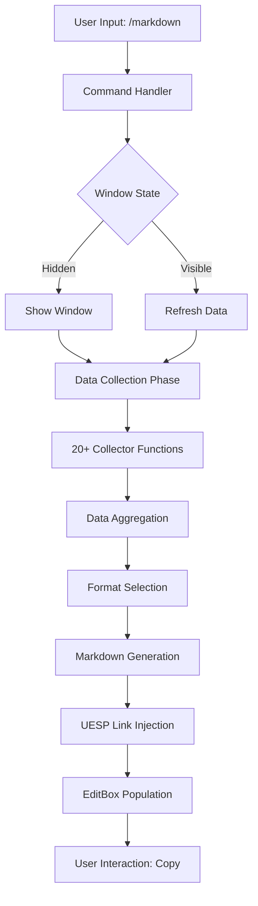
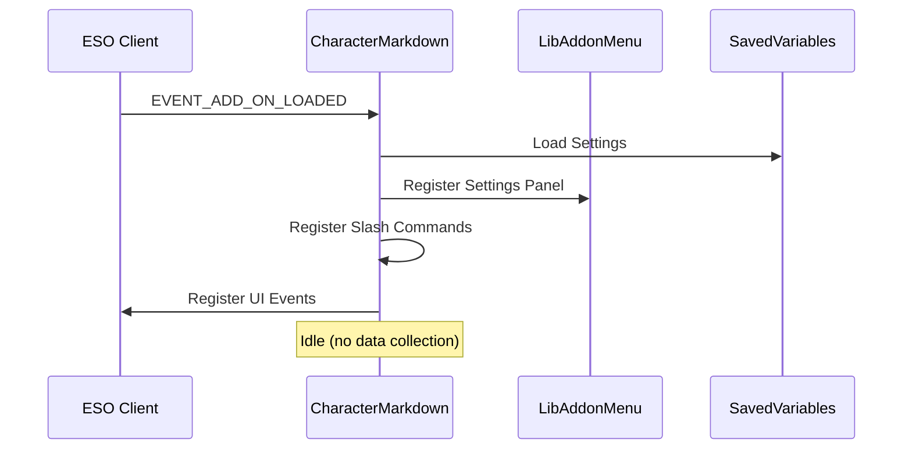
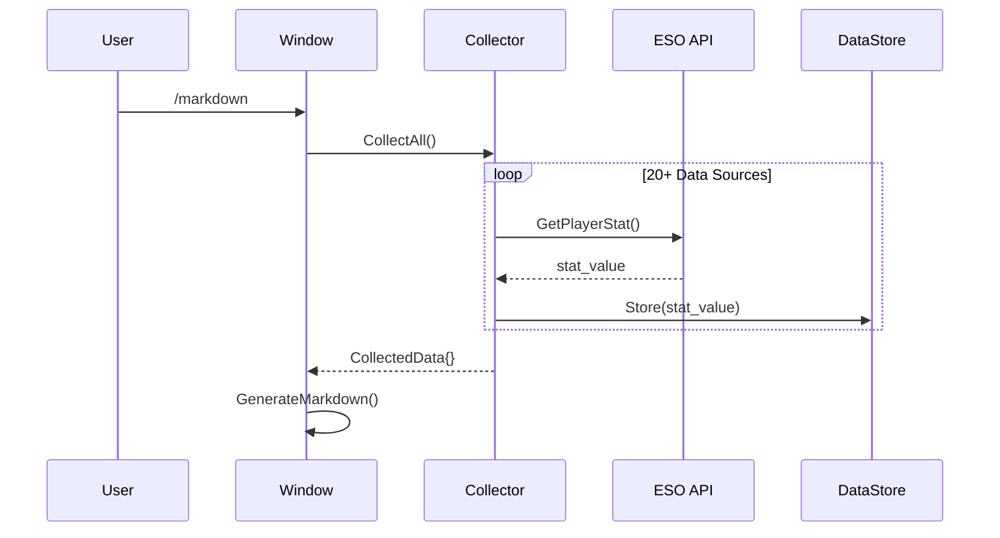
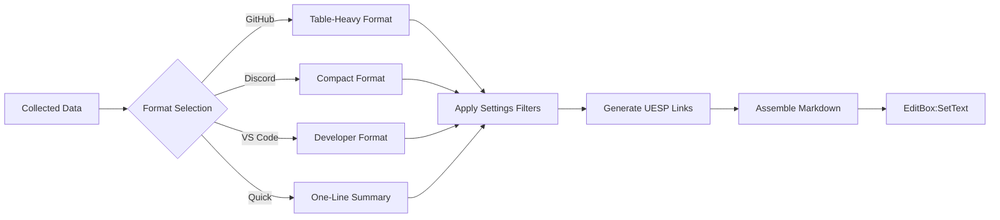
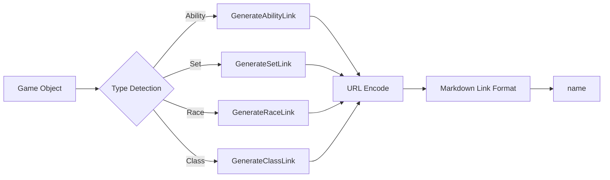

# Character Markdown - Technical Architecture

> **Production-grade technical deep-dive for AI assistants and advanced developers**

## Document Metadata

```yaml
Title: Character Markdown Technical Architecture
Version: 2.1.0
Last Updated: 2025-01-18
Target Audience: AI Assistants, Senior ESO Addon Developers
Related Files: CharacterMarkdown.lua, Window.lua, Markdown.lua
```

---

## Table of Contents

- [System Overview](#system-overview)
- [Data Flow Architecture](#data-flow-architecture)
- [Core Components](#core-components)
- [Data Collection System](#data-collection-system)
- [Markdown Generation Engine](#markdown-generation-engine)
- [UESP Link System](#uesp-link-system)
- [Settings & Persistence](#settings--persistence)
- [Performance Considerations](#performance-considerations)
- [Security Model](#security-model)
- [Extension Points](#extension-points)

---

## System Overview

### High-Level Architecture



### Technology Stack

| Layer | Technology | Purpose |
|-------|------------|---------|
| **Runtime** | Lua 5.1 (ESO Modified) | Core execution environment |
| **UI Framework** | XML + Lua | Window and control definitions |
| **Data Source** | ESO Game API | Real-time character data access |
| **Settings** | LibAddonMenu-2.0 | Configuration panel |
| **Persistence** | SavedVariables | User preferences storage |
| **Links** | UESP Wiki API | External reference generation |

### Key Design Principles

1. **Fail-Safe Data Collection**: All API calls wrapped in `pcall()` for graceful degradation
2. **Lazy Evaluation**: Data collected only when window opens (not on addon load)
3. **Format Agnostic Generation**: Single data model → multiple output formats
4. **User-Centric**: Configurable sections, filters, and link generation
5. **Performance Optimized**: String concatenation via table patterns, cached calculations

---

## Data Flow Architecture

### Phase 1: Initialization



### Phase 2: Data Collection



### Phase 3: Markdown Generation



---

## Core Components

### 1. Command Handler

**Location**: `CharacterMarkdown.lua` (lines ~3400-3500)

**Functionality**:
```lua
SLASH_COMMANDS["/markdown"] = function(args)
    local format = string.lower(args or "")
    
    if format == "settings" then
        -- Open settings panel
    elseif format == "quick" then
        GenerateAndShow("QUICK")
    elseif format == "discord" then
        GenerateAndShow("DISCORD")
    elseif format == "vscode" then
        GenerateAndShow("VSCODE")
    else
        GenerateAndShow("GITHUB")  -- Default
    end
end
```

**Key Features**:
- Case-insensitive format parsing
- Settings panel shortcut
- Default format fallback

### 2. Data Collection Orchestrator

**Pattern**: `CollectAllCharacterData()` master function

**Structure**:
```lua
function CollectAllCharacterData()
    local data = {}
    
    -- Safe collection with pcall
    local collectors = {
        CollectCharacterData,
        CollectCombatStatsData,
        CollectEquipmentData,
        CollectSkillBarData,
        CollectChampionPointData,
        CollectSkillProgressionData,
        -- ... 15 more collectors
    }
    
    for _, collector in ipairs(collectors) do
        local success, result = pcall(collector)
        if success then
            MergeData(data, result)
        else
            LogError("Collector failed: " .. tostring(result))
        end
    end
    
    return data
end
```

**Error Handling Strategy**:
- Individual collector failures don't crash entire addon
- Missing data replaced with "Unknown" or default values
- Errors logged to chat (visible to user for debugging)

### 3. Markdown Generator

**Pattern**: Format-specific generation with shared utilities

**Architecture**:
```lua
function GenerateMarkdown(data, format)
    local markdown = {}  -- Table for efficient concatenation
    
    -- Header (format-specific)
    table.insert(markdown, GenerateHeader(data, format))
    
    -- Sections (conditionally included via settings)
    if settings.includeStats then
        table.insert(markdown, GenerateStatsSection(data, format))
    end
    
    if settings.includeEquipment then
        table.insert(markdown, GenerateEquipmentSection(data, format))
    end
    
    -- ... more sections
    
    -- Footer
    table.insert(markdown, GenerateFooter(format))
    
    return table.concat(markdown, "\n")
end
```

**Format Variations**:

| Format | Characteristics | Use Case |
|--------|----------------|----------|
| **GitHub** | Tables, headers, full details | Repositories, wikis, detailed documentation |
| **Discord** | Compact, emojis, minimal tables | Chat messages, quick sharing |
| **VS Code** | Developer-friendly, metadata blocks | IDE documentation, code comments |
| **Quick** | Single line, essential info only | Guild rosters, quick references |

---

## Data Collection System

### Collection Functions Reference

| Function | Data Collected | API Calls Used |
|----------|----------------|----------------|
| `CollectCharacterData()` | Name, race, class, alliance, level, CP | `GetUnitName()`, `GetUnitRace()`, `GetUnitClass()` |
| `CollectCombatStatsData()` | Health, resources, power, crit, resistances | `GetPlayerStat()` (multiple stat types) |
| `CollectEquipmentData()` | Worn gear, sets, quality, traits, enchants | `GetItemLink()`, `GetItemLinkSetInfo()` |
| `CollectSkillBarData()` | Front/back bar abilities, ultimates | `GetSlotBoundId()`, `GetAbilityName()` |
| `CollectChampionPointData()` | CP allocation across disciplines | `GetChampionPointAttribute()`, `GetChampionSkillInfo()` |
| `CollectSkillProgressionData()` | Skill lines, ranks, XP | `GetNumSkillTypes()`, `GetSkillLineInfo()` |
| `CollectDLCAccess()` | ESO Plus, owned DLCs/Chapters | `IsESOPlusSubscriber()`, `GetCollectibleInfo()` |
| `CollectMundusData()` | Active mundus stone | `GetNumBuffs()`, buff ID matching |
| `CollectActiveBuffs()` | Food, potions, effects | `GetUnitBuffInfo()`, buff parsing |
| `CollectCompanionData()` | Active companion, stats | `GetActiveCompanionDefId()`, `GetCompanionName()` |
| `CollectCurrencyData()` | Gold, AP, Tel Var, Transmutes, Writ Vouchers | `GetCarriedCurrencyAmount()` |
| `CollectProgressionData()` | Achievements, vampire/werewolf, enlightenment | `GetNumAchievements()`, `GetChampionXP()` |
| `CollectRidingSkillsData()` | Mount speed, stamina, capacity | `GetRidingStats()` |
| `CollectInventoryData()` | Backpack/bank capacity, used slots | `GetBagSize()`, `GetNumBagUsedSlots()` |
| `CollectPvPData()` | Alliance War rank, campaign | `GetUnitAvARank()`, `GetAssignedCampaignId()` |

### Example: Equipment Collection

```lua
function CollectEquipmentData()
    local equipment = {}
    
    local equipSlots = {
        EQUIP_SLOT_HEAD,
        EQUIP_SLOT_CHEST,
        EQUIP_SLOT_SHOULDERS,
        -- ... all slots
    }
    
    for _, slotIndex in ipairs(equipSlots) do
        local itemLink = GetItemLink(BAG_WORN, slotIndex)
        
        if itemLink and itemLink ~= "" then
            local hasSet, setName, _, _, _, setId = GetItemLinkSetInfo(itemLink)
            local quality = GetItemLinkQuality(itemLink)
            local trait = GetItemLinkTraitInfo(itemLink)
            local enchant = GetItemLinkEnchantInfo(itemLink)
            local itemName = GetItemLinkName(itemLink)
            local armorType = GetItemLinkArmorType(itemLink)
            
            equipment[slotIndex] = {
                name = itemName,
                link = itemLink,
                set = hasSet and setName or nil,
                setId = hasSet and setId or nil,
                quality = quality,
                trait = trait,
                enchant = enchant,
                armorType = armorType
            }
        end
    end
    
    return equipment
end
```

### Error Handling Pattern

```lua
local function SafeGetPlayerStat(statType, defaultValue)
    local success, value = pcall(function()
        return GetPlayerStat(statType)
    end)
    
    if success and value then
        return value
    end
    
    return defaultValue or 0
end
```

**Benefits**:
- Prevents addon crashes from API changes
- Provides graceful degradation
- Maintains data integrity with defaults

---

## Markdown Generation Engine

### String Building Strategy

**Inefficient (Avoided)**:
```lua
local markdown = ""
for i = 1, 1000 do
    markdown = markdown .. "Line " .. i .. "\n"  -- 1000+ temp strings
end
```

**Efficient (Used)**:
```lua
local parts = {}
for i = 1, 1000 do
    table.insert(parts, "Line ")
    table.insert(parts, tostring(i))
    table.insert(parts, "\n")
end
local markdown = table.concat(parts)  -- Single allocation
```

### Format-Specific Generators

#### GitHub Format

```lua
function GenerateGitHubEquipment(equipment)
    local md = {}
    
    table.insert(md, "## Equipment\n")
    table.insert(md, "| Slot | Item | Set | Quality | Trait |")
    table.insert(md, "|------|------|-----|---------|-------|")
    
    for slot, item in pairs(equipment) do
        local setLink = item.set and CreateUESPSetLink(item.set) or "-"
        table.insert(md, string.format("| %s | %s | %s | %s | %s |",
            GetSlotName(slot),
            item.name,
            setLink,
            GetQualityColor(item.quality),
            item.trait or "-"
        ))
    end
    
    return table.concat(md, "\n")
end
```

#### Discord Format

```lua
function GenerateDiscordEquipment(equipment)
    local md = {}
    
    table.insert(md, "**⚔️ Equipment**")
    
    for slot, item in pairs(equipment) do
        local emoji = GetSlotEmoji(slot)
        local setInfo = item.set and string.format(" (%s)", item.set) or ""
        table.insert(md, string.format("%s %s%s",
            emoji,
            item.name,
            setInfo
        ))
    end
    
    return table.concat(md, "\n")
end
```

### Section Assembly

```lua
function GenerateMarkdown(data, format)
    local sections = {}
    
    -- Header
    table.insert(sections, GenerateHeader(data, format))
    
    -- Conditional sections (based on settings)
    local sectionGenerators = {
        {name = "stats", func = GenerateStatsSection, setting = "includeStats"},
        {name = "equipment", func = GenerateEquipmentSection, setting = "includeEquipment"},
        {name = "skills", func = GenerateSkillsSection, setting = "includeSkills"},
        {name = "cp", func = GenerateCPSection, setting = "includeChampionPoints"},
    }
    
    for _, section in ipairs(sectionGenerators) do
        if settings[section.setting] then
            local sectionContent = section.func(data, format)
            if sectionContent and sectionContent ~= "" then
                table.insert(sections, sectionContent)
            end
        end
    end
    
    -- Footer
    table.insert(sections, GenerateFooter(format))
    
    return table.concat(sections, "\n\n")
end
```

---

## UESP Link System

### URL Generation Architecture



### Link Generator Functions

#### Ability Links

```lua
function GenerateUESPAbilityLink(abilityName, abilityId)
    if not settings.enableAbilityLinks then
        return abilityName
    end
    
    -- Clean name for URL
    local urlName = string.gsub(abilityName, " ", "_")
    urlName = UrlEncode(urlName)
    
    -- Generate URL
    local url = string.format("https://en.uesp.net/wiki/Online:%s", urlName)
    
    -- Return markdown link
    return string.format("[%s](%s)", abilityName, url)
end
```

#### Set Links

```lua
function GenerateUESPSetLink(setName)
    if not settings.enableSetLinks then
        return setName
    end
    
    -- Handle possessives (e.g., "Mother's Sorrow" → "Mother's_Sorrow")
    local urlName = string.gsub(setName, "'", "%27")  -- URL encode apostrophe
    urlName = string.gsub(urlName, " ", "_")
    
    local url = string.format("https://en.uesp.net/wiki/Online:%s", urlName)
    
    return string.format("[%s](%s)", setName, url)
end
```

#### Race/Class/Alliance Links

```lua
function GenerateUESPRaceLink(raceName)
    local raceUrls = {
        ["Breton"] = "Online:Breton",
        ["Redguard"] = "Online:Redguard",
        ["Orc"] = "Online:Orc",
        ["Nord"] = "Online:Nord",
        ["Dark Elf"] = "Online:Dark_Elf",
        ["Argonian"] = "Online:Argonian",
        ["High Elf"] = "Online:High_Elf",
        ["Wood Elf"] = "Online:Wood_Elf",
        ["Khajiit"] = "Online:Khajiit",
        ["Imperial"] = "Online:Imperial",
    }
    
    local urlPath = raceUrls[raceName] or ("Online:" .. string.gsub(raceName, " ", "_"))
    local url = "https://en.uesp.net/wiki/" .. urlPath
    
    return string.format("[%s](%s)", raceName, url)
end
```

### URL Encoding

```lua
function UrlEncode(str)
    if not str then return "" end
    
    str = string.gsub(str, "\n", "\r\n")
    str = string.gsub(str, "([^%w _%%%-%.~])",
        function(c)
            return string.format("%%%02X", string.byte(c))
        end)
    str = string.gsub(str, " ", "_")  -- UESP uses underscores for spaces
    
    return str
end
```

### Link Toggle Behavior

```lua
-- In settings:
settings.enableAbilityLinks = true   -- Default: enabled
settings.enableSetLinks = true
settings.enableRaceClassLinks = true

-- In generation:
if settings.enableAbilityLinks then
    ability = GenerateUESPAbilityLink(ability.name)
else
    ability = ability.name  -- Plain text
end
```

---

## Settings & Persistence

### SavedVariables Structure

```lua
-- CharacterMarkdownSettings (account-wide)
CharacterMarkdownSettings = {
    ["Default"] = {
        ["@AccountName"] = {
            ["$AccountWide"] = {
                version = 1,
                defaultFormat = "GITHUB",
                
                -- Section toggles
                includeStats = true,
                includeEquipment = true,
                includeSkills = true,
                includeChampionPoints = true,
                includeCurrencies = true,
                includeCompanion = true,
                
                -- Link toggles
                enableAbilityLinks = true,
                enableSetLinks = true,
                enableRaceClassLinks = true,
                
                -- Skill filtering
                hideMaxedSkills = false,
                minSkillRank = 1,
                
                -- Format options
                useEmojis = true,  -- Discord format
                includeTOC = false,  -- GitHub format
            }
        }
    }
}

-- CharacterMarkdownData (per-character)
CharacterMarkdownData = {
    ["Default"] = {
        ["@AccountName"] = {
            ["CharacterName"] = {
                customNotes = "Main DPS for trials",
                lastUpdated = 1705612800,  -- Unix timestamp
            }
        }
    }
}
```

### Settings Panel Integration (LibAddonMenu)

```lua
function RegisterSettingsPanel()
    local panelData = {
        type = "panel",
        name = "Character Markdown",
        displayName = "Character Markdown",
        author = "Your Name",
        version = "2.1.0",
    }
    
    local optionsData = {
        {
            type = "dropdown",
            name = "Default Format",
            choices = {"GitHub", "Discord", "VS Code", "Quick"},
            getFunc = function() return settings.defaultFormat end,
            setFunc = function(value) settings.defaultFormat = value end,
        },
        {
            type = "checkbox",
            name = "Include Champion Points",
            getFunc = function() return settings.includeChampionPoints end,
            setFunc = function(value) settings.includeChampionPoints = value end,
        },
        -- ... more options
    }
    
    LAM:RegisterAddonPanel("CharacterMarkdownPanel", panelData)
    LAM:RegisterOptionControls("CharacterMarkdownPanel", optionsData)
end
```

### Default Settings Initialization

```lua
function InitializeSettings()
    -- Set defaults if settings don't exist
    if not CharacterMarkdownSettings then
        CharacterMarkdownSettings = {}
    end
    
    local defaults = {
        version = 1,
        defaultFormat = "GITHUB",
        includeStats = true,
        includeEquipment = true,
        includeSkills = true,
        includeChampionPoints = true,
        enableAbilityLinks = true,
        enableSetLinks = true,
        hideMaxedSkills = false,
        minSkillRank = 1,
    }
    
    -- Merge defaults with saved settings
    for key, value in pairs(defaults) do
        if settings[key] == nil then
            settings[key] = value
        end
    end
end
```

---

## Performance Considerations

### Lazy Data Collection

**Problem**: Collecting all data on addon load would cause login delays.

**Solution**: Collect only when window opens.

```lua
-- On addon load (fast)
function OnAddonLoaded()
    RegisterCommands()
    RegisterSettings()
    -- No data collection here
end

-- When window opens (user-initiated)
function ShowWindow()
    local data = CollectAllCharacterData()  -- Now collect
    local markdown = GenerateMarkdown(data)
    EditBox:SetText(markdown)
end
```

### String Concatenation Optimization

**Measurements** (approximate, ESO environment):
- String concatenation (1000 iterations): ~150ms
- Table concatenation (1000 iterations): ~15ms
- **10x performance improvement**

### Cached Calculations

```lua
-- Cache expensive lookups
local skillLineCache = {}

function GetSkillLineInfo(skillType, skillIndex)
    local cacheKey = skillType .. "_" .. skillIndex
    
    if not skillLineCache[cacheKey] then
        -- Expensive API call
        local name, rank, discovered, lineRank = GetSkillLineInfo(skillType, skillIndex)
        skillLineCache[cacheKey] = {name, rank, discovered, lineRank}
    end
    
    return unpack(skillLineCache[cacheKey])
end

-- Clear cache when relevant
function OnCharacterDataChanged()
    skillLineCache = {}
end
```

### Memory Management

```lua
-- Clear large strings after use
function ShowWindow()
    local markdown = GenerateMarkdown(data)
    EditBox:SetText(markdown)
    
    -- Let GC reclaim markdown string
    markdown = nil
    collectgarbage("step")  -- Hint to GC (optional)
end
```

---

## Security Model

### ESO Lua Restrictions

**Disabled Features** (enforced by game client):

```lua
-- File I/O: ALL DISABLED
io.open()      -- Returns nil
io.read()      -- Returns nil
io.write()     -- Returns nil

-- System Commands: ALL DISABLED
os.execute()   -- Returns nil
os.remove()    -- Returns nil
os.rename()    -- Returns nil

-- Network: NO SOCKET LIBRARY
-- Cannot make HTTP requests
-- Cannot connect to external servers
```

**Available Features**:

```lua
-- Time functions
os.date()      -- Read-only system time
os.time()      -- Available
os.clock()     -- Performance timing

-- String/Table/Math
string.*       -- Standard Lua 5.1 library
table.*        -- Standard Lua 5.1 library
math.*         -- Standard Lua 5.1 library
```

### Data Access Boundaries

**What Addons CAN Access**:
- Current character data (GetUnit*, GetPlayer*)
- Inventory, skills, achievements
- UI state, combat status
- SavedVariables (addon's own data)

**What Addons CANNOT Access**:
- Other characters' data (unless explicitly shared via SavedVariables)
- Server-side data (drop rates, spawn timers, etc.)
- Other addons' SavedVariables (without library interface)
- User's file system
- Network access

### Protected Functions

**Combat Restrictions**:

```lua
-- Some API functions disabled during combat
if IsUnitInCombat("player") then
    -- Cannot change action bars
    -- Cannot modify certain UI elements
    -- Addon data collection still works
end

-- Check before restricted operations
function PerformRestrictedAction()
    if IsUnitInCombat("player") then
        d("Cannot perform this action during combat")
        return false
    end
    
    -- Safe to proceed
    return true
end
```

**Character Markdown Impact**:
- ✅ Data collection: Always works (read-only)
- ✅ Window display: Works in combat
- ✅ Text copy: Works in combat
- ❌ Settings changes: May be restricted in combat (LAM handles this)

---

## Extension Points

### Adding New Data Collectors

```lua
-- 1. Create collector function
function CollectCustomData()
    local data = {}
    
    -- Your custom API calls
    data.customField = GetCustomInfo()
    
    return data
end

-- 2. Register in master collector
function CollectAllCharacterData()
    local data = {}
    
    -- ... existing collectors
    
    local success, customData = pcall(CollectCustomData)
    if success then
        data.custom = customData
    end
    
    return data
end

-- 3. Add to markdown generator
function GenerateCustomSection(data, format)
    if not data.custom then return "" end
    
    return string.format("## Custom Data\n\n%s\n", data.custom.customField)
end

-- 4. Add setting toggle
settings.includeCustomData = true

-- 5. Integrate into generation
if settings.includeCustomData then
    table.insert(sections, GenerateCustomSection(data, format))
end
```

### Adding New Export Formats

```lua
-- 1. Create format constant
CM.FORMAT_HTML = "HTML"

-- 2. Create format-specific generator
function GenerateHTMLMarkdown(data)
    local html = {}
    
    table.insert(html, "<html><head><title>" .. data.character.name .. "</title></head>")
    table.insert(html, "<body>")
    table.insert(html, "<h1>" .. data.character.name .. "</h1>")
    -- ... more HTML
    table.insert(html, "</body></html>")
    
    return table.concat(html, "\n")
end

-- 3. Add to command handler
SLASH_COMMANDS["/markdown"] = function(args)
    if args == "html" then
        GenerateAndShow("HTML")
    end
    -- ... existing handlers
end

-- 4. Add to format selector
function GenerateMarkdown(data, format)
    if format == CM.FORMAT_HTML then
        return GenerateHTMLMarkdown(data)
    end
    -- ... existing formats
end
```

### Custom Link Generators

```lua
-- 1. Create custom link function
function GenerateCustomWikiLink(itemName)
    local url = string.format("https://custom-wiki.com/items/%s", 
        UrlEncode(itemName))
    
    return string.format("[%s](%s)", itemName, url)
end

-- 2. Add setting toggle
settings.useCustomWikiLinks = false

-- 3. Integrate into generation
function GenerateItemLink(itemName)
    if settings.useCustomWikiLinks then
        return GenerateCustomWikiLink(itemName)
    else
        return GenerateUESPItemLink(itemName)  -- Default
    end
end
```

---

## Debugging & Diagnostics

### Debug Logging System

```lua
-- Debug mode toggle
CM.DEBUG_MODE = false

-- Debug logger
function CM.Debug(message, category)
    if not CM.DEBUG_MODE then return end
    
    category = category or "General"
    d(string.format("[CM][%s] %s", category, message))
end

-- Usage in collectors
function CollectEquipmentData()
    CM.Debug("Starting equipment collection", "Collectors")
    
    local equipment = {}
    -- ... collection logic
    
    CM.Debug(string.format("Collected %d equipment items", 
        #equipment), "Collectors")
    
    return equipment
end
```

### Performance Profiling

```lua
function ProfileFunction(name, func)
    local startTime = GetGameTimeMilliseconds()
    
    local success, result = pcall(func)
    
    local endTime = GetGameTimeMilliseconds()
    local duration = endTime - startTime
    
    CM.Debug(string.format("%s took %dms", name, duration), "Performance")
    
    return success, result
end

-- Usage
ProfileFunction("CollectAllData", CollectAllCharacterData)
```

### Data Validation

```lua
function ValidateCollectedData(data)
    local errors = {}
    
    -- Check required fields
    if not data.character or not data.character.name then
        table.insert(errors, "Missing character name")
    end
    
    if not data.stats or not data.stats.health then
        table.insert(errors, "Missing health stat")
    end
    
    -- Validate ranges
    if data.character.level and data.character.level > 50 then
        table.insert(errors, "Invalid level: " .. data.character.level)
    end
    
    if #errors > 0 then
        CM.Debug("Data validation failed:", "Validation")
        for _, error in ipairs(errors) do
            CM.Debug("  - " .. error, "Validation")
        end
        return false
    end
    
    return true
end
```

---

## Future Enhancements

### Planned Features

1. **Export Templates**: User-defined markdown templates
2. **Build Comparison**: Compare two character builds side-by-side
3. **Historical Tracking**: Save snapshots and track progression
4. **Guild Integration**: Share builds directly to guild roster
5. **Build Import**: Parse markdown back to settings

### API Evolution

**Monitoring for API Changes**:
```lua
-- Version detection
function CheckAPIVersion()
    local currentAPI = GetAPIVersion()
    local supportedAPIs = {101045, 101046}  -- Update with each release
    
    local isSupported = false
    for _, api in ipairs(supportedAPIs) do
        if currentAPI == api then
            isSupported = true
            break
        end
    end
    
    if not isSupported then
        d("[Character Markdown] Warning: API version " .. currentAPI .. 
          " is not explicitly supported. Some features may not work correctly.")
    end
end
```

---

## Summary

Character Markdown follows a **modular, fail-safe architecture** optimized for:

- **Reliability**: `pcall()` wrappers on all ESO API calls
- **Performance**: Lazy evaluation, table concatenation, caching
- **Extensibility**: Clear extension points for collectors, formats, links
- **User Control**: Comprehensive settings via LibAddonMenu
- **Maintainability**: Separation of concerns, clear data flow

**Key Architectural Decisions**:

1. ✅ Lazy data collection (performance)
2. ✅ Table-based string building (10x faster)
3. ✅ Format-agnostic data model (extensibility)
4. ✅ UESP link injection post-generation (modularity)
5. ✅ Settings-driven section inclusion (user control)

---

**Next**: [API Reference](API_REFERENCE.md) • [Development Guide](DEVELOPMENT.md) • [Back to README](../README.md)
