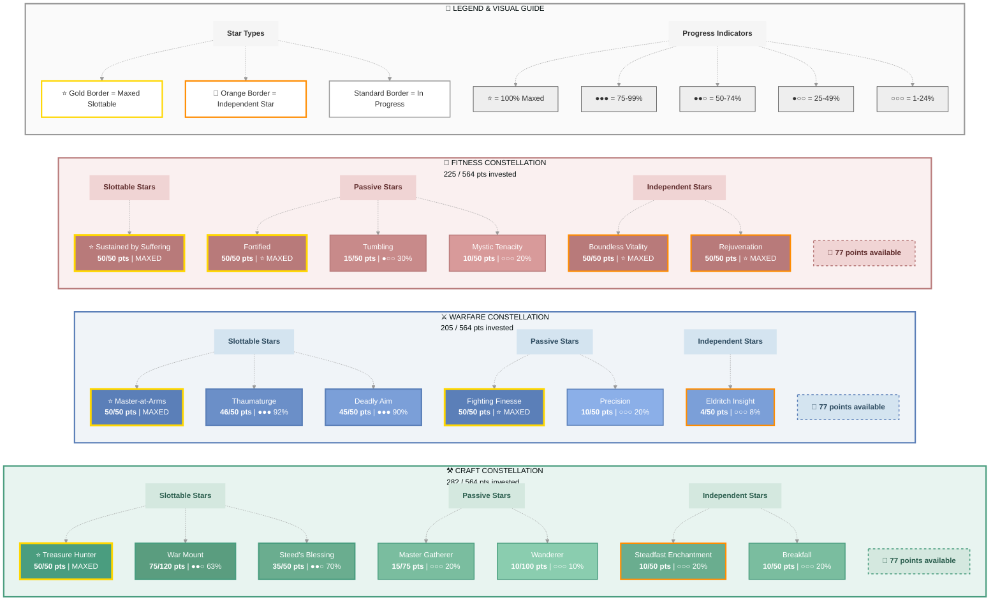

```mermaid
%%{init: {'theme':'base', 'themeVariables': { 'primaryColor':'#e8f4f0','primaryTextColor':'#000','primaryBorderColor':'#4a9d7f','lineColor':'#999','secondaryColor':'#f0f4f8','tertiaryColor':'#faf0f0'}}}%%

graph LR
  %% Champion Point Investment Visualization
  %% Enhanced readability with clear visual hierarchy

  %% ========================================
  %% ⚒️ CRAFT CONSTELLATION (282/564 pts)
  %% ========================================

  subgraph CRAFT ["⚒️ CRAFT CONSTELLATION<br/>282 / 564 pts invested"]
    direction TB
    
    CRAFT_TITLE["<b>Slottable Stars</b>"]
    C_C5["⭐ Treasure Hunter<br/><b>50/50 pts</b> | MAXED"]
    C_R7["War Mount<br/><b>75/120 pts</b> | ●●○ 63%"]
    C_IND1["Steed's Blessing<br/><b>35/50 pts</b> | ●●○ 70%"]
    
    CRAFT_PASS["<b>Passive Stars</b>"]
    C_C3["Master Gatherer<br/><b>15/75 pts</b> | ○○○ 20%"]
    C_R6["Wanderer<br/><b>10/100 pts</b> | ○○○ 10%"]
    
    CRAFT_BASE["<b>Independent Stars</b>"]
    C_BASE2["Steadfast Enchantment<br/><b>10/50 pts</b> | ○○○ 20%"]
    C_IND2["Breakfall<br/><b>10/50 pts</b> | ○○○ 20%"]
    
    CRAFT_AVAIL["💎 <b>77 points available</b>"]
    
    CRAFT_TITLE -.-> C_C5 & C_R7 & C_IND1
    CRAFT_PASS -.-> C_C3 & C_R6
    CRAFT_BASE -.-> C_BASE2 & C_IND2

    style CRAFT_TITLE fill:#d4e8df,stroke:none,color:#2c5f4f
    style CRAFT_PASS fill:#d4e8df,stroke:none,color:#2c5f4f
    style CRAFT_BASE fill:#d4e8df,stroke:none,color:#2c5f4f
    style C_C5 fill:#4a9d7f,stroke:#ffd700,stroke-width:4px,color:#fff
    style C_R7 fill:#5a9d7f,stroke:#4a9d7f,stroke-width:3px,color:#fff
    style C_IND1 fill:#6aad8f,stroke:#4a9d7f,stroke-width:3px,color:#fff
    style C_C3 fill:#7abd9f,stroke:#4a9d7f,stroke-width:2px,color:#fff
    style C_R6 fill:#8acdaf,stroke:#4a9d7f,stroke-width:2px,color:#fff
    style C_BASE2 fill:#6aad8f,stroke:#ff8c00,stroke-width:3px,color:#fff
    style C_IND2 fill:#7abd9f,stroke:#4a9d7f,stroke-width:2px,color:#fff
    style CRAFT_AVAIL fill:#d4e8df,stroke:#4a9d7f,stroke-width:2px,stroke-dasharray:5 5,color:#2c5f4f
  end
  style CRAFT fill:#e8f4f0,stroke:#4a9d7f,stroke-width:3px

  %% ========================================
  %% ⚔️ WARFARE CONSTELLATION (205/564 pts)
  %% ========================================

  subgraph WARFARE ["⚔️ WARFARE CONSTELLATION<br/>205 / 564 pts invested"]
    direction TB
    
    WAR_TITLE["<b>Slottable Stars</b>"]
    W_IND2["⭐ Master-at-Arms<br/><b>50/50 pts</b> | MAXED"]
    W_IND3["Thaumaturge<br/><b>46/50 pts</b> | ●●● 92%"]
    W_IND1["Deadly Aim<br/><b>45/50 pts</b> | ●●● 90%"]
    
    WAR_PASS["<b>Passive Stars</b>"]
    W_C1["Fighting Finesse<br/><b>50/50 pts</b> | ⭐ MAXED"]
    W_R1["Precision<br/><b>10/50 pts</b> | ○○○ 20%"]
    
    WAR_BASE["<b>Independent Stars</b>"]
    W_BASE1["Eldritch Insight<br/><b>4/50 pts</b> | ○○○ 8%"]
    
    WAR_AVAIL["💎 <b>77 points available</b>"]
    
    WAR_TITLE -.-> W_IND2 & W_IND3 & W_IND1
    WAR_PASS -.-> W_C1 & W_R1
    WAR_BASE -.-> W_BASE1

    style WAR_TITLE fill:#d4e4f0,stroke:none,color:#2c4a5f
    style WAR_PASS fill:#d4e4f0,stroke:none,color:#2c4a5f
    style WAR_BASE fill:#d4e4f0,stroke:none,color:#2c4a5f
    style W_IND2 fill:#5b7fb8,stroke:#ffd700,stroke-width:4px,color:#fff
    style W_IND3 fill:#6b8fc8,stroke:#5b7fb8,stroke-width:3px,color:#fff
    style W_IND1 fill:#7b9fd8,stroke:#5b7fb8,stroke-width:3px,color:#fff
    style W_C1 fill:#5b7fb8,stroke:#ffd700,stroke-width:4px,color:#fff
    style W_R1 fill:#8bafe8,stroke:#5b7fb8,stroke-width:2px,color:#fff
    style W_BASE1 fill:#7b9fd8,stroke:#ff8c00,stroke-width:3px,color:#fff
    style WAR_AVAIL fill:#d4e4f0,stroke:#5b7fb8,stroke-width:2px,stroke-dasharray:5 5,color:#2c4a5f

  end
  style WARFARE fill:#f0f4f8,stroke:#5b7fb8,stroke-width:3px

  %% ========================================
  %% 💪 FITNESS CONSTELLATION (225/564 pts)
  %% ========================================

  subgraph FITNESS ["💪 FITNESS CONSTELLATION<br/>225 / 564 pts invested"]
    direction TB
    
    FIT_TITLE["<b>Slottable Stars</b>"]
    F_IND3["⭐ Sustained by Suffering<br/><b>50/50 pts</b> | MAXED"]
    
    FIT_PASS["<b>Passive Stars</b>"]
    SD4["Fortified<br/><b>50/50 pts</b> | ⭐ MAXED"]
    F_L1["Tumbling<br/><b>15/50 pts</b> | ●○○ 30%"]
    F_C1["Mystic Tenacity<br/><b>10/50 pts</b> | ○○○ 20%"]
    
    FIT_BASE["<b>Independent Stars</b>"]
    F_BASE1["Boundless Vitality<br/><b>50/50 pts</b> | ⭐ MAXED"]
    F_BASE3["Rejuvenation<br/><b>50/50 pts</b> | ⭐ MAXED"]
    
    FIT_AVAIL["💎 <b>77 points available</b>"]
    
    FIT_TITLE -.-> F_IND3
    FIT_PASS -.-> SD4 & F_L1 & F_C1
    FIT_BASE -.-> F_BASE1 & F_BASE3

    style FIT_TITLE fill:#f0d4d4,stroke:none,color:#5f2c2c
    style FIT_PASS fill:#f0d4d4,stroke:none,color:#5f2c2c
    style FIT_BASE fill:#f0d4d4,stroke:none,color:#5f2c2c
    style F_IND3 fill:#b87a7a,stroke:#ffd700,stroke-width:4px,color:#fff
    style SD4 fill:#b87a7a,stroke:#ffd700,stroke-width:4px,color:#fff
    style F_L1 fill:#c88a8a,stroke:#b87a7a,stroke-width:2px,color:#fff
    style F_C1 fill:#d89a9a,stroke:#b87a7a,stroke-width:2px,color:#fff
    style F_BASE1 fill:#b87a7a,stroke:#ff8c00,stroke-width:3px,color:#fff
    style F_BASE3 fill:#b87a7a,stroke:#ff8c00,stroke-width:3px,color:#fff
    style FIT_AVAIL fill:#f0d4d4,stroke:#b87a7a,stroke-width:2px,stroke-dasharray:5 5,color:#5f2c2c

  end
  style FITNESS fill:#faf0f0,stroke:#b87a7a,stroke-width:3px

  %% ========================================
  %% LEGEND
  %% ========================================

  subgraph LEGEND ["📖 LEGEND & VISUAL GUIDE"]
    direction TB
    
    LEG_STARS["<b>Star Types</b>"]
    LEG_S1["⭐ Gold Border = Maxed Slottable"]
    LEG_S2["🔶 Orange Border = Independent Star"]
    LEG_S3["Standard Border = In Progress"]
    
    LEG_FILL["<b>Progress Indicators</b>"]
    LEG_F1["⭐ = 100% Maxed"]
    LEG_F2["●●● = 75-99%"]
    LEG_F3["●●○ = 50-74%"]
    LEG_F4["●○○ = 25-49%"]
    LEG_F5["○○○ = 1-24%"]
    
    LEG_STARS -.-> LEG_S1 & LEG_S2 & LEG_S3
    LEG_FILL -.-> LEG_F1 & LEG_F2 & LEG_F3 & LEG_F4 & LEG_F5

    style LEG_STARS fill:#f5f5f5,stroke:none,color:#333
    style LEG_FILL fill:#f5f5f5,stroke:none,color:#333
    style LEG_S1 fill:#fff,stroke:#ffd700,stroke-width:3px,color:#333
    style LEG_S2 fill:#fff,stroke:#ff8c00,stroke-width:3px,color:#333
    style LEG_S3 fill:#fff,stroke:#999,stroke-width:2px,color:#333
    style LEG_F1 fill:#eee,stroke:#333,stroke-width:1px,color:#333
    style LEG_F2 fill:#eee,stroke:#333,stroke-width:1px,color:#333
    style LEG_F3 fill:#eee,stroke:#333,stroke-width:1px,color:#333
    style LEG_F4 fill:#eee,stroke:#333,stroke-width:1px,color:#333
    style LEG_F5 fill:#eee,stroke:#333,stroke-width:1px,color:#333
  end
  style LEGEND fill:#fafafa,stroke:#999,stroke-width:3px
```