# Heka-Ankh (Dark Executioner)

   

**Redguard Necromancer • Ebonheart Pact Alliance**

---

## 📑 Table of Contents

- [📋 Overview](#overview)
  - [General](#general)
  - [Currency](#currency)
- [⚔️ Combat Arsenal](#combat-arsenal)
  - [Character Stats](#character-stats)
  - [Advanced Stats](#advanced-stats)
- [⚔️ PvP](#pvp)
  - [Alliance War Skills](#alliance-war-skills)
- [👥 Companions](#companions)
- [🎨 Collectibles](#collectibles)
- [🎒 Inventory](#inventory)
- [🏆 Achievements](#achievements)
- [🏺 Antiquities](#antiquities)
- [🏰 Guild Membership](#guild-membership)

---

## 📋 Overview

### General

| **Attribute** | **Value** |
| --- | --- |
| **Level** | 50 |
| **Champion Points** | 785 |
| **Gender** | Female |
| **Race** | Redguard |
| **Account** | @SOLAEGIS |
| **Age** | 5d 22h 17m |

| **Attribute** | **Value** |
| --- | --- |
| **🪨 Mundus Stone** | The Shadow |
| **ESO Plus** | ✅ Active |
| **Class** | Necromancer |
| **Server** | NA Megaserver |
| **Alliance** | Ebonheart Pact |
| **Title** | Dark Executioner |

| **Attribute** | **Value** |
| --- | --- |
| **Attributes** | 🔵 0 / ❤️ 0 / ⚡ 64 |
| **🐴 Riding Skills** | 🐴 60 / 💪 60 / 🎒 60 ✅ |
| **Available Champion Points** | ⚒️ 111 - ⚔️ 45 - 💪 106 |
| **Skill Points** | 🎯 47 available - Ready to spend |
| **Location** | Coldharbour (The Orchard Wayshrine) |

### Currency

| **Attribute** | **Value** |
| --- | --- |
| 💰 **Gold** | 51,330 |
| ⚔️ **Alliance Points** | 2,000 |
| 🔮 **Tel Var** | 6,000 |
| 💎 **Transmute Crystals** | 95 |
| 📜 **Writs** | 0 |
| 🎫 **Event Tickets** | 2 |
| 👑 **Crowns** | 700 |
| 💠 **Gems** | 140 |
| 🏅 **Seals** | 12,815 |
| 🗝️ **Keys** | 9 |
| 👕 **Tokens** | 3 |
| 📚 **Fortunes** | 0 |
| 🔹 **Fragments** | 148 |

---

## ⚔️ Combat Arsenal

### Character Stats

| **Category** | **Stat** | **Value** |
| --- | --- | ---: |
| 💚 **Resources** | Health | 18,892 |
|  | Magicka | 13,850 |
|  | Stamina | 26,811 |
| ⚔️ **Offensive** | Weapon Power | 2,873 |
|  | Spell Power | 2,873 |

| **Category** | **Stat** | **Value** |
| --- | --- | ---: |
| 🎯 **Critical** | Weapon Crit | 2,975 (13.5%) |
|  | Spell Crit | 2,975 (13.5%) |
| ⚔️ **Penetration** | Physical | 350 |
|  | Spell | 350 |

| **Category** | **Stat** | **Value** |
| --- | --- | ---: |
| 🛡️ **Defensive** | Physical Resist | 10,764 (81.1%) |
|  | Spell Resist | 10,764 (81.1%) |
| ♻️ **Recovery** | Health | 556 |
|  | Magicka | 604 |
|  | Stamina | 773 |

### Advanced Stats

| **Ability** | **Cost/Value** |
|:---|---:|
| ⚔️ **Light Attack** | 3,945 dmg |
| ⚔️ **Heavy Attack** | 7,890 dmg |
| ⚔️ **Bash** | 704 cost, 5,728 dmg |
| 🛡️ **Block** | 1,117 cost, 50% mit, 40% spd |
| 🔓 **Break Free** | 5,400 cost |
| 🏃 **Dodge Roll** | 2,524 cost |
| 🐾 **Sneak** | 43 cost, 0% spd |
| 🏃‍♂️ **Sprint** | 387 cost, 0% spd |

| **Resistance** | **Value** |
|:---|---:|
| 🔥 **Flame** | 16.3% |
| ⚡ **Shock** | 16.3% |
| ❄️ **Frost** | 16.3% |
| 🔮 **Magic** | 16.3% |
| 🦠 **Disease** | 16.3% |
| ☠️ **Poison** | 16.3% |
| 🩸 **Bleed** | 16.3% |

| **Damage Type** | **Bonus** |
|:---|---:|
| 💥 **Critical Damage** | 75% |
| ⚔️ **Physical** | 6% |
| 🔥 **Flame** | 6% |
| ⚡ **Shock** | 6% |
| ❄️ **Frost** | 0 |
| 🔮 **Magic** | 6% |
| 🦠 **Disease** | 6% |
| ☠️ **Poison** | 6% |
| 🩸 **Bleed** | 6% |
| 🌌 **Oblivion** | 6% |

| **Healing** | **Value** |
|:---|---:|
| 💚 **Healing Done** | 0 |
| 💖 **Healing Taken** | 0 |
| ✨ **Critical Healing** | 75% |

## ⚔️ Combat Arsenal

### ⚔️ ⚔️ ⚔️ Front Bar (Main Hand)

| **1** | **2** | **3** | **4** | **5** | **6** |
| :---: | :---: | :---: | :---: | :---: | :---: |
| Dizzying Swing | Blighted Blastbones | Rally | Executioner | Resolving Vigor | Frozen Colossus |

### 🔮 🔮 🔮 Back Bar (Backup)

| **1** | **2** | **3** | **4** | **5** | **6** |
| :---: | :---: | :---: | :---: | :---: | :---: |
| Endless Hail | Avid Boneyard | Skeletal Archer | Time Stop | Resolving Vigor | Frozen Colossus |

---

## ⚔️ Equipment & Active Sets

| **Set** | **Progress** |
| --- | --- |
| ⚪ **Armor of the Trainee** | `1/5` ██░░░░░░░░ 20% |
| 🟠 **Hawk's Eye** | `3/5` ██████░░░░ 60% |
| ⚪ **Endurance** | `1/5` ██░░░░░░░░ 20% |
| ⚪ **Agility** | `1/5` ██░░░░░░░░ 20% |
| 🔴 **Briarheart** | `2/5` ████░░░░░░ 40% |
| ⚪ **Night Mother's Gaze** | `1/5` ██░░░░░░░░ 20% |

### 📋 Equipment Details

| **Slot** | **Item** | **Set** | **Quality** | **Trait** | **Type** | **Enchantment** |
| --- | --- | --- | --- | --- | --- | --- |
| ⛑️ **Head** | Helmet of the Hawk's Eye | Hawk's Eye | ⭐ Epic | Infused | Medium | Maximum Stamina Enchantment |
| 💎 **Neck** | platinum necklace of Reduce Feat Cost | - | 🔮 Superior | Arcane | None | Reduce Stamina Cost Enchantment |
| 🛡️ **Chest** | rubedo leather jack of Magicka | - | 🔮 Superior | Well-fitted | Medium | Maximum Magicka Enchantment |
| 👑 **Shoulders** | Arm Cops of the Night Mother | Night Mother's Gaze | ⭐ Epic | Divines | Medium • ⚒️ Crafted | - |
| ⚔️ **Main Hand** | rubedite greatsword of Frost | - | ⚡ Fine | None | None | Frozen Weapon Enchantment |
| ⚡ **Waist** | Briarheart Belt | Briarheart | ⭐ Epic | Impenetrable | Medium | Maximum Stamina Enchantment |
| 👖 **Legs** | Briarheart Guards | Briarheart | ⭐ Epic | Training | Medium | Maximum Stamina Enchantment |
| 👟 **Feet** | Boots of the Hawk's Eye | Hawk's Eye | ⭐ Epic | Well-fitted | Medium | Maximum Stamina Enchantment |
| 💍 **Ring 1** | Ring of Agility | Agility | ⭐ Epic | Robust | None | Flame Resistance Enchantment |
| 💍 **Ring 2** | Ring of Endurance | Endurance | ⭐ Epic | Healthy | None | Health Recovery Enchantment |
| ✋ **Hands** | Bracers of the Hawk's Eye | Hawk's Eye | ⭐ Epic | Well-fitted | Medium | Maximum Stamina Enchantment |
| 🔮 **Backup Main Hand** | Bow of the Trainee | Armor of the Trainee | 🔮 Superior | Training | None | Absorb Magicka Enchantment |

---

## ⭐ Champion Points

| **Total** | **Spent** | **Available** |
| :---: | :---: | :---: |
| 785 | 523 | 262 |

| **⚒️ Craft** | **Assigned Points** |
| --- | ---: |
| ██████░░░░░░ 57% | 151/262 points |
| **Fortune's Favor** | 50 points |
| **Gilded Fingers** | 50 points |
| **Breakfall** | 1 point |
| **Steed's Blessing** | 50 points |

| **⚔️ Warfare** | **Assigned Points** |
| --- | ---: |
| █████████░░░ 82% | 217/262 points |
| **Precision** | 10 points |
| **Piercing** | 10 points |
| **Master-at-Arms** | 50 points |
| **Deadly Aim** | 50 points |
| **Backstabber** | 50 points |
| **Quick Recovery** | 10 points |
| **Preparation** | 20 points |
| **Eldritch Insight** | 17 points |

| **💪 Fitness** | **Assigned Points** |
| --- | ---: |
| ███████░░░░░ 59% | 155/261 points |
| **Sprinter** | 10 points |
| **Hasty** | 8 points |
| **Hero's Vigor** | 20 points |
| **Siphoning Spells** | 17 points |
| **Rejuvenation** | 50 points |
| **Boundless Vitality** | 50 points |

---

## 🎯 Champion Points Visual

```mermaid
%%{initialize: {"theme":"base", "themeVariables": { "background":"transparent","fontSize":"14px","primaryColor":"#e8f4f0","primaryTextColor":"#000","primaryBorderColor":"#4a9d7f","lineColor":"#999","secondaryColor":"#f0f4f8","tertiaryColor":"#faf0f0"}}}%%

graph LR
  %% Champion Point Investment Visualization
  %% Enhanced readability with clear visual hierarchy

  %% ========================================
  %% ⚒️ CRAFT CONSTELLATION (151/564 pts)
  %% ========================================

  subgraph CRAFT ["⚒️ CRAFT CONSTELLATION"]
    direction TB

    CRAFT_TITLE["<b>Slottable Stars</b>"]
    C_R1["⭐ Gilded Fingers<br/><b>50/50 pts</b> | MAXED"]
    C_IND1["⭐ Steed's Blessing<br/><b>50/50 pts</b> | MAXED"]
    C_IND2["Breakfall<br/><b>1/50 pts</b> | ○○○ 2%"]

    CRAFT_PASS["<b>Passive Stars</b>"]
    C_Fortune_s_Favor["⭐ Fortune's Favor<br/><b>50/50 pts</b> | MAXED"]

    CRAFT_AVAIL["💎 <b>111 points available</b>"]

    CRAFT_TITLE --> C_R1 & C_IND1 & C_IND2
    CRAFT_PASS --> C_Fortune_s_Favor

    style CRAFT_TITLE fill:transparent,stroke:none,color:#4a9d7f
    style CRAFT_PASS fill:transparent,stroke:none,color:#4a9d7f
    style C_R1 fill:#4a9d7f,stroke:#ffd700,stroke-width:4px,color:#fff
    style C_IND1 fill:#4a9d7f,stroke:#ffd700,stroke-width:4px,color:#fff
    style C_IND2 fill:#4a9d7f,stroke:#4a9d7f,stroke-width:3px,color:#fff
    style C_Fortune_s_Favor fill:#4a9d7f,stroke:#4a9d7f,stroke-width:2px,color:#fff
    style CRAFT_AVAIL fill:#d4e8df,stroke:#4a9d7f,stroke-width:2px,stroke-dasharray:5 5,color:#4a9d7f

  end
  style CRAFT fill:transparent,stroke:#4a9d7f,stroke-width:3px

  %% ========================================
  %% ⚔️ WARFARE CONSTELLATION (234/564 pts)
  %% ========================================

  subgraph WARFARE ["⚔️ WARFARE CONSTELLATION"]
    direction TB

    WARFARE_TITLE["<b>Slottable Stars</b>"]
    W_IND2["⭐ Master-at-Arms<br/><b>50/50 pts</b> | MAXED"]
    W_IND1["⭐ Deadly Aim<br/><b>50/50 pts</b> | MAXED"]

    WARFARE_PASS["<b>Passive Stars</b>"]
    W_R3["⭐ Backstabber<br/><b>50/50 pts</b> | MAXED"]
    W_Preparation["⭐ Preparation<br/><b>20/20 pts</b> | MAXED"]
    W_L3["Quick Recovery<br/><b>10/20 pts</b> | ●●○ 50%"]
    W_R1["Precision<br/><b>10/20 pts</b> | ●●○ 50%"]

    WARFARE_BASE["<b>Independent Stars</b>"]
    W_BASE1["Eldritch Insight<br/><b>17/20 pts</b> | ●●● 85%"]
    W_BASE3["Siphoning Spells<br/><b>17/50 pts</b> | ●○○ 34%"]

    WARFARE_AVAIL["💎 <b>45 points available</b>"]

    WARFARE_TITLE --> W_IND2 & W_IND1
    WARFARE_PASS --> W_R3 & W_Preparation & W_L3 & W_R1
    WARFARE_BASE --> W_BASE1 & W_BASE3

    style WARFARE_TITLE fill:transparent,stroke:none,color:#5b7fb8
    style WARFARE_PASS fill:transparent,stroke:none,color:#5b7fb8
    style WARFARE_BASE fill:transparent,stroke:none,color:#5b7fb8
    style W_IND2 fill:#5b7fb8,stroke:#ffd700,stroke-width:4px,color:#fff
    style W_IND1 fill:#5b7fb8,stroke:#ffd700,stroke-width:4px,color:#fff
    style W_R3 fill:#5b7fb8,stroke:#5b7fb8,stroke-width:2px,color:#fff
    style W_Preparation fill:#5b7fb8,stroke:#5b7fb8,stroke-width:2px,color:#fff
    style W_L3 fill:#5b7fb8,stroke:#5b7fb8,stroke-width:2px,color:#fff
    style W_R1 fill:#5b7fb8,stroke:#5b7fb8,stroke-width:2px,color:#fff
    style W_BASE1 fill:#5b7fb8,stroke:#ff8c00,stroke-width:3px,color:#fff
    style W_BASE3 fill:#5b7fb8,stroke:#ff8c00,stroke-width:3px,color:#fff
    style WARFARE_AVAIL fill:#d4e4f0,stroke:#5b7fb8,stroke-width:2px,stroke-dasharray:5 5,color:#5b7fb8

  end
  style WARFARE fill:transparent,stroke:#5b7fb8,stroke-width:3px

  %% ========================================
  %% 💪 FITNESS CONSTELLATION (138/564 pts)
  %% ========================================

  subgraph FITNESS ["💪 FITNESS CONSTELLATION"]
    direction TB

    FITNESS_TITLE["<b>Slottable Stars</b>"]
    F_R2["Hasty<br/><b>8/16 pts</b> | ●●○ 50%"]

    FITNESS_PASS["<b>Passive Stars</b>"]
    F_L3["⭐ Hero's Vigor<br/><b>20/20 pts</b> | MAXED"]
    F_Sprinter["Sprinter<br/><b>10/20 pts</b> | ●●○ 50%"]

    FITNESS_BASE["<b>Independent Stars</b>"]
    F_BASE3["⭐ Rejuvenation<br/><b>50/50 pts</b> | MAXED"]
    F_BASE1["⭐ Boundless Vitality<br/><b>50/50 pts</b> | MAXED"]

    FITNESS_AVAIL["💎 <b>106 points available</b>"]

    FITNESS_TITLE --> F_R2
    FITNESS_PASS --> F_L3 & F_Sprinter
    FITNESS_BASE --> F_BASE3 & F_BASE1

    style FITNESS_TITLE fill:transparent,stroke:none,color:#b87a7a
    style FITNESS_PASS fill:transparent,stroke:none,color:#b87a7a
    style FITNESS_BASE fill:transparent,stroke:none,color:#b87a7a
    style F_R2 fill:#b87a7a,stroke:#b87a7a,stroke-width:3px,color:#fff
    style F_L3 fill:#b87a7a,stroke:#b87a7a,stroke-width:2px,color:#fff
    style F_Sprinter fill:#b87a7a,stroke:#b87a7a,stroke-width:2px,color:#fff
    style F_BASE3 fill:#b87a7a,stroke:#ff8c00,stroke-width:3px,color:#fff
    style F_BASE1 fill:#b87a7a,stroke:#ff8c00,stroke-width:3px,color:#fff
    style FITNESS_AVAIL fill:#f0d4d4,stroke:#b87a7a,stroke-width:2px,stroke-dasharray:5 5,color:#b87a7a

  end
  style FITNESS fill:transparent,stroke:#b87a7a,stroke-width:3px

  %% ========================================
  %% LEGEND
  %% ========================================

  subgraph LEGEND ["📖 LEGEND & VISUAL GUIDE"]
    direction TB

    LEG_STARS["<b>Star Types</b>"]
    LEG_S1["⭐ Gold Border = Maxed Slottable"]
    LEG_S2["🔶 Orange Border = Independent Star"]
    LEG_S3["Standard Border = In Progress"]

    LEG_FILL["<b>Progress Indicators</b>"]
    LEG_F1["⭐ = 100% Maxed"]
    LEG_F2["●●● = 75-99%"]
    LEG_F3["●●○ = 50-74%"]
    LEG_F4["●○○ = 25-49%"]
    LEG_F5["○○○ = 1-24%"]

    LEG_STARS --> LEG_S1 & LEG_S2 & LEG_S3
    LEG_FILL --> LEG_F1 & LEG_F2 & LEG_F3 & LEG_F4 & LEG_F5

    style LEG_STARS fill:transparent,stroke:none,color:#ccc
    style LEG_FILL fill:transparent,stroke:none,color:#ccc
    style LEG_S1 fill:#fff,stroke:#ffd700,stroke-width:3px,color:#333
    style LEG_S2 fill:#fff,stroke:#ff8c00,stroke-width:3px,color:#333
    style LEG_S3 fill:#fff,stroke:#999,stroke-width:2px,color:#333
    style LEG_F1 fill:#eee,stroke:#333,stroke-width:1px,color:#333
    style LEG_F2 fill:#eee,stroke:#333,stroke-width:1px,color:#333
    style LEG_F3 fill:#eee,stroke:#333,stroke-width:1px,color:#333
    style LEG_F4 fill:#eee,stroke:#333,stroke-width:1px,color:#333
    style LEG_F5 fill:#eee,stroke:#333,stroke-width:1px,color:#333
  end
  style LEGEND fill:transparent,stroke:#999,stroke-width:3px
```

---

## 📜 Character Progress

### Progress Overview

| **Maxed Skill Lines** | **In Progress** | **Early Progress** | **Abilities with Morphs** | **Overall Completion** |
| ---: | ---: | ---: | ---: | ---: |
| 5 | 21 | 2 | 24 | 17% |

🌿 Skill Morphs (24 abilities with morph choices)

### ⚔️ Class (11 abilities with morph choices)

#### Grave Lord (Rank 50)

⚠️ **[Frozen Colossus](https://en.uesp.net/wiki/Online:Frozen_Colossus)** (Rank 4)

  

  
Other morph options

  ⚪ **Morph 1**: [Pestilent Colossus](https://en.uesp.net/wiki/Online:Pestilent_Colossus)
  ⚪ **Morph 2**: [Glacial Colossus](https://en.uesp.net/wiki/Online:Glacial_Colossus)

  

🔒 **[Flame Skull](https://en.uesp.net/wiki/Online:Flame_Skull)** (Rank 4)

  

  
Other morph options

  ⚪ **Morph 1**: [Venom Skull](https://en.uesp.net/wiki/Online:Venom_Skull)
  ⚪ **Morph 2**: [Ricochet Skull](https://en.uesp.net/wiki/Online:Ricochet_Skull)

  

✅ **[Blighted Blastbones](https://en.uesp.net/wiki/Online:Blighted_Blastbones)** (Rank 4)

  ✅ **Morph 1**: [Blighted Blastbones](https://en.uesp.net/wiki/Online:Blighted_Blastbones)

  

  
Other morph options

  ⚪ **Morph 2**: [Grave Lord's Sacrifice](https://en.uesp.net/wiki/Online:Grave_Lord's_Sacrifice)

  

✅ **[Avid Boneyard](https://en.uesp.net/wiki/Online:Avid_Boneyard)** (Rank 3)

  ✅ **Morph 2**: [Avid Boneyard](https://en.uesp.net/wiki/Online:Avid_Boneyard)

  

  
Other morph options

  ⚪ **Morph 1**: [Unnerving Boneyard](https://en.uesp.net/wiki/Online:Unnerving_Boneyard)

  

✅ **[Skeletal Archer](https://en.uesp.net/wiki/Online:Skeletal_Archer)** (Rank 1)

  ✅ **Morph 1**: [Skeletal Archer](https://en.uesp.net/wiki/Online:Skeletal_Archer)

  

  
Other morph options

  ⚪ **Morph 2**: [Skeletal Arcanist](https://en.uesp.net/wiki/Online:Skeletal_Arcanist)

  

🔒 **[Shocking Siphon](https://en.uesp.net/wiki/Online:Shocking_Siphon)** (Rank 4)

  

  
Other morph options

  ⚪ **Morph 1**: [Detonating Siphon](https://en.uesp.net/wiki/Online:Detonating_Siphon)
  ⚪ **Morph 2**: [Mystic Siphon](https://en.uesp.net/wiki/Online:Mystic_Siphon)

  

#### Bone Tyrant (Rank 41)

⚠️ **[Bone Goliath Transformation](https://en.uesp.net/wiki/Online:Bone_Goliath_Transformation)** (Rank 4)

  

  
Other morph options

  ⚪ **Morph 1**: [Pummeling Goliath](https://en.uesp.net/wiki/Online:Pummeling_Goliath)
  ⚪ **Morph 2**: [Ravenous Goliath](https://en.uesp.net/wiki/Online:Ravenous_Goliath)

  

🔒 **[Death Scythe](https://en.uesp.net/wiki/Online:Death_Scythe)** (Rank 4)

  

  
Other morph options

  ⚪ **Morph 1**: [Ruinous Scythe](https://en.uesp.net/wiki/Online:Ruinous_Scythe)
  ⚪ **Morph 2**: [Hungry Scythe](https://en.uesp.net/wiki/Online:Hungry_Scythe)

  

🔒 **[Bitter Harvest](https://en.uesp.net/wiki/Online:Bitter_Harvest)** (Rank 4)

  

  
Other morph options

  ⚪ **Morph 1**: [Deaden Pain](https://en.uesp.net/wiki/Online:Deaden_Pain)
  ⚪ **Morph 2**: [Necrotic Potency](https://en.uesp.net/wiki/Online:Necrotic_Potency)

  

#### Living Death (Rank 36)

🔒 **[Render Flesh](https://en.uesp.net/wiki/Online:Render_Flesh)** (Rank 4)

  

  
Other morph options

  ⚪ **Morph 1**: [Resistant Flesh](https://en.uesp.net/wiki/Online:Resistant_Flesh)
  ⚪ **Morph 2**: [Blood Sacrifice](https://en.uesp.net/wiki/Online:Blood_Sacrifice)

  

🔒 **[Spirit Mender](https://en.uesp.net/wiki/Online:Spirit_Mender)** (Rank 4)

  

  
Other morph options

  ⚪ **Morph 1**: [Spirit Guardian](https://en.uesp.net/wiki/Online:Spirit_Guardian)
  ⚪ **Morph 2**: [Intensive Mender](https://en.uesp.net/wiki/Online:Intensive_Mender)

  

### ⚔️ Weapon (8 abilities with morph choices)

#### Two Handed (Rank 44)

✅ **[Dizzying Swing](https://en.uesp.net/wiki/Online:Dizzying_Swing)** (Rank 4)

  ✅ **Morph 1**: [Dizzying Swing](https://en.uesp.net/wiki/Online:Dizzying_Swing)

  

  
Other morph options

  ⚪ **Morph 2**: [Wrecking Blow](https://en.uesp.net/wiki/Online:Wrecking_Blow)

  

✅ **[Executioner](https://en.uesp.net/wiki/Online:Executioner)** (Rank 4)

  ✅ **Morph 2**: [Executioner](https://en.uesp.net/wiki/Online:Executioner)

  

  
Other morph options

  ⚪ **Morph 1**: [Reverse Slice](https://en.uesp.net/wiki/Online:Reverse_Slice)

  

✅ **[Rally](https://en.uesp.net/wiki/Online:Rally)** (Rank 1)

  ✅ **Morph 2**: [Rally](https://en.uesp.net/wiki/Online:Rally)

  

  
Other morph options

  ⚪ **Morph 1**: [Forward Momentum](https://en.uesp.net/wiki/Online:Forward_Momentum)

  

#### Dual Wield (Rank 38)

🔒 **[Flurry](https://en.uesp.net/wiki/Online:Flurry)** (Rank 4)

  

  
Other morph options

  ⚪ **Morph 1**: [Rapid Strikes](https://en.uesp.net/wiki/Online:Rapid_Strikes)
  ⚪ **Morph 2**: [Bloodthirst](https://en.uesp.net/wiki/Online:Bloodthirst)

  

#### Bow (Rank 36)

🔒 **[Snipe](https://en.uesp.net/wiki/Online:Snipe)** (Rank 4)

  

  
Other morph options

  ⚪ **Morph 1**: [Lethal Arrow](https://en.uesp.net/wiki/Online:Lethal_Arrow)
  ⚪ **Morph 2**: [Focused Aim](https://en.uesp.net/wiki/Online:Focused_Aim)

  

✅ **[Endless Hail](https://en.uesp.net/wiki/Online:Endless_Hail)** (Rank 1)

  ✅ **Morph 1**: [Endless Hail](https://en.uesp.net/wiki/Online:Endless_Hail)

  

  
Other morph options

  ⚪ **Morph 2**: [Arrow Barrage](https://en.uesp.net/wiki/Online:Arrow_Barrage)

  

#### Destruction Staff (Rank 50)

🔒 **[Force Shock](https://en.uesp.net/wiki/Online:Force_Shock)** (Rank 3)

  

  
Other morph options

  ⚪ **Morph 1**: [Crushing Shock](https://en.uesp.net/wiki/Online:Crushing_Shock)
  ⚪ **Morph 2**: [Force Pulse](https://en.uesp.net/wiki/Online:Force_Pulse)

  

🔒 **[Wall of Elements](https://en.uesp.net/wiki/Online:Wall_of_Elements)** (Rank 4)

  

  
Other morph options

  ⚪ **Morph 1**: [Unstable Wall of Elements](https://en.uesp.net/wiki/Online:Unstable_Wall_of_Elements)
  ⚪ **Morph 2**: [Elemental Blockade](https://en.uesp.net/wiki/Online:Elemental_Blockade)

  

### 🛡️ Armor (1 abilities with morph choices)

#### Light Armor (Rank 50)

🔒 **[Annulment](https://en.uesp.net/wiki/Online:Annulment)** (Rank 4)

  

  
Other morph options

  ⚪ **Morph 1**: [Dampen Magic](https://en.uesp.net/wiki/Online:Dampen_Magic)
  ⚪ **Morph 2**: [Harness Magicka](https://en.uesp.net/wiki/Online:Harness_Magicka)

  

### 🌍 World (1 abilities with morph choices)

#### Soul Magic (Rank 1)

✅ **[Soul Trap](https://en.uesp.net/wiki/Online:Soul_Trap)** (Rank 4)

  

  
Other morph options

  ⚪ **Morph 1**: [Soul Splitting Trap](https://en.uesp.net/wiki/Online:Soul_Splitting_Trap)
  ⚪ **Morph 2**: [Consuming Trap](https://en.uesp.net/wiki/Online:Consuming_Trap)

  

### 🏰 Guild (2 abilities with morph choices)

#### Mages Guild (Rank 4)

🔒 **[Magelight](https://en.uesp.net/wiki/Online:Magelight)** (Rank 4)

  

  
Other morph options

  ⚪ **Morph 1**: [Inner Light](https://en.uesp.net/wiki/Online:Inner_Light)
  ⚪ **Morph 2**: [Radiant Magelight](https://en.uesp.net/wiki/Online:Radiant_Magelight)

  

#### Psijic Order (Rank 2)

✅ **[Time Stop](https://en.uesp.net/wiki/Online:Time_Stop)** (Rank 4)

  

  
Other morph options

  ⚪ **Morph 1**: [Borrowed Time](https://en.uesp.net/wiki/Online:Borrowed_Time)
  ⚪ **Morph 2**: [Time Freeze](https://en.uesp.net/wiki/Online:Time_Freeze)

  

### ⚔️ Alliance War (1 abilities with morph choices)

#### Assault (Rank 2)

✅ **[Resolving Vigor](https://en.uesp.net/wiki/Online:Resolving_Vigor)** (Rank 4)

  ✅ **Morph 2**: [Resolving Vigor](https://en.uesp.net/wiki/Online:Resolving_Vigor)

  

  
Other morph options

  ⚪ **Morph 1**: [Echoing Vigor](https://en.uesp.net/wiki/Online:Echoing_Vigor)

  

### ✅ Maxed Skills (5)

⚔️ Class (1 skill lines maxed)

- Grave Lord
  

  
✨ Passives

  - ✅ [Reusable Parts](https://en.uesp.net/wiki/Online:Reusable_Parts) (Rank 2)
  - ✅ [Death Knell](https://en.uesp.net/wiki/Online:Death_Knell) (Rank 2)
  - ✅ [Dismember](https://en.uesp.net/wiki/Online:Dismember) (Rank 2)
  - 🔒 [Rapid Rot](https://en.uesp.net/wiki/Online:Rapid_Rot)

  

⚔️ Weapon (1 skill lines maxed)

- Destruction Staff

🛡️ Armor (2 skill lines maxed)

- Light Armor
  

  
✨ Passives

  - ✅ [Light Armor Bonuses](https://en.uesp.net/wiki/Online:Light_Armor_Bonuses)
  - ✅ [Light Armor Penalties](https://en.uesp.net/wiki/Online:Light_Armor_Penalties)
  - 🔒 [Grace](https://en.uesp.net/wiki/Online:Grace)
  - 🔒 [Evocation](https://en.uesp.net/wiki/Online:Evocation)
  - 🔒 [Spell Warding](https://en.uesp.net/wiki/Online:Spell_Warding)
  - 🔒 [Prodigy](https://en.uesp.net/wiki/Online:Prodigy)
  - 🔒 [Concentration](https://en.uesp.net/wiki/Online:Concentration)

  

- Medium Armor
  

  
✨ Passives

  - ✅ [Medium Armor Bonuses](https://en.uesp.net/wiki/Online:Medium_Armor_Bonuses)
  - ✅ [Dexterity](https://en.uesp.net/wiki/Online:Dexterity) (Rank 3)
  - ✅ [Wind Walker](https://en.uesp.net/wiki/Online:Wind_Walker) (Rank 2)
  - ✅ [Improved Sneak](https://en.uesp.net/wiki/Online:Improved_Sneak) (Rank 2)
  - ✅ [Agility](https://en.uesp.net/wiki/Online:Agility) (Rank 2)
  - ✅ [Athletics](https://en.uesp.net/wiki/Online:Athletics) (Rank 2)

  

⭐ Racial (1 skill lines maxed)

- Redguard Skills
  

  
✨ Passives

  - ✅ [Wayfarer](https://en.uesp.net/wiki/Online:Wayfarer)
  - ✅ [Martial Training](https://en.uesp.net/wiki/Online:Martial_Training) (Rank 3)
  - ✅ [Conditioning](https://en.uesp.net/wiki/Online:Conditioning) (Rank 3)
  - ✅ [Adrenaline Rush](https://en.uesp.net/wiki/Online:Adrenaline_Rush) (Rank 3)

  

### 📈 In-Progress Skills

⚔️ Class (2 skill lines in progress)

- Bone Tyrant: Rank 41 ███░░░░░░░ 35%
- Living Death: Rank 36 █████░░░░░ 53%

⚔️ Weapon (4 skill lines in progress)

- Two Handed: Rank 44 ████████░░ 86%
  

  
✨ Passives

  - ✅ [Forceful](https://en.uesp.net/wiki/Online:Forceful) (Rank 2)
  - ✅ [Heavy Weapons](https://en.uesp.net/wiki/Online:Heavy_Weapons) (Rank 2)
  - ✅ [Balanced Blade](https://en.uesp.net/wiki/Online:Balanced_Blade) (Rank 2)
  - ✅ [Follow Up](https://en.uesp.net/wiki/Online:Follow_Up) (Rank 1)
  - ✅ [Battle Rush](https://en.uesp.net/wiki/Online:Battle_Rush) (Rank 1)

  

- One Hand and Shield: Rank 5 ░░░░░░░░░░ 0%
- Dual Wield: Rank 38 █░░░░░░░░░ 12%
- Bow: Rank 36 █████░░░░░ 57%
  

  
✨ Passives

  - ✅ [Vinedusk Training](https://en.uesp.net/wiki/Online:Vinedusk_Training) (Rank 2)
  - ✅ [Accuracy](https://en.uesp.net/wiki/Online:Accuracy) (Rank 2)
  - ✅ [Ranger](https://en.uesp.net/wiki/Online:Ranger) (Rank 2)
  - ✅ [Hawk Eye](https://en.uesp.net/wiki/Online:Hawk_Eye) (Rank 1)
  - 🔒 [Hasty Retreat](https://en.uesp.net/wiki/Online:Hasty_Retreat)

  

🛡️ Armor (1 skill lines in progress)

- Heavy Armor: Rank 23 ████░░░░░░ 40%
  

  
✨ Passives

  - ✅ [Heavy Armor Bonuses](https://en.uesp.net/wiki/Online:Heavy_Armor_Bonuses)
  - ✅ [Heavy Armor Penalties](https://en.uesp.net/wiki/Online:Heavy_Armor_Penalties)
  - 🔒 [Resolve](https://en.uesp.net/wiki/Online:Resolve)
  - 🔒 [Constitution](https://en.uesp.net/wiki/Online:Constitution)
  - 🔒 [Juggernaut](https://en.uesp.net/wiki/Online:Juggernaut)
  - 🔒 [Revitalize](https://en.uesp.net/wiki/Online:Revitalize)
  - 🔒 [Rapid Mending](https://en.uesp.net/wiki/Online:Rapid_Mending)

  

🌍 World (1 skill lines in progress)

- Legerdemain: Rank 17 █████████░ 98%

🏰 Guild (4 skill lines in progress)

- Dark Brotherhood: Rank 4 ████████░░ 80%
  

  
✨ Passives

  - ✅ [Blade of Woe](https://en.uesp.net/wiki/Online:Blade_of_Woe)
  - 🔒 [Scales of Pitiless Justice](https://en.uesp.net/wiki/Online:Scales_of_Pitiless_Justice)
  - 🔒 [Padomaic Sprint](https://en.uesp.net/wiki/Online:Padomaic_Sprint)
  - 🔒 [Shadowy Supplier](https://en.uesp.net/wiki/Online:Shadowy_Supplier)
  - 🔒 [Shadow Rider](https://en.uesp.net/wiki/Online:Shadow_Rider)
  - 🔒 [Spectral Assassin](https://en.uesp.net/wiki/Online:Spectral_Assassin)

  

- Fighters Guild: Rank 9 █████░░░░░ 57%
  

  
✨ Passives

  - ✅ [Intimidating Presence](https://en.uesp.net/wiki/Online:Intimidating_Presence)
  - ✅ [Slayer](https://en.uesp.net/wiki/Online:Slayer) (Rank 3)
  - ✅ [Banish the Wicked](https://en.uesp.net/wiki/Online:Banish_the_Wicked) (Rank 2)
  - 🔒 [Skilled Tracker](https://en.uesp.net/wiki/Online:Skilled_Tracker)
  - 🔒 [Bounty Hunter](https://en.uesp.net/wiki/Online:Bounty_Hunter)

  

- Mages Guild: Rank 4 ████████░░ 80%
- Psijic Order: Rank 2 ░░░░░░░░░░ 0%
  

  
✨ Passives

  - ✅ [See the Unseen](https://en.uesp.net/wiki/Online:See_the_Unseen)
  - 🔒 [Clairvoyance](https://en.uesp.net/wiki/Online:Clairvoyance)
  - 🔒 [Spell Orb](https://en.uesp.net/wiki/Online:Spell_Orb)
  - 🔒 [Concentrated Barrier](https://en.uesp.net/wiki/Online:Concentrated_Barrier)
  - 🔒 [Deliberation](https://en.uesp.net/wiki/Online:Deliberation)

  

⚔️ Alliance War (2 skill lines in progress)

- Assault: Rank 2 █░░░░░░░░░ 17%
- Support: Rank 2 █░░░░░░░░░ 17%

⚒️ Craft (7 skill lines in progress)

- Alchemy: Rank 4 ░░░░░░░░░░ 0%
  

  
✨ Passives

  - ✅ [Solvent Proficiency](https://en.uesp.net/wiki/Online:Solvent_Proficiency) (Rank 1)
  - 🔒 [Keen Eye: Reagents](https://en.uesp.net/wiki/Online:Keen_Eye:_Reagents)
  - 🔒 [Medicinal Use](https://en.uesp.net/wiki/Online:Medicinal_Use)
  - 🔒 [Chemistry](https://en.uesp.net/wiki/Online:Chemistry)
  - 🔒 [Laboratory Use](https://en.uesp.net/wiki/Online:Laboratory_Use)
  - 🔒 [Snakeblood](https://en.uesp.net/wiki/Online:Snakeblood)

  

- Blacksmithing: Rank 16 ░░░░░░░░░░ 1%
  

  
✨ Passives

  - ✅ [Metalworking](https://en.uesp.net/wiki/Online:Metalworking) (Rank 1)
  - 🔒 [Keen Eye: Ore](https://en.uesp.net/wiki/Online:Keen_Eye:_Ore)
  - 🔒 [Miner Hireling](https://en.uesp.net/wiki/Online:Miner_Hireling)
  - 🔒 [Metal Extraction](https://en.uesp.net/wiki/Online:Metal_Extraction)
  - 🔒 [Metallurgy](https://en.uesp.net/wiki/Online:Metallurgy)
  - 🔒 [Temper Expertise](https://en.uesp.net/wiki/Online:Temper_Expertise)

  

- Clothing: Rank 16 ████░░░░░░ 43%
  

  
✨ Passives

  - ✅ [Tailoring](https://en.uesp.net/wiki/Online:Tailoring) (Rank 1)
  - 🔒 [Keen Eye: Cloth](https://en.uesp.net/wiki/Online:Keen_Eye:_Cloth)
  - 🔒 [Outfitter Hireling](https://en.uesp.net/wiki/Online:Outfitter_Hireling)
  - 🔒 [Unraveling](https://en.uesp.net/wiki/Online:Unraveling)
  - 🔒 [Stitching](https://en.uesp.net/wiki/Online:Stitching)
  - 🔒 [Tannin Expertise](https://en.uesp.net/wiki/Online:Tannin_Expertise)

  

- Enchanting: Rank 5 ░░░░░░░░░░ 0%
  

  
✨ Passives

  - ✅ [Potency Improvement](https://en.uesp.net/wiki/Online:Potency_Improvement) (Rank 1)
  - ✅ [Aspect Improvement](https://en.uesp.net/wiki/Online:Aspect_Improvement) (Rank 1)
  - 🔒 [Keen Eye: Rune Stones](https://en.uesp.net/wiki/Online:Keen_Eye:_Rune_Stones)
  - 🔒 [Enchanter Hireling](https://en.uesp.net/wiki/Online:Enchanter_Hireling)
  - 🔒 [Runestone Extraction](https://en.uesp.net/wiki/Online:Runestone_Extraction)

  

- Jewelry Crafting: Rank 4 █████░░░░░ 58%
  

  
✨ Passives

  - ✅ [Engraver](https://en.uesp.net/wiki/Online:Engraver) (Rank 1)
  - 🔒 [Keen Eye: Jewelry](https://en.uesp.net/wiki/Online:Keen_Eye:_Jewelry)
  - 🔒 [Jewelry Extraction](https://en.uesp.net/wiki/Online:Jewelry_Extraction)
  - 🔒 [Lapidary Research](https://en.uesp.net/wiki/Online:Lapidary_Research)
  - 🔒 [Platings Expertise](https://en.uesp.net/wiki/Online:Platings_Expertise)

  

- Provisioning: Rank 4 ███░░░░░░░ 34%
  

  
✨ Passives

  - ✅ [Recipe Improvement](https://en.uesp.net/wiki/Online:Recipe_Improvement) (Rank 1)
  - ✅ [Recipe Quality](https://en.uesp.net/wiki/Online:Recipe_Quality) (Rank 1)
  - 🔒 [Gourmand](https://en.uesp.net/wiki/Online:Gourmand)
  - 🔒 [Connoisseur](https://en.uesp.net/wiki/Online:Connoisseur)
  - 🔒 [Chef](https://en.uesp.net/wiki/Online:Chef)
  - 🔒 [Brewer](https://en.uesp.net/wiki/Online:Brewer)
  - 🔒 [Forager Hireling](https://en.uesp.net/wiki/Online:Forager_Hireling)

  

- Woodworking: Rank 19 █░░░░░░░░░ 17%
  

  
✨ Passives

  - ✅ [Woodworking](https://en.uesp.net/wiki/Online:Woodworking) (Rank 1)
  - 🔒 [Keen Eye: Wood](https://en.uesp.net/wiki/Online:Keen_Eye:_Wood)
  - 🔒 [Lumberjack Hireling](https://en.uesp.net/wiki/Online:Lumberjack_Hireling)
  - 🔒 [Wood Extraction](https://en.uesp.net/wiki/Online:Wood_Extraction)
  - 🔒 [Carpentry](https://en.uesp.net/wiki/Online:Carpentry)
  - 🔒 [Resin Expertise](https://en.uesp.net/wiki/Online:Resin_Expertise)

  

---

## 👥 Companions

### Available Companions

- Bastian Hallix
- Ember
- Isobel Veloise
- Mirri Elendis
- Tanlorin
- Zerith-var

### Active Companion

#### 🧙 Mirri Elendis

#### Front Bar

| **1** | **2** | **3** | **4** | **5** | **⚡** |
| :---: | :---: | :---: | :---: | :---: | :---: |
| Warp Strike | Masque of Torment | Slayer's Blade | Life Absorption | Ghostly Evasion | [Empty] |

| **Slot** | **Item** | **Quality** | **Trait** |
| --- | --- | --- | --- |
| ⚔️ **Main Hand** | Companion's Axe (Level 1, 🔮 Superior) ⚠️ | 🔮 Superior | Quickened |
| 🛡️ **Off Hand** | Companion's Shield (Level 1, ⭐ Epic) ⚠️ | ⭐ Epic | Quickened |
| ⛑️ **Head** | Companion's Helm (Level 1, ⚡ Fine) ⚠️ | ⚡ Fine | Bolstered |
| 🛡️ **Chest** | Companion's Cuirass (Level 1, ⚡ Fine) ⚠️ | ⚡ Fine | Bolstered |
| 👑 **Shoulders** | Companion's Pauldrons (Level 1, 🔮 Superior) ⚠️ | 🔮 Superior | Augmented |
| ✋ **Hands** | Companion's Gauntlets (Level 1, 🔮 Superior) ⚠️ | 🔮 Superior | Bolstered |
| ⚡ **Waist** | Companion's Girdle (Level 1, ⚡ Fine) ⚠️ | ⚡ Fine | Bolstered |
| 👖 **Legs** | Companion's Greaves (Level 1, 🔮 Superior) ⚠️ | 🔮 Superior | Bolstered |
| 👟 **Feet** | Companion's Sabatons (Level 1, ⚡ Fine) ⚠️ | ⚡ Fine | Shattering |

| **Attention Needed** | **Fix** |
| --- | --- |
| 👥 **Companion underleveled** | Mirri Elendis (Level 15/20) - Needs XP |
| 👥 **Companion outdated gear** | 9 pieces below level - Upgrade equipment |
| 👥 **Companion empty ability slots** | 1 - Assign abilities |

---

## 🎨 Collectibles

💁 Assistants (3 of 26)

| Progress |
| --- |
| ██░░░░░░░░░░░░░░░░░░ 11% (3/26) |

- Nuzhimeh the Merchant
- Pirharri the Smuggler
- Tythis Andromo, the Banker

🖌️ Body Markings (8 of 321)

| Progress |
| --- |
| ░░░░░░░░░░░░░░░░░░░░ 2% (8/321) |

- Ancient Dragon Body Marks
- Body Imprint of the Psijic Order
- Clockwork Apostle Body Imprints
- Fire Cyclone Body Markings
- Hagmatron's Body Markings
- Morag Tong Body Tattoo
- Regal Eagle Wing Body Tattoos
- Serpent Scale Body Marking

👗 Costumes (46 of 312)

| Progress |
| --- |
| ██░░░░░░░░░░░░░░░░░░ 14% (46/312) |

- Austere Warden Outfit
- Black Hand Robe
- Bloodthorn Robes
- Colovian Uniform
- Courier Uniform
- Court of Bedlam
- Covenant Scout
- Crown Dishdasha
- Cyrod Patrician Formal Gown
- Dark Seducer
- Dunmer Cultural Garb
- Forebear Dishdasha
- Fort Amol Guard Armor
- Frostedge Bandit Armor
- Golden Saint
- Grim Harvester
- Hollow Moon Garb
- Imperial Chancellor
- Keeper's Garb
- Lion Guard Knight
- Mages Guild Formal Robes
- Mages Guild Leggings Uniform
- Mages Guild Research Robes
- Mannimarco
- Merchant Lord's Formal Regalia
- Midnight Union Garb
- Noble Clan-Chief
- Nordic Bather's Towel
- Phaer Mercenary Armor
- Quendelunn Veiled Heritance Garb
- Red Rook Armor
- Regalia of the Scarlet Judge
- Satakalaaam Imperial Armor
- Sea Drake Garb
- Sea Viper Armor
- Servant's Outfit
- Servant's Robes
- Seventh Legion Armor
- Shrouded Armor
- Skald's Damask Jerkin
- Steel Shrike Uniform
- Stormfist Uniform
- Thieves Guild Leathers
- Upriver Striped Sash-Kilt
- Vanguard Uniform
- Vulkhel Guard Marine Armor

🗺️ DLC & Chapter Access (15 accessible)

- ✅ Cyrodiil
- ✅ Reaper's March
- ✅ Grahtwood
- ✅ Stros M'Kai
- ✅ Clockwork City
- ✅ Northern Elsweyr
- ✅ The Reach
- ✅ The Shambles
- ✅ Galen
- ✅ Elenglynn
- ✅ Gristmung Hold
- ✅ High Isle
- ✅ Galen
- ✅ Necrom
- ✅ Apocrypha

**ESO Plus Active** - All DLCs and Chapters are accessible.

🗣️ Emotes (7 of 225)

| Progress |
| --- |
| ░░░░░░░░░░░░░░░░░░░░ 3% (7/225) |

- Belly Laugh
- Go Quietly
- Kiss This
- Marshmallow Toasty Treat
- Showtime
- Teatime
- Wickerman Mishap

👓 Facial Accessories (3 of 135)

| Progress |
| --- |
| ░░░░░░░░░░░░░░░░░░░░ 2% (3/135) |

- Dremora Deceiver's Diadem
- Eternal Hunger Coronal
- Malign Ambitions Crown

💇 Hair Styles (0 of 153)

| Progress |
| --- |
| ░░░░░░░░░░░░░░░░░░░░ 0% (0/153) |

*No hair styles owned*

🎩 Hats (20 of 164)

| Progress |
| --- |
| ██░░░░░░░░░░░░░░░░░░ 12% (20/164) |

- Arkthzand Anfractuosity Shroud
- Ayleid Royal Crown
- Brass Fortress Rebreather
- Colovian Filigreed Hood
- Colovian Fur Hood
- Crown of Misrule
- Firesong Obsidian Mask
- Flamebrow Fire Veil
- Helm of the Black Fin
- Hide Your Helm
- Inferno Facade
- Madgod's Turban
- Malefic Standing Collar Hood
- Oblivion Explorer's Headwrap
- Plumed Wide-Brim Acorn-Warder
- Psijic Skullcap
- Pumpkin Spectre Mask
- Scarecrow Spectre Mask
- Sideburn Skullcap
- Werewolf Hunter Hat

🖍️ Head Markings (11 of 372)

| Progress |
| --- |
| ░░░░░░░░░░░░░░░░░░░░ 2% (11/372) |

- Abyssal Embrace Face Markings
- Ancient Dragon Face Marks
- Clockwork Apostle Face Imprints
- Eagle Plume Face Tattoo
- Face Imprint of the Psijic Order
- Hagmatron's Face Markings
- Inferno Ink Face Markings^n
- Morag Tong Face Tattoo
- Mystic Magicka Flow Face Tattoos
- Scrying Eye Psijic Face Tattoo
- Stonelore's Legend Face Paint

🏠 Housing (5 of 116)

| Progress |
| --- |
| ░░░░░░░░░░░░░░░░░░░░ 4% (5/116) |

**Owned Houses:**
• Mara's Kiss Public House
• The Rosy Lion
• The Ebony Flask Inn Room
• Grand Psijic Villa
• Sugar Bowl Suite

🔮 Mementos (33 of 201)

| Progress |
| --- |
| ███░░░░░░░░░░░░░░░░░ 16% (33/201) |

- Almalexia's Enchanted Lantern
- Battered Bear Trap
- Blackfeather Court Whistle
- Blade of the Blood Oath
- Bonesnap Binding Stone
- Breda's Bottomless Mead Mug
- Cherry Blossom Branch
- Clockwork Obscuros
- Coin of Illusory Riches
- Discourse Amaranthine
- Dwarven Puzzle Orb
- Fetish of Anger
- Finvir's Trinket
- Fire-Breather's Torches
- Jubilee Cake 2017
- Jubilee Cake 2018
- Jubilee Cake 2020
- Lena's Wand of Finding
- Mud Ball Pouch
- Murkmire Grave-Stake
- Nanwen's Sword
- Questionable Meat Sack
- Red Revelry Bottle
- Remnant of Meridia's Light
- Scalecaller Rune of Levitation
- Sea Sload Dorsal Fin
- Sword-Swallower's Blade
- The Pie of Misrule
- Token of Root Sunder
- Witch's Bonfire Dust
- Witchmother's Whistle
- Wyrd Elemental Plume
- Yokudan Totem

🐴 Mounts (14 of 697)

| Progress |
| --- |
| ░░░░░░░░░░░░░░░░░░░░ 2% (14/697) |

- Dwarven War Horse
- Flame Atronach Senche^n
- Imperial Horse
- Midnight Steed
- Nightmare Senche
- Nix-Ox War-Steed^n
- Noweyr Steed
- Psijic Escort Charger
- Rahd-m'Athra
- Senche-Leopard
- Skulltooth Coastal Durzog
- Sorrel Horse
- Tessellated Guar
- Wormwrithe Bear-Lizard

🎭 Personalities (1 of 29)

| Progress |
| --- |
| ░░░░░░░░░░░░░░░░░░░░ 3% (1/29) |

- Assassin

🐾 Pets (37 of 679)

| Progress |
| --- |
| █░░░░░░░░░░░░░░░░░░░ 5% (37/679) |

- Abecean Ratter Cat
- Alik'r Dune-Hound
- Ambersheen Vale Fawn
- Big-Eared Ginger Kitten^n
- Blue Dragon Imp
- Coldharbour Dremnaken Runt
- Crimson Torchbug
- Dozen-Banded Vvardvark^n
- Dusky Fennec Fox^n
- Dwarven Spider
- Dwarven War Dog
- Echalette
- Golden Eagle
- Green Dragon Imp
- Grisly Banekin Mummy^N
- Haunted House Cat^n
- Hot Pepper Bantam Guar
- Housecat
- Imgakin Monkey
- Infernium Dwarven Spiderling
- Jackal
- Long-Winged Bat^F
- Nibenay Mudcrab
- Noweyr Pony^n
- Pocket Mammoth
- Pocket Salamander^n
- Psijic Mascot Bear Cub^n
- Psijic Mascot Guar Calf^n
- Psijic Mascot Pony^n
- Scintillant Dovah-Fly^n
- Spectral Mudcrab
- Steam-Driven Brassilisk^n
- Sylvan Nixad
- Verdigris Haj Mota
- Vermilion Scuttler
- Viridescent Dragon Frog
- Vvardvark^n

✨ Polymorphs (1 of 43)

| Progress |
| --- |
| ░░░░░░░░░░░░░░░░░░░░ 2% (1/43) |

- Skeleton

🎭 Skins (0 of 106)

| Progress |
| --- |
| ░░░░░░░░░░░░░░░░░░░░ 0% (0/106) |

*No skins owned*

👑 Titles (26 of 26)

| Progress |
| --- |
| ████████████████████ 100% (26/26) |

**Owned Titles:**
• Abyssal Champion
• Assassin
• Bane of the Gold Coast
• Champion of Blackwood
• Covenant Hero
• Daedric Lord Slayer
• Dark Executioner
• Dragon Master-at-Arms
• Emissary
• Enemy of Coldharbour
• Fighters Guild Victor
• Grand Sorcerer
• Lady of Misrule
• Light's Champion
• Locksmith
• Magnanimous
• Master Thief
• Master Wizard
• Monster Hunter
• Mystic
• Recruit
• Silencer
• Style Master
• Sun's Dusk Reaper
• Tyro
• Volunteer

---

## 🎒 Inventory

| **Storage** | **Used** | **Max** | **Capacity** |
| --- | ---: | ---: | --- |
| Backpack | 61 | 200 | ███░░░░░░░ 30% |
| Bank | 240 | 480 | █████░░░░░ 50% |
| Crafting Bag | ∞ | ∞ | ESO Plus |

<strong>Backpack Items</strong> (61 unique items)

#### Other (61 items)

| **Item** | **Stack** | **Quality** |
| --- | ---: | --- |
| 🔵 Beekeeper's Necklace | 1 | 🔵 |
| 🟣 Bound Crown Tri-Restoration Potion | 22 | 🟣 |
| 🟣 Bound Gold Coast Spellcaster Elixir | 25 | 🟣 |
| 🟣 Bound Gold Coast Swift Survivor Elixir | 25 | 🟣 |
| 🟡 Bound Skill Respecification Scroll | 1 | 🟡 |
| ⚪ Cloudy Gradual Ravage Health Poison IX | 4 | ⚪ |
| ⚪ Cloudy Hindering Poison IX | 4 | ⚪ |
| ⚪ Coarse Chalk | 1 | ⚪ |
| 🔵 Counterfeit Pardon Edict | 118 | 🔵 |
| 🔵 Crown Soul Gem | 14 | 🔵 |
| ⚪ Daedra Husk | 4 | ⚪ |
| 🟣 Daedric War Spoils | 1 | 🟣 |
| 🟡 Darkening: Dark of the Moons | 1 | 🟡 |
| 🟣 Darkstride Ring | 1 | 🟣 |
| 🟢 Darkstride Ring | 1 | 🟢 |
| ⚪ Essence of stamina | 6 | ⚪ |
| 🟣 Fragment of Rulanyil | 1 | 🟣 |
| 🟣 Fragment of the Bad Man | 1 | 🟣 |
| 🟣 Fragment of the Obsidian Scar | 1 | 🟣 |
| 🟣 Harvested Soul Fragment | 1 | 🟣 |
| 🔵 Helmet of the Wilderqueen | 1 | 🔵 |
| ⚪ Hidden Treasure Bag | 1 | ⚪ |
| ⚪ Hidden Treasure Bag | 1 | ⚪ |
| 🔵 Khenarthi's Roost Treasure Map IV | 1 | 🔵 |
| ⚪ Large Stolen Shipment | 1 | ⚪ |
| ⚪ Lockpick | 7 | ⚪ |
| ⚪ Lockpick | 25 | ⚪ |
| ⚪ Lockpick | 200 | ⚪ |
| 🔵 Malabal Tor Treasure Map II | 1 | 🔵 |
| 🔵 Merethic Signet | 1 | 🔵 |
| 🔵 Murkmire Treasure Map I | 1 | 🔵 |
| ⚪ platinum necklace | 1 | ⚪ |
| 🔵 platinum ring of Reduce Feat Cost | 1 | 🔵 |
| 🔵 Reaper's March Treasure Map II | 1 | 🔵 |
| ⚪ rubedite axe | 1 | ⚪ |
| 🟢 rubedite girdle of Magicka | 1 | 🟢 |
| ⚪ rubedite greatsword | 1 | ⚪ |
| ⚪ rubedite mace | 1 | ⚪ |
| ⚪ rubedite sword | 1 | ⚪ |
| ⚪ rubedo leather boots | 1 | ⚪ |
| ⚪ ruby ash restoration staff | 1 | ⚪ |
| 🟢 ruby ash shield of Stamina | 1 | 🟢 |
| 🟢 Soul Gem | 8 | 🟢 |
| ⚪ Soul Gem (Empty) | 6 | ⚪ |
| 🔵 Stormhaven Treasure Map I | 1 | 🔵 |
| 🔵 Stros M'Kai Treasure Map I | 1 | 🔵 |
| 🔵 Stros M'Kai Treasure Map II | 1 | 🔵 |
| 🔵 Summerset Treasure Map III | 1 | 🔵 |
| 🔵 Summerset Treasure Map IV | 1 | 🔵 |
| 🔵 Summerset Treasure Map V | 1 | 🔵 |
| 🔵 The Reach Treasure Map | 1 | 🔵 |
| 🔵 The Rift Treasure Map I | 1 | 🔵 |
| 🔵 The Rift Treasure Map II | 1 | 🔵 |
| ⚪ Truly Superb Glyph of Frost | 1 | ⚪ |
| ⚪ Verkarth Fragment | 1 | ⚪ |
| ⚪ voidsteel dagger | 1 | ⚪ |
| ⚪ voidsteel dagger | 1 | ⚪ |
| ⚪ voidsteel gauntlets | 1 | ⚪ |
| 🔵 Vvardenfell Treasure Map II | 1 | 🔵 |
| 🔵 Vvardenfell Treasure Map III | 1 | 🔵 |
| 🔵 Western Skyrim Treasure Map IV | 1 | 🔵 |

<strong>Bank Items</strong> (240 unique items)

#### Other (240 items)

| **Item** | **Stack** | **Quality** |
| --- | ---: | --- |
| 🟡 Anthology of Abodes Available for Acquisition | 1 | 🟡 |
| 🟡 Attribute Respecification Scroll | 2 | 🟡 |
| 🟡 Attunable Blacksmithing Station, Bound | 1 | 🟡 |
| 🟡 Attunable Clothing Station, Bound | 1 | 🟡 |
| 🟡 Attunable Woodworking Station, Bound | 1 | 🟡 |
| 🟣 Axe of Agility | 1 | 🟣 |
| 🟢 beech ice staff of Frost | 1 | 🟢 |
| ⚪ beech restoration staff | 1 | ⚪ |
| 🟢 beech restoration staff of Flame | 1 | 🟢 |
| 🔵 beech restoration staff of Flame | 1 | 🔵 |
| 🟣 Big-Eared Ginger Kitten's Tag | 1 | 🟣 |
| 🔵 Bleakrock Treasure Map II | 1 | 🔵 |
| 🔵 Blueprint: Argonian Bed, Woven | 1 | 🔵 |
| 🟣 Bonedust Pigment | 2 | 🟣 |
| 🟢 Bow of Night Terror | 1 | 🟢 |
| 🟢 Companion's Axe | 1 | 🟢 |
| 🟢 Companion's Axe | 1 | 🟢 |
| 🟢 Companion's Axe | 1 | 🟢 |
| 🔵 Companion's Axe | 1 | 🔵 |
| 🟢 Companion's Axe | 1 | 🟢 |
| 🔵 Companion's Battle Axe | 1 | 🔵 |
| 🟢 Companion's Battle Axe | 1 | 🟢 |
| 🟢 Companion's Battle Axe | 1 | 🟢 |
| 🔵 Companion's Boots | 1 | 🔵 |
| 🟢 Companion's Boots | 1 | 🟢 |
| 🟢 Companion's Bow | 1 | 🟢 |
| 🔵 Companion's Bow | 1 | 🔵 |
| 🟢 Companion's Bow | 1 | 🟢 |
| 🔵 Companion's Bow | 1 | 🔵 |
| 🔵 Companion's Bow | 1 | 🔵 |
| 🔵 Companion's Bow | 1 | 🔵 |
| 🟢 Companion's Bow | 1 | 🟢 |
| 🔵 Companion's Bow | 1 | 🔵 |
| 🟢 Companion's Bow | 1 | 🟢 |
| 🟢 Companion's Bow | 1 | 🟢 |
| 🔵 Companion's Bow | 1 | 🔵 |
| 🟢 Companion's Bow | 1 | 🟢 |
| 🟢 Companion's Bow | 1 | 🟢 |
| 🟢 Companion's Bow | 1 | 🟢 |
| 🟢 Companion's Bracers | 1 | 🟢 |
| 🔵 Companion's Bracers | 1 | 🔵 |
| 🟢 Companion's Bracers | 1 | 🟢 |
| 🔵 Companion's Bracers | 1 | 🔵 |
| 🟢 Companion's Breeches | 1 | 🟢 |
| 🔵 Companion's Breeches | 1 | 🔵 |
| 🔵 Companion's Breeches | 1 | 🔵 |
| 🟢 Companion's Breeches | 1 | 🟢 |
| 🔵 Companion's Dagger | 1 | 🔵 |
| 🔵 Companion's Dagger | 1 | 🔵 |
| 🟢 Companion's Dagger | 1 | 🟢 |
| 🟢 Companion's Dagger | 1 | 🟢 |
| 🔵 Companion's Dagger | 1 | 🔵 |
| 🟢 Companion's Dagger | 1 | 🟢 |
| 🔵 Companion's Dagger | 1 | 🔵 |
| 🔵 Companion's Dagger | 1 | 🔵 |
| 🔵 Companion's Dagger | 1 | 🔵 |
| 🟢 Companion's Epaulets | 1 | 🟢 |
| 🟢 Companion's Epaulets | 1 | 🟢 |
| 🟢 Companion's Ice Staff | 1 | 🟢 |
| 🟢 Companion's Ice Staff | 1 | 🟢 |
| 🟢 Companion's Ice Staff | 1 | 🟢 |
| 🟢 Companion's Inferno Staff | 1 | 🟢 |
| 🟢 Companion's Jack | 1 | 🟢 |
| 🔵 Companion's Jack | 1 | 🔵 |
| 🟢 Companion's Jack | 1 | 🟢 |
| 🟢 Companion's Jack | 1 | 🟢 |
| 🟢 Companion's Jack | 1 | 🟢 |
| 🟢 Companion's Jack | 1 | 🟢 |
| 🔵 Companion's Jerkin | 1 | 🔵 |
| 🟢 Companion's Jerkin | 1 | 🟢 |
| 🟢 Companion's Jerkin | 1 | 🟢 |
| 🔵 Companion's Jerkin | 1 | 🔵 |
| 🟢 Companion's Jerkin | 1 | 🟢 |
| 🟢 Companion's Jerkin | 1 | 🟢 |
| 🟣 Companion's Jerkin | 1 | 🟣 |
| 🟢 Companion's Lightning Staff | 1 | 🟢 |
| 🔵 Companion's Lightning Staff | 1 | 🔵 |
| 🔵 Companion's Mace | 1 | 🔵 |
| 🟢 Companion's Mace | 1 | 🟢 |
| 🟢 Companion's Mace | 1 | 🟢 |
| 🟢 Companion's Maul | 1 | 🟢 |
| 🔵 Companion's Maul | 1 | 🔵 |
| 🟢 Companion's Maul | 1 | 🟢 |
| 🟣 Companion's Maul | 1 | 🟣 |
| 🟢 Companion's Maul | 1 | 🟢 |
| 🔵 Companion's Maul | 1 | 🔵 |
| 🟢 Companion's Maul | 1 | 🟢 |
| 🔵 Companion's Necklace | 1 | 🔵 |
| 🟢 Companion's Necklace | 1 | 🟢 |
| 🟢 Companion's Necklace | 1 | 🟢 |
| 🟢 Companion's Pauldrons | 1 | 🟢 |
| 🟢 Companion's Pauldrons | 1 | 🟢 |
| 🟣 Companion's Restoration Staff | 1 | 🟣 |
| 🔵 Companion's Restoration Staff | 1 | 🔵 |
| 🟢 Companion's Restoration Staff | 1 | 🟢 |
| 🟢 Companion's Restoration Staff | 1 | 🟢 |
| 🟢 Companion's Restoration Staff | 1 | 🟢 |
| 🔵 Companion's Restoration Staff | 1 | 🔵 |
| 🟢 Companion's Restoration Staff | 1 | 🟢 |
| 🟢 Companion's Restoration Staff | 1 | 🟢 |
| 🟢 Companion's Restoration Staff | 1 | 🟢 |
| 🟢 Companion's Restoration Staff | 1 | 🟢 |
| 🟢 Companion's Restoration Staff | 1 | 🟢 |
| 🔵 Companion's Restoration Staff | 1 | 🔵 |
| 🟢 Companion's Restoration Staff | 1 | 🟢 |
| 🟣 Companion's Restoration Staff | 1 | 🟣 |
| 🔵 Companion's Restoration Staff | 1 | 🔵 |
| 🔵 Companion's Restoration Staff | 1 | 🔵 |
| 🔵 Companion's Restoration Staff | 1 | 🔵 |
| 🔵 Companion's Restoration Staff | 1 | 🔵 |
| 🟢 Companion's Restoration Staff | 1 | 🟢 |
| 🔵 Companion's Restoration Staff | 1 | 🔵 |
| 🟢 Companion's Restoration Staff | 1 | 🟢 |
| 🔵 Companion's Restoration Staff | 1 | 🔵 |
| 🔵 Companion's Restoration Staff | 1 | 🔵 |
| 🟣 Companion's Restoration Staff | 1 | 🟣 |
| 🔵 Companion's Restoration Staff | 1 | 🔵 |
| 🟢 Companion's Ring | 1 | 🟢 |
| 🔵 Companion's Ring | 1 | 🔵 |
| 🔵 Companion's Ring | 1 | 🔵 |
| 🟢 Companion's Robe | 1 | 🟢 |
| 🔵 Companion's Robe | 1 | 🔵 |
| 🟢 Companion's Robe | 1 | 🟢 |
| 🟢 Companion's Robe | 1 | 🟢 |
| 🟢 Companion's Robe | 1 | 🟢 |
| 🟢 Companion's Sabatons | 1 | 🟢 |
| 🟢 Companion's Sash | 1 | 🟢 |
| 🟢 Companion's Sash | 1 | 🟢 |
| 🟢 Companion's Shield | 1 | 🟢 |
| 🔵 Companion's Shield | 1 | 🔵 |
| 🔵 Companion's Shield | 1 | 🔵 |
| 🔵 Companion's Shield | 1 | 🔵 |
| 🟢 Companion's Shield | 1 | 🟢 |
| 🟢 Companion's Shield | 1 | 🟢 |
| 🟣 Companion's Shield | 1 | 🟣 |
| 🔵 Companion's Shoes | 1 | 🔵 |
| 🟢 Companion's Shoes | 1 | 🟢 |
| 🔵 Companion's Sword | 1 | 🔵 |
| 🟢 Companion's Sword | 1 | 🟢 |
| 🔵 Companion's Sword | 1 | 🔵 |
| 🟣 Coral Haj Mota Decoy | 1 | 🟣 |
| 🔵 Counterfeit Pardon Edict | 16 | 🔵 |
| 🔵 Crackling Lodestone | 1 | 🔵 |
| 🔵 Crafting Motif 1: High Elf Style | 1 | 🔵 |
| 🔵 Crafting Motif 4: Nord Style | 2 | 🔵 |
| 🟣 Crafting Motif 12: Barbaric Style | 2 | 🟣 |
| 🟣 Crafting Motif 34: Assassins League Axes | 3 | 🟣 |
| 🟣 Crafting Motif 40: Order Hour Axes | 2 | 🟣 |
| 🟣 Crafting Motif 40: Order Hour Belts | 2 | 🟣 |
| 🟣 Crafting Motif 40: Order Hour Maces | 2 | 🟣 |
| 🟣 Crafting Motif 40: Order Hour Shields | 1 | 🟣 |
| 🟣 Crafting Motif 42: Hollowjack Axes | 5 | 🟣 |
| 🟣 Crafting Motif 42: Hollowjack Belts | 1 | 🟣 |
| 🟣 Crafting Motif 42: Hollowjack Boots | 2 | 🟣 |
| 🟣 Crafting Motif 42: Hollowjack Daggers | 4 | 🟣 |
| 🟣 Crafting Motif 42: Hollowjack Gloves | 4 | 🟣 |
| 🟣 Crafting Motif 42: Hollowjack Helmets | 3 | 🟣 |
| 🟣 Crafting Motif 42: Hollowjack Legs | 1 | 🟣 |
| 🟣 Crafting Motif 42: Hollowjack Maces | 2 | 🟣 |
| 🟣 Crafting Motif 42: Hollowjack Shoulders | 2 | 🟣 |
| 🟣 Crafting Motif 62: Sapiarch Legs | 2 | 🟣 |
| 🟣 Crafting Motif 62: Sapiarch Shoulders | 1 | 🟣 |
| 🟣 Crafting Motif 63: Dremora Axes | 8 | 🟣 |
| 🟣 Crafting Motif 63: Dremora Belts | 6 | 🟣 |
| 🟣 Crafting Motif 63: Dremora Boots | 5 | 🟣 |
| 🟣 Crafting Motif 63: Dremora Daggers | 5 | 🟣 |
| 🟣 Crafting Motif 63: Dremora Gloves | 4 | 🟣 |
| 🟡 Crown Experience Scroll | 87 | 🟡 |
| 🟣 Crown Fortifying Meal | 10 | 🟣 |
| 🟡 Crown Lethal Poison | 919 | 🟡 |
| 🟡 Crown Lethal Poison | 1000 | 🟡 |
| 🟡 Crown Mimic Stone | 6 | 🟡 |
| 🟣 Crown Tri-Restoration Potion | 200 | 🟣 |
| 🟣 Crown Tri-Restoration Potion | 200 | 🟣 |
| 🟣 Crown Tri-Restoration Potion | 200 | 🟣 |
| 🟣 Crown Tri-Restoration Potion | 200 | 🟣 |
| 🔵 Cyrodiil Treasure Map II | 1 | 🔵 |
| 🔵 Cyrodiil Treasure Map VII | 1 | 🔵 |
| 🔵 Cyrodiil Treasure Map XI | 1 | 🔵 |
| 🔵 Cyrodiil Treasure Map XVII | 1 | 🔵 |
| 🟣 Diagram: Daedric Chandelier, Ritual | 1 | 🟣 |
| 🟣 Epaulets of a Mother's Sorrow | 1 | 🟣 |
| 🔵 Epaulets of Necropotence | 1 | 🔵 |
| 🟣 Exemplary Infused Necklace | 1 | 🟣 |
| 🟣 Exemplary Infused Necklace | 1 | 🟣 |
| 🟣 Exemplary Infused Ring | 1 | 🟣 |
| 🟣 Exemplary Protective Ring | 1 | 🟣 |
| 🟡 Fortified Brass Gloves | 1 | 🟡 |
| 🟡 Fortified Brass Sash | 1 | 🟡 |
| 🟣 Glass Style Motif Fragment | 5 | 🟣 |
| 🔵 Gloom-Graced Maul | 1 | 🔵 |
| 🔵 Gloom-Graced Restoration Staff | 1 | 🔵 |
| 🔵 Gloves of Necropotence | 1 | 🔵 |
| 🟡 Gold Coast Draining Poison | 100 | 🟡 |
| 🟡 Gold Coast Experience Scroll | 15 | 🟡 |
| 🟣 Gold Coast Spellcaster Elixir | 100 | 🟣 |
| 🟣 Gold Coast Swift Survivor Elixir | 200 | 🟣 |
| 🟡 Gold Coast Trapping Poison | 100 | 🟡 |
| 🟣 Gold Coast Warrior Elixir | 100 | 🟣 |
| 🟣 Harvested Soul Fragment | 1 | 🟣 |
| 🟣 Harvested Soul Fragment | 1 | 🟣 |
| 🔵 Hat of Necropotence | 1 | 🔵 |
| 🟡 Instant All Research | 5 | 🟡 |
| 🟡 Instant Blacksmithing Research | 4 | 🟡 |
| 🟡 Instant Clothing Research | 5 | 🟡 |
| ⚪ Keep Door Woodwork Repair Kit | 15 | ⚪ |
| ⚪ Keep Wall Masonry Repair Kit | 34 | ⚪ |
| 🟣 Leniency Edict | 8 | 🟣 |
| 🟡 Major Gold Coast Experience Scroll | 5 | 🟡 |
| 🟡 Major Gold Coast Experience Scroll | 4 | 🟡 |
| 🟢 orichalc axe of Frost | 1 | 🟢 |
| 🔵 orichalc battle axe of Flame | 1 | 🔵 |
| 🔵 orichalc mace of Flame | 1 | 🔵 |
| 🟢 Pattern: Argonian Baskets, Double | 1 | 🟢 |
| 🟢 Pattern: Wood Elf Awning, Leather | 1 | 🟢 |
| 🟣 Plague-Drenched Fabric | 1 | 🟣 |
| 🟡 Pledge of Mara | 1 | 🟡 |
| 🟣 Prophet's Lightning Staff | 1 | 🟣 |
| 🟣 Psijic Glowglobe's Meteoric Glass | 1 | 🟣 |
| 🔵 Recipe: Bowl of "Peeled Eyeballs" | 3 | 🔵 |
| 🟢 Recipe: Carrot Cheesecake | 1 | 🟢 |
| 🟢 Recipe: Colovian Ginger Beer | 1 | 🟢 |
| 🟢 Recipe: Garlic-and-Pepper Venison Steak | 1 | 🟢 |
| 🟢 Recipe: Ginseng Tonic | 1 | 🟢 |
| 🟢 Recipe: Hearty Garlic Corn Chowder | 3 | 🟢 |
| 🔵 Recipe: Late Hearthfire Vegetable Tart | 1 | 🔵 |
| 🟢 Recipe: Sweet Sanguine Apples | 6 | 🟢 |
| 🟢 Recipe: Tomato Soup | 2 | 🟢 |
| 🔵 Restoration Staff of Night Terror | 1 | 🔵 |
| 🟣 Ring of Endurance | 1 | 🟣 |
| 🟣 Shard of Writhing Bone | 6 | 🟣 |
| 🔵 Skeletal Marionette Parts | 1 | 🔵 |
| 🟢 Spirit Stone | 1 | 🟢 |
| 🟡 Style Page: Eltheric Revenant Sash | 1 | 🟡 |
| 🟡 Style Page: Glenmoril Wyrd Breeches | 1 | 🟡 |
| 🟡 Style Page: Jephrine Paladin Girdle | 1 | 🟡 |
| 🔵 Unidentified Alchemist Survey Report | 1 | 🔵 |
| 🟡 Wayshrine Navigation Chart | 1 | 🟡 |
| 🟣 Writhing Haj Mota Scale | 25 | 🟣 |
| 🟣 Writhing Haj Mota Scale | 9 | 🟣 |

<strong>Crafting Bag Items</strong> (379 unique items)

#### Armor Trait (9 items)

| **Item** | **Stack** | **Quality** |
| --- | ---: | --- |
| ⚪ Almandine | 840 | ⚪ |
| ⚪ Bloodstone | 941 | ⚪ |
| ⚪ Diamond | 528 | ⚪ |
| ⚪ Emerald | 477 | ⚪ |
| ⚪ Fortified Nirncrux | 4 | ⚪ |
| ⚪ Garnet | 534 | ⚪ |
| ⚪ Quartz | 655 | ⚪ |
| ⚪ Sapphire | 412 | ⚪ |
| ⚪ Sardonyx | 932 | ⚪ |

#### Aspect Runestone (5 items)

| **Item** | **Stack** | **Quality** |
| --- | ---: | --- |
| 🔵 Denata | 1042 | 🔵 |
| 🟢 Jejota | 2142 | 🟢 |
| 🟡 Kuta | 178 | 🟡 |
| 🟣 Rekuta | 641 | 🟣 |
| ⚪ Ta | 3497 | ⚪ |

#### Essence Runestone (18 items)

| **Item** | **Stack** | **Quality** |
| --- | ---: | --- |
| ⚪ Dekeipa | 312 | ⚪ |
| ⚪ Deni | 1059 | ⚪ |
| ⚪ Denima | 326 | ⚪ |
| ⚪ Deteri | 200 | ⚪ |
| ⚪ Hakeijo | 1 | ⚪ |
| ⚪ Haoko | 226 | ⚪ |
| ⚪ Kaderi | 205 | ⚪ |
| ⚪ Kuoko | 240 | ⚪ |
| ⚪ Makderi | 217 | ⚪ |
| ⚪ Makko | 1059 | ⚪ |
| ⚪ Makkoma | 363 | ⚪ |
| ⚪ Meip | 401 | ⚪ |
| ⚪ Oko | 1092 | ⚪ |
| ⚪ Okoma | 283 | ⚪ |
| ⚪ Okori | 193 | ⚪ |
| ⚪ Oru | 217 | ⚪ |
| ⚪ Rakeipa | 406 | ⚪ |
| ⚪ Taderi | 250 | ⚪ |

#### Furnishing Material (8 items)

| **Item** | **Stack** | **Quality** |
| --- | ---: | --- |
| ⚪ Alchemical Resin | 1302 | ⚪ |
| ⚪ Bast | 500 | ⚪ |
| ⚪ Clean Pelt | 582 | ⚪ |
| ⚪ Decorative Wax | 727 | ⚪ |
| ⚪ Heartwood | 705 | ⚪ |
| ⚪ Mundane Rune | 1359 | ⚪ |
| ⚪ Ochre | 308 | ⚪ |
| ⚪ Regulus | 466 | ⚪ |

#### Ingredient (50 items)

| **Item** | **Stack** | **Quality** |
| --- | ---: | --- |
| ⚪ Acai Berry | 964 | ⚪ |
| ⚪ Apples | 1441 | ⚪ |
| ⚪ Bananas | 412 | ⚪ |
| ⚪ Barley | 998 | ⚪ |
| ⚪ Beets | 275 | ⚪ |
| 🟣 Bervez Juice | 47 | 🟣 |
| ⚪ Bittergreen | 391 | ⚪ |
| ⚪ Carrots | 240 | ⚪ |
| ⚪ Cheese | 115 | ⚪ |
| ⚪ Coffee | 874 | ⚪ |
| ⚪ Comberry | 376 | ⚪ |
| ⚪ Corn | 234 | ⚪ |
| ⚪ Fish | 395 | ⚪ |
| ⚪ Flour | 314 | ⚪ |
| 🟣 Frost Mirriam | 32 | 🟣 |
| ⚪ Game | 171 | ⚪ |
| ⚪ Garlic | 159 | ⚪ |
| ⚪ Ginger | 681 | ⚪ |
| ⚪ Ginkgo | 846 | ⚪ |
| ⚪ Ginseng | 909 | ⚪ |
| ⚪ Greens | 397 | ⚪ |
| ⚪ Guarana | 901 | ⚪ |
| ⚪ Honey | 761 | ⚪ |
| ⚪ Isinglass | 620 | ⚪ |
| ⚪ Jasmine | 329 | ⚪ |
| ⚪ Jazbay Grapes | 377 | ⚪ |
| ⚪ Lemon | 743 | ⚪ |
| ⚪ Lotus | 416 | ⚪ |
| ⚪ Melon | 564 | ⚪ |
| ⚪ Metheglin | 752 | ⚪ |
| ⚪ Millet | 346 | ⚪ |
| ⚪ Mint | 356 | ⚪ |
| ⚪ Potato | 190 | ⚪ |
| ⚪ Poultry | 250 | ⚪ |
| ⚪ Pumpkin | 478 | ⚪ |
| ⚪ Radish | 170 | ⚪ |
| ⚪ Red Meat | 199 | ⚪ |
| ⚪ Rice | 1117 | ⚪ |
| ⚪ Rose | 456 | ⚪ |
| ⚪ Rye | 1194 | ⚪ |
| ⚪ Saltrice | 456 | ⚪ |
| ⚪ Seasoning | 440 | ⚪ |
| ⚪ Seaweed | 766 | ⚪ |
| ⚪ Small Game | 178 | ⚪ |
| ⚪ Surilie Grapes | 1151 | ⚪ |
| ⚪ Tomato | 361 | ⚪ |
| ⚪ Wheat | 1054 | ⚪ |
| ⚪ White Meat | 181 | ⚪ |
| ⚪ Yeast | 1110 | ⚪ |
| ⚪ Yerba Mate | 754 | ⚪ |

#### Ink (1 items)

| **Item** | **Stack** | **Quality** |
| --- | ---: | --- |
| ⚪ Luminous Ink | 21 | ⚪ |

#### Jewelry Trait (5 items)

| **Item** | **Stack** | **Quality** |
| --- | ---: | --- |
| ⚪ antimony | 46 | ⚪ |
| ⚪ Aurbic Amber | 10 | ⚪ |
| ⚪ cobalt | 31 | ⚪ |
| ⚪ Titanium | 15 | ⚪ |
| ⚪ zinc | 33 | ⚪ |

#### Lure (6 items)

| **Item** | **Stack** | **Quality** |
| --- | ---: | --- |
| ⚪ crawlers, Foul Bait | 1315 | ⚪ |
| ⚪ fish roe, Foul Bait | 3 | ⚪ |
| ⚪ guts, Lake Bait | 894 | ⚪ |
| ⚪ insect parts, River Bait | 344 | ⚪ |
| ⚪ shad, River Bait | 25 | ⚪ |
| ⚪ worms, Saltwater Bai<!-- Chunk 4 (20429 bytes before padding) -->

#### Material (45 items)

| **Item** | **Stack** | **Quality** |
| --- | ---: | --- |
| ⚪ Ancestor Silk | 3106 | ⚪ |
| ⚪ Calcinium ingot | 250 | ⚪ |
| ⚪ copper ounce | 1758 | ⚪ |
| ⚪ cotton | 1629 | ⚪ |
| ⚪ dwarven ingot | 2240 | ⚪ |
| ⚪ ebonthread | 745 | ⚪ |
| ⚪ ebony ingot | 1319 | ⚪ |
| ⚪ electrum ounce | 145 | ⚪ |
| ⚪ fell hide | 606 | ⚪ |
| ⚪ flax | 1230 | ⚪ |
| ⚪ Galatite ingot | 195 | ⚪ |
| ⚪ hide | 882 | ⚪ |
| ⚪ Iron Hide | 56 | ⚪ |
| ⚪ Iron ingot | 927 | ⚪ |
| ⚪ ironthread | 54 | ⚪ |
| ⚪ jute | 818 | ⚪ |
| ⚪ Kresh Fiber | 102 | ⚪ |
| ⚪ leather | 1280 | ⚪ |
| ⚪ orichalcum ingot | 2318 | ⚪ |
| ⚪ pewter ounce | 2504 | ⚪ |
| ⚪ platinum ounce | 2032 | ⚪ |
| ⚪ quicksilver ingot | 146 | ⚪ |
| ⚪ rawhide | 2865 | ⚪ |
| ⚪ Rubedite Ingot | 4550 | ⚪ |
| ⚪ Rubedo Leather | 1434 | ⚪ |
| ⚪ sanded ash | 88 | ⚪ |
| ⚪ sanded beech | 1798 | ⚪ |
| ⚪ sanded birch | 124 | ⚪ |
| ⚪ sanded hickory | 1885 | ⚪ |
| ⚪ sanded mahogany | 1154 | ⚪ |
| ⚪ sanded maple | 1322 | ⚪ |
| ⚪ sanded nightwood | 253 | ⚪ |
| ⚪ sanded oak | 1672 | ⚪ |
| ⚪ Sanded Ruby Ash | 3009 | ⚪ |
| ⚪ sanded yew | 830 | ⚪ |
| ⚪ Shadowhide | 710 | ⚪ |
| ⚪ silver ounce | 319 | ⚪ |
| ⚪ silverweave | 107 | ⚪ |
| ⚪ spidersilk | 2068 | ⚪ |
| ⚪ Steel ingot | 2054 | ⚪ |
| ⚪ superb hide | 77 | ⚪ |
| ⚪ thick leather | 1095 | ⚪ |
| ⚪ topgrain hide | 60 | ⚪ |
| ⚪ void cloth | 612 | ⚪ |
| ⚪ voidstone ingot | 768 | ⚪ |

#### Plating (4 items)

| **Item** | **Stack** | **Quality** |
| --- | ---: | --- |
| 🟡 Chromium Plating | 24 | 🟡 |
| 🔵 Iridium Plating | 270 | 🔵 |
| 🟢 Terne Plating | 422 | 🟢 |
| 🟣 Zircon Plating | 24 | 🟣 |

#### Poison Solvent (9 items)

| **Item** | **Stack** | **Quality** |
| --- | ---: | --- |
| ⚪ Alkahest | 1868 | ⚪ |
| ⚪ Gall | 912 | ⚪ |
| ⚪ Grease | 2152 | ⚪ |
| ⚪ Ichor | 2229 | ⚪ |
| ⚪ Night-Oil | 8 | ⚪ |
| ⚪ Pitch-Bile | 157 | ⚪ |
| ⚪ Slime | 437 | ⚪ |
| ⚪ Tarblack | 25 | ⚪ |
| ⚪ Terebinthine | 1180 | ⚪ |

#### Potency Runestone (30 items)

| **Item** | **Stack** | **Quality** |
| --- | ---: | --- |
| ⚪ Denara | 15 | ⚪ |
| ⚪ Edode | 60 | ⚪ |
| ⚪ Edora | 117 | ⚪ |
| ⚪ Hade | 107 | ⚪ |
| ⚪ Idode | 40 | ⚪ |
| ⚪ Itade | 307 | ⚪ |
| ⚪ Jaera | 133 | ⚪ |
| ⚪ Jayde | 59 | ⚪ |
| ⚪ Jehade | 229 | ⚪ |
| ⚪ Jejora | 82 | ⚪ |
| ⚪ Jera | 150 | ⚪ |
| ⚪ Jode | 170 | ⚪ |
| ⚪ Jora | 309 | ⚪ |
| ⚪ Kude | 65 | ⚪ |
| ⚪ Kura | 47 | ⚪ |
| ⚪ Notade | 189 | ⚪ |
| ⚪ Ode | 57 | ⚪ |
| ⚪ Odra | 108 | ⚪ |
| ⚪ Pode | 5 | ⚪ |
| ⚪ Pojode | 70 | ⚪ |
| ⚪ Pojora | 103 | ⚪ |
| ⚪ Pora | 200 | ⚪ |
| ⚪ Porade | 376 | ⚪ |
| ⚪ Rede | 15 | ⚪ |
| ⚪ Rejera | 345 | ⚪ |
| ⚪ Rekude | 83 | ⚪ |
| ⚪ Rekura | 10 | ⚪ |
| ⚪ Repora | 564 | ⚪ |
| ⚪ Rera | 4 | ⚪ |
| ⚪ Tade | 55 | ⚪ |

#### Potion Solvent (9 items)

| **Item** | **Stack** | **Quality** |
| --- | ---: | --- |
| ⚪ cleansed water | 949 | ⚪ |
| ⚪ clear water | 937 | ⚪ |
| ⚪ cloud mist | 40 | ⚪ |
| ⚪ filtered water | 545 | ⚪ |
| ⚪ Lorkhan's Tears | 775 | ⚪ |
| ⚪ natural water | 1015 | ⚪ |
| ⚪ pristine water | 481 | ⚪ |
| ⚪ purified water | 89 | ⚪ |
| ⚪ Star Dew | 60 | ⚪ |

#### Raw Material (50 items)

| **Item** | **Stack** | **Quality** |
| --- | ---: | --- |
| ⚪ Ashes of Remorse | 2 | ⚪ |
| ⚪ Calcinium ore | 3 | ⚪ |
| ⚪ Cassiterite Sand | 4 | ⚪ |
| ⚪ Coarse Chalk | 2 | ⚪ |
| ⚪ copper dust | 89 | ⚪ |
| ⚪ Dried Blood | 6 | ⚪ |
| ⚪ dwarven ore | 11 | ⚪ |
| ⚪ Dwemer Scrap | 8 | ⚪ |
| ⚪ ebony ore | 5 | ⚪ |
| ⚪ electrum dust | 1 | ⚪ |
| ⚪ fell hide scraps | 9 | ⚪ |
| ⚪ Galatite ore | 5 | ⚪ |
| ⚪ Grain of Pearl Sand | 4 | ⚪ |
| ⚪ hide scraps | 2 | ⚪ |
| ⚪ high iron ore | 4 | ⚪ |
| ⚪ iron hide scraps | 7 | ⚪ |
| ⚪ iron ore | 39 | ⚪ |
| ⚪ leather scraps | 20 | ⚪ |
| ⚪ Malachite Shard | 16 | ⚪ |
| ⚪ orichalcum ore | 31 | ⚪ |
| ⚪ Oxblood Fungus Spore | 7 | ⚪ |
| ⚪ pewter dust | 30 | ⚪ |
| ⚪ platinum dust | 62 | ⚪ |
| ⚪ Quicksilver ore | 8 | ⚪ |
| ⚪ raw ancestor silk | 63 | ⚪ |
| ⚪ raw cotton | 15 | ⚪ |
| ⚪ raw ebonthread | 5 | ⚪ |
| ⚪ raw flax | 5 | ⚪ |
| ⚪ raw jute | 17 | ⚪ |
| ⚪ raw Kreshweed | 3 | ⚪ |
| ⚪ raw silverweed | 2 | ⚪ |
| ⚪ raw spidersilk | 27 | ⚪ |
| ⚪ raw void bloom | 2 | ⚪ |
| ⚪ rawhide scraps | 68 | ⚪ |
| ⚪ rough ash | 3 | ⚪ |
| ⚪ rough beech | 15 | ⚪ |
| ⚪ rough hickory | 19 | ⚪ |
| ⚪ rough mahogany | 1 | ⚪ |
| ⚪ rough maple | 17 | ⚪ |
| ⚪ rough oak | 2 | ⚪ |
| ⚪ rough ruby ash | 77 | ⚪ |
| ⚪ rough yew | 8 | ⚪ |
| ⚪ rubedite ore | 75 | ⚪ |
| ⚪ rubedo hide scraps | 5 | ⚪ |
| ⚪ shadowhide scraps | 8 | ⚪ |
| ⚪ silver dust | 7 | ⚪ |
| ⚪ superb hide scraps | 6 | ⚪ |
| ⚪ thick leather scraps | 37 | ⚪ |
| ⚪ topgrain hide scraps | 2 | ⚪ |
| ⚪ Viridian Dust | 7 | ⚪ |

#### Raw Trait (6 items)

| **Item** | **Stack** | **Quality** |
| --- | ---: | --- |
| ⚪ Pulverized Antimony | 16 | ⚪ |
| ⚪ Pulverized Aurbic Amber | 7 | ⚪ |
| ⚪ Pulverized Cobalt | 23 | ⚪ |
| ⚪ Pulverized Slaughterstone | 2 | ⚪ |
| ⚪ Pulverized Titanium | 19 | ⚪ |
| ⚪ Pulverized Zinc | 19 | ⚪ |

#### Reagent (30 items)

| **Item** | **Stack** | **Quality** |
| --- | ---: | --- |
| 🟢 Beetle Scuttle | 245 | 🟢 |
| 🟢 blessed thistle | 559 | 🟢 |
| 🟢 blue entoloma | 505 | 🟢 |
| 🟢 bugloss | 764 | 🟢 |
| 🟢 Butterfly Wing | 69 | 🟢 |
| 🟢 Clam Gall | 9 | 🟢 |
| 🟢 columbine | 533 | 🟢 |
| 🟢 corn flower | 638 | 🟢 |
| 🟢 Dragon's Bile | 11 | 🟢 |
| 🟢 Dragon's Blood | 6 | 🟢 |
| 🟢 dragonthorn | 681 | 🟢 |
| 🟢 emetic russula | 468 | 🟢 |
| 🟢 Fleshfly Larva||Fleshfly Larvae | 455 | 🟢 |
| 🟢 imp stool | 396 | 🟢 |
| 🟢 lady's smock | 632 | 🟢 |
| 🟢 luminous russula | 332 | 🟢 |
| 🟢 mountain flower | 502 | 🟢 |
| 🟢 Mudcrab Chitin | 42 | 🟢 |
| 🟢 namira's rot | 357 | 🟢 |
| 🟢 Nightshade | 414 | 🟢 |
| 🟢 nirnroot | 434 | 🟢 |
| 🟢 Powdered Mother of Pearl | 11 | 🟢 |
| 🟢 Scrib Jelly | 271 | 🟢 |
| 🟢 Spider Egg | 792 | 🟢 |
| 🟢 stinkhorn | 410 | 🟢 |
| 🟢 Torchbug Thorax | 63 | 🟢 |
| 🟢 violet coprinus | 342 | 🟢 |
| 🟢 water hyacinth | 628 | 🟢 |
| 🟢 white cap | 372 | 🟢 |
| 🟢 wormwood | 625 | 🟢 |

#### Resin (4 items)

| **Item** | **Stack** | **Quality** |
| --- | ---: | --- |
| 🟣 mastic | 144 | 🟣 |
| 🟢 pitch | 867 | 🟢 |
| 🟡 rosin | 26 | 🟡 |
| 🔵 turpen | 762 | 🔵 |

#### Style Material (73 items)

| **Item** | **Stack** | **Quality** |
| --- | ---: | --- |
| ⚪ Adamantite | 891 | ⚪ |
| ⚪ Amber Marble | 663 | ⚪ |
| ⚪ Ancient Sandstone | 17 | ⚪ |
| ⚪ Argentum | 1042 | ⚪ |
| ⚪ Ash Canvas | 17 | ⚪ |
| ⚪ Auric Tusk | 10 | ⚪ |
| ⚪ Azure Plasm | 137 | ⚪ |
| ⚪ Bat Oil | 1 | ⚪ |
| ⚪ Black Beeswax | 229 | ⚪ |
| ⚪ Boiled Carapace | 1 | ⚪ |
| ⚪ Bone | 888 | ⚪ |
| ⚪ Bronze | 610 | ⚪ |
| ⚪ Brooch of Fellowship | 39 | ⚪ |
| ⚪ Cassiterite | 9 | ⚪ |
| ⚪ Corundum | 885 | ⚪ |
| ⚪ Crocodile Leather | 1 | ⚪ |
| 🟡 Crown Mimic Stone | 70 | 🟡 |
| ⚪ Culanda Lacquer | 48 | ⚪ |
| ⚪ Daedra Heart | 530 | ⚪ |
| ⚪ Desecrated Grave Soil | 22 | ⚪ |
| ⚪ Dragon Scute | 12 | ⚪ |
| ⚪ Dragonthread | 42 | ⚪ |
| ⚪ Dwemer Frame | 14 | ⚪ |
| ⚪ Eagle Feather | 7 | ⚪ |
| ⚪ Etched Bronze | 1 | ⚪ |
| ⚪ Etched Molybdenum | 1 | ⚪ |
| ⚪ Etched Nickel | 1 | ⚪ |
| ⚪ Ferrous Salts | 17 | ⚪ |
| ⚪ Fine Chalk | 79 | ⚪ |
| ⚪ Firesong Skarn | 2 | ⚪ |
| ⚪ flint | 890 | ⚪ |
| ⚪ Funerary Wrappings | 1 | ⚪ |
| ⚪ Goldscale | 4 | ⚪ |
| ⚪ Gryphon Plume | 1 | ⚪ |
| ⚪ Hackwing Plumage | 4 | ⚪ |
| ⚪ Hawk Skull | 1 | ⚪ |
| ⚪ High Isle Filigree | 5 | ⚪ |
| ⚪ Ivory Brigade Clasp | 6 | ⚪ |
| ⚪ Laurel | 84 | ⚪ |
| ⚪ Lion Fang | 6 | ⚪ |
| ⚪ Malachite | 81 | ⚪ |
| ⚪ Manganese | 890 | ⚪ |
| ⚪ Marsh Nettle Sprig | 5 | ⚪ |
| ⚪ Minotaur Bezoar | 5 | ⚪ |
| ⚪ Molybdenum | 809 | ⚪ |
| ⚪ Moonstone | 889 | ⚪ |
| ⚪ Nickel | 835 | ⚪ |
| ⚪ Obsidian | 889 | ⚪ |
| ⚪ Oxblood Fungus | 689 | ⚪ |
| ⚪ Palladium | 728 | ⚪ |
| ⚪ Pearl Sand | 619 | ⚪ |
| ⚪ Polished Scarab Elytra | 2 | ⚪ |
| ⚪ Polished Shilling | 7 | ⚪ |
| ⚪ Potash | 4 | ⚪ |
| ⚪ Pristine Shroud | 6 | ⚪ |
| ⚪ Refined Bonemold Resin | 14 | ⚪ |
| ⚪ Rogue's Soot | 22 | ⚪ |
| ⚪ Sea Serpent Hide | 1 | ⚪ |
| ⚪ Shimmering Sand | 8 | ⚪ |
| ⚪ Star Sapphire | 72 | ⚪ |
| ⚪ Starmetal | 890 | ⚪ |
| ⚪ Stendarr Stamp | 2 | ⚪ |
| ⚪ Tainted Blood | 64 | ⚪ |
| ⚪ Tempered Brass | 11 | ⚪ |
| ⚪ Tenebrous Cord | 94 | ⚪ |
| ⚪ Tide-Born Feathers | 22 | ⚪ |
| ⚪ Umbral Droplet | 1 | ⚪ |
| ⚪ Vibrant Tumeric | 1 | ⚪ |
| ⚪ Vitrified Malondo | 112 | ⚪ |
| ⚪ Volcanic Viridian | 5 | ⚪ |
| ⚪ Warrior's Heart Ashes | 25 | ⚪ |
| ⚪ Wolfsbane Incense | 176 | ⚪ |
| ⚪ Wrought Ferrofungus | 11 | ⚪ |

#### Tannin (4 items)

| **Item** | **Stack** | **Quality** |
| --- | ---: | --- |
| 🟡 dreugh wax | 24 | 🟡 |
| 🟣 elegant lining | 253 | 🟣 |
| 🔵 embroidery | 1235 | 🔵 |
| 🟢 hemming | 1218 | 🟢 |

#### Temper (4 items)

| **Item** | **Stack** | **Quality** |
| --- | ---: | --- |
| 🔵 dwarven oil | 1006 | 🔵 |
| 🟣 grain solvent | 192 | 🟣 |
| 🟢 honing stone | 1128 | 🟢 |
| 🟡 tempering alloy | 16 | 🟡 |

#### Weapon Trait (9 items)

| **Item** | **Stack** | **Quality** |
| --- | ---: | --- |
| ⚪ Amethyst | 685 | ⚪ |
| ⚪ Carnelian | 200 | ⚪ |
| ⚪ Chysolite | 444 | ⚪ |
| ⚪ Citrine | 600 | ⚪ |
| ⚪ Fire Opal | 388 | ⚪ |
| ⚪ Jade | 348 | ⚪ |
| ⚪ Potent Nirncrux | 3 | ⚪ |
| ⚪ Ruby | 379 | ⚪ |
| ⚪ Turquoise | 437 | ⚪ |

---

## 🏆 Achievement Progress

| **Total Achievements** | **Completed** | **Completion %** | **Points Earned** | **Total Points** |
| ---: | ---: | ---: | ---: | ---: |
| 444 | 71 | 17% | 12,875 | 72,540 |

### 📊 Achievement Categories

<strong>🔧 Ascending Tide (5/1225 pts)</strong>

| **Veteran** | **Value** |
| --- | ---: |
| Points | 0/1010 |
| Progress | ░░░░░░░░░░ 0% |

<strong>🔧 Blackwood (300/1600 pts)</strong>

| **Antiquities** | **Value** |
| --- | ---: |
| Points | 0/125 |
| Progress | ░░░░░░░░░░ 0% |

| **Companions** | **Value** |
| --- | ---: |
| Points | 20/120 |
| Progress | █░░░░░░░░░ 16% |

| **Exploration** | **Value** |
| --- | ---: |
| Points | 100/445 |
| Progress | ██░░░░░░░░ 22% |

| **Quests** | **Value** |
| --- | ---: |
| Points | 180/230 |
| Progress | ███████░░░ 78% |

| **Rockgrove** | **Value** |
| --- | ---: |
| Points | 0/420 |
| Progress | ░░░░░░░░░░ 0% |

<strong>📈 Character (2680/5325 pts)</strong>

| **Anniversary** | **Value** |
| --- | ---: |
| Points | 0/520 |
| Progress | ░░░░░░░░░░ 0% |

| **Champion** | **Value** |
| --- | ---: |
| Points | 235/235 |
| Progress | ██████████ 100% |

| **Class** | **Value** |
| --- | ---: |
| Points | 1075/1435 |
| Progress | ███████░░░ 74% |

| **Companions** | **Value** |
| --- | ---: |
| Points | 40/220 |
| Progress | █░░░░░░░░░ 18% |

| **Guilds** | **Value** |
| --- | ---: |
| Points | 280/520 |
| Progress | █████░░░░░ 53% |

| **Justice** | **Value** |
| --- | ---: |
| Points | 340/420 |
| Progress | ████████░░ 80% |

| **Scribing** | **Value** |
| --- | ---: |
| Points | 0/505 |
| Progress | ░░░░░░░░░░ 0% |

| **Skill Styling** | **Value** |
| --- | ---: |
| Points | 0/105 |
| Progress | ░░░░░░░░░░ 0% |

| **Skyshards** | **Value** |
| --- | ---: |
| Points | 165/475 |
| Progress | ███░░░░░░░ 34% |

| **Trophies** | **Value** |
| --- | ---: |
| Points | 10/80 |
| Progress | █░░░░░░░░░ 12% |

| **Vampire** | **Value** |
| --- | ---: |
| Points | 75/110 |
| Progress | ██████░░░░ 68% |

| **Werewolf** | **Value** |
| --- | ---: |
| Points | 0/105 |
| Progress | ░░░░░░░░░░ 0% |

<strong>🔧 Clockwork City (70/960 pts)</strong>

| **Asylum Sanctorium** | **Value** |
| --- | ---: |
| Points | 0/425 |
| Progress | ░░░░░░░░░░ 0% |

| **Exploration** | **Value** |
| --- | ---: |
| Points | 55/85 |
| Progress | ██████░░░░ 64% |

| **Quests** | **Value** |
| --- | ---: |
| Points | 0/215 |
| Progress | ░░░░░░░░░░ 0% |

<strong>⚒️ Crafting (2365/3400 pts)</strong>

| **Alchemy** | **Value** |
| --- | ---: |
| Points | 355/490 |
| Progress | ███████░░░ 72% |

| **Blacksmithing** | **Value** |
| --- | ---: |
| Points | 215/230 |
| Progress | █████████░ 93% |

| **Clothier** | **Value** |
| --- | ---: |
| Points | 245/260 |
| Progress | █████████░ 94% |

| **Enchanting** | **Value** |
| --- | ---: |
| Points | 165/250 |
| Progress | ██████░░░░ 66% |

| **Jewelry Crafting** | **Value** |
| --- | ---: |
| Points | 150/165 |
| Progress | █████████░ 90% |

| **Outfitting** | **Value** |
| --- | ---: |
| Points | 15/95 |
| Progress | █░░░░░░░░░ 15% |

| **Provisioning** | **Value** |
| --- | ---: |
| Points | 180/255 |
| Progress | ███████░░░ 70% |

| **Woodworking** | **Value** |
| --- | ---: |
| Points | 215/230 |
| Progress | █████████░ 93% |

<strong>🔧 Dark Brotherhood (615/850 pts)</strong>

| **Exploration** | **Value** |
| --- | ---: |
| Points | 230/295 |
| Progress | ███████░░░ 77% |

| **Quests** | **Value** |
| --- | ---: |
| Points | 180/180 |
| Progress | ██████████ 100% |

<strong>🔧 Deadlands (5/810 pts)</strong>

| **Antiquities** | **Value** |
| --- | ---: |
| Points | 0/105 |
| Progress | ░░░░░░░░░░ 0% |

| **Exploration** | **Value** |
| --- | ---: |
| Points | 5/160 |
| Progress | ░░░░░░░░░░ 3% |

| **Quests** | **Value** |
| --- | ---: |
| Points | 0/225 |
| Progress | ░░░░░░░░░░ 0% |

<strong>🔧 Dragon Bones (0/875 pts)</strong>

| **Veteran** | **Value** |
| --- | ---: |
| Points | 0/730 |
| Progress | ░░░░░░░░░░ 0% |

<strong>🔧 Dragonhold (5/675 pts)</strong>

| **Exploration** | **Value** |
| --- | ---: |
| Points | 5/130 |
| Progress | ░░░░░░░░░░ 3% |

| **Quests** | **Value** |
| --- | ---: |
| Points | 0/225 |
| Progress | ░░░░░░░░░░ 0% |

<strong>🏰 Dungeons (695/3740 pts)</strong>

| **Group Dungeons** | **Value** |
| --- | ---: |
| Points | 20/390 |
| Progress | ░░░░░░░░░░ 5% |

| **Public Dungeons** | **Value** |
| --- | ---: |
| Points | 450/1910 |
| Progress | ██░░░░░░░░ 23% |

| **Trials** | **Value** |
| --- | ---: |
| Points | 10/890 |
| Progress | ░░░░░░░░░░ 1% |

<strong>🔧 Elsweyr (80/1340 pts)</strong>

| **Exploration** | **Value** |
| --- | ---: |
| Points | 60/400 |
| Progress | █░░░░░░░░░ 15% |

| **Quests** | **Value** |
| --- | ---: |
| Points | 15/270 |
| Progress | ░░░░░░░░░░ 5% |

| **Sunspire** | **Value** |
| --- | ---: |
| Points | 0/400 |
| Progress | ░░░░░░░░░░ 0% |

<strong>🗺️ Exploration (2410/4700 pts)</strong>

| **Aldmeri Dominion** | **Value** |
| --- | ---: |
| Points | 570/1040 |
| Progress | █████░░░░░ 54% |

| **Coldharbour** | **Value** |
| --- | ---: |
| Points | 5/175 |
| Progress | ░░░░░░░░░░ 2% |

| **Craglorn** | **Value** |
| --- | ---: |
| Points | 165/385 |
| Progress | ████░░░░░░ 42% |

| **Cyrodiil** | **Value** |
| --- | ---: |
| Points | 50/230 |
| Progress | ██░░░░░░░░ 21% |

| **Daggerfall Covenant** | **Value** |
| --- | ---: |
| Points | 670/1055 |
| Progress | ██████░░░░ 63% |

| **Dark Anchors** | **Value** |
| --- | ---: |
| Points | 300/410 |
| Progress | ███████░░░ 73% |

| **Ebonheart Pact** | **Value** |
| --- | ---: |
| Points | 645/1050 |
| Progress | ██████░░░░ 61% |

| **Fishing** | **Value** |
| --- | ---: |
| Points | 0/190 |
| Progress | ░░░░░░░░░░ 0% |

<strong>🔧 Fallen Banners (0/1320 pts)</strong>

| **General** | **Value** |
| --- | ---: |
| Points | 0/280 |
| Progress | ░░░░░░░░░░ 0% |

| **Veteran** | **Value** |
| --- | ---: |
| Points | 0/1040 |
| Progress | ░░░░░░░░░░ 0% |

<strong>🔧 Feast of Shadows (0/1390 pts)</strong>

| **Veteran** | **Value** |
| --- | ---: |
| Points | 0/1140 |
| Progress | ░░░░░░░░░░ 0% |

<strong>🔧 Firesong (10/700 pts)</strong>

| **Antiquities** | **Value** |
| --- | ---: |
| Points | 0/135 |
| Progress | ░░░░░░░░░░ 0% |

| **Exploration** | **Value** |
| --- | ---: |
| Points | 10/100 |
| Progress | █░░░░░░░░░ 10% |

| **Quests** | **Value** |
| --- | ---: |
| Points | 0/205 |
| Progress | ░░░░░░░░░░ 0% |

| **Tales of Tribute** | **Value** |
| --- | ---: |
| Points | 0/40 |
| Progress | ░░░░░░░░░░ 0% |

<strong>🔧 Flames of Ambition (0/945 pts)</strong>

| **Veteran** | **Value** |
| --- | ---: |
| Points | 0/790 |
| Progress | ░░░░░░░░░░ 0% |

<strong>🔧 Gold Road (0/1700 pts)</strong>

| **Antiquities** | **Value** |
| --- | ---: |
| Points | 0/110 |
| Progress | ░░░░░░░░░░ 0% |

| **Exploration** | **Value** |
| --- | ---: |
| Points | 0/465 |
| Progress | ░░░░░░░░░░ 0% |

| **General** | **Value** |
| --- | ---: |
| Points | 0/325 |
| Progress | ░░░░░░░░░░ 0% |

| **Lucent Citadel** | **Value** |
| --- | ---: |
| Points | 0/400 |
| Progress | ░░░░░░░░░░ 0% |

| **Mirrormoor Mosaics** | **Value** |
| --- | ---: |
| Points | 0/65 |
| Progress | ░░░░░░░░░░ 0% |

| **Quests** | **Value** |
| --- | ---: |
| Points | 0/290 |
| Progress | ░░░░░░░░░░ 0% |

| **Tales of Tribute** | **Value** |
| --- | ---: |
| Points | 0/45 |
| Progress | ░░░░░░░░░░ 0% |

<strong>🔧 Greymoor (30/2085 pts)</strong>

| **Antiquities** | **Value** |
| --- | ---: |
| Points | 30/485 |
| Progress | ░░░░░░░░░░ 6% |

| **Exploration** | **Value** |
| --- | ---: |
| Points | 0/370 |
| Progress | ░░░░░░░░░░ 0% |

| **Harrowstorms** | **Value** |
| --- | ---: |
| Points | 0/155 |
| Progress | ░░░░░░░░░░ 0% |

| **Kyne's Aegis** | **Value** |
| --- | ---: |
| Points | 0/430 |
| Progress | ░░░░░░░░░░ 0% |

| **Quests** | **Value** |
| --- | ---: |
| Points | 0/255 |
| Progress | ░░░░░░░░░░ 0% |

<strong>🔧 Harrowstorm (5/945 pts)</strong>

| **General** | **Value** |
| --- | ---: |
| Points | 5/245 |
| Progress | ░░░░░░░░░░ 2% |

| **Veteran** | **Value** |
| --- | ---: |
| Points | 0/700 |
| Progress | ░░░░░░░░░░ 0% |

<strong>🔧 High Isle (30/2320 pts)</strong>

| **Antiquities** | **Value** |
| --- | ---: |
| Points | 0/140 |
| Progress | ░░░░░░░░░░ 0% |

| **Companions** | **Value** |
| --- | ---: |
| Points | 0/120 |
| Progress | ░░░░░░░░░░ 0% |

| **Dreadsail Reef** | **Value** |
| --- | ---: |
| Points | 0/370 |
| Progress | ░░░░░░░░░░ 0% |

| **Exploration** | **Value** |
| --- | ---: |
| Points | 5/390 |
| Progress | ░░░░░░░░░░ 1% |

| **Quests** | **Value** |
| --- | ---: |
| Points | 20/230 |
| Progress | ░░░░░░░░░░ 8% |

| **Tales of Tribute** | **Value** |
| --- | ---: |
| Points | 0/685 |
| Progress | ░░░░░░░░░░ 0% |

| **Volcanic Vents** | **Value** |
| --- | ---: |
| Points | 5/90 |
| Progress | ░░░░░░░░░░ 5% |

<strong>🔧 Holiday Events (340/1130 pts)</strong>

| **Anniversary Jubilee** | **Value** |
| --- | ---: |
| Points | 0/140 |
| Progress | ░░░░░░░░░░ 0% |

| **Hearts Week** | **Value** |
| --- | ---: |
| Points | 0/45 |
| Progress | ░░░░░░░░░░ 0% |

| **Jester's Festival** | **Value** |
| --- | ---: |
| Points | 10/270 |
| Progress | ░░░░░░░░░░ 3% |

| **New Life Festival** | **Value** |
| --- | ---: |
| Points | 165/190 |
| Progress | ████████░░ 86% |

| **Whitestrake's Mayhem** | **Value** |
| --- | ---: |
| Points | 0/165 |
| Progress | ░░░░░░░░░░ 0% |

| **Witches Festival** | **Value** |
| --- | ---: |
| Points | 165/320 |
| Progress | █████░░░░░ 51% |

<strong>🔧 Horns of the Reach (0/760 pts)</strong>

| **Veteran** | **Value** |
| --- | ---: |
| Points | 0/615 |
| Progress | ░░░░░░░░░░ 0% |

<strong>🏠 Housing (0/525 pts)</strong>

| **Decorating** | **Value** |
| --- | ---: |
| Points | 0/150 |
| Progress | ░░░░░░░░░░ 0% |

| **Property** | **Value** |
| --- | ---: |
| Points | 0/325 |
| Progress | ░░░░░░░░░░ 0% |

<strong>🔧 Imperial City (105/1205 pts)</strong>

| **Imperial City Prison** | **Value** |
| --- | ---: |
| Points | 0/300 |
| Progress | ░░░░░░░░░░ 0% |

| **White Gold Tower** | **Value** |
| --- | ---: |
| Points | 0/275 |
| Progress | ░░░░░░░░░░ 0% |

<strong>🔧 Infinite Archive (0/1635 pts)</strong>

| **Exploration** | **Value** |
| --- | ---: |
| Points | 0/940 |
| Progress | ░░░░░░░░░░ 0% |

| **General** | **Value** |
| --- | ---: |
| Points | 0/650 |
| Progress | ░░░░░░░░░░ 0% |

| **Tales of Tribute** | **Value** |
| --- | ---: |
| Points | 0/45 |
| Progress | ░░░░░░░░░░ 0% |

<strong>🔧 Lost Depths (0/1325 pts)</strong>

| **Veteran** | **Value** |
| --- | ---: |
| Points | 0/1090 |
| Progress | ░░░░░░░░░░ 0% |

<strong>🔧 Markarth (5/1335 pts)</strong>

| **Antiquities** | **Value** |
| --- | ---: |
| Points | 0/130 |
| Progress | ░░░░░░░░░░ 0% |

| **Exploration** | **Value** |
| --- | ---: |
| Points | 5/115 |
| Progress | ░░░░░░░░░░ 4% |

| **Quests** | **Value** |
| --- | ---: |
| Points | 0/295 |
| Progress | ░░░░░░░░░░ 0% |

| **Vateshran Hollows** | **Value** |
| --- | ---: |
| Points | 0/485 |
| Progress | ░░░░░░░░░░ 0% |

<strong>🔧 Morrowind (135/1640 pts)</strong>

| **Exploration** | **Value** |
| --- | ---: |
| Points | 75/380 |
| Progress | █░░░░░░░░░ 19% |

| **Halls of Fabrication** | **Value** |
| --- | ---: |
| Points | 0/525 |
| Progress | ░░░░░░░░░░ 0% |

| **Quests** | **Value** |
| --- | ---: |
| Points | 60/255 |
| Progress | ██░░░░░░░░ 23% |

<strong>🔧 Murkmire (15/1050 pts)</strong>

| **Blackrose Prison** | **Value** |
| --- | ---: |
| Points | 0/445 |
| Progress | ░░░░░░░░░░ 0% |

| **Exploration** | **Value** |
| --- | ---: |
| Points | 10/120 |
| Progress | ░░░░░░░░░░ 8% |

| **Quests** | **Value** |
| --- | ---: |
| Points | 0/240 |
| Progress | ░░░░░░░░░░ 0% |

<strong>🔧 Necrom (0/1880 pts)</strong>

| **Antiquities** | **Value** |
| --- | ---: |
| Points | 0/170 |
| Progress | ░░░░░░░░░░ 0% |

| **Bastion Nymic** | **Value** |
| --- | ---: |
| Points | 0/125 |
| Progress | ░░░░░░░░░░ 0% |

| **Companions** | **Value** |
| --- | ---: |
| Points | 0/120 |
| Progress | ░░░░░░░░░░ 0% |

| **Exploration** | **Value** |
| --- | ---: |
| Points | 0/410 |
| Progress | ░░░░░░░░░░ 0% |

| **Quests** | **Value** |
| --- | ---: |
| Points | 0/330 |
| Progress | ░░░░░░░░░░ 0% |

| **Sanity's Edge** | **Value** |
| --- | ---: |
| Points | 0/380 |
| Progress | ░░░░░░░░░░ 0% |

| **Tales of Tribute** | **Value** |
| --- | ---: |
| Points | 0/65 |
| Progress | ░░░░░░░░░░ 0% |

<strong>🔧 Orsinium (255/1010 pts)</strong>

| **Exploration** | **Value** |
| --- | ---: |
| Points | 125/425 |
| Progress | ██░░░░░░░░ 29% |

| **Maelstrom Arena** | **Value** |
| --- | ---: |
| Points | 0/115 |
| Progress | ░░░░░░░░░░ 0% |

| **Quests** | **Value** |
| --- | ---: |
| Points | 75/170 |
| Progress | ████░░░░░░ 44% |

<strong>🔧 Player VS Player (110/1945 pts)</strong>

| **Alliance War** | **Value** |
| --- | ---: |
| Points | 90/915 |
| Progress | ░░░░░░░░░░ 9% |

| **Battlegrounds** | **Value** |
| --- | ---: |
| Points | 0/580 |
| Progress | ░░░░░░░░░░ 0% |

<strong>🔧 Prologues (20/240 pts)</strong>

| **Blackwood** | **Value** |
| --- | ---: |
| Points | 0/10 |
| Progress | ░░░░░░░░░░ 0% |

| **Deadlands** | **Value** |
| --- | ---: |
| Points | 0/10 |
| Progress | ░░░░░░░░░░ 0% |

| **Dragonhold** | **Value** |
| --- | ---: |
| Points | 0/10 |
| Progress | ░░░░░░░░░░ 0% |

| **Elsweyr** | **Value** |
| --- | ---: |
| Points | 0/85 |
| Progress | ░░░░░░░░░░ 0% |

| **Galen** | **Value** |
| --- | ---: |
| Points | 0/10 |
| Progress | ░░░░░░░░░░ 0% |

| **Gold Road** | **Value** |
| --- | ---: |
| Points | 0/10 |
| Progress | ░░░░░░░░░░ 0% |

| **Greymoor** | **Value** |
| --- | ---: |
| Points | 0/10 |
| Progress | ░░░░░░░░░░ 0% |

| **High Isle** | **Value** |
| --- | ---: |
| Points | 0/10 |
| Progress | ░░░░░░░░░░ 0% |

| **Markarth** | **Value** |
| --- | ---: |
| Points | 0/10 |
| Progress | ░░░░░░░░░░ 0% |

| **Murkmire** | **Value** |
| --- | ---: |
| Points | 10/45 |
| Progress | ██░░░░░░░░ 22% |

| **Necrom** | **Value** |
| --- | ---: |
| Points | 0/10 |
| Progress | ░░░░░░░░░░ 0% |

<strong>🔧 Quests (1220/2150 pts)</strong>

| **Aldmeri Dominion** | **Value** |
| --- | ---: |
| Points | 270/410 |
| Progress | ██████░░░░ 65% |

| **Coldharbour** | **Value** |
| --- | ---: |
| Points | 20/95 |
| Progress | ██░░░░░░░░ 21% |

| **Craglorn** | **Value** |
| --- | ---: |
| Points | 0/285 |
| Progress | ░░░░░░░░░░ 0% |

| **Cyrodiil** | **Value** |
| --- | ---: |
| Points | 0/50 |
| Progress | ░░░░░░░░░░ 0% |

| **Daggerfall Covenant** | **Value** |
| --- | ---: |
| Points | 365/410 |
| Progress | ████████░░ 89% |

| **Ebonheart Pact** | **Value** |
| --- | ---: |
| Points | 365/430 |
| Progress | ████████░░ 84% |

| **Main Quest** | **Value** |
| --- | ---: |
| Points | 90/160 |
| Progress | █████░░░░░ 56% |

<strong>🔧 Scalebreaker (5/845 pts)</strong>

| **General** | **Value** |
| --- | ---: |
| Points | 5/175 |
| Progress | ░░░░░░░░░░ 2% |

| **Veteran** | **Value** |
| --- | ---: |
| Points | 0/670 |
| Progress | ░░░░░░░░░░ 0% |

<strong>🔧 Scions of Ithelia (0/1340 pts)</strong>

| **General** | **Value** |
| --- | ---: |
| Points | 0/240 |
| Progress | ░░░░░░░░░░ 0% |

| **Veteran** | **Value** |
| --- | ---: |
| Points | 0/1100 |
| Progress | ░░░░░░░░░░ 0% |

<strong>🔧 Scribes of Fate (0/1360 pts)</strong>

| **Veteran** | **Value** |
| --- | ---: |
| Points | 0/1110 |
| Progress | ░░░░░░░░░░ 0% |

<strong>🔧 Seasons of the Worm Cult (35/1790 pts)</strong>

| **Antiquities** | **Value** |
| --- | ---: |
| Points | 0/125 |
| Progress | ░░░░░░░░░░ 0% |

| **Exploration** | **Value** |
| --- | ---: |
| Points | 0/455 |
| Progress | ░░░░░░░░░░ 0% |

| **Ossein Cage** | **Value** |
| --- | ---: |
| Points | 0/430 |
| Progress | ░░░░░░░░░░ 0% |

| **Quests** | **Value** |
| --- | ---: |
| Points | 30/265 |
| Progress | █░░░░░░░░░ 11% |

| **Siege Camps** | **Value** |
| --- | ---: |
| Points | 5/70 |
| Progress | ░░░░░░░░░░ 7% |

<strong>🔧 Shadows of the Hist (0/785 pts)</strong>

| **Veteran** | **Value** |
| --- | ---: |
| Points | 0/630 |
| Progress | ░░░░░░░░░░ 0% |

<strong>🔧 Stonethorn (0/1055 pts)</strong>

| **General** | **Value** |
| --- | ---: |
| Points | 0/175 |
| Progress | ░░░░░░░░░░ 0% |

| **Veteran** | **Value** |
| --- | ---: |
| Points | 0/880 |
| Progress | ░░░░░░░░░░ 0% |

<strong>🔧 Summerset (740/1935 pts)</strong>

| **Abyssal Geysers** | **Value** |
| --- | ---: |
| Points | 135/150 |
| Progress | █████████░ 90% |

| **Cloudrest** | **Value** |
| --- | ---: |
| Points | 0/695 |
| Progress | ░░░░░░░░░░ 0% |

| **Exploration** | **Value** |
| --- | ---: |
| Points | 210/385 |
| Progress | █████░░░░░ 54% |

| **Quests** | **Value** |
| --- | ---: |
| Points | 325/340 |
| Progress | █████████░ 95% |

<strong>🔧 Thieves Guild (575/1305 pts)</strong>

| **Exploration** | **Value** |
| --- | ---: |
| Points | 125/370 |
| Progress | ███░░░░░░░ 33% |

| **Maw of Lorkhaj** | **Value** |
| --- | ---: |
| Points | 0/340 |
| Progress | ░░░░░░░░░░ 0% |

| **Quests** | **Value** |
| --- | ---: |
| Points | 235/275 |
| Progress | ████████░░ 85% |

<strong>🔧 Veteran Dungeons (0/4535 pts)</strong>

| **Death Challenges** | **Value** |
| --- | ---: |
| Points | 0/1250 |
| Progress | ░░░░░░░░░░ 0% |

| **Slayer Challenges** | **Value** |
| --- | ---: |
| Points | 0/480 |
| Progress | ░░░░░░░░░░ 0% |

| **Speed Challenges** | **Value** |
| --- | ---: |
| Points | 0/1250 |
| Progress | ░░░░░░░░░░ 0% |

| **Survivor Challenges** | **Value** |
| --- | ---: |
| Points | 0/1200 |
| Progress | ░░░░░░░░░░ 0% |

<strong>🔧 Waking Flame (0/1145 pts)</strong>

| **Veteran** | **Value** |
| --- | ---: |
| Points | 0/890 |
| Progress | ░░░░░░░░░░ 0% |

<strong>🔧 Wolfhunter (5/840 pts)</strong>

| **General** | **Value** |
| --- | ---: |
| Points | 5/155 |
| Progress | ░░░░░░░░░░ 3% |

| **Veteran** | **Value** |
| --- | ---: |
| Points | 0/685 |
| Progress | ░░░░░░░░░░ 0% |

<strong>🔧 Wrathstone (5/870 pts)</strong>

| **General** | **Value** |
| --- | ---: |
| Points | 5/185 |
| Progress | ░░░░░░░░░░ 2% |

| **Veteran** | **Value** |
| --- | ---: |
| Points | 0/685 |
| Progress | ░░░░░░░░░░ 0% |

### 🎉 Recent Achievements

| **Achievement** | **Points** | **Category** |
| --- | ---: | --- |
| ✅ **Truly Legendary** | 0 | 🔧  |

---

## 🏰 Guild Membership

| **Guild Name** | **Rank** | **Members** | **Alliance** |
| --- | --- | ---: | --- |
| **Alphabet Mafia** | Member | 428 | Daggerfall Covenant |
| **Pacrooti's Hirelings** | Member | 482 | Aldmeri Dominion |
| **Paradox Raiding** | Member | 499 | Ebonheart Pact |
| **Sew and Tell** | Member | 313 | Aldmeri Dominion |
| **Swiftrunners** | Member | 58 | Aldmeri Dominion |

---

---

 

**⚔️ CharacterMarkdown by @solaegis**

Generated on 12/02/2025

