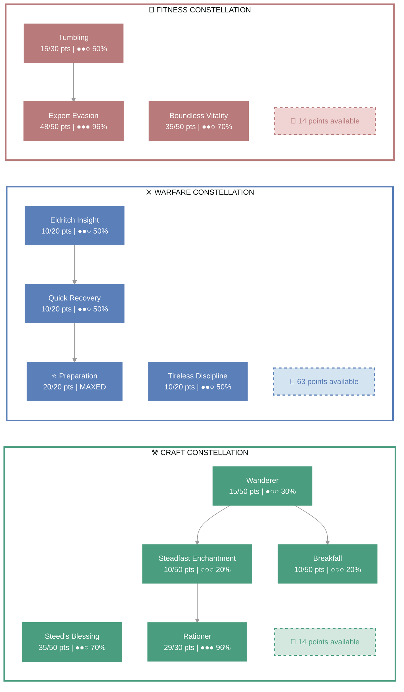

# Hadriān (Lord of Misrule)

   

**Imperial Dragonknight • Ebonheart Pact Alliance**

---

## 📑 Table of Contents

- [📋 Overview](#overview)
  - [General](#general)
  - [Currency](#currency)
- [⚔️ Combat Arsenal](#combat-arsenal)
  - [Character Stats](#character-stats)
  - [Advanced Stats](#advanced-stats)
- [⚔️ PvP](#pvp)
  - [Alliance War Skills](#alliance-war-skills)
- [👥 Companions](#companions)
- [🎨 Collectibles](#collectibles)
- [🎒 Inventory](#inventory)
- [🏆 Achievements](#achievements)
- [🏰 Guild Membership](#guild-membership)

---

## 📋 Overview

### General

| **Attribute** | **Value** |
| --- | --- |
| **Level** | 35 |
| **Champion Points** | 338 |
| **Gender** | Male |
| **Age** | 2d 7h 4m |
| **Account** | @vavasour |
| **ESO Plus** | ✅ Active |

| **Attribute** | **Value** |
| --- | --- |
| **Attributes** | 🔵 4 / ❤️ 0 / ⚡ 40 |
| **Available Champion Points** | ⚒️ 14 - ⚔️ 63 - 💪 14 |
| **Skill Points** | 🎯 8 available - Ready to spend |
| **🐴 Riding Skills** | 🐴 60/60 / 💪 30/60 / 🎒 43/60 |
| **Race** | [Imperial](https://en.uesp.net/wiki/Online:Imperial) |
| **Server** | [NA Megaserver](https://en.uesp.net/wiki/Online:Megaservers) |

| **Attribute** | **Value** |
| --- | --- |
| **Class** | [Dragonknight](https://en.uesp.net/wiki/Online:Dragonknight) |
| **Alliance** | [Ebonheart Pact](https://en.uesp.net/wiki/Online:Ebonheart_Pact) |
| **Title** | [Lord of Misrule](https://en.uesp.net/wiki/Online:Lord_of_Misrule) |
| **Location** | [Summerset](https://en.uesp.net/wiki/Online:Summerset) (Shimmerene) |
| **🪨 Mundus Stone** | [The Lord](https://en.uesp.net/wiki/Online:The_Lord_(Mundus_Stone)) |
| **🍖 Active Buffs** | Other: [Increase Max Health](https://en.uesp.net/wiki/Online:Increase_Max_Health), [Witchmother's Boon](https://en.uesp.net/wiki/Online:Witchmother's_Boon), [Gallop](https://en.uesp.net/wiki/Online:Gallop) |

### Currency

| **Attribute** | **Value** |
| --- | --- |
| 💰 **Gold** | 10,361 |
| ⚔️ **Alliance Points** | 11,740 |
| 🔮 **Tel Var** | 11,750 |
| 💎 **Transmute Crystals** | 106 |
| 📜 **Writs** | 0 |
| 🎫 **Event Tickets** | 3 |
| 👑 **Crowns** | 1,700 |
| 💠 **Gems** | 0 |
| 🏅 **Seals** | 2,185 |
| 🗝️ **Keys** | 17 |
| 👕 **Tokens** | 4 |
| 📚 **Fortunes** | 0 |
| 🔹 **Fragments** | 0 |

---

## ⚔️ Combat Arsenal

### Character Stats

| **Category** | **Stat** | **Value** |
| --- | --- | ---: |
| 💚 **Resources** | Health | 46,371 |
|  | Magicka | 17,985 |
|  | Stamina | 22,255 |
| ⚔️ **Offensive** | Weapon Power | 2,213 |
|  | Spell Power | 2,213 |

| **Category** | **Stat** | **Value** |
| --- | --- | ---: |
| 🎯 **Critical** | Weapon Crit | 2,181 (9.9%) |
|  | Spell Crit | 2,181 (9.9%) |
| ⚔️ **Penetration** | Physical | 1,542 |
|  | Spell | 1,542 |

| **Category** | **Stat** | **Value** |
| --- | --- | ---: |
| 🛡️ **Defensive** | Physical Resist | 16,315 (90.3%) |
|  | Spell Resist | 16,315 (90.3%) |
| ♻️ **Recovery** | Health | 950 |
|  | Magicka | 1,247 |
|  | Stamina | 1,060 |

### Advanced Stats

| **Ability** | **Cost/Value** |
|:---|---:|
| ⚔️ **Light Attack** | 3,103 dmg |
| ⚔️ **Heavy Attack** | 6,206 dmg |
| ⚔️ **Bash** | 367 cost, 4,583 dmg |
| 🛡️ **Block** | 1,275 cost, 50% mit, 40% spd |
| 🔓 **Break Free** | 5,292 cost |
| 🏃 **Dodge Roll** | 4,665 cost |
| 🐾 **Sneak** | 133 cost, 0% spd |
| 🏃‍♂️ **Sprint** | 490 cost, 0% spd |

| **Resistance** | **Value** |
|:---|---:|
| 🔥 **Flame** | 24.7% |
| ⚡ **Shock** | 24.7% |
| ❄️ **Frost** | 24.7% |
| 🔮 **Magic** | 24.7% |
| 🦠 **Disease** | 24.7% |
| ☠️ **Poison** | 24.7% |
| 🩸 **Bleed** | 24.7% |

| **Damage Type** | **Bonus** |
|:---|---:|
| 💥 **Critical Damage** | 50% |
| ⚔️ **Physical** | 0 |
| 🔥 **Flame** | 0 |
| ⚡ **Shock** | 0 |
| ❄️ **Frost** | 0 |
| 🔮 **Magic** | 0 |
| 🦠 **Disease** | 0 |
| ☠️ **Poison** | 0 |
| 🩸 **Bleed** | 0 |
| 🌌 **Oblivion** | 0 |

| **Healing** | **Value** |
|:---|---:|
| 💚 **Healing Done** | 0 |
| 💖 **Healing Taken** | 4 (+0.0060606058686972%) |
| ✨ **Critical Healing** | 50% |

## ⚔️ Combat Arsenal

### ⚔️ ⚔️ ⚔️ Front Bar (Main Hand)

| **1** | **2** | **3** | **4** | **5** | **6** |
| :---: | :---: | :---: | :---: | :---: | :---: |
| [Consuming Trap](https://en.uesp.net/wiki/Online:Consuming_Trap) | [Stonefist](https://en.uesp.net/wiki/Online:Stonefist) | [Pierce Armor](https://en.uesp.net/wiki/Online:Pierce_Armor) | [Heroic Slash](https://en.uesp.net/wiki/Online:Heroic_Slash) | [Searing Strike](https://en.uesp.net/wiki/Online:Searing_Strike) | [Magma Shell](https://en.uesp.net/wiki/Online:Magma_Shell) |

### 🔮 🔮 🔮 Back Bar (Backup)

| **1** | **2** | **3** | **4** | **5** | **6** |
| :---: | :---: | :---: | :---: | :---: | :---: |
| [Spiked Armor](https://en.uesp.net/wiki/Online:Spiked_Armor) | [Consuming Trap](https://en.uesp.net/wiki/Online:Consuming_Trap) | [Elemental Blockade](https://en.uesp.net/wiki/Online:Elemental_Blockade) | [Vigor](https://en.uesp.net/wiki/Online:Vigor) | [Dragon Blood](https://en.uesp.net/wiki/Online:Dragon_Blood) | [Magma Shell](https://en.uesp.net/wiki/Online:Magma_Shell) |

---

## ⚔️ Equipment & Active Sets

| **Set** | **Progress** |
| --- | --- |
| 🟢 **[Grace of Gloom Set](https://en.uesp.net/wiki/Online:Grace_of_Gloom_Set)** | `5/5` ██████████ 100% *(+3 extra)* |
| ⚪ **[Prophet's Set](https://en.uesp.net/wiki/Online:Prophet's_Set)** | `1/5` ██░░░░░░░░ 20% |
| ⚪ **[Armor of the Trainee Set](https://en.uesp.net/wiki/Online:Armor_of_the_Trainee_Set)** | `1/5` ██░░░░░░░░ 20% |

### 📋 Equipment Details

| **Slot** | **Item** | **Set** | **Quality** | **Trait** | **Type** | **Enchantment** |
| --- | --- | --- | --- | --- | --- | --- |
| ⛑️ **Head** | Gloom-Graced Helm | [Grace of Gloom Set](https://en.uesp.net/wiki/Online:Grace_of_Gloom_Set) | 🔮 Superior | Infused | Heavy | Maximum Health Enchantment |
| 💎 **Neck** | Gloom-Graced Necklace | [Grace of Gloom Set](https://en.uesp.net/wiki/Online:Grace_of_Gloom_Set) | 🔮 Superior | Healthy | None | Health Recovery Enchantment |
| 🛡️ **Chest** | Prophet's Cuirass | [Prophet's Set](https://en.uesp.net/wiki/Online:Prophet's_Set) | 🔮 Superior | Training | Heavy | Maximum Health Enchantment |
| 👑 **Shoulders** | Gloom-Graced Pauldron | [Grace of Gloom Set](https://en.uesp.net/wiki/Online:Grace_of_Gloom_Set) | ⚡ Fine | Divines | Heavy | Maximum Health Enchantment |
| ⚔️ **Main Hand** | orichalc dagger of Flame | - | 🔮 Superior | Sharpened | None | Fiery Weapon Enchantment |
| 🛡️ **Off Hand** | beech shield of Magicka | - | 🔮 Superior | Impenetrable | None | Maximum Magicka Enchantment |
| ⚡ **Waist** | Gloom-Graced Girdle | [Grace of Gloom Set](https://en.uesp.net/wiki/Online:Grace_of_Gloom_Set) | 🔮 Superior | Impenetrable | Heavy | Maximum Health Enchantment |
| 👖 **Legs** | Gloom-Graced Greaves | [Grace of Gloom Set](https://en.uesp.net/wiki/Online:Grace_of_Gloom_Set) | 🔮 Superior | Infused | Heavy | Maximum Health Enchantment |
| 👟 **Feet** | Gloom-Graced Sabatons | [Grace of Gloom Set](https://en.uesp.net/wiki/Online:Grace_of_Gloom_Set) | 🔮 Superior | Impenetrable | Heavy | Maximum Health Enchantment |
| 💍 **Ring 1** | Ring of the Trainee | [Armor of the Trainee Set](https://en.uesp.net/wiki/Online:Armor_of_the_Trainee_Set) | ⭐ Epic | Arcane | None | Magicka Recovery Enchantment |
| 💍 **Ring 2** | Gloom-Graced Ring | [Grace of Gloom Set](https://en.uesp.net/wiki/Online:Grace_of_Gloom_Set) | 🔮 Superior | Healthy | None | Health Recovery Enchantment |
| ✋ **Hands** | Gloom-Graced Gauntlets | [Grace of Gloom Set](https://en.uesp.net/wiki/Online:Grace_of_Gloom_Set) | ⚡ Fine | Sturdy | Heavy | Maximum Health Enchantment |
| 🔮 **Backup Main Hand** | beech inferno staff of Frost | - | ⚡ Fine | Defending | None | Frozen Weapon Enchantment |

---

## ⭐ Champion Points

| **Total** | **Spent** | **Available** |
| :---: | :---: | :---: |
| 338 | 247 | 91 |

| **⚒️ Craft** | **Assigned Points** |
| --- | ---: |
| ██████████░░ 87% | 99/113 points |
| **[Steadfast Enchantment](https://en.uesp.net/wiki/Online:Steadfast_Enchantment)** | 10 points |
| **[Rationer](https://en.uesp.net/wiki/Online:Rationer)** | 29 points |
| **[Wanderer](https://en.uesp.net/wiki/Online:Wanderer)** | 15 points |
| **[Breakfall](https://en.uesp.net/wiki/Online:Breakfall)** | 10 points |
| **[Steed's Blessing](https://en.uesp.net/wiki/Online:Steed's_Blessing)** | 35 points |

| **⚔️ Warfare** | **Assigned Points** |
| --- | ---: |
| █████░░░░░░░ 44% | 50/113 points |
| **[Tireless Discipline](https://en.uesp.net/wiki/Online:Tireless_Discipline)** | 10 points |
| **[Quick Recovery](https://en.uesp.net/wiki/Online:Quick_Recovery)** | 10 points |
| **[Preparation](https://en.uesp.net/wiki/Online:Preparation)** | 20 points |
| **[Eldritch Insight](https://en.uesp.net/wiki/Online:Eldritch_Insight)** | 10 points |

| **💪 Fitness** | **Assigned Points** |
| --- | ---: |
| ██████████░░ 87% | 98/112 points |
| **[Tumbling](https://en.uesp.net/wiki/Online:Tumbling)** | 15 points |
| **[Expert Evasion](https://en.uesp.net/wiki/Online:Expert_Evasion)** | 48 points |
| **[Boundless Vitality](https://en.uesp.net/wiki/Online:Boundless_Vitality)** | 35 points |

### 🎯 Champion Points Visual

```mermaid
%%{init: {"theme":"base", "themeVariables": { "background":"transparent","fontSize":"12px","primaryColor":"#f0f0f0","primaryTextColor":"#333","primaryBorderColor":"#999","lineColor":"#999"}}}%%

flowchart LR

  subgraph subLEGEND["📖 LEGEND & VISUAL GUIDE"]

    LEG_STARS["Star Types"]
    LEG_S1["⭐ Gold Border = Maxed Slottable"]
    LEG_S2["🔶 Orange Border = Independent Star"]
    LEG_S3["Standard Border = In Progress"]

    LEG_FILL["Progress Indicators"]
    LEG_F1["⭐ = 100% Maxed"]
    LEG_F2["●●● = 75-99%"]
    LEG_F3["●●○ = 50-74%"]
    LEG_F4["●○○ = 25-49%"]
    LEG_F5["○○○ = 1-24%"]

    LEG_STARS --> LEG_S1 & LEG_S2 & LEG_S3
    LEG_FILL --> LEG_F1 & LEG_F2 & LEG_F3 & LEG_F4 & LEG_F5

    style LEG_STARS fill:transparent,stroke:none,color:#ccc
    style LEG_FILL fill:transparent,stroke:none,color:#ccc
    style LEG_S1 fill:#fff,stroke:#ffd700,stroke-width:3px,color:#333
    style LEG_S2 fill:#fff,stroke:#ff8c00,stroke-width:3px,color:#333
    style LEG_S3 fill:#fff,stroke:#999,stroke-width:2px,color:#333
    style LEG_F1 fill:#eee,stroke:#333,stroke-width:1px,color:#333
    style LEG_F2 fill:#eee,stroke:#333,stroke-width:1px,color:#333
    style LEG_F3 fill:#eee,stroke:#333,stroke-width:1px,color:#333
    style LEG_F4 fill:#eee,stroke:#333,stroke-width:1px,color:#333
    style LEG_F5 fill:#eee,stroke:#333,stroke-width:1px,color:#333
  end
  style subLEGEND fill:transparent,stroke:#999,stroke-width:3px
```

---

## 📜 Character Progress

### Progress Overview

| **Maxed Skill Lines** | **In Progress** | **Early Progress** | **Abilities with Morphs** | **Overall Completion** |
| ---: | ---: | ---: | ---: | ---: |
| 0 | 0 | 0 | 0 | 0% |

🌿 Detailed Skill Morphs

*No morphable abilities found.*

---

---

## ⚔️ PvP

### PvP Profile

#### Alliance War Status

| **Category** | **Value** |
| --- | --- |
| Rank | Recruit Grade 1 (Rank 3) |
| Alliance Points | 11,740 |

---

## 👥 Companions

### Available Companions

- [Bastian Hallix](https://en.uesp.net/wiki/Online:Bastian_Hallix)
- [Ember](https://en.uesp.net/wiki/Online:Ember)
- [Mirri Elendis](https://en.uesp.net/wiki/Online:Mirri_Elendis)
- [Tanlorin](https://en.uesp.net/wiki/Online:Tanlorin)
- [Zerith-var](https://en.uesp.net/wiki/Online:Zerith-var)

### Active Companion

#### 🧙 [Bastian Hallix](https://en.uesp.net/wiki/Online:Bastian_Hallix)

#### Front Bar

| **1** | **2** | **3** | **4** | **5** | **⚡** |
| :---: | :---: | :---: | :---: | :---: | :---: |
| [Provoke](https://en.uesp.net/wiki/Online:Provoke) | [Crushing Claws](https://en.uesp.net/wiki/Online:Crushing_Claws) | [Basalt Barrier](https://en.uesp.net/wiki/Online:Basalt_Barrier) | [Drake's Blood](https://en.uesp.net/wiki/Online:Drake's_Blood) | [Empty] | [Empty] |

| **Slot** | **Item** | **Quality** | **Trait** |
| --- | --- | --- | --- |
| ⚔️ **Main Hand** | Companion's Dagger (Level 1, 🔮 Superior) ⚠️ | 🔮 Superior | Shattering |
| 🛡️ **Off Hand** | Companion's Shield (Level 1, 🔮 Superior) ⚠️ | 🔮 Superior | Vigorous |
| ⛑️ **Head** | Companion's Helmet (Level 1, 🔮 Superior) ⚠️ | 🔮 Superior | Prolific |
| 🛡️ **Chest** | Companion's Jack (Level 1, ⭐ Epic) ⚠️ | ⭐ Epic | Aggressive |
| 👑 **Shoulders** | Companion's Pauldrons (Level 1, 🔮 Superior) ⚠️ | 🔮 Superior | Quickened |
| ✋ **Hands** | Companion's Bracers (Level 1, ⚡ Fine) ⚠️ | ⚡ Fine | Bolstered |
| ⚡ **Waist** | Companion's Belt (Level 1, ⚡ Fine) ⚠️ | ⚡ Fine | Quickened |
| 👖 **Legs** | Companion's Guards (Level 1, ⚪ Normal) ⚠️ | ⚪ Normal | No Trait |
| 👟 **Feet** | Companion's Boots (Level 1, ⚡ Fine) ⚠️ | ⚡ Fine | Quickened |

> [!WARNING]
> - 👥 **Companion underleveled**: Bastian Hallix (Level 9/20) - Needs XP
> - 👥 **Companion outdated gear**: 9 pieces below level - Upgrade equipment
> - 👥 **Companion empty ability slots**: 2 - Assign abilities
> - 💔 **Companion rapport low**: Bastian Hallix (Unknown) - Build relationship

---

## 🎨 Collectibles

💁 Assistants (2 of 26)

| Progress |
| --- |
| █░░░░░░░░░░░░░░░░░░░ 7% (2/26) |

- [Nuzhimeh the Merchant](https://en.uesp.net/wiki/Online:Nuzhimeh_the_Merchant)
- [Tythis Andromo, the Banker](https://en.uesp.net/wiki/Online:Tythis_Andromo,_the_Banker)

🖌️ Body Markings (2 of 321)

| Progress |
| --- |
| ░░░░░░░░░░░░░░░░░░░░ 0% (2/321) |

- [Ancient Dragon Body Marks](https://en.uesp.net/wiki/Online:Ancient_Dragon_Body_Marks)
- [Oak's Promise Body Marks](https://en.uesp.net/wiki/Online:Oak's_Promise_Body_Marks)

👗 Costumes (16 of 312)

| Progress |
| --- |
| █░░░░░░░░░░░░░░░░░░░ 5% (16/312) |

- [Abecean Privateer's Apparel](https://en.uesp.net/wiki/Online:Abecean_Privateer's_Apparel)
- [Bloodthorn Robes](https://en.uesp.net/wiki/Online:Bloodthorn_Robes)
- [Covenant Scout](https://en.uesp.net/wiki/Online:Covenant_Scout)
- [Dark Seducer](https://en.uesp.net/wiki/Online:Dark_Seducer)
- [Frostedge Bandit Armor](https://en.uesp.net/wiki/Online:Frostedge_Bandit_Armor)
- [Golden Saint](https://en.uesp.net/wiki/Online:Golden_Saint)
- [Imperial Chancellor](https://en.uesp.net/wiki/Online:Imperial_Chancellor)
- [Lion Guard Knight](https://en.uesp.net/wiki/Online:Lion_Guard_Knight)
- [Mages Guild Formal Robes](https://en.uesp.net/wiki/Online:Mages_Guild_Formal_Robes)
- [Mannimarco](https://en.uesp.net/wiki/Online:Mannimarco)

- [Nordic Bather's Towel](https://en.uesp.net/wiki/Online:Nordic_Bather's_Towel)
- [Red Rook Armor](https://en.uesp.net/wiki/Online:Red_Rook_Armor)
- [Regalia of the Scarlet Judge](https://en.uesp.net/wiki/Online:Regalia_of_the_Scarlet_Judge)
- [Sea Drake Garb](https://en.uesp.net/wiki/Online:Sea_Drake_Garb)
- [Servant's Robes](https://en.uesp.net/wiki/Online:Servant's_Robes)
- [Shrouded Armor](https://en.uesp.net/wiki/Online:Shrouded_Armor)

🗣️ Emotes (7 of 225)

| Progress |
| --- |
| ░░░░░░░░░░░░░░░░░░░░ 3% (7/225) |

- [Air the Heir](https://en.uesp.net/wiki/Online:Air_the_Heir)
- [Elite Seat](https://en.uesp.net/wiki/Online:Elite_Seat)
- [Flower Fling](https://en.uesp.net/wiki/Online:Flower_Fling)
- [Glimmer Dust](https://en.uesp.net/wiki/Online:Glimmer_Dust)
- [Plant Yourself](https://en.uesp.net/wiki/Online:Plant_Yourself)
- [Pop the Cork](https://en.uesp.net/wiki/Online:Pop_the_Cork)
- [Wait the Great](https://en.uesp.net/wiki/Online:Wait_the_Great)

👓 Facial Accessories (1 of 135)

| Progress |
| --- |
| ░░░░░░░░░░░░░░░░░░░░ 0% (1/135) |

- [Thrafey Debutante Circlet](https://en.uesp.net/wiki/Online:Thrafey_Debutante_Circlet)

💇 Hair Styles (1 of 153)

| Progress |
| --- |
| ░░░░░░░░░░░░░░░░░░░░ 0% (1/153) |

- [Draping Locks](https://en.uesp.net/wiki/Online:Draping_Locks)

🎩 Hats (6 of 164)

| Progress |
| --- |
| ░░░░░░░░░░░░░░░░░░░░ 3% (6/164) |

- [Ayleid Royal Crown](https://en.uesp.net/wiki/Online:Ayleid_Royal_Crown)
- [Colovian Filigreed Hood](https://en.uesp.net/wiki/Online:Colovian_Filigreed_Hood)
- [Colovian Fur Hood](https://en.uesp.net/wiki/Online:Colovian_Fur_Hood)
- [Crown of Misrule](https://en.uesp.net/wiki/Online:Crown_of_Misrule)
- [Firesong Obsidian Mask](https://en.uesp.net/wiki/Online:Firesong_Obsidian_Mask)
- [Hide Your Helm](https://en.uesp.net/wiki/Online:Hide_Your_Helm)

🖍️ Head Markings (4 of 372)

| Progress |
| --- |
| ░░░░░░░░░░░░░░░░░░░░ 1% (4/372) |

- [Ancient Dragon Face Marks](https://en.uesp.net/wiki/Online:Ancient_Dragon_Face_Marks)
- [Druidic Knotwork Face Tattoos](https://en.uesp.net/wiki/Online:Druidic_Knotwork_Face_Tattoos)
- [Enchanting Cherry Blossom Visage](https://en.uesp.net/wiki/Online:Enchanting_Cherry_Blossom_Visage)
- [Oak's Promise Face Marks](https://en.uesp.net/wiki/Online:Oak's_Promise_Face_Marks)

🔮 Mementos (15 of 201)

| Progress |
| --- |
| █░░░░░░░░░░░░░░░░░░░ 7% (15/201) |

- [Blackfeather Court Whistle](https://en.uesp.net/wiki/Online:Blackfeather_Court_Whistle)
- [Breda's Bottomless Mead Mug](https://en.uesp.net/wiki/Online:Breda's_Bottomless_Mead_Mug)
- [Cadwell's Surprise Box](https://en.uesp.net/wiki/Online:Cadwell's_Surprise_Box)
- [Cherry Blossom Branch](https://en.uesp.net/wiki/Online:Cherry_Blossom_Branch)
- [Fire-Breather's Torches](https://en.uesp.net/wiki/Online:Fire-Breather's_Torches)
- [Gryphon Feather Talisman](https://en.uesp.net/wiki/Online:Gryphon_Feather_Talisman)
- [Hoard of the Schemers](https://en.uesp.net/wiki/Online:Hoard_of_the_Schemers)
- [Jubilee Cake 2022](https://en.uesp.net/wiki/Online:Jubilee_Cake_2022)
- [Juggler's Knives](https://en.uesp.net/wiki/Online:Juggler's_Knives)
- [Mud Ball Pouch](https://en.uesp.net/wiki/Online:Mud_Ball_Pouch)
- [Nanwen's Sword](https://en.uesp.net/wiki/Online:Nanwen's_Sword)
- [Sword-Swallower's Blade](https://en.uesp.net/wiki/Online:Sword-Swallower's_Blade)
- [The Pie of Misrule](https://en.uesp.net/wiki/Online:The_Pie_of_Misrule)
- [Thetys Ramarys's Bait Kit](https://en.uesp.net/wiki/Online:Thetys_Ramarys's_Bait_Kit)
- [Witchmother's Whistle](https://en.uesp.net/wiki/Online:Witchmother's_Whistle)

🐴 Mounts (9 of 697)

| Progress |
| --- |
| ░░░░░░░░░░░░░░░░░░░░ 1% (9/697) |

- [Amenos Ornaug](https://en.uesp.net/wiki/Online:Amenos_Ornaug)
- [Dagonic Quasigriff](https://en.uesp.net/wiki/Online:Dagonic_Quasigriff)
- [Imperial Horse](https://en.uesp.net/wiki/Online:Imperial_Horse)
- [Keptu Bear](https://en.uesp.net/wiki/Online:Keptu_Bear)
- [Noweyr Steed](https://en.uesp.net/wiki/Online:Noweyr_Steed)
- [Palefrost Elk Mount](https://en.uesp.net/wiki/Online:Palefrost_Elk_Mount)
- [Sorrel Horse](https://en.uesp.net/wiki/Online:Sorrel_Horse)
- [White Lion](https://en.uesp.net/wiki/Online:White_Lion)
- [Windhelm Cliff Ram](https://en.uesp.net/wiki/Online:Windhelm_Cliff_Ram)

🎭 Personalities (1 of 29)

| Progress |
| --- |
| ░░░░░░░░░░░░░░░░░░░░ 3% (1/29) |

- [Assassin](https://en.uesp.net/wiki/Online:Assassin)

🐾 Pets (18 of 679)

| Progress |
| --- |
| ░░░░░░░░░░░░░░░░░░░░ 2% (18/679) |

- [Abecean Ratter Cat](https://en.uesp.net/wiki/Online:Abecean_Ratter_Cat)
- [Alik'r Dune-Hound](https://en.uesp.net/wiki/Online:Alik'r_Dune-Hound)
- [Aurora Firepot Spider](https://en.uesp.net/wiki/Online:Aurora_Firepot_Spider)
- [Balfiera Senche Cub](https://en.uesp.net/wiki/Online:Balfiera_Senche_Cub)
- [Echalette](https://en.uesp.net/wiki/Online:Echalette)
- [Gloam Gryphon Fledgling](https://en.uesp.net/wiki/Online:Gloam_Gryphon_Fledgling)
- [Guar-Lizard Calf](https://en.uesp.net/wiki/Online:Guar-Lizard_Calf)
- [Jackal](https://en.uesp.net/wiki/Online:Jackal)
- [Knights of the Flame Pup](https://en.uesp.net/wiki/Online:Knights_of_the_Flame_Pup)
- [Nibenay Mudcrab](https://en.uesp.net/wiki/Online:Nibenay_Mudcrab)
- [Noweyr Pony^n](https://en.uesp.net/wiki/Online:Noweyr_Pony^n)
- [Powderwhite Coney](https://en.uesp.net/wiki/Online:Powderwhite_Coney)
- [Salamandrine Pony Guar](https://en.uesp.net/wiki/Online:Salamandrine_Pony_Guar)
- [Scintillant Dovah-Fly^n](https://en.uesp.net/wiki/Online:Scintillant_Dovah-Fly^n)
- [Scorion Pyreling](https://en.uesp.net/wiki/Online:Scorion_Pyreling)
- [Snowball Buddy](https://en.uesp.net/wiki/Online:Snowball_Buddy)
- [Soulfire Dragon Illusion](https://en.uesp.net/wiki/Online:Soulfire_Dragon_Illusion)
- [Verdigris Haj Mota](https://en.uesp.net/wiki/Online:Verdigris_Haj_Mota)

✨ Polymorphs (0 of 43)

| Progress |
| --- |
| ░░░░░░░░░░░░░░░░░░░░ 0% (0/43) |

*No polymorphs owned*

🎭 Skins (1 of 106)

| Progress |
| --- |
| ░░░░░░░░░░░░░░░░░░░░ 0% (1/106) |

- [Slag Town Diver](https://en.uesp.net/wiki/Online:Slag_Town_Diver)

---

## 🎒 Inventory

| **Storage** | **Used** | **Max** | **Capacity** |
| --- | ---: | ---: | --- |
| Backpack | 70 | 163 | ████░░░░░░ 42% |
| Bank | 210 | 480 | ████░░░░░░ 43% |
| Crafting Bag | ∞ | ∞ | ESO Plus |

<strong>Backpack Items</strong> (70 unique items)

#### Other (70 items)

| **Item** | **Stack** | **Quality** |
| --- | ---: | --- |
| 🟡 "Room to Spare" Housing Brochure | 1 | 🟡 |
| 🟡 Bound Crown Experience Scroll | 1 | 🟡 |
| 🟣 Bound Crown Refreshing Drink | 1 | 🟣 |
| 🔵 Bound Crown Repair Kit | 1 | 🔵 |
| 🟣 Bound Crown Tri-Restoration Potion | 25 | 🟣 |
| 🟡 Bound Gold Coast Draining Poison | 80 | 🟡 |
| 🟣 Bound Gold Coast Swift Survivor Elixir | 25 | 🟣 |
| ⚪ Construct's Dynamo Core | 1 | ⚪ |
| 🔵 Counterfeit Pardon Edict | 8 | 🔵 |
| 🟣 Crown Fortifying Meal | 18 | 🟣 |
| 🔵 Crown Repair Kit | 20 | 🔵 |
| 🔵 Crown Soul Gem | 40 | 🔵 |
| 🟣 Crown Tri-Restoration Potion | 200 | 🟣 |
| 🟣 Crown Tri-Restoration Potion | 200 | 🟣 |
| 🟣 Crown Tri-Restoration Potion | 125 | 🟣 |
| 🟢 Dark Brotherhood Reward Pouch | 1 | 🟢 |
| 🟢 Dark Brotherhood Reward Satchel | 1 | 🟢 |
| 🟡 Darkening: Dark of the Moons | 1 | 🟡 |
| 🔵 Gold Coast Daily Contract Recompense | 1 | 🔵 |
| 🔵 Gold Coast Daily Contract Recompense | 1 | 🔵 |
| 🔵 Gold Coast Daily Contract Recompense | 1 | 🔵 |
| 🔵 Gold Coast Daily Contract Recompense | 1 | 🔵 |
| 🔵 Gold Coast Daily Contract Recompense | 1 | 🔵 |
| 🔵 Gold Coast Daily Contract Recompense | 1 | 🔵 |
| 🔵 Gold Coast Daily Contract Recompense | 1 | 🔵 |
| 🔵 Gold Coast Daily Contract Recompense | 1 | 🔵 |
| 🔵 Gold Coast Daily Contract Recompense | 1 | 🔵 |
| 🔵 Gold Coast Daily Contract Recompense | 1 | 🔵 |
| 🔵 Gold Coast Daily Contract Recompense | 1 | 🔵 |
| 🔵 Gold Coast Daily Contract Recompense | 1 | 🔵 |
| 🔵 Gold Coast Daily Contract Recompense | 1 | 🔵 |
| 🔵 Gold Coast Daily Contract Recompense | 1 | 🔵 |
| 🔵 Gold Coast Daily Contract Recompense | 1 | 🔵 |
| 🔵 Gold Coast Daily Contract Recompense | 1 | 🔵 |
| 🔵 Gold Coast Daily Contract Recompense | 1 | 🔵 |
| 🔵 Gold Coast Daily Contract Recompense | 1 | 🔵 |
| 🔵 Gold Coast Daily Contract Recompense | 1 | 🔵 |
| 🔵 Gold Coast Daily Contract Recompense | 1 | 🔵 |
| 🔵 Gold Coast Daily Contract Recompense | 1 | 🔵 |
| 🔵 Gold Coast Daily Contract Recompense | 1 | 🔵 |
| 🔵 Gold Coast Daily Contract Recompense | 1 | 🔵 |
| 🔵 Gold Coast Daily Contract Recompense | 1 | 🔵 |
| 🔵 Gold Coast Daily Contract Recompense | 1 | 🔵 |
| 🔵 Gold Coast Daily Contract Recompense | 1 | 🔵 |
| 🔵 Gold Coast Daily Contract Recompense | 1 | 🔵 |
| 🔵 Gold Coast Daily Contract Recompense | 1 | 🔵 |
| 🔵 Gold Coast Daily Contract Recompense | 1 | 🔵 |
| 🔵 Gold Coast Daily Contract Recompense | 1 | 🔵 |
| 🔵 Gold Coast Daily Contract Recompense | 1 | 🔵 |
| 🔵 Gold Coast Daily Contract Recompense | 1 | 🔵 |
| 🔵 Gold Coast Daily Contract Recompense | 1 | 🔵 |
| 🔵 Gold Coast Daily Contract Recompense | 1 | 🔵 |
| 🔵 Gold Coast Daily Contract Recompense | 1 | 🔵 |
| 🔵 Gold Coast Daily Contract Recompense | 1 | 🔵 |
| 🔵 Gold Coast Daily Contract Recompense | 1 | 🔵 |
| 🔵 Gold Coast Daily Contract Recompense | 1 | 🔵 |
| 🔵 Gold Coast Daily Contract Recompense | 1 | 🔵 |
| ⚪ Leatherworker's Expert Satchel | 1 | ⚪ |
| ⚪ Lockpick | 112 | ⚪ |
| 🟣 Plunder Skull | 1 | 🟣 |
| 🟣 Plunder Skull | 1 | 🟣 |
| 🟣 Plunder Skull | 1 | 🟣 |
| 🟢 Soul Gem | 28 | 🟢 |
| 🔵 Summerset Daily Recompense | 1 | 🔵 |
| 🔵 Summerset Treasure Map VI | 1 | 🔵 |
| 🔵 Unidentified Sithis' Touch Equipment | 1 | 🔵 |
| 🔵 Unidentified Sithis' Touch Equipment | 1 | 🔵 |
| 🟣 Unidentified Sithis' Touch Foot Armor | 1 | 🟣 |
| 🟣 Unidentified Sithis' Touch Weapon | 1 | 🟣 |
| 🟢 Unidentified Summerset Head Armor | 1 | 🟢 |

<strong>Bank Items</strong> (210 unique items)

#### Other (210 items)

| **Item** | **Stack** | **Quality** |
| --- | ---: | --- |
| 🟡 Attribute Respecification Scroll | 6 | 🟡 |
| 🟡 Attunable Clothing Station, Bound | 1 | 🟡 |
| 🟡 Aurora Firepot Spider: Firepot | 25 | 🟡 |
| 🔵 Blueprint: Alinor Chair, Polished | 1 | 🔵 |
| 🟢 Blueprint: Common Wheelbarrow, Sided | 1 | 🟢 |
| 🟢 Blueprint: High Elf Dresser, Sturdy | 1 | 🟢 |
| 🟢 Blueprint: Nord Shelf, Braced | 1 | 🟢 |
| ⚪ Blueprint: Rough Container, Cargo | 1 | ⚪ |
| 🟣 Bouquet, Small Dibella's | 1 | 🟣 |
| 🟢 Breton Carpet, Green | 1 | 🟢 |
| 🟢 Breton Chair, Slatted | 1 | 🟢 |
| 🔵 Clockwork City Treasure Map II | 1 | 🔵 |
| 🟢 Common Candles, Pair | 1 | 🟢 |
| 🔵 Companion's Axe | 1 | 🔵 |
| 🟢 Companion's Breeches | 1 | 🟢 |
| 🔵 Companion's Dagger | 1 | 🔵 |
| 🔵 Companion's Epaulets | 1 | 🔵 |
| 🟢 Companion's Epaulets | 1 | 🟢 |
| 🟢 Companion's Girdle | 1 | 🟢 |
| 🔵 Companion's Girdle | 1 | 🔵 |
| 🔵 Companion's Girdle | 1 | 🔵 |
| 🔵 Companion's Greaves | 1 | 🔵 |
| 🟢 Companion's Helm | 1 | 🟢 |
| 🟢 Companion's Ice Staff | 1 | 🟢 |
| 🟢 Companion's Jerkin | 1 | 🟢 |
| 🔵 Companion's Pauldrons | 1 | 🔵 |
| 🟢 Companion's Restoration Staff | 1 | 🟢 |
| 🟢 Companion's Ring | 1 | 🟢 |
| 🟢 Companion's Ring | 1 | 🟢 |
| 🔵 Companion's Shield | 1 | 🔵 |
| 🔵 Companion's Sword | 1 | 🔵 |
| 🔵 Counterfeit Pardon Edict | 19 | 🔵 |
| 🔵 Crafting Motif 1: High Elf Style | 3 | 🔵 |
| 🔵 Crafting Motif 4: Nord Style | 1 | 🔵 |
| 🔵 Crafting Motif 5: Breton Style | 1 | 🔵 |
| 🟣 Crafting Motif 34: Assassins League Axes | 2 | 🟣 |
| 🟣 Crafting Motif 34: Assassins League Belts | 1 | 🟣 |
| 🟣 Crafting Motif 34: Assassins League Chests | 1 | 🟣 |
| 🟣 Crafting Motif 34: Assassins League Daggers | 2 | 🟣 |
| 🟣 Crafting Motif 34: Assassins League Gloves | 1 | 🟣 |
| 🟣 Crafting Motif 61: Psijic Shoulders | 1 | 🟣 |
| 🟡 Crown Experience Scroll | 8 | 🟡 |
| 🟣 Crown Fortifying Meal | 57 | 🟣 |
| 🟡 Crown Lethal Poison | 150 | 🟡 |
| 🟣 Crown Tri-Restoration Potion | 200 | 🟣 |
| 🟣 Crown Tri-Restoration Potion | 200 | 🟣 |
| 🟣 Crown Tri-Restoration Potion | 25 | 🟣 |
| 🔵 Cyrodiil Treasure Map VI | 1 | 🔵 |
| 🔵 Deadlands Treasure Map II | 1 | 🔵 |
| 🔵 Deep Winter Charity Writ | 1 | 🔵 |
| 🔵 Deep Winter Charity Writ | 1 | 🔵 |
| 🔵 Deep Winter Charity Writ | 1 | 🔵 |
| 🔵 Deep Winter Charity Writ | 1 | 🔵 |
| 🔵 Deep Winter Charity Writ | 1 | 🔵 |
| 🔵 Deep Winter Charity Writ | 1 | 🔵 |
| 🔵 Deep Winter Charity Writ | 1 | 🔵 |
| 🔵 Deep Winter Charity Writ | 1 | 🔵 |
| 🔵 Deep Winter Charity Writ | 1 | 🔵 |
| 🔵 Deep Winter Charity Writ | 1 | 🔵 |
| 🔵 Deep Winter Charity Writ | 1 | 🔵 |
| 🔵 Deep Winter Charity Writ | 1 | 🔵 |
| 🔵 Deep Winter Charity Writ | 1 | 🔵 |
| 🔵 Deep Winter Charity Writ | 1 | 🔵 |
| 🔵 Deep Winter Charity Writ | 1 | 🔵 |
| 🔵 Deep Winter Charity Writ | 1 | 🔵 |
| 🔵 Deep Winter Charity Writ | 1 | 🔵 |
| 🔵 Deep Winter Charity Writ | 1 | 🔵 |
| 🔵 Deep Winter Charity Writ | 1 | 🔵 |
| 🔵 Deep Winter Charity Writ | 1 | 🔵 |
| 🔵 Deep Winter Charity Writ | 1 | 🔵 |
| 🔵 Deep Winter Charity Writ | 1 | 🔵 |
| 🔵 Deep Winter Charity Writ | 1 | 🔵 |
| 🔵 Deep Winter Charity Writ | 1 | 🔵 |
| 🔵 Deep Winter Charity Writ | 1 | 🔵 |
| 🔵 Deep Winter Charity Writ | 1 | 🔵 |
| 🔵 Deep Winter Charity Writ | 1 | 🔵 |
| 🔵 Deep Winter Charity Writ | 1 | 🔵 |
| 🔵 Deep Winter Charity Writ | 1 | 🔵 |
| 🔵 Deep Winter Charity Writ | 1 | 🔵 |
| 🔵 Deep Winter Charity Writ | 1 | 🔵 |
| 🔵 Deep Winter Charity Writ | 1 | 🔵 |
| 🔵 Deep Winter Charity Writ | 1 | 🔵 |
| 🔵 Deep Winter Charity Writ | 1 | 🔵 |
| 🔵 Deep Winter Charity Writ | 1 | 🔵 |
| 🟢 Diagram: Breton Sconce, Torch | 1 | 🟢 |
| 🔵 Diagram: Daedric Bench, Ashen | 1 | 🔵 |
| ⚪ Disposable Juggling Knives | 200 | ⚪ |
| ⚪ Disposable Juggling Knives | 180 | ⚪ |
| ⚪ Disposable Juggling Knives | 200 | ⚪ |
| ⚪ Disposable Swallower's Sword | 200 | ⚪ |
| ⚪ Disposable Swallower's Sword | 200 | ⚪ |
| 🟢 Equipment Repair Kit | 27 | 🟢 |
| 🟣 Exemplary Infused Necklace | 1 | 🟣 |
| 🟣 Exemplary Infused Ring | 1 | 🟣 |
| 🟡 Fighters  Guild Citation | 1 | 🟡 |
| ⚪ Fire-Breather's Oil Bun | 100 | ⚪ |
| ⚪ Fire-Breather's Oil Bun | 200 | ⚪ |
| ⚪ Fire-Breather's Oil Bun | 200 | ⚪ |
| 🟢 Flowers, Hummingbird Mint | 1 | 🟢 |
| 🟡 Gold Coast Debilitating Poison | 100 | 🟡 |
| 🟣 Gold Coast Swift Survivor Elixir | 100 | 🟣 |
| 🔵 Grahtwood Treasure Map V | 1 | 🔵 |
| 🟡 Grand Gold Coast Experience Scroll | 3 | 🟡 |
| 🔵 Greenshade Treasure Map III | 1 | 🔵 |
| 🟣 Harvested Soul Fragment | 1 | 🟣 |
| 🟣 Harvested Soul Fragment | 1 | 🟣 |
| 🟣 Harvested Soul Fragment | 1 | 🟣 |
| 🟣 Harvested Soul Fragment | 1 | 🟣 |
| 🟣 Harvested Soul Fragment | 1 | 🟣 |
| 🟢 Imperial Bed, Single | 1 | 🟢 |
| 🟣 Imperial Charity Writ | 1 | 🟣 |
| 🟣 Imperial Charity Writ | 1 | 🟣 |
| 🟣 Imperial Charity Writ | 1 | 🟣 |
| 🟣 Imperial Charity Writ | 1 | 🟣 |
| 🟣 Imperial Charity Writ | 1 | 🟣 |
| 🟣 Imperial Charity Writ | 1 | 🟣 |
| 🟣 Imperial Charity Writ | 1 | 🟣 |
| 🟣 Imperial Charity Writ | 1 | 🟣 |
| 🟣 Imperial Charity Writ | 1 | 🟣 |
| 🟣 Imperial Charity Writ | 1 | 🟣 |
| 🟣 Imperial Charity Writ | 1 | 🟣 |
| 🟣 Imperial Charity Writ | 1 | 🟣 |
| 🟣 Imperial Charity Writ | 1 | 🟣 |
| 🟣 Imperial Charity Writ | 1 | 🟣 |
| 🟣 Imperial Charity Writ | 1 | 🟣 |
| 🟣 Imperial Charity Writ | 1 | 🟣 |
| 🟣 Imperial Charity Writ | 1 | 🟣 |
| 🟣 Imperial Charity Writ | 1 | 🟣 |
| 🟣 Imperial Charity Writ | 1 | 🟣 |
| 🟣 Imperial Charity Writ | 1 | 🟣 |
| 🟣 Imperial Charity Writ | 1 | 🟣 |
| 🟣 Imperial Charity Writ | 1 | 🟣 |
| 🟣 Imperial Charity Writ | 1 | 🟣 |
| 🟡 Instant Clothing Research | 1 | 🟡 |
| ⚪ iron sword | 1 | ⚪ |
| 🟣 Jerkin of High Isle | 1 | 🟣 |
| ⚪ Keep Door Woodwork Repair Kit | 11 | ⚪ |
| ⚪ Keep Wall Masonry Repair Kit | 10 | ⚪ |
| 🔵 Khenarthi's Roost Treasure Map IV | 1 | 🔵 |
| 🟡 Kitten Moppet, Heart's Promise | 1 | 🟡 |
| 🟣 Leniency Edict | 1 | 🟣 |
| 🟣 Letter from Tanlorin | 1 | 🟣 |
| 🟡 Mages Guild Citation | 1 | 🟡 |
| 🟡 Major Gold Coast Experience Scroll | 1 | 🟡 |
| 🔵 Murkmire Treasure Map I | 1 | 🔵 |
| 🟣 Painting of High Elf Tower, Refined | 1 | 🟣 |
| 🟣 Painting of Lakes, Sturdy | 1 | 🟣 |
| 🟣 Painting of Palms, Sturdy | 1 | 🟣 |
| 🟣 Painting of Sinkhole, Refined | 1 | 🟣 |
| 🟢 Pattern: Alinor Carpet, Intricate | 1 | 🟢 |
| 🟢 Pattern: Dark Elf Bed, Single | 1 | 🟢 |
| 🟢 Pattern: Wood Elf Canopy, Leather | 1 | 🟢 |
| 🟢 Pattern: Wood Elf Hide, Heavy | 1 | 🟢 |
| ⚪ petty Glyph of Flame | 1 | ⚪ |
| ⚪ petty Glyph of Flame | 1 | ⚪ |
| ⚪ petty Glyph of Reduce Feat Cost | 1 | ⚪ |
| ⚪ petty Glyph of Reduce Spell Cost | 1 | ⚪ |
| ⚪ petty Glyph of Reduce Spell Cost | 1 | ⚪ |
| ⚪ petty Glyph of Reduce Spell Cost | 1 | ⚪ |
| ⚪ petty Glyph of Stamina | 1 | ⚪ |
| 🟡 Pledge of Mara | 1 | 🟡 |
| ⚪ Plume Dazzler | 4 | ⚪ |
| 🟣 Psijic Glowglobe's Ancient Texts | 1 | 🟣 |
| 🟣 Psijic Glowglobe's Meteoric Glass | 1 | 🟣 |
| 🟣 Psijic Glowglobe's Purified Glow Dust | 1 | 🟣 |
| 🟢 Recipe: Acai Tonic Infusion | 1 | 🟢 |
| 🟢 Recipe: Banana Surprise | 1 | 🟢 |
| 🔵 Recipe: Beet-Glazed Pork | 2 | 🔵 |
| 🟢 Recipe: Borscht | 1 | 🟢 |
| 🟢 Recipe: Deshaan Honeydew Hors D'oeuvres | 1 | 🟢 |
| 🟢 Recipe: Fried Green Tomatoes | 1 | 🟢 |
| 🟢 Recipe: Grape Preserves | 1 | 🟢 |
| 🟢 Recipe: Jasmine Tea | 1 | 🟢 |
| 🟢 Recipe: Kragenmoor Zinger Mazte | 1 | 🟢 |
| 🟢 Recipe: Pumpkin Puree | 2 | 🟢 |
| 🟢 Recipe: Rabbit Pasty | 2 | 🟢 |
| 🟢 Recipe: Red Rye Beer | 2 | 🟢 |
| 🟢 Recipe: Rihad Qishr | 1 | 🟢 |
| 🟢 Recipe: Roast Pig | 2 | 🟢 |
| 🟢 Recipe: Roast Venison | 1 | 🟢 |
| 🟢 Recipe: Roasted Beet and Millet Salad | 1 | 🟢 |
| 🟢 Recipe: Stir-Fried Garlic Beef | 1 | 🟢 |
| 🔵 Recipe: Tomato Borscht | 1 | 🔵 |
| 🟢 Recipe: Yellow Goblin Tonic | 1 | 🟢 |
| ⚪ Revelry Pie | 40 | ⚪ |
| 🔵 Rivenspire Treasure Map IV | 1 | 🔵 |
| 🟢 Saplings, Burnt Tall | 1 | 🟢 |
| 🟣 Sealed Fabrication Materials | 6 | 🟣 |
| 🔵 Shadowfen Treasure Map II | 1 | 🔵 |
| 🟢 Shrub, Burnt Brush | 1 | 🟢 |
| 🟣 Sithis' Sabatons | 1 | 🟣 |
| 🔵 Southern Elsweyr Treasure Map II | 1 | 🔵 |
| 🔵 Stonefalls Treasure Map III | 1 | 🔵 |
| 🔵 Stormhaven Treasure Map II | 1 | 🔵 |
| 🔵 Stormhaven Treasure Map III | 1 | 🔵 |
| 🔵 Stros M'Kai Treasure Map I | 1 | 🔵 |
| 🔵 Stros M'Kai Treasure Map II | 1 | 🔵 |
| 🟣 Systres' Cuirass | 1 | 🟣 |
| 🟣 Systres' Greaves | 1 | 🟣 |
| 🟣 Systres' Helm | 1 | 🟣 |
| 🟣 Systres' Pauldrons | 1 | 🟣 |
| 🟣 Systres' Sabatons | 1 | 🟣 |
| 🟢 Tea Table, Carved | 1 | 🟢 |
| 🔵 The Blade of Woe | 1 | 🔵 |
| 🔵 The Rift Treasure Map VI | 1 | 🔵 |
| 🔵 Vvardenfell Treasure Map IV | 1 | 🔵 |
| 🔵 Vvardenfell Treasure Map V | 1 | 🔵 |
| 🔵 Vvardenfell Treasure Map VI | 1 | 🔵 |
| 🔵 Western Skyrim Treasure Map IV | 1 | 🔵 |
| 🔵 Wrothgar Treasure Map I | 1 | 🔵 |

<strong>Crafting Bag Items</strong> (366 unique items)

#### Armor Trait (9 items)

| **Item** | **Stack** | **Quality** |
| --- | ---: | --- |
| ⚪ Almandine | 267 | ⚪ |
| ⚪ Bloodstone | 236 | ⚪ |
| ⚪ Diamond | 157 | ⚪ |
| ⚪ Emerald | 110 | ⚪ |
| ⚪ Fortified Nirncrux | 1 | ⚪ |
| ⚪ Garnet | 136 | ⚪ |
| ⚪ Quartz | 136 | ⚪ |
| ⚪ Sapphire | 120 | ⚪ |
| ⚪ Sardonyx | 246 | ⚪ |

#### Aspect Runestone (5 items)

| **Item** | **Stack** | **Quality** |
| --- | ---: | --- |
| 🔵 Denata | 595 | 🔵 |
| 🟢 Jejota | 1248 | 🟢 |
| 🟡 Kuta | 100 | 🟡 |
| 🟣 Rekuta | 352 | 🟣 |
| ⚪ Ta | 930 | ⚪ |

#### Essence Runestone (17 items)

| **Item** | **Stack** | **Quality** |
| --- | ---: | --- |
| ⚪ Dekeipa | 164 | ⚪ |
| ⚪ Deni | 431 | ⚪ |
| ⚪ Denima | 172 | ⚪ |
| ⚪ Deteri | 137 | ⚪ |
| ⚪ Haoko | 122 | ⚪ |
| ⚪ Kaderi | 146 | ⚪ |
| ⚪ Kuoko | 138 | ⚪ |
| ⚪ Makderi | 106 | ⚪ |
| ⚪ Makko | 411 | ⚪ |
| ⚪ Makkoma | 158 | ⚪ |
| ⚪ Meip | 147 | ⚪ |
| ⚪ Oko | 287 | ⚪ |
| ⚪ Okoma | 150 | ⚪ |
| ⚪ Okori | 116 | ⚪ |
| ⚪ Oru | 108 | ⚪ |
| ⚪ Rakeipa | 191 | ⚪ |
| ⚪ Taderi | 113 | ⚪ |

#### Furnishing Material (8 items)

| **Item** | **Stack** | **Quality** |
| --- | ---: | --- |
| ⚪ Alchemical Resin | 886 | ⚪ |
| ⚪ Bast | 273 | ⚪ |
| ⚪ Clean Pelt | 135 | ⚪ |
| ⚪ Decorative Wax | 197 | ⚪ |
| ⚪ Heartwood | 208 | ⚪ |
| ⚪ Mundane Rune | 727 | ⚪ |
| ⚪ Ochre | 146 | ⚪ |
| ⚪ Regulus | 332 | ⚪ |

#### Ingredient (51 items)

| **Item** | **Stack** | **Quality** |
| --- | ---: | --- |
| ⚪ Acai Berry | 157 | ⚪ |
| ⚪ Apples | 370 | ⚪ |
| ⚪ Bananas | 75 | ⚪ |
| ⚪ Barley | 177 | ⚪ |
| ⚪ Beets | 89 | ⚪ |
| 🟣 Bervez Juice | 21 | 🟣 |
| ⚪ Bittergreen | 68 | ⚪ |
| ⚪ Carrots | 39 | ⚪ |
| ⚪ Cheese | 30 | ⚪ |
| ⚪ Coffee | 148 | ⚪ |
| ⚪ Comberry | 46 | ⚪ |
| ⚪ Corn | 61 | ⚪ |
| ⚪ Fish | 54 | ⚪ |
| ⚪ Flour | 73 | ⚪ |
| 🟣 Frost Mirriam | 2 | 🟣 |
| ⚪ Game | 48 | ⚪ |
| ⚪ Garlic | 36 | ⚪ |
| ⚪ Ginger | 83 | ⚪ |
| ⚪ Ginkgo | 157 | ⚪ |
| ⚪ Ginseng | 118 | ⚪ |
| ⚪ Greens | 105 | ⚪ |
| ⚪ Guarana | 144 | ⚪ |
| ⚪ Honey | 124 | ⚪ |
| ⚪ Isinglass | 96 | ⚪ |
| ⚪ Jasmine | 54 | ⚪ |
| ⚪ Jazbay Grapes | 105 | ⚪ |
| ⚪ Lemon | 101 | ⚪ |
| ⚪ Lotus | 45 | ⚪ |
| ⚪ Melon | 128 | ⚪ |
| ⚪ Metheglin | 135 | ⚪ |
| ⚪ Millet | 80 | ⚪ |
| ⚪ Mint | 47 | ⚪ |
| 🟡 Perfect Roe | 2 | 🟡 |
| ⚪ Potato | 61 | ⚪ |
| ⚪ Poultry | 70 | ⚪ |
| ⚪ Pumpkin | 86 | ⚪ |
| ⚪ Radish | 54 | ⚪ |
| ⚪ Red Meat | 83 | ⚪ |
| ⚪ Rice | 186 | ⚪ |
| ⚪ Rose | 64 | ⚪ |
| ⚪ Rye | 210 | ⚪ |
| ⚪ Saltrice | 56 | ⚪ |
| ⚪ Seasoning | 108 | ⚪ |
| ⚪ Seaweed | 103 | ⚪ |
| ⚪ Small Game | 39 | ⚪ |
| ⚪ Surilie Grapes | 177 | ⚪ |
| ⚪ Tomato | 84 | ⚪ |
| ⚪ Wheat | 160 | ⚪ |
| ⚪ White Meat | 19 | ⚪ |
| ⚪ Yeast | 187 | ⚪ |
| ⚪ Yerba Mate | 177 | ⚪ |

#### Jewelry Trait (5 items)

| **Item** | **Stack** | **Quality** |
| --- | ---: | --- |
| ⚪ antimony | 8 | ⚪ |
| ⚪ Aurbic Amber | 9 | ⚪ |
| ⚪ cobalt | 8 | ⚪ |
| ⚪ Titanium | 4 | ⚪ |
| ⚪ zinc | 7 | ⚪ |

#### Lure (7 items)

| **Item** | **Stack** | **Quality** |
| --- | ---: | --- |
| ⚪ chub, Saltwater Bait | 25 | ⚪ |
| ⚪ crawlers, Foul Bait | 237 | ⚪ |
| ⚪ fish roe, Foul Bait | 28 | ⚪ |
| ⚪ guts, Lake Bait | 65 | ⚪ |
| ⚪ insect parts, River Bait | 90 | ⚪ |
| ⚪ shad, River Bait | 75 | ⚪ |
| ⚪ worms, Saltwater Bait | 247 | ⚪ |

#### Material (45 items)

| **Item** | **Stack** | **Quality** |
| --- | ---: | --- |
| ⚪ Ancestor Silk | 500 | ⚪ |
| ⚪ Calcinium ingot | 304 | ⚪ |
| ⚪ copper ounce | 814 | ⚪ |
| ⚪ cotton | 1006 | ⚪ |
| ⚪ dwarven ingot | 595 | ⚪ |
| ⚪ ebonthread | 295 | ⚪ |
| ⚪ ebony ingot | 451 | ⚪ |
| ⚪ electrum ounce | 247 | ⚪ |
| ⚪ fell hide | 126 | ⚪ |
| ⚪ flax | 986 | ⚪ |
| ⚪ Galatite ingot | 337 | ⚪ |
| ⚪ hide | 669 | ⚪ |
| ⚪ Iron Hide | 81 | ⚪ |
| ⚪ Iron ingot | 749 | ⚪ |
| ⚪ ironthread | 150 | ⚪ |
| ⚪ jute | 400 | ⚪ |
| ⚪ Kresh Fiber | 57 | ⚪ |
| ⚪ leather | 1103 | ⚪ |
| ⚪ orichalcum ingot | 1241 | ⚪ |
| ⚪ pewter ounce | 1552 | ⚪ |
| ⚪ platinum ounce | 346 | ⚪ |
| ⚪ quicksilver ingot | 307 | ⚪ |
| ⚪ rawhide | 1144 | ⚪ |
| ⚪ Rubedite Ingot | 541 | ⚪ |
| ⚪ Rubedo Leather | 208 | ⚪ |
| ⚪ sanded ash | 79 | ⚪ |
| ⚪ sanded beech | 1425 | ⚪ |
| ⚪ sanded birch | 105 | ⚪ |
| ⚪ sanded hickory | 533 | ⚪ |
| ⚪ sanded mahogany | 70 | ⚪ |
| ⚪ sanded maple | 584 | ⚪ |
| ⚪ sanded nightwood | 336 | ⚪ |
| ⚪ sanded oak | 829 | ⚪ |
| ⚪ Sanded Ruby Ash | 623 | ⚪ |
| ⚪ sanded yew | 206 | ⚪ |
| ⚪ Shadowhide | 168 | ⚪ |
| ⚪ silver ounce | 144 | ⚪ |
| ⚪ silverweave | 93 | ⚪ |
| ⚪ spidersilk | 482 | ⚪ |
| ⚪ Steel ingot | 1004 | ⚪ |
| ⚪ superb hide | 52 | ⚪ |
| ⚪ thick leather | 375 | ⚪ |
| ⚪ topgrain hide | 51 | ⚪ |
| ⚪ void cloth | 277 | ⚪ |
| ⚪ voidstone ingot | 767 | ⚪ |

#### Plating (3 items)

| **Item** | **Stack** | **Quality** |
| --- | ---: | --- |
| 🔵 Iridium Plating | 144 | 🔵 |
| 🟢 Terne Plating | 157 | 🟢 |
| 🟣 Zircon Plating | 25 | 🟣 |

#### Poison Solvent (9 items)

| **Item** | **Stack** | **Quality** |
| --- | ---: | --- |
| ⚪ Alkahest | 82 | ⚪ |
| ⚪ Gall | 97 | ⚪ |
| ⚪ Grease | 1426 | ⚪ |
| ⚪ Ichor | 118 | ⚪ |
| ⚪ Night-Oil | 4 | ⚪ |
| ⚪ Pitch-Bile | 33 | ⚪ |
| ⚪ Slime | 766 | ⚪ |
| ⚪ Tarblack | 62 | ⚪ |
| ⚪ Terebinthine | 148 | ⚪ |

#### Potency Runestone (32 items)

| **Item** | **Stack** | **Quality** |
| --- | ---: | --- |
| ⚪ Denara | 34 | ⚪ |
| ⚪ Derado | 21 | ⚪ |
| ⚪ Edode | 88 | ⚪ |
| ⚪ Edora | 58 | ⚪ |
| ⚪ Hade | 38 | ⚪ |
| ⚪ Idode | 15 | ⚪ |
| ⚪ Itade | 47 | ⚪ |
| ⚪ Jaera | 37 | ⚪ |
| ⚪ Jayde | 139 | ⚪ |
| ⚪ Jehade | 63 | ⚪ |
| ⚪ Jejora | 196 | ⚪ |
| ⚪ Jera | 189 | ⚪ |
| ⚪ Jode | 59 | ⚪ |
| ⚪ Jora | 27 | ⚪ |
| ⚪ Kedeko | 9 | ⚪ |
| ⚪ Kude | 14 | ⚪ |
| ⚪ Kura | 36 | ⚪ |
| ⚪ Notade | 79 | ⚪ |
| ⚪ Ode | 97 | ⚪ |
| ⚪ Odra | 121 | ⚪ |
| ⚪ Pode | 9 | ⚪ |
| ⚪ Pojode | 63 | ⚪ |
| ⚪ Pojora | 106 | ⚪ |
| ⚪ Pora | 61 | ⚪ |
| ⚪ Porade | 196 | ⚪ |
| ⚪ Rede | 18 | ⚪ |
| ⚪ Rejera | 95 | ⚪ |
| ⚪ Rekude | 23 | ⚪ |
| ⚪ Rekura | 23 | ⚪ |
| ⚪ Repora | 139 | ⚪ |
| ⚪ Rera | 18 | ⚪ |
| ⚪ Tade | 205 | ⚪ |

#### Potion Solvent (9 items)

| **Item** | **Stack** | **Quality** |
| --- | ---: | --- |
| ⚪ cleansed water | 143 | ⚪ |
| ⚪ clear water | 494 | ⚪ |
| ⚪ cloud mist | 51 | ⚪ |
| ⚪ filtered water | 118 | ⚪ |
| ⚪ Lorkhan's Tears | 156 | ⚪ |
| ⚪ natural water | 947 | ⚪ |
| ⚪ pristine water | 860 | ⚪ |
| ⚪ purified water | 67 | ⚪ |
| ⚪ Star Dew | 15 | ⚪ |

#### Raw Material (51 items)

| **Item** | **Stack** | **Quality** |
| --- | ---: | --- |
| ⚪ Calcinium ore | 9 | ⚪ |
| ⚪ Cassiterite Sand | 2 | ⚪ |
| ⚪ Coarse Chalk | 5 | ⚪ |
| ⚪ copper dust | 9 | ⚪ |
| ⚪ Dried Blood | 6 | ⚪ |
| ⚪ Dwemer Scrap | 9 | ⚪ |
| ⚪ ebony ore | 4 | ⚪ |
| ⚪ electrum dust | 6 | ⚪ |
| ⚪ fell hide scraps | 9 | ⚪ |
| ⚪ Galatite ore | 2 | ⚪ |
| ⚪ Grain of Pearl Sand | 5 | ⚪ |
| ⚪ hide scraps | 6 | ⚪ |
| ⚪ high iron ore | 9 | ⚪ |
| ⚪ iron hide scraps | 6 | ⚪ |
| ⚪ iron ore | 4 | ⚪ |
| ⚪ leather scraps | 5 | ⚪ |
| ⚪ Malachite Shard | 5 | ⚪ |
| ⚪ orichalcum ore | 6 | ⚪ |
| ⚪ Oxblood Fungus Spore | 6 | ⚪ |
| ⚪ pewter dust | 15 | ⚪ |
| ⚪ platinum dust | 9 | ⚪ |
| ⚪ Quicksilver ore | 9 | ⚪ |
| ⚪ raw ancestor silk | 50 | ⚪ |
| ⚪ raw cotton | 5 | ⚪ |
| ⚪ raw ebonthread | 1 | ⚪ |
| ⚪ raw flax | 5 | ⚪ |
| ⚪ raw ironweed | 4 | ⚪ |
| ⚪ raw jute | 14 | ⚪ |
| ⚪ raw Kreshweed | 6 | ⚪ |
| ⚪ raw silverweed | 6 | ⚪ |
| ⚪ raw spidersilk | 1 | ⚪ |
| ⚪ rawhide scraps | 23 | ⚪ |
| ⚪ rough ash | 5 | ⚪ |
| ⚪ rough beech | 62 | ⚪ |
| ⚪ rough birch | 8 | ⚪ |
| ⚪ rough hickory | 4 | ⚪ |
| ⚪ rough mahogany | 6 | ⚪ |
| ⚪ rough maple | 29 | ⚪ |
| ⚪ rough nightwood | 2 | ⚪ |
| ⚪ rough oak | 16 | ⚪ |
| ⚪ rough ruby ash | 118 | ⚪ |
| ⚪ rough yew | 9 | ⚪ |
| ⚪ rubedite ore | 85 | ⚪ |
| ⚪ rubedo hide scraps | 12 | ⚪ |
| ⚪ shadowhide scraps | 9 | ⚪ |
| ⚪ silver dust | 2 | ⚪ |
| ⚪ superb hide scraps | 3 | ⚪ |
| ⚪ thick leather scraps | 3 | ⚪ |
| ⚪ topgrain hide scraps | 5 | ⚪ |
| ⚪ Viridian Dust | 7 | ⚪ |
| ⚪ voidstone ore | 7 | ⚪ |

#### Raw Trait (4 items)

| **Item** | **Stack** | **Quality** |
| --- | ---: | --- |
| ⚪ Pulverized Antimony | 4 | ⚪ |
| ⚪ Pulverized Aurbic Amber | 6 | ⚪ |
| ⚪ Pulverized Cobalt | 4 | ⚪ |
| ⚪ Pulverized Zinc | 8 | ⚪ |

#### Reagent (31 items)

| **Item** | **Stack** | **Quality** |
| --- | ---: | --- |
| 🟢 Beetle Scuttle | 74 | 🟢 |
| 🟢 blessed thistle | 184 | 🟢 |
| 🟢 blue entoloma | 268 | 🟢 |
| 🟢 bugloss | 370 | 🟢 |
| 🟢 Butterfly Wing | 110 | 🟢 |
| 🟢 Chaurus Egg | 38 | 🟢 |
| 🟢 Clam Gall | 32 | 🟢 |
| 🟢 columbine | 366 | 🟢 |
| 🟢 corn flower | 219 | 🟢 |
| 🟢 Crimson Nirnroot | 17 | 🟢 |
| 🟢 dragonthorn | 508 | 🟢 |
| 🟢 emetic russula | 194 | 🟢 |
| 🟢 Fleshfly Larva||Fleshfly Larvae | 184 | 🟢 |
| 🟢 imp stool | 195 | 🟢 |
| 🟢 lady's smock | 440 | 🟢 |
| 🟢 luminous russula | 218 | 🟢 |
| 🟢 mountain flower | 394 | 🟢 |
| 🟢 Mudcrab Chitin | 7 | 🟢 |
| 🟢 namira's rot | 343 | 🟢 |
| 🟢 Nightshade | 448 | 🟢 |
| 🟢 nirnroot | 227 | 🟢 |
| 🟢 Powdered Mother of Pearl | 18 | 🟢 |
| 🟢 Scrib Jelly | 217 | 🟢 |
| 🟢 Spider Egg | 277 | 🟢 |
| 🟢 stinkhorn | 214 | 🟢 |
| 🟢 Torchbug Thorax | 7 | 🟢 |
| 🟢 Vile Coagulant | 10 | 🟢 |
| 🟢 violet coprinus | 170 | 🟢 |
| 🟢 water hyacinth | 328 | 🟢 |
| 🟢 white cap | 261 | 🟢 |
| 🟢 wormwood | 434 | 🟢 |

#### Resin (4 items)

| **Item** | **Stack** | **Quality** |
| --- | ---: | --- |
| 🟣 mastic | 33 | 🟣 |
| 🟢 pitch | 283 | 🟢 |
| 🟡 rosin | 16 | 🟡 |
| 🔵 turpen | 282 | 🔵 |

#### Style Material (59 items)

| **Item** | **Stack** | **Quality** |
| --- | ---: | --- |
| ⚪ Adamantite | 197 | ⚪ |
| ⚪ Ancient Sandstone | 1 | ⚪ |
| ⚪ Argent Pelt | 5 | ⚪ |
| ⚪ Argentum | 401 | ⚪ |
| ⚪ Ash Canvas | 11 | ⚪ |
| ⚪ Auric Tusk | 1 | ⚪ |
| ⚪ Auroran Dust | 5 | ⚪ |
| ⚪ Azure Plasm | 33 | ⚪ |
| ⚪ Bat Oil | 5 | ⚪ |
| ⚪ Black Beeswax | 58 | ⚪ |
| ⚪ Blood of Sahrotnax | 5 | ⚪ |
| ⚪ Boiled Carapace | 12 | ⚪ |
| ⚪ Bone | 188 | ⚪ |
| ⚪ Bronze | 346 | ⚪ |
| ⚪ Cassiterite | 5 | ⚪ |
| ⚪ Consecrated Myrrh | 5 | ⚪ |
| ⚪ Corundum | 197 | ⚪ |
| 🟡 Crown Mimic Stone | 55 | 🟡 |
| ⚪ Culanda Lacquer | 20 | ⚪ |
| ⚪ Daedra Heart | 60 | ⚪ |
| ⚪ Desecrated Grave Soil | 22 | ⚪ |
| ⚪ Dragonthread | 1 | ⚪ |
| ⚪ Dwemer Frame | 11 | ⚪ |
| ⚪ Eagle Feather | 6 | ⚪ |
| ⚪ Etched Molybdenum | 1 | ⚪ |
| ⚪ Ferrous Salts | 2 | ⚪ |
| ⚪ Fine Chalk | 9 | ⚪ |
| ⚪ flint | 161 | ⚪ |
| ⚪ Gilding Salts | 5 | ⚪ |
| ⚪ Gryphon Plume | 2 | ⚪ |
| ⚪ High Isle Filigree | 1 | ⚪ |
| ⚪ Ivory Brigade Clasp | 1 | ⚪ |
| ⚪ Lion Fang | 7 | ⚪ |
| ⚪ Malachite | 25 | ⚪ |
| ⚪ Manganese | 197 | ⚪ |
| ⚪ Marsh Nettle Sprig | 6 | ⚪ |
| ⚪ Minotaur Bezoar | 5 | ⚪ |
| ⚪ Molybdenum | 197 | ⚪ |
| ⚪ Moonstone | 198 | ⚪ |
| ⚪ Nickel | 64 | ⚪ |
| ⚪ Obsidian | 196 | ⚪ |
| ⚪ Oxblood Fungus | 147 | ⚪ |
| ⚪ Palladium | 440 | ⚪ |
| ⚪ Pearl Sand | 132 | ⚪ |
| ⚪ Polished Scarab Elytra | 8 | ⚪ |
| ⚪ Potash | 5 | ⚪ |
| ⚪ Refined Bonemold Resin | 6 | ⚪ |
| ⚪ Rogue's Soot | 5 | ⚪ |
| ⚪ Sea Serpent Hide | 7 | ⚪ |
| ⚪ Star Sapphire | 5 | ⚪ |
| ⚪ Starmetal | 197 | ⚪ |
| ⚪ Tainted Blood | 3 | ⚪ |
| ⚪ Tempered Brass | 17 | ⚪ |
| ⚪ Tenebrous Cord | 71 | ⚪ |
| ⚪ Thorn Sigil | 5 | ⚪ |
| ⚪ Vitrified Malondo | 132 | ⚪ |
| ⚪ Volcanic Viridian | 1 | ⚪ |
| ⚪ Wolfsbane Incense | 209 | ⚪ |
| ⚪ Wrought Ferrofungus | 5 | ⚪ |

#### Tannin (4 items)

| **Item** | **Stack** | **Quality** |
| --- | ---: | --- |
| 🟡 dreugh wax | 31 | 🟡 |
| 🟣 elegant lining | 90 | 🟣 |
| 🔵 embroidery | 432 | 🔵 |
| 🟢 hemming | 464 | 🟢 |

#### Temper (4 items)

| **Item** | **Stack** | **Quality** |
| --- | ---: | --- |
| 🔵 dwarven oil | 322 | 🔵 |
| 🟣 grain solvent | 65 | 🟣 |
| 🟢 honing stone | 355 | 🟢 |
| 🟡 tempering alloy | 24 | 🟡 |

#### Weapon Trait (9 items)

| **Item** | **Stack** | **Quality** |
| --- | ---: | --- |
| ⚪ Amethyst | 92 | ⚪ |
| ⚪ Carnelian | 38 | ⚪ |
| ⚪ Chysolite | 137 | ⚪ |
| ⚪ Citrine | 100 | ⚪ |
| ⚪ Fire Opal | 80 | ⚪ |
| ⚪ Jade | 78 | ⚪ |
| ⚪ Potent Nirncrux | 1 | ⚪ |
| ⚪ Ruby | 68 | ⚪ |
| ⚪ Turquoise | 100 | ⚪ |

---

## 🏆 Achievement Progress

| **Total Achievements** | **Completed** | **Completion %** | **Points Earned** | **Total Points** |
| ---: | ---: | ---: | ---: | ---: |
| 444 | 25 | 5% | 4,280 | 72,540 |

### 📊 Achievement Categories

<strong>🔧 Ascending Tide (0/1225 pts)</strong>

| **Veteran** | **Value** |
| --- | ---: |
| Points | 0/1010 |
| Progress | ░░░░░░░░░░ 0% |

<strong>🔧 Blackwood (0/1600 pts)</strong>

| **Antiquities** | **Value** |
| --- | ---: |
| Points | 0/125 |
| Progress | ░░░░░░░░░░ 0% |

| **Companions** | **Value** |
| --- | ---: |
| Points | 0/120 |
| Progress | ░░░░░░░░░░ 0% |

| **Exploration** | **Value** |
| --- | ---: |
| Points | 0/445 |
| Progress | ░░░░░░░░░░ 0% |

| **Quests** | **Value** |
| --- | ---: |
| Points | 0/230 |
| Progress | ░░░░░░░░░░ 0% |

| **Rockgrove** | **Value** |
| --- | ---: |
| Points | 0/420 |
| Progress | ░░░░░░░░░░ 0% |

<strong>📈 Character (1105/5325 pts)</strong>

| **Anniversary** | **Value** |
| --- | ---: |
| Points | 0/520 |
| Progress | ░░░░░░░░░░ 0% |

| **Champion** | **Value** |
| --- | ---: |
| Points | 135/235 |
| Progress | █████░░░░░ 57% |

| **Class** | **Value** |
| --- | ---: |
| Points | 330/1435 |
| Progress | ██░░░░░░░░ 22% |

| **Companions** | **Value** |
| --- | ---: |
| Points | 30/220 |
| Progress | █░░░░░░░░░ 13% |

| **Guilds** | **Value** |
| --- | ---: |
| Points | 120/520 |
| Progress | ██░░░░░░░░ 23% |

| **Justice** | **Value** |
| --- | ---: |
| Points | 145/420 |
| Progress | ███░░░░░░░ 34% |

| **Scribing** | **Value** |
| --- | ---: |
| Points | 0/505 |
| Progress | ░░░░░░░░░░ 0% |

| **Skill Styling** | **Value** |
| --- | ---: |
| Points | 0/105 |
| Progress | ░░░░░░░░░░ 0% |

| **Skyshards** | **Value** |
| --- | ---: |
| Points | 65/475 |
| Progress | █░░░░░░░░░ 13% |

| **Trophies** | **Value** |
| --- | ---: |
| Points | 0/80 |
| Progress | ░░░░░░░░░░ 0% |

| **Vampire** | **Value** |
| --- | ---: |
| Points | 75/110 |
| Progress | ██████░░░░ 68% |

| **Werewolf** | **Value** |
| --- | ---: |
| Points | 0/105 |
| Progress | ░░░░░░░░░░ 0% |

<strong>🔧 Clockwork City (85/960 pts)</strong>

| **Asylum Sanctorium** | **Value** |
| --- | ---: |
| Points | 0/425 |
| Progress | ░░░░░░░░░░ 0% |

| **Exploration** | **Value** |
| --- | ---: |
| Points | 55/85 |
| Progress | ██████░░░░ 64% |

| **Quests** | **Value** |
| --- | ---: |
| Points | 15/215 |
| Progress | ░░░░░░░░░░ 6% |

<strong>⚒️ Crafting (1255/3400 pts)</strong>

| **Alchemy** | **Value** |
| --- | ---: |
| Points | 340/490 |
| Progress | ██████░░░░ 69% |

| **Blacksmithing** | **Value** |
| --- | ---: |
| Points | 100/230 |
| Progress | ████░░░░░░ 43% |

| **Clothier** | **Value** |
| --- | ---: |
| Points | 130/260 |
| Progress | █████░░░░░ 50% |

| **Enchanting** | **Value** |
| --- | ---: |
| Points | 65/250 |
| Progress | ██░░░░░░░░ 26% |

| **Jewelry Crafting** | **Value** |
| --- | ---: |
| Points | 35/165 |
| Progress | ██░░░░░░░░ 21% |

| **Outfitting** | **Value** |
| --- | ---: |
| Points | 0/95 |
| Progress | ░░░░░░░░░░ 0% |

| **Provisioning** | **Value** |
| --- | ---: |
| Points | 80/255 |
| Progress | ███░░░░░░░ 31% |

| **Woodworking** | **Value** |
| --- | ---: |
| Points | 150/230 |
| Progress | ██████░░░░ 65% |

<strong>🔧 Dark Brotherhood (270/850 pts)</strong>

| **Exploration** | **Value** |
| --- | ---: |
| Points | 150/295 |
| Progress | █████░░░░░ 50% |

| **Quests** | **Value** |
| --- | ---: |
| Points | 115/180 |
| Progress | ██████░░░░ 63% |

<strong>🔧 Deadlands (0/810 pts)</strong>

| **Antiquities** | **Value** |
| --- | ---: |
| Points | 0/105 |
| Progress | ░░░░░░░░░░ 0% |

| **Exploration** | **Value** |
| --- | ---: |
| Points | 0/160 |
| Progress | ░░░░░░░░░░ 0% |

| **Quests** | **Value** |
| --- | ---: |
| Points | 0/225 |
| Progress | ░░░░░░░░░░ 0% |

<strong>🔧 Dragon Bones (0/875 pts)</strong>

| **Veteran** | **Value** |
| --- | ---: |
| Points | 0/730 |
| Progress | ░░░░░░░░░░ 0% |

<strong>🔧 Dragonhold (5/675 pts)</strong>

| **Exploration** | **Value** |
| --- | ---: |
| Points | 5/130 |
| Progress | ░░░░░░░░░░ 3% |

| **Quests** | **Value** |
| --- | ---: |
| Points | 0/225 |
| Progress | ░░░░░░░░░░ 0% |

<strong>🏰 Dungeons (250/3740 pts)</strong>

| **Group Dungeons** | **Value** |
| --- | ---: |
| Points | 10/390 |
| Progress | ░░░░░░░░░░ 2% |

| **Public Dungeons** | **Value** |
| --- | ---: |
| Points | 90/1910 |
| Progress | ░░░░░░░░░░ 4% |

| **Trials** | **Value** |
| --- | ---: |
| Points | 0/890 |
| Progress | ░░░░░░░░░░ 0% |

<strong>🔧 Elsweyr (0/1340 pts)</strong>

| **Exploration** | **Value** |
| --- | ---: |
| Points | 0/400 |
| Progress | ░░░░░░░░░░ 0% |

| **Quests** | **Value** |
| --- | ---: |
| Points | 0/270 |
| Progress | ░░░░░░░░░░ 0% |

| **Sunspire** | **Value** |
| --- | ---: |
| Points | 0/400 |
| Progress | ░░░░░░░░░░ 0% |

<strong>🗺️ Exploration (440/4700 pts)</strong>

| **Aldmeri Dominion** | **Value** |
| --- | ---: |
| Points | 60/1040 |
| Progress | ░░░░░░░░░░ 5% |

| **Coldharbour** | **Value** |
| --- | ---: |
| Points | 0/175 |
| Progress | ░░░░░░░░░░ 0% |

| **Craglorn** | **Value** |
| --- | ---: |
| Points | 0/385 |
| Progress | ░░░░░░░░░░ 0% |

| **Cyrodiil** | **Value** |
| --- | ---: |
| Points | 0/230 |
| Progress | ░░░░░░░░░░ 0% |

| **Daggerfall Covenant** | **Value** |
| --- | ---: |
| Points | 190/1055 |
| Progress | █░░░░░░░░░ 18% |

| **Dark Anchors** | **Value** |
| --- | ---: |
| Points | 120/410 |
| Progress | ██░░░░░░░░ 29% |

| **Ebonheart Pact** | **Value** |
| --- | ---: |
| Points | 65/1050 |
| Progress | ░░░░░░░░░░ 6% |

| **Fishing** | **Value** |
| --- | ---: |
| Points | 0/190 |
| Progress | ░░░░░░░░░░ 0% |

<strong>🔧 Fallen Banners (0/1320 pts)</strong>

| **General** | **Value** |
| --- | ---: |
| Points | 0/280 |
| Progress | ░░░░░░░░░░ 0% |

| **Veteran** | **Value** |
| --- | ---: |
| Points | 0/1040 |
| Progress | ░░░░░░░░░░ 0% |

<strong>🔧 Feast of Shadows (0/1390 pts)</strong>

| **Veteran** | **Value** |
| --- | ---: |
| Points | 0/1140 |
| Progress | ░░░░░░░░░░ 0% |

<strong>🔧 Firesong (5/700 pts)</strong>

| **Antiquities** | **Value** |
| --- | ---: |
| Points | 0/135 |
| Progress | ░░░░░░░░░░ 0% |

| **Exploration** | **Value** |
| --- | ---: |
| Points | 5/100 |
| Progress | ░░░░░░░░░░ 5% |

| **Quests** | **Value** |
| --- | ---: |
| Points | 0/205 |
| Progress | ░░░░░░░░░░ 0% |

| **Tales of Tribute** | **Value** |
| --- | ---: |
| Points | 0/40 |
| Progress | ░░░░░░░░░░ 0% |

<strong>🔧 Flames of Ambition (5/945 pts)</strong>

| **Veteran** | **Value** |
| --- | ---: |
| Points | 0/790 |
| Progress | ░░░░░░░░░░ 0% |

<strong>🔧 Gold Road (0/1700 pts)</strong>

| **Antiquities** | **Value** |
| --- | ---: |
| Points | 0/110 |
| Progress | ░░░░░░░░░░ 0% |

| **Exploration** | **Value** |
| --- | ---: |
| Points | 0/465 |
| Progress | ░░░░░░░░░░ 0% |

| **General** | **Value** |
| --- | ---: |
| Points | 0/325 |
| Progress | ░░░░░░░░░░ 0% |

| **Lucent Citadel** | **Value** |
| --- | ---: |
| Points | 0/400 |
| Progress | ░░░░░░░░░░ 0% |

| **Mirrormoor Mosaics** | **Value** |
| --- | ---: |
| Points | 0/65 |
| Progress | ░░░░░░░░░░ 0% |

| **Quests** | **Value** |
| --- | ---: |
| Points | 0/290 |
| Progress | ░░░░░░░░░░ 0% |

| **Tales of Tribute** | **Value** |
| --- | ---: |
| Points | 0/45 |
| Progress | ░░░░░░░░░░ 0% |

<strong>🔧 Greymoor (15/2085 pts)</strong>

| **Antiquities** | **Value** |
| --- | ---: |
| Points | 15/485 |
| Progress | ░░░░░░░░░░ 3% |

| **Exploration** | **Value** |
| --- | ---: |
| Points | 0/370 |
| Progress | ░░░░░░░░░░ 0% |

| **Harrowstorms** | **Value** |
| --- | ---: |
| Points | 0/155 |
| Progress | ░░░░░░░░░░ 0% |

| **Kyne's Aegis** | **Value** |
| --- | ---: |
| Points | 0/430 |
| Progress | ░░░░░░░░░░ 0% |

| **Quests** | **Value** |
| --- | ---: |
| Points | 0/255 |
| Progress | ░░░░░░░░░░ 0% |

<strong>🔧 Harrowstorm (0/945 pts)</strong>

| **General** | **Value** |
| --- | ---: |
| Points | 0/245 |
| Progress | ░░░░░░░░░░ 0% |

| **Veteran** | **Value** |
| --- | ---: |
| Points | 0/700 |
| Progress | ░░░░░░░░░░ 0% |

<strong>🔧 High Isle (35/2320 pts)</strong>

| **Antiquities** | **Value** |
| --- | ---: |
| Points | 0/140 |
| Progress | ░░░░░░░░░░ 0% |

| **Companions** | **Value** |
| --- | ---: |
| Points | 0/120 |
| Progress | ░░░░░░░░░░ 0% |

| **Dreadsail Reef** | **Value** |
| --- | ---: |
| Points | 0/370 |
| Progress | ░░░░░░░░░░ 0% |

| **Exploration** | **Value** |
| --- | ---: |
| Points | 20/390 |
| Progress | ░░░░░░░░░░ 5% |

| **Quests** | **Value** |
| --- | ---: |
| Points | 5/230 |
| Progress | ░░░░░░░░░░ 2% |

| **Tales of Tribute** | **Value** |
| --- | ---: |
| Points | 0/685 |
| Progress | ░░░░░░░░░░ 0% |

| **Volcanic Vents** | **Value** |
| --- | ---: |
| Points | 10/90 |
| Progress | █░░░░░░░░░ 11% |

<strong>🔧 Holiday Events (85/1130 pts)</strong>

| **Anniversary Jubilee** | **Value** |
| --- | ---: |
| Points | 0/140 |
| Progress | ░░░░░░░░░░ 0% |

| **Hearts Week** | **Value** |
| --- | ---: |
| Points | 0/45 |
| Progress | ░░░░░░░░░░ 0% |

| **Jester's Festival** | **Value** |
| --- | ---: |
| Points | 10/270 |
| Progress | ░░░░░░░░░░ 3% |

| **New Life Festival** | **Value** |
| --- | ---: |
| Points | 50/190 |
| Progress | ██░░░░░░░░ 26% |

| **Whitestrake's Mayhem** | **Value** |
| --- | ---: |
| Points | 10/165 |
| Progress | ░░░░░░░░░░ 6% |

| **Witches Festival** | **Value** |
| --- | ---: |
| Points | 15/320 |
| Progress | ░░░░░░░░░░ 4% |

<strong>🔧 Horns of the Reach (0/760 pts)</strong>

| **Veteran** | **Value** |
| --- | ---: |
| Points | 0/615 |
| Progress | ░░░░░░░░░░ 0% |

<strong>🏠 Housing (0/525 pts)</strong>

| **Decorating** | **Value** |
| --- | ---: |
| Points | 0/150 |
| Progress | ░░░░░░░░░░ 0% |

| **Property** | **Value** |
| --- | ---: |
| Points | 0/325 |
| Progress | ░░░░░░░░░░ 0% |

<strong>🔧 Imperial City (55/1205 pts)</strong>

| **Imperial City Prison** | **Value** |
| --- | ---: |
| Points | 0/300 |
| Progress | ░░░░░░░░░░ 0% |

| **White Gold Tower** | **Value** |
| --- | ---: |
| Points | 0/275 |
| Progress | ░░░░░░░░░░ 0% |

<strong>🔧 Infinite Archive (0/1635 pts)</strong>

| **Exploration** | **Value** |
| --- | ---: |
| Points | 0/940 |
| Progress | ░░░░░░░░░░ 0% |

| **General** | **Value** |
| --- | ---: |
| Points | 0/650 |
| Progress | ░░░░░░░░░░ 0% |

| **Tales of Tribute** | **Value** |
| --- | ---: |
| Points | 0/45 |
| Progress | ░░░░░░░░░░ 0% |

<strong>🔧 Lost Depths (0/1325 pts)</strong>

| **Veteran** | **Value** |
| --- | ---: |
| Points | 0/1090 |
| Progress | ░░░░░░░░░░ 0% |

<strong>🔧 Markarth (0/1335 pts)</strong>

| **Antiquities** | **Value** |
| --- | ---: |
| Points | 0/130 |
| Progress | ░░░░░░░░░░ 0% |

| **Exploration** | **Value** |
| --- | ---: |
| Points | 0/115 |
| Progress | ░░░░░░░░░░ 0% |

| **Quests** | **Value** |
| --- | ---: |
| Points | 0/295 |
| Progress | ░░░░░░░░░░ 0% |

| **Vateshran Hollows** | **Value** |
| --- | ---: |
| Points | 0/485 |
| Progress | ░░░░░░░░░░ 0% |

<strong>🔧 Morrowind (40/1640 pts)</strong>

| **Exploration** | **Value** |
| --- | ---: |
| Points | 30/380 |
| Progress | ░░░░░░░░░░ 7% |

| **Halls of Fabrication** | **Value** |
| --- | ---: |
| Points | 0/525 |
| Progress | ░░░░░░░░░░ 0% |

| **Quests** | **Value** |
| --- | ---: |
| Points | 10/255 |
| Progress | ░░░░░░░░░░ 3% |

<strong>🔧 Murkmire (5/1050 pts)</strong>

| **Blackrose Prison** | **Value** |
| --- | ---: |
| Points | 0/445 |
| Progress | ░░░░░░░░░░ 0% |

| **Exploration** | **Value** |
| --- | ---: |
| Points | 0/120 |
| Progress | ░░░░░░░░░░ 0% |

| **Quests** | **Value** |
| --- | ---: |
| Points | 0/240 |
| Progress | ░░░░░░░░░░ 0% |

<strong>🔧 Necrom (0/1880 pts)</strong>

| **Antiquities** | **Value** |
| --- | ---: |
| Points | 0/170 |
| Progress | ░░░░░░░░░░ 0% |

| **Bastion Nymic** | **Value** |
| --- | ---: |
| Points | 0/125 |
| Progress | ░░░░░░░░░░ 0% |

| **Companions** | **Value** |
| --- | ---: |
| Points | 0/120 |
| Progress | ░░░░░░░░░░ 0% |

| **Exploration** | **Value** |
| --- | ---: |
| Points | 0/410 |
| Progress | ░░░░░░░░░░ 0% |

| **Quests** | **Value** |
| --- | ---: |
| Points | 0/330 |
| Progress | ░░░░░░░░░░ 0% |

| **Sanity's Edge** | **Value** |
| --- | ---: |
| Points | 0/380 |
| Progress | ░░░░░░░░░░ 0% |

| **Tales of Tribute** | **Value** |
| --- | ---: |
| Points | 0/65 |
| Progress | ░░░░░░░░░░ 0% |

<strong>🔧 Orsinium (10/1010 pts)</strong>

| **Exploration** | **Value** |
| --- | ---: |
| Points | 5/425 |
| Progress | ░░░░░░░░░░ 1% |

| **Maelstrom Arena** | **Value** |
| --- | ---: |
| Points | 0/115 |
| Progress | ░░░░░░░░░░ 0% |

| **Quests** | **Value** |
| --- | ---: |
| Points | 0/170 |
| Progress | ░░░░░░░░░░ 0% |

<strong>🔧 Player VS Player (40/1945 pts)</strong>

| **Alliance War** | **Value** |
| --- | ---: |
| Points | 40/915 |
| Progress | ░░░░░░░░░░ 4% |

| **Battlegrounds** | **Value** |
| --- | ---: |
| Points | 0/580 |
| Progress | ░░░░░░░░░░ 0% |

<strong>🔧 Prologues (10/240 pts)</strong>

| **Blackwood** | **Value** |
| --- | ---: |
| Points | 0/10 |
| Progress | ░░░░░░░░░░ 0% |

| **Deadlands** | **Value** |
| --- | ---: |
| Points | 0/10 |
| Progress | ░░░░░░░░░░ 0% |

| **Dragonhold** | **Value** |
| --- | ---: |
| Points | 0/10 |
| Progress | ░░░░░░░░░░ 0% |

| **Elsweyr** | **Value** |
| --- | ---: |
| Points | 0/85 |
| Progress | ░░░░░░░░░░ 0% |

| **Galen** | **Value** |
| --- | ---: |
| Points | 0/10 |
| Progress | ░░░░░░░░░░ 0% |

| **Gold Road** | **Value** |
| --- | ---: |
| Points | 0/10 |
| Progress | ░░░░░░░░░░ 0% |

| **Greymoor** | **Value** |
| --- | ---: |
| Points | 0/10 |
| Progress | ░░░░░░░░░░ 0% |

| **High Isle** | **Value** |
| --- | ---: |
| Points | 10/10 |
| Progress | ██████████ 100% |

| **Markarth** | **Value** |
| --- | ---: |
| Points | 0/10 |
| Progress | ░░░░░░░░░░ 0% |

| **Murkmire** | **Value** |
| --- | ---: |
| Points | 0/45 |
| Progress | ░░░░░░░░░░ 0% |

| **Necrom** | **Value** |
| --- | ---: |
| Points | 0/10 |
| Progress | ░░░░░░░░░░ 0% |

<strong>🔧 Quests (130/2150 pts)</strong>

| **Aldmeri Dominion** | **Value** |
| --- | ---: |
| Points | 0/410 |
| Progress | ░░░░░░░░░░ 0% |

| **Coldharbour** | **Value** |
| --- | ---: |
| Points | 0/95 |
| Progress | ░░░░░░░░░░ 0% |

| **Craglorn** | **Value** |
| --- | ---: |
| Points | 0/285 |
| Progress | ░░░░░░░░░░ 0% |

| **Cyrodiil** | **Value** |
| --- | ---: |
| Points | 0/50 |
| Progress | ░░░░░░░░░░ 0% |

| **Daggerfall Covenant** | **Value** |
| --- | ---: |
| Points | 70/410 |
| Progress | █░░░░░░░░░ 17% |

| **Ebonheart Pact** | **Value** |
| --- | ---: |
| Points | 10/430 |
| Progress | ░░░░░░░░░░ 2% |

| **Main Quest** | **Value** |
| --- | ---: |
| Points | 20/160 |
| Progress | █░░░░░░░░░ 12% |

<strong>🔧 Scalebreaker (0/845 pts)</strong>

| **General** | **Value** |
| --- | ---: |
| Points | 0/175 |
| Progress | ░░░░░░░░░░ 0% |

| **Veteran** | **Value** |
| --- | ---: |
| Points | 0/670 |
| Progress | ░░░░░░░░░░ 0% |

<strong>🔧 Scions of Ithelia (0/1340 pts)</strong>

| **General** | **Value** |
| --- | ---: |
| Points | 0/240 |
| Progress | ░░░░░░░░░░ 0% |

| **Veteran** | **Value** |
| --- | ---: |
| Points | 0/1100 |
| Progress | ░░░░░░░░░░ 0% |

<strong>🔧 Scribes of Fate (0/1360 pts)</strong>

| **Veteran** | **Value** |
| --- | ---: |
| Points | 0/1110 |
| Progress | ░░░░░░░░░░ 0% |

<strong>🔧 Seasons of the Worm Cult (0/1790 pts)</strong>

| **Antiquities** | **Value** |
| --- | ---: |
| Points | 0/125 |
| Progress | ░░░░░░░░░░ 0% |

| **Exploration** | **Value** |
| --- | ---: |
| Points | 0/455 |
| Progress | ░░░░░░░░░░ 0% |

| **Ossein Cage** | **Value** |
| --- | ---: |
| Points | 0/430 |
| Progress | ░░░░░░░░░░ 0% |

| **Quests** | **Value** |
| --- | ---: |
| Points | 0/265 |
| Progress | ░░░░░░░░░░ 0% |

| **Siege Camps** | **Value** |
| --- | ---: |
| Points | 0/70 |
| Progress | ░░░░░░░░░░ 0% |

<strong>🔧 Shadows of the Hist (0/785 pts)</strong>

| **Veteran** | **Value** |
| --- | ---: |
| Points | 0/630 |
| Progress | ░░░░░░░░░░ 0% |

<strong>🔧 Stonethorn (0/1055 pts)</strong>

| **General** | **Value** |
| --- | ---: |
| Points | 0/175 |
| Progress | ░░░░░░░░░░ 0% |

| **Veteran** | **Value** |
| --- | ---: |
| Points | 0/880 |
| Progress | ░░░░░░░░░░ 0% |

<strong>🔧 Summerset (390/1935 pts)</strong>

| **Abyssal Geysers** | **Value** |
| --- | ---: |
| Points | 135/150 |
| Progress | █████████░ 90% |

| **Cloudrest** | **Value** |
| --- | ---: |
| Points | 0/695 |
| Progress | ░░░░░░░░░░ 0% |

| **Exploration** | **Value** |
| --- | ---: |
| Points | 145/385 |
| Progress | ███░░░░░░░ 37% |

| **Quests** | **Value** |
| --- | ---: |
| Points | 110/340 |
| Progress | ███░░░░░░░ 32% |

<strong>🔧 Thieves Guild (35/1305 pts)</strong>

| **Exploration** | **Value** |
| --- | ---: |
| Points | 30/370 |
| Progress | ░░░░░░░░░░ 8% |

| **Maw of Lorkhaj** | **Value** |
| --- | ---: |
| Points | 0/340 |
| Progress | ░░░░░░░░░░ 0% |

| **Quests** | **Value** |
| --- | ---: |
| Points | 0/275 |
| Progress | ░░░░░░░░░░ 0% |

<strong>🔧 Veteran Dungeons (0/4535 pts)</strong>

| **Death Challenges** | **Value** |
| --- | ---: |
| Points | 0/1250 |
| Progress | ░░░░░░░░░░ 0% |

| **Slayer Challenges** | **Value** |
| --- | ---: |
| Points | 0/480 |
| Progress | ░░░░░░░░░░ 0% |

| **Speed Challenges** | **Value** |
| --- | ---: |
| Points | 0/1250 |
| Progress | ░░░░░░░░░░ 0% |

| **Survivor Challenges** | **Value** |
| --- | ---: |
| Points | 0/1200 |
| Progress | ░░░░░░░░░░ 0% |

<strong>🔧 Waking Flame (5/1145 pts)</strong>

| **Veteran** | **Value** |
| --- | ---: |
| Points | 0/890 |
| Progress | ░░░░░░░░░░ 0% |

<strong>🔧 Wolfhunter (0/840 pts)</strong>

| **General** | **Value** |
| --- | ---: |
| Points | 0/155 |
| Progress | ░░░░░░░░░░ 0% |

| **Veteran** | **Value** |
| --- | ---: |
| Points | 0/685 |
| Progress | ░░░░░░░░░░ 0% |

<strong>🔧 Wrathstone (5/870 pts)</strong>

| **General** | **Value** |
| --- | ---: |
| Points | 5/185 |
| Progress | ░░░░░░░░░░ 2% |

| **Veteran** | **Value** |
| --- | ---: |
| Points | 0/685 |
| Progress | ░░░░░░░░░░ 0% |

### 🎉 Recent Achievements

| **Achievement** | **Points** | **Category** |
| --- | ---: | --- |
| ✅ **Master Alchemist** | 0 | 🔧  |
| ✅ **Rune Collector** | 0 | 🔧  |
| ✅ **Reagent Ranger** | 0 | 🔧  |
| ✅ **Anchor Decimator** | 0 | 🔧  |
| ✅ **Frost Lord Destroyer** | 0 | 🔧  |

---

## 🏰 Guild Membership

| **Guild Name** | **Rank** | **Members** | **Alliance** |
| --- | --- | ---: | --- |
| **Keep Kind** | Member | 478 | [Aldmeri Dominion](https://en.uesp.net/wiki/Online:Aldmeri_Dominion) |
| **Moonshadow** | Member | 348 | [Aldmeri Dominion](https://en.uesp.net/wiki/Online:Aldmeri_Dominion) |
| **Night Coven** | Member | 351 | [Ebonheart Pact](https://en.uesp.net/wiki/Online:Ebonheart_Pact) |
| **The Green Scorpion** | Member | 496 | [Daggerfall Covenant](https://en.uesp.net/wiki/Online:Daggerfall_Covenant) |
| **Walks-the-Uncharted** | Member | 478 | [Aldmeri Dominion](https://en.uesp.net/wiki/Online:Aldmeri_Dominion) |

---

 

**⚔️ CharacterMarkdown by @solaegis**

Generated on 02/22/2026 • Version: 2.2.6

