# Karakedi (Locksmith)

   

**Khajiit Nightblade • Aldmeri Dominion Alliance**

---

## 📑 Table of Contents

- [📋 Overview](#overview)
  - [General](#general)
  - [Currency](#currency)
- [⚔️ Combat Arsenal](#combat-arsenal)
  - [Character Stats](#character-stats)
  - [Advanced Stats](#advanced-stats)
- [⚔️ PvP](#pvp)
  - [Alliance War Skills](#alliance-war-skills)
- [👥 Companions](#companions)
- [🎨 Collectibles](#collectibles)
- [🎒 Inventory](#inventory)
- [🏆 Achievements](#achievements)
- [🏺 Antiquities](#antiquities)
- [🏰 Guild Membership](#guild-membership)

---

## 📋 Overview

### General

| **Attribute** | **Value** |
| --- | --- |
| **Level** | 50 |
| **Champion Points** | 789 |
| **Gender** | Male |
| **Race** | Khajiit |
| **🪨 Mundus Stone** | The Thief |
| **Age** | 8d 16h 5m |

| **Attribute** | **Value** |
| --- | --- |
| **Title** | Locksmith |
| **Account** | @SOLAEGIS |
| **ESO Plus** | ✅ Active |
| **Class** | Nightblade |
| **Server** | NA Megaserver |
| **Alliance** | Aldmeri Dominion |

| **Attribute** | **Value** |
| --- | --- |
| **Attributes** | 🔵 0 / ❤️ 0 / ⚡ 64 |
| **Location** | Blackwood (Leyawiin Wayshrine) |
| **🐴 Riding Skills** | 🐴 60 / 💪 60 / 🎒 60 ✅ |
| **Available Champion Points** | ⚒️ 97 - ⚔️ 223 - 💪 98 |
| **Skill Points** | 🎯 53 available - Ready to spend |
| **🍖 Active Buffs** | Other: Gallop, Major Savagery, Major Prophecy |

### Currency

| **Attribute** | **Value** |
| --- | --- |
| 💰 **Gold** | 19,435 |
| ⚔️ **Alliance Points** | 38,302 |
| 🔮 **Tel Var** | 1,983 |
| 💎 **Transmute Crystals** | 95 |
| 📜 **Writs** | 0 |
| 🎫 **Event Tickets** | 2 |
| 👑 **Crowns** | 700 |
| 💠 **Gems** | 173 |
| 🏅 **Seals** | 13,155 |
| 🗝️ **Keys** | 9 |
| 👕 **Tokens** | 3 |
| 📚 **Fortunes** | 0 |
| 🔹 **Fragments** | 148 |

---

## ⚔️ Combat Arsenal

### Character Stats

| **Category** | **Stat** | **Value** |
| --- | --- | ---: |
| 💚 **Resources** | Health | 19,807 |
|  | Magicka | 14,609 |
|  | Stamina | 26,706 |
| ⚔️ **Offensive** | Weapon Power | 2,727 |
|  | Spell Power | 2,727 |

| **Category** | **Stat** | **Value** |
| --- | --- | ---: |
| 🎯 **Critical** | Weapon Crit | 11,664 (53.2%) |
|  | Spell Crit | 11,664 (53.2%) |
| ⚔️ **Penetration** | Physical | 700 |
|  | Spell | 700 |

| **Category** | **Stat** | **Value** |
| --- | --- | ---: |
| 🛡️ **Defensive** | Physical Resist | 14,237 (85%) |
|  | Spell Resist | 14,237 (85%) |
| ♻️ **Recovery** | Health | 578 |
|  | Magicka | 814 |
|  | Stamina | 1,686 |

### Advanced Stats

| **Ability** | **Cost/Value** |
|:---|---:|
| ⚔️ **Light Attack** | 3,795 dmg |
| ⚔️ **Heavy Attack** | 7,590 dmg |
| ⚔️ **Bash** | 765 cost, 5,571 dmg |
| 🛡️ **Block** | 1,404 cost, 50% mit, 40% spd |
| 🔓 **Break Free** | 5,400 cost |
| 🏃 **Dodge Roll** | 2,788 cost |
| 🐾 **Sneak** | 26 cost, 0% spd |
| 🏃‍♂️ **Sprint** | 465 cost, 0% spd |

| **Resistance** | **Value** |
|:---|---:|
| 🔥 **Flame** | 21.5% |
| ⚡ **Shock** | 21.5% |
| ❄️ **Frost** | 21.5% |
| 🔮 **Magic** | 21.5% |
| 🦠 **Disease** | 21.5% |
| ☠️ **Poison** | 21.5% |
| 🩸 **Bleed** | 21.5% |

| **Damage Type** | **Bonus** |
|:---|---:|
| 💥 **Critical Damage** | 94% |
| ⚔️ **Physical** | 0 |
| 🔥 **Flame** | 0 |
| ⚡ **Shock** | 0 |
| ❄️ **Frost** | 0 |
| 🔮 **Magic** | 0 |
| 🦠 **Disease** | 0 |
| ☠️ **Poison** | 0 |
| 🩸 **Bleed** | 0 |
| 🌌 **Oblivion** | 0 |

| **Healing** | **Value** |
|:---|---:|
| 💚 **Healing Done** | 0 |
| 💖 **Healing Taken** | 0 |
| ✨ **Critical Healing** | 84% |

## ⚔️ Combat Arsenal

### ⚔️ ⚔️ ⚔️ Front Bar (Main Hand)

| **1** | **2** | **3** | **4** | **5** | **6** |
| :---: | :---: | :---: | :---: | :---: | :---: |
| Deadly Cloak | Surprise Attack | Whirling Blades | Blood Craze | Summon Shade | Incapacitating Strike |

### 🔮 🔮 🔮 Back Bar (Backup)

| **1** | **2** | **3** | **4** | **5** | **6** |
| :---: | :---: | :---: | :---: | :---: | :---: |
| Endless Hail | Resolving Vigor | Circle of Protection | Consuming Trap | Relentless Focus | Incapacitating Strike |

---

## ⚔️ Equipment & Active Sets

| **Set** | **Progress** |
| --- | --- |
| 🔴 **Sithis' Touch** | `2/5` ████░░░░░░ 40% |
| ⚪ **Salvation** | `1/5` ██░░░░░░░░ 20% |
| 🟢 **Archer's Mind** | `5/5` ██████████ 100% *(+1 extra)* |
| 🟡 **Agility** | `4/5` ████████░░ 80% |

### 📋 Equipment Details

| **Slot** | **Item** | **Set** | **Quality** | **Trait** | **Type** | **Enchantment** |
| --- | --- | --- | --- | --- | --- | --- |
| ⛑️ **Head** | Helmet of the Archer's Mind | Archer's Mind | ⭐ Epic | Sturdy | Medium | Maximum Stamina Enchantment |
| 💎 **Neck** | Necklace of Agility | Agility | ⭐ Epic | Arcane | None | Stamina Recovery Enchantment |
| 🛡️ **Chest** | Jack of the Archer's Mind | Archer's Mind | ⭐ Epic | Infused | Medium | Maximum Stamina Enchantment |
| 👑 **Shoulders** | Arm Cops of the Archer's Mind | Archer's Mind | ⭐ Epic | Divines | Medium | Maximum Stamina Enchantment |
| ⚔️ **Main Hand** | Sithis' Sword | Sithis' Touch | ⭐ Epic | Powered | None | Weapon Damage Enchantment |
| 🛡️ **Off Hand** | Sithis' Axe | Sithis' Touch | ⭐ Epic | Charged | None | Weapon Damage Enchantment |
| ⚡ **Waist** | Belt of Salvation | Salvation | ⭐ Epic | Invigorating | Medium | Maximum Stamina Enchantment |
| 👖 **Legs** | Guards of the Archer's Mind | Archer's Mind | ⭐ Epic | Reinforced | Medium | Maximum Stamina Enchantment |
| 👟 **Feet** | Boots of the Archer's Mind | Archer's Mind | ⭐ Epic | Divines | Medium | Maximum Stamina Enchantment |
| 💍 **Ring 1** | Ring of Agility | Agility | ⭐ Epic | Arcane | None | Stamina Recovery Enchantment |
| 💍 **Ring 2** | Ring of Agility | Agility | ⭐ Epic | Healthy | None | Stamina Recovery Enchantment |
| ✋ **Hands** | Bracers of the Archer's Mind | Archer's Mind | ⭐ Epic | Infused | Medium | Maximum Stamina Enchantment |
| 🔮 **Backup Main Hand** | Bow of Agility | Agility | ⭐ Epic | Defending | None | Absorb Stamina Enchantment |

---

## ⭐ Champion Points

| **Total** | **Spent** | **Available** |
| :---: | :---: | :---: |
| 789 | 371 | 418 |

| **⚒️ Craft** | **Assigned Points** |
| --- | ---: |
| ███████░░░░░ 63% | 166/263 points |
| **Steadfast Enchantment** | 10 points |
| **Rationer** | 30 points |
| **Liquid Efficiency** | 1 point |
| **Wanderer** | 15 points |
| **Gilded Fingers** | 10 points |
| **Breakfall** | 50 points |
| **Steed's Blessing** | 50 points |

| **⚔️ Warfare** | **Assigned Points** |
| --- | ---: |
| █░░░░░░░░░░░ 15% | 40/263 points |
| **Precision** | 20 points |
| **Piercing** | 20 points |

| **💪 Fitness** | **Assigned Points** |
| --- | ---: |
| ███████░░░░░ 62% | 165/263 points |
| **Hero's Vigor** | 20 points |
| **Bloody Renewal** | 20 points |
| **Mystic Tenacity** | 10 points |
| **Tumbling** | 15 points |
| **Rejuvenation** | 50 points |
| **Boundless Vitality** | 50 points |

---

## 🎯 Champion Points Visual

```mermaid
%%{init: {"theme":"base", "themeVariables": { "background":"transparent","fontSize":"14px","primaryColor":"#e8f4f0","primaryTextColor":"#000","primaryBorderColor":"#4a9d7f","lineColor":"#999","secondaryColor":"#f0f4f8","tertiaryColor":"#faf0f0"}, "flowchart": {"curve":"basis"}}}%%

graph TD
  %% Champion Point Investment Visualization
  %% Enhanced readability with clear visual hierarchy

  %% ========================================
  %% ⚒️ CRAFT CONSTELLATION (166/564 pts)
  %% ========================================

  subgraph subCRAFT["⚒️ CRAFT CONSTELLATION"]

    C_SteedsBlessing["⭐ Steed's Blessing<br/>50/50 pts | MAXED"]
    style C_SteedsBlessing fill:#4a9d7f,stroke:#ffd700,stroke-width:4px,color:#fff
    C_Breakfall["⭐ Breakfall<br/>50/50 pts | MAXED"]
    style C_Breakfall fill:#4a9d7f,stroke:#4a9d7f,stroke-width:2px,color:#fff
    C_Rationer["⭐ Rationer<br/>30/30 pts | MAXED"]
    style C_Rationer fill:#4a9d7f,stroke:#4a9d7f,stroke-width:2px,color:#fff
    C_Wanderer["Wanderer<br/>15/50 pts | ●○○ 30%"]
    style C_Wanderer fill:#4a9d7f,stroke:#4a9d7f,stroke-width:2px,color:#fff
    C_GildedFingers["Gilded Fingers<br/>10/50 pts | ○○○ 20%"]
    style C_GildedFingers fill:#4a9d7f,stroke:#4a9d7f,stroke-width:2px,color:#fff
    C_SteadfastEnchantment["Steadfast Enchantment<br/>10/50 pts | ○○○ 20%"]
    style C_SteadfastEnchantment fill:#4a9d7f,stroke:#4a9d7f,stroke-width:2px,color:#fff
    C_LiquidEfficiency["Liquid Efficiency<br/>1/50 pts | ○○○ 2%"]
    style C_LiquidEfficiency fill:#4a9d7f,stroke:#4a9d7f,stroke-width:2px,color:#fff

    %% Connections
    C_Wanderer --> C_Breakfall
    C_SteadfastEnchantment --> C_Rationer
    C_Wanderer --> C_SteadfastEnchantment
    C_Rationer --> C_LiquidEfficiency

    CRAFT_AVAIL["💎 97 points available"]
    style CRAFT_AVAIL fill:#d4e8df,stroke:#4a9d7f,stroke-width:2px,stroke-dasharray:5 5,color:#4a9d7f

  end
  style subCRAFT fill:transparent,stroke:#4a9d7f,stroke-width:3px

  %% ========================================
  %% ⚔️ WARFARE CONSTELLATION (40/564 pts)
  %% ========================================

  subgraph subWARFARE["⚔️ WARFARE CONSTELLATION"]

    W_Precision["⭐ Precision<br/>20/20 pts | MAXED"]
    style W_Precision fill:#5b7fb8,stroke:#5b7fb8,stroke-width:2px,color:#fff
    W_Piercing["⭐ Piercing<br/>20/20 pts | MAXED"]
    style W_Piercing fill:#5b7fb8,stroke:#5b7fb8,stroke-width:2px,color:#fff

    %% Connections
    W_Precision --> W_Piercing

    WARFARE_AVAIL["💎 223 points available"]
    style WARFARE_AVAIL fill:#d4e4f0,stroke:#5b7fb8,stroke-width:2px,stroke-dasharray:5 5,color:#5b7fb8

  end
  style subWARFARE fill:transparent,stroke:#5b7fb8,stroke-width:3px

  %% ========================================
  %% 💪 FITNESS CONSTELLATION (165/564 pts)
  %% ========================================

  subgraph subFITNESS["💪 FITNESS CONSTELLATION"]

    F_Rejuvenation["⭐ Rejuvenation<br/>50/50 pts | MAXED"]
    style F_Rejuvenation fill:#b87a7a,stroke:#ffd700,stroke-width:4px,color:#fff
    F_BoundlessVitality["⭐ Boundless Vitality<br/>50/50 pts | MAXED"]
    style F_BoundlessVitality fill:#b87a7a,stroke:#ffd700,stroke-width:4px,color:#fff
    F_BloodyRenewal["Bloody Renewal<br/>20/50 pts | ●○○ 40%"]
    style F_BloodyRenewal fill:#b87a7a,stroke:#b87a7a,stroke-width:3px,color:#fff
    F_HerosVigor["⭐ Hero's Vigor<br/>20/20 pts | MAXED"]
    style F_HerosVigor fill:#b87a7a,stroke:#b87a7a,stroke-width:2px,color:#fff
    F_Tumbling["Tumbling<br/>15/30 pts | ●●○ 50%"]
    style F_Tumbling fill:#b87a7a,stroke:#b87a7a,stroke-width:2px,color:#fff
    F_MysticTenacity["Mystic Tenacity<br/>10/50 pts | ○○○ 20%"]
    style F_MysticTenacity fill:#b87a7a,stroke:#b87a7a,stroke-width:2px,color:#fff

    %% Connections
    F_HerosVigor --> F_BloodyRenewal
    F_MysticTenacity --> F_HerosVigor
    F_HerosVigor --> F_MysticTenacity
    F_Tumbling --> F_MysticTenacity

    FITNESS_AVAIL["💎 98 points available"]
    style FITNESS_AVAIL fill:#f0d4d4,stroke:#b87a7a,stroke-width:2px,stroke-dasharray:5 5,color:#b87a7a

  end
  style subFITNESS fill:transparent,stroke:#b87a7a,stroke-width:3px

  %% ========================================
  %% LEGEND
  %% ========================================

  subgraph subLEGEND["📖 LEGEND & VISUAL GUIDE"]

    LEG_STARS["Star Types"]
    LEG_S1["⭐ Gold Border = Maxed Slottable"]
    LEG_S2["🔶 Orange Border = Independent Star"]
    LEG_S3["Standard Border = In Progress"]

    LEG_FILL["Progress Indicators"]
    LEG_F1["⭐ = 100% Maxed"]
    LEG_F2["●●● = 75-99%"]
    LEG_F3["●●○ = 50-74%"]
    LEG_F4["●○○ = 25-49%"]
    LEG_F5["○○○ = 1-24%"]

    LEG_STARS --> LEG_S1 & LEG_S2 & LEG_S3
    LEG_FILL --> LEG_F1 & LEG_F2 & LEG_F3 & LEG_F4 & LEG_F5

    style LEG_STARS fill:transparent,stroke:none,color:#ccc
    style LEG_FILL fill:transparent,stroke:none,color:#ccc
    style LEG_S1 fill:#fff,stroke:#ffd700,stroke-width:3px,color:#333
    style LEG_S2 fill:#fff,stroke:#ff8c00,stroke-width:3px,color:#333
    style LEG_S3 fill:#fff,stroke:#999,stroke-width:2px,color:#333
    style LEG_F1 fill:#eee,stroke:#333,stroke-width:1px,color:#333
    style LEG_F2 fill:#eee,stroke:#333,stroke-width:1px,color:#333
    style LEG_F3 fill:#eee,stroke:#333,stroke-width:1px,color:#333
    style LEG_F4 fill:#eee,stroke:#333,stroke-width:1px,color:#333
    style LEG_F5 fill:#eee,stroke:#333,stroke-width:1px,color:#333
  end
  style subLEGEND fill:transparent,stroke:#999,stroke-width:3px
```

---

## 📜 Character Progress

### Progress Overview

| **Maxed Skill Lines** | **In Progress** | **Early Progress** | **Abilities with Morphs** | **Overall Completion** |
| ---: | ---: | ---: | ---: | ---: |
| 7 | 21 | 2 | 24 | 23% |

🌿 Skill Morphs (24 abilities with morph choices)

### ⚔️ Class (11 abilities with morph choices)

#### Assassination (Rank 50)

⚠️ **[Incapacitating Strike](https://en.uesp.net/wiki/Online:Incapacitating_Strike)** (Rank 4)

  ✅ **Morph 1**: [Incapacitating Strike](https://en.uesp.net/wiki/Online:Incapacitating_Strike)

  

  
Other morph options

  ⚪ **Morph 2**: [Soul Harvest](https://en.uesp.net/wiki/Online:Soul_Harvest)

  

✅ **[Surprise Attack](https://en.uesp.net/wiki/Online:Surprise_Attack)** (Rank 4)

  ✅ **Morph 1**: [Surprise Attack](https://en.uesp.net/wiki/Online:Surprise_Attack)

  

  
Other morph options

  ⚪ **Morph 2**: [Concealed Weapon](https://en.uesp.net/wiki/Online:Concealed_Weapon)

  

🔒 **[Teleport Strike](https://en.uesp.net/wiki/Online:Teleport_Strike)** (Rank 4)

  

  
Other morph options

  ⚪ **Morph 1**: [Lotus Fan](https://en.uesp.net/wiki/Online:Lotus_Fan)
  ⚪ **Morph 2**: [Ambush](https://en.uesp.net/wiki/Online:Ambush)

  

🔒 **[Assassin's Blade](https://en.uesp.net/wiki/Online:Assassin's_Blade)** (Rank 1)

  

  
Other morph options

  ⚪ **Morph 1**: [Killer's Blade](https://en.uesp.net/wiki/Online:Killer's_Blade)
  ⚪ **Morph 2**: [Impale](https://en.uesp.net/wiki/Online:Impale)

  

🔒 **[Mark Target](https://en.uesp.net/wiki/Online:Mark_Target)** (Rank 4)

  

  
Other morph options

  ⚪ **Morph 1**: [Piercing Mark](https://en.uesp.net/wiki/Online:Piercing_Mark)
  ⚪ **Morph 2**: [Reaper's Mark](https://en.uesp.net/wiki/Online:Reaper's_Mark)

  

✅ **[Relentless Focus](https://en.uesp.net/wiki/Online:Relentless_Focus)** (Rank 4)

  ✅ **Morph 1**: [Relentless Focus](https://en.uesp.net/wiki/Online:Relentless_Focus)

  

  
Other morph options

  ⚪ **Morph 2**: [Merciless Resolve](https://en.uesp.net/wiki/Online:Merciless_Resolve)

  

#### Shadow (Rank 50)

⚠️ **[Consuming Darkness](https://en.uesp.net/wiki/Online:Consuming_Darkness)** (Rank 4)

  

  
Other morph options

  ⚪ **Morph 1**: [Bolstering Darkness](https://en.uesp.net/wiki/Online:Bolstering_Darkness)
  ⚪ **Morph 2**: [Veil of Blades](https://en.uesp.net/wiki/Online:Veil_of_Blades)

  

🔒 **[Shadow Cloak](https://en.uesp.net/wiki/Online:Shadow_Cloak)** (Rank 4)

  

  
Other morph options

  ⚪ **Morph 1**: [Shadowy Disguise](https://en.uesp.net/wiki/Online:Shadowy_Disguise)
  ⚪ **Morph 2**: [Dark Cloak](https://en.uesp.net/wiki/Online:Dark_Cloak)

  

✅ **[Summon Shade](https://en.uesp.net/wiki/Online:Summon_Shade)** (Rank 4)

  

  
Other morph options

  ⚪ **Morph 1**: [Dark Shade](https://en.uesp.net/wiki/Online:Dark_Shade)
  ⚪ **Morph 2**: [Shadow Image](https://en.uesp.net/wiki/Online:Shadow_Image)

  

#### Siphoning (Rank 50)

⚠️ **[Soul Shred](https://en.uesp.net/wiki/Online:Soul_Shred)** (Rank 4)

  

  
Other morph options

  ⚪ **Morph 1**: [Soul Siphon](https://en.uesp.net/wiki/Online:Soul_Siphon)
  ⚪ **Morph 2**: [Soul Tether](https://en.uesp.net/wiki/Online:Soul_Tether)

  

🔒 **[Strife](https://en.uesp.net/wiki/Online:Strife)** (Rank 4)

  

  
Other morph options

  ⚪ **Morph 1**: [Funnel Health](https://en.uesp.net/wiki/Online:Funnel_Health)
  ⚪ **Morph 2**: [Swallow Soul](https://en.uesp.net/wiki/Online:Swallow_Soul)

  

### ⚔️ Weapon (10 abilities with morph choices)

#### Dual Wield (Rank 50)

🔒 **[Flurry](https://en.uesp.net/wiki/Online:Flurry)** (Rank 4)

  

  
Other morph options

  ⚪ **Morph 1**: [Rapid Strikes](https://en.uesp.net/wiki/Online:Rapid_Strikes)
  ⚪ **Morph 2**: [Bloodthirst](https://en.uesp.net/wiki/Online:Bloodthirst)

  

✅ **[Blood Craze](https://en.uesp.net/wiki/Online:Blood_Craze)** (Rank 4)

  ✅ **Morph 2**: [Blood Craze](https://en.uesp.net/wiki/Online:Blood_Craze)

  

  
Other morph options

  ⚪ **Morph 1**: [Rending Slashes](https://en.uesp.net/wiki/Online:Rending_Slashes)

  

✅ **[Whirling Blades](https://en.uesp.net/wiki/Online:Whirling_Blades)** (Rank 4)

  ✅ **Morph 1**: [Whirling Blades](https://en.uesp.net/wiki/Online:Whirling_Blades)

  

  
Other morph options

  ⚪ **Morph 2**: [Steel Tornado](https://en.uesp.net/wiki/Online:Steel_Tornado)

  

✅ **[Deadly Cloak](https://en.uesp.net/wiki/Online:Deadly_Cloak)** (Rank 4)

  ✅ **Morph 2**: [Deadly Cloak](https://en.uesp.net/wiki/Online:Deadly_Cloak)

  

  
Other morph options

  ⚪ **Morph 1**: [Quick Cloak](https://en.uesp.net/wiki/Online:Quick_Cloak)

  

#### Bow (Rank 50)

⚠️ **[Rapid Fire](https://en.uesp.net/wiki/Online:Rapid_Fire)** (Rank 4)

  

  
Other morph options

  ⚪ **Morph 1**: [Toxic Barrage](https://en.uesp.net/wiki/Online:Toxic_Barrage)
  ⚪ **Morph 2**: [Ballista](https://en.uesp.net/wiki/Online:Ballista)

  

🔒 **[Snipe](https://en.uesp.net/wiki/Online:Snipe)** (Rank 4)

  

  
Other morph options

  ⚪ **Morph 1**: [Lethal Arrow](https://en.uesp.net/wiki/Online:Lethal_Arrow)
  ⚪ **Morph 2**: [Focused Aim](https://en.uesp.net/wiki/Online:Focused_Aim)

  

✅ **[Endless Hail](https://en.uesp.net/wiki/Online:Endless_Hail)** (Rank 4)

  ✅ **Morph 1**: [Endless Hail](https://en.uesp.net/wiki/Online:Endless_Hail)

  

  
Other morph options

  ⚪ **Morph 2**: [Arrow Barrage](https://en.uesp.net/wiki/Online:Arrow_Barrage)

  

🔒 **[Scatter Shot](https://en.uesp.net/wiki/Online:Scatter_Shot)** (Rank 4)

  

  
Other morph options

  ⚪ **Morph 1**: [Magnum Shot](https://en.uesp.net/wiki/Online:Magnum_Shot)
  ⚪ **Morph 2**: [Draining Shot](https://en.uesp.net/wiki/Online:Draining_Shot)

  

🔒 **[Arrow Spray](https://en.uesp.net/wiki/Online:Arrow_Spray)** (Rank 4)

  

  
Other morph options

  ⚪ **Morph 1**: [Bombard](https://en.uesp.net/wiki/Online:Bombard)
  ⚪ **Morph 2**: [Acid Spray](https://en.uesp.net/wiki/Online:Acid_Spray)

  

🔒 **[Poison Arrow](https://en.uesp.net/wiki/Online:Poison_Arrow)** (Rank 1)

  

  
Other morph options

  ⚪ **Morph 1**: [Venom Arrow](https://en.uesp.net/wiki/Online:Venom_Arrow)
  ⚪ **Morph 2**: [Poison Injection](https://en.uesp.net/wiki/Online:Poison_Injection)

  

### 🌍 World (1 abilities with morph choices)

#### Soul Magic (Rank 3)

✅ **[Consuming Trap](https://en.uesp.net/wiki/Online:Consuming_Trap)** (Rank 3)

  ✅ **Morph 2**: [Consuming Trap](https://en.uesp.net/wiki/Online:Consuming_Trap)

  

  
Other morph options

  ⚪ **Morph 1**: [Soul Splitting Trap](https://en.uesp.net/wiki/Online:Soul_Splitting_Trap)

  

### 🏰 Guild (1 abilities with morph choices)

#### Fighters Guild (Rank 7)

✅ **[Circle of Protection](https://en.uesp.net/wiki/Online:Circle_of_Protection)** (Rank 2)

  

  
Other morph options

  ⚪ **Morph 1**: [Turn Evil](https://en.uesp.net/wiki/Online:Turn_Evil)
  ⚪ **Morph 2**: [Ring of Preservation](https://en.uesp.net/wiki/Online:Ring_of_Preservation)

  

### ⚔️ Alliance War (1 abilities with morph choices)

#### Assault (Rank 4)

✅ **[Resolving Vigor](https://en.uesp.net/wiki/Online:Resolving_Vigor)** (Rank 1)

  ✅ **Morph 2**: [Resolving Vigor](https://en.uesp.net/wiki/Online:Resolving_Vigor)

  

  
Other morph options

  ⚪ **Morph 1**: [Echoing Vigor](https://en.uesp.net/wiki/Online:Echoing_Vigor)

  

### ✅ Maxed Skills (7)

⚔️ Class (3 skill lines maxed)

- Assassination
  

  
✨ Passives

  - ✅ [Master Assassin](https://en.uesp.net/wiki/Online:Master_Assassin) (Rank 2)
  - ✅ [Executioner](https://en.uesp.net/wiki/Online:Executioner) (Rank 2)
  - ✅ [Pressure Points](https://en.uesp.net/wiki/Online:Pressure_Points) (Rank 2)
  - ✅ [Hemorrhage](https://en.uesp.net/wiki/Online:Hemorrhage) (Rank 2)

  

- Shadow
  

  
✨ Passives

  - ✅ [Refreshing Shadows](https://en.uesp.net/wiki/Online:Refreshing_Shadows) (Rank 2)
  - ✅ [Shadow Barrier](https://en.uesp.net/wiki/Online:Shadow_Barrier) (Rank 2)
  - ✅ [Dark Vigor](https://en.uesp.net/wiki/Online:Dark_Vigor) (Rank 2)
  - ✅ [Dark Veil](https://en.uesp.net/wiki/Online:Dark_Veil) (Rank 1)

  

- Siphoning
  

  
✨ Passives

  - ✅ [Catalyst](https://en.uesp.net/wiki/Online:Catalyst) (Rank 2)
  - 🔒 [Magicka Flood](https://en.uesp.net/wiki/Online:Magicka_Flood)
  - 🔒 [Soul Siphoner](https://en.uesp.net/wiki/Online:Soul_Siphoner)
  - 🔒 [Transfer](https://en.uesp.net/wiki/Online:Transfer)

  

⚔️ Weapon (2 skill lines maxed)

- Dual Wield
  

  
✨ Passives

  - ✅ [Slaughter](https://en.uesp.net/wiki/Online:Slaughter) (Rank 2)
  - ✅ [Dual Wield Expert](https://en.uesp.net/wiki/Online:Dual_Wield_Expert) (Rank 2)
  - ✅ [Controlled Fury](https://en.uesp.net/wiki/Online:Controlled_Fury) (Rank 2)
  - ✅ [Ruffian](https://en.uesp.net/wiki/Online:Ruffian) (Rank 2)
  - ✅ [Twin Blade and Blunt](https://en.uesp.net/wiki/Online:Twin_Blade_and_Blunt) (Rank 2)

  

- Bow
  

  
✨ Passives

  - ✅ [Vinedusk Training](https://en.uesp.net/wiki/Online:Vinedusk_Training) (Rank 2)
  - ✅ [Accuracy](https://en.uesp.net/wiki/Online:Accuracy) (Rank 2)
  - ✅ [Ranger](https://en.uesp.net/wiki/Online:Ranger) (Rank 2)
  - ✅ [Hawk Eye](https://en.uesp.net/wiki/Online:Hawk_Eye) (Rank 2)
  - ✅ [Hasty Retreat](https://en.uesp.net/wiki/Online:Hasty_Retreat) (Rank 2)

  

🛡️ Armor (1 skill lines maxed)

- Medium Armor
  

  
✨ Passives

  - ✅ [Medium Armor Bonuses](https://en.uesp.net/wiki/Online:Medium_Armor_Bonuses)
  - ✅ [Dexterity](https://en.uesp.net/wiki/Online:Dexterity) (Rank 3)
  - ✅ [Wind Walker](https://en.uesp.net/wiki/Online:Wind_Walker) (Rank 2)
  - ✅ [Improved Sneak](https://en.uesp.net/wiki/Online:Improved_Sneak) (Rank 2)
  - ✅ [Agility](https://en.uesp.net/wiki/Online:Agility) (Rank 2)
  - ✅ [Athletics](https://en.uesp.net/wiki/Online:Athletics) (Rank 2)

  

⭐ Racial (1 skill lines maxed)

- Khajiit Skills
  

  
✨ Passives

  - ✅ [Cutpurse](https://en.uesp.net/wiki/Online:Cutpurse)
  - ✅ [Robustness](https://en.uesp.net/wiki/Online:Robustness) (Rank 3)
  - ✅ [Lunar Blessings](https://en.uesp.net/wiki/Online:Lunar_Blessings) (Rank 3)
  - ✅ [Feline Ambush](https://en.uesp.net/wiki/Online:Feline_Ambush) (Rank 3)

  

### 📈 In-Progress Skills

⚔️ Weapon (3 skill lines in progress)

- Two Handed: Rank 5 ░░░░░░░░░░ 0%
- One Hand and Shield: Rank 7 ██░░░░░░░░ 25%
- Destruction Staff: Rank 11 ░░░░░░░░░░ 6%

🛡️ Armor (2 skill lines in progress)

- Light Armor: Rank 9 ░░░░░░░░░░ 8%
  

  
✨ Passives

  - ✅ [Light Armor Bonuses](https://en.uesp.net/wiki/Online:Light_Armor_Bonuses)
  - ✅ [Light Armor Penalties](https://en.uesp.net/wiki/Online:Light_Armor_Penalties)
  - 🔒 [Grace](https://en.uesp.net/wiki/Online:Grace)
  - 🔒 [Evocation](https://en.uesp.net/wiki/Online:Evocation)
  - 🔒 [Spell Warding](https://en.uesp.net/wiki/Online:Spell_Warding)
  - 🔒 [Prodigy](https://en.uesp.net/wiki/Online:Prodigy)
  - 🔒 [Concentration](https://en.uesp.net/wiki/Online:Concentration)

  

- Heavy Armor: Rank 26 █░░░░░░░░░ 19%
  

  
✨ Passives

  - ✅ [Heavy Armor Bonuses](https://en.uesp.net/wiki/Online:Heavy_Armor_Bonuses)
  - ✅ [Heavy Armor Penalties](https://en.uesp.net/wiki/Online:Heavy_Armor_Penalties)
  - 🔒 [Resolve](https://en.uesp.net/wiki/Online:Resolve)
  - 🔒 [Constitution](https://en.uesp.net/wiki/Online:Constitution)
  - 🔒 [Juggernaut](https://en.uesp.net/wiki/Online:Juggernaut)
  - 🔒 [Revitalize](https://en.uesp.net/wiki/Online:Revitalize)
  - 🔒 [Rapid Mending](https://en.uesp.net/wiki/Online:Rapid_Mending)

  

🌍 World (2 skill lines in progress)

- Legerdemain: Rank 20 ██████████ 100%
  

  
✨ Passives

  - ✅ [Improved Hiding](https://en.uesp.net/wiki/Online:Improved_Hiding) (Rank 4)
  - 🔒 [Light Fingers](https://en.uesp.net/wiki/Online:Light_Fingers)
  - 🔒 [Trafficker](https://en.uesp.net/wiki/Online:Trafficker)
  - 🔒 [Locksmith](https://en.uesp.net/wiki/Online:Locksmith)
  - 🔒 [Kickback](https://en.uesp.net/wiki/Online:Kickback)

  

- Soul Magic: Rank 3 ░░░░░░░░░░ 0%

🏰 Guild (5 skill lines in progress)

- Dark Brotherhood: Rank 6 █████████░ 90%
  

  
✨ Passives

  - ✅ [Blade of Woe](https://en.uesp.net/wiki/Online:Blade_of_Woe)
  - 🔒 [Scales of Pitiless Justice](https://en.uesp.net/wiki/Online:Scales_of_Pitiless_Justice)
  - 🔒 [Padomaic Sprint](https://en.uesp.net/wiki/Online:Padomaic_Sprint)
  - 🔒 [Shadowy Supplier](https://en.uesp.net/wiki/Online:Shadowy_Supplier)
  - 🔒 [Shadow Rider](https://en.uesp.net/wiki/Online:Shadow_Rider)
  - 🔒 [Spectral Assassin](https://en.uesp.net/wiki/Online:Spectral_Assassin)

  

- Fighters Guild: Rank 7 █████████░ 98%
  

  
✨ Passives

  - ✅ [Intimidating Presence](https://en.uesp.net/wiki/Online:Intimidating_Presence)
  - ✅ [Slayer](https://en.uesp.net/wiki/Online:Slayer) (Rank 3)
  - ✅ [Banish the Wicked](https://en.uesp.net/wiki/Online:Banish_the_Wicked) (Rank 1)
  - ✅ [Skilled Tracker](https://en.uesp.net/wiki/Online:Skilled_Tracker)
  - 🔒 [Bounty Hunter](https://en.uesp.net/wiki/Online:Bounty_Hunter)

  

- Mages Guild: Rank 7 ██████░░░░ 63%
- Thieves Guild: Rank 8 ██████░░░░ 62%
  

  
✨ Passives

  - ✅ [Finders Keepers](https://en.uesp.net/wiki/Online:Finders_Keepers)
  - 🔒 [Swiftly Forgotten](https://en.uesp.net/wiki/Online:Swiftly_Forgotten)
  - 🔒 [Haggling](https://en.uesp.net/wiki/Online:Haggling)
  - 🔒 [Clemency](https://en.uesp.net/wiki/Online:Clemency)
  - 🔒 [Timely Escape](https://en.uesp.net/wiki/Online:Timely_Escape)
  - 🔒 [Veil of Shadows](https://en.uesp.net/wiki/Online:Veil_of_Shadows)

  

- Undaunted: Rank 2 █████░░░░░ 50%

⚔️ Alliance War (2 skill lines in progress)

- Assault: Rank 4 ░░░░░░░░░░ 0%
  

  
✨ Passives

  - ✅ [Continuous Attack](https://en.uesp.net/wiki/Online:Continuous_Attack) (Rank 1)
  - 🔒 [Reach](https://en.uesp.net/wiki/Online:Reach)
  - 🔒 [Combat Frenzy](https://en.uesp.net/wiki/Online:Combat_Frenzy)

  

- Support: Rank 4 ░░░░░░░░░░ 0%

⚒️ Craft (7 skill lines in progress)

- Alchemy: Rank 6 ██████░░░░ 63%
  

  
✨ Passives

  - ✅ [Solvent Proficiency](https://en.uesp.net/wiki/Online:Solvent_Proficiency) (Rank 1)
  - 🔒 [Keen Eye: Reagents](https://en.uesp.net/wiki/Online:Keen_Eye:_Reagents)
  - 🔒 [Medicinal Use](https://en.uesp.net/wiki/Online:Medicinal_Use)
  - 🔒 [Chemistry](https://en.uesp.net/wiki/Online:Chemistry)
  - 🔒 [Laboratory Use](https://en.uesp.net/wiki/Online:Laboratory_Use)
  - 🔒 [Snakeblood](https://en.uesp.net/wiki/Online:Snakeblood)

  

- Blacksmithing: Rank 22 ██░░░░░░░░ 26%
  

  
✨ Passives

  - ✅ [Metalworking](https://en.uesp.net/wiki/Online:Metalworking) (Rank 1)
  - 🔒 [Keen Eye: Ore](https://en.uesp.net/wiki/Online:Keen_Eye:_Ore)
  - 🔒 [Miner Hireling](https://en.uesp.net/wiki/Online:Miner_Hireling)
  - 🔒 [Metal Extraction](https://en.uesp.net/wiki/Online:Metal_Extraction)
  - 🔒 [Metallurgy](https://en.uesp.net/wiki/Online:Metallurgy)
  - 🔒 [Temper Expertise](https://en.uesp.net/wiki/Online:Temper_Expertise)

  

- Clothing: Rank 24 ███████░░░ 76%
  

  
✨ Passives

  - ✅ [Tailoring](https://en.uesp.net/wiki/Online:Tailoring) (Rank 1)
  - 🔒 [Keen Eye: Cloth](https://en.uesp.net/wiki/Online:Keen_Eye:_Cloth)
  - 🔒 [Outfitter Hireling](https://en.uesp.net/wiki/Online:Outfitter_Hireling)
  - 🔒 [Unraveling](https://en.uesp.net/wiki/Online:Unraveling)
  - 🔒 [Stitching](https://en.uesp.net/wiki/Online:Stitching)
  - 🔒 [Tannin Expertise](https://en.uesp.net/wiki/Online:Tannin_Expertise)

  

- Enchanting: Rank 6 ███████░░░ 72%
  

  
✨ Passives

  - ✅ [Potency Improvement](https://en.uesp.net/wiki/Online:Potency_Improvement) (Rank 1)
  - ✅ [Aspect Improvement](https://en.uesp.net/wiki/Online:Aspect_Improvement) (Rank 1)
  - 🔒 [Keen Eye: Rune Stones](https://en.uesp.net/wiki/Online:Keen_Eye:_Rune_Stones)
  - 🔒 [Enchanter Hireling](https://en.uesp.net/wiki/Online:Enchanter_Hireling)
  - 🔒 [Runestone Extraction](https://en.uesp.net/wiki/Online:Runestone_Extraction)

  

- Jewelry Crafting: Rank 3 ██░░░░░░░░ 21%
  

  
✨ Passives

  - ✅ [Engraver](https://en.uesp.net/wiki/Online:Engraver) (Rank 1)
  - 🔒 [Keen Eye: Jewelry](https://en.uesp.net/wiki/Online:Keen_Eye:_Jewelry)
  - 🔒 [Jewelry Extraction](https://en.uesp.net/wiki/Online:Jewelry_Extraction)
  - 🔒 [Lapidary Research](https://en.uesp.net/wiki/Online:Lapidary_Research)
  - 🔒 [Platings Expertise](https://en.uesp.net/wiki/Online:Platings_Expertise)

  

- Provisioning: Rank 27 █░░░░░░░░░ 11%
  

  
✨ Passives

  - ✅ [Recipe Improvement](https://en.uesp.net/wiki/Online:Recipe_Improvement) (Rank 1)
  - ✅ [Recipe Quality](https://en.uesp.net/wiki/Online:Recipe_Quality) (Rank 1)
  - 🔒 [Gourmand](https://en.uesp.net/wiki/Online:Gourmand)
  - 🔒 [Connoisseur](https://en.uesp.net/wiki/Online:Connoisseur)
  - 🔒 [Chef](https://en.uesp.net/wiki/Online:Chef)
  - 🔒 [Brewer](https://en.uesp.net/wiki/Online:Brewer)
  - 🔒 [Forager Hireling](https://en.uesp.net/wiki/Online:Forager_Hireling)

  

- Woodworking: Rank 21 ██████░░░░ 63%
  

  
✨ Passives

  - ✅ [Woodworking](https://en.uesp.net/wiki/Online:Woodworking) (Rank 1)
  - 🔒 [Keen Eye: Wood](https://en.uesp.net/wiki/Online:Keen_Eye:_Wood)
  - 🔒 [Lumberjack Hireling](https://en.uesp.net/wiki/Online:Lumberjack_Hireling)
  - 🔒 [Wood Extraction](https://en.uesp.net/wiki/Online:Wood_Extraction)
  - 🔒 [Carpentry](https://en.uesp.net/wiki/Online:Carpentry)
  - 🔒 [Resin Expertise](https://en.uesp.net/wiki/Online:Resin_Expertise)

  

---

## 👥 Companions

### Available Companions

- Bastian Hallix
- Ember
- Isobel Veloise
- Mirri Elendis
- Tanlorin
- Zerith-var

### Active Companion

#### 🧙 Bastian Hallix

#### Front Bar

| **1** | **2** | **3** | **4** | **5** | **⚡** |
| :---: | :---: | :---: | :---: | :---: | :---: |
| Fiery Flail | Destructive Blast | Scorching Strike | Drake's Blood | Searing Weapons | [Empty] |

| **Slot** | **Item** | **Quality** | **Trait** |
| --- | --- | --- | --- |
| ⚔️ **Main Hand** | Companion's Ice Staff (Level 1, ⭐ Epic) ⚠️ | ⭐ Epic | Aggressive |
| ⛑️ **Head** | Companion's Helmet (Level 1, 🔮 Superior) ⚠️ | 🔮 Superior | Aggressive |
| 🛡️ **Chest** | Companion's Jack (Level 1, 🔮 Superior) ⚠️ | 🔮 Superior | Aggressive |
| 👑 **Shoulders** | Companion's Arm Cops (Level 1, 🔮 Superior) ⚠️ | 🔮 Superior | Aggressive |
| ✋ **Hands** | Companion's Bracers (Level 1, 🔮 Superior) ⚠️ | 🔮 Superior | Aggressive |
| ⚡ **Waist** | Companion's Belt (Level 1, 🔮 Superior) ⚠️ | 🔮 Superior | Quickened |
| 👖 **Legs** | Companion's Greaves (Level 1, ⚡ Fine) ⚠️ | ⚡ Fine | Bolstered |
| 👟 **Feet** | Companion's Boots (Level 1, ⚡ Fine) ⚠️ | ⚡ Fine | Quickened |

| **Attention Needed** | **Fix** |
| --- | --- |
| 👥 **Companion underleveled** | Bastian Hallix (Level 17/20) - Needs XP |
| 👥 **Companion outdated gear** | 8 pieces below level - Upgrade equipment |
| 👥 **Companion empty ability slots** | 1 - Assign abilities |

---

## 🎨 Collectibles

💁 Assistants (3 of 26)

| Progress |
| --- |
| ██░░░░░░░░░░░░░░░░░░ 11% (3/26) |

- Nuzhimeh the Merchant
- Pirharri the Smuggler
- Tythis Andromo, the Banker

🖌️ Body Markings (8 of 321)

| Progress |
| --- |
| ░░░░░░░░░░░░░░░░░░░░ 2% (8/321) |

- Ancient Dragon Body Marks
- Body Imprint of the Psijic Order
- Clockwork Apostle Body Imprints
- Fire Cyclone Body Markings
- Hagmatron's Body Markings
- Morag Tong Body Tattoo
- Regal Eagle Wing Body Tattoos
- Serpent Scale Body Marking

👗 Costumes (46 of 312)

| Progress |
| --- |
| ██░░░░░░░░░░░░░░░░░░ 14% (46/312) |

- Austere Warden Outfit
- Black Hand Robe
- Bloodthorn Robes
- Colovian Uniform
- Courier Uniform
- Court of Bedlam
- Covenant Scout
- Crown Dishdasha
- Cyrod Patrician Formal Gown
- Dark Seducer
- Dunmer Cultural Garb
- Forebear Dishdasha
- Fort Amol Guard Armor
- Frostedge Bandit Armor
- Golden Saint
- Grim Harvester
- Hollow Moon Garb
- Imperial Chancellor
- Keeper's Garb
- Lion Guard Knight
- Mages Guild Formal Robes
- Mages Guild Leggings Uniform
- Mages Guild Research Robes
- Mannimarco
- Merchant Lord's Formal Regalia
- Midnight Union Garb
- Noble Clan-Chief
- Nordic Bather's Towel
- Phaer Mercenary Armor
- Quendelunn Veiled Heritance Garb
- Red Rook Armor
- Regalia of the Scarlet Judge
- Satakalaaam Imperial Armor
- Sea Drake Garb
- Sea Viper Armor
- Servant's Outfit
- Servant's Robes
- Seventh Legion Armor
- Shrouded Armor
- Skald's Damask Jerkin
- Steel Shrike Uniform
- Stormfist Uniform
- Thieves Guild Leathers
- Upriver Striped Sash-Kilt
- Vanguard Uniform
- Vulkhel Guard Marine Armor

🗺️ DLC & Chapter Access (15 accessible)

- ✅ Cyrodiil
- ✅ Reaper's March
- ✅ Grahtwood
- ✅ Stros M'Kai
- ✅ Clockwork City
- ✅ Northern Elsweyr
- ✅ The Reach
- ✅ The Shambles
- ✅ Galen
- ✅ Elenglynn
- ✅ Gristmung Hold
- ✅ High Isle
- ✅ Galen
- ✅ Necrom
- ✅ Apocrypha

**ESO Plus Active** - All DLCs and Chapters are accessible.

🗣️ Emotes (7 of 225)

| Progress |
| --- |
| ░░░░░░░░░░░░░░░░░░░░ 3% (7/225) |

- Belly Laugh
- Go Quietly
- Kiss This
- Marshmallow Toasty Treat
- Showtime
- Teatime
- Wickerman Mishap

👓 Facial Accessories (3 of 135)

| Progress |
| --- |
| ░░░░░░░░░░░░░░░░░░░░ 2% (3/135) |

- Dremora Deceiver's Diadem
- Eternal Hunger Coronal
- Malign Ambitions Crown

💇 Hair Styles (0 of 153)

| Progress |
| --- |
| ░░░░░░░░░░░░░░░░░░░░ 0% (0/153) |

*No hair styles owned*

🎩 Hats (20 of 164)

| Progress |
| --- |
| ██░░░░░░░░░░░░░░░░░░ 12% (20/164) |

- Arkthzand Anfractuosity Shroud
- Ayleid Royal Crown
- Brass Fortress Rebreather
- Colovian Filigreed Hood
- Colovian Fur Hood
- Crown of Misrule
- Firesong Obsidian Mask
- Flamebrow Fire Veil
- Helm of the Black Fin
- Hide Your Helm
- Inferno Facade
- Madgod's Turban
- Malefic Standing Collar Hood
- Oblivion Explorer's Headwrap
- Plumed Wide-Brim Acorn-Warder
- Psijic Skullcap
- Pumpkin Spectre Mask
- Scarecrow Spectre Mask
- Sideburn Skullcap
- Werewolf Hunter Hat

🖍️ Head Markings (11 of 372)

| Progress |
| --- |
| ░░░░░░░░░░░░░░░░░░░░ 2% (11/372) |

- Abyssal Embrace Face Markings
- Ancient Dragon Face Marks
- Clockwork Apostle Face Imprints
- Eagle Plume Face Tattoo
- Face Imprint of the Psijic Order
- Hagmatron's Face Markings
- Inferno Ink Face Markings^n
- Morag Tong Face Tattoo
- Mystic Magicka Flow Face Tattoos
- Scrying Eye Psijic Face Tattoo
- Stonelore's Legend Face Paint

🏠 Housing (5 of 116)

| Progress |
| --- |
| ░░░░░░░░░░░░░░░░░░░░ 4% (5/116) |

**Owned Houses:**
• Mara's Kiss Public House
• The Rosy Lion
• The Ebony Flask Inn Room
• Grand Psijic Villa
• Sugar Bowl Suite

🔮 Mementos (33 of 201)

| Progress |
| --- |
| ███░░░░░░░░░░░░░░░░░ 16% (33/201) |

- Almalexia's Enchanted Lantern
- Battered Bear Trap
- Blackfeather Court Whistle
- Blade of the Blood Oath
- Bonesnap Binding Stone
- Breda's Bottomless Mead Mug
- Cherry Blossom Branch
- Clockwork Obscuros
- Coin of Illusory Riches
- Discourse Amaranthine
- Dwarven Puzzle Orb
- Fetish of Anger
- Finvir's Trinket
- Fire-Breather's Torches
- Jubilee Cake 2017
- Jubilee Cake 2018
- Jubilee Cake 2020
- Lena's Wand of Finding
- Mud Ball Pouch
- Murkmire Grave-Stake
- Nanwen's Sword
- Questionable Meat Sack
- Red Revelry Bottle
- Remnant of Meridia's Light
- Scalecaller Rune of Levitation
- Sea Sload Dorsal Fin
- Sword-Swallower's Blade
- The Pie of Misrule
- Token of Root Sunder
- Witch's Bonfire Dust
- Witchmother's Whistle
- Wyrd Elemental Plume
- Yokudan Totem

🐴 Mounts (14 of 697)

| Progress |
| --- |
| ░░░░░░░░░░░░░░░░░░░░ 2% (14/697) |

- Dwarven War Horse
- Flame Atronach Senche^n
- Imperial Horse
- Midnight Steed
- Nightmare Senche
- Nix-Ox War-Steed^n
- Noweyr Steed
- Psijic Escort Charger
- Rahd-m'Athra
- Senche-Leopard
- Skulltooth Coastal Durzog
- Sorrel Horse
- Tessellated Guar
- Wormwrithe Bear-Lizard

🎭 Personalities (1 of 29)

| Progress |
| --- |
| ░░░░░░░░░░░░░░░░░░░░ 3% (1/29) |

- Assassin

🐾 Pets (37 of 679)

| Progress |
| --- |
| █░░░░░░░░░░░░░░░░░░░ 5% (37/679) |

- Abecean Ratter Cat
- Alik'r Dune-Hound
- Ambersheen Vale Fawn
- Big-Eared Ginger Kitten^n
- Blue Dragon Imp
- Coldharbour Dremnaken Runt
- Crimson Torchbug
- Dozen-Banded Vvardvark^n
- Dusky Fennec Fox^n
- Dwarven Spider
- Dwarven War Dog
- Echalette
- Golden Eagle
- Green Dragon Imp
- Grisly Banekin Mummy^N
- Haunted House Cat^n
- Hot Pepper Bantam Guar
- Housecat
- Imgakin Monkey
- Infernium Dwarven Spiderling
- Jackal
- Long-Winged Bat^F
- Nibenay Mudcrab
- Noweyr Pony^n
- Pocket Mammoth
- Pocket Salamander^n
- Psijic Mascot Bear Cub^n
- Psijic Mascot Guar Calf^n
- Psijic Mascot Pony^n
- Scintillant Dovah-Fly^n
- Spectral Mudcrab
- Steam-Driven Brassilisk^n
- Sylvan Nixad
- Verdigris Haj Mota
- Vermilion Scuttler
- Viridescent Dragon Frog
- Vvardvark^n

✨ Polymorphs (1 of 43)

| Progress |
| --- |
| ░░░░░░░░░░░░░░░░░░░░ 2% (1/43) |

- Skeleton

🎭 Skins (0 of 106)

| Progress |
| --- |
| ░░░░░░░░░░░░░░░░░░░░ 0% (0/106) |

*No skins owned*

👑 Titles (26 of 26)

| Progress |
| --- |
| ████████████████████ 100% (26/26) |

**Owned Titles:**
• Abyssal Champion
• Assassin
• Bane of the Gold Coast
• Champion of Blackwood
• Covenant Hero
• Daedric Lord Slayer
• Dark Executioner
• Dragon Master-at-Arms
• Emissary
• Enemy of Coldharbour
• Fighters Guild Victor
• Grand Sorcerer
• Light's Champion
• Locksmith
• Lord of Misrule
• Magnanimous
• Master Thief
• Master Wizard
• Monster Hunter
• Mystic
• Recruit
• Silencer
• Style Master
• Sun's Dusk Reaper
• Tyro
• Volunteer

---

## 🎒 Inventory

| **Storage** | **Used** | **Max** | **Capacity** |
| --- | ---: | ---: | --- |
| Backpack | 24 | 180 | █░░░░░░░░░ 13% |
| Bank | 238 | 480 | ████░░░░░░ 49% |
| Crafting Bag | ∞ | ∞ | ESO Plus |

<strong>Backpack Items</strong> (24 unique items)

#### Other (24 items)

| **Item** | **Stack** | **Quality** |
| --- | ---: | --- |
| ⚪ Construct's Left Arm | 1 | ⚪ |
| 🔵 Crafting Motif 9: Argonian Style | 1 | 🔵 |
| 🟣 Crown Tri-Restoration Potion | 64 | 🟣 |
| 🟣 Crown Tri-Restoration Potion | 200 | 🟣 |
| ⚪ Disposable Juggling Knives | 90 | ⚪ |
| ⚪ Disposable Swallower's Sword | 59 | ⚪ |
| 🟡 Dremora Plunder Skull, Delve | 1 | 🟡 |
| 🟢 Equipment Repair Kit | 4 | 🟢 |
| ⚪ Fan of False-Face | 1 | ⚪ |
| ⚪ Fire-Breather's Oil Bun | 170 | ⚪ |
| 🔵 Gold Coast Daily Contract Recompense | 1 | 🔵 |
| ⚪ Large Stolen Shipment | 1 | ⚪ |
| ⚪ Lockpick | 6 | ⚪ |
| ⚪ Lockpick | 194 | ⚪ |
| ⚪ Manganese | 1 | ⚪ |
| ⚪ Mud Ball | 141 | ⚪ |
| 🟢 Psijic Codex Transcription | 1 | 🟢 |
| 🟢 rubedo leather boots of Health | 1 | 🟢 |
| 🟡 Runebox: Colovian Fur Hood | 1 | 🟡 |
| 🟡 Runebox: Nordic Bather's Towel | 1 | 🟡 |
| 🟢 Soul Gem | 1 | 🟢 |
| ⚪ Truly Superb Glyph of Frost | 1 | ⚪ |
| 🟣 Unknown Blacksmithing Writ | 1 | 🟣 |
| 🔵 Writhing Rewards Coffer | 1 | 🔵 |

<strong>Bank Items</strong> (238 unique items)

#### Other (238 items)

| **Item** | **Stack** | **Quality** |
| --- | ---: | --- |
| 🟡 Attribute Respecification Scroll | 2 | 🟡 |
| 🟡 Attunable Blacksmithing Station, Bound | 1 | 🟡 |
| 🟡 Attunable Clothing Station, Bound | 1 | 🟡 |
| 🟡 Attunable Woodworking Station, Bound | 1 | 🟡 |
| 🟣 Axe of Agility | 1 | 🟣 |
| 🟣 Big-Eared Ginger Kitten's Tag | 1 | 🟣 |
| 🔵 Bleakrock Treasure Map II | 1 | 🔵 |
| 🔵 Blueprint: Argonian Bed, Woven | 1 | 🔵 |
| 🟢 Blueprint: Common Washtub, Empty | 1 | 🟢 |
| 🟣 Bonedust Pigment | 2 | 🟣 |
| 🟢 Companion's Axe | 1 | 🟢 |
| 🟢 Companion's Axe | 1 | 🟢 |
| 🔵 Companion's Axe | 1 | 🔵 |
| 🟢 Companion's Axe | 1 | 🟢 |
| 🟢 Companion's Axe | 1 | 🟢 |
| 🟢 Companion's Battle Axe | 1 | 🟢 |
| 🔵 Companion's Battle Axe | 1 | 🔵 |
| 🟢 Companion's Battle Axe | 1 | 🟢 |
| 🟢 Companion's Boots | 1 | 🟢 |
| 🔵 Companion's Boots | 1 | 🔵 |
| 🔵 Companion's Bow | 1 | 🔵 |
| 🟢 Companion's Bow | 1 | 🟢 |
| 🟢 Companion's Bow | 1 | 🟢 |
| 🟢 Companion's Bow | 1 | 🟢 |
| 🔵 Companion's Bow | 1 | 🔵 |
| 🟢 Companion's Bow | 1 | 🟢 |
| 🟢 Companion's Bow | 1 | 🟢 |
| 🔵 Companion's Bow | 1 | 🔵 |
| 🟢 Companion's Bow | 1 | 🟢 |
| 🔵 Companion's Bow | 1 | 🔵 |
| 🔵 Companion's Bow | 1 | 🔵 |
| 🔵 Companion's Bow | 1 | 🔵 |
| 🟢 Companion's Bow | 1 | 🟢 |
| 🟢 Companion's Bow | 1 | 🟢 |
| 🔵 Companion's Bracers | 1 | 🔵 |
| 🔵 Companion's Bracers | 1 | 🔵 |
| 🟢 Companion's Bracers | 1 | 🟢 |
| 🟢 Companion's Bracers | 1 | 🟢 |
| 🟢 Companion's Breeches | 1 | 🟢 |
| 🔵 Companion's Breeches | 1 | 🔵 |
| 🟢 Companion's Breeches | 1 | 🟢 |
| 🔵 Companion's Breeches | 1 | 🔵 |
| 🔵 Companion's Dagger | 1 | 🔵 |
| 🟢 Companion's Dagger | 1 | 🟢 |
| 🟢 Companion's Dagger | 1 | 🟢 |
| 🔵 Companion's Dagger | 1 | 🔵 |
| 🔵 Companion's Dagger | 1 | 🔵 |
| 🔵 Companion's Dagger | 1 | 🔵 |
| 🔵 Companion's Dagger | 1 | 🔵 |
| 🟢 Companion's Dagger | 1 | 🟢 |
| 🔵 Companion's Dagger | 1 | 🔵 |
| 🟢 Companion's Epaulets | 1 | 🟢 |
| 🟢 Companion's Epaulets | 1 | 🟢 |
| 🟣 Companion's Helm | 1 | 🟣 |
| 🟢 Companion's Ice Staff | 1 | 🟢 |
| 🟢 Companion's Ice Staff | 1 | 🟢 |
| 🟢 Companion's Ice Staff | 1 | 🟢 |
| 🟢 Companion's Inferno Staff | 1 | 🟢 |
| 🔵 Companion's Jack | 1 | 🔵 |
| 🟢 Companion's Jack | 1 | 🟢 |
| 🟢 Companion's Jack | 1 | 🟢 |
| 🟢 Companion's Jack | 1 | 🟢 |
| 🟢 Companion's Jack | 1 | 🟢 |
| 🟢 Companion's Jack | 1 | 🟢 |
| 🟢 Companion's Jerkin | 1 | 🟢 |
| 🟢 Companion's Jerkin | 1 | 🟢 |
| 🔵 Companion's Jerkin | 1 | 🔵 |
| 🔵 Companion's Jerkin | 1 | 🔵 |
| 🟢 Companion's Jerkin | 1 | 🟢 |
| 🟢 Companion's Jerkin | 1 | 🟢 |
| 🔵 Companion's Lightning Staff | 1 | 🔵 |
| 🟢 Companion's Lightning Staff | 1 | 🟢 |
| 🟢 Companion's Mace | 1 | 🟢 |
| 🔵 Companion's Mace | 1 | 🔵 |
| 🟢 Companion's Mace | 1 | 🟢 |
| 🟢 Companion's Maul | 1 | 🟢 |
| 🟢 Companion's Maul | 1 | 🟢 |
| 🟢 Companion's Maul | 1 | 🟢 |
| 🔵 Companion's Maul | 1 | 🔵 |
| 🔵 Companion's Maul | 1 | 🔵 |
| 🟢 Companion's Maul | 1 | 🟢 |
| 🟢 Companion's Necklace | 1 | 🟢 |
| 🔵 Companion's Necklace | 1 | 🔵 |
| 🟢 Companion's Necklace | 1 | 🟢 |
| 🟢 Companion's Pauldrons | 1 | 🟢 |
| 🟢 Companion's Pauldrons | 1 | 🟢 |
| 🔵 Companion's Restoration Staff | 1 | 🔵 |
| 🟢 Companion's Restoration Staff | 1 | 🟢 |
| 🟢 Companion's Restoration Staff | 1 | 🟢 |
| 🟢 Companion's Restoration Staff | 1 | 🟢 |
| 🔵 Companion's Restoration Staff | 1 | 🔵 |
| 🟢 Companion's Restoration Staff | 1 | 🟢 |
| 🟣 Companion's Restoration Staff | 1 | 🟣 |
| 🟢 Companion's Restoration Staff | 1 | 🟢 |
| 🔵 Companion's Restoration Staff | 1 | 🔵 |
| 🟢 Companion's Restoration Staff | 1 | 🟢 |
| 🔵 Companion's Restoration Staff | 1 | 🔵 |
| 🟢 Companion's Restoration Staff | 1 | 🟢 |
| 🟢 Companion's Restoration Staff | 1 | 🟢 |
| 🔵 Companion's Restoration Staff | 1 | 🔵 |
| 🔵 Companion's Restoration Staff | 1 | 🔵 |
| 🟢 Companion's Restoration Staff | 1 | 🟢 |
| 🟢 Companion's Restoration Staff | 1 | 🟢 |
| 🔵 Companion's Restoration Staff | 1 | 🔵 |
| 🔵 Companion's Restoration Staff | 1 | 🔵 |
| 🟢 Companion's Restoration Staff | 1 | 🟢 |
| 🔵 Companion's Restoration Staff | 1 | 🔵 |
| 🔵 Companion's Restoration Staff | 1 | 🔵 |
| 🔵 Companion's Restoration Staff | 1 | 🔵 |
| 🟢 Companion's Restoration Staff | 1 | 🟢 |
| 🔵 Companion's Ring | 1 | 🔵 |
| 🟢 Companion's Ring | 1 | 🟢 |
| 🔵 Companion's Ring | 1 | 🔵 |
| 🔵 Companion's Robe | 1 | 🔵 |
| 🟢 Companion's Robe | 1 | 🟢 |
| 🟢 Companion's Robe | 1 | 🟢 |
| 🟢 Companion's Robe | 1 | 🟢 |
| 🟢 Companion's Robe | 1 | 🟢 |
| 🟢 Companion's Sabatons | 1 | 🟢 |
| 🟢 Companion's Sash | 1 | 🟢 |
| 🟢 Companion's Sash | 1 | 🟢 |
| 🟢 Companion's Shield | 1 | 🟢 |
| 🔵 Companion's Shield | 1 | 🔵 |
| 🔵 Companion's Shield | 1 | 🔵 |
| 🟢 Companion's Shield | 1 | 🟢 |
| 🟣 Companion's Shield | 1 | 🟣 |
| 🟢 Companion's Shield | 1 | 🟢 |
| 🔵 Companion's Shield | 1 | 🔵 |
| 🔵 Companion's Shield | 1 | 🔵 |
| 🔵 Companion's Shoes | 1 | 🔵 |
| 🟢 Companion's Shoes | 1 | 🟢 |
| 🟢 Companion's Sword | 1 | 🟢 |
| 🔵 Companion's Sword | 1 | 🔵 |
| 🔵 Companion's Sword | 1 | 🔵 |
| 🟣 Coral Haj Mota Decoy | 1 | 🟣 |
| 🔵 cotton hat of Magicka | 1 | 🔵 |
| 🔵 Counterfeit Pardon Edict | 18 | 🔵 |
| 🔵 Crackling Lodestone | 1 | 🔵 |
| 🔵 Crafting Motif 1: High Elf Style | 1 | 🔵 |
| 🔵 Crafting Motif 4: Nord Style | 2 | 🔵 |
| 🟣 Crafting Motif 12: Barbaric Style | 2 | 🟣 |
| 🟣 Crafting Motif 34: Assassins League Axes | 3 | 🟣 |
| 🟣 Crafting Motif 40: Order Hour Axes | 2 | 🟣 |
| 🟣 Crafting Motif 40: Order Hour Belts | 2 | 🟣 |
| 🟣 Crafting Motif 40: Order Hour Maces | 2 | 🟣 |
| 🟣 Crafting Motif 40: Order Hour Shields | 1 | 🟣 |
| 🟣 Crafting Motif 42: Hollowjack Axes | 5 | 🟣 |
| 🟣 Crafting Motif 42: Hollowjack Belts | 1 | 🟣 |
| 🟣 Crafting Motif 42: Hollowjack Boots | 2 | 🟣 |
| 🟣 Crafting Motif 42: Hollowjack Daggers | 4 | 🟣 |
| 🟣 Crafting Motif 42: Hollowjack Gloves | 4 | 🟣 |
| 🟣 Crafting Motif 42: Hollowjack Helmets | 3 | 🟣 |
| 🟣 Crafting Motif 42: Hollowjack Legs | 1 | 🟣 |
| 🟣 Crafting Motif 42: Hollowjack Maces | 2 | 🟣 |
| 🟣 Crafting Motif 42: Hollowjack Shoulders | 2 | 🟣 |
| 🟣 Crafting Motif 62: Sapiarch Legs | 2 | 🟣 |
| 🟣 Crafting Motif 62: Sapiarch Shoulders | 1 | 🟣 |
| 🟣 Crafting Motif 63: Dremora Axes | 8 | 🟣 |
| 🟣 Crafting Motif 63: Dremora Belts | 6 | 🟣 |
| 🟣 Crafting Motif 63: Dremora Boots | 5 | 🟣 |
| 🟣 Crafting Motif 63: Dremora Daggers | 5 | 🟣 |
| 🟣 Crafting Motif 63: Dremora Gloves | 4 | 🟣 |
| 🟡 Crown Experience Scroll | 87 | 🟡 |
| 🟣 Crown Fortifying Meal | 10 | 🟣 |
| 🟡 Crown Lethal Poison | 1000 | 🟡 |
| 🟡 Crown Lethal Poison | 919 | 🟡 |
| 🟡 Crown Mimic Stone | 6 | 🟡 |
| 🟣 Crown Tri-Restoration Potion | 200 | 🟣 |
| 🟣 Crown Tri-Restoration Potion | 200 | 🟣 |
| 🟣 Crown Tri-Restoration Potion | 200 | 🟣 |
| 🟣 Crown Tri-Restoration Potion | 200 | 🟣 |
| 🔵 Cyrodiil Treasure Map II | 1 | 🔵 |
| 🔵 Cyrodiil Treasure Map VII | 1 | 🔵 |
| 🔵 Cyrodiil Treasure Map XI | 1 | 🔵 |
| 🔵 Cyrodiil Treasure Map XVII | 1 | 🔵 |
| 🟣 Diagram: Daedric Chandelier, Ritual | 1 | 🟣 |
| 🟣 Epaulets of a Mother's Sorrow | 1 | 🟣 |
| 🔵 Epaulets of Necropotence | 1 | 🔵 |
| 🟣 Exemplary Protective Ring | 1 | 🟣 |
| 🟡 Fortified Brass Gloves | 1 | 🟡 |
| 🟡 Fortified Brass Sash | 1 | 🟡 |
| 🟣 Glass Style Motif Fragment | 5 | 🟣 |
| 🔵 Gloves of Necropotence | 1 | 🔵 |
| 🟡 Gold Coast Draining Poison | 100 | 🟡 |
| 🟡 Gold Coast Experience Scroll | 15 | 🟡 |
| 🟣 Gold Coast Spellcaster Elixir | 100 | 🟣 |
| 🟣 Gold Coast Swift Survivor Elixir | 200 | 🟣 |
| 🟡 Gold Coast Trapping Poison | 100 | 🟡 |
| 🟣 Gold Coast Warrior Elixir | 100 | 🟣 |
| 🔵 Grahtwood Treasure Map III | 1 | 🔵 |
| 🟣 Harvested Soul Fragment | 1 | 🟣 |
| 🟣 Harvested Soul Fragment | 1 | 🟣 |
| 🔵 Hat of Necropotence | 1 | 🔵 |
| 🟡 Instant All Research | 5 | 🟡 |
| 🟡 Instant Blacksmithing Research | 4 | 🟡 |
| 🟡 Instant Clothing Research | 5 | 🟡 |
| ⚪ Keep Door Woodwork Repair Kit | 15 | ⚪ |
| ⚪ Keep Wall Masonry Repair Kit | 34 | ⚪ |
| 🔵 Khenarthi's Roost Treasure Map IV | 1 | 🔵 |
| 🟢 leather bracers | 1 | 🟢 |
| ⚪ leather guards | 1 | ⚪ |
| 🟣 Leniency Edict | 8 | 🟣 |
| 🟡 Major Gold Coast Experience Scroll | 4 | 🟡 |
| 🟡 Major Gold Coast Experience Scroll | 5 | 🟡 |
| ⚪ moderate Glyph of Flame | 1 | ⚪ |
| ⚪ moderate Glyph of Magicka | 1 | ⚪ |
| 🟢 orichalc axe of Frost | 1 | 🟢 |
| 🟢 Pattern: Argonian Baskets, Double | 1 | 🟢 |
| 🟢 Pattern: Wood Elf Awning, Leather | 1 | 🟢 |
| 🟣 Plague-Drenched Fabric | 1 | 🟣 |
| 🟡 Pledge of Mara | 1 | 🟡 |
| 🟣 Prophet's Lightning Staff | 1 | 🟣 |
| 🟣 Psijic Glowglobe's Meteoric Glass | 1 | 🟣 |
| 🟢 Recipe: Bitter Tea | 1 | 🟢 |
| 🔵 Recipe: Bowl of "Peeled Eyeballs" | 3 | 🔵 |
| 🟢 Recipe: Bravil's Best Beet Risotto | 1 | 🟢 |
| 🟢 Recipe: Carrot Cheesecake | 1 | 🟢 |
| 🟢 Recipe: Colovian Ginger Beer | 2 | 🟢 |
| 🟢 Recipe: Garlic-and-Pepper Venison Steak | 1 | 🟢 |
| 🟢 Recipe: Ginseng Tonic | 1 | 🟢 |
| 🟢 Recipe: Hearty Garlic Corn Chowder | 3 | 🟢 |
| 🔵 Recipe: Late Hearthfire Vegetable Tart | 1 | 🔵 |
| 🟢 Recipe: Mate Infusion | 1 | 🟢 |
| 🟢 Recipe: Sweet Sanguine Apples | 6 | 🟢 |
| 🟢 Recipe: Tomato Soup | 2 | 🟢 |
| 🟣 Ring of Endurance | 1 | 🟣 |
| 🟣 Shard of Writhing Bone | 6 | 🟣 |
| 🔵 Skeletal Marionette Parts | 1 | 🔵 |
| 🟢 Spirit Stone | 1 | 🟢 |
| 🔵 Stormcommander of the Wyrd Tree | 1 | 🔵 |
| 🟡 Style Page: Eltheric Revenant Sash | 1 | 🟡 |
| 🟡 Style Page: Glenmoril Wyrd Breeches | 1 | 🟡 |
| 🟡 Style Page: Jephrine Paladin Girdle | 1 | 🟡 |
| 🔵 Unidentified Alchemist Survey Report | 1 | 🔵 |
| 🟡 Wayshrine Navigation Chart | 1 | 🟡 |
| 🔵 Werewolf Hide Belt | 1 | 🔵 |
| 🟣 Writhing Haj Mota Scale | 9 | 🟣 |
| 🟣 Writhing Haj Mota Scale | 25 | 🟣 |

<strong>Crafting Bag Items</strong> (379 unique items)

#### Armor Trait (9 items)

| **Item** | **Stack** | **Quality** |
| --- | ---: | --- |
| ⚪ Almandine | 848 | ⚪ |
| ⚪ Bloodstone | 953 | ⚪ |
| ⚪ Diamond | 531 | ⚪ |
| ⚪ Emerald | 486 | ⚪ |
| ⚪ Fortified Nirncrux | 4 | ⚪ |
| ⚪ Garnet | 538 | ⚪ |
| ⚪ Quartz | 665 | ⚪ |
| ⚪ Sapphire | 417 | ⚪ |
| ⚪ Sardonyx | 948 | ⚪ |

#### Aspect Runestone (5 items)

| **Item** | **Stack** | **Quality** |
| --- | ---: | --- |
| 🔵 Denata | 1049 | 🔵 |
| 🟢 Jejota | 2161 | 🟢 |
| 🟡 Kuta | 181 | 🟡 |
| 🟣 Rekuta | 646 | 🟣 |
| ⚪ Ta | 3535 | ⚪ |

#### Essence Runestone (18 items)

| **Item** | **Stack** | **Quality** |
| --- | ---: | --- |
| ⚪ Dekeipa | 316 | ⚪ |
| ⚪ Deni | 1068 | ⚪ |
| ⚪ Denima | 330 | ⚪ |
| ⚪ Deteri | 201 | ⚪ |
| ⚪ Hakeijo | 1 | ⚪ |
| ⚪ Haoko | 227 | ⚪ |
| ⚪ Kaderi | 207 | ⚪ |
| ⚪ Kuoko | 242 | ⚪ |
| ⚪ Makderi | 218 | ⚪ |
| ⚪ Makko | 1069 | ⚪ |
| ⚪ Makkoma | 369 | ⚪ |
| ⚪ Meip | 406 | ⚪ |
| ⚪ Oko | 1103 | ⚪ |
| ⚪ Okoma | 285 | ⚪ |
| ⚪ Okori | 196 | ⚪ |
| ⚪ Oru | 219 | ⚪ |
| ⚪ Rakeipa | 408 | ⚪ |
| ⚪ Taderi | 253 | ⚪ |

#### Furnishing Material (8 items)

| **Item** | **Stack** | **Quality** |
| --- | ---: | --- |
| ⚪ Alchemical Resin | 1317 | ⚪ |
| ⚪ Bast | 502 | ⚪ |
| ⚪ Clean Pelt | 587 | ⚪ |
| ⚪ Decorative Wax | 731 | ⚪ |
| ⚪ Heartwood | 718 | ⚪ |
| ⚪ Mundane Rune | 1380 | ⚪ |
| ⚪ Ochre | 315 | ⚪ |
| ⚪ Regulus | 472 | ⚪ |

#### Ingredient (50 items)

| **Item** | **Stack** | **Quality** |
| --- | ---: | --- |
| ⚪ Acai Berry | 984 | ⚪ |
| ⚪ Apples | 1445 | ⚪ |
| ⚪ Bananas | 415 | ⚪ |
| ⚪ Barley | 1005 | ⚪ |
| ⚪ Beets | 275 | ⚪ |
| 🟣 Bervez Juice | 53 | 🟣 |
| ⚪ Bittergreen | 392 | ⚪ |
| ⚪ Carrots | 240 | ⚪ |
| ⚪ Cheese | 116 | ⚪ |
| ⚪ Coffee | 877 | ⚪ |
| ⚪ Comberry | 378 | ⚪ |
| ⚪ Corn | 237 | ⚪ |
| ⚪ Fish | 399 | ⚪ |
| ⚪ Flour | 314 | ⚪ |
| 🟣 Frost Mirriam | 38 | 🟣 |
| ⚪ Game | 191 | ⚪ |
| ⚪ Garlic | 162 | ⚪ |
| ⚪ Ginger | 688 | ⚪ |
| ⚪ Ginkgo | 849 | ⚪ |
| ⚪ Ginseng | 928 | ⚪ |
| ⚪ Greens | 401 | ⚪ |
| ⚪ Guarana | 914 | ⚪ |
| ⚪ Honey | 767 | ⚪ |
| ⚪ Isinglass | 623 | ⚪ |
| ⚪ Jasmine | 329 | ⚪ |
| ⚪ Jazbay Grapes | 379 | ⚪ |
| ⚪ Lemon | 755 | ⚪ |
| ⚪ Lotus | 418 | ⚪ |
| ⚪ Melon | 575 | ⚪ |
| ⚪ Metheglin | 754 | ⚪ |
| ⚪ Millet | 351 | ⚪ |
| ⚪ Mint | 370 | ⚪ |
| ⚪ Potato | 190 | ⚪ |
| ⚪ Poultry | 261 | ⚪ |
| ⚪ Pumpkin | 481 | ⚪ |
| ⚪ Radish | 170 | ⚪ |
| ⚪ Red Meat | 199 | ⚪ |
| ⚪ Rice | 1125 | ⚪ |
| ⚪ Rose | 458 | ⚪ |
| ⚪ Rye | 1200 | ⚪ |
| ⚪ Saltrice | 462 | ⚪ |
| ⚪ Seasoning | 452 | ⚪ |
| ⚪ Seaweed | 768 | ⚪ |
| ⚪ Small Game | 181 | ⚪ |
| ⚪ Surilie Grapes | 1159 | ⚪ |
| ⚪ Tomato | 374 | ⚪ |
| ⚪ Wheat | 1060 | ⚪ |
| ⚪ White Meat | 181 | ⚪ |
| ⚪ Yeast | 1116 | ⚪ |
| ⚪ Yerba Mate | 757 | ⚪ |

#### Ink (1 items)

| **Item** | **Stack** | **Quality** |
| --- | ---: | --- |
| ⚪ Luminous Ink | 21 | ⚪ |

#### Jewelry Trait (5 items)

| **Item** | **Stack** | **Quality** |
| --- | ---: | --- |
| ⚪ antimony | 47 | ⚪ |
| ⚪ Aurbic Amber | 11 | ⚪ |
| ⚪ cobalt | 33 | ⚪ |
| ⚪ Titanium | 16 | ⚪ |
| ⚪ zinc | 36 | ⚪ |

#### Lure (6 items)

| **Item** | **Stack** | **Quality** |
| --- | ---: | --- |
| ⚪ crawlers, Foul Bait | 1316 | ⚪ |
| ⚪ fish roe, Foul Bait | 3 | ⚪ |
| ⚪ guts, Lake Bait | 898 | ⚪ |
| ⚪ insect parts, River Bait | 344 | ⚪ |
| ⚪ shad, River Bait | 25 | ⚪ |
| ⚪ worms, Saltwater Bait | 1333 | ⚪ |

#### Material (45 items)

| **Item** | **Stack** | **Quality** |
| --- | ---: | --- |
| ⚪ Ancestor Silk | 3124 | ⚪ |
| ⚪ Calcinium ingot | 250 | ⚪ |
| ⚪ copper ounce | 1854 | ⚪ |
| ⚪ cotton | 1670 | ⚪ |
| ⚪ dwarven ingot | 2242 | ⚪ |
| ⚪ ebonthread | 745 | ⚪ |
| ⚪ ebony ingot | 1319 | ⚪ |
| ⚪ electrum ounce | 145 | ⚪ |
| ⚪ fell hide | 606 | ⚪ |
| ⚪ flax | 1232 | ⚪ |
| ⚪ Galatite ingot | 195 | ⚪ |
| ⚪ hide | 883 | ⚪ |
| ⚪ Iron Hide | 56 | ⚪ |
| ⚪ Iron ingot | 937 | ⚪ |
| ⚪ ironthread | 54 | ⚪ |
| ⚪ jute | 838 | ⚪ |
| ⚪ Kresh Fiber | 112 | ⚪ |
| ⚪ leather | 1352 | ⚪ |
| ⚪ orichalcum ingot | 2409 | ⚪ |
| ⚪ pewter ounce | 2541 | ⚪ |
| ⚪ platinum ounce | 2049 | ⚪ |
| ⚪ quicksilver ingot | 146 | ⚪ |
| ⚪ rawhide | 2920 | ⚪ |
| ⚪ Rubedite Ingot | 4503 | ⚪ |
| ⚪ Rubedo Leather | 1420 | ⚪ |
| ⚪ sanded ash | 88 | ⚪ |
| ⚪ sanded beech | 1833 | ⚪ |
| ⚪ sanded birch | 124 | ⚪ |
| ⚪ sanded hickory | 1898 | ⚪ |
| ⚪ sanded mahogany | 1174 | ⚪ |
| ⚪ sanded maple | 1322 | ⚪ |
| ⚪ sanded nightwood | 253 | ⚪ |
| ⚪ sanded oak | 1672 | ⚪ |
| ⚪ Sanded Ruby Ash | 2955 | ⚪ |
| ⚪ sanded yew | 830 | ⚪ |
| ⚪ Shadowhide | 710 | ⚪ |
| ⚪ silver ounce | 325 | ⚪ |
| ⚪ silverweave | 107 | ⚪ |
| ⚪ spidersilk | 2087 | ⚪ |
| ⚪ Steel ingot | 2064 | ⚪ |
| ⚪ superb hide | 87 | ⚪ |
| ⚪ thick leather | 1098 | ⚪ |
| ⚪ topgrain hide | 60 | ⚪ |
| ⚪ void cloth | 612 | ⚪ |
| ⚪ voidstone ingot | 778 | ⚪ |

#### Plating (4 items)

| **Item** | **Stack** | **Quality** |
| --- | ---: | --- |
| 🟡 Chromium Plating | 26 | 🟡 |
| 🔵 Iridium Plating | 286 | 🔵 |
| 🟢 Terne Plating | 436 | 🟢 |
| 🟣 Zircon Plating | 30 | 🟣 |

#### Poison Solvent (9 items)

| **Item** | **Stack** | **Quality** |
| --- | ---: | --- |
| ⚪ Alkahest | 1870 | ⚪ |
| ⚪ Gall | 929 | ⚪ |
| ⚪ Grease | 2160 | ⚪ |
| ⚪ Ichor | 2234 | ⚪ |
| ⚪ Night-Oil | 8 | ⚪ |
| ⚪ Pitch-Bile | 157 | ⚪ |
| ⚪ Slime | 437 | ⚪ |
| ⚪ Tarblack | 25 | ⚪ |
| ⚪ Terebinthine | 1180 | ⚪ |

#### Potency Runestone (30 items)

| **Item** | **Stack** | **Quality** |
| --- | ---: | --- |
| ⚪ Denara | 15 | ⚪ |
| ⚪ Edode | 61 | ⚪ |
| ⚪ Edora | 122 | ⚪ |
| ⚪ Hade | 107 | ⚪ |
| ⚪ Idode | 40 | ⚪ |
| ⚪ Itade | 312 | ⚪ |
| ⚪ Jaera | 133 | ⚪ |
| ⚪ Jayde | 59 | ⚪ |
| ⚪ Jehade | 230 | ⚪ |
| ⚪ Jejora | 82 | ⚪ |
| ⚪ Jera | 150 | ⚪ |
| ⚪ Jode | 171 | ⚪ |
| ⚪ Jora | 309 | ⚪ |
| ⚪ Kude | 65 | ⚪ |
| ⚪ Kura | 47 | ⚪ |
| ⚪ Notade | 189 | ⚪ |
| ⚪ Ode | 57 | ⚪ |
| ⚪ Odra | 108 | ⚪ |
| ⚪ Pode | 5 | ⚪ |
| ⚪ Pojode | 72 | ⚪ |
| ⚪ Pojora | 107 | ⚪ |
| ⚪ Pora | 200 | ⚪ |
| ⚪ Porade | 382 | ⚪ |
| ⚪ Rede | 15 | ⚪ |
| ⚪ Rejera | 353 | ⚪ |
| ⚪ Rekude | 84 | ⚪ |
| ⚪ Rekura | 10 | ⚪ |
| ⚪ Repora | 589 | ⚪ |
| ⚪ Rera | 4 | ⚪ |
| ⚪ Tade | 55 | ⚪ |

#### Potion Solvent (9 items)

| **Item** | **Stack** | **Quality** |
| --- | ---: | --- |
| ⚪ cleansed water | 962 | ⚪ |
| ⚪ clear water | 937 | ⚪ |
| ⚪ cloud mist | 40 | ⚪ |
| ⚪ filtered water | 545 | ⚪ |
| ⚪ Lorkhan's Tears | 780 | ⚪ |
| ⚪ natural water | 1022 | ⚪ |
| ⚪ pristine water | 481 | ⚪ |
| ⚪ purified water | 89 | ⚪ |
| ⚪ Star Dew | 60 | ⚪ |

#### Raw Material (50 items)

| **Item** | **Stack** | **Quality** |
| --- | ---: | --- |
| ⚪ Ashes of Remorse | 2 | ⚪ |
| ⚪ Calcinium ore | 3 | ⚪ |
| ⚪ Cassiterite Sand | 4 | ⚪ |
| ⚪ Coarse Chalk | 8 | ⚪ |
| ⚪ copper dust | 16 | ⚪ |
| ⚪ Dried Blood | 6 | ⚪ |
| ⚪ dwarven ore | 11 | ⚪ |
| ⚪ Dwemer Scrap | 8 | ⚪ |
| ⚪ ebony ore | 5 | ⚪ |
| ⚪ electrum dust | 1 | ⚪ |
| ⚪ fell hide scraps | 9 | ⚪ |
| ⚪ Galatite ore | 5 | ⚪ |
| ⚪ Grain of Pearl Sand | 4 | ⚪ |
| ⚪ hide scraps | 2 | ⚪ |
| ⚪ high iron ore | 4 | ⚪ |
| ⚪ iron hide scraps | 7 | ⚪ |
| ⚪ iron ore | 49 | ⚪ |
| ⚪ leather scraps | 14 | ⚪ |
| ⚪ Malachite Shard | 12 | ⚪ |
| ⚪ orichalcum ore | 35 | ⚪ |
| ⚪ Oxblood Fungus Spore | 7 | ⚪ |
| ⚪ pewter dust | 6 | ⚪ |
| ⚪ platinum dust | 106 | ⚪ |
| ⚪ Quicksilver ore | 8 | ⚪ |
| ⚪ raw ancestor silk | 26 | ⚪ |
| ⚪ raw cotton | 5 | ⚪ |
| ⚪ raw ebonthread | 5 | ⚪ |
| ⚪ raw flax | 5 | ⚪ |
| ⚪ raw jute | 17 | ⚪ |
| ⚪ raw Kreshweed | 3 | ⚪ |
| ⚪ raw silverweed | 2 | ⚪ |
| ⚪ raw spidersilk | 7 | ⚪ |
| ⚪ raw void bloom | 2 | ⚪ |
| ⚪ rawhide scraps | 27 | ⚪ |
| ⚪ rough ash | 3 | ⚪ |
| ⚪ rough beech | 15 | ⚪ |
| ⚪ rough hickory | 19 | ⚪ |
| ⚪ rough mahogany | 1 | ⚪ |
| ⚪ rough maple | 27 | ⚪ |
| ⚪ rough oak | 2 | ⚪ |
| ⚪ rough ruby ash | 172 | ⚪ |
| ⚪ rough yew | 8 | ⚪ |
| ⚪ rubedite ore | 190 | ⚪ |
| ⚪ rubedo hide scraps | 22 | ⚪ |
| ⚪ shadowhide scraps | 8 | ⚪ |
| ⚪ silver dust | 7 | ⚪ |
| ⚪ superb hide scraps | 6 | ⚪ |
| ⚪ thick leather scraps | 37 | ⚪ |
| ⚪ topgrain hide scraps | 2 | ⚪ |
| ⚪ Viridian Dust | 7 | ⚪ |

#### Raw Trait (6 items)

| **Item** | **Stack** | **Quality** |
| --- | ---: | --- |
| ⚪ Pulverized Antimony | 13 | ⚪ |
| ⚪ Pulverized Aurbic Amber | 7 | ⚪ |
| ⚪ Pulverized Cobalt | 16 | ⚪ |
| ⚪ Pulverized Slaughterstone | 2 | ⚪ |
| ⚪ Pulverized Titanium | 10 | ⚪ |
| ⚪ Pulverized Zinc | 10 | ⚪ |

#### Reagent (30 items)

| **Item** | **Stack** | **Quality** |
| --- | ---: | --- |
| 🟢 Beetle Scuttle | 245 | 🟢 |
| 🟢 blessed thistle | 564 | 🟢 |
| 🟢 blue entoloma | 506 | 🟢 |
| 🟢 bugloss | 773 | 🟢 |
| 🟢 Butterfly Wing | 69 | 🟢 |
| 🟢 Clam Gall | 10 | 🟢 |
| 🟢 columbine | 537 | 🟢 |
| 🟢 corn flower | 646 | 🟢 |
| 🟢 Dragon's Bile | 11 | 🟢 |
| 🟢 Dragon's Blood | 6 | 🟢 |
| 🟢 dragonthorn | 682 | 🟢 |
| 🟢 emetic russula | 472 | 🟢 |
| 🟢 Fleshfly Larva||Fleshfly Larvae | 459 | 🟢 |
| 🟢 imp stool | 400 | 🟢 |
| 🟢 lady's smock | 633 | 🟢 |
| 🟢 luminous russula | 335 | 🟢 |
| 🟢 mountain flower | 502 | 🟢 |
| 🟢 Mudcrab Chitin | 43 | 🟢 |
| 🟢 namira's rot | 362 | 🟢 |
| 🟢 Nightshade | 421 | 🟢 |
| 🟢 nirnroot | 434 | 🟢 |
| 🟢 Powdered Mother of Pearl | 11 | 🟢 |
| 🟢 Scrib Jelly | 271 | 🟢 |
| 🟢 Spider Egg | 792 | 🟢 |
| 🟢 stinkhorn | 414 | 🟢 |
| 🟢 Torchbug Thorax | 63 | 🟢 |
| 🟢 violet coprinus | 343 | 🟢 |
| 🟢 water hyacinth | 634 | 🟢 |
| 🟢 white cap | 375 | 🟢 |
| 🟢 wormwood | 625 | 🟢 |

#### Resin (4 items)

| **Item** | **Stack** | **Quality** |
| --- | ---: | --- |
| 🟣 mastic | 147 | 🟣 |
| 🟢 pitch | 868 | 🟢 |
| 🟡 rosin | 28 | 🟡 |
| 🔵 turpen | 781 | 🔵 |

#### Style Material (73 items)

| **Item** | **Stack** | **Quality** |
| --- | ---: | --- |
| ⚪ Adamantite | 896 | ⚪ |
| ⚪ Amber Marble | 663 | ⚪ |
| ⚪ Ancient Sandstone | 17 | ⚪ |
| ⚪ Argentum | 1054 | ⚪ |
| ⚪ Ash Canvas | 17 | ⚪ |
| ⚪ Auric Tusk | 10 | ⚪ |
| ⚪ Azure Plasm | 143 | ⚪ |
| ⚪ Bat Oil | 1 | ⚪ |
| ⚪ Black Beeswax | 229 | ⚪ |
| ⚪ Boiled Carapace | 1 | ⚪ |
| ⚪ Bone | 895 | ⚪ |
| ⚪ Bronze | 618 | ⚪ |
| ⚪ Brooch of Fellowship | 39 | ⚪ |
| ⚪ Cassiterite | 9 | ⚪ |
| ⚪ Corundum | 895 | ⚪ |
| ⚪ Crocodile Leather | 1 | ⚪ |
| 🟡 Crown Mimic Stone | 70 | 🟡 |
| ⚪ Culanda Lacquer | 48 | ⚪ |
| ⚪ Daedra Heart | 536 | ⚪ |
| ⚪ Desecrated Grave Soil | 22 | ⚪ |
| ⚪ Dragon Scute | 12 | ⚪ |
| ⚪ Dragonthread | 42 | ⚪ |
| ⚪ Dwemer Frame | 14 | ⚪ |
| ⚪ Eagle Feather | 7 | ⚪ |
| ⚪ Etched Bronze | 1 | ⚪ |
| ⚪ Etched Molybdenum | 1 | ⚪ |
| ⚪ Etched Nickel | 1 | ⚪ |
| ⚪ Ferrous Salts | 17 | ⚪ |
| ⚪ Fine Chalk | 80 | ⚪ |
| ⚪ Firesong Skarn | 2 | ⚪ |
| ⚪ flint | 897 | ⚪ |
| ⚪ Funerary Wrappings | 1 | ⚪ |
| ⚪ Goldscale | 4 | ⚪ |
| ⚪ Gryphon Plume | 1 | ⚪ |
| ⚪ Hackwing Plumage | 4 | ⚪ |
| ⚪ Hawk Skull | 1 | ⚪ |
| ⚪ High Isle Filigree | 5 | ⚪ |
| ⚪ Ivory Brigade Clasp | 6 | ⚪ |
| ⚪ Laurel | 84 | ⚪ |
| ⚪ Lion Fang | 6 | ⚪ |
| ⚪ Malachite | 82 | ⚪ |
| ⚪ Manganese | 894 | ⚪ |
| ⚪ Marsh Nettle Sprig | 5 | ⚪ |
| ⚪ Minotaur Bezoar | 5 | ⚪ |
| ⚪ Molybdenum | 817 | ⚪ |
| ⚪ Moonstone | 896 | ⚪ |
| ⚪ Nickel | 837 | ⚪ |
| ⚪ Obsidian | 896 | ⚪ |
| ⚪ Oxblood Fungus | 689 | ⚪ |
| ⚪ Palladium | 732 | ⚪ |
| ⚪ Pearl Sand | 619 | ⚪ |
| ⚪ Polished Scarab Elytra | 2 | ⚪ |
| ⚪ Polished Shilling | 7 | ⚪ |
| ⚪ Potash | 4 | ⚪ |
| ⚪ Pristine Shroud | 6 | ⚪ |
| ⚪ Refined Bonemold Resin | 14 | ⚪ |
| ⚪ Rogue's Soot | 22 | ⚪ |
| ⚪ Sea Serpent Hide | 1 | ⚪ |
| ⚪ Shimmering Sand | 8 | ⚪ |
| ⚪ Star Sapphire | 72 | ⚪ |
| ⚪ Starmetal | 894 | ⚪ |
| ⚪ Stendarr Stamp | 2 | ⚪ |
| ⚪ Tainted Blood | 64 | ⚪ |
| ⚪ Tempered Brass | 11 | ⚪ |
| ⚪ Tenebrous Cord | 99 | ⚪ |
| ⚪ Tide-Born Feathers | 22 | ⚪ |
| ⚪ Umbral Droplet | 1 | ⚪ |
| ⚪ Vibrant Tumeric | 1 | ⚪ |
| ⚪ Vitrified Malondo | 118 | ⚪ |
| ⚪ Volcanic Viridian | 5 | ⚪ |
| ⚪ Warrior's Heart Ashes | 25 | ⚪ |
| ⚪ Wolfsbane Incense | 176 | ⚪ |
| ⚪ Wrought Ferrofungus | 11 | ⚪ |

#### Tannin (4 items)

| **Item** | **Stack** | **Quality** |
| --- | ---: | --- |
| 🟡 dreugh wax | 27 | 🟡 |
| 🟣 elegant lining | 258 | 🟣 |
| 🔵 embroidery | 1267 | 🔵 |
| 🟢 hemming | 1220 | 🟢 |

#### Temper (4 items)

| **Item** | **Stack** | **Quality** |
| --- | ---: | --- |
| 🔵 dwarven oil | 1040 | 🔵 |
| 🟣 grain solvent | 197 | 🟣 |
| 🟢 honing stone | 1131 | 🟢 |
| 🟡 tempering alloy | 16 | 🟡 |

#### Weapon Trait (9 items)

| **Item** | **Stack** | **Quality** |
| --- | ---: | --- |
| ⚪ Amethyst | 692 | ⚪ |
| ⚪ Carnelian | 205 | ⚪ |
| ⚪ Chysolite | 450 | ⚪ |
| ⚪ Citrine | 606 | ⚪ |
| ⚪ Fire Opal | 390 | ⚪ |
| ⚪ Jade | 350 | ⚪ |
| ⚪ Potent Nirncrux | 3 | ⚪ |
| ⚪ Ruby | 384 | ⚪ |
| ⚪ Turquoise | 450 | ⚪ |

---

## 🏆 Achievement Progress

| **Total Achievements** | **Completed** | **Completion %** | **Points Earned** | **Total Points** |
| ---: | ---: | ---: | ---: | ---: |
| 444 | 71 | 17% | 12,735 | 72,540 |

### 📊 Achievement Categories

<strong>🔧 Ascending Tide (5/1225 pts)</strong>

| **Veteran** | **Value** |
| --- | ---: |
| Points | 0/1010 |
| Progress | ░░░░░░░░░░ 0% |

<strong>🔧 Blackwood (300/1600 pts)</strong>

| **Antiquities** | **Value** |
| --- | ---: |
| Points | 0/125 |
| Progress | ░░░░░░░░░░ 0% |

| **Companions** | **Value** |
| --- | ---: |
| Points | 20/120 |
| Progress | █░░░░░░░░░ 16% |

| **Exploration** | **Value** |
| --- | ---: |
| Points | 100/445 |
| Progress | ██░░░░░░░░ 22% |

| **Quests** | **Value** |
| --- | ---: |
| Points | 180/230 |
| Progress | ███████░░░ 78% |

| **Rockgrove** | **Value** |
| --- | ---: |
| Points | 0/420 |
| Progress | ░░░░░░░░░░ 0% |

<strong>📈 Character (2680/5325 pts)</strong>

| **Anniversary** | **Value** |
| --- | ---: |
| Points | 0/520 |
| Progress | ░░░░░░░░░░ 0% |

| **Champion** | **Value** |
| --- | ---: |
| Points | 235/235 |
| Progress | ██████████ 100% |

| **Class** | **Value** |
| --- | ---: |
| Points | 1075/1435 |
| Progress | ███████░░░ 74% |

| **Companions** | **Value** |
| --- | ---: |
| Points | 40/220 |
| Progress | █░░░░░░░░░ 18% |

| **Guilds** | **Value** |
| --- | ---: |
| Points | 280/520 |
| Progress | █████░░░░░ 53% |

| **Justice** | **Value** |
| --- | ---: |
| Points | 340/420 |
| Progress | ████████░░ 80% |

| **Scribing** | **Value** |
| --- | ---: |
| Points | 0/505 |
| Progress | ░░░░░░░░░░ 0% |

| **Skill Styling** | **Value** |
| --- | ---: |
| Points | 0/105 |
| Progress | ░░░░░░░░░░ 0% |

| **Skyshards** | **Value** |
| --- | ---: |
| Points | 165/475 |
| Progress | ███░░░░░░░ 34% |

| **Trophies** | **Value** |
| --- | ---: |
| Points | 10/80 |
| Progress | █░░░░░░░░░ 12% |

| **Vampire** | **Value** |
| --- | ---: |
| Points | 75/110 |
| Progress | ██████░░░░ 68% |

| **Werewolf** | **Value** |
| --- | ---: |
| Points | 0/105 |
| Progress | ░░░░░░░░░░ 0% |

<strong>🔧 Clockwork City (70/960 pts)</strong>

| **Asylum Sanctorium** | **Value** |
| --- | ---: |
| Points | 0/425 |
| Progress | ░░░░░░░░░░ 0% |

| **Exploration** | **Value** |
| --- | ---: |
| Points | 55/85 |
| Progress | ██████░░░░ 64% |

| **Quests** | **Value** |
| --- | ---: |
| Points | 0/215 |
| Progress | ░░░░░░░░░░ 0% |

<strong>⚒️ Crafting (2365/3400 pts)</strong>

| **Alchemy** | **Value** |
| --- | ---: |
| Points | 355/490 |
| Progress | ███████░░░ 72% |

| **Blacksmithing** | **Value** |
| --- | ---: |
| Points | 215/230 |
| Progress | █████████░ 93% |

| **Clothier** | **Value** |
| --- | ---: |
| Points | 245/260 |
| Progress | █████████░ 94% |

| **Enchanting** | **Value** |
| --- | ---: |
| Points | 165/250 |
| Progress | ██████░░░░ 66% |

| **Jewelry Crafting** | **Value** |
| --- | ---: |
| Points | 150/165 |
| Progress | █████████░ 90% |

| **Outfitting** | **Value** |
| --- | ---: |
| Points | 15/95 |
| Progress | █░░░░░░░░░ 15% |

| **Provisioning** | **Value** |
| --- | ---: |
| Points | 180/255 |
| Progress | ███████░░░ 70% |

| **Woodworking** | **Value** |
| --- | ---: |
| Points | 215/230 |
| Progress | █████████░ 93% |

<strong>🔧 Dark Brotherhood (615/850 pts)</strong>

| **Exploration** | **Value** |
| --- | ---: |
| Points | 230/295 |
| Progress | ███████░░░ 77% |

| **Quests** | **Value** |
| --- | ---: |
| Points | 180/180 |
| Progress | ██████████ 100% |

<strong>🔧 Deadlands (5/810 pts)</strong>

| **Antiquities** | **Value** |
| --- | ---: |
| Points | 0/105 |
| Progress | ░░░░░░░░░░ 0% |

| **Exploration** | **Value** |
| --- | ---: |
| Points | 5/160 |
| Progress | ░░░░░░░░░░ 3% |

| **Quests** | **Value** |
| --- | ---: |
| Points | 0/225 |
| Progress | ░░░░░░░░░░ 0% |

<strong>🔧 Dragon Bones (0/875 pts)</strong>

| **Veteran** | **Value** |
| --- | ---: |
| Points | 0/730 |
| Progress | ░░░░░░░░░░ 0% |

<strong>🔧 Dragonhold (5/675 pts)</strong>

| **Exploration** | **Value** |
| --- | ---: |
| Points | 5/130 |
| Progress | ░░░░░░░░░░ 3% |

| **Quests** | **Value** |
| --- | ---: |
| Points | 0/225 |
| Progress | ░░░░░░░░░░ 0% |

<strong>🏰 Dungeons (545/3740 pts)</strong>

| **Group Dungeons** | **Value** |
| --- | ---: |
| Points | 20/390 |
| Progress | ░░░░░░░░░░ 5% |

| **Public Dungeons** | **Value** |
| --- | ---: |
| Points | 300/1910 |
| Progress | █░░░░░░░░░ 15% |

| **Trials** | **Value** |
| --- | ---: |
| Points | 10/890 |
| Progress | ░░░░░░░░░░ 1% |

<strong>🔧 Elsweyr (80/1340 pts)</strong>

| **Exploration** | **Value** |
| --- | ---: |
| Points | 60/400 |
| Progress | █░░░░░░░░░ 15% |

| **Quests** | **Value** |
| --- | ---: |
| Points | 15/270 |
| Progress | ░░░░░░░░░░ 5% |

| **Sunspire** | **Value** |
| --- | ---: |
| Points | 0/400 |
| Progress | ░░░░░░░░░░ 0% |

<strong>🗺️ Exploration (2410/4700 pts)</strong>

| **Aldmeri Dominion** | **Value** |
| --- | ---: |
| Points | 570/1040 |
| Progress | █████░░░░░ 54% |

| **Coldharbour** | **Value** |
| --- | ---: |
| Points | 5/175 |
| Progress | ░░░░░░░░░░ 2% |

| **Craglorn** | **Value** |
| --- | ---: |
| Points | 165/385 |
| Progress | ████░░░░░░ 42% |

| **Cyrodiil** | **Value** |
| --- | ---: |
| Points | 50/230 |
| Progress | ██░░░░░░░░ 21% |

| **Daggerfall Covenant** | **Value** |
| --- | ---: |
| Points | 670/1055 |
| Progress | ██████░░░░ 63% |

| **Dark Anchors** | **Value** |
| --- | ---: |
| Points | 300/410 |
| Progress | ███████░░░ 73% |

| **Ebonheart Pact** | **Value** |
| --- | ---: |
| Points | 645/1050 |
| Progress | ██████░░░░ 61% |

| **Fishing** | **Value** |
| --- | ---: |
| Points | 0/190 |
| Progress | ░░░░░░░░░░ 0% |

<strong>🔧 Fallen Banners (0/1320 pts)</strong>

| **General** | **Value** |
| --- | ---: |
| Points | 0/280 |
| Progress | ░░░░░░░░░░ 0% |

| **Veteran** | **Value** |
| --- | ---: |
| Points | 0/1040 |
| Progress | ░░░░░░░░░░ 0% |

<strong>🔧 Feast of Shadows (0/1390 pts)</strong>

| **Veteran** | **Value** |
| --- | ---: |
| Points | 0/1140 |
| Progress | ░░░░░░░░░░ 0% |

<strong>🔧 Firesong (10/700 pts)</strong>

| **Antiquities** | **Value** |
| --- | ---: |
| Points | 0/135 |
| Progress | ░░░░░░░░░░ 0% |

| **Exploration** | **Value** |
| --- | ---: |
| Points | 10/100 |
| Progress | █░░░░░░░░░ 10% |

| **Quests** | **Value** |
| --- | ---: |
| Points | 0/205 |
| Progress | ░░░░░░░░░░ 0% |

| **Tales of Tribute** | **Value** |
| --- | ---: |
| Points | 0/40 |
| Progress | ░░░░░░░░░░ 0% |

<strong>🔧 Flames of Ambition (0/945 pts)</strong>

| **Veteran** | **Value** |
| --- | ---: |
| Points | 0/790 |
| Progress | ░░░░░░░░░░ 0% |

<strong>🔧 Gold Road (0/1700 pts)</strong>

| **Antiquities** | **Value** |
| --- | ---: |
| Points | 0/110 |
| Progress | ░░░░░░░░░░ 0% |

| **Exploration** | **Value** |
| --- | ---: |
| Points | 0/465 |
| Progress | ░░░░░░░░░░ 0% |

| **General** | **Value** |
| --- | ---: |
| Points | 0/325 |
| Progress | ░░░░░░░░░░ 0% |

| **Lucent Citadel** | **Value** |
| --- | ---: |
| Points | 0/400 |
| Progress | ░░░░░░░░░░ 0% |

| **Mirrormoor Mosaics** | **Value** |
| --- | ---: |
| Points | 0/65 |
| Progress | ░░░░░░░░░░ 0% |

| **Quests** | **Value** |
| --- | ---: |
| Points | 0/290 |
| Progress | ░░░░░░░░░░ 0% |

| **Tales of Tribute** | **Value** |
| --- | ---: |
| Points | 0/45 |
| Progress | ░░░░░░░░░░ 0% |

<strong>🔧 Greymoor (30/2085 pts)</strong>

| **Antiquities** | **Value** |
| --- | ---: |
| Points | 30/485 |
| Progress | ░░░░░░░░░░ 6% |

| **Exploration** | **Value** |
| --- | ---: |
| Points | 0/370 |
| Progress | ░░░░░░░░░░ 0% |

| **Harrowstorms** | **Value** |
| --- | ---: |
| Points | 0/155 |
| Progress | ░░░░░░░░░░ 0% |

| **Kyne's Aegis** | **Value** |
| --- | ---: |
| Points | 0/430 |
| Progress | ░░░░░░░░░░ 0% |

| **Quests** | **Value** |
| --- | ---: |
| Points | 0/255 |
| Progress | ░░░░░░░░░░ 0% |

<strong>🔧 Harrowstorm (5/945 pts)</strong>

| **General** | **Value** |
| --- | ---: |
| Points | 5/245 |
| Progress | ░░░░░░░░░░ 2% |

| **Veteran** | **Value** |
| --- | ---: |
| Points | 0/700 |
| Progress | ░░░░░░░░░░ 0% |

<strong>🔧 High Isle (30/2320 pts)</strong>

| **Antiquities** | **Value** |
| --- | ---: |
| Points | 0/140 |
| Progress | ░░░░░░░░░░ 0% |

| **Companions** | **Value** |
| --- | ---: |
| Points | 0/120 |
| Progress | ░░░░░░░░░░ 0% |

| **Dreadsail Reef** | **Value** |
| --- | ---: |
| Points | 0/370 |
| Progress | ░░░░░░░░░░ 0% |

| **Exploration** | **Value** |
| --- | ---: |
| Points | 5/390 |
| Progress | ░░░░░░░░░░ 1% |

| **Quests** | **Value** |
| --- | ---: |
| Points | 20/230 |
| Progress | ░░░░░░░░░░ 8% |

| **Tales of Tribute** | **Value** |
| --- | ---: |
| Points | 0/685 |
| Progress | ░░░░░░░░░░ 0% |

| **Volcanic Vents** | **Value** |
| --- | ---: |
| Points | 5/90 |
| Progress | ░░░░░░░░░░ 5% |

<strong>🔧 Holiday Events (340/1130 pts)</strong>

| **Anniversary Jubilee** | **Value** |
| --- | ---: |
| Points | 0/140 |
| Progress | ░░░░░░░░░░ 0% |

| **Hearts Week** | **Value** |
| --- | ---: |
| Points | 0/45 |
| Progress | ░░░░░░░░░░ 0% |

| **Jester's Festival** | **Value** |
| --- | ---: |
| Points | 10/270 |
| Progress | ░░░░░░░░░░ 3% |

| **New Life Festival** | **Value** |
| --- | ---: |
| Points | 165/190 |
| Progress | ████████░░ 86% |

| **Whitestrake's Mayhem** | **Value** |
| --- | ---: |
| Points | 0/165 |
| Progress | ░░░░░░░░░░ 0% |

| **Witches Festival** | **Value** |
| --- | ---: |
| Points | 165/320 |
| Progress | █████░░░░░ 51% |

<strong>🔧 Horns of the Reach (0/760 pts)</strong>

| **Veteran** | **Value** |
| --- | ---: |
| Points | 0/615 |
| Progress | ░░░░░░░░░░ 0% |

<strong>🏠 Housing (0/525 pts)</strong>

| **Decorating** | **Value** |
| --- | ---: |
| Points | 0/150 |
| Progress | ░░░░░░░░░░ 0% |

| **Property** | **Value** |
| --- | ---: |
| Points | 0/325 |
| Progress | ░░░░░░░░░░ 0% |

<strong>🔧 Imperial City (105/1205 pts)</strong>

| **Imperial City Prison** | **Value** |
| --- | ---: |
| Points | 0/300 |
| Progress | ░░░░░░░░░░ 0% |

| **White Gold Tower** | **Value** |
| --- | ---: |
| Points | 0/275 |
| Progress | ░░░░░░░░░░ 0% |

<strong>🔧 Infinite Archive (0/1635 pts)</strong>

| **Exploration** | **Value** |
| --- | ---: |
| Points | 0/940 |
| Progress | ░░░░░░░░░░ 0% |

| **General** | **Value** |
| --- | ---: |
| Points | 0/650 |
| Progress | ░░░░░░░░░░ 0% |

| **Tales of Tribute** | **Value** |
| --- | ---: |
| Points | 0/45 |
| Progress | ░░░░░░░░░░ 0% |

<strong>🔧 Lost Depths (0/1325 pts)</strong>

| **Veteran** | **Value** |
| --- | ---: |
| Points | 0/1090 |
| Progress | ░░░░░░░░░░ 0% |

<strong>🔧 Markarth (5/1335 pts)</strong>

| **Antiquities** | **Value** |
| --- | ---: |
| Points | 0/130 |
| Progress | ░░░░░░░░░░ 0% |

| **Exploration** | **Value** |
| --- | ---: |
| Points | 5/115 |
| Progress | ░░░░░░░░░░ 4% |

| **Quests** | **Value** |
| --- | ---: |
| Points | 0/295 |
| Progress | ░░░░░░░░░░ 0% |

| **Vateshran Hollows** | **Value** |
| --- | ---: |
| Points | 0/485 |
| Progress | ░░░░░░░░░░ 0% |

<strong>🔧 Morrowind (135/1640 pts)</strong>

| **Exploration** | **Value** |
| --- | ---: |
| Points | 75/380 |
| Progress | █░░░░░░░░░ 19% |

| **Halls of Fabrication** | **Value** |
| --- | ---: |
| Points | 0/525 |
| Progress | ░░░░░░░░░░ 0% |

| **Quests** | **Value** |
| --- | ---: |
| Points | 60/255 |
| Progress | ██░░░░░░░░ 23% |

<strong>🔧 Murkmire (15/1050 pts)</strong>

| **Blackrose Prison** | **Value** |
| --- | ---: |
| Points | 0/445 |
| Progress | ░░░░░░░░░░ 0% |

| **Exploration** | **Value** |
| --- | ---: |
| Points | 10/120 |
| Progress | ░░░░░░░░░░ 8% |

| **Quests** | **Value** |
| --- | ---: |
| Points | 0/240 |
| Progress | ░░░░░░░░░░ 0% |

<strong>🔧 Necrom (0/1880 pts)</strong>

| **Antiquities** | **Value** |
| --- | ---: |
| Points | 0/170 |
| Progress | ░░░░░░░░░░ 0% |

| **Bastion Nymic** | **Value** |
| --- | ---: |
| Points | 0/125 |
| Progress | ░░░░░░░░░░ 0% |

| **Companions** | **Value** |
| --- | ---: |
| Points | 0/120 |
| Progress | ░░░░░░░░░░ 0% |

| **Exploration** | **Value** |
| --- | ---: |
| Points | 0/410 |
| Progress | ░░░░░░░░░░ 0% |

| **Quests** | **Value** |
| --- | ---: |
| Points | 0/330 |
| Progress | ░░░░░░░░░░ 0% |

| **Sanity's Edge** | **Value** |
| --- | ---: |
| Points | 0/380 |
| Progress | ░░░░░░░░░░ 0% |

| **Tales of Tribute** | **Value** |
| --- | ---: |
| Points | 0/65 |
| Progress | ░░░░░░░░░░ 0% |

<strong>🔧 Orsinium (255/1010 pts)</strong>

| **Exploration** | **Value** |
| --- | ---: |
| Points | 125/425 |
| Progress | ██░░░░░░░░ 29% |

| **Maelstrom Arena** | **Value** |
| --- | ---: |
| Points | 0/115 |
| Progress | ░░░░░░░░░░ 0% |

| **Quests** | **Value** |
| --- | ---: |
| Points | 75/170 |
| Progress | ████░░░░░░ 44% |

<strong>🔧 Player VS Player (110/1945 pts)</strong>

| **Alliance War** | **Value** |
| --- | ---: |
| Points | 90/915 |
| Progress | ░░░░░░░░░░ 9% |

| **Battlegrounds** | **Value** |
| --- | ---: |
| Points | 0/580 |
| Progress | ░░░░░░░░░░ 0% |

<strong>🔧 Prologues (20/240 pts)</strong>

| **Blackwood** | **Value** |
| --- | ---: |
| Points | 0/10 |
| Progress | ░░░░░░░░░░ 0% |

| **Deadlands** | **Value** |
| --- | ---: |
| Points | 0/10 |
| Progress | ░░░░░░░░░░ 0% |

| **Dragonhold** | **Value** |
| --- | ---: |
| Points | 0/10 |
| Progress | ░░░░░░░░░░ 0% |

| **Elsweyr** | **Value** |
| --- | ---: |
| Points | 0/85 |
| Progress | ░░░░░░░░░░ 0% |

| **Galen** | **Value** |
| --- | ---: |
| Points | 0/10 |
| Progress | ░░░░░░░░░░ 0% |

| **Gold Road** | **Value** |
| --- | ---: |
| Points | 0/10 |
| Progress | ░░░░░░░░░░ 0% |

| **Greymoor** | **Value** |
| --- | ---: |
| Points | 0/10 |
| Progress | ░░░░░░░░░░ 0% |

| **High Isle** | **Value** |
| --- | ---: |
| Points | 0/10 |
| Progress | ░░░░░░░░░░ 0% |

| **Markarth** | **Value** |
| --- | ---: |
| Points | 0/10 |
| Progress | ░░░░░░░░░░ 0% |

| **Murkmire** | **Value** |
| --- | ---: |
| Points | 10/45 |
| Progress | ██░░░░░░░░ 22% |

| **Necrom** | **Value** |
| --- | ---: |
| Points | 0/10 |
| Progress | ░░░░░░░░░░ 0% |

<strong>🔧 Quests (1230/2150 pts)</strong>

| **Aldmeri Dominion** | **Value** |
| --- | ---: |
| Points | 270/410 |
| Progress | ██████░░░░ 65% |

| **Coldharbour** | **Value** |
| --- | ---: |
| Points | 20/95 |
| Progress | ██░░░░░░░░ 21% |

| **Craglorn** | **Value** |
| --- | ---: |
| Points | 0/285 |
| Progress | ░░░░░░░░░░ 0% |

| **Cyrodiil** | **Value** |
| --- | ---: |
| Points | 0/50 |
| Progress | ░░░░░░░░░░ 0% |

| **Daggerfall Covenant** | **Value** |
| --- | ---: |
| Points | 365/410 |
| Progress | ████████░░ 89% |

| **Ebonheart Pact** | **Value** |
| --- | ---: |
| Points | 365/430 |
| Progress | ████████░░ 84% |

| **Main Quest** | **Value** |
| --- | ---: |
| Points | 100/160 |
| Progress | ██████░░░░ 62% |

<strong>🔧 Scalebreaker (5/845 pts)</strong>

| **General** | **Value** |
| --- | ---: |
| Points | 5/175 |
| Progress | ░░░░░░░░░░ 2% |

| **Veteran** | **Value** |
| --- | ---: |
| Points | 0/670 |
| Progress | ░░░░░░░░░░ 0% |

<strong>🔧 Scions of Ithelia (0/1340 pts)</strong>

| **General** | **Value** |
| --- | ---: |
| Points | 0/240 |
| Progress | ░░░░░░░░░░ 0% |

| **Veteran** | **Value** |
| --- | ---: |
| Points | 0/1100 |
| Progress | ░░░░░░░░░░ 0% |

<strong>🔧 Scribes of Fate (0/1360 pts)</strong>

| **Veteran** | **Value** |
| --- | ---: |
| Points | 0/1110 |
| Progress | ░░░░░░░░░░ 0% |

<strong>🔧 Seasons of the Worm Cult (35/1790 pts)</strong>

| **Antiquities** | **Value** |
| --- | ---: |
| Points | 0/125 |
| Progress | ░░░░░░░░░░ 0% |

| **Exploration** | **Value** |
| --- | ---: |
| Points | 0/455 |
| Progress | ░░░░░░░░░░ 0% |

| **Ossein Cage** | **Value** |
| --- | ---: |
| Points | 0/430 |
| Progress | ░░░░░░░░░░ 0% |

| **Quests** | **Value** |
| --- | ---: |
| Points | 30/265 |
| Progress | █░░░░░░░░░ 11% |

| **Siege Camps** | **Value** |
| --- | ---: |
| Points | 5/70 |
| Progress | ░░░░░░░░░░ 7% |

<strong>🔧 Shadows of the Hist (0/785 pts)</strong>

| **Veteran** | **Value** |
| --- | ---: |
| Points | 0/630 |
| Progress | ░░░░░░░░░░ 0% |

<strong>🔧 Stonethorn (0/1055 pts)</strong>

| **General** | **Value** |
| --- | ---: |
| Points | 0/175 |
| Progress | ░░░░░░░░░░ 0% |

| **Veteran** | **Value** |
| --- | ---: |
| Points | 0/880 |
| Progress | ░░░░░░░░░░ 0% |

<strong>🔧 Summerset (740/1935 pts)</strong>

| **Abyssal Geysers** | **Value** |
| --- | ---: |
| Points | 135/150 |
| Progress | █████████░ 90% |

| **Cloudrest** | **Value** |
| --- | ---: |
| Points | 0/695 |
| Progress | ░░░░░░░░░░ 0% |

| **Exploration** | **Value** |
| --- | ---: |
| Points | 210/385 |
| Progress | █████░░░░░ 54% |

| **Quests** | **Value** |
| --- | ---: |
| Points | 325/340 |
| Progress | █████████░ 95% |

<strong>🔧 Thieves Guild (575/1305 pts)</strong>

| **Exploration** | **Value** |
| --- | ---: |
| Points | 125/370 |
| Progress | ███░░░░░░░ 33% |

| **Maw of Lorkhaj** | **Value** |
| --- | ---: |
| Points | 0/340 |
| Progress | ░░░░░░░░░░ 0% |

| **Quests** | **Value** |
| --- | ---: |
| Points | 235/275 |
| Progress | ████████░░ 85% |

<strong>🔧 Veteran Dungeons (0/4535 pts)</strong>

| **Death Challenges** | **Value** |
| --- | ---: |
| Points | 0/1250 |
| Progress | ░░░░░░░░░░ 0% |

| **Slayer Challenges** | **Value** |
| --- | ---: |
| Points | 0/480 |
| Progress | ░░░░░░░░░░ 0% |

| **Speed Challenges** | **Value** |
| --- | ---: |
| Points | 0/1250 |
| Progress | ░░░░░░░░░░ 0% |

| **Survivor Challenges** | **Value** |
| --- | ---: |
| Points | 0/1200 |
| Progress | ░░░░░░░░░░ 0% |

<strong>🔧 Waking Flame (0/1145 pts)</strong>

| **Veteran** | **Value** |
| --- | ---: |
| Points | 0/890 |
| Progress | ░░░░░░░░░░ 0% |

<strong>🔧 Wolfhunter (5/840 pts)</strong>

| **General** | **Value** |
| --- | ---: |
| Points | 5/155 |
| Progress | ░░░░░░░░░░ 3% |

| **Veteran** | **Value** |
| --- | ---: |
| Points | 0/685 |
| Progress | ░░░░░░░░░░ 0% |

<strong>🔧 Wrathstone (5/870 pts)</strong>

| **General** | **Value** |
| --- | ---: |
| Points | 5/185 |
| Progress | ░░░░░░░░░░ 2% |

| **Veteran** | **Value** |
| --- | ---: |
| Points | 0/685 |
| Progress | ░░░░░░░░░░ 0% |

### 🎉 Recent Achievements

| **Achievement** | **Points** | **Category** |
| --- | ---: | --- |
| ✅ **Truly Legendary** | 0 | 🔧  |

---

## 🏰 Guild Membership

| **Guild Name** | **Rank** | **Members** | **Alliance** |
| --- | --- | ---: | --- |
| **Alphabet Mafia** | Member | 431 | Daggerfall Covenant |
| **Pacrooti's Hirelings** | Member | 484 | Aldmeri Dominion |
| **Paradox Raiding** | Member | 494 | Ebonheart Pact |
| **Sew and Tell** | Member | 313 | Aldmeri Dominion |
| **Swiftrunners** | Member | 58 | Aldmeri Dominion |

---

---

 

**⚔️ CharacterMarkdown by @solaegis**

Generated on 12/05/2025

