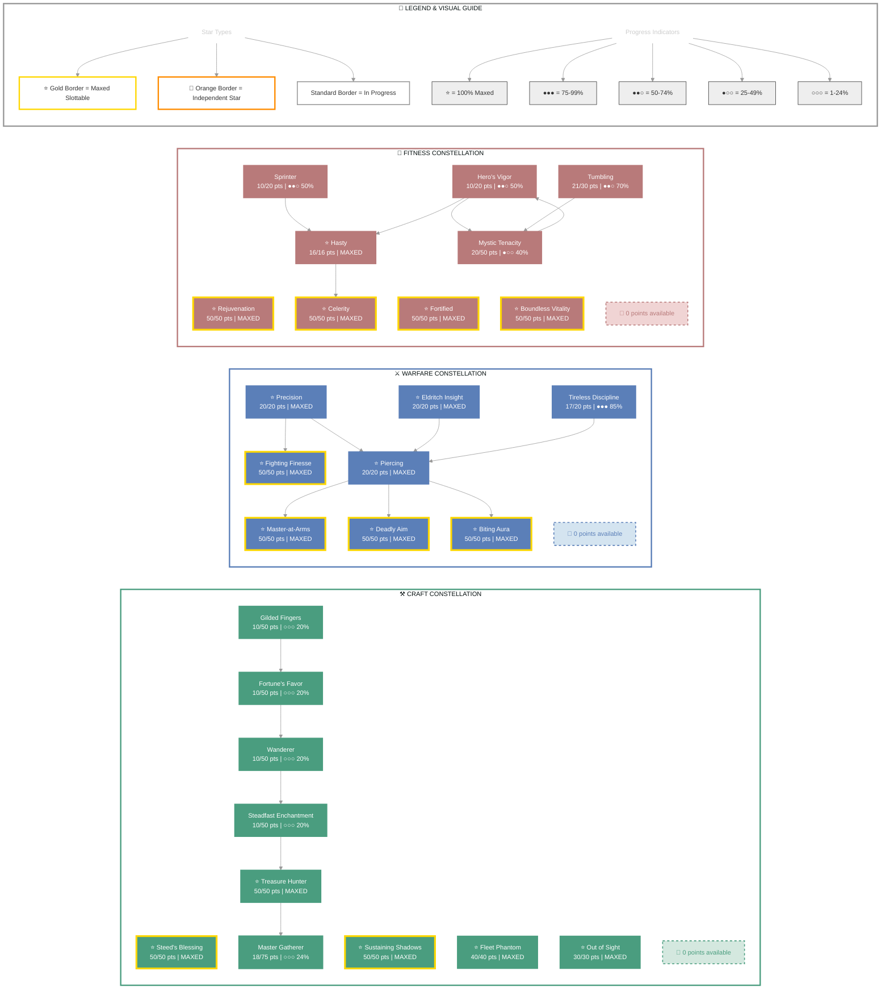

# Karakum (Dark Executioner)

   

**Redguard Dragonknight • Daggerfall Covenant Alliance**

---

## 📑 Table of Contents

- [📋 Overview](#overview)
  - [General](#general)
  - [Currency](#currency)
- [⚔️ Combat Arsenal](#combat-arsenal)
  - [Character Stats](#character-stats)
  - [Advanced Stats](#advanced-stats)
- [⚔️ PvP](#pvp)
  - [Alliance War Skills](#alliance-war-skills)
- [👥 Companions](#companions)
- [🎨 Collectibles](#collectibles)
- [🎒 Inventory](#inventory)
- [🏆 Achievements](#achievements)
- [🏰 Guild Membership](#guild-membership)

---

## 📋 Overview

### General

| **Attribute** | **Value** |
| --- | --- |
| **Level** | 50 |
| **Champion Points** | 832 |
| **Gender** | Male |
| **Age** | 5d 15h 9m |
| **Account** | @SOLAEGIS |
| **ESO Plus** | ✅ Active |

| **Attribute** | **Value** |
| --- | --- |
| **Attributes** | 🔵 30 / ❤️ 0 / ⚡ 34 |
| **🐴 Riding Skills** | 🐴 60 / 💪 60 / 🎒 60 ✅ |
| **Skill Points** | 🎯 13 available - Ready to spend |
| **Race** | [Redguard](https://en.uesp.net/wiki/Online:Redguard) |
| **Server** | [NA Megaserver](https://en.uesp.net/wiki/Online:Megaservers) |
| **Class** | [Dragonknight](https://en.uesp.net/wiki/Online:Dragonknight) |

| **Attribute** | **Value** |
| --- | --- |
| **Title** | [Dark Executioner](https://en.uesp.net/wiki/Online:Dark_Executioner) |
| **🪨 Mundus Stone** | [The Shadow](https://en.uesp.net/wiki/Online:The_Shadow_(Mundus_Stone)) |
| **Alliance** | [Daggerfall Covenant](https://en.uesp.net/wiki/Online:Daggerfall_Covenant) |
| **Location** | [Anvil Outlaws Refuge](https://en.uesp.net/wiki/Online:Anvil_Outlaws_Refuge) (461) |
| **🍖 Active Buffs** | Other: [Increase Max Stamina](https://en.uesp.net/wiki/Online:Increase_Max_Stamina), [Minor Protection](https://en.uesp.net/wiki/Online:Minor_Protection) |

### Currency

| **Attribute** | **Value** |
| --- | --- |
| 💰 **Gold** | 10,552 |
| ⚔️ **Alliance Points** | 0 |
| 🔮 **Tel Var** | 0 |
| 💎 **Transmute Crystals** | 105 |
| 📜 **Writs** | 0 |
| 🎫 **Event Tickets** | 5 |
| 👑 **Crowns** | 700 |
| 💠 **Gems** | 184 |
| 🏅 **Seals** | 13,910 |
| 🗝️ **Keys** | 10 |
| 👕 **Tokens** | 3 |
| 📚 **Fortunes** | 0 |
| 🔹 **Fragments** | 148 |

---

## ⚔️ Combat Arsenal

### Character Stats

| **Category** | **Stat** | **Value** |
| --- | --- | ---: |
| 💚 **Resources** | Health | 20,218 |
|  | Magicka | 19,614 |
|  | Stamina | 27,316 |
| ⚔️ **Offensive** | Weapon Power | 2,361 |
|  | Spell Power | 2,361 |

| **Category** | **Stat** | **Value** |
| --- | --- | ---: |
| 🎯 **Critical** | Weapon Crit | 2,501 (11.4%) |
|  | Spell Crit | 2,501 (11.4%) |
| ⚔️ **Penetration** | Physical | 700 |
|  | Spell | 700 |

| **Category** | **Stat** | **Value** |
| --- | --- | ---: |
| 🛡️ **Defensive** | Physical Resist | 18,530 (88.1%) |
|  | Spell Resist | 18,530 (88.1%) |
| ♻️ **Recovery** | Health | 1,202 |
|  | Magicka | 1,042 |
|  | Stamina | 1,058 |

### Advanced Stats

| **Ability** | **Cost/Value** |
|:---|---:|
| ⚔️ **Light Attack** | 3,453 dmg |
| ⚔️ **Heavy Attack** | 6,907 dmg |
| ⚔️ **Bash** | 704 cost, 5,270 dmg |
| 🛡️ **Block** | 1,285 cost, 50% mit, 40% spd |
| 🔓 **Break Free** | 5,400 cost |
| 🏃 **Dodge Roll** | 2,621 cost |
| 🐾 **Sneak** | 18 cost, 0% spd |
| 🏃‍♂️ **Sprint** | 392 cost, 0% spd |

| **Resistance** | **Value** |
|:---|---:|
| 🔥 **Flame** | 28% |
| ⚡ **Shock** | 28% |
| ❄️ **Frost** | 28% |
| 🔮 **Magic** | 28% |
| 🦠 **Disease** | 28% |
| ☠️ **Poison** | 28% |
| 🩸 **Bleed** | 28% |

| **Damage Type** | **Bonus** |
|:---|---:|
| 💥 **Critical Damage** | 81% |
| ⚔️ **Physical** | 12% |
| 🔥 **Flame** | 12% |
| ⚡ **Shock** | 12% |
| ❄️ **Frost** | 0 |
| 🔮 **Magic** | 12% |
| 🦠 **Disease** | 12% |
| ☠️ **Poison** | 12% |
| 🩸 **Bleed** | 12% |
| 🌌 **Oblivion** | 12% |

| **Healing** | **Value** |
|:---|---:|
| 💚 **Healing Done** | 0 |
| 💖 **Healing Taken** | 0 |
| ✨ **Critical Healing** | 81% |

## ⚔️ Combat Arsenal

### ⚔️ ⚔️ ⚔️ Front Bar (Main Hand)

| **1** | **2** | **3** | **4** | **5** | **6** |
| :---: | :---: | :---: | :---: | :---: | :---: |
| [Volatile Armor](https://en.uesp.net/wiki/Online:Volatile_Armor) | [Camouflaged Hunter](https://en.uesp.net/wiki/Online:Camouflaged_Hunter) | [Shadowy Disguise](https://en.uesp.net/wiki/Online:Shadowy_Disguise) | [Rapid Strikes](https://en.uesp.net/wiki/Online:Rapid_Strikes) | [Crystal Fragments](https://en.uesp.net/wiki/Online:Crystal_Fragments) | [Dawnbreaker](https://en.uesp.net/wiki/Online:Dawnbreaker) |

### 🔮 🔮 🔮 Back Bar (Backup)

| **1** | **2** | **3** | **4** | **5** | **6** |
| :---: | :---: | :---: | :---: | :---: | :---: |
| [Unstable Wall of Storms](https://en.uesp.net/wiki/Online:Unstable_Wall_of_Storms) | [Structured Entropy](https://en.uesp.net/wiki/Online:Structured_Entropy) | [Consuming Trap](https://en.uesp.net/wiki/Online:Consuming_Trap) | [Crystal Fragments](https://en.uesp.net/wiki/Online:Crystal_Fragments) | [Volatile Armor](https://en.uesp.net/wiki/Online:Volatile_Armor) | [Ferocious Leap](https://en.uesp.net/wiki/Online:Ferocious_Leap) |

---

## ⚔️ Equipment & Active Sets

| **Set** | **Progress** |
| --- | --- |
| ⚪ **[Gryphon's Ferocity Set](https://en.uesp.net/wiki/Online:Gryphon's_Ferocity_Set)** | `1/5` ██░░░░░░░░ 20% |
| 🟠 **[Armor of the Trainee Set](https://en.uesp.net/wiki/Online:Armor_of_the_Trainee_Set)** | `3/5` ██████░░░░ 60% |

### 📋 Equipment Details

| **Slot** | **Item** | **Set** | **Quality** | **Trait** | **Type** | **Enchantment** |
| --- | --- | --- | --- | --- | --- | --- |
| ⛑️ **Head** | Gryphon's Helmet | [Gryphon's Ferocity Set](https://en.uesp.net/wiki/Online:Gryphon's_Ferocity_Set) | ⭐ Epic | Divines | Medium | Maximum Stamina Enchantment |
| 💎 **Neck** | Necklace of the Trainee | [Armor of the Trainee Set](https://en.uesp.net/wiki/Online:Armor_of_the_Trainee_Set) | 🔮 Superior | Arcane | None | Magicka Recovery Enchantment |
| 🛡️ **Chest** | rubedo leather jack of Health | - | 🔮 Superior | Well-fitted | Medium | Maximum Health Enchantment |
| 👑 **Shoulders** | rubedo leather arm cops of Stamina | - | 🔮 Superior | Well-fitted | Medium | Maximum Stamina Enchantment |
| ⚔️ **Main Hand** | rubedite dagger of Flame | - | 🔮 Superior | Precise | None | Fiery Weapon Enchantment |
| 🛡️ **Off Hand** | rubedite dagger of Shock | - | 🔮 Superior | Precise | None | Charged Weapon Enchantment |
| ⚡ **Waist** | rubedite girdle of Health | - | ⚡ Fine | Well-fitted | Heavy | Maximum Health Enchantment |
| 👖 **Legs** | Rubedo Leather guards of Magicka | - | ⚡ Fine | Impenetrable | Medium | Maximum Magicka Enchantment |
| 👟 **Feet** | rubedo leather boots of Stamina | - | 🔮 Superior | Well-fitted | Medium | Maximum Stamina Enchantment |
| 💍 **Ring 1** | Ring of the Trainee | [Armor of the Trainee Set](https://en.uesp.net/wiki/Online:Armor_of_the_Trainee_Set) | ⭐ Epic | Arcane | None | Magicka Recovery Enchantment |
| 💍 **Ring 2** | Ring of the Trainee | [Armor of the Trainee Set](https://en.uesp.net/wiki/Online:Armor_of_the_Trainee_Set) | ⭐ Epic | Robust | None | Stamina Recovery Enchantment |
| ✋ **Hands** | rubedo leather bracers of Stamina | - | 🔮 Superior | Training | Medium | Maximum Stamina Enchantment |
| 🔮 **Backup Main Hand** | ruby ash lightning staff of Flame | - | 🔮 Superior | Defending | None | Fiery Weapon Enchantment |

---

## ⭐ Champion Points

| **Total** | **Spent** | **Available** |
| :---: | :---: | :---: |
| 832 | 832 | 0 |

> ✨ **Enlightened** - 0 XP bonus remaining

| **⚒️ Craft** | **Assigned Points** |
| --- | ---: |
| ████████████ 100% | 278/278 points |
| **[Out of Sight](https://en.uesp.net/wiki/Online:Out_of_Sight)** | 30 points |
| **[Master Gatherer](https://en.uesp.net/wiki/Online:Master_Gatherer)** | 18 points |
| **[Treasure Hunter](https://en.uesp.net/wiki/Online:Treasure_Hunter)** | 50 points |
| **[Steadfast Enchantment](https://en.uesp.net/wiki/Online:Steadfast_Enchantment)** | 10 points |
| **[Wanderer](https://en.uesp.net/wiki/Online:Wanderer)** | 10 points |
| **[Fortune's Favor](https://en.uesp.net/wiki/Online:Fortune's_Favor)** | 10 points |
| **[Fleet Phantom](https://en.uesp.net/wiki/Online:Fleet_Phantom)** | 40 points |
| **[Gilded Fingers](https://en.uesp.net/wiki/Online:Gilded_Fingers)** | 10 points |
| **[Steed's Blessing](https://en.uesp.net/wiki/Online:Steed's_Blessing)** | 50 points |
| **[Sustaining Shadows](https://en.uesp.net/wiki/Online:Sustaining_Shadows)** | 50 points |

| **⚔️ Warfare** | **Assigned Points** |
| --- | ---: |
| ████████████ 100% | 277/277 points |
| **[Precision](https://en.uesp.net/wiki/Online:Precision)** | 20 points |
| **[Fighting Finesse](https://en.uesp.net/wiki/Online:Fighting_Finesse)** | 50 points |
| **[Piercing](https://en.uesp.net/wiki/Online:Piercing)** | 20 points |
| **[Master-at-Arms](https://en.uesp.net/wiki/Online:Master-at-Arms)** | 50 points |
| **[Deadly Aim](https://en.uesp.net/wiki/Online:Deadly_Aim)** | 50 points |
| **[Biting Aura](https://en.uesp.net/wiki/Online:Biting_Aura)** | 50 points |
| **[Tireless Discipline](https://en.uesp.net/wiki/Online:Tireless_Discipline)** | 17 points |
| **[Eldritch Insight](https://en.uesp.net/wiki/Online:Eldritch_Insight)** | 20 points |

| **💪 Fitness** | **Assigned Points** |
| --- | ---: |
| ████████████ 100% | 277/277 points |
| **[Sprinter](https://en.uesp.net/wiki/Online:Sprinter)** | 10 points |
| **[Hasty](https://en.uesp.net/wiki/Online:Hasty)** | 16 points |
| **[Celerity](https://en.uesp.net/wiki/Online:Celerity)** | 50 points |
| **[Hero's Vigor](https://en.uesp.net/wiki/Online:Hero's_Vigor)** | 10 points |
| **[Mystic Tenacity](https://en.uesp.net/wiki/Online:Mystic_Tenacity)** | 20 points |
| **[Tumbling](https://en.uesp.net/wiki/Online:Tumbling)** | 21 points |
| **[Rejuvenation](https://en.uesp.net/wiki/Online:Rejuvenation)** | 50 points |
| **[Fortified](https://en.uesp.net/wiki/Online:Fortified)** | 50 points |
| **[Boundless Vitality](https://en.uesp.net/wiki/Online:Boundless_Vitality)** | 50 points |

### 🎯 Champion Points Visual

---

## 📜 Character Progress

### Progress Overview

| **Maxed Skill Lines** | **In Progress** | **Early Progress** | **Abilities with Morphs** | **Overall Completion** |
| ---: | ---: | ---: | ---: | ---: |
| 5 | 21 | 1 | 18 | 18% |

🌿 Skill Morphs (18 abilities with morph choices)

### ⚔️ Class (7 abilities with morph choices)

#### Draconic Power (Rank 50)

⚠️ **[Ferocious Leap](https://en.uesp.net/wiki/Online:Ferocious_Leap)** (Rank 4)

  ✅ **Morph 2**: [Ferocious Leap](https://en.uesp.net/wiki/Online:Ferocious_Leap)

  

  
Other morph options

  ⚪ **Morph 1**: [Take Flight](https://en.uesp.net/wiki/Online:Take_Flight)

  

✅ **[Volatile Armor](https://en.uesp.net/wiki/Online:Volatile_Armor)** (Rank 4)

  ✅ **Morph 2**: [Volatile Armor](https://en.uesp.net/wiki/Online:Volatile_Armor)

  

  
Other morph options

  ⚪ **Morph 1**: [Hardened Armor](https://en.uesp.net/wiki/Online:Hardened_Armor)

  

🔒 **[Dark Talons](https://en.uesp.net/wiki/Online:Dark_Talons)** (Rank 4)

  

  
Other morph options

  ⚪ **Morph 1**: [Burning Talons](https://en.uesp.net/wiki/Online:Burning_Talons)
  ⚪ **Morph 2**: [Choking Talons](https://en.uesp.net/wiki/Online:Choking_Talons)

  

🔒 **[Dragon Blood](https://en.uesp.net/wiki/Online:Dragon_Blood)** (Rank 4)

  

  
Other morph options

  ⚪ **Morph 1**: [Green Dragon Blood](https://en.uesp.net/wiki/Online:Green_Dragon_Blood)
  ⚪ **Morph 2**: [Coagulating Blood](https://en.uesp.net/wiki/Online:Coagulating_Blood)

  

#### Shadow (Rank 25)

✅ **[Blur](https://en.uesp.net/wiki/Online:Blur)** (Rank 4)

  

  
Other morph options

  ⚪ **Morph 1**: [Mirage](https://en.uesp.net/wiki/Online:Mirage)
  ⚪ **Morph 2**: [Phantasmal Escape](https://en.uesp.net/wiki/Online:Phantasmal_Escape)

  

✅ **[Shadowy Disguise](https://en.uesp.net/wiki/Online:Shadowy_Disguise)** (Rank 1)

  ✅ **Morph 1**: [Shadowy Disguise](https://en.uesp.net/wiki/Online:Shadowy_Disguise)

  

  
Other morph options

  ⚪ **Morph 2**: [Dark Cloak](https://en.uesp.net/wiki/Online:Dark_Cloak)

  

#### Dark Magic (Rank 32)

✅ **[Crystal Fragments](https://en.uesp.net/wiki/Online:Crystal_Fragments)** (Rank 4)

  ✅ **Morph 2**: [Crystal Fragments](https://en.uesp.net/wiki/Online:Crystal_Fragments)

  

  
Other morph options

  ⚪ **Morph 1**: [Crystal Weapon](https://en.uesp.net/wiki/Online:Crystal_Weapon)

  

### ⚔️ Weapon (7 abilities with morph choices)

#### Two Handed (Rank 49)

🔒 **[Uppercut](https://en.uesp.net/wiki/Online:Uppercut)** (Rank 4)

  

  
Other morph options

  ⚪ **Morph 1**: [Dizzying Swing](https://en.uesp.net/wiki/Online:Dizzying_Swing)
  ⚪ **Morph 2**: [Wrecking Blow](https://en.uesp.net/wiki/Online:Wrecking_Blow)

  

🔒 **[Critical Charge](https://en.uesp.net/wiki/Online:Critical_Charge)** (Rank 4)

  

  
Other morph options

  ⚪ **Morph 1**: [Stampede](https://en.uesp.net/wiki/Online:Stampede)
  ⚪ **Morph 2**: [Critical Rush](https://en.uesp.net/wiki/Online:Critical_Rush)

  

🔒 **[Reverse Slash](https://en.uesp.net/wiki/Online:Reverse_Slash)** (Rank 4)

  

  
Other morph options

  ⚪ **Morph 1**: [Reverse Slice](https://en.uesp.net/wiki/Online:Reverse_Slice)
  ⚪ **Morph 2**: [Executioner](https://en.uesp.net/wiki/Online:Executioner)

  

#### One Hand and Shield (Rank 36)

🔒 **[Low Slash](https://en.uesp.net/wiki/Online:Low_Slash)** (Rank 4)

  

  
Other morph options

  ⚪ **Morph 1**: [Deep Slash](https://en.uesp.net/wiki/Online:Deep_Slash)
  ⚪ **Morph 2**: [Heroic Slash](https://en.uesp.net/wiki/Online:Heroic_Slash)

  

🔒 **[Shield Charge](https://en.uesp.net/wiki/Online:Shield_Charge)** (Rank 4)

  

  
Other morph options

  ⚪ **Morph 1**: [Shielded Assault](https://en.uesp.net/wiki/Online:Shielded_Assault)
  ⚪ **Morph 2**: [Invasion](https://en.uesp.net/wiki/Online:Invasion)

  

#### Dual Wield (Rank 32)

✅ **[Rapid Strikes](https://en.uesp.net/wiki/Online:Rapid_Strikes)** (Rank 3)

  ✅ **Morph 1**: [Rapid Strikes](https://en.uesp.net/wiki/Online:Rapid_Strikes)

  

  
Other morph options

  ⚪ **Morph 2**: [Bloodthirst](https://en.uesp.net/wiki/Online:Bloodthirst)

  

#### Destruction Staff (Rank 42)

✅ **[Unstable Wall of Elements](https://en.uesp.net/wiki/Online:Unstable_Wall_of_Elements)** (Rank 4)

  ✅ **Morph 1**: [Unstable Wall of Elements](https://en.uesp.net/wiki/Online:Unstable_Wall_of_Elements)

  

  
Other morph options

  ⚪ **Morph 2**: [Elemental Blockade](https://en.uesp.net/wiki/Online:Elemental_Blockade)

  

### 🌍 World (1 abilities with morph choices)

#### Soul Magic (Rank 2)

✅ **[Consuming Trap](https://en.uesp.net/wiki/Online:Consuming_Trap)** (Rank 4)

  ✅ **Morph 2**: [Consuming Trap](https://en.uesp.net/wiki/Online:Consuming_Trap)

  

  
Other morph options

  ⚪ **Morph 1**: [Soul Splitting Trap](https://en.uesp.net/wiki/Online:Soul_Splitting_Trap)

  

### 🏰 Guild (3 abilities with morph choices)

#### Fighters Guild (Rank 10)

⚠️ **[Dawnbreaker](https://en.uesp.net/wiki/Online:Dawnbreaker)** (Rank 1)

  

  
Other morph options

  ⚪ **Morph 1**: [Flawless Dawnbreaker](https://en.uesp.net/wiki/Online:Flawless_Dawnbreaker)
  ⚪ **Morph 2**: [Dawnbreaker of Smiting](https://en.uesp.net/wiki/Online:Dawnbreaker_of_Smiting)

  

✅ **[Camouflaged Hunter](https://en.uesp.net/wiki/Online:Camouflaged_Hunter)** (Rank 1)

  ✅ **Morph 2**: [Camouflaged Hunter](https://en.uesp.net/wiki/Online:Camouflaged_Hunter)

  

  
Other morph options

  ⚪ **Morph 1**: [Evil Hunter](https://en.uesp.net/wiki/Online:Evil_Hunter)

  

#### Mages Guild (Rank 6)

✅ **[Structured Entropy](https://en.uesp.net/wiki/Online:Structured_Entropy)** (Rank 3)

  ✅ **Morph 2**: [Structured Entropy](https://en.uesp.net/wiki/Online:Structured_Entropy)

  

  
Other morph options

  ⚪ **Morph 1**: [Degeneration](https://en.uesp.net/wiki/Online:Degeneration)

  

---

## ⚔️ PvP

### PvP Profile

#### Alliance War Status

| **Category** | **Value** |
| --- | --- |
| Rank | Recruit |

---

## 👥 Companions

### Available Companions

- [Azandar al-Cybiades](https://en.uesp.net/wiki/Online:Azandar_al-Cybiades)
- [Bastian Hallix](https://en.uesp.net/wiki/Online:Bastian_Hallix)
- [Ember](https://en.uesp.net/wiki/Online:Ember)
- [Isobel Veloise](https://en.uesp.net/wiki/Online:Isobel_Veloise)
- [Mirri Elendis](https://en.uesp.net/wiki/Online:Mirri_Elendis)
- [Sharp-as-Night](https://en.uesp.net/wiki/Online:Sharp-as-Night)
- [Tanlorin](https://en.uesp.net/wiki/Online:Tanlorin)
- [Zerith-var](https://en.uesp.net/wiki/Online:Zerith-var)

### Active Companion

#### 🧙 [Azandar](https://en.uesp.net/wiki/Online:Azandar)

#### Front Bar

| **1** | **2** | **3** | **4** | **5** | **⚡** |
| :---: | :---: | :---: | :---: | :---: | :---: |
| [Scathing Rune](https://en.uesp.net/wiki/Online:Scathing_Rune) | [The Triune Word](https://en.uesp.net/wiki/Online:The_Triune_Word) | [Tendrils of the Colorless Sea](https://en.uesp.net/wiki/Online:Tendrils_of_the_Colorless_Sea) | [Rejuvenation](https://en.uesp.net/wiki/Online:Rejuvenation) | [Empty] | [Empty] |

| **Slot** | **Item** | **Quality** | **Trait** |
| --- | --- | --- | --- |
| ⚔️ **Main Hand** | Companion's Restoration Staff (Level 1, ⭐ Epic) ⚠️ | ⭐ Epic | Aggressive |
| ⛑️ **Head** | Companion's Hat (Level 1, 🔮 Superior) ⚠️ | 🔮 Superior | Quickened |
| 🛡️ **Chest** | Companion's Jerkin (Level 1, 🔮 Superior) ⚠️ | 🔮 Superior | Focused |
| 👑 **Shoulders** | Companion's Epaulets (Level 1, ⚡ Fine) ⚠️ | ⚡ Fine | Quickened |
| ✋ **Hands** | Companion's Gloves (Level 1, 🔮 Superior) ⚠️ | 🔮 Superior | Quickened |
| ⚡ **Waist** | Companion's Sash (Level 1, ⚡ Fine) ⚠️ | ⚡ Fine | Quickened |
| 👖 **Legs** | Companion's Breeches (Level 1, 🔮 Superior) ⚠️ | 🔮 Superior | Shattering |
| 👟 **Feet** | Companion's Shoes (Level 1, 🔮 Superior) ⚠️ | 🔮 Superior | Quickened |

> [!WARNING]
> 👥 **Companion underleveled**: Azandar (Level 9/20) - Needs XP
> 👥 **Companion outdated gear**: 8 pieces below level - Upgrade equipment
> 👥 **Companion empty ability slots**: 2 - Assign abilities
> 💔 **Companion rapport low**: Azandar (Unknown) - Build relationship

---

## 🎨 Collectibles

💁 Assistants (3 of 26)

| Progress |
| --- |
| ██░░░░░░░░░░░░░░░░░░ 11% (3/26) |

- [Nuzhimeh the Merchant](https://en.uesp.net/wiki/Online:Nuzhimeh_the_Merchant)
- [Pirharri the Smuggler](https://en.uesp.net/wiki/Online:Pirharri_the_Smuggler)
- [Tythis Andromo, the Banker](https://en.uesp.net/wiki/Online:Tythis_Andromo,_the_Banker)

🖌️ Body Markings (8 of 321)

| Progress |
| --- |
| ░░░░░░░░░░░░░░░░░░░░ 2% (8/321) |

- [Ancient Dragon Body Marks](https://en.uesp.net/wiki/Online:Ancient_Dragon_Body_Marks)
- [Body Imprint of the Psijic Order](https://en.uesp.net/wiki/Online:Body_Imprint_of_the_Psijic_Order)
- [Clockwork Apostle Body Imprints](https://en.uesp.net/wiki/Online:Clockwork_Apostle_Body_Imprints)
- [Fire Cyclone Body Markings](https://en.uesp.net/wiki/Online:Fire_Cyclone_Body_Markings)
- [Hagmatron's Body Markings](https://en.uesp.net/wiki/Online:Hagmatron's_Body_Markings)
- [Morag Tong Body Tattoo](https://en.uesp.net/wiki/Online:Morag_Tong_Body_Tattoo)
- [Regal Eagle Wing Body Tattoos](https://en.uesp.net/wiki/Online:Regal_Eagle_Wing_Body_Tattoos)
- [Serpent Scale Body Marking](https://en.uesp.net/wiki/Online:Serpent_Scale_Body_Marking)

👗 Costumes (47 of 312)

| Progress |
| --- |
| ███░░░░░░░░░░░░░░░░░ 15% (47/312) |

- [Austere Warden Outfit](https://en.uesp.net/wiki/Online:Austere_Warden_Outfit)
- [Black Hand Robe](https://en.uesp.net/wiki/Online:Black_Hand_Robe)
- [Bloodthorn Robes](https://en.uesp.net/wiki/Online:Bloodthorn_Robes)
- [Colovian Uniform](https://en.uesp.net/wiki/Online:Colovian_Uniform)
- [Courier Uniform](https://en.uesp.net/wiki/Online:Courier_Uniform)
- [Court of Bedlam](https://en.uesp.net/wiki/Online:Court_of_Bedlam)
- [Covenant Scout](https://en.uesp.net/wiki/Online:Covenant_Scout)
- [Crown Dishdasha](https://en.uesp.net/wiki/Online:Crown_Dishdasha)
- [Cyrod Patrician Formal Gown](https://en.uesp.net/wiki/Online:Cyrod_Patrician_Formal_Gown)
- [Dark Seducer](https://en.uesp.net/wiki/Online:Dark_Seducer)
- [Dunmer Cultural Garb](https://en.uesp.net/wiki/Online:Dunmer_Cultural_Garb)
- [Elven Hero Armor](https://en.uesp.net/wiki/Online:Elven_Hero_Armor)
- [Forebear Dishdasha](https://en.uesp.net/wiki/Online:Forebear_Dishdasha)
- [Fort Amol Guard Armor](https://en.uesp.net/wiki/Online:Fort_Amol_Guard_Armor)
- [Frostedge Bandit Armor](https://en.uesp.net/wiki/Online:Frostedge_Bandit_Armor)
- [Golden Saint](https://en.uesp.net/wiki/Online:Golden_Saint)
- [Grim Harvester](https://en.uesp.net/wiki/Online:Grim_Harvester)
- [Hollow Moon Garb](https://en.uesp.net/wiki/Online:Hollow_Moon_Garb)
- [Imperial Chancellor](https://en.uesp.net/wiki/Online:Imperial_Chancellor)
- [Keeper's Garb](https://en.uesp.net/wiki/Online:Keeper's_Garb)
- [Lion Guard Knight](https://en.uesp.net/wiki/Online:Lion_Guard_Knight)
- [Mages Guild Formal Robes](https://en.uesp.net/wiki/Online:Mages_Guild_Formal_Robes)
- [Mages Guild Leggings Uniform](https://en.uesp.net/wiki/Online:Mages_Guild_Leggings_Uniform)
- [Mages Guild Research Robes](https://en.uesp.net/wiki/Online:Mages_Guild_Research_Robes)
- [Mannimarco](https://en.uesp.net/wiki/Online:Mannimarco)
- [Merchant Lord's Formal Regalia](https://en.uesp.net/wiki/Online:Merchant_Lord's_Formal_Regalia)
- [Midnight Union Garb](https://en.uesp.net/wiki/Online:Midnight_Union_Garb)
- [Noble Clan-Chief](https://en.uesp.net/wiki/Online:Noble_Clan-Chief)
- [Nordic Bather's Towel](https://en.uesp.net/wiki/Online:Nordic_Bather's_Towel)
- [Phaer Mercenary Armor](https://en.uesp.net/wiki/Online:Phaer_Mercenary_Armor)
- [Quendelunn Veiled Heritance Garb](https://en.uesp.net/wiki/Online:Quendelunn_Veiled_Heritance_Garb)
- [Red Rook Armor](https://en.uesp.net/wiki/Online:Red_Rook_Armor)
- [Regalia of the Scarlet Judge](https://en.uesp.net/wiki/Online:Regalia_of_the_Scarlet_Judge)
- [Satakalaaam Imperial Armor](https://en.uesp.net/wiki/Online:Satakalaaam_Imperial_Armor)
- [Sea Drake Garb](https://en.uesp.net/wiki/Online:Sea_Drake_Garb)
- [Sea Viper Armor](https://en.uesp.net/wiki/Online:Sea_Viper_Armor)
- [Servant's Outfit](https://en.uesp.net/wiki/Online:Servant's_Outfit)
- [Servant's Robes](https://en.uesp.net/wiki/Online:Servant's_Robes)
- [Seventh Legion Armor](https://en.uesp.net/wiki/Online:Seventh_Legion_Armor)
- [Shrouded Armor](https://en.uesp.net/wiki/Online:Shrouded_Armor)
- [Skald's Damask Jerkin](https://en.uesp.net/wiki/Online:Skald's_Damask_Jerkin)
- [Steel Shrike Uniform](https://en.uesp.net/wiki/Online:Steel_Shrike_Uniform)
- [Stormfist Uniform](https://en.uesp.net/wiki/Online:Stormfist_Uniform)
- [Thieves Guild Leathers](https://en.uesp.net/wiki/Online:Thieves_Guild_Leathers)
- [Upriver Striped Sash-Kilt](https://en.uesp.net/wiki/Online:Upriver_Striped_Sash-Kilt)
- [Vanguard Uniform](https://en.uesp.net/wiki/Online:Vanguard_Uniform)
- [Vulkhel Guard Marine Armor](https://en.uesp.net/wiki/Online:Vulkhel_Guard_Marine_Armor)

🗣️ Emotes (7 of 225)

| Progress |
| --- |
| ░░░░░░░░░░░░░░░░░░░░ 3% (7/225) |

- [Belly Laugh](https://en.uesp.net/wiki/Online:Belly_Laugh)
- [Go Quietly](https://en.uesp.net/wiki/Online:Go_Quietly)
- [Kiss This](https://en.uesp.net/wiki/Online:Kiss_This)
- [Marshmallow Toasty Treat](https://en.uesp.net/wiki/Online:Marshmallow_Toasty_Treat)
- [Showtime](https://en.uesp.net/wiki/Online:Showtime)
- [Teatime](https://en.uesp.net/wiki/Online:Teatime)
- [Wickerman Mishap](https://en.uesp.net/wiki/Online:Wickerman_Mishap)

👓 Facial Accessories (3 of 135)

| Progress |
| --- |
| ░░░░░░░░░░░░░░░░░░░░ 2% (3/135) |

- [Dremora Deceiver's Diadem](https://en.uesp.net/wiki/Online:Dremora_Deceiver's_Diadem)
- [Eternal Hunger Coronal](https://en.uesp.net/wiki/Online:Eternal_Hunger_Coronal)
- [Malign Ambitions Crown](https://en.uesp.net/wiki/Online:Malign_Ambitions_Crown)

💇 Hair Styles (0 of 153)

| Progress |
| --- |
| ░░░░░░░░░░░░░░░░░░░░ 0% (0/153) |

*No hair styles owned*

🎩 Hats (22 of 164)

| Progress |
| --- |
| ██░░░░░░░░░░░░░░░░░░ 13% (22/164) |

- [Arkthzand Anfractuosity Shroud](https://en.uesp.net/wiki/Online:Arkthzand_Anfractuosity_Shroud)
- [Ayleid Royal Crown](https://en.uesp.net/wiki/Online:Ayleid_Royal_Crown)
- [Brass Fortress Rebreather](https://en.uesp.net/wiki/Online:Brass_Fortress_Rebreather)
- [Colovian Filigreed Hood](https://en.uesp.net/wiki/Online:Colovian_Filigreed_Hood)
- [Colovian Fur Hood](https://en.uesp.net/wiki/Online:Colovian_Fur_Hood)
- [Crown of Misrule](https://en.uesp.net/wiki/Online:Crown_of_Misrule)
- [Firesong Obsidian Mask](https://en.uesp.net/wiki/Online:Firesong_Obsidian_Mask)
- [Flamebrow Fire Veil](https://en.uesp.net/wiki/Online:Flamebrow_Fire_Veil)
- [Flannel Forester's Hood](https://en.uesp.net/wiki/Online:Flannel_Forester's_Hood)
- [Helm of the Black Fin](https://en.uesp.net/wiki/Online:Helm_of_the_Black_Fin)
- [Hide Your Helm](https://en.uesp.net/wiki/Online:Hide_Your_Helm)
- [Inferno Facade](https://en.uesp.net/wiki/Online:Inferno_Facade)
- [Madgod's Turban](https://en.uesp.net/wiki/Online:Madgod's_Turban)
- [Malefic Standing Collar Hood](https://en.uesp.net/wiki/Online:Malefic_Standing_Collar_Hood)
- [Nightmare Daemon Mask, Khajiiti](https://en.uesp.net/wiki/Online:Nightmare_Daemon_Mask,_Khajiiti)
- [Oblivion Explorer's Headwrap](https://en.uesp.net/wiki/Online:Oblivion_Explorer's_Headwrap)
- [Plumed Wide-Brim Acorn-Warder](https://en.uesp.net/wiki/Online:Plumed_Wide-Brim_Acorn-Warder)
- [Psijic Skullcap](https://en.uesp.net/wiki/Online:Psijic_Skullcap)
- [Pumpkin Spectre Mask](https://en.uesp.net/wiki/Online:Pumpkin_Spectre_Mask)
- [Scarecrow Spectre Mask](https://en.uesp.net/wiki/Online:Scarecrow_Spectre_Mask)
- [Sideburn Skullcap](https://en.uesp.net/wiki/Online:Sideburn_Skullcap)
- [Werewolf Hunter Hat](https://en.uesp.net/wiki/Online:Werewolf_Hunter_Hat)

🖍️ Head Markings (12 of 372)

| Progress |
| --- |
| ░░░░░░░░░░░░░░░░░░░░ 3% (12/372) |

- [Abyssal Embrace Face Markings](https://en.uesp.net/wiki/Online:Abyssal_Embrace_Face_Markings)
- [Ancient Dragon Face Marks](https://en.uesp.net/wiki/Online:Ancient_Dragon_Face_Marks)
- [Clockwork Apostle Face Imprints](https://en.uesp.net/wiki/Online:Clockwork_Apostle_Face_Imprints)
- [Crimson Flame Lipstick](https://en.uesp.net/wiki/Online:Crimson_Flame_Lipstick)
- [Eagle Plume Face Tattoo](https://en.uesp.net/wiki/Online:Eagle_Plume_Face_Tattoo)
- [Face Imprint of the Psijic Order](https://en.uesp.net/wiki/Online:Face_Imprint_of_the_Psijic_Order)
- [Hagmatron's Face Markings](https://en.uesp.net/wiki/Online:Hagmatron's_Face_Markings)
- [Inferno Ink Face Markings^n](https://en.uesp.net/wiki/Online:Inferno_Ink_Face_Markings^n)
- [Morag Tong Face Tattoo](https://en.uesp.net/wiki/Online:Morag_Tong_Face_Tattoo)
- [Mystic Magicka Flow Face Tattoos](https://en.uesp.net/wiki/Online:Mystic_Magicka_Flow_Face_Tattoos)
- [Scrying Eye Psijic Face Tattoo](https://en.uesp.net/wiki/Online:Scrying_Eye_Psijic_Face_Tattoo)
- [Stonelore's Legend Face Paint](https://en.uesp.net/wiki/Online:Stonelore's_Legend_Face_Paint)

🔮 Mementos (33 of 201)

| Progress |
| --- |
| ███░░░░░░░░░░░░░░░░░ 16% (33/201) |

- [Almalexia's Enchanted Lantern](https://en.uesp.net/wiki/Online:Almalexia's_Enchanted_Lantern)
- [Battered Bear Trap](https://en.uesp.net/wiki/Online:Battered_Bear_Trap)
- [Blackfeather Court Whistle](https://en.uesp.net/wiki/Online:Blackfeather_Court_Whistle)
- [Blade of the Blood Oath](https://en.uesp.net/wiki/Online:Blade_of_the_Blood_Oath)
- [Bonesnap Binding Stone](https://en.uesp.net/wiki/Online:Bonesnap_Binding_Stone)
- [Breda's Bottomless Mead Mug](https://en.uesp.net/wiki/Online:Breda's_Bottomless_Mead_Mug)
- [Cherry Blossom Branch](https://en.uesp.net/wiki/Online:Cherry_Blossom_Branch)
- [Clockwork Obscuros](https://en.uesp.net/wiki/Online:Clockwork_Obscuros)
- [Coin of Illusory Riches](https://en.uesp.net/wiki/Online:Coin_of_Illusory_Riches)
- [Discourse Amaranthine](https://en.uesp.net/wiki/Online:Discourse_Amaranthine)
- [Dwarven Puzzle Orb](https://en.uesp.net/wiki/Online:Dwarven_Puzzle_Orb)
- [Fetish of Anger](https://en.uesp.net/wiki/Online:Fetish_of_Anger)
- [Finvir's Trinket](https://en.uesp.net/wiki/Online:Finvir's_Trinket)
- [Fire-Breather's Torches](https://en.uesp.net/wiki/Online:Fire-Breather's_Torches)
- [Jubilee Cake 2017](https://en.uesp.net/wiki/Online:Jubilee_Cake_2017)
- [Jubilee Cake 2018](https://en.uesp.net/wiki/Online:Jubilee_Cake_2018)
- [Jubilee Cake 2020](https://en.uesp.net/wiki/Online:Jubilee_Cake_2020)
- [Lena's Wand of Finding](https://en.uesp.net/wiki/Online:Lena's_Wand_of_Finding)
- [Mud Ball Pouch](https://en.uesp.net/wiki/Online:Mud_Ball_Pouch)
- [Murkmire Grave-Stake](https://en.uesp.net/wiki/Online:Murkmire_Grave-Stake)
- [Nanwen's Sword](https://en.uesp.net/wiki/Online:Nanwen's_Sword)
- [Questionable Meat Sack](https://en.uesp.net/wiki/Online:Questionable_Meat_Sack)
- [Red Revelry Bottle](https://en.uesp.net/wiki/Online:Red_Revelry_Bottle)
- [Remnant of Meridia's Light](https://en.uesp.net/wiki/Online:Remnant_of_Meridia's_Light)
- [Scalecaller Rune of Levitation](https://en.uesp.net/wiki/Online:Scalecaller_Rune_of_Levitation)
- [Sea Sload Dorsal Fin](https://en.uesp.net/wiki/Online:Sea_Sload_Dorsal_Fin)
- [Sword-Swallower's Blade](https://en.uesp.net/wiki/Online:Sword-Swallower's_Blade)
- [The Pie of Misrule](https://en.uesp.net/wiki/Online:The_Pie_of_Misrule)
- [Token of Root Sunder](https://en.uesp.net/wiki/Online:Token_of_Root_Sunder)
- [Witch's Bonfire Dust](https://en.uesp.net/wiki/Online:Witch's_Bonfire_Dust)
- [Witchmother's Whistle](https://en.uesp.net/wiki/Online:Witchmother's_Whistle)
- [Wyrd Elemental Plume](https://en.uesp.net/wiki/Online:Wyrd_Elemental_Plume)
- [Yokudan Totem](https://en.uesp.net/wiki/Online:Yokudan_Totem)

🐴 Mounts (14 of 697)

| Progress |
| --- |
| ░░░░░░░░░░░░░░░░░░░░ 2% (14/697) |

- [Dwarven War Horse](https://en.uesp.net/wiki/Online:Dwarven_War_Horse)
- [Flame Atronach Senche^n](https://en.uesp.net/wiki/Online:Flame_Atronach_Senche^n)
- [Imperial Horse](https://en.uesp.net/wiki/Online:Imperial_Horse)
- [Midnight Steed](https://en.uesp.net/wiki/Online:Midnight_Steed)
- [Nightmare Senche](https://en.uesp.net/wiki/Online:Nightmare_Senche)
- [Nix-Ox War-Steed^n](https://en.uesp.net/wiki/Online:Nix-Ox_War-Steed^n)
- [Noweyr Steed](https://en.uesp.net/wiki/Online:Noweyr_Steed)
- [Psijic Escort Charger](https://en.uesp.net/wiki/Online:Psijic_Escort_Charger)
- [Rahd-m'Athra](https://en.uesp.net/wiki/Online:Rahd-m'Athra)
- [Senche-Leopard](https://en.uesp.net/wiki/Online:Senche-Leopard)
- [Skulltooth Coastal Durzog](https://en.uesp.net/wiki/Online:Skulltooth_Coastal_Durzog)
- [Sorrel Horse](https://en.uesp.net/wiki/Online:Sorrel_Horse)
- [Tessellated Guar](https://en.uesp.net/wiki/Online:Tessellated_Guar)
- [Wormwrithe Bear-Lizard](https://en.uesp.net/wiki/Online:Wormwrithe_Bear-Lizard)

🎭 Personalities (1 of 29)

| Progress |
| --- |
| ░░░░░░░░░░░░░░░░░░░░ 3% (1/29) |

- [Assassin](https://en.uesp.net/wiki/Online:Assassin)

🐾 Pets (39 of 679)

| Progress |
| --- |
| █░░░░░░░░░░░░░░░░░░░ 5% (39/679) |

- [Abecean Ratter Cat](https://en.uesp.net/wiki/Online:Abecean_Ratter_Cat)
- [Alik'r Dune-Hound](https://en.uesp.net/wiki/Online:Alik'r_Dune-Hound)
- [Ambersheen Vale Fawn](https://en.uesp.net/wiki/Online:Ambersheen_Vale_Fawn)
- [Big-Eared Ginger Kitten^n](https://en.uesp.net/wiki/Online:Big-Eared_Ginger_Kitten^n)
- [Blue Dragon Imp](https://en.uesp.net/wiki/Online:Blue_Dragon_Imp)
- [Bravil Retriever](https://en.uesp.net/wiki/Online:Bravil_Retriever)
- [Coldharbour Dremnaken Runt](https://en.uesp.net/wiki/Online:Coldharbour_Dremnaken_Runt)
- [Crimson Torchbug](https://en.uesp.net/wiki/Online:Crimson_Torchbug)
- [Dozen-Banded Vvardvark^n](https://en.uesp.net/wiki/Online:Dozen-Banded_Vvardvark^n)
- [Dusky Fennec Fox^n](https://en.uesp.net/wiki/Online:Dusky_Fennec_Fox^n)
- [Dwarven Spider](https://en.uesp.net/wiki/Online:Dwarven_Spider)
- [Dwarven War Dog](https://en.uesp.net/wiki/Online:Dwarven_War_Dog)
- [Echalette](https://en.uesp.net/wiki/Online:Echalette)
- [Frost Atronach Kagouti Calf^N](https://en.uesp.net/wiki/Online:Frost_Atronach_Kagouti_Calf^N)
- [Golden Eagle](https://en.uesp.net/wiki/Online:Golden_Eagle)
- [Green Dragon Imp](https://en.uesp.net/wiki/Online:Green_Dragon_Imp)
- [Grisly Banekin Mummy^N](https://en.uesp.net/wiki/Online:Grisly_Banekin_Mummy^N)
- [Haunted House Cat^n](https://en.uesp.net/wiki/Online:Haunted_House_Cat^n)
- [Hot Pepper Bantam Guar](https://en.uesp.net/wiki/Online:Hot_Pepper_Bantam_Guar)
- [Housecat](https://en.uesp.net/wiki/Online:Housecat)
- [Imgakin Monkey](https://en.uesp.net/wiki/Online:Imgakin_Monkey)
- [Infernium Dwarven Spiderling](https://en.uesp.net/wiki/Online:Infernium_Dwarven_Spiderling)
- [Jackal](https://en.uesp.net/wiki/Online:Jackal)
- [Long-Winged Bat^F](https://en.uesp.net/wiki/Online:Long-Winged_Bat^F)
- [Nibenay Mudcrab](https://en.uesp.net/wiki/Online:Nibenay_Mudcrab)
- [Noweyr Pony^n](https://en.uesp.net/wiki/Online:Noweyr_Pony^n)
- [Pocket Mammoth](https://en.uesp.net/wiki/Online:Pocket_Mammoth)
- [Pocket Salamander^n](https://en.uesp.net/wiki/Online:Pocket_Salamander^n)
- [Psijic Mascot Bear Cub^n](https://en.uesp.net/wiki/Online:Psijic_Mascot_Bear_Cub^n)
- [Psijic Mascot Guar Calf^n](https://en.uesp.net/wiki/Online:Psijic_Mascot_Guar_Calf^n)
- [Psijic Mascot Pony^n](https://en.uesp.net/wiki/Online:Psijic_Mascot_Pony^n)
- [Scintillant Dovah-Fly^n](https://en.uesp.net/wiki/Online:Scintillant_Dovah-Fly^n)
- [Spectral Mudcrab](https://en.uesp.net/wiki/Online:Spectral_Mudcrab)
- [Steam-Driven Brassilisk^n](https://en.uesp.net/wiki/Online:Steam-Driven_Brassilisk^n)
- [Sylvan Nixad](https://en.uesp.net/wiki/Online:Sylvan_Nixad)
- [Verdigris Haj Mota](https://en.uesp.net/wiki/Online:Verdigris_Haj_Mota)
- [Vermilion Scuttler](https://en.uesp.net/wiki/Online:Vermilion_Scuttler)
- [Viridescent Dragon Frog](https://en.uesp.net/wiki/Online:Viridescent_Dragon_Frog)
- [Vvardvark^n](https://en.uesp.net/wiki/Online:Vvardvark^n)

✨ Polymorphs (1 of 43)

| Progress |
| --- |
| ░░░░░░░░░░░░░░░░░░░░ 2% (1/43) |

- [Skeleton](https://en.uesp.net/wiki/Online:Skeleton)

🎭 Skins (0 of 106)

| Progress |
| --- |
| ░░░░░░░░░░░░░░░░░░░░ 0% (0/106) |

*No skins owned*

---

## 🎒 Inventory

| **Storage** | **Used** | **Max** | **Capacity** |
| --- | ---: | ---: | --- |
| Backpack | 34 | 180 | █░░░░░░░░░ 18% |
| Bank | 226 | 480 | ████░░░░░░ 47% |
| Crafting Bag | ∞ | ∞ | ESO Plus |

<strong>Backpack Items</strong> (34 unique items)

#### Other (34 items)

| **Item** | **Stack** | **Quality** |
| --- | ---: | --- |
| 🔵 ancestor silk hat of Stamina | 1 | 🔵 |
| 🟡 Bound Crown Experience Scroll | 1 | 🟡 |
| 🟣 Bound Crown Fortifying Meal | 1 | 🟣 |
| 🟡 Bound Gold Coast Trapping Poison | 64 | 🟡 |
| 🟣 Bound Gold Coast Warrior Elixir | 25 | 🟣 |
| 🟡 Bound Skill Respecification Scroll | 1 | 🟡 |
| ⚪ Bravil's Best Beet Risotto | 1 | ⚪ |
| 🔵 Clockwork City Treasure Map II | 1 | 🔵 |
| 🔵 Counterfeit Pardon Edict | 17 | 🔵 |
| 🟣 Crafting Motif 34: Assassins League Axes | 1 | 🟣 |
| 🔵 Crown Repair Kit | 9 | 🔵 |
| 🟣 Crown Tri-Restoration Potion | 100 | 🟣 |
| ⚪ Crusty Bread | 3 | ⚪ |
| ⚪ Cyrodiil Assault Crate | 1 | ⚪ |
| ⚪ Cyrodiil Defense Crate | 1 | ⚪ |
| 🟡 Darkening: Dark of the Moons | 1 | 🟡 |
| 🔵 Deep Winter Charity Writ | 1 | 🔵 |
| ⚪ Disposable Juggling Knives | 10 | ⚪ |
| ⚪ Disposable Swallower's Sword | 10 | ⚪ |
| ⚪ Essence of Magicka | 9 | ⚪ |
| ⚪ Heart of the Indrik | 1 | ⚪ |
| ⚪ Heart's Day Rose Tea | 1 | ⚪ |
| ⚪ Lockpick | 29 | ⚪ |
| 🟢 Pattern: Common Basket, Closed | 1 | 🟢 |
| 🟢 Recipe: Mint Chai | 1 | 🟢 |
| 🟢 Recipe: Nut Brown Ale | 1 | 🟢 |
| 🟣 Ring of Flanking | 1 | 🟣 |
| ⚪ Roguish Escape Draught | 5 | ⚪ |
| ⚪ rubedite gauntlets | 1 | ⚪ |
| 🔵 rubedite helm of Health | 1 | 🔵 |
| 🟢 Sithis' Arm Cops | 1 | 🟢 |
| 🟢 Soul Gem | 18 | 🟢 |
| ⚪ Soul Gem (Empty) | 2 | ⚪ |
| 🟢 Undaunted Enclave Invitation | 1 | 🟢 |

<strong>Bank Items</strong> (226 unique items)

#### Other (226 items)

| **Item** | **Stack** | **Quality** |
| --- | ---: | --- |
| 🟡 Attribute Respecification Scroll | 2 | 🟡 |
| 🟡 Attunable Blacksmithing Station, Bound | 1 | 🟡 |
| 🟡 Attunable Clothing Station, Bound | 1 | 🟡 |
| 🟡 Attunable Woodworking Station, Bound | 1 | 🟡 |
| 🔵 Auridon Treasure Map VI | 1 | 🔵 |
| 🟣 Axe of Agility | 1 | 🟣 |
| 🟣 Banner, Jester's Standard | 1 | 🟣 |
| 🟣 Big-Eared Ginger Kitten's Tag | 1 | 🟣 |
| 🔵 Blackwood Treasure Map VI | 1 | 🔵 |
| 🟢 Blueprint: Argonian Stool, Roped | 1 | 🟢 |
| 🟢 Blueprint: Dark Elf Streetpost, Banners | 1 | 🟢 |
| 🟢 Blueprint: Redguard Banner, Post | 1 | 🟢 |
| 🟣 Bonedust Pigment | 2 | 🟣 |
| 🔵 Companion's Axe | 1 | 🔵 |
| 🟢 Companion's Axe | 1 | 🟢 |
| 🔵 Companion's Axe | 1 | 🔵 |
| 🟢 Companion's Axe | 1 | 🟢 |
| 🟢 Companion's Axe | 1 | 🟢 |
| 🟢 Companion's Axe | 1 | 🟢 |
| 🔵 Companion's Axe | 1 | 🔵 |
| 🟢 Companion's Axe | 1 | 🟢 |
| 🟢 Companion's Battle Axe | 1 | 🟢 |
| 🔵 Companion's Battle Axe | 1 | 🔵 |
| 🟢 Companion's Battle Axe | 1 | 🟢 |
| 🟢 Companion's Belt | 1 | 🟢 |
| 🔵 Companion's Belt | 1 | 🔵 |
| 🟢 Companion's Boots | 1 | 🟢 |
| 🟢 Companion's Boots | 1 | 🟢 |
| 🔵 Companion's Boots | 1 | 🔵 |
| 🟢 Companion's Boots | 1 | 🟢 |
| 🔵 Companion's Bow | 1 | 🔵 |
| 🟢 Companion's Bow | 1 | 🟢 |
| 🟢 Companion's Bow | 1 | 🟢 |
| 🟢 Companion's Bow | 1 | 🟢 |
| 🟢 Companion's Bow | 1 | 🟢 |
| 🔵 Companion's Bow | 1 | 🔵 |
| 🟢 Companion's Bow | 1 | 🟢 |
| 🔵 Companion's Bow | 1 | 🔵 |
| 🔵 Companion's Bow | 1 | 🔵 |
| 🟢 Companion's Bow | 1 | 🟢 |
| 🟢 Companion's Pauldrons | 1 | 🟢 |
| 🟢 Companion's Pauldrons | 1 | 🟢 |
| 🟢 Companion's Restoration Staff | 1 | 🟢 |
| 🔵 Companion's Restoration Staff | 1 | 🔵 |
| 🔵 Companion's Restoration Staff | 1 | 🔵 |
| 🔵 Companion's Restoration Staff | 1 | 🔵 |
| 🟢 Companion's Restoration Staff | 1 | 🟢 |
| 🟢 Companion's Restoration Staff | 1 | 🟢 |
| 🔵 Companion's Restoration Staff | 1 | 🔵 |
| 🔵 Companion's Restoration Staff | 1 | 🔵 |
| 🟢 Companion's Restoration Staff | 1 | 🟢 |
| 🔵 Companion's Restoration Staff | 1 | 🔵 |
| 🟢 Companion's Restoration Staff | 1 | 🟢 |
| 🟢 Companion's Restoration Staff | 1 | 🟢 |
| 🔵 Companion's Restoration Staff | 1 | 🔵 |
| 🔵 Companion's Restoration Staff | 1 | 🔵 |
| 🟢 Companion's Restoration Staff | 1 | 🟢 |
| 🟢 Companion's Restoration Staff | 1 | 🟢 |
| 🔵 Companion's Restoration Staff | 1 | 🔵 |
| 🔵 Companion's Restoration Staff | 1 | 🔵 |
| 🔵 Companion's Restoration Staff | 1 | 🔵 |
| 🟢 Companion's Restoration Staff | 1 | 🟢 |
| 🟢 Companion's Restoration Staff | 1 | 🟢 |
| 🟣 Companion's Restoration Staff | 1 | 🟣 |
| 🟢 Companion's Restoration Staff | 1 | 🟢 |
| 🟢 Companion's Restoration Staff | 1 | 🟢 |
| 🟢 Companion's Restoration Staff | 1 | 🟢 |
| 🟢 Companion's Restoration Staff | 1 | 🟢 |
| 🔵 Companion's Restoration Staff | 1 | 🔵 |
| 🟢 Companion's Restoration Staff | 1 | 🟢 |
| 🟢 Companion's Ring | 1 | 🟢 |
| 🟢 Companion's Ring | 1 | 🟢 |
| 🟢 Companion's Ring | 1 | 🟢 |
| 🟢 Companion's Ring | 1 | 🟢 |
| 🟢 Companion's Sabatons | 1 | 🟢 |
| 🟢 Companion's Shield | 1 | 🟢 |
| 🟢 Companion's Shield | 1 | 🟢 |
| 🔵 Companion's Shield | 1 | 🔵 |
| 🟢 Companion's Shield | 1 | 🟢 |
| 🔵 Companion's Shield | 1 | 🔵 |
| 🔵 Companion's Shield | 1 | 🔵 |
| 🟢 Companion's Shield | 1 | 🟢 |
| 🔵 Companion's Shield | 1 | 🔵 |
| 🟣 Companion's Shield | 1 | 🟣 |
| 🔵 Companion's Sword | 1 | 🔵 |
| 🟢 Companion's Sword | 1 | 🟢 |
| 🔵 Companion's Sword | 1 | 🔵 |
| 🟣 Coral Haj Mota Decoy | 1 | 🟣 |
| 🔵 Crackling Lodestone | 1 | 🔵 |
| 🔵 Crafting Motif 1: High Elf Style | 1 | 🔵 |
| 🔵 Crafting Motif 4: Nord Style | 2 | 🔵 |
| 🟣 Crafting Motif 12: Barbaric Style | 2 | 🟣 |
| 🟣 Crafting Motif 15: Dwemer Axes | 1 | 🟣 |
| 🟣 Crafting Motif 34: Assassins League Axes | 3 | 🟣 |
| 🟣 Crafting Motif 39: Minotaur Bows | 1 | 🟣 |
| 🟣 Crafting Motif 40: Order Hour Axes | 2 | 🟣 |
| 🟣 Crafting Motif 40: Order Hour Belts | 2 | 🟣 |
| 🟣 Crafting Motif 40: Order Hour Chests | 2 | 🟣 |
| 🟣 Crafting Motif 40: Order Hour Legs | 1 | 🟣 |
| 🟣 Crafting Motif 40: Order Hour Maces | 2 | 🟣 |
| 🟣 Crafting Motif 40: Order Hour Shields | 1 | 🟣 |
| 🟣 Crafting Motif 42: Hollowjack Axes | 5 | 🟣 |
| 🟣 Crafting Motif 42: Hollowjack Belts | 1 | 🟣 |
| 🟣 Crafting Motif 42: Hollowjack Boots | 2 | 🟣 |
| 🟣 Crafting Motif 42: Hollowjack Daggers | 4 | 🟣 |
| 🟣 Crafting Motif 42: Hollowjack Gloves | 4 | 🟣 |
| 🟣 Crafting Motif 42: Hollowjack Helmets | 3 | 🟣 |
| 🟣 Crafting Motif 42: Hollowjack Legs | 2 | 🟣 |
| 🟣 Crafting Motif 42: Hollowjack Maces | 2 | 🟣 |
| 🟣 Crafting Motif 42: Hollowjack Shoulders | 2 | 🟣 |
| 🟣 Crafting Motif 62: Sapiarch Gloves | 1 | 🟣 |
| 🟣 Crafting Motif 62: Sapiarch Legs | 2 | 🟣 |
| 🟣 Crafting Motif 62: Sapiarch Shoulders | 1 | 🟣 |
| 🟣 Crafting Motif 63: Dremora Axes | 8 | 🟣 |
| 🟣 Crafting Motif 63: Dremora Belts | 6 | 🟣 |
| 🟣 Crafting Motif 63: Dremora Boots | 5 | 🟣 |
| 🟣 Crafting Motif 63: Dremora Daggers | 6 | 🟣 |
| 🟣 Crafting Motif 63: Dremora Gloves | 4 | 🟣 |
| 🟡 Crown Experience Scroll | 87 | 🟡 |
| 🟣 Crown Fortifying Meal | 10 | 🟣 |
| 🟡 Crown Lethal Poison | 919 | 🟡 |
| 🟡 Crown Lethal Poison | 1000 | 🟡 |
| 🟡 Crown Mimic Stone | 6 | 🟡 |
| 🟣 Crown Tri-Restoration Potion | 200 | 🟣 |
| 🟣 Crown Tri-Restoration Potion | 200 | 🟣 |
| 🟣 Crown Tri-Restoration Potion | 200 | 🟣 |
| 🟣 Crown Tri-Restoration Potion | 200 | 🟣 |
| 🔵 Cyrodiil Treasure Map II | 1 | 🔵 |
| 🔵 Cyrodiil Treasure Map V | 1 | 🔵 |
| 🔵 Cyrodiil Treasure Map VII | 1 | 🔵 |
| 🔵 Cyrodiil Treasure Map XI | 1 | 🔵 |
| 🔵 Cyrodiil Treasure Map XVII | 1 | 🔵 |
| 🟢 Daedric Chain, Segment | 1 | 🟢 |
| 🟢 Design: Winter Squash, Display | 1 | 🟢 |
| 🟣 Diagram: Breton Medallion, Lion | 1 | 🟣 |
| 🟢 Diagram: Redguard Streetlamp, Single | 1 | 🟢 |
| 🟣 Epaulets of a Mother's Sorrow | 1 | 🟣 |
| 🔵 Epaulets of Necropotence | 1 | 🔵 |
| 🟣 Exemplary Infused Ring | 1 | 🟣 |
| 🟣 Exemplary Protective Ring | 1 | 🟣 |
| 🟣 Exemplary Swift Necklace | 1 | 🟣 |
| 🟣 Exemplary Swift Ring | 1 | 🟣 |
| 🟣 Exemplary Triune Necklace | 1 | 🟣 |
| 🟢 Flower, Yellow Oleander | 1 | 🟢 |
| 🟡 Fortified Brass Gloves | 1 | 🟡 |
| 🟡 Fortified Brass Sash | 1 | 🟡 |
| 🟣 Glass Style Motif Fragment | 5 | 🟣 |
| 🔵 Gloves of Necropotence | 1 | 🔵 |
| 🟡 Gold Coast Draining Poison | 100 | 🟡 |
| 🟡 Gold Coast Experience Scroll | 15 | 🟡 |
| 🟣 Gold Coast Spellcaster Elixir | 100 | 🟣 |
| 🟣 Gold Coast Swift Survivor Elixir | 200 | 🟣 |
| 🟡 Gold Coast Trapping Poison | 100 | 🟡 |
| 🟣 Gold Coast Warrior Elixir | 100 | 🟣 |
| 🔵 Greenshade Treasure Map V | 1 | 🔵 |
| 🔵 Greenshade Treasure Map VI | 1 | 🔵 |
| 🟣 Harvested Soul Fragment | 1 | 🟣 |
| 🟣 Harvested Soul Fragment | 1 | 🟣 |
| 🔵 Hat of Necropotence | 1 | 🔵 |
| 🟢 Imperial Bookcase, Swirled | 1 | 🟢 |
| 🟡 Instant Blacksmithing Research | 4 | 🟡 |
| 🟡 Instant Clothing Research | 5 | 🟡 |
| ⚪ Keep Door Woodwork Repair Kit | 15 | ⚪ |
| ⚪ Keep Wall Masonry Repair Kit | 34 | ⚪ |
| 🟣 Leniency Edict | 13 | 🟣 |
| 🟣 Letter from Tanlorin | 1 | 🟣 |
| 🟡 Major Gold Coast Experience Scroll | 4 | 🟡 |
| 🟡 Major Gold Coast Experience Scroll | 7 | 🟡 |
| 🟣 Necklace of Morihaus | 1 | 🟣 |
| 🟣 Painting of Sinkhole, Refined | 1 | 🟣 |
| 🟢 Pattern: Wood Elf Awning, Leather | 1 | 🟢 |
| 🟣 Plague-Drenched Fabric | 1 | 🟣 |
| 🟡 Pledge of Mara | 1 | 🟡 |
| 🟣 Psijic Glowglobe's Meteoric Glass | 1 | 🟣 |
| 🟢 Recipe: Apple Cobbler Supreme | 1 | 🟢 |
| 🟢 Recipe: Banana Surprise | 1 | 🟢 |
| 🟢 Recipe: Bitter Tea | 1 | 🟢 |
| 🔵 Recipe: Bowl of "Peeled Eyeballs" | 3 | 🔵 |
| 🟢 Recipe: Bravil's Best Beet Risotto | 2 | 🟢 |
| 🟢 Recipe: Carrot Cheesecake | 2 | 🟢 |
| 🟢 Recipe: Colovian Ginger Beer | 2 | 🟢 |
| 🔵 Recipe: Crunchy Spider Skewer | 1 | 🔵 |
| 🟢 Recipe: Ginseng Tonic | 1 | 🟢 |
| 🔵 Recipe: Grapes and Ash Yam Falafel | 1 | 🔵 |
| 🟢 Recipe: Hearty Garlic Corn Chowder | 6 | 🟢 |
| 🟢 Recipe: Indoril Radish Tartlets | 1 | 🟢 |
| 🟢 Recipe: Kragenmoor Zinger Mazte | 1 | 🟢 |
| 🔵 Recipe: Late Hearthfire Vegetable Tart | 1 | 🔵 |
| 🟢 Recipe: Lilmoth Garlic Hagfish | 3 | 🟢 |
| 🟢 Recipe: Mate Infusion | 1 | 🟢 |
| 🟢 Recipe: Melon Jelly | 1 | 🟢 |
| 🔵 Recipe: Melon-Baked Parmesan Pork | 1 | 🔵 |
| 🔵 Recipe: Mistral Banana-Bunny Hash | 1 | 🔵 |
| 🟣 Recipe: Psijic Ambrosia, Fragment IV | 1 | 🟣 |
| 🟣 Recipe: Psijic Ambrosia, Fragment V | 1 | 🟣 |
| 🟢 Recipe: Rabbit Millet Pilaf | 1 | 🟢 |
| 🟢 Recipe: Red Rye Beer | 1 | 🟢 |
| 🟢 Recipe: Steamed Radishes | 1 | 🟢 |
| 🟢 Recipe: Stuffed Grape Leaves | 1 | 🟢 |
| 🟢 Recipe: Sweet Sanguine Apples | 6 | 🟢 |
| 🟢 Recipe: Sweetsting Tea | 1 | 🟢 |
| 🟢 Recipe: Thrice-Baked Gorapple Pie | 2 | 🟢 |
| 🟢 Recipe: Tomato Soup | 2 | 🟢 |
| 🟣 Recipe: Witchmother's Party Punch | 1 | 🟣 |
| 🔵 Ring of Bahraha's Curse | 1 | 🔵 |
| 🟣 Ring of Endurance | 1 | 🟣 |
| 🟣 Sacrificial Heart | 2 | 🟣 |
| 🟢 Saplings, Burnt Tall | 2 | 🟢 |
| 🔵 Shadowfen Treasure Map I | 1 | 🔵 |
| 🟣 Shard of Writhing Bone | 6 | 🟣 |
| 🔵 Sithis' Necklace | 1 | 🔵 |
| 🔵 Skeletal Marionette Parts | 1 | 🔵 |
| 🔵 Solstice Treasure Map VI | 1 | 🔵 |
| 🔵 Southern Elsweyr Treasure Map II | 1 | 🔵 |
| 🟢 Spirit Stone | 1 | 🟢 |
| 🔵 Stonefalls Treasure Map V | 1 | 🔵 |
| 🟡 Style Page: Eltheric Revenant Sash | 1 | 🟡 |
| 🟡 Style Page: Glenmoril Wyrd Breeches | 1 | 🟡 |
| 🟡 Style Page: Jephrine Paladin Girdle | 1 | 🟡 |
| 🟡 Target Bone Goliath, Reanimated | 1 | 🟡 |
| 🟢 Tea Table, Carved | 1 | 🟢 |
| 🔵 The Wolf and the Dragon | 2 | 🔵 |
| 🔵 Unidentified Alchemist Survey Report | 1 | 🔵 |
| 🟡 Wayshrine Navigation Chart | 1 | 🟡 |
| 🟣 Writhing Haj Mota Scale | 25 | 🟣 |
| 🟣 Writhing Haj Mota Scale | 9 | 🟣 |

<strong>Crafting Bag Items</strong> (383 unique items)

#### Armor Trait (9 items)

| **Item** | **Stack** | **Quality** |
| --- | ---: | --- |
| ⚪ Almandine | 898 | ⚪ |
| ⚪ Bloodstone | 992 | ⚪ |
| ⚪ Diamond | 559 | ⚪ |
| ⚪ Emerald | 517 | ⚪ |
| ⚪ Fortified Nirncrux | 4 | ⚪ |
| ⚪ Garnet | 563 | ⚪ |
| ⚪ Quartz | 692 | ⚪ |
| ⚪ Sapphire | 439 | ⚪ |
| ⚪ Sardonyx | 998 | ⚪ |

#### Aspect Runestone (5 items)

| **Item** | **Stack** | **Quality** |
| --- | ---: | --- |
| 🔵 Denata | 1099 | 🔵 |
| 🟢 Jejota | 2245 | 🟢 |
| 🟡 Kuta | 196 | 🟡 |
| 🟣 Rekuta | 669 | 🟣 |
| ⚪ Ta | 3658 | ⚪ |

#### Essence Runestone (18 items)

| **Item** | **Stack** | **Quality** |
| --- | ---: | --- |
| ⚪ Dekeipa | 327 | ⚪ |
| ⚪ Deni | 1119 | ⚪ |
| ⚪ Denima | 341 | ⚪ |
| ⚪ Deteri | 211 | ⚪ |
| ⚪ Hakeijo | 1 | ⚪ |
| ⚪ Haoko | 238 | ⚪ |
| ⚪ Kaderi | 219 | ⚪ |
| ⚪ Kuoko | 252 | ⚪ |
| ⚪ Makderi | 224 | ⚪ |
| ⚪ Makko | 1114 | ⚪ |
| ⚪ Makkoma | 381 | ⚪ |
| ⚪ Meip | 424 | ⚪ |
| ⚪ Oko | 1147 | ⚪ |
| ⚪ Okoma | 306 | ⚪ |
| ⚪ Okori | 210 | ⚪ |
| ⚪ Oru | 229 | ⚪ |
| ⚪ Rakeipa | 414 | ⚪ |
| ⚪ Taderi | 256 | ⚪ |

#### Furnishing Material (8 items)

| **Item** | **Stack** | **Quality** |
| --- | ---: | --- |
| ⚪ Alchemical Resin | 1429 | ⚪ |
| ⚪ Bast | 536 | ⚪ |
| ⚪ Clean Pelt | 601 | ⚪ |
| ⚪ Decorative Wax | 757 | ⚪ |
| ⚪ Heartwood | 801 | ⚪ |
| ⚪ Mundane Rune | 1489 | ⚪ |
| ⚪ Ochre | 345 | ⚪ |
| ⚪ Regulus | 506 | ⚪ |

#### Ingredient (50 items)

| **Item** | **Stack** | **Quality** |
| --- | ---: | --- |
| ⚪ Acai Berry | 1032 | ⚪ |
| ⚪ Apples | 1518 | ⚪ |
| ⚪ Bananas | 429 | ⚪ |
| ⚪ Barley | 1061 | ⚪ |
| ⚪ Beets | 289 | ⚪ |
| 🟣 Bervez Juice | 73 | 🟣 |
| ⚪ Bittergreen | 405 | ⚪ |
| ⚪ Carrots | 254 | ⚪ |
| ⚪ Cheese | 116 | ⚪ |
| ⚪ Coffee | 932 | ⚪ |
| ⚪ Comberry | 387 | ⚪ |
| ⚪ Corn | 245 | ⚪ |
| ⚪ Fish | 395 | ⚪ |
| ⚪ Flour | 335 | ⚪ |
| 🟣 Frost Mirriam | 59 | 🟣 |
| ⚪ Game | 213 | ⚪ |
| ⚪ Garlic | 178 | ⚪ |
| ⚪ Ginger | 711 | ⚪ |
| ⚪ Ginkgo | 885 | ⚪ |
| ⚪ Ginseng | 969 | ⚪ |
| ⚪ Greens | 416 | ⚪ |
| ⚪ Guarana | 984 | ⚪ |
| ⚪ Honey | 801 | ⚪ |
| ⚪ Isinglass | 661 | ⚪ |
| ⚪ Jasmine | 344 | ⚪ |
| ⚪ Jazbay Grapes | 412 | ⚪ |
| ⚪ Lemon | 801 | ⚪ |
| ⚪ Lotus | 447 | ⚪ |
| ⚪ Melon | 600 | ⚪ |
| ⚪ Metheglin | 786 | ⚪ |
| ⚪ Millet | 377 | ⚪ |
| ⚪ Mint | 395 | ⚪ |
| ⚪ Potato | 211 | ⚪ |
| ⚪ Poultry | 285 | ⚪ |
| ⚪ Pumpkin | 498 | ⚪ |
| ⚪ Radish | 215 | ⚪ |
| ⚪ Red Meat | 228 | ⚪ |
| ⚪ Rice | 1167 | ⚪ |
| ⚪ Rose | 466 | ⚪ |
| ⚪ Rye | 1251 | ⚪ |
| ⚪ Saltrice | 496 | ⚪ |
| ⚪ Seasoning | 474 | ⚪ |
| ⚪ Seaweed | 813 | ⚪ |
| ⚪ Small Game | 221 | ⚪ |
| ⚪ Surilie Grapes | 1205 | ⚪ |
| ⚪ Tomato | 413 | ⚪ |
| ⚪ Wheat | 1112 | ⚪ |
| ⚪ White Meat | 214 | ⚪ |
| ⚪ Yeast | 1156 | ⚪ |
| ⚪ Yerba Mate | 805 | ⚪ |

#### Ink (1 items)

| **Item** | **Stack** | **Quality** |
| --- | ---: | --- |
| ⚪ Luminous Ink | 32 | ⚪ |

#### Jewelry Trait (5 items)

| **Item** | **Stack** | **Quality** |
| --- | ---: | --- |
| ⚪ antimony | 47 | ⚪ |
| ⚪ Aurbic Amber | 16 | ⚪ |
| ⚪ cobalt | 33 | ⚪ |
| ⚪ Titanium | 16 | ⚪ |
| ⚪ zinc | 36 | ⚪ |

#### Lure (6 items)

| **Item** | **Stack** | **Quality** |
| --- | ---: | --- |
| ⚪ crawlers, Foul Bait | 1431 | ⚪ |
| ⚪ fish roe, Foul Bait | 3 | ⚪ |
| ⚪ guts, Lake Bait | 918 | ⚪ |
| ⚪ insect parts, River Bait | 357 | ⚪ |
| ⚪ shad, River Bait | 25 | ⚪ |
| ⚪ worms, Saltwater Bait | 1440 | ⚪ |

#### Material (45 items)

| **Item** | **Stack** | **Quality** |
| --- | ---: | --- |
| ⚪ Ancestor Silk | 2855 | ⚪ |
| ⚪ Calcinium ingot | 280 | ⚪ |
| ⚪ copper ounce | 2115 | ⚪ |
| ⚪ cotton | 1747 | ⚪ |
| ⚪ dwarven ingot | 2390 | ⚪ |
| ⚪ ebonthread | 765 | ⚪ |
| ⚪ ebony ingot | 1381 | ⚪ |
| ⚪ electrum ounce | 154 | ⚪ |
| ⚪ fell hide | 657 | ⚪ |
| ⚪ flax | 1262 | ⚪ |
| ⚪ Galatite ingot | 225 | ⚪ |
| ⚪ hide | 883 | ⚪ |
| ⚪ Iron Hide | 66 | ⚪ |
| ⚪ Iron ingot | 957 | ⚪ |
| ⚪ ironthread | 64 | ⚪ |
| ⚪ jute | 848 | ⚪ |
| ⚪ Kresh Fiber | 152 | ⚪ |
| ⚪ leather | 1397 | ⚪ |
| ⚪ orichalcum ingot | 2478 | ⚪ |
| ⚪ pewter ounce | 2562 | ⚪ |
| ⚪ platinum ounce | 1681 | ⚪ |
| ⚪ quicksilver ingot | 166 | ⚪ |
| ⚪ rawhide | 2930 | ⚪ |
| ⚪ Rubedite Ingot | 4127 | ⚪ |
| ⚪ Rubedo Leather | 1333 | ⚪ |
| ⚪ sanded ash | 128 | ⚪ |
| ⚪ sanded beech | 1882 | ⚪ |
| ⚪ sanded birch | 144 | ⚪ |
| ⚪ sanded hickory | 1989 | ⚪ |
| ⚪ sanded mahogany | 1214 | ⚪ |
| ⚪ sanded maple | 1342 | ⚪ |
| ⚪ sanded nightwood | 263 | ⚪ |
| ⚪ sanded oak | 1686 | ⚪ |
| ⚪ Sanded Ruby Ash | 2561 | ⚪ |
| ⚪ sanded yew | 865 | ⚪ |
| ⚪ Shadowhide | 710 | ⚪ |
| ⚪ silver ounce | 343 | ⚪ |
| ⚪ silverweave | 107 | ⚪ |
| ⚪ spidersilk | 2141 | ⚪ |
| ⚪ Steel ingot | 2094 | ⚪ |
| ⚪ superb hide | 87 | ⚪ |
| ⚪ thick leather | 1145 | ⚪ |
| ⚪ topgrain hide | 60 | ⚪ |
| ⚪ void cloth | 621 | ⚪ |
| ⚪ voidstone ingot | 788 | ⚪ |

#### Plating (4 items)

| **Item** | **Stack** | **Quality** |
| --- | ---: | --- |
| 🟡 Chromium Plating | 31 | 🟡 |
| 🔵 Iridium Plating | 375 | 🔵 |
| 🟢 Terne Plating | 440 | 🟢 |
| 🟣 Zircon Plating | 55 | 🟣 |

#### Poison Solvent (9 items)

| **Item** | **Stack** | **Quality** |
| --- | ---: | --- |
| ⚪ Alkahest | 1905 | ⚪ |
| ⚪ Gall | 1021 | ⚪ |
| ⚪ Grease | 2205 | ⚪ |
| ⚪ Ichor | 2296 | ⚪ |
| ⚪ Night-Oil | 8 | ⚪ |
| ⚪ Pitch-Bile | 157 | ⚪ |
| ⚪ Slime | 437 | ⚪ |
| ⚪ Tarblack | 25 | ⚪ |
| ⚪ Terebinthine | 1223 | ⚪ |

#### Potency Runestone (30 items)

| **Item** | **Stack** | **Quality** |
| --- | ---: | --- |
| ⚪ Denara | 15 | ⚪ |
| ⚪ Edode | 61 | ⚪ |
| ⚪ Edora | 124 | ⚪ |
| ⚪ Hade | 112 | ⚪ |
| ⚪ Idode | 40 | ⚪ |
| ⚪ Itade | 331 | ⚪ |
| ⚪ Jaera | 136 | ⚪ |
| ⚪ Jayde | 59 | ⚪ |
| ⚪ Jehade | 247 | ⚪ |
| ⚪ Jejora | 82 | ⚪ |
| ⚪ Jera | 155 | ⚪ |
| ⚪ Jode | 178 | ⚪ |
| ⚪ Jora | 325 | ⚪ |
| ⚪ Kude | 65 | ⚪ |
| ⚪ Kura | 47 | ⚪ |
| ⚪ Notade | 195 | ⚪ |
| ⚪ Ode | 57 | ⚪ |
| ⚪ Odra | 113 | ⚪ |
| ⚪ Pode | 5 | ⚪ |
| ⚪ Pojode | 73 | ⚪ |
| ⚪ Pojora | 107 | ⚪ |
| ⚪ Pora | 201 | ⚪ |
| ⚪ Porade | 406 | ⚪ |
| ⚪ Rede | 15 | ⚪ |
| ⚪ Rejera | 384 | ⚪ |
| ⚪ Rekude | 90 | ⚪ |
| ⚪ Rekura | 10 | ⚪ |
| ⚪ Repora | 630 | ⚪ |
| ⚪ Rera | 4 | ⚪ |
| ⚪ Tade | 55 | ⚪ |

#### Potion Solvent (9 items)

| **Item** | **Stack** | **Quality** |
| --- | ---: | --- |
| ⚪ cleansed water | 1013 | ⚪ |
| ⚪ clear water | 953 | ⚪ |
| ⚪ cloud mist | 40 | ⚪ |
| ⚪ filtered water | 548 | ⚪ |
| ⚪ Lorkhan's Tears | 822 | ⚪ |
| ⚪ natural water | 1037 | ⚪ |
| ⚪ pristine water | 481 | ⚪ |
| ⚪ purified water | 89 | ⚪ |
| ⚪ Star Dew | 60 | ⚪ |

#### Raw Material (50 items)

| **Item** | **Stack** | **Quality** |
| --- | ---: | --- |
| ⚪ Ashes of Remorse | 2 | ⚪ |
| ⚪ Calcinium ore | 3 | ⚪ |
| ⚪ Cassiterite Sand | 10 | ⚪ |
| ⚪ Coarse Chalk | 18 | ⚪ |
| ⚪ copper dust | 82 | ⚪ |
| ⚪ Dried Blood | 9 | ⚪ |
| ⚪ dwarven ore | 85 | ⚪ |
| ⚪ Dwemer Scrap | 8 | ⚪ |
| ⚪ ebony ore | 5 | ⚪ |
| ⚪ electrum dust | 1 | ⚪ |
| ⚪ fell hide scraps | 12 | ⚪ |
| ⚪ Galatite ore | 5 | ⚪ |
| ⚪ Grain of Pearl Sand | 4 | ⚪ |
| ⚪ hide scraps | 2 | ⚪ |
| ⚪ high iron ore | 4 | ⚪ |
| ⚪ iron hide scraps | 7 | ⚪ |
| ⚪ iron ore | 49 | ⚪ |
| ⚪ leather scraps | 14 | ⚪ |
| ⚪ Malachite Shard | 49 | ⚪ |
| ⚪ orichalcum ore | 41 | ⚪ |
| ⚪ Oxblood Fungus Spore | 9 | ⚪ |
| ⚪ pewter dust | 80 | ⚪ |
| ⚪ platinum dust | 349 | ⚪ |
| ⚪ Quicksilver ore | 8 | ⚪ |
| ⚪ raw ancestor silk | 609 | ⚪ |
| ⚪ raw cotton | 5 | ⚪ |
| ⚪ raw ebonthread | 5 | ⚪ |
| ⚪ raw flax | 5 | ⚪ |
| ⚪ raw jute | 23 | ⚪ |
| ⚪ raw Kreshweed | 3 | ⚪ |
| ⚪ raw silverweed | 2 | ⚪ |
| ⚪ raw spidersilk | 56 | ⚪ |
| ⚪ raw void bloom | 2 | ⚪ |
| ⚪ rawhide scraps | 129 | ⚪ |
| ⚪ rough ash | 3 | ⚪ |
| ⚪ rough beech | 25 | ⚪ |
| ⚪ rough hickory | 75 | ⚪ |
| ⚪ rough mahogany | 1 | ⚪ |
| ⚪ rough maple | 27 | ⚪ |
| ⚪ rough oak | 2 | ⚪ |
| ⚪ rough ruby ash | 668 | ⚪ |
| ⚪ rough yew | 8 | ⚪ |
| ⚪ rubedite ore | 604 | ⚪ |
| ⚪ rubedo hide scraps | 138 | ⚪ |
| ⚪ shadowhide scraps | 8 | ⚪ |
| ⚪ silver dust | 7 | ⚪ |
| ⚪ superb hide scraps | 6 | ⚪ |
| ⚪ thick leather scraps | 58 | ⚪ |
| ⚪ topgrain hide scraps | 2 | ⚪ |
| ⚪ Viridian Dust | 7 | ⚪ |

#### Raw Trait (6 items)

| **Item** | **Stack** | **Quality** |
| --- | ---: | --- |
| ⚪ Pulverized Antimony | 47 | ⚪ |
| ⚪ Pulverized Aurbic Amber | 15 | ⚪ |
| ⚪ Pulverized Cobalt | 59 | ⚪ |
| ⚪ Pulverized Slaughterstone | 2 | ⚪ |
| ⚪ Pulverized Titanium | 17 | ⚪ |
| ⚪ Pulverized Zinc | 49 | ⚪ |

#### Reagent (30 items)

| **Item** | **Stack** | **Quality** |
| --- | ---: | --- |
| 🟢 Beetle Scuttle | 249 | 🟢 |
| 🟢 blessed thistle | 614 | 🟢 |
| 🟢 blue entoloma | 524 | 🟢 |
| 🟢 bugloss | 799 | 🟢 |
| 🟢 Butterfly Wing | 80 | 🟢 |
| 🟢 Clam Gall | 10 | 🟢 |
| 🟢 columbine | 570 | 🟢 |
| 🟢 corn flower | 691 | 🟢 |
| 🟢 Dragon's Bile | 12 | 🟢 |
| 🟢 Dragon's Blood | 6 | 🟢 |
| 🟢 dragonthorn | 718 | 🟢 |
| 🟢 emetic russula | 489 | 🟢 |
| 🟢 Fleshfly Larva||Fleshfly Larvae | 477 | 🟢 |
| 🟢 imp stool | 422 | 🟢 |
| 🟢 lady's smock | 638 | 🟢 |
| 🟢 luminous russula | 348 | 🟢 |
| 🟢 mountain flower | 510 | 🟢 |
| 🟢 Mudcrab Chitin | 46 | 🟢 |
| 🟢 namira's rot | 380 | 🟢 |
| 🟢 Nightshade | 454 | 🟢 |
| 🟢 nirnroot | 449 | 🟢 |
| 🟢 Powdered Mother of Pearl | 11 | 🟢 |
| 🟢 Scrib Jelly | 274 | 🟢 |
| 🟢 Spider Egg | 799 | 🟢 |
| 🟢 stinkhorn | 441 | 🟢 |
| 🟢 Torchbug Thorax | 64 | 🟢 |
| 🟢 violet coprinus | 364 | 🟢 |
| 🟢 water hyacinth | 660 | 🟢 |
| 🟢 white cap | 392 | 🟢 |
| 🟢 wormwood | 649 | 🟢 |

#### Resin (4 items)

| **Item** | **Stack** | **Quality** |
| --- | ---: | --- |
| 🟣 mastic | 163 | 🟣 |
| 🟢 pitch | 869 | 🟢 |
| 🟡 rosin | 37 | 🟡 |
| 🔵 turpen | 859 | 🔵 |

#### Style Material (77 items)

| **Item** | **Stack** | **Quality** |
| --- | ---: | --- |
| ⚪ Adamantite | 903 | ⚪ |
| ⚪ Amber Marble | 663 | ⚪ |
| ⚪ Ancient Sandstone | 17 | ⚪ |
| ⚪ Argentum | 1108 | ⚪ |
| ⚪ Ash Canvas | 18 | ⚪ |
| ⚪ Auric Tusk | 11 | ⚪ |
| ⚪ Azure Plasm | 195 | ⚪ |
| ⚪ Bat Oil | 1 | ⚪ |
| ⚪ Black Beeswax | 236 | ⚪ |
| ⚪ Boiled Carapace | 1 | ⚪ |
| ⚪ Bone | 903 | ⚪ |
| ⚪ Bronze | 646 | ⚪ |
| ⚪ Brooch of Fellowship | 39 | ⚪ |
| ⚪ Cassiterite | 9 | ⚪ |
| ⚪ Corundum | 904 | ⚪ |
| ⚪ Crocodile Leather | 1 | ⚪ |
| 🟡 Crown Mimic Stone | 85 | 🟡 |
| ⚪ Culanda Lacquer | 48 | ⚪ |
| ⚪ Daedra Heart | 567 | ⚪ |
| ⚪ Desecrated Grave Soil | 25 | ⚪ |
| ⚪ Dragon Scute | 12 | ⚪ |
| ⚪ Dragonthread | 42 | ⚪ |
| ⚪ Dwemer Frame | 14 | ⚪ |
| ⚪ Eagle Feather | 7 | ⚪ |
| ⚪ Etched Bronze | 1 | ⚪ |
| ⚪ Etched Molybdenum | 1 | ⚪ |
| ⚪ Etched Nickel | 1 | ⚪ |
| ⚪ Ferrous Salts | 17 | ⚪ |
| ⚪ Festering Dreamcloth | 1 | ⚪ |
| ⚪ Fine Chalk | 82 | ⚪ |
| ⚪ Firesong Skarn | 2 | ⚪ |
| ⚪ flint | 902 | ⚪ |
| ⚪ Funerary Wrappings | 2 | ⚪ |
| ⚪ Gilding Salts | 1 | ⚪ |
| ⚪ Goldscale | 4 | ⚪ |
| ⚪ Gryphon Plume | 1 | ⚪ |
| ⚪ Hackwing Plumage | 4 | ⚪ |
| ⚪ Hawk Skull | 1 | ⚪ |
| ⚪ High Isle Filigree | 5 | ⚪ |
| ⚪ Indigo Lucent | 1 | ⚪ |
| ⚪ Ivory Brigade Clasp | 6 | ⚪ |
| ⚪ Laurel | 84 | ⚪ |
| ⚪ Lion Fang | 6 | ⚪ |
| ⚪ Malachite | 82 | ⚪ |
| ⚪ Manganese | 904 | ⚪ |
| ⚪ Marsh Nettle Sprig | 5 | ⚪ |
| ⚪ Minotaur Bezoar | 5 | ⚪ |
| ⚪ Molybdenum | 861 | ⚪ |
| ⚪ Moonstone | 905 | ⚪ |
| ⚪ Nickel | 847 | ⚪ |
| ⚪ Obliviate Lacquer | 1 | ⚪ |
| ⚪ Obsidian | 903 | ⚪ |
| ⚪ Oxblood Fungus | 709 | ⚪ |
| ⚪ Palladium | 788 | ⚪ |
| ⚪ Pearl Sand | 644 | ⚪ |
| ⚪ Polished Scarab Elytra | 2 | ⚪ |
| ⚪ Polished Shilling | 7 | ⚪ |
| ⚪ Potash | 5 | ⚪ |
| ⚪ Pristine Shroud | 6 | ⚪ |
| ⚪ Refined Bonemold Resin | 14 | ⚪ |
| ⚪ Rogue's Soot | 22 | ⚪ |
| ⚪ Sea Serpent Hide | 1 | ⚪ |
| ⚪ Shimmering Sand | 8 | ⚪ |
| ⚪ Star Sapphire | 72 | ⚪ |
| ⚪ Starmetal | 904 | ⚪ |
| ⚪ Stendarr Stamp | 2 | ⚪ |
| ⚪ Tainted Blood | 64 | ⚪ |
| ⚪ Tempered Brass | 12 | ⚪ |
| ⚪ Tenebrous Cord | 115 | ⚪ |
| ⚪ Tide-Born Feathers | 22 | ⚪ |
| ⚪ Umbral Droplet | 1 | ⚪ |
| ⚪ Vibrant Tumeric | 1 | ⚪ |
| ⚪ Vitrified Malondo | 137 | ⚪ |
| ⚪ Volcanic Viridian | 5 | ⚪ |
| ⚪ Warrior's Heart Ashes | 27 | ⚪ |
| ⚪ Wolfsbane Incense | 178 | ⚪ |
| ⚪ Wrought Ferrofungus | 12 | ⚪ |

#### Tannin (4 items)

| **Item** | **Stack** | **Quality** |
| --- | ---: | --- |
| 🟡 dreugh wax | 38 | 🟡 |
| 🟣 elegant lining | 271 | 🟣 |
| 🔵 embroidery | 1391 | 🔵 |
| 🟢 hemming | 1227 | 🟢 |

#### Temper (4 items)

| **Item** | **Stack** | **Quality** |
| --- | ---: | --- |
| 🔵 dwarven oil | 1173 | 🔵 |
| 🟣 grain solvent | 199 | 🟣 |
| 🟢 honing stone | 1136 | 🟢 |
| 🟡 tempering alloy | 29 | 🟡 |

#### Weapon Trait (9 items)

| **Item** | **Stack** | **Quality** |
| --- | ---: | --- |
| ⚪ Amethyst | 706 | ⚪ |
| ⚪ Carnelian | 219 | ⚪ |
| ⚪ Chysolite | 479 | ⚪ |
| ⚪ Citrine | 631 | ⚪ |
| ⚪ Fire Opal | 405 | ⚪ |
| ⚪ Jade | 364 | ⚪ |
| ⚪ Potent Nirncrux | 3 | ⚪ |
| ⚪ Ruby | 415 | ⚪ |
| ⚪ Turquoise | 472 | ⚪ |

---

## 🏆 Achievement Progress

| **Total Achievements** | **Completed** | **Completion %** | **Points Earned** | **Total Points** |
| ---: | ---: | ---: | ---: | ---: |
| 444 | 72 | 17% | 12,865 | 72,540 |

### 📊 Achievement Categories

<strong>🔧 Ascending Tide (5/1225 pts)</strong>

| **Veteran** | **Value** |
| --- | ---: |
| Points | 0/1010 |
| Progress | ░░░░░░░░░░ 0% |

<strong>🔧 Blackwood (300/1600 pts)</strong>

| **Antiquities** | **Value** |
| --- | ---: |
| Points | 0/125 |
| Progress | ░░░░░░░░░░ 0% |

| **Companions** | **Value** |
| --- | ---: |
| Points | 20/120 |
| Progress | █░░░░░░░░░ 16% |

| **Exploration** | **Value** |
| --- | ---: |
| Points | 100/445 |
| Progress | ██░░░░░░░░ 22% |

| **Quests** | **Value** |
| --- | ---: |
| Points | 180/230 |
| Progress | ███████░░░ 78% |

| **Rockgrove** | **Value** |
| --- | ---: |
| Points | 0/420 |
| Progress | ░░░░░░░░░░ 0% |

<strong>📈 Character (2685/5325 pts)</strong>

| **Anniversary** | **Value** |
| --- | ---: |
| Points | 0/520 |
| Progress | ░░░░░░░░░░ 0% |

| **Champion** | **Value** |
| --- | ---: |
| Points | 235/235 |
| Progress | ██████████ 100% |

| **Class** | **Value** |
| --- | ---: |
| Points | 1075/1435 |
| Progress | ███████░░░ 74% |

| **Companions** | **Value** |
| --- | ---: |
| Points | 40/220 |
| Progress | █░░░░░░░░░ 18% |

| **Guilds** | **Value** |
| --- | ---: |
| Points | 280/520 |
| Progress | █████░░░░░ 53% |

| **Justice** | **Value** |
| --- | ---: |
| Points | 340/420 |
| Progress | ████████░░ 80% |

| **Scribing** | **Value** |
| --- | ---: |
| Points | 5/505 |
| Progress | ░░░░░░░░░░ 0% |

| **Skill Styling** | **Value** |
| --- | ---: |
| Points | 0/105 |
| Progress | ░░░░░░░░░░ 0% |

| **Skyshards** | **Value** |
| --- | ---: |
| Points | 165/475 |
| Progress | ███░░░░░░░ 34% |

| **Trophies** | **Value** |
| --- | ---: |
| Points | 10/80 |
| Progress | █░░░░░░░░░ 12% |

| **Vampire** | **Value** |
| --- | ---: |
| Points | 75/110 |
| Progress | ██████░░░░ 68% |

| **Werewolf** | **Value** |
| --- | ---: |
| Points | 0/105 |
| Progress | ░░░░░░░░░░ 0% |

<strong>🔧 Clockwork City (70/960 pts)</strong>

| **Asylum Sanctorium** | **Value** |
| --- | ---: |
| Points | 0/425 |
| Progress | ░░░░░░░░░░ 0% |

| **Exploration** | **Value** |
| --- | ---: |
| Points | 55/85 |
| Progress | ██████░░░░ 64% |

| **Quests** | **Value** |
| --- | ---: |
| Points | 0/215 |
| Progress | ░░░░░░░░░░ 0% |

<strong>⚒️ Crafting (2365/3400 pts)</strong>

| **Alchemy** | **Value** |
| --- | ---: |
| Points | 355/490 |
| Progress | ███████░░░ 72% |

| **Blacksmithing** | **Value** |
| --- | ---: |
| Points | 215/230 |
| Progress | █████████░ 93% |

| **Clothier** | **Value** |
| --- | ---: |
| Points | 245/260 |
| Progress | █████████░ 94% |

| **Enchanting** | **Value** |
| --- | ---: |
| Points | 165/250 |
| Progress | ██████░░░░ 66% |

| **Jewelry Crafting** | **Value** |
| --- | ---: |
| Points | 150/165 |
| Progress | █████████░ 90% |

| **Outfitting** | **Value** |
| --- | ---: |
| Points | 15/95 |
| Progress | █░░░░░░░░░ 15% |

| **Provisioning** | **Value** |
| --- | ---: |
| Points | 180/255 |
| Progress | ███████░░░ 70% |

| **Woodworking** | **Value** |
| --- | ---: |
| Points | 215/230 |
| Progress | █████████░ 93% |

<strong>🔧 Dark Brotherhood (615/850 pts)</strong>

| **Exploration** | **Value** |
| --- | ---: |
| Points | 230/295 |
| Progress | ███████░░░ 77% |

| **Quests** | **Value** |
| --- | ---: |
| Points | 180/180 |
| Progress | ██████████ 100% |

<strong>🔧 Deadlands (5/810 pts)</strong>

| **Antiquities** | **Value** |
| --- | ---: |
| Points | 0/105 |
| Progress | ░░░░░░░░░░ 0% |

| **Exploration** | **Value** |
| --- | ---: |
| Points | 5/160 |
| Progress | ░░░░░░░░░░ 3% |

| **Quests** | **Value** |
| --- | ---: |
| Points | 0/225 |
| Progress | ░░░░░░░░░░ 0% |

<strong>🔧 Dragon Bones (0/875 pts)</strong>

| **Veteran** | **Value** |
| --- | ---: |
| Points | 0/730 |
| Progress | ░░░░░░░░░░ 0% |

<strong>🔧 Dragonhold (5/675 pts)</strong>

| **Exploration** | **Value** |
| --- | ---: |
| Points | 5/130 |
| Progress | ░░░░░░░░░░ 3% |

| **Quests** | **Value** |
| --- | ---: |
| Points | 0/225 |
| Progress | ░░░░░░░░░░ 0% |

<strong>🏰 Dungeons (545/3740 pts)</strong>

| **Group Dungeons** | **Value** |
| --- | ---: |
| Points | 20/390 |
| Progress | ░░░░░░░░░░ 5% |

| **Public Dungeons** | **Value** |
| --- | ---: |
| Points | 300/1910 |
| Progress | █░░░░░░░░░ 15% |

| **Trials** | **Value** |
| --- | ---: |
| Points | 10/890 |
| Progress | ░░░░░░░░░░ 1% |

<strong>🔧 Elsweyr (80/1340 pts)</strong>

| **Exploration** | **Value** |
| --- | ---: |
| Points | 60/400 |
| Progress | █░░░░░░░░░ 15% |

| **Quests** | **Value** |
| --- | ---: |
| Points | 15/270 |
| Progress | ░░░░░░░░░░ 5% |

| **Sunspire** | **Value** |
| --- | ---: |
| Points | 0/400 |
| Progress | ░░░░░░░░░░ 0% |

<strong>🗺️ Exploration (2410/4700 pts)</strong>

| **Aldmeri Dominion** | **Value** |
| --- | ---: |
| Points | 570/1040 |
| Progress | █████░░░░░ 54% |

| **Coldharbour** | **Value** |
| --- | ---: |
| Points | 5/175 |
| Progress | ░░░░░░░░░░ 2% |

| **Craglorn** | **Value** |
| --- | ---: |
| Points | 165/385 |
| Progress | ████░░░░░░ 42% |

| **Cyrodiil** | **Value** |
| --- | ---: |
| Points | 50/230 |
| Progress | ██░░░░░░░░ 21% |

| **Daggerfall Covenant** | **Value** |
| --- | ---: |
| Points | 670/1055 |
| Progress | ██████░░░░ 63% |

| **Dark Anchors** | **Value** |
| --- | ---: |
| Points | 300/410 |
| Progress | ███████░░░ 73% |

| **Ebonheart Pact** | **Value** |
| --- | ---: |
| Points | 645/1050 |
| Progress | ██████░░░░ 61% |

| **Fishing** | **Value** |
| --- | ---: |
| Points | 0/190 |
| Progress | ░░░░░░░░░░ 0% |

<strong>🔧 Fallen Banners (0/1320 pts)</strong>

| **General** | **Value** |
| --- | ---: |
| Points | 0/280 |
| Progress | ░░░░░░░░░░ 0% |

| **Veteran** | **Value** |
| --- | ---: |
| Points | 0/1040 |
| Progress | ░░░░░░░░░░ 0% |

<strong>🔧 Feast of Shadows (0/1390 pts)</strong>

| **Veteran** | **Value** |
| --- | ---: |
| Points | 0/1140 |
| Progress | ░░░░░░░░░░ 0% |

<strong>🔧 Firesong (10/700 pts)</strong>

| **Antiquities** | **Value** |
| --- | ---: |
| Points | 0/135 |
| Progress | ░░░░░░░░░░ 0% |

| **Exploration** | **Value** |
| --- | ---: |
| Points | 10/100 |
| Progress | █░░░░░░░░░ 10% |

| **Quests** | **Value** |
| --- | ---: |
| Points | 0/205 |
| Progress | ░░░░░░░░░░ 0% |

| **Tales of Tribute** | **Value** |
| --- | ---: |
| Points | 0/40 |
| Progress | ░░░░░░░░░░ 0% |

<strong>🔧 Flames of Ambition (0/945 pts)</strong>

| **Veteran** | **Value** |
| --- | ---: |
| Points | 0/790 |
| Progress | ░░░░░░░░░░ 0% |

<strong>🔧 Gold Road (0/1700 pts)</strong>

| **Antiquities** | **Value** |
| --- | ---: |
| Points | 0/110 |
| Progress | ░░░░░░░░░░ 0% |

| **Exploration** | **Value** |
| --- | ---: |
| Points | 0/465 |
| Progress | ░░░░░░░░░░ 0% |

| **General** | **Value** |
| --- | ---: |
| Points | 0/325 |
| Progress | ░░░░░░░░░░ 0% |

| **Lucent Citadel** | **Value** |
| --- | ---: |
| Points | 0/400 |
| Progress | ░░░░░░░░░░ 0% |

| **Mirrormoor Mosaics** | **Value** |
| --- | ---: |
| Points | 0/65 |
| Progress | ░░░░░░░░░░ 0% |

| **Quests** | **Value** |
| --- | ---: |
| Points | 0/290 |
| Progress | ░░░░░░░░░░ 0% |

| **Tales of Tribute** | **Value** |
| --- | ---: |
| Points | 0/45 |
| Progress | ░░░░░░░░░░ 0% |

<strong>🔧 Greymoor (30/2085 pts)</strong>

| **Antiquities** | **Value** |
| --- | ---: |
| Points | 30/485 |
| Progress | ░░░░░░░░░░ 6% |

| **Exploration** | **Value** |
| --- | ---: |
| Points | 0/370 |
| Progress | ░░░░░░░░░░ 0% |

| **Harrowstorms** | **Value** |
| --- | ---: |
| Points | 0/155 |
| Progress | ░░░░░░░░░░ 0% |

| **Kyne's Aegis** | **Value** |
| --- | ---: |
| Points | 0/430 |
| Progress | ░░░░░░░░░░ 0% |

| **Quests** | **Value** |
| --- | ---: |
| Points | 0/255 |
| Progress | ░░░░░░░░░░ 0% |

<strong>🔧 Harrowstorm (5/945 pts)</strong>

| **General** | **Value** |
| --- | ---: |
| Points | 5/245 |
| Progress | ░░░░░░░░░░ 2% |

| **Veteran** | **Value** |
| --- | ---: |
| Points | 0/700 |
| Progress | ░░░░░░░░░░ 0% |

<strong>🔧 High Isle (30/2320 pts)</strong>

| **Antiquities** | **Value** |
| --- | ---: |
| Points | 0/140 |
| Progress | ░░░░░░░░░░ 0% |

| **Companions** | **Value** |
| --- | ---: |
| Points | 0/120 |
| Progress | ░░░░░░░░░░ 0% |

| **Dreadsail Reef** | **Value** |
| --- | ---: |
| Points | 0/370 |
| Progress | ░░░░░░░░░░ 0% |

| **Exploration** | **Value** |
| --- | ---: |
| Points | 5/390 |
| Progress | ░░░░░░░░░░ 1% |

| **Quests** | **Value** |
| --- | ---: |
| Points | 20/230 |
| Progress | ░░░░░░░░░░ 8% |

| **Tales of Tribute** | **Value** |
| --- | ---: |
| Points | 0/685 |
| Progress | ░░░░░░░░░░ 0% |

| **Volcanic Vents** | **Value** |
| --- | ---: |
| Points | 5/90 |
| Progress | ░░░░░░░░░░ 5% |

<strong>🔧 Holiday Events (340/1130 pts)</strong>

| **Anniversary Jubilee** | **Value** |
| --- | ---: |
| Points | 0/140 |
| Progress | ░░░░░░░░░░ 0% |

| **Hearts Week** | **Value** |
| --- | ---: |
| Points | 0/45 |
| Progress | ░░░░░░░░░░ 0% |

| **Jester's Festival** | **Value** |
| --- | ---: |
| Points | 10/270 |
| Progress | ░░░░░░░░░░ 3% |

| **New Life Festival** | **Value** |
| --- | ---: |
| Points | 165/190 |
| Progress | ████████░░ 86% |

| **Whitestrake's Mayhem** | **Value** |
| --- | ---: |
| Points | 0/165 |
| Progress | ░░░░░░░░░░ 0% |

| **Witches Festival** | **Value** |
| --- | ---: |
| Points | 165/320 |
| Progress | █████░░░░░ 51% |

<strong>🔧 Horns of the Reach (0/760 pts)</strong>

| **Veteran** | **Value** |
| --- | ---: |
| Points | 0/615 |
| Progress | ░░░░░░░░░░ 0% |

<strong>🏠 Housing (0/525 pts)</strong>

| **Decorating** | **Value** |
| --- | ---: |
| Points | 0/150 |
| Progress | ░░░░░░░░░░ 0% |

| **Property** | **Value** |
| --- | ---: |
| Points | 0/325 |
| Progress | ░░░░░░░░░░ 0% |

<strong>🔧 Imperial City (105/1205 pts)</strong>

| **Imperial City Prison** | **Value** |
| --- | ---: |
| Points | 0/300 |
| Progress | ░░░░░░░░░░ 0% |

| **White Gold Tower** | **Value** |
| --- | ---: |
| Points | 0/275 |
| Progress | ░░░░░░░░░░ 0% |

<strong>🔧 Infinite Archive (0/1635 pts)</strong>

| **Exploration** | **Value** |
| --- | ---: |
| Points | 0/940 |
| Progress | ░░░░░░░░░░ 0% |

| **General** | **Value** |
| --- | ---: |
| Points | 0/650 |
| Progress | ░░░░░░░░░░ 0% |

| **Tales of Tribute** | **Value** |
| --- | ---: |
| Points | 0/45 |
| Progress | ░░░░░░░░░░ 0% |

<strong>🔧 Lost Depths (0/1325 pts)</strong>

| **Veteran** | **Value** |
| --- | ---: |
| Points | 0/1090 |
| Progress | ░░░░░░░░░░ 0% |

<strong>🔧 Markarth (5/1335 pts)</strong>

| **Antiquities** | **Value** |
| --- | ---: |
| Points | 0/130 |
| Progress | ░░░░░░░░░░ 0% |

| **Exploration** | **Value** |
| --- | ---: |
| Points | 5/115 |
| Progress | ░░░░░░░░░░ 4% |

| **Quests** | **Value** |
| --- | ---: |
| Points | 0/295 |
| Progress | ░░░░░░░░░░ 0% |

| **Vateshran Hollows** | **Value** |
| --- | ---: |
| Points | 0/485 |
| Progress | ░░░░░░░░░░ 0% |

<strong>🔧 Morrowind (135/1640 pts)</strong>

| **Exploration** | **Value** |
| --- | ---: |
| Points | 75/380 |
| Progress | █░░░░░░░░░ 19% |

| **Halls of Fabrication** | **Value** |
| --- | ---: |
| Points | 0/525 |
| Progress | ░░░░░░░░░░ 0% |

| **Quests** | **Value** |
| --- | ---: |
| Points | 60/255 |
| Progress | ██░░░░░░░░ 23% |

<strong>🔧 Murkmire (15/1050 pts)</strong>

| **Blackrose Prison** | **Value** |
| --- | ---: |
| Points | 0/445 |
| Progress | ░░░░░░░░░░ 0% |

| **Exploration** | **Value** |
| --- | ---: |
| Points | 10/120 |
| Progress | ░░░░░░░░░░ 8% |

| **Quests** | **Value** |
| --- | ---: |
| Points | 0/240 |
| Progress | ░░░░░░░░░░ 0% |

<strong>🔧 Necrom (0/1880 pts)</strong>

| **Antiquities** | **Value** |
| --- | ---: |
| Points | 0/170 |
| Progress | ░░░░░░░░░░ 0% |

| **Bastion Nymic** | **Value** |
| --- | ---: |
| Points | 0/125 |
| Progress | ░░░░░░░░░░ 0% |

| **Companions** | **Value** |
| --- | ---: |
| Points | 0/120 |
| Progress | ░░░░░░░░░░ 0% |

| **Exploration** | **Value** |
| --- | ---: |
| Points | 0/410 |
| Progress | ░░░░░░░░░░ 0% |

| **Quests** | **Value** |
| --- | ---: |
| Points | 0/330 |
| Progress | ░░░░░░░░░░ 0% |

| **Sanity's Edge** | **Value** |
| --- | ---: |
| Points | 0/380 |
| Progress | ░░░░░░░░░░ 0% |

| **Tales of Tribute** | **Value** |
| --- | ---: |
| Points | 0/65 |
| Progress | ░░░░░░░░░░ 0% |

<strong>🔧 Orsinium (255/1010 pts)</strong>

| **Exploration** | **Value** |
| --- | ---: |
| Points | 125/425 |
| Progress | ██░░░░░░░░ 29% |

| **Maelstrom Arena** | **Value** |
| --- | ---: |
| Points | 0/115 |
| Progress | ░░░░░░░░░░ 0% |

| **Quests** | **Value** |
| --- | ---: |
| Points | 75/170 |
| Progress | ████░░░░░░ 44% |

<strong>🔧 Player VS Player (110/1945 pts)</strong>

| **Alliance War** | **Value** |
| --- | ---: |
| Points | 90/915 |
| Progress | ░░░░░░░░░░ 9% |

| **Battlegrounds** | **Value** |
| --- | ---: |
| Points | 0/580 |
| Progress | ░░░░░░░░░░ 0% |

<strong>🔧 Prologues (20/240 pts)</strong>

| **Blackwood** | **Value** |
| --- | ---: |
| Points | 0/10 |
| Progress | ░░░░░░░░░░ 0% |

| **Deadlands** | **Value** |
| --- | ---: |
| Points | 0/10 |
| Progress | ░░░░░░░░░░ 0% |

| **Dragonhold** | **Value** |
| --- | ---: |
| Points | 0/10 |
| Progress | ░░░░░░░░░░ 0% |

| **Elsweyr** | **Value** |
| --- | ---: |
| Points | 0/85 |
| Progress | ░░░░░░░░░░ 0% |

| **Galen** | **Value** |
| --- | ---: |
| Points | 0/10 |
| Progress | ░░░░░░░░░░ 0% |

| **Gold Road** | **Value** |
| --- | ---: |
| Points | 0/10 |
| Progress | ░░░░░░░░░░ 0% |

| **Greymoor** | **Value** |
| --- | ---: |
| Points | 0/10 |
| Progress | ░░░░░░░░░░ 0% |

| **High Isle** | **Value** |
| --- | ---: |
| Points | 0/10 |
| Progress | ░░░░░░░░░░ 0% |

| **Markarth** | **Value** |
| --- | ---: |
| Points | 0/10 |
| Progress | ░░░░░░░░░░ 0% |

| **Murkmire** | **Value** |
| --- | ---: |
| Points | 10/45 |
| Progress | ██░░░░░░░░ 22% |

| **Necrom** | **Value** |
| --- | ---: |
| Points | 0/10 |
| Progress | ░░░░░░░░░░ 0% |

<strong>🔧 Quests (1230/2150 pts)</strong>

| **Aldmeri Dominion** | **Value** |
| --- | ---: |
| Points | 270/410 |
| Progress | ██████░░░░ 65% |

| **Coldharbour** | **Value** |
| --- | ---: |
| Points | 20/95 |
| Progress | ██░░░░░░░░ 21% |

| **Craglorn** | **Value** |
| --- | ---: |
| Points | 0/285 |
| Progress | ░░░░░░░░░░ 0% |

| **Cyrodiil** | **Value** |
| --- | ---: |
| Points | 0/50 |
| Progress | ░░░░░░░░░░ 0% |

| **Daggerfall Covenant** | **Value** |
| --- | ---: |
| Points | 365/410 |
| Progress | ████████░░ 89% |

| **Ebonheart Pact** | **Value** |
| --- | ---: |
| Points | 365/430 |
| Progress | ████████░░ 84% |

| **Main Quest** | **Value** |
| --- | ---: |
| Points | 100/160 |
| Progress | ██████░░░░ 62% |

<strong>🔧 Scalebreaker (5/845 pts)</strong>

| **General** | **Value** |
| --- | ---: |
| Points | 5/175 |
| Progress | ░░░░░░░░░░ 2% |

| **Veteran** | **Value** |
| --- | ---: |
| Points | 0/670 |
| Progress | ░░░░░░░░░░ 0% |

<strong>🔧 Scions of Ithelia (0/1340 pts)</strong>

| **General** | **Value** |
| --- | ---: |
| Points | 0/240 |
| Progress | ░░░░░░░░░░ 0% |

| **Veteran** | **Value** |
| --- | ---: |
| Points | 0/1100 |
| Progress | ░░░░░░░░░░ 0% |

<strong>🔧 Scribes of Fate (0/1360 pts)</strong>

| **Veteran** | **Value** |
| --- | ---: |
| Points | 0/1110 |
| Progress | ░░░░░░░░░░ 0% |

<strong>🔧 Seasons of the Worm Cult (35/1790 pts)</strong>

| **Antiquities** | **Value** |
| --- | ---: |
| Points | 0/125 |
| Progress | ░░░░░░░░░░ 0% |

| **Exploration** | **Value** |
| --- | ---: |
| Points | 0/455 |
| Progress | ░░░░░░░░░░ 0% |

| **Ossein Cage** | **Value** |
| --- | ---: |
| Points | 0/430 |
| Progress | ░░░░░░░░░░ 0% |

| **Quests** | **Value** |
| --- | ---: |
| Points | 30/265 |
| Progress | █░░░░░░░░░ 11% |

| **Siege Camps** | **Value** |
| --- | ---: |
| Points | 5/70 |
| Progress | ░░░░░░░░░░ 7% |

<strong>🔧 Shadows of the Hist (0/785 pts)</strong>

| **Veteran** | **Value** |
| --- | ---: |
| Points | 0/630 |
| Progress | ░░░░░░░░░░ 0% |

<strong>🔧 Stonethorn (0/1055 pts)</strong>

| **General** | **Value** |
| --- | ---: |
| Points | 0/175 |
| Progress | ░░░░░░░░░░ 0% |

| **Veteran** | **Value** |
| --- | ---: |
| Points | 0/880 |
| Progress | ░░░░░░░░░░ 0% |

<strong>🔧 Summerset (755/1935 pts)</strong>

| **Abyssal Geysers** | **Value** |
| --- | ---: |
| Points | 135/150 |
| Progress | █████████░ 90% |

| **Cloudrest** | **Value** |
| --- | ---: |
| Points | 0/695 |
| Progress | ░░░░░░░░░░ 0% |

| **Exploration** | **Value** |
| --- | ---: |
| Points | 210/385 |
| Progress | █████░░░░░ 54% |

| **Quests** | **Value** |
| --- | ---: |
| Points | 325/340 |
| Progress | █████████░ 95% |

<strong>🔧 Thieves Guild (685/1305 pts)</strong>

| **Exploration** | **Value** |
| --- | ---: |
| Points | 235/370 |
| Progress | ██████░░░░ 63% |

| **Maw of Lorkhaj** | **Value** |
| --- | ---: |
| Points | 0/340 |
| Progress | ░░░░░░░░░░ 0% |

| **Quests** | **Value** |
| --- | ---: |
| Points | 235/275 |
| Progress | ████████░░ 85% |

<strong>🔧 Veteran Dungeons (0/4535 pts)</strong>

| **Death Challenges** | **Value** |
| --- | ---: |
| Points | 0/1250 |
| Progress | ░░░░░░░░░░ 0% |

| **Slayer Challenges** | **Value** |
| --- | ---: |
| Points | 0/480 |
| Progress | ░░░░░░░░░░ 0% |

| **Speed Challenges** | **Value** |
| --- | ---: |
| Points | 0/1250 |
| Progress | ░░░░░░░░░░ 0% |

| **Survivor Challenges** | **Value** |
| --- | ---: |
| Points | 0/1200 |
| Progress | ░░░░░░░░░░ 0% |

<strong>🔧 Waking Flame (0/1145 pts)</strong>

| **Veteran** | **Value** |
| --- | ---: |
| Points | 0/890 |
| Progress | ░░░░░░░░░░ 0% |

<strong>🔧 Wolfhunter (5/840 pts)</strong>

| **General** | **Value** |
| --- | ---: |
| Points | 5/155 |
| Progress | ░░░░░░░░░░ 3% |

| **Veteran** | **Value** |
| --- | ---: |
| Points | 0/685 |
| Progress | ░░░░░░░░░░ 0% |

<strong>🔧 Wrathstone (5/870 pts)</strong>

| **General** | **Value** |
| --- | ---: |
| Points | 5/185 |
| Progress | ░░░░░░░░░░ 2% |

| **Veteran** | **Value** |
| --- | ---: |
| Points | 0/685 |
| Progress | ░░░░░░░░░░ 0% |

### 🎉 Recent Achievements

| **Achievement** | **Points** | **Category** |
| --- | ---: | --- |
| ✅ **Summerset Larcenist** | 0 | 🔧  |

---

## 🏰 Guild Membership

| **Guild Name** | **Rank** | **Members** | **Alliance** |
| --- | --- | ---: | --- |
| **Alphabet Mafia** | Member | 431 | [Daggerfall Covenant](https://en.uesp.net/wiki/Online:Daggerfall_Covenant) |
| **Pacrooti's Hirelings** | Member | 333 | [Aldmeri Dominion](https://en.uesp.net/wiki/Online:Aldmeri_Dominion) |
| **Paradox Raiding** | Member | 500 | [Ebonheart Pact](https://en.uesp.net/wiki/Online:Ebonheart_Pact) |
| **Redfur Trading Caravan** | Member | 459 | [Ebonheart Pact](https://en.uesp.net/wiki/Online:Ebonheart_Pact) |
| **Sew and Tell** | Member | 308 | [Aldmeri Dominion](https://en.uesp.net/wiki/Online:Aldmeri_Dominion) |

---

 

**⚔️ CharacterMarkdown by @solaegis**

Generated on 12/26/2025 • Version: 2.2.4-5-g96a9059

