# Nekhtarhebi (Champion of Blackwood)

   

**Nord Warden • Ebonheart Pact Alliance**

---

## 📑 Table of Contents

- [📋 Overview](#overview)
  - [General](#general)
  - [Currency](#currency)
  - [Character Stats](#character-stats)
- [⚔️ Combat Arsenal](#combat-arsenal)
  - [Equipment & Active Sets](#equipment-active-sets)
  - [Champion Points](#champion-points)
  - [Character Progress](#character-progress)
- [⚔️ PvP](#pvp)
  - [Alliance War Skills](#alliance-war-skills)
- [👥 Companions](#companions)
- [🎨 Collectibles](#collectibles)
- [🎒 Inventory](#inventory)
- [🏆 Achievements](#achievements)
- [🏺 Antiquities](#antiquities)
- [📜 Quests](#quests)
- [🏰 Guild Membership](#guild-membership)

---

## 📋 Overview

### General

| **Attribute** | **Value** |
| --- | --- |
| **Level** | 50 |
| **Champion Points** | 763 |
| **Gender** | Male |
| **Race** | Nord |
| **Class** | Warden |
| **Age** | 6d 4h 37m |

| **Attribute** | **Value** |
| --- | --- |
| **🪨 Mundus Stone** | The Thief |
| **Account** | @SOLAEGIS |
| **ESO Plus** | ✅ Active |
| **Server** | NA Megaserver |
| **Alliance** | Ebonheart Pact |
| **Location** | Summerset (Alinor) |

| **Attribute** | **Value** |
| --- | --- |
| **Title** | Champion of Blackwood |
| **Attributes** | 🔵 0 / ❤️ 0 / ⚡ 64 |
| **🍖 Active Buffs** | Other: Gallop, Wild Guardian |
| **🐴 Riding Skills** | 🐴 60 / 💪 60 / 🎒 60 ✅ |
| **Available Champion Points** | ⚒️ 763 - ⚔️ 763 - 💪 763 |
| **Skill Points** | 🎯 15 available - Ready to spend |

### Currency

| **Attribute** | **Value** |
| --- | --- |
| 💰 **Gold** | 23,108 |
| ⚔️ **Alliance Points** | 9,720 |
| 🔮 **Tel Var** | 0 |
| 💎 **Transmute Crystals** | 65 |
| 📜 **Writs** | 0 |
| 🎫 **Event Tickets** | 4 |
| 👑 **Crowns** | 700 |
| 💠 **Gems** | 140 |
| 🏅 **Seals** | 4,385 |
| 🗝️ **Keys** | 9 |
| 👕 **Tokens** | 3 |
| 📚 **Fortunes** | 0 |
| 🔹 **Fragments** | 146 |

### Character Stats

| **Category** | **Stat** | **Value** |
| --- | --- | ---: |
| 💚 **Resources** | Health | 18,960 |
|  | Magicka | 12,000 |
|  | Stamina | 23,085 |
| ⚔️ **Offensive** | Weapon Power | 2,749 |
|  | Spell Power | 2,749 |

| **Category** | **Stat** | **Value** |
| --- | --- | ---: |
| 🎯 **Critical** | Weapon Crit | 10,562 (48.2%) |
|  | Spell Crit | 10,562 (48.2%) |
| ⚔️ **Penetration** | Physical | 350 |
|  | Spell | 350 |

| **Category** | **Stat** | **Value** |
| --- | --- | ---: |
| 🛡️ **Defensive** | Physical Resist | 13,610 (84.4%) |
|  | Spell Resist | 13,610 (84.4%) |
| ♻️ **Recovery** | Health | 399 |
|  | Magicka | 725 |
|  | Stamina | 1,338 |

### Advanced Stats

| **Ability** | **Cost/Value** |
|:---|---:|
| ⚔️ **Light Attack** | 3,672 dmg |
| ⚔️ **Heavy Attack** | 7,344 dmg |
| ⚔️ **Bash** | 765 cost, 5,207 dmg |
| 🛡️ **Block** | 1,340 cost, 50% mit, 40% spd |
| 🔓 **Break Free** | 5,400 cost |
| 🏃 **Dodge Roll** | 2,788 cost |
| 🐾 **Sneak** | 43 cost, 0% spd |
| 🏃‍♂️ **Sprint** | 465 cost, 0% spd |

| **Resistance** | **Value** |
|:---|---:|
| 🔥 **Flame** | 20.6% |
| ⚡ **Shock** | 20.6% |
| ❄️ **Frost** | 20.6% |
| 🔮 **Magic** | 20.6% |
| 🦠 **Disease** | 20.6% |
| ☠️ **Poison** | 20.6% |
| 🩸 **Bleed** | 20.6% |

| **Damage Type** | **Bonus** |
|:---|---:|
| 💥 **Critical Damage** | 97% |
| ⚔️ **Physical** | 6% |
| 🔥 **Flame** | 6% |
| ⚡ **Shock** | 6% |
| ❄️ **Frost** | 0 |
| 🔮 **Magic** | 6% |
| 🦠 **Disease** | 6% |
| ☠️ **Poison** | 6% |
| 🩸 **Bleed** | 6% |
| 🌌 **Oblivion** | 6% |

| **Healing** | **Value** |
|:---|---:|
| 💚 **Healing Done** | 0 |
| 💖 **Healing Taken** | 0 |
| ✨ **Critical Healing** | 22% |

## ⚔️ Combat Arsenal

### ⚔️ ⚔️ ⚔️ Front Bar (Main Hand)

| **1** | **2** | **3** | **4** | **5** | **6** |
| :---: | :---: | :---: | :---: | :---: | :---: |
| Endless Hail | Subterranean Assault | Growing Swarm | Bull Netch | Falcon's Swiftness | Guardian's Savagery |

### 🔮 🔮 🔮 Back Bar (Backup)

| **1** | **2** | **3** | **4** | **5** | **6** |
| :---: | :---: | :---: | :---: | :---: | :---: |
| Rapid Strikes | Cutting Dive | Resolving Vigor | Green Lotus | Crystallized Shield | Guardian's Savagery |

## ⚔️ Equipment & Active Sets

| **Set** | **Progress** |
| --- | --- |
| 🔴 **Mechanical Acuity** | `2/5` ████░░░░░░ 40% |
| ⚪ **Hunding's Rage** | `1/5` ██░░░░░░░░ 20% |
| 🟢 **Order's Wrath** | `5/5` ██████████ 100% *(+2 extra)* |
| ⚪ **Flanking Strategist** | `1/5` ██░░░░░░░░ 20% |
| 🔴 **Gryphon's Ferocity** | `2/5` ████░░░░░░ 40% |

### 📋 Equipment Details

| **Slot** | **Item** | **Set** | **Quality** | **Trait** | **Type** | **Enchantment** |
| --- | --- | --- | --- | --- | --- | --- |
| ⛑️ **Head** | Helmet of the Order's Wrath | Order's Wrath | 👑 Legendary | Divines | Medium • ⚒️ Crafted | - |
| 💎 **Neck** | Necklace of Flanking | Flanking Strategist | 🔮 Superior | Robust | None | Multi-Effect Enchantment |
| 🛡️ **Chest** | Jack of the Order's Wrath | Order's Wrath | 👑 Legendary | Divines | Medium • ⚒️ Crafted | - |
| 👑 **Shoulders** | Arm Cops of the Order's Wrath | Order's Wrath | ⭐ Epic | Divines | Medium • ⚒️ Crafted | - |
| ⚔️ **Main Hand** | Bow of Hunding's Rage | Hunding's Rage | ⭐ Epic | Precise | None • ⚒️ Crafted | Absorb Stamina Enchantment |
| ⚡ **Waist** | Belt of the Order's Wrath | Order's Wrath | ⭐ Epic | Divines | Medium • ⚒️ Crafted | - |
| 👖 **Legs** | Guards of the Order's Wrath | Order's Wrath | 👑 Legendary | Divines | Medium • ⚒️ Crafted | - |
| 👟 **Feet** | Boots of the Order's Wrath | Order's Wrath | ⭐ Epic | Divines | Medium • ⚒️ Crafted | - |
| 💍 **Ring 1** | Gryphon's Ring | Gryphon's Ferocity | 🔮 Superior | Robust | None | Stamina Recovery Enchantment |
| 💍 **Ring 2** | Gryphon's Ring | Gryphon's Ferocity | 🔮 Superior | Robust | None | Stamina Recovery Enchantment |
| ✋ **Hands** | Bracers of the Order's Wrath | Order's Wrath | ⭐ Epic | Divines | Medium • ⚒️ Crafted | - |
| 🔮 **Backup Main Hand** | Dagger of Mechanical Acuity | Mechanical Acuity | 👑 Legendary | Precise | None • ⚒️ Crafted | - |
| 🛡️ **Backup Off Hand** | Dagger of Mechanical Acuity | Mechanical Acuity | 👑 Legendary | Precise | None • ⚒️ Crafted | - |

---

## 📜 Character Progress

### Progress Overview

| **Maxed Skill Lines** | **In Progress** | **Early Progress** | **Abilities with Morphs** | **Overall Completion** |
| ---: | ---: | ---: | ---: | ---: |
| 0 | 0 | 0 | 0 | 0% |

---

## ⭐ Champion Points

| **Total** | **Spent** | **Available** |
| :---: | :---: | :---: |
| 763 | 669 | 763 ⚠️ |

| **⚒️ Craft** | ** ** |
| --- | ---: |
| ███░░░░░░░░░ 26% | 253/968 points |
| **Master Gatherer** | 15 points |
| **Treasure Hunter** | 50 points |
| **Steadfast Enchantment** | 10 points |
| **Rationer** | 10 points |
| **Liquid Efficiency** | 7 points |
| **Wanderer** | 10 points |
| **Gifted Rider** | 50 points |
| **Fortune's Favor** | 41 points |
| **Breakfall** | 10 points |
| **Steed's Blessing** | 50 points |

| **⚔️ Warfare** | ** ** |
| --- | ---: |
| ██░░░░░░░░░░ 21% | 211/974 points |
| **Precision** | 20 points |
| **Piercing** | 10 points |
| **Master-at-Arms** | 50 points |
| **Deadly Aim** | 50 points |
| **Thaumaturge** | 50 points |
| **Wrathful Strikes** | 31 points |

| **💪 Fitness** | ** ** |
| --- | ---: |
| ██░░░░░░░░░░ 21% | 205/974 points |
| **Hero's Vigor** | 20 points |
| **Bloody Renewal** | 30 points |
| **Mystic Tenacity** | 10 points |
| **Siphoning Spells** | 30 points |
| **Tumbling** | 15 points |
| **Rejuvenation** | 50 points |
| **Boundless Vitality** | 50 points |

---

## 🎯 Champion Points Visual

```mermaid
%%{init: {'theme':'base', 'themeVariables': { 'background':'transparent','fontSize':'14px','primaryColor':'#e8f4f0','primaryTextColor':'#000','primaryBorderColor':'#4a9d7f','lineColor':'#999','secondaryColor':'#f0f4f8','tertiaryColor':'#faf0f0'}}}%%

graph LR
  %%%% Champion Point Investment Visualization
  %%%% Enhanced readability with clear visual hierarchy

  %%%% ========================================
  %% ⚒️ CRAFT CONSTELLATION (253/564 pts)
  %%%% ========================================

  subgraph CRAFT ["⚒️ CRAFT CONSTELLATION"]
    direction TB

    CRAFT_TITLE["<b>Slottable Stars</b>"]
    C_R6["Gifted Rider<br/><b>50/100 pts</b> | ●●○ 50%"]
    C_C5["⭐ Treasure Hunter<br/><b>50/50 pts</b> | MAXED"]
    C_IND1["⭐ Steed's Blessing<br/><b>50/50 pts</b> | MAXED"]
    C_IND2["Breakfall<br/><b>10/50 pts</b> | ○○○ 20%"]
    C_R3["Liquid Efficiency<br/><b>7/50 pts</b> | ○○○ 14%"]

    CRAFT_PASS["<b>Passive Stars</b>"]
    C_Fortune's_Favor["Fortune's Favor<br/><b>41/50 pts</b> | ●●● 82%"]
    C_C3["Master Gatherer<br/><b>15/75 pts</b> | ○○○ 20%"]
    C_R6["Wanderer<br/><b>10/100 pts</b> | ○○○ 10%"]

    CRAFT_BASE["<b>Independent Stars</b>"]
    C_BASE2["Steadfast Enchantment<br/><b>10/50 pts</b> | ○○○ 20%"]
    C_BASE3["Rationer<br/><b>10/75 pts</b> | ○○○ 13%"]

    CRAFT_AVAIL["💎 <b>763 points available</b>"]

    CRAFT_TITLE -.-> C_R6 & C_C5 & C_IND1 & C_IND2 & C_R3
    CRAFT_PASS -.-> C_Fortune's_Favor & C_C3 & C_R6
    CRAFT_BASE -.-> C_BASE2 & C_BASE3

    style CRAFT_TITLE fill:transparent,stroke:none,color:#4a9d7f
    style CRAFT_PASS fill:transparent,stroke:none,color:#4a9d7f
    style CRAFT_BASE fill:transparent,stroke:none,color:#4a9d7f
    style C_R6 fill:#4a9d7f,stroke:#4a9d7f,stroke-width:3px,color:#fff
    style C_C5 fill:#4a9d7f,stroke:#ffd700,stroke-width:4px,color:#fff
    style C_IND1 fill:#4a9d7f,stroke:#ffd700,stroke-width:4px,color:#fff
    style C_IND2 fill:#4a9d7f,stroke:#4a9d7f,stroke-width:3px,color:#fff
    style C_R3 fill:#4a9d7f,stroke:#4a9d7f,stroke-width:3px,color:#fff
    style C_Fortune's_Favor fill:#4a9d7f,stroke:#4a9d7f,stroke-width:2px,color:#fff
    style C_C3 fill:#4a9d7f,stroke:#4a9d7f,stroke-width:2px,color:#fff
    style C_R6 fill:#4a9d7f,stroke:#4a9d7f,stroke-width:2px,color:#fff
    style C_BASE2 fill:#4a9d7f,stroke:#ff8c00,stroke-width:3px,color:#fff
    style C_BASE3 fill:#4a9d7f,stroke:#ff8c00,stroke-width:3px,color:#fff
    style CRAFT_AVAIL fill:#d4e8df,stroke:#4a9d7f,stroke-width:2px,stroke-dasharray:5 5,color:#4a9d7f

  end
  style CRAFT fill:transparent,stroke:#4a9d7f,stroke-width:3px

  %%%% ========================================
  %% ⚔️ WARFARE CONSTELLATION (241/564 pts)
  %%%% ========================================

  subgraph WARFARE ["⚔️ WARFARE CONSTELLATION"]
    direction TB

    WARFARE_TITLE["<b>Slottable Stars</b>"]
    W_IND1["⭐ Deadly Aim<br/><b>50/50 pts</b> | MAXED"]
    W_IND3["⭐ Thaumaturge<br/><b>50/50 pts</b> | MAXED"]
    W_IND2["⭐ Master-at-Arms<br/><b>50/50 pts</b> | MAXED"]
    EM1["Wrathful Strikes<br/><b>31/50 pts</b> | ●●○ 62%"]

    WARFARE_PASS["<b>Passive Stars</b>"]
    W_R1["Precision<br/><b>20/50 pts</b> | ●○○ 40%"]

    WARFARE_BASE["<b>Independent Stars</b>"]
    W_BASE3["Siphoning Spells<br/><b>30/50 pts</b> | ●●○ 60%"]

    WARFARE_AVAIL["💎 <b>763 points available</b>"]

    WARFARE_TITLE -.-> W_IND1 & W_IND3 & W_IND2 & EM1
    WARFARE_PASS -.-> W_R1
    WARFARE_BASE -.-> W_BASE3

    style WARFARE_TITLE fill:transparent,stroke:none,color:#5b7fb8
    style WARFARE_PASS fill:transparent,stroke:none,color:#5b7fb8
    style WARFARE_BASE fill:transparent,stroke:none,color:#5b7fb8
    style W_IND1 fill:#5b7fb8,stroke:#ffd700,stroke-width:4px,color:#fff
    style W_IND3 fill:#5b7fb8,stroke:#ffd700,stroke-width:4px,color:#fff
    style W_IND2 fill:#5b7fb8,stroke:#ffd700,stroke-width:4px,color:#fff
    style EM1 fill:#5b7fb8,stroke:#5b7fb8,stroke-width:3px,color:#fff
    style W_R1 fill:#5b7fb8,stroke:#5b7fb8,stroke-width:2px,color:#fff
    style W_BASE3 fill:#5b7fb8,stroke:#ff8c00,stroke-width:3px,color:#fff
    style WARFARE_AVAIL fill:#d4e4f0,stroke:#5b7fb8,stroke-width:2px,stroke-dasharray:5 5,color:#5b7fb8

  end
  style WARFARE fill:transparent,stroke:#5b7fb8,stroke-width:3px

  %%%% ========================================
  %% 💪 FITNESS CONSTELLATION (175/564 pts)
  %%%% ========================================

  subgraph FITNESS ["💪 FITNESS CONSTELLATION"]
    direction TB

    FITNESS_TITLE["<b>Slottable Stars</b>"]
    SS3["Bloody Renewal<br/><b>30/75 pts</b> | ●○○ 40%"]

    FITNESS_PASS["<b>Passive Stars</b>"]
    F_L3["Hero's Vigor<br/><b>20/50 pts</b> | ●○○ 40%"]
    F_L1["Tumbling<br/><b>15/50 pts</b> | ●○○ 30%"]
    F_C1["Mystic Tenacity<br/><b>10/50 pts</b> | ○○○ 20%"]

    FITNESS_BASE["<b>Independent Stars</b>"]
    F_BASE3["⭐ Rejuvenation<br/><b>50/50 pts</b> | MAXED"]
    F_BASE1["⭐ Boundless Vitality<br/><b>50/50 pts</b> | MAXED"]

    FITNESS_AVAIL["💎 <b>763 points available</b>"]

    FITNESS_TITLE -.-> SS3
    FITNESS_PASS -.-> F_L3 & F_L1 & F_C1
    FITNESS_BASE -.-> F_BASE3 & F_BASE1

    style FITNESS_TITLE fill:transparent,stroke:none,color:#b87a7a
    style FITNESS_PASS fill:transparent,stroke:none,color:#b87a7a
    style FITNESS_BASE fill:transparent,stroke:none,color:#b87a7a
    style SS3 fill:#b87a7a,stroke:#b87a7a,stroke-width:3px,color:#fff
    style F_L3 fill:#b87a7a,stroke:#b87a7a,stroke-width:2px,color:#fff
    style F_L1 fill:#b87a7a,stroke:#b87a7a,stroke-width:2px,color:#fff
    style F_C1 fill:#b87a7a,stroke:#b87a7a,stroke-width:2px,color:#fff
    style F_BASE3 fill:#b87a7a,stroke:#ff8c00,stroke-width:3px,color:#fff
    style F_BASE1 fill:#b87a7a,stroke:#ff8c00,stroke-width:3px,color:#fff
    style FITNESS_AVAIL fill:#f0d4d4,stroke:#b87a7a,stroke-width:2px,stroke-dasharray:5 5,color:#b87a7a

  end
  style FITNESS fill:transparent,stroke:#b87a7a,stroke-width:3px

  %%%% ========================================
  %%%% LEGEND
  %%%% ========================================

  subgraph LEGEND ["📖 LEGEND & VISUAL GUIDE"]
    direction TB

    LEG_STARS["<b>Star Types</b>"]
    LEG_S1["⭐ Gold Border = Maxed Slottable"]
    LEG_S2["🔶 Orange Border = Independent Star"]
    LEG_S3["Standard Border = In Progress"]

    LEG_FILL["<b>Progress Indicators</b>"]
    LEG_F1["⭐ = 100% Maxed"]
    LEG_F2["●●● = 75-99%"]
    LEG_F3["●●○ = 50-74%"]
    LEG_F4["●○○ = 25-49%"]
    LEG_F5["○○○ = 1-24%"]

    LEG_STARS -.-> LEG_S1 & LEG_S2 & LEG_S3
    LEG_FILL -.-> LEG_F1 & LEG_F2 & LEG_F3 & LEG_F4 & LEG_F5

    style LEG_STARS fill:transparent,stroke:none,color:#ccc
    style LEG_FILL fill:transparent,stroke:none,color:#ccc
    style LEG_S1 fill:#fff,stroke:#ffd700,stroke-width:3px,color:#333
    style LEG_S2 fill:#fff,stroke:#ff8c00,stroke-width:3px,color:#333
    style LEG_S3 fill:#fff,stroke:#999,stroke-width:2px,color:#333
    style LEG_F1 fill:#eee,stroke:#333,stroke-width:1px,color:#333
    style LEG_F2 fill:#eee,stroke:#333,stroke-width:1px,color:#333
    style LEG_F3 fill:#eee,stroke:#333,stroke-width:1px,color:#333
    style LEG_F4 fill:#eee,stroke:#333,stroke-width:1px,color:#333
    style LEG_F5 fill:#eee,stroke:#333,stroke-width:1px,color:#333
  end
  style LEGEND fill:transparent,stroke:#999,stroke-width:3px
```

## ⚔️ PvP

---

## 👥 Companions

### Active Companion

#### 🧙 Bastian Hallix

| **Slot** | **Item** | **Quality** | **Trait** |
| --- | --- | --- | --- |
| ⚔️ **Main Hand** | Companion's Ice Staff (Level 1, 4) ⚠️ | 4 | Aggressive |
| ⛑️ **Head** | Companion's Helmet (Level 1, 3) ⚠️ | 3 | Aggressive |
| 🛡️ **Chest** | Companion's Jack (Level 1, 3) ⚠️ | 3 | Aggressive |
| 👑 **Shoulders** | Companion's Arm Cops (Level 1, 3) ⚠️ | 3 | Aggressive |
| ✋ **Hands** | Companion's Bracers (Level 1, 3) ⚠️ | 3 | Aggressive |
| ⚡ **Waist** | Companion's Belt (Level 1, 3) ⚠️ | 3 | Quickened |
| 👖 **Legs** | Companion's Greaves (Level 1, 2) ⚠️ | 2 | Bolstered |
| 👟 **Feet** | Companion's Boots (Level 1, 2) ⚠️ | 2 | Quickened |

| **Attention Needed** | **** |
| --- | --- |
| 👥 **Companion underleveled** | Bastian Hallix (Level 17/20) - Needs XP |
| 👥 **Companion outdated gear** | 8 pieces below level - Upgrade equipment |

---

## 🎨 Collectibles

🗺️ DLC & Chapter Access (15 accessible)

- ✅ Cyrodiil
- ✅ Reaper's March
- ✅ Grahtwood
- ✅ Stros M'Kai
- ✅ Clockwork City
- ✅ Northern Elsweyr
- ✅ The Reach
- ✅ The Shambles
- ✅ Galen
- ✅ Elenglynn
- ✅ Gristmung Hold
- ✅ High Isle
- ✅ Galen
- ✅ Necrom
- ✅ Apocrypha

**ESO Plus Active** - All DLCs and Chapters are accessible.

| Type | Count |
|:-----|------:|

## 🎒 Inventory

| **Storage** | **Used** | **Max** | **Capacity** |
| --- | ---: | ---: | --- |
| Backpack | 86 | 200 | ████░░░░░░ 43% |
| Bank | 210 | 480 | ████░░░░░░ 43% |
| Crafting Bag | ∞ | ∞ | ESO Plus |

<strong>Backpack Items</strong> (86 unique items)

#### Other (86 items)

| **Item** | **Stack** | **Quality** |
| --- | ---: | --- |
| ⚪ ancestor silk gloves | 1 | ⚪ |
| 🔵 ancestor silk shoes of Health | 1 | 🔵 |
| ⚪ Ash | 1 | ⚪ |
| 🔵 Blueprint: Argonian Bed, Woven | 1 | 🔵 |
| 🟡 Bound Attribute Respecification Scroll | 1 | 🟡 |
| 🟣 Bound Gold Coast Spellcaster Elixir | 25 | 🟣 |
| 🟡 Bound Skill Respecification Scroll | 1 | 🟡 |
| 🔵 Cleft Striders | 1 | 🔵 |
| ⚪ Cloudy Damage Health Poison IX | 20 | ⚪ |
| ⚪ Cloudy Gradual Ravage Health Poison IX | 20 | ⚪ |
| ⚪ Construct's Left Hand | 1 | ⚪ |
| 🔵 Crafting Motif 1: High Elf Style | 1 | 🔵 |
| 🔵 Crown Soul Gem | 33 | 🔵 |
| ⚪ Daedra Husk | 2 | ⚪ |
| 🟣 Daedric War Spoils | 1 | 🟣 |
| 🟣 Daedric War Spoils | 1 | 🟣 |
| 🟣 Daedric War Spoils | 1 | 🟣 |
| 🟣 Daedric War Spoils | 1 | 🟣 |
| 🟣 Daedric War Spoils | 1 | 🟣 |
| 🟣 Daedric War Spoils | 1 | 🟣 |
| 🟣 Defiler's Jack | 1 | 🟣 |
| 🟣 Defiler's Jack | 1 | 🟣 |
| 🟣 Diagram: Daedric Chandelier, Ritual | 1 | 🟣 |
| 🟢 Dreamer's Restoration Staff | 1 | 🟢 |
| ⚪ Ectoplasm | 3 | ⚪ |
| 🟢 electrum ring | 1 | 🟢 |
| 🟢 Equipment Repair Kit | 1 | 🟢 |
| ⚪ Essence of health | 6 | ⚪ |
| ⚪ Essence of Magicka | 15 | ⚪ |
| ⚪ Essence of Potent Health | 1 | ⚪ |
| ⚪ Essence of Potent Stamina | 1 | ⚪ |
| ⚪ Essence of stamina | 6 | ⚪ |
| ⚪ Foul Hide | 2 | ⚪ |
| 🟣 Fragment of Rulanyil | 1 | 🟣 |
| ⚪ Ginkgo | 3 | ⚪ |
| 🟡 Glorious Daedric War Spoils | 1 | 🟡 |
| 🟡 Glorious Writhing Rewards Coffer | 1 | 🟡 |
| 🟣 Gryphon's Boots | 1 | 🟣 |
| 🟢 Gryphon's Helmet | 1 | 🟢 |
| 🟢 Gryphon's Shield | 1 | 🟢 |
| ⚪ Heart of the Indrik | 1 | ⚪ |
| 🟢 High Elf Lineage Toys | 1 | 🟢 |
| ⚪ Lockpick | 200 | ⚪ |
| ⚪ Lockpick | 10 | ⚪ |
| ⚪ Lockpick | 1 | ⚪ |
| 🟢 Pattern: Wood Elf Awning, Leather | 1 | 🟢 |
| 🔵 platinum necklace of Reduce Feat Cost | 1 | 🔵 |
| 🔵 platinum necklace of Reduce Feat Cost | 1 | 🔵 |
| 🔵 platinum necklace of Reduce Feat Cost | 1 | 🔵 |
| ⚪ platinum ring | 1 | ⚪ |
| ⚪ Riverhold Fragment | 1 | ⚪ |
| 🟢 rubedite axe of Frost | 1 | 🟢 |
| ⚪ rubedite gauntlets | 1 | ⚪ |
| ⚪ rubedite greaves | 1 | ⚪ |
| ⚪ rubedite greaves | 1 | ⚪ |
| ⚪ rubedite greaves | 1 | ⚪ |
| 🟢 rubedite mace of Shock | 1 | 🟢 |
| ⚪ rubedite pauldron | 1 | ⚪ |
| 🔵 rubedo leather arm cops of Stamina | 1 | 🔵 |
| 🟢 rubedo leather belt of Stamina | 1 | 🟢 |
| 🟢 rubedo leather boots of Magicka | 1 | 🟢 |
| ⚪ rubedo leather guards | 1 | ⚪ |
| ⚪ rubedo leather jack | 1 | ⚪ |
| 🟢 rubedo leather jack of Stamina | 1 | 🟢 |
| 🔵 rubedo leather jack of Stamina | 1 | 🔵 |
| ⚪ ruby ash lightning staff | 1 | ⚪ |
| 🔵 Sithis' Ring | 1 | 🔵 |
| 🟢 Soul Gem | 187 | 🟢 |
| ⚪ Soul Gem (Empty) | 1 | ⚪ |
| ⚪ Sturdy Iron Lantern | 10 | ⚪ |
| 🔵 Summerset Daily Recompense | 1 | 🔵 |
| 🔵 Summerset Daily Recompense | 1 | 🔵 |
| 🔵 Summerset Daily Recompense | 1 | 🔵 |
| 🔵 Summerset Daily Recompense | 1 | 🔵 |
| 🔵 Summerset Daily Recompense | 1 | 🔵 |
| 🔵 Summerset Daily Recompense | 1 | 🔵 |
| 🟢 Summerset Silk Neckerchief | 1 | 🟢 |
| ⚪ Truly Superb Glyph of Magicka | 1 | ⚪ |
| ⚪ Truly Superb Glyph of Magicka | 1 | ⚪ |
| ⚪ Truly Superb Glyph of Reduce Spell Cost | 1 | ⚪ |
| ⚪ Truly Superb Glyph of Shock | 1 | ⚪ |
| 🟢 Undertaker's Sabatons | 1 | 🟢 |
| 🟢 Vanus's Hat | 1 | 🟢 |
| 🟢 Vanus's Hat | 1 | 🟢 |
| 🟢 Vanus's Shoes | 1 | 🟢 |
| 🟣 Writhing Haj Mota Scale | 1 | 🟣 |

<strong>Bank Items</strong> (210 unique items)

#### Other (210 items)

| **Item** | **Stack** | **Quality** |
| --- | ---: | --- |
| 🟡 Anthology of Abodes Available for Acquisition | 1 | 🟡 |
| 🟣 Arm Cops of the Night Mother | 1 | 🟣 |
| 🟡 Attunable Blacksmithing Station, Bound | 1 | 🟡 |
| 🟡 Attunable Clothing Station, Bound | 1 | 🟡 |
| 🟡 Attunable Woodworking Station, Bound | 1 | 🟡 |
| 🟣 Big-Eared Ginger Kitten's Feather Toy | 1 | 🟣 |
| 🟣 Big-Eared Ginger Kitten's Milk Saucer | 1 | 🟣 |
| 🟣 Big-Eared Ginger Kitten's Sleeping-Basket | 2 | 🟣 |
| 🔵 Blackreach: Greymoor Caverns Treasure Map II | 1 | 🔵 |
| 🟢 Blueprint: High Elf Shelf, Long | 1 | 🟢 |
| 🟣 Bonedust Pigment | 2 | 🟣 |
| 🔵 Bow of the Trainee | 1 | 🔵 |
| 🔵 Clockwork City Treasure Map I | 1 | 🔵 |
| 🟢 Companion's Axe | 1 | 🟢 |
| 🟢 Companion's Axe | 1 | 🟢 |
| 🟢 Companion's Axe | 1 | 🟢 |
| 🟢 Companion's Battle Axe | 1 | 🟢 |
| 🔵 Companion's Battle Axe | 1 | 🔵 |
| 🟢 Companion's Battle Axe | 1 | 🟢 |
| 🟢 Companion's Bow | 1 | 🟢 |
| 🔵 Companion's Bow | 1 | 🔵 |
| 🟢 Companion's Bow | 1 | 🟢 |
| 🟢 Companion's Bow | 1 | 🟢 |
| 🔵 Companion's Bow | 1 | 🔵 |
| 🟢 Companion's Bow | 1 | 🟢 |
| 🟢 Companion's Bow | 1 | 🟢 |
| 🟢 Companion's Bracers | 1 | 🟢 |
| 🔵 Companion's Bracers | 1 | 🔵 |
| 🟢 Companion's Bracers | 1 | 🟢 |
| 🟢 Companion's Bracers | 1 | 🟢 |
| 🔵 Companion's Breeches | 1 | 🔵 |
| 🟢 Companion's Breeches | 1 | 🟢 |
| 🟢 Companion's Cuirass | 1 | 🟢 |
| 🔵 Companion's Dagger | 1 | 🔵 |
| 🟢 Companion's Dagger | 1 | 🟢 |
| 🟢 Companion's Dagger | 1 | 🟢 |
| 🔵 Companion's Dagger | 1 | 🔵 |
| 🔵 Companion's Dagger | 1 | 🔵 |
| 🟢 Companion's Epaulets | 1 | 🟢 |
| 🔵 Companion's Gauntlets | 1 | 🔵 |
| 🔵 Companion's Girdle | 1 | 🔵 |
| 🟢 Companion's Gloves | 1 | 🟢 |
| 🔵 Companion's Greatsword | 1 | 🔵 |
| 🟢 Companion's Greatsword | 1 | 🟢 |
| 🟢 Companion's Greatsword | 1 | 🟢 |
| 🟢 Companion's Greatsword | 1 | 🟢 |
| 🟢 Companion's Greaves | 1 | 🟢 |
| 🟢 Companion's Hat | 1 | 🟢 |
| 🔵 Companion's Hat | 1 | 🔵 |
| 🔵 Companion's Hat | 1 | 🔵 |
| 🔵 Companion's Hat | 1 | 🔵 |
| 🔵 Companion's Helm | 1 | 🔵 |
| 🟢 Companion's Helm | 1 | 🟢 |
| 🟢 Companion's Helmet | 1 | 🟢 |
| 🟢 Companion's Ice Staff | 1 | 🟢 |
| 🟢 Companion's Ice Staff | 1 | 🟢 |
| 🟢 Companion's Ice Staff | 1 | 🟢 |
| 🔵 Companion's Ice Staff | 1 | 🔵 |
| 🟢 Companion's Jack | 1 | 🟢 |
| 🟣 Companion's Jack | 1 | 🟣 |
| 🟢 Companion's Jack | 1 | 🟢 |
| 🟢 Companion's Jerkin | 1 | 🟢 |
| 🟣 Companion's Jerkin | 1 | 🟣 |
| 🟢 Companion's Jerkin | 1 | 🟢 |
| 🟢 Companion's Jerkin | 1 | 🟢 |
| 🔵 Companion's Jerkin | 1 | 🔵 |
| 🔵 Companion's Jerkin | 1 | 🔵 |
| 🟢 Companion's Jerkin | 1 | 🟢 |
| 🔵 Companion's Lightning Staff | 1 | 🔵 |
| 🟢 Companion's Lightning Staff | 1 | 🟢 |
| 🔵 Companion's Lightning Staff | 1 | 🔵 |
| 🟢 Companion's Mace | 1 | 🟢 |
| 🔵 Companion's Mace | 1 | 🔵 |
| 🟣 Companion's Maul | 1 | 🟣 |
| 🔵 Companion's Maul | 1 | 🔵 |
| 🟢 Companion's Maul | 1 | 🟢 |
| 🟢 Companion's Maul | 1 | 🟢 |
| 🔵 Companion's Maul | 1 | 🔵 |
| 🟢 Companion's Maul | 1 | 🟢 |
| 🟢 Companion's Maul | 1 | 🟢 |
| 🟢 Companion's Necklace | 1 | 🟢 |
| 🟢 Companion's Necklace | 1 | 🟢 |
| 🟢 Companion's Necklace | 1 | 🟢 |
| 🟢 Companion's Pauldrons | 1 | 🟢 |
| 🔵 Companion's Pauldrons | 1 | 🔵 |
| 🔵 Companion's Restoration Staff | 1 | 🔵 |
| 🟢 Companion's Restoration Staff | 1 | 🟢 |
| 🔵 Companion's Restoration Staff | 1 | 🔵 |
| 🔵 Companion's Restoration Staff | 1 | 🔵 |
| 🟣 Companion's Restoration Staff | 1 | 🟣 |
| 🔵 Companion's Restoration Staff | 1 | 🔵 |
| 🔵 Companion's Restoration Staff | 1 | 🔵 |
| 🔵 Companion's Restoration Staff | 1 | 🔵 |
| 🔵 Companion's Restoration Staff | 1 | 🔵 |
| 🟢 Companion's Restoration Staff | 1 | 🟢 |
| 🔵 Companion's Restoration Staff | 1 | 🔵 |
| 🟢 Companion's Restoration Staff | 1 | 🟢 |
| 🟢 Companion's Restoration Staff | 1 | 🟢 |
| 🟣 Companion's Restoration Staff | 1 | 🟣 |
| 🟢 Companion's Restoration Staff | 1 | 🟢 |
| 🟢 Companion's Restoration Staff | 1 | 🟢 |
| 🟢 Companion's Restoration Staff | 1 | 🟢 |
| 🔵 Companion's Restoration Staff | 1 | 🔵 |
| 🟢 Companion's Restoration Staff | 1 | 🟢 |
| 🟢 Companion's Restoration Staff | 1 | 🟢 |
| 🟢 Companion's Restoration Staff | 1 | 🟢 |
| 🟣 Companion's Restoration Staff | 1 | 🟣 |
| 🔵 Companion's Restoration Staff | 1 | 🔵 |
| 🔵 Companion's Restoration Staff | 1 | 🔵 |
| 🔵 Companion's Ring | 1 | 🔵 |
| 🔵 Companion's Ring | 1 | 🔵 |
| 🟢 Companion's Ring | 1 | 🟢 |
| 🔵 Companion's Ring | 1 | 🔵 |
| 🔵 Companion's Robe | 1 | 🔵 |
| 🟢 Companion's Robe | 1 | 🟢 |
| 🟢 Companion's Robe | 1 | 🟢 |
| 🟢 Companion's Robe | 1 | 🟢 |
| 🟢 Companion's Robe | 1 | 🟢 |
| 🟢 Companion's Sabatons | 1 | 🟢 |
| 🟢 Companion's Sash | 1 | 🟢 |
| 🟢 Companion's Sash | 1 | 🟢 |
| 🟢 Companion's Shield | 1 | 🟢 |
| 🟢 Companion's Shield | 1 | 🟢 |
| 🔵 Companion's Shield | 1 | 🔵 |
| 🔵 Companion's Shield | 1 | 🔵 |
| 🟢 Companion's Shield | 1 | 🟢 |
| 🟣 Companion's Shield | 1 | 🟣 |
| 🟢 Companion's Shoes | 1 | 🟢 |
| 🔵 Companion's Shoes | 1 | 🔵 |
| 🟢 Companion's Sword | 1 | 🟢 |
| 🔵 Companion's Sword | 1 | 🔵 |
| 🔵 Companion's Sword | 1 | 🔵 |
| 🟣 Coral Haj Mota Decoy | 1 | 🟣 |
| 🔵 Crafting Motif 4: Nord Style | 2 | 🔵 |
| 🟡 Crown Experience Scroll | 82 | 🟡 |
| 🟣 Crown Fortifying Meal | 10 | 🟣 |
| 🟡 Crown Lethal Poison | 1000 | 🟡 |
| 🟡 Crown Lethal Poison | 919 | 🟡 |
| 🟡 Crown Mimic Stone | 6 | 🟡 |
| 🔵 Crown Repair Kit | 55 | 🔵 |
| 🟣 Crown Tri-Restoration Potion | 200 | 🟣 |
| 🟣 Crown Tri-Restoration Potion | 200 | 🟣 |
| 🟣 Crown Tri-Restoration Potion | 200 | 🟣 |
| 🟣 Crown Tri-Restoration Potion | 75 | 🟣 |
| 🟣 Crown Tri-Restoration Potion | 200 | 🟣 |
| 🔵 Cyrodiil Treasure Map II | 1 | 🔵 |
| 🟢 Design: Apple, Display | 1 | 🟢 |
| 🔵 Design: Basket of Corn | 1 | 🔵 |
| 🟢 Design: Orcish Cask, Rugged | 1 | 🟢 |
| 🟢 Equipment Repair Kit | 7 | 🟢 |
| 🟣 Exemplary Infused Necklace | 1 | 🟣 |
| 🟣 Exemplary Infused Necklace | 1 | 🟣 |
| 🟣 Exemplary Infused Ring | 1 | 🟣 |
| 🟣 Glass Style Motif Fragment | 5 | 🟣 |
| 🔵 Gloom-Graced Bow | 1 | 🔵 |
| 🟡 Gold Coast Draining Poison | 100 | 🟡 |
| 🟡 Gold Coast Experience Scroll | 15 | 🟡 |
| 🟣 Gold Coast Spellcaster Elixir | 100 | 🟣 |
| 🟣 Gold Coast Swift Survivor Elixir | 200 | 🟣 |
| 🟡 Gold Coast Trapping Poison | 100 | 🟡 |
| 🔵 Gold Coast Treasure Map I | 1 | 🔵 |
| 🟣 Gold Coast Warrior Elixir | 100 | 🟣 |
| 🔵 Grahtwood Treasure Map I | 1 | 🔵 |
| 🟣 Harvested Soul Fragment | 1 | 🟣 |
| 🟣 Harvested Soul Fragment | 1 | 🟣 |
| 🔵 Ice Staff of the Veiled Heritance | 1 | 🔵 |
| 🟡 Instant All Research | 5 | 🟡 |
| 🟡 Instant Blacksmithing Research | 4 | 🟡 |
| 🟡 Instant Clothing Research | 5 | 🟡 |
| ⚪ Keep Door Woodwork Repair Kit | 10 | ⚪ |
| ⚪ Keep Wall Masonry Repair Kit | 10 | ⚪ |
| 🔵 Khenarthi's Roost Treasure Map IV | 1 | 🔵 |
| 🟣 Leniency Edict | 6 | 🟣 |
| 🟢 Mad Tinkerer's Shield | 1 | 🟢 |
| 🟡 Major Gold Coast Experience Scroll | 6 | 🟡 |
| 🟡 Major Gold Coast Experience Scroll | 4 | 🟡 |
| 🔵 Marksman's Necklace | 1 | 🔵 |
| 🟣 Plague-Drenched Fabric | 1 | 🟣 |
| 🟡 Pledge of Mara | 1 | 🟡 |
| 🟢 Praxis: Alinor Pot, Limestone | 1 | 🟢 |
| 🟣 Psijic Glowglobe's Meteoric Glass | 1 | 🟣 |
| 🔵 Reaper's March Treasure Map II | 1 | 🔵 |
| 🟢 Recipe: Cinnamon Grape Jelly | 1 | 🟢 |
| 🟢 Recipe: Crystal Clarity | 1 | 🟢 |
| 🟢 Recipe: Twice-Baked Potatoes | 1 | 🟢 |
| 🟣 Ring of Endurance | 1 | 🟣 |
| 🟣 Ring of Endurance | 1 | 🟣 |
| ⚪ ruby ash bow | 1 | ⚪ |
| ⚪ ruby ash ice staff | 1 | ⚪ |
| 🟢 ruby ash restoration staff of Frost | 1 | 🟢 |
| 🟢 ruby ash restoration staff of Shock | 1 | 🟢 |
| 🟣 Shard of Writhing Bone | 6 | 🟣 |
| 🟢 Shrub, Burnt Brush | 1 | 🟢 |
| 🔵 Skeletal Marionette Parts | 1 | 🔵 |
| 🟡 Style Page: Eltheric Revenant Sash | 1 | 🟡 |
| 🟡 Style Page: Glenmoril Wyrd Breeches | 1 | 🟡 |
| 🟡 Style Page: Jephrine Paladin Girdle | 1 | 🟡 |
| 🔵 Summerset Treasure Map V | 1 | 🔵 |
| 🔵 The Reach Treasure Map | 1 | 🔵 |
| 🔵 The Rift Treasure Map I | 1 | 🔵 |
| 🔵 The Rift Treasure Map II | 1 | 🔵 |
| 🔵 Unidentified Alchemist Survey Report | 1 | 🔵 |
| 🔵 Vvardenfell Treasure Map II | 1 | 🔵 |
| 🔵 Vvardenfell Treasure Map III | 1 | 🔵 |
| 🔵 Warrior-Poet's Ice Staff | 1 | 🔵 |
| 🟡 Wayshrine Navigation Chart | 1 | 🟡 |
| 🔵 West Weald Treasure Map II | 1 | 🔵 |
| 🔵 Western Skyrim Treasure Map IV | 1 | 🔵 |
| 🟣 Writhing Haj Mota Scale | 25 | 🟣 |
| 🟣 Writhing Haj Mota Scale | 9 | 🟣 |

<strong>Crafting Bag Items</strong> (367 unique items)

#### Armor Trait (9 items)

| **Item** | **Stack** | **Quality** |
| --- | ---: | --- |
| ⚪ Almandine | 766 | ⚪ |
| ⚪ Bloodstone | 880 | ⚪ |
| ⚪ Diamond | 472 | ⚪ |
| ⚪ Emerald | 419 | ⚪ |
| ⚪ Fortified Nirncrux | 4 | ⚪ |
| ⚪ Garnet | 492 | ⚪ |
| ⚪ Quartz | 605 | ⚪ |
| ⚪ Sapphire | 375 | ⚪ |
| ⚪ Sardonyx | 866 | ⚪ |

#### Aspect Runestone (5 items)

| **Item** | **Stack** | **Quality** |
| --- | ---: | --- |
| 🔵 Denata | 969 | 🔵 |
| 🟢 Jejota | 1987 | 🟢 |
| 🟡 Kuta | 175 | 🟡 |
| 🟣 Rekuta | 606 | 🟣 |
| ⚪ Ta | 3215 | ⚪ |

#### Essence Runestone (17 items)

| **Item** | **Stack** | **Quality** |
| --- | ---: | --- |
| ⚪ Dekeipa | 288 | ⚪ |
| ⚪ Deni | 965 | ⚪ |
| ⚪ Denima | 294 | ⚪ |
| ⚪ Deteri | 186 | ⚪ |
| ⚪ Haoko | 214 | ⚪ |
| ⚪ Kaderi | 182 | ⚪ |
| ⚪ Kuoko | 225 | ⚪ |
| ⚪ Makderi | 194 | ⚪ |
| ⚪ Makko | 990 | ⚪ |
| ⚪ Makkoma | 347 | ⚪ |
| ⚪ Meip | 379 | ⚪ |
| ⚪ Oko | 990 | ⚪ |
| ⚪ Okoma | 270 | ⚪ |
| ⚪ Okori | 175 | ⚪ |
| ⚪ Oru | 201 | ⚪ |
| ⚪ Rakeipa | 372 | ⚪ |
| ⚪ Taderi | 235 | ⚪ |

#### Furnishing Material (8 items)

| **Item** | **Stack** | **Quality** |
| --- | ---: | --- |
| ⚪ Alchemical Resin | 1141 | ⚪ |
| ⚪ Bast | 433 | ⚪ |
| ⚪ Clean Pelt | 551 | ⚪ |
| ⚪ Decorative Wax | 681 | ⚪ |
| ⚪ Heartwood | 600 | ⚪ |
| ⚪ Mundane Rune | 1169 | ⚪ |
| ⚪ Ochre | 272 | ⚪ |
| ⚪ Regulus | 414 | ⚪ |

#### Ingredient (50 items)

| **Item** | **Stack** | **Quality** |
| --- | ---: | --- |
| ⚪ Acai Berry | 932 | ⚪ |
| ⚪ Apples | 1353 | ⚪ |
| ⚪ Bananas | 400 | ⚪ |
| ⚪ Barley | 939 | ⚪ |
| ⚪ Beets | 252 | ⚪ |
| 🟣 Bervez Juice | 41 | 🟣 |
| ⚪ Bittergreen | 372 | ⚪ |
| ⚪ Carrots | 224 | ⚪ |
| ⚪ Cheese | 101 | ⚪ |
| ⚪ Coffee | 805 | ⚪ |
| ⚪ Comberry | 363 | ⚪ |
| ⚪ Corn | 224 | ⚪ |
| ⚪ Fish | 392 | ⚪ |
| ⚪ Flour | 298 | ⚪ |
| 🟣 Frost Mirriam | 26 | 🟣 |
| ⚪ Game | 157 | ⚪ |
| ⚪ Garlic | 153 | ⚪ |
| ⚪ Ginger | 650 | ⚪ |
| ⚪ Ginkgo | 778 | ⚪ |
| ⚪ Ginseng | 868 | ⚪ |
| ⚪ Greens | 367 | ⚪ |
| ⚪ Guarana | 844 | ⚪ |
| ⚪ Honey | 708 | ⚪ |
| ⚪ Isinglass | 581 | ⚪ |
| ⚪ Jasmine | 316 | ⚪ |
| ⚪ Jazbay Grapes | 344 | ⚪ |
| ⚪ Lemon | 697 | ⚪ |
| ⚪ Lotus | 392 | ⚪ |
| ⚪ Melon | 506 | ⚪ |
| ⚪ Metheglin | 709 | ⚪ |
| ⚪ Millet | 337 | ⚪ |
| ⚪ Mint | 347 | ⚪ |
| ⚪ Potato | 187 | ⚪ |
| ⚪ Poultry | 219 | ⚪ |
| ⚪ Pumpkin | 462 | ⚪ |
| ⚪ Radish | 154 | ⚪ |
| ⚪ Red Meat | 194 | ⚪ |
| ⚪ Rice | 1059 | ⚪ |
| ⚪ Rose | 442 | ⚪ |
| ⚪ Rye | 1140 | ⚪ |
| ⚪ Saltrice | 435 | ⚪ |
| ⚪ Seasoning | 403 | ⚪ |
| ⚪ Seaweed | 720 | ⚪ |
| ⚪ Small Game | 168 | ⚪ |
| ⚪ Surilie Grapes | 1064 | ⚪ |
| ⚪ Tomato | 332 | ⚪ |
| ⚪ Wheat | 1002 | ⚪ |
| ⚪ White Meat | 163 | ⚪ |
| ⚪ Yeast | 1064 | ⚪ |
| ⚪ Yerba Mate | 715 | ⚪ |

#### Ink (1 items)

| **Item** | **Stack** | **Quality** |
| --- | ---: | --- |
| ⚪ Luminous Ink | 20 | ⚪ |

#### Jewelry Trait (5 items)

| **Item** | **Stack** | **Quality** |
| --- | ---: | --- |
| ⚪ antimony | 40 | ⚪ |
| ⚪ Aurbic Amber | 8 | ⚪ |
| ⚪ cobalt | 29 | ⚪ |
| ⚪ Titanium | 14 | ⚪ |
| ⚪ zinc | 30 | ⚪ |

#### Lure (6 items)

| **Item** | **Stack** | **Quality** |
| --- | ---: | --- |
| ⚪ crawlers, Foul Bait | 1180 | ⚪ |
| ⚪ fish roe, Foul Bait | 2 | ⚪ |
| ⚪ guts, Lake Bait | 766 | ⚪ |
| ⚪ insect parts, River Bait | 326 | ⚪ |
| ⚪ shad, River Bait | 25 | ⚪ |
| ⚪ worms, Saltwater Bait | 1209 | ⚪ |

#### Material (45 items)

| **Item** | **Stack** | **Quality** |
| --- | ---: | --- |
| ⚪ Ancestor Silk | 2810 | ⚪ |
| ⚪ Calcinium ingot | 220 | ⚪ |
| ⚪ copper ounce | 1657 | ⚪ |
| ⚪ cotton | 1564 | ⚪ |
| ⚪ dwarven ingot | 2208 | ⚪ |
| ⚪ ebonthread | 715 | ⚪ |
| ⚪ ebony ingot | 1319 | ⚪ |
| ⚪ electrum ounce | 139 | ⚪ |
| ⚪ fell hide | 606 | ⚪ |
| ⚪ flax | 1088 | ⚪ |
| ⚪ Galatite ingot | 195 | ⚪ |
| ⚪ hide | 746 | ⚪ |
| ⚪ Iron Hide | 46 | ⚪ |
| ⚪ Iron ingot | 818 | ⚪ |
| ⚪ ironthread | 54 | ⚪ |
| ⚪ jute | 793 | ⚪ |
| ⚪ Kresh Fiber | 82 | ⚪ |
| ⚪ leather | 1213 | ⚪ |
| ⚪ orichalcum ingot | 2139 | ⚪ |
| ⚪ pewter ounce | 2298 | ⚪ |
| ⚪ platinum ounce | 1685 | ⚪ |
| ⚪ quicksilver ingot | 146 | ⚪ |
| ⚪ rawhide | 2725 | ⚪ |
| ⚪ Rubedite Ingot | 4411 | ⚪ |
| ⚪ Rubedo Leather | 1063 | ⚪ |
| ⚪ sanded ash | 88 | ⚪ |
| ⚪ sanded beech | 1684 | ⚪ |
| ⚪ sanded birch | 124 | ⚪ |
| ⚪ sanded hickory | 1875 | ⚪ |
| ⚪ sanded mahogany | 1134 | ⚪ |
| ⚪ sanded maple | 1298 | ⚪ |
| ⚪ sanded nightwood | 243 | ⚪ |
| ⚪ sanded oak | 1603 | ⚪ |
| ⚪ Sanded Ruby Ash | 1944 | ⚪ |
| ⚪ sanded yew | 820 | ⚪ |
| ⚪ Shadowhide | 706 | ⚪ |
| ⚪ silver ounce | 316 | ⚪ |
| ⚪ silverweave | 107 | ⚪ |
| ⚪ spidersilk | 2039 | ⚪ |
| ⚪ Steel ingot | 1938 | ⚪ |
| ⚪ superb hide | 77 | ⚪ |
| ⚪ thick leather | 1082 | ⚪ |
| ⚪ topgrain hide | 60 | ⚪ |
| ⚪ void cloth | 612 | ⚪ |
| ⚪ voidstone ingot | 743 | ⚪ |

#### Plating (4 items)

| **Item** | **Stack** | **Quality** |
| --- | ---: | --- |
| 🟡 Chromium Plating | 40 | 🟡 |
| 🔵 Iridium Plating | 195 | 🔵 |
| 🟢 Terne Plating | 340 | 🟢 |
| 🟣 Zircon Plating | 15 | 🟣 |

#### Poison Solvent (9 items)

| **Item** | **Stack** | **Quality** |
| --- | ---: | --- |
| ⚪ Alkahest | 1818 | ⚪ |
| ⚪ Gall | 842 | ⚪ |
| ⚪ Grease | 2118 | ⚪ |
| ⚪ Ichor | 2125 | ⚪ |
| ⚪ Night-Oil | 8 | ⚪ |
| ⚪ Pitch-Bile | 157 | ⚪ |
| ⚪ Slime | 392 | ⚪ |
| ⚪ Tarblack | 25 | ⚪ |
| ⚪ Terebinthine | 1180 | ⚪ |

#### Potency Runestone (30 items)

| **Item** | **Stack** | **Quality** |
| --- | ---: | --- |
| ⚪ Denara | 15 | ⚪ |
| ⚪ Edode | 44 | ⚪ |
| ⚪ Edora | 108 | ⚪ |
| ⚪ Hade | 107 | ⚪ |
| ⚪ Idode | 40 | ⚪ |
| ⚪ Itade | 253 | ⚪ |
| ⚪ Jaera | 125 | ⚪ |
| ⚪ Jayde | 46 | ⚪ |
| ⚪ Jehade | 204 | ⚪ |
| ⚪ Jejora | 81 | ⚪ |
| ⚪ Jera | 130 | ⚪ |
| ⚪ Jode | 162 | ⚪ |
| ⚪ Jora | 293 | ⚪ |
| ⚪ Kude | 65 | ⚪ |
| ⚪ Kura | 47 | ⚪ |
| ⚪ Notade | 168 | ⚪ |
| ⚪ Ode | 57 | ⚪ |
| ⚪ Odra | 100 | ⚪ |
| ⚪ Pode | 5 | ⚪ |
| ⚪ Pojode | 63 | ⚪ |
| ⚪ Pojora | 87 | ⚪ |
| ⚪ Pora | 200 | ⚪ |
| ⚪ Porade | 347 | ⚪ |
| ⚪ Rede | 15 | ⚪ |
| ⚪ Rejera | 296 | ⚪ |
| ⚪ Rekude | 74 | ⚪ |
| ⚪ Rekura | 10 | ⚪ |
| ⚪ Repora | 489 | ⚪ |
| ⚪ Rera | 4 | ⚪ |
| ⚪ Tade | 45 | ⚪ |

#### Potion Solvent (9 items)

| **Item** | **Stack** | **Quality** |
| --- | ---: | --- |
| ⚪ cleansed water | 910 | ⚪ |
| ⚪ clear water | 914 | ⚪ |
| ⚪ cloud mist | 40 | ⚪ |
| ⚪ filtered water | 545 | ⚪ |
| ⚪ Lorkhan's Tears | 728 | ⚪ |
| ⚪ natural water | 992 | ⚪ |
| ⚪ pristine water | 446 | ⚪ |
| ⚪ purified water | 89 | ⚪ |
| ⚪ Star Dew | 60 | ⚪ |

#### Raw Material (47 items)

| **Item** | **Stack** | **Quality** |
| --- | ---: | --- |
| ⚪ Ashes of Remorse | 2 | ⚪ |
| ⚪ Calcinium ore | 3 | ⚪ |
| ⚪ Cassiterite Sand | 3 | ⚪ |
| ⚪ copper dust | 1 | ⚪ |
| ⚪ Dried Blood | 3 | ⚪ |
| ⚪ dwarven ore | 1 | ⚪ |
| ⚪ Dwemer Scrap | 8 | ⚪ |
| ⚪ ebony ore | 5 | ⚪ |
| ⚪ electrum dust | 1 | ⚪ |
| ⚪ fell hide scraps | 9 | ⚪ |
| ⚪ Galatite ore | 5 | ⚪ |
| ⚪ Grain of Pearl Sand | 4 | ⚪ |
| ⚪ hide scraps | 2 | ⚪ |
| ⚪ high iron ore | 4 | ⚪ |
| ⚪ iron hide scraps | 7 | ⚪ |
| ⚪ iron ore | 5 | ⚪ |
| ⚪ leather scraps | 8 | ⚪ |
| ⚪ Malachite Shard | 9 | ⚪ |
| ⚪ orichalcum ore | 28 | ⚪ |
| ⚪ Oxblood Fungus Spore | 5 | ⚪ |
| ⚪ pewter dust | 6 | ⚪ |
| ⚪ platinum dust | 182 | ⚪ |
| ⚪ Quicksilver ore | 8 | ⚪ |
| ⚪ raw ancestor silk | 164 | ⚪ |
| ⚪ raw cotton | 5 | ⚪ |
| ⚪ raw ebonthread | 5 | ⚪ |
| ⚪ raw flax | 7 | ⚪ |
| ⚪ raw jute | 4 | ⚪ |
| ⚪ raw Kreshweed | 3 | ⚪ |
| ⚪ raw silverweed | 2 | ⚪ |
| ⚪ raw spidersilk | 8 | ⚪ |
| ⚪ raw void bloom | 2 | ⚪ |
| ⚪ rawhide scraps | 9 | ⚪ |
| ⚪ rough ash | 3 | ⚪ |
| ⚪ rough beech | 9 | ⚪ |
| ⚪ rough mahogany | 1 | ⚪ |
| ⚪ rough maple | 3 | ⚪ |
| ⚪ rough oak | 2 | ⚪ |
| ⚪ rough ruby ash | 139 | ⚪ |
| ⚪ rough yew | 8 | ⚪ |
| ⚪ rubedite ore | 177 | ⚪ |
| ⚪ rubedo hide scraps | 116 | ⚪ |
| ⚪ shadowhide scraps | 8 | ⚪ |
| ⚪ silver dust | 7 | ⚪ |
| ⚪ superb hide scraps | 6 | ⚪ |
| ⚪ topgrain hide scraps | 2 | ⚪ |
| ⚪ Viridian Dust | 4 | ⚪ |

#### Raw Trait (6 items)

| **Item** | **Stack** | **Quality** |
| --- | ---: | --- |
| ⚪ Pulverized Antimony | 12 | ⚪ |
| ⚪ Pulverized Aurbic Amber | 2 | ⚪ |
| ⚪ Pulverized Cobalt | 10 | ⚪ |
| ⚪ Pulverized Slaughterstone | 2 | ⚪ |
| ⚪ Pulverized Titanium | 5 | ⚪ |
| ⚪ Pulverized Zinc | 4 | ⚪ |

#### Reagent (30 items)

| **Item** | **Stack** | **Quality** |
| --- | ---: | --- |
| 🟢 Beetle Scuttle | 240 | 🟢 |
| 🟢 blessed thistle | 505 | 🟢 |
| 🟢 blue entoloma | 472 | 🟢 |
| 🟢 bugloss | 685 | 🟢 |
| 🟢 Butterfly Wing | 73 | 🟢 |
| 🟢 Clam Gall | 8 | 🟢 |
| 🟢 columbine | 463 | 🟢 |
| 🟢 corn flower | 581 | 🟢 |
| 🟢 Dragon's Bile | 11 | 🟢 |
| 🟢 Dragon's Blood | 6 | 🟢 |
| 🟢 dragonthorn | 609 | 🟢 |
| 🟢 emetic russula | 458 | 🟢 |
| 🟢 Fleshfly Larva||Fleshfly Larvae | 428 | 🟢 |
| 🟢 imp stool | 378 | 🟢 |
| 🟢 lady's smock | 596 | 🟢 |
| 🟢 luminous russula | 314 | 🟢 |
| 🟢 mountain flower | 451 | 🟢 |
| 🟢 Mudcrab Chitin | 47 | 🟢 |
| 🟢 namira's rot | 336 | 🟢 |
| 🟢 Nightshade | 395 | 🟢 |
| 🟢 nirnroot | 434 | 🟢 |
| 🟢 Powdered Mother of Pearl | 9 | 🟢 |
| 🟢 Scrib Jelly | 266 | 🟢 |
| 🟢 Spider Egg | 763 | 🟢 |
| 🟢 stinkhorn | 374 | 🟢 |
| 🟢 Torchbug Thorax | 59 | 🟢 |
| 🟢 violet coprinus | 327 | 🟢 |
| 🟢 water hyacinth | 592 | 🟢 |
| 🟢 white cap | 347 | 🟢 |
| 🟢 wormwood | 568 | 🟢 |

#### Resin (4 items)

| **Item** | **Stack** | **Quality** |
| --- | ---: | --- |
| 🟣 mastic | 133 | 🟣 |
| 🟢 pitch | 805 | 🟢 |
| 🟡 rosin | 30 | 🟡 |
| 🔵 turpen | 648 | 🔵 |

#### Style Material (65 items)

| **Item** | **Stack** | **Quality** |
| --- | ---: | --- |
| ⚪ Adamantite | 852 | ⚪ |
| ⚪ Amber Marble | 663 | ⚪ |
| ⚪ Ancient Sandstone | 17 | ⚪ |
| ⚪ Argentum | 979 | ⚪ |
| ⚪ Ash Canvas | 13 | ⚪ |
| ⚪ Auric Tusk | 10 | ⚪ |
| ⚪ Azure Plasm | 109 | ⚪ |
| ⚪ Black Beeswax | 228 | ⚪ |
| ⚪ Bone | 854 | ⚪ |
| ⚪ Bronze | 567 | ⚪ |
| ⚪ Brooch of Fellowship | 39 | ⚪ |
| ⚪ Cassiterite | 9 | ⚪ |
| ⚪ Corundum | 850 | ⚪ |
| ⚪ Crocodile Leather | 1 | ⚪ |
| 🟡 Crown Mimic Stone | 70 | 🟡 |
| ⚪ Culanda Lacquer | 42 | ⚪ |
| ⚪ Daedra Heart | 500 | ⚪ |
| ⚪ Desecrated Grave Soil | 18 | ⚪ |
| ⚪ Dragon Scute | 12 | ⚪ |
| ⚪ Dragonthread | 42 | ⚪ |
| ⚪ Dwemer Frame | 14 | ⚪ |
| ⚪ Eagle Feather | 7 | ⚪ |
| ⚪ Etched Molybdenum | 1 | ⚪ |
| ⚪ Ferrous Salts | 17 | ⚪ |
| ⚪ Fine Chalk | 72 | ⚪ |
| ⚪ Firesong Skarn | 2 | ⚪ |
| ⚪ flint | 848 | ⚪ |
| ⚪ Goldscale | 4 | ⚪ |
| ⚪ Hackwing Plumage | 3 | ⚪ |
| ⚪ Hawk Skull | 1 | ⚪ |
| ⚪ High Isle Filigree | 5 | ⚪ |
| ⚪ Ivory Brigade Clasp | 6 | ⚪ |
| ⚪ Laurel | 84 | ⚪ |
| ⚪ Lion Fang | 5 | ⚪ |
| ⚪ Malachite | 73 | ⚪ |
| ⚪ Manganese | 849 | ⚪ |
| ⚪ Marsh Nettle Sprig | 5 | ⚪ |
| ⚪ Minotaur Bezoar | 5 | ⚪ |
| ⚪ Molybdenum | 748 | ⚪ |
| ⚪ Moonstone | 846 | ⚪ |
| ⚪ Nickel | 813 | ⚪ |
| ⚪ Obsidian | 839 | ⚪ |
| ⚪ Oxblood Fungus | 688 | ⚪ |
| ⚪ Palladium | 668 | ⚪ |
| ⚪ Pearl Sand | 618 | ⚪ |
| ⚪ Polished Shilling | 7 | ⚪ |
| ⚪ Potash | 4 | ⚪ |
| ⚪ Pristine Shroud | 5 | ⚪ |
| ⚪ Refined Bonemold Resin | 9 | ⚪ |
| ⚪ Rogue's Soot | 22 | ⚪ |
| ⚪ Sea Serpent Hide | 1 | ⚪ |
| ⚪ Shimmering Sand | 8 | ⚪ |
| ⚪ Star Sapphire | 72 | ⚪ |
| ⚪ Starmetal | 848 | ⚪ |
| ⚪ Stendarr Stamp | 2 | ⚪ |
| ⚪ Tainted Blood | 64 | ⚪ |
| ⚪ Tempered Brass | 4 | ⚪ |
| ⚪ Tenebrous Cord | 69 | ⚪ |
| ⚪ Tide-Born Feathers | 22 | ⚪ |
| ⚪ Vibrant Tumeric | 1 | ⚪ |
| ⚪ Vitrified Malondo | 81 | ⚪ |
| ⚪ Volcanic Viridian | 5 | ⚪ |
| ⚪ Warrior's Heart Ashes | 25 | ⚪ |
| ⚪ Wolfsbane Incense | 176 | ⚪ |
| ⚪ Wrought Ferrofungus | 5 | ⚪ |

#### Tannin (4 items)

| **Item** | **Stack** | **Quality** |
| --- | ---: | --- |
| 🟡 dreugh wax | 48 | 🟡 |
| 🟣 elegant lining | 246 | 🟣 |
| 🔵 embroidery | 1046 | 🔵 |
| 🟢 hemming | 1138 | 🟢 |

#### Temper (4 items)

| **Item** | **Stack** | **Quality** |
| --- | ---: | --- |
| 🔵 dwarven oil | 833 | 🔵 |
| 🟣 grain solvent | 188 | 🟣 |
| 🟢 honing stone | 1048 | 🟢 |
| 🟡 tempering alloy | 33 | 🟡 |

#### Weapon Trait (9 items)

| **Item** | **Stack** | **Quality** |
| --- | ---: | --- |
| ⚪ Amethyst | 667 | ⚪ |
| ⚪ Carnelian | 177 | ⚪ |
| ⚪ Chysolite | 398 | ⚪ |
| ⚪ Citrine | 574 | ⚪ |
| ⚪ Fire Opal | 358 | ⚪ |
| ⚪ Jade | 324 | ⚪ |
| ⚪ Potent Nirncrux | 3 | ⚪ |
| ⚪ Ruby | 356 | ⚪ |
| ⚪ Turquoise | 387 | ⚪ |

## 🏆 Achievement Progress

| **Total Achievements** | **Completed** | **Completion %** | **Points Earned** | **Total Points** |
| ---: | ---: | ---: | ---: | ---: |
| 0 | 0 | 17% | 0 | 0 |

### 📊 Achievement Categories

| **Category** | **Completed** | **Total** | **Progress** | **Points** |
| --- | ---: | ---: | --- | --- |
| 🔧 **Ascending Tide** | 5 | 1225 | ░░░░░░░░ 0% |
| 🔧 **Blackwood** | 300 | 1600 | █░░░░░░░ 18% |
| 📈 **Character** | 2680 | 5325 | ████░░░░ 50% |
| 🔧 **Clockwork City** | 10 | 960 | ░░░░░░░░ 1% |
| ⚒️ **Crafting** | 2225 | 3400 | █████░░░ 65% |
| 🔧 **Dark Brotherhood** | 615 | 850 | █████░░░ 72% |
| 🔧 **Deadlands** | 5 | 810 | ░░░░░░░░ 0% |
| 🔧 **Dragon Bones** | 0 | 875 | ░░░░░░░░ 0% |
| 🔧 **Dragonhold** | 5 | 675 | ░░░░░░░░ 0% |
| 🏰 **Dungeons** | 525 | 3740 | █░░░░░░░ 14% |
| 🔧 **Elsweyr** | 80 | 1340 | ░░░░░░░░ 5% |
| 🗺️ **Exploration** | 2390 | 4700 | ████░░░░ 50% |
| 🔧 **Fallen Banners** | 0 | 1320 | ░░░░░░░░ 0% |
| 🔧 **Feast of Shadows** | 0 | 1390 | ░░░░░░░░ 0% |
| 🔧 **Firesong** | 10 | 700 | ░░░░░░░░ 1% |
| 🔧 **Flames of Ambition** | 0 | 945 | ░░░░░░░░ 0% |
| 🔧 **Gold Road** | 0 | 1700 | ░░░░░░░░ 0% |
| 🔧 **Greymoor** | 30 | 2085 | ░░░░░░░░ 1% |
| 🔧 **Harrowstorm** | 5 | 945 | ░░░░░░░░ 0% |
| 🔧 **High Isle** | 30 | 2320 | ░░░░░░░░ 1% |
| 🔧 **Holiday Events** | 340 | 1130 | ██░░░░░░ 30% |
| 🔧 **Horns of the Reach** | 0 | 760 | ░░░░░░░░ 0% |
| 🏠 **Housing** | 0 | 525 | ░░░░░░░░ 0% |
| 🔧 **Imperial City** | 105 | 1205 | ░░░░░░░░ 8% |
| 🔧 **Infinite Archive** | 0 | 1635 | ░░░░░░░░ 0% |
| 🔧 **Lost Depths** | 0 | 1325 | ░░░░░░░░ 0% |
| 🔧 **Markarth** | 5 | 1335 | ░░░░░░░░ 0% |
| 🔧 **Morrowind** | 125 | 1640 | ░░░░░░░░ 7% |
| 🔧 **Murkmire** | 15 | 1050 | ░░░░░░░░ 1% |
| 🔧 **Necrom** | 0 | 1880 | ░░░░░░░░ 0% |
| 🔧 **Orsinium** | 255 | 1010 | ██░░░░░░ 25% |
| 🔧 **Player VS Player** | 110 | 1945 | ░░░░░░░░ 5% |
| 🔧 **Prologues** | 10 | 240 | ░░░░░░░░ 4% |
| 🔧 **Quests** | 1220 | 2150 | ████░░░░ 56% |
| 🔧 **Scalebreaker** | 5 | 845 | ░░░░░░░░ 0% |
| 🔧 **Scions of Ithelia** | 0 | 1340 | ░░░░░░░░ 0% |
| 🔧 **Scribes of Fate** | 0 | 1360 | ░░░░░░░░ 0% |
| 🔧 **Seasons of the Worm Cult** | 25 | 1790 | ░░░░░░░░ 1% |
| 🔧 **Shadows of the Hist** | 0 | 785 | ░░░░░░░░ 0% |
| 🔧 **Stonethorn** | 0 | 1055 | ░░░░░░░░ 0% |
| 🔧 **Summerset** | 740 | 1935 | ███░░░░░ 38% |
| 🔧 **Thieves Guild** | 575 | 1305 | ███░░░░░ 44% |
| 🔧 **Veteran Dungeons** | 0 | 4535 | ░░░░░░░░ 0% |
| 🔧 **Waking Flame** | 0 | 1145 | ░░░░░░░░ 0% |
| 🔧 **Wolfhunter** | 5 | 840 | ░░░░░░░░ 0% |
| 🔧 **Wrathstone** | 5 | 870 | ░░░░░░░░ 0% |

### 🎉 Recent Achievements

| **Achievement** | **Points** | **Category** |
| --- | ---: | --- |
| ✅ **Divine Executioner** | 0 | 🔧  |

## 📝 Quest Progress

| **Active Quests** | **Total Quests** | **Completed Quests** |
|------------------:|----------------:|---------------------:|
| 0 | 0 | 0 |

### 🔄 Active Quests

| Quest | Level | Type | Progress | Zone |
|:------|------:|:-----|:---------|:-----|
| ⚪ **Soul Shriven in Coldharbour** | 50 | 📝  | ⚪ Active |  |
| ⚪ **Pledge: Wayrest Sewers I** | 50 | 📝  | ⚪ Active |  |
| ⚪ **Pledge: Blessed Crucible** | 50 | 📝  | ⚪ Active |  |
| ⚪ **The Roar of the Crowds** | 50 | 📝  | ⚪ Active |  |
| ⚪ **Dark Anchors in Deshaan** | 50 | 📝  | ⚪ Active |  |
| ⚪ **The Missing Prophecy** | 50 | 📝  | ⚪ Active |  |
| ⚪ **The Tower Sentinels** | 50 | 📝  | ⚪ Active |  |
| ⚪ **Breaches On the Bay** | 50 | 📝  | ⚪ Active |  |
| ⚪ **Pledge: Icereach** | 50 | 📝  | ⚪ Active |  |
| ⚪ **A Hidden Vault** | 50 | 📝  | ⚪ Active |  |
| ⚪ **Guidance for Guides** | 50 | 📝  | ⚪ Active |  |
| ⚪ **An Eye for an Eye** | 50 | 📝  | ⚪ Active |  |
| ⚪ **The Garland Ring** | 50 | 📝  | ⚪ Active |  |
| ⚪ **A Moonlit Shadow** | 50 | 📝  | ⚪ Active |  |
| ⚪ **Support the Fellowship** | 50 | 📝  | ⚪ Active |  |
| ⚪ **Charging the Lens** | 50 | 📝  | ⚪ Active |  |
| ⚪ **A Study in Discipline** | 50 | 📝  | ⚪ Active |  |
| ⚪ **Pact Creature Fat** | 50 | 📝  | ⚪ Active |  |

---

## 🏰 Guild Membership

*No guild data available*

---

---

 

**⚔️ CharacterMarkdown by @solaegis**

Generated on 11/22/2025

