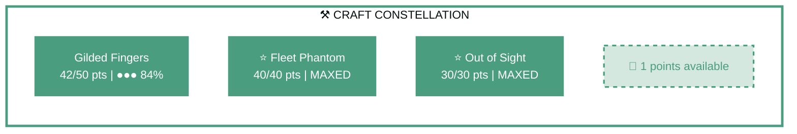

# Spymaster Walsingham

   

**Breton Nightblade • Daggerfall Covenant Alliance**

---

## 📑 Table of Contents

- [📋 Overview](#overview)
  - [General](#general)
  - [Currency](#currency)
- [⚔️ Combat Arsenal](#combat-arsenal)
  - [Character Stats](#character-stats)
  - [Advanced Stats](#advanced-stats)
- [⚔️ PvP](#pvp)
  - [Alliance War Skills](#alliance-war-skills)
- [👥 Companions](#companions)
- [🎨 Collectibles](#collectibles)
- [🎒 Inventory](#inventory)
- [🏆 Achievements](#achievements)
- [🏰 Guild Membership](#guild-membership)

---

## 📋 Overview

### General

| **Attribute**       | **Value** |
| ------------------- | --------- |
| **Level**           | 15        |
| **Champion Points** | 338       |
| **Gender**          | Male      |
| **Age**             | 6h 13m    |
| **Account**         | @vavasour |
| **ESO Plus**        | ✅ Active  |

| **Attribute**                 | **Value**                                        |
| ----------------------------- | ------------------------------------------------ |
| **Attribute Points**          | ⚠️ 2 unspent                                      |
| **Attributes**                | 🔵 16 / ❤️ 0 / ⚡ 0                                 |
| **Available Champion Points** | ⚒️ 1 - ⚔️ 113 - 💪 112                              |
| **Skill Points**              | 🎯 4 available - Ready to spend                   |
| **🐴 Riding Skills**           | 🐴 6/60 / 💪 0/60 / 🎒 0/60                         |
| **Race**                      | [Breton](https://en.uesp.net/wiki/Online:Breton) |

| **Attribute**      | **Value**                                                                  |
| ------------------ | -------------------------------------------------------------------------- |
| **Class**          | [Nightblade](https://en.uesp.net/wiki/Online:Nightblade)                   |
| **Server**         | [NA Megaserver](https://en.uesp.net/wiki/Online:Megaservers)               |
| **Location**       | [Summerset](https://en.uesp.net/wiki/Online:Summerset) (Alinor)            |
| **🪨 Mundus Stone** | [The Shadow](https://en.uesp.net/wiki/Online:The_Shadow_(Mundus_Stone))    |
| **Alliance**       | [Daggerfall Covenant](https://en.uesp.net/wiki/Online:Daggerfall_Covenant) |

### Currency

| **Attribute**            | **Value** |
| ------------------------ | --------- |
| 💰 **Gold**               | 7,852     |
| ⚔️ **Alliance Points**    | 0         |
| 🔮 **Tel Var**            | 0         |
| 💎 **Transmute Crystals** | 106       |
| 📜 **Writs**              | 0         |
| 🎫 **Event Tickets**      | 3         |
| 👑 **Crowns**             | 1,700     |
| 💠 **Gems**               | 0         |
| 🏅 **Seals**              | 2,185     |
| 🗝️ **Keys**               | 17        |
| 👕 **Tokens**             | 4         |
| 📚 **Fortunes**           | 0         |
| 🔹 **Fragments**          | 0         |

---

## ⚔️ Combat Arsenal

### Character Stats

| **Category**    | **Stat**     | **Value** |
| --------------- | ------------ | --------: |
| 💚 **Resources** | Health       |    21,740 |
|                 | Magicka      |    27,973 |
|                 | Stamina      |    20,359 |
| ⚔️ **Offensive** | Weapon Power |     2,013 |
|                 | Spell Power  |     2,013 |

| **Category**      | **Stat**    |     **Value** |
| ----------------- | ----------- | ------------: |
| 🎯 **Critical**    | Weapon Crit | 3,416 (15.5%) |
|                   | Spell Crit  | 3,416 (15.5%) |
| ⚔️ **Penetration** | Physical    |             0 |
|                   | Spell       |             0 |

| **Category**    | **Stat**        |     **Value** |
| --------------- | --------------- | ------------: |
| 🛡️ **Defensive** | Physical Resist | 7,746 (91.1%) |
|                 | Spell Resist    | 8,406 (91.8%) |
| ♻️ **Recovery**  | Health          |           538 |
|                 | Magicka         |         2,241 |
|                 | Stamina         |         1,782 |

### Advanced Stats

| **Ability**        |               **Cost/Value** |
| :----------------- | ---------------------------: |
| ⚔️ **Light Attack** |                    3,131 dmg |
| ⚔️ **Heavy Attack** |                    6,263 dmg |
| ⚔️ **Bash**         |          673 cost, 4,181 dmg |
| 🛡️ **Block**        | 1,702 cost, 50% mit, 40% spd |
| 🔓 **Break Free**   |                   4,320 cost |
| 🏃 **Dodge Roll**   |                   3,470 cost |
| 🐾 **Sneak**        |             113 cost, 0% spd |
| 🏃‍♂️ **Sprint**       |             435 cost, 0% spd |

| **Resistance** | **Value** |
| :------------- | --------: |
| 🔥 **Flame**    |     12.7% |
| ⚡ **Shock**    |     12.7% |
| ❄️ **Frost**    |     12.7% |
| 🔮 **Magic**    |     12.7% |
| 🦠 **Disease**  |     11.7% |
| ☠️ **Poison**   |     11.7% |
| 🩸 **Bleed**    |     11.7% |

| **Damage Type**       | **Bonus** |
| :-------------------- | --------: |
| 💥 **Critical Damage** |       64% |
| ⚔️ **Physical**        |         0 |
| 🔥 **Flame**           |         0 |
| ⚡ **Shock**           |         0 |
| ❄️ **Frost**           |         0 |
| 🔮 **Magic**           |         0 |
| 🦠 **Disease**         |         0 |
| ☠️ **Poison**          |         0 |
| 🩸 **Bleed**           |         0 |
| 🌌 **Oblivion**        |         0 |

| **Healing**            | **Value** |
| :--------------------- | --------: |
| 💚 **Healing Done**     |         0 |
| 💖 **Healing Taken**    |         0 |
| ✨ **Critical Healing** |       64% |

## ⚔️ Combat Arsenal

### ⚔️ ⚔️ ⚔️ Front Bar (Main Hand)

|                              **1**                               |                    **2**                     |                             **3**                              |                      **4**                       |
| :--------------------------------------------------------------: | :------------------------------------------: | :------------------------------------------------------------: | :----------------------------------------------: |
| [Consuming Trap](https://en.uesp.net/wiki/Online:Consuming_Trap) | [Blur](https://en.uesp.net/wiki/Online:Blur) | [Veiled Strike](https://en.uesp.net/wiki/Online:Veiled_Strike) | [Strife](https://en.uesp.net/wiki/Online:Strife) |

### 🔮 🔮 🔮 Back Bar (Backup)

---

## ⚔️ Equipment & Active Sets

| **Set**                                                                                                | **Progress**         |
| ------------------------------------------------------------------------------------------------------ | -------------------- |
| 🔴 **[Gryphon's Ferocity Set](https://en.uesp.net/wiki/Online:Gryphon's_Ferocity_Set)**                 | `2/5` ████░░░░░░ 40% |
| 🟡 **[Robes of the Withered Hand Set](https://en.uesp.net/wiki/Online:Robes_of_the_Withered_Hand_Set)** | `4/5` ████████░░ 80% |
| ⚪ **[Sword-Singer Set](https://en.uesp.net/wiki/Online:Sword-Singer_Set)**                             | `1/5` ██░░░░░░░░ 20% |

### 📋 Equipment Details

| **Slot**        | **Item**                       | **Set**                                                                                          | **Quality** | **Trait**    | **Type** | **Enchantment**              |
| --------------- | ------------------------------ | ------------------------------------------------------------------------------------------------ | ----------- | ------------ | -------- | ---------------------------- |
| ⛑️ **Head**      | Hat of the Withered Hand       | [Robes of the Withered Hand Set](https://en.uesp.net/wiki/Online:Robes_of_the_Withered_Hand_Set) | ⚡ Fine      | Invigorating | Light    | Maximum Magicka Enchantment  |
| 💎 **Neck**      | Gryphon's Necklace             | [Gryphon's Ferocity Set](https://en.uesp.net/wiki/Online:Gryphon's_Ferocity_Set)                 | ⚡ Fine      | Robust       | None     | Stamina Recovery Enchantment |
| 🛡️ **Chest**     | homespun robe of Magicka       | -                                                                                                | ⚡ Fine      | Sturdy       | Light    | Maximum Magicka Enchantment  |
| 👑 **Shoulders** | Sword-Singer's Arm Cops        | [Sword-Singer Set](https://en.uesp.net/wiki/Online:Sword-Singer_Set)                             | ⚡ Fine      | Infused      | Medium   | Maximum Stamina Enchantment  |
| ⚔️ **Main Hand** | maple lightning staff of Shock | -                                                                                                | ⚡ Fine      | None         | None     | Charged Weapon Enchantment   |
| ⚡ **Waist**     | Gryphon's Belt                 | [Gryphon's Ferocity Set](https://en.uesp.net/wiki/Online:Gryphon's_Ferocity_Set)                 | ⚡ Fine      | Sturdy       | Medium   | Maximum Stamina Enchantment  |
| 👖 **Legs**      | rawhide guards of Magicka      | -                                                                                                | ⚡ Fine      | Well-fitted  | Medium   | Maximum Magicka Enchantment  |
| 👟 **Feet**      | Shoes of the Withered Hand     | [Robes of the Withered Hand Set](https://en.uesp.net/wiki/Online:Robes_of_the_Withered_Hand_Set) | ⚡ Fine      | Impenetrable | Light    | Maximum Magicka Enchantment  |
| 💍 **Ring 1**    | Ring of the Withered Hand      | [Robes of the Withered Hand Set](https://en.uesp.net/wiki/Online:Robes_of_the_Withered_Hand_Set) | ⚡ Fine      | Arcane       | None     | Magicka Recovery Enchantment |
| 💍 **Ring 2**    | Ring of the Withered Hand      | [Robes of the Withered Hand Set](https://en.uesp.net/wiki/Online:Robes_of_the_Withered_Hand_Set) | ⚡ Fine      | Arcane       | None     | Magicka Recovery Enchantment |
| ✋ **Hands**     | homespun gloves of Stamina     | -                                                                                                | ⚡ Fine      | Training     | Light    | Maximum Stamina Enchantment  |

---

## ⭐ Champion Points

| **Total** | **Spent** | **Available** |
| :-------: | :-------: | :-----------: |
|    338    |    112    |      226      |

| **⚒️ Craft**                                                          | **Assigned Points** |
| -------------------------------------------------------------------- | ------------------: |
| ███████████░ 99%                                                     |      112/113 points |
| **[Out of Sight](https://en.uesp.net/wiki/Online:Out_of_Sight)**     |           30 points |
| **[Fleet Phantom](https://en.uesp.net/wiki/Online:Fleet_Phantom)**   |           40 points |
| **[Gilded Fingers](https://en.uesp.net/wiki/Online:Gilded_Fingers)** |           42 points |

| **⚔️ Warfare**        | **Assigned Points** |
| -------------------- | ------------------: |
| ░░░░░░░░░░░░ 0%      |        0/113 points |
| *No points assigned* |                     |

| **💪 Fitness**        | **Assigned Points** |
| -------------------- | ------------------: |
| ░░░░░░░░░░░░ 0%      |        0/112 points |
| *No points assigned* |                     |

### 🎯 Champion Points Visual

```mermaid
%%{init: {"theme":"base", "themeVariables": { "background":"transparent","fontSize":"12px","primaryColor":"#f0f0f0","primaryTextColor":"#333","primaryBorderColor":"#999","lineColor":"#999"}}}%%

flowchart LR

  subgraph subLEGEND["📖 LEGEND & VISUAL GUIDE"]

    LEG_STARS["Star Types"]
    LEG_S1["⭐ Gold Border = Maxed Slottable"]
    LEG_S2["🔶 Orange Border = Independent Star"]
    LEG_S3["Standard Border = In Progress"]

    LEG_FILL["Progress Indicators"]
    LEG_F1["⭐ = 100% Maxed"]
    LEG_F2["●●● = 75-99%"]
    LEG_F3["●●○ = 50-74%"]
    LEG_F4["●○○ = 25-49%"]
    LEG_F5["○○○ = 1-24%"]

    LEG_STARS --> LEG_S1 & LEG_S2 & LEG_S3
    LEG_FILL --> LEG_F1 & LEG_F2 & LEG_F3 & LEG_F4 & LEG_F5

    style LEG_STARS fill:transparent,stroke:none,color:#ccc
    style LEG_FILL fill:transparent,stroke:none,color:#ccc
    style LEG_S1 fill:#fff,stroke:#ffd700,stroke-width:3px,color:#333
    style LEG_S2 fill:#fff,stroke:#ff8c00,stroke-width:3px,color:#333
    style LEG_S3 fill:#fff,stroke:#999,stroke-width:2px,color:#333
    style LEG_F1 fill:#eee,stroke:#333,stroke-width:1px,color:#333
    style LEG_F2 fill:#eee,stroke:#333,stroke-width:1px,color:#333
    style LEG_F3 fill:#eee,stroke:#333,stroke-width:1px,color:#333
    style LEG_F4 fill:#eee,stroke:#333,stroke-width:1px,color:#333
    style LEG_F5 fill:#eee,stroke:#333,stroke-width:1px,color:#333
  end
  style subLEGEND fill:transparent,stroke:#999,stroke-width:3px
```

---

## 📜 Character Progress

### Progress Overview

| **Maxed Skill Lines** | **In Progress** | **Early Progress** | **Abilities with Morphs** | **Overall Completion** |
| --------------------: | --------------: | -----------------: | ------------------------: | ---------------------: |
|                     0 |               0 |                  0 |                         0 |                     0% |

🌿 Detailed Skill Morphs

*No morphable abilities found.*

---

---

## ⚔️ PvP

### PvP Profile

#### Alliance War Status

| **Category** | **Value** |
| ------------ | --------- |
| Rank         | Recruit   |

---

## 👥 Companions

### Available Companions

- [Bastian Hallix](https://en.uesp.net/wiki/Online:Bastian_Hallix)
- [Ember](https://en.uesp.net/wiki/Online:Ember)
- [Mirri Elendis](https://en.uesp.net/wiki/Online:Mirri_Elendis)
- [Tanlorin](https://en.uesp.net/wiki/Online:Tanlorin)
- [Zerith-var](https://en.uesp.net/wiki/Online:Zerith-var)

---

## 🎨 Collectibles

💁 Assistants (2 of 26)

| Progress                       |
| ------------------------------ |
| █░░░░░░░░░░░░░░░░░░░ 7% (2/26) |

- [Nuzhimeh the Merchant](https://en.uesp.net/wiki/Online:Nuzhimeh_the_Merchant)
- [Tythis Andromo, the Banker](https://en.uesp.net/wiki/Online:Tythis_Andromo,_the_Banker)

🖌️ Body Markings (2 of 321)

| Progress                        |
| ------------------------------- |
| ░░░░░░░░░░░░░░░░░░░░ 0% (2/321) |

- [Ancient Dragon Body Marks](https://en.uesp.net/wiki/Online:Ancient_Dragon_Body_Marks)
- [Oak's Promise Body Marks](https://en.uesp.net/wiki/Online:Oak's_Promise_Body_Marks)

👗 Costumes (16 of 312)

| Progress                         |
| -------------------------------- |
| █░░░░░░░░░░░░░░░░░░░ 5% (16/312) |

- [Abecean Privateer's Apparel](https://en.uesp.net/wiki/Online:Abecean_Privateer's_Apparel)
- [Bloodthorn Robes](https://en.uesp.net/wiki/Online:Bloodthorn_Robes)
- [Covenant Scout](https://en.uesp.net/wiki/Online:Covenant_Scout)
- [Dark Seducer](https://en.uesp.net/wiki/Online:Dark_Seducer)
- [Frostedge Bandit Armor](https://en.uesp.net/wiki/Online:Frostedge_Bandit_Armor)
- [Golden Saint](https://en.uesp.net/wiki/Online:Golden_Saint)
- [Imperial Chancellor](https://en.uesp.net/wiki/Online:Imperial_Chancellor)
- [Lion Guard Knight](https://en.uesp.net/wiki/Online:Lion_Guard_Knight)
- [Mages Guild Formal Robes](https://en.uesp.net/wiki/Online:Mages_Guild_Formal_Robes)
- [Mannimarco](https://en.uesp.net/wiki/Online:Mannimarco)
- [Nordic Bather's Towel](https://en.uesp.net/wiki/Online:Nordic_Bather's_Towel)
- [Red Rook Armor](https://en.uesp.net/wiki/Online:Red_Rook_Armor)
- [Regalia of the Scarlet Judge](https://en.uesp.net/wiki/Online:Regalia_of_the_Scarlet_Judge)
- [Sea Drake Garb](https://en.uesp.net/wiki/Online:Sea_Drake_Garb)
- [Servant's Robes](https://en.uesp.net/wiki/Online:Servant's_Robes)
- [Shrouded Armor](https://en.uesp.net/wiki/Online:Shrouded_Armor)

🗣️ Emotes (7 of 225)

| Progress                        |
| ------------------------------- |
| ░░░░░░░░░░░░░░░░░░░░ 3% (7/225) |

- [Air the Heir](https://en.uesp.net/wiki/Online:Air_the_Heir)
- [Elite Seat](https://en.uesp.net/wiki/Online:Elite_Seat)
- [Flower Fling](https://en.uesp.net/wiki/Online:Flower_Fling)
- [Glimmer Dust](https://en.uesp.net/wiki/Online:Glimmer_Dust)
- [Plant Yourself](https://en.uesp.net/wiki/Online:Plant_Yourself)
- [Pop the Cork](https://en.uesp.net/wiki/Online:Pop_the_Cork)
- [Wait the Great](https://en.uesp.net/wiki/Online:Wait_the_Great)

👓 Facial Accessories (1 of 135)

| Progress                        |
| ------------------------------- |
| ░░░░░░░░░░░░░░░░░░░░ 0% (1/135) |

- [Thrafey Debutante Circlet](https://en.uesp.net/wiki/Online:Thrafey_Debutante_Circlet)

💇 Hair Styles (1 of 153)

| Progress                        |
| ------------------------------- |
| ░░░░░░░░░░░░░░░░░░░░ 0% (1/153) |

- [Draping Locks](https://en.uesp.net/wiki/Online:Draping_Locks)

🎩 Hats (6 of 164)

| Progress                        |
| ------------------------------- |
| ░░░░░░░░░░░░░░░░░░░░ 3% (6/164) |

- [Ayleid Royal Crown](https://en.uesp.net/wiki/Online:Ayleid_Royal_Crown)
- [Colovian Filigreed Hood](https://en.uesp.net/wiki/Online:Colovian_Filigreed_Hood)
- [Colovian Fur Hood](https://en.uesp.net/wiki/Online:Colovian_Fur_Hood)
- [Crown of Misrule](https://en.uesp.net/wiki/Online:Crown_of_Misrule)
- [Firesong Obsidian Mask](https://en.uesp.net/wiki/Online:Firesong_Obsidian_Mask)
- [Hide Your Helm](https://en.uesp.net/wiki/Online:Hide_Your_Helm)

🖍️ Head Markings (4 of 372)

| Progress                        |
| ------------------------------- |
| ░░░░░░░░░░░░░░░░░░░░ 1% (4/372) |

- [Ancient Dragon Face Marks](https://en.uesp.net/wiki/Online:Ancient_Dragon_Face_Marks)
- [Druidic Knotwork Face Tattoos](https://en.uesp.net/wiki/Online:Druidic_Knotwork_Face_Tattoos)
- [Enchanting Cherry Blossom Visage](https://en.uesp.net/wiki/Online:Enchanting_Cherry_Blossom_Visage)
- [Oak's Promise Face Marks](https://en.uesp.net/wiki/Online:Oak's_Promise_Face_Marks)

🔮 Mementos (15 of 201)

| Progress                         |
| -------------------------------- |
| █░░░░░░░░░░░░░░░░░░░ 7% (15/201) |

- [Blackfeather Court Whistle](https://en.uesp.net/wiki/Online:Blackfeather_Court_Whistle)
- [Breda's Bottomless Mead Mug](https://en.uesp.net/wiki/Online:Breda's_Bottomless_Mead_Mug)
- [Cadwell's Surprise Box](https://en.uesp.net/wiki/Online:Cadwell's_Surprise_Box)
- [Cherry Blossom Branch](https://en.uesp.net/wiki/Online:Cherry_Blossom_Branch)
- [Fire-Breather's Torches](https://en.uesp.net/wiki/Online:Fire-Breather's_Torches)
- [Gryphon Feather Talisman](https://en.uesp.net/wiki/Online:Gryphon_Feather_Talisman)
- [Hoard of the Schemers](https://en.uesp.net/wiki/Online:Hoard_of_the_Schemers)
- [Jubilee Cake 2022](https://en.uesp.net/wiki/Online:Jubilee_Cake_2022)
- [Juggler's Knives](https://en.uesp.net/wiki/Online:Juggler's_Knives)
- [Mud Ball Pouch](https://en.uesp.net/wiki/Online:Mud_Ball_Pouch)
- [Nanwen's Sword](https://en.uesp.net/wiki/Online:Nanwen's_Sword)
- [Sword-Swallower's Blade](https://en.uesp.net/wiki/Online:Sword-Swallower's_Blade)
- [The Pie of Misrule](https://en.uesp.net/wiki/Online:The_Pie_of_Misrule)
- [Thetys Ramarys's Bait Kit](https://en.uesp.net/wiki/Online:Thetys_Ramarys's_Bait_Kit)
- [Witchmother's Whistle](https://en.uesp.net/wiki/Online:Witchmother's_Whistle)

🐴 Mounts (9 of 697)

| Progress                        |
| ------------------------------- |
| ░░░░░░░░░░░░░░░░░░░░ 1% (9/697) |

- [Amenos Ornaug](https://en.uesp.net/wiki/Online:Amenos_Ornaug)
- [Dagonic Quasigriff](https://en.uesp.net/wiki/Online:Dagonic_Quasigriff)
- [Imperial Horse](https://en.uesp.net/wiki/Online:Imperial_Horse)
- [Keptu Bear](https://en.uesp.net/wiki/Online:Keptu_Bear)
- [Noweyr Steed](https://en.uesp.net/wiki/Online:Noweyr_Steed)
- [Palefrost Elk Mount](https://en.uesp.net/wiki/Online:Palefrost_Elk_Mount)
- [Sorrel Horse](https://en.uesp.net/wiki/Online:Sorrel_Horse)
- [White Lion](https://en.uesp.net/wiki/Online:White_Lion)
- [Windhelm Cliff Ram](https://en.uesp.net/wiki/Online:Windhelm_Cliff_Ram)

🎭 Personalities (1 of 29)

| Progress                       |
| ------------------------------ |
| ░░░░░░░░░░░░░░░░░░░░ 3% (1/29) |

- [Assassin](https://en.uesp.net/wiki/Online:Assassin)

🐾 Pets (18 of 679)

| Progress                         |
| -------------------------------- |
| ░░░░░░░░░░░░░░░░░░░░ 2% (18/679) |

- [Abecean Ratter Cat](https://en.uesp.net/wiki/Online:Abecean_Ratter_Cat)
- [Alik'r Dune-Hound](https://en.uesp.net/wiki/Online:Alik'r_Dune-Hound)
- [Aurora Firepot Spider](https://en.uesp.net/wiki/Online:Aurora_Firepot_Spider)
- [Balfiera Senche Cub](https://en.uesp.net/wiki/Online:Balfiera_Senche_Cub)
- [Echalette](https://en.uesp.net/wiki/Online:Echalette)
- [Gloam Gryphon Fledgling](https://en.uesp.net/wiki/Online:Gloam_Gryphon_Fledgling)
- [Guar-Lizard Calf](https://en.uesp.net/wiki/Online:Guar-Lizard_Calf)
- [Jackal](https://en.uesp.net/wiki/Online:Jackal)
- [Knights of the Flame Pup](https://en.uesp.net/wiki/Online:Knights_of_the_Flame_Pup)
- [Nibenay Mudcrab](https://en.uesp.net/wiki/Online:Nibenay_Mudcrab)
- [Noweyr Pony^n](https://en.uesp.net/wiki/Online:Noweyr_Pony^n)
- [Powderwhite Coney](https://en.uesp.net/wiki/Online:Powderwhite_Coney)
- [Salamandrine Pony Guar](https://en.uesp.net/wiki/Online:Salamandrine_Pony_Guar)
- [Scintillant Dovah-Fly^n](https://en.uesp.net/wiki/Online:Scintillant_Dovah-Fly^n)

- [Scorion Pyreling](https://en.uesp.net/wiki/Online:Scorion_Pyreling)
- [Snowball Buddy](https://en.uesp.net/wiki/Online:Snowball_Buddy)
- [Soulfire Dragon Illusion](https://en.uesp.net/wiki/Online:Soulfire_Dragon_Illusion)
- [Verdigris Haj Mota](https://en.uesp.net/wiki/Online:Verdigris_Haj_Mota)

✨ Polymorphs (0 of 43)

| Progress                       |
| ------------------------------ |
| ░░░░░░░░░░░░░░░░░░░░ 0% (0/43) |

*No polymorphs owned*

🎭 Skins (1 of 106)

| Progress                        |
| ------------------------------- |
| ░░░░░░░░░░░░░░░░░░░░ 0% (1/106) |

- [Slag Town Diver](https://en.uesp.net/wiki/Online:Slag_Town_Diver)

---

## 🎒 Inventory

| **Storage**  | **Used** | **Max** | **Capacity**   |
| ------------ | -------: | ------: | -------------- |
| Backpack     |       26 |      70 | ███░░░░░░░ 37% |
| Bank         |      222 |     480 | ████░░░░░░ 46% |
| Crafting Bag |        ∞ |       ∞ | ESO Plus       |

<strong>Backpack Items</strong> (26 unique items)

#### Other (26 items)

| **Item**                                 | **Stack** | **Quality** |
| ---------------------------------------- | --------: | ----------- |
| 🟡 Bound Crown Experience Scroll          |         1 | 🟡           |
| 🟣 Bound Crown Fortifying Meal            |         1 | 🟣           |
| 🟣 Bound Crown Tri-Restoration Potion     |        25 | 🟣           |
| 🟣 Bound Gold Coast Swift Survivor Elixir |        25 | 🟣           |
| ⚪ Comberry Chai                          |         1 | ⚪           |
| ⚪ Heart of the Indrik                    |         1 | ⚪           |
| ⚪ Hidden Treasure Bag                    |         1 | ⚪           |
| ⚪ Hidden Treasure Bag                    |         1 | ⚪           |
| ⚪ Hidden Treasure Bag                    |         1 | ⚪           |
| ⚪ Hidden Treasure Bag                    |         1 | ⚪           |
| ⚪ Hidden Treasure Bag                    |         1 | ⚪           |
| ⚪ Hidden Treasure Bag                    |         1 | ⚪           |
| ⚪ Hidden Treasure Bag                    |         1 | ⚪           |
| ⚪ Hidden Treasure Bag                    |         1 | ⚪           |
| ⚪ Hidden Treasure Bag                    |         1 | ⚪           |
| ⚪ Hidden Treasure Bag                    |         1 | ⚪           |
| ⚪ Hidden Treasure Bag                    |         1 | ⚪           |
| ⚪ Hidden Treasure Bag                    |         1 | ⚪           |
| 🔵 Ice Staff of the Order of Diagna       |         1 | 🔵           |
| ⚪ Leatherworker's Satchel                |         1 | ⚪           |
| ⚪ Lockpick                               |         8 | ⚪           |
| ⚪ Lockpick                               |        20 | ⚪           |
| ⚪ Morning Reveille Tea                   |         1 | ⚪           |
| 🟢 Ring of the Withered Hand              |         1 | 🟢           |
| 🟢 Soul Gem                               |        27 | 🟢           |
| ⚪ The Unraveling Staff                   |         1 | ⚪           |

<strong>Bank Items</strong> (222 unique items)

#### Other (222 items)

| **Item**                                      | **Stack** | **Quality** |
| --------------------------------------------- | --------: | ----------- |
| ⚪ ancestor silk sash                          |         1 | ⚪           |
| 🟡 Attribute Respecification Scroll            |         6 | 🟡           |
| 🟡 Attunable Clothing Station, Bound           |         1 | 🟡           |
| 🟡 Aurora Firepot Spider: Firepot              |        25 | 🟡           |
| 🟢 Blueprint: Common Wheelbarrow, Sided        |         1 | 🟢           |
| 🟢 Blueprint: High Elf Dresser, Sturdy         |         1 | 🟢           |
| 🟢 Blueprint: Nord Shelf, Braced               |         1 | 🟢           |
| ⚪ Blueprint: Rough Container, Cargo           |         1 | ⚪           |
| 🟣 Bouquet, Small Dibella's                    |         1 | 🟣           |
| 🟢 Breton Carpet, Green                        |         1 | 🟢           |
| 🟢 Breton Chair, Slatted                       |         1 | 🟢           |
| 🔵 Clockwork City Treasure Map II              |         1 | 🔵           |
| 🟢 Common Candles, Pair                        |         1 | 🟢           |
| 🔵 Companion's Axe                             |         1 | 🔵           |
| 🟢 Companion's Breeches                        |         1 | 🟢           |
| 🔵 Companion's Dagger                          |         1 | 🔵           |
| 🟢 Companion's Epaulets                        |         1 | 🟢           |
| 🔵 Companion's Epaulets                        |         1 | 🔵           |
| 🔵 Companion's Girdle                          |         1 | 🔵           |
| 🔵 Companion's Girdle                          |         1 | 🔵           |
| 🟢 Companion's Girdle                          |         1 | 🟢           |
| 🔵 Companion's Greaves                         |         1 | 🔵           |
| 🟢 Companion's Helm                            |         1 | 🟢           |
| 🟢 Companion's Ice Staff                       |         1 | 🟢           |
| 🟢 Companion's Jerkin                          |         1 | 🟢           |
| 🔵 Companion's Pauldrons                       |         1 | 🔵           |
| 🟢 Companion's Restoration Staff               |         1 | 🟢           |
| 🟢 Companion's Ring                            |         1 | 🟢           |
| 🟢 Companion's Ring                            |         1 | 🟢           |
| 🔵 Companion's Shield                          |         1 | 🔵           |
| 🔵 Companion's Sword                           |         1 | 🔵           |
| 🔵 Counterfeit Pardon Edict                    |        19 | 🔵           |
| 🔵 Crafting Motif 1: High Elf Style            |         3 | 🔵           |
| 🔵 Crafting Motif 4: Nord Style                |         1 | 🔵           |
| 🔵 Crafting Motif 5: Breton Style              |         1 | 🔵           |
| 🟣 Crafting Motif 34: Assassins League Axes    |         2 | 🟣           |
| 🟣 Crafting Motif 34: Assassins League Belts   |         1 | 🟣           |
| 🟣 Crafting Motif 34: Assassins League Chests  |         1 | 🟣           |
| 🟣 Crafting Motif 34: Assassins League Daggers |         2 | 🟣           |
| 🟣 Crafting Motif 34: Assassins League Gloves  |         1 | 🟣           |
| 🟣 Crafting Motif 61: Psijic Shoulders         |         1 | 🟣           |
| 🟡 Crown Experience Scroll                     |         7 | 🟡           |
| 🟣 Crown Fortifying Meal                       |        57 | 🟣           |
| 🟡 Crown Lethal Poison                         |       150 | 🟡           |
| 🟣 Crown Tri-Restoration Potion                |        25 | 🟣           |
| 🟣 Crown Tri-Restoration Potion                |       200 | 🟣           |
| 🟣 Crown Tri-Restoration Potion                |       200 | 🟣           |
| 🔵 Cyrodiil Treasure Map VI                    |         1 | 🔵           |
| 🔵 Deadlands Treasure Map II                   |         1 | 🔵           |
| 🔵 Deep Winter Charity Writ                    |         1 | 🔵           |
| 🔵 Deep Winter Charity Writ                    |         1 | 🔵           |
| 🔵 Deep Winter Charity Writ                    |         1 | 🔵           |
| 🔵 Deep Winter Charity Writ                    |         1 | 🔵           |
| 🔵 Deep Winter Charity Writ                    |         1 | 🔵           |
| 🔵 Deep Winter Charity Writ                    |         1 | 🔵           |
| 🔵 Deep Winter Charity Writ                    |         1 | 🔵           |
| 🔵 Deep Winter Charity Writ                    |         1 | 🔵           |
| 🔵 Deep Winter Charity Writ                    |         1 | 🔵           |
| 🔵 Deep Winter Charity Writ                    |         1 | 🔵           |
| 🔵 Deep Winter Charity Writ                    |         1 | 🔵           |
| 🔵 Deep Winter Charity Writ                    |         1 | 🔵           |
| 🔵 Deep Winter Charity Writ                    |         1 | 🔵           |
| 🔵 Deep Winter Charity Writ                    |         1 | 🔵           |
| 🔵 Deep Winter Charity Writ                    |         1 | 🔵           |
| 🔵 Deep Winter Charity Writ                    |         1 | 🔵           |
| 🔵 Deep Winter Charity Writ                    |         1 | 🔵           |
| 🔵 Deep Winter Charity Writ                    |         1 | 🔵           |
| 🔵 Deep Winter Charity Writ                    |         1 | 🔵           |
| 🔵 Deep Winter Charity Writ                    |         1 | 🔵           |
| 🔵 Deep Winter Charity Writ                    |         1 | 🔵           |
| 🔵 Deep Winter Charity Writ                    |         1 | 🔵           |
| 🔵 Deep Winter Charity Writ                    |         1 | 🔵           |
| 🔵 Deep Winter Charity Writ                    |         1 | 🔵           |
| 🔵 Deep Winter Charity Writ                    |         1 | 🔵           |
| 🔵 Deep Winter Charity Writ                    |         1 | 🔵           |
| 🔵 Deep Winter Charity Writ                    |         1 | 🔵           |
| 🔵 Deep Winter Charity Writ                    |         1 | 🔵           |
| 🔵 Deep Winter Charity Writ                    |         1 | 🔵           |
| 🔵 Deep Winter Charity Writ                    |         1 | 🔵           |
| 🔵 Deep Winter Charity Writ                    |         1 | 🔵           |
| 🔵 Deep Winter Charity Writ                    |         1 | 🔵           |
| 🔵 Deep Winter Charity Writ                    |         1 | 🔵           |
| 🔵 Deep Winter Charity Writ                    |         1 | 🔵           |
| 🔵 Deep Winter Charity Writ                    |         1 | 🔵           |
| 🟢 Diagram: Breton Sconce, Torch               |         1 | 🟢           |
| 🔵 Diagram: Daedric Bench, Ashen               |         1 | 🔵           |
| ⚪ Disposable Juggling Knives                  |       200 | ⚪           |
| ⚪ Disposable Juggling Knives                  |       200 | ⚪           |
| ⚪ Disposable Juggling Knives                  |       180 | ⚪           |
| ⚪ Disposable Swallower's Sword                |       200 | ⚪           |
| ⚪ Disposable Swallower's Sword                |       200 | ⚪           |
| 🟢 Equipment Repair Kit                        |        27 | 🟢           |
| 🟣 Exemplary Infused Necklace                  |         1 | 🟣           |
| 🟣 Exemplary Infused Ring                      |         1 | 🟣           |
| 🟡 Fighters  Guild Citation                    |         1 | 🟡           |
| ⚪ Fire-Breather's Oil Bun                     |       100 | ⚪           |
| ⚪ Fire-Breather's Oil Bun                     |       200 | ⚪           |
| ⚪ Fire-Breather's Oil Bun                     |       200 | ⚪           |
| 🟡 Gold Coast Debilitating Poison              |       100 | 🟡           |
| 🟣 Gold Coast Swift Survivor Elixir            |       100 | 🟣           |
| 🔵 Grahtwood Treasure Map V                    |         1 | 🔵           |
| 🟡 Grand Gold Coast Experience Scroll          |         3 | 🟡           |
| 🔵 Greenshade Treasure Map III                 |         1 | 🔵           |
| 🟣 Harvested Soul Fragment                     |         1 | 🟣           |
| 🟣 Harvested Soul Fragment                     |         1 | 🟣           |
| 🟣 Harvested Soul Fragment                     |         1 | 🟣           |
| 🟣 Harvested Soul Fragment                     |         1 | 🟣           |
| 🟣 Harvested Soul Fragment                     |         1 | 🟣           |
| 🔵 homespun breeches of Stamina                |         1 | 🔵           |
| 🟢 Imperial Bed, Single                        |         1 | 🟢           |
| 🟣 Imperial Charity Writ                       |         1 | 🟣           |
| 🟣 Imperial Charity Writ                       |         1 | 🟣           |
| 🟣 Imperial Charity Writ                       |         1 | 🟣           |
| 🟣 Imperial Charity Writ                       |         1 | 🟣           |
| 🟣 Imperial Charity Writ                       |         1 | 🟣           |
| 🟣 Imperial Charity Writ                       |         1 | 🟣           |
| 🟣 Imperial Charity Writ                       |         1 | 🟣           |
| 🟣 Imperial Charity Writ                       |         1 | 🟣           |
| 🟣 Imperial Charity Writ                       |         1 | 🟣           |
| 🟣 Imperial Charity Writ                       |         1 | 🟣           |
| 🟣 Imperial Charity Writ                       |         1 | 🟣           |
| 🟣 Imperial Charity Writ                       |         1 | 🟣           |
| 🟣 Imperial Charity Writ                       |         1 | 🟣           |
| 🟣 Imperial Charity Writ                       |         1 | 🟣           |
| 🟣 Imperial Charity Writ                       |         1 | 🟣           |
| 🟣 Imperial Charity Writ                       |         1 | 🟣           |
| 🟣 Imperial Charity Writ                       |         1 | 🟣           |
| 🟣 Imperial Charity Writ                       |         1 | 🟣           |
| 🟣 Imperial Charity Writ                       |         1 | 🟣           |
| 🟣 Imperial Charity Writ                       |         1 | 🟣           |
| 🟣 Imperial Charity Writ                       |         1 | 🟣           |
| 🟣 Imperial Charity Writ                       |         1 | 🟣           |
| 🟣 Imperial Charity Writ                       |         1 | 🟣           |
| 🟡 Instant Clothing Research                   |         1 | 🟡           |
| 🟣 Jerkin of High Isle                         |         1 | 🟣           |
| ⚪ Keep Door Woodwork Repair Kit               |        11 | ⚪           |
| ⚪ Keep Wall Masonry Repair Kit                |        10 | ⚪           |
| 🟡 Kitten Moppet, Heart's Promise              |         1 | 🟡           |
| 🟣 Leniency Edict                              |         1 | 🟣           |
| 🟣 Letter from Tanlorin                        |         1 | 🟣           |
| 🟡 Mages Guild Citation                        |         1 | 🟡           |
| 🟡 Major Gold Coast Experience Scroll          |         1 | 🟡           |
| 🔵 maple bow of Frost                          |         1 | 🔵           |
| 🔵 Murkmire Treasure Map I                     |         1 | 🔵           |
| 🟣 Painting of High Elf Tower, Refined         |         1 | 🟣           |
| 🟣 Painting of Lakes, Sturdy                   |         1 | 🟣           |
| 🟣 Painting of Palms, Sturdy                   |         1 | 🟣           |
| 🟣 Painting of Sinkhole, Refined               |         1 | 🟣           |
| 🟢 Pattern: Dark Elf Bed, Single               |         1 | 🟢           |
| 🟢 Pattern: Wood Elf Canopy, Leather           |         1 | 🟢           |
| 🟢 Pattern: Wood Elf Hide, Heavy               |         1 | 🟢           |
| ⚪ petty Glyph of Flame                        |         1 | ⚪           |
| ⚪ petty Glyph of Flame                        |         1 | ⚪           |
| ⚪ petty Glyph of Frost                        |         1 | ⚪           |
| ⚪ petty Glyph of Frost                        |         1 | ⚪           |
| ⚪ petty Glyph of Frost                        |         1 | ⚪           |
| ⚪ petty Glyph of Frost                        |         1 | ⚪           |
| ⚪ petty Glyph of Magicka                      |         1 | ⚪           |
| ⚪ petty Glyph of Magicka                      |         1 | ⚪           |
| ⚪ petty Glyph of Magicka                      |         1 | ⚪           |
| ⚪ petty Glyph of Magicka                      |         1 | ⚪           |
| ⚪ petty Glyph of Reduce Feat Cost             |         1 | ⚪           |
| ⚪ petty Glyph of Reduce Feat Cost             |         1 | ⚪           |
| ⚪ petty Glyph of Reduce Feat Cost             |         1 | ⚪           |
| ⚪ petty Glyph of Reduce Feat Cost             |         1 | ⚪           |
| ⚪ petty Glyph of Reduce Spell Cost            |         1 | ⚪           |
| ⚪ petty Glyph of Shock                        |         1 | ⚪           |
| ⚪ petty Glyph of Stamina                      |         1 | ⚪           |
| ⚪ pewter necklace                             |         1 | ⚪           |
| 🟡 Pledge of Mara                              |         1 | 🟡           |
| ⚪ Plume Dazzler                               |         4 | ⚪           |
| 🔵 Prophet's Dagger                            |         1 | 🔵           |
| 🟣 Psijic Glowglobe's Ancient Texts            |         1 | 🟣           |
| 🟣 Psijic Glowglobe's Meteoric Glass           |         1 | 🟣           |
| 🟣 Psijic Glowglobe's Purified Glow Dust       |         1 | 🟣           |
| 🟢 Recipe: Acai Tonic Infusion                 |         1 | 🟢           |
| 🟢 Recipe: Banana Surprise                     |         1 | 🟢           |
| 🔵 Recipe: Beet-Glazed Pork                    |         2 | 🔵           |
| 🟢 Recipe: Borscht                             |         1 | 🟢           |
| 🟢 Recipe: Deshaan Honeydew Hors D'oeuvres     |         1 | 🟢           |
| 🟢 Recipe: Fried Green Tomatoes                |         1 | 🟢           |
| 🟢 Recipe: Grape Preserves                     |         1 | 🟢           |
| 🟢 Recipe: Jasmine Tea                         |         1 | 🟢           |
| 🟢 Recipe: Kragenmoor Zinger Mazte             |         1 | 🟢           |
| 🟢 Recipe: Pumpkin Puree                       |         2 | 🟢           |
| 🟢 Recipe: Rabbit Pasty                        |         1 | 🟢           |
| 🟢 Recipe: Red Rye Beer                        |         2 | 🟢           |
| 🟢 Recipe: Rihad Qishr                         |         1 | 🟢           |
| 🟢 Recipe: Roast Pig                           |         2 | 🟢           |
| 🟢 Recipe: Roast Venison                       |         1 | 🟢           |
| 🟢 Recipe: Roasted Beet and Millet Salad       |         1 | 🟢           |
| 🟢 Recipe: Stir-Fried Garlic Beef              |         1 | 🟢           |
| 🔵 Recipe: Tomato Borscht                      |         1 | 🔵           |
| 🟢 Recipe: Yellow Goblin Tonic                 |         1 | 🟢           |
| ⚪ Revelry Pie                                 |        40 | ⚪           |
| 🔵 Rivenspire Treasure Map IV                  |         1 | 🔵           |
| ⚪ rubedite mace                               |         1 | ⚪           |
| 🟢 Saplings, Burnt Tall                        |         1 | 🟢           |
| 🟣 Sealed Fabrication Materials                |         6 | 🟣           |
| 🔵 Shadowfen Treasure Map II                   |         1 | 🔵           |
| 🟢 Shrub, Burnt Brush                          |         1 | 🟢           |
| 🟣 Sithis' Sabatons                            |         1 | 🟣           |
| 🟢 slight Glyph of Flame                       |         1 | 🟢           |
| 🔵 Southern Elsweyr Treasure Map II            |         1 | 🔵           |
| 🔵 Stonefalls Treasure Map III                 |         1 | 🔵           |
| 🔵 Stormhaven Treasure Map II                  |         1 | 🔵           |
| 🔵 Stormhaven Treasure Map III                 |         1 | 🔵           |
| 🔵 Stros M'Kai Treasure Map I                  |         1 | 🔵           |
| 🔵 Stros M'Kai Treasure Map II                 |         1 | 🔵           |
| 🟣 Systres' Cuirass                            |         1 | 🟣           |
| 🟣 Systres' Greaves                            |         1 | 🟣           |
| 🟣 Systres' Helm                               |         1 | 🟣           |
| 🟣 Systres' Pauldrons                          |         1 | 🟣           |
| 🟣 Systres' Sabatons                           |         1 | 🟣           |
| 🟢 Tea Table, Carved                           |         1 | 🟢           |
| 🔵 The Blade of Woe                            |         1 | 🔵           |
| 🔵 The Rift Treasure Map VI                    |         1 | 🔵           |
| 🔵 Vvardenfell Treasure Map IV                 |         1 | 🔵           |
| 🔵 Vvardenfell Treasure Map V                  |         1 | 🔵           |
| 🔵 Vvardenfell Treasure Map VI                 |         1 | 🔵           |
| 🔵 Western Skyrim Treasure Map IV              |         1 | 🔵           |
| 🔵 Wrothgar Treasure Map I                     |         1 | 🔵           |

<strong>Crafting Bag Items</strong> (367 unique items)

#### Armor Trait (9 items)

| **Item**             | **Stack** | **Quality** |
| -------------------- | --------: | ----------- |
| ⚪ Almandine          |       267 | ⚪           |
| ⚪ Bloodstone         |       234 | ⚪           |
| ⚪ Diamond            |       155 | ⚪           |
| ⚪ Emerald            |       106 | ⚪           |
| ⚪ Fortified Nirncrux |         1 | ⚪           |
| ⚪ Garnet             |       135 | ⚪           |
| ⚪ Quartz             |       136 | ⚪           |
| ⚪ Sapphire           |       119 | ⚪           |
| ⚪ Sardonyx           |       244 | ⚪           |

#### Aspect Runestone (5 items)

| **Item** | **Stack** | **Quality** |
| -------- | --------: | ----------- |
| 🔵 Denata |       591 | 🔵           |
| 🟢 Jejota |      1244 | 🟢           |
| 🟡 Kuta   |       100 | 🟡           |
| 🟣 Rekuta |       350 | 🟣           |
| ⚪ Ta     |       922 | ⚪           |

#### Essence Runestone (17 items)

| **Item**  | **Stack** | **Quality** |
| --------- | --------: | ----------- |
| ⚪ Dekeipa |       161 | ⚪           |
| ⚪ Deni    |       430 | ⚪           |
| ⚪ Denima  |       167 | ⚪           |
| ⚪ Deteri  |       137 | ⚪           |
| ⚪ Haoko   |       122 | ⚪           |
| ⚪ Kaderi  |       144 | ⚪           |
| ⚪ Kuoko   |       138 | ⚪           |
| ⚪ Makderi |       106 | ⚪           |
| ⚪ Makko   |       410 | ⚪           |
| ⚪ Makkoma |       158 | ⚪           |
| ⚪ Meip    |       147 | ⚪           |
| ⚪ Oko     |       281 | ⚪           |
| ⚪ Okoma   |       150 | ⚪           |
| ⚪ Okori   |       116 | ⚪           |
| ⚪ Oru     |       108 | ⚪           |
| ⚪ Rakeipa |       187 | ⚪           |
| ⚪ Taderi  |       113 | ⚪           |

#### Furnishing Material (8 items)

| **Item**           | **Stack** | **Quality** |
| ------------------ | --------: | ----------- |
| ⚪ Alchemical Resin |       879 | ⚪           |
| ⚪ Bast             |       273 | ⚪           |
| ⚪ Clean Pelt       |       135 | ⚪           |
| ⚪ Decorative Wax   |       195 | ⚪           |
| ⚪ Heartwood        |       208 | ⚪           |
| ⚪ Mundane Rune     |       721 | ⚪           |
| ⚪ Ochre            |       144 | ⚪           |
| ⚪ Regulus          |       332 | ⚪           |

#### Ingredient (51 items)

| **Item**         | **Stack** | **Quality** |
| ---------------- | --------: | ----------- |
| ⚪ Acai Berry     |       153 | ⚪           |
| ⚪ Apples         |       370 | ⚪           |
| ⚪ Bananas        |        75 | ⚪           |
| ⚪ Barley         |       165 | ⚪           |
| ⚪ Beets          |        89 | ⚪           |
| 🟣 Bervez Juice   |        21 | 🟣           |
| ⚪ Bittergreen    |        67 | ⚪           |
| ⚪ Carrots        |        38 | ⚪           |
| ⚪ Cheese         |        30 | ⚪           |
| ⚪ Coffee         |       145 | ⚪           |
| ⚪ Comberry       |        46 | ⚪           |
| ⚪ Corn           |        61 | ⚪           |
| ⚪ Fish           |        45 | ⚪           |
| ⚪ Flour          |        73 | ⚪           |
| 🟣 Frost Mirriam  |         2 | 🟣           |
| ⚪ Game           |        47 | ⚪           |
| ⚪ Garlic         |        36 | ⚪           |
| ⚪ Ginger         |        82 | ⚪           |
| ⚪ Ginkgo         |       156 | ⚪           |
| ⚪ Ginseng        |       118 | ⚪           |
| ⚪ Greens         |       102 | ⚪           |
| ⚪ Guarana        |       144 | ⚪           |
| ⚪ Honey          |       124 | ⚪           |
| ⚪ Isinglass      |        95 | ⚪           |
| ⚪ Jasmine        |        54 | ⚪           |
| ⚪ Jazbay Grapes  |        95 | ⚪           |
| ⚪ Lemon          |        91 | ⚪           |
| ⚪ Lotus          |        45 | ⚪           |
| ⚪ Melon          |       127 | ⚪           |
| ⚪ Metheglin      |       135 | ⚪           |
| ⚪ Millet         |        75 | ⚪           |
| ⚪ Mint           |        47 | ⚪           |
| 🟡 Perfect Roe    |         2 | 🟡           |
| ⚪ Potato         |        56 | ⚪           |
| ⚪ Poultry        |        68 | ⚪           |
| ⚪ Pumpkin        |        84 | ⚪           |
| ⚪ Radish         |        54 | ⚪           |
| ⚪ Red Meat       |        83 | ⚪           |
| ⚪ Rice           |       185 | ⚪           |
| ⚪ Rose           |        64 | ⚪           |
| ⚪ Rye            |       200 | ⚪           |
| ⚪ Saltrice       |        51 | ⚪           |
| ⚪ Seasoning      |       108 | ⚪           |
| ⚪ Seaweed        |       102 | ⚪           |
| ⚪ Small Game     |        39 | ⚪           |
| ⚪ Surilie Grapes |       176 | ⚪           |
| ⚪ Tomato         |        81 | ⚪           |
| ⚪ Wheat          |       160 | ⚪           |
| ⚪ White Meat     |        19 | ⚪           |
| ⚪ Yeast          |       186 | ⚪           |
| ⚪ Yerba Mate     |       177 | ⚪           |

#### Jewelry Trait (5 items)

| **Item**       | **Stack** | **Quality** |
| -------------- | --------: | ----------- |
| ⚪ antimony     |         8 | ⚪           |
| ⚪ Aurbic Amber |         9 | ⚪           |
| ⚪ cobalt       |         8 | ⚪           |
| ⚪ Titanium     |         3 | ⚪           |
| ⚪ zinc         |         7 | ⚪           |

#### Lure (7 items)

| **Item**                   | **Stack** | **Quality** |
| -------------------------- | --------: | ----------- |
| ⚪ chub, Saltwater Bait     |        25 | ⚪           |
| ⚪ crawlers, Foul Bait      |       235 | ⚪           |
| ⚪ fish roe, Foul Bait      |        28 | ⚪           |
| ⚪ guts, Lake Bait          |        63 | ⚪           |
| ⚪ insect parts, River Bait |        90 | ⚪           |
| ⚪ shad, River Bait         |        75 | ⚪           |
| ⚪ worms, Saltwater Bait    |       247 | ⚪           |

#### Material (45 items)

| **Item**            | **Stack** | **Quality** |
| ------------------- | --------: | ----------- |
| ⚪ Ancestor Silk     |       521 | ⚪           |
| ⚪ Calcinium ingot   |       304 | ⚪           |
| ⚪ copper ounce      |       814 | ⚪           |
| ⚪ cotton            |      1006 | ⚪           |
| ⚪ dwarven ingot     |       595 | ⚪           |
| ⚪ ebonthread        |       295 | ⚪           |
| ⚪ ebony ingot       |       451 | ⚪           |
| ⚪ electrum ounce    |       247 | ⚪           |
| ⚪ fell hide         |       126 | ⚪           |
| ⚪ flax              |       986 | ⚪           |
| ⚪ Galatite ingot    |       337 | ⚪           |
| ⚪ hide              |       669 | ⚪           |
| ⚪ Iron Hide         |        81 | ⚪           |
| ⚪ Iron ingot        |       747 | ⚪           |
| ⚪ ironthread        |       150 | ⚪           |
| ⚪ jute              |       386 | ⚪           |
| ⚪ Kresh Fiber       |        57 | ⚪           |
| ⚪ leather           |      1093 | ⚪           |
| ⚪ orichalcum ingot  |      1221 | ⚪           |
| ⚪ pewter ounce      |      1536 | ⚪           |
| ⚪ platinum ounce    |       333 | ⚪           |
| ⚪ quicksilver ingot |       307 | ⚪           |
| ⚪ rawhide           |      1144 | ⚪           |
| ⚪ Rubedite Ingot    |       581 | ⚪           |
| ⚪ Rubedo Leather    |       232 | ⚪           |
| ⚪ sanded ash        |        79 | ⚪           |
| ⚪ sanded beech      |      1431 | ⚪           |
| ⚪ sanded birch      |       105 | ⚪           |
| ⚪ sanded hickory    |       523 | ⚪           |
| ⚪ sanded mahogany   |        70 | ⚪           |
| ⚪ sanded maple      |       575 | ⚪           |
| ⚪ sanded nightwood  |       336 | ⚪           |
| ⚪ sanded oak        |       824 | ⚪           |
| ⚪ Sanded Ruby Ash   |       621 | ⚪           |
| ⚪ sanded yew        |       206 | ⚪           |
| ⚪ Shadowhide        |       168 | ⚪           |
| ⚪ silver ounce      |       144 | ⚪           |
| ⚪ silverweave       |        93 | ⚪           |
| ⚪ spidersilk        |       482 | ⚪           |
| ⚪ Steel ingot       |      1004 | ⚪           |
| ⚪ superb hide       |        52 | ⚪           |
| ⚪ thick leather     |       375 | ⚪           |
| ⚪ topgrain hide     |        51 | ⚪           |
| ⚪ void cloth        |       277 | ⚪           |
| ⚪ voidstone ingot   |       767 | ⚪           |

#### Plating (3 items)

| **Item**          | **Stack** | **Quality** |
| ----------------- | --------: | ----------- |
| 🔵 Iridium Plating |       144 | 🔵           |
| 🟢 Terne Plating   |       154 | 🟢           |
| 🟣 Zircon Plating  |        25 | 🟣           |

#### Poison Solvent (9 items)

| **Item**       | **Stack** | **Quality** |
| -------------- | --------: | ----------- |
| ⚪ Alkahest     |        82 | ⚪           |
| ⚪ Gall         |        97 | ⚪           |
| ⚪ Grease       |      1426 | ⚪           |
| ⚪ Ichor        |       116 | ⚪           |
| ⚪ Night-Oil    |         4 | ⚪           |
| ⚪ Pitch-Bile   |        33 | ⚪           |
| ⚪ Slime        |       766 | ⚪           |
| ⚪ Tarblack     |        56 | ⚪           |
| ⚪ Terebinthine |       148 | ⚪           |

#### Potency Runestone (32 items)

| **Item** | **Stack** | **Quality** |
| -------- | --------: | ----------- |
| ⚪ Denara |        34 | ⚪           |
| ⚪ Derado |        21 | ⚪           |
| ⚪ Edode  |        88 | ⚪           |
| ⚪ Edora  |        59 | ⚪           |
| ⚪ Hade   |        38 | ⚪           |
| ⚪ Idode  |        15 | ⚪           |
| ⚪ Itade  |        47 | ⚪           |
| ⚪ Jaera  |        37 | ⚪           |
| ⚪ Jayde  |       139 | ⚪           |
| ⚪ Jehade |        63 | ⚪           |
| ⚪ Jejora |       193 | ⚪           |
| ⚪ Jera   |       185 | ⚪           |
| ⚪ Jode   |        59 | ⚪           |
| ⚪ Jora   |        26 | ⚪           |
| ⚪ Kedeko |         9 | ⚪           |
| ⚪ Kude   |        14 | ⚪           |
| ⚪ Kura   |        36 | ⚪           |
| ⚪ Notade |        79 | ⚪           |
| ⚪ Ode    |        93 | ⚪           |
| ⚪ Odra   |       121 | ⚪           |
| ⚪ Pode   |         9 | ⚪           |
| ⚪ Pojode |        63 | ⚪           |
| ⚪ Pojora |       106 | ⚪           |
| ⚪ Pora   |        61 | ⚪           |
| ⚪ Porade |       196 | ⚪           |
| ⚪ Rede   |        18 | ⚪           |
| ⚪ Rejera |        95 | ⚪           |
| ⚪ Rekude |        23 | ⚪           |
| ⚪ Rekura |        23 | ⚪           |
| ⚪ Repora |       138 | ⚪           |
| ⚪ Rera   |        18 | ⚪           |
| ⚪ Tade   |       205 | ⚪           |

#### Potion Solvent (9 items)

| **Item**          | **Stack** | **Quality** |
| ----------------- | --------: | ----------- |
| ⚪ cleansed water  |       143 | ⚪           |
| ⚪ clear water     |       483 | ⚪           |
| ⚪ cloud mist      |        50 | ⚪           |
| ⚪ filtered water  |       118 | ⚪           |
| ⚪ Lorkhan's Tears |       156 | ⚪           |
| ⚪ natural water   |       947 | ⚪           |
| ⚪ pristine water  |       860 | ⚪           |
| ⚪ purified water  |        67 | ⚪           |
| ⚪ Star Dew        |        15 | ⚪           |

#### Raw Material (51 items)

| **Item**               | **Stack** | **Quality** |
| ---------------------- | --------: | ----------- |
| ⚪ Calcinium ore        |         9 | ⚪           |
| ⚪ Cassiterite Sand     |         2 | ⚪           |
| ⚪ Coarse Chalk         |         4 | ⚪           |
| ⚪ copper dust          |         7 | ⚪           |
| ⚪ Dried Blood          |         6 | ⚪           |
| ⚪ Dwemer Scrap         |         9 | ⚪           |
| ⚪ ebony ore            |         4 | ⚪           |
| ⚪ electrum dust        |         6 | ⚪           |
| ⚪ fell hide scraps     |         9 | ⚪           |
| ⚪ Galatite ore         |         2 | ⚪           |
| ⚪ Grain of Pearl Sand  |         5 | ⚪           |
| ⚪ hide scraps          |         6 | ⚪           |
| ⚪ high iron ore        |         9 | ⚪           |
| ⚪ iron hide scraps     |         6 | ⚪           |
| ⚪ iron ore             |         4 | ⚪           |
| ⚪ leather scraps       |         5 | ⚪           |
| ⚪ Malachite Shard      |        14 | ⚪           |
| ⚪ orichalcum ore       |         6 | ⚪           |
| ⚪ Oxblood Fungus Spore |         6 | ⚪           |
| ⚪ pewter dust          |        21 | ⚪           |
| ⚪ platinum dust        |        19 | ⚪           |
| ⚪ Quicksilver ore      |         9 | ⚪           |
| ⚪ raw ancestor silk    |        50 | ⚪           |
| ⚪ raw cotton           |         5 | ⚪           |
| ⚪ raw ebonthread       |         1 | ⚪           |
| ⚪ raw flax             |         5 | ⚪           |
| ⚪ raw ironweed         |         4 | ⚪           |
| ⚪ raw jute             |         4 | ⚪           |
| ⚪ raw Kreshweed        |         6 | ⚪           |
| ⚪ raw silverweed       |         6 | ⚪           |
| ⚪ raw spidersilk       |         1 | ⚪           |
| ⚪ rawhide scraps       |         8 | ⚪           |
| ⚪ rough ash            |         5 | ⚪           |
| ⚪ rough beech          |        62 | ⚪           |
| ⚪ rough birch          |         8 | ⚪           |
| ⚪ rough hickory        |         4 | ⚪           |
| ⚪ rough mahogany       |         6 | ⚪           |
| ⚪ rough maple          |        26 | ⚪           |
| ⚪ rough nightwood      |         2 | ⚪           |
| ⚪ rough oak            |        16 | ⚪           |
| ⚪ rough ruby ash       |       118 | ⚪           |
| ⚪ rough yew            |         9 | ⚪           |
| ⚪ rubedite ore         |        85 | ⚪           |
| ⚪ rubedo hide scraps   |        12 | ⚪           |
| ⚪ shadowhide scraps    |         9 | ⚪           |
| ⚪ silver dust          |         2 | ⚪           |
| ⚪ superb hide scraps   |         3 | ⚪           |
| ⚪ thick leather scraps |         3 | ⚪           |
| ⚪ topgrain hide scraps |         5 | ⚪           |
| ⚪ Viridian Dust        |         7 | ⚪           |
| ⚪ voidstone ore        |         7 | ⚪           |

#### Raw Trait (5 items)

| **Item**                  | **Stack** | **Quality** |
| ------------------------- | --------: | ----------- |
| ⚪ Pulverized Antimony     |         3 | ⚪           |
| ⚪ Pulverized Aurbic Amber |         6 | ⚪           |
| ⚪ Pulverized Cobalt       |         4 | ⚪           |
| ⚪ Pulverized Titanium     |        10 | ⚪           |
| ⚪ Pulverized Zinc         |         7 | ⚪           |

#### Reagent (31 items)

| **Item**                   | **Stack** | **Quality**     |
| -------------------------- | --------: | --------------- |
| 🟢 Beetle Scuttle           |        74 | 🟢               |
| 🟢 blessed thistle          |       181 | 🟢               |
| 🟢 blue entoloma            |       267 | 🟢               |
| 🟢 bugloss                  |       367 | 🟢               |
| 🟢 Butterfly Wing           |       110 | 🟢               |
| 🟢 Chaurus Egg              |        38 | 🟢               |
| 🟢 Clam Gall                |        32 | 🟢               |
| 🟢 columbine                |       361 | 🟢               |
| 🟢 corn flower              |       219 | 🟢               |
| 🟢 Crimson Nirnroot         |        17 | 🟢               |
| 🟢 dragonthorn              |       509 | 🟢               |
| 🟢 emetic russula           |       192 | 🟢               |
| 🟢 Fleshfly Larva           |           | Fleshfly Larvae | 184 | 🟢 |
| 🟢 imp stool                |       193 | 🟢               |
| 🟢 lady's smock             |       437 | 🟢               |
| 🟢 luminous russula         |       218 | 🟢               |
| 🟢 mountain flower          |       395 | 🟢               |
| 🟢 Mudcrab Chitin           |         7 | 🟢               |
| 🟢 namira's rot             |       337 | 🟢               |
| 🟢 Nightshade               |       448 | 🟢               |
| 🟢 nirnroot                 |       231 | 🟢               |
| 🟢 Powdered Mother of Pearl |        18 | 🟢               |
| 🟢 Scrib Jelly              |       217 | 🟢               |
| 🟢 Spider Egg               |       277 | 🟢               |
| 🟢 stinkhorn                |       215 | 🟢               |
| 🟢 Torchbug Thorax          |         7 | 🟢               |
| 🟢 Vile Coagulant           |        10 | 🟢               |
| 🟢 violet coprinus          |       166 | 🟢               |
| 🟢 water hyacinth           |       327 | 🟢               |
| 🟢 white cap                |       260 | 🟢               |
| 🟢 wormwood                 |       433 | 🟢               |

#### Resin (4 items)

| **Item** | **Stack** | **Quality** |
| -------- | --------: | ----------- |
| 🟣 mastic |        33 | 🟣           |
| 🟢 pitch  |       283 | 🟢           |
| 🟡 rosin  |        15 | 🟡           |
| 🔵 turpen |       281 | 🔵           |

#### Style Material (59 items)

| **Item**                 | **Stack** | **Quality** |
| ------------------------ | --------: | ----------- |
| ⚪ Adamantite             |       197 | ⚪           |
| ⚪ Ancient Sandstone      |         1 | ⚪           |
| ⚪ Argent Pelt            |         5 | ⚪           |
| ⚪ Argentum               |       399 | ⚪           |
| ⚪ Ash Canvas             |        11 | ⚪           |
| ⚪ Auric Tusk             |         1 | ⚪           |
| ⚪ Auroran Dust           |         5 | ⚪           |
| ⚪ Azure Plasm            |        31 | ⚪           |
| ⚪ Bat Oil                |         5 | ⚪           |
| ⚪ Black Beeswax          |        58 | ⚪           |
| ⚪ Blood of Sahrotnax     |         5 | ⚪           |
| ⚪ Boiled Carapace        |        12 | ⚪           |
| ⚪ Bone                   |       186 | ⚪           |
| ⚪ Bronze                 |       344 | ⚪           |
| ⚪ Cassiterite            |         5 | ⚪           |
| ⚪ Consecrated Myrrh      |         5 | ⚪           |
| ⚪ Corundum               |       197 | ⚪           |
| 🟡 Crown Mimic Stone      |        55 | 🟡           |
| ⚪ Culanda Lacquer        |        20 | ⚪           |
| ⚪ Daedra Heart           |        59 | ⚪           |
| ⚪ Desecrated Grave Soil  |        22 | ⚪           |
| ⚪ Dragonthread           |         1 | ⚪           |
| ⚪ Dwemer Frame           |        11 | ⚪           |
| ⚪ Eagle Feather          |         6 | ⚪           |
| ⚪ Etched Molybdenum      |         1 | ⚪           |
| ⚪ Ferrous Salts          |         1 | ⚪           |
| ⚪ Fine Chalk             |         9 | ⚪           |
| ⚪ flint                  |       161 | ⚪           |
| ⚪ Gilding Salts          |         5 | ⚪           |
| ⚪ Gryphon Plume          |         2 | ⚪           |
| ⚪ High Isle Filigree     |         1 | ⚪           |
| ⚪ Ivory Brigade Clasp    |         1 | ⚪           |
| ⚪ Lion Fang              |         7 | ⚪           |
| ⚪ Malachite              |        24 | ⚪           |
| ⚪ Manganese              |       197 | ⚪           |
| ⚪ Marsh Nettle Sprig     |         6 | ⚪           |
| ⚪ Minotaur Bezoar        |         5 | ⚪           |
| ⚪ Molybdenum             |       196 | ⚪           |
| ⚪ Moonstone              |       197 | ⚪           |
| ⚪ Nickel                 |        61 | ⚪           |
| ⚪ Obsidian               |       199 | ⚪           |
| ⚪ Oxblood Fungus         |       147 | ⚪           |
| ⚪ Palladium              |       437 | ⚪           |
| ⚪ Pearl Sand             |       132 | ⚪           |
| ⚪ Polished Scarab Elytra |         8 | ⚪           |
| ⚪ Potash                 |         5 | ⚪           |
| ⚪ Refined Bonemold Resin |         6 | ⚪           |
| ⚪ Rogue's Soot           |         5 | ⚪           |
| ⚪ Sea Serpent Hide       |         7 | ⚪           |
| ⚪ Star Sapphire          |         5 | ⚪           |
| ⚪ Starmetal              |       196 | ⚪           |
| ⚪ Tainted Blood          |         3 | ⚪           |
| ⚪ Tempered Brass         |        17 | ⚪           |
| ⚪ Tenebrous Cord         |        71 | ⚪           |
| ⚪ Thorn Sigil            |         5 | ⚪           |
| ⚪ Vitrified Malondo      |       132 | ⚪           |
| ⚪ Volcanic Viridian      |         1 | ⚪           |
| ⚪ Wolfsbane Incense      |       209 | ⚪           |
| ⚪ Wrought Ferrofungus    |         5 | ⚪           |

#### Tannin (4 items)

| **Item**         | **Stack** | **Quality** |
| ---------------- | --------: | ----------- |
| 🟡 dreugh wax     |        30 | 🟡           |
| 🟣 elegant lining |        90 | 🟣           |
| 🔵 embroidery     |       431 | 🔵           |
| 🟢 hemming        |       464 | 🟢           |

#### Temper (4 items)

| **Item**          | **Stack** | **Quality** |
| ----------------- | --------: | ----------- |
| 🔵 dwarven oil     |       321 | 🔵           |
| 🟣 grain solvent   |        65 | 🟣           |
| 🟢 honing stone    |       355 | 🟢           |
| 🟡 tempering alloy |        23 | 🟡           |

#### Weapon Trait (9 items)

| **Item**          | **Stack** | **Quality** |
| ----------------- | --------: | ----------- |
| ⚪ Amethyst        |        92 | ⚪           |
| ⚪ Carnelian       |        37 | ⚪           |
| ⚪ Chysolite       |       137 | ⚪           |
| ⚪ Citrine         |        99 | ⚪           |
| ⚪ Fire Opal       |        80 | ⚪           |
| ⚪ Jade            |        77 | ⚪           |
| ⚪ Potent Nirncrux |         1 | ⚪           |
| ⚪ Ruby            |        68 | ⚪           |
| ⚪ Turquoise       |        99 | ⚪           |

---

## 🏆 Achievement Progress

| **Total Achievements** | **Completed** | **Completion %** | **Points Earned** | **Total Points** |
| ---------------------: | ------------: | ---------------: | ----------------: | ---------------: |
|                    444 |            24 |               5% |             4,230 |           72,540 |

### 📊 Achievement Categories

<strong>🔧 Ascending Tide (0/1225 pts)</strong>

| **Veteran** |     **Value** |
| ----------- | ------------: |
| Points      |        0/1010 |
| Progress    | ░░░░░░░░░░ 0% |

<strong>🔧 Blackwood (0/1600 pts)</strong>

| **Antiquities** |     **Value** |
| --------------- | ------------: |
| Points          |         0/125 |
| Progress        | ░░░░░░░░░░ 0% |

| **Companions** |     **Value** |
| -------------- | ------------: |
| Points         |         0/120 |
| Progress       | ░░░░░░░░░░ 0% |

| **Exploration** |     **Value** |
| --------------- | ------------: |
| Points          |         0/445 |
| Progress        | ░░░░░░░░░░ 0% |

| **Quests** |     **Value** |
| ---------- | ------------: |
| Points     |         0/230 |
| Progress   | ░░░░░░░░░░ 0% |

| **Rockgrove** |     **Value** |
| ------------- | ------------: |
| Points        |         0/420 |
| Progress      | ░░░░░░░░░░ 0% |

<strong>📈 Character (1105/5325 pts)</strong>

| **Anniversary** |     **Value** |
| --------------- | ------------: |
| Points          |         0/520 |
| Progress        | ░░░░░░░░░░ 0% |

| **Champion** |      **Value** |
| ------------ | -------------: |
| Points       |        135/235 |
| Progress     | █████░░░░░ 57% |

| **Class** |      **Value** |
| --------- | -------------: |
| Points    |       330/1435 |
| Progress  | ██░░░░░░░░ 22% |

| **Companions** |      **Value** |
| -------------- | -------------: |
| Points         |         30/220 |
| Progress       | █░░░░░░░░░ 13% |

| **Guilds** |      **Value** |
| ---------- | -------------: |
| Points     |        120/520 |
| Progress   | ██░░░░░░░░ 23% |

| **Justice** |      **Value** |
| ----------- | -------------: |
| Points      |        145/420 |
| Progress    | ███░░░░░░░ 34% |

| **Scribing** |     **Value** |
| ------------ | ------------: |
| Points       |         0/505 |
| Progress     | ░░░░░░░░░░ 0% |

| **Skill Styling** |     **Value** |
| ----------------- | ------------: |
| Points            |         0/105 |
| Progress          | ░░░░░░░░░░ 0% |

| **Skyshards** |      **Value** |
| ------------- | -------------: |
| Points        |         65/475 |
| Progress      | █░░░░░░░░░ 13% |

| **Trophies** |     **Value** |
| ------------ | ------------: |
| Points       |          0/80 |
| Progress     | ░░░░░░░░░░ 0% |

| **Vampire** |      **Value** |
| ----------- | -------------: |
| Points      |         75/110 |
| Progress    | ██████░░░░ 68% |

| **Werewolf** |     **Value** |
| ------------ | ------------: |
| Points       |         0/105 |
| Progress     | ░░░░░░░░░░ 0% |

<strong>🔧 Clockwork City (85/960 pts)</strong>

| **Asylum Sanctorium** |     **Value** |
| --------------------- | ------------: |
| Points                |         0/425 |
| Progress              | ░░░░░░░░░░ 0% |

| **Exploration** |      **Value** |
| --------------- | -------------: |
| Points          |          55/85 |
| Progress        | ██████░░░░ 64% |

| **Quests** |     **Value** |
| ---------- | ------------: |
| Points     |        15/215 |
| Progress   | ░░░░░░░░░░ 6% |

<strong>⚒️ Crafting (1205/3400 pts)</strong>

| **Alchemy** |      **Value** |
| ----------- | -------------: |
| Points      |        290/490 |
| Progress    | █████░░░░░ 59% |

| **Blacksmithing** |      **Value** |
| ----------------- | -------------: |
| Points            |        100/230 |
| Progress          | ████░░░░░░ 43% |

| **Clothier** |      **Value** |
| ------------ | -------------: |
| Points       |        130/260 |
| Progress     | █████░░░░░ 50% |

| **Enchanting** |      **Value** |
| -------------- | -------------: |
| Points         |         65/250 |
| Progress       | ██░░░░░░░░ 26% |

| **Jewelry Crafting** |      **Value** |
| -------------------- | -------------: |
| Points               |         35/165 |
| Progress             | ██░░░░░░░░ 21% |

| **Outfitting** |     **Value** |
| -------------- | ------------: |
| Points         |          0/95 |
| Progress       | ░░░░░░░░░░ 0% |

| **Provisioning** |      **Value** |
| ---------------- | -------------: |
| Points           |         80/255 |
| Progress         | ███░░░░░░░ 31% |

| **Woodworking** |      **Value** |
| --------------- | -------------: |
| Points          |        150/230 |
| Progress        | ██████░░░░ 65% |

<strong>🔧 Dark Brotherhood (270/850 pts)</strong>

| **Exploration** |      **Value** |
| --------------- | -------------: |
| Points          |        150/295 |
| Progress        | █████░░░░░ 50% |

| **Quests** |      **Value** |
| ---------- | -------------: |
| Points     |        115/180 |
| Progress   | ██████░░░░ 63% |

<strong>🔧 Deadlands (0/810 pts)</strong>

| **Antiquities** |     **Value** |
| --------------- | ------------: |
| Points          |         0/105 |
| Progress        | ░░░░░░░░░░ 0% |

| **Exploration** |     **Value** |
| --------------- | ------------: |
| Points          |         0/160 |
| Progress        | ░░░░░░░░░░ 0% |

| **Quests** |     **Value** |
| ---------- | ------------: |
| Points     |         0/225 |
| Progress   | ░░░░░░░░░░ 0% |

<strong>🔧 Dragon Bones (0/875 pts)</strong>

| **Veteran** |     **Value** |
| ----------- | ------------: |
| Points      |         0/730 |
| Progress    | ░░░░░░░░░░ 0% |

<strong>🔧 Dragonhold (5/675 pts)</strong>

| **Exploration** |     **Value** |
| --------------- | ------------: |
| Points          |         5/130 |
| Progress        | ░░░░░░░░░░ 3% |

| **Quests** |     **Value** |
| ---------- | ------------: |
| Points     |         0/225 |
| Progress   | ░░░░░░░░░░ 0% |

<strong>🏰 Dungeons (250/3740 pts)</strong>

| **Group Dungeons** |     **Value** |
| ------------------ | ------------: |
| Points             |        10/390 |
| Progress           | ░░░░░░░░░░ 2% |

| **Public Dungeons** |     **Value** |
| ------------------- | ------------: |
| Points              |       90/1910 |
| Progress            | ░░░░░░░░░░ 4% |

| **Trials** |     **Value** |
| ---------- | ------------: |
| Points     |         0/890 |
| Progress   | ░░░░░░░░░░ 0% |

<strong>🔧 Elsweyr (0/1340 pts)</strong>

| **Exploration** |     **Value** |
| --------------- | ------------: |
| Points          |         0/400 |
| Progress        | ░░░░░░░░░░ 0% |

| **Quests** |     **Value** |
| ---------- | ------------: |
| Points     |         0/270 |
| Progress   | ░░░░░░░░░░ 0% |

| **Sunspire** |     **Value** |
| ------------ | ------------: |
| Points       |         0/400 |
| Progress     | ░░░░░░░░░░ 0% |

<strong>🗺️ Exploration (440/4700 pts)</strong>

| **Aldmeri Dominion** |     **Value** |
| -------------------- | ------------: |
| Points               |       60/1040 |
| Progress             | ░░░░░░░░░░ 5% |

| **Coldharbour** |     **Value** |
| --------------- | ------------: |
| Points          |         0/175 |
| Progress        | ░░░░░░░░░░ 0% |

| **Craglorn** |     **Value** |
| ------------ | ------------: |
| Points       |         0/385 |
| Progress     | ░░░░░░░░░░ 0% |

| **Cyrodiil** |     **Value** |
| ------------ | ------------: |
| Points       |         0/230 |
| Progress     | ░░░░░░░░░░ 0% |

| **Daggerfall Covenant** |      **Value** |
| ----------------------- | -------------: |
| Points                  |       190/1055 |
| Progress                | █░░░░░░░░░ 18% |

| **Dark Anchors** |      **Value** |
| ---------------- | -------------: |
| Points           |        120/410 |
| Progress         | ██░░░░░░░░ 29% |

| **Ebonheart Pact** |     **Value** |
| ------------------ | ------------: |
| Points             |       65/1050 |
| Progress           | ░░░░░░░░░░ 6% |

| **Fishing** |     **Value** |
| ----------- | ------------: |
| Points      |         0/190 |
| Progress    | ░░░░░░░░░░ 0% |

<strong>🔧 Fallen Banners (0/1320 pts)</strong>

| **General** |     **Value** |
| ----------- | ------------: |
| Points      |         0/280 |
| Progress    | ░░░░░░░░░░ 0% |

| **Veteran** |     **Value** |
| ----------- | ------------: |
| Points      |        0/1040 |
| Progress    | ░░░░░░░░░░ 0% |

<strong>🔧 Feast of Shadows (0/1390 pts)</strong>

| **Veteran** |     **Value** |
| ----------- | ------------: |
| Points      |        0/1140 |
| Progress    | ░░░░░░░░░░ 0% |

<strong>🔧 Firesong (5/700 pts)</strong>

| **Antiquities** |     **Value** |
| --------------- | ------------: |
| Points          |         0/135 |
| Progress        | ░░░░░░░░░░ 0% |

| **Exploration** |     **Value** |
| --------------- | ------------: |
| Points          |         5/100 |
| Progress        | ░░░░░░░░░░ 5% |

| **Quests** |     **Value** |
| ---------- | ------------: |
| Points     |         0/205 |
| Progress   | ░░░░░░░░░░ 0% |

| **Tales of Tribute** |     **Value** |
| -------------------- | ------------: |
| Points               |          0/40 |
| Progress             | ░░░░░░░░░░ 0% |

<strong>🔧 Flames of Ambition (5/945 pts)</strong>

| **Veteran** |     **Value** |
| ----------- | ------------: |
| Points      |         0/790 |
| Progress    | ░░░░░░░░░░ 0% |

<strong>🔧 Gold Road (0/1700 pts)</strong>

| **Antiquities** |     **Value** |
| --------------- | ------------: |
| Points          |         0/110 |
| Progress        | ░░░░░░░░░░ 0% |

| **Exploration** |     **Value** |
| --------------- | ------------: |
| Points          |         0/465 |
| Progress        | ░░░░░░░░░░ 0% |

| **General** |     **Value** |
| ----------- | ------------: |
| Points      |         0/325 |
| Progress    | ░░░░░░░░░░ 0% |

| **Lucent Citadel** |     **Value** |
| ------------------ | ------------: |
| Points             |         0/400 |
| Progress           | ░░░░░░░░░░ 0% |

| **Mirrormoor Mosaics** |     **Value** |
| ---------------------- | ------------: |
| Points                 |          0/65 |
| Progress               | ░░░░░░░░░░ 0% |

| **Quests** |     **Value** |
| ---------- | ------------: |
| Points     |         0/290 |
| Progress   | ░░░░░░░░░░ 0% |

| **Tales of Tribute** |     **Value** |
| -------------------- | ------------: |
| Points               |          0/45 |
| Progress             | ░░░░░░░░░░ 0% |

<strong>🔧 Greymoor (15/2085 pts)</strong>

| **Antiquities** |     **Value** |
| --------------- | ------------: |
| Points          |        15/485 |
| Progress        | ░░░░░░░░░░ 3% |

| **Exploration** |     **Value** |
| --------------- | ------------: |
| Points          |         0/370 |
| Progress        | ░░░░░░░░░░ 0% |

| **Harrowstorms** |     **Value** |
| ---------------- | ------------: |
| Points           |         0/155 |
| Progress         | ░░░░░░░░░░ 0% |

| **Kyne's Aegis** |     **Value** |
| ---------------- | ------------: |
| Points           |         0/430 |
| Progress         | ░░░░░░░░░░ 0% |

| **Quests** |     **Value** |
| ---------- | ------------: |
| Points     |         0/255 |
| Progress   | ░░░░░░░░░░ 0% |

<strong>🔧 Harrowstorm (0/945 pts)</strong>

| **General** |     **Value** |
| ----------- | ------------: |
| Points      |         0/245 |
| Progress    | ░░░░░░░░░░ 0% |

| **Veteran** |     **Value** |
| ----------- | ------------: |
| Points      |         0/700 |
| Progress    | ░░░░░░░░░░ 0% |

<strong>🔧 High Isle (35/2320 pts)</strong>

| **Antiquities** |     **Value** |
| --------------- | ------------: |
| Points          |         0/140 |
| Progress        | ░░░░░░░░░░ 0% |

| **Companions** |     **Value** |
| -------------- | ------------: |
| Points         |         0/120 |
| Progress       | ░░░░░░░░░░ 0% |

| **Dreadsail Reef** |     **Value** |
| ------------------ | ------------: |
| Points             |         0/370 |
| Progress           | ░░░░░░░░░░ 0% |

| **Exploration** |     **Value** |
| --------------- | ------------: |
| Points          |        20/390 |
| Progress        | ░░░░░░░░░░ 5% |

| **Quests** |     **Value** |
| ---------- | ------------: |
| Points     |         5/230 |
| Progress   | ░░░░░░░░░░ 2% |

| **Tales of Tribute** |     **Value** |
| -------------------- | ------------: |
| Points               |         0/685 |
| Progress             | ░░░░░░░░░░ 0% |

| **Volcanic Vents** |      **Value** |
| ------------------ | -------------: |
| Points             |          10/90 |
| Progress           | █░░░░░░░░░ 11% |

<strong>🔧 Holiday Events (85/1130 pts)</strong>

| **Anniversary Jubilee** |     **Value** |
| ----------------------- | ------------: |
| Points                  |         0/140 |
| Progress                | ░░░░░░░░░░ 0% |

| **Hearts Week** |     **Value** |
| --------------- | ------------: |
| Points          |          0/45 |
| Progress        | ░░░░░░░░░░ 0% |

| **Jester's Festival** |     **Value** |
| --------------------- | ------------: |
| Points                |        10/270 |
| Progress              | ░░░░░░░░░░ 3% |

| **New Life Festival** |      **Value** |
| --------------------- | -------------: |
| Points                |         50/190 |
| Progress              | ██░░░░░░░░ 26% |

| **Whitestrake's Mayhem** |     **Value** |
| ------------------------ | ------------: |
| Points                   |        10/165 |
| Progress                 | ░░░░░░░░░░ 6% |

| **Witches Festival** |     **Value** |
| -------------------- | ------------: |
| Points               |        15/320 |
| Progress             | ░░░░░░░░░░ 4% |

<strong>🔧 Horns of the Reach (0/760 pts)</strong>

| **Veteran** |     **Value** |
| ----------- | ------------: |
| Points      |         0/615 |
| Progress    | ░░░░░░░░░░ 0% |

<strong>🏠 Housing (0/525 pts)</strong>

| **Decorating** |     **Value** |
| -------------- | ------------: |
| Points         |         0/150 |
| Progress       | ░░░░░░░░░░ 0% |

| **Property** |     **Value** |
| ------------ | ------------: |
| Points       |         0/325 |
| Progress     | ░░░░░░░░░░ 0% |

<strong>🔧 Imperial City (55/1205 pts)</strong>

| **Imperial City Prison** |     **Value** |
| ------------------------ | ------------: |
| Points                   |         0/300 |
| Progress                 | ░░░░░░░░░░ 0% |

| **White Gold Tower** |     **Value** |
| -------------------- | ------------: |
| Points               |         0/275 |
| Progress             | ░░░░░░░░░░ 0% |

<strong>🔧 Infinite Archive (0/1635 pts)</strong>

| **Exploration** |     **Value** |
| --------------- | ------------: |
| Points          |         0/940 |
| Progress        | ░░░░░░░░░░ 0% |

| **General** |     **Value** |
| ----------- | ------------: |
| Points      |         0/650 |
| Progress    | ░░░░░░░░░░ 0% |

| **Tales of Tribute** |     **Value** |
| -------------------- | ------------: |
| Points               |          0/45 |
| Progress             | ░░░░░░░░░░ 0% |

<strong>🔧 Lost Depths (0/1325 pts)</strong>

| **Veteran** |     **Value** |
| ----------- | ------------: |
| Points      |        0/1090 |
| Progress    | ░░░░░░░░░░ 0% |

<strong>🔧 Markarth (0/1335 pts)</strong>

| **Antiquities** |     **Value** |
| --------------- | ------------: |
| Points          |         0/130 |
| Progress        | ░░░░░░░░░░ 0% |

| **Exploration** |     **Value** |
| --------------- | ------------: |
| Points          |         0/115 |
| Progress        | ░░░░░░░░░░ 0% |

| **Quests** |     **Value** |
| ---------- | ------------: |
| Points     |         0/295 |
| Progress   | ░░░░░░░░░░ 0% |

| **Vateshran Hollows** |     **Value** |
| --------------------- | ------------: |
| Points                |         0/485 |
| Progress              | ░░░░░░░░░░ 0% |

<strong>🔧 Morrowind (40/1640 pts)</strong>

| **Exploration** |     **Value** |
| --------------- | ------------: |
| Points          |        30/380 |
| Progress        | ░░░░░░░░░░ 7% |

| **Halls of Fabrication** |     **Value** |
| ------------------------ | ------------: |
| Points                   |         0/525 |
| Progress                 | ░░░░░░░░░░ 0% |

| **Quests** |     **Value** |
| ---------- | ------------: |
| Points     |        10/255 |
| Progress   | ░░░░░░░░░░ 3% |

<strong>🔧 Murkmire (5/1050 pts)</strong>

| **Blackrose Prison** |     **Value** |
| -------------------- | ------------: |
| Points               |         0/445 |
| Progress             | ░░░░░░░░░░ 0% |

| **Exploration** |     **Value** |
| --------------- | ------------: |
| Points          |         0/120 |
| Progress        | ░░░░░░░░░░ 0% |

| **Quests** |     **Value** |
| ---------- | ------------: |
| Points     |         0/240 |
| Progress   | ░░░░░░░░░░ 0% |

<strong>🔧 Necrom (0/1880 pts)</strong>

| **Antiquities** |     **Value** |
| --------------- | ------------: |
| Points          |         0/170 |
| Progress        | ░░░░░░░░░░ 0% |

| **Bastion Nymic** |     **Value** |
| ----------------- | ------------: |
| Points            |         0/125 |
| Progress          | ░░░░░░░░░░ 0% |

| **Companions** |     **Value** |
| -------------- | ------------: |
| Points         |         0/120 |
| Progress       | ░░░░░░░░░░ 0% |

| **Exploration** |     **Value** |
| --------------- | ------------: |
| Points          |         0/410 |
| Progress        | ░░░░░░░░░░ 0% |

| **Quests** |     **Value** |
| ---------- | ------------: |
| Points     |         0/330 |
| Progress   | ░░░░░░░░░░ 0% |

| **Sanity's Edge** |     **Value** |
| ----------------- | ------------: |
| Points            |         0/380 |
| Progress          | ░░░░░░░░░░ 0% |

| **Tales of Tribute** |     **Value** |
| -------------------- | ------------: |
| Points               |          0/65 |
| Progress             | ░░░░░░░░░░ 0% |

<strong>🔧 Orsinium (10/1010 pts)</strong>

| **Exploration** |     **Value** |
| --------------- | ------------: |
| Points          |         5/425 |
| Progress        | ░░░░░░░░░░ 1% |

| **Maelstrom Arena** |     **Value** |
| ------------------- | ------------: |
| Points              |         0/115 |
| Progress            | ░░░░░░░░░░ 0% |

| **Quests** |     **Value** |
| ---------- | ------------: |
| Points     |         0/170 |
| Progress   | ░░░░░░░░░░ 0% |

<strong>🔧 Player VS Player (40/1945 pts)</strong>

| **Alliance War** |     **Value** |
| ---------------- | ------------: |
| Points           |        40/915 |
| Progress         | ░░░░░░░░░░ 4% |

| **Battlegrounds** |     **Value** |
| ----------------- | ------------: |
| Points            |         0/580 |
| Progress          | ░░░░░░░░░░ 0% |

<strong>🔧 Prologues (10/240 pts)</strong>

| **Blackwood** |     **Value** |
| ------------- | ------------: |
| Points        |          0/10 |
| Progress      | ░░░░░░░░░░ 0% |

| **Deadlands** |     **Value** |
| ------------- | ------------: |
| Points        |          0/10 |
| Progress      | ░░░░░░░░░░ 0% |

| **Dragonhold** |     **Value** |
| -------------- | ------------: |
| Points         |          0/10 |
| Progress       | ░░░░░░░░░░ 0% |

| **Elsweyr** |     **Value** |
| ----------- | ------------: |
| Points      |          0/85 |
| Progress    | ░░░░░░░░░░ 0% |

| **Galen** |     **Value** |
| --------- | ------------: |
| Points    |          0/10 |
| Progress  | ░░░░░░░░░░ 0% |

| **Gold Road** |     **Value** |
| ------------- | ------------: |
| Points        |          0/10 |
| Progress      | ░░░░░░░░░░ 0% |

| **Greymoor** |     **Value** |
| ------------ | ------------: |
| Points       |          0/10 |
| Progress     | ░░░░░░░░░░ 0% |

| **High Isle** |       **Value** |
| ------------- | --------------: |
| Points        |           10/10 |
| Progress      | ██████████ 100% |

| **Markarth** |     **Value** |
| ------------ | ------------: |
| Points       |          0/10 |
| Progress     | ░░░░░░░░░░ 0% |

| **Murkmire** |     **Value** |
| ------------ | ------------: |
| Points       |          0/45 |
| Progress     | ░░░░░░░░░░ 0% |

| **Necrom** |     **Value** |
| ---------- | ------------: |
| Points     |          0/10 |
| Progress   | ░░░░░░░░░░ 0% |

<strong>🔧 Quests (130/2150 pts)</strong>

| **Aldmeri Dominion** |     **Value** |
| -------------------- | ------------: |
| Points               |         0/410 |
| Progress             | ░░░░░░░░░░ 0% |

| **Coldharbour** |     **Value** |
| --------------- | ------------: |
| Points          |          0/95 |
| Progress        | ░░░░░░░░░░ 0% |

| **Craglorn** |     **Value** |
| ------------ | ------------: |
| Points       |         0/285 |
| Progress     | ░░░░░░░░░░ 0% |

| **Cyrodiil** |     **Value** |
| ------------ | ------------: |
| Points       |          0/50 |
| Progress     | ░░░░░░░░░░ 0% |

| **Daggerfall Covenant** |      **Value** |
| ----------------------- | -------------: |
| Points                  |         70/410 |
| Progress                | █░░░░░░░░░ 17% |

| **Ebonheart Pact** |     **Value** |
| ------------------ | ------------: |
| Points             |        10/430 |
| Progress           | ░░░░░░░░░░ 2% |

| **Main Quest** |      **Value** |
| -------------- | -------------: |
| Points         |         20/160 |
| Progress       | █░░░░░░░░░ 12% |

<strong>🔧 Scalebreaker (0/845 pts)</strong>

| **General** |     **Value** |
| ----------- | ------------: |
| Points      |         0/175 |
| Progress    | ░░░░░░░░░░ 0% |

| **Veteran** |     **Value** |
| ----------- | ------------: |
| Points      |         0/670 |
| Progress    | ░░░░░░░░░░ 0% |

<strong>🔧 Scions of Ithelia (0/1340 pts)</strong>

| **General** |     **Value** |
| ----------- | ------------: |
| Points      |         0/240 |
| Progress    | ░░░░░░░░░░ 0% |

| **Veteran** |     **Value** |
| ----------- | ------------: |
| Points      |        0/1100 |
| Progress    | ░░░░░░░░░░ 0% |

<strong>🔧 Scribes of Fate (0/1360 pts)</strong>

| **Veteran** |     **Value** |
| ----------- | ------------: |
| Points      |        0/1110 |
| Progress    | ░░░░░░░░░░ 0% |

<strong>🔧 Seasons of the Worm Cult (0/1790 pts)</strong>

| **Antiquities** |     **Value** |
| --------------- | ------------: |
| Points          |         0/125 |
| Progress        | ░░░░░░░░░░ 0% |

| **Exploration** |     **Value** |
| --------------- | ------------: |
| Points          |         0/455 |
| Progress        | ░░░░░░░░░░ 0% |

| **Ossein Cage** |     **Value** |
| --------------- | ------------: |
| Points          |         0/430 |
| Progress        | ░░░░░░░░░░ 0% |

| **Quests** |     **Value** |
| ---------- | ------------: |
| Points     |         0/265 |
| Progress   | ░░░░░░░░░░ 0% |

| **Siege Camps** |     **Value** |
| --------------- | ------------: |
| Points          |          0/70 |
| Progress        | ░░░░░░░░░░ 0% |

<strong>🔧 Shadows of the Hist (0/785 pts)</strong>

| **Veteran** |     **Value** |
| ----------- | ------------: |
| Points      |         0/630 |
| Progress    | ░░░░░░░░░░ 0% |

<strong>🔧 Stonethorn (0/1055 pts)</strong>

| **General** |     **Value** |
| ----------- | ------------: |
| Points      |         0/175 |
| Progress    | ░░░░░░░░░░ 0% |

| **Veteran** |     **Value** |
| ----------- | ------------: |
| Points      |         0/880 |
| Progress    | ░░░░░░░░░░ 0% |

<strong>🔧 Summerset (390/1935 pts)</strong>

| **Abyssal Geysers** |      **Value** |
| ------------------- | -------------: |
| Points              |        135/150 |
| Progress            | █████████░ 90% |

| **Cloudrest** |     **Value** |
| ------------- | ------------: |
| Points        |         0/695 |
| Progress      | ░░░░░░░░░░ 0% |

| **Exploration** |      **Value** |
| --------------- | -------------: |
| Points          |        145/385 |
| Progress        | ███░░░░░░░ 37% |

| **Quests** |      **Value** |
| ---------- | -------------: |
| Points     |        110/340 |
| Progress   | ███░░░░░░░ 32% |

<strong>🔧 Thieves Guild (35/1305 pts)</strong>

| **Exploration** |     **Value** |
| --------------- | ------------: |
| Points          |        30/370 |
| Progress        | ░░░░░░░░░░ 8% |

| **Maw of Lorkhaj** |     **Value** |
| ------------------ | ------------: |
| Points             |         0/340 |
| Progress           | ░░░░░░░░░░ 0% |

| **Quests** |     **Value** |
| ---------- | ------------: |
| Points     |         0/275 |
| Progress   | ░░░░░░░░░░ 0% |

<strong>🔧 Veteran Dungeons (0/4535 pts)</strong>

| **Death Challenges** |     **Value** |
| -------------------- | ------------: |
| Points               |        0/1250 |
| Progress             | ░░░░░░░░░░ 0% |

| **Slayer Challenges** |     **Value** |
| --------------------- | ------------: |
| Points                |         0/480 |
| Progress              | ░░░░░░░░░░ 0% |

| **Speed Challenges** |     **Value** |
| -------------------- | ------------: |
| Points               |        0/1250 |
| Progress             | ░░░░░░░░░░ 0% |

| **Survivor Challenges** |     **Value** |
| ----------------------- | ------------: |
| Points                  |        0/1200 |
| Progress                | ░░░░░░░░░░ 0% |

<strong>🔧 Waking Flame (5/1145 pts)</strong>

| **Veteran** |     **Value** |
| ----------- | ------------: |
| Points      |         0/890 |
| Progress    | ░░░░░░░░░░ 0% |

<strong>🔧 Wolfhunter (0/840 pts)</strong>

| **General** |     **Value** |
| ----------- | ------------: |
| Points      |         0/155 |
| Progress    | ░░░░░░░░░░ 0% |

| **Veteran** |     **Value** |
| ----------- | ------------: |
| Points      |         0/685 |
| Progress    | ░░░░░░░░░░ 0% |

<strong>🔧 Wrathstone (5/870 pts)</strong>

| **General** |     **Value** |
| ----------- | ------------: |
| Points      |         5/185 |
| Progress    | ░░░░░░░░░░ 2% |

| **Veteran** |     **Value** |
| ----------- | ------------: |
| Points      |         0/685 |
| Progress    | ░░░░░░░░░░ 0% |

### 🎉 Recent Achievements

| **Achievement**                       | **Points** | **Category** |
| ------------------------------------- | ---------: | ------------ |
| ✅ **Rune Collector**                  |          0 | 🔧            |
| ✅ **Reagent Ranger**                  |          0 | 🔧            |
| ✅ **Anchor Decimator**                |          0 | 🔧            |
| ✅ **Frost Lord Destroyer**            |          0 | 🔧            |
| ✅ **Grand Master Crafting Harvester** |          0 | 🔧            |

---

## 🏰 Guild Membership

| **Guild Name**          | **Rank** | **Members** | **Alliance**                                                               |
| ----------------------- | -------- | ----------: | -------------------------------------------------------------------------- |
| **Keep Kind**           | Member   |         474 | [Aldmeri Dominion](https://en.uesp.net/wiki/Online:Aldmeri_Dominion)       |
| **Moonshadow**          | Member   |         347 | [Aldmeri Dominion](https://en.uesp.net/wiki/Online:Aldmeri_Dominion)       |
| **Night Coven**         | Member   |         348 | [Ebonheart Pact](https://en.uesp.net/wiki/Online:Ebonheart_Pact)           |
| **The Green Scorpion**  | Member   |         496 | [Daggerfall Covenant](https://en.uesp.net/wiki/Online:Daggerfall_Covenant) |
| **Walks-the-Uncharted** | Member   |         476 | [Aldmeri Dominion](https://en.uesp.net/wiki/Online:Aldmeri_Dominion)       |

---

 

**⚔️ CharacterMarkdown by @solaegis**

Generated on 02/20/2026 • Version: 2.2.6

