# Kellen Dysart (The Immortal)

   

**Breton Sorcerer • Daggerfall Covenant Alliance**

---

## 📑 Table of Contents

- [📋 Overview](#overview)
  - [General](#general)
  - [Currency](#currency)
- [📝 Build Notes](#build-notes)
- [⚔️ Combat Arsenal](#combat-arsenal)
  - [Character Stats](#character-stats)
  - [Advanced Stats](#advanced-stats)
- [⚔️ PvP](#pvp)
  - [Alliance War Skills](#alliance-war-skills)
- [👥 Companions](#companions)
- [🎨 Collectibles](#collectibles)
- [🎒 Inventory](#inventory)
- [🏆 Achievements](#achievements)
- [🏺 Antiquities](#antiquities)
- [🏰 Guild Membership](#guild-membership)

---

## 📋 Overview

### General

| **Attribute** | **Value** |
| --- | --- |
| **Level** | 50 |
| **Champion Points** | 781 |
| **Gender** | Male |
| **Race** | Breton |
| **Class** | Sorcerer |
| **Account** | @SOLAEGIS |

| **Attribute** | **Value** |
| --- | --- |
| **ESO Plus** | ✅ Active |
| **Age** | 9d 15h 35m |
| **🪨 Mundus Stone** | The Atronach |
| **Title** | The Immortal |
| **Server** | NA Megaserver |
| **Location** | Greenshade (18) |

| **Attribute** | **Value** |
| --- | --- |
| **Alliance** | Daggerfall Covenant |
| **Attributes** | 🔵 44 / ❤️ 20 / ⚡ 0 |
| **🐴 Riding Skills** | 🐴 60 / 💪 60 / 🎒 60 ✅ |
| **Available Champion Points** | ⚒️ 26 - ⚔️ 20 - 💪 20 |
| **Skill Points** | 🎯 23 available - Ready to spend |
| **🍖 Active Buffs** | Other: Minor Protection, Gallop, Summon Twilight Matriarch |

### Currency

| **Attribute** | **Value** |
| --- | --- |
| 💰 **Gold** | 97,984 |
| ⚔️ **Alliance Points** | 23,976 |
| 🔮 **Tel Var** | 500 |
| 💎 **Transmute Crystals** | 95 |
| 📜 **Writs** | 0 |
| 🎫 **Event Tickets** | 2 |
| 👑 **Crowns** | 700 |
| 💠 **Gems** | 140 |
| 🏅 **Seals** | 4,750 |
| 🗝️ **Keys** | 9 |
| 👕 **Tokens** | 3 |
| 📚 **Fortunes** | 0 |
| 🔹 **Fragments** | 148 |

---

## 📝 Build Notes

# The Weary Divine

**Kellen walks Tamriel not as conqueror, but as witness.** A god descended from celestial dominion, he inhabits mortality's edges—testing flesh's limits without frailty's surrender. This isn't a power fantasy; it's an **experiment in endurance**, trading omnipotence for survival's visceral truth.

Where others chase glory via damage meters, Kellen seeks **inevitability**—not victory, but *continuation*. Storms break against him; darkness parts. Time bends, granting mortals' "second chances," but he knows it as the universe's deference to what *should not fall*.

**He walks unburdened, yet attended.** The **Twilight Matriarch** manifests as divine will's extension—not companion, but delegation. Mortality threatens? A thought births healing light. Why manage repairs personally when consciousness commands? She heals because he wills it.

**His storms are not summoned—they *are*.** Boundless Storm defines harm-free space. Enemies exhaust against divinity's wrongness. Hardened Ward rejects vulnerability's premise—a reminder: some things do not break.

Pain registers? Thought. Matriarch responds. Health returns. Kellen observes mortality, uninterrupted.

**Kellen doesn't survive—he *occupies* battlefields.** Content concludes around him; enemies are data points in mortals' incomprehension.

Crushing Shock? **Correction**—fixing reality's error. Crystal Fragments crystallize when resistance proves futile.

*A weary god, avatar-attended, proves functional indestructibility. This is the Immortal.*

---

## ⚔️ Combat Arsenal

### Character Stats

| **Category** | **Stat** | **Value** |
| --- | --- | ---: |
| 💚 **Resources** | Health | 23,672 |
|  | Magicka | 22,591 |
|  | Stamina | 12,600 |
| ⚔️ **Offensive** | Weapon Power | 2,875 |
|  | Spell Power | 2,875 |

| **Category** | **Stat** | **Value** |
| --- | --- | ---: |
| 🎯 **Critical** | Weapon Crit | 3,379 (15.4%) |
|  | Spell Crit | 3,379 (15.4%) |
| ⚔️ **Penetration** | Physical | 4,456 |
|  | Spell | 4,456 |

| **Category** | **Stat** | **Value** |
| --- | --- | ---: |
| 🛡️ **Defensive** | Physical Resist | 20,479 (89.1%) |
|  | Spell Resist | 25,693 (91.1%) |
| ♻️ **Recovery** | Health | 605 |
|  | Magicka | 1,505 |
|  | Stamina | 745 |

### Advanced Stats

| **Ability** | **Cost/Value** |
|:---|---:|
| ⚔️ **Light Attack** | 3,778 dmg |
| ⚔️ **Heavy Attack** | 7,557 dmg |
| ⚔️ **Bash** | 673 cost, 4,216 dmg |
| 🛡️ **Block** | 2,100 cost, 50% mit, 40% spd |
| 🔓 **Break Free** | 4,320 cost |
| 🏃 **Dodge Roll** | 3,802 cost |
| 🐾 **Sneak** | 66 cost, 0% spd |
| 🏃‍♂️ **Sprint** | 440 cost, 0% spd |

| **Resistance** | **Value** |
|:---|---:|
| 🔥 **Flame** | 38.9% |
| ⚡ **Shock** | 38.9% |
| ❄️ **Frost** | 38.9% |
| 🔮 **Magic** | 38.9% |
| 🦠 **Disease** | 31% |
| ☠️ **Poison** | 31% |
| 🩸 **Bleed** | 31% |

| **Damage Type** | **Bonus** |
|:---|---:|
| 💥 **Critical Damage** | 58% |
| ⚔️ **Physical** | 23% |
| 🔥 **Flame** | 18% |
| ⚡ **Shock** | 23% |
| ❄️ **Frost** | 0 |
| 🔮 **Magic** | 18% |
| 🦠 **Disease** | 18% |
| ☠️ **Poison** | 18% |
| 🩸 **Bleed** | 18% |
| 🌌 **Oblivion** | 18% |

| **Healing** | **Value** |
|:---|---:|
| 💚 **Healing Done** | 0 |
| 💖 **Healing Taken** | 0 |
| ✨ **Critical Healing** | 8% |

## ⚔️ Combat Arsenal

### ⚔️ ⚔️ ⚔️ Front Bar (Main Hand)

| **1** | **2** | **3** | **4** | **5** | **6** |
| :---: | :---: | :---: | :---: | :---: | :---: |
| Boundless Storm | Hardened Ward | Crystal Fragments | Crushing Shock | Twilight Matriarch Restore | Greater Storm Atronach |

### 🔮 🔮 🔮 Back Bar (Backup)

| **1** | **2** | **3** | **4** | **5** | **6** |
| :---: | :---: | :---: | :---: | :---: | :---: |
| Combat Prayer | Radiating Regeneration | Healing Springs | Bound Armor | Twilight Matriarch Restore | Absorption Field |

---

## ⚔️ Equipment & Active Sets

| **Set** | **Progress** |
| --- | --- |
| 🟢 **Fortified Brass** | `5/5` ██████████ 100% *(+7 extra)* |

### 📋 Equipment Details

| **Slot** | **Item** | **Set** | **Quality** | **Trait** | **Type** | **Enchantment** |
| --- | --- | --- | --- | --- | --- | --- |
| ⛑️ **Head** | Fortified Brass Helm | Fortified Brass | 👑 Legendary | Infused | Heavy • ⚒️ Crafted | - |
| 💎 **Neck** | Fortified Brass Necklace | Fortified Brass | 👑 Legendary | Arcane | None • ⚒️ Crafted | - |
| 🛡️ **Chest** | Fortified Brass Cuirass | Fortified Brass | 👑 Legendary | Infused | Heavy • ⚒️ Crafted | - |
| 👑 **Shoulders** | Fortified Brass Epaulets | Fortified Brass | 👑 Legendary | Divines | Light • ⚒️ Crafted | - |
| ⚔️ **Main Hand** | Fortified Brass Lightning Staff | Fortified Brass | 👑 Legendary | Infused | None • ⚒️ Crafted | - |
| ⚡ **Waist** | Fortified Brass Sash | Fortified Brass | 👑 Legendary | Divines | Light • ⚒️ Crafted | - |
| 👖 **Legs** | Fortified Brass Greaves | Fortified Brass | 👑 Legendary | Infused | Heavy • ⚒️ Crafted | - |
| 👟 **Feet** | Fortified Brass Shoes | Fortified Brass | 👑 Legendary | Divines | Light • ⚒️ Crafted | - |
| 💍 **Ring 1** | Fortified Brass Ring | Fortified Brass | 👑 Legendary | Arcane | None • ⚒️ Crafted | - |
| 💍 **Ring 2** | Fortified Brass Ring | Fortified Brass | 👑 Legendary | Arcane | None • ⚒️ Crafted | - |
| ✋ **Hands** | Fortified Brass Gloves | Fortified Brass | 👑 Legendary | Divines | Light • ⚒️ Crafted | - |
| 🔮 **Backup Main Hand** | Fortified Brass Restoration Staff | Fortified Brass | 👑 Legendary | Powered | None • ⚒️ Crafted | - |

---

## ⭐ Champion Points

| **Total** | **Spent** | **Available** |
| :---: | :---: | :---: |
| 781 | 715 | 0 |

| **⚒️ Craft** | **Assigned Points** |
| --- | ---: |
| ████████████ 100% | 240/235 points |
| **Out of Sight** | 30 points |
| **Fleet Phantom** | 40 points |
| **Gilded Fingers** | 20 points |
| **Breakfall** | 50 points |
| **Steed's Blessing** | 50 points |
| **Sustaining Shadows** | 50 points |

| **⚔️ Warfare** | **Assigned Points** |
| --- | ---: |
| ████████████ 100% | 240/240 points |
| **Precision** | 20 points |
| **Fighting Finesse** | 50 points |
| **Piercing** | 20 points |
| **Master-at-Arms** | 50 points |
| **Deadly Aim** | 50 points |
| **Thaumaturge** | 50 points |

| **💪 Fitness** | **Assigned Points** |
| --- | ---: |
| ███████████░ 97% | 235/240 points |
| **Hero's Vigor** | 10 points |
| **Bloody Renewal** | 50 points |
| **Mystic Tenacity** | 10 points |
| **Tumbling** | 15 points |
| **Rejuvenation** | 50 points |
| **Fortified** | 50 points |
| **Boundless Vitality** | 50 points |

---

## 🎯 Champion Points Visual

```mermaid
%%{init: {'theme':'base', 'themeVariables': { 'background':'transparent','fontSize':'14px','primaryColor':'#e8f4f0','primaryTextColor':'#000','primaryBorderColor':'#4a9d7f','lineColor':'#999','secondaryColor':'#f0f4f8','tertiaryColor':'#faf0f0'}}}%%

graph LR
  %%%% Champion Point Investment Visualization
  %%%% Enhanced readability with clear visual hierarchy

  %%%% ========================================
  %% ⚒️ CRAFT CONSTELLATION (240/564 pts)
  %%%% ========================================

  subgraph CRAFT ["⚒️ CRAFT CONSTELLATION"]
    direction TB

    CRAFT_TITLE["<b>Slottable Stars</b>"]
    C_IND2["⭐ Breakfall<br/><b>50/50 pts</b> | MAXED"]
    C_IND1["⭐ Steed's Blessing<br/><b>50/50 pts</b> | MAXED"]
    C_R1["Gilded Fingers<br/><b>20/50 pts</b> | ●○○ 40%"]

    CRAFT_PASS["<b>Passive Stars</b>"]
    C_Sustaining_Shadows["⭐ Sustaining Shadows<br/><b>50/50 pts</b> | MAXED"]
    C_Out_of_Sight["Out of Sight<br/><b>30/50 pts</b> | ●●○ 60%"]

    CRAFT_BASE["<b>Independent Stars</b>"]
    C_BASE1["Fleet Phantom<br/><b>40/50 pts</b> | ●●● 80%"]

    CRAFT_AVAIL["💎 <b>0 points available</b>"]

    CRAFT_TITLE -.-> C_IND2 & C_IND1 & C_R1
    CRAFT_PASS -.-> C_Sustaining_Shadows & C_Out_of_Sight
    CRAFT_BASE -.-> C_BASE1

    style CRAFT_TITLE fill:transparent,stroke:none,color:#4a9d7f
    style CRAFT_PASS fill:transparent,stroke:none,color:#4a9d7f
    style CRAFT_BASE fill:transparent,stroke:none,color:#4a9d7f
    style C_IND2 fill:#4a9d7f,stroke:#ffd700,stroke-width:4px,color:#fff
    style C_IND1 fill:#4a9d7f,stroke:#ffd700,stroke-width:4px,color:#fff
    style C_R1 fill:#4a9d7f,stroke:#4a9d7f,stroke-width:3px,color:#fff
    style C_Sustaining_Shadows fill:#4a9d7f,stroke:#4a9d7f,stroke-width:2px,color:#fff
    style C_Out_of_Sight fill:#4a9d7f,stroke:#4a9d7f,stroke-width:2px,color:#fff
    style C_BASE1 fill:#4a9d7f,stroke:#ff8c00,stroke-width:3px,color:#fff
    style CRAFT_AVAIL fill:#d4e8df,stroke:#4a9d7f,stroke-width:2px,stroke-dasharray:5 5,color:#4a9d7f

  end
  style CRAFT fill:transparent,stroke:#4a9d7f,stroke-width:3px

  %%%% ========================================
  %% ⚔️ WARFARE CONSTELLATION (240/564 pts)
  %%%% ========================================

  subgraph WARFARE ["⚔️ WARFARE CONSTELLATION"]
    direction TB

    WARFARE_TITLE["<b>Slottable Stars</b>"]
    W_IND1["⭐ Deadly Aim<br/><b>50/50 pts</b> | MAXED"]
    W_IND2["⭐ Master-at-Arms<br/><b>50/50 pts</b> | MAXED"]
    W_IND3["⭐ Thaumaturge<br/><b>50/50 pts</b> | MAXED"]

    WARFARE_PASS["<b>Passive Stars</b>"]
    W_C1["⭐ Fighting Finesse<br/><b>50/50 pts</b> | MAXED"]
    W_R1["Precision<br/><b>20/50 pts</b> | ●○○ 40%"]

    WARFARE_AVAIL["💎 <b>0 points available</b>"]

    WARFARE_TITLE -.-> W_IND1 & W_IND2 & W_IND3
    WARFARE_PASS -.-> W_C1 & W_R1

    style WARFARE_TITLE fill:transparent,stroke:none,color:#5b7fb8
    style WARFARE_PASS fill:transparent,stroke:none,color:#5b7fb8
    style W_IND1 fill:#5b7fb8,stroke:#ffd700,stroke-width:4px,color:#fff
    style W_IND2 fill:#5b7fb8,stroke:#ffd700,stroke-width:4px,color:#fff
    style W_IND3 fill:#5b7fb8,stroke:#ffd700,stroke-width:4px,color:#fff
    style W_C1 fill:#5b7fb8,stroke:#5b7fb8,stroke-width:2px,color:#fff
    style W_R1 fill:#5b7fb8,stroke:#5b7fb8,stroke-width:2px,color:#fff
    style WARFARE_AVAIL fill:#d4e4f0,stroke:#5b7fb8,stroke-width:2px,stroke-dasharray:5 5,color:#5b7fb8

  end
  style WARFARE fill:transparent,stroke:#5b7fb8,stroke-width:3px

  %%%% ========================================
  %% 💪 FITNESS CONSTELLATION (235/564 pts)
  %%%% ========================================

  subgraph FITNESS ["💪 FITNESS CONSTELLATION"]
    direction TB

    FITNESS_TITLE["<b>Slottable Stars</b>"]
    SS3["Bloody Renewal<br/><b>50/75 pts</b> | ●●○ 66%"]

    FITNESS_PASS["<b>Passive Stars</b>"]
    SD4["⭐ Fortified<br/><b>50/50 pts</b> | MAXED"]
    F_L1["Tumbling<br/><b>15/50 pts</b> | ●○○ 30%"]
    F_L3["Hero's Vigor<br/><b>10/50 pts</b> | ○○○ 20%"]
    F_C1["Mystic Tenacity<br/><b>10/50 pts</b> | ○○○ 20%"]

    FITNESS_BASE["<b>Independent Stars</b>"]
    F_BASE3["⭐ Rejuvenation<br/><b>50/50 pts</b> | MAXED"]
    F_BASE1["⭐ Boundless Vitality<br/><b>50/50 pts</b> | MAXED"]

    FITNESS_AVAIL["💎 <b>0 points available</b>"]

    FITNESS_TITLE -.-> SS3
    FITNESS_PASS -.-> SD4 & F_L1 & F_L3 & F_C1
    FITNESS_BASE -.-> F_BASE3 & F_BASE1

    style FITNESS_TITLE fill:transparent,stroke:none,color:#b87a7a
    style FITNESS_PASS fill:transparent,stroke:none,color:#b87a7a
    style FITNESS_BASE fill:transparent,stroke:none,color:#b87a7a
    style SS3 fill:#b87a7a,stroke:#b87a7a,stroke-width:3px,color:#fff
    style SD4 fill:#b87a7a,stroke:#b87a7a,stroke-width:2px,color:#fff
    style F_L1 fill:#b87a7a,stroke:#b87a7a,stroke-width:2px,color:#fff
    style F_L3 fill:#b87a7a,stroke:#b87a7a,stroke-width:2px,color:#fff
    style F_C1 fill:#b87a7a,stroke:#b87a7a,stroke-width:2px,color:#fff
    style F_BASE3 fill:#b87a7a,stroke:#ff8c00,stroke-width:3px,color:#fff
    style F_BASE1 fill:#b87a7a,stroke:#ff8c00,stroke-width:3px,color:#fff
    style FITNESS_AVAIL fill:#f0d4d4,stroke:#b87a7a,stroke-width:2px,stroke-dasharray:5 5,color:#b87a7a

  end
  style FITNESS fill:transparent,stroke:#b87a7a,stroke-width:3px

  %%%% ========================================
  %%%% LEGEND
  %%%% ========================================

  subgraph LEGEND ["📖 LEGEND & VISUAL GUIDE"]
    direction TB

    LEG_STARS["<b>Star Types</b>"]
    LEG_S1["⭐ Gold Border = Maxed Slottable"]
    LEG_S2["🔶 Orange Border = Independent Star"]
    LEG_S3["Standard Border = In Progress"]

    LEG_FILL["<b>Progress Indicators</b>"]
    LEG_F1["⭐ = 100% Maxed"]
    LEG_F2["●●● = 75-99%"]
    LEG_F3["●●○ = 50-74%"]
    LEG_F4["●○○ = 25-49%"]
    LEG_F5["○○○ = 1-24%"]

    LEG_STARS -.-> LEG_S1 & LEG_S2 & LEG_S3
    LEG_FILL -.-> LEG_F1 & LEG_F2 & LEG_F3 & LEG_F4 & LEG_F5

    style LEG_STARS fill:transparent,stroke:none,color:#ccc
    style LEG_FILL fill:transparent,stroke:none,color:#ccc
    style LEG_S1 fill:#fff,stroke:#ffd700,stroke-width:3px,color:#333
    style LEG_S2 fill:#fff,stroke:#ff8c00,stroke-width:3px,color:#333
    style LEG_S3 fill:#fff,stroke:#999,stroke-width:2px,color:#333
    style LEG_F1 fill:#eee,stroke:#333,stroke-width:1px,color:#333
    style LEG_F2 fill:#eee,stroke:#333,stroke-width:1px,color:#333
    style LEG_F3 fill:#eee,stroke:#333,stroke-width:1px,color:#333
    style LEG_F4 fill:#eee,stroke:#333,stroke-width:1px,color:#333
    style LEG_F5 fill:#eee,stroke:#333,stroke-width:1px,color:#333
  end
  style LEGEND fill:transparent,stroke:#999,stroke-width:3px
```

---

## 📜 Character Progress

### Progress Overview

| **Maxed Skill Lines** | **In Progress** | **Early Progress** | **Abilities with Morphs** | **Overall Completion** |
| ---: | ---: | ---: | ---: | ---: |
| 8 | 20 | 2 | 26 | 26% |

🌿 Skill Morphs (26 abilities with morph choices)

### ⚔️ Class (15 abilities with morph choices)

#### Dark Magic (Rank 50)

⚠️ **[Absorption Field](https://en.uesp.net/wiki/Online:Absorption_Field)** (Rank 3)

  ✅ **Morph 2**: [Absorption Field](https://en.uesp.net/wiki/Online:Absorption_Field)

  

  
Other morph options

  ⚪ **Morph 1**: [Suppression Field](https://en.uesp.net/wiki/Online:Suppression_Field)

  

✅ **[Crystal Fragments](https://en.uesp.net/wiki/Online:Crystal_Fragments)** (Rank 4)

  ✅ **Morph 2**: [Crystal Fragments](https://en.uesp.net/wiki/Online:Crystal_Fragments)

  

  
Other morph options

  ⚪ **Morph 1**: [Crystal Weapon](https://en.uesp.net/wiki/Online:Crystal_Weapon)

  

✅ **[Vibrant Shroud](https://en.uesp.net/wiki/Online:Vibrant_Shroud)** (Rank 1)

  ✅ **Morph 2**: [Vibrant Shroud](https://en.uesp.net/wiki/Online:Vibrant_Shroud)

  

  
Other morph options

  ⚪ **Morph 1**: [Shattering Spines](https://en.uesp.net/wiki/Online:Shattering_Spines)

  

✅ **[Dark Conversion](https://en.uesp.net/wiki/Online:Dark_Conversion)** (Rank 4)

  ✅ **Morph 2**: [Dark Conversion](https://en.uesp.net/wiki/Online:Dark_Conversion)

  

  
Other morph options

  ⚪ **Morph 1**: [Dark Deal](https://en.uesp.net/wiki/Online:Dark_Deal)

  

#### Daedric Summoning (Rank 50)

⚠️ **[Greater Storm Atronach](https://en.uesp.net/wiki/Online:Greater_Storm_Atronach)** (Rank 4)

  ✅ **Morph 1**: [Greater Storm Atronach](https://en.uesp.net/wiki/Online:Greater_Storm_Atronach)

  

  
Other morph options

  ⚪ **Morph 2**: [Summon Charged Atronach](https://en.uesp.net/wiki/Online:Summon_Charged_Atronach)

  

🔒 **[Summon Unstable Familiar](https://en.uesp.net/wiki/Online:Summon_Unstable_Familiar)** (Rank 4)

  

  
Other morph options

  ⚪ **Morph 1**: [Summon Unstable Clannfear](https://en.uesp.net/wiki/Online:Summon_Unstable_Clannfear)
  ⚪ **Morph 2**: [Summon Volatile Familiar](https://en.uesp.net/wiki/Online:Summon_Volatile_Familiar)

  

🔒 **[Daedric Curse](https://en.uesp.net/wiki/Online:Daedric_Curse)** (Rank 4)

  

  
Other morph options

  ⚪ **Morph 1**: [Daedric Prey](https://en.uesp.net/wiki/Online:Daedric_Prey)
  ⚪ **Morph 2**: [Haunting Curse](https://en.uesp.net/wiki/Online:Haunting_Curse)

  

✅ **[Summon Twilight Matriarch](https://en.uesp.net/wiki/Online:Summon_Twilight_Matriarch)** (Rank 4)

  ✅ **Morph 2**: [Summon Twilight Matriarch](https://en.uesp.net/wiki/Online:Summon_Twilight_Matriarch)

  

  
Other morph options

  ⚪ **Morph 1**: [Summon Twilight Tormentor](https://en.uesp.net/wiki/Online:Summon_Twilight_Tormentor)

  

✅ **[Hardened Ward](https://en.uesp.net/wiki/Online:Hardened_Ward)** (Rank 4)

  ✅ **Morph 1**: [Hardened Ward](https://en.uesp.net/wiki/Online:Hardened_Ward)

  

  
Other morph options

  ⚪ **Morph 2**: [Regenerative Ward](https://en.uesp.net/wiki/Online:Regenerative_Ward)

  

✅ **[Bound Armor](https://en.uesp.net/wiki/Online:Bound_Armor)** (Rank 4)

  

  
Other morph options

  ⚪ **Morph 1**: [Bound Armaments](https://en.uesp.net/wiki/Online:Bound_Armaments)
  ⚪ **Morph 2**: [Bound Aegis](https://en.uesp.net/wiki/Online:Bound_Aegis)

  

#### Storm Calling (Rank 50)

⚠️ **[Overload](https://en.uesp.net/wiki/Online:Overload)** (Rank 1)

  

  
Other morph options

  ⚪ **Morph 1**: [Power Overload](https://en.uesp.net/wiki/Online:Power_Overload)
  ⚪ **Morph 2**: [Energy Overload](https://en.uesp.net/wiki/Online:Energy_Overload)

  

🔒 **[Mages' Fury](https://en.uesp.net/wiki/Online:Mages'_Fury)** (Rank 4)

  

  
Other morph options

  ⚪ **Morph 1**: [Mages' Wrath](https://en.uesp.net/wiki/Online:Mages'_Wrath)
  ⚪ **Morph 2**: [Endless Fury](https://en.uesp.net/wiki/Online:Endless_Fury)

  

✅ **[Boundless Storm](https://en.uesp.net/wiki/Online:Boundless_Storm)** (Rank 4)

  ✅ **Morph 2**: [Boundless Storm](https://en.uesp.net/wiki/Online:Boundless_Storm)

  

  
Other morph options

  ⚪ **Morph 1**: [Hurricane](https://en.uesp.net/wiki/Online:Hurricane)

  

🔒 **[Lightning Splash](https://en.uesp.net/wiki/Online:Lightning_Splash)** (Rank 4)

  

  
Other morph options

  ⚪ **Morph 1**: [Liquid Lightning](https://en.uesp.net/wiki/Online:Liquid_Lightning)
  ⚪ **Morph 2**: [Lightning Flood](https://en.uesp.net/wiki/Online:Lightning_Flood)

  

🔒 **[Bolt Escape](https://en.uesp.net/wiki/Online:Bolt_Escape)** (Rank 1)

  

  
Other morph options

  ⚪ **Morph 1**: [Streak](https://en.uesp.net/wiki/Online:Streak)
  ⚪ **Morph 2**: [Ball of Lightning](https://en.uesp.net/wiki/Online:Ball_of_Lightning)

  

### ⚔️ Weapon (8 abilities with morph choices)

#### Destruction Staff (Rank 50)

⚠️ **[Elemental Storm](https://en.uesp.net/wiki/Online:Elemental_Storm)** (Rank 1)

  

  
Other morph options

  ⚪ **Morph 1**: [Elemental Rage](https://en.uesp.net/wiki/Online:Elemental_Rage)
  ⚪ **Morph 2**: [Eye of the Storm](https://en.uesp.net/wiki/Online:Eye_of_the_Storm)

  

✅ **[Crushing Shock](https://en.uesp.net/wiki/Online:Crushing_Shock)** (Rank 4)

  ✅ **Morph 1**: [Crushing Shock](https://en.uesp.net/wiki/Online:Crushing_Shock)

  

  
Other morph options

  ⚪ **Morph 2**: [Force Pulse](https://en.uesp.net/wiki/Online:Force_Pulse)

  

✅ **[Elemental Blockade](https://en.uesp.net/wiki/Online:Elemental_Blockade)** (Rank 1)

  ✅ **Morph 2**: [Elemental Blockade](https://en.uesp.net/wiki/Online:Elemental_Blockade)

  

  
Other morph options

  ⚪ **Morph 1**: [Unstable Wall of Elements](https://en.uesp.net/wiki/Online:Unstable_Wall_of_Elements)

  

🔒 **[Destructive Touch](https://en.uesp.net/wiki/Online:Destructive_Touch)** (Rank 4)

  

  
Other morph options

  ⚪ **Morph 1**: [Destructive Clench](https://en.uesp.net/wiki/Online:Destructive_Clench)
  ⚪ **Morph 2**: [Destructive Reach](https://en.uesp.net/wiki/Online:Destructive_Reach)

  

#### Restoration Staff (Rank 44)

✅ **[Healing Springs](https://en.uesp.net/wiki/Online:Healing_Springs)** (Rank 4)

  ✅ **Morph 2**: [Healing Springs](https://en.uesp.net/wiki/Online:Healing_Springs)

  

  
Other morph options

  ⚪ **Morph 1**: [Illustrious Healing](https://en.uesp.net/wiki/Online:Illustrious_Healing)

  

✅ **[Radiating Regeneration](https://en.uesp.net/wiki/Online:Radiating_Regeneration)** (Rank 4)

  ✅ **Morph 2**: [Radiating Regeneration](https://en.uesp.net/wiki/Online:Radiating_Regeneration)

  

  
Other morph options

  ⚪ **Morph 1**: [Rapid Regeneration](https://en.uesp.net/wiki/Online:Rapid_Regeneration)

  

✅ **[Combat Prayer](https://en.uesp.net/wiki/Online:Combat_Prayer)** (Rank 3)

  ✅ **Morph 2**: [Combat Prayer](https://en.uesp.net/wiki/Online:Combat_Prayer)

  

  
Other morph options

  ⚪ **Morph 1**: [Blessing of Restoration](https://en.uesp.net/wiki/Online:Blessing_of_Restoration)

  

🔒 **[Force Siphon](https://en.uesp.net/wiki/Online:Force_Siphon)** (Rank 1)

  

  
Other morph options

  ⚪ **Morph 1**: [Siphon Spirit](https://en.uesp.net/wiki/Online:Siphon_Spirit)
  ⚪ **Morph 2**: [Quick Siphon](https://en.uesp.net/wiki/Online:Quick_Siphon)

  

### 🌍 World (1 abilities with morph choices)

#### Soul Magic (Rank 1)

✅ **[Soul Trap](https://en.uesp.net/wiki/Online:Soul_Trap)** (Rank 4)

  

  
Other morph options

  ⚪ **Morph 1**: [Soul Splitting Trap](https://en.uesp.net/wiki/Online:Soul_Splitting_Trap)
  ⚪ **Morph 2**: [Consuming Trap](https://en.uesp.net/wiki/Online:Consuming_Trap)

  

### 🏰 Guild (2 abilities with morph choices)

#### Mages Guild (Rank 6)

🔒 **[Magelight](https://en.uesp.net/wiki/Online:Magelight)** (Rank 4)

  

  
Other morph options

  ⚪ **Morph 1**: [Inner Light](https://en.uesp.net/wiki/Online:Inner_Light)
  ⚪ **Morph 2**: [Radiant Magelight](https://en.uesp.net/wiki/Online:Radiant_Magelight)

  

#### Undaunted (Rank 2)

🔒 **[Blood Altar](https://en.uesp.net/wiki/Online:Blood_Altar)** (Rank 4)

  

  
Other morph options

  ⚪ **Morph 1**: [Sanguine Altar](https://en.uesp.net/wiki/Online:Sanguine_Altar)
  ⚪ **Morph 2**: [Overflowing Altar](https://en.uesp.net/wiki/Online:Overflowing_Altar)

  

### ✅ Maxed Skills

⚔️ Class (3 skill lines maxed)

- Dark Magic
  

  
✨ Passives

  - ✅ [Unholy Knowledge](https://en.uesp.net/wiki/Online:Unholy_Knowledge) (Rank 2)
  - ✅ [Blood Magic](https://en.uesp.net/wiki/Online:Blood_Magic) (Rank 2)
  - ✅ [Persistence](https://en.uesp.net/wiki/Online:Persistence) (Rank 2)
  - ✅ [Exploitation](https://en.uesp.net/wiki/Online:Exploitation) (Rank 2)

  

- Daedric Summoning
  

  
✨ Passives

  - ✅ [Rebate](https://en.uesp.net/wiki/Online:Rebate) (Rank 2)
  - ✅ [Power Stone](https://en.uesp.net/wiki/Online:Power_Stone) (Rank 2)
  - ✅ [Daedric Protection](https://en.uesp.net/wiki/Online:Daedric_Protection) (Rank 2)
  - ✅ [Expert Summoner](https://en.uesp.net/wiki/Online:Expert_Summoner) (Rank 2)

  

- Storm Calling
  

  
✨ Passives

  - ✅ [Capacitor](https://en.uesp.net/wiki/Online:Capacitor) (Rank 2)
  - ✅ [Energized](https://en.uesp.net/wiki/Online:Energized) (Rank 2)
  - ✅ [Amplitude](https://en.uesp.net/wiki/Online:Amplitude) (Rank 2)
  - ✅ [Expert Mage](https://en.uesp.net/wiki/Online:Expert_Mage) (Rank 2)

  

⚔️ Weapon (1 skill lines maxed)

- Destruction Staff
  

  
✨ Passives

  - ✅ [Tri Focus](https://en.uesp.net/wiki/Online:Tri_Focus) (Rank 2)
  - ✅ [Penetrating Magic](https://en.uesp.net/wiki/Online:Penetrating_Magic) (Rank 2)
  - ✅ [Elemental Force](https://en.uesp.net/wiki/Online:Elemental_Force) (Rank 2)
  - ✅ [Ancient Knowledge](https://en.uesp.net/wiki/Online:Ancient_Knowledge) (Rank 2)
  - ✅ [Destruction Expert](https://en.uesp.net/wiki/Online:Destruction_Expert) (Rank 2)

  

🛡️ Armor (1 skill lines maxed)

- Light Armor
  

  
✨ Passives

  - ✅ [Light Armor Bonuses](https://en.uesp.net/wiki/Online:Light_Armor_Bonuses)
  - ✅ [Light Armor Penalties](https://en.uesp.net/wiki/Online:Light_Armor_Penalties)
  - ✅ [Grace](https://en.uesp.net/wiki/Online:Grace) (Rank 3)
  - ✅ [Evocation](https://en.uesp.net/wiki/Online:Evocation) (Rank 2)
  - ✅ [Spell Warding](https://en.uesp.net/wiki/Online:Spell_Warding) (Rank 2)
  - ✅ [Prodigy](https://en.uesp.net/wiki/Online:Prodigy) (Rank 2)
  - ✅ [Concentration](https://en.uesp.net/wiki/Online:Concentration) (Rank 2)

  

⭐ Racial (1 skill lines maxed)

- Breton Skills
  

  
✨ Passives

  - ✅ [Opportunist](https://en.uesp.net/wiki/Online:Opportunist)
  - ✅ [Gift of Magnus](https://en.uesp.net/wiki/Online:Gift_of_Magnus) (Rank 3)
  - ✅ [Spell Attunement](https://en.uesp.net/wiki/Online:Spell_Attunement) (Rank 3)
  - ✅ [Magicka Mastery](https://en.uesp.net/wiki/Online:Magicka_Mastery) (Rank 3)

  

⚒️ Craft (2 skill lines maxed)

- Enchanting
  

  
✨ Passives

  - ✅ [Potency Improvement](https://en.uesp.net/wiki/Online:Potency_Improvement) (Rank 1)
  - ✅ [Aspect Improvement](https://en.uesp.net/wiki/Online:Aspect_Improvement) (Rank 1)
  - 🔒 [Keen Eye: Rune Stones](https://en.uesp.net/wiki/Online:Keen_Eye:_Rune_Stones)
  - 🔒 [Enchanter Hireling](https://en.uesp.net/wiki/Online:Enchanter_Hireling)
  - 🔒 [Runestone Extraction](https://en.uesp.net/wiki/Online:Runestone_Extraction)

  

- Jewelry Crafting
  

  
✨ Passives

  - ✅ [Engraver](https://en.uesp.net/wiki/Online:Engraver) (Rank 1)
  - 🔒 [Keen Eye: Jewelry](https://en.uesp.net/wiki/Online:Keen_Eye:_Jewelry)
  - 🔒 [Jewelry Extraction](https://en.uesp.net/wiki/Online:Jewelry_Extraction)
  - 🔒 [Lapidary Research](https://en.uesp.net/wiki/Online:Lapidary_Research)
  - 🔒 [Platings Expertise](https://en.uesp.net/wiki/Online:Platings_Expertise)

  

### 📈 In-Progress Skills

⚔️ Weapon (5 skill lines in progress)

- Two Handed: Rank 7 █░░░░░░░░░ 14%
- One Hand and Shield: Rank 6 ░░░░░░░░░░ 0%
- Dual Wield: Rank 7 ░░░░░░░░░░ 9%
- Bow: Rank 6 ░░░░░░░░░░ 0%
- Restoration Staff: Rank 44 █████░░░░░ 59%
  

  
✨ Passives

  - ✅ [Essence Drain](https://en.uesp.net/wiki/Online:Essence_Drain) (Rank 2)
  - ✅ [Restoration Expert](https://en.uesp.net/wiki/Online:Restoration_Expert) (Rank 2)
  - ✅ [Cycle of Life](https://en.uesp.net/wiki/Online:Cycle_of_Life) (Rank 2)
  - ✅ [Absorb](https://en.uesp.net/wiki/Online:Absorb) (Rank 1)
  - ✅ [Restoration Master](https://en.uesp.net/wiki/Online:Restoration_Master) (Rank 1)

  

🛡️ Armor (2 skill lines in progress)

- Medium Armor: Rank 16 █░░░░░░░░░ 12%
  

  
✨ Passives

  - ✅ [Medium Armor Bonuses](https://en.uesp.net/wiki/Online:Medium_Armor_Bonuses)
  - 🔒 [Dexterity](https://en.uesp.net/wiki/Online:Dexterity)
  - 🔒 [Wind Walker](https://en.uesp.net/wiki/Online:Wind_Walker)
  - 🔒 [Improved Sneak](https://en.uesp.net/wiki/Online:Improved_Sneak)
  - 🔒 [Agility](https://en.uesp.net/wiki/Online:Agility)
  - 🔒 [Athletics](https://en.uesp.net/wiki/Online:Athletics)

  

- Heavy Armor: Rank 47 ████░░░░░░ 42%
  

  
✨ Passives

  - ✅ [Heavy Armor Bonuses](https://en.uesp.net/wiki/Online:Heavy_Armor_Bonuses)
  - ✅ [Heavy Armor Penalties](https://en.uesp.net/wiki/Online:Heavy_Armor_Penalties)
  - ✅ [Resolve](https://en.uesp.net/wiki/Online:Resolve) (Rank 3)
  - ✅ [Constitution](https://en.uesp.net/wiki/Online:Constitution) (Rank 2)
  - ✅ [Juggernaut](https://en.uesp.net/wiki/Online:Juggernaut) (Rank 2)
  - ✅ [Revitalize](https://en.uesp.net/wiki/Online:Revitalize) (Rank 2)
  - 🔒 [Rapid Mending](https://en.uesp.net/wiki/Online:Rapid_Mending)

  

🌍 World (1 skill lines in progress)

- Legerdemain: Rank 15 ████████░░ 80%

🏰 Guild (5 skill lines in progress)

- Dark Brotherhood: Rank 3 ████████░░ 80%
  

  
✨ Passives

  - ✅ [Blade of Woe](https://en.uesp.net/wiki/Online:Blade_of_Woe)
  - 🔒 [Scales of Pitiless Justice](https://en.uesp.net/wiki/Online:Scales_of_Pitiless_Justice)
  - 🔒 [Padomaic Sprint](https://en.uesp.net/wiki/Online:Padomaic_Sprint)
  - 🔒 [Shadowy Supplier](https://en.uesp.net/wiki/Online:Shadowy_Supplier)
  - 🔒 [Shadow Rider](https://en.uesp.net/wiki/Online:Shadow_Rider)
  - 🔒 [Spectral Assassin](https://en.uesp.net/wiki/Online:Spectral_Assassin)

  

- Fighters Guild: Rank 9 ░░░░░░░░░░ 6%
- Mages Guild: Rank 6 ██████░░░░ 61%
- Psijic Order: Rank 2 ░░░░░░░░░░ 0%
  

  
✨ Passives

  - ✅ [See the Unseen](https://en.uesp.net/wiki/Online:See_the_Unseen)
  - 🔒 [Clairvoyance](https://en.uesp.net/wiki/Online:Clairvoyance)
  - 🔒 [Spell Orb](https://en.uesp.net/wiki/Online:Spell_Orb)
  - 🔒 [Concentrated Barrier](https://en.uesp.net/wiki/Online:Concentrated_Barrier)
  - 🔒 [Deliberation](https://en.uesp.net/wiki/Online:Deliberation)

  

- Undaunted: Rank 2 ███████░░░ 70%

⚔️ Alliance War (2 skill lines in progress)

- Assault: Rank 3 █████░░░░░ 53%
  

  
✨ Passives

  - ✅ [Continuous Attack](https://en.uesp.net/wiki/Online:Continuous_Attack) (Rank 1)
  - 🔒 [Reach](https://en.uesp.net/wiki/Online:Reach)
  - 🔒 [Combat Frenzy](https://en.uesp.net/wiki/Online:Combat_Frenzy)

  

- Support: Rank 3 █████░░░░░ 53%

⚒️ Craft (5 skill lines in progress)

- Alchemy: Rank 25 ██████░░░░ 60%
  

  
✨ Passives

  - ✅ [Solvent Proficiency](https://en.uesp.net/wiki/Online:Solvent_Proficiency) (Rank 1)
  - 🔒 [Keen Eye: Reagents](https://en.uesp.net/wiki/Online:Keen_Eye:_Reagents)
  - 🔒 [Medicinal Use](https://en.uesp.net/wiki/Online:Medicinal_Use)
  - 🔒 [Chemistry](https://en.uesp.net/wiki/Online:Chemistry)
  - 🔒 [Laboratory Use](https://en.uesp.net/wiki/Online:Laboratory_Use)
  - 🔒 [Snakeblood](https://en.uesp.net/wiki/Online:Snakeblood)

  

- Blacksmithing: Rank 19 ███░░░░░░░ 36%
  

  
✨ Passives

  - ✅ [Metalworking](https://en.uesp.net/wiki/Online:Metalworking) (Rank 1)
  - 🔒 [Keen Eye: Ore](https://en.uesp.net/wiki/Online:Keen_Eye:_Ore)
  - 🔒 [Miner Hireling](https://en.uesp.net/wiki/Online:Miner_Hireling)
  - 🔒 [Metal Extraction](https://en.uesp.net/wiki/Online:Metal_Extraction)
  - 🔒 [Metallurgy](https://en.uesp.net/wiki/Online:Metallurgy)
  - 🔒 [Temper Expertise](https://en.uesp.net/wiki/Online:Temper_Expertise)

  

- Clothing: Rank 22 ███░░░░░░░ 38%
  

  
✨ Passives

  - ✅ [Tailoring](https://en.uesp.net/wiki/Online:Tailoring) (Rank 1)
  - 🔒 [Keen Eye: Cloth](https://en.uesp.net/wiki/Online:Keen_Eye:_Cloth)
  - 🔒 [Outfitter Hireling](https://en.uesp.net/wiki/Online:Outfitter_Hireling)
  - 🔒 [Unraveling](https://en.uesp.net/wiki/Online:Unraveling)
  - 🔒 [Stitching](https://en.uesp.net/wiki/Online:Stitching)
  - 🔒 [Tannin Expertise](https://en.uesp.net/wiki/Online:Tannin_Expertise)

  

- Provisioning: Rank 18 █░░░░░░░░░ 16%
  

  
✨ Passives

  - ✅ [Recipe Improvement](https://en.uesp.net/wiki/Online:Recipe_Improvement) (Rank 1)
  - ✅ [Recipe Quality](https://en.uesp.net/wiki/Online:Recipe_Quality) (Rank 1)
  - 🔒 [Gourmand](https://en.uesp.net/wiki/Online:Gourmand)
  - 🔒 [Connoisseur](https://en.uesp.net/wiki/Online:Connoisseur)
  - 🔒 [Chef](https://en.uesp.net/wiki/Online:Chef)
  - 🔒 [Brewer](https://en.uesp.net/wiki/Online:Brewer)
  - 🔒 [Forager Hireling](https://en.uesp.net/wiki/Online:Forager_Hireling)

  

- Woodworking: Rank 18 ░░░░░░░░░░ 2%
  

  
✨ Passives

  - ✅ [Woodworking](https://en.uesp.net/wiki/Online:Woodworking) (Rank 1)
  - 🔒 [Keen Eye: Wood](https://en.uesp.net/wiki/Online:Keen_Eye:_Wood)
  - 🔒 [Lumberjack Hireling](https://en.uesp.net/wiki/Online:Lumberjack_Hireling)
  - 🔒 [Wood Extraction](https://en.uesp.net/wiki/Online:Wood_Extraction)
  - 🔒 [Carpentry](https://en.uesp.net/wiki/Online:Carpentry)
  - 🔒 [Resin Expertise](https://en.uesp.net/wiki/Online:Resin_Expertise)

  

---

## 👥 Companions

### Available Companions

- Bastian Hallix
- Ember
- Isobel Veloise
- Mirri Elendis
- Tanlorin
- Zerith-var

### Active Companion

#### 🧙 Zerith-var

#### Front Bar

| **1** | **2** | **3** | **4** | **5** | **⚡** |
| :---: | :---: | :---: | :---: | :---: | :---: |
| Staggering Swing | Varmiina's Visage | Sepulchral Chill | Perigean Armor | [Empty] | [Empty] |

| **Slot** | **Item** | **Quality** | **Trait** |
| --- | --- | --- | --- |
| ⚔️ **Main Hand** | Companion's Greatsword (Level 1, 🔮 Superior) ⚠️ | 🔮 Superior | Aggressive |
| ⛑️ **Head** | Companion's Helm (Level 1, 🔮 Superior) ⚠️ | 🔮 Superior | Vigorous |
| 🛡️ **Chest** | Companion's Cuirass (Level 1, ⚡ Fine) ⚠️ | ⚡ Fine | Augmented |
| 👑 **Shoulders** | Companion's Pauldrons (Level 1, 🔮 Superior) ⚠️ | 🔮 Superior | Augmented |
| ✋ **Hands** | Companion's Gauntlets (Level 1, ⭐ Epic) ⚠️ | ⭐ Epic | Augmented |
| ⚡ **Waist** | Companion's Girdle (Level 1, 🔮 Superior) ⚠️ | 🔮 Superior | Aggressive |
| 👖 **Legs** | Companion's Greaves (Level 1, ⚡ Fine) ⚠️ | ⚡ Fine | Bolstered |
| 👟 **Feet** | Companion's Sabatons (Level 1, ⚡ Fine) ⚠️ | ⚡ Fine | Shattering |

| **Attention Needed** | **Fix** |
| --- | --- |
| 👥 **Companion underleveled** | Zerith-var (Level 8/20) - Needs XP |
| 👥 **Companion outdated gear** | 8 pieces below level - Upgrade equipment |
| 👥 **Companion empty ability slots** | 2 - Assign abilities |

---

## 🎨 Collectibles

💁 Assistants (3 of 26)

| Progress |
| --- |
| ██░░░░░░░░░░░░░░░░░░ 11% (3/26) |

- Nuzhimeh the Merchant
- Pirharri the Smuggler
- Tythis Andromo, the Banker

🖌️ Body Markings (8 of 321)

| Progress |
| --- |
| ░░░░░░░░░░░░░░░░░░░░ 2% (8/321) |

- Ancient Dragon Body Marks
- Body Imprint of the Psijic Order
- Clockwork Apostle Body Imprints
- Fire Cyclone Body Markings
- Hagmatron's Body Markings
- Morag Tong Body Tattoo
- Regal Eagle Wing Body Tattoos
- Serpent Scale Body Marking

👗 Costumes (46 of 312)

| Progress |
| --- |
| ██░░░░░░░░░░░░░░░░░░ 14% (46/312) |

- Austere Warden Outfit
- Black Hand Robe
- Bloodthorn Robes
- Colovian Uniform
- Courier Uniform
- Court of Bedlam
- Covenant Scout
- Crown Dishdasha
- Cyrod Patrician Formal Gown
- Dark Seducer
- Dunmer Cultural Garb
- Forebear Dishdasha
- Fort Amol Guard Armor
- Frostedge Bandit Armor
- Golden Saint
- Grim Harvester
- Hollow Moon Garb
- Imperial Chancellor
- Keeper's Garb
- Lion Guard Knight
- Mages Guild Formal Robes
- Mages Guild Leggings Uniform
- Mages Guild Research Robes
- Mannimarco
- Merchant Lord's Formal Regalia
- Midnight Union Garb
- Noble Clan-Chief
- Nordic Bather's Towel
- Phaer Mercenary Armor
- Quendelunn Veiled Heritance Garb
- Red Rook Armor
- Regalia of the Scarlet Judge
- Satakalaaam Imperial Armor
- Sea Drake Garb
- Sea Viper Armor
- Servant's Outfit
- Servant's Robes
- Seventh Legion Armor
- Shrouded Armor
- Skald's Damask Jerkin
- Steel Shrike Uniform
- Stormfist Uniform
- Thieves Guild Leathers
- Upriver Striped Sash-Kilt
- Vanguard Uniform
- Vulkhel Guard Marine Armor

🗺️ DLC & Chapter Access (15 accessible)

- ✅ Cyrodiil
- ✅ Reaper's March
- ✅ Grahtwood
- ✅ Stros M'Kai
- ✅ Clockwork City
- ✅ Northern Elsweyr
- ✅ The Reach
- ✅ The Shambles
- ✅ Galen
- ✅ Elenglynn
- ✅ Gristmung Hold
- ✅ High Isle
- ✅ Galen
- ✅ Necrom
- ✅ Apocrypha

**ESO Plus Active** - All DLCs and Chapters are accessible.

🗣️ Emotes (7 of 225)

| Progress |
| --- |
| ░░░░░░░░░░░░░░░░░░░░ 3% (7/225) |

- Belly Laugh
- Go Quietly
- Kiss This
- Marshmallow Toasty Treat
- Showtime
- Teatime
- Wickerman Mishap

👓 Facial Accessories (3 of 135)

| Progress |
| --- |
| ░░░░░░░░░░░░░░░░░░░░ 2% (3/135) |

- Dremora Deceiver's Diadem
- Eternal Hunger Coronal
- Malign Ambitions Crown

💇 Hair Styles (0 of 153)

| Progress |
| --- |
| ░░░░░░░░░░░░░░░░░░░░ 0% (0/153) |

*No hair styles owned*

🎩 Hats (20 of 164)

| Progress |
| --- |
| ██░░░░░░░░░░░░░░░░░░ 12% (20/164) |

- Arkthzand Anfractuosity Shroud
- Ayleid Royal Crown
- Brass Fortress Rebreather
- Colovian Filigreed Hood
- Colovian Fur Hood
- Crown of Misrule
- Firesong Obsidian Mask
- Flamebrow Fire Veil
- Helm of the Black Fin
- Hide Your Helm
- Inferno Facade
- Madgod's Turban
- Malefic Standing Collar Hood
- Oblivion Explorer's Headwrap
- Plumed Wide-Brim Acorn-Warder
- Psijic Skullcap
- Pumpkin Spectre Mask
- Scarecrow Spectre Mask
- Sideburn Skullcap
- Werewolf Hunter Hat

🖍️ Head Markings (11 of 372)

| Progress |
| --- |
| ░░░░░░░░░░░░░░░░░░░░ 2% (11/372) |

- Abyssal Embrace Face Markings
- Ancient Dragon Face Marks
- Clockwork Apostle Face Imprints
- Eagle Plume Face Tattoo
- Face Imprint of the Psijic Order
- Hagmatron's Face Markings
- Inferno Ink Face Markings^n
- Morag Tong Face Tattoo
- Mystic Magicka Flow Face Tattoos
- Scrying Eye Psijic Face Tattoo
- Stonelore's Legend Face Paint

🏠 Housing (5 of 116)

| Progress |
| --- |
| ░░░░░░░░░░░░░░░░░░░░ 4% (5/116) |

**Owned Houses:**
• Mara's Kiss Public House
• The Rosy Lion
• The Ebony Flask Inn Room
• Grand Psijic Villa
• Sugar Bowl Suite

🔮 Mementos (33 of 201)

| Progress |
| --- |
| ███░░░░░░░░░░░░░░░░░ 16% (33/201) |

- Almalexia's Enchanted Lantern
- Battered Bear Trap
- Blackfeather Court Whistle
- Blade of the Blood Oath
- Bonesnap Binding Stone
- Breda's Bottomless Mead Mug
- Cherry Blossom Branch
- Clockwork Obscuros
- Coin of Illusory Riches
- Discourse Amaranthine
- Dwarven Puzzle Orb
- Fetish of Anger
- Finvir's Trinket
- Fire-Breather's Torches
- Jubilee Cake 2017
- Jubilee Cake 2018
- Jubilee Cake 2020
- Lena's Wand of Finding
- Mud Ball Pouch
- Murkmire Grave-Stake
- Nanwen's Sword
- Questionable Meat Sack
- Red Revelry Bottle
- Remnant of Meridia's Light
- Scalecaller Rune of Levitation
- Sea Sload Dorsal Fin
- Sword-Swallower's Blade
- The Pie of Misrule
- Token of Root Sunder
- Witch's Bonfire Dust
- Witchmother's Whistle
- Wyrd Elemental Plume
- Yokudan Totem

🐴 Mounts (14 of 697)

| Progress |
| --- |
| ░░░░░░░░░░░░░░░░░░░░ 2% (14/697) |

- Dwarven War Horse
- Flame Atronach Senche^n
- Imperial Horse
- Midnight Steed
- Nightmare Senche
- Nix-Ox War-Steed^n
- Noweyr Steed
- Psijic Escort Charger
- Rahd-m'Athra
- Senche-Leopard
- Skulltooth Coastal Durzog
- Sorrel Horse
- Tessellated Guar
- Wormwrithe Bear-Lizard

🎭 Personalities (1 of 29)

| Progress |
| --- |
| ░░░░░░░░░░░░░░░░░░░░ 3% (1/29) |

- Assassin

🐾 Pets (37 of 679)

| Progress |
| --- |
| █░░░░░░░░░░░░░░░░░░░ 5% (37/679) |

- Abecean Ratter Cat
- Alik'r Dune-Hound
- Ambersheen Vale Fawn
- Big-Eared Ginger Kitten^n
- Blue Dragon Imp
- Coldharbour Dremnaken Runt
- Crimson Torchbug
- Dozen-Banded Vvardvark^n
- Dusky Fennec Fox^n
- Dwarven Spider
- Dwarven War Dog
- Echalette
- Golden Eagle
- Green Dragon Imp
- Grisly Banekin Mummy^N
- Haunted House Cat^n
- Hot Pepper Bantam Guar
- Housecat
- Imgakin Monkey
- Infernium Dwarven Spiderling
- Jackal
- Long-Winged Bat^F
- Nibenay Mudcrab
- Noweyr Pony^n
- Pocket Mammoth
- Pocket Salamander^n
- Psijic Mascot Bear Cub^n
- Psijic Mascot Guar Calf^n
- Psijic Mascot Pony^n
- Scintillant Dovah-Fly^n
- Spectral Mudcrab
- Steam-Driven Brassilisk^n
- Sylvan Nixad
- Verdigris Haj Mota
- Vermilion Scuttler
- Viridescent Dragon Frog
- Vvardvark^n

✨ Polymorphs (1 of 43)

| Progress |
| --- |
| ░░░░░░░░░░░░░░░░░░░░ 2% (1/43) |

- Skeleton

🎭 Skins (0 of 106)

| Progress |
| --- |
| ░░░░░░░░░░░░░░░░░░░░ 0% (0/106) |

*No skins owned*

👑 Titles (26 of 26)

| Progress |
| --- |
| ████████████████████ 100% (26/26) |

**Owned Titles:**
• Abyssal Champion
• Assassin
• Bane of the Gold Coast
• Champion of Blackwood
• Covenant Hero
• Daedric Lord Slayer
• Dark Executioner
• Dragon Master-at-Arms
• Emissary
• Enemy of Coldharbour
• Fighters Guild Victor
• Grand Sorcerer
• Light's Champion
• Locksmith
• Lord of Misrule
• Magnanimous
• Master Thief
• Master Wizard
• Monster Hunter
• Mystic
• Recruit
• Silencer
• Style Master
• Sun's Dusk Reaper
• Tyro
• Volunteer

---

## 🎒 Inventory

| **Storage** | **Used** | **Max** | **Capacity** |
| --- | ---: | ---: | --- |
| Backpack | 49 | 180 | ██░░░░░░░░ 27% |
| Bank | 240 | 480 | █████░░░░░ 50% |
| Crafting Bag | ∞ | ∞ | ESO Plus |

<strong>Backpack Items</strong> (49 unique items)

#### Other (49 items)

| **Item** | **Stack** | **Quality** |
| --- | ---: | --- |
| 🟢 Arm Cops of the Wilderqueen | 1 | 🟢 |
| 🟢 Beekeeper's Bow | 1 | 🟢 |
| 🟣 Beekeeper's Gauntlets | 1 | 🟣 |
| 🔵 Beekeeper's Pauldron | 1 | 🔵 |
| 🟣 Bound Gold Coast Spellcaster Elixir | 24 | 🟣 |
| 🟢 Bow of the Wilderqueen | 1 | 🟢 |
| 🔵 Bracers of the Wilderqueen | 1 | 🔵 |
| 🔵 Bracers of the Wilderqueen | 1 | 🔵 |
| ⚪ Centurion's Signet | 1 | ⚪ |
| ⚪ Cloudy Damage Health Poison IX | 20 | ⚪ |
| ⚪ Cloudy Gradual Ravage Health Poison IX | 40 | ⚪ |
| ⚪ Cloudy Hindering Poison IX | 4 | ⚪ |
| 🔵 Crafting Motif 3: Wood Elf Style | 1 | 🔵 |
| 🟣 Crown Refreshing Drink | 10 | 🟣 |
| ⚪ Cyrodiil Assault Crate | 1 | ⚪ |
| ⚪ Cyrodiil Defense Crate | 1 | ⚪ |
| 🟢 Equipment Repair Kit | 10 | 🟢 |
| ⚪ Essence of health | 12 | ⚪ |
| ⚪ Essence of Magicka | 18 | ⚪ |
| 🔵 Gloves of the Shadow Dancer | 1 | 🔵 |
| ⚪ Lockpick | 1 | ⚪ |
| ⚪ Lockpick | 200 | ⚪ |
| 🟢 Recipe: Comberry Chai | 1 | 🟢 |
| 🟢 Recipe: Pumpkin Cheesecake | 1 | 🟢 |
| ⚪ rubedite cuirass | 1 | ⚪ |
| 🟢 rubedite dagger of Flame | 1 | 🟢 |
| ⚪ Rubedite girdle | 1 | ⚪ |
| ⚪ rubedite greaves | 1 | ⚪ |
| ⚪ rubedite greaves | 1 | ⚪ |
| ⚪ rubedite mace | 1 | ⚪ |
| ⚪ rubedite pauldron | 1 | ⚪ |
| 🟢 rubedite sword of Shock | 1 | 🟢 |
| 🔵 rubedo leather bracers of Magicka | 1 | 🔵 |
| 🔵 rubedo leather helmet of Health | 1 | 🔵 |
| ⚪ ruby ash ice staff | 1 | ⚪ |
| ⚪ ruby ash lightning staff | 1 | ⚪ |
| 🟢 ruby ash lightning staff of Flame | 1 | 🟢 |
| ⚪ ruby ash shield | 1 | ⚪ |
| ⚪ Ruby Ash shield | 1 | ⚪ |
| 🟢 Soul Gem | 8 | 🟢 |
| 🟢 Soul Gem | 200 | 🟢 |
| ⚪ Soul Gem (Empty) | 1 | ⚪ |
| ⚪ Tomato Garlic Chutney | 1 | ⚪ |
| ⚪ Truly Superb Glyph of Flame | 1 | ⚪ |
| ⚪ Truly Superb Glyph of Reduce Feat Cost | 1 | ⚪ |
| ⚪ Truly Superb Glyph of Reduce Spell Cost | 1 | ⚪ |
| ⚪ Truly Superb Glyph of Reduce Spell Cost | 1 | ⚪ |
| ⚪ Truly Superb Glyph of Reduce Spell Cost | 1 | ⚪ |
| ⚪ Truly Superb Glyph of Shock | 1 | ⚪ |

<strong>Bank Items</strong> (240 unique items)

#### Other (240 items)

| **Item** | **Stack** | **Quality** |
| --- | ---: | --- |
| 🟡 Anthology of Abodes Available for Acquisition | 1 | 🟡 |
| 🟡 Attribute Respecification Scroll | 2 | 🟡 |
| 🟡 Attunable Blacksmithing Station, Bound | 1 | 🟡 |
| 🟡 Attunable Clothing Station, Bound | 1 | 🟡 |
| 🟡 Attunable Woodworking Station, Bound | 1 | 🟡 |
| 🟣 Axe of Agility | 1 | 🟣 |
| 🟣 Big-Eared Ginger Kitten's Tag | 1 | 🟣 |
| 🔵 Blueprint: Argonian Bed, Woven | 1 | 🔵 |
| 🟣 Bonedust Pigment | 2 | 🟣 |
| 🟢 Companion's Axe | 1 | 🟢 |
| 🟢 Companion's Axe | 1 | 🟢 |
| 🟢 Companion's Axe | 1 | 🟢 |
| 🔵 Companion's Axe | 1 | 🔵 |
| 🟢 Companion's Axe | 1 | 🟢 |
| 🟢 Companion's Battle Axe | 1 | 🟢 |
| 🔵 Companion's Battle Axe | 1 | 🔵 |
| 🟢 Companion's Battle Axe | 1 | 🟢 |
| 🟢 Companion's Boots | 1 | 🟢 |
| 🔵 Companion's Boots | 1 | 🔵 |
| 🔵 Companion's Bow | 1 | 🔵 |
| 🔵 Companion's Bow | 1 | 🔵 |
| 🟢 Companion's Bow | 1 | 🟢 |
| 🟢 Companion's Bow | 1 | 🟢 |
| 🔵 Companion's Bow | 1 | 🔵 |
| 🟢 Companion's Bow | 1 | 🟢 |
| 🔵 Companion's Bow | 1 | 🔵 |
| 🟢 Companion's Bow | 1 | 🟢 |
| 🔵 Companion's Bow | 1 | 🔵 |
| 🟢 Companion's Bow | 1 | 🟢 |
| 🔵 Companion's Bow | 1 | 🔵 |
| 🟢 Companion's Bow | 1 | 🟢 |
| 🟢 Companion's Bow | 1 | 🟢 |
| 🟢 Companion's Bow | 1 | 🟢 |
| 🟢 Companion's Bracers | 1 | 🟢 |
| 🔵 Companion's Bracers | 1 | 🔵 |
| 🔵 Companion's Bracers | 1 | 🔵 |
| 🟢 Companion's Bracers | 1 | 🟢 |
| 🔵 Companion's Breeches | 1 | 🔵 |
| 🔵 Companion's Breeches | 1 | 🔵 |
| 🟢 Companion's Breeches | 1 | 🟢 |
| 🟢 Companion's Breeches | 1 | 🟢 |
| 🔵 Companion's Dagger | 1 | 🔵 |
| 🔵 Companion's Dagger | 1 | 🔵 |
| 🔵 Companion's Dagger | 1 | 🔵 |
| 🟢 Companion's Dagger | 1 | 🟢 |
| 🟢 Companion's Dagger | 1 | 🟢 |
| 🟢 Companion's Dagger | 1 | 🟢 |
| 🔵 Companion's Dagger | 1 | 🔵 |
| 🔵 Companion's Dagger | 1 | 🔵 |
| 🔵 Companion's Dagger | 1 | 🔵 |
| 🟢 Companion's Epaulets | 1 | 🟢 |
| 🟢 Companion's Epaulets | 1 | 🟢 |
| 🟢 Companion's Ice Staff | 1 | 🟢 |
| 🟢 Companion's Ice Staff | 1 | 🟢 |
| 🟢 Companion's Ice Staff | 1 | 🟢 |
| 🟢 Companion's Inferno Staff | 1 | 🟢 |
| 🟢 Companion's Jack | 1 | 🟢 |
| 🟢 Companion's Jack | 1 | 🟢 |
| 🟢 Companion's Jack | 1 | 🟢 |
| 🟢 Companion's Jack | 1 | 🟢 |
| 🔵 Companion's Jack | 1 | 🔵 |
| 🟢 Companion's Jack | 1 | 🟢 |
| 🟢 Companion's Jerkin | 1 | 🟢 |
| 🟢 Companion's Jerkin | 1 | 🟢 |
| 🟣 Companion's Jerkin | 1 | 🟣 |
| 🟢 Companion's Jerkin | 1 | 🟢 |
| 🔵 Companion's Jerkin | 1 | 🔵 |
| 🟢 Companion's Jerkin | 1 | 🟢 |
| 🔵 Companion's Jerkin | 1 | 🔵 |
| 🟢 Companion's Lightning Staff | 1 | 🟢 |
| 🔵 Companion's Lightning Staff | 1 | 🔵 |
| 🔵 Companion's Mace | 1 | 🔵 |
| 🟢 Companion's Mace | 1 | 🟢 |
| 🟢 Companion's Mace | 1 | 🟢 |
| 🟢 Companion's Maul | 1 | 🟢 |
| 🔵 Companion's Maul | 1 | 🔵 |
| 🔵 Companion's Maul | 1 | 🔵 |
| 🟢 Companion's Maul | 1 | 🟢 |
| 🟣 Companion's Maul | 1 | 🟣 |
| 🟢 Companion's Maul | 1 | 🟢 |
| 🟢 Companion's Maul | 1 | 🟢 |
| 🟢 Companion's Necklace | 1 | 🟢 |
| 🟢 Companion's Necklace | 1 | 🟢 |
| 🔵 Companion's Necklace | 1 | 🔵 |
| 🟢 Companion's Necklace | 1 | 🟢 |
| 🟢 Companion's Pauldrons | 1 | 🟢 |
| 🟢 Companion's Pauldrons | 1 | 🟢 |
| 🔵 Companion's Restoration Staff | 1 | 🔵 |
| 🟢 Companion's Restoration Staff | 1 | 🟢 |
| 🟢 Companion's Restoration Staff | 1 | 🟢 |
| 🟣 Companion's Restoration Staff | 1 | 🟣 |
| 🔵 Companion's Restoration Staff | 1 | 🔵 |
| 🟢 Companion's Restoration Staff | 1 | 🟢 |
| 🟢 Companion's Restoration Staff | 1 | 🟢 |
| 🟢 Companion's Restoration Staff | 1 | 🟢 |
| 🟢 Companion's Restoration Staff | 1 | 🟢 |
| 🔵 Companion's Restoration Staff | 1 | 🔵 |
| 🟣 Companion's Restoration Staff | 1 | 🟣 |
| 🟣 Companion's Restoration Staff | 1 | 🟣 |
| 🔵 Companion's Restoration Staff | 1 | 🔵 |
| 🔵 Companion's Restoration Staff | 1 | 🔵 |
| 🔵 Companion's Restoration Staff | 1 | 🔵 |
| 🟢 Companion's Restoration Staff | 1 | 🟢 |
| 🟢 Companion's Restoration Staff | 1 | 🟢 |
| 🟢 Companion's Restoration Staff | 1 | 🟢 |
| 🟢 Companion's Restoration Staff | 1 | 🟢 |
| 🔵 Companion's Restoration Staff | 1 | 🔵 |
| 🟢 Companion's Restoration Staff | 1 | 🟢 |
| 🔵 Companion's Restoration Staff | 1 | 🔵 |
| 🔵 Companion's Restoration Staff | 1 | 🔵 |
| 🔵 Companion's Restoration Staff | 1 | 🔵 |
| 🔵 Companion's Restoration Staff | 1 | 🔵 |
| 🔵 Companion's Ring | 1 | 🔵 |
| 🔵 Companion's Ring | 1 | 🔵 |
| 🟢 Companion's Ring | 1 | 🟢 |
| 🟢 Companion's Robe | 1 | 🟢 |
| 🟢 Companion's Robe | 1 | 🟢 |
| 🟢 Companion's Robe | 1 | 🟢 |
| 🟢 Companion's Robe | 1 | 🟢 |
| 🔵 Companion's Robe | 1 | 🔵 |
| 🟢 Companion's Sabatons | 1 | 🟢 |
| 🟢 Companion's Sash | 1 | 🟢 |
| 🟢 Companion's Sash | 1 | 🟢 |
| 🔵 Companion's Shield | 1 | 🔵 |
| 🟣 Companion's Shield | 1 | 🟣 |
| 🔵 Companion's Shield | 1 | 🔵 |
| 🟢 Companion's Shield | 1 | 🟢 |
| 🔵 Companion's Shield | 1 | 🔵 |
| 🟢 Companion's Shield | 1 | 🟢 |
| 🟢 Companion's Shield | 1 | 🟢 |
| 🟢 Companion's Shoes | 1 | 🟢 |
| 🔵 Companion's Shoes | 1 | 🔵 |
| 🔵 Companion's Sword | 1 | 🔵 |
| 🔵 Companion's Sword | 1 | 🔵 |
| 🟢 Companion's Sword | 1 | 🟢 |
| 🟣 Coral Haj Mota Decoy | 1 | 🟣 |
| 🔵 Counterfeit Pardon Edict | 16 | 🔵 |
| 🔵 Crackling Lodestone | 1 | 🔵 |
| 🔵 Crafting Motif 1: High Elf Style | 1 | 🔵 |
| 🔵 Crafting Motif 4: Nord Style | 3 | 🔵 |
| 🔵 Crafting Motif 5: Breton Style | 1 | 🔵 |
| 🟣 Crafting Motif 12: Barbaric Style | 2 | 🟣 |
| 🟣 Crafting Motif 34: Assassins League Axes | 3 | 🟣 |
| 🟣 Crafting Motif 40: Order Hour Axes | 2 | 🟣 |
| 🟣 Crafting Motif 40: Order Hour Belts | 2 | 🟣 |
| 🟣 Crafting Motif 40: Order Hour Maces | 2 | 🟣 |
| 🟣 Crafting Motif 40: Order Hour Shields | 1 | 🟣 |
| 🟣 Crafting Motif 42: Hollowjack Axes | 5 | 🟣 |
| 🟣 Crafting Motif 42: Hollowjack Belts | 1 | 🟣 |
| 🟣 Crafting Motif 42: Hollowjack Boots | 2 | 🟣 |
| 🟣 Crafting Motif 42: Hollowjack Daggers | 4 | 🟣 |
| 🟣 Crafting Motif 42: Hollowjack Gloves | 4 | 🟣 |
| 🟣 Crafting Motif 42: Hollowjack Helmets | 3 | 🟣 |
| 🟣 Crafting Motif 42: Hollowjack Legs | 1 | 🟣 |
| 🟣 Crafting Motif 42: Hollowjack Maces | 2 | 🟣 |
| 🟣 Crafting Motif 42: Hollowjack Shoulders | 2 | 🟣 |
| 🟣 Crafting Motif 62: Sapiarch Legs | 2 | 🟣 |
| 🟣 Crafting Motif 62: Sapiarch Shoulders | 1 | 🟣 |
| 🟣 Crafting Motif 63: Dremora Axes | 8 | 🟣 |
| 🟣 Crafting Motif 63: Dremora Belts | 6 | 🟣 |
| 🟣 Crafting Motif 63: Dremora Boots | 5 | 🟣 |
| 🟣 Crafting Motif 63: Dremora Daggers | 5 | 🟣 |
| 🟣 Crafting Motif 63: Dremora Gloves | 4 | 🟣 |
| 🟡 Crown Experience Scroll | 87 | 🟡 |
| 🟣 Crown Fortifying Meal | 10 | 🟣 |
| 🟡 Crown Lethal Poison | 919 | 🟡 |
| 🟡 Crown Lethal Poison | 1000 | 🟡 |
| 🟡 Crown Mimic Stone | 6 | 🟡 |
| 🟣 Crown Tri-Restoration Potion | 200 | 🟣 |
| 🟣 Crown Tri-Restoration Potion | 200 | 🟣 |
| 🟣 Crown Tri-Restoration Potion | 200 | 🟣 |
| 🟣 Crown Tri-Restoration Potion | 75 | 🟣 |
| 🟣 Crown Tri-Restoration Potion | 200 | 🟣 |
| 🔵 Cyrodiil Treasure Map II | 1 | 🔵 |
| 🔵 Cyrodiil Treasure Map VII | 1 | 🔵 |
| 🔵 Cyrodiil Treasure Map XI | 1 | 🔵 |
| 🔵 Cyrodiil Treasure Map XVII | 1 | 🔵 |
| 🟣 Diagram: Daedric Chandelier, Ritual | 1 | 🟣 |
| 🟣 Epaulets of a Mother's Sorrow | 1 | 🟣 |
| 🔵 Epaulets of Necropotence | 1 | 🔵 |
| 🟣 Exemplary Infused Necklace | 1 | 🟣 |
| 🟣 Exemplary Infused Necklace | 1 | 🟣 |
| 🟣 Exemplary Infused Ring | 1 | 🟣 |
| 🟣 Exemplary Protective Ring | 1 | 🟣 |
| 🟡 Fortified Brass Gloves | 1 | 🟡 |
| 🟡 Fortified Brass Sash | 1 | 🟡 |
| 🟣 Glass Style Motif Fragment | 5 | 🟣 |
| 🔵 Gloves of Necropotence | 1 | 🔵 |
| 🟡 Gold Coast Draining Poison | 100 | 🟡 |
| 🟡 Gold Coast Experience Scroll | 15 | 🟡 |
| 🟣 Gold Coast Spellcaster Elixir | 100 | 🟣 |
| 🟣 Gold Coast Swift Survivor Elixir | 200 | 🟣 |
| 🟡 Gold Coast Trapping Poison | 100 | 🟡 |
| 🟣 Gold Coast Warrior Elixir | 100 | 🟣 |
| 🟣 Harvested Soul Fragment | 1 | 🟣 |
| 🟣 Harvested Soul Fragment | 1 | 🟣 |
| 🔵 Hat of Necropotence | 1 | 🔵 |
| 🟡 Instant All Research | 5 | 🟡 |
| 🟡 Instant Blacksmithing Research | 4 | 🟡 |
| 🟡 Instant Clothing Research | 5 | 🟡 |
| ⚪ Keep Door Woodwork Repair Kit | 15 | ⚪ |
| ⚪ Keep Wall Masonry Repair Kit | 34 | ⚪ |
| 🟣 Leniency Edict | 8 | 🟣 |
| 🟡 Major Gold Coast Experience Scroll | 6 | 🟡 |
| 🟡 Major Gold Coast Experience Scroll | 4 | 🟡 |
| 🟢 Pattern: Argonian Baskets, Double | 1 | 🟢 |
| 🟢 Pattern: Wood Elf Awning, Leather | 1 | 🟢 |
| 🟣 Plague-Drenched Fabric | 1 | 🟣 |
| 🟡 Pledge of Mara | 1 | 🟡 |
| 🟣 Psijic Glowglobe's Meteoric Glass | 1 | 🟣 |
| 🔵 Recipe: Bowl of "Peeled Eyeballs" | 3 | 🔵 |
| 🟢 Recipe: Colovian Ginger Beer | 1 | 🟢 |
| 🟢 Recipe: Hearty Garlic Corn Chowder | 3 | 🟢 |
| 🟢 Recipe: Sweet Sanguine Apples | 6 | 🟢 |
| 🟢 Recipe: Tomato Soup | 2 | 🟢 |
| 🟢 Restoration Staff of Soulshine | 1 | 🟢 |
| 🟣 Ring of Endurance | 1 | 🟣 |
| 🔵 rubedite greatsword of Frost | 1 | 🔵 |
| 🟢 rubedite sword of Frost | 1 | 🟢 |
| 🟣 Shard of Writhing Bone | 6 | 🟣 |
| 🔵 Skeletal Marionette Parts | 1 | 🔵 |
| 🟢 Spirit Stone | 1 | 🟢 |
| 🟣 Staff of the Crystal Tower | 1 | 🟣 |
| 🟡 Style Page: Eltheric Revenant Sash | 1 | 🟡 |
| 🟡 Style Page: Glenmoril Wyrd Breeches | 1 | 🟡 |
| 🟡 Style Page: Jephrine Paladin Girdle | 1 | 🟡 |
| ⚪ Truly Superb Glyph of Flame | 1 | ⚪ |
| ⚪ Truly Superb Glyph of Health | 1 | ⚪ |
| ⚪ Truly Superb Glyph of Reduce Feat Cost | 1 | ⚪ |
| ⚪ Truly Superb Glyph of Reduce Spell Cost | 1 | ⚪ |
| ⚪ Truly Superb Glyph of Reduce Spell Cost | 1 | ⚪ |
| 🔵 Unidentified Alchemist Survey Report | 1 | 🔵 |
| 🔵 Vanus's Breeches | 1 | 🔵 |
| 🔵 Vanus's Restoration Staff | 1 | 🔵 |
| 🔵 Vanus's Robe | 1 | 🔵 |
| 🔵 Vanus's Sash | 1 | 🔵 |
| 🔵 Vanus's Shoes | 1 | 🔵 |
| 🟡 Wayshrine Navigation Chart | 1 | 🟡 |
| 🟣 Writhing Haj Mota Scale | 9 | 🟣 |
| 🟣 Writhing Haj Mota Scale | 25 | 🟣 |

<strong>Crafting Bag Items</strong> (373 unique items)

#### Armor Trait (9 items)

| **Item** | **Stack** | **Quality** |
| --- | ---: | --- |
| ⚪ Almandine | 816 | ⚪ |
| ⚪ Bloodstone | 929 | ⚪ |
| ⚪ Diamond | 500 | ⚪ |
| ⚪ Emerald | 457 | ⚪ |
| ⚪ Fortified Nirncrux | 4 | ⚪ |
| ⚪ Garnet | 521 | ⚪ |
| ⚪ Quartz | 639 | ⚪ |
| ⚪ Sapphire | 393 | ⚪ |
| ⚪ Sardonyx | 907 | ⚪ |

#### Aspect Runestone (5 items)

| **Item** | **Stack** | **Quality** |
| --- | ---: | --- |
| 🔵 Denata | 1021 | 🔵 |
| 🟢 Jejota | 2101 | 🟢 |
| 🟡 Kuta | 185 | 🟡 |
| 🟣 Rekuta | 628 | 🟣 |
| ⚪ Ta | 3410 | ⚪ |

#### Essence Runestone (17 items)

| **Item** | **Stack** | **Quality** |
| --- | ---: | --- |
| ⚪ Dekeipa | 303 | ⚪ |
| ⚪ Deni | 1024 | ⚪ |
| ⚪ Denima | 309 | ⚪ |
| ⚪ Deteri | 196 | ⚪ |
| ⚪ Haoko | 224 | ⚪ |
| ⚪ Kaderi | 199 | ⚪ |
| ⚪ Kuoko | 238 | ⚪ |
| ⚪ Makderi | 214 | ⚪ |
| ⚪ Makko | 1047 | ⚪ |
| ⚪ Makkoma | 356 | ⚪ |
| ⚪ Meip | 396 | ⚪ |
| ⚪ Oko | 1064 | ⚪ |
| ⚪ Okoma | 279 | ⚪ |
| ⚪ Okori | 186 | ⚪ |
| ⚪ Oru | 212 | ⚪ |
| ⚪ Rakeipa | 396 | ⚪ |
| ⚪ Taderi | 247 | ⚪ |

#### Furnishing Material (8 items)

| **Item** | **Stack** | **Quality** |
| --- | ---: | --- |
| ⚪ Alchemical Resin | 1237 | ⚪ |
| ⚪ Bast | 483 | ⚪ |
| ⚪ Clean Pelt | 572 | ⚪ |
| ⚪ Decorative Wax | 712 | ⚪ |
| ⚪ Heartwood | 669 | ⚪ |
| ⚪ Mundane Rune | 1295 | ⚪ |
| ⚪ Ochre | 298 | ⚪ |
| ⚪ Regulus | 457 | ⚪ |

#### Ingredient (50 items)

| **Item** | **Stack** | **Quality** |
| --- | ---: | --- |
| ⚪ Acai Berry | 958 | ⚪ |
| ⚪ Apples | 1414 | ⚪ |
| ⚪ Bananas | 412 | ⚪ |
| ⚪ Barley | 988 | ⚪ |
| ⚪ Beets | 275 | ⚪ |
| 🟣 Bervez Juice | 44 | 🟣 |
| ⚪ Bittergreen | 389 | ⚪ |
| ⚪ Carrots | 239 | ⚪ |
| ⚪ Cheese | 106 | ⚪ |
| ⚪ Coffee | 864 | ⚪ |
| ⚪ Comberry | 375 | ⚪ |
| ⚪ Corn | 226 | ⚪ |
| ⚪ Fish | 395 | ⚪ |
| ⚪ Flour | 309 | ⚪ |
| 🟣 Frost Mirriam | 29 | 🟣 |
| ⚪ Game | 171 | ⚪ |
| ⚪ Garlic | 161 | ⚪ |
| ⚪ Ginger | 678 | ⚪ |
| ⚪ Ginkgo | 833 | ⚪ |
| ⚪ Ginseng | 906 | ⚪ |
| ⚪ Greens | 394 | ⚪ |
| ⚪ Guarana | 898 | ⚪ |
| ⚪ Honey | 748 | ⚪ |
| ⚪ Isinglass | 614 | ⚪ |
| ⚪ Jasmine | 323 | ⚪ |
| ⚪ Jazbay Grapes | 359 | ⚪ |
| ⚪ Lemon | 736 | ⚪ |
| ⚪ Lotus | 412 | ⚪ |
| ⚪ Melon | 540 | ⚪ |
| ⚪ Metheglin | 739 | ⚪ |
| ⚪ Millet | 344 | ⚪ |
| ⚪ Mint | 353 | ⚪ |
| ⚪ Potato | 187 | ⚪ |
| ⚪ Poultry | 235 | ⚪ |
| ⚪ Pumpkin | 471 | ⚪ |
| ⚪ Radish | 167 | ⚪ |
| ⚪ Red Meat | 197 | ⚪ |
| ⚪ Rice | 1109 | ⚪ |
| ⚪ Rose | 454 | ⚪ |
| ⚪ Rye | 1187 | ⚪ |
| ⚪ Saltrice | 446 | ⚪ |
| ⚪ Seasoning | 428 | ⚪ |
| ⚪ Seaweed | 764 | ⚪ |
| ⚪ Small Game | 174 | ⚪ |
| ⚪ Surilie Grapes | 1142 | ⚪ |
| ⚪ Tomato | 342 | ⚪ |
| ⚪ Wheat | 1047 | ⚪ |
| ⚪ White Meat | 179 | ⚪ |
| ⚪ Yeast | 1102 | ⚪ |
| ⚪ Yerba Mate | 738 | ⚪ |

#### Ink (1 items)

| **Item** | **Stack** | **Quality** |
| --- | ---: | --- |
| ⚪ Luminous Ink | 20 | ⚪ |

#### Jewelry Trait (5 items)

| **Item** | **Stack** | **Quality** |
| --- | ---: | --- |
| ⚪ antimony | 43 | ⚪ |
| ⚪ Aurbic Amber | 8 | ⚪ |
| ⚪ cobalt | 28 | ⚪ |
| ⚪ Titanium | 15 | ⚪ |
| ⚪ zinc | 32 | ⚪ |

#### Lure (6 items)

| **Item** | **Stack** | **Quality** |
| --- | ---: | --- |
| ⚪ crawlers, Foul Bait | 1292 | ⚪ |
| ⚪ fish roe, Foul Bait | 3 | ⚪ |
| ⚪ guts, Lake Bait | 881 | ⚪ |
| ⚪ insect parts, River Bait | 344 | ⚪ |
| ⚪ shad, River Bait | 25 | ⚪ |
| ⚪ worms, Saltwater Bait | 1294 | ⚪ |

#### Material (45 items)

| **Item** | **Stack** | **Quality** |
| --- | ---: | --- |
| ⚪ Ancestor Silk | 2778 | ⚪ |
| ⚪ Calcinium ingot | 240 | ⚪ |
| ⚪ copper ounce | 1668 | ⚪ |
| ⚪ cotton | 1583 | ⚪ |
| ⚪ dwarven ingot | 2208 | ⚪ |
| ⚪ ebonthread | 735 | ⚪ |
| ⚪ ebony ingot | 1319 | ⚪ |
| ⚪ electrum ounce | 142 | ⚪ |
| ⚪ fell hide | 606 | ⚪ |
| ⚪ flax | 1191 | ⚪ |
| ⚪ Galatite ingot | 195 | ⚪ |
| ⚪ hide | 806 | ⚪ |
| ⚪ Iron Hide | 46 | ⚪ |
| ⚪ Iron ingot | 878 | ⚪ |
| ⚪ ironthread | 54 | ⚪ |
| ⚪ jute | 799 | ⚪ |
| ⚪ Kresh Fiber | 102 | ⚪ |
| ⚪ leather | 1227 | ⚪ |
| ⚪ orichalcum ingot | 2180 | ⚪ |
| ⚪ pewter ounce | 2437 | ⚪ |
| ⚪ platinum ounce | 1860 | ⚪ |
| ⚪ quicksilver ingot | 146 | ⚪ |
| ⚪ rawhide | 2752 | ⚪ |
| ⚪ Rubedite Ingot | 3692 | ⚪ |
| ⚪ Rubedo Leather | 1327 | ⚪ |
| ⚪ sanded ash | 88 | ⚪ |
| ⚪ sanded beech | 1723 | ⚪ |
| ⚪ sanded birch | 124 | ⚪ |
| ⚪ sanded hickory | 1875 | ⚪ |
| ⚪ sanded mahogany | 1154 | ⚪ |
| ⚪ sanded maple | 1283 | ⚪ |
| ⚪ sanded nightwood | 253 | ⚪ |
| ⚪ sanded oak | 1638 | ⚪ |
| ⚪ Sanded Ruby Ash | 1696 | ⚪ |
| ⚪ sanded yew | 830 | ⚪ |
| ⚪ Shadowhide | 710 | ⚪ |
| ⚪ silver ounce | 316 | ⚪ |
| ⚪ silverweave | 107 | ⚪ |
| ⚪ spidersilk | 2049 | ⚪ |
| ⚪ Steel ingot | 2044 | ⚪ |
| ⚪ superb hide | 77 | ⚪ |
| ⚪ thick leather | 1092 | ⚪ |
| ⚪ topgrain hide | 60 | ⚪ |
| ⚪ void cloth | 612 | ⚪ |
| ⚪ voidstone ingot | 758 | ⚪ |

#### Plating (4 items)

| **Item** | **Stack** | **Quality** |
| --- | ---: | --- |
| 🟡 Chromium Plating | 22 | 🟡 |
| 🔵 Iridium Plating | 245 | 🔵 |
| 🟢 Terne Plating | 396 | 🟢 |
| 🟣 Zircon Plating | 17 | 🟣 |

#### Poison Solvent (9 items)

| **Item** | **Stack** | **Quality** |
| --- | ---: | --- |
| ⚪ Alkahest | 1864 | ⚪ |
| ⚪ Gall | 877 | ⚪ |
| ⚪ Grease | 2135 | ⚪ |
| ⚪ Ichor | 2214 | ⚪ |
| ⚪ Night-Oil | 8 | ⚪ |
| ⚪ Pitch-Bile | 157 | ⚪ |
| ⚪ Slime | 417 | ⚪ |
| ⚪ Tarblack | 25 | ⚪ |
| ⚪ Terebinthine | 1180 | ⚪ |

#### Potency Runestone (30 items)

| **Item** | **Stack** | **Quality** |
| --- | ---: | --- |
| ⚪ Denara | 15 | ⚪ |
| ⚪ Edode | 51 | ⚪ |
| ⚪ Edora | 108 | ⚪ |
| ⚪ Hade | 107 | ⚪ |
| ⚪ Idode | 40 | ⚪ |
| ⚪ Itade | 295 | ⚪ |
| ⚪ Jaera | 125 | ⚪ |
| ⚪ Jayde | 49 | ⚪ |
| ⚪ Jehade | 226 | ⚪ |
| ⚪ Jejora | 82 | ⚪ |
| ⚪ Jera | 140 | ⚪ |
| ⚪ Jode | 165 | ⚪ |
| ⚪ Jora | 301 | ⚪ |
| ⚪ Kude | 65 | ⚪ |
| ⚪ Kura | 47 | ⚪ |
| ⚪ Notade | 188 | ⚪ |
| ⚪ Ode | 57 | ⚪ |
| ⚪ Odra | 108 | ⚪ |
| ⚪ Pode | 5 | ⚪ |
| ⚪ Pojode | 68 | ⚪ |
| ⚪ Pojora | 94 | ⚪ |
| ⚪ Pora | 200 | ⚪ |
| ⚪ Porade | 362 | ⚪ |
| ⚪ Rede | 15 | ⚪ |
| ⚪ Rejera | 338 | ⚪ |
| ⚪ Rekude | 74 | ⚪ |
| ⚪ Rekura | 10 | ⚪ |
| ⚪ Repora | 563 | ⚪ |
| ⚪ Rera | 4 | ⚪ |
| ⚪ Tade | 55 | ⚪ |

#### Potion Solvent (9 items)

| **Item** | **Stack** | **Quality** |
| --- | ---: | --- |
| ⚪ cleansed water | 933 | ⚪ |
| ⚪ clear water | 932 | ⚪ |
| ⚪ cloud mist | 40 | ⚪ |
| ⚪ filtered water | 545 | ⚪ |
| ⚪ Lorkhan's Tears | 759 | ⚪ |
| ⚪ natural water | 1011 | ⚪ |
| ⚪ pristine water | 481 | ⚪ |
| ⚪ purified water | 89 | ⚪ |
| ⚪ Star Dew | 60 | ⚪ |

#### Raw Material (48 items)

| **Item** | **Stack** | **Quality** |
| --- | ---: | --- |
| ⚪ Ashes of Remorse | 2 | ⚪ |
| ⚪ Calcinium ore | 3 | ⚪ |
| ⚪ Cassiterite Sand | 3 | ⚪ |
| ⚪ Coarse Chalk | 7 | ⚪ |
| ⚪ copper dust | 40 | ⚪ |
| ⚪ Dried Blood | 5 | ⚪ |
| ⚪ dwarven ore | 1 | ⚪ |
| ⚪ Dwemer Scrap | 8 | ⚪ |
| ⚪ ebony ore | 5 | ⚪ |
| ⚪ electrum dust | 1 | ⚪ |
| ⚪ fell hide scraps | 9 | ⚪ |
| ⚪ Galatite ore | 5 | ⚪ |
| ⚪ Grain of Pearl Sand | 4 | ⚪ |
| ⚪ hide scraps | 92 | ⚪ |
| ⚪ high iron ore | 4 | ⚪ |
| ⚪ iron hide scraps | 7 | ⚪ |
| ⚪ iron ore | 59 | ⚪ |
| ⚪ leather scraps | 14 | ⚪ |
| ⚪ Malachite Shard | 38 | ⚪ |
| ⚪ orichalcum ore | 66 | ⚪ |
| ⚪ Oxblood Fungus Spore | 6 | ⚪ |
| ⚪ pewter dust | 87 | ⚪ |
| ⚪ platinum dust | 249 | ⚪ |
| ⚪ Quicksilver ore | 8 | ⚪ |
| ⚪ raw ancestor silk | 343 | ⚪ |
| ⚪ raw cotton | 5 | ⚪ |
| ⚪ raw ebonthread | 5 | ⚪ |
| ⚪ raw flax | 45 | ⚪ |
| ⚪ raw jute | 24 | ⚪ |
| ⚪ raw Kreshweed | 3 | ⚪ |
| ⚪ raw silverweed | 2 | ⚪ |
| ⚪ raw spidersilk | 8 | ⚪ |
| ⚪ raw void bloom | 2 | ⚪ |
| ⚪ rawhide scraps | 136 | ⚪ |
| ⚪ rough ash | 3 | ⚪ |
| ⚪ rough beech | 22 | ⚪ |
| ⚪ rough mahogany | 1 | ⚪ |
| ⚪ rough maple | 43 | ⚪ |
| ⚪ rough oak | 22 | ⚪ |
| ⚪ rough ruby ash | 1517 | ⚪ |
| ⚪ rough yew | 8 | ⚪ |
| ⚪ rubedite ore | 1016 | ⚪ |
| ⚪ rubedo hide scraps | 116 | ⚪ |
| ⚪ shadowhide scraps | 8 | ⚪ |
| ⚪ silver dust | 7 | ⚪ |
| ⚪ superb hide scraps | 6 | ⚪ |
| ⚪ topgrain hide scraps | 2 | ⚪ |
| ⚪ Viridian Dust | 7 | ⚪ |

#### Raw Trait (6 items)

| **Item** | **Stack** | **Quality** |
| --- | ---: | --- |
| ⚪ Pulverized Antimony | 37 | ⚪ |
| ⚪ Pulverized Aurbic Amber | 11 | ⚪ |
| ⚪ Pulverized Cobalt | 34 | ⚪ |
| ⚪ Pulverized Slaughterstone | 2 | ⚪ |
| ⚪ Pulverized Titanium | 7 | ⚪ |
| ⚪ Pulverized Zinc | 15 | ⚪ |

#### Reagent (30 items)

| **Item** | **Stack** | **Quality** |
| --- | ---: | --- |
| 🟢 Beetle Scuttle | 243 | 🟢 |
| 🟢 blessed thistle | 548 | 🟢 |
| 🟢 blue entoloma | 482 | 🟢 |
| 🟢 bugloss | 737 | 🟢 |
| 🟢 Butterfly Wing | 69 | 🟢 |
| 🟢 Clam Gall | 8 | 🟢 |
| 🟢 columbine | 524 | 🟢 |
| 🟢 corn flower | 630 | 🟢 |
| 🟢 Dragon's Bile | 11 | 🟢 |
| 🟢 Dragon's Blood | 6 | 🟢 |
| 🟢 dragonthorn | 660 | 🟢 |
| 🟢 emetic russula | 462 | 🟢 |
| 🟢 Fleshfly Larva||Fleshfly Larvae | 454 | 🟢 |
| 🟢 imp stool | 390 | 🟢 |
| 🟢 lady's smock | 625 | 🟢 |
| 🟢 luminous russula | 319 | 🟢 |
| 🟢 mountain flower | 483 | 🟢 |
| 🟢 Mudcrab Chitin | 42 | 🟢 |
| 🟢 namira's rot | 354 | 🟢 |
| 🟢 Nightshade | 404 | 🟢 |
| 🟢 nirnroot | 427 | 🟢 |
| 🟢 Powdered Mother of Pearl | 10 | 🟢 |
| 🟢 Scrib Jelly | 271 | 🟢 |
| 🟢 Spider Egg | 785 | 🟢 |
| 🟢 stinkhorn | 399 | 🟢 |
| 🟢 Torchbug Thorax | 63 | 🟢 |
| 🟢 violet coprinus | 335 | 🟢 |
| 🟢 water hyacinth | 610 | 🟢 |
| 🟢 white cap | 367 | 🟢 |
| 🟢 wormwood | 603 | 🟢 |

#### Resin (4 items)

| **Item** | **Stack** | **Quality** |
| --- | ---: | --- |
| 🟣 mastic | 126 | 🟣 |
| 🟢 pitch | 834 | 🟢 |
| 🟡 rosin | 17 | 🟡 |
| 🔵 turpen | 708 | 🔵 |

#### Style Material (70 items)

| **Item** | **Stack** | **Quality** |
| --- | ---: | --- |
| ⚪ Adamantite | 880 | ⚪ |
| ⚪ Amber Marble | 663 | ⚪ |
| ⚪ Ancient Sandstone | 17 | ⚪ |
| ⚪ Argentum | 1017 | ⚪ |
| ⚪ Ash Canvas | 17 | ⚪ |
| ⚪ Auric Tusk | 10 | ⚪ |
| ⚪ Azure Plasm | 129 | ⚪ |
| ⚪ Black Beeswax | 229 | ⚪ |
| ⚪ Boiled Carapace | 1 | ⚪ |
| ⚪ Bone | 877 | ⚪ |
| ⚪ Bronze | 586 | ⚪ |
| ⚪ Brooch of Fellowship | 39 | ⚪ |
| ⚪ Cassiterite | 9 | ⚪ |
| ⚪ Corundum | 877 | ⚪ |
| ⚪ Crocodile Leather | 1 | ⚪ |
| 🟡 Crown Mimic Stone | 70 | 🟡 |
| ⚪ Culanda Lacquer | 48 | ⚪ |
| ⚪ Daedra Heart | 529 | ⚪ |
| ⚪ Desecrated Grave Soil | 20 | ⚪ |
| ⚪ Dragon Scute | 12 | ⚪ |
| ⚪ Dragonthread | 42 | ⚪ |
| ⚪ Dwemer Frame | 14 | ⚪ |
| ⚪ Eagle Feather | 7 | ⚪ |
| ⚪ Etched Molybdenum | 1 | ⚪ |
| ⚪ Etched Nickel | 1 | ⚪ |
| ⚪ Ferrous Salts | 17 | ⚪ |
| ⚪ Fine Chalk | 78 | ⚪ |
| ⚪ Firesong Skarn | 2 | ⚪ |
| ⚪ flint | 877 | ⚪ |
| ⚪ Goldscale | 4 | ⚪ |
| ⚪ Gryphon Plume | 1 | ⚪ |
| ⚪ Hackwing Plumage | 4 | ⚪ |
| ⚪ Hawk Skull | 1 | ⚪ |
| ⚪ High Isle Filigree | 5 | ⚪ |
| ⚪ Ivory Brigade Clasp | 6 | ⚪ |
| ⚪ Laurel | 84 | ⚪ |
| ⚪ Lion Fang | 6 | ⚪ |
| ⚪ Malachite | 77 | ⚪ |
| ⚪ Manganese | 882 | ⚪ |
| ⚪ Marsh Nettle Sprig | 5 | ⚪ |
| ⚪ Minotaur Bezoar | 5 | ⚪ |
| ⚪ Molybdenum | 791 | ⚪ |
| ⚪ Moonstone | 879 | ⚪ |
| ⚪ Nickel | 830 | ⚪ |
| ⚪ Obsidian | 879 | ⚪ |
| ⚪ Oxblood Fungus | 689 | ⚪ |
| ⚪ Palladium | 703 | ⚪ |
| ⚪ Pearl Sand | 619 | ⚪ |
| ⚪ Polished Scarab Elytra | 2 | ⚪ |
| ⚪ Polished Shilling | 7 | ⚪ |
| ⚪ Potash | 4 | ⚪ |
| ⚪ Pristine Shroud | 6 | ⚪ |
| ⚪ Refined Bonemold Resin | 14 | ⚪ |
| ⚪ Rogue's Soot | 22 | ⚪ |
| ⚪ Sea Serpent Hide | 1 | ⚪ |
| ⚪ Shimmering Sand | 8 | ⚪ |
| ⚪ Star Sapphire | 72 | ⚪ |
| ⚪ Starmetal | 881 | ⚪ |
| ⚪ Stendarr Stamp | 2 | ⚪ |
| ⚪ Tainted Blood | 64 | ⚪ |
| ⚪ Tempered Brass | 11 | ⚪ |
| ⚪ Tenebrous Cord | 84 | ⚪ |
| ⚪ Tide-Born Feathers | 22 | ⚪ |
| ⚪ Umbral Droplet | 1 | ⚪ |
| ⚪ Vibrant Tumeric | 1 | ⚪ |
| ⚪ Vitrified Malondo | 100 | ⚪ |
| ⚪ Volcanic Viridian | 5 | ⚪ |
| ⚪ Warrior's Heart Ashes | 25 | ⚪ |
| ⚪ Wolfsbane Incense | 176 | ⚪ |
| ⚪ Wrought Ferrofungus | 11 | ⚪ |

#### Tannin (4 items)

| **Item** | **Stack** | **Quality** |
| --- | ---: | --- |
| 🟡 dreugh wax | 21 | 🟡 |
| 🟣 elegant lining | 246 | 🟣 |
| 🔵 embroidery | 1170 | 🔵 |
| 🟢 hemming | 1188 | 🟢 |

#### Temper (4 items)

| **Item** | **Stack** | **Quality** |
| --- | ---: | --- |
| 🔵 dwarven oil | 938 | 🔵 |
| 🟣 grain solvent | 181 | 🟣 |
| 🟢 honing stone | 1095 | 🟢 |
| 🟡 tempering alloy | 9 | 🟡 |

#### Weapon Trait (9 items)

| **Item** | **Stack** | **Quality** |
| --- | ---: | --- |
| ⚪ Amethyst | 677 | ⚪ |
| ⚪ Carnelian | 195 | ⚪ |
| ⚪ Chysolite | 428 | ⚪ |
| ⚪ Citrine | 586 | ⚪ |
| ⚪ Fire Opal | 375 | ⚪ |
| ⚪ Jade | 335 | ⚪ |
| ⚪ Potent Nirncrux | 3 | ⚪ |
| ⚪ Ruby | 369 | ⚪ |
| ⚪ Turquoise | 420 | ⚪ |

---

## 🏆 Achievement Progress

| **Total Achievements** | **Completed** | **Completion %** | **Points Earned** | **Total Points** |
| ---: | ---: | ---: | ---: | ---: |
| 444 | 70 | 17% | 12,835 | 72,540 |

### 📊 Achievement Categories

<strong>🔧 Ascending Tide (5/1225 pts)</strong>

| **Veteran** | **Value** |
| --- | ---: |
| Points | 0/1010 |
| Progress | ░░░░░░░░░░ 0% |

<strong>🔧 Blackwood (300/1600 pts)</strong>

| **Antiquities** | **Value** |
| --- | ---: |
| Points | 0/125 |
| Progress | ░░░░░░░░░░ 0% |

| **Companions** | **Value** |
| --- | ---: |
| Points | 20/120 |
| Progress | █░░░░░░░░░ 16% |

| **Exploration** | **Value** |
| --- | ---: |
| Points | 100/445 |
| Progress | ██░░░░░░░░ 22% |

| **Quests** | **Value** |
| --- | ---: |
| Points | 180/230 |
| Progress | ███████░░░ 78% |

| **Rockgrove** | **Value** |
| --- | ---: |
| Points | 0/420 |
| Progress | ░░░░░░░░░░ 0% |

<strong>📈 Character (2680/5325 pts)</strong>

| **Anniversary** | **Value** |
| --- | ---: |
| Points | 0/520 |
| Progress | ░░░░░░░░░░ 0% |

| **Champion** | **Value** |
| --- | ---: |
| Points | 235/235 |
| Progress | ██████████ 100% |

| **Class** | **Value** |
| --- | ---: |
| Points | 1075/1435 |
| Progress | ███████░░░ 74% |

| **Companions** | **Value** |
| --- | ---: |
| Points | 40/220 |
| Progress | █░░░░░░░░░ 18% |

| **Guilds** | **Value** |
| --- | ---: |
| Points | 280/520 |
| Progress | █████░░░░░ 53% |

| **Justice** | **Value** |
| --- | ---: |
| Points | 340/420 |
| Progress | ████████░░ 80% |

| **Scribing** | **Value** |
| --- | ---: |
| Points | 0/505 |
| Progress | ░░░░░░░░░░ 0% |

| **Skill Styling** | **Value** |
| --- | ---: |
| Points | 0/105 |
| Progress | ░░░░░░░░░░ 0% |

| **Skyshards** | **Value** |
| --- | ---: |
| Points | 165/475 |
| Progress | ███░░░░░░░ 34% |

| **Trophies** | **Value** |
| --- | ---: |
| Points | 10/80 |
| Progress | █░░░░░░░░░ 12% |

| **Vampire** | **Value** |
| --- | ---: |
| Points | 75/110 |
| Progress | ██████░░░░ 68% |

| **Werewolf** | **Value** |
| --- | ---: |
| Points | 0/105 |
| Progress | ░░░░░░░░░░ 0% |

<strong>🔧 Clockwork City (70/960 pts)</strong>

| **Asylum Sanctorium** | **Value** |
| --- | ---: |
| Points | 0/425 |
| Progress | ░░░░░░░░░░ 0% |

| **Exploration** | **Value** |
| --- | ---: |
| Points | 55/85 |
| Progress | ██████░░░░ 64% |

| **Quests** | **Value** |
| --- | ---: |
| Points | 0/215 |
| Progress | ░░░░░░░░░░ 0% |

<strong>⚒️ Crafting (2315/3400 pts)</strong>

| **Alchemy** | **Value** |
| --- | ---: |
| Points | 355/490 |
| Progress | ███████░░░ 72% |

| **Blacksmithing** | **Value** |
| --- | ---: |
| Points | 215/230 |
| Progress | █████████░ 93% |

| **Clothier** | **Value** |
| --- | ---: |
| Points | 245/260 |
| Progress | █████████░ 94% |

| **Enchanting** | **Value** |
| --- | ---: |
| Points | 165/250 |
| Progress | ██████░░░░ 66% |

| **Jewelry Crafting** | **Value** |
| --- | ---: |
| Points | 150/165 |
| Progress | █████████░ 90% |

| **Outfitting** | **Value** |
| --- | ---: |
| Points | 15/95 |
| Progress | █░░░░░░░░░ 15% |

| **Provisioning** | **Value** |
| --- | ---: |
| Points | 180/255 |
| Progress | ███████░░░ 70% |

| **Woodworking** | **Value** |
| --- | ---: |
| Points | 215/230 |
| Progress | █████████░ 93% |

<strong>🔧 Dark Brotherhood (615/850 pts)</strong>

| **Exploration** | **Value** |
| --- | ---: |
| Points | 230/295 |
| Progress | ███████░░░ 77% |

| **Quests** | **Value** |
| --- | ---: |
| Points | 180/180 |
| Progress | ██████████ 100% |

<strong>🔧 Deadlands (5/810 pts)</strong>

| **Antiquities** | **Value** |
| --- | ---: |
| Points | 0/105 |
| Progress | ░░░░░░░░░░ 0% |

| **Exploration** | **Value** |
| --- | ---: |
| Points | 5/160 |
| Progress | ░░░░░░░░░░ 3% |

| **Quests** | **Value** |
| --- | ---: |
| Points | 0/225 |
| Progress | ░░░░░░░░░░ 0% |

<strong>🔧 Dragon Bones (0/875 pts)</strong>

| **Veteran** | **Value** |
| --- | ---: |
| Points | 0/730 |
| Progress | ░░░░░░░░░░ 0% |

<strong>🔧 Dragonhold (5/675 pts)</strong>

| **Exploration** | **Value** |
| --- | ---: |
| Points | 5/130 |
| Progress | ░░░░░░░░░░ 3% |

| **Quests** | **Value** |
| --- | ---: |
| Points | 0/225 |
| Progress | ░░░░░░░░░░ 0% |

<strong>🏰 Dungeons (645/3740 pts)</strong>

| **Group Dungeons** | **Value** |
| --- | ---: |
| Points | 20/390 |
| Progress | ░░░░░░░░░░ 5% |

| **Public Dungeons** | **Value** |
| --- | ---: |
| Points | 400/1910 |
| Progress | ██░░░░░░░░ 20% |

| **Trials** | **Value** |
| --- | ---: |
| Points | 10/890 |
| Progress | ░░░░░░░░░░ 1% |

<strong>🔧 Elsweyr (80/1340 pts)</strong>

| **Exploration** | **Value** |
| --- | ---: |
| Points | 60/400 |
| Progress | █░░░░░░░░░ 15% |

| **Quests** | **Value** |
| --- | ---: |
| Points | 15/270 |
| Progress | ░░░░░░░░░░ 5% |

| **Sunspire** | **Value** |
| --- | ---: |
| Points | 0/400 |
| Progress | ░░░░░░░░░░ 0% |

<strong>🗺️ Exploration (2410/4700 pts)</strong>

| **Aldmeri Dominion** | **Value** |
| --- | ---: |
| Points | 570/1040 |
| Progress | █████░░░░░ 54% |

| **Coldharbour** | **Value** |
| --- | ---: |
| Points | 5/175 |
| Progress | ░░░░░░░░░░ 2% |

| **Craglorn** | **Value** |
| --- | ---: |
| Points | 165/385 |
| Progress | ████░░░░░░ 42% |

| **Cyrodiil** | **Value** |
| --- | ---: |
| Points | 50/230 |
| Progress | ██░░░░░░░░ 21% |

| **Daggerfall Covenant** | **Value** |
| --- | ---: |
| Points | 670/1055 |
| Progress | ██████░░░░ 63% |

| **Dark Anchors** | **Value** |
| --- | ---: |
| Points | 300/410 |
| Progress | ███████░░░ 73% |

| **Ebonheart Pact** | **Value** |
| --- | ---: |
| Points | 645/1050 |
| Progress | ██████░░░░ 61% |

| **Fishing** | **Value** |
| --- | ---: |
| Points | 0/190 |
| Progress | ░░░░░░░░░░ 0% |

<strong>🔧 Fallen Banners (0/1320 pts)</strong>

| **General** | **Value** |
| --- | ---: |
| Points | 0/280 |
| Progress | ░░░░░░░░░░ 0% |

| **Veteran** | **Value** |
| --- | ---: |
| Points | 0/1040 |
| Progress | ░░░░░░░░░░ 0% |

<strong>🔧 Feast of Shadows (0/1390 pts)</strong>

| **Veteran** | **Value** |
| --- | ---: |
| Points | 0/1140 |
| Progress | ░░░░░░░░░░ 0% |

<strong>🔧 Firesong (10/700 pts)</strong>

| **Antiquities** | **Value** |
| --- | ---: |
| Points | 0/135 |
| Progress | ░░░░░░░░░░ 0% |

| **Exploration** | **Value** |
| --- | ---: |
| Points | 10/100 |
| Progress | █░░░░░░░░░ 10% |

| **Quests** | **Value** |
| --- | ---: |
| Points | 0/205 |
| Progress | ░░░░░░░░░░ 0% |

| **Tales of Tribute** | **Value** |
| --- | ---: |
| Points | 0/40 |
| Progress | ░░░░░░░░░░ 0% |

<strong>🔧 Flames of Ambition (0/945 pts)</strong>

| **Veteran** | **Value** |
| --- | ---: |
| Points | 0/790 |
| Progress | ░░░░░░░░░░ 0% |

<strong>🔧 Gold Road (0/1700 pts)</strong>

| **Antiquities** | **Value** |
| --- | ---: |
| Points | 0/110 |
| Progress | ░░░░░░░░░░ 0% |

| **Exploration** | **Value** |
| --- | ---: |
| Points | 0/465 |
| Progress | ░░░░░░░░░░ 0% |

| **General** | **Value** |
| --- | ---: |
| Points | 0/325 |
| Progress | ░░░░░░░░░░ 0% |

| **Lucent Citadel** | **Value** |
| --- | ---: |
| Points | 0/400 |
| Progress | ░░░░░░░░░░ 0% |

| **Mirrormoor Mosaics** | **Value** |
| --- | ---: |
| Points | 0/65 |
| Progress | ░░░░░░░░░░ 0% |

| **Quests** | **Value** |
| --- | ---: |
| Points | 0/290 |
| Progress | ░░░░░░░░░░ 0% |

| **Tales of Tribute** | **Value** |
| --- | ---: |
| Points | 0/45 |
| Progress | ░░░░░░░░░░ 0% |

<strong>🔧 Greymoor (30/2085 pts)</strong>

| **Antiquities** | **Value** |
| --- | ---: |
| Points | 30/485 |
| Progress | ░░░░░░░░░░ 6% |

| **Exploration** | **Value** |
| --- | ---: |
| Points | 0/370 |
| Progress | ░░░░░░░░░░ 0% |

| **Harrowstorms** | **Value** |
| --- | ---: |
| Points | 0/155 |
| Progress | ░░░░░░░░░░ 0% |

| **Kyne's Aegis** | **Value** |
| --- | ---: |
| Points | 0/430 |
| Progress | ░░░░░░░░░░ 0% |

| **Quests** | **Value** |
| --- | ---: |
| Points | 0/255 |
| Progress | ░░░░░░░░░░ 0% |

<strong>🔧 Harrowstorm (5/945 pts)</strong>

| **General** | **Value** |
| --- | ---: |
| Points | 5/245 |
| Progress | ░░░░░░░░░░ 2% |

| **Veteran** | **Value** |
| --- | ---: |
| Points | 0/700 |
| Progress | ░░░░░░░░░░ 0% |

<strong>🔧 High Isle (30/2320 pts)</strong>

| **Antiquities** | **Value** |
| --- | ---: |
| Points | 0/140 |
| Progress | ░░░░░░░░░░ 0% |

| **Companions** | **Value** |
| --- | ---: |
| Points | 0/120 |
| Progress | ░░░░░░░░░░ 0% |

| **Dreadsail Reef** | **Value** |
| --- | ---: |
| Points | 0/370 |
| Progress | ░░░░░░░░░░ 0% |

| **Exploration** | **Value** |
| --- | ---: |
| Points | 5/390 |
| Progress | ░░░░░░░░░░ 1% |

| **Quests** | **Value** |
| --- | ---: |
| Points | 20/230 |
| Progress | ░░░░░░░░░░ 8% |

| **Tales of Tribute** | **Value** |
| --- | ---: |
| Points | 0/685 |
| Progress | ░░░░░░░░░░ 0% |

| **Volcanic Vents** | **Value** |
| --- | ---: |
| Points | 5/90 |
| Progress | ░░░░░░░░░░ 5% |

<strong>🔧 Holiday Events (340/1130 pts)</strong>

| **Anniversary Jubilee** | **Value** |
| --- | ---: |
| Points | 0/140 |
| Progress | ░░░░░░░░░░ 0% |

| **Hearts Week** | **Value** |
| --- | ---: |
| Points | 0/45 |
| Progress | ░░░░░░░░░░ 0% |

| **Jester's Festival** | **Value** |
| --- | ---: |
| Points | 10/270 |
| Progress | ░░░░░░░░░░ 3% |

| **New Life Festival** | **Value** |
| --- | ---: |
| Points | 165/190 |
| Progress | ████████░░ 86% |

| **Whitestrake's Mayhem** | **Value** |
| --- | ---: |
| Points | 0/165 |
| Progress | ░░░░░░░░░░ 0% |

| **Witches Festival** | **Value** |
| --- | ---: |
| Points | 165/320 |
| Progress | █████░░░░░ 51% |

<strong>🔧 Horns of the Reach (0/760 pts)</strong>

| **Veteran** | **Value** |
| --- | ---: |
| Points | 0/615 |
| Progress | ░░░░░░░░░░ 0% |

<strong>🏠 Housing (0/525 pts)</strong>

| **Decorating** | **Value** |
| --- | ---: |
| Points | 0/150 |
| Progress | ░░░░░░░░░░ 0% |

| **Property** | **Value** |
| --- | ---: |
| Points | 0/325 |
| Progress | ░░░░░░░░░░ 0% |

<strong>🔧 Imperial City (105/1205 pts)</strong>

| **Imperial City Prison** | **Value** |
| --- | ---: |
| Points | 0/300 |
| Progress | ░░░░░░░░░░ 0% |

| **White Gold Tower** | **Value** |
| --- | ---: |
| Points | 0/275 |
| Progress | ░░░░░░░░░░ 0% |

<strong>🔧 Infinite Archive (0/1635 pts)</strong>

| **Exploration** | **Value** |
| --- | ---: |
| Points | 0/940 |
| Progress | ░░░░░░░░░░ 0% |

| **General** | **Value** |
| --- | ---: |
| Points | 0/650 |
| Progress | ░░░░░░░░░░ 0% |

| **Tales of Tribute** | **Value** |
| --- | ---: |
| Points | 0/45 |
| Progress | ░░░░░░░░░░ 0% |

<strong>🔧 Lost Depths (0/1325 pts)</strong>

| **Veteran** | **Value** |
| --- | ---: |
| Points | 0/1090 |
| Progress | ░░░░░░░░░░ 0% |

<strong>🔧 Markarth (5/1335 pts)</strong>

| **Antiquities** | **Value** |
| --- | ---: |
| Points | 0/130 |
| Progress | ░░░░░░░░░░ 0% |

| **Exploration** | **Value** |
| --- | ---: |
| Points | 5/115 |
| Progress | ░░░░░░░░░░ 4% |

| **Quests** | **Value** |
| --- | ---: |
| Points | 0/295 |
| Progress | ░░░░░░░░░░ 0% |

| **Vateshran Hollows** | **Value** |
| --- | ---: |
| Points | 0/485 |
| Progress | ░░░░░░░░░░ 0% |

<strong>🔧 Morrowind (135/1640 pts)</strong>

| **Exploration** | **Value** |
| --- | ---: |
| Points | 75/380 |
| Progress | █░░░░░░░░░ 19% |

| **Halls of Fabrication** | **Value** |
| --- | ---: |
| Points | 0/525 |
| Progress | ░░░░░░░░░░ 0% |

| **Quests** | **Value** |
| --- | ---: |
| Points | 60/255 |
| Progress | ██░░░░░░░░ 23% |

<strong>🔧 Murkmire (15/1050 pts)</strong>

| **Blackrose Prison** | **Value** |
| --- | ---: |
| Points | 0/445 |
| Progress | ░░░░░░░░░░ 0% |

| **Exploration** | **Value** |
| --- | ---: |
| Points | 10/120 |
| Progress | ░░░░░░░░░░ 8% |

| **Quests** | **Value** |
| --- | ---: |
| Points | 0/240 |
| Progress | ░░░░░░░░░░ 0% |

<strong>🔧 Necrom (0/1880 pts)</strong>

| **Antiquities** | **Value** |
| --- | ---: |
| Points | 0/170 |
| Progress | ░░░░░░░░░░ 0% |

| **Bastion Nymic** | **Value** |
| --- | ---: |
| Points | 0/125 |
| Progress | ░░░░░░░░░░ 0% |

| **Companions** | **Value** |
| --- | ---: |
| Points | 0/120 |
| Progress | ░░░░░░░░░░ 0% |

| **Exploration** | **Value** |
| --- | ---: |
| Points | 0/410 |
| Progress | ░░░░░░░░░░ 0% |

| **Quests** | **Value** |
| --- | ---: |
| Points | 0/330 |
| Progress | ░░░░░░░░░░ 0% |

| **Sanity's Edge** | **Value** |
| --- | ---: |
| Points | 0/380 |
| Progress | ░░░░░░░░░░ 0% |

| **Tales of Tribute** | **Value** |
| --- | ---: |
| Points | 0/65 |
| Progress | ░░░░░░░░░░ 0% |

<strong>🔧 Orsinium (255/1010 pts)</strong>

| **Exploration** | **Value** |
| --- | ---: |
| Points | 125/425 |
| Progress | ██░░░░░░░░ 29% |

| **Maelstrom Arena** | **Value** |
| --- | ---: |
| Points | 0/115 |
| Progress | ░░░░░░░░░░ 0% |

| **Quests** | **Value** |
| --- | ---: |
| Points | 75/170 |
| Progress | ████░░░░░░ 44% |

<strong>🔧 Player VS Player (110/1945 pts)</strong>

| **Alliance War** | **Value** |
| --- | ---: |
| Points | 90/915 |
| Progress | ░░░░░░░░░░ 9% |

| **Battlegrounds** | **Value** |
| --- | ---: |
| Points | 0/580 |
| Progress | ░░░░░░░░░░ 0% |

<strong>🔧 Prologues (20/240 pts)</strong>

| **Blackwood** | **Value** |
| --- | ---: |
| Points | 0/10 |
| Progress | ░░░░░░░░░░ 0% |

| **Deadlands** | **Value** |
| --- | ---: |
| Points | 0/10 |
| Progress | ░░░░░░░░░░ 0% |

| **Dragonhold** | **Value** |
| --- | ---: |
| Points | 0/10 |
| Progress | ░░░░░░░░░░ 0% |

| **Elsweyr** | **Value** |
| --- | ---: |
| Points | 0/85 |
| Progress | ░░░░░░░░░░ 0% |

| **Galen** | **Value** |
| --- | ---: |
| Points | 0/10 |
| Progress | ░░░░░░░░░░ 0% |

| **Gold Road** | **Value** |
| --- | ---: |
| Points | 0/10 |
| Progress | ░░░░░░░░░░ 0% |

| **Greymoor** | **Value** |
| --- | ---: |
| Points | 0/10 |
| Progress | ░░░░░░░░░░ 0% |

| **High Isle** | **Value** |
| --- | ---: |
| Points | 0/10 |
| Progress | ░░░░░░░░░░ 0% |

| **Markarth** | **Value** |
| --- | ---: |
| Points | 0/10 |
| Progress | ░░░░░░░░░░ 0% |

| **Murkmire** | **Value** |
| --- | ---: |
| Points | 10/45 |
| Progress | ██░░░░░░░░ 22% |

| **Necrom** | **Value** |
| --- | ---: |
| Points | 0/10 |
| Progress | ░░░░░░░░░░ 0% |

<strong>🔧 Quests (1230/2150 pts)</strong>

| **Aldmeri Dominion** | **Value** |
| --- | ---: |
| Points | 270/410 |
| Progress | ██████░░░░ 65% |

| **Coldharbour** | **Value** |
| --- | ---: |
| Points | 20/95 |
| Progress | ██░░░░░░░░ 21% |

| **Craglorn** | **Value** |
| --- | ---: |
| Points | 0/285 |
| Progress | ░░░░░░░░░░ 0% |

| **Cyrodiil** | **Value** |
| --- | ---: |
| Points | 0/50 |
| Progress | ░░░░░░░░░░ 0% |

| **Daggerfall Covenant** | **Value** |
| --- | ---: |
| Points | 365/410 |
| Progress | ████████░░ 89% |

| **Ebonheart Pact** | **Value** |
| --- | ---: |
| Points | 365/430 |
| Progress | ████████░░ 84% |

| **Main Quest** | **Value** |
| --- | ---: |
| Points | 100/160 |
| Progress | ██████░░░░ 62% |

<strong>🔧 Scalebreaker (5/845 pts)</strong>

| **General** | **Value** |
| --- | ---: |
| Points | 5/175 |
| Progress | ░░░░░░░░░░ 2% |

| **Veteran** | **Value** |
| --- | ---: |
| Points | 0/670 |
| Progress | ░░░░░░░░░░ 0% |

<strong>🔧 Scions of Ithelia (0/1340 pts)</strong>

| **General** | **Value** |
| --- | ---: |
| Points | 0/240 |
| Progress | ░░░░░░░░░░ 0% |

| **Veteran** | **Value** |
| --- | ---: |
| Points | 0/1100 |
| Progress | ░░░░░░░░░░ 0% |

<strong>🔧 Scribes of Fate (0/1360 pts)</strong>

| **Veteran** | **Value** |
| --- | ---: |
| Points | 0/1110 |
| Progress | ░░░░░░░░░░ 0% |

<strong>🔧 Seasons of the Worm Cult (35/1790 pts)</strong>

| **Antiquities** | **Value** |
| --- | ---: |
| Points | 0/125 |
| Progress | ░░░░░░░░░░ 0% |

| **Exploration** | **Value** |
| --- | ---: |
| Points | 0/455 |
| Progress | ░░░░░░░░░░ 0% |

| **Ossein Cage** | **Value** |
| --- | ---: |
| Points | 0/430 |
| Progress | ░░░░░░░░░░ 0% |

| **Quests** | **Value** |
| --- | ---: |
| Points | 30/265 |
| Progress | █░░░░░░░░░ 11% |

| **Siege Camps** | **Value** |
| --- | ---: |
| Points | 5/70 |
| Progress | ░░░░░░░░░░ 7% |

<strong>🔧 Shadows of the Hist (0/785 pts)</strong>

| **Veteran** | **Value** |
| --- | ---: |
| Points | 0/630 |
| Progress | ░░░░░░░░░░ 0% |

<strong>🔧 Stonethorn (0/1055 pts)</strong>

| **General** | **Value** |
| --- | ---: |
| Points | 0/175 |
| Progress | ░░░░░░░░░░ 0% |

| **Veteran** | **Value** |
| --- | ---: |
| Points | 0/880 |
| Progress | ░░░░░░░░░░ 0% |

<strong>🔧 Summerset (790/1935 pts)</strong>

| **Abyssal Geysers** | **Value** |
| --- | ---: |
| Points | 135/150 |
| Progress | █████████░ 90% |

| **Cloudrest** | **Value** |
| --- | ---: |
| Points | 0/695 |
| Progress | ░░░░░░░░░░ 0% |

| **Exploration** | **Value** |
| --- | ---: |
| Points | 260/385 |
| Progress | ██████░░░░ 67% |

| **Quests** | **Value** |
| --- | ---: |
| Points | 325/340 |
| Progress | █████████░ 95% |

<strong>🔧 Thieves Guild (575/1305 pts)</strong>

| **Exploration** | **Value** |
| --- | ---: |
| Points | 125/370 |
| Progress | ███░░░░░░░ 33% |

| **Maw of Lorkhaj** | **Value** |
| --- | ---: |
| Points | 0/340 |
| Progress | ░░░░░░░░░░ 0% |

| **Quests** | **Value** |
| --- | ---: |
| Points | 235/275 |
| Progress | ████████░░ 85% |

<strong>🔧 Veteran Dungeons (0/4535 pts)</strong>

| **Death Challenges** | **Value** |
| --- | ---: |
| Points | 0/1250 |
| Progress | ░░░░░░░░░░ 0% |

| **Slayer Challenges** | **Value** |
| --- | ---: |
| Points | 0/480 |
| Progress | ░░░░░░░░░░ 0% |

| **Speed Challenges** | **Value** |
| --- | ---: |
| Points | 0/1250 |
| Progress | ░░░░░░░░░░ 0% |

| **Survivor Challenges** | **Value** |
| --- | ---: |
| Points | 0/1200 |
| Progress | ░░░░░░░░░░ 0% |

<strong>🔧 Waking Flame (0/1145 pts)</strong>

| **Veteran** | **Value** |
| --- | ---: |
| Points | 0/890 |
| Progress | ░░░░░░░░░░ 0% |

<strong>🔧 Wolfhunter (5/840 pts)</strong>

| **General** | **Value** |
| --- | ---: |
| Points | 5/155 |
| Progress | ░░░░░░░░░░ 3% |

| **Veteran** | **Value** |
| --- | ---: |
| Points | 0/685 |
| Progress | ░░░░░░░░░░ 0% |

<strong>🔧 Wrathstone (5/870 pts)</strong>

| **General** | **Value** |
| --- | ---: |
| Points | 5/185 |
| Progress | ░░░░░░░░░░ 2% |

| **Veteran** | **Value** |
| --- | ---: |
| Points | 0/685 |
| Progress | ░░░░░░░░░░ 0% |

### 🎉 Recent Achievements

| **Achievement** | **Points** | **Category** |
| --- | ---: | --- |
| ✅ **Rulanyil's Fall Conqueror** | 0 | 🔧  |

---

## 🏰 Guild Membership

| **Guild Name** | **Rank** | **Members** | **Alliance** |
| --- | --- | ---: | --- |
| **Alphabet Mafia** | Member | 423 | Daggerfall Covenant |
| **Pacrooti's Hirelings** | Member | 480 | Aldmeri Dominion |
| **Paradox Raiding** | Member | 496 | Ebonheart Pact |
| **Sew and Tell** | Member | 315 | Aldmeri Dominion |
| **Swiftrunners** | Member | 58 | Aldmeri Dominion |

---

---

 

**⚔️ CharacterMarkdown by @solaegis**

Generated on 11/29/2025

