# Korianthas (Eldric Warden)

   

**Breton Arcanist • Ebonheart Pact Alliance**

---

## 📑 Table of Contents

- [📋 Overview](#overview)
  - [General](#general)
  - [Currency](#currency)
  - [Character Stats](#character-stats)
- [⚔️ Combat Arsenal](#combat-arsenal)
  - [Equipment & Active Sets](#equipment-active-sets)
  - [Champion Points](#champion-points)
  - [Character Progress](#character-progress)
- [⚔️ PvP](#pvp)
  - [Alliance War Skills](#alliance-war-skills)
- [👥 Companions](#companions)
- [🎨 Collectibles](#collectibles)
- [🎒 Inventory](#inventory)
- [🏆 Achievements](#achievements)
- [🏺 Antiquities](#antiquities)
- [📜 Quests](#quests)
- [🏰 Guild Membership](#guild-membership)

---

## 📋 Overview

### General

| **Attribute** | **Value** |
| --- | --- |
| **Level** | 28 |
| **Class** | Arcanist |
| **Race** | Breton |
| **Alliance** | Ebonheart Pact |
| **Server** | NA Megaserver |
| **Account** | @SOLAEGIS |

| **Attribute** | **Value** |
| --- | --- |
| **Gender** | Male |
| **Champion Points** | 760 |
| **Attributes** | 🔵 34 / ❤️ 0 / ⚡ 0 |
| **Skill Points** | 🎯 18 available - Ready to spend |
| **Title** | Eldric Warden |
| **Age** | 2d 1h |

| **Attribute** | **Value** |
| --- | --- |
| **ESO Plus** | ✅ Active |
| **🪨 Mundus Stone** | The Apprentice |
| **Location** | Archon's Grove (623) |
| **🐴 Riding Skills** | 🐴 15/60 / 💪 0/60 / 🎒 0/60 |

### Currency

| **Attribute** | **Value** |
| --- | --- |
| **Gold** | 56,017 |

### Character Stats

| **Category** | **Stat** | **Value** |
| --- | --- | ---: |
| 💚 **Resources** | Health | 26,131 |
|  | Magicka | 24,271 |
|  | Stamina | 18,781 |
| ⚔️ **Offensive** | Weapon Power | 2,072 |
|  | Spell Power | 2,310 |

| **Category** | **Stat** | **Value** |
| --- | --- | ---: |
| 🎯 **Critical** | Weapon Crit | 2,341 (10.6%) |
|  | Spell Crit | 2,341 (10.6%) |
| ⚔️ **Penetration** | Physical | 350 |
|  | Spell | 350 |

| **Category** | **Stat** | **Value** |
| --- | --- | ---: |
| 🛡️ **Defensive** | Physical Resist | 9,647 (87.3%) |
|  | Spell Resist | 10,307 (88%) |
| ♻️ **Recovery** | Health | 1,098 |
|  | Magicka | 1,579 |
|  | Stamina | 1,453 |

### Advanced Stats

| **Ability** | **Cost/Value** |
|:---|---:|
| ⚔️ **Light Attack** | 3,280 dmg |
| ⚔️ **Heavy Attack** | 6,561 dmg |
| ⚔️ **Bash** | 696 cost, 4,072 dmg |
| 🛡️ **Block** | 1,751 cost, 50% mit, 40% spd |
| 🔓 **Break Free** | 4,590 cost |
| 🏃 **Dodge Roll** | 3,802 cost |
| 🐾 **Sneak** | 447 cost, 0% spd |
| 🏃‍♂️ **Sprint** | 200 cost, 0% spd |

| **Resistance** | **Value** |
|:---|---:|
| 🔥 **Flame** | 15.6% |
| ⚡ **Shock** | 15.6% |
| ❄️ **Frost** | 15.6% |
| 🔮 **Magic** | 15.6% |
| 🦠 **Disease** | 14.6% |
| ☠️ **Poison** | 14.6% |
| 🩸 **Bleed** | 14.6% |

| **Damage Type** | **Bonus** |
|:---|---:|
| 💥 **Critical Damage** | 50% |
| ⚔️ **Physical** | 0 |
| 🔥 **Flame** | 0 |
| ⚡ **Shock** | 0 |
| ❄️ **Frost** | 0 |
| 🔮 **Magic** | 0 |
| 🦠 **Disease** | 0 |
| ☠️ **Poison** | 0 |
| 🩸 **Bleed** | 0 |
| 🌌 **Oblivion** | 0 |

| **Healing** | **Value** |
|:---|---:|
| 💚 **Healing Done** | 0 |
| 💖 **Healing Taken** | 0 |
| ✨ **Critical Healing** | 0% |

## ⚔️ Combat Arsenal

### ⚔️ ⚔️ ⚔️ Front Bar (Main Hand)

| **1** | **2** | **3** | **4** | **5** | **6** |
| :---: | :---: | :---: | :---: | :---: | :---: |
| Runic Sunder | Escalating Runeblades | Abyssal Impact | Pragmatic Fatecarver | Evolving Runemend | The Languid Eye |

### 🔮 🔮 🔮 Back Bar (Backup)

| **1** | **2** | **3** | **4** | **5** | **6** |
| :---: | :---: | :---: | :---: | :---: | :---: |
| Wall of Storms | Magelight | Escalating Runeblades | Evolving Runemend | Runic Sunder | The Languid Eye |

## ⚔️ Equipment & Active Sets

| **Set** | **Progress** |
| --- | --- |
| ⚪ **Prophet's** | `1/5` ██░░░░░░░░ 20% |
| 🟢 **Armor of the Trainee** | `5/5` ██████████ 100% |
| ⚪ **Wyrd Tree's Blessing** | `1/5` ██░░░░░░░░ 20% |
| ⚪ **Twin Sisters** | `1/5` ██░░░░░░░░ 20% |
| ⚪ **Hide of the Werewolf** | `1/5` ██░░░░░░░░ 20% |

### 📋 Equipment Details

| **Slot** | **Item** | **Set** | **Quality** | **Trait** | **Type** | **Enchantment** |
| --- | --- | --- | --- | --- | --- | --- |
| ⛑️ **Head** | steel helm of Magicka | - | 🔮 Superior | Invigorating | Heavy | Maximum Magicka Enchantment |
| 💎 **Neck** | Necklace of the Trainee | Armor of the Trainee | 🔮 Superior | Healthy | None | Health Recovery Enchantment |
| 🛡️ **Chest** | Jack of the Twin Sisters | Twin Sisters | 🔮 Superior | Training | Medium | Maximum Stamina Enchantment |
| 👑 **Shoulders** | linen epaulets of Health | - | ⚡ Fine | Infused | Light | Maximum Health Enchantment |
| ⚔️ **Main Hand** | Prophet's Lightning Staff | Prophet's | ⭐ Epic | Training | None | Decrease Health Enchantment |
| ⚡ **Waist** | Lion Guard Girdle | Wyrd Tree's Blessing | ⚡ Fine | Sturdy | Heavy | Maximum Stamina Enchantment |
| 👖 **Legs** | Werewolf Hide Guards | Hide of the Werewolf | 🔮 Superior | Invigorating | Medium | Maximum Stamina Enchantment |
| 👟 **Feet** | Shoes of the Trainee | Armor of the Trainee | 🔮 Superior | Training | Light | Maximum Magicka Enchantment |
| 💍 **Ring 1** | Ring of the Trainee | Armor of the Trainee | 🔮 Superior | Healthy | None | Health Recovery Enchantment |
| 💍 **Ring 2** | Ring of the Trainee | Armor of the Trainee | 🔮 Superior | Healthy | None | Health Recovery Enchantment |
| ✋ **Hands** | Gloves of the Trainee | Armor of the Trainee | 🔮 Superior | Training | Light | Maximum Magicka Enchantment |
| 🔮 **Backup Main Hand** | oak lightning staff of Frost | - | 🔮 Superior | Charged | None | Frozen Weapon Enchantment |

---

## 📜 Character Progress

### Progress Overview

| **Maxed Skill Lines** | **In Progress** | **Early Progress** | **Abilities with Morphs** | **Overall Completion** |
| ---: | ---: | ---: | ---: | ---: |
| 0 | 0 | 0 | 0 | 0% |

---

## ⭐ Champion Points

| **Total** | **Spent** | **Available** |
| :---: | :---: | :---: |
| 760 | 705 | 0 |

| **⚒️ Craft** | ** ** |
| --- | ---: |
| ████████████ 100% | 240/235 points |
| **Out of Sight** | 30 points |
| **Wanderer** | 50 points |
| **Fortune's Favor** | 50 points |
| **Gilded Fingers** | 50 points |
| **Breakfall** | 10 points |
| **Steed's Blessing** | 50 points |

| **⚔️ Warfare** | ** ** |
| --- | ---: |
| ████████████ 100% | 230/230 points |
| **Precision** | 10 points |
| **Fighting Finesse** | 50 points |
| **Piercing** | 10 points |
| **Master-at-Arms** | 50 points |
| **Deadly Aim** | 50 points |
| **Thaumaturge** | 50 points |
| **Eldritch Insight** | 10 points |

| **💪 Fitness** | ** ** |
| --- | ---: |
| ████████████ 100% | 235/230 points |
| **Hero's Vigor** | 10 points |
| **Bloody Renewal** | 50 points |
| **Mystic Tenacity** | 10 points |
| **Tumbling** | 15 points |
| **Rejuvenation** | 50 points |
| **Fortified** | 50 points |
| **Boundless Vitality** | 50 points |

---

## 🎯 Champion Points Visual

```mermaid
%%{init: {'theme':'base', 'themeVariables': { 'background':'transparent','fontSize':'14px','primaryColor':'#e8f4f0','primaryTextColor':'#000','primaryBorderColor':'#4a9d7f','lineColor':'#999','secondaryColor':'#f0f4f8','tertiaryColor':'#faf0f0'}}}%%

graph LR
  %%%% Champion Point Investment Visualization
  %%%% Enhanced readability with clear visual hierarchy

  %%%% ========================================
  %% ⚒️ CRAFT CONSTELLATION (240/564 pts)
  %%%% ========================================

  subgraph CRAFT ["⚒️ CRAFT CONSTELLATION"]
    direction TB

    CRAFT_TITLE["<b>Slottable Stars</b>"]
    C_R1["⭐ Gilded Fingers<br/><b>50/50 pts</b> | MAXED"]
    C_IND1["⭐ Steed's Blessing<br/><b>50/50 pts</b> | MAXED"]
    C_IND2["Breakfall<br/><b>10/50 pts</b> | ○○○ 20%"]

    CRAFT_PASS["<b>Passive Stars</b>"]
    C_R6["Wanderer<br/><b>50/100 pts</b> | ●●○ 50%"]
    C_Fortune's_Favor["⭐ Fortune's Favor<br/><b>50/50 pts</b> | MAXED"]
    C_Out_of_Sight["Out of Sight<br/><b>30/50 pts</b> | ●●○ 60%"]

    CRAFT_AVAIL["💎 <b>0 points available</b>"]

    CRAFT_TITLE -.-> C_R1 & C_IND1 & C_IND2
    CRAFT_PASS -.-> C_R6 & C_Fortune's_Favor & C_Out_of_Sight

    style CRAFT_TITLE fill:transparent,stroke:none,color:#4a9d7f
    style CRAFT_PASS fill:transparent,stroke:none,color:#4a9d7f
    style C_R1 fill:#4a9d7f,stroke:#ffd700,stroke-width:4px,color:#fff
    style C_IND1 fill:#4a9d7f,stroke:#ffd700,stroke-width:4px,color:#fff
    style C_IND2 fill:#4a9d7f,stroke:#4a9d7f,stroke-width:3px,color:#fff
    style C_R6 fill:#4a9d7f,stroke:#4a9d7f,stroke-width:2px,color:#fff
    style C_Fortune's_Favor fill:#4a9d7f,stroke:#4a9d7f,stroke-width:2px,color:#fff
    style C_Out_of_Sight fill:#4a9d7f,stroke:#4a9d7f,stroke-width:2px,color:#fff
    style CRAFT_AVAIL fill:#d4e8df,stroke:#4a9d7f,stroke-width:2px,stroke-dasharray:5 5,color:#4a9d7f

  end
  style CRAFT fill:transparent,stroke:#4a9d7f,stroke-width:3px

  %%%% ========================================
  %% ⚔️ WARFARE CONSTELLATION (230/564 pts)
  %%%% ========================================

  subgraph WARFARE ["⚔️ WARFARE CONSTELLATION"]
    direction TB

    WARFARE_TITLE["<b>Slottable Stars</b>"]
    W_IND1["⭐ Deadly Aim<br/><b>50/50 pts</b> | MAXED"]
    W_IND2["⭐ Master-at-Arms<br/><b>50/50 pts</b> | MAXED"]
    W_IND3["⭐ Thaumaturge<br/><b>50/50 pts</b> | MAXED"]

    WARFARE_PASS["<b>Passive Stars</b>"]
    W_C1["⭐ Fighting Finesse<br/><b>50/50 pts</b> | MAXED"]
    W_R1["Precision<br/><b>10/50 pts</b> | ○○○ 20%"]

    WARFARE_BASE["<b>Independent Stars</b>"]
    W_BASE1["Eldritch Insight<br/><b>10/50 pts</b> | ○○○ 20%"]

    WARFARE_AVAIL["💎 <b>0 points available</b>"]

    WARFARE_TITLE -.-> W_IND1 & W_IND2 & W_IND3
    WARFARE_PASS -.-> W_C1 & W_R1
    WARFARE_BASE -.-> W_BASE1

    style WARFARE_TITLE fill:transparent,stroke:none,color:#5b7fb8
    style WARFARE_PASS fill:transparent,stroke:none,color:#5b7fb8
    style WARFARE_BASE fill:transparent,stroke:none,color:#5b7fb8
    style W_IND1 fill:#5b7fb8,stroke:#ffd700,stroke-width:4px,color:#fff
    style W_IND2 fill:#5b7fb8,stroke:#ffd700,stroke-width:4px,color:#fff
    style W_IND3 fill:#5b7fb8,stroke:#ffd700,stroke-width:4px,color:#fff
    style W_C1 fill:#5b7fb8,stroke:#5b7fb8,stroke-width:2px,color:#fff
    style W_R1 fill:#5b7fb8,stroke:#5b7fb8,stroke-width:2px,color:#fff
    style W_BASE1 fill:#5b7fb8,stroke:#ff8c00,stroke-width:3px,color:#fff
    style WARFARE_AVAIL fill:#d4e4f0,stroke:#5b7fb8,stroke-width:2px,stroke-dasharray:5 5,color:#5b7fb8

  end
  style WARFARE fill:transparent,stroke:#5b7fb8,stroke-width:3px

  %%%% ========================================
  %% 💪 FITNESS CONSTELLATION (235/564 pts)
  %%%% ========================================

  subgraph FITNESS ["💪 FITNESS CONSTELLATION"]
    direction TB

    FITNESS_TITLE["<b>Slottable Stars</b>"]
    SS3["Bloody Renewal<br/><b>50/75 pts</b> | ●●○ 66%"]

    FITNESS_PASS["<b>Passive Stars</b>"]
    SD4["⭐ Fortified<br/><b>50/50 pts</b> | MAXED"]
    F_L1["Tumbling<br/><b>15/50 pts</b> | ●○○ 30%"]
    F_L3["Hero's Vigor<br/><b>10/50 pts</b> | ○○○ 20%"]
    F_C1["Mystic Tenacity<br/><b>10/50 pts</b> | ○○○ 20%"]

    FITNESS_BASE["<b>Independent Stars</b>"]
    F_BASE3["⭐ Rejuvenation<br/><b>50/50 pts</b> | MAXED"]
    F_BASE1["⭐ Boundless Vitality<br/><b>50/50 pts</b> | MAXED"]

    FITNESS_AVAIL["💎 <b>0 points available</b>"]

    FITNESS_TITLE -.-> SS3
    FITNESS_PASS -.-> SD4 & F_L1 & F_L3 & F_C1
    FITNESS_BASE -.-> F_BASE3 & F_BASE1

    style FITNESS_TITLE fill:transparent,stroke:none,color:#b87a7a
    style FITNESS_PASS fill:transparent,stroke:none,color:#b87a7a
    style FITNESS_BASE fill:transparent,stroke:none,color:#b87a7a
    style SS3 fill:#b87a7a,stroke:#b87a7a,stroke-width:3px,color:#fff
    style SD4 fill:#b87a7a,stroke:#b87a7a,stroke-width:2px,color:#fff
    style F_L1 fill:#b87a7a,stroke:#b87a7a,stroke-width:2px,color:#fff
    style F_L3 fill:#b87a7a,stroke:#b87a7a,stroke-width:2px,color:#fff
    style F_C1 fill:#b87a7a,stroke:#b87a7a,stroke-width:2px,color:#fff
    style F_BASE3 fill:#b87a7a,stroke:#ff8c00,stroke-width:3px,color:#fff
    style F_BASE1 fill:#b87a7a,stroke:#ff8c00,stroke-width:3px,color:#fff
    style FITNESS_AVAIL fill:#f0d4d4,stroke:#b87a7a,stroke-width:2px,stroke-dasharray:5 5,color:#b87a7a

  end
  style FITNESS fill:transparent,stroke:#b87a7a,stroke-width:3px

  %%%% ========================================
  %%%% LEGEND
  %%%% ========================================

  subgraph LEGEND ["📖 LEGEND & VISUAL GUIDE"]
    direction TB

    LEG_STARS["<b>Star Types</b>"]
    LEG_S1["⭐ Gold Border = Maxed Slottable"]
    LEG_S2["🔶 Orange Border = Independent Star"]
    LEG_S3["Standard Border = In Progress"]

    LEG_FILL["<b>Progress Indicators</b>"]
    LEG_F1["⭐ = 100% Maxed"]
    LEG_F2["●●● = 75-99%"]
    LEG_F3["●●○ = 50-74%"]
    LEG_F4["●○○ = 25-49%"]
    LEG_F5["○○○ = 1-24%"]

    LEG_STARS -.-> LEG_S1 & LEG_S2 & LEG_S3
    LEG_FILL -.-> LEG_F1 & LEG_F2 & LEG_F3 & LEG_F4 & LEG_F5

    style LEG_STARS fill:transparent,stroke:none,color:#ccc
    style LEG_FILL fill:transparent,stroke:none,color:#ccc
    style LEG_S1 fill:#fff,stroke:#ffd700,stroke-width:3px,color:#333
    style LEG_S2 fill:#fff,stroke:#ff8c00,stroke-width:3px,color:#333
    style LEG_S3 fill:#fff,stroke:#999,stroke-width:2px,color:#333
    style LEG_F1 fill:#eee,stroke:#333,stroke-width:1px,color:#333
    style LEG_F2 fill:#eee,stroke:#333,stroke-width:1px,color:#333
    style LEG_F3 fill:#eee,stroke:#333,stroke-width:1px,color:#333
    style LEG_F4 fill:#eee,stroke:#333,stroke-width:1px,color:#333
    style LEG_F5 fill:#eee,stroke:#333,stroke-width:1px,color:#333
  end
  style LEGEND fill:transparent,stroke:#999,stroke-width:3px
```

## ⚔️ PvP

---

## 👥 Companions

### Active Companion

#### 🧙 Bastian Hallix

| **Slot** | **Item** | **Quality** | **Trait** |
| --- | --- | --- | --- |
| ⚔️ **Main Hand** | Companion's Ice Staff (Level 1, 4) ⚠️ | 4 | Aggressive |
| ⛑️ **Head** | Companion's Helmet (Level 1, 3) ⚠️ | 3 | Aggressive |
| 🛡️ **Chest** | Companion's Jack (Level 1, 3) ⚠️ | 3 | Aggressive |
| 👑 **Shoulders** | Companion's Arm Cops (Level 1, 3) ⚠️ | 3 | Aggressive |
| ✋ **Hands** | Companion's Bracers (Level 1, 3) ⚠️ | 3 | Aggressive |
| ⚡ **Waist** | Companion's Belt (Level 1, 3) ⚠️ | 3 | Quickened |
| 👖 **Legs** | Companion's Greaves (Level 1, 2) ⚠️ | 2 | Bolstered |
| 👟 **Feet** | Companion's Boots (Level 1, 2) ⚠️ | 2 | Quickened |

| **Attention Needed** | **** |
| --- | --- |
| 👥 **Companion underleveled** | Bastian Hallix (Level 17/20) - Needs XP |
| 👥 **Companion outdated gear** | 8 pieces below level - Upgrade equipment |

---

## 🎨 Collectibles

🗺️ DLC & Chapter Access (15 accessible)

- ✅ Cyrodiil
- ✅ Reaper's March
- ✅ Grahtwood
- ✅ Stros M'Kai
- ✅ Clockwork City
- ✅ Northern Elsweyr
- ✅ The Reach
- ✅ The Shambles
- ✅ Galen
- ✅ Elenglynn
- ✅ Gristmung Hold
- ✅ High Isle
- ✅ Galen
- ✅ Necrom
- ✅ Apocrypha

**ESO Plus Active** - All DLCs and Chapters are accessible.

| Type | Count |
|:-----|------:|

## 🎒 Inventory

| **Storage** | **Used** | **Max** | **Capacity** |
| --- | ---: | ---: | --- |
| Backpack | 54 | 80 | ██████░░░░ 67% |
| Bank | 240 | 480 | █████░░░░░ 50% |
| Crafting Bag | ∞ | ∞ | ESO Plus |

<strong>Backpack Items</strong> (54 unique items)

#### Other (54 items)

| **Item** | **Stack** | **Quality** |
| --- | ---: | --- |
| 🟡 "Room to Spare" Housing Brochure | 1 | 🟡 |
| 🔵 beech bow of Flame | 1 | 🔵 |
| ⚪ beech ice staff | 1 | ⚪ |
| ⚪ beech restoration staff | 1 | ⚪ |
| 🔵 beech shield of Magicka | 1 | 🔵 |
| ⚪ Blacksmith's Expert Crafting Crate | 1 | ⚪ |
| 🟡 Bound Crown Experience Scroll | 1 | 🟡 |
| 🟣 Bound Crown Fortifying Meal | 1 | 🟣 |
| 🟣 Bound Crown Refreshing Drink | 1 | 🟣 |
| 🔵 Bound Crown Repair Kit | 1 | 🔵 |
| 🟣 Bound Crown Tri-Restoration Potion | 25 | 🟣 |
| 🟣 Bound Gold Coast Swift Survivor Elixir | 25 | 🟣 |
| ⚪ Carapace | 5 | ⚪ |
| 🔵 cotton gloves of Magicka | 1 | 🔵 |
| 🟢 cotton jerkin of Magicka | 1 | 🟢 |
| 🔵 Counterfeit Pardon Edict | 1 | 🔵 |
| ⚪ Crusty Bread | 2 | ⚪ |
| 🟣 Daedric War Spoils | 1 | 🟣 |
| 🟣 Daedric War Spoils | 1 | 🟣 |
| 🟣 Daedric War Spoils | 1 | 🟣 |
| 🟣 Daedric War Spoils | 1 | 🟣 |
| 🟣 Daedric War Spoils | 1 | 🟣 |
| 🟣 Daedric War Spoils | 1 | 🟣 |
| 🟣 Daedric War Spoils | 1 | 🟣 |
| 🟣 Daedric War Spoils | 1 | 🟣 |
| 🟣 Daedric War Spoils | 1 | 🟣 |
| 🟣 Daedric War Spoils | 1 | 🟣 |
| 🟣 Daedric War Spoils | 1 | 🟣 |
| 🟣 Daedric War Spoils | 1 | 🟣 |
| 🟣 Daedric War Spoils | 1 | 🟣 |
| ⚪ effusion of Magicka | 1 | ⚪ |
| ⚪ effusion of Potent Stamina | 2 | ⚪ |
| ⚪ effusion of stamina | 11 | ⚪ |
| ⚪ Foul Hide | 2 | ⚪ |
| 🟣 Fragment of Rulanyil | 1 | 🟣 |
| 🟢 Gloom-Graced mace | 1 | 🟢 |
| 🟢 Gryphon's Ring | 1 | 🟢 |
| 🟢 leather guards of Health | 1 | 🟢 |
| ⚪ lesser Glyph of Reduce Spell Cost | 1 | ⚪ |
| ⚪ Lockpick | 69 | ⚪ |
| ⚪ Lockpick | 4 | ⚪ |
| ⚪ orichalc axe | 1 | ⚪ |
| 🟢 orichalc axe of Shock | 1 | 🟢 |
| ⚪ orichalc dagger | 1 | ⚪ |
| 🔵 orichalc helm of Magicka | 1 | 🔵 |
| ⚪ Pellitine Tomato Rice | 1 | ⚪ |
| 🟢 Soul Gem | 189 | 🟢 |
| ⚪ Soul Gem (Empty) | 1 | ⚪ |
| 🔵 Summerset Daily Recompense | 1 | 🔵 |
| 🔵 Summerset Daily Recompense | 1 | 🔵 |
| ⚪ The Unraveling Staff | 1 | ⚪ |
| 🟢 Vanus's axe | 1 | 🟢 |
| 🟢 Vanus's Hat | 1 | 🟢 |
| 🟢 Vanus's Ring | 1 | 🟢 |

<strong>Bank Items</strong> (240 unique items)

#### Other (240 items)

| **Item** | **Stack** | **Quality** |
| --- | ---: | --- |
| 🟡 Anthology of Abodes Available for Acquisition | 1 | 🟡 |
| 🟣 Arm Cops of the Night Mother | 1 | 🟣 |
| 🟡 Attunable Blacksmithing Station, Bound | 1 | 🟡 |
| 🟡 Attunable Clothing Station, Bound | 1 | 🟡 |
| 🟡 Attunable Woodworking Station, Bound | 1 | 🟡 |
| 🔵 Beekeeper's Ice Staff | 1 | 🔵 |
| 🟣 Big-Eared Ginger Kitten's Feather Toy | 1 | 🟣 |
| 🟣 Big-Eared Ginger Kitten's Milk Saucer | 1 | 🟣 |
| 🟣 Big-Eared Ginger Kitten's Sleeping-Basket | 2 | 🟣 |
| 🔵 Blackreach: Greymoor Caverns Treasure Map II | 1 | 🔵 |
| 🔵 Blueprint: Orcish Bucket, Cistern | 1 | 🔵 |
| 🟢 Blueprint: Redguard Candelabra, Practical | 1 | 🟢 |
| 🟣 Bonedust Pigment | 2 | 🟣 |
| 🔵 Bow of the Trainee | 1 | 🔵 |
| 🔵 Clockwork City Treasure Map I | 1 | 🔵 |
| 🟢 Companion's Axe | 1 | 🟢 |
| 🟢 Companion's Axe | 1 | 🟢 |
| 🟢 Companion's Axe | 1 | 🟢 |
| 🟢 Companion's Battle Axe | 1 | 🟢 |
| 🔵 Companion's Battle Axe | 1 | 🔵 |
| 🟢 Companion's Battle Axe | 1 | 🟢 |
| 🟢 Companion's Bow | 1 | 🟢 |
| 🟢 Companion's Bow | 1 | 🟢 |
| 🔵 Companion's Bow | 1 | 🔵 |
| 🔵 Companion's Bow | 1 | 🔵 |
| 🟢 Companion's Bow | 1 | 🟢 |
| 🟢 Companion's Bow | 1 | 🟢 |
| 🟢 Companion's Bow | 1 | 🟢 |
| 🔵 Companion's Bracers | 1 | 🔵 |
| 🟢 Companion's Bracers | 1 | 🟢 |
| 🟢 Companion's Bracers | 1 | 🟢 |
| 🟢 Companion's Bracers | 1 | 🟢 |
| 🔵 Companion's Breeches | 1 | 🔵 |
| 🟢 Companion's Breeches | 1 | 🟢 |
| 🟢 Companion's Cuirass | 1 | 🟢 |
| 🟢 Companion's Dagger | 1 | 🟢 |
| 🔵 Companion's Dagger | 1 | 🔵 |
| 🟢 Companion's Dagger | 1 | 🟢 |
| 🔵 Companion's Dagger | 1 | 🔵 |
| 🔵 Companion's Dagger | 1 | 🔵 |
| 🟢 Companion's Epaulets | 1 | 🟢 |
| 🔵 Companion's Gauntlets | 1 | 🔵 |
| 🔵 Companion's Girdle | 1 | 🔵 |
| 🟢 Companion's Gloves | 1 | 🟢 |
| 🟢 Companion's Greatsword | 1 | 🟢 |
| 🟢 Companion's Greatsword | 1 | 🟢 |
| 🔵 Companion's Greatsword | 1 | 🔵 |
| 🟢 Companion's Greatsword | 1 | 🟢 |
| 🟢 Companion's Greaves | 1 | 🟢 |
| 🟢 Companion's Hat | 1 | 🟢 |
| 🔵 Companion's Hat | 1 | 🔵 |
| 🔵 Companion's Hat | 1 | 🔵 |
| 🔵 Companion's Hat | 1 | 🔵 |
| 🔵 Companion's Helm | 1 | 🔵 |
| 🟢 Companion's Helmet | 1 | 🟢 |
| 🟢 Companion's Ice Staff | 1 | 🟢 |
| 🟢 Companion's Ice Staff | 1 | 🟢 |
| 🟢 Companion's Ice Staff | 1 | 🟢 |
| 🔵 Companion's Ice Staff | 1 | 🔵 |
| 🟢 Companion's Jack | 1 | 🟢 |
| 🟢 Companion's Jack | 1 | 🟢 |
| 🟣 Companion's Jack | 1 | 🟣 |
| 🟢 Companion's Jerkin | 1 | 🟢 |
| 🟣 Companion's Jerkin | 1 | 🟣 |
| 🟢 Companion's Jerkin | 1 | 🟢 |
| 🔵 Companion's Jerkin | 1 | 🔵 |
| 🟢 Companion's Jerkin | 1 | 🟢 |
| 🔵 Companion's Jerkin | 1 | 🔵 |
| 🟢 Companion's Jerkin | 1 | 🟢 |
| 🔵 Companion's Lightning Staff | 1 | 🔵 |
| 🔵 Companion's Lightning Staff | 1 | 🔵 |
| 🟢 Companion's Lightning Staff | 1 | 🟢 |
| 🔵 Companion's Mace | 1 | 🔵 |
| 🟢 Companion's Mace | 1 | 🟢 |
| 🟢 Companion's Maul | 1 | 🟢 |
| 🟢 Companion's Maul | 1 | 🟢 |
| 🟢 Companion's Maul | 1 | 🟢 |
| 🔵 Companion's Maul | 1 | 🔵 |
| 🔵 Companion's Maul | 1 | 🔵 |
| 🟢 Companion's Maul | 1 | 🟢 |
| 🟣 Companion's Maul | 1 | 🟣 |
| 🟢 Companion's Necklace | 1 | 🟢 |
| 🟢 Companion's Necklace | 1 | 🟢 |
| 🟢 Companion's Necklace | 1 | 🟢 |
| 🟢 Companion's Pauldrons | 1 | 🟢 |
| 🔵 Companion's Pauldrons | 1 | 🔵 |
| 🔵 Companion's Restoration Staff | 1 | 🔵 |
| 🟢 Companion's Restoration Staff | 1 | 🟢 |
| 🟢 Companion's Restoration Staff | 1 | 🟢 |
| 🔵 Companion's Restoration Staff | 1 | 🔵 |
| 🟣 Companion's Restoration Staff | 1 | 🟣 |
| 🔵 Companion's Restoration Staff | 1 | 🔵 |
| 🔵 Companion's Restoration Staff | 1 | 🔵 |
| 🔵 Companion's Restoration Staff | 1 | 🔵 |
| 🔵 Companion's Restoration Staff | 1 | 🔵 |
| 🟢 Companion's Restoration Staff | 1 | 🟢 |
| 🟢 Companion's Restoration Staff | 1 | 🟢 |
| 🔵 Companion's Restoration Staff | 1 | 🔵 |
| 🟢 Companion's Restoration Staff | 1 | 🟢 |
| 🟣 Companion's Restoration Staff | 1 | 🟣 |
| 🔵 Companion's Restoration Staff | 1 | 🔵 |
| 🟣 Companion's Restoration Staff | 1 | 🟣 |
| 🔵 Companion's Restoration Staff | 1 | 🔵 |
| 🟢 Companion's Restoration Staff | 1 | 🟢 |
| 🟢 Companion's Restoration Staff | 1 | 🟢 |
| 🟢 Companion's Restoration Staff | 1 | 🟢 |
| 🔵 Companion's Restoration Staff | 1 | 🔵 |
| 🟢 Companion's Restoration Staff | 1 | 🟢 |
| 🔵 Companion's Restoration Staff | 1 | 🔵 |
| 🟢 Companion's Restoration Staff | 1 | 🟢 |
| 🔵 Companion's Ring | 1 | 🔵 |
| 🔵 Companion's Ring | 1 | 🔵 |
| 🔵 Companion's Ring | 1 | 🔵 |
| 🟢 Companion's Ring | 1 | 🟢 |
| 🟢 Companion's Robe | 1 | 🟢 |
| 🟢 Companion's Robe | 1 | 🟢 |
| 🟢 Companion's Robe | 1 | 🟢 |
| 🟢 Companion's Robe | 1 | 🟢 |
| 🔵 Companion's Robe | 1 | 🔵 |
| 🟢 Companion's Sabatons | 1 | 🟢 |
| 🟢 Companion's Sash | 1 | 🟢 |
| 🟢 Companion's Sash | 1 | 🟢 |
| 🟢 Companion's Shield | 1 | 🟢 |
| 🔵 Companion's Shield | 1 | 🔵 |
| 🟣 Companion's Shield | 1 | 🟣 |
| 🟢 Companion's Shield | 1 | 🟢 |
| 🟢 Companion's Shield | 1 | 🟢 |
| 🔵 Companion's Shield | 1 | 🔵 |
| 🔵 Companion's Shoes | 1 | 🔵 |
| 🟢 Companion's Shoes | 1 | 🟢 |
| 🟢 Companion's Sword | 1 | 🟢 |
| 🔵 Companion's Sword | 1 | 🔵 |
| 🔵 Companion's Sword | 1 | 🔵 |
| 🟣 Coral Haj Mota Decoy | 1 | 🟣 |
| 🔵 Crafting Motif 2: Dark Elf Style | 3 | 🔵 |
| 🔵 Crafting Motif 4: Nord Style | 2 | 🔵 |
| 🔵 Crafting Motif 5: Breton Style | 1 | 🔵 |
| 🔵 Crafting Motif 6: Redguard Style | 3 | 🔵 |
| 🔵 Crafting Motif 8: Orc Style | 3 | 🔵 |
| 🔵 Crafting Motif 9: Argonian Style | 2 | 🔵 |
| 🟣 Crafting Motif 12: Barbaric Style | 2 | 🟣 |
| 🟣 Crafting Motif 15: Dwemer Helmets | 1 | 🟣 |
| 🟣 Crafting Motif 34: Assassins League Axes | 3 | 🟣 |
| 🟣 Crafting Motif 34: Assassins League Daggers | 1 | 🟣 |
| 🟣 Crafting Motif 34: Assassins League Shoulders | 1 | 🟣 |
| 🟣 Crafting Motif 38: Draugr Maces | 1 | 🟣 |
| 🟣 Crafting Motif 39: Minotaur Bows | 1 | 🟣 |
| 🟣 Crafting Motif 40: Order Hour Axes | 2 | 🟣 |
| 🟣 Crafting Motif 40: Order Hour Belts | 2 | 🟣 |
| 🟣 Crafting Motif 40: Order Hour Chests | 1 | 🟣 |
| 🟣 Crafting Motif 40: Order Hour Legs | 1 | 🟣 |
| 🟣 Crafting Motif 62: Sapiarch Legs | 1 | 🟣 |
| 🟣 Crafting Motif 63: Dremora Shields | 1 | 🟣 |
| 🟣 Crafting Motif 63: Dremora Shoulders | 2 | 🟣 |
| 🟣 Crafting Motif 63: Dremora Staves | 6 | 🟣 |
| 🟡 Crown Experience Scroll | 82 | 🟡 |
| 🟣 Crown Fortifying Meal | 10 | 🟣 |
| 🟡 Crown Lethal Poison | 1000 | 🟡 |
| 🟡 Crown Lethal Poison | 919 | 🟡 |
| 🟡 Crown Mimic Stone | 6 | 🟡 |
| 🔵 Crown Repair Kit | 55 | 🔵 |
| 🟣 Crown Tri-Restoration Potion | 75 | 🟣 |
| 🟣 Crown Tri-Restoration Potion | 200 | 🟣 |
| 🟣 Crown Tri-Restoration Potion | 200 | 🟣 |
| 🟣 Crown Tri-Restoration Potion | 200 | 🟣 |
| 🟣 Crown Tri-Restoration Potion | 200 | 🟣 |
| 🔵 Cyrodiil Treasure Map II | 1 | 🔵 |
| 🟢 Diagram: Dark Elf Candle, Claw Base | 1 | 🟢 |
| 🟢 Diagram: High Elf Flask, Gilded | 1 | 🟢 |
| 🟢 Equipment Repair Kit | 7 | 🟢 |
| 🟣 Exemplary Infused Necklace | 1 | 🟣 |
| 🟣 Exemplary Infused Necklace | 1 | 🟣 |
| 🟣 Exemplary Infused Ring | 1 | 🟣 |
| 🟣 Glass Style Motif Fragment | 5 | 🟣 |
| 🟡 Gold Coast Draining Poison | 100 | 🟡 |
| 🟡 Gold Coast Experience Scroll | 15 | 🟡 |
| 🟣 Gold Coast Spellcaster Elixir | 100 | 🟣 |
| 🟣 Gold Coast Swift Survivor Elixir | 200 | 🟣 |
| 🟡 Gold Coast Trapping Poison | 100 | 🟡 |
| 🔵 Gold Coast Treasure Map I | 1 | 🔵 |
| 🟣 Gold Coast Warrior Elixir | 100 | 🟣 |
| 🔵 Grahtwood Treasure Map I | 1 | 🔵 |
| 🟣 Harvested Soul Fragment | 1 | 🟣 |
| 🟣 Harvested Soul Fragment | 1 | 🟣 |
| 🟡 Instant Blacksmithing Research | 2 | 🟡 |
| 🟡 Instant Clothing Research | 5 | 🟡 |
| ⚪ Keep Door Woodwork Repair Kit | 10 | ⚪ |
| ⚪ Keep Wall Masonry Repair Kit | 10 | ⚪ |
| 🔵 Khenarthi's Roost Treasure Map IV | 1 | 🔵 |
| 🟣 Leniency Edict | 6 | 🟣 |
| 🟡 Major Gold Coast Experience Scroll | 4 | 🟡 |
| 🟡 Major Gold Coast Experience Scroll | 6 | 🟡 |
| 🔵 Marksman's Necklace | 1 | 🔵 |
| 🔵 Pattern: Flag, Tattered Red | 1 | 🔵 |
| 🟢 Pattern: Khajiit Carpet, Crescent Moons | 1 | 🟢 |
| 🟣 Plague-Drenched Fabric | 1 | 🟣 |
| 🟡 Pledge of Mara | 1 | 🟡 |
| 🟣 Psijic Glowglobe's Meteoric Glass | 1 | 🟣 |
| 🔵 Reaper's March Treasure Map II | 1 | 🔵 |
| 🟢 Recipe: Borscht | 2 | 🟢 |
| 🔵 Recipe: Bowl of "Peeled Eyeballs" | 4 | 🔵 |
| 🟢 Recipe: Clarified Syrah Wine | 2 | 🟢 |
| 🟢 Recipe: Gilane Garlicky Greens | 2 | 🟢 |
| 🟢 Recipe: Gingerose Tea | 2 | 🟢 |
| 🟢 Recipe: Grilled Hare | 4 | 🟢 |
| 🟢 Recipe: Hunter's Pie | 4 | 🟢 |
| 🟢 Recipe: Meady-Matey Infusion | 1 | 🟢 |
| 🟢 Recipe: Melon Jelly | 3 | 🟢 |
| 🟢 Recipe: Millet and Beef Stuffed Peppers | 1 | 🟢 |
| 🟢 Recipe: Morning Reveille Tea | 3 | 🟢 |
| 🟢 Recipe: Pan-Fried Trout | 1 | 🟢 |
| 🔵 Recipe: Punkin Bunny | 1 | 🔵 |
| 🔵 Recipe: Rabbit Loin with Bitter Greens | 1 | 🔵 |
| 🟢 Recipe: Roast Corn | 2 | 🟢 |
| 🟢 Recipe: Roast Pig | 1 | 🟢 |
| 🔵 Recipe: Salmon with Radish Slaw | 1 | 🔵 |
| 🟢 Recipe: Steamed Radishes | 1 | 🟢 |
| 🟢 Recipe: Sweet Sanguine Apples | 7 | 🟢 |
| 🟢 Recipe: Tawny Port | 1 | 🟢 |
| 🟢 Recipe: Tenmar Millet-Carrot Couscous | 1 | 🟢 |
| 🟢 Recipe: Tomato Soup | 2 | 🟢 |
| 🟣 Recipe: Witchmother's Party Punch | 1 | 🟣 |
| 🟣 Ring of Endurance | 1 | 🟣 |
| 🟣 Ring of Endurance | 1 | 🟣 |
| 🟣 Shard of Writhing Bone | 6 | 🟣 |
| 🔵 Skeletal Marionette Parts | 1 | 🔵 |
| 🟡 Style Page: Glenmoril Wyrd Breeches | 1 | 🟡 |
| 🟡 Style Page: Jephrine Paladin Girdle | 1 | 🟡 |
| 🔵 Summerset Treasure Map V | 1 | 🔵 |
| 🔵 The Reach Treasure Map | 1 | 🔵 |
| 🔵 The Rift Treasure Map I | 1 | 🔵 |
| 🔵 The Rift Treasure Map II | 1 | 🔵 |
| 🔵 Unidentified Alchemist Survey Report | 1 | 🔵 |
| 🔵 Vvardenfell Treasure Map II | 1 | 🔵 |
| 🔵 Vvardenfell Treasure Map III | 1 | 🔵 |
| 🟡 Wayshrine Navigation Chart | 1 | 🟡 |
| 🔵 West Weald Treasure Map II | 1 | 🔵 |
| 🔵 Western Skyrim Treasure Map IV | 1 | 🔵 |
| 🟣 Writhing Haj Mota Scale | 9 | 🟣 |
| 🟣 Writhing Haj Mota Scale | 25 | 🟣 |

<strong>Crafting Bag Items</strong> (366 unique items)

#### Armor Trait (9 items)

| **Item** | **Stack** | **Quality** |
| --- | ---: | --- |
| ⚪ Almandine | 759 | ⚪ |
| ⚪ Bloodstone | 868 | ⚪ |
| ⚪ Diamond | 464 | ⚪ |
| ⚪ Emerald | 404 | ⚪ |
| ⚪ Fortified Nirncrux | 4 | ⚪ |
| ⚪ Garnet | 484 | ⚪ |
| ⚪ Quartz | 592 | ⚪ |
| ⚪ Sapphire | 371 | ⚪ |
| ⚪ Sardonyx | 858 | ⚪ |

#### Aspect Runestone (5 items)

| **Item** | **Stack** | **Quality** |
| --- | ---: | --- |
| 🔵 Denata | 958 | 🔵 |
| 🟢 Jejota | 1964 | 🟢 |
| 🟡 Kuta | 175 | 🟡 |
| 🟣 Rekuta | 605 | 🟣 |
| ⚪ Ta | 3189 | ⚪ |

#### Essence Runestone (17 items)

| **Item** | **Stack** | **Quality** |
| --- | ---: | --- |
| ⚪ Dekeipa | 287 | ⚪ |
| ⚪ Deni | 959 | ⚪ |
| ⚪ Denima | 291 | ⚪ |
| ⚪ Deteri | 184 | ⚪ |
| ⚪ Haoko | 212 | ⚪ |
| ⚪ Kaderi | 182 | ⚪ |
| ⚪ Kuoko | 224 | ⚪ |
| ⚪ Makderi | 192 | ⚪ |
| ⚪ Makko | 979 | ⚪ |
| ⚪ Makkoma | 340 | ⚪ |
| ⚪ Meip | 375 | ⚪ |
| ⚪ Oko | 973 | ⚪ |
| ⚪ Okoma | 268 | ⚪ |
| ⚪ Okori | 174 | ⚪ |
| ⚪ Oru | 198 | ⚪ |
| ⚪ Rakeipa | 368 | ⚪ |
| ⚪ Taderi | 234 | ⚪ |

#### Furnishing Material (8 items)

| **Item** | **Stack** | **Quality** |
| --- | ---: | --- |
| ⚪ Alchemical Resin | 1116 | ⚪ |
| ⚪ Bast | 417 | ⚪ |
| ⚪ Clean Pelt | 546 | ⚪ |
| ⚪ Decorative Wax | 671 | ⚪ |
| ⚪ Heartwood | 581 | ⚪ |
| ⚪ Mundane Rune | 1138 | ⚪ |
| ⚪ Ochre | 270 | ⚪ |
| ⚪ Regulus | 406 | ⚪ |

#### Ingredient (50 items)

| **Item** | **Stack** | **Quality** |
| --- | ---: | --- |
| ⚪ Acai Berry | 929 | ⚪ |
| ⚪ Apples | 1348 | ⚪ |
| ⚪ Bananas | 401 | ⚪ |
| ⚪ Barley | 932 | ⚪ |
| ⚪ Beets | 252 | ⚪ |
| 🟣 Bervez Juice | 41 | 🟣 |
| ⚪ Bittergreen | 372 | ⚪ |
| ⚪ Carrots | 224 | ⚪ |
| ⚪ Cheese | 100 | ⚪ |
| ⚪ Coffee | 798 | ⚪ |
| ⚪ Comberry | 362 | ⚪ |
| ⚪ Corn | 224 | ⚪ |
| ⚪ Fish | 392 | ⚪ |
| ⚪ Flour | 295 | ⚪ |
| 🟣 Frost Mirriam | 26 | 🟣 |
| ⚪ Game | 157 | ⚪ |
| ⚪ Garlic | 152 | ⚪ |
| ⚪ Ginger | 647 | ⚪ |
| ⚪ Ginkgo | 777 | ⚪ |
| ⚪ Ginseng | 856 | ⚪ |
| ⚪ Greens | 365 | ⚪ |
| ⚪ Guarana | 838 | ⚪ |
| ⚪ Honey | 703 | ⚪ |
| ⚪ Isinglass | 578 | ⚪ |
| ⚪ Jasmine | 316 | ⚪ |
| ⚪ Jazbay Grapes | 341 | ⚪ |
| ⚪ Lemon | 680 | ⚪ |
| ⚪ Lotus | 388 | ⚪ |
| ⚪ Melon | 505 | ⚪ |
| ⚪ Metheglin | 696 | ⚪ |
| ⚪ Millet | 336 | ⚪ |
| ⚪ Mint | 347 | ⚪ |
| ⚪ Potato | 187 | ⚪ |
| ⚪ Poultry | 217 | ⚪ |
| ⚪ Pumpkin | 461 | ⚪ |
| ⚪ Radish | 142 | ⚪ |
| ⚪ Red Meat | 194 | ⚪ |
| ⚪ Rice | 1052 | ⚪ |
| ⚪ Rose | 439 | ⚪ |
| ⚪ Rye | 1137 | ⚪ |
| ⚪ Saltrice | 430 | ⚪ |
| ⚪ Seasoning | 403 | ⚪ |
| ⚪ Seaweed | 717 | ⚪ |
| ⚪ Small Game | 168 | ⚪ |
| ⚪ Surilie Grapes | 1063 | ⚪ |
| ⚪ Tomato | 330 | ⚪ |
| ⚪ Wheat | 997 | ⚪ |
| ⚪ White Meat | 163 | ⚪ |
| ⚪ Yeast | 1054 | ⚪ |
| ⚪ Yerba Mate | 701 | ⚪ |

#### Ink (1 items)

| **Item** | **Stack** | **Quality** |
| --- | ---: | --- |
| ⚪ Luminous Ink | 20 | ⚪ |

#### Jewelry Trait (5 items)

| **Item** | **Stack** | **Quality** |
| --- | ---: | --- |
| ⚪ antimony | 40 | ⚪ |
| ⚪ Aurbic Amber | 7 | ⚪ |
| ⚪ cobalt | 29 | ⚪ |
| ⚪ Titanium | 13 | ⚪ |
| ⚪ zinc | 29 | ⚪ |

#### Lure (6 items)

| **Item** | **Stack** | **Quality** |
| --- | ---: | --- |
| ⚪ crawlers, Foul Bait | 1163 | ⚪ |
| ⚪ fish roe, Foul Bait | 2 | ⚪ |
| ⚪ guts, Lake Bait | 765 | ⚪ |
| ⚪ insect parts, River Bait | 326 | ⚪ |
| ⚪ shad, River Bait | 25 | ⚪ |
| ⚪ worms, Saltwater Bait | 1199 | ⚪ |

#### Material (45 items)

| **Item** | **Stack** | **Quality** |
| --- | ---: | --- |
| ⚪ Ancestor Silk | 2416 | ⚪ |
| ⚪ Calcinium ingot | 220 | ⚪ |
| ⚪ copper ounce | 1628 | ⚪ |
| ⚪ cotton | 1528 | ⚪ |
| ⚪ dwarven ingot | 2208 | ⚪ |
| ⚪ ebonthread | 715 | ⚪ |
| ⚪ ebony ingot | 1309 | ⚪ |
| ⚪ electrum ounce | 139 | ⚪ |
| ⚪ fell hide | 606 | ⚪ |
| ⚪ flax | 1060 | ⚪ |
| ⚪ Galatite ingot | 195 | ⚪ |
| ⚪ hide | 728 | ⚪ |
| ⚪ Iron Hide | 46 | ⚪ |
| ⚪ Iron ingot | 818 | ⚪ |
| ⚪ ironthread | 54 | ⚪ |
| ⚪ jute | 776 | ⚪ |
| ⚪ Kresh Fiber | 82 | ⚪ |
| ⚪ leather | 1157 | ⚪ |
| ⚪ orichalcum ingot | 2129 | ⚪ |
| ⚪ pewter ounce | 2247 | ⚪ |
| ⚪ platinum ounce | 1649 | ⚪ |
| ⚪ quicksilver ingot | 146 | ⚪ |
| ⚪ rawhide | 2583 | ⚪ |
| ⚪ Rubedite Ingot | 4383 | ⚪ |
| ⚪ Rubedo Leather | 880 | ⚪ |
| ⚪ sanded ash | 88 | ⚪ |
| ⚪ sanded beech | 1665 | ⚪ |
| ⚪ sanded birch | 124 | ⚪ |
| ⚪ sanded hickory | 1875 | ⚪ |
| ⚪ sanded mahogany | 1134 | ⚪ |
| ⚪ sanded maple | 1298 | ⚪ |
| ⚪ sanded nightwood | 233 | ⚪ |
| ⚪ sanded oak | 1584 | ⚪ |
| ⚪ Sanded Ruby Ash | 1531 | ⚪ |
| ⚪ sanded yew | 820 | ⚪ |
| ⚪ Shadowhide | 695 | ⚪ |
| ⚪ silver ounce | 316 | ⚪ |
| ⚪ silverweave | 107 | ⚪ |
| ⚪ spidersilk | 2039 | ⚪ |
| ⚪ Steel ingot | 1938 | ⚪ |
| ⚪ superb hide | 77 | ⚪ |
| ⚪ thick leather | 1082 | ⚪ |
| ⚪ topgrain hide | 60 | ⚪ |
| ⚪ void cloth | 612 | ⚪ |
| ⚪ voidstone ingot | 741 | ⚪ |

#### Plating (4 items)

| **Item** | **Stack** | **Quality** |
| --- | ---: | --- |
| 🟡 Chromium Plating | 40 | 🟡 |
| 🔵 Iridium Plating | 186 | 🔵 |
| 🟢 Terne Plating | 328 | 🟢 |
| 🟣 Zircon Plating | 14 | 🟣 |

#### Poison Solvent (9 items)

| **Item** | **Stack** | **Quality** |
| --- | ---: | --- |
| ⚪ Alkahest | 1791 | ⚪ |
| ⚪ Gall | 812 | ⚪ |
| ⚪ Grease | 2118 | ⚪ |
| ⚪ Ichor | 2121 | ⚪ |
| ⚪ Night-Oil | 8 | ⚪ |
| ⚪ Pitch-Bile | 157 | ⚪ |
| ⚪ Slime | 392 | ⚪ |
| ⚪ Tarblack | 25 | ⚪ |
| ⚪ Terebinthine | 1180 | ⚪ |

#### Potency Runestone (30 items)

| **Item** | **Stack** | **Quality** |
| --- | ---: | --- |
| ⚪ Denara | 15 | ⚪ |
| ⚪ Edode | 44 | ⚪ |
| ⚪ Edora | 108 | ⚪ |
| ⚪ Hade | 107 | ⚪ |
| ⚪ Idode | 40 | ⚪ |
| ⚪ Itade | 247 | ⚪ |
| ⚪ Jaera | 125 | ⚪ |
| ⚪ Jayde | 46 | ⚪ |
| ⚪ Jehade | 190 | ⚪ |
| ⚪ Jejora | 81 | ⚪ |
| ⚪ Jera | 130 | ⚪ |
| ⚪ Jode | 162 | ⚪ |
| ⚪ Jora | 293 | ⚪ |
| ⚪ Kude | 60 | ⚪ |
| ⚪ Kura | 39 | ⚪ |
| ⚪ Notade | 168 | ⚪ |
| ⚪ Ode | 57 | ⚪ |
| ⚪ Odra | 100 | ⚪ |
| ⚪ Pode | 5 | ⚪ |
| ⚪ Pojode | 63 | ⚪ |
| ⚪ Pojora | 83 | ⚪ |
| ⚪ Pora | 200 | ⚪ |
| ⚪ Porade | 347 | ⚪ |
| ⚪ Rede | 15 | ⚪ |
| ⚪ Rejera | 292 | ⚪ |
| ⚪ Rekude | 74 | ⚪ |
| ⚪ Rekura | 10 | ⚪ |
| ⚪ Repora | 470 | ⚪ |
| ⚪ Rera | 4 | ⚪ |
| ⚪ Tade | 45 | ⚪ |

#### Potion Solvent (9 items)

| **Item** | **Stack** | **Quality** |
| --- | ---: | --- |
| ⚪ cleansed water | 905 | ⚪ |
| ⚪ clear water | 914 | ⚪ |
| ⚪ cloud mist | 40 | ⚪ |
| ⚪ filtered water | 545 | ⚪ |
| ⚪ Lorkhan's Tears | 723 | ⚪ |
| ⚪ natural water | 992 | ⚪ |
| ⚪ pristine water | 446 | ⚪ |
| ⚪ purified water | 89 | ⚪ |
| ⚪ Star Dew | 60 | ⚪ |

#### Raw Material (47 items)

| **Item** | **Stack** | **Quality** |
| --- | ---: | --- |
| ⚪ Ashes of Remorse | 2 | ⚪ |
| ⚪ Calcinium ore | 3 | ⚪ |
| ⚪ Cassiterite Sand | 3 | ⚪ |
| ⚪ copper dust | 31 | ⚪ |
| ⚪ Dried Blood | 2 | ⚪ |
| ⚪ dwarven ore | 1 | ⚪ |
| ⚪ Dwemer Scrap | 8 | ⚪ |
| ⚪ ebony ore | 5 | ⚪ |
| ⚪ electrum dust | 1 | ⚪ |
| ⚪ fell hide scraps | 9 | ⚪ |
| ⚪ Galatite ore | 5 | ⚪ |
| ⚪ Grain of Pearl Sand | 4 | ⚪ |
| ⚪ hide scraps | 22 | ⚪ |
| ⚪ high iron ore | 4 | ⚪ |
| ⚪ iron hide scraps | 7 | ⚪ |
| ⚪ iron ore | 5 | ⚪ |
| ⚪ leather scraps | 65 | ⚪ |
| ⚪ Malachite Shard | 6 | ⚪ |
| ⚪ orichalcum ore | 28 | ⚪ |
| ⚪ Oxblood Fungus Spore | 5 | ⚪ |
| ⚪ pewter dust | 66 | ⚪ |
| ⚪ platinum dust | 1 | ⚪ |
| ⚪ Quicksilver ore | 8 | ⚪ |
| ⚪ raw ancestor silk | 435 | ⚪ |
| ⚪ raw cotton | 35 | ⚪ |
| ⚪ raw ebonthread | 5 | ⚪ |
| ⚪ raw flax | 37 | ⚪ |
| ⚪ raw jute | 24 | ⚪ |
| ⚪ raw Kreshweed | 3 | ⚪ |
| ⚪ raw silverweed | 2 | ⚪ |
| ⚪ raw spidersilk | 8 | ⚪ |
| ⚪ raw void bloom | 2 | ⚪ |
| ⚪ rawhide scraps | 179 | ⚪ |
| ⚪ rough ash | 3 | ⚪ |
| ⚪ rough beech | 19 | ⚪ |
| ⚪ rough mahogany | 1 | ⚪ |
| ⚪ rough maple | 3 | ⚪ |
| ⚪ rough oak | 22 | ⚪ |
| ⚪ rough ruby ash | 495 | ⚪ |
| ⚪ rough yew | 8 | ⚪ |
| ⚪ rubedite ore | 31 | ⚪ |
| ⚪ rubedo hide scraps | 210 | ⚪ |
| ⚪ shadowhide scraps | 8 | ⚪ |
| ⚪ silver dust | 7 | ⚪ |
| ⚪ superb hide scraps | 6 | ⚪ |
| ⚪ topgrain hide scraps | 2 | ⚪ |
| ⚪ Viridian Dust | 3 | ⚪ |

#### Raw Trait (6 items)

| **Item** | **Stack** | **Quality** |
| --- | ---: | --- |
| ⚪ Pulverized Antimony | 8 | ⚪ |
| ⚪ Pulverized Aurbic Amber | 1 | ⚪ |
| ⚪ Pulverized Cobalt | 6 | ⚪ |
| ⚪ Pulverized Slaughterstone | 2 | ⚪ |
| ⚪ Pulverized Titanium | 12 | ⚪ |
| ⚪ Pulverized Zinc | 9 | ⚪ |

#### Reagent (30 items)

| **Item** | **Stack** | **Quality** |
| --- | ---: | --- |
| 🟢 Beetle Scuttle | 240 | 🟢 |
| 🟢 blessed thistle | 478 | 🟢 |
| 🟢 blue entoloma | 470 | 🟢 |
| 🟢 bugloss | 676 | 🟢 |
| 🟢 Butterfly Wing | 69 | 🟢 |
| 🟢 Clam Gall | 8 | 🟢 |
| 🟢 columbine | 455 | 🟢 |
| 🟢 corn flower | 573 | 🟢 |
| 🟢 Dragon's Bile | 11 | 🟢 |
| 🟢 Dragon's Blood | 6 | 🟢 |
| 🟢 dragonthorn | 606 | 🟢 |
| 🟢 emetic russula | 456 | 🟢 |
| 🟢 Fleshfly Larva||Fleshfly Larvae | 428 | 🟢 |
| 🟢 imp stool | 378 | 🟢 |
| 🟢 lady's smock | 595 | 🟢 |
| 🟢 luminous russula | 310 | 🟢 |
| 🟢 mountain flower | 434 | 🟢 |
| 🟢 Mudcrab Chitin | 47 | 🟢 |
| 🟢 namira's rot | 334 | 🟢 |
| 🟢 Nightshade | 391 | 🟢 |
| 🟢 nirnroot | 434 | 🟢 |
| 🟢 Powdered Mother of Pearl | 9 | 🟢 |
| 🟢 Scrib Jelly | 266 | 🟢 |
| 🟢 Spider Egg | 751 | 🟢 |
| 🟢 stinkhorn | 366 | 🟢 |
| 🟢 Torchbug Thorax | 59 | 🟢 |
| 🟢 violet coprinus | 323 | 🟢 |
| 🟢 water hyacinth | 588 | 🟢 |
| 🟢 white cap | 343 | 🟢 |
| 🟢 wormwood | 560 | 🟢 |

#### Resin (4 items)

| **Item** | **Stack** | **Quality** |
| --- | ---: | --- |
| 🟣 mastic | 128 | 🟣 |
| 🟢 pitch | 793 | 🟢 |
| 🟡 rosin | 25 | 🟡 |
| 🔵 turpen | 631 | 🔵 |

#### Style Material (64 items)

| **Item** | **Stack** | **Quality** |
| --- | ---: | --- |
| ⚪ Adamantite | 842 | ⚪ |
| ⚪ Amber Marble | 663 | ⚪ |
| ⚪ Ancient Sandstone | 17 | ⚪ |
| ⚪ Argentum | 969 | ⚪ |
| ⚪ Ash Canvas | 9 | ⚪ |
| ⚪ Auric Tusk | 10 | ⚪ |
| ⚪ Azure Plasm | 109 | ⚪ |
| ⚪ Black Beeswax | 228 | ⚪ |
| ⚪ Bone | 846 | ⚪ |
| ⚪ Bronze | 566 | ⚪ |
| ⚪ Brooch of Fellowship | 38 | ⚪ |
| ⚪ Cassiterite | 9 | ⚪ |
| ⚪ Corundum | 840 | ⚪ |
| ⚪ Crocodile Leather | 1 | ⚪ |
| 🟡 Crown Mimic Stone | 70 | 🟡 |
| ⚪ Culanda Lacquer | 35 | ⚪ |
| ⚪ Daedra Heart | 498 | ⚪ |
| ⚪ Desecrated Grave Soil | 18 | ⚪ |
| ⚪ Dragon Scute | 12 | ⚪ |
| ⚪ Dragonthread | 41 | ⚪ |
| ⚪ Dwemer Frame | 14 | ⚪ |
| ⚪ Eagle Feather | 7 | ⚪ |
| ⚪ Etched Molybdenum | 1 | ⚪ |
| ⚪ Ferrous Salts | 17 | ⚪ |
| ⚪ Fine Chalk | 71 | ⚪ |
| ⚪ Firesong Skarn | 2 | ⚪ |
| ⚪ flint | 843 | ⚪ |
| ⚪ Goldscale | 4 | ⚪ |
| ⚪ Hackwing Plumage | 3 | ⚪ |
| ⚪ Hawk Skull | 1 | ⚪ |
| ⚪ High Isle Filigree | 5 | ⚪ |
| ⚪ Ivory Brigade Clasp | 6 | ⚪ |
| ⚪ Laurel | 84 | ⚪ |
| ⚪ Lion Fang | 5 | ⚪ |
| ⚪ Malachite | 73 | ⚪ |
| ⚪ Manganese | 841 | ⚪ |
| ⚪ Marsh Nettle Sprig | 5 | ⚪ |
| ⚪ Minotaur Bezoar | 5 | ⚪ |
| ⚪ Molybdenum | 741 | ⚪ |
| ⚪ Moonstone | 846 | ⚪ |
| ⚪ Nickel | 809 | ⚪ |
| ⚪ Obsidian | 832 | ⚪ |
| ⚪ Oxblood Fungus | 688 | ⚪ |
| ⚪ Palladium | 663 | ⚪ |
| ⚪ Pearl Sand | 618 | ⚪ |
| ⚪ Polished Shilling | 7 | ⚪ |
| ⚪ Potash | 4 | ⚪ |
| ⚪ Pristine Shroud | 5 | ⚪ |
| ⚪ Refined Bonemold Resin | 7 | ⚪ |
| ⚪ Rogue's Soot | 22 | ⚪ |
| ⚪ Shimmering Sand | 8 | ⚪ |
| ⚪ Star Sapphire | 72 | ⚪ |
| ⚪ Starmetal | 840 | ⚪ |
| ⚪ Stendarr Stamp | 2 | ⚪ |
| ⚪ Tainted Blood | 64 | ⚪ |
| ⚪ Tempered Brass | 3 | ⚪ |
| ⚪ Tenebrous Cord | 62 | ⚪ |
| ⚪ Tide-Born Feathers | 22 | ⚪ |
| ⚪ Vibrant Tumeric | 1 | ⚪ |
| ⚪ Vitrified Malondo | 75 | ⚪ |
| ⚪ Volcanic Viridian | 5 | ⚪ |
| ⚪ Warrior's Heart Ashes | 25 | ⚪ |
| ⚪ Wolfsbane Incense | 176 | ⚪ |
| ⚪ Wrought Ferrofungus | 1 | ⚪ |

#### Tannin (4 items)

| **Item** | **Stack** | **Quality** |
| --- | ---: | --- |
| 🟡 dreugh wax | 40 | 🟡 |
| 🟣 elegant lining | 238 | 🟣 |
| 🔵 embroidery | 1017 | 🔵 |
| 🟢 hemming | 1101 | 🟢 |

#### Temper (4 items)

| **Item** | **Stack** | **Quality** |
| --- | ---: | --- |
| 🔵 dwarven oil | 823 | 🔵 |
| 🟣 grain solvent | 184 | 🟣 |
| 🟢 honing stone | 1025 | 🟢 |
| 🟡 tempering alloy | 33 | 🟡 |

#### Weapon Trait (9 items)

| **Item** | **Stack** | **Quality** |
| --- | ---: | --- |
| ⚪ Amethyst | 664 | ⚪ |
| ⚪ Carnelian | 174 | ⚪ |
| ⚪ Chysolite | 393 | ⚪ |
| ⚪ Citrine | 564 | ⚪ |
| ⚪ Fire Opal | 356 | ⚪ |
| ⚪ Jade | 324 | ⚪ |
| ⚪ Potent Nirncrux | 3 | ⚪ |
| ⚪ Ruby | 352 | ⚪ |
| ⚪ Turquoise | 385 | ⚪ |

## 🏆 Achievement Progress

| **Total Achievements** | **Completed** | **Completion %** | **Points Earned** | **Total Points** |
| ---: | ---: | ---: | ---: | ---: |
| 0 | 0 | 17% | 0 | 0 |

### 📊 Achievement Categories

| **Category** | **Completed** | **Total** | **Progress** | **Points** |
| --- | ---: | ---: | --- | --- |
| 🔧 **Ascending Tide** | 5 | 1225 | ░░░░░░░░ 0% |
| 🔧 **Blackwood** | 300 | 1600 | █░░░░░░░ 18% |
| 📈 **Character** | 2680 | 5325 | ████░░░░ 50% |
| 🔧 **Clockwork City** | 10 | 960 | ░░░░░░░░ 1% |
| ⚒️ **Crafting** | 2225 | 3400 | █████░░░ 65% |
| 🔧 **Dark Brotherhood** | 615 | 850 | █████░░░ 72% |
| 🔧 **Deadlands** | 5 | 810 | ░░░░░░░░ 0% |
| 🔧 **Dragon Bones** | 0 | 875 | ░░░░░░░░ 0% |
| 🔧 **Dragonhold** | 5 | 675 | ░░░░░░░░ 0% |
| 🏰 **Dungeons** | 475 | 3740 | ░░░░░░░░ 12% |
| 🔧 **Elsweyr** | 80 | 1340 | ░░░░░░░░ 5% |
| 🗺️ **Exploration** | 2390 | 4700 | ████░░░░ 50% |
| 🔧 **Fallen Banners** | 0 | 1320 | ░░░░░░░░ 0% |
| 🔧 **Feast of Shadows** | 0 | 1390 | ░░░░░░░░ 0% |
| 🔧 **Firesong** | 10 | 700 | ░░░░░░░░ 1% |
| 🔧 **Flames of Ambition** | 0 | 945 | ░░░░░░░░ 0% |
| 🔧 **Gold Road** | 0 | 1700 | ░░░░░░░░ 0% |
| 🔧 **Greymoor** | 30 | 2085 | ░░░░░░░░ 1% |
| 🔧 **Harrowstorm** | 5 | 945 | ░░░░░░░░ 0% |
| 🔧 **High Isle** | 30 | 2320 | ░░░░░░░░ 1% |
| 🔧 **Holiday Events** | 340 | 1130 | ██░░░░░░ 30% |
| 🔧 **Horns of the Reach** | 0 | 760 | ░░░░░░░░ 0% |
| 🏠 **Housing** | 0 | 525 | ░░░░░░░░ 0% |
| 🔧 **Imperial City** | 105 | 1205 | ░░░░░░░░ 8% |
| 🔧 **Infinite Archive** | 0 | 1635 | ░░░░░░░░ 0% |
| 🔧 **Lost Depths** | 0 | 1325 | ░░░░░░░░ 0% |
| 🔧 **Markarth** | 5 | 1335 | ░░░░░░░░ 0% |
| 🔧 **Morrowind** | 125 | 1640 | ░░░░░░░░ 7% |
| 🔧 **Murkmire** | 15 | 1050 | ░░░░░░░░ 1% |
| 🔧 **Necrom** | 0 | 1880 | ░░░░░░░░ 0% |
| 🔧 **Orsinium** | 255 | 1010 | ██░░░░░░ 25% |
| 🔧 **Player VS Player** | 110 | 1945 | ░░░░░░░░ 5% |
| 🔧 **Prologues** | 10 | 240 | ░░░░░░░░ 4% |
| 🔧 **Quests** | 1230 | 2150 | ████░░░░ 57% |
| 🔧 **Scalebreaker** | 5 | 845 | ░░░░░░░░ 0% |
| 🔧 **Scions of Ithelia** | 0 | 1340 | ░░░░░░░░ 0% |
| 🔧 **Scribes of Fate** | 0 | 1360 | ░░░░░░░░ 0% |
| 🔧 **Seasons of the Worm Cult** | 25 | 1790 | ░░░░░░░░ 1% |
| 🔧 **Shadows of the Hist** | 0 | 785 | ░░░░░░░░ 0% |
| 🔧 **Stonethorn** | 0 | 1055 | ░░░░░░░░ 0% |
| 🔧 **Summerset** | 740 | 1935 | ███░░░░░ 38% |
| 🔧 **Thieves Guild** | 575 | 1305 | ███░░░░░ 44% |
| 🔧 **Veteran Dungeons** | 0 | 4535 | ░░░░░░░░ 0% |
| 🔧 **Waking Flame** | 0 | 1145 | ░░░░░░░░ 0% |
| 🔧 **Wolfhunter** | 5 | 840 | ░░░░░░░░ 0% |
| 🔧 **Wrathstone** | 5 | 870 | ░░░░░░░░ 0% |

### 🎉 Recent Achievements

| **Achievement** | **Points** | **Category** |
| --- | ---: | --- |
| ✅ **Divine Executioner** | 0 | 🔧  |

## 📝 Quest Progress

| **Active Quests** | **Total Quests** | **Completed Quests** |
|------------------:|----------------:|---------------------:|
| 0 | 0 | 0 |

### 🔄 Active Quests

| Quest | Level | Type | Progress | Zone |
|:------|------:|:-----|:---------|:-----|
| ⚪ **The Wizard's Tome** | 28 | 📝  | ⚪ Active |  |
| ⚪ **Angof the Gravesinger** | 28 | 📝  | ⚪ Active |  |
| ⚪ **The Prismatic Core** | 28 | 📝  | ⚪ Active |  |
| ⚪ **The Dead King** | 28 | 📝  | ⚪ Active |  |
| ⚪ **The Merethic Collection** | 28 | 📝  | ⚪ Active |  |
| ✅ **A Service for the Dead** | 28 | 📝  | ✅ Completed |  |
| ✅ **Red Rook Resources** | 28 | 📝  | ✅ Completed |  |
| ✅ **The Search is Over** | 28 | 📝  | ✅ Completed |  |
| ⚪ **The Tharn Speaks** | 28 | 📝  | ⚪ Active |  |
| ⚪ **One of the Undaunted** | 28 | 📝  | ⚪ Active |  |
| ✅ **Mournhold Market Misery** | 28 | 📝  | ✅ Completed |  |
| ⚪ **Looming Shadows** | 28 | 📝  | ⚪ Active |  |
| ⚪ **Dark Anchors in Stonefalls** | 28 | 📝  | ⚪ Active |  |
| ⚪ **The Queen's Decree** | 28 | 📝  | ⚪ Active |  |
| ⚪ **A Rose's Beauty** | 28 | 📝  | ⚪ Active |  |
| ⚪ **The Ravenwatch Inquiry** | 28 | 📝  | ⚪ Active |  |
| ⚪ **Guidance for Guides** | 28 | 📝  | ⚪ Active |  |
| ⚪ **Prisoner of Fate** | 28 | 📝  | ⚪ Active |  |
| ⚪ **Support the Fellowship** | 28 | 📝  | ⚪ Active |  |
| ✅ **Charging the Lens** | 28 | 📝  | ✅ Completed |  |
| ⚪ **The Stirk Fellowship** | 28 | 📝  | ⚪ Active |  |
| ✅ **Dominion Heavy Pelts** | 28 | 📝  | ✅ Completed |  |

---

## 🏰 Guild Membership

*No guild data available*

---

---

 

**⚔️ CharacterMarkdown by @solaegis**

Generated on 11/21/2025

