# Lætha (Storm Brawler)

   

**High Elf Sorcerer • Daggerfall Covenant Alliance**

---

## 📑 Table of Contents

- [📋 Overview](#overview)
  - [General](#general)
  - [Currency](#currency)
- [📝 Build Notes](#build-notes)
- [⚔️ Combat Arsenal](#combat-arsenal)
  - [Character Stats](#character-stats)
  - [Advanced Stats](#advanced-stats)
- [⚔️ PvP](#pvp)
  - [Alliance War Skills](#alliance-war-skills)
- [👥 Companions](#companions)
- [🎨 Collectibles](#collectibles)
- [🎒 Inventory](#inventory)
- [🏆 Achievements](#achievements)
- [🏰 Guild Membership](#guild-membership)

---

## 📋 Overview

### General

| **Attribute** | **Value** |
| --- | --- |
| **Level** | 50 |
| **Champion Points** | 818 |
| **Gender** | Female |
| **Age** | 5d 8h 43m |
| **Account** | @SOLAEGIS |
| **ESO Plus** | ✅ Active |

| **Attribute** | **Value** |
| --- | --- |
| **Attributes** | 🔵 64 / ❤️ 0 / ⚡ 0 |
| **Available Champion Points** | ⚒️ 22 - ⚔️ 22 - 💪 22 |
| **🐴 Riding Skills** | 🐴 60 / 💪 60 / 🎒 60 ✅ |
| **Skill Points** | 🎯 48 available - Ready to spend |
| **Class** | [Sorcerer](https://en.uesp.net/wiki/Online:Sorcerer) |
| **Race** | [High Elf](https://en.uesp.net/wiki/Online:High_Elf) |

| **Attribute** | **Value** |
| --- | --- |
| **Server** | [NA Megaserver](https://en.uesp.net/wiki/Online:Megaservers) |
| **Title** | [Storm Brawler](https://en.uesp.net/wiki/Online:Storm_Brawler) |
| **🍖 Active Buffs** | Other: [Reusable Parts](https://en.uesp.net/wiki/Online:Reusable_Parts) |
| **🪨 Mundus Stone** | [The Shadow](https://en.uesp.net/wiki/Online:The_Shadow_(Mundus_Stone)) |
| **Alliance** | [Daggerfall Covenant](https://en.uesp.net/wiki/Online:Daggerfall_Covenant) |
| **Location** | [Alik'r Desert](https://en.uesp.net/wiki/Online:Alik'r_Desert) (Myrkwasa Dolmen) |

### Currency

| **Attribute** | **Value** |
| --- | --- |
| 💰 **Gold** | 12,140 |
| ⚔️ **Alliance Points** | 4,203 |
| 🔮 **Tel Var** | 0 |
| 💎 **Transmute Crystals** | 95 |
| 📜 **Writs** | 0 |
| 🎫 **Event Tickets** | 2 |
| 👑 **Crowns** | 700 |
| 💠 **Gems** | 184 |
| 🏅 **Seals** | 13,865 |
| 🗝️ **Keys** | 10 |
| 👕 **Tokens** | 3 |
| 📚 **Fortunes** | 0 |
| 🔹 **Fragments** | 148 |

---

## 📝 Build Notes

# Lætha - The Storm Brawler
# Lætha - The Storm Brawler
## Identity
**Khajiit Sorcerer • Fighters Guild Victor • Daggerfall Covenant**

Lætha doesn't ask permission. She takes what she wants, destroys what stands in her way, and vanishes before her enemies realize they're already dead.

## Combat Philosophy
*"They never see me coming. By the time they do, it's too late."*

Born in the shadows of Reaper's March, Lætha learned early that survival favors the bold. While other mages studied theory in towers, she perfected the art of close-quarters annihilation. Her signature move: materializing from stealth in a crackling vortex of lightning, twin daggers already wet with blood before the first scream echoes.

## Fighting Style
**Storm Hurricane Brawler** - Melee-range stamina DPS specialist

She doesn't retreat. She doesn't negotiate. Lætha charges headfirst into chaos, wreathed in Hurricane's electric fury, cleaving through enemies with dual-wielded precision. Her Daedric-enhanced blades tear through armor while Stormfist's lightning detonates around her, leaving smoking corpses in her wake.

Groups fear her most. Where others see overwhelming odds, Lætha sees targets too clustered to dodge her AoE onslaught. Her execute game is legendary—enemies below half health don't get second chances.

## The Legend
Fighters Guild command still debates whether recruiting her was brilliant or reckless. She completes contracts with brutal efficiency, but rarely follows protocol. Her superiors tolerate her methods for one reason: results.

*"Send Lætha if you want it done. Send anyone else if you want it done quietly."*

---

## ⚔️ Combat Arsenal

### Character Stats

| **Category** | **Stat** | **Value** |
| --- | --- | ---: |
| 💚 **Resources** | Health | 19,824 |
|  | Magicka | 20,550 |
|  | Stamina | 17,781 |
| ⚔️ **Offensive** | Weapon Power | 2,363 |
|  | Spell Power | 2,363 |

| **Category** | **Stat** | **Value** |
| --- | --- | ---: |
| 🎯 **Critical** | Weapon Crit | 4,387 (20%) |
|  | Spell Crit | 4,387 (20%) |
| ⚔️ **Penetration** | Physical | 700 |
|  | Spell | 700 |

| **Category** | **Stat** | **Value** |
| --- | --- | ---: |
| 🛡️ **Defensive** | Physical Resist | 12,522 (83.3%) |
|  | Spell Resist | 12,522 (83.3%) |
| ♻️ **Recovery** | Health | 309 |
|  | Magicka | 514 |
|  | Stamina | 1,261 |

### Advanced Stats

| **Ability** | **Cost/Value** |
|:---|---:|
| ⚔️ **Light Attack** | 3,185 dmg |
| ⚔️ **Heavy Attack** | 6,370 dmg |
| ⚔️ **Bash** | 765 cost, 4,256 dmg |
| 🛡️ **Block** | 1,027 cost, 50% mit, 40% spd |
| 🔓 **Break Free** | 5,400 cost |
| 🏃 **Dodge Roll** | 2,788 cost |
| 🐾 **Sneak** | 15 cost, 0% spd |
| 🏃‍♂️ **Sprint** | 465 cost, 0% spd |

| **Resistance** | **Value** |
|:---|---:|
| 🔥 **Flame** | 18.9% |
| ⚡ **Shock** | 18.9% |
| ❄️ **Frost** | 18.9% |
| 🔮 **Magic** | 18.9% |
| 🦠 **Disease** | 18.9% |
| ☠️ **Poison** | 18.9% |
| 🩸 **Bleed** | 18.9% |

| **Damage Type** | **Bonus** |
|:---|---:|
| 💥 **Critical Damage** | 89% |
| ⚔️ **Physical** | 6% |
| 🔥 **Flame** | 6% |
| ⚡ **Shock** | 6% |
| ❄️ **Frost** | 0 |
| 🔮 **Magic** | 6% |
| 🦠 **Disease** | 6% |
| ☠️ **Poison** | 6% |
| 🩸 **Bleed** | 6% |
| 🌌 **Oblivion** | 6% |

| **Healing** | **Value** |
|:---|---:|
| 💚 **Healing Done** | 0 |
| 💖 **Healing Taken** | 0 |
| ✨ **Critical Healing** | 89% |

## ⚔️ Combat Arsenal

### ⚔️ ⚔️ ⚔️ Front Bar (Main Hand)

| **1** | **2** | **3** | **4** | **5** |
| :---: | :---: | :---: | :---: | :---: |
| [Sacrificial Bones](https://en.uesp.net/wiki/Online:Sacrificial_Bones) | [Crystal Fragments](https://en.uesp.net/wiki/Online:Crystal_Fragments) | [Strife](https://en.uesp.net/wiki/Online:Strife) | [Wall of Storms](https://en.uesp.net/wiki/Online:Wall_of_Storms) | [Resolving Vigor](https://en.uesp.net/wiki/Online:Resolving_Vigor) |

### 🔮 🔮 🔮 Back Bar (Backup)

| **1** | **2** | **3** | **4** | **5** |
| :---: | :---: | :---: | :---: | :---: |
| [Bloodthirst](https://en.uesp.net/wiki/Online:Bloodthirst) | [Rending Slashes](https://en.uesp.net/wiki/Online:Rending_Slashes) | [Deadly Cloak](https://en.uesp.net/wiki/Online:Deadly_Cloak) | [Dark Exchange](https://en.uesp.net/wiki/Online:Dark_Exchange) | [Soul Splitting Trap](https://en.uesp.net/wiki/Online:Soul_Splitting_Trap) |

---

## ⚔️ Equipment & Active Sets

| **Set** | **Progress** |
| --- | --- |
| 🟡 **[Briarheart Set](https://en.uesp.net/wiki/Online:Briarheart_Set)** | `4/5` ████████░░ 80% |
| 🟢 **[Hunding's Rage Set](https://en.uesp.net/wiki/Online:Hunding's_Rage_Set)** | `5/5` ██████████ 100% *(+3 extra)* |

### 📋 Equipment Details

| **Slot** | **Item** | **Set** | **Quality** | **Trait** | **Type** | **Enchantment** |
| --- | --- | --- | --- | --- | --- | --- |
| ⛑️ **Head** | Helmet of Hunding's Rage | [Hunding's Rage Set](https://en.uesp.net/wiki/Online:Hunding's_Rage_Set) | ⭐ Epic | Divines | Medium • ⚒️ Crafted | Maximum Stamina Enchantment |
| 💎 **Neck** | Briarheart Collar | [Briarheart Set](https://en.uesp.net/wiki/Online:Briarheart_Set) | ⭐ Epic | Healthy | None | Stamina Recovery Enchantment |
| 🛡️ **Chest** | Jack of Hunding's Rage | [Hunding's Rage Set](https://en.uesp.net/wiki/Online:Hunding's_Rage_Set) | ⭐ Epic | Divines | Medium • ⚒️ Crafted | Maximum Stamina Enchantment |
| 👑 **Shoulders** | Arm Cops of Hunding's Rage | [Hunding's Rage Set](https://en.uesp.net/wiki/Online:Hunding's_Rage_Set) | ⭐ Epic | Divines | Medium • ⚒️ Crafted | Maximum Stamina Enchantment |
| ⚔️ **Main Hand** | yew lightning staff of Frost | - | 🔮 Superior | Charged | None | Frozen Weapon Enchantment |
| ⚡ **Waist** | Belt of Hunding's Rage | [Hunding's Rage Set](https://en.uesp.net/wiki/Online:Hunding's_Rage_Set) | ⭐ Epic | Divines | Medium • ⚒️ Crafted | Maximum Stamina Enchantment |
| 👖 **Legs** | Guards of Hunding's Rage | [Hunding's Rage Set](https://en.uesp.net/wiki/Online:Hunding's_Rage_Set) | ⭐ Epic | Divines | Medium • ⚒️ Crafted | - |
| 👟 **Feet** | Boots of Hunding's Rage | [Hunding's Rage Set](https://en.uesp.net/wiki/Online:Hunding's_Rage_Set) | ⭐ Epic | Divines | Medium • ⚒️ Crafted | Maximum Stamina Enchantment |
| 💍 **Ring 1** | Briarheart Band | [Briarheart Set](https://en.uesp.net/wiki/Online:Briarheart_Set) | ⭐ Epic | Arcane | None | Stamina Recovery Enchantment |
| 💍 **Ring 2** | Briarheart Band | [Briarheart Set](https://en.uesp.net/wiki/Online:Briarheart_Set) | ⭐ Epic | Healthy | None | Stamina Recovery Enchantment |
| ✋ **Hands** | Bracers of Hunding's Rage | [Hunding's Rage Set](https://en.uesp.net/wiki/Online:Hunding's_Rage_Set) | ⭐ Epic | Divines | Medium • ⚒️ Crafted | Maximum Stamina Enchantment |
| 🔮 **Backup Main Hand** | Briarheart mace | [Briarheart Set](https://en.uesp.net/wiki/Online:Briarheart_Set) | ⭐ Epic | Precise | None | Absorb Stamina Enchantment |
| 🛡️ **Backup Off Hand** | Dagger of Hunding's Rage | [Hunding's Rage Set](https://en.uesp.net/wiki/Online:Hunding's_Rage_Set) | ⭐ Epic | Precise | None • ⚒️ Crafted | Weapon Damage Enchantment |

---

## ⭐ Champion Points

| **Total** | **Spent** | **Available** |
| :---: | :---: | :---: |
| 818 | 752 | 66 |

> ✨ **Enlightened** - 488,979 XP bonus remaining

| **⚒️ Craft** | **Assigned Points** |
| --- | ---: |
| ██████████░░ 91% | 251/273 points |
| **[Out of Sight](https://en.uesp.net/wiki/Online:Out_of_Sight)** | 30 points |
| **[Fortune's Favor](https://en.uesp.net/wiki/Online:Fortune's_Favor)** | 50 points |
| **[Fleet Phantom](https://en.uesp.net/wiki/Online:Fleet_Phantom)** | 40 points |
| **[Gilded Fingers](https://en.uesp.net/wiki/Online:Gilded_Fingers)** | 31 points |
| **[Steed's Blessing](https://en.uesp.net/wiki/Online:Steed's_Blessing)** | 50 points |
| **[Sustaining Shadows](https://en.uesp.net/wiki/Online:Sustaining_Shadows)** | 50 points |

| **⚔️ Warfare** | **Assigned Points** |
| --- | ---: |
| ██████████░░ 91% | 251/273 points |
| **[Precision](https://en.uesp.net/wiki/Online:Precision)** | 20 points |
| **[Fighting Finesse](https://en.uesp.net/wiki/Online:Fighting_Finesse)** | 50 points |
| **[Piercing](https://en.uesp.net/wiki/Online:Piercing)** | 20 points |
| **[Master-at-Arms](https://en.uesp.net/wiki/Online:Master-at-Arms)** | 50 points |
| **[Deadly Aim](https://en.uesp.net/wiki/Online:Deadly_Aim)** | 50 points |
| **[Wrathful Strikes](https://en.uesp.net/wiki/Online:Wrathful_Strikes)** | 50 points |
| **[Tireless Discipline](https://en.uesp.net/wiki/Online:Tireless_Discipline)** | 11 points |

| **💪 Fitness** | **Assigned Points** |
| --- | ---: |
| ██████████░░ 91% | 250/272 points |
| **[Hero's Vigor](https://en.uesp.net/wiki/Online:Hero's_Vigor)** | 20 points |
| **[Bloody Renewal](https://en.uesp.net/wiki/Online:Bloody_Renewal)** | 50 points |
| **[Mystic Tenacity](https://en.uesp.net/wiki/Online:Mystic_Tenacity)** | 10 points |
| **[Sustained by Suffering](https://en.uesp.net/wiki/Online:Sustained_by_Suffering)** | 50 points |
| **[Tumbling](https://en.uesp.net/wiki/Online:Tumbling)** | 20 points |
| **[Fortified](https://en.uesp.net/wiki/Online:Fortified)** | 50 points |
| **[Boundless Vitality](https://en.uesp.net/wiki/Online:Boundless_Vitality)** | 50 points |

### 🎯 Champion Points Visual

```mermaid
%%{init: {"theme":"base", "themeVariables": { "background":"transparent","fontSize":"14px","primaryColor":"#e8f4f0","primaryTextColor":"#000","primaryBorderColor":"#4a9d7f","lineColor":"#999","secondaryColor":"#f0f4f8","tertiaryColor":"#faf0f0"}, "flowchart": {"curve":"basis"}}}%%

flowchart LR
  %% Champion Point Investment Visualization
  %% Enhanced readability with clear visual hierarchy

  %% ========================================
  %% ⚒️ CRAFT CONSTELLATION (251/564 pts)
  %% ========================================

  subgraph subCRAFT["⚒️ CRAFT CONSTELLATION"]

    C_SteedsBlessing["⭐ Steed's Blessing<br/>50/50 pts | MAXED"]
    style C_SteedsBlessing fill:#4a9d7f,stroke:#ffd700,stroke-width:4px,color:#fff
    C_SustainingShadows["⭐ Sustaining Shadows<br/>50/50 pts | MAXED"]
    style C_SustainingShadows fill:#4a9d7f,stroke:#ffd700,stroke-width:4px,color:#fff
    C_FortunesFavor["⭐ Fortune's Favor<br/>50/50 pts | MAXED"]
    style C_FortunesFavor fill:#4a9d7f,stroke:#4a9d7f,stroke-width:2px,color:#fff
    C_FleetPhantom["⭐ Fleet Phantom<br/>40/40 pts | MAXED"]
    style C_FleetPhantom fill:#4a9d7f,stroke:#4a9d7f,stroke-width:2px,color:#fff
    C_GildedFingers["Gilded Fingers<br/>31/50 pts | ●●○ 62%"]
    style C_GildedFingers fill:#4a9d7f,stroke:#4a9d7f,stroke-width:2px,color:#fff
    C_OutofSight["⭐ Out of Sight<br/>30/30 pts | MAXED"]
    style C_OutofSight fill:#4a9d7f,stroke:#4a9d7f,stroke-width:2px,color:#fff

    %% Connections
    C_GildedFingers --> C_FortunesFavor

    CRAFT_AVAIL["💎 22 points available"]
    style CRAFT_AVAIL fill:#d4e8df,stroke:#4a9d7f,stroke-width:2px,stroke-dasharray:5 5,color:#4a9d7f

  end
  style subCRAFT fill:transparent,stroke:#4a9d7f,stroke-width:3px

  %% ========================================
  %% ⚔️ WARFARE CONSTELLATION (251/564 pts)
  %% ========================================

  subgraph subWARFARE["⚔️ WARFARE CONSTELLATION"]

    W_MasteratArms["⭐ Master-at-Arms<br/>50/50 pts | MAXED"]
    style W_MasteratArms fill:#5b7fb8,stroke:#ffd700,stroke-width:4px,color:#fff
    W_DeadlyAim["⭐ Deadly Aim<br/>50/50 pts | MAXED"]
    style W_DeadlyAim fill:#5b7fb8,stroke:#ffd700,stroke-width:4px,color:#fff
    W_FightingFinesse["⭐ Fighting Finesse<br/>50/50 pts | MAXED"]
    style W_FightingFinesse fill:#5b7fb8,stroke:#ffd700,stroke-width:4px,color:#fff
    W_WrathfulStrikes["⭐ Wrathful Strikes<br/>50/50 pts | MAXED"]
    style W_WrathfulStrikes fill:#5b7fb8,stroke:#ffd700,stroke-width:4px,color:#fff
    W_Piercing["⭐ Piercing<br/>20/20 pts | MAXED"]
    style W_Piercing fill:#5b7fb8,stroke:#5b7fb8,stroke-width:2px,color:#fff
    W_Precision["⭐ Precision<br/>20/20 pts | MAXED"]
    style W_Precision fill:#5b7fb8,stroke:#5b7fb8,stroke-width:2px,color:#fff
    W_TirelessDiscipline["Tireless Discipline<br/>11/20 pts | ●●○ 55%"]
    style W_TirelessDiscipline fill:#5b7fb8,stroke:#5b7fb8,stroke-width:2px,color:#fff

    %% Connections
    W_Piercing --> W_MasteratArms
    W_Piercing --> W_DeadlyAim
    W_Precision --> W_FightingFinesse
    W_Precision --> W_WrathfulStrikes
    W_Precision --> W_Piercing
    W_TirelessDiscipline --> W_Piercing

    WARFARE_AVAIL["💎 22 points available"]
    style WARFARE_AVAIL fill:#d4e4f0,stroke:#5b7fb8,stroke-width:2px,stroke-dasharray:5 5,color:#5b7fb8

  end
  style subWARFARE fill:transparent,stroke:#5b7fb8,stroke-width:3px

  %% ========================================
  %% 💪 FITNESS CONSTELLATION (250/564 pts)
  %% ========================================

  subgraph subFITNESS["💪 FITNESS CONSTELLATION"]

    F_SustainedbySuffering["⭐ Sustained by Suffering<br/>50/50 pts | MAXED"]
    style F_SustainedbySuffering fill:#b87a7a,stroke:#ffd700,stroke-width:4px,color:#fff
    F_Fortified["⭐ Fortified<br/>50/50 pts | MAXED"]
    style F_Fortified fill:#b87a7a,stroke:#ffd700,stroke-width:4px,color:#fff
    F_BloodyRenewal["⭐ Bloody Renewal<br/>50/50 pts | MAXED"]
    style F_BloodyRenewal fill:#b87a7a,stroke:#ffd700,stroke-width:4px,color:#fff
    F_BoundlessVitality["⭐ Boundless Vitality<br/>50/50 pts | MAXED"]
    style F_BoundlessVitality fill:#b87a7a,stroke:#ffd700,stroke-width:4px,color:#fff
    F_HerosVigor["⭐ Hero's Vigor<br/>20/20 pts | MAXED"]
    style F_HerosVigor fill:#b87a7a,stroke:#b87a7a,stroke-width:2px,color:#fff
    F_Tumbling["Tumbling<br/>20/30 pts | ●●○ 66%"]
    style F_Tumbling fill:#b87a7a,stroke:#b87a7a,stroke-width:2px,color:#fff
    F_MysticTenacity["Mystic Tenacity<br/>10/50 pts | ○○○ 20%"]
    style F_MysticTenacity fill:#b87a7a,stroke:#b87a7a,stroke-width:2px,color:#fff

    %% Connections
    F_MysticTenacity --> F_SustainedbySuffering
    F_HerosVigor --> F_BloodyRenewal
    F_MysticTenacity --> F_HerosVigor
    F_HerosVigor --> F_MysticTenacity
    F_Tumbling --> F_MysticTenacity

    FITNESS_AVAIL["💎 22 points available"]
    style FITNESS_AVAIL fill:#f0d4d4,stroke:#b87a7a,stroke-width:2px,stroke-dasharray:5 5,color:#b87a7a

  end
  style subFITNESS fill:transparent,stroke:#b87a7a,stroke-width:3px

  %% ========================================
  %% LEGEND
  %% ========================================

  subgraph subLEGEND["📖 LEGEND & VISUAL GUIDE"]

    LEG_STARS["Star Types"]
    LEG_S1["⭐ Gold Border = Maxed Slottable"]
    LEG_S2["🔶 Orange Border = Independent Star"]
    LEG_S3["Standard Border = In Progress"]

    LEG_FILL["Progress Indicators"]
    LEG_F1["⭐ = 100% Maxed"]
    LEG_F2["●●● = 75-99%"]
    LEG_F3["●●○ = 50-74%"]
    LEG_F4["●○○ = 25-49%"]
    LEG_F5["○○○ = 1-24%"]

    LEG_STARS --> LEG_S1 & LEG_S2 & LEG_S3
    LEG_FILL --> LEG_F1 & LEG_F2 & LEG_F3 & LEG_F4 & LEG_F5

    style LEG_STARS fill:transparent,stroke:none,color:#ccc
    style LEG_FILL fill:transparent,stroke:none,color:#ccc
    style LEG_S1 fill:#fff,stroke:#ffd700,stroke-width:3px,color:#333
    style LEG_S2 fill:#fff,stroke:#ff8c00,stroke-width:3px,color:#333
    style LEG_S3 fill:#fff,stroke:#999,stroke-width:2px,color:#333
    style LEG_F1 fill:#eee,stroke:#333,stroke-width:1px,color:#333
    style LEG_F2 fill:#eee,stroke:#333,stroke-width:1px,color:#333
    style LEG_F3 fill:#eee,stroke:#333,stroke-width:1px,color:#333
    style LEG_F4 fill:#eee,stroke:#333,stroke-width:1px,color:#333
    style LEG_F5 fill:#eee,stroke:#333,stroke-width:1px,color:#333
  end


  style subLEGEND fill:transparent,stroke:#999,stroke-width:3px
```

---

## 📜 Character Progress

### Progress Overview

| **Maxed Skill Lines** | **In Progress** | **Early Progress** | **Abilities with Morphs** | **Overall Completion** |
| ---: | ---: | ---: | ---: | ---: |
| 3 | 25 | 1 | 21 | 10% |

🌿 Skill Morphs (21 abilities with morph choices)

### ⚔️ Class (7 abilities with morph choices)

#### Dark Magic (Rank 40)

⚠️ **[Negate Magic](https://en.uesp.net/wiki/Online:Negate_Magic)** (Rank 4)

  

  
Other morph options

  ⚪ **Morph 1**: [Suppression Field](https://en.uesp.net/wiki/Online:Suppression_Field)
  ⚪ **Morph 2**: [Absorption Field](https://en.uesp.net/wiki/Online:Absorption_Field)

  

✅ **[Crystal Fragments](https://en.uesp.net/wiki/Online:Crystal_Fragments)** (Rank 2)

  ✅ **Morph 2**: [Crystal Fragments](https://en.uesp.net/wiki/Online:Crystal_Fragments)

  

  
Other morph options

  ⚪ **Morph 1**: [Crystal Weapon](https://en.uesp.net/wiki/Online:Crystal_Weapon)

  

🔒 **[Encase](https://en.uesp.net/wiki/Online:Encase)** (Rank 4)

  

  
Other morph options

  ⚪ **Morph 1**: [Shattering Spines](https://en.uesp.net/wiki/Online:Shattering_Spines)
  ⚪ **Morph 2**: [Vibrant Shroud](https://en.uesp.net/wiki/Online:Vibrant_Shroud)

  

✅ **[Dark Exchange](https://en.uesp.net/wiki/Online:Dark_Exchange)** (Rank 1)

  

  
Other morph options

  ⚪ **Morph 1**: [Dark Deal](https://en.uesp.net/wiki/Online:Dark_Deal)
  ⚪ **Morph 2**: [Dark Conversion](https://en.uesp.net/wiki/Online:Dark_Conversion)

  

#### Siphoning (Rank 17)

✅ **[Strife](https://en.uesp.net/wiki/Online:Strife)** (Rank 4)

  

  
Other morph options

  ⚪ **Morph 1**: [Funnel Health](https://en.uesp.net/wiki/Online:Funnel_Health)
  ⚪ **Morph 2**: [Swallow Soul](https://en.uesp.net/wiki/Online:Swallow_Soul)

  

#### Grave Lord (Rank 11)

✅ **[Flame Skull](https://en.uesp.net/wiki/Online:Flame_Skull)** (Rank 4)

  

  
Other morph options

  ⚪ **Morph 1**: [Venom Skull](https://en.uesp.net/wiki/Online:Venom_Skull)
  ⚪ **Morph 2**: [Ricochet Skull](https://en.uesp.net/wiki/Online:Ricochet_Skull)

  

✅ **[Sacrificial Bones](https://en.uesp.net/wiki/Online:Sacrificial_Bones)** (Rank 4)

  

  
Other morph options

  ⚪ **Morph 1**: [Blighted Blastbones](https://en.uesp.net/wiki/Online:Blighted_Blastbones)
  ⚪ **Morph 2**: [Grave Lord's Sacrifice](https://en.uesp.net/wiki/Online:Grave_Lord's_Sacrifice)

  

### ⚔️ Weapon (9 abilities with morph choices)

#### Dual Wield (Rank 50)

✅ **[Bloodthirst](https://en.uesp.net/wiki/Online:Bloodthirst)** (Rank 3)

  ✅ **Morph 2**: [Bloodthirst](https://en.uesp.net/wiki/Online:Bloodthirst)

  

  
Other morph options

  ⚪ **Morph 1**: [Rapid Strikes](https://en.uesp.net/wiki/Online:Rapid_Strikes)

  

✅ **[Rending Slashes](https://en.uesp.net/wiki/Online:Rending_Slashes)** (Rank 1)

  ✅ **Morph 1**: [Rending Slashes](https://en.uesp.net/wiki/Online:Rending_Slashes)

  

  
Other morph options

  ⚪ **Morph 2**: [Blood Craze](https://en.uesp.net/wiki/Online:Blood_Craze)

  

✅ **[Deadly Cloak](https://en.uesp.net/wiki/Online:Deadly_Cloak)** (Rank 3)

  ✅ **Morph 2**: [Deadly Cloak](https://en.uesp.net/wiki/Online:Deadly_Cloak)

  

  
Other morph options

  ⚪ **Morph 1**: [Quick Cloak](https://en.uesp.net/wiki/Online:Quick_Cloak)

  

#### Bow (Rank 44)

🔒 **[Volley](https://en.uesp.net/wiki/Online:Volley)** (Rank 4)

  

  
Other morph options

  ⚪ **Morph 1**: [Endless Hail](https://en.uesp.net/wiki/Online:Endless_Hail)
  ⚪ **Morph 2**: [Arrow Barrage](https://en.uesp.net/wiki/Online:Arrow_Barrage)

  

🔒 **[Scatter Shot](https://en.uesp.net/wiki/Online:Scatter_Shot)** (Rank 2)

  

  
Other morph options

  ⚪ **Morph 1**: [Magnum Shot](https://en.uesp.net/wiki/Online:Magnum_Shot)
  ⚪ **Morph 2**: [Draining Shot](https://en.uesp.net/wiki/Online:Draining_Shot)

  

🔒 **[Arrow Spray](https://en.uesp.net/wiki/Online:Arrow_Spray)** (Rank 4)

  

  
Other morph options

  ⚪ **Morph 1**: [Bombard](https://en.uesp.net/wiki/Online:Bombard)
  ⚪ **Morph 2**: [Acid Spray](https://en.uesp.net/wiki/Online:Acid_Spray)

  

🔒 **[Poison Arrow](https://en.uesp.net/wiki/Online:Poison_Arrow)** (Rank 1)

  

  
Other morph options

  ⚪ **Morph 1**: [Venom Arrow](https://en.uesp.net/wiki/Online:Venom_Arrow)
  ⚪ **Morph 2**: [Poison Injection](https://en.uesp.net/wiki/Online:Poison_Injection)

  

#### Destruction Staff (Rank 32)

✅ **[Wall of Elements](https://en.uesp.net/wiki/Online:Wall_of_Elements)** (Rank 4)

  

  
Other morph options

  ⚪ **Morph 1**: [Unstable Wall of Elements](https://en.uesp.net/wiki/Online:Unstable_Wall_of_Elements)
  ⚪ **Morph 2**: [Elemental Blockade](https://en.uesp.net/wiki/Online:Elemental_Blockade)

  

🔒 **[Destructive Touch](https://en.uesp.net/wiki/Online:Destructive_Touch)** (Rank 3)

  

  
Other morph options

  ⚪ **Morph 1**: [Destructive Clench](https://en.uesp.net/wiki/Online:Destructive_Clench)
  ⚪ **Morph 2**: [Destructive Reach](https://en.uesp.net/wiki/Online:Destructive_Reach)

  

### 🌍 World (1 abilities with morph choices)

#### Soul Magic (Rank 2)

✅ **[Soul Splitting Trap](https://en.uesp.net/wiki/Online:Soul_Splitting_Trap)** (Rank 1)

  ✅ **Morph 1**: [Soul Splitting Trap](https://en.uesp.net/wiki/Online:Soul_Splitting_Trap)

  

  
Other morph options

  ⚪ **Morph 2**: [Consuming Trap](https://en.uesp.net/wiki/Online:Consuming_Trap)

  

### 🏰 Guild (3 abilities with morph choices)

#### Fighters Guild (Rank 8)

🔒 **[Silver Bolts](https://en.uesp.net/wiki/Online:Silver_Bolts)** (Rank 4)

  

  
Other morph options

  ⚪ **Morph 1**: [Silver Shards](https://en.uesp.net/wiki/Online:Silver_Shards)
  ⚪ **Morph 2**: [Silver Leash](https://en.uesp.net/wiki/Online:Silver_Leash)

  

🔒 **[Circle of Protection](https://en.uesp.net/wiki/Online:Circle_of_Protection)** (Rank 4)

  

  
Other morph options

  ⚪ **Morph 1**: [Turn Evil](https://en.uesp.net/wiki/Online:Turn_Evil)
  ⚪ **Morph 2**: [Ring of Preservation](https://en.uesp.net/wiki/Online:Ring_of_Preservation)

  

✅ **[Trap Beast](https://en.uesp.net/wiki/Online:Trap_Beast)** (Rank 4)

  

  
Other morph options

  ⚪ **Morph 1**: [Barbed Trap](https://en.uesp.net/wiki/Online:Barbed_Trap)
  ⚪ **Morph 2**: [Lightweight Beast Trap](https://en.uesp.net/wiki/Online:Lightweight_Beast_Trap)

  

### ⚔️ Alliance War (1 abilities with morph choices)

#### Assault (Rank 2)

✅ **[Resolving Vigor](https://en.uesp.net/wiki/Online:Resolving_Vigor)** (Rank 3)

  ✅ **Morph 2**: [Resolving Vigor](https://en.uesp.net/wiki/Online:Resolving_Vigor)

  

  
Other morph options

  ⚪ **Morph 1**: [Echoing Vigor](https://en.uesp.net/wiki/Online:Echoing_Vigor)

  

---

## ⚔️ PvP

### PvP Profile

#### Alliance War Status

| **Category** | **Value** |
| --- | --- |
| Rank | Volunteer Grade 2 (Rank 2) |
| Alliance Points | 4,623 |

---

## 👥 Companions

### Available Companions

- [Azandar al-Cybiades](https://en.uesp.net/wiki/Online:Azandar_al-Cybiades)
- [Bastian Hallix](https://en.uesp.net/wiki/Online:Bastian_Hallix)
- [Ember](https://en.uesp.net/wiki/Online:Ember)
- [Isobel Veloise](https://en.uesp.net/wiki/Online:Isobel_Veloise)
- [Mirri Elendis](https://en.uesp.net/wiki/Online:Mirri_Elendis)
- [Sharp-as-Night](https://en.uesp.net/wiki/Online:Sharp-as-Night)
- [Tanlorin](https://en.uesp.net/wiki/Online:Tanlorin)
- [Zerith-var](https://en.uesp.net/wiki/Online:Zerith-var)

### Active Companion

#### 🧙 [Sharp-as-Night](https://en.uesp.net/wiki/Online:Sharp-as-Night)

#### Front Bar

| **1** | **2** | **3** | **4** | **5** | **⚡** |
| :---: | :---: | :---: | :---: | :---: | :---: |
| [Swoop](https://en.uesp.net/wiki/Online:Swoop) | [Swift Assault](https://en.uesp.net/wiki/Online:Swift_Assault) | [Char](https://en.uesp.net/wiki/Online:Char) | [Empty] | [Empty] | [Empty] |

| **Slot** | **Item** | **Quality** | **Trait** |
| --- | --- | --- | --- |
| ⚔️ **Main Hand** | Companion's Axe (Level 1, ⚪ Normal) ⚠️ | ⚪ Normal | No Trait |
| 🛡️ **Off Hand** | Companion's Axe (Level 1, ⚪ Normal) ⚠️ | ⚪ Normal | No Trait |
| ⛑️ **Head** | Companion's Helmet (Level 1, ⚪ Normal) ⚠️ | ⚪ Normal | No Trait |
| 🛡️ **Chest** | Companion's Jack (Level 1, ⚪ Normal) ⚠️ | ⚪ Normal | No Trait |
| 👑 **Shoulders** | Companion's Arm Cops (Level 1, ⚪ Normal) ⚠️ | ⚪ Normal | No Trait |
| ✋ **Hands** | Companion's Bracers (Level 1, ⚪ Normal) ⚠️ | ⚪ Normal | No Trait |
| ⚡ **Waist** | Companion's Belt (Level 1, ⚪ Normal) ⚠️ | ⚪ Normal | No Trait |
| 👖 **Legs** | Companion's Guards (Level 1, ⚪ Normal) ⚠️ | ⚪ Normal | No Trait |
| 👟 **Feet** | Companion's Boots (Level 1, ⚪ Normal) ⚠️ | ⚪ Normal | No Trait |

> [!WARNING]
> 👥 **Companion underleveled**: Sharp-as-Night (Level 3/20) - Needs XP
> 👥 **Companion outdated gear**: 9 pieces below level - Upgrade equipment
> 👥 **Companion empty ability slots**: 3 - Assign abilities
> 💔 **Companion rapport low**: Sharp-as-Night (Unknown) - Build relationship

---

## 🎨 Collectibles

💠Assistants (3 of 26)

| Progress |
| --- |
| ██░░░░░░░░░░░░░░░░░░ 11% (3/26) |

- [Nuzhimeh the Merchant](https://en.uesp.net/wiki/Online:Nuzhimeh_the_Merchant)
- [Pirharri the Smuggler](https://en.uesp.net/wiki/Online:Pirharri_the_Smuggler)
- [Tythis Andromo, the Banker](https://en.uesp.net/wiki/Online:Tythis_Andromo,_the_Banker)

🖌️ Body Markings (8 of 321)

| Progress |
| --- |
| ░░░░░░░░░░░░░░░░░░░░ 2% (8/321) |

- [Ancient Dragon Body Marks](https://en.uesp.net/wiki/Online:Ancient_Dragon_Body_Marks)
- [Body Imprint of the Psijic Order](https://en.uesp.net/wiki/Online:Body_Imprint_of_the_Psijic_Order)
- [Clockwork Apostle Body Imprints](https://en.uesp.net/wiki/Online:Clockwork_Apostle_Body_Imprints)
- [Fire Cyclone Body Markings](https://en.uesp.net/wiki/Online:Fire_Cyclone_Body_Markings)
- [Hagmatron's Body Markings](https://en.uesp.net/wiki/Online:Hagmatron's_Body_Markings)
- [Morag Tong Body Tattoo](https://en.uesp.net/wiki/Online:Morag_Tong_Body_Tattoo)
- [Regal Eagle Wing Body Tattoos](https://en.uesp.net/wiki/Online:Regal_Eagle_Wing_Body_Tattoos)
- [Serpent Scale Body Marking](https://en.uesp.net/wiki/Online:Serpent_Scale_Body_Marking)

👗 Costumes (47 of 312)

| Progress |
| --- |
| ███░░░░░░░░░░░░░░░░░ 15% (47/312) |

- [Austere Warden Outfit](https://en.uesp.net/wiki/Online:Austere_Warden_Outfit)
- [Black Hand Robe](https://en.uesp.net/wiki/Online:Black_Hand_Robe)
- [Bloodthorn Robes](https://en.uesp.net/wiki/Online:Bloodthorn_Robes)
- [Colovian Uniform](https://en.uesp.net/wiki/Online:Colovian_Uniform)
- [Courier Uniform](https://en.uesp.net/wiki/Online:Courier_Uniform)
- [Court of Bedlam](https://en.uesp.net/wiki/Online:Court_of_Bedlam)
- [Covenant Scout](https://en.uesp.net/wiki/Online:Covenant_Scout)
- [Crown Dishdasha](https://en.uesp.net/wiki/Online:Crown_Dishdasha)
- [Cyrod Patrician Formal Gown](https://en.uesp.net/wiki/Online:Cyrod_Patrician_Formal_Gown)
- [Dark Seducer](https://en.uesp.net/wiki/Online:Dark_Seducer)
- [Dunmer Cultural Garb](https://en.uesp.net/wiki/Online:Dunmer_Cultural_Garb)
- [Elven Hero Armor](https://en.uesp.net/wiki/Online:Elven_Hero_Armor)
- [Forebear Dishdasha](https://en.uesp.net/wiki/Online:Forebear_Dishdasha)
- [Fort Amol Guard Armor](https://en.uesp.net/wiki/Online:Fort_Amol_Guard_Armor)
- [Frostedge Bandit Armor](https://en.uesp.net/wiki/Online:Frostedge_Bandit_Armor)
- [Golden Saint](https://en.uesp.net/wiki/Online:Golden_Saint)
- [Grim Harvester](https://en.uesp.net/wiki/Online:Grim_Harvester)
- [Hollow Moon Garb](https://en.uesp.net/wiki/Online:Hollow_Moon_Garb)
- [Imperial Chancellor](https://en.uesp.net/wiki/Online:Imperial_Chancellor)
- [Keeper's Garb](https://en.uesp.net/wiki/Online:Keeper's_Garb)
- [Lion Guard Knight](https://en.uesp.net/wiki/Online:Lion_Guard_Knight)
- [Mages Guild Formal Robes](https://en.uesp.net/wiki/Online:Mages_Guild_Formal_Robes)
- [Mages Guild Leggings Uniform](https://en.uesp.net/wiki/Online:Mages_Guild_Leggings_Uniform)
- [Mages Guild Research Robes](https://en.uesp.net/wiki/Online:Mages_Guild_Research_Robes)
- [Mannimarco](https://en.uesp.net/wiki/Online:Mannimarco)
- [Merchant Lord's Formal Regalia](https://en.uesp.net/wiki/Online:Merchant_Lord's_Formal_Regalia)
- [Midnight Union Garb](https://en.uesp.net/wiki/Online:Midnight_Union_Garb)
- [Noble Clan-Chief](https://en.uesp.net/wiki/Online:Noble_Clan-Chief)
- [Nordic Bather's Towel](https://en.uesp.net/wiki/Online:Nordic_Bather's_Towel)
- [Phaer Mercenary Armor](https://en.uesp.net/wiki/Online:Phaer_Mercenary_Armor)
- [Quendelunn Veiled Heritance Garb](https://en.uesp.net/wiki/Online:Quendelunn_Veiled_Heritance_Garb)
- [Red Rook Armor](https://en.uesp.net/wiki/Online:Red_Rook_Armor)
- [Regalia of the Scarlet Judge](https://en.uesp.net/wiki/Online:Regalia_of_the_Scarlet_Judge)
- [Satakalaaam Imperial Armor](https://en.uesp.net/wiki/Online:Satakalaaam_Imperial_Armor)
- [Sea Drake Garb](https://en.uesp.net/wiki/Online:Sea_Drake_Garb)
- [Sea Viper Armor](https://en.uesp.net/wiki/Online:Sea_Viper_Armor)
- [Servant's Outfit](https://en.uesp.net/wiki/Online:Servant's_Outfit)
- [Servant's Robes](https://en.uesp.net/wiki/Online:Servant's_Robes)
- [Seventh Legion Armor](https://en.uesp.net/wiki/Online:Seventh_Legion_Armor)
- [Shrouded Armor](https://en.uesp.net/wiki/Online:Shrouded_Armor)
- [Skald's Damask Jerkin](https://en.uesp.net/wiki/Online:Skald's_Damask_Jerkin)
- [Steel Shrike Uniform](https://en.uesp.net/wiki/Online:Steel_Shrike_Uniform)
- [Stormfist Uniform](https://en.uesp.net/wiki/Online:Stormfist_Uniform)
- [Thieves Guild Leathers](https://en.uesp.net/wiki/Online:Thieves_Guild_Leathers)
- [Upriver Striped Sash-Kilt](https://en.uesp.net/wiki/Online:Upriver_Striped_Sash-Kilt)
- [Vanguard Uniform](https://en.uesp.net/wiki/Online:Vanguard_Uniform)
- [Vulkhel Guard Marine Armor](https://en.uesp.net/wiki/Online:Vulkhel_Guard_Marine_Armor)

🗣️ Emotes (7 of 225)

| Progress |
| --- |
| ░░░░░░░░░░░░░░░░░░░░ 3% (7/225) |

- [Belly Laugh](https://en.uesp.net/wiki/Online:Belly_Laugh)
- [Go Quietly](https://en.uesp.net/wiki/Online:Go_Quietly)
- [Kiss This](https://en.uesp.net/wiki/Online:Kiss_This)
- [Marshmallow Toasty Treat](https://en.uesp.net/wiki/Online:Marshmallow_Toasty_Treat)
- [Showtime](https://en.uesp.net/wiki/Online:Showtime)
- [Teatime](https://en.uesp.net/wiki/Online:Teatime)
- [Wickerman Mishap](https://en.uesp.net/wiki/Online:Wickerman_Mishap)

👓 Facial Accessories (3 of 135)

| Progress |
| --- |
| ░░░░░░░░░░░░░░░░░░░░ 2% (3/135) |

- [Dremora Deceiver's Diadem](https://en.uesp.net/wiki/Online:Dremora_Deceiver's_Diadem)
- [Eternal Hunger Coronal](https://en.uesp.net/wiki/Online:Eternal_Hunger_Coronal)
- [Malign Ambitions Crown](https://en.uesp.net/wiki/Online:Malign_Ambitions_Crown)

💇 Hair Styles (0 of 153)

| Progress |
| --- |
| ░░░░░░░░░░░░░░░░░░░░ 0% (0/153) |

*No hair styles owned*

🩠Hats (22 of 164)

| Progress |
| --- |
| ██░░░░░░░░░░░░░░░░░░ 13% (22/164) |

- [Arkthzand Anfractuosity Shroud](https://en.uesp.net/wiki/Online:Arkthzand_Anfractuosity_Shroud)
- [Ayleid Royal Crown](https://en.uesp.net/wiki/Online:Ayleid_Royal_Crown)
- [Brass Fortress Rebreather](https://en.uesp.net/wiki/Online:Brass_Fortress_Rebreather)
- [Colovian Filigreed Hood](https://en.uesp.net/wiki/Online:Colovian_Filigreed_Hood)
- [Colovian Fur Hood](https://en.uesp.net/wiki/Online:Colovian_Fur_Hood)
- [Crown of Misrule](https://en.uesp.net/wiki/Online:Crown_of_Misrule)
- [Firesong Obsidian Mask](https://en.uesp.net/wiki/Online:Firesong_Obsidian_Mask)
- [Flamebrow Fire Veil](https://en.uesp.net/wiki/Online:Flamebrow_Fire_Veil)
- [Flannel Forester's Hood](https://en.uesp.net/wiki/Online:Flannel_Forester's_Hood)
- [Helm of the Black Fin](https://en.uesp.net/wiki/Online:Helm_of_the_Black_Fin)
- [Hide Your Helm](https://en.uesp.net/wiki/Online:Hide_Your_Helm)
- [Inferno Facade](https://en.uesp.net/wiki/Online:Inferno_Facade)
- [Madgod's Turban](https://en.uesp.net/wiki/Online:Madgod's_Turban)
- [Malefic Standing Collar Hood](https://en.uesp.net/wiki/Online:Malefic_Standing_Collar_Hood)
- [Nightmare Daemon Mask, Khajiiti](https://en.uesp.net/wiki/Online:Nightmare_Daemon_Mask,_Khajiiti)
- [Oblivion Explorer's Headwrap](https://en.uesp.net/wiki/Online:Oblivion_Explorer's_Headwrap)
- [Plumed Wide-Brim Acorn-Warder](https://en.uesp.net/wiki/Online:Plumed_Wide-Brim_Acorn-Warder)
- [Psijic Skullcap](https://en.uesp.net/wiki/Online:Psijic_Skullcap)
- [Pumpkin Spectre Mask](https://en.uesp.net/wiki/Online:Pumpkin_Spectre_Mask)
- [Scarecrow Spectre Mask](https://en.uesp.net/wiki/Online:Scarecrow_Spectre_Mask)
- [Sideburn Skullcap](https://en.uesp.net/wiki/Online:Sideburn_Skullcap)
- [Werewolf Hunter Hat](https://en.uesp.net/wiki/Online:Werewolf_Hunter_Hat)

🖍️ Head Markings (12 of 372)

| Progress |
| --- |
| ░░░░░░░░░░░░░░░░░░░░ 3% (12/372) |

- [Abyssal Embrace Face Markings](https://en.uesp.net/wiki/Online:Abyssal_Embrace_Face_Markings)
- [Ancient Dragon Face Marks](https://en.uesp.net/wiki/Online:Ancient_Dragon_Face_Marks)
- [Clockwork Apostle Face Imprints](https://en.uesp.net/wiki/Online:Clockwork_Apostle_Face_Imprints)
- [Crimson Flame Lipstick](https://en.uesp.net/wiki/Online:Crimson_Flame_Lipstick)
- [Eagle Plume Face Tattoo](https://en.uesp.net/wiki/Online:Eagle_Plume_Face_Tattoo)
- [Face Imprint of the Psijic Order](https://en.uesp.net/wiki/Online:Face_Imprint_of_the_Psijic_Order)
- [Hagmatron's Face Markings](https://en.uesp.net/wiki/Online:Hagmatron's_Face_Markings)
- [Inferno Ink Face Markings^n](https://en.uesp.net/wiki/Online:Inferno_Ink_Face_Markings^n)
- [Morag Tong Face Tattoo](https://en.uesp.net/wiki/Online:Morag_Tong_Face_Tattoo)
- [Mystic Magicka Flow Face Tattoos](https://en.uesp.net/wiki/Online:Mystic_Magicka_Flow_Face_Tattoos)
- [Scrying Eye Psijic Face Tattoo](https://en.uesp.net/wiki/Online:Scrying_Eye_Psijic_Face_Tattoo)
- [Stonelore's Legend Face Paint](https://en.uesp.net/wiki/Online:Stonelore's_Legend_Face_Paint)

🔮 Mementos (33 of 201)

| Progress |
| --- |
| ███░░░░░░░░░░░░░░░░░ 16% (33/201) |

- [Almalexia's Enchanted Lantern](https://en.uesp.net/wiki/Online:Almalexia's_Enchanted_Lantern)
- [Battered Bear Trap](https://en.uesp.net/wiki/Online:Battered_Bear_Trap)
- [Blackfeather Court Whistle](https://en.uesp.net/wiki/Online:Blackfeather_Court_Whistle)
- [Blade of the Blood Oath](https://en.uesp.net/wiki/Online:Blade_of_the_Blood_Oath)
- [Bonesnap Binding Stone](https://en.uesp.net/wiki/Online:Bonesnap_Binding_Stone)
- [Breda's Bottomless Mead Mug](https://en.uesp.net/wiki/Online:Breda's_Bottomless_Mead_Mug)

- [Cherry Blossom Branch](https://en.uesp.net/wiki/Online:Cherry_Blossom_Branch)
- [Clockwork Obscuros](https://en.uesp.net/wiki/Online:Clockwork_Obscuros)
- [Coin of Illusory Riches](https://en.uesp.net/wiki/Online:Coin_of_Illusory_Riches)
- [Discourse Amaranthine](https://en.uesp.net/wiki/Online:Discourse_Amaranthine)
- [Dwarven Puzzle Orb](https://en.uesp.net/wiki/Online:Dwarven_Puzzle_Orb)
- [Fetish of Anger](https://en.uesp.net/wiki/Online:Fetish_of_Anger)
- [Finvir's Trinket](https://en.uesp.net/wiki/Online:Finvir's_Trinket)
- [Fire-Breather's Torches](https://en.uesp.net/wiki/Online:Fire-Breather's_Torches)
- [Jubilee Cake 2017](https://en.uesp.net/wiki/Online:Jubilee_Cake_2017)
- [Jubilee Cake 2018](https://en.uesp.net/wiki/Online:Jubilee_Cake_2018)
- [Jubilee Cake 2020](https://en.uesp.net/wiki/Online:Jubilee_Cake_2020)
- [Lena's Wand of Finding](https://en.uesp.net/wiki/Online:Lena's_Wand_of_Finding)
- [Mud Ball Pouch](https://en.uesp.net/wiki/Online:Mud_Ball_Pouch)
- [Murkmire Grave-Stake](https://en.uesp.net/wiki/Online:Murkmire_Grave-Stake)
- [Nanwen's Sword](https://en.uesp.net/wiki/Online:Nanwen's_Sword)
- [Questionable Meat Sack](https://en.uesp.net/wiki/Online:Questionable_Meat_Sack)
- [Red Revelry Bottle](https://en.uesp.net/wiki/Online:Red_Revelry_Bottle)
- [Remnant of Meridia's Light](https://en.uesp.net/wiki/Online:Remnant_of_Meridia's_Light)
- [Scalecaller Rune of Levitation](https://en.uesp.net/wiki/Online:Scalecaller_Rune_of_Levitation)
- [Sea Sload Dorsal Fin](https://en.uesp.net/wiki/Online:Sea_Sload_Dorsal_Fin)
- [Sword-Swallower's Blade](https://en.uesp.net/wiki/Online:Sword-Swallower's_Blade)
- [The Pie of Misrule](https://en.uesp.net/wiki/Online:The_Pie_of_Misrule)
- [Token of Root Sunder](https://en.uesp.net/wiki/Online:Token_of_Root_Sunder)
- [Witch's Bonfire Dust](https://en.uesp.net/wiki/Online:Witch's_Bonfire_Dust)
- [Witchmother's Whistle](https://en.uesp.net/wiki/Online:Witchmother's_Whistle)
- [Wyrd Elemental Plume](https://en.uesp.net/wiki/Online:Wyrd_Elemental_Plume)
- [Yokudan Totem](https://en.uesp.net/wiki/Online:Yokudan_Totem)

🴠Mounts (14 of 697)

| Progress |
| --- |
| ░░░░░░░░░░░░░░░░░░░░ 2% (14/697) |

- [Dwarven War Horse](https://en.uesp.net/wiki/Online:Dwarven_War_Horse)
- [Flame Atronach Senche^n](https://en.uesp.net/wiki/Online:Flame_Atronach_Senche^n)
- [Imperial Horse](https://en.uesp.net/wiki/Online:Imperial_Horse)
- [Midnight Steed](https://en.uesp.net/wiki/Online:Midnight_Steed)
- [Nightmare Senche](https://en.uesp.net/wiki/Online:Nightmare_Senche)
- [Nix-Ox War-Steed^n](https://en.uesp.net/wiki/Online:Nix-Ox_War-Steed^n)
- [Noweyr Steed](https://en.uesp.net/wiki/Online:Noweyr_Steed)
- [Psijic Escort Charger](https://en.uesp.net/wiki/Online:Psijic_Escort_Charger)
- [Rahd-m'Athra](https://en.uesp.net/wiki/Online:Rahd-m'Athra)
- [Senche-Leopard](https://en.uesp.net/wiki/Online:Senche-Leopard)
- [Skulltooth Coastal Durzog](https://en.uesp.net/wiki/Online:Skulltooth_Coastal_Durzog)
- [Sorrel Horse](https://en.uesp.net/wiki/Online:Sorrel_Horse)
- [Tessellated Guar](https://en.uesp.net/wiki/Online:Tessellated_Guar)
- [Wormwrithe Bear-Lizard](https://en.uesp.net/wiki/Online:Wormwrithe_Bear-Lizard)

🭠Personalities (1 of 29)

| Progress |
| --- |
| ░░░░░░░░░░░░░░░░░░░░ 3% (1/29) |

- [Assassin](https://en.uesp.net/wiki/Online:Assassin)

🾠Pets (39 of 679)

| Progress |
| --- |
| █░░░░░░░░░░░░░░░░░░░ 5% (39/679) |

- [Abecean Ratter Cat](https://en.uesp.net/wiki/Online:Abecean_Ratter_Cat)
- [Alik'r Dune-Hound](https://en.uesp.net/wiki/Online:Alik'r_Dune-Hound)
- [Ambersheen Vale Fawn](https://en.uesp.net/wiki/Online:Ambersheen_Vale_Fawn)
- [Big-Eared Ginger Kitten^n](https://en.uesp.net/wiki/Online:Big-Eared_Ginger_Kitten^n)
- [Blue Dragon Imp](https://en.uesp.net/wiki/Online:Blue_Dragon_Imp)
- [Bravil Retriever](https://en.uesp.net/wiki/Online:Bravil_Retriever)
- [Coldharbour Dremnaken Runt](https://en.uesp.net/wiki/Online:Coldharbour_Dremnaken_Runt)
- [Crimson Torchbug](https://en.uesp.net/wiki/Online:Crimson_Torchbug)
- [Dozen-Banded Vvardvark^n](https://en.uesp.net/wiki/Online:Dozen-Banded_Vvardvark^n)
- [Dusky Fennec Fox^n](https://en.uesp.net/wiki/Online:Dusky_Fennec_Fox^n)
- [Dwarven Spider](https://en.uesp.net/wiki/Online:Dwarven_Spider)
- [Dwarven War Dog](https://en.uesp.net/wiki/Online:Dwarven_War_Dog)
- [Echalette](https://en.uesp.net/wiki/Online:Echalette)
- [Frost Atronach Kagouti Calf^N](https://en.uesp.net/wiki/Online:Frost_Atronach_Kagouti_Calf^N)
- [Golden Eagle](https://en.uesp.net/wiki/Online:Golden_Eagle)
- [Green Dragon Imp](https://en.uesp.net/wiki/Online:Green_Dragon_Imp)
- [Grisly Banekin Mummy^N](https://en.uesp.net/wiki/Online:Grisly_Banekin_Mummy^N)
- [Haunted House Cat^n](https://en.uesp.net/wiki/Online:Haunted_House_Cat^n)
- [Hot Pepper Bantam Guar](https://en.uesp.net/wiki/Online:Hot_Pepper_Bantam_Guar)
- [Housecat](https://en.uesp.net/wiki/Online:Housecat)
- [Imgakin Monkey](https://en.uesp.net/wiki/Online:Imgakin_Monkey)
- [Infernium Dwarven Spiderling](https://en.uesp.net/wiki/Online:Infernium_Dwarven_Spiderling)
- [Jackal](https://en.uesp.net/wiki/Online:Jackal)
- [Long-Winged Bat^F](https://en.uesp.net/wiki/Online:Long-Winged_Bat^F)
- [Nibenay Mudcrab](https://en.uesp.net/wiki/Online:Nibenay_Mudcrab)
- [Noweyr Pony^n](https://en.uesp.net/wiki/Online:Noweyr_Pony^n)
- [Pocket Mammoth](https://en.uesp.net/wiki/Online:Pocket_Mammoth)
- [Pocket Salamander^n](https://en.uesp.net/wiki/Online:Pocket_Salamander^n)
- [Psijic Mascot Bear Cub^n](https://en.uesp.net/wiki/Online:Psijic_Mascot_Bear_Cub^n)
- [Psijic Mascot Guar Calf^n](https://en.uesp.net/wiki/Online:Psijic_Mascot_Guar_Calf^n)
- [Psijic Mascot Pony^n](https://en.uesp.net/wiki/Online:Psijic_Mascot_Pony^n)
- [Scintillant Dovah-Fly^n](https://en.uesp.net/wiki/Online:Scintillant_Dovah-Fly^n)
- [Spectral Mudcrab](https://en.uesp.net/wiki/Online:Spectral_Mudcrab)
- [Steam-Driven Brassilisk^n](https://en.uesp.net/wiki/Online:Steam-Driven_Brassilisk^n)
- [Sylvan Nixad](https://en.uesp.net/wiki/Online:Sylvan_Nixad)
- [Verdigris Haj Mota](https://en.uesp.net/wiki/Online:Verdigris_Haj_Mota)
- [Vermilion Scuttler](https://en.uesp.net/wiki/Online:Vermilion_Scuttler)
- [Viridescent Dragon Frog](https://en.uesp.net/wiki/Online:Viridescent_Dragon_Frog)
- [Vvardvark^n](https://en.uesp.net/wiki/Online:Vvardvark^n)

✨ Polymorphs (1 of 43)

| Progress |
| --- |
| ░░░░░░░░░░░░░░░░░░░░ 2% (1/43) |

- [Skeleton](https://en.uesp.net/wiki/Online:Skeleton)

🭠Skins (0 of 106)

| Progress |
| --- |
| ░░░░░░░░░░░░░░░░░░░░ 0% (0/106) |

*No skins owned*

---

## 🎒 Inventory

| **Storage** | **Used** | **Max** | **Capacity** |
| --- | ---: | ---: | --- |
| Backpack | 89 | 180 | ████░░░░░░ 49% |
| Bank | 235 | 480 | ████░░░░░░ 48% |
| Crafting Bag | ∞ | ∞ | ESO Plus |

<strong>Backpack Items</strong> (89 unique items)

#### Other (89 items)

| **Item** | **Stack** | **Quality** |
| --- | ---: | --- |
| ⚪ Ancestor Silk epaulets | 1 | ⚪ |
| ⚪ ancestor silk gloves | 1 | ⚪ |
| ⚪ ancestor silk jerkin | 1 | ⚪ |
| 🟡 Bewitched Sugar Skulls | 5 | 🟡 |
| 🔵 Blackreach: Greymoor Caverns Treasure Map I | 1 | 🔵 |
| 🔵 Blueprint: Khajiit Tent, Storage | 1 | 🔵 |
| 🟢 Blueprint: Nord Table, Kitchen | 2 | 🟢 |
| 🟣 Bound Gold Coast Warrior Elixir | 25 | 🟣 |
| 🟡 Bound Skill Respecification Scroll | 1 | 🟡 |
| 🟣 Breton Terrier Mammoth Bone | 10 | 🟣 |
| ⚪ Cloudy Hindering Poison IX | 4 | ⚪ |
| 🟢 Companion's Axe | 1 | 🟢 |
| 🟢 Companion's Axe | 1 | 🟢 |
| 🔵 Companion's Axe | 1 | 🔵 |
| 🟢 Companion's Axe | 1 | 🟢 |
| 🟢 Companion's Axe | 1 | 🟢 |
| 🟢 Companion's Axe | 1 | 🟢 |
| 🔵 Companion's Battle Axe | 1 | 🔵 |
| 🟢 Companion's Battle Axe | 1 | 🟢 |
| 🟢 Companion's Battle Axe | 1 | 🟢 |
| 🟢 Companion's Belt | 1 | 🟢 |
| 🟢 Companion's Boots | 1 | 🟢 |
| 🟢 Companion's Boots | 1 | 🟢 |
| 🔵 Companion's Boots | 1 | 🔵 |
| 🟢 Companion's Boots | 1 | 🟢 |
| 🟢 Companion's Bow | 1 | 🟢 |
| 🟢 Companion's Bow | 1 | 🟢 |
| 🟢 Companion's Bow | 1 | 🟢 |
| 🟢 Companion's Bow | 1 | 🟢 |
| 🟢 Companion's Bow | 1 | 🟢 |
| 🟢 Companion's Bow | 1 | 🟢 |
| 🟢 Companion's Bow | 1 | 🟢 |
| 🟢 Companion's Bow | 1 | 🟢 |
| 🟢 Companion's Bow | 1 | 🟢 |
| 🟢 Companion's Bracers | 1 | 🟢 |
| 🟢 Companion's Breeches | 1 | 🟢 |
| 🟢 Companion's Breeches | 1 | 🟢 |
| 🟢 Companion's Breeches | 1 | 🟢 |
| 🟢 Companion's Cuirass | 1 | 🟢 |
| 🟢 Companion's Dagger | 1 | 🟢 |
| 🟢 Companion's Dagger | 1 | 🟢 |
| 🔵 Crafting Motif 5: Breton Style | 1 | 🔵 |
| 🟣 Crown Refreshing Drink | 79 | 🟣 |
| ⚪ Crusty Bread | 2 | ⚪ |
| ⚪ Cyrodiil Defense Crate | 1 | ⚪ |
| ⚪ Daedra Husk | 3 | ⚪ |
| ⚪ Disposable Juggling Knives | 40 | ⚪ |
| ⚪ Disposable Swallower's Sword | 60 | ⚪ |
| ⚪ Elemental Essence | 3 | ⚪ |
| ⚪ Fire-Breather's Oil Bun | 50 | ⚪ |
| ⚪ Kollopi Essence | 1 | ⚪ |
| ⚪ Lockpick | 184 | ⚪ |
| 🟣 Lost Graht-Oak Acorn | 1 | 🟣 |
| ⚪ Mud Ball | 40 | ⚪ |
| 🟢 Necklace of the Withered Hand | 1 | 🟢 |
| 🔵 Necklace of the Withered Hand | 1 | 🔵 |
| 🟣 Painting of Aldmeri Ruins, Refined | 1 | 🟣 |
| 🟣 Pattern: Necrom Bed, Elegant Double | 1 | 🟣 |
| 🟢 Pattern: Wood Elf Hide, Heavy | 1 | 🟢 |
| ⚪ platinum necklace | 1 | ⚪ |
| 🔵 platinum necklace of Reduce Feat Cost | 1 | 🔵 |
| 🔵 platinum necklace of Reduce Feat Cost | 1 | 🔵 |
| 🔵 platinum necklace of Reduce Spell Cost | 1 | 🔵 |
| 🔵 platinum ring of Reduce Spell Cost | 1 | 🔵 |
| 🟢 Recipe: Carrot Cheesecake | 1 | 🟢 |
| 🟢 Ring of the Order of Diagna | 1 | 🟢 |
| 🔵 rubedite cuirass of Health | 1 | 🔵 |
| ⚪ rubedite greatsword | 1 | ⚪ |
| 🟢 rubedo leather arm cops of Health | 1 | 🟢 |
| ⚪ rubedo leather belt | 1 | ⚪ |
| 🟢 rubedo leather helmet of Health | 1 | 🟢 |
| ⚪ ruby ash ice staff | 1 | ⚪ |
| 🔵 Ruby Ash shield of Magicka | 1 | 🔵 |
| 🟡 Runebox: Colovian Fur Hood | 1 | 🟡 |
| 🟡 Runebox: Colovian Fur Hood | 1 | 🟡 |
| ⚪ shadowhide bracers | 1 | ⚪ |
| ⚪ shadowspun epaulets | 1 | ⚪ |
| 🟢 Soul Gem | 85 | 🟢 |
| ⚪ Soul Gem (Empty) | 3 | ⚪ |
| 🟢 Sword-Singer's Necklace | 1 | 🟢 |
| 🟢 Sword-Singer's Ring | 1 | 🟢 |
| ⚪ Tomato Garlic Chutney | 2 | ⚪ |
| ⚪ Truly Superb Glyph of Flame | 1 | ⚪ |
| ⚪ Truly Superb Glyph of Health | 1 | ⚪ |
| ⚪ Truly Superb Glyph of Reduce Feat Cost | 1 | ⚪ |
| 🟢 Undaunted Enclave Invitation | 1 | 🟢 |
| 🔵 Unidentified Alchemist Survey Report | 1 | 🔵 |
| 🔵 Unidentified Blacksmith Survey Report | 1 | 🔵 |
| 🔵 Unidentified Woodworker Survey Report | 1 | 🔵 |

<strong>Bank Items</strong> (235 unique items)

#### Other (235 items)

| **Item** | **Stack** | **Quality** |
| --- | ---: | --- |
| 🟡 Attribute Respecification Scroll | 2 | 🟡 |
| 🟡 Attunable Blacksmithing Station, Bound | 1 | 🟡 |
| 🟡 Attunable Clothing Station, Bound | 1 | 🟡 |
| 🟡 Attunable Woodworking Station, Bound | 1 | 🟡 |
| 🟣 Axe of Agility | 1 | 🟣 |
| 🟣 Big-Eared Ginger Kitten's Tag | 1 | 🟣 |
| 🔵 Blackwood Treasure Map VI | 1 | 🔵 |
| 🟢 Blueprint: Dark Elf Streetpost, Banners | 1 | 🟢 |
| 🟣 Bonedust Pigment | 2 | 🟣 |
| 🔵 Companion's Axe | 1 | 🔵 |
| 🟢 Companion's Boots | 1 | 🟢 |
| 🔵 Companion's Bow | 1 | 🔵 |
| 🔵 Companion's Bow | 1 | 🔵 |
| 🔵 Companion's Bow | 1 | 🔵 |
| 🔵 Companion's Bow | 1 | 🔵 |
| 🔵 Companion's Bow | 1 | 🔵 |
| 🔵 Companion's Bow | 1 | 🔵 |
| 🟢 Companion's Bracers | 1 | 🟢 |
| 🔵 Companion's Bracers | 1 | 🔵 |
| 🔵 Companion's Bracers | 1 | 🔵 |
| 🔵 Companion's Breeches | 1 | 🔵 |
| 🟢 Companion's Breeches | 1 | 🟢 |
| 🔵 Companion's Dagger | 1 | 🔵 |
| 🔵 Companion's Dagger | 1 | 🔵 |
| 🔵 Companion's Dagger | 1 | 🔵 |
| 🔵 Companion's Dagger | 1 | 🔵 |
| 🔵 Companion's Dagger | 1 | 🔵 |
| 🔵 Companion's Dagger | 1 | 🔵 |
| 🟢 Companion's Dagger | 1 | 🟢 |
| 🟢 Companion's Epaulets | 1 | 🟢 |
| 🟢 Companion's Epaulets | 1 | 🟢 |
| 🟢 Companion's Epaulets | 1 | 🟢 |
| 🟢 Companion's Gauntlets | 1 | 🟢 |
| 🔵 Companion's Greatsword | 1 | 🔵 |
| 🟢 Companion's Guards | 1 | 🟢 |
| 🟣 Companion's Helm | 1 | 🟣 |
| 🔵 Companion's Ice Staff | 1 | 🔵 |
| 🟢 Companion's Ice Staff | 1 | 🟢 |
| 🟢 Companion's Ice Staff | 1 | 🟢 |
| 🟢 Companion's Ice Staff | 1 | 🟢 |
| 🟢 Companion's Inferno Staff | 1 | 🟢 |
| 🟢 Companion's Jack | 1 | 🟢 |
| 🟢 Companion's Jack | 1 | 🟢 |
| 🟢 Companion's Jack | 1 | 🟢 |
| 🟢 Companion's Jack | 1 | 🟢 |
| 🟢 Companion's Jack | 1 | 🟢 |
| 🔵 Companion's Jack | 1 | 🔵 |
| 🟢 Companion's Jerkin | 1 | 🟢 |
| 🟢 Companion's Jerkin | 1 | 🟢 |
| 🟢 Companion's Jerkin | 1 | 🟢 |
| 🔵 Companion's Jerkin | 1 | 🔵 |
| 🟢 Companion's Jerkin | 1 | 🟢 |
| 🟢 Companion's Jerkin | 1 | 🟢 |
| 🔵 Companion's Jerkin | 1 | 🔵 |
| 🔵 Companion's Lightning Staff | 1 | 🔵 |
| 🟢 Companion's Lightning Staff | 1 | 🟢 |
| 🟢 Companion's Mace | 1 | 🟢 |
| 🔵 Companion's Mace | 1 | 🔵 |

| 🟢 Companion's Mace | 1 | 🟢 |
| 🔵 Companion's Maul | 1 | 🔵 |
| 🟢 Companion's Maul | 1 | 🟢 |
| 🔵 Companion's Maul | 1 | 🔵 |
| 🟢 Companion's Maul | 1 | 🟢 |
| 🟢 Companion's Maul | 1 | 🟢 |
| 🟢 Companion's Maul | 1 | 🟢 |
| 🔵 Companion's Maul | 1 | 🔵 |
| 🟢 Companion's Necklace | 1 | 🟢 |
| 🟢 Companion's Necklace | 1 | 🟢 |
| 🟢 Companion's Pauldrons | 1 | 🟢 |
| 🟢 Companion's Pauldrons | 1 | 🟢 |
| 🔵 Companion's Restoration Staff | 1 | 🔵 |
| 🔵 Companion's Restoration Staff | 1 | 🔵 |
| 🟢 Companion's Restoration Staff | 1 | 🟢 |
| 🔵 Companion's Restoration Staff | 1 | 🔵 |
| 🔵 Companion's Restoration Staff | 1 | 🔵 |
| 🔵 Companion's Restoration Staff | 1 | 🔵 |
| 🟣 Companion's Restoration Staff | 1 | 🟣 |
| 🟢 Companion's Restoration Staff | 1 | 🟢 |
| 🟢 Companion's Restoration Staff | 1 | 🟢 |
| 🔵 Companion's Restoration Staff | 1 | 🔵 |
| 🟢 Companion's Restoration Staff | 1 | 🟢 |
| 🟢 Companion's Restoration Staff | 1 | 🟢 |
| 🔵 Companion's Restoration Staff | 1 | 🔵 |
| 🟢 Companion's Restoration Staff | 1 | 🟢 |
| 🟢 Companion's Restoration Staff | 1 | 🟢 |
| 🔵 Companion's Restoration Staff | 1 | 🔵 |
| 🟢 Companion's Restoration Staff | 1 | 🟢 |
| 🔵 Companion's Restoration Staff | 1 | 🔵 |
| 🟢 Companion's Restoration Staff | 1 | 🟢 |
| 🟢 Companion's Restoration Staff | 1 | 🟢 |
| 🟢 Companion's Restoration Staff | 1 | 🟢 |
| 🔵 Companion's Restoration Staff | 1 | 🔵 |
| 🟢 Companion's Restoration Staff | 1 | 🟢 |
| 🟢 Companion's Restoration Staff | 1 | 🟢 |
| 🟢 Companion's Restoration Staff | 1 | 🟢 |
| 🔵 Companion's Restoration Staff | 1 | 🔵 |
| 🟢 Companion's Restoration Staff | 1 | 🟢 |
| 🔵 Companion's Restoration Staff | 1 | 🔵 |
| 🟢 Companion's Ring | 1 | 🟢 |
| 🟢 Companion's Ring | 1 | 🟢 |
| 🟢 Companion's Robe | 1 | 🟢 |
| 🟢 Companion's Robe | 1 | 🟢 |
| 🔵 Companion's Robe | 1 | 🔵 |
| 🟢 Companion's Robe | 1 | 🟢 |
| 🟢 Companion's Robe | 1 | 🟢 |
| 🟢 Companion's Sabatons | 1 | 🟢 |
| 🟢 Companion's Sash | 1 | 🟢 |
| 🟢 Companion's Sash | 1 | 🟢 |
| 🔵 Companion's Shield | 1 | 🔵 |
| 🟢 Companion's Shield | 1 | 🟢 |
| 🟣 Companion's Shield | 1 | 🟣 |
| 🟢 Companion's Shield | 1 | 🟢 |
| 🟢 Companion's Shield | 1 | 🟢 |
| 🔵 Companion's Shield | 1 | 🔵 |
| 🟢 Companion's Shield | 1 | 🟢 |
| 🔵 Companion's Shield | 1 | 🔵 |
| 🔵 Companion's Shield | 1 | 🔵 |
| 🔵 Companion's Shoes | 1 | 🔵 |
| 🟢 Companion's Shoes | 1 | 🟢 |
| 🔵 Companion's Sword | 1 | 🔵 |
| 🟢 Companion's Sword | 1 | 🟢 |
| 🔵 Companion's Sword | 1 | 🔵 |
| 🟣 Coral Haj Mota Decoy | 1 | 🟣 |
| 🔵 Counterfeit Pardon Edict | 20 | 🔵 |
| 🔵 Crackling Lodestone | 1 | 🔵 |
| 🔵 Crafting Motif 1: High Elf Style | 1 | 🔵 |
| 🔵 Crafting Motif 4: Nord Style | 2 | 🔵 |
| 🟣 Crafting Motif 12: Barbaric Style | 2 | 🟣 |
| 🟣 Crafting Motif 15: Dwemer Axes | 1 | 🟣 |
| 🟣 Crafting Motif 34: Assassins League Axes | 3 | 🟣 |
| 🟣 Crafting Motif 39: Minotaur Bows | 1 | 🟣 |
| 🟣 Crafting Motif 40: Order Hour Axes | 2 | 🟣 |
| 🟣 Crafting Motif 40: Order Hour Belts | 2 | 🟣 |
| 🟣 Crafting Motif 40: Order Hour Maces | 2 | 🟣 |
| 🟣 Crafting Motif 40: Order Hour Shields | 1 | 🟣 |
| 🟣 Crafting Motif 42: Hollowjack Axes | 5 | 🟣 |
| 🟣 Crafting Motif 42: Hollowjack Belts | 1 | 🟣 |
| 🟣 Crafting Motif 42: Hollowjack Boots | 2 | 🟣 |
| 🟣 Crafting Motif 42: Hollowjack Daggers | 4 | 🟣 |
| 🟣 Crafting Motif 42: Hollowjack Gloves | 4 | 🟣 |
| 🟣 Crafting Motif 42: Hollowjack Helmets | 3 | 🟣 |
| 🟣 Crafting Motif 42: Hollowjack Legs | 1 | 🟣 |
| 🟣 Crafting Motif 42: Hollowjack Maces | 2 | 🟣 |
| 🟣 Crafting Motif 42: Hollowjack Shoulders | 2 | 🟣 |
| 🟣 Crafting Motif 62: Sapiarch Gloves | 1 | 🟣 |
| 🟣 Crafting Motif 62: Sapiarch Legs | 2 | 🟣 |
| 🟣 Crafting Motif 62: Sapiarch Shoulders | 1 | 🟣 |
| 🟣 Crafting Motif 63: Dremora Axes | 8 | 🟣 |
| 🟣 Crafting Motif 63: Dremora Belts | 6 | 🟣 |
| 🟣 Crafting Motif 63: Dremora Boots | 5 | 🟣 |
| 🟣 Crafting Motif 63: Dremora Daggers | 5 | 🟣 |
| 🟣 Crafting Motif 63: Dremora Gloves | 4 | 🟣 |
| 🟡 Crown Experience Scroll | 87 | 🟡 |
| 🟣 Crown Fortifying Meal | 10 | 🟣 |
| 🟡 Crown Lethal Poison | 919 | 🟡 |
| 🟡 Crown Lethal Poison | 1000 | 🟡 |
| 🟡 Crown Mimic Stone | 6 | 🟡 |
| 🟣 Crown Tri-Restoration Potion | 200 | 🟣 |
| 🟣 Crown Tri-Restoration Potion | 200 | 🟣 |
| 🟣 Crown Tri-Restoration Potion | 200 | 🟣 |
| 🟣 Crown Tri-Restoration Potion | 200 | 🟣 |
| 🔵 Cyrodiil Treasure Map II | 1 | 🔵 |
| 🔵 Cyrodiil Treasure Map VII | 1 | 🔵 |
| 🔵 Cyrodiil Treasure Map XI | 1 | 🔵 |
| 🔵 Cyrodiil Treasure Map XVII | 1 | 🔵 |
| 🟢 Daedric Chain, Segment | 1 | 🟢 |
| 🟣 Epaulets of a Mother's Sorrow | 1 | 🟣 |
| 🔵 Epaulets of Necropotence | 1 | 🔵 |
| 🟣 Exemplary Infused Ring | 1 | 🟣 |
| 🟣 Exemplary Protective Ring | 1 | 🟣 |
| 🟣 Exemplary Swift Necklace | 1 | 🟣 |
| 🟣 Exemplary Swift Ring | 1 | 🟣 |
| 🟣 Exemplary Triune Necklace | 1 | 🟣 |
| 🟡 Fortified Brass Gloves | 1 | 🟡 |
| 🟡 Fortified Brass Sash | 1 | 🟡 |
| 🟣 Glass Style Motif Fragment | 5 | 🟣 |
| 🔵 Gloves of Necropotence | 1 | 🔵 |
| 🟡 Gold Coast Draining Poison | 100 | 🟡 |
| 🟡 Gold Coast Experience Scroll | 15 | 🟡 |
| 🟣 Gold Coast Spellcaster Elixir | 100 | 🟣 |
| 🟣 Gold Coast Swift Survivor Elixir | 200 | 🟣 |
| 🟡 Gold Coast Trapping Poison | 100 | 🟡 |
| 🟣 Gold Coast Warrior Elixir | 100 | 🟣 |
| 🟣 Harvested Soul Fragment | 1 | 🟣 |
| 🟣 Harvested Soul Fragment | 1 | 🟣 |
| 🔵 Hat of Necropotence | 1 | 🔵 |
| 🔵 hickory shield of Health | 1 | 🔵 |
| 🔵 hickory shield of Magicka | 1 | 🔵 |
| 🟢 Imperial Bookcase, Swirled | 1 | 🟢 |
| 🟡 Instant Blacksmithing Research | 4 | 🟡 |
| 🟡 Instant Clothing Research | 5 | 🟡 |
| ⚪ Keep Door Woodwork Repair Kit | 15 | ⚪ |
| ⚪ Keep Wall Masonry Repair Kit | 34 | ⚪ |
| 🟣 Leniency Edict | 8 | 🟣 |
| 🟣 Letter from Tanlorin | 1 | 🟣 |
| 🟡 Major Gold Coast Experience Scroll | 7 | 🟡 |
| 🟡 Major Gold Coast Experience Scroll | 4 | 🟡 |
| 🟢 Pattern: Wood Elf Awning, Leather | 1 | 🟢 |
| 🟣 Plague-Drenched Fabric | 1 | 🟣 |
| 🟡 Pledge of Mara | 1 | 🟡 |
| 🟣 Psijic Glowglobe's Meteoric Glass | 1 | 🟣 |
| 🟢 Recipe: Bitter Tea | 1 | 🟢 |
| 🔵 Recipe: Bowl of "Peeled Eyeballs" | 3 | 🔵 |
| 🟢 Recipe: Bravil's Best Beet Risotto | 2 | 🟢 |
| 🟢 Recipe: Carrot Cheesecake | 2 | 🟢 |
| 🟢 Recipe: Colovian Ginger Beer | 2 | 🟢 |
| 🟢 Recipe: Ginseng Tonic | 1 | 🟢 |
| 🟢 Recipe: Hearty Garlic Corn Chowder | 6 | 🟢 |
| 🔵 Recipe: Late Hearthfire Vegetable Tart | 1 | 🔵 |
| 🟢 Recipe: Mate Infusion | 1 | 🟢 |
| 🟢 Recipe: Melon Jelly | 1 | 🟢 |
| 🟣 Recipe: Psijic Ambrosia, Fragment IV | 1 | 🟣 |
| 🟣 Recipe: Psijic Ambrosia, Fragment V | 1 | 🟣 |
| 🟢 Recipe: Steamed Radishes | 1 | 🟢 |
| 🟢 Recipe: Stuffed Grape Leaves | 1 | 🟢 |
| 🟢 Recipe: Sweet Sanguine Apples | 6 | 🟢 |
| 🟢 Recipe: Sweetsting Tea | 1 | 🟢 |
| 🟢 Recipe: Thrice-Baked Gorapple Pie | 1 | 🟢 |
| 🟢 Recipe: Tomato Soup | 2 | 🟢 |
| 🟣 Recipe: Witchmother's Party Punch | 1 | 🟣 |
| 🟣 Ring of Endurance | 1 | 🟣 |
| 🟢 Saplings, Burnt Tall | 1 | 🟢 |
| 🔵 Shadowfen Treasure Map I | 1 | 🔵 |
| 🟣 Shard of Writhing Bone | 6 | 🟣 |
| 🔵 Skeletal Marionette Parts | 1 | 🔵 |
| 🟢 Spirit Stone | 1 | 🟢 |
| 🟡 Style Page: Eltheric Revenant Sash | 1 | 🟡 |
| 🟡 Style Page: Glenmoril Wyrd Breeches | 1 | 🟡 |
| 🟡 Style Page: Jephrine Paladin Girdle | 1 | 🟡 |
| 🟢 Tea Table, Carved | 1 | 🟢 |
| 🔵 The Wolf and the Dragon | 1 | 🔵 |
| 🔵 Unidentified Alchemist Survey Report | 1 | 🔵 |
| 🟡 Wayshrine Navigation Chart | 1 | 🟡 |
| 🟣 Writhing Haj Mota Scale | 25 | 🟣 |
| 🟣 Writhing Haj Mota Scale | 9 | 🟣 |

<strong>Crafting Bag Items</strong> (382 unique items)

#### Armor Trait (9 items)

| **Item** | **Stack** | **Quality** |
| --- | ---: | --- |
| ⚪ Almandine | 885 | ⚪ |
| ⚪ Bloodstone | 979 | ⚪ |
| ⚪ Diamond | 551 | ⚪ |
| ⚪ Emerald | 509 | ⚪ |
| ⚪ Fortified Nirncrux | 4 | ⚪ |
| ⚪ Garnet | 556 | ⚪ |
| ⚪ Quartz | 686 | ⚪ |
| ⚪ Sapphire | 430 | ⚪ |
| ⚪ Sardonyx | 980 | ⚪ |

#### Aspect Runestone (5 items)

| **Item** | **Stack** | **Quality** |
| --- | ---: | --- |
| 🔵 Denata | 1091 | 🔵 |
| 🟢 Jejota | 2234 | 🟢 |
| 🟡 Kuta | 195 | 🟡 |
| 🟣 Rekuta | 662 | 🟣 |
| ⚪ Ta | 3630 | ⚪ |

#### Essence Runestone (18 items)

| **Item** | **Stack** | **Quality** |
| --- | ---: | --- |
| ⚪ Dekeipa | 326 | ⚪ |
| ⚪ Deni | 1112 | ⚪ |
| ⚪ Denima | 338 | ⚪ |
| ⚪ Deteri | 209 | ⚪ |
| ⚪ Hakeijo | 1 | ⚪ |
| ⚪ Haoko | 237 | ⚪ |
| ⚪ Kaderi | 218 | ⚪ |
| ⚪ Kuoko | 250 | ⚪ |
| ⚪ Makderi | 222 | ⚪ |
| ⚪ Makko | 1101 | ⚪ |
| ⚪ Makkoma | 379 | ⚪ |
| ⚪ Meip | 422 | ⚪ |
| ⚪ Oko | 1138 | ⚪ |
| ⚪ Okoma | 299 | ⚪ |
| ⚪ Okori | 210 | ⚪ |
| ⚪ Oru | 227 | ⚪ |
| ⚪ Rakeipa | 412 | ⚪ |
| ⚪ Taderi | 256 | ⚪ |

#### Furnishing Material (8 items)

| **Item** | **Stack** | **Quality** |
| --- | ---: | --- |
| ⚪ Alchemical Resin | 1410 | ⚪ |
| ⚪ Bast | 533 | ⚪ |
| ⚪ Clean Pelt | 598 | ⚪ |
| ⚪ Decorative Wax | 747 | ⚪ |
| ⚪ Heartwood | 778 | ⚪ |
| ⚪ Mundane Rune | 1472 | ⚪ |
| ⚪ Ochre | 335 | ⚪ |
| ⚪ Regulus | 502 | ⚪ |

#### Ingredient (50 items)

| **Item** | **Stack** | **Quality** |
| --- | ---: | --- |
| ⚪ Acai Berry | 1003 | ⚪ |
| ⚪ Apples | 1500 | ⚪ |
| ⚪ Bananas | 426 | ⚪ |
| ⚪ Barley | 1041 | ⚪ |
| ⚪ Beets | 287 | ⚪ |
| 🟣 Bervez Juice | 73 | 🟣 |
| ⚪ Bittergreen | 405 | ⚪ |
| ⚪ Carrots | 251 | ⚪ |
| ⚪ Cheese | 116 | ⚪ |
| ⚪ Coffee | 910 | ⚪ |
| ⚪ Comberry | 385 | ⚪ |
| ⚪ Corn | 242 | ⚪ |
| ⚪ Fish | 395 | ⚪ |
| ⚪ Flour | 329 | ⚪ |
| 🟣 Frost Mirriam | 59 | 🟣 |
| ⚪ Game | 203 | ⚪ |
| ⚪ Garlic | 174 | ⚪ |
| ⚪ Ginger | 699 | ⚪ |
| ⚪ Ginkgo | 863 | ⚪ |
| ⚪ Ginseng | 965 | ⚪ |
| ⚪ Greens | 402 | ⚪ |
| ⚪ Guarana | 969 | ⚪ |
| ⚪ Honey | 791 | ⚪ |
| ⚪ Isinglass | 652 | ⚪ |
| ⚪ Jasmine | 336 | ⚪ |
| ⚪ Jazbay Grapes | 402 | ⚪ |
| ⚪ Lemon | 789 | ⚪ |
| ⚪ Lotus | 441 | ⚪ |
| ⚪ Melon | 598 | ⚪ |
| ⚪ Metheglin | 763 | ⚪ |
| ⚪ Millet | 371 | ⚪ |
| ⚪ Mint | 379 | ⚪ |
| ⚪ Potato | 211 | ⚪ |
| ⚪ Poultry | 281 | ⚪ |
| ⚪ Pumpkin | 494 | ⚪ |
| ⚪ Radish | 210 | ⚪ |
| ⚪ Red Meat | 221 | ⚪ |
| ⚪ Rice | 1148 | ⚪ |
| ⚪ Rose | 463 | ⚪ |
| ⚪ Rye | 1230 | ⚪ |
| ⚪ Saltrice | 492 | ⚪ |
| ⚪ Seasoning | 468 | ⚪ |
| ⚪ Seaweed | 795 | ⚪ |
| ⚪ Small Game | 213 | ⚪ |
| ⚪ Surilie Grapes | 1174 | ⚪ |
| ⚪ Tomato | 410 | ⚪ |
| ⚪ Wheat | 1091 | ⚪ |
| ⚪ White Meat | 214 | ⚪ |
| ⚪ Yeast | 1147 | ⚪ |
| ⚪ Yerba Mate | 787 | ⚪ |

#### Ink (1 items)

| **Item** | **Stack** | **Quality** |
| --- | ---: | --- |
| ⚪ Luminous Ink | 30 | ⚪ |

#### Jewelry Trait (5 items)

| **Item** | **Stack** | **Quality** |
| --- | ---: | --- |
| ⚪ antimony | 47 | ⚪ |
| ⚪ Aurbic Amber | 16 | ⚪ |
| ⚪ cobalt | 33 | ⚪ |
| ⚪ Titanium | 16 | ⚪ |
| ⚪ zinc | 36 | ⚪ |

#### Lure (6 items)

| **Item** | **Stack** | **Quality** |
| --- | ---: | --- |
| ⚪ crawlers, Foul Bait | 1418 | ⚪ |
| ⚪ fish roe, Foul Bait | 3 | ⚪ |
| ⚪ guts, Lake Bait | 913 | ⚪ |
| ⚪ insect parts, River Bait | 351 | ⚪ |
| ⚪ shad, River Bait | 25 | ⚪ |
| ⚪ worms, Saltwater Bait | 1427 | ⚪ |

#### Material (45 items)

| **Item** | **Stack** | **Quality** |
| --- | ---: | --- |
| ⚪ Ancestor Silk | 2856 | ⚪ |
| ⚪ Calcinium ingot | 280 | ⚪ |
| ⚪ copper ounce | 2030 | ⚪ |
| ⚪ cotton | 1747 | ⚪ |
| ⚪ dwarven ingot | 2380 | ⚪ |
| ⚪ ebonthread | 762 | ⚪ |
| ⚪ ebony ingot | 1344 | ⚪ |
| ⚪ electrum ounce | 154 | ⚪ |
| ⚪ fell hide | 654 | ⚪ |
| ⚪ flax | 1262 | ⚪ |
| ⚪ Galatite ingot | 205 | ⚪ |
| ⚪ hide | 883 | ⚪ |
| ⚪ Iron Hide | 66 | ⚪ |
| ⚪ Iron ingot | 957 | ⚪ |
| ⚪ ironthread | 64 | ⚪ |
| ⚪ jute | 838 | ⚪ |
| ⚪ Kresh Fiber | 152 | ⚪ |
| ⚪ leather | 1387 | ⚪ |
| ⚪ orichalcum ingot | 2478 | ⚪ |
| ⚪ pewter ounce | 2556 | ⚪ |
| ⚪ platinum ounce | 1694 | ⚪ |
| ⚪ quicksilver ingot | 166 | ⚪ |
| ⚪ rawhide | 2930 | ⚪ |
| ⚪ Rubedite Ingot | 4118 | ⚪ |
| ⚪ Rubedo Leather | 1321 | ⚪ |
| ⚪ sanded ash | 128 | ⚪ |
| ⚪ sanded beech | 1882 | ⚪ |
| ⚪ sanded birch | 144 | ⚪ |
| ⚪ sanded hickory | 1970 | ⚪ |
| ⚪ sanded mahogany | 1204 | ⚪ |
| ⚪ sanded maple | 1332 | ⚪ |
| ⚪ sanded nightwood | 263 | ⚪ |
| ⚪ sanded oak | 1686 | ⚪ |
| ⚪ Sanded Ruby Ash | 2552 | ⚪ |
| ⚪ sanded yew | 840 | ⚪ |
| ⚪ Shadowhide | 710 | ⚪ |
| ⚪ silver ounce | 343 | ⚪ |
| ⚪ silverweave | 107 | ⚪ |
| ⚪ spidersilk | 2141 | ⚪ |
| ⚪ Steel ingot | 2094 | ⚪ |
| ⚪ superb hide | 87 | ⚪ |
| ⚪ thick leather | 1136 | ⚪ |
| ⚪ topgrain hide | 60 | ⚪ |
| ⚪ void cloth | 621 | ⚪ |
| ⚪ voidstone ingot | 788 | ⚪ |

#### Plating (4 items)

| **Item** | **Stack** | **Quality** |
| --- | ---: | --- |
| 🟡 Chromium Plating | 30 | 🟡 |
| 🔵 Iridium Plating | 349 | 🔵 |
| 🟢 Terne Plating | 440 | 🟢 |
| 🟣 Zircon Plating | 46 | 🟣 |

#### Poison Solvent (9 items)

| **Item** | **Stack** | **Quality** |
| --- | ---: | --- |
| ⚪ Alkahest | 1893 | ⚪ |
| ⚪ Gall | 1021 | ⚪ |
| ⚪ Grease | 2199 | ⚪ |
| ⚪ Ichor | 2291 | ⚪ |
| ⚪ Night-Oil | 8 | ⚪ |
| ⚪ Pitch-Bile | 157 | ⚪ |
| ⚪ Slime | 437 | ⚪ |
| ⚪ Tarblack | 25 | ⚪ |
| ⚪ Terebinthine | 1207 | ⚪ |

#### Potency Runestone (30 items)

| **Item** | **Stack** | **Quality** |
| --- | ---: | --- |
| ⚪ Denara | 15 | ⚪ |
| ⚪ Edode | 61 | ⚪ |
| ⚪ Edora | 124 | ⚪ |
| ⚪ Hade | 112 | ⚪ |
| ⚪ Idode | 40 | ⚪ |
| ⚪ Itade | 330 | ⚪ |
| ⚪ Jaera | 136 | ⚪ |
| ⚪ Jayde | 59 | ⚪ |
| ⚪ Jehade | 241 | ⚪ |
| ⚪ Jejora | 82 | ⚪ |
| ⚪ Jera | 155 | ⚪ |
| ⚪ Jode | 177 | ⚪ |
| ⚪ Jora | 321 | ⚪ |
| ⚪ Kude | 65 | ⚪ |
| ⚪ Kura | 47 | ⚪ |
| ⚪ Notade | 189 | ⚪ |
| ⚪ Ode | 57 | ⚪ |
| ⚪ Odra | 113 | ⚪ |
| ⚪ Pode | 5 | ⚪ |
| ⚪ Pojode | 73 | ⚪ |
| ⚪ Pojora | 107 | ⚪ |
| ⚪ Pora | 200 | ⚪ |
| ⚪ Porade | 402 | ⚪ |
| ⚪ Rede | 15 | ⚪ |
| ⚪ Rejera | 383 | ⚪ |
| ⚪ Rekude | 90 | ⚪ |
| ⚪ Rekura | 10 | ⚪ |
| ⚪ Repora | 629 | ⚪ |
| ⚪ Rera | 4 | ⚪ |
| ⚪ Tade | 55 | ⚪ |

#### Potion Solvent (9 items)

| **Item** | **Stack** | **Quality** |
| --- | ---: | --- |
| ⚪ cleansed water | 1013 | ⚪ |
| ⚪ clear water | 948 | ⚪ |
| ⚪ cloud mist | 40 | ⚪ |
| ⚪ filtered water | 547 | ⚪ |
| ⚪ Lorkhan's Tears | 811 | ⚪ |
| ⚪ natural water | 1024 | ⚪ |
| ⚪ pristine water | 481 | ⚪ |
| ⚪ purified water | 89 | ⚪ |
| ⚪ Star Dew | 60 | ⚪ |

#### Raw Material (50 items)

| **Item** | **Stack** | **Quality** |
| --- | ---: | --- |
| ⚪ Ashes of Remorse | 2 | ⚪ |
| ⚪ Calcinium ore | 3 | ⚪ |
| ⚪ Cassiterite Sand | 8 | ⚪ |
| ⚪ Coarse Chalk | 18 | ⚪ |
| ⚪ copper dust | 82 | ⚪ |
| ⚪ Dried Blood | 7 | ⚪ |
| ⚪ dwarven ore | 85 | ⚪ |
| ⚪ Dwemer Scrap | 8 | ⚪ |
| ⚪ ebony ore | 5 | ⚪ |
| ⚪ electrum dust | 1 | ⚪ |
| ⚪ fell hide scraps | 12 | ⚪ |
| ⚪ Galatite ore | 5 | ⚪ |
| ⚪ Grain of Pearl Sand | 4 | ⚪ |
| ⚪ hide scraps | 2 | ⚪ |
| ⚪ high iron ore | 4 | ⚪ |
| ⚪ iron hide scraps | 7 | ⚪ |
| ⚪ iron ore | 49 | ⚪ |
| ⚪ leather scraps | 14 | ⚪ |
| ⚪ Malachite Shard | 44 | ⚪ |
| ⚪ orichalcum ore | 41 | ⚪ |
| ⚪ Oxblood Fungus Spore | 9 | ⚪ |
| ⚪ pewter dust | 27 | ⚪ |
| ⚪ platinum dust | 287 | ⚪ |
| ⚪ Quicksilver ore | 8 | ⚪ |
| ⚪ raw ancestor silk | 556 | ⚪ |
| ⚪ raw cotton | 5 | ⚪ |
| ⚪ raw ebonthread | 5 | ⚪ |
| ⚪ raw flax | 5 | ⚪ |
| ⚪ raw jute | 23 | ⚪ |
| ⚪ raw Kreshweed | 3 | ⚪ |
| ⚪ raw silverweed | 2 | ⚪ |
| ⚪ raw spidersilk | 56 | ⚪ |
| ⚪ raw void bloom | 2 | ⚪ |
| ⚪ rawhide scraps | 76 | ⚪ |
| ⚪ rough ash | 3 | ⚪ |
| ⚪ rough beech | 25 | ⚪ |
| ⚪ rough hickory | 75 | ⚪ |
| ⚪ rough mahogany | 1 | ⚪ |
| ⚪ rough maple | 27 | ⚪ |
| ⚪ rough oak | 2 | ⚪ |
| ⚪ rough ruby ash | 523 | ⚪ |
| ⚪ rough yew | 8 | ⚪ |
| ⚪ rubedite ore | 475 | ⚪ |
| ⚪ rubedo hide scraps | 97 | ⚪ |
| ⚪ shadowhide scraps | 8 | ⚪ |
| ⚪ silver dust | 7 | ⚪ |
| ⚪ superb hide scraps | 6 | ⚪ |
| ⚪ thick leather scraps | 58 | ⚪ |
| ⚪ topgrain hide scraps | 2 | ⚪ |
| ⚪ Viridian Dust | 7 | ⚪ |

#### Raw Trait (6 items)

| **Item** | **Stack** | **Quality** |
| --- | ---: | --- |
| ⚪ Pulverized Antimony | 37 | ⚪ |
| ⚪ Pulverized Aurbic Amber | 15 | ⚪ |
| ⚪ Pulverized Cobalt | 46 | ⚪ |
| ⚪ Pulverized Slaughterstone | 2 | ⚪ |
| ⚪ Pulverized Titanium | 15 | ⚪ |
| ⚪ Pulverized Zinc | 41 | ⚪ |

#### Reagent (30 items)

| **Item** | **Stack** | **Quality** |
| --- | ---: | --- |
| 🟢 Beetle Scuttle | 248 | 🟢 |
| 🟢 blessed thistle | 605 | 🟢 |
| 🟢 blue entoloma | 517 | 🟢 |
| 🟢 bugloss | 792 | 🟢 |
| 🟢 Butterfly Wing | 75 | 🟢 |
| 🟢 Clam Gall | 10 | 🟢 |
| 🟢 columbine | 566 | 🟢 |
| 🟢 corn flower | 683 | 🟢 |
| 🟢 Dragon's Bile | 11 | 🟢 |
| 🟢 Dragon's Blood | 6 | 🟢 |
| 🟢 dragonthorn | 707 | 🟢 |
| 🟢 emetic russula | 487 | 🟢 |
| 🟢 Fleshfly Larva||Fleshfly Larvae | 476 | 🟢 |
| 🟢 imp stool | 422 | 🟢 |
| 🟢 lady's smock | 632 | 🟢 |
| 🟢 luminous russula | 347 | 🟢 |
| 🟢 mountain flower | 507 | 🟢 |
| 🟢 Mudcrab Chitin | 46 | 🟢 |
| 🟢 namira's rot | 379 | 🟢 |
| 🟢 Nightshade | 451 | 🟢 |
| 🟢 nirnroot | 446 | 🟢 |
| 🟢 Powdered Mother of Pearl | 11 | 🟢 |
| 🟢 Scrib Jelly | 274 | 🟢 |
| 🟢 Spider Egg | 797 | 🟢 |
| 🟢 stinkhorn | 438 | 🟢 |
| 🟢 Torchbug Thorax | 64 | 🟢 |
| 🟢 violet coprinus | 359 | 🟢 |
| 🟢 water hyacinth | 655 | 🟢 |
| 🟢 white cap | 391 | 🟢 |
| 🟢 wormwood | 644 | 🟢 |

#### Resin (4 items)

| **Item** | **Stack** | **Quality** |
| --- | ---: | --- |
| 🟣 mastic | 160 | 🟣 |
| 🟢 pitch | 869 | 🟢 |
| 🟡 rosin | 35 | 🟡 |
| 🔵 turpen | 828 | 🔵 |

#### Style Material (76 items)

| **Item** | **Stack** | **Quality** |
| --- | ---: | --- |
| ⚪ Adamantite | 900 | ⚪ |
| ⚪ Amber Marble | 663 | ⚪ |
| ⚪ Ancient Sandstone | 17 | ⚪ |
| ⚪ Argentum | 1097 | ⚪ |
| ⚪ Ash Canvas | 17 | ⚪ |
| ⚪ Auric Tusk | 10 | ⚪ |
| ⚪ Azure Plasm | 186 | ⚪ |
| ⚪ Bat Oil | 1 | ⚪ |
| ⚪ Black Beeswax | 229 | ⚪ |
| ⚪ Boiled Carapace | 1 | ⚪ |
| ⚪ Bone | 902 | ⚪ |
| ⚪ Bronze | 632 | ⚪ |
| ⚪ Brooch of Fellowship | 39 | ⚪ |
| ⚪ Cassiterite | 9 | ⚪ |
| ⚪ Corundum | 897 | ⚪ |
| ⚪ Crocodile Leather | 1 | ⚪ |
| 🟡 Crown Mimic Stone | 85 | 🟡 |
| ⚪ Culanda Lacquer | 48 | ⚪ |
| ⚪ Daedra Heart | 563 | ⚪ |
| ⚪ Desecrated Grave Soil | 25 | ⚪ |
| ⚪ Dragon Scute | 12 | ⚪ |
| ⚪ Dragonthread | 42 | ⚪ |
| ⚪ Dwemer Frame | 14 | ⚪ |
| ⚪ Eagle Feather | 7 | ⚪ |
| ⚪ Etched Bronze | 1 | ⚪ |
| ⚪ Etched Molybdenum | 1 | ⚪ |
| ⚪ Etched Nickel | 1 | ⚪ |
| ⚪ Ferrous Salts | 17 | ⚪ |
| ⚪ Fine Chalk | 80 | ⚪ |
| ⚪ Firesong Skarn | 2 | ⚪ |
| ⚪ flint | 898 | ⚪ |
| ⚪ Funerary Wrappings | 2 | ⚪ |
| ⚪ Gilding Salts | 1 | ⚪ |
| ⚪ Goldscale | 4 | ⚪ |
| ⚪ Gryphon Plume | 1 | ⚪ |
| ⚪ Hackwing Plumage | 4 | ⚪ |
| ⚪ Hawk Skull | 1 | ⚪ |
| ⚪ High Isle Filigree | 5 | ⚪ |
| ⚪ Indigo Lucent | 1 | ⚪ |
| ⚪ Ivory Brigade Clasp | 6 | ⚪ |
| ⚪ Laurel | 84 | ⚪ |
| ⚪ Lion Fang | 6 | ⚪ |
| ⚪ Malachite | 82 | ⚪ |
| ⚪ Manganese | 905 | ⚪ |
| ⚪ Marsh Nettle Sprig | 5 | ⚪ |
| ⚪ Minotaur Bezoar | 5 | ⚪ |
| ⚪ Molybdenum | 852 | ⚪ |
| ⚪ Moonstone | 899 | ⚪ |
| ⚪ Nickel | 846 | ⚪ |
| ⚪ Obliviate Lacquer | 1 | ⚪ |
| ⚪ Obsidian | 897 | ⚪ |
| ⚪ Oxblood Fungus | 689 | ⚪ |
| ⚪ Palladium | 776 | ⚪ |
| ⚪ Pearl Sand | 619 | ⚪ |
| ⚪ Polished Scarab Elytra | 2 | ⚪ |
| ⚪ Polished Shilling | 7 | ⚪ |
| ⚪ Potash | 4 | ⚪ |
| ⚪ Pristine Shroud | 6 | ⚪ |
| ⚪ Refined Bonemold Resin | 14 | ⚪ |
| ⚪ Rogue's Soot | 22 | ⚪ |
| ⚪ Sea Serpent Hide | 1 | ⚪ |
| ⚪ Shimmering Sand | 8 | ⚪ |
| ⚪ Star Sapphire | 72 | ⚪ |
| ⚪ Starmetal | 894 | ⚪ |
| ⚪ Stendarr Stamp | 2 | ⚪ |
| ⚪ Tainted Blood | 64 | ⚪ |
| ⚪ Tempered Brass | 11 | ⚪ |
| ⚪ Tenebrous Cord | 113 | ⚪ |
| ⚪ Tide-Born Feathers | 22 | ⚪ |
| ⚪ Umbral Droplet | 1 | ⚪ |
| ⚪ Vibrant Tumeric | 1 | ⚪ |
| ⚪ Vitrified Malondo | 136 | ⚪ |
| ⚪ Volcanic Viridian | 5 | ⚪ |
| ⚪ Warrior's Heart Ashes | 25 | ⚪ |
| ⚪ Wolfsbane Incense | 176 | ⚪ |
| ⚪ Wrought Ferrofungus | 11 | ⚪ |

#### Tannin (4 items)

| **Item** | **Stack** | **Quality** |
| --- | ---: | --- |
| 🟡 dreugh wax | 37 | 🟡 |
| 🟣 elegant lining | 266 | 🟣 |
| 🔵 embroidery | 1351 | 🔵 |
| 🟢 hemming | 1224 | 🟢 |

#### Temper (4 items)

| **Item** | **Stack** | **Quality** |
| --- | ---: | --- |
| 🔵 dwarven oil | 1135 | 🔵 |
| 🟣 grain solvent | 198 | 🟣 |
| 🟢 honing stone | 1136 | 🟢 |
| 🟡 tempering alloy | 29 | 🟡 |

#### Weapon Trait (9 items)

| **Item** | **Stack** | **Quality** |
| --- | ---: | --- |
| ⚪ Amethyst | 702 | ⚪ |
| ⚪ Carnelian | 213 | ⚪ |
| ⚪ Chysolite | 470 | ⚪ |
| ⚪ Citrine | 624 | ⚪ |
| ⚪ Fire Opal | 399 | ⚪ |
| ⚪ Jade | 359 | ⚪ |
| ⚪ Potent Nirncrux | 3 | ⚪ |
| ⚪ Ruby | 410 | ⚪ |
| ⚪ Turquoise | 466 | ⚪ |

---

## 🏆 Achievement Progress

| **Total Achievements** | **Completed** | **Completion %** | **Points Earned** | **Total Points** |
| ---: | ---: | ---: | ---: | ---: |
| 444 | 71 | 17% | 12,735 | 72,540 |

### 📊 Achievement Categories

<strong>🔧 Ascending Tide (5/1225 pts)</strong>

| **Veteran** | **Value** |
| --- | ---: |
| Points | 0/1010 |
| Progress | ░░░░░░░░░░ 0% |

<strong>🔧 Blackwood (300/1600 pts)</strong>

| **Antiquities** | **Value** |
| --- | ---: |
| Points | 0/125 |
| Progress | ░░░░░░░░░░ 0% |

| **Companions** | **Value** |
| --- | ---: |
| Points | 20/120 |
| Progress | █░░░░░░░░░ 16% |

| **Exploration** | **Value** |
| --- | ---: |
| Points | 100/445 |
| Progress | ██░░░░░░░░ 22% |

| **Quests** | **Value** |
| --- | ---: |
| Points | 180/230 |
| Progress | ███████░░░ 78% |

| **Rockgrove** | **Value** |
| --- | ---: |
| Points | 0/420 |
| Progress | ░░░░░░░░░░ 0% |

<strong>📈 Character (2680/5325 pts)</strong>

| **Anniversary** | **Value** |
| --- | ---: |
| Points | 0/520 |
| Progress | ░░░░░░░░░░ 0% |

| **Champion** | **Value** |
| --- | ---: |
| Points | 235/235 |
| Progress | ██████████ 100% |

| **Class** | **Value** |
| --- | ---: |
| Points | 1075/1435 |
| Progress | ███████░░░ 74% |

| **Companions** | **Value** |
| --- | ---: |
| Points | 40/220 |
| Progress | █░░░░░░░░░ 18% |

| **Guilds** | **Value** |
| --- | ---: |
| Points | 280/520 |
| Progress | █████░░░░░ 53% |

| **Justice** | **Value** |
| --- | ---: |
| Points | 340/420 |
| Progress | ████████░░ 80% |

| **Scribing** | **Value** |
| --- | ---: |
| Points | 0/505 |
| Progress | ░░░░░░░░░░ 0% |

| **Skill Styling** | **Value** |
| --- | ---: |
| Points | 0/105 |
| Progress | ░░░░░░░░░░ 0% |

| **Skyshards** | **Value** |
| --- | ---: |
| Points | 165/475 |
| Progress | ███░░░░░░░ 34% |

| **Trophies** | **Value** |
| --- | ---: |
| Points | 10/80 |
| Progress | █░░░░░░░░░ 12% |

| **Vampire** | **Value** |
| --- | ---: |
| Points | 75/110 |
| Progress | ██████░░░░ 68% |

| **Werewolf** | **Value** |
| --- | ---: |
| Points | 0/105 |
| Progress | ░░░░░░░░░░ 0% |

<strong>🔧 Clockwork City (70/960 pts)</strong>

| **Asylum Sanctorium** | **Value** |
| --- | ---: |
| Points | 0/425 |
| Progress | ░░░░░░░░░░ 0% |

| **Exploration** | **Value** |
| --- | ---: |
| Points | 55/85 |
| Progress | ██████░░░░ 64% |

| **Quests** | **Value** |
| --- | ---: |
| Points | 0/215 |
| Progress | ░░░░░░░░░░ 0% |

<strong>⚒️ Crafting (2365/3400 pts)</strong>

| **Alchemy** | **Value** |
| --- | ---: |
| Points | 355/490 |
| Progress | ███████░░░ 72% |

| **Blacksmithing** | **Value** |
| --- | ---: |
| Points | 215/230 |
| Progress | █████████░ 93% |

| **Clothier** | **Value** |
| --- | ---: |
| Points | 245/260 |
| Progress | █████████░ 94% |

| **Enchanting** | **Value** |
| --- | ---: |
| Points | 165/250 |
| Progress | ██████░░░░ 66% |

| **Jewelry Crafting** | **Value** |
| --- | ---: |
| Points | 150/165 |
| Progress | █████████░ 90% |

| **Outfitting** | **Value** |
| --- | ---: |
| Points | 15/95 |
| Progress | █░░░░░░░░░ 15% |

| **Provisioning** | **Value** |
| --- | ---: |
| Points | 180/255 |
| Progress | ███████░░░ 70% |

| **Woodworking** | **Value** |
| --- | ---: |
| Points | 215/230 |
| Progress | █████████░ 93% |

<strong>🔧 Dark Brotherhood (615/850 pts)</strong>

| **Exploration** | **Value** |
| --- | ---: |
| Points | 230/295 |
| Progress | ███████░░░ 77% |

| **Quests** | **Value** |
| --- | ---: |
| Points | 180/180 |
| Progress | ██████████ 100% |

<strong>🔧 Deadlands (5/810 pts)</strong>

| **Antiquities** | **Value** |
| --- | ---: |
| Points | 0/105 |
| Progress | ░░░░░░░░░░ 0% |

| **Exploration** | **Value** |
| --- | ---: |
| Points | 5/160 |
| Progress | ░░░░░░░░░░ 3% |

| **Quests** | **Value** |
| --- | ---: |
| Points | 0/225 |
| Progress | ░░░░░░░░░░ 0% |

<strong>🔧 Dragon Bones (0/875 pts)</strong>

| **Veteran** | **Value** |
| --- | ---: |
| Points | 0/730 |
| Progress | ░░░░░░░░░░ 0% |

<strong>🔧 Dragonhold (5/675 pts)</strong>

| **Exploration** | **Value** |
| --- | ---: |
| Points | 5/130 |
| Progress | ░░░░░░░░░░ 3% |

| **Quests** | **Value** |
| --- | ---: |
| Points | 0/225 |
| Progress | ░░░░░░░░░░ 0% |

<strong>🰠Dungeons (545/3740 pts)</strong>

| **Group Dungeons** | **Value** |
| --- | ---: |
| Points | 20/390 |
| Progress | ░░░░░░░░░░ 5% |

| **Public Dungeons** | **Value** |
| --- | ---: |
| Points | 300/1910 |
| Progress | █░░░░░░░░░ 15% |

| **Trials** | **Value** |
| --- | ---: |
| Points | 10/890 |
| Progress | ░░░░░░░░░░ 1% |

<strong>🔧 Elsweyr (80/1340 pts)</strong>

| **Exploration** | **Value** |
| --- | ---: |
| Points | 60/400 |
| Progress | █░░░░░░░░░ 15% |

| **Quests** | **Value** |
| --- | ---: |
| Points | 15/270 |
| Progress | ░░░░░░░░░░ 5% |

| **Sunspire** | **Value** |
| --- | ---: |
| Points | 0/400 |
| Progress | ░░░░░░░░░░ 0% |

<strong>🗺️ Exploration (2410/4700 pts)</strong>

| **Aldmeri Dominion** | **Value** |
| --- | ---: |
| Points | 570/1040 |
| Progress | █████░░░░░ 54% |

| **Coldharbour** | **Value** |
| --- | ---: |
| Points | 5/175 |
| Progress | ░░░░░░░░░░ 2% |

| **Craglorn** | **Value** |
| --- | ---: |
| Points | 165/385 |
| Progress | ████░░░░░░ 42% |

| **Cyrodiil** | **Value** |
| --- | ---: |
| Points | 50/230 |
| Progress | ██░░░░░░░░ 21% |

| **Daggerfall Covenant** | **Value** |
| --- | ---: |
| Points | 670/1055 |
| Progress | ██████░░░░ 63% |

| **Dark Anchors** | **Value** |
| --- | ---: |
| Points | 300/410 |
| Progress | ███████░░░ 73% |

| **Ebonheart Pact** | **Value** |
| --- | ---: |
| Points | 645/1050 |
| Progress | ██████░░░░ 61% |

| **Fishing** | **Value** |
| --- | ---: |
| Points | 0/190 |
| Progress | ░░░░░░░░░░ 0% |

<strong>🔧 Fallen Banners (0/1320 pts)</strong>

| **General** | **Value** |
| --- | ---: |
| Points | 0/280 |
| Progress | ░░░░░░░░░░ 0% |

| **Veteran** | **Value** |
| --- | ---: |
| Points | 0/1040 |
| Progress | ░░░░░░░░░░ 0% |

<strong>🔧 Feast of Shadows (0/1390 pts)</strong>

| **Veteran** | **Value** |
| --- | ---: |
| Points | 0/1140 |
| Progress | ░░░░░░░░░░ 0% |

<strong>🔧 Firesong (10/700 pts)</strong>

| **Antiquities** | **Value** |
| --- | ---: |
| Points | 0/135 |
| Progress | ░░░░░░░░░░ 0% |

| **Exploration** | **Value** |
| --- | ---: |
| Points | 10/100 |
| Progress | █░░░░░░░░░ 10% |

| **Quests** | **Value** |
| --- | ---: |
| Points | 0/205 |
| Progress | ░░░░░░░░░░ 0% |

| **Tales of Tribute** | **Value** |
| --- | ---: |
| Points | 0/40 |
| Progress | ░░░░░░░░░░ 0% |

<strong>🔧 Flames of Ambition (0/945 pts)</strong>

| **Veteran** | **Value** |
| --- | ---: |
| Points | 0/790 |
| Progress | ░░░░░░░░░░ 0% |

<strong>🔧 Gold Road (0/1700 pts)</strong>

| **Antiquities** | **Value** |
| --- | ---: |
| Points | 0/110 |
| Progress | ░░░░░░░░░░ 0% |

| **Exploration** | **Value** |
| --- | ---: |
| Points | 0/465 |
| Progress | ░░░░░░░░░░ 0% |

| **General** | **Value** |
| --- | ---: |
| Points | 0/325 |
| Progress | ░░░░░░░░░░ 0% |

| **Lucent Citadel** | **Value** |
| --- | ---: |
| Points | 0/400 |
| Progress | ░░░░░░░░░░ 0% |

| **Mirrormoor Mosaics** | **Value** |
| --- | ---: |
| Points | 0/65 |
| Progress | ░░░░░░░░░░ 0% |

| **Quests** | **Value** |
| --- | ---: |
| Points | 0/290 |
| Progress | ░░░░░░░░░░ 0% |

| **Tales of Tribute** | **Value** |
| --- | ---: |
| Points | 0/45 |
| Progress | ░░░░░░░░░░ 0% |

<strong>🔧 Greymoor (30/2085 pts)</strong>

| **Antiquities** | **Value** |
| --- | ---: |
| Points | 30/485 |
| Progress | ░░░░░░░░░░ 6% |

| **Exploration** | **Value** |
| --- | ---: |
| Points | 0/370 |
| Progress | ░░░░░░░░░░ 0% |

| **Harrowstorms** | **Value** |
| --- | ---: |
| Points | 0/155 |
| Progress | ░░░░░░░░░░ 0% |

| **Kyne's Aegis** | **Value** |
| --- | ---: |
| Points | 0/430 |
| Progress | ░░░░░░░░░░ 0% |

| **Quests** | **Value** |
| --- | ---: |
| Points | 0/255 |
| Progress | ░░░░░░░░░░ 0% |

<strong>🔧 Harrowstorm (5/945 pts)</strong>

| **General** | **Value** |
| --- | ---: |
| Points | 5/245 |
| Progress | ░░░░░░░░░░ 2% |

| **Veteran** | **Value** |
| --- | ---: |
| Points | 0/700 |
| Progress | ░░░░░░░░░░ 0% |

<strong>🔧 High Isle (30/2320 pts)</strong>

| **Antiquities** | **Value** |
| --- | ---: |
| Points | 0/140 |
| Progress | ░░░░░░░░░░ 0% |

| **Companions** | **Value** |
| --- | ---: |
| Points | 0/120 |
| Progress | ░░░░░░░░░░ 0% |

| **Dreadsail Reef** | **Value** |
| --- | ---: |
| Points | 0/370 |
| Progress | ░░░░░░░░░░ 0% |

| **Exploration** | **Value** |
| --- | ---: |
| Points | 5/390 |
| Progress | ░░░░░░░░░░ 1% |

| **Quests** | **Value** |
| --- | ---: |
| Points | 20/230 |
| Progress | ░░░░░░░░░░ 8% |

| **Tales of Tribute** | **Value** |
| --- | ---: |
| Points | 0/685 |
| Progress | ░░░░░░░░░░ 0% |

| **Volcanic Vents** | **Value** |
| --- | ---: |
| Points | 5/90 |
| Progress | ░░░░░░░░░░ 5% |

<strong>🔧 Holiday Events (340/1130 pts)</strong>

| **Anniversary Jubilee** | **Value** |
| --- | ---: |
| Points | 0/140 |
| Progress | ░░░░░░░░░░ 0% |

| **Hearts Week** | **Value** |
| --- | ---: |
| Points | 0/45 |
| Progress | ░░░░░░░░░░ 0% |

| **Jester's Festival** | **Value** |
| --- | ---: |
| Points | 10/270 |
| Progress | ░░░░░░░░░░ 3% |

| **New Life Festival** | **Value** |
| --- | ---: |
| Points | 165/190 |
| Progress | ████████░░ 86% |

| **Whitestrake's Mayhem** | **Value** |
| --- | ---: |
| Points | 0/165 |
| Progress | ░░░░░░░░░░ 0% |

| **Witches Festival** | **Value** |
| --- | ---: |
| Points | 165/320 |
| Progress | █████░░░░░ 51% |

<strong>🔧 Horns of the Reach (0/760 pts)</strong>

| **Veteran** | **Value** |
| --- | ---: |
| Points | 0/615 |
| Progress | ░░░░░░░░░░ 0% |

<strong>🠠Housing (0/525 pts)</strong>

| **Decorating** | **Value** |
| --- | ---: |
| Points | 0/150 |
| Progress | ░░░░░░░░░░ 0% |

| **Property** | **Value** |
| --- | ---: |
| Points | 0/325 |
| Progress | ░░░░░░░░░░ 0% |

<strong>🔧 Imperial City (105/1205 pts)</strong>

| **Imperial City Prison** | **Value** |
| --- | ---: |
| Points | 0/300 |
| Progress | ░░░░░░░░░░ 0% |

| **White Gold Tower** | **Value** |
| --- | ---: |
| Points | 0/275 |
| Progress | ░░░░░░░░░░ 0% |

<strong>🔧 Infinite Archive (0/1635 pts)</strong>

| **Exploration** | **Value** |
| --- | ---: |
| Points | 0/940 |
| Progress | ░░░░░░░░░░ 0% |

| **General** | **Value** |
| --- | ---: |
| Points | 0/650 |
| Progress | ░░░░░░░░░░ 0% |

| **Tales of Tribute** | **Value** |
| --- | ---: |
| Points | 0/45 |
| Progress | ░░░░░░░░░░ 0% |

<strong>🔧 Lost Depths (0/1325 pts)</strong>

| **Veteran** | **Value** |
| --- | ---: |
| Points | 0/1090 |
| Progress | ░░░░░░░░░░ 0% |

<strong>🔧 Markarth (5/1335 pts)</strong>

| **Antiquities** | **Value** |
| --- | ---: |
| Points | 0/130 |
| Progress | ░░░░░░░░░░ 0% |

| **Exploration** | **Value** |
| --- | ---: |
| Points | 5/115 |
| Progress | ░░░░░░░░░░ 4% |

| **Quests** | **Value** |
| --- | ---: |
| Points | 0/295 |
| Progress | ░░░░░░░░░░ 0% |

| **Vateshran Hollows** | **Value** |
| --- | ---: |
| Points | 0/485 |
| Progress | ░░░░░░░░░░ 0% |

<strong>🔧 Morrowind (135/1640 pts)</strong>

| **Exploration** | **Value** |
| --- | ---: |
| Points | 75/380 |
| Progress | █░░░░░░░░░ 19% |

| **Halls of Fabrication** | **Value** |
| --- | ---: |
| Points | 0/525 |
| Progress | ░░░░░░░░░░ 0% |

| **Quests** | **Value** |
| --- | ---: |
| Points | 60/255 |
| Progress | ██░░░░░░░░ 23% |

<strong>🔧 Murkmire (15/1050 pts)</strong>

| **Blackrose Prison** | **Value** |
| --- | ---: |
| Points | 0/445 |
| Progress | ░░░░░░░░░░ 0% |

| **Exploration** | **Value** |
| --- | ---: |
| Points | 10/120 |
| Progress | ░░░░░░░░░░ 8% |

| **Quests** | **Value** |
| --- | ---: |
| Points | 0/240 |
| Progress | ░░░░░░░░░░ 0% |

<strong>🔧 Necrom (0/1880 pts)</strong>

| **Antiquities** | **Value** |
| --- | ---: |
| Points | 0/170 |
| Progress | ░░░░░░░░░░ 0% |

| **Bastion Nymic** | **Value** |
| --- | ---: |
| Points | 0/125 |
| Progress | ░░░░░░░░░░ 0% |

| **Companions** | **Value** |
| --- | ---: |
| Points | 0/120 |
| Progress | ░░░░░░░░░░ 0% |

| **Exploration** | **Value** |
| --- | ---: |
| Points | 0/410 |
| Progress | ░░░░░░░░░░ 0% |

| **Quests** | **Value** |
| --- | ---: |
| Points | 0/330 |
| Progress | ░░░░░░░░░░ 0% |

| **Sanity's Edge** | **Value** |
| --- | ---: |
| Points | 0/380 |
| Progress | ░░░░░░░░░░ 0% |

| **Tales of Tribute** | **Value** |
| --- | ---: |
| Points | 0/65 |
| Progress | ░░░░░░░░░░ 0% |

<strong>🔧 Orsinium (255/1010 pts)</strong>

| **Exploration** | **Value** |
| --- | ---: |
| Points | 125/425 |
| Progress | ██░░░░░░░░ 29% |

| **Maelstrom Arena** | **Value** |
| --- | ---: |
| Points | 0/115 |
| Progress | ░░░░░░░░░░ 0% |

| **Quests** | **Value** |
| --- | ---: |
| Points | 75/170 |
| Progress | ████░░░░░░ 44% |

<strong>🔧 Player VS Player (110/1945 pts)</strong>

| **Alliance War** | **Value** |
| --- | ---: |
| Points | 90/915 |
| Progress | ░░░░░░░░░░ 9% |

| **Battlegrounds** | **Value** |
| --- | ---: |
| Points | 0/580 |
| Progress | ░░░░░░░░░░ 0% |

<strong>🔧 Prologues (20/240 pts)</strong>

| **Blackwood** | **Value** |
| --- | ---: |
| Points | 0/10 |
| Progress | ░░░░░░░░░░ 0% |

| **Deadlands** | **Value** |
| --- | ---: |
| Points | 0/10 |
| Progress | ░░░░░░░░░░ 0% |

| **Dragonhold** | **Value** |
| --- | ---: |
| Points | 0/10 |
| Progress | ░░░░░░░░░░ 0% |

| **Elsweyr** | **Value** |
| --- | ---: |
| Points | 0/85 |
| Progress | ░░░░░░░░░░ 0% |

| **Galen** | **Value** |
| --- | ---: |
| Points | 0/10 |
| Progress | ░░░░░░░░░░ 0% |

| **Gold Road** | **Value** |
| --- | ---: |
| Points | 0/10 |
| Progress | ░░░░░░░░░░ 0% |

| **Greymoor** | **Value** |
| --- | ---: |
| Points | 0/10 |
| Progress | ░░░░░░░░░░ 0% |

| **High Isle** | **Value** |
| --- | ---: |
| Points | 0/10 |
| Progress | ░░░░░░░░░░ 0% |

| **Markarth** | **Value** |
| --- | ---: |
| Points | 0/10 |
| Progress | ░░░░░░░░░░ 0% |

| **Murkmire** | **Value** |
| --- | ---: |
| Points | 10/45 |
| Progress | ██░░░░░░░░ 22% |

| **Necrom** | **Value** |
| --- | ---: |
| Points | 0/10 |
| Progress | ░░░░░░░░░░ 0% |

<strong>🔧 Quests (1230/2150 pts)</strong>

| **Aldmeri Dominion** | **Value** |
| --- | ---: |
| Points | 270/410 |
| Progress | ██████░░░░ 65% |

| **Coldharbour** | **Value** |
| --- | ---: |
| Points | 20/95 |
| Progress | ██░░░░░░░░ 21% |

| **Craglorn** | **Value** |
| --- | ---: |
| Points | 0/285 |
| Progress | ░░░░░░░░░░ 0% |

| **Cyrodiil** | **Value** |
| --- | ---: |
| Points | 0/50 |
| Progress | ░░░░░░░░░░ 0% |

| **Daggerfall Covenant** | **Value** |
| --- | ---: |
| Points | 365/410 |
| Progress | ████████░░ 89% |

| **Ebonheart Pact** | **Value** |
| --- | ---: |
| Points | 365/430 |
| Progress | ████████░░ 84% |

| **Main Quest** | **Value** |
| --- | ---: |
| Points | 100/160 |
| Progress | ██████░░░░ 62% |

<strong>🔧 Scalebreaker (5/845 pts)</strong>

| **General** | **Value** |
| --- | ---: |
| Points | 5/175 |
| Progress | ░░░░░░░░░░ 2% |

| **Veteran** | **Value** |
| --- | ---: |
| Points | 0/670 |
| Progress | ░░░░░░░░░░ 0% |

<strong>🔧 Scions of Ithelia (0/1340 pts)</strong>

| **General** | **Value** |
| --- | ---: |
| Points | 0/240 |
| Progress | ░░░░░░░░░░ 0% |

| **Veteran** | **Value** |
| --- | ---: |
| Points | 0/1100 |
| Progress | ░░░░░░░░░░ 0% |

<strong>🔧 Scribes of Fate (0/1360 pts)</strong>

| **Veteran** | **Value** |
| --- | ---: |
| Points | 0/1110 |
| Progress | ░░░░░░░░░░ 0% |

<strong>🔧 Seasons of the Worm Cult (35/1790 pts)</strong>

| **Antiquities** | **Value** |
| --- | ---: |
| Points | 0/125 |
| Progress | ░░░░░░░░░░ 0% |

| **Exploration** | **Value** |
| --- | ---: |
| Points | 0/455 |
| Progress | ░░░░░░░░░░ 0% |

| **Ossein Cage** | **Value** |
| --- | ---: |
| Points | 0/430 |
| Progress | ░░░░░░░░░░ 0% |

| **Quests** | **Value** |
| --- | ---: |
| Points | 30/265 |
| Progress | █░░░░░░░░░ 11% |

| **Siege Camps** | **Value** |
| --- | ---: |
| Points | 5/70 |
| Progress | ░░░░░░░░░░ 7% |

<strong>🔧 Shadows of the Hist (0/785 pts)</strong>

| **Veteran** | **Value** |
| --- | ---: |
| Points | 0/630 |
| Progress | ░░░░░░░░░░ 0% |

<strong>🔧 Stonethorn (0/1055 pts)</strong>

| **General** | **Value** |
| --- | ---: |
| Points | 0/175 |
| Progress | ░░░░░░░░░░ 0% |

| **Veteran** | **Value** |
| --- | ---: |
| Points | 0/880 |
| Progress | ░░░░░░░░░░ 0% |

<strong>🔧 Summerset (740/1935 pts)</strong>

| **Abyssal Geysers** | **Value** |
| --- | ---: |
| Points | 135/150 |
| Progress | █████████░ 90% |

| **Cloudrest** | **Value** |
| --- | ---: |
| Points | 0/695 |
| Progress | ░░░░░░░░░░ 0% |

| **Exploration** | **Value** |
| --- | ---: |
| Points | 210/385 |
| Progress | █████░░░░░ 54% |

| **Quests** | **Value** |
| --- | ---: |
| Points | 325/340 |
| Progress | █████████░ 95% |

<strong>🔧 Thieves Guild (575/1305 pts)</strong>

| **Exploration** | **Value** |
| --- | ---: |
| Points | 125/370 |
| Progress | ███░░░░░░░ 33% |

| **Maw of Lorkhaj** | **Value** |
| --- | ---: |
| Points | 0/340 |
| Progress | ░░░░░░░░░░ 0% |

| **Quests** | **Value** |
| --- | ---: |
| Points | 235/275 |
| Progress | ████████░░ 85% |

<strong>🔧 Veteran Dungeons (0/4535 pts)</strong>

| **Death Challenges** | **Value** |
| --- | ---: |
| Points | 0/1250 |
| Progress | ░░░░░░░░░░ 0% |

| **Slayer Challenges** | **Value** |
| --- | ---: |
| Points | 0/480 |
| Progress | ░░░░░░░░░░ 0% |

| **Speed Challenges** | **Value** |
| --- | ---: |
| Points | 0/1250 |
| Progress | ░░░░░░░░░░ 0% |

| **Survivor Challenges** | **Value** |
| --- | ---: |
| Points | 0/1200 |
| Progress | ░░░░░░░░░░ 0% |

<strong>🔧 Waking Flame (0/1145 pts)</strong>

| **Veteran** | **Value** |
| --- | ---: |
| Points | 0/890 |
| Progress | ░░░░░░░░░░ 0% |

<strong>🔧 Wolfhunter (5/840 pts)</strong>

| **General** | **Value** |
| --- | ---: |
| Points | 5/155 |
| Progress | ░░░░░░░░░░ 3% |

| **Veteran** | **Value** |
| --- | ---: |
| Points | 0/685 |
| Progress | ░░░░░░░░░░ 0% |

<strong>🔧 Wrathstone (5/870 pts)</strong>

| **General** | **Value** |
| --- | ---: |
| Points | 5/185 |
| Progress | ░░░░░░░░░░ 2% |

| **Veteran** | **Value** |
| --- | ---: |
| Points | 0/685 |
| Progress | ░░░░░░░░░░ 0% |

### 🎉 Recent Achievements

| **Achievement** | **Points** | **Category** |
| --- | ---: | --- |
| ✅ **Truly Legendary** | 0 | 🔧  |

---

## 🏰 Guild Membership

| **Guild Name** | **Rank** | **Members** | **Alliance** |
| --- | --- | ---: | --- |
| **Alphabet Mafia** | Member | 426 | [Daggerfall Covenant](https://en.uesp.net/wiki/Online:Daggerfall_Covenant) |
| **Pacrooti's Hirelings** | Member | 333 | [Aldmeri Dominion](https://en.uesp.net/wiki/Online:Aldmeri_Dominion) |
| **Paradox Raiding** | Member | 498 | [Ebonheart Pact](https://en.uesp.net/wiki/Online:Ebonheart_Pact) |
| **Sew and Tell** | Member | 308 | [Aldmeri Dominion](https://en.uesp.net/wiki/Online:Aldmeri_Dominion) |

---

 

**⚔️ CharacterMarkdown by @solaegis**

Generated on 12/24/2025 • Version: 2.2.4-1-gd5fe2fc

