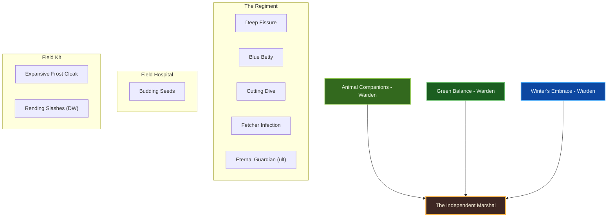
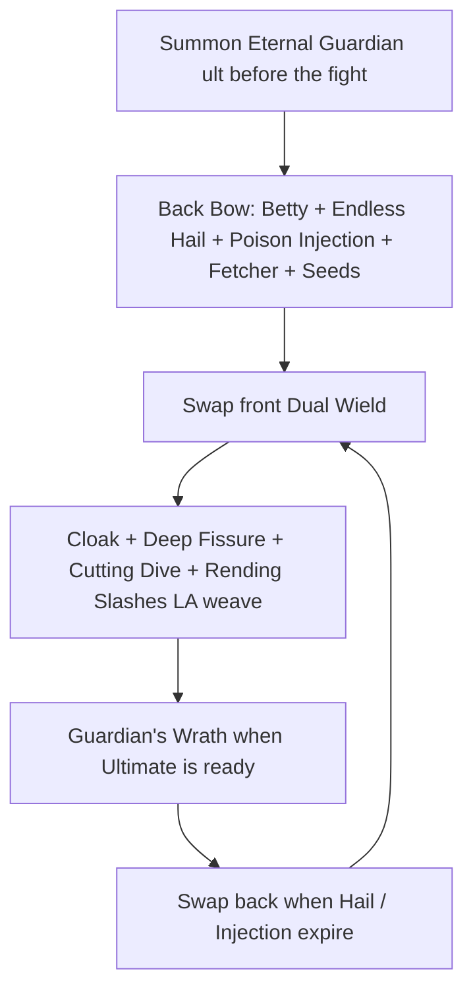
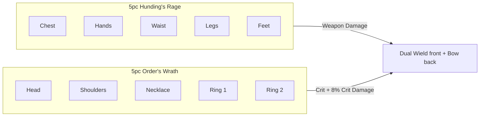

# Build Plan - Alpha Top: The Independent Marshal (Stamina Warden Overland)

> **Character profile:** [alpha_top.md](alpha_top.md) — Level 41 Breton Warden, CP 289, @SOLAEGIS (EU). Title: Legionary.

**Alpha Top** was a Covenant staff-college prodigy — a military genius who could win campaigns on parchment before the first arrow flew. He walked away from the chain of command and now runs his own war: beasts as companies, frost as armor, bow as fire discipline. This guide turns the live Level 41 kit (**Dual Wield** Main / **Bow** Backup, **Wilderqueen's Arch** bridge, morphs online) into **The Independent Marshal**: a **class-identity-first** stamina Warden who keeps all three native lines (**Animal Companions**, **Green Balance**, **Winter's Embrace**).

Designed for solo overland and public dungeons on craftable gear. Unlock Bahtra at Level 50 for subclass *availability*; **do not** auto-subclass — foreign lines only later with proof they beat a native pillar.

---

## Build at a glance

| **Attribute** | **Recommendation** |
| :--- | :--- |
| **Primary Stat** | 64 points in **Stamina** — **live:** 0 Mag / 0 Health / **52 Stam** · pools **28,446** HP / **24,496** Mag / **29,301** Stam · **target:** 64 Stam at CP160 |
| **Mundus Stone** | **The Thief** (+Critical Chance) — **live:** The Ritual; swap when sustain is comfortable |
| **Vampirism** | **Cured** — frost armor and overland fire fights reject the crawl |
| **Sets** | **5 Order's Wrath + 5 Hunding's Rage** (100% craftable, all Medium) — **live:** Wilderqueen's Arch 4/5 + Beekeeper / Trainee / Prophet scrap · **target:** OW + Hunding's |
| **Bars** | Front: **Dual Wield** ("Close Quarters") · Back: **Bow** ("Fire Discipline") — **live:** DW Main / Bow Backup (weapon order correct) |
| **Food** | **Dubious Camoran Throne** (Max Health + Max Stam + Stam Recovery) or **Artaeum Pickled Fish Bowl** while leveling |
| **Potion** | **Essence of Weapon Power** (Weapon Damage + Crit + Stam) |
| **Weapon Poisons** | Optional **Gradual Ravage Health** / **Escapist's Poison** between pulls |
| **Staff/Weapon Enchant** | Front swords: **Poison** / **Absorb Stamina** / **Flame** · Back bow: **Disease Damage** or **Weapon Damage** |
| **Companion** | **Primary (now):** **Bastian Hallix** (tank / adjutant) · **Secondary:** **Mirri Elendis** · **Goal (20/20 @ CP160):** **Tanlorin** |
| **Primary Mount** | **Snow Bear** (owned) · **Alt:** **Sorrel Horse** — see [Collectibles](#collectibles) |
| **Flavor Pet** | **Golden Eagle** (owned) · **Alt:** **Alik'r Dune-Hound** — see [Collectibles](#collectibles) |
| **Costume** | **Covenant Scout** (owned) · **Alt:** **Red Rook Armor** / **Austere Warden Outfit** / **Shrouded Armor** — see [Collectibles](#collectibles) |

**Read next:** [Roleplay](#roleplay-the-independent-marshal) · [Trinity configuration](#trinity-configuration) · [Combat kit](#combat-kit-the-close-quarters-cycle) · [Gear and crafting](#gear-and-crafting-the-field-marshal-kit) · [Champion points](#champion-point-mapping-cp-289) · [Companion](#companion-strategy-the-staff-office) · [Collectibles](#collectibles) · [Checklist](#next-steps--in-game-action-checklist)

---

## Roleplay: The Independent Marshal

High Rock taught him doctrine. The Covenant taught him politics. Neither could hold him.

**Alpha Top** left the war room with a clean break: no resignation speech, no farewell toast — only a private ledger of every battle he had already won on paper and a promise to himself that the next campaign would answer to *him*. In the field he commands a regiment that needs no muster roll: the **Betty** is quartermaster (Major Brutality on schedule), the **Eternal Guardian** is heavy company, **Fetcher** skirmishers soften the line, and the **bow** is artillery from the back bar — fire discipline before the **swords** close the hunt.

He travels light in **Covenant Scout** kit — staff-college doctrine without parade plate. Lion Guard steel stays on the Outfit Station when he wants the old world to remember who trained him. The difference is simple: he no longer asks permission to win.

> [!TIP]
> **Suggested Custom Title:** `Independent Marshal`

> [!NOTE]
> **Build Notes (paste into LAM Build Notes):**
> Alpha Top — The Independent Marshal. Covenant prodigy gone independent hunter — beasts as companies, frost as kit, swords on the front, bow as back-bar artillery. Native Warden only (Animal Companions / Green Balance / Winter's Embrace) — unlock Bahtra at 50, do not auto-subclass. Target: 5 Order's Wrath + 5 Hunding's Rage (medium), @masisi. Front Dual Wield: Expansive Frost Cloak, Deep Fissure, Cutting Dive, Rending Slashes, Blue Betty (slot 5); ult Eternal Guardian. Back Bow: Endless Hail, Poison Injection, Fetcher Infection, Budding Seeds, Blue Betty (slot 5); ult Eternal Guardian (Guardian's Wrath = bear special). 64 Stam. Mundus: The Thief (live Ritual). Companion: Bastian now; Tanlorin @ 20/20. Costume: Covenant Scout / Snow Bear / Golden Eagle.

> [!TIP]
> **Flavor Pet:** **Golden Eagle** (owned) — falconer's eye over the hunting ground. **Alt:** **Alik'r Dune-Hound** for pack hunts. See [Collectibles](#collectibles).

> [!TIP]
> **Costume:** **Covenant Scout** — light reconnaissance silhouette for an independent marshal. **Alt:** **Red Rook Armor**, **Austere Warden Outfit**, or **Shrouded Armor**. Use **Lion Guard** as Outfit Station motif on crafted gear, not as the primary costume. Full picks under [Collectibles](#collectibles).

---

## Trinity configuration

Subclass unlocks at **Level 50** via Bahtra at-Hunding (**"A Study in Discipline"**). Unlocking the quest does **not** mean you must subclass. **Default trinity = all three native Warden lines.** See [docs/subclassing.md](../../../docs/subclassing.md).

| **Pillar** | **Line** | **Origin** | **Slot action** | **Function** |
| :--- | :--- | :--- | :--- | :--- |
| **Regiment** | **Animal Companions** | Warden (native) | **KEEP** | Deep Fissure, Blue Betty, Cutting Dive, Fetcher Infection, Eternal Guardian (ult) |
| **Field Hospital** | **Green Balance** | Warden (native) | **KEEP** | Budding Seeds HoT; Green Balance passives |
| **Field Kit** | **Winter's Embrace** | Warden (native) | **KEEP** | Expansive Frost Cloak (Major Resolve); frost armor passives |

**Weapon lines (not subclass):** **Bow** (Endless Hail, Poison Injection) · **Dual Wield** (**Rending Slashes** — Twin Slashes morph; sibling **Blood Craze**; do **not** take **Bloodthirst**, which is a Flurry morph).

> [!IMPORTANT]
> **Do not subclass by default.** Only replace a native line later if a foreign line clearly outperforms it on the same content with craftable gear already correct.

---

## Combat kit: The Close Quarters Cycle

Open on the **Bow** back bar with Endless Hail, Poison Injection, Fetcher, Seeds, and Betty; swap to **Dual Wield** front for Cloak, Deep Fissure, Cutting Dive, and **Rending Slashes** light-attack weave. **Blue Betty** stays in **slot 5 on both bars**. **Eternal Guardian** is the **ultimate on both bars** — summon the bear once, then spend Ultimate for **Guardian's Wrath** (UI may show Wrath while the ult morph is Eternal Guardian).

### Skill bars

Document **slotted morph names as shown in the skills UI**. Each morph appears at most once across bars except **Blue Betty** (slot 5 both bars) and **Eternal Guardian** (ult both bars). Bars must match equipped weapon types — **live already has Dual Wield on Main and Bow on Backup**.

#### Front Bar (Dual Wield): "Close Quarters"

| **Slot** | **Class/Line** | **Base → Morph** | **Role** | **Profile** |
| :--- | :--- | :--- | :--- | :--- |
| **1** | Winter's Embrace | Frost Cloak → **Expansive Frost Cloak** | Major Resolve while in the scrap | **Live** — slotted |
| **2** | Animal Companions | Scorch → **Deep Fissure** | AoE shalk + Major/Minor Breach | **Live** — slotted (sibling **Subterranean Assault** is Stam/Poison if Mag runs dry) |
| **3** | Animal Companions | Dive → **Cutting Dive** | Stam dive / bleed + Off Balance from range | **Live** — slotted (sibling **Screaming Cliff Racer** is Mag WD buff) |
| **4** | Dual Wield | Twin Slashes → **Rending Slashes** | Melee bleed DoT + LA weave | **Live** — slotted (sibling **Blood Craze**; **not** Bloodthirst / Flurry) |
| **5** | Animal Companions | Betty Netch → **Blue Betty** | Major Brutality / Sorcery + Stam restore (**slot 5 both bars**) | **Live** — slotted |
| **6 (Ult)** | Animal Companions | Feral Guardian → **Eternal Guardian** | **Ultimate** — persistent bear; press again for **Guardian's Wrath** | **Live** — Eternal Guardian (UI may show Guardian's Wrath) |

#### Back Bar (Bow): "Fire Discipline"

| **Slot** | **Class/Line** | **Base → Morph** | **Role** | **Profile** |
| :--- | :--- | :--- | :--- | :--- |
| **1** | Bow | Volley → **Endless Hail** | Ground AoE DoT | **Live** — slotted |
| **2** | Bow | Poison Arrow → **Poison Injection** | Single-target DoT / execute pressure | **Live** — slotted |
| **3** | Animal Companions | Swarm → **Fetcher Infection** | Disease DoT + Minor Vulnerability | **Live** — slotted |
| **4** | Green Balance | Healing Seed → **Budding Seeds** | HoT + synergy | **Live** — slotted |
| **5** | Animal Companions | Betty Netch → **Blue Betty** | Same buff (**slot 5 both bars**) | **Live** — slotted |
| **6 (Ult)** | Animal Companions | Feral Guardian → **Eternal Guardian** | Same ult both bars (keeps bear on weapon swap) | **Live** — matches front |

> [!NOTE]
> **Feral Guardian is an Ultimate**, not a regular Animal Companions skill. Morphs are **Eternal Guardian** (respawn + stronger Wrath execute) and **Wild Guardian** (bleed / Guardian's Savagery). **Guardian's Wrath** is the bear's special activate (75 Ultimate while the pet is out) — not a separate morph. Slot it as ult on **both** bars or the bear despawns on weapon swap.

> [!WARNING]
> **Morphs and bar layout are done** on the live export. **Keep Blue Betty in slot 5 on both bars** and **Eternal Guardian as Ultimate on both bars.** Do **not** morph Twin Slashes into Bloodthirst — that morph belongs to **Flurry**. Spend the remaining **6 skill points** into Dual Wield / Green Balance / Winter's Embrace passives (see Passive skills).

### Rotation and combat tips

#### Solo combat tips

1. **Eternal Guardian is the Ultimate on both bars** — summon before pulls; Eternal morph respawns the bear once per minute if it dies.
2. **Plant Fire Discipline first** — Blue Betty, Endless Hail, Poison Injection, Fetcher Infection, Budding Seeds from the bow bar.
3. **Swap to Close Quarters** — keep **Expansive Frost Cloak** up (slot 1), **Deep Fissure** for Breach, **Cutting Dive** as Stam filler / Off Balance from range, **Rending Slashes** weave.
4. **Blue Betty in slot 5 on both bars** so the buff survives weapon swaps; Cloak stays front for melee.
5. **Guardian's Wrath** (press Ult with the bear out) on elites and world-boss opens — not a separate bar skill.
6. Potion **Essence of Weapon Power** on hard pulls once Hunding's / Order's Wrath are on.

### Passive skills

**Live:** **6 skill points** available · morphs and bars online. Spend remaining points in this priority; fully rank where noted.

#### Warden — Animal Companions

* **[Bond with Nature](https://en.uesp.net/wiki/Online:Bond_with_Nature)** / **[Savage Beast](https://en.uesp.net/wiki/Online:Savage_Beast)** / **[Flourish](https://en.uesp.net/wiki/Online:Flourish)** / **[Advanced Species](https://en.uesp.net/wiki/Online:Advanced_Species):** ✅ Live — keep ranked.
* Morphs **Deep Fissure**, **Blue Betty**, **Cutting Dive**, **Fetcher Infection**, and ultimate **Eternal Guardian** — ✅ Live.

#### Warden — Green Balance

* Unlock **[Nature's Gift](https://en.uesp.net/wiki/Online:Nature's_Gift)**, **[Emerald Moss](https://en.uesp.net/wiki/Online:Emerald_Moss)**, **[Maturation](https://en.uesp.net/wiki/Online:Maturation)** as ranks allow.
* Morph **Budding Seeds** — ✅ Live.

#### Warden — Winter's Embrace

* Unlock **[Glacial Presence](https://en.uesp.net/wiki/Online:Glacial_Presence)**, **[Icy Aura](https://en.uesp.net/wiki/Online:Icy_Aura)**, **[Piercing Cold](https://en.uesp.net/wiki/Online:Piercing_Cold)** as ranks allow.
* **[Frozen Armor](https://en.uesp.net/wiki/Online:Frozen_Armor):** ✅ Live.
* Morph **Expansive Frost Cloak** — ✅ Live.

#### Weapon — Bow

* Live passives strong (Vinedusk Training, Accuracy, Ranger, Hawk Eye, Hasty Retreat). Keep ranked.
* Morphs **Endless Hail** and **Poison Injection** — ✅ Live.

#### Weapon — Dual Wield

* Live: Focused Killer, Ambidextrous, Controlled Fury, Ruffian. Unlock **[Twin Blade and Blunt](https://en.uesp.net/wiki/Online:Twin_Blade_and_Blunt)** at rank with remaining skill points.
* Morph **Rending Slashes** — ✅ Live.

#### Armor — Medium

* Wear medium to train the line. Unlock **Dexterity**, **Wind Runner**, **Improved Sneak**, **Agility**, **Athletics** toward full medium passives.

#### Race — Breton

* Magicka racials are suboptimal for pure Stam — keep what is unlocked; do not respec race. Stamina dump still defines the build.

---

## Gear and crafting: "The Field Marshal Kit"

Everything end-state is **crafted** — no overland farming for the primary loadout, no dungeon monster sets. Target: **5 Order's Wrath + 5 Hunding's Rage**, all **Medium**. Order's Wrath = crit chance + **+8% Critical Damage**; Hunding's = Weapon Damage package for stamina skills.

### Set rationale

| **Set** | **5-Piece Bonus** | **Role** |
| :--- | :--- | :--- |
| **Hunding's Rage** | Weapon Damage / Stam package | Baseline stamina DPS |
| **Order's Wrath** | Crit chance + **+8% Critical Damage** | Amplifies Poison Injection, Rending Slashes, Deep Fissure crits |

> [!NOTE]
> **Why not Briarheart jewelry?** Wrothgar **overland drop** — not craftable. Reject as *target*. Live Wilderqueen's Arch is a fine **bridge** only.

> [!NOTE]
> **Live gear bridge:** Keep **Wilderqueen's Arch 4/5** plus **Beekeeper's** / **Trainee** / **Prophet** scrap while leveling. Prefer **medium** pieces. Do not farm more overland sets for the primary loadout.

### Target loadout

| **Slot** | **Set** | **Weight** | **Trait** | **Enchantment** | **Quality** |
| :--- | :--- | :--- | :--- | :--- | :--- |
| **Head** | Order's Wrath | Medium | Divines | Max Stamina | Gold |
| **Shoulders** | Order's Wrath | Medium | Divines | Max Stamina | Gold |
| **Chest** | Hunding's Rage | Medium | Divines | Max Stamina | Gold |
| **Hands** | Hunding's Rage | Medium | Divines | Max Stamina | Gold |
| **Waist** | Hunding's Rage | Medium | Divines | Max Stamina | Gold |
| **Legs** | Hunding's Rage | Medium | Divines | Max Stamina | Gold |
| **Feet** | Hunding's Rage | Medium | Divines | Max Stamina | Gold |
| **Necklace** | Order's Wrath | Jewelry | Robust / Bloodthirsty | Weapon Damage | Gold |
| **Ring 1** | Order's Wrath | Jewelry | Bloodthirsty | Weapon Damage | Gold |
| **Ring 2** | Order's Wrath | Jewelry | Bloodthirsty | Weapon Damage | Gold |
| **Front — Main** | Hunding's Rage | Sword | Precise / Nirnhoned | Poison / Absorb Stamina | Gold |
| **Front — Off** | Hunding's Rage | Sword | Charged / Infused | Flame / Poison | Gold |
| **Back — Bow** | Hunding's Rage | Bow | Precise / Infused | Disease Damage or Weapon Damage | Gold |

**Piece counts for bonuses:** **Order's Wrath 5** (head, shoulders, necklace, both rings) · **Hunding's Rage 5** (chest, hands, waist, legs, feet). Weapons are extra Hunding's pieces for traits/enchants — they do not replace the body five.

**Front swords:** Precise + Charged (status) or Nirnhoned on main hand when transmute allows.
**Back bow:** Precise for crit with Order's Wrath / Thief; Infused if using Weapon Damage enchant.

### Crafting handoff (@masisi)

| **Detail** | **Recommendation** |
| :--- | :--- |
| **Crafter** | EU account artisan **[Masisi](masisi.md)** / [masisi_plan.md](masisi_plan.md) |
| **Style** | **Breton** / **Daggerfall Covenant** / **Lion Guard** body; military trim (Outfit Station — not primary costume) |
| **Set station** | Order's Wrath: **Steadfast Hammer and Saw** (High Isle) — 3 traits · Hunding's Rage: classic crafted set — 6 traits |
| **Traits** | **Divines** armor · **Bloodthirsty** / **Robust** jewelry · **Precise** / **Infused** / **Charged** weapons |
| **Interim** | Live Wilderqueen's Arch 4/5 + Beekeeper / Trainee / Prophet scrap; ask @masisi for **level-scaled** Hunding's / Order's Wrath purple while under CP160 |
| **Quality** | Purple bridge → **gold at CP160** when traits ready |

---

## Champion Point Mapping (CP 289)

Budget: **96 Warfare / 97 Craft / 96 Fitness** (289 total). **Live: 281 spent / 8 available** (Warfare 90/96 · Craft 96/97 · Fitness 95/96). Under 900 total CP you have **3 slotted stars** per discipline. Star names match [champion_points_reference.md](../../templates/champion_points_reference.md); walk prerequisites from `champion_points.yaml`.

> [!NOTE]
> **Live Warfare is Master-at-Arms, not Thaumaturge** — Precision 20 / Piercing 20 / Master-at-Arms 50. That favors direct damage (Rending Slashes, Cutting Dive, Betty hits). Keep it for now; a later DoT-heavy respec can walk Piercing → **Thaumaturge** if Endless Hail / Fetcher / Injection feel like the main damage.

> [!NOTE]
> **When CP grows (≈810+):** Cap Warfare at Master-at-Arms / Deadly Aim / Fighting Finesse (and optionally Thaumaturge) at 50 each; Fitness Boundless Vitality / Fortified / Rejuvenation / Bloody Renewal; finish Craft **Liquid Efficiency (50)** after Steadfast Enchantment + Rationer.

### Warfare (Blue — live 90 / 96)

**Live (keep):**

| **Star** | **Type** | **Spend** | **Benefit** |
| :--- | :--- | :--- | :--- |
| **Precision** | Passive | 20 | Crit Chance |
| **Piercing** | Passive | 20 | Offensive Penetration |
| **Master-at-Arms** | Slotted | 50 | Direct damage (Rending Slashes, Dive, Betty) |
| *(available)* | — | 6 | Bank or start Tireless Discipline / Fighting Finesse path |

*Optional later respec (DoT lean):* Tireless Discipline / Eldritch Insight / Precision / Piercing → **Thaumaturge 50** for Hail / Fissure / Fetcher / Injection.

### Fitness (Red — live 95 / 96)

| **Star** | **Type** | **Spend** | **Benefit** |
| :--- | :--- | :--- | :--- |
| **Boundless Vitality** | Slotted | 45 | Max Health — **live** (top to 50 with next Fitness point) |
| **Rejuvenation** | Slotted | 50 | Recovery |
| *(available)* | — | 1 | Finish Boundless Vitality → 50 |

### Craft (Green — live 96 / 97)

| **Star** | **Type** | **Spend** | **Benefit** |
| :--- | :--- | :--- | :--- |
| **Steed's Blessing** | Slotted | 50 | Out-of-combat move speed |
| **Out of Sight** | Passive | 20 | Stealth detection radius |
| **Fortune's Favor** | Passive | 10 | Gold find while banked |
| **Gilded Fingers** | Passive | 10 | Gold find |
| **Fleet Phantom** | Passive | 6 | Move while stealthed |
| *(available)* | — | 1 | Toward Steadfast Enchantment / Rationer / Liquid Efficiency |

> [!IMPORTANT]
> **Liquid Efficiency** is automatic once purchased (no Craft slot). Buy after Steadfast Enchantment + Rationer when Craft budget allows — live Craft is QoL / stealth heavy; reallocate toward Liquid Efficiency when ready.

---

## Companion Strategy: "The Staff Office"

Companions use **Companion's** weapons and armor only (Quickened, Aggressive, Bolstered, etc.) — never player sets (no Hunding's, no Divines). Buy white basics from vendors; farm Superior+ while the companion is summoned.

> [!NOTE]
> **Live export:** Companions unlocked — **Bastian Hallix**, **Mirri Elendis**, **Tanlorin**, **Zerith-var**. No companion levels/gear detail in the profile; treat as early kit.

### Companion picks

| **Tier** | **Companion** | **Role** | **Roleplay fit** | **Mechanical fit** |
| :--- | :--- | :--- | :--- | :--- |
| **Primary (now)** | **Bastian Hallix** | Tank / support | Former staff-office peer — the adjutant who still believes in doctrine | Frontline for a glass-ish stam melee hunter |
| **Secondary** | **Mirri Elendis** | DPS / loot | Cynical excavator on independent campaigns | Swap for rapport / DPS |
| **Goal (20/20 @ CP160)** | **Tanlorin** | DPS / utility | Unbound agent energy matching a marshal off the books | Fully geared Aggressive Companion's set |

### Primary now — Bastian Hallix

| **Setting** | **Recommendation** |
| :--- | :--- |
| **Role** | **Tank** (One Hand and Shield) or mixed support |
| **Gear Weight** | **Heavy** Companion's (or Superior+ drops) |
| **Gear Trait** | **Bolstered** / **Soothing** for survival; **Quickened** if skills feel slow |
| **Loadout** | Full **Companion's** set — replace vendor whites |
| **Acquisition** | Vendor whites now; Superior+ from bosses/overland with Bastian active |

#### Bastian skill bar (fill empties)

1. Keep taunt / damage skills that are already unlocked.
2. Fill empty slots with shield / heal / interrupt utilities as ranks allow.
3. Ultimate: tank or group-support ult when available.

Level Bastian toward **20/20** while Alpha Top levels; rotate Mirri/Tanlorin for XP when rapport or content needs it.

> [!TIP]
> **Goal — Tanlorin:** Summon when you want an unbound second on the independent campaign. Medium **Companion's** Aggressive gear; full bar before hard world bosses.

---

## Collectibles

All picks are **owned** on the live [alpha_top.md](alpha_top.md) export.

### Mount

| **Attribute** | **Detail** |
| :--- | :--- |
| **Primary (owned)** | **[Snow Bear](https://en.uesp.net/wiki/Online:Snow_Bear)** — frost-country beast for a Winter's Embrace hunter; the biggest animal in his company |
| **Alt (owned)** | **[Sorrel Horse](https://en.uesp.net/wiki/Online:Sorrel_Horse)** — quiet field hunter's horse for long stalks |
| **Backup (owned)** | **[Dwarven War Horse](https://en.uesp.net/wiki/Online:Dwarven_War_Horse)** — heavy chase when the quarry is armored |
| **Former primary** | **[Skulltooth Coastal Durzog](https://en.uesp.net/wiki/Online:Skulltooth_Coastal_Durzog)** — handed to [Hastein Sea-Wolf](hastein_sea_wolf_plan.md) as his coastal pack-hunter |
| **Avoid (thematically)** | **Nightmare Senche** / **Rahd-m'Athra** / **Noweyr Steed** — void-festival cats and carnival mounts fight the hunter fiction (and Senche is already overused on this account) |

### Pet

| **Attribute** | **Detail** |
| :--- | :--- |
| **Primary (owned)** | **[Golden Eagle](https://en.uesp.net/wiki/Online:Golden_Eagle)** — best hunter pet owned; falconry overwatch for a bow marshal |
| **Alt (owned)** | **[Alik'r Dune-Hound](https://en.uesp.net/wiki/Online:Alik'r_Dune-Hound)** — pack hound for ground scent-work |
| **Alt (owned)** | **[Jackal](https://en.uesp.net/wiki/Online:Jackal)** / **[Dwarven War Dog](https://en.uesp.net/wiki/Online:Dwarven_War_Dog)** — lean scavenger or kennel war-dog |

### Costume

| **Attribute** | **Detail** |
| :--- | :--- |
| **Primary (owned)** | **[Covenant Scout](https://en.uesp.net/wiki/Online:Covenant_Scout)** — light Covenant field kit; independent marshal without parade plate |
| **Alt (owned)** | **[Red Rook Armor](https://en.uesp.net/wiki/Online:Red_Rook_Armor)** — lean outlaw scout look |
| **Alt (owned)** | **[Austere Warden Outfit](https://en.uesp.net/wiki/Online:Austere_Warden_Outfit)** — nature-marshal dress uniform |
| **Alt (owned)** | **[Shrouded Armor](https://en.uesp.net/wiki/Online:Shrouded_Armor)** — covert stalker nights |
| **Avoid as costume** | **[Lion Guard Knight](https://en.uesp.net/wiki/Online:Lion_Guard_Knight)** — reads heavy plate; use **Lion Guard** as Outfit Station motif on crafted gear instead |

Distinguish **Costume** (Collectibles) from Outfit Station motifs on crafted gear.

### Dye and style

**Independent Marshal** — Covenant blue-steel, field mud, gold rank trim.

| **Slot** | **Style** | **Visual Reasoning** |
| :--- | :--- | :--- |
| **Body** | **Breton** / **Daggerfall Covenant** / **Lion Guard** | Military High Rock silhouette (Outfit Station) |
| **Jewelry** | **Imperial** / **Akaviri** | Staff-college authority without Legion loyalty |
| **Bow** | **Barbaric** / **Ancient Elf** | Field artillery, not parade |

**Dye palette:** Steel blue (primary), charcoal (secondary), muted gold (trim — former rank, not crown).

---

## Next Steps & In-Game Action Checklist

### Phase 0 — Today (functional build)

1. ✅ **Morphs online** — Blue Betty, Expansive Frost Cloak, Budding Seeds, Endless Hail, Poison Injection, Deep Fissure, Cutting Dive, Fetcher Infection, Rending Slashes, Eternal Guardian.
2. ✅ **Bars match plan** — Dual Wield **front**, Bow **back**, order Cloak / Deep Fissure / Cutting Dive / Rending Slashes / Blue Betty · Endless Hail / Poison Injection / Fetcher / Seeds / Blue Betty · Eternal Guardian ult both bars.
3. **Spend the remaining 6 skill points** into Dual Wield (**Twin Blade and Blunt**), Green Balance, and Winter's Embrace passives.
4. **Attributes:** keep dumping into **Stamina** toward **64** (live **52**).
5. **Spend leftover CP** (8 available) — e.g. Boundless Vitality → 50; bank Warfare 6; Craft toward Steadfast Enchantment path. Keep **Master-at-Arms** unless you deliberately respec to Thaumaturge.
6. **Mundus:** stay on Ritual until sustain feels fine, then swap to **The Thief**.
7. **Bastian:** Companion's gear; fill empty slots; keep summoned for XP.
8. **Collectibles:** equip **Covenant Scout**, **Snow Bear**, **Golden Eagle** (Lion Guard = Outfit motif only).

### Phase 1 — Level to 50 (interim)

9. Keep **Wilderqueen's Arch 4/5** bridge (+ Beekeeper / Trainee / Prophet scrap); prefer medium armor to train Medium passives.
10. Rank **Dual Wield**, **Bow**, **Animal Companions**, **Green Balance**, **Winter's Embrace**, Medium Armor.
11. Practice back-bar Fire Discipline DoTs → swap front Close Quarters **Rending Slashes** weave.
12. Optional: commission @masisi for **level-scaled** purple Hunding's / Order's Wrath.

### Phase 2 — CP160 craft target

13. **Level 50:** complete Bahtra **"A Study in Discipline"** so subclassing is *available* — **keep all three native lines** unless a foreign line later proves better.
14. **@masisi:** craft **5 Order's Wrath + 5 Hunding's Rage** (medium, Divines, Bloodthirsty jewelry, Precise/Infused weapons) at CP160 gold.
15. Mundus → **The Thief** if not already swapped.
16. Expand Warfare toward Fighting Finesse / Deadly Aim (or Thaumaturge if DoT-respeccing) as CP grows.

### Phase 3 — Polish

17. Motifs / dyes: Lion Guard / Covenant steel-blue palette on Outfit Station; keep **Covenant Scout** as costume.
18. Level **Tanlorin** (and Mirri) toward **20/20**; farm Companion's Aggressive / Bolstered gear.
19. Finish Craft **Liquid Efficiency**; re-export with `/cm` or `/cm coach` when live matches this plan.

### Finish

20. Regenerate profile with `/cm` and update [alpha_top.md](alpha_top.md) when attributes, CP leftovers, Mundus, gear, and costume match this plan.

The war room is empty. The regiment still answers.
