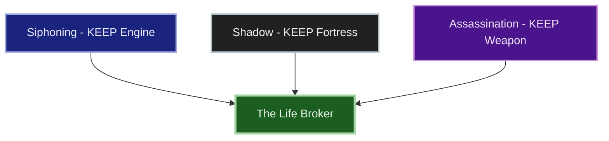
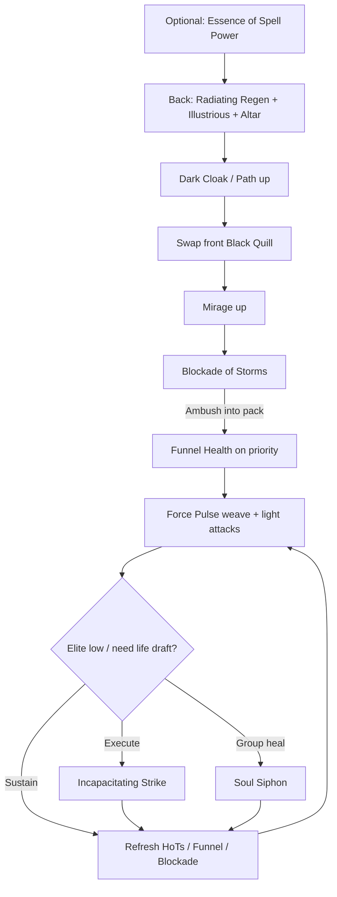

# Build Plan - Dolu-tanesi: The Life Broker (Magicka Siphon Hybrid)

> **Character profile:** [dolu_tanesi.md](dolu_tanesi.md) — Level 19 Dark Elf Nightblade, CP 313, @SOLAEGIS (EU).

**Dolu-tanesi** is a Dunmer **life-energy mage**: he **steals** vitality from enemies and **gives** it to those he chooses to protect. Live kit already points the way — **Lightning Dest** Main / **Restoration** Backup, **Strife** and resto heals, Magicka attributes — this guide locks that fantasy as **The Life Broker**, Severus-coded: austere potions professor, dual loyalty, black-robe severity without carnival Misrule framing.

**Subclassing:** **KEEP** all three native Nightblade lines — **Assassination**, **Shadow**, and **Siphoning**. Siphoning is the steal/give engine; Shadow is the black-robe fortress; Assassination is the severing edge. No foreign line clearly beats those pillars for this hybrid on craftable gear. Unlock Bahtra at Level 50 for *availability* only — do not auto-subclass. See [docs/subclassing.md](../../../docs/subclassing.md).

**Live → target:** Level 19 / CP 313 with Grace of Gloom / Gryphon / Trainee scrap, empty ultimates, duplicate **Blur** / **Strife** on both bars. Bridge from unlocked skills; morph Funnel Health; Dest front / Resto back stays through CP160.

Distinct from NA **Dolu-tenasi** (Sandstorm Reaper necromancer) — different megaserver identity and fantasy.

---

## Build at a glance

| **Attribute** | **Recommendation** |
| :--- | :--- |
| **Primary Stat** | 64 points in **Magicka** — **live:** **22 Mag** / 0 Health / 0 Stam · pools **33,223** HP / **24,369** Mag / **22,552** Stam · **target:** 64 Mag at CP160 |
| **Mundus Stone** | **The Apprentice** (+Spell Damage) — **live:** not shown / changing · take Apprentice for Julianos + Clever Alchemist Spell Damage |
| **Vampirism** | **Cured / N/A** — life-broker identity is living siphon, not undeath; keep daylight roads |
| **Trinity** | **Assassination** + **Shadow** + **Siphoning** KEEP — **live:** all three native · **decision:** class-identity life broker; Siphoning is the theme |
| **Sets** | **5 Law of Julianos + 5 Clever Alchemist** (100% craftable, all Light) — **live:** Grace of Gloom 5/5 + Gryphon 4/5 + Trainee 2/5 · **target:** Julianos + Clever Alchemist |
| **Bars** | Front: **Lightning Dest** ("Black Quill") · Back: **Restoration** ("Mercy Draft") |
| **Food** | **Witchmother's Potent Brew** (Max Magicka + Magicka Recovery) or **Witty Blue Entremet** while leveling |
| **Potion** | **Essence of Spell Power** (Spell Damage + Crit + Mag) — procs Clever Alchemist |
| **Weapon Poisons** | Optional **Gradual Ravage Health** on Dest between pulls |
| **Staff/Weapon Enchant** | Front Lightning: **Shock Damage** (Infused / Crusher) · Back Resto: **Absorb Magicka** or **Reduce Spell Cost** — **live:** Life Drain both bars (bridge OK) |
| **Companion** | **Primary (now):** **Mirri Elendis** (DPS peer) · **Secondary:** **Bastian Hallix** (ward / tank-heal) · **Goal (20/20 @ CP160):** **Tanlorin** |
| **Primary Mount** | **Noweyr Steed** (owned) · **Alt:** **Sorrel Horse** — see [Collectibles](#collectibles) |
| **Flavor Pet** | **Haunted House Cat** (owned) · **Alt:** **Housecat** — see [Collectibles](#collectibles) |
| **Costume** | **Austere Warden Outfit** (owned) · **Alt:** **Mages Guild Formal Robes** — see [Collectibles](#collectibles) |

**Read next:** [Roleplay](#roleplay-the-life-broker) · [Trinity configuration](#trinity-configuration) · [Combat kit](#combat-kit-the-quill-and-draft) · [Gear and crafting](#gear-and-crafting-the-potions-classroom) · [Champion points](#champion-point-mapping-cp-313) · [Companion](#companion-strategy-the-reluctant-ward) · [Collectibles](#collectibles) · [Checklist](#next-steps--in-game-action-checklist)

---

## Roleplay: The Life Broker

Morrowind taught him that life is a ledger. **Dolu-tanesi** does not pray over the wounded and he does not revel in murder — he **accounts**. Vitality is currency: drawn from those who waste it, paid to those he has chosen to keep breathing. Students who expect kindness find a black-robed Dunmer who corrects their posture with a sneer and their wounds with a draught. Enemies who expect a fair duel find their life siphoned into someone else's veins.

He is severe, precise, and privately loyal. The potions bench is his altar — reagents measured like guilt. **Siphoning** is the craft he will not apologize for: **Funnel Health** as the quill that writes life from one body into another; **Soul Siphon** as the classroom-wide draft when the lesson turns lethal. **Shadow** is the black robe he never sheds. **Assassination** is the edge reserved for when accounts must be closed.

Companions are not friends. Mirri is a Dunmer peer who understands ledger-work without sermons. Bastian is the earnest ward he refuses to admit he protects. Tanlorin, when ready, is the stranger who can stand the austerity. The **Noweyr Steed** is a pale road-animal for a man who walks between mercy and theft. The **Haunted House Cat** keeps the potions classroom company — silent, watching, unsentimental.

He is not a carnival prophet. He is a life broker in austere robes, and the quill never shakes.

> [!TIP]
> **Suggested Custom Title:** `Life Broker · Potions Master`

> [!NOTE]
> **Build Notes (paste into LAM Build Notes):**
> Dolu-tanesi — The Life Broker. Dunmer Magicka Nightblade who steals and gives life; Severus-coded austere potions professor (not Misrule). KEEP Assassination + Shadow + Siphoning — no subclass. Dest Lightning front ("Black Quill"): Funnel Health, Force Pulse, Ambush when unlocked, Blockade of Storms, Mirage; ult Incapacitating Strike. Resto back ("Mercy Draft"): Radiating Regeneration, Illustrious Healing, Overflowing Altar, Dark Cloak, Siphon Spirit; ult Soul Siphon. 64 Mag, The Apprentice. Target: 5 Law of Julianos + 5 Clever Alchemist (light) via @masisi. Costume: Austere Warden · Noweyr Steed · Haunted House Cat. Companion: Mirri now · Tanlorin Goal.

> [!TIP]
> **Flavor Pet:** **Haunted House Cat** (owned) — potions-classroom familiar. **Alt:** **Housecat**. See [Collectibles](#collectibles).

> [!TIP]
> **Costume:** **Austere Warden Outfit** — black-robe severity. **Alt:** **Mages Guild Formal Robes** for guild-hall days. Full picks under [Collectibles](#collectibles).

---

## Trinity configuration

### Subclassing decision (required)

Subclass unlocks at **Level 50** via Bahtra at-Hunding (**"A Study in Discipline"**). Unlocking the quest makes subclassing *available* — it does **not** mean you must swap lines. **Default = class-identity-first.** See [docs/subclassing.md](../../../docs/subclassing.md).

**This build's decision:** **KEEP all three native** — **Siphoning** is the steal/give engine (nothing foreign matches Funnel Health / Soul Siphon for this fantasy); **Shadow** is the austere fortress; **Assassination** is the severing edge. Restoring Light would duplicate Resto staff; Living Death would drift into NA Dolu-tenasi necro fantasy.

| **Pillar** | **Line** | **Origin** | **Slot action** | **Function** |
| :--- | :--- | :--- | :--- | :--- |
| **Engine** | **Siphoning** | Nightblade (native) | **KEEP** | Funnel Health (steal → give); Siphon Spirit; Soul Siphon (group life draft) |
| **Fortress** | **Shadow** | Nightblade (native) | **KEEP** | Mirage (Major Resolve); Dark Cloak; Refreshing Path when unlocked |
| **Weapon** | **Assassination** | Nightblade (native) | **KEEP** | Ambush / Lotus Fan gap-close; Incapacitating Strike execute — not Grim Focus until rank ~42 |

**Weapon lines (not subclass):** **Destruction Staff** (Force Pulse, Blockade of Storms) · **Restoration Staff** (Radiating Regeneration, Illustrious Healing, Overflowing Altar).

> [!IMPORTANT]
> **Do not subclass by default.** Only replace a native line later if a foreign line clearly outperforms it on the same content with craftable gear already correct. Bahtra at 50 unlocks the option — keep the ledger native.

> [!IMPORTANT]
> **Pre-50 / live bridge:** Live ranks — Assassination **26**, Shadow **17**, Siphoning **19**. Use unlocked skills only. Do **not** recommend **Grim Focus** / **Relentless Focus** until Assassination rank allows (~42). Empty ultimates today — prioritize **Soul Siphon** and **Death Stroke → Incapacitating Strike** as soon as available.

---

## Combat kit: The Quill and Draft

**Dest front steals and pressures; Resto back pays life out.** Open Mercy Draft for HoTs and altar, swap Black Quill for Funnel Health + Dest weave, return to Resto when allies (or self) need the draft. Pure **Magicka**.

### Skill bars

Document **slotted morph names as shown in the skills UI**. Each morph appears at most once across both bars. Bars match equipped weapons — **Lightning Dest** / **Restoration**.

> [!WARNING]
> **Live bar bugs to fix (Phase 0):** **Blur** and **Strife** are duplicated on both bars. Morph **Strife → Funnel Health** once (front). Unslot the second Strife. Morph **Blur → Mirage** once (front). Put **Dark Cloak** (or Pathing when unlocked) on back instead of a second Blur. Slot ultimates when purchased — do not leave Empty.

#### Front Bar (Lightning Dest): "Black Quill"

| **Slot** | **Class/Line** | **Base → Morph** | **Role** | **Profile** |
| :--- | :--- | :--- | :--- | :--- |
| **1** | Shadow | Blur → **Mirage** | Major Resolve / evasion fortress | **Morph** — live Blur both bars |
| **2** | Destruction Staff | Force Shock → **Force Pulse** | Magicka spammable (tri-element) | **Live** — keep |
| **3** | Assassination | Teleport Strike → **Ambush** (or **Lotus Fan** for packs) | Gap-close / reposition | **Live Teleport Strike** → morph when ready |
| **4** | Destruction Staff | Wall of Elements → **Blockade of Storms** | Shock ground DoT | **Unlock/morph** — live Shock Touch is bridge filler |
| **5** | Siphoning | Strife → **Funnel Health** | **Steal → give** (damage + ally heal) | **Morph** — live Strife |
| **6 (Ult)** | Assassination | Death Stroke → **Incapacitating Strike** | Execute / stun on elites | **Unlock** — live Empty; bridge: Soul Siphon if Assassination ult not ready |

#### Back Bar (Restoration): "Mercy Draft"

| **Slot** | **Class/Line** | **Base → Morph** | **Role** | **Profile** |
| :--- | :--- | :--- | :--- | :--- |
| **1** | Restoration Staff | Regeneration → **Radiating Regeneration** | Hot HoT on group | **Morph** — live Regeneration |
| **2** | Restoration Staff | Grand Healing → **Illustrious Healing** | Ground burst heal | **Morph** — live Grand Healing |
| **3** | Siphoning | Blood Altar → **Overflowing Altar** (or **Sanguine Altar**) | Synergy heal / blood fountain | **Morph** — live Blood Altar |
| **4** | Shadow | Shadow Cloak → **Dark Cloak** (or Pathing → **Refreshing Path**) | Mitigation / path utility — **not** a second Mirage | **Unlock** — replace duplicate Blur |
| **5** | Siphoning | Siphoning Strikes → **Siphon Spirit** | Drain + heal (distinct from Funnel) | **Unlock/morph** — do not restack Funnel |
| **6 (Ult)** | Siphoning | Soul Shred → **Soul Siphon** | **Give life** — group heal ult | **Unlock** — live Empty; signature life-broker ult |

> [!NOTE]
> **Sibling morphs (do not take on this build):** **Swallow Soul** (prefer Funnel Health for ally give) · **Double Take** (prefer Mirage) · **Lotus Fan** and **Ambush** — pick **one** Teleport Strike morph · **Malevolent Offering** (Stamina path) · **Debilitate** if Siphon Spirit is slotted · **Absorb Magic** altar sibling if Overflowing/Sanguine taken.

> [!TIP]
> **Bridge (L19):** Keep **Shock Touch** in front slot 4 until Wall of Elements / Blockade unlocks. Keep unmorphed skills until skill points allow. Prefer Magicka morphs only.

### Rotation and combat tips

#### Solo combat tips

1. **Mercy Draft first** — Radiating Regeneration + Illustrious Healing + Altar before hard pulls.
2. **Mirage** before you commit the Dest bar — Resolve is the black robe.
3. **Blockade of Storms** then **Funnel Health** — steal while the ground DoT works.
4. **Force Pulse** is the classroom cane — weave light attacks for magicka return.
5. **Funnel Health** prioritizes an ally (or companion) when someone needs the gift; still damages the enemy.
6. **Soul Siphon** when the party (or you + companion) needs a life draft — signature give.
7. **Incapacitating Strike** on elites / executes — accounts closed.
8. **Dark Cloak** when pressure spikes; do not cloak as a DPS crutch.
9. **Potion on hard pulls** once Clever Alchemist is on — Essence of Spell Power procs the 5-piece.
10. **Attributes:** keep dumping into **Magicka** toward **64**.

### Passive skills

Spend skill points in this priority; fully rank (Rank II/III) where noted. Honor live unlocks — do not buy locked-line skills early.

#### Nightblade — Siphoning

* **[Magicka Flood](https://en.uesp.net/wiki/Online:Magicka_Flood):** ✅ Live — keep ranked.
* Unlock **[Catalyst](https://en.uesp.net/wiki/Online:Catalyst)**, **[Soul Siphoner](https://en.uesp.net/wiki/Online:Soul_Siphoner)**, **[Transfer](https://en.uesp.net/wiki/Online:Transfer)** as ranks allow.
* Morph **Funnel Health**, **Siphon Spirit**, **Overflowing Altar**, **Soul Siphon**.

#### Nightblade — Shadow

* Unlock **[Refreshing Shadows](https://en.uesp.net/wiki/Online:Refreshing_Shadows)**, **[Shadow Barrier](https://en.uesp.net/wiki/Online:Shadow_Barrier)**, **[Dark Vigor](https://en.uesp.net/wiki/Online:Dark_Vigor)**, **[Dark Veil](https://en.uesp.net/wiki/Online:Dark_Veil)** as ranks allow.
* Morph **Mirage**; unlock **Dark Cloak** / **Refreshing Path**.

#### Nightblade — Assassination

* **[Master Assassin](https://en.uesp.net/wiki/Online:Master_Assassin)** / **[Executioner](https://en.uesp.net/wiki/Online:Executioner)** / **[Pressure Points](https://en.uesp.net/wiki/Online:Pressure_Points):** ✅ Live.
* Unlock **[Hemorrhage](https://en.uesp.net/wiki/Online:Hemorrhage)** when available.
* Morph **Ambush** (or Lotus Fan); **Incapacitating Strike**.
* **Defer Grim Focus** until Assassination skill-line rank unlocks it (~42) — do not plan Relentless Focus on the L19 bridge.

#### Weapon — Destruction Staff

* **[Tri Focus](https://en.uesp.net/wiki/Online:Tri_Focus)** / **[Penetrating Magic](https://en.uesp.net/wiki/Online:Penetrating_Magic):** ✅ Live.
* Unlock **[Elemental Force](https://en.uesp.net/wiki/Online:Elemental_Force)**, **[Ancient Knowledge](https://en.uesp.net/wiki/Online:Ancient_Knowledge)**, **[Destruction Expert](https://en.uesp.net/wiki/Online:Destruction_Expert)**; morph **Blockade of Storms**.

#### Weapon — Restoration Staff

* **[Essence Drain](https://en.uesp.net/wiki/Online:Essence_Drain)** / **[Restoration Expert](https://en.uesp.net/wiki/Online:Restoration_Expert):** ✅ Live.
* Unlock **[Cycle of Life](https://en.uesp.net/wiki/Online:Cycle_of_Life)**, **[Absorb](https://en.uesp.net/wiki/Online:Absorb)**, **[Restoration Master](https://en.uesp.net/wiki/Online:Restoration_Master)**; morph Radiating Regeneration / Illustrious Healing.

#### Armor — Light

* Prefer light pieces while leveling so Grace / Evocation / Spell Warding / Prodigy / Concentration train toward the Julianos + Clever Alchemist kit.

#### Race — Dark Elf

* Rank **[Dynamic](https://en.uesp.net/wiki/Online:Dynamic)**, **[Resist Flame](https://en.uesp.net/wiki/Online:Resist_Flame)**, **[Ruination](https://en.uesp.net/wiki/Online:Ruination)** / Ashlander magicka passives as available — Mag path.

---

## Gear and crafting: "The Potions Classroom"

Everything end-state is **crafted** — no overland farming for the primary loadout, no dungeon monster sets. Target: **5 Law of Julianos + 5 Clever Alchemist**, all **Light**. Julianos = Spell Crit + **+10% Critical Damage**; Clever Alchemist = +675 Spell Damage for 20s on potion — the Snape potions-bench proc.

### Set rationale

| **Set** | **5-Piece Bonus** | **Role** |
| :--- | :--- | :--- |
| **Clever Alchemist** | Potion in combat → +675 Weapon/Spell Damage (20s) | Potions-classroom proc with Essence of Spell Power |
| **Law of Julianos** | +300 Spell Critical; +10% Critical Damage | Baseline burst for Funnel Health, Force Pulse, Blockade |

> [!NOTE]
> **Live gear bridge:** Keep **Grace of Gloom 5/5** + Gryphon / Trainee scrap while leveling. Prefer **light** replacements as they drop or are crafted. Do not farm more overland sets for the primary loadout.

> [!TIP]
> **Why not Mother's Sorrow?** Strong Mag crit set, but **overland drop** — not craftable. Reject as *target*. Clever Alchemist carries the potion fantasy and is craftable.

> [!TIP]
> **Lower-trait fallback:** If Clever Alchemist 7-trait research is not ready on @masisi, craft **5 Shacklebreaker** (6 traits, Vvardenfell) on body slots as a bridge.

### Target loadout

| **Slot** | **Set** | **Weight** | **Trait** | **Enchantment** | **Quality** |
| :--- | :--- | :--- | :--- | :--- | :--- |
| **Head** | Clever Alchemist | Light | Divines | Max Magicka | Gold |
| **Shoulders** | Clever Alchemist | Light | Divines | Max Magicka | Gold |
| **Chest** | Clever Alchemist | Light | Divines | Max Magicka | Gold |
| **Legs** | Clever Alchemist | Light | Divines | Max Magicka | Gold |
| **Waist** | Clever Alchemist | Light | Divines | Max Magicka | Gold |
| **Hands** | Law of Julianos | Light | Divines | Max Magicka | Gold |
| **Feet** | Law of Julianos | Light | Divines | Max Magicka | Gold |
| **Necklace** | Law of Julianos | Jewelry | Arcane | Spell Damage | Gold |
| **Ring 1** | Law of Julianos | Jewelry | Arcane | Max Magicka | Gold |
| **Ring 2** | Law of Julianos | Jewelry | Arcane | Max Magicka | Gold |
| **Front Staff** | Law of Julianos | Lightning Destro | Infused | Shock Damage (Crusher) | Gold |
| **Back Staff** | Law of Julianos | Restoration | Infused | Absorb Magicka or Reduce Spell Cost | Gold |

**Piece counts:** **Clever Alchemist 5** (head, shoulders, chest, legs, waist) · **Law of Julianos 5** (hands, feet, necklace, both rings). Staves are extra Julianos pieces for traits/enchants.

### Crafting handoff (@masisi)

| **Detail** | **Recommendation** |
| :--- | :--- |
| **Crafter** | EU account artisan **[Masisi](masisi.md)** / [masisi_plan.md](masisi_plan.md) |
| **Style** | **Dark Elf** / **Morag Tong** / **Ancient Elf** body; austere black-green trim (Outfit Station — not primary costume) |
| **Set station** | Clever Alchemist: **No Shira Workshop** (Hew's Bane) — 7 traits · Julianos: **Sunhold** (Summerset) — 6 traits |
| **Traits** | **Divines** armor · **Arcane** jewelry · **Infused** staves |
| **Interim** | Live Gloom / Gryphon / Trainee; ask @masisi for **level-scaled** purple Julianos / Clever Alchemist (or Shacklebreaker) while under CP160 |
| **Quality** | Purple bridge → **gold at CP160** when traits ready |

---

## Champion Point Mapping (CP 313)

Budget: **104 Warfare / 105 Craft / 104 Fitness** (313 total). **Live: 0 spent / 313 available** — allocate everything below. Under 900 total CP you have **3 slotted stars** per discipline. Star names match [champion_points_reference.md](../../templates/champion_points_reference.md); walk prerequisites from `champion_points.yaml`.

> [!NOTE]
> **Warfare prereqs:** Fighting Finesse needs **Precision 10**. Thaumaturge / Master-at-Arms need **Piercing 10**, which needs Precision + **Eldritch Insight 10** + **Tireless Discipline 10**. At 104 CP, finish the gate path and bank into Fighting Finesse; complete Thaumaturge next (Funnel / Blockade / Siphon DoTs and HoT pressure).

> [!NOTE]
> **When CP grows (≈810+):** Cap Warfare at Fighting Finesse / Thaumaturge / Master-at-Arms / Deadly Aim (50 each); Fitness Boundless Vitality / Fortified / Rejuvenation / Ironclad; finish Craft **Liquid Efficiency (50)** after Steadfast Enchantment + Rationer.

### Warfare (Blue — 104 Points)

| **Star** | **Type** | **Spend** | **Benefit** |
| :--- | :--- | :--- | :--- |
| **Precision** | Passive | 20 | Critical Chance (gates Fighting Finesse / Piercing path) |
| **Eldritch Insight** | Passive | 20 | Max Magicka (gates Piercing) |
| **Tireless Discipline** | Passive | 10 | Weapon/Spell Damage (gates Piercing) |
| **Piercing** | Passive | 10 | Penetration (gates Thaumaturge / Master-at-Arms) |
| **Fighting Finesse** | Slotted | 44 | +Critical Damage / Critical Healing (finish to 50 next) |

*Next Warfare tranche:* Finish Fighting Finesse **50**, then **Thaumaturge 25→50**, **Master-at-Arms 25→50**, **Deadly Aim** as budget allows.

### Fitness (Red — 104 Points)

| **Star** | **Type** | **Spend** | **Benefit** |
| :--- | :--- | :--- | :--- |
| **Boundless Vitality** | Slotted | 50 | Max Health (siphon broker still needs a pool) |
| **Rejuvenation** | Slotted | 50 | Recovery |
| *(unspent)* | — | 4 | Toward Fortified / Ironclad path |

*Later:* Fortified 50; walk Quick Recovery → Preparation → Ironclad when budget allows.

### Craft (Green — 105 Points)

| **Star** | **Type** | **Spend** | **Benefit** |
| :--- | :--- | :--- | :--- |
| **Steed's Blessing** | Slotted | 50 | Out-of-combat move speed |
| **Fortune's Favor** | Passive | 10 | Gold find |
| **Gilded Fingers** | Passive | 10 | Gold find |
| **Wanderer** | Passive | 10 | Wayshrine cost (gate for Steadfast Enchantment) |
| **Steadfast Enchantment** | Passive | 20 | Enchant charge save (start toward 50) |
| *(unspent)* | — | 5 | Toward Steadfast Enchantment 50 → Rationer → **Liquid Efficiency** |

> [!IMPORTANT]
> **Liquid Efficiency** is automatic once purchased (no Craft slot). Buy after Steadfast Enchantment + Rationer when Craft budget allows.

---

## Companion Strategy: "The Reluctant Ward"

Companions use **Companion's** weapons and armor only (Quickened, Aggressive, Bolstered, etc.) — never player sets (no Julianos, no Divines). Buy white basics from vendors; farm Superior+ while the companion is summoned.

Dolu does not admit he cares. The ward still gets healed.

### Companion picks

| **Tier** | **Companion** | **Role** | **Roleplay fit** | **Mechanical fit** |
| :--- | :--- | :--- | :--- | :--- |
| **Primary (now)** | **Mirri Elendis** | DPS | Dunmer peer — understands ledger-work without sermons | DPS escort while Dolu pays life from the Resto bar |
| **Secondary** | **Bastian Hallix** | Tank / support | Earnest ward he refuses to name as such | Soft wall when Dolu leans Dest steal |
| **Goal (20/20 @ CP160)** | **Tanlorin** | Flexible DPS / support | Stranger who endures austerity | Fully geared Companion's set |

### Primary now — Mirri Elendis

| **Setting** | **Recommendation** |
| :--- | :--- |
| **Role** | **DPS** (Bow or Dual Wield Companion's — match her slotted abilities) |
| **Gear Weight** | **Medium** Companion's (or Superior+ drops) |
| **Gear Trait** | **Aggressive** / **Quickened**; **Bolstered** if she dies too often |
| **Loadout** | Full **Companion's** set — replace vendor Level 1 whites |
| **Acquisition** | Vendor whites now; Superior+ from bosses/overland with Mirri active |

#### Mirri skill bar (fill empties)

1. Keep damage skills already unlocked.
2. Fill empty slots with DPS / utility as ranks allow.
3. Ultimate: DPS ult when available.

Level Mirri toward **20/20** while Dolu levels; rotate Bastian for hard pulls that need a soft wall; bring Tanlorin online as Goal.

> [!TIP]
> **Secondary — Bastian:** Summon when Dest-heavy pulls need a tank-heal ward. Companion's Heavy + Bolstered / Soothing. **Goal — Tanlorin:** full Companion's bar before hard world bosses.

---

## Collectibles

All picks are **owned** on the live [dolu_tanesi.md](dolu_tanesi.md) export. Primaries diversified vs other EU plans (avoid Psijic Escort Charger / Mannimarco / Nightmare Senche primaries already ledgered).

### Mount

| **Attribute** | **Detail** |
| :--- | :--- |
| **Primary (owned)** | **[Noweyr Steed](https://en.uesp.net/wiki/Online:Noweyr_Steed)** — pale/austere road mount for a life broker between mercy and theft |
| **Alt (owned)** | **[Sorrel Horse](https://en.uesp.net/wiki/Online:Sorrel_Horse)** — quiet long-road horse |
| **Backup (owned)** | **[Dwarven War Horse](https://en.uesp.net/wiki/Online:Dwarven_War_Horse)** — severe, metallic alternative |

> [!NOTE]
> **Nightmare Senche** / **Psijic Escort Charger** / **Rahd-m'Athra** are owned but **not primary** here — already used or thematically weaker than Noweyr for this fantasy.

### Pet

| **Attribute** | **Detail** |
| :--- | :--- |
| **Primary (owned)** | **[Haunted House Cat](https://en.uesp.net/wiki/Online:Haunted_House_Cat)** — potions-classroom familiar |
| **Alt (owned)** | **[Housecat](https://en.uesp.net/wiki/Online:Housecat)** — quieter lab cat |
| **Alt (owned)** | **[Long-Winged Bat](https://en.uesp.net/wiki/Online:Long-Winged_Bat)** — dark-robed silhouette (secondary to the cat) |

### Costume

| **Attribute** | **Detail** |
| :--- | :--- |
| **Primary (owned)** | **[Austere Warden Outfit](https://en.uesp.net/wiki/Online:Austere_Warden_Outfit)** — black-robe severity |
| **Alt (owned)** | **[Mages Guild Formal Robes](https://en.uesp.net/wiki/Online:Mages_Guild_Formal_Robes)** — professor / guild-hall days |
| **Alt (owned)** | **[Servant's Robes](https://en.uesp.net/wiki/Online:Servant's_Robes)** — potions-bench humility |

Distinguish **Costume** (Collectibles) from Outfit Station motifs on crafted gear. Do not lean on Crown of Misrule or carnival props for this identity.

### Dye and style

**Life Broker** — void charcoal, bottle green, cold silver trim.

| **Slot** | **Style** | **Visual Reasoning** |
| :--- | :--- | :--- |
| **Body** | **Dark Elf** / **Morag Tong** / **Ancient Elf** | Austere Dunmer mage silhouette (Outfit Station) |
| **Jewelry** | **Dark Elf** / **Ayleid** | Severe ornaments |
| **Staves** | **Dark Elf** / **Ayleid** / **Crystal** | Quill and draft made visible |

**Dye palette:** Void charcoal (primary), bottle/poison green (secondary), cold silver (trim — precision, not pageantry).

---

## Next Steps & In-Game Action Checklist

### Phase 0 — Today (functional build)

1. **Morph Strife → Funnel Health** on front; unslot duplicate Strife on back.
2. **Morph Blur → Mirage** on front; replace back Blur with **Dark Cloak** (or Pathing when unlocked).
3. Morph **Radiating Regeneration**, **Illustrious Healing**, **Overflowing Altar** (or Sanguine) on Mercy Draft.
4. Unlock/slot **Soul Siphon** and **Death Stroke → Incapacitating Strike** as soon as available — clear Empty ults.
5. Keep **Force Pulse** and **Teleport Strike** (morph Ambush when ready); bridge **Shock Touch** until **Blockade of Storms**.
6. Unlock **Siphon Spirit** for back slot 5 — do not duplicate Funnel Health.
7. **Attributes:** keep dumping into **Magicka** toward **64**.
8. **Allocate CP** per [Champion Point Mapping](#champion-point-mapping-cp-313) (live is 0 spent).
9. **Mundus:** take **The Apprentice**.
10. **Mirri:** Companion's gear upgrades; fill empty slots; keep summoned for XP.
11. **Collectibles:** equip **Austere Warden Outfit**, **Noweyr Steed**, **Haunted House Cat**.
12. Paste **Custom Title** `Life Broker · Potions Master` and Build Notes into LAM.
13. **Do not subclass** — KEEP all native; Bahtra later for availability only.
14. **Do not buy Grim Focus** until Assassination rank unlocks it.

### Phase 1 — Craft (interim)

15. Prefer **light** armor while leveling; keep Dest / Resto trained.
16. Rank Siphoning / Shadow / Assassination / Dest / Resto passives per Passive skills section.
17. Practice Quill and Draft loop: Mercy setup → Funnel + Force Pulse → Soul Siphon / execute.
18. Optional: commission @masisi for **level-scaled** purple Julianos / Clever Alchemist (or Shacklebreaker).

### Phase 2 — Craft (target)

19. **Level 50:** complete Bahtra **"A Study in Discipline"** for subclass *availability* — **still KEEP** all three native lines unless a later proof demands otherwise.
20. **@masisi:** craft **5 Clever Alchemist + 5 Law of Julianos** (light, Divines, Arcane jewelry, Infused Lightning Dest + Resto) at CP160 gold.
21. Replace live Life Drain enchants with target Shock / Absorb Magicka (or Reduce Spell Cost on resto).
22. Expand Warfare: finish Fighting Finesse → Thaumaturge → Master-at-Arms as CP grows.
23. When Assassination rank allows: evaluate **Grim Focus → Relentless Focus** as a later Ambush replacement only if the life-broker bars still have room — not required for Phase 2.

### Phase 3 — Polish

24. Motifs / dyes: Dark Elf / Morag Tong void-charcoal + bottle green on Outfit Station; keep **Austere Warden** as costume.
25. Level **Tanlorin** (and Bastian) toward **20/20**; farm Companion's Aggressive / Bolstered gear.
26. Finish Craft **Liquid Efficiency**; re-export with `/cm` or `/cm coach` when live matches this plan.

### Finish

27. Regenerate profile with `/cm` and update [dolu_tanesi.md](dolu_tanesi.md) when attributes, CP, Mundus, gear, bars, costume, and companion match this plan.

The quill writes life. The draft is never free.
