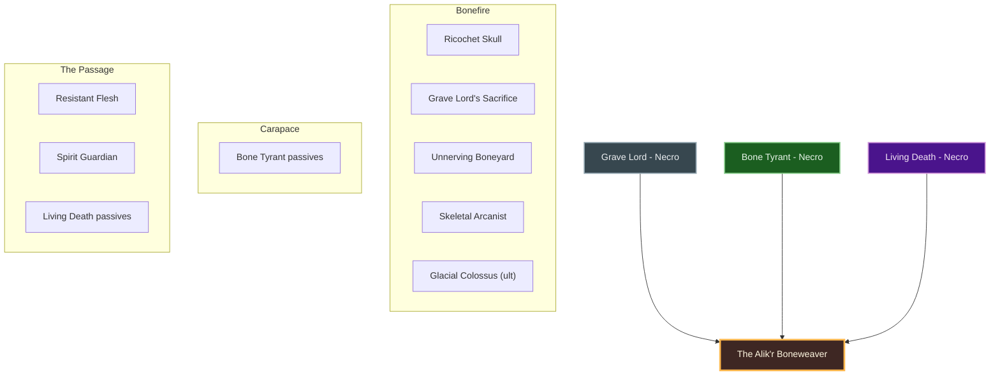
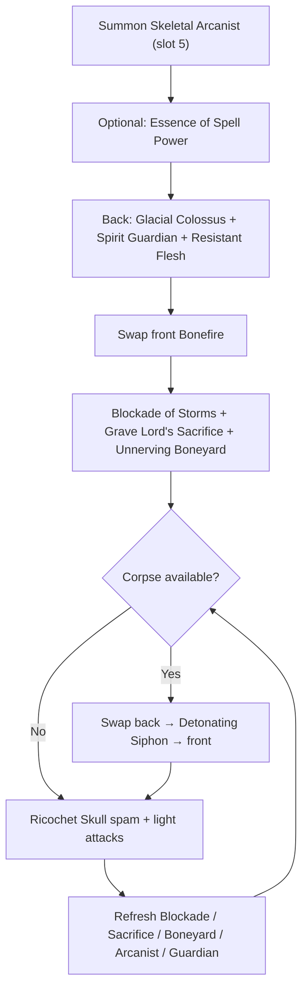

# Build Plan - Karakadin: The Alik'r Boneweaver (Magicka Necromancer Overland)

> **Character profile:** [karakadin.md](karakadin.md) — Level 29 Redguard Necromancer, CP 289, @SOLAEGIS (EU).

**Karakadin** is a Forebear daughter of the Alik’r who claims her name as a right, not a courtesy — a **redemptive** magicka Necromancer who raises the dead not to destroy, but to redeem fallen souls and guide lost spirits toward the light (the same philosophy as **Zerith-var**). This guide turns the live Level 29 kit (**Dest** Main / **Dest** Backup, **Wisdom of Vanus** bridge, **Grave Lord's Sacrifice** / **Ricochet Skull** / **Unnerving Boneyard** / **Skeletal Mage** already online) into **The Alik'r Boneweaver**: a **class-identity-first** magicka Necromancer who keeps all three native lines (**Grave Lord**, **Bone Tyrant**, **Living Death**).

Designed for solo overland and public dungeons on craftable gear. Unlock Bahtra at Level 50 for subclass *availability*; **do not** auto-subclass — foreign lines only later with proof they beat a native pillar.

---

## Build at a glance

| **Attribute** | **Recommendation** |
| :--- | :--- |
| **Primary Stat** | 64 points in **Magicka** — **live:** **35 Mag** / 0 Health / 0 Stam · pools **24,014** HP / **34,249** Mag / **23,246** Stam · **target:** 64 Mag at CP160 |
| **Mundus Stone** | **The Thief** (+Critical Chance) while crit is low — **live:** The Shadow (early; swap to Thief, return to Shadow once crit chance is comfortable) |
| **Vampirism** | **Cured** — vampires subvert the cycle of life and death by unnatural means to attain immortality; she will not take the bite |
| **Sets** | **5 Law of Julianos + 5 Clever Alchemist** (100% craftable, all Light) — **live:** Wisdom of Vanus 5/5 (+ scrap shoulders/waist/ring) · **target:** Julianos + Clever Alchemist |
| **Bars** | Front: **Lightning Dest** ("Bonefire") · Back: **Inferno Dest** ("Dust Veil") — **live:** Dest Main / Dest Backup (weapon order correct; fix duplicate morphs) |
| **Food** | **Witchmother's Potent Brew** (Max Magicka + Magicka Recovery) or **Witty Blue Entremet** while leveling |
| **Potion** | **Essence of Spell Power** (Spell Damage + Crit + Mag) — procs Clever Alchemist |
| **Weapon Poisons** | Optional **Gradual Ravage Health** between pulls |
| **Staff/Weapon Enchant** | Front Lightning: **Shock Damage** (Infused / Crusher) · Back Inferno: **Flame Damage** or **Absorb Magicka** |
| **Companion** | **Primary (now):** **Bastian Hallix** (tank, Level 8/20) · **Secondary:** **Mirri Elendis** · **Goal (20/20 @ CP160):** **Zerith-var** |
| **Primary Mount** | **Pyrodraconic Camel-Lizard** (owned) · **Alt:** **Rahd-m'Athra** — see [Collectibles](#collectibles) |
| **Flavor Pet** | **Alik'r Dune-Hound** (owned) · **Alt:** **Coldharbour Bantam Guar** / **Long-Winged Bat** — see [Collectibles](#collectibles) |
| **Costume** | **Forebear Dishdasha** (owned) · **Alt:** **Crown Dishdasha** / **Grim Harvester** — see [Collectibles](#collectibles) |

**Read next:** [Roleplay](#roleplay-the-alikr-boneweaver) · [Trinity configuration](#trinity-configuration) · [Combat kit](#combat-kit-the-bonefire-cycle) · [Gear and crafting](#gear-and-crafting-the-dune-glass-regalia) · [Champion points](#champion-point-mapping-cp-289) · [Companion](#companion-strategy-the-caravan-guard) · [Collectibles](#collectibles) · [Checklist](#next-steps--in-game-action-checklist)

---

## Roleplay: The Alik'r Boneweaver

She was born under the hard sun of the Alik’r, a Forebear daughter whose family kept a quieter desert rule: the dead are not gone — they are *lost*, and the lost can still be led. When raiders burned her mother’s caravan and left the bones half-buried in dune glass, the priests of the living city called it tragedy. She called it a path unfinished.

She took the name **Karakadin** — not a clan name, but a claim: the black woman who walks where the sand remembers. In Hammerfell that means more than skin. It means she refuses to bleach grief into polite silence, and she refuses the common lie that necromancy must mean dominion. Like **Zerith-var**, she practices forbidden rites as **redemption**: fallen souls raised not to serve forever in darkness, but to finish what violence cut short, then be guided toward the light.

She learned the corpse-economy the way a sword-singer studies form — skulls, bone-yards, a skeletal mage as a retainer who never tires — but every summons is a vow, not a leash. She will not **Soul Trap**: caging a spirit in a gem is dominion, and dominion is the lie she refuses. She despises **vampires** for the same reason — they steal immortality by breaking the life–death cycle; her rites restore *passage*, theirs refuse it forever.

Covenant politics did not make her. Summerset’s white towers did not convert her. She wears the **Forebear Dishdasha** because it is home cloth, and she weaves death through Dest staves because the desert taught her that fire and lightning are only different winds on the same road home.

Companions may walk with her — a shield first, and when the road is ready, **Zerith-var**, a fellow redemptive necromancer who understands that the dead are owed a *passage*, not a prison. The spirits she raises answer to her name only long enough to be set free.

She is a woman of the Alik’r who turned loss into craft, and craft into mercy with teeth.

> [!TIP]
> **Suggested Custom Title:** `Alik'r Boneweaver`

> [!NOTE]
> **Build Notes (paste into LAM Build Notes):**
> Karakadin — The Alik'r Boneweaver. Forebear daughter of the Alik’r; name claimed, not given — black woman who walks where the sand remembers. Redemptive necromancer (Zerith-var kinship): raise fallen souls to finish the path, then guide them toward the light — not dominion. No Soul Trap (never cage spirits for gems). Hates vampires — they break the life–death cycle for unnatural immortality; stay cured. Native Necromancer only (Grave Lord / Bone Tyrant / Living Death) — unlock Bahtra at 50, do not auto-subclass. Target: 5 Law of Julianos + 5 Clever Alchemist (light), @masisi. Front Lightning Dest: Blockade of Storms, Grave Lord's Sacrifice, Ricochet Skull, Unnerving Boneyard, Skeletal Arcanist (slot 5); ult Glacial Colossus. Back Inferno Dest: Detonating Siphon, Spirit Guardian, Resistant Flesh, Inner Light, Skeletal Arcanist (slot 5); ult Glacial Colossus. 64 Mag. Mundus: The Thief (live Shadow). Companion: Bastian now; Zerith-var @ 20/20. Costume: Forebear Dishdasha / Pyrodraconic Camel-Lizard / Alik'r Dune-Hound.

> [!TIP]
> **Flavor Pet:** **Alik'r Dune-Hound** (owned) — desert pack hound for the Boneweaver’s road. **Alt:** **Coldharbour Bantam Guar** or **Long-Winged Bat**. See [Collectibles](#collectibles).

> [!TIP]
> **Costume:** **Forebear Dishdasha** — home cloth of Hammerfell. **Alt:** **Crown Dishdasha** or **Grim Harvester** for combat silhouette. Full picks under [Collectibles](#collectibles).

---

## Trinity configuration

Subclass unlocks at **Level 50** via Bahtra at-Hunding (**"A Study in Discipline"**). Unlocking the quest does **not** mean you must subclass. **Default trinity = all three native Necromancer lines.** See [docs/subclassing.md](../../../docs/subclassing.md).

| **Pillar** | **Line** | **Origin** | **Slot action** | **Function** |
| :--- | :--- | :--- | :--- | :--- |
| **Bonefire** | **Grave Lord** | Necromancer (native) | **KEEP** | Ricochet Skull, Grave Lord's Sacrifice, Unnerving Boneyard, Detonating Siphon, Skeletal Arcanist, Glacial Colossus |
| **Carapace** | **Bone Tyrant** | Necromancer (native) | **KEEP** | Defensive passives (Death Gleaning, Disdain Harm, Health Avarice, Last Gasp); actives optional |
| **The Passage** | **Living Death** | Necromancer (native) | **KEEP** | **Spirit Guardian** (guide + heal + corpse on expire); Resistant Flesh (Major Protection); Living Death passives — mercy that keeps her standing to finish the rite |

**Weapon / guild lines (not subclass):** **Destruction Staff** (**Blockade of Storms**), **Mages Guild** (**Inner Light**). **No Soul Magic** — redemptive necromancers do not cage spirits in gems.

> [!IMPORTANT]
> **Do not subclass by default.** Only replace a native line later if a foreign line clearly outperforms it on the same content with craftable gear already correct.

---

## Combat kit: The Bonefire Cycle

Open on the **back bar** with Colossus vulnerability, siphon setup, and self-protection; swap to the **front bar** for Blockade, Sacrifice, Boneyard, and skull spam. Keep **Skeletal Arcanist** in **slot 5 on both bars** so the mage never despawns on weapon swap. **Pure magicka** — every slotted damage skill costs Magicka (dump attributes into Magicka toward 64).

### Skill bars

Document **slotted morph names as shown in the skills UI**. Each morph appears at most once across bars except **Skeletal Arcanist** (slot 5 both bars) and **Glacial Colossus** (ult both bars). Bars must match equipped weapon types — **live already has Dest on Main and Dest on Backup**.

> [!IMPORTANT]
> **Skeletal summons (slot 5):** ESO **despawns** your skeletal mage when you swap to a bar that does not include the same summon ability. **Skeletal Arcanist** must be in **slot 5 on both front and back bars** — same ability, same slot. Never plan the summon on only one bar.

> [!WARNING]
> **Live bar bugs to fix:** Morph **Skeletal Mage → Skeletal Arcanist** on **slot 5 both bars**. **Unslot Consuming Trap** (Soul Magic) — do not cage spirits for gems. Fill back slot 1 with **Detonating Siphon**; slot **Spirit Guardian** where Trap was.

#### Front Bar (Lightning Dest): "Bonefire"

| **Slot** | **Class/Line** | **Base → Morph** | **Role** | **Profile** |
| :--- | :--- | :--- | :--- | :--- |
| **1** | Destruction Staff | Wall of Elements → **Blockade of Storms** | Shock ground DoT; Thaumaturge / Rapid Rot | **Live** — slotted |
| **2** | Grave Lord | Sacrificial Bones → **Grave Lord's Sacrifice** | +15% Necro/DoT self-buff; seeds corpse | **Live** — slotted |
| **3** | Grave Lord | Flame Skull → **Ricochet Skull** | Magicka spammable; 3rd skull AoE while Sacrifice is up | **Live** — slotted |
| **4** | Grave Lord | Boneyard → **Unnerving Boneyard** | AoE DoT + Major Breach | **Live** — slotted |
| **5** | Grave Lord | Skeletal Mage → **Skeletal Arcanist** | Major Brutality/Sorcery + shock AoE (**slot 5 both bars**) | **Respec** — live unmorphed Mage both bars |
| **6 (Ult)** | Grave Lord | Frozen Colossus → **Glacial Colossus** | Magicka Colossus; Major Vulnerability open | **Live** — Glacial Colossus |

#### Back Bar (Inferno Dest): "Dust Veil"

| **Slot** | **Class/Line** | **Base → Morph** | **Role** | **Profile** |
| :--- | :--- | :--- | :--- | :--- |
| **1** | Grave Lord | Shocking Siphon → **Detonating Siphon** | Corpse drain + disease explosion | **Respec** — live empty; unlock/morph |
| **2** | Living Death | Spirit Mender → **Spirit Guardian** | Guide + heal + corpse on expire (passage, not prison) | **Respec** — unslot live **Consuming Trap** |
| **3** | Living Death | Render Flesh → **Resistant Flesh** | Major Protection (solo morph) | **Live** — slotted |
| **4** | Mages Guild | Magelight → **Inner Light** | +5% Spell Damage; path to Might of the Guild | **Live** — keep **one** copy here |
| **5** | Grave Lord | Skeletal Mage → **Skeletal Arcanist** | Same summon (**slot 5 both bars**) | **Respec** — morph to Arcanist |
| **6 (Ult)** | Grave Lord | Frozen Colossus → **Glacial Colossus** | Same ult both bars | **Live** — matches front |

> [!NOTE]
> **No Soul Trap / Consuming Trap on this build.** Binding spirits into gems is dominion; Karakadin’s redemptive rites guide souls toward the light. Sustain comes from food, Dest heavy attacks, potions, and later Clever Alchemist — not soul-caging.

> [!NOTE]
> **Sibling morphs (do not take on this build):** **Blighted Blastbones** (Stamina) · **Venom Skull** (Stamina) · **Avid Boneyard** (heal morph — use Resistant Flesh instead) · **Skeletal Archer** (Stamina) · **Pestilent Colossus** (Stamina cost) · **Mystic Siphon** only if long-boss sustain needs recovery over Detonating. **Spirit Mender** sibling **Intensive Mender** is the group-heal morph — keep **Spirit Guardian** for solo passage.

> [!TIP]
> **Spirit Guardian** is Living Death, **not** a Daedric summon — it does **not** need slot 5 on both bars. Refresh from Dust Veil when it expires (~16s); it seeds a corpse in combat for Detonating Siphon.

> [!TIP]
> **Inner Light** may sit on front or back — not both. Prefer back Dust Veil so front Bonefire stays all damage.

### Rotation and combat tips

#### Solo combat tips

1. **Skeletal Arcanist in slot 5 on both bars** — summon once; refresh when the 20s timer falls; Major Brutality/Sorcery stays up.
2. **Glacial Colossus opens every boss** — Major Vulnerability first, every hard pull.
3. **Spirit Guardian before the scrap** — passage ward + heal; refresh when it falls; its expire seeds a corpse.
4. **Blockade of Storms + Grave Lord's Sacrifice + Unnerving Boneyard** — plant Bonefire before skull spam.
5. **Detonating Siphon spends corpses** — Sacrifice skeleton death, Guardian expire, enemy death, or Boneyard economy; do not cast into empty ground.
6. **Ricochet Skull is the barrage** — third cast AoEs while Sacrifice is active; weave light attacks for magicka return.
7. **Resistant Flesh** before world bosses — Major Protection; swap back when HP dips.
8. **Potion on hard pulls** once Clever Alchemist is on — Essence of Spell Power procs the 5-piece.

### Passive skills

**Live:** **16 skill points** available. Morphs partially online. Spend in this priority; fully rank (Rank II/III) where noted.

#### Necromancer — Grave Lord

* **[Reusable Parts](https://en.uesp.net/wiki/Online:Reusable_Parts) (II):** ✅ Live — keep ranked.
* **[Death Knell](https://en.uesp.net/wiki/Online:Death_Knell) (II):** ✅ Live — keep ranked (+crit per Grave Lord skill slotted).
* **[Dismember](https://en.uesp.net/wiki/Online:Dismember) (II):** ✅ Live — keep ranked.
* **[Rapid Rot](https://en.uesp.net/wiki/Online:Rapid_Rot) (II):** 🔒 Unlock — +DoT damage for Blockade / Boneyard / Siphon.

#### Necromancer — Bone Tyrant

* Unlock **[Death Gleaning](https://en.uesp.net/wiki/Online:Death_Gleaning)**, **[Disdain Harm](https://en.uesp.net/wiki/Online:Disdain_Harm)**, **[Health Avarice](https://en.uesp.net/wiki/Online:Health_Avarice)**, **[Last Gasp](https://en.uesp.net/wiki/Online:Last_Gasp)** as ranks allow.

#### Necromancer — Living Death

* **[Curative Curse](https://en.uesp.net/wiki/Online:Curative_Curse)** / **[Near-Death Experience](https://en.uesp.net/wiki/Online:Near-Death_Experience)** / **[Corpse Consumption](https://en.uesp.net/wiki/Online:Corpse_Consumption):** ✅ Live.
* Unlock **[Undead Confederate](https://en.uesp.net/wiki/Online:Undead_Confederate)**; morph **Resistant Flesh** and **Spirit Guardian**.

#### Weapon — Destruction Staff

* **[Tri Focus](https://en.uesp.net/wiki/Online:Tri_Focus)** / **[Penetrating Magic](https://en.uesp.net/wiki/Online:Penetrating_Magic)** / **[Elemental Force](https://en.uesp.net/wiki/Online:Elemental_Force):** ✅ Live.
* Unlock **[Ancient Knowledge](https://en.uesp.net/wiki/Online:Ancient_Knowledge)** and **[Destruction Expert](https://en.uesp.net/wiki/Online:Destruction_Expert)**.
* Morph **Blockade of Storms** (Lightning staff).

#### Armor — Light

* Live: Grace, Evocation, Spell Warding. Unlock **[Prodigy](https://en.uesp.net/wiki/Online:Prodigy)** and **[Concentration](https://en.uesp.net/wiki/Online:Concentration)**.

#### Guild — Mages Guild

* Rank for **[Might of the Guild](https://en.uesp.net/wiki/Online:Might_of_the_Guild)**; keep **Inner Light** slotted.

#### Race — Redguard

* **[Wayfarer](https://en.uesp.net/wiki/Online:Wayfarer)** / **[Martial Training](https://en.uesp.net/wiki/Online:Martial_Training)** / **[Conditioning](https://en.uesp.net/wiki/Online:Conditioning)** / **[Adrenaline Rush](https://en.uesp.net/wiki/Online:Adrenaline_Rush):** ✅ Live. Racials lean stamina — food, potions, and Dest heavy-attack weave cover magicka sustain; do not respec race.

---

## Gear and crafting: "The Dune Glass Regalia"

Everything end-state is **crafted** — no overland farming for the primary loadout, no dungeon monster sets. Target: **5 Law of Julianos + 5 Clever Alchemist**, all **Light**. Julianos = Spell Crit + **+10% Critical Damage**; Clever Alchemist = +675 Spell Damage for 20s on potion.

### Set rationale

| **Set** | **5-Piece Bonus** | **Role** |
| :--- | :--- | :--- |
| **Clever Alchemist** | Potion in combat → +675 Weapon/Spell Damage (20s) | Boss open with Essence of Spell Power |
| **Law of Julianos** | +300 Spell Critical; +10% Critical Damage | Baseline burst for Skull, Blockade, Colossus |

> [!NOTE]
> **Live gear bridge:** Keep **Wisdom of Vanus 5/5** plus scrap shoulders/waist/ring while leveling. Prefer **light** pieces. Do not farm more overland sets for the primary loadout.

> [!TIP]
> **Lower-trait fallback:** If Clever Alchemist 7-trait research is not ready on @masisi, craft **5 Shacklebreaker** (6 traits, Vvardenfell) on body slots as a bridge.

### Target loadout

| **Slot** | **Set** | **Weight** | **Trait** | **Enchantment** | **Quality** |
| :--- | :--- | :--- | :--- | :--- | :--- |
| **Head** | Clever Alchemist | Light | Divines | Max Magicka | Gold |
| **Shoulders** | Clever Alchemist | Light | Divines | Max Magicka | Gold |
| **Chest** | Clever Alchemist | Light | Divines | Max Magicka | Gold |
| **Legs** | Clever Alchemist | Light | Divines | Max Magicka | Gold |
| **Waist** | Clever Alchemist | Light | Divines | Max Magicka | Gold |
| **Hands** | Law of Julianos | Light | Divines | Max Magicka | Gold |
| **Feet** | Law of Julianos | Light | Divines | Max Magicka | Gold |
| **Necklace** | Law of Julianos | Jewelry | Arcane | Spell Damage | Gold |
| **Ring 1** | Law of Julianos | Jewelry | Arcane | Max Magicka | Gold |
| **Ring 2** | Law of Julianos | Jewelry | Arcane | Max Magicka | Gold |
| **Front Staff** | Law of Julianos | Lightning Destro | Infused | Shock Damage (Crusher) | Gold |
| **Back Staff** | Law of Julianos | Inferno Destro | Infused | Flame Damage or Absorb Magicka | Gold |

**Piece counts:** **Clever Alchemist 5** (head, shoulders, chest, legs, waist) · **Law of Julianos 5** (hands, feet, necklace, both rings). Staves are extra Julianos pieces for traits/enchants.

### Crafting handoff (@masisi)

| **Detail** | **Recommendation** |
| :--- | :--- |
| **Crafter** | EU account artisan **[Masisi](masisi.md)** / [masisi_plan.md](masisi_plan.md) |
| **Style** | **Redguard** / **Yokudan** / **Ra Gada** body; desert trim (Outfit Station — not primary costume) |
| **Set station** | Clever Alchemist: **No Shira Workshop** (Hew's Bane) — 7 traits · Julianos: **Sunhold** (Summerset) — 6 traits |
| **Traits** | **Divines** armor · **Arcane** jewelry · **Infused** staves |
| **Interim** | Live Vanus 5/5 + scrap; ask @masisi for **level-scaled** purple Julianos / Clever Alchemist (or Shacklebreaker) while under CP160 |
| **Quality** | Purple bridge → **gold at CP160** when traits ready |

---

## Champion Point Mapping (CP 289)

Budget: **96 Warfare / 97 Craft / 96 Fitness** (289 total). **Live: 0 spent / 289 available** — allocate everything below. Under 900 total CP you have **3 slotted stars** per discipline. Star names match [champion_points_reference.md](../../templates/champion_points_reference.md); walk prerequisites from `champion_points.yaml`.

> [!NOTE]
> **When CP grows (≈810+):** Cap Warfare at Fighting Finesse / Thaumaturge / Master-at-Arms / Deadly Aim (50 each); Fitness Boundless Vitality / Fortified / Rejuvenation / Ironclad; finish Craft **Liquid Efficiency (50)** after Steadfast Enchantment + Rationer.

### Warfare (Blue — 96 Points)

| **Star** | **Type** | **Spend** | **Benefit** |
| :--- | :--- | :--- | :--- |
| **Fighting Finesse** | Slotted | 50 | +Critical Damage / Critical Healing |
| **Thaumaturge** | Slotted | 25 | +DoT (Blockade, Boneyard, Siphon) — first stage |
| **Precision** | Passive | 20 | Critical Chance |
| *(unspent)* | — | 1 | Bank toward Eldritch Insight / Piercing path |

*Next Warfare tranche:* Eldritch Insight **20**, Tireless Discipline **10**, Piercing **20**, then finish Thaumaturge / Master-at-Arms toward 50 each.

### Fitness (Red — 96 Points)

| **Star** | **Type** | **Spend** | **Benefit** |
| :--- | :--- | :--- | :--- |
| **Boundless Vitality** | Slotted | 50 | Max Health |
| **Rejuvenation** | Slotted | 46 | Recovery (finish to 50 with next Fitness points) |

*Later:* Fortified 50; walk Quick Recovery → Preparation → Ironclad when budget allows.

### Craft (Green — 97 Points)

| **Star** | **Type** | **Spend** | **Benefit** |
| :--- | :--- | :--- | :--- |
| **Steed's Blessing** | Slotted | 50 | Out-of-combat move speed |
| **Fortune's Favor** | Passive | 10 | Gold find |
| **Gilded Fingers** | Passive | 10 | Gold find |
| **Wanderer** | Passive | 10 | Wayshrine cost (gate for Steadfast Enchantment) |
| **Steadfast Enchantment** | Passive | 10 | Enchant charge save (start) |
| *(unspent)* | — | 7 | Toward Steadfast Enchantment 50 → Rationer → **Liquid Efficiency** |

> [!IMPORTANT]
> **Liquid Efficiency** is automatic once purchased (no Craft slot). Buy after Steadfast Enchantment + Rationer when Craft budget allows.

---

## Companion Strategy: "The Caravan Guard"

Companions use **Companion's** weapons and armor only (Quickened, Aggressive, Bolstered, etc.) — never player sets (no Julianos, no Divines). Buy white basics from vendors; farm Superior+ while the companion is summoned.

> [!NOTE]
> **Live export:** **Bastian Hallix** active at **Level 8/20** with **level 1 Companion's gear**, **two empty ability slots**. Prioritize companion XP, gear upgrades, and bar fill per [Checklist](#next-steps--in-game-action-checklist).

### Companion picks

| **Tier** | **Companion** | **Role** | **Roleplay fit** | **Mechanical fit** |
| :--- | :--- | :--- | :--- | :--- |
| **Primary (now)** | **Bastian Hallix** | Tank / support | Caravan shield — the living wall while she guides the lost | Frontline for a glass magicka Dest DPS |
| **Secondary** | **Mirri Elendis** | DPS / loot | Cynical excavator on desert roads | Swap for rapport / DPS |
| **Goal (20/20 @ CP160)** | **Zerith-var** | Redemptive necromancer | Kindred philosophy — redeem fallen souls, guide spirits toward the light | Fully geared Companion's set; staff if DPS kit |

### Primary now — Bastian Hallix

| **Setting** | **Recommendation** |
| :--- | :--- |
| **Role** | **Tank** (One Hand and Shield) |
| **Gear Weight** | **Heavy** Companion's (or Superior+ drops) |
| **Gear Trait** | **Bolstered** / **Soothing** for survival; **Quickened** if skills feel slow |
| **Loadout** | Full **Companion's** set — replace vendor Level 1 whites |
| **Acquisition** | Vendor whites now; Superior+ from bosses/overland with Bastian active |

#### Bastian skill bar (fill empties)

1. Keep **Provoke** / damage skills already unlocked.
2. Fill **two empty slots** with shield / heal / interrupt utilities as ranks allow.
3. Ultimate: tank or group-support ult when available.

Level Bastian toward **20/20** while Karakadin levels; rotate Mirri/Zerith-var for XP when rapport or content needs it.

> [!TIP]
> **Goal — Zerith-var:** Summon when you want a fellow **redemptive** necromancer on the Boneweaver’s road — shared work of passage, not dominion. Prefer Companion's **staff** if running a DPS kit; Aggressive traits; full bar before hard world bosses.

---

## Collectibles

All picks are **owned** on the live [karakadin.md](karakadin.md) export.

### Mount

| **Attribute** | **Detail** |
| :--- | :--- |
| **Primary (owned)** | **[Pyrodraconic Camel-Lizard](https://en.uesp.net/wiki/Online:Pyrodraconic_Camel-Lizard)** — desert road mount; Alik’r heat made flesh |
| **Alt (owned)** | **[Rahd-m'Athra](https://en.uesp.net/wiki/Online:Rahd-m'Athra)** — shadow-cat for night crossings |
| **Backup (owned)** | **[Sorrel Horse](https://en.uesp.net/wiki/Online:Sorrel_Horse)** — quiet long-road horse |

### Pet

| **Attribute** | **Detail** |
| :--- | :--- |
| **Primary (owned)** | **[Alik'r Dune-Hound](https://en.uesp.net/wiki/Online:Alik'r_Dune-Hound)** — Hammerfell pack hound; best home-theme pet owned |
| **Alt (owned)** | **[Coldharbour Bantam Guar](https://en.uesp.net/wiki/Online:Coldharbour_Bantam_Guar)** — death-domain familiar |
| **Alt (owned)** | **[Long-Winged Bat](https://en.uesp.net/wiki/Online:Long-Winged_Bat)** / **[Jackal](https://en.uesp.net/wiki/Online:Jackal)** — night scout or lean scavenger |

### Costume

| **Attribute** | **Detail** |
| :--- | :--- |
| **Primary (owned)** | **[Forebear Dishdasha](https://en.uesp.net/wiki/Online:Forebear_Dishdasha)** — home cloth; Alik’r identity first |
| **Alt (owned)** | **[Crown Dishdasha](https://en.uesp.net/wiki/Online:Crown_Dishdasha)** — formal Hammerfell silhouette |
| **Alt (owned)** | **[Grim Harvester](https://en.uesp.net/wiki/Online:Grim_Harvester)** — combat death-robes when the road turns hard |

Distinguish **Costume** (Collectibles) from Outfit Station motifs on crafted gear.

### Dye and style

**Alik'r Boneweaver** — dune gold, charcoal bone, deep crimson trim.

| **Slot** | **Style** | **Visual Reasoning** |
| :--- | :--- | :--- |
| **Body** | **Redguard** / **Yokudan** / **Ra Gada** | Hammerfell silhouette (Outfit Station) |
| **Jewelry** | **Ancient Elf** / **Barbaric** | Boneweaver ornaments without High Rock parade |
| **Staves** | **Daedric** / **Ebony** / **Redguard** | Lightning and flame as desert winds |

**Dye palette:** Dune gold (primary), bone charcoal (secondary), soft dawn crimson (trim — passage toward light, not pageantry).

---

## Next Steps & In-Game Action Checklist

### Phase 0 — Today (functional build)

1. **Unslot Consuming Trap** — no Soul Magic; redemptive rites do not cage spirits for gems.
2. **Morph Skeletal Mage → Skeletal Arcanist** and keep in **slot 5 on both bars**.
3. Unlock/morph **Detonating Siphon** (back slot 1) and **Spirit Guardian** (back slot 2); keep **Resistant Flesh**.
4. Keep **one** **Inner Light** (prefer back); **Glacial Colossus** ult both bars; **Blockade of Storms** front (already live).
5. **Spend remaining skill points** — Undead Confederate, Last Gasp, Dest Ancient Knowledge / Destruction Expert, Light Prodigy / Concentration as needed.
6. **Attributes:** keep dumping into **Magicka** toward **64**.
7. **Finish Craft CP** (27 available) toward Wanderer → Steadfast Enchantment → Rationer → Liquid Efficiency; Warfare/Fitness already allocated.
8. **Mundus:** swap live Shadow → **The Thief** until crit chance is comfortable.
9. **Stay cured** — do not accept a vampire stage (vampires break the life–death cycle for unnatural immortality).
10. **Bastian:** Companion's gear upgrades; fill **two empty slots**; keep summoned for XP.
11. **Collectibles:** equip **Forebear Dishdasha**, **Pyrodraconic Camel-Lizard**, **Alik'r Dune-Hound**.
12. Paste **Custom Title** `Alik'r Boneweaver` and Build Notes into LAM.

### Phase 1 — Level to 50 (interim)

12. Keep **Wisdom of Vanus 5/5** bridge; prefer light armor to train Light passives.
13. Rank **Destruction Staff**, **Grave Lord**, **Bone Tyrant**, **Living Death**, Light Armor, Mages Guild.
14. Practice Dust Veil open (Colossus → Spirit Guardian → Resistant Flesh) → Bonefire Blockade / Sacrifice / Boneyard / Skull; refresh **Skeletal Arcanist**.
15. Optional: commission @masisi for **level-scaled** purple Julianos / Clever Alchemist (or Shacklebreaker).

### Phase 2 — CP160 craft target

16. **Level 50:** complete Bahtra **"A Study in Discipline"** so subclassing is *available* — **keep all three native lines** unless a foreign line later proves better.
17. **@masisi:** craft **5 Clever Alchemist + 5 Law of Julianos** (light, Divines, Arcane jewelry, Infused staves) at CP160 gold.
18. Mundus → confirm **The Thief** or return to **The Shadow** once crit chance is high.
19. Expand Warfare toward Piercing / full Thaumaturge / Master-at-Arms as CP grows.

### Phase 3 — Polish

20. Motifs / dyes: Redguard / Yokudan dune-gold palette on Outfit Station; keep **Forebear Dishdasha** as costume.
21. Level **Zerith-var** (and Mirri) toward **20/20**; farm Companion's Aggressive / Bolstered gear; staff for Zerith DPS kit.
22. Finish Craft **Liquid Efficiency**; re-export with `/cm` or `/cm coach` when live matches this plan.

### Finish

23. Regenerate profile with `/cm` and update [karakadin.md](karakadin.md) when attributes, CP, Mundus, gear, bars, and costume match this plan.

The caravan is ash. The path home is still open.
