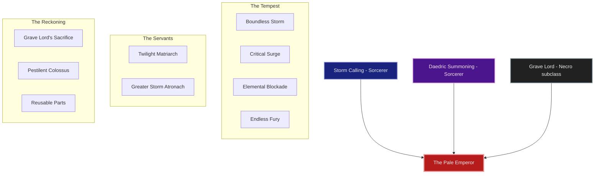
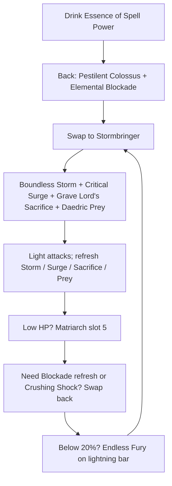
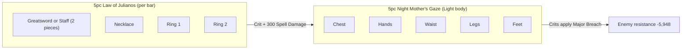

# Build Plan - Lord Elric of Melniboné: The Pale Emperor (Chaos Overland)

> **Character profile:** [lord_elric_of_melnibone.md](lord_elric_of_melnibone.md) — Level 40 High Elf Sorcerer, CP 336, @SOLAEGIS (EU).

Lord Elric of Melniboné is not a hedge-wizard playing at power — he is the last pale sovereign of a dying empire, translated into Tamriel under the title **Abyssal Champion**. This guide turns the live Level 40 kit (greatsword + lightning staff, Trainee leveling gear, bridge bars already slotted) into **The Pale Emperor**: a magicka pet Sorcerer who still **wields Stormbringer** — a Two-Handed greatsword on the front bar — while commanding storm, Daedra, and death from the back-bar lightning staff.

Through Level 49 he levels on all three **native** Sorcerer lines (Storm Calling, Daedric Summoning, Dark Magic). At Level 50, Bahtra’s **"A Study in Discipline"** unlocks the Uber Tier: **Grave Lord** replaces **Dark Magic**. Damage is Magicka class skills on the sword bar (no stamina 2H spam); Destruction Staff skills live on the lightning back bar. Matriarch is the heal — there is no restoration staff.

Built on **craftable** sets for solo overland and public dungeons.

---

## Build at a glance

| **Attribute** | **Recommendation** |
| :--- | :--- |
| **Primary Stat** | 64 points in **Magicka** — **live:** 51 Magicka / 0 Health / 0 Stamina · **26,866** Magicka · **23,834** Health · **target:** 64 Magicka at CP160 |
| **Mundus Stone** | **The Apprentice** (+Spell Damage) — **live:** The Apprentice ✅ |
| **Vampirism** | **Cured** — overland fire and Pale Emperor fiction both reject the crawl |
| **Sets** | **5 Law of Julianos** (both weapons + 3 jewelry) **+ 5 Night Mother's Gaze** (Light body) — 100% craftable · **live:** 5 Armor of the Trainee + 1 Wisdom of Vanus (fine while leveling) |
| **Penetration** | **Live: 350** Spell Penetration — far below an 18,200-resistance target. Unlock **Light Armor → Concentration** first (≈ **+13.7%** damage with 7 light pieces), then Night Mother's Gaze Major Breach |
| **Bars** | Front: **Two-Handed Greatsword** ("Stormbringer") · Back: Lightning Destruction ("The Dreaming City") — **live:** bridge bars slotted ✅ |
| **Food** | **Witchmother's Potent Brew** (Max Magicka + Health + Magicka Recovery) or **Witty Blue Entremet** while leveling |
| **Potion** | **Essence of Spell Power** — its Major Sorcery duplicates **Critical Surge**, so the value is Major Prophecy (Spell Crit); tri-stat potions are equally fine |
| **Weapon Poisons** | Optional **Gradual Ravage Health** on Stormbringer between pulls |
| **Staff/Weapon Enchant** | Front greatsword: **Absorb Magicka** or **Shock** · Back staff: **Crusher** (Minor Breach, stacks with the Major Breach from Night Mother's Gaze) |
| **Companion** | **Primary (now):** **Mirri Elendis** (DPS) at companion **8/20** · **Secondary:** **Tanlorin** · **Goal (20/20 @ CP160):** **Zerith-var** (death-aspect lieutenant) |
| **Primary Mount** | **Nightmare Senche** (owned) · **Ideal:** **Nightmare Senche** — see [Collectibles](#collectibles) |
| **Flavor Pet** | **Long-Winged Bat** (owned) · **Ideal:** **Long-Winged Bat** — see [Collectibles](#collectibles) |
| **Costume** | **Mannimarco** (owned) · **Alt:** **Court of Bedlam** — see [Collectibles](#collectibles) |

**Read next:** [Roleplay](#roleplay-the-pale-emperor) · [Trinity configuration](#trinity-configuration) · [Combat kit](#combat-kit-the-stormbringer-cycle) · [Gear and crafting](#gear-and-crafting-the-ruby-throne-regalia) · [Champion points](#champion-point-mapping-cp-336) · [Companion](#companion-strategy-the-imperial-retinue) · [Collectibles](#collectibles) · [Checklist](#next-steps--in-game-action-checklist)

---

## Roleplay: The Pale Emperor

Melniboné did not fall politely. Its last emperor walked out of the Dreaming City into Tamriel wearing the face of a High Elf and the manners of a god who has already lost everything once.

Elric carries **Abyssal Champion** the way other men carry scars — earned, not decorative. Lightning is the language of his bloodline; the Twilight Matriarch is the only servant he still trusts to keep him alive; Grave Lord is the admission that every empire feeds on the dead. And always — in every age, on every shore — he carries **Stormbringer**: a black greatsword that drinks the fight while his sorcery does the killing. In Tamriel that means a Two-Handed front bar with Magicka storm and death skills, and a lightning staff behind for the Wall and the execute. The sword is not costume dressing; it is the emperor’s hand.

> [!TIP]
> **Suggested Custom Title:** `Wielder of Stormbringer`

> [!NOTE]
> **Build Notes (paste into LAM Build Notes):**
> Lord Elric of Melniboné — The Pale Emperor. Solo overland magicka pet Sorcerer; Stormbringer = front Two-Handed greatsword (Magicka class skills only — no stam 2H spam). Back: Lightning staff. Matriarch slot 5 both bars (no resto). Bridge: Boundless Storm, Critical Surge, Crystal Fragments, Daedric Prey, Matriarch. Uber: Grave Lord replaces Dark Magic — Boundless Storm, Critical Surge, Grave Lord's Sacrifice, Daedric Prey, Matriarch, Greater Storm Atronach / back Blockade, Crushing Shock, Inner Light, Endless Fury, Pestilent Colossus. 5 Julianos (greatsword + staff + jewelry) + 5 Night Mother's Gaze (light body), @masisi. 64 Mag. Mundus: The Apprentice. Mirri now; Zerith-var @ 20/20. Mannimarco / Nightmare Senche / Long-Winged Bat.

> [!TIP]
> **Flavor Pet:** **Long-Winged Bat** (owned) — nocturnal familiar of a twilight emperor. **Alt:** **Blue Dragon Imp**. See [Collectibles](#collectibles).

> [!TIP]
> **Costume:** **Mannimarco** — pale lich-emperor silhouette. **Alt:** **Court of Bedlam** for decadent court nights. Full picks under [Collectibles](#collectibles).

---

## Trinity configuration

Leveling (L40–49) keeps all three **native** Sorcerer lines. At Level 50, complete Bahtra at-Hunding’s **"A Study in Discipline"** (Adventure Camp outside Riften, Evermore, or Dune) and replace **Dark Magic** with **Grave Lord**. See [docs/subclassing.md](../../../docs/subclassing.md).

| **Pillar** | **Line** | **Origin** | **Slot action** | **Function** |
| :--- | :--- | :--- | :--- | :--- |
| **Tempest** | **Storm Calling** + **Two-Handed** + **Destruction Staff** | Sorcerer (native) + weapons | **KEEP** | Stormbringer front (Boundless Storm, Critical Surge); lightning back (Blockade, Endless Fury) |
| **Servants** | **Daedric Summoning** | Sorcerer (native) | **KEEP** | Twilight Matriarch Restore slot **5 both bars**; Greater Storm Atronach ultimate |
| **Reckoning** | **Grave Lord** | Necromancer (subclass) | **SUBCLASS** (replaces **Dark Magic**) | Pestilent Colossus Major Vulnerability; Grave Lord's Sacrifice; death-economy passives |

> [!NOTE]
> **Herald of the Tome** is rejected for this character — stronger parse beam, weaker pale-emperor / death fiction. Do not dual-path.

---

## Combat kit: The Stormbringer Cycle

Open on the **lightning** back bar with Colossus (Uber) / Blockade / execute setup, swap to **Stormbringer** (Two-Handed front) for storm, surge, and death-aspect damage, and keep **Twilight Matriarch Restore** in **slot 5 on both bars**. **Pure magicka** — every slotted damage/buff skill costs Magicka. **Do not** slot stamina Two Handed actives (Critical Charge, Uppercut, Reverse Slash, Wrecking Blow, etc.); the greatsword is for identity and light-attack weaving while sorcery kills. After Uber, **no Dark Magic actives** remain slotted. Healing is **Matriarch** (and Critical Surge’s on-crit heal) — no restoration staff.

### Skill bars

Document **slotted morph names as shown in the skills UI**. Each morph appears at most once across bars except **Twilight Matriarch Restore** (slot 5 both bars). Bars must match equipped weapon types: **Two Handed** skills only if you ever flex them (this plan does not); **Destruction Staff** skills only on the lightning bar.

> [!IMPORTANT]
> **Daedric summons (slot 5):** ESO **despawns** your summon when you swap to a bar without the same summon ability. **Twilight Matriarch Restore** must stay in **slot 5 on both bars**. Greater Storm Atronach is an ultimate and does not need both bars.

> [!IMPORTANT]
> **Stormbringer rule:** Front bar weapon is always a **greatsword**. Destruction Staff skills (**Elemental Blockade**, **Crushing Shock**) cannot be slotted on the 2H bar — they live on the lightning back bar.

#### Bridge bars (Level 40–49) — before Grave Lord

**Live export: both bridge bars are already slotted.** Keep them as they are until Level 50. Only the ultimate on the back bar changes at Uber (Greater Storm Atronach → Pestilent Colossus), plus Crystal Fragments → Grave Lord's Sacrifice on the front.

##### Front Bar (Two-Handed Greatsword): "Stormbringer" *(bridge)*

| **Slot** | **Class/Line** | **Base → Morph** | **Role** | **Profile** |
| :--- | :--- | :--- | :--- | :--- |
| **1** | Storm Calling | Lightning Form → **Boundless Storm** | Major Resolve, AoE shock, Minor Expedition | ✅ Live |
| **2** | Storm Calling | Surge → **Critical Surge** | Major Sorcery + heal on crit | ✅ Live |
| **3** | Daedric Summoning | Daedric Curse → **Daedric Prey** | Damage amp | ✅ Live |
| **4** | Dark Magic | Crystal Blast → **Crystal Fragments** | Magicka burst / proc | ✅ Live — bridge until Uber |
| **5** | Daedric Summoning | Summon Twilight Matriarch → **Twilight Matriarch Restore** | **Summon** (same slot 5 both bars) | ✅ Live |
| **6 (Ult)** | Daedric Summoning | Summon Storm Atronach → **Greater Storm Atronach** | Ranged DPS ult | ✅ Live |

##### Back Bar (Lightning Destruction Staff): "The Dreaming City" *(bridge)*

| **Slot** | **Class/Line** | **Base → Morph** | **Role** | **Profile** |
| :--- | :--- | :--- | :--- | :--- |
| **1** | Destruction Staff | Wall of Elements → **Elemental Blockade** | Shock ground DoT | ✅ Live |
| **2** | Destruction Staff | Force Shock → **Crushing Shock** | Magicka spammable + interrupt | ✅ Live |
| **3** | Storm Calling | Mages' Fury → **Endless Fury** | Execute below 20% | ✅ Live |
| **4** | Mages Guild | Magelight → **Inner Light** | +Spell Damage slotted | ✅ Live |
| **5** | Daedric Summoning | Summon Twilight Matriarch → **Twilight Matriarch Restore** | **Summon** (same slot 5 both bars) | ✅ Live |
| **6 (Ult)** | Daedric Summoning | Summon Storm Atronach → **Greater Storm Atronach** | Same ult both bars until Uber Colossus | ✅ Live — temporary |

> [!WARNING]
> **Stay pure Magicka on the front bar:** no Critical Charge, Uppercut, Reverse Slash or other stamina Two Handed actives. Stormbringer stays equipped; those skills do not.

#### Target bars (Level 50+ Uber) — Grave Lord online

##### Front Bar (Two-Handed Greatsword): "Stormbringer"

| **Slot** | **Class/Line** | **Base → Morph** | **Role** |
| :--- | :--- | :--- | :--- |
| **1** | Storm Calling (Sorc) | Lightning Form → **Boundless Storm** | Major Resolve, AoE shock pulse, Minor Expedition |
| **2** | Storm Calling (Sorc) | Surge → **Critical Surge** | Major Sorcery + heal on critical |
| **3** | Grave Lord (Necro) | Sacrificial Bones → **Grave Lord's Sacrifice** | Death-aspect self-buff (**Magicka**) |
| **4** | Daedric Summoning (Sorc) | Daedric Curse → **Daedric Prey** | Damage amp after Colossus |
| **5** | Daedric Summoning (Sorc) | Summon Twilight Matriarch → **Twilight Matriarch Restore** | **Summon** (same slot 5 both bars) |
| **6 (Ult)** | Daedric Summoning (Sorc) | Summon Storm Atronach → **Greater Storm Atronach** | Ranged DPS ultimate + synergy |

> [!NOTE]
> **Dark Magic is subclassed out.** Unslot **Crystal Fragments**, **Dark Conversion**, and every other Dark Magic active. Stormbringer loop: Boundless Storm → Critical Surge → Grave Lord's Sacrifice → Daedric Prey → light attacks.

##### Back Bar (Lightning Destruction Staff): "The Dreaming City"

| **Slot** | **Class/Line** | **Base → Morph** | **Role** |
| :--- | :--- | :--- | :--- |
| **1** | Destruction Staff | Wall of Elements → **Elemental Blockade** | Shock ground DoT; **Thaumaturge** + **Rapid Rot** |
| **2** | Destruction Staff | Force Shock → **Crushing Shock** | Magicka spammable + interrupt |
| **3** | Mages Guild | Magelight → **Inner Light** | +Spell Damage slotted; unlock **Might of the Guild** |
| **4** | Storm Calling (Sorc) | Mages' Fury → **Endless Fury** | Execute below 20% HP |
| **5** | Daedric Summoning (Sorc) | Summon Twilight Matriarch → **Twilight Matriarch Restore** | **Summon** (same slot 5 both bars) |
| **6 (Ult)** | Grave Lord (Necro) | Frozen Colossus → **Pestilent Colossus** | **Major Vulnerability** on pull — open every boss |

### Rotation and combat tips

#### Solo combat tips

1. **Pestilent Colossus opens every Uber boss fight** from the lightning bar — Major Vulnerability first.
2. **Stormbringer is always the front bar.** Weave light attacks between Magicka skills; do not lean on stamina 2H skills.
3. **Boundless Storm + Critical Surge stay up** on the sword bar — Resolve, Sorcery, and on-crit healing.
4. **Twilight Matriarch never leaves.** Slot 5 both bars; press her heal when you or Mirri dip.
5. **Elemental Blockade** lives on the lightning bar — drop it, swap to Stormbringer, refresh when it expires.
6. **Grave Lord's Sacrifice** on Stormbringer after buffs; Magicka-only — no Blighted Blastbones.
7. **Crit feeds the Breach.** Once Night Mother's Gaze is on, every critical hit applies Major Breach (4s) — keep Boundless Storm and Blockade ticking so it rarely drops. Potion on boss pulls for Major Prophecy.
8. **Endless Fury / Crushing Shock** from the lightning bar as needed; **Greater Storm Atronach** from Stormbringer mid-fight.

### Passive skills

**Live:** 3 skill points available. **First point goes to Light Armor → Concentration** the moment it unlocks (see below). Then spend in this order; fully rank where noted.

#### Necromancer — Grave Lord *(Uber — spend after Bahtra)*

* **[Reusable Parts](https://en.uesp.net/wiki/Online:Reusable_Parts) (II):** First spend after subclass.
* **[Death Knell](https://en.uesp.net/wiki/Online:Death_Knell) (II):** Crit per Grave Lord skill slotted.
* **[Dismember](https://en.uesp.net/wiki/Online:Dismember) (II):** Spell Penetration while Grave Lord active.
* **[Rapid Rot](https://en.uesp.net/wiki/Online:Rapid_Rot) (II):** +DoT damage (Blockade, Boundless Storm pulses).

#### Sorcerer — Storm Calling

* **[Capacitor](https://en.uesp.net/wiki/Online:Capacitor) (II):** ✅ Live.
* **[Energized](https://en.uesp.net/wiki/Online:Energized) (II):** ✅ Live.
* **[Amplitude](https://en.uesp.net/wiki/Online:Amplitude) (II):** ✅ Live.
* **[Expert Mage](https://en.uesp.net/wiki/Online:Expert_Mage) (II):** ✅ Live.

#### Sorcerer — Daedric Summoning

* **[Rebate](https://en.uesp.net/wiki/Online:Rebate) (II):** ✅ Live.
* **[Power Stone](https://en.uesp.net/wiki/Online:Power_Stone) (II):** ✅ Live.
* **[Daedric Protection](https://en.uesp.net/wiki/Online:Daedric_Protection) (II):** ✅ Live.
* **[Expert Summoner](https://en.uesp.net/wiki/Online:Expert_Summoner) (II):** ✅ Live.

#### Sorcerer — Dark Magic *(bridge only — drop actives at Uber)*

* Keep unlocked passives while leveling; stop investing skill points here once Grave Lord is active.

#### Weapon — Two Handed *(Stormbringer — keep ranked)*

* Live already has Forceful, Heavy Weapons, Balanced Blade, Follow Up. Finish **Battle Rush** and keep the line trained — even without stamina actives, 2H passives and weapon rank still matter for weaving and future flex.

#### Weapon — Destruction Staff *(lightning back bar)*

* **[Tri Focus](https://en.uesp.net/wiki/Online:Tri_Focus)** / **[Penetrating Magic](https://en.uesp.net/wiki/Online:Penetrating_Magic):** ✅ Live.
* **Elemental Force**, **Ancient Knowledge:** ✅ Live. Unlock **Destruction Expert** as rank allows.

#### Armor — Light Armor

* **Grace**, **Evocation**, **Spell Warding**, **Prodigy:** ✅ Live (Light Armor rank 39).
* **[Concentration](https://en.uesp.net/wiki/Online:Concentration):** 🔒 **Top priority.** Penetration per Light Armor piece worn. Live Spell Penetration is only **350** against an 18,200-resistance target; 7 light pieces ≈ **+13.7%** damage (`value_calc`: pen 350 → 6,923). Keep 7 body pieces **Light** so it stays at full value.

#### Guild — Mages Guild

* Unlock **Inner Light**, then **Might of the Guild** (II) while Inner Light is slotted on the lightning bar.

#### Guild — Alchemy

* **[Medicinal Use](https://en.uesp.net/wiki/Online:Medicinal_Use):** Nice-to-have (longer potion buffs) — no set depends on it.

#### Race — High Elf

* **[Highborn](https://en.uesp.net/wiki/Online:Highborn)**, **[Spell Recharge](https://en.uesp.net/wiki/Online:Spell_Recharge)**, **[Syrabane's Boon](https://en.uesp.net/wiki/Online:Syrabane's_Boon)**, **[Elemental Talent](https://en.uesp.net/wiki/Online:Elemental_Talent):** ✅ Live — Magicka / elemental damage identity matches the build.

---

## Gear and crafting: "The Ruby Throne Regalia"

Everything end-state is **crafted** — no overland farming, no dungeon drops required. Target: **5 Law of Julianos** on the weapons and jewelry, **5 Night Mother's Gaze** on the body, all armor **Light**. Julianos is crit and flat damage; Night Mother's Gaze adds more crit and turns every critical hit into **Major Breach**, which is what a character with 350 Spell Penetration needs most.

### Set rationale

| **Set** | **Bonuses (CP160, set database)** | **Role** |
| :--- | :--- | :--- |
| **Law of Julianos** | 2pc +657 Crit · 3pc +1,096 Max Magicka · 4pc +657 Crit · 5pc **+300 Weapon and Spell Damage** | Flat damage and crit on both bars |
| **Night Mother's Gaze** | 2pc +657 Crit · 3pc +129 Weapon/Spell Damage · 4pc +657 Crit · 5pc **Major Breach (−5,948 resistance, 4s) on critical damage** | Penetration fix; solo means nobody else applies Major Breach |

**Why Julianos sits on the weapons:** a two-hander and a staff each count as **2 pieces** on their own bar. Greatsword + 3 jewelry = 5 on the front; staff + 3 jewelry = 5 on the back. That frees the whole body for the second set, with head and shoulders left over.

**Why Night Mother's Gaze over Clever Alchemist** (with Julianos on; crit 20.1%, crit damage 58%, target 18,200 resistance):

| **Body 5pc** | **Pen 350 (now)** | **Pen ~6,900 (after Concentration)** |
| :--- | ---: | ---: |
| Clever Alchemist — 45s potion cooldown, 20s buff (~44% uptime) | +6.8% | +6.8% |
| Clever Alchemist — short pulls (80% uptime) | +10.7% | +10.7% |
| Order's Wrath | +9.8% | +9.8% |
| **Night Mother's Gaze — Major Breach 60–80% uptime** | **+13.0–15.6%** | **+12.1–14.4%** |

Night Mother's Gaze wins at 60% Breach uptime either way. Clever Alchemist's 2pc/3pc are Max Health, which a DPS doesn't use. *Caps and conversions are general ESO knowledge — re-check after patches.*

> [!NOTE]
> **Why not Necropotence or Mother's Sorrow?** Overland drops — not craftable.

> [!NOTE]
> **Live gear (Level 40):** 5 Armor of the Trainee + 1 Wisdom of Vanus, Frost greatsword, Shock staff. That is fine until CP160 — don't spend crafting mats before then. Keep body pieces **Light** so Concentration counts all seven.

### Target loadout

| **Slot** | **Set** | **Weight** | **Trait** | **Enchantment** | **Quality** |
| :--- | :--- | :--- | :--- | :--- | :--- |
| **Head** | Any (no set needed) | Light | Divines | Max Magicka | Gold |
| **Shoulders** | Any (no set needed) | Light | Divines | Max Magicka (40% glyph) | Gold |
| **Chest** | Night Mother's Gaze | Light | Divines | Max Magicka | Gold |
| **Hands** | Night Mother's Gaze | Light | Divines | Max Magicka (40% glyph) | Gold |
| **Waist** | Night Mother's Gaze | Light | Divines | Max Magicka (40% glyph) | Gold |
| **Legs** | Night Mother's Gaze | Light | Divines | Max Magicka | Gold |
| **Feet** | Night Mother's Gaze | Light | Divines | Max Magicka (40% glyph) | Gold |
| **Necklace** | Law of Julianos | Jewelry | Arcane | Spell Damage | Gold |
| **Ring 1** | Law of Julianos | Jewelry | Arcane | Spell Damage | Gold |
| **Ring 2** | Law of Julianos | Jewelry | Arcane | Spell Damage | Gold |
| **Front — Stormbringer** | Law of Julianos (counts 2) | Two-Handed Greatsword | Infused | Absorb Magicka or Shock | Gold |
| **Back Staff** | Law of Julianos (counts 2) | Lightning Destro | Infused | Crusher (Minor Breach) | Gold |

**Stormbringer:** Infused greatsword — Absorb Magicka for sustain while weaving, or Shock for damage. Style/motif black-and-ruby; this is the named sword in fiction.
**Back staff:** Crusher's Minor Breach stacks with Night Mother's Gaze's Major Breach.
**Head/shoulders:** left open. A monster set is optional later, but a non-Light monster piece costs two pieces of Concentration.

### Crafting handoff (@masisi)

| **Detail** | **Recommendation** |
| :--- | :--- |
| **Style** | **Altmer** or **Ancient Elf** body (pale imperial); **Daedric** / **Ebony** motif on **Stormbringer**; **Psijic** / **Sapiarch** trim on Julianos jewelry |
| **Set station** | Night Mother's Gaze: **Old Town Cavern**, **Silaseli Ruins** or **Eldbjorg's Hideaway** · Julianos: **Boreal Forge** (per the set database — confirm in game) |
| **Traits** | **Divines** armor · **Arcane** jewelry · **Infused** weapons · transmute as crystals allow |
| **Interim** | Live Trainee / Vanus pieces + greatsword + lightning staff through Level 49 |
| **Quality** | Purple first if mats are tight; gold at CP160 when traits are ready |

> [!NOTE]
> Check `examples/fixtures/karakedi_crafting.md` for @masisi trait research before queueing gold CP160 work.

---

## Champion Point Mapping (CP 336)

Budget: **112 Warfare / 112 Craft / 112 Fitness** (336 total). **Live: 287 spent — 16 Warfare / 16 Craft / 17 Fitness unspent.** Check the in-game slot count before planning slottables. Star names match [champion_points_reference.md](../../templates/champion_points_reference.md).

> [!NOTE]
> **When CP grows (≈810+):** Cap Warfare slotted stars at Fighting Finesse / Master-at-Arms / Deadly Aim / Thaumaturge (50 each); Fitness Boundless Vitality / Fortified / Rejuvenation / Siphoning Spells. Do not invent alternate star names.

### Warfare (Blue — 112 Points)

| **Star** | **Type** | **Live** | **Target** | **Benefit** |
| :--- | :--- | ---: | ---: | :--- |
| **Fighting Finesse** | Slotted | 50 | 50 | +Critical Damage / Critical Healing |
| **Thaumaturge** | Slotted | 26 | 32 | +DoT damage (Blockade, Boundless Storm) |
| **Piercing** | Passive | 10 | 20 | +Penetration — the stat this character is shortest on |
| **Precision** | Passive | 10 | 10 | Critical Chance |

*Spend the 16 unspent:* **Piercing +10** first, then **Thaumaturge +6**. *Next tranche:* Eldritch Insight, then Master-at-Arms / Deadly Aim toward 50 each.

### Fitness (Red — 112 Points)

| **Star** | **Type** | **Live** | **Target** | **Benefit** |
| :--- | :--- | ---: | ---: | :--- |
| **Rejuvenation** | Slotted | 50 | 50 | Recovery |
| **Boundless Vitality** | Slotted | 45 | 50 | Max Health |
| **Hero's Vigor** | Passive | 0 | 10 | Max Health |
| *(bank)* | — | — | 2 | Toward Fortified or Tumbling |

*Spend the 17 unspent:* **Boundless Vitality +5**, **Hero's Vigor +10**, bank 2.

### Craft (Green — 112 Points)

| **Star** | **Type** | **Live** | **Target** | **Benefit** |
| :--- | :--- | ---: | ---: | :--- |
| **Steed's Blessing** | Slotted | 50 | 50 | Out-of-combat move speed |
| **Fortune's Favor** | Passive | 36 | 36 | More gold from containers — fine for an overland farmer; put no more into it |
| **Gilded Fingers** | Passive | 10 | 10 | Gold find |
| **Steadfast Enchantment** | Passive | 0 | 10 | Path to Rationer / Liquid Efficiency |
| *(bank)* | — | — | 6 | Toward Rationer |

*Spend the 16 unspent:* **Steadfast Enchantment +10**, bank 6 toward **Rationer**.

> [!NOTE]
> **Liquid Efficiency** is a chance not to consume a potion. It saves gold; it doesn't shorten the potion cooldown, and no set in this plan depends on potions.

---

## Companion Strategy: "The Imperial Retinue"

Companions use **Companion's** weapons and armor only (Quickened, Aggressive, Bolstered, etc.) — never player sets (no Julianos, no Divines). Buy white basics from vendors; farm Superior+ while the companion is summoned.

> [!NOTE]
> **Live export:** **Mirri Elendis** Level **8/20**, level-1 white gear (8 pieces below level), **2 empty ability slots** (slot 5 + ultimate). Character Level **40 / CP 336**.

### Companion picks

| **Tier** | **Companion** | **Role** | **Roleplay fit** | **Mechanical fit** |
| :--- | :--- | :--- | :--- | :--- |
| **Primary (now)** | **Mirri Elendis** | DPS | Cynical excavator beside a fallen emperor — she digs; he dooms | Already out; finish gear and empty slots while leveling |
| **Secondary** | **Tanlorin** | DPS / utility | Altmer kin-shadow; court intrigue energy | Swap when Mirri rapport or AI frustrates |
| **Goal (20/20 @ CP160)** | **Zerith-var** | DPS | Necromantic Khajiit lieutenant — death-aspect mirror to Grave Lord | Best fiction match once leveled; Aggressive companion gear |

### Primary now — Mirri Elendis

| **Setting** | **Recommendation** |
| :--- | :--- |
| **Role** | **DPS** (Bow or Dual Wield) |
| **Gear Weight** | **Medium** (or mixed Superior+ drops) |
| **Gear Trait** | **Aggressive** / **Shattering** for damage; **Quickened** if cooldowns feel slow |
| **Loadout** | Full **Companion's** set — replace all eight level-1 whites (bow + seven armor) |
| **Acquisition** | Vendor whites now; Superior+ from bosses/overland with Mirri active |

#### Mirri skill bar (fill empty slots)

1. **Piercing Arrow** (live) — keep ranged pressure.
2. **Warp Strike** (live) — gap close / damage.
3. **Masque of Torment** (live) — keep.
4. **Blood Transfusion** (live) — self sustain.
5. *Empty* — slot a second damage skill as soon as one unlocks.
6. *Ultimate:* *empty* — slot her first DPS ultimate when she unlocks it.

Level Mirri toward **20/20** while Elric levels; start **Zerith-var** XP in parallel for the goal tier.

> [!TIP]
> **Goal — Zerith-var:** Summon when Grave Lord is online and you want a death-magic second. Heavy or medium **Companion's** gear with Aggressive traits; fill his full bar before hard world bosses.

---

## Collectibles

### Mount

| **Attribute** | **Detail** |
| :--- | :--- |
| **Primary (owned)** | **[Nightmare Senche](https://en.uesp.net/wiki/Online:Nightmare_Senche)** — black fire and shadow; pale emperor’s war-cat |
| **Alt (owned)** | **[Noweyr Steed](https://en.uesp.net/wiki/Online:Noweyr_Steed)** — chaotic festival steed for decadent nights |
| **Backup (owned)** | **[Rahd-m'Athra](https://en.uesp.net/wiki/Online:Rahd-m'Athra)** — void-touched Senche |
| **Avoid** | Sorrel Horse / Dwarven War Horse — too ordinary / too clockwork for Melniboné |

### Pet

| **Attribute** | **Detail** |
| :--- | :--- |
| **Primary (owned)** | **[Long-Winged Bat](https://en.uesp.net/wiki/Online:Long-Winged_Bat)** — nocturnal familiar |
| **Alt (owned)** | **[Blue Dragon Imp](https://en.uesp.net/wiki/Online:Blue_Dragon_Imp)** — storm familiar |
| **Alt (owned)** | **[Vermilion Scuttler](https://en.uesp.net/wiki/Online:Vermilion_Scuttler)** — ruby-throne vermin |
| **Alt (owned)** | **[Coldharbour Bantam Guar](https://en.uesp.net/wiki/Online:Coldharbour_Bantam_Guar)** — Daedric court pet |

### Costume

| **Attribute** | **Detail** |
| :--- | :--- |
| **Primary (owned)** | **[Mannimarco](https://en.uesp.net/wiki/Online:Mannimarco)** — pale lich-emperor |
| **Alt (owned)** | **[Court of Bedlam](https://en.uesp.net/wiki/Online:Court_of_Bedlam)** — decadent conspiracy court |
| **Alt (owned)** | **[Dark Seducer](https://en.uesp.net/wiki/Online:Dark_Seducer)** / **[Grim Harvester](https://en.uesp.net/wiki/Online:Grim_Harvester)** — Daedric / harvest-death nights |
| **Hat flex** | **[Shrouded Crown](https://en.uesp.net/wiki/Online:Shrouded_Crown)** or **[Crown of Misrule](https://en.uesp.net/wiki/Online:Crown_of_Misrule)** when the throne needs metal |

Distinguish **Costume** (Collectibles) from Outfit Station motifs on crafted gear.

### Dye and style

**The Ruby Throne** — pale silk, black storm, blood-ruby trim.

| **Slot** | **Style** | **Visual Reasoning** |
| :--- | :--- | :--- |
| **Body** | **Altmer** / **Ancient Elf** | High Elf pale imperial silhouette |
| **Trim / jewelry** | **Psijic** / **Sapiarch** | Arcane emperor, not dungeon mercenary |
| **Stormbringer** | **Daedric** / **Ebony** / **Ayleid** | Black soul-sword silhouette — never a plain steel blank |
| **Lightning staff** | **Ayleid** / **Psijic** | Relic focus of the Dreaming City |

**Dye palette:** Ivory / bone white (primary), void black (secondary), ruby red (trim — the throne’s blood). Stormbringer itself stays near-black with a ruby edge if the motif allows.

---

## Next Steps & In-Game Action Checklist

### Phase 0 — Today (functional build)

1. **Keep Stormbringer.** Front bar stays a **greatsword**; back bar stays a **Lightning Destruction Staff**. Bridge bars are already slotted — leave them.
2. **Light Armor → Concentration:** spend a skill point the moment it unlocks (rank 39 now). Biggest single gain available (≈ +13.7%).
3. **Spend the other skill points:** Might of the Guild once Mages Guild allows it, then Destruction Expert and Battle Rush.
4. **Attributes:** Keep dumping into **Magicka** toward **64** (live 51).
5. **Spend the 49 unspent CP** per [Champion Point Mapping](#champion-point-mapping-cp-336) — Piercing first.
6. **Mirri:** Replace level-1 whites with Companion's gear; fill slot 5 and the ultimate; keep her summoned for XP.
7. **Collectibles:** Equip **Nightmare Senche**, **Long-Winged Bat**, **Mannimarco** costume.

### Phase 1 — Level to 50 (interim)

8. Keep all seven body pieces **Light**; Trainee / Vanus gear is fine until CP160.
9. Rank **Light Armor** (→ Concentration), **Destruction Staff**, **Mages Guild** (Might of the Guild), **Two Handed** (Battle Rush).
10. Practice Matriarch-safe bar swaps (slot 5 both bars) — sword ↔ lightning.

### Phase 2 — Bahtra Uber + craft target

11. **Level 50:** Bahtra at-Hunding — subclass **Grave Lord**, replace **Dark Magic**.
12. **Respec to Uber bars:** Front — swap Crystal Fragments for **Grave Lord's Sacrifice**. Back — swap the ultimate for **Pestilent Colossus**.
13. Spend skill points on Grave Lord passives (**Reusable Parts**, **Death Knell** first).
14. **@masisi (CP160):** craft **5 Night Mother's Gaze** (Light chest, hands, waist, legs, feet; Divines) and **Law of Julianos** on the **greatsword**, **lightning staff**, necklace and both rings (Infused weapons, Arcane jewelry, Spell Damage jewelry glyphs). Head/shoulders: any Light Divines pieces.
15. Check Major Breach uptime on a target dummy; if it's well under 60%, reconsider Order's Wrath (+9.8%).

### Phase 3 — Polish

16. Motifs / dyes: Altmer pale body; **Daedric/Ebony** Stormbringer; ruby-black throne palette.
17. Level **Zerith-var** to **20/20**; farm Companion's Aggressive gear.
18. Expand Warfare/Fitness slotted stars as CP grows.

### Finish

19. Regenerate profile with `/cm` and update [lord_elric_of_melnibone.md](lord_elric_of_melnibone.md) when bars, CP, Mundus, and gear match this plan.

The Dreaming City is ash. Stormbringer still drinks. The storm still answers its emperor.
