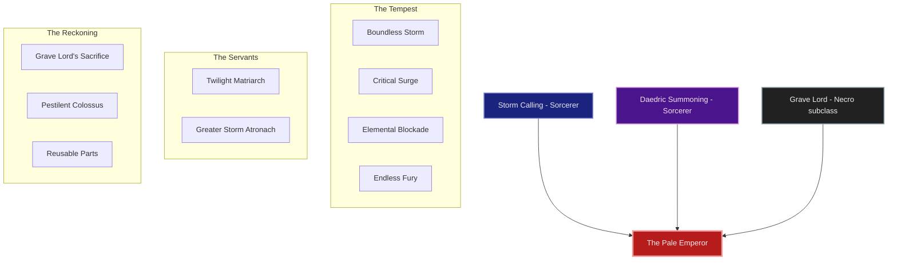
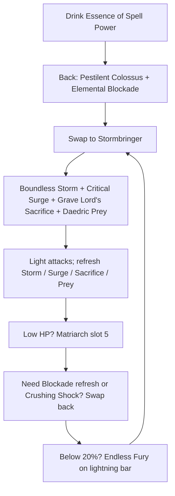

# Build Plan - Lord Elric of Melniboné: The Pale Emperor (Chaos Overland)

> **Character profile:** [lord_elric_of_melnibone.md](lord_elric_of_melnibone.md) — Level 31 High Elf Sorcerer, CP 282, @SOLAEGIS (EU).

Lord Elric of Melniboné is not a hedge-wizard playing at power — he is the last pale sovereign of a dying empire, translated into Tamriel under the title **Abyssal Champion**. This guide turns the live Level 31 kit (greatsword + lightning staff, heavy scrap, unspent CP) into **The Pale Emperor**: a magicka pet Sorcerer who still **wields Stormbringer** — a Two-Handed greatsword on the front bar — while commanding storm, Daedra, and death from the back-bar lightning staff.

Through Level 49 he levels on all three **native** Sorcerer lines (Storm Calling, Daedric Summoning, Dark Magic). At Level 50, Bahtra’s **"A Study in Discipline"** unlocks the Uber Tier: **Grave Lord** replaces **Dark Magic**. Damage is Magicka class skills on the sword bar (no stamina 2H spam); Destruction Staff skills live on the lightning back bar. Matriarch is the heal — there is no restoration staff.

Built on **craftable** sets for solo overland and public dungeons.

---

## Build at a glance

| **Attribute** | **Recommendation** |
| :--- | :--- |
| **Primary Stat** | 64 points in **Magicka** — **live:** 39 Magicka / 0 Health / 0 Stamina · **27,189** Magicka · **24,287** Health · **target:** 64 Magicka at CP160 |
| **Mundus Stone** | **The Apprentice** (+Spell Damage) — **live:** The Atronach; swap when sustain is comfortable |
| **Vampirism** | **Cured** — overland fire and Pale Emperor fiction both reject the crawl |
| **Sets** | **5 Law of Julianos + 5 Clever Alchemist** (100% craftable, all Light) — **live:** Withered Hand jewelry + Grace of Gloom / heavy scrap · **target:** Julianos + Clever Alchemist |
| **Bars** | Front: **Two-Handed Greatsword** ("Stormbringer") · Back: Lightning Destruction ("The Dreaming City") — **keep the sword; fix the skills** |
| **Food** | **Witchmother's Potent Brew** (Max Magicka + Health + Magicka Recovery) or **Witty Blue Entremet** while leveling |
| **Potion** | **Essence of Spell Power** (Spell Damage + Crit) — procs Clever Alchemist on pull once Phase 2 gear is on |
| **Weapon Poisons** | Optional **Gradual Ravage Health** on Stormbringer between pulls |
| **Staff/Weapon Enchant** | Front greatsword: **Absorb Magicka** or **Shock Damage** (Crusher) · Back staff: **Shock Damage** (Crusher) |
| **Companion** | **Primary (now):** **Mirri Elendis** (DPS) at companion **4/20** · **Secondary:** **Tanlorin** · **Goal (20/20 @ CP160):** **Zerith-var** (death-aspect lieutenant) |
| **Primary Mount** | **Nightmare Senche** (owned) · **Ideal:** **Nightmare Senche** — see [Collectibles](#collectibles) |
| **Flavor Pet** | **Long-Winged Bat** (owned) · **Ideal:** **Long-Winged Bat** — see [Collectibles](#collectibles) |
| **Costume** | **Mannimarco** (owned) · **Alt:** **Court of Bedlam** — see [Collectibles](#collectibles) |

**Read next:** [Roleplay](#roleplay-the-pale-emperor) · [Trinity configuration](#trinity-configuration) · [Combat kit](#combat-kit-the-stormbringer-cycle) · [Gear and crafting](#gear-and-crafting-the-ruby-throne-regalia) · [Champion points](#champion-point-mapping-cp-282) · [Companion](#companion-strategy-the-imperial-retinue) · [Collectibles](#collectibles) · [Checklist](#next-steps--in-game-action-checklist)

---

## Roleplay: The Pale Emperor

Melniboné did not fall politely. Its last emperor walked out of the Dreaming City into Tamriel wearing the face of a High Elf and the manners of a god who has already lost everything once.

Elric carries **Abyssal Champion** the way other men carry scars — earned, not decorative. Lightning is the language of his bloodline; the Twilight Matriarch is the only servant he still trusts to keep him alive; Grave Lord is the admission that every empire feeds on the dead. And always — in every age, on every shore — he carries **Stormbringer**: a black greatsword that drinks the fight while his sorcery does the killing. In Tamriel that means a Two-Handed front bar with Magicka storm and death skills, and a lightning staff behind for the Wall and the execute. The sword is not costume dressing; it is the emperor’s hand.

> [!TIP]
> **Suggested Custom Title:** `Wielder of Stormbringer`

> [!NOTE]
> **Build Notes (paste into LAM Build Notes):**
> Lord Elric of Melniboné — The Pale Emperor. Solo overland magicka pet Sorcerer; Stormbringer = front Two-Handed greatsword (Magicka class skills only — no stam 2H spam). Back: Lightning staff. Matriarch slot 5 both bars (no resto). Bridge: Boundless Storm, Critical Surge, Crystal Fragments, Daedric Prey, Matriarch. Uber: Grave Lord replaces Dark Magic — Boundless Storm, Critical Surge, Grave Lord's Sacrifice, Daedric Prey, Matriarch, Greater Storm Atronach / back Blockade, Crushing Shock, Inner Light, Endless Fury, Pestilent Colossus. 5 Julianos + 5 Clever Alchemist (light), @masisi. 64 Mag. Mundus: The Apprentice. Mirri now; Zerith-var @ 20/20. Mannimarco / Nightmare Senche / Long-Winged Bat.

> [!TIP]
> **Flavor Pet:** **Long-Winged Bat** (owned) — nocturnal familiar of a twilight emperor. **Alt:** **Blue Dragon Imp**. See [Collectibles](#collectibles).

> [!TIP]
> **Costume:** **Mannimarco** — pale lich-emperor silhouette. **Alt:** **Court of Bedlam** for decadent court nights. Full picks under [Collectibles](#collectibles).

---

## Trinity configuration

Leveling (L31–49) keeps all three **native** Sorcerer lines. At Level 50, complete Bahtra at-Hunding’s **"A Study in Discipline"** (Adventure Camp outside Riften, Evermore, or Dune) and replace **Dark Magic** with **Grave Lord**. See [docs/subclassing.md](../../../docs/subclassing.md).

| **Pillar** | **Line** | **Origin** | **Slot action** | **Function** |
| :--- | :--- | :--- | :--- | :--- |
| **Tempest** | **Storm Calling** + **Two-Handed** + **Destruction Staff** | Sorcerer (native) + weapons | **KEEP** | Stormbringer front (Boundless Storm, Critical Surge); lightning back (Blockade, Endless Fury) |
| **Servants** | **Daedric Summoning** | Sorcerer (native) | **KEEP** | Twilight Matriarch Restore slot **5 both bars**; Greater Storm Atronach ultimate |
| **Reckoning** | **Grave Lord** | Necromancer (subclass) | **SUBCLASS** (replaces **Dark Magic**) | Pestilent Colossus Major Vulnerability; Grave Lord's Sacrifice; death-economy passives |

> [!NOTE]
> **Herald of the Tome** is rejected for this character — stronger parse beam, weaker pale-emperor / death fiction. Do not dual-path.

---

## Combat kit: The Stormbringer Cycle

Open on the **lightning** back bar with Colossus (Uber) / Blockade / execute setup, swap to **Stormbringer** (Two-Handed front) for storm, surge, and death-aspect damage, and keep **Twilight Matriarch Restore** in **slot 5 on both bars**. **Pure magicka** — every slotted damage/buff skill costs Magicka. **Do not** slot stamina Two Handed actives (Critical Charge, Uppercut, Reverse Slash, Wrecking Blow, etc.); the greatsword is for identity and light-attack weaving while sorcery kills. After Uber, **no Dark Magic actives** remain slotted. Healing is **Matriarch** (and Critical Surge’s on-crit heal) — no restoration staff.

### Skill bars

Document **slotted morph names as shown in the skills UI**. Each morph appears at most once across bars except **Twilight Matriarch Restore** (slot 5 both bars). Bars must match equipped weapon types: **Two Handed** skills only if you ever flex them (this plan does not); **Destruction Staff** skills only on the lightning bar.

> [!IMPORTANT]
> **Daedric summons (slot 5):** ESO **despawns** your summon when you swap to a bar without the same summon ability. **Twilight Matriarch Restore** must stay in **slot 5 on both bars**. Greater Storm Atronach is an ultimate and does not need both bars.

> [!IMPORTANT]
> **Stormbringer rule:** Front bar weapon is always a **greatsword**. Destruction Staff skills (**Elemental Blockade**, **Crushing Shock**) cannot be slotted on the 2H bar — they live on the lightning back bar.

#### Bridge bars (Level 31–49) — before Grave Lord

**Keep** the greatsword. Replace stamina 2H skills with Magicka Sorc skills. Move the shock Wall to the lightning back bar.

##### Front Bar (Two-Handed Greatsword): "Stormbringer" *(bridge)*

| **Slot** | **Class/Line** | **Base → Morph** | **Role** | **Profile** |
| :--- | :--- | :--- | :--- | :--- |
| **1** | Storm Calling | Lightning Form → **Boundless Storm** | Major Resolve, AoE shock, Minor Expedition | **Respec now** — live **Hurricane** is the stamina morph |
| **2** | Storm Calling | Surge → **Critical Surge** | Major Sorcery + heal on crit | Unlock / morph while leveling |
| **3** | Dark Magic | Crystal Blast → **Crystal Fragments** | Magicka burst / proc | Live — move from back if needed; bridge until Uber |
| **4** | Daedric Summoning | Daedric Curse → **Daedric Prey** | Damage amp | Live |
| **5** | Daedric Summoning | Summon Twilight Matriarch → **Twilight Matriarch Restore** | **Summon** (same slot 5 both bars) | Live — keep |
| **6 (Ult)** | Daedric Summoning | Summon Storm Atronach → **Greater Storm Atronach** | Ranged DPS ult | Morph when available |

##### Back Bar (Lightning Destruction Staff): "The Dreaming City" *(bridge)*

| **Slot** | **Class/Line** | **Base → Morph** | **Role** | **Profile** |
| :--- | :--- | :--- | :--- | :--- |
| **1** | Destruction Staff | Wall of Elements → **Unstable Wall of Elements** / **Elemental Blockade** | Shock ground DoT | Live Unstable Wall of Storms — keep on **back** |
| **2** | Destruction Staff | Force Shock → **Crushing Shock** | Magicka spammable + interrupt | Unlock / morph |
| **3** | Dark Magic / Light Armor | Dark Deal → **Dark Conversion** *or* Annulment → **Harness Magicka** | Magicka sustain / panic shield | Bridge flex |
| **4** | Storm Calling | Mages' Fury → **Endless Fury** | Execute below 20% | Live **Mages' Wrath** — morph when ready |
| **5** | Daedric Summoning | Summon Twilight Matriarch → **Twilight Matriarch Restore** | **Summon** (same slot 5 both bars) | Keep |
| **6 (Ult)** | Daedric Summoning | Summon Storm Atronach → **Greater Storm Atronach** | Same ult both bars until Uber Colossus | Temporary |

> [!WARNING]
> **Unslot immediately from the front bar:** Critical Charge, Uppercut, Reverse Slash (and any other stamina Two Handed actives). Stormbringer stays equipped; those skills do not.

#### Target bars (Level 50+ Uber) — Grave Lord online

##### Front Bar (Two-Handed Greatsword): "Stormbringer"

| **Slot** | **Class/Line** | **Base → Morph** | **Role** |
| :--- | :--- | :--- | :--- |
| **1** | Storm Calling (Sorc) | Lightning Form → **Boundless Storm** | Major Resolve, AoE shock pulse, Minor Expedition |
| **2** | Storm Calling (Sorc) | Surge → **Critical Surge** | Major Sorcery + heal on critical |
| **3** | Grave Lord (Necro) | Sacrificial Bones → **Grave Lord's Sacrifice** | Death-aspect self-buff (**Magicka**) |
| **4** | Daedric Summoning (Sorc) | Daedric Curse → **Daedric Prey** | Damage amp after Colossus |
| **5** | Daedric Summoning (Sorc) | Summon Twilight Matriarch → **Twilight Matriarch Restore** | **Summon** (same slot 5 both bars) |
| **6 (Ult)** | Daedric Summoning (Sorc) | Summon Storm Atronach → **Greater Storm Atronach** | Ranged DPS ultimate + synergy |

> [!NOTE]
> **Dark Magic is subclassed out.** Unslot **Crystal Fragments**, **Dark Conversion**, and every other Dark Magic active. Stormbringer loop: Boundless Storm → Critical Surge → Grave Lord's Sacrifice → Daedric Prey → light attacks.

##### Back Bar (Lightning Destruction Staff): "The Dreaming City"

| **Slot** | **Class/Line** | **Base → Morph** | **Role** |
| :--- | :--- | :--- | :--- |
| **1** | Destruction Staff | Wall of Elements → **Elemental Blockade** | Shock ground DoT; **Thaumaturge** + **Rapid Rot** |
| **2** | Destruction Staff | Force Shock → **Crushing Shock** | Magicka spammable + interrupt |
| **3** | Mages Guild | Magelight → **Inner Light** | +Spell Damage slotted; unlock **Might of the Guild** |
| **4** | Storm Calling (Sorc) | Mages' Fury → **Endless Fury** | Execute below 20% HP |
| **5** | Daedric Summoning (Sorc) | Summon Twilight Matriarch → **Twilight Matriarch Restore** | **Summon** (same slot 5 both bars) |
| **6 (Ult)** | Grave Lord (Necro) | Frozen Colossus → **Pestilent Colossus** | **Major Vulnerability** on pull — open every boss |

### Rotation and combat tips

#### Solo combat tips

1. **Pestilent Colossus opens every Uber boss fight** from the lightning bar — Major Vulnerability first.
2. **Stormbringer is always the front bar.** Weave light attacks between Magicka skills; do not lean on stamina 2H skills.
3. **Boundless Storm + Critical Surge stay up** on the sword bar — Resolve, Sorcery, and on-crit healing.
4. **Twilight Matriarch never leaves.** Slot 5 both bars; press her heal when you or Mirri dip.
5. **Elemental Blockade** lives on the lightning bar — drop it, swap to Stormbringer, refresh when it expires.
6. **Grave Lord's Sacrifice** on Stormbringer after buffs; Magicka-only — no Blighted Blastbones.
7. **Potion on boss pulls** once Clever Alchemist is equipped; rank **Medicinal Use** toward 3/3.
8. **Endless Fury / Crushing Shock** from the lightning bar as needed; **Greater Storm Atronach** from Stormbringer mid-fight.

### Passive skills

**Live:** 2 skill points available. Spend while leveling in this order; fully rank where noted.

#### Necromancer — Grave Lord *(Uber — spend after Bahtra)*

* **[Reusable Parts](https://en.uesp.net/wiki/Online:Reusable_Parts) (II):** First spend after subclass.
* **[Death Knell](https://en.uesp.net/wiki/Online:Death_Knell) (II):** Crit per Grave Lord skill slotted.
* **[Dismember](https://en.uesp.net/wiki/Online:Dismember) (II):** Spell Penetration while Grave Lord active.
* **[Rapid Rot](https://en.uesp.net/wiki/Online:Rapid_Rot) (II):** +DoT damage (Blockade, Boundless Storm pulses).

#### Sorcerer — Storm Calling

* **[Capacitor](https://en.uesp.net/wiki/Online:Capacitor) (II):** ✅ Live.
* **[Energized](https://en.uesp.net/wiki/Online:Energized) (II):** ✅ Live.
* **[Amplitude](https://en.uesp.net/wiki/Online:Amplitude) (II):** ✅ Live.
* **[Expert Mage](https://en.uesp.net/wiki/Online:Expert_Mage) (II):** 🔒 Unlock — priority once Storm Calling rank allows.

#### Sorcerer — Daedric Summoning

* **[Rebate](https://en.uesp.net/wiki/Online:Rebate) (II):** ✅ Live.
* **[Power Stone](https://en.uesp.net/wiki/Online:Power_Stone) (II):** ✅ Live.
* **[Daedric Protection](https://en.uesp.net/wiki/Online:Daedric_Protection) (II):** ✅ Live.
* **[Expert Summoner](https://en.uesp.net/wiki/Online:Expert_Summoner) (II):** ✅ Live.

#### Sorcerer — Dark Magic *(bridge only — drop actives at Uber)*

* Keep unlocked passives while leveling; stop investing skill points here once Grave Lord is active.

#### Weapon — Two Handed *(Stormbringer — keep ranked)*

* Live already has Forceful, Heavy Weapons, Balanced Blade, Follow Up. Finish **Battle Rush** and keep the line trained — even without stamina actives, 2H passives and weapon rank still matter for weaving and future flex.

#### Weapon — Destruction Staff *(lightning back bar)*

* **[Tri Focus](https://en.uesp.net/wiki/Online:Tri_Focus)** / **[Penetrating Magic](https://en.uesp.net/wiki/Online:Penetrating_Magic):** ✅ Live.
* Unlock **Elemental Force**, **Ancient Knowledge**, **Destruction Expert** as ranks allow.

#### Armor — Light Armor

* Live Light Armor is only Rank 11 — wear light pieces to level it. Unlock **Grace**, **Evocation**, **Spell Warding**, **Prodigy**, **Concentration**.

#### Guild — Mages Guild

* Unlock **Inner Light**, then **Might of the Guild** (II) while Inner Light is slotted on the lightning bar.

#### Guild — Alchemy

* **[Medicinal Use](https://en.uesp.net/wiki/Online:Medicinal_Use) (III):** Mandatory for Clever Alchemist uptime.

#### Race — High Elf

* **[Highborn](https://en.uesp.net/wiki/Online:Highborn)**, **[Spell Recharge](https://en.uesp.net/wiki/Online:Spell_Recharge)**, **[Syrabane's Boon](https://en.uesp.net/wiki/Online:Syrabane's_Boon)**, **[Elemental Talent](https://en.uesp.net/wiki/Online:Elemental_Talent):** ✅ Live — Magicka / elemental damage identity matches the build.

---

## Gear and crafting: "The Ruby Throne Regalia"

Everything end-state is **crafted** — no overland farming, no dungeon drops required. Target: **5 Law of Julianos + 5 Clever Alchemist**, all Light. Julianos = Spell Crit + Critical Damage; Clever Alchemist = +675 Weapon and Spell Damage for 20s after drinking a potion in combat. High Elf magicka passives + Matriarch sustain the loop.

### Set rationale

| **Set** | **5-Piece Bonus** | **Role** |
| :--- | :--- | :--- |
| **Clever Alchemist** | Potion in combat → +675 Weapon/Spell Damage (20s) | Boss open with Essence of Spell Power |
| **Law of Julianos** | +300 Spell Critical; +10% Critical Damage | Baseline burst for Stormbringer + lightning |

> [!NOTE]
> **Why not Necropotence?** Rivenspire overland — not craftable. Pet Magicka bonus also fights Colossus / Atronach ult windows.

> [!TIP]
> **Lower-trait fallback:** If Clever Alchemist 7-trait research is not ready on @masisi, craft **5 Shacklebreaker** (6 traits) on body slots as a bridge.

> [!NOTE]
> **Live gear:** Keep a **greatsword** on the front bar (upgrade toward CP160 Julianos). Withered Hand jewelry + Grace of Gloom / scrap is fine through leveling. Prefer **light** body pieces to train Light Armor.

### Target loadout

| **Slot** | **Set** | **Weight** | **Trait** | **Enchantment** | **Quality** |
| :--- | :--- | :--- | :--- | :--- | :--- |
| **Head** | Clever Alchemist | Light | Divines | Max Magicka | Gold |
| **Shoulders** | Clever Alchemist | Light | Divines | Max Magicka | Gold |
| **Chest** | Clever Alchemist | Light | Divines | Max Magicka | Gold |
| **Legs** | Clever Alchemist | Light | Divines | Max Magicka | Gold |
| **Waist** | Clever Alchemist | Light | Divines | Max Magicka | Gold |
| **Hands** | Law of Julianos | Light | Divines | Max Magicka | Gold |
| **Feet** | Law of Julianos | Light | Divines | Max Magicka | Gold |
| **Necklace** | Law of Julianos | Jewelry | Arcane | Spell Damage | Gold |
| **Ring 1** | Law of Julianos | Jewelry | Arcane | Max Magicka | Gold |
| **Ring 2** | Law of Julianos | Jewelry | Arcane | Max Magicka | Gold |
| **Front — Stormbringer** | Law of Julianos | Two-Handed Greatsword | Infused | Absorb Magicka or Shock (Crusher) | Gold |
| **Back Staff** | Law of Julianos | Lightning Destro | Infused | Shock Damage (Crusher) | Gold |

**Stormbringer:** Infused greatsword — Absorb Magicka for sustain while weaving, or Shock/Crusher for Breach. Style/motif black-and-ruby; this is the named sword in fiction.
**Back staff:** Shock for Blockade synergy; Crusher → Minor Breach when on lightning bar.

### Crafting handoff (@masisi)

| **Detail** | **Recommendation** |
| :--- | :--- |
| **Style** | **Altmer** or **Ancient Elf** body (pale imperial); **Daedric** / **Ebony** motif on **Stormbringer**; **Psijic** / **Sapiarch** trim on Julianos jewelry |
| **Set station** | Clever Alchemist: **No Shira Workshop** (Hew's Bane) — 7 traits · Julianos: **Sunhold** (Summerset) — 6 traits |
| **Traits** | **Divines** armor · **Arcane** jewelry · **Infused** weapons · transmute as crystals allow |
| **Interim** | Live greatsword + lightning staff + Withered Hand jewelry + any light body; **Shacklebreaker** if Alchemist traits lag |
| **Quality** | Purple first if mats tight; gold at CP160 when traits ready |

> [!NOTE]
> Check `examples/fixtures/karakedi_crafting.md` for @masisi trait research before queueing gold CP160 work.

---

## Champion Point Mapping (CP 282)

Budget: **94 Warfare / 94 Craft / 94 Fitness** (282 total). **Live: 0 spent** — allocate everything below. Under 900 total CP you have **3 slotted stars** per discipline. Star names match [champion_points_reference.md](../../templates/champion_points_reference.md).

> [!NOTE]
> **When CP grows (≈810+):** Cap Warfare slotted stars at Fighting Finesse / Master-at-Arms / Deadly Aim / Thaumaturge (50 each); Fitness Boundless Vitality / Fortified / Rejuvenation / Siphoning Spells; finish Craft **Liquid Efficiency (50)** after Steadfast Enchantment + Rationer. Do not invent alternate star names.

### Warfare (Blue — 94 Points)

| **Star** | **Type** | **Spend** | **Benefit** |
| :--- | :--- | :--- | :--- |
| **Fighting Finesse** | Slotted | 50 | +Critical Damage / Critical Healing |
| **Thaumaturge** | Slotted | 25 | +DoT (Blockade, Boundless Storm) — first stage |
| **Precision** | Passive | 20 | Critical Chance |
| *(unspent)* | — | 1 | Bank until next Warfare CP (or put into Eldritch Insight when you can afford a 10-point stage) |

*Next Warfare tranche:* Eldritch Insight **20**, Piercing **20**, then Master-at-Arms / Deadly Aim toward 50 each.

### Fitness (Red — 94 Points)

| **Star** | **Type** | **Spend** | **Benefit** |
| :--- | :--- | :--- | :--- |
| **Boundless Vitality** | Slotted | 50 | Max Health |
| **Rejuvenation** | Slotted | 30 | Recovery (3×10 stages) |
| **Hero's Vigor** | Passive | 10 | Max Health |
| *(bank)* | — | 4 | Hold for next Hero's Vigor stage or Tumbling |

### Craft (Green — 94 Points)

| **Star** | **Type** | **Spend** | **Benefit** |
| :--- | :--- | :--- | :--- |
| **Steed's Blessing** | Slotted | 50 | Out-of-combat move speed |
| **Steadfast Enchantment** | Passive | 10 | Path to Rationer / Liquid Efficiency |
| **Rationer** | Passive | 10 | Food/drink duration; unlocks Liquid Efficiency path |
| **Gilded Fingers** | Passive | 10 | Gold find |
| **Breakfall** | Passive | 10 | Fall damage reduction |
| *(bank)* | — | 4 | Toward **Liquid Efficiency (50)** next Craft tranche |

> [!IMPORTANT]
> **Liquid Efficiency** is an automatic passive once purchased (does not use a Craft slot). Buy it as soon as Craft budget allows after Steadfast Enchantment + Rationer — critical for Clever Alchemist.

---

## Companion Strategy: "The Imperial Retinue"

Companions use **Companion's** weapons and armor only (Quickened, Aggressive, Bolstered, etc.) — never player sets (no Julianos, no Divines). Buy white basics from vendors; farm Superior+ while the companion is summoned.

> [!NOTE]
> **Live export:** **Mirri Elendis** Level **4/20**, level-1 white gear, **3 empty ability slots**. Character Level **31 / CP 282**.

### Companion picks

| **Tier** | **Companion** | **Role** | **Roleplay fit** | **Mechanical fit** |
| :--- | :--- | :--- | :--- | :--- |
| **Primary (now)** | **Mirri Elendis** | DPS | Cynical excavator beside a fallen emperor — she digs; he dooms | Already out; finish gear and empty slots while leveling |
| **Secondary** | **Tanlorin** | DPS / utility | Altmer kin-shadow; court intrigue energy | Swap when Mirri rapport or AI frustrates |
| **Goal (20/20 @ CP160)** | **Zerith-var** | DPS | Necromantic Khajiit lieutenant — death-aspect mirror to Grave Lord | Best fiction match once leveled; Aggressive companion gear |

### Primary now — Mirri Elendis

| **Setting** | **Recommendation** |
| :--- | :--- |
| **Role** | **DPS** (Bow or Dual Wield) |
| **Gear Weight** | **Medium** (or mixed Superior+ drops) |
| **Gear Trait** | **Aggressive** / **Shattering** for damage; **Quickened** if cooldowns feel slow |
| **Loadout** | Full **Companion's** set — replace all nine level-1 whites |
| **Acquisition** | Vendor whites now; Superior+ from bosses/overland with Mirri active |

#### Mirri skill bar (fill empty slots)

1. **Piercing Arrow** (live) — keep ranged pressure.
2. **Warp Strike** (live) — gap close / damage.
3. **Life Absorption** (live) — self sustain.
4. **Impending Doom** or class DPS skill — fill empty slot.
5. **Sniper's Mark** or second damage skill — fill empty slot.
6. *Ultimate:* class DPS ultimate — fill empty ult.

Level Mirri toward **20/20** while Elric levels; start **Zerith-var** XP in parallel for the goal tier.

> [!TIP]
> **Goal — Zerith-var:** Summon when Grave Lord is online and you want a death-magic second. Heavy or medium **Companion's** gear with Aggressive traits; fill his full bar before hard world bosses.

---

## Collectibles

### Mount

| **Attribute** | **Detail** |
| :--- | :--- |
| **Primary (owned)** | **[Nightmare Senche](https://en.uesp.net/wiki/Online:Nightmare_Senche)** — black fire and shadow; pale emperor’s war-cat |
| **Alt (owned)** | **[Noweyr Steed](https://en.uesp.net/wiki/Online:Noweyr_Steed)** — chaotic festival steed for decadent nights |
| **Backup (owned)** | **[Rahd-m'Athra](https://en.uesp.net/wiki/Online:Rahd-m'Athra)** — void-touched Senche |
| **Avoid** | Sorrel Horse / Dwarven War Horse — too ordinary / too clockwork for Melniboné |

### Pet

| **Attribute** | **Detail** |
| :--- | :--- |
| **Primary (owned)** | **[Long-Winged Bat](https://en.uesp.net/wiki/Online:Long-Winged_Bat)** — nocturnal familiar |
| **Alt (owned)** | **[Blue Dragon Imp](https://en.uesp.net/wiki/Online:Blue_Dragon_Imp)** — storm familiar |
| **Alt (owned)** | **[Vermilion Scuttler](https://en.uesp.net/wiki/Online:Vermilion_Scuttler)** — ruby-throne vermin |
| **Alt (owned)** | **[Coldharbour Bantam Guar](https://en.uesp.net/wiki/Online:Coldharbour_Bantam_Guar)** — Daedric court pet |

### Costume

| **Attribute** | **Detail** |
| :--- | :--- |
| **Primary (owned)** | **[Mannimarco](https://en.uesp.net/wiki/Online:Mannimarco)** — pale lich-emperor |
| **Alt (owned)** | **[Court of Bedlam](https://en.uesp.net/wiki/Online:Court_of_Bedlam)** — decadent conspiracy court |
| **Alt (owned)** | **[Dark Seducer](https://en.uesp.net/wiki/Online:Dark_Seducer)** / **[Grim Harvester](https://en.uesp.net/wiki/Online:Grim_Harvester)** — Daedric / harvest-death nights |
| **Hat flex** | **[Shrouded Crown](https://en.uesp.net/wiki/Online:Shrouded_Crown)** or **[Crown of Misrule](https://en.uesp.net/wiki/Online:Crown_of_Misrule)** when the throne needs metal |

Distinguish **Costume** (Collectibles) from Outfit Station motifs on crafted gear.

### Dye and style

**The Ruby Throne** — pale silk, black storm, blood-ruby trim.

| **Slot** | **Style** | **Visual Reasoning** |
| :--- | :--- | :--- |
| **Body** | **Altmer** / **Ancient Elf** | High Elf pale imperial silhouette |
| **Trim / jewelry** | **Psijic** / **Sapiarch** | Arcane emperor, not dungeon mercenary |
| **Stormbringer** | **Daedric** / **Ebony** / **Ayleid** | Black soul-sword silhouette — never a plain steel blank |
| **Lightning staff** | **Ayleid** / **Psijic** | Relic focus of the Dreaming City |

**Dye palette:** Ivory / bone white (primary), void black (secondary), ruby red (trim — the throne’s blood). Stormbringer itself stays near-black with a ruby edge if the motif allows.

---

## Next Steps & In-Game Action Checklist

### Phase 0 — Today (functional build)

1. **Keep Stormbringer.** Front bar stays a **greatsword**; back bar stays a **Lightning Destruction Staff**. Upgrade either when you find better pieces — do not respec to dual staff.
2. **Respec front bar (bridge):** Boundless Storm · Critical Surge · Crystal Fragments · Daedric Prey · Twilight Matriarch Restore · Storm Atronach ult. **Unslot** Critical Charge, Uppercut, Reverse Slash, and **Hurricane** (use Boundless Storm).
3. **Respec back bar (bridge):** Unstable Wall / Elemental Blockade · Crushing Shock (or Force Shock) · Dark Conversion or Harness Magicka · Mages' Wrath / Endless Fury · Matriarch Restore · Storm Atronach ult.
4. **Attributes:** Keep dumping into **Magicka** toward **64** (live 39).
5. **Spend CP 282** per [Champion Point Mapping](#champion-point-mapping-cp-282).
6. **Mirri:** Replace level-1 whites with Companion's gear; fill **3 empty** ability slots; keep her summoned for XP.
7. **Collectibles:** Equip **Nightmare Senche**, **Long-Winged Bat**, **Mannimarco** costume.

### Phase 1 — Level to 50 (interim)

8. Wear **light** armor pieces to train Light Armor; keep Withered Hand jewelry until CP160 craft.
9. Rank **Two Handed** (already strong), **Destruction Staff**, **Light Armor**, **Mages Guild** (Inner Light), **Medicinal Use**.
10. Morph Boundless Storm, Critical Surge, Endless Fury, Greater Storm Atronach, Elemental Blockade as ranks allow.
11. Practice Matriarch-safe bar swaps (slot 5 both bars) — sword ↔ lightning.

### Phase 2 — Bahtra Uber + craft target

12. **Level 50:** Bahtra at-Hunding — subclass **Grave Lord**, replace **Dark Magic**.
13. **Respec to Uber bars:** Front (Stormbringer) Boundless Storm · Critical Surge · Grave Lord's Sacrifice · Daedric Prey · Matriarch · Greater Storm Atronach. Back (Lightning) Elemental Blockade · Crushing Shock · Inner Light · Endless Fury · Matriarch · Pestilent Colossus.
14. Spend skill points on Grave Lord passives (**Reusable Parts**, **Death Knell** first).
15. **@masisi:** craft **5 Clever Alchemist + 5 Law of Julianos** (light, Divines, Arcane jewelry, **Julianos greatsword** + **Julianos lightning staff**) at CP160.
16. Mundus → **The Apprentice** when sustain feels fine.

### Phase 3 — Polish

17. Motifs / dyes: Altmer pale body; **Daedric/Ebony** Stormbringer; ruby-black throne palette.
18. Level **Zerith-var** to **20/20**; farm Companion's Aggressive gear.
19. Finish Craft **Liquid Efficiency**; expand Warfare/Fitness slotted stars as CP grows.

### Finish

20. Regenerate profile with `/cm` and update [lord_elric_of_melnibone.md](lord_elric_of_melnibone.md) when bars, CP, Mundus, and gear match this plan.

The Dreaming City is ash. Stormbringer still drinks. The storm still answers its emperor.
