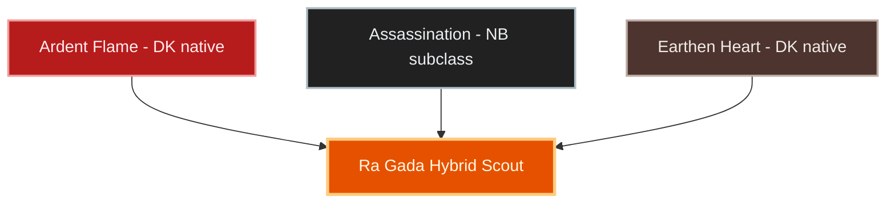
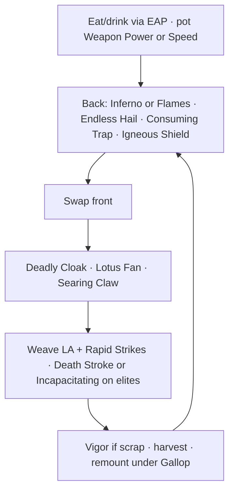

# Build Plan - Masisi: The Ra Gada Artisan (Hybrid Farmer / Craftable DPS)

> **Character profile:** [masisi.md](masisi.md) — Level 50 Redguard Dragonknight, CP 336, @SOLAEGIS (EU).

Masisi remains the EU account’s **Primary Artisan, Master Farmer, and Resource Scout** — the forge behind craftable loadouts for the roster (including [Lord Elric of Melniboné](lord_elric_of_melnibone_plan.md)). Farmer and crafter stay first: surveys, writs, Keen Eye, hirelings, and the motif library still define the day. Combat is no longer “poke and leave only.” One hybrid kit must clear **node packs**, finish **public-dungeon / casual dungeon filler** when a route goes there, then return to the vein.

**Subclassing:** Keep **Ardent Flame** and **Earthen Heart**. **SUBCLASS Assassination** (Nightblade) in place of **Draconic Power** — stam execute and front-bar damage clearly beat native Draconic for pack and public-dungeon filler on craftable gear. See [docs/subclassing.md](../../../docs/subclassing.md) and [docs/dragonknight_u49.md](../../../docs/dragonknight_u49.md).

**End-game gear goal (set DB):** craftable only — **5 Hunding’s Rage (body) + 5 Night Mother’s Gaze (jewelry + weapons)**, replacing Order’s Wrath. Hunding 5pc is **+300 Weapon/Spell Damage** (always on). Night Mother’s Gaze has the **same 2/3/4pc** as Order’s (+657 crit / +129 WD/SD / +657 crit); only the 5pc changes: **Major Breach** (−5,948 enemy Physical/Spell Resistance for 4 s on crit) instead of Order’s +943 crit / +8% Critical Damage. With live **1,930 pen** vs **18,200** enemy resistance, Breach is worth **≈ +12%** damage at full uptime vs **≈ +5.4%** for Order’s 5pc — see [Set rationale](#set-rationale). Both bars keep the full 5pc: jewelry 3 + Dual Wield 2 front, jewelry 3 + **bow 2** back (two-handers count as 2 pieces). All values `coverage: full`, `game_check: verified` in `data/sets/`.

**Live → target:** CP **336** Redguard DK (Summerset) with **Assassination [Full]**, **The Steed**, **Dual Wield front · Bow back**, Weapon Power ~2.8k. **Live sets:** Order’s Wrath **5/5** on both bars (jewelry + DW front; jewelry + bow back — a bow counts as 2) · Hunding’s Rage **4/5** (head/chest/hands/feet Divines — **feet done**) · Trainee heavy legs · scrap Well-fitted shoulders/waist · **almost all crafted slots unenchanted**. **Craft CP still gold passives** (Fortune’s Favor 50 / Gilded Fingers 50) — respec to farmer stars next. Target: craft **Hunding legs** for 5pc, craft **Night Mother’s Gaze** jewelry + daggers + bow (glyphed at craft — don’t glyph the Order’s pieces being replaced), **Bloodthirsty** neck, fill shoulders/waist, gold temper, Style Master so he can supply every EU character from one motif library.

---

## Build at a glance

| **Attribute**            | **Recommendation**                                                                                                                                                                                                              |
| ------------------------ | ------------------------------------------------------------------------------------------------------------------------------------------------------------------------------------------------------------------------------- |
| **Primary Stat**         | 64 points in **Stamina** — **live:** 0 Mag / 0 Health / 64 Stam · **target:** keep 64 Stam                                                                                                                                      |
| **Mundus Stone**         | **The Steed** end-game (not Thief/Warrior) — base **10% move / 238 HP rec**; full Divines → **~16% / 389** (`data/sets/mundus.json`). **live:** The Steed (**done** — keep)                                                      |
| **Vampirism**            | **Cured / N/A** — daylight node routes and writ hubs                                                                                                                                                                            |
| **Trinity**              | **Ardent Flame** KEEP · **Earthen Heart** KEEP · **Assassination** SUBCLASS (replaces **Draconic Power**) — **live:** Assassination [Full]; drop Draconic actives (already unslotted)                                           |
| **Sets**                 | **End-game:** **5 Hunding’s (body) + 5 Night Mother’s Gaze (jewelry + weapons)**, all craftable — **live:** Order’s 5 (both bars) + Hunding **4/5** · **next:** Hunding **legs** Divines (+300 WD), then NMG jewelry/daggers/bow replace Order’s |
| **Bars**                 | Front: **Dual Wield** ("Forge Blade") · Back: **Bow** ("Survey Path") — **Endless Hail** + **Incapacitating Strike** live; unlock Assault **Continuous Attack** for Gallop; morph **Inferno → Flames of Oblivion** |
| **Food**                 | **Artaeum Takeaway Broth** or dual-resource stew — assume **EsoAutoProvision** keeps food/drink up from backpack                                                                                                                |
| **Potion**               | **Essence of Weapon Power** for packs/PD; **Essence of Speed** between dense node stretches                                                                                                                                     |
| **Weapon Poisons**       | Optional **Damage Health** / **Escapist’s** on DW for public-dungeon trash                                                                                                                                                      |
| **Staff/Weapon Enchant** | **Priority:** glyph all blank slots (glyph NMG pieces as they’re crafted, not the Order’s pieces they replace). Jewelry: **Increase Physical Harm** (174 WD; Infused rings ≈ **+278 WD** each). Armor: **Max Stamina** (868 head/chest/legs, 347 on the four small slots). DW: **Weapon Damage** / **Absorb Stamina**. Bow: Absorb Stam or WD |
| **Companion**            | **Primary (now):** **Tanlorin** (support / CC) at companion **9/20** · **Secondary:** **Mirri Elendis** (loot rapport) · **Goal (20/20):** **Zerith-var** (DPS escort for filler pulls)                                         |
| **Primary Mount**        | **Psijic Escort Charger** (owned) · **Ideal:** same — see [Collectibles](#collectibles)                                                                                                                                         |
| **Flavor Pet**           | **Psijic Mascot Bear Cub** (owned) · **Ideal:** same — see [Collectibles](#collectibles)                                                                                                                                        |
| **Costume**              | **Imperial Chancellor** (owned) · **Alt:** **Crown Dishdasha** / **Court of Bedlam** — see [Collectibles](#collectibles)                                                                                                        |

**Read next:** [Roleplay](#roleplay-the-ra-gada-artisan) · [Trinity configuration](#trinity-configuration) · [Combat kit](#combat-kit-the-forge-and-survey-cycle) · [Gear and crafting](#gear-and-crafting-the-tempered-caravan) · [Champion points](#champion-point-mapping-cp-336) · [Companion](#companion-strategy-the-scholarly-escort) · [Collectibles](#collectibles) · [Checklist](#next-steps--in-game-action-checklist)

---

## Roleplay: The Ra Gada Artisan

Masisi does not treat Summerset as a battlefield — but he will not leave a survey unread because a camp of goblins owns the ridge. To a Redguard artisan raised on caravan discipline, every ore vein is a ledger entry and every silk plant is cloth waiting for a buyer. He brings Ra Gada order to Tamriel’s mess: measure twice, harvest once, refine everything, and clear the path when the path clears you. His dragon fire lights the forge; Nightblade steel keeps the road. Guildmates ask for gold sets — he answers with stations, traits, and a motif book that will one day hold the account’s entire style library.

> [!TIP]
> **Suggested Custom Title:** `Ra Gada Artisan · EU Forge & Field` — **live:** Custom Title **The Ra Gada Artisan** is set (refine when desired).

> [!NOTE]
> **Build Notes (paste into LAM Build Notes):**
> Masisi — The Ra Gada Artisan. EU @SOLAEGIS master crafter and hybrid scout: end-game **5 Hunding’s Rage + 5 Night Mother’s Gaze** (craftable), 64 Stamina, The Steed, Divines, Dual Wield front / Bow back, Endless Hail, Continuous Attack (Gallop). Trinity: Ardent Flame + Assassination + Earthen Heart. Next: Hunding legs (+300 WD), NMG jewelry/weapons + Bloodthirsty neck, full glyphs, Craft CP Steed’s Blessing / Master Gatherer / Gifted Rider → Plentiful Harvest / Meticulous Disassembly. EsoAutoProvision keeps food/drink up. Supplies roster gear (Elric and others). Tanlorin now · Zerith-var Goal. Psijic Escort Charger · Psijic Mascot Bear Cub · Imperial Chancellor.
>
> **Live:** replace any older Build Notes with the hybrid text above.

> [!TIP]
> **Flavor Pet:** **Psijic Mascot Bear Cub** — scholarly prestige on the road. **Alt:** **Golden Eagle** / **Psijic Mascot Pony**.

> [!TIP]
> **Costume:** **Imperial Chancellor** for guild-hall prestige; **Crown Dishdasha** for Redguard caravan days; **Court of Bedlam** when Summerset nights turn conspiratorial. Prestige alts: **Noble Clan-Chief**, **Mages Guild Formal Robes**.

---

## Trinity configuration

### Subclassing decision (required)

Subclass unlocks at **Level 50** via Bahtra at-Hunding (**"A Study in Discipline"**). Unlocking the quest makes subclassing *available* — it does **not** mean you must swap lines. **Default = class-identity-first** unless a foreign line clearly outperforms the native pillar on this content. See [docs/subclassing.md](../../../docs/subclassing.md).

For Masisi’s single hybrid kit (node packs + public-dungeon filler), **Assassination** outperforms **Draconic Power** on craftable stam Dual Wield. Keep **Ardent Flame** (flame DoTs / Combustion identity) and **Earthen Heart** (Igneous Shield / mantle tools). Drop **Draconic Power** — do **not** keep Dragon Blood, Dragonfire Breath, or Take Flight on target bars.

| **Pillar**        | **Line**          | **Origin**            | **Slot action**                            | **Function**                                                             |
| ----------------- | ----------------- | --------------------- | ------------------------------------------ | ------------------------------------------------------------------------ |
| **Forge-fire**    | **Ardent Flame**  | Dragonknight (native) | **KEEP**                                   | Flame DoTs, Combustion refunds, Major Prophecy/Savagery buff, banner ult |
| **Caravan steel** | **Assassination** | Nightblade (subclass) | **SUBCLASS** (replaces **Draconic Power**) | Gap-close / AoE pressure, execute ult — pack and PD kill speed           |
| **Stone ward**    | **Earthen Heart** | Dragonknight (native) | **KEEP**                                   | Igneous Shield, Earthshield Mantle, stone sustain while harvesting       |

**Live:** Assassination [Full] (Rank 25). All Assassination passives still locked — spend SP into Master Assassin / Executioner / Pressure Points / Hemorrhage as points allow. Keep Draconic actives off the bars.

---

## Combat kit: The Forge-and-Survey Cycle

Clear the camp, harvest the node, remount. Melee is always **front**; Bow is always **back**. Each morph appears at most once. **Bar order matches live** ([masisi.md](masisi.md)).

### Skill bars

#### Front Bar (Dual Wield): "Forge Blade"

| **Slot**    | **Line**      | **Base → Morph**                         | **Role**                                  | **Profile**                                      |
| ----------- | ------------- | ---------------------------------------- | ----------------------------------------- | ------------------------------------------------ |
| **1**       | Dual Wield    | Blade Cloak → **Deadly Cloak**           | AoE DoT while weaving                     | **Live**                                         |
| **2**       | Assassination | Teleport Strike → **Lotus Fan**          | Gap-close / AoE knives + Minor Vulnerability | **Live** (preferred over Relentless Focus)     |
| **3**       | Ardent Flame  | Searing Strike → **Searing Claw**        | Stam flame DoT + Burning for Combustion   | **Live** (not Venomous Claw)                     |
| **4**       | Dual Wield    | Flurry → **Rapid Strikes**               | Stam spammable                            | **Live**                                         |
| **5**       | Medium Armor  | **Resolving Vigor**                      | Stam HoT for scrap fights                 | **Live**                                         |
| **6 (Ult)** | Assassination | Death Stroke → **Incapacitating Strike** | Execute / burst ult for packs and PD      | **Live**                                         |

> [!NOTE]
> **Lotus Fan** is the live Assassination morph (Teleport Strike). Keep it. Sibling morph **Ambush** is the stamina-cost gap-closer if Magicka cost feels bad later — optional remorph only, not required.

#### Back Bar (Bow): "Survey Path"

| **Slot**    | **Line**      | **Base → Morph**                                                  | **Role**                                | **Profile**                                      |
| ----------- | ------------- | ----------------------------------------------------------------- | --------------------------------------- | ------------------------------------------------ |
| **1**       | Earthen Heart | Obsidian Shield → **Igneous Shield**                              | Burst shield before harvest or pull     | **Live**                                         |
| **2**       | Soul Magic    | Soul Trap → **Consuming Trap**                                    | Resource return on kill                 | **Live**                                         |
| **3**       | Bow           | Snipe → **Lethal Arrow**                                          | Ranged poke / opener                    | **Live**                                         |
| **4**       | Bow           | Volley → **Endless Hail**                                         | Ground AoE rain for packs / PD filler   | **Live**                                         |
| **5**       | Ardent Flame  | Inferno → **Flames of Oblivion**                                  | Major Prophecy / Savagery while slotted | **Live:** Inferno — morph                        |
| **6 (Ult)** | Ardent Flame  | Dragonknight Standard → **Standard of Might**                     | Support banner (WD/SD + DR) while clearing | **Live** preferred (alt: Shifting Standard for AoE) |

> [!IMPORTANT]
> **Slot order matches live** ([masisi.md](masisi.md)). Keep **Endless Hail**. Morph **Inferno → Flames of Oblivion** when ready. Mount speed from Assault **Continuous Attack** (permanent Gallop; no Maneuver on bar). Foot speed: Steed + Steed’s Blessing + remount.
>
> Keep every **Draconic Power** skill off the bars. Heal with **Resolving Vigor** + companion.

### Rotation and combat tips

1. **Pre-stretch:** Let **EsoAutoProvision** keep food/drink up; pot **Essence of Speed** for empty road or **Weapon Power** before public-dungeon / dense camps.
2. **Banner / buff:** Refresh **Inferno** (morph to **Flames of Oblivion** when ready) and drop **Endless Hail** + **Consuming Trap** on the pack before swapping front.
3. **Pack clear:** Cloak → Lotus Fan → Searing Claw → Rapid Strikes weave under Hail; **Death Stroke** / **Incapacitating Strike** on the elite or when the pack is half dead.
4. **Public dungeon filler:** Same; keep **Igneous Shield** for boss trash; do not stand and parse — clear the room that blocks the route, leave.
5. **Harvest window:** Shield up, kill the camp, harvest under **Master Gatherer**, remount (Gallop from **Continuous Attack**).

### Passive skills

Spend skill points in this order (live: **6** SP free; Keen Eye / hirelings / Assassination passives still locked; Twin Blade and Blunt **unlocked**).

#### Dual Wield (line maxed)

1. **Twin Blade and Blunt** — **done**. No further DW passive spend.

#### Assassination (subclass Rank 25)

1. Unlock **Master Assassin**, **Executioner**, **Pressure Points**, **Hemorrhage** as points allow.
2. **Incapacitating Strike** — **live**; keep.

#### Ardent Flame / Earthen Heart

1. Keep Combustion and flame passives ranked (Burning refunds only with an **Ardent Flame** ability **slotted**).
2. Earthen passives already unlocked live (Heart of Stone / Landslide / Blessing at the Peak / Mountain Giant).

#### Craft (priority for the Artisan)

1. **Keen Eye** — Ore, Cloth, Wood, Jewelry (Reagents when Alchemy allows).
2. **Hirelings** — Miner, Outfitter, Lumberjack, then Enchanter / Forager.
3. **Metallurgy / Stitching / Carpentry / Lapidary Research** toward 9/9.

#### Alliance War — Assault

1. **Continuous Attack** passive ranks (not a morph cost) — permanent Gallop; Maneuver no longer needs a bar slot.

#### Medium Armor

1. Keep **Dexterity**, **Wind Walker**, **Agility**, **Athletics** ranked (already unlocked live).

#### Bow

1. Passives already unlocked live — keep them; **Endless Hail** already slotted.

---

## Gear and crafting: "The Tempered Caravan"

One hybrid loadout: craftable **Weapon Damage + crit** for packs and filler; farm pace from **The Steed**, Divines, Craft CP, mount, and Continuous Attack Gallop — **not** Night’s Silence / Adept Rider. Set bonuses below are CP160 gold values from `data/sets/sets.json` (`coverage: full`, `game_check: verified` unless noted).

### Set rationale

| **Set**            | **5pc package (gold)**                                                                                          | **Why end-game**                                                                 |
| ------------------ | --------------------------------------------------------------------------------------------------------------- | -------------------------------------------------------------------------------- |
| **Hunding’s Rage** | 2/4pc +657 crit each · 3pc +1,096 Max Stam · **5pc +300 WD/SD** (uptime 1.0)                                    | Craftable flat power for Dual Wield clears — **largest live gap** (still on 4pc) |
| **Night Mother’s Gaze** | 2/4pc +657 crit each · 3pc +129 WD/SD · **5pc Major Breach on crit** (−5,948 enemy resistance, 4 s) | Same 2–4pc as Order’s; 5pc is the build’s biggest damage gain — **jewelry + weapons** |
| ~~Order’s Wrath~~  | 2/4pc +657 crit each · 3pc +129 WD/SD · 5pc +943 crit + 8% crit damage / healing                                | Live; replaced by NMG (only the 5pc differs)                                     |

**Bar math:** a bow is two-handed and counts as **2 set pieces**, so both bars carry the full jewelry/weapon set.

| Bar | Hunding pieces | NMG pieces | Active bonuses |
| --- | -------------- | ---------- | -------------- |
| **Front (DW)** | 5 body (after legs) | jewelry 3 + 2 daggers = **5** | Hunding 5 + NMG 5 |
| **Back (Bow)** | 5 body | jewelry 3 + bow (2) = **5** | Hunding 5 + NMG 5 |

**Why NMG over Order’s (5pc only — 2/3/4pc are identical):**

- **Order’s 5pc** (+943 crit ≈ +4.3% crit chance, +8% crit damage) at live 48.5% crit / 88% crit damage: 1 + 0.485 × 0.88 = 1.427 vs 1.354 without → **≈ +5.4%** damage.
- **NMG 5pc** (Major Breach −5,948): pen 1,930 → 7,878 vs 18,200 resistance; mitigation 24.7% → 15.6% (1% per 660) → **≈ +12%** damage while the target has Breach. At ~44% crit with AoE DoT ticks, a 4 s debuff stays up on most of a pack.
- **Net ≈ +6%** for solo farming and public dungeons. Assumes standard 18,200 PvE resistance; worth **zero** in groups where a tank/support already applies Major Breach — swap back to Order’s for group content if that happens.

> [!WARNING]
> **Rejected as primary (set DB):**
> - **Adept Rider** (Shimmerene Dockworks) — 5pc Major Expedition + Gallop; **0 Weapon Damage**. Pure scout only.
> - **Night’s Silence** — 5pc coverage **`none`** / unmodeled in set DB; do not value from wiki text alone.
> - **New Moon Acolyte** (Fur-Forge Cove) — 5pc +401 WD/SD but **+5% ability cost**; worse for long survey days than Hunding’s free +300.
>
> Do **not** dual-Armory scout sets; this plan is one kit.

> [!NOTE]
> **Live set split:** Order’s on **weapons + jewelry** (5 on both bars — the bow counts 2). Hunding **4/5** — head/chest/hands/**feet** Divines done; **legs** still Trainee. Free slots after Hunding 5: **shoulders + waist**.
>
> **Shoulders + waist options:** the live Trainee piece is **heavy legs** — it can’t move to shoulders. Either get a **Trainee shoulder** (starter-island drop or set-collection reconstruct; 1pc +1,454 Max Health) plus a plain Divines waist, or craft **2pc Threads of War** (Deserter’s Lagoon, Gold Road) for **+1,487 Offensive Penetration** (≈ +3% damage at live pen). Threads is the damage pick; Trainee is the survivability pick.

### Target loadout

| **Slot**      | **Set**              | **Weight** | **Trait** | **Enchantment**                         | **Quality**   | **Live**                                      |
| ------------- | -------------------- | ---------- | --------- | --------------------------------------- | ------------- | --------------------------------------------- |
| **Head**      | Hunding’s Rage       | Medium     | Divines   | Max Stamina (868)                       | Purple → Gold | **Done** set/trait — **glyph missing**        |
| **Chest**     | Hunding’s Rage       | Medium     | Divines   | Max Stamina                             | Purple → Gold | **Done** set/trait — **glyph missing**        |
| **Hands**     | Hunding’s Rage       | Medium     | Divines   | Max Stamina                             | Purple → Gold | **Done** set/trait — **glyph missing**        |
| **Legs**      | Hunding’s Rage       | Medium     | Divines   | Max Stamina                             | Purple → Gold | **Replace Trainee heavy** (unlocks +300 WD)   |
| **Feet**      | Hunding’s Rage       | Medium     | Divines   | Max Stamina                             | Purple → Gold | **Done** set/trait — **glyph missing**        |
| **Shoulders** | **Trainee** (1pc) *or* **Threads of War** | Medium | Divines | Max Stamina (347)              | Purple → Gold | New piece needed (live Trainee is legs)       |
| **Waist**     | Plain medium *or* **Threads of War** | Medium | Divines | Max Stamina (347)                 | Purple → Gold | Replace scrap Well-fitted                     |
| **Necklace**  | **Night Mother’s Gaze** | —       | **Bloodthirsty** | **Increase Physical Harm** (174 WD) | Purple → Gold | **Craft new** (replaces Order’s Robust)  |
| **Ring 1**    | **Night Mother’s Gaze** | —       | Infused   | Increase Physical Harm (×1.60 Infused)  | Purple → Gold | **Craft new** (replaces Order’s)              |
| **Ring 2**    | **Night Mother’s Gaze** | —       | Infused   | Increase Physical Harm                  | Purple → Gold | **Craft new** (replaces Order’s)              |

| **Slot**     | **Item**                         | **Trait**            | **Enchantment**                         | **Live**                          |
| ------------ | -------------------------------- | -------------------- | --------------------------------------- | --------------------------------- |
| **Front DW** | **Night Mother’s Gaze** daggers  | Sharpened / Precise  | Weapon Damage (348/5s) / Absorb Stamina | **Craft new** (live: Order’s)     |
| **Back Bow** | **Night Mother’s Gaze** bow      | Decisive             | Absorb Stamina or Weapon Damage         | **Craft new** (live: Order’s)     |

> [!NOTE]
> **Divines + Steed:** Divines amplifies Steed move speed and Health Recovery (+9.1% legendary) — it is not a Thief/Warrior damage trait. Keep Steed as **end-game mundus** for the Artisan; Thief/Shadow are parse mundus for other characters.
>
> **Glyphs are end-game, not polish:** live purple Order’s/Hunding pieces show **no enchant**. Two Infused rings with Physical Harm ≈ **+557 WD** alone. Armor Stam glyphs give full value (868) only on head/chest/legs and 40% (347) on shoulders/hands/waist/feet — seven glyphs ≈ **+3,993 Max Stam**. Glyph Hunding body now; glyph NMG pieces as they’re crafted, **not** the Order’s pieces they replace.
>
> **Bloodthirsty neck:** up to **+350 WD/SD** against enemies under 90% Health (scales up as they lose Health — assume ~half on average) vs Robust’s +877 Max Stam ≈ 83 WD-equivalent. Even at half value Bloodthirsty is ~2× the damage; a bigger stamina pool doesn’t add sustain — recovery does. Needs the trait researched and **Slaughterstone** (writs / weekly trial rewards).
>
> **Transmute (176 crystals live):** Divines on Hunding legs + shoulders/waist once crafted. Do not waste crystals on Trainee Training trait or Fine scrap.

### Crafting handoff

Masisi crafts this kit **for himself** — no external crafter.

| **Item**         | **Detail**                                                                                                                         |
| ---------------- | ---------------------------------------------------------------------------------------------------------------------------------- |
| **Stations**     | Hunding’s Rage — Broken Arch / Wethers’ Cleft / Trollslayer’s Gully · **Night Mother’s Gaze — Old Town Cavern / Silaseli Ruins / Eldbjorg’s Hideaway** · Threads of War (optional) — Deserter’s Lagoon (Gold Road) |
| **Traits**       | Research toward 9/9; Divines / **Bloodthirsty** / Infused / Sharpened or Precise / Decisive as above                              |
| **Interim now**  | Craft Hunding **legs** purple Divines + Stam glyph; glyph Hunding body; craft **NMG** neck (Bloodthirsty) + rings + daggers + bow with glyphs; retire scrap waist |
| **End-game kit** | 5 Hunding + 5 NMG; **gold** temper; every slot glyphed; all body Divines                                                          |
| **Roster forge** | Keep supplying EU combat plans (e.g. Elric’s Julianos / Clever Alchemist) from Masisi stations and motif library                   |

**Style Master track (unchanged priority):** finish 9/9 research; motif fragments **Psijic**, **Sapiarch**, **Dwemer**, **Assassins League**, then **Ra Gada**; learn chapters on Masisi only; attunable stations when roster set targets settle.

---

## Champion Point Mapping (CP 336)

Budget ≈ **100–112** per constellation with **44** unspent live. **Live:** Craft Fortune’s Favor **50** + Gilded Fingers **50**; Warfare Fighting Finesse **50** / Master-at-Arms **25** / Precision **10** / Piercing **10**; Fitness Boundless Vitality **47** / Rejuvenation **50**.

### Craft (Green — farmer end-game)

| **Star**             | **Type**  | **Respec now**  | **Grow into**           | **Notes**          |
| -------------------- | --------- | --------------- | ----------------------- | ------------------ |
| **Steed’s Blessing** | Slottable | **50**          | Keep slotted            | Between-node speed |
| **Master Gatherer**  | Slottable | **30** (2 × 15) | **75**                  | Harvest speed      |
| **Gifted Rider**     | Slottable | **10**          | Keep or replace later   | Mount speed filler |
| *(unspent)*          | —         | **7+**          | Master Gatherer stage 3 | Use live unspent   |

Then: **Plentiful Harvest (50)** → **Meticulous Disassembly (50)** → Inspiration Boost while leveling Alchemy / Enchanting / Provisioning → gold passives (**Fortune’s Favor / Gilded Fingers**) only after farmer stars are funded.

**Drop live:** Fortune’s Favor (50) and Gilded Fingers (50) until crafts are capped and farmer stars are funded. This remains the highest-priority farmer fix — set DB does not change Craft CP; gold passives still do nothing for nodes.

### Warfare (Blue — filler end-game)

| **Star**             | **Type**  | **Target**    | **Notes**                   |
| -------------------- | --------- | ------------- | --------------------------- |
| **Fighting Finesse** | Slottable | **50**        | Crit damage — **live**      |
| **Master-at-Arms**   | Slottable | **25**→**50** | Direct damage — **live** 25 |
| **Precision**        | Passive   | **10**→**20** | Crit — **live** 10          |
| **Piercing**         | Passive   | **10**→**20** | Pen — **live** 10           |

As CP grows: finish Master-at-Arms 50; add **Wrathful Strikes** or **Deadly Aim** when a third/fourth slot opens (still under 900 CP = 3 slots). Live pen ~1,930 / 18,200 cap — Piercing is fine; do not chase Lover mundus over Steed for this kit.

### Fitness (Red — 97+ Points)

| **Star**                           | **Type**  | **Target** | **Notes**                                         |
| ---------------------------------- | --------- | ---------- | ------------------------------------------------- |
| **Boundless Vitality**             | Slottable | **50**     | Max Health — **live** 47→50                       |
| **Rejuvenation**                   | Slottable | **50**     | Recovery — **live**                               |
| **Bloody Renewal** or **Celerity** | Slottable | Remaining  | Stam return on kills / move speed as points allow |

---

## Companion strategy: The Scholarly Escort

### Tanlorin: The Alchemical Assistant (Primary now)

Tanlorin’s alchemy bent matches a crafter’s road life. Keep Tanlorin as the primary gathering escort until **20/20**, then promote **Zerith-var** for damage-heavy filler days.

| **Attribute**   | **Detail**                                                                                                   |
| --------------- | ------------------------------------------------------------------------------------------------------------ |
| **Role**        | Support / crowd control / light heal                                                                         |
| **Live level**  | **9/20** — needs XP on every survey and writ trip                                                            |
| **Weapons**     | Goal: **Companion’s** Restoration Staff or Lightning Staff — **live:** dual daggers (upgrade path)           |
| **Armor**       | **Companion’s** light or medium — companion-only traits only                                                 |
| **Traits**      | **Soothing** (heal) or **Quickened** (cooldown) — never player set names                                     |
| **Acquisition** | Merchant whites + **Superior+** drops while Tanlorin is active — **not** crafted by Masisi’s player stations |

**Support bar (live → goal):**

1. **Swift Assault** (live) — filler damage.
2. **Internal Conflict** (live) — tether while you harvest.
3. **Starfall** (live) — AoE pressure.
4. **Extinguishing Breath** (live) — purge / support.
5. Utility / shield — fill empty slot.
6. Companion ultimate — fill empty ult.

> [!WARNING]
> Live export: **2** empty ability slots and **9** underleveled gear pieces. Fix gear and skills before hard zones.

| **Tier**          | **Companion**     | **Loadout**                                                           | **Acquisition**                                                            |
| ----------------- | ----------------- | --------------------------------------------------------------------- | -------------------------------------------------------------------------- |
| **Primary (now)** | **Tanlorin**      | Support / CC staff kit; Soothing / Quickened Companion’s gear         | Level on surveys/writs; merchant + Superior+ drops                         |
| **Secondary**     | **Mirri Elendis** | Loot / treasure-map rapport days                                      | Swap when farming maps; return to Tanlorin for dangerous nodes             |
| **Goal**          | **Zerith-var**    | DPS Companion’s weapons/armor (Aggressive / Quickened as drops allow) | Unlock rapport + gear while Tanlorin is finishing 20/20; use for PD filler |

---

## Collectibles

### Mount

| **Attribute**       | **Detail**                                                                                                                                                                        |
| ------------------- | --------------------------------------------------------------------------------------------------------------------------------------------------------------------------------- |
| **Primary (owned)** | **[Psijic Escort Charger](https://en.uesp.net/wiki/Online:Psijic_Escort_Charger)** — scholarly courier mount for Alinor routes (kept over EU diversity with taranis — theme wins) |
| **Alt (owned)**     | **[Dwarven War Horse](https://en.uesp.net/wiki/Online:Dwarven_War_Horse)** — forge-road prestige                                                                                  |
| **Alt (owned)**     | **[Noweyr Steed](https://en.uesp.net/wiki/Online:Noweyr_Steed)** / **[Nightmare Senche](https://en.uesp.net/wiki/Online:Nightmare_Senche)** — festival / night surveys            |
| **Alt (owned)**     | **[Pyrodraconic Camel-Lizard](https://en.uesp.net/wiki/Online:Pyrodraconic_Camel-Lizard)** — alt only (karakadin primary)                                                         |
| **Backup (owned)**  | **[Rahd-m'Athra](https://en.uesp.net/wiki/Online:Rahd-m'Athra)** / **[Skulltooth Coastal Durzog](https://en.uesp.net/wiki/Online:Skulltooth_Coastal_Durzog)**                     |
| **Avoid**           | **Sorrel Horse** — too plain for the account artisan                                                                                                                              |

### Pet

| **Attribute**       | **Detail**                                                                                                                                                                                              |
| ------------------- | ------------------------------------------------------------------------------------------------------------------------------------------------------------------------------------------------------- |
| **Primary (owned)** | **[Psijic Mascot Bear Cub](https://en.uesp.net/wiki/Online:Psijic_Mascot_Bear_Cub)** — Style Master mascot                                                                                              |
| **Alt (owned)**     | **[Psijic Mascot Pony](https://en.uesp.net/wiki/Online:Psijic_Mascot_Pony)** / **[Noweyr Pony](https://en.uesp.net/wiki/Online:Noweyr_Pony)** — scholarly / festival road companions                    |
| **Alt (owned)**     | **[Golden Eagle](https://en.uesp.net/wiki/Online:Golden_Eagle)** — high-road scout                                                                                                                      |
| **Alt (owned)**     | **[Scintillant Dovah-Fly](https://en.uesp.net/wiki/Online:Scintillant_Dovah-Fly)** / **[Viridescent Dragon Frog](https://en.uesp.net/wiki/Online:Viridescent_Dragon_Frog)** — forge-and-field familiars |

### Costume

| **Attribute**       | **Detail**                                                                                                                                                                                                                         |
| ------------------- | ---------------------------------------------------------------------------------------------------------------------------------------------------------------------------------------------------------------------------------- |
| **Primary (owned)** | **[Imperial Chancellor](https://en.uesp.net/wiki/Online:Imperial_Chancellor)** — guild-hall artisan authority                                                                                                                      |
| **Alt (owned)**     | **[Crown Dishdasha](https://en.uesp.net/wiki/Online:Crown_Dishdasha)** / **[Forebear Dishdasha](https://en.uesp.net/wiki/Online:Forebear_Dishdasha)** — Ra Gada caravan dress (Forebear is karakadin primary — fine as Masisi alt) |
| **Alt (owned)**     | **[Court of Bedlam](https://en.uesp.net/wiki/Online:Court_of_Bedlam)** — Summerset night work                                                                                                                                      |
| **Alt (owned)**     | **[Noble Clan-Chief](https://en.uesp.net/wiki/Online:Noble_Clan-Chief)** / **[Mages Guild Formal Robes](https://en.uesp.net/wiki/Online:Mages_Guild_Formal_Robes)** — prestige hall dress                                          |

### Dye and style

| **Attribute**      | **Detail**                                                                                                         |
| ------------------ | ------------------------------------------------------------------------------------------------------------------ |
| **Palette**        | Gold, ivory, and deep Alinor blue — wealth without parade armor                                                    |
| **Outfit Station** | Prefer **Ra Gada** / **Psijic** motifs on crafted hybrid gear once chapters unlock; costume hides scrap until then |
| **Title (live)**   | Custom Title **The Ra Gada Artisan** — optional refine to Style Master / Forge & Field string above                |

---

## Next Steps & In-Game Action Checklist

### Phase 0 — Today (remaining foundation)

Live snapshot (CP **336**): Steed + Assassination + DW front / Bow back / Endless Hail / Incapacitating Strike **done**; Order’s 5 (both bars) + Hunding **4/5** (feet done); Craft CP still gold; Tanlorin **9/20**; **6** SP free; **glyphs blank** on crafted pieces.

1. **Craft CP respec** — remove Fortune’s Favor / Gilded Fingers; slot **Steed’s Blessing 50**, **Master Gatherer 30**, **Gifted Rider 10** (use live unspent for the rest).
2. **Spend SP** — Keen Eye Ore / Continuous Attack / Assassination passives (Master Assassin first); Twin Blade **already done**.
3. **Finish Hunding’s 5** — craft medium Divines **legs** + Max Stam glyph; replace Trainee heavy legs (**+300 WD**).
4. **Glyph Hunding body** — Max Stam on all five. Leave Order’s jewelry/weapons unglyphed; they’re being replaced.
5. **Craft Night Mother’s Gaze** — neck (**Bloodthirsty**), 2 rings (Infused), 2 daggers (Sharpened / Precise), bow (Decisive), each with its glyph (Physical Harm / Weapon Damage / Absorb Stam). Replaces Order’s on both bars (≈ +6% damage solo).
6. **Bar polish** — morph **Inferno → Flames of Oblivion** if still base; keep Endless Hail / Incapacitating / front live order.
7. **Tanlorin** — keep Primary; XP toward **20/20**; fill empty skill + ult; upgrade **Companion’s** gear (merchant whites / Superior+ while active — not player crafting).
8. **LAM Build Notes** — paste hybrid text from Roleplay note above.
9. **Smoke check** — one node loop + one public-dungeon wing trash pull after Craft CP respec + Hunding legs + NMG.

**Already done (do not redo):** The Steed mundus, Assassination subclass, bar flip, Deadly Cloak / Rapid Strikes / Searing Claw / Lotus Fan / Endless Hail / Incapacitating Strike, Hunding head/chest/hands/**feet**, Twin Blade and Blunt, Custom Title. (Order’s Wrath 5 is live but is being replaced by NMG.)

### Phase 1 — Glyph + farmer SP + scrap retire

1. Fill shoulders + waist: Trainee shoulder + plain Divines waist, **or** 2pc Threads of War (pen); transmute Well-fitted → Divines.
2. Confirm every combat slot is glyphed (jewelry Physical Harm on Infused rings especially).
3. Daily writs on Masisi; Keen Eye + first hirelings; push Alchemy / Enchanting / Provisioning.
4. Confirm Divines + Steed + Steed’s Blessing feel on survey routes.

### Phase 2 — CP grow + gold temper (end-game kit)

1. Push **Master Gatherer to 75**; fund **Plentiful Harvest** then **Meticulous Disassembly**.
2. Finish Assassination passives; Boundless Vitality 50; Master-at-Arms toward 50.
3. Gold-temper Hunding body + NMG jewelry/weapons; no migration to New Moon / dungeon / trial sets.
4. Transmute leftover wrong traits to **Divines** / jewelry **Infused** / **Bloodthirsty**.

### Phase 3 — Polish (Style Master + companions)

1. Finish **9/9 trait research**; cap Alchemy / Enchanting / Provisioning; remaining hirelings.
2. Motif library (Psijic, Sapiarch, Dwemer, Assassins League, Ra Gada first); attunables for roster sets.
3. Level **Tanlorin to 20/20**; fill empty skill + ult; upgrade **Companion’s** gear (staff support kit goal).
4. Gear **Zerith-var** as Goal DPS escort for public-dungeon filler days; keep Mirri for loot maps.
5. Keep surveys liquid — no backlog; bank below 70%.

### Finish

1. Confirm Masisi can craft Elric (and future EU) handoffs at CP160 gold.
2. Regenerate [masisi.md](masisi.md) after Craft CP / Hunding legs / full glyphs / gold temper; re-check live vs target — expect Hunding **5/5**, Night Mother’s Gaze **5/5** on both bars, shoulders/waist filled, no blank enchants.

Keep your eye on the node and your steel on the path, Artisan.
