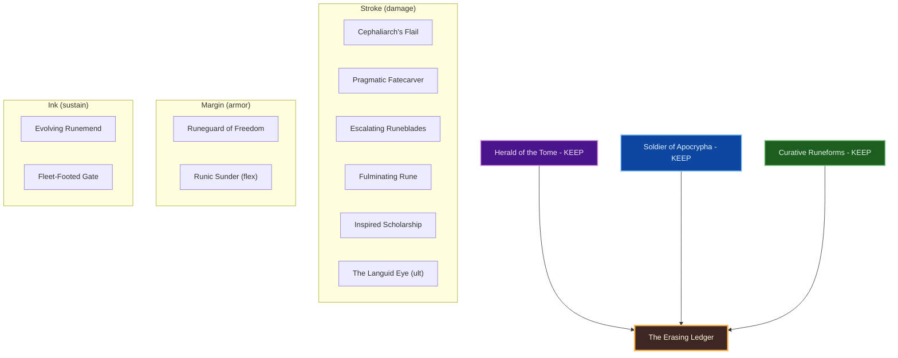
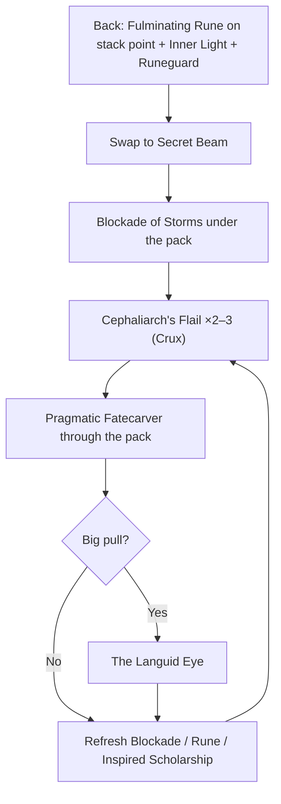
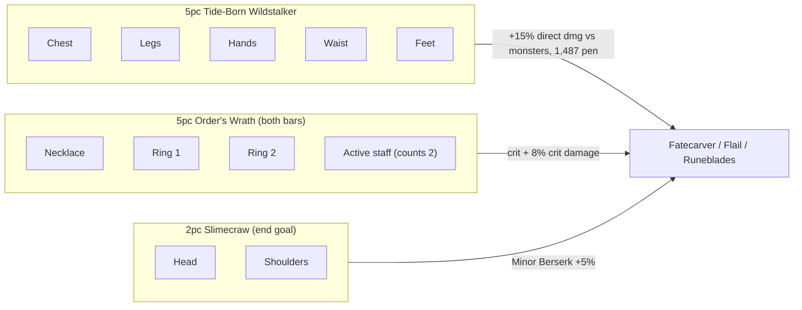

# Build Plan - S'Katib-Asrar: The Erasing Ledger (Magicka Arcanist Group AoE, Craftable)

> **Character profile:** [s_katib_asrar.md](s_katib_asrar.md) — Khajiit Arcanist, Level 17 · CP 338, @SOLAEGIS (EU).

**S'Katib-Asrar** ("Scribe of Secrets") is a **class-identity-first** magicka Arcanist: an Elsweyr pilgrim of forbidden tomes who writes fate in Crux and spends it as a beam. This plan builds him for **group dungeon and trial trash-clearing**. Blockade, runes and Pragmatic Fatecarver erase whole packs while the tank and healer hold the line. He keeps all three native lines (**Herald of the Tome**, **Soldier of Apocrypha**, **Curative Runeforms**) with no subclass.

**Gear rule:** everything is **crafted** by @masisi except the **monster helm + shoulders**, which are the end goal. Mythics, trial and PvP sets are out of scope.

**Live → target:** profile export at **Level 17, CP 338**: Trainee and quest gear, Mundus The Thief, back bar empty. Below Level 50 the gear advice is **best-now**, not a gap against the target. See [Live now](#live-now-level-17). Set % values are modelled on assumed CP160 stats until a CP160 export exists.

---

## Build at a glance

| **Attribute** | **Recommendation** |
| :--- | :--- |
| **Primary Stat** | 64 **Magicka** — **live:** 20 Magicka (every point so far) ✅ |
| **Mundus Stone** | **The Shadow** (+11% Crit Damage; 17% with 7× Divines) — **live:** The Thief (keep while levelling) |
| **Vampirism** | **Cured** |
| **Trinity** | **Herald of the Tome** + **Soldier of Apocrypha** + **Curative Runeforms** KEEP — **decision:** the Crux / Fatecarver engine is the reason this character exists |
| **Sets (craft)** | **5 Tide-Born Wildstalker** (body) + **5 Order's Wrath** (jewelry + both staves) — **live:** 4 Armor of the Trainee + quest pieces |
| **Sets (end goal)** | **+ 2 Slimecraw** (head + shoulders) — alt **Molag Kena** when the group already supplies Minor Berserk |
| **Bars** | Front **Lightning Dest** ("Secret Beam") · Back **Inferno Dest** ("Rune Script") — **live:** front 5/5 slotted, **back bar empty** |
| **Content** | Group dungeons and trials; assumes the tank or support supplies Major/Minor Breach |
| **Food** | **Witchmother's Potent Brew** (Max Magicka + Magicka Recovery) |
| **Potion** | **Essence of Spell Power** (Spell Damage + Spell Critical + Magicka) |
| **Staff Enchants** | Front Lightning: **Shock** · Back Inferno: **Flame** |
| **Companion** | **Primary (now):** **Mirri Elendis** · **Secondary:** **Bastian Hallix** · **Goal (20/20):** **Tanlorin** (solo play only; no companions in group content) |
| **Primary Mount** | **Dwarven War Horse** (owned) · **Alt:** **Noweyr Steed** |
| **Flavor Pet** | **Scintillant Dovah-Fly** (owned) · **Alt:** **Blue Dragon Imp** |
| **Costume** | **Court of Bedlam** (owned) · **Alt:** **Bloodthorn Robes** |

**Read next:** [Roleplay](#roleplay-the-erasing-ledger) · [Trinity configuration](#trinity-configuration) · [Combat kit](#combat-kit-the-crowded-page) · [Gear and crafting](#gear-and-crafting-the-erasure-regalia) · [Champion points](#champion-point-mapping) · [Companion](#companion-strategy-the-ink-and-shield) · [Collectibles](#collectibles) · [Live now](#live-now-level-17) · [Checklist](#next-steps--in-game-action-checklist)

---

## Roleplay: The Erasing Ledger

Elsweyr taught him that secrets are not toys — they are **ledgers**. **S'Katib-Asrar** left the March with ink-stained claws and a hunger for scripts other mages refuse to read. Apocrypha's language is not prayer to him; it is **craft**. Crux is the stroke; Fatecarver is the sentence finished in light.

Alone on the road he writes carefully: a rune here, a beam there, one debt settled at a time. In company the ledger changes. A tank holds the margin, a healer keeps the ink wet, and the scribe is free to do what Apocrypha's language was always best at: **erasure**. Crowds are only long sentences. Blockade is the underline, the runes are the red ink, and Fatecarver strikes the whole line through.

He is not a carnival prophet and he is not a pale Altmer courtier wearing stolen death. He does not wear the armor of trials or the trophies of Cyrodiil. He wears what a Khajiit scribe can **commission**: honest crafted cloth from @masisi's forge, and one day a trophy helm taken from something that tried to eat him in the sewers of Wayrest. The **Court of Bedlam** silhouette is borrowed pageantry for a cat who writes in tentacle-script; the **Dwarven War Horse** is a scholar's road-engine, not a parade mount.

> [!TIP]
> **Suggested Custom Title:** `Erasing Ledger · Scribe of Secrets`

> [!NOTE]
> **Build Notes (paste into LAM Build Notes):**
> S'Katib-Asrar — The Erasing Ledger (group AoE). Khajiit Magicka Arcanist; KEEP Herald + Soldier + Curative, no subclass. Crafted by @masisi: 5 Tide-Born Wildstalker (light body, Divines, Magicka glyphs) + 5 Order's Wrath (neck + 2 rings Bloodthirsty/Spell Damage, Lightning + Inferno staves Precise). End goal: 2 Slimecraw head + shoulders (alt Molag Kena if the group has Minor Berserk). 64 Mag. Mundus: The Shadow. Front Lightning ("Secret Beam"): Blockade of Storms, Cephaliarch's Flail, Pragmatic Fatecarver, Escalating Runeblades, Inspired Scholarship; ult The Languid Eye. Back Inferno ("Rune Script"): Fulminating Rune, Runeguard of Freedom, Evolving Runemend, Inner Light, Fleet-Footed Gate (Runic Sunder if no tank breach); ult The Languid Eye. Costume: Court of Bedlam · Dwarven War Horse · Scintillant Dovah-Fly.

> [!TIP]
> **Flavor Pet:** **Scintillant Dovah-Fly** (owned) — ink-mote familiar for a rune scribe. **Alt:** **Blue Dragon Imp**. See [Collectibles](#collectibles).

> [!TIP]
> **Costume:** **Court of Bedlam** — Apocrypha-adjacent court silhouette without Misrule carnival framing. **Alt:** **Bloodthorn Robes**. Full picks under [Collectibles](#collectibles).

---

## Trinity configuration

### Subclassing decision (required)

Subclass unlocks at **Level 50** via Bahtra at-Hunding (**"A Study in Discipline"**). Unlocking the quest makes subclassing *available*; it does **not** mean you must swap lines. See [docs/subclassing.md](../../../docs/subclassing.md).

**This build's decision:** **KEEP all three native lines.** **Herald of the Tome** is the Crux / Fatecarver engine and carries both runes and the beam. **Soldier of Apocrypha** is armor and breach. **Curative Runeforms** is self-sustain and mobility without a resto staff.

| **Pillar** | **Line** | **Origin** | **Slot action** | **Function** |
| :--- | :--- | :--- | :--- | :--- |
| **Stroke** | **Herald of the Tome** | Arcanist (native) | **KEEP** | Cephaliarch's Flail (Crux), Pragmatic Fatecarver, Escalating Runeblades, Fulminating Rune, Inspired Scholarship, The Languid Eye |
| **Margin** | **Soldier of Apocrypha** | Arcanist (native) | **KEEP** | Runeguard of Freedom; Runic Sunder when the group lacks Major Breach |
| **Ink** | **Curative Runeforms** | Arcanist (native) | **KEEP** | Evolving Runemend, Fleet-Footed Gate |

**Weapon / guild lines (not subclass):** **Destruction Staff** (Blockade of Storms) · **Mages Guild** (Inner Light).

> [!IMPORTANT]
> **Do not subclass by default.** Only replace a native line if a foreign line clearly outperforms it on the same content, with the crafted gear already correct.

---

## Combat kit: The Crowded Page

Open on the **back bar** with rune, armor and buffs; swap to the **front bar** for Blockade, Flail Crux and **Pragmatic Fatecarver**. Pure magicka.

> [!NOTE]
> Skill and morph names are not part of the verified set data. Check them against the in-game skills UI after each patch.

### Skill bars

#### Front Bar (Lightning Dest): "Secret Beam"

| **Slot** | **Class/Line** | **Base → Morph** | **Role** |
| :--- | :--- | :--- | :--- |
| **1** | Destruction Staff | Wall of Elements → **Blockade of Storms** | AoE ground DoT under the pack |
| **2** | Herald of the Tome | Abyssal Impact → **Cephaliarch's Flail** | Crux generator (cone) |
| **3** | Herald of the Tome | Fatecarver → **Pragmatic Fatecarver** | Channelled AoE beam; spends Crux |
| **4** | Herald of the Tome | Runeblades → **Escalating Runeblades** | Crux filler |
| **5** | Herald of the Tome | Tome-Bearer's Inspiration → **Inspired Scholarship** | Major Sorcery / Brutality (`buffs.json` source) |
| **Ult** | Herald of the Tome | The Unblinking Eye → **The Languid Eye** | AoE beam ult for big pulls |

#### Back Bar (Inferno Dest): "Rune Script"

| **Slot** | **Class/Line** | **Base → Morph** | **Role** |
| :--- | :--- | :--- | :--- |
| **1** | Herald of the Tome | The Imperfect Ring → **Fulminating Rune** | AoE DoT on the stack point |
| **2** | Soldier of Apocrypha | Runic Defense → **Runeguard of Freedom** | Armor / survivability |
| **3** | Curative Runeforms | Runemend → **Evolving Runemend** | Self-heal |
| **4** | Mages Guild | Magelight → **Inner Light** | Major Prophecy / Savagery (`buffs.json` source) |
| **5** | Curative Runeforms | Apocryphal Gate → **Fleet-Footed Gate** | Reposition. **Flex:** Soldier **Runic Sunder** if the tank doesn't apply Major Breach (a second Major Breach adds 0) |
| **Ult** | Herald of the Tome | **The Languid Eye** | Same ult both bars |

> [!NOTE]
> **Sibling morphs:** **Runespite Ward** (live slot) is the tank morph of the same skill as Runic Sunder; don't slot both. **Tentacular Dread** is the single-target Flail morph; use it only for bosses. **Exhausting Fatecarver** trades Pragmatic's shield for sustain; pick it if magicka runs dry.

### Rotation and combat tips

#### Group tips

1. **Stack point first:** Fulminating Rune where the tank gathers, then Blockade on the same spot.
2. **Build 2–3 Crux** with Cephaliarch's Flail before every **Pragmatic Fatecarver**; aim the beam through the densest line of adds.
3. **The Languid Eye** on big trash pulls, not on a lone elite.
4. **Interrupt** casters with bash when the tank misses them; dead casters are faster than healed casters.
5. **Light attacks between casts.** Required if you run **Molag Kena**.
6. **Potion on the pull** once the Divines gear is in: Essence of Spell Power.
7. Solo overland uses the same bars; swap Fleet-Footed Gate for **Remedy Cascade** if you need more healing.

### Passive skills

Take every passive as ranks allow; the lists match the profile export.

#### Arcanist — Herald of the Tome

* **Fated Fortune** ✅ · **Harnessed Quintessence** ✅ · **Psychic Lesion** ✅ · **Splintered Secrets** 🔒 (penetration per Herald ability slotted)

#### Arcanist — Soldier of Apocrypha

* **Aegis of the Unseen** ✅ · **Wellspring of the Abyss** ✅ · **Circumvented Fate** 🔒 · **Implacable Outcome** 🔒

#### Arcanist — Curative Runeforms

* **Healing Tides** ✅ · **Hideous Clarity** ✅ · **Erudition** 🔒 · **Intricate Runeforms** 🔒

#### Weapon — Destruction Staff

* **Tri Focus** / **Penetrating Magic** / **Elemental Force** / **Ancient Knowledge** / **Destruction Expert** — fully rank.

#### Armor — Light

* **Grace** ✅ · **Evocation** ✅ · **Spell Warding** ✅ · **Prodigy** 🔒 · **Concentration** 🔒 (penetration). Light Armor is Rank 18 at 98%: the next two unlock soon.

#### Guild — Mages Guild

* Rank toward **Might of the Guild**; keep **Inner Light** slotted.

#### Race — Khajiit

* Racials come with levels; crit damage and crit chance racials feed Order's Wrath and The Shadow.

---

## Gear and crafting: "The Erasure Regalia"

### Set rationale

All set values are CP160 gold from `data/sets`. The % values come from `value_calc.py` against an **assumed** group-buffed Arcanist: 4.7k Spell Damage, 36k Magicka, 52% crit, 85% crit damage, 12.5k penetration with group breaches. Re-run with a CP160 export.

| **Crafted 5pc (vs nothing)** | **Gain** | **Key bonuses** |
| :--- | ---: | :--- |
| **Tide-Born Wildstalker** | **+13.6 to +15.5%** | 129 SD · 657 crit · **1,487 pen** · **+15% direct damage vs monsters** |
| **Order's Wrath** | **+11.3%** (+11.2% with Tide-Born on) | 1,314 + 943 crit · 129 SD · **+8% Crit Damage** |
| Claw of the Forest Wraith | +8.3 to +9.1% | +2,037 crit on class abilities only |
| Law of Julianos | +8.7% | 1,314 crit · 1,096 Magicka · 300 SD |
| Innate Axiom | +7.5 to +8.2% | +400 SD on class abilities only |
| Hunding's Rage | +7.4% | 1,314 crit · 300 SD |

- **Tide-Born's range** assumes 60% of damage is **direct** (Fatecarver, Flail, Runeblades); the low end scales that down 20%. It still wins.
- **Coldharbour's Favorite** (2,352 AoE Magic damage every 10s) is a proc the calculator can't express as a %. It's the fallback if Tide-Born research isn't ready. **Ashen Grip** needs Martial melee damage, so it's useless on a staff.

| **Monster 2pc (end goal)** | **Gain** | **Notes** |
| :--- | ---: | :--- |
| **Slimecraw** | **+7.1%** | 770 crit · **Minor Berserk** (+5% damage), always on, no drawbacks |
| Slimecraw, group has Minor Berserk | +2.0% | Minor Berserk doesn't stack; Combat Prayer / Kinras duplicate it |
| **Molag Kena** | **+7.6%** | +560 SD for 6s after 2 light attacks; **abilities cost 8% more** (not in the %) |
| Domihaus | +3.0% | 1,096 Magicka; +300 SD only while standing in its ring (~50%) |
| Orpheon / Sellistrix | +1.5% + proc | AoE stuns; they fight the tank's positioning |

**Pick:** **Slimecraw** for pick-up groups (always on, no sustain cost). Swap to **Molag Kena** in a set group that already brings Minor Berserk, if your magicka can absorb the +8% cost.

### Target loadout

| **Slot** | **Set** | **Weight** | **Trait** | **Enchantment** | **Phase** |
| :--- | :--- | :--- | :--- | :--- | :--- |
| **Head** | **Slimecraw** | Monster | Divines | Magicka (868) | End goal |
| **Shoulders** | **Slimecraw** | Monster | Divines | Magicka (347) | End goal |
| **Chest** | Tide-Born Wildstalker | Light | Divines | Magicka (868) | Craft |
| **Legs** | Tide-Born Wildstalker | Light | Divines | Magicka (868) | Craft |
| **Hands** | Tide-Born Wildstalker | Light | Divines | Magicka (347) | Craft |
| **Waist** | Tide-Born Wildstalker | Light | Divines | Magicka (347) | Craft |
| **Feet** | Tide-Born Wildstalker | Light | Divines | Magicka (347) | Craft |
| **Necklace** | Order's Wrath | Jewelry | Bloodthirsty (Arcane interim) | Spell Damage (174) | Craft |
| **Ring 1** | Order's Wrath | Jewelry | Bloodthirsty (Arcane interim) | Spell Damage (174) | Craft |
| **Ring 2** | Order's Wrath | Jewelry | Bloodthirsty (Arcane interim) | Spell Damage (174) | Craft |
| **Front Staff** | Order's Wrath | Lightning Destro | Precise | Shock (2,534) | Craft |
| **Back Staff** | Order's Wrath | Inferno Destro | Precise | Flame (2,534) | Craft |

**Piece counts:** Tide-Born **5** (body). Order's Wrath **5 on both bars**: 3 jewelry + the active staff (a staff counts as 2), so **both staves must be Order's Wrath**. Slimecraw **2**.

- **Glyph sizes:** head, chest and legs take the full value (868); shoulders, hands, waist and feet take 40% (347).
- **Divines vs Infused armor:** +2.3% vs +1.1% (Shadow 11% → 17%).
- **Bloodthirsty vs Arcane jewelry:** about +1.9% vs +0.9% per piece (Bloodthirsty counted at half its "up to 350"). Needs the trait researched and Slaughterstone; craft Arcane first, transmute later.
- **Mundus:** The Shadow (+4.3%) and The Lover (+4.4%) are level at these stats. Shadow doesn't depend on the group's breaches, so it wins by default.

### Interim (before the monster set)

Until Slimecraw drops, wear a crafted **head + shoulders** pair for its 2pc line. **Hunding's Rage** (2pc: +657 crit) is Masisi's own set, so he can already craft it. The 5 + 5 core is complete without them.

### Crafting handoff (@masisi)

| **Detail** | **Recommendation** |
| :--- | :--- |
| **Crafter** | [Masisi](masisi.md), EU artisan. Trait research isn't in his export: **check each station's trait requirement** |
| **Tide-Born Wildstalker** | Tide-Born Foundry (2025 content pass) |
| **Order's Wrath** | Steadfast Hammer and Saw (High Isle) |
| **Style** | **Khajiit** / **Anequina** / **Pellitine** body; Apocrypha-ink trim at the Outfit Station |
| **Traits** | **Divines** armor · **Bloodthirsty** jewelry (Arcane interim) · **Precise** staves |
| **Quality** | One purple level-scaled set around Level 40–45 → gold at CP160 |

### How to get the monster set

- **Slimecraw:** Wayrest Sewers I. Helm from the final boss (veteran), shoulders from the Undaunted keys' coffers.
- **Molag Kena (alt):** White-Gold Tower, same pattern.

---

## Champion Point Mapping

**Live:** 338 CP (113 / 113 / 112 per discipline). 309 spent, **29 unspent**. Below 900 total CP there are **3 slottable stars per discipline**. Star names and stage sizes come from [champion_points_reference.md](../../templates/champion_points_reference.md). A star only pays out at a completed stage, so don't leave points in half a stage.

### Warfare (Blue — 113 Points)

| **Star** | **Type** | **Live** | **Target** | **Benefit** |
| :--- | :--- | ---: | ---: | :--- |
| **Fighting Finesse** | Slotted | 49 | **50** | +Critical Damage (2 × 25; 49 only pays the first stage) |
| **Thaumaturge** | Slotted | 25 | 25 → 50 | DoT damage: Blockade, Fulminating Rune |
| **Piercing** | Passive | 20 | 20 | Penetration (max) |
| **Precision** | Passive | 10 | **18 → 20** | Critical Chance (2 × 10) |

*Next:* Thaumaturge 50, then **Master-at-Arms** (direct damage: Fatecarver, Flail) as the third slot, then Eldritch Insight 20.

### Fitness (Red — 112 Points)

| **Star** | **Type** | **Live** | **Target** | **Benefit** |
| :--- | :--- | ---: | ---: | :--- |
| **Boundless Vitality** | Slotted | 50 | 50 | Max Health |
| **Rejuvenation** | Slotted | 50 | 50 | Recovery |
| **Hero's Vigor** | Passive | 0 | **10** | 2 × 10 |

*Next:* **Fortified** as the third slot; it's 50 × 1, so it pays nothing until all 50 are in. Bank toward it.

### Craft (Green — 113 Points)

| **Star** | **Type** | **Live** | **Target** | **Benefit** |
| :--- | :--- | ---: | ---: | :--- |
| **Steed's Blessing** | Slotted | 50 | 50 | Out-of-combat move speed |
| **Gilded Fingers** | Passive | 40 | 40 | Gold find |
| **Fortune's Favor** | Passive | 15 | **20** | Gold from containers (5 × 10; 15 only pays the first stage) |

*Next:* Wanderer → Steadfast Enchantment → Rationer → **Liquid Efficiency** (automatic once bought, no slot).

---

## Companion Strategy: "The Ink and Shield"

Companions are for **solo** levelling and overland only; group content has no companions. They use **Companion's** gear only (Quickened, Aggressive, Bolstered, etc.), never player sets.

| **Tier** | **Companion** | **Role** | **Roleplay fit** |
| :--- | :--- | :--- | :--- |
| **Primary (now)** | **Mirri Elendis** | DPS / loot | Cynical excavator who tolerates forbidden ledgers |
| **Secondary** | **Bastian Hallix** | Tank / support | Soft wall when the page turns lethal |
| **Goal (20/20)** | **Tanlorin** | Support / strange peer | Stranger who can stand Apocrypha ink without sermons |

| **Setting (Mirri)** | **Recommendation** |
| :--- | :--- |
| **Role** | DPS (Dual Wield or Bow as available) |
| **Gear** | Medium **Companion's**, Aggressive / Quickened |
| **Acquisition** | Vendor whites now; Superior+ from bosses/overland with Mirri summoned |

---

## Collectibles

Primaries locked from the **EU owned pool** ([docs/collectibles_companion_ledger.md](../../../docs/collectibles_companion_ledger.md)).

### Mount

| **Attribute** | **Detail** |
| :--- | :--- |
| **Primary (owned)** | **[Dwarven War Horse](https://en.uesp.net/wiki/Online:Dwarven_War_Horse)** — scholar's road-engine |
| **Alt (owned)** | **[Noweyr Steed](https://en.uesp.net/wiki/Online:Noweyr_Steed)** — pale long-road alternate |
| **Backup (owned)** | **[Sorrel Horse](https://en.uesp.net/wiki/Online:Sorrel_Horse)** — quiet travel |

### Pet

| **Attribute** | **Detail** |
| :--- | :--- |
| **Primary (owned)** | **[Scintillant Dovah-Fly](https://en.uesp.net/wiki/Online:Scintillant_Dovah-Fly)** — ink-mote familiar for a rune scribe |
| **Alt (owned)** | **[Blue Dragon Imp](https://en.uesp.net/wiki/Online:Blue_Dragon_Imp)** — small Apocrypha-adjacent familiar |
| **Alt (owned)** | **[Haunted House Cat](https://en.uesp.net/wiki/Online:Haunted_House_Cat)** — only if the Dovah-Fly feels wrong |

### Costume

| **Attribute** | **Detail** |
| :--- | :--- |
| **Primary (owned)** | **[Court of Bedlam](https://en.uesp.net/wiki/Online:Court_of_Bedlam)** — Apocrypha-court silhouette; not Misrule carnival |
| **Alt (owned)** | **[Bloodthorn Robes](https://en.uesp.net/wiki/Online:Bloodthorn_Robes)** — darker ink-road robes |
| **Alt (owned)** | **[Mages Guild Formal Robes](https://en.uesp.net/wiki/Online:Mages_Guild_Formal_Robes)** — respectable scribe days |

### Dye and style

**Erasing Ledger** — ink violet, brass cipher, bone parchment.

| **Slot** | **Style** | **Visual Reasoning** |
| :--- | :--- | :--- |
| **Body** | **Khajiit** / **Anequina** / **Pellitine** | Elsweyr scribe silhouette (Outfit Station) |
| **Head / Shoulders** | Outfit over the Slimecraw pieces | Keep the scribe look once the monster set is on |
| **Staves** | **Daedric** / **Ayleid** / **Crystal** | Lightning beam and flame script made visible |

**Dye palette:** Ink violet (primary), brass cipher (secondary), parchment bone (trim).

---

## Live now (Level 17)

From the Level 17 export. Levelling gear is expected at this stage; this is what helps **now**.

| **Area** | **Live** | **Do now** |
| :--- | :--- | :--- |
| **Back bar** | **Empty** (Prophet's Inferno Staff equipped, no skills) | Biggest gain available: slot the [Rune Script](#back-bar-inferno-dest-rune-script) skills you have unlocked (Fulminating Rune, Evolving Runemend, Inner Light) and the ult on both bars |
| **Front bar** | Wall of Storms · Escalating Runeblades · Runespite Ward · Pragmatic Fatecarver · Remedy Cascade · The Unblinking Eye | Fine for levelling. Morph **Blockade of Storms** and **The Languid Eye** when ranks allow; add **Cephaliarch's Flail** for Crux |
| **Attributes** | 20 / 0 / 0 | ✅ Keep everything in Magicka |
| **Champion Points** | **29 unspent** (⚔️ 9 · 💪 12 · ⚒️ 8) | ⚔️ Fighting Finesse **+1** (completes stage 2), bank 8 for Precision 20 · 💪 **Hero's Vigor 10**, bank 2 · ⚒️ Fortune's Favor **+5** to 20, bank 3 |
| **Gear** | 4 Trainee (2 heavy), Fine/Normal quest pieces, Lightning staff with a Flame glyph | Keep while levelling. Commission one purple level-scaled set around Level 40–45, then gold at CP160 |
| **Mundus** | The Thief | ✅ Keep until the Divines pieces arrive, then The Shadow |
| **Riding** | Training available | Train **Speed** daily |

---

## Next Steps & In-Game Action Checklist

### Phase 1 — Now (Level 17 → 50)

1. **Fill the back bar** ([Live now](#live-now-level-17)); ult on both bars.
2. Spend the 29 CP as in [Live now](#live-now-level-17).
3. Rank **Herald of the Tome**, **Soldier of Apocrypha**, **Curative Runeforms**, Destruction Staff, Light Armor, Mages Guild; morph toward the [skill bars](#skill-bars).
4. Keep all attribute points in **Magicka**; stay **cured**; Mundus **The Thief**.
5. Summon **Mirri** for solo levelling; equip **Court of Bedlam**, **Dwarven War Horse**, **Scintillant Dovah-Fly**.
6. Paste the **Custom Title** and **Build Notes** into LAM.

### Phase 2 — Level 40–50 bridge

7. **@masisi:** check trait requirements at **Tide-Born Foundry** and **Steadfast Hammer and Saw**; research what's missing.
8. Commission one **purple level-scaled** set: Order's Wrath (neck, 2 rings, both staves) + 5 Tide-Born light body, plus Hunding's Rage head + shoulders.
9. **Level 50:** complete Bahtra **"A Study in Discipline"** for availability only; keep all native lines.

### Phase 3 — CP160 gold

10. Craft gold **Order's Wrath** first (5pc on both bars), then **5 Tide-Born** (Divines, Magicka glyphs).
11. Mundus → **The Shadow**.
12. Farm **Slimecraw** in veteran Wayrest Sewers I; glyph the monster pieces once they're gold.
13. Transmute jewelry to **Bloodthirsty** when Slaughterstone is available.
14. `/cm` export and re-run the calculator with live stats. Confirm Tide-Born's direct-damage share and Slimecraw vs Molag Kena for your group.

### Phase 4 — Polish

15. Warfare: Thaumaturge 50, then Master-at-Arms; Fitness: Fortified 50; Craft: toward **Liquid Efficiency**.
16. Level **Tanlorin** toward 20/20 for solo play.
17. Outfit Station: Khajiit / Anequina motifs + ink-violet palette over the Slimecraw pieces.
