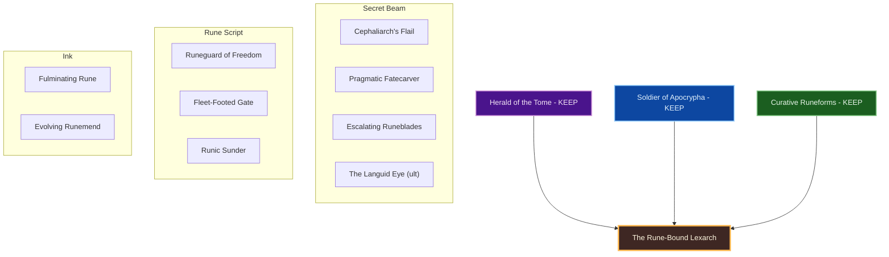
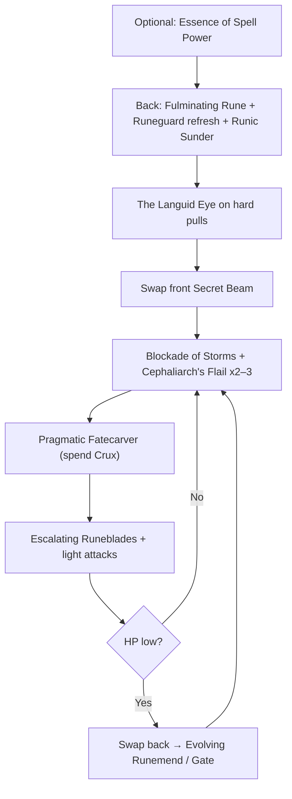
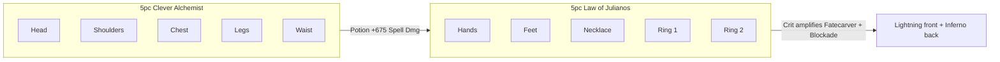

# Build Plan - S'Katib-Asrar: The Rune-Bound Lexarch (Magicka Arcanist Overland)

> **Character profile:** [s_katib_asrar.md](s_katib_asrar.md) — Khajiit Arcanist, target CP 160+, @SOLAEGIS (EU).

**S'Katib-Asrar** ("Scribe of Secrets") is a **class-identity-first** magicka Arcanist — Elsweyr pilgrim of forbidden tomes who writes fate in Crux and spends it as a beam. This guide locks the greenfield kit as **The Rune-Bound Lexarch**: keep all three native lines (**Herald of the Tome**, **Soldier of Apocrypha**, **Curative Runeforms**). No foreign subclass — the crux / rune / Fatecarver loop is the EU roster niche this character exists to fill.

Designed for solo overland and public dungeons on craftable gear. Unlock Bahtra at Level 50 for subclass *availability*; **do not** auto-subclass.

**Live → target:** Character create + profile export may still be pending. Everything below is **target** until `/cm` replaces the stub profile.

---

## Build at a glance

| **Attribute** | **Recommendation** |
| :--- | :--- |
| **Primary Stat** | 64 points in **Magicka** — **live:** n/a · **target:** 64 Mag at CP160 |
| **Mundus Stone** | **The Thief** (+Critical Chance) while gearing — swap toward **The Shadow** once crit chance is comfortable |
| **Vampirism** | **Cured** — overland fire; no undeath theme required |
| **Trinity** | **Herald of the Tome** + **Soldier of Apocrypha** + **Curative Runeforms** KEEP — **live:** n/a · **decision:** class-identity crux engine; no foreign line beats native pillars for this fantasy |
| **Sets** | **5 Law of Julianos + 5 Clever Alchemist** (100% craftable, all Light) — **live:** n/a · **target:** Julianos + Clever Alchemist |
| **Bars** | Front: **Lightning Dest** ("Secret Beam") · Back: **Inferno Dest** ("Rune Script") |
| **Food** | **Witchmother's Potent Brew** (Max Magicka + Magicka Recovery) or **Witty Blue Entremet** while leveling |
| **Potion** | **Essence of Spell Power** (Spell Damage + Crit + Mag) — procs Clever Alchemist |
| **Weapon Poisons** | Optional **Gradual Ravage Health** between pulls |
| **Staff/Weapon Enchant** | Front Lightning: **Shock Damage** (Infused / Crusher) · Back Inferno: **Flame Damage** or **Absorb Magicka** |
| **Companion** | **Primary (now):** **Mirri Elendis** (DPS peer) · **Secondary:** **Bastian Hallix** (soft wall) · **Goal (20/20 @ CP160):** **Tanlorin** |
| **Primary Mount** | **Dwarven War Horse** (owned) · **Alt:** **Noweyr Steed** — see [Collectibles](#collectibles) |
| **Flavor Pet** | **Scintillant Dovah-Fly** (owned) · **Alt:** **Blue Dragon Imp** — see [Collectibles](#collectibles) |
| **Costume** | **Court of Bedlam** (owned) · **Alt:** **Bloodthorn Robes** — see [Collectibles](#collectibles) |

**Read next:** [Roleplay](#roleplay-the-rune-bound-lexarch) · [Trinity configuration](#trinity-configuration) · [Combat kit](#combat-kit-the-secret-beam-cycle) · [Gear and crafting](#gear-and-crafting-the-cipher-regalia) · [Champion points](#champion-point-mapping-cp-160) · [Companion](#companion-strategy-the-ink-and-shield) · [Collectibles](#collectibles) · [Checklist](#next-steps--in-game-action-checklist)

---

## Roleplay: The Rune-Bound Lexarch

Elsweyr taught him that secrets are not toys — they are **ledgers**. **S'Katib-Asrar** left the March with ink-stained claws and a hunger for scripts other mages refuse to read. Apocrypha’s language is not prayer to him; it is **craft**. Crux is the stroke; Fatecarver is the sentence finished in light.

He is not a carnival prophet and he is not a pale Altmer courtier wearing stolen death. He is a Khajiit **scribe of secrets**: runes on the back bar, beam on the front, armor of colorless order when the page bites back. Companions are useful margins — Mirri for the dig, Bastian when the scrap turns honest, Tanlorin when the stranger can stand the ink-smell of Apocrypha without sermons.

The **Court of Bedlam** silhouette is borrowed pageantry for a cat who writes in tentacle-script. The **Dwarven War Horse** is a scholar’s road-engine, not a parade mount. He walks Tamriel as one who copies what should not be copied — carefully, greedily, and always with a beam ready when the ledger demands payment.

> [!TIP]
> **Suggested Custom Title:** `Rune-Bound Lexarch · Scribe of Secrets`

> [!NOTE]
> **Build Notes (paste into LAM Build Notes):**
> S'Katib-Asrar — The Rune-Bound Lexarch. Khajiit Magicka Arcanist; Scribe of Secrets (Katib al-Asrar, Khajiit-formed). KEEP Herald of the Tome + Soldier of Apocrypha + Curative Runeforms — no subclass. Target: 5 Law of Julianos + 5 Clever Alchemist (light), @masisi. Front Lightning Dest ("Secret Beam"): Blockade of Storms, Cephaliarch's Flail, Pragmatic Fatecarver, Escalating Runeblades, Runeguard of Freedom; ult The Languid Eye. Back Inferno Dest ("Rune Script"): Fulminating Rune, Fleet-Footed Gate, Evolving Runemend, Inner Light, Runic Sunder; ult The Languid Eye. 64 Mag. Mundus: The Thief. Companion: Mirri now; Tanlorin Goal. Costume: Court of Bedlam · Dwarven War Horse · Scintillant Dovah-Fly.

> [!TIP]
> **Flavor Pet:** **Scintillant Dovah-Fly** (owned) — ink-mote familiar for a rune scribe. **Alt:** **Blue Dragon Imp**. See [Collectibles](#collectibles).

> [!TIP]
> **Costume:** **Court of Bedlam** — Apocrypha-adjacent court silhouette without Misrule carnival framing. **Alt:** **Bloodthorn Robes**. Full picks under [Collectibles](#collectibles).

---

## Trinity configuration

### Subclassing decision (required)

Subclass unlocks at **Level 50** via Bahtra at-Hunding (**"A Study in Discipline"**). Unlocking the quest makes subclassing *available* — it does **not** mean you must swap lines. **Default = class-identity-first.** See [docs/subclassing.md](../../../docs/subclassing.md).

**This build's decision:** **KEEP all three native** — **Herald of the Tome** is the Crux / Fatecarver engine (nothing foreign matches that loop for this fantasy); **Soldier of Apocrypha** is the armor and mobility script; **Curative Runeforms** is self-sustain without a resto staff. Unlock Bahtra for availability only.

| **Pillar** | **Line** | **Origin** | **Slot action** | **Function** |
| :--- | :--- | :--- | :--- | :--- |
| **Secret Beam** | **Herald of the Tome** | Arcanist (native) | **KEEP** | Cephaliarch's Flail (Crux), Pragmatic Fatecarver, Escalating Runeblades, The Languid Eye |
| **Script** | **Soldier of Apocrypha** | Arcanist (native) | **KEEP** | Runeguard of Freedom, Fleet-Footed Gate, Runic Sunder — armor, mobility, breach |
| **Ink** | **Curative Runeforms** | Arcanist (native) | **KEEP** | Fulminating Rune (DoT), Evolving Runemend — sustain without resto staff |

**Weapon / guild lines (not subclass):** **Destruction Staff** (**Blockade of Storms**) · **Mages Guild** (**Inner Light**).

> [!IMPORTANT]
> **Do not subclass by default.** Only replace a native line later if a foreign line clearly outperforms it on the same content with craftable gear already correct.

---

## Combat kit: The Secret Beam Cycle

Open on the **back bar** with runes, armor, and mobility; swap to the **front bar** for Blockade, Flail Crux, and **Pragmatic Fatecarver**. **Pure magicka** — dump attributes into Magicka toward 64. No Daedric summons — slot 5 need not mirror across bars.

### Skill bars

Document **slotted morph names as shown in the skills UI**. Each morph appears at most once across bars except **The Languid Eye** (ult both bars). Bars must match equipped weapon types — **Lightning Dest front / Inferno Dest back**.

#### Front Bar (Lightning Dest): "Secret Beam"

| **Slot** | **Class/Line** | **Base → Morph** | **Role** | **Profile** |
| :--- | :--- | :--- | :--- | :--- |
| **1** | Destruction Staff | Wall of Elements → **Blockade of Storms** | Shock ground DoT; Thaumaturge | Target |
| **2** | Herald of the Tome | Abyssal Impact → **Cephaliarch's Flail** | Crux generator + heal/stun | Target |
| **3** | Herald of the Tome | Fatecarver → **Pragmatic Fatecarver** | Beam spend (Crux) + channel shield | Target |
| **4** | Herald of the Tome | Runeblades → **Escalating Runeblades** | Mag spammable / Crux gen filler | Target |
| **5** | Soldier of Apocrypha | Runic Defense → **Runeguard of Freedom** | Armor / Major Resolve path | Target |
| **6 (Ult)** | Herald of the Tome | The Tide King's Gaze → **The Languid Eye** | Major Vulnerability open | Target |

#### Back Bar (Inferno Dest): "Rune Script"

| **Slot** | **Class/Line** | **Base → Morph** | **Role** | **Profile** |
| :--- | :--- | :--- | :--- | :--- |
| **1** | Curative Runeforms | Rune of Displacement → **Fulminating Rune** | Magicka DoT rune setup | Target |
| **2** | Soldier of Apocrypha | Apocryphal Gate → **Fleet-Footed Gate** | Mobility / reposition | Target |
| **3** | Curative Runeforms | Runemend → **Evolving Runemend** | Self-heal / HoT ink | Target |
| **4** | Mages Guild | Magelight → **Inner Light** | +Spell Damage; Might of the Guild path | Target |
| **5** | Soldier of Apocrypha | Runic Jolt → **Runic Sunder** | Breach / Soldier tool | Target |
| **6 (Ult)** | Herald of the Tome | The Tide King's Gaze → **The Languid Eye** | Same ult both bars | Target |

> [!NOTE]
> **Sibling morphs (do not take on this build):** **Tentacular Dread** (Stamina Flail) · **Exhausting Fatecarver** only if sustain beats Pragmatic’s shield on your playstyle (prefer Pragmatic for overland scrapes) · **Writhing Runeblades** if you prefer the other Runeblades morph — do not slot both.

> [!TIP]
> **Inner Light** on back only — keep Secret Beam full Herald + Dest damage.

### Rotation and combat tips

#### Solo combat tips

1. **Stack Crux before the beam** — **Cephaliarch's Flail** (and Runeblades as needed) until 2–3 Crux, then **Pragmatic Fatecarver**.
2. **The Languid Eye** opens bosses and dense elites — Major Vulnerability first.
3. **Blockade of Storms** before beam channels on packs — ground DoT while you carve.
4. **Fulminating Rune** from Rune Script before hard pulls — DoT while you Flail.
5. **Runeguard of Freedom** up when scrapes start; **Fleet-Footed Gate** to reset bad angles.
6. **Evolving Runemend** when HP dips — Curative ink, not a resto staff.
7. **Potion on hard pulls** once Clever Alchemist is on — Essence of Spell Power procs the 5-piece.
8. Khajiit **crit racials** feed Julianos + Fatecarver — keep Mundus on **The Thief** until crit chance is comfortable.

### Passive skills

Spend skill points in this priority (greenfield — unlock as you level). Fully rank (Rank II/III) where noted.

#### Arcanist — Herald of the Tome

* **Fated Fortune** / **Harnessed Quintessence** / **Psychic Lesion** / **Splintered Secrets** — fund as ranks allow; these power the beam and Crux economy.

#### Arcanist — Soldier of Apocrypha

* Soldier armor / mitigation passives that unlock with Runeguard and Runic tools — take as ranks allow.

#### Arcanist — Curative Runeforms

* Curative healing / efficiency passives that support Runemend and Fulminating Rune — take as ranks allow.

#### Weapon — Destruction Staff

* **Tri Focus** / **Penetrating Magic** / **Elemental Force** / **Ancient Knowledge** / **Destruction Expert** — fully rank; morph **Blockade of Storms**.

#### Armor — Light

* **Grace** / **Evocation** / **Spell Warding** / **Prodigy** / **Concentration** — fully rank.

#### Guild — Mages Guild

* Rank for **Might of the Guild**; keep **Inner Light** slotted.

#### Race — Khajiit

* **Medium Armor** / **Stealthy** / **Carnage** (Weapon/Spell Critical) / **Robustness** — take racials when free points allow; **Carnage** is the mag DPS jewel for this kit.

#### Alliance War — Assault (optional)

* **Continuous Attack** — permanent Gallop without parking Maneuver on the bar.

---

## Gear and crafting: "The Cipher Regalia"

Everything end-state is **crafted** — no overland farming for the primary loadout, no dungeon monster sets. Target: **5 Law of Julianos + 5 Clever Alchemist**, all **Light**. Julianos = Spell Crit + **+10% Critical Damage**; Clever Alchemist = +675 Spell Damage for 20s on potion.

### Set rationale

| **Set** | **5-Piece Bonus** | **Role** |
| :--- | :--- | :--- |
| **Clever Alchemist** | Potion in combat → +675 Weapon/Spell Damage (20s) | Boss open with Essence of Spell Power |
| **Law of Julianos** | +300 Spell Critical; +10% Critical Damage | Baseline burst for Fatecarver, Flail, Blockade |

> [!TIP]
> **Lower-trait fallback:** If Clever Alchemist 7-trait research is not ready on @masisi, craft **5 Shacklebreaker** (6 traits, Vvardenfell) on body slots as a bridge.

### Target loadout

| **Slot** | **Set** | **Weight** | **Trait** | **Enchantment** | **Quality** |
| :--- | :--- | :--- | :--- | :--- | :--- |
| **Head** | Clever Alchemist | Light | Divines | Max Magicka | Gold |
| **Shoulders** | Clever Alchemist | Light | Divines | Max Magicka | Gold |
| **Chest** | Clever Alchemist | Light | Divines | Max Magicka | Gold |
| **Legs** | Clever Alchemist | Light | Divines | Max Magicka | Gold |
| **Waist** | Clever Alchemist | Light | Divines | Max Magicka | Gold |
| **Hands** | Law of Julianos | Light | Divines | Max Magicka | Gold |
| **Feet** | Law of Julianos | Light | Divines | Max Magicka | Gold |
| **Necklace** | Law of Julianos | Jewelry | Arcane | Spell Damage | Gold |
| **Ring 1** | Law of Julianos | Jewelry | Arcane | Max Magicka | Gold |
| **Ring 2** | Law of Julianos | Jewelry | Arcane | Max Magicka | Gold |
| **Front Staff** | Law of Julianos | Lightning Destro | Infused | Shock Damage (Crusher) | Gold |
| **Back Staff** | Law of Julianos | Inferno Destro | Infused | Flame Damage or Absorb Magicka | Gold |

**Piece counts:** **Clever Alchemist 5** (head, shoulders, chest, legs, waist) · **Law of Julianos 5** (hands, feet, necklace, both rings). Staves are extra Julianos pieces for traits/enchants.

### Crafting handoff (@masisi)

| **Detail** | **Recommendation** |
| :--- | :--- |
| **Crafter** | EU account artisan **[Masisi](masisi.md)** / [masisi_plan.md](masisi_plan.md) |
| **Style** | **Khajiit** / **Anequina** / **Pellitine** body; Apocrypha-ink trim (Outfit Station — not primary costume) |
| **Set station** | Clever Alchemist: **No Shira Workshop** (Hew's Bane) — 7 traits · Julianos: **Sunhold** (Summerset) — 6 traits |
| **Traits** | **Divines** armor · **Arcane** jewelry · **Infused** staves |
| **Interim** | Leveling scrap / Seducer or Shacklebreaker purple while under CP160; ask @masisi for **level-scaled** purple Julianos / Clever Alchemist when ready |
| **Quality** | Purple bridge → **gold at CP160** when traits ready |

---

## Champion Point Mapping (CP 160)

Budget at first CP160 craft target: **54 Warfare / 53 Craft / 53 Fitness** (160 total). Account may already hold ~300 CP when the character is created — spend the **160 plan** first, then grow into the note below. Under 900 total CP you have **3 slotted stars** per discipline. Star names match [champion_points_reference.md](../../templates/champion_points_reference.md); walk prerequisites from `champion_points.yaml`.

> [!NOTE]
> **When CP grows (~289–313 account band):** Warfare — Fighting Finesse 50, Thaumaturge toward 50, Master-at-Arms / Deadly Aim path, Precision 20, Eldritch Insight 20. Fitness — Boundless Vitality 50, Rejuvenation 50, Fortified. Craft — Steed's Blessing 50, then Wanderer → Steadfast Enchantment → Rationer → **Liquid Efficiency**.

### Warfare (Blue — 54 Points)

| **Star** | **Type** | **Spend** | **Benefit** |
| :--- | :--- | :--- | :--- |
| **Fighting Finesse** | Slotted | 50 | +Critical Damage / Critical Healing |
| **Precision** | Passive | 4 | Critical Chance (grow to 20) |

*Next Warfare tranche:* finish Precision **20**, Eldritch Insight **20**, Thaumaturge stages, Master-at-Arms.

### Fitness (Red — 53 Points)

| **Star** | **Type** | **Spend** | **Benefit** |
| :--- | :--- | :--- | :--- |
| **Boundless Vitality** | Slotted | 50 | Max Health |
| **Rejuvenation** | Slotted | 3 | Recovery (grow to 50) |

*Later:* finish Rejuvenation 50; Fortified 50; Ironclad when budget allows.

### Craft (Green — 53 Points)

| **Star** | **Type** | **Spend** | **Benefit** |
| :--- | :--- | :--- | :--- |
| **Steed's Blessing** | Slotted | 50 | Out-of-combat move speed |
| **Fortune's Favor** | Passive | 3 | Gold find (grow Craft tree) |

*Later:* Gilded Fingers, Wanderer → Steadfast Enchantment → Rationer → **Liquid Efficiency**.

> [!IMPORTANT]
> **Liquid Efficiency** is automatic once purchased (no Craft slot). Buy after Steadfast Enchantment + Rationer when Craft budget allows.

---

## Companion Strategy: "The Ink and Shield"

Companions use **Companion's** weapons and armor only (Quickened, Aggressive, Bolstered, etc.) — never player sets (no Julianos, no Divines). Buy white basics from vendors; farm Superior+ while the companion is summoned.

### Companion picks

| **Tier** | **Companion** | **Role** | **Roleplay fit** | **Mechanical fit** |
| :--- | :--- | :--- | :--- | :--- |
| **Primary (now)** | **Mirri Elendis** | DPS / loot | Cynical excavator who tolerates forbidden ledgers | Peer damage while Lexarch channels Fatecarver |
| **Secondary** | **Bastian Hallix** | Tank / support | Soft wall when the page turns lethal | Frontline for glass mag Dest DPS |
| **Goal (20/20 @ CP160)** | **Tanlorin** | Support / strange peer | Stranger who can stand Apocrypha ink without sermons | Fully geared Companion's set |

### Primary now — Mirri Elendis

| **Setting** | **Recommendation** |
| :--- | :--- |
| **Role** | **DPS** (Dual Wield or Bow as available) |
| **Gear Weight** | **Medium** Companion's (or Superior+ drops) |
| **Gear Trait** | **Aggressive** / **Quickened** |
| **Loadout** | Full **Companion's** set — replace vendor Level 1 whites |
| **Acquisition** | Vendor whites now; Superior+ from bosses/overland with Mirri active |

#### Mirri skill bar

1. Fill damage / interrupt / execute tools as ranks allow.
2. Keep her summoned for XP and rapport while leveling the Lexarch.
3. Swap **Bastian** for world bosses when a soft wall is safer than peer DPS.

> [!TIP]
> **Goal — Tanlorin:** Summon when you want a support peer who matches the stranger-at-the-margin fantasy. Prefer Companion's set fully filled before hard world bosses.

---

## Collectibles

Primaries locked from the **EU owned pool** ([docs/collectibles_companion_ledger.md](../../../docs/collectibles_companion_ledger.md)). Diversified off doubled Psijic Escort Charger / Mannimarco primaries.

### Mount

| **Attribute** | **Detail** |
| :--- | :--- |
| **Primary (owned)** | **[Dwarven War Horse](https://en.uesp.net/wiki/Online:Dwarven_War_Horse)** — scholar’s road-engine; unused as EU primary |
| **Alt (owned)** | **[Noweyr Steed](https://en.uesp.net/wiki/Online:Noweyr_Steed)** — pale long-road alternate |
| **Backup (owned)** | **[Sorrel Horse](https://en.uesp.net/wiki/Online:Sorrel_Horse)** — quiet travel |

### Pet

| **Attribute** | **Detail** |
| :--- | :--- |
| **Primary (owned)** | **[Scintillant Dovah-Fly](https://en.uesp.net/wiki/Online:Scintillant_Dovah-Fly)** — ink-mote familiar for a rune scribe |
| **Alt (owned)** | **[Blue Dragon Imp](https://en.uesp.net/wiki/Online:Blue_Dragon_Imp)** — small Apocrypha-adjacent familiar |
| **Alt (owned)** | **[Haunted House Cat](https://en.uesp.net/wiki/Online:Haunted_House_Cat)** — only if Dovah-Fly feels wrong in the field |

### Costume

| **Attribute** | **Detail** |
| :--- | :--- |
| **Primary (owned)** | **[Court of Bedlam](https://en.uesp.net/wiki/Online:Court_of_Bedlam)** — Apocrypha-court silhouette; not Misrule carnival |
| **Alt (owned)** | **[Bloodthorn Robes](https://en.uesp.net/wiki/Online:Bloodthorn_Robes)** — darker ink-road robes |
| **Alt (owned)** | **[Mages Guild Formal Robes](https://en.uesp.net/wiki/Online:Mages_Guild_Formal_Robes)** — respectable scribe days |

Distinguish **Costume** (Collectibles) from Outfit Station motifs on crafted gear.

### Dye and style

**Rune-Bound Lexarch** — ink violet, brass cipher, bone parchment.

| **Slot** | **Style** | **Visual Reasoning** |
| :--- | :--- | :--- |
| **Body** | **Khajiit** / **Anequina** / **Pellitine** | Elsweyr scribe silhouette (Outfit Station) |
| **Jewelry** | **Daedric** / **Ayleid** / **Ancient Elf** | Forbidden-tome ornaments |
| **Staves** | **Daedric** / **Ayleid** / **Crystal** | Lightning beam + flame script made visible |

**Dye palette:** Ink violet (primary), brass cipher (secondary), parchment bone (trim).

---

## Next Steps & In-Game Action Checklist

### Phase 0 — Today (create + functional build)

1. **Create** Khajiit Magicka Arcanist **S'Katib-Asrar** on EU (Aldmeri Dominion default).
2. Attributes: dump into **Magicka** toward **64**.
3. Equip **Lightning Dest** front / **Inferno Dest** back; light armor preference.
4. Unlock and morph toward the [Secret Beam](#skill-bars) / [Rune Script](#skill-bars) bars as ranks allow (Flail → Fatecarver → Runeblades priority).
5. Mundus: **The Thief**; stay **cured**.
6. Food / potion: Witchmother's / Spell Power via **EsoAutoProvision** when available.
7. **Collectibles:** equip **Court of Bedlam**, **Dwarven War Horse**, **Scintillant Dovah-Fly**.
8. Summon **Mirri**; vendor Companion's whites; start XP.
9. Paste **Custom Title** and Build Notes into LAM.
10. `/cm` export → replace [s_katib_asrar.md](s_katib_asrar.md) stub with the live profile.

### Phase 1 — Level to 50 (interim)

11. Rank **Herald of the Tome**, **Soldier of Apocrypha**, **Curative Runeforms**, Destruction Staff, Light Armor, Mages Guild.
12. Practice Crux → **Pragmatic Fatecarver**; refresh **Fulminating Rune** / **Runeguard** from the back bar.
13. Optional: commission @masisi for **level-scaled** purple Julianos / Clever Alchemist (or Shacklebreaker).
14. Allocate CP per [Champion Point Mapping](#champion-point-mapping-cp-160); grow into the ~300 band note as points appear.

### Phase 2 — CP160 craft target

15. **Level 50:** complete Bahtra **"A Study in Discipline"** so subclassing is *available* — **keep all three native lines**.
16. **@masisi:** craft **5 Clever Alchemist + 5 Law of Julianos** (light, Divines, Arcane jewelry, Infused staves) at CP160 gold.
17. Mundus → confirm **The Thief** or move toward **The Shadow** once crit chance is high.
18. Expand Warfare toward Thaumaturge / Master-at-Arms as CP grows.

### Phase 3 — Polish

19. Finish Craft path to **Liquid Efficiency**; Fitness Fortified / full Rejuvenation.
20. Level **Tanlorin** toward Goal 20/20; full Companion's gear.
21. Outfit Station: Khajiit / Anequina motifs + ink-violet dye palette.
22. Regenerate profile with `/cm` and update [s_katib_asrar.md](s_katib_asrar.md) when attributes, bars, Mundus, gear, and costume match this plan.
