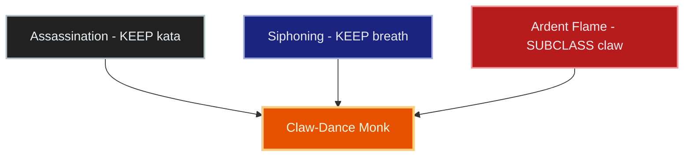
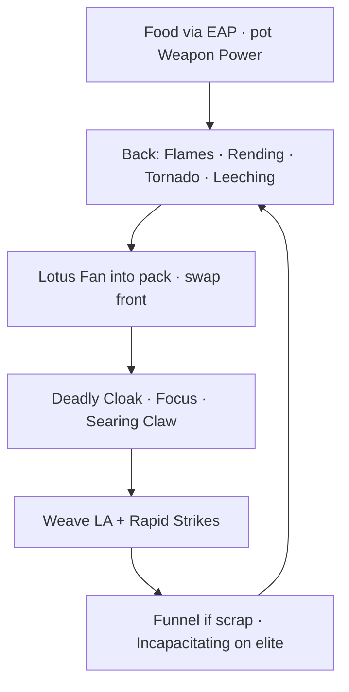
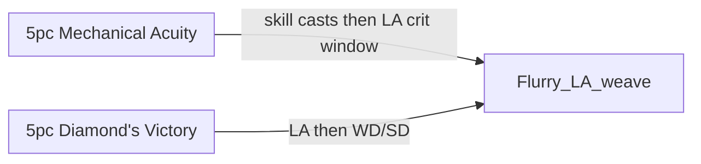

# Build Plan - Sabir al-Rih: Exiled Claw-Dance Monk of the Wind (Overland Pugilist)

> **Character profile:** [sabir_al_rih.md](sabir_al_rih.md) — Redguard Nightblade, target CP 160+, @SOLAEGIS (EU).

**The Core Truth:** Elder Scrolls Online has **no unarmed skill line**. A true bare-hand fighter does not exist. Sabir is an *approximation* — **Dual Wield daggers on both bars**, styled invisible when sheathed (**Gloambound** / **Iceshard**), **Flurry** as the fist engine on the front bar, and melee class **techniques** (not an assassin’s trade). Dual DW keeps the pugilist silhouette in combat without a bow tell. **Lycanthropy** sits beside that kit: he was bitten on the road, cast out as unclean, and uses **Werewolf** for dense overland pack TTK — never as a werewolf-main retheme. This is the strongest thematic pugilist kit we will craft for **overland, questing, and roleplay**. It is **not** vet dungeon, trial, or competitive PvP DPS.

**Subclassing:** Keep **Assassination** and **Siphoning**. **SUBCLASS Ardent Flame** (Dragonknight) in place of **Shadow** — Searing Claw and flame pressure clearly beat cloak/veil tools for pack clear on craftable gear, and dropping Shadow protects the **monk-not-assassin** identity. Assassination skills stay as **kata** (chi fist, gap-close, finisher), never as contract-killer fantasy. See [docs/subclassing.md](../../../docs/subclassing.md) and [docs/dragonknight_u49.md](../../../docs/dragonknight_u49.md).

**Live → target:** Character and profile export do not exist yet. Everything below is **target**. Bridge with native Nightblade lines until Level 50, then Bahtra → Ardent Flame and strip Shadow actives.

---

## Build at a glance

| **wAttribute**           | **Recommendation**                                                                                                                                                                           |
| ------------------------ | -------------------------------------------------------------------------------------------------------------------------------------------------------------------------------------------- |
| **Primary Stat**         | 64 points in **Stamina** — **live:** n/a · **target:** 64 Stam                                                                                                                               |
| **Mundus Stone**         | **The Thief** — crit with Acuity / Order’s fallback; **live:** n/a                                                                                                                           |
| **Lycanthropy**          | **Werewolf (keep)** — overland pack-clear transform; stay cured of vampirism; default bars stay humanoid Open Hand / Wind Form                                                               |
| **Trinity**              | **Assassination** KEEP · **Siphoning** KEEP · **Ardent Flame** SUBCLASS (replaces **Shadow**) — **live:** n/a · **decision:** Flame claw + Flurry beat Shadow for monk identity and pack TTK |
| **Sets**                 | **5 Mechanical Acuity + 5 Diamond's Victory** (100% craftable) — **live:** n/a · **target:** Acuity body + Diamond weapons/jewelry (or reverse split — see Gear)                             |
| **Bars**                 | Front: **Dual Wield daggers** ("Open Hand") · Back: **Dual Wield daggers** ("Wind Form")                                                                                                     |
| **Food**                 | **Artaeum Takeaway Broth** or dual-stat stamina stew — **EsoAutoProvision** when available                                                                                                   |
| **Potion**               | **Essence of Weapon Power** (Major Brutality + Savagery)                                                                                                                                     |
| **Weapon Poisons**       | Optional **Damage Health** on both dagger pairs for elites                                                                                                                                   |
| **Staff/Weapon Enchant** | Front DW: **Weapon Damage** / **Absorb Stamina** · Back DW: **Weapon Damage** / **Absorb Stamina**                                                                                           |
| **Companion**            | **Primary (now):** **Ember** (DPS sparring partner) · **Secondary:** **Mirri Elendis** (loot / rapport) · **Goal (20/20 @ CP160):** **Zerith-var** (DPS escort)                              |
| **Primary Mount**        | **Ideal:** **Hammerfell Camel** — see [Collectibles](#collectibles) (owned TBD after export)                                                                                                 |
| **Flavor Pet**           | **Ideal:** **Fennec Fox** — see [Collectibles](#collectibles) (owned TBD)                                                                                                                    |
| **Costume**              | **Ideal:** **Claw-Dance Acolyte Style** · **Alt:** **Priest of the Green** — see [Collectibles](#collectibles)                                                                               |

**Read next:** [Roleplay](#roleplay-the-patient-wind) · [Trinity configuration](#trinity-configuration) · [Combat kit](#combat-kit-the-open-hand-cycle) · [Gear and crafting](#gear-and-crafting-the-tempered-fist) · [Champion points](#champion-point-mapping-cp-160) · [Companion](#companion-strategy-the-elsweyr-spar) · [Collectibles](#collectibles) · [Checklist](#next-steps--in-game-action-checklist)

---

## Roleplay: The Patient Wind

Sabir al-Rih left the Alik'r with calloused hands and an unfinished question: what is a warrior who refuses the long blade? In Rimmen and the March he studied **Claw-Dance** as a pilgrim, not a cutthroat — forms for empty-hand pressure, breath, and finishing strikes. On a lonely road a **werewolf** took him; the bite made him unclean. His monk order **cast him out**. Exile does not erase discipline: the Nightblade’s hush-steel library remains a **technique scroll** — Relentless Focus is chi gathered in the fist; the execute is a pressure-point finisher, not a contract. When Bahtra opens the path, he takes a **fire-claw kata** from the Dragonknights and sets aside the veil. The **beast** is the curse he carries — loosed when packs demand it, never the face he chooses on quiet roads. He walks Hammerfell dust and Elsweyr wind alike — patient as his name, cast out, still practicing.

> [!TIP]
> **Suggested Custom Title:** `Exiled Claw-Dance · Sabir al-Rih`

> [!NOTE]
> **Build Notes (paste into LAM Build Notes):**
> Sabir al-Rih — Alik'r pilgrim of Claw-Dance, bitten by a werewolf and cast out as unclean. Still not an assassin: hush-steel forms are kata; the beast is the curse, used for dense overland packs. Dual Wield / Dual Wield — front Rapid Strikes (fist spam), back Rending Slashes + Steel Tornado. Relentless Focus, Searing Claw. Werewolf ult for pack TTK; drop form for elites. Trinity: Assassination + Siphoning + Ardent Flame (drop Shadow at 50). 64 Stam, The Thief, Mechanical Acuity + Diamond's Victory via @masisi. Gloambound/Iceshard both bars. Claw-Dance Acolyte costume (silhouette he refuses to surrender). Ember now · Zerith-var Goal. Hammerfell Camel · Fennec Fox.

> [!TIP]
> **Flavor Pet:** **Ideal: Fennec Fox** — desert wind companion. Confirm owned list after `/cm` export.

> [!TIP]
> **Costume:** **Claw-Dance Acolyte Style** — the martial silhouette he refuses to surrender after exile (not good standing with the order). **Alt:** **Priest of the Green** for Jephre pilgrimage days.

---

## Trinity configuration

### Subclassing decision (required)

Subclass unlocks at **Level 50** via Bahtra at-Hunding (**"A Study in Discipline"**). Unlocking the quest makes subclassing *available* — it does **not** mean you must swap lines. See [docs/subclassing.md](../../../docs/subclassing.md).

**This build's decision:** **SUBCLASS Ardent Flame** replaces **Shadow** because flame claw DoTs and Combustion-path pressure clearly outperform cloak/veil tools for overland packs on craftable gear, and Shadow’s stealth kit fights the monk identity. **KEEP Assassination** (chi fist / finisher kata) and **KEEP Siphoning** (breath / sustain discipline).

| **Pillar** | **Line**          | **Origin**              | **Slot action**                    | **Function**                                                                              |
| ---------- | ----------------- | ----------------------- | ---------------------------------- | ----------------------------------------------------------------------------------------- |
| **Kata**   | **Assassination** | Nightblade (native)     | **KEEP**                           | Relentless Focus (chi fist), gap-close kata, Incapacitating Strike finisher               |
| **Breath** | **Siphoning**     | Nightblade (native)     | **KEEP**                           | Funnel Health / Leeching Strikes — damage-to-heal discipline                              |
| **Claw**   | **Ardent Flame**  | Dragonknight (subclass) | **SUBCLASS** (replaces **Shadow**) | Searing Claw, Flames of Oblivion, Standard of Might — pack pressure without cloak fantasy |

> [!IMPORTANT]
> **Pre-50 bridge:** Train as native Nightblade (Assassination + Shadow + Siphoning). Use Flurry + Focus + Siphon; treat any Shadow skill as temporary training wheels — **do not** build identity around cloak. **At Level 50:** subclass **Ardent Flame**, **unslot all Shadow actives**, morph **Searing Strike → Searing Claw**, and fund Flame passives (Combustion requires an Ardent Flame ability **slotted**).

---

## Combat kit: The Open Hand Cycle

**Dual Wield on both bars** — pugilist silhouette never draws a bow. Front is the **fist spam** stance; back is the **setup / pack** stance (different DW morphs + class tools so the bars are not clones). Sheathed **Gloambound** / **Iceshard** on all four daggers keeps exploration empty-handed.

### Skill bars

Document **slotted morph names as shown in the skills UI**. Each morph appears at most once across both bars.

#### Front Bar (Dual Wield): "Open Hand"

| **Slot**    | **Line**      | **Base → Morph**                         | **Role**                                     | **Profile**                   |
| ----------- | ------------- | ---------------------------------------- | -------------------------------------------- | ----------------------------- |
| **1**       | Dual Wield    | Blade Cloak → **Deadly Cloak**           | Whirling guard / AoE DoT while weaving       | Target                        |
| **2**       | Assassination | Grim Focus → **Relentless Focus**        | Chi fist buff (+ spectral bow tell — honest) | Target                        |
| **3**       | Ardent Flame  | Searing Strike → **Searing Claw**        | Stam flame DoT + Burning for Combustion      | Target (post-50)              |
| **4**       | Dual Wield    | Flurry → **Rapid Strikes**               | **Fist spammable** — LA weave spine          | Target                        |
| **5**       | Siphoning     | Strife → **Funnel Health**               | Damage-to-heal breath                        | Target (alt: Resolving Vigor) |
| **6 (Ult)** | Assassination | Death Stroke → **Incapacitating Strike** | Finisher / burst on elites                   | Target                        |

> [!NOTE]
> **Bloodthirst** (Flurry’s other morph) is the solo-sustain alt if Funnel Health feels thin — do not slot both Flurry morphs. Prefer **Rapid Strikes** with Redguard Martial Training + Adrenaline Rush.

#### Back Bar (Dual Wield): "Wind Form"

| **Slot**    | **Line**      | **Base → Morph**                              | **Role**                                   | **Profile**                |
| ----------- | ------------- | --------------------------------------------- | ------------------------------------------ | -------------------------- |
| **1**       | Dual Wield    | Twin Slashes → **Rending Slashes**            | Bleed DoT setup (not a Flurry clone)       | Target                     |
| **2**       | Ardent Flame  | Inferno → **Flames of Oblivion**              | Major Prophecy / Savagery while slotted    | Target (post-50)           |
| **3**       | Assassination | Teleport Strike → **Lotus Fan**               | Gap-close / AoE kata + Minor Vulnerability | Target                     |
| **4**       | Dual Wield    | Whirlwind → **Steel Tornado**                 | Pack clear / AoE pressure                  | Target                     |
| **5**       | Siphoning     | Siphoning Strikes → **Leeching Strikes**      | Stam sustain toggle                        | Target                     |
| **6 (Ult)** | Ardent Flame  | Dragonknight Standard → **Standard of Might** | Support banner (WD/SD + DR)                | Target (alt: Soul Harvest) |

> [!NOTE]
> **Why not Bow back?** Dual DW keeps both bars fist-forward and synergistic (back DoTs/AoE → front Flurry under Acuity/Diamond). Tradeoff: no Endless Hail ranged comfort — close gaps with **Lotus Fan** / roll; packs die to **Steel Tornado** + Cloak + Claw.
>
> **Optional ranged tag:** Hidden Blade → **Flying Blade** can replace Lotus Fan or Rending Slashes if pulls feel sticky — still DW, still thematic.

> [!IMPORTANT]
> **Pre-50 substitute for Flame slots:** Until Bahtra, put a second Siphoning or Dual Wield tool where Searing Claw / Flames / Standard will live — e.g. **Debilitate**, **Power Extraction**, **Quick Cloak**, or **Blood Craze**. Never leave Shadow cloak as the character’s fantasy face.

### Rotation and combat tips

#### Solo combat tips

1. **Wind Form setup:** Weapon Power potion; refresh **Flames of Oblivion** and **Leeching Strikes**; apply **Rending Slashes**; **Steel Tornado** through the pack; **Lotus Fan** to close or re-center.
2. **Open Hand:** Deadly Cloak → Relentless Focus → Searing Claw → **Light Attack + Rapid Strikes** weave under the DoTs.
3. Do **not** spam Lotus Fan or Tornado as the fist replacement — **Rapid Strikes** is the face skill.
4. **Heavy Attack** on either bar when stamina dips; Redguard **Adrenaline Rush** helps mid-scrape.
5. **Finisher:** Incapacitating Strike on elites; stand in **Standard of Might** for hard scrapes.
6. **Werewolf (exile tool):** On dense overland packs, slot/use the **Werewolf** ultimate and claw AoE for pack TTK; **drop form** for elites and single-target (back to Focus + Rapid Strikes + Incapacitating). Do **not** retheme the build as werewolf-main — Open Hand / Wind Form under Acuity/Diamond stay the default kit.
7. **Honesty:** Drawn daggers and flame claw are visible; all four blades sheathed in Gloambound/Iceshard sell the bare-hand road look with no bow tell. The beast is the unclean form, not the daily silhouette.

### Passive skills

Spend skill points in this priority (greenfield — unlock as you level).

#### Dual Wield

- **Dual Wield Expert / Controlled Fury / Ruffian / Twin Blade and Blunt** — fully rank; both bars live here (Flurry, Twin Slashes, Whirlwind, Blade Cloak).

#### Assassination

- **Master Assassin**, **Executioner**, **Pressure Points**, **Hemorrhage** — fully rank after morphs.

#### Siphoning

- **Catalyst**, **Magicka Flood** (if hybrid scraps), **Soul Siphoner**, **Transfer** — fund sustain passives that match slotted tools.

#### Ardent Flame (post-50)

- **Combustion**, **Traumatic Burns**, **Fan the Flames**, **A Soul Ablaze** — Combustion refunds only on **Burning** with an Ardent Flame ability **slotted**.

#### Medium Armor

- **Dexterity**, **Wind Walker**, **Agility**, **Athletics** — fully rank.

#### Race — Redguard

- **Martial Training** (−8% weapon ability cost — all DW skills), **Conditioning** (+Max Stam), **Adrenaline Rush** (Stam return while dealing damage), **Wayfarer** (food duration).

#### Alliance War — Assault (optional)

- **Continuous Attack** — permanent Gallop without parking Maneuver on the bar.

#### Werewolf (lycanthropy)

- Unlock the skill line after contracting lycanthropy; fund core **Werewolf** actives/passives used in overland transform (claw AoE / sustain while transformed).
- Stay **cured of vampirism** if ever offered both curses — this build keeps the wolf, not the blood.

---

## Gear and crafting: "The Tempered Fist"

100% craftable target. Proc fantasy from the original pugilist brief (Pillar of Nirn / Aegis Caller / Selene) is **aspirational farmed polish only** — not checklist gear.

### Set rationale

| **Set**               | **5-Piece Bonus (role)**                                 | **Role in the Build**                               |
| --------------------- | -------------------------------------------------------- | --------------------------------------------------- |
| **Mechanical Acuity** | After casting abilities, Light Attacks crit for a window | Turns jab/Flurry weave into burst after setup casts |
| **Diamond's Victory** | Light Attacks grant Weapon/Spell Damage                  | Rewards the LA weave spine every fight              |

| **Fallback**                           | **When**                                                                     |
| -------------------------------------- | ---------------------------------------------------------------------------- |
| **5 Hunding’s Rage + 5 Order’s Wrath** | Acuity/Diamond traits or motifs slow — Masisi already forges this kit for EU |

> [!NOTE]
> **Why not Pillar of Nirn / Aegis Caller / Selene?** Strong melee-proc ceiling, but not craftable. Optional later polish only; do not block the checklist on dungeon/trial farming.

### Target loadout

**5 Mechanical Acuity** on medium body (head / shoulders / chest / hands / legs). **5 Diamond's Victory** on jewelry + **front** dagger pair. **Back** dagger pair: **Order’s Wrath** (or Hunding’s) purple bridge — same Gloambound/Iceshard look, secondary crit/WD until a third craftable five is worth chasing.

| **Slot**       | **Set**                      | **Weight** | **Trait**           | **Enchantment** | **Quality**   |
| -------------- | ---------------------------- | ---------- | ------------------- | --------------- | ------------- |
| **Head**       | Mechanical Acuity            | Medium     | Divines             | Max Stamina     | Purple → Gold |
| **Shoulders**  | Mechanical Acuity            | Medium     | Divines             | Max Stamina     | Purple → Gold |
| **Chest**      | Mechanical Acuity            | Medium     | Divines             | Max Stamina     | Purple → Gold |
| **Hands**      | Mechanical Acuity            | Medium     | Divines             | Max Stamina     | Purple → Gold |
| **Legs**       | Mechanical Acuity            | Medium     | Divines             | Max Stamina     | Purple → Gold |
| **Waist**      | Filler (Trainee / willpower) | Medium     | Divines             | Max Stamina     | Purple        |
| **Feet**       | Filler                       | Medium     | Divines             | Max Stamina     | Purple        |
| **Neck**       | Diamond's Victory            | —          | Bloodthirsty        | Weapon Damage   | Purple → Gold |
| **Ring 1**     | Diamond's Victory            | —          | Bloodthirsty        | Weapon Damage   | Purple → Gold |
| **Ring 2**     | Diamond's Victory            | —          | Robust              | Weapon Damage   | Purple → Gold |
| **Front Main** | Diamond's Victory dagger     | —          | Precise / Sharpened | Weapon Damage   | Purple → Gold |
| **Front Off**  | Diamond's Victory dagger     | —          | Precise / Sharpened | Absorb Stamina  | Purple → Gold |
| **Back Main**  | Order’s Wrath dagger         | —          | Precise / Sharpened | Weapon Damage   | Purple → Gold |
| **Back Off**   | Order’s Wrath dagger         | —          | Precise / Sharpened | Absorb Stamina  | Purple → Gold |

**Front bar — Dual Wield daggers ("Open Hand"):** Smallest drawn model; outfit **Gloambound** or **Iceshard** (invisible sheathed). **Apocryphabound** alt. Optional **Krag'h Monster Arms Pack** for transparency while drawn.

**Back bar — Dual Wield daggers ("Wind Form"):** Same sheathed-invisible styles on the second pair — no bow tell on either bar.

### Crafting handoff (@masisi)

| **Detail**              | **Recommendation**                                                                               |
| ----------------------- | ------------------------------------------------------------------------------------------------ |
| **Crafter**             | EU **Masisi** — [masisi_plan.md](masisi_plan.md)                                                 |
| **Sets**                | Mechanical Acuity + Diamond's Victory (fallback Hunding’s + Order’s Wrath)                       |
| **Traits**              | Divines body · Bloodthirsty / Robust jewelry · Precise/Sharpened on **all four** daggers         |
| **Style (weapons)**     | Motif chapters for **Gloambound** or **Iceshard** when available; interim any small dagger motif |
| **Interim (pre-CP160)** | Hunding’s / Order’s purple Divines                                                               |
| **Quality path**        | Purple at CP160 → gold when traits and mats ready                                                |

---

## Champion Point Mapping (CP 160)

Greenfield target ≈ **53** per constellation (160 ÷ 3). Grow into fuller spends as CP rises. Exact star names from `[champion_points_reference.md](../../templates/champion_points_reference.md)`.

### Warfare (Blue — 53 Points)

| **Slotted Star**   | **Spend** | **Benefit**                                      |
| ------------------ | --------- | ------------------------------------------------ |
| **Master-at-Arms** | **25**    | Direct / Light-Heavy Attack damage               |
| **Deadly Aim**     | **25**    | Single-target damage (Flurry / Focus / finisher) |

**Passives:** dump remainder into **Precision** / **Piercing** as unlocked. At higher CP: finish Master-at-Arms **50**, add **Fighting Finesse** **50**, **Wrathful Strikes** **50**.

### Fitness (Red — 53 Points)

| **Slotted Star**       | **Spend**    | **Benefit**                      |
| ---------------------- | ------------ | -------------------------------- |
| **Boundless Vitality** | **50**       | Max Health for solo scrapes      |
| **Bloody Renewal**     | **3**→**50** | Stam return on kills — grow into |

**Passives:** **Rejuvenation** as points allow. Later: **Celerity** or second sustain slot.

### Craft (Green — 53 Points)

| **Slotted Star**     | **Spend** | **Benefit**                                   |
| -------------------- | --------- | --------------------------------------------- |
| **Steed's Blessing** | **50**    | Out-of-combat move speed for pilgrimage roads |

**Passives / later:** **Gifted Rider**, Inspiration as needed. Not a farmer first — combat comfort over Master Gatherer.

---

## Companion strategy: The Elsweyr Spar

Companion gear is **Companion's** only (Quickened, Aggressive, Bolstered, etc.) — never player sets. Merchant whites + **Superior+** drops while the companion is active.

### Companion picks

| **Tier**                 | **Companion**     | **Role**   | **Roleplay fit**                                       | **Mechanical fit**                      |
| ------------------------ | ----------------- | ---------- | ------------------------------------------------------ | --------------------------------------- |
| **Primary (now)**        | **Ember**         | DPS        | Khajiit sparring partner / Claw-Dance foil on the road with an exile | Damage escort while Sabir weaves Flurry |
| **Secondary**            | **Mirri Elendis** | DPS / loot | Road companion, treasure sense                                       | Swap for loot routes and rapport        |
| **Goal (20/20 @ CP160)** | **Zerith-var**    | DPS        | Harder overland / PD filler when Ember is capped                     | Full DPS kit at 20/20                   |

### Goal companion — Zerith-var: The Finishing Partner

| **Setting**     | **Recommendation**                                                                                |
| --------------- | ------------------------------------------------------------------------------------------------- |
| **Role**        | DPS                                                                                               |
| **Gear Weight** | Medium                                                                                            |
| **Gear Trait**  | **Aggressive** or **Quickened**                                                                   |
| **Loadout**     | Full **Companion's** medium + **Companion's Dual Wield** or Bow matching his bar — no player sets |
| **Acquisition** | Merchant whites; Superior+ while Zerith is active                                                 |

### Primary now — Ember

Level Ember on every overland circuit from character creation. Farm **Companion's** Dual Wield pieces so her kit matches a close-range sparring partner. Promote Zerith when both are ready for denser filler.

> [!TIP]
> **Secondary — Mirri Elendis:** Summon for treasure routes and when Ember rapport needs a break.

---

## Collectibles

### Mount

No owned list yet (greenfield). Prefer Hammerfell / wind-pilgrim silhouette; diversify vs current EU primaries (Psijic Escort Charger, Nightmare Senche, Rahd-m'Athra, Pyrodraconic Camel-Lizard).

#### Primary (owned): *TBD after `/cm` export*

| **Attribute**   | **Detail**                                                     |
| --------------- | -------------------------------------------------------------- |
| **Why**         | Best owned Redguard / desert / wind-road mount from the export |
| **Acquisition** | Pending                                                        |

> [!TIP]
> **Ideal mount (any source):** **Hammerfell Camel** — Alik'r pilgrim silhouette; buyable from Sentinel / Abah's Landing stablemasters (50,000 gold) or Crown Store history. **Alt Ideal:** **Psijic Camel Exemplar** (Ra Gada camel lore) if crowns/crates allow — avoid duplicating Psijic Escort Charger as primary.

### Pet

#### Primary (owned): *TBD after export*

> [!TIP]
> **Ideal pet (any source):** **Fennec Fox** — desert wind familiar. Avoid repeating **Alik'r Dune-Hound** (already EU primary on karakadin) unless no alternative is owned.

### Costume

#### Primary: Claw-Dance Acolyte Style

| **Attribute**   | **Detail**                                                                     |
| --------------- | ------------------------------------------------------------------------------ |
| **Why**         | Martial silhouette he refuses to surrender after exile — Redguard student of Elsweyr forms, cast out unclean |
| **Acquisition** | Crown Store / crate history — acquire when available                           |
| **Dye notes**   | Sand, indigo, and sun-brass if dyeable channels exist                          |

#### Alt / situational

| **Costume**             | **When to wear**                                                       |
| ----------------------- | ---------------------------------------------------------------------- |
| **Priest of the Green** | Jephre / green-road pilgrimage days                                    |
| **Outfit Station only** | When showing Gloambound dagger styles under medium motifs matters more |

### Dye and style

**Open Hand — Invisible Steel**

| **Slot**         | **Style**                                              | **Visual reasoning**                                  |
| ---------------- | ------------------------------------------------------ | ----------------------------------------------------- |
| **Weapons**      | **Gloambound** or **Iceshard** on **all four** daggers | Invisible sheathed — bare-hand exploration, both bars |
| **Alt weapons**  | **Apocryphabound**                                     | Same sheathed-invisible effect                        |
| **Optional**     | **Krag'h Monster Arms Pack**                           | Transparency while drawn                              |
| **Armor motifs** | Ra Gada / Yokudan / Elsweyr medium when not in costume | Pilgrim martial read                                  |

**Dye palette:** Sand, burnt orange, deep indigo, sun-brass.

---

## Next Steps & In-Game Action Checklist

### Phase 0 — Create and bridge (pre-50)

1. **Create** Redguard Nightblade **Sabir al-Rih** on EU; 64 Stamina; medium armor; **Dual Wield front and back** (four daggers).
2. **Mundus:** The Thief.
3. **Bars:** Front Open Hand (Rapid Strikes + Focus + Cloak); back Wind Form (Rending Slashes + Steel Tornado + Siphon). Minimize Shadow identity.
4. **Styles:** Farm/learn **Gloambound** or **Iceshard** weapon chapters; equip **both** dagger pairs.
5. **Summon Ember**; start companion XP and Companion's gear drops.
6. **Lycanthropy:** Contract the werewolf curse (Hircine / werewolf shrine path); unlock the **Werewolf** skill line; fund core WW actives/passives for overland pack clear. Stay cured of vampirism.

### Phase 1 — Craft (interim)

1. **[Phase 1]** @masisi: purple **Hunding’s + Order’s** medium Divines bridge at CP160 if Acuity/Diamond not ready.
2. **Food/potion:** EAP + Essence of Weapon Power.

### Phase 2 — Craft (target) + subclass

1. **[Phase 2]** @masisi: **5 Mechanical Acuity + 5 Diamond's Victory** per loadout table; gold when traits allow.
2. **Level 50:** Bahtra → **Ardent Flame**; unslot **all Shadow**; morph **Searing Claw**, **Flames of Oblivion**, **Standard of Might**; fund Combustion.
3. **Morph polish:** Incapacitating Strike, Lotus Fan, Funnel Health, Leeching Strikes, Rending Slashes, Steel Tornado, Deadly Cloak.

### Phase 3 — Polish

1. **[Phase 3]** Costume: acquire **Claw-Dance Acolyte Style**; alt **Priest of the Green**.
2. **Mount:** **Hammerfell Camel** from Sentinel/Abah's Landing stables if not owned.
3. **CP:** Grow Warfare into Master-at-Arms 50 / Deadly Aim 50 / Fighting Finesse; Fitness sustain; keep Steed's Blessing for roads.
4. **Werewolf polish:** Keep WW ranked for dense overland; default still Open Hand / Wind Form — transform only for packs.
5. **Optional only:** farmed Pillar of Nirn / Aegis Caller / Selene as ceiling polish — never block craftable target.

### Finish

1. **Companion:** Ember → Zerith-var Goal at 20/20; Companion's gear only.
2. **Regenerate profile:** `/cm` → update [sabir_al_rih.md](sabir_al_rih.md) and sync live vs target in this plan.

The wind is patient. The hand is open. The forms remain — and the beast he did not choose.

---

## Appendix: Champion Point star catalog

`**[champion_points_reference.md](../../templates/champion_points_reference.md)**`
