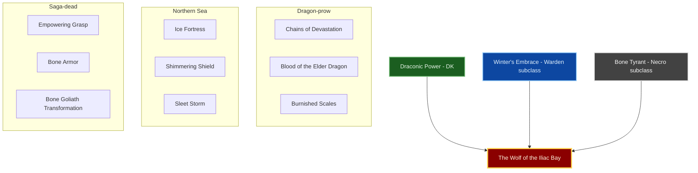
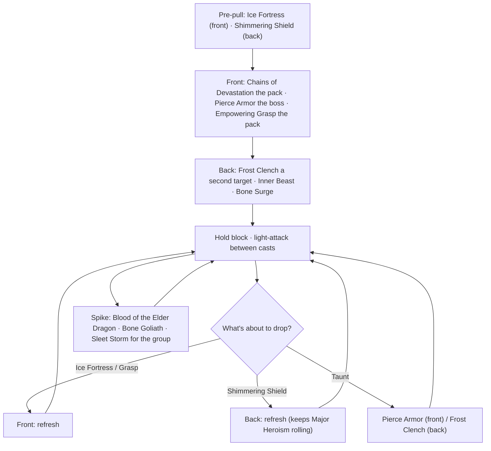

# Build Plan - Sea-Wolf: The Wolf of the Iliac Bay (Uber Dragonknight Tank, Craftable)

> **Character profile:** [sea_wolf.md](sea_wolf.md) — Level 5 Nord Dragonknight, CP 339, @SOLAEGIS (EU), Ebonheart Pact.

**Sea-Wolf** (saga name **Hastein**) is a Nord longship captain of the Ebonheart Pact who raids the Covenant's coasts around the Iliac Bay. He's Tamriel's answer to **Hastein**, the Viking chief who raided the Frankish coast for thirty years. The build is an **Uber-tier group tank**. The one native line it keeps is **Draconic Power**. At Level 50 it **subclasses Winter's Embrace** (replacing Ardent Flame) and **Bone Tyrant** (replacing Earthen Heart). That combination won a scored search of all **1,330** three-line combinations (see [Trinity](#trinity-configuration)).

**Content target:** 4-player group dungeons (normal → veteran) and world bosses. **Gear rule:** **100% crafted** by @masisi, **12 pieces of Fellowship's Fortitude**, with no monster, trial or dungeon exceptions. Below Level 50 the advice is **best-now**, not a gap against the target.

---

## Build at a glance

| **Attribute** | **Recommendation** |
| :--- | :--- |
| **Race / Alliance** | **Nord** · **Ebonheart Pact** (live): a Pact sea-wolf who hunts in Covenant waters |
| **Primary Stat** | 64 points in **Health** — **live:** 5 / 5 in Health ✅. Move up to 15 into Stamina only if block sustain runs dry in veteran content |
| **Mundus Stone** | **The Lord** (+2,225 Max Health). Armor uses Sturdy, not Divines |
| **Vampirism** | **Cured / N/A** |
| **Trinity** | **Draconic Power** KEEP · **Winter's Embrace** SUBCLASS (replaces Ardent Flame) · **Bone Tyrant** SUBCLASS (replaces Earthen Heart), both at Level 50 — **live:** all native, Draconic Power rank 5 |
| **Sets** | **12 Fellowship's Fortitude** (crafted): +7,425 armor, +6,020 Max Health, **Major Protection** |
| **Bars** | Front: **One Hand and Shield** ("The Shield Wall") · Back: **Ice Staff** ("The Northern Sea") — **live:** lightning staff front, back bar empty |
| **Food** | Tri-stat food (Health / Magicka / Stamina); a Max Health + recovery drink when sustain is fine |
| **Potion** | **Tri-stat** restore |
| **Weapon Enchants** | Sword: **Crushing** (−1,622 enemy armor, 5 s) · Ice Staff: **Absorb Magicka** |
| **Companion** | **Primary (now):** **Mirri Elendis** (ship's mender) · **Secondary:** **Tanlorin** (DPS) · **Goal (20/20 @ CP160):** **Mirri Elendis** |
| **Primary Mount** | **Bleakrock Snowdog** (owned): a wolf-hound from the Nord isle of Bleakrock · **Alt:** **Skulltooth Coastal Durzog**. See [Collectibles](#collectibles) |
| **Flavor Pet** | **Nenalata Ayleid Wolf Pup** (owned): the pack's youngest · **Alt:** **Abecean Ratter Cat** (the ship's cat) |
| **Costume** | **Sea Drake Garb** (owned): sea-raider's kit · **Alt:** **Noble Clan-Chief** (the jarl at home) · **Markings:** Skald's Face Branding + Windcaller Body Markings |

**Read next:** [Roleplay](#roleplay-the-sea-wolf) · [Trinity configuration](#trinity-configuration) · [Combat kit](#combat-kit-shield-wall-and-northern-sea) · [Gear and crafting](#gear-and-crafting-the-fellowship-hauberk) · [Champion points](#champion-point-mapping-cp-339) · [Companion](#companion-strategy-the-ships-mender) · [Collectibles](#collectibles) · [Checklist](#next-steps--in-game-action-checklist)

---

## Roleplay: The Sea-Wolf

The Bretons of the Iliac Bay learned to watch the horizon for a striped sail. When it came, it came with forty oars, a wolf's head on the prow, and a Nord who didn't want their gold so much as their war. **Hastein**, called **Sea-Wolf**, has raided their coasts for twenty summers under the Pact's banner, or near enough to it. The Pact doesn't ask where its sea-wolves hunt, as long as it's Covenant water. He's loyal to the contract, the crew and the shield wall, in that order.

A wolf hunts as a pack, and the pack lives while the strongest stands at the front. That's the whole of Hastein's philosophy, and the whole of his job. **Draconic Power** is the dragon-prow: scales, the chains that drag the enemy onto his shields, dragon blood that closes his wounds. **Winter's Embrace** is the northern sea he was born on: ice armor, shields of frost, the sleet storm that breaks over the whole field. **Bone Tyrant** is the drowned crews who follow his wake: bone mail, and a grave-grip that gives his pack its courage.

He wears the salt-stained garb of a sea-raider, the skald's brand on his face and the wind-caller's marks on his skin. A wolf pup taken on a raid in the Covenant's forests rides in his pack, and the ship's cat keeps the rats honest. Ashore he rides a Bleakrock snowdog, a wolf-hound bred on a northern island and carried south on the longship. He blows a dragonhorn to call his crew to the wall. When the enemy hesitates, he tells them to *come get some*.

> [!TIP]
> **Suggested Custom Title:** `Sea-Wolf of the Iliac Bay`

> [!NOTE]
> **Build Notes (paste into LAM Build Notes):**
> Sea-Wolf (saga name Hastein) — Wolf of the Iliac Bay. Nord longship captain of the Pact who raids the Covenant's Breton coast (Hastein-coded). Uber DK tank: KEEP Draconic Power; at 50 SUBCLASS Winter's Embrace (replaces Ardent Flame) + Bone Tyrant (replaces Earthen Heart). Pre-50 all-native DK bridge (Hearth and Home, Earthshield Mantle, Igneous Shield, Magma Armor). Front 1H+Shield "Shield Wall": Pierce Armor, Ice Fortress, Chains of Devastation, Empowering Grasp, Bone Armor; ult Bone Goliath Transformation. Back Ice Staff "Northern Sea": Frost Clench, Shimmering Shield, Blood of the Elder Dragon, Inner Beast, Bone Surge; ult Sleet Storm (later Aggressive Horn). Gear @masisi: 12 Fellowship's Fortitude (heavy, Sturdy, Healthy jewelry, Defending sword, Decisive Ice Staff). 64 Health, The Lord. Companion Mirri as ship's mender. Mount Bleakrock Snowdog · pet Nenalata Ayleid Wolf Pup · costume Sea Drake Garb · Skald's Face Branding + Windcaller Body Markings · memento Dragonhorn Curio.

> [!TIP]
> **Flavor Pet:** **Nenalata Ayleid Wolf Pup** (owned), the pack's youngest. **Alt:** **Abecean Ratter Cat**, the ship's cat. See [Collectibles](#collectibles).

> [!TIP]
> **Costume:** **Sea Drake Garb**, the sea-raider's kit. **Alt:** **Noble Clan-Chief** for the jarl at home. See [Collectibles](#collectibles).

### Name origin

**Hastein** (Old Norse *Hásteinn*) was one of the great Viking sea-kings of the 9th century. He raided the Loire and the Frankish coast, took service with the Breton king **Salomon** against the Franks, and (by legend) sailed into the Mediterranean. "Sea-Wolf" is the saga epithet for exactly that kind of raider. The in-game name is **Sea-Wolf**. Hastein is his saga name in roleplay.

---

## Trinity configuration

### Subclassing decision (required)

Subclassing unlocks at **Level 50** via Bahtra at-Hunding (**"A Study in Discipline"**). You must keep at least one native line (re-check in-game). This plan uses **two SUBCLASS rows**. Each one had to clearly beat the native line it replaces. See [docs/subclassing.md](../../../docs/subclassing.md) and [docs/dragonknight_u49.md](../../../docs/dragonknight_u49.md).

**How it was chosen:** every 3-line combination of the 21 class lines (1,330) was scored for tank needs:
- The weapons and Undaunted already cover the taunts, Major/Minor Breach, Major/Minor Maim and Minor Vulnerability.
- Duplicate buffs score zero.
- Class passives are scored too.

With 12 Fellowship supplying Major Protection, **Draconic Power + Winter's Embrace + Bone Tyrant** ranked **#1** and stayed **#1 in 72%** (top 3 in 96%) of 2,000 runs with every weight randomly changed by ±50%. The current all-native DK trio ranked **99th**. Class barely matters once you can subclass. Dragonknight is the base because it keeps **Draconic Power** native.

**Why each native line goes or stays** (buff sources from `data/sets/buffs.json`):

| **Native line** | **Decision** | **Proof** |
| :--- | :--- | :--- |
| **Draconic Power** | **KEEP** | Burnished Scales (block mitigation), Chains pull + **Major Evasion** (Chains of Devastation), **Blood of the Elder Dragon** self-heal + Minor Courage. No foreign line covers all three |
| **Ardent Flame** | **SUBCLASS → Winter's Embrace** | Its tank value was **Hearth and Home → Major Protection**, which **12 Fellowship already gives** (adds 0). Winter's Embrace brings **Shimmering Shield → Major Heroism** (+3 Ultimate per 1.5 s, not available from any DK line) and **Ice Fortress → Major Resolve + Minor Protection** in one slot |
| **Earthen Heart** | **SUBCLASS → Bone Tyrant** | Its tank value was **Earthshield Mantle → Major Resolve**, now covered by Ice Fortress. Bone Tyrant brings **Empowering Grasp → Major Courage** (group damage) + Major Maim, **Bone Armor** (Minor Resolve on top), and **Bone Goliath** as the tank ultimate |

| **Pillar** | **Line** | **Origin** | **Slot action** | **Function** |
| :--- | :--- | :--- | :--- | :--- |
| **Dragon-prow** | **Draconic Power** | Dragonknight (native) | **KEEP** | Chains of Devastation (pull + Major Evasion), Blood of the Elder Dragon (self-heal + Minor Courage); Burnished Scales block passive |
| **Northern Sea** | **Winter's Embrace** | Warden (subclass) | **SUBCLASS** (replaces **Ardent Flame**) | Ice Fortress (Major Resolve + Minor Protection), Shimmering Shield (Major Heroism + shield), Sleet Storm ult; Frozen Armor passive |
| **Saga-dead** | **Bone Tyrant** | Necromancer (subclass) | **SUBCLASS** (replaces **Earthen Heart**) | Empowering Grasp (Major Courage for the group + Major Maim), Bone Armor, Bone Goliath ult; Health Avarice / Last Gasp passives |

**Weapon / guild lines (not subclass):** **One Hand and Shield** (**Pierce Armor**) · **Destruction Staff, Ice** (**Frost Clench**) · **Undaunted** (**Inner Beast**, **Bone Surge**).

> [!IMPORTANT]
> **Pre-50 bridge (all native DK):** until Bahtra, tank with the native kit. Keep **Draconic Power**. Use **Ardent Flame** for **Hearth and Home** (Major Protection until 12 Fellowship is on). Use **Earthen Heart** for **Earthshield Mantle** (Major Resolve), **Igneous Shield** and the **Magma Armor** ult. **At Level 50:** subclass both lines, then **unslot every Ardent Flame and Earthen Heart active**. Subclassed lines start at rank 1, so level them in normal dungeons before veteran content. **Shimmering Shield** and **Empowering Grasp** are morphs and need line ranks first.

---

## Combat kit: Shield Wall and Northern Sea

**Loop:** pull or taunt → hold block → keep **Ice Fortress** (Major Resolve + Minor Protection) and **Shimmering Shield** (Major Heroism) up → **Empowering Grasp** the pack for group Major Courage → re-taunt at about 12 s → shield and heal through spikes. **Major Protection** comes from the set, so it's always on.

### Skill bars (post-50 target)

Morph names are as shown in the skills UI. Each morph appears once across both bars.

> [!WARNING]
> **Verify at unlock:** skill-line ownership for Winter's Embrace and Bone Tyrant abilities, and the scope of **Empowering Grasp**'s Major Courage (group vs. self), come from game knowledge, not the repo's dataset. The buff sources are in `buffs.json`. For **Bone Armor**, **Bone Goliath Transformation** and **Sleet Storm**, take the survival or group morph shown in the UI. Re-check the tooltips after each patch.

#### Front Bar (One Hand and Shield): "The Shield Wall"

| **Slot** | **Class/Line** | **Base → Morph** | **Role** | **Profile** |
| :--- | :--- | :--- | :--- | :--- |
| **1** | One Hand and Shield | Puncture → **Pierce Armor** | **Taunt** (15 s) + Major/Minor Breach on the boss | **New** |
| **2** | Winter's Embrace | Frost Cloak → **Ice Fortress** | **Major Resolve** + **Minor Protection** | **@50** |
| **3** | Draconic Power | Chains of Flame → **Chains of Devastation** | Pull adds to the stack + **Major Evasion** | **New** |
| **4** | Bone Tyrant | Grave Grasp → **Empowering Grasp** | **Major Courage** for the group + Major Maim + snare | **@50** |
| **5** | Bone Tyrant | **Bone Armor** → morph per UI | Minor Resolve on top of Major; feeds Bone Tyrant passives | **@50** |
| **6 (Ult)** | Bone Tyrant | **Bone Goliath Transformation** → morph per UI | Emergency wall: Max Health + self-heal | **@50** |

#### Back Bar (Ice Staff): "The Northern Sea"

| **Slot** | **Class/Line** | **Base → Morph** | **Role** | **Profile** |
| :--- | :--- | :--- | :--- | :--- |
| **1** | Destruction Staff | Destructive Touch → **Destructive Clench** (shows as **Frost Clench** with an Ice Staff) | **Ranged taunt** + **Major Maim** | **New** |
| **2** | Winter's Embrace | Crystallized Shield → **Shimmering Shield** | Projectile shield + **Major Heroism** (+3 Ultimate / 1.5 s) | **@50** |
| **3** | Draconic Power | Dragon Blood → **Blood of the Elder Dragon** | Self-heal + **Minor Courage** | **New** |
| **4** | Undaunted | Inner Fire → **Inner Beast** | Second taunt + **Minor Maim** + **Minor Vulnerability** | **New** (Undaunted rank) |
| **5** | Undaunted | Bone Shield → **Bone Surge** | Self shield + **Major Vitality** + synergy for the group | **New** (Undaunted rank) |
| **6 (Ult)** | Winter's Embrace | **Sleet Storm** → morph per UI | Group **Major Protection** for allies (you already have it from gear) | **@50** · later **Aggressive Horn** (Assault) |

> [!NOTE]
> **Buff overlap check:** Major Protection comes only from the set, so no skill duplicates it. **Major Maim** is on both Empowering Grasp and Frost Clench. That's fine, because Frost Clench is slotted for its **taunt**, not its Maim. **Major Resolve** comes from Ice Fortress, and **Bone Armor** adds only its **Minor** Resolve on top. If resistances pass the cap (see [Gear](#set-rationale)), swap Bone Armor for **Bone Totem** (Minor Protection is already covered) or **Frozen Device** (a second pull).

#### Pre-50 bridge bars (native DK)

| **Bar** | **Slots 1–5** | **Ult** |
| :--- | :--- | :--- |
| **Front (1H+Shield)** | Pierce Armor · Earthshield Mantle · Chains of Devastation · Hearth and Home · Protect the Brood | Magma Armor |
| **Back (Ice Staff)** | Frost Clench · Igneous Shield · Blood of the Elder Dragon · Inner Beast · Bone Surge | Standard of Might |

### Rotation and combat tips

1. **Taunt timer first.** Taunts last 15 s. Re-taunt at about 12 s, and don't re-taunt what you already hold.
2. **Major Heroism is your group job.** Shimmering Shield feeds your ultimates. Keep it up, and spend Sleet Storm or Aggressive Horn on the group's burn windows.
3. **Grasp on pull.** Empowering Grasp as the pack lands gives Major Courage just as the DPS start their AoE.
4. **Block is the default state.** Burnished Scales rewards blocking. Drop block only to cast, light-attack or bash an interruptible cast.
5. **Face the boss away from the group** and stop moving once the pack is stacked.

### Passive skills

#### Dragonknight: Draconic Power

* **Burnished Scales** (block mitigation, top priority) · **Elder Dragon** · **World in Ruin** · **The Storm Voice**.

#### Warden: Winter's Embrace (post-50)

* **Frozen Armor** (resistances per slotted Winter ability) · **Icy Aura** · **Piercing Cold** · **Glacial Presence**.

#### Necromancer: Bone Tyrant (post-50)

* **Health Avarice** (healing received per slotted Bone Tyrant ability) · **Last Gasp** · **Disdain Harm** · **Death Gleaning**.

#### Dragonknight: Ardent Flame / Earthen Heart (pre-50 bridge only)

* Take **Heart of Stone** and **Mountain Giant** while levelling. These lines leave with the subclass at 50.

#### Weapon: One Hand and Shield

* **Fortress** · **Sword and Board** · **Deadly Bash** · **Deflect Bolts** · **Battlefield Mobility**. Fortress (block cost) first.

#### Weapon: Destruction Staff

* **Tri Focus** (Ice Staff block bonus) first, then the rest as points allow.

#### Armor: Heavy

* **Resolve** · **Constitution** · **Juggernaut** · **Revitalize** · **Rapid Mending**. Rank fully.

#### Guild: Undaunted

* **Undaunted Command** · **Undaunted Mettle**. Run pledges to rank the line.

#### Race: Nord

* **Reveler** · **Resist Frost** · **Rugged** · **Stalwart**. Stalwart (Ultimate when taking damage) pairs with Major Heroism.

---

## Gear and crafting: "The Fellowship Hauberk"

### Set rationale

A tank needs **resistances to the cap**, **Max Health** so healers have room to work, and **sustain** to keep blocking. Values are from `data/sets/llm_digest.jsonl` (CP160 gold).

| **Option** | **Armor** | **Max Health** | **Other** | **Verdict** |
| :--- | ---: | ---: | :--- | :--- |
| **12 Fellowship's Fortitude** | +7,425 | **+6,020** | **Major Protection** | **Target.** Supplies the buff that would otherwise cost a skill line (Ardent Flame) |
| 10 Fellowship + monster set | +7,425 | +6,020 | Monster 2pc | Rejected: needs Major Protection from a skill, and a dungeon drop breaks the craftable rule |
| 5 Fortified Brass + 5 Hist Bark | +9,408 | +2,412 | +1,096 Stamina; Major Evasion while bracing (duplicates Chains of Devastation) | Bridge only, if @masisi can't craft Fellowship yet |
| Aetherial Ascension (5pc) | +10,351 | +1,206 | **+20% Block cost** (text) | Rejected: the drawback is a direct tank penalty |

> [!NOTE]
> **Resistance cap check (re-check after patches):** mitigation is about 1% per 660 resistance, capping at 50% (**~33,000**). Ice Fortress (+5,948 Major Resolve), Bone Armor (+2,974 Minor Resolve), the set (+7,425), heavy armor, shield, Nord Rugged and Fortified CP will likely pass it. At the first CP160 `/cm` export, read **Physical / Spell Resistance**:
> - **Above ~33,000:** swap Bone Armor for Bone Totem or Frozen Device, and change the sword trait from Defending to **Decisive**.
> - **Below ~31,000:** change one ring from Healthy to **Protective** (+1,190).
>
> These caps are general ESO knowledge, not yet in the verified dataset.

> [!NOTE]
> **Why not the trial/dungeon tank sets?** Claw of Yolnahkriin, Pearlescent Ward, Saxhleel Champion and Lucent Echoes are trial drops. Turning Tide, Crimson Oath's Rive and the Tremorscale monster set are dungeon drops. They're stronger for trial groups, but this plan is craftable-only by design. Treat them as a separate decision once Sea-Wolf runs veteran content.

### Target loadout

| **Slot** | **Set** | **Weight** | **Trait** | **Enchantment** | **Quality** |
| :--- | :--- | :--- | :--- | :--- | :--- |
| **Head** | Fellowship's Fortitude | Heavy | Sturdy | Health | Gold |
| **Shoulders** | Fellowship's Fortitude | Heavy | Sturdy | Stamina | Gold |
| **Chest** | Fellowship's Fortitude | Heavy | Sturdy | Health | Gold |
| **Hands** | Fellowship's Fortitude | Heavy | Sturdy | Stamina | Gold |
| **Waist** | Fellowship's Fortitude | Heavy | Sturdy | Magicka | Gold |
| **Legs** | Fellowship's Fortitude | Heavy | Sturdy | Health | Gold |
| **Feet** | Fellowship's Fortitude | Heavy | Sturdy | Stamina | Gold |
| **Necklace** | Fellowship's Fortitude | Jewelry | Healthy | Stamina Recovery | Gold |
| **Ring 1** | Fellowship's Fortitude | Jewelry | Healthy | Magicka Recovery | Gold |
| **Ring 2** | Fellowship's Fortitude | Jewelry | Healthy | Bracing (block cost) | Gold |
| **Front: Main** | Fellowship's Fortitude | Sword | Defending | Crushing | Gold |
| **Front: Shield** | Fellowship's Fortitude | Shield | Sturdy | Health | Gold |
| **Back: Ice Staff** | Fellowship's Fortitude | Ice Staff | Decisive | Absorb Magicka | Gold |

**Piece counts:** front bar = 7 armor + 3 jewelry + sword + shield = **12**. Back bar = 7 armor + 3 jewelry + Ice Staff (counts as 2) = **12**. All three bonuses stay live on **both bars**. The back-bar staff **must** be Fellowship too, or the back bar drops to 10 and loses Major Protection.

**Glyph values:** Health **954** on head / chest / legs / shield, **40%** on shoulders / hands / waist / feet. That's why the small pieces carry Stamina / Magicka glyphs for sustain instead. **Sturdy** is **−4% block cost** per piece. **Healthy** is **+965 Max Health** per jewelry piece.

**Health tally (sets + traits + mundus only):** 6,020 (Fellowship 10pc) + 2,895 (3 × Healthy) + 2,225 (The Lord) = **+11,140 Max Health**, before glyphs, attributes, Last Gasp and Bone Goliath.

### Crafting handoff (@masisi)

| **Detail** | **Recommendation** |
| :--- | :--- |
| **Crafter** | EU account artisan **[Masisi](masisi.md)** / [masisi_plan.md](masisi_plan.md) |
| **Set station** | **Fellowship's Fortitude**: Fellowship Forge. Check the station's required trait count before committing |
| **Research** | Masisi's heavy armor research is at **7–8/9** per piece and the shield at **8/9** (EU profile). Confirm **Sturdy**, **Healthy**, **Defending** and **Decisive** are known |
| **Style** | **Nord** motif (a longship crew's steel). The costume covers it anyway |
| **Interim (pre-CP160)** | Level-scaled blue/purple **Fellowship's Fortitude** at 12 pieces. It duplicates Hearth and Home's Major Protection on the pre-50 bar, which is harmless. If Fellowship can't be crafted yet, use **5 Fortified Brass + 5 Hist Bark** |
| **Quality path** | Blue while levelling → purple at CP160 → gold on body and jewelry when materials allow |

> [!NOTE]
> **Research gate:** coordinate with @masisi before any CP160 gold work. Companion gear isn't part of this handoff.

---

## Champion Point Mapping (CP 339)

Budget: **113 Warfare / 113 Fitness / 113 Craft** (339 total). **Live: 0 spent, all 339 available.** Below 900 CP there are **3 slottable stars per discipline**. Star names, max points and stage sizes come from [champion_points_reference.md](../../templates/champion_points_reference.md). Walk the prerequisites in-game.

### Warfare (Blue — 110 of 113)

| **Star** | **Type** | **Spend** | **Benefit** |
| :--- | :--- | :--- | :--- |
| **Ironclad** | Slottable | 50 | Up to −15% damage from direct attacks |
| **Hardy** | Passive | 20 | Less Martial damage taken (Physical / Poison / Disease / Bleed) |
| **Elemental Aegis** | Passive | 20 | Less Magical damage taken (Magic / Flame / Frost / Shock) |
| **Quick Recovery** | Passive | 20 | Healing received (+2%) |

*Next as CP grows:* **Duelist's Rebuff** or **Unassailable** in the other two slots.

### Fitness (Red — 110 of 113)

| **Star** | **Type** | **Spend** | **Benefit** |
| :--- | :--- | :--- | :--- |
| **Boundless Vitality** | Slottable | 50 | +1,400 Max Health |
| **Fortified** | Slottable | 50 | +1,730 Armor. **Trim first** if resistances pass the cap |
| **Bastion** | Slottable | 10 | +3% damage shield strength (Shimmering Shield, Bone Surge) |

*Next:* top **Bastion** to 50 (+15%), then **Hero's Vigor** (+560 Max Health) and **Juggernaut**.

### Craft (Green — 110 of 113)

| **Star** | **Type** | **Spend** | **Benefit** |
| :--- | :--- | :--- | :--- |
| **Steed's Blessing** | Slottable | 50 | Out-of-combat move speed |
| **Rationer** | Passive | 30 | Food / drink duration |
| **Steadfast Enchantment** | Passive | 30 | Enchantment durability (3 of 5 stages) |

*Next:* **Liquid Efficiency (50)** once Steadfast Enchantment and Rationer are done.

---

## Companion Strategy: "The Ship's Mender"

Companions use **Companion's** weapons and armor only, with companion-only traits (Quickened, Aggressive, Bolstered, Soothing, etc.). Never player sets or Divines. Buy white basics from vendors and farm Superior+ drops while the companion is summoned. **Not** part of the @masisi player-gear handoff.

The shield wall holds aggro; the ship's mender keeps it standing.

| **Tier** | **Companion** | **Role** | **Roleplay fit** | **Mechanical fit** |
| :--- | :--- | :--- | :--- | :--- |
| **Primary (now)** | **Mirri Elendis** | Healer (Restoration Staff) | The ship's mender: a foreigner who signed on with the crew | Heals from range without pulling aggro |
| **Secondary** | **Tanlorin** | DPS | Hired sword for overland work | Faster solo clears when healing isn't the bottleneck |
| **Goal (20/20 @ CP160)** | **Mirri Elendis** | Healer | Same | Fully geared healer for solo world bosses |

### Primary now: Mirri Elendis

| **Setting** | **Recommendation** |
| :--- | :--- |
| **Role** | **Healer**, Companion's **Restoration Staff** |
| **Gear Weight** | **Light** Companion's (Superior+ drops) |
| **Traits** | **Soothing** (healing) · **Quickened** (cooldowns) · **Bolstered** on one piece if Mirri dies to cleaves |
| **Acquisition** | Vendor whites → Superior+ drops while Mirri is summoned |

**Support skill bar:** slot the companion Restoration Staff heals as they unlock, then an area heal, then a buff. Keep one damage skill so Mirri still contributes when you're at full health.

---

## Collectibles

Every pick is **owned** and comes from the EU account pool (`sabir_al_rih.md`, per [collectibles_companion_ledger.md](../../../docs/collectibles_companion_ledger.md)). The theme is the **sea-wolf**: the pack, the ship and the northern sea.

### Mount

| **Pick** | **Mount** | **Notes** |
| :--- | :--- | :--- |
| **Primary** | **Bleakrock Snowdog** | Owned (bought 2026-09-27). The sea-wolf's wolf: a snow-hound from Bleakrock Isle, a Nord island off Skyrim's coast. Not a primary on any other EU plan |
| **Backup** | **Skulltooth Coastal Durzog** | Owned. A coastal pack-hunter for shore raids |
| **Alt** | **Sorrel Horse** | Owned. A plain horse "borrowed" from a Breton stable |
| **Avoid thematically** | **Psijic Escort Charger** / **Dwarven War Horse** | Too orderly and too landlocked for a raider |

### Pet

| **Pick** | **Pet** | **Notes** |
| :--- | :--- | :--- |
| **Primary** | **Nenalata Ayleid Wolf Pup** | Owned, unused as an EU primary. The pack's youngest |
| **Alt** | **Abecean Ratter Cat** | Owned. The ship's cat, named for the Abecean Sea |
| **Alt** | **Hay-Crown Chub Loon** | Owned. A seabird that follows the longship |
| **Alt** | **Tan Morthal Mastiff** | Owned. Nord hall-hound for shore leave |

### Costume

| **Pick** | **Costume** | **Notes** |
| :--- | :--- | :--- |
| **Primary** | **Sea Drake Garb** | Owned, unused as an EU primary. The sea-raider's kit |
| **Alt** | **Noble Clan-Chief** | Owned. The jarl at home between raiding seasons |
| **Alt** | **Vulkhel Guard Marine Armor** | Owned. Marine steel for a ship-borne fighter (the Dominion style is a known compromise) |

Outfit Station motifs on the crafted Fellowship's Fortitude pieces are separate from the full-body costume.

### Markings, memento and emote

| **Kind** | **Pick** | **Notes** |
| :--- | :--- | :--- |
| **Head marking** | **Skald's Face Branding** | Owned. The saga-singer's brand |
| **Head marking (alt)** | **Bright-Throat Woad Face Tattoo** | Owned. Blue war-paint for the raid |
| **Body marking** | **Windcaller Body Markings** | Owned. The marks of a captain who calls the wind |
| **Memento** | **Dragonhorn Curio** | Owned. Blow it to call the crew to the shield wall |
| **Memento (alt)** | **Sea Sload Dorsal Fin** | Owned. A sea-trophy from a past raid |
| **Memento (alt)** | **Breda's Bottomless Mead Mug** | Owned. The mead-hall after the raid |
| **Emote** | **Come Get Some** | Owned. The tank's invitation, used before every pull |

### Dye and style

| **Element** | **Recommendation** |
| :--- | :--- |
| **Primary dye** | Storm grey / sea slate |
| **Secondary** | Wolf-pelt brown |
| **Trim** | Blood red: the striped sail |
| **Weapons** | **Nord** motif sword; a round shield if the motif has one (the longship's shield rail) |

---

## Next Steps & In-Game Action Checklist

### Phase 0 — Today (Level 5, from the live export)

The export shows Level 5 with all **339 CP unspent**, **4 skill points** free, a lightning staff in the main hand, **no back bar** and Trainee / heavy starter gear. At this level the gear is fine: the Training trait speeds up levelling. The goal is to get the kit pointing the right way.

1. **Spend all 339 CP now** per [Champion Point Mapping](#champion-point-mapping-cp-339). It's the biggest power gain available at Level 5.
2. **Get a sword and shield** (any vendor or drop) and equip them on the front bar. **One Hand and Shield** only ranks while equipped, and **Puncture** is the taunt.
3. **Swap the lightning staff for an Ice Staff** on the back bar. Destruction Staff rank 5 and **Tri Focus** carry over, since it's one skill line.
4. **Spend the 4 skill points:** **Puncture** first, then Draconic Power (**Dragon Blood**), then Earthen Heart and Ardent Flame actives as their ranks unlock. **Soul Trap** can leave the bar.
5. Keep every attribute point in **Health** (live: 5 / 5).
6. **Riding:** train **Speed** first while levelling, then **Stamina**.
7. Equip **Sea Drake Garb**, **Skald's Face Branding**, **Windcaller Body Markings**, **Bleakrock Snowdog** and **Nenalata Ayleid Wolf Pup**.

### Phase 1 — Level to 50 (native DK bridge)

7. Equip a sword and shield and an Ice Staff early. One Hand and Shield and Destruction Staff only rank while equipped.
8. Run the [pre-50 bridge bars](#pre-50-bridge-bars-native-dk): Hearth and Home, Earthshield Mantle, Igneous Shield, Magma Armor, plus the Draconic, weapon and Undaunted skills that carry over.
9. Commission level-scaled **12 Fellowship's Fortitude** (heavy) from @masisi. Use **Fortified Brass + Hist Bark** if Fellowship isn't craftable yet.
10. Run the **Undaunted** pledges to unlock **Inner Beast** and **Bone Surge**. Queue as tank in normal random dungeons.

### Phase 2 — Level 50: subclass and craft the target

11. Complete Bahtra's **"A Study in Discipline"**. **Subclass Winter's Embrace** (replacing Ardent Flame) and **Bone Tyrant** (replacing Earthen Heart). Unslot every Ardent Flame and Earthen Heart active.
12. Level both new lines in normal dungeons until **Ice Fortress**, **Shimmering Shield**, **Empowering Grasp**, **Bone Armor**, **Bone Goliath Transformation** and **Sleet Storm** are unlocked and morphed.
13. **@masisi:** craft gold **12 Fellowship's Fortitude** (heavy · Sturdy · Healthy jewelry · Defending sword · Sturdy shield · Decisive Ice Staff).
14. Mundus → **The Lord**.
15. Export with `/cm` and check **resistances** against the ~33,000 cap. Tune per the [set rationale note](#set-rationale).

### Phase 3 — Polish

16. Rank **Assault** in Cyrodiil for **Aggressive Horn** (Major Force for the group) on the back-bar ult.
17. Top **Bastion** to 50, then fill the open Warfare slots with **Duelist's Rebuff** / **Unassailable**.
18. Level **Mirri Elendis** to **20/20** and farm Soothing / Quickened Companion's gear.

### Finish

19. Regenerate the profile with `/cm`, update [sea_wolf.md](sea_wolf.md), and re-check the plan against the live stats.

The pack lives while the strongest stands at the front.
