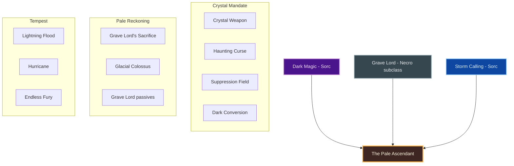
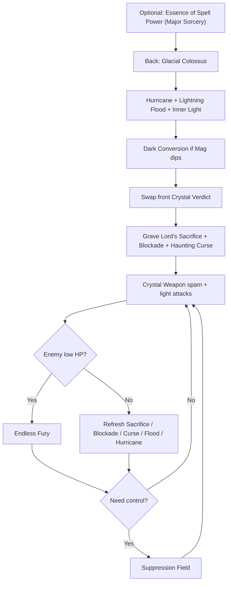

# Build Plan - Taranis Kotu: The Pale Ascendant (Magicka Sorcerer Overland)

> **Character profile:** [taranis_kotu.md](taranis_kotu.md) — Level 31 High Elf Sorcerer, CP 336, @SOLAEGIS (EU).

**Taranis Kotu** is a frail-bodied High Elf with immense magical talent — a ruthless, cold, ambitious anti-hero who would sacrifice anything, even his own humanity, in an obsessive quest for godlike power. This guide turns the live Level 31 kit (**Dest** Main / **Resto** Backup, **Wisdom of Vanus** bridge, duplicate **Crystal Fragments** / **Mages' Wrath** / **Hurricane** / **Magelight**, **Summon Charged Atronach**) into **The Pale Ascendant**: a Dark Magic control MagSorc who keeps **Dark Magic** and **Storm Calling**, then at Level 50 subclasses **Grave Lord** in place of petless **Daedric Summoning** — **Crystal Weapon** and **Suppression Field** as signature control, **Glacial Colossus** as Major Vulnerability open.

Designed for solo overland and public dungeons on craftable gear. **Stage 3 Vampire** is recommended for survivability (**Undeath** mitigation when low) and the vampire skill line, not as costume lore. Pre-50 uses a native bridge (Bound Aegis OK); post-50 the foreign line is locked because Grave Lord clearly beats Bound-Aegis-only Summoning on this content.

---

## Build at a glance

| **Attribute** | **Recommendation** |
| :--- | :--- |
| **Primary Stat** | 64 points in **Magicka** — **live:** **38 Mag** / 0 Health / 0 Stam · pools **23,632** HP / **29,138** Mag / **15,976** Stam · **1 unspent point** · **target:** 64 Mag at CP160 |
| **Mundus Stone** | **The Apprentice** (+Spell Damage) — **live:** already Apprentice; keep |
| **Vampirism** | **Stage 3 Vampire** — Undeath survivability; accept fire vulnerability |
| **Trinity** | **Dark Magic** + **Storm Calling** KEEP · **Grave Lord** SUBCLASS (replaces **Daedric Summoning**) at Level 50 — **live:** all three native (bridge) |
| **Sets** | **5 New Moon Acolyte + 5 Law of Julianos** (100% craftable, all Light) + **Oblivion's Foe** staves — **live:** Wisdom of Vanus 5/5 (+ scrap) · **target:** New Moon Acolyte + Julianos |
| **Bars** | Front: **Lightning Dest** ("Crystal Verdict") · Back: **Inferno Dest** ("Black Mandate") — **live:** Dest Main / **Resto** Backup (**replace resto with Inferno Dest**) |
| **Food** | **Witchmother's Potent Brew** (Max Magicka + Magicka Recovery) or **Witty Blue Entremet** while leveling |
| **Potion** | **Essence of Spell Power** — the value is **Major Sorcery**; its Major Prophecy is already covered by Inner Light |
| **Weapon Poisons** | Optional **Gradual Ravage Health** between pulls |
| **Staff/Weapon Enchant** | Front Lightning: **Shock** (Infused) · Back Inferno: **Flame** or **Absorb Magicka** |
| **Companion** | **Primary (now):** **Bastian Hallix** (tank) · **Secondary:** **Mirri Elendis** · **Goal (20/20 @ CP160):** **Tanlorin** |
| **Primary Mount** | **Psijic Escort Charger** (owned) · **Alt:** **Noweyr Steed** — see [Collectibles](#collectibles) |
| **Flavor Pet** | **Coldharbour Bantam Guar** (owned) · **Alt:** **Blue Dragon Imp** — see [Collectibles](#collectibles) |
| **Costume** | **Mannimarco** (owned) · **Alt:** **Court of Bedlam** / **Bloodthorn Robes** — see [Collectibles](#collectibles) |

**Read next:** [Roleplay](#roleplay-the-pale-ascendant) · [Trinity configuration](#trinity-configuration) · [Combat kit](#combat-kit-the-crystal-mandate) · [Gear and crafting](#gear-and-crafting-the-pale-regalia) · [Champion points](#champion-point-mapping-cp-336) · [Companion](#companion-strategy-the-soft-wall) · [Collectibles](#collectibles) · [Checklist](#next-steps--in-game-action-checklist)

---

## Roleplay: The Pale Ascendant

His body was never the equal of his mind. In Summerset that is a quiet shame — soft hands, thin blood, a frame that folds when steel is honest. Taranis Kotu learned early that frailty is only a sentence if you accept the court’s terms. He did not. He would climb until the Altmer who measured worth in lineage measured him in **fear**.

He is not kind. He is not loyal. He is **ruthless**, **cold**, and **ambitious** in the old sense: power as the only apology the world owes a glass vessel. He would sacrifice anything — reputation, allies, even his own humanity — for godlike command of magicka. The bite is not romance; it is a tool. Stage Three is simply the next price paid so the pale body stops breaking before the spell finishes.

**Dark Magic** is the true craft: Crystal Weapon as a blade of will, Haunting Curse as a leash, Suppression Field as the moment he owns the battlefield and silence answers him. Storm Calling is weather bent to ambition, not thunder for show. Early on he wraps brittle ribs in **Bound Aegis** — borrowed Daedric armor, a scaffold. When the road allows, he **outgrows** petless Summoning and steals **Grave Lord** death-aspect mastery: Sacrifice as a self-offering of power, Colossus as Major Vulnerability forced onto the world. Another price of ascent. He does not keep Daedra as pets to look grand.

Companions are useful. Bastian is a soft wall. Mirri is a cynical pair of eyes. Tanlorin, when ready, is a stranger who understands that strange ambition is not a costume. The Psijic charger is the mount of a man who intends to outgrow every order that tried to teach him patience.

He is a frail High Elf who decided the only cure for a weak body is to become something the world cannot refuse.

> [!TIP]
> **Suggested Custom Title:** `Pale Ascendant`

> [!NOTE]
> **Build Notes (paste into LAM Build Notes):**
> Taranis Kotu — The Pale Ascendant. Frail-bodied High Elf MagSorc; ruthless, cold, ambitious anti-hero seeking godlike power at any cost — even humanity. Stage 3 Vampire for Undeath survivability, not theater. Keep Dark Magic + Storm Calling; at 50 subclass Grave Lord (replaces Daedric Summoning — petless Bound Aegis bridge only until then). Target: 5 New Moon Acolyte + 5 Law of Julianos (light) + Oblivion's Foe staves, @masisi. Front Lightning Dest: Blockade of Storms, Crystal Weapon, Haunting Curse, Endless Fury, Grave Lord's Sacrifice; ult Suppression Field. Back Inferno Dest: Lightning Flood, Hurricane, Inner Light, Dark Conversion, Crushing Shock; ult Glacial Colossus. 64 Mag. Mundus: The Apprentice. Companion: Bastian now; Tanlorin @ 20/20. Costume: Mannimarco / Psijic Escort Charger / Coldharbour Bantam Guar.

> [!TIP]
> **Flavor Pet:** **Coldharbour Bantam Guar** (owned) — Coldharbour familiar for a man bargaining with inhuman power. **Alt:** **Blue Dragon Imp**. See [Collectibles](#collectibles).

> [!TIP]
> **Costume:** **Mannimarco** — silhouette of a mage who would unmake the rules. **Alt:** **Court of Bedlam** or **Bloodthorn Robes**. Full picks under [Collectibles](#collectibles).

---

## Trinity configuration

Subclass unlocks at **Level 50** via Bahtra at-Hunding (**"A Study in Discipline"**). For The Pale Ascendant, that unlock is the moment to **replace petless Daedric Summoning** — Bound Aegis alone does not justify the pillar when **Grave Lord** offers Colossus Major Vulnerability and Sacrifice. Keep native **Dark Magic** (signature) and **Storm Calling**. See [docs/subclassing.md](../../../docs/subclassing.md).

| **Pillar** | **Line** | **Origin** | **Slot action** | **Function** |
| :--- | :--- | :--- | :--- | :--- |
| **Crystal Mandate** | **Dark Magic** | Sorcerer (native) | **KEEP** | Crystal Weapon (spammable), Haunting Curse, Dark Conversion, Suppression Field |
| **Pale Reckoning** | **Grave Lord** | Necromancer (subclass) | **SUBCLASS** (replaces **Daedric Summoning**) | Grave Lord's Sacrifice; Glacial Colossus (Major Vulnerability); Death Knell / Dismember / Rapid Rot |
| **Tempest** | **Storm Calling** | Sorcerer (native) | **KEEP** | Lightning Flood, Hurricane (Major Resolve), Endless Fury execute |

**Weapon / guild lines (not subclass):** **Destruction Staff** (**Blockade of Storms**, **Crushing Shock**), **Mages Guild** (**Inner Light**).

> [!IMPORTANT]
> **Pre-50 bridge:** Keep native Daedric Summoning with **Bound Aegis** until Bahtra. **At Level 50:** subclass **Grave Lord**, unslot Bound Aegis / all Summoning actives, and take Hurricane for Resolve. Expert Summoner is irrelevant on the target kit.

> [!IMPORTANT]
> **No Daedric combat pets on this build** — not on the bridge, not after subclass. Do not slot Twilight / Clannfear / Atronach pets.

---

## Combat kit: The Crystal Mandate

**Target (post-50):** Open on the **back bar** with **Glacial Colossus**, Hurricane, and Lightning Flood; swap to the **front bar** for Grave Lord's Sacrifice, Blockade, Haunting Curse, and Crystal Weapon spam. **Suppression Field** when you need the fight silenced; **Endless Fury** on low targets. **Pure magicka** — dump attributes into Magicka toward 64.

**Bridge (pre-50):** Bound Aegis instead of Sacrifice; Suppression Field both bars (no Colossus yet); Boundless Storm or Hurricane acceptable until subclass.

### Skill bars

Document **slotted morph names as shown in the skills UI**. Each morph appears at most once across bars. Dual ults on purpose: **Glacial Colossus** (back) opens bosses; **Suppression Field** (front) is control. Bars must match equipped weapon types — **live has Dest Main / Resto Backup; target is Dest / Dest**.

> [!WARNING]
> **Live bar bugs to fix (Phase 0):** Replace **Crystal Fragments** with **Crystal Weapon**. Replace **Mages' Wrath** with **Endless Fury** (one copy). Unslot duplicate Magelight / Crystal Fragments / Mages' Wrath. Swap **Gryphon's Restoration Staff** for an **Inferno Dest** staff. Bridge: slot **Bound Aegis**, **Haunting Curse**, **Lightning Flood**, **Dark Conversion**, **Crushing Shock**, **Blockade of Storms**; ult **Suppression Field** (unslot Charged Atronach).

> [!WARNING]
> **Post-50 respec:** Subclass **Grave Lord** (replace Daedric Summoning). Unslot **Bound Aegis**. Front slot 5 → **Grave Lord's Sacrifice**. Back slot 2 → **Hurricane**. Back ult → **Glacial Colossus**; keep front ult **Suppression Field**.

#### Front Bar (Lightning Dest): "Crystal Verdict"

| **Slot** | **Class/Line** | **Base → Morph** | **Role** | **Profile** |
| :--- | :--- | :--- | :--- | :--- |
| **1** | Destruction Staff | Wall of Elements → **Blockade of Storms** | Shock ground DoT; Thaumaturge | **Respec** — live Force Shock here |
| **2** | Dark Magic | Crystal Shard → **Crystal Weapon** | Magicka spammable / control blade | **Respec** — live Crystal Fragments |
| **3** | Dark Magic | Daedric Curse → **Haunting Curse** | Mag DoT + spread | **Unlock/morph** |
| **4** | Storm Calling | Mages' Fury → **Endless Fury** | Execute below ~20% | **Respec** — live Mages' Wrath |
| **5** | Grave Lord (subclass) | Sacrificial Bones → **Grave Lord's Sacrifice** | +Necro/DoT self-buff; seeds corpse | **Post-50** — bridge: Bound Aegis |
| **6 (Ult)** | Dark Magic | Negate Magic → **Suppression Field** | Silence / battlefield control | **Respec** — live Charged Atronach |

#### Back Bar (Inferno Dest): "Black Mandate"

| **Slot** | **Class/Line** | **Base → Morph** | **Role** | **Profile** |
| :--- | :--- | :--- | :--- | :--- |
| **1** | Storm Calling | Lightning Splash → **Lightning Flood** | AoE shock DoT | **Unlock/morph** |
| **2** | Storm Calling | Lightning Form → **Hurricane** | Major Resolve + AoE shock (replaces Bound Aegis) | **Post-50 target** — bridge may use Boundless Storm |
| **3** | Mages Guild | Magelight → **Inner Light** | +Max Magicka, Major Prophecy + Savagery; Might of the Guild path | **Live** — keep **one** copy here |
| **4** | Dark Magic | Dark Exchange → **Dark Conversion** | Magicka sustain | **Unlock/morph** |
| **5** | Destruction Staff | Force Shock → **Crushing Shock** | Interrupt / weave filler | **Respec** — move Force Shock morph here |
| **6 (Ult)** | Grave Lord (subclass) | Frozen Colossus → **Glacial Colossus** | Major Vulnerability open | **Post-50** — bridge: Suppression Field |

> [!NOTE]
> **Sibling morphs (do not take on this build):** **Crystal Fragments** · **Daedric Prey** · **Mages' Wrath** (keep Endless Fury) · **Boundless Storm** on the target kit (prefer **Hurricane** for Resolve after subclass) · **Bound Aegis** post-50 · **Absorption Field** (prefer Suppression Field) · **Pestilent Colossus** (prefer Glacial's stun for control) · **Dark Deal** (Stamina) · **Liquid Lightning** (prefer Lightning Flood) · combat pets.

> [!TIP]
> **Inner Light** once only (back bar). **Grave Lord's Sacrifice** is not a summon — no dual-bar slot-5 rule.

### Rotation and combat tips

#### Solo combat tips

1. **Glacial Colossus** opens every hard pull — Major Vulnerability first (post-50).
2. **Hurricane** up before the scrap — frail body needs Major Resolve without Bound Aegis.
3. **Lightning Flood** from Black Mandate, then swap front.
4. **Grave Lord's Sacrifice + Blockade of Storms + Haunting Curse** before Crystal Weapon spam.
5. **Crystal Weapon** is the barrage — weave light attacks for magicka return.
6. **Endless Fury** on low targets — do not waste it on full-health trash.
7. **Suppression Field** when adds overwhelm or a dangerous cast must die mid-cast.
8. **Dark Conversion** between pulls or mid-fight if Mag dips; food + Dest heavies still matter.
9. **Potion on hard pulls** — Essence of Spell Power for Major Sorcery; New Moon Acolyte's +5% ability cost makes the magicka restore matter too.
10. **Vampire Stage 3:** Undeath cuts damage taken at low health; respect fire vulnerability.

### Passive skills

**Live:** **8 skill points** available. Morphs mostly missing for the target kit. Spend in this priority; fully rank (Rank II/III) where noted.

#### Sorcerer — Dark Magic

* **[Unholy Knowledge](https://en.uesp.net/wiki/Online:Unholy_Knowledge)** / **[Blood Magic](https://en.uesp.net/wiki/Online:Blood_Magic)** / **[Persistence](https://en.uesp.net/wiki/Online:Persistence):** ✅ Live.
* Unlock **[Exploitation](https://en.uesp.net/wiki/Online:Exploitation)**; morph **Crystal Weapon**, **Haunting Curse**, **Dark Conversion**, **Suppression Field**.

#### Necromancer — Grave Lord (Subclass, replaces Daedric Summoning)

* Unlock **[Reusable Parts](https://en.uesp.net/wiki/Online:Reusable_Parts)**, **[Death Knell](https://en.uesp.net/wiki/Online:Death_Knell)**, **[Dismember](https://en.uesp.net/wiki/Online:Dismember)**, **[Rapid Rot](https://en.uesp.net/wiki/Online:Rapid_Rot)** after subclass.
* Morph **Grave Lord's Sacrifice** and **Glacial Colossus**.

#### Sorcerer — Daedric Summoning (pre-50 bridge only)

* Live passives OK on the bridge; morph **Bound Aegis** until Level 50.
* **After subclass:** forget this line — do not invest Expert Summoner for this kit.

#### Sorcerer — Storm Calling

* **[Capacitor](https://en.uesp.net/wiki/Online:Capacitor)** / **[Energized](https://en.uesp.net/wiki/Online:Energized)** / **[Amplitude](https://en.uesp.net/wiki/Online:Amplitude):** ✅ Live.
* Unlock **[Expert Mage](https://en.uesp.net/wiki/Online:Expert_Mage)**; morph **Endless Fury**, **Lightning Flood**, **Hurricane**.

#### Weapon — Destruction Staff

* **[Tri Focus](https://en.uesp.net/wiki/Online:Tri_Focus)** / **[Penetrating Magic](https://en.uesp.net/wiki/Online:Penetrating_Magic)** / **[Elemental Force](https://en.uesp.net/wiki/Online:Elemental_Force)** / **[Ancient Knowledge](https://en.uesp.net/wiki/Online:Ancient_Knowledge):** ✅ Live.
* Unlock **[Destruction Expert](https://en.uesp.net/wiki/Online:Destruction_Expert)**; morph **Blockade of Storms** and **Crushing Shock**.

#### Armor — Light

* Live: Grace, Evocation, Spell Warding. Unlock **[Prodigy](https://en.uesp.net/wiki/Online:Prodigy)** and **[Concentration](https://en.uesp.net/wiki/Online:Concentration)**.

#### Guild — Mages Guild

* Rank for **[Might of the Guild](https://en.uesp.net/wiki/Online:Might_of_the_Guild)**; keep **Inner Light** slotted.

#### Race — High Elf

* **[Highborn](https://en.uesp.net/wiki/Online:Highborn)** / **[Spell Recharge](https://en.uesp.net/wiki/Online:Spell_Recharge)** / **[Syrabane's Boon](https://en.uesp.net/wiki/Online:Syrabane's_Boon)** / **[Elemental Talent](https://en.uesp.net/wiki/Online:Elemental_Talent):** ✅ Live — keep ranked.

#### Vampire (Stage 3)

* Unlock and rank **[Undeath](https://en.uesp.net/wiki/Online:Undeath)**, **[Supernatural Recovery](https://en.uesp.net/wiki/Online:Supernatural_Recovery)**, **[Dark Stalker](https://en.uesp.net/wiki/Online:Dark_Stalker)**, **[Strike from the Shadows](https://en.uesp.net/wiki/Online:Strike_from_the_Shadows)** as available — survivability path, not damage.

---

## Gear and crafting: "The Pale Regalia"

Everything end-state is **crafted** — no overland farming for the primary loadout, no dungeon monster sets. Target: **5 New Moon Acolyte + 5 Law of Julianos**, all **Light**, with **Oblivion's Foe** staves. The build's biggest gap is **penetration** (live sheet: 0 Spell Penetration), so the body set carries it.

### Set rationale

```mermaid
graph LR
    subgraph NewMoon ["5pc New Moon Acolyte"]
        N1["Head"]
        N2["Shoulders"]
        N3["Chest"]
        N4["Legs"]
        N5["Waist"]
    end
    subgraph Julianos ["5pc Law of Julianos"]
        J1["Hands"]
        J2["Feet"]
        J3["Necklace"]
        J4["Ring 1"]
        J5["Ring 2"]
    end
    subgraph Foe ["2pc Oblivion's Foe"]
        F1["Staff (active bar)"]
    end
    NewMoon -->|"+1487 pen, +401 Spell Dmg"| Julianos
    Julianos -->|"+1314 crit rating, +300 Spell Dmg"| Foe
    Foe -->|"+129 Spell Dmg on either bar"| Staves["Lightning front + Inferno back"]
```

| **Set** | **Bonuses (CP160 gold)** | **Role** |
| :--- | :--- | :--- |
| **New Moon Acolyte** | 2pc +657 crit rating · 3pc +129 Spell Dmg · 4pc **+1,487 Penetration** · 5pc **+401 Spell Dmg, abilities cost +5%** | Penetration + damage for every skill |
| **Law of Julianos** | 2pc +657 crit rating · 3pc +1,096 Max Magicka · 4pc +657 crit rating · 5pc **+300 Weapon/Spell Damage** | Baseline crit and damage |
| **Oblivion's Foe** (staves) | 2pc +129 Weapon/Spell Damage | A staff counts as 2 pieces, so each staff gives the 2pc on its own bar |

**Why New Moon Acolyte over Clever Alchemist** (value calculator, live stats: 21.9% crit, 50% crit damage, 2,515 Spell Damage, 29,138 Magicka; target resistance 18,200):

| **Body 5pc** | **Gain** | **Notes** |
| :--- | ---: | :--- |
| **New Moon Acolyte** | **+15.0%** | Holds at +14.8% if passives already give ~3,000 pen |
| Order's Wrath | +9.6% | Fallback — @masisi already crafts it |
| Clever Alchemist | +6.3% | Potion in 30% of fights; +8.1% at the 44% maximum (20s buff, 45s potion cooldown). Its 2pc/3pc give +2,412 Max Health instead of damage |

Staves: **Oblivion's Foe** 2pc adds **+2.2%**; Julianos staves (the old plan) add **0%**, because Julianos is already 5/5 from hands, feet and jewelry.

> [!WARNING]
> **New Moon Acolyte raises ability costs by 5%.** Keep **Dark Conversion** slotted, weave light attacks, and use **Witchmother's Potent Brew**. If magicka runs dry on long overland pulls, swap the body to **Order's Wrath** (no cost penalty, about 5 points less gain: +9.6% vs +15.0%).

> [!NOTE]
> **Live gear bridge:** Keep **Wisdom of Vanus 5/5** plus scrap shoulders/waist/ring while leveling. Prefer **light** pieces. Do not farm more overland sets for the primary loadout.

> [!TIP]
> **Research fallback:** New Moon Acolyte needs **9 traits** at the station (general game knowledge — not in the set database; confirm in-game). @masisi is at 7–8/9 on light armor. Until it's 9/9, craft the body in **Order's Wrath**, which Masisi already makes.

### Target loadout

| **Slot** | **Set** | **Weight** | **Trait** | **Enchantment** | **Quality** |
| :--- | :--- | :--- | :--- | :--- | :--- |
| **Head** | New Moon Acolyte | Light | Divines | Max Magicka | Gold |
| **Shoulders** | New Moon Acolyte | Light | Divines | Max Magicka | Gold |
| **Chest** | New Moon Acolyte | Light | Divines | Max Magicka | Gold |
| **Legs** | New Moon Acolyte | Light | Divines | Max Magicka | Gold |
| **Waist** | New Moon Acolyte | Light | Divines | Max Magicka | Gold |
| **Hands** | Law of Julianos | Light | Divines | Max Magicka | Gold |
| **Feet** | Law of Julianos | Light | Divines | Max Magicka | Gold |
| **Necklace** | Law of Julianos | Jewelry | Arcane | Spell Damage | Gold |
| **Ring 1** | Law of Julianos | Jewelry | Arcane | Max Magicka | Gold |
| **Ring 2** | Law of Julianos | Jewelry | Arcane | Max Magicka | Gold |
| **Front Staff** | Oblivion's Foe | Lightning Destro | Infused | Shock | Gold |
| **Back Staff** | Oblivion's Foe | Inferno Destro | Infused | Flame or Absorb Magicka | Gold |

**Piece counts:** **New Moon Acolyte 5** (head, shoulders, chest, legs, waist) · **Law of Julianos 5** (hands, feet, necklace, both rings) · **Oblivion's Foe 2** on each bar (a staff counts as 2 pieces; only the active bar's staff counts). If Oblivion's Foe isn't researched, Julianos staves are fine — they just add nothing.

### Crafting handoff (@masisi)

| **Detail** | **Recommendation** |
| :--- | :--- |
| **Crafter** | EU account artisan **[Masisi](masisi.md)** / [masisi_plan.md](masisi_plan.md) |
| **Style** | **High Elf** / **Ancient Elf** / **Psijic Order** body; cold crystal trim (Outfit Station — not primary costume) |
| **Set station** | New Moon Acolyte: **Fur-Forge Cove** · Julianos: **Boreal Forge** · Oblivion's Foe: **Font of Schemes** · fallback Order's Wrath: **Steadfast Hammer and Saw** |
| **Traits** | **Divines** armor · **Arcane** jewelry · **Infused** staves |
| **Interim** | Live Vanus 5/5 + scrap; ask @masisi for **level-scaled** purple Julianos / Order's Wrath while under CP160 |
| **Quality** | Purple bridge → **gold at CP160** when traits ready |

---

## Champion Point Mapping (CP 336)

Budget: **112 Warfare / 112 Craft / 112 Fitness** (336 total). **Live: 0 spent / 336 available** — allocate everything below. Under 900 total CP you have **3 slotted stars** per discipline. Star names match [champion_points_reference.md](../../templates/champion_points_reference.md); walk prerequisites from `champion_points.yaml`.

> [!NOTE]
> **Warfare prereqs:** Fighting Finesse needs **Precision 10**. Thaumaturge / Master-at-Arms need **Piercing 10**, which needs Precision + **Eldritch Insight 10** + **Tireless Discipline 10**. At 112 CP, finish the gate path and cap Fighting Finesse; start Thaumaturge on the next Warfare tranche (Blockade / Flood / Sacrifice DoTs).

> [!NOTE]
> **When CP grows (≈810+):** Cap Warfare at Fighting Finesse / Thaumaturge / Master-at-Arms / Deadly Aim (50 each); Fitness Boundless Vitality / Fortified / Rejuvenation / Ironclad; finish Craft **Liquid Efficiency (50)** after Steadfast Enchantment + Rationer.

### Warfare (Blue — 112 Points)

| **Star** | **Type** | **Spend** | **Benefit** |
| :--- | :--- | :--- | :--- |
| **Precision** | Passive | 20 | Critical Chance (gates Fighting Finesse / Piercing path) |
| **Eldritch Insight** | Passive | 20 | Max Magicka (gates Piercing) |
| **Tireless Discipline** | Passive | 10 | Weapon/Spell Damage (gates Piercing) |
| **Piercing** | Passive | 10 | Penetration (gates Thaumaturge / Master-at-Arms) |
| **Fighting Finesse** | Slotted | 50 | +Critical Damage / Critical Healing (capped) |
| *(unspent)* | — | 2 | Bank toward **Thaumaturge** |

*Next Warfare tranche:* **Thaumaturge 25→50**, **Master-at-Arms 25→50**, **Deadly Aim** as budget allows.

### Fitness (Red — 112 Points)

| **Star** | **Type** | **Spend** | **Benefit** |
| :--- | :--- | :--- | :--- |
| **Boundless Vitality** | Slotted | 50 | Max Health (frail body needs the pool) |
| **Rejuvenation** | Slotted | 50 | Recovery |
| **Fortified** | Slotted | 12 | Armor (no prerequisite; finish to 50 next) |

*Later:* Fortified 50; walk Quick Recovery → Preparation → Ironclad when budget allows.

### Craft (Green — 112 Points)

| **Star** | **Type** | **Spend** | **Benefit** |
| :--- | :--- | :--- | :--- |
| **Steed's Blessing** | Slotted | 50 | Out-of-combat move speed |
| **Fortune's Favor** | Passive | 10 | Gold find |
| **Gilded Fingers** | Passive | 10 | Gold find |
| **Wanderer** | Passive | 10 | Wayshrine cost (gate for Steadfast Enchantment) |
| **Steadfast Enchantment** | Passive | 30 | Enchant charge save (10-point stages; finish to 50 next) |
| *(unspent)* | — | 2 | Toward Steadfast Enchantment 50 → Rationer → **Liquid Efficiency** |

> [!IMPORTANT]
> **Liquid Efficiency** is automatic once purchased (no Craft slot). Buy after Steadfast Enchantment + Rationer when Craft budget allows.

---

## Companion Strategy: "The Soft Wall"

Companions use **Companion's** weapons and armor only (Quickened, Aggressive, Bolstered, etc.) — never player sets (no Julianos, no Divines). Buy white basics from vendors; farm Superior+ while the companion is summoned.

Taranis keeps companions because a glass body needs a soft wall — utility, not friendship theater.

### Companion picks

| **Tier** | **Companion** | **Role** | **Roleplay fit** | **Mechanical fit** |
| :--- | :--- | :--- | :--- | :--- |
| **Primary (now)** | **Bastian Hallix** | Tank / support | Soft wall — holds the line while the pale mage ends the fight | Frontline for glass Mag Dest DPS |
| **Secondary** | **Mirri Elendis** | DPS / loot | Cynical excavator; no sermons | Swap for rapport / DPS |
| **Goal (20/20 @ CP160)** | **Tanlorin** | Flexible support | Stranger who understands ambitious weirdness without carnival framing | Fully geared Companion's set |

### Primary now — Bastian Hallix

| **Setting** | **Recommendation** |
| :--- | :--- |
| **Role** | **Tank** (One Hand and Shield) |
| **Gear Weight** | **Heavy** Companion's (or Superior+ drops) |
| **Gear Trait** | **Bolstered** / **Soothing** for survival; **Quickened** if skills feel slow |
| **Loadout** | Full **Companion's** set — replace vendor Level 1 whites |
| **Acquisition** | Vendor whites now; Superior+ from bosses/overland with Bastian active |

#### Bastian skill bar (fill empties)

1. Keep **Provoke** / damage skills already unlocked.
2. Fill empty slots with shield / heal / interrupt utilities as ranks allow.
3. Ultimate: tank or group-support ult when available.

Level Bastian toward **20/20** while Taranis levels; rotate Mirri/Tanlorin for XP when rapport or content needs it.

> [!TIP]
> **Goal — Tanlorin:** Summon when you want a companion who matches cold ambition without softening the Pale Ascendant fantasy. Prefer Companion's gear with Bolstered / Aggressive as role dictates; full bar before hard world bosses.

---

## Collectibles

All picks are **owned** on the live [taranis_kotu.md](taranis_kotu.md) export.

### Mount

| **Attribute** | **Detail** |
| :--- | :--- |
| **Primary (owned)** | **[Psijic Escort Charger](https://en.uesp.net/wiki/Online:Psijic_Escort_Charger)** — Altmer mage / Summerset power-seeker mount |
| **Alt (owned)** | **[Noweyr Steed](https://en.uesp.net/wiki/Online:Noweyr_Steed)** — pale/spectral fit for Stage 3 Vampire + Pale Ascendant |
| **Backup (owned)** | **[Sorrel Horse](https://en.uesp.net/wiki/Online:Sorrel_Horse)** — quiet long-road horse |

> [!NOTE]
> **Nightmare Senche** is owned but **not recommended** here — reserve it for fantasies that are explicitly nightmare/senche-coded, not as a default dark mount.

### Pet

| **Attribute** | **Detail** |
| :--- | :--- |
| **Primary (owned)** | **[Coldharbour Bantam Guar](https://en.uesp.net/wiki/Online:Coldharbour_Bantam_Guar)** — Coldharbour familiar for inhuman bargains |
| **Alt (owned)** | **[Blue Dragon Imp](https://en.uesp.net/wiki/Online:Blue_Dragon_Imp)** — small magicka-side familiar |
| **Alt (owned)** | **[Haunted House Cat](https://en.uesp.net/wiki/Online:Haunted_House_Cat)** — quiet pale-house companion |

### Costume

| **Attribute** | **Detail** |
| :--- | :--- |
| **Primary (owned)** | **[Mannimarco](https://en.uesp.net/wiki/Online:Mannimarco)** — mage who would rewrite the rules for power |
| **Alt (owned)** | **[Court of Bedlam](https://en.uesp.net/wiki/Online:Court_of_Bedlam)** — Summerset conspiracy silhouette |
| **Alt (owned)** | **[Bloodthorn Robes](https://en.uesp.net/wiki/Online:Bloodthorn_Robes)** — darker combat robes |

Distinguish **Costume** (Collectibles) from Outfit Station motifs on crafted gear. Do not lean on Misrule hats or carnival props for this identity.

### Dye and style

**Pale Ascendant** — bone white, void charcoal, cold crystal blue trim.

| **Slot** | **Style** | **Visual Reasoning** |
| :--- | :--- | :--- |
| **Body** | **High Elf** / **Ancient Elf** / **Psijic Order** | Altmer power-seeker silhouette (Outfit Station) |
| **Jewelry** | **Ayleid** / **Daedric** | Cold ambition ornaments |
| **Staves** | **Daedric** / **Crystal** / **Psijic Order** | Crystal Weapon made visible |

**Dye palette:** Bone white (primary), void charcoal (secondary), frost crystal blue (trim — power, not pageantry).

---

## Next Steps & In-Game Action Checklist

### Phase 0 — Today (functional build — native bridge)

1. **Swap backup to Inferno Dest** — unslot resto staff; Crystal Mandate is Dest / Dest.
2. **Morph Crystal Shard → Crystal Weapon**; unslot **Crystal Fragments**.
3. **Morph Mages' Fury → Endless Fury** (one copy); unslot **Mages' Wrath** duplicates.
4. Unlock/morph **Haunting Curse**, **Bound Aegis** (bridge Resolve), **Lightning Flood**, **Dark Conversion**, **Crushing Shock**, **Blockade of Storms**.
5. **Ult:** Negate Magic → **Suppression Field** both bars for now; unslot **Summon Charged Atronach**.
6. Keep **one** **Inner Light** on back; clear Magelight duplicates.
7. **Spend remaining skill points** — Exploitation, Expert Mage, Dest Destruction Expert, Light Prodigy / Concentration as needed.
8. **Attributes:** spend the **1 unspent point** and keep dumping into **Magicka** toward **64**.
9. **Allocate CP** per [Champion Point Mapping](#champion-point-mapping-cp-336) (live is 0 spent).
10. **Mundus:** keep **The Apprentice**.
11. **Vampire Stage 3** — take the bite for Undeath survivability; note fire vulnerability.
12. **Bastian:** Companion's gear upgrades; fill empty slots; keep summoned for XP.
13. **Collectibles:** equip **Mannimarco**, **Psijic Escort Charger**, **Coldharbour Bantam Guar**.
14. Paste **Custom Title** `Pale Ascendant` and Build Notes into LAM.
15. **Do not subclass yet** — Bound Aegis bridge until Level 50.

### Phase 1 — Level to 50 (interim)

16. Keep **Wisdom of Vanus 5/5** bridge; prefer light armor to train Light passives.
17. Rank **Destruction Staff**, **Dark Magic**, **Storm Calling**, Light Armor, Mages Guild, Vampire; keep Summoning only for Bound Aegis until Bahtra.
18. Practice Dest/Dest Crystal Weapon loop; **Suppression Field** on demand.
19. Optional: commission @masisi for **level-scaled** purple Julianos / **Order's Wrath** body while New Moon Acolyte research finishes.

### Phase 2 — CP160 craft + subclass target

20. **Level 50:** complete Bahtra **"A Study in Discipline"**; subclass **Grave Lord** replacing **Daedric Summoning**.
21. **Respec bars to target:** front slot 5 **Grave Lord's Sacrifice**; back **Hurricane**; back ult **Glacial Colossus**; front ult **Suppression Field**; unslot Bound Aegis / Summoning actives.
22. Unlock Grave Lord passives (**Reusable Parts**, **Death Knell**, **Dismember**, **Rapid Rot**).
23. **@masisi:** craft **5 New Moon Acolyte + 5 Law of Julianos** + **2 Oblivion's Foe** staves (light, Divines, Arcane jewelry, Infused staves) at CP160 gold.
24. Expand Warfare: finish Fighting Finesse → Thaumaturge → Master-at-Arms as CP grows.

### Phase 3 — Polish

25. Motifs / dyes: High Elf / Ancient Elf / Psijic bone-white palette on Outfit Station; keep **Mannimarco** as costume.
26. Level **Tanlorin** (and Mirri) toward **20/20**; farm Companion's Bolstered / Aggressive gear.
27. Finish Craft **Liquid Efficiency**; re-export with `/cm` or `/cm coach` when live matches this plan.

### Finish

28. Regenerate profile with `/cm` and update [taranis_kotu.md](taranis_kotu.md) when attributes, CP, Mundus, gear, bars, vampire stage, subclass, and costume match this plan.

The body is glass. The will is not.
