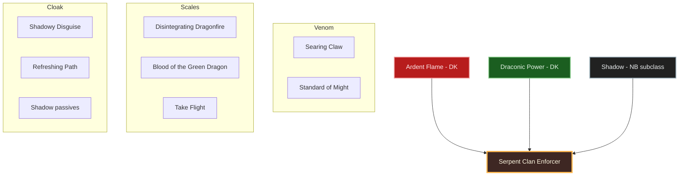
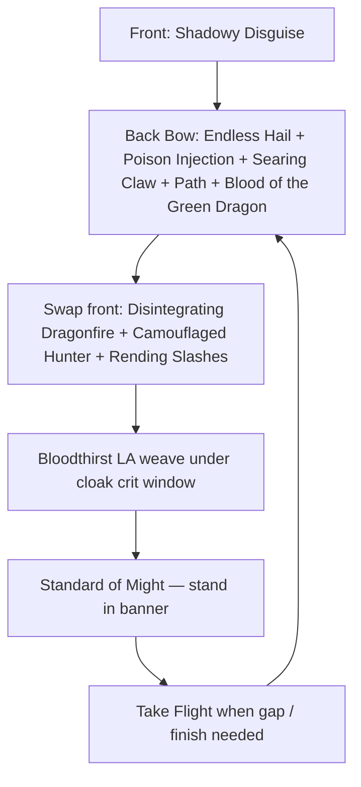
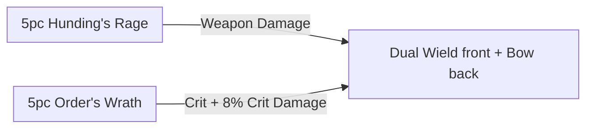

# Build Plan - Zirhli: The Serpent Clan Enforcer (Stamina Stealth Hunter)

> **Character profile:** [zirhli.md](zirhli.md) — Level 19 Argonian Dragonknight, CP 289, @SOLAEGIS (EU). Title: Dragon Master-at-Arms.

**Zirhli** is a loyal mid-tier enforcer for the Serpent Society — grim professionalism, persistence, and organized super-crime muscle who does not waste words. Under that Argonian mask he hunts like a **Yautja of the Serpent Clan**: stealth first, cunning second, the kill only when the trail is owned. This guide turns the live Level 19 kit (**One Hand and Shield** Main / **Bow** Backup, all-Health attributes, Grace of Gloom scraps, no subclass) into **The Serpent Clan Enforcer**: a stamina Dragonknight who **keeps Ardent Flame and Draconic Power**, then at Level 50 **subclasses Shadow** in place of **Earthen Heart** — cloak, path, and crit for the hunt that stone-and-magma utility cannot match.

Designed for solo overland and public dungeons on craftable gear. Pre-50 stays all-native DK; Bahtra unlocks the Shadow swap. **Dual Wield front / Bow back** — melee claim, ranged trail.

---

## Build at a glance

| **Attribute** | **Recommendation** |
| :--- | :--- |
| **Primary Stat** | 64 points in **Stamina** — **live:** 0 Mag / **22 Health** / 0 Stam · pools **30,285** HP / **17,844** Mag / **20,432** Stam · **target:** 64 Stam at CP160 |
| **Mundus Stone** | **The Thief** (+Critical Chance) — **live:** The Lady; swap when the stealth-crit loop is online |
| **Vampirism** | **Cured / N/A** — predator kit does not need the crawl; fire fights reject it |
| **Trinity** | **Ardent Flame** + **Draconic Power** KEEP · **Shadow** SUBCLASS (replaces **Earthen Heart**) at Level 50 — **live:** all three native · **decision:** Shadow cloak/crit beats Earthen utility for this hunter |
| **Sets** | **5 Hunding's Rage + 5 Order's Wrath** (100% craftable, all Medium) — **live:** Grace of Gloom 3/5 + heavy/shield scrap · **target:** Hunding's + Order's Wrath |
| **Bars** | Front: **Dual Wield** ("The Claim") · Back: **Bow** ("The Trail") — **live:** 1H+Shield Main / Bow Backup (**replace shield with Dual Wield**) |
| **Food** | **Dubious Camoran Throne** (Max Health + Max Stam + Stam Recovery) or **Artaeum Pickled Fish Bowl** while leveling |
| **Potion** | **Essence of Weapon Power** (Weapon Damage + Crit + Stam) |
| **Weapon Poisons** | **Crown Lethal Poison** / **Gradual Ravage Health** — trail damage; DK **Combustion** refunds only on **Burning** from a slotted Ardent Flame ability (not Poisoned) |
| **Staff/Weapon Enchant** | Front daggers/swords: **Poison** / **Absorb Stamina** / **Flame** · Back bow: **Disease Damage** or **Weapon Damage** |
| **Companion** | **Primary (now):** **Tanlorin** (DPS / unbound agent) at live Level **5/20** · **Secondary:** **Bastian Hallix** (soft wall) · **Goal (20/20 @ CP160):** **Tanlorin** fully geared |
| **Primary Mount** | **Rahd-m'Athra** (owned) · **Alt:** **Nightmare Senche** / **Skulltooth Coastal Durzog** — see [Collectibles](#collectibles) |
| **Flavor Pet** | **Verdigris Haj Mota** (owned) · **Alt:** **Alik'r Dune-Hound** / **Blue Dragon Imp** — see [Collectibles](#collectibles) |
| **Costume** | **Shrouded Armor** (owned) · **Alt:** **Red Rook Armor** / **Bloodthorn Robes** — see [Collectibles](#collectibles) |

**Read next:** [Roleplay](#roleplay-the-serpent-clan-enforcer) · [Trinity configuration](#trinity-configuration) · [Combat kit](#combat-kit-the-claim-and-trail) · [Gear and crafting](#gear-and-crafting-the-serpents-contract) · [Champion points](#champion-point-mapping-cp-289) · [Companion](#companion-strategy-the-unbound-agent) · [Collectibles](#collectibles) · [Checklist](#next-steps--in-game-action-checklist)

---

## Roleplay: The Serpent Clan Enforcer

He does not speechify. He does not swagger. He arrives, confirms the contract, and finishes the work.

**Zirhli** is the Serpent Society's mid-tier answer to problems that need a professional: witnesses who talk too freely, rivals who forgot the hierarchy, packages that must move through hostile streets without a parade. Loyalty is not romance — it is the ledger. Persistence is not rage — it is the trail that does not break. Under the Argonian scales of Tamriel he still hunts like a **Yautja of the Serpent Clan**: cloaked approach, patient angle, one clean claim when the prey has nowhere left to run.

**Ardent Flame** is the Society's quiet toxin — **Searing Claw** and a **Standard of Might** planted like a territorial mark (support banner, not a DoT puddle). **Draconic Power** is the armor of a hunter who expects the prey to fight back — **Disintegrating Dragonfire** for the Breach, **Blood of the Green Dragon**, scales that do not apologize. **Shadow** is the Serpent Clan gift taken at fifty: Shadowy Disguise as the cloak, Refreshing Path as the trail through darkness. Earthen Heart (live **Earthspike Mantle**) was useful stone for a young enforcer with a shield; it leaves the kit when Shadow arrives.

Companions are assets. Tanlorin is the unbound agent who understands jobs that never make the guild board. Bastian is a soft wall when the contract goes loud. **Rahd-m'Athra** is the void-cat of night contracts; a **Verdigris Haj Mota** rides the trail like a Saxhleel hunting partner. Shrouded Armor is the silhouette of work done between lanterns.

He is a loyal enforcer. He is also something older and colder that learned to wear Saxhleel skin until the job is done.

> [!TIP]
> **Suggested Custom Title:** `Serpent Clan Enforcer`

> [!NOTE]
> **Build Notes (paste into LAM Build Notes):**
> Zirhli — Serpent Clan Enforcer. Mid-tier Serpent Society professional: grim, persistent, organized crime muscle who hunts like a Yautja Serpent Clan predator — stealth and cunning before the kill. Keep Ardent Flame + Draconic Power; at 50 subclass Shadow (replaces Earthen Heart — cloak/crit beats stone utility; drop Earthshield Mantle). Target: 5 Hunding's Rage + 5 Order's Wrath (medium), @masisi. Front Dual Wield: Bloodthirst, Shadowy Disguise, Rending Slashes, Disintegrating Dragonfire, Camouflaged Hunter; ult Standard of Might. Back Bow: Endless Hail, Poison Injection, Refreshing Path, Searing Claw, Blood of the Green Dragon; ult Take Flight. 64 Stam. Mundus: The Thief (live Lady). Companion: Tanlorin now; Bastian soft wall. Costume: Shrouded Armor · mount Rahd-m'Athra · pet Verdigris Haj Mota.

> [!TIP]
> **Flavor Pet:** **Verdigris Haj Mota** (owned) — Argonian swamp-serpent hunting partner. **Alt:** **Alik'r Dune-Hound** or **Blue Dragon Imp**. See [Collectibles](#collectibles).

> [!TIP]
> **Costume:** **Shrouded Armor** — cloaked enforcer silhouette. **Alt:** **Red Rook Armor** or **Bloodthorn Robes**. Pair **Shrouded Crown** when you want the full shroud. Full picks under [Collectibles](#collectibles).

---

## Trinity configuration

### Subclassing decision (required)

Subclass unlocks at **Level 50** via Bahtra at-Hunding (**"A Study in Discipline"**). Unlocking the quest makes subclassing *available* — it does **not** mean you must swap two lines. **Default = class-identity-first:** keep native Dragonknight lines unless a foreign line clearly outperforms the pillar it replaces. See [docs/subclassing.md](../../../docs/subclassing.md).

**This build's decision:** **KEEP Ardent Flame** and **Draconic Power** (flame toxin + armored predator are the DK identity of the hunt). **SUBCLASS Shadow** replaces **Earthen Heart** because Shadowy Disguise + Refreshing Path + Shadow passives deliver stealth, guaranteed crit, and recovery that stone utility does not for a Dual Wield + Bow stalker. See [docs/dragonknight_u49.md](../../../docs/dragonknight_u49.md) for post–Update 49 DK names and line ownership.

| **Pillar** | **Line** | **Origin** | **Slot action** | **Function** |
| :--- | :--- | :--- | :--- | :--- |
| **Venom** | **Ardent Flame** | Dragonknight (native) | **KEEP** | Searing Claw (flame DoT), Standard of Might (support banner); Combustion on Burning with Ardent slotted |
| **Scales** | **Draconic Power** | Dragonknight (native) | **KEEP** | Disintegrating Dragonfire (AoE flame / Major Breach), Blood of the Green Dragon, Take Flight; Burnished Scales / Draconic passives for a hunter who closes |
| **Cloak** | **Shadow** | Nightblade (subclass) | **SUBCLASS** (replaces **Earthen Heart**) | Shadowy Disguise (stealth + guaranteed crit), Refreshing Path, Refreshing Shadows / Dark Veil passives — clearly beats Earthen Heart for stealth stalker content |

**Weapon / guild lines (not subclass):** **Dual Wield** (**Bloodthirst**, **Rending Slashes**) · **Bow** (**Endless Hail**, **Poison Injection**) · **Fighters Guild** (**Camouflaged Hunter**).

> [!IMPORTANT]
> **Pre-50 bridge only:** Keep all three native DK lines. Use live **Earthspike Mantle** (morph **Earthshield Mantle** if you want) and **Molten Weapons** as temporary Earthen fillers while you level Dual Wield. **At Level 50:** subclass **Shadow**, **unslot every Earthen Heart active** (including **Earthshield Mantle** — it cannot stay on the target kit), slot **Disintegrating Dragonfire** on The Claim and **Searing Claw** on The Trail, and take Shadowy Disguise + Refreshing Path.

---

## Combat kit: The Claim and Trail

**Target (post-50):** Plant DoTs on the **Bow** back bar ("The Trail"), swap to **Dual Wield** front ("The Claim"), cloak for a guaranteed-crit open, then Bloodthirst / Rending Slashes weave with **Disintegrating Dragonfire** Breach up. Plant **Standard of Might** and stand in the banner for WD/SD + damage reduction; **Take Flight** on the back for engage / finish. **No Earthen Heart skills on these bars.**

**Bridge (pre-50):** Stay on live 1H+Shield / Bow until Dual Wield ranks up; keep Earthen / Ardent / Draconic native skills (live **Earthspike Mantle**, **Molten Weapons**, **Dragonfire Breath**); no Shadow morphs yet.

### Skill bars

Document **slotted morph names as shown in the skills UI**. Each morph appears at most once across bars. Bars must match equipped weapon types — **live has 1H+Shield Main / Bow Backup; target is Dual Wield / Bow**.

#### Front Bar (Dual Wield): "The Claim"

| **Slot** | **Class/Line** | **Base → Morph** | **Role** | **Profile** |
| :--- | :--- | :--- | :--- | :--- |
| **1** | Dual Wield | Flurry → **Bloodthirst** | Stam spammable + heal on hit | **Respec** — unlock DW |
| **2** | Shadow | Shadow Cloak → **Shadowy Disguise** | Stealth / guaranteed crit open | **Respec @50** |
| **3** | Dual Wield | Twin Slashes → **Rending Slashes** | Melee bleed DoT + LA weave | **Respec** |
| **4** | Draconic Power | Dragonfire Breath → **Disintegrating Dragonfire** | AoE flame + Major Breach on the claim | **Live** — morph; move to front @50 |
| **5** | Fighters Guild | Expert Hunter → **Camouflaged Hunter** | Major Savagery / Prophecy + stealth synergy | **Respec** |
| **6 (Ult)** | Ardent Flame | Dragonknight Standard → **Standard of Might** | Support banner — WD/SD + DR; stand in it | **Live** — Standard (morph to Might) |

#### Back Bar (Bow): "The Trail"

| **Slot** | **Class/Line** | **Base → Morph** | **Role** | **Profile** |
| :--- | :--- | :--- | :--- | :--- |
| **1** | Bow | Volley → **Endless Hail** | Ground AoE DoT | **Respec** — morph from Volley |
| **2** | Bow | Poison Arrow → **Poison Injection** | Single-target DoT / execute | **Respec** (live has Focused Aim — replace) |
| **3** | Shadow | Path of Darkness → **Refreshing Path** | Path HoT / speed / recovery | **Respec @50** |
| **4** | Ardent Flame | Searing Strike → **Searing Claw** | Flame DoT + Combustion fuel | **Respec** |
| **5** | Draconic Power | Dragon Blood → **Blood of the Green Dragon** | Heal + Major Fortitude | **Respec** |
| **6 (Ult)** | Draconic Power | Dragon Leap → **Take Flight** | Gap close / burst engage | **Respec** |

> [!NOTE]
> **Pre-50 bridge skills (not on target bars):** live **Earthspike Mantle** / optional **Earthshield Mantle**, **Molten Weapons**, shield kit. Drop all Earthen Heart actives when Shadow replaces Earthen Heart — do not leave **Earthshield Mantle** on The Claim.

> [!WARNING]
> **Live bars are shield-tank / bow hybrid** with duplicate skills across bars. Do **not** keep **Shield Charge** or duplicate **Earthspike Mantle** / **Molten Weapons** on the target kit. Level Dual Wield before dropping the shield for hard content.

### Rotation and combat tips

#### Solo combat tips

1. **Cloak first** — Shadowy Disguise before the open so the first heavy hits crit.
2. **Trail before Claim** — Endless Hail, Poison Injection, Searing Claw, Refreshing Path, Blood of the Green Dragon from the bow; then swap.
3. **Claim weave** — Disintegrating Dragonfire for Major Breach, Camouflaged Hunter for Savagery, Rending Slashes DoT, Bloodthirst light-attack weave.
4. **Burning / Combustion** — keep an Ardent Flame ability slotted so **Combustion** refunds on **Burning** (Searing Claw / Disintegrating Dragonfire). Weapon poisons are trail damage, not Combustion fuel.
5. **Standard of Might** on bosses and world bosses — plant and fight inside the banner; **Take Flight** to close or finish runners.
6. Potion **Essence of Weapon Power** on hard pulls once Hunding's / Order's Wrath are on.

### Passive skills

**Live:** **3 skill points** available · Dual Wield rank 2 · Bow rank 13 · heavy shield kit. Spend in this priority; fully rank (II/III) where noted.

#### Dragonknight — Ardent Flame

* **Combustion** / **Traumatic Burns** / **Fan the Flames** / **A Soul Ablaze** — rank as Ardent climbs (live already has Combustion, Traumatic Burns, Fan the Flames).
* Morphs **Searing Claw**, ultimate **Standard of Might**.

#### Dragonknight — Draconic Power

* **Burnished Scales** / **World in Ruin** / **Elder Dragon** / **The Storm Voice** — unlock as ranks allow (live already has Burnished Scales, World in Ruin).
* Morphs **Disintegrating Dragonfire**, **Blood of the Green Dragon**, ultimate **Take Flight**.

#### Dragonknight — Earthen Heart (pre-50 bridge only)

* Optional morph **Earthshield Mantle** from live **Earthspike Mantle**; **unslot with Earthen Heart at Level 50** — not on the target kit.

#### Nightblade — Shadow (post-50)

* **Refreshing Shadows** / **Shadow Barrier** / **Dark Veil** / **Dark Sluice** / **Dark Shadow** — take with the subclass.
* Morphs **Shadowy Disguise**, **Refreshing Path**.

#### Weapon — Dual Wield

* **Dual Wield Expert** / **Controlled Fury** / **Ruffian** / **Twin Blade and Blunt** — priority while leveling DW from rank 2.
* Morphs **Bloodthirst**, **Rending Slashes**.

#### Weapon — Bow

* **Accuracy** / **Ranger** / **Hawk Eye** / **Hasty Retreat** — continue from live Vinedusk Training.
* Morphs **Endless Hail**, **Poison Injection**.

#### Armor — Medium

* **Dexterity** / **Wind Walker** / **Improved Sneak** / **Agility** / **Athletics** — train by wearing medium (live is mostly heavy).

#### Guild — Fighters Guild

* **Intimidating Presence** / **Slayer** / **Banish the Wicked** / **Skilled Tracker** as ranks allow.
* Morph **Camouflaged Hunter**.

#### Race — Argonian

* **Amphibian** / **Resourceful** / **Argonian Resistance** / **Quick to Mend** — take racials when free points allow.

#### World / Undaunted

* **Undaunted Command** / **Undaunted Mettle** when dungeon ranks unlock — optional sustain.

---

## Gear and crafting: "The Serpent's Contract"

Everything is **crafted** — no overland farming for the primary loadout. **Hunding's Rage** supplies weapon damage / stamina; **Order's Wrath** stacks crit and **+8% critical damage** so Shadowy Disguise opens and DoTs hit harder. All **Medium** for stamina armor passives.

### Set rationale

| **Set** | **5-Piece Bonus** | **Role in the Build** |
| :--- | :--- | :--- |
| **Hunding's Rage** | Weapon Damage / Stam package | Baseline stamina DPS for Claim + Trail |
| **Order's Wrath** | Crit chance + **+8% Critical Damage** | Amplifies cloak crits, Bloodthirst, Injection, Breath |

> [!NOTE]
> **Why not Grace of Gloom?** Live **3/5** is a fine **bridge** only — dungeon drop, not craftable target. Do not farm the rest for the primary loadout.

> [!NOTE]
> **Why not Briarheart jewelry?** Wrothgar **overland drop** — not craftable. Reject as *target*.

> [!TIP]
> **Live gear bridge:** Keep Grace of Gloom scraps + any medium you find while leveling Dual Wield. Prefer medium pieces to train Medium passives. Ask @masisi for level-scaled purple Hunding's / Order's Wrath under CP160.

### Target loadout

| **Slot** | **Set** | **Weight** | **Trait** | **Enchantment** | **Quality** |
| :--- | :--- | :--- | :--- | :--- | :--- |
| **Head** | Order's Wrath | Medium | Divines | Max Stamina | Gold |
| **Shoulders** | Order's Wrath | Medium | Divines | Max Stamina | Gold |
| **Chest** | Hunding's Rage | Medium | Divines | Max Stamina | Gold |
| **Hands** | Hunding's Rage | Medium | Divines | Max Stamina | Gold |
| **Waist** | Hunding's Rage | Medium | Divines | Max Stamina | Gold |
| **Legs** | Hunding's Rage | Medium | Divines | Max Stamina | Gold |
| **Feet** | Hunding's Rage | Medium | Divines | Max Stamina | Gold |
| **Necklace** | Order's Wrath | Jewelry | Robust / Bloodthirsty | Weapon Damage | Gold |
| **Ring 1** | Order's Wrath | Jewelry | Bloodthirsty | Weapon Damage | Gold |
| **Ring 2** | Order's Wrath | Jewelry | Bloodthirsty | Weapon Damage | Gold |
| **Front — Main** | Hunding's Rage | Dagger / Sword | Precise / Nirnhoned | Poison / Absorb Stamina | Gold |
| **Front — Off** | Hunding's Rage | Dagger / Sword | Charged / Infused | Flame / Poison | Gold |
| **Back — Bow** | Hunding's Rage | Bow | Precise / Infused | Disease Damage or Weapon Damage | Gold |

**Piece counts for bonuses:** **Order's Wrath 5** (head, shoulders, necklace, both rings) · **Hunding's Rage 5** (chest, hands, waist, legs, feet). Weapons are extra Hunding's pieces for traits/enchants — they do not replace the body five.

**Front daggers:** Precise + Charged (status for Combustion) or Nirnhoned on main hand when transmute allows.
**Back bow:** Precise for crit with Order's Wrath / Thief; Infused if using Weapon Damage enchant.

### Crafting handoff (@masisi)

| **Detail** | **Recommendation** |
| :--- | :--- |
| **Crafter** | EU account artisan **[Masisi](masisi.md)** / [masisi_plan.md](masisi_plan.md) |
| **Style** | **Argonian** / **Dark Brotherhood** / **Assassin** trim if known — Outfit Station motifs; costume stays **Shrouded Armor** |
| **Set station** | Order's Wrath: **Steadfast Hammer and Saw** (High Isle) — 3 traits · Hunding's Rage: classic crafted set — 6 traits |
| **Traits** | **Divines** armor · **Bloodthirsty** / **Robust** jewelry · **Precise** / **Infused** / **Charged** weapons |
| **Interim (pre-CP160)** | Live Gloom scraps + medium; ask @masisi for **level-scaled** purple Hunding's / Order's Wrath |
| **Quality path** | Purple bridge → **gold at CP160** when traits ready |

> [!NOTE]
> **Research gate:** Coordinate with @masisi before gold-quality CP160 work. See [`masisi.md`](masisi.md) for account crafter status. Companion gear is **not** on this handoff.

---

## Champion Point Mapping (CP 289)

Budget: **96 Warfare / 97 Craft / 96 Fitness** (289 total). **Live: 273 spent / 16 available** (Warfare 91 · Craft 91 · Fitness 91). Under 900 total CP you have **3 slotted stars** per discipline. Star names match [champion_points_reference.md](../../templates/champion_points_reference.md); walk prerequisites from `champion_points.yaml`.

> [!NOTE]
> **Live Warfare is tanky** — Ironclad 36 / Unassailable 25 / Tireless Discipline 20 / Quick Recovery 10. Respec toward **crit + DoT** for the hunter kit once Dual Wield and Shadow are online.

> [!NOTE]
> **When CP grows (≈810+):** Cap Warfare Fighting Finesse / Thaumaturge / Deadly Aim (or Master-at-Arms) at 50 each; Fitness Boundless Vitality / Fortified / Rejuvenation; finish Craft **Liquid Efficiency (50)** after Steadfast Enchantment + Rationer; keep **Sustaining Shadows** for stealth.

### Warfare (Blue — target ~96)

| **Star** | **Type** | **Spend** | **Benefit** |
| :--- | :--- | :--- | :--- |
| **Precision** | Passive | 20 | Crit Chance |
| **Piercing** | Passive | 20 | Offensive Penetration |
| **Tireless Discipline** | Passive | 20 | Max Stamina — **keep from live** |
| **Fighting Finesse** | Slotted | 36 | Critical Damage — **top toward 50** as CP grows |
| *(available / reallocate)* | — | — | Drop Ironclad / Unassailable for this path; bank leftovers toward Thaumaturge / Deadly Aim |

*Optional later:* **Thaumaturge 50** for Hail / Breath / Injection / Claw DoTs; **Deadly Aim 50** for Bloodthirst / Leap singles.

### Fitness (Red — target ~96)

| **Star** | **Type** | **Spend** | **Benefit** |
| :--- | :--- | :--- | :--- |
| **Rejuvenation** | Slotted | 50 | Recovery — **live 41 → top to 50** |
| **Fortified** | Slotted | 46 | Armor — **live 50; trim or keep** |
| *(available)* | — | — | Start **Boundless Vitality** when Fitness budget allows |

**Passives (as points allow):** Hero's Vigor · Tumbling (dodge cost for cloak dances).

### Craft (Green — target ~97)

| **Star** | **Type** | **Spend** | **Benefit** |
| :--- | :--- | :--- | :--- |
| **Steed's Blessing** | Slotted | 50 | Out-of-combat move speed — **live keep** |
| **Sustaining Shadows** | Slotted | 47 | Sneak cost — **essential for Serpent Clan; top to 50** |
| *(reallocate)* | — | — | Trim **Gilded Fingers** (live 41) into Sustaining Shadows |

**Passives (as points allow):** Out of Sight · Fleet Phantom · Treasure Hunter path toward Liquid Efficiency later.

---

## Companion Strategy: "The Unbound Agent"

Companions use **Companion's** weapons and armor only (Quickened, Aggressive, Bolstered, etc.) — never player sets (no Hunding's, no Divines). Buy white basics from vendors; farm Superior+ while the companion is summoned. **Not** part of the @masisi player-gear handoff.

> [!NOTE]
> **Live export:** **Tanlorin** active at **Level 5/20** with **level 1 Companion's gear**, **three empty ability slots**. Prioritize companion XP, gear upgrades, and bar fill per [Checklist](#next-steps--in-game-action-checklist).

### Companion picks

| **Tier** | **Companion** | **Role** | **Roleplay fit** | **Mechanical fit** |
| :--- | :--- | :--- | :--- | :--- |
| **Primary (now)** | **Tanlorin** | DPS / utility | Unbound agent who understands off-books contracts | Already summoned — level and gear |
| **Secondary** | **Bastian Hallix** | Tank / soft wall | Reliable muscle when the job goes loud | Frontline while Tanlorin levels |
| **Goal (20/20 @ CP160)** | **Tanlorin** | DPS / utility | Same agent at full trust | Fully geared Aggressive Companion's set |

### Primary now — Tanlorin

| **Setting** | **Recommendation** |
| :--- | :--- |
| **Role** | **Ranged DPS** (Bow) to match The Trail |
| **Gear Weight** | **Medium** Companion's (Superior+ drops) |
| **Traits** | **Aggressive** (damage) · **Quickened** (ult gen) · **Bolstered** on one piece if squishy |
| **Loadout** | Companion's Bow + medium body; fill empty skill slots |
| **Acquisition** | Vendor whites → farm Superior+ with Tanlorin summoned |

**Support skill bar (target):**

1. Piercing Arrow / Sniper's Mark style bow pressure
2. Internal Conflict (already live)
3. Starfall (already live)
4. Fill empty slots with damage / heal companions skills as unlocked
5. Ultimate when available

### Secondary — Bastian Hallix

| **Setting** | **Recommendation** |
| :--- | :--- |
| **Role** | **Tank** (One Hand and Shield) |
| **Gear Weight** | **Heavy** Companion's |
| **Traits** | **Bolstered** / **Quickened** |
| **When to swap** | World bosses, delves that go loud, while Tanlorin is underleveled |

---

## Collectibles

### Mount

| **Pick** | **Mount** | **Notes** |
| :--- | :--- | :--- |
| **Primary** | **Rahd-m'Athra** | Owned — void-cat for night contracts (diversified vs EU Nightmare Senche primaries) |
| **Backup** | **Nightmare Senche** | Owned — classic predator silhouette; strong alt |
| **Alt** | **Skulltooth Coastal Durzog** | Owned — pack hunter / coastal muscle |
| **Avoid thematically** | **Psijic Escort Charger** / parade chargers | Too orderly for mid-tier underworld work |

### Pet

| **Pick** | **Pet** | **Notes** |
| :--- | :--- | :--- |
| **Primary** | **Verdigris Haj Mota** | Owned — Saxhleel swamp-serpent partner (diversified vs EU Dune-Hound primary) |
| **Alt** | **Alik'r Dune-Hound** | Owned — trail hound |
| **Alt** | **Blue Dragon Imp** | Owned — scaled familiar |
| **Alt** | **Dwarven Spider** | Owned — serpentine mechanical |

### Costume

| **Pick** | **Costume** | **Notes** |
| :--- | :--- | :--- |
| **Primary** | **Shrouded Armor** | Owned — cloaked enforcer (unique EU primary) |
| **Alt** | **Red Rook Armor** | Owned — street muscle |
| **Alt** | **Bloodthorn Robes** | Owned — dark cult silhouette without overlapping Covenant Scout primary |
| **Accessory** | **Shrouded Crown** | Owned — pairs with Shrouded Armor |
| **Personality** | **Assassin** | Owned — already matches the hunt |

Outfit Station motifs on crafted Hunding's / Order's Wrath are separate from the full-body costume.

### Dye and style

| **Element** | **Recommendation** |
| :--- | :--- |
| **Primary dye** | Charcoal / void black |
| **Secondary** | Serpent green / swamp teal |
| **Trim** | Sickle gold or dried-blood rust — Society rank, not parade |
| **Weapons** | Dark Brotherhood / Assassin / Argonian motifs when known |

---

## Next Steps & In-Game Action Checklist

### Phase 0 — Today (functional build)

1. **Spend the 3 skill points** into Dual Wield unlocks / Bow passives / Ardent or Draconic ranks.
2. **Attributes:** start dumping into **Stamina** (stop stacking Health) toward **64**.
3. **Food:** Dubious Camoran Throne or leveling fish bowl; equip **weapon poisons**.
4. **Begin Dual Wield** — craft or buy cheap daggers; park the shield for overland training pulls.
5. **Spend leftover CP** (16 available) — top Rejuvenation → 50; bank Warfare toward Precision / Fighting Finesse; start reallocating Craft from Gilded Fingers toward **Sustaining Shadows**.
6. **Tanlorin:** keep summoned; fill empty ability slots; upgrade Companion's gear from vendors / drops.
7. **Collectibles:** equip **Shrouded Armor**, **Rahd-m'Athra**, **Verdigris Haj Mota**; enable **Assassin** personality.

### Phase 1 — Level to 50 (interim)

8. Keep **Grace of Gloom** scraps as bridge only; prefer **medium** armor.
9. Rank **Dual Wield**, **Bow**, **Ardent Flame**, **Draconic Power**, Medium Armor, Fighters Guild.
10. Morph toward **Bloodthirst**, **Rending Slashes**, **Endless Hail**, **Poison Injection**, **Disintegrating Dragonfire**, **Searing Claw**, **Blood of the Green Dragon**, **Standard of Might**, **Take Flight**, **Camouflaged Hunter**. Optional bridge only: **Earthshield Mantle**.
11. Practice Trail DoTs → Claim weave (without Shadow until 50); keep Earthen fillers off the mental target kit.
12. Optional: commission @masisi for **level-scaled** purple Hunding's / Order's Wrath.

### Phase 2 — Craft (target)

13. **Level 50:** complete Bahtra **"A Study in Discipline"**; **subclass Shadow** (replace Earthen Heart); **drop all Earthen Heart actives**; take **Shadowy Disguise** + **Refreshing Path**; slot **Disintegrating Dragonfire** front / **Searing Claw** back.
14. **@masisi:** craft **5 Hunding's Rage + 5 Order's Wrath** (medium, Divines, Bloodthirsty jewelry, Precise/Charged/Infused weapons) at CP160 gold.
15. Mundus → **The Thief**.
16. Respec Warfare off Ironclad / Unassailable into Precision / Piercing / Fighting Finesse (then Thaumaturge / Deadly Aim as CP grows).

### Phase 3 — Polish

17. Motifs / dyes: charcoal + serpent green on Outfit Station; keep **Shrouded Armor** as costume.
18. Level **Tanlorin** to **20/20**; farm Companion's Aggressive / Bolstered / Quickened gear (Bow kit).
19. Finish Craft **Sustaining Shadows 50**; later **Liquid Efficiency**; re-export with `/cm` or `/cm coach` when live matches this plan.

### Finish

20. Regenerate profile with `/cm` and update [zirhli.md](zirhli.md) when attributes, subclass, Mundus, gear, bars, and costume match this plan.

The contract is clear. The trail does not break.
