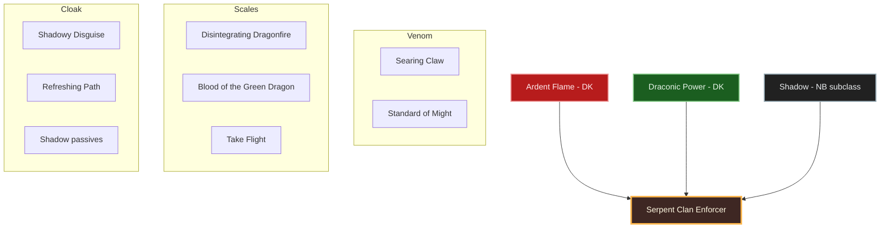
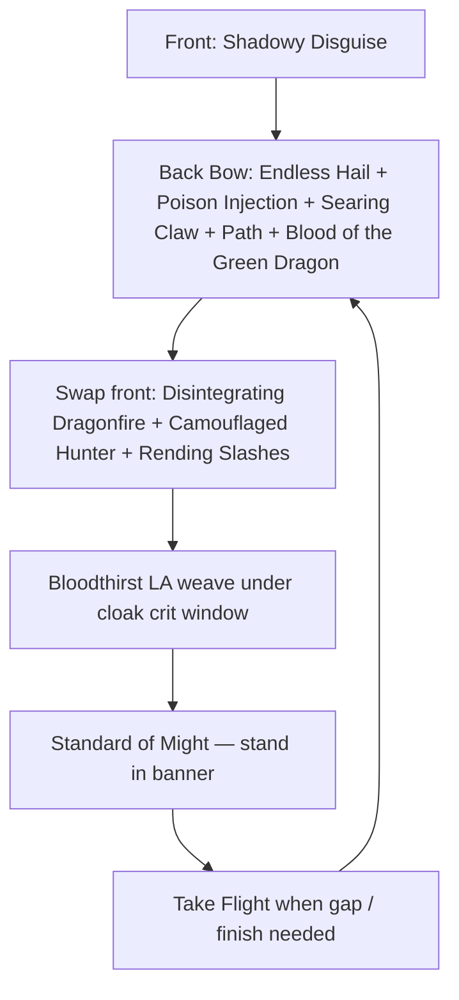
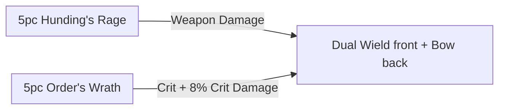

# Build Plan - Zirhli: The Serpent Clan Enforcer (Stamina Stealth Hunter)

> **Character profile:** [zirhli.md](zirhli.md) — Level 27 Argonian Dragonknight, CP 336, @SOLAEGIS (EU). Title: Locksmith.

**Zirhli** is a loyal mid-tier enforcer for the Serpent Society — grim professionalism, persistence, and organized super-crime muscle who does not waste words. Under that Argonian mask he hunts like a **Yautja of the Serpent Clan**: stealth first, cunning second, the kill only when the trail is owned. The live Level 27 kit is already **The Serpent Clan Enforcer** in shape: a stamina Dragonknight who **keeps Ardent Flame and Draconic Power** and has **subclassed Shadow** in place of **Earthen Heart** — cloak, path, and crit for the hunt that stone-and-magma utility cannot match. **Dual Wield** Main / **Bow** Backup, all-Stamina attributes, The Lover mundus. What remains is morphs, passives, and the CP160 crafted gear.

Designed for solo overland and public dungeons on craftable gear. Until CP160, levelling gear is whatever drops — the crafted loadout is the destination, not a requirement. **Dual Wield front / Bow back** — melee claim, ranged trail.

---

## Build at a glance

| **Attribute** | **Recommendation** |
| :--- | :--- |
| **Primary Stat** | 64 points in **Stamina** — **live:** 0 Mag / 0 Health / **33 Stam** · pools **25,605** HP / **20,162** Mag / **24,895** Stam · **target:** 64 Stam at CP160 |
| **Mundus Stone** | **The Lover** (+Penetration) — **live:** The Lover ✓ · beats The Thief by ~+2% now and ~+3.5% at CP160 (4,489 pen vs 1,982 crit rating with 7 gold Divines); Shadowy Disguise already guarantees the opener crit |
| **Vampirism** | **Cured / N/A** — predator kit does not need the crawl; fire fights reject it |
| **Trinity** | **Ardent Flame** + **Draconic Power** KEEP · **Shadow** SUBCLASS (replaces **Earthen Heart**) — **live:** Shadow subclassed (rank 27) ✓ · **decision:** Shadow cloak/crit beats Earthen utility for this hunter |
| **Sets** | **5 Hunding's Rage + 5 Order's Wrath** (100% craftable, all Medium) — **live:** levelling drops (fine until CP160) · **target:** Hunding's + Order's Wrath at CP160 gold |
| **Bars** | Front: **Dual Wield** ("The Claim") · Back: **Bow** ("The Trail") — **live:** Dual Wield Main / Bow Backup ✓ |
| **Food** | **Dubious Camoran Throne** (Max Health + Max Stam + Stam Recovery) or **Artaeum Pickled Fish Bowl** while leveling |
| **Potion** | **Essence of Weapon Power** (Major Brutality + Stam; its Major Savagery duplicates **Camouflaged Hunter** once that is slotted) |
| **Weapon Poisons** | **Crown Lethal Poison** / **Gradual Ravage Health** — trail damage; DK **Combustion** refunds only on **Burning** from a slotted Ardent Flame ability (not Poisoned) |
| **Staff/Weapon Enchant** | Front daggers/swords: **Poison** / **Absorb Stamina** / **Flame** · Back bow: **Disease Damage** or **Weapon Damage** |
| **Companion** | **Primary (now):** **Tanlorin** (DPS / unbound agent) at live Level **5/20** · **Secondary:** **Bastian Hallix** (soft wall) · **Goal (20/20 @ CP160):** **Tanlorin** fully geared |
| **Primary Mount** | **Rahd-m'Athra** (owned) · **Alt:** **Nightmare Senche** / **Skulltooth Coastal Durzog** — see [Collectibles](#collectibles) |
| **Flavor Pet** | **Verdigris Haj Mota** (owned) · **Alt:** **Alik'r Dune-Hound** / **Blue Dragon Imp** — see [Collectibles](#collectibles) |
| **Costume** | **Shrouded Armor** (owned) · **Alt:** **Red Rook Armor** / **Bloodthorn Robes** — see [Collectibles](#collectibles) |

**Read next:** [Roleplay](#roleplay-the-serpent-clan-enforcer) · [Trinity configuration](#trinity-configuration) · [Combat kit](#combat-kit-the-claim-and-trail) · [Gear and crafting](#gear-and-crafting-the-serpents-contract) · [Champion points](#champion-point-mapping-cp-336) · [Companion](#companion-strategy-the-unbound-agent) · [Collectibles](#collectibles) · [Checklist](#next-steps--in-game-action-checklist)

---

## Roleplay: The Serpent Clan Enforcer

He does not speechify. He does not swagger. He arrives, confirms the contract, and finishes the work.

**Zirhli** is the Serpent Society's mid-tier answer to problems that need a professional: witnesses who talk too freely, rivals who forgot the hierarchy, packages that must move through hostile streets without a parade. Loyalty is not romance — it is the ledger. Persistence is not rage — it is the trail that does not break. Under the Argonian scales of Tamriel he still hunts like a **Yautja of the Serpent Clan**: cloaked approach, patient angle, one clean claim when the prey has nowhere left to run.

**Ardent Flame** is the Society's quiet toxin — **Searing Claw** and a **Standard of Might** planted like a territorial mark (support banner, not a DoT puddle). **Draconic Power** is the armor of a hunter who expects the prey to fight back — **Disintegrating Dragonfire** for the Breach, **Blood of the Green Dragon**, scales that do not apologize. **Shadow** is the Serpent Clan gift, taken early: Shadowy Disguise as the cloak, Refreshing Path as the trail through darkness. Earthen Heart was useful stone for a young enforcer with a shield; it left the kit when Shadow arrived.

Companions are assets. Tanlorin is the unbound agent who understands jobs that never make the guild board. Bastian is a soft wall when the contract goes loud. **Rahd-m'Athra** is the void-cat of night contracts; a **Verdigris Haj Mota** rides the trail like a Saxhleel hunting partner. Shrouded Armor is the silhouette of work done between lanterns.

He is a loyal enforcer. He is also something older and colder that learned to wear Saxhleel skin until the job is done.

> [!TIP]
> **Suggested Custom Title:** `Serpent Clan Enforcer`

> [!NOTE]
> **Build Notes (paste into LAM Build Notes):**
> Zirhli — Serpent Clan Enforcer. Mid-tier Serpent Society professional: grim, persistent, organized crime muscle who hunts like a Yautja Serpent Clan predator — stealth and cunning before the kill. Keep Ardent Flame + Draconic Power; Shadow subclass (replaces Earthen Heart — cloak/crit beats stone utility). Target: 5 Hunding's Rage + 5 Order's Wrath (medium), @masisi. Front Dual Wield: Bloodthirst, Shadowy Disguise, Rending Slashes, Disintegrating Dragonfire, Camouflaged Hunter; ult Standard of Might. Back Bow: Endless Hail, Poison Injection, Refreshing Path, Searing Claw, Blood of the Green Dragon; ult Take Flight. 64 Stam. Mundus: The Lover. Companion: Tanlorin now; Bastian soft wall. Costume: Shrouded Armor · mount Rahd-m'Athra · pet Verdigris Haj Mota.

> [!TIP]
> **Flavor Pet:** **Verdigris Haj Mota** (owned) — Argonian swamp-serpent hunting partner. **Alt:** **Alik'r Dune-Hound** or **Blue Dragon Imp**. See [Collectibles](#collectibles).

> [!TIP]
> **Costume:** **Shrouded Armor** — cloaked enforcer silhouette. **Alt:** **Red Rook Armor** or **Bloodthorn Robes**. Pair **Shrouded Crown** when you want the full shroud. Full picks under [Collectibles](#collectibles).

---

## Trinity configuration

### Subclassing decision (required)

**Live:** Zirhli already runs **Shadow** as his subclass (taken before Level 50; line rank 27). Subclassing does **not** mean you must swap two lines. **Default = class-identity-first:** keep native Dragonknight lines unless a foreign line clearly outperforms the pillar it replaces. See [docs/subclassing.md](../../../docs/subclassing.md).

**This build's decision:** **KEEP Ardent Flame** and **Draconic Power** (flame toxin + armored predator are the DK identity of the hunt). **SUBCLASS Shadow** replaces **Earthen Heart** because Shadowy Disguise + Refreshing Path + Shadow passives deliver stealth, guaranteed crit, and recovery that stone utility does not for a Dual Wield + Bow stalker. See [docs/dragonknight_u49.md](../../../docs/dragonknight_u49.md) for post–Update 49 DK names and line ownership.

| **Pillar** | **Line** | **Origin** | **Slot action** | **Function** |
| :--- | :--- | :--- | :--- | :--- |
| **Venom** | **Ardent Flame** | Dragonknight (native) | **KEEP** | Searing Claw (flame DoT), Standard of Might (support banner); Combustion on Burning with Ardent slotted |
| **Scales** | **Draconic Power** | Dragonknight (native) | **KEEP** | Disintegrating Dragonfire (AoE flame / Major Breach), Blood of the Green Dragon, Take Flight; Burnished Scales / Draconic passives for a hunter who closes |
| **Cloak** | **Shadow** | Nightblade (subclass) | **SUBCLASS** (replaces **Earthen Heart**) | Shadowy Disguise (stealth + guaranteed crit), Refreshing Path, Refreshing Shadows / Dark Veil passives — clearly beats Earthen Heart for stealth stalker content |

**Weapon / guild lines (not subclass):** **Dual Wield** (**Bloodthirst**, **Rending Slashes**) · **Bow** (**Endless Hail**, **Poison Injection**) · **Fighters Guild** (**Camouflaged Hunter**).

> [!NOTE]
> **Done:** Shadow subclassed, Earthen Heart actives off the bars, **Disintegrating Dragonfire** on The Claim, **Searing Claw** on The Trail, **Shadowy Disguise** slotted. Remaining: morph **Path of Darkness → Refreshing Path**.

---

## Combat kit: The Claim and Trail

**Target:** Plant DoTs on the **Bow** back bar ("The Trail"), swap to **Dual Wield** front ("The Claim"), cloak for a guaranteed-crit open, then Bloodthirst / Rending Slashes weave with **Disintegrating Dragonfire** Breach up. Plant **Standard of Might** and stand in the banner for WD/SD + damage reduction; **Take Flight** on the back for engage / finish. **No Earthen Heart skills on these bars.**

**Live (Level 27):** Bars already follow this shape. Differences from target: **Blood of the Green Dragon** on both bars (fine for solo levelling) until **Camouflaged Hunter** is available, **Lethal Arrow** until **Poison Injection**, and three unmorphed skills (Path of Darkness, Dragonknight Standard, Dragon Leap).

### Skill bars

Document **slotted morph names as shown in the skills UI**. Each morph appears at most once across bars. Bars must match equipped weapon types — **live and target are Dual Wield / Bow**.

#### Front Bar (Dual Wield): "The Claim"

| **Slot** | **Class/Line** | **Base → Morph** | **Role** | **Profile** |
| :--- | :--- | :--- | :--- | :--- |
| **1** | Draconic Power | Dragonfire Breath → **Disintegrating Dragonfire** | AoE flame + Major Breach on the claim | **Live** ✓ |
| **2** | Shadow | Shadow Cloak → **Shadowy Disguise** | Stealth / guaranteed crit open | **Live** ✓ |
| **3** | Dual Wield | Twin Slashes → **Rending Slashes** | Melee bleed DoT + LA weave | **Live** ✓ |
| **4** | Dual Wield | Flurry → **Bloodthirst** | Stam spammable + heal on hit | **Live** ✓ |
| **5** | Fighters Guild | Expert Hunter → **Camouflaged Hunter** | Major Savagery / Prophecy + stealth synergy | **Later** — Fighters Guild rank 5; live slot: **Blood of the Green Dragon** |
| **6 (Ult)** | Ardent Flame | Dragonknight Standard → **Standard of Might** | Support banner — WD/SD + DR; stand in it | **Live** — Dragonknight Standard (morph to Might) |

#### Back Bar (Bow): "The Trail"

| **Slot** | **Class/Line** | **Base → Morph** | **Role** | **Profile** |
| :--- | :--- | :--- | :--- | :--- |
| **1** | Bow | Volley → **Endless Hail** | Ground AoE DoT | **Live** ✓ |
| **2** | Bow | Poison Arrow → **Poison Injection** | Single-target DoT / execute | **Later** — live slot: **Lethal Arrow** |
| **3** | Ardent Flame | Searing Strike → **Searing Claw** | Flame DoT + Combustion fuel | **Live** ✓ |
| **4** | Draconic Power | Dragon Blood → **Blood of the Green Dragon** | Heal + Major Fortitude | **Live** ✓ |
| **5** | Shadow | Path of Darkness → **Refreshing Path** | Path HoT / speed / recovery | **Live** — Path of Darkness (morph) |
| **6 (Ult)** | Draconic Power | Dragon Leap → **Take Flight** | Gap close / burst engage | **Live** — Dragon Leap (morph) |

> [!NOTE]
> **Combustion:** both bars carry an Ardent Flame ability (Dragonknight Standard front, Searing Claw back), so Burning refunds on either bar.

### Rotation and combat tips

#### Solo combat tips

1. **Cloak first** — Shadowy Disguise before the open so the first heavy hits crit.
2. **Trail before Claim** — Endless Hail, Poison Injection, Searing Claw, Refreshing Path, Blood of the Green Dragon from the bow; then swap.
3. **Claim weave** — Disintegrating Dragonfire for Major Breach, Camouflaged Hunter for Savagery, Rending Slashes DoT, Bloodthirst light-attack weave.
4. **Burning / Combustion** — keep an Ardent Flame ability slotted so **Combustion** refunds on **Burning** (Searing Claw / Disintegrating Dragonfire). Weapon poisons are trail damage, not Combustion fuel.
5. **Standard of Might** on bosses and world bosses — plant and fight inside the banner; **Take Flight** to close or finish runners.
6. Potion **Essence of Weapon Power** on hard pulls once Hunding's / Order's Wrath are on.

### Passive skills

**Live:** **1 skill point** available · Dual Wield rank 28 · Bow rank 30 · Medium Armor rank 27 · Shadow rank 27. Spend in this priority: morphs first as skills hit rank IV (Refreshing Path → Standard of Might → Take Flight), then **Twin Blade and Blunt**, **Agility**, **Shadow Barrier / Dark Vigor**, **Hawk Eye**.

#### Dragonknight — Ardent Flame

* **Combustion** / **Traumatic Burns** / **Fan the Flames** / **A Soul Ablaze** — rank as Ardent climbs (live already has Combustion, Traumatic Burns, Fan the Flames).
* Morphs **Searing Claw**, ultimate **Standard of Might**.

#### Dragonknight — Draconic Power

* **Burnished Scales** / **World in Ruin** / **Elder Dragon** / **The Storm Voice** — unlock as ranks allow (live already has Burnished Scales, World in Ruin).
* Morphs **Disintegrating Dragonfire**, **Blood of the Green Dragon**, ultimate **Take Flight**.

#### Dragonknight — Earthen Heart (retired)

* Replaced by the Shadow subclass — no Earthen Heart actives on the bars.

#### Nightblade — Shadow (subclass)

* **Refreshing Shadows** (live) · next **Shadow Barrier** / **Dark Vigor** / **Dark Veil**.
* Morphs **Shadowy Disguise**, **Refreshing Path**.

#### Weapon — Dual Wield

* Live: **Focused Killer** / **Ambidextrous** / **Controlled Fury** / **Ruffian** · next **Twin Blade and Blunt**.
* Morphs **Bloodthirst**, **Rending Slashes**.

#### Weapon — Bow

* Live: **Vinedusk Training** / **Accuracy** · next **Ranger** / **Hawk Eye** / **Hasty Retreat**.
* Morphs **Endless Hail**, **Poison Injection**.

#### Armor — Medium

* Live: **Dexterity** / **Wind Walker** / **Improved Sneak** · next **Agility** / **Athletics** (live 6 medium + 1 light).

#### Guild — Fighters Guild

* **Intimidating Presence** / **Slayer** / **Banish the Wicked** / **Skilled Tracker** as ranks allow.
* Morph **Camouflaged Hunter**.

#### Race — Argonian

* **Amphibian** / **Resourceful** / **Argonian Resistance** / **Quick to Mend** — take racials when free points allow.

#### World / Undaunted

* **Undaunted Command** / **Undaunted Mettle** when dungeon ranks unlock — optional sustain.

---

## Gear and crafting: "The Serpent's Contract"

Everything is **crafted** at CP160 — no overland farming for the primary loadout. Both sets give **+657 crit** at 2 and 4 pieces; **Hunding's Rage** adds Max Stamina (3pc) and **+300 Weapon Damage** (5pc); **Order's Wrath** adds +129 Weapon Damage (3pc) and **+943 crit / +8% Critical Damage** (5pc). Before CP160, whatever drops is fine. All **Medium** for stamina armor passives.

### Set rationale

| **Set** | **5-Piece Bonus** | **Role in the Build** |
| :--- | :--- | :--- |
| **Hunding's Rage** | +300 Weapon Damage (2/4pc +657 crit each, 3pc +1,096 Max Stam) | Baseline stamina DPS for Claim + Trail — losing the 5pc costs ~5.3% |
| **Order's Wrath** | +943 crit + **+8% Critical Damage** (2/4pc +657 crit each, 3pc +129 WD) | Amplifies Bloodthirst, Injection, Breath — losing the 5pc costs ~4.9% |

> [!NOTE]
> **Why not Night Mother's Gaze?** Its 5pc is Major Breach, which **Disintegrating Dragonfire** already applies — worth 0 while Dragonfire is up.

> [!NOTE]
> **Why not Briarheart jewelry?** Wrothgar **overland drop** — not craftable. Reject as *target*.

> [!TIP]
> **Levelling gear (pre-CP160):** Wear the best drops you have; prefer medium pieces and Max Stamina glyphs when they are cheap to swap. Optional: ask @masisi for level-scaled Hunding's / Order's Wrath.

### Target loadout

| **Slot** | **Set** | **Weight** | **Trait** | **Enchantment** | **Quality** |
| :--- | :--- | :--- | :--- | :--- | :--- |
| **Head** | Order's Wrath | Medium | Divines | Max Stamina | Gold |
| **Shoulders** | Order's Wrath | Medium | Divines | Max Stamina | Gold |
| **Chest** | Hunding's Rage | Medium | Divines | Max Stamina | Gold |
| **Hands** | Hunding's Rage | Medium | Divines | Max Stamina | Gold |
| **Waist** | Hunding's Rage | Medium | Divines | Max Stamina | Gold |
| **Legs** | Hunding's Rage | Medium | Divines | Max Stamina | Gold |
| **Feet** | Hunding's Rage | Medium | Divines | Max Stamina | Gold |
| **Necklace** | Order's Wrath | Jewelry | Bloodthirsty | Weapon Damage | Gold |
| **Ring 1** | Order's Wrath | Jewelry | Bloodthirsty | Weapon Damage | Gold |
| **Ring 2** | Order's Wrath | Jewelry | Bloodthirsty | Weapon Damage | Gold |
| **Front — Main** | Hunding's Rage | Dagger / Sword | Sharpened / Precise | Poison / Absorb Stamina | Gold |
| **Front — Off** | Hunding's Rage | Dagger / Sword | Sharpened | Flame / Poison | Gold |
| **Back — Bow** | Hunding's Rage | Bow | Sharpened | Disease Damage or Weapon Damage | Gold |

**Piece counts for bonuses:** **Order's Wrath 5** (head, shoulders, necklace, both rings) · **Hunding's Rage 5** (chest, hands, waist, legs, feet). Weapons add nothing to set counts (front and back each reach 7/5 Hunding's) — craft them in either set for traits/enchants.

**Front daggers:** **Sharpened** off hand (+2.8% vs Charged — Combustion refunds on Burning from Ardent Flame skills, so Charged is not needed). Main hand Sharpened or Precise is within ~0.8%.
**Back bow:** **Sharpened** (+1.65% vs Precise). Penetration check at CP160: Lover 4,489 + Major Breach 5,948 + Piercing ~700 + Sharpened 3,276 ≈ **14,400 / 18,200** — still under the cap.

### Crafting handoff (@masisi)

| **Detail** | **Recommendation** |
| :--- | :--- |
| **Crafter** | EU account artisan **[Masisi](masisi.md)** / [masisi_plan.md](masisi_plan.md) |
| **Style** | **Argonian** / **Dark Brotherhood** / **Assassin** trim if known — Outfit Station motifs; costume stays **Shrouded Armor** |
| **Set station** | Order's Wrath: **Steadfast Hammer and Saw** (High Isle) — 3 traits · Hunding's Rage: classic crafted set — 6 traits |
| **Traits** | **Divines** armor (boosts The Lover) · **Bloodthirsty** jewelry · **Sharpened** weapons |
| **Interim (pre-CP160)** | Levelling drops are fine; optional **level-scaled** Hunding's / Order's Wrath from @masisi |
| **Quality path** | Purple bridge → **gold at CP160** when traits ready |

> [!NOTE]
> **Research gate:** Coordinate with @masisi before gold-quality CP160 work. See [`masisi.md`](masisi.md) for account crafter status. Companion gear is **not** on this handoff.

---

## Champion Point Mapping (CP 336)

Budget: **112 Warfare / 112 Craft / 112 Fitness** (336 total). **Live: 334 spent / 2 available** (Warfare 2). Star names match [champion_points_reference.md](../../templates/champion_points_reference.md); walk prerequisites from `champion_points.yaml`.

> [!NOTE]
> **When CP grows (≈810+):** Cap Warfare Fighting Finesse / Thaumaturge / Deadly Aim (or Master-at-Arms) at 50 each; Fitness Boundless Vitality / Fortified / Rejuvenation; finish Craft **Liquid Efficiency (50)** after Steadfast Enchantment + Rationer; keep **Sustaining Shadows** for stealth.

### Warfare (Blue — 112)

| **Star** | **Type** | **Spend** | **Benefit** |
| :--- | :--- | :--- | :--- |
| **Precision** | Passive | 20 | Crit Chance — **live ✓** |
| **Piercing** | Passive | 20 | Offensive Penetration — **live ✓** |
| **Tireless Discipline** | Passive | 20 | Max Stamina — **live ✓** |
| **Fighting Finesse** | Slotted | 50 | Critical Damage — **live ✓ (capped)** |
| *(available)* | — | 2 | Next points into **Deadly Aim** (single-target) or **Thaumaturge** (DoTs) |

### Fitness (Red — 112)

| **Star** | **Type** | **Spend** | **Benefit** |
| :--- | :--- | :--- | :--- |
| **Rejuvenation** | Slotted | 50 | Recovery — **live ✓** |
| **Boundless Vitality** | Slotted | 50 | Max Health — **live ✓** |
| **Fortified** | Slotted | 12 | Armor — **live ✓; grow toward 50** |

**Passives (as points allow):** Hero's Vigor · Tumbling (dodge cost for cloak dances).

### Craft (Green — 112)

| **Star** | **Type** | **Spend** | **Benefit** |
| :--- | :--- | :--- | :--- |
| **Steed's Blessing** | Slotted | 50 | Out-of-combat move speed — **live ✓** |
| **Out of Sight** | Passive | 30 | Sneak detection — **live ✓** |
| **Fleet Phantom** | Passive | 24 | Sneak speed — **live ✓** |
| **Sustaining Shadows** | Slotted | 8 | Sneak cost — **live; grow toward 50** |

---

## Companion Strategy: "The Unbound Agent"

Companions use **Companion's** weapons and armor only (Quickened, Aggressive, Bolstered, etc.) — never player sets (no Hunding's, no Divines). Buy white basics from vendors; farm Superior+ while the companion is summoned. **Not** part of the @masisi player-gear handoff.

> [!NOTE]
> **Live export:** no companion summoned (latest export) — Tanlorin was **Level 5/20** with **level 1 Companion's gear** and **three empty ability slots** when last seen. Prioritize companion XP, gear upgrades, and bar fill per [Checklist](#next-steps--in-game-action-checklist).

### Companion picks

| **Tier** | **Companion** | **Role** | **Roleplay fit** | **Mechanical fit** |
| :--- | :--- | :--- | :--- | :--- |
| **Primary (now)** | **Tanlorin** | DPS / utility | Unbound agent who understands off-books contracts | Already summoned — level and gear |
| **Secondary** | **Bastian Hallix** | Tank / soft wall | Reliable muscle when the job goes loud | Frontline while Tanlorin levels |
| **Goal (20/20 @ CP160)** | **Tanlorin** | DPS / utility | Same agent at full trust | Fully geared Aggressive Companion's set |

### Primary now — Tanlorin

| **Setting** | **Recommendation** |
| :--- | :--- |
| **Role** | **Ranged DPS** (Bow) to match The Trail |
| **Gear Weight** | **Medium** Companion's (Superior+ drops) |
| **Traits** | **Aggressive** (damage) · **Quickened** (ult gen) · **Bolstered** on one piece if squishy |
| **Loadout** | Companion's Bow + medium body; fill empty skill slots |
| **Acquisition** | Vendor whites → farm Superior+ with Tanlorin summoned |

**Support skill bar (target):**

1. Piercing Arrow / Sniper's Mark style bow pressure
2. Internal Conflict (already live)
3. Starfall (already live)
4. Fill empty slots with damage / heal companions skills as unlocked
5. Ultimate when available

### Secondary — Bastian Hallix

| **Setting** | **Recommendation** |
| :--- | :--- |
| **Role** | **Tank** (One Hand and Shield) |
| **Gear Weight** | **Heavy** Companion's |
| **Traits** | **Bolstered** / **Quickened** |
| **When to swap** | World bosses, delves that go loud, while Tanlorin is underleveled |

---

## Collectibles

### Mount

| **Pick** | **Mount** | **Notes** |
| :--- | :--- | :--- |
| **Primary** | **Rahd-m'Athra** | Owned — void-cat for night contracts (diversified vs EU Nightmare Senche primaries) |
| **Backup** | **Nightmare Senche** | Owned — classic predator silhouette; strong alt |
| **Alt** | **Skulltooth Coastal Durzog** | Owned — pack hunter / coastal muscle |
| **Avoid thematically** | **Psijic Escort Charger** / parade chargers | Too orderly for mid-tier underworld work |

### Pet

| **Pick** | **Pet** | **Notes** |
| :--- | :--- | :--- |
| **Primary** | **Verdigris Haj Mota** | Owned — Saxhleel swamp-serpent partner (diversified vs EU Dune-Hound primary) |
| **Alt** | **Alik'r Dune-Hound** | Owned — trail hound |
| **Alt** | **Blue Dragon Imp** | Owned — scaled familiar |
| **Alt** | **Dwarven Spider** | Owned — serpentine mechanical |

### Costume

| **Pick** | **Costume** | **Notes** |
| :--- | :--- | :--- |
| **Primary** | **Shrouded Armor** | Owned — cloaked enforcer (unique EU primary) |
| **Alt** | **Red Rook Armor** | Owned — street muscle |
| **Alt** | **Bloodthorn Robes** | Owned — dark cult silhouette without overlapping Covenant Scout primary |
| **Accessory** | **Shrouded Crown** | Owned — pairs with Shrouded Armor |
| **Personality** | **Assassin** | Owned — already matches the hunt |

Outfit Station motifs on crafted Hunding's / Order's Wrath are separate from the full-body costume.

### Dye and style

| **Element** | **Recommendation** |
| :--- | :--- |
| **Primary dye** | Charcoal / void black |
| **Secondary** | Serpent green / swamp teal |
| **Trim** | Sickle gold or dried-blood rust — Society rank, not parade |
| **Weapons** | Dark Brotherhood / Assassin / Argonian motifs when known |

---

## Next Steps & In-Game Action Checklist

### Phase 0 — Today (Level 27, CP 336)

Done: Stamina attributes · Dual Wield / Bow · Shadow subclass · The Lover · Rending Slashes morph · CP 334/336 spent.

1. **Spend the last 2 Warfare CP** → **Deadly Aim** (or Thaumaturge).
2. **Spend the 1 skill point:** a morph as soon as a skill hits rank IV — **Path of Darkness → Refreshing Path**, then **Dragonknight Standard → Standard of Might**, then **Dragon Leap → Take Flight**. If none is ready: **Twin Blade and Blunt** → **Agility** → **Shadow Barrier / Dark Vigor** → **Hawk Eye**.
3. **Attributes:** keep every point in **Stamina**.
4. **Open every pull with Disintegrating Dragonfire** — its Major Breach is the biggest single damage lever at 4,872 live pen (~+10%). Then Shadowy Disguise → Bow bar Endless Hail + Searing Claw → swap and Bloodthirst weave.
5. **Food:** Max Stamina + Max Health (bi-/tri-stat) · **potions:** Weapon Power for hard pulls · **weapon poisons** on both bars.
6. **Optional, only if cheap:** Max Stamina glyphs on armor, **Absorb Stamina** in place of Absorb Magicka on the off hand, Sharpened on the next weapon you craft or keep.
7. **Collectibles:** equip **Shrouded Armor**, **Rahd-m'Athra**, **Verdigris Haj Mota**; enable **Assassin** personality.

### Phase 1 — Level to 50 (interim)

8. Wear the best drops you find; prefer **medium**. No need to chase sets before CP160.
9. Rank **Dual Wield**, **Bow**, **Ardent Flame**, **Draconic Power**, **Shadow**, Medium Armor, **Fighters Guild** (for Camouflaged Hunter).
10. Morph toward **Refreshing Path**, **Standard of Might**, **Take Flight**, **Poison Injection**, **Camouflaged Hunter**; then swap Camouflaged Hunter into front slot 5 and Poison Injection into back slot 2.
11. Optional: commission @masisi for **level-scaled** Hunding's / Order's Wrath.

### Phase 2 — Craft (target, CP160)

12. **@masisi:** craft **5 Hunding's Rage + 5 Order's Wrath** (medium, Divines, Bloodthirsty jewelry, Sharpened weapons) at CP160 gold.
13. Grow Warfare into **Thaumaturge / Deadly Aim** and Fitness **Fortified** as CP rises.

### Phase 3 — Polish

14. Motifs / dyes: charcoal + serpent green on Outfit Station; keep **Shrouded Armor** as costume.
15. Level **Tanlorin** to **20/20**; farm Companion's Aggressive / Bolstered / Quickened gear (Bow kit).
16. Finish Craft **Sustaining Shadows 50**; later **Liquid Efficiency**; re-export with `/cm` or `/cm coach` when live matches this plan.

### Finish

17. Regenerate profile with `/cm` and update [zirhli.md](zirhli.md) when attributes, subclass, Mundus, gear, bars, and costume match this plan.

The contract is clear. The trail does not break.
