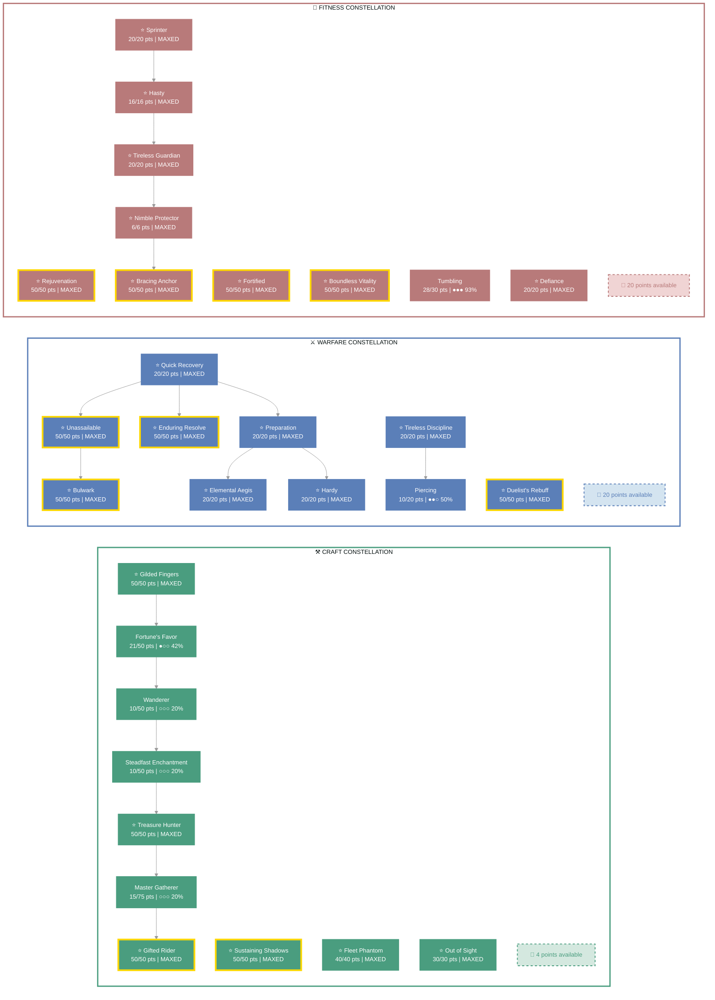

# Dextera Dei (Dark Executioner)

   

**Imperial Sorcerer • Aldmeri Dominion Alliance**

---

## 📑 Table of Contents

- [📋 Overview](#overview)
  - [General](#general)
  - [Currency](#currency)
- [⚔️ Combat Arsenal](#combat-arsenal)
  - [Character Stats](#character-stats)
  - [Advanced Stats](#advanced-stats)
- [⚔️ PvP](#pvp)
- [👥 Companions](#companions)
- [🎨 Collectibles](#collectibles)
- [📝 Quest Progress](#quest-progress)
- [🏰 Armory Builds](#armory-builds)
- [📬 Mail](#mail)
- [🏰 Guild Membership](#guild-membership)

---

## 📋 Overview

### General

| **Attribute** | **Value** |
| --- | --- |
| **Level** | 50 |
| **Champion Points** | 990 |
| **Gender** | Female |
| **Age** | 8d 15h 2m |
| **Account** | @SOLAEGIS |
| **ESO Plus** | ✅ Active |
| **Vampire/Werewolf Status** | 🧛 Vampire Stage 3 |

| **Attribute** | **Value** |
| --- | --- |
| **Attributes** | 🔵 0 / ❤️ 0 / ⚡ 64 |
| **Available Champion Points** | ⚒️ 4 - ⚔️ 20 - 💪 20 |
| **🐴 Riding Skills** | 🐴 60 / 💪 60 / 🎒 60 ✅ |
| **Skill Points** | 🎯 65 available - Ready to spend |
| **Class** | [Sorcerer](https://en.uesp.net/wiki/Online:Sorcerer) |
| **Race** | [Imperial](https://en.uesp.net/wiki/Online:Imperial) |
| **Location** | [Craglorn](https://en.uesp.net/wiki/Online:Craglorn) (501) |

| **Attribute** | **Value** |
| --- | --- |
| **Server** | [NA Megaserver](https://en.uesp.net/wiki/Online:Megaservers) |
| **🍖 Active Buffs** | Other: [Vampire Stage 3](https://en.uesp.net/wiki/Online:Vampire) |
| **Alliance** | [Aldmeri Dominion](https://en.uesp.net/wiki/Online:Aldmeri_Dominion) |
| **Title** | [Dark Executioner](https://en.uesp.net/wiki/Online:Dark_Executioner) |
| **🪨 Mundus Stone** | [The Atronach](https://en.uesp.net/wiki/Online:The_Atronach_(Mundus_Stone)) |

### Currency

| **Attribute** | **Value** |
| --- | --- |
| 💰 **Gold** | 23,235 |
| ⚔️ **Alliance Points** | 1,469 |
| 🔮 **Tel Var** | 710 |
| 💎 **Transmute Crystals** | 352 |
| 📜 **Writs** | 0 |
| 🎫 **Event Tickets** | 0 |
| 👑 **Crowns** | 9,040 |
| 💠 **Gems** | 266 |
| 🏅 **Seals** | 16,105 |
| 🗝️ **Keys** | 12 |
| 👕 **Tokens** | 6 |
| 📚 **Fortunes** | 0 |
| 🔹 **Fragments** | 418 |

---

## ⚔️ Combat Arsenal

### Character Stats

| **Category** | **Stat** | **Value** |
| --- | --- | ---: |
| 💚 **Resources** | Health | 28,689 |
|  | Magicka | 13,736 |
|  | Stamina | 23,360 |
| ⚔️ **Offensive** | Weapon Power | 2,546 |
|  | Spell Power | 2,546 |

| **Category** | **Stat** | **Value** |
| --- | --- | ---: |
| 🎯 **Critical** | Weapon Crit | 2,181 (9.9%) |
|  | Spell Crit | 2,181 (9.9%) |
| ⚔️ **Penetration** | Physical | 350 |
|  | Spell | 350 |

| **Category** | **Stat** | **Value** |
| --- | --- | ---: |
| 🛡️ **Defensive** | Physical Resist | 25,580 (91%) |
|  | Spell Resist | 25,580 (91%) |
| ♻️ **Recovery** | Health | 276 |
|  | Magicka | 1,517 |
|  | Stamina | 869 |

### Advanced Stats

| **Ability** | **Cost/Value** |
|:---|---:|
| ⚔️ **Light Attack** | 3,480 dmg |
| ⚔️ **Heavy Attack** | 6,960 dmg |
| ⚔️ **Bash** | 719 cost, 5,033 dmg |
| 🛡️ **Block** | 1,568 cost, 50% mit, 40% spd |
| 🔓 **Break Free** | 4,869 cost |
| 🏃 **Dodge Roll** | 4,508 cost |
| 🐾 **Sneak** | 66 cost, 0% spd |
| 🏃‍♂️ **Sprint** | 432 cost, 0% spd |

| **Resistance** | **Value** |
|:---|---:|
| 🔥 **Flame** | 38.7% |
| ⚡ **Shock** | 38.7% |
| ❄️ **Frost** | 38.7% |
| 🔮 **Magic** | 38.7% |
| 🦠 **Disease** | 38.7% |
| ☠️ **Poison** | 38.7% |
| 🩸 **Bleed** | 38.7% |

| **Damage Type** | **Bonus** |
|:---|---:|
| 💥 **Critical Damage** | 50% |
| ⚔️ **Physical** | 5% |
| 🔥 **Flame** | 0 |
| ⚡ **Shock** | 5% |
| ❄️ **Frost** | 0 |
| 🔮 **Magic** | 0 |
| 🦠 **Disease** | 0 |
| ☠️ **Poison** | 0 |
| 🩸 **Bleed** | 0 |
| 🌌 **Oblivion** | 0 |

| **Healing** | **Value** |
|:---|---:|
| 💚 **Healing Done** | 0 |
| 💖 **Healing Taken** | 0 |
| ✨ **Critical Healing** | 50% |

### Skill bars

### ⚔️ ⚔️ Front Bar (Main Hand)

| **1** | **⚡** |
| :---: | :---: |
| [Empty Slot] | [Silver Leash](https://en.uesp.net/wiki/Online:Silver_Leash) |

### 🔮 🔮 Back Bar (Backup)

| **1** | **⚡** |
| :---: | :---: |
| [Empty Slot] | [Sanguine Altar](https://en.uesp.net/wiki/Online:Sanguine_Altar) |

---

## ⚔️ Equipment & Active Sets

| **Set** | **Progress** |
| --- | --- |
| 🟢 **[Wretched Vitality Set](https://en.uesp.net/wiki/Online:Wretched_Vitality_Set)** | `5/5` ██████████ 100% |
| 🟢 **[Torug's Pact Set](https://en.uesp.net/wiki/Online:Torug's_Pact_Set)** | `5/5` ██████████ 100% *(+1 extra)* |
| 🔴 **[Alessia's Bulwark Set](https://en.uesp.net/wiki/Online:Alessia's_Bulwark_Set)** | `2/5` ████░░░░░░ 40% |

### 📋 Equipment Details

| **Slot** | **Item** | **Set** | **Quality** | **Trait** | **Type** | **Enchantment** |
| --- | --- | --- | --- | --- | --- | --- |
| ⛑️ **Head** | Helm of Alessia's Bulwark | [Alessia's Bulwark Set](https://en.uesp.net/wiki/Online:Alessia's_Bulwark_Set) | ⭐ Epic | Sturdy | Heavy • ⚒️ Crafted | Multi-Effect Enchantment |
| 💎 **Neck** | Necklace of Torug's Pact | [Torug's Pact Set](https://en.uesp.net/wiki/Online:Torug's_Pact_Set) | ⭐ Epic | Healthy | None • ⚒️ Crafted | Bracing Enchantment |
| 🛡️ **Chest** | Cuirass of Wretched Vitality | [Wretched Vitality Set](https://en.uesp.net/wiki/Online:Wretched_Vitality_Set) | ⭐ Epic | Sturdy | Heavy • ⚒️ Crafted | Multi-Effect Enchantment |
| 👑 **Shoulders** | Pauldron of Alessia's Bulwark | [Alessia's Bulwark Set](https://en.uesp.net/wiki/Online:Alessia's_Bulwark_Set) | ⭐ Epic | Sturdy | Heavy • ⚒️ Crafted | Maximum Health Enchantment |
| ⚔️ **Main Hand** | Sword of Torug's Pact | [Torug's Pact Set](https://en.uesp.net/wiki/Online:Torug's_Pact_Set) | ⭐ Epic | Decisive | None • ⚒️ Crafted | Weakening Enchantment |
| 🛡️ **Off Hand** | Shield of Torug's Pact | [Torug's Pact Set](https://en.uesp.net/wiki/Online:Torug's_Pact_Set) | ⭐ Epic | Sturdy | None • ⚒️ Crafted | Multi-Effect Enchantment |
| ⚡ **Waist** | Girdle of Wretched Vitality | [Wretched Vitality Set](https://en.uesp.net/wiki/Online:Wretched_Vitality_Set) | ⭐ Epic | Sturdy | Heavy • ⚒️ Crafted | Maximum Health Enchantment |
| 👖 **Legs** | Greaves of Wretched Vitality | [Wretched Vitality Set](https://en.uesp.net/wiki/Online:Wretched_Vitality_Set) | ⭐ Epic | Sturdy | Heavy • ⚒️ Crafted | Multi-Effect Enchantment |
| 👟 **Feet** | Sabatons of Wretched Vitality | [Wretched Vitality Set](https://en.uesp.net/wiki/Online:Wretched_Vitality_Set) | ⭐ Epic | Sturdy | Heavy • ⚒️ Crafted | Maximum Health Enchantment |
| 💍 **Ring 1** | Ring of Torug's Pact | [Torug's Pact Set](https://en.uesp.net/wiki/Online:Torug's_Pact_Set) | ⭐ Epic | Healthy | None • ⚒️ Crafted | Magicka Recovery Enchantment |
| 💍 **Ring 2** | Ring of Torug's Pact | [Torug's Pact Set](https://en.uesp.net/wiki/Online:Torug's_Pact_Set) | ⭐ Epic | Healthy | None • ⚒️ Crafted | Magicka Recovery Enchantment |
| ✋ **Hands** | Gauntlets of Wretched Vitality | [Wretched Vitality Set](https://en.uesp.net/wiki/Online:Wretched_Vitality_Set) | ⭐ Epic | Sturdy | Heavy • ⚒️ Crafted | Maximum Health Enchantment |
| 🔮 **Backup Main Hand** | Ice Staff of Torug's Pact | [Torug's Pact Set](https://en.uesp.net/wiki/Online:Torug's_Pact_Set) | ⭐ Epic | Infused | None • ⚒️ Crafted | Crusher Enchantment |

---

## ⭐ Champion Points

| **Total** | **Spent** | **Available** |
| :---: | :---: | :---: |
| 990 | 946 | 44 |

> ✨ **Enlightened** - 1,059,352 XP bonus remaining

| **⚒️ Craft** | **Assigned Points** |
| --- | ---: |
| ███████████░ 98% | 326/330 points |
| **[Out of Sight](https://en.uesp.net/wiki/Online:Out_of_Sight)** | 30 points |
| **[Master Gatherer](https://en.uesp.net/wiki/Online:Master_Gatherer)** | 15 points |
| **[Treasure Hunter](https://en.uesp.net/wiki/Online:Treasure_Hunter)** | 50 points |
| **[Steadfast Enchantment](https://en.uesp.net/wiki/Online:Steadfast_Enchantment)** | 10 points |
| **[Wanderer](https://en.uesp.net/wiki/Online:Wanderer)** | 10 points |
| **[Gifted Rider](https://en.uesp.net/wiki/Online:Gifted_Rider)** | 50 points |
| **[Fortune's Favor](https://en.uesp.net/wiki/Online:Fortune's_Favor)** | 21 points |
| **[Fleet Phantom](https://en.uesp.net/wiki/Online:Fleet_Phantom)** | 40 points |
| **[Gilded Fingers](https://en.uesp.net/wiki/Online:Gilded_Fingers)** | 50 points |
| **[Sustaining Shadows](https://en.uesp.net/wiki/Online:Sustaining_Shadows)** | 50 points |

| **⚔️ Warfare** | **Assigned Points** |
| --- | ---: |
| ███████████░ 93% | 310/330 points |
| **[Piercing](https://en.uesp.net/wiki/Online:Piercing)** | 10 points |
| **[Tireless Discipline](https://en.uesp.net/wiki/Online:Tireless_Discipline)** | 20 points |
| **[Quick Recovery](https://en.uesp.net/wiki/Online:Quick_Recovery)** | 20 points |
| **[Preparation](https://en.uesp.net/wiki/Online:Preparation)** | 20 points |
| **[Elemental Aegis](https://en.uesp.net/wiki/Online:Elemental_Aegis)** | 20 points |
| **[Hardy](https://en.uesp.net/wiki/Online:Hardy)** | 20 points |
| **[Enduring Resolve](https://en.uesp.net/wiki/Online:Enduring_Resolve)** | 50 points |
| **[Bulwark](https://en.uesp.net/wiki/Online:Bulwark)** | 50 points |
| **[Duelist's Rebuff](https://en.uesp.net/wiki/Online:Duelist's_Rebuff)** | 50 points |
| **[Unassailable](https://en.uesp.net/wiki/Online:Unassailable)** | 50 points |

| **💪 Fitness** | **Assigned Points** |
| --- | ---: |
| ███████████░ 93% | 310/330 points |
| **[Sprinter](https://en.uesp.net/wiki/Online:Sprinter)** | 20 points |
| **[Hasty](https://en.uesp.net/wiki/Online:Hasty)** | 16 points |
| **[Tireless Guardian](https://en.uesp.net/wiki/Online:Tireless_Guardian)** | 20 points |
| **[Nimble Protector](https://en.uesp.net/wiki/Online:Nimble_Protector)** | 6 points |
| **[Bracing Anchor](https://en.uesp.net/wiki/Online:Bracing_Anchor)** | 50 points |
| **[Tumbling](https://en.uesp.net/wiki/Online:Tumbling)** | 28 points |
| **[Defiance](https://en.uesp.net/wiki/Online:Defiance)** | 20 points |
| **[Rejuvenation](https://en.uesp.net/wiki/Online:Rejuvenation)** | 50 points |
| **[Fortified](https://en.uesp.net/wiki/Online:Fortified)** | 50 points |
| **[Boundless Vitality](https://en.uesp.net/wiki/Online:Boundless_Vitality)** | 50 points |

### 🎯 Champion Points Visual

```mermaid
%%{init: {"theme":"base", "themeVariables": { "background":"transparent","fontSize":"12px","primaryColor":"#f0f0f0","primaryTextColor":"#333","primaryBorderColor":"#999","lineColor":"#999"}}}%%

flowchart LR

  subgraph subLEGEND["📖 LEGEND & VISUAL GUIDE"]

    LEG_STARS["Star Types"]
    LEG_S1["⭐ Gold Border = Maxed Slottable"]
    LEG_S2["🔶 Orange Border = Independent Star"]
    LEG_S3["Standard Border = In Progress"]

    LEG_FILL["Progress Indicators"]
    LEG_F1["⭐ = 100% Maxed"]
    LEG_F2["●●● = 75-99%"]
    LEG_F3["●●○ = 50-74%"]
    LEG_F4["●○○ = 25-49%"]
    LEG_F5["○○○ = 1-24%"]

    LEG_STARS --> LEG_S1 & LEG_S2 & LEG_S3
    LEG_FILL --> LEG_F1 & LEG_F2 & LEG_F3 & LEG_F4 & LEG_F5

    style LEG_STARS fill:transparent,stroke:none,color:#ccc
    style LEG_FILL fill:transparent,stroke:none,color:#ccc
    style LEG_S1 fill:#fff,stroke:#ffd700,stroke-width:3px,color:#333
    style LEG_S2 fill:#fff,stroke:#ff8c00,stroke-width:3px,color:#333
    style LEG_S3 fill:#fff,stroke:#999,stroke-width:2px,color:#333
    style LEG_F1 fill:#eee,stroke:#333,stroke-width:1px,color:#333
    style LEG_F2 fill:#eee,stroke:#333,stroke-width:1px,color:#333
    style LEG_F3 fill:#eee,stroke:#333,stroke-width:1px,color:#333
    style LEG_F4 fill:#eee,stroke:#333,stroke-width:1px,color:#333
    style LEG_F5 fill:#eee,stroke:#333,stroke-width:1px,color:#333
  end
  style subLEGEND fill:transparent,stroke:#999,stroke-width:3px
```

---

## 📜 Character Progress

### Progress Overview

| **Maxed Skill Lines** | **In Progress** | **Early Progress** | **Abilities with Morphs** | **Overall Completion** |
| ---: | ---: | ---: | ---: | ---: |
| 0 | 0 | 0 | 0 | 0% |

🌿 Detailed Skill Morphs

*No morphable abilities found.*

---

---

## ⚔️ PvP

### PvP Profile

#### Alliance War Status

| **Category** | **Value** |
| --- | --- |
| Rank | Volunteer Grade 1 (Rank 1) |
| Alliance Points | 1,469 |
| Progress to Next | 769 / 901 AP to next grade ████████░░ 85.3% |
| AP Needed | 132 |
| Alliance | Aldmeri Dominion |

---

## 👥 Companions

### Available Companions

- [Azandar al-Cybiades](https://en.uesp.net/wiki/Online:Azandar_al-Cybiades)
- [Bastian Hallix](https://en.uesp.net/wiki/Online:Bastian_Hallix)
- [Ember](https://en.uesp.net/wiki/Online:Ember)
- [Isobel Veloise](https://en.uesp.net/wiki/Online:Isobel_Veloise)
- [Mirri Elendis](https://en.uesp.net/wiki/Online:Mirri_Elendis)
- [Sharp-as-Night](https://en.uesp.net/wiki/Online:Sharp-as-Night)
- [Tanlorin](https://en.uesp.net/wiki/Online:Tanlorin)
- [Zerith-var](https://en.uesp.net/wiki/Online:Zerith-var)

### Active Companion

#### 🧙 [Sharp-as-Night](https://en.uesp.net/wiki/Online:Sharp-as-Night)

#### Front Bar

| **1** | **2** | **3** | **4** | **5** | **⚡** |
| :---: | :---: | :---: | :---: | :---: | :---: |
| [Piercing Arrow](https://en.uesp.net/wiki/Online:Piercing_Arrow) | [Swoop](https://en.uesp.net/wiki/Online:Swoop) | [Char](https://en.uesp.net/wiki/Online:Char) | [Cold Snap](https://en.uesp.net/wiki/Online:Cold_Snap) | [Empty] | [Empty] |

| **Slot** | **Item** | **Quality** | **Trait** |
| --- | --- | --- | --- |
| ⚔️ **Main Hand** | Companion's Bow (Level 1, 🔮 Superior) ⚠️ | 🔮 Superior | Increases damage done by \|cffffff2.5\|r%. |
| ⛑️ **Head** | Companion's Helmet (Level 1, ⚡ Fine) ⚠️ | ⚡ Fine | Increases Max Health by \|cffffff1.8\|r%. |
| 🛡️ **Chest** | Companion's Jack (Level 1, ⭐ Epic) ⚠️ | ⭐ Epic | Increases duration of buffs and debuffs by \|cffffff2.6\|r%. |
| 👑 **Shoulders** | Companion's Arm Cops (Level 1, ⚪ Normal) ⚠️ | ⚪ Normal |  |
| ✋ **Hands** | Companion's Bracers (Level 1, 🔮 Superior) ⚠️ | 🔮 Superior | Increases Penetration by \|cffffff1100\|r. |
| ⚡ **Waist** | Companion's Belt (Level 1, 🔮 Superior) ⚠️ | 🔮 Superior | Increases Critical Strike Rating by \|cffffff481\|r. |
| 👖 **Legs** | Companion's Guards (Level 1, ⚡ Fine) ⚠️ | ⚡ Fine | Reduces ability cooldowns by \|cffffff1.8\|r%. |
| 👟 **Feet** | Companion's Boots (Level 1, ⚡ Fine) ⚠️ | ⚡ Fine | Increases Max Health by \|cffffff1.8\|r%. |

> [!WARNING]
> **Attention Needed**
> - 👥 **Companion underleveled**: Sharp-as-Night (Level 9/20) - Needs XP
> - 👥 **Companion outdated gear**: 8 pieces below level - Upgrade equipment
> - 👥 **Companion empty ability slots**: 2 - Assign abilities

---

## 🎨 Collectibles

💁 Assistants (4 of 27)

| Progress |
| --- |
| ██░░░░░░░░░░░░░░░░░░ 14% (4/27) |

- [Giladil the Ragpicker](https://en.uesp.net/wiki/Online:Giladil_the_Ragpicker)
- [Nuzhimeh the Merchant](https://en.uesp.net/wiki/Online:Nuzhimeh_the_Merchant)
- [Pirharri the Smuggler](https://en.uesp.net/wiki/Online:Pirharri_the_Smuggler)
- [Tythis Andromo, the Banker](https://en.uesp.net/wiki/Online:Tythis_Andromo,_the_Banker)

🖌️ Body Markings (9 of 330)

| Progress |
| --- |
| ░░░░░░░░░░░░░░░░░░░░ 2% (9/330) |

- [Ancient Dragon Body Marks](https://en.uesp.net/wiki/Online:Ancient_Dragon_Body_Marks)
- [Body Imprint of the Psijic Order](https://en.uesp.net/wiki/Online:Body_Imprint_of_the_Psijic_Order)
- [Clockwork Apostle Body Imprints](https://en.uesp.net/wiki/Online:Clockwork_Apostle_Body_Imprints)
- [Fire Cyclone Body Markings](https://en.uesp.net/wiki/Online:Fire_Cyclone_Body_Markings)
- [Golden Riften Rogue Body Markings](https://en.uesp.net/wiki/Online:Golden_Riften_Rogue_Body_Markings)
- [Hagmatron's Body Markings](https://en.uesp.net/wiki/Online:Hagmatron's_Body_Markings)
- [Morag Tong Body Tattoo](https://en.uesp.net/wiki/Online:Morag_Tong_Body_Tattoo)
- [Regal Eagle Wing Body Tattoos](https://en.uesp.net/wiki/Online:Regal_Eagle_Wing_Body_Tattoos)
- [Serpent Scale Body Marking](https://en.uesp.net/wiki/Online:Serpent_Scale_Body_Marking)

👗 Costumes (48 of 323)

| Progress |
| --- |
| ██░░░░░░░░░░░░░░░░░░ 14% (48/323) |

- [Austere Warden Outfit](https://en.uesp.net/wiki/Online:Austere_Warden_Outfit)
- [Black Hand Robe](https://en.uesp.net/wiki/Online:Black_Hand_Robe)
- [Bloodthorn Robes](https://en.uesp.net/wiki/Online:Bloodthorn_Robes)
- [Colovian Uniform](https://en.uesp.net/wiki/Online:Colovian_Uniform)
- [Courier Uniform](https://en.uesp.net/wiki/Online:Courier_Uniform)
- [Court of Bedlam](https://en.uesp.net/wiki/Online:Court_of_Bedlam)
- [Covenant Scout](https://en.uesp.net/wiki/Online:Covenant_Scout)
- [Crown Dishdasha](https://en.uesp.net/wiki/Online:Crown_Dishdasha)
- [Cyrod Patrician Formal Gown](https://en.uesp.net/wiki/Online:Cyrod_Patrician_Formal_Gown)
- [Dark Seducer](https://en.uesp.net/wiki/Online:Dark_Seducer)
- [Dunmer Cultural Garb](https://en.uesp.net/wiki/Online:Dunmer_Cultural_Garb)
- [Elven Hero Armor](https://en.uesp.net/wiki/Online:Elven_Hero_Armor)
- [Forebear Dishdasha](https://en.uesp.net/wiki/Online:Forebear_Dishdasha)
- [Fort Amol Guard Armor](https://en.uesp.net/wiki/Online:Fort_Amol_Guard_Armor)
- [Frostedge Bandit Armor](https://en.uesp.net/wiki/Online:Frostedge_Bandit_Armor)
- [Golden Saint](https://en.uesp.net/wiki/Online:Golden_Saint)
- [Grim Harvester](https://en.uesp.net/wiki/Online:Grim_Harvester)
- [Hollow Moon Garb](https://en.uesp.net/wiki/Online:Hollow_Moon_Garb)
- [Imperial Chancellor](https://en.uesp.net/wiki/Online:Imperial_Chancellor)
- [Keeper's Garb](https://en.uesp.net/wiki/Online:Keeper's_Garb)
- [Lion Guard Knight](https://en.uesp.net/wiki/Online:Lion_Guard_Knight)
- [Mages Guild Formal Robes](https://en.uesp.net/wiki/Online:Mages_Guild_Formal_Robes)
- [Mages Guild Leggings Uniform](https://en.uesp.net/wiki/Online:Mages_Guild_Leggings_Uniform)
- [Mages Guild Research Robes](https://en.uesp.net/wiki/Online:Mages_Guild_Research_Robes)
- [Mannimarco](https://en.uesp.net/wiki/Online:Mannimarco)
- [Merchant Lord's Formal Regalia](https://en.uesp.net/wiki/Online:Merchant_Lord's_Formal_Regalia)
- [Midnight Union Garb](https://en.uesp.net/wiki/Online:Midnight_Union_Garb)
- [New Life Fish Boon Angler](https://en.uesp.net/wiki/Online:New_Life_Fish_Boon_Angler)
- [Noble Clan-Chief](https://en.uesp.net/wiki/Online:Noble_Clan-Chief)
- [Nordic Bather's Towel](https://en.uesp.net/wiki/Online:Nordic_Bather's_Towel)
- [Phaer Mercenary Armor](https://en.uesp.net/wiki/Online:Phaer_Mercenary_Armor)
- [Quendelunn Veiled Heritance Garb](https://en.uesp.net/wiki/Online:Quendelunn_Veiled_Heritance_Garb)
- [Red Rook Armor](https://en.uesp.net/wiki/Online:Red_Rook_Armor)
- [Regalia of the Scarlet Judge](https://en.uesp.net/wiki/Online:Regalia_of_the_Scarlet_Judge)
- [Satakalaaam Imperial Armor](https://en.uesp.net/wiki/Online:Satakalaaam_Imperial_Armor)
- [Sea Drake Garb](https://en.uesp.net/wiki/Online:Sea_Drake_Garb)
- [Sea Viper Armor](https://en.uesp.net/wiki/Online:Sea_Viper_Armor)
- [Servant's Outfit](https://en.uesp.net/wiki/Online:Servant's_Outfit)
- [Servant's Robes](https://en.uesp.net/wiki/Online:Servant's_Robes)
- [Seventh Legion Armor](https://en.uesp.net/wiki/Online:Seventh_Legion_Armor)
- [Shrouded Armor](https://en.uesp.net/wiki/Online:Shrouded_Armor)
- [Skald's Damask Jerkin](https://en.uesp.net/wiki/Online:Skald's_Damask_Jerkin)
- [Steel Shrike Uniform](https://en.uesp.net/wiki/Online:Steel_Shrike_Uniform)
- [Stormfist Uniform](https://en.uesp.net/wiki/Online:Stormfist_Uniform)
- [Thieves Guild Leathers](https://en.uesp.net/wiki/Online:Thieves_Guild_Leathers)
- [Upriver Striped Sash-Kilt](https://en.uesp.net/wiki/Online:Upriver_Striped_Sash-Kilt)
- [Vanguard Uniform](https://en.uesp.net/wiki/Online:Vanguard_Uniform)
- [Vulkhel Guard Marine Armor](https://en.uesp.net/wiki/Online:Vulkhel_Guard_Marine_Armor)

🗣️ Emotes (7 of 235)

| Progress |
| --- |
| ░░░░░░░░░░░░░░░░░░░░ 2% (7/235) |

- [Belly Laugh](https://en.uesp.net/wiki/Online:Belly_Laugh)
- [Go Quietly](https://en.uesp.net/wiki/Online:Go_Quietly)
- [Kiss This](https://en.uesp.net/wiki/Online:Kiss_This)
- [Marshmallow Toasty Treat](https://en.uesp.net/wiki/Online:Marshmallow_Toasty_Treat)
- [Showtime](https://en.uesp.net/wiki/Online:Showtime)
- [Teatime](https://en.uesp.net/wiki/Online:Teatime)
- [Wickerman Mishap](https://en.uesp.net/wiki/Online:Wickerman_Mishap)

👓 Facial Accessories (3 of 140)

| Progress |
| --- |
| ░░░░░░░░░░░░░░░░░░░░ 2% (3/140) |

- [Dremora Deceiver's Diadem](https://en.uesp.net/wiki/Online:Dremora_Deceiver's_Diadem)
- [Eternal Hunger Coronal](https://en.uesp.net/wiki/Online:Eternal_Hunger_Coronal)
- [Malign Ambitions Crown](https://en.uesp.net/wiki/Online:Malign_Ambitions_Crown)

💇 Hair Styles (0 of 157)

| Progress |
| --- |
| ░░░░░░░░░░░░░░░░░░░░ 0% (0/157) |

*No hair styles owned*

🎩 Hats (22 of 167)

| Progress |
| --- |
| ██░░░░░░░░░░░░░░░░░░ 13% (22/167) |

- [Arkthzand Anfractuosity Shroud](https://en.uesp.net/wiki/Online:Arkthzand_Anfractuosity_Shroud)
- [Ayleid Royal Crown](https://en.uesp.net/wiki/Online:Ayleid_Royal_Crown)
- [Brass Fortress Rebreather](https://en.uesp.net/wiki/Online:Brass_Fortress_Rebreather)
- [Colovian Filigreed Hood](https://en.uesp.net/wiki/Online:Colovian_Filigreed_Hood)
- [Colovian Fur Hood](https://en.uesp.net/wiki/Online:Colovian_Fur_Hood)
- [Crown of Misrule](https://en.uesp.net/wiki/Online:Crown_of_Misrule)
- [Firesong Obsidian Mask](https://en.uesp.net/wiki/Online:Firesong_Obsidian_Mask)
- [Flamebrow Fire Veil](https://en.uesp.net/wiki/Online:Flamebrow_Fire_Veil)
- [Flannel Forester's Hood](https://en.uesp.net/wiki/Online:Flannel_Forester's_Hood)
- [Helm of the Black Fin](https://en.uesp.net/wiki/Online:Helm_of_the_Black_Fin)
- [Hide Your Helm](https://en.uesp.net/wiki/Online:Hide_Your_Helm)
- [Inferno Facade](https://en.uesp.net/wiki/Online:Inferno_Facade)
- [Madgod's Turban](https://en.uesp.net/wiki/Online:Madgod's_Turban)
- [Malefic Standing Collar Hood](https://en.uesp.net/wiki/Online:Malefic_Standing_Collar_Hood)
- [Nightmare Daemon Mask, Khajiiti](https://en.uesp.net/wiki/Online:Nightmare_Daemon_Mask,_Khajiiti)
- [Oblivion Explorer's Headwrap](https://en.uesp.net/wiki/Online:Oblivion_Explorer's_Headwrap)
- [Plumed Wide-Brim Acorn-Warder](https://en.uesp.net/wiki/Online:Plumed_Wide-Brim_Acorn-Warder)
- [Psijic Skullcap](https://en.uesp.net/wiki/Online:Psijic_Skullcap)
- [Pumpkin Spectre Mask](https://en.uesp.net/wiki/Online:Pumpkin_Spectre_Mask)
- [Scarecrow Spectre Mask](https://en.uesp.net/wiki/Online:Scarecrow_Spectre_Mask)
- [Sideburn Skullcap](https://en.uesp.net/wiki/Online:Sideburn_Skullcap)
- [Werewolf Hunter Hat](https://en.uesp.net/wiki/Online:Werewolf_Hunter_Hat)

🖍️ Head Markings (13 of 385)

| Progress |
| --- |
| ░░░░░░░░░░░░░░░░░░░░ 3% (13/385) |

- [Abyssal Embrace Face Markings](https://en.uesp.net/wiki/Online:Abyssal_Embrace_Face_Markings)
- [Ancient Dragon Face Marks](https://en.uesp.net/wiki/Online:Ancient_Dragon_Face_Marks)
- [Clockwork Apostle Face Imprints](https://en.uesp.net/wiki/Online:Clockwork_Apostle_Face_Imprints)
- [Crimson Flame Lipstick](https://en.uesp.net/wiki/Online:Crimson_Flame_Lipstick)
- [Eagle Plume Face Tattoo](https://en.uesp.net/wiki/Online:Eagle_Plume_Face_Tattoo)
- [Face Imprint of the Psijic Order](https://en.uesp.net/wiki/Online:Face_Imprint_of_the_Psijic_Order)
- [Golden Riften Rogue Face Markings](https://en.uesp.net/wiki/Online:Golden_Riften_Rogue_Face_Markings)
- [Hagmatron's Face Markings](https://en.uesp.net/wiki/Online:Hagmatron's_Face_Markings)
- [Inferno Ink Face Markings^n](https://en.uesp.net/wiki/Online:Inferno_Ink_Face_Markings^n)
- [Morag Tong Face Tattoo](https://en.uesp.net/wiki/Online:Morag_Tong_Face_Tattoo)
- [Mystic Magicka Flow Face Tattoos](https://en.uesp.net/wiki/Online:Mystic_Magicka_Flow_Face_Tattoos)
- [Scrying Eye Psijic Face Tattoo](https://en.uesp.net/wiki/Online:Scrying_Eye_Psijic_Face_Tattoo)
- [Stonelore's Legend Face Paint](https://en.uesp.net/wiki/Online:Stonelore's_Legend_Face_Paint)

🔮 Mementos (35 of 205)

| Progress |
| --- |
| ███░░░░░░░░░░░░░░░░░ 17% (35/205) |

- [Almalexia's Enchanted Lantern](https://en.uesp.net/wiki/Online:Almalexia's_Enchanted_Lantern)
- [Battered Bear Trap](https://en.uesp.net/wiki/Online:Battered_Bear_Trap)
- [Blackfeather Court Whistle](https://en.uesp.net/wiki/Online:Blackfeather_Court_Whistle)
- [Blade of the Blood Oath](https://en.uesp.net/wiki/Online:Blade_of_the_Blood_Oath)
- [Bonesnap Binding Stone](https://en.uesp.net/wiki/Online:Bonesnap_Binding_Stone)
- [Breda's Bottomless Mead Mug](https://en.uesp.net/wiki/Online:Breda's_Bottomless_Mead_Mug)
- [Cherry Blossom Branch](https://en.uesp.net/wiki/Online:Cherry_Blossom_Branch)
- [Clockwork Obscuros](https://en.uesp.net/wiki/Online:Clockwork_Obscuros)
- [Coin of Illusory Riches](https://en.uesp.net/wiki/Online:Coin_of_Illusory_Riches)
- [Discourse Amaranthine](https://en.uesp.net/wiki/Online:Discourse_Amaranthine)
- [Dwarven Puzzle Orb](https://en.uesp.net/wiki/Online:Dwarven_Puzzle_Orb)
- [Fetish of Anger](https://en.uesp.net/wiki/Online:Fetish_of_Anger)
- [Finvir's Trinket](https://en.uesp.net/wiki/Online:Finvir's_Trinket)
- [Fire-Breather's Torches](https://en.uesp.net/wiki/Online:Fire-Breather's_Torches)
- [Jester's Scintillator](https://en.uesp.net/wiki/Online:Jester's_Scintillator)
- [Jubilee Cake 2017](https://en.uesp.net/wiki/Online:Jubilee_Cake_2017)
- [Jubilee Cake 2018](https://en.uesp.net/wiki/Online:Jubilee_Cake_2018)
- [Jubilee Cake 2020](https://en.uesp.net/wiki/Online:Jubilee_Cake_2020)
- [Jubilee Cake 2026](https://en.uesp.net/wiki/Online:Jubilee_Cake_2026)
- [Lena's Wand of Finding](https://en.uesp.net/wiki/Online:Lena's_Wand_of_Finding)
- [Mud Ball Pouch](https://en.uesp.net/wiki/Online:Mud_Ball_Pouch)
- [Murkmire Grave-Stake](https://en.uesp.net/wiki/Online:Murkmire_Grave-Stake)
- [Nanwen's Sword](https://en.uesp.net/wiki/Online:Nanwen's_Sword)
- [Questionable Meat Sack](https://en.uesp.net/wiki/Online:Questionable_Meat_Sack)
- [Red Revelry Bottle](https://en.uesp.net/wiki/Online:Red_Revelry_Bottle)
- [Remnant of Meridia's Light](https://en.uesp.net/wiki/Online:Remnant_of_Meridia's_Light)
- [Scalecaller Rune of Levitation](https://en.uesp.net/wiki/Online:Scalecaller_Rune_of_Levitation)
- [Sea Sload Dorsal Fin](https://en.uesp.net/wiki/Online:Sea_Sload_Dorsal_Fin)
- [Sword-Swallower's Blade](https://en.uesp.net/wiki/Online:Sword-Swallower's_Blade)
- [The Pie of Misrule](https://en.uesp.net/wiki/Online:The_Pie_of_Misrule)
- [Token of Root Sunder](https://en.uesp.net/wiki/Online:Token_of_Root_Sunder)
- [Witch's Bonfire Dust](https://en.uesp.net/wiki/Online:Witch's_Bonfire_Dust)
- [Witchmother's Whistle](https://en.uesp.net/wiki/Online:Witchmother's_Whistle)
- [Wyrd Elemental Plume](https://en.uesp.net/wiki/Online:Wyrd_Elemental_Plume)
- [Yokudan Totem](https://en.uesp.net/wiki/Online:Yokudan_Totem)

🐴 Mounts (19 of 732)

| Progress |
| --- |
| ░░░░░░░░░░░░░░░░░░░░ 2% (19/732) |

- [Ashbone Sabre Cat](https://en.uesp.net/wiki/Online:Ashbone_Sabre_Cat)
- [Dwarven War Horse](https://en.uesp.net/wiki/Online:Dwarven_War_Horse)
- [Faunfrolic Great Elk](https://en.uesp.net/wiki/Online:Faunfrolic_Great_Elk)
- [Flame Atronach Senche^n](https://en.uesp.net/wiki/Online:Flame_Atronach_Senche^n)
- [Imperial Horse](https://en.uesp.net/wiki/Online:Imperial_Horse)
- [Ja'zennji Siir Fox](https://en.uesp.net/wiki/Online:Ja'zennji_Siir_Fox)
- [Midnight Steed](https://en.uesp.net/wiki/Online:Midnight_Steed)
- [Nightmare Senche](https://en.uesp.net/wiki/Online:Nightmare_Senche)
- [Nix-Ox War-Steed^n](https://en.uesp.net/wiki/Online:Nix-Ox_War-Steed^n)
- [Noble Riverhold Senche-Lion](https://en.uesp.net/wiki/Online:Noble_Riverhold_Senche-Lion)
- [Noweyr Steed](https://en.uesp.net/wiki/Online:Noweyr_Steed)
- [Psijic Escort Charger](https://en.uesp.net/wiki/Online:Psijic_Escort_Charger)
- [Rahd-m'Athra](https://en.uesp.net/wiki/Online:Rahd-m'Athra)
- [Senche-Leopard](https://en.uesp.net/wiki/Online:Senche-Leopard)
- [Skulltooth Coastal Durzog](https://en.uesp.net/wiki/Online:Skulltooth_Coastal_Durzog)
- [Sorrel Horse](https://en.uesp.net/wiki/Online:Sorrel_Horse)
- [Tessellated Guar](https://en.uesp.net/wiki/Online:Tessellated_Guar)
- [Timber Mammoth](https://en.uesp.net/wiki/Online:Timber_Mammoth)
- [Wormwrithe Bear-Lizard](https://en.uesp.net/wiki/Online:Wormwrithe_Bear-Lizard)

🎭 Personalities (1 of 30)

| Progress |
| --- |
| ░░░░░░░░░░░░░░░░░░░░ 3% (1/30) |

- [Assassin](https://en.uesp.net/wiki/Online:Assassin)

🐾 Pets (43 of 710)

| Progress |
| --- |
| █░░░░░░░░░░░░░░░░░░░ 6% (43/710) |

- [Abecean Ratter Cat](https://en.uesp.net/wiki/Online:Abecean_Ratter_Cat)
- [Alik'r Dune-Hound](https://en.uesp.net/wiki/Online:Alik'r_Dune-Hound)
- [Ambersheen Vale Fawn](https://en.uesp.net/wiki/Online:Ambersheen_Vale_Fawn)
- [Big-Eared Ginger Kitten^n](https://en.uesp.net/wiki/Online:Big-Eared_Ginger_Kitten^n)
- [Blue Dragon Imp](https://en.uesp.net/wiki/Online:Blue_Dragon_Imp)
- [Bravil Retriever](https://en.uesp.net/wiki/Online:Bravil_Retriever)
- [Coldharbour Dremnaken Runt](https://en.uesp.net/wiki/Online:Coldharbour_Dremnaken_Runt)
- [Covenant Breton Terrier](https://en.uesp.net/wiki/Online:Covenant_Breton_Terrier)
- [Crimson Torchbug](https://en.uesp.net/wiki/Online:Crimson_Torchbug)
- [Dominion Breton Terrier](https://en.uesp.net/wiki/Online:Dominion_Breton_Terrier)
- [Dozen-Banded Vvardvark^n](https://en.uesp.net/wiki/Online:Dozen-Banded_Vvardvark^n)
- [Dusky Fennec Fox^n](https://en.uesp.net/wiki/Online:Dusky_Fennec_Fox^n)
- [Dwarven Spider](https://en.uesp.net/wiki/Online:Dwarven_Spider)
- [Dwarven War Dog](https://en.uesp.net/wiki/Online:Dwarven_War_Dog)
- [Echalette](https://en.uesp.net/wiki/Online:Echalette)
- [Frost Atronach Kagouti Calf^N](https://en.uesp.net/wiki/Online:Frost_Atronach_Kagouti_Calf^N)
- [Golden Eagle](https://en.uesp.net/wiki/Online:Golden_Eagle)
- [Green Dragon Imp](https://en.uesp.net/wiki/Online:Green_Dragon_Imp)
- [Grisly Banekin Mummy^N](https://en.uesp.net/wiki/Online:Grisly_Banekin_Mummy^N)
- [Haunted House Cat^n](https://en.uesp.net/wiki/Online:Haunted_House_Cat^n)
- [Hot Pepper Bantam Guar](https://en.uesp.net/wiki/Online:Hot_Pepper_Bantam_Guar)
- [Housecat](https://en.uesp.net/wiki/Online:Housecat)
- [Imgakin Monkey](https://en.uesp.net/wiki/Online:Imgakin_Monkey)
- [Infernium Dwarven Spiderling](https://en.uesp.net/wiki/Online:Infernium_Dwarven_Spiderling)
- [Jackal](https://en.uesp.net/wiki/Online:Jackal)
- [Long-Winged Bat^F](https://en.uesp.net/wiki/Online:Long-Winged_Bat^F)
- [Nibenay Mudcrab](https://en.uesp.net/wiki/Online:Nibenay_Mudcrab)
- [Noweyr Pony^n](https://en.uesp.net/wiki/Online:Noweyr_Pony^n)
- [Pact Breton Terrier](https://en.uesp.net/wiki/Online:Pact_Breton_Terrier)
- [Pocket Mammoth](https://en.uesp.net/wiki/Online:Pocket_Mammoth)
- [Pocket Salamander^n](https://en.uesp.net/wiki/Online:Pocket_Salamander^n)
- [Psijic Mascot Bear Cub^n](https://en.uesp.net/wiki/Online:Psijic_Mascot_Bear_Cub^n)
- [Psijic Mascot Guar Calf^n](https://en.uesp.net/wiki/Online:Psijic_Mascot_Guar_Calf^n)
- [Psijic Mascot Pony^n](https://en.uesp.net/wiki/Online:Psijic_Mascot_Pony^n)
- [Scintillant Dovah-Fly^n](https://en.uesp.net/wiki/Online:Scintillant_Dovah-Fly^n)
- [Spectral Mudcrab](https://en.uesp.net/wiki/Online:Spectral_Mudcrab)
- [Steam-Driven Brassilisk^n](https://en.uesp.net/wiki/Online:Steam-Driven_Brassilisk^n)

- [Sylvan Nixad](https://en.uesp.net/wiki/Online:Sylvan_Nixad)
- [Verdigris Haj Mota](https://en.uesp.net/wiki/Online:Verdigris_Haj_Mota)
- [Vermilion Scuttler](https://en.uesp.net/wiki/Online:Vermilion_Scuttler)
- [Viridescent Dragon Frog](https://en.uesp.net/wiki/Online:Viridescent_Dragon_Frog)
- [Vvardvark^n](https://en.uesp.net/wiki/Online:Vvardvark^n)
- [Wormwrithe Haj Mota Hatchling](https://en.uesp.net/wiki/Online:Wormwrithe_Haj_Mota_Hatchling)

💍 Piercings (0 of 67)

| Progress |
| --- |
| ░░░░░░░░░░░░░░░░░░░░ 0% (0/67) |

*No piercings owned*

✨ Polymorphs (2 of 46)

| Progress |
| --- |
| ░░░░░░░░░░░░░░░░░░░░ 4% (2/46) |

- [Skeleton](https://en.uesp.net/wiki/Online:Skeleton)
- [Werewolf Lord](https://en.uesp.net/wiki/Online:Werewolf_Lord)

🎭 Skins (0 of 113)

| Progress |
| --- |
| ░░░░░░░░░░░░░░░░░░░░ 0% (0/113) |

*No skins owned*

---

## 📝 Quest Progress

| **Active Quests** | **Total Quests** | **Completed Quests** |
|------------------:|----------------:|---------------------:|
| 7 | 7 | 0 |

### 🔄 Active Quests

| Quest | Level | Type | Progress | Zone |
|:------|------:|:-----|:---------|:-----|
| ⚪ **Chateau of the Ravenous Rodent** | 50 | 📝  | ⚪ Active |  |
| ⚪ **Honest Toil** | 50 | 📝  | ⚪ Active |  |
| ⚪ **Of Knives and Long Shadows** | 50 | 📝  | ⚪ Active |  |
| ⚪ **The Merethic Collection** | 50 | 📝  | ⚪ Active |  |
| ⚪ **The Missing Prophecy** | 50 | 📝  | ⚪ Active |  |
| ⚪ **The Queen's Decree** | 50 | 📝  | ⚪ Active |  |
| ⚪ **The Ravenwatch Inquiry** | 50 | 📝  | ⚪ Active |  |

---

## 🏰 Armory Builds

*No armory data available*

---

## 📬 Mail

*No mail in inbox*

---

## 🏰 Guild Membership

| **Guild Name** | **Rank** | **Members** | **Alliance** |
| --- | --- | ---: | --- |
| **Alphabet Mafia** | Associate | 496 | [Daggerfall Covenant](https://en.uesp.net/wiki/Online:Daggerfall_Covenant) |
| **BeamMeUp** | BeamMeUp-User | 498 | [Ebonheart Pact](https://en.uesp.net/wiki/Online:Ebonheart_Pact) |
| **Pacrooti's Hirelings NA** | \|c4400FFTrader | 499 | [Aldmeri Dominion](https://en.uesp.net/wiki/Online:Aldmeri_Dominion) |
| **Paradox Raiding** | Member | 497 | [Ebonheart Pact](https://en.uesp.net/wiki/Online:Ebonheart_Pact) |
| **Redfur Trading Caravan** | Inactive | 452 | [Ebonheart Pact](https://en.uesp.net/wiki/Online:Ebonheart_Pact) |

---

### 🍖 Active Buffs

**Other:** [Vampire Stage 3](https://en.uesp.net/wiki/Online:Vampire)

---

 

**⚔️ CharacterMarkdown by @solaegis**

Generated on 7/3/2026 • Version: 2.2.6-6-gd9d3939

