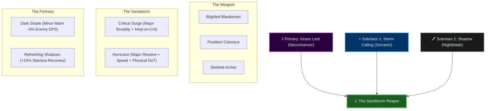
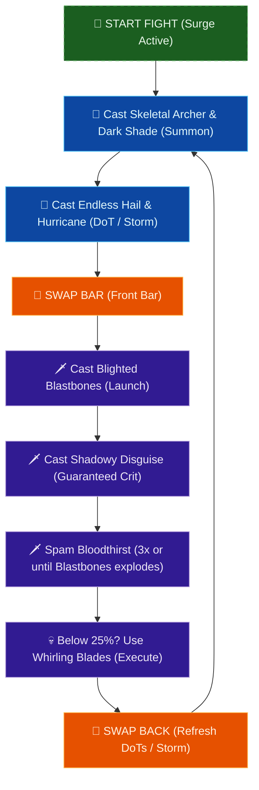

# Build Plan - Dolu-tenasi: The Sandstorm Reaper (Triple-Hybrid Assassin-Brawler)

This guide represents the absolute peak of the **Solaegis Subclassing System** for the elite physical and disease brawler. **Dolu-tenasi** is transformed from a traditional Necromancer into **The Sandstorm Reaper**—a high-sustain, high-crit, disease-exploding engine of destruction. By merging her native **Necromancer** powers with the Sorcerer's **Storm Calling** wind-storms and the Nightblade's **Shadow** eclipse, she gains total self-healing, high mobility, and massive AoE damage.

Designed specifically to solo World Bosses, clear Delves, and dominate Normal/Veteran Dungeons, this build capitalizes on her Redguard martial discipline and massive material stockpile.

---

## 🎭 Roleplay: The heretic of the Alik'r

Redguards traditionally despise necromancy, viewing any manipulation of the dead as an unholy desecration of the ancestors. **Dolu-tenasi** is a heretic who has forged a cold, professional path.

She views the corpses of her enemies not as souls to desecrate, but as a harvest—organic components to be broken down, recycled, and returned to the desert sands. Surrounded by a swirling **sandstorm of wind (Hurricane)**, she strikes from the **desert mirages (Shadow)**, swinging her daggers with precise martial execution (**Dark Executioner**), and letting the dead rise briefly as constructs of sand and bone before returning to dust.

> [!TIP]
> **Flavor Pet:** The **Alik'r Dune-Hound** or **Dusky Fennec Fox** (Confirmed owned) perfectly matches her desert nomad roots and heretic brawler identity.
> **Mount:** The **Nightmare Senche** (Confirmed owned) represents the scorching desert heat that flows through her brawling style.

---

## 🔗 The Trinity of Power: Triple-Hybrid Configuration

By completing Bahtra at-Hunding's milestone quest **"A Study in Discipline"** at Level 50, Dolu-tenasi unlocks the **Uber Tier (Triple Hybrid)** architecture. We replace her defensive and healing lines to forge an unbreakable combat loop:

---

## 🔗 Final Build Summary

| **Attribute** | **Recommendation** |
| :--- | :--- |
| **Primary Stat** | 64 points in **Stamina** (Max physical scaling and survivability) |
| **Mundus Stone** | **The Thief** (Critical Strike Chance — Crucial to trigger *Critical Surge* heals) |
| **Food** | **Braised Rabbit with Spring Vegetables** (Max Health + Max Stamina) or **Dubious Camoran Throne** (Stamina + Recovery) |
| **Potion** | **Crown Tri-Restoration Potion** (You have over 800 in your bank!) |
| **Poison** | **Crown Lethal Poison** (Equip on front-bar daggers for free poison ticks) |

---

## ⚔️ Equipment Strategy: "The Sandstorm's Regalia"

We use your massive stockpile of **Dreugh Wax**, **Tempering Alloy**, and **Chromium/Zircon Plating** to construct a "Double-Set" build. This provides elite solo capabilities, allowing you to brawl through veteran content with your companion.

### 🗡️ Front Bar: Dual Wield (Daggers)
*Daggers provide the highest Critical Strike Chance, which is the engine that drives your passive healing.*

| **Slot** | **Item** | **Trait** | **Enchantment** | **Quality** |
| :--- | :--- | :--- | :--- | :--- |
| **Main Hand** | Briarheart Dagger | Nirnhoned | Poison Damage | 🟣 Epic (or 🟡 Gold) |
| **Off Hand** | Briarheart Dagger | Charged | Flame Damage | 🟣 Epic (or 🟡 Gold) |

### 🏹 Back Bar: Support Bow
*The bow is used to layer long-duration AoE damage and buffs before you engage in melee.*

| **Slot** | **Item** | **Trait** | **Enchantment** | **Quality** |
| :--- | :--- | :--- | :--- | :--- |
| **Weapon** | Briarheart Bow | Infused | Weapon Damage | 🟣 Epic (or 🟡 Gold) |

### 👕 5-Piece Body (Order's Wrath)
*Medium armor is mandatory for stamina passives. Divines traits maximize the Thief Mundus Stone's crit chance.*

| **Slot** | **Item** | **Trait** | **Enchantment** | **Quality** |
| :--- | :--- | :--- | :--- | :--- |
| **Head** | Order's Wrath | Divines | Max Stamina | 🟡 Gold |
| **Chest** | Order's Wrath | Divines | Max Stamina | 🟡 Gold |
| **Shoulders** | Order's Wrath | Divines | Max Stamina | 🟡 Gold |
| **Waist** | Order's Wrath | Divines | Max Stamina | 🟡 Gold |
| **Hands** | Order's Wrath | Divines | Max Stamina | 🟡 Gold |
| **Legs** | Order's Wrath | Divines | Max Stamina | 🟡 Gold |
| **Feet** | Order's Wrath | Divines | Max Stamina | 🟡 Gold |

### 💍 3-Piece Jewelry (Briarheart)
*Jewelry traits enhance your base damage. Bloodthirsty ensures execution phase damage skyrockets.*

| **Slot** | **Item** | **Trait** | **Enchantment** | **Quality** |
| :--- | :--- | :--- | :--- | :--- |
| **Necklace** | Briarheart Necklace | Bloodthirsty | Weapon Damage | 🟣 Epic (or 🟡 Gold) |
| **Ring 1** | Briarheart Ring | Bloodthirsty | Weapon Damage | 🟣 Epic (or 🟡 Gold) |
| **Ring 2** | Briarheart Ring | Bloodthirsty | Weapon Damage | 🟣 Epic (or 🟡 Gold) |

> [!TIP]
> **Why Order's Wrath & Briarheart?**
> **Order's Wrath** boosts your critical chance and increases critical damage by 8%. **Briarheart** triggers when you deal critical damage, granting a massive +450 Weapon Damage and causing critical strikes to heal you. When layered with **Critical Surge**, every critical hit provides *two separate heals* and massive weapon damage, making you functionally unkillable in combat.

---

## ⭐ Champion Point Mapping (CP 785)

Here is the exact distribution of your CP 785 to maximize physical/disease damage, critical efficiency, and solo survivability.

### ⚔️ Warfare (Blue - 261 Points)
*Primary Focus: Scaling critical damage and disease-burst efficiency.*

| **Slotted Star** | **Spend** | **Benefit** |
| :--- | :--- | :--- |
| **Fighting Finesse** | 50 | +10% Critical Damage and Critical Healing. |
| **Master-at-Arms** | 50 | +10% Damage with Direct Damage (Blastbones, Light Attacks). |
| **Deadly Aim** | 50 | +10% Damage with Single-Target attacks (Bloodthirst, execute). |
| **Thaumaturge** | 50 | +10% Damage with Damage-over-Time (Hurricane, Bow DoTs). |

**Passives (No slot needed):**
*   **Precision (20):** +4% Critical Strike Chance.
*   **Piercing (20):** +700 Physical and Spell Penetration.
*   **Tireless Discipline (20):** +1040 Max Stamina.
*   **Quick Recovery (1):** +1% Healing Received.

### 💪 Fitness (Red - 261 Points)
*Primary Focus: Solo armor caps and emergency mitigation.*

| **Slotted Star** | **Spend** | **Benefit** |
| :--- | :--- | :--- |
| **Fortified** | 50 | +1730 Armor (Reduces all damage taken by ~3.5%). |
| **Boundless Vitality** | 50 | +1400 Max Health (Safeguard against dungeon mechanics). |
| **Rejuvenation** | 50 | +150 Health, Magicka, and Stamina Recovery. |
| **Celerity** | 50 | +10% Movement Speed (Keeps you out of enemy red circles). |

**Passives (No slot needed):**
*   **Hero's Vigor (20):** +560 Max Health.
*   **Tumbling (20):** Reduces Dodge Roll cost by 20%.
*   **Defiance (21):** Reduces Break Free cost by 22%.

### 🍃 Craft (Green - 263 Points)
*Primary Focus: Potion efficiency and stealth brawling.*

| **Slotted Star** | **Spend** | **Benefit** |
| :--- | :--- | :--- |
| **Sustaining Shadows** | 50 | Reduces cost of Sneak by 50% (Excellent for Dark Executioners). |
| **Steed's Blessing** | 50 | +20% Out-of-Combat Movement Speed. |
| **Treasure Hunter** | 50 | Increases quality of items found in treasure chests. |
| **Rationer** | 30 | Adds 30 minutes to consumed food and drink durations. |

**Passives (No slot needed):**
*   **Gilded Fingers (50):** +10% Gold Acquired.
*   **Fortune's Favor (30):** +30% Gold found in chests.
*   **Breakfall (3):** Reduces fall damage.

---

## 🌪️ Skill Rotation & Strategy: The Storm-Harvest Cycle

This build revolves around maintaining your back-bar physical storm and summon, then swapping to your dual-dagger bar to engage in high-crit melee combat.

### 🐾 The Skill Bars

#### 🗡️ Front Bar (Dual Wield - Daggers): "The Harvest & Execute"
| **Slot** | **Class/Line** | **Base -> Morph** | **Role** |
| :--- | :--- | :--- | :--- |
| **1** | Grave Lord (Necro) | Sacrifice -> **Blighted Blastbones** | Main disease burst, defile, and corpse generator. |
| **2** | Dual Wield | Flurry -> **Bloodthirst** | Spammable melee strike. Heals you on the final hit. |
| **3** | Shadow (NB - subclass) | Shadow Cloak -> **Shadowy Disguise** | Escape tool + guarantees a Critical Strike on next hit. |
| **4** | Storm Calling (Sorc - subclass) | Surge -> **Critical Surge** | Passive god-mode. **Major Brutality** + huge heals when you crit. |
| **5** | Dual Wield | Whirlwind -> **Whirling Blades** | Elite physical execute. Restores Stamina on kill. |
| **6 (Ult)** | Grave Lord (Necro) | Frozen Colossus -> **Pestilent Colossus** | Devastating disease meteor. Applies **Major Vulnerability** (+10% damage). |

#### 🏹 Back Bar (Support Bow): "The Sandstorm Engine"
| **Slot** | **Class/Line** | **Base -> Morph** | **Role** |
| :--- | :--- | :--- | :--- |
| **1** | Bow | Volley -> **Endless Hail** | Rains arrows, triggering weapon damage enchants. |
| **2** | Storm Calling (Sorc - subclass) | Lightning Form -> **Hurricane** | Swirling physical sandstorm. **Major Resolve** (+5948 armor), speed, and DoT. |
| **3** | Grave Lord (Necro) | Skeletal Mage -> **Skeletal Archer** | Ramping physical archer turret. Leaves a corpse on death. |
| **4** | Shadow (NB - subclass) | Summon Shade -> **Dark Shade** | Shadow double. Deals damage and applies **Minor Maim** (-5% enemy damage). |
| **5** | Alliance War (Assault) | Vigor -> **Resolving Vigor** | High-potency burst heal-over-time for emergency spikes. |
| **6 (Ult)** | Bow | Rapid Fire -> **Toxic Barrage** | Ranged single-target execute. Channels poison and applies DoT. |

---

### 🔄 The Combat Loop

To play the **Sandstorm Reaper** optimally, follow this structured rotation:

#### 💡 Solo Combat Tips:
1.  **Surge First:** Always cast **Critical Surge** before combat. It lasts 33 seconds. This keeps your weapon damage high and guarantees you heal automatically the moment you land a critical blow.
2.  **Corpse Economy:** **Blighted Blastbones** and **Skeletal Archer** generate corpses when they expire. When fighting bosses, stand near these corpses to benefit from passive resource returns, or use them to trigger companion synergies.
3.  **The Guaranteed Meteor:** If you have 225 Ultimate, cast **Shadowy Disguise** (making your next hit a critical strike) and *immediately* cast **Pestilent Colossus**. The entire multi-hit meteor blast will land as a critical strike, erasing whole groups of enemies instantly.

---

## 📚 Passive Skills to Spend Points On

You have **47 Skill Points** available. Spend them to unlock and fully rank (Rank II) these essential passive abilities.

### 💀 Necromancer — Grave Lord
*All passives are critical to scale your disease damage and crit chance.*
*   **Reusable Parts (II):** When your Blastbones or Archer dies, your next corpse skill costs 50% less.
*   **Death Knell (II):** Increases Critical Strike chance against low-health enemies by 4% per Grave Lord skill slotted (Slotted: Blastbones, Colossus, Archer = **+12% crit chance**!).
*   **Dismember (II):** While a Grave Lord skill is active, you gain **1500 Physical and Spell Penetration**.
*   **Rapid Rot (II):** Increases your damage done with damage-over-time effects (Endless Hail, Hurricane) by 10%.

### ⚡ Sorcerer — Storm Calling (Subclass)
*Allows the heretic to bend storm magic to scale weapon damage.*
*   **Capacitor (II):** Increases Magicka Recovery by 10% (helps fund Shadowy Disguise).
*   **Energized (II):** Increases physical and disease damage done by 5% (scales Blastbones, Hurricane, and all weapon hits!).
*   **Amplitude (II):** Increases your damage done by up to 10% against enemies based on their current health (hitting full-health enemies harder).
*   **Expert Mage (II):** Increases Weapon and Spell Damage by 2% for each Storm Calling skill slotted on that bar (Surge/Colossus/Hurricane).

### 🗡️ Nightblade — Shadow (Subclass)
*Hides the heretic in the eclipse and restores resources.*
*   **Refreshing Shadows (II):** Increases Stamina, Magicka, and Health Recovery by 15% (Stacks with Redguard passives to provide **unlimited brawling sustain**).
*   **Shadow Barrier (II):** Casting a Shadow ability grants Major Resolve (already covered by Hurricane, but provides a shield safeguard).
*   **Dark Vigor (II):** Increases Max Health by 2% for each Shadow ability slotted.

### 🗡️ Weapon — Dual Wield
*   **Slaughter (II):** Increases damage with Dual Wield attacks by 20% against enemies under 25% health.
*   **Dual Wield Expert (II):** Increases weapon damage in off-hand by 6%.
*   **Controlled Fury (II):** Reduces the Stamina cost of Dual Wield abilities by 10%.
*   **Ruffian (II):** Deals 15% more damage when attacking stunned or disabled enemies.
*   **Twin Blade and Blunt (II):** **CRITICAL**. When wielding two Daggers, it grants a massive **+6% Critical Strike Chance**, boosting your Critical Surge healing rate.

### 🏹 Weapon — Bow
*   **Accuracy (II):** Increases weapon critical strike chance by 9%.
*   **Ranger (II):** Reduces Stamina cost of Bow abilities by 15%.
*   **Hawk Eye (II):** Light and Heavy attacks with a Bow increase your Bow ability damage by 5% (stacks up to 5 times).

### 👕 Armor — Medium Armor
*Unlock all 5 passives:* **Dexterity** (increases crit chance), **Wind Walker** (increases stamina recovery and reduces cost), **Agility** (increases weapon damage), **Athletics** (increases sprint speed and reduces roll cost).

### 🛡️ Guild — Fighters Guild
*   **Slayer (III):** Increases weapon damage by 3% for each Fighters Guild skill slotted (if you slot Barbed Trap on the back bar instead of Dark Shade for maximum optimization).
*   **Banish the Wicked (III):** Generates 3 Ultimate whenever you kill an Undead, Daedra, or Werewolf.

### 🔴 Alliance War — Assault & Support
*   **Continuous Attack (II):** Grants Major Gallop (+30% mount speed) permanently. Unlock immediately!
*   **Combat Medic (II):** Increases healing done while in Cyrodiil/Dungeons.

### 🌴 Race — Redguard (Immutable Qualities)
*Fully unlock all three racial skills:*
*   **Martial Training (III):** Reduces the cost of weapon abilities (Dual Wield, Bow) by 8% and reduces snare effectiveness by 15%.
*   **Conditioning (III):** Increases Max Stamina by 2000.
*   **Adrenaline Rush (III):** When you deal damage, restore 1005 Stamina. Cooldown: 5 seconds.

---

## 👥 Companion Strategy: "The Desert Breeze"

Since you are playing a high-sustain, high-damage melee brawler, you do not need your companion to deal damage or draw aggression. You need a dedicated pocket healer who can shield you during heavy boss fights and restore your Magicka.

### 💖 Mirri Elendis: The Oasis Healer

Mirri should be pivoted to a pure **Restoration Staff Healer** wearing **Light Armor** with the **Quickened** (cooldown reduction) trait.

#### 🧪 Mirri's Support Skill Bar:
1.  **Shared Ward:** (Class -> Playful Mischief). Grants a damage shield to both of you and a heal-over-time.
2.  **Quick Fix:** (Class -> Playful Mischief). Powerful instant burst heal when your health drops below 50%.
3.  **Rejuvenation:** (Restoration Staff). Continuous heal-over-time.
4.  **Reverse Slash:** (Two-Handed / Restoration Staff equivalent) or **Masque of Torment** (Class -> Shadow). Fears enemies that get too close to her, keeping her safe.
5.  **Vanish:** (Class -> Shadow). If Mirri takes damage, she vanishes and heals herself, dropping threat so she can keep healing you.
6.  *Ultimate:* **Raging Storm:** Storm that deals massive AoE damage and slows enemies.

---

## ✅ Next Steps & In-Game Action Checklist

Follow this transition list to unlock the full power of the **Sandstorm Reaper**:

1.  **Respec Attributes:** Go to an Rededication Shrine (in Mournhold, Wayrest, or Elden Root) or use an Attribute Respecification scroll. Place all **64 points into Stamina**.
2.  **Respec Skills:** Reset your skills. Purchase the required skills and morphs for the front and back bars, and max out all **Passives** listed in the passive guide.
3.  **Complete Subclassing:** Travel to Bahtra at-Hunding at the Adventure Camp outside **Riften, Evermore, or Dune**. Turn in *"A Study in Discipline"* and set your active subclasses to **Storm Calling (Sorcerer)** and **Shadow (Nightblade)**.
4.  **CP Mapping:** Open your Champion Points menu and allocate your **785 CP** exactly as mapped in the CP Guide. Be sure to slot the four Warfare stars and four Fitness stars!
5.  **Mundus Stone:** Visit **The Thief** Mundus Stone (found in Deshaan, Shadowfen, Eastmarch, etc.) to permanently buff your critical strike chance.
6.  **Craft Gear:** Use your abundant crafting materials to craft the 7 pieces of **Order's Wrath** (Medium, Divines trait). Reconstruct or purchase **Briarheart** weapons and jewelry as mapped.
7.  **Equip Poisons:** Slot your **Crown Lethal Poisons** (you have over 1,900 in bank!) to your front-bar daggers.

May the winds of the Alik'r sandstorm scour your path, Reaper.
