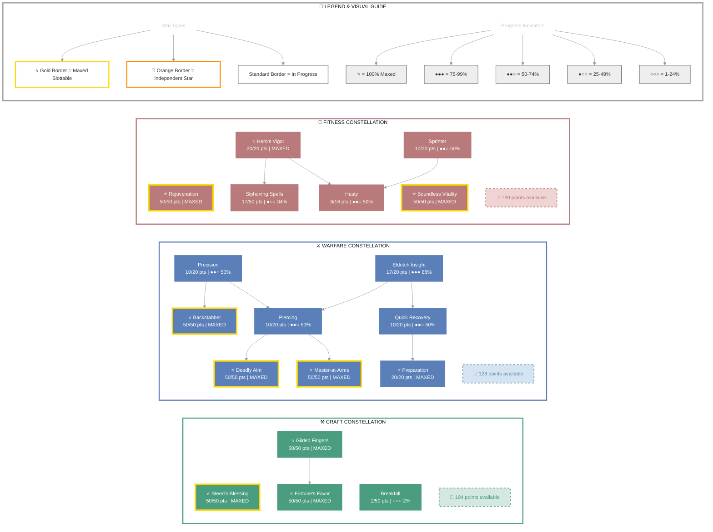

# Heka-Ankh (Dark Executioner)

Level CP Class ESO+

**Redguard Necromancer • Ebonheart Pact Alliance**

---

## 📑 Table of Contents

- [📋 Overview](#overview)
  - [General](#general)
  - [Currency](#currency)
- [⚔️ Combat Arsenal](#combat-arsenal)
  - [Character Stats](#character-stats)
  - [Advanced Stats](#advanced-stats)
  - [Skill bars](#skill-bars)
- [⚔️ Equipment & Active Sets](#equipment-active-sets)
- [⭐ Champion Points](#champion-points)
- [📜 Character Progress](#character-progress)
- [⚔️ PvP](#pvp)
- [👥 Companions](#companions)
- [🎨 Collectibles](#collectibles)
- [📝 Quest Progress](#quest-progress)
- [🏰 Armory Builds](#armory-builds)
- [📬 Mail](#mail)
- [🏰 Guild Membership](#guild-membership)

---

## 📋 Overview

### General

| **Attribute**       | **Value** |
| ------------------- | --------- |
| **Level**           | 50        |
| **Champion Points** | 1034      |
| **Gender**          | Female    |
| **Account**         | @SOLAEGIS |
| **Age**             | 6d 2h 14m |
| **ESO Plus**        | ✅ Active  |

| **Attribute**                 | **Value**                                            |
| ----------------------------- | ---------------------------------------------------- |
| **Attributes**                | 🔵 0 / ❤️ 0 / ⚡ 64                                   |
| **🐴 Riding Skills**          | 🐴 60 / 💪 60 / 🎒 60 ✅                              |
| **Skill Points**              | 🎯 48 available - Ready to spend                     |
| **Available Champion Points** | ⚒️ 194 - ⚔️ 128 - 💪 189                             |
| **Subclass**                  | None — Grave Lord / Bone Tyrant / Living Death       |
| **Race**                      | [Redguard](https://en.uesp.net/wiki/Online:Redguard) |

| **Attribute**       | **Value**                                                                   |
| ------------------- | --------------------------------------------------------------------------- |
| **Class**           | [Necromancer](https://en.uesp.net/wiki/Online:Necromancer)                  |
| **Server**          | [NA Megaserver](https://en.uesp.net/wiki/Online:Megaservers)                |
| **Alliance**        | [Ebonheart Pact](https://en.uesp.net/wiki/Online:Ebonheart_Pact)            |
| **Title**           | [Dark Executioner](https://en.uesp.net/wiki/Online:Dark_Executioner)        |
| **🪨 Mundus Stone** | [The Thief](https://en.uesp.net/wiki/Online:The_Thief_(Mundus_Stone))       |
| **Location**        | [Reaper's March](https://en.uesp.net/wiki/Online:Reaper's_March) (Rawl'kha) |

### Currency

| **Attribute**             | **Value** |
| ------------------------- | --------- |
| 💰 **Gold**               | 23,268    |
| ⚔️ **Alliance Points**    | 2,000     |
| 🔮 **Tel Var**            | 6,300     |
| 💎 **Transmute Crystals** | 452       |
| 📜 **Writs**              | 0         |
| 🎫 **Event Tickets**      | 0         |
| 👑 **Crowns**             | 5,690     |
| 💠 **Gems**               | 281       |
| 🏅 **Seals**              | 22,855    |
| 🗝️ **Keys**              | 12        |
| 👕 **Tokens**             | 6         |
| 📚 **Fortunes**           | 7,500     |
| 🔹 **Fragments**          | 1,408     |

---

## ⚔️ Combat Arsenal

### Character Stats

| **Category**     | **Stat**     | **Value** |
| ---------------- | ------------ | --------- |
| 💚 **Resources** | Health       | 18,892    |
|                  | Magicka      | 13,850    |
|                  | Stamina      | 24,695    |
| ⚔️ **Offensive** | Weapon Power | 2,873     |
|                  | Spell Power  | 2,873     |

| **Category**       | **Stat**    | **Value**     |
| ------------------ | ----------- | ------------- |
| 🎯 **Critical**    | Weapon Crit | 5,553 (25.3%) |
|                    | Spell Crit  | 5,553 (25.3%) |
| ⚔️ **Penetration** | Physical    | 350           |
|                    | Spell       | 350           |

| **Category**      | **Stat**        | **Value**      |
| ----------------- | --------------- | -------------- |
| 🛡️ **Defensive** | Physical Resist | 10,764 (81.1%) |
|                   | Spell Resist    | 10,764 (81.1%) |
| ♻️ **Recovery**   | Health          | 556            |
|                   | Magicka         | 604            |
|                   | Stamina         | 773            |

### Advanced Stats

| **Ability**         | **Cost/Value**               |
| ------------------- | ---------------------------- |
| ⚔️ **Light Attack** | 3,860 dmg                    |
| ⚔️ **Heavy Attack** | 7,721 dmg                    |
| ⚔️ **Bash**         | 704 cost, 5,503 dmg          |
| 🛡️ **Block**       | 1,117 cost, 50% mit, 40% spd |
| 🔓 **Break Free**   | 5,400 cost                   |
| 🏃 **Dodge Roll**   | 2,524 cost                   |
| 🐾 **Sneak**        | 43 cost, 0% spd              |
| 🏃‍♂️ **Sprint**    | 387 cost, 0% spd             |

| **Resistance** | **Value** |
| -------------- | --------- |
| 🔥 **Flame**   | 16.3%     |
| ⚡ **Shock**    | 16.3%     |
| ❄️ **Frost**   | 16.3%     |
| 🔮 **Magic**   | 16.3%     |
| 🦠 **Disease** | 16.3%     |
| ☠️ **Poison**  | 16.3%     |
| 🩸 **Bleed**   | 16.3%     |

| **Damage Type**        | **Bonus** |
| ---------------------- | --------- |
| 💥 **Critical Damage** | 64%       |
| ⚔️ **Physical**        | 6%        |
| 🔥 **Flame**           | 6%        |
| ⚡ **Shock**            | 6%        |
| ❄️ **Frost**           | 0         |
| 🔮 **Magic**           | 6%        |
| 🦠 **Disease**         | 6%        |
| ☠️ **Poison**          | 6%        |
| 🩸 **Bleed**           | 6%        |
| 🌌 **Oblivion**        | 6%        |

| **Healing**            | **Value** |
| ---------------------- | --------- |
| 💚 **Healing Done**    | 0         |
| 💖 **Healing Taken**   | 0         |
| ✨ **Critical Healing** | 64%       |

### Skill bars

### ⚔️ Front Bar (Main Hand)

| **1**                                                            | **2**                                                                      | **3**                                          | **4**                                                      | **5**                                                              | **⚡**                                                              |
| ---------------------------------------------------------------- | -------------------------------------------------------------------------- | ---------------------------------------------- | ---------------------------------------------------------- | ------------------------------------------------------------------ | ------------------------------------------------------------------ |
| [Dizzying Swing](https://en.uesp.net/wiki/Online:Dizzying_Swing) | [Blighted Blastbones](https://en.uesp.net/wiki/Online:Blighted_Blastbones) | [Rally](https://en.uesp.net/wiki/Online:Rally) | [Executioner](https://en.uesp.net/wiki/Online:Executioner) | [Resolving Vigor](https://en.uesp.net/wiki/Online:Resolving_Vigor) | [Frozen Colossus](https://en.uesp.net/wiki/Online:Frozen_Colossus) |

### 🔮 Back Bar (Backup)

| **1**                                                        | **2**                                                          | **3**                                                              | **4**                                                  | **5**                                                              | **⚡**                                                              |
| ------------------------------------------------------------ | -------------------------------------------------------------- | ------------------------------------------------------------------ | ------------------------------------------------------ | ------------------------------------------------------------------ | ------------------------------------------------------------------ |
| [Endless Hail](https://en.uesp.net/wiki/Online:Endless_Hail) | [Avid Boneyard](https://en.uesp.net/wiki/Online:Avid_Boneyard) | [Skeletal Archer](https://en.uesp.net/wiki/Online:Skeletal_Archer) | [Time Stop](https://en.uesp.net/wiki/Online:Time_Stop) | [Resolving Vigor](https://en.uesp.net/wiki/Online:Resolving_Vigor) | [Frozen Colossus](https://en.uesp.net/wiki/Online:Frozen_Colossus) |

---

## ⚔️ Equipment & Active Sets

| **Set**                                                                                    | **Progress**         |
| ------------------------------------------------------------------------------------------ | -------------------- |
| 🟠 **[Hawk's Eye Set](https://en.uesp.net/wiki/Online:Hawk's_Eye_Set)**                    | `3/5` ██████░░░░ 60% |
| ⚪ **[Agility Set](https://en.uesp.net/wiki/Online:Agility_Set)**                           | `1/5` ██░░░░░░░░ 20% |
| 🔴 **[Briarheart Set](https://en.uesp.net/wiki/Online:Briarheart_Set)**                    | `2/5` ████░░░░░░ 40% |
| ⚪ **[Armor of the Trainee Set](https://en.uesp.net/wiki/Online:Armor_of_the_Trainee_Set)** | `1/5` ██░░░░░░░░ 20% |
| ⚪ **[Endurance Set](https://en.uesp.net/wiki/Online:Endurance_Set)**                       | `1/5` ██░░░░░░░░ 20% |
| ⚪ **[Night Mother's Gaze Set](https://en.uesp.net/wiki/Online:Night_Mother's_Gaze_Set)**   | `1/5` ██░░░░░░░░ 20% |

### 📋 Equipment Details

| **Slot**                | **Item**                              | **Set**                                                                              | **Quality** | **Trait**    | **Type**            | **Enchantment**                 |
| ----------------------- | ------------------------------------- | ------------------------------------------------------------------------------------ | ----------- | ------------ | ------------------- | ------------------------------- |
| ⛑️ **Head**             | Helmet of the Hawk's Eye              | [Hawk's Eye Set](https://en.uesp.net/wiki/Online:Hawk's_Eye_Set)                     | ⭐ Epic      | Infused      | Medium              | Maximum Stamina Enchantment     |
| 💎 **Neck**             | platinum necklace of Reduce Feat Cost | -                                                                                    | 🔮 Superior | Arcane       | None                | Reduce Stamina Cost Enchantment |
| 🛡️ **Chest**           | rubedo leather jack of Magicka        | -                                                                                    | 🔮 Superior | Well-fitted  | Medium              | Maximum Magicka Enchantment     |
| 👑 **Shoulders**        | Arm Cops of the Night Mother          | [Night Mother's Gaze Set](https://en.uesp.net/wiki/Online:Night_Mother's_Gaze_Set)   | ⭐ Epic      | Divines      | Medium • ⚒️ Crafted | -                               |
| ⚔️ **Main Hand**        | rubedite greatsword of Frost          | -                                                                                    | ⚡ Fine      | None         | None                | Frozen Weapon Enchantment       |
| ⚡ **Waist**             | Briarheart Belt                       | [Briarheart Set](https://en.uesp.net/wiki/Online:Briarheart_Set)                     | ⭐ Epic      | Impenetrable | Medium              | Maximum Stamina Enchantment     |
| 👖 **Legs**             | Briarheart Guards                     | [Briarheart Set](https://en.uesp.net/wiki/Online:Briarheart_Set)                     | ⭐ Epic      | Training     | Medium              | Maximum Stamina Enchantment     |
| 👟 **Feet**             | Boots of the Hawk's Eye               | [Hawk's Eye Set](https://en.uesp.net/wiki/Online:Hawk's_Eye_Set)                     | ⭐ Epic      | Well-fitted  | Medium              | Maximum Stamina Enchantment     |
| 💍 **Ring 1**           | Ring of Agility                       | [Agility Set](https://en.uesp.net/wiki/Online:Agility_Set)                           | ⭐ Epic      | Robust       | None                | Flame Resistance Enchantment    |
| 💍 **Ring 2**           | Ring of Endurance                     | [Endurance Set](https://en.uesp.net/wiki/Online:Endurance_Set)                       | ⭐ Epic      | Healthy      | None                | Health Recovery Enchantment     |
| ✋ **Hands**             | Bracers of the Hawk's Eye             | [Hawk's Eye Set](https://en.uesp.net/wiki/Online:Hawk's_Eye_Set)                     | ⭐ Epic      | Well-fitted  | Medium              | Maximum Stamina Enchantment     |
| 🔮 **Backup Main Hand** | Bow of the Trainee                    | [Armor of the Trainee Set](https://en.uesp.net/wiki/Online:Armor_of_the_Trainee_Set) | 🔮 Superior | Training     | None                | Absorb Magicka Enchantment      |

---

## ⭐ Champion Points

| **Total** | **Spent** | **Available** |
| --------- | --------- | ------------- |
| 1,034     | 523       | 511           |

> ✨ **Enlightened** - 825,840 XP bonus remaining

| **⚒️ Craft**                                                             | **Assigned Points** |
| ------------------------------------------------------------------------ | ------------------- |
| █████░░░░░░░ 43%                                                         | 151/345 points      |
| **[Fortune's Favor](https://en.uesp.net/wiki/Online:Fortune's_Favor)**   | 50 points           |
| **[Gilded Fingers](https://en.uesp.net/wiki/Online:Gilded_Fingers)**     | 50 points           |
| **[Breakfall](https://en.uesp.net/wiki/Online:Breakfall)**               | 1 point             |
| **[Steed's Blessing](https://en.uesp.net/wiki/Online:Steed's_Blessing)** | 50 points           |

| **⚔️ Warfare**                                                           | **Assigned Points** |
| ------------------------------------------------------------------------ | ------------------- |
| ███████░░░░░ 62%                                                         | 217/345 points      |
| **[Precision](https://en.uesp.net/wiki/Online:Precision)**               | 10 points           |
| **[Piercing](https://en.uesp.net/wiki/Online:Piercing)**                 | 10 points           |
| **[Master-at-Arms](https://en.uesp.net/wiki/Online:Master-at-Arms)**     | 50 points           |
| **[Deadly Aim](https://en.uesp.net/wiki/Online:Deadly_Aim)**             | 50 points           |
| **[Backstabber](https://en.uesp.net/wiki/Online:Backstabber)**           | 50 points           |
| **[Quick Recovery](https://en.uesp.net/wiki/Online:Quick_Recovery)**     | 10 points           |
| **[Preparation](https://en.uesp.net/wiki/Online:Preparation)**           | 20 points           |
| **[Eldritch Insight](https://en.uesp.net/wiki/Online:Eldritch_Insight)** | 17 points           |

| **💪 Fitness**                                                               | **Assigned Points** |
| ---------------------------------------------------------------------------- | ------------------- |
| █████░░░░░░░ 45%                                                             | 155/344 points      |
| **[Sprinter](https://en.uesp.net/wiki/Online:Sprinter)**                     | 10 points           |
| **[Hasty](https://en.uesp.net/wiki/Online:Hasty)**                           | 8 points            |
| **[Hero's Vigor](https://en.uesp.net/wiki/Online:Hero's_Vigor)**             | 20 points           |
| **[Siphoning Spells](https://en.uesp.net/wiki/Online:Siphoning_Spells)**     | 17 points           |
| **[Rejuvenation](https://en.uesp.net/wiki/Online:Rejuvenation)**             | 50 points           |
| **[Boundless Vitality](https://en.uesp.net/wiki/Online:Boundless_Vitality)** | 50 points           |

### 🎯 Champion Points Visual

---

## 📜 Character Progress

### Progress Overview

| **Maxed Skill Lines** | **In Progress** | **Early Progress** | **Abilities with Morphs** | **Overall Completion** |
| --------------------- | --------------- | ------------------ | ------------------------- | ---------------------- |
| 5                     | 21              | 2                  | 24                        | 17%                    |

### ✅ Maxed Skills

⚔️ Weapon (1 skill line maxed)

**[Destruction Staff](https://en.uesp.net/wiki/Online:Destruction_Staff)**

✨ Passives

- 🔒 [Tri Focus](https://en.uesp.net/wiki/Online:Tri_Focus) *(from [Destruction Staff](https://en.uesp.net/wiki/Online:Destruction_Staff))*
- 🔒 [Penetrating Magic](https://en.uesp.net/wiki/Online:Penetrating_Magic) *(from [Destruction Staff](https://en.uesp.net/wiki/Online:Destruction_Staff))*
- 🔒 [Elemental Force](https://en.uesp.net/wiki/Online:Elemental_Force) *(from [Destruction Staff](https://en.uesp.net/wiki/Online:Destruction_Staff))*
- 🔒 [Ancient Knowledge](https://en.uesp.net/wiki/Online:Ancient_Knowledge) *(from [Destruction Staff](https://en.uesp.net/wiki/Online:Destruction_Staff))*
- 🔒 [Destruction Expert](https://en.uesp.net/wiki/Online:Destruction_Expert) *(from [Destruction Staff](https://en.uesp.net/wiki/Online:Destruction_Staff))*

⚔️ Class (1 skill line maxed)

**[Grave Lord](https://en.uesp.net/wiki/Online:Grave_Lord)**

✨ Passives

- ✅ [Reusable Parts](https://en.uesp.net/wiki/Online:Reusable_Parts) *(from [Grave Lord](https://en.uesp.net/wiki/Online:Grave_Lord))*
- ✅ [Death Knell](https://en.uesp.net/wiki/Online:Death_Knell) *(from [Grave Lord](https://en.uesp.net/wiki/Online:Grave_Lord))*
- ✅ [Dismember](https://en.uesp.net/wiki/Online:Dismember) *(from [Grave Lord](https://en.uesp.net/wiki/Online:Grave_Lord))*
- 🔒 [Rapid Rot](https://en.uesp.net/wiki/Online:Rapid_Rot) *(from [Grave Lord](https://en.uesp.net/wiki/Online:Grave_Lord))*

🛡️ Armor (2 skill lines maxed)

**[Light Armor](https://en.uesp.net/wiki/Online:Light_Armor)**, **[Medium Armor](https://en.uesp.net/wiki/Online:Medium_Armor)**

✨ Passives

- ✅ [Light Armor Bonuses](https://en.uesp.net/wiki/Online:Light_Armor_Bonuses) *(from [Light Armor](https://en.uesp.net/wiki/Online:Light_Armor))*
- ✅ [Light Armor Penalties](https://en.uesp.net/wiki/Online:Light_Armor_Penalties) *(from [Light Armor](https://en.uesp.net/wiki/Online:Light_Armor))*
- 🔒 [Grace](https://en.uesp.net/wiki/Online:Grace) *(from [Light Armor](https://en.uesp.net/wiki/Online:Light_Armor))*
- 🔒 [Evocation](https://en.uesp.net/wiki/Online:Evocation) *(from [Light Armor](https://en.uesp.net/wiki/Online:Light_Armor))*
- 🔒 [Spell Warding](https://en.uesp.net/wiki/Online:Spell_Warding) *(from [Light Armor](https://en.uesp.net/wiki/Online:Light_Armor))*
- 🔒 [Prodigy](https://en.uesp.net/wiki/Online:Prodigy) *(from [Light Armor](https://en.uesp.net/wiki/Online:Light_Armor))*
- 🔒 [Concentration](https://en.uesp.net/wiki/Online:Concentration) *(from [Light Armor](https://en.uesp.net/wiki/Online:Light_Armor))*
- ✅ [Medium Armor Bonuses](https://en.uesp.net/wiki/Online:Medium_Armor_Bonuses) *(from [Medium Armor](https://en.uesp.net/wiki/Online:Medium_Armor))*
- ✅ [Dexterity](https://en.uesp.net/wiki/Online:Dexterity) *(from [Medium Armor](https://en.uesp.net/wiki/Online:Medium_Armor))*
- ✅ [Wind Walker](https://en.uesp.net/wiki/Online:Wind_Walker) *(from [Medium Armor](https://en.uesp.net/wiki/Online:Medium_Armor))*
- ✅ [Improved Sneak](https://en.uesp.net/wiki/Online:Improved_Sneak) *(from [Medium Armor](https://en.uesp.net/wiki/Online:Medium_Armor))*
- ✅ [Agility](https://en.uesp.net/wiki/Online:Agility) *(from [Medium Armor](https://en.uesp.net/wiki/Online:Medium_Armor))*
- ✅ [Athletics](https://en.uesp.net/wiki/Online:Athletics) *(from [Medium Armor](https://en.uesp.net/wiki/Online:Medium_Armor))*

⭐ Racial (1 skill line maxed)

**[Redguard Skills](https://en.uesp.net/wiki/Online:Redguard)**

✨ Passives

- ✅ [Wayfarer](https://en.uesp.net/wiki/Online:Wayfarer) *(from [Redguard Skills](https://en.uesp.net/wiki/Online:Redguard))*
- ✅ [Martial Training](https://en.uesp.net/wiki/Online:Martial_Training) *(from [Redguard Skills](https://en.uesp.net/wiki/Online:Redguard))*
- ✅ [Conditioning](https://en.uesp.net/wiki/Online:Conditioning) *(from [Redguard Skills](https://en.uesp.net/wiki/Online:Redguard))*
- ✅ [Adrenaline Rush](https://en.uesp.net/wiki/Online:Adrenaline_Rush) *(from [Redguard Skills](https://en.uesp.net/wiki/Online:Redguard))*

### 📈 In-Progress Skills

⚔️ Weapon (4 skill lines in progress)

- **[Two Handed](https://en.uesp.net/wiki/Online:Two_Handed)**: Rank 47 █░░░░░░░░░ 13%
- **[One Hand and Shield](https://en.uesp.net/wiki/Online:One_Hand_and_Shield)**: Rank 5 ░░░░░░░░░░ 0%
- **[Dual Wield](https://en.uesp.net/wiki/Online:Dual_Wield)**: Rank 38 █░░░░░░░░░ 12%
- **[Bow](https://en.uesp.net/wiki/Online:Bow)**: Rank 40 ████████░░ 83%

✨ Passives

- ✅ [Forceful](https://en.uesp.net/wiki/Online:Forceful) *(from [Two Handed](https://en.uesp.net/wiki/Online:Two_Handed))*
- ✅ [Heavy Weapons](https://en.uesp.net/wiki/Online:Heavy_Weapons) *(from [Two Handed](https://en.uesp.net/wiki/Online:Two_Handed))*
- ✅ [Balanced Blade](https://en.uesp.net/wiki/Online:Balanced_Blade) *(from [Two Handed](https://en.uesp.net/wiki/Online:Two_Handed))*
- ✅ [Follow Up](https://en.uesp.net/wiki/Online:Follow_Up) *(from [Two Handed](https://en.uesp.net/wiki/Online:Two_Handed))*
- ✅ [Battle Rush](https://en.uesp.net/wiki/Online:Battle_Rush) *(from [Two Handed](https://en.uesp.net/wiki/Online:Two_Handed))*
- 🔒 [Fortress](https://en.uesp.net/wiki/Online:Fortress) *(from [One Hand and Shield](https://en.uesp.net/wiki/Online:One_Hand_and_Shield))*
- 🔒 [Sword and Board](https://en.uesp.net/wiki/Online:Sword_and_Board) *(from [One Hand and Shield](https://en.uesp.net/wiki/Online:One_Hand_and_Shield))*
- 🔒 [Deadly Bash](https://en.uesp.net/wiki/Online:Deadly_Bash) *(from [One Hand and Shield](https://en.uesp.net/wiki/Online:One_Hand_and_Shield))*
- 🔒 [Deflect Bolts](https://en.uesp.net/wiki/Online:Deflect_Bolts) *(from [One Hand and Shield](https://en.uesp.net/wiki/Online:One_Hand_and_Shield))*
- 🔒 [Battlefield Mobility](https://en.uesp.net/wiki/Online:Battlefield_Mobility) *(from [One Hand and Shield](https://en.uesp.net/wiki/Online:One_Hand_and_Shield))*
- 🔒 [Focused Killer](https://en.uesp.net/wiki/Online:Focused_Killer) *(from [Dual Wield](https://en.uesp.net/wiki/Online:Dual_Wield))*
- 🔒 [Ambidextrous](https://en.uesp.net/wiki/Online:Ambidextrous) *(from [Dual Wield](https://en.uesp.net/wiki/Online:Dual_Wield))*
- 🔒 [Controlled Fury](https://en.uesp.net/wiki/Online:Controlled_Fury) *(from [Dual Wield](https://en.uesp.net/wiki/Online:Dual_Wield))*
- 🔒 [Ruffian](https://en.uesp.net/wiki/Online:Ruffian) *(from [Dual Wield](https://en.uesp.net/wiki/Online:Dual_Wield))*
- 🔒 [Twin Blade and Blunt](https://en.uesp.net/wiki/Online:Twin_Blade_and_Blunt) *(from [Dual Wield](https://en.uesp.net/wiki/Online:Dual_Wield))*
- ✅ [Vinedusk Training](https://en.uesp.net/wiki/Online:Vinedusk_Training) *(from [Bow](https://en.uesp.net/wiki/Online:Bow))*
- ✅ [Accuracy](https://en.uesp.net/wiki/Online:Accuracy) *(from [Bow](https://en.uesp.net/wiki/Online:Bow))*
- ✅ [Ranger](https://en.uesp.net/wiki/Online:Ranger) *(from [Bow](https://en.uesp.net/wiki/Online:Bow))*
- ✅ [Hawk Eye](https://en.uesp.net/wiki/Online:Hawk_Eye) *(from [Bow](https://en.uesp.net/wiki/Online:Bow))*
- 🔒 [Hasty Retreat](https://en.uesp.net/wiki/Online:Hasty_Retreat) *(from [Bow](https://en.uesp.net/wiki/Online:Bow))*

🌍 World (1 skill line in progress)

- **[Legerdemain](https://en.uesp.net/wiki/Online:Legerdemain)**: Rank 18 █░░░░░░░░░ 14%

✨ Passives

- 🔒 [Improved Hiding](https://en.uesp.net/wiki/Online:Improved_Hiding) *(from [Legerdemain](https://en.uesp.net/wiki/Online:Legerdemain))*
- 🔒 [Light Fingers](https://en.uesp.net/wiki/Online:Light_Fingers) *(from [Legerdemain](https://en.uesp.net/wiki/Online:Legerdemain))*
- 🔒 [Trafficker](https://en.uesp.net/wiki/Online:Trafficker) *(from [Legerdemain](https://en.uesp.net/wiki/Online:Legerdemain))*
- 🔒 [Locksmith](https://en.uesp.net/wiki/Online:Locksmith) *(from [Legerdemain](https://en.uesp.net/wiki/Online:Legerdemain))*
- 🔒 [Kickback](https://en.uesp.net/wiki/Online:Kickback) *(from [Legerdemain](https://en.uesp.net/wiki/Online:Legerdemain))*

🏰 Guild (4 skill lines in progress)

- **[Dark Brotherhood](https://en.uesp.net/wiki/Online:Dark_Brotherhood)**: Rank 5 ░░░░░░░░░░ 0%
- **[Fighters Guild](https://en.uesp.net/wiki/Online:Fighters_Guild)**: Rank 9 ███████░░░ 70%
- **[Mages Guild](https://en.uesp.net/wiki/Online:Mages_Guild)**: Rank 4 ████████░░ 84%
- **[Psijic Order](https://en.uesp.net/wiki/Online:Psijic_Order)**: Rank 2 ░░░░░░░░░░ 0%

✨ Passives

- ✅ [Blade of Woe](https://en.uesp.net/wiki/Online:Blade_of_Woe) *(from [Dark Brotherhood](https://en.uesp.net/wiki/Online:Dark_Brotherhood))*
- 🔒 [Scales of Pitiless Justice](https://en.uesp.net/wiki/Online:Scales_of_Pitiless_Justice) *(from [Dark Brotherhood](https://en.uesp.net/wiki/Online:Dark_Brotherhood))*
- 🔒 [Padomaic Sprint](https://en.uesp.net/wiki/Online:Padomaic_Sprint) *(from [Dark Brotherhood](https://en.uesp.net/wiki/Online:Dark_Brotherhood))*
- 🔒 [Shadowy Supplier](https://en.uesp.net/wiki/Online:Shadowy_Supplier) *(from [Dark Brotherhood](https://en.uesp.net/wiki/Online:Dark_Brotherhood))*
- 🔒 [Shadow Rider](https://en.uesp.net/wiki/Online:Shadow_Rider) *(from [Dark Brotherhood](https://en.uesp.net/wiki/Online:Dark_Brotherhood))*
- 🔒 [Spectral Assassin](https://en.uesp.net/wiki/Online:Spectral_Assassin) *(from [Dark Brotherhood](https://en.uesp.net/wiki/Online:Dark_Brotherhood))*
- ✅ [Intimidating Presence](https://en.uesp.net/wiki/Online:Intimidating_Presence) *(from [Fighters Guild](https://en.uesp.net/wiki/Online:Fighters_Guild))*
- ✅ [Slayer](https://en.uesp.net/wiki/Online:Slayer) *(from [Fighters Guild](https://en.uesp.net/wiki/Online:Fighters_Guild))*
- ✅ [Banish the Wicked](https://en.uesp.net/wiki/Online:Banish_the_Wicked) *(from [Fighters Guild](https://en.uesp.net/wiki/Online:Fighters_Guild))*
- 🔒 [Skilled Tracker](https://en.uesp.net/wiki/Online:Skilled_Tracker) *(from [Fighters Guild](https://en.uesp.net/wiki/Online:Fighters_Guild))*
- 🔒 [Bounty Hunter](https://en.uesp.net/wiki/Online:Bounty_Hunter) *(from [Fighters Guild](https://en.uesp.net/wiki/Online:Fighters_Guild))*
- 🔒 [Persuasive Will](https://en.uesp.net/wiki/Online:Persuasive_Will) *(from [Mages Guild](https://en.uesp.net/wiki/Online:Mages_Guild))*
- 🔒 [Mage Adept](https://en.uesp.net/wiki/Online:Mage_Adept) *(from [Mages Guild](https://en.uesp.net/wiki/Online:Mages_Guild))*
- 🔒 [Everlasting Magic](https://en.uesp.net/wiki/Online:Everlasting_Magic) *(from [Mages Guild](https://en.uesp.net/wiki/Online:Mages_Guild))*
- 🔒 [Magicka Controller](https://en.uesp.net/wiki/Online:Magicka_Controller) *(from [Mages Guild](https://en.uesp.net/wiki/Online:Mages_Guild))*
- 🔒 [Might of the Guild](https://en.uesp.net/wiki/Online:Might_of_the_Guild) *(from [Mages Guild](https://en.uesp.net/wiki/Online:Mages_Guild))*
- ✅ [See the Unseen](https://en.uesp.net/wiki/Online:See_the_Unseen) *(from [Psijic Order](https://en.uesp.net/wiki/Online:Psijic_Order))*
- 🔒 [Clairvoyance](https://en.uesp.net/wiki/Online:Clairvoyance) *(from [Psijic Order](https://en.uesp.net/wiki/Online:Psijic_Order))*
- 🔒 [Spell Orb](https://en.uesp.net/wiki/Online:Spell_Orb) *(from [Psijic Order](https://en.uesp.net/wiki/Online:Psijic_Order))*
- 🔒 [Concentrated Barrier](https://en.uesp.net/wiki/Online:Concentrated_Barrier) *(from [Psijic Order](https://en.uesp.net/wiki/Online:Psijic_Order))*
- 🔒 [Deliberation](https://en.uesp.net/wiki/Online:Deliberation) *(from [Psijic Order](https://en.uesp.net/wiki/Online:Psijic_Order))*

⚔️ Class (2 skill lines in progress)

- **[Bone Tyrant](https://en.uesp.net/wiki/Online:Bone_Tyrant)**: Rank 41 ███░░░░░░░ 35%
- **[Living Death](https://en.uesp.net/wiki/Online:Living_Death)**: Rank 36 █████░░░░░ 53%

✨ Passives

- 🔒 [Death Gleaning](https://en.uesp.net/wiki/Online:Death_Gleaning) *(from [Bone Tyrant](https://en.uesp.net/wiki/Online:Bone_Tyrant))*
- 🔒 [Disdain Harm](https://en.uesp.net/wiki/Online:Disdain_Harm) *(from [Bone Tyrant](https://en.uesp.net/wiki/Online:Bone_Tyrant))*
- 🔒 [Health Avarice](https://en.uesp.net/wiki/Online:Health_Avarice) *(from [Bone Tyrant](https://en.uesp.net/wiki/Online:Bone_Tyrant))*
- 🔒 [Last Gasp](https://en.uesp.net/wiki/Online:Last_Gasp) *(from [Bone Tyrant](https://en.uesp.net/wiki/Online:Bone_Tyrant))*
- 🔒 [Curative Curse](https://en.uesp.net/wiki/Online:Curative_Curse) *(from [Living Death](https://en.uesp.net/wiki/Online:Living_Death))*
- 🔒 [Near-Death Experience](https://en.uesp.net/wiki/Online:Near-Death_Experience) *(from [Living Death](https://en.uesp.net/wiki/Online:Living_Death))*
- 🔒 [Corpse Consumption](https://en.uesp.net/wiki/Online:Corpse_Consumption) *(from [Living Death](https://en.uesp.net/wiki/Online:Living_Death))*
- 🔒 [Undead Confederate](https://en.uesp.net/wiki/Online:Undead_Confederate) *(from [Living Death](https://en.uesp.net/wiki/Online:Living_Death))*

🛡️ Armor (1 skill line in progress)

- **[Heavy Armor](https://en.uesp.net/wiki/Online:Heavy_Armor)**: Rank 23 ████░░░░░░ 40%

✨ Passives

- ✅ [Heavy Armor Bonuses](https://en.uesp.net/wiki/Online:Heavy_Armor_Bonuses) *(from [Heavy Armor](https://en.uesp.net/wiki/Online:Heavy_Armor))*
- ✅ [Heavy Armor Penalties](https://en.uesp.net/wiki/Online:Heavy_Armor_Penalties) *(from [Heavy Armor](https://en.uesp.net/wiki/Online:Heavy_Armor))*
- 🔒 [Resolve](https://en.uesp.net/wiki/Online:Resolve) *(from [Heavy Armor](https://en.uesp.net/wiki/Online:Heavy_Armor))*
- 🔒 [Constitution](https://en.uesp.net/wiki/Online:Constitution) *(from [Heavy Armor](https://en.uesp.net/wiki/Online:Heavy_Armor))*
- 🔒 [Juggernaut](https://en.uesp.net/wiki/Online:Juggernaut) *(from [Heavy Armor](https://en.uesp.net/wiki/Online:Heavy_Armor))*
- 🔒 [Revitalize](https://en.uesp.net/wiki/Online:Revitalize) *(from [Heavy Armor](https://en.uesp.net/wiki/Online:Heavy_Armor))*
- 🔒 [Rapid Mending](https://en.uesp.net/wiki/Online:Rapid_Mending) *(from [Heavy Armor](https://en.uesp.net/wiki/Online:Heavy_Armor))*

⚒️ Craft (7 skill lines in progress)

- **[Alchemy](https://en.uesp.net/wiki/Online:Alchemy)**: Rank 16 ██░░░░░░░░ 21%
- **[Blacksmithing](https://en.uesp.net/wiki/Online:Blacksmithing)**: Rank 18 ██░░░░░░░░ 22%
- **[Clothing](https://en.uesp.net/wiki/Online:Clothing)**: Rank 18 █████████░ 98%
- **[Enchanting](https://en.uesp.net/wiki/Online:Enchanting)**: Rank 8 █████░░░░░ 55%
- **[Jewelry Crafting](https://en.uesp.net/wiki/Online:Jewelry_Crafting)**: Rank 10 █░░░░░░░░░ 13%
- **[Provisioning](https://en.uesp.net/wiki/Online:Provisioning)**: Rank 10 ███████░░░ 76%
- **[Woodworking](https://en.uesp.net/wiki/Online:Woodworking)**: Rank 20 █████████░ 90%

✨ Passives

- ✅ [Solvent Proficiency](https://en.uesp.net/wiki/Online:Solvent_Proficiency) *(from [Alchemy](https://en.uesp.net/wiki/Online:Alchemy))*
- 🔒 [Keen Eye: Reagents](https://en.uesp.net/wiki/Online:Keen_Eye:_Reagents) *(from [Alchemy](https://en.uesp.net/wiki/Online:Alchemy))*
- 🔒 [Medicinal Use](https://en.uesp.net/wiki/Online:Medicinal_Use) *(from [Alchemy](https://en.uesp.net/wiki/Online:Alchemy))*
- 🔒 [Chemistry](https://en.uesp.net/wiki/Online:Chemistry) *(from [Alchemy](https://en.uesp.net/wiki/Online:Alchemy))*
- 🔒 [Laboratory Use](https://en.uesp.net/wiki/Online:Laboratory_Use) *(from [Alchemy](https://en.uesp.net/wiki/Online:Alchemy))*
- 🔒 [Snakeblood](https://en.uesp.net/wiki/Online:Snakeblood) *(from [Alchemy](https://en.uesp.net/wiki/Online:Alchemy))*
- ✅ [Metalworking](https://en.uesp.net/wiki/Online:Metalworking) *(from [Blacksmithing](https://en.uesp.net/wiki/Online:Blacksmithing))*
- 🔒 [Keen Eye: Ore](https://en.uesp.net/wiki/Online:Keen_Eye:_Ore) *(from [Blacksmithing](https://en.uesp.net/wiki/Online:Blacksmithing))*
- 🔒 [Miner Hireling](https://en.uesp.net/wiki/Online:Miner_Hireling) *(from [Blacksmithing](https://en.uesp.net/wiki/Online:Blacksmithing))*
- 🔒 [Metal Extraction](https://en.uesp.net/wiki/Online:Metal_Extraction) *(from [Blacksmithing](https://en.uesp.net/wiki/Online:Blacksmithing))*
- 🔒 [Metallurgy](https://en.uesp.net/wiki/Online:Metallurgy) *(from [Blacksmithing](https://en.uesp.net/wiki/Online:Blacksmithing))*
- 🔒 [Temper Expertise](https://en.uesp.net/wiki/Online:Temper_Expertise) *(from [Blacksmithing](https://en.uesp.net/wiki/Online:Blacksmithing))*
- ✅ [Tailoring](https://en.uesp.net/wiki/Online:Tailoring) *(from [Clothing](https://en.uesp.net/wiki/Online:Clothing))*
- 🔒 [Keen Eye: Cloth](https://en.uesp.net/wiki/Online:Keen_Eye:_Cloth) *(from [Clothing](https://en.uesp.net/wiki/Online:Clothing))*
- 🔒 [Outfitter Hireling](https://en.uesp.net/wiki/Online:Outfitter_Hireling) *(from [Clothing](https://en.uesp.net/wiki/Online:Clothing))*
- 🔒 [Unraveling](https://en.uesp.net/wiki/Online:Unraveling) *(from [Clothing](https://en.uesp.net/wiki/Online:Clothing))*
- 🔒 [Stitching](https://en.uesp.net/wiki/Online:Stitching) *(from [Clothing](https://en.uesp.net/wiki/Online:Clothing))*
- 🔒 [Tannin Expertise](https://en.uesp.net/wiki/Online:Tannin_Expertise) *(from [Clothing](https://en.uesp.net/wiki/Online:Clothing))*
- ✅ [Potency Improvement](https://en.uesp.net/wiki/Online:Potency_Improvement) *(from [Enchanting](https://en.uesp.net/wiki/Online:Enchanting))*
- ✅ [Aspect Improvement](https://en.uesp.net/wiki/Online:Aspect_Improvement) *(from [Enchanting](https://en.uesp.net/wiki/Online:Enchanting))*
- 🔒 [Keen Eye: Rune Stones](https://en.uesp.net/wiki/Online:Keen_Eye:_Rune_Stones) *(from [Enchanting](https://en.uesp.net/wiki/Online:Enchanting))*
- 🔒 [Enchanter Hireling](https://en.uesp.net/wiki/Online:Enchanter_Hireling) *(from [Enchanting](https://en.uesp.net/wiki/Online:Enchanting))*
- 🔒 [Runestone Extraction](https://en.uesp.net/wiki/Online:Runestone_Extraction) *(from [Enchanting](https://en.uesp.net/wiki/Online:Enchanting))*
- ✅ [Engraver](https://en.uesp.net/wiki/Online:Engraver) *(from [Jewelry Crafting](https://en.uesp.net/wiki/Online:Jewelry_Crafting))*
- 🔒 [Keen Eye: Jewelry](https://en.uesp.net/wiki/Online:Keen_Eye:_Jewelry) *(from [Jewelry Crafting](https://en.uesp.net/wiki/Online:Jewelry_Crafting))*
- 🔒 [Jewelry Extraction](https://en.uesp.net/wiki/Online:Jewelry_Extraction) *(from [Jewelry Crafting](https://en.uesp.net/wiki/Online:Jewelry_Crafting))*
- 🔒 [Lapidary Research](https://en.uesp.net/wiki/Online:Lapidary_Research) *(from [Jewelry Crafting](https://en.uesp.net/wiki/Online:Jewelry_Crafting))*
- 🔒 [Platings Expertise](https://en.uesp.net/wiki/Online:Platings_Expertise) *(from [Jewelry Crafting](https://en.uesp.net/wiki/Online:Jewelry_Crafting))*
- ✅ [Recipe Improvement](https://en.uesp.net/wiki/Online:Recipe_Improvement) *(from [Provisioning](https://en.uesp.net/wiki/Online:Provisioning))*
- ✅ [Recipe Quality](https://en.uesp.net/wiki/Online:Recipe_Quality) *(from [Provisioning](https://en.uesp.net/wiki/Online:Provisioning))*
- 🔒 [Gourmand](https://en.uesp.net/wiki/Online:Gourmand) *(from [Provisioning](https://en.uesp.net/wiki/Online:Provisioning))*
- 🔒 [Connoisseur](https://en.uesp.net/wiki/Online:Connoisseur) *(from [Provisioning](https://en.uesp.net/wiki/Online:Provisioning))*
- 🔒 [Chef](https://en.uesp.net/wiki/Online:Chef) *(from [Provisioning](https://en.uesp.net/wiki/Online:Provisioning))*
- 🔒 [Brewer](https://en.uesp.net/wiki/Online:Brewer) *(from [Provisioning](https://en.uesp.net/wiki/Online:Provisioning))*
- 🔒 [Forager Hireling](https://en.uesp.net/wiki/Online:Forager_Hireling) *(from [Provisioning](https://en.uesp.net/wiki/Online:Provisioning))*
- ✅ [Woodworking](https://en.uesp.net/wiki/Online:Woodworking) *(from [Woodworking](https://en.uesp.net/wiki/Online:Woodworking))*
- 🔒 [Keen Eye: Wood](https://en.uesp.net/wiki/Online:Keen_Eye:_Wood) *(from [Woodworking](https://en.uesp.net/wiki/Online:Woodworking))*
- 🔒 [Lumberjack Hireling](https://en.uesp.net/wiki/Online:Lumberjack_Hireling) *(from [Woodworking](https://en.uesp.net/wiki/Online:Woodworking))*
- 🔒 [Wood Extraction](https://en.uesp.net/wiki/Online:Wood_Extraction) *(from [Woodworking](https://en.uesp.net/wiki/Online:Woodworking))*
- 🔒 [Carpentry](https://en.uesp.net/wiki/Online:Carpentry) *(from [Woodworking](https://en.uesp.net/wiki/Online:Woodworking))*
- 🔒 [Resin Expertise](https://en.uesp.net/wiki/Online:Resin_Expertise) *(from [Woodworking](https://en.uesp.net/wiki/Online:Woodworking))*

### ⚪ Early Progress Skills

🌍 World (1 skill line)

- **[Soul Magic](https://en.uesp.net/wiki/Online:Soul_Magic)**: Rank 1 ░░░░░░░░░░ 0%

🏰 Guild (1 skill line)

- **[Thieves Guild](https://en.uesp.net/wiki/Online:Thieves_Guild)**: Rank 1 ░░░░░░░░░░ 0%

🌿 Detailed Skill Morphs

### ⚔️ Class (11 abilities with morph choices)

#### Grave Lord (Rank 50)

⚠️ **[Frozen Colossus](https://en.uesp.net/wiki/Online:Frozen_Colossus)** (Rank 4)

Other morph options

  ⚪ **Morph 1**: [Pestilent Colossus](https://en.uesp.net/wiki/Online:Pestilent_Colossus)
  ⚪ **Morph 2**: [Glacial Colossus](https://en.uesp.net/wiki/Online:Glacial_Colossus)

🔒 **[Flame Skull](https://en.uesp.net/wiki/Online:Flame_Skull)** (Rank 4)

Other morph options

  ⚪ **Morph 1**: [Venom Skull](https://en.uesp.net/wiki/Online:Venom_Skull)
  ⚪ **Morph 2**: [Ricochet Skull](https://en.uesp.net/wiki/Online:Ricochet_Skull)

✅ **[Blighted Blastbones](https://en.uesp.net/wiki/Online:Blighted_Blastbones)** (Rank 4)

  ✅ **Morph 1**: [Blighted Blastbones](https://en.uesp.net/wiki/Online:Blighted_Blastbones)

Other morph options

  ⚪ **Morph 2**: [Grave Lord's Sacrifice](https://en.uesp.net/wiki/Online:Grave_Lord's_Sacrifice)

✅ **[Avid Boneyard](https://en.uesp.net/wiki/Online:Avid_Boneyard)** (Rank 3)

  ✅ **Morph 2**: [Avid Boneyard](https://en.uesp.net/wiki/Online:Avid_Boneyard)

Other morph options

  ⚪ **Morph 1**: [Unnerving Boneyard](https://en.uesp.net/wiki/Online:Unnerving_Boneyard)

✅ **[Skeletal Archer](https://en.uesp.net/wiki/Online:Skeletal_Archer)** (Rank 3)

  ✅ **Morph 1**: [Skeletal Archer](https://en.uesp.net/wiki/Online:Skeletal_Archer)

Other morph options

  ⚪ **Morph 2**: [Skeletal Arcanist](https://en.uesp.net/wiki/Online:Skeletal_Arcanist)

🔒 **[Shocking Siphon](https://en.uesp.net/wiki/Online:Shocking_Siphon)** (Rank 4)

Other morph options

  ⚪ **Morph 1**: [Detonating Siphon](https://en.uesp.net/wiki/Online:Detonating_Siphon)
  ⚪ **Morph 2**: [Mystic Siphon](https://en.uesp.net/wiki/Online:Mystic_Siphon)

#### Bone Tyrant (Rank 41)

🔒 **[Bone Goliath Transformation](https://en.uesp.net/wiki/Online:Bone_Goliath_Transformation)** (Rank 4)

Other morph options

  ⚪ **Morph 1**: [Pummeling Goliath](https://en.uesp.net/wiki/Online:Pummeling_Goliath)
  ⚪ **Morph 2**: [Ravenous Goliath](https://en.uesp.net/wiki/Online:Ravenous_Goliath)

🔒 **[Death Scythe](https://en.uesp.net/wiki/Online:Death_Scythe)** (Rank 4)

Other morph options

  ⚪ **Morph 1**: [Ruinous Scythe](https://en.uesp.net/wiki/Online:Ruinous_Scythe)
  ⚪ **Morph 2**: [Hungry Scythe](https://en.uesp.net/wiki/Online:Hungry_Scythe)

🔒 **[Bitter Harvest](https://en.uesp.net/wiki/Online:Bitter_Harvest)** (Rank 4)

Other morph options

  ⚪ **Morph 1**: [Deaden Pain](https://en.uesp.net/wiki/Online:Deaden_Pain)
  ⚪ **Morph 2**: [Necrotic Potency](https://en.uesp.net/wiki/Online:Necrotic_Potency)

#### Living Death (Rank 36)

🔒 **[Render Flesh](https://en.uesp.net/wiki/Online:Render_Flesh)** (Rank 4)

Other morph options

  ⚪ **Morph 1**: [Resistant Flesh](https://en.uesp.net/wiki/Online:Resistant_Flesh)
  ⚪ **Morph 2**: [Blood Sacrifice](https://en.uesp.net/wiki/Online:Blood_Sacrifice)

🔒 **[Spirit Mender](https://en.uesp.net/wiki/Online:Spirit_Mender)** (Rank 4)

Other morph options

  ⚪ **Morph 1**: [Spirit Guardian](https://en.uesp.net/wiki/Online:Spirit_Guardian)
  ⚪ **Morph 2**: [Intensive Mender](https://en.uesp.net/wiki/Online:Intensive_Mender)

### ⚔️ Weapon (8 abilities with morph choices)

#### Two Handed (Rank 47)

✅ **[Dizzying Swing](https://en.uesp.net/wiki/Online:Dizzying_Swing)** (Rank 4)

  ✅ **Morph 1**: [Dizzying Swing](https://en.uesp.net/wiki/Online:Dizzying_Swing)

Other morph options

  ⚪ **Morph 2**: [Wrecking Blow](https://en.uesp.net/wiki/Online:Wrecking_Blow)

✅ **[Executioner](https://en.uesp.net/wiki/Online:Executioner)** (Rank 4)

  ✅ **Morph 2**: [Executioner](https://en.uesp.net/wiki/Online:Executioner)

Other morph options

  ⚪ **Morph 1**: [Reverse Slice](https://en.uesp.net/wiki/Online:Reverse_Slice)

✅ **[Rally](https://en.uesp.net/wiki/Online:Rally)** (Rank 3)

  ✅ **Morph 2**: [Rally](https://en.uesp.net/wiki/Online:Rally)

Other morph options

  ⚪ **Morph 1**: [Forward Momentum](https://en.uesp.net/wiki/Online:Forward_Momentum)

#### Dual Wield (Rank 38)

🔒 **[Flurry](https://en.uesp.net/wiki/Online:Flurry)** (Rank 4)

Other morph options

  ⚪ **Morph 1**: [Rapid Strikes](https://en.uesp.net/wiki/Online:Rapid_Strikes)
  ⚪ **Morph 2**: [Bloodthirst](https://en.uesp.net/wiki/Online:Bloodthirst)

#### Bow (Rank 40)

🔒 **[Snipe](https://en.uesp.net/wiki/Online:Snipe)** (Rank 4)

Other morph options

  ⚪ **Morph 1**: [Lethal Arrow](https://en.uesp.net/wiki/Online:Lethal_Arrow)
  ⚪ **Morph 2**: [Focused Aim](https://en.uesp.net/wiki/Online:Focused_Aim)

✅ **[Endless Hail](https://en.uesp.net/wiki/Online:Endless_Hail)** (Rank 3)

  ✅ **Morph 1**: [Endless Hail](https://en.uesp.net/wiki/Online:Endless_Hail)

Other morph options

  ⚪ **Morph 2**: [Arrow Barrage](https://en.uesp.net/wiki/Online:Arrow_Barrage)

#### Destruction Staff (Rank 50)

🔒 **[Force Shock](https://en.uesp.net/wiki/Online:Force_Shock)** (Rank 3)

Other morph options

  ⚪ **Morph 1**: [Crushing Shock](https://en.uesp.net/wiki/Online:Crushing_Shock)
  ⚪ **Morph 2**: [Force Pulse](https://en.uesp.net/wiki/Online:Force_Pulse)

🔒 **[Wall of Elements](https://en.uesp.net/wiki/Online:Wall_of_Elements)** (Rank 4)

Other morph options

  ⚪ **Morph 1**: [Unstable Wall of Elements](https://en.uesp.net/wiki/Online:Unstable_Wall_of_Elements)
  ⚪ **Morph 2**: [Elemental Blockade](https://en.uesp.net/wiki/Online:Elemental_Blockade)

### 🛡️ Armor (1 abilities with morph choices)

#### Light Armor (Rank 50)

🔒 **[Annulment](https://en.uesp.net/wiki/Online:Annulment)** (Rank 4)

Other morph options

  ⚪ **Morph 1**: [Dampen Magic](https://en.uesp.net/wiki/Online:Dampen_Magic)
  ⚪ **Morph 2**: [Harness Magicka](https://en.uesp.net/wiki/Online:Harness_Magicka)

### 🌍 World (1 abilities with morph choices)

#### Soul Magic (Rank 1)

⚠️ **[Soul Trap](https://en.uesp.net/wiki/Online:Soul_Trap)** (Rank 4)

Other morph options

  ⚪ **Morph 1**: [Soul Splitting Trap](https://en.uesp.net/wiki/Online:Soul_Splitting_Trap)
  ⚪ **Morph 2**: [Consuming Trap](https://en.uesp.net/wiki/Online:Consuming_Trap)

### 🏰 Guild (2 abilities with morph choices)

#### Mages Guild (Rank 4)

🔒 **[Magelight](https://en.uesp.net/wiki/Online:Magelight)** (Rank 4)

Other morph options

  ⚪ **Morph 1**: [Inner Light](https://en.uesp.net/wiki/Online:Inner_Light)
  ⚪ **Morph 2**: [Radiant Magelight](https://en.uesp.net/wiki/Online:Radiant_Magelight)

#### Psijic Order (Rank 2)

⚠️ **[Time Stop](https://en.uesp.net/wiki/Online:Time_Stop)** (Rank 4)

Other morph options

  ⚪ **Morph 1**: [Borrowed Time](https://en.uesp.net/wiki/Online:Borrowed_Time)
  ⚪ **Morph 2**: [Time Freeze](https://en.uesp.net/wiki/Online:Time_Freeze)

### ⚔️ Alliance War (1 abilities with morph choices)

#### Assault (Rank 2)

✅ **[Resolving Vigor](https://en.uesp.net/wiki/Online:Resolving_Vigor)** (Rank 4)

  ✅ **Morph 2**: [Resolving Vigor](https://en.uesp.net/wiki/Online:Resolving_Vigor)

Other morph options

  ⚪ **Morph 1**: [Echoing Vigor](https://en.uesp.net/wiki/Online:Echoing_Vigor)

---

## ⚔️ PvP

### PvP Profile

#### Alliance War Status

| **Category**     | **Value**                                    |
| ---------------- | -------------------------------------------- |
| Rank             | Volunteer Grade 2 (Rank 2)                   |
| Alliance Points  | 2,000                                        |
| Progress to Next | 399 / 6,400 AP to next grade ░░░░░░░░░░ 6.2% |
| AP Needed        | 6,001                                        |
| Alliance         | Ebonheart Pact                               |

**🏰 Alliance War**

#### 📈 In Progress

- **[Assault](https://en.uesp.net/wiki/Online:Assault)**: Rank 2 █░░░░░░░░░ 17%
- **[Support](https://en.uesp.net/wiki/Online:Support)**: Rank 2 █░░░░░░░░░ 17%

#### ✨ Passives

- 🔒 [Continuous Attack](https://en.uesp.net/wiki/Online:Continuous_Attack) *(from [Assault](https://en.uesp.net/wiki/Online:Assault))*
- 🔒 [Reach](https://en.uesp.net/wiki/Online:Reach) *(from [Assault](https://en.uesp.net/wiki/Online:Assault))*
- 🔒 [Combat Frenzy](https://en.uesp.net/wiki/Online:Combat_Frenzy) *(from [Assault](https://en.uesp.net/wiki/Online:Assault))*
- 🔒 [Magicka Aid](https://en.uesp.net/wiki/Online:Magicka_Aid) *(from [Support](https://en.uesp.net/wiki/Online:Support))*
- 🔒 [Combat Medic](https://en.uesp.net/wiki/Online:Combat_Medic) *(from [Support](https://en.uesp.net/wiki/Online:Support))*
- 🔒 [Battle Resurrection](https://en.uesp.net/wiki/Online:Battle_Resurrection) *(from [Support](https://en.uesp.net/wiki/Online:Support))*

---

## 👥 Companions

### Available Companions

- [Azandar al-Cybiades](https://en.uesp.net/wiki/Online:Azandar_al-Cybiades)
- [Bastian Hallix](https://en.uesp.net/wiki/Online:Bastian_Hallix)
- [Ember](https://en.uesp.net/wiki/Online:Ember)
- [Isobel Veloise](https://en.uesp.net/wiki/Online:Isobel_Veloise)
- [Mirri Elendis](https://en.uesp.net/wiki/Online:Mirri_Elendis)
- [Sharp-as-Night](https://en.uesp.net/wiki/Online:Sharp-as-Night)
- [Tanlorin](https://en.uesp.net/wiki/Online:Tanlorin)
- [Zerith-var](https://en.uesp.net/wiki/Online:Zerith-var)

### Active Companion

#### 🧙 [Mirri Elendis](https://en.uesp.net/wiki/Online:Mirri_Elendis)

#### Front Bar

| **1**                                                        | **2**                                                              | **3**                                                                  | **4**                                                              | **5**                                                        | **⚡**   |
| ------------------------------------------------------------ | ------------------------------------------------------------------ | ---------------------------------------------------------------------- | ------------------------------------------------------------------ | ------------------------------------------------------------ | ------- |
| [Rejuvenation](https://en.uesp.net/wiki/Online:Rejuvenation) | [Ghostly Evasion](https://en.uesp.net/wiki/Online:Ghostly_Evasion) | [Masque of Torment](https://en.uesp.net/wiki/Online:Masque_of_Torment) | [Twilight Mantle](https://en.uesp.net/wiki/Online:Twilight_Mantle) | [Crimson Font](https://en.uesp.net/wiki/Online:Crimson_Font) | [Empty] |

| **Slot**         | **Item**                                                | **Quality** | **Trait**                                     |
| ---------------- | ------------------------------------------------------- | ----------- | --------------------------------------------- |
| ⚔️ **Main Hand** | Companion's Restoration Staff (Level 1, 🔮 Superior) ⚠️ | 🔮 Superior | Increases duration of buffs and debuffs by %. |
| ⛑️ **Head**      | Companion's Helm (Level 1, ⚡ Fine) ⚠️                   | ⚡ Fine      | Reduces damage taken by %.                    |
| 🛡️ **Chest**    | Companion's Robe (Level 1, ⚡ Fine) ⚠️                   | ⚡ Fine      | Increases healing done by %.                  |
| 👑 **Shoulders** | Companion's Pauldrons (Level 1, 🔮 Superior) ⚠️         | 🔮 Superior | Increases duration of buffs and debuffs by %. |
| ✋ **Hands**      | Companion's Gloves (Level 1, ⚡ Fine) ⚠️                 | ⚡ Fine      | Increases Penetration by 900.                 |
| ⚡ **Waist**      | Companion's Girdle (Level 1, ⚡ Fine) ⚠️                 | ⚡ Fine      | Reduces damage taken by %.                    |
| 👖 **Legs**      | Companion's Greaves (Level 1, 🔮 Superior) ⚠️           | 🔮 Superior | Reduces damage taken by %.                    |
| 👟 **Feet**      | Companion's Shoes (Level 1, ⚡ Fine) ⚠️                  | ⚡ Fine      | Increases Max Health by %.                    |

> [!WARNING]
> **Attention Needed**
>
> - 👥 **Companion underleveled**: Mirri Elendis (Level 15/20) - Needs XP
> - 👥 **Companion outdated gear**: 8 pieces below level - Upgrade equipment
> - 👥 **Companion empty ability slots**: 1 - Assign abilities

---

## 🎨 Collectibles

💁 Assistants (4 of 27)

| Progress                        |
| ------------------------------- |
| ██░░░░░░░░░░░░░░░░░░ 14% (4/27) |

- [Giladil the Ragpicker](https://en.uesp.net/wiki/Online:Giladil_the_Ragpicker)
- [Nuzhimeh the Merchant](https://en.uesp.net/wiki/Online:Nuzhimeh_the_Merchant)
- [Pirharri the Smuggler](https://en.uesp.net/wiki/Online:Pirharri_the_Smuggler)
- [Tythis Andromo, the Banker](https://en.uesp.net/wiki/Online:Tythis_Andromo,_the_Banker)

🖌️ Body Markings (9 of 330)

| Progress                        |
| ------------------------------- |
| ░░░░░░░░░░░░░░░░░░░░ 2% (9/330) |

- [Ancient Dragon Body Marks](https://en.uesp.net/wiki/Online:Ancient_Dragon_Body_Marks)
- [Body Imprint of the Psijic Order](https://en.uesp.net/wiki/Online:Body_Imprint_of_the_Psijic_Order)
- [Clockwork Apostle Body Imprints](https://en.uesp.net/wiki/Online:Clockwork_Apostle_Body_Imprints)
- [Fire Cyclone Body Markings](https://en.uesp.net/wiki/Online:Fire_Cyclone_Body_Markings)
- [Golden Riften Rogue Body Markings](https://en.uesp.net/wiki/Online:Golden_Riften_Rogue_Body_Markings)
- [Hagmatron's Body Markings](https://en.uesp.net/wiki/Online:Hagmatron's_Body_Markings)
- [Morag Tong Body Tattoo](https://en.uesp.net/wiki/Online:Morag_Tong_Body_Tattoo)
- [Regal Eagle Wing Body Tattoos](https://en.uesp.net/wiki/Online:Regal_Eagle_Wing_Body_Tattoos)
- [Serpent Scale Body Marking](https://en.uesp.net/wiki/Online:Serpent_Scale_Body_Marking)

👗 Costumes (53 of 323)

| Progress                          |
| --------------------------------- |
| ███░░░░░░░░░░░░░░░░░ 16% (53/323) |

- [10-Year Anniversary Breton Hero](https://en.uesp.net/wiki/Online:10-Year_Anniversary_Breton_Hero)
- [Austere Warden Outfit](https://en.uesp.net/wiki/Online:Austere_Warden_Outfit)
- [Black Hand Robe](https://en.uesp.net/wiki/Online:Black_Hand_Robe)
- [Bloodthorn Robes](https://en.uesp.net/wiki/Online:Bloodthorn_Robes)
- [Breton Hero Armor](https://en.uesp.net/wiki/Online:Breton_Hero_Armor)
- [Colovian Uniform](https://en.uesp.net/wiki/Online:Colovian_Uniform)
- [Courier Uniform](https://en.uesp.net/wiki/Online:Courier_Uniform)
- [Court of Bedlam](https://en.uesp.net/wiki/Online:Court_of_Bedlam)
- [Covenant Scout](https://en.uesp.net/wiki/Online:Covenant_Scout)
- [Crown Dishdasha](https://en.uesp.net/wiki/Online:Crown_Dishdasha)
- [Cyrod Patrician Formal Gown](https://en.uesp.net/wiki/Online:Cyrod_Patrician_Formal_Gown)
- [Dark Seducer](https://en.uesp.net/wiki/Online:Dark_Seducer)
- [Dunmer Cultural Garb](https://en.uesp.net/wiki/Online:Dunmer_Cultural_Garb)
- [Elven Hero Armor](https://en.uesp.net/wiki/Online:Elven_Hero_Armor)
- [Forebear Dishdasha](https://en.uesp.net/wiki/Online:Forebear_Dishdasha)
- [Fort Amol Guard Armor](https://en.uesp.net/wiki/Online:Fort_Amol_Guard_Armor)
- [Frostedge Bandit Armor](https://en.uesp.net/wiki/Online:Frostedge_Bandit_Armor)
- [Golden Saint](https://en.uesp.net/wiki/Online:Golden_Saint)
- [Grim Harvester](https://en.uesp.net/wiki/Online:Grim_Harvester)
- [Holiday in Balmora Outfit](https://en.uesp.net/wiki/Online:Holiday_in_Balmora_Outfit)
- [Hollow Moon Garb](https://en.uesp.net/wiki/Online:Hollow_Moon_Garb)
- [Imperial Chancellor](https://en.uesp.net/wiki/Online:Imperial_Chancellor)
- [Keeper's Garb](https://en.uesp.net/wiki/Online:Keeper's_Garb)
- [Lion Guard Knight](https://en.uesp.net/wiki/Online:Lion_Guard_Knight)
- [Mages Guild Formal Robes](https://en.uesp.net/wiki/Online:Mages_Guild_Formal_Robes)
- [Mages Guild Leggings Uniform](https://en.uesp.net/wiki/Online:Mages_Guild_Leggings_Uniform)
- [Mages Guild Research Robes](https://en.uesp.net/wiki/Online:Mages_Guild_Research_Robes)
- [Mannimarco](https://en.uesp.net/wiki/Online:Mannimarco)
- [Merchant Lord's Formal Regalia](https://en.uesp.net/wiki/Online:Merchant_Lord's_Formal_Regalia)
- [Midnight Union Garb](https://en.uesp.net/wiki/Online:Midnight_Union_Garb)
- [New Life Fish Boon Angler](https://en.uesp.net/wiki/Online:New_Life_Fish_Boon_Angler)
- [Noble Clan-Chief](https://en.uesp.net/wiki/Online:Noble_Clan-Chief)
- [Nordic Bather's Towel](https://en.uesp.net/wiki/Online:Nordic_Bather's_Towel)
- [Phaer Mercenary Armor](https://en.uesp.net/wiki/Online:Phaer_Mercenary_Armor)
- [Quendelunn Veiled Heritance Garb](https://en.uesp.net/wiki/Online:Quendelunn_Veiled_Heritance_Garb)
- [Red Rook Armor](https://en.uesp.net/wiki/Online:Red_Rook_Armor)
- [Regalia of the Scarlet Judge](https://en.uesp.net/wiki/Online:Regalia_of_the_Scarlet_Judge)
- [Satakalaaam Imperial Armor](https://en.uesp.net/wiki/Online:Satakalaaam_Imperial_Armor)
- [Sea Drake Garb](https://en.uesp.net/wiki/Online:Sea_Drake_Garb)
- [Sea Viper Armor](https://en.uesp.net/wiki/Online:Sea_Viper_Armor)
- [Servant's Outfit](https://en.uesp.net/wiki/Online:Servant's_Outfit)
- [Servant's Robes](https://en.uesp.net/wiki/Online:Servant's_Robes)
- [Seventh Legion Armor](https://en.uesp.net/wiki/Online:Seventh_Legion_Armor)
- [Shrouded Armor](https://en.uesp.net/wiki/Online:Shrouded_Armor)
- [Siegemaster's Uniform](https://en.uesp.net/wiki/Online:Siegemaster's_Uniform)
- [Skald's Damask Jerkin](https://en.uesp.net/wiki/Online:Skald's_Damask_Jerkin)
- [Steel Shrike Uniform](https://en.uesp.net/wiki/Online:Steel_Shrike_Uniform)
- [Stormfist Uniform](https://en.uesp.net/wiki/Online:Stormfist_Uniform)
- [Thieves Guild Leathers](https://en.uesp.net/wiki/Online:Thieves_Guild_Leathers)
- [Timbercrow Wanderer](https://en.uesp.net/wiki/Online:Timbercrow_Wanderer)
- [Upriver Striped Sash-Kilt](https://en.uesp.net/wiki/Online:Upriver_Striped_Sash-Kilt)
- [Vanguard Uniform](https://en.uesp.net/wiki/Online:Vanguard_Uniform)
- [Vulkhel Guard Marine Armor](https://en.uesp.net/wiki/Online:Vulkhel_Guard_Marine_Armor)

🗣️ Emotes (8 of 235)

| Progress                        |
| ------------------------------- |
| ░░░░░░░░░░░░░░░░░░░░ 3% (8/235) |

- [Belly Laugh](https://en.uesp.net/wiki/Online:Belly_Laugh)
- [Festive Treats](https://en.uesp.net/wiki/Online:Festive_Treats)
- [Go Quietly](https://en.uesp.net/wiki/Online:Go_Quietly)
- [Kiss This](https://en.uesp.net/wiki/Online:Kiss_This)
- [Marshmallow Toasty Treat](https://en.uesp.net/wiki/Online:Marshmallow_Toasty_Treat)
- [Showtime](https://en.uesp.net/wiki/Online:Showtime)
- [Teatime](https://en.uesp.net/wiki/Online:Teatime)
- [Wickerman Mishap](https://en.uesp.net/wiki/Online:Wickerman_Mishap)

👓 Facial Accessories (3 of 140)

| Progress                        |
| ------------------------------- |
| ░░░░░░░░░░░░░░░░░░░░ 2% (3/140) |

- [Dremora Deceiver's Diadem](https://en.uesp.net/wiki/Online:Dremora_Deceiver's_Diadem)
- [Eternal Hunger Coronal](https://en.uesp.net/wiki/Online:Eternal_Hunger_Coronal)
- [Malign Ambitions Crown](https://en.uesp.net/wiki/Online:Malign_Ambitions_Crown)

💇 Hair Styles (0 of 157)

| Progress                        |
| ------------------------------- |
| ░░░░░░░░░░░░░░░░░░░░ 0% (0/157) |

*No hair styles owned*

🎩 Hats (22 of 167)

| Progress                          |
| --------------------------------- |
| ██░░░░░░░░░░░░░░░░░░ 13% (22/167) |

- [Arkthzand Anfractuosity Shroud](https://en.uesp.net/wiki/Online:Arkthzand_Anfractuosity_Shroud)
- [Ayleid Royal Crown](https://en.uesp.net/wiki/Online:Ayleid_Royal_Crown)
- [Brass Fortress Rebreather](https://en.uesp.net/wiki/Online:Brass_Fortress_Rebreather)
- [Colovian Filigreed Hood](https://en.uesp.net/wiki/Online:Colovian_Filigreed_Hood)
- [Colovian Fur Hood](https://en.uesp.net/wiki/Online:Colovian_Fur_Hood)
- [Crown of Misrule](https://en.uesp.net/wiki/Online:Crown_of_Misrule)
- [Firesong Obsidian Mask](https://en.uesp.net/wiki/Online:Firesong_Obsidian_Mask)
- [Flamebrow Fire Veil](https://en.uesp.net/wiki/Online:Flamebrow_Fire_Veil)
- [Flannel Forester's Hood](https://en.uesp.net/wiki/Online:Flannel_Forester's_Hood)
- [Helm of the Black Fin](https://en.uesp.net/wiki/Online:Helm_of_the_Black_Fin)
- [Hide Your Helm](https://en.uesp.net/wiki/Online:Hide_Your_Helm)
- [Inferno Facade](https://en.uesp.net/wiki/Online:Inferno_Facade)
- [Madgod's Turban](https://en.uesp.net/wiki/Online:Madgod's_Turban)
- [Malefic Standing Collar Hood](https://en.uesp.net/wiki/Online:Malefic_Standing_Collar_Hood)
- [Nightmare Daemon Mask, Khajiiti](https://en.uesp.net/wiki/Online:Nightmare_Daemon_Mask,_Khajiiti)
- [Oblivion Explorer's Headwrap](https://en.uesp.net/wiki/Online:Oblivion_Explorer's_Headwrap)
- [Plumed Wide-Brim Acorn-Warder](https://en.uesp.net/wiki/Online:Plumed_Wide-Brim_Acorn-Warder)
- [Psijic Skullcap](https://en.uesp.net/wiki/Online:Psijic_Skullcap)
- [Pumpkin Spectre Mask](https://en.uesp.net/wiki/Online:Pumpkin_Spectre_Mask)
- [Scarecrow Spectre Mask](https://en.uesp.net/wiki/Online:Scarecrow_Spectre_Mask)
- [Sideburn Skullcap](https://en.uesp.net/wiki/Online:Sideburn_Skullcap)
- [Werewolf Hunter Hat](https://en.uesp.net/wiki/Online:Werewolf_Hunter_Hat)

🖍️ Head Markings (13 of 385)

| Progress                         |
| -------------------------------- |
| ░░░░░░░░░░░░░░░░░░░░ 3% (13/385) |

- [Abyssal Embrace Face Markings](https://en.uesp.net/wiki/Online:Abyssal_Embrace_Face_Markings)
- [Ancient Dragon Face Marks](https://en.uesp.net/wiki/Online:Ancient_Dragon_Face_Marks)
- [Clockwork Apostle Face Imprints](https://en.uesp.net/wiki/Online:Clockwork_Apostle_Face_Imprints)
- [Crimson Flame Lipstick](https://en.uesp.net/wiki/Online:Crimson_Flame_Lipstick)
- [Eagle Plume Face Tattoo](https://en.uesp.net/wiki/Online:Eagle_Plume_Face_Tattoo)
- [Face Imprint of the Psijic Order](https://en.uesp.net/wiki/Online:Face_Imprint_of_the_Psijic_Order)
- [Golden Riften Rogue Face Markings](https://en.uesp.net/wiki/Online:Golden_Riften_Rogue_Face_Markings)
- [Hagmatron's Face Markings](https://en.uesp.net/wiki/Online:Hagmatron's_Face_Markings)
- [Inferno Ink Face Markings](https://en.uesp.net/wiki/Online:Inferno_Ink_Face_Markings)
- [Morag Tong Face Tattoo](https://en.uesp.net/wiki/Online:Morag_Tong_Face_Tattoo)
- [Mystic Magicka Flow Face Tattoos](https://en.uesp.net/wiki/Online:Mystic_Magicka_Flow_Face_Tattoos)
- [Scrying Eye Psijic Face Tattoo](https://en.uesp.net/wiki/Online:Scrying_Eye_Psijic_Face_Tattoo)
- [Stonelore's Legend Face Paint](https://en.uesp.net/wiki/Online:Stonelore's_Legend_Face_Paint)

🔮 Mementos (35 of 205)

| Progress                          |
| --------------------------------- |
| ███░░░░░░░░░░░░░░░░░ 17% (35/205) |

- [Almalexia's Enchanted Lantern](https://en.uesp.net/wiki/Online:Almalexia's_Enchanted_Lantern)
- [Battered Bear Trap](https://en.uesp.net/wiki/Online:Battered_Bear_Trap)
- [Blackfeather Court Whistle](https://en.uesp.net/wiki/Online:Blackfeather_Court_Whistle)
- [Blade of the Blood Oath](https://en.uesp.net/wiki/Online:Blade_of_the_Blood_Oath)
- [Bonesnap Binding Stone](https://en.uesp.net/wiki/Online:Bonesnap_Binding_Stone)
- [Breda's Bottomless Mead Mug](https://en.uesp.net/wiki/Online:Breda's_Bottomless_Mead_Mug)
- [Cherry Blossom Branch](https://en.uesp.net/wiki/Online:Cherry_Blossom_Branch)
- [Clockwork Obscuros](https://en.uesp.net/wiki/Online:Clockwork_Obscuros)
- [Coin of Illusory Riches](https://en.uesp.net/wiki/Online:Coin_of_Illusory_Riches)
- [Discourse Amaranthine](https://en.uesp.net/wiki/Online:Discourse_Amaranthine)
- [Dwarven Puzzle Orb](https://en.uesp.net/wiki/Online:Dwarven_Puzzle_Orb)
- [Fetish of Anger](https://en.uesp.net/wiki/Online:Fetish_of_Anger)
- [Finvir's Trinket](https://en.uesp.net/wiki/Online:Finvir's_Trinket)
- [Fire-Breather's Torches](https://en.uesp.net/wiki/Online:Fire-Breather's_Torches)
- [Jester's Scintillator](https://en.uesp.net/wiki/Online:Jester's_Scintillator)
- [Jubilee Cake 2017](https://en.uesp.net/wiki/Online:Jubilee_Cake_2017)
- [Jubilee Cake 2018](https://en.uesp.net/wiki/Online:Jubilee_Cake_2018)
- [Jubilee Cake 2020](https://en.uesp.net/wiki/Online:Jubilee_Cake_2020)
- [Jubilee Cake 2026](https://en.uesp.net/wiki/Online:Jubilee_Cake_2026)
- [Lena's Wand of Finding](https://en.uesp.net/wiki/Online:Lena's_Wand_of_Finding)
- [Mud Ball Pouch](https://en.uesp.net/wiki/Online:Mud_Ball_Pouch)
- [Murkmire Grave-Stake](https://en.uesp.net/wiki/Online:Murkmire_Grave-Stake)
- [Nanwen's Sword](https://en.uesp.net/wiki/Online:Nanwen's_Sword)
- [Questionable Meat Sack](https://en.uesp.net/wiki/Online:Questionable_Meat_Sack)
- [Red Revelry Bottle](https://en.uesp.net/wiki/Online:Red_Revelry_Bottle)
- [Remnant of Meridia's Light](https://en.uesp.net/wiki/Online:Remnant_of_Meridia's_Light)
- [Scalecaller Rune of Levitation](https://en.uesp.net/wiki/Online:Scalecaller_Rune_of_Levitation)
- [Sea Sload Dorsal Fin](https://en.uesp.net/wiki/Online:Sea_Sload_Dorsal_Fin)
- [Sword-Swallower's Blade](https://en.uesp.net/wiki/Online:Sword-Swallower's_Blade)
- [The Pie of Misrule](https://en.uesp.net/wiki/Online:The_Pie_of_Misrule)
- [Token of Root Sunder](https://en.uesp.net/wiki/Online:Token_of_Root_Sunder)
- [Witch's Bonfire Dust](https://en.uesp.net/wiki/Online:Witch's_Bonfire_Dust)
- [Witchmother's Whistle](https://en.uesp.net/wiki/Online:Witchmother's_Whistle)
- [Wyrd Elemental Plume](https://en.uesp.net/wiki/Online:Wyrd_Elemental_Plume)
- [Yokudan Totem](https://en.uesp.net/wiki/Online:Yokudan_Totem)

🐴 Mounts (33 of 732)

| Progress                         |
| -------------------------------- |
| ░░░░░░░░░░░░░░░░░░░░ 4% (33/732) |

- [Ashbone Sabre Cat](https://en.uesp.net/wiki/Online:Ashbone_Sabre_Cat)
- [Bay Dun Horse](https://en.uesp.net/wiki/Online:Bay_Dun_Horse)
- [Bleakrock Snowdog](https://en.uesp.net/wiki/Online:Bleakrock_Snowdog)
- [Brown Paint Horse](https://en.uesp.net/wiki/Online:Brown_Paint_Horse)
- [Dwarven War Horse](https://en.uesp.net/wiki/Online:Dwarven_War_Horse)
- [Ebon Dwarven Horse](https://en.uesp.net/wiki/Online:Ebon_Dwarven_Horse)
- [Faunfrolic Great Elk](https://en.uesp.net/wiki/Online:Faunfrolic_Great_Elk)
- [Flame Atronach Senche](https://en.uesp.net/wiki/Online:Flame_Atronach_Senche)
- [Frostborn Durzog Mangler](https://en.uesp.net/wiki/Online:Frostborn_Durzog_Mangler)
- [Hammerfell Camel](https://en.uesp.net/wiki/Online:Hammerfell_Camel)
- [Hearthfire Kagouti](https://en.uesp.net/wiki/Online:Hearthfire_Kagouti)
- [Highland Spotted Lynx](https://en.uesp.net/wiki/Online:Highland_Spotted_Lynx)
- [Imperial Horse](https://en.uesp.net/wiki/Online:Imperial_Horse)
- [Ja'zennji Siir Fox](https://en.uesp.net/wiki/Online:Ja'zennji_Siir_Fox)
- [Midnight Steed](https://en.uesp.net/wiki/Online:Midnight_Steed)
- [Nightmare Senche](https://en.uesp.net/wiki/Online:Nightmare_Senche)
- [Nix-Ox War-Steed](https://en.uesp.net/wiki/Online:Nix-Ox_War-Steed)
- [Noble Riverhold Senche-Lion](https://en.uesp.net/wiki/Online:Noble_Riverhold_Senche-Lion)
- [Noweyr Steed](https://en.uesp.net/wiki/Online:Noweyr_Steed)
- [Psijic Escort Charger](https://en.uesp.net/wiki/Online:Psijic_Escort_Charger)
- [Rahd-m'Athra](https://en.uesp.net/wiki/Online:Rahd-m'Athra)
- [Rubyflare Torchnix](https://en.uesp.net/wiki/Online:Rubyflare_Torchnix)
- [Sapiarchic Senche-Serval](https://en.uesp.net/wiki/Online:Sapiarchic_Senche-Serval)
- [Senche-Leopard](https://en.uesp.net/wiki/Online:Senche-Leopard)
- [Shadowghost Guar](https://en.uesp.net/wiki/Online:Shadowghost_Guar)
- [Skulltooth Coastal Durzog](https://en.uesp.net/wiki/Online:Skulltooth_Coastal_Durzog)
- [Snow Bear](https://en.uesp.net/wiki/Online:Snow_Bear)
- [Sorrel Horse](https://en.uesp.net/wiki/Online:Sorrel_Horse)
- [Spotted Duneracer Senche-raht](https://en.uesp.net/wiki/Online:Spotted_Duneracer_Senche-raht)
- [Tessellated Guar](https://en.uesp.net/wiki/Online:Tessellated_Guar)
- [Timber Mammoth](https://en.uesp.net/wiki/Online:Timber_Mammoth)
- [Wormwrithe Bear-Lizard](https://en.uesp.net/wiki/Online:Wormwrithe_Bear-Lizard)
- [Yorgrim River Ram](https://en.uesp.net/wiki/Online:Yorgrim_River_Ram)

🎭 Personalities (1 of 30)

| Progress                       |
| ------------------------------ |
| ░░░░░░░░░░░░░░░░░░░░ 3% (1/30) |

- [Assassin](https://en.uesp.net/wiki/Online:Assassin)

🐾 Pets (45 of 710)

| Progress                         |
| -------------------------------- |
| █░░░░░░░░░░░░░░░░░░░ 6% (45/710) |

- [Abecean Ratter Cat](https://en.uesp.net/wiki/Online:Abecean_Ratter_Cat)
- [Alik'r Dune-Hound](https://en.uesp.net/wiki/Online:Alik'r_Dune-Hound)
- [Ambersheen Vale Fawn](https://en.uesp.net/wiki/Online:Ambersheen_Vale_Fawn)
- [Big-Eared Ginger Kitten](https://en.uesp.net/wiki/Online:Big-Eared_Ginger_Kitten)
- [Blue Dragon Imp](https://en.uesp.net/wiki/Online:Blue_Dragon_Imp)
- [Bravil Retriever](https://en.uesp.net/wiki/Online:Bravil_Retriever)
- [Coldharbour Dremnaken Runt](https://en.uesp.net/wiki/Online:Coldharbour_Dremnaken_Runt)
- [Covenant Breton Terrier](https://en.uesp.net/wiki/Online:Covenant_Breton_Terrier)
- [Crimson Torchbug](https://en.uesp.net/wiki/Online:Crimson_Torchbug)
- [Dominion Breton Terrier](https://en.uesp.net/wiki/Online:Dominion_Breton_Terrier)
- [Dozen-Banded Vvardvark](https://en.uesp.net/wiki/Online:Dozen-Banded_Vvardvark)
- [Dusky Fennec Fox](https://en.uesp.net/wiki/Online:Dusky_Fennec_Fox)
- [Dwarven Spider](https://en.uesp.net/wiki/Online:Dwarven_Spider)
- [Dwarven War Dog](https://en.uesp.net/wiki/Online:Dwarven_War_Dog)
- [Echalette](https://en.uesp.net/wiki/Online:Echalette)
- [Frost Atronach Kagouti Calf](https://en.uesp.net/wiki/Online:Frost_Atronach_Kagouti_Calf)
- [Golden Eagle](https://en.uesp.net/wiki/Online:Golden_Eagle)
- [Green Dragon Imp](https://en.uesp.net/wiki/Online:Green_Dragon_Imp)
- [Grisly Banekin Mummy](https://en.uesp.net/wiki/Online:Grisly_Banekin_Mummy)
- [Haunted House Cat](https://en.uesp.net/wiki/Online:Haunted_House_Cat)
- [Hot Pepper Bantam Guar](https://en.uesp.net/wiki/Online:Hot_Pepper_Bantam_Guar)
- [Housecat](https://en.uesp.net/wiki/Online:Housecat)
- [Imgakin Monkey](https://en.uesp.net/wiki/Online:Imgakin_Monkey)
- [Infernium Dwarven Spiderling](https://en.uesp.net/wiki/Online:Infernium_Dwarven_Spiderling)
- [Jackal](https://en.uesp.net/wiki/Online:Jackal)
- [Long-Winged Bat](https://en.uesp.net/wiki/Online:Long-Winged_Bat)
- [Nibenay Mudcrab](https://en.uesp.net/wiki/Online:Nibenay_Mudcrab)
- [Noweyr Pony](https://en.uesp.net/wiki/Online:Noweyr_Pony)
- [Pact Breton Terrier](https://en.uesp.net/wiki/Online:Pact_Breton_Terrier)
- [Pocket Mammoth](https://en.uesp.net/wiki/Online:Pocket_Mammoth)
- [Pocket Salamander](https://en.uesp.net/wiki/Online:Pocket_Salamander)
- [Psijic Mascot Bear Cub](https://en.uesp.net/wiki/Online:Psijic_Mascot_Bear_Cub)
- [Psijic Mascot Guar Calf](https://en.uesp.net/wiki/Online:Psijic_Mascot_Guar_Calf)
- [Psijic Mascot Pony](https://en.uesp.net/wiki/Online:Psijic_Mascot_Pony)
- [Scintillant Dovah-Fly](https://en.uesp.net/wiki/Online:Scintillant_Dovah-Fly)
- [Silent Moons Sheep](https://en.uesp.net/wiki/Online:Silent_Moons_Sheep)
- [Spectral Mudcrab](https://en.uesp.net/wiki/Online:Spectral_Mudcrab)
- [Steam-Driven Brassilisk](https://en.uesp.net/wiki/Online:Steam-Driven_Brassilisk)
- [Stonefire Scamp](https://en.uesp.net/wiki/Online:Stonefire_Scamp)
- [Sylvan Nixad](https://en.uesp.net/wiki/Online:Sylvan_Nixad)
- [Verdigris Haj Mota](https://en.uesp.net/wiki/Online:Verdigris_Haj_Mota)
- [Vermilion Scuttler](https://en.uesp.net/wiki/Online:Vermilion_Scuttler)
- [Viridescent Dragon Frog](https://en.uesp.net/wiki/Online:Viridescent_Dragon_Frog)
- [Vvardvark](https://en.uesp.net/wiki/Online:Vvardvark)
- [Wormwrithe Haj Mota Hatchling](https://en.uesp.net/wiki/Online:Wormwrithe_Haj_Mota_Hatchling)

💍 Piercings (0 of 67)

| Progress                       |
| ------------------------------ |
| ░░░░░░░░░░░░░░░░░░░░ 0% (0/67) |

*No piercings owned*

✨ Polymorphs (2 of 46)

| Progress                       |
| ------------------------------ |
| ░░░░░░░░░░░░░░░░░░░░ 4% (2/46) |

- [Skeleton](https://en.uesp.net/wiki/Online:Skeleton)
- [Werewolf Lord](https://en.uesp.net/wiki/Online:Werewolf_Lord)

🎭 Skins (2 of 113)

| Progress                        |
| ------------------------------- |
| ░░░░░░░░░░░░░░░░░░░░ 1% (2/113) |

- [Orphan of the Stars](https://en.uesp.net/wiki/Online:Orphan_of_the_Stars)
- [Slag Town Diver](https://en.uesp.net/wiki/Online:Slag_Town_Diver)

---

## 📝 Quest Progress

| **Active Quests (Journal)** |
| --------------------------- |
| 16                          |

### 🔄 Active Quests

| Quest                             | Level | Type               | Progress                                                                                                                                                                                                                      | Zone               |
| --------------------------------- | ----- | ------------------ | ----------------------------------------------------------------------------------------------------------------------------------------------------------------------------------------------------------------------------- | ------------------ |
| ⚪ **A Moonlit Shadow**            | 50    | 👥 Companion Quest | 🔄 Zerith-var told me the location of an old shrine for the Order of the Hidden Moon. It's hidden around back of the Temple of Two-Moons Dance. I should search for it.                                                       | Reaper's March     |
| ✅ **A Rose's Beauty**             | 50    | 📝 Side Quest      | ✅ Completed                                                                                                                                                                                                                   | Summerset          |
| ⚪ **Beauty Amid Danger**          | 50    | 📝 Side Quest      | 🔄 I need to take notes on things I observe as I explore the Daedric ruin.                                                                                                                                                    | Blackwood          |
| ⚪ **Birds of a Feather**          | 50    | 📝 Group Quest     | 🔄 The gryphons nest on the northeast shore of the Isle. I should travel there and kill the creatures, as well as collect their feathers.                                                                                     | Summerset          |
| ⚪ **Breaches of Frost and Fire**  | 50    | 🏰 Guild Quest     | 🔄 I must explore the lands of Eastmarch, The Rift, and Stonefalls. My map should help narrow the search. Once I arrive at the X, I must use the Augur to find the breach and the Psijic Seals to close it.                   | Summerset          |
| ⚪ **His Final Gift**              | 50    | 📝 Group Quest     | 🔄 I've collected Nafarion's pendant. I should find Felawen and deliver it to her. She'll be in Lillandril.                                                                                                                   | Summerset          |
| ⚪ **Lauriel's Lament**            | 50    | 📝 Side Quest      | 🔄 The note I found indicated that a group of Elves called the Keepers were charged with protecting something in the castle catacombs. This one is carrying a key and a seal. I might be able to use them to explore further. | Summerset          |
| ⚪ **Legend of the Man-Bull**      | 50    | 📝 Group Quest     | 🔄 I need to defeat Bhrum-Koska the Minotaur. I should also recover any unearthed heirlooms or curios I find in the area.                                                                                                     | Blackwood          |
| ⚪ **Soul Shriven in Coldharbour** | 50    | 📖 Main Quest      | 🔄 The hooded figure said an unnamed benefactor needed to speak to me about a matter concerning the fate of the world. I can find the benefactor in Davon's Watch.                                                            | The Wailing Prison |
| ⚪ **Tharayya's Trail**            | 50    | 📝 Side Quest      | 🔄 Tharayya's journal entries indicate that she traveled to Yldzuun. I should search Yldzuun to investigate further.                                                                                                          | Alik'r Desert      |
| ⚪ **The Abyssal Cabal**           | 50    | 📝 Side Quest      | 🔄 The Battlereeve asked me to go to the Karnwasten caves to locate the mage Cainar and his companions. I need to find out what they learned.                                                                                 | Summerset          |
| ⚪ **The Missing Prophecy**        | 50    | 📖 Main Quest      | 🔄 The letter instructed me to meet Rhea in Wayrest, in a tavern called The Cloudy Dregs Inn. I should go speak with her.                                                                                                     | Stormhaven         |
| ⚪ **The Ravenwatch Inquiry**      | 50    | 📖 Main Quest      | 🔄 I need to meet with Gwendis, a member of the Ravenwatch, to find out more about the Gray Host.                                                                                                                             | Bangkorai          |
| ⚪ **The Roar of the Crowds**      | 50    | 📝 Group Quest     | 🔄 I must defeat one of the best gladiators and conquer the challenge of the Kvatch Arena to claim a significant victory purse.                                                                                               | Gold Coast         |
| ⚪ **Things Lost, Things Found**   | 50    | 👥 Companion Quest | 🔄 Somewhere within Illessan Tower is Grenetta, the gambler who won the Silvelle ring from Quistley. We need to find her to get the ring back for Quistley.                                                                   | Blackwood          |
| ⚪ **Through a Veil Darkly**       | 50    | 📖 Main Quest      | 🔄 Vanus arranged an enchanted boat to take me to where Marieve was last seen. I should find that boat near the docks.                                                                                                        | Glenumbra          |

---

## 🏰 Armory Builds

*No armory data available*

---

## 📬 Mail

*No mail in inbox*

---

## 🏰 Guild Membership

| **Guild Name**              | **Rank**       | **Members** | **Alliance**                                                               |
| --------------------------- | -------------- | ----------- | -------------------------------------------------------------------------- |
| **Alphabet Mafia**          | Associate      | 459         | [Daggerfall Covenant](https://en.uesp.net/wiki/Online:Daggerfall_Covenant) |
| **BeamMeUp**                | BeamMeUp-User  | 499         | [Ebonheart Pact](https://en.uesp.net/wiki/Online:Ebonheart_Pact)           |
| **Pacrooti's Hirelings NA** | |c4400FFTrader | 475         | [Aldmeri Dominion](https://en.uesp.net/wiki/Online:Aldmeri_Dominion)       |
| **Paradox Raiding**         | Member         | 472         | [Ebonheart Pact](https://en.uesp.net/wiki/Online:Ebonheart_Pact)           |
| **Redfur Trading Caravan**  | Trader         | 462         | [Ebonheart Pact](https://en.uesp.net/wiki/Online:Ebonheart_Pact)           |

---

Format Size

**⚔️ CharacterMarkdown by @solaegis**

Generated on 7/30/2026 • Version: 2.2.7
