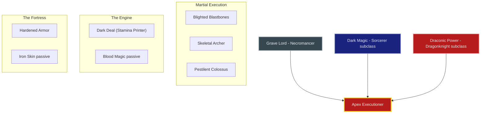
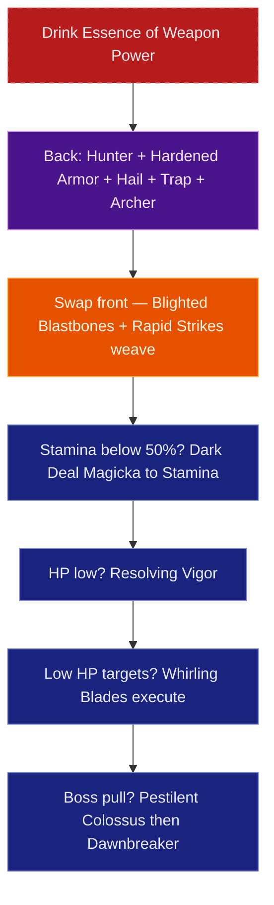
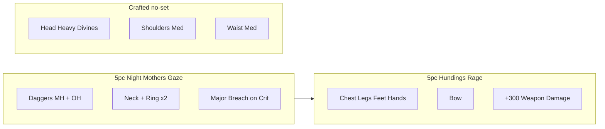

# Build Plan - Heka-Ankh: Apex Executioner (Uber Tier Triple Hybrid)

> **Character profile:** [heka_ankh.md](heka_ankh.md) — Level 50 Redguard Necromancer, CP 1033, @SOLAEGIS (NA).

Heka-Ankh is an exile of the Alik'r Desert who rejected traditional Redguard taboos regarding death magic, reframing necromancy not as dark worship, but as a strict martial discipline. Carrying the title **Dark Executioner**, she serves the Ebonheart Pact as a brutal martial arbiter who cleanses corrupted battlefields with dual steel, judgment arrows, and bound spirits.

This guide transforms Heka-Ankh into the **Apex Executioner**, a peak **Uber Tier (Triple Hybrid)** Stamina build. By combining native **Grave Lord** execution magic with **Dark Magic** (Sorcerer subclass — *Dark Deal* "Stamina Printer") and **Draconic Power** (Dragonknight subclass — *Hardened Armor* & *Iron Skin* mitigation), Heka-Ankh achieves unlimited stamina sustain and impenetrable defense. Armed with **Dual Wield Daggers** for close verdicts and a **Bow** for the long judgment of **Endless Hail**, she marks, rains, and executes—powered by craftable **Night Mother's Gaze** and **Hunding's Rage**, forged by `@masisi`.

---

## Build at a glance

| **Attribute** | **Recommendation** |
| :--- | :--- |
| **Primary Stat** | 64 points in **Stamina** — **live:** 64 Stamina (24,695 Stamina · 2,403 Weapon Power · 20,261 Health · ~15,219 Magicka) · **target:** 64 Stamina |
| **Mundus Stone** | **The Thief** (+Critical Chance) until target gear — **live:** The Thief · **after CP160 craft:** test **The Shadow** (+Critical Damage); keep Thief if Night Mother's Major Breach uptime slips |
| **Vampirism** | **Cured** — Redguard warriors rely on living vigor and martial stamina |
| **Sets** | **5 Night Mother's Gaze + 5 Hunding's Rage** (100% craftable) — **live:** Hawk's Eye 3 / Briarheart 2 / Night Mother 1 / misc · **target:** NM (daggers + jewelry) + Hunding (4 armor + bow) + crafted head/shoulders/waist |
| **Bars** | Front: Dual Wield Daggers ("The Executioner's Daggers") · Back: Bow ("The Executioner's Sight") — **live:** 2H Greatsword front + Bow back (transitional; mixed mag skills) · **target:** DW + Bow |
| **Food** | **Artaeum Takeaway Broth** (primary — tri-stat + recovery feeds Dark Deal magicka) · overland alt: **Garlic Cod with Potato Crust** or **Dubious Camoran Throne** |
| **Potion** | **Essence of Weapon Power** (Major Brutality + Major Savagery + Stamina Recovery) — pair with **Medicinal Use III** |
| **Weapon Poisons** | None (use weapon glyphs) |
| **Staff/Weapon Enchant** | Front: **Weapon Damage** (MH) + **Poison Damage** (OH) · Back bow: **Poison Damage** (Infused) |
| **Companion** | **Primary (now):** **Mirri Elendis** (Ranged/Support, Resto staff) at live CP **1033** + companion **15/20** · **Secondary:** **Zerith-var** (Necromancer Escort) · **Goal (20/20 @ CP160):** **Isobel Veloise** (shields + heals for world bosses) |
| **Primary Mount** | **Dwarven War Horse** (owned) · **Ideal:** **Dune Stalker Senche** — see [Collectibles](#collectibles) |
| **Flavor Pet** | **Alik'r Jackal** (owned) · **Ideal:** **Sand Wisp** or **Alik'r Dune-Hound** — see [Collectibles](#collectibles) |

**Read next:** [Roleplay](#roleplay-apex-executioner) · [Trinity configuration](#trinity-configuration) · [Combat kit](#combat-kit-the-apex-reckoning-cycle) · [Gear and crafting](#gear-and-crafting-executioners-mail) · [Champion points](#champion-point-mapping-cp-1033) · [Companion](#companion-strategy-the-executioners-retinue) · [Collectibles](#collectibles) · [Checklist](#next-steps--in-game-action-checklist)

---

## Roleplay: Apex Executioner

To the superstitious nobles of Hegathe and Sentinel, touching the dead is an unforgivable sin against Tu'whacca. Heka-Ankh saw that superstition for what it was: weak hesitation that left Redguard warriors vulnerable to liches and Daedric invaders. Exiled from her homeland, she took up the title **Dark Executioner** and pledged her judgment to the Ebonheart Pact.

Heka-Ankh treats necromancy, archery, and sorcery as **one martial discipline**—not separate arts, but phases of a sentence. She does not pray for stamina; she uses **Dark Deal** to convert disciplined magicka into flesh and breath, a living engine that never tires. She does not charge blindly; she **marks** the condemned from afar with **Camouflaged Hunter**, lays **Barbed Trap** as cursed ground, and calls **Endless Hail**—judgment rain that falls long after she has already moved. Only then does she harden her flesh with **Hardened Armor**, loose **Blighted Blastbones** into the front line, and cross the sand with **dual daggers** to deliver the final verdict: **Whirling Blades** for the dying, **Pestilent Colossus** for the guilty who thought they could stand.

Those who mistake her exile for weakness learn that Tu'whacca's law travels by arrow, disease, and steel alike.

**Mirri Elendis** scouts the wastes at her flank today—a Dunmer hunter who understands that some hunts require distance first. Heka-Ankh's end-state retinue is **Isobel Veloise**, a knight of oaths who chose to guard an exile rather than condemn her: faith and execution, shield and blade, standing shoulder to shoulder when world bosses demand it. **Zerith-var** remains the necromancer escort when a second blade is needed and no herald is required.

> [!TIP]
> **Suggested Custom Title:** `Dark Executioner of the Alik'r Sands`

> [!NOTE]
> **Build Notes (paste into LAM Custom Title / Build Notes):**
> Heka-Ankh — Apex Executioner. Uber Tier Triple Hybrid Stamina. 5 Night Mother's Gaze (daggers + jewelry) + 5 Hunding's Rage (armor + bow), 100% craftable. Front DW Daggers: Rapid Strikes, Blighted Blastbones, Whirling Blades, Dark Deal, Resolving Vigor, Pestilent Colossus ult. Back Bow: Endless Hail, Camouflaged Hunter, Barbed Trap, Hardened Armor, Skeletal Archer, Flawless Dawnbreaker ult. Subclass Sorcerer Dark Magic (Dark Deal) + DK Draconic Power (Hardened Armor). 64 Stamina. Mundus: The Thief (test Shadow after CP160 gear). Food: Artaeum Takeaway Broth on bosses. Companion: Mirri Elendis now (15/20); Isobel Veloise goal @20/20; Zerith-var secondary. @masisi crafts all 12 slots.

> [!TIP]
> **Flavor Pet:** **Alik'r Jackal** from the character's Collectibles export. **Ideal (any source):** **Sand Wisp** — desert spirit guiding the executioner — or **Alik'r Dune-Hound** — predator that tracks prey across open sand before the blade falls. See [Collectibles](#collectibles) for mount, pet, and dye details.

---

## Trinity configuration

By completing Bahtra at-Hunding's milestone quest **"A Study in Discipline"** at Level 50, Heka-Ankh unlocks the **Uber Tier (Triple Hybrid)** architecture. Heka-Ankh replaces **Living Death** with **Dark Magic** (Stamina Printer) and **Bone Tyrant** with **Draconic Power** (Dragon Fortification) to achieve the ultimate Trinity of Power. See [docs/subclassing.md](../../../docs/subclassing.md) for the Solaegis Trinity / subclassing model.

> [!IMPORTANT]
> **Live export is not subclassed yet.** [heka_ankh.md](heka_ankh.md) still shows **Living Death** and **Bone Tyrant** ranked. Complete **"A Study in Discipline"**, then subclass **Dark Magic** (replaces Living Death) and **Draconic Power** (replaces Bone Tyrant) before the target bars work. Native Living Death is wrong for a 64-Stamina Dark Deal engine—unslot **Avid Boneyard**, **Time Stop**, and other mag Living Death skills once the Uber Tier is active.

| **Pillar** | **Line** | **Origin** | **Slot action** | **Function** |
| :--- | :--- | :--- | :--- | :--- |
| **Martial Execution** | **Grave Lord** | Necromancer (native) | **KEEP** | Disease burst (**Blighted Blastbones**), persistent archery (**Skeletal Archer**), and **Pestilent Colossus** |
| **The Engine** | **Dark Magic** | Sorcerer (subclass) | **SUBCLASS** (replaces **Living Death**) | **Dark Deal** converts Magicka into instant Stamina & Health; fuel Magicka with **Artaeum Takeaway Broth** + **Siphoning Spells** CP |
| **The Fortress** | **Draconic Power** | Dragonknight (subclass) | **SUBCLASS** (replaces **Bone Tyrant**) | **Hardened Armor** (Major Resolve + damage shield) and **Iron Skin** passive (+10% block mitigation) |

---

## Combat kit: The Apex Reckoning Cycle

Open on the Bow back bar: **Camouflaged Hunter** → **Hardened Armor** → **Endless Hail** → **Barbed Trap** → refresh **Skeletal Archer**, then swap to Dual Wield Daggers. Front bar: release **Blighted Blastbones**, weave **Rapid Strikes**, press **Dark Deal** whenever Stamina dips below 50%, and slice through low-HP targets with **Whirling Blades**. Open hard pulls with **Pestilent Colossus**; finish with **Flawless Dawnbreaker** from the bow bar when ultimate is ready.

### Skill bars

Document **slotted morph names as shown in the skills UI** (not unmorphed base or wiki-only labels). Each morph appears at most once across bars. Bars match equipped weapon types (Dual Wield Daggers front, Bow back).

> [!NOTE]
> **Unslot from live export:** **Dizzying Swing**, **Executioner** (2H), unmorphed **Frozen Colossus** (morph to **Pestilent Colossus**), **Avid Boneyard**, **Time Stop**. Live already has a bow on the back bar—keep the weapon type, replace skills with the target table below. Acquire **Dual Wield daggers** for the front bar (live front is still a greatsword).

#### Front Bar (Dual Wield Daggers): "The Executioner's Daggers"

| **Slot** | **Class/Line** | **Base -> Morph** | **Role** |
| :--- | :--- | :--- | :--- |
| **1** | Dual Wield | Flurry -> **Rapid Strikes** | Single-target physical spammable + **Twin Blade & Blunt** (+10.6% Crit Chance) |
| **2** | Grave Lord (Necromancer) | Sacrificial Bones -> **Blighted Blastbones** | Stamina disease burst + **Major Defile** + corpse creation |
| **3** | Dual Wield | Whirlwind -> **Whirling Blades** | Stamina AoE execute (+100% damage scaling on low HP targets) |
| **4** | Dark Magic (Subclass) | Dark Exchange -> **Dark Deal** | **Stamina Printer** (converts Magicka to instant Stamina + Health) |
| **5** | Alliance War (Assault) | Vigor -> **Resolving Vigor** | Primary Stamina burst self-heal |
| **6 (Ult)** | Grave Lord (Necromancer) | Frozen Colossus -> **Pestilent Colossus** | **Major Vulnerability** (+20% damage taken by enemies) |

> [!TIP]
> **Boss flex (optional):** On long single-target world bosses, swap slot 3 **Whirling Blades → Steel Cyclone** (same Whirlwind morph sibling) for better sustained single-target pressure. Keep **Whirling Blades** as default for overland execute themes.

#### Back Bar (Bow): "The Executioner's Sight"

| **Slot** | **Class/Line** | **Base -> Morph** | **Role** |
| :--- | :--- | :--- | :--- |
| **1** | Bow | Volley -> **Endless Hail** | Ground stamina DoT (persists after bar swap) |
| **2** | Fighters Guild | Expert Hunter -> **Camouflaged Hunter** | **Major Savagery** + Magicka restore (fuels Dark Deal) |
| **3** | Fighters Guild | Trap Beast -> **Barbed Trap** | FG DoT; enables **Slayer** with Dawnbreaker |
| **4** | Draconic Power (Subclass) | Spiked Armor -> **Hardened Armor** | **Major Resolve** (+5,948 Armor) + protective damage shield |
| **5** | Grave Lord (Necromancer) | Skeletal Mage -> **Skeletal Archer** | Persistent stamina pet + escalating physical damage |
| **6 (Ult)** | Fighters Guild | Dawnbreaker -> **Flawless Dawnbreaker** | Physical burst ultimate + passive Weapon Damage boost |

> [!NOTE]
> **Major Brutality** comes from **Essence of Weapon Power** (and Medicinal Use uptime)—not from a slotted **Rally**. That frees the Fortress slot for **Hardened Armor**.

> [!NOTE]
> **Until Flawless Dawnbreaker is unlocked** (Fighters Guild quest / rank): do **not** put **Pestilent Colossus** on both bars (duplicate morph). Interim back-bar ultimate: keep **Camouflaged Hunter** / **Barbed Trap** for FG passives and use **Pestilent Colossus** on the front bar only until Dawnbreaker is morphable.

> [!NOTE]
> **Survivability variant (DW + 2H — legacy charge doctrine):** Prefer shield stacking over hail DoT? Back bar **Two-Handed Greatsword**: **Stampede**, **Carve**, **Rally**, **Hardened Armor**, **Skeletal Archer**, **Flawless Dawnbreaker**. Stronger shields and gap-close; lower peak overland/boss DPS than Endless Hail + Trap. Keep as an Armory alt, not the primary target.

### Rotation and combat tips

#### Solo combat tips

1. **The Stamina Printer:** **Dark Deal** converts Magicka into Stamina and Health instantly. Keep Magicka topped with **Artaeum Takeaway Broth**, **Camouflaged Hunter** restores, and **Siphoning Spells** CP on kills—press Dark Deal whenever Stamina dips below ~50%.
2. **Mark → rain → execute:** Never skip back-bar setup. **Endless Hail** and **Barbed Trap** tick while you dagger-weave on the front bar; that is the peak-DPS loop.
3. **Fortress layering:** **Hardened Armor** (Major Resolve + shield) plus **Resolving Vigor** covers burst. The 2H **Carve** shield stack is only on the survivability variant.
4. **Do not finish Eldritch Insight:** Live Warfare has mag-focused points—redirect to stamina CP below.

### Passive skills

Heka-Ankh has **48 Skill Points available**. Spend in this priority order; fully rank (Rank II/III) where noted.

#### Necromancer & Subclass Passives

* **Grave Lord:** **Reusable Parts** (II), **Death Knell** (II), **Dismember** (II), **Rapid Rot** (II) — Boost critical chance against low HP targets and physical DoT damage.
* **Dark Magic (Subclass):** **Unholy Knowledge** (II), **Blood Magic** (II), **Persistence** (II) — Reduces skill costs and heals whenever a Dark Magic ability is cast.
* **Draconic Power (Subclass):** **Iron Skin** (II), **Burning Heart** (II), **Elder Dragon** (II) — Boosts block mitigation and health recovery per slotted draconic ability.

#### Weapon Passives

* **Dual Wield:** **Slaughter** (II), **Dual Wield Expert** (II), **Controlled Fury** (II), **Ruffian** (II), **Twin Blade and Blunt** (II) — **+10.6% Crit Chance** with dual daggers.
* **Bow:** **Vinedusk Training** (II), **Accuracy** (II), **Ranger** (II), **Hawk Eye** (II), **Hasty Retreat** (II) — ranged DoT and mobility for Endless Hail / Trap loops.

#### Guild, Crafting, Alliance & Race Passives

* **Fighters Guild:** **Intimidating Presence**, **Slayer** (III), **Banish the Wicked** (III) — Passive physical damage per slotted Fighters Guild skill (**Camouflaged Hunter**, **Barbed Trap**, **Flawless Dawnbreaker**).
* **Alchemy:** **Medicinal Use** (III) — **Mandatory** — potion effects last 100% longer (pairs with Essence of Weapon Power).
* **Alliance War — Assault:** **Continuous Attack** (II) — Major Gallop (already unlocked live) · **Reach** (II) — +2% damage per second in combat (long boss fights).
* **Redguard:** **Wayfarer** (III), **Martial Training** (III), **Conditioning** (III), **Adrenaline Rush** (III) — Reduces skill costs and restores Stamina on melee light attacks.
* **Medium Armor:** **Dexterity** (II), **Wind Walker** (II), **Improved Sneak** (II), **Agility** (II), **Athletics** (II) — Physical critical chance and Stamina recovery.
* **Heavy Armor:** **Resolve** (III), **Constitution** (II), **Juggernaut** (II) — Resistance and Health for the heavy head piece.

---

## Gear and crafting: Executioner's Mail

Built 100% on **craftable sets**, this loadout pairs **Night Mother's Gaze** with **Hunding's Rage** for Major Breach on crit, Weapon Critical, and raw Weapon Damage—**exactly 5 + 5 pieces** (plus three crafted no-set armor slots).

### Set rationale

| **Set** | **5-Piece Bonus** | **Role in the Build** |
| :--- | :--- | :--- |
| **Night Mother's Gaze** | Critical damage applies **Major Breach** (-5,948 Armor) for 4s | Guarantees physical penetration on DW crit weaves without a dedicated debuff skill |
| **Hunding's Rage** | Adds 300 Weapon Damage & 1485 Weapon Critical | Core flat physical power for daggers and bow DoTs |

> [!NOTE]
> **Rejected alternatives:** **Spriggan's** breach leans on heavy attacks (poor fit for DW light weave). **Order's Wrath** adds crit damage but no Major Breach. **Briarheart** is strong but **not craftable**—out of scope for @masisi handoff.

### Target loadout

| **Slot** | **Set** | **Weight** | **Trait** | **Enchantment** | **Quality** |
| :--- | :--- | :--- | :--- | :--- | :--- |
| **Head** | Crafted (no set) | Heavy | Divines | Max Stamina | Epic / Gold |
| **Shoulders** | Crafted (no set) | Medium | Divines | Max Stamina | Epic / Gold |
| **Chest** | Hunding's Rage | Medium | Divines | Max Stamina | Epic / Gold |
| **Hands** | Hunding's Rage | Medium | Divines | Max Stamina | Epic / Gold |
| **Waist** | Crafted (no set) | Medium | Divines | Max Stamina | Epic / Gold |
| **Legs** | Hunding's Rage | Medium | Divines | Max Stamina | Epic / Gold |
| **Feet** | Hunding's Rage | Medium | Divines | Max Stamina | Epic / Gold |
| **Neck** | Night Mother's Gaze | Jewelry | Bloodthirsty | Weapon Damage | Epic / Gold |
| **Ring 1** | Night Mother's Gaze | Jewelry | Bloodthirsty | Weapon Damage | Epic / Gold |
| **Ring 2** | Night Mother's Gaze | Jewelry | Bloodthirsty | Weapon Damage | Epic / Gold |
| **Front Main Hand** | Night Mother's Gaze (Dagger) | Metal | Precise | Weapon Damage | Epic / Gold |
| **Front Off Hand** | Night Mother's Gaze (Dagger) | Metal | Precise | Poison Damage | Epic / Gold |
| **Back Weapon** | Hunding's Rage (Bow) | Wood | Infused | Poison Damage | Epic / Gold |

**Piece count check:** Night Mother's Gaze = **5** (2 daggers + neck + 2 rings) · Hunding's Rage = **5** (chest, hands, legs, feet, bow) · Crafted no-set = **3** (head, shoulders, waist).

**Front bar — Dual Daggers:** Precise traits push Critical Chance for 100% Night Mother's Major Breach uptime. Poison off-hand aligns with disease/DoT + **Thaumaturge** CP.

**Back bar — Bow:** Infused Poison glyph fires frequently inside **Endless Hail** / Trap windows.

### Crafting handoff (@masisi)

| **Detail** | **Recommendation** |
| :--- | :--- |
| **Style** | Redguard / Pyandonean Heavy |
| **Set station** | Night Mother's Gaze (Stormhaven — 6 traits) · Hunding's Rage (Bangkorai — 6 traits) |
| **Traits** | Divines (Armor), Bloodthirsty (Jewelry), Precise (Daggers), Infused (Bow) |
| **Interim (pre-CP160)** | Night's Silence (2 traits) as bridge set if mats are limited |
| **Quality path** | Purple (Epic) standard → Gold (Legendary) **Daggers & Bow** first |

> [!NOTE]
> **Research gate:** Coordinate with @masisi before gold-quality CP160 work. See [`masisi.md`](masisi.md) for account crafter status.

---

## Champion Point Mapping (CP 1033)

> [!NOTE]
> **Star catalog:** Use exact star names, constellation (discipline), max points, and slottable/passive type from [`champion_points_reference.md`](../../templates/champion_points_reference.md).

Full CP budget: **344 Warfare / 344 Fitness / 345 Craft** (1033 total).

**Live export (~523 spent / ~510 available):** Warfare has partial **Precision** / **Piercing** / **Quick Recovery**, slotted **Master-at-Arms**, **Deadly Aim**, **Backstabber**, and mag-leaning **Eldritch Insight** (17)—**do not finish Eldritch Insight**. Fitness has **Boundless Vitality**, **Rejuvenation**, and partial **Siphoning Spells** (17)—**finish Siphoning Spells to 50**. Remove **Backstabber** (flanking rarely applies face-to-face on world bosses).

**Planning rules:**
- **Per-discipline cap:** ~344 CP per discipline at CP 1033.
- **Slotted stars:** **4 per discipline** (at 900+ total CP limit).

### Warfare (Blue — 344 Points)

| **Slotted Star** | **Spend** | **Benefit** |
| :--- | :--- | :--- |
| **Master-at-Arms** | 50 points | Direct Damage — Rapid Strikes, Blastbones, Dawnbreaker — **live: already maxed** |
| **Deadly Aim** | 50 points | Single-Target Damage — world bosses — **live: already maxed** |
| **Fighting Finesse** | 50 points | Critical Damage and Critical Healing — **[NEW]** slot |
| **Thaumaturge** | 50 points | Damage-over-Time — Endless Hail, Barbed Trap, Blastbones disease, Archer — **[NEW]** replaces live **Backstabber** |

> [!TIP]
> **Boss-hunting swap:** For pure world-boss execute windows, swap **Thaumaturge → Exploiter** (+damage vs low HP). For holistic overland (mobs die fast; DoTs always tick), keep **Thaumaturge**.

**Passives (no slot needed — 144 points):**

* **Precision (20/20):** +326 Critical Chance — **live: finish from 10**
* **Piercing (20/20):** +700 Armor Penetration — **live: finish from 10**
* **Preparation (20/20):** Reduces damage taken from non-player attacks by 10% — **live: already maxed**
* **Quick Recovery (20/20):** +4% Healing Taken — **live: finish from 10**
* **Mighty (30/30):** +100 Physical, Bleed, and Disease Damage
* **Battle Mastery (34/40):** +136 Weapon and Spell Damage
* **Redirect Eldritch Insight (17):** unslot / refund into passives above — wrong for pure stamina

### Fitness (Red — 344 Points)

| **Slotted Star** | **Spend** | **Benefit** |
| :--- | :--- | :--- |
| **Boundless Vitality** | 50 points | +1,400 Max Health — **live: already maxed** |
| **Rejuvenation** | 50 points | +90 Health, Magicka, and Stamina Recovery — **live: already maxed** |
| **Fortified** | 50 points | +1,731 Armor — **[NEW]** slot |
| **Siphoning Spells** | 50 points | Restore Magicka on kill — fuels **Dark Deal** on overland chains — **live: finish from 17 to 50** |

**Passives (no slot needed — 144 points):**

* **Sprinter (20/20):** Reduces Sprint cost by 40 — **live: finish from 10**
* **Hasty (16/16):** +6% Sprint speed — **live: finish from 8**
* **Hero's Vigor (20/20):** +560 Max Health — **live: already maxed**
* **Tumbling (30/30):** Reduces Roll Dodge cost by 240
* **Defiance (20/20):** Reduces Break Free cost by 220
* **Mystic Tenacity (20/20):** Reduces status effect duration by 15%
* **Savage Defense (18/30):** Reduces Block cost by 36

> [!NOTE]
> **Celerity** is QoL movement, not a Fitness slottable priority for this build—**Siphoning Spells** wins the fourth slot for the Dark Deal engine.

### Craft (Green — 345 Points)

| **Slotted Star** | **Spend** | **Benefit** |
| :--- | :--- | :--- |
| **Steed's Blessing** | 50 points | +20% Movement Speed out of combat — **live: already maxed** |
| **War Mount** | 75 points | Removes stamina cost of mounting out of combat — **[NEW]** |
| **Gifted Rider** | 50 points | +20% Mount Speed — **[NEW]** |
| **Master Gatherer** | 75 points | Reduces harvesting time by 50% — **[NEW]** |

**Passives (no slot needed — 95 points):**

* **Fortune's Favor (50/50):** +50% Gold found in treasure chests — **live: already maxed**
* **Gilded Fingers (50/50):** +10% Gold drops — **live: finish from 50 if already maxed; otherwise complete**
* **Breakfall (10/50):** Reduces fall damage by 10% — **live: 1**; top up as points allow

---

## Companion Strategy: The Executioner's Retinue

Companion gear is separate from player gear—companions equip **Companion's** weapons, armor, and jewelry with **companion-only traits** (Quickened, Aggressive, Bolstered). There are no player gear sets or 5-piece bonuses on companions.

> [!NOTE]
> **Live export:** **Mirri Elendis** — Level **15/20**, **Companion's Restoration Staff**, mostly Level-1 Fine/Superior armor, empty ultimate slot. Character **Level 50 / CP 1033**.

### Companion picks

| **Tier** | **Companion** | **Role** | **Roleplay fit** | **Mechanical fit (at current stats)** |
| :--- | :--- | :--- | :--- | :--- |
| **Primary (now)** | **Mirri Elendis** | Ranged / Support | Dunmer scout who starts hunts at distance | At **15/20** with Resto staff: ranged support while Heka marks and executes; level her and replace Level-1 gear |
| **Secondary** | **Zerith-var** | Necromancer Escort | Khajiit order warrior — second blade when no herald is needed | Extra DPS / skeletal synergy when self-heal is enough |
| **Goal (20/20 @ CP160)** | **Isobel Veloise** | Support / Shields | Oath-knight who guards an exile rather than condemns her | Shields + burst heals let Heka stay on the dagger bar through Colossus windows on world bosses |

### Goal companion — Isobel Veloise: Oath Herald

When Isobel is capped, she is the end-state pick: faith beside judgment—shields and heals while Heka delivers the sentence.

| **Setting** | **Recommendation** |
| :--- | :--- |
| **Role** | Support / Frontline herald |
| **Gear Weight** | **Heavy** Companion Armor (survivability on world bosses) |
| **Gear Trait** | **Quickened** (cooldowns) · **Bolstered** on chest/legs if she dies too often |
| **Loadout** | Full **Companion's** heavy armor + **Companion's Sword and Shield** or **Companion's Bow** — companion-only items only |
| **Acquisition** | White basics from merchant armorers; **Superior+** traited pieces from drops while Isobel is active. **Not** part of @masisi's player craft. |

> [!TIP]
> **Secondary — Zerith-var:** Summon him instead of Isobel when you want a lethal lieutenant and do not need herald shields. **Mirri** remains the live primary until Isobel is leveled—keep Mirri rapport and upgrade her gear in the meantime.

---

## Collectibles

### Mount

Heka-Ankh rides a formidable War Horse appropriate for a Redguard executioner.

#### Primary (owned): Dwarven War Horse

| **Attribute** | **Detail** |
| :--- | :--- |
| **Why** | Heavy mechanical construct reflecting ancient brass authority |
| **Acquisition** | Owned ✅ |

> [!TIP]
> **Ideal mount (any source):** **Dune Stalker Senche** — fierce desert predator carrying the executioner across Alik'r sands.

### Pet

#### Primary (owned): Alik'r Jackal

| **Attribute** | **Detail** |
| :--- | :--- |
| **Why** | Desert scavenger symbolizing Tu'whacca's judgment over fallen foes |
| **Acquisition** | Owned ✅ |

> [!TIP]
> **Ideal pet (any source):** **Sand Wisp** — desert spirit guiding the executioner — or **Alik'r Dune-Hound** — predator that tracks prey across open sand before the blade falls.

### Dye and style

**Visual Theme: Executioner of the Sands**

| **Slot** | **Style** | **Visual reasoning** |
| :--- | :--- | :--- |
| **Outfit** | Redguard Heavy / Pyandonean | Heavy bronze plates with crimson war wraps |

**Dye palette:** **Obsidian Black** (primary armor), **Ancient Bronze** (metallic trim), **Blood Red** (war cloth).

---

## Next Steps & In-Game Action Checklist

Follow this transition list to activate **The Apex Executioner**.

### Phase 0 — Today (functional build)

1. **Attributes:** Confirm 64 points in **Stamina**.
2. **Mundus:** Keep **The Thief** until target gear is on; after CP160 craft, test **The Shadow**.
3. **Subclass:** Complete Bahtra **"A Study in Discipline"**; subclass **Dark Magic** (replace Living Death) and **Draconic Power** (replace Bone Tyrant); unlock **Dark Deal** and **Hardened Armor**.
4. **Weapons:** Craft/equip **Dual Wield Daggers** (front) and keep/upgrade a **Bow** (back)—live front is still a greatsword.
5. **Morphs:** Morph **Frozen Colossus → Pestilent Colossus**; unlock and morph **Flawless Dawnbreaker** (FG); slot **Camouflaged Hunter** and **Barbed Trap**.
6. **Action Bars:** Slot front/back per [Skill bars](#skill-bars); unslot Avid Boneyard, Time Stop, Dizzying Swing, Executioner.
7. **Respec Skills:** Spend 48 available Skill Points per [Passive skills](#passive-skills)—prioritize **Medicinal Use III**, **Reach**, Bow passives, Dual Wield, subclass passives.
8. **Food / Potion:** Stock **Artaeum Takeaway Broth** and **Essence of Weapon Power**.

### Phase 1 — Craft (interim)

9. **[Phase 1]** Request @masisi to craft interim **Night's Silence** pieces if materials for Night Mother's Gaze are limited.

### Phase 2 — Craft (target)

10. **[Phase 2]** Commission `@masisi` to craft **5pc Night Mother's Gaze** (2 daggers + jewelry) and **5pc Hunding's Rage** (chest, hands, legs, feet, bow) plus **crafted** Divines head/shoulders/waist per [Target loadout](#target-loadout).

### Phase 3 — Polish

11. **[Phase 3]** Upgrade **Daggers & Bow** to Gold (Legendary); apply Weapon Damage (MH) + Poison (OH/bow) glyphs.
12. **[Phase 3]** Allocate exact 1033 CP budget per [Champion Point Mapping](#champion-point-mapping-cp-1033)—slot **Fighting Finesse** + **Thaumaturge**; max **Siphoning Spells**; remove **Backstabber** / stop **Eldritch Insight**.

### Finish

13. **Companion:** Run **Mirri** and level **Isobel Veloise** toward **20/20**; farm **Companion's** traited gear (separate from player craft); fill empty ultimate slots. Use **Isobel** for world bosses; **Zerith-var** as secondary DPS escort.
14. **Regenerate profile:** Run `/markdown` in-game and update [heka_ankh.md](heka_ankh.md) when the build is live.

---

## Appendix: Champion Point star catalog

All Warfare, Fitness, and Craft stars with constellation, type, and max points:

**[`champion_points_reference.md`](../../templates/champion_points_reference.md)**
