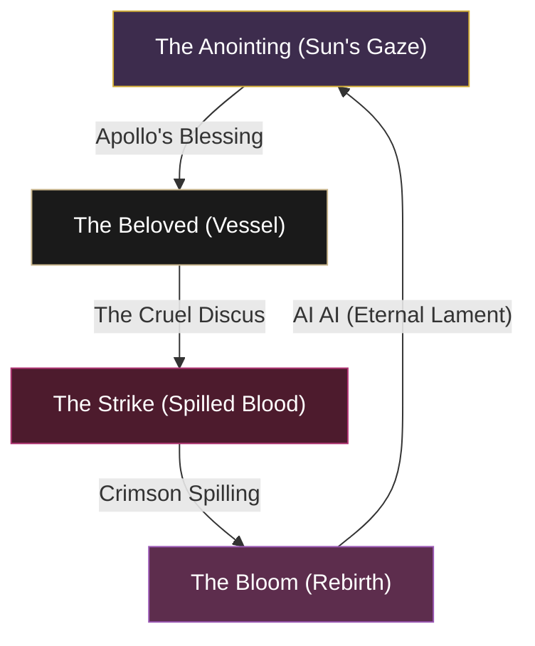

# Walkthrough - Hya'cinthe Prime: The Beloved of the Discus (Hybrid Eldritch Reaver)

**Hya'cinthe Prime** is the youth reborn in flower, the dark cat blessed by the sun. He is a **Hybrid Eldritch Reaver**, blending Apollonian protection with assassin's burst and the Crux-driven bloom of Apocrypha. He operates in a "Beloved's Cycle" where every strike taken returns him stronger, the divine love of light pulling him back from every wound — while beneath it all, the Stage II vampire's pallor whispers the secret of his deification.

## 🎭 Roleplay: The Beloved of the Discus

**Hya'cinthe Prime** is the **Beloved of the Discus** — the youth caught between Apollo's love and Zephyr's jealousy. His existence is a single eternal moment: the discus turning in the air, the blood falling on the meadow, the flower rising. He embodies four ritual states held in perfect tension:

1.  **The Anointing**: He bathes in Apollo's light (Restoring Focus, Healing Ward), the divine love that armors flesh against any wound.
2.  **The Strike**: He becomes the discus that killed him (Killer's Blade, Cephaliarch's Flail) — beauty's burden is that it cuts.
3.  **The Bloom**: From every wound, he rises transformed (Crux, Greater Aspects) — the crimson hyacinth born of spilled blood, more than what was struck down.
4.  **The Lament**: The eternal "AI AI" inscribed on his petals — Apollo's grief held in the vessel of every breath, the Undeath of the Stage II vampire made into mythic rebirth.

Anchored in the **Recuperative Treatise (Herald of the Tome)**, he performs these rites to sustain the soul-loop. Accompanied by **Isobel Veloise**, who anchors the strike-zone with shield and oath, he stands as the Sun's Beloved given mortal blade.

> [!TIP]
> **Thematic Pairing**: The **Meridian Sabre Cat** ("Saffron") is the ultimate solar mount — Apollo's golden cat carrying the dark cat below. Its pet counterpart, the **Meridian Sabre Cub**, completes the menagerie.

## 🔗 The Pillar of the Bloom: The Hybrid Foundation

The Beloved of the Discus replaces two of the Arcanist's native skill lines via Subclassing (unlocked at Level 50 via Bahtra at-Hunding's quest "A Study in Discipline") to bind together the rites of light, death, and rebirth:

| **Pillar**            | **Class Origin**       | **Skill Line**         | **Aspect of the Bloom** | **Function**                                             |
| :-------------------- | :--------------------- | :--------------------- | :---------------------- | :------------------------------------------------------- |
| **The Sun's Gaze**    | ☀️ **Templar** (sub)    | **Restoring Light**    | **The Anointing**       | **The Shield**: Apollo's grace through Restoring Focus.  |
| **The Cruel Discus**  | 🗡️ **Nightblade** (sub) | **Assassination**      | **The Strike**          | **The Blade**: Crit, execute, Minor Berserk on bloom.    |
| **The Crimson Bloom** | 🌸 **Arcanist** (base)  | **Herald of the Tome** | **The Rebirth**         | **The Engine**: Crux, eldritch sustain, Greater Aspects. |

| **Attribute**     | **Recommendation**                                                                        |
| :---------------- | :---------------------------------------------------------------------------------------- |
| **Primary Stat**  | **64 points in Stamina** (Target: 30k+ Stamina / 4k+ Weapon Power)                        |
| **Mundus Stone**  | **The Lover** (Penetration) — pairs with Spriggan's to reach PvP cap                      |
| **Food**          | **Bewitched Sugar Skulls** (Tri-Stat + Health Recovery)                                   |
| **Potion**        | **Tri-Stat Potion** (Bugloss + Columbine + Mountain Flower) — procs Clever Alchemist      |
| **Vampire Stage** | **Stage II — IMMUTABLE**. Undeath passive (10% mit at low HP) is the build's secret rite. |

---

## 🌪️ The "Uber" Rotation: The Beloved's Cycle

The power of the Beloved of the Discus lies in the **Bloom-Loop**. You do not survive; you are *struck down and rise again*, each cycle leaving you mightier. The cycle is short, the lament is long.

### ⚔️ Front Bar: "The Cruel Discus" (Dual Wield — Daggers)

*Slots **1 → 5 → Ult** use the same left-to-right order as [hya_cinthe.md](hya_cinthe.md). Target row is the Uber kit; profile column is latest export.*

**Target (Uber kit) — slot order**

| **1** | **2** | **3** | **4** | **5** | **6 (Ult)** |
| :---: | :---: | :---: | :---: | :---: | :---: |
| **Quick Cloak** | **Camouflaged Hunter** | **Killer's Blade** | **Cephaliarch's Flail** | **Rapid Strikes** | **Greater Aspects** |

| **Slot** | **Class / line** | **Base → Morph** | **Role** | **Profile** |
| :------- | :--------------- | :--------------- | :------- | :---------- |
| **1** | Dual Wield | Blade Cloak → **Quick Cloak** | Major Expedition, damage shield, DoT | Live |
| **2** | Fighters Guild | Expert Hunter → **Camouflaged Hunter** | Major Savagery (15% crit) | Morph (live: Expert Hunter) |
| **3** | Assassination (NB) | Assassin's Blade → **Killer's Blade** | Execute; stam on kill | Morph (live: Assassin's Blade) |
| **4** | Herald of the Tome | Abyssal Impact → **Cephaliarch's Flail** | Crux builder, AoE, debuff | Live |
| **5** | Dual Wield | Flurry → **Rapid Strikes** | Primary spammable | Live |
| **6 (Ult)** | Herald of the Tome | The Languid Eye → **Greater Aspects** | Crux dump, Major Berserk | Morph (live: The Languid Eye) |

### 🛡️ Back Bar: "The Sun's Embrace" (Restoration Staff)

*Slots **1 → 5 → Ult** use the same left-to-right order as [hya_cinthe.md](hya_cinthe.md).*

**Target (Uber kit) — slot order**

| **1** | **2** | **3** | **4** | **5** | **6 (Ult)** |
| :---: | :---: | :---: | :---: | :---: | :---: |
| **Restoring Focus** | **Resolving Vigor** | **Healing Ward** | **Recuperative Treatise** | **Race Against Time** | **Soul Siphon** |

| **Slot** | **Class / line** | **Base → Morph** | **Role** | **Profile** |
| :------- | :--------------- | :--------------- | :------- | :---------- |
| **1** | Restoring Light (Templar) | Rune Focus → **Restoring Focus** | Stam while blocking, Major Resolve | Swap (live: Silver Leash) |
| **2** | Assault (Alliance War) | Vigor → **Resolving Vigor** | HoT heal | Live |
| **3** | Restoration Staff | Steadfast Ward → **Healing Ward** | Burst heal, damage shield | Live |
| **4** | Herald of the Tome | Inspired Scholarship → **Recuperative Treatise** | Major Brutality/Sorcery while slotted; stam/mag on hit | Swap (live: Cephaliarch's Flail) |
| **5** | Psijic Order | Accelerate → **Race Against Time** | Snare/root immunity, Major Expedition, Minor Force | Swap (live: Cleansing Ritual) |
| **6 (Ult)** | Soul Magic | Soul Strike → **Soul Siphon** | Cheap AoE emergency heal | Swap (live: The Languid Eye) |

> [!TIP]
> **Inspired Scholarship vs Recuperative Treatise**: In the skills menu you only see the morph you own (**Inspired Scholarship IV** right now). Open it → **Morph** → **Recuperative Treatise**. Wiki sites label the unmorphed base *Tome-Bearer's Inspiration* — that name does not stay on the list after your first morph.

> [!IMPORTANT]
> **The Combo Sequence** (slot numbers = [hya_cinthe.md](hya_cinthe.md) order): (1) Back bar: **Restoring Focus** (1) + **Race Against Time** (5). (2) Bar swap front; drink Tri-Stat: **Quick Cloak** (1) → **Camouflaged Hunter** (2) → **Cephaliarch's Flail** (4). (3) **Rapid Strikes** (5) + light weave. (4) **Greater Aspects** (6) at full Crux. (5) **Killer's Blade** (3) below 25%. The Beloved blooms.

---

## 📚 Passive Mastery: The Wisdom of the Beloved

To truly embody the **Beloved of the Discus**, you must master the passive currents of light, blade, and bloom. Maximize these lines as a priority.

### ☀️ Templar (The Sun's Gaze) — *Subclassed*
*   **Restoring Light**: **Mending**, **Sacred Ground**, **Light Weaver**, **Master Ritualist**.

### 🗡️ Nightblade (The Cruel Discus) — *Subclassed*
*   **Assassination**: **Pressure Points**, **Hemorrhage**, **Master Assassin**, **Executioner**.

### 🌸 Arcanist (The Crimson Bloom)
*   **Herald of the Tome (actives)**: **Inspired Scholarship** → morph **Recuperative Treatise** on back bar (same skill slot in the UI; you only see one name at a time).
*   **Herald passives (skill line)**: **Fated Fortune**, **Harnessed Quintessence**, **Psychic Lesion**, **Splintered Secrets**.

### ⚔️ Weapon & Armor (The Vessel's Tools)
*   **Dual Wield**: **Slaughter**, **Dual Wield Expert**, **Controlled Fury**, **Ruffian**, **Twin Blade and Blunt**.
*   **Restoration Staff**: **Essence Drain**, **Restoration Expert**, **Cycle of Life**, **Absorb**.
*   **Medium Armor (5pc)**: **Dexterity**, **Wind Walker**, **Athletics**, **Agility**, **Improved Sneak**.
*   **Heavy Armor (1pc)**: **Resolve**, **Constitution**, **Juggernaut** *(Revitalize/Rapid Mending need 5pc — skip)*.
*   **Light Armor (1pc)**: **Evocation**, **Recovery** *(Spell Warding/Prodigy need 5pc — skip)*.

### 🏆 Guild & Racial (The Beloved's Foundation)
*   **Fighters Guild**: **Slayer**, **Banish the Wicked**, **Intimidating Presence**.
*   **Mages Guild**: **Everlasting Magic**, **Magicka Controller**, **Mage Adept**.
*   **Psijic Order**: **Concentrated Barrier**, **Channeled Acceleration**, **Spell Orb**.
*   **Undaunted**: **Undaunted Command**, **Undaunted Mettle** (CRITICAL — 6% stat boost for the 5/1/1 split).
*   **Vampirism (Stage II)**: **Undeath** (THE 10% mit passive), **Strike From the Shadows**, **Dark Stalker**, **Savage Feeding**.
*   **Racial (Khajiit)**: **Cutpurse**, **Robustness**, **Lunar Blessings** (12% crit damage), **Feline Ambush**.

### ⚖️ Alliance War & Soul (The Path of the Beloved)
*   **Assault**: **Continuous Attack**, **Reach**, **Combat Frenzy**.
*   **Soul Magic**: **Soul Lock**, **Soul Summons**.
*   **Alchemy**: **Medicinal Use (3/3)** — *MANDATORY* for Tri-Stat / Clever Alchemist uptime.

---

## ⚔️ Equipment Strategy: "The Beloved's Regalia"

To match the **Hybrid Eldritch Reaver** identity, the build leans on **Clever Alchemist** (potion-burst windows align with engagements), **Spriggan's Thorns** (penetration cap), and **Balorgh** (ult-burst monster set). The 5/1/1 armor split unlocks the full **Undaunted Mettle** stat bonus.

### 🛡️ Equipment Details

| **Slot**           | **Size** | **Trait**      | **Set**               | **Enchantment**              |
| :----------------- | :------- | :------------- | :-------------------- | :--------------------------- |
| **Head**           | Medium   | **Impen.**     | **Balorgh** (Monster) | **Prismatic Defense**        |
| **Chest**          | Heavy    | **Reinforced** | **Clever Alchemist**  | **Prismatic Defense**        |
| **Legs**           | Medium   | **Divines**    | **Clever Alchemist**  | **Prismatic Defense**        |
| **Shoulders**      | Medium   | **Impen.**     | **Balorgh** (Monster) | **Max Stamina**              |
| **Hands**          | Medium   | **Divines**    | **Clever Alchemist**  | **Max Stamina**              |
| **Feet**           | Medium   | **Divines**    | **Clever Alchemist**  | **Max Stamina**              |
| **Waist**          | Light    | **Divines**    | **Clever Alchemist**  | **Max Stamina**              |
| **Necklace**       | Jewelry  | **Bloodthir.** | **Spriggan's Thorns** | **Weapon Damage**            |
| **Ring (1)**       | Jewelry  | **Bloodthir.** | **Spriggan's Thorns** | **Weapon Damage**            |
| **Ring (2)**       | Jewelry  | **Bloodthir.** | **Spriggan's Thorns** | **Stamina Recovery**         |
| **Weapon 1 (M/H)** | Dagger   | **Sharpened**  | **Spriggan's Thorns** | **Weapon Damage**            |
| **Weapon 1 (O/H)** | Dagger   | **Sharpened**  | **Spriggan's Thorns** | **Poison / Disease**         |
| **Weapon 2**       | Resto    | **Defending**  | **Spriggan's Thorns** | **Absorb Magicka / Crusher** |

> [!TIP]
> **Monster Set Path (Until Balorgh)**:
> 1. **Day-1**: 1pc **Slimecraw** (Wayrest Sewers I norm) + 1pc **Stormfist** (Tempest Island norm). Slimecraw gives Minor Berserk; Stormfist procs on heavy attacks.
> 2. **Mid-Game**: 2pc **Bloodspawn** (Spindleclutch II vet) — strongest PvP defensive stopgap (Major Resolve + 14 ult on hit).
> 3. **End-Goal**: 2pc **Balorgh** (vMarch of Sacrifices + Undaunted Pledge Helms) — burst-on-ult is the build's signature.

> [!NOTE]
> **Mythic Alternative Path**: If acquiring **Velothi Ur-Mage's Tome**, replace Spriggan's necklace with Velothi → drop Clever Alchemist → run 5pc **Coral Riptide** (max stam scaling). Trades burst windows for always-on damage; better for sustained brawling, slightly lower 1v1 ceiling.

---

## 🎨 Visual Identity: The Floral Apostle

Hya'cinthe Prime avoids the "scrappy Khajiit" silhouette. As the Beloved of the Discus, he wears **luminous noble vestments** that read as Apollo's chosen made flesh — sleek black fur framed in golden saffron and deep hyacinth violet, the visible aesthetic of a creature blessed (and the hidden truth of the vampire beneath).

### 📜 Crafting Order: The Regalia of the Bloom

| **Slot**        | **Size** | **Style**                         | **Visual Reasoning**                                                 |
| :-------------- | :------- | :-------------------------------- | :------------------------------------------------------------------- |
| **Chest**       | Heavy    | **Auroran Knight**                | Meridia's golden plate — the Sun's literal armor.                    |
| **Legs**        | Medium   | **Sapiarch**                      | High Elven scholar's flowing greaves — Aldmeri Dominion noble.       |
| **Head**        | Medium   | **Sapiarch**                      | The Crown of the Beloved — elegant, unmistakably noble.              |
| **Shoulders**   | Medium   | **Y'ffre's Will**                 | Floral mantle — the literal hyacinth bloom on the silhouette.        |
| **Hands**       | Medium   | **Sapiarch**                      | Refined gauntlets for the killing hand.                              |
| **Feet**        | Medium   | **Y'ffre's Will**                 | Petals at every step — the flower-strewn meadow.                     |
| **Waist**       | Light    | **Y'ffre's Will**                 | The garland of the deified youth.                                    |
| **Daggers**     | Weapon   | **Apostle of Mora (Unfeathered)** | **The Twin Discs.** Apocryphan tendrils — the Crux-Bloom made blade. |
| **Resto Staff** | Weapon   | **Auroran Knight**                | **The Scepter of the Sun.** Apollo's solar conduit.                  |

---

## ⚒️ Crafter's Procurement List (for @masisi)

### 🛠️ Masisi's Status (Account Crafter)
Masisi is currently supplying materials and motifs. He has reached the rank of **Style Master**.

| Motif Style                       | Target Chapters        | Status / Notes                                               |
| :-------------------------------- | :--------------------- | :----------------------------------------------------------- |
| **Auroran Knight**                | Chest, Resto Staff     | ❌ Needed (Crown Store / Crates)                              |
| **Sapiarch**                      | Head, Hands, Legs      | ⚠️ Verify Masisi's chapter ownership; Summerset chapter req'd |
| **Y'ffre's Will**                 | Shoulders, Waist, Feet | ❌ Needed (Wayshrine quests + zone drops)                     |
| **Apostle of Mora** (Unfeathered) | Daggers (x2)           | ❌ Needed (Unfeathered Crown Crates)                          |

> [!NOTE]
> **Mimic Stones**: If Masisi has Crown Mimic Stones in inventory, they can substitute for Auroran Knight ingot or Y'ffre's Will reagent once each pattern is learned.

> [!TIP]
> **Clever Alchemist Crafting**: The set requires **8 traits per item** to craft and a station found in **Lower Craglorn** (Stormhaven Outlaws Refuge area). Confirm Masisi's trait research before queueing the order.

### 🖌️ Dye Recommendation: "The Hyacinth Palette"

*   **Primary (Stone/Main):** **Hyacinth Pink** (the literal hyacinth flower; the wound-bloom).
*   **Secondary (Trim/Detail):** **Sunhallowed Saffron** (Apollo's gold; the Sabre Cat's namesake).
*   **Accent (Wood/Fur):** **Senche-Raht Black** (the Khajiit's dark fur; the vampire's pallor reversed).

---

---

## ⭐ Champion Point Investment: The Beloved's Path (Target: CP 942 ✅)

Hya'cinthe is already CP-saturated (942 CP, 314 per tree). All slottables below are PvP-tuned and assume CP160 gear is in place.

### ⚔️ Warfare (Blue Tree): The Cruel Discus
*   **Master-at-Arms** (Slotted): +6% Direct Damage. Fuels Cephaliarch's Flail and Killer's Blade.
*   **Deadly Aim** (Slotted): +10% to ranged. Cephaliarch's Flail is a 28m ranged attack.
*   **Backstabber** (Slotted): +10% from behind. Pairs with Quick Cloak DoT positioning.
*   **Wrathful Strikes** (Slotted): +8% Light/Heavy Attack damage — feeds Recuperative Treatise weaving.

> **Passive Priorities**: Eldritch Insight (Max Mag), Precision (Crit Rating), Piercing (Phys/Spell Pen), War Mage (Wpn/Spell Damage).

### 💪 Fitness (Red Tree): The Sun's Embrace
*   **Boundless Vitality** (Slotted): +1400 Max HP. The vessel must endure.
*   **Bloody Renewal** (Slotted): Heal on kill — synergizes with Killer's Blade execute resets.
*   **Rejuvenation** (Slotted): +150 to all recoveries on heavy attack — pairs with Recuperative Treatise.
*   **Fortified** (Slotted): +1731 Armor — supports Restoring Focus block-cast playstyle.

> **Passive Priorities**: Hero's Vigor (HP), Mystic Tenacity (Status Resist), Defiance (Break Free), Unchained (Stam Cost Red after Break Free).

### ⚒️ Craft (Green Tree): The Beloved's Reach
*   **Steed's Blessing** (Slotted): +20% Out-of-Combat Speed.
*   **Rationer** (Slotted): +30m Sugar Skulls duration.
*   **Liquid Efficiency** (Slotted): 10% chance not to consume Tri-Stat potions.
*   **Steadfast Enchantment** (Slotted): +50% glyph proc duration — extends Weapon Damage enchant.

> **Passive Priorities**: Wanderer (Cost Reduction), Gilded Fingers (Gold), Out of Sight (sneak cost), Sustaining Shadows (sneak recovery).

---

## 👥 Recommended Companion: The Sentinel of the Anointing

**Isobel Veloise** (Necrom) is the definitive solo-content companion. Her shield-and-oath framework holds aggro while Hya'cinthe orchestrates the Beloved's Cycle without dancing for positioning.

### 🛡️ Role: The Sentinel (Tank)
The Beloved cannot be the priest *and* the altar. Isobel anchors the strike-zone so Hya'cinthe is free to channel Greater Aspects, drink potions on cue, and execute on fall-off.

| **Trait**           | **Recommendation**                                                                                    |
| :------------------ | :---------------------------------------------------------------------------------------------------- |
| **Mechanical Role** | **Crowd Control Tank**: Single-target taunt + AoE taunt rotation, barrier ult.                        |
| **Gear Trait**      | **Bolstered** (Armor) or **Quickened** (Cooldowns).                                                   |
| **Gear Weight**     | **Heavy Armor + Sword & Shield**: maximum survivability so the Beloved is never broken from the rite. |
| **Core Sets**       | **Pillar of Nirn** + **Plague Doctor** (both easy overland farms).                                    |
| **Key Synergy**     | **Spectral Bow / Aggressive Horn** synergies generate ult for Greater Aspects.                        |

> [!TIP]
> **Thematic Alternative — Tanlorin (Gold Road)**: Canonically non-binary, queer-affirming dialogue, narratively a strong fit for a queer-coded character. Run as DPS or Healer. ~5% behind Isobel mechanically for vet solo content but the rapport story carries thematic weight.

---

## 🐎 Collectibles: The Beloved's Menagerie

To complete the transformation, target these specific collectibles that align with the **Sun-Beloved-Bloom** triptych:

### 🏷️ Title: The Beloved's Name
*   **Primary**: **Hand of Mara** (Mara's queer-affirming wedding-quest title — symbolic of the divine love).
*   **Thematic Upgrade**: **Soul-Shriven** (from Coldharbour intro — vampiric undertone, "the rebirth" as literal mechanic).

### 🐾 Companions of the Cycle
*   **Mount (The Sun's Gift)**: **Meridian Sabre Cat** ("Saffron") — 4,000 / 3,200 Crowns when in Crown Store rotation.
    *   *Why*: Meridia is Tamriel's closest analog to Apollo — Lady of Infinite Energies, sun-coded, queer-blessing-adjacent. The default name "Saffron" doubles as the Crocus myth (another Greek youth transformed into a flower by divine love). Gold cat under dark cat = the dawn carrying the dusk.
    *   *Status*: ⏳ **Watch for rotation** (last cycles: Jan 2023, Jan 2024). 19,000 Crowns currently available.
*   **Mount (Backup, Currently Buyable)**: **Mara's Pledge Mare** — white-with-spring-flowers, divine-love-coded. Loses the feline thread but holds the queer-wedding theme.
*   **Pet (The Sun's Cub)**: **Meridian Sabre Cub** — paired to the mount; same name origin, same rotation.
*   **Pet (Backup)**: **Auroran Lion Cub** or any Meridia-themed feline cub on rotation.

### ⛔ Avoid Thematically
*   **Bears, mammoths, bulky mounts** — wrong silhouette for the lean Khajiit.
*   **Senche-Raht / Senche-Tiger furstock mounts** — these are *people* in Khajiit lore; riding them reads as troubling.
*   **Goofy pets** (sweetrolls, plush dragons) — undermines the elegance.
*   **Undead/skeletal cosmetics** — the vampirism is *private*; outward presentation stays luminous.

### 🛡️ Companion Gear: Isobel
*   **Gear Trait**: **Bolstered** (Armor) or **Quickened** (Cooldowns).
*   **Primary Stat**: **Max Health / Armor**.

---

## ✅ Next Steps

*Synced to live export ([hya_cinthe.md](hya_cinthe.md)) — Lv **48**, CP **977**, **60** stamina attributes, **11** skill points banked, **19** CP unspent (⚒️6 / ⚔️7 / 💪6). Front bar layout mostly on-plan; back bar still has wrong skills in slots **1 / 4 / 5 / ult**.*

1.  **Fix back bar (do this first — same slot numbers as export)**: 🔄 **HIGHEST PRIORITY**
    - **Slot 4**: Remove **Cephaliarch's Flail** (duplicate). Morph **Inspired Scholarship → Recuperative Treatise** and slot here.
    - **Ult**: Remove **The Languid Eye** from back; slot **Soul Siphon** (or base **Soul Strike** until morphed).
    - **Slot 1**: Replace **Silver Leash** with **Restoring Focus** when available (subclass Restoring Light).
    - **Slot 5**: Replace **Cleansing Ritual** with **Race Against Time** when Psijic line is unlocked.
2.  **Front bar morphs (slots 2, 3, ult)**: 🔄 **Expert Hunter → Camouflaged Hunter** (2), **Assassin's Blade → Killer's Blade** (3), **The Languid Eye → Greater Aspects** (front ult only).
3.  **Reach Level 50 + subclass**: ⏳ **2 levels left**. Complete *"A Study in Discipline"* → **Restoring Light** + **Assassination**; spend **11** skill points on passives in plan. **Vampire Stage II** — keep; never feed to III/IV.
4.  **Join the Three Guilds**: ⏳ Still no FG / MG / Undaunted in export — join in **Vulkhel Guard**; run **Inner Light** on back while leveling MG.
5.  **Companion swap for solo**: ⏳ **Live**: Tanlorin (underleveled). **Target**: **Isobel Veloise** — heavy SnS, Bolstered/Quickened.
6.  **Pre-CP160 gear + @masisi**: ⏳ **Trainee** + misc leveling pieces — not target sets. Trait/motif research per **Equipment Strategy** section.
7.  **CP tuning**: ⏳ Spend **19** banked CP; add **Liquid Efficiency** on Craft when respeccing for Tri-Stat uptime.
8.  **CP160 gear pivot**: ⏳ Clever Alchemist + Spriggan's + monster ladder → Balorgh.
9.  **Mount watch**: ⏳ **Meridian Sabre Cat** on January Crown rotation (**19,000** Crowns ready).

The discus turns. The blood falls. The flower rises. *AI AI* — and the Sun weeps onward.
