<!-- Example character markdown: combat/equipment/CP/companion sections aligned to karakedi_plan.md -->

# Karakedi (Locksmith)

   

**Khajiit Nightblade • Aldmeri Dominion Alliance**

---

## 📑 Table of Contents

- [📋 Overview](#overview)
  - [General](#general)
  - [Currency](#currency)
- [⚔️ Combat Arsenal](#combat-arsenal)
  - [Character Stats](#character-stats)
  - [Advanced Stats](#advanced-stats)
- [⚔️ PvP](#pvp)
  - [Alliance War Skills](#alliance-war-skills)
- [👥 Companions](#companions)
- [🎨 Collectibles](#collectibles)
- [🎒 Inventory](#inventory)
- [🏆 Achievements](#achievements)
- [🏰 Guild Membership](#guild-membership)

---

## 📋 Overview

### General

| **Attribute** | **Value** |
| --- | --- |
| **Level** | 50 |
| **Champion Points** | 887 |
| **Gender** | Male |
| **Age** | 8d 19h 7m |
| **Account** | @SOLAEGIS |
| **ESO Plus** | ✅ Active |

| **Attribute** | **Value** |
| --- | --- |
| **Attributes** | 🔵 0 / ❤️ 0 / ⚡ 64 |
| **🐴 Riding Skills** | 🐴 60 / 💪 60 / 🎒 60 ✅ |
| **Available Champion Points** | ⚒️ 130 - ⚔️ 56 - 💪 75 |
| **Skill Points** | 🎯 0 available - Spent on plan build |
| **Race** | [Khajiit](https://en.uesp.net/wiki/Online:Khajiit) |
| **Title** | [Locksmith](https://en.uesp.net/wiki/Online:Locksmith) |

| **Attribute** | **Value** |
| --- | --- |
| **Class** | [Nightblade](https://en.uesp.net/wiki/Online:Nightblade) |
| **Server** | [NA Megaserver](https://en.uesp.net/wiki/Online:Megaservers) |
| **Alliance** | [Aldmeri Dominion](https://en.uesp.net/wiki/Online:Aldmeri_Dominion) |
| **🪨 Mundus Stone** | [The Thief](https://en.uesp.net/wiki/Online:The_Thief_(Mundus_Stone)) |
| **Location** | [Alik'r Desert](https://en.uesp.net/wiki/Online:Alik'r_Desert) (Myrkwasa Dolmen) |
| **🍖 Active Buffs** | Food: [Braised Rabbit with Spring Vegetables](https://en.uesp.net/wiki/Online:Braised_Rabbit_with_Spring_Vegetables), Other: [Gallop](https://en.uesp.net/wiki/Online:Gallop), [Major Savagery](https://en.uesp.net/wiki/Online:Major_Savagery), [Major Prophecy](https://en.uesp.net/wiki/Online:Major_Prophecy), [Relentless Focus](https://en.uesp.net/wiki/Online:Relentless_Focus) |

### Currency

| **Attribute** | **Value** |
| --- | --- |
| 💰 **Gold** | 10,745 |
| ⚔️ **Alliance Points** | 38,302 |
| 🔮 **Tel Var** | 1,983 |
| 💎 **Transmute Crystals** | 156 |
| 📜 **Writs** | 0 |
| 🎫 **Event Tickets** | 0 |
| 👑 **Crowns** | 20,500 |
| 💠 **Gems** | 184 |
| 🏅 **Seals** | 15,605 |
| 🗝️ **Keys** | 11 |
| 👕 **Tokens** | 7 |
| 📚 **Fortunes** | 0 |
| 🔹 **Fragments** | 148 |

---

## ⚔️ Combat Arsenal

### Character Stats

| **Category** | **Stat** | **Value** |
| --- | --- | ---: |
| 💚 **Resources** | Health | 19,807 |
|  | Magicka | 14,609 |
|  | Stamina | 26,706 |
| ⚔️ **Offensive** | Weapon Power | 2,727 |
|  | Spell Power | 2,727 |

| **Category** | **Stat** | **Value** |
| --- | --- | ---: |
| 🎯 **Critical** | Weapon Crit | 8,808 (40.2%) |
|  | Spell Crit | 8,808 (40.2%) |
| ⚔️ **Penetration** | Physical | 3,888 |
|  | Spell | 3,888 |

| **Category** | **Stat** | **Value** |
| --- | --- | ---: |
| 🛡️ **Defensive** | Physical Resist | 14,237 (85%) |
|  | Spell Resist | 14,237 (85%) |
| ♻️ **Recovery** | Health | 578 |
|  | Magicka | 814 |
|  | Stamina | 1,686 |

### Advanced Stats

| **Ability** | **Cost/Value** |
|:---|---:|
| ⚔️ **Light Attack** | 3,795 dmg |
| ⚔️ **Heavy Attack** | 7,590 dmg |
| ⚔️ **Bash** | 765 cost, 5,571 dmg |
| 🛡️ **Block** | 1,404 cost, 50% mit, 40% spd |
| 🔓 **Break Free** | 5,400 cost |
| 🏃 **Dodge Roll** | 2,788 cost |
| 🐾 **Sneak** | 26 cost, 0% spd |
| 🏃‍♂️ **Sprint** | 465 cost, 0% spd |

| **Resistance** | **Value** |
|:---|---:|
| 🔥 **Flame** | 21.5% |
| ⚡ **Shock** | 21.5% |
| ❄️ **Frost** | 21.5% |
| 🔮 **Magic** | 21.5% |
| 🦠 **Disease** | 21.5% |
| ☠️ **Poison** | 21.5% |
| 🩸 **Bleed** | 21.5% |

| **Damage Type** | **Bonus** |
|:---|---:|
| 💥 **Critical Damage** | 94% |
| ⚔️ **Physical** | 0 |
| 🔥 **Flame** | 0 |
| ⚡ **Shock** | 0 |
| ❄️ **Frost** | 0 |
| 🔮 **Magic** | 0 |
| 🦠 **Disease** | 0 |
| ☠️ **Poison** | 0 |
| 🩸 **Bleed** | 0 |
| 🌌 **Oblivion** | 0 |

| **Healing** | **Value** |
|:---|---:|
| 💚 **Healing Done** | 0 |
| 💖 **Healing Taken** | 0 |
| ✨ **Critical Healing** | 84% |

## ⚔️ Combat Arsenal

### ⚔️ ⚔️ ⚔️ Front Bar (Main Hand)

| **1** | **2** | **3** | **4** | **5** | **6** |
| :---: | :---: | :---: | :---: | :---: | :---: |
| [Surprise Attack](https://en.uesp.net/wiki/Online:Surprise_Attack) | [Killer's Blade](https://en.uesp.net/wiki/Online:Killer%27s_Blade) | [Relentless Focus](https://en.uesp.net/wiki/Online:Relentless_Focus) | [Deadly Cloak](https://en.uesp.net/wiki/Online:Deadly_Cloak) | [Power Surge](https://en.uesp.net/wiki/Online:Surge) | [Incapacitating Strike](https://en.uesp.net/wiki/Online:Incapacitating_Strike) |

### 🔮 🔮 🔮 Back Bar (Backup)

| **1** | **2** | **3** | **4** | **5** | **6** |
| :---: | :---: | :---: | :---: | :---: | :---: |
| [Endless Hail](https://en.uesp.net/wiki/Online:Endless_Hail) | [Razor Caltrops](https://en.uesp.net/wiki/Online:Razor_Caltrops) | [Barbed Trap](https://en.uesp.net/wiki/Online:Barbed_Trap) | [Hurricane](https://en.uesp.net/wiki/Online:Lightning_Form) | [Resolving Vigor](https://en.uesp.net/wiki/Online:Resolving_Vigor) | [Toxic Barrage](https://en.uesp.net/wiki/Online:Toxic_Barrage) |

---

## ⚔️ Equipment & Active Sets

| **Set** | **Progress** |
| --- | --- |
| 🟢 **[Order's Wrath Set](https://en.uesp.net/wiki/Online:Order%27s_Wrath)** | `7/5` ██████████ 100% *(+2 extra)* |
| 🟢 **[Hunding's Rage Set](https://en.uesp.net/wiki/Online:Hunding%27s_Rage_Set)** | `5/5` ██████████ 100% |
| 🟡 **[Agility Set](https://en.uesp.net/wiki/Online:Agility_Set)** | `1/5` ██░░░░░░░░ 20% |

### 📋 Equipment Details

| **Slot** | **Item** | **Set** | **Quality** | **Trait** | **Type** | **Enchantment** |
| --- | --- | --- | --- | --- | --- | --- |
| ⛑️ **Head** | Helmet of Order's Wrath | [Order's Wrath Set](https://en.uesp.net/wiki/Online:Order%27s_Wrath) | 💛 Legendary | Divines | Medium | Maximum Stamina Enchantment |
| 💎 **Neck** | Necklace of Hunding's Rage | [Hunding's Rage Set](https://en.uesp.net/wiki/Online:Hunding%27s_Rage_Set) | 💛 Legendary | Bloodthirsty | None | Weapon Damage Enchantment |
| 🛡️ **Chest** | Jack of Order's Wrath | [Order's Wrath Set](https://en.uesp.net/wiki/Online:Order%27s_Wrath) | 💛 Legendary | Divines | Medium | Maximum Stamina Enchantment |
| 👑 **Shoulders** | Arm Cops of Order's Wrath | [Order's Wrath Set](https://en.uesp.net/wiki/Online:Order%27s_Wrath) | 💛 Legendary | Divines | Medium | Maximum Stamina Enchantment |
| ⚔️ **Main Hand** | Hunding's Dagger | [Hunding's Rage Set](https://en.uesp.net/wiki/Online:Hunding%27s_Rage_Set) | 💛 Legendary | Nirnhoned | None | Poison Enchantment |
| 🛡️ **Off Hand** | Hunding's Dagger | [Hunding's Rage Set](https://en.uesp.net/wiki/Online:Hunding%27s_Rage_Set) | 💛 Legendary | Charged | None | Flame Enchantment |
| ⚡ **Waist** | Belt of Order's Wrath | [Order's Wrath Set](https://en.uesp.net/wiki/Online:Order%27s_Wrath) | 💛 Legendary | Divines | Medium | Maximum Stamina Enchantment |
| 👖 **Legs** | Guards of Order's Wrath | [Order's Wrath Set](https://en.uesp.net/wiki/Online:Order%27s_Wrath) | 💛 Legendary | Divines | Medium | Maximum Stamina Enchantment |
| 👟 **Feet** | Boots of Order's Wrath | [Order's Wrath Set](https://en.uesp.net/wiki/Online:Order%27s_Wrath) | 💛 Legendary | Divines | Medium | Maximum Stamina Enchantment |
| 💍 **Ring 1** | Ring of Hunding's Rage | [Hunding's Rage Set](https://en.uesp.net/wiki/Online:Hunding%27s_Rage_Set) | 💛 Legendary | Bloodthirsty | None | Weapon Damage Enchantment |
| 💍 **Ring 2** | Ring of Hunding's Rage | [Hunding's Rage Set](https://en.uesp.net/wiki/Online:Hunding%27s_Rage_Set) | 💛 Legendary | Bloodthirsty | None | Weapon Damage Enchantment |
| ✋ **Hands** | Bracers of Order's Wrath | [Order's Wrath Set](https://en.uesp.net/wiki/Online:Order%27s_Wrath) | 💛 Legendary | Divines | Medium | Maximum Stamina Enchantment |
| 🔮 **Backup Main Hand** | Bow of Agility | [Agility Set](https://en.uesp.net/wiki/Online:Agility_Set) | 💛 Legendary | Infused | None | Weapon Damage Enchantment |

---

## ⭐ Champion Points

| **Total** | **Spent** | **Available** |
| :---: | :---: | :---: |
| 887 | 626 | 261 |

> ✨ **Enlightened** - 1,101,489 XP bonus remaining

| **⚒️ Craft** | **Assigned Points** |
| --- | ---: |
| ██████░░░░░░ 56% | 166/296 points |
| **[Steadfast Enchantment](https://en.uesp.net/wiki/Online:Steadfast_Enchantment)** | 10 points |
| **[Rationer](https://en.uesp.net/wiki/Online:Rationer)** | 30 points |
| **[Liquid Efficiency](https://en.uesp.net/wiki/Online:Liquid_Efficiency)** | 1 point |
| **[Wanderer](https://en.uesp.net/wiki/Online:Wanderer)** | 15 points |
| **[Gilded Fingers](https://en.uesp.net/wiki/Online:Gilded_Fingers)** | 10 points |
| **[Breakfall](https://en.uesp.net/wiki/Online:Breakfall)** | 50 points |
| **[Steed's Blessing](https://en.uesp.net/wiki/Online:Steed's_Blessing)** | 50 points |

| **⚔️ Warfare** | **Assigned Points** |
| --- | ---: |
| ████████░░░░ 81% | 240/296 points |
| **[Precision](https://en.uesp.net/wiki/Online:Precision)** | 20 points |
| **[Piercing](https://en.uesp.net/wiki/Online:Piercing)** | 20 points |
| **[Fighting Finesse](https://en.uesp.net/wiki/Online:Fighting_Finesse)** | 50 points |
| **[Backstabber](https://en.uesp.net/wiki/Online:Backstabber)** | 50 points |
| **[Master-at-Arms](https://en.uesp.net/wiki/Online:Master-at-Arms)** | 50 points |
| **[Deadly Aim](https://en.uesp.net/wiki/Online:Deadly_Aim)** | 50 points |

| **💪 Fitness** | **Assigned Points** |
| --- | ---: |
| ███████░░░░░ 75% | 220/295 points |
| **[Hero's Vigor](https://en.uesp.net/wiki/Online:Hero's_Vigor)** | 20 points |
| **[Boundless Vitality](https://en.uesp.net/wiki/Online:Boundless_Vitality)** | 50 points |
| **[Rejuvenation](https://en.uesp.net/wiki/Online:Rejuvenation)** | 50 points |
| **[Celerity](https://en.uesp.net/wiki/Online:Celerity)** | 50 points |
| **[Fortified](https://en.uesp.net/wiki/Online:Fortified)** | 50 points |

### 🎯 Champion Points Visual

```mermaid
%%{init: {"theme":"base", "themeVariables": { "background":"transparent","fontSize":"14px","primaryColor":"#e8f4f0","primaryTextColor":"#000","primaryBorderColor":"#4a9d7f","lineColor":"#999","secondaryColor":"#f0f4f8","tertiaryColor":"#faf0f0"}, "flowchart": {"curve":"basis"}}}%%

flowchart LR
  %% Champion Point Investment Visualization
  %% Enhanced readability with clear visual hierarchy

  %% ========================================
  %% ⚒️ CRAFT CONSTELLATION (166/564 pts)
  %% ========================================

  subgraph subCRAFT["⚒️ CRAFT CONSTELLATION"]

    C_SteedsBlessing["⭐ Steed's Blessing<br/>50/50 pts | MAXED"]
    style C_SteedsBlessing fill:#4a9d7f,stroke:#ffd700,stroke-width:4px,color:#fff
    C_Breakfall["⭐ Breakfall<br/>50/50 pts | MAXED"]
    style C_Breakfall fill:#4a9d7f,stroke:#4a9d7f,stroke-width:2px,color:#fff
    C_Rationer["⭐ Rationer<br/>30/30 pts | MAXED"]
    style C_Rationer fill:#4a9d7f,stroke:#4a9d7f,stroke-width:2px,color:#fff
    C_Wanderer["Wanderer<br/>15/50 pts | ●○○ 30%"]
    style C_Wanderer fill:#4a9d7f,stroke:#4a9d7f,stroke-width:2px,color:#fff
    C_GildedFingers["Gilded Fingers<br/>10/50 pts | ○○○ 20%"]
    style C_GildedFingers fill:#4a9d7f,stroke:#4a9d7f,stroke-width:2px,color:#fff
    C_SteadfastEnchantment["Steadfast Enchantment<br/>10/50 pts | ○○○ 20%"]
    style C_SteadfastEnchantment fill:#4a9d7f,stroke:#4a9d7f,stroke-width:2px,color:#fff
    C_LiquidEfficiency["Liquid Efficiency<br/>1/50 pts | ○○○ 2%"]
    style C_LiquidEfficiency fill:#4a9d7f,stroke:#4a9d7f,stroke-width:2px,color:#fff

    %% Connections
    C_Wanderer --> C_Breakfall
    C_SteadfastEnchantment --> C_Rationer
    C_Wanderer --> C_SteadfastEnchantment
    C_Rationer --> C_LiquidEfficiency

    CRAFT_AVAIL["💎 130 points available"]
    style CRAFT_AVAIL fill:#d4e8df,stroke:#4a9d7f,stroke-width:2px,stroke-dasharray:5 5,color:#4a9d7f

  end
  style subCRAFT fill:transparent,stroke:#4a9d7f,stroke-width:3px

  %% ========================================
  %% ⚔️ WARFARE CONSTELLATION (240/564 pts)
  %% ========================================

  subgraph subWARFARE["⚔️ WARFARE CONSTELLATION"]

    W_Precision["⭐ Precision<br/>20/20 pts | MAXED"]
    style W_Precision fill:#5b7fb8,stroke:#5b7fb8,stroke-width:2px,color:#fff
    W_Piercing["⭐ Piercing<br/>20/20 pts | MAXED"]
    style W_Piercing fill:#5b7fb8,stroke:#5b7fb8,stroke-width:2px,color:#fff
    W_FightingFinesse["⭐ Fighting Finesse<br/>50/50 pts | MAXED"]
    style W_FightingFinesse fill:#5b7fb8,stroke:#ffd700,stroke-width:4px,color:#fff
    W_Backstabber["⭐ Backstabber<br/>50/50 pts | MAXED"]
    style W_Backstabber fill:#5b7fb8,stroke:#ffd700,stroke-width:4px,color:#fff
    W_MasterAtArms["⭐ Master-at-Arms<br/>50/50 pts | MAXED"]
    style W_MasterAtArms fill:#5b7fb8,stroke:#ffd700,stroke-width:4px,color:#fff
    W_DeadlyAim["⭐ Deadly Aim<br/>50/50 pts | MAXED"]
    style W_DeadlyAim fill:#5b7fb8,stroke:#ffd700,stroke-width:4px,color:#fff

    %% Connections
    W_Precision --> W_Piercing
    W_Piercing --> W_FightingFinesse
    W_FightingFinesse --> W_Backstabber
    W_Backstabber --> W_MasterAtArms
    W_MasterAtArms --> W_DeadlyAim

    WARFARE_AVAIL["💎 56 points available"]
    style WARFARE_AVAIL fill:#d4e4f0,stroke:#5b7fb8,stroke-width:2px,stroke-dasharray:5 5,color:#5b7fb8

  end
  style subWARFARE fill:transparent,stroke:#5b7fb8,stroke-width:3px

  %% ========================================
  %% 💪 FITNESS CONSTELLATION (220/564 pts)
  %% ========================================

  subgraph subFITNESS["💪 FITNESS CONSTELLATION"]

    F_Rejuvenation["⭐ Rejuvenation<br/>50/50 pts | MAXED"]
    style F_Rejuvenation fill:#b87a7a,stroke:#ffd700,stroke-width:4px,color:#fff
    F_BoundlessVitality["⭐ Boundless Vitality<br/>50/50 pts | MAXED"]
    style F_BoundlessVitality fill:#b87a7a,stroke:#ffd700,stroke-width:4px,color:#fff
    F_Celerity["⭐ Celerity<br/>50/50 pts | MAXED"]
    style F_Celerity fill:#b87a7a,stroke:#ffd700,stroke-width:4px,color:#fff
    F_Fortified["⭐ Fortified<br/>50/50 pts | MAXED"]
    style F_Fortified fill:#b87a7a,stroke:#ffd700,stroke-width:4px,color:#fff
    F_HerosVigor["⭐ Hero's Vigor<br/>20/20 pts | MAXED"]
    style F_HerosVigor fill:#b87a7a,stroke:#b87a7a,stroke-width:2px,color:#fff

    %% Connections
    F_HerosVigor --> F_BoundlessVitality
    F_BoundlessVitality --> F_Rejuvenation
    F_Rejuvenation --> F_Celerity
    F_Celerity --> F_Fortified

    FITNESS_AVAIL["💎 75 points available"]
    style FITNESS_AVAIL fill:#f0d4d4,stroke:#b87a7a,stroke-width:2px,stroke-dasharray:5 5,color:#b87a7a

  end
  style subFITNESS fill:transparent,stroke:#b87a7a,stroke-width:3px

  %% ========================================
  %% END OF MAIN DIAGRAM
  %% ========================================
```

```mermaid
%%{init: {"theme":"base", "themeVariables": { "background":"transparent","fontSize":"12px","primaryColor":"#f0f0f0","primaryTextColor":"#333","primaryBorderColor":"#999","lineColor":"#999"}}}%%

flowchart LR

  subgraph subLEGEND["📖 LEGEND & VISUAL GUIDE"]

    LEG_STARS["Star Types"]
    LEG_S1["⭐ Gold Border = Maxed Slottable"]
    LEG_S2["🔶 Orange Border = Independent Star"]
    LEG_S3["Standard Border = In Progress"]

    LEG_FILL["Progress Indicators"]
    LEG_F1["⭐ = 100% Maxed"]
    LEG_F2["●●● = 75-99%"]
    LEG_F3["●●○ = 50-74%"]
    LEG_F4["●○○ = 25-49%"]
    LEG_F5["○○○ = 1-24%"]

    LEG_STARS --> LEG_S1 & LEG_S2 & LEG_S3
    LEG_FILL --> LEG_F1 & LEG_F2 & LEG_F3 & LEG_F4 & LEG_F5

    style LEG_STARS fill:transparent,stroke:none,color:#ccc
    style LEG_FILL fill:transparent,stroke:none,color:#ccc
    style LEG_S1 fill:#fff,stroke:#ffd700,stroke-width:3px,color:#333
    style LEG_S2 fill:#fff,stroke:#ff8c00,stroke-width:3px,color:#333
    style LEG_S3 fill:#fff,stroke:#999,stroke-width:2px,color:#333
    style LEG_F1 fill:#eee,stroke:#333,stroke-width:1px,color:#333
    style LEG_F2 fill:#eee,stroke:#333,stroke-width:1px,color:#333
    style LEG_F3 fill:#eee,stroke:#333,stroke-width:1px,color:#333
    style LEG_F4 fill:#eee,stroke:#333,stroke-width:1px,color:#333
    style LEG_F5 fill:#eee,stroke:#333,stroke-width:1px,color:#333
  end
  style subLEGEND fill:transparent,stroke:#999,stroke-width:3px
```

---

## 📜 Character Progress

### Progress Overview

| **Maxed Skill Lines** | **In Progress** | **Early Progress** | **Abilities with Morphs** | **Overall Completion** |
| ---: | ---: | ---: | ---: | ---: |
| 0 | 0 | 0 | 0 | 0% |

🌿 Detailed Skill Morphs

*No morphable abilities found.*

---

---

## ⚔️ PvP

### PvP Profile

#### Alliance War Status

| **Category** | **Value** |
| --- | --- |
| Rank | Recruit Grade 2 (Rank 4) |
| Alliance Points | 38,302 |

---

## 👥 Companions

### Available Companions

- [Azandar al-Cybiades](https://en.uesp.net/wiki/Online:Azandar_al-Cybiades)
- [Bastian Hallix](https://en.uesp.net/wiki/Online:Bastian_Hallix)
- [Ember](https://en.uesp.net/wiki/Online:Ember)
- [Isobel Veloise](https://en.uesp.net/wiki/Online:Isobel_Veloise)
- [Mirri Elendis](https://en.uesp.net/wiki/Online:Mirri_Elendis)
- [Sharp-as-Night](https://en.uesp.net/wiki/Online:Sharp-as-Night)
- [Tanlorin](https://en.uesp.net/wiki/Online:Tanlorin)
- [Zerith-var](https://en.uesp.net/wiki/Online:Zerith-var)

### Active Companion

#### 🧙 [Ember](https://en.uesp.net/wiki/Online:Ember)

#### Front Bar

| **1** | **2** | **3** | **4** | **5** | **⚡** |
| :---: | :---: | :---: | :---: | :---: | :---: |
| [Shared Wards](https://en.uesp.net/wiki/Online:Shared_Wards) | [Quick Fix](https://en.uesp.net/wiki/Online:Quick_Fix) | [Rejuvenation](https://en.uesp.net/wiki/Online:Rejuvenation) | [Parallel](https://en.uesp.net/wiki/Online:Parallel) | [Vanish](https://en.uesp.net/wiki/Online:Vanish) | [Raging Storm](https://en.uesp.net/wiki/Online:Raging_Storm) |

| **Slot** | **Item** | **Quality** | **Trait** |
| --- | --- | --- | --- |
| ⚔️ **Main Hand** | Companion's Restoration Staff (Level 20, 💛 Legendary) | 💛 Legendary | Quickened |
| ⛑️ **Head** | Companion's Helmet (Level 20, 💛 Legendary) | 💛 Legendary | Quickened |
| 🛡️ **Chest** | Companion's Jack (Level 20, 💛 Legendary) | 💛 Legendary | Quickened |
| 👑 **Shoulders** | Companion's Arm Cops (Level 20, 💛 Legendary) | 💛 Legendary | Quickened |
| ✋ **Hands** | Companion's Bracers (Level 20, 💛 Legendary) | 💛 Legendary | Quickened |
| ⚡ **Waist** | Companion's Belt (Level 20, 💛 Legendary) | 💛 Legendary | Quickened |
| 👖 **Legs** | Companion's Guards (Level 20, 💛 Legendary) | 💛 Legendary | Quickened |
| 👟 **Feet** | Companion's Boots (Level 20, 💛 Legendary) | 💛 Legendary | Quickened |

> [!NOTE]
> - 👥 **Ember (Level 20/20)** — Healer / support loadout per [karakedi_plan.md](karakedi_plan.md) (light armor, Restoration Staff, Quickened).

---

## 🎨 Collectibles

💁 Assistants (3 of 26)

| Progress |
| --- |
| ██░░░░░░░░░░░░░░░░░░ 11% (3/26) |

- [Nuzhimeh the Merchant](https://en.uesp.net/wiki/Online:Nuzhimeh_the_Merchant)
- [Pirharri the Smuggler](https://en.uesp.net/wiki/Online:Pirharri_the_Smuggler)
- [Tythis Andromo, the Banker](https://en.uesp.net/wiki/Online:Tythis_Andromo,_the_Banker)

🖌️ Body Markings (8 of 325)

| Progress |
| --- |
| ░░░░░░░░░░░░░░░░░░░░ 2% (8/325) |

- [Ancient Dragon Body Marks](https://en.uesp.net/wiki/Online:Ancient_Dragon_Body_Marks)
- [Body Imprint of the Psijic Order](https://en.uesp.net/wiki/Online:Body_Imprint_of_the_Psijic_Order)
- [Clockwork Apostle Body Imprints](https://en.uesp.net/wiki/Online:Clockwork_Apostle_Body_Imprints)
- [Fire Cyclone Body Markings](https://en.uesp.net/wiki/Online:Fire_Cyclone_Body_Markings)
- [Hagmatron's Body Markings](https://en.uesp.net/wiki/Online:Hagmatron's_Body_Markings)
- [Morag Tong Body Tattoo](https://en.uesp.net/wiki/Online:Morag_Tong_Body_Tattoo)
- [Regal Eagle Wing Body Tattoos](https://en.uesp.net/wiki/Online:Regal_Eagle_Wing_Body_Tattoos)
- [Serpent Scale Body Marking](https://en.uesp.net/wiki/Online:Serpent_Scale_Body_Marking)

👗 Costumes (48 of 317)

| Progress |
| --- |
| ███░░░░░░░░░░░░░░░░░ 15% (48/317) |

- [Austere Warden Outfit](https://en.uesp.net/wiki/Online:Austere_Warden_Outfit)
- [Black Hand Robe](https://en.uesp.net/wiki/Online:Black_Hand_Robe)
- [Bloodthorn Robes](https://en.uesp.net/wiki/Online:Bloodthorn_Robes)
- [Colovian Uniform](https://en.uesp.net/wiki/Online:Colovian_Uniform)
- [Courier Uniform](https://en.uesp.net/wiki/Online:Courier_Uniform)
- [Court of Bedlam](https://en.uesp.net/wiki/Online:Court_of_Bedlam)
- [Covenant Scout](https://en.uesp.net/wiki/Online:Covenant_Scout)
- [Crown Dishdasha](https://en.uesp.net/wiki/Online:Crown_Dishdasha)
- [Cyrod Patrician Formal Gown](https://en.uesp.net/wiki/Online:Cyrod_Patrician_Formal_Gown)
- [Dark Seducer](https://en.uesp.net/wiki/Online:Dark_Seducer)
- [Dunmer Cultural Garb](https://en.uesp.net/wiki/Online:Dunmer_Cultural_Garb)
- [Elven Hero Armor](https://en.uesp.net/wiki/Online:Elven_Hero_Armor)
- [Forebear Dishdasha](https://en.uesp.net/wiki/Online:Forebear_Dishdasha)
- [Fort Amol Guard Armor](https://en.uesp.net/wiki/Online:Fort_Amol_Guard_Armor)
- [Frostedge Bandit Armor](https://en.uesp.net/wiki/Online:Frostedge_Bandit_Armor)
- [Golden Saint](https://en.uesp.net/wiki/Online:Golden_Saint)
- [Grim Harvester](https://en.uesp.net/wiki/Online:Grim_Harvester)
- [Hollow Moon Garb](https://en.uesp.net/wiki/Online:Hollow_Moon_Garb)
- [Imperial Chancellor](https://en.uesp.net/wiki/Online:Imperial_Chancellor)
- [Keeper's Garb](https://en.uesp.net/wiki/Online:Keeper's_Garb)
- [Lion Guard Knight](https://en.uesp.net/wiki/Online:Lion_Guard_Knight)
- [Mages Guild Formal Robes](https://en.uesp.net/wiki/Online:Mages_Guild_Formal_Robes)
- [Mages Guild Leggings Uniform](https://en.uesp.net/wiki/Online:Mages_Guild_Leggings_Uniform)
- [Mages Guild Research Robes](https://en.uesp.net/wiki/Online:Mages_Guild_Research_Robes)
- [Mannimarco](https://en.uesp.net/wiki/Online:Mannimarco)
- [Merchant Lord's Formal Regalia](https://en.uesp.net/wiki/Online:Merchant_Lord's_Formal_Regalia)
- [Midnight Union Garb](https://en.uesp.net/wiki/Online:Midnight_Union_Garb)
- [New Life Fish Boon Angler](https://en.uesp.net/wiki/Online:New_Life_Fish_Boon_Angler)
- [Noble Clan-Chief](https://en.uesp.net/wiki/Online:Noble_Clan-Chief)
- [Nordic Bather's Towel](https://en.uesp.net/wiki/Online:Nordic_Bather's_Towel)
- [Phaer Mercenary Armor](https://en.uesp.net/wiki/Online:Phaer_Mercenary_Armor)
- [Quendelunn Veiled Heritance Garb](https://en.uesp.net/wiki/Online:Quendelunn_Veiled_Heritance_Garb)
- [Red Rook Armor](https://en.uesp.net/wiki/Online:Red_Rook_Armor)
- [Regalia of the Scarlet Judge](https://en.uesp.net/wiki/Online:Regalia_of_the_Scarlet_Judge)
- [Satakalaaam Imperial Armor](https://en.uesp.net/wiki/Online:Satakalaaam_Imperial_Armor)
- [Sea Drake Garb](https://en.uesp.net/wiki/Online:Sea_Drake_Garb)
- [Sea Viper Armor](https://en.uesp.net/wiki/Online:Sea_Viper_Armor)
- [Servant's Outfit](https://en.uesp.net/wiki/Online:Servant's_Outfit)
- [Servant's Robes](https://en.uesp.net/wiki/Online:Servant's_Robes)
- [Seventh Legion Armor](https://en.uesp.net/wiki/Online:Seventh_Legion_Armor)
- [Shrouded Armor](https://en.uesp.net/wiki/Online:Shrouded_Armor)
- [Skald's Damask Jerkin](https://en.uesp.net/wiki/Online:Skald's_Damask_Jerkin)
- [Steel Shrike Uniform](https://en.uesp.net/wiki/Online:Steel_Shrike_Uniform)
- [Stormfist Uniform](https://en.uesp.net/wiki/Online:Stormfist_Uniform)
- [Thieves Guild Leathers](https://en.uesp.net/wiki/Online:Thieves_Guild_Leathers)
- [Upriver Striped Sash-Kilt](https://en.uesp.net/wiki/Online:Upriver_Striped_Sash-Kilt)
- [Vanguard Uniform](https://en.uesp.net/wiki/Online:Vanguard_Uniform)
- [Vulkhel Guard Marine Armor](https://en.uesp.net/wiki/Online:Vulkhel_Guard_Marine_Armor)

🗣️ Emotes (7 of 231)

| Progress |
| --- |
| ░░░░░░░░░░░░░░░░░░░░ 3% (7/231) |

- [Belly Laugh](https://en.uesp.net/wiki/Online:Belly_Laugh)
- [Go Quietly](https://en.uesp.net/wiki/Online:Go_Quietly)
- [Kiss This](https://en.uesp.net/wiki/Online:Kiss_This)
- [Marshmallow Toasty Treat](https://en.uesp.net/wiki/Online:Marshmallow_Toasty_Treat)
- [Showtime](https://en.uesp.net/wiki/Online:Showtime)
- [Teatime](https://en.uesp.net/wiki/Online:Teatime)
- [Wickerman Mishap](https://en.uesp.net/wiki/Online:Wickerman_Mishap)

👓 Facial Accessories (3 of 137)

| Progress |
| --- |
| ░░░░░░░░░░░░░░░░░░░░ 2% (3/137) |

- [Dremora Deceiver's Diadem](https://en.uesp.net/wiki/Online:Dremora_Deceiver's_Diadem)
- [Eternal Hunger Coronal](https://en.uesp.net/wiki/Online:Eternal_Hunger_Coronal)
- [Malign Ambitions Crown](https://en.uesp.net/wiki/Online:Malign_Ambitions_Crown)

💇 Hair Styles (0 of 155)

| Progress |
| --- |
| ░░░░░░░░░░░░░░░░░░░░ 0% (0/155) |

*No hair styles owned*

🎩 Hats (22 of 165)

| Progress |
| --- |
| ██░░░░░░░░░░░░░░░░░░ 13% (22/165) |

- [Arkthzand Anfractuosity Shroud](https://en.uesp.net/wiki/Online:Arkthzand_Anfractuosity_Shroud)
- [Ayleid Royal Crown](https://en.uesp.net/wiki/Online:Ayleid_Royal_Crown)
- [Brass Fortress Rebreather](https://en.uesp.net/wiki/Online:Brass_Fortress_Rebreather)
- [Colovian Filigreed Hood](https://en.uesp.net/wiki/Online:Colovian_Filigreed_Hood)
- [Colovian Fur Hood](https://en.uesp.net/wiki/Online:Colovian_Fur_Hood)
- [Crown of Misrule](https://en.uesp.net/wiki/Online:Crown_of_Misrule)
- [Firesong Obsidian Mask](https://en.uesp.net/wiki/Online:Firesong_Obsidian_Mask)
- [Flamebrow Fire Veil](https://en.uesp.net/wiki/Online:Flamebrow_Fire_Veil)
- [Flannel Forester's Hood](https://en.uesp.net/wiki/Online:Flannel_Forester's_Hood)
- [Helm of the Black Fin](https://en.uesp.net/wiki/Online:Helm_of_the_Black_Fin)
- [Hide Your Helm](https://en.uesp.net/wiki/Online:Hide_Your_Helm)
- [Inferno Facade](https://en.uesp.net/wiki/Online:Inferno_Facade)
- [Madgod's Turban](https://en.uesp.net/wiki/Online:Madgod's_Turban)
- [Malefic Standing Collar Hood](https://en.uesp.net/wiki/Online:Malefic_Standing_Collar_Hood)
- [Nightmare Daemon Mask, Khajiiti](https://en.uesp.net/wiki/Online:Nightmare_Daemon_Mask,_Khajiiti)
- [Oblivion Explorer's Headwrap](https://en.uesp.net/wiki/Online:Oblivion_Explorer's_Headwrap)
- [Plumed Wide-Brim Acorn-Warder](https://en.uesp.net/wiki/Online:Plumed_Wide-Brim_Acorn-Warder)
- [Psijic Skullcap](https://en.uesp.net/wiki/Online:Psijic_Skullcap)
- [Pumpkin Spectre Mask](https://en.uesp.net/wiki/Online:Pumpkin_Spectre_Mask)
- [Scarecrow Spectre Mask](https://en.uesp.net/wiki/Online:Scarecrow_Spectre_Mask)
- [Sideburn Skullcap](https://en.uesp.net/wiki/Online:Sideburn_Skullcap)
- [Werewolf Hunter Hat](https://en.uesp.net/wiki/Online:Werewolf_Hunter_Hat)

🖍️ Head Markings (12 of 378)

| Progress |
| --- |
| ░░░░░░░░░░░░░░░░░░░░ 3% (12/378) |

- [Abyssal Embrace Face Markings](https://en.uesp.net/wiki/Online:Abyssal_Embrace_Face_Markings)
- [Ancient Dragon Face Marks](https://en.uesp.net/wiki/Online:Ancient_Dragon_Face_Marks)
- [Clockwork Apostle Face Imprints](https://en.uesp.net/wiki/Online:Clockwork_Apostle_Face_Imprints)
- [Crimson Flame Lipstick](https://en.uesp.net/wiki/Online:Crimson_Flame_Lipstick)
- [Eagle Plume Face Tattoo](https://en.uesp.net/wiki/Online:Eagle_Plume_Face_Tattoo)
- [Face Imprint of the Psijic Order](https://en.uesp.net/wiki/Online:Face_Imprint_of_the_Psijic_Order)
- [Hagmatron's Face Markings](https://en.uesp.net/wiki/Online:Hagmatron's_Face_Markings)
- [Inferno Ink Face Markings^n](https://en.uesp.net/wiki/Online:Inferno_Ink_Face_Markings^n)
- [Morag Tong Face Tattoo](https://en.uesp.net/wiki/Online:Morag_Tong_Face_Tattoo)
- [Mystic Magicka Flow Face Tattoos](https://en.uesp.net/wiki/Online:Mystic_Magicka_Flow_Face_Tattoos)
- [Scrying Eye Psijic Face Tattoo](https://en.uesp.net/wiki/Online:Scrying_Eye_Psijic_Face_Tattoo)
- [Stonelore's Legend Face Paint](https://en.uesp.net/wiki/Online:Stonelore's_Legend_Face_Paint)

🔮 Mementos (35 of 205)

| Progress |
| --- |
| ███░░░░░░░░░░░░░░░░░ 17% (35/205) |

- [Almalexia's Enchanted Lantern](https://en.uesp.net/wiki/Online:Almalexia's_Enchanted_Lantern)
- [Battered Bear Trap](https://en.uesp.net/wiki/Online:Battered_Bear_Trap)
- [Blackfeather Court Whistle](https://en.uesp.net/wiki/Online:Blackfeather_Court_Whistle)
- [Blade of the Blood Oath](https://en.uesp.net/wiki/Online:Blade_of_the_Blood_Oath)
- [Bonesnap Binding Stone](https://en.uesp.net/wiki/Online:Bonesnap_Binding_Stone)
- [Breda's Bottomless Mead Mug](https://en.uesp.net/wiki/Online:Breda's_Bottomless_Mead_Mug)
- [Cherry Blossom Branch](https://en.uesp.net/wiki/Online:Cherry_Blossom_Branch)
- [Clockwork Obscuros](https://en.uesp.net/wiki/Online:Clockwork_Obscuros)
- [Coin of Illusory Riches](https://en.uesp.net/wiki/Online:Coin_of_Illusory_Riches)
- [Discourse Amaranthine](https://en.uesp.net/wiki/Online:Discourse_Amaranthine)
- [Dwarven Puzzle Orb](https://en.uesp.net/wiki/Online:Dwarven_Puzzle_Orb)
- [Fetish of Anger](https://en.uesp.net/wiki/Online:Fetish_of_Anger)
- [Finvir's Trinket](https://en.uesp.net/wiki/Online:Finvir's_Trinket)
- [Fire-Breather's Torches](https://en.uesp.net/wiki/Online:Fire-Breather's_Torches)
- [Jester's Scintillator](https://en.uesp.net/wiki/Online:Jester's_Scintillator)
- [Jubilee Cake 2017](https://en.uesp.net/wiki/Online:Jubilee_Cake_2017)
- [Jubilee Cake 2018](https://en.uesp.net/wiki/Online:Jubilee_Cake_2018)
- [Jubilee Cake 2020](https://en.uesp.net/wiki/Online:Jubilee_Cake_2020)
- [Jubilee Cake 2026](https://en.uesp.net/wiki/Online:Jubilee_Cake_2026)
- [Lena's Wand of Finding](https://en.uesp.net/wiki/Online:Lena's_Wand_of_Finding)
- [Mud Ball Pouch](https://en.uesp.net/wiki/Online:Mud_Ball_Pouch)
- [Murkmire Grave-Stake](https://en.uesp.net/wiki/Online:Murkmire_Grave-Stake)
- [Nanwen's Sword](https://en.uesp.net/wiki/Online:Nanwen's_Sword)
- [Questionable Meat Sack](https://en.uesp.net/wiki/Online:Questionable_Meat_Sack)
- [Red Revelry Bottle](https://en.uesp.net/wiki/Online:Red_Revelry_Bottle)
- [Remnant of Meridia's Light](https://en.uesp.net/wiki/Online:Remnant_of_Meridia's_Light)
- [Scalecaller Rune of Levitation](https://en.uesp.net/wiki/Online:Scalecaller_Rune_of_Levitation)
- [Sea Sload Dorsal Fin](https://en.uesp.net/wiki/Online:Sea_Sload_Dorsal_Fin)
- [Sword-Swallower's Blade](https://en.uesp.net/wiki/Online:Sword-Swallower's_Blade)
- [The Pie of Misrule](https://en.uesp.net/wiki/Online:The_Pie_of_Misrule)
- [Token of Root Sunder](https://en.uesp.net/wiki/Online:Token_of_Root_Sunder)
- [Witch's Bonfire Dust](https://en.uesp.net/wiki/Online:Witch's_Bonfire_Dust)
- [Witchmother's Whistle](https://en.uesp.net/wiki/Online:Witchmother's_Whistle)
- [Wyrd Elemental Plume](https://en.uesp.net/wiki/Online:Wyrd_Elemental_Plume)
- [Yokudan Totem](https://en.uesp.net/wiki/Online:Yokudan_Totem)

🐴 Mounts (14 of 714)

| Progress |
| --- |
| ░░░░░░░░░░░░░░░░░░░░ 1% (14/714) |

- [Dwarven War Horse](https://en.uesp.net/wiki/Online:Dwarven_War_Horse)
- [Flame Atronach Senche^n](https://en.uesp.net/wiki/Online:Flame_Atronach_Senche^n)
- [Imperial Horse](https://en.uesp.net/wiki/Online:Imperial_Horse)
- [Midnight Steed](https://en.uesp.net/wiki/Online:Midnight_Steed)
- [Nightmare Senche](https://en.uesp.net/wiki/Online:Nightmare_Senche)
- [Nix-Ox War-Steed^n](https://en.uesp.net/wiki/Online:Nix-Ox_War-Steed^n)
- [Noweyr Steed](https://en.uesp.net/wiki/Online:Noweyr_Steed)
- [Psijic Escort Charger](https://en.uesp.net/wiki/Online:Psijic_Escort_Charger)
- [Rahd-m'Athra](https://en.uesp.net/wiki/Online:Rahd-m'Athra)
- [Senche-Leopard](https://en.uesp.net/wiki/Online:Senche-Leopard)
- [Skulltooth Coastal Durzog](https://en.uesp.net/wiki/Online:Skulltooth_Coastal_Durzog)
- [Sorrel Horse](https://en.uesp.net/wiki/Online:Sorrel_Horse)
- [Tessellated Guar](https://en.uesp.net/wiki/Online:Tessellated_Guar)
- [Wormwrithe Bear-Lizard](https://en.uesp.net/wiki/Online:Wormwrithe_Bear-Lizard)

🎭 Personalities (1 of 30)

| Progress |
| --- |
| ░░░░░░░░░░░░░░░░░░░░ 3% (1/30) |

- [Assassin](https://en.uesp.net/wiki/Online:Assassin)

🐾 Pets (40 of 695)

| Progress |
| --- |
| █░░░░░░░░░░░░░░░░░░░ 5% (40/695) |

- [Abecean Ratter Cat](https://en.uesp.net/wiki/Online:Abecean_Ratter_Cat)
- [Alik'r Dune-Hound](https://en.uesp.net/wiki/Online:Alik'r_Dune-Hound)
- [Ambersheen Vale Fawn](https://en.uesp.net/wiki/Online:Ambersheen_Vale_Fawn)
- [Big-Eared Ginger Kitten^n](https://en.uesp.net/wiki/Online:Big-Eared_Ginger_Kitten^n)
- [Blue Dragon Imp](https://en.uesp.net/wiki/Online:Blue_Dragon_Imp)
- [Bravil Retriever](https://en.uesp.net/wiki/Online:Bravil_Retriever)
- [Coldharbour Dremnaken Runt](https://en.uesp.net/wiki/Online:Coldharbour_Dremnaken_Runt)
- [Covenant Breton Terrier](https://en.uesp.net/wiki/Online:Covenant_Breton_Terrier)
- [Crimson Torchbug](https://en.uesp.net/wiki/Online:Crimson_Torchbug)
- [Dozen-Banded Vvardvark^n](https://en.uesp.net/wiki/Online:Dozen-Banded_Vvardvark^n)
- [Dusky Fennec Fox^n](https://en.uesp.net/wiki/Online:Dusky_Fennec_Fox^n)
- [Dwarven Spider](https://en.uesp.net/wiki/Online:Dwarven_Spider)
- [Dwarven War Dog](https://en.uesp.net/wiki/Online:Dwarven_War_Dog)
- [Echalette](https://en.uesp.net/wiki/Online:Echalette)
- [Frost Atronach Kagouti Calf^N](https://en.uesp.net/wiki/Online:Frost_Atronach_Kagouti_Calf^N)
- [Golden Eagle](https://en.uesp.net/wiki/Online:Golden_Eagle)
- [Green Dragon Imp](https://en.uesp.net/wiki/Online:Green_Dragon_Imp)
- [Grisly Banekin Mummy^N](https://en.uesp.net/wiki/Online:Grisly_Banekin_Mummy^N)
- [Haunted House Cat^n](https://en.uesp.net/wiki/Online:Haunted_House_Cat^n)
- [Hot Pepper Bantam Guar](https://en.uesp.net/wiki/Online:Hot_Pepper_Bantam_Guar)
- [Housecat](https://en.uesp.net/wiki/Online:Housecat)
- [Imgakin Monkey](https://en.uesp.net/wiki/Online:Imgakin_Monkey)
- [Infernium Dwarven Spiderling](https://en.uesp.net/wiki/Online:Infernium_Dwarven_Spiderling)
- [Jackal](https://en.uesp.net/wiki/Online:Jackal)
- [Long-Winged Bat^F](https://en.uesp.net/wiki/Online:Long-Winged_Bat^F)
- [Nibenay Mudcrab](https://en.uesp.net/wiki/Online:Nibenay_Mudcrab)
- [Noweyr Pony^n](https://en.uesp.net/wiki/Online:Noweyr_Pony^n)
- [Pocket Mammoth](https://en.uesp.net/wiki/Online:Pocket_Mammoth)
- [Pocket Salamander^n](https://en.uesp.net/wiki/Online:Pocket_Salamander^n)
- [Psijic Mascot Bear Cub^n](https://en.uesp.net/wiki/Online:Psijic_Mascot_Bear_Cub^n)
- [Psijic Mascot Guar Calf^n](https://en.uesp.net/wiki/Online:Psijic_Mascot_Guar_Calf^n)
- [Psijic Mascot Pony^n](https://en.uesp.net/wiki/Online:Psijic_Mascot_Pony^n)
- [Scintillant Dovah-Fly^n](https://en.uesp.net/wiki/Online:Scintillant_Dovah-Fly^n)
- [Spectral Mudcrab](https://en.uesp.net/wiki/Online:Spectral_Mudcrab)
- [Steam-Driven Brassilisk^n](https://en.uesp.net/wiki/Online:Steam-Driven_Brassilisk^n)
- [Sylvan Nixad](https://en.uesp.net/wiki/Online:Sylvan_Nixad)
- [Verdigris Haj Mota](https://en.uesp.net/wiki/Online:Verdigris_Haj_Mota)
- [Vermilion Scuttler](https://en.uesp.net/wiki/Online:Vermilion_Scuttler)
- [Viridescent Dragon Frog](https://en.uesp.net/wiki/Online:Viridescent_Dragon_Frog)
- [Vvardvark^n](https://en.uesp.net/wiki/Online:Vvardvark^n)

✨ Polymorphs (1 of 44)

| Progress |
| --- |
| ░░░░░░░░░░░░░░░░░░░░ 2% (1/44) |

- [Skeleton](https://en.uesp.net/wiki/Online:Skeleton)

🎭 Skins (0 of 109)

| Progress |
| --- |
| ░░░░░░░░░░░░░░░░░░░░ 0% (0/109) |

*No skins owned*

---

## 🎒 Inventory

| **Storage** | **Used** | **Max** | **Capacity** |
| --- | ---: | ---: | --- |
| Backpack | 70 | 180 | ███░░░░░░░ 38% |
| Bank | 238 | 480 | ████░░░░░░ 49% |
| Crafting Bag | ∞ | ∞ | ESO Plus |

<strong>Backpack Items</strong> (70 unique items)

#### Other (70 items)

| **Item** | **Stack** | **Quality** |
| --- | ---: | --- |
| ⚪ ancestor silk breeches | 1 | ⚪ |
| 🟢 ancestor silk hat of Magicka | 1 | 🟢 |
| 🟢 ancestor silk jerkin of Health | 1 | 🟢 |
| 🟢 ancestor silk sash of Health | 1 | 🟢 |
| 🔵 Blackreach: Greymoor Caverns Treasure Map II | 1 | 🔵 |
| 🟢 Blueprint: Nord Stool, Rough | 1 | 🟢 |
| 🟢 Blueprint: Wood Elf Rack, Brace | 1 | 🟢 |
| ⚪ Construct's Left Arm | 1 | ⚪ |
| 🔵 Crafting Motif 4: Nord Style | 1 | 🔵 |
| 🔵 Crafting Motif 9: Argonian Style | 1 | 🔵 |
| 🟣 Crown Tri-Restoration Potion | 200 | 🟣 |
| 🟣 Crown Tri-Restoration Potion | 64 | 🟣 |
| ⚪ Crusty Bread | 2 | ⚪ |
| ⚪ Disposable Juggling Knives | 90 | ⚪ |
| ⚪ Disposable Swallower's Sword | 59 | ⚪ |
| 🟡 Dremora Plunder Skull, Delve | 1 | 🟡 |
| ⚪ electrum necklace | 1 | ⚪ |
| ⚪ electrum necklace | 1 | ⚪ |
| 🟢 Equipment Repair Kit | 4 | 🟢 |
| ⚪ Fan of False-Face | 1 | ⚪ |
| ⚪ Fire-Breather's Oil Bun | 170 | ⚪ |
| 🟢 Gloom-Graced Girdle | 1 | 🟢 |
| 🔵 Gold Coast Daily Contract Recompense | 1 | 🔵 |
| 🔵 Gryphon's Greatsword | 1 | 🔵 |
| 🔵 Gryphon's Guards | 1 | 🔵 |
| 🟣 Leniency Edict | 1 | 🟣 |
| ⚪ Lockpick | 196 | ⚪ |
| ⚪ Mud Ball | 134 | ⚪ |
| 🟣 Painting of College of the Sapiarchs, Refined | 1 | 🟣 |
| 🟢 Psijic Codex Transcription | 1 | 🟢 |
| 🟢 Recipe: Acai Tonic Infusion | 1 | 🟢 |
| 🟢 Recipe: Clarified Syrah Wine | 1 | 🟢 |
| 🔵 Ring of the Order of Diagna | 1 | 🔵 |
| 🔵 Ring of the Order of Diagna | 1 | 🔵 |
| 🟣 Ring of the Order of Diagna | 1 | 🟣 |
| 🔵 rubedite axe of Frost | 1 | 🔵 |
| 🟢 rubedite axe of Shock | 1 | 🟢 |
| 🟢 rubedite cuirass of Magicka | 1 | 🟢 |
| 🟢 Rubedite cuirass of Magicka | 1 | 🟢 |
| 🔵 rubedite gauntlets of Health | 1 | 🔵 |
| 🔵 Rubedite greatsword of Frost | 1 | 🔵 |
| 🟢 rubedite helm of Magicka | 1 | 🟢 |
| ⚪ rubedite mace | 1 | ⚪ |
| 🔵 rubedite pauldron of Stamina | 1 | 🔵 |
| 🟢 rubedite sabatons of Stamina | 1 | 🟢 |
| 🟢 rubedo leather arm cops of Stamina | 1 | 🟢 |
| 🟢 rubedo leather boots of Health | 1 | 🟢 |
| 🟢 rubedo leather boots of Health | 1 | 🟢 |
| 🔵 Rubedo Leather bracers of Health | 1 | 🔵 |
| 🔵 rubedo leather helmet of Health | 1 | 🔵 |
| ⚪ ruby ash bow | 1 | ⚪ |
| 🔵 ruby ash ice staff of Shock | 1 | 🔵 |
| 🔵 ruby ash lightning staff of Frost | 1 | 🔵 |
| 🔵 ruby ash lightning staff of Shock | 1 | 🔵 |
| 🟢 ruby ash restoration staff of Flame | 1 | 🟢 |
| 🟡 Runebox: Colovian Fur Hood | 1 | 🟡 |
| 🟡 Runebox: Nordic Bather's Towel | 1 | 🟡 |
| ⚪ shadowspun gloves | 1 | ⚪ |
| 🟢 Soul Gem | 2 | 🟢 |
| ⚪ Soul Gem (Empty) | 1 | ⚪ |
| 🟢 Sword-Singer's Ring | 1 | 🟢 |
| ⚪ Tomato Garlic Chutney | 1 | ⚪ |
| ⚪ Truly Superb Glyph of Frost | 1 | ⚪ |
| ⚪ Truly Superb Glyph of Reduce Feat Cost | 1 | ⚪ |
| ⚪ Truly Superb Glyph of Reduce Feat Cost | 1 | ⚪ |
| ⚪ Truly Superb Glyph of Stamina | 1 | ⚪ |
| 🟣 Unknown Blacksmithing Writ | 1 | 🟣 |
| 🟢 Vanus's Ring | 1 | 🟢 |
| ⚪ voidsteel greatsword | 1 | ⚪ |
| 🔵 Writhing Rewards Coffer | 1 | 🔵 |

<strong>Bank Items</strong> (238 unique items)

#### Other (238 items)

| **Item** | **Stack** | **Quality** |
| --- | ---: | --- |
| ⚪ ancestor silk epaulets | 1 | ⚪ |
| 🟡 Attribute Respecification Scroll | 2 | 🟡 |
| 🟡 Attunable Blacksmithing Station, Bound | 1 | 🟡 |
| 🟡 Attunable Clothing Station, Bound | 1 | 🟡 |
| 🟡 Attunable Woodworking Station, Bound | 1 | 🟡 |
| 🟣 Axe of Agility | 1 | 🟣 |
| 🟣 Banner, Jester's Standard | 1 | 🟣 |
| 🟣 Big-Eared Ginger Kitten's Tag | 1 | 🟣 |
| 🟢 Blueprint: High Elf End Table, Sturdy | 1 | 🟢 |
| 🟢 Blueprint: Nord Table, Kitchen | 1 | 🟢 |
| 🟣 Bonedust Pigment | 2 | 🟣 |
| 🟢 Branch, Curved Burnt | 1 | 🟢 |
| 🔵 Clockwork City Treasure Map II | 1 | 🔵 |
| 🔵 Companion's Axe | 1 | 🔵 |
| 🔵 Companion's Axe | 1 | 🔵 |
| 🔵 Companion's Axe | 1 | 🔵 |
| 🔵 Companion's Battle Axe | 1 | 🔵 |
| 🔵 Companion's Battle Axe | 1 | 🔵 |
| 🟣 Companion's Battle Axe | 1 | 🟣 |
| 🔵 Companion's Belt | 1 | 🔵 |
| 🔵 Companion's Boots | 1 | 🔵 |
| 🔵 Companion's Bow | 1 | 🔵 |
| 🔵 Companion's Bow | 1 | 🔵 |
| 🔵 Companion's Bow | 1 | 🔵 |
| 🟢 Companion's Bow | 1 | 🟢 |
| 🔵 Companion's Bow | 1 | 🔵 |
| 🔵 Companion's Girdle | 1 | 🔵 |
| 🟢 Companion's Helm | 1 | 🟢 |
| 🔵 Companion's Ice Staff | 1 | 🔵 |
| 🔵 Companion's Restoration Staff | 1 | 🔵 |
| 🔵 Companion's Restoration Staff | 1 | 🔵 |
| 🔵 Companion's Restoration Staff | 1 | 🔵 |
| 🔵 Companion's Restoration Staff | 1 | 🔵 |
| 🔵 Companion's Restoration Staff | 1 | 🔵 |
| 🔵 Companion's Restoration Staff | 1 | 🔵 |
| 🔵 Companion's Restoration Staff | 1 | 🔵 |
| 🔵 Companion's Restoration Staff | 1 | 🔵 |
| 🔵 Companion's Restoration Staff | 1 | 🔵 |
| 🔵 Companion's Restoration Staff | 1 | 🔵 |
| 🔵 Companion's Restoration Staff | 1 | 🔵 |
| 🟣 Companion's Restoration Staff | 1 | 🟣 |
| 🔵 Companion's Restoration Staff | 1 | 🔵 |
| 🔵 Companion's Restoration Staff | 1 | 🔵 |
| 🔵 Companion's Restoration Staff | 1 | 🔵 |
| 🔵 Companion's Restoration Staff | 1 | 🔵 |
| 🟢 Companion's Ring | 1 | 🟢 |
| 🔵 Companion's Shield | 1 | 🔵 |
| 🔵 Companion's Shield | 1 | 🔵 |
| 🟣 Companion's Shield | 1 | 🟣 |
| 🔵 Companion's Shield | 1 | 🔵 |
| 🔵 Companion's Shield | 1 | 🔵 |
| 🔵 Companion's Shield | 1 | 🔵 |
| 🔵 Companion's Shoes | 1 | 🔵 |
| 🔵 Companion's Sword | 1 | 🔵 |
| 🔵 Companion's Sword | 1 | 🔵 |
| 🔵 Companion's Sword | 1 | 🔵 |
| 🟣 Coral Haj Mota Decoy | 1 | 🟣 |
| 🔵 Counterfeit Pardon Edict | 22 | 🔵 |
| 🔵 Crackling Lodestone | 1 | 🔵 |
| 🔵 Crafting Motif 1: High Elf Style | 1 | 🔵 |
| 🔵 Crafting Motif 4: Nord Style | 3 | 🔵 |
| 🟣 Crafting Motif 12: Barbaric Style | 2 | 🟣 |
| 🟣 Crafting Motif 15: Dwemer Axes | 1 | 🟣 |
| 🟣 Crafting Motif 34: Assassins League Axes | 4 | 🟣 |
| 🟣 Crafting Motif 39: Minotaur Bows | 1 | 🟣 |
| 🟣 Crafting Motif 40: Order Hour Axes | 2 | 🟣 |
| 🟣 Crafting Motif 40: Order Hour Belts | 2 | 🟣 |
| 🟣 Crafting Motif 40: Order Hour Chests | 2 | 🟣 |
| 🟣 Crafting Motif 40: Order Hour Legs | 1 | 🟣 |
| 🟣 Crafting Motif 40: Order Hour Maces | 2 | 🟣 |
| 🟣 Crafting Motif 40: Order Hour Shields | 1 | 🟣 |
| 🟣 Crafting Motif 42: Hollowjack Axes | 5 | 🟣 |
| 🟣 Crafting Motif 42: Hollowjack Belts | 1 | 🟣 |
| 🟣 Crafting Motif 42: Hollowjack Boots | 2 | 🟣 |
| 🟣 Crafting Motif 42: Hollowjack Daggers | 4 | 🟣 |
| 🟣 Crafting Motif 42: Hollowjack Gloves | 4 | 🟣 |
| 🟣 Crafting Motif 42: Hollowjack Helmets | 3 | 🟣 |
| 🟣 Crafting Motif 42: Hollowjack Legs | 2 | 🟣 |
| 🟣 Crafting Motif 42: Hollowjack Maces | 2 | 🟣 |
| 🟣 Crafting Motif 42: Hollowjack Shoulders | 2 | 🟣 |
| 🟣 Crafting Motif 62: Sapiarch Legs | 1 | 🟣 |
| 🟣 Crafting Motif 63: Dremora Axes | 8 | 🟣 |
| 🟣 Crafting Motif 63: Dremora Belts | 6 | 🟣 |
| 🟣 Crafting Motif 63: Dremora Boots | 4 | 🟣 |
| 🟣 Crafting Motif 63: Dremora Daggers | 6 | 🟣 |
| 🟣 Crafting Motif 63: Dremora Gloves | 4 | 🟣 |
| 🟡 Crown Experience Scroll | 88 | 🟡 |
| 🟣 Crown Fortifying Meal | 170 | 🟣 |
| 🟡 Crown Lethal Poison | 1000 | 🟡 |
| 🟡 Crown Lethal Poison | 1000 | 🟡 |
| 🟡 Crown Lethal Poison | 219 | 🟡 |
| 🟡 Crown Mimic Stone | 10 | 🟡 |
| 🟣 Crown Refreshing Drink | 10 | 🟣 |
| 🔵 Crown Repair Kit | 10 | 🔵 |
| 🟣 Crown Tri-Restoration Potion | 200 | 🟣 |
| 🟣 Crown Tri-Restoration Potion | 200 | 🟣 |
| 🟣 Crown Tri-Restoration Potion | 105 | 🟣 |
| 🟣 Crown Tri-Restoration Potion | 200 | 🟣 |
| 🟣 Crown Tri-Restoration Potion | 200 | 🟣 |
| 🟢 Daedric Chain, Segment | 2 | 🟢 |
| 🔵 Deep Winter Charity Writ | 1 | 🔵 |
| 🔵 Deep Winter Charity Writ | 1 | 🔵 |
| 🟢 Design: Alinor Meal, Individual | 1 | 🟢 |
| 🟢 Design: Apple, Display | 1 | 🟢 |
| 🔵 Diagram: Daedric Bench, Ashen | 6 | 🔵 |
| 🟣 Diagram: Daedric Chandelier, Ritual | 1 | 🟣 |
| 🔵 Diagram: Daedric Pedestal, Ritual | 3 | 🔵 |
| 🟢 Diagram: High Elf Candleholder, Sturdy | 1 | 🟢 |
| 🟢 Diagram: High Elf Cup, Gilded | 1 | 🟢 |
| ⚪ Diagram: Rough Hatchet, Practical | 1 | ⚪ |
| 🟣 Epaulets of a Mother's Sorrow | 1 | 🟣 |
| 🔵 Epaulets of Necropotence | 1 | 🔵 |
| 🟢 Equipment Repair Kit | 31 | 🟢 |
| 🟣 Exemplary Protective Ring | 1 | 🟣 |
| 🟣 Exemplary Swift Necklace | 1 | 🟣 |
| 🟣 Exemplary Swift Necklace | 1 | 🟣 |
| 🟣 Exemplary Swift Ring | 1 | 🟣 |
| 🟢 Flower, Yellow Oleander | 1 | 🟢 |
| 🟡 Fortified Brass Gloves | 1 | 🟡 |
| 🟡 Fortified Brass Sash | 1 | 🟡 |
| 🟣 Glass Style Motif Fragment | 5 | 🟣 |
| 🔵 Gloves of Necropotence | 1 | 🔵 |
| 🟡 Gold Coast Draining Poison | 100 | 🟡 |
| 🟡 Gold Coast Experience Scroll | 16 | 🟡 |
| 🟣 Gold Coast Spellcaster Elixir | 100 | 🟣 |
| 🟣 Gold Coast Swift Survivor Elixir | 200 | 🟣 |
| 🟡 Gold Coast Trapping Poison | 100 | 🟡 |
| 🔵 Gold Coast Treasure Map II | 1 | 🔵 |
| 🟣 Gold Coast Warrior Elixir | 100 | 🟣 |
| 🟡 Grand Gold Coast Experience Scroll | 31 | 🟡 |
| 🟣 Harvested Soul Fragment | 1 | 🟣 |
| 🔵 Hat of Necropotence | 1 | 🔵 |
| 🟢 Imperial Bed, Single | 1 | 🟢 |
| 🟢 Imperial Bookcase, Swirled | 1 | 🟢 |
| 🟣 Imperial Charity Writ | 1 | 🟣 |
| 🔵 Indoril Lantern, Hanging | 2 | 🔵 |
| 🟡 Instant Blacksmithing Research | 7 | 🟡 |
| 🟡 Instant Clothing Research | 8 | 🟡 |
| 🟡 Instant Woodworking Research | 7 | 🟡 |
| 🟣 Jubilee Wreath, Bell Chime | 1 | 🟣 |
| ⚪ Keep Door Woodwork Repair Kit | 15 | ⚪ |
| ⚪ Keep Wall Masonry Repair Kit | 34 | ⚪ |
| 🟣 Leniency Edict | 13 | 🟣 |
| 🟣 Letter from Tanlorin | 1 | 🟣 |
| 🟡 Major Gold Coast Experience Scroll | 9 | 🟡 |
| 🟡 Major Gold Coast Experience Scroll | 4 | 🟡 |
| 🟣 Necklace of Morihaus | 1 | 🟣 |
| ⚪ New Moon Acolyte's Boots | 1 | ⚪ |
| ⚪ New Moon Acolyte's Gloves | 1 | ⚪ |
| ⚪ New Moon Acolyte's Jack | 1 | ⚪ |
| ⚪ New Moon Acolyte's Shoes | 1 | ⚪ |
| 🟢 Orcish Brazier, Smoldering | 1 | 🟢 |
| 🟣 Painting of College of the Sapiarchs, Refined | 1 | 🟣 |
| 🟣 Painting of Sinkhole, Refined | 1 | 🟣 |
| 🟢 Pattern: Khajiit Banner, Crescents | 1 | 🟢 |
| 🟢 Pattern: Wood Elf Hide, Heavy | 1 | 🟢 |
| 🟣 Plague-Drenched Fabric | 1 | 🟣 |
| 🟡 Pledge of Mara | 1 | 🟡 |
| 🟢 Psijic Codex Transcription | 1 | 🟢 |
| 🟣 Psijic Glowglobe's Meteoric Glass | 1 | 🟣 |
| 🟢 Recipe: Black Coffee | 2 | 🟢 |
| 🔵 Recipe: Bowl of "Peeled Eyeballs" | 3 | 🔵 |
| 🟢 Recipe: Bravil's Best Beet Risotto | 6 | 🟢 |
| 🟢 Recipe: Carrot Cheesecake | 3 | 🟢 |
| 🟢 Recipe: Chicken Breast | 1 | 🟢 |
| 🟢 Recipe: Colovian Ginger Beer | 5 | 🟢 |
| 🟢 Recipe: Deshaan Honeydew Hors D'oeuvres | 1 | 🟢 |
| 🟢 Recipe: Firsthold Fruit and Cheese Plate | 6 | 🟢 |
| 🟢 Recipe: Fredas Night Infusion | 1 | 🟢 |
| 🟢 Recipe: Gingerose Tea | 1 | 🟢 |
| 🟢 Recipe: Grape Preserves | 1 | 🟢 |
| 🔵 Recipe: Grapes and Ash Yam Falafel | 1 | 🔵 |
| 🟢 Recipe: Green Scourgut Tea | 2 | 🟢 |
| 🟢 Recipe: Guarana Tonic | 1 | 🟢 |
| 🟢 Recipe: Hearty Garlic Corn Chowder | 6 | 🟢 |
| 🔵 Recipe: Jagga-Drenched "Mud Ball" | 1 | 🔵 |
| 🟢 Recipe: Kragenmoor Zinger Mazte | 4 | 🟢 |
| 🟢 Recipe: Lilmoth Garlic Hagfish | 4 | 🟢 |
| 🟢 Recipe: Markarth Mead | 4 | 🟢 |
| 🟢 Recipe: Millet and Beef Stuffed Peppers | 5 | 🟢 |
| 🟢 Recipe: Muthsera's Remorse | 4 | 🟢 |
| 🟢 Recipe: Old Clear-Eye Whiskey | 1 | 🟢 |
| 🟣 Recipe: Psijic Ambrosia, Fragment IV | 1 | 🟣 |
| 🟣 Recipe: Psijic Ambrosia, Fragment V | 1 | 🟣 |
| 🟢 Recipe: Pumpkin Puree | 1 | 🟢 |
| 🟢 Recipe: Rabbit Millet Pilaf | 1 | 🟢 |
| 🟢 Recipe: Red Hippocras | 1 | 🟢 |
| 🟢 Recipe: Red Rye Beer | 2 | 🟢 |
| 🟢 Recipe: Roast Corn | 2 | 🟢 |
| 🟢 Recipe: Soothing Bard's-Throat Tea | 2 | 🟢 |
| 🟢 Recipe: Sourflower Tea | 1 | 🟢 |
| 🟢 Recipe: Steamed Radishes | 1 | 🟢 |
| 🟢 Recipe: Sweet Sanguine Apples | 6 | 🟢 |
| 🟢 Recipe: Tarragon Chicken | 1 | 🟢 |
| 🟢 Recipe: Tenmar Millet-Carrot Couscous | 3 | 🟢 |
| 🟢 Recipe: Thrice-Baked Gorapple Pie | 3 | 🟢 |
| 🟢 Recipe: Tomato Garlic Chutney | 2 | 🟢 |
| 🟢 Recipe: Tomato Soup | 1 | 🟢 |
| 🟣 Recipe: Witchmother's Party Punch | 1 | 🟣 |
| 🟣 Ring of Endurance | 1 | 🟣 |
| 🔵 Ritemaster's Gifted Staff | 1 | 🔵 |
| ⚪ rubedite sword | 1 | ⚪ |
| 🟣 Sacrificial Heart | 2 | 🟣 |
| 🟢 Saplings, Burnt Tall | 2 | 🟢 |
| 🟣 Shard of Writhing Bone | 6 | 🟣 |
| 🔵 Skeletal Marionette Parts | 1 | 🔵 |
| 🟡 Skill Respecification Scroll | 10 | 🟡 |
| 🟢 Spirit Stone | 1 | 🟢 |
| 🟡 Style Page: Eltheric Revenant Sash | 1 | 🟡 |
| 🟡 Style Page: Fish Boon Pioneer Belt | 1 | 🟡 |
| 🟡 Style Page: Fish Boon Pioneer Skirt | 1 | 🟡 |
| 🟡 Style Page: Glenmoril Wyrd Breeches | 1 | 🟡 |
| 🟡 Style Page: Glenmoril Wyrd Jerkin | 1 | 🟡 |
| 🟡 Style Page: Glenmoril Wyrd Shield | 1 | 🟡 |
| 🟡 Style Page: Grave Dancer Staff | 1 | 🟡 |
| 🟡 Style Page: Jephrine Paladin Girdle | 1 | 🟡 |
| 🟡 Style Page: Wormwrithe Helmet | 1 | 🟡 |
| 🔵 Summerset Treasure Map IV | 1 | 🔵 |
| 🔵 Summerset Treasure Map VI | 1 | 🔵 |
| 🟡 Target Bone Goliath, Reanimated | 1 | 🟡 |
| 🟢 Tea Table, Carved | 1 | 🟢 |
| 🔵 The Wolf and the Dragon | 2 | 🔵 |
| 🔵 Unidentified Alchemist Survey Report | 1 | 🔵 |
| 🔵 Unidentified Clothier Survey Report | 3 | 🔵 |
| 🟣 Vanus's Restoration Staff | 1 | 🟣 |
| 🔵 Witches Festival Writ | 1 | 🔵 |
| 🔵 Witches Festival Writ | 1 | 🔵 |
| 🔵 Witches Festival Writ | 1 | 🔵 |
| 🔵 Witches Festival Writ | 1 | 🔵 |
| 🔵 Witches Festival Writ | 1 | 🔵 |
| 🔵 Witches Festival Writ | 1 | 🔵 |
| 🔵 Witches Festival Writ | 1 | 🔵 |
| 🔵 Witches Festival Writ | 1 | 🔵 |
| 🔵 Witches Festival Writ | 1 | 🔵 |
| 🔵 Witches Festival Writ | 1 | 🔵 |
| 🔵 Witches Festival Writ | 1 | 🔵 |
| 🟣 Writhing Haj Mota Scale | 25 | 🟣 |
| 🟣 Writhing Haj Mota Scale | 9 | 🟣 |

<strong>Crafting Bag Items</strong> (386 unique items)

#### Armor Trait (9 items)

| **Item** | **Stack** | **Quality** |
| --- | ---: | --- |
| ⚪ Almandine | 1001 | ⚪ |
| ⚪ Bloodstone | 1056 | ⚪ |
| ⚪ Diamond | 625 | ⚪ |
| ⚪ Emerald | 559 | ⚪ |
| ⚪ Fortified Nirncrux | 4 | ⚪ |
| ⚪ Garnet | 610 | ⚪ |
| ⚪ Quartz | 755 | ⚪ |
| ⚪ Sapphire | 475 | ⚪ |
| ⚪ Sardonyx | 1055 | ⚪ |

#### Aspect Runestone (5 items)

| **Item** | **Stack** | **Quality** |
| --- | ---: | --- |
| 🔵 Denata | 1183 | 🔵 |
| 🟢 Jejota | 2384 | 🟢 |
| 🟡 Kuta | 218 | 🟡 |
| 🟣 Rekuta | 709 | 🟣 |
| ⚪ Ta | 3898 | ⚪ |

#### Essence Runestone (18 items)

| **Item** | **Stack** | **Quality** |
| --- | ---: | --- |
| ⚪ Dekeipa | 358 | ⚪ |
| ⚪ Deni | 1215 | ⚪ |
| ⚪ Denima | 360 | ⚪ |
| ⚪ Deteri | 238 | ⚪ |
| ⚪ Hakeijo | 1 | ⚪ |
| ⚪ Haoko | 250 | ⚪ |
| ⚪ Kaderi | 245 | ⚪ |
| ⚪ Kuoko | 272 | ⚪ |
| ⚪ Makderi | 238 | ⚪ |
| ⚪ Makko | 1195 | ⚪ |
| ⚪ Makkoma | 403 | ⚪ |
| ⚪ Meip | 447 | ⚪ |
| ⚪ Oko | 1228 | ⚪ |
| ⚪ Okoma | 336 | ⚪ |
| ⚪ Okori | 227 | ⚪ |
| ⚪ Oru | 252 | ⚪ |
| ⚪ Rakeipa | 428 | ⚪ |
| ⚪ Taderi | 293 | ⚪ |

#### Furnishing Material (8 items)

| **Item** | **Stack** | **Quality** |
| --- | ---: | --- |
| ⚪ Alchemical Resin | 1586 | ⚪ |
| ⚪ Bast | 608 | ⚪ |
| ⚪ Clean Pelt | 624 | ⚪ |
| ⚪ Decorative Wax | 774 | ⚪ |
| ⚪ Heartwood | 889 | ⚪ |
| ⚪ Mundane Rune | 1725 | ⚪ |
| ⚪ Ochre | 388 | ⚪ |
| ⚪ Regulus | 560 | ⚪ |

#### Ingredient (50 items)

| **Item** | **Stack** | **Quality** |
| --- | ---: | --- |
| ⚪ Acai Berry | 1117 | ⚪ |
| ⚪ Apples | 1582 | ⚪ |
| ⚪ Bananas | 477 | ⚪ |
| ⚪ Barley | 1080 | ⚪ |
| ⚪ Beets | 330 | ⚪ |
| 🟣 Bervez Juice | 107 | 🟣 |
| ⚪ Bittergreen | 424 | ⚪ |
| ⚪ Carrots | 312 | ⚪ |
| ⚪ Cheese | 122 | ⚪ |
| ⚪ Coffee | 996 | ⚪ |
| ⚪ Comberry | 427 | ⚪ |
| ⚪ Corn | 284 | ⚪ |
| ⚪ Fish | 428 | ⚪ |
| ⚪ Flour | 369 | ⚪ |
| 🟣 Frost Mirriam | 93 | 🟣 |
| ⚪ Game | 235 | ⚪ |
| ⚪ Garlic | 205 | ⚪ |
| ⚪ Ginger | 756 | ⚪ |
| ⚪ Ginkgo | 931 | ⚪ |
| ⚪ Ginseng | 1042 | ⚪ |
| ⚪ Greens | 439 | ⚪ |
| ⚪ Guarana | 1034 | ⚪ |
| ⚪ Honey | 878 | ⚪ |
| ⚪ Isinglass | 746 | ⚪ |
| ⚪ Jasmine | 388 | ⚪ |
| ⚪ Jazbay Grapes | 436 | ⚪ |
| ⚪ Lemon | 873 | ⚪ |
| ⚪ Lotus | 472 | ⚪ |
| ⚪ Melon | 661 | ⚪ |
| ⚪ Metheglin | 811 | ⚪ |
| ⚪ Millet | 402 | ⚪ |
| ⚪ Mint | 439 | ⚪ |
| ⚪ Potato | 274 | ⚪ |
| ⚪ Poultry | 374 | ⚪ |
| ⚪ Pumpkin | 513 | ⚪ |
| ⚪ Radish | 227 | ⚪ |
| ⚪ Red Meat | 253 | ⚪ |
| ⚪ Rice | 1235 | ⚪ |
| ⚪ Rose | 546 | ⚪ |
| ⚪ Rye | 1332 | ⚪ |
| ⚪ Saltrice | 556 | ⚪ |
| ⚪ Seasoning | 526 | ⚪ |
| ⚪ Seaweed | 860 | ⚪ |
| ⚪ Small Game | 238 | ⚪ |
| ⚪ Surilie Grapes | 1255 | ⚪ |
| ⚪ Tomato | 442 | ⚪ |
| ⚪ Wheat | 1151 | ⚪ |
| ⚪ White Meat | 221 | ⚪ |
| ⚪ Yeast | 1220 | ⚪ |
| ⚪ Yerba Mate | 843 | ⚪ |

#### Ink (1 items)

| **Item** | **Stack** | **Quality** |
| --- | ---: | --- |
| ⚪ Luminous Ink | 43 | ⚪ |

#### Jewelry Trait (5 items)

| **Item** | **Stack** | **Quality** |
| --- | ---: | --- |
| ⚪ antimony | 58 | ⚪ |
| ⚪ Aurbic Amber | 18 | ⚪ |
| ⚪ cobalt | 45 | ⚪ |
| ⚪ Titanium | 19 | ⚪ |
| ⚪ zinc | 46 | ⚪ |

#### Lure (6 items)

| **Item** | **Stack** | **Quality** |
| --- | ---: | --- |
| ⚪ crawlers, Foul Bait | 1555 | ⚪ |
| ⚪ fish roe, Foul Bait | 4 | ⚪ |
| ⚪ guts, Lake Bait | 947 | ⚪ |
| ⚪ insect parts, River Bait | 366 | ⚪ |
| ⚪ shad, River Bait | 25 | ⚪ |
| ⚪ worms, Saltwater Bait | 1552 | ⚪ |

#### Material (45 items)

| **Item** | **Stack** | **Quality** |
| --- | ---: | --- |
| ⚪ Ancestor Silk | 3164 | ⚪ |
| ⚪ Calcinium ingot | 300 | ⚪ |
| ⚪ copper ounce | 2325 | ⚪ |
| ⚪ cotton | 1799 | ⚪ |
| ⚪ dwarven ingot | 2551 | ⚪ |
| ⚪ ebonthread | 805 | ⚪ |
| ⚪ ebony ingot | 1421 | ⚪ |
| ⚪ electrum ounce | 184 | ⚪ |
| ⚪ fell hide | 674 | ⚪ |
| ⚪ flax | 1339 | ⚪ |
| ⚪ Galatite ingot | 245 | ⚪ |
| ⚪ hide | 955 | ⚪ |
| ⚪ Iron Hide | 86 | ⚪ |
| ⚪ Iron ingot | 1085 | ⚪ |
| ⚪ ironthread | 84 | ⚪ |
| ⚪ jute | 915 | ⚪ |
| ⚪ Kresh Fiber | 162 | ⚪ |
| ⚪ leather | 1523 | ⚪ |
| ⚪ orichalcum ingot | 2678 | ⚪ |
| ⚪ pewter ounce | 2871 | ⚪ |
| ⚪ platinum ounce | 1340 | ⚪ |
| ⚪ quicksilver ingot | 206 | ⚪ |
| ⚪ rawhide | 3150 | ⚪ |
| ⚪ Rubedite Ingot | 4143 | ⚪ |
| ⚪ Rubedo Leather | 1008 | ⚪ |
| ⚪ sanded ash | 168 | ⚪ |
| ⚪ sanded beech | 2005 | ⚪ |
| ⚪ sanded birch | 164 | ⚪ |
| ⚪ sanded hickory | 2134 | ⚪ |
| ⚪ sanded mahogany | 1254 | ⚪ |
| ⚪ sanded maple | 1431 | ⚪ |
| ⚪ sanded nightwood | 293 | ⚪ |
| ⚪ sanded oak | 1791 | ⚪ |
| ⚪ Sanded Ruby Ash | 2712 | ⚪ |
| ⚪ sanded yew | 877 | ⚪ |
| ⚪ Shadowhide | 710 | ⚪ |
| ⚪ silver ounce | 379 | ⚪ |
| ⚪ silverweave | 117 | ⚪ |
| ⚪ spidersilk | 2290 | ⚪ |
| ⚪ Steel ingot | 2178 | ⚪ |
| ⚪ superb hide | 87 | ⚪ |
| ⚪ thick leather | 1236 | ⚪ |
| ⚪ topgrain hide | 70 | ⚪ |
| ⚪ void cloth | 631 | ⚪ |
| ⚪ voidstone ingot | 828 | ⚪ |

#### Plating (4 items)

| **Item** | **Stack** | **Quality** |
| --- | ---: | --- |
| 🟡 Chromium Plating | 25 | 🟡 |
| 🔵 Iridium Plating | 494 | 🔵 |
| 🟢 Terne Plating | 459 | 🟢 |
| 🟣 Zircon Plating | 87 | 🟣 |

#### Poison Solvent (9 items)

| **Item** | **Stack** | **Quality** |
| --- | ---: | --- |
| ⚪ Alkahest | 2016 | ⚪ |
| ⚪ Gall | 1052 | ⚪ |
| ⚪ Grease | 2305 | ⚪ |
| ⚪ Ichor | 2413 | ⚪ |
| ⚪ Night-Oil | 8 | ⚪ |
| ⚪ Pitch-Bile | 245 | ⚪ |
| ⚪ Slime | 458 | ⚪ |
| ⚪ Tarblack | 25 | ⚪ |
| ⚪ Terebinthine | 1263 | ⚪ |

#### Potency Runestone (30 items)

| **Item** | **Stack** | **Quality** |
| --- | ---: | --- |
| ⚪ Denara | 15 | ⚪ |
| ⚪ Edode | 66 | ⚪ |
| ⚪ Edora | 126 | ⚪ |
| ⚪ Hade | 112 | ⚪ |
| ⚪ Idode | 40 | ⚪ |
| ⚪ Itade | 362 | ⚪ |
| ⚪ Jaera | 137 | ⚪ |
| ⚪ Jayde | 79 | ⚪ |
| ⚪ Jehade | 287 | ⚪ |
| ⚪ Jejora | 83 | ⚪ |
| ⚪ Jera | 171 | ⚪ |
| ⚪ Jode | 193 | ⚪ |
| ⚪ Jora | 364 | ⚪ |
| ⚪ Kude | 65 | ⚪ |
| ⚪ Kura | 47 | ⚪ |
| ⚪ Notade | 211 | ⚪ |
| ⚪ Ode | 62 | ⚪ |
| ⚪ Odra | 113 | ⚪ |
| ⚪ Pode | 5 | ⚪ |
| ⚪ Pojode | 81 | ⚪ |
| ⚪ Pojora | 109 | ⚪ |
| ⚪ Pora | 203 | ⚪ |
| ⚪ Porade | 446 | ⚪ |
| ⚪ Rede | 15 | ⚪ |
| ⚪ Rejera | 414 | ⚪ |
| ⚪ Rekude | 91 | ⚪ |
| ⚪ Rekura | 10 | ⚪ |
| ⚪ Repora | 669 | ⚪ |
| ⚪ Rera | 4 | ⚪ |
| ⚪ Tade | 62 | ⚪ |

#### Potion Solvent (9 items)

| **Item** | **Stack** | **Quality** |
| --- | ---: | --- |
| ⚪ cleansed water | 1016 | ⚪ |
| ⚪ clear water | 1003 | ⚪ |
| ⚪ cloud mist | 40 | ⚪ |
| ⚪ filtered water | 578 | ⚪ |
| ⚪ Lorkhan's Tears | 894 | ⚪ |
| ⚪ natural water | 1094 | ⚪ |
| ⚪ pristine water | 481 | ⚪ |
| ⚪ purified water | 133 | ⚪ |
| ⚪ Star Dew | 60 | ⚪ |

#### Raw Material (48 items)

| **Item** | **Stack** | **Quality** |
| --- | ---: | --- |
| ⚪ Ashes of Remorse | 2 | ⚪ |
| ⚪ Calcinium ore | 3 | ⚪ |
| ⚪ Coarse Chalk | 5 | ⚪ |
| ⚪ copper dust | 8 | ⚪ |
| ⚪ Dried Blood | 9 | ⚪ |
| ⚪ dwarven ore | 1 | ⚪ |
| ⚪ Dwemer Scrap | 8 | ⚪ |
| ⚪ ebony ore | 5 | ⚪ |
| ⚪ electrum dust | 1 | ⚪ |
| ⚪ fell hide scraps | 2 | ⚪ |
| ⚪ Galatite ore | 5 | ⚪ |
| ⚪ Grain of Pearl Sand | 7 | ⚪ |
| ⚪ hide scraps | 5 | ⚪ |
| ⚪ iron hide scraps | 7 | ⚪ |
| ⚪ iron ore | 12 | ⚪ |
| ⚪ leather scraps | 1 | ⚪ |
| ⚪ Malachite Shard | 10 | ⚪ |
| ⚪ orichalcum ore | 8 | ⚪ |
| ⚪ Oxblood Fungus Spore | 3 | ⚪ |
| ⚪ pewter dust | 16 | ⚪ |
| ⚪ platinum dust | 12 | ⚪ |
| ⚪ Quicksilver ore | 8 | ⚪ |
| ⚪ raw ancestor silk | 130 | ⚪ |
| ⚪ raw cotton | 6 | ⚪ |
| ⚪ raw ebonthread | 5 | ⚪ |
| ⚪ raw flax | 2 | ⚪ |
| ⚪ raw jute | 3 | ⚪ |
| ⚪ raw Kreshweed | 3 | ⚪ |
| ⚪ raw silverweed | 2 | ⚪ |
| ⚪ raw spidersilk | 5 | ⚪ |
| ⚪ raw void bloom | 2 | ⚪ |
| ⚪ rawhide scraps | 3 | ⚪ |
| ⚪ rough ash | 3 | ⚪ |
| ⚪ rough beech | 3 | ⚪ |
| ⚪ rough hickory | 6 | ⚪ |
| ⚪ rough mahogany | 1 | ⚪ |
| ⚪ rough maple | 7 | ⚪ |
| ⚪ rough oak | 1 | ⚪ |
| ⚪ rough ruby ash | 172 | ⚪ |
| ⚪ rough yew | 8 | ⚪ |
| ⚪ rubedite ore | 44 | ⚪ |
| ⚪ rubedo hide scraps | 30 | ⚪ |
| ⚪ shadowhide scraps | 8 | ⚪ |
| ⚪ silver dust | 7 | ⚪ |
| ⚪ superb hide scraps | 6 | ⚪ |
| ⚪ thick leather scraps | 1 | ⚪ |
| ⚪ topgrain hide scraps | 2 | ⚪ |
| ⚪ Viridian Dust | 7 | ⚪ |

#### Raw Trait (5 items)

| **Item** | **Stack** | **Quality** |
| --- | ---: | --- |
| ⚪ Pulverized Antimony | 18 | ⚪ |
| ⚪ Pulverized Aurbic Amber | 7 | ⚪ |
| ⚪ Pulverized Cobalt | 2 | ⚪ |
| ⚪ Pulverized Slaughterstone | 2 | ⚪ |
| ⚪ Pulverized Titanium | 1 | ⚪ |

#### Reagent (33 items)

| **Item** | **Stack** | **Quality** |
| --- | ---: | --- |
| 🟢 Beetle Scuttle | 257 | 🟢 |
| 🟢 blessed thistle | 668 | 🟢 |
| 🟢 blue entoloma | 569 | 🟢 |
| 🟢 bugloss | 858 | 🟢 |
| 🟢 Butterfly Wing | 96 | 🟢 |
| 🟢 Chaurus Egg | 5 | 🟢 |
| 🟢 Clam Gall | 11 | 🟢 |
| 🟢 columbine | 622 | 🟢 |
| 🟢 corn flower | 782 | 🟢 |
| 🟢 Dragon Rheum | 10 | 🟢 |
| 🟢 Dragon's Bile | 12 | 🟢 |
| 🟢 Dragon's Blood | 6 | 🟢 |
| 🟢 dragonthorn | 756 | 🟢 |
| 🟢 emetic russula | 514 | 🟢 |
| 🟢 Fleshfly Larva||Fleshfly Larvae | 507 | 🟢 |
| 🟢 imp stool | 455 | 🟢 |
| 🟢 lady's smock | 684 | 🟢 |
| 🟢 luminous russula | 371 | 🟢 |
| 🟢 mountain flower | 551 | 🟢 |
| 🟢 Mudcrab Chitin | 46 | 🟢 |
| 🟢 namira's rot | 426 | 🟢 |
| 🟢 Nightshade | 505 | 🟢 |
| 🟢 nirnroot | 499 | 🟢 |
| 🟢 Powdered Mother of Pearl | 17 | 🟢 |
| 🟢 Scrib Jelly | 293 | 🟢 |
| 🟢 Spider Egg | 840 | 🟢 |
| 🟢 stinkhorn | 484 | 🟢 |
| 🟢 Torchbug Thorax | 64 | 🟢 |
| 🟢 Vile Coagulant | 5 | 🟢 |
| 🟢 violet coprinus | 389 | 🟢 |
| 🟢 water hyacinth | 730 | 🟢 |
| 🟢 white cap | 426 | 🟢 |
| 🟢 wormwood | 652 | 🟢 |

#### Resin (4 items)

| **Item** | **Stack** | **Quality** |
| --- | ---: | --- |
| 🟣 mastic | 186 | 🟣 |
| 🟢 pitch | 899 | 🟢 |
| 🟡 rosin | 63 | 🟡 |
| 🔵 turpen | 985 | 🔵 |

#### Style Material (80 items)

| **Item** | **Stack** | **Quality** |
| --- | ---: | --- |
| ⚪ Adamantite | 911 | ⚪ |
| ⚪ Amber Marble | 663 | ⚪ |
| ⚪ Ancient Sandstone | 17 | ⚪ |
| ⚪ Argentum | 1164 | ⚪ |
| ⚪ Ash Canvas | 18 | ⚪ |
| ⚪ Auric Tusk | 11 | ⚪ |
| ⚪ Azure Plasm | 271 | ⚪ |
| ⚪ Bat Oil | 1 | ⚪ |
| ⚪ Black Beeswax | 238 | ⚪ |
| ⚪ Boiled Carapace | 1 | ⚪ |
| ⚪ Bone | 912 | ⚪ |
| ⚪ Bronze | 688 | ⚪ |
| ⚪ Brooch of Fellowship | 39 | ⚪ |
| ⚪ Carmine Shieldsilk | 1 | ⚪ |
| ⚪ Cassiterite | 10 | ⚪ |
| ⚪ Corundum | 910 | ⚪ |
| ⚪ Crocodile Leather | 1 | ⚪ |
| 🟡 Crown Mimic Stone | 95 | 🟡 |
| ⚪ Culanda Lacquer | 49 | ⚪ |
| ⚪ Daedra Heart | 604 | ⚪ |
| ⚪ Desecrated Grave Soil | 32 | ⚪ |
| ⚪ Dragon Scute | 12 | ⚪ |
| ⚪ Dragonthread | 43 | ⚪ |
| ⚪ Dwemer Frame | 14 | ⚪ |
| ⚪ Eagle Feather | 7 | ⚪ |
| ⚪ Engraved Leaves | 5 | ⚪ |
| ⚪ Etched Bronze | 1 | ⚪ |
| ⚪ Etched Molybdenum | 2 | ⚪ |
| ⚪ Etched Nickel | 1 | ⚪ |
| ⚪ Ferrous Salts | 17 | ⚪ |
| ⚪ Festering Dreamcloth | 1 | ⚪ |
| ⚪ Fine Chalk | 89 | ⚪ |
| ⚪ Firesong Skarn | 2 | ⚪ |
| ⚪ flint | 911 | ⚪ |
| ⚪ Funerary Wrappings | 2 | ⚪ |
| ⚪ Gilding Salts | 1 | ⚪ |
| ⚪ Goldscale | 4 | ⚪ |
| ⚪ Gryphon Plume | 1 | ⚪ |
| ⚪ Hackwing Plumage | 4 | ⚪ |
| ⚪ Hawk Skull | 1 | ⚪ |
| ⚪ High Isle Filigree | 5 | ⚪ |
| ⚪ Indigo Lucent | 2 | ⚪ |
| ⚪ Ivory Brigade Clasp | 6 | ⚪ |
| ⚪ Laurel | 84 | ⚪ |
| ⚪ Lion Fang | 6 | ⚪ |
| ⚪ Malachite | 92 | ⚪ |
| ⚪ Manganese | 910 | ⚪ |
| ⚪ Marsh Nettle Sprig | 5 | ⚪ |
| ⚪ Minotaur Bezoar | 5 | ⚪ |
| ⚪ Molybdenum | 911 | ⚪ |
| ⚪ Moonstone | 912 | ⚪ |
| ⚪ Nickel | 865 | ⚪ |
| ⚪ Oath Cord | 5 | ⚪ |
| ⚪ Obliviate Lacquer | 1 | ⚪ |
| ⚪ Obsidian | 910 | ⚪ |
| ⚪ Oxblood Fungus | 715 | ⚪ |
| ⚪ Palladium | 842 | ⚪ |
| ⚪ Pearl Sand | 647 | ⚪ |
| ⚪ Polished Scarab Elytra | 2 | ⚪ |
| ⚪ Polished Shilling | 7 | ⚪ |
| ⚪ Potash | 5 | ⚪ |
| ⚪ Pristine Shroud | 6 | ⚪ |
| ⚪ Refined Bonemold Resin | 14 | ⚪ |
| ⚪ Rogue's Soot | 22 | ⚪ |
| ⚪ Sea Serpent Hide | 1 | ⚪ |
| ⚪ Shimmering Sand | 8 | ⚪ |
| ⚪ Star Sapphire | 72 | ⚪ |
| ⚪ Starmetal | 911 | ⚪ |
| ⚪ Stendarr Stamp | 2 | ⚪ |
| ⚪ Tainted Blood | 64 | ⚪ |
| ⚪ Tempered Brass | 12 | ⚪ |
| ⚪ Tenebrous Cord | 121 | ⚪ |
| ⚪ Tide-Born Feathers | 22 | ⚪ |
| ⚪ Umbral Droplet | 1 | ⚪ |
| ⚪ Vibrant Tumeric | 1 | ⚪ |
| ⚪ Vitrified Malondo | 147 | ⚪ |
| ⚪ Volcanic Viridian | 5 | ⚪ |
| ⚪ Warrior's Heart Ashes | 27 | ⚪ |
| ⚪ Wolfsbane Incense | 194 | ⚪ |
| ⚪ Wrought Ferrofungus | 12 | ⚪ |

#### Tannin (4 items)

| **Item** | **Stack** | **Quality** |
| --- | ---: | --- |
| 🟡 dreugh wax | 79 | 🟡 |
| 🟣 elegant lining | 304 | 🟣 |
| 🔵 embroidery | 1596 | 🔵 |
| 🟢 hemming | 1282 | 🟢 |

#### Temper (4 items)

| **Item** | **Stack** | **Quality** |
| --- | ---: | --- |
| 🔵 dwarven oil | 1332 | 🔵 |
| 🟣 grain solvent | 204 | 🟣 |
| 🟢 honing stone | 1163 | 🟢 |
| 🟡 tempering alloy | 39 | 🟡 |

#### Weapon Trait (9 items)

| **Item** | **Stack** | **Quality** |
| --- | ---: | --- |
| ⚪ Amethyst | 738 | ⚪ |
| ⚪ Carnelian | 243 | ⚪ |
| ⚪ Chysolite | 515 | ⚪ |
| ⚪ Citrine | 662 | ⚪ |
| ⚪ Fire Opal | 436 | ⚪ |
| ⚪ Jade | 389 | ⚪ |
| ⚪ Potent Nirncrux | 3 | ⚪ |
| ⚪ Ruby | 441 | ⚪ |
| ⚪ Turquoise | 506 | ⚪ |

---

## 🏆 Achievement Progress

| **Total Achievements** | **Completed** | **Completion %** | **Points Earned** | **Total Points** |
| ---: | ---: | ---: | ---: | ---: |
| 444 | 71 | 17% | 12,835 | 73,655 |

### 📊 Achievement Categories

<strong>🔧 Ascending Tide (5/1225 pts)</strong>

| **Veteran** | **Value** |
| --- | ---: |
| Points | 0/1010 |
| Progress | ░░░░░░░░░░ 0% |

<strong>🔧 Blackwood (300/1600 pts)</strong>

| **Antiquities** | **Value** |
| --- | ---: |
| Points | 0/125 |
| Progress | ░░░░░░░░░░ 0% |

| **Companions** | **Value** |
| --- | ---: |
| Points | 20/120 |
| Progress | █░░░░░░░░░ 16% |

| **Exploration** | **Value** |
| --- | ---: |
| Points | 100/445 |
| Progress | ██░░░░░░░░ 22% |

| **Quests** | **Value** |
| --- | ---: |
| Points | 180/230 |
| Progress | ███████░░░ 78% |

| **Rockgrove** | **Value** |
| --- | ---: |
| Points | 0/420 |
| Progress | ░░░░░░░░░░ 0% |

<strong>📈 Character (2695/5325 pts)</strong>

| **Anniversary** | **Value** |
| --- | ---: |
| Points | 0/520 |
| Progress | ░░░░░░░░░░ 0% |

| **Champion** | **Value** |
| --- | ---: |
| Points | 235/235 |
| Progress | ██████████ 100% |

| **Class** | **Value** |
| --- | ---: |
| Points | 1075/1435 |
| Progress | ███████░░░ 74% |

| **Companions** | **Value** |
| --- | ---: |
| Points | 40/220 |
| Progress | █░░░░░░░░░ 18% |

| **Guilds** | **Value** |
| --- | ---: |
| Points | 280/520 |
| Progress | █████░░░░░ 53% |

| **Justice** | **Value** |
| --- | ---: |
| Points | 340/420 |
| Progress | ████████░░ 80% |

| **Scribing** | **Value** |
| --- | ---: |
| Points | 5/505 |
| Progress | ░░░░░░░░░░ 0% |

| **Skill Styling** | **Value** |
| --- | ---: |
| Points | 10/105 |
| Progress | ░░░░░░░░░░ 9% |

| **Skyshards** | **Value** |
| --- | ---: |
| Points | 165/475 |
| Progress | ███░░░░░░░ 34% |

| **Trophies** | **Value** |
| --- | ---: |
| Points | 10/80 |
| Progress | █░░░░░░░░░ 12% |

| **Vampire** | **Value** |
| --- | ---: |
| Points | 75/110 |
| Progress | ██████░░░░ 68% |

| **Werewolf** | **Value** |
| --- | ---: |
| Points | 0/105 |
| Progress | ░░░░░░░░░░ 0% |

<strong>🔧 Clockwork City (70/960 pts)</strong>

| **Asylum Sanctorium** | **Value** |
| --- | ---: |
| Points | 0/425 |
| Progress | ░░░░░░░░░░ 0% |

| **Exploration** | **Value** |
| --- | ---: |
| Points | 55/85 |
| Progress | ██████░░░░ 64% |

| **Quests** | **Value** |
| --- | ---: |
| Points | 0/215 |
| Progress | ░░░░░░░░░░ 0% |

<strong>⚒️ Crafting (2380/3400 pts)</strong>

| **Alchemy** | **Value** |
| --- | ---: |
| Points | 355/490 |
| Progress | ███████░░░ 72% |

| **Blacksmithing** | **Value** |
| --- | ---: |
| Points | 215/230 |
| Progress | █████████░ 93% |

| **Clothier** | **Value** |
| --- | ---: |
| Points | 245/260 |
| Progress | █████████░ 94% |

| **Enchanting** | **Value** |
| --- | ---: |
| Points | 165/250 |
| Progress | ██████░░░░ 66% |

| **Jewelry Crafting** | **Value** |
| --- | ---: |
| Points | 150/165 |
| Progress | █████████░ 90% |

| **Outfitting** | **Value** |
| --- | ---: |
| Points | 15/95 |
| Progress | █░░░░░░░░░ 15% |

| **Provisioning** | **Value** |
| --- | ---: |
| Points | 180/255 |
| Progress | ███████░░░ 70% |

| **Woodworking** | **Value** |
| --- | ---: |
| Points | 215/230 |
| Progress | █████████░ 93% |

<strong>🔧 Dark Brotherhood (615/850 pts)</strong>

| **Exploration** | **Value** |
| --- | ---: |
| Points | 230/295 |
| Progress | ███████░░░ 77% |

| **Quests** | **Value** |
| --- | ---: |
| Points | 180/180 |
| Progress | ██████████ 100% |

<strong>🔧 Deadlands (5/810 pts)</strong>

| **Antiquities** | **Value** |
| --- | ---: |
| Points | 0/105 |
| Progress | ░░░░░░░░░░ 0% |

| **Exploration** | **Value** |
| --- | ---: |
| Points | 5/160 |
| Progress | ░░░░░░░░░░ 3% |

| **Quests** | **Value** |
| --- | ---: |
| Points | 0/225 |
| Progress | ░░░░░░░░░░ 0% |

<strong>🔧 Dragon Bones (0/875 pts)</strong>

| **Veteran** | **Value** |
| --- | ---: |
| Points | 0/730 |
| Progress | ░░░░░░░░░░ 0% |

<strong>🔧 Dragonhold (5/675 pts)</strong>

| **Exploration** | **Value** |
| --- | ---: |
| Points | 5/130 |
| Progress | ░░░░░░░░░░ 3% |

| **Quests** | **Value** |
| --- | ---: |
| Points | 0/225 |
| Progress | ░░░░░░░░░░ 0% |

<strong>🏰 Dungeons (595/3740 pts)</strong>

| **Group Dungeons** | **Value** |
| --- | ---: |
| Points | 20/390 |
| Progress | ░░░░░░░░░░ 5% |

| **Public Dungeons** | **Value** |
| --- | ---: |
| Points | 300/1910 |
| Progress | █░░░░░░░░░ 15% |

| **Trials** | **Value** |
| --- | ---: |
| Points | 10/890 |
| Progress | ░░░░░░░░░░ 1% |

<strong>🔧 Elsweyr (80/1340 pts)</strong>

| **Exploration** | **Value** |
| --- | ---: |
| Points | 60/400 |
| Progress | █░░░░░░░░░ 15% |

| **Quests** | **Value** |
| --- | ---: |
| Points | 15/270 |
| Progress | ░░░░░░░░░░ 5% |

| **Sunspire** | **Value** |
| --- | ---: |
| Points | 0/400 |
| Progress | ░░░░░░░░░░ 0% |

<strong>🗺️ Exploration (2415/4700 pts)</strong>

| **Aldmeri Dominion** | **Value** |
| --- | ---: |
| Points | 570/1040 |
| Progress | █████░░░░░ 54% |

| **Coldharbour** | **Value** |
| --- | ---: |
| Points | 5/175 |
| Progress | ░░░░░░░░░░ 2% |

| **Craglorn** | **Value** |
| --- | ---: |
| Points | 165/385 |
| Progress | ████░░░░░░ 42% |

| **Cyrodiil** | **Value** |
| --- | ---: |
| Points | 50/230 |
| Progress | ██░░░░░░░░ 21% |

| **Daggerfall Covenant** | **Value** |
| --- | ---: |
| Points | 670/1055 |
| Progress | ██████░░░░ 63% |

| **Dark Anchors** | **Value** |
| --- | ---: |
| Points | 300/410 |
| Progress | ███████░░░ 73% |

| **Ebonheart Pact** | **Value** |
| --- | ---: |
| Points | 650/1050 |
| Progress | ██████░░░░ 61% |

| **Fishing** | **Value** |
| --- | ---: |
| Points | 0/190 |
| Progress | ░░░░░░░░░░ 0% |

<strong>🔧 Fallen Banners (0/1320 pts)</strong>

| **General** | **Value** |
| --- | ---: |
| Points | 0/280 |
| Progress | ░░░░░░░░░░ 0% |

| **Veteran** | **Value** |
| --- | ---: |
| Points | 0/1040 |
| Progress | ░░░░░░░░░░ 0% |

<strong>🔧 Feast of Shadows (0/1390 pts)</strong>

| **Veteran** | **Value** |
| --- | ---: |
| Points | 0/1140 |
| Progress | ░░░░░░░░░░ 0% |

<strong>🔧 Firesong (10/700 pts)</strong>

| **Antiquities** | **Value** |
| --- | ---: |
| Points | 0/135 |
| Progress | ░░░░░░░░░░ 0% |

| **Exploration** | **Value** |
| --- | ---: |
| Points | 10/100 |
| Progress | █░░░░░░░░░ 10% |

| **Quests** | **Value** |
| --- | ---: |
| Points | 0/205 |
| Progress | ░░░░░░░░░░ 0% |

| **Tales of Tribute** | **Value** |
| --- | ---: |
| Points | 0/40 |
| Progress | ░░░░░░░░░░ 0% |

<strong>🔧 Flames of Ambition (0/945 pts)</strong>

| **Veteran** | **Value** |
| --- | ---: |
| Points | 0/790 |
| Progress | ░░░░░░░░░░ 0% |

<strong>🔧 Gold Road (0/1700 pts)</strong>

| **Antiquities** | **Value** |
| --- | ---: |
| Points | 0/110 |
| Progress | ░░░░░░░░░░ 0% |

| **Exploration** | **Value** |
| --- | ---: |
| Points | 0/465 |
| Progress | ░░░░░░░░░░ 0% |

| **General** | **Value** |
| --- | ---: |
| Points | 0/325 |
| Progress | ░░░░░░░░░░ 0% |

| **Lucent Citadel** | **Value** |
| --- | ---: |
| Points | 0/400 |
| Progress | ░░░░░░░░░░ 0% |

| **Mirrormoor Mosaics** | **Value** |
| --- | ---: |
| Points | 0/65 |
| Progress | ░░░░░░░░░░ 0% |

| **Quests** | **Value** |
| --- | ---: |
| Points | 0/290 |
| Progress | ░░░░░░░░░░ 0% |

| **Tales of Tribute** | **Value** |
| --- | ---: |
| Points | 0/45 |
| Progress | ░░░░░░░░░░ 0% |

<strong>🔧 Greymoor (30/2085 pts)</strong>

| **Antiquities** | **Value** |
| --- | ---: |
| Points | 30/485 |
| Progress | ░░░░░░░░░░ 6% |

| **Exploration** | **Value** |
| --- | ---: |
| Points | 0/370 |
| Progress | ░░░░░░░░░░ 0% |

| **Harrowstorms** | **Value** |
| --- | ---: |
| Points | 0/155 |
| Progress | ░░░░░░░░░░ 0% |

| **Kyne's Aegis** | **Value** |
| --- | ---: |
| Points | 0/430 |
| Progress | ░░░░░░░░░░ 0% |

| **Quests** | **Value** |
| --- | ---: |
| Points | 0/255 |
| Progress | ░░░░░░░░░░ 0% |

<strong>🔧 Harrowstorm (5/945 pts)</strong>

| **General** | **Value** |
| --- | ---: |
| Points | 5/245 |
| Progress | ░░░░░░░░░░ 2% |

| **Veteran** | **Value** |
| --- | ---: |
| Points | 0/700 |
| Progress | ░░░░░░░░░░ 0% |

<strong>🔧 High Isle (30/2320 pts)</strong>

| **Antiquities** | **Value** |
| --- | ---: |
| Points | 0/140 |
| Progress | ░░░░░░░░░░ 0% |

#### Raw Material (48 items)

| **Item** | **Stack** | **Quality** |
| --- | ---: | --- |
| ⚪ Ashes of Remorse | 2 | ⚪ |
| ⚪ Calcinium ore | 3 | ⚪ |
| ⚪ Coarse Chalk | 5 | ⚪ |
| ⚪ copper dust | 8 | ⚪ |
| ⚪ Dried Blood | 9 | ⚪ |
| ⚪ dwarven ore | 1 | ⚪ |
| ⚪ Dwemer Scrap | 8 | ⚪ |
| ⚪ ebony ore | 5 | ⚪ |
| ⚪ electrum dust | 1 | ⚪ |
| ⚪ fell hide scraps | 2 | ⚪ |
| ⚪ Galatite ore | 5 | ⚪ |
| ⚪ Grain of Pearl Sand | 7 | ⚪ |
| ⚪ hide scraps | 5 | ⚪ |
| ⚪ iron hide scraps | 7 | ⚪ |
| ⚪ iron ore | 12 | ⚪ |
| ⚪ leather scraps | 1 | ⚪ |
| ⚪ Malachite Shard | 10 | ⚪ |
| ⚪ orichalcum ore | 8 | ⚪ |
| ⚪ Oxblood Fungus Spore | 3 | ⚪ |
| ⚪ pewter dust | 16 | ⚪ |
| ⚪ platinum dust | 12 | ⚪ |
| ⚪ Quicksilver ore | 8 | ⚪ |
| ⚪ raw ancestor silk | 130 | ⚪ |
| ⚪ raw cotton | 6 | ⚪ |
| ⚪ raw ebonthread | 5 | ⚪ |
| ⚪ raw flax | 2 | ⚪ |
| ⚪ raw jute | 3 | ⚪ |
| ⚪ raw Kreshweed | 3 | ⚪ |
| ⚪ raw silverweed | 2 | ⚪ |
| ⚪ raw spidersilk | 5 | ⚪ |
| ⚪ raw void bloom | 2 | ⚪ |
| ⚪ rawhide scraps | 3 | ⚪ |
| ⚪ rough ash | 3 | ⚪ |
| ⚪ rough beech | 3 | ⚪ |
| ⚪ rough hickory | 6 | ⚪ |
| ⚪ rough mahogany | 1 | ⚪ |
| ⚪ rough maple | 7 | ⚪ |
| ⚪ rough oak | 1 | ⚪ |
| ⚪ rough ruby ash | 172 | ⚪ |
| ⚪ rough yew | 8 | ⚪ |
| ⚪ rubedite ore | 44 | ⚪ |
| ⚪ rubedo hide scraps | 30 | ⚪ |
| ⚪ shadowhide scraps | 8 | ⚪ |
| ⚪ silver dust | 7 | ⚪ |
| ⚪ superb hide scraps | 6 | ⚪ |
| ⚪ thick leather scraps | 1 | ⚪ |
| ⚪ topgrain hide scraps | 2 | ⚪ |
| ⚪ Viridian Dust | 7 | ⚪ |

#### Raw Trait (5 items)

| **Item** | **Stack** | **Quality** |
| --- | ---: | --- |
| ⚪ Pulverized Antimony | 18 | ⚪ |
| ⚪ Pulverized Aurbic Amber | 7 | ⚪ |
| ⚪ Pulverized Cobalt | 2 | ⚪ |
| ⚪ Pulverized Slaughterstone | 2 | ⚪ |
| ⚪ Pulverized Titanium | 1 | ⚪ |

#### Reagent (33 items)

| **Item** | **Stack** | **Quality** |
| --- | ---: | --- |
| 🟢 Beetle Scuttle | 257 | 🟢 |
| 🟢 blessed thistle | 668 | 🟢 |
| 🟢 blue entoloma | 569 | 🟢 |
| 🟢 bugloss | 858 | 🟢 |
| 🟢 Butterfly Wing | 96 | 🟢 |
| 🟢 Chaurus Egg | 5 | 🟢 |
| 🟢 Clam Gall | 11 | 🟢 |
| 🟢 columbine | 622 | 🟢 |
| 🟢 corn flower | 782 | 🟢 |
| 🟢 Dragon Rheum | 10 | 🟢 |
| 🟢 Dragon's Bile | 12 | 🟢 |
| 🟢 Dragon's Blood | 6 | 🟢 |
| 🟢 dragonthorn | 756 | 🟢 |
| 🟢 emetic russula | 514 | 🟢 |
| 🟢 Fleshfly Larva||Fleshfly Larvae | 507 | 🟢 |
| 🟢 imp stool | 455 | 🟢 |
| 🟢 lady's smock | 684 | 🟢 |
| 🟢 luminous russula | 371 | 🟢 |
| 🟢 mountain flower | 551 | 🟢 |
| 🟢 Mudcrab Chitin | 46 | 🟢 |
| 🟢 namira's rot | 426 | 🟢 |
| 🟢 Nightshade | 505 | 🟢 |
| 🟢 nirnroot | 499 | 🟢 |
| 🟢 Powdered Mother of Pearl | 17 | 🟢 |
| 🟢 Scrib Jelly | 293 | 🟢 |
| 🟢 Spider Egg | 840 | 🟢 |
| 🟢 stinkhorn | 484 | 🟢 |
| 🟢 Torchbug Thorax | 64 | 🟢 |
| 🟢 Vile Coagulant | 5 | 🟢 |
| 🟢 violet coprinus | 389 | 🟢 |
| 🟢 water hyacinth | 730 | 🟢 |
| 🟢 white cap | 426 | 🟢 |
| 🟢 wormwood | 652 | 🟢 |

#### Resin (4 items)

| **Item** | **Stack** | **Quality** |
| --- | ---: | --- |
| 🟣 mastic | 186 | 🟣 |
| 🟢 pitch | 899 | 🟢 |
| 🟡 rosin | 63 | 🟡 |
| 🔵 turpen | 985 | 🔵 |

#### Style Material (80 items)

| **Item** | **Stack** | **Quality** |
| --- | ---: | --- |
| ⚪ Adamantite | 911 | ⚪ |
| ⚪ Amber Marble | 663 | ⚪ |
| ⚪ Ancient Sandstone | 17 | ⚪ |
| ⚪ Argentum | 1164 | ⚪ |
| ⚪ Ash Canvas | 18 | ⚪ |
| ⚪ Auric Tusk | 11 | ⚪ |
| ⚪ Azure Plasm | 271 | ⚪ |
| ⚪ Bat Oil | 1 | ⚪ |
| ⚪ Black Beeswax | 238 | ⚪ |
| ⚪ Boiled Carapace | 1 | ⚪ |
| ⚪ Bone | 912 | ⚪ |
| ⚪ Bronze | 688 | ⚪ |
| ⚪ Brooch of Fellowship | 39 | ⚪ |
| ⚪ Carmine Shieldsilk | 1 | ⚪ |
| ⚪ Cassiterite | 10 | ⚪ |
| ⚪ Corundum | 910 | ⚪ |
| ⚪ Crocodile Leather | 1 | ⚪ |
| 🟡 Crown Mimic Stone | 95 | 🟡 |
| ⚪ Culanda Lacquer | 49 | ⚪ |
| ⚪ Daedra Heart | 604 | ⚪ |
| ⚪ Desecrated Grave Soil | 32 | ⚪ |
| ⚪ Dragon Scute | 12 | ⚪ |
| ⚪ Dragonthread | 43 | ⚪ |
| ⚪ Dwemer Frame | 14 | ⚪ |
| ⚪ Eagle Feather | 7 | ⚪ |
| ⚪ Engraved Leaves | 5 | ⚪ |
| ⚪ Etched Bronze | 1 | ⚪ |
| ⚪ Etched Molybdenum | 2 | ⚪ |
| ⚪ Etched Nickel | 1 | ⚪ |
| ⚪ Ferrous Salts | 17 | ⚪ |
| ⚪ Festering Dreamcloth | 1 | ⚪ |
| ⚪ Fine Chalk | 89 | ⚪ |
| ⚪ Firesong Skarn | 2 | ⚪ |
| ⚪ flint | 911 | ⚪ |
| ⚪ Funerary Wrappings | 2 | ⚪ |
| ⚪ Gilding Salts | 1 | ⚪ |
| ⚪ Goldscale | 4 | ⚪ |
| ⚪ Gryphon Plume | 1 | ⚪ |
| ⚪ Hackwing Plumage | 4 | ⚪ |
| ⚪ Hawk Skull | 1 | ⚪ |
| ⚪ High Isle Filigree | 5 | ⚪ |
| ⚪ Indigo Lucent | 2 | ⚪ |
| ⚪ Ivory Brigade Clasp | 6 | ⚪ |
| ⚪ Laurel | 84 | ⚪ |
| ⚪ Lion Fang | 6 | ⚪ |
| ⚪ Malachite | 92 | ⚪ |
| ⚪ Manganese | 910 | ⚪ |
| ⚪ Marsh Nettle Sprig | 5 | ⚪ |
| ⚪ Minotaur Bezoar | 5 | ⚪ |
| ⚪ Molybdenum | 911 | ⚪ |
| ⚪ Moonstone | 912 | ⚪ |
| ⚪ Nickel | 865 | ⚪ |
| ⚪ Oath Cord | 5 | ⚪ |
| ⚪ Obliviate Lacquer | 1 | ⚪ |
| ⚪ Obsidian | 910 | ⚪ |
| ⚪ Oxblood Fungus | 715 | ⚪ |
| ⚪ Palladium | 842 | ⚪ |
| ⚪ Pearl Sand | 647 | ⚪ |
| ⚪ Polished Scarab Elytra | 2 | ⚪ |
| ⚪ Polished Shilling | 7 | ⚪ |
| ⚪ Potash | 5 | ⚪ |
| ⚪ Pristine Shroud | 6 | ⚪ |
| ⚪ Refined Bonemold Resin | 14 | ⚪ |
| ⚪ Rogue's Soot | 22 | ⚪ |
| ⚪ Sea Serpent Hide | 1 | ⚪ |
| ⚪ Shimmering Sand | 8 | ⚪ |
| ⚪ Star Sapphire | 72 | ⚪ |
| ⚪ Starmetal | 911 | ⚪ |
| ⚪ Stendarr Stamp | 2 | ⚪ |
| ⚪ Tainted Blood | 64 | ⚪ |
| ⚪ Tempered Brass | 12 | ⚪ |
| ⚪ Tenebrous Cord | 121 | ⚪ |
| ⚪ Tide-Born Feathers | 22 | ⚪ |
| ⚪ Umbral Droplet | 1 | ⚪ |
| ⚪ Vibrant Tumeric | 1 | ⚪ |
| ⚪ Vitrified Malondo | 147 | ⚪ |
| ⚪ Volcanic Viridian | 5 | ⚪ |
| ⚪ Warrior's Heart Ashes | 27 | ⚪ |
| ⚪ Wolfsbane Incense | 194 | ⚪ |
| ⚪ Wrought Ferrofungus | 12 | ⚪ |

#### Tannin (4 items)

| **Item** | **Stack** | **Quality** |
| --- | ---: | --- |
| 🟡 dreugh wax | 79 | 🟡 |
| 🟣 elegant lining | 304 | 🟣 |
| 🔵 embroidery | 1596 | 🔵 |
| 🟢 hemming | 1282 | 🟢 |

#### Temper (4 items)

| **Item** | **Stack** | **Quality** |
| --- | ---: | --- |
| 🔵 dwarven oil | 1332 | 🔵 |
| 🟣 grain solvent | 204 | 🟣 |
| 🟢 honing stone | 1163 | 🟢 |
| 🟡 tempering alloy | 39 | 🟡 |

#### Weapon Trait (9 items)

| **Item** | **Stack** | **Quality** |
| --- | ---: | --- |
| ⚪ Amethyst | 738 | ⚪ |
| ⚪ Carnelian | 243 | ⚪ |
| ⚪ Chysolite | 515 | ⚪ |
| ⚪ Citrine | 662 | ⚪ |
| ⚪ Fire Opal | 436 | ⚪ |
| ⚪ Jade | 389 | ⚪ |
| ⚪ Potent Nirncrux | 3 | ⚪ |
| ⚪ Ruby | 441 | ⚪ |
| ⚪ Turquoise | 506 | ⚪ |

---

## 🏆 Achievement Progress

| **Total Achievements** | **Completed** | **Completion %** | **Points Earned** | **Total Points** |
| ---: | ---: | ---: | ---: | ---: |
| 444 | 71 | 17% | 12,835 | 73,655 |

### 📊 Achievement Categories

<strong>🔧 Ascending Tide (5/1225 pts)</strong>

| **Veteran** | **Value** |
| --- | ---: |
| Points | 0/1010 |
| Progress | ░░░░░░░░░░ 0% |

<strong>🔧 Blackwood (300/1600 pts)</strong>

| **Antiquities** | **Value** |
| --- | ---: |
| Points | 0/125 |
| Progress | ░░░░░░░░░░ 0% |

| **Companions** | **Value** |
| --- | ---: |
| Points | 20/120 |
| Progress | █░░░░░░░░░ 16% |

| **Exploration** | **Value** |
| --- | ---: |
| Points | 100/445 |
| Progress | ██░░░░░░░░ 22% |

| **Quests** | **Value** |
| --- | ---: |
| Points | 180/230 |
| Progress | ███████░░░ 78% |

| **Rockgrove** | **Value** |
| --- | ---: |
| Points | 0/420 |
| Progress | ░░░░░░░░░░ 0% |

<strong>📈 Character (2695/5325 pts)</strong>

| **Anniversary** | **Value** |
| --- | ---: |
| Points | 0/520 |
| Progress | ░░░░░░░░░░ 0% |

| **Champion** | **Value** |
| --- | ---: |
| Points | 235/235 |
| Progress | ██████████ 100% |

| **Class** | **Value** |
| --- | ---: |
| Points | 1075/1435 |
| Progress | ███████░░░ 74% |

| **Companions** | **Value** |
| --- | ---: |
| Points | 40/220 |
| Progress | █░░░░░░░░░ 18% |

| **Guilds** | **Value** |
| --- | ---: |
| Points | 280/520 |
| Progress | █████░░░░░ 53% |

| **Justice** | **Value** |
| --- | ---: |
| Points | 340/420 |
| Progress | ████████░░ 80% |

| **Scribing** | **Value** |
| --- | ---: |
| Points | 5/505 |
| Progress | ░░░░░░░░░░ 0% |

| **Skill Styling** | **Value** |
| --- | ---: |
| Points | 10/105 |
| Progress | ░░░░░░░░░░ 9% |

| **Skyshards** | **Value** |
| --- | ---: |
| Points | 165/475 |
| Progress | ███░░░░░░░ 34% |

| **Trophies** | **Value** |
| --- | ---: |
| Points | 10/80 |
| Progress | █░░░░░░░░░ 12% |

| **Vampire** | **Value** |
| --- | ---: |
| Points | 75/110 |
| Progress | ██████░░░░ 68% |

| **Werewolf** | **Value** |
| --- | ---: |
| Points | 0/105 |
| Progress | ░░░░░░░░░░ 0% |

<strong>🔧 Clockwork City (70/960 pts)</strong>

| **Asylum Sanctorium** | **Value** |
| --- | ---: |
| Points | 0/425 |
| Progress | ░░░░░░░░░░ 0% |

| **Exploration** | **Value** |
| --- | ---: |
| Points | 55/85 |
| Progress | ██████░░░░ 64% |

| **Quests** | **Value** |
| --- | ---: |
| Points | 0/215 |
| Progress | ░░░░░░░░░░ 0% |

<strong>⚒️ Crafting (2380/3400 pts)</strong>

| **Alchemy** | **Value** |
| --- | ---: |
| Points | 355/490 |
| Progress | ███████░░░ 72% |

| **Blacksmithing** | **Value** |
| --- | ---: |
| Points | 215/230 |
| Progress | █████████░ 93% |

| **Clothier** | **Value** |
| --- | ---: |
| Points | 245/260 |
| Progress | █████████░ 94% |

| **Enchanting** | **Value** |
| --- | ---: |
| Points | 165/250 |
| Progress | ██████░░░░ 66% |

| **Jewelry Crafting** | **Value** |
| --- | ---: |
| Points | 150/165 |
| Progress | █████████░ 90% |

| **Outfitting** | **Value** |
| --- | ---: |
| Points | 15/95 |
| Progress | █░░░░░░░░░ 15% |

| **Provisioning** | **Value** |
| --- | ---: |
| Points | 180/255 |
| Progress | ███████░░░ 70% |

| **Woodworking** | **Value** |
| --- | ---: |
| Points | 215/230 |
| Progress | █████████░ 93% |

<strong>🔧 Dark Brotherhood (615/850 pts)</strong>

| **Exploration** | **Value** |
| --- | ---: |
| Points | 230/295 |
| Progress | ███████░░░ 77% |

| **Quests** | **Value** |
| --- | ---: |
| Points | 180/180 |
| Progress | ██████████ 100% |

<strong>🔧 Deadlands (5/810 pts)</strong>

| **Antiquities** | **Value** |
| --- | ---: |
| Points | 0/105 |
| Progress | ░░░░░░░░░░ 0% |

| **Exploration** | **Value** |
| --- | ---: |
| Points | 5/160 |
| Progress | ░░░░░░░░░░ 3% |

| **Quests** | **Value** |
| --- | ---: |
| Points | 0/225 |
| Progress | ░░░░░░░░░░ 0% |

<strong>🔧 Dragon Bones (0/875 pts)</strong>

| **Veteran** | **Value** |
| --- | ---: |
| Points | 0/730 |
| Progress | ░░░░░░░░░░ 0% |

<strong>🔧 Dragonhold (5/675 pts)</strong>

| **Exploration** | **Value** |
| --- | ---: |
| Points | 5/130 |
| Progress | ░░░░░░░░░░ 3% |

| **Quests** | **Value** |
| --- | ---: |
| Points | 0/225 |
| Progress | ░░░░░░░░░░ 0% |

<strong>🏰 Dungeons (595/3740 pts)</strong>

| **Group Dungeons** | **Value** |
| --- | ---: |
| Points | 20/390 |
| Progress | ░░░░░░░░░░ 5% |

| **Public Dungeons** | **Value** |
| --- | ---: |
| Points | 300/1910 |
| Progress | █░░░░░░░░░ 15% |

| **Trials** | **Value** |
| --- | ---: |
| Points | 10/890 |
| Progress | ░░░░░░░░░░ 1% |

<strong>🔧 Elsweyr (80/1340 pts)</strong>

| **Exploration** | **Value** |
| --- | ---: |
| Points | 60/400 |
| Progress | █░░░░░░░░░ 15% |

| **Quests** | **Value** |
| --- | ---: |
| Points | 15/270 |
| Progress | ░░░░░░░░░░ 5% |

| **Sunspire** | **Value** |
| --- | ---: |
| Points | 0/400 |
| Progress | ░░░░░░░░░░ 0% |

<strong>🗺️ Exploration (2415/4700 pts)</strong>

| **Aldmeri Dominion** | **Value** |
| --- | ---: |
| Points | 570/1040 |
| Progress | █████░░░░░ 54% |

| **Coldharbour** | **Value** |
| --- | ---: |
| Points | 5/175 |
| Progress | ░░░░░░░░░░ 2% |

| **Craglorn** | **Value** |
| --- | ---: |
| Points | 165/385 |
| Progress | ████░░░░░░ 42% |

| **Cyrodiil** | **Value** |
| --- | ---: |
| Points | 50/230 |
| Progress | ██░░░░░░░░ 21% |

| **Daggerfall Covenant** | **Value** |
| --- | ---: |
| Points | 670/1055 |
| Progress | ██████░░░░ 63% |

| **Dark Anchors** | **Value** |
| --- | ---: |
| Points | 300/410 |
| Progress | ███████░░░ 73% |

| **Ebonheart Pact** | **Value** |
| --- | ---: |
| Points | 650/1050 |
| Progress | ██████░░░░ 61% |

| **Fishing** | **Value** |
| --- | ---: |
| Points | 0/190 |
| Progress | ░░░░░░░░░░ 0% |

<strong>🔧 Fallen Banners (0/1320 pts)</strong>

| **General** | **Value** |
| --- | ---: |
| Points | 0/280 |
| Progress | ░░░░░░░░░░ 0% |

| **Veteran** | **Value** |
| --- | ---: |
| Points | 0/1040 |
| Progress | ░░░░░░░░░░ 0% |

<strong>🔧 Feast of Shadows (0/1390 pts)</strong>

| **Veteran** | **Value** |
| --- | ---: |
| Points | 0/1140 |
| Progress | ░░░░░░░░░░ 0% |

<strong>🔧 Firesong (10/700 pts)</strong>

| **Antiquities** | **Value** |
| --- | ---: |
| Points | 0/135 |
| Progress | ░░░░░░░░░░ 0% |

| **Exploration** | **Value** |
| --- | ---: |
| Points | 10/100 |
| Progress | █░░░░░░░░░ 10% |

| **Quests** | **Value** |
| --- | ---: |
| Points | 0/205 |
| Progress | ░░░░░░░░░░ 0% |

| **Tales of Tribute** | **Value** |
| --- | ---: |
| Points | 0/40 |
| Progress | ░░░░░░░░░░ 0% |

<strong>🔧 Flames of Ambition (0/945 pts)</strong>

| **Veteran** | **Value** |
| --- | ---: |
| Points | 0/790 |
| Progress | ░░░░░░░░░░ 0% |

<strong>🔧 Gold Road (0/1700 pts)</strong>

| **Antiquities** | **Value** |
| --- | ---: |
| Points | 0/110 |
| Progress | ░░░░░░░░░░ 0% |

| **Exploration** | **Value** |
| --- | ---: |
| Points | 0/465 |
| Progress | ░░░░░░░░░░ 0% |

| **General** | **Value** |
| --- | ---: |
| Points | 0/325 |
| Progress | ░░░░░░░░░░ 0% |

| **Lucent Citadel** | **Value** |
| --- | ---: |
| Points | 0/400 |
| Progress | ░░░░░░░░░░ 0% |

| **Mirrormoor Mosaics** | **Value** |
| --- | ---: |
| Points | 0/65 |
| Progress | ░░░░░░░░░░ 0% |

| **Quests** | **Value** |
| --- | ---: |
| Points | 0/290 |
| Progress | ░░░░░░░░░░ 0% |

| **Tales of Tribute** | **Value** |
| --- | ---: |
| Points | 0/45 |
| Progress | ░░░░░░░░░░ 0% |

<strong>🔧 Greymoor (30/2085 pts)</strong>

| **Antiquities** | **Value** |
| --- | ---: |
| Points | 30/485 |
| Progress | ░░░░░░░░░░ 6% |

| **Exploration** | **Value** |
| --- | ---: |
| Points | 0/370 |
| Progress | ░░░░░░░░░░ 0% |

| **Harrowstorms** | **Value** |
| --- | ---: |
| Points | 0/155 |
| Progress | ░░░░░░░░░░ 0% |

| **Kyne's Aegis** | **Value** |
| --- | ---: |
| Points | 0/430 |
| Progress | ░░░░░░░░░░ 0% |

| **Quests** | **Value** |
| --- | ---: |
| Points | 0/255 |
| Progress | ░░░░░░░░░░ 0% |

<strong>🔧 Harrowstorm (5/945 pts)</strong>

| **General** | **Value** |
| --- | ---: |
| Points | 5/245 |
| Progress | ░░░░░░░░░░ 2% |

| **Veteran** | **Value** |
| --- | ---: |
| Points | 0/700 |
| Progress | ░░░░░░░░░░ 0% |

<strong>🔧 High Isle (30/2320 pts)</strong>

| **Antiquities** | **Value** |
| --- | ---: |
| Points | 0/140 |
| Progress | ░░░░░░░░░░ 0% |
