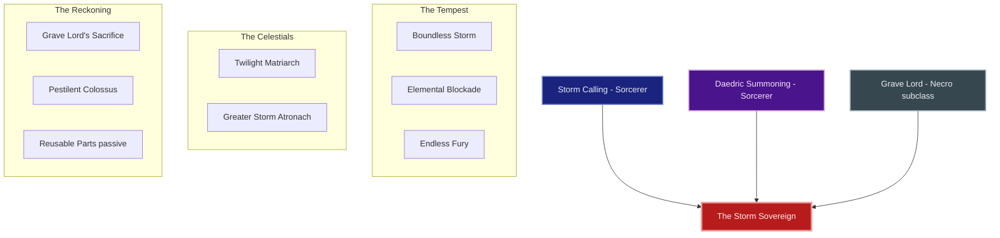
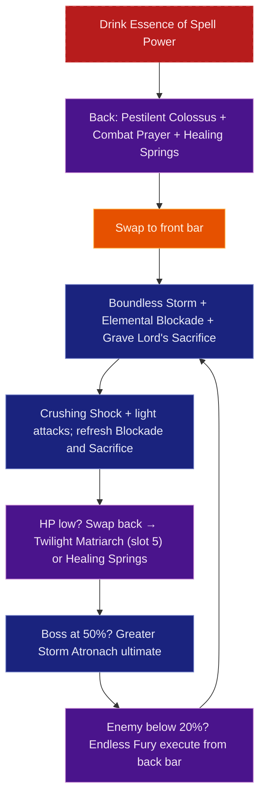

# Build Plan - Kellen Dysart: The Storm Sovereign (Olympian God Overland)

> **Character profile:** [kellen_dysart.md](kellen_dysart.md) — Level 50 Breton Sorcerer, CP 1020, @SOLAEGIS (NA).

Kellen Dysart is no mere sorcerer—he is the embodiment of divine thunder made mortal. This guide transforms the **Grand Sorcerer** into **The Storm Sovereign**, an Olympian-tier archetype for solo overland dominance. By merging his native **Storm Calling** lightning sovereignty with the **Daedric Summoning** tradition of commanding celestial servants, and replacing the minor hedge-magic of Dark Magic with the **Grave Lord** death-aspect of the Necromancer, Kellen becomes a walking act of divine judgment: atronachs at his flank, lightning from his hand, and the power to strip an enemy of all protection before delivering the final bolt.

Built entirely on **craftable sets** and CP 1020, this build is designed to solo world bosses, dominate public dungeons, and clear every overland zone with authority befitting a god.

---

## Build at a glance

| **Attribute** | **Recommendation** |
| :--- | :--- |
| **Primary Stat** | 64 points in **Magicka** — **live:** 44 Magicka / 20 Health · **25,772** Magicka · **2,875** Spell Power · **25,657** Health · **target:** 64 Magicka |
| **Mundus Stone** | **The Apprentice** (+Spell Damage) — **live:** The Atronach; swap for DPS gain |
| **Vampirism** | **Cured** — fire damage from overland bosses conflicts with vampirism; divine beings don't crawl |
| **Sets** | **5 Law of Julianos + 5 Clever Alchemist** (100% craftable, all Light Armor) — **live:** Fortified Brass 5/5 Legendary · **target:** Julianos + Clever Alchemist |
| **Bars** | Front: Lightning Destruction Staff ("The Storm Throne") · Back: Restoration Staff ("The Celestial Sanctum") |
| **Food** | **Witty Blue Entremet** (Max Magicka + Magicka Recovery) or **Bewitched Sugar Skulls** for hard world bosses |
| **Potion** | **Essence of Spell Power** (Spell Damage + Crit) — procs Clever Alchemist on pull |
| **Weapon Poisons** | **Gradual Ravage Health IX** on destruction bar between pulls |
| **Staff/Weapon Enchant** | Front: **Shock Damage** or **Fiery Weapon**; Back: **Absorb Magicka** or **Reduce Spell Cost** |
| **Companion** | **Primary (now):** **Zerith-var** (DPS) at live CP **1020** + companion **10/20** · **Secondary:** **Isobel Veloise** (support — world bosses, Olympian herald) · **Goal (20/20 @ CP160):** **Isobel Veloise** (support DPS) |
| **Primary Mount** | **Flame Atronach Senche** (owned) · **Ideal:** **Flame Atronach Senche** — see [Collectibles](#collectibles) |
| **Flavor Pet** | **Golden Eagle** (owned) · **Ideal:** **Golden Eagle** — see [Collectibles](#collectibles) |

**Read next:** [Roleplay](#roleplay-the-storm-sovereign) · [Trinity configuration](#trinity-configuration) · [Combat kit](#combat-kit-the-lightning-dominion-cycle) · [Gear and crafting](#gear-and-crafting-the-olympian-regalia) · [Champion points](#champion-point-mapping-cp-1020) · [Companion](#companion-strategy-the-divine-herald) · [Collectibles](#collectibles) · [Checklist](#next-steps--in-game-action-checklist)

---

## 🎭 Roleplay: The Storm Sovereign

The Olympian gods did not ask permission before reshaping the world. Neither does Kellen Dysart.

He carries the title **Grand Sorcerer**, but that label is insufficient. Kellen is a **Storm Sovereign**—one of those rare Bretons who studies magic not to serve it, but to *become* it. He does not summon atronachs; he dispatches celestial servants with the casual authority of a god assigning labors. He does not cast lightning; lightning is simply his language.

In the divine mythology of Tamriel's Olympians, each power corresponds to a domain: Zeus claimed the sky, Hades claimed the dead, Hermes claimed passage. Kellen's design is the full triumvirate. His Storm Calling is the sky in wrath. His Twilight Matriarch is divine mercy—a healer sent from on high. And his Grave Lord subclass is the death-aspect acknowledged: every god of thunder is also, inevitably, a god of endings.

> [!TIP]
> **Suggested Custom Title:** `God of Thunder, Arbiter of Storm`

> [!NOTE]
> **Build Notes (paste into LAM Custom Title / Build Notes):**
> Kellen Dysart — The Storm Sovereign. Olympian-tier solo overland Sorcerer. 5 Law of Julianos + 5 Clever Alchemist, all craftable light armor. Front: Boundless Storm, Elemental Blockade, Crushing Shock, Grave Lord's Sacrifice, Twilight Matriarch Restore (slot 5 both bars), Greater Storm Atronach ult. Back: Combat Prayer, Healing Springs, Inner Light, Endless Fury, Matriarch slot 5, Pestilent Colossus ult. Grave Lord replaces Dark Magic — no Dark Magic actives. 64 Magicka (pure mag). Mundus: The Apprentice. Companion: Zerith-var now; Isobel @ 20/20 goal. @masisi crafts all 12 slots.

> [!TIP]
> **Flavor Pet:** **Golden Eagle** from the character's Collectibles export. **Ideal (any source):** **Golden Eagle** — Zeus's divine messenger; **Blue Dragon Imp** (owned) is the best lightning-familiar backup. See [Collectibles](#collectibles) for mount, pet, and dye details.

---

## Trinity configuration

By completing Bahtra at-Hunding's milestone quest **"A Study in Discipline"** at Level 50, Kellen unlocks the **Uber Tier (Triple Hybrid)** architecture. Replace **Dark Magic** to forge the storm-and-sovereignty loop. See [docs/subclassing.md](../../../docs/subclassing.md) for the Solaegis Trinity / subclassing model.

| **Pillar** | **Line** | **Origin** | **Slot action** | **Function** |
| :--- | :--- | :--- | :--- | :--- |
| **Tempest** | **Storm Calling** + **Destruction Staff** | Sorcerer (native) + weapon | **KEEP** | Lightning AoE via Boundless Storm; **Elemental Blockade** shock ground field; Endless Fury execute |
| **Celestials** | **Daedric Summoning** | Sorcerer (native) | **KEEP** | **Twilight Matriarch Restore** slot **5 both bars** (persistent heal); Greater Storm Atronach ultimate |
| **Reckoning** | **Grave Lord** | Necromancer (subclass) | **SUBCLASS** (replaces **Dark Magic**) | Pestilent Colossus Major Vulnerability; Grave Lord's Sacrifice death-aspect buff; death-economy passives |

---

## Combat kit: The Lightning Dominion Cycle

Open on the back bar with Colossus vulnerability and buff setup, swap to the front bar for lightning and death-aspect damage, and keep **Twilight Matriarch Restore** in **slot 5 on both bars** so she never despawns on weapon swap. **Pure magicka** — every slotted damage skill costs Magicka (64 Magicka attributes; no stamina-hybrid skills on the target bars). **No Dark Magic skills remain slotted** once **Grave Lord** replaces that line.

### Skill bars

Document **slotted morph names as shown in the skills UI** (not unmorphed base or wiki-only labels). Each morph appears at most once across bars except **Twilight Matriarch Restore**, which must be duplicated in **slot 5** on both bars. Bars must match equipped weapon types (Lightning Destruction front, Restoration back).

> [!IMPORTANT]
> **Daedric summons (slot 5):** ESO **despawns** your summon when you swap to a bar that does not include the same summon ability. **Twilight Matriarch Restore** is in **slot 5 on both front and back bars** — same ability, same slot. **Hardened Ward** is not used (instant shield, not a persistent pet); **Greater Storm Atronach** is an ultimate and does not require both bars.

#### Front Bar (Lightning Destruction Staff): "The Storm Throne"

| **Slot** | **Class/Line** | **Base -> Morph** | **Role** |
| :--- | :--- | :--- | :--- |
| **1** | Storm Calling (Sorc) | Lightning Form -> **Boundless Storm** | Major Resolve, AoE shock pulse, Minor Expedition |
| **2** | Destruction Staff | Wall of Elements -> **Elemental Blockade** | Shock ground DoT; **Thaumaturge** + **Rapid Rot** |
| **3** | Destruction Staff | Force Shock -> **Crushing Shock** | Magicka spammable + interrupt |
| **4** | Grave Lord (Necro) | Sacrificial Bones -> **Grave Lord's Sacrifice** | Death-aspect self-buff (+Necro/DoT); **Magicka** |
| **5** | Daedric Summoning (Sorc) | Summon Twilight Matriarch -> **Twilight Matriarch Restore** | **Summon** (same slot 5 both bars) — on-demand heal |
| **6 (Ult)** | Daedric Summoning (Sorc) | Summon Storm Atronach -> **Greater Storm Atronach** | Ranged DPS ultimate + synergy orb |

> [!NOTE]
> **Dark Magic is subclassed out.** Unslot **Crystal Fragments**, **Bound Armor**, **Vibrant Shroud**, and **Absorption Field** from the live export. Loop: Blockade -> Boundless Storm -> Grave Lord's Sacrifice -> Crushing Shock; Matriarch stays up via slot 5 both bars.

> [!TIP]
> **Boss flex (optional):** Swap slot 2 to **Daedric Prey** (morph **Daedric Curse**) on long single-target world bosses — trade ground DoT for damage amp after Colossus.

> [!TIP]
> **Stamina flex (not recommended):** **Blighted Blastbones** costs **Stamina**; conflicts with pure 64 Magicka. Do not use on this build.

#### Back Bar (Restoration Staff): "The Celestial Sanctum"

| **Slot** | **Class/Line** | **Base -> Morph** | **Role** |
| :--- | :--- | :--- | :--- |
| **1** | Restoration Staff | Blessing of Protection -> **Combat Prayer** | Heal + **Minor Berserk** + **Minor Resolve** |
| **2** | Restoration Staff | Grand Healing -> **Healing Springs** | Ground HoT for world bosses |
| **3** | Mages Guild | Magelight -> **Inner Light** | +5% Spell Damage slotted; unlock **Might of the Guild** |
| **4** | Storm Calling (Sorc) | Mages' Fury -> **Endless Fury** | Execute below 20% HP |
| **5** | Daedric Summoning (Sorc) | Summon Twilight Matriarch -> **Twilight Matriarch Restore** | **Summon** (same slot 5 both bars) — on-demand heal |
| **6 (Ult)** | Grave Lord (Necro) | Frozen Colossus -> **Pestilent Colossus** | **Major Vulnerability** on pull; open every boss |

### Rotation and combat tips

#### Solo combat tips

1. **Pestilent Colossus opens every boss fight.** The **Major Vulnerability** debuff (+30% damage taken) lasts 14 seconds — cast it first, every time, on every world boss. This is the storm god's judgment delivered before a single bolt lands.
2. **Boundless Storm is always on.** Reapply every ~8 seconds. **Major Resolve** from Boundless Storm replaces **Hardened Ward** — no separate ward on this layout.
3. **Twilight Matriarch never leaves.** She is **slot 5 on both bars**; swap freely without re-summoning. Press her active heal when you or your companion dip below 50%.
4. **Elemental Blockade is your lightning field.** Cast once per pull (refresh when it expires). Feeds **Thaumaturge** and **Rapid Rot**.
5. **Grave Lord's Sacrifice is your death-aspect judgment.** Apply on the front bar after Blockade; refresh when it expires — pure **Magicka**.
6. **Potion on every boss pull.** Clever Alchemist (Phase 2) grants +675 Spell Damage for 20 seconds. **Medicinal Use 3/3** extends the window.
7. **Greater Storm Atronach on burn.** Front-bar ultimate when a world boss passes ~50% HP or during execute windows.
8. **Endless Fury for the kill.** Below 20% HP, back bar slot 4 — double damage, resets on kill.

### Passive skills

You have **2 skill points** available. Spend in this priority order; fully rank (Rank II/III) where noted.

#### Necromancer — Grave Lord (Subclass, replaces Dark Magic)

* **[Reusable Parts](https://en.uesp.net/wiki/Online:Reusable_Parts) (II):** After Sacrifice/Blastbones/Boneyard expire, next corpse skill costs 50% less — spend first.
* **[Death Knell](https://en.uesp.net/wiki/Online:Death_Knell) (II):** +4% Critical Strike Chance per Grave Lord skill slotted (+8% with **Grave Lord's Sacrifice** + **Pestilent Colossus**) — spend second.
* **[Dismember](https://en.uesp.net/wiki/Online:Dismember) (II):** +1,500 Spell Penetration while a Grave Lord skill is active.
* **[Rapid Rot](https://en.uesp.net/wiki/Online:Rapid_Rot) (II):** +10% DoT damage (**Elemental Blockade**, Boundless Storm AoE).

#### Sorcerer — Storm Calling *(all maxed ✅)*

* **[Capacitor](https://en.uesp.net/wiki/Online:Capacitor) (II):** ✅ Maxed.
* **[Energized](https://en.uesp.net/wiki/Online:Energized) (II):** ✅ Maxed.
* **[Amplitude](https://en.uesp.net/wiki/Online:Amplitude) (II):** ✅ Maxed.
* **[Expert Mage](https://en.uesp.net/wiki/Online:Expert_Mage) (II):** ✅ Maxed.

#### Sorcerer — Daedric Summoning *(all maxed ✅)*

* **[Rebate](https://en.uesp.net/wiki/Online:Rebate) (II):** ✅ Maxed.
* **[Power Stone](https://en.uesp.net/wiki/Online:Power_Stone) (II):** ✅ Maxed.
* **[Daedric Protection](https://en.uesp.net/wiki/Online:Daedric_Protection) (II):** ✅ Maxed.
* **[Expert Summoner](https://en.uesp.net/wiki/Online:Expert_Summoner) (II):** ✅ Maxed.

#### Weapon — Destruction Staff *(all maxed ✅)*

* **[Tri Focus](https://en.uesp.net/wiki/Online:Tri_Focus) (II):** ✅ Maxed.
* **[Penetrating Magic](https://en.uesp.net/wiki/Online:Penetrating_Magic) (II):** ✅ Maxed.
* **[Elemental Force](https://en.uesp.net/wiki/Online:Elemental_Force) (II):** ✅ Maxed.
* **[Ancient Knowledge](https://en.uesp.net/wiki/Online:Ancient_Knowledge) (II):** ✅ Maxed.
* **[Destruction Expert](https://en.uesp.net/wiki/Online:Destruction_Expert) (II):** ✅ Maxed.

#### Weapon — Restoration Staff *(all maxed ✅)*

* **[Essence Drain](https://en.uesp.net/wiki/Online:Essence_Drain) (II):** ✅ Maxed.
* **[Restoration Expert](https://en.uesp.net/wiki/Online:Restoration_Expert) (II):** ✅ Maxed.
* **[Cycle of Life](https://en.uesp.net/wiki/Online:Cycle_of_Life) (II):** ✅ Maxed.
* **[Absorb](https://en.uesp.net/wiki/Online:Absorb) (II):** ✅ Maxed.
* **[Restoration Master](https://en.uesp.net/wiki/Online:Restoration_Master) (II):** ✅ Maxed.

#### Armor — Light Armor *(all maxed ✅)*

* **[Grace](https://en.uesp.net/wiki/Online:Grace) (II):** ✅ Maxed.
* **[Evocation](https://en.uesp.net/wiki/Online:Evocation) (II):** ✅ Maxed.
* **[Spell Warding](https://en.uesp.net/wiki/Online:Spell_Warding) (II):** ✅ Maxed.
* **[Prodigy](https://en.uesp.net/wiki/Online:Prodigy) (II):** ✅ Maxed.
* **[Concentration](https://en.uesp.net/wiki/Online:Concentration) (II):** ✅ Maxed.

#### Guild — Mages Guild

* **[Everlasting Magic](https://en.uesp.net/wiki/Online:Everlasting_Magic) (II):** +10% Max Magicka.
* **[Magicka Controller](https://en.uesp.net/wiki/Online:Magicka_Controller) (II):** +3% Spell Critical.
* **[Mage Adept](https://en.uesp.net/wiki/Online:Mage_Adept) (II):** -4% Magicka cost for Mages Guild abilities.
* **[Might of the Guild](https://en.uesp.net/wiki/Online:Might_of_the_Guild) (II):** **+10% Spell Damage while Inner Light is slotted** — mandatory once Inner Light is on back bar.

#### Guild — Alchemy

* **[Medicinal Use](https://en.uesp.net/wiki/Online:Medicinal_Use) (III):** **MANDATORY** — potion effects last 100% longer (30s → 60s). Pairs with Clever Alchemist potion-proc uptime and Breton Magicka Mastery sustain.

#### Guild — Fighters Guild *(all maxed ✅)*

* **[Intimidating Presence](https://en.uesp.net/wiki/Online:Intimidating_Presence) (I):** ✅ Maxed.
* **[Slayer](https://en.uesp.net/wiki/Online:Slayer) (III):** ✅ Maxed.
* **[Banish the Wicked](https://en.uesp.net/wiki/Online:Banish_the_Wicked) (III):** ✅ Maxed.

#### Alliance War — Assault

* **[Continuous Attack](https://en.uesp.net/wiki/Online:Continuous_Attack) (II):** Permanent **Major Gallop** (+30% mount speed) — already unlocked ✅.
* **[Reach](https://en.uesp.net/wiki/Online:Reach) (II):** +2% Damage per second in combat — ramps during long boss fights.

#### Race — Breton *(all maxed ✅)*

* **[Opportunist](https://en.uesp.net/wiki/Online:Opportunist) (I):** ✅ Maxed.
* **[Gift of Magnus](https://en.uesp.net/wiki/Online:Gift_of_Magnus) (III):** ✅ Maxed.
* **[Spell Attunement](https://en.uesp.net/wiki/Online:Spell_Attunement) (III):** ✅ Maxed.
* **[Magicka Mastery](https://en.uesp.net/wiki/Online:Magicka_Mastery) (III):** ✅ Maxed — -7% Magicka skill cost; pairs with Clever Alchemist potion windows.

---

## Gear and crafting: "The Olympian Regalia"

Everything is **crafted** — no overland farming, no dungeon drops. The target is **5 Law of Julianos + 5 Clever Alchemist**, all Light Armor. **Julianos** supplies +300 Spell Critical and +10% Critical Damage; **Clever Alchemist** grants +675 Weapon and Spell Damage for 20 seconds whenever you drink a potion in combat. Breton **Magicka Mastery** (-7% Magicka skill cost) + high recovery = excellent sustain between pulls.

### Set rationale

| **Set** | **5-Piece Bonus** | **Role in the Build** |
| :--- | :--- | :--- |
| **Clever Alchemist** | Drink potion in combat → **+675 Weapon and Spell Damage** for 20 seconds | Open every boss pull with Essence of Spell Power; Breton sustain + Liquid Efficiency CP keeps uptime high |
| **Law of Julianos** | +300 Spell Critical; **+10% Critical Damage** | Baseline burst amplifier; crit-heal synergy with Fighting Finesse CP star |

> [!NOTE]
> **Why not Necropotence?** Necropotence is a **Rivenspire overland drop** — not craftable. Its bonus (Max Magicka while pet active) also conflicts with the Colossus/Atronach ultimate rotation where pets may be dismissed.

> [!TIP]
> **Lower-trait fallback:** If 7-trait Clever Alchemist research is not ready on @masisi, craft **5 Shacklebreaker** (6 traits, Vvardenfell) on head/shoulders/chest/legs/waist — flat Max Magicka + Magicka Recovery + Spell Damage with no proc mechanic required.

> [!NOTE]
> **Current gear (Fortified Brass, Legendary):** Fortified Brass is excellent defensive gear with strong Physical/Spell Resistance. Kellen should continue wearing it through Phase 1. The target loadout is Phase 2 only — coordinate with @masisi when ready.

### Target loadout

| **Slot** | **Set** | **Weight** | **Trait** | **Enchantment** | **Quality** |
| :--- | :--- | :--- | :--- | :--- | :--- |
| **Head** | Clever Alchemist | Light | Divines | Max Magicka | Gold |
| **Shoulders** | Clever Alchemist | Light | Divines | Max Magicka | Gold |
| **Chest** | Clever Alchemist | Light | Divines | Max Magicka | Gold |
| **Legs** | Clever Alchemist | Light | Divines | Max Magicka | Gold |
| **Waist** | Clever Alchemist | Light | Divines | Max Magicka | Gold |
| **Hands** | Law of Julianos | Light | Divines | Max Magicka | Gold |
| **Feet** | Law of Julianos | Light | Divines | Max Magicka | Gold |
| **Necklace** | Law of Julianos | Jewelry | Arcane | Spell Damage | Gold |
| **Ring 1** | Law of Julianos | Jewelry | Arcane | Max Magicka | Gold |
| **Ring 2** | Law of Julianos | Jewelry | Arcane | Max Magicka | Gold |
| **Front Staff** | Law of Julianos | Lightning Destro | Infused | Shock Damage (Crusher) | Gold |
| **Back Staff** | Law of Julianos | Restoration | Infused | Absorb Magicka | Gold |

*All 12 slots crafted. Full Light Armor preserves all Light Armor passives and Julianos's Light-Armor orientation.*

**Front bar — Lightning Destruction Staff:** Shock element for consistent Boundless Storm AoE procs; Crusher enchant applies **Minor Breach** to reduce enemy armor by 1,000.

**Back bar — Restoration Staff:** Absorb Magicka enchant returns magicka on heavy attacks — critical sustain during long boss fights.

### Crafting handoff (@masisi)

| **Detail** | **Recommendation** |
| :--- | :--- |
| **Style** | **Breton** or **Imperial** body (Clever Alchemist); **Psijic Order** or **Sapiarch** trim (Julianos hands/feet/jewelry) |
| **Set station** | Clever Alchemist: **No Shira Workshop** (Hew's Bane) — **7 traits** per slot · Julianos: **Sunhold** (Summerset) — **6 traits** per slot |
| **Traits** | **Divines** on armor (transmute with **452 Transmute Crystals**); **Arcane** on jewelry |
| **Interim (pre-CP160)** | **Fortified Brass** Legendary (live) until target craft; **5 Shacklebreaker** light bridge if Clever Alchemist traits are not ready |
| **Quality path** | Craft purple first if mats are tight; gold-out when traits and transmutes are ready |

> [!NOTE]
> **Research gate:** Clever Alchemist needs **7 traits** per slot; Law of Julianos needs **6 traits**. Check `examples/fixtures/karakedi_crafting.md` for @masisi's trait research tracker before queueing gold-quality CP160 work.

---

## Champion Point Mapping (CP 1020)

Full CP budget: **340 Warfare / 340 Craft / 340 Fitness** (1020 total). Current allocation: Warfare 240 / Craft 260 / Fitness 235 = 735 spent. Available: **⚔️ 100 / ⚒️ 80 / 💪 105 = 285 unspent**. Tables below are the **combat-tuned target** verified against current ESO CP names ([UESP Champion Points](https://en.uesp.net/wiki/Online:Champion_Points)). Spend the remaining points as listed — no full Warfare slotted-star respec required.

> [!NOTE]
> **Update 45 (2025):** **Liquid Efficiency**, **Rationer**, and **Treasure Hunter** are **automatic passives** once purchased — they do **not** use a Craft constellation slot. Only invest the points; Clever Alchemist uptime still benefits.

### ⚔️ Warfare (Blue — 340 Points)

*Primary focus: Magicka direct burst, DoT scaling, and penetration — all four slotted stars are best-in-slot for this kit.*

| **Slotted Star** | **Spend** | **Benefit** |
| :--- | :--- | :--- |
| **Fighting Finesse** | 50 | +8% Critical Damage and Critical Healing (2 stages) — already maxed ✅ |
| **Master-at-Arms** | 50 | +6% Direct Damage — **Crushing Shock**, **Endless Fury**, Colossus — already maxed ✅ |
| **Deadly Aim** | 50 | +6% Single-Target Damage — world bosses — already maxed ✅ |
| **Thaumaturge** | 50 | +6% Damage-over-Time — **Elemental Blockade**, **Boundless Storm** pulses — already maxed ✅ |

**Passives (No slot needed — 140 points):**

* **Precision (20):** +320 Critical Chance — already maxed ✅
* **Piercing (20):** +700 Offensive Penetration — already maxed ✅
* **Eldritch Insight (20):** +520 Max Magicka — **[NEW]** spend 20; verify in CP UI (required for Piercing on fresh accounts).
* **Flawless Ritual (40):** +60% chance to apply **magical** status effects — shock / crusher synergy with lightning staff.
* **War Mage (30):** +100 Weapon and Spell Damage to **Magical** attacks (shock, flame, frost) — core mag DPS passive on the Extended Might branch.
* **10 flex:** Bank or partial **Quick Recovery** / **Preparation** if you prefer minor PvE damage reduction over leaving points unspent.

> [!WARNING]
> **Do not use these names — they are not ESO stars:** ~~Spell Reach~~, ~~Elemental Expert~~, ~~Finesse~~ (distinct from **Fighting Finesse**), ~~Mighty~~ for this build (**Mighty** buffs **Martial** damage only, not lightning spells).

### 💪 Fitness (Red — 340 Points)

*Primary focus: Solo survivability, magicka sustain on kill, and CC reduction.*

| **Slotted Star** | **Spend** | **Benefit** |
| :--- | :--- | :--- |
| **Fortified** | 50 | +1,730 Armor — already maxed ✅ |
| **Rejuvenation** | 50 | +90 Health/Magicka/Stamina Recovery — already maxed ✅ |
| **Boundless Vitality** | 50 | +1,400 Max Health — already maxed ✅ |
| **Siphoning Spells** | 50 | Restore Magicka on kill (up to +1,500 at full rank) — **[NEW]** slot; replaces live **Bloody Renewal** |

> [!NOTE]
> **Why not Celerity?** **Celerity** needs **Sprinter** (10) + **Hasty** (10) before the 50-point star unlocks — **70 points** not in the 105 Fitness budget without cutting **Mystic Tenacity**. **Bloody Renewal** restores **Stamina** on kill and conflicts with **64 Magicka**. **Siphoning Spells** only needs **Hero's Vigor** 10 (already met) and feeds overland sustain. For travel speed, keep **Steed's Blessing** + **Continuous Attack** (Assault passive).

**Passives (No slot needed — 140 points):**

* **Hero's Vigor:** Currently at 10/20. Spend **10** → max at 20. +560 Max Health.
* **Mystic Tenacity:** Currently at 10/50. Spend **40** → max at 50. -25% Elemental status duration on you.
* **Tumbling:** Currently at 15/30. Spend **5** → 20/30. Cheaper dodge rolls (partial rank).

### 🍃 Craft (Green — 340 Points)

*Primary focus: Potion uptime (Clever Alchemist), overland speed, economy.*

| **Slotted Star** | **Spend** | **Benefit** |
| :--- | :--- | :--- |
| **Steed's Blessing** | 50 | +20% Out-of-Combat Movement Speed — already maxed ✅ |
| **Sustaining Shadows** | 50 | Reduced Sneak cost — already maxed ✅ |
| *(4th slot open)* | — | Optional later: **Gifted Rider** (+10% mount speed) if you invest the Master Gatherer branch |

**Passives (auto when purchased — 190 points):**

* **Steadfast Enchantment (10):** **[NEW]** prerequisite for **Rationer**.
* **Rationer (10):** **[NEW]** prerequisite for **Liquid Efficiency**; +30 min food/drink duration.
* **Liquid Efficiency (50):** **[NEW]** 10% chance not to consume potions — **always active** once bought (not slotted). Critical for Clever Alchemist.
* **Wanderer:** Currently at 10/50. Spend **10** → 20/50. -20% Wayshrine cost (uses remaining Craft budget).
* **Gilded Fingers, Breakfall, Fleet Phantom, Out of Sight** — already invested ✅; raise **Gilded Fingers** toward 50/50 when more Craft points are available.

---

## 👥 Companion Strategy: "The Divine Herald"

Recommend companions in **three tiers**: who fits **right now** at live CP and companion level, who to **swap to** as a secondary, and who is the **goal** pick at **20/20** when the character is **Level 50 / CP160**. **Companion gear is separate from player gear** — companions equip **Companion's** weapons, armor, and jewelry with **companion-only traits** (Quickened, Aggressive, Bolstered, etc.). There are **no player gear sets** on companions (no Law of Julianos, Clever Alchemist, or Divines). Buy white basics from armorers/woodworkers; farm **Superior+** pieces from boss and overland drops while the companion is active. Never put player-crafted gear on a companion.

> [!NOTE]
> **Live export:** **Zerith-var** — Level **10/20**, **level 1 default gear, 2 empty ability slots**. Character **Level 50 / CP 1020**. Rows below are keyed to these numbers, not to hypothetical end-game stats.

### Companion picks

| **Tier** | **Companion** | **Role** | **Roleplay fit** | **Mechanical fit (at current stats)** |
| :--- | :--- | :--- | :--- | :--- |
| **Primary (now)** | **Zerith-var** | DPS | Cosmic lieutenant beside a self-sufficient storm sovereign — a fierce second, not a chaplain | At **10/20** with starter gear: extra damage on overland pulls; you self-heal via Twilight Matriarch and Healing Springs |
| **Secondary** | **Isobel Veloise** | Support DPS | Olympian knight-herald — heroic champion attending the storm-god | Swap for hard world bosses: shields, burst heals, **Rally** stacks with Combat Prayer even before she is maxed |
| **Goal (20/20 @ CP160)** | **Isobel Veloise** | Support DPS | Divine herald at full rank — faith and martial conviction mirror Kellen's authority | At **20/20** + full **heavy** companion armor (**Quickened** / **Bolstered**) + **Companion's Bow**: best survivability for solo world bosses with the target rotation |

### Goal companion — Isobel Veloise: The Knight-Herald

When both Kellen and Isobel are capped, she is the end-state pick: a paladin-knight herald whose shields and heals let the Storm Sovereign stay on the destruction bar while **Pestilent Colossus** vulnerability does its work.

| **Setting** | **Recommendation** |
| :--- | :--- |
| **Role** | **Support DPS / Ranged** (Bow preferred for range safety) |
| **Gear Weight** | **Heavy Armor** (knights wear heavy; better Isobel survivability on world bosses) |
| **Gear Trait** | **Quickened** on most pieces (cooldown reduction — she casts more frequently); **Bolstered** on chest/legs if she dies too often |
| **Loadout** | Full **heavy** companion armor + **Companion's Bow** — all **companion-only** items (no player sets or 5-piece bonuses) |
| **Acquisition** | White basics from armorers/woodworkers; **Superior+** traited pieces from boss/overland drops while Isobel is active (world bosses, Oblivion Portals, etc.). Guild traders OK. **Not** part of @masisi's player Julianos/Clever Alchemist craft. |

#### Isobel's support skill bar (goal @ 20/20)

1. **Shield of the Knight** (Class → Knight's Duty): Damage shield for Kellen when he takes heavy hits.
2. **Mending Incantation** (Class → Steadfast): Burst heal for Kellen when below 50% Health.
3. **Arcing Shot** (Weapon → Bow): Ranged single-target damage — she stays at range safely.
4. **Blessed Armor** (Class → Knight's Duty): Self-sustain passive buff; keeps Isobel alive.
5. **Rally** (Class → Steadfast): Minor Berserk buff for Kellen — stacks with Combat Prayer.
6. *Ultimate:* **Knight's Champion** or class ultimate for world boss burn phases.

### Primary now — Zerith-var

**Zerith-var** is already active and fits the **lone sovereign with a lethal lieutenant** read: Kellen does not need a healer herald when Twilight Matriarch and the restoration bar exist. Finish leveling him toward **20/20**, replace his level-1 defaults with **Superior+** **Companion's** heavy armor (**Aggressive** or **Shattering** traits) and a **Companion's Greatsword** from drops (companion must be active), and fill his empty ultimate slots. **Start leveling Isobel in parallel** so she is ready for world-boss swaps and the goal tier.

> [!TIP]
> **Secondary — Isobel Veloise:** Summon her instead of Zerith-var when a world boss focuses your companion or when you want shields and **Rally** on top of Combat Prayer. If Isobel's AI dies repeatedly, swap back to Zerith-var and self-sustain — you trade herald fiction for kill speed.

> [!NOTE]
> **Rapport:** Isobel approves of helping civilians, completing Fighters Guild quests, and acts of heroism. She disapproves of theft and dishonorable conduct. The Storm Sovereign operates with divine authority — he does not steal; he requisitions.

---

## Collectibles

### Mount

The Storm Sovereign rides something that makes the world pause. Choose the **best owned mount** for roleplay from the profile export; backups must be **owned** — the ideal pick may match an owned mount already on account.

> [!NOTE]
> **Owned mounts (from profile):** Ashbone Sabre Cat, Bay Dun Horse, Bleakrock Snowdog, Brown Paint Horse, Dwarven War Horse, Ebon Dwarven Horse, Faunfrolic Great Elk, **Flame Atronach Senche**, Frostborn Durzog Mangler, Hammerfell Camel, Hearthfire Kagouti, Highland Spotted Lynx, Imperial Horse, Ja'zennji Siir Fox, Midnight Steed, Nightmare Senche, Nix-Ox War-Steed, Noble Riverhold Senche-Lion, Noweyr Steed, Psijic Escort Charger, Rahd-m'Athra, Rubyflare Torchnix, Sapiarchic Senche-Serval, Senche-Leopard, Shadowghost Guar, Skulltooth Coastal Durzog, Snow Bear, Sorrel Horse, Spotted Duneracer Senche-raht, Tessellated Guar, Timber Mammoth, Wormwrithe Bear-Lizard, Yorgrim River Ram.

#### Primary (owned): Flame Atronach Senche

| **Attribute** | **Detail** |
| :--- | :--- |
| **Why** | A Daedric elemental construct ridden as a steed — the ultimate statement of mastery over summoned forces; storm-lightning Kellen astride fire-born amber reads as sovereignty over every element |
| **Acquisition** | Owned ✅ |
| **Dye pass** | **Imperial gold** or **midnight sapphire** on any barding trim — divine gold and storm-blue against the amber fire |

#### Other owned options

| **Mount** | **Owned** | **Why** |
| :--- | :--- | :--- |
| [Psijic Escort Charger](https://en.uesp.net/wiki/Online:Psijic_Escort_Charger) | ✅ | Otherworldly shimmer; arcane-scholar aesthetic matches the Grand Sorcerer identity |
| [Midnight Steed](https://en.uesp.net/wiki/Online:Midnight_Steed) | ✅ | Classic all-black stallion — the death-aspect of a lightning god; austere, absolute |
| [Nightmare Senche](https://en.uesp.net/wiki/Online:Nightmare_Senche) | ✅ | Dark fire and shadow; Hades-aspect mount for the Grave Lord death-domain |
| [Noble Riverhold Senche-Lion](https://en.uesp.net/wiki/Online:Noble_Riverhold_Senche-Lion) | ✅ | Regal, golden — the divine lion associated with sovereignty in classical mythology |

#### Avoid thematically

| **Mount type** | **Reason** |
| :--- | :--- |
| Brown Paint Horse, Sorrel Horse | A god does not ride a common horse |
| Faunfrolic Great Elk | Nature/Warden aesthetic contradicts the storm-divine archetype |
| Hammerfell Camel | Practical and mortal — wrong register entirely |

> [!TIP]
> **Ideal mount (any source):** **Flame Atronach Senche** — already owned; no Crown upgrade required. A Daedric elemental steed for a sovereign who commands summoned forces.

### Pet

Vanity pets are **cosmetic only** — pick the **best owned pet** for roleplay from the profile's **Collectibles → Pets** section.

#### Primary (owned): Golden Eagle

| **Attribute** | **Detail** |
| :--- | :--- |
| **Why** | Zeus's divine messenger; the storm-lord's herald in the sky — strongest fiction match among owned pets |
| **Acquisition** | Owned ✅ |

#### Other owned options

| **Pet** | **Why** |
| :--- | :--- |
| [Blue Dragon Imp](https://en.uesp.net/wiki/Online:Blue_Dragon_Imp) (owned) | Crackling with latent lightning energy; a divine familiar |
| [Sylvan Nixad](https://en.uesp.net/wiki/Online:Sylvan_Nixad) (owned) | Ethereal spirit attendant — a divine being's supernatural companion |
| [Frost Atronach Kagouti Calf](https://en.uesp.net/wiki/Online:Frost_Atronach_Kagouti_Calf) (owned) | Elemental construct matches the Daedric summoner identity |

> [!TIP]
> **Ideal pet (any source):** **Golden Eagle** — already owned; classical storm-god herald. **Acquisition:** account unlock (no further purchase needed).

### Dye and style

**The Olympian Thunder** — visual identity inspired by classical divine iconography and the Breton arcane tradition.

| **Slot** | **Style** | **Visual Reasoning** |
| :--- | :--- | :--- |
| **Chest / Legs** | **Breton** or **Psijic Order** | Arcane academic meets divine authority; classical silhouette |
| **Head / Hands** | **Imperial** or **Altmeri** | Classical proportions; Mediterranean/Altmeri god-king aesthetic |
| **Staves** | **Psijic Order** | Crystalline, otherworldly — weapons of a being beyond mortal ken |

**Dye palette:** Imperial gold (primary — sovereignty), storm-dark sapphire (secondary — the lightning charge), pale silver-white (trim — the flash of the bolt itself).

---

## ✅ Next Steps & In-Game Action Checklist

Follow this transition list to unlock the full power of **The Storm Sovereign**. Gear progression phases are labeled inline — there is no separate Gear Phases section.

### Phase 0 — Today (functional build)

1. **Respec attributes:** Allocate **64 points in Magicka** (live: 44 Magicka / 20 Health).
2. **Swap Mundus Stone:** Travel to **The Apprentice** shrine. The Apprentice grants flat Spell Damage (+238 Spell Damage at stone quality) — superior to The Atronach's Magicka Recovery for overland DPS at CP 1020.
3. **Subclass at Bahtra at-Hunding (Riften, Evermore, or Dune):** Replace **Dark Magic** with **Grave Lord (Necromancer)**. Keep Storm Calling and Daedric Summoning native. **Unslot every Dark Magic active** — live bars still carry **Crystal Fragments**, **Bound Armor**, **Vibrant Shroud**, and **Absorption Field**.
4. **Respec actives — front bar:** **Boundless Storm** (1) · **Elemental Blockade** (2) · **Crushing Shock** (3) · **Grave Lord's Sacrifice** (4, morph **Sacrificial Bones**) · **Twilight Matriarch Restore** (5, **same on back bar**) · **Greater Storm Atronach** (ult). Unslot **Crystal Fragments**, **Hardened Ward**, and all Dark Magic actives.
5. **Respec actives — back bar:** **Combat Prayer** (1) · **Healing Springs** (2) · **Inner Light** (3, morph **Magelight**) · **Endless Fury** (4, morph **Mages' Fury**) · **Twilight Matriarch Restore** (5) · **Pestilent Colossus** (ult, morph **Frozen Colossus**).
6. **Unlock Grave Lord passives:** Spend **2 available skill points** on Grave Lord passives — **Reusable Parts** and **Death Knell** first.
7. **Allocate 285 CP:** Warfare — **Eldritch Insight** (20), **Flawless Ritual** (40), **War Mage** (30), 10 flex; Fitness — unslot **Bloody Renewal**, slot **Siphoning Spells** (50), **Hero's Vigor** (10), **Mystic Tenacity** (40), **Tumbling** (5); Craft — **Steadfast Enchantment** (10), **Rationer** (10), **Liquid Efficiency** (50, auto passive — do not slot), **Wanderer** (10).
8. **Stock potions:** Obtain **Essence of Spell Power** (Spell Damage + Crit) for boss pulls. Craft or purchase from guild stores. Rank **Medicinal Use 3/3** if not already maxed.

### Phase 1 — Craft (interim)

9. **[Phase 1]** Continue using **Fortified Brass Legendary** — it is already equipped and functional for overland. Practice the new bar arrangement and Colossus rotation. No gear change required.

### Phase 2 — Craft (target)

10. **[Phase 2]** Coordinate with **@masisi**: craft **5 Clever Alchemist + 5 Law of Julianos**, all Light Armor, Divines trait, Max Magicka enchants on armor, Arcane on jewelry. Staves: Lightning Destro + Restoration, both Julianos, Infused, Shock Damage / Absorb Magicka enchants.
11. **[Phase 2]** Use Kellen's **452 Transmute Crystals** to fix any non-Divines armor traits from the craft.

### Phase 3 — Polish

12. **[Phase 3]** Apply **Breton** or **Psijic Order** style motifs to the new gear. Dye pass: Imperial gold primary, storm sapphire secondary, silver-white trim.
13. **Mages Guild:** Rank up to unlock **Might of the Guild** passive — requires Inner Light slotted on the back bar (now done). This passive alone adds +10% Spell Damage while Inner Light is active.

### Finish

14. **Collectibles:** Equip **Flame Atronach Senche** as primary mount. Slot the **Golden Eagle** pet.
15. **Companion:** Run **Zerith-var** for current content; level **Isobel Veloise** toward **20/20**; farm or purchase **companion-only** gear per [Companion Strategy](#-companion-strategy-the-divine-herald) (separate from player Phase 2 craft); keep **Isobel** rapport-ready for world-boss swaps noted there.
16. **Regenerate Profile:** Run `/markdown` in-game and update [kellen_dysart.md](kellen_dysart.md) when bars, CP, Mundus, and gear match this plan.

The storm answers only to its sovereign. Let Tamriel remember why.
