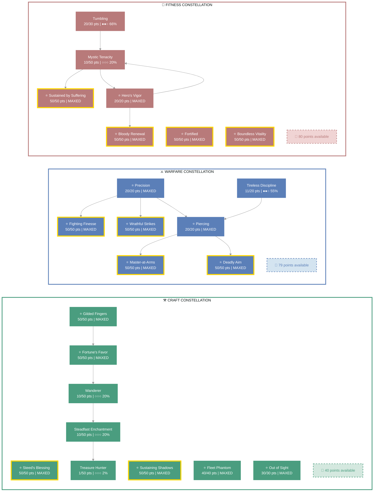

```mermaid
%%{init: {"theme":"base", "themeVariables": { "background":"transparent","fontSize":"12px","primaryColor":"#f0f0f0","primaryTextColor":"#333","primaryBorderColor":"#999","lineColor":"#999"}}}%%

flowchart LR

  subgraph subLEGEND["📖 LEGEND & VISUAL GUIDE"]

    LEG_STARS["Star Types"]
    LEG_S1["⭐ Gold Border = Maxed Slottable"]
    LEG_S2["🔶 Orange Border = Independent Star"]
    LEG_S3["Standard Border = In Progress"]

    LEG_FILL["Progress Indicators"]
    LEG_F1["⭐ = 100% Maxed"]
    LEG_F2["●●● = 75-99%"]
    LEG_F3["●●○ = 50-74%"]
    LEG_F4["●○○ = 25-49%"]
    LEG_F5["○○○ = 1-24%"]

    LEG_STARS --> LEG_S1 & LEG_S2 & LEG_S3
    LEG_FILL --> LEG_F1 & LEG_F2 & LEG_F3 & LEG_F4 & LEG_F5

    style LEG_STARS fill:transparent,stroke:none,color:#ccc
    style LEG_FILL fill:transparent,stroke:none,color:#ccc
    style LEG_S1 fill:#fff,stroke:#ffd700,stroke-width:3px,color:#333
    style LEG_S2 fill:#fff,stroke:#ff8c00,stroke-width:3px,color:#333
    style LEG_S3 fill:#fff,stroke:#999,stroke-width:2px,color:#333
    style LEG_F1 fill:#eee,stroke:#333,stroke-width:1px,color:#333
    style LEG_F2 fill:#eee,stroke:#333,stroke-width:1px,color:#333
    style LEG_F3 fill:#eee,stroke:#333,stroke-width:1px,color:#333
    style LEG_F4 fill:#eee,stroke:#333,stroke-width:1px,color:#333
    style LEG_F5 fill:#eee,stroke:#333,stroke-width:1px,color:#333
  end
  style subLEGEND fill:transparent,stroke:#999,stroke-width:3px
```

# Lætha (Dark Executioner)

   

**High Elf Sorcerer • Daggerfall Covenant Alliance**

---

## 📑 Table of Contents

- [📋 Overview](#overview)
  - [General](#general)
  - [Currency](#currency)
- [⚔️ Combat Arsenal](#combat-arsenal)
  - [Character Stats](#character-stats)
  - [Advanced Stats](#advanced-stats)
  - [Skill bars](#skill-bars)
- [⚔️ Equipment & Active Sets](#equipment-active-sets)
- [⭐ Champion Points](#champion-points)
- [📜 Character Progress](#character-progress)
- [⚔️ PvP](#pvp)
- [👥 Companions](#companions)
- [🎨 Collectibles](#collectibles)
- [📝 Quest Progress](#quest-progress)
- [🏰 Armory Builds](#armory-builds)
- [📬 Mail](#mail)
- [🏰 Guild Membership](#guild-membership)

---

## 📋 Overview

### General

| **Attribute** | **Value** |
| --- | --- |
| **Level** | 50 |
| **Champion Points** | 991 |
| **Gender** | Female |
| **Account** | @SOLAEGIS |
| **ESO Plus** | ✅ Active |
| **Age** | 5d 20h 33m |

| **Attribute** | **Value** |
| --- | --- |
| **Attributes** | 🔵 64 / ❤️ 0 / ⚡ 0 |
| **Available Champion Points** | ⚒️ 40 - ⚔️ 79 - 💪 80 |
| **🐴 Riding Skills** | 🐴 60 / 💪 60 / 🎒 60 ✅ |
| **Skill Points** | 🎯 15 available - Ready to spend |
| **Class** | [Sorcerer](https://en.uesp.net/wiki/Online:Sorcerer) |
| **Race** | [High Elf](https://en.uesp.net/wiki/Online:High_Elf) |

| **Attribute** | **Value** |
| --- | --- |
| **Location** | [Craglorn](https://en.uesp.net/wiki/Online:Craglorn) (501) |
| **Server** | [NA Megaserver](https://en.uesp.net/wiki/Online:Megaservers) |
| **Title** | [Dark Executioner](https://en.uesp.net/wiki/Online:Dark_Executioner) |
| **🪨 Mundus Stone** | [The Shadow](https://en.uesp.net/wiki/Online:The_Shadow_(Mundus_Stone)) |
| **Alliance** | [Daggerfall Covenant](https://en.uesp.net/wiki/Online:Daggerfall_Covenant) |

### Currency

| **Attribute** | **Value** |
| --- | --- |
| 💰 **Gold** | 23,778 |
| ⚔️ **Alliance Points** | 4,203 |
| 🔮 **Tel Var** | 0 |
| 💎 **Transmute Crystals** | 352 |
| 📜 **Writs** | 0 |
| 🎫 **Event Tickets** | 0 |
| 👑 **Crowns** | 9,040 |
| 💠 **Gems** | 266 |
| 🏅 **Seals** | 16,105 |
| 🗝️ **Keys** | 12 |
| 👕 **Tokens** | 6 |
| 📚 **Fortunes** | 0 |
| 🔹 **Fragments** | 478 |

---

## ⚔️ Combat Arsenal

### Character Stats

| **Category** | **Stat** | **Value** |
| --- | --- | ---: |
| 💚 **Resources** | Health | 19,824 |
|  | Magicka | 23,268 |
|  | Stamina | 18,299 |
| ⚔️ **Offensive** | Weapon Power | 3,023 |
|  | Spell Power | 3,023 |

| **Category** | **Stat** | **Value** |
| --- | --- | ---: |
| 🎯 **Critical** | Weapon Crit | 4,387 (20%) |
|  | Spell Crit | 4,387 (20%) |
| ⚔️ **Penetration** | Physical | 700 |
|  | Spell | 700 |

| **Category** | **Stat** | **Value** |
| --- | --- | ---: |
| 🛡️ **Defensive** | Physical Resist | 12,522 (83.3%) |
|  | Spell Resist | 12,522 (83.3%) |
| ♻️ **Recovery** | Health | 309 |
|  | Magicka | 514 |
|  | Stamina | 1,261 |

### Advanced Stats

| **Ability** | **Cost/Value** |
|:---|---:|
| ⚔️ **Light Attack** | 3,953 dmg |
| ⚔️ **Heavy Attack** | 7,907 dmg |
| ⚔️ **Bash** | 765 cost, 4,971 dmg |
| 🛡️ **Block** | 1,027 cost, 50% mit, 40% spd |
| 🔓 **Break Free** | 5,400 cost |
| 🏃 **Dodge Roll** | 2,788 cost |
| 🐾 **Sneak** | 15 cost, 0% spd |
| 🏃‍♂️ **Sprint** | 465 cost, 0% spd |

| **Resistance** | **Value** |
|:---|---:|
| 🔥 **Flame** | 18.9% |
| ⚡ **Shock** | 18.9% |
| ❄️ **Frost** | 18.9% |
| 🔮 **Magic** | 18.9% |
| 🦠 **Disease** | 18.9% |
| ☠️ **Poison** | 18.9% |
| 🩸 **Bleed** | 18.9% |

| **Damage Type** | **Bonus** |
|:---|---:|
| 💥 **Critical Damage** | 89% |
| ⚔️ **Physical** | 12% |
| 🔥 **Flame** | 12% |
| ⚡ **Shock** | 12% |
| ❄️ **Frost** | 0 |
| 🔮 **Magic** | 12% |
| 🦠 **Disease** | 12% |
| ☠️ **Poison** | 12% |
| 🩸 **Bleed** | 12% |
| 🌌 **Oblivion** | 12% |

| **Healing** | **Value** |
|:---|---:|
| 💚 **Healing Done** | 0 |
| 💖 **Healing Taken** | 0 |
| ✨ **Critical Healing** | 89% |

### Skill bars

### ⚔️ Front Bar (Main Hand)

| **1** | **2** | **3** | **4** | **5** | **⚡** |
| :---: | :---: | :---: | :---: | :---: | :---: |
| [Sacrificial Bones](https://en.uesp.net/wiki/Online:Sacrificial_Bones) | [Strife](https://en.uesp.net/wiki/Online:Strife) | [Crystal Fragments](https://en.uesp.net/wiki/Online:Crystal_Fragments) | [Wall of Storms](https://en.uesp.net/wiki/Online:Wall_of_Storms) | [Frozen Colossus](https://en.uesp.net/wiki/Online:Frozen_Colossus) | [Resolving Vigor](https://en.uesp.net/wiki/Online:Resolving_Vigor) |

### 🔮 Back Bar (Backup)

| **1** | **2** | **3** | **4** | **5** | **⚡** |
| :---: | :---: | :---: | :---: | :---: | :---: |
| [Bloodthirst](https://en.uesp.net/wiki/Online:Bloodthirst) | [Rending Slashes](https://en.uesp.net/wiki/Online:Rending_Slashes) | [Deadly Cloak](https://en.uesp.net/wiki/Online:Deadly_Cloak) | [Dark Exchange](https://en.uesp.net/wiki/Online:Dark_Exchange) | [Frozen Colossus](https://en.uesp.net/wiki/Online:Frozen_Colossus) | [Soul Splitting Trap](https://en.uesp.net/wiki/Online:Soul_Splitting_Trap) |

---

## ⚔️ Equipment & Active Sets

| **Set** | **Progress** |
| --- | --- |
| 🟡 **[Briarheart Set](https://en.uesp.net/wiki/Online:Briarheart_Set)** | `4/5` ████████░░ 80% |
| 🟢 **[Hunding's Rage Set](https://en.uesp.net/wiki/Online:Hunding's_Rage_Set)** | `5/5` ██████████ 100% *(+3 extra)* |

### 📋 Equipment Details

| **Slot** | **Item** | **Set** | **Quality** | **Trait** | **Type** | **Enchantment** |
| --- | --- | --- | --- | --- | --- | --- |
| ⛑️ **Head** | Helmet of Hunding's Rage | [Hunding's Rage Set](https://en.uesp.net/wiki/Online:Hunding's_Rage_Set) | ⭐ Epic | Divines | Medium • ⚒️ Crafted | Maximum Stamina Enchantment |
| 💎 **Neck** | Briarheart Collar | [Briarheart Set](https://en.uesp.net/wiki/Online:Briarheart_Set) | ⭐ Epic | Healthy | None | Stamina Recovery Enchantment |
| 🛡️ **Chest** | Jack of Hunding's Rage | [Hunding's Rage Set](https://en.uesp.net/wiki/Online:Hunding's_Rage_Set) | ⭐ Epic | Divines | Medium • ⚒️ Crafted | Maximum Stamina Enchantment |
| 👑 **Shoulders** | Arm Cops of Hunding's Rage | [Hunding's Rage Set](https://en.uesp.net/wiki/Online:Hunding's_Rage_Set) | ⭐ Epic | Divines | Medium • ⚒️ Crafted | Maximum Stamina Enchantment |
| ⚔️ **Main Hand** | ruby ash lightning staff of Flame | - | 🔮 Superior | Powered | None | Fiery Weapon Enchantment |
| ⚡ **Waist** | Belt of Hunding's Rage | [Hunding's Rage Set](https://en.uesp.net/wiki/Online:Hunding's_Rage_Set) | ⭐ Epic | Divines | Medium • ⚒️ Crafted | Maximum Stamina Enchantment |
| 👖 **Legs** | Guards of Hunding's Rage | [Hunding's Rage Set](https://en.uesp.net/wiki/Online:Hunding's_Rage_Set) | ⭐ Epic | Divines | Medium • ⚒️ Crafted | - |
| 👟 **Feet** | Boots of Hunding's Rage | [Hunding's Rage Set](https://en.uesp.net/wiki/Online:Hunding's_Rage_Set) | ⭐ Epic | Divines | Medium • ⚒️ Crafted | Maximum Stamina Enchantment |
| 💍 **Ring 1** | Briarheart Band | [Briarheart Set](https://en.uesp.net/wiki/Online:Briarheart_Set) | ⭐ Epic | Arcane | None | Stamina Recovery Enchantment |
| 💍 **Ring 2** | Briarheart Band | [Briarheart Set](https://en.uesp.net/wiki/Online:Briarheart_Set) | ⭐ Epic | Healthy | None | Stamina Recovery Enchantment |
| ✋ **Hands** | Bracers of Hunding's Rage | [Hunding's Rage Set](https://en.uesp.net/wiki/Online:Hunding's_Rage_Set) | ⭐ Epic | Divines | Medium • ⚒️ Crafted | Maximum Stamina Enchantment |
| 🔮 **Backup Main Hand** | Briarheart mace | [Briarheart Set](https://en.uesp.net/wiki/Online:Briarheart_Set) | ⭐ Epic | Precise | None | Absorb Stamina Enchantment |
| 🛡️ **Backup Off Hand** | Dagger of Hunding's Rage | [Hunding's Rage Set](https://en.uesp.net/wiki/Online:Hunding's_Rage_Set) | ⭐ Epic | Precise | None • ⚒️ Crafted | Weapon Damage Enchantment |

---

## ⭐ Champion Points

| **Total** | **Spent** | **Available** |
| :---: | :---: | :---: |
| 991 | 792 | 199 |

> ✨ **Enlightened** - 994,634 XP bonus remaining

| **⚒️ Craft** | **Assigned Points** |
| --- | ---: |
| ██████████░░ 87% | 291/331 points |
| **[Out of Sight](https://en.uesp.net/wiki/Online:Out_of_Sight)** | 30 points |
| **[Treasure Hunter](https://en.uesp.net/wiki/Online:Treasure_Hunter)** | 1 point |
| **[Steadfast Enchantment](https://en.uesp.net/wiki/Online:Steadfast_Enchantment)** | 10 points |
| **[Wanderer](https://en.uesp.net/wiki/Online:Wanderer)** | 10 points |
| **[Fortune's Favor](https://en.uesp.net/wiki/Online:Fortune's_Favor)** | 50 points |
| **[Fleet Phantom](https://en.uesp.net/wiki/Online:Fleet_Phantom)** | 40 points |
| **[Gilded Fingers](https://en.uesp.net/wiki/Online:Gilded_Fingers)** | 50 points |
| **[Steed's Blessing](https://en.uesp.net/wiki/Online:Steed's_Blessing)** | 50 points |
| **[Sustaining Shadows](https://en.uesp.net/wiki/Online:Sustaining_Shadows)** | 50 points |

| **⚔️ Warfare** | **Assigned Points** |
| --- | ---: |
| █████████░░░ 76% | 251/330 points |
| **[Precision](https://en.uesp.net/wiki/Online:Precision)** | 20 points |
| **[Fighting Finesse](https://en.uesp.net/wiki/Online:Fighting_Finesse)** | 50 points |
| **[Piercing](https://en.uesp.net/wiki/Online:Piercing)** | 20 points |
| **[Master-at-Arms](https://en.uesp.net/wiki/Online:Master-at-Arms)** | 50 points |
| **[Deadly Aim](https://en.uesp.net/wiki/Online:Deadly_Aim)** | 50 points |
| **[Wrathful Strikes](https://en.uesp.net/wiki/Online:Wrathful_Strikes)** | 50 points |
| **[Tireless Discipline](https://en.uesp.net/wiki/Online:Tireless_Discipline)** | 11 points |

| **💪 Fitness** | **Assigned Points** |
| --- | ---: |
| █████████░░░ 75% | 250/330 points |
| **[Hero's Vigor](https://en.uesp.net/wiki/Online:Hero's_Vigor)** | 20 points |
| **[Bloody Renewal](https://en.uesp.net/wiki/Online:Bloody_Renewal)** | 50 points |
| **[Mystic Tenacity](https://en.uesp.net/wiki/Online:Mystic_Tenacity)** | 10 points |
| **[Sustained by Suffering](https://en.uesp.net/wiki/Online:Sustained_by_Suffering)** | 50 points |
| **[Tumbling](https://en.uesp.net/wiki/Online:Tumbling)** | 20 points |
| **[Fortified](https://en.uesp.net/wiki/Online:Fortified)** | 50 points |
| **[Boundless Vitality](https://en.uesp.net/wiki/Online:Boundless_Vitality)** | 50 points |

### 🎯 Champion Points Visual

---

## 📜 Character Progress

### Progress Overview

| **Maxed Skill Lines** | **In Progress** | **Early Progress** | **Abilities with Morphs** | **Overall Completion** |
| ---: | ---: | ---: | ---: | ---: |
| 7 | 23 | 1 | 31 | 22% |

### ✅ Maxed Skills

🛡️ Armor (1 skill line maxed)

**[Medium Armor](https://en.uesp.net/wiki/Online:Medium_Armor)**

✨ Passives

- ✅ [Medium Armor Bonuses](https://en.uesp.net/wiki/Online:Medium_Armor_Bonuses) *(from [Medium Armor](https://en.uesp.net/wiki/Online:Medium_Armor))*
- ✅ [Dexterity](https://en.uesp.net/wiki/Online:Dexterity) *(from [Medium Armor](https://en.uesp.net/wiki/Online:Medium_Armor))*
- ✅ [Wind Walker](https://en.uesp.net/wiki/Online:Wind_Walker) *(from [Medium Armor](https://en.uesp.net/wiki/Online:Medium_Armor))*
- ✅ [Improved Sneak](https://en.uesp.net/wiki/Online:Improved_Sneak) *(from [Medium Armor](https://en.uesp.net/wiki/Online:Medium_Armor))*
- ✅ [Agility](https://en.uesp.net/wiki/Online:Agility) *(from [Medium Armor](https://en.uesp.net/wiki/Online:Medium_Armor))*
- ✅ [Athletics](https://en.uesp.net/wiki/Online:Athletics) *(from [Medium Armor](https://en.uesp.net/wiki/Online:Medium_Armor))*

⚔️ Class (3 skill lines maxed)

# Lætha (Dark Executioner)

   

**High Elf Sorcerer • Daggerfall Covenant Alliance**

---

## 📑 Table of Contents

- [📋 Overview](#overview)
  - [General](#general)
  - [Currency](#currency)
- [⚔️ Combat Arsenal](#combat-arsenal)
  - [Character Stats](#character-stats)
  - [Advanced Stats](#advanced-stats)
  - [Skill bars](#skill-bars)
- [⚔️ Equipment & Active Sets](#equipment-active-sets)
- [⭐ Champion Points](#champion-points)
- [📜 Character Progress](#character-progress)
- [⚔️ PvP](#pvp)
- [👥 Companions](#companions)
- [🎨 Collectibles](#collectibles)
- [📝 Quest Progress](#quest-progress)
- [🏰 Armory Builds](#armory-builds)
- [📬 Mail](#mail)
- [🏰 Guild Membership](#guild-membership)

---

## 📋 Overview

### General

| **Attribute** | **Value** |
| --- | --- |
| **Level** | 50 |
| **Champion Points** | 991 |
| **Gender** | Female |
| **Account** | @SOLAEGIS |
| **ESO Plus** | ✅ Active |
| **Age** | 5d 20h 33m |

| **Attribute** | **Value** |
| --- | --- |
| **Attributes** | 🔵 64 / ❤️ 0 / ⚡ 0 |
| **Available Champion Points** | ⚒️ 40 - ⚔️ 79 - 💪 80 |
| **🐴 Riding Skills** | 🐴 60 / 💪 60 / 🎒 60 ✅ |
| **Skill Points** | 🎯 15 available - Ready to spend |
| **Class** | [Sorcerer](https://en.uesp.net/wiki/Online:Sorcerer) |
| **Race** | [High Elf](https://en.uesp.net/wiki/Online:High_Elf) |

| **Attribute** | **Value** |
| --- | --- |
| **Location** | [Craglorn](https://en.uesp.net/wiki/Online:Craglorn) (501) |
| **Server** | [NA Megaserver](https://en.uesp.net/wiki/Online:Megaservers) |
| **Title** | [Dark Executioner](https://en.uesp.net/wiki/Online:Dark_Executioner) |
| **🪨 Mundus Stone** | [The Shadow](https://en.uesp.net/wiki/Online:The_Shadow_(Mundus_Stone)) |
| **Alliance** | [Daggerfall Covenant](https://en.uesp.net/wiki/Online:Daggerfall_Covenant) |

### Currency

| **Attribute** | **Value** |
| --- | --- |
| 💰 **Gold** | 23,778 |
| ⚔️ **Alliance Points** | 4,203 |
| 🔮 **Tel Var** | 0 |
| 💎 **Transmute Crystals** | 352 |
| 📜 **Writs** | 0 |
| 🎫 **Event Tickets** | 0 |
| 👑 **Crowns** | 9,040 |
| 💠 **Gems** | 266 |
| 🏅 **Seals** | 16,105 |
| 🗝️ **Keys** | 12 |
| 👕 **Tokens** | 6 |
| 📚 **Fortunes** | 0 |
| 🔹 **Fragments** | 478 |

---

## ⚔️ Combat Arsenal

### Character Stats

| **Category** | **Stat** | **Value** |
| --- | --- | ---: |
| 💚 **Resources** | Health | 19,824 |
|  | Magicka | 23,268 |
|  | Stamina | 18,299 |
| ⚔️ **Offensive** | Weapon Power | 3,023 |
|  | Spell Power | 3,023 |

| **Category** | **Stat** | **Value** |
| --- | --- | ---: |
| 🎯 **Critical** | Weapon Crit | 4,387 (20%) |
|  | Spell Crit | 4,387 (20%) |
| ⚔️ **Penetration** | Physical | 700 |
|  | Spell | 700 |

| **Category** | **Stat** | **Value** |
| --- | --- | ---: |
| 🛡️ **Defensive** | Physical Resist | 12,522 (83.3%) |
|  | Spell Resist | 12,522 (83.3%) |
| ♻️ **Recovery** | Health | 309 |
|  | Magicka | 514 |
|  | Stamina | 1,261 |

### Advanced Stats

| **Ability** | **Cost/Value** |
|:---|---:|
| ⚔️ **Light Attack** | 3,953 dmg |
| ⚔️ **Heavy Attack** | 7,907 dmg |
| ⚔️ **Bash** | 765 cost, 4,971 dmg |
| 🛡️ **Block** | 1,027 cost, 50% mit, 40% spd |
| 🔓 **Break Free** | 5,400 cost |
| 🏃 **Dodge Roll** | 2,788 cost |
| 🐾 **Sneak** | 15 cost, 0% spd |
| 🏃‍♂️ **Sprint** | 465 cost, 0% spd |

| **Resistance** | **Value** |
|:---|---:|
| 🔥 **Flame** | 18.9% |
| ⚡ **Shock** | 18.9% |
| ❄️ **Frost** | 18.9% |
| 🔮 **Magic** | 18.9% |
| 🦠 **Disease** | 18.9% |
| ☠️ **Poison** | 18.9% |
| 🩸 **Bleed** | 18.9% |

| **Damage Type** | **Bonus** |
|:---|---:|
| 💥 **Critical Damage** | 89% |
| ⚔️ **Physical** | 12% |
| 🔥 **Flame** | 12% |
| ⚡ **Shock** | 12% |
| ❄️ **Frost** | 0 |
| 🔮 **Magic** | 12% |
| 🦠 **Disease** | 12% |
| ☠️ **Poison** | 12% |
| 🩸 **Bleed** | 12% |
| 🌌 **Oblivion** | 12% |

| **Healing** | **Value** |
|:---|---:|
| 💚 **Healing Done** | 0 |
| 💖 **Healing Taken** | 0 |
| ✨ **Critical Healing** | 89% |

### Skill bars

### ⚔️ Front Bar (Main Hand)

| **1** | **2** | **3** | **4** | **5** | **⚡** |
| :---: | :---: | :---: | :---: | :---: | :---: |
| [Sacrificial Bones](https://en.uesp.net/wiki/Online:Sacrificial_Bones) | [Strife](https://en.uesp.net/wiki/Online:Strife) | [Crystal Fragments](https://en.uesp.net/wiki/Online:Crystal_Fragments) | [Wall of Storms](https://en.uesp.net/wiki/Online:Wall_of_Storms) | [Frozen Colossus](https://en.uesp.net/wiki/Online:Frozen_Colossus) | [Resolving Vigor](https://en.uesp.net/wiki/Online:Resolving_Vigor) |

### 🔮 Back Bar (Backup)

| **1** | **2** | **3** | **4** | **5** | **⚡** |
| :---: | :---: | :---: | :---: | :---: | :---: |
| [Bloodthirst](https://en.uesp.net/wiki/Online:Bloodthirst) | [Rending Slashes](https://en.uesp.net/wiki/Online:Rending_Slashes) | [Deadly Cloak](https://en.uesp.net/wiki/Online:Deadly_Cloak) | [Dark Exchange](https://en.uesp.net/wiki/Online:Dark_Exchange) | [Frozen Colossus](https://en.uesp.net/wiki/Online:Frozen_Colossus) | [Soul Splitting Trap](https://en.uesp.net/wiki/Online:Soul_Splitting_Trap) |

---

## ⚔️ Equipment & Active Sets

| **Set** | **Progress** |
| --- | --- |
| 🟡 **[Briarheart Set](https://en.uesp.net/wiki/Online:Briarheart_Set)** | `4/5` ████████░░ 80% |
| 🟢 **[Hunding's Rage Set](https://en.uesp.net/wiki/Online:Hunding's_Rage_Set)** | `5/5` ██████████ 100% *(+3 extra)* |

### 📋 Equipment Details

| **Slot** | **Item** | **Set** | **Quality** | **Trait** | **Type** | **Enchantment** |
| --- | --- | --- | --- | --- | --- | --- |
| ⛑️ **Head** | Helmet of Hunding's Rage | [Hunding's Rage Set](https://en.uesp.net/wiki/Online:Hunding's_Rage_Set) | ⭐ Epic | Divines | Medium • ⚒️ Crafted | Maximum Stamina Enchantment |
| 💎 **Neck** | Briarheart Collar | [Briarheart Set](https://en.uesp.net/wiki/Online:Briarheart_Set) | ⭐ Epic | Healthy | None | Stamina Recovery Enchantment |
| 🛡️ **Chest** | Jack of Hunding's Rage | [Hunding's Rage Set](https://en.uesp.net/wiki/Online:Hunding's_Rage_Set) | ⭐ Epic | Divines | Medium • ⚒️ Crafted | Maximum Stamina Enchantment |
| 👑 **Shoulders** | Arm Cops of Hunding's Rage | [Hunding's Rage Set](https://en.uesp.net/wiki/Online:Hunding's_Rage_Set) | ⭐ Epic | Divines | Medium • ⚒️ Crafted | Maximum Stamina Enchantment |
| ⚔️ **Main Hand** | ruby ash lightning staff of Flame | - | 🔮 Superior | Powered | None | Fiery Weapon Enchantment |
| ⚡ **Waist** | Belt of Hunding's Rage | [Hunding's Rage Set](https://en.uesp.net/wiki/Online:Hunding's_Rage_Set) | ⭐ Epic | Divines | Medium • ⚒️ Crafted | Maximum Stamina Enchantment |
| 👖 **Legs** | Guards of Hunding's Rage | [Hunding's Rage Set](https://en.uesp.net/wiki/Online:Hunding's_Rage_Set) | ⭐ Epic | Divines | Medium • ⚒️ Crafted | - |
| 👟 **Feet** | Boots of Hunding's Rage | [Hunding's Rage Set](https://en.uesp.net/wiki/Online:Hunding's_Rage_Set) | ⭐ Epic | Divines | Medium • ⚒️ Crafted | Maximum Stamina Enchantment |
| 💍 **Ring 1** | Briarheart Band | [Briarheart Set](https://en.uesp.net/wiki/Online:Briarheart_Set) | ⭐ Epic | Arcane | None | Stamina Recovery Enchantment |
| 💍 **Ring 2** | Briarheart Band | [Briarheart Set](https://en.uesp.net/wiki/Online:Briarheart_Set) | ⭐ Epic | Healthy | None | Stamina Recovery Enchantment |
| ✋ **Hands** | Bracers of Hunding's Rage | [Hunding's Rage Set](https://en.uesp.net/wiki/Online:Hunding's_Rage_Set) | ⭐ Epic | Divines | Medium • ⚒️ Crafted | Maximum Stamina Enchantment |
| 🔮 **Backup Main Hand** | Briarheart mace | [Briarheart Set](https://en.uesp.net/wiki/Online:Briarheart_Set) | ⭐ Epic | Precise | None | Absorb Stamina Enchantment |
| 🛡️ **Backup Off Hand** | Dagger of Hunding's Rage | [Hunding's Rage Set](https://en.uesp.net/wiki/Online:Hunding's_Rage_Set) | ⭐ Epic | Precise | None • ⚒️ Crafted | Weapon Damage Enchantment |

---

## ⭐ Champion Points

| **Total** | **Spent** | **Available** |
| :---: | :---: | :---: |
| 991 | 792 | 199 |

> ✨ **Enlightened** - 994,634 XP bonus remaining

| **⚒️ Craft** | **Assigned Points** |
| --- | ---: |
| ██████████░░ 87% | 291/331 points |
| **[Out of Sight](https://en.uesp.net/wiki/Online:Out_of_Sight)** | 30 points |
| **[Treasure Hunter](https://en.uesp.net/wiki/Online:Treasure_Hunter)** | 1 point |
| **[Steadfast Enchantment](https://en.uesp.net/wiki/Online:Steadfast_Enchantment)** | 10 points |
| **[Wanderer](https://en.uesp.net/wiki/Online:Wanderer)** | 10 points |
| **[Fortune's Favor](https://en.uesp.net/wiki/Online:Fortune's_Favor)** | 50 points |
| **[Fleet Phantom](https://en.uesp.net/wiki/Online:Fleet_Phantom)** | 40 points |
| **[Gilded Fingers](https://en.uesp.net/wiki/Online:Gilded_Fingers)** | 50 points |
| **[Steed's Blessing](https://en.uesp.net/wiki/Online:Steed's_Blessing)** | 50 points |
| **[Sustaining Shadows](https://en.uesp.net/wiki/Online:Sustaining_Shadows)** | 50 points |

| **⚔️ Warfare** | **Assigned Points** |
| --- | ---: |
| █████████░░░ 76% | 251/330 points |
| **[Precision](https://en.uesp.net/wiki/Online:Precision)** | 20 points |
| **[Fighting Finesse](https://en.uesp.net/wiki/Online:Fighting_Finesse)** | 50 points |
| **[Piercing](https://en.uesp.net/wiki/Online:Piercing)** | 20 points |
| **[Master-at-Arms](https://en.uesp.net/wiki/Online:Master-at-Arms)** | 50 points |
| **[Deadly Aim](https://en.uesp.net/wiki/Online:Deadly_Aim)** | 50 points |
| **[Wrathful Strikes](https://en.uesp.net/wiki/Online:Wrathful_Strikes)** | 50 points |
| **[Tireless Discipline](https://en.uesp.net/wiki/Online:Tireless_Discipline)** | 11 points |

| **💪 Fitness** | **Assigned Points** |
| --- | ---: |
| █████████░░░ 75% | 250/330 points |
| **[Hero's Vigor](https://en.uesp.net/wiki/Online:Hero's_Vigor)** | 20 points |
| **[Bloody Renewal](https://en.uesp.net/wiki/Online:Bloody_Renewal)** | 50 points |
| **[Mystic Tenacity](https://en.uesp.net/wiki/Online:Mystic_Tenacity)** | 10 points |
| **[Sustained by Suffering](https://en.uesp.net/wiki/Online:Sustained_by_Suffering)** | 50 points |
| **[Tumbling](https://en.uesp.net/wiki/Online:Tumbling)** | 20 points |
| **[Fortified](https://en.uesp.net/wiki/Online:Fortified)** | 50 points |
| **[Boundless Vitality](https://en.uesp.net/wiki/Online:Boundless_Vitality)** | 50 points |

### 🎯 Champion Points Visual

---

## 📜 Character Progress

### Progress Overview

| **Maxed Skill Lines** | **In Progress** | **Early Progress** | **Abilities with Morphs** | **Overall Completion** |
| ---: | ---: | ---: | ---: | ---: |
| 7 | 23 | 1 | 31 | 22% |

### ✅ Maxed Skills

🛡️ Armor (1 skill line maxed)

**[Medium Armor](https://en.uesp.net/wiki/Online:Medium_Armor)**

✨ Passives

- ✅ [Medium Armor Bonuses](https://en.uesp.net/wiki/Online:Medium_Armor_Bonuses) *(from [Medium Armor](https://en.uesp.net/wiki/Online:Medium_Armor))*
- ✅ [Dexterity](https://en.uesp.net/wiki/Online:Dexterity) *(from [Medium Armor](https://en.uesp.net/wiki/Online:Medium_Armor))*
- ✅ [Wind Walker](https://en.uesp.net/wiki/Online:Wind_Walker) *(from [Medium Armor](https://en.uesp.net/wiki/Online:Medium_Armor))*
- ✅ [Improved Sneak](https://en.uesp.net/wiki/Online:Improved_Sneak) *(from [Medium Armor](https://en.uesp.net/wiki/Online:Medium_Armor))*
- ✅ [Agility](https://en.uesp.net/wiki/Online:Agility) *(from [Medium Armor](https://en.uesp.net/wiki/Online:Medium_Armor))*
- ✅ [Athletics](https://en.uesp.net/wiki/Online:Athletics) *(from [Medium Armor](https://en.uesp.net/wiki/Online:Medium_Armor))*

⚔️ Class (3 skill lines maxed)

- 🔒 [Keen Eye: Jewelry](https://en.uesp.net/wiki/Online:Keen_Eye:_Jewelry) *(from [Jewelry Crafting](https://en.uesp.net/wiki/Online:Jewelry_Crafting))*
- 🔒 [Jewelry Extraction](https://en.uesp.net/wiki/Online:Jewelry_Extraction) *(from [Jewelry Crafting](https://en.uesp.net/wiki/Online:Jewelry_Crafting))*
- 🔒 [Lapidary Research](https://en.uesp.net/wiki/Online:Lapidary_Research) *(from [Jewelry Crafting](https://en.uesp.net/wiki/Online:Jewelry_Crafting))*
- 🔒 [Platings Expertise](https://en.uesp.net/wiki/Online:Platings_Expertise) *(from [Jewelry Crafting](https://en.uesp.net/wiki/Online:Jewelry_Crafting))*
- ✅ [Recipe Improvement](https://en.uesp.net/wiki/Online:Recipe_Improvement) *(from [Provisioning](https://en.uesp.net/wiki/Online:Provisioning))*
- ✅ [Recipe Quality](https://en.uesp.net/wiki/Online:Recipe_Quality) *(from [Provisioning](https://en.uesp.net/wiki/Online:Provisioning))*
- 🔒 [Gourmand](https://en.uesp.net/wiki/Online:Gourmand) *(from [Provisioning](https://en.uesp.net/wiki/Online:Provisioning))*
- 🔒 [Connoisseur](https://en.uesp.net/wiki/Online:Connoisseur) *(from [Provisioning](https://en.uesp.net/wiki/Online:Provisioning))*
- 🔒 [Chef](https://en.uesp.net/wiki/Online:Chef) *(from [Provisioning](https://en.uesp.net/wiki/Online:Provisioning))*
- 🔒 [Brewer](https://en.uesp.net/wiki/Online:Brewer) *(from [Provisioning](https://en.uesp.net/wiki/Online:Provisioning))*
- 🔒 [Forager Hireling](https://en.uesp.net/wiki/Online:Forager_Hireling) *(from [Provisioning](https://en.uesp.net/wiki/Online:Provisioning))*
- ✅ [Woodworking](https://en.uesp.net/wiki/Online:Woodworking) *(from [Woodworking](https://en.uesp.net/wiki/Online:Woodworking))*
- 🔒 [Keen Eye: Wood](https://en.uesp.net/wiki/Online:Keen_Eye:_Wood) *(from [Woodworking](https://en.uesp.net/wiki/Online:Woodworking))*
- 🔒 [Lumberjack Hireling](https://en.uesp.net/wiki/Online:Lumberjack_Hireling) *(from [Woodworking](https://en.uesp.net/wiki/Online:Woodworking))*
- 🔒 [Wood Extraction](https://en.uesp.net/wiki/Online:Wood_Extraction) *(from [Woodworking](https://en.uesp.net/wiki/Online:Woodworking))*
- 🔒 [Carpentry](https://en.uesp.net/wiki/Online:Carpentry) *(from [Woodworking](https://en.uesp.net/wiki/Online:Woodworking))*
- 🔒 [Resin Expertise](https://en.uesp.net/wiki/Online:Resin_Expertise) *(from [Woodworking](https://en.uesp.net/wiki/Online:Woodworking))*

### ⚪ Early Progress Skills

🏰 Guild (1 skill line)

- **[Thieves Guild](https://en.uesp.net/wiki/Online:Thieves_Guild)**: Rank 1 ░░░░░░░░░░ 0%

🌿 Detailed Skill Morphs

### ⚔️ Class (17 abilities with morph choices)

#### Dark Magic (Rank 46)

🔒 **[Negate Magic](https://en.uesp.net/wiki/Online:Negate_Magic)** (Rank 4)

  

  
Other morph options

  ⚪ **Morph 1**: [Suppression Field](https://en.uesp.net/wiki/Online:Suppression_Field)
  ⚪ **Morph 2**: [Absorption Field](https://en.uesp.net/wiki/Online:Absorption_Field)

  

✅ **[Crystal Fragments](https://en.uesp.net/wiki/Online:Crystal_Fragments)** (Rank 4)

  ✅ **Morph 2**: [Crystal Fragments](https://en.uesp.net/wiki/Online:Crystal_Fragments)

  

  
Other morph options

  ⚪ **Morph 1**: [Crystal Weapon](https://en.uesp.net/wiki/Online:Crystal_Weapon)

  

🔒 **[Encase](https://en.uesp.net/wiki/Online:Encase)** (Rank 4)

  

  
Other morph options

  ⚪ **Morph 1**: [Shattering Spines](https://en.uesp.net/wiki/Online:Shattering_Spines)
  ⚪ **Morph 2**: [Vibrant Shroud](https://en.uesp.net/wiki/Online:Vibrant_Shroud)

  

⚠️ **[Dark Exchange](https://en.uesp.net/wiki/Online:Dark_Exchange)** (Rank 4)

  

  
Other morph options

  ⚪ **Morph 1**: [Dark Deal](https://en.uesp.net/wiki/Online:Dark_Deal)
  ⚪ **Morph 2**: [Dark Conversion](https://en.uesp.net/wiki/Online:Dark_Conversion)

  

#### Daedric Summoning (Rank 50)

🔒 **[Summon Storm Atronach](https://en.uesp.net/wiki/Online:Summon_Storm_Atronach)** (Rank 4)

  

  
Other morph options

  ⚪ **Morph 1**: [Greater Storm Atronach](https://en.uesp.net/wiki/Online:Greater_Storm_Atronach)
  ⚪ **Morph 2**: [Summon Charged Atronach](https://en.uesp.net/wiki/Online:Summon_Charged_Atronach)

  

🔒 **[Summon Unstable Familiar](https://en.uesp.net/wiki/Online:Summon_Unstable_Familiar)** (Rank 4)

  

  
Other morph options

  ⚪ **Morph 1**: [Summon Unstable Clannfear](https://en.uesp.net/wiki/Online:Summon_Unstable_Clannfear)
  ⚪ **Morph 2**: [Summon Volatile Familiar](https://en.uesp.net/wiki/Online:Summon_Volatile_Familiar)

  

🔒 **[Daedric Curse](https://en.uesp.net/wiki/Online:Daedric_Curse)** (Rank 4)

  

  
Other morph options

  ⚪ **Morph 1**: [Daedric Prey](https://en.uesp.net/wiki/Online:Daedric_Prey)
  ⚪ **Morph 2**: [Haunting Curse](https://en.uesp.net/wiki/Online:Haunting_Curse)

  

🔒 **[Bound Armor](https://en.uesp.net/wiki/Online:Bound_Armor)** (Rank 4)

  

  
Other morph options

  ⚪ **Morph 1**: [Bound Armaments](https://en.uesp.net/wiki/Online:Bound_Armaments)
  ⚪ **Morph 2**: [Bound Aegis](https://en.uesp.net/wiki/Online:Bound_Aegis)

  

#### Storm Calling (Rank 50)

🔒 **[Overload](https://en.uesp.net/wiki/Online:Overload)** (Rank 4)

  

  
Other morph options

  ⚪ **Morph 1**: [Power Overload](https://en.uesp.net/wiki/Online:Power_Overload)
  ⚪ **Morph 2**: [Energy Overload](https://en.uesp.net/wiki/Online:Energy_Overload)

  

🔒 **[Mages' Fury](https://en.uesp.net/wiki/Online:Mages'_Fury)** (Rank 4)

  

  
Other morph options

  ⚪ **Morph 1**: [Mages' Wrath](https://en.uesp.net/wiki/Online:Mages'_Wrath)
  ⚪ **Morph 2**: [Endless Fury](https://en.uesp.net/wiki/Online:Endless_Fury)

  

🔒 **[Lightning Form](https://en.uesp.net/wiki/Online:Lightning_Form)** (Rank 4)

  

  
Other morph options

  ⚪ **Morph 1**: [Hurricane](https://en.uesp.net/wiki/Online:Hurricane)
  ⚪ **Morph 2**: [Boundless Storm](https://en.uesp.net/wiki/Online:Boundless_Storm)

  

#### Siphoning (Rank 35)

⚠️ **[Strife](https://en.uesp.net/wiki/Online:Strife)** (Rank 4)

  

  
Other morph options

  ⚪ **Morph 1**: [Funnel Health](https://en.uesp.net/wiki/Online:Funnel_Health)
  ⚪ **Morph 2**: [Swallow Soul](https://en.uesp.net/wiki/Online:Swallow_Soul)

  

#### Grave Lord (Rank 50)

⚠️ **[Frozen Colossus](https://en.uesp.net/wiki/Online:Frozen_Colossus)** (Rank 4)

  

  
Other morph options

  ⚪ **Morph 1**: [Pestilent Colossus](https://en.uesp.net/wiki/Online:Pestilent_Colossus)
  ⚪ **Morph 2**: [Glacial Colossus](https://en.uesp.net/wiki/Online:Glacial_Colossus)

  

⚠️ **[Flame Skull](https://en.uesp.net/wiki/Online:Flame_Skull)** (Rank 4)

  

  
Other morph options

  ⚪ **Morph 1**: [Venom Skull](https://en.uesp.net/wiki/Online:Venom_Skull)
  ⚪ **Morph 2**: [Ricochet Skull](https://en.uesp.net/wiki/Online:Ricochet_Skull)

  

⚠️ **[Sacrificial Bones](https://en.uesp.net/wiki/Online:Sacrificial_Bones)** (Rank 4)

  

  
Other morph options

  ⚪ **Morph 1**: [Blighted Blastbones](https://en.uesp.net/wiki/Online:Blighted_Blastbones)
  ⚪ **Morph 2**: [Grave Lord's Sacrifice](https://en.uesp.net/wiki/Online:Grave_Lord's_Sacrifice)

  

🔒 **[Boneyard](https://en.uesp.net/wiki/Online:Boneyard)** (Rank 4)

  

  
Other morph options

  ⚪ **Morph 1**: [Unnerving Boneyard](https://en.uesp.net/wiki/Online:Unnerving_Boneyard)
  ⚪ **Morph 2**: [Avid Boneyard](https://en.uesp.net/wiki/Online:Avid_Boneyard)

  

🔒 **[Skeletal Mage](https://en.uesp.net/wiki/Online:Skeletal_Mage)** (Rank 4)

  

  
Other morph options

  ⚪ **Morph 1**: [Skeletal Archer](https://en.uesp.net/wiki/Online:Skeletal_Archer)
  ⚪ **Morph 2**: [Skeletal Arcanist](https://en.uesp.net/wiki/Online:Skeletal_Arcanist)

  

### ⚔️ Weapon (9 abilities with morph choices)

#### Dual Wield (Rank 50)

✅ **[Bloodthirst](https://en.uesp.net/wiki/Online:Bloodthirst)** (Rank 3)

  ✅ **Morph 2**: [Bloodthirst](https://en.uesp.net/wiki/Online:Bloodthirst)

  

  
Other morph options

  ⚪ **Morph 1**: [Rapid Strikes](https://en.uesp.net/wiki/Online:Rapid_Strikes)

  

✅ **[Rending Slashes](https://en.uesp.net/wiki/Online:Rending_Slashes)** (Rank 2)

  ✅ **Morph 1**: [Rending Slashes](https://en.uesp.net/wiki/Online:Rending_Slashes)

  

  
Other morph options

  ⚪ **Morph 2**: [Blood Craze](https://en.uesp.net/wiki/Online:Blood_Craze)

  

✅ **[Deadly Cloak](https://en.uesp.net/wiki/Online:Deadly_Cloak)** (Rank 3)

  ✅ **Morph 2**: [Deadly Cloak](https://en.uesp.net/wiki/Online:Deadly_Cloak)

  

  
Other morph options

  ⚪ **Morph 1**: [Quick Cloak](https://en.uesp.net/wiki/Online:Quick_Cloak)

  

#### Bow (Rank 44)

🔒 **[Volley](https://en.uesp.net/wiki/Online:Volley)** (Rank 4)

  

  
Other morph options

  ⚪ **Morph 1**: [Endless Hail](https://en.uesp.net/wiki/Online:Endless_Hail)
  ⚪ **Morph 2**: [Arrow Barrage](https://en.uesp.net/wiki/Online:Arrow_Barrage)

  

🔒 **[Scatter Shot](https://en.uesp.net/wiki/Online:Scatter_Shot)** (Rank 2)

  

  
Other morph options

  ⚪ **Morph 1**: [Magnum Shot](https://en.uesp.net/wiki/Online:Magnum_Shot)
  ⚪ **Morph 2**: [Draining Shot](https://en.uesp.net/wiki/Online:Draining_Shot)

  

🔒 **[Arrow Spray](https://en.uesp.net/wiki/Online:Arrow_Spray)** (Rank 4)

  

  
Other morph options

  ⚪ **Morph 1**: [Bombard](https://en.uesp.net/wiki/Online:Bombard)
  ⚪ **Morph 2**: [Acid Spray](https://en.uesp.net/wiki/Online:Acid_Spray)

  

🔒 **[Poison Arrow](https://en.uesp.net/wiki/Online:Poison_Arrow)** (Rank 1)

  

  
Other morph options

  ⚪ **Morph 1**: [Venom Arrow](https://en.uesp.net/wiki/Online:Venom_Arrow)
  ⚪ **Morph 2**: [Poison Injection](https://en.uesp.net/wiki/Online:Poison_Injection)

  

#### Destruction Staff (Rank 47)

⚠️ **[Wall of Elements](https://en.uesp.net/wiki/Online:Wall_of_Elements)** (Rank 4)

  

  
Other morph options

  ⚪ **Morph 1**: [Unstable Wall of Elements](https://en.uesp.net/wiki/Online:Unstable_Wall_of_Elements)
  ⚪ **Morph 2**: [Elemental Blockade](https://en.uesp.net/wiki/Online:Elemental_Blockade)

  

🔒 **[Destructive Touch](https://en.uesp.net/wiki/Online:Destructive_Touch)** (Rank 3)

  

  
Other morph options

  ⚪ **Morph 1**: [Destructive Clench](https://en.uesp.net/wiki/Online:Destructive_Clench)
  ⚪ **Morph 2**: [Destructive Reach](https://en.uesp.net/wiki/Online:Destructive_Reach)

  

### 🌍 World (1 abilities with morph choices)

#### Soul Magic (Rank 2)

✅ **[Soul Splitting Trap](https://en.uesp.net/wiki/Online:Soul_Splitting_Trap)** (Rank 3)

  ✅ **Morph 1**: [Soul Splitting Trap](https://en.uesp.net/wiki/Online:Soul_Splitting_Trap)

  

  
Other morph options

  ⚪ **Morph 2**: [Consuming Trap](https://en.uesp.net/wiki/Online:Consuming_Trap)

  

### 🏰 Guild (3 abilities with morph choices)

#### Fighters Guild (Rank 10)

🔒 **[Silver Bolts](https://en.uesp.net/wiki/Online:Silver_Bolts)** (Rank 4)

  

  
Other morph options

  ⚪ **Morph 1**: [Silver Shards](https://en.uesp.net/wiki/Online:Silver_Shards)
  ⚪ **Morph 2**: [Silver Leash](https://en.uesp.net/wiki/Online:Silver_Leash)

  

🔒 **[Circle of Protection](https://en.uesp.net/wiki/Online:Circle_of_Protection)** (Rank 4)

  

  
Other morph options

  ⚪ **Morph 1**: [Turn Evil](https://en.uesp.net/wiki/Online:Turn_Evil)
  ⚪ **Morph 2**: [Ring of Preservation](https://en.uesp.net/wiki/Online:Ring_of_Preservation)

  

⚠️ **[Trap Beast](https://en.uesp.net/wiki/Online:Trap_Beast)** (Rank 4)

  

  
Other morph options

  ⚪ **Morph 1**: [Barbed Trap](https://en.uesp.net/wiki/Online:Barbed_Trap)
  ⚪ **Morph 2**: [Lightweight Beast Trap](https://en.uesp.net/wiki/Online:Lightweight_Beast_Trap)

  

### ⚔️ Alliance War (1 abilities with morph choices)

#### Assault (Rank 2)

✅ **[Resolving Vigor](https://en.uesp.net/wiki/Online:Resolving_Vigor)** (Rank 4)

  ✅ **Morph 2**: [Resolving Vigor](https://en.uesp.net/wiki/Online:Resolving_Vigor)

  

  
Other morph options

  ⚪ **Morph 1**: [Echoing Vigor](https://en.uesp.net/wiki/Online:Echoing_Vigor)

  

---

## ⚔️ PvP

### PvP Profile

#### Alliance War Status

| **Category** | **Value** |
| --- | --- |
| Rank | Volunteer Grade 2 (Rank 2) |
| Alliance Points | 4,623 |
| Progress to Next | 3,022 / 6,400 AP to next grade ████░░░░░░ 47.2% |
| AP Needed | 3,378 |
| Alliance | Daggerfall Covenant |

<strong>🏰 Alliance War</strong>

#### 📈 In Progress
- **[Assault](https://en.uesp.net/wiki/Online:Assault)**: Rank 2 █████░░░░░ 53%
- **[Support](https://en.uesp.net/wiki/Online:Support)**: Rank 2 █████░░░░░ 53%

#### ✨ Passives
- 🔒 [Continuous Attack](https://en.uesp.net/wiki/Online:Continuous_Attack) *(from [Assault](https://en.uesp.net/wiki/Online:Assault))*
- 🔒 [Reach](https://en.uesp.net/wiki/Online:Reach) *(from [Assault](https://en.uesp.net/wiki/Online:Assault))*
- 🔒 [Combat Frenzy](https://en.uesp.net/wiki/Online:Combat_Frenzy) *(from [Assault](https://en.uesp.net/wiki/Online:Assault))*
- 🔒 [Magicka Aid](https://en.uesp.net/wiki/Online:Magicka_Aid) *(from [Support](https://en.uesp.net/wiki/Online:Support))*
- 🔒 [Combat Medic](https://en.uesp.net/wiki/Online:Combat_Medic) *(from [Support](https://en.uesp.net/wiki/Online:Support))*
- 🔒 [Battle Resurrection](https://en.uesp.net/wiki/Online:Battle_Resurrection) *(from [Support](https://en.uesp.net/wiki/Online:Support))*

---

## 👥 Companions

### Available Companions

- [Azandar al-Cybiades](https://en.uesp.net/wiki/Online:Azandar_al-Cybiades)
- [Bastian Hallix](https://en.uesp.net/wiki/Online:Bastian_Hallix)
- [Ember](https://en.uesp.net/wiki/Online:Ember)
- [Isobel Veloise](https://en.uesp.net/wiki/Online:Isobel_Veloise)
- [Mirri Elendis](https://en.uesp.net/wiki/Online:Mirri_Elendis)
- [Sharp-as-Night](https://en.uesp.net/wiki/Online:Sharp-as-Night)
- [Tanlorin](https://en.uesp.net/wiki/Online:Tanlorin)
- [Zerith-var](https://en.uesp.net/wiki/Online:Zerith-var)

### Active Companion

#### 🧙 [Sharp-as-Night](https://en.uesp.net/wiki/Online:Sharp-as-Night)

#### Front Bar

| **1** | **2** | **3** | **4** | **5** | **⚡** |
| :---: | :---: | :---: | :---: | :---: | :---: |
| [Piercing Arrow](https://en.uesp.net/wiki/Online:Piercing_Arrow) | [Swoop](https://en.uesp.net/wiki/Online:Swoop) | [Char](https://en.uesp.net/wiki/Online:Char) | [Cold Snap](https://en.uesp.net/wiki/Online:Cold_Snap) | [Empty] | [Empty] |

| **Slot** | **Item** | **Quality** | **Trait** |
| --- | --- | --- | --- |
| ⚔️ **Main Hand** | Companion's Bow (Level 1, 🔮 Superior) ⚠️ | 🔮 Superior | Increases damage done by %. |
| ⛑️ **Head** | Companion's Helmet (Level 1, ⚡ Fine) ⚠️ | ⚡ Fine | Increases Max Health by %. |
| 🛡️ **Chest** | Companion's Jack (Level 1, ⭐ Epic) ⚠️ | ⭐ Epic | Increases duration of buffs and debuffs by %. |
| 👑 **Shoulders** | Companion's Arm Cops (Level 1, ⚪ Normal) ⚠️ | ⚪ Normal |  |
| ✋ **Hands** | Companion's Bracers (Level 1, 🔮 Superior) ⚠️ | 🔮 Superior | Increases Penetration by 1100. |
| ⚡ **Waist** | Companion's Belt (Level 1, 🔮 Superior) ⚠️ | 🔮 Superior | Increases Critical Strike Rating by 481. |
| 👖 **Legs** | Companion's Guards (Level 1, ⚡ Fine) ⚠️ | ⚡ Fine | Reduces ability cooldowns by %. |
| 👟 **Feet** | Companion's Boots (Level 1, ⚡ Fine) ⚠️ | ⚡ Fine | Increases Max Health by %. |

> [!WARNING]
> **Attention Needed**
> - 👥 **Companion underleveled**: Sharp-as-Night (Level 9/20) - Needs XP
> - 👥 **Companion outdated gear**: 8 pieces below level - Upgrade equipment
> - 👥 **Companion empty ability slots**: 2 - Assign abilities

---

## 🎨 Collectibles

💁 Assistants (4 of 27)

| Progress |
| --- |
| ██░░░░░░░░░░░░░░░░░░ 14% (4/27) |

- [Giladil the Ragpicker](https://en.uesp.net/wiki/Online:Giladil_the_Ragpicker)
- [Nuzhimeh the Merchant](https://en.uesp.net/wiki/Online:Nuzhimeh_the_Merchant)
- [Pirharri the Smuggler](https://en.uesp.net/wiki/Online:Pirharri_the_Smuggler)
- [Tythis Andromo, the Banker](https://en.uesp.net/wiki/Online:Tythis_Andromo,_the_Banker)

🖌️ Body Markings (9 of 330)

| Progress |
| --- |
| ░░░░░░░░░░░░░░░░░░░░ 2% (9/330) |

- [Ancient Dragon Body Marks](https://en.uesp.net/wiki/Online:Ancient_Dragon_Body_Marks)
- [Body Imprint of the Psijic Order](https://en.uesp.net/wiki/Online:Body_Imprint_of_the_Psijic_Order)
- [Clockwork Apostle Body Imprints](https://en.uesp.net/wiki/Online:Clockwork_Apostle_Body_Imprints)
- [Fire Cyclone Body Markings](https://en.uesp.net/wiki/Online:Fire_Cyclone_Body_Markings)
- [Golden Riften Rogue Body Markings](https://en.uesp.net/wiki/Online:Golden_Riften_Rogue_Body_Markings)
- [Hagmatron's Body Markings](https://en.uesp.net/wiki/Online:Hagmatron's_Body_Markings)
- [Morag Tong Body Tattoo](https://en.uesp.net/wiki/Online:Morag_Tong_Body_Tattoo)
- [Regal Eagle Wing Body Tattoos](https://en.uesp.net/wiki/Online:Regal_Eagle_Wing_Body_Tattoos)
- [Serpent Scale Body Marking](https://en.uesp.net/wiki/Online:Serpent_Scale_Body_Marking)

👗 Costumes (48 of 323)

| Progress |
| --- |
| ██░░░░░░░░░░░░░░░░░░ 14% (48/323) |

- [Austere Warden Outfit](https://en.uesp.net/wiki/Online:Austere_Warden_Outfit)
- [Black Hand Robe](https://en.uesp.net/wiki/Online:Black_Hand_Robe)
- [Bloodthorn Robes](https://en.uesp.net/wiki/Online:Bloodthorn_Robes)
- [Colovian Uniform](https://en.uesp.net/wiki/Online:Colovian_Uniform)
- [Courier Uniform](https://en.uesp.net/wiki/Online:Courier_Uniform)
- [Court of Bedlam](https://en.uesp.net/wiki/Online:Court_of_Bedlam)
- [Covenant Scout](https://en.uesp.net/wiki/Online:Covenant_Scout)
- [Crown Dishdasha](https://en.uesp.net/wiki/Online:Crown_Dishdasha)
- [Cyrod Patrician Formal Gown](https://en.uesp.net/wiki/Online:Cyrod_Patrician_Formal_Gown)
- [Dark Seducer](https://en.uesp.net/wiki/Online:Dark_Seducer)
- [Dunmer Cultural Garb](https://en.uesp.net/wiki/Online:Dunmer_Cultural_Garb)
- [Elven Hero Armor](https://en.uesp.net/wiki/Online:Elven_Hero_Armor)
- [Forebear Dishdasha](https://en.uesp.net/wiki/Online:Forebear_Dishdasha)
- [Fort Amol Guard Armor](https://en.uesp.net/wiki/Online:Fort_Amol_Guard_Armor)
- [Frostedge Bandit Armor](https://en.uesp.net/wiki/Online:Frostedge_Bandit_Armor)
- [Golden Saint](https://en.uesp.net/wiki/Online:Golden_Saint)
- [Grim Harvester](https://en.uesp.net/wiki/Online:Grim_Harvester)
- [Hollow Moon Garb](https://en.uesp.net/wiki/Online:Hollow_Moon_Garb)
- [Imperial Chancellor](https://en.uesp.net/wiki/Online:Imperial_Chancellor)
- [Keeper's Garb](https://en.uesp.net/wiki/Online:Keeper's_Garb)
- [Lion Guard Knight](https://en.uesp.net/wiki/Online:Lion_Guard_Knight)
- [Mages Guild Formal Robes](https://en.uesp.net/wiki/Online:Mages_Guild_Formal_Robes)

- [Mages Guild Leggings Uniform](https://en.uesp.net/wiki/Online:Mages_Guild_Leggings_Uniform)
- [Mages Guild Research Robes](https://en.uesp.net/wiki/Online:Mages_Guild_Research_Robes)
- [Mannimarco](https://en.uesp.net/wiki/Online:Mannimarco)
- [Merchant Lord's Formal Regalia](https://en.uesp.net/wiki/Online:Merchant_Lord's_Formal_Regalia)
- [Midnight Union Garb](https://en.uesp.net/wiki/Online:Midnight_Union_Garb)
- [New Life Fish Boon Angler](https://en.uesp.net/wiki/Online:New_Life_Fish_Boon_Angler)
- [Noble Clan-Chief](https://en.uesp.net/wiki/Online:Noble_Clan-Chief)
- [Nordic Bather's Towel](https://en.uesp.net/wiki/Online:Nordic_Bather's_Towel)
- [Phaer Mercenary Armor](https://en.uesp.net/wiki/Online:Phaer_Mercenary_Armor)
- [Quendelunn Veiled Heritance Garb](https://en.uesp.net/wiki/Online:Quendelunn_Veiled_Heritance_Garb)
- [Red Rook Armor](https://en.uesp.net/wiki/Online:Red_Rook_Armor)
- [Regalia of the Scarlet Judge](https://en.uesp.net/wiki/Online:Regalia_of_the_Scarlet_Judge)
- [Satakalaaam Imperial Armor](https://en.uesp.net/wiki/Online:Satakalaaam_Imperial_Armor)
- [Sea Drake Garb](https://en.uesp.net/wiki/Online:Sea_Drake_Garb)
- [Sea Viper Armor](https://en.uesp.net/wiki/Online:Sea_Viper_Armor)
- [Servant's Outfit](https://en.uesp.net/wiki/Online:Servant's_Outfit)
- [Servant's Robes](https://en.uesp.net/wiki/Online:Servant's_Robes)
- [Seventh Legion Armor](https://en.uesp.net/wiki/Online:Seventh_Legion_Armor)
- [Shrouded Armor](https://en.uesp.net/wiki/Online:Shrouded_Armor)
- [Skald's Damask Jerkin](https://en.uesp.net/wiki/Online:Skald's_Damask_Jerkin)
- [Steel Shrike Uniform](https://en.uesp.net/wiki/Online:Steel_Shrike_Uniform)
- [Stormfist Uniform](https://en.uesp.net/wiki/Online:Stormfist_Uniform)
- [Thieves Guild Leathers](https://en.uesp.net/wiki/Online:Thieves_Guild_Leathers)
- [Upriver Striped Sash-Kilt](https://en.uesp.net/wiki/Online:Upriver_Striped_Sash-Kilt)
- [Vanguard Uniform](https://en.uesp.net/wiki/Online:Vanguard_Uniform)
- [Vulkhel Guard Marine Armor](https://en.uesp.net/wiki/Online:Vulkhel_Guard_Marine_Armor)

🗣️ Emotes (7 of 235)

| Progress |
| --- |
| ░░░░░░░░░░░░░░░░░░░░ 2% (7/235) |

- [Belly Laugh](https://en.uesp.net/wiki/Online:Belly_Laugh)
- [Go Quietly](https://en.uesp.net/wiki/Online:Go_Quietly)
- [Kiss This](https://en.uesp.net/wiki/Online:Kiss_This)
- [Marshmallow Toasty Treat](https://en.uesp.net/wiki/Online:Marshmallow_Toasty_Treat)
- [Showtime](https://en.uesp.net/wiki/Online:Showtime)
- [Teatime](https://en.uesp.net/wiki/Online:Teatime)
- [Wickerman Mishap](https://en.uesp.net/wiki/Online:Wickerman_Mishap)

👓 Facial Accessories (3 of 140)

| Progress |
| --- |
| ░░░░░░░░░░░░░░░░░░░░ 2% (3/140) |

- [Dremora Deceiver's Diadem](https://en.uesp.net/wiki/Online:Dremora_Deceiver's_Diadem)
- [Eternal Hunger Coronal](https://en.uesp.net/wiki/Online:Eternal_Hunger_Coronal)
- [Malign Ambitions Crown](https://en.uesp.net/wiki/Online:Malign_Ambitions_Crown)

💇 Hair Styles (0 of 157)

| Progress |
| --- |
| ░░░░░░░░░░░░░░░░░░░░ 0% (0/157) |

*No hair styles owned*

🎩 Hats (22 of 167)

| Progress |
| --- |
| ██░░░░░░░░░░░░░░░░░░ 13% (22/167) |

- [Arkthzand Anfractuosity Shroud](https://en.uesp.net/wiki/Online:Arkthzand_Anfractuosity_Shroud)
- [Ayleid Royal Crown](https://en.uesp.net/wiki/Online:Ayleid_Royal_Crown)
- [Brass Fortress Rebreather](https://en.uesp.net/wiki/Online:Brass_Fortress_Rebreather)
- [Colovian Filigreed Hood](https://en.uesp.net/wiki/Online:Colovian_Filigreed_Hood)
- [Colovian Fur Hood](https://en.uesp.net/wiki/Online:Colovian_Fur_Hood)
- [Crown of Misrule](https://en.uesp.net/wiki/Online:Crown_of_Misrule)
- [Firesong Obsidian Mask](https://en.uesp.net/wiki/Online:Firesong_Obsidian_Mask)
- [Flamebrow Fire Veil](https://en.uesp.net/wiki/Online:Flamebrow_Fire_Veil)
- [Flannel Forester's Hood](https://en.uesp.net/wiki/Online:Flannel_Forester's_Hood)
- [Helm of the Black Fin](https://en.uesp.net/wiki/Online:Helm_of_the_Black_Fin)
- [Hide Your Helm](https://en.uesp.net/wiki/Online:Hide_Your_Helm)
- [Inferno Facade](https://en.uesp.net/wiki/Online:Inferno_Facade)
- [Madgod's Turban](https://en.uesp.net/wiki/Online:Madgod's_Turban)
- [Malefic Standing Collar Hood](https://en.uesp.net/wiki/Online:Malefic_Standing_Collar_Hood)
- [Nightmare Daemon Mask, Khajiiti](https://en.uesp.net/wiki/Online:Nightmare_Daemon_Mask,_Khajiiti)
- [Oblivion Explorer's Headwrap](https://en.uesp.net/wiki/Online:Oblivion_Explorer's_Headwrap)
- [Plumed Wide-Brim Acorn-Warder](https://en.uesp.net/wiki/Online:Plumed_Wide-Brim_Acorn-Warder)
- [Psijic Skullcap](https://en.uesp.net/wiki/Online:Psijic_Skullcap)
- [Pumpkin Spectre Mask](https://en.uesp.net/wiki/Online:Pumpkin_Spectre_Mask)
- [Scarecrow Spectre Mask](https://en.uesp.net/wiki/Online:Scarecrow_Spectre_Mask)
- [Sideburn Skullcap](https://en.uesp.net/wiki/Online:Sideburn_Skullcap)
- [Werewolf Hunter Hat](https://en.uesp.net/wiki/Online:Werewolf_Hunter_Hat)

🖍️ Head Markings (13 of 385)

| Progress |
| --- |
| ░░░░░░░░░░░░░░░░░░░░ 3% (13/385) |

- [Abyssal Embrace Face Markings](https://en.uesp.net/wiki/Online:Abyssal_Embrace_Face_Markings)
- [Ancient Dragon Face Marks](https://en.uesp.net/wiki/Online:Ancient_Dragon_Face_Marks)
- [Clockwork Apostle Face Imprints](https://en.uesp.net/wiki/Online:Clockwork_Apostle_Face_Imprints)
- [Crimson Flame Lipstick](https://en.uesp.net/wiki/Online:Crimson_Flame_Lipstick)
- [Eagle Plume Face Tattoo](https://en.uesp.net/wiki/Online:Eagle_Plume_Face_Tattoo)
- [Face Imprint of the Psijic Order](https://en.uesp.net/wiki/Online:Face_Imprint_of_the_Psijic_Order)
- [Golden Riften Rogue Face Markings](https://en.uesp.net/wiki/Online:Golden_Riften_Rogue_Face_Markings)
- [Hagmatron's Face Markings](https://en.uesp.net/wiki/Online:Hagmatron's_Face_Markings)
- [Inferno Ink Face Markings](https://en.uesp.net/wiki/Online:Inferno_Ink_Face_Markings)
- [Morag Tong Face Tattoo](https://en.uesp.net/wiki/Online:Morag_Tong_Face_Tattoo)
- [Mystic Magicka Flow Face Tattoos](https://en.uesp.net/wiki/Online:Mystic_Magicka_Flow_Face_Tattoos)
- [Scrying Eye Psijic Face Tattoo](https://en.uesp.net/wiki/Online:Scrying_Eye_Psijic_Face_Tattoo)
- [Stonelore's Legend Face Paint](https://en.uesp.net/wiki/Online:Stonelore's_Legend_Face_Paint)

🔮 Mementos (35 of 205)

| Progress |
| --- |
| ███░░░░░░░░░░░░░░░░░ 17% (35/205) |

- [Almalexia's Enchanted Lantern](https://en.uesp.net/wiki/Online:Almalexia's_Enchanted_Lantern)
- [Battered Bear Trap](https://en.uesp.net/wiki/Online:Battered_Bear_Trap)
- [Blackfeather Court Whistle](https://en.uesp.net/wiki/Online:Blackfeather_Court_Whistle)
- [Blade of the Blood Oath](https://en.uesp.net/wiki/Online:Blade_of_the_Blood_Oath)
- [Bonesnap Binding Stone](https://en.uesp.net/wiki/Online:Bonesnap_Binding_Stone)
- [Breda's Bottomless Mead Mug](https://en.uesp.net/wiki/Online:Breda's_Bottomless_Mead_Mug)
- [Cherry Blossom Branch](https://en.uesp.net/wiki/Online:Cherry_Blossom_Branch)
- [Clockwork Obscuros](https://en.uesp.net/wiki/Online:Clockwork_Obscuros)
- [Coin of Illusory Riches](https://en.uesp.net/wiki/Online:Coin_of_Illusory_Riches)
- [Discourse Amaranthine](https://en.uesp.net/wiki/Online:Discourse_Amaranthine)
- [Dwarven Puzzle Orb](https://en.uesp.net/wiki/Online:Dwarven_Puzzle_Orb)
- [Fetish of Anger](https://en.uesp.net/wiki/Online:Fetish_of_Anger)
- [Finvir's Trinket](https://en.uesp.net/wiki/Online:Finvir's_Trinket)
- [Fire-Breather's Torches](https://en.uesp.net/wiki/Online:Fire-Breather's_Torches)
- [Jester's Scintillator](https://en.uesp.net/wiki/Online:Jester's_Scintillator)
- [Jubilee Cake 2017](https://en.uesp.net/wiki/Online:Jubilee_Cake_2017)
- [Jubilee Cake 2018](https://en.uesp.net/wiki/Online:Jubilee_Cake_2018)
- [Jubilee Cake 2020](https://en.uesp.net/wiki/Online:Jubilee_Cake_2020)
- [Jubilee Cake 2026](https://en.uesp.net/wiki/Online:Jubilee_Cake_2026)
- [Lena's Wand of Finding](https://en.uesp.net/wiki/Online:Lena's_Wand_of_Finding)
- [Mud Ball Pouch](https://en.uesp.net/wiki/Online:Mud_Ball_Pouch)
- [Murkmire Grave-Stake](https://en.uesp.net/wiki/Online:Murkmire_Grave-Stake)
- [Nanwen's Sword](https://en.uesp.net/wiki/Online:Nanwen's_Sword)
- [Questionable Meat Sack](https://en.uesp.net/wiki/Online:Questionable_Meat_Sack)
- [Red Revelry Bottle](https://en.uesp.net/wiki/Online:Red_Revelry_Bottle)
- [Remnant of Meridia's Light](https://en.uesp.net/wiki/Online:Remnant_of_Meridia's_Light)
- [Scalecaller Rune of Levitation](https://en.uesp.net/wiki/Online:Scalecaller_Rune_of_Levitation)
- [Sea Sload Dorsal Fin](https://en.uesp.net/wiki/Online:Sea_Sload_Dorsal_Fin)
- [Sword-Swallower's Blade](https://en.uesp.net/wiki/Online:Sword-Swallower's_Blade)
- [The Pie of Misrule](https://en.uesp.net/wiki/Online:The_Pie_of_Misrule)
- [Token of Root Sunder](https://en.uesp.net/wiki/Online:Token_of_Root_Sunder)
- [Witch's Bonfire Dust](https://en.uesp.net/wiki/Online:Witch's_Bonfire_Dust)
- [Witchmother's Whistle](https://en.uesp.net/wiki/Online:Witchmother's_Whistle)
- [Wyrd Elemental Plume](https://en.uesp.net/wiki/Online:Wyrd_Elemental_Plume)
- [Yokudan Totem](https://en.uesp.net/wiki/Online:Yokudan_Totem)

🐴 Mounts (19 of 732)

| Progress |
| --- |
| ░░░░░░░░░░░░░░░░░░░░ 2% (19/732) |

- [Ashbone Sabre Cat](https://en.uesp.net/wiki/Online:Ashbone_Sabre_Cat)
- [Dwarven War Horse](https://en.uesp.net/wiki/Online:Dwarven_War_Horse)
- [Faunfrolic Great Elk](https://en.uesp.net/wiki/Online:Faunfrolic_Great_Elk)
- [Flame Atronach Senche](https://en.uesp.net/wiki/Online:Flame_Atronach_Senche)
- [Imperial Horse](https://en.uesp.net/wiki/Online:Imperial_Horse)
- [Ja'zennji Siir Fox](https://en.uesp.net/wiki/Online:Ja'zennji_Siir_Fox)
- [Midnight Steed](https://en.uesp.net/wiki/Online:Midnight_Steed)
- [Nightmare Senche](https://en.uesp.net/wiki/Online:Nightmare_Senche)
- [Nix-Ox War-Steed](https://en.uesp.net/wiki/Online:Nix-Ox_War-Steed)
- [Noble Riverhold Senche-Lion](https://en.uesp.net/wiki/Online:Noble_Riverhold_Senche-Lion)
- [Noweyr Steed](https://en.uesp.net/wiki/Online:Noweyr_Steed)
- [Psijic Escort Charger](https://en.uesp.net/wiki/Online:Psijic_Escort_Charger)
- [Rahd-m'Athra](https://en.uesp.net/wiki/Online:Rahd-m'Athra)
- [Senche-Leopard](https://en.uesp.net/wiki/Online:Senche-Leopard)
- [Skulltooth Coastal Durzog](https://en.uesp.net/wiki/Online:Skulltooth_Coastal_Durzog)
- [Sorrel Horse](https://en.uesp.net/wiki/Online:Sorrel_Horse)
- [Tessellated Guar](https://en.uesp.net/wiki/Online:Tessellated_Guar)
- [Timber Mammoth](https://en.uesp.net/wiki/Online:Timber_Mammoth)
- [Wormwrithe Bear-Lizard](https://en.uesp.net/wiki/Online:Wormwrithe_Bear-Lizard)

🎭 Personalities (1 of 30)

| Progress |
| --- |
| ░░░░░░░░░░░░░░░░░░░░ 3% (1/30) |

- [Assassin](https://en.uesp.net/wiki/Online:Assassin)

🐾 Pets (43 of 710)

| Progress |
| --- |
| █░░░░░░░░░░░░░░░░░░░ 6% (43/710) |

- [Abecean Ratter Cat](https://en.uesp.net/wiki/Online:Abecean_Ratter_Cat)
- [Alik'r Dune-Hound](https://en.uesp.net/wiki/Online:Alik'r_Dune-Hound)
- [Ambersheen Vale Fawn](https://en.uesp.net/wiki/Online:Ambersheen_Vale_Fawn)
- [Big-Eared Ginger Kitten](https://en.uesp.net/wiki/Online:Big-Eared_Ginger_Kitten)
- [Blue Dragon Imp](https://en.uesp.net/wiki/Online:Blue_Dragon_Imp)
- [Bravil Retriever](https://en.uesp.net/wiki/Online:Bravil_Retriever)
- [Coldharbour Dremnaken Runt](https://en.uesp.net/wiki/Online:Coldharbour_Dremnaken_Runt)
- [Covenant Breton Terrier](https://en.uesp.net/wiki/Online:Covenant_Breton_Terrier)
- [Crimson Torchbug](https://en.uesp.net/wiki/Online:Crimson_Torchbug)
- [Dominion Breton Terrier](https://en.uesp.net/wiki/Online:Dominion_Breton_Terrier)
- [Dozen-Banded Vvardvark](https://en.uesp.net/wiki/Online:Dozen-Banded_Vvardvark)
- [Dusky Fennec Fox](https://en.uesp.net/wiki/Online:Dusky_Fennec_Fox)
- [Dwarven Spider](https://en.uesp.net/wiki/Online:Dwarven_Spider)
- [Dwarven War Dog](https://en.uesp.net/wiki/Online:Dwarven_War_Dog)
- [Echalette](https://en.uesp.net/wiki/Online:Echalette)
- [Frost Atronach Kagouti Calf](https://en.uesp.net/wiki/Online:Frost_Atronach_Kagouti_Calf)
- [Golden Eagle](https://en.uesp.net/wiki/Online:Golden_Eagle)
- [Green Dragon Imp](https://en.uesp.net/wiki/Online:Green_Dragon_Imp)
- [Grisly Banekin Mummy](https://en.uesp.net/wiki/Online:Grisly_Banekin_Mummy)
- [Haunted House Cat](https://en.uesp.net/wiki/Online:Haunted_House_Cat)
- [Hot Pepper Bantam Guar](https://en.uesp.net/wiki/Online:Hot_Pepper_Bantam_Guar)
- [Housecat](https://en.uesp.net/wiki/Online:Housecat)
- [Imgakin Monkey](https://en.uesp.net/wiki/Online:Imgakin_Monkey)
- [Infernium Dwarven Spiderling](https://en.uesp.net/wiki/Online:Infernium_Dwarven_Spiderling)
- [Jackal](https://en.uesp.net/wiki/Online:Jackal)
- [Long-Winged Bat](https://en.uesp.net/wiki/Online:Long-Winged_Bat)
- [Nibenay Mudcrab](https://en.uesp.net/wiki/Online:Nibenay_Mudcrab)
- [Noweyr Pony](https://en.uesp.net/wiki/Online:Noweyr_Pony)
- [Pact Breton Terrier](https://en.uesp.net/wiki/Online:Pact_Breton_Terrier)
- [Pocket Mammoth](https://en.uesp.net/wiki/Online:Pocket_Mammoth)
- [Pocket Salamander](https://en.uesp.net/wiki/Online:Pocket_Salamander)
- [Psijic Mascot Bear Cub](https://en.uesp.net/wiki/Online:Psijic_Mascot_Bear_Cub)
- [Psijic Mascot Guar Calf](https://en.uesp.net/wiki/Online:Psijic_Mascot_Guar_Calf)
- [Psijic Mascot Pony](https://en.uesp.net/wiki/Online:Psijic_Mascot_Pony)
- [Scintillant Dovah-Fly](https://en.uesp.net/wiki/Online:Scintillant_Dovah-Fly)
- [Spectral Mudcrab](https://en.uesp.net/wiki/Online:Spectral_Mudcrab)
- [Steam-Driven Brassilisk](https://en.uesp.net/wiki/Online:Steam-Driven_Brassilisk)
- [Sylvan Nixad](https://en.uesp.net/wiki/Online:Sylvan_Nixad)
- [Verdigris Haj Mota](https://en.uesp.net/wiki/Online:Verdigris_Haj_Mota)
- [Vermilion Scuttler](https://en.uesp.net/wiki/Online:Vermilion_Scuttler)
- [Viridescent Dragon Frog](https://en.uesp.net/wiki/Online:Viridescent_Dragon_Frog)
- [Vvardvark](https://en.uesp.net/wiki/Online:Vvardvark)
- [Wormwrithe Haj Mota Hatchling](https://en.uesp.net/wiki/Online:Wormwrithe_Haj_Mota_Hatchling)

💍 Piercings (0 of 67)

| Progress |
| --- |
| ░░░░░░░░░░░░░░░░░░░░ 0% (0/67) |

*No piercings owned*

✨ Polymorphs (2 of 46)

| Progress |
| --- |
| ░░░░░░░░░░░░░░░░░░░░ 4% (2/46) |

- [Skeleton](https://en.uesp.net/wiki/Online:Skeleton)
- [Werewolf Lord](https://en.uesp.net/wiki/Online:Werewolf_Lord)

🎭 Skins (0 of 113)

| Progress |
| --- |
| ░░░░░░░░░░░░░░░░░░░░ 0% (0/113) |

*No skins owned*

---

## 📝 Quest Progress

| **Active Quests (Journal)** |
|-------------------------:|
| 6 |

### 🔄 Active Quests

| Quest | Level | Type | Progress | Zone |
|:------|------:|:-----|:---------|:-----|
| ⚪ **A Study in Discipline** | 50 | 📝 Side Quest | ⚪ Active |  |
| ⚪ **Castle of the Worm** | 50 | 📖 Main Quest | 🔄 The Prophet summoned me to the Harborage. I should go there at once. | The Harborage |
| ⚪ **Honest Toil** | 50 | 🎉 Event Quest | 🔄 Fasaria said that Zenithar favors those who increase their skills, complete challenging tasks, recover lost antiquities, or make a trade with the local vendors. I should complete one of these tasks. | Craglorn |
| ⚪ **In a Troubled House** | 50 | 📝 Side Quest | 🔄 Dreynis warned me of the prism's effects. I need to decide whether to tell Garalo the whole truth, and save him from the prism, or let it corrupt him the way it did Dreynis. | Apocrypha |
| ⚪ **The Psijics' Calling** | 50 | 🏰 Guild Quest | 🔄 I must use the map Josajeh provided and the Augur of the Obscure to find the time breaches on Summerset Isle. Activating a Psijic Seal near a breach should repair the veil and close the gap. | Summerset |
| ⚪ **The Tower Sentinels** | 50 | 📝 Side Quest | 🔄 The Proxy Queen said she would send word to the Sapiarch portal master so that I could enter the College of Sapiarchs and warn their leader, Larnatille. I can find the portal master in Lillandril. | Summerset |

---

## 🏰 Armory Builds

*No armory data available*

---

## 📬 Mail

*No mail in inbox*

---

## 🏰 Guild Membership

| **Guild Name** | **Rank** | **Members** | **Alliance** |
| --- | --- | ---: | --- |
| **Alphabet Mafia** | Associate | 496 | [Daggerfall Covenant](https://en.uesp.net/wiki/Online:Daggerfall_Covenant) |
| **BeamMeUp** | BeamMeUp-User | 498 | [Ebonheart Pact](https://en.uesp.net/wiki/Online:Ebonheart_Pact) |
| **Pacrooti's Hirelings NA** | \|c4400FFTrader | 499 | [Aldmeri Dominion](https://en.uesp.net/wiki/Online:Aldmeri_Dominion) |
| **Paradox Raiding** | Member | 497 | [Ebonheart Pact](https://en.uesp.net/wiki/Online:Ebonheart_Pact) |
| **Redfur Trading Caravan** | Inactive | 452 | [Ebonheart Pact](https://en.uesp.net/wiki/Online:Ebonheart_Pact) |

---

 

**⚔️ CharacterMarkdown by @solaegis**

Generated on 7/3/2026 • Version: 2.2.6-6-gd9d3939

