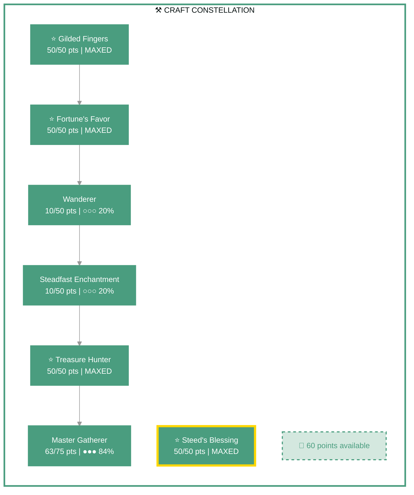

# Lei-Tun (Abyssal Champion)

   

**Khajiit Warden • Aldmeri Dominion Alliance**

> 📋 **Build Plan:** See [Lei-Tun's Build Plan (lei_tun_plan.md)](lei_tun_plan.md) for character backstory, Trinity subclassing, target loadout, CP mapping, and the in-game action checklist.

---

## 📑 Table of Contents

- [📋 Overview](#overview)
  - [General](#general)
  - [Currency](#currency)
- [⚔️ Combat Arsenal](#combat-arsenal)
  - [Character Stats](#character-stats)
  - [Advanced Stats](#advanced-stats)
  - [Skill bars](#skill-bars)
- [⚔️ Equipment & Active Sets](#equipment-active-sets)
- [⭐ Champion Points](#champion-points)
- [📜 Character Progress](#character-progress)
- [⚔️ PvP](#pvp)
- [👥 Companions](#companions)
- [🎨 Collectibles](#collectibles)
- [📝 Quest Progress](#quest-progress)
- [🏰 Armory Builds](#armory-builds)
- [📬 Mail](#mail)
- [🏰 Guild Membership](#guild-membership)

---

## 📋 Overview

### General

| **Attribute** | **Value** |
| --- | --- |
| **Level** | 41 |
| **Champion Points** | 1029 |
| **Gender** | Female |
| **Age** | 1d 6h 12m |
| **Account** | @SOLAEGIS |
| **ESO Plus** | ✅ Active |
| **Attribute Points** | ⚠️ 1 unspent |

| **Attribute** | **Value** |
| --- | --- |
| **Attributes** | 🔵 51 / ❤️ 0 / ⚡ 0 |
| **🐴 Riding Skills** | 🐴 60 / 💪 60 / 🎒 60 ✅ |
| **Available Champion Points** | ⚒️ 60 - ⚔️ 343 - 💪 343 |
| **Skill Points** | 🎯 12 available - Ready to spend |
| **Class** | [Warden](https://en.uesp.net/wiki/Online:Warden) |
| **Race** | [Khajiit](https://en.uesp.net/wiki/Online:Khajiit) |
| **Server** | [NA Megaserver](https://en.uesp.net/wiki/Online:Megaservers) |

| **Attribute** | **Value** |
| --- | --- |
| **Location** | [Summerset](https://en.uesp.net/wiki/Online:Summerset) (Alinor) |
| **Title** | [Abyssal Champion](https://en.uesp.net/wiki/Online:Abyssal_Champion) |
| **Alliance** | [Aldmeri Dominion](https://en.uesp.net/wiki/Online:Aldmeri_Dominion) |
| **🍖 Active Buffs** | Other: [Feral Guardian](https://en.uesp.net/wiki/Online:Feral_Guardian) |
| **🪨 Mundus Stone** | [The Shadow](https://en.uesp.net/wiki/Online:The_Shadow_(Mundus_Stone)) |

### Currency

| **Attribute** | **Value** |
| --- | --- |
| 💰 **Gold** | 32,306 |
| ⚔️ **Alliance Points** | 5,000 |
| 🔮 **Tel Var** | 0 |
| 💎 **Transmute Crystals** | 452 |
| 📜 **Writs** | 0 |
| 🎫 **Event Tickets** | 0 |
| 👑 **Crowns** | 7,440 |
| 💠 **Gems** | 281 |
| 🏅 **Seals** | 22,855 |
| 🗝️ **Keys** | 12 |
| 👕 **Tokens** | 6 |
| 📚 **Fortunes** | 7,500 |
| 🔹 **Fragments** | 1,408 |

---

## ⚔️ Combat Arsenal

### Character Stats

| **Category** | **Stat** | **Value** |
| --- | --- | ---: |
| 💚 **Resources** | Health | 21,008 |
|  | Magicka | 29,896 |
|  | Stamina | 16,908 |
| ⚔️ **Offensive** | Weapon Power | 2,108 |
|  | Spell Power | 2,108 |

| **Category** | **Stat** | **Value** |
| --- | --- | ---: |
| 🎯 **Critical** | Weapon Crit | 2,947 (13.4%) |
|  | Spell Crit | 2,947 (13.4%) |
| ⚔️ **Penetration** | Physical | 0 |
|  | Spell | 0 |

| **Category** | **Stat** | **Value** |
| --- | --- | ---: |
| 🛡️ **Defensive** | Physical Resist | 7,656 (78.8%) |
|  | Spell Resist | 12,738 (86.1%) |
| ♻️ **Recovery** | Health | 491 |
|  | Magicka | 2,208 |
|  | Stamina | 1,256 |

### Advanced Stats

| **Ability** | **Cost/Value** |
|:---|---:|
| ⚔️ **Light Attack** | 3,303 dmg |
| ⚔️ **Heavy Attack** | 6,607 dmg |
| ⚔️ **Bash** | 604 cost, 3,908 dmg |
| 🛡️ **Block** | 1,951 cost, 50% mit, 40% spd |
| 🔓 **Break Free** | 3,510 cost |
| 🏃 **Dodge Roll** | 3,115 cost |
| 🐾 **Sneak** | 133 cost, 0% spd |
| 🏃‍♂️ **Sprint** | 386 cost, 0% spd |

| **Resistance** | **Value** |
|:---|---:|
| 🔥 **Flame** | 19.3% |
| ⚡ **Shock** | 19.3% |
| ❄️ **Frost** | 19.3% |
| 🔮 **Magic** | 19.3% |
| 🦠 **Disease** | 11.6% |
| ☠️ **Poison** | 11.6% |
| 🩸 **Bleed** | 11.6% |

| **Damage Type** | **Bonus** |
|:---|---:|
| 💥 **Critical Damage** | 69% |
| ⚔️ **Physical** | 6% |
| 🔥 **Flame** | 6% |
| ⚡ **Shock** | 6% |
| ❄️ **Frost** | 0 |
| 🔮 **Magic** | 6% |
| 🦠 **Disease** | 6% |
| ☠️ **Poison** | 6% |
| 🩸 **Bleed** | 6% |
| 🌌 **Oblivion** | 6% |

| **Healing** | **Value** |
|:---|---:|
| 💚 **Healing Done** | 0 |
| 💖 **Healing Taken** | 0 |
| ✨ **Critical Healing** | 69% |

### Skill bars

### ⚔️ Front Bar (Main Hand)

| **1** | **2** | **3** | **4** | **5** | **⚡** |
| :---: | :---: | :---: | :---: | :---: | :---: |
| [Frost Cloak](https://en.uesp.net/wiki/Online:Frost_Cloak) | [Scorch](https://en.uesp.net/wiki/Online:Scorch) | [Wall of Storms](https://en.uesp.net/wiki/Online:Wall_of_Storms) | [Consuming Trap](https://en.uesp.net/wiki/Online:Consuming_Trap) | [Guardian's Wrath](https://en.uesp.net/wiki/Online:Guardian's_Wrath) | [Fungal Growth](https://en.uesp.net/wiki/Online:Fungal_Growth) |

### 🔮 Back Bar (Backup)

| **1** | **2** | **3** | **4** | **5** | **⚡** |
| :---: | :---: | :---: | :---: | :---: | :---: |
| [Resolving Vigor](https://en.uesp.net/wiki/Online:Resolving_Vigor) | [Consuming Trap](https://en.uesp.net/wiki/Online:Consuming_Trap) | [Dive](https://en.uesp.net/wiki/Online:Dive) | [Regeneration](https://en.uesp.net/wiki/Online:Regeneration) | [Guardian's Wrath](https://en.uesp.net/wiki/Online:Guardian's_Wrath) | [Grand Healing](https://en.uesp.net/wiki/Online:Grand_Healing) |

---

## ⚔️ Equipment & Active Sets

| **Set** | **Progress** |
| --- | --- |
| 🟢 **[Armor of the Trainee Set](https://en.uesp.net/wiki/Online:Armor_of_the_Trainee_Set)** | `5/5` ██████████ 100% |
| ⚪ **[Wisdom of Vanus Set](https://en.uesp.net/wiki/Online:Wisdom_of_Vanus_Set)** | `1/5` ██░░░░░░░░ 20% |
| 🔴 **[Shadow Dancer's Raiment Set](https://en.uesp.net/wiki/Online:Shadow_Dancer's_Raiment_Set)** | `2/5` ████░░░░░░ 40% |
| ⚪ **[Beekeeper's Gear Set](https://en.uesp.net/wiki/Online:Beekeeper's_Gear_Set)** | `1/5` ██░░░░░░░░ 20% |
| ⚪ **[Robes of the Withered Hand Set](https://en.uesp.net/wiki/Online:Robes_of_the_Withered_Hand_Set)** | `1/5` ██░░░░░░░░ 20% |
| ⚪ **[Sithis' Touch Set](https://en.uesp.net/wiki/Online:Sithis'_Touch_Set)** | `1/5` ██░░░░░░░░ 20% |

### 📋 Equipment Details

| **Slot** | **Item** | **Set** | **Quality** | **Trait** | **Type** | **Enchantment** |
| --- | --- | --- | --- | --- | --- | --- |
| ⛑️ **Head** | Vanus's Hat | [Wisdom of Vanus Set](https://en.uesp.net/wiki/Online:Wisdom_of_Vanus_Set) | ⭐ Epic | Impenetrable | Light | Maximum Magicka Enchantment |
| 💎 **Neck** | Necklace of the Withered Hand | [Robes of the Withered Hand Set](https://en.uesp.net/wiki/Online:Robes_of_the_Withered_Hand_Set) | 🔮 Superior | Arcane | None | Magicka Recovery Enchantment |
| 🛡️ **Chest** | Robe of the Trainee | [Armor of the Trainee Set](https://en.uesp.net/wiki/Online:Armor_of_the_Trainee_Set) | 🔮 Superior | Training | Light | Maximum Magicka Enchantment |
| 👑 **Shoulders** | Epaulets of the Shadow Dancer | [Shadow Dancer's Raiment Set](https://en.uesp.net/wiki/Online:Shadow_Dancer's_Raiment_Set) | ⚡ Fine | Well-fitted | Light | Maximum Magicka Enchantment |
| ⚔️ **Main Hand** | Beekeeper's Lightning Staff | [Beekeeper's Gear Set](https://en.uesp.net/wiki/Online:Beekeeper's_Gear_Set) | 🔮 Superior | Charged | None | Life Drain Enchantment |
| ⚡ **Waist** | spidersilk sash of Stamina | - | 🔮 Superior | Reinforced | Light | Maximum Stamina Enchantment |
| 👖 **Legs** | Breeches of the Trainee | [Armor of the Trainee Set](https://en.uesp.net/wiki/Online:Armor_of_the_Trainee_Set) | 🔮 Superior | Training | Light | Maximum Magicka Enchantment |
| 👟 **Feet** | Sithis' Shoes | [Sithis' Touch Set](https://en.uesp.net/wiki/Online:Sithis'_Touch_Set) | 🔮 Superior | Sturdy | Light | Maximum Magicka Enchantment |
| 💍 **Ring 1** | Ring of the Trainee | [Armor of the Trainee Set](https://en.uesp.net/wiki/Online:Armor_of_the_Trainee_Set) | ⭐ Epic | Arcane | None | Magicka Recovery Enchantment |
| 💍 **Ring 2** | Ring of the Trainee | [Armor of the Trainee Set](https://en.uesp.net/wiki/Online:Armor_of_the_Trainee_Set) | ⚡ Fine | Arcane | None | Magicka Recovery Enchantment |
| ✋ **Hands** | Gloves of the Shadow Dancer | [Shadow Dancer's Raiment Set](https://en.uesp.net/wiki/Online:Shadow_Dancer's_Raiment_Set) | ⚡ Fine | Sturdy | Light | Maximum Magicka Enchantment |
| 🔮 **Backup Main Hand** | Gold Fleet's Beacon | [Armor of the Trainee Set](https://en.uesp.net/wiki/Online:Armor_of_the_Trainee_Set) | ⚡ Fine | Infused | None | Absorb Magicka Enchantment |

---

## ⭐ Champion Points

| **Total** | **Spent** | **Available** |
| :---: | :---: | :---: |
| 1,029 | 283 | 746 |

| **⚒️ Craft** | **Assigned Points** |
| --- | ---: |
| █████████░░░ 82% | 283/343 points |
| **[Master Gatherer](https://en.uesp.net/wiki/Online:Master_Gatherer)** | 63 points |
| **[Treasure Hunter](https://en.uesp.net/wiki/Online:Treasure_Hunter)** | 50 points |
| **[Steadfast Enchantment](https://en.uesp.net/wiki/Online:Steadfast_Enchantment)** | 10 points |
| **[Wanderer](https://en.uesp.net/wiki/Online:Wanderer)** | 10 points |
| **[Fortune's Favor](https://en.uesp.net/wiki/Online:Fortune's_Favor)** | 50 points |
| **[Gilded Fingers](https://en.uesp.net/wiki/Online:Gilded_Fingers)** | 50 points |
| **[Steed's Blessing](https://en.uesp.net/wiki/Online:Steed's_Blessing)** | 50 points |

| **⚔️ Warfare** | **Assigned Points** |
| --- | ---: |
| ░░░░░░░░░░░░ 0% | 0/343 points |
| *No points assigned* |  |

| **💪 Fitness** | **Assigned Points** |
| --- | ---: |
| ░░░░░░░░░░░░ 0% | 0/343 points |
| *No points assigned* |  |

### 🎯 Champion Points Visual

```mermaid
%%{init: {"theme":"base", "themeVariables": { "background":"transparent","fontSize":"12px","primaryColor":"#f0f0f0","primaryTextColor":"#333","primaryBorderColor":"#999","lineColor":"#999"}}}%%

flowchart LR

  subgraph subLEGEND["📖 LEGEND & VISUAL GUIDE"]

    LEG_STARS["Star Types"]
    LEG_S1["⭐ Gold Border = Maxed Slottable"]
    LEG_S2["🔶 Orange Border = Independent Star"]
    LEG_S3["Standard Border = In Progress"]

    LEG_FILL["Progress Indicators"]
    LEG_F1["⭐ = 100% Maxed"]
    LEG_F2["●●● = 75-99%"]
    LEG_F3["●●○ = 50-74%"]
    LEG_F4["●○○ = 25-49%"]
    LEG_F5["○○○ = 1-24%"]

    LEG_STARS --> LEG_S1 & LEG_S2 & LEG_S3
    LEG_FILL --> LEG_F1 & LEG_F2 & LEG_F3 & LEG_F4 & LEG_F5

    style LEG_STARS fill:transparent,stroke:none,color:#ccc
    style LEG_FILL fill:transparent,stroke:none,color:#ccc
    style LEG_S1 fill:#fff,stroke:#ffd700,stroke-width:3px,color:#333
    style LEG_S2 fill:#fff,stroke:#ff8c00,stroke-width:3px,color:#333
    style LEG_S3 fill:#fff,stroke:#999,stroke-width:2px,color:#333
    style LEG_F1 fill:#eee,stroke:#333,stroke-width:1px,color:#333
    style LEG_F2 fill:#eee,stroke:#333,stroke-width:1px,color:#333
    style LEG_F3 fill:#eee,stroke:#333,stroke-width:1px,color:#333
    style LEG_F4 fill:#eee,stroke:#333,stroke-width:1px,color:#333
    style LEG_F5 fill:#eee,stroke:#333,stroke-width:1px,color:#333
  end
  style subLEGEND fill:transparent,stroke:#999,stroke-width:3px
```

---

## 📜 Character Progress

### Progress Overview

| **Maxed Skill Lines** | **In Progress** | **Early Progress** | **Abilities with Morphs** | **Overall Completion** |
| ---: | ---: | ---: | ---: | ---: |
| 1 | 23 | 3 | 11 | 3% |

### ✅ Maxed Skills

🏰 Guild (1 skill line maxed)

**[Fighters Guild](https://en.uesp.net/wiki/Online:Fighters_Guild)**

✨ Passives

- 🔒 [Intimidating Presence](https://en.uesp.net/wiki/Online:Intimidating_Presence) *(from [Fighters Guild](https://en.uesp.net/wiki/Online:Fighters_Guild))*
- 🔒 [Slayer](https://en.uesp.net/wiki/Online:Slayer) *(from [Fighters Guild](https://en.uesp.net/wiki/Online:Fighters_Guild))*
- ✅ [Banish the Wicked](https://en.uesp.net/wiki/Online:Banish_the_Wicked) *(from [Fighters Guild](https://en.uesp.net/wiki/Online:Fighters_Guild))*
- 🔒 [Skilled Tracker](https://en.uesp.net/wiki/Online:Skilled_Tracker) *(from [Fighters Guild](https://en.uesp.net/wiki/Online:Fighters_Guild))*
- 🔒 [Bounty Hunter](https://en.uesp.net/wiki/Online:Bounty_Hunter) *(from [Fighters Guild](https://en.uesp.net/wiki/Online:Fighters_Guild))*

### 📈 In-Progress Skills

🛡️ Armor (3 skill lines in progress)

- **[Light Armor](https://en.uesp.net/wiki/Online:Light_Armor)**: Rank 46 █████░░░░░ 54%
- **[Medium Armor](https://en.uesp.net/wiki/Online:Medium_Armor)**: Rank 34 ████░░░░░░ 48%
- **[Heavy Armor](https://en.uesp.net/wiki/Online:Heavy_Armor)**: Rank 23 █████░░░░░ 51%

✨ Passives

- ✅ [Light Armor Bonuses](https://en.uesp.net/wiki/Online:Light_Armor_Bonuses) *(from [Light Armor](https://en.uesp.net/wiki/Online:Light_Armor))*
- ✅ [Light Armor Penalties](https://en.uesp.net/wiki/Online:Light_Armor_Penalties) *(from [Light Armor](https://en.uesp.net/wiki/Online:Light_Armor))*
- ✅ [Grace](https://en.uesp.net/wiki/Online:Grace) *(from [Light Armor](https://en.uesp.net/wiki/Online:Light_Armor))*
- ✅ [Evocation](https://en.uesp.net/wiki/Online:Evocation) *(from [Light Armor](https://en.uesp.net/wiki/Online:Light_Armor))*
- ✅ [Spell Warding](https://en.uesp.net/wiki/Online:Spell_Warding) *(from [Light Armor](https://en.uesp.net/wiki/Online:Light_Armor))*
- ✅ [Prodigy](https://en.uesp.net/wiki/Online:Prodigy) *(from [Light Armor](https://en.uesp.net/wiki/Online:Light_Armor))*
- 🔒 [Concentration](https://en.uesp.net/wiki/Online:Concentration) *(from [Light Armor](https://en.uesp.net/wiki/Online:Light_Armor))*
- ✅ [Medium Armor Bonuses](https://en.uesp.net/wiki/Online:Medium_Armor_Bonuses) *(from [Medium Armor](https://en.uesp.net/wiki/Online:Medium_Armor))*
- 🔒 [Dexterity](https://en.uesp.net/wiki/Online:Dexterity) *(from [Medium Armor](https://en.uesp.net/wiki/Online:Medium_Armor))*
- 🔒 [Wind Walker](https://en.uesp.net/wiki/Online:Wind_Walker) *(from [Medium Armor](https://en.uesp.net/wiki/Online:Medium_Armor))*
- 🔒 [Improved Sneak](https://en.uesp.net/wiki/Online:Improved_Sneak) *(from [Medium Armor](https://en.uesp.net/wiki/Online:Medium_Armor))*
- 🔒 [Agility](https://en.uesp.net/wiki/Online:Agility) *(from [Medium Armor](https://en.uesp.net/wiki/Online:Medium_Armor))*
- 🔒 [Athletics](https://en.uesp.net/wiki/Online:Athletics) *(from [Medium Armor](https://en.uesp.net/wiki/Online:Medium_Armor))*
- ✅ [Heavy Armor Bonuses](https://en.uesp.net/wiki/Online:Heavy_Armor_Bonuses) *(from [Heavy Armor](https://en.uesp.net/wiki/Online:Heavy_Armor))*
- ✅ [Heavy Armor Penalties](https://en.uesp.net/wiki/Online:Heavy_Armor_Penalties) *(from [Heavy Armor](https://en.uesp.net/wiki/Online:Heavy_Armor))*
- 🔒 [Resolve](https://en.uesp.net/wiki/Online:Resolve) *(from [Heavy Armor](https://en.uesp.net/wiki/Online:Heavy_Armor))*
- 🔒 [Constitution](https://en.uesp.net/wiki/Online:Constitution) *(from [Heavy Armor](https://en.uesp.net/wiki/Online:Heavy_Armor))*
- 🔒 [Juggernaut](https://en.uesp.net/wiki/Online:Juggernaut) *(from [Heavy Armor](https://en.uesp.net/wiki/Online:Heavy_Armor))*
- 🔒 [Revitalize](https://en.uesp.net/wiki/Online:Revitalize) *(from [Heavy Armor](https://en.uesp.net/wiki/Online:Heavy_Armor))*
- 🔒 [Rapid Mending](https://en.uesp.net/wiki/Online:Rapid_Mending) *(from [Heavy Armor](https://en.uesp.net/wiki/Online:Heavy_Armor))*

⚔️ Class (3 skill lines in progress)

- **[Animal Companions](https://en.uesp.net/wiki/Online:Animal_Companions)**: Rank 45 ██░░░░░░░░ 26%
- **[Green Balance](https://en.uesp.net/wiki/Online:Green_Balance)**: Rank 36 ████████░░ 85%
- **[Winter's Embrace](https://en.uesp.net/wiki/Online:Winter's_Embrace)**: Rank 36 ████████░░ 83%

✨ Passives

- ✅ [Bond with Nature](https://en.uesp.net/wiki/Online:Bond_with_Nature) *(from [Animal Companions](https://en.uesp.net/wiki/Online:Animal_Companions))*
- ✅ [Savage Beast](https://en.uesp.net/wiki/Online:Savage_Beast) *(from [Animal Companions](https://en.uesp.net/wiki/Online:Animal_Companions))*
- ✅ [Flourish](https://en.uesp.net/wiki/Online:Flourish) *(from [Animal Companions](https://en.uesp.net/wiki/Online:Animal_Companions))*
- 🔒 [Advanced Species](https://en.uesp.net/wiki/Online:Advanced_Species) *(from [Animal Companions](https://en.uesp.net/wiki/Online:Animal_Companions))*
- ✅ [Accelerated Growth](https://en.uesp.net/wiki/Online:Accelerated_Growth) *(from [Green Balance](https://en.uesp.net/wiki/Online:Green_Balance))*

- ✅ [Nature's Gift](https://en.uesp.net/wiki/Online:Nature's_Gift) *(from [Green Balance](https://en.uesp.net/wiki/Online:Green_Balance))*
- ✅ [Emerald Moss](https://en.uesp.net/wiki/Online:Emerald_Moss) *(from [Green Balance](https://en.uesp.net/wiki/Online:Green_Balance))*
- 🔒 [Maturation](https://en.uesp.net/wiki/Online:Maturation) *(from [Green Balance](https://en.uesp.net/wiki/Online:Green_Balance))*
- ✅ [Glacial Presence](https://en.uesp.net/wiki/Online:Glacial_Presence) *(from [Winter's Embrace](https://en.uesp.net/wiki/Online:Winter's_Embrace))*
- ✅ [Frozen Armor](https://en.uesp.net/wiki/Online:Frozen_Armor) *(from [Winter's Embrace](https://en.uesp.net/wiki/Online:Winter's_Embrace))*
- 🔒 [Icy Aura](https://en.uesp.net/wiki/Online:Icy_Aura) *(from [Winter's Embrace](https://en.uesp.net/wiki/Online:Winter's_Embrace))*
- 🔒 [Piercing Cold](https://en.uesp.net/wiki/Online:Piercing_Cold) *(from [Winter's Embrace](https://en.uesp.net/wiki/Online:Winter's_Embrace))*

⚔️ Weapon (5 skill lines in progress)

- **[One Hand and Shield](https://en.uesp.net/wiki/Online:One_Hand_and_Shield)**: Rank 2 ░░░░░░░░░░ 0%
- **[Dual Wield](https://en.uesp.net/wiki/Online:Dual_Wield)**: Rank 2 ░░░░░░░░░░ 0%
- **[Bow](https://en.uesp.net/wiki/Online:Bow)**: Rank 2 ░░░░░░░░░░ 0%
- **[Destruction Staff](https://en.uesp.net/wiki/Online:Destruction_Staff)**: Rank 44 ███████░░░ 75%
- **[Restoration Staff](https://en.uesp.net/wiki/Online:Restoration_Staff)**: Rank 34 ███░░░░░░░ 39%

✨ Passives

- 🔒 [Fortress](https://en.uesp.net/wiki/Online:Fortress) *(from [One Hand and Shield](https://en.uesp.net/wiki/Online:One_Hand_and_Shield))*
- 🔒 [Sword and Board](https://en.uesp.net/wiki/Online:Sword_and_Board) *(from [One Hand and Shield](https://en.uesp.net/wiki/Online:One_Hand_and_Shield))*
- 🔒 [Deadly Bash](https://en.uesp.net/wiki/Online:Deadly_Bash) *(from [One Hand and Shield](https://en.uesp.net/wiki/Online:One_Hand_and_Shield))*
- 🔒 [Deflect Bolts](https://en.uesp.net/wiki/Online:Deflect_Bolts) *(from [One Hand and Shield](https://en.uesp.net/wiki/Online:One_Hand_and_Shield))*
- 🔒 [Battlefield Mobility](https://en.uesp.net/wiki/Online:Battlefield_Mobility) *(from [One Hand and Shield](https://en.uesp.net/wiki/Online:One_Hand_and_Shield))*
- 🔒 [Focused Killer](https://en.uesp.net/wiki/Online:Focused_Killer) *(from [Dual Wield](https://en.uesp.net/wiki/Online:Dual_Wield))*
- 🔒 [Ambidextrous](https://en.uesp.net/wiki/Online:Ambidextrous) *(from [Dual Wield](https://en.uesp.net/wiki/Online:Dual_Wield))*
- 🔒 [Controlled Fury](https://en.uesp.net/wiki/Online:Controlled_Fury) *(from [Dual Wield](https://en.uesp.net/wiki/Online:Dual_Wield))*
- 🔒 [Ruffian](https://en.uesp.net/wiki/Online:Ruffian) *(from [Dual Wield](https://en.uesp.net/wiki/Online:Dual_Wield))*
- 🔒 [Twin Blade and Blunt](https://en.uesp.net/wiki/Online:Twin_Blade_and_Blunt) *(from [Dual Wield](https://en.uesp.net/wiki/Online:Dual_Wield))*
- 🔒 [Vinedusk Training](https://en.uesp.net/wiki/Online:Vinedusk_Training) *(from [Bow](https://en.uesp.net/wiki/Online:Bow))*
- 🔒 [Accuracy](https://en.uesp.net/wiki/Online:Accuracy) *(from [Bow](https://en.uesp.net/wiki/Online:Bow))*
- 🔒 [Ranger](https://en.uesp.net/wiki/Online:Ranger) *(from [Bow](https://en.uesp.net/wiki/Online:Bow))*
- 🔒 [Hawk Eye](https://en.uesp.net/wiki/Online:Hawk_Eye) *(from [Bow](https://en.uesp.net/wiki/Online:Bow))*
- 🔒 [Hasty Retreat](https://en.uesp.net/wiki/Online:Hasty_Retreat) *(from [Bow](https://en.uesp.net/wiki/Online:Bow))*
- ✅ [Tri Focus](https://en.uesp.net/wiki/Online:Tri_Focus) *(from [Destruction Staff](https://en.uesp.net/wiki/Online:Destruction_Staff))*
- ✅ [Penetrating Magic](https://en.uesp.net/wiki/Online:Penetrating_Magic) *(from [Destruction Staff](https://en.uesp.net/wiki/Online:Destruction_Staff))*
- ✅ [Elemental Force](https://en.uesp.net/wiki/Online:Elemental_Force) *(from [Destruction Staff](https://en.uesp.net/wiki/Online:Destruction_Staff))*
- ✅ [Ancient Knowledge](https://en.uesp.net/wiki/Online:Ancient_Knowledge) *(from [Destruction Staff](https://en.uesp.net/wiki/Online:Destruction_Staff))*
- 🔒 [Destruction Expert](https://en.uesp.net/wiki/Online:Destruction_Expert) *(from [Destruction Staff](https://en.uesp.net/wiki/Online:Destruction_Staff))*
- ✅ [Essence Drain](https://en.uesp.net/wiki/Online:Essence_Drain) *(from [Restoration Staff](https://en.uesp.net/wiki/Online:Restoration_Staff))*
- ✅ [Restoration Expert](https://en.uesp.net/wiki/Online:Restoration_Expert) *(from [Restoration Staff](https://en.uesp.net/wiki/Online:Restoration_Staff))*
- 🔒 [Cycle of Life](https://en.uesp.net/wiki/Online:Cycle_of_Life) *(from [Restoration Staff](https://en.uesp.net/wiki/Online:Restoration_Staff))*
- 🔒 [Absorb](https://en.uesp.net/wiki/Online:Absorb) *(from [Restoration Staff](https://en.uesp.net/wiki/Online:Restoration_Staff))*
- 🔒 [Restoration Master](https://en.uesp.net/wiki/Online:Restoration_Master) *(from [Restoration Staff](https://en.uesp.net/wiki/Online:Restoration_Staff))*

🌍 World (1 skill line in progress)

- **[Legerdemain](https://en.uesp.net/wiki/Online:Legerdemain)**: Rank 6 ░░░░░░░░░░ 2%

✨ Passives

- 🔒 [Improved Hiding](https://en.uesp.net/wiki/Online:Improved_Hiding) *(from [Legerdemain](https://en.uesp.net/wiki/Online:Legerdemain))*
- 🔒 [Light Fingers](https://en.uesp.net/wiki/Online:Light_Fingers) *(from [Legerdemain](https://en.uesp.net/wiki/Online:Legerdemain))*
- 🔒 [Trafficker](https://en.uesp.net/wiki/Online:Trafficker) *(from [Legerdemain](https://en.uesp.net/wiki/Online:Legerdemain))*
- 🔒 [Locksmith](https://en.uesp.net/wiki/Online:Locksmith) *(from [Legerdemain](https://en.uesp.net/wiki/Online:Legerdemain))*
- 🔒 [Kickback](https://en.uesp.net/wiki/Online:Kickback) *(from [Legerdemain](https://en.uesp.net/wiki/Online:Legerdemain))*

⭐ Racial (1 skill line in progress)

- **[Khajiit Skills](https://en.uesp.net/wiki/Online:Khajiit)**: Rank 41 █████░░░░░ 53%

✨ Passives

- ✅ [Cutpurse](https://en.uesp.net/wiki/Online:Cutpurse) *(from [Khajiit Skills](https://en.uesp.net/wiki/Online:Khajiit))*
- ✅ [Robustness](https://en.uesp.net/wiki/Online:Robustness) *(from [Khajiit Skills](https://en.uesp.net/wiki/Online:Khajiit))*
- ✅ [Lunar Blessings](https://en.uesp.net/wiki/Online:Lunar_Blessings) *(from [Khajiit Skills](https://en.uesp.net/wiki/Online:Khajiit))*
- ✅ [Feline Ambush](https://en.uesp.net/wiki/Online:Feline_Ambush) *(from [Khajiit Skills](https://en.uesp.net/wiki/Online:Khajiit))*

⚒️ Craft (7 skill lines in progress)

- **[Alchemy](https://en.uesp.net/wiki/Online:Alchemy)**: Rank 13 ███░░░░░░░ 33%
- **[Blacksmithing](https://en.uesp.net/wiki/Online:Blacksmithing)**: Rank 9 █░░░░░░░░░ 16%
- **[Clothing](https://en.uesp.net/wiki/Online:Clothing)**: Rank 10 ██░░░░░░░░ 25%
- **[Enchanting](https://en.uesp.net/wiki/Online:Enchanting)**: Rank 8 ███░░░░░░░ 39%
- **[Jewelry Crafting](https://en.uesp.net/wiki/Online:Jewelry_Crafting)**: Rank 9 █████░░░░░ 52%
- **[Provisioning](https://en.uesp.net/wiki/Online:Provisioning)**: Rank 10 ███████░░░ 77%
- **[Woodworking](https://en.uesp.net/wiki/Online:Woodworking)**: Rank 11 █░░░░░░░░░ 11%

✨ Passives

- ✅ [Solvent Proficiency](https://en.uesp.net/wiki/Online:Solvent_Proficiency) *(from [Alchemy](https://en.uesp.net/wiki/Online:Alchemy))*
- 🔒 [Keen Eye: Reagents](https://en.uesp.net/wiki/Online:Keen_Eye:_Reagents) *(from [Alchemy](https://en.uesp.net/wiki/Online:Alchemy))*
- 🔒 [Medicinal Use](https://en.uesp.net/wiki/Online:Medicinal_Use) *(from [Alchemy](https://en.uesp.net/wiki/Online:Alchemy))*
- 🔒 [Chemistry](https://en.uesp.net/wiki/Online:Chemistry) *(from [Alchemy](https://en.uesp.net/wiki/Online:Alchemy))*
- 🔒 [Laboratory Use](https://en.uesp.net/wiki/Online:Laboratory_Use) *(from [Alchemy](https://en.uesp.net/wiki/Online:Alchemy))*
- 🔒 [Snakeblood](https://en.uesp.net/wiki/Online:Snakeblood) *(from [Alchemy](https://en.uesp.net/wiki/Online:Alchemy))*
- ✅ [Metalworking](https://en.uesp.net/wiki/Online:Metalworking) *(from [Blacksmithing](https://en.uesp.net/wiki/Online:Blacksmithing))*
- 🔒 [Keen Eye: Ore](https://en.uesp.net/wiki/Online:Keen_Eye:_Ore) *(from [Blacksmithing](https://en.uesp.net/wiki/Online:Blacksmithing))*
- 🔒 [Miner Hireling](https://en.uesp.net/wiki/Online:Miner_Hireling) *(from [Blacksmithing](https://en.uesp.net/wiki/Online:Blacksmithing))*
- 🔒 [Metal Extraction](https://en.uesp.net/wiki/Online:Metal_Extraction) *(from [Blacksmithing](https://en.uesp.net/wiki/Online:Blacksmithing))*
- 🔒 [Metallurgy](https://en.uesp.net/wiki/Online:Metallurgy) *(from [Blacksmithing](https://en.uesp.net/wiki/Online:Blacksmithing))*
- 🔒 [Temper Expertise](https://en.uesp.net/wiki/Online:Temper_Expertise) *(from [Blacksmithing](https://en.uesp.net/wiki/Online:Blacksmithing))*
- ✅ [Tailoring](https://en.uesp.net/wiki/Online:Tailoring) *(from [Clothing](https://en.uesp.net/wiki/Online:Clothing))*
- 🔒 [Keen Eye: Cloth](https://en.uesp.net/wiki/Online:Keen_Eye:_Cloth) *(from [Clothing](https://en.uesp.net/wiki/Online:Clothing))*
- 🔒 [Outfitter Hireling](https://en.uesp.net/wiki/Online:Outfitter_Hireling) *(from [Clothing](https://en.uesp.net/wiki/Online:Clothing))*
- 🔒 [Unraveling](https://en.uesp.net/wiki/Online:Unraveling) *(from [Clothing](https://en.uesp.net/wiki/Online:Clothing))*
- 🔒 [Stitching](https://en.uesp.net/wiki/Online:Stitching) *(from [Clothing](https://en.uesp.net/wiki/Online:Clothing))*
- 🔒 [Tannin Expertise](https://en.uesp.net/wiki/Online:Tannin_Expertise) *(from [Clothing](https://en.uesp.net/wiki/Online:Clothing))*
- ✅ [Potency Improvement](https://en.uesp.net/wiki/Online:Potency_Improvement) *(from [Enchanting](https://en.uesp.net/wiki/Online:Enchanting))*
- ✅ [Aspect Improvement](https://en.uesp.net/wiki/Online:Aspect_Improvement) *(from [Enchanting](https://en.uesp.net/wiki/Online:Enchanting))*
- 🔒 [Keen Eye: Rune Stones](https://en.uesp.net/wiki/Online:Keen_Eye:_Rune_Stones) *(from [Enchanting](https://en.uesp.net/wiki/Online:Enchanting))*
- 🔒 [Enchanter Hireling](https://en.uesp.net/wiki/Online:Enchanter_Hireling) *(from [Enchanting](https://en.uesp.net/wiki/Online:Enchanting))*
- 🔒 [Runestone Extraction](https://en.uesp.net/wiki/Online:Runestone_Extraction) *(from [Enchanting](https://en.uesp.net/wiki/Online:Enchanting))*
- ✅ [Engraver](https://en.uesp.net/wiki/Online:Engraver) *(from [Jewelry Crafting](https://en.uesp.net/wiki/Online:Jewelry_Crafting))*
- 🔒 [Keen Eye: Jewelry](https://en.uesp.net/wiki/Online:Keen_Eye:_Jewelry) *(from [Jewelry Crafting](https://en.uesp.net/wiki/Online:Jewelry_Crafting))*
- 🔒 [Jewelry Extraction](https://en.uesp.net/wiki/Online:Jewelry_Extraction) *(from [Jewelry Crafting](https://en.uesp.net/wiki/Online:Jewelry_Crafting))*
- 🔒 [Lapidary Research](https://en.uesp.net/wiki/Online:Lapidary_Research) *(from [Jewelry Crafting](https://en.uesp.net/wiki/Online:Jewelry_Crafting))*
- 🔒 [Platings Expertise](https://en.uesp.net/wiki/Online:Platings_Expertise) *(from [Jewelry Crafting](https://en.uesp.net/wiki/Online:Jewelry_Crafting))*
- ✅ [Recipe Improvement](https://en.uesp.net/wiki/Online:Recipe_Improvement) *(from [Provisioning](https://en.uesp.net/wiki/Online:Provisioning))*
- ✅ [Recipe Quality](https://en.uesp.net/wiki/Online:Recipe_Quality) *(from [Provisioning](https://en.uesp.net/wiki/Online:Provisioning))*
- 🔒 [Gourmand](https://en.uesp.net/wiki/Online:Gourmand) *(from [Provisioning](https://en.uesp.net/wiki/Online:Provisioning))*
- 🔒 [Connoisseur](https://en.uesp.net/wiki/Online:Connoisseur) *(from [Provisioning](https://en.uesp.net/wiki/Online:Provisioning))*
- 🔒 [Chef](https://en.uesp.net/wiki/Online:Chef) *(from [Provisioning](https://en.uesp.net/wiki/Online:Provisioning))*
- 🔒 [Brewer](https://en.uesp.net/wiki/Online:Brewer) *(from [Provisioning](https://en.uesp.net/wiki/Online:Provisioning))*
- 🔒 [Forager Hireling](https://en.uesp.net/wiki/Online:Forager_Hireling) *(from [Provisioning](https://en.uesp.net/wiki/Online:Provisioning))*
- ✅ [Woodworking](https://en.uesp.net/wiki/Online:Woodworking) *(from [Woodworking](https://en.uesp.net/wiki/Online:Woodworking))*
- 🔒 [Keen Eye: Wood](https://en.uesp.net/wiki/Online:Keen_Eye:_Wood) *(from [Woodworking](https://en.uesp.net/wiki/Online:Woodworking))*
- 🔒 [Lumberjack Hireling](https://en.uesp.net/wiki/Online:Lumberjack_Hireling) *(from [Woodworking](https://en.uesp.net/wiki/Online:Woodworking))*
- 🔒 [Wood Extraction](https://en.uesp.net/wiki/Online:Wood_Extraction) *(from [Woodworking](https://en.uesp.net/wiki/Online:Woodworking))*
- 🔒 [Carpentry](https://en.uesp.net/wiki/Online:Carpentry) *(from [Woodworking](https://en.uesp.net/wiki/Online:Woodworking))*
- 🔒 [Resin Expertise](https://en.uesp.net/wiki/Online:Resin_Expertise) *(from [Woodworking](https://en.uesp.net/wiki/Online:Woodworking))*

🏰 Guild (1 skill line in progress)

- **[Mages Guild](https://en.uesp.net/wiki/Online:Mages_Guild)**: Rank 2 ░░░░░░░░░░ 5%

✨ Passives

- 🔒 [Persuasive Will](https://en.uesp.net/wiki/Online:Persuasive_Will) *(from [Mages Guild](https://en.uesp.net/wiki/Online:Mages_Guild))*
- 🔒 [Mage Adept](https://en.uesp.net/wiki/Online:Mage_Adept) *(from [Mages Guild](https://en.uesp.net/wiki/Online:Mages_Guild))*
- 🔒 [Everlasting Magic](https://en.uesp.net/wiki/Online:Everlasting_Magic) *(from [Mages Guild](https://en.uesp.net/wiki/Online:Mages_Guild))*
- 🔒 [Magicka Controller](https://en.uesp.net/wiki/Online:Magicka_Controller) *(from [Mages Guild](https://en.uesp.net/wiki/Online:Mages_Guild))*
- 🔒 [Might of the Guild](https://en.uesp.net/wiki/Online:Might_of_the_Guild) *(from [Mages Guild](https://en.uesp.net/wiki/Online:Mages_Guild))*

### ⚪ Early Progress Skills

🏰 Guild (2 skill lines)

- **[Psijic Order](https://en.uesp.net/wiki/Online:Psijic_Order)**: Rank 1 ░░░░░░░░░░ 0%
- **[Thieves Guild](https://en.uesp.net/wiki/Online:Thieves_Guild)**: Rank 1 ░░░░░░░░░░ 0%

🌍 World (1 skill line)

- **[Soul Magic](https://en.uesp.net/wiki/Online:Soul_Magic)**: Rank 1 ░░░░░░░░░░ 0%

🌿 Detailed Skill Morphs

### ⚔️ Class (5 abilities with morph choices)

#### Animal Companions (Rank 45)

⚠️ **[Feral Guardian](https://en.uesp.net/wiki/Online:Feral_Guardian)** (Rank 4)

  

  
Other morph options

  ⚪ **Morph 1**: [Eternal Guardian](https://en.uesp.net/wiki/Online:Eternal_Guardian)
  ⚪ **Morph 2**: [Wild Guardian](https://en.uesp.net/wiki/Online:Wild_Guardian)

  

⚠️ **[Dive](https://en.uesp.net/wiki/Online:Dive)** (Rank 4)

  

  
Other morph options

  ⚪ **Morph 1**: [Cutting Dive](https://en.uesp.net/wiki/Online:Cutting_Dive)
  ⚪ **Morph 2**: [Screaming Cliff Racer](https://en.uesp.net/wiki/Online:Screaming_Cliff_Racer)

  

⚠️ **[Scorch](https://en.uesp.net/wiki/Online:Scorch)** (Rank 4)

  

  
Other morph options

  ⚪ **Morph 1**: [Subterranean Assault](https://en.uesp.net/wiki/Online:Subterranean_Assault)
  ⚪ **Morph 2**: [Deep Fissure](https://en.uesp.net/wiki/Online:Deep_Fissure)

  

#### Green Balance (Rank 36)

⚠️ **[Fungal Growth](https://en.uesp.net/wiki/Online:Fungal_Growth)** (Rank 4)

  

  
Other morph options

  ⚪ **Morph 1**: [Enchanted Growth](https://en.uesp.net/wiki/Online:Enchanted_Growth)
  ⚪ **Morph 2**: [Soothing Spores](https://en.uesp.net/wiki/Online:Soothing_Spores)

  

#### Winter's Embrace (Rank 36)

⚠️ **[Frost Cloak](https://en.uesp.net/wiki/Online:Frost_Cloak)** (Rank 4)

  

  
Other morph options

  ⚪ **Morph 1**: [Expansive Frost Cloak](https://en.uesp.net/wiki/Online:Expansive_Frost_Cloak)
  ⚪ **Morph 2**: [Ice Fortress](https://en.uesp.net/wiki/Online:Ice_Fortress)

  

### ⚔️ Weapon (4 abilities with morph choices)

#### Destruction Staff (Rank 44)

⚠️ **[Force Shock](https://en.uesp.net/wiki/Online:Force_Shock)** (Rank 4)

  

  
Other morph options

  ⚪ **Morph 1**: [Crushing Shock](https://en.uesp.net/wiki/Online:Crushing_Shock)
  ⚪ **Morph 2**: [Force Pulse](https://en.uesp.net/wiki/Online:Force_Pulse)

  

⚠️ **[Wall of Elements](https://en.uesp.net/wiki/Online:Wall_of_Elements)** (Rank 4)

  

  
Other morph options

  ⚪ **Morph 1**: [Unstable Wall of Elements](https://en.uesp.net/wiki/Online:Unstable_Wall_of_Elements)
  ⚪ **Morph 2**: [Elemental Blockade](https://en.uesp.net/wiki/Online:Elemental_Blockade)

  

#### Restoration Staff (Rank 34)

⚠️ **[Grand Healing](https://en.uesp.net/wiki/Online:Grand_Healing)** (Rank 4)

  

  
Other morph options

  ⚪ **Morph 1**: [Illustrious Healing](https://en.uesp.net/wiki/Online:Illustrious_Healing)
  ⚪ **Morph 2**: [Healing Springs](https://en.uesp.net/wiki/Online:Healing_Springs)

  

⚠️ **[Regeneration](https://en.uesp.net/wiki/Online:Regeneration)** (Rank 4)

  

  
Other morph options

  ⚪ **Morph 1**: [Rapid Regeneration](https://en.uesp.net/wiki/Online:Rapid_Regeneration)
  ⚪ **Morph 2**: [Radiating Regeneration](https://en.uesp.net/wiki/Online:Radiating_Regeneration)

  

### 🌍 World (1 abilities with morph choices)

#### Soul Magic (Rank 1)

✅ **[Consuming Trap](https://en.uesp.net/wiki/Online:Consuming_Trap)** (Rank 4)

  ✅ **Morph 2**: [Consuming Trap](https://en.uesp.net/wiki/Online:Consuming_Trap)

  

  
Other morph options

  ⚪ **Morph 1**: [Soul Splitting Trap](https://en.uesp.net/wiki/Online:Soul_Splitting_Trap)

  

### ⚔️ Alliance War (1 abilities with morph choices)

#### Assault (Rank 2)

✅ **[Resolving Vigor](https://en.uesp.net/wiki/Online:Resolving_Vigor)** (Rank 3)

  ✅ **Morph 2**: [Resolving Vigor](https://en.uesp.net/wiki/Online:Resolving_Vigor)

  

  
Other morph options

  ⚪ **Morph 1**: [Echoing Vigor](https://en.uesp.net/wiki/Online:Echoing_Vigor)

  

---

## ⚔️ PvP

### PvP Profile

#### Alliance War Status

| **Category** | **Value** |
| --- | --- |
| Rank | Volunteer Grade 2 (Rank 2) |
| Alliance Points | 5,000 |
| Progress to Next | 3,399 / 6,400 AP to next grade █████░░░░░ 53.1% |
| AP Needed | 3,001 |
| Alliance | Aldmeri Dominion |

<strong>🏰 Alliance War</strong>

#### 📈 In Progress
- **[Assault](https://en.uesp.net/wiki/Online:Assault)**: Rank 2 █████░░░░░ 58%
- **[Support](https://en.uesp.net/wiki/Online:Support)**: Rank 2 █████░░░░░ 58%

#### ✨ Passives
- 🔒 [Continuous Attack](https://en.uesp.net/wiki/Online:Continuous_Attack) *(from [Assault](https://en.uesp.net/wiki/Online:Assault))*
- 🔒 [Reach](https://en.uesp.net/wiki/Online:Reach) *(from [Assault](https://en.uesp.net/wiki/Online:Assault))*
- 🔒 [Combat Frenzy](https://en.uesp.net/wiki/Online:Combat_Frenzy) *(from [Assault](https://en.uesp.net/wiki/Online:Assault))*
- 🔒 [Magicka Aid](https://en.uesp.net/wiki/Online:Magicka_Aid) *(from [Support](https://en.uesp.net/wiki/Online:Support))*
- 🔒 [Combat Medic](https://en.uesp.net/wiki/Online:Combat_Medic) *(from [Support](https://en.uesp.net/wiki/Online:Support))*

- 🔒 [Battle Resurrection](https://en.uesp.net/wiki/Online:Battle_Resurrection) *(from [Support](https://en.uesp.net/wiki/Online:Support))*

---

## 👥 Companions

### Available Companions

- [Azandar al-Cybiades](https://en.uesp.net/wiki/Online:Azandar_al-Cybiades)
- [Bastian Hallix](https://en.uesp.net/wiki/Online:Bastian_Hallix)
- [Ember](https://en.uesp.net/wiki/Online:Ember)
- [Isobel Veloise](https://en.uesp.net/wiki/Online:Isobel_Veloise)
- [Mirri Elendis](https://en.uesp.net/wiki/Online:Mirri_Elendis)
- [Sharp-as-Night](https://en.uesp.net/wiki/Online:Sharp-as-Night)
- [Tanlorin](https://en.uesp.net/wiki/Online:Tanlorin)
- [Zerith-var](https://en.uesp.net/wiki/Online:Zerith-var)

---

## 🎨 Collectibles

💁 Assistants (4 of 27)

| Progress |
| --- |
| ██░░░░░░░░░░░░░░░░░░ 14% (4/27) |

- [Giladil the Ragpicker](https://en.uesp.net/wiki/Online:Giladil_the_Ragpicker)
- [Nuzhimeh the Merchant](https://en.uesp.net/wiki/Online:Nuzhimeh_the_Merchant)
- [Pirharri the Smuggler](https://en.uesp.net/wiki/Online:Pirharri_the_Smuggler)
- [Tythis Andromo, the Banker](https://en.uesp.net/wiki/Online:Tythis_Andromo,_the_Banker)

🖌️ Body Markings (9 of 330)

| Progress |
| --- |
| ░░░░░░░░░░░░░░░░░░░░ 2% (9/330) |

- [Ancient Dragon Body Marks](https://en.uesp.net/wiki/Online:Ancient_Dragon_Body_Marks)
- [Body Imprint of the Psijic Order](https://en.uesp.net/wiki/Online:Body_Imprint_of_the_Psijic_Order)
- [Clockwork Apostle Body Imprints](https://en.uesp.net/wiki/Online:Clockwork_Apostle_Body_Imprints)
- [Fire Cyclone Body Markings](https://en.uesp.net/wiki/Online:Fire_Cyclone_Body_Markings)
- [Golden Riften Rogue Body Markings](https://en.uesp.net/wiki/Online:Golden_Riften_Rogue_Body_Markings)
- [Hagmatron's Body Markings](https://en.uesp.net/wiki/Online:Hagmatron's_Body_Markings)
- [Morag Tong Body Tattoo](https://en.uesp.net/wiki/Online:Morag_Tong_Body_Tattoo)
- [Regal Eagle Wing Body Tattoos](https://en.uesp.net/wiki/Online:Regal_Eagle_Wing_Body_Tattoos)
- [Serpent Scale Body Marking](https://en.uesp.net/wiki/Online:Serpent_Scale_Body_Marking)

👗 Costumes (51 of 323)

| Progress |
| --- |
| ███░░░░░░░░░░░░░░░░░ 15% (51/323) |

- [10-Year Anniversary Breton Hero](https://en.uesp.net/wiki/Online:10-Year_Anniversary_Breton_Hero)
- [Austere Warden Outfit](https://en.uesp.net/wiki/Online:Austere_Warden_Outfit)
- [Black Hand Robe](https://en.uesp.net/wiki/Online:Black_Hand_Robe)
- [Bloodthorn Robes](https://en.uesp.net/wiki/Online:Bloodthorn_Robes)
- [Breton Hero Armor](https://en.uesp.net/wiki/Online:Breton_Hero_Armor)
- [Colovian Uniform](https://en.uesp.net/wiki/Online:Colovian_Uniform)
- [Courier Uniform](https://en.uesp.net/wiki/Online:Courier_Uniform)
- [Court of Bedlam](https://en.uesp.net/wiki/Online:Court_of_Bedlam)
- [Covenant Scout](https://en.uesp.net/wiki/Online:Covenant_Scout)
- [Crown Dishdasha](https://en.uesp.net/wiki/Online:Crown_Dishdasha)
- [Cyrod Patrician Formal Gown](https://en.uesp.net/wiki/Online:Cyrod_Patrician_Formal_Gown)
- [Dark Seducer](https://en.uesp.net/wiki/Online:Dark_Seducer)
- [Dunmer Cultural Garb](https://en.uesp.net/wiki/Online:Dunmer_Cultural_Garb)
- [Elven Hero Armor](https://en.uesp.net/wiki/Online:Elven_Hero_Armor)
- [Forebear Dishdasha](https://en.uesp.net/wiki/Online:Forebear_Dishdasha)
- [Fort Amol Guard Armor](https://en.uesp.net/wiki/Online:Fort_Amol_Guard_Armor)
- [Frostedge Bandit Armor](https://en.uesp.net/wiki/Online:Frostedge_Bandit_Armor)
- [Golden Saint](https://en.uesp.net/wiki/Online:Golden_Saint)
- [Grim Harvester](https://en.uesp.net/wiki/Online:Grim_Harvester)
- [Hollow Moon Garb](https://en.uesp.net/wiki/Online:Hollow_Moon_Garb)
- [Imperial Chancellor](https://en.uesp.net/wiki/Online:Imperial_Chancellor)
- [Keeper's Garb](https://en.uesp.net/wiki/Online:Keeper's_Garb)
- [Lion Guard Knight](https://en.uesp.net/wiki/Online:Lion_Guard_Knight)
- [Mages Guild Formal Robes](https://en.uesp.net/wiki/Online:Mages_Guild_Formal_Robes)
- [Mages Guild Leggings Uniform](https://en.uesp.net/wiki/Online:Mages_Guild_Leggings_Uniform)
- [Mages Guild Research Robes](https://en.uesp.net/wiki/Online:Mages_Guild_Research_Robes)
- [Mannimarco](https://en.uesp.net/wiki/Online:Mannimarco)
- [Merchant Lord's Formal Regalia](https://en.uesp.net/wiki/Online:Merchant_Lord's_Formal_Regalia)
- [Midnight Union Garb](https://en.uesp.net/wiki/Online:Midnight_Union_Garb)
- [New Life Fish Boon Angler](https://en.uesp.net/wiki/Online:New_Life_Fish_Boon_Angler)
- [Noble Clan-Chief](https://en.uesp.net/wiki/Online:Noble_Clan-Chief)
- [Nordic Bather's Towel](https://en.uesp.net/wiki/Online:Nordic_Bather's_Towel)
- [Phaer Mercenary Armor](https://en.uesp.net/wiki/Online:Phaer_Mercenary_Armor)
- [Quendelunn Veiled Heritance Garb](https://en.uesp.net/wiki/Online:Quendelunn_Veiled_Heritance_Garb)
- [Red Rook Armor](https://en.uesp.net/wiki/Online:Red_Rook_Armor)
- [Regalia of the Scarlet Judge](https://en.uesp.net/wiki/Online:Regalia_of_the_Scarlet_Judge)
- [Satakalaaam Imperial Armor](https://en.uesp.net/wiki/Online:Satakalaaam_Imperial_Armor)
- [Sea Drake Garb](https://en.uesp.net/wiki/Online:Sea_Drake_Garb)
- [Sea Viper Armor](https://en.uesp.net/wiki/Online:Sea_Viper_Armor)
- [Servant's Outfit](https://en.uesp.net/wiki/Online:Servant's_Outfit)
- [Servant's Robes](https://en.uesp.net/wiki/Online:Servant's_Robes)
- [Seventh Legion Armor](https://en.uesp.net/wiki/Online:Seventh_Legion_Armor)
- [Shrouded Armor](https://en.uesp.net/wiki/Online:Shrouded_Armor)
- [Siegemaster's Uniform](https://en.uesp.net/wiki/Online:Siegemaster's_Uniform)
- [Skald's Damask Jerkin](https://en.uesp.net/wiki/Online:Skald's_Damask_Jerkin)
- [Steel Shrike Uniform](https://en.uesp.net/wiki/Online:Steel_Shrike_Uniform)
- [Stormfist Uniform](https://en.uesp.net/wiki/Online:Stormfist_Uniform)
- [Thieves Guild Leathers](https://en.uesp.net/wiki/Online:Thieves_Guild_Leathers)
- [Upriver Striped Sash-Kilt](https://en.uesp.net/wiki/Online:Upriver_Striped_Sash-Kilt)
- [Vanguard Uniform](https://en.uesp.net/wiki/Online:Vanguard_Uniform)
- [Vulkhel Guard Marine Armor](https://en.uesp.net/wiki/Online:Vulkhel_Guard_Marine_Armor)

🗣️ Emotes (8 of 235)

| Progress |
| --- |
| ░░░░░░░░░░░░░░░░░░░░ 3% (8/235) |

- [Belly Laugh](https://en.uesp.net/wiki/Online:Belly_Laugh)
- [Festive Treats](https://en.uesp.net/wiki/Online:Festive_Treats)
- [Go Quietly](https://en.uesp.net/wiki/Online:Go_Quietly)
- [Kiss This](https://en.uesp.net/wiki/Online:Kiss_This)
- [Marshmallow Toasty Treat](https://en.uesp.net/wiki/Online:Marshmallow_Toasty_Treat)
- [Showtime](https://en.uesp.net/wiki/Online:Showtime)
- [Teatime](https://en.uesp.net/wiki/Online:Teatime)
- [Wickerman Mishap](https://en.uesp.net/wiki/Online:Wickerman_Mishap)

👓 Facial Accessories (3 of 140)

| Progress |
| --- |
| ░░░░░░░░░░░░░░░░░░░░ 2% (3/140) |

- [Dremora Deceiver's Diadem](https://en.uesp.net/wiki/Online:Dremora_Deceiver's_Diadem)
- [Eternal Hunger Coronal](https://en.uesp.net/wiki/Online:Eternal_Hunger_Coronal)
- [Malign Ambitions Crown](https://en.uesp.net/wiki/Online:Malign_Ambitions_Crown)

💇 Hair Styles (0 of 157)

| Progress |
| --- |
| ░░░░░░░░░░░░░░░░░░░░ 0% (0/157) |

*No hair styles owned*

🎩 Hats (22 of 167)

| Progress |
| --- |
| ██░░░░░░░░░░░░░░░░░░ 13% (22/167) |

- [Arkthzand Anfractuosity Shroud](https://en.uesp.net/wiki/Online:Arkthzand_Anfractuosity_Shroud)
- [Ayleid Royal Crown](https://en.uesp.net/wiki/Online:Ayleid_Royal_Crown)
- [Brass Fortress Rebreather](https://en.uesp.net/wiki/Online:Brass_Fortress_Rebreather)
- [Colovian Filigreed Hood](https://en.uesp.net/wiki/Online:Colovian_Filigreed_Hood)
- [Colovian Fur Hood](https://en.uesp.net/wiki/Online:Colovian_Fur_Hood)
- [Crown of Misrule](https://en.uesp.net/wiki/Online:Crown_of_Misrule)
- [Firesong Obsidian Mask](https://en.uesp.net/wiki/Online:Firesong_Obsidian_Mask)
- [Flamebrow Fire Veil](https://en.uesp.net/wiki/Online:Flamebrow_Fire_Veil)
- [Flannel Forester's Hood](https://en.uesp.net/wiki/Online:Flannel_Forester's_Hood)
- [Helm of the Black Fin](https://en.uesp.net/wiki/Online:Helm_of_the_Black_Fin)
- [Hide Your Helm](https://en.uesp.net/wiki/Online:Hide_Your_Helm)
- [Inferno Facade](https://en.uesp.net/wiki/Online:Inferno_Facade)
- [Madgod's Turban](https://en.uesp.net/wiki/Online:Madgod's_Turban)
- [Malefic Standing Collar Hood](https://en.uesp.net/wiki/Online:Malefic_Standing_Collar_Hood)
- [Nightmare Daemon Mask, Khajiiti](https://en.uesp.net/wiki/Online:Nightmare_Daemon_Mask,_Khajiiti)
- [Oblivion Explorer's Headwrap](https://en.uesp.net/wiki/Online:Oblivion_Explorer's_Headwrap)
- [Plumed Wide-Brim Acorn-Warder](https://en.uesp.net/wiki/Online:Plumed_Wide-Brim_Acorn-Warder)
- [Psijic Skullcap](https://en.uesp.net/wiki/Online:Psijic_Skullcap)
- [Pumpkin Spectre Mask](https://en.uesp.net/wiki/Online:Pumpkin_Spectre_Mask)
- [Scarecrow Spectre Mask](https://en.uesp.net/wiki/Online:Scarecrow_Spectre_Mask)
- [Sideburn Skullcap](https://en.uesp.net/wiki/Online:Sideburn_Skullcap)
- [Werewolf Hunter Hat](https://en.uesp.net/wiki/Online:Werewolf_Hunter_Hat)

🖍️ Head Markings (13 of 385)

| Progress |
| --- |
| ░░░░░░░░░░░░░░░░░░░░ 3% (13/385) |

- [Abyssal Embrace Face Markings](https://en.uesp.net/wiki/Online:Abyssal_Embrace_Face_Markings)
- [Ancient Dragon Face Marks](https://en.uesp.net/wiki/Online:Ancient_Dragon_Face_Marks)
- [Clockwork Apostle Face Imprints](https://en.uesp.net/wiki/Online:Clockwork_Apostle_Face_Imprints)
- [Crimson Flame Lipstick](https://en.uesp.net/wiki/Online:Crimson_Flame_Lipstick)
- [Eagle Plume Face Tattoo](https://en.uesp.net/wiki/Online:Eagle_Plume_Face_Tattoo)
- [Face Imprint of the Psijic Order](https://en.uesp.net/wiki/Online:Face_Imprint_of_the_Psijic_Order)
- [Golden Riften Rogue Face Markings](https://en.uesp.net/wiki/Online:Golden_Riften_Rogue_Face_Markings)
- [Hagmatron's Face Markings](https://en.uesp.net/wiki/Online:Hagmatron's_Face_Markings)
- [Inferno Ink Face Markings](https://en.uesp.net/wiki/Online:Inferno_Ink_Face_Markings)
- [Morag Tong Face Tattoo](https://en.uesp.net/wiki/Online:Morag_Tong_Face_Tattoo)
- [Mystic Magicka Flow Face Tattoos](https://en.uesp.net/wiki/Online:Mystic_Magicka_Flow_Face_Tattoos)
- [Scrying Eye Psijic Face Tattoo](https://en.uesp.net/wiki/Online:Scrying_Eye_Psijic_Face_Tattoo)
- [Stonelore's Legend Face Paint](https://en.uesp.net/wiki/Online:Stonelore's_Legend_Face_Paint)

🔮 Mementos (35 of 205)

| Progress |
| --- |
| ███░░░░░░░░░░░░░░░░░ 17% (35/205) |

- [Almalexia's Enchanted Lantern](https://en.uesp.net/wiki/Online:Almalexia's_Enchanted_Lantern)
- [Battered Bear Trap](https://en.uesp.net/wiki/Online:Battered_Bear_Trap)
- [Blackfeather Court Whistle](https://en.uesp.net/wiki/Online:Blackfeather_Court_Whistle)
- [Blade of the Blood Oath](https://en.uesp.net/wiki/Online:Blade_of_the_Blood_Oath)
- [Bonesnap Binding Stone](https://en.uesp.net/wiki/Online:Bonesnap_Binding_Stone)
- [Breda's Bottomless Mead Mug](https://en.uesp.net/wiki/Online:Breda's_Bottomless_Mead_Mug)
- [Cherry Blossom Branch](https://en.uesp.net/wiki/Online:Cherry_Blossom_Branch)
- [Clockwork Obscuros](https://en.uesp.net/wiki/Online:Clockwork_Obscuros)
- [Coin of Illusory Riches](https://en.uesp.net/wiki/Online:Coin_of_Illusory_Riches)
- [Discourse Amaranthine](https://en.uesp.net/wiki/Online:Discourse_Amaranthine)
- [Dwarven Puzzle Orb](https://en.uesp.net/wiki/Online:Dwarven_Puzzle_Orb)
- [Fetish of Anger](https://en.uesp.net/wiki/Online:Fetish_of_Anger)
- [Finvir's Trinket](https://en.uesp.net/wiki/Online:Finvir's_Trinket)
- [Fire-Breather's Torches](https://en.uesp.net/wiki/Online:Fire-Breather's_Torches)
- [Jester's Scintillator](https://en.uesp.net/wiki/Online:Jester's_Scintillator)
- [Jubilee Cake 2017](https://en.uesp.net/wiki/Online:Jubilee_Cake_2017)
- [Jubilee Cake 2018](https://en.uesp.net/wiki/Online:Jubilee_Cake_2018)
- [Jubilee Cake 2020](https://en.uesp.net/wiki/Online:Jubilee_Cake_2020)
- [Jubilee Cake 2026](https://en.uesp.net/wiki/Online:Jubilee_Cake_2026)
- [Lena's Wand of Finding](https://en.uesp.net/wiki/Online:Lena's_Wand_of_Finding)
- [Mud Ball Pouch](https://en.uesp.net/wiki/Online:Mud_Ball_Pouch)
- [Murkmire Grave-Stake](https://en.uesp.net/wiki/Online:Murkmire_Grave-Stake)
- [Nanwen's Sword](https://en.uesp.net/wiki/Online:Nanwen's_Sword)
- [Questionable Meat Sack](https://en.uesp.net/wiki/Online:Questionable_Meat_Sack)
- [Red Revelry Bottle](https://en.uesp.net/wiki/Online:Red_Revelry_Bottle)
- [Remnant of Meridia's Light](https://en.uesp.net/wiki/Online:Remnant_of_Meridia's_Light)
- [Scalecaller Rune of Levitation](https://en.uesp.net/wiki/Online:Scalecaller_Rune_of_Levitation)
- [Sea Sload Dorsal Fin](https://en.uesp.net/wiki/Online:Sea_Sload_Dorsal_Fin)
- [Sword-Swallower's Blade](https://en.uesp.net/wiki/Online:Sword-Swallower's_Blade)
- [The Pie of Misrule](https://en.uesp.net/wiki/Online:The_Pie_of_Misrule)
- [Token of Root Sunder](https://en.uesp.net/wiki/Online:Token_of_Root_Sunder)
- [Witch's Bonfire Dust](https://en.uesp.net/wiki/Online:Witch's_Bonfire_Dust)
- [Witchmother's Whistle](https://en.uesp.net/wiki/Online:Witchmother's_Whistle)
- [Wyrd Elemental Plume](https://en.uesp.net/wiki/Online:Wyrd_Elemental_Plume)
- [Yokudan Totem](https://en.uesp.net/wiki/Online:Yokudan_Totem)

🐴 Mounts (33 of 732)

| Progress |
| --- |
| ░░░░░░░░░░░░░░░░░░░░ 4% (33/732) |

- [Ashbone Sabre Cat](https://en.uesp.net/wiki/Online:Ashbone_Sabre_Cat)
- [Bay Dun Horse](https://en.uesp.net/wiki/Online:Bay_Dun_Horse)
- [Bleakrock Snowdog](https://en.uesp.net/wiki/Online:Bleakrock_Snowdog)
- [Brown Paint Horse](https://en.uesp.net/wiki/Online:Brown_Paint_Horse)
- [Dwarven War Horse](https://en.uesp.net/wiki/Online:Dwarven_War_Horse)
- [Ebon Dwarven Horse](https://en.uesp.net/wiki/Online:Ebon_Dwarven_Horse)
- [Faunfrolic Great Elk](https://en.uesp.net/wiki/Online:Faunfrolic_Great_Elk)
- [Flame Atronach Senche](https://en.uesp.net/wiki/Online:Flame_Atronach_Senche)
- [Frostborn Durzog Mangler](https://en.uesp.net/wiki/Online:Frostborn_Durzog_Mangler)
- [Hammerfell Camel](https://en.uesp.net/wiki/Online:Hammerfell_Camel)
- [Hearthfire Kagouti](https://en.uesp.net/wiki/Online:Hearthfire_Kagouti)
- [Highland Spotted Lynx](https://en.uesp.net/wiki/Online:Highland_Spotted_Lynx)
- [Imperial Horse](https://en.uesp.net/wiki/Online:Imperial_Horse)
- [Ja'zennji Siir Fox](https://en.uesp.net/wiki/Online:Ja'zennji_Siir_Fox)
- [Midnight Steed](https://en.uesp.net/wiki/Online:Midnight_Steed)
- [Nightmare Senche](https://en.uesp.net/wiki/Online:Nightmare_Senche)
- [Nix-Ox War-Steed](https://en.uesp.net/wiki/Online:Nix-Ox_War-Steed)
- [Noble Riverhold Senche-Lion](https://en.uesp.net/wiki/Online:Noble_Riverhold_Senche-Lion)
- [Noweyr Steed](https://en.uesp.net/wiki/Online:Noweyr_Steed)
- [Psijic Escort Charger](https://en.uesp.net/wiki/Online:Psijic_Escort_Charger)
- [Rahd-m'Athra](https://en.uesp.net/wiki/Online:Rahd-m'Athra)
- [Rubyflare Torchnix](https://en.uesp.net/wiki/Online:Rubyflare_Torchnix)
- [Sapiarchic Senche-Serval](https://en.uesp.net/wiki/Online:Sapiarchic_Senche-Serval)
- [Senche-Leopard](https://en.uesp.net/wiki/Online:Senche-Leopard)
- [Shadowghost Guar](https://en.uesp.net/wiki/Online:Shadowghost_Guar)
- [Skulltooth Coastal Durzog](https://en.uesp.net/wiki/Online:Skulltooth_Coastal_Durzog)
- [Snow Bear](https://en.uesp.net/wiki/Online:Snow_Bear)
- [Sorrel Horse](https://en.uesp.net/wiki/Online:Sorrel_Horse)
- [Spotted Duneracer Senche-raht](https://en.uesp.net/wiki/Online:Spotted_Duneracer_Senche-raht)
- [Tessellated Guar](https://en.uesp.net/wiki/Online:Tessellated_Guar)
- [Timber Mammoth](https://en.uesp.net/wiki/Online:Timber_Mammoth)
- [Wormwrithe Bear-Lizard](https://en.uesp.net/wiki/Online:Wormwrithe_Bear-Lizard)
- [Yorgrim River Ram](https://en.uesp.net/wiki/Online:Yorgrim_River_Ram)

🎭 Personalities (1 of 30)

| Progress |
| --- |
| ░░░░░░░░░░░░░░░░░░░░ 3% (1/30) |

- [Assassin](https://en.uesp.net/wiki/Online:Assassin)

🐾 Pets (44 of 710)

| Progress |
| --- |
| █░░░░░░░░░░░░░░░░░░░ 6% (44/710) |

- [Abecean Ratter Cat](https://en.uesp.net/wiki/Online:Abecean_Ratter_Cat)
- [Alik'r Dune-Hound](https://en.uesp.net/wiki/Online:Alik'r_Dune-Hound)
- [Ambersheen Vale Fawn](https://en.uesp.net/wiki/Online:Ambersheen_Vale_Fawn)
- [Big-Eared Ginger Kitten](https://en.uesp.net/wiki/Online:Big-Eared_Ginger_Kitten)
- [Blue Dragon Imp](https://en.uesp.net/wiki/Online:Blue_Dragon_Imp)
- [Bravil Retriever](https://en.uesp.net/wiki/Online:Bravil_Retriever)
- [Coldharbour Dremnaken Runt](https://en.uesp.net/wiki/Online:Coldharbour_Dremnaken_Runt)
- [Covenant Breton Terrier](https://en.uesp.net/wiki/Online:Covenant_Breton_Terrier)
- [Crimson Torchbug](https://en.uesp.net/wiki/Online:Crimson_Torchbug)
- [Dominion Breton Terrier](https://en.uesp.net/wiki/Online:Dominion_Breton_Terrier)
- [Dozen-Banded Vvardvark](https://en.uesp.net/wiki/Online:Dozen-Banded_Vvardvark)
- [Dusky Fennec Fox](https://en.uesp.net/wiki/Online:Dusky_Fennec_Fox)
- [Dwarven Spider](https://en.uesp.net/wiki/Online:Dwarven_Spider)
- [Dwarven War Dog](https://en.uesp.net/wiki/Online:Dwarven_War_Dog)
- [Echalette](https://en.uesp.net/wiki/Online:Echalette)
- [Frost Atronach Kagouti Calf](https://en.uesp.net/wiki/Online:Frost_Atronach_Kagouti_Calf)
- [Golden Eagle](https://en.uesp.net/wiki/Online:Golden_Eagle)
- [Green Dragon Imp](https://en.uesp.net/wiki/Online:Green_Dragon_Imp)
- [Grisly Banekin Mummy](https://en.uesp.net/wiki/Online:Grisly_Banekin_Mummy)
- [Haunted House Cat](https://en.uesp.net/wiki/Online:Haunted_House_Cat)
- [Hot Pepper Bantam Guar](https://en.uesp.net/wiki/Online:Hot_Pepper_Bantam_Guar)
- [Housecat](https://en.uesp.net/wiki/Online:Housecat)
- [Imgakin Monkey](https://en.uesp.net/wiki/Online:Imgakin_Monkey)
- [Infernium Dwarven Spiderling](https://en.uesp.net/wiki/Online:Infernium_Dwarven_Spiderling)
- [Jackal](https://en.uesp.net/wiki/Online:Jackal)
- [Long-Winged Bat](https://en.uesp.net/wiki/Online:Long-Winged_Bat)
- [Nibenay Mudcrab](https://en.uesp.net/wiki/Online:Nibenay_Mudcrab)
- [Noweyr Pony](https://en.uesp.net/wiki/Online:Noweyr_Pony)
- [Pact Breton Terrier](https://en.uesp.net/wiki/Online:Pact_Breton_Terrier)
- [Pocket Mammoth](https://en.uesp.net/wiki/Online:Pocket_Mammoth)
- [Pocket Salamander](https://en.uesp.net/wiki/Online:Pocket_Salamander)
- [Psijic Mascot Bear Cub](https://en.uesp.net/wiki/Online:Psijic_Mascot_Bear_Cub)
- [Psijic Mascot Guar Calf](https://en.uesp.net/wiki/Online:Psijic_Mascot_Guar_Calf)
- [Psijic Mascot Pony](https://en.uesp.net/wiki/Online:Psijic_Mascot_Pony)
- [Scintillant Dovah-Fly](https://en.uesp.net/wiki/Online:Scintillant_Dovah-Fly)
- [Silent Moons Sheep](https://en.uesp.net/wiki/Online:Silent_Moons_Sheep)
- [Spectral Mudcrab](https://en.uesp.net/wiki/Online:Spectral_Mudcrab)
- [Steam-Driven Brassilisk](https://en.uesp.net/wiki/Online:Steam-Driven_Brassilisk)
- [Sylvan Nixad](https://en.uesp.net/wiki/Online:Sylvan_Nixad)
- [Verdigris Haj Mota](https://en.uesp.net/wiki/Online:Verdigris_Haj_Mota)
- [Vermilion Scuttler](https://en.uesp.net/wiki/Online:Vermilion_Scuttler)
- [Viridescent Dragon Frog](https://en.uesp.net/wiki/Online:Viridescent_Dragon_Frog)
- [Vvardvark](https://en.uesp.net/wiki/Online:Vvardvark)
- [Wormwrithe Haj Mota Hatchling](https://en.uesp.net/wiki/Online:Wormwrithe_Haj_Mota_Hatchling)

💍 Piercings (0 of 67)

| Progress |
| --- |
| ░░░░░░░░░░░░░░░░░░░░ 0% (0/67) |

*No piercings owned*

- 🔒 [Battle Resurrection](https://en.uesp.net/wiki/Online:Battle_Resurrection) *(from [Support](https://en.uesp.net/wiki/Online:Support))*

---

## 👥 Companions

### Available Companions

- [Azandar al-Cybiades](https://en.uesp.net/wiki/Online:Azandar_al-Cybiades)
- [Bastian Hallix](https://en.uesp.net/wiki/Online:Bastian_Hallix)
- [Ember](https://en.uesp.net/wiki/Online:Ember)
- [Isobel Veloise](https://en.uesp.net/wiki/Online:Isobel_Veloise)
- [Mirri Elendis](https://en.uesp.net/wiki/Online:Mirri_Elendis)
- [Sharp-as-Night](https://en.uesp.net/wiki/Online:Sharp-as-Night)
- [Tanlorin](https://en.uesp.net/wiki/Online:Tanlorin)
- [Zerith-var](https://en.uesp.net/wiki/Online:Zerith-var)

---

## 🎨 Collectibles

💁 Assistants (4 of 27)

| Progress |
| --- |
| ██░░░░░░░░░░░░░░░░░░ 14% (4/27) |

- [Giladil the Ragpicker](https://en.uesp.net/wiki/Online:Giladil_the_Ragpicker)
- [Nuzhimeh the Merchant](https://en.uesp.net/wiki/Online:Nuzhimeh_the_Merchant)
- [Pirharri the Smuggler](https://en.uesp.net/wiki/Online:Pirharri_the_Smuggler)
- [Tythis Andromo, the Banker](https://en.uesp.net/wiki/Online:Tythis_Andromo,_the_Banker)

🖌️ Body Markings (9 of 330)

| Progress |
| --- |
| ░░░░░░░░░░░░░░░░░░░░ 2% (9/330) |

- [Ancient Dragon Body Marks](https://en.uesp.net/wiki/Online:Ancient_Dragon_Body_Marks)
- [Body Imprint of the Psijic Order](https://en.uesp.net/wiki/Online:Body_Imprint_of_the_Psijic_Order)
- [Clockwork Apostle Body Imprints](https://en.uesp.net/wiki/Online:Clockwork_Apostle_Body_Imprints)
- [Fire Cyclone Body Markings](https://en.uesp.net/wiki/Online:Fire_Cyclone_Body_Markings)
- [Golden Riften Rogue Body Markings](https://en.uesp.net/wiki/Online:Golden_Riften_Rogue_Body_Markings)
- [Hagmatron's Body Markings](https://en.uesp.net/wiki/Online:Hagmatron's_Body_Markings)
- [Morag Tong Body Tattoo](https://en.uesp.net/wiki/Online:Morag_Tong_Body_Tattoo)
- [Regal Eagle Wing Body Tattoos](https://en.uesp.net/wiki/Online:Regal_Eagle_Wing_Body_Tattoos)
- [Serpent Scale Body Marking](https://en.uesp.net/wiki/Online:Serpent_Scale_Body_Marking)

👗 Costumes (51 of 323)

| Progress |
| --- |
| ███░░░░░░░░░░░░░░░░░ 15% (51/323) |

- [10-Year Anniversary Breton Hero](https://en.uesp.net/wiki/Online:10-Year_Anniversary_Breton_Hero)
- [Austere Warden Outfit](https://en.uesp.net/wiki/Online:Austere_Warden_Outfit)
- [Black Hand Robe](https://en.uesp.net/wiki/Online:Black_Hand_Robe)
- [Bloodthorn Robes](https://en.uesp.net/wiki/Online:Bloodthorn_Robes)
- [Breton Hero Armor](https://en.uesp.net/wiki/Online:Breton_Hero_Armor)
- [Colovian Uniform](https://en.uesp.net/wiki/Online:Colovian_Uniform)
- [Courier Uniform](https://en.uesp.net/wiki/Online:Courier_Uniform)
- [Court of Bedlam](https://en.uesp.net/wiki/Online:Court_of_Bedlam)
- [Covenant Scout](https://en.uesp.net/wiki/Online:Covenant_Scout)
- [Crown Dishdasha](https://en.uesp.net/wiki/Online:Crown_Dishdasha)
- [Cyrod Patrician Formal Gown](https://en.uesp.net/wiki/Online:Cyrod_Patrician_Formal_Gown)
- [Dark Seducer](https://en.uesp.net/wiki/Online:Dark_Seducer)
- [Dunmer Cultural Garb](https://en.uesp.net/wiki/Online:Dunmer_Cultural_Garb)
- [Elven Hero Armor](https://en.uesp.net/wiki/Online:Elven_Hero_Armor)
- [Forebear Dishdasha](https://en.uesp.net/wiki/Online:Forebear_Dishdasha)
- [Fort Amol Guard Armor](https://en.uesp.net/wiki/Online:Fort_Amol_Guard_Armor)
- [Frostedge Bandit Armor](https://en.uesp.net/wiki/Online:Frostedge_Bandit_Armor)
- [Golden Saint](https://en.uesp.net/wiki/Online:Golden_Saint)
- [Grim Harvester](https://en.uesp.net/wiki/Online:Grim_Harvester)
- [Hollow Moon Garb](https://en.uesp.net/wiki/Online:Hollow_Moon_Garb)
- [Imperial Chancellor](https://en.uesp.net/wiki/Online:Imperial_Chancellor)
- [Keeper's Garb](https://en.uesp.net/wiki/Online:Keeper's_Garb)
- [Lion Guard Knight](https://en.uesp.net/wiki/Online:Lion_Guard_Knight)
- [Mages Guild Formal Robes](https://en.uesp.net/wiki/Online:Mages_Guild_Formal_Robes)
- [Mages Guild Leggings Uniform](https://en.uesp.net/wiki/Online:Mages_Guild_Leggings_Uniform)
- [Mages Guild Research Robes](https://en.uesp.net/wiki/Online:Mages_Guild_Research_Robes)
- [Mannimarco](https://en.uesp.net/wiki/Online:Mannimarco)
- [Merchant Lord's Formal Regalia](https://en.uesp.net/wiki/Online:Merchant_Lord's_Formal_Regalia)
- [Midnight Union Garb](https://en.uesp.net/wiki/Online:Midnight_Union_Garb)
- [New Life Fish Boon Angler](https://en.uesp.net/wiki/Online:New_Life_Fish_Boon_Angler)
- [Noble Clan-Chief](https://en.uesp.net/wiki/Online:Noble_Clan-Chief)
- [Nordic Bather's Towel](https://en.uesp.net/wiki/Online:Nordic_Bather's_Towel)
- [Phaer Mercenary Armor](https://en.uesp.net/wiki/Online:Phaer_Mercenary_Armor)
- [Quendelunn Veiled Heritance Garb](https://en.uesp.net/wiki/Online:Quendelunn_Veiled_Heritance_Garb)
- [Red Rook Armor](https://en.uesp.net/wiki/Online:Red_Rook_Armor)
- [Regalia of the Scarlet Judge](https://en.uesp.net/wiki/Online:Regalia_of_the_Scarlet_Judge)
- [Satakalaaam Imperial Armor](https://en.uesp.net/wiki/Online:Satakalaaam_Imperial_Armor)
- [Sea Drake Garb](https://en.uesp.net/wiki/Online:Sea_Drake_Garb)
- [Sea Viper Armor](https://en.uesp.net/wiki/Online:Sea_Viper_Armor)
- [Servant's Outfit](https://en.uesp.net/wiki/Online:Servant's_Outfit)
- [Servant's Robes](https://en.uesp.net/wiki/Online:Servant's_Robes)
- [Seventh Legion Armor](https://en.uesp.net/wiki/Online:Seventh_Legion_Armor)
- [Shrouded Armor](https://en.uesp.net/wiki/Online:Shrouded_Armor)
- [Siegemaster's Uniform](https://en.uesp.net/wiki/Online:Siegemaster's_Uniform)
- [Skald's Damask Jerkin](https://en.uesp.net/wiki/Online:Skald's_Damask_Jerkin)
- [Steel Shrike Uniform](https://en.uesp.net/wiki/Online:Steel_Shrike_Uniform)
- [Stormfist Uniform](https://en.uesp.net/wiki/Online:Stormfist_Uniform)
- [Thieves Guild Leathers](https://en.uesp.net/wiki/Online:Thieves_Guild_Leathers)
- [Upriver Striped Sash-Kilt](https://en.uesp.net/wiki/Online:Upriver_Striped_Sash-Kilt)
- [Vanguard Uniform](https://en.uesp.net/wiki/Online:Vanguard_Uniform)
- [Vulkhel Guard Marine Armor](https://en.uesp.net/wiki/Online:Vulkhel_Guard_Marine_Armor)

🗣️ Emotes (8 of 235)

| Progress |
| --- |
| ░░░░░░░░░░░░░░░░░░░░ 3% (8/235) |

- [Belly Laugh](https://en.uesp.net/wiki/Online:Belly_Laugh)
- [Festive Treats](https://en.uesp.net/wiki/Online:Festive_Treats)
- [Go Quietly](https://en.uesp.net/wiki/Online:Go_Quietly)
- [Kiss This](https://en.uesp.net/wiki/Online:Kiss_This)
- [Marshmallow Toasty Treat](https://en.uesp.net/wiki/Online:Marshmallow_Toasty_Treat)
- [Showtime](https://en.uesp.net/wiki/Online:Showtime)
- [Teatime](https://en.uesp.net/wiki/Online:Teatime)
- [Wickerman Mishap](https://en.uesp.net/wiki/Online:Wickerman_Mishap)

👓 Facial Accessories (3 of 140)

| Progress |
| --- |
| ░░░░░░░░░░░░░░░░░░░░ 2% (3/140) |

- [Dremora Deceiver's Diadem](https://en.uesp.net/wiki/Online:Dremora_Deceiver's_Diadem)
- [Eternal Hunger Coronal](https://en.uesp.net/wiki/Online:Eternal_Hunger_Coronal)
- [Malign Ambitions Crown](https://en.uesp.net/wiki/Online:Malign_Ambitions_Crown)

💇 Hair Styles (0 of 157)

| Progress |
| --- |
| ░░░░░░░░░░░░░░░░░░░░ 0% (0/157) |

*No hair styles owned*

🎩 Hats (22 of 167)

| Progress |
| --- |
| ██░░░░░░░░░░░░░░░░░░ 13% (22/167) |

- [Arkthzand Anfractuosity Shroud](https://en.uesp.net/wiki/Online:Arkthzand_Anfractuosity_Shroud)
- [Ayleid Royal Crown](https://en.uesp.net/wiki/Online:Ayleid_Royal_Crown)
- [Brass Fortress Rebreather](https://en.uesp.net/wiki/Online:Brass_Fortress_Rebreather)
- [Colovian Filigreed Hood](https://en.uesp.net/wiki/Online:Colovian_Filigreed_Hood)
- [Colovian Fur Hood](https://en.uesp.net/wiki/Online:Colovian_Fur_Hood)
- [Crown of Misrule](https://en.uesp.net/wiki/Online:Crown_of_Misrule)
- [Firesong Obsidian Mask](https://en.uesp.net/wiki/Online:Firesong_Obsidian_Mask)
- [Flamebrow Fire Veil](https://en.uesp.net/wiki/Online:Flamebrow_Fire_Veil)
- [Flannel Forester's Hood](https://en.uesp.net/wiki/Online:Flannel_Forester's_Hood)
- [Helm of the Black Fin](https://en.uesp.net/wiki/Online:Helm_of_the_Black_Fin)
- [Hide Your Helm](https://en.uesp.net/wiki/Online:Hide_Your_Helm)
- [Inferno Facade](https://en.uesp.net/wiki/Online:Inferno_Facade)
- [Madgod's Turban](https://en.uesp.net/wiki/Online:Madgod's_Turban)
- [Malefic Standing Collar Hood](https://en.uesp.net/wiki/Online:Malefic_Standing_Collar_Hood)
- [Nightmare Daemon Mask, Khajiiti](https://en.uesp.net/wiki/Online:Nightmare_Daemon_Mask,_Khajiiti)
- [Oblivion Explorer's Headwrap](https://en.uesp.net/wiki/Online:Oblivion_Explorer's_Headwrap)
- [Plumed Wide-Brim Acorn-Warder](https://en.uesp.net/wiki/Online:Plumed_Wide-Brim_Acorn-Warder)
- [Psijic Skullcap](https://en.uesp.net/wiki/Online:Psijic_Skullcap)
- [Pumpkin Spectre Mask](https://en.uesp.net/wiki/Online:Pumpkin_Spectre_Mask)
- [Scarecrow Spectre Mask](https://en.uesp.net/wiki/Online:Scarecrow_Spectre_Mask)
- [Sideburn Skullcap](https://en.uesp.net/wiki/Online:Sideburn_Skullcap)
- [Werewolf Hunter Hat](https://en.uesp.net/wiki/Online:Werewolf_Hunter_Hat)

🖍️ Head Markings (13 of 385)

| Progress |
| --- |
| ░░░░░░░░░░░░░░░░░░░░ 3% (13/385) |

- [Abyssal Embrace Face Markings](https://en.uesp.net/wiki/Online:Abyssal_Embrace_Face_Markings)
- [Ancient Dragon Face Marks](https://en.uesp.net/wiki/Online:Ancient_Dragon_Face_Marks)
- [Clockwork Apostle Face Imprints](https://en.uesp.net/wiki/Online:Clockwork_Apostle_Face_Imprints)
- [Crimson Flame Lipstick](https://en.uesp.net/wiki/Online:Crimson_Flame_Lipstick)
- [Eagle Plume Face Tattoo](https://en.uesp.net/wiki/Online:Eagle_Plume_Face_Tattoo)
- [Face Imprint of the Psijic Order](https://en.uesp.net/wiki/Online:Face_Imprint_of_the_Psijic_Order)
- [Golden Riften Rogue Face Markings](https://en.uesp.net/wiki/Online:Golden_Riften_Rogue_Face_Markings)
- [Hagmatron's Face Markings](https://en.uesp.net/wiki/Online:Hagmatron's_Face_Markings)
- [Inferno Ink Face Markings](https://en.uesp.net/wiki/Online:Inferno_Ink_Face_Markings)
- [Morag Tong Face Tattoo](https://en.uesp.net/wiki/Online:Morag_Tong_Face_Tattoo)
- [Mystic Magicka Flow Face Tattoos](https://en.uesp.net/wiki/Online:Mystic_Magicka_Flow_Face_Tattoos)
- [Scrying Eye Psijic Face Tattoo](https://en.uesp.net/wiki/Online:Scrying_Eye_Psijic_Face_Tattoo)
- [Stonelore's Legend Face Paint](https://en.uesp.net/wiki/Online:Stonelore's_Legend_Face_Paint)

🔮 Mementos (35 of 205)

| Progress |
| --- |
| ███░░░░░░░░░░░░░░░░░ 17% (35/205) |

- [Almalexia's Enchanted Lantern](https://en.uesp.net/wiki/Online:Almalexia's_Enchanted_Lantern)
- [Battered Bear Trap](https://en.uesp.net/wiki/Online:Battered_Bear_Trap)
- [Blackfeather Court Whistle](https://en.uesp.net/wiki/Online:Blackfeather_Court_Whistle)
- [Blade of the Blood Oath](https://en.uesp.net/wiki/Online:Blade_of_the_Blood_Oath)
- [Bonesnap Binding Stone](https://en.uesp.net/wiki/Online:Bonesnap_Binding_Stone)
- [Breda's Bottomless Mead Mug](https://en.uesp.net/wiki/Online:Breda's_Bottomless_Mead_Mug)
- [Cherry Blossom Branch](https://en.uesp.net/wiki/Online:Cherry_Blossom_Branch)
- [Clockwork Obscuros](https://en.uesp.net/wiki/Online:Clockwork_Obscuros)
- [Coin of Illusory Riches](https://en.uesp.net/wiki/Online:Coin_of_Illusory_Riches)
- [Discourse Amaranthine](https://en.uesp.net/wiki/Online:Discourse_Amaranthine)
- [Dwarven Puzzle Orb](https://en.uesp.net/wiki/Online:Dwarven_Puzzle_Orb)
- [Fetish of Anger](https://en.uesp.net/wiki/Online:Fetish_of_Anger)
- [Finvir's Trinket](https://en.uesp.net/wiki/Online:Finvir's_Trinket)
- [Fire-Breather's Torches](https://en.uesp.net/wiki/Online:Fire-Breather's_Torches)
- [Jester's Scintillator](https://en.uesp.net/wiki/Online:Jester's_Scintillator)
- [Jubilee Cake 2017](https://en.uesp.net/wiki/Online:Jubilee_Cake_2017)
- [Jubilee Cake 2018](https://en.uesp.net/wiki/Online:Jubilee_Cake_2018)
- [Jubilee Cake 2020](https://en.uesp.net/wiki/Online:Jubilee_Cake_2020)
- [Jubilee Cake 2026](https://en.uesp.net/wiki/Online:Jubilee_Cake_2026)
- [Lena's Wand of Finding](https://en.uesp.net/wiki/Online:Lena's_Wand_of_Finding)
- [Mud Ball Pouch](https://en.uesp.net/wiki/Online:Mud_Ball_Pouch)
- [Murkmire Grave-Stake](https://en.uesp.net/wiki/Online:Murkmire_Grave-Stake)
- [Nanwen's Sword](https://en.uesp.net/wiki/Online:Nanwen's_Sword)
- [Questionable Meat Sack](https://en.uesp.net/wiki/Online:Questionable_Meat_Sack)
- [Red Revelry Bottle](https://en.uesp.net/wiki/Online:Red_Revelry_Bottle)
- [Remnant of Meridia's Light](https://en.uesp.net/wiki/Online:Remnant_of_Meridia's_Light)
- [Scalecaller Rune of Levitation](https://en.uesp.net/wiki/Online:Scalecaller_Rune_of_Levitation)
- [Sea Sload Dorsal Fin](https://en.uesp.net/wiki/Online:Sea_Sload_Dorsal_Fin)
- [Sword-Swallower's Blade](https://en.uesp.net/wiki/Online:Sword-Swallower's_Blade)
- [The Pie of Misrule](https://en.uesp.net/wiki/Online:The_Pie_of_Misrule)
- [Token of Root Sunder](https://en.uesp.net/wiki/Online:Token_of_Root_Sunder)
- [Witch's Bonfire Dust](https://en.uesp.net/wiki/Online:Witch's_Bonfire_Dust)
- [Witchmother's Whistle](https://en.uesp.net/wiki/Online:Witchmother's_Whistle)
- [Wyrd Elemental Plume](https://en.uesp.net/wiki/Online:Wyrd_Elemental_Plume)
- [Yokudan Totem](https://en.uesp.net/wiki/Online:Yokudan_Totem)

🐴 Mounts (33 of 732)

| Progress |
| --- |
| ░░░░░░░░░░░░░░░░░░░░ 4% (33/732) |

- [Ashbone Sabre Cat](https://en.uesp.net/wiki/Online:Ashbone_Sabre_Cat)
- [Bay Dun Horse](https://en.uesp.net/wiki/Online:Bay_Dun_Horse)
- [Bleakrock Snowdog](https://en.uesp.net/wiki/Online:Bleakrock_Snowdog)
- [Brown Paint Horse](https://en.uesp.net/wiki/Online:Brown_Paint_Horse)
- [Dwarven War Horse](https://en.uesp.net/wiki/Online:Dwarven_War_Horse)
- [Ebon Dwarven Horse](https://en.uesp.net/wiki/Online:Ebon_Dwarven_Horse)
- [Faunfrolic Great Elk](https://en.uesp.net/wiki/Online:Faunfrolic_Great_Elk)
- [Flame Atronach Senche](https://en.uesp.net/wiki/Online:Flame_Atronach_Senche)
- [Frostborn Durzog Mangler](https://en.uesp.net/wiki/Online:Frostborn_Durzog_Mangler)
- [Hammerfell Camel](https://en.uesp.net/wiki/Online:Hammerfell_Camel)
- [Hearthfire Kagouti](https://en.uesp.net/wiki/Online:Hearthfire_Kagouti)
- [Highland Spotted Lynx](https://en.uesp.net/wiki/Online:Highland_Spotted_Lynx)
- [Imperial Horse](https://en.uesp.net/wiki/Online:Imperial_Horse)
- [Ja'zennji Siir Fox](https://en.uesp.net/wiki/Online:Ja'zennji_Siir_Fox)
- [Midnight Steed](https://en.uesp.net/wiki/Online:Midnight_Steed)
- [Nightmare Senche](https://en.uesp.net/wiki/Online:Nightmare_Senche)
- [Nix-Ox War-Steed](https://en.uesp.net/wiki/Online:Nix-Ox_War-Steed)
- [Noble Riverhold Senche-Lion](https://en.uesp.net/wiki/Online:Noble_Riverhold_Senche-Lion)
- [Noweyr Steed](https://en.uesp.net/wiki/Online:Noweyr_Steed)
- [Psijic Escort Charger](https://en.uesp.net/wiki/Online:Psijic_Escort_Charger)
- [Rahd-m'Athra](https://en.uesp.net/wiki/Online:Rahd-m'Athra)
- [Rubyflare Torchnix](https://en.uesp.net/wiki/Online:Rubyflare_Torchnix)
- [Sapiarchic Senche-Serval](https://en.uesp.net/wiki/Online:Sapiarchic_Senche-Serval)
- [Senche-Leopard](https://en.uesp.net/wiki/Online:Senche-Leopard)
- [Shadowghost Guar](https://en.uesp.net/wiki/Online:Shadowghost_Guar)
- [Skulltooth Coastal Durzog](https://en.uesp.net/wiki/Online:Skulltooth_Coastal_Durzog)
- [Snow Bear](https://en.uesp.net/wiki/Online:Snow_Bear)
- [Sorrel Horse](https://en.uesp.net/wiki/Online:Sorrel_Horse)
- [Spotted Duneracer Senche-raht](https://en.uesp.net/wiki/Online:Spotted_Duneracer_Senche-raht)
- [Tessellated Guar](https://en.uesp.net/wiki/Online:Tessellated_Guar)
- [Timber Mammoth](https://en.uesp.net/wiki/Online:Timber_Mammoth)
- [Wormwrithe Bear-Lizard](https://en.uesp.net/wiki/Online:Wormwrithe_Bear-Lizard)
- [Yorgrim River Ram](https://en.uesp.net/wiki/Online:Yorgrim_River_Ram)

🎭 Personalities (1 of 30)

| Progress |
| --- |
| ░░░░░░░░░░░░░░░░░░░░ 3% (1/30) |

- [Assassin](https://en.uesp.net/wiki/Online:Assassin)

🐾 Pets (44 of 710)

| Progress |
| --- |
| █░░░░░░░░░░░░░░░░░░░ 6% (44/710) |

- [Abecean Ratter Cat](https://en.uesp.net/wiki/Online:Abecean_Ratter_Cat)
- [Alik'r Dune-Hound](https://en.uesp.net/wiki/Online:Alik'r_Dune-Hound)
- [Ambersheen Vale Fawn](https://en.uesp.net/wiki/Online:Ambersheen_Vale_Fawn)
- [Big-Eared Ginger Kitten](https://en.uesp.net/wiki/Online:Big-Eared_Ginger_Kitten)
- [Blue Dragon Imp](https://en.uesp.net/wiki/Online:Blue_Dragon_Imp)
- [Bravil Retriever](https://en.uesp.net/wiki/Online:Bravil_Retriever)
- [Coldharbour Dremnaken Runt](https://en.uesp.net/wiki/Online:Coldharbour_Dremnaken_Runt)
- [Covenant Breton Terrier](https://en.uesp.net/wiki/Online:Covenant_Breton_Terrier)
- [Crimson Torchbug](https://en.uesp.net/wiki/Online:Crimson_Torchbug)
- [Dominion Breton Terrier](https://en.uesp.net/wiki/Online:Dominion_Breton_Terrier)
- [Dozen-Banded Vvardvark](https://en.uesp.net/wiki/Online:Dozen-Banded_Vvardvark)
- [Dusky Fennec Fox](https://en.uesp.net/wiki/Online:Dusky_Fennec_Fox)
- [Dwarven Spider](https://en.uesp.net/wiki/Online:Dwarven_Spider)
- [Dwarven War Dog](https://en.uesp.net/wiki/Online:Dwarven_War_Dog)
- [Echalette](https://en.uesp.net/wiki/Online:Echalette)
- [Frost Atronach Kagouti Calf](https://en.uesp.net/wiki/Online:Frost_Atronach_Kagouti_Calf)
- [Golden Eagle](https://en.uesp.net/wiki/Online:Golden_Eagle)
- [Green Dragon Imp](https://en.uesp.net/wiki/Online:Green_Dragon_Imp)
- [Grisly Banekin Mummy](https://en.uesp.net/wiki/Online:Grisly_Banekin_Mummy)
- [Haunted House Cat](https://en.uesp.net/wiki/Online:Haunted_House_Cat)
- [Hot Pepper Bantam Guar](https://en.uesp.net/wiki/Online:Hot_Pepper_Bantam_Guar)
- [Housecat](https://en.uesp.net/wiki/Online:Housecat)
- [Imgakin Monkey](https://en.uesp.net/wiki/Online:Imgakin_Monkey)
- [Infernium Dwarven Spiderling](https://en.uesp.net/wiki/Online:Infernium_Dwarven_Spiderling)
- [Jackal](https://en.uesp.net/wiki/Online:Jackal)
- [Long-Winged Bat](https://en.uesp.net/wiki/Online:Long-Winged_Bat)
- [Nibenay Mudcrab](https://en.uesp.net/wiki/Online:Nibenay_Mudcrab)
- [Noweyr Pony](https://en.uesp.net/wiki/Online:Noweyr_Pony)
- [Pact Breton Terrier](https://en.uesp.net/wiki/Online:Pact_Breton_Terrier)
- [Pocket Mammoth](https://en.uesp.net/wiki/Online:Pocket_Mammoth)
- [Pocket Salamander](https://en.uesp.net/wiki/Online:Pocket_Salamander)
- [Psijic Mascot Bear Cub](https://en.uesp.net/wiki/Online:Psijic_Mascot_Bear_Cub)
- [Psijic Mascot Guar Calf](https://en.uesp.net/wiki/Online:Psijic_Mascot_Guar_Calf)
- [Psijic Mascot Pony](https://en.uesp.net/wiki/Online:Psijic_Mascot_Pony)
- [Scintillant Dovah-Fly](https://en.uesp.net/wiki/Online:Scintillant_Dovah-Fly)
- [Silent Moons Sheep](https://en.uesp.net/wiki/Online:Silent_Moons_Sheep)
- [Spectral Mudcrab](https://en.uesp.net/wiki/Online:Spectral_Mudcrab)
- [Steam-Driven Brassilisk](https://en.uesp.net/wiki/Online:Steam-Driven_Brassilisk)
- [Sylvan Nixad](https://en.uesp.net/wiki/Online:Sylvan_Nixad)
- [Verdigris Haj Mota](https://en.uesp.net/wiki/Online:Verdigris_Haj_Mota)
- [Vermilion Scuttler](https://en.uesp.net/wiki/Online:Vermilion_Scuttler)
- [Viridescent Dragon Frog](https://en.uesp.net/wiki/Online:Viridescent_Dragon_Frog)
- [Vvardvark](https://en.uesp.net/wiki/Online:Vvardvark)
- [Wormwrithe Haj Mota Hatchling](https://en.uesp.net/wiki/Online:Wormwrithe_Haj_Mota_Hatchling)

💍 Piercings (0 of 67)

| Progress |
| --- |
| ░░░░░░░░░░░░░░░░░░░░ 0% (0/67) |

*No piercings owned*

✨ Polymorphs (2 of 46)

| Progress |
| --- |
| ░░░░░░░░░░░░░░░░░░░░ 4% (2/46) |

- [Skeleton](https://en.uesp.net/wiki/Online:Skeleton)
- [Werewolf Lord](https://en.uesp.net/wiki/Online:Werewolf_Lord)

🎭 Skins (2 of 113)

| Progress |
| --- |
| ░░░░░░░░░░░░░░░░░░░░ 1% (2/113) |

- [Orphan of the Stars](https://en.uesp.net/wiki/Online:Orphan_of_the_Stars)
- [Slag Town Diver](https://en.uesp.net/wiki/Online:Slag_Town_Diver)

---

## 📝 Quest Progress

| **Active Quests (Journal)** |
|-------------------------:|
| 6 |

### 🔄 Active Quests

| Quest | Level | Type | Progress | Zone |
|:------|------:|:-----|:---------|:-----|
| ⚪ **A Pearl of Great Price** | 41 | 📝 Side Quest | 🔄 The Ritemaster asked me to go to Sotha Sil's study and find his acolyte, Oriandra. I need to ask her for the amplification elixir to increase the power of the Order's augury ritual cast on the pearl. | Summerset |
| ⚪ **Breaches On the Bay** | 41 | 🏰 Guild Quest | 🔄 I should review the map of Time Breaches around the Iliac Bay and plan my route. | Summerset |
| ⚪ **Daughter of Giants** | 41 | 📖 Main Quest | 🔄 The Prophet has summoned me to the Harborage. I should go there at once. | The Harborage |
| ⚪ **Room to Spare** | 41 | 📝 Side Quest | 🔄 I should travel to Alinor in Summerset and speak to Felande about the inn room located within the Golden Gryphon. |  |
| ⚪ **To Auridon** | 41 | 📝 Side Quest | 🔄 The Khajiit suggested I board the Prowler in order to get a ride to the great southern port. | Khenarthi's Roost |
| ⚪ **Voices in the Dark** | 41 | 🏰 Guild Quest | 🔄 I murdered an innocent in Anvil, just as Amelie suggested, but other than the spilled blood and having a sense of being watched, nothing happened. Maybe Amelie has an idea about what I should do next. She said I could find her near the Anvil docks. | Gold Coast |

---

## 🏰 Armory Builds

*No armory data available*

---

## 📬 Mail

*No mail in inbox*

---

## 🏰 Guild Membership

| **Guild Name** | **Rank** | **Members** | **Alliance** |
| --- | --- | ---: | --- |
| **Alphabet Mafia** | Associate | 473 | [Daggerfall Covenant](https://en.uesp.net/wiki/Online:Daggerfall_Covenant) |
| **BeamMeUp** | BeamMeUp-User | 498 | [Ebonheart Pact](https://en.uesp.net/wiki/Online:Ebonheart_Pact) |
| **Pacrooti's Hirelings NA** | \|c4400FFTrader | 465 | [Aldmeri Dominion](https://en.uesp.net/wiki/Online:Aldmeri_Dominion) |
| **Paradox Raiding** | Member | 477 | [Ebonheart Pact](https://en.uesp.net/wiki/Online:Ebonheart_Pact) |
| **Redfur Trading Caravan** | Trader | 452 | [Ebonheart Pact](https://en.uesp.net/wiki/Online:Ebonheart_Pact) |

---

 

**⚔️ CharacterMarkdown by @solaegis**

Generated on 7/25/2026 • Version: 2.2.6-7-g2c1adc4

