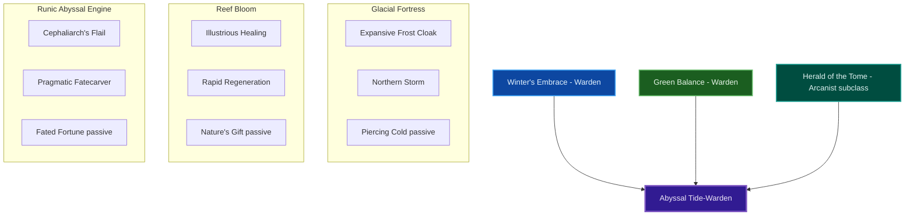
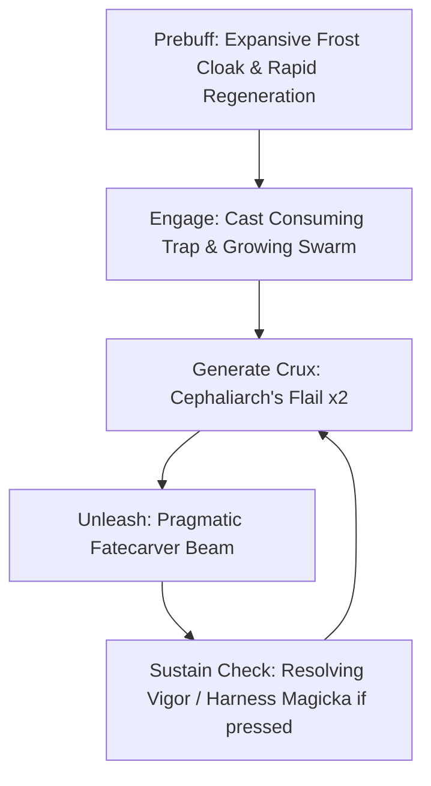
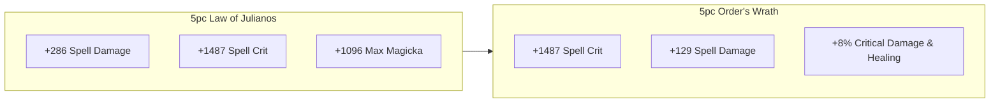

# Build Plan - Lei-Tun: Abyssal Tide-Warden (Solo Magicka Warden)

> **Character profile:** [lei_tun.md](lei_tun.md) — Level 41 Khajiit Warden, CP 1029, @SOLAEGIS (NA Megaserver).

Lei-Tun is an **Abyssal Tide-Warden**, a Khajiit nature-binder stationed along the shimmering coastlines of Summerset. Grounded in native Warden frost preservation (**Winter's Embrace**) and reef restoration flora (**Green Balance**), she embraces the ancient runic secrets of the deep through an Arcanist subclass line (**Herald of the Tome**). By fusing frozen coastal winds, tidal bloom heals, and abyssal beam damage, she cleanses sea-side corruption and defends the Pearl Coast against abyssal horrors.

Designed for high-critical solo overland and veteran arena combat, this build pairs 100% craftable gear (**Law of Julianos** and **Order's Wrath**) to exploit the Khajiit *Feline Ambush* racial passive, yielding overwhelming critical damage and sustained healing through damage.

---

## Build at a glance

| **Attribute** | **Recommendation** |
| :--- | :--- |
| **Primary Stat** | 64 points in **Magicka** — **live:** 51 Mag / 0 Health / 0 Stam (1 unspent) · **target:** 64 Magicka (CP160) |
| **Mundus Stone** | **The Shadow** — +11% Critical Damage & Critical Healing; **live:** The Shadow (equipped) |
| **Vampirism** | **N/A (Cleaned)** — Warden resource regeneration and frost armor thrive on living vitality |
| **Sets** | **Law of Julianos** (5pc) + **Order's Wrath** (5pc) + **Armor of the Trainee** (2pc) — 100% craftable · **live:** Trainee (5/5) + Shadow Dancer (2/5) · **target:** Julianos + Order's Wrath (CP160) |
| **Bars** | Front: Lightning Destruction Staff ("Abyssal Surge Bar") · Back: Restoration Staff ("Tidal Reef Restoration Bar") |
| **Food** | **Witchmother's Potent Brew** (+Max Magicka, +Max Health, +Magicka Recovery) |
| **Potion** | **Essence of Health (Tri-Stat)** or **Essence of Spell Power** (Spell Crit/Power/Magicka) |
| **Weapon Poisons** | None (Infused/Charged weapon enchantments active) |
| **Staff/Weapon Enchant** | Front: Flame Damage / Shock Damage Enchantment · Back: Weapon and Spell Damage Enchantment |
| **Companion** | **Primary (now):** **Ember** (Magicka DPS/Utility) at companion **1/20** · **Secondary:** **Azandar al-Cybiades** (Arcanist Lore) · **Goal (20/20 @ CP160):** **Sharp-as-Night** (Warden Frontline Tank) |
| **Primary Mount** | **Sapiarchic Senche-Serval** (owned) · **Ideal:** **Abyssal Quasigriff** — see [Collectibles](#collectibles) |
| **Flavor Pet** | **Abecean Ratter Cat** (owned) · **Ideal:** **Sea Sload Dorsal Fin** — see [Collectibles](#collectibles) |

**Read next:** [Roleplay](#roleplay-abyssal-tide-warden-of-alinor) · [Trinity configuration](#trinity-configuration) · [Combat kit](#combat-kit-the-abyssal-tide-cycle) · [Gear and crafting](#gear-and-crafting-rune-of-the-abyssal-tide) · [Champion points](#champion-point-mapping-cp-1029) · [Companion](#companion-strategy-guardians-of-the-coral-coast) · [Collectibles](#collectibles) · [Checklist](#next-steps--in-game-action-checklist)

---

## Roleplay: Abyssal Tide-Warden of Alinor

Born near the sun-drenched shores of southern Tamriel, Lei-Tun spent her youth wandering the coastal coves of Summerset, fascinated by the sea's twin aspects: its life-giving tidal blooms and its dark, crushing abyssal depths. When mysterious abyssal Geysers began erupting around Alinor, Lei-Tun answered the call, earning the honorific title *Abyssal Champion* by standing fast against creatures dredged from the trench floors.

Rather than rejecting the abyssal energy surrounding the oceanic trenches, Lei-Tun bound it into her Warden martial tradition. Through the **Herald of the Tome** subclassing discipline, she channels runic abyssal flails and energy beams alongside her frost barriers and restoration tides. She moves across the battlefield with feline grace, freezing incoming threats before unmaking them in a surge of eldritch green-blue light.

> [!TIP]
> **Suggested Custom Title:** `Abyssal Tide-Warden`

> [!NOTE]
> **Build Notes (paste into LAM Custom Title / Build Notes):**
> Lei-Tun — Abyssal Tide-Warden. High-crit solo Magicka Warden / Arcanist hybrid. 5 Law of Julianos + 5 Order's Wrath + 2 Armor of the Trainee, all craftable light/medium armor. Front (Destro): Expansive Frost Cloak, Cephaliarch's Flail, Pragmatic Fatecarver, Consuming Trap, Fetcherfly Nymph, Northern Storm ult. Back (Resto): Illustrious Healing, Rapid Regeneration, Resolving Vigor, Energy Orb, Harness Magicka, Healing Thicket ult. Subclassed Herald of the Tome (replacing Animal Companions) for abyssal runic beam DPS. 64 Magicka. Mundus: The Shadow (Crit Dmg). Companion: Ember now; Sharp-as-Night @ 20/20 goal tank. @masisi crafts all 12 slots.

> [!TIP]
> **Flavor Pet:** **Abecean Ratter Cat** from the character's Collectibles export. **Ideal (any source):** **Sea Sload Dorsal Fin** — see [Collectibles](#collectibles) for mount, pet, and dye details.

---

## Trinity configuration

By completing Bahtra at-Hunding's milestone quest **"A Study in Discipline"** at Level 50, Lei-Tun unlocks the **Uber Tier (Triple Hybrid)** architecture. Replace **Animal Companions** with **Herald of the Tome** to forge the abyssal-frost damage engine. See [docs/subclassing.md](../../../docs/subclassing.md) for the Solaegis Trinity / subclassing model.

| **Pillar** | **Line** | **Origin** | **Slot action** | **Function** |
| :--- | :--- | :--- | :--- | :--- |
| **Engine (Damage)** | **Herald of the Tome** | Arcanist (subclass) | **SUBCLASS** (replaces **Animal Companions**) | **Cephaliarch's Flail** Crux generator & heal; **Pragmatic Fatecarver** abyssal beam execution with damage shield |
| **Fortress (Defense)** | **Winter's Embrace** | Warden (native) | **KEEP** | **Expansive Frost Cloak** Major Resolve armor grant; **Northern Storm** AoE frost damage & mitigation ultimate |
| **Sustain (Healing)** | **Green Balance** + **Restoration Staff** | Warden (native) + weapon | **KEEP** | **Illustrious Healing** ground HOT; **Rapid Regeneration** passive HoT; **Healing Thicket** burst emergency ultimate |

---

## Combat kit: The Abyssal Tide Cycle

Open from distance on the back bar with armor and HoT buffs, apply debuffs and Crux with **Cephaliarch's Flail**, then melt incoming waves using **Pragmatic Fatecarver**. **Pure magicka** — all damage abilities scale off Maximum Magicka and Spell Power (64 Magicka attributes). **No Animal Companions active skills remain slotted** once **Herald of the Tome** completes the subclass integration.

### Skill bars

Document **slotted morph names as shown in the skills UI** (not unmorphed base or wiki-only labels). Each morph appears at most once across bars. Bars match equipped weapon types (Lightning Destruction Staff front, Restoration Staff back).

#### Front Bar (Lightning Staff): "Abyssal Surge Bar"

| **Slot** | **Class/Line** | **Base → Morph** | **Role** | **Profile** |
| :--- | :--- | :--- | :--- | :--- |
| **1** | Winter's Embrace | Frost Cloak → **Expansive Frost Cloak** | **Buff / Armor** (Major Resolve to self & allies) | Morph available |
| **2** | Herald of the Tome | Rune of Eldritch Blades → **Cephaliarch's Flail** | **Crux Generator / Debuff** (Stun, heal, generate Crux) | Subclass |
| **3** | Herald of the Tome | Fatecarver → **Pragmatic Fatecarver** | **Main Spammer / Shield** (Consumes Crux for massive AoE + shield) | Subclass |
| **4** | Soul Magic | Soul Trap → **Consuming Trap** | **Execute / Sustain** (Magicka & Health refund on target death) | Live (slotted) |
| **5** | Animal Companions / Guild | Swarm → **Growing Swarm** | **Single Target DoT / Vulnerability** | Morph available |
| **6 (Ult)** | Winter's Embrace | Sleet Storm → **Northern Storm** | **Burst Ultimate** (+Max Magicka passive, severe Frost AoE) | Morph available |

#### Back Bar (Restoration Staff): "Tidal Reef Restoration Bar"

| **Slot** | **Class/Line** | **Base → Morph** | **Role** | **Profile** |
| :--- | :--- | :--- | :--- | :--- |
| **1** | Restoration Staff | Grand Healing → **Illustrious Healing** | **Ground HoT** (Persistent coastal healing zone) | Morph available |
| **2** | Restoration Staff | Regeneration → **Rapid Regeneration** | **Targeted HoT** (Mobile HoT tick for self & companion) | Morph available |
| **3** | Alliance War Assault | Vigor → **Resolving Vigor** | **Stamina HoT / Armor** (Instant burst heal + Minor Resolve) | Live (slotted) |
| **4** | Undaunted | Necrotic Orb → **Energy Orb** | **Group Support / Sustain** (Magicka recovery & synergy) | Guild unlock |
| **5** | Light Armor | Annulment → **Harness Magicka** | **Panic Shield** (Damage shield + Magicka refund on hit) | Passive unlock |
| **6 (Ult)** | Green Balance | Secluded Grove → **Healing Thicket** | **Emergency Ultimate** (Instant massive team heal + lingering HoT) | Morph available |

### Rotation and combat tips

#### Solo combat tips

1. **Crux Management:** Always cast **Cephaliarch's Flail** twice to stack 2-3 Crux before channeling **Pragmatic Fatecarver**. The Crux consumption boosts beam damage by up to 72% and grants a protective damage shield during the channel.
2. **Resource Cycling:** Use **Consuming Trap** on trash mobs right before unleashing Fatecarver. When enemies die under Consuming Trap, your Magicka and Health refill instantly.
3. **Frost Cloak Uptime:** Keep **Expansive Frost Cloak** active constantly for +5948 Physical and Spell Resistance, ensuring maximum tankiness while channeling in melee range.

### Passive skills

You have **12 Skill Points** currently available (and will gain 20+ more ascending to Level 50). Spend in this priority order:

#### Warden — Winter's Embrace & Green Balance

* **Glacial Presence (II):** Increases Frost Status Effect chance and critical damage against Chilled enemies.
* **Frozen Armor (II):** Increases Physical and Spell Resistance for each Winter's Embrace skill slotted.
* **Accelerated Growth (II):** Grants Major Mending (+16% healing done) when healing low-health targets.
* **Nature's Gift (II):** Restores Magicka or Stamina whenever a Green Balance heal is applied.

#### Arcanist — Herald of the Tome (Subclass)

* **Fated Fortune (II):** Grants Major Indignation (+12% Critical Damage) when generating Crux.
* **Harnessed Quintessence (II):** Increases Spell Power when receiving a shield.

#### Weapon — Destruction & Restoration Staff

* **Tri Focus (II):** Heavy attacks restore Magicka; Frost staff block consumes Magicka.
* **Penetrating Magic (II):** Allows Destruction staff spells to bypass 2970 Spell Resistance.
* **Essence Drain (II):** Restoration staff heavy attacks heal for 30% of damage done and grant Major Mending.

#### Race — Khajiit

* **Feline Ambush (III):** Increases Critical Damage and Critical Healing by **12%**.
* **Lunar Blessings (III):** Increases Max Health, Max Magicka, and Max Stamina by 915.
* **Robustness (III):** Increases Health, Magicka, and Stamina Recovery by 100.

---

## Gear and crafting: "Rune of the Abyssal Tide"

All 12 gear pieces in the target loadout are **100% craftable** by account crafter `@masisi`. Pairing **Law of Julianos** with **Order's Wrath** delivers extreme raw spell power and multiplies Khajiit's natural critical strike bonuses.

### Set rationale

| **Set** | **5-Piece Bonus** | **Role in the Build** |
| :--- | :--- | :--- |
| **Law of Julianos** | Adds 300 Spell Damage & 1487 Crit Rating | Core spell power foundation for frost & abyssal damage |
| **Order's Wrath** | Adds 1487 Crit Rating & **+8% Critical Damage / Critical Healing** | Stacked with Khajiit *Feline Ambush* (+12%) and *The Shadow* (+11%) for +31% base crit damage! |
| **Armor of the Trainee** | Adds 1454 Max Health (2pc bonus) | Chest/Head interim filler for stat padding while leveling |

> [!NOTE]
> **Why not Mother's Sorrow or Bahraha's Curse?** Non-crafted overland/dungeon sets require farming; Order's Wrath is 100% craftable, provides matching Critical Rating, and includes an explicit +8% Critical Damage & Healing modifier that outperforms raw crit chance in solo content.

### Target loadout

| **Slot** | **Set** | **Weight** | **Trait** | **Enchantment** | **Quality** |
| :--- | :--- | :--- | :--- | :--- | :--- |
| **Head** | Order's Wrath | Light | Divines | Maximum Magicka | Superior / Epic |
| **Shoulders** | Order's Wrath | Medium | Divines | Maximum Magicka | Superior / Epic |
| **Chest** | Law of Julianos | Heavy | Divines | Maximum Magicka | Epic / Legendary |
| **Hands** | Law of Julianos | Light | Divines | Maximum Magicka | Superior / Epic |
| **Waist** | Order's Wrath | Light | Divines | Maximum Magicka | Superior / Epic |
| **Legs** | Law of Julianos | Light | Divines | Maximum Magicka | Superior / Epic |
| **Feet** | Order's Wrath | Light | Divines | Maximum Magicka | Superior / Epic |
| **Neck** | Law of Julianos | Jewelry | Arcane | Magicka Recovery | Superior / Epic |
| **Ring 1** | Law of Julianos | Jewelry | Arcane | Spell Damage | Superior / Epic |
| **Ring 2** | Order's Wrath | Jewelry | Arcane | Spell Damage | Superior / Epic |
| **Front Staff** | Law of Julianos | Light (Lightning) | Precise | Flame Damage Enchantment | Epic / Legendary |
| **Back Staff** | Order's Wrath | Light (Restoration) | Infused | Weapon/Spell Damage Enchantment | Epic / Legendary |

**Front bar — Lightning Destruction Staff:** Maximizes AoE splash damage for **Pragmatic Fatecarver** and **Northern Storm**.

**Back bar — Restoration Staff:** Infused trait enhances the Weapon & Spell Damage enchantment buff by 30%, which carries over when swapping to the front bar.

### Crafting handoff (@masisi)

| **Detail** | **Recommendation** |
| :--- | :--- |
| **Style** | Sapiarch / Pyandonean (Summerset Oceanic theme) |
| **Set station** | Wrothgar (Julianos — 6 traits) & High Isle (Order's Wrath — 3 traits) |
| **Traits** | 7 Divines (Armor) / 3 Arcane (Jewelry) / Precise & Infused (Staves) |
| **Interim (pre-CP160)** | Maintain current Trainee 5pc until Level 50 / CP160 respec phase |
| **Quality path** | Purple (Epic) weapons & armor at CP160; Gold (Legendary) weapon upgrade when traits verified |

> [!NOTE]
> **Research gate:** Coordinate with @masisi before gold-quality CP160 crafting work. See [`masisi.md`](masisi.md) for account crafter trait availability.

---

## Champion Point Mapping (CP 1029)

Full CP budget: **343 Warfare / 343 Fitness / 343 Craft** (1029 total account CP). At CP 1029 (900+ threshold), Lei-Tun unlocks **4 slotted stars per constellation**.

### Warfare (Blue — 343 Points)

| **Slotted Star** | **Spend** | **Benefit** |
| :--- | :--- | :--- |
| **Wrathful Strikes** | 50 pts | +205 Weapon and Spell Damage |
| **Deadly Aim** | 50 pts | +6% Single Target Damage |
| **Biting Aura** | 50 pts | +6% Area of Effect Damage |
| **Master-at-Arms** | 50 pts | +6% Direct Damage |

**Passives (no slot needed — 143 points):**

* **Precision (20/20):** +657 Critical Chance
* **Piercing (20/20):** +700 Armor Penetration
* **Eldritch Insight (20/20):** +520 Max Magicka
* **Preparation (20/20):** Reduces damage taken from non-players by 10%
* **Tireless Discipline (40/40):** +1400 Max Stamina
* **Battle Mastery (23/40):** +57 Status Effect Chance

### Fitness (Red — 343 Points)

| **Slotted Star** | **Spend** | **Benefit** |
| :--- | :--- | :--- |
| **Boundless Vitality** | 50 pts | +1400 Max Health |
| **Rejuvenation** | 50 pts | +410 Magicka and Stamina Recovery |
| **Fortified** | 50 pts | +1731 Armor |
| **Celerity** | 50 pts | +10% Movement Speed |

**Passives (no slot needed — 143 points):**

* **Hero's Vigor (20/20):** +560 Max Health
* **Mystic Tenacity (20/20):** Reduces effectiveness of status effects applied to you
* **Defiance (20/20):** Reduces Break Free cost by 110 Stamina
* **Tumbling (30/30):** Reduces Dodge Roll cost by 240 Stamina
* **Sprinter (20/20):** Reduces Sprint cost by 120 Stamina
* **Savage Defense (30/30):** Reduces Bash cost by 90 Stamina
* **Hasty (3/16):** Increases Sprint movement speed by 1%

### Craft (Green — 343 Points)

| **Slotted Star** | **Spend** | **Benefit** |
| :--- | :--- | :--- |
| **Steed's Blessing** | 50 pts | +20% Movement Speed out of combat |
| **Treasure Hunter** | 50 pts | Increases quality of items found in treasure chests |
| **Master Gatherer** | 75 pts | Reduces harvesting time by 50% (equipped in live export) |
| **Gifted Rider** | 50 pts | +10% Mount Speed |

**Passives (no slot needed — 118 points):**

* **Gilded Fingers (50/50):** +10% Gold Earned
* **Fortune's Favor (50/50):** +10% Gold found in chests
* **Steadfast Enchantment (10/50):** Reduces weapon enchantment decay by 10%
* **Wanderer (8/50):** Reduces Wayshrine travel cost by 8%

---

## Companion Strategy: "Guardians of the Coral Coast"

Companion gear is **separate from player gear** — companions equip **Companion's** weapons, armor, and jewelry with **companion-only traits** (Quickened, Bolstered, Aggressive). No player set bonuses apply to companions.

> [!NOTE]
> **Live export:** **Ember** active — Level **1/20**, default basic gear. Character **Level 41 / CP 1029**.

### Companion picks

| **Tier** | **Companion** | **Role** | **Roleplay fit** | **Mechanical fit (at current stats)** |
| :--- | :--- | :--- | :--- | :--- |
| **Primary (now)** | **Ember** | Magicka DPS / Utility | Chaotic Khajiiti companion riding alongside Lei-Tun in Summerset | Provides lightning AoE damage and execute support while leveling |
| **Secondary** | **Azandar al-Cybiades** | Scholarly Buffer | Arcanist scholar interested in abyssal runic magic | Grants Minor Vulnerability & shields; ideal when testing subclass lines |
| **Goal (20/20 @ CP160)** | **Sharp-as-Night** | Frontline Tank | Fellow coastal wanderer with Warden nature magic roots | Holds aggro, taunts bosses, and grants shields so Lei-Tun can channel Fatecarver uninterrupted |

### Goal companion — Sharp-as-Night: Tidal Sentinel

Sharp-as-Night acts as the ultimate frontline anchor for Lei-Tun. Equipped in heavy companion armor, he holds dangerous boss threats stationary, allowing Lei-Tun's **Pragmatic Fatecarver** beam to melt entire groups without taking direct hits.

| **Setting** | **Recommendation** |
| :--- | :--- |
| **Role** | Tank / Crowd Control |
| **Gear Weight** | 7/7 Heavy Companion Armor |
| **Gear Trait** | **Bolstered** (+Armor) & **Quickened** (-Cooldowns) |
| **Loadout** | Full Heavy Companion Armor + **Companion's One Hand and Shield** (all companion-only items) |
| **Acquisition** | Merchant whites from armorers; **Superior+** Bolstered drops while Sharp is active |

#### Sharp-as-Night's support skill bar (goal @ 20/20)

1. **Provoke:** Heavy Armor. Taunts target for 15s and grants Sharp a damage shield.
2. **Swoop:** Animal Companions. Off-balance debuff and physical damage.
3. **Petal Fissure:** Green Balance. Roots enemies in front of him.
4. **Infusion:** Restoring Shadow. Grants direct heal to Lei-Tun when health drops below 75%.
5. **Snow Squall:** Winter's Embrace. Self-heal and armor boost for Sharp.
6. *Ultimate:* **Gore** — High burst damage and knockback on target.

### Primary now — Ember

Ember is currently unlocked and active at Level 1. Keep Ember summoned during overland questing in Summerset to build companion XP and acquire **Superior+ Companion's gear drops**.

---

## Collectibles

### Mount

Summerset travel demands an agile, majestic feline mount that reflects High Elven nobility and Khajiiti grace.

#### Primary (owned): Sapiarchic Senche-Serval

| **Attribute** | **Detail** |
| :--- | :--- |
| **Why** | Bred by the Sapiarchs of Lillandril; absolute best thematic match for a Summerset Khajiit Tide-Warden |
| **Acquisition** | Owned ✅ (from profile export) |
| **Dye pass** | Natural gold-spotted coat matching Alinor marble architecture |

#### Other owned options

| **Mount** | **Owned** | **Why** |
| :--- | :--- | :--- |
| **Noble Riverhold Senche-Lion** | ✅ | Traditional Anequina feline mount; regal stance |
| **Flame Atronach Senche** | ✅ | High-contrast elemental mount for abyssal boss fights |

#### Avoid thematically

| **Mount type** | **Reason** |
| :--- | :--- |
| **Dwarven / Ebon Dwarven Horse** | Mechanical brass mounts clash with Warden floral/frost nature magic |

> [!TIP]
> **Ideal mount (any source):** **Abyssal Quasigriff** — The ultimate sea-and-sky apex mount for an Abyssal Champion in Summerset. **Acquisition:** Crown Store / Event tickets.

### Pet

Vanity pets provide visual flavor alongside Lei-Tun.

#### Primary (owned): Abecean Ratter Cat

| **Attribute** | **Detail** |
| :--- | :--- |
| **Why** | Famous coastal ship cat of the Abecean Sea; perfect lore companion for an Alinor coast guardian |
| **Acquisition** | Owned ✅ (from profile export) |

#### Other owned options

| **Pet** | **Why** |
| :--- | :--- |
| **Verdigris Haj Mota** (owned) | Aquatic sea-reptile familiar reflecting Summerset reef life |
| **Dusky Fennec Fox** (owned) | Agile desert-coastal fox companion |

> [!TIP]
> **Ideal pet (any source):** **Sea Sload Dorsal Fin** or **Wormwrithe Haj Mota Hatchling**. **Acquisition:** Summerset achievements / Crown Crates.

### Dye and style

**Visual Theme: "Seafoam Frost & Abyssal Runic Armor"**

| **Slot** | **Style** | **Visual reasoning** |
| :--- | :--- | :--- |
| **Head** | Hide Your Helm | Show Lei-Tun's feline features and Abyssal face markings |
| **Chest** | Sapiarch Light Jerkin | Elegant High Elven weave with oceanic trim |
| **Shoulders** | Pyandonean Epaulets | Sea-elf scaled shoulders fitting coastal duty |
| **Hands / Feet** | Warden Outfit Leathers | Reinforced natural leather for field mobility |

**Dye palette:** Seafoam White (Primary), Marine Blue (Secondary), Abyssal Turquoise (Accent).

---

## Next Steps & In-Game Action Checklist

Follow this transition list to unlock the full power of **Lei-Tun**. Gear progression phases are **labeled inline**.

### Phase 0 — Today (functional build)

1. **Spend Attribute Points:** Allocate all 64 attribute points into **Magicka** (spend the 1 unspent point from live export).
2. **Assign Champion Points:** Spend CP budget per [Champion Point Mapping](#champion-point-mapping-cp-1029) (343 Warfare, 343 Fitness, 343 Craft). Equip **Wrathful Strikes**, **Deadly Aim**, **Biting Aura**, and **Master-at-Arms** in Warfare.
3. **Verify Mundus:** Confirm **The Shadow** stone is active at the Alinor or Vulkwasten Mundus site.

### Phase 1 — Craft (interim)

4. **[Phase 1]** Continue wearing current 5/5 **Armor of the Trainee** set while ascending from Level 41 to Level 50.
5. **[Phase 1]** Morph **Frost Cloak** → **Expansive Frost Cloak** and **Scorch** → **Deep Fissure**.

### Phase 2 — Craft (target)

6. **[Phase 2]** Upon reaching Level 50 / CP160, send crafting request to `@masisi` for 5pc **Law of Julianos** + 5pc **Order's Wrath** + 2pc **Armor of the Trainee** per [Target loadout](#target-loadout).
7. **[Phase 2]** Equip target Light Lightning Staff on front bar and Restoration Staff on back bar.

### Phase 3 — Polish

8. **[Phase 3]** Complete Bahtra at-Hunding's milestone quest **"A Study in Discipline"** at Level 50 to unlock Arcanist **Herald of the Tome** subclassing.
9. **[Phase 3]** Slot **Cephaliarch's Flail** and **Pragmatic Fatecarver** on the front bar in place of Animal Companions skills.
10. **[Phase 3]** Upgrade front Lightning Staff to Gold (Legendary) quality.

### Finish

11. **Companion:** Run **Ember** during current leveling; unlock and train **Sharp-as-Night** as goal 20/20 tank companion; acquire Bolstered **Companion's** heavy armor pieces from drops.
12. **Regenerate profile:** Run `/markdown` in-game and update [lei_tun.md](lei_tun.md) when the build is live.

*May the abyssal tides carry Lei-Tun to victory across the shores of Alinor!*

---

## Appendix: Champion Point star catalog

All Warfare, Fitness, and Craft stars with constellation, type (Slottable/Passive), max points, and stage costs:

**[`champion_points_reference.md`](../../templates/champion_points_reference.md)**
