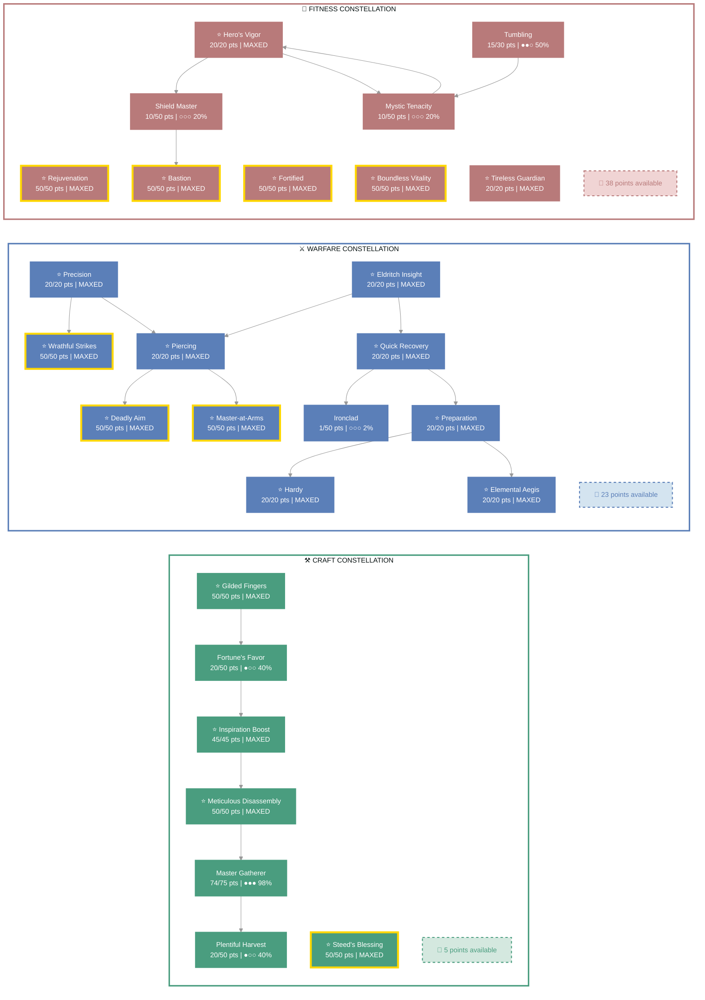

# Masisi (Style Master)

   

**Imperial Dragonknight • Ebonheart Pact Alliance**

---

## 📑 Table of Contents

- [📋 Overview](#overview)
  - [General](#general)
  - [Currency](#currency)
- [📝 Build Notes](#build-notes)
- [⚔️ Combat Arsenal](#combat-arsenal)
  - [Character Stats](#character-stats)
  - [Advanced Stats](#advanced-stats)
- [⚔️ PvP](#pvp)
  - [Alliance War Skills](#alliance-war-skills)
- [👥 Companions](#companions)
- [🎨 Collectibles](#collectibles)
- [🎒 Inventory](#inventory)
- [🏆 Achievements](#achievements)
- [⚒️ Crafting Knowledge](#crafting-knowledge)
- [🧥 Outfit Styles](#outfit-styles)
- [🏰 Guild Membership](#guild-membership)

---

## 📋 Overview

### General

| **Attribute**       | **Value**   |
| ------------------- | ----------- |
| **Level**           | 50          |
| **Champion Points** | 941         |
| **Gender**          | Male        |
| **Account**         | @SOLAEGIS   |
| **ESO Plus**        | ✅ Active    |
| **Age**             | 20d 18h 52m |

| **Attribute**                 | **Value**                                                    |
| ----------------------------- | ------------------------------------------------------------ |
| **Attributes**                | 🔵 0 / ❤️ 0 / ⚡ 64                                             |
| **Available Champion Points** | ⚒️ 5 - ⚔️ 23 - 💪 38                                            |
| **🐴 Riding Skills**           | 🐴 60 / 💪 60 / 🎒 60 ✅                                         |
| **Skill Points**              | 🎯 2 available - Ready to spend                               |
| **Race**                      | [Imperial](https://en.uesp.net/wiki/Online:Imperial)         |
| **Title**                     | [Style Master](https://en.uesp.net/wiki/Online:Style_Master) |

| **Attribute**      | **Value**                                                                                                                                                                                                                   |
| ------------------ | --------------------------------------------------------------------------------------------------------------------------------------------------------------------------------------------------------------------------- |
| **Server**         | [NA Megaserver](https://en.uesp.net/wiki/Online:Megaservers)                                                                                                                                                                |
| **Class**          | [Dragonknight](https://en.uesp.net/wiki/Online:Dragonknight)                                                                                                                                                                |
| **Location**       | [Summerset](https://en.uesp.net/wiki/Online:Summerset) (Alinor)                                                                                                                                                             |
| **Alliance**       | [Ebonheart Pact](https://en.uesp.net/wiki/Online:Ebonheart_Pact)                                                                                                                                                            |
| **🪨 Mundus Stone** | [The Steed](https://en.uesp.net/wiki/Online:The_Steed_(Mundus_Stone))                                                                                                                                                       |
| **🍖 Active Buffs** | Other: [Noxiphilic Sanguivoria](https://en.uesp.net/wiki/Online:Noxiphilic_Sanguivoria), [Major Prophecy](https://en.uesp.net/wiki/Online:Major_Prophecy), [Major Savagery](https://en.uesp.net/wiki/Online:Major_Savagery) |

### Currency

| **Attribute**            | **Value** |
| ------------------------ | --------- |
| 💰 **Gold**               | 10,000    |
| ⚔️ **Alliance Points**    | 6,500     |
| 🔮 **Tel Var**            | 7,500     |
| 💎 **Transmute Crystals** | 352       |
| 📜 **Writs**              | 0         |
| 🎫 **Event Tickets**      | 0         |
| 👑 **Crowns**             | 20,500    |
| 💠 **Gems**               | 184       |
| 🏅 **Seals**              | 16,105    |
| 🗝️ **Keys**               | 11        |
| 👕 **Tokens**             | 6         |
| 📚 **Fortunes**           | 0         |
| 🔹 **Fragments**          | 148       |

---

## 📝 Build Notes

## Masisi, *the Gilded Harvester*

**"Fortune favors the prepared... and the swift."**

Born in the Nibenay Basin to a family of Imperial merchants, Masisi learned
early that wealth flows not from combat prowess, but from knowing *what* to
take and *when* to move. While his kin haggled in marketplaces, young Masisi
studied the flow of resources—tracking caravans, mapping harvest seasons, and
memorizing the price of every commodity from Daggerfall to Mournhold.

When Molag Bal's Planemeld threatened Tamriel, Masisi didn't rush to the
frontlines. Instead, he **capitalized**. While heroes fought Daedra, he
harvested the untended fields they left behind. While armies sieged keeps,
he looted the supply routes they abandoned. By war's end, Masisi had amassed
a fortune—not through bloodshed, but through **opportunity**.

Now, the *Gilded Harvester* roams Summerset's pristine shores, moving like
shadow through Alinor's gardens and workshop districts. His hands bear the
calluses of a thousand harvests; his pouches jingle with the spoils of
unguarded nodes and "misplaced" treasures. The Thalmor post guards, but
Masisi is always three steps ahead—literally.

**Dragonknight by birth, entrepreneur by choice**, Masisi wields his magicka
not for destruction, but for *distraction*. A well-placed wall of flame here,
a molten shield there—just enough chaos to slip away with his prize. He's
no hero. He's no villain. He's simply the most efficient farmer in Tamriel.

Some call him a thief. Others, a scavenger. Masisi prefers **"resource
optimization specialist."**

After all, *someone* has to supply the heroes with their gear.

**Specialties**: Speed farming, survey exploitation, crafting writ automation
**Philosophy**: "Why fight dragons when you can sell dragonscale?"

---

## ⚔️ Combat Arsenal

### Character Stats

| **Category**    | **Stat**     | **Value** |
| --------------- | ------------ | --------: |
| 💚 **Resources** | Health       |    19,960 |
|                 | Magicka      |    13,578 |
|                 | Stamina      |    22,989 |
| ⚔️ **Offensive** | Weapon Power |     2,430 |
|                 | Spell Power  |     2,430 |

| **Category**      | **Stat**    |     **Value** |
| ----------------- | ----------- | ------------: |
| 🎯 **Critical**    | Weapon Crit | 7,078 (32.3%) |
|                   | Spell Crit  | 7,078 (32.3%) |
| ⚔️ **Penetration** | Physical    |           700 |
|                   | Spell       |           700 |

| **Category**    | **Stat**        |      **Value** |
| --------------- | --------------- | -------------: |
| 🛡️ **Defensive** | Physical Resist | 12,543 (83.3%) |
|                 | Spell Resist    | 12,543 (83.3%) |
| ♻️ **Recovery**  | Health          |            637 |
|                 | Magicka         |            852 |
|                 | Stamina         |          1,117 |

### Advanced Stats

| **Ability**        |               **Cost/Value** |
| :----------------- | ---------------------------: |
| ⚔️ **Light Attack** |                    3,349 dmg |
| ⚔️ **Heavy Attack** |                    6,699 dmg |
| ⚔️ **Bash**         |          719 cost, 4,878 dmg |
| 🛡️ **Block**        | 1,117 cost, 50% mit, 40% spd |
| 🔓 **Break Free**   |                   5,076 cost |
| 🏃 **Dodge Roll**   |                   1,705 cost |
| 🐾 **Sneak**        |              26 cost, 0% spd |
| 🏃‍♂️ **Sprint**       |             290 cost, 0% spd |

| **Resistance** | **Value** |
| :------------- | --------: |
| 🔥 **Flame**    |       19% |
| ⚡ **Shock**    |       19% |
| ❄️ **Frost**    |       19% |
| 🔮 **Magic**    |       19% |
| 🦠 **Disease**  |       19% |
| ☠️ **Poison**   |       19% |
| 🩸 **Bleed**    |       19% |

| **Damage Type**       | **Bonus** |
| :-------------------- | --------: |
| 💥 **Critical Damage** |       64% |
| ⚔️ **Physical**        |        6% |
| 🔥 **Flame**           |        6% |
| ⚡ **Shock**           |        6% |
| ❄️ **Frost**           |         0 |
| 🔮 **Magic**           |        6% |
| 🦠 **Disease**         |        6% |
| ☠️ **Poison**          |        6% |
| 🩸 **Bleed**           |        6% |
| 🌌 **Oblivion**        |        6% |

| **Healing**            | **Value** |
| :--------------------- | --------: |
| 💚 **Healing Done**     |         0 |
| 💖 **Healing Taken**    |         0 |
| ✨ **Critical Healing** |       64% |

## ⚔️ Combat Arsenal

### ⚔️ ⚔️ ⚔️ Front Bar (Main Hand)

|                       **1**                        |                            **2**                             |                          **3**                           |                     **4**                      |                           **5**                            |
| :------------------------------------------------: | :----------------------------------------------------------: | :------------------------------------------------------: | :--------------------------------------------: | :--------------------------------------------------------: |
| [Inferno](https://en.uesp.net/wiki/Online:Inferno) | [Dragon Blood](https://en.uesp.net/wiki/Online:Dragon_Blood) | [Wield Soul](https://en.uesp.net/wiki/Online:Wield_Soul) | [Vigor](https://en.uesp.net/wiki/Online:Vigor) | [Dragon Leap](https://en.uesp.net/wiki/Online:Dragon_Leap) |

### 🔮 🔮 🔮 Back Bar (Backup)

|                     **1**                      |                              **2**                               |                      **3**                       |                                 **4**                                  |                               **5**                                |                           **6**                            |
| :--------------------------------------------: | :--------------------------------------------------------------: | :----------------------------------------------: | :--------------------------------------------------------------------: | :----------------------------------------------------------------: | :--------------------------------------------------------: |
| [Vigor](https://en.uesp.net/wiki/Online:Vigor) | [Molten Weapons](https://en.uesp.net/wiki/Online:Molten_Weapons) | [Volley](https://en.uesp.net/wiki/Online:Volley) | [Dragonfire Breath](https://en.uesp.net/wiki/Online:Dragonfire_Breath) | [Obsidian Shield](https://en.uesp.net/wiki/Online:Obsidian_Shield) | [Magma Armor](https://en.uesp.net/wiki/Online:Magma_Armor) |

---

## ⚔️ Equipment & Active Sets

| **Set**                                                                                    | **Progress**                       |
| ------------------------------------------------------------------------------------------ | ---------------------------------- |
| 🟢 **[Night's Silence Set](https://en.uesp.net/wiki/Online:Night's_Silence_Set)**           | `5/5` ██████████ 100% *(+2 extra)* |
| ⚪ **[Dead-Water's Guile Set](https://en.uesp.net/wiki/Online:Dead-Water's_Guile_Set)**     | `1/5` ██░░░░░░░░ 20%               |
| 🟢 **[Armor of the Seducer Set](https://en.uesp.net/wiki/Online:Armor_of_the_Seducer_Set)** | `5/5` ██████████ 100%              |

### 📋 Equipment Details

| **Slot**               | **Item**                    | **Set**                                                                              | **Quality** | **Trait**   | **Type**           | **Enchantment**              |
| ---------------------- | --------------------------- | ------------------------------------------------------------------------------------ | ----------- | ----------- | ------------------ | ---------------------------- |
| ⛑️ **Head**             | Helmet of Night's Silence   | [Night's Silence Set](https://en.uesp.net/wiki/Online:Night's_Silence_Set)           | ⭐ Epic      | Well-fitted | Medium • ⚒️ Crafted | -                            |
| 💎 **Neck**             | Dead-Water's Guile Necklace | [Dead-Water's Guile Set](https://en.uesp.net/wiki/Online:Dead-Water's_Guile_Set)     | 🔮 Superior  | Robust      | None               | Stamina Recovery Enchantment |
| 🛡️ **Chest**            | Jack of Night's Silence     | [Night's Silence Set](https://en.uesp.net/wiki/Online:Night's_Silence_Set)           | ⭐ Epic      | Well-fitted | Medium • ⚒️ Crafted | -                            |
| 👑 **Shoulders**        | Arm Cops of Night's Silence | [Night's Silence Set](https://en.uesp.net/wiki/Online:Night's_Silence_Set)           | ⭐ Epic      | Well-fitted | Medium • ⚒️ Crafted | -                            |
| ⚔️ **Main Hand**        | Dagger of Night's Silence   | [Night's Silence Set](https://en.uesp.net/wiki/Online:Night's_Silence_Set)           | 👑 Legendary | Sharpened   | None • ⚒️ Crafted   | -                            |
| 🛡️ **Off Hand**         | Dagger of Night's Silence   | [Night's Silence Set](https://en.uesp.net/wiki/Online:Night's_Silence_Set)           | 👑 Legendary | Precise     | None • ⚒️ Crafted   | -                            |
| ⚡ **Waist**            | Belt of the Seducer         | [Armor of the Seducer Set](https://en.uesp.net/wiki/Online:Armor_of_the_Seducer_Set) | ⭐ Epic      | Well-fitted | Medium • ⚒️ Crafted | -                            |
| 👖 **Legs**             | Guards of Night's Silence   | [Night's Silence Set](https://en.uesp.net/wiki/Online:Night's_Silence_Set)           | ⭐ Epic      | Well-fitted | Medium • ⚒️ Crafted | -                            |
| 👟 **Feet**             | Boots of Night's Silence    | [Night's Silence Set](https://en.uesp.net/wiki/Online:Night's_Silence_Set)           | ⭐ Epic      | Well-fitted | Medium • ⚒️ Crafted | -                            |
| 💍 **Ring 1**           | Ring of the Seducer         | [Armor of the Seducer Set](https://en.uesp.net/wiki/Online:Armor_of_the_Seducer_Set) | ⭐ Epic      | Infused     | None • ⚒️ Crafted   | -                            |
| 💍 **Ring 2**           | Ring of the Seducer         | [Armor of the Seducer Set](https://en.uesp.net/wiki/Online:Armor_of_the_Seducer_Set) | ⭐ Epic      | Infused     | None • ⚒️ Crafted   | -                            |
| ✋ **Hands**            | Bracers of the Seducer      | [Armor of the Seducer Set](https://en.uesp.net/wiki/Online:Armor_of_the_Seducer_Set) | ⭐ Epic      | Well-fitted | Medium • ⚒️ Crafted | -                            |
| 🔮 **Backup Main Hand** | Bow of the Seducer          | [Armor of the Seducer Set](https://en.uesp.net/wiki/Online:Armor_of_the_Seducer_Set) | ⭐ Epic      | Infused     | None • ⚒️ Crafted   | -                            |

---

## ⭐ Champion Points

| **Total** | **Spent** | **Available** |
| :-------: | :-------: | :-----------: |
|    941    |    875    |      66       |

> ✨ **Enlightened** - 0 XP bonus remaining

| **⚒️ Craft**                                                                          | **Assigned Points** |
| ------------------------------------------------------------------------------------ | ------------------: |
| ███████████░ 98%                                                                     |      309/314 points |
| **[Master Gatherer](https://en.uesp.net/wiki/Online:Master_Gatherer)**               |           74 points |
| **[Plentiful Harvest](https://en.uesp.net/wiki/Online:Plentiful_Harvest)**           |           20 points |
| **[Meticulous Disassembly](https://en.uesp.net/wiki/Online:Meticulous_Disassembly)** |           50 points |
| **[Inspiration Boost](https://en.uesp.net/wiki/Online:Inspiration_Boost)**           |           45 points |
| **[Fortune's Favor](https://en.uesp.net/wiki/Online:Fortune's_Favor)**               |           20 points |
| **[Gilded Fingers](https://en.uesp.net/wiki/Online:Gilded_Fingers)**                 |           50 points |
| **[Steed's Blessing](https://en.uesp.net/wiki/Online:Steed's_Blessing)**             |           50 points |

| **⚔️ Warfare**                                                            | **Assigned Points** |
| ------------------------------------------------------------------------ | ------------------: |
| ███████████░ 92%                                                         |      291/314 points |
| **[Precision](https://en.uesp.net/wiki/Online:Precision)**               |           20 points |
| **[Piercing](https://en.uesp.net/wiki/Online:Piercing)**                 |           20 points |
| **[Master-at-Arms](https://en.uesp.net/wiki/Online:Master-at-Arms)**     |           50 points |
| **[Deadly Aim](https://en.uesp.net/wiki/Online:Deadly_Aim)**             |           50 points |
| **[Wrathful Strikes](https://en.uesp.net/wiki/Online:Wrathful_Strikes)** |           50 points |
| **[Quick Recovery](https://en.uesp.net/wiki/Online:Quick_Recovery)**     |           20 points |
| **[Ironclad](https://en.uesp.net/wiki/Online:Ironclad)**                 |             1 point |
| **[Preparation](https://en.uesp.net/wiki/Online:Preparation)**           |           20 points |
| **[Elemental Aegis](https://en.uesp.net/wiki/Online:Elemental_Aegis)**   |           20 points |
| **[Hardy](https://en.uesp.net/wiki/Online:Hardy)**                       |           20 points |
| **[Eldritch Insight](https://en.uesp.net/wiki/Online:Eldritch_Insight)** |           20 points |

| **💪 Fitness**                                                                | **Assigned Points** |
| ---------------------------------------------------------------------------- | ------------------: |
| ██████████░░ 87%                                                             |      275/313 points |
| **[Hero's Vigor](https://en.uesp.net/wiki/Online:Hero's_Vigor)**             |           20 points |
| **[Shield Master](https://en.uesp.net/wiki/Online:Shield_Master)**           |           10 points |
| **[Bastion](https://en.uesp.net/wiki/Online:Bastion)**                       |           50 points |
| **[Mystic Tenacity](https://en.uesp.net/wiki/Online:Mystic_Tenacity)**       |           10 points |
| **[Tireless Guardian](https://en.uesp.net/wiki/Online:Tireless_Guardian)**   |           20 points |
| **[Tumbling](https://en.uesp.net/wiki/Online:Tumbling)**                     |           15 points |
| **[Rejuvenation](https://en.uesp.net/wiki/Online:Rejuvenation)**             |           50 points |
| **[Fortified](https://en.uesp.net/wiki/Online:Fortified)**                   |           50 points |
| **[Boundless Vitality](https://en.uesp.net/wiki/Online:Boundless_Vitality)** |           50 points |

### 🎯 Champion Points Visual

```mermaid
%%{init: {"theme":"base", "themeVariables": { "background":"transparent","fontSize":"12px","primaryColor":"#f0f0f0","primaryTextColor":"#333","primaryBorderColor":"#999","lineColor":"#999"}}}%%

flowchart LR

  subgraph subLEGEND["📖 LEGEND & VISUAL GUIDE"]

    LEG_STARS["Star Types"]
    LEG_S1["⭐ Gold Border = Maxed Slottable"]
    LEG_S2["🔶 Orange Border = Independent Star"]
    LEG_S3["Standard Border = In Progress"]

    LEG_FILL["Progress Indicators"]
    LEG_F1["⭐ = 100% Maxed"]
    LEG_F2["●●● = 75-99%"]
    LEG_F3["●●○ = 50-74%"]
    LEG_F4["●○○ = 25-49%"]
    LEG_F5["○○○ = 1-24%"]

    LEG_STARS --> LEG_S1 & LEG_S2 & LEG_S3
    LEG_FILL --> LEG_F1 & LEG_F2 & LEG_F3 & LEG_F4 & LEG_F5

    style LEG_STARS fill:transparent,stroke:none,color:#ccc
    style LEG_FILL fill:transparent,stroke:none,color:#ccc
    style LEG_S1 fill:#fff,stroke:#ffd700,stroke-width:3px,color:#333
    style LEG_S2 fill:#fff,stroke:#ff8c00,stroke-width:3px,color:#333
    style LEG_S3 fill:#fff,stroke:#999,stroke-width:2px,color:#333
    style LEG_F1 fill:#eee,stroke:#333,stroke-width:1px,color:#333
    style LEG_F2 fill:#eee,stroke:#333,stroke-width:1px,color:#333
    style LEG_F3 fill:#eee,stroke:#333,stroke-width:1px,color:#333
    style LEG_F4 fill:#eee,stroke:#333,stroke-width:1px,color:#333
    style LEG_F5 fill:#eee,stroke:#333,stroke-width:1px,color:#333
  end
  style subLEGEND fill:transparent,stroke:#999,stroke-width:3px
```

---

## 📜 Character Progress

### Progress Overview

| **Maxed Skill Lines** | **In Progress** | **Early Progress** | **Abilities with Morphs** | **Overall Completion** |
| --------------------: | --------------: | -----------------: | ------------------------: | ---------------------: |
|                     0 |               0 |                  0 |                         0 |                     0% |

🌿 Detailed Skill Morphs

*No morphable abilities found.*

---

---

## ⚔️ PvP

### PvP Profile

#### Alliance War Status

| **Category**    | **Value**                  |
| --------------- | -------------------------- |
| Rank            | Volunteer Grade 2 (Rank 2) |
| Alliance Points | 6,500                      |

---

## 👥 Companions

### Available Companions

- [Azandar al-Cybiades](https://en.uesp.net/wiki/Online:Azandar_al-Cybiades)
- [Bastian Hallix](https://en.uesp.net/wiki/Online:Bastian_Hallix)
- [Ember](https://en.uesp.net/wiki/Online:Ember)
- [Isobel Veloise](https://en.uesp.net/wiki/Online:Isobel_Veloise)
- [Mirri Elendis](https://en.uesp.net/wiki/Online:Mirri_Elendis)
- [Sharp-as-Night](https://en.uesp.net/wiki/Online:Sharp-as-Night)
- [Tanlorin](https://en.uesp.net/wiki/Online:Tanlorin)
- [Zerith-var](https://en.uesp.net/wiki/Online:Zerith-var)

### Active Companion

#### 🧙 [Tanlorin](https://en.uesp.net/wiki/Online:Tanlorin)

#### Front Bar

|                                 **1**                                  |                             **2**                              |                                **3**                                 |                             **4**                              |                      **5**                       |  **⚡**  |
| :--------------------------------------------------------------------: | :------------------------------------------------------------: | :------------------------------------------------------------------: | :------------------------------------------------------------: | :----------------------------------------------: | :-----: |
| [Internal Conflict](https://en.uesp.net/wiki/Online:Internal_Conflict) | [Volcanic Arms](https://en.uesp.net/wiki/Online:Volcanic_Arms) | [Shattered Spirit](https://en.uesp.net/wiki/Online:Shattered_Spirit) | [Igneous Armor](https://en.uesp.net/wiki/Online:Igneous_Armor) | [Kindle](https://en.uesp.net/wiki/Online:Kindle) | [Empty] |

| **Slot**        | **Item**                                        | **Quality** | **Trait**  |
| --------------- | ----------------------------------------------- | ----------- | ---------- |
| ⚔️ **Main Hand** | Companion's Lightning Staff (Level 1, ⭐ Epic) ⚠️ | ⭐ Epic      | Aggressive |
| ⛑️ **Head**      | Companion's Helmet (Level 1, 🔮 Superior) ⚠️      | 🔮 Superior  | Aggressive |
| 🛡️ **Chest**     | Companion's Jack (Level 1, 🔮 Superior) ⚠️        | 🔮 Superior  | Aggressive |
| 👑 **Shoulders** | Companion's Epaulets (Level 1, 🔮 Superior) ⚠️    | 🔮 Superior  | Augmented  |
| ✋ **Hands**     | Companion's Bracers (Level 1, 🔮 Superior) ⚠️     | 🔮 Superior  | Augmented  |
| ⚡ **Waist**     | Companion's Belt (Level 1, 🔮 Superior) ⚠️        | 🔮 Superior  | Aggressive |
| 👖 **Legs**      | Companion's Guards (Level 1, 🔮 Superior) ⚠️      | 🔮 Superior  | Aggressive |
| 👟 **Feet**      | Companion's Boots (Level 1, 🔮 Superior) ⚠️       | 🔮 Superior  | Soothing   |

> [!WARNING]
> **Attention Needed**
> - 👥 **Companion underleveled**: Tanlorin (Level 17/20) - Needs XP
> - 👥 **Companion outdated gear**: 8 pieces below level - Upgrade equipment
> - 👥 **Companion empty ability slots**: 1 - Assign abilities

---

## 🎨 Collectibles

💁 Assistants (3 of 26)

| Progress                        |
| ------------------------------- |
| ██░░░░░░░░░░░░░░░░░░ 11% (3/26) |

- [Nuzhimeh the Merchant](https://en.uesp.net/wiki/Online:Nuzhimeh_the_Merchant)
- [Pirharri the Smuggler](https://en.uesp.net/wiki/Online:Pirharri_the_Smuggler)
- [Tythis Andromo, the Banker](https://en.uesp.net/wiki/Online:Tythis_Andromo,_the_Banker)

🖌️ Body Markings (9 of 325)

| Progress                        |
| ------------------------------- |
| ░░░░░░░░░░░░░░░░░░░░ 2% (9/325) |

- [Ancient Dragon Body Marks](https://en.uesp.net/wiki/Online:Ancient_Dragon_Body_Marks)
- [Body Imprint of the Psijic Order](https://en.uesp.net/wiki/Online:Body_Imprint_of_the_Psijic_Order)
- [Clockwork Apostle Body Imprints](https://en.uesp.net/wiki/Online:Clockwork_Apostle_Body_Imprints)
- [Fire Cyclone Body Markings](https://en.uesp.net/wiki/Online:Fire_Cyclone_Body_Markings)
- [Golden Riften Rogue Body Markings](https://en.uesp.net/wiki/Online:Golden_Riften_Rogue_Body_Markings)
- [Hagmatron's Body Markings](https://en.uesp.net/wiki/Online:Hagmatron's_Body_Markings)
- [Morag Tong Body Tattoo](https://en.uesp.net/wiki/Online:Morag_Tong_Body_Tattoo)
- [Regal Eagle Wing Body Tattoos](https://en.uesp.net/wiki/Online:Regal_Eagle_Wing_Body_Tattoos)
- [Serpent Scale Body Marking](https://en.uesp.net/wiki/Online:Serpent_Scale_Body_Marking)

👗 Costumes (48 of 317)

| Progress                          |
| --------------------------------- |
| ███░░░░░░░░░░░░░░░░░ 15% (48/317) |

- [Austere Warden Outfit](https://en.uesp.net/wiki/Online:Austere_Warden_Outfit)
- [Black Hand Robe](https://en.uesp.net/wiki/Online:Black_Hand_Robe)
- [Bloodthorn Robes](https://en.uesp.net/wiki/Online:Bloodthorn_Robes)
- [Colovian Uniform](https://en.uesp.net/wiki/Online:Colovian_Uniform)
- [Courier Uniform](https://en.uesp.net/wiki/Online:Courier_Uniform)
- [Court of Bedlam](https://en.uesp.net/wiki/Online:Court_of_Bedlam)
- [Covenant Scout](https://en.uesp.net/wiki/Online:Covenant_Scout)
- [Crown Dishdasha](https://en.uesp.net/wiki/Online:Crown_Dishdasha)
- [Cyrod Patrician Formal Gown](https://en.uesp.net/wiki/Online:Cyrod_Patrician_Formal_Gown)
- [Dark Seducer](https://en.uesp.net/wiki/Online:Dark_Seducer)
- [Dunmer Cultural Garb](https://en.uesp.net/wiki/Online:Dunmer_Cultural_Garb)
- [Elven Hero Armor](https://en.uesp.net/wiki/Online:Elven_Hero_Armor)
- [Forebear Dishdasha](https://en.uesp.net/wiki/Online:Forebear_Dishdasha)
- [Fort Amol Guard Armor](https://en.uesp.net/wiki/Online:Fort_Amol_Guard_Armor)
- [Frostedge Bandit Armor](https://en.uesp.net/wiki/Online:Frostedge_Bandit_Armor)
- [Golden Saint](https://en.uesp.net/wiki/Online:Golden_Saint)
- [Grim Harvester](https://en.uesp.net/wiki/Online:Grim_Harvester)
- [Hollow Moon Garb](https://en.uesp.net/wiki/Online:Hollow_Moon_Garb)
- [Imperial Chancellor](https://en.uesp.net/wiki/Online:Imperial_Chancellor)
- [Keeper's Garb](https://en.uesp.net/wiki/Online:Keeper's_Garb)
- [Lion Guard Knight](https://en.uesp.net/wiki/Online:Lion_Guard_Knight)
- [Mages Guild Formal Robes](https://en.uesp.net/wiki/Online:Mages_Guild_Formal_Robes)
- [Mages Guild Leggings Uniform](https://en.uesp.net/wiki/Online:Mages_Guild_Leggings_Uniform)
- [Mages Guild Research Robes](https://en.uesp.net/wiki/Online:Mages_Guild_Research_Robes)
- [Mannimarco](https://en.uesp.net/wiki/Online:Mannimarco)
- [Merchant Lord's Formal Regalia](https://en.uesp.net/wiki/Online:Merchant_Lord's_Formal_Regalia)
- [Midnight Union Garb](https://en.uesp.net/wiki/Online:Midnight_Union_Garb)
- [New Life Fish Boon Angler](https://en.uesp.net/wiki/Online:New_Life_Fish_Boon_Angler)
- [Noble Clan-Chief](https://en.uesp.net/wiki/Online:Noble_Clan-Chief)
- [Nordic Bather's Towel](https://en.uesp.net/wiki/Online:Nordic_Bather's_Towel)
- [Phaer Mercenary Armor](https://en.uesp.net/wiki/Online:Phaer_Mercenary_Armor)
- [Quendelunn Veiled Heritance Garb](https://en.uesp.net/wiki/Online:Quendelunn_Veiled_Heritance_Garb)
- [Red Rook Armor](https://en.uesp.net/wiki/Online:Red_Rook_Armor)
- [Regalia of the Scarlet Judge](https://en.uesp.net/wiki/Online:Regalia_of_the_Scarlet_Judge)
- [Satakalaaam Imperial Armor](https://en.uesp.net/wiki/Online:Satakalaaam_Imperial_Armor)
- [Sea Drake Garb](https://en.uesp.net/wiki/Online:Sea_Drake_Garb)
- [Sea Viper Armor](https://en.uesp.net/wiki/Online:Sea_Viper_Armor)
- [Servant's Outfit](https://en.uesp.net/wiki/Online:Servant's_Outfit)
- [Servant's Robes](https://en.uesp.net/wiki/Online:Servant's_Robes)
- [Seventh Legion Armor](https://en.uesp.net/wiki/Online:Seventh_Legion_Armor)
- [Shrouded Armor](https://en.uesp.net/wiki/Online:Shrouded_Armor)
- [Skald's Damask Jerkin](https://en.uesp.net/wiki/Online:Skald's_Damask_Jerkin)
- [Steel Shrike Uniform](https://en.uesp.net/wiki/Online:Steel_Shrike_Uniform)
- [Stormfist Uniform](https://en.uesp.net/wiki/Online:Stormfist_Uniform)
- [Thieves Guild Leathers](https://en.uesp.net/wiki/Online:Thieves_Guild_Leathers)
- [Upriver Striped Sash-Kilt](https://en.uesp.net/wiki/Online:Upriver_Striped_Sash-Kilt)
- [Vanguard Uniform](https://en.uesp.net/wiki/Online:Vanguard_Uniform)
- [Vulkhel Guard Marine Armor](https://en.uesp.net/wiki/Online:Vulkhel_Guard_Marine_Armor)

🗣️ Emotes (7 of 231)

| Progress                        |
| ------------------------------- |
| ░░░░░░░░░░░░░░░░░░░░ 3% (7/231) |

- [Belly Laugh](https://en.uesp.net/wiki/Online:Belly_Laugh)
- [Go Quietly](https://en.uesp.net/wiki/Online:Go_Quietly)
- [Kiss This](https://en.uesp.net/wiki/Online:Kiss_This)
- [Marshmallow Toasty Treat](https://en.uesp.net/wiki/Online:Marshmallow_Toasty_Treat)
- [Showtime](https://en.uesp.net/wiki/Online:Showtime)
- [Teatime](https://en.uesp.net/wiki/Online:Teatime)
- [Wickerman Mishap](https://en.uesp.net/wiki/Online:Wickerman_Mishap)

👓 Facial Accessories (3 of 137)

| Progress                        |
| ------------------------------- |
| ░░░░░░░░░░░░░░░░░░░░ 2% (3/137) |

- [Dremora Deceiver's Diadem](https://en.uesp.net/wiki/Online:Dremora_Deceiver's_Diadem)
- [Eternal Hunger Coronal](https://en.uesp.net/wiki/Online:Eternal_Hunger_Coronal)
- [Malign Ambitions Crown](https://en.uesp.net/wiki/Online:Malign_Ambitions_Crown)

💇 Hair Styles (0 of 155)

| Progress                        |
| ------------------------------- |
| ░░░░░░░░░░░░░░░░░░░░ 0% (0/155) |

*No hair styles owned*

🎩 Hats (22 of 165)

| Progress                          |
| --------------------------------- |
| ██░░░░░░░░░░░░░░░░░░ 13% (22/165) |

- [Arkthzand Anfractuosity Shroud](https://en.uesp.net/wiki/Online:Arkthzand_Anfractuosity_Shroud)
- [Ayleid Royal Crown](https://en.uesp.net/wiki/Online:Ayleid_Royal_Crown)
- [Brass Fortress Rebreather](https://en.uesp.net/wiki/Online:Brass_Fortress_Rebreather)
- [Colovian Filigreed Hood](https://en.uesp.net/wiki/Online:Colovian_Filigreed_Hood)
- [Colovian Fur Hood](https://en.uesp.net/wiki/Online:Colovian_Fur_Hood)
- [Crown of Misrule](https://en.uesp.net/wiki/Online:Crown_of_Misrule)
- [Firesong Obsidian Mask](https://en.uesp.net/wiki/Online:Firesong_Obsidian_Mask)
- [Flamebrow Fire Veil](https://en.uesp.net/wiki/Online:Flamebrow_Fire_Veil)
- [Flannel Forester's Hood](https://en.uesp.net/wiki/Online:Flannel_Forester's_Hood)
- [Helm of the Black Fin](https://en.uesp.net/wiki/Online:Helm_of_the_Black_Fin)
- [Hide Your Helm](https://en.uesp.net/wiki/Online:Hide_Your_Helm)
- [Inferno Facade](https://en.uesp.net/wiki/Online:Inferno_Facade)
- [Madgod's Turban](https://en.uesp.net/wiki/Online:Madgod's_Turban)
- [Malefic Standing Collar Hood](https://en.uesp.net/wiki/Online:Malefic_Standing_Collar_Hood)
- [Nightmare Daemon Mask, Khajiiti](https://en.uesp.net/wiki/Online:Nightmare_Daemon_Mask,_Khajiiti)
- [Oblivion Explorer's Headwrap](https://en.uesp.net/wiki/Online:Oblivion_Explorer's_Headwrap)
- [Plumed Wide-Brim Acorn-Warder](https://en.uesp.net/wiki/Online:Plumed_Wide-Brim_Acorn-Warder)
- [Psijic Skullcap](https://en.uesp.net/wiki/Online:Psijic_Skullcap)
- [Pumpkin Spectre Mask](https://en.uesp.net/wiki/Online:Pumpkin_Spectre_Mask)
- [Scarecrow Spectre Mask](https://en.uesp.net/wiki/Online:Scarecrow_Spectre_Mask)
- [Sideburn Skullcap](https://en.uesp.net/wiki/Online:Sideburn_Skullcap)
- [Werewolf Hunter Hat](https://en.uesp.net/wiki/Online:Werewolf_Hunter_Hat)

🖍️ Head Markings (13 of 378)

| Progress                         |
| -------------------------------- |
| ░░░░░░░░░░░░░░░░░░░░ 3% (13/378) |

- [Abyssal Embrace Face Markings](https://en.uesp.net/wiki/Online:Abyssal_Embrace_Face_Markings)
- [Ancient Dragon Face Marks](https://en.uesp.net/wiki/Online:Ancient_Dragon_Face_Marks)
- [Clockwork Apostle Face Imprints](https://en.uesp.net/wiki/Online:Clockwork_Apostle_Face_Imprints)
- [Crimson Flame Lipstick](https://en.uesp.net/wiki/Online:Crimson_Flame_Lipstick)
- [Eagle Plume Face Tattoo](https://en.uesp.net/wiki/Online:Eagle_Plume_Face_Tattoo)
- [Face Imprint of the Psijic Order](https://en.uesp.net/wiki/Online:Face_Imprint_of_the_Psijic_Order)
- [Golden Riften Rogue Face Markings](https://en.uesp.net/wiki/Online:Golden_Riften_Rogue_Face_Markings)
- [Hagmatron's Face Markings](https://en.uesp.net/wiki/Online:Hagmatron's_Face_Markings)
- [Inferno Ink Face Markings^n](https://en.uesp.net/wiki/Online:Inferno_Ink_Face_Markings^n)
- [Morag Tong Face Tattoo](https://en.uesp.net/wiki/Online:Morag_Tong_Face_Tattoo)
- [Mystic Magicka Flow Face Tattoos](https://en.uesp.net/wiki/Online:Mystic_Magicka_Flow_Face_Tattoos)
- [Scrying Eye Psijic Face Tattoo](https://en.uesp.net/wiki/Online:Scrying_Eye_Psijic_Face_Tattoo)
- [Stonelore's Legend Face Paint](https://en.uesp.net/wiki/Online:Stonelore's_Legend_Face_Paint)

🔮 Mementos (35 of 205)

| Progress                          |
| --------------------------------- |
| ███░░░░░░░░░░░░░░░░░ 17% (35/205) |

- [Almalexia's Enchanted Lantern](https://en.uesp.net/wiki/Online:Almalexia's_Enchanted_Lantern)
- [Battered Bear Trap](https://en.uesp.net/wiki/Online:Battered_Bear_Trap)
- [Blackfeather Court Whistle](https://en.uesp.net/wiki/Online:Blackfeather_Court_Whistle)
- [Blade of the Blood Oath](https://en.uesp.net/wiki/Online:Blade_of_the_Blood_Oath)
- [Bonesnap Binding Stone](https://en.uesp.net/wiki/Online:Bonesnap_Binding_Stone)
- [Breda's Bottomless Mead Mug](https://en.uesp.net/wiki/Online:Breda's_Bottomless_Mead_Mug)
- [Cherry Blossom Branch](https://en.uesp.net/wiki/Online:Cherry_Blossom_Branch)
- [Clockwork Obscuros](https://en.uesp.net/wiki/Online:Clockwork_Obscuros)
- [Coin of Illusory Riches](https://en.uesp.net/wiki/Online:Coin_of_Illusory_Riches)
- [Discourse Amaranthine](https://en.uesp.net/wiki/Online:Discourse_Amaranthine)
- [Dwarven Puzzle Orb](https://en.uesp.net/wiki/Online:Dwarven_Puzzle_Orb)
- [Fetish of Anger](https://en.uesp.net/wiki/Online:Fetish_of_Anger)
- [Finvir's Trinket](https://en.uesp.net/wiki/Online:Finvir's_Trinket)
- [Fire-Breather's Torches](https://en.uesp.net/wiki/Online:Fire-Breather's_Torches)
- [Jester's Scintillator](https://en.uesp.net/wiki/Online:Jester's_Scintillator)
- [Jubilee Cake 2017](https://en.uesp.net/wiki/Online:Jubilee_Cake_2017)
- [Jubilee Cake 2018](https://en.uesp.net/wiki/Online:Jubilee_Cake_2018)
- [Jubilee Cake 2020](https://en.uesp.net/wiki/Online:Jubilee_Cake_2020)
- [Jubilee Cake 2026](https://en.uesp.net/wiki/Online:Jubilee_Cake_2026)
- [Lena's Wand of Finding](https://en.uesp.net/wiki/Online:Lena's_Wand_of_Finding)
- [Mud Ball Pouch](https://en.uesp.net/wiki/Online:Mud_Ball_Pouch)
- [Murkmire Grave-Stake](https://en.uesp.net/wiki/Online:Murkmire_Grave-Stake)
- [Nanwen's Sword](https://en.uesp.net/wiki/Online:Nanwen's_Sword)
- [Questionable Meat Sack](https://en.uesp.net/wiki/Online:Questionable_Meat_Sack)
- [Red Revelry Bottle](https://en.uesp.net/wiki/Online:Red_Revelry_Bottle)
- [Remnant of Meridia's Light](https://en.uesp.net/wiki/Online:Remnant_of_Meridia's_Light)
- [Scalecaller Rune of Levitation](https://en.uesp.net/wiki/Online:Scalecaller_Rune_of_Levitation)
- [Sea Sload Dorsal Fin](https://en.uesp.net/wiki/Online:Sea_Sload_Dorsal_Fin)
- [Sword-Swallower's Blade](https://en.uesp.net/wiki/Online:Sword-Swallower's_Blade)
- [The Pie of Misrule](https://en.uesp.net/wiki/Online:The_Pie_of_Misrule)
- [Token of Root Sunder](https://en.uesp.net/wiki/Online:Token_of_Root_Sunder)
- [Witch's Bonfire Dust](https://en.uesp.net/wiki/Online:Witch's_Bonfire_Dust)
- [Witchmother's Whistle](https://en.uesp.net/wiki/Online:Witchmother's_Whistle)
- [Wyrd Elemental Plume](https://en.uesp.net/wiki/Online:Wyrd_Elemental_Plume)
- [Yokudan Totem](https://en.uesp.net/wiki/Online:Yokudan_Totem)

🐴 Mounts (16 of 714)

| Progress                         |
| -------------------------------- |
| ░░░░░░░░░░░░░░░░░░░░ 2% (16/714) |

- [Ashbone Sabre Cat](https://en.uesp.net/wiki/Online:Ashbone_Sabre_Cat)
- [Dwarven War Horse](https://en.uesp.net/wiki/Online:Dwarven_War_Horse)
- [Faunfrolic Great Elk](https://en.uesp.net/wiki/Online:Faunfrolic_Great_Elk)
- [Flame Atronach Senche^n](https://en.uesp.net/wiki/Online:Flame_Atronach_Senche^n)
- [Imperial Horse](https://en.uesp.net/wiki/Online:Imperial_Horse)
- [Midnight Steed](https://en.uesp.net/wiki/Online:Midnight_Steed)
- [Nightmare Senche](https://en.uesp.net/wiki/Online:Nightmare_Senche)
- [Nix-Ox War-Steed^n](https://en.uesp.net/wiki/Online:Nix-Ox_War-Steed^n)
- [Noweyr Steed](https://en.uesp.net/wiki/Online:Noweyr_Steed)
- [Psijic Escort Charger](https://en.uesp.net/wiki/Online:Psijic_Escort_Charger)
- [Rahd-m'Athra](https://en.uesp.net/wiki/Online:Rahd-m'Athra)
- [Senche-Leopard](https://en.uesp.net/wiki/Online:Senche-Leopard)
- [Skulltooth Coastal Durzog](https://en.uesp.net/wiki/Online:Skulltooth_Coastal_Durzog)
- [Sorrel Horse](https://en.uesp.net/wiki/Online:Sorrel_Horse)
- [Tessellated Guar](https://en.uesp.net/wiki/Online:Tessellated_Guar)
- [Wormwrithe Bear-Lizard](https://en.uesp.net/wiki/Online:Wormwrithe_Bear-Lizard)

🎭 Personalities (1 of 30)

| Progress                       |
| ------------------------------ |
| ░░░░░░░░░░░░░░░░░░░░ 3% (1/30) |

- [Assassin](https://en.uesp.net/wiki/Online:Assassin)

🐾 Pets (43 of 695)

| Progress                         |
| -------------------------------- |
| █░░░░░░░░░░░░░░░░░░░ 6% (43/695) |

- [Abecean Ratter Cat](https://en.uesp.net/wiki/Online:Abecean_Ratter_Cat)
- [Alik'r Dune-Hound](https://en.uesp.net/wiki/Online:Alik'r_Dune-Hound)
- [Ambersheen Vale Fawn](https://en.uesp.net/wiki/Online:Ambersheen_Vale_Fawn)
- [Big-Eared Ginger Kitten^n](https://en.uesp.net/wiki/Online:Big-Eared_Ginger_Kitten^n)
- [Blue Dragon Imp](https://en.uesp.net/wiki/Online:Blue_Dragon_Imp)
- [Bravil Retriever](https://en.uesp.net/wiki/Online:Bravil_Retriever)
- [Coldharbour Dremnaken Runt](https://en.uesp.net/wiki/Online:Coldharbour_Dremnaken_Runt)
- [Covenant Breton Terrier](https://en.uesp.net/wiki/Online:Covenant_Breton_Terrier)
- [Crimson Torchbug](https://en.uesp.net/wiki/Online:Crimson_Torchbug)
- [Dominion Breton Terrier](https://en.uesp.net/wiki/Online:Dominion_Breton_Terrier)
- [Dozen-Banded Vvardvark^n](https://en.uesp.net/wiki/Online:Dozen-Banded_Vvardvark^n)
- [Dusky Fennec Fox^n](https://en.uesp.net/wiki/Online:Dusky_Fennec_Fox^n)
- [Dwarven Spider](https://en.uesp.net/wiki/Online:Dwarven_Spider)
- [Dwarven War Dog](https://en.uesp.net/wiki/Online:Dwarven_War_Dog)
- [Echalette](https://en.uesp.net/wiki/Online:Echalette)
- [Frost Atronach Kagouti Calf^N](https://en.uesp.net/wiki/Online:Frost_Atronach_Kagouti_Calf^N)
- [Golden Eagle](https://en.uesp.net/wiki/Online:Golden_Eagle)

- [Green Dragon Imp](https://en.uesp.net/wiki/Online:Green_Dragon_Imp)
- [Grisly Banekin Mummy^N](https://en.uesp.net/wiki/Online:Grisly_Banekin_Mummy^N)
- [Haunted House Cat^n](https://en.uesp.net/wiki/Online:Haunted_House_Cat^n)
- [Hot Pepper Bantam Guar](https://en.uesp.net/wiki/Online:Hot_Pepper_Bantam_Guar)
- [Housecat](https://en.uesp.net/wiki/Online:Housecat)
- [Imgakin Monkey](https://en.uesp.net/wiki/Online:Imgakin_Monkey)
- [Infernium Dwarven Spiderling](https://en.uesp.net/wiki/Online:Infernium_Dwarven_Spiderling)
- [Jackal](https://en.uesp.net/wiki/Online:Jackal)
- [Long-Winged Bat^F](https://en.uesp.net/wiki/Online:Long-Winged_Bat^F)
- [Nibenay Mudcrab](https://en.uesp.net/wiki/Online:Nibenay_Mudcrab)
- [Noweyr Pony^n](https://en.uesp.net/wiki/Online:Noweyr_Pony^n)
- [Pact Breton Terrier](https://en.uesp.net/wiki/Online:Pact_Breton_Terrier)
- [Pocket Mammoth](https://en.uesp.net/wiki/Online:Pocket_Mammoth)
- [Pocket Salamander^n](https://en.uesp.net/wiki/Online:Pocket_Salamander^n)
- [Psijic Mascot Bear Cub^n](https://en.uesp.net/wiki/Online:Psijic_Mascot_Bear_Cub^n)
- [Psijic Mascot Guar Calf^n](https://en.uesp.net/wiki/Online:Psijic_Mascot_Guar_Calf^n)
- [Psijic Mascot Pony^n](https://en.uesp.net/wiki/Online:Psijic_Mascot_Pony^n)
- [Scintillant Dovah-Fly^n](https://en.uesp.net/wiki/Online:Scintillant_Dovah-Fly^n)
- [Spectral Mudcrab](https://en.uesp.net/wiki/Online:Spectral_Mudcrab)
- [Steam-Driven Brassilisk^n](https://en.uesp.net/wiki/Online:Steam-Driven_Brassilisk^n)
- [Sylvan Nixad](https://en.uesp.net/wiki/Online:Sylvan_Nixad)
- [Verdigris Haj Mota](https://en.uesp.net/wiki/Online:Verdigris_Haj_Mota)
- [Vermilion Scuttler](https://en.uesp.net/wiki/Online:Vermilion_Scuttler)
- [Viridescent Dragon Frog](https://en.uesp.net/wiki/Online:Viridescent_Dragon_Frog)
- [Vvardvark^n](https://en.uesp.net/wiki/Online:Vvardvark^n)
- [Wormwrithe Haj Mota Hatchling](https://en.uesp.net/wiki/Online:Wormwrithe_Haj_Mota_Hatchling)

✨ Polymorphs (1 of 44)

| Progress                       |
| ------------------------------ |
| ░░░░░░░░░░░░░░░░░░░░ 2% (1/44) |

- [Skeleton](https://en.uesp.net/wiki/Online:Skeleton)

🎭 Skins (0 of 109)

| Progress                        |
| ------------------------------- |
| ░░░░░░░░░░░░░░░░░░░░ 0% (0/109) |

*No skins owned*

---

## 🎒 Inventory

| **Storage**  | **Used** | **Max** | **Capacity**   |
| ------------ | -------: | ------: | -------------- |
| Backpack     |      141 |     200 | ███████░░░ 70% |
| Bank         |      240 |     480 | █████░░░░░ 50% |
| Crafting Bag |        ∞ |       ∞ | ESO Plus       |

<strong>Backpack Items</strong> (141 unique items)

#### Other (141 items)

| **Item**                                     | **Stack** | **Quality** |
| -------------------------------------------- | --------: | ----------- |
| 🔵 Alchemist Survey: Alik'r                   |         1 | 🔵           |
| 🔵 Alchemist Survey: Deshaan                  |         1 | 🔵           |
| 🔵 Alchemist Survey: Reaper's March           |         1 | 🔵           |
| 🔵 Alchemist Survey: Stonefalls               |         1 | 🔵           |
| 🔵 Alchemist Survey: The Rift                 |         1 | 🔵           |
| 🔵 Alchemist Survey: West Weald               |         1 | 🔵           |
| 🔵 Alchemist Survey: Western Skyrim           |         1 | 🔵           |
| 🔵 Alik'r Treasure Map VI                     |         1 | 🔵           |
| 🟣 Big-Eared Ginger Kitten's Feather Toy      |         1 | 🟣           |
| 🟣 Big-Eared Ginger Kitten's Milk Saucer      |         1 | 🟣           |
| 🟣 Big-Eared Ginger Kitten's Sleeping-Basket  |         1 | 🟣           |
| 🟣 Big-Eared Ginger Kitten's Tag              |         1 | 🟣           |
| 🔵 Blacksmith Survey: Deshaan                 |         1 | 🔵           |
| 🔵 Blacksmith Survey: High Isle               |         1 | 🔵           |
| 🔵 Blacksmith Survey: Rivenspire              |         1 | 🔵           |
| 🔵 Blacksmith Survey: Shadowfen               |         1 | 🔵           |
| 🔵 Blacksmith Survey: Stonefalls              |         1 | 🔵           |
| 🔵 Blacksmith Survey: Vvardenfell             |         2 | 🔵           |
| 🔵 Blacksmith Survey: Western Skyrim          |         1 | 🔵           |
| 🟣 Bonedust Pigment                           |         2 | 🟣           |
| 🔵 Clockwork City Treasure Map I              |         1 | 🔵           |
| 🔵 Clockwork City Treasure Map II             |         2 | 🔵           |
| 🔵 Clothier Survey: Alik'r                    |         1 | 🔵           |
| 🔵 Clothier Survey: Bangkorai                 |         1 | 🔵           |
| 🔵 Clothier Survey: Coldharbour II            |         1 | 🔵           |
| 🔵 Clothier Survey: Glenumbra                 |         1 | 🔵           |
| 🔵 Clothier Survey: Northern Elsweyr          |         1 | 🔵           |
| 🔵 Clothier Survey: Rivenspire                |         2 | 🔵           |
| 🔵 Clothier Survey: Shadowfen                 |         1 | 🔵           |
| 🔵 Clothier Survey: Stonefalls                |         2 | 🔵           |
| 🔵 Clothier Survey: Stormhaven                |         1 | 🔵           |
| 🔵 Clothier Survey: The Rift                  |         1 | 🔵           |
| 🔵 Clothier Survey: West Weald                |         1 | 🔵           |
| 🔵 Clothier Survey: Western Skyrim            |         2 | 🔵           |
| 🔵 Clothier Survey: Wrothgar II               |         1 | 🔵           |
| ⚪ Construct's Chestplate                     |         1 | ⚪           |
| ⚪ Construct's Integral of Introspection      |         1 | ⚪           |
| ⚪ Construct's Left Arm                       |         1 | ⚪           |
| ⚪ Construct's Right Leg                      |         1 | ⚪           |
| 🔵 Counterfeit Pardon Edict                   |       154 | 🔵           |
| 🟣 Crown Fortifying Meal                      |        10 | 🟣           |
| 🔵 Crown Repair Kit                           |        20 | 🔵           |
| 🔵 Crown Soul Gem                             |        35 | 🔵           |
| 🔵 Enchanter Survey: Auridon                  |         1 | 🔵           |
| 🔵 Enchanter Survey: Bangkorai                |         1 | 🔵           |
| 🔵 Enchanter Survey: Glenumbra                |         1 | 🔵           |
| 🔵 Enchanter Survey: Malabal Tor              |         1 | 🔵           |
| 🔵 Enchanter Survey: The Rift                 |         2 | 🔵           |
| 🔵 Enchanter Survey: West Weald               |         1 | 🔵           |
| 🔵 Enchanter Survey: Western Skyrim           |         1 | 🔵           |
| 🔵 Enchanter Survey: Wrothgar I               |         1 | 🔵           |
| 🟣 Fragment of Rulanyil                       |         1 | 🟣           |
| 🟣 Glass Style Motif Fragment                 |         5 | 🟣           |
| 🟡 Grand Amnesty Edict                        |         2 | 🟡           |
| ⚪ Heart's Day Rose Tea                       |         1 | ⚪           |
| 🔵 Hew's Bane Treasure Map II                 |         1 | 🔵           |
| ⚪ Horn of Beasts                             |         1 | ⚪           |
| 🔵 Jewelry Crafting Survey: Alik'r            |         1 | 🔵           |
| 🔵 Jewelry Crafting Survey: Auridon           |         1 | 🔵           |
| 🔵 Jewelry Crafting Survey: Eastmarch         |         1 | 🔵           |
| 🔵 Jewelry Crafting Survey: Grahtwood         |         1 | 🔵           |
| 🔵 Jewelry Crafting Survey: Greenshade        |         1 | 🔵           |
| 🔵 Jewelry Crafting Survey: Reaper's March    |         1 | 🔵           |
| 🔵 Jewelry Crafting Survey: Solstice          |         1 | 🔵           |
| 🔵 Jewelry Crafting Survey: Stonefalls        |         1 | 🔵           |
| 🔵 Jewelry Crafting Survey: The Rift          |         1 | 🔵           |
| 🔵 Jewelry Crafting Survey: West Weald        |         1 | 🔵           |
| 🔵 Jewelry Crafting Survey: Western Skyrim    |         1 | 🔵           |
| 🔵 Khenarthi's Roost Treasure Map III         |         1 | 🔵           |
| 🟣 Leniency Edict                             |        15 | 🟣           |
| 🟢 Litany of Blood                            |         1 | 🟢           |
| ⚪ Lockpick                                   |       178 | ⚪           |
| 🟣 Master Jewelry Crafter Writ                |         1 | 🟣           |
| 🟣 Master Jewelry Crafter Writ                |         1 | 🟣           |
| 🟣 Master Jewelry Crafter Writ                |         1 | 🟣           |
| 🟣 Master Woodworking Writ                    |         1 | 🟣           |
| 🟣 Master Woodworking Writ                    |         1 | 🟣           |
| 🟣 Master Woodworking Writ                    |         1 | 🟣           |
| 🟣 Master Woodworking Writ                    |         1 | 🟣           |
| 🟣 Master Woodworking Writ                    |         1 | 🟣           |
| 🟣 Master Woodworking Writ                    |         1 | 🟣           |
| ⚪ Mud Ball                                   |        10 | ⚪           |
| 🔵 Northern Elsweyr Treasure Map IV           |         1 | 🔵           |
| 🟢 Psijic Codex Transcription                 |         1 | 🟢           |
| 🔵 Recipe: Solitude Salmon-Millet Soup        |         1 | 🔵           |
| 🟢 Riddles of the Rithana-di-Renada           |         1 | 🟢           |
| ⚪ ruby ash shield                            |         1 | ⚪           |
| 🟡 Runebox: Colovian Filigreed Hood           |         1 | 🟡           |
| 🟡 Runebox: Colovian Fur Hood                 |         1 | 🟡           |
| 🟡 Runebox: Pumpkin Spectre Mask              |         1 | 🟡           |
| 🟡 Runebox: Scarecrow Spectre Mask            |         1 | 🟡           |
| 🟢 Soul Gem                                   |       101 | 🟢           |
| ⚪ Soul Gem (Empty)                           |        23 | ⚪           |
| 🔵 Southern Elsweyr Treasure Map II           |         1 | 🔵           |
| 🔵 Stros M'Kai Treasure Map II                |         2 | 🔵           |
| 🟡 Style Page: Earthbone Ayleid Epaulets      |         1 | 🟡           |
| 🟡 Style Page: Eltheric Revenant Sash         |         1 | 🟡           |
| 🔵 Summerset Treasure Map VI                  |         2 | 🔵           |
| 🔵 Telvanni Peninsula Treasure Map III        |         1 | 🔵           |
| ⚪ The Silver-Tongued Quill                   |         1 | ⚪           |
| ⚪ Tomato Garlic Chutney                      |         1 | ⚪           |
| 🟢 Undaunted Enclave Invitation               |         1 | 🟢           |
| 🔵 Unidentified Alchemist Survey Report       |         4 | 🔵           |
| 🔵 Unidentified Blacksmith Survey Report      |         4 | 🔵           |
| 🔵 Unidentified Clothier Survey Report        |         4 | 🔵           |
| 🔵 Unidentified Enchanter Survey Report       |         3 | 🔵           |
| 🔵 Unidentified Jewelry Crafter Survey Report |         4 | 🔵           |
| 🟣 Unknown Blacksmithing Writ                 |        10 | 🟣           |
| 🟣 Unknown Clothier Writ                      |        10 | 🟣           |
| 🟣 Unknown Enchanting Writ                    |        13 | 🟣           |
| 🟣 Unknown Jewelry Crafter Writ               |        14 | 🟣           |
| 🟣 Unknown Provisioning Writ                  |         5 | 🟣           |
| 🟣 Unknown Woodworking Writ                   |        16 | 🟣           |
| 🔵 Unopened Treasure Map                      |         1 | 🔵           |
| 🔵 West Weald Treasure Map V                  |         1 | 🔵           |
| 🔵 Witches Festival Writ                      |         1 | 🔵           |
| 🔵 Witches Festival Writ                      |         1 | 🔵           |
| 🔵 Witches Festival Writ                      |         1 | 🔵           |
| 🔵 Witches Festival Writ                      |         1 | 🔵           |
| 🔵 Witches Festival Writ                      |         1 | 🔵           |
| 🔵 Witches Festival Writ                      |         1 | 🔵           |
| 🔵 Witches Festival Writ                      |         1 | 🔵           |
| 🔵 Witches Festival Writ                      |         1 | 🔵           |
| 🔵 Witches Festival Writ                      |         1 | 🔵           |
| 🔵 Witches Festival Writ                      |         1 | 🔵           |
| 🔵 Witches Festival Writ                      |         1 | 🔵           |
| 🔵 Witches Festival Writ                      |         1 | 🔵           |
| 🔵 Witches Festival Writ                      |         1 | 🔵           |
| 🔵 Witches Festival Writ                      |         1 | 🔵           |
| 🔵 Woodworker Survey: Grahtwood               |         1 | 🔵           |
| 🔵 Woodworker Survey: Malabal Tor             |         1 | 🔵           |
| 🔵 Woodworker Survey: Northern Elsweyr        |         1 | 🔵           |
| 🔵 Woodworker Survey: Telvanni Peninsula      |         2 | 🔵           |
| 🔵 Woodworker Survey: The Rift                |         1 | 🔵           |
| 🔵 Woodworker Survey: Vvardenfell             |         1 | 🔵           |
| 🔵 Woodworker Survey: West Weald              |         3 | 🔵           |
| 🔵 Woodworker Survey: Western Skyrim          |         1 | 🔵           |
| 🔵 Woodworker Survey: Wrothgar I              |         2 | 🔵           |
| 🔵 Woodworker Survey: Wrothgar II             |         1 | 🔵           |
| 🔵 Woodworker Survey: Wrothgar III            |         1 | 🔵           |
| 🟣 Writhing Haj Mota Scale                    |        25 | 🟣           |

<strong>Bank Items</strong> (240 unique items)

#### Other (240 items)

| **Item**                                    | **Stack** | **Quality** |
| ------------------------------------------- | --------: | ----------- |
| 🔵 ancestor silk breeches of Stamina         |         1 | 🔵           |
| 🔵 ancestor silk hat of Health               |         1 | 🔵           |
| 🔵 ancestor silk robe of Stamina             |         1 | 🔵           |
| 🔵 ancestor silk sash of Stamina             |         1 | 🔵           |
| 🔵 ancestor silk shoes of Health             |         1 | 🔵           |
| 🔵 ancestor silk shoes of Health             |         1 | 🔵           |
| 🟣 Axe of Agility                            |         1 | 🟣           |
| 🔵 Bal Foyen Treasure Map I                  |         1 | 🔵           |
| 🟢 Blueprint: High Elf Table, Sturdy Kitchen |         1 | 🟢           |
| 🔵 Clockwork City Treasure Map I             |         1 | 🔵           |
| 🔵 Companion's Boots                         |         1 | 🔵           |
| 🔵 Companion's Dagger                        |         1 | 🔵           |
| 🔵 Companion's Restoration Staff             |         1 | 🔵           |
| 🔵 Companion's Restoration Staff             |         1 | 🔵           |
| 🔵 Companion's Restoration Staff             |         1 | 🔵           |
| 🟢 Companion's Ring                          |         1 | 🟢           |
| 🔵 Companion's Sash                          |         1 | 🔵           |
| 🟢 Companion's Sash                          |         1 | 🟢           |
| 🟣 Companion's Shield                        |         1 | 🟣           |
| 🟢 Companion's Shield                        |         1 | 🟢           |
| 🔵 Companion's Shield                        |         1 | 🔵           |
| 🔵 Companion's Shield                        |         1 | 🔵           |
| 🔵 Companion's Shield                        |         1 | 🔵           |
| 🔵 Companion's Shield                        |         1 | 🔵           |
| 🔵 Companion's Shield                        |         1 | 🔵           |
| 🔵 Companion's Sword                         |         1 | 🔵           |
| 🔵 Companion's Sword                         |         1 | 🔵           |
| 🔵 Companion's Sword                         |         1 | 🔵           |
| ⚪ copper necklace                           |         1 | ⚪           |
| 🔵 Crafting Motif 1: High Elf Style          |         2 | 🔵           |
| 🔵 Crafting Motif 4: Nord Style              |         5 | 🔵           |
| 🟣 Crafting Motif 34: Assassins League Axes  |         4 | 🟣           |
| 🟣 Crafting Motif 39: Minotaur Bows          |         1 | 🟣           |
| 🟣 Crafting Motif 39: Minotaur Swords        |         1 | 🟣           |
| 🟣 Crafting Motif 40: Order Hour Axes        |         2 | 🟣           |
| 🟣 Crafting Motif 40: Order Hour Belts       |         2 | 🟣           |
| 🟣 Crafting Motif 40: Order Hour Chests      |         2 | 🟣           |
| 🟣 Crafting Motif 40: Order Hour Legs        |         1 | 🟣           |
| 🟣 Crafting Motif 40: Order Hour Maces       |         2 | 🟣           |
| 🟣 Crafting Motif 40: Order Hour Shields     |         1 | 🟣           |
| 🟣 Crafting Motif 42: Hollowjack Axes        |         5 | 🟣           |
| 🟣 Crafting Motif 42: Hollowjack Belts       |         1 | 🟣           |
| 🟣 Crafting Motif 42: Hollowjack Boots       |         2 | 🟣           |
| 🟣 Crafting Motif 42: Hollowjack Daggers     |         4 | 🟣           |
| 🟣 Crafting Motif 42: Hollowjack Gloves      |         4 | 🟣           |
| 🟣 Crafting Motif 42: Hollowjack Helmets     |         3 | 🟣           |
| 🟣 Crafting Motif 42: Hollowjack Legs        |         2 | 🟣           |
| 🟣 Crafting Motif 42: Hollowjack Maces       |         2 | 🟣           |
| 🟣 Crafting Motif 42: Hollowjack Shoulders   |         2 | 🟣           |
| 🟣 Crafting Motif 60: Worm Cult Chests       |         1 | 🟣           |
| 🟣 Crafting Motif 60: Worm Cult Daggers      |         2 | 🟣           |
| 🟣 Crafting Motif 60: Worm Cult Helmets      |         1 | 🟣           |
| 🟣 Crafting Motif 60: Worm Cult Shields      |         1 | 🟣           |
| 🟣 Crafting Motif 62: Sapiarch Legs          |         1 | 🟣           |
| 🟣 Crafting Motif 63: Dremora Axes           |         8 | 🟣           |
| 🟣 Crafting Motif 63: Dremora Belts          |         9 | 🟣           |
| 🟣 Crafting Motif 63: Dremora Boots          |         5 | 🟣           |
| 🟣 Crafting Motif 63: Dremora Daggers        |         6 | 🟣           |
| 🟣 Crafting Motif 63: Dremora Gloves         |         4 | 🟣           |
| 🟡 Crown Experience Scroll                   |        89 | 🟡           |
| 🟡 Crown Mimic Stone                         |        10 | 🟡           |
| 🔵 Cyrodiil Treasure Map I                   |         1 | 🔵           |
| 🟣 Dagger of the Order's Wrath               |         1 | 🟣           |
| 🟣 Dagger of the Order's Wrath               |         1 | 🟣           |
| 🔵 Deep Winter Charity Writ                  |         1 | 🔵           |
| 🔵 Deep Winter Charity Writ                  |         1 | 🔵           |
| 🔵 Deep Winter Charity Writ                  |         1 | 🔵           |
| ⚪ dwarven axe                               |         1 | ⚪           |
| 🔵 dwarven girdle of Health                  |         1 | 🔵           |
| 🔵 dwarven helm of Stamina                   |         1 | 🔵           |
| 🔵 ebon gauntlets of Magicka                 |         1 | 🔵           |
| 🔵 ebon greaves of Magicka                   |         1 | 🔵           |
| 🔵 ebon pauldron of Magicka                  |         1 | 🔵           |
| 🟣 Epaulets of a Mother's Sorrow             |         1 | 🟣           |
| 🔵 Epaulets of Necropotence                  |         1 | 🔵           |
| 🟣 Girdle of the Order of Diagna             |         1 | 🟣           |
| 🔵 Gloves of Necropotence                    |         1 | 🔵           |
| 🟡 Gold Coast Experience Scroll              |        16 | 🟡           |

- [Green Dragon Imp](https://en.uesp.net/wiki/Online:Green_Dragon_Imp)
- [Grisly Banekin Mummy^N](https://en.uesp.net/wiki/Online:Grisly_Banekin_Mummy^N)
- [Haunted House Cat^n](https://en.uesp.net/wiki/Online:Haunted_House_Cat^n)
- [Hot Pepper Bantam Guar](https://en.uesp.net/wiki/Online:Hot_Pepper_Bantam_Guar)
- [Housecat](https://en.uesp.net/wiki/Online:Housecat)
- [Imgakin Monkey](https://en.uesp.net/wiki/Online:Imgakin_Monkey)
- [Infernium Dwarven Spiderling](https://en.uesp.net/wiki/Online:Infernium_Dwarven_Spiderling)
- [Jackal](https://en.uesp.net/wiki/Online:Jackal)
- [Long-Winged Bat^F](https://en.uesp.net/wiki/Online:Long-Winged_Bat^F)
- [Nibenay Mudcrab](https://en.uesp.net/wiki/Online:Nibenay_Mudcrab)
- [Noweyr Pony^n](https://en.uesp.net/wiki/Online:Noweyr_Pony^n)
- [Pact Breton Terrier](https://en.uesp.net/wiki/Online:Pact_Breton_Terrier)
- [Pocket Mammoth](https://en.uesp.net/wiki/Online:Pocket_Mammoth)
- [Pocket Salamander^n](https://en.uesp.net/wiki/Online:Pocket_Salamander^n)
- [Psijic Mascot Bear Cub^n](https://en.uesp.net/wiki/Online:Psijic_Mascot_Bear_Cub^n)
- [Psijic Mascot Guar Calf^n](https://en.uesp.net/wiki/Online:Psijic_Mascot_Guar_Calf^n)
- [Psijic Mascot Pony^n](https://en.uesp.net/wiki/Online:Psijic_Mascot_Pony^n)
- [Scintillant Dovah-Fly^n](https://en.uesp.net/wiki/Online:Scintillant_Dovah-Fly^n)
- [Spectral Mudcrab](https://en.uesp.net/wiki/Online:Spectral_Mudcrab)
- [Steam-Driven Brassilisk^n](https://en.uesp.net/wiki/Online:Steam-Driven_Brassilisk^n)
- [Sylvan Nixad](https://en.uesp.net/wiki/Online:Sylvan_Nixad)
- [Verdigris Haj Mota](https://en.uesp.net/wiki/Online:Verdigris_Haj_Mota)
- [Vermilion Scuttler](https://en.uesp.net/wiki/Online:Vermilion_Scuttler)
- [Viridescent Dragon Frog](https://en.uesp.net/wiki/Online:Viridescent_Dragon_Frog)
- [Vvardvark^n](https://en.uesp.net/wiki/Online:Vvardvark^n)
- [Wormwrithe Haj Mota Hatchling](https://en.uesp.net/wiki/Online:Wormwrithe_Haj_Mota_Hatchling)

✨ Polymorphs (1 of 44)

| Progress                       |
| ------------------------------ |
| ░░░░░░░░░░░░░░░░░░░░ 2% (1/44) |

- [Skeleton](https://en.uesp.net/wiki/Online:Skeleton)

🎭 Skins (0 of 109)

| Progress                        |
| ------------------------------- |
| ░░░░░░░░░░░░░░░░░░░░ 0% (0/109) |

*No skins owned*

---

## 🎒 Inventory

| **Storage**  | **Used** | **Max** | **Capacity**   |
| ------------ | -------: | ------: | -------------- |
| Backpack     |      141 |     200 | ███████░░░ 70% |
| Bank         |      240 |     480 | █████░░░░░ 50% |
| Crafting Bag |        ∞ |       ∞ | ESO Plus       |

<strong>Backpack Items</strong> (141 unique items)

#### Other (141 items)

| **Item**                                     | **Stack** | **Quality** |
| -------------------------------------------- | --------: | ----------- |
| 🔵 Alchemist Survey: Alik'r                   |         1 | 🔵           |
| 🔵 Alchemist Survey: Deshaan                  |         1 | 🔵           |
| 🔵 Alchemist Survey: Reaper's March           |         1 | 🔵           |
| 🔵 Alchemist Survey: Stonefalls               |         1 | 🔵           |
| 🔵 Alchemist Survey: The Rift                 |         1 | 🔵           |
| 🔵 Alchemist Survey: West Weald               |         1 | 🔵           |
| 🔵 Alchemist Survey: Western Skyrim           |         1 | 🔵           |
| 🔵 Alik'r Treasure Map VI                     |         1 | 🔵           |
| 🟣 Big-Eared Ginger Kitten's Feather Toy      |         1 | 🟣           |
| 🟣 Big-Eared Ginger Kitten's Milk Saucer      |         1 | 🟣           |
| 🟣 Big-Eared Ginger Kitten's Sleeping-Basket  |         1 | 🟣           |
| 🟣 Big-Eared Ginger Kitten's Tag              |         1 | 🟣           |
| 🔵 Blacksmith Survey: Deshaan                 |         1 | 🔵           |
| 🔵 Blacksmith Survey: High Isle               |         1 | 🔵           |
| 🔵 Blacksmith Survey: Rivenspire              |         1 | 🔵           |
| 🔵 Blacksmith Survey: Shadowfen               |         1 | 🔵           |
| 🔵 Blacksmith Survey: Stonefalls              |         1 | 🔵           |
| 🔵 Blacksmith Survey: Vvardenfell             |         2 | 🔵           |
| 🔵 Blacksmith Survey: Western Skyrim          |         1 | 🔵           |
| 🟣 Bonedust Pigment                           |         2 | 🟣           |
| 🔵 Clockwork City Treasure Map I              |         1 | 🔵           |
| 🔵 Clockwork City Treasure Map II             |         2 | 🔵           |
| 🔵 Clothier Survey: Alik'r                    |         1 | 🔵           |
| 🔵 Clothier Survey: Bangkorai                 |         1 | 🔵           |
| 🔵 Clothier Survey: Coldharbour II            |         1 | 🔵           |
| 🔵 Clothier Survey: Glenumbra                 |         1 | 🔵           |
| 🔵 Clothier Survey: Northern Elsweyr          |         1 | 🔵           |
| 🔵 Clothier Survey: Rivenspire                |         2 | 🔵           |
| 🔵 Clothier Survey: Shadowfen                 |         1 | 🔵           |
| 🔵 Clothier Survey: Stonefalls                |         2 | 🔵           |
| 🔵 Clothier Survey: Stormhaven                |         1 | 🔵           |
| 🔵 Clothier Survey: The Rift                  |         1 | 🔵           |
| 🔵 Clothier Survey: West Weald                |         1 | 🔵           |
| 🔵 Clothier Survey: Western Skyrim            |         2 | 🔵           |
| 🔵 Clothier Survey: Wrothgar II               |         1 | 🔵           |
| ⚪ Construct's Chestplate                     |         1 | ⚪           |
| ⚪ Construct's Integral of Introspection      |         1 | ⚪           |
| ⚪ Construct's Left Arm                       |         1 | ⚪           |
| ⚪ Construct's Right Leg                      |         1 | ⚪           |
| 🔵 Counterfeit Pardon Edict                   |       154 | 🔵           |
| 🟣 Crown Fortifying Meal                      |        10 | 🟣           |
| 🔵 Crown Repair Kit                           |        20 | 🔵           |
| 🔵 Crown Soul Gem                             |        35 | 🔵           |
| 🔵 Enchanter Survey: Auridon                  |         1 | 🔵           |
| 🔵 Enchanter Survey: Bangkorai                |         1 | 🔵           |
| 🔵 Enchanter Survey: Glenumbra                |         1 | 🔵           |
| 🔵 Enchanter Survey: Malabal Tor              |         1 | 🔵           |
| 🔵 Enchanter Survey: The Rift                 |         2 | 🔵           |
| 🔵 Enchanter Survey: West Weald               |         1 | 🔵           |
| 🔵 Enchanter Survey: Western Skyrim           |         1 | 🔵           |
| 🔵 Enchanter Survey: Wrothgar I               |         1 | 🔵           |
| 🟣 Fragment of Rulanyil                       |         1 | 🟣           |
| 🟣 Glass Style Motif Fragment                 |         5 | 🟣           |
| 🟡 Grand Amnesty Edict                        |         2 | 🟡           |
| ⚪ Heart's Day Rose Tea                       |         1 | ⚪           |
| 🔵 Hew's Bane Treasure Map II                 |         1 | 🔵           |
| ⚪ Horn of Beasts                             |         1 | ⚪           |
| 🔵 Jewelry Crafting Survey: Alik'r            |         1 | 🔵           |
| 🔵 Jewelry Crafting Survey: Auridon           |         1 | 🔵           |
| 🔵 Jewelry Crafting Survey: Eastmarch         |         1 | 🔵           |
| 🔵 Jewelry Crafting Survey: Grahtwood         |         1 | 🔵           |
| 🔵 Jewelry Crafting Survey: Greenshade        |         1 | 🔵           |
| 🔵 Jewelry Crafting Survey: Reaper's March    |         1 | 🔵           |
| 🔵 Jewelry Crafting Survey: Solstice          |         1 | 🔵           |
| 🔵 Jewelry Crafting Survey: Stonefalls        |         1 | 🔵           |
| 🔵 Jewelry Crafting Survey: The Rift          |         1 | 🔵           |
| 🔵 Jewelry Crafting Survey: West Weald        |         1 | 🔵           |
| 🔵 Jewelry Crafting Survey: Western Skyrim    |         1 | 🔵           |
| 🔵 Khenarthi's Roost Treasure Map III         |         1 | 🔵           |
| 🟣 Leniency Edict                             |        15 | 🟣           |
| 🟢 Litany of Blood                            |         1 | 🟢           |
| ⚪ Lockpick                                   |       178 | ⚪           |
| 🟣 Master Jewelry Crafter Writ                |         1 | 🟣           |
| 🟣 Master Jewelry Crafter Writ                |         1 | 🟣           |
| 🟣 Master Jewelry Crafter Writ                |         1 | 🟣           |
| 🟣 Master Woodworking Writ                    |         1 | 🟣           |
| 🟣 Master Woodworking Writ                    |         1 | 🟣           |
| 🟣 Master Woodworking Writ                    |         1 | 🟣           |
| 🟣 Master Woodworking Writ                    |         1 | 🟣           |
| 🟣 Master Woodworking Writ                    |         1 | 🟣           |
| 🟣 Master Woodworking Writ                    |         1 | 🟣           |
| ⚪ Mud Ball                                   |        10 | ⚪           |
| 🔵 Northern Elsweyr Treasure Map IV           |         1 | 🔵           |
| 🟢 Psijic Codex Transcription                 |         1 | 🟢           |
| 🔵 Recipe: Solitude Salmon-Millet Soup        |         1 | 🔵           |
| 🟢 Riddles of the Rithana-di-Renada           |         1 | 🟢           |
| ⚪ ruby ash shield                            |         1 | ⚪           |
| 🟡 Runebox: Colovian Filigreed Hood           |         1 | 🟡           |
| 🟡 Runebox: Colovian Fur Hood                 |         1 | 🟡           |
| 🟡 Runebox: Pumpkin Spectre Mask              |         1 | 🟡           |
| 🟡 Runebox: Scarecrow Spectre Mask            |         1 | 🟡           |
| 🟢 Soul Gem                                   |       101 | 🟢           |
| ⚪ Soul Gem (Empty)                           |        23 | ⚪           |
| 🔵 Southern Elsweyr Treasure Map II           |         1 | 🔵           |
| 🔵 Stros M'Kai Treasure Map II                |         2 | 🔵           |
| 🟡 Style Page: Earthbone Ayleid Epaulets      |         1 | 🟡           |
| 🟡 Style Page: Eltheric Revenant Sash         |         1 | 🟡           |
| 🔵 Summerset Treasure Map VI                  |         2 | 🔵           |
| 🔵 Telvanni Peninsula Treasure Map III        |         1 | 🔵           |
| ⚪ The Silver-Tongued Quill                   |         1 | ⚪           |
| ⚪ Tomato Garlic Chutney                      |         1 | ⚪           |
| 🟢 Undaunted Enclave Invitation               |         1 | 🟢           |
| 🔵 Unidentified Alchemist Survey Report       |         4 | 🔵           |
| 🔵 Unidentified Blacksmith Survey Report      |         4 | 🔵           |
| 🔵 Unidentified Clothier Survey Report        |         4 | 🔵           |
| 🔵 Unidentified Enchanter Survey Report       |         3 | 🔵           |
| 🔵 Unidentified Jewelry Crafter Survey Report |         4 | 🔵           |
| 🟣 Unknown Blacksmithing Writ                 |        10 | 🟣           |
| 🟣 Unknown Clothier Writ                      |        10 | 🟣           |
| 🟣 Unknown Enchanting Writ                    |        13 | 🟣           |
| 🟣 Unknown Jewelry Crafter Writ               |        14 | 🟣           |
| 🟣 Unknown Provisioning Writ                  |         5 | 🟣           |
| 🟣 Unknown Woodworking Writ                   |        16 | 🟣           |
| 🔵 Unopened Treasure Map                      |         1 | 🔵           |
| 🔵 West Weald Treasure Map V                  |         1 | 🔵           |
| 🔵 Witches Festival Writ                      |         1 | 🔵           |
| 🔵 Witches Festival Writ                      |         1 | 🔵           |
| 🔵 Witches Festival Writ                      |         1 | 🔵           |
| 🔵 Witches Festival Writ                      |         1 | 🔵           |
| 🔵 Witches Festival Writ                      |         1 | 🔵           |
| 🔵 Witches Festival Writ                      |         1 | 🔵           |
| 🔵 Witches Festival Writ                      |         1 | 🔵           |
| 🔵 Witches Festival Writ                      |         1 | 🔵           |
| 🔵 Witches Festival Writ                      |         1 | 🔵           |
| 🔵 Witches Festival Writ                      |         1 | 🔵           |
| 🔵 Witches Festival Writ                      |         1 | 🔵           |
| 🔵 Witches Festival Writ                      |         1 | 🔵           |
| 🔵 Witches Festival Writ                      |         1 | 🔵           |
| 🔵 Witches Festival Writ                      |         1 | 🔵           |
| 🔵 Woodworker Survey: Grahtwood               |         1 | 🔵           |
| 🔵 Woodworker Survey: Malabal Tor             |         1 | 🔵           |
| 🔵 Woodworker Survey: Northern Elsweyr        |         1 | 🔵           |
| 🔵 Woodworker Survey: Telvanni Peninsula      |         2 | 🔵           |
| 🔵 Woodworker Survey: The Rift                |         1 | 🔵           |
| 🔵 Woodworker Survey: Vvardenfell             |         1 | 🔵           |
| 🔵 Woodworker Survey: West Weald              |         3 | 🔵           |
| 🔵 Woodworker Survey: Western Skyrim          |         1 | 🔵           |
| 🔵 Woodworker Survey: Wrothgar I              |         2 | 🔵           |
| 🔵 Woodworker Survey: Wrothgar II             |         1 | 🔵           |
| 🔵 Woodworker Survey: Wrothgar III            |         1 | 🔵           |
| 🟣 Writhing Haj Mota Scale                    |        25 | 🟣           |

<strong>Bank Items</strong> (240 unique items)

#### Other (240 items)

| **Item**                                    | **Stack** | **Quality** |
| ------------------------------------------- | --------: | ----------- |
| 🔵 ancestor silk breeches of Stamina         |         1 | 🔵           |
| 🔵 ancestor silk hat of Health               |         1 | 🔵           |
| 🔵 ancestor silk robe of Stamina             |         1 | 🔵           |
| 🔵 ancestor silk sash of Stamina             |         1 | 🔵           |
| 🔵 ancestor silk shoes of Health             |         1 | 🔵           |
| 🔵 ancestor silk shoes of Health             |         1 | 🔵           |
| 🟣 Axe of Agility                            |         1 | 🟣           |
| 🔵 Bal Foyen Treasure Map I                  |         1 | 🔵           |
| 🟢 Blueprint: High Elf Table, Sturdy Kitchen |         1 | 🟢           |
| 🔵 Clockwork City Treasure Map I             |         1 | 🔵           |
| 🔵 Companion's Boots                         |         1 | 🔵           |
| 🔵 Companion's Dagger                        |         1 | 🔵           |
| 🔵 Companion's Restoration Staff             |         1 | 🔵           |
| 🔵 Companion's Restoration Staff             |         1 | 🔵           |
| 🔵 Companion's Restoration Staff             |         1 | 🔵           |
| 🟢 Companion's Ring                          |         1 | 🟢           |
| 🔵 Companion's Sash                          |         1 | 🔵           |
| 🟢 Companion's Sash                          |         1 | 🟢           |
| 🟣 Companion's Shield                        |         1 | 🟣           |
| 🟢 Companion's Shield                        |         1 | 🟢           |
| 🔵 Companion's Shield                        |         1 | 🔵           |
| 🔵 Companion's Shield                        |         1 | 🔵           |
| 🔵 Companion's Shield                        |         1 | 🔵           |
| 🔵 Companion's Shield                        |         1 | 🔵           |
| 🔵 Companion's Shield                        |         1 | 🔵           |
| 🔵 Companion's Sword                         |         1 | 🔵           |
| 🔵 Companion's Sword                         |         1 | 🔵           |
| 🔵 Companion's Sword                         |         1 | 🔵           |
| ⚪ copper necklace                           |         1 | ⚪           |
| 🔵 Crafting Motif 1: High Elf Style          |         2 | 🔵           |
| 🔵 Crafting Motif 4: Nord Style              |         5 | 🔵           |
| 🟣 Crafting Motif 34: Assassins League Axes  |         4 | 🟣           |
| 🟣 Crafting Motif 39: Minotaur Bows          |         1 | 🟣           |
| 🟣 Crafting Motif 39: Minotaur Swords        |         1 | 🟣           |
| 🟣 Crafting Motif 40: Order Hour Axes        |         2 | 🟣           |
| 🟣 Crafting Motif 40: Order Hour Belts       |         2 | 🟣           |
| 🟣 Crafting Motif 40: Order Hour Chests      |         2 | 🟣           |
| 🟣 Crafting Motif 40: Order Hour Legs        |         1 | 🟣           |
| 🟣 Crafting Motif 40: Order Hour Maces       |         2 | 🟣           |
| 🟣 Crafting Motif 40: Order Hour Shields     |         1 | 🟣           |
| 🟣 Crafting Motif 42: Hollowjack Axes        |         5 | 🟣           |
| 🟣 Crafting Motif 42: Hollowjack Belts       |         1 | 🟣           |
| 🟣 Crafting Motif 42: Hollowjack Boots       |         2 | 🟣           |
| 🟣 Crafting Motif 42: Hollowjack Daggers     |         4 | 🟣           |
| 🟣 Crafting Motif 42: Hollowjack Gloves      |         4 | 🟣           |
| 🟣 Crafting Motif 42: Hollowjack Helmets     |         3 | 🟣           |
| 🟣 Crafting Motif 42: Hollowjack Legs        |         2 | 🟣           |
| 🟣 Crafting Motif 42: Hollowjack Maces       |         2 | 🟣           |
| 🟣 Crafting Motif 42: Hollowjack Shoulders   |         2 | 🟣           |
| 🟣 Crafting Motif 60: Worm Cult Chests       |         1 | 🟣           |
| 🟣 Crafting Motif 60: Worm Cult Daggers      |         2 | 🟣           |
| 🟣 Crafting Motif 60: Worm Cult Helmets      |         1 | 🟣           |
| 🟣 Crafting Motif 60: Worm Cult Shields      |         1 | 🟣           |
| 🟣 Crafting Motif 62: Sapiarch Legs          |         1 | 🟣           |
| 🟣 Crafting Motif 63: Dremora Axes           |         8 | 🟣           |
| 🟣 Crafting Motif 63: Dremora Belts          |         9 | 🟣           |
| 🟣 Crafting Motif 63: Dremora Boots          |         5 | 🟣           |
| 🟣 Crafting Motif 63: Dremora Daggers        |         6 | 🟣           |
| 🟣 Crafting Motif 63: Dremora Gloves         |         4 | 🟣           |
| 🟡 Crown Experience Scroll                   |        89 | 🟡           |
| 🟡 Crown Mimic Stone                         |        10 | 🟡           |
| 🔵 Cyrodiil Treasure Map I                   |         1 | 🔵           |
| 🟣 Dagger of the Order's Wrath               |         1 | 🟣           |
| 🟣 Dagger of the Order's Wrath               |         1 | 🟣           |
| 🔵 Deep Winter Charity Writ                  |         1 | 🔵           |
| 🔵 Deep Winter Charity Writ                  |         1 | 🔵           |
| 🔵 Deep Winter Charity Writ                  |         1 | 🔵           |
| ⚪ dwarven axe                               |         1 | ⚪           |
| 🔵 dwarven girdle of Health                  |         1 | 🔵           |
| 🔵 dwarven helm of Stamina                   |         1 | 🔵           |
| 🔵 ebon gauntlets of Magicka                 |         1 | 🔵           |
| 🔵 ebon greaves of Magicka                   |         1 | 🔵           |
| 🔵 ebon pauldron of Magicka                  |         1 | 🔵           |
| 🟣 Epaulets of a Mother's Sorrow             |         1 | 🟣           |
| 🔵 Epaulets of Necropotence                  |         1 | 🔵           |
| 🟣 Girdle of the Order of Diagna             |         1 | 🟣           |
| 🔵 Gloves of Necropotence                    |         1 | 🔵           |
| 🟡 Gold Coast Experience Scroll              |        16 | 🟡           |

#### Style Material (89 items)

| **Item**                  | **Stack** | **Quality** |
| ------------------------- | --------: | ----------- |
| ⚪ Adamantite              |       764 | ⚪           |
| ⚪ Amber Marble            |       669 | ⚪           |
| ⚪ Ancient Sandstone       |        17 | ⚪           |
| ⚪ Argentum                |      1163 | ⚪           |
| ⚪ Arkthzand Sprocket      |        10 | ⚪           |
| ⚪ Ash Canvas              |        20 | ⚪           |
| ⚪ Auric Tusk              |        11 | ⚪           |
| ⚪ Azure Plasm             |       295 | ⚪           |
| ⚪ Bat Oil                 |         7 | ⚪           |
| ⚪ Black Beeswax           |       243 | ⚪           |
| ⚪ Blood of Sahrotnax      |         5 | ⚪           |
| ⚪ Boiled Carapace         |         2 | ⚪           |
| ⚪ Bone                    |       763 | ⚪           |
| ⚪ Bronze                  |       714 | ⚪           |
| ⚪ Brooch of Fellowship    |        47 | ⚪           |
| ⚪ Carmine Shieldsilk      |         6 | ⚪           |
| ⚪ Cassiterite             |        10 | ⚪           |
| ⚪ Chokeberry Extract      |         5 | ⚪           |
| ⚪ Consecrated Myrrh       |         5 | ⚪           |
| ⚪ Corundum                |       765 | ⚪           |
| ⚪ Crocodile Leather       |         1 | ⚪           |
| 🟡 Crown Mimic Stone       |       100 | 🟡           |
| ⚪ Culanda Lacquer         |        78 | ⚪           |
| ⚪ Daedra Heart            |       612 | ⚪           |
| ⚪ Defiled Whiskers        |         5 | ⚪           |
| ⚪ Desecrated Grave Soil   |       109 | ⚪           |
| ⚪ Dragon Scute            |        12 | ⚪           |
| ⚪ Dragonthread            |        43 | ⚪           |
| ⚪ Dwemer Frame            |        14 | ⚪           |
| ⚪ Eagle Feather           |         7 | ⚪           |
| ⚪ Engraved Leaves         |         5 | ⚪           |
| ⚪ Etched Bronze           |         1 | ⚪           |
| ⚪ Etched Molybdenum       |         2 | ⚪           |
| ⚪ Etched Nickel           |         6 | ⚪           |
| ⚪ Ferrous Salts           |        17 | ⚪           |
| ⚪ Festering Dreamcloth    |         1 | ⚪           |
| ⚪ Filed Barbs             |         5 | ⚪           |
| ⚪ Fine Chalk              |       107 | ⚪           |
| ⚪ Firesong Skarn          |        12 | ⚪           |
| ⚪ flint                   |       762 | ⚪           |
| ⚪ Funerary Wrappings      |         2 | ⚪           |
| ⚪ Gilding Salts           |         2 | ⚪           |
| ⚪ Goldscale               |         9 | ⚪           |
| ⚪ Gryphon Plume           |         7 | ⚪           |
| ⚪ Hackwing Plumage        |         4 | ⚪           |
| ⚪ Hawk Skull              |         1 | ⚪           |
| ⚪ High Isle Filigree      |         5 | ⚪           |
| ⚪ Indigo Lucent           |         7 | ⚪           |
| ⚪ Ivory Brigade Clasp     |        16 | ⚪           |
| ⚪ Laurel                  |        84 | ⚪           |
| ⚪ Lion Fang               |        11 | ⚪           |
| ⚪ Malachite               |       110 | ⚪           |
| ⚪ Manganese               |       764 | ⚪           |
| ⚪ Marsh Nettle Sprig      |        21 | ⚪           |
| ⚪ Minotaur Bezoar         |        15 | ⚪           |
| ⚪ Molybdenum              |       761 | ⚪           |
| ⚪ Moonstone               |       753 | ⚪           |
| ⚪ Nickel                  |       761 | ⚪           |
| ⚪ Oath Cord               |         5 | ⚪           |
| ⚪ Obliviate Lacquer       |         1 | ⚪           |
| ⚪ Obsidian                |       763 | ⚪           |
| ⚪ Oxblood Fungus          |       726 | ⚪           |
| ⚪ Palladium               |       881 | ⚪           |
| ⚪ Pearl Sand              |       661 | ⚪           |
| ⚪ Polished Rivets         |         5 | ⚪           |
| ⚪ Polished Scarab Elytra  |         4 | ⚪           |
| ⚪ Polished Shilling       |         7 | ⚪           |
| ⚪ Potash                  |         5 | ⚪           |
| ⚪ Pristine Shroud         |         6 | ⚪           |
| ⚪ Refined Bonemold Resin  |        21 | ⚪           |
| ⚪ Rogue's Soot            |        23 | ⚪           |
| ⚪ Sea Serpent Hide        |         3 | ⚪           |
| ⚪ Shimmering Sand         |         9 | ⚪           |
| ⚪ Splinters of Mirrormoor |         5 | ⚪           |
| ⚪ Star Sapphire           |        82 | ⚪           |
| ⚪ Starmetal               |       763 | ⚪           |
| ⚪ Stendarr Stamp          |         2 | ⚪           |
| ⚪ Tainted Blood           |        70 | ⚪           |
| ⚪ Tempered Brass          |        14 | ⚪           |
| ⚪ Tenebrous Cord          |       148 | ⚪           |
| ⚪ Thorn Sigil             |        10 | ⚪           |
| ⚪ Tide-Born Feathers      |        23 | ⚪           |
| ⚪ Umbral Droplet          |         1 | ⚪           |
| ⚪ Vibrant Tumeric         |         1 | ⚪           |
| ⚪ Vitrified Malondo       |       165 | ⚪           |
| ⚪ Volcanic Viridian       |         5 | ⚪           |
| ⚪ Warrior's Heart Ashes   |        31 | ⚪           |
| ⚪ Wolfsbane Incense       |       196 | ⚪           |
| ⚪ Wrought Ferrofungus     |        22 | ⚪           |

#### Tannin (4 items)

| **Item**         | **Stack** | **Quality** |
| ---------------- | --------: | ----------- |
| 🟡 dreugh wax     |        64 | 🟡           |
| 🟣 elegant lining |       306 | 🟣           |
| 🔵 embroidery     |      1748 | 🔵           |
| 🟢 hemming        |      1458 | 🟢           |

#### Temper (4 items)

| **Item**          | **Stack** | **Quality** |
| ----------------- | --------: | ----------- |
| 🔵 dwarven oil     |      1377 | 🔵           |
| 🟣 grain solvent   |       201 | 🟣           |
| 🟢 honing stone    |      1258 | 🟢           |
| 🟡 tempering alloy |        41 | 🟡           |

#### Weapon Trait (9 items)

| **Item**          | **Stack** | **Quality** |
| ----------------- | --------: | ----------- |
| ⚪ Amethyst        |       785 | ⚪           |
| ⚪ Carnelian       |       279 | ⚪           |
| ⚪ Chysolite       |       555 | ⚪           |
| ⚪ Citrine         |       699 | ⚪           |
| ⚪ Fire Opal       |       480 | ⚪           |
| ⚪ Jade            |       428 | ⚪           |
| ⚪ Potent Nirncrux |         5 | ⚪           |
| ⚪ Ruby            |       478 | ⚪           |
| ⚪ Turquoise       |       560 | ⚪           |

---

## 🏆 Achievement Progress

| **Total Achievements** | **Completed** | **Completion %** | **Points Earned** | **Total Points** |
| ---------------------: | ------------: | ---------------: | ----------------: | ---------------: |
|                    444 |            73 |              17% |            13,140 |           73,655 |

### 📊 Achievement Categories

<strong>🔧 Ascending Tide (5/1225 pts)</strong>

| **Veteran** |     **Value** |
| ----------- | ------------: |
| Points      |        0/1010 |
| Progress    | ░░░░░░░░░░ 0% |

<strong>🔧 Blackwood (300/1600 pts)</strong>

| **Antiquities** |     **Value** |
| --------------- | ------------: |
| Points          |         0/125 |
| Progress        | ░░░░░░░░░░ 0% |

| **Companions** |      **Value** |
| -------------- | -------------: |
| Points         |         20/120 |
| Progress       | █░░░░░░░░░ 16% |

| **Exploration** |      **Value** |
| --------------- | -------------: |
| Points          |        100/445 |
| Progress        | ██░░░░░░░░ 22% |

| **Quests** |      **Value** |
| ---------- | -------------: |
| Points     |        180/230 |
| Progress   | ███████░░░ 78% |

| **Rockgrove** |     **Value** |
| ------------- | ------------: |
| Points        |         0/420 |
| Progress      | ░░░░░░░░░░ 0% |

<strong>📈 Character (2760/5325 pts)</strong>

| **Anniversary** |     **Value** |
| --------------- | ------------: |
| Points          |         0/520 |
| Progress        | ░░░░░░░░░░ 0% |

| **Champion** |       **Value** |
| ------------ | --------------: |
| Points       |         235/235 |
| Progress     | ██████████ 100% |

| **Class** |      **Value** |
| --------- | -------------: |
| Points    |      1080/1435 |
| Progress  | ███████░░░ 75% |

| **Companions** |      **Value** |
| -------------- | -------------: |
| Points         |         55/220 |
| Progress       | ██░░░░░░░░ 25% |

| **Guilds** |      **Value** |
| ---------- | -------------: |
| Points     |        280/520 |
| Progress   | █████░░░░░ 53% |

| **Justice** |      **Value** |
| ----------- | -------------: |
| Points      |        340/420 |
| Progress    | ████████░░ 80% |

| **Scribing** |     **Value** |
| ------------ | ------------: |
| Points       |        30/505 |
| Progress     | ░░░░░░░░░░ 5% |

| **Skill Styling** |      **Value** |
| ----------------- | -------------: |
| Points            |         20/105 |
| Progress          | █░░░░░░░░░ 19% |

| **Skyshards** |      **Value** |
| ------------- | -------------: |
| Points        |        165/475 |
| Progress      | ███░░░░░░░ 34% |

| **Trophies** |      **Value** |
| ------------ | -------------: |
| Points       |          10/80 |
| Progress     | █░░░░░░░░░ 12% |

| **Vampire** |      **Value** |
| ----------- | -------------: |
| Points      |         75/110 |
| Progress    | ██████░░░░ 68% |

| **Werewolf** |     **Value** |
| ------------ | ------------: |
| Points       |        10/105 |
| Progress     | ░░░░░░░░░░ 9% |

<strong>🔧 Clockwork City (70/960 pts)</strong>

| **Asylum Sanctorium** |     **Value** |
| --------------------- | ------------: |
| Points                |         0/425 |
| Progress              | ░░░░░░░░░░ 0% |

| **Exploration** |      **Value** |
| --------------- | -------------: |
| Points          |          55/85 |
| Progress        | ██████░░░░ 64% |

| **Quests** |     **Value** |
| ---------- | ------------: |
| Points     |         0/215 |
| Progress   | ░░░░░░░░░░ 0% |

<strong>⚒️ Crafting (2515/3400 pts)</strong>

| **Alchemy** |      **Value** |
| ----------- | -------------: |
| Points      |        420/490 |
| Progress    | ████████░░ 85% |

| **Blacksmithing** |      **Value** |
| ----------------- | -------------: |
| Points            |        215/230 |
| Progress          | █████████░ 93% |

| **Clothier** |       **Value** |
| ------------ | --------------: |
| Points       |         260/260 |
| Progress     | ██████████ 100% |

| **Enchanting** |      **Value** |
| -------------- | -------------: |
| Points         |        220/250 |
| Progress       | ████████░░ 88% |

| **Jewelry Crafting** |      **Value** |
| -------------------- | -------------: |
| Points               |        150/165 |
| Progress             | █████████░ 90% |

| **Outfitting** |      **Value** |
| -------------- | -------------: |
| Points         |          15/95 |
| Progress       | █░░░░░░░░░ 15% |

| **Provisioning** |      **Value** |
| ---------------- | -------------: |
| Points           |        180/255 |
| Progress         | ███████░░░ 70% |

| **Woodworking** |      **Value** |
| --------------- | -------------: |
| Points          |        215/230 |
| Progress        | █████████░ 93% |

<strong>🔧 Dark Brotherhood (630/850 pts)</strong>

| **Exploration** |      **Value** |
| --------------- | -------------: |
| Points          |        230/295 |
| Progress        | ███████░░░ 77% |

| **Quests** |       **Value** |
| ---------- | --------------: |
| Points     |         180/180 |
| Progress   | ██████████ 100% |

<strong>🔧 Deadlands (5/810 pts)</strong>

| **Antiquities** |     **Value** |
| --------------- | ------------: |
| Points          |         0/105 |
| Progress        | ░░░░░░░░░░ 0% |

| **Exploration** |     **Value** |
| --------------- | ------------: |
| Points          |         5/160 |
| Progress        | ░░░░░░░░░░ 3% |

| **Quests** |     **Value** |
| ---------- | ------------: |
| Points     |         0/225 |
| Progress   | ░░░░░░░░░░ 0% |

<strong>🔧 Dragon Bones (0/875 pts)</strong>

| **Veteran** |     **Value** |
| ----------- | ------------: |
| Points      |         0/730 |
| Progress    | ░░░░░░░░░░ 0% |

<strong>🔧 Dragonhold (5/675 pts)</strong>

| **Exploration** |     **Value** |
| --------------- | ------------: |
| Points          |         5/130 |
| Progress        | ░░░░░░░░░░ 3% |

| **Quests** |     **Value** |
| ---------- | ------------: |
| Points     |         0/225 |
| Progress   | ░░░░░░░░░░ 0% |

<strong>🏰 Dungeons (595/3740 pts)</strong>

| **Group Dungeons** |     **Value** |
| ------------------ | ------------: |
| Points             |        20/390 |
| Progress           | ░░░░░░░░░░ 5% |

| **Public Dungeons** |      **Value** |
| ------------------- | -------------: |
| Points              |       300/1910 |
| Progress            | █░░░░░░░░░ 15% |

| **Trials** |     **Value** |
| ---------- | ------------: |
| Points     |        10/890 |
| Progress   | ░░░░░░░░░░ 1% |

<strong>🔧 Elsweyr (80/1340 pts)</strong>

| **Exploration** |      **Value** |
| --------------- | -------------: |
| Points          |         60/400 |
| Progress        | █░░░░░░░░░ 15% |

| **Quests** |     **Value** |
| ---------- | ------------: |
| Points     |        15/270 |
| Progress   | ░░░░░░░░░░ 5% |

| **Sunspire** |     **Value** |
| ------------ | ------------: |
| Points       |         0/400 |
| Progress     | ░░░░░░░░░░ 0% |

<strong>🗺️ Exploration (2455/4700 pts)</strong>

| **Aldmeri Dominion** |      **Value** |
| -------------------- | -------------: |
| Points               |       580/1040 |
| Progress             | █████░░░░░ 55% |

| **Coldharbour** |     **Value** |
| --------------- | ------------: |
| Points          |         5/175 |
| Progress        | ░░░░░░░░░░ 2% |

| **Craglorn** |      **Value** |
| ------------ | -------------: |
| Points       |        170/385 |
| Progress     | ████░░░░░░ 44% |

| **Cyrodiil** |      **Value** |
| ------------ | -------------: |
| Points       |         50/230 |
| Progress     | ██░░░░░░░░ 21% |

| **Daggerfall Covenant** |      **Value** |
| ----------------------- | -------------: |
| Points                  |       680/1055 |
| Progress                | ██████░░░░ 64% |

| **Dark Anchors** |      **Value** |
| ---------------- | -------------: |
| Points           |        315/410 |
| Progress         | ███████░░░ 76% |

| **Ebonheart Pact** |      **Value** |
| ------------------ | -------------: |
| Points             |       650/1050 |
| Progress           | ██████░░░░ 61% |

| **Fishing** |     **Value** |
| ----------- | ------------: |
| Points      |         0/190 |
| Progress    | ░░░░░░░░░░ 0% |

<strong>🔧 Fallen Banners (0/1320 pts)</strong>

| **General** |     **Value** |
| ----------- | ------------: |
| Points      |         0/280 |
| Progress    | ░░░░░░░░░░ 0% |

| **Veteran** |     **Value** |
| ----------- | ------------: |
| Points      |        0/1040 |
| Progress    | ░░░░░░░░░░ 0% |

<strong>🔧 Feast of Shadows (0/1390 pts)</strong>

| **Veteran** |     **Value** |
| ----------- | ------------: |
| Points      |        0/1140 |
| Progress    | ░░░░░░░░░░ 0% |

<strong>🔧 Firesong (10/700 pts)</strong>

| **Antiquities** |     **Value** |
| --------------- | ------------: |
| Points          |         0/135 |
| Progress        | ░░░░░░░░░░ 0% |

| **Exploration** |      **Value** |
| --------------- | -------------: |
| Points          |         10/100 |
| Progress        | █░░░░░░░░░ 10% |

| **Quests** |     **Value** |
| ---------- | ------------: |
| Points     |         0/205 |
| Progress   | ░░░░░░░░░░ 0% |

| **Tales of Tribute** |     **Value** |
| -------------------- | ------------: |
| Points               |          0/40 |
| Progress             | ░░░░░░░░░░ 0% |

<strong>🔧 Flames of Ambition (5/945 pts)</strong>

| **Veteran** |     **Value** |
| ----------- | ------------: |
| Points      |         0/790 |
| Progress    | ░░░░░░░░░░ 0% |

<strong>🔧 Gold Road (0/1700 pts)</strong>

| **Antiquities** |     **Value** |
| --------------- | ------------: |
| Points          |         0/110 |
| Progress        | ░░░░░░░░░░ 0% |

| **Exploration** |     **Value** |
| --------------- | ------------: |
| Points          |         0/465 |
| Progress        | ░░░░░░░░░░ 0% |

| **General** |     **Value** |
| ----------- | ------------: |
| Points      |         0/325 |
| Progress    | ░░░░░░░░░░ 0% |

| **Lucent Citadel** |     **Value** |
| ------------------ | ------------: |
| Points             |         0/400 |
| Progress           | ░░░░░░░░░░ 0% |

| **Mirrormoor Mosaics** |     **Value** |
| ---------------------- | ------------: |
| Points                 |          0/65 |
| Progress               | ░░░░░░░░░░ 0% |

| **Quests** |     **Value** |
| ---------- | ------------: |
| Points     |         0/290 |
| Progress   | ░░░░░░░░░░ 0% |

| **Tales of Tribute** |     **Value** |
| -------------------- | ------------: |
| Points               |          0/45 |
| Progress             | ░░░░░░░░░░ 0% |

<strong>🔧 Greymoor (50/2085 pts)</strong>

| **Antiquities** |     **Value** |
| --------------- | ------------: |
| Points          |        30/485 |
| Progress        | ░░░░░░░░░░ 6% |

| **Exploration** |     **Value** |
| --------------- | ------------: |
| Points          |         5/370 |
| Progress        | ░░░░░░░░░░ 1% |

| **Harrowstorms** |     **Value** |
| ---------------- | ------------: |
| Points           |        15/155 |
| Progress         | ░░░░░░░░░░ 9% |

| **Kyne's Aegis** |     **Value** |
| ---------------- | ------------: |
| Points           |         0/430 |
| Progress         | ░░░░░░░░░░ 0% |

| **Quests** |     **Value** |
| ---------- | ------------: |
| Points     |         0/255 |
| Progress   | ░░░░░░░░░░ 0% |

<strong>🔧 Harrowstorm (5/945 pts)</strong>

| **General** |     **Value** |
| ----------- | ------------: |
| Points      |         5/245 |
| Progress    | ░░░░░░░░░░ 2% |

| **Veteran** |     **Value** |
| ----------- | ------------: |
| Points      |         0/700 |
| Progress    | ░░░░░░░░░░ 0% |

<strong>🔧 High Isle (30/2320 pts)</strong>

| **Antiquities** |     **Value** |
| --------------- | ------------: |
| Points          |         0/140 |
| Progress        | ░░░░░░░░░░ 0% |

| **Companions** |     **Value** |
| -------------- | ------------: |
| Points         |         0/120 |
| Progress       | ░░░░░░░░░░ 0% |

| **Dreadsail Reef** |     **Value** |
| ------------------ | ------------: |
| Points             |         0/370 |
| Progress           | ░░░░░░░░░░ 0% |

| **Exploration** |     **Value** |
| --------------- | ------------: |
| Points          |         5/390 |
| Progress        | ░░░░░░░░░░ 1% |

| **Quests** |     **Value** |
| ---------- | ------------: |
| Points     |        20/230 |
| Progress   | ░░░░░░░░░░ 8% |

| **Tales of Tribute** |     **Value** |
| -------------------- | ------------: |
| Points               |         0/685 |
| Progress             | ░░░░░░░░░░ 0% |

| **Volcanic Vents** |     **Value** |
| ------------------ | ------------: |
| Points             |          5/90 |
| Progress           | ░░░░░░░░░░ 5% |

<strong>🔧 Holiday Events (340/1135 pts)</strong>

| **Anniversary Jubilee** |     **Value** |
| ----------------------- | ------------: |
| Points                  |         0/145 |
| Progress                | ░░░░░░░░░░ 0% |

| **Hearts Week** |     **Value** |
| --------------- | ------------: |
| Points          |          0/45 |
| Progress        | ░░░░░░░░░░ 0% |

| **Jester's Festival** |     **Value** |
| --------------------- | ------------: |
| Points                |        10/270 |
| Progress              | ░░░░░░░░░░ 3% |

| **New Life Festival** |      **Value** |
| --------------------- | -------------: |
| Points                |        165/190 |
| Progress              | ████████░░ 86% |

| **Whitestrake's Mayhem** |     **Value** |
| ------------------------ | ------------: |
| Points                   |         0/165 |
| Progress                 | ░░░░░░░░░░ 0% |

| **Witches Festival** |      **Value** |
| -------------------- | -------------: |
| Points               |        165/320 |
| Progress             | █████░░░░░ 51% |

<strong>🔧 Horns of the Reach (0/760 pts)</strong>

| **Veteran** |     **Value** |
| ----------- | ------------: |
| Points      |         0/615 |
| Progress    | ░░░░░░░░░░ 0% |

<strong>🏠 Housing (5/525 pts)</strong>

| **Decorating** |     **Value** |
| -------------- | ------------: |
| Points         |         0/150 |
| Progress       | ░░░░░░░░░░ 0% |

| **Property** |     **Value** |
| ------------ | ------------: |
| Points       |         5/325 |
| Progress     | ░░░░░░░░░░ 1% |

<strong>🔧 Imperial City (105/1205 pts)</strong>

| **Imperial City Prison** |     **Value** |
| ------------------------ | ------------: |
| Points                   |         0/300 |
| Progress                 | ░░░░░░░░░░ 0% |

| **White Gold Tower** |     **Value** |
| -------------------- | ------------: |
| Points               |         0/275 |
| Progress             | ░░░░░░░░░░ 0% |

<strong>🔧 Infinite Archive (0/1635 pts)</strong>

| **Exploration** |     **Value** |
| --------------- | ------------: |
| Points          |         0/940 |
| Progress        | ░░░░░░░░░░ 0% |

| **General** |     **Value** |
| ----------- | ------------: |
| Points      |         0/650 |
| Progress    | ░░░░░░░░░░ 0% |

| **Tales of Tribute** |     **Value** |
| -------------------- | ------------: |
| Points               |          0/45 |
| Progress             | ░░░░░░░░░░ 0% |

<strong>🔧 Lost Depths (0/1325 pts)</strong>

| **Veteran** |     **Value** |
| ----------- | ------------: |
| Points      |        0/1090 |
| Progress    | ░░░░░░░░░░ 0% |

<strong>🔧 Markarth (5/1335 pts)</strong>

| **Antiquities** |     **Value** |
| --------------- | ------------: |
| Points          |         0/130 |
| Progress        | ░░░░░░░░░░ 0% |

| **Exploration** |     **Value** |
| --------------- | ------------: |
| Points          |         5/115 |
| Progress        | ░░░░░░░░░░ 4% |

| **Quests** |     **Value** |
| ---------- | ------------: |
| Points     |         0/295 |
| Progress   | ░░░░░░░░░░ 0% |

| **Vateshran Hollows** |     **Value** |
| --------------------- | ------------: |
| Points                |         0/485 |
| Progress              | ░░░░░░░░░░ 0% |

<strong>🔧 Morrowind (135/1640 pts)</strong>

| **Exploration** |      **Value** |
| --------------- | -------------: |
| Points          |         75/380 |
| Progress        | █░░░░░░░░░ 19% |

| **Halls of Fabrication** |     **Value** |
| ------------------------ | ------------: |
| Points                   |         0/525 |
| Progress                 | ░░░░░░░░░░ 0% |

| **Quests** |      **Value** |
| ---------- | -------------: |
| Points     |         60/255 |
| Progress   | ██░░░░░░░░ 23% |

<strong>🔧 Murkmire (15/1050 pts)</strong>

| **Blackrose Prison** |     **Value** |
| -------------------- | ------------: |
| Points               |         0/445 |
| Progress             | ░░░░░░░░░░ 0% |

| **Exploration** |     **Value** |
| --------------- | ------------: |
| Points          |        10/120 |
| Progress        | ░░░░░░░░░░ 8% |

| **Quests** |     **Value** |
| ---------- | ------------: |
| Points     |         0/240 |
| Progress   | ░░░░░░░░░░ 0% |

<strong>🔧 Necrom (5/1880 pts)</strong>

| **Antiquities** |     **Value** |
| --------------- | ------------: |
| Points          |         0/170 |
| Progress        | ░░░░░░░░░░ 0% |

| **Bastion Nymic** |     **Value** |
| ----------------- | ------------: |
| Points            |         0/125 |
| Progress          | ░░░░░░░░░░ 0% |

| **Companions** |     **Value** |
| -------------- | ------------: |
| Points         |         0/120 |
| Progress       | ░░░░░░░░░░ 0% |

| **Exploration** |     **Value** |
| --------------- | ------------: |
| Points          |         5/410 |
| Progress        | ░░░░░░░░░░ 1% |

| **Quests** |     **Value** |
| ---------- | ------------: |
| Points     |         0/330 |
| Progress   | ░░░░░░░░░░ 0% |

| **Sanity's Edge** |     **Value** |
| ----------------- | ------------: |
| Points            |         0/380 |
| Progress          | ░░░░░░░░░░ 0% |

| **Tales of Tribute** |     **Value** |
| -------------------- | ------------: |
| Points               |          0/65 |
| Progress             | ░░░░░░░░░░ 0% |

<strong>🔧 Night Market (0/1110 pts)</strong>

| **Bosses** |     **Value** |
| ---------- | ------------: |
| Points     |         0/565 |
| Progress   | ░░░░░░░░░░ 0% |

| **Exploration** |     **Value** |
| --------------- | ------------: |
| Points          |         0/165 |
| Progress        | ░░░░░░░░░░ 0% |

| **General** |     **Value** |
| ----------- | ------------: |
| Points      |         0/290 |
| Progress    | ░░░░░░░░░░ 0% |

| **Quests** |     **Value** |
| ---------- | ------------: |
| Points     |          0/90 |
| Progress   | ░░░░░░░░░░ 0% |

<strong>🔧 Orsinium (255/1010 pts)</strong>

| **Exploration** |      **Value** |
| --------------- | -------------: |
| Points          |        125/425 |
| Progress        | ██░░░░░░░░ 29% |

| **Maelstrom Arena** |     **Value** |
| ------------------- | ------------: |
| Points              |         0/115 |
| Progress            | ░░░░░░░░░░ 0% |

| **Quests** |      **Value** |
| ---------- | -------------: |
| Points     |         75/170 |
| Progress   | ████░░░░░░ 44% |

<strong>🔧 Player VS Player (110/1945 pts)</strong>

| **Alliance War** |     **Value** |
| ---------------- | ------------: |
| Points           |        90/915 |
| Progress         | ░░░░░░░░░░ 9% |

| **Battlegrounds** |     **Value** |
| ----------------- | ------------: |
| Points            |         0/580 |
| Progress          | ░░░░░░░░░░ 0% |

<strong>🔧 Prologues (20/240 pts)</strong>

| **Blackwood** |     **Value** |
| ------------- | ------------: |
| Points        |          0/10 |
| Progress      | ░░░░░░░░░░ 0% |

| **Deadlands** |     **Value** |
| ------------- | ------------: |
| Points        |          0/10 |
| Progress      | ░░░░░░░░░░ 0% |

| **Dragonhold** |     **Value** |
| -------------- | ------------: |
| Points         |          0/10 |
| Progress       | ░░░░░░░░░░ 0% |

| **Elsweyr** |     **Value** |
| ----------- | ------------: |
| Points      |          0/85 |
| Progress    | ░░░░░░░░░░ 0% |

| **Galen** |     **Value** |
| --------- | ------------: |
| Points    |          0/10 |
| Progress  | ░░░░░░░░░░ 0% |

| **Gold Road** |     **Value** |
| ------------- | ------------: |
| Points        |          0/10 |
| Progress      | ░░░░░░░░░░ 0% |

| **Greymoor** |     **Value** |
| ------------ | ------------: |
| Points       |          0/10 |
| Progress     | ░░░░░░░░░░ 0% |

| **High Isle** |     **Value** |
| ------------- | ------------: |
| Points        |          0/10 |
| Progress      | ░░░░░░░░░░ 0% |

| **Markarth** |     **Value** |
| ------------ | ------------: |
| Points       |          0/10 |
| Progress     | ░░░░░░░░░░ 0% |

| **Murkmire** |      **Value** |
| ------------ | -------------: |
| Points       |          10/45 |
| Progress     | ██░░░░░░░░ 22% |

| **Necrom** |     **Value** |
| ---------- | ------------: |
| Points     |          0/10 |
| Progress   | ░░░░░░░░░░ 0% |

<strong>🔧 Quests (1230/2150 pts)</strong>

| **Aldmeri Dominion** |      **Value** |
| -------------------- | -------------: |
| Points               |        270/410 |
| Progress             | ██████░░░░ 65% |

| **Coldharbour** |      **Value** |
| --------------- | -------------: |
| Points          |          20/95 |
| Progress        | ██░░░░░░░░ 21% |

| **Craglorn** |     **Value** |
| ------------ | ------------: |
| Points       |         0/285 |
| Progress     | ░░░░░░░░░░ 0% |

| **Cyrodiil** |     **Value** |
| ------------ | ------------: |
| Points       |          0/50 |
| Progress     | ░░░░░░░░░░ 0% |

| **Daggerfall Covenant** |      **Value** |
| ----------------------- | -------------: |
| Points                  |        365/410 |
| Progress                | ████████░░ 89% |

| **Ebonheart Pact** |      **Value** |
| ------------------ | -------------: |
| Points             |        365/430 |
| Progress           | ████████░░ 84% |

| **Main Quest** |      **Value** |
| -------------- | -------------: |
| Points         |        100/160 |
| Progress       | ██████░░░░ 62% |

<strong>🔧 Scalebreaker (5/845 pts)</strong>

| **General** |     **Value** |
| ----------- | ------------: |
| Points      |         5/175 |
| Progress    | ░░░░░░░░░░ 2% |

| **Veteran** |     **Value** |
| ----------- | ------------: |
| Points      |         0/670 |
| Progress    | ░░░░░░░░░░ 0% |

<strong>🔧 Scions of Ithelia (0/1340 pts)</strong>

| **General** |     **Value** |
| ----------- | ------------: |
| Points      |         0/240 |
| Progress    | ░░░░░░░░░░ 0% |

| **Veteran** |     **Value** |
| ----------- | ------------: |
| Points      |        0/1100 |
| Progress    | ░░░░░░░░░░ 0% |

<strong>🔧 Scribes of Fate (0/1360 pts)</strong>

| **Veteran** |     **Value** |
| ----------- | ------------: |
| Points      |        0/1110 |
| Progress    | ░░░░░░░░░░ 0% |

<strong>🔧 Seasons of the Worm Cult (50/1790 pts)</strong>

| **Antiquities** |     **Value** |
| --------------- | ------------: |
| Points          |         0/125 |
| Progress        | ░░░░░░░░░░ 0% |

| **Exploration** |     **Value** |
| --------------- | ------------: |
| Points          |         0/455 |
| Progress        | ░░░░░░░░░░ 0% |

| **Ossein Cage** |     **Value** |
| --------------- | ------------: |
| Points          |         0/430 |
| Progress        | ░░░░░░░░░░ 0% |

| **Quests** |      **Value** |
| ---------- | -------------: |
| Points     |         30/265 |
| Progress   | █░░░░░░░░░ 11% |

| **Siege Camps** |     **Value** |
| --------------- | ------------: |
| Points          |          5/70 |
| Progress        | ░░░░░░░░░░ 7% |

<strong>🔧 Shadows of the Hist (0/785 pts)</strong>

| **Veteran** |     **Value** |
| ----------- | ------------: |
| Points      |         0/630 |
| Progress    | ░░░░░░░░░░ 0% |

<strong>🔧 Stonethorn (0/1055 pts)</strong>

| **General** |     **Value** |
| ----------- | ------------: |
| Points      |         0/175 |
| Progress    | ░░░░░░░░░░ 0% |

| **Veteran** |     **Value** |
| ----------- | ------------: |
| Points      |         0/880 |
| Progress    | ░░░░░░░░░░ 0% |

<strong>🔧 Summerset (755/1935 pts)</strong>

| **Abyssal Geysers** |      **Value** |
| ------------------- | -------------: |
| Points              |        135/150 |
| Progress            | █████████░ 90% |

| **Cloudrest** |     **Value** |
| ------------- | ------------: |
| Points        |         0/695 |
| Progress      | ░░░░░░░░░░ 0% |

| **Exploration** |      **Value** |
| --------------- | -------------: |
| Points          |        210/385 |
| Progress        | █████░░░░░ 54% |

| **Quests** |      **Value** |
| ---------- | -------------: |
| Points     |        325/340 |
| Progress   | █████████░ 95% |

<strong>🔧 Thieves Guild (575/1305 pts)</strong>

| **Exploration** |      **Value** |
| --------------- | -------------: |
| Points          |        125/370 |
| Progress        | ███░░░░░░░ 33% |

| **Maw of Lorkhaj** |     **Value** |
| ------------------ | ------------: |
| Points             |         0/340 |
| Progress           | ░░░░░░░░░░ 0% |

| **Quests** |      **Value** |
| ---------- | -------------: |
| Points     |        235/275 |
| Progress   | ████████░░ 85% |

<strong>🔧 Veteran Dungeons (0/4535 pts)</strong>

| **Death Challenges** |     **Value** |
| -------------------- | ------------: |
| Points               |        0/1250 |
| Progress             | ░░░░░░░░░░ 0% |

| **Slayer Challenges** |     **Value** |
| --------------------- | ------------: |
| Points                |         0/480 |
| Progress              | ░░░░░░░░░░ 0% |

| **Speed Challenges** |     **Value** |
| -------------------- | ------------: |
| Points               |        0/1250 |
| Progress             | ░░░░░░░░░░ 0% |

| **Survivor Challenges** |     **Value** |
| ----------------------- | ------------: |
| Points                  |        0/1200 |
| Progress                | ░░░░░░░░░░ 0% |

<strong>🔧 Waking Flame (0/1145 pts)</strong>

| **Veteran** |     **Value** |
| ----------- | ------------: |
| Points      |         0/890 |
| Progress    | ░░░░░░░░░░ 0% |

<strong>🔧 Wolfhunter (5/840 pts)</strong>

| **General** |     **Value** |
| ----------- | ------------: |
| Points      |         5/155 |
| Progress    | ░░░░░░░░░░ 3% |

| **Veteran** |     **Value** |
| ----------- | ------------: |
| Points      |         0/685 |
| Progress    | ░░░░░░░░░░ 0% |

<strong>🔧 Wrathstone (5/870 pts)</strong>

| **General** |     **Value** |
| ----------- | ------------: |
| Points      |         5/185 |
| Progress    | ░░░░░░░░░░ 2% |

| **Veteran** |     **Value** |
| ----------- | ------------: |
| Points      |         0/685 |
| Progress    | ░░░░░░░░░░ 0% |

### 🎉 Recent Achievements

| **Achievement**                   | **Points** | **Category** |
| --------------------------------- | ---------: | ------------ |
| ✅ **Tracker of Temporal Tomes**   |          0 | 🔧            |
| ✅ **Flames of Ambition Explorer** |          0 | 🔧            |
| ✅ **Gold Coast Larcenist**        |          0 | 🔧            |
| ✅ **Slaughtered by Tentacles**    |          0 | 🔧            |
| ✅ **The Path to Learning**        |          0 | 🔧            |

---

## 🔨 Crafting Knowledge

🎨 Crafting Motifs (16 of 117 Completed)

| Progress                          |
| --------------------------------- |
| ██░░░░░░░░░░░░░░░░░░ 13% (16/117) |

**Completed:**
- ✅ Dwemer Style
- ✅ Glass Style
- ✅ Mercenary Style
- ✅ Xivkyn Style
- ✅ Outlaw Style
- ✅ Malacath Style
- ✅ Aldmeri Dominion Style
- ✅ Daggerfall Covenant Style
- ✅ Ebonheart Pact Style
- ✅ Assassins League Style
- ✅ Thieves Guild Style
- ✅ Abah's Watch Style
- ✅ Order Hour Style
- ✅ Celestial Style
- ✅ Hollowjack Style
- ✅ Skinchanger Style

**In Progress:**
- 🚧 Akaviri Style (6/14)
- 🚧 Yokudan Style (9/14)
- 🚧 Ancient Orc Style (5/14)
- 🚧 Trinimac Style (11/14)
- 🚧 Morag Tong Style (7/14)
- 🚧 Ra Gada Style (12/14)
- 🚧 Dro-m'Athra Style (12/14)
- 🚧 Ebony Style (1/14)
- 🚧 Draugr Style (13/14)
- 🚧 Minotaur Style (13/14)
- 🚧 Dark Brotherhood Style (13/14)
- 🚧 Silken Ring Style (8/14)
- 🚧 Mazzatun Style (2/14)
- 🚧 House Telvanni Style (3/14)
- 🚧 Buoyant Armiger Style (1/14)
- 🚧 Ashlander Style (10/14)
- 🚧 House Hlaalu Style (6/14)
- 🚧 House Redoran Style (4/14)
- 🚧 Refabricated Style (1/14)
- 🚧 Bloodforge Style (1/14)
- 🚧 Dreadhorn Style (2/14)
- 🚧 Apostle Style (7/14)
- 🚧 Ebonshadow Style (8/14)
- 🚧 Worm Cult Style (13/14)
- 🚧 Psijic Style (6/14)
- 🚧 Sapiarch Style (10/14)
- 🚧 Pyandonean Style (4/14)
- 🚧 Dremora Style (9/14)
- 🚧 Honor Guard Style (3/14)
- 🚧 Pellitine Style (9/14)
- 🚧 Stags of Z'en Style (1/14)
- 🚧 Moongrave Fane Style (1/14)
- 🚧 Thorn Legion Style (2/14)
- 🚧 Hazardous Alchemy Style (1/14)
- 🚧 Arkthzand Armory Style (2/14)
- 🚧 Ivory Brigade Style (1/14)
- 🚧 Sul-Xan Style (1/14)
- 🚧 Annihilarch's Chosen Style (1/14)
- 🚧 Dreadsails Style (1/14)
- 🚧 Steadfast Society Style (2/14)
- 🚧 Firesong Style (3/14)
- 🚧 House Mornard Style (1/14)
- 🚧 Scribes of Mora Style (1/14)
- 🚧 Clan Dreamcarver Style (1/14)
- 🚧 Kindred's Concord Style (1/14)
- 🚧 The Recollection Style (1/14)

📜 Recipe Knowledge (1036 Known)

**Total Known Recipes:** 1036

### 🍽️ Recipes by Category

🍽️ Alcoholic Drinks (41 recipes)

*41 recipes known in this category*

🍽️ Conservatory (1 recipes)

*1 recipes known in this category*

🍽️ Cordial Teas (26 recipes)

*26 recipes known in this category*

🍽️ Courtyard (27 recipes)

*27 recipes known in this category*

🍽️ Delicacies (15 recipes)

*15 recipes known in this category*

🍽️ Dining (63 recipes)

*63 recipes known in this category*

🍽️ Distillates (18 recipes)

*18 recipes known in this category*

🍽️ Entremet (24 recipes)

*24 recipes known in this category*

🍽️ Fruit Dishes (41 recipes)

*41 recipes known in this category*

🍽️ Gallery (4 recipes)

*4 recipes known in this category*

🍽️ Gourmet (25 recipes)

*25 recipes known in this category*

🍽️ Hearth (172 recipes)

*172 recipes known in this category*

🍽️ Library (33 recipes)

*33 recipes known in this category*

🍽️ Lighting (49 recipes)

*49 recipes known in this category*

🍽️ Liqueurs (25 recipes)

*25 recipes known in this category*

🍽️ Meat Dishes (41 recipes)

*41 recipes known in this category*

🍽️ Miscellaneous (1 recipes)

*1 recipes known in this category*

🍽️ Parlor (57 recipes)

*57 recipes known in this category*

🍽️ Ragout (21 recipes)

*21 recipes known in this category*

🍽️ Savouries (27 recipes)

*27 recipes known in this category*

🍽️ Structures (30 recipes)

*30 recipes known in this category*

🍽️ Suite (65 recipes)

*65 recipes known in this category*

🍽️ Tea (41 recipes)

*41 recipes known in this category*

🍽️ Tinctures (27 recipes)

*27 recipes known in this category*

🍽️ Tonics (41 recipes)

*41 recipes known in this category*

🍽️ Undercroft (23 recipes)

*23 recipes known in this category*

🍽️ Vegetable Dishes (42 recipes)

*42 recipes known in this category*

🍽️ Workshop (44 recipes)

*44 recipes known in this category*

🔬 Research Progress

| Profession      | Progress            |
| --------------- | ------------------- |
| ⚒️ Blacksmithing | ██████████████░ 97% |
| 🧵 Clothing      | ██████████████░ 96% |
| 🪵 Woodworking   | ██████████████░ 98% |
| 💎 Jewelry       | ██████████████░ 94% |

#### ⚒️ Blacksmithing
- Axe: 9/9 traits
- Mace: 9/9 traits

- Sword: 9/9 traits
- Battle Axe: 8/9 traits
- Maul: 8/9 traits
- Greatsword: 9/9 traits
- Dagger: 8/9 traits
- Cuirass: 9/9 traits
- Sabatons: 9/9 traits
- Gauntlets: 9/9 traits
- Helm: 9/9 traits
- Greaves: 9/9 traits
- Pauldron: 9/9 traits
- Girdle: 9/9 traits

#### 🧵 Clothing
- Robe & Jerkin: 8/9 traits
- Shoes: 9/9 traits
- Gloves: 9/9 traits
- Hat: 8/9 traits
- Breeches: 8/9 traits
- Epaulets: 9/9 traits
- Sash: 8/9 traits
- Jack: 9/9 traits
- Boots: 9/9 traits
- Bracers: 9/9 traits
- Helmet: 9/9 traits
- Guards: 9/9 traits
- Arm Cops: 9/9 traits
- Belt: 9/9 traits

#### 🪵 Woodworking
- Bow: 9/9 traits
- Inferno Staff: 9/9 traits
- Ice Staff: 9/9 traits
- Lightning Staff: 9/9 traits
- Restoration Staff: 8/9 traits
- Shield: 9/9 traits

#### 💎 Jewelry
- Ring: 9/9 traits
- Necklace: 8/9 traits

---

## 🧥 Outfit Styles

🧥 Acquired Styles (2634 Unlocked)

**Total Unlocked:** 2634

*Detailed list disabled. Enable 'Detailed Styles' in settings to see all acquired styles.*

---

## 🏰 Guild Membership

| **Guild Name**              | **Rank** | **Members** | **Alliance**                                                               |
| --------------------------- | -------- | ----------: | -------------------------------------------------------------------------- |
| **Alphabet Mafia**          | Member   |         479 | [Daggerfall Covenant](https://en.uesp.net/wiki/Online:Daggerfall_Covenant) |
| **BeamMeUp**                | Member   |         486 | [Ebonheart Pact](https://en.uesp.net/wiki/Online:Ebonheart_Pact)           |
| **Pacrooti's Hirelings NA** | Member   |         500 | [Aldmeri Dominion](https://en.uesp.net/wiki/Online:Aldmeri_Dominion)       |
| **Paradox Raiding**         | Member   |         499 | [Ebonheart Pact](https://en.uesp.net/wiki/Online:Ebonheart_Pact)           |
| **Redfur Trading Caravan**  | Member   |         467 | [Ebonheart Pact](https://en.uesp.net/wiki/Online:Ebonheart_Pact)           |

---

 

**⚔️ CharacterMarkdown by @solaegis**

Generated on 04/25/2026 • Version: 2.2.6-4-g0f377f2

