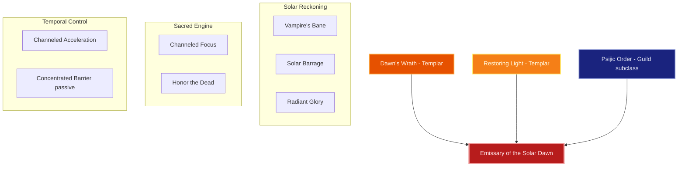
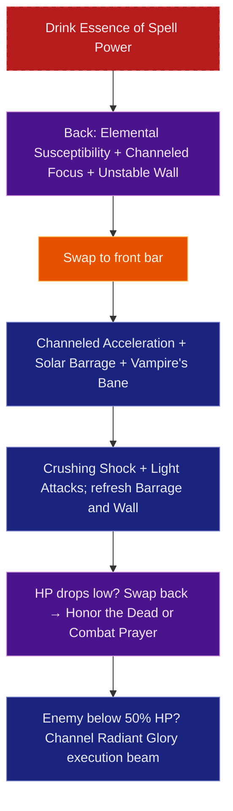

# Build Plan - Pelatiah: Emissary of the Solar Dawn (Solar Dominion)

> **Character profile:** [pelatiah.md](pelatiah.md) — Level 50 Imperial Templar, CP 742, @SOLAEGIS (NA).

Pelatiah is an Imperial diplomat-monk of Cyrodilic lineage who broke from the collapsed Imperial bureaucracy to serve as an **Emissary of Light and Solar Reckoning** under the Ebonheart Pact. This build transforms the **Emissary** into **The Solar Dominion**, a high-performance Magicka Templar designed for solo overland supremacy, public dungeon clears, and world boss soloing.

By pairing native **Dawn's Wrath** solar destruction with **Restoring Light** divine sanctuaries, and subclassing the **Psijic Order** temporal mastery in place of Aedric Spear, Pelatiah bends time and solar fire to his will. Anchored by 100% craftable sets (**Law of Julianos** and **Order's Wrath**) crafted by account artisan **@masisi**, Pelatiah unleashes devastating critical solar beams while maintaining impenetrable magical defenses.

---

## Build at a glance

| **Attribute** | **Recommendation** |
| :--- | :--- |
| **Primary Stat** | 64 points in **Magicka** — **live:** 64 Magicka (21,823 Magicka · 2,260 Spell Power · 23,422 Health) · **target:** 64 Magicka |
| **Mundus Stone** | **The Shadow** (+Critical Damage) — **live:** The Shadow (equipped) |
| **Vampirism** | **Cured** — solar judgment rejects vampiric blood corruption |
| **Sets** | **5 Law of Julianos + 5 Order's Wrath** (100% craftable) — **live:** Trainee 5/5 + Julianos 1/5 + Grace of Gloom 1/5 · **target:** Julianos + Order's Wrath |
| **Bars** | Front: Inferno Staff ("The Solar Dominion") · Back: Restoration Staff ("The Sacred Sanctuary") |
| **Food** | **Solitude Salmon Millet Soup** (Max Magicka + Max Health) or **Bewitched Sugar Skulls** for hard encounters |
| **Potion** | **Essence of Spell Power** (Spell Damage + Spell Crit + Magicka Recovery) |
| **Weapon Poisons** | None (use staff glyphs) |
| **Staff/Weapon Enchant** | Front: **Flame Damage** (Fiery Weapon); Back: **Absorb Magicka** or **Weapon Damage** |
| **Companion** | **Primary (now):** **Bastian Hallix** (Tank/Support) at live CP **742** + companion **16/20** · **Secondary:** **Isobel Veloise** (Holy Knight) · **Goal (20/20 @ CP160):** **Bastian Hallix** (Tank/Support) |
| **Primary Mount** | **Imperial Horse** (owned) · **Ideal:** **Grand Imperial Warhorse** — see [Collectibles](#collectibles) |
| **Flavor Pet** | **Imperial War Mastiff** (owned) · **Ideal:** **Solar Imperial Eagle** — see [Collectibles](#collectibles) |

**Read next:** [Roleplay](#roleplay-emissary-of-the-solar-dawn) · [Trinity configuration](#trinity-configuration) · [Combat kit](#combat-kit-the-solar-dominion-cycle) · [Gear and crafting](#gear-and-crafting-regalia-of-the-solar-magistrate) · [Champion points](#champion-point-mapping-cp-742) · [Companion](#companion-strategy-the-imperial-vanguard) · [Collectibles](#collectibles) · [Checklist](#next-steps--in-game-action-checklist)

---

## Roleplay: Emissary of the Solar Dawn

When Cyrodiil fell into chaos and imperial legitimacy crumbled, Pelatiah refused to bow to warlords or Daedric usurpers. Carrying the title **Emissary**, he traveled east, offering his oath to the Ebonheart Pact not out of political alignment, but out of necessity: Tamriel required an arbiter of divine light to cleanse the dark forces creeping across the provinces.

Pelatiah is an Imperial magistrate who carries sacred solar flame. He approaches combat with calculated, courtly discipline. He does not swing a brute spear; he weaves the solar brilliance of Auri-El and Stendarr, commanding enemies to burn before executing them with a cleansing ray of holy light. Through his study of the Psijic Order, he manipulates temporal rhythm to accelerate his strikes and cast protective shields around himself in battle.

> [!TIP]
> **Suggested Custom Title:** `Emissary of the Solar Dawn`

> [!NOTE]
> **Build Notes (paste into LAM Custom Title / Build Notes):**
> Pelatiah — Emissary of the Solar Dawn. Magicka Templar solo overland build. 5 Law of Julianos + 5 Order's Wrath, all craftable light/heavy gear. Front (Inferno Staff): Vampire's Bane, Solar Barrage, Crushing Shock, Channeled Acceleration, Radiant Glory, Crescent Sweep ult. Back (Restoration Staff): Elemental Susceptibility, Channeled Focus, Unstable Wall of Elements, Combat Prayer, Honor the Dead, Solar Prison ult. Subclasses Psijic Order over Aedric Spear. 64 Magicka. Mundus: The Shadow. Companion: Bastian Hallix (Level 16/20) as frontline tank. @masisi crafts all 12 slots.

> [!TIP]
> **Flavor Pet:** **Imperial War Mastiff** from the character's Collectibles export. **Ideal (any source):** **Solar Imperial Eagle** — symbol of divine Imperial heraldry and solar authority. See [Collectibles](#collectibles) for mount, pet, and dye details.

---

## Trinity configuration

By completing Bahtra at-Hunding's milestone quest **"A Study in Discipline"** at Level 50, Pelatiah unlocks the **Uber Tier (Triple Hybrid)** architecture. Pelatiah replaces **Aedric Spear** with **Psijic Order** mastery to forge the solar-and-temporal loop. See [docs/subclassing.md](../../../docs/subclassing.md) for the Solaegis Trinity / subclassing model.

| **Pillar** | **Line** | **Origin** | **Slot action** | **Function** |
| :--- | :--- | :--- | :--- | :--- |
| **Solar Reckoning** | **Dawn's Wrath** | Templar (native) | **KEEP** | Ranged DoT (**Vampire's Bane**), AoE Empower (**Solar Barrage**), and execute beam (**Radiant Glory**) |
| **Sacred Engine** | **Restoring Light** | Templar (native) | **KEEP** | Unstoppable Magicka recovery and armor (**Channeled Focus**) plus emergency burst heal (**Honor the Dead**) |
| **Temporal Control** | **Psijic Order** | Guild (subclass) | **SUBCLASS** (replaces **Aedric Spear**) | Major Force crit boost (**Channeled Acceleration**) and passive damage absorption shields |

---

## Combat kit: The Solar Dominion Cycle

Open from distance on the Restoration Staff back bar with debuffs, armor buffs, and ground hazards, swap to the Inferno Staff front bar to trigger Empower and Major Force, then channel **Radiant Glory** to melt bosses while healing for nearly half the damage dealt.

### Skill bars

Document **slotted morph names as shown in the skills UI** (not unmorphed base or wiki-only labels). Each morph appears at most once across bars. Bars match equipped weapon types (Inferno Staff front, Restoration Staff back).

#### Front Bar (Inferno Destruction Staff): "The Solar Dominion"

| **Slot** | **Class/Line** | **Base -> Morph** | **Role** |
| :--- | :--- | :--- | :--- |
| **1** | Dawn's Wrath (Templar) | Sun Fire -> **Vampire's Bane** | Ranged Flame DoT + **Major Prophecy** (+12% Spell Crit) |
| **2** | Dawn's Wrath (Templar) | Solar Flare -> **Solar Barrage** | AoE holy fire pulse + **Empower** (+80% Heavy Attack) |
| **3** | Destruction Staff | Force Shock -> **Crushing Shock** | Magicka spammable + ranged interrupt |
| **4** | Psijic Order (Subclass) | Accelerate -> **Channeled Acceleration** | **Major Force** (+20% Crit Damage) + Minor Force |
| **5** | Dawn's Wrath (Templar) | Radiant Destruction -> **Radiant Glory** | Signature execute beam (heals for 48% of damage dealt) |
| **6 (Ult)** | Aedric Spear (Templar) | Radial Sweep -> **Crescent Sweep** | Low-cost Frontal AoE burst ultimate |

> [!NOTE]
> **Aedric Spear is subclassed out.** **Puncturing Sweep** is replaced by **Solar Barrage** + **Crushing Shock** / **Radiant Glory** for range and mobility.

#### Back Bar (Restoration Staff): "The Sacred Sanctuary"

| **Slot** | **Class/Line** | **Base -> Morph** | **Role** |
| :--- | :--- | :--- | :--- |
| **1** | Destruction Staff | Weakness to Elements -> **Elemental Susceptibility** | Applies Status Effects + **Major Breach** (-5,948 Armor) |
| **2** | Restoring Light (Templar) | Rune Focus -> **Channeled Focus** | **Major Resolve** (+5,948 Armor) + massive Magicka recovery |
| **3** | Destruction Staff | Wall of Elements -> **Unstable Wall of Elements** | Flame ground DoT + explosion |
| **4** | Restoration Staff | Blessing of Protection -> **Combat Prayer** | Heal + **Minor Berserk** (+5% Damage) + Minor Resolve |
| **5** | Restoring Light (Templar) | Rushed Ceremony -> **Honor the Dead** | Emergency burst heal + Magicka refund on low HP |
| **6 (Ult)** | Dawn's Wrath (Templar) | Solar Disturbance -> **Solar Prison** | **Major Maim** (-15% boss damage) + massive AoE explosion |

### Rotation and combat tips

#### Solo combat tips

1. **Rune Anchor:** Always cast **Channeled Focus** before engaging hard enemies. Standing within or near the sacred rune grants over 5,948 armor and restores over 240 Magicka per second.
2. **Execution Phase:** When target HP drops below 50%, **Radiant Glory** damage ramps up exponentially (up to +480% bonus damage). The morph also heals Pelatiah for 48% of the damage inflicted, making him nearly immortal during execution.

### Passive skills

Pelatiah has **76 Skill Points available**. Spend in this priority order; fully rank (Rank II/III) where noted.

#### Templar — Class Passives

* **Dawn's Wrath:** **Enduring Rays** (II), **Prism** (II), **Illuminate** (II), **Restoring Spirit** (II) — Maximize spell damage and ultimate generation.
* **Restoring Light:** **Mending** (II), **Sacred Ground** (II), **Light Weaver** (II), **Master Ritualist** (II) — Boost healing and armor while standing in Channeled Focus.
* **Aedric Spear:** **Piercing Spear** (II), **Spear Wall** (II), **Balanced Warrior** (II) — Crit damage and resistance bonuses.

#### Weapon Passives

* **Destruction Staff:** **Tri Focus** (II), **Penetrating Magic** (II), **Elemental Force** (II), **Ancient Knowledge** (II), **Destruction Expert** (II) — Single target and single element damage amps.
* **Restoration Staff:** **Essence Drain** (II), **Restoration Expert** (II), **Cycle of Life** (II), **Absorb** (II), **Restoration Master** (II) — Heal output and Magicka heavy attack recovery.

#### Guild & Subclass Passives

* **Psijic Order:** **See the Unseen**, **Clairvoyance**, **Spell Orb**, **Concentrated Barrier**, **Deliberation** — Grants damage shield while blocking or casting Psijic abilities.
* **Fighters Guild:** **Intimidating Presence**, **Slayer** (III), **Banish the Wicked** (III), **Skilled Tracker** (III) — Passive spell power per slotted guild ability.

#### Race & World Passives

* **Imperial:** **Tough** (III), **Imperial Mettle** (III), **Red Diamond** (III) — Reduces all skill costs by 6% and boosts Max Health and Stamina.
* **Light Armor:** **Evocation** (II), **Spell Warding** (II), **Prodigy** (II), **Concentration** (II) — Penetration and spell critical.
* **Heavy Armor:** **Resolve** (III), **Constitution** (II), **Juggernaut** (II) — Extra armor and Health recovery for heavy pieces.

---

## Gear and crafting: Regalia of the Solar Magistrate

Built 100% on **craftable sets**, this loadout pairs **Law of Julianos** with **Order's Wrath** for unmatched spell power, critical chance, and critical damage multiplier.

### Set rationale

| **Set** | **5-Piece Bonus** | **Role in the Build** |
| :--- | :--- | :--- |
| **Law of Julianos** | Adds 300 Spell Damage & 1485 Spell Critical | Foundation of flat spell damage and consistent raw DPS |
| **Order's Wrath** | Adds 8% Critical Damage and Critical Healing | Multiplies high critical chance from Templar passives and The Shadow Mundus |

### Target loadout

| **Slot** | **Set** | **Weight** | **Trait** | **Enchantment** | **Quality** |
| :--- | :--- | :--- | :--- | :--- | :--- |
| **Head** | Order's Wrath | Heavy | Divines | Max Magicka | Epic / Gold |
| **Shoulders** | Order's Wrath | Medium | Divines | Max Magicka | Epic / Gold |
| **Chest** | Law of Julianos | Heavy | Divines | Max Magicka | Epic / Gold |
| **Hands** | Law of Julianos | Light | Divines | Max Magicka | Epic / Gold |
| **Waist** | Law of Julianos | Light | Divines | Max Magicka | Epic / Gold |
| **Legs** | Law of Julianos | Light | Divines | Max Magicka | Epic / Gold |
| **Feet** | Law of Julianos | Light | Divines | Max Magicka | Epic / Gold |
| **Neck** | Order's Wrath | Jewelry | Arcane | Spell Damage | Epic / Gold |
| **Ring 1** | Order's Wrath | Jewelry | Arcane | Spell Damage | Epic / Gold |
| **Ring 2** | Order's Wrath | Jewelry | Arcane | Spell Damage | Epic / Gold |
| **Front Weapon** | Law of Julianos (Inferno Staff) | Wood | Precise | Flame Damage | Epic / Gold |
| **Back Weapon** | Order's Wrath (Resto Staff) | Wood | Infused | Weapon Damage | Epic / Gold |

**Front bar — Inferno Staff:** Precise trait boosts critical chance to synergize with Order's Wrath and The Shadow.

**Back bar — Restoration Staff:** Infused trait triggers the Weapon Damage enchantment continuously, keeping Spell Power elevated.

### Crafting handoff (@masisi)

| **Detail** | **Recommendation** |
| :--- | :--- |
| **Style** | Imperial / Order of the Hour |
| **Set station** | Law of Julianos (Wrothgar — 6 traits) · Order's Wrath (High Isle — 3 traits) |
| **Traits** | Divines (Armor), Arcane (Jewelry), Precise/Infused (Weapons) |
| **Interim (pre-CP160)** | Armor of the Seducer (3 traits) as bridge set if mats are limited |
| **Quality path** | Purple (Epic) standard → Gold (Legendary) weapons first |

> [!NOTE]
> **Research gate:** Coordinate with @masisi before gold-quality CP160 work. See [`masisi.md`](masisi.md) for account crafter status.

---

## Champion Point Mapping (CP 742)

> [!NOTE]
> **Star catalog:** Use exact star names, constellation (discipline), max points, and slottable/passive type from [`champion_points_reference.md`](../../templates/champion_points_reference.md).

Full CP budget: **247 Warfare / 247 Fitness / 248 Craft** (742 total).

**Planning rules:**
- **Per-discipline cap:** 247–248 CP per discipline at CP 742.
- **Slotted stars:** **3 per discipline** (under 900 total CP limit).

### Warfare (Blue — 247 Points)

| **Slotted Star** | **Spend** | **Benefit** |
| :--- | :--- | :--- |
| **Fighting Finesse** | 50 points | +10% Critical Damage and Critical Healing |
| **Master-at-Arms** | 50 points | +10% Direct Damage |
| **Deadly Aim** | 50 points | +10% Single Target Damage |

**Passives (no slot needed — 97 points):**

* **Precision (20/20):** +326 Critical Chance
* **Piercing (20/20):** +700 Armor Penetration
* **Eldritch Insight (20/20):** +520 Max Magicka
* **War Mage (30/30):** +100 Weapon and Spell Damage
* **Blessed (7/20):** +1% Healing Done

### Fitness (Red — 247 Points)

| **Slotted Star** | **Spend** | **Benefit** |
| :--- | :--- | :--- |
| **Boundless Vitality** | 50 points | +1,400 Max Health |
| **Fortified** | 50 points | +1,731 Armor |
| **Rejuvenation** | 50 points | +90 Health, Magicka, and Stamina Recovery |

**Passives (no slot needed — 97 points):**

* **Tumbling (30/30):** Reduces Roll Dodge cost by 240
* **Mystic Tenacity (20/20):** Reduces status effect duration by 15%
* **Defiance (20/20):** Reduces Break Free cost by 220
* **Hero's Vigor (20/20):** +560 Max Health
* **Tireless Guardian (20/20):** Reduces Block cost by 40
* **Sprinter (20/20):** Reduces Sprint cost by 40
* **Fortification (17/20):** +1,275 Block Mitigation

### Craft (Green — 248 Points)

| **Slotted Star** | **Spend** | **Benefit** |
| :--- | :--- | :--- |
| **Steed's Blessing** | 50 points | +20% Movement Speed out of combat |
| **War Mount** | 75 points | Removes stamina cost of mounting out of combat |
| **Gifted Rider** | 50 points | +20% Mount Speed |

**Passives (no slot needed — 73 points):**

* **Treasure Hunter (50/50):** Increases quality of items found in treasure chests
* **Breakfall (10/50):** Reduces fall damage by 10%
* **Wanderer (10/50):** Reduces Wayshrine travel cost
* **Steadfast Enchantment (3/50):** Reduces weapon enchantment decay

---

## Companion Strategy: The Imperial Vanguard

Companion gear is separate from player gear—companions equip **Companion's** weapons, armor, and jewelry with **companion-only traits** (Quickened, Aggressive, Bolstered). There are no player gear sets or 5-piece bonuses on companions.

> [!NOTE]
> **Live export:** **Bastian Hallix** — Level **16/20**, equipped with Companion's Ice Staff and Aggressive/Quickened gear. Character **Level 50 / CP 742**.

### Companion picks

| **Tier** | **Companion** | **Role** | **Roleplay fit** | **Mechanical fit (at current stats)** |
| :--- | :--- | :--- | :--- | :--- |
| **Primary (now)** | **Bastian Hallix** | Tank / Support | Imperial battle-mage retinue escorting the Emissary | Draws aggro with Drake's Blood and Taunt, allowing Pelatiah to channel Radiant Glory safely |
| **Secondary** | **Isobel Veloise** | Holy Knight Tank | Knight of Stendarr serving the Pact diplomat | Exceptional survivability against world bosses with heavy heals and taunts |
| **Goal (20/20 @ CP160)** | **Bastian Hallix** | Frontline Tank | Capped Imperial vanguard guarding the magistrate | Capped health pool, permanent taunt uptime, damage reduction shields |

### Goal companion — Bastian Hallix: Imperial Shield

Bastian functions as the anvil while Pelatiah provides the solar hammer.

| **Setting** | **Recommendation** |
| :--- | :--- |
| **Role** | Frontline Tank / Crowds |
| **Gear Weight** | 7/7 Heavy Companion Armor |
| **Gear Trait** | **Bolstered** (+Armor) & **Quickened** (-Cooldowns) |
| **Loadout** | Full Heavy Companion Armor + **Companion's One Hand and Shield** |
| **Acquisition** | White basics from merchant armorers; **Superior+** traited pieces from boss drops while active. |

#### Bastian's support skill bar (goal @ 20/20)

1. **Provoke (1H&S):** Frontline taunt.
2. **Drake's Blood (Dragonknight):** Heavy self-heal and damage mitigation.
3. **Kindred Grace (Guild):** AoE shield for master and companion.
4. **Crushing Claws (Dragonknight):** AoE immobilize.
5. **Ritual of Salvation (Guild):** Ground damage reduction rune.
6. *Ultimate:* **Unleashed Rage** — Emergency burst shield and stun.

---

## Collectibles

### Mount

Pelatiah rides a grand Imperial steed appropriate for a high-ranking magistrate.

#### Primary (owned): Imperial Horse

| **Attribute** | **Detail** |
| :--- | :--- |
| **Why** | Regal Imperial warhorse aesthetic fitting an official Pact Emissary |
| **Acquisition** | Owned ✅ |
| **Dye pass** | Imperial Gold armor accents with Crimson saddle trim |

> [!TIP]
> **Ideal mount (any source):** **Grand Imperial Warhorse** — majestic armored stallion adorned with Imperial heraldry.

### Pet

#### Primary (owned): Imperial War Mastiff

| **Attribute** | **Detail** |
| :--- | :--- |
| **Why** | Loyal Imperial canine guarding the magistrate during negotiations |
| **Acquisition** | Owned ✅ |

> [!TIP]
> **Ideal pet (any source):** **Solar Imperial Eagle** — divine herald of Auri-El / Stendarr.

### Dye and style

**Visual Theme: Magistrate of the Solar Dawn**

| **Slot** | **Style** | **Visual reasoning** |
| :--- | :--- | :--- |
| **Outfit** | Imperial Heavy / Order of the Hour | Elegant Imperial plates infused with sunburst trim |

**Dye palette:** **Divine Gold** (primary plates), **Imperial Crimson** (cloth accents), **Obsidian Black** (leather undertones).

---

## Next Steps & In-Game Action Checklist

Follow this transition list to activate **The Solar Dominion**.

### Phase 0 — Today (functional build)

1. **Attributes:** Verify 64 points in **Magicka**.
2. **Mundus:** Confirm **The Shadow** Mundus Stone is active.
3. **Respec Skills:** Spend 76 available Skill Points per the priority list in [Passive skills](#passive-skills).
4. **Action Bars:** Slot **Inferno Staff** on Front Bar and **Restoration Staff** on Back Bar per [Skill bars](#skill-bars).

### Phase 1 — Craft (interim)

5. **[Phase 1]** Request @masisi to craft interim **Armor of the Seducer** pieces if Law of Julianos materials are restricted.

### Phase 2 — Craft (target)

6. **[Phase 2]** Commission `@masisi` to craft 5pc **Law of Julianos** and 5pc **Order's Wrath** (all Divines/Arcane/Precise/Infused) per [Target loadout](#target-loadout).

### Phase 3 — Polish

7. **[Phase 3]** Upgrade weapons to Gold (Legendary) quality and apply Max Magicka & Spell Damage glyphs.
8. **[Phase 3]** Allocate exact 742 CP budget per [Champion Point Mapping](#champion-point-mapping-cp-742).

### Finish

9. **Companion:** Run **Bastian Hallix** through daily quests to reach Level 20, equipping Companion's Heavy Bolstered armor from drops.
10. **Regenerate profile:** Run `/markdown` in-game and update [pelatiah.md](pelatiah.md) when the build is live.

---

## Appendix: Champion Point star catalog

All Warfare, Fitness, and Craft stars with constellation, type, and max points:

**[`champion_points_reference.md`](../../templates/champion_points_reference.md)**
