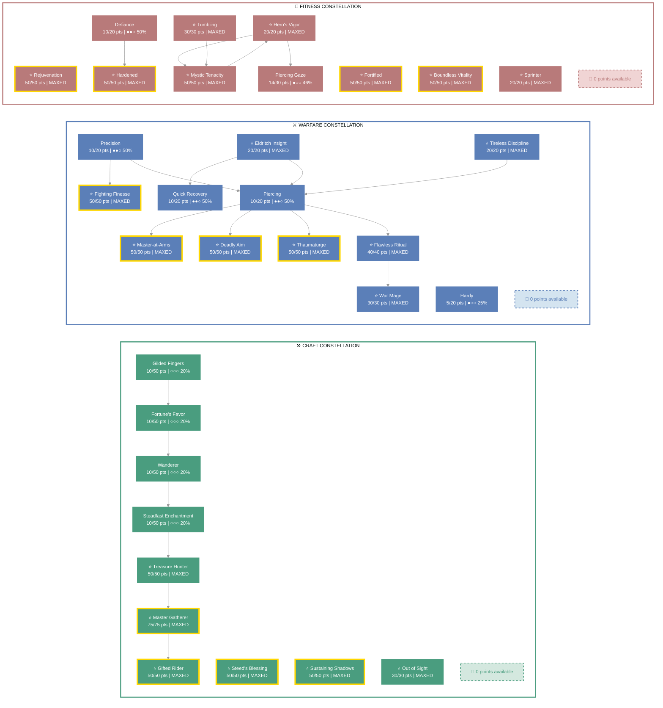

# Rilis Toxil (Mystic)

   

**High Elf Necromancer • Aldmeri Dominion Alliance**

---

## 📑 Table of Contents

- [📋 Overview](#overview)
  - [General](#general)
  - [Currency](#currency)
- [⚔️ Combat Arsenal](#combat-arsenal)
  - [Character Stats](#character-stats)
  - [Advanced Stats](#advanced-stats)
  - [Skill bars](#skill-bars)
- [⚔️ Equipment & Active Sets](#equipment-active-sets)
- [⭐ Champion Points](#champion-points)
- [📜 Character Progress](#character-progress)
- [⚔️ PvP](#pvp)
- [👥 Companions](#companions)
- [🎨 Collectibles](#collectibles)
- [🌍 World Progress](#world-progress)
- [🎨 Appearance](#appearance)
- [📝 Quest Progress](#quest-progress)
- [🏰 Armory Builds](#armory-builds)
- [📬 Mail](#mail)
- [🏰 Guild Membership](#guild-membership)

---

## 📋 Overview

### General

| **Attribute** | **Value** |
| --- | --- |
| **Level** | 33 |
| **Gender** | Male |
| **Champion Points** | 1034 |
| **Age** | 1d 6h 16m |
| **Account** | @SOLAEGIS |
| **ESO Plus** | ✅ Active |

| **Attribute** | **Value** |
| --- | --- |
| **Attributes** | 🔵 41 / ❤️ 0 / ⚡ 0 |
| **Skill Points** | 🎯 2 available - Ready to spend |
| **🐴 Riding Skills** | 🐴 28/60 / 💪 0/60 / 🎒 0/60 |
| **Title** | [Mystic](https://en.uesp.net/wiki/Online:Mystic) |
| **Race** | [High Elf](https://en.uesp.net/wiki/Online:High_Elf) |
| **🍖 Active Buffs** | Other: [Gallop](https://en.uesp.net/wiki/Online:Gallop) |

| **Attribute** | **Value** |
| --- | --- |
| **Class** | [Necromancer](https://en.uesp.net/wiki/Online:Necromancer) |
| **Server** | [NA Megaserver](https://en.uesp.net/wiki/Online:Megaservers) |
| **Subclass** | None — Grave Lord / Bone Tyrant / Living Death [Conditional] |
| **Alliance** | [Aldmeri Dominion](https://en.uesp.net/wiki/Online:Aldmeri_Dominion) |
| **Location** | [Summerset](https://en.uesp.net/wiki/Online:Summerset) (Alinor Wayshrine) |
| **🪨 Mundus Stone** | [The Apprentice](https://en.uesp.net/wiki/Online:The_Apprentice_(Mundus_Stone)) |

### Currency

| **Attribute** | **Value** |
| --- | --- |
| 💰 **Gold** | 55,868 |
| ⚔️ **Alliance Points** | 13,608 |
| 🔮 **Tel Var** | 2,000 |
| 💎 **Transmute Crystals** | 452 |
| 📜 **Writs** | 0 |
| 🎫 **Event Tickets** | 0 |
| 👑 **Crowns** | 5,690 |
| 💠 **Gems** | 281 |
| 🏅 **Seals** | 22,855 |
| 🗝️ **Keys** | 12 |
| 👕 **Tokens** | 6 |
| 📚 **Fortunes** | 7,500 |
| 🔹 **Fragments** | 1,408 |

---

## ⚔️ Combat Arsenal

### Character Stats

| **Category** | **Stat** | **Value** |
| --- | --- | ---: |
| 💚 **Resources** | Health | 26,698 |
|  | Magicka | 28,446 |
|  | Stamina | 17,736 |
| ⚔️ **Offensive** | Weapon Power | 2,146 |
|  | Spell Power | 2,384 |

| **Category** | **Stat** | **Value** |
| --- | --- | ---: |
| 🎯 **Critical** | Weapon Crit | 2,341 (10.6%) |
|  | Spell Crit | 2,341 (10.6%) |
| ⚔️ **Penetration** | Physical | 350 |
|  | Spell | 350 |

| **Category** | **Stat** | **Value** |
| --- | --- | ---: |
| 🛡️ **Defensive** | Physical Resist | 11,514 (87.4%) |
|  | Spell Resist | 14,418 (89.7%) |
| ♻️ **Recovery** | Health | 680 |
|  | Magicka | 1,771 |
|  | Stamina | 1,184 |

### Advanced Stats

| **Ability** | **Cost/Value** |
|:---|---:|
| ⚔️ **Light Attack** | 3,521 dmg |
| ⚔️ **Heavy Attack** | 7,043 dmg |
| ⚔️ **Bash** | 673 cost, 4,034 dmg |
| 🛡️ **Block** | 1,601 cost, 50% mit, 40% spd |
| 🔓 **Break Free** | 4,232 cost |
| 🏃 **Dodge Roll** | 3,686 cost |
| 🐾 **Sneak** | 66 cost, 0% spd |
| 🏃‍♂️ **Sprint** | 405 cost, 0% spd |

| **Resistance** | **Value** |
|:---|---:|
| 🔥 **Flame** | 21.8% |
| ⚡ **Shock** | 21.8% |
| ❄️ **Frost** | 21.8% |
| 🔮 **Magic** | 21.8% |
| 🦠 **Disease** | 17.4% |
| ☠️ **Poison** | 17.4% |
| 🩸 **Bleed** | 17.4% |

| **Damage Type** | **Bonus** |
|:---|---:|
| 💥 **Critical Damage** | 58% |
| ⚔️ **Physical** | 15% |
| 🔥 **Flame** | 15% |
| ⚡ **Shock** | 15% |
| ❄️ **Frost** | 0 |
| 🔮 **Magic** | 15% |
| 🦠 **Disease** | 15% |
| ☠️ **Poison** | 15% |
| 🩸 **Bleed** | 15% |
| 🌌 **Oblivion** | 15% |

| **Healing** | **Value** |
|:---|---:|
| 💚 **Healing Done** | 0 |
| 💖 **Healing Taken** | 0 |
| ✨ **Critical Healing** | 58% |

### Skill bars

*Active weapon pair: **Main***

### ⚔️ Front Bar (Main Hand)

| **1** | **2** | **3** | **4** | **5** | **⚡** |
| :---: | :---: | :---: | :---: | :---: | :---: |
| [Grave Lord's Sacrifice](https://en.uesp.net/wiki/Online:Grave_Lord's_Sacrifice) | [Blockade of Storms](https://en.uesp.net/wiki/Online:Blockade_of_Storms) | [Ricochet Skull](https://en.uesp.net/wiki/Online:Ricochet_Skull) | [Shocking Siphon](https://en.uesp.net/wiki/Online:Shocking_Siphon) | [Force Pulse](https://en.uesp.net/wiki/Online:Force_Pulse) | [Pestilent Colossus](https://en.uesp.net/wiki/Online:Pestilent_Colossus) |

### 🔮 Back Bar (Backup)

| **1** | **2** | **3** | **4** | **5** | **⚡** |
| :---: | :---: | :---: | :---: | :---: | :---: |
| [Regeneration](https://en.uesp.net/wiki/Online:Regeneration) | [Healing Springs](https://en.uesp.net/wiki/Online:Healing_Springs) | [Consuming Trap](https://en.uesp.net/wiki/Online:Consuming_Trap) | [Resistant Flesh](https://en.uesp.net/wiki/Online:Resistant_Flesh) | [Bone Armor](https://en.uesp.net/wiki/Online:Bone_Armor) | [Pestilent Colossus](https://en.uesp.net/wiki/Online:Pestilent_Colossus) |

---

## ⚔️ Equipment & Active Sets

| **Set** | **Progress** |
| --- | --- |
| 🟢 **[Armor of the Trainee Set](https://en.uesp.net/wiki/Online:Armor_of_the_Trainee_Set)** | `5/5` ██████████ 100% *(+5 extra)* |
| ⚪ **[Prophet's Set](https://en.uesp.net/wiki/Online:Prophet's_Set)** | `1/5` ██░░░░░░░░ 20% |

### 📋 Equipment Details

| **Slot** | **Item** | **Set** | **Quality** | **Trait** | **Type** | **Enchantment** |
| --- | --- | --- | --- | --- | --- | --- |
| ⛑️ **Head** | Helm of the Trainee | [Armor of the Trainee Set](https://en.uesp.net/wiki/Online:Armor_of_the_Trainee_Set) | 🔮 Superior | Training | Heavy | Maximum Health Enchantment |
| 💎 **Neck** | Necklace of the Trainee | [Armor of the Trainee Set](https://en.uesp.net/wiki/Online:Armor_of_the_Trainee_Set) | 🔮 Superior | Arcane | None | Magicka Recovery Enchantment |
| 🛡️ **Chest** | Prophet's Robes | [Prophet's Set](https://en.uesp.net/wiki/Online:Prophet's_Set) | 🔮 Superior | Training | Light | Maximum Magicka Enchantment |
| 👑 **Shoulders** | cotton epaulets of Magicka | - | 🔮 Superior | Infused | Light | Maximum Magicka Enchantment |
| ⚔️ **Main Hand** | Lightning Staff of the Trainee | [Armor of the Trainee Set](https://en.uesp.net/wiki/Online:Armor_of_the_Trainee_Set) | 🔮 Superior | Training | None | Absorb Magicka Enchantment |
| ⚡ **Waist** | Girdle of the Trainee | [Armor of the Trainee Set](https://en.uesp.net/wiki/Online:Armor_of_the_Trainee_Set) | ⭐ Epic | Training | Heavy | Maximum Health Enchantment |
| 👖 **Legs** | Greaves of the Trainee | [Armor of the Trainee Set](https://en.uesp.net/wiki/Online:Armor_of_the_Trainee_Set) | 🔮 Superior | Training | Heavy | Maximum Health Enchantment |
| 👟 **Feet** | Shoes of the Trainee | [Armor of the Trainee Set](https://en.uesp.net/wiki/Online:Armor_of_the_Trainee_Set) | ⭐ Epic | Training | Light | Maximum Magicka Enchantment |
| 💍 **Ring 1** | Ring of the Trainee | [Armor of the Trainee Set](https://en.uesp.net/wiki/Online:Armor_of_the_Trainee_Set) | 🔮 Superior | Arcane | None | Magicka Recovery Enchantment |
| 💍 **Ring 2** | Ring of the Trainee | [Armor of the Trainee Set](https://en.uesp.net/wiki/Online:Armor_of_the_Trainee_Set) | ⚡ Fine | Healthy | None | Health Recovery Enchantment |
| ✋ **Hands** | Gloves of the Trainee | [Armor of the Trainee Set](https://en.uesp.net/wiki/Online:Armor_of_the_Trainee_Set) | ⭐ Epic | Training | Light | Maximum Magicka Enchantment |
| 🔮 **Backup Main Hand** | beech restoration staff of Flame | - | 🔮 Superior | Defending | None | Fiery Weapon Enchantment |

---

## ⭐ Champion Points

| **Total** | **Spent** | **Available** |
| :---: | :---: | :---: |
| 1,034 | 1,034 | 0 |

| **⚒️ Craft** | **Assigned Points** |
| --- | ---: |
| ████████████ 100% | 345/345 points |
| **[Out of Sight](https://en.uesp.net/wiki/Online:Out_of_Sight)** | 30 points |
| **[Master Gatherer](https://en.uesp.net/wiki/Online:Master_Gatherer)** | 75 points |
| **[Treasure Hunter](https://en.uesp.net/wiki/Online:Treasure_Hunter)** | 50 points |
| **[Steadfast Enchantment](https://en.uesp.net/wiki/Online:Steadfast_Enchantment)** | 10 points |
| **[Wanderer](https://en.uesp.net/wiki/Online:Wanderer)** | 10 points |
| **[Gifted Rider](https://en.uesp.net/wiki/Online:Gifted_Rider)** | 50 points |
| **[Fortune's Favor](https://en.uesp.net/wiki/Online:Fortune's_Favor)** | 10 points |
| **[Gilded Fingers](https://en.uesp.net/wiki/Online:Gilded_Fingers)** | 10 points |
| **[Steed's Blessing](https://en.uesp.net/wiki/Online:Steed's_Blessing)** | 50 points |
| **[Sustaining Shadows](https://en.uesp.net/wiki/Online:Sustaining_Shadows)** | 50 points |

| **⚔️ Warfare** | **Assigned Points** |
| --- | ---: |
| ████████████ 100% | 345/345 points |
| **[Precision](https://en.uesp.net/wiki/Online:Precision)** | 10 points |
| **[Fighting Finesse](https://en.uesp.net/wiki/Online:Fighting_Finesse)** | 50 points |
| **[Piercing](https://en.uesp.net/wiki/Online:Piercing)** | 10 points |
| **[Master-at-Arms](https://en.uesp.net/wiki/Online:Master-at-Arms)** | 50 points |
| **[Flawless Ritual](https://en.uesp.net/wiki/Online:Flawless_Ritual)** | 40 points |
| **[War Mage](https://en.uesp.net/wiki/Online:War_Mage)** | 30 points |
| **[Deadly Aim](https://en.uesp.net/wiki/Online:Deadly_Aim)** | 50 points |
| **[Thaumaturge](https://en.uesp.net/wiki/Online:Thaumaturge)** | 50 points |
| **[Tireless Discipline](https://en.uesp.net/wiki/Online:Tireless_Discipline)** | 20 points |
| **[Quick Recovery](https://en.uesp.net/wiki/Online:Quick_Recovery)** | 10 points |
| **[Hardy](https://en.uesp.net/wiki/Online:Hardy)** | 5 points |
| **[Eldritch Insight](https://en.uesp.net/wiki/Online:Eldritch_Insight)** | 20 points |

| **💪 Fitness** | **Assigned Points** |
| --- | ---: |
| ████████████ 100% | 344/344 points |
| **[Sprinter](https://en.uesp.net/wiki/Online:Sprinter)** | 20 points |
| **[Hero's Vigor](https://en.uesp.net/wiki/Online:Hero's_Vigor)** | 20 points |
| **[Piercing Gaze](https://en.uesp.net/wiki/Online:Piercing_Gaze)** | 14 points |
| **[Mystic Tenacity](https://en.uesp.net/wiki/Online:Mystic_Tenacity)** | 50 points |
| **[Tumbling](https://en.uesp.net/wiki/Online:Tumbling)** | 30 points |
| **[Defiance](https://en.uesp.net/wiki/Online:Defiance)** | 10 points |
| **[Hardened](https://en.uesp.net/wiki/Online:Hardened)** | 50 points |
| **[Rejuvenation](https://en.uesp.net/wiki/Online:Rejuvenation)** | 50 points |
| **[Fortified](https://en.uesp.net/wiki/Online:Fortified)** | 50 points |
| **[Boundless Vitality](https://en.uesp.net/wiki/Online:Boundless_Vitality)** | 50 points |

### 🎯 Champion Points Visual

```mermaid
%%{init: {"theme":"base", "themeVariables": { "background":"transparent","fontSize":"14px","primaryColor":"#e8f4f0","primaryTextColor":"#000","primaryBorderColor":"#4a9d7f","lineColor":"#999","secondaryColor":"#f0f4f8","tertiaryColor":"#faf0f0"}, "flowchart": {"curve":"basis"}}}%%

flowchart LR
  subgraph subLEGEND["📖 LEGEND & VISUAL GUIDE"]

    LEG_STARS["Star Types"]
    LEG_S1["⭐ Gold Border = Maxed Slottable"]
    LEG_S2["🔶 Orange Border = Independent Star"]
    LEG_S3["Standard Border = In Progress"]

    LEG_FILL["Progress Indicators"]
    LEG_F1["⭐ = 100% Maxed"]
    LEG_F2["●●● = 75-99%"]
    LEG_F3["●●○ = 50-74%"]
    LEG_F4["●○○ = 25-49%"]
    LEG_F5["○○○ = 1-24%"]

    LEG_STARS --> LEG_S1 & LEG_S2 & LEG_S3
    LEG_FILL --> LEG_F1 & LEG_F2 & LEG_F3 & LEG_F4 & LEG_F5

    style LEG_STARS fill:transparent,stroke:none,color:#ccc
    style LEG_FILL fill:transparent,stroke:none,color:#ccc
    style LEG_S1 fill:#fff,stroke:#ffd700,stroke-width:3px,color:#333
    style LEG_S2 fill:#fff,stroke:#ff8c00,stroke-width:3px,color:#333
    style LEG_S3 fill:#fff,stroke:#999,stroke-width:2px,color:#333
    style LEG_F1 fill:#eee,stroke:#333,stroke-width:1px,color:#333
    style LEG_F2 fill:#eee,stroke:#333,stroke-width:1px,color:#333
    style LEG_F3 fill:#eee,stroke:#333,stroke-width:1px,color:#333
    style LEG_F4 fill:#eee,stroke:#333,stroke-width:1px,color:#333
    style LEG_F5 fill:#eee,stroke:#333,stroke-width:1px,color:#333
  end
  style subLEGEND fill:transparent,stroke:#999,stroke-width:3px
```

---

## 📜 Character Progress

### Progress Overview

| **Maxed Skill Lines** | **In Progress** | **Early Progress** | **Abilities with Morphs** | **Overall Completion** |
| ---: | ---: | ---: | ---: | ---: |
| 0 | 27 | 2 | 14 | 0% |

### 📈 In-Progress Skills

🛡️ Armor (3 skill lines in progress)

- **[Light Armor](https://en.uesp.net/wiki/Online:Light_Armor)**: Rank 37 ████████░░ 83%
- **[Medium Armor](https://en.uesp.net/wiki/Online:Medium_Armor)**: Rank 21 ███████░░░ 78%
- **[Heavy Armor](https://en.uesp.net/wiki/Online:Heavy_Armor)**: Rank 24 ████░░░░░░ 46%

✨ Passives

- ✅ [Light Armor Bonuses](https://en.uesp.net/wiki/Online:Light_Armor_Bonuses) *(from [Light Armor](https://en.uesp.net/wiki/Online:Light_Armor))*
- ✅ [Light Armor Penalties](https://en.uesp.net/wiki/Online:Light_Armor_Penalties) *(from [Light Armor](https://en.uesp.net/wiki/Online:Light_Armor))*
- ✅ [Grace](https://en.uesp.net/wiki/Online:Grace) *(from [Light Armor](https://en.uesp.net/wiki/Online:Light_Armor))*
- ✅ [Evocation](https://en.uesp.net/wiki/Online:Evocation) *(from [Light Armor](https://en.uesp.net/wiki/Online:Light_Armor))*
- ✅ [Spell Warding](https://en.uesp.net/wiki/Online:Spell_Warding) *(from [Light Armor](https://en.uesp.net/wiki/Online:Light_Armor))*
- 🔒 [Prodigy](https://en.uesp.net/wiki/Online:Prodigy) *(from [Light Armor](https://en.uesp.net/wiki/Online:Light_Armor))*
- 🔒 [Concentration](https://en.uesp.net/wiki/Online:Concentration) *(from [Light Armor](https://en.uesp.net/wiki/Online:Light_Armor))*
- ✅ [Medium Armor Bonuses](https://en.uesp.net/wiki/Online:Medium_Armor_Bonuses) *(from [Medium Armor](https://en.uesp.net/wiki/Online:Medium_Armor))*
- 🔒 [Dexterity](https://en.uesp.net/wiki/Online:Dexterity) *(from [Medium Armor](https://en.uesp.net/wiki/Online:Medium_Armor))*
- 🔒 [Wind Walker](https://en.uesp.net/wiki/Online:Wind_Walker) *(from [Medium Armor](https://en.uesp.net/wiki/Online:Medium_Armor))*
- 🔒 [Improved Sneak](https://en.uesp.net/wiki/Online:Improved_Sneak) *(from [Medium Armor](https://en.uesp.net/wiki/Online:Medium_Armor))*
- 🔒 [Agility](https://en.uesp.net/wiki/Online:Agility) *(from [Medium Armor](https://en.uesp.net/wiki/Online:Medium_Armor))*
- 🔒 [Athletics](https://en.uesp.net/wiki/Online:Athletics) *(from [Medium Armor](https://en.uesp.net/wiki/Online:Medium_Armor))*
- ✅ [Heavy Armor Bonuses](https://en.uesp.net/wiki/Online:Heavy_Armor_Bonuses) *(from [Heavy Armor](https://en.uesp.net/wiki/Online:Heavy_Armor))*
- ✅ [Heavy Armor Penalties](https://en.uesp.net/wiki/Online:Heavy_Armor_Penalties) *(from [Heavy Armor](https://en.uesp.net/wiki/Online:Heavy_Armor))*
- 🔒 [Resolve](https://en.uesp.net/wiki/Online:Resolve) *(from [Heavy Armor](https://en.uesp.net/wiki/Online:Heavy_Armor))*
- 🔒 [Constitution](https://en.uesp.net/wiki/Online:Constitution) *(from [Heavy Armor](https://en.uesp.net/wiki/Online:Heavy_Armor))*
- 🔒 [Juggernaut](https://en.uesp.net/wiki/Online:Juggernaut) *(from [Heavy Armor](https://en.uesp.net/wiki/Online:Heavy_Armor))*
- 🔒 [Revitalize](https://en.uesp.net/wiki/Online:Revitalize) *(from [Heavy Armor](https://en.uesp.net/wiki/Online:Heavy_Armor))*
- 🔒 [Rapid Mending](https://en.uesp.net/wiki/Online:Rapid_Mending) *(from [Heavy Armor](https://en.uesp.net/wiki/Online:Heavy_Armor))*

⚒️ Craft (7 skill lines in progress)

- **[Alchemy](https://en.uesp.net/wiki/Online:Alchemy)**: Rank 8 ███░░░░░░░ 32%
- **[Blacksmithing](https://en.uesp.net/wiki/Online:Blacksmithing)**: Rank 9 █████░░░░░ 51%
- **[Clothing](https://en.uesp.net/wiki/Online:Clothing)**: Rank 10 ██████░░░░ 65%
- **[Enchanting](https://en.uesp.net/wiki/Online:Enchanting)**: Rank 4 ██████░░░░ 60%
- **[Jewelry Crafting](https://en.uesp.net/wiki/Online:Jewelry_Crafting)**: Rank 7 ██░░░░░░░░ 24%
- **[Provisioning](https://en.uesp.net/wiki/Online:Provisioning)**: Rank 7 █░░░░░░░░░ 12%
- **[Woodworking](https://en.uesp.net/wiki/Online:Woodworking)**: Rank 10 ███████░░░ 73%

✨ Passives

- ✅ [Solvent Proficiency](https://en.uesp.net/wiki/Online:Solvent_Proficiency) *(from [Alchemy](https://en.uesp.net/wiki/Online:Alchemy))*
- 🔒 [Keen Eye: Reagents](https://en.uesp.net/wiki/Online:Keen_Eye:_Reagents) *(from [Alchemy](https://en.uesp.net/wiki/Online:Alchemy))*
- 🔒 [Medicinal Use](https://en.uesp.net/wiki/Online:Medicinal_Use) *(from [Alchemy](https://en.uesp.net/wiki/Online:Alchemy))*
- 🔒 [Chemistry](https://en.uesp.net/wiki/Online:Chemistry) *(from [Alchemy](https://en.uesp.net/wiki/Online:Alchemy))*
- 🔒 [Laboratory Use](https://en.uesp.net/wiki/Online:Laboratory_Use) *(from [Alchemy](https://en.uesp.net/wiki/Online:Alchemy))*
- 🔒 [Snakeblood](https://en.uesp.net/wiki/Online:Snakeblood) *(from [Alchemy](https://en.uesp.net/wiki/Online:Alchemy))*
- ✅ [Metalworking](https://en.uesp.net/wiki/Online:Metalworking) *(from [Blacksmithing](https://en.uesp.net/wiki/Online:Blacksmithing))*
- 🔒 [Keen Eye: Ore](https://en.uesp.net/wiki/Online:Keen_Eye:_Ore) *(from [Blacksmithing](https://en.uesp.net/wiki/Online:Blacksmithing))*
- 🔒 [Miner Hireling](https://en.uesp.net/wiki/Online:Miner_Hireling) *(from [Blacksmithing](https://en.uesp.net/wiki/Online:Blacksmithing))*
- 🔒 [Metal Extraction](https://en.uesp.net/wiki/Online:Metal_Extraction) *(from [Blacksmithing](https://en.uesp.net/wiki/Online:Blacksmithing))*
- 🔒 [Metallurgy](https://en.uesp.net/wiki/Online:Metallurgy) *(from [Blacksmithing](https://en.uesp.net/wiki/Online:Blacksmithing))*
- 🔒 [Temper Expertise](https://en.uesp.net/wiki/Online:Temper_Expertise) *(from [Blacksmithing](https://en.uesp.net/wiki/Online:Blacksmithing))*
- ✅ [Tailoring](https://en.uesp.net/wiki/Online:Tailoring) *(from [Clothing](https://en.uesp.net/wiki/Online:Clothing))*
- 🔒 [Keen Eye: Cloth](https://en.uesp.net/wiki/Online:Keen_Eye:_Cloth) *(from [Clothing](https://en.uesp.net/wiki/Online:Clothing))*
- 🔒 [Outfitter Hireling](https://en.uesp.net/wiki/Online:Outfitter_Hireling) *(from [Clothing](https://en.uesp.net/wiki/Online:Clothing))*
- 🔒 [Unraveling](https://en.uesp.net/wiki/Online:Unraveling) *(from [Clothing](https://en.uesp.net/wiki/Online:Clothing))*
- 🔒 [Stitching](https://en.uesp.net/wiki/Online:Stitching) *(from [Clothing](https://en.uesp.net/wiki/Online:Clothing))*
- 🔒 [Tannin Expertise](https://en.uesp.net/wiki/Online:Tannin_Expertise) *(from [Clothing](https://en.uesp.net/wiki/Online:Clothing))*
- ✅ [Potency Improvement](https://en.uesp.net/wiki/Online:Potency_Improvement) *(from [Enchanting](https://en.uesp.net/wiki/Online:Enchanting))*
- ✅ [Aspect Improvement](https://en.uesp.net/wiki/Online:Aspect_Improvement) *(from [Enchanting](https://en.uesp.net/wiki/Online:Enchanting))*
- 🔒 [Keen Eye: Rune Stones](https://en.uesp.net/wiki/Online:Keen_Eye:_Rune_Stones) *(from [Enchanting](https://en.uesp.net/wiki/Online:Enchanting))*
- 🔒 [Enchanter Hireling](https://en.uesp.net/wiki/Online:Enchanter_Hireling) *(from [Enchanting](https://en.uesp.net/wiki/Online:Enchanting))*
- 🔒 [Runestone Extraction](https://en.uesp.net/wiki/Online:Runestone_Extraction) *(from [Enchanting](https://en.uesp.net/wiki/Online:Enchanting))*
- ✅ [Engraver](https://en.uesp.net/wiki/Online:Engraver) *(from [Jewelry Crafting](https://en.uesp.net/wiki/Online:Jewelry_Crafting))*
- 🔒 [Keen Eye: Jewelry](https://en.uesp.net/wiki/Online:Keen_Eye:_Jewelry) *(from [Jewelry Crafting](https://en.uesp.net/wiki/Online:Jewelry_Crafting))*
- 🔒 [Jewelry Extraction](https://en.uesp.net/wiki/Online:Jewelry_Extraction) *(from [Jewelry Crafting](https://en.uesp.net/wiki/Online:Jewelry_Crafting))*
- 🔒 [Lapidary Research](https://en.uesp.net/wiki/Online:Lapidary_Research) *(from [Jewelry Crafting](https://en.uesp.net/wiki/Online:Jewelry_Crafting))*
- 🔒 [Platings Expertise](https://en.uesp.net/wiki/Online:Platings_Expertise) *(from [Jewelry Crafting](https://en.uesp.net/wiki/Online:Jewelry_Crafting))*
- ✅ [Recipe Improvement](https://en.uesp.net/wiki/Online:Recipe_Improvement) *(from [Provisioning](https://en.uesp.net/wiki/Online:Provisioning))*
- ✅ [Recipe Quality](https://en.uesp.net/wiki/Online:Recipe_Quality) *(from [Provisioning](https://en.uesp.net/wiki/Online:Provisioning))*
- 🔒 [Gourmand](https://en.uesp.net/wiki/Online:Gourmand) *(from [Provisioning](https://en.uesp.net/wiki/Online:Provisioning))*
- 🔒 [Connoisseur](https://en.uesp.net/wiki/Online:Connoisseur) *(from [Provisioning](https://en.uesp.net/wiki/Online:Provisioning))*
- 🔒 [Chef](https://en.uesp.net/wiki/Online:Chef) *(from [Provisioning](https://en.uesp.net/wiki/Online:Provisioning))*
- 🔒 [Brewer](https://en.uesp.net/wiki/Online:Brewer) *(from [Provisioning](https://en.uesp.net/wiki/Online:Provisioning))*
- 🔒 [Forager Hireling](https://en.uesp.net/wiki/Online:Forager_Hireling) *(from [Provisioning](https://en.uesp.net/wiki/Online:Provisioning))*
- ✅ [Woodworking](https://en.uesp.net/wiki/Online:Woodworking) *(from [Woodworking](https://en.uesp.net/wiki/Online:Woodworking))*
- 🔒 [Keen Eye: Wood](https://en.uesp.net/wiki/Online:Keen_Eye:_Wood) *(from [Woodworking](https://en.uesp.net/wiki/Online:Woodworking))*
- 🔒 [Lumberjack Hireling](https://en.uesp.net/wiki/Online:Lumberjack_Hireling) *(from [Woodworking](https://en.uesp.net/wiki/Online:Woodworking))*
- 🔒 [Wood Extraction](https://en.uesp.net/wiki/Online:Wood_Extraction) *(from [Woodworking](https://en.uesp.net/wiki/Online:Woodworking))*
- 🔒 [Carpentry](https://en.uesp.net/wiki/Online:Carpentry) *(from [Woodworking](https://en.uesp.net/wiki/Online:Woodworking))*
- 🔒 [Resin Expertise](https://en.uesp.net/wiki/Online:Resin_Expertise) *(from [Woodworking](https://en.uesp.net/wiki/Online:Woodworking))*

⭐ Racial (1 skill line in progress)

- **[High Elf Skills](https://en.uesp.net/wiki/Online:High_Elf)**: Rank 33 █████░░░░░ 54%

✨ Passives

- ✅ [Highborn](https://en.uesp.net/wiki/Online:Highborn) *(from [High Elf Skills](https://en.uesp.net/wiki/Online:High_Elf))*
- ✅ [Spell Recharge](https://en.uesp.net/wiki/Online:Spell_Recharge) *(from [High Elf Skills](https://en.uesp.net/wiki/Online:High_Elf))*
- ✅ [Syrabane's Boon](https://en.uesp.net/wiki/Online:Syrabane's_Boon) *(from [High Elf Skills](https://en.uesp.net/wiki/Online:High_Elf))*
- ✅ [Elemental Talent](https://en.uesp.net/wiki/Online:Elemental_Talent) *(from [High Elf Skills](https://en.uesp.net/wiki/Online:High_Elf))*

🏰 Guild (3 skill lines in progress)

- **[Dark Brotherhood](https://en.uesp.net/wiki/Online:Dark_Brotherhood)**: Rank 2 ░░░░░░░░░░ 0%
- **[Fighters Guild](https://en.uesp.net/wiki/Online:Fighters_Guild)**: Rank 7 ███░░░░░░░ 35%
- **[Mages Guild](https://en.uesp.net/wiki/Online:Mages_Guild)**: Rank 2 ███████░░░ 77%

✨ Passives

- ✅ [Blade of Woe](https://en.uesp.net/wiki/Online:Blade_of_Woe) *(from [Dark Brotherhood](https://en.uesp.net/wiki/Online:Dark_Brotherhood))*
- 🔒 [Scales of Pitiless Justice](https://en.uesp.net/wiki/Online:Scales_of_Pitiless_Justice) *(from [Dark Brotherhood](https://en.uesp.net/wiki/Online:Dark_Brotherhood))*
- 🔒 [Padomaic Sprint](https://en.uesp.net/wiki/Online:Padomaic_Sprint) *(from [Dark Brotherhood](https://en.uesp.net/wiki/Online:Dark_Brotherhood))*
- 🔒 [Shadowy Supplier](https://en.uesp.net/wiki/Online:Shadowy_Supplier) *(from [Dark Brotherhood](https://en.uesp.net/wiki/Online:Dark_Brotherhood))*
- 🔒 [Shadow Rider](https://en.uesp.net/wiki/Online:Shadow_Rider) *(from [Dark Brotherhood](https://en.uesp.net/wiki/Online:Dark_Brotherhood))*
- 🔒 [Spectral Assassin](https://en.uesp.net/wiki/Online:Spectral_Assassin) *(from [Dark Brotherhood](https://en.uesp.net/wiki/Online:Dark_Brotherhood))*
- ✅ [Intimidating Presence](https://en.uesp.net/wiki/Online:Intimidating_Presence) *(from [Fighters Guild](https://en.uesp.net/wiki/Online:Fighters_Guild))*
- 🔒 [Slayer](https://en.uesp.net/wiki/Online:Slayer) *(from [Fighters Guild](https://en.uesp.net/wiki/Online:Fighters_Guild))*
- ✅ [Banish the Wicked](https://en.uesp.net/wiki/Online:Banish_the_Wicked) *(from [Fighters Guild](https://en.uesp.net/wiki/Online:Fighters_Guild))*
- 🔒 [Skilled Tracker](https://en.uesp.net/wiki/Online:Skilled_Tracker) *(from [Fighters Guild](https://en.uesp.net/wiki/Online:Fighters_Guild))*
- 🔒 [Bounty Hunter](https://en.uesp.net/wiki/Online:Bounty_Hunter) *(from [Fighters Guild](https://en.uesp.net/wiki/Online:Fighters_Guild))*
- ✅ [Persuasive Will](https://en.uesp.net/wiki/Online:Persuasive_Will) *(from [Mages Guild](https://en.uesp.net/wiki/Online:Mages_Guild))*
- 🔒 [Mage Adept](https://en.uesp.net/wiki/Online:Mage_Adept) *(from [Mages Guild](https://en.uesp.net/wiki/Online:Mages_Guild))*
- 🔒 [Everlasting Magic](https://en.uesp.net/wiki/Online:Everlasting_Magic) *(from [Mages Guild](https://en.uesp.net/wiki/Online:Mages_Guild))*
- 🔒 [Magicka Controller](https://en.uesp.net/wiki/Online:Magicka_Controller) *(from [Mages Guild](https://en.uesp.net/wiki/Online:Mages_Guild))*
- 🔒 [Might of the Guild](https://en.uesp.net/wiki/Online:Might_of_the_Guild) *(from [Mages Guild](https://en.uesp.net/wiki/Online:Mages_Guild))*

⚔️ Class (3 skill lines in progress)

- **[Grave Lord](https://en.uesp.net/wiki/Online:Grave_Lord)**: Rank 44 █░░░░░░░░░ 13%
- **[Bone Tyrant](https://en.uesp.net/wiki/Online:Bone_Tyrant)**: Rank 34 █████████░ 92%
- **[Living Death](https://en.uesp.net/wiki/Online:Living_Death)**: Rank 31 ████░░░░░░ 42%

✨ Passives

- ✅ [Reusable Parts](https://en.uesp.net/wiki/Online:Reusable_Parts) *(from [Grave Lord](https://en.uesp.net/wiki/Online:Grave_Lord))*
- ✅ [Death Knell](https://en.uesp.net/wiki/Online:Death_Knell) *(from [Grave Lord](https://en.uesp.net/wiki/Online:Grave_Lord))*
- ✅ [Dismember](https://en.uesp.net/wiki/Online:Dismember) *(from [Grave Lord](https://en.uesp.net/wiki/Online:Grave_Lord))*
- ✅ [Rapid Rot](https://en.uesp.net/wiki/Online:Rapid_Rot) *(from [Grave Lord](https://en.uesp.net/wiki/Online:Grave_Lord))*
- ✅ [Death Gleaning](https://en.uesp.net/wiki/Online:Death_Gleaning) *(from [Bone Tyrant](https://en.uesp.net/wiki/Online:Bone_Tyrant))*
- 🔒 [Disdain Harm](https://en.uesp.net/wiki/Online:Disdain_Harm) *(from [Bone Tyrant](https://en.uesp.net/wiki/Online:Bone_Tyrant))*
- 🔒 [Health Avarice](https://en.uesp.net/wiki/Online:Health_Avarice) *(from [Bone Tyrant](https://en.uesp.net/wiki/Online:Bone_Tyrant))*
- 🔒 [Last Gasp](https://en.uesp.net/wiki/Online:Last_Gasp) *(from [Bone Tyrant](https://en.uesp.net/wiki/Online:Bone_Tyrant))*
- ✅ [Curative Curse](https://en.uesp.net/wiki/Online:Curative_Curse) *(from [Living Death](https://en.uesp.net/wiki/Online:Living_Death))*
- ✅ [Near-Death Experience](https://en.uesp.net/wiki/Online:Near-Death_Experience) *(from [Living Death](https://en.uesp.net/wiki/Online:Living_Death))*
- ✅ [Corpse Consumption](https://en.uesp.net/wiki/Online:Corpse_Consumption) *(from [Living Death](https://en.uesp.net/wiki/Online:Living_Death))*
- 🔒 [Undead Confederate](https://en.uesp.net/wiki/Online:Undead_Confederate) *(from [Living Death](https://en.uesp.net/wiki/Online:Living_Death))*

⚔️ Weapon (6 skill lines in progress)

- **[Two Handed](https://en.uesp.net/wiki/Online:Two_Handed)**: Rank 2 ░░░░░░░░░░ 0%
- **[One Hand and Shield](https://en.uesp.net/wiki/Online:One_Hand_and_Shield)**: Rank 2 ░░░░░░░░░░ 0%
- **[Dual Wield](https://en.uesp.net/wiki/Online:Dual_Wield)**: Rank 2 ░░░░░░░░░░ 0%
- **[Bow](https://en.uesp.net/wiki/Online:Bow)**: Rank 2 ░░░░░░░░░░ 0%
- **[Destruction Staff](https://en.uesp.net/wiki/Online:Destruction_Staff)**: Rank 41 █░░░░░░░░░ 14%
- **[Restoration Staff](https://en.uesp.net/wiki/Online:Restoration_Staff)**: Rank 29 ███░░░░░░░ 30%

✨ Passives

- 🔒 [Forceful](https://en.uesp.net/wiki/Online:Forceful) *(from [Two Handed](https://en.uesp.net/wiki/Online:Two_Handed))*
- 🔒 [Heavy Weapons](https://en.uesp.net/wiki/Online:Heavy_Weapons) *(from [Two Handed](https://en.uesp.net/wiki/Online:Two_Handed))*
- 🔒 [Balanced Blade](https://en.uesp.net/wiki/Online:Balanced_Blade) *(from [Two Handed](https://en.uesp.net/wiki/Online:Two_Handed))*
- 🔒 [Follow Up](https://en.uesp.net/wiki/Online:Follow_Up) *(from [Two Handed](https://en.uesp.net/wiki/Online:Two_Handed))*
- 🔒 [Battle Rush](https://en.uesp.net/wiki/Online:Battle_Rush) *(from [Two Handed](https://en.uesp.net/wiki/Online:Two_Handed))*
- 🔒 [Fortress](https://en.uesp.net/wiki/Online:Fortress) *(from [One Hand and Shield](https://en.uesp.net/wiki/Online:One_Hand_and_Shield))*
- 🔒 [Sword and Board](https://en.uesp.net/wiki/Online:Sword_and_Board) *(from [One Hand and Shield](https://en.uesp.net/wiki/Online:One_Hand_and_Shield))*
- 🔒 [Deadly Bash](https://en.uesp.net/wiki/Online:Deadly_Bash) *(from [One Hand and Shield](https://en.uesp.net/wiki/Online:One_Hand_and_Shield))*
- 🔒 [Deflect Bolts](https://en.uesp.net/wiki/Online:Deflect_Bolts) *(from [One Hand and Shield](https://en.uesp.net/wiki/Online:One_Hand_and_Shield))*
- 🔒 [Battlefield Mobility](https://en.uesp.net/wiki/Online:Battlefield_Mobility) *(from [One Hand and Shield](https://en.uesp.net/wiki/Online:One_Hand_and_Shield))*
- 🔒 [Focused Killer](https://en.uesp.net/wiki/Online:Focused_Killer) *(from [Dual Wield](https://en.uesp.net/wiki/Online:Dual_Wield))*
- 🔒 [Ambidextrous](https://en.uesp.net/wiki/Online:Ambidextrous) *(from [Dual Wield](https://en.uesp.net/wiki/Online:Dual_Wield))*
- 🔒 [Controlled Fury](https://en.uesp.net/wiki/Online:Controlled_Fury) *(from [Dual Wield](https://en.uesp.net/wiki/Online:Dual_Wield))*
- 🔒 [Ruffian](https://en.uesp.net/wiki/Online:Ruffian) *(from [Dual Wield](https://en.uesp.net/wiki/Online:Dual_Wield))*
- 🔒 [Twin Blade and Blunt](https://en.uesp.net/wiki/Online:Twin_Blade_and_Blunt) *(from [Dual Wield](https://en.uesp.net/wiki/Online:Dual_Wield))*
- 🔒 [Vinedusk Training](https://en.uesp.net/wiki/Online:Vinedusk_Training) *(from [Bow](https://en.uesp.net/wiki/Online:Bow))*
- 🔒 [Accuracy](https://en.uesp.net/wiki/Online:Accuracy) *(from [Bow](https://en.uesp.net/wiki/Online:Bow))*
- 🔒 [Ranger](https://en.uesp.net/wiki/Online:Ranger) *(from [Bow](https://en.uesp.net/wiki/Online:Bow))*

- 🔒 [Hawk Eye](https://en.uesp.net/wiki/Online:Hawk_Eye) *(from [Bow](https://en.uesp.net/wiki/Online:Bow))*
- 🔒 [Hasty Retreat](https://en.uesp.net/wiki/Online:Hasty_Retreat) *(from [Bow](https://en.uesp.net/wiki/Online:Bow))*
- ✅ [Tri Focus](https://en.uesp.net/wiki/Online:Tri_Focus) *(from [Destruction Staff](https://en.uesp.net/wiki/Online:Destruction_Staff))*
- ✅ [Penetrating Magic](https://en.uesp.net/wiki/Online:Penetrating_Magic) *(from [Destruction Staff](https://en.uesp.net/wiki/Online:Destruction_Staff))*
- ✅ [Elemental Force](https://en.uesp.net/wiki/Online:Elemental_Force) *(from [Destruction Staff](https://en.uesp.net/wiki/Online:Destruction_Staff))*
- ✅ [Ancient Knowledge](https://en.uesp.net/wiki/Online:Ancient_Knowledge) *(from [Destruction Staff](https://en.uesp.net/wiki/Online:Destruction_Staff))*
- 🔒 [Destruction Expert](https://en.uesp.net/wiki/Online:Destruction_Expert) *(from [Destruction Staff](https://en.uesp.net/wiki/Online:Destruction_Staff))*
- ✅ [Essence Drain](https://en.uesp.net/wiki/Online:Essence_Drain) *(from [Restoration Staff](https://en.uesp.net/wiki/Online:Restoration_Staff))*
- ✅ [Restoration Expert](https://en.uesp.net/wiki/Online:Restoration_Expert) *(from [Restoration Staff](https://en.uesp.net/wiki/Online:Restoration_Staff))*
- ✅ [Cycle of Life](https://en.uesp.net/wiki/Online:Cycle_of_Life) *(from [Restoration Staff](https://en.uesp.net/wiki/Online:Restoration_Staff))*
- 🔒 [Absorb](https://en.uesp.net/wiki/Online:Absorb) *(from [Restoration Staff](https://en.uesp.net/wiki/Online:Restoration_Staff))*
- 🔒 [Restoration Master](https://en.uesp.net/wiki/Online:Restoration_Master) *(from [Restoration Staff](https://en.uesp.net/wiki/Online:Restoration_Staff))*

🌍 World (2 skill lines in progress)

- **[Legerdemain](https://en.uesp.net/wiki/Online:Legerdemain)**: Rank 8 ██████░░░░ 66%
- **[Soul Magic](https://en.uesp.net/wiki/Online:Soul_Magic)**: Rank 3 ░░░░░░░░░░ 0%

✨ Passives

- 🔒 [Improved Hiding](https://en.uesp.net/wiki/Online:Improved_Hiding) *(from [Legerdemain](https://en.uesp.net/wiki/Online:Legerdemain))*
- 🔒 [Light Fingers](https://en.uesp.net/wiki/Online:Light_Fingers) *(from [Legerdemain](https://en.uesp.net/wiki/Online:Legerdemain))*
- 🔒 [Trafficker](https://en.uesp.net/wiki/Online:Trafficker) *(from [Legerdemain](https://en.uesp.net/wiki/Online:Legerdemain))*
- 🔒 [Locksmith](https://en.uesp.net/wiki/Online:Locksmith) *(from [Legerdemain](https://en.uesp.net/wiki/Online:Legerdemain))*
- 🔒 [Kickback](https://en.uesp.net/wiki/Online:Kickback) *(from [Legerdemain](https://en.uesp.net/wiki/Online:Legerdemain))*
- 🔒 [Soul Summons](https://en.uesp.net/wiki/Online:Soul_Summons) *(from [Soul Magic](https://en.uesp.net/wiki/Online:Soul_Magic))*
- 🔒 [Soul Shatter](https://en.uesp.net/wiki/Online:Soul_Shatter) *(from [Soul Magic](https://en.uesp.net/wiki/Online:Soul_Magic))*
- 🔒 [Soul Lock](https://en.uesp.net/wiki/Online:Soul_Lock) *(from [Soul Magic](https://en.uesp.net/wiki/Online:Soul_Magic))*

### ⚪ Early Progress Skills

🏰 Guild (2 skill lines)

- **[Psijic Order](https://en.uesp.net/wiki/Online:Psijic_Order)**: Rank 1 ░░░░░░░░░░ 0%
- **[Thieves Guild](https://en.uesp.net/wiki/Online:Thieves_Guild)**: Rank 1 ░░░░░░░░░░ 0%

🌿 Detailed Skill Morphs

### ⚔️ Class (8 abilities with morph choices)

#### Grave Lord (Rank 44)

✅ **[Pestilent Colossus](https://en.uesp.net/wiki/Online:Pestilent_Colossus)** (Rank 4)

  ✅ **Morph 1**: [Pestilent Colossus](https://en.uesp.net/wiki/Online:Pestilent_Colossus)

  

  
Other morph options

  ⚪ **Morph 2**: [Glacial Colossus](https://en.uesp.net/wiki/Online:Glacial_Colossus)

  

✅ **[Ricochet Skull](https://en.uesp.net/wiki/Online:Ricochet_Skull)** (Rank 4)

  ✅ **Morph 2**: [Ricochet Skull](https://en.uesp.net/wiki/Online:Ricochet_Skull)

  

  
Other morph options

  ⚪ **Morph 1**: [Venom Skull](https://en.uesp.net/wiki/Online:Venom_Skull)

  

✅ **[Grave Lord's Sacrifice](https://en.uesp.net/wiki/Online:Grave_Lord's_Sacrifice)** (Rank 4)

  ✅ **Morph 2**: [Grave Lord's Sacrifice](https://en.uesp.net/wiki/Online:Grave_Lord's_Sacrifice)

  

  
Other morph options

  ⚪ **Morph 1**: [Blighted Blastbones](https://en.uesp.net/wiki/Online:Blighted_Blastbones)

  

🔒 **[Boneyard](https://en.uesp.net/wiki/Online:Boneyard)** (Rank 4)

  

  
Other morph options

  ⚪ **Morph 1**: [Unnerving Boneyard](https://en.uesp.net/wiki/Online:Unnerving_Boneyard)
  ⚪ **Morph 2**: [Avid Boneyard](https://en.uesp.net/wiki/Online:Avid_Boneyard)

  

🔒 **[Shocking Siphon](https://en.uesp.net/wiki/Online:Shocking_Siphon)** (Rank 2)

  

  
Other morph options

  ⚪ **Morph 1**: [Detonating Siphon](https://en.uesp.net/wiki/Online:Detonating_Siphon)
  ⚪ **Morph 2**: [Mystic Siphon](https://en.uesp.net/wiki/Online:Mystic_Siphon)

  

#### Bone Tyrant (Rank 34)

🔒 **[Death Scythe](https://en.uesp.net/wiki/Online:Death_Scythe)** (Rank 4)

  

  
Other morph options

  ⚪ **Morph 1**: [Ruinous Scythe](https://en.uesp.net/wiki/Online:Ruinous_Scythe)
  ⚪ **Morph 2**: [Hungry Scythe](https://en.uesp.net/wiki/Online:Hungry_Scythe)

  

⚠️ **[Bone Armor](https://en.uesp.net/wiki/Online:Bone_Armor)** (Rank 4)

  

  
Other morph options

  ⚪ **Morph 1**: [Beckoning Armor](https://en.uesp.net/wiki/Online:Beckoning_Armor)
  ⚪ **Morph 2**: [Summoner's Armor](https://en.uesp.net/wiki/Online:Summoner's_Armor)

  

#### Living Death (Rank 31)

✅ **[Resistant Flesh](https://en.uesp.net/wiki/Online:Resistant_Flesh)** (Rank 4)

  ✅ **Morph 1**: [Resistant Flesh](https://en.uesp.net/wiki/Online:Resistant_Flesh)

  

  
Other morph options

  ⚪ **Morph 2**: [Blood Sacrifice](https://en.uesp.net/wiki/Online:Blood_Sacrifice)

  

### ⚔️ Weapon (4 abilities with morph choices)

#### Destruction Staff (Rank 41)

✅ **[Force Pulse](https://en.uesp.net/wiki/Online:Force_Pulse)** (Rank 3)

  ✅ **Morph 2**: [Force Pulse](https://en.uesp.net/wiki/Online:Force_Pulse)

  

  
Other morph options

  ⚪ **Morph 1**: [Crushing Shock](https://en.uesp.net/wiki/Online:Crushing_Shock)

  

✅ **[Elemental Blockade](https://en.uesp.net/wiki/Online:Elemental_Blockade)** (Rank 1)

  ✅ **Morph 2**: [Elemental Blockade](https://en.uesp.net/wiki/Online:Elemental_Blockade)

  

  
Other morph options

  ⚪ **Morph 1**: [Unstable Wall of Elements](https://en.uesp.net/wiki/Online:Unstable_Wall_of_Elements)

  

#### Restoration Staff (Rank 29)

✅ **[Healing Springs](https://en.uesp.net/wiki/Online:Healing_Springs)** (Rank 3)

  ✅ **Morph 2**: [Healing Springs](https://en.uesp.net/wiki/Online:Healing_Springs)

  

  
Other morph options

  ⚪ **Morph 1**: [Illustrious Healing](https://en.uesp.net/wiki/Online:Illustrious_Healing)

  

⚠️ **[Regeneration](https://en.uesp.net/wiki/Online:Regeneration)** (Rank 4)

  

  
Other morph options

  ⚪ **Morph 1**: [Rapid Regeneration](https://en.uesp.net/wiki/Online:Rapid_Regeneration)
  ⚪ **Morph 2**: [Radiating Regeneration](https://en.uesp.net/wiki/Online:Radiating_Regeneration)

  

### 🌍 World (1 abilities with morph choices)

#### Soul Magic (Rank 3)

✅ **[Consuming Trap](https://en.uesp.net/wiki/Online:Consuming_Trap)** (Rank 4)

  ✅ **Morph 2**: [Consuming Trap](https://en.uesp.net/wiki/Online:Consuming_Trap)

  

  
Other morph options

  ⚪ **Morph 1**: [Soul Splitting Trap](https://en.uesp.net/wiki/Online:Soul_Splitting_Trap)

  

### ⚔️ Alliance War (1 abilities with morph choices)

#### Assault (Rank 3)

🔒 **[Vigor](https://en.uesp.net/wiki/Online:Vigor)** (Rank 2)

  

  
Other morph options

  ⚪ **Morph 1**: [Echoing Vigor](https://en.uesp.net/wiki/Online:Echoing_Vigor)
  ⚪ **Morph 2**: [Resolving Vigor](https://en.uesp.net/wiki/Online:Resolving_Vigor)

  

---

## ⚔️ PvP

### PvP Profile

#### Alliance War Status

| **Category** | **Value** |
| --- | --- |
| Rank | Recruit Grade 1 (Rank 3) |
| Alliance Points | 14,968 |
| Progress to Next | 6,967 / 14,400 AP to next grade ████░░░░░░ 48.4% |
| AP Needed | 7,433 |
| Alliance | Aldmeri Dominion |

<strong>🏰 Alliance War</strong>

#### 📈 In Progress
- **[Assault](https://en.uesp.net/wiki/Online:Assault)**: Rank 3 ██░░░░░░░░ 23%
- **[Support](https://en.uesp.net/wiki/Online:Support)**: Rank 3 ██░░░░░░░░ 23%

#### ✨ Passives
- ✅ [Continuous Attack](https://en.uesp.net/wiki/Online:Continuous_Attack) *(from [Assault](https://en.uesp.net/wiki/Online:Assault))*
- 🔒 [Reach](https://en.uesp.net/wiki/Online:Reach) *(from [Assault](https://en.uesp.net/wiki/Online:Assault))*
- 🔒 [Combat Frenzy](https://en.uesp.net/wiki/Online:Combat_Frenzy) *(from [Assault](https://en.uesp.net/wiki/Online:Assault))*
- 🔒 [Magicka Aid](https://en.uesp.net/wiki/Online:Magicka_Aid) *(from [Support](https://en.uesp.net/wiki/Online:Support))*
- 🔒 [Combat Medic](https://en.uesp.net/wiki/Online:Combat_Medic) *(from [Support](https://en.uesp.net/wiki/Online:Support))*
- 🔒 [Battle Resurrection](https://en.uesp.net/wiki/Online:Battle_Resurrection) *(from [Support](https://en.uesp.net/wiki/Online:Support))*

---

## 👥 Companions

### Available Companions

- [Azandar al-Cybiades](https://en.uesp.net/wiki/Online:Azandar_al-Cybiades)
- [Bastian Hallix](https://en.uesp.net/wiki/Online:Bastian_Hallix)
- [Ember](https://en.uesp.net/wiki/Online:Ember)
- [Isobel Veloise](https://en.uesp.net/wiki/Online:Isobel_Veloise)
- [Mirri Elendis](https://en.uesp.net/wiki/Online:Mirri_Elendis)
- [Sharp-as-Night](https://en.uesp.net/wiki/Online:Sharp-as-Night)
- [Tanlorin](https://en.uesp.net/wiki/Online:Tanlorin)
- [Zerith-var](https://en.uesp.net/wiki/Online:Zerith-var)

### Active Companion

#### 🧙 [Sharp-as-Night](https://en.uesp.net/wiki/Online:Sharp-as-Night)

#### Front Bar

| **1** | **2** | **3** | **4** | **5** | **⚡** |
| :---: | :---: | :---: | :---: | :---: | :---: |
| [Piercing Arrow](https://en.uesp.net/wiki/Online:Piercing_Arrow) | [Trick Shot](https://en.uesp.net/wiki/Online:Trick_Shot) | [Infest](https://en.uesp.net/wiki/Online:Infest) | [Cold Snap](https://en.uesp.net/wiki/Online:Cold_Snap) | [Empty] | [Empty] |

| **Slot** | **Item** | **Quality** | **Trait** |
| --- | --- | --- | --- |
| ⚔️ **Main Hand** | Companion's Bow (Level 1, 🔮 Superior) ⚠️ | 🔮 Superior | Increases damage done by %. |
| ⛑️ **Head** | Companion's Helmet (Level 1, ⚡ Fine) ⚠️ | ⚡ Fine | Increases Max Health by %. |
| 🛡️ **Chest** | Companion's Jack (Level 1, ⭐ Epic) ⚠️ | ⭐ Epic | Increases duration of buffs and debuffs by %. |
| 👑 **Shoulders** | Companion's Arm Cops (Level 1, ⚡ Fine) ⚠️ | ⚡ Fine | Increases Ultimate generation by 9%. |
| ✋ **Hands** | Companion's Bracers (Level 1, 🔮 Superior) ⚠️ | 🔮 Superior | Increases Penetration by 1100. |
| ⚡ **Waist** | Companion's Belt (Level 1, 🔮 Superior) ⚠️ | 🔮 Superior | Increases Critical Strike Rating by 481. |
| 👖 **Legs** | Companion's Guards (Level 1, ⚡ Fine) ⚠️ | ⚡ Fine | Reduces ability cooldowns by %. |
| 👟 **Feet** | Companion's Boots (Level 1, ⚡ Fine) ⚠️ | ⚡ Fine | Increases Max Health by %. |

> [!WARNING]
> **Attention Needed**
> - 👥 **Companion underleveled**: Sharp-as-Night (Level 11/20) - Needs XP
> - 👥 **Companion outdated gear**: 8 pieces below level - Upgrade equipment
> - 👥 **Companion empty ability slots**: 2 - Assign abilities

---

## 🎨 Collectibles

💁 Assistants (4 of 27)

| Progress |
| --- |
| ██░░░░░░░░░░░░░░░░░░ 14% (4/27) |

- [Giladil the Ragpicker](https://en.uesp.net/wiki/Online:Giladil_the_Ragpicker)
- [Nuzhimeh the Merchant](https://en.uesp.net/wiki/Online:Nuzhimeh_the_Merchant)
- [Pirharri the Smuggler](https://en.uesp.net/wiki/Online:Pirharri_the_Smuggler)
- [Tythis Andromo, the Banker](https://en.uesp.net/wiki/Online:Tythis_Andromo,_the_Banker)

🖌️ Body Markings (9 of 330)

| Progress |
| --- |
| ░░░░░░░░░░░░░░░░░░░░ 2% (9/330) |

- [Ancient Dragon Body Marks](https://en.uesp.net/wiki/Online:Ancient_Dragon_Body_Marks)
- [Body Imprint of the Psijic Order](https://en.uesp.net/wiki/Online:Body_Imprint_of_the_Psijic_Order)
- [Clockwork Apostle Body Imprints](https://en.uesp.net/wiki/Online:Clockwork_Apostle_Body_Imprints)
- [Fire Cyclone Body Markings](https://en.uesp.net/wiki/Online:Fire_Cyclone_Body_Markings)
- [Golden Riften Rogue Body Markings](https://en.uesp.net/wiki/Online:Golden_Riften_Rogue_Body_Markings)
- [Hagmatron's Body Markings](https://en.uesp.net/wiki/Online:Hagmatron's_Body_Markings)
- [Morag Tong Body Tattoo](https://en.uesp.net/wiki/Online:Morag_Tong_Body_Tattoo)
- [Regal Eagle Wing Body Tattoos](https://en.uesp.net/wiki/Online:Regal_Eagle_Wing_Body_Tattoos)
- [Serpent Scale Body Marking](https://en.uesp.net/wiki/Online:Serpent_Scale_Body_Marking)

👗 Costumes (53 of 323)

| Progress |
| --- |
| ███░░░░░░░░░░░░░░░░░ 16% (53/323) |

- [10-Year Anniversary Breton Hero](https://en.uesp.net/wiki/Online:10-Year_Anniversary_Breton_Hero)
- [Austere Warden Outfit](https://en.uesp.net/wiki/Online:Austere_Warden_Outfit)
- [Black Hand Robe](https://en.uesp.net/wiki/Online:Black_Hand_Robe)
- [Bloodthorn Robes](https://en.uesp.net/wiki/Online:Bloodthorn_Robes)
- [Breton Hero Armor](https://en.uesp.net/wiki/Online:Breton_Hero_Armor)
- [Colovian Uniform](https://en.uesp.net/wiki/Online:Colovian_Uniform)
- [Courier Uniform](https://en.uesp.net/wiki/Online:Courier_Uniform)
- [Court of Bedlam](https://en.uesp.net/wiki/Online:Court_of_Bedlam)
- [Covenant Scout](https://en.uesp.net/wiki/Online:Covenant_Scout)
- [Crown Dishdasha](https://en.uesp.net/wiki/Online:Crown_Dishdasha)
- [Cyrod Patrician Formal Gown](https://en.uesp.net/wiki/Online:Cyrod_Patrician_Formal_Gown)
- [Dark Seducer](https://en.uesp.net/wiki/Online:Dark_Seducer)
- [Dunmer Cultural Garb](https://en.uesp.net/wiki/Online:Dunmer_Cultural_Garb)
- [Elven Hero Armor](https://en.uesp.net/wiki/Online:Elven_Hero_Armor)
- [Forebear Dishdasha](https://en.uesp.net/wiki/Online:Forebear_Dishdasha)
- [Fort Amol Guard Armor](https://en.uesp.net/wiki/Online:Fort_Amol_Guard_Armor)
- [Frostedge Bandit Armor](https://en.uesp.net/wiki/Online:Frostedge_Bandit_Armor)
- [Golden Saint](https://en.uesp.net/wiki/Online:Golden_Saint)
- [Grim Harvester](https://en.uesp.net/wiki/Online:Grim_Harvester)
- [Holiday in Balmora Outfit](https://en.uesp.net/wiki/Online:Holiday_in_Balmora_Outfit)
- [Hollow Moon Garb](https://en.uesp.net/wiki/Online:Hollow_Moon_Garb)
- [Imperial Chancellor](https://en.uesp.net/wiki/Online:Imperial_Chancellor)
- [Keeper's Garb](https://en.uesp.net/wiki/Online:Keeper's_Garb)
- [Lion Guard Knight](https://en.uesp.net/wiki/Online:Lion_Guard_Knight)
- [Mages Guild Formal Robes](https://en.uesp.net/wiki/Online:Mages_Guild_Formal_Robes)
- [Mages Guild Leggings Uniform](https://en.uesp.net/wiki/Online:Mages_Guild_Leggings_Uniform)
- [Mages Guild Research Robes](https://en.uesp.net/wiki/Online:Mages_Guild_Research_Robes)
- [Mannimarco](https://en.uesp.net/wiki/Online:Mannimarco)
- [Merchant Lord's Formal Regalia](https://en.uesp.net/wiki/Online:Merchant_Lord's_Formal_Regalia)
- [Midnight Union Garb](https://en.uesp.net/wiki/Online:Midnight_Union_Garb)
- [New Life Fish Boon Angler](https://en.uesp.net/wiki/Online:New_Life_Fish_Boon_Angler)
- [Noble Clan-Chief](https://en.uesp.net/wiki/Online:Noble_Clan-Chief)
- [Nordic Bather's Towel](https://en.uesp.net/wiki/Online:Nordic_Bather's_Towel)
- [Phaer Mercenary Armor](https://en.uesp.net/wiki/Online:Phaer_Mercenary_Armor)
- [Quendelunn Veiled Heritance Garb](https://en.uesp.net/wiki/Online:Quendelunn_Veiled_Heritance_Garb)
- [Red Rook Armor](https://en.uesp.net/wiki/Online:Red_Rook_Armor)
- [Regalia of the Scarlet Judge](https://en.uesp.net/wiki/Online:Regalia_of_the_Scarlet_Judge)
- [Satakalaaam Imperial Armor](https://en.uesp.net/wiki/Online:Satakalaaam_Imperial_Armor)
- [Sea Drake Garb](https://en.uesp.net/wiki/Online:Sea_Drake_Garb)
- [Sea Viper Armor](https://en.uesp.net/wiki/Online:Sea_Viper_Armor)
- [Servant's Outfit](https://en.uesp.net/wiki/Online:Servant's_Outfit)
- [Servant's Robes](https://en.uesp.net/wiki/Online:Servant's_Robes)
- [Seventh Legion Armor](https://en.uesp.net/wiki/Online:Seventh_Legion_Armor)
- [Shrouded Armor](https://en.uesp.net/wiki/Online:Shrouded_Armor)
- [Siegemaster's Uniform](https://en.uesp.net/wiki/Online:Siegemaster's_Uniform)
- [Skald's Damask Jerkin](https://en.uesp.net/wiki/Online:Skald's_Damask_Jerkin)
- [Steel Shrike Uniform](https://en.uesp.net/wiki/Online:Steel_Shrike_Uniform)
- [Stormfist Uniform](https://en.uesp.net/wiki/Online:Stormfist_Uniform)
- [Thieves Guild Leathers](https://en.uesp.net/wiki/Online:Thieves_Guild_Leathers)
- [Timbercrow Wanderer](https://en.uesp.net/wiki/Online:Timbercrow_Wanderer)
- [Upriver Striped Sash-Kilt](https://en.uesp.net/wiki/Online:Upriver_Striped_Sash-Kilt)
- [Vanguard Uniform](https://en.uesp.net/wiki/Online:Vanguard_Uniform)
- [Vulkhel Guard Marine Armor](https://en.uesp.net/wiki/Online:Vulkhel_Guard_Marine_Armor)

🗺️ DLC & Chapter Access (15 accessible)

- ✅ Cyrodiil
- ✅ Reaper's March
- ✅ Grahtwood
- ✅ Stros M'Kai
- ✅ Clockwork City
- ✅ Northern Elsweyr
- ✅ The Reach
- ✅ The Shambles
- ✅ Galen
- ✅ Elenglynn
- ✅ Gristmung Hold
- ✅ High Isle
- ✅ Galen
- ✅ Necrom
- ✅ Apocrypha

**ESO Plus Active** - All DLCs and Chapters are accessible.

🗣️ Emotes (8 of 235)

| Progress |
| --- |
| ░░░░░░░░░░░░░░░░░░░░ 3% (8/235) |

- [Belly Laugh](https://en.uesp.net/wiki/Online:Belly_Laugh)
- [Festive Treats](https://en.uesp.net/wiki/Online:Festive_Treats)
- [Go Quietly](https://en.uesp.net/wiki/Online:Go_Quietly)
- [Kiss This](https://en.uesp.net/wiki/Online:Kiss_This)
- [Marshmallow Toasty Treat](https://en.uesp.net/wiki/Online:Marshmallow_Toasty_Treat)
- [Showtime](https://en.uesp.net/wiki/Online:Showtime)
- [Teatime](https://en.uesp.net/wiki/Online:Teatime)
- [Wickerman Mishap](https://en.uesp.net/wiki/Online:Wickerman_Mishap)

👓 Facial Accessories (3 of 140)

| Progress |
| --- |
| ░░░░░░░░░░░░░░░░░░░░ 2% (3/140) |

- [Dremora Deceiver's Diadem](https://en.uesp.net/wiki/Online:Dremora_Deceiver's_Diadem)
- [Eternal Hunger Coronal](https://en.uesp.net/wiki/Online:Eternal_Hunger_Coronal)
- [Malign Ambitions Crown](https://en.uesp.net/wiki/Online:Malign_Ambitions_Crown)

💇 Hair Styles (0 of 157)

| Progress |
| --- |
| ░░░░░░░░░░░░░░░░░░░░ 0% (0/157) |

*No hair styles owned*

🎩 Hats (22 of 167)

| Progress |
| --- |
| ██░░░░░░░░░░░░░░░░░░ 13% (22/167) |

- [Arkthzand Anfractuosity Shroud](https://en.uesp.net/wiki/Online:Arkthzand_Anfractuosity_Shroud)
- [Ayleid Royal Crown](https://en.uesp.net/wiki/Online:Ayleid_Royal_Crown)
- [Brass Fortress Rebreather](https://en.uesp.net/wiki/Online:Brass_Fortress_Rebreather)

- [Colovian Filigreed Hood](https://en.uesp.net/wiki/Online:Colovian_Filigreed_Hood)
- [Colovian Fur Hood](https://en.uesp.net/wiki/Online:Colovian_Fur_Hood)
- [Crown of Misrule](https://en.uesp.net/wiki/Online:Crown_of_Misrule)
- [Firesong Obsidian Mask](https://en.uesp.net/wiki/Online:Firesong_Obsidian_Mask)
- [Flamebrow Fire Veil](https://en.uesp.net/wiki/Online:Flamebrow_Fire_Veil)
- [Flannel Forester's Hood](https://en.uesp.net/wiki/Online:Flannel_Forester's_Hood)
- [Helm of the Black Fin](https://en.uesp.net/wiki/Online:Helm_of_the_Black_Fin)
- [Hide Your Helm](https://en.uesp.net/wiki/Online:Hide_Your_Helm)
- [Inferno Facade](https://en.uesp.net/wiki/Online:Inferno_Facade)
- [Madgod's Turban](https://en.uesp.net/wiki/Online:Madgod's_Turban)
- [Malefic Standing Collar Hood](https://en.uesp.net/wiki/Online:Malefic_Standing_Collar_Hood)
- [Nightmare Daemon Mask, Khajiiti](https://en.uesp.net/wiki/Online:Nightmare_Daemon_Mask,_Khajiiti)
- [Oblivion Explorer's Headwrap](https://en.uesp.net/wiki/Online:Oblivion_Explorer's_Headwrap)
- [Plumed Wide-Brim Acorn-Warder](https://en.uesp.net/wiki/Online:Plumed_Wide-Brim_Acorn-Warder)
- [Psijic Skullcap](https://en.uesp.net/wiki/Online:Psijic_Skullcap)
- [Pumpkin Spectre Mask](https://en.uesp.net/wiki/Online:Pumpkin_Spectre_Mask)
- [Scarecrow Spectre Mask](https://en.uesp.net/wiki/Online:Scarecrow_Spectre_Mask)
- [Sideburn Skullcap](https://en.uesp.net/wiki/Online:Sideburn_Skullcap)
- [Werewolf Hunter Hat](https://en.uesp.net/wiki/Online:Werewolf_Hunter_Hat)

🖍️ Head Markings (13 of 385)

| Progress |
| --- |
| ░░░░░░░░░░░░░░░░░░░░ 3% (13/385) |

- [Abyssal Embrace Face Markings](https://en.uesp.net/wiki/Online:Abyssal_Embrace_Face_Markings)
- [Ancient Dragon Face Marks](https://en.uesp.net/wiki/Online:Ancient_Dragon_Face_Marks)
- [Clockwork Apostle Face Imprints](https://en.uesp.net/wiki/Online:Clockwork_Apostle_Face_Imprints)
- [Crimson Flame Lipstick](https://en.uesp.net/wiki/Online:Crimson_Flame_Lipstick)
- [Eagle Plume Face Tattoo](https://en.uesp.net/wiki/Online:Eagle_Plume_Face_Tattoo)
- [Face Imprint of the Psijic Order](https://en.uesp.net/wiki/Online:Face_Imprint_of_the_Psijic_Order)
- [Golden Riften Rogue Face Markings](https://en.uesp.net/wiki/Online:Golden_Riften_Rogue_Face_Markings)
- [Hagmatron's Face Markings](https://en.uesp.net/wiki/Online:Hagmatron's_Face_Markings)
- [Inferno Ink Face Markings](https://en.uesp.net/wiki/Online:Inferno_Ink_Face_Markings)
- [Morag Tong Face Tattoo](https://en.uesp.net/wiki/Online:Morag_Tong_Face_Tattoo)
- [Mystic Magicka Flow Face Tattoos](https://en.uesp.net/wiki/Online:Mystic_Magicka_Flow_Face_Tattoos)
- [Scrying Eye Psijic Face Tattoo](https://en.uesp.net/wiki/Online:Scrying_Eye_Psijic_Face_Tattoo)
- [Stonelore's Legend Face Paint](https://en.uesp.net/wiki/Online:Stonelore's_Legend_Face_Paint)

🏠 Housing (8 of 121)

**Primary Residence:** [Alik'r Dune-Hound](https://en.uesp.net/wiki/Online:Alik'r_Dune-Hound)

| Progress |
| --- |
| █░░░░░░░░░░░░░░░░░░░ 6% (8/121) |

**Owned Houses:**
• [Mara's Kiss Public House](https://en.uesp.net/wiki/Online:Mara's_Kiss_Public_House)
• [The Rosy Lion](https://en.uesp.net/wiki/Online:The_Rosy_Lion)
• [The Ebony Flask Inn Room](https://en.uesp.net/wiki/Online:The_Ebony_Flask_Inn_Room)
• [Golden Gryphon Garret](https://en.uesp.net/wiki/Online:Golden_Gryphon_Garret)
• [Grand Psijic Villa](https://en.uesp.net/wiki/Online:Grand_Psijic_Villa)
• [Sugar Bowl Suite](https://en.uesp.net/wiki/Online:Sugar_Bowl_Suite)
• [Night's Den](https://en.uesp.net/wiki/Online:Night's_Den)
• [Rogue's Refuge](https://en.uesp.net/wiki/Online:Rogue's_Refuge)

📚 Lorebooks (21 of 1949)

| Category | Collected | Total | Progress |
|:---------|:----------|:------|:--------|
| **Crafting Motifs** | 1 | 1652 | ░░░░░░░░░░░░░░░░░░░░ 0% |
| **Shalidor's Library** | 20 | 297 | █░░░░░░░░░░░░░░░░░░░ 6% |
| **Total** | 21 | 1949 | ░░░░░░░░░░░░░░░░░░░░ 1% |

🔮 Mementos (35 of 205)

| Progress |
| --- |
| ███░░░░░░░░░░░░░░░░░ 17% (35/205) |

- [Almalexia's Enchanted Lantern](https://en.uesp.net/wiki/Online:Almalexia's_Enchanted_Lantern)
- [Battered Bear Trap](https://en.uesp.net/wiki/Online:Battered_Bear_Trap)
- [Blackfeather Court Whistle](https://en.uesp.net/wiki/Online:Blackfeather_Court_Whistle)
- [Blade of the Blood Oath](https://en.uesp.net/wiki/Online:Blade_of_the_Blood_Oath)
- [Bonesnap Binding Stone](https://en.uesp.net/wiki/Online:Bonesnap_Binding_Stone)
- [Breda's Bottomless Mead Mug](https://en.uesp.net/wiki/Online:Breda's_Bottomless_Mead_Mug)
- [Cherry Blossom Branch](https://en.uesp.net/wiki/Online:Cherry_Blossom_Branch)
- [Clockwork Obscuros](https://en.uesp.net/wiki/Online:Clockwork_Obscuros)
- [Coin of Illusory Riches](https://en.uesp.net/wiki/Online:Coin_of_Illusory_Riches)
- [Discourse Amaranthine](https://en.uesp.net/wiki/Online:Discourse_Amaranthine)
- [Dwarven Puzzle Orb](https://en.uesp.net/wiki/Online:Dwarven_Puzzle_Orb)
- [Fetish of Anger](https://en.uesp.net/wiki/Online:Fetish_of_Anger)
- [Finvir's Trinket](https://en.uesp.net/wiki/Online:Finvir's_Trinket)
- [Fire-Breather's Torches](https://en.uesp.net/wiki/Online:Fire-Breather's_Torches)
- [Jester's Scintillator](https://en.uesp.net/wiki/Online:Jester's_Scintillator)
- [Jubilee Cake 2017](https://en.uesp.net/wiki/Online:Jubilee_Cake_2017)
- [Jubilee Cake 2018](https://en.uesp.net/wiki/Online:Jubilee_Cake_2018)
- [Jubilee Cake 2020](https://en.uesp.net/wiki/Online:Jubilee_Cake_2020)
- [Jubilee Cake 2026](https://en.uesp.net/wiki/Online:Jubilee_Cake_2026)
- [Lena's Wand of Finding](https://en.uesp.net/wiki/Online:Lena's_Wand_of_Finding)
- [Mud Ball Pouch](https://en.uesp.net/wiki/Online:Mud_Ball_Pouch)
- [Murkmire Grave-Stake](https://en.uesp.net/wiki/Online:Murkmire_Grave-Stake)
- [Nanwen's Sword](https://en.uesp.net/wiki/Online:Nanwen's_Sword)
- [Questionable Meat Sack](https://en.uesp.net/wiki/Online:Questionable_Meat_Sack)
- [Red Revelry Bottle](https://en.uesp.net/wiki/Online:Red_Revelry_Bottle)
- [Remnant of Meridia's Light](https://en.uesp.net/wiki/Online:Remnant_of_Meridia's_Light)
- [Scalecaller Rune of Levitation](https://en.uesp.net/wiki/Online:Scalecaller_Rune_of_Levitation)
- [Sea Sload Dorsal Fin](https://en.uesp.net/wiki/Online:Sea_Sload_Dorsal_Fin)
- [Sword-Swallower's Blade](https://en.uesp.net/wiki/Online:Sword-Swallower's_Blade)
- [The Pie of Misrule](https://en.uesp.net/wiki/Online:The_Pie_of_Misrule)
- [Token of Root Sunder](https://en.uesp.net/wiki/Online:Token_of_Root_Sunder)
- [Witch's Bonfire Dust](https://en.uesp.net/wiki/Online:Witch's_Bonfire_Dust)
- [Witchmother's Whistle](https://en.uesp.net/wiki/Online:Witchmother's_Whistle)
- [Wyrd Elemental Plume](https://en.uesp.net/wiki/Online:Wyrd_Elemental_Plume)
- [Yokudan Totem](https://en.uesp.net/wiki/Online:Yokudan_Totem)

🐴 Mounts (33 of 732)

| Progress |
| --- |
| ░░░░░░░░░░░░░░░░░░░░ 4% (33/732) |

- [Ashbone Sabre Cat](https://en.uesp.net/wiki/Online:Ashbone_Sabre_Cat)
- [Bay Dun Horse](https://en.uesp.net/wiki/Online:Bay_Dun_Horse)
- [Bleakrock Snowdog](https://en.uesp.net/wiki/Online:Bleakrock_Snowdog)
- [Brown Paint Horse](https://en.uesp.net/wiki/Online:Brown_Paint_Horse)
- [Dwarven War Horse](https://en.uesp.net/wiki/Online:Dwarven_War_Horse)
- [Ebon Dwarven Horse](https://en.uesp.net/wiki/Online:Ebon_Dwarven_Horse)
- [Faunfrolic Great Elk](https://en.uesp.net/wiki/Online:Faunfrolic_Great_Elk)
- [Flame Atronach Senche](https://en.uesp.net/wiki/Online:Flame_Atronach_Senche)
- [Frostborn Durzog Mangler](https://en.uesp.net/wiki/Online:Frostborn_Durzog_Mangler)
- [Hammerfell Camel](https://en.uesp.net/wiki/Online:Hammerfell_Camel)
- [Hearthfire Kagouti](https://en.uesp.net/wiki/Online:Hearthfire_Kagouti)
- [Highland Spotted Lynx](https://en.uesp.net/wiki/Online:Highland_Spotted_Lynx)
- [Imperial Horse](https://en.uesp.net/wiki/Online:Imperial_Horse)
- [Ja'zennji Siir Fox](https://en.uesp.net/wiki/Online:Ja'zennji_Siir_Fox)
- [Midnight Steed](https://en.uesp.net/wiki/Online:Midnight_Steed)
- [Nightmare Senche](https://en.uesp.net/wiki/Online:Nightmare_Senche)
- [Nix-Ox War-Steed](https://en.uesp.net/wiki/Online:Nix-Ox_War-Steed)
- [Noble Riverhold Senche-Lion](https://en.uesp.net/wiki/Online:Noble_Riverhold_Senche-Lion)
- [Noweyr Steed](https://en.uesp.net/wiki/Online:Noweyr_Steed)
- [Psijic Escort Charger](https://en.uesp.net/wiki/Online:Psijic_Escort_Charger)
- [Rahd-m'Athra](https://en.uesp.net/wiki/Online:Rahd-m'Athra)
- [Rubyflare Torchnix](https://en.uesp.net/wiki/Online:Rubyflare_Torchnix)
- [Sapiarchic Senche-Serval](https://en.uesp.net/wiki/Online:Sapiarchic_Senche-Serval)
- [Senche-Leopard](https://en.uesp.net/wiki/Online:Senche-Leopard)
- [Shadowghost Guar](https://en.uesp.net/wiki/Online:Shadowghost_Guar)
- [Skulltooth Coastal Durzog](https://en.uesp.net/wiki/Online:Skulltooth_Coastal_Durzog)
- [Snow Bear](https://en.uesp.net/wiki/Online:Snow_Bear)
- [Sorrel Horse](https://en.uesp.net/wiki/Online:Sorrel_Horse)
- [Spotted Duneracer Senche-raht](https://en.uesp.net/wiki/Online:Spotted_Duneracer_Senche-raht)
- [Tessellated Guar](https://en.uesp.net/wiki/Online:Tessellated_Guar)
- [Timber Mammoth](https://en.uesp.net/wiki/Online:Timber_Mammoth)
- [Wormwrithe Bear-Lizard](https://en.uesp.net/wiki/Online:Wormwrithe_Bear-Lizard)
- [Yorgrim River Ram](https://en.uesp.net/wiki/Online:Yorgrim_River_Ram)

🎭 Personalities (1 of 30)

| Progress |
| --- |
| ░░░░░░░░░░░░░░░░░░░░ 3% (1/30) |

- [Assassin](https://en.uesp.net/wiki/Online:Assassin)

🐾 Pets (45 of 710)

| Progress |
| --- |
| █░░░░░░░░░░░░░░░░░░░ 6% (45/710) |

- [Abecean Ratter Cat](https://en.uesp.net/wiki/Online:Abecean_Ratter_Cat)
- [Alik'r Dune-Hound](https://en.uesp.net/wiki/Online:Alik'r_Dune-Hound)
- [Ambersheen Vale Fawn](https://en.uesp.net/wiki/Online:Ambersheen_Vale_Fawn)
- [Big-Eared Ginger Kitten](https://en.uesp.net/wiki/Online:Big-Eared_Ginger_Kitten)
- [Blue Dragon Imp](https://en.uesp.net/wiki/Online:Blue_Dragon_Imp)
- [Bravil Retriever](https://en.uesp.net/wiki/Online:Bravil_Retriever)
- [Coldharbour Dremnaken Runt](https://en.uesp.net/wiki/Online:Coldharbour_Dremnaken_Runt)
- [Covenant Breton Terrier](https://en.uesp.net/wiki/Online:Covenant_Breton_Terrier)
- [Crimson Torchbug](https://en.uesp.net/wiki/Online:Crimson_Torchbug)
- [Dominion Breton Terrier](https://en.uesp.net/wiki/Online:Dominion_Breton_Terrier)
- [Dozen-Banded Vvardvark](https://en.uesp.net/wiki/Online:Dozen-Banded_Vvardvark)
- [Dusky Fennec Fox](https://en.uesp.net/wiki/Online:Dusky_Fennec_Fox)
- [Dwarven Spider](https://en.uesp.net/wiki/Online:Dwarven_Spider)
- [Dwarven War Dog](https://en.uesp.net/wiki/Online:Dwarven_War_Dog)
- [Echalette](https://en.uesp.net/wiki/Online:Echalette)
- [Frost Atronach Kagouti Calf](https://en.uesp.net/wiki/Online:Frost_Atronach_Kagouti_Calf)
- [Golden Eagle](https://en.uesp.net/wiki/Online:Golden_Eagle)
- [Green Dragon Imp](https://en.uesp.net/wiki/Online:Green_Dragon_Imp)
- [Grisly Banekin Mummy](https://en.uesp.net/wiki/Online:Grisly_Banekin_Mummy)
- [Haunted House Cat](https://en.uesp.net/wiki/Online:Haunted_House_Cat)
- [Hot Pepper Bantam Guar](https://en.uesp.net/wiki/Online:Hot_Pepper_Bantam_Guar)
- [Housecat](https://en.uesp.net/wiki/Online:Housecat)
- [Imgakin Monkey](https://en.uesp.net/wiki/Online:Imgakin_Monkey)
- [Infernium Dwarven Spiderling](https://en.uesp.net/wiki/Online:Infernium_Dwarven_Spiderling)
- [Jackal](https://en.uesp.net/wiki/Online:Jackal)
- [Long-Winged Bat](https://en.uesp.net/wiki/Online:Long-Winged_Bat)
- [Nibenay Mudcrab](https://en.uesp.net/wiki/Online:Nibenay_Mudcrab)
- [Noweyr Pony](https://en.uesp.net/wiki/Online:Noweyr_Pony)
- [Pact Breton Terrier](https://en.uesp.net/wiki/Online:Pact_Breton_Terrier)
- [Pocket Mammoth](https://en.uesp.net/wiki/Online:Pocket_Mammoth)
- [Pocket Salamander](https://en.uesp.net/wiki/Online:Pocket_Salamander)
- [Psijic Mascot Bear Cub](https://en.uesp.net/wiki/Online:Psijic_Mascot_Bear_Cub)
- [Psijic Mascot Guar Calf](https://en.uesp.net/wiki/Online:Psijic_Mascot_Guar_Calf)
- [Psijic Mascot Pony](https://en.uesp.net/wiki/Online:Psijic_Mascot_Pony)
- [Scintillant Dovah-Fly](https://en.uesp.net/wiki/Online:Scintillant_Dovah-Fly)
- [Silent Moons Sheep](https://en.uesp.net/wiki/Online:Silent_Moons_Sheep)
- [Spectral Mudcrab](https://en.uesp.net/wiki/Online:Spectral_Mudcrab)
- [Steam-Driven Brassilisk](https://en.uesp.net/wiki/Online:Steam-Driven_Brassilisk)
- [Stonefire Scamp](https://en.uesp.net/wiki/Online:Stonefire_Scamp)
- [Sylvan Nixad](https://en.uesp.net/wiki/Online:Sylvan_Nixad)
- [Verdigris Haj Mota](https://en.uesp.net/wiki/Online:Verdigris_Haj_Mota)
- [Vermilion Scuttler](https://en.uesp.net/wiki/Online:Vermilion_Scuttler)
- [Viridescent Dragon Frog](https://en.uesp.net/wiki/Online:Viridescent_Dragon_Frog)
- [Vvardvark](https://en.uesp.net/wiki/Online:Vvardvark)
- [Wormwrithe Haj Mota Hatchling](https://en.uesp.net/wiki/Online:Wormwrithe_Haj_Mota_Hatchling)

💍 Piercings (0 of 67)

| Progress |
| --- |
| ░░░░░░░░░░░░░░░░░░░░ 0% (0/67) |

*No piercings owned*

✨ Polymorphs (2 of 46)

| Progress |
| --- |
| ░░░░░░░░░░░░░░░░░░░░ 4% (2/46) |

- [Skeleton](https://en.uesp.net/wiki/Online:Skeleton)
- [Werewolf Lord](https://en.uesp.net/wiki/Online:Werewolf_Lord)

🎭 Skins (2 of 113)

| Progress |
| --- |
| ░░░░░░░░░░░░░░░░░░░░ 1% (2/113) |

- [Orphan of the Stars](https://en.uesp.net/wiki/Online:Orphan_of_the_Stars)
- [Slag Town Diver](https://en.uesp.net/wiki/Online:Slag_Town_Diver)

👑 Titles (26 of 26)

| Progress |
| --- |
| ████████████████████ 100% (26/26) |

**Owned Titles:**
• [Abyssal Champion](https://en.uesp.net/wiki/Online:Abyssal_Champion)
• [Assassin](https://en.uesp.net/wiki/Online:Assassin)
• [Bane of the Gold Coast](https://en.uesp.net/wiki/Online:Bane_of_the_Gold_Coast)
• [Champion of Blackwood](https://en.uesp.net/wiki/Online:Champion_of_Blackwood)
• [Covenant Hero](https://en.uesp.net/wiki/Online:Covenant_Hero)
• [Daedric Lord Slayer](https://en.uesp.net/wiki/Online:Daedric_Lord_Slayer)
• [Dark Executioner](https://en.uesp.net/wiki/Online:Dark_Executioner)
• [Dragon Master-at-Arms](https://en.uesp.net/wiki/Online:Dragon_Master-at-Arms)
• [Emissary](https://en.uesp.net/wiki/Online:Emissary)
• [Enemy of Coldharbour](https://en.uesp.net/wiki/Online:Enemy_of_Coldharbour)
• [Fighters Guild Victor](https://en.uesp.net/wiki/Online:Fighters_Guild_Victor)
• [Grand Sorcerer](https://en.uesp.net/wiki/Online:Grand_Sorcerer)
• [Light's Champion](https://en.uesp.net/wiki/Online:Light's_Champion)
• [Locksmith](https://en.uesp.net/wiki/Online:Locksmith)
• [Lord of Misrule](https://en.uesp.net/wiki/Online:Lord_of_Misrule)
• [Magnanimous](https://en.uesp.net/wiki/Online:Magnanimous)
• [Master Thief](https://en.uesp.net/wiki/Online:Master_Thief)
• [Master Wizard](https://en.uesp.net/wiki/Online:Master_Wizard)
• [Monster Hunter](https://en.uesp.net/wiki/Online:Monster_Hunter)
• [Mystic](https://en.uesp.net/wiki/Online:Mystic)
• [Recruit](https://en.uesp.net/wiki/Online:Recruit)
• [Silencer](https://en.uesp.net/wiki/Online:Silencer)
• [Style Master](https://en.uesp.net/wiki/Online:Style_Master)
• [Sun's Dusk Reaper](https://en.uesp.net/wiki/Online:Sun's_Dusk_Reaper)
• [Tyro](https://en.uesp.net/wiki/Online:Tyro)
• [Volunteer](https://en.uesp.net/wiki/Online:Volunteer)

---

## 🌍 World Progress

#### 🌟 Skyshards

| Zone | Collected | Progress |
|:-----|:----------|:--------|
| **The Rift** | 0/16 | ░░░░░░░░░░ 0% |
| **Southern Elsweyr** | 0/6 | ░░░░░░░░░░ 0% |
| **Apocrypha** | 2/18 | █░░░░░░░░░ 11% |
| **Imperial City** | 0/13 | ░░░░░░░░░░ 0% |
| **Clockwork City** | 0/6 | ░░░░░░░░░░ 0% |
| **Betnikh** | 0/3 | ░░░░░░░░░░ 0% |
| **The Wailing Prison** | 0/1 | ░░░░░░░░░░ 0% |
| **Khenarthi's Roost** | 6/6 | ██████████ 100% |
| **Greenshade** | 4/16 | ██░░░░░░░░ 25% |
| **Isle of Balfiera** | 0/1 | ░░░░░░░░░░ 0% |
| **Malabal Tor** | 5/16 | ███░░░░░░░ 31% |
| **Wrothgar** | 0/17 | ░░░░░░░░░░ 0% |
| **Deshaan** | 0/16 | ░░░░░░░░░░ 0% |
| **High Isle** | 0/18 | ░░░░░░░░░░ 0% |
| **Cyrodiil** | 1/46 | ░░░░░░░░░░ 2% |
| **Summerset** | 7/18 | ███░░░░░░░ 38% |
| **Hew's Bane** | 0/6 | ░░░░░░░░░░ 0% |
| **Blackwood** | 0/18 | ░░░░░░░░░░ 0% |
| **Murkmire** | 0/6 | ░░░░░░░░░░ 0% |
| **Galen** | 0/6 | ░░░░░░░░░░ 0% |
| **Vvardenfell** | 0/18 | ░░░░░░░░░░ 0% |
| **The Deadlands** | 0/6 | ░░░░░░░░░░ 0% |
| **Shadowfen** | 1/16 | ░░░░░░░░░░ 6% |
| **Rivenspire** | 0/16 | ░░░░░░░░░░ 0% |
| **Stros M'Kai** | 3/3 | ██████████ 100% |
| **Western Skyrim** | 1/18 | ░░░░░░░░░░ 5% |
| **Northern Elsweyr** | 0/18 | ░░░░░░░░░░ 0% |
| **Glenumbra** | 0/16 | ░░░░░░░░░░ 0% |
| **Stormhaven** | 0/16 | ░░░░░░░░░░ 0% |
| **Grahtwood** | 0/16 | ░░░░░░░░░░ 0% |
| **Gold Coast** | 6/6 | ██████████ 100% |
| **Craglorn** | 0/18 | ░░░░░░░░░░ 0% |
| **Stonefalls** | 1/16 | ░░░░░░░░░░ 6% |
| **Eastmarch** | 0/16 | ░░░░░░░░░░ 0% |
| **Bangkorai** | 0/16 | ░░░░░░░░░░ 0% |
| **Bal Foyen** | 0/3 | ░░░░░░░░░░ 0% |
| **Solstice** | 0/18 | ░░░░░░░░░░ 0% |
| **Bleakrock Isle** | 0/3 | ░░░░░░░░░░ 0% |
| **Reaper's March** | 0/16 | ░░░░░░░░░░ 0% |
| **The Reach** | 0/6 | ░░░░░░░░░░ 0% |
| **West Weald** | 0/18 | ░░░░░░░░░░ 0% |
| **Alik'r Desert** | 1/16 | ░░░░░░░░░░ 6% |
| **Coldharbour** | 0/16 | ░░░░░░░░░░ 0% |
| **Auridon** | 2/16 | █░░░░░░░░░ 12% |
| **Total** | 40/580 | ░░░░░░░░░░ 6% |

#### 🏰 Dungeon Progress

**Delves:** 132/201 (65%)

**Public Dungeons:** 1/36 (2%)

### 🗺️ Zone Completion

| Zone | Completion |
|:-----|:----------|
| **[Summerset](https://en.uesp.net/wiki/Online:Summerset)** | ███████████░░░░░░░░░ 55% |

### Cadwell's Almanac

| Level | Zones |
|:------|:------|
| **Bronze** | 5 |

---

## 🎨 Appearance

| Field | Value |
|:------|:------|
| **Outfit** | Default |
| **Active Mount** | Rubyflare Torchnix |
| **Mount Skin** | Imperial Twist Earrings |
| **Costume** | Black Hand Robe |
| **Hat** | Hide Your Helm |
| **Dyes Known** | 115 / 275 (41%) |

---

## 📝 Quest Progress

| **Active Quests (Journal)** |
|-------------------------:|
| 6 |

### 🔄 Active Quests

| Quest | Level | Type | Progress | Zone |
|:------|------:|:-----|:---------|:-----|
| ⚪ **A Pearl of Great Price** | 33 | 📝 Side Quest | 🔄 I retrieved the amplification elixir from Sotha Sil's study. Now I need to bring the elixir to the Ritemaster. | Summerset |

| ⚪ **A Study in Discipline** | 33 | 📝 Side Quest | 🔄 I should speak again to Bahtra at-Hunding focusing my mind on the discipline I wish to master. I should choose a new discipline to explore and commit to using it before I move on. |  |
| ⚪ **Breaches On the Bay** | 33 | 🏰 Guild Quest | 🔄 I should review the map of Time Breaches around the Iliac Bay and plan my route. | Summerset |
| ⚪ **Looming Shadows** | 33 | 📝 Group Quest | 🔄 I need to clear the excavation site of the source of the trouble and recover abandoned artifacts unearthed from the dig. | Gold Coast |
| ⚪ **Sheogorath Takes a Holiday** | 33 | 📝 Side Quest | 🔄 I agreed to guard Sheogorath while he takes a holiday, but Noth has some sort of test for me first. I should talk to her and see what this is about. | Stormhaven |
| ⚪ **The Tharn Speaks** | 33 | 📖 Main Quest | 🔄 A small Daedric creature told me to go to the Vulkhel Guard Mages Guild to meet with Abnur Tharn. It must be one of Tharn's servants. | The Harborage |

---

## 🏰 Armory Builds

*No armory data available*

---

## 📬 Mail

| **From** | **Subject** | **Status** |
| --- | --- | --- |
| The Elder Scrolls Online Team | Celebrate Bethesda's 40th Anniversary | Read |

*1 message(s), 0 unread, 0 with attachments*

---

## 🏰 Guild Membership

| **Guild Name** | **Rank** | **Members** | **Alliance** |
| --- | --- | ---: | --- |
| **Alphabet Mafia** | Associate | 465 | [Daggerfall Covenant](https://en.uesp.net/wiki/Online:Daggerfall_Covenant) |
| **BeamMeUp** | BeamMeUp-User | 498 | [Ebonheart Pact](https://en.uesp.net/wiki/Online:Ebonheart_Pact) |
| **Pacrooti's Hirelings NA** | \|c4400FFTrader | 477 | [Aldmeri Dominion](https://en.uesp.net/wiki/Online:Aldmeri_Dominion) |
| **Paradox Raiding** | Member | 482 | [Ebonheart Pact](https://en.uesp.net/wiki/Online:Ebonheart_Pact) |
| **Redfur Trading Caravan** | Trader | 471 | [Ebonheart Pact](https://en.uesp.net/wiki/Online:Ebonheart_Pact) |

---

 

**⚔️ CharacterMarkdown by @solaegis**

Generated on 8/3/2026 • Version: 2.2.8

