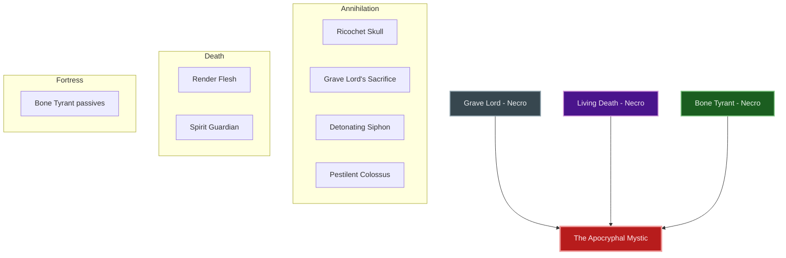
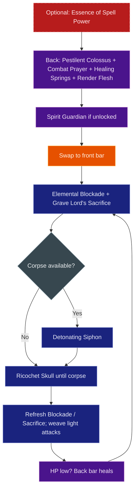
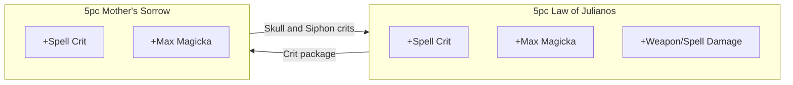

# Build Plan - Rilis Toxil: The Apocryphal Mystic (Magicka Necromancer Overland)

> **Character profile:** [rilis_toxil.md](rilis_toxil.md) — Level 17 High Elf Necromancer, CP 1033, @SOLAEGIS (NA).

Rilis Toxil is a **High Elf scholar of unmaking**—a magicka necromancer who treats death not as an ending but as a text to be read, annotated, and rewritten. This guide takes him from **leveling in Khenarthi's Roost** through **CP160** as **The Apocryphal Mystic**: a solo overland magicka DPS who opens every hard fight with **Major Vulnerability**, sustains through **Restoration Staff** heals and **Living Death**, and runs a **Grave Lord** corpse loop on a lightning destruction bar.

**Necromancer first.** Keep all three native lines — **Grave Lord**, **Living Death**, and **Bone Tyrant** — by default. Subclass a slot **only** when a foreign line clearly outperforms the native line it would replace (documented DPS or sustain proof). At **Level 50**, unlock Bahtra's quest so subclassing is *available*; do **not** auto-swap. Target gear is **100% craftable**: **5 Law of Julianos + 5 Mother's Sorrow**, all Light Armor, coordinated with **@masisi**.

---

## Build at a glance

| **Attribute** | **Recommendation** |
| :--- | :--- |
| **Primary Stat** | 64 points in **Magicka** — **live:** 20 Magicka / 0 Health / 0 Stamina @ L17 · **28,631** Magicka · **target:** 64 Magicka @ 50 |
| **Mundus Stone** | **The Apprentice** (+Spell Damage) while leveling — **live:** The Apprentice ✅ · **optional @ CP160:** **The Thief** once Mother's Sorrow + Death Knell crit stacks |
| **Vampirism** | **Cured** — no stage; mystic scholar, not a blood cultist |
| **Sets** | **5 Law of Julianos + 5 Mother's Sorrow** (100% craftable, all Light Armor) — **live:** Trainee 5/5 + Vanus 2/5 + Prisoner's Rags 1/5 (quest gear) · **target:** Julianos + Mother's Sorrow |
| **Bars** | Front: Lightning Destruction Staff ("The Unmaking") · Back: Restoration Staff ("The Mystic's Veil") |
| **Food** | **Witty Blue Entremet** (Max Magicka + Recovery) or **Bewitched Sugar Skulls** on world bosses |
| **Potion** | **Essence of Spell Power** (Spell Damage + Crit) on every world boss; rank **Medicinal Use 3/3** |
| **Weapon Poisons** | **Gradual Ravage Health IX** on destruction bar between pulls |
| **Staff/Weapon Enchant** | Front: **Shock Damage** (Infused) · Back: **Absorb Magicka** on long bosses, or **Reduce Spell Cost** for general overland |
| **Companion** | **Primary (now):** **Sharp-as-Night** (bodyguard / ranged DPS) at CP **1033** + companion **9/20** · **Secondary:** **Bastian Hallix** (emergency heals) · **Goal (20/20 @ CP160):** **Sharp-as-Night** (bodyguard) |
| **Primary Mount** | **Sapiarchic Senche-Serval** (owned) · **Ideal:** **Sapiarchic Senche-Serval** — see [Collectibles](#collectibles) |
| **Flavor Pet** | **Dwarven Spider** (owned) · **Ideal:** **Dwarven Spider** — see [Collectibles](#collectibles) |
| **Subclass** | **Default: none** — keep Grave Lord + Living Death + Bone Tyrant · **Optional merit:** Storm Calling replacing Bone Tyrant only — see [Optional merit subclass](#optional-merit-subclass-storm-calling) |

**Read next:** [Roleplay](#roleplay-the-apocryphal-mystic) · [Trinity configuration](#trinity-configuration) · [Combat kit](#combat-kit-the-scholars-reckoning) · [Gear and crafting](#gear-and-crafting-the-sapiarchs-scriptorium) · [Champion points](#champion-point-mapping-cp-1033) · [Companion](#companion-strategy-the-scholars-bodyguard) · [Collectibles](#collectibles) · [Checklist](#next-steps--in-game-action-checklist)

---

## Roleplay: The Apocryphal Mystic

Rilis Toxil earned the title **Mystic** not through prophecy but through **method**. He is an Altmer who believes the necromantic arts are a language—and like any language, they reward precision, repetition, and the willingness to read what others refuse to see.

Where lesser practitioners treat skulls as ammunition, Rilis treats them as **footnotes**. His lightning is the highlighter; his colossus is the thesis statement; his restoration bar and **Living Death** wards are the margin notes that say *I am still here to finish the argument.* He walks Tamriel as a Sapiarch might walk a library: quietly, completely, and with the absolute conviction that every corpse is a clue. Foreign schools are footnotes only—consulted when they prove stronger than the death arts, never by default.

**Sharp-as-Night** is the exception to the solitude—a silent **Argonian bodyguard** who stands between the mystic and anything that would interrupt his work. Rilis reads the dead; Sharp ensures the living keep their distance.

> [!TIP]
> **Suggested Custom Title:** `Scholar of the Unwritten Dead`

> [!NOTE]
> **Build Notes (paste into LAM Custom Title / Build Notes):**
> Rilis Toxil — Apocryphal Mystic. Magicka Necromancer solo overland. Necromancer-first: keep Grave Lord + Living Death + Bone Tyrant (no default subclass). 5 Law of Julianos + 5 Mother's Sorrow, craftable light. Front: Elemental Blockade, Ricochet Skull, Grave Lord's Sacrifice, Detonating Siphon, Inner Light, Pestilent Colossus. Back: Combat Prayer, Healing Springs, Consuming Trap, Render Flesh, Spirit Guardian (optional), Colossus. Corpse loop: Sacrifice/kill → Detonating Siphon → skull spam. 64 Magicka. Mundus: Apprentice (Thief optional @ CP160). Companion: Sharp-as-Night. @masisi crafts player gear only. Storm Calling only if Boundless Storm + Sorc passives beat Bone Tyrant on sustained bosses.

> [!TIP]
> **Flavor Pet:** **Dwarven Spider** from Collectibles. **Ideal (any source):** **Dwarven Spider** — clockwork familiar for an Altmer scholar; **Coldharbour Dremnaken Runt** (owned) is the best death-domain backup. See [Collectibles](#collectibles).

---

## Trinity configuration

Subclass unlocks at **Level 50** via Bahtra at-Hunding (**"A Study in Discipline"**). Unlocking the quest does **not** mean you must subclass. **Default trinity = all three native Necromancer lines.** See [docs/subclassing.md](../../../docs/subclassing.md).



| **Pillar** | **Line** | **Origin** | **Slot action** | **Function** |
| :--- | :--- | :--- | :--- | :--- |
| **Annihilation** | **Grave Lord** | Necromancer (native) | **KEEP** | **Ricochet Skull** spammable; **Grave Lord's Sacrifice** self-buff + corpse; **Detonating Siphon** corpse drain; **Pestilent Colossus** Major Vulnerability |
| **Death** | **Living Death** | Necromancer (native) | **KEEP** | **Render Flesh** Major Protection; **Spirit Guardian** mitigation + heal + corpse; Living Death passives (**Corpse Consumption**, **Undead Confederate**, etc.) |
| **Fortress** | **Bone Tyrant** | Necromancer (native) | **KEEP** (default) | Defensive passives (**Death Gleaning**, **Disdain Harm**, **Health Avarice**, **Last Gasp**); actives optional (melee **Death Scythe** is low priority on this ranged layout) |

**Weapon / guild lines (not subclass):** **Destruction Staff** (**Elemental Blockade**, interim **Force Pulse**), **Restoration Staff** (**Combat Prayer**, **Healing Springs**), **Mages Guild** (**Inner Light**), **Soul Magic** (**Consuming Trap**).

> [!IMPORTANT]
> **Do not subclass Restoring Light.** Combat Prayer and Healing Springs are **Restoration Staff** skills — any class with a resto staff can slot them. Replacing Living Death loses death-line actives and passives for no heal unlock.

### Optional merit subclass: Storm Calling

Evaluate **only** against **Bone Tyrant**. Keep Bone Tyrant unless all of the following are true in practice:

| **Keep Bone Tyrant when…** | **Consider Storm Calling when…** |
| :--- | :--- |
| You value death-domain identity and Bone Tyrant passives | Sustained world-boss DPS feels soft after corpse loop + CP are correct |
| You rarely use melee Bone Tyrant actives anyway (passives still help) | You will slot **Boundless Storm** and fully rank Storm Calling passives (**Capacitor**, **Energized**, **Amplitude**, **Expert Mage**) |
| You have not tested a controlled A/B on the same boss | Boundless Storm + Sorc passives clearly beat Bone Tyrant passives on that fight |

**If you swap:** Replace **Bone Tyrant** with **Storm Calling**. Slot **Boundless Storm** (Lightning Form → Boundless Storm) — typically front-bar flex (trade **Inner Light** or accept a bar shuffle). Keep **Grave Lord** and **Living Death**. Re-evaluate after gear and corpse rotation are already correct; never subclass to "fix" missing Detonating Siphon.

---

## Combat kit: The Scholar's Reckoning

Open on the **back bar** with **Pestilent Colossus** and heals, swap to the **front bar** for Blockade + Sacrifice + corpse siphon + skull spam. **Pure magicka** — 64 Magicka attributes; no stamina skills on target bars.

### Skill bars

Document **slotted morph names as shown in the skills UI**. Each morph appears at most once across bars. Bars must match equipped weapon types (Lightning Destruction front, Restoration back).

#### Front Bar (Lightning Destruction Staff): "The Unmaking"

| **Slot** | **Class/Line** | **Base → Morph** | **Role** | **Profile** |
| :--- | :--- | :--- | :--- | :--- |
| **1** | Destruction Staff | Wall of Elements → **Elemental Blockade** | Shock ground DoT | **Target** |
| **2** | Grave Lord (Necro) | Flame Skull → **Ricochet Skull** | Magicka spammable | **Live** ✅ |
| **3** | Grave Lord (Necro) | Sacrificial Bones → **Grave Lord's Sacrifice** | Self-buff + corpse on death | **Live** ✅ |
| **4** | Grave Lord (Necro) | Shocking Siphon → **Detonating Siphon** | Corpse drain + disease explosion | **Target** (default); **Mystic Siphon** if long-boss sustain needs recovery |
| **5** | Mages Guild | Magelight → **Inner Light** | +5% Spell Damage; unlocks **Might of the Guild** | **Target** (one bar only) |
| **6 (Ult)** | Grave Lord (Necro) | Frozen Colossus → **Pestilent Colossus** | Major Vulnerability | Respec from **Frozen Colossus** |

> [!NOTE]
> **Leveling bar (L17–49):** Fix ult slot first (**Frozen Colossus** in ultimate, not slot 5). Front: **Render Flesh** · **Grave Lord's Sacrifice** · **Consuming Trap** · **Force Pulse** · **Ricochet Skull** · **Frozen Colossus** ult. Unlock **Restoration Staff** and move heals to the back bar **before** Level 50 — do not wait for subclass.

> [!TIP]
> **Siphon morph:** **Detonating Siphon** is the default death-theme pick (disease DoT + corpse explosion). Swap to **Mystic Siphon** only if world bosses drain pools faster than resto heals can cover. Do **not** slot both siphon morphs. Do **not** also slot **Avid Boneyard** as a second primary corpse consumer — pick one corpse-spender for the main bar.

#### Back Bar (Restoration Staff): "The Mystic's Veil"

| **Slot** | **Class/Line** | **Base → Morph** | **Role** | **Profile** |
| :--- | :--- | :--- | :--- | :--- |
| **1** | Restoration Staff | Blessing of Protection → **Combat Prayer** | Heal + Minor Berserk | **Target** (weapon line — no Templar needed) |
| **2** | Restoration Staff | Grand Healing → **Healing Springs** | Ground HoT | **Target** |
| **3** | Soul Magic | Soul Trap → **Consuming Trap** | Sustain + damage | **Live** ✅ |
| **4** | Living Death (Necro) | Render Flesh → **Render Flesh** | Major Protection | **Live** ✅ — **keep after 50** |
| **5** | Living Death (Necro) | Spirit Mender → **Spirit Guardian** | Mitigation + heal + corpse on expire | **Target** @ CP160 · **interim:** **Force Pulse** until Spirit Guardian unlocked |
| **6 (Ult)** | Grave Lord (Necro) | Frozen Colossus → **Pestilent Colossus** | Major Vulnerability | Prefer back-bar open on bosses |

> [!NOTE]
> **Spirit Guardian** is a Living Death conjure, **not** a Daedric summon — it does **not** require slot 5 on both bars. Duration ~16s; creates a corpse when it expires in combat. Refresh from the back bar when it falls.

### Rotation and combat tips



#### Corpse economy

1. **Create a corpse** — enemy death, **Grave Lord's Sacrifice** skeleton dying in combat, or **Spirit Guardian** expiring in combat.
2. **Spend it** — cast **Detonating Siphon** (free corpse consumer) for DoT + explosion.
3. **Spam** — **Ricochet Skull** (third skull AoE while Sacrifice is up).
4. **No corpse yet?** Skull and Blockade until one appears; do not waste the siphon cast into empty ground.

#### Solo combat tips

1. **Pestilent Colossus opens every boss.** Cast first on every world boss and elite for **Major Vulnerability**.
2. **Elemental Blockade is your thesis.** Cast once per pull; feeds **Thaumaturge** and **Rapid Rot**.
3. **Grave Lord's Sacrifice before spam.** Apply after Blockade; refresh when it expires — buffs Necro + DoT damage and seeds a corpse.
4. **Detonating Siphon is the footnote drain.** Spend corpses; default morph for death theme.
5. **Ricochet Skull is the barrage.** Primary spammable; weave light attacks between casts for magicka return.
6. **Render Flesh stays** — keep Major Protection up on hard fights after Level 50; resto staff heals do not replace it.
7. **Consuming Trap** on the back bar for magicka return; reapply when it expires.
8. **Potion every world boss** once **Medicinal Use 3/3** is ranked.

### Passive skills

You have **1 skill point** available (live). Spend in priority order. Rank II/III where noted.

#### Necromancer — Grave Lord

* **[Rapid Rot](https://en.uesp.net/wiki/Online:Rapid_Rot) (II):** +DoT duration — **spend next** (Dismember already ranked ✅).
* **[Death Knell](https://en.uesp.net/wiki/Online:Death_Knell) (II):** +Critical Chance per Grave Lord skill slotted — scales with Sacrifice + Siphon + Colossus (+ Skull) on bars ✅ (already ranked; keep slotted GL count high).
* **[Dismember](https://en.uesp.net/wiki/Online:Dismember) (II):** +DoT / penetration while Grave Lord skills active — already ranked ✅
* **[Reusable Parts](https://en.uesp.net/wiki/Online:Reusable_Parts) (II):** Cheaper next corpse skill after Sacrifice expires — already ranked ✅

#### Necromancer — Living Death

* **[Near-Death Experience](https://en.uesp.net/wiki/Online:Near-Death_Experience)** — already ranked ✅
* **[Curative Curse](https://en.uesp.net/wiki/Online:Curative_Curse)** — already ranked ✅
* **[Corpse Consumption](https://en.uesp.net/wiki/Online:Corpse_Consumption):** Ultimate return when consuming corpses — unlock after Rapid Rot.
* **[Undead Confederate](https://en.uesp.net/wiki/Online:Undead_Confederate):** Recovery while a Living Death summon is active — rank with Spirit Guardian.

#### Necromancer — Bone Tyrant

* Rank **[Death Gleaning](https://en.uesp.net/wiki/Online:Death_Gleaning)**, **[Disdain Harm](https://en.uesp.net/wiki/Online:Disdain_Harm)**, **[Health Avarice](https://en.uesp.net/wiki/Online:Health_Avarice)**, **[Last Gasp](https://en.uesp.net/wiki/Online:Last_Gasp)** as points allow — these are the main Fortress value on a ranged mag layout (melee Scythe actives are optional).

#### Weapon — Destruction Staff

* Rank Destruction passives as the lightning bar is your primary DPS bar (**Tri Focus**, **Penetrating Magic**, **Elemental Force**, **Ancient Knowledge**, **Destruction Expert**).

#### Weapon — Restoration Staff

* Rank Restoration passives when the back bar is active (**Essence Drain**, **Restoration Expert**, etc.).

#### Armor — Light Armor

* Rank passives as you wear more light pieces toward the target loadout.

#### Guild — Mages Guild

* Join in **Phase 0**. Slot **Inner Light** for **Might of the Guild**. Rank **Everlasting Magic**, **Magicka Controller**, **Might of the Guild**, **Inner Light** line as points allow.

#### World — Soul Magic

* **Soul Siphoner** / related passives when ranking Consuming Trap.

#### Race — High Elf

* **Spell Recharge** and **Spell Attunement** — rank as points allow.

---

## Gear and crafting: "The Sapiarch's Scriptorium"

Everything is **crafted** — no overland farming for primary sets. **Julianos** supplies crit and spell damage; **Mother's Sorrow** stacks spell critical for skull and siphon crits. All **Light Armor** for magicka passives.

### Set rationale



| **Set** | **5-Piece Bonus** | **Role in the Build** |
| :--- | :--- | :--- |
| **Law of Julianos** | +Spell Critical; +Max Magicka; +Weapon and Spell Damage | Baseline mag DPS; staff and body slots |
| **Mother's Sorrow** | +Spell Critical; +Max Magicka | Crit-stacking for **Ricochet Skull** and **Detonating Siphon** |

> [!NOTE]
> **Current gear (quest/starter):** **Armor of the Trainee**, **Wisdom of Vanus**, and **Prisoner's Rags** are fine through early Phase 0. Craft **purple Magnus's Gift or Julianos** pieces as traits unlock (L50–CP160 bridge) so you are not in Trainee until the gold gate.

### Target loadout

| **Slot** | **Set** | **Weight** | **Trait** | **Enchantment** | **Quality** |
| :--- | :--- | :--- | :--- | :--- | :--- |
| **Head** | Mother's Sorrow | Light | Divines | Max Magicka | Gold |
| **Shoulders** | Mother's Sorrow | Light | Divines | Max Magicka | Gold |
| **Chest** | Law of Julianos | Light | Divines | Max Magicka | Gold |
| **Hands** | Law of Julianos | Light | Divines | Max Magicka | Gold |
| **Waist** | Law of Julianos | Light | Divines | Max Magicka | Gold |
| **Legs** | Law of Julianos | Light | Divines | Max Magicka | Gold |
| **Feet** | Law of Julianos | Light | Divines | Max Magicka | Gold |
| **Necklace** | Mother's Sorrow | Jewelry | Arcane | Spell Damage | Gold |
| **Ring 1** | Mother's Sorrow | Jewelry | Arcane | Max Magicka | Gold |
| **Ring 2** | Mother's Sorrow | Jewelry | Arcane | Max Magicka | Gold |
| **Front Staff** | Law of Julianos | Lightning Destro | Infused | Shock Damage | Gold |
| **Back Staff** | Law of Julianos | Restoration | Infused | Absorb Magicka | Gold |

**Front bar — Lightning Destruction:** Infused + Shock for status synergy with lightning skills and Blockade.

**Back bar — Restoration:** **Absorb Magicka** for long world-boss fights; swap to **Reduce Spell Cost** if overland spam feels magicka-starved between pulls.

### Crafting handoff (@masisi)

| **Detail** | **Recommendation** |
| :--- | :--- |
| **Style** | **High Elf** or **Psijic Order** body; **Sapiarch** trim on hands/feet if motif owned |
| **Set station** | Julianos: **Sunhold** (Summerset) — **6 traits** per slot · Mother's Sorrow: any clothing station — **8 traits** per slot |
| **Traits** | **Divines** armor · **Arcane** jewelry · **Infused** staves |
| **Interim (L50–CP160)** | Purple **Magnus's Gift** or **Julianos** pieces as traits unlock — replace Trainee early |
| **Quality path** | Purple bridge → gold at CP160 when research complete |

> [!NOTE]
> **Research gate:** Law of Julianos needs **6 traits** per slot. Check `examples/fixtures/karakedi_crafting.md` or @masisi before queueing gold-quality CP160 work.

---

## Champion Point Mapping (CP 1033)

> [!NOTE]
> **Star catalog:** Exact names and caps from [`champion_points_reference.md`](../../templates/champion_points_reference.md) (source: [`champion_points.yaml`](../../templates/champion_points.yaml)).

Full CP budget: **~344 Warfare / ~345 Craft / ~344 Fitness** (1033 total). **Live account CP is already spent** and combat-viable. **No respec required** unless you want more **Liquid Efficiency** for potion-heavy play — optional Craft tweak only.

### Warfare (Blue — ~344 Points)

*Primary focus: Magicka direct damage, DoT scaling, single-target.*

| **Slotted Star** | **Spend** | **Benefit** |
| :--- | :--- | :--- |
| **Fighting Finesse** | 50 | +Critical Damage — already maxed ✅ |
| **Master-at-Arms** | 50 | +Direct Damage — already maxed ✅ |
| **Deadly Aim** | 50 | +Single-Target Damage — already maxed ✅ |
| **Thaumaturge** | 50 | +DoT Damage — **Elemental Blockade**, siphon, ground effects — already maxed ✅ |

**Passives (no slot needed):**

* **Eldritch Insight (20):** +Max Magicka — already invested ✅
* **Flawless Ritual (40):** +status effect chance — shock synergy
* **War Mage (30):** +Weapon and Spell Damage to magical attacks
* **Precision / Piercing:** partial ranks as allocated on account

### Fitness (Red — ~344 Points)

*Primary focus: Solo survivability for overland.*

| **Slotted Star** | **Spend** | **Benefit** |
| :--- | :--- | :--- |
| **Fortified** | 50 | +Armor — already maxed ✅ |
| **Boundless Vitality** | 50 | +Max Health — already maxed ✅ |
| **Rejuvenation** | 50 | +Recovery — already maxed ✅ |
| **Hardened** | 50 | +Critical Resistance — already maxed ✅ (fourth slottable) |

**Passives (no slot needed):**

* **Mystic Tenacity** — catalog **Passive, max 20** (not slottable). Reduce elemental status duration; invest up to cap as points allow. Live export may show a higher spend — treat catalog max as the plan truth.
* **Sprinter**, **Hero's Vigor**, **Tumbling**, **Defiance**, **Piercing Gaze** — as allocated on account ✅

### Craft (Green — ~345 Points)

*Primary focus: Overland speed and economy (account gathering build).*

| **Slotted Star** | **Spend** | **Benefit** |
| :--- | :--- | :--- |
| **Steed's Blessing** | 50 | +Out-of-Combat Speed — already maxed ✅ |
| **Master Gatherer** | 75 | Gathering yield — account farmer ✅ |
| **Gifted Rider** | 50 | +Mount Speed — already maxed ✅ |
| **Sustaining Shadows** | 50 | Sneak cost reduction — already maxed ✅ |

**Passives:** **Steadfast Enchantment**, **Wanderer**, **Treasure Hunter** — already partially invested ✅ · Optional: **Liquid Efficiency** if potion use is heavy.

---

## Companion Strategy: "The Scholar's Bodyguard"

**Sharp-as-Night** is Rilis's **bodyguard**—not a healer, not a second scholar, but the Argonian who holds the line while the mystic casts. Recommend companions in **three tiers** at **live** companion level from the profile. **Companion gear is separate from player gear** — only **Companion's** items with companion-only traits; no player sets or 5-piece bonuses. Buy white basics from merchants; farm **Superior+** drops while the companion is active.

> [!NOTE]
> **Live export:** **Sharp-as-Night** — Level **9/20**, **level 1 default gear, 2 empty ability slots**. Character **Level 17 / CP 1033**. Keep him summoned as bodyguard unless a fight explicitly calls for Bastian.

### Companion picks

| **Tier** | **Companion** | **Role** | **Roleplay fit** | **Mechanical fit (at current stats)** |
| :--- | :--- | :--- | :--- | :--- |
| **Primary (now)** | **Sharp-as-Night** | Bodyguard / ranged DPS | Silent Argonian retainer—blade and bow between the scholar and the world | Draws pressure off Rilis while you learn bars; **9/20** with starter gear |
| **Secondary** | **Bastian Hallix** | Healer | Emergency court physician when the bodyguard alone is not enough | **Only** when Sharp dies repeatedly or you need heals without resto staff |
| **Goal (20/20 @ CP160)** | **Sharp-as-Night** | Bodyguard / ranged DPS | End-state: full-time personal guard for the Apocryphal Mystic | **Quickened**/**Bolstered** companion gear + bow bar; **Entombing Trap** roots pursuers |

### Goal companion — Sharp-as-Night: The Scholar's Bodyguard

When Rilis is CP160 and Sharp is **20/20**, he remains the **only** end-state companion: a ranged bodyguard who pins threats in place so the mystic never has to leave the destruction bar.

| **Setting** | **Recommendation** |
| :--- | :--- |
| **Role** | **Bodyguard / Ranged DPS** (Bow) — holds aggro and roots; does not replace Rilis's self-heals |
| **Gear Weight** | **Medium Armor** (mobility without sacrificing presence) |
| **Gear Trait** | **Quickened** on most pieces (more traps and roots); **Bolstered** on chest/legs if he dies too often on world bosses |
| **Loadout** | Full **medium** companion armor + **Companion's Bow** — companion-only items |
| **Acquisition** | White basics from merchants; **Superior+** from boss/overland drops with Sharp active. **Not** @masisi player craft. |

#### Sharp's bodyguard skill bar (goal @ 20/20)

1. **Entombing Trap** (Class → Nightblade): **Root** — primary bodyguard tool; stops rushers on the scholar.
2. **Piercing Arrow** (Class → Nightblade): Ranged burst on whoever closes distance.
3. **Rejuvenating Aura** (Class → Nightblade): Self-sustain so the bodyguard stays upright.
4. **Rejuvenation** (Restoration Staff): HoT when the guard takes focus fire.
5. **Vanish** (Class → Shadow): Threat drop when overwhelmed—bodyguard fades, Rilis finishes the fight.
6. *Ultimate:* **Shooting Star** or class ult for boss burn when the scholar calls for covering fire.

### Primary now — Sharp-as-Night

**Sharp-as-Night** is already active as Rilis's **bodyguard**. Finish leveling him toward **20/20**, fill his **2 empty ability slots** (prioritize **Entombing Trap** and **Piercing Arrow**), and replace level-1 defaults with **Superior+** **Companion's** medium armor (**Quickened**/**Bolstered**) and a **Companion's Bow** from drops. **Keep Sharp summoned by default**—only swap to Bastian when the bodyguard cannot keep you alive through a specific boss.

> [!TIP]
> **Secondary — Bastian Hallix:** Emergency summon only. If Sharp dies repeatedly on a world boss, dismiss him, run Bastian for that pull, then return to the bodyguard for overland travel and normal content.

> [!NOTE]
> **Rapport:** Sharp approves of efficiency, discretion, and completing Blackwood-related business. He disapproves of needless cruelty and sloppy work. The bodyguard serves a scholar who values precision—not chaos.

---

## Collectibles

### Mount

> [!NOTE]
> **Owned mounts (from profile):** Ashbone Sabre Cat, Bay Dun Horse, Bleakrock Snowdog, Brown Paint Horse, Dwarven War Horse, Ebon Dwarven Horse, Faunfrolic Great Elk, Flame Atronach Senche, Frostborn Durzog Mangler, Hammerfell Camel, Hearthfire Kagouti, Highland Spotted Lynx, Imperial Horse, Ja'zennji Siir Fox, Midnight Steed, Nightmare Senche, Nix-Ox War-Steed, Noble Riverhold Senche-Lion, Noweyr Steed, **Psijic Escort Charger**, Rahd-m'Athra, Rubyflare Torchnix, **Sapiarchic Senche-Serval**, Senche-Leopard, Shadowghost Guar, Skulltooth Coastal Durzog, Snow Bear, Sorrel Horse, Spotted Duneracer Senche-raht, Tessellated Guar, Timber Mammoth, Wormwrithe Bear-Lizard, Yorgrim River Ram.

#### Primary (owned): Sapiarchic Senche-Serval

| **Attribute** | **Detail** |
| :--- | :--- |
| **Why** | Altmer **Sapiarch** aesthetic — scholarly authority on four legs; gold-and-white silhouette matches High Elf mystic fiction |
| **Acquisition** | Owned ✅ |
| **Dye pass** | **Sapiarch gold** body · **Apocrypha ink** or **midnight sapphire** accents |

#### Other owned options

| **Mount** | **Owned** | **Why** |
| :--- | :--- | :--- |
| [Psijic Escort Charger](https://en.uesp.net/wiki/Online:Psijic_Escort_Charger) | ✅ | Arcane escort — mystic's otherworldly commute |
| [Midnight Steed](https://en.uesp.net/wiki/Online:Midnight_Steed) | ✅ | Grave-night aesthetic; austere scholar's mount |
| [Nightmare Senche](https://en.uesp.net/wiki/Online:Nightmare_Senche) | ✅ | Death-domain drama for necromancer roleplay |

### Pet

#### Primary (owned): Dwarven Spider

| **Attribute** | **Detail** |
| :--- | :--- |
| **Why** | Clockwork familiar for a scholar who treats necromancy as engineering |
| **Acquisition** | Owned ✅ |

#### Other owned options

| **Pet** | **Why** |
| :--- | :--- |
| [Coldharbour Dremnaken Runt](https://en.uesp.net/wiki/Online:Coldharbour_Dremnaken_Runt) (owned) | Daedric death-domain familiar |
| [Blue Dragon Imp](https://en.uesp.net/wiki/Online:Blue_Dragon_Imp) (owned) | Arcane crackle — lightning-bar synergy |

### Dye and style

**The Sapiarch's Script** — High Elf academic necromancer.

| **Slot** | **Style** | **Visual Reasoning** |
| :--- | :--- | :--- |
| **Chest / Legs** | **High Elf** or **Psijic Order** | Altmer scholar silhouette |
| **Head / Hands** | **Sapiarch** or **Hood** | Arch-mage authority |
| **Staves** | **Psijic Order** | Crystalline mystic weapons |

**Dye palette:** Sapiarch gold (primary), apocrypha indigo (secondary), bone-white trim (necromantic accent).

---

## Next Steps & In-Game Action Checklist

Follow this list to unlock **The Apocryphal Mystic**. Gear phases are labeled inline. **Default: keep all three Necromancer lines.**

### Phase 0 — Today (leveling)

1. **Finish starter zones:** Complete **Khenarthi's Roost** → **Auridon** main line; reach **Level 50**.
2. **Attributes:** Put **every point into Magicka** (live: 20/64 @ L17).
3. **Fix bar slots:** Move **Frozen Colossus** to **ultimate**; **Ricochet Skull** to a regular slot. Stop mirroring identical front/back bars — use single-bar leveling layout until Resto rank is higher.
4. **Spend 1 skill point:** **Rapid Rot** (Grave Lord) — **Dismember** is already ranked.
5. **Mages Guild:** Join now; unlock **Inner Light** path for **Might of the Guild** (do not wait for Phase 1).
6. **Restoration Staff bridge:** Rank Restoration and slot **Combat Prayer** / **Healing Springs** on the back bar **before** Level 50 while keeping Living Death (**Render Flesh**).
7. **Stable:** Train **riding skills** (live: 6/60) whenever you visit a stable.
8. **Quest journal:** Clear clutter — focus one storyline instead of five simultaneous zone hops.
9. **Companion (bodyguard):** Fill Sharp's **2 empty slots** (**Entombing Trap**, **Piercing Arrow**); keep him **summoned by default** for XP toward **20/20**.

### Phase 1 — Level 50 gate

10. **[Phase 1]** Hit **Level 50**; complete **"A Study in Discipline"** with Bahtra at-Hunding so subclassing is **available**.
11. **[Phase 1]** **Default: keep Grave Lord + Living Death + Bone Tyrant.** Do **not** auto-replace Living Death or Bone Tyrant. Only consider Storm Calling per [Optional merit subclass](#optional-merit-subclass-storm-calling) after corpse rotation and gear are correct.
12. **[Phase 1]** Respec to **target bars** (front lightning / back resto). Morph **Pestilent Colossus** and **Detonating Siphon** (or **Mystic Siphon** if sustain-first). Keep **Render Flesh**.
13. **[Phase 1]** Slot **Inner Light** on the **front bar only**.

### Phase 2 — Craft (target)

14. **[Phase 2]** Interim: craft purple **Magnus's Gift** or **Julianos** as traits unlock (replace Trainee).
15. **[Phase 2]** Coordinate with **@masisi**: craft **5 Law of Julianos + 5 Mother's Sorrow**, all Light Armor, Divines, Max Magicka enchants, Arcane jewelry. Staves: Lightning Destro + Restoration, Infused.
16. **[Phase 2]** Use **452 Transmute Crystals** to fix non-Divines armor traits.

### Phase 3 — Polish

17. **[Phase 3]** Apply **High Elf** / **Psijic Order** motifs. Dye pass: Sapiarch gold, apocrypha indigo, bone-white trim.
18. **[Phase 3]** Stock **Essence of Spell Power** for boss pulls. Rank **Medicinal Use 3/3**. Optional mundus: **The Thief** once crit package is online.
19. **[Phase 3]** Morph **Spirit Guardian**; place on back bar slot 5 (replace interim Force Pulse). Rank Living Death passives (**Corpse Consumption**, **Undead Confederate**).

### Finish

20. **Companion:** Run **Sharp-as-Night** as **bodyguard**; level to **20/20**; farm **companion-only** gear per [Companion Strategy](#companion-strategy-the-scholars-bodyguard).
21. **Collectibles:** Equip **Sapiarchic Senche-Serval** mount and **Dwarven Spider** pet.
22. **Regenerate profile:** Run `/markdown` in-game and update [rilis_toxil.md](rilis_toxil.md) when bars, native lines, and gear match this plan.

Every corpse is a page. Rilis intends to read them all.

---

## Appendix: Champion Point star catalog

All Warfare, Fitness, and Craft stars with constellation, type (Slottable/Passive), max points, and stage costs:

**[`champion_points_reference.md`](../../templates/champion_points_reference.md)**

Regenerate after editing [`champion_points.yaml`](../../templates/champion_points.yaml):

```bash
python3 scripts/generate_champion_points_reference.py
```
