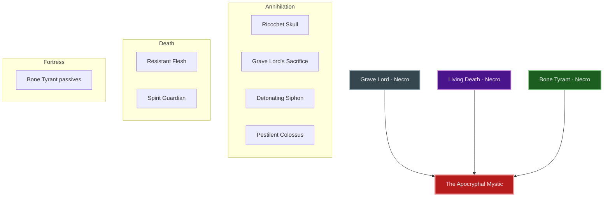
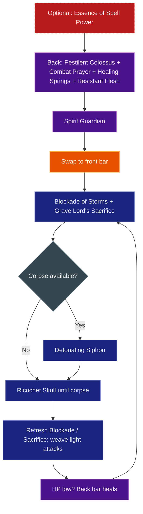
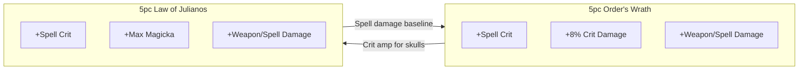

# Build Plan - Rilis Toxil: The Apocryphal Mystic (Magicka Necromancer Overland)

> **Character profile:** [rilis_toxil.md](rilis_toxil.md) — Level 50 High Elf Necromancer, CP 1039, @SOLAEGIS (NA).  
> **Gear comparison:** [rilis_toxil_gear_comparison.md](../../fixtures/rilis_toxil_gear_comparison.md) — locked **Approach 1**.

Rilis Toxil is a **High Elf scholar of unmaking**—a magicka necromancer who treats death not as an ending but as a text to be read, annotated, and rewritten. This guide takes him from **leveling in Khenarthi's Roost** through **CP160** as **The Apocryphal Mystic**: a solo overland magicka DPS who opens every hard fight with **Major Vulnerability**, sustains through **Restoration Staff** heals and **Living Death**, and runs a **Grave Lord** corpse loop on a lightning destruction bar.

**Necromancer first.** Keep all three native lines — **Grave Lord**, **Living Death**, and **Bone Tyrant** — by default. Subclass a slot **only** when a foreign line clearly outperforms the native line it would replace (documented DPS or sustain proof). At **Level 50**, unlock Bahtra's quest so subclassing is *available*; do **not** auto-swap. Target gear is **100% craftable**: **5 Order's Wrath + 5 Law of Julianos**, all Light Armor, coordinated with **@masisi**.

---

## Build at a glance

| **Attribute** | **Recommendation** |
| :--- | :--- |
| **Primary Stat** | 64 points in **Magicka** — **live:** 64 Magicka / 0 Health / 0 Stamina @ L50 · **28,483** Magicka ✅ |
| **Mundus Stone** | **The Apprentice** (+Spell Damage) until gold gear — **live:** The Apprentice ✅ · **after CP160 craft:** test **The Thief** once Order's Wrath + Death Knell crit stacks |
| **Vampirism** | **Cured** — no stage; mystic scholar, not a blood cultist |
| **Sets** | **5 Order's Wrath + 5 Law of Julianos** (100% craftable, all Light) — **live:** Trainee 5/5 + scrap · **open:** Phase 2 @masisi handoff |
| **Bars** | Front: Lightning Destruction Staff ("The Unmaking") · Back: Restoration Staff ("The Mystic's Veil") |
| **Food** | **Witty Blue Entremet** (Max Magicka + Recovery) or **Bewitched Sugar Skulls** on world bosses |
| **Potion** | **Essence of Spell Power** on every world boss — **live:** **Medicinal Use** still locked (Alchemy Phase 3) |
| **Weapon Poisons** | **Gradual Ravage Health IX** on destruction bar between pulls |
| **Staff/Weapon Enchant** | Front: **Shock Damage** (Infused) · Back: **Absorb Magicka** on long bosses, or **Reduce Spell Cost** for general overland |
| **Companion** | **Primary (now):** **Sharp-as-Night** (bodyguard / ranged DPS) **16/20** @ CP **1039** · **Secondary:** **Bastian Hallix** (emergency heals) · **Goal:** Sharp **20/20** + Superior+ companion gear |
| **Primary Mount** | **Sapiarchic Senche-Serval** (owned) · **Ideal:** **Sapiarchic Senche-Serval** — see [Collectibles](#collectibles) |
| **Flavor Pet** | **Dwarven Spider** (owned) · **Ideal:** **Dwarven Spider** — see [Collectibles](#collectibles) |
| **Subclass** | **Default: none** — keep Grave Lord + Living Death + Bone Tyrant · **Optional merit:** Storm Calling replacing Bone Tyrant only — see [Optional merit subclass](#optional-merit-subclass-storm-calling) |

**Read next:** [Roleplay](#roleplay-the-apocryphal-mystic) · [Trinity configuration](#trinity-configuration) · [Combat kit](#combat-kit-the-scholars-reckoning) · [Gear and crafting](#gear-and-crafting-the-sapiarchs-scriptorium) · [Champion points](#champion-point-mapping-cp-1039) · [Companion](#companion-strategy-the-scholars-bodyguard) · [Collectibles](#collectibles) · [Checklist](#next-steps--in-game-action-checklist)

---

## Roleplay: The Apocryphal Mystic

Rilis Toxil earned the title **Mystic** not through prophecy but through **method**. He is an Altmer who believes the necromantic arts are a language—and like any language, they reward precision, repetition, and the willingness to read what others refuse to see.

Where lesser practitioners treat skulls as ammunition, Rilis treats them as **footnotes**. His lightning is the highlighter; his colossus is the thesis statement; his restoration bar and **Living Death** wards are the margin notes that say *I am still here to finish the argument.* He walks Tamriel as a Sapiarch might walk a library: quietly, completely, and with the absolute conviction that every corpse is a clue. Foreign schools are footnotes only—consulted when they prove stronger than the death arts, never by default.

**Sharp-as-Night** is the exception to the solitude—a silent **Argonian bodyguard** who stands between the mystic and anything that would interrupt his work. Rilis reads the dead; Sharp ensures the living keep their distance.

> [!TIP]
> **Suggested Custom Title:** `Scholar of the Unwritten Dead`

> [!NOTE]
> **Build Notes (paste into LAM Custom Title / Build Notes):**
> Rilis Toxil — Apocryphal Mystic. Magicka Necromancer solo overland. Necromancer-first: keep Grave Lord + Living Death + Bone Tyrant (no default subclass). Target: 5 Order's Wrath + 5 Law of Julianos (craftable light; still on Trainee). Front: Grave Lord's Sacrifice, Blockade of Storms, Ricochet Skull, Detonating Siphon, Inner Light, Pestilent Colossus. Back: Combat Prayer, Healing Springs, Consuming Trap, Resistant Flesh, Spirit Guardian, Colossus. Corpse loop: Sacrifice/kill → Detonating Siphon → skull spam. 64 Magicka. Mundus: Apprentice (Thief after gold OW+Julianos). Companion: Sharp-as-Night 16/20. @masisi crafts player gear only. Storm Calling only if Boundless Storm + Sorc passives beat Bone Tyrant on sustained bosses.

> [!TIP]
> **Flavor Pet:** **Dwarven Spider** from Collectibles. **Ideal (any source):** **Dwarven Spider** — clockwork familiar for an Altmer scholar; **Coldharbour Dremnaken Runt** (owned) is the best death-domain backup. See [Collectibles](#collectibles).

---

## Trinity configuration

Subclass unlocks at **Level 50** via Bahtra at-Hunding (**"A Study in Discipline"**). Unlocking the quest does **not** mean you must subclass. **Default trinity = all three native Necromancer lines.** See [docs/subclassing.md](../../../docs/subclassing.md).


```mermaid
graph TD
    classDef grave fill:#37474F,stroke:#90A4AE,stroke-width:2px,color:#ECEFF1
    classDef death fill:#4A148C,stroke:#CE93D8,stroke-width:2px,color:#F3E5F5
    classDef bone fill:#1B5E20,stroke:#81C784,stroke-width:2px,color:#E8F5E9
    classDef core fill:#B71C1C,stroke:#EF9A9A,stroke-width:3px,color:#FFEBEE

    A["Grave Lord - Necro"]:::grave --> D["The Apocryphal Mystic"]:::core
    B["Living Death - Necro"]:::death --> D
    C["Bone Tyrant - Necro"]:::bone --> D

    subgraph Annihilation ["Annihilation"]
        A1["Ricochet Skull"]
        A2["Grave Lord's Sacrifice"]
        A3["Detonating Siphon"]
        A4["Pestilent Colossus"]
    end

    subgraph DeathDomain ["Death"]
        B1["Resistant Flesh"]
        B2["Spirit Guardian"]
    end

    subgraph Fortress ["Fortress"]
        C1["Bone Tyrant passives"]
    end
```

| **Pillar** | **Line** | **Origin** | **Slot action** | **Function** |
| :--- | :--- | :--- | :--- | :--- |
| **Annihilation** | **Grave Lord** | Necromancer (native) | **KEEP** | **Ricochet Skull** spammable; **Grave Lord's Sacrifice** self-buff + corpse; **Detonating Siphon** corpse drain; **Pestilent Colossus** Major Vulnerability |
| **Death** | **Living Death** | Necromancer (native) | **KEEP** | **Resistant Flesh** (Render Flesh morph) Major Protection; **Spirit Guardian** mitigation + heal + corpse; Living Death passives (**Corpse Consumption**, **Undead Confederate**, etc.) |
| **Fortress** | **Bone Tyrant** | Necromancer (native) | **KEEP** (default) | Defensive passives (**Death Gleaning**, **Disdain Harm**, **Health Avarice**, **Last Gasp**); actives optional (melee **Death Scythe** is low priority on this ranged layout) |

**Weapon / guild lines (not subclass):** **Destruction Staff** (**Blockade of Storms** / Elemental Blockade), **Restoration Staff** (**Combat Prayer**, **Healing Springs**), **Mages Guild** (**Inner Light**), **Soul Magic** (**Consuming Trap**).

> [!IMPORTANT]
> **Do not subclass Restoring Light.** Combat Prayer and Healing Springs are **Restoration Staff** skills — any class with a resto staff can slot them. Replacing Living Death loses death-line actives and passives for no heal unlock.

### Optional merit subclass: Storm Calling

Evaluate **only** against **Bone Tyrant**. Keep Bone Tyrant unless all of the following are true in practice:

| **Keep Bone Tyrant when…** | **Consider Storm Calling when…** |
| :--- | :--- |
| You value death-domain identity and Bone Tyrant passives | Sustained world-boss DPS feels soft after corpse loop + CP are correct |
| You rarely use melee Bone Tyrant actives anyway (passives still help) | You will slot **Boundless Storm** and fully rank Storm Calling passives (**Capacitor**, **Energized**, **Amplitude**, **Expert Mage**) |
| You have not tested a controlled A/B on the same boss | Boundless Storm + Sorc passives clearly beat Bone Tyrant passives on that fight |

**If you swap:** Replace **Bone Tyrant** with **Storm Calling**. Slot **Boundless Storm** (Lightning Form → Boundless Storm) — typically front-bar flex (trade **Inner Light** or accept a bar shuffle). Keep **Grave Lord** and **Living Death**. Re-evaluate after gear and corpse rotation are already correct; never subclass to "fix" missing Detonating Siphon.

---

## Combat kit: The Scholar's Reckoning

Open on the **back bar** with **Pestilent Colossus** and heals, swap to the **front bar** for Blockade + Sacrifice + corpse siphon + skull spam. **Pure magicka** — 64 Magicka attributes; no stamina skills on target bars.

### Skill bars

Document **slotted morph names as shown in the skills UI**. Each morph appears at most once across bars. Bars must match equipped weapon types (Lightning Destruction front, Restoration back).

#### Front Bar (Lightning Destruction Staff): "The Unmaking"

Live slot order from [rilis_toxil.md](rilis_toxil.md). **Blockade of Storms** is the shock morph of Elemental Blockade.

| **Slot** | **Class/Line** | **Base → Morph** | **Role** | **Profile** |
| :--- | :--- | :--- | :--- | :--- |
| **1** | Grave Lord (Necro) | Sacrificial Bones → **Grave Lord's Sacrifice** | Self-buff + corpse on death | **Live** ✅ |
| **2** | Destruction Staff | Wall of Elements → **Blockade of Storms** | Shock ground DoT | **Live** ✅ |
| **3** | Grave Lord (Necro) | Flame Skull → **Ricochet Skull** | Magicka spammable | **Live** ✅ |
| **4** | Grave Lord (Necro) | Shocking Siphon → **Detonating Siphon** | Corpse drain + disease explosion | **Live** ✅ (default); **Mystic Siphon** only if long-boss sustain needs recovery |
| **5** | Mages Guild | Magelight → **Inner Light** | +5% Spell Damage; unlocks **Might of the Guild** | **Live** ✅ (front only) — MG rank 4; keep ranking for **Might of the Guild** |
| **6 (Ult)** | Grave Lord (Necro) | Frozen Colossus → **Pestilent Colossus** | Major Vulnerability | **Live** ✅ |

> [!NOTE]
> **Leveling history (done):** Ult fixed, resto back bar online before 50, Phase 1 bars locked. Do not revert to single-bar mirrored layouts.

> [!TIP]
> **Siphon morph:** **Detonating Siphon** is the default death-theme pick (disease DoT + corpse explosion). Swap to **Mystic Siphon** only if world bosses drain pools faster than resto heals can cover. Do **not** slot both siphon morphs. Do **not** also slot **Avid Boneyard** as a second primary corpse consumer — pick one corpse-spender for the main bar.

#### Back Bar (Restoration Staff): "The Mystic's Veil"

| **Slot** | **Class/Line** | **Base → Morph** | **Role** | **Profile** |
| :--- | :--- | :--- | :--- | :--- |
| **1** | Restoration Staff | Blessing of Protection → **Combat Prayer** | Heal + Minor Berserk | **Live** ✅ |
| **2** | Restoration Staff | Grand Healing → **Healing Springs** | Ground HoT | **Live** ✅ |
| **3** | Soul Magic | Soul Trap → **Consuming Trap** | Sustain + damage | **Live** ✅ |
| **4** | Living Death (Necro) | Render Flesh → **Resistant Flesh** | Major Protection (solo morph) | **Live** ✅ — keep; do not drop for resto-only healing |
| **5** | Living Death (Necro) | Spirit Mender → **Spirit Guardian** | Mitigation + heal + corpse on expire | **Live** ✅ |
| **6 (Ult)** | Grave Lord (Necro) | Frozen Colossus → **Pestilent Colossus** | Major Vulnerability | **Live** ✅ — prefer back-bar open on bosses |

> [!NOTE]
> **Spirit Guardian** is a Living Death conjure, **not** a Daedric summon — it does **not** require slot 5 on both bars. Duration ~16s; creates a corpse when it expires in combat. Refresh from the back bar when it falls.

### Rotation and combat tips


```mermaid
flowchart TD
    classDef start fill:#B71C1C,stroke:#EF9A9A,stroke-dasharray:5 5,color:#FFEBEE
    classDef backbar fill:#4A148C,stroke:#CE93D8,color:#F3E5F5
    classDef swap fill:#E65100,stroke:#FFB74D,color:#FFF3E3
    classDef frontbar fill:#1A237E,stroke:#7986CB,color:#E8EAF6
    classDef corpse fill:#37474F,stroke:#90A4AE,color:#ECEFF1

    A["Optional: Essence of Spell Power"]:::start --> B["Back: Pestilent Colossus + Combat Prayer + Healing Springs + Resistant Flesh"]:::backbar
    B --> C["Spirit Guardian"]:::backbar
    C --> D["Swap to front bar"]:::swap
    D --> E["Blockade of Storms + Grave Lord's Sacrifice"]:::frontbar
    E --> F{"Corpse available?"}:::corpse
    F -->|Yes| G["Detonating Siphon"]:::frontbar
    F -->|No| H["Ricochet Skull until corpse"]:::frontbar
    G --> H
    H --> I["Refresh Blockade / Sacrifice; weave light attacks"]:::frontbar
    I --> J["HP low? Back bar heals"]:::backbar
    J --> E
```

#### Corpse economy

1. **Create a corpse** — enemy death, **Grave Lord's Sacrifice** skeleton dying in combat, or **Spirit Guardian** expiring in combat.
2. **Spend it** — cast **Detonating Siphon** (free corpse consumer) for DoT + explosion.
3. **Spam** — **Ricochet Skull** (third skull AoE while Sacrifice is up).
4. **No corpse yet?** Skull and Blockade until one appears; do not waste the siphon cast into empty ground.

#### Solo combat tips

1. **Pestilent Colossus opens every boss.** Cast first on every world boss and elite for **Major Vulnerability**.
2. **Blockade of Storms is your thesis.** Cast once per pull; feeds **Thaumaturge** and **Rapid Rot**.
3. **Grave Lord's Sacrifice before spam.** Apply after Blockade; refresh when it expires — buffs Necro + DoT damage and seeds a corpse.
4. **Detonating Siphon is the footnote drain.** Spend corpses; default morph for death theme.
5. **Ricochet Skull is the barrage.** Primary spammable; weave light attacks between casts for magicka return.
6. **Resistant Flesh stays** — keep Major Protection up on hard fights; resto staff heals do not replace it.
7. **Consuming Trap** on the back bar for magicka return; reapply when it expires.
8. **Potion every world boss** once **Medicinal Use 3/3** is ranked (still locked — Alchemy priority).

### Passive skills

Phase 0 skill-point backlog is cleared (**Rapid Rot**, **Corpse Consumption**, **Undead Confederate** ranked ✅). Spend leftover points in priority order below. Rank II/III where noted.

#### Necromancer — Grave Lord

* **[Rapid Rot](https://en.uesp.net/wiki/Online:Rapid_Rot) (II):** +DoT duration — **ranked** ✅
* **[Death Knell](https://en.uesp.net/wiki/Online:Death_Knell) (II):** +Critical Chance per Grave Lord skill slotted — scales with Sacrifice + Siphon + Colossus (+ Skull) on bars ✅ (keep slotted GL count high).
* **[Dismember](https://en.uesp.net/wiki/Online:Dismember) (II):** +DoT / penetration while Grave Lord skills active — already ranked ✅
* **[Reusable Parts](https://en.uesp.net/wiki/Online:Reusable_Parts) (II):** Cheaper next corpse skill after Sacrifice expires — already ranked ✅

#### Necromancer — Living Death

* **[Near-Death Experience](https://en.uesp.net/wiki/Online:Near-Death_Experience)** — already ranked ✅
* **[Curative Curse](https://en.uesp.net/wiki/Online:Curative_Curse)** — already ranked ✅
* **[Corpse Consumption](https://en.uesp.net/wiki/Online:Corpse_Consumption):** Ultimate return when consuming corpses — **ranked** ✅
* **[Undead Confederate](https://en.uesp.net/wiki/Online:Undead_Confederate):** Recovery while a Living Death summon is active — **ranked** ✅ (pairs with Spirit Guardian)

#### Necromancer — Bone Tyrant

* Rank **[Death Gleaning](https://en.uesp.net/wiki/Online:Death_Gleaning)**, **[Disdain Harm](https://en.uesp.net/wiki/Online:Disdain_Harm)**, **[Health Avarice](https://en.uesp.net/wiki/Online:Health_Avarice)**, **[Last Gasp](https://en.uesp.net/wiki/Online:Last_Gasp)** as points allow — these are the main Fortress value on a ranged mag layout (melee Scythe actives are optional).

#### Weapon — Destruction Staff

* Rank Destruction passives as the lightning bar is your primary DPS bar (**Tri Focus**, **Penetrating Magic**, **Elemental Force**, **Ancient Knowledge**, **Destruction Expert**).

#### Weapon — Restoration Staff

* Restoration passives largely online (**Essence Drain**, **Restoration Expert**, etc.) — finish any remaining ranks.

#### Armor — Light Armor

* Rank passives as you wear more light pieces toward the target loadout (still mixed Trainee / scrap).

#### Guild — Mages Guild

* **Inner Light** slotted ✅. MG only **rank 4** — grind lore books / dailies until **Might of the Guild**, **Everlasting Magic**, and **Magicka Controller** unlock.

#### World — Soul Magic

* **Soul Siphoner** / related passives when ranking Consuming Trap.

#### Race — High Elf

* **Spell Recharge** and **Spell Attunement** — rank as points allow.

#### Craft — Alchemy

* Rank **[Medicinal Use](https://en.uesp.net/wiki/Online:Medicinal_Use) 3/3** next (still **locked** on live) so Spell Power pots last through world bosses.

---

## Gear and crafting: "The Sapiarch's Scriptorium"

Everything is **crafted** — no overland farming for primary sets. **Order's Wrath** stacks crit chance and **+8% crit damage**; **Julianos** supplies max magicka and spell damage. All **Light Armor** for magicka passives. Comparison: [rilis_toxil_gear_comparison.md](../../fixtures/rilis_toxil_gear_comparison.md).

### Set rationale


```mermaid
graph LR
    subgraph OW ["5pc Order's Wrath"]
        O1["+Spell Crit"]
        O2["+8% Crit Damage"]
        O3["+Weapon/Spell Damage"]
    end
    subgraph Julianos ["5pc Law of Julianos"]
        J1["+Spell Crit"]
        J2["+Max Magicka"]
        J3["+Weapon/Spell Damage"]
    end
    OW -->|"Crit amp for skulls"| Julianos
    Julianos -->|"Spell damage baseline"| OW
```

| **Set** | **5-Piece Bonus (CP160)** | **Role in the Build** |
| :--- | :--- | :--- |
| **Order's Wrath** | +2,257 crit (~10.3%); +129 Spell Damage; **+8% Critical Damage / Healing** | Crit package for **Ricochet Skull**, siphon, and Blockade |
| **Law of Julianos** | +1,314 crit (~6.0%); +1,096 Max Magicka; +300 Spell Damage | Baseline mag DPS on body + both staves |

**Combined set bonuses:** ~16.3% crit · **429** Spell Damage · **1,096** Magicka · **+8% crit damage** — fully craftable.

> [!NOTE]
> **Current gear (live):** **Armor of the Trainee** 5/5 plus scrap (Veiled Heritance Training chest, Vampire Lord Invigorating gloves, Charged frost-enchant lightning staff, Absorb Stamina Trainee resto). Replace ASAP — Rilis is already **L50 / CP 1039**. Priority: purple **Order's Wrath** / **Julianos** bridge → gold CP160 Approach 1.

### Target loadout

| **Slot** | **Set** | **Weight** | **Trait** | **Enchantment** | **Quality** |
| :--- | :--- | :--- | :--- | :--- | :--- |
| **Head** | Order's Wrath | Light | Divines | Max Magicka | Gold |
| **Shoulders** | Order's Wrath | Light | Divines | Max Magicka | Gold |
| **Chest** | Law of Julianos | Light | Divines | Max Magicka | Gold |
| **Hands** | Law of Julianos | Light | Divines | Max Magicka | Gold |
| **Waist** | Law of Julianos | Light | Divines | Max Magicka | Gold |
| **Legs** | Law of Julianos | Light | Divines | Max Magicka | Gold |
| **Feet** | Law of Julianos | Light | Divines | Max Magicka | Gold |
| **Necklace** | Order's Wrath | Jewelry | Arcane | Spell Damage | Gold |
| **Ring 1** | Order's Wrath | Jewelry | Arcane | Max Magicka | Gold |
| **Ring 2** | Order's Wrath | Jewelry | Arcane | Max Magicka | Gold |
| **Front Staff** | Law of Julianos | Lightning Destro | Infused | Shock Damage | Gold |
| **Back Staff** | Law of Julianos | Restoration | Infused | Absorb Magicka | Gold |

Counts: **Order's Wrath 5** (head, shoulders, jewelry) · **Julianos 7** (5 body + 2 staves) → both full 5pc bonuses.

**Front bar — Lightning Destruction:** Infused + Shock for status synergy with lightning skills and Blockade. **Replace live:** Charged + Frozen Weapon yew staff.

**Back bar — Restoration:** **Absorb Magicka** for long world-boss fights; swap to **Reduce Spell Cost** if overland spam feels magicka-starved between pulls. **Replace live:** Training + Absorb Stamina Trainee resto.

### Crafting handoff (@masisi)

Paste this to **@masisi** (account crafter). Player gear only — never companion pieces.

```text
Rilis Toxil — Approach 1 craft (CP160 gold when ready; purple OK as bridge)

Order's Wrath (Steadfast Hammer and Saw, High Isle) — Light / Divines / Max Magicka:
  Head, Shoulders
Order's Wrath jewelry — Arcane:
  Necklace (Spell Damage enchant), Ring ×2 (Max Magicka enchant)

Law of Julianos (Boreal Forge, Wrothgar) — Light / Divines / Max Magicka:
  Chest, Hands, Waist, Legs, Feet
Law of Julianos staves — Infused:
  Lightning Destruction (Shock Damage enchant)
  Restoration (Absorb Magicka enchant)

Style: High Elf or Psijic Order body; Sapiarch trim on hands/feet if motif owned.
Interim OK: purple OW or Julianos pieces to retire Trainee immediately.
```

| **Detail** | **Recommendation** |
| :--- | :--- |
| **Style** | **High Elf** or **Psijic Order** body; **Sapiarch** trim on hands/feet if motif owned |
| **Set station** | Order's Wrath: **Steadfast Hammer and Saw** (High Isle) · Julianos: **Boreal Forge** (Wrothgar) — **6 traits** per slot each |
| **Traits** | **Divines** armor · **Arcane** jewelry · **Infused** staves |
| **Interim** | Purple **Order's Wrath** or **Julianos** pieces **now** — replace Trainee before gold |
| **Quality path** | Purple bridge → gold CP160 (Masisi research already clears both sets) |
| **Transmutes** | Rilis has **452 Transmute Crystals** for non-Divines / wrong-trait fixes after craft |
| **Not craftable** | Do **not** request Mother's Sorrow (overland) — see [gear comparison](../../fixtures/rilis_toxil_gear_comparison.md) |

> [!NOTE]
> **Research gate:** Both sets need **6 traits** per slot. Masisi clothing/jewelry/staves are at **8/9 or 9/9** — gold CP160 is craftable now.

---

## Champion Point Mapping (CP 1039)

> [!NOTE]
> **Star catalog:** Exact names and caps from [`champion_points_reference.md`](../../templates/champion_points_reference.md) (source: [`champion_points.yaml`](../../templates/champion_points.yaml)).

Full CP budget: **~344 Warfare / ~345 Craft / ~344 Fitness** (~1033 plan template). **Live account CP is 1039** (1,035 spent / 4 available) and combat-viable. **No respec required** unless you want more **Liquid Efficiency** for potion-heavy play — optional Craft tweak only.

### Warfare (Blue — ~344 Points)

*Primary focus: Magicka direct damage, DoT scaling, single-target.*

| **Slotted Star** | **Spend** | **Benefit** |
| :--- | :--- | :--- |
| **Fighting Finesse** | 50 | +Critical Damage — already maxed ✅ |
| **Master-at-Arms** | 50 | +Direct Damage — already maxed ✅ |
| **Deadly Aim** | 50 | +Single-Target Damage — already maxed ✅ |
| **Thaumaturge** | 50 | +DoT Damage — **Elemental Blockade**, siphon, ground effects — already maxed ✅ |

**Passives (no slot needed):**

* **Eldritch Insight (20):** +Max Magicka — already invested ✅
* **Flawless Ritual (40):** +status effect chance — shock synergy
* **War Mage (30):** +Weapon and Spell Damage to magical attacks
* **Precision / Piercing:** partial ranks as allocated on account

### Fitness (Red — ~344 Points)

*Primary focus: Solo survivability for overland.*

| **Slotted Star** | **Spend** | **Benefit** |
| :--- | :--- | :--- |
| **Fortified** | 50 | +Armor — already maxed ✅ |
| **Boundless Vitality** | 50 | +Max Health — already maxed ✅ |
| **Rejuvenation** | 50 | +Recovery — already maxed ✅ |
| **Hardened** | 50 | +Critical Resistance — already maxed ✅ (fourth slottable) |

**Passives (no slot needed):**

* **Mystic Tenacity** — catalog **Passive, max 20** (not slottable). Reduce elemental status duration; invest up to cap as points allow. Live export may show a higher spend — treat catalog max as the plan truth.
* **Sprinter**, **Hero's Vigor**, **Tumbling**, **Defiance**, **Piercing Gaze** — as allocated on account ✅

### Craft (Green — ~345 Points)

*Primary focus: Overland speed and economy (account gathering build).*

| **Slotted Star** | **Spend** | **Benefit** |
| :--- | :--- | :--- |
| **Steed's Blessing** | 50 | +Out-of-Combat Speed — already maxed ✅ |
| **Master Gatherer** | 75 | Gathering yield — account farmer ✅ |
| **Gifted Rider** | 50 | +Mount Speed — already maxed ✅ |
| **Sustaining Shadows** | 50 | Sneak cost reduction — already maxed ✅ |

**Passives:** **Steadfast Enchantment**, **Wanderer**, **Treasure Hunter** — already partially invested ✅ · Optional: **Liquid Efficiency** if potion use is heavy.

---

## Companion Strategy: "The Scholar's Bodyguard"

**Sharp-as-Night** is Rilis's **bodyguard**—not a healer, not a second scholar, but the Argonian who holds the line while the mystic casts. **Companion gear is separate from player gear** — only **Companion's** items with companion-only traits; no player sets or 5-piece bonuses. Buy white basics from merchants; farm **Superior+** drops while the companion is active.

> [!NOTE]
> **Live export:** **Sharp-as-Night** — Level **16/20**, summoned as bodyguard. Bar: Piercing Arrow · Trick Shot · Infest · Snow Squall · Fungal Forage · **Empty ult**. All eight gear slots still **Level 1** defaults. Character **L50 / CP 1039**.

### Companion picks

| **Tier** | **Companion** | **Role** | **Roleplay fit** | **Mechanical fit (live)** |
| :--- | :--- | :--- | :--- | :--- |
| **Primary (now)** | **Sharp-as-Night** | Bodyguard / ranged DPS | Silent Argonian retainer—blade and bow between the scholar and the world | **16/20** · Piercing Arrow slotted ✅ · still needs **Entombing Trap**, ult, and Superior+ gear |
| **Secondary** | **Bastian Hallix** | Healer | Emergency court physician when the bodyguard alone is not enough | **Only** when Sharp dies repeatedly or you need heals without resto staff |
| **Goal (20/20)** | **Sharp-as-Night** | Bodyguard / ranged DPS | End-state: full-time personal guard for the Apocryphal Mystic | **Quickened**/**Bolstered** companion medium + bow; **Entombing Trap** roots pursuers |

### Goal companion — Sharp-as-Night: The Scholar's Bodyguard

When Sharp is **20/20**, he remains the **only** end-state companion: a ranged bodyguard who pins threats in place so the mystic never has to leave the destruction bar.

| **Setting** | **Recommendation** |
| :--- | :--- |
| **Role** | **Bodyguard / Ranged DPS** (Bow) — holds aggro and roots; does not replace Rilis's self-heals |
| **Gear Weight** | **Medium Armor** (mobility without sacrificing presence) |
| **Gear Trait** | **Quickened** on most pieces (more traps and roots); **Bolstered** on chest/legs if he dies too often on world bosses |
| **Loadout** | Full **medium** companion armor + **Companion's Bow** — companion-only items |
| **Acquisition** | White basics from merchants; **Superior+** from boss/overland drops with Sharp active. **Not** @masisi player craft. |

#### Sharp's bodyguard skill bar (goal @ 20/20)

1. **Entombing Trap** (Class → Nightblade): **Root** — primary bodyguard tool; stops rushers on the scholar. **Not slotted live — add next.**
2. **Piercing Arrow** (Class → Nightblade): Ranged burst — **live** ✅
3. **Rejuvenating Aura** (Class → Nightblade): Self-sustain so the bodyguard stays upright.
4. **Rejuvenation** (Restoration Staff): HoT when the guard takes focus fire.
5. **Vanish** (Class → Shadow): Threat drop when overwhelmed—bodyguard fades, Rilis finishes the fight.
6. *Ultimate:* **Shooting Star** or class ult for boss burn — **empty live; fill immediately.**

### Primary now — Sharp-as-Night (open work)

1. Keep Sharp **summoned by default** until **20/20**.
2. Slot **Entombing Trap** (replace a filler active such as Fungal Forage / Infest).
3. Fill the **empty ultimate**.
4. Farm **Companion's** Superior+ **medium** (**Quickened** / **Bolstered**) and a leveled **Companion's Bow** — retire Level 1 defaults.
5. Swap to **Bastian** only for a specific boss that repeatedly kills Sharp; return to the bodyguard afterward.

> [!TIP]
> **Secondary — Bastian Hallix:** Emergency summon only.

> [!NOTE]
> **Rapport:** Sharp approves of efficiency, discretion, and completing Blackwood-related business. He disapproves of needless cruelty and sloppy work.

---

## Collectibles

### Mount

> [!NOTE]
> **Owned mounts (from profile):** Ashbone Sabre Cat, Bay Dun Horse, Bleakrock Snowdog, Brown Paint Horse, Dwarven War Horse, Ebon Dwarven Horse, Faunfrolic Great Elk, Flame Atronach Senche, Frostborn Durzog Mangler, Hammerfell Camel, Hearthfire Kagouti, Highland Spotted Lynx, Imperial Horse, Ja'zennji Siir Fox, Midnight Steed, Nightmare Senche, Nix-Ox War-Steed, Noble Riverhold Senche-Lion, Noweyr Steed, **Psijic Escort Charger**, Rahd-m'Athra, Rubyflare Torchnix, **Sapiarchic Senche-Serval**, Senche-Leopard, Shadowghost Guar, Skulltooth Coastal Durzog, Snow Bear, Sorrel Horse, Spotted Duneracer Senche-raht, Tessellated Guar, Timber Mammoth, Wormwrithe Bear-Lizard, Yorgrim River Ram.

#### Primary (owned): Sapiarchic Senche-Serval

| **Attribute** | **Detail** |
| :--- | :--- |
| **Why** | Altmer **Sapiarch** aesthetic — scholarly authority on four legs; gold-and-white silhouette matches High Elf mystic fiction |
| **Acquisition** | Owned ✅ — **confirm equipped** as primary mount |
| **Dye pass** | **Sapiarch gold** body · **Apocrypha ink** or **midnight sapphire** accents |

#### Other owned options

| **Mount** | **Owned** | **Why** |
| :--- | :--- | :--- |
| [Psijic Escort Charger](https://en.uesp.net/wiki/Online:Psijic_Escort_Charger) | ✅ | Arcane escort — mystic's otherworldly commute |
| [Midnight Steed](https://en.uesp.net/wiki/Online:Midnight_Steed) | ✅ | Grave-night aesthetic; austere scholar's mount |
| [Nightmare Senche](https://en.uesp.net/wiki/Online:Nightmare_Senche) | ✅ | Death-domain drama for necromancer roleplay |

### Pet

#### Primary (owned): Dwarven Spider

| **Attribute** | **Detail** |
| :--- | :--- |
| **Why** | Clockwork familiar for a scholar who treats necromancy as engineering |
| **Acquisition** | Owned ✅ — **confirm equipped** as non-combat pet |

#### Other owned options

| **Pet** | **Why** |
| :--- | :--- |
| [Coldharbour Dremnaken Runt](https://en.uesp.net/wiki/Online:Coldharbour_Dremnaken_Runt) (owned) | Daedric death-domain familiar |
| [Blue Dragon Imp](https://en.uesp.net/wiki/Online:Blue_Dragon_Imp) (owned) | Arcane crackle — lightning-bar synergy |

### Dye and style

**The Sapiarch's Script** — High Elf academic necromancer. Apply after Phase 2 motifs are on the crafted set.

| **Slot** | **Style** | **Visual Reasoning** |
| :--- | :--- | :--- |
| **Chest / Legs** | **High Elf** or **Psijic Order** | Altmer scholar silhouette |
| **Head / Hands** | **Sapiarch** or **Hood** | Arch-mage authority |
| **Staves** | **Psijic Order** | Crystalline mystic weapons |

**Dye palette:** Sapiarch gold (primary), apocrypha indigo (secondary), bone-white trim (necromantic accent).

---

## Next Steps & In-Game Action Checklist

Follow this list to finish **The Apocryphal Mystic**. Phase 0–1 are **done** on the live export. **Open work starts at Phase 2.** Default: keep all three Necromancer lines.

### Phase 0 — Leveling (done)

1. ~~Finish starter zones / reach Level 50~~ ✅ **L50**
2. ~~Attributes: every point Magicka~~ ✅ **64/0/0**
3. ~~Fix bar slots / Pestilent Colossus ult~~ ✅
4. ~~Spend skill points (Rapid Rot, etc.)~~ ✅
5. ~~Mages Guild + Inner Light~~ ✅ (continue MG ranks in Phase 3)
6. ~~Restoration Staff bridge + Living Death ward~~ ✅ (**Resistant Flesh**)
7. **Stable:** Keep training **riding skills** whenever you visit a stable (ongoing).
8. **Quest journal:** Clear clutter as desired (ongoing).
9. ~~Companion summoned~~ ✅ Sharp active — remaining work under Finish.

### Phase 1 — Level 50 gate (done)

10. ~~Hit Level 50; Bahtra available~~ ✅
11. ~~Keep Grave Lord + Living Death + Bone Tyrant~~ ✅ (no Storm Calling)
12. ~~Target bars: lightning front / resto back; Pestilent Colossus; Detonating Siphon~~ ✅
13. ~~Inner Light on front bar only~~ ✅

### Phase 2 — Craft (open — do next)

14. **[Phase 2]** Interim: craft purple **Order's Wrath** or **Julianos** **now** (retire Trainee 5/5 + scrap).
15. **[Phase 2]** Paste the [Crafting handoff](#crafting-handoff-masisi) block to **@masisi**: **5 Order's Wrath + Law of Julianos** body/staves per Approach 1 table. Lightning Infused+Shock; Resto Infused+Absorb Magicka.
16. **[Phase 2]** Spend **452 Transmute Crystals** to fix non-Divines / wrong traits after craft.

### Phase 3 — Polish (open)

17. **[Phase 3]** Apply **High Elf** / **Psijic Order** motifs. Dye: Sapiarch gold, apocrypha indigo, bone-white trim.
18. **[Phase 3]** Rank **Medicinal Use 3/3** (still locked). Stock **Essence of Spell Power**. After gold OW+Julianos: test mundus **The Thief**.
19. ~~Spirit Guardian on back bar~~ ✅ · Keep ranking Bone Tyrant / MG passives; grind MG past rank 4 for **Might of the Guild**.

### Finish (open)

20. **Companion:** Sharp **16 → 20**; slot **Entombing Trap**; fill **empty ult**; farm **Companion's** Superior+ medium (**Quickened**/**Bolstered**) + bow — see [Companion Strategy](#companion-strategy-the-scholars-bodyguard).
21. **Collectibles:** Equip **Sapiarchic Senche-Serval** mount and **Dwarven Spider** pet if not already active.
22. **Regenerate profile:** Run `/cm` after Phase 2 gear lands and update [rilis_toxil.md](rilis_toxil.md) (plus live labels here) when Trainee is gone.

Every corpse is a page. Rilis intends to read them all.

---

## Appendix: Champion Point star catalog

All Warfare, Fitness, and Craft stars with constellation, type (Slottable/Passive), max points, and stage costs:

**[`champion_points_reference.md`](../../templates/champion_points_reference.md)**

Regenerate after editing [`champion_points.yaml`](../../templates/champion_points.yaml):

```bash
python3 scripts/generate_champion_points_reference.py
```
