<div align="center">

# Silent-Snow-Falls (The Verdant Venomancer)

   

**Argonian Templar • Aldmeri Dominion Alliance**


</div>

---

## 📑 Table of Contents

- [📋 Overview](#overview)
  - [General](#general)
  - [Currency](#currency)
- [📝 Build Notes](#build-notes)
- [⚔️ Combat Arsenal](#combat-arsenal)
  - [Character Stats](#character-stats)
  - [Advanced Stats](#advanced-stats)
  - [Skill bars](#skill-bars)
- [⚔️ Equipment & Active Sets](#equipment-active-sets)
- [⭐ Champion Points](#champion-points)
- [📜 Character Progress](#character-progress)
- [⚔️ PvP](#pvp)
- [👥 Companions](#companions)
- [🎨 Collectibles](#collectibles)
- [📝 Quest Progress](#quest-progress)
- [🏰 Armory Builds](#armory-builds)
- [📬 Mail](#mail)
- [🏰 Guild Membership](#guild-membership)

---

<a id="overview"></a>

## 📋 Overview

<a id="general"></a>

### General

<div style="display: grid; grid-template-columns: repeat(auto-fit, minmax(250px, 1fr)); gap: 20px;">
<div>

| **Attribute** | **Value** |
| --- | --- |
| **Level** | 50 |
| **Champion Points** | 990 |
| **Gender** | Male |
| **Skill Points** | None |
| **Account** | @SOLAEGIS |
| **ESO Plus** | ✅ Active |


</div><div>

| **Attribute** | **Value** |
| --- | --- |
| **Age** | 6d 17h 21m |
| **Attributes** | 🔵 64 / ❤️ 0 / ⚡ 0 |
| **Available Champion Points** | ⚒️ 4 - ⚔️ 4 - 💪 5 |
| **🐴 Riding Skills** | 🐴 60 / 💪 60 / 🎒 60 ✅ |
| **Class** | [Templar](https://en.uesp.net/wiki/Online:Templar) |
| **Race** | [Argonian](https://en.uesp.net/wiki/Online:Argonian) |


</div><div>

| **Attribute** | **Value** |
| --- | --- |
| **Server** | [NA Megaserver](https://en.uesp.net/wiki/Online:Megaservers) |
| **Location** | [Summerset](https://en.uesp.net/wiki/Online:Summerset) (Alinor) |
| **Alliance** | [Aldmeri Dominion](https://en.uesp.net/wiki/Online:Aldmeri_Dominion) |
| **🪨 Mundus Stone** | [The Apprentice](https://en.uesp.net/wiki/Online:The_Apprentice_(Mundus_Stone)) |
| **Title** | [The Verdant Venomancer](https://en.uesp.net/wiki/Online:The_Verdant_Venomancer) |
| **🍖 Active Buffs** | Other: [Increase Max Health](https://en.uesp.net/wiki/Online:Increase_Max_Health), [Increased Experience](https://en.uesp.net/wiki/Online:Increased_Experience), [Gallop](https://en.uesp.net/wiki/Online:Gallop), [Major Prophecy](https://en.uesp.net/wiki/Online:Major_Prophecy), [Major Savagery](https://en.uesp.net/wiki/Online:Major_Savagery) |


</div><div>

<a id="currency"></a>

### Currency

| **Attribute** | **Value** |
| --- | --- |
| 💰 **Gold** | 29,125 |
| ⚔️ **Alliance Points** | 10,464 |
| 🔮 **Tel Var** | 0 |
| 💎 **Transmute Crystals** | 352 |
| 📜 **Writs** | 0 |
| 🎫 **Event Tickets** | 0 |
| 👑 **Crowns** | 9,040 |
| 💠 **Gems** | 266 |
| 🏅 **Seals** | 16,105 |
| 🗝️ **Keys** | 12 |
| 👕 **Tokens** | 6 |
| 📚 **Fortunes** | 0 |
| 🔹 **Fragments** | 418 |

</div>
</div>

---

<a id="build-notes"></a>

## 📝 Build Notes

He **brews** poisons for the unworthy and **cultivates** fungal life for the worthy. Disease is not desecration; it is decomposition returned to the cycle. Radiant light is not denial of the rot—it is the mercy that says *even poisoned things may be healed*. Beneath silent snow, the mycelium never sleeps.

---

<a id="combat-arsenal"></a>

## ⚔️ Combat Arsenal


<a id="character-stats"></a>

### Character Stats

<div style="display: grid; grid-template-columns: repeat(auto-fit, minmax(250px, 1fr)); gap: 20px;">
<div>

| **Category** | **Stat** | **Value** |
| --- | --- | ---: |
| 💚 **Resources** | Health | 27,224 |
|  | Magicka | 29,231 |
|  | Stamina | 13,000 |
| ⚔️ **Offensive** | Weapon Power | 2,938 |
|  | Spell Power | 3,327 |


</div><div>

| **Category** | **Stat** | **Value** |
| --- | --- | ---: |
| 🎯 **Critical** | Weapon Crit | 7,210 (32.9%) |
|  | Spell Crit | 7,210 (32.9%) |
| ⚔️ **Penetration** | Physical | 350 |
|  | Spell | 350 |


</div><div>

| **Category** | **Stat** | **Value** |
| --- | --- | ---: |
| 🛡️ **Defensive** | Physical Resist | 9,232 (78.6%) |
|  | Spell Resist | 14,314 (85.1%) |
| ♻️ **Recovery** | Health | 399 |
|  | Magicka | 1,219 |
|  | Stamina | 604 |


</div>
</div>


<a id="advanced-stats"></a>

### Advanced Stats

<div style="display: grid; grid-template-columns: repeat(auto-fit, minmax(250px, 1fr)); gap: 20px;">
<div>

| **Ability** | **Cost/Value** |
|:---|---:|
| ⚔️ **Light Attack** | 4,496 dmg |
| ⚔️ **Heavy Attack** | 8,992 dmg |
| ⚔️ **Bash** | 604 cost, 4,322 dmg |
| 🛡️ **Block** | 1,430 cost, 50% mit, 40% spd |
| 🔓 **Break Free** | 3,367 cost |
| 🏃 **Dodge Roll** | 3,002 cost |
| 🐾 **Sneak** | 74 cost, 0% spd |
| 🏃‍♂️ **Sprint** | 363 cost, 0% spd |

</div>
<div>

| **Resistance** | **Value** |
|:---|---:|
| 🔥 **Flame** | 21.6% |
| ⚡ **Shock** | 21.6% |
| ❄️ **Frost** | 21.6% |
| 🔮 **Magic** | 21.6% |
| 🦠 **Disease** | 13.9% |
| ☠️ **Poison** | 13.9% |
| 🩸 **Bleed** | 13.9% |

</div>
<div>

| **Damage Type** | **Bonus** |
|:---|---:|
| 💥 **Critical Damage** | 58% |
| ⚔️ **Physical** | 0 |
| 🔥 **Flame** | 0 |
| ⚡ **Shock** | 0 |
| ❄️ **Frost** | 0 |
| 🔮 **Magic** | 0 |
| 🦠 **Disease** | 0 |
| ☠️ **Poison** | 0 |
| 🩸 **Bleed** | 0 |
| 🌌 **Oblivion** | 0 |

</div>
<div>

| **Healing** | **Value** |
|:---|---:|
| 💚 **Healing Done** | 0 |
| 💖 **Healing Taken** | 0 |
| ✨ **Critical Healing** | 58% |

</div>
</div>

### Skill bars

### ⚔️ Front Bar (Main Hand)

| **1** | **2** | **3** | **4** | **5** | **⚡** |
| :---: | :---: | :---: | :---: | :---: | :---: |
| [Blighted Blastbones](https://en.uesp.net/wiki/Online:Blighted_Blastbones) | [Avid Boneyard](https://en.uesp.net/wiki/Online:Avid_Boneyard) | [Elemental Blockade](https://en.uesp.net/wiki/Online:Elemental_Blockade) | [Force Pulse](https://en.uesp.net/wiki/Online:Force_Pulse) | [Pestilent Colossus](https://en.uesp.net/wiki/Online:Pestilent_Colossus) | [Enchanted Growth](https://en.uesp.net/wiki/Online:Enchanted_Growth) |

### 🔮 Back Bar (Backup)

| **1** | **2** | **3** | **4** | **5** | **⚡** |
| :---: | :---: | :---: | :---: | :---: | :---: |
| [Combat Prayer](https://en.uesp.net/wiki/Online:Combat_Prayer) | [Honor the Dead](https://en.uesp.net/wiki/Online:Honor_the_Dead) | [Budding Seeds](https://en.uesp.net/wiki/Online:Budding_Seeds) | [Extended Ritual](https://en.uesp.net/wiki/Online:Extended_Ritual) | [Enchanted Forest](https://en.uesp.net/wiki/Online:Enchanted_Forest) | [Inner Light](https://en.uesp.net/wiki/Online:Inner_Light) |

---

<a id="equipment-active-sets"></a>

## ⚔️ Equipment & Active Sets

| **Set** | **Progress** |
| --- | --- |
| 🟢 **[Law of Julianos Set](https://en.uesp.net/wiki/Online:Law_of_Julianos_Set)** | `5/5` ██████████ 100% *(+2 extra)* |
| 🟢 **[Clever Alchemist Set](https://en.uesp.net/wiki/Online:Clever_Alchemist_Set)** | `5/5` ██████████ 100% |

### 📋 Equipment Details

| **Slot** | **Item** | **Set** | **Quality** | **Trait** | **Type** | **Enchantment** |
| --- | --- | --- | --- | --- | --- | --- |
| ⛑️ **Head** | Clever Alchemist Hat | [Clever Alchemist Set](https://en.uesp.net/wiki/Online:Clever_Alchemist_Set) | 👑 Legendary | Divines | Light • ⚒️ Crafted | Maximum Magicka Enchantment |
| 💎 **Neck** | Necklace of Julianos | [Law of Julianos Set](https://en.uesp.net/wiki/Online:Law_of_Julianos_Set) | 👑 Legendary | Arcane | None • ⚒️ Crafted | Multi-Effect Enchantment |
| 🛡️ **Chest** | Clever Alchemist Robe | [Clever Alchemist Set](https://en.uesp.net/wiki/Online:Clever_Alchemist_Set) | 👑 Legendary | Divines | Light • ⚒️ Crafted | Maximum Magicka Enchantment |
| 👑 **Shoulders** | Clever Alchemist Epaulets | [Clever Alchemist Set](https://en.uesp.net/wiki/Online:Clever_Alchemist_Set) | 👑 Legendary | Divines | Light • ⚒️ Crafted | Maximum Magicka Enchantment |
| ⚔️ **Main Hand** | Lightning Staff of Julianos | [Law of Julianos Set](https://en.uesp.net/wiki/Online:Law_of_Julianos_Set) | 👑 Legendary | Infused | None • ⚒️ Crafted | Fiery Weapon Enchantment |
| ⚡ **Waist** | Clever Alchemist Sash | [Clever Alchemist Set](https://en.uesp.net/wiki/Online:Clever_Alchemist_Set) | 👑 Legendary | Divines | Light • ⚒️ Crafted | Maximum Magicka Enchantment |
| 👖 **Legs** | Clever Alchemist Breeches | [Clever Alchemist Set](https://en.uesp.net/wiki/Online:Clever_Alchemist_Set) | 👑 Legendary | Divines | Light • ⚒️ Crafted | Maximum Magicka Enchantment |
| 👟 **Feet** | Shoes of Julianos | [Law of Julianos Set](https://en.uesp.net/wiki/Online:Law_of_Julianos_Set) | 👑 Legendary | Divines | Light • ⚒️ Crafted | Maximum Magicka Enchantment |
| 💍 **Ring 1** | Ring of Julianos | [Law of Julianos Set](https://en.uesp.net/wiki/Online:Law_of_Julianos_Set) | 👑 Legendary | Arcane | None • ⚒️ Crafted | Magicka Recovery Enchantment |
| 💍 **Ring 2** | Ring of Julianos | [Law of Julianos Set](https://en.uesp.net/wiki/Online:Law_of_Julianos_Set) | 👑 Legendary | Arcane | None • ⚒️ Crafted | Magicka Recovery Enchantment |
| ✋ **Hands** | Gloves of Julianos | [Law of Julianos Set](https://en.uesp.net/wiki/Online:Law_of_Julianos_Set) | 👑 Legendary | Divines | Light • ⚒️ Crafted | Maximum Magicka Enchantment |
| 🔮 **Backup Main Hand** | Restoration Staff of Julianos | [Law of Julianos Set](https://en.uesp.net/wiki/Online:Law_of_Julianos_Set) | 👑 Legendary | Infused | None • ⚒️ Crafted | Absorb Magicka Enchantment |

---

<a id="champion-points"></a>

## ⭐ Champion Points

| **Total** | **Spent** | **Available** |
| :---: | :---: | :---: |
| 990 | 977 | 13 |


> ✨ **Enlightened** - 1,024,829 XP bonus remaining

<div style="display: grid; grid-template-columns: repeat(auto-fit, minmax(250px, 1fr)); gap: 20px;">
<div>

| **⚒️ Craft** | **Assigned Points** |
| --- | ---: |
| ███████████░ 98% | 326/330 points |
| **[Out of Sight](https://en.uesp.net/wiki/Online:Out_of_Sight)** | 30 points |
| **[Steadfast Enchantment](https://en.uesp.net/wiki/Online:Steadfast_Enchantment)** | 10 points |
| **[Rationer](https://en.uesp.net/wiki/Online:Rationer)** | 30 points |
| **[Liquid Efficiency](https://en.uesp.net/wiki/Online:Liquid_Efficiency)** | 50 points |
| **[Wanderer](https://en.uesp.net/wiki/Online:Wanderer)** | 10 points |
| **[Fortune's Favor](https://en.uesp.net/wiki/Online:Fortune's_Favor)** | 50 points |
| **[Fleet Phantom](https://en.uesp.net/wiki/Online:Fleet_Phantom)** | 40 points |
| **[Gilded Fingers](https://en.uesp.net/wiki/Online:Gilded_Fingers)** | 50 points |
| **[Steed's Blessing](https://en.uesp.net/wiki/Online:Steed's_Blessing)** | 50 points |
| **[Sustaining Shadows](https://en.uesp.net/wiki/Online:Sustaining_Shadows)** | 6 points |


</div><div>

| **⚔️ Warfare** | **Assigned Points** |
| --- | ---: |
| ███████████░ 98% | 326/330 points |
| **[Precision](https://en.uesp.net/wiki/Online:Precision)** | 20 points |
| **[Fighting Finesse](https://en.uesp.net/wiki/Online:Fighting_Finesse)** | 50 points |
| **[Piercing](https://en.uesp.net/wiki/Online:Piercing)** | 16 points |
| **[Master-at-Arms](https://en.uesp.net/wiki/Online:Master-at-Arms)** | 50 points |
| **[Flawless Ritual](https://en.uesp.net/wiki/Online:Flawless_Ritual)** | 40 points |
| **[War Mage](https://en.uesp.net/wiki/Online:War_Mage)** | 30 points |
| **[Battle Mastery](https://en.uesp.net/wiki/Online:Battle_Mastery)** | 40 points |
| **[Mighty](https://en.uesp.net/wiki/Online:Mighty)** | 30 points |
| **[Thaumaturge](https://en.uesp.net/wiki/Online:Thaumaturge)** | 50 points |


</div><div>

| **💪 Fitness** | **Assigned Points** |
| --- | ---: |
| ███████████░ 98% | 325/330 points |
| **[Sprinter](https://en.uesp.net/wiki/Online:Sprinter)** | 20 points |
| **[Hasty](https://en.uesp.net/wiki/Online:Hasty)** | 16 points |
| **[Celerity](https://en.uesp.net/wiki/Online:Celerity)** | 50 points |
| **[Hero's Vigor](https://en.uesp.net/wiki/Online:Hero's_Vigor)** | 20 points |
| **[Mystic Tenacity](https://en.uesp.net/wiki/Online:Mystic_Tenacity)** | 19 points |
| **[Tumbling](https://en.uesp.net/wiki/Online:Tumbling)** | 30 points |
| **[Defiance](https://en.uesp.net/wiki/Online:Defiance)** | 20 points |
| **[Rejuvenation](https://en.uesp.net/wiki/Online:Rejuvenation)** | 50 points |
| **[Fortified](https://en.uesp.net/wiki/Online:Fortified)** | 50 points |
| **[Boundless Vitality](https://en.uesp.net/wiki/Online:Boundless_Vitality)** | 50 points |


</div>
</div>

### 🎯 Champion Points Visual

```mermaid
%%{init: {"theme":"base", "themeVariables": { "background":"transparent","fontSize":"14px","primaryColor":"#e8f4f0","primaryTextColor":"#000","primaryBorderColor":"#4a9d7f","lineColor":"#999","secondaryColor":"#f0f4f8","tertiaryColor":"#faf0f0"}, "flowchart": {"curve":"basis"}}}%%

flowchart LR
  %% Champion Point Investment Visualization
  %% Enhanced readability with clear visual hierarchy

  %% ========================================
  %% ⚒️ CRAFT CONSTELLATION (326/564 pts)
  %% ========================================

  subgraph subCRAFT["⚒️ CRAFT CONSTELLATION"]

    C_SteedsBlessing["⭐ Steed's Blessing<br/>50/50 pts | MAXED"]
    style C_SteedsBlessing fill:#4a9d7f,stroke:#ffd700,stroke-width:4px,color:#fff
    C_SustainingShadows["Sustaining Shadows<br/>6/50 pts | ○○○ 12%"]
    style C_SustainingShadows fill:#4a9d7f,stroke:#4a9d7f,stroke-width:3px,color:#fff
    C_FortunesFavor["⭐ Fortune's Favor<br/>50/50 pts | MAXED"]
    style C_FortunesFavor fill:#4a9d7f,stroke:#4a9d7f,stroke-width:2px,color:#fff
    C_LiquidEfficiency["⭐ Liquid Efficiency<br/>50/50 pts | MAXED"]
    style C_LiquidEfficiency fill:#4a9d7f,stroke:#4a9d7f,stroke-width:2px,color:#fff
    C_GildedFingers["⭐ Gilded Fingers<br/>50/50 pts | MAXED"]
    style C_GildedFingers fill:#4a9d7f,stroke:#4a9d7f,stroke-width:2px,color:#fff
    C_FleetPhantom["⭐ Fleet Phantom<br/>40/40 pts | MAXED"]
    style C_FleetPhantom fill:#4a9d7f,stroke:#4a9d7f,stroke-width:2px,color:#fff
    C_Rationer["⭐ Rationer<br/>30/30 pts | MAXED"]
    style C_Rationer fill:#4a9d7f,stroke:#4a9d7f,stroke-width:2px,color:#fff
    C_OutofSight["⭐ Out of Sight<br/>30/30 pts | MAXED"]
    style C_OutofSight fill:#4a9d7f,stroke:#4a9d7f,stroke-width:2px,color:#fff
    C_Wanderer["Wanderer<br/>10/50 pts | ○○○ 20%"]
    style C_Wanderer fill:#4a9d7f,stroke:#4a9d7f,stroke-width:2px,color:#fff
    C_SteadfastEnchantment["Steadfast Enchantment<br/>10/50 pts | ○○○ 20%"]
    style C_SteadfastEnchantment fill:#4a9d7f,stroke:#4a9d7f,stroke-width:2px,color:#fff

    %% Connections
    C_GildedFingers --> C_FortunesFavor
    C_Rationer --> C_LiquidEfficiency
    C_SteadfastEnchantment --> C_Rationer
    C_FortunesFavor --> C_Wanderer
    C_Wanderer --> C_SteadfastEnchantment

    CRAFT_AVAIL["💎 4 points available"]
    style CRAFT_AVAIL fill:#d4e8df,stroke:#4a9d7f,stroke-width:2px,stroke-dasharray:5 5,color:#4a9d7f

  end
  style subCRAFT fill:transparent,stroke:#4a9d7f,stroke-width:3px

  %% ========================================
  %% ⚔️ WARFARE CONSTELLATION (326/564 pts)
  %% ========================================

  subgraph subWARFARE["⚔️ WARFARE CONSTELLATION"]

    W_MasteratArms["⭐ Master-at-Arms<br/>50/50 pts | MAXED"]
    style W_MasteratArms fill:#5b7fb8,stroke:#ffd700,stroke-width:4px,color:#fff
    W_FightingFinesse["⭐ Fighting Finesse<br/>50/50 pts | MAXED"]
    style W_FightingFinesse fill:#5b7fb8,stroke:#ffd700,stroke-width:4px,color:#fff
    W_Thaumaturge["⭐ Thaumaturge<br/>50/50 pts | MAXED"]
    style W_Thaumaturge fill:#5b7fb8,stroke:#ffd700,stroke-width:4px,color:#fff
    W_BattleMastery["⭐ Battle Mastery<br/>40/40 pts | MAXED"]
    style W_BattleMastery fill:#5b7fb8,stroke:#5b7fb8,stroke-width:2px,color:#fff
    W_FlawlessRitual["⭐ Flawless Ritual<br/>40/40 pts | MAXED"]
    style W_FlawlessRitual fill:#5b7fb8,stroke:#5b7fb8,stroke-width:2px,color:#fff
    W_WarMage["⭐ War Mage<br/>30/30 pts | MAXED"]
    style W_WarMage fill:#5b7fb8,stroke:#5b7fb8,stroke-width:2px,color:#fff
    W_Mighty["⭐ Mighty<br/>30/30 pts | MAXED"]
    style W_Mighty fill:#5b7fb8,stroke:#5b7fb8,stroke-width:2px,color:#fff
    W_Precision["⭐ Precision<br/>20/20 pts | MAXED"]
    style W_Precision fill:#5b7fb8,stroke:#5b7fb8,stroke-width:2px,color:#fff
    W_Piercing["Piercing<br/>16/20 pts | ●●● 80%"]
    style W_Piercing fill:#5b7fb8,stroke:#5b7fb8,stroke-width:2px,color:#fff

    %% Connections
    W_Piercing --> W_MasteratArms
    W_Precision --> W_FightingFinesse
    W_Piercing --> W_Thaumaturge
    W_Piercing --> W_BattleMastery
    W_Piercing --> W_FlawlessRitual
    W_FlawlessRitual --> W_WarMage
    W_BattleMastery --> W_Mighty
    W_Precision --> W_Piercing

    WARFARE_AVAIL["💎 4 points available"]
    style WARFARE_AVAIL fill:#d4e4f0,stroke:#5b7fb8,stroke-width:2px,stroke-dasharray:5 5,color:#5b7fb8

  end
  style subWARFARE fill:transparent,stroke:#5b7fb8,stroke-width:3px

  %% ========================================
  %% 💪 FITNESS CONSTELLATION (325/564 pts)
  %% ========================================

  subgraph subFITNESS["💪 FITNESS CONSTELLATION"]

    F_Rejuvenation["⭐ Rejuvenation<br/>50/50 pts | MAXED"]
    style F_Rejuvenation fill:#b87a7a,stroke:#ffd700,stroke-width:4px,color:#fff
    F_Fortified["⭐ Fortified<br/>50/50 pts | MAXED"]
    style F_Fortified fill:#b87a7a,stroke:#ffd700,stroke-width:4px,color:#fff
    F_Celerity["⭐ Celerity<br/>50/50 pts | MAXED"]
    style F_Celerity fill:#b87a7a,stroke:#ffd700,stroke-width:4px,color:#fff
    F_BoundlessVitality["⭐ Boundless Vitality<br/>50/50 pts | MAXED"]
    style F_BoundlessVitality fill:#b87a7a,stroke:#ffd700,stroke-width:4px,color:#fff
    F_Tumbling["⭐ Tumbling<br/>30/30 pts | MAXED"]
    style F_Tumbling fill:#b87a7a,stroke:#b87a7a,stroke-width:2px,color:#fff
    F_HerosVigor["⭐ Hero's Vigor<br/>20/20 pts | MAXED"]
    style F_HerosVigor fill:#b87a7a,stroke:#b87a7a,stroke-width:2px,color:#fff
    F_Sprinter["⭐ Sprinter<br/>20/20 pts | MAXED"]
    style F_Sprinter fill:#b87a7a,stroke:#b87a7a,stroke-width:2px,color:#fff
    F_Defiance["⭐ Defiance<br/>20/20 pts | MAXED"]
    style F_Defiance fill:#b87a7a,stroke:#b87a7a,stroke-width:2px,color:#fff
    F_MysticTenacity["Mystic Tenacity<br/>19/50 pts | ●○○ 38%"]
    style F_MysticTenacity fill:#b87a7a,stroke:#b87a7a,stroke-width:2px,color:#fff
    F_Hasty["⭐ Hasty<br/>16/16 pts | MAXED"]
    style F_Hasty fill:#b87a7a,stroke:#b87a7a,stroke-width:2px,color:#fff

    %% Connections
    F_Hasty --> F_Celerity
    F_MysticTenacity --> F_HerosVigor
    F_HerosVigor --> F_MysticTenacity
    F_Tumbling --> F_MysticTenacity
    F_Sprinter --> F_Hasty
    F_HerosVigor --> F_Hasty

    FITNESS_AVAIL["💎 5 points available"]
    style FITNESS_AVAIL fill:#f0d4d4,stroke:#b87a7a,stroke-width:2px,stroke-dasharray:5 5,color:#b87a7a

  end
  style subFITNESS fill:transparent,stroke:#b87a7a,stroke-width:3px

  %% ========================================
  %% END OF MAIN DIAGRAM
  %% ========================================
```



```


mermaid
%%{init: {"theme":"base", "themeVariables": { "background":"transparent","fontSize":"12px","primaryColor":"#f0f0f0","primaryTextColor":"#333","primaryBorderColor":"#999","lineColor":"#999"}}}%%

flowchart LR

  subgraph subLEGEND["📖 LEGEND & VISUAL GUIDE"]

    LEG_STARS["Star Types"]
    LEG_S1["⭐ Gold Border = Maxed Slottable"]
    LEG_S2["🔶 Orange Border = Independent Star"]
    LEG_S3["Standard Border = In Progress"]

    LEG_FILL["Progress Indicators"]
    LEG_F1["⭐ = 100% Maxed"]
    LEG_F2["●●● = 75-99%"]
    LEG_F3["●●○ = 50-74%"]
    LEG_F4["●○○ = 25-49%"]
    LEG_F5["○○○ = 1-24%"]

    LEG_STARS --> LEG_S1 & LEG_S2 & LEG_S3
    LEG_FILL --> LEG_F1 & LEG_F2 & LEG_F3 & LEG_F4 & LEG_F5

    style LEG_STARS fill:transparent,stroke:none,color:#ccc
    style LEG_FILL fill:transparent,stroke:none,color:#ccc
    style LEG_S1 fill:#fff,stroke:#ffd700,stroke-width:3px,color:#333
    style LEG_S2 fill:#fff,stroke:#ff8c00,stroke-width:3px,color:#333
    style LEG_S3 fill:#fff,stroke:#999,stroke-width:2px,color:#333
    style LEG_F1 fill:#eee,stroke:#333,stroke-width:1px,color:#333
    style LEG_F2 fill:#eee,stroke:#333,stroke-width:1px,color:#333
    style LEG_F3 fill:#eee,stroke:#333,stroke-width:1px,color:#333
    style LEG_F4 fill:#eee,stroke:#333,stroke-width:1px,color:#333
    style LEG_F5 fill:#eee,stroke:#333,stroke-width:1px,color:#333
  end
  style subLEGEND fill:transparent,stroke:#999,stroke-width:3px
```

---

<a id="character-progress"></a>

## 📜 Character Progress

### Progress Overview

| **Maxed Skill Lines** | **In Progress** | **Early Progress** | **Abilities with Morphs** | **Overall Completion** |
| ---: | ---: | ---: | ---: | ---: |
| 6 | 26 | 1 | 33 | 18% |


### ✅ Maxed Skills

<details>
<summary>🛡️ Armor (1 skill line maxed)</summary>

**[Heavy Armor](https://en.uesp.net/wiki/Online:Heavy_Armor)**

<details>
<summary>✨ Passives</summary>

- ✅ [Heavy Armor Bonuses](https://en.uesp.net/wiki/Online:Heavy_Armor_Bonuses) *(from [Heavy Armor](https://en.uesp.net/wiki/Online:Heavy_Armor))*
- ✅ [Heavy Armor Penalties](https://en.uesp.net/wiki/Online:Heavy_Armor_Penalties) *(from [Heavy Armor](https://en.uesp.net/wiki/Online:Heavy_Armor))*
- 🔒 [Resolve](https://en.uesp.net/wiki/Online:Resolve) *(from [Heavy Armor](https://en.uesp.net/wiki/Online:Heavy_Armor))*
- 🔒 [Constitution](https://en.uesp.net/wiki/Online:Constitution) *(from [Heavy Armor](https://en.uesp.net/wiki/Online:Heavy_Armor))*
- 🔒 [Juggernaut](https://en.uesp.net/wiki/Online:Juggernaut) *(from [Heavy Armor](https://en.uesp.net/wiki/Online:Heavy_Armor))*
- 🔒 [Revitalize](https://en.uesp.net/wiki/Online:Revitalize) *(from [Heavy Armor](https://en.uesp.net/wiki/Online:Heavy_Armor))*
- 🔒 [Rapid Mending](https://en.uesp.net/wiki/Online:Rapid_Mending) *(from [Heavy Armor](https://en.uesp.net/wiki/Online:Heavy_Armor))*
</details>

</details>

<details>
<summary>⚔️ Class (2 skill lines maxed)</summary>

**[Dawn's Wrath](https://en.uesp.net/wiki/Online:Dawn's_Wrath)**, **[Grave Lord](https://en.uesp.net/wiki/Online:Grave_Lord)**

<details>
<summary>✨ Passives</summary>

- 🔒 [Enduring Rays](https://en.uesp.net/wiki/Online:Enduring_Rays) *(from [Dawn's Wrath](https://en.uesp.net/wiki/Online:Dawn's_Wrath))*
- 🔒 [Prism](https://en.uesp.net/wiki/Online:Prism) *(from [Dawn's Wrath](https://en.uesp.net/wiki/Online:Dawn's_Wrath))*
- 🔒 [Illuminate](https://en.uesp.net/wiki/Online:Illuminate) *(from [Dawn's Wrath](https://en.uesp.net/wiki/Online:Dawn's_Wrath))*
- 🔒 [Restoring Spirit](https://en.uesp.net/wiki/Online:Restoring_Spirit) *(from [Dawn's Wrath](https://en.uesp.net/wiki/Online:Dawn's_Wrath))*
- ✅ [Reusable Parts](https://en.uesp.net/wiki/Online:Reusable_Parts) *(from [Grave Lord](https://en.uesp.net/wiki/Online:Grave_Lord))*
- ✅ [Death Knell](https://en.uesp.net/wiki/Online:Death_Knell) *(from [Grave Lord](https://en.uesp.net/wiki/Online:Grave_Lord))*
- ✅ [Dismember](https://en.uesp.net/wiki/Online:Dismember) *(from [Grave Lord](https://en.uesp.net/wiki/Online:Grave_Lord))*
- ✅ [Rapid Rot](https://en.uesp.net/wiki/Online:Rapid_Rot) *(from [Grave Lord](https://en.uesp.net/wiki/Online:Grave_Lord))*
</details>

</details>

<details>
<summary>⚔️ Weapon (1 skill line maxed)</summary>

**[Destruction Staff](https://en.uesp.net/wiki/Online:Destruction_Staff)**

<details>
<summary>✨ Passives</summary>

- ✅ [Tri Focus](https://en.uesp.net/wiki/Online:Tri_Focus) *(from [Destruction Staff](https://en.uesp.net/wiki/Online:Destruction_Staff))*
- ✅ [Penetrating Magic](https://en.uesp.net/wiki/Online:Penetrating_Magic) *(from [Destruction Staff](https://en.uesp.net/wiki/Online:Destruction_Staff))*
- ✅ [Elemental Force](https://en.uesp.net/wiki/Online:Elemental_Force) *(from [Destruction Staff](https://en.uesp.net/wiki/Online:Destruction_Staff))*
- ✅ [Ancient Knowledge](https://en.uesp.net/wiki/Online:Ancient_Knowledge) *(from [Destruction Staff](https://en.uesp.net/wiki/Online:Destruction_Staff))*
- ✅ [Destruction Expert](https://en.uesp.net/wiki/Online:Destruction_Expert) *(from [Destruction Staff](https://en.uesp.net/wiki/Online:Destruction_Staff))*
</details>

</details>

<details>
<summary>⭐ Racial (1 skill line maxed)</summary>

**[Argonian Skills](https://en.uesp.net/wiki/Online:Argonian)**

<details>
<summary>✨ Passives</summary>

- ✅ [Amphibian](https://en.uesp.net/wiki/Online:Amphibian) *(from [Argonian Skills](https://en.uesp.net/wiki/Online:Argonian))*
- ✅ [Life Mender](https://en.uesp.net/wiki/Online:Life_Mender) *(from [Argonian Skills](https://en.uesp.net/wiki/Online:Argonian))*
- ✅ [Argonian Resistance](https://en.uesp.net/wiki/Online:Argonian_Resistance) *(from [Argonian Skills](https://en.uesp.net/wiki/Online:Argonian))*
- ✅ [Resourceful](https://en.uesp.net/wiki/Online:Resourceful) *(from [Argonian Skills](https://en.uesp.net/wiki/Online:Argonian))*
</details>

</details>

<details>
<summary>⚒️ Craft (1 skill line maxed)</summary>

**[Alchemy](https://en.uesp.net/wiki/Online:Alchemy)**

<details>
<summary>✨ Passives</summary>

- ✅ [Solvent Proficiency](https://en.uesp.net/wiki/Online:Solvent_Proficiency) *(from [Alchemy](https://en.uesp.net/wiki/Online:Alchemy))*
- 🔒 [Keen Eye: Reagents](https://en.uesp.net/wiki/Online:Keen_Eye:_Reagents) *(from [Alchemy](https://en.uesp.net/wiki/Online:Alchemy))*
- ✅ [Medicinal Use](https://en.uesp.net/wiki/Online:Medicinal_Use) *(from [Alchemy](https://en.uesp.net/wiki/Online:Alchemy))*
- 🔒 [Chemistry](https://en.uesp.net/wiki/Online:Chemistry) *(from [Alchemy](https://en.uesp.net/wiki/Online:Alchemy))*
- 🔒 [Laboratory Use](https://en.uesp.net/wiki/Online:Laboratory_Use) *(from [Alchemy](https://en.uesp.net/wiki/Online:Alchemy))*
- 🔒 [Snakeblood](https://en.uesp.net/wiki/Online:Snakeblood) *(from [Alchemy](https://en.uesp.net/wiki/Online:Alchemy))*
</details>

</details>

### 📈 In-Progress Skills

<details>
<summary>🛡️ Armor (2 skill lines in progress)</summary>

- **[Light Armor](https://en.uesp.net/wiki/Online:Light_Armor)**: Rank 48 ░░░░░░░░░░ 8%
- **[Medium Armor](https://en.uesp.net/wiki/Online:Medium_Armor)**: Rank 8 ███░░░░░░░ 35%

<details>
<summary>✨ Passives</summary>

- ✅ [Light Armor Bonuses](https://en.uesp.net/wiki/Online:Light_Armor_Bonuses) *(from [Light Armor](https://en.uesp.net/wiki/Online:Light_Armor))*
- ✅ [Light Armor Penalties](https://en.uesp.net/wiki/Online:Light_Armor_Penalties) *(from [Light Armor](https://en.uesp.net/wiki/Online:Light_Armor))*
- ✅ [Grace](https://en.uesp.net/wiki/Online:Grace) *(from [Light Armor](https://en.uesp.net/wiki/Online:Light_Armor))*
- ✅ [Evocation](https://en.uesp.net/wiki/Online:Evocation) *(from [Light Armor](https://en.uesp.net/wiki/Online:Light_Armor))*
- ✅ [Spell Warding](https://en.uesp.net/wiki/Online:Spell_Warding) *(from [Light Armor](https://en.uesp.net/wiki/Online:Light_Armor))*
- ✅ [Prodigy](https://en.uesp.net/wiki/Online:Prodigy) *(from [Light Armor](https://en.uesp.net/wiki/Online:Light_Armor))*
- 🔒 [Concentration](https://en.uesp.net/wiki/Online:Concentration) *(from [Light Armor](https://en.uesp.net/wiki/Online:Light_Armor))*
- ✅ [Medium Armor Bonuses](https://en.uesp.net/wiki/Online:Medium_Armor_Bonuses) *(from [Medium Armor](https://en.uesp.net/wiki/Online:Medium_Armor))*
- 🔒 [Dexterity](https://en.uesp.net/wiki/Online:Dexterity) *(from [Medium Armor](https://en.uesp.net/wiki/Online:Medium_Armor))*
- 🔒 [Wind Walker](https://en.uesp.net/wiki/Online:Wind_Walker) *(from [Medium Armor](https://en.uesp.net/wiki/Online:Medium_Armor))*
- 🔒 [Improved Sneak](https://en.uesp.net/wiki/Online:Improved_Sneak) *(from [Medium Armor](https://en.uesp.net/wiki/Online:Medium_Armor))*
- 🔒 [Agility](https://en.uesp.net/wiki/Online:Agility) *(from [Medium Armor](https://en.uesp.net/wiki/Online:Medium_Armor))*
- 🔒 [Athletics](https://en.uesp.net/wiki/Online:Athletics) *(from [Medium Armor](https://en.uesp.net/wiki/Online:Medium_Armor))*
</details>

</details>

<details>
<summary>⚔️ Class (3 skill lines in progress)</summary>

- **[Aedric Spear](https://en.uesp.net/wiki/Online:Aedric_Spear)**: Rank 29 █████░░░░░ 56%
- **[Restoring Light](https://en.uesp.net/wiki/Online:Restoring_Light)**: Rank 41 █████░░░░░ 52%
- **[Green Balance](https://en.uesp.net/wiki/Online:Green_Balance)**: Rank 45 ░░░░░░░░░░ 7%

<details>
<summary>✨ Passives</summary>

- 🔒 [Piercing Spear](https://en.uesp.net/wiki/Online:Piercing_Spear) *(from [Aedric Spear](https://en.uesp.net/wiki/Online:Aedric_Spear))*
- 🔒 [Spear Wall](https://en.uesp.net/wiki/Online:Spear_Wall) *(from [Aedric Spear](https://en.uesp.net/wiki/Online:Aedric_Spear))*
- 🔒 [Burning Light](https://en.uesp.net/wiki/Online:Burning_Light) *(from [Aedric Spear](https://en.uesp.net/wiki/Online:Aedric_Spear))*
- 🔒 [Balanced Warrior](https://en.uesp.net/wiki/Online:Balanced_Warrior) *(from [Aedric Spear](https://en.uesp.net/wiki/Online:Aedric_Spear))*
- ✅ [Mending](https://en.uesp.net/wiki/Online:Mending) *(from [Restoring Light](https://en.uesp.net/wiki/Online:Restoring_Light))*
- ✅ [Sacred Ground](https://en.uesp.net/wiki/Online:Sacred_Ground) *(from [Restoring Light](https://en.uesp.net/wiki/Online:Restoring_Light))*
- ✅ [Light Weaver](https://en.uesp.net/wiki/Online:Light_Weaver) *(from [Restoring Light](https://en.uesp.net/wiki/Online:Restoring_Light))*
- ✅ [Master Ritualist](https://en.uesp.net/wiki/Online:Master_Ritualist) *(from [Restoring Light](https://en.uesp.net/wiki/Online:Restoring_Light))*
- ✅ [Accelerated Growth](https://en.uesp.net/wiki/Online:Accelerated_Growth) *(from [Green Balance](https://en.uesp.net/wiki/Online:Green_Balance))*
- ✅ [Nature's Gift](https://en.uesp.net/wiki/Online:Nature's_Gift) *(from [Green Balance](https://en.uesp.net/wiki/Online:Green_Balance))*
- ✅ [Emerald Moss](https://en.uesp.net/wiki/Online:Emerald_Moss) *(from [Green Balance](https://en.uesp.net/wiki/Online:Green_Balance))*
- 🔒 [Maturation](https://en.uesp.net/wiki/Online:Maturation) *(from [Green Balance](https://en.uesp.net/wiki/Online:Green_Balance))*
</details>

</details>

<details>
<summary>⚔️ Weapon (5 skill lines in progress)</summary>

- **[Two Handed](https://en.uesp.net/wiki/Online:Two_Handed)**: Rank 27 ██░░░░░░░░ 27%
- **[One Hand and Shield](https://en.uesp.net/wiki/Online:One_Hand_and_Shield)**: Rank 6 ░░░░░░░░░░ 0%
- **[Dual Wield](https://en.uesp.net/wiki/Online:Dual_Wield)**: Rank 4 ░░░░░░░░░░ 0%
- **[Bow](https://en.uesp.net/wiki/Online:Bow)**: Rank 5 ░░░░░░░░░░ 1%
- **[Restoration Staff](https://en.uesp.net/wiki/Online:Restoration_Staff)**: Rank 44 ███████░░░ 72%

<details>
<summary>✨ Passives</summary>

- 🔒 [Forceful](https://en.uesp.net/wiki/Online:Forceful) *(from [Two Handed](https://en.uesp.net/wiki/Online:Two_Handed))*
- 🔒 [Heavy Weapons](https://en.uesp.net/wiki/Online:Heavy_Weapons) *(from [Two Handed](https://en.uesp.net/wiki/Online:Two_Handed))*
- 🔒 [Balanced Blade](https://en.uesp.net/wiki/Online:Balanced_Blade) *(from [Two Handed](https://en.uesp.net/wiki/Online:Two_Handed))*
- 🔒 [Follow Up](https://en.uesp.net/wiki/Online:Follow_Up) *(from [Two Handed](https://en.uesp.net/wiki/Online:Two_Handed))*
- 🔒 [Battle Rush](https://en.uesp.net/wiki/Online:Battle_Rush) *(from [Two Handed](https://en.uesp.net/wiki/Online:Two_Handed))*
- 🔒 [Fortress](https://en.uesp.net/wiki/Online:Fortress) *(from [One Hand and Shield](https://en.uesp.net/wiki/Online:One_Hand_and_Shield))*
- 🔒 [Sword and Board](https://en.uesp.net/wiki/Online:Sword_and_Board) *(from [One Hand and Shield](https://en.uesp.net/wiki/Online:One_Hand_and_Shield))*
- 🔒 [Deadly Bash](https://en.uesp.net/wiki/Online:Deadly_Bash) *(from [One Hand and Shield](https://en.uesp.net/wiki/Online:One_Hand_and_Shield))*
- 🔒 [Deflect Bolts](https://en.uesp.net/wiki/Online:Deflect_Bolts) *(from [One Hand and Shield](https://en.uesp.net/wiki/Online:One_Hand_and_Shield))*
- 🔒 [Battlefield Mobility](https://en.uesp.net/wiki/Online:Battlefield_Mobility) *(from [One Hand and Shield](https://en.uesp.net/wiki/Online:One_Hand_and_Shield))*
- 🔒 [Focused Killer](https://en.uesp.net/wiki/Online:Focused_Killer) *(from [Dual Wield](https://en.uesp.net/wiki/Online:Dual_Wield))*
- 🔒 [Ambidextrous](https://en.uesp.net/wiki/Online:Ambidextrous) *(from [Dual Wield](https://en.uesp.net/wiki/Online:Dual_Wield))*
- 🔒 [Controlled Fury](https://en.uesp.net/wiki/Online:Controlled_Fury) *(from [Dual Wield](https://en.uesp.net/wiki/Online:Dual_Wield))*
- 🔒 [Ruffian](https://en.uesp.net/wiki/Online:Ruffian) *(from [Dual Wield](https://en.uesp.net/wiki/Online:Dual_Wield))*
- 🔒 [Twin Blade and Blunt](https://en.uesp.net/wiki/Online:Twin_Blade_and_Blunt) *(from [Dual Wield](https://en.uesp.net/wiki/Online:Dual_Wield))*
- 🔒 [Vinedusk Training](https://en.uesp.net/wiki/Online:Vinedusk_Training) *(from [Bow](https://en.uesp.net/wiki/Online:Bow))*
- 🔒 [Accuracy](https://en.uesp.net/wiki/Online:Accuracy) *(from [Bow](https://en.uesp.net/wiki/Online:Bow))*
- 🔒 [Ranger](https://en.uesp.net/wiki/Online:Ranger) *(from [Bow](https://en.uesp.net/wiki/Online:Bow))*
- 🔒 [Hawk Eye](https://en.uesp.net/wiki/Online:Hawk_Eye) *(from [Bow](https://en.uesp.net/wiki/Online:Bow))*
- 🔒 [Hasty Retreat](https://en.uesp.net/wiki/Online:Hasty_Retreat) *(from [Bow](https://en.uesp.net/wiki/Online:Bow))*
- ✅ [Essence Drain](https://en.uesp.net/wiki/Online:Essence_Drain) *(from [Restoration Staff](https://en.uesp.net/wiki/Online:Restoration_Staff))*
- ✅ [Restoration Expert](https://en.uesp.net/wiki/Online:Restoration_Expert) *(from [Restoration Staff](https://en.uesp.net/wiki/Online:Restoration_Staff))*
- ✅ [Cycle of Life](https://en.uesp.net/wiki/Online:Cycle_of_Life) *(from [Restoration Staff](https://en.uesp.net/wiki/Online:Restoration_Staff))*
- ✅ [Absorb](https://en.uesp.net/wiki/Online:Absorb) *(from [Restoration Staff](https://en.uesp.net/wiki/Online:Restoration_Staff))*
- ✅ [Restoration Master](https://en.uesp.net/wiki/Online:Restoration_Master) *(from [Restoration Staff](https://en.uesp.net/wiki/Online:Restoration_Staff))*
</details>

</details>

<details>
<summary>🏰 Guild (5 skill lines in progress)</summary>

- **[Dark Brotherhood](https://en.uesp.net/wiki/Online:Dark_Brotherhood)**: Rank 3 █████░░░░░ 50%
- **[Fighters Guild](https://en.uesp.net/wiki/Online:Fighters_Guild)**: Rank 8 █████████░ 97%
- **[Mages Guild](https://en.uesp.net/wiki/Online:Mages_Guild)**: Rank 6 ███████░░░ 79%
- **[Thieves Guild](https://en.uesp.net/wiki/Online:Thieves_Guild)**: Rank 7 ███████░░░ 75%
- **[Undaunted](https://en.uesp.net/wiki/Online:Undaunted)**: Rank 2 ██████░░░░ 65%

<details>
<summary>✨ Passives</summary>

- ✅ [Blade of Woe](https://en.uesp.net/wiki/Online:Blade_of_Woe) *(from [Dark Brotherhood](https://en.uesp.net/wiki/Online:Dark_Brotherhood))*
- 🔒 [Scales of Pitiless Justice](https://en.uesp.net/wiki/Online:Scales_of_Pitiless_Justice) *(from [Dark Brotherhood](https://en.uesp.net/wiki/Online:Dark_Brotherhood))*
- 🔒 [Padomaic Sprint](https://en.uesp.net/wiki/Online:Padomaic_Sprint) *(from [Dark Brotherhood](https://en.uesp.net/wiki/Online:Dark_Brotherhood))*
- 🔒 [Shadowy Supplier](https://en.uesp.net/wiki/Online:Shadowy_Supplier) *(from [Dark Brotherhood](https://en.uesp.net/wiki/Online:Dark_Brotherhood))*
- 🔒 [Shadow Rider](https://en.uesp.net/wiki/Online:Shadow_Rider) *(from [Dark Brotherhood](https://en.uesp.net/wiki/Online:Dark_Brotherhood))*
- 🔒 [Spectral Assassin](https://en.uesp.net/wiki/Online:Spectral_Assassin) *(from [Dark Brotherhood](https://en.uesp.net/wiki/Online:Dark_Brotherhood))*
- ✅ [Intimidating Presence](https://en.uesp.net/wiki/Online:Intimidating_Presence) *(from [Fighters Guild](https://en.uesp.net/wiki/Online:Fighters_Guild))*
- 🔒 [Slayer](https://en.uesp.net/wiki/Online:Slayer) *(from [Fighters Guild](https://en.uesp.net/wiki/Online:Fighters_Guild))*
- ✅ [Banish the Wicked](https://en.uesp.net/wiki/Online:Banish_the_Wicked) *(from [Fighters Guild](https://en.uesp.net/wiki/Online:Fighters_Guild))*
- 🔒 [Skilled Tracker](https://en.uesp.net/wiki/Online:Skilled_Tracker) *(from [Fighters Guild](https://en.uesp.net/wiki/Online:Fighters_Guild))*
- 🔒 [Bounty Hunter](https://en.uesp.net/wiki/Online:Bounty_Hunter) *(from [Fighters Guild](https://en.uesp.net/wiki/Online:Fighters_Guild))*
- ✅ [Persuasive Will](https://en.uesp.net/wiki/Online:Persuasive_Will) *(from [Mages Guild](https://en.uesp.net/wiki/Online:Mages_Guild))*
- 🔒 [Mage Adept](https://en.uesp.net/wiki/Online:Mage_Adept) *(from [Mages Guild](https://en.uesp.net/wiki/Online:Mages_Guild))*
- 🔒 [Everlasting Magic](https://en.uesp.net/wiki/Online:Everlasting_Magic) *(from [Mages Guild](https://en.uesp.net/wiki/Online:Mages_Guild))*
- 🔒 [Magicka Controller](https://en.uesp.net/wiki/Online:Magicka_Controller) *(from [Mages Guild](https://en.uesp.net/wiki/Online:Mages_Guild))*
- 🔒 [Might of the Guild](https://en.uesp.net/wiki/Online:Might_of_the_Guild) *(from [Mages Guild](https://en.uesp.net/wiki/Online:Mages_Guild))*
- ✅ [Finders Keepers](https://en.uesp.net/wiki/Online:Finders_Keepers) *(from [Thieves Guild](https://en.uesp.net/wiki/Online:Thieves_Guild))*
- 🔒 [Swiftly Forgotten](https://en.uesp.net/wiki/Online:Swiftly_Forgotten) *(from [Thieves Guild](https://en.uesp.net/wiki/Online:Thieves_Guild))*
- 🔒 [Haggling](https://en.uesp.net/wiki/Online:Haggling) *(from [Thieves Guild](https://en.uesp.net/wiki/Online:Thieves_Guild))*
- 🔒 [Clemency](https://en.uesp.net/wiki/Online:Clemency) *(from [Thieves Guild](https://en.uesp.net/wiki/Online:Thieves_Guild))*
- 🔒 [Timely Escape](https://en.uesp.net/wiki/Online:Timely_Escape) *(from [Thieves Guild](https://en.uesp.net/wiki/Online:Thieves_Guild))*
- 🔒 [Veil of Shadows](https://en.uesp.net/wiki/Online:Veil_of_Shadows) *(from [Thieves Guild](https://en.uesp.net/wiki/Online:Thieves_Guild))*
- 🔒 [Undaunted Command](https://en.uesp.net/wiki/Online:Undaunted_Command) *(from [Undaunted](https://en.uesp.net/wiki/Online:Undaunted))*
- 🔒 [Undaunted Mettle](https://en.uesp.net/wiki/Online:Undaunted_Mettle) *(from [Undaunted](https://en.uesp.net/wiki/Online:Undaunted))*
</details>

</details>

<details>
<summary>🌍 World (3 skill lines in progress)</summary>

- **[Legerdemain](https://en.uesp.net/wiki/Online:Legerdemain)**: Rank 18 ░░░░░░░░░░ 0%
- **[Soul Magic](https://en.uesp.net/wiki/Online:Soul_Magic)**: Rank 2 ░░░░░░░░░░ 0%
- **[Vampire](https://en.uesp.net/wiki/Online:Vampire)**: Rank 5 █████░░░░░ 56%

<details>
<summary>✨ Passives</summary>

- ✅ [Improved Hiding](https://en.uesp.net/wiki/Online:Improved_Hiding) *(from [Legerdemain](https://en.uesp.net/wiki/Online:Legerdemain))*
- 🔒 [Light Fingers](https://en.uesp.net/wiki/Online:Light_Fingers) *(from [Legerdemain](https://en.uesp.net/wiki/Online:Legerdemain))*


- 🔒 [Trafficker](https://en.uesp.net/wiki/Online:Trafficker) *(from [Legerdemain](https://en.uesp.net/wiki/Online:Legerdemain))*
- 🔒 [Locksmith](https://en.uesp.net/wiki/Online:Locksmith) *(from [Legerdemain](https://en.uesp.net/wiki/Online:Legerdemain))*
- 🔒 [Kickback](https://en.uesp.net/wiki/Online:Kickback) *(from [Legerdemain](https://en.uesp.net/wiki/Online:Legerdemain))*
- 🔒 [Soul Summons](https://en.uesp.net/wiki/Online:Soul_Summons) *(from [Soul Magic](https://en.uesp.net/wiki/Online:Soul_Magic))*
- 🔒 [Soul Shatter](https://en.uesp.net/wiki/Online:Soul_Shatter) *(from [Soul Magic](https://en.uesp.net/wiki/Online:Soul_Magic))*
- 🔒 [Soul Lock](https://en.uesp.net/wiki/Online:Soul_Lock) *(from [Soul Magic](https://en.uesp.net/wiki/Online:Soul_Magic))*
- 🔒 [Feed](https://en.uesp.net/wiki/Online:Feed) *(from [Vampire](https://en.uesp.net/wiki/Online:Vampire))*
- 🔒 [Dark Stalker](https://en.uesp.net/wiki/Online:Dark_Stalker) *(from [Vampire](https://en.uesp.net/wiki/Online:Vampire))*
- 🔒 [Strike from the Shadows](https://en.uesp.net/wiki/Online:Strike_from_the_Shadows) *(from [Vampire](https://en.uesp.net/wiki/Online:Vampire))*
- 🔒 [Undeath](https://en.uesp.net/wiki/Online:Undeath) *(from [Vampire](https://en.uesp.net/wiki/Online:Vampire))*
- 🔒 [Blood Ritual](https://en.uesp.net/wiki/Online:Blood_Ritual) *(from [Vampire](https://en.uesp.net/wiki/Online:Vampire))*
- 🔒 [Unnatural Movement](https://en.uesp.net/wiki/Online:Unnatural_Movement) *(from [Vampire](https://en.uesp.net/wiki/Online:Vampire))*
</details>

</details>

<details>
<summary>⚒️ Craft (6 skill lines in progress)</summary>

- **[Blacksmithing](https://en.uesp.net/wiki/Online:Blacksmithing)**: Rank 22 ████░░░░░░ 49%
- **[Clothing](https://en.uesp.net/wiki/Online:Clothing)**: Rank 22 ███████░░░ 76%
- **[Enchanting](https://en.uesp.net/wiki/Online:Enchanting)**: Rank 9 ████░░░░░░ 40%
- **[Jewelry Crafting](https://en.uesp.net/wiki/Online:Jewelry_Crafting)**: Rank 11 ███░░░░░░░ 33%
- **[Provisioning](https://en.uesp.net/wiki/Online:Provisioning)**: Rank 23 ██░░░░░░░░ 28%
- **[Woodworking](https://en.uesp.net/wiki/Online:Woodworking)**: Rank 19 ████████░░ 89%

<details>
<summary>✨ Passives</summary>

- ✅ [Metalworking](https://en.uesp.net/wiki/Online:Metalworking) *(from [Blacksmithing](https://en.uesp.net/wiki/Online:Blacksmithing))*
- 🔒 [Keen Eye: Ore](https://en.uesp.net/wiki/Online:Keen_Eye:_Ore) *(from [Blacksmithing](https://en.uesp.net/wiki/Online:Blacksmithing))*
- 🔒 [Miner Hireling](https://en.uesp.net/wiki/Online:Miner_Hireling) *(from [Blacksmithing](https://en.uesp.net/wiki/Online:Blacksmithing))*
- 🔒 [Metal Extraction](https://en.uesp.net/wiki/Online:Metal_Extraction) *(from [Blacksmithing](https://en.uesp.net/wiki/Online:Blacksmithing))*
- 🔒 [Metallurgy](https://en.uesp.net/wiki/Online:Metallurgy) *(from [Blacksmithing](https://en.uesp.net/wiki/Online:Blacksmithing))*
- 🔒 [Temper Expertise](https://en.uesp.net/wiki/Online:Temper_Expertise) *(from [Blacksmithing](https://en.uesp.net/wiki/Online:Blacksmithing))*
- ✅ [Tailoring](https://en.uesp.net/wiki/Online:Tailoring) *(from [Clothing](https://en.uesp.net/wiki/Online:Clothing))*
- 🔒 [Keen Eye: Cloth](https://en.uesp.net/wiki/Online:Keen_Eye:_Cloth) *(from [Clothing](https://en.uesp.net/wiki/Online:Clothing))*
- 🔒 [Outfitter Hireling](https://en.uesp.net/wiki/Online:Outfitter_Hireling) *(from [Clothing](https://en.uesp.net/wiki/Online:Clothing))*
- 🔒 [Unraveling](https://en.uesp.net/wiki/Online:Unraveling) *(from [Clothing](https://en.uesp.net/wiki/Online:Clothing))*
- 🔒 [Stitching](https://en.uesp.net/wiki/Online:Stitching) *(from [Clothing](https://en.uesp.net/wiki/Online:Clothing))*
- 🔒 [Tannin Expertise](https://en.uesp.net/wiki/Online:Tannin_Expertise) *(from [Clothing](https://en.uesp.net/wiki/Online:Clothing))*
- ✅ [Potency Improvement](https://en.uesp.net/wiki/Online:Potency_Improvement) *(from [Enchanting](https://en.uesp.net/wiki/Online:Enchanting))*
- ✅ [Aspect Improvement](https://en.uesp.net/wiki/Online:Aspect_Improvement) *(from [Enchanting](https://en.uesp.net/wiki/Online:Enchanting))*
- 🔒 [Keen Eye: Rune Stones](https://en.uesp.net/wiki/Online:Keen_Eye:_Rune_Stones) *(from [Enchanting](https://en.uesp.net/wiki/Online:Enchanting))*
- 🔒 [Enchanter Hireling](https://en.uesp.net/wiki/Online:Enchanter_Hireling) *(from [Enchanting](https://en.uesp.net/wiki/Online:Enchanting))*
- 🔒 [Runestone Extraction](https://en.uesp.net/wiki/Online:Runestone_Extraction) *(from [Enchanting](https://en.uesp.net/wiki/Online:Enchanting))*
- ✅ [Engraver](https://en.uesp.net/wiki/Online:Engraver) *(from [Jewelry Crafting](https://en.uesp.net/wiki/Online:Jewelry_Crafting))*
- 🔒 [Keen Eye: Jewelry](https://en.uesp.net/wiki/Online:Keen_Eye:_Jewelry) *(from [Jewelry Crafting](https://en.uesp.net/wiki/Online:Jewelry_Crafting))*
- 🔒 [Jewelry Extraction](https://en.uesp.net/wiki/Online:Jewelry_Extraction) *(from [Jewelry Crafting](https://en.uesp.net/wiki/Online:Jewelry_Crafting))*
- 🔒 [Lapidary Research](https://en.uesp.net/wiki/Online:Lapidary_Research) *(from [Jewelry Crafting](https://en.uesp.net/wiki/Online:Jewelry_Crafting))*
- 🔒 [Platings Expertise](https://en.uesp.net/wiki/Online:Platings_Expertise) *(from [Jewelry Crafting](https://en.uesp.net/wiki/Online:Jewelry_Crafting))*
- ✅ [Recipe Improvement](https://en.uesp.net/wiki/Online:Recipe_Improvement) *(from [Provisioning](https://en.uesp.net/wiki/Online:Provisioning))*
- ✅ [Recipe Quality](https://en.uesp.net/wiki/Online:Recipe_Quality) *(from [Provisioning](https://en.uesp.net/wiki/Online:Provisioning))*
- 🔒 [Gourmand](https://en.uesp.net/wiki/Online:Gourmand) *(from [Provisioning](https://en.uesp.net/wiki/Online:Provisioning))*
- 🔒 [Connoisseur](https://en.uesp.net/wiki/Online:Connoisseur) *(from [Provisioning](https://en.uesp.net/wiki/Online:Provisioning))*
- 🔒 [Chef](https://en.uesp.net/wiki/Online:Chef) *(from [Provisioning](https://en.uesp.net/wiki/Online:Provisioning))*
- 🔒 [Brewer](https://en.uesp.net/wiki/Online:Brewer) *(from [Provisioning](https://en.uesp.net/wiki/Online:Provisioning))*
- 🔒 [Forager Hireling](https://en.uesp.net/wiki/Online:Forager_Hireling) *(from [Provisioning](https://en.uesp.net/wiki/Online:Provisioning))*
- ✅ [Woodworking](https://en.uesp.net/wiki/Online:Woodworking) *(from [Woodworking](https://en.uesp.net/wiki/Online:Woodworking))*
- 🔒 [Keen Eye: Wood](https://en.uesp.net/wiki/Online:Keen_Eye:_Wood) *(from [Woodworking](https://en.uesp.net/wiki/Online:Woodworking))*
- 🔒 [Lumberjack Hireling](https://en.uesp.net/wiki/Online:Lumberjack_Hireling) *(from [Woodworking](https://en.uesp.net/wiki/Online:Woodworking))*
- 🔒 [Wood Extraction](https://en.uesp.net/wiki/Online:Wood_Extraction) *(from [Woodworking](https://en.uesp.net/wiki/Online:Woodworking))*
- 🔒 [Carpentry](https://en.uesp.net/wiki/Online:Carpentry) *(from [Woodworking](https://en.uesp.net/wiki/Online:Woodworking))*
- 🔒 [Resin Expertise](https://en.uesp.net/wiki/Online:Resin_Expertise) *(from [Woodworking](https://en.uesp.net/wiki/Online:Woodworking))*
</details>

</details>

### ⚪ Early Progress Skills

<details>
<summary>🏰 Guild (1 skill line)</summary>

- **[Psijic Order](https://en.uesp.net/wiki/Online:Psijic_Order)**: Rank 1 ░░░░░░░░░░ 0%

</details>


<details>
<summary>🌿 Detailed Skill Morphs</summary>

### ⚔️ Class (21 abilities with morph choices)

#### Aedric Spear (Rank 29)

🔒 **[Puncturing Strikes](https://en.uesp.net/wiki/Online:Puncturing_Strikes)** (Rank 4)


  <details>
  <summary>Other morph options</summary>

  ⚪ **Morph 1**: [Biting Jabs](https://en.uesp.net/wiki/Online:Biting_Jabs)
  ⚪ **Morph 2**: [Puncturing Sweep](https://en.uesp.net/wiki/Online:Puncturing_Sweep)

  </details>


#### Dawn's Wrath (Rank 50)

🔒 **[Nova](https://en.uesp.net/wiki/Online:Nova)** (Rank 4)


  <details>
  <summary>Other morph options</summary>

  ⚪ **Morph 1**: [Solar Prison](https://en.uesp.net/wiki/Online:Solar_Prison)
  ⚪ **Morph 2**: [Solar Disturbance](https://en.uesp.net/wiki/Online:Solar_Disturbance)

  </details>

🔒 **[Sun Fire](https://en.uesp.net/wiki/Online:Sun_Fire)** (Rank 4)


  <details>
  <summary>Other morph options</summary>

  ⚪ **Morph 1**: [Vampire's Bane](https://en.uesp.net/wiki/Online:Vampire's_Bane)
  ⚪ **Morph 2**: [Reflective Light](https://en.uesp.net/wiki/Online:Reflective_Light)

  </details>

🔒 **[Solar Flare](https://en.uesp.net/wiki/Online:Solar_Flare)** (Rank 4)


  <details>
  <summary>Other morph options</summary>

  ⚪ **Morph 1**: [Dark Flare](https://en.uesp.net/wiki/Online:Dark_Flare)
  ⚪ **Morph 2**: [Solar Barrage](https://en.uesp.net/wiki/Online:Solar_Barrage)

  </details>

🔒 **[Backlash](https://en.uesp.net/wiki/Online:Backlash)** (Rank 4)


  <details>
  <summary>Other morph options</summary>

  ⚪ **Morph 1**: [Purifying Light](https://en.uesp.net/wiki/Online:Purifying_Light)
  ⚪ **Morph 2**: [Power of the Light](https://en.uesp.net/wiki/Online:Power_of_the_Light)

  </details>

🔒 **[Eclipse](https://en.uesp.net/wiki/Online:Eclipse)** (Rank 4)


  <details>
  <summary>Other morph options</summary>

  ⚪ **Morph 1**: [Living Dark](https://en.uesp.net/wiki/Online:Living_Dark)
  ⚪ **Morph 2**: [Unstable Core](https://en.uesp.net/wiki/Online:Unstable_Core)

  </details>

🔒 **[Radiant Destruction](https://en.uesp.net/wiki/Online:Radiant_Destruction)** (Rank 4)


  <details>
  <summary>Other morph options</summary>

  ⚪ **Morph 1**: [Radiant Glory](https://en.uesp.net/wiki/Online:Radiant_Glory)
  ⚪ **Morph 2**: [Radiant Oppression](https://en.uesp.net/wiki/Online:Radiant_Oppression)

  </details>


#### Restoring Light (Rank 41)

🔒 **[Rite of Passage](https://en.uesp.net/wiki/Online:Rite_of_Passage)** (Rank 4)


  <details>
  <summary>Other morph options</summary>

  ⚪ **Morph 1**: [Remembrance](https://en.uesp.net/wiki/Online:Remembrance)
  ⚪ **Morph 2**: [Practiced Incantation](https://en.uesp.net/wiki/Online:Practiced_Incantation)

  </details>

✅ **[Honor the Dead](https://en.uesp.net/wiki/Online:Honor_the_Dead)** (Rank 4)

  ✅ **Morph 1**: [Honor the Dead](https://en.uesp.net/wiki/Online:Honor_the_Dead)

  <details>
  <summary>Other morph options</summary>

  ⚪ **Morph 2**: [Breath of Life](https://en.uesp.net/wiki/Online:Breath_of_Life)

  </details>

🔒 **[Healing Ritual](https://en.uesp.net/wiki/Online:Healing_Ritual)** (Rank 4)


  <details>
  <summary>Other morph options</summary>

  ⚪ **Morph 1**: [Ritual of Rebirth](https://en.uesp.net/wiki/Online:Ritual_of_Rebirth)
  ⚪ **Morph 2**: [Hasty Prayer](https://en.uesp.net/wiki/Online:Hasty_Prayer)

  </details>

🔒 **[Restoring Aura](https://en.uesp.net/wiki/Online:Restoring_Aura)** (Rank 4)


  <details>
  <summary>Other morph options</summary>

  ⚪ **Morph 1**: [Radiant Aura](https://en.uesp.net/wiki/Online:Radiant_Aura)
  ⚪ **Morph 2**: [Repentance](https://en.uesp.net/wiki/Online:Repentance)

  </details>

✅ **[Extended Ritual](https://en.uesp.net/wiki/Online:Extended_Ritual)** (Rank 3)

  ✅ **Morph 2**: [Extended Ritual](https://en.uesp.net/wiki/Online:Extended_Ritual)

  <details>
  <summary>Other morph options</summary>

  ⚪ **Morph 1**: [Ritual of Retribution](https://en.uesp.net/wiki/Online:Ritual_of_Retribution)

  </details>


#### Green Balance (Rank 45)

✅ **[Enchanted Forest](https://en.uesp.net/wiki/Online:Enchanted_Forest)** (Rank 4)

  ✅ **Morph 1**: [Enchanted Forest](https://en.uesp.net/wiki/Online:Enchanted_Forest)

  <details>
  <summary>Other morph options</summary>

  ⚪ **Morph 2**: [Healing Thicket](https://en.uesp.net/wiki/Online:Healing_Thicket)

  </details>

✅ **[Enchanted Growth](https://en.uesp.net/wiki/Online:Enchanted_Growth)** (Rank 4)

  ✅ **Morph 1**: [Enchanted Growth](https://en.uesp.net/wiki/Online:Enchanted_Growth)

  <details>
  <summary>Other morph options</summary>

  ⚪ **Morph 2**: [Soothing Spores](https://en.uesp.net/wiki/Online:Soothing_Spores)

  </details>

✅ **[Budding Seeds](https://en.uesp.net/wiki/Online:Budding_Seeds)** (Rank 4)

  ✅ **Morph 1**: [Budding Seeds](https://en.uesp.net/wiki/Online:Budding_Seeds)

  <details>
  <summary>Other morph options</summary>

  ⚪ **Morph 2**: [Corrupting Pollen](https://en.uesp.net/wiki/Online:Corrupting_Pollen)

  </details>

🔒 **[Living Vines](https://en.uesp.net/wiki/Online:Living_Vines)** (Rank 2)


  <details>
  <summary>Other morph options</summary>

  ⚪ **Morph 1**: [Leeching Vines](https://en.uesp.net/wiki/Online:Leeching_Vines)
  ⚪ **Morph 2**: [Living Trellis](https://en.uesp.net/wiki/Online:Living_Trellis)

  </details>


#### Grave Lord (Rank 50)

✅ **[Pestilent Colossus](https://en.uesp.net/wiki/Online:Pestilent_Colossus)** (Rank 4)

  ✅ **Morph 1**: [Pestilent Colossus](https://en.uesp.net/wiki/Online:Pestilent_Colossus)

  <details>
  <summary>Other morph options</summary>

  ⚪ **Morph 2**: [Glacial Colossus](https://en.uesp.net/wiki/Online:Glacial_Colossus)

  </details>

🔒 **[Flame Skull](https://en.uesp.net/wiki/Online:Flame_Skull)** (Rank 4)


  <details>
  <summary>Other morph options</summary>

  ⚪ **Morph 1**: [Venom Skull](https://en.uesp.net/wiki/Online:Venom_Skull)
  ⚪ **Morph 2**: [Ricochet Skull](https://en.uesp.net/wiki/Online:Ricochet_Skull)

  </details>

✅ **[Blighted Blastbones](https://en.uesp.net/wiki/Online:Blighted_Blastbones)** (Rank 4)

  ✅ **Morph 1**: [Blighted Blastbones](https://en.uesp.net/wiki/Online:Blighted_Blastbones)

  <details>
  <summary>Other morph options</summary>

  ⚪ **Morph 2**: [Grave Lord's Sacrifice](https://en.uesp.net/wiki/Online:Grave_Lord's_Sacrifice)

  </details>

✅ **[Avid Boneyard](https://en.uesp.net/wiki/Online:Avid_Boneyard)** (Rank 4)

  ✅ **Morph 2**: [Avid Boneyard](https://en.uesp.net/wiki/Online:Avid_Boneyard)

  <details>
  <summary>Other morph options</summary>

  ⚪ **Morph 1**: [Unnerving Boneyard](https://en.uesp.net/wiki/Online:Unnerving_Boneyard)

  </details>

🔒 **[Skeletal Mage](https://en.uesp.net/wiki/Online:Skeletal_Mage)** (Rank 4)


  <details>
  <summary>Other morph options</summary>

  ⚪ **Morph 1**: [Skeletal Archer](https://en.uesp.net/wiki/Online:Skeletal_Archer)
  ⚪ **Morph 2**: [Skeletal Arcanist](https://en.uesp.net/wiki/Online:Skeletal_Arcanist)

  </details>


### ⚔️ Weapon (7 abilities with morph choices)

#### Two Handed (Rank 27)

🔒 **[Critical Charge](https://en.uesp.net/wiki/Online:Critical_Charge)** (Rank 4)


  <details>
  <summary>Other morph options</summary>

  ⚪ **Morph 1**: [Stampede](https://en.uesp.net/wiki/Online:Stampede)
  ⚪ **Morph 2**: [Critical Rush](https://en.uesp.net/wiki/Online:Critical_Rush)

  </details>


#### Destruction Staff (Rank 50)

✅ **[Force Pulse](https://en.uesp.net/wiki/Online:Force_Pulse)** (Rank 4)

  ✅ **Morph 2**: [Force Pulse](https://en.uesp.net/wiki/Online:Force_Pulse)

  <details>
  <summary>Other morph options</summary>

  ⚪ **Morph 1**: [Crushing Shock](https://en.uesp.net/wiki/Online:Crushing_Shock)

  </details>

✅ **[Elemental Blockade](https://en.uesp.net/wiki/Online:Elemental_Blockade)** (Rank 4)

  ✅ **Morph 2**: [Elemental Blockade](https://en.uesp.net/wiki/Online:Elemental_Blockade)

  <details>
  <summary>Other morph options</summary>

  ⚪ **Morph 1**: [Unstable Wall of Elements](https://en.uesp.net/wiki/Online:Unstable_Wall_of_Elements)

  </details>

🔒 **[Destructive Touch](https://en.uesp.net/wiki/Online:Destructive_Touch)** (Rank 4)


  <details>
  <summary>Other morph options</summary>

  ⚪ **Morph 1**: [Destructive Clench](https://en.uesp.net/wiki/Online:Destructive_Clench)
  ⚪ **Morph 2**: [Destructive Reach](https://en.uesp.net/wiki/Online:Destructive_Reach)

  </details>


#### Restoration Staff (Rank 44)

🔒 **[Grand Healing](https://en.uesp.net/wiki/Online:Grand_Healing)** (Rank 4)


  <details>
  <summary>Other morph options</summary>

  ⚪ **Morph 1**: [Illustrious Healing](https://en.uesp.net/wiki/Online:Illustrious_Healing)
  ⚪ **Morph 2**: [Healing Springs](https://en.uesp.net/wiki/Online:Healing_Springs)

  </details>

🔒 **[Regeneration](https://en.uesp.net/wiki/Online:Regeneration)** (Rank 4)


  <details>
  <summary>Other morph options</summary>

  ⚪ **Morph 1**: [Rapid Regeneration](https://en.uesp.net/wiki/Online:Rapid_Regeneration)
  ⚪ **Morph 2**: [Radiating Regeneration](https://en.uesp.net/wiki/Online:Radiating_Regeneration)

  </details>

✅ **[Combat Prayer](https://en.uesp.net/wiki/Online:Combat_Prayer)** (Rank 4)

  ✅ **Morph 2**: [Combat Prayer](https://en.uesp.net/wiki/Online:Combat_Prayer)

  <details>
  <summary>Other morph options</summary>

  ⚪ **Morph 1**: [Blessing of Restoration](https://en.uesp.net/wiki/Online:Blessing_of_Restoration)

  </details>


### 🌍 World (2 abilities with morph choices)

#### Soul Magic (Rank 2)

⚠️ **[Soul Trap](https://en.uesp.net/wiki/Online:Soul_Trap)** (Rank 4)


  <details>
  <summary>Other morph options</summary>

  ⚪ **Morph 1**: [Soul Splitting Trap](https://en.uesp.net/wiki/Online:Soul_Splitting_Trap)
  ⚪ **Morph 2**: [Consuming Trap](https://en.uesp.net/wiki/Online:Consuming_Trap)

  </details>


#### Vampire (Rank 5)

🔒 **[Eviscerate](https://en.uesp.net/wiki/Online:Eviscerate)** (Rank 4)


  <details>
  <summary>Other morph options</summary>

  ⚪ **Morph 1**: [Blood for Blood](https://en.uesp.net/wiki/Online:Blood_for_Blood)
  ⚪ **Morph 2**: [Arterial Burst](https://en.uesp.net/wiki/Online:Arterial_Burst)

  </details>


### 🏰 Guild (3 abilities with morph choices)

#### Mages Guild (Rank 6)

✅ **[Inner Light](https://en.uesp.net/wiki/Online:Inner_Light)** (Rank 4)

  ✅ **Morph 1**: [Inner Light](https://en.uesp.net/wiki/Online:Inner_Light)

  <details>
  <summary>Other morph options</summary>

  ⚪ **Morph 2**: [Radiant Magelight](https://en.uesp.net/wiki/Online:Radiant_Magelight)

  </details>

🔒 **[Fire Rune](https://en.uesp.net/wiki/Online:Fire_Rune)** (Rank 4)


  <details>
  <summary>Other morph options</summary>

  ⚪ **Morph 1**: [Volcanic Rune](https://en.uesp.net/wiki/Online:Volcanic_Rune)
  ⚪ **Morph 2**: [Scalding Rune](https://en.uesp.net/wiki/Online:Scalding_Rune)

  </details>


#### Undaunted (Rank 2)

🔒 **[Blood Altar](https://en.uesp.net/wiki/Online:Blood_Altar)** (Rank 4)


  <details>
  <summary>Other morph options</summary>

  ⚪ **Morph 1**: [Sanguine Altar](https://en.uesp.net/wiki/Online:Sanguine_Altar)
  ⚪ **Morph 2**: [Overflowing Altar](https://en.uesp.net/wiki/Online:Overflowing_Altar)

  </details>


</details>

---

<a id="pvp"></a>

## ⚔️ PvP

### PvP Profile

#### Alliance War Status

| **Category** | **Value** |
| --- | --- |
| Rank | Recruit Grade 1 (Rank 3) |
| Alliance Points | 11,511 |
| Progress to Next | 3,510 / 14,400 AP to next grade ██░░░░░░░░ 24.4% |
| AP Needed | 10,890 |
| Alliance | Aldmeri Dominion |

<details>
<summary><strong>🏰 Alliance War</strong></summary>

#### 📈 In Progress
- **[Assault](https://en.uesp.net/wiki/Online:Assault)**: Rank 3 █░░░░░░░░░ 11%
- **[Support](https://en.uesp.net/wiki/Online:Support)**: Rank 3 █░░░░░░░░░ 11%

#### ✨ Passives
- ✅ [Continuous Attack](https://en.uesp.net/wiki/Online:Continuous_Attack) *(from [Assault](https://en.uesp.net/wiki/Online:Assault))*
- 🔒 [Reach](https://en.uesp.net/wiki/Online:Reach) *(from [Assault](https://en.uesp.net/wiki/Online:Assault))*
- 🔒 [Combat Frenzy](https://en.uesp.net/wiki/Online:Combat_Frenzy) *(from [Assault](https://en.uesp.net/wiki/Online:Assault))*
- 🔒 [Magicka Aid](https://en.uesp.net/wiki/Online:Magicka_Aid) *(from [Support](https://en.uesp.net/wiki/Online:Support))*
- 🔒 [Combat Medic](https://en.uesp.net/wiki/Online:Combat_Medic) *(from [Support](https://en.uesp.net/wiki/Online:Support))*
- 🔒 [Battle Resurrection](https://en.uesp.net/wiki/Online:Battle_Resurrection) *(from [Support](https://en.uesp.net/wiki/Online:Support))*


</details>


---

<a id="companions"></a>

## 👥 Companions

### Available Companions


- [Azandar al-Cybiades](https://en.uesp.net/wiki/Online:Azandar_al-Cybiades)
- [Bastian Hallix](https://en.uesp.net/wiki/Online:Bastian_Hallix)
- [Ember](https://en.uesp.net/wiki/Online:Ember)
- [Isobel Veloise](https://en.uesp.net/wiki/Online:Isobel_Veloise)
- [Mirri Elendis](https://en.uesp.net/wiki/Online:Mirri_Elendis)
- [Sharp-as-Night](https://en.uesp.net/wiki/Online:Sharp-as-Night)
- [Tanlorin](https://en.uesp.net/wiki/Online:Tanlorin)
- [Zerith-var](https://en.uesp.net/wiki/Online:Zerith-var)

### Active Companion

#### 🧙 [Sharp-as-Night](https://en.uesp.net/wiki/Online:Sharp-as-Night)

#### Front Bar

| **1** | **2** | **3** | **4** | **5** | **⚡** |
| :---: | :---: | :---: | :---: | :---: | :---: |
| [Piercing Arrow](https://en.uesp.net/wiki/Online:Piercing_Arrow) | [Swoop](https://en.uesp.net/wiki/Online:Swoop) | [Char](https://en.uesp.net/wiki/Online:Char) | [Cold Snap](https://en.uesp.net/wiki/Online:Cold_Snap) | [Empty] | [Empty] |

| **Slot** | **Item** | **Quality** | **Trait** |
| --- | --- | --- | --- |
| ⚔️ **Main Hand** | Companion's Bow (Level 1, 🔮 Superior) ⚠️ | 🔮 Superior | Increases damage done by %. |
| ⛑️ **Head** | Companion's Helmet (Level 1, ⚡ Fine) ⚠️ | ⚡ Fine | Increases Max Health by %. |
| 🛡️ **Chest** | Companion's Jack (Level 1, ⭐ Epic) ⚠️ | ⭐ Epic | Increases duration of buffs and debuffs by %. |
| 👑 **Shoulders** | Companion's Arm Cops (Level 1, ⚪ Normal) ⚠️ | ⚪ Normal |  |
| ✋ **Hands** | Companion's Bracers (Level 1, 🔮 Superior) ⚠️ | 🔮 Superior | Increases Penetration by 1100. |
| ⚡ **Waist** | Companion's Belt (Level 1, 🔮 Superior) ⚠️ | 🔮 Superior | Increases Critical Strike Rating by 481. |
| 👖 **Legs** | Companion's Guards (Level 1, ⚡ Fine) ⚠️ | ⚡ Fine | Reduces ability cooldowns by %. |
| 👟 **Feet** | Companion's Boots (Level 1, ⚡ Fine) ⚠️ | ⚡ Fine | Increases Max Health by %. |

> [!WARNING]
> **Attention Needed**
> - 👥 **Companion underleveled**: Sharp-as-Night (Level 9/20) - Needs XP
> - 👥 **Companion outdated gear**: 8 pieces below level - Upgrade equipment
> - 👥 **Companion empty ability slots**: 2 - Assign abilities

---

<a id="collectibles"></a>

## 🎨 Collectibles

<details>
<summary>💁 Assistants (4 of 27)</summary>

| Progress |
| --- |
| ██░░░░░░░░░░░░░░░░░░ 14% (4/27) |

- [Giladil the Ragpicker](https://en.uesp.net/wiki/Online:Giladil_the_Ragpicker)
- [Nuzhimeh the Merchant](https://en.uesp.net/wiki/Online:Nuzhimeh_the_Merchant)
- [Pirharri the Smuggler](https://en.uesp.net/wiki/Online:Pirharri_the_Smuggler)
- [Tythis Andromo, the Banker](https://en.uesp.net/wiki/Online:Tythis_Andromo,_the_Banker)
</details>

<details>
<summary>🖌️ Body Markings (9 of 330)</summary>

| Progress |
| --- |
| ░░░░░░░░░░░░░░░░░░░░ 2% (9/330) |

- [Ancient Dragon Body Marks](https://en.uesp.net/wiki/Online:Ancient_Dragon_Body_Marks)
- [Body Imprint of the Psijic Order](https://en.uesp.net/wiki/Online:Body_Imprint_of_the_Psijic_Order)
- [Clockwork Apostle Body Imprints](https://en.uesp.net/wiki/Online:Clockwork_Apostle_Body_Imprints)
- [Fire Cyclone Body Markings](https://en.uesp.net/wiki/Online:Fire_Cyclone_Body_Markings)
- [Golden Riften Rogue Body Markings](https://en.uesp.net/wiki/Online:Golden_Riften_Rogue_Body_Markings)
- [Hagmatron's Body Markings](https://en.uesp.net/wiki/Online:Hagmatron's_Body_Markings)
- [Morag Tong Body Tattoo](https://en.uesp.net/wiki/Online:Morag_Tong_Body_Tattoo)
- [Regal Eagle Wing Body Tattoos](https://en.uesp.net/wiki/Online:Regal_Eagle_Wing_Body_Tattoos)
- [Serpent Scale Body Marking](https://en.uesp.net/wiki/Online:Serpent_Scale_Body_Marking)
</details>

<details>
<summary>👗 Costumes (48 of 323)</summary>

| Progress |
| --- |
| ██░░░░░░░░░░░░░░░░░░ 14% (48/323) |

- [Austere Warden Outfit](https://en.uesp.net/wiki/Online:Austere_Warden_Outfit)
- [Black Hand Robe](https://en.uesp.net/wiki/Online:Black_Hand_Robe)
- [Bloodthorn Robes](https://en.uesp.net/wiki/Online:Bloodthorn_Robes)
- [Colovian Uniform](https://en.uesp.net/wiki/Online:Colovian_Uniform)
- [Courier Uniform](https://en.uesp.net/wiki/Online:Courier_Uniform)
- [Court of Bedlam](https://en.uesp.net/wiki/Online:Court_of_Bedlam)
- [Covenant Scout](https://en.uesp.net/wiki/Online:Covenant_Scout)
- [Crown Dishdasha](https://en.uesp.net/wiki/Online:Crown_Dishdasha)
- [Cyrod Patrician Formal Gown](https://en.uesp.net/wiki/Online:Cyrod_Patrician_Formal_Gown)
- [Dark Seducer](https://en.uesp.net/wiki/Online:Dark_Seducer)
- [Dunmer Cultural Garb](https://en.uesp.net/wiki/Online:Dunmer_Cultural_Garb)
- [Elven Hero Armor](https://en.uesp.net/wiki/Online:Elven_Hero_Armor)
- [Forebear Dishdasha](https://en.uesp.net/wiki/Online:Forebear_Dishdasha)
- [Fort Amol Guard Armor](https://en.uesp.net/wiki/Online:Fort_Amol_Guard_Armor)
- [Frostedge Bandit Armor](https://en.uesp.net/wiki/Online:Frostedge_Bandit_Armor)
- [Golden Saint](https://en.uesp.net/wiki/Online:Golden_Saint)
- [Grim Harvester](https://en.uesp.net/wiki/Online:Grim_Harvester)
- [Hollow Moon Garb](https://en.uesp.net/wiki/Online:Hollow_Moon_Garb)
- [Imperial Chancellor](https://en.uesp.net/wiki/Online:Imperial_Chancellor)
- [Keeper's Garb](https://en.uesp.net/wiki/Online:Keeper's_Garb)
- [Lion Guard Knight](https://en.uesp.net/wiki/Online:Lion_Guard_Knight)
- [Mages Guild Formal Robes](https://en.uesp.net/wiki/Online:Mages_Guild_Formal_Robes)
- [Mages Guild Leggings Uniform](https://en.uesp.net/wiki/Online:Mages_Guild_Leggings_Uniform)
- [Mages Guild Research Robes](https://en.uesp.net/wiki/Online:Mages_Guild_Research_Robes)
- [Mannimarco](https://en.uesp.net/wiki/Online:Mannimarco)
- [Merchant Lord's Formal Regalia](https://en.uesp.net/wiki/Online:Merchant_Lord's_Formal_Regalia)
- [Midnight Union Garb](https://en.uesp.net/wiki/Online:Midnight_Union_Garb)
- [New Life Fish Boon Angler](https://en.uesp.net/wiki/Online:New_Life_Fish_Boon_Angler)
- [Noble Clan-Chief](https://en.uesp.net/wiki/Online:Noble_Clan-Chief)
- [Nordic Bather's Towel](https://en.uesp.net/wiki/Online:Nordic_Bather's_Towel)
- [Phaer Mercenary Armor](https://en.uesp.net/wiki/Online:Phaer_Mercenary_Armor)
- [Quendelunn Veiled Heritance Garb](https://en.uesp.net/wiki/Online:Quendelunn_Veiled_Heritance_Garb)
- [Red Rook Armor](https://en.uesp.net/wiki/Online:Red_Rook_Armor)
- [Regalia of the Scarlet Judge](https://en.uesp.net/wiki/Online:Regalia_of_the_Scarlet_Judge)
- [Satakalaaam Imperial Armor](https://en.uesp.net/wiki/Online:Satakalaaam_Imperial_Armor)
- [Sea Drake Garb](https://en.uesp.net/wiki/Online:Sea_Drake_Garb)
- [Sea Viper Armor](https://en.uesp.net/wiki/Online:Sea_Viper_Armor)
- [Servant's Outfit](https://en.uesp.net/wiki/Online:Servant's_Outfit)
- [Servant's Robes](https://en.uesp.net/wiki/Online:Servant's_Robes)
- [Seventh Legion Armor](https://en.uesp.net/wiki/Online:Seventh_Legion_Armor)
- [Shrouded Armor](https://en.uesp.net/wiki/Online:Shrouded_Armor)
- [Skald's Damask Jerkin](https://en.uesp.net/wiki/Online:Skald's_Damask_Jerkin)
- [Steel Shrike Uniform](https://en.uesp.net/wiki/Online:Steel_Shrike_Uniform)
- [Stormfist Uniform](https://en.uesp.net/wiki/Online:Stormfist_Uniform)
- [Thieves Guild Leathers](https://en.uesp.net/wiki/Online:Thieves_Guild_Leathers)
- [Upriver Striped Sash-Kilt](https://en.uesp.net/wiki/Online:Upriver_Striped_Sash-Kilt)
- [Vanguard Uniform](https://en.uesp.net/wiki/Online:Vanguard_Uniform)
- [Vulkhel Guard Marine Armor](https://en.uesp.net/wiki/Online:Vulkhel_Guard_Marine_Armor)
</details>

<details>
<summary>🗣️ Emotes (7 of 235)</summary>

| Progress |
| --- |
| ░░░░░░░░░░░░░░░░░░░░ 2% (7/235) |

- [Belly Laugh](https://en.uesp.net/wiki/Online:Belly_Laugh)
- [Go Quietly](https://en.uesp.net/wiki/Online:Go_Quietly)
- [Kiss This](https://en.uesp.net/wiki/Online:Kiss_This)
- [Marshmallow Toasty Treat](https://en.uesp.net/wiki/Online:Marshmallow_Toasty_Treat)
- [Showtime](https://en.uesp.net/wiki/Online:Showtime)
- [Teatime](https://en.uesp.net/wiki/Online:Teatime)
- [Wickerman Mishap](https://en.uesp.net/wiki/Online:Wickerman_Mishap)
</details>

<details>
<summary>👓 Facial Accessories (3 of 140)</summary>

| Progress |
| --- |
| ░░░░░░░░░░░░░░░░░░░░ 2% (3/140) |

- [Dremora Deceiver's Diadem](https://en.uesp.net/wiki/Online:Dremora_Deceiver's_Diadem)
- [Eternal Hunger Coronal](https://en.uesp.net/wiki/Online:Eternal_Hunger_Coronal)
- [Malign Ambitions Crown](https://en.uesp.net/wiki/Online:Malign_Ambitions_Crown)
</details>

<details>
<summary>💇 Hair Styles (0 of 157)</summary>

| Progress |
| --- |
| ░░░░░░░░░░░░░░░░░░░░ 0% (0/157) |

*No hair styles owned*
</details>

<details>
<summary>🎩 Hats (22 of 167)</summary>

| Progress |
| --- |
| ██░░░░░░░░░░░░░░░░░░ 13% (22/167) |

- [Arkthzand Anfractuosity Shroud](https://en.uesp.net/wiki/Online:Arkthzand_Anfractuosity_Shroud)
- [Ayleid Royal Crown](https://en.uesp.net/wiki/Online:Ayleid_Royal_Crown)
- [Brass Fortress Rebreather](https://en.uesp.net/wiki/Online:Brass_Fortress_Rebreather)
- [Colovian Filigreed Hood](https://en.uesp.net/wiki/Online:Colovian_Filigreed_Hood)
- [Colovian Fur Hood](https://en.uesp.net/wiki/Online:Colovian_Fur_Hood)
- [Crown of Misrule](https://en.uesp.net/wiki/Online:Crown_of_Misrule)
- [Firesong Obsidian Mask](https://en.uesp.net/wiki/Online:Firesong_Obsidian_Mask)
- [Flamebrow Fire Veil](https://en.uesp.net/wiki/Online:Flamebrow_Fire_Veil)
- [Flannel Forester's Hood](https://en.uesp.net/wiki/Online:Flannel_Forester's_Hood)
- [Helm of the Black Fin](https://en.uesp.net/wiki/Online:Helm_of_the_Black_Fin)
- [Hide Your Helm](https://en.uesp.net/wiki/Online:Hide_Your_Helm)
- [Inferno Facade](https://en.uesp.net/wiki/Online:Inferno_Facade)
- [Madgod's Turban](https://en.uesp.net/wiki/Online:Madgod's_Turban)
- [Malefic Standing Collar Hood](https://en.uesp.net/wiki/Online:Malefic_Standing_Collar_Hood)
- [Nightmare Daemon Mask, Khajiiti](https://en.uesp.net/wiki/Online:Nightmare_Daemon_Mask,_Khajiiti)
- [Oblivion Explorer's Headwrap](https://en.uesp.net/wiki/Online:Oblivion_Explorer's_Headwrap)
- [Plumed Wide-Brim Acorn-Warder](https://en.uesp.net/wiki/Online:Plumed_Wide-Brim_Acorn-Warder)
- [Psijic Skullcap](https://en.uesp.net/wiki/Online:Psijic_Skullcap)
- [Pumpkin Spectre Mask](https://en.uesp.net/wiki/Online:Pumpkin_Spectre_Mask)
- [Scarecrow Spectre Mask](https://en.uesp.net/wiki/Online:Scarecrow_Spectre_Mask)
- [Sideburn Skullcap](https://en.uesp.net/wiki/Online:Sideburn_Skullcap)
- [Werewolf Hunter Hat](https://en.uesp.net/wiki/Online:Werewolf_Hunter_Hat)
</details>

<details>
<summary>🖍️ Head Markings (13 of 385)</summary>

| Progress |
| --- |
| ░░░░░░░░░░░░░░░░░░░░ 3% (13/385) |

- [Abyssal Embrace Face Markings](https://en.uesp.net/wiki/Online:Abyssal_Embrace_Face_Markings)
- [Ancient Dragon Face Marks](https://en.uesp.net/wiki/Online:Ancient_Dragon_Face_Marks)
- [Clockwork Apostle Face Imprints](https://en.uesp.net/wiki/Online:Clockwork_Apostle_Face_Imprints)
- [Crimson Flame Lipstick](https://en.uesp.net/wiki/Online:Crimson_Flame_Lipstick)
- [Eagle Plume Face Tattoo](https://en.uesp.net/wiki/Online:Eagle_Plume_Face_Tattoo)
- [Face Imprint of the Psijic Order](https://en.uesp.net/wiki/Online:Face_Imprint_of_the_Psijic_Order)
- [Golden Riften Rogue Face Markings](https://en.uesp.net/wiki/Online:Golden_Riften_Rogue_Face_Markings)
- [Hagmatron's Face Markings](https://en.uesp.net/wiki/Online:Hagmatron's_Face_Markings)
- [Inferno Ink Face Markings](https://en.uesp.net/wiki/Online:Inferno_Ink_Face_Markings)
- [Morag Tong Face Tattoo](https://en.uesp.net/wiki/Online:Morag_Tong_Face_Tattoo)
- [Mystic Magicka Flow Face Tattoos](https://en.uesp.net/wiki/Online:Mystic_Magicka_Flow_Face_Tattoos)
- [Scrying Eye Psijic Face Tattoo](https://en.uesp.net/wiki/Online:Scrying_Eye_Psijic_Face_Tattoo)
- [Stonelore's Legend Face Paint](https://en.uesp.net/wiki/Online:Stonelore's_Legend_Face_Paint)
</details>

<details>
<summary>🔮 Mementos (35 of 205)</summary>

| Progress |
| --- |
| ███░░░░░░░░░░░░░░░░░ 17% (35/205) |

- [Almalexia's Enchanted Lantern](https://en.uesp.net/wiki/Online:Almalexia's_Enchanted_Lantern)
- [Battered Bear Trap](https://en.uesp.net/wiki/Online:Battered_Bear_Trap)
- [Blackfeather Court Whistle](https://en.uesp.net/wiki/Online:Blackfeather_Court_Whistle)
- [Blade of the Blood Oath](https://en.uesp.net/wiki/Online:Blade_of_the_Blood_Oath)
- [Bonesnap Binding Stone](https://en.uesp.net/wiki/Online:Bonesnap_Binding_Stone)
- [Breda's Bottomless Mead Mug](https://en.uesp.net/wiki/Online:Breda's_Bottomless_Mead_Mug)
- [Cherry Blossom Branch](https://en.uesp.net/wiki/Online:Cherry_Blossom_Branch)
- [Clockwork Obscuros](https://en.uesp.net/wiki/Online:Clockwork_Obscuros)
- [Coin of Illusory Riches](https://en.uesp.net/wiki/Online:Coin_of_Illusory_Riches)
- [Discourse Amaranthine](https://en.uesp.net/wiki/Online:Discourse_Amaranthine)
- [Dwarven Puzzle Orb](https://en.uesp.net/wiki/Online:Dwarven_Puzzle_Orb)
- [Fetish of Anger](https://en.uesp.net/wiki/Online:Fetish_of_Anger)
- [Finvir's Trinket](https://en.uesp.net/wiki/Online:Finvir's_Trinket)
- [Fire-Breather's Torches](https://en.uesp.net/wiki/Online:Fire-Breather's_Torches)
- [Jester's Scintillator](https://en.uesp.net/wiki/Online:Jester's_Scintillator)
- [Jubilee Cake 2017](https://en.uesp.net/wiki/Online:Jubilee_Cake_2017)
- [Jubilee Cake 2018](https://en.uesp.net/wiki/Online:Jubilee_Cake_2018)
- [Jubilee Cake 2020](https://en.uesp.net/wiki/Online:Jubilee_Cake_2020)
- [Jubilee Cake 2026](https://en.uesp.net/wiki/Online:Jubilee_Cake_2026)
- [Lena's Wand of Finding](https://en.uesp.net/wiki/Online:Lena's_Wand_of_Finding)
- [Mud Ball Pouch](https://en.uesp.net/wiki/Online:Mud_Ball_Pouch)
- [Murkmire Grave-Stake](https://en.uesp.net/wiki/Online:Murkmire_Grave-Stake)
- [Nanwen's Sword](https://en.uesp.net/wiki/Online:Nanwen's_Sword)
- [Questionable Meat Sack](https://en.uesp.net/wiki/Online:Questionable_Meat_Sack)
- [Red Revelry Bottle](https://en.uesp.net/wiki/Online:Red_Revelry_Bottle)
- [Remnant of Meridia's Light](https://en.uesp.net/wiki/Online:Remnant_of_Meridia's_Light)
- [Scalecaller Rune of Levitation](https://en.uesp.net/wiki/Online:Scalecaller_Rune_of_Levitation)
- [Sea Sload Dorsal Fin](https://en.uesp.net/wiki/Online:Sea_Sload_Dorsal_Fin)
- [Sword-Swallower's Blade](https://en.uesp.net/wiki/Online:Sword-Swallower's_Blade)
- [The Pie of Misrule](https://en.uesp.net/wiki/Online:The_Pie_of_Misrule)
- [Token of Root Sunder](https://en.uesp.net/wiki/Online:Token_of_Root_Sunder)
- [Witch's Bonfire Dust](https://en.uesp.net/wiki/Online:Witch's_Bonfire_Dust)
- [Witchmother's Whistle](https://en.uesp.net/wiki/Online:Witchmother's_Whistle)
- [Wyrd Elemental Plume](https://en.uesp.net/wiki/Online:Wyrd_Elemental_Plume)
- [Yokudan Totem](https://en.uesp.net/wiki/Online:Yokudan_Totem)
</details>

<details>
<summary>🐴 Mounts (19 of 732)</summary>

| Progress |
| --- |
| ░░░░░░░░░░░░░░░░░░░░ 2% (19/732) |

- [Ashbone Sabre Cat](https://en.uesp.net/wiki/Online:Ashbone_Sabre_Cat)
- [Dwarven War Horse](https://en.uesp.net/wiki/Online:Dwarven_War_Horse)
- [Faunfrolic Great Elk](https://en.uesp.net/wiki/Online:Faunfrolic_Great_Elk)
- [Flame Atronach Senche](https://en.uesp.net/wiki/Online:Flame_Atronach_Senche)
- [Imperial Horse](https://en.uesp.net/wiki/Online:Imperial_Horse)
- [Ja'zennji Siir Fox](https://en.uesp.net/wiki/Online:Ja'zennji_Siir_Fox)
- [Midnight Steed](https://en.uesp.net/wiki/Online:Midnight_Steed)
- [Nightmare Senche](https://en.uesp.net/wiki/Online:Nightmare_Senche)
- [Nix-Ox War-Steed](https://en.uesp.net/wiki/Online:Nix-Ox_War-Steed)
- [Noble Riverhold Senche-Lion](https://en.uesp.net/wiki/Online:Noble_Riverhold_Senche-Lion)
- [Noweyr Steed](https://en.uesp.net/wiki/Online:Noweyr_Steed)
- [Psijic Escort Charger](https://en.uesp.net/wiki/Online:Psijic_Escort_Charger)
- [Rahd-m'Athra](https://en.uesp.net/wiki/Online:Rahd-m'Athra)
- [Senche-Leopard](https://en.uesp.net/wiki/Online:Senche-Leopard)
- [Skulltooth Coastal Durzog](https://en.uesp.net/wiki/Online:Skulltooth_Coastal_Durzog)
- [Sorrel Horse](https://en.uesp.net/wiki/Online:Sorrel_Horse)
- [Tessellated Guar](https://en.uesp.net/wiki/Online:Tessellated_Guar)
- [Timber Mammoth](https://en.uesp.net/wiki/Online:Timber_Mammoth)
- [Wormwrithe Bear-Lizard](https://en.uesp.net/wiki/Online:Wormwrithe_Bear-Lizard)
</details>

<details>
<summary>🎭 Personalities (1 of 30)</summary>

| Progress |
| --- |
| ░░░░░░░░░░░░░░░░░░░░ 3% (1/30) |

- [Assassin](https://en.uesp.net/wiki/Online:Assassin)
</details>

<details>
<summary>🐾 Pets (43 of 710)</summary>

| Progress |
| --- |
| █░░░░░░░░░░░░░░░░░░░ 6% (43/710) |

- [Abecean Ratter Cat](https://en.uesp.net/wiki/Online:Abecean_Ratter_Cat)
- [Alik'r Dune-Hound](https://en.uesp.net/wiki/Online:Alik'r_Dune-Hound)
- [Ambersheen Vale Fawn](https://en.uesp.net/wiki/Online:Ambersheen_Vale_Fawn)
- [Big-Eared Ginger Kitten](https://en.uesp.net/wiki/Online:Big-Eared_Ginger_Kitten)
- [Blue Dragon Imp](https://en.uesp.net/wiki/Online:Blue_Dragon_Imp)
- [Bravil Retriever](https://en.uesp.net/wiki/Online:Bravil_Retriever)
- [Coldharbour Dremnaken Runt](https://en.uesp.net/wiki/Online:Coldharbour_Dremnaken_Runt)
- [Covenant Breton Terrier](https://en.uesp.net/wiki/Online:Covenant_Breton_Terrier)
- [Crimson Torchbug](https://en.uesp.net/wiki/Online:Crimson_Torchbug)
- [Dominion Breton Terrier](https://en.uesp.net/wiki/Online:Dominion_Breton_Terrier)
- [Dozen-Banded Vvardvark](https://en.uesp.net/wiki/Online:Dozen-Banded_Vvardvark)
- [Dusky Fennec Fox](https://en.uesp.net/wiki/Online:Dusky_Fennec_Fox)
- [Dwarven Spider](https://en.uesp.net/wiki/Online:Dwarven_Spider)
- [Dwarven War Dog](https://en.uesp.net/wiki/Online:Dwarven_War_Dog)
- [Echalette](https://en.uesp.net/wiki/Online:Echalette)
- [Frost Atronach Kagouti Calf](https://en.uesp.net/wiki/Online:Frost_Atronach_Kagouti_Calf)
- [Golden Eagle](https://en.uesp.net/wiki/Online:Golden_Eagle)
- [Green Dragon Imp](https://en.uesp.net/wiki/Online:Green_Dragon_Imp)
- [Grisly Banekin Mummy](https://en.uesp.net/wiki/Online:Grisly_Banekin_Mummy)
- [Haunted House Cat](https://en.uesp.net/wiki/Online:Haunted_House_Cat)
- [Hot Pepper Bantam Guar](https://en.uesp.net/wiki/Online:Hot_Pepper_Bantam_Guar)
- [Housecat](https://en.uesp.net/wiki/Online:Housecat)
- [Imgakin Monkey](https://en.uesp.net/wiki/Online:Imgakin_Monkey)
- [Infernium Dwarven Spiderling](https://en.uesp.net/wiki/Online:Infernium_Dwarven_Spiderling)
- [Jackal](https://en.uesp.net/wiki/Online:Jackal)
- [Long-Winged Bat](https://en.uesp.net/wiki/Online:Long-Winged_Bat)
- [Nibenay Mudcrab](https://en.uesp.net/wiki/Online:Nibenay_Mudcrab)
- [Noweyr Pony](https://en.uesp.net/wiki/Online:Noweyr_Pony)
- [Pact Breton Terrier](https://en.uesp.net/wiki/Online:Pact_Breton_Terrier)
- [Pocket Mammoth](https://en.uesp.net/wiki/Online:Pocket_Mammoth)
- [Pocket Salamander](https://en.uesp.net/wiki/Online:Pocket_Salamander)
- [Psijic Mascot Bear Cub](https://en.uesp.net/wiki/Online:Psijic_Mascot_Bear_Cub)
- [Psijic Mascot Guar Calf](https://en.uesp.net/wiki/Online:Psijic_Mascot_Guar_Calf)
- [Psijic Mascot Pony](https://en.uesp.net/wiki/Online:Psijic_Mascot_Pony)
- [Scintillant Dovah-Fly](https://en.uesp.net/wiki/Online:Scintillant_Dovah-Fly)
- [Spectral Mudcrab](https://en.uesp.net/wiki/Online:Spectral_Mudcrab)
- [Steam-Driven Brassilisk](https://en.uesp.net/wiki/Online:Steam-Driven_Brassilisk)
- [Sylvan Nixad](https://en.uesp.net/wiki/Online:Sylvan_Nixad)
- [Verdigris Haj Mota](https://en.uesp.net/wiki/Online:Verdigris_Haj_Mota)
- [Vermilion Scuttler](https://en.uesp.net/wiki/Online:Vermilion_Scuttler)
- [Viridescent Dragon Frog](https://en.uesp.net/wiki/Online:Viridescent_Dragon_Frog)
- [Vvardvark](https://en.uesp.net/wiki/Online:Vvardvark)
- [Wormwrithe Haj Mota Hatchling](https://en.uesp.net/wiki/Online:Wormwrithe_Haj_Mota_Hatchling)
</details>

<details>
<summary>💍 Piercings (0 of 67)</summary>

| Progress |
| --- |
| ░░░░░░░░░░░░░░░░░░░░ 0% (0/67) |

*No piercings owned*
</details>


<details>
<summary>✨ Polymorphs (2 of 46)</summary>

| Progress |
| --- |
| ░░░░░░░░░░░░░░░░░░░░ 4% (2/46) |

- [Skeleton](https://en.uesp.net/wiki/Online:Skeleton)
- [Werewolf Lord](https://en.uesp.net/wiki/Online:Werewolf_Lord)
</details>

<details>
<summary>🎭 Skins (0 of 113)</summary>

| Progress |
| --- |
| ░░░░░░░░░░░░░░░░░░░░ 0% (0/113) |

*No skins owned*
</details>

---

<a id="quest-progress"></a>

## 📝 Quest Progress

| **Active Quests (Journal)** |
|-------------------------:|
| 12 |

### 🔄 Active Quests

| Quest | Level | Type | Progress | Zone |
|:------|------:|:-----|:---------|:-----|
| ✅ **A Favor Between Kings** | 50 | 📝 Side Quest | ✅ Completed | Bangkorai |
| ⚪ **A Pearl of Great Price** | 50 | 📝 Side Quest | 🔄 I retrieved the amplification elixir from Sotha Sil's study. Now I need to bring the elixir to the Ritemaster. | Summerset |
| ⚪ **A Special Request** | 50 | 🏰 Guild Quest | 🔄 I should go to Anvil Castle and find out who Governor Fortunata ap Dugal wants me to kill. | Gold Coast |
| ✅ **A Study in Discipline** | 50 | 📝 Side Quest | ✅ Completed |  |
| ⚪ **Breaches On the Bay** | 50 | 🏰 Guild Quest | 🔄 I should review the map of Time Breaches around the Iliac Bay and plan my route. | Summerset |
| ⚪ **Castle of the Worm** | 50 | 📖 Main Quest | 🔄 The Prophet opened a portal to Coldharbour and the Castle of the Worm. It's time to set out. | The Harborage |
| ⚪ **Contract: Greenshade** | 50 | 🏰 Guild Quest | 🔄 I must locate my target in Bramblebreach. | Greenshade |
| ⚪ **In a Troubled House** | 50 | 📝 Side Quest | 🔄 Dreynis suddenly appeared when Garalo opened a portal in the rotunda. He fled into Garalo's portal. Garalo told me to follow him. | Apocrypha |
| ⚪ **Old Adventurers** | 50 | 📝 Side Quest | 🔄 I need to find Janne's three companions, Dro-Dara, Knarstygg, and Murk-Watcher. | Stormhaven |
| ⚪ **Plucking Fingers** | 50 | 🏰 Guild Quest | 🔄 The guild gave me leads on where I can find the entertainers I should steal from, but aren't particular about who I target and the goods I take are mine to keep. | Hew's Bane |
| ⚪ **Right of Theft** | 50 | 📝 Side Quest | 🔄 I was told that Indaenir may have a plan for returning the Blackroot clan warriors to their rest. I should speak with Indaenir. | Greenshade |
| ⚪ **Tharayya's Trail** | 50 | 📝 Side Quest | 🔄 I should follow her trail to Aldunz and investigate further. | Alik'r Desert |

---

<a id="armory-builds"></a>

## 🏰 Armory Builds

*No armory data available*

---

<a id="mail"></a>

## 📬 Mail

*No mail in inbox*

---

<a id="guild-membership"></a>

## 🏰 Guild Membership

| **Guild Name** | **Rank** | **Members** | **Alliance** |
| --- | --- | ---: | --- |
| **Alphabet Mafia** | Associate | 496 | [Daggerfall Covenant](https://en.uesp.net/wiki/Online:Daggerfall_Covenant) |
| **BeamMeUp** | BeamMeUp-User | 498 | [Ebonheart Pact](https://en.uesp.net/wiki/Online:Ebonheart_Pact) |
| **Pacrooti's Hirelings NA** | \|c4400FFTrader | 499 | [Aldmeri Dominion](https://en.uesp.net/wiki/Online:Aldmeri_Dominion) |
| **Paradox Raiding** | Member | 497 | [Ebonheart Pact](https://en.uesp.net/wiki/Online:Ebonheart_Pact) |
| **Redfur Trading Caravan** | Inactive | 452 | [Ebonheart Pact](https://en.uesp.net/wiki/Online:Ebonheart_Pact) |

---

<div align="center">

 

**⚔️ CharacterMarkdown by @solaegis**

<sub>Generated on 7/3/2026 • Version: 2.2.6-6-gd9d3939</sub>

</div>
