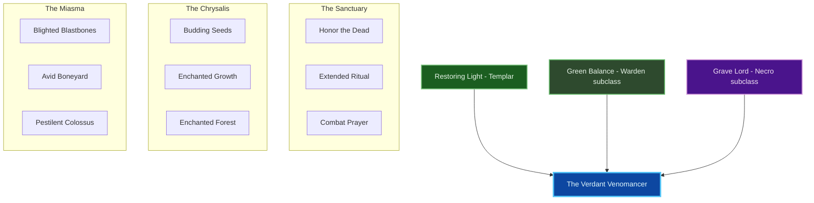
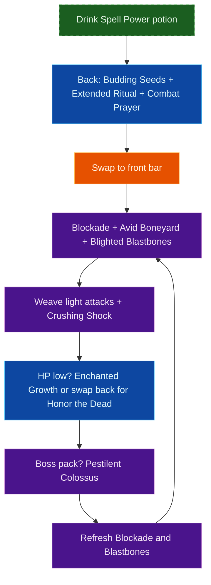

# Build Plan - Silent-Snow-Falls: The Verdant Venomancer (Uber Solo Overland)

> **Character profile:** [silent_snow_falls.md](silent_snow_falls.md) — Level 50 Argonian Templar, CP 966, @SOLAEGIS (NA).

This guide represents the absolute peak of the **Solaegis Subclassing System** for the elite magicka toxinomancer. **Silent-Snow-Falls** is transformed into **The Verdant Venomancer**—a high-sustain, disease-layering, nature-healing engine of solo overland dominance. By merging his native **Restoring Light** mercy with the Warden's **Green Balance** mycelium and the Necromancer's **Grave Lord** miasma, he gains total self-healing, purge utility, and devastating toxin destruction.

Designed specifically to solo world bosses, clear delves, and dominate normal/veteran overland content with companion support, this build capitalizes on Argonian potion mastery and a full CP 966 budget.

---

## Build at a glance

| **Attribute** | **Recommendation** |
| :--- | :--- |
| **Primary Stat** | 64 points in **Magicka** — **live:** 64 Magicka; **25,023** Magicka · **3,153** Spell Power · **21,372** Health · **29.4%** Spell Crit · **773** Mag Recovery |
| **Mundus Stone** | **The Apprentice** (+Spell Damage) — **live:** equipped |
| **Vampirism** | **Cured** — do not re-infect; healing passives and overland fire bosses conflict with vampirism |
| **Sets** | **5 Clever Alchemist + 5 Law of Julianos** (100% craftable) — **live:** both 5-piece sets equipped (gold) |
| **Bars** | Front: Lightning Destro ("Toxic Bloom") · Back: Restoration ("Mycelium Sanctum") |
| **Food** | **Witty Blue Entremet** (Max Magicka + Magicka Recovery) or **Bewitched Sugar Skulls** (Tri-Stat + Health Recovery) |
| **Potion** | **Essence of Spell Power** (Spell Damage + Crit) or **Tri-Restoration** for hard world bosses |
| **Weapon Poisons** | **Escapist's Poison IX** / **Gradual Ravage Health IX** on destruction bar between pulls |
| **Staff Enchant** | Front: **Poisoned Weapon** or **Fiery Weapon**; Back: **Absorb Magicka** or **Reduce Spell Cost** |
| **Companion** | **Sharp-as-Night** (ranged DPS); **Mirri Elendis** fallback for hard world bosses |
| **Primary Mount** | **Swamp Senche** — see [Collectibles](#collectibles) |

**Read next:** [Roleplay](#roleplay-the-mire-apothecary) · [Trinity configuration](#trinity-configuration) · [Combat kit](#combat-kit-the-bloom-miasma-cycle) · [Gear and crafting](#gear-and-crafting-the-verdant-regalia) · [Champion points](#champion-point-mapping-cp-966) · [Companion](#companion-strategy-the-venom-fang) · [Collectibles](#collectibles) · [Checklist](#next-steps--in-game-action-checklist)

---

## Roleplay: The Mire Apothecary

Argonians know the Hist in root and venom. **Silent-Snow-Falls** walks Tamriel as a contradiction made flesh: a name like winter, a heart like warm swamp water. He is no battlefield chirurgeon—he is a **mire apothecary** who reads toxin and tonic as the same scripture.

He **brews** poisons for the unworthy and **cultivates** fungal life for the worthy. Disease is not desecration; it is decomposition returned to the cycle. Radiant light is not denial of the rot—it is the mercy that says *even poisoned things may be healed*. Beneath silent snow, the mycelium never sleeps.

> [!TIP]
> **Flavor Pet:** A **Bantam Guar** or **Hist Guar** matches the swamp-alchemist silhouette. Fungal or moss-themed pets (if owned) reinforce the nature-toxin identity. See [Collectibles](#collectibles) for mount, pet, and dye details.

---

## Trinity configuration

By completing Bahtra at-Hunding's milestone quest **"A Study in Discipline"** at Level 50, Silent-Snow-Falls unlocks the **Uber Tier (Triple Hybrid)** architecture. Replace **Aedric Spear** and **Dawn's Wrath** to forge an unbreakable heal-and-harm loop. See [docs/subclassing.md](../../../docs/subclassing.md) for the Solaegis Trinity / subclassing model.

| **Pillar** | **Line** | **Origin** | **Slot action** | **Function** |
| :--- | :--- | :--- | :--- | :--- |
| **Sanctuary** | **Restoring Light** | Templar (native) | **KEEP** | Burst heals, purge, ritual sustain |
| **Chrysalis** | **Green Balance** | Warden (subclass) | **SUBCLASS** (replaces **Dawn's Wrath**) | Nature HoTs, heal amp, grove salvation |
| **Miasma** | **Grave Lord** | Necromancer (subclass) | **SUBCLASS** (replaces **Aedric Spear**) | Disease burst, vulnerability, corpse economy |

---

## Combat kit: The Bloom-Miasma Cycle

Maintain nature HoTs and ritual ground on the back bar, then swap to the destruction bar to layer disease burst and ground AoE.

### Skill bars

#### Front Bar (Lightning Destruction Staff): "The Toxic Bloom"

| **Slot** | **Class/Line** | **Base -> Morph** | **Role** | **Profile** |
| :--- | :--- | :--- | :--- | :--- |
| **1** | Grave Lord (Necro) | Sacrifice -> **Blighted Blastbones** | Main disease burst, defile, corpse generator | Live |
| **2** | Grave Lord (Necro) | Boneyard -> **Avid Boneyard** | AoE disease field + corpse synergy | Live |
| **3** | Mages Guild | Fire Reach -> **Elemental Blockade** | Ground DoT (fire or shock morph) | Live |
| **4** | Green Balance (Warden) | Fungal Growth -> **Enchanted Growth** | Instant nature heal while DPSing | Live |
| **5** | Destruction Staff | Force Pulse -> **Crushing Shock** | Spammable filler + off-balance control | Respec: **Force Pulse** unmorphed |
| **6 (Ult)** | Grave Lord (Necro) | Frozen Colossus -> **Pestilent Colossus** | Disease meteor; **Major Vulnerability** | Live |

#### Back Bar (Restoration Staff): "The Mycelium Sanctum"

| **Slot** | **Class/Line** | **Base -> Morph** | **Role** | **Profile** |
| :--- | :--- | :--- | :--- | :--- |
| **1** | Green Balance (Warden) | Healing Seed -> **Budding Seeds** | Nature HoT + synergy proc | Live |
| **2** | Restoring Light (Templar) | Rushed Ceremony -> **Honor the Dead** | Cheap mag burst heal | Live |
| **3** | Restoration Staff | Blessing of Protection -> **Combat Prayer** | Heal amp + spell/weapon power buff | Live |
| **4** | Restoring Light (Templar) | Cleansing Ritual -> **Extended Ritual** | HoT + purge + ritual ground | Respec: **Cleansing Ritual** unmorphed |
| **5** | Mages Guild | Mages Guild -> **Inner Light** | +5% spell damage while slotted | Live |
| **6 (Ult)** | Green Balance (Warden) | Secluded Grove -> **Enchanted Forest** | Channeled sanctuary heal for emergencies | Respec: **Secluded Grove** unmorphed |

### Rotation and combat tips

#### Solo combat tips

1. **Pre-bloom:** Cast **Budding Seeds** and **Extended Ritual** before every pull. Stand in both zones for free healing and disease amplification.
2. **Corpse economy:** **Blighted Blastbones** and **Avid Boneyard** generate corpses. Stand near corpses for Grave Lord passive returns and companion synergy.
3. **Colossus window:** **Pestilent Colossus** applies **Major Vulnerability**—use on world bosses and dense packs, not single weak mobs.
4. **Argonian potions:** **Resourceful** racial + **Liquid Efficiency** CP + **Medicinal Use** skill = near-permanent potion uptime. Drink before hard fights (procs **Clever Alchemist**).
5. **Purge priority:** **Extended Ritual** cleanses debuffs—keep it down during poison-heavy overland zones (Murkmire, Black Marsh content).

### Passive skills

You have **5 skill points** available on the latest export (finish morphs and passives below). Spend in this priority order; fully rank (Rank II/III) where noted.

#### Templar — Restoring Light

* **Mending (II):** Increases healing done by 6%.
* **Sacred Ground (II):** Standing in your own ritual effects increases healing received by 5%.
* **Light Weaver (II):** Increases Spell Damage by 3% per Restoring Light ability slotted.
* **Master Ritualist (II):** Increases duration of Cleansing Ritual effects by 20%.

#### Warden — Green Balance (Subclass)

* **Accelerated Growth (II):** Increases healing done by 6%.
* **Nature's Gift (II):** After healing an ally (or yourself), gain Minor Endurance and Intellect.
* **Emerald Moss (II):** Increases Max Magicka by 4% per Green Balance ability slotted.
* **Maturation (II):** Increases Max Health by 2% per Green Balance ability slotted.

#### Necromancer — Grave Lord (Subclass)

* **Reusable Parts (II):** Next corpse skill costs 50% less after Blastbones/Boneyard expire — **live** on character.
* **Death Knell (II):** +4% crit chance vs low-health enemies per Grave Lord skill slotted (+12% with three actives).
* **Dismember (II):** +1500 Physical and Spell Penetration while a Grave Lord skill is active.
* **Rapid Rot (II):** +10% damage with damage-over-time effects (Blockade, Boneyard, Ritual).

#### Weapon — Destruction Staff

* **Tri Focus (II):** +3% Spell Critical per element slotted.
* **Elemental Force (II):** +13% Shock/Frost/Fire damage.
* **Ancient Knowledge (II):** +8% Magicka cost reduction for Destruction abilities.

#### Weapon — Restoration Staff

* **Essence Drain (II):** Restore Magicka when Restoration ability deals damage (if using staff light attacks).
* **Restoration Expert (II):** +9% healing done with Restoration Staff.
* **Cycle of Life (II):** +10% Magicka Recovery.
* **Absorb (II):** +10% Magicka return from Resto staff heavy attacks.

#### Armor — Light Armor (5pc Julianos)

Unlock all five passives: **Grace**, **Evocation**, **Spell Warding**, **Prodigy**, **Concentration**.

#### Guild — Mages Guild

* **Everlasting Magic (II):** +10% Max Magicka.
* **Magicka Controller (II):** +3% Spell Critical.
* **Mage Adept (II):** -4% Magicka cost for Mages Guild abilities.
* **Might of the Guild (II):** +10% Spell Damage while **Inner Light** is slotted.

#### Guild — Undaunted

* **Undaunted Command (II):** +2% damage and healing per Undaunted skill slotted.
* **Undaunted Mettle (II):** Optional — requires mixed armor types; skip if running full light (this build).

#### Guild — Alchemy

* **Medicinal Use (III):** **MANDATORY** — potion effects last 100% longer (30s → 60s).

#### Alliance War — Assault

* **Continuous Attack (II):** Permanent **Major Gallop** (+30% mount speed). Unlock immediately for overland.

#### Race — Argonian (Immutable Qualities)

* **Resourceful (III):** +15% potion effectiveness (core to the toxinomancer fantasy).
* **Argonian Resistance (III):** +2310 Max Health, +16% Disease resistance.
* **Rapid Regeneration (III):** +15% healing received.
* **Amphibious (I):** +12% experience gain in Black Marsh and Murkmire.

---

## Gear and crafting: "The Verdant Regalia"

Everything is **crafted** — no overland set farming, no dungeon monster sets. The target is **5 Clever Alchemist + 5 Law of Julianos**, the best fully craftable pairing for this Argonian magicka toxinomancer: **Julianos** supplies spell crit and critical damage; **Clever Alchemist** grants a massive **Weapon and Spell Damage** burst whenever you drink a potion in combat.

### Set rationale

```mermaid
graph LR
    subgraph CleverAlchemist ["5pc Clever Alchemist — The Apothecary's Rush"]
        C1["Head"]
        C2["Shoulders"]
        C3["Chest"]
        C4["Legs"]
        C5["Waist"]
    end
    subgraph Julianos ["5pc Julianos — The Crit Lens"]
        J1["Hands"]
        J2["Feet"]
        J3["Necklace"]
        J4["Ring 1"]
        J5["Ring 2"]
    end
    subgraph Weapons ["Julianos Staves"]
        W1["Lightning Destro"]
        W2["Restoration"]
    end
    CleverAlchemist -->|"Potion proc spell dmg"| Julianos
    Julianos -->|"Crit amplifies miasma"| Weapons
```

| **Set** | **5-Piece Bonus** | **Role in the Build** |
| :--- | :--- | :--- |
| **Clever Alchemist** | Drink a potion in combat → **+675 Weapon and Spell Damage** for 20 seconds | Open every pull with **Essence of Spell Power**; Argonian racial + **Liquid Efficiency** CP keep uptime high |
| **Law of Julianos** | +300 spell crit; **+10% spell critical damage** | Baseline burst; crit-heal synergy with **Fighting Finesse** CP |

> [!NOTE]
> **Why not Necropotence?** **Necropotence** is a **Rivenspire overland drop** — not craftable. Its current 5-piece bonus is **+Max Magicka while a pet is active**, not heal-stacking damage.

> [!TIP]
> **No monster set:** You trade barrier procs for **potion-window burst** you control. Pre-bloom HoTs, drink on pull, then swap front — your damage spike is predictable and on cooldown with your potion bar.
>
> **Lower-trait fallback:** If **7-trait** Clever Alchemist research is not ready on an alt, craft **5 Shacklebreaker** (6 traits, Vvardenfell) on head/shoulders/chest/legs/waist instead — flat **Max Magicka + recovery + spell damage** with no potion proc required.

### Target loadout

| **Slot** | **Set** | **Weight** | **Trait** | **Enchantment** | **Quality** |
| :--- | :--- | :--- | :--- | :--- | :--- |
| **Head** | Clever Alchemist | Light | Divines | Max Magicka | Gold (live) |
| **Shoulders** | Clever Alchemist | Light | Divines | Max Magicka | Gold (live) |
| **Chest** | Clever Alchemist | Light | Divines | Max Magicka | Gold (live) |
| **Legs** | Clever Alchemist | Light | Divines | Max Magicka | Gold (live) |
| **Waist** | Clever Alchemist | Light | Divines | Max Magicka | Gold (live) |
| **Hands** | Julianos | Light | Divines | Max Magicka | Gold (live) |
| **Feet** | Julianos | Light | Divines | Max Magicka | Gold (live) |
| **Necklace** | Julianos | Jewelry | Arcane | Spell Damage | Gold (live) |
| **Ring 1** | Julianos | Jewelry | Arcane | Max Magicka | Gold (live) |
| **Ring 2** | Julianos | Jewelry | Arcane | Max Magicka | Gold (live) |
| **Front Staff** | Julianos | Lightning Destro | Infused | Poisoned Weapon or Fiery Weapon | Gold (live) |
| **Back Staff** | Julianos | Restoration | Infused | Absorb Magicka or Reduce Spell Cost | Gold (live) |

*All **12 slots** are crafted. Light armor on all seven body pieces preserves full **Light Armor** passives.*

**Front bar — Lightning Destruction Staff:** Shock staff procs **Elemental Blockade** enchants reliably. Poison enchants and alchemical poisons layer the toxin fantasy.

**Back bar — Restoration Staff:** Restoration bar is the sanctuary — heal amp, HoTs, and **Inner Light** buff.

### Crafting handoff (@masisi)

| **Detail** | **Recommendation** |
| :--- | :--- |
| **Style — Clever Alchemist body** | **Elder Argonian** or **Hist Bark** (swamp apothecary) |
| **Style — Julianos hands/feet/jewelry** | Match body or **Sapiarch** trim for contrast |
| **Clever Alchemist station** | **No Shira Workshop** (Hew's Bane) — requires **7 traits** researched per slot |
| **Julianos station** | **Sunhold** (Summerset) — requires **6 traits** researched per slot |
| **Traits** | Transmute to **Divines** on armor using **352 Transmute Crystals**; **Arcane** on jewelry |
| **Interim (pre-CP160)** | Craft **5 Seducer** (any slot) for magicka sustain while researching traits — replace piece-by-piece |

> [!NOTE]
> **Research gate:** **Clever Alchemist** needs **7 traits** per slot; **Law of Julianos** needs **6 traits**. Coordinate with @masisi before queueing gold-quality CP160 work on alts.

---

## Champion Point Mapping (CP 966)

Full CP budget: **322 Warfare / 322 Craft / 322 Fitness** (966 total). The latest export shows **957 spent** (**9 available**: ⚒️ 1 / ⚔️ 2 / 💪 6). Live is **mostly combat-aligned**: **Fighting Finesse**, **Master-at-Arms**, and **Thaumaturge** are maxed; **Fortified**, **Boundless Vitality**, **Rejuvenation**, and **Celerity** are slotted on Fitness; **Liquid Efficiency** and **Steed's Blessing** remain on Craft. Partial ranks: **Piercing** 10/20, **Mystic Tenacity** 10/50. Tables below are the **combat-tuned target**; spend the **9 remaining points** finishing **Piercing** and **Mystic Tenacity** first, then optional respec (**Deadly Aim** vs **Flawless Ritual** / **Battle Mastery**) only if you want full alignment with the DPS stars listed.

### Warfare (Blue — 322 Points)

*Primary focus: Magicka DoT scaling, direct burst, and penetration.*

| **Slotted Star** | **Spend** | **Benefit** |
| :--- | :--- | :--- |
| **Fighting Finesse** | 50 | +10% Critical Damage and Critical Healing. |
| **Master-at-Arms** | 50 | +10% Direct Damage (Blastbones, Crushing Shock). |
| **Thaumaturge** | 50 | +10% Damage-over-Time (Blockade, Boneyard, Ritual). |
| **Deadly Aim** | 50 | +10% Single-Target damage (boss burn). |

**Passives (No slot needed — 121 points):**

* **Precision (20):** +4% Critical Strike Chance.
* **Piercing (20):** +700 Physical and Spell Penetration.
* **Mighty (20):** +3% Max Magicka.
* **Spell Reach (20):** +2% Spell Damage.
* **Elemental Expert (20):** +4% Shock/Fire/Frost damage (Blockade + staff).
* **Finesse (20):** +2% Critical Damage.
* **Quick Recovery (1):** +1% Healing Received.

### Fitness (Red — 322 Points)

*Primary focus: Solo survivability and resource recovery.*

| **Slotted Star** | **Spend** | **Benefit** |
| :--- | :--- | :--- |
| **Fortified** | 50 | +1730 Armor (~3.5% damage reduction). |
| **Boundless Vitality** | 50 | +1400 Max Health. |
| **Rejuvenation** | 50 | +150 Health, Magicka, and Stamina Recovery. |
| **Celerity** | 50 | +10% Movement Speed (dodge telegraphs). |

**Passives (No slot needed — 120 points):**

* **Hero's Vigor (20):** +560 Max Health.
* **Tumbling (20):** -20% Dodge Roll cost.
* **Defiance (21):** -22% Break Free cost.
* **Hardening (20):** +1400 Armor.
* **Thick Skinned (19):** +560 Max Health.
* **Ironclad (20):** +1400 Armor.

### Craft (Green — 322 Points)

*Primary focus: Potion uptime, overland speed, economy.*

| **Slotted Star** | **Spend** | **Benefit** |
| :--- | :--- | :--- |
| **Liquid Efficiency** | 50 | 10% chance not to consume potions (pairs with Argonian racial). |
| **Steed's Blessing** | 50 | +20% Out-of-Combat Movement Speed. |
| **Treasure Hunter** | 50 | Better chest loot while overland leveling. |
| **Rationer** | 30 | +30 minutes food/drink duration. |

**Passives (No slot needed — 141 points):**

* **Gilded Fingers (50):** +10% Gold Acquired.
* **Fortune's Favor (30):** +30% Gold from chests.
* **Wanderer (50):** -15% Sprint cost.
* **Out of Sight (3):** -10% Sneak cost.
* **Breakfall (3):** Reduced fall damage.
* **Inspiration Boost (5):** Faster crafting inspiration (partial rank for point cap).

---

## Companion Strategy: "The Venom Fang"

You heal yourself—the companion should **deal damage** and apply pressure while you manage the miasma field. **Sharp-as-Night** is the thematic and mechanical pick: Argonian nightblade, poison-blade identity.

### Sharp-as-Night: The Poison Blade

| **Setting** | **Recommendation** |
| :--- | :--- |
| **Role** | **Ranged DPS** (Bow preferred) |
| **Gear Weight** | Medium Armor |
| **Gear Trait** | **Quickened** (cooldown reduction) |
| **Core Sets** | **5 Law of Julianos** (medium) + **Julianos bow** — all craftable; mirrors your crit package |

#### Sharp's Support Skill Bar

1. **Piercing Arrow:** (Class -> Nightblade). Single-target burst.
2. **Rejuvenating Aura:** (Class -> Nightblade). Self-sustain so he stays alive.
3. **Entombing Trap:** (Class -> Nightblade). Root/crowd control for packs.
4. **Rejuvenation:** (Restoration Staff). HoT backup if you dip low.
5. **Vanish:** (Class -> Shadow). Threat drop when focused.
6. *Ultimate:* **Shooting Star** or class ult for AoE burn.

> [!WARNING]
> **Live export:** Sharp-as-Night is **Level 8/20** with **level 1 companion gear** and **two empty ability slots**. Prioritize companion XP, gear upgrades, and bow-based Julianos crafting per [Checklist](#next-steps--in-game-action-checklist).

> [!TIP]
> **Fallback — Mirri Elendis:** If Sharp dies too often on world bosses, swap to **Mirri** as a pure Restoration healer (Shared Ward, Quick Fix, Rejuvenation). You lose DPS but gain a second heal layer.

---

## Collectibles

### Mount

Overland solo means **hours in the saddle**. Pair **Continuous Attack** (Major Gallop) with **Steed's Blessing** and **Gifted Rider** CP for maximum travel speed between alchemy nodes and world bosses. The mount should read as **cold name, warm mire** — winter on the surface, Hist beneath.

#### Primary: Swamp Senche

| **Attribute** | **Detail** |
| :--- | :--- |
| **Why** | The definitive Argonian swamp steed. Moss-draped, low-slung, and unmistakably Black Marsh — the apothecary returning to the mire between brews. |
| **Acquisition** | Crown Store rotation, daily login rewards, or guild-traded crown gift; check account-wide unlocks first. |
| **Dye pass** | **Pale ash** or **Coldharbour Black** body with **Mire green** or **Hist sap** accents — "silent snow" over living swamp. |

#### Backups (No Crown Required)

| **Mount** | **Cost / Source** | **Why** |
| :--- | :--- | :--- |
| **Miremoth Guar** | Crown Store or event; verify account unlocks | Fungal, bioluminescent guar — closest mount to the **mycelium** fantasy without leaving the Argonian silhouette. |
| **Black & White Mane** | Stablemaster gold | High-contrast **snow-on-dark-fur** palette mirrors the character name literally. |
| **Barkroot Guar** | In-game gold (stablemaster) | Organic, root-wrapped guar; reads as **Hist bark** regalia made mobile. |
| **Clouded Senche-Leopard** | Crown rotation or loot crates | Pale, misty coat — "silent snow falls" visual without abandoning senche profile. |

#### Crown Budget Option (@SOLAEGIS: 19,000 Crowns)

If nothing above is owned and you want a single premium purchase:

| **Mount** | **Notes** |
| :--- | :--- |
| **Verdant Vinemount** | Nature-vine aesthetic; strongest Crown pick for **Green Balance** identity when on rotation. |
| **Swamp Senche** | Still the safest thematic buy if not already on account. |

> [!TIP]
> **Overland speed stack:** Unlock **Continuous Attack** (Assault) first → slot **Steed's Blessing** + **Gifted Rider** in Craft CP → use **Major Gallop** before long zone crossings.

#### Avoid Thematically

| **Mount type** | **Reason** |
| :--- | :--- |
| **Nightmare Senche / fire mounts** | Wrong palette for frost-and-mire (reads as vampire/demon, not apothecary). |
| **Armored warhorses / Auroran knights** | Too knightly-templar; breaks the swamp scholar silhouette. |
| **Mechanical or Daedric mounts** | Breaks nature/toxin fantasy unless intentionally ironic. |

### Pet

| **Pet** | **Why** |
| :--- | :--- |
| **Bantam Guar** | Swamp-alchemist silhouette; compact companion for the mire apothecary. |
| **Hist Guar** | Reinforces Argonian / Hist identity alongside Elder Argonian gear styling. |
| **Alik'r Dune-Hound** | Confirmed owned — desert scout aesthetic if traveling Alik'r routes. |
| **Fungal or moss-themed pets** | If owned, reinforce the nature-toxin / mycelium fantasy. |

### Dye and style

**The Frostbloom Apothecary** — visual identity for gear and mount dye passes.

| **Slot** | **Style** | **Visual Reasoning** |
| :--- | :--- | :--- |
| **Chest / Legs** | **Elder Argonian** or **Hist Bark** | Swamp alchemist roots; Hist toxin-lore. |
| **Head / Hands** | **Bog Blight** or **Hist Bark** | Fungal, mire-bound silhouette. |
| **Staves** | **Elder Argonian** | Organic, venom-cultivator aesthetic. |

**Dye palette:** Mire green (primary), pale frost white (trim — the "silent snow"), toxic yellow-green (accent vials/trim).

---

## Next Steps & In-Game Action Checklist

Follow this transition list to unlock the full power of **The Verdant Venomancer**. Gear progression phases are labeled inline — there is no separate phase table.

### Phase 0 — Today (functional build)

1. **Verify subclassing:** At Bahtra at-Hunding (Riften, Evermore, or Dune), confirm subclasses are **Green Balance (Warden)** and **Grave Lord (Necromancer)**—replacing **Dawn's Wrath** and **Aedric Spear**.
2. **Align skill bars:** Respec actives to match [Skill bars](#skill-bars)—morph **Force Pulse** → **Crushing Shock**, **Cleansing Ritual** → **Extended Ritual**, **Secluded Grove** → **Enchanted Forest** (front bar **Blockade** and **Pestilent Colossus** are already live).
3. **Finish passives:** Spend **5 available skill points** on morphs and passives listed in [Combat kit](#combat-kit-the-bloom-miasma-cycle). Join **Mages Guild**, **Undaunted**, and **Fighters Guild** enclaves if not already done.
4. **CP polish:** Spend **9 available CP** (⚒️ 1 / ⚔️ 2 / 💪 6 on export) finishing **Piercing** and **Mystic Tenacity**, or full respec to [Champion Point Mapping](#champion-point-mapping-cp-966) for combat focus.
5. **Alchemy:** Rank **Medicinal Use 3/3**. Stock **Essence of Spell Power** potions; drink on pull to proc **Clever Alchemist**.

### Phase 1 — Craft (interim)

6. **[Phase 1]** *Complete for this character* — target **5 Clever Alchemist + 5 Julianos** gold loadout is live. Use this phase on alts or backup trait research only.

### Phase 2 — Craft (target)

7. **[Phase 2]** Coordinate **Elder Argonian / Hist Bark** styling with @masisi if pieces are still generic crafted appearance (see [Crafting handoff](#crafting-handoff-masisi)).

### Phase 3 — Polish

8. **[Phase 3]** Transmute any non-**Divines** armor pieces with **352 Transmute Crystals**; verify staff enchants (Poisoned Weapon front, Absorb Magicka or Reduce Cost back).

### Finish

9. **Companion:** Level **Sharp-as-Night**, craft **Julianos** medium + bow, fill empty companion slots.
10. **Regenerate profile:** Run `/markdown` in-game and update [silent_snow_falls.md](silent_snow_falls.md) when bars and CP match this plan.

May the mycelium bloom beneath your snow, Apothecary.
