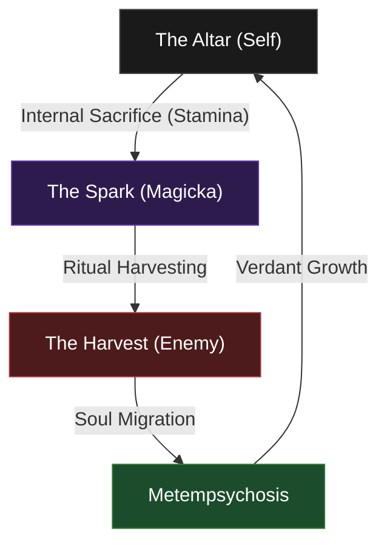

# Walkthrough - Stoirmgheal Prime: The Sovereign of the Altar (Hybrid Life Mage)

**Stoirmgheal Prime** is a master of the ritual dual-sacrifice and the transmigration of the soul. He is a **Hybrid Life Mage**, blending high-performance healing with devastating execute damage. He operates in a "Zenith State" where he mediates the flow of life and spirit, serving as both the protector of his allies and the harvester of his enemies.

## 🎭 Roleplay: The Sovereign of the Altar

**Stoirmgheal Prime** is the **Sovereign of the Altar**—the master of the dual-sacrifice. His life is a bridge between the physical and the spirit, mediated by the sacred truth of **Metempsychosis**. He operates through two necessary rituals of sacrifice:

1.  **The Internal Sacrifice**: He sacrifices his own physical vitality (Stamina) to empower his spiritual mastery (Magicka), stripping the vessel to reveal the spark.
2.  **The External Sacrifice**: He harvests the sparks of the unworthy (Enemies) as a ritual offering to the primeval powers, ensuring the fertility and victory of the forest.

Anchored in the **Vital Surge (Storm Calling)**, he performs these rituals to maintain the eternal soul-stream. Accompanied by **Tanlorin**, who records these offerings, he stands as the absolute shepherd of the cycle.

> [!TIP]
> **Thematic Pairing**: The **Faunfrolic Great Elk** (200k gold) is the ultimate "grown" version of your **Ambersheen Vale Fawn** pet, creating a perfect nature-bound silhouette.

## 🔗 The Pillar of Metempsychosis: The Hybrid Foundation

The Sovereign of the Altar utilizes a combination of Sorcerer (Dark Magic & Storm Calling) and Warden (Green Balance) abilities to achieve a perfect balance of roles:

| **Pillar** | **Class Origin** | **Skill Line** | **Aspect of Sacrifice** | **Function** |
| :--- | :--- | :--- | :--- | :--- |
| **The Internal** | 🌑 **Sorcerer** | **Dark Magic** | **The Altar** | **The Engine**: Sustain through sacrifice. |
| **The Conduit** | 🌑 **Sorcerer** | **Storm Calling** | **The Surge** | **The Vitality**: Healing through overwhelming power. |
| **The External** | 🌿 **Warden** | **Green Balance** | **The Chrysalis** | **The Sanctuary**: Anchoring the life-stream. |

| **Attribute**    | **Recommendation**                                                                |
| :--------------- | :-------------------------------------------------------------------------------- |
| **Primary Stat** | **64 points in Magicka** (Target: 25k+ Magicka / 3.2k+ Spell Power)               |
| **Mundus Stone** | **The Atronach** (Magicka Recovery) - Already Active                              |
| **Food**         | **Bewitched Sugar Skulls** (Tri-Stat + Health Recovery)                           |
| **Potion**       | **Crown Tri-Restoration Potion**                                                 |

---

## 🌪️ The "Uber" Rotation: The Cycle of Migration

The power of the Sovereign of the Altar lies in the **Soul-Loop**. You do not fight; you simply facilitate the migration of the enemy's spark to its next destination.

### ⚔️ Front Bar: "The Harvest of the Spark" (Dual Wield - Daggers)
| **Slot** | **Class** | **Skill (Base -> Morph)** | **Role** | **Status** |
| :--- | :--- | :--- | :--- | :--------- |
| **1** | 🌑 Sorcerer (Storm Calling) | **Lightning Form -> Boundless Storm** | Mobility/Resistance | ✅ ACTIVE |
| **2** | ⚔️ Fighters Guild | **Silver Bolt -> Silver Leash** | Pull/Control | ✅ ACTIVE |
| **3** | ⚔️ Dual Wield | **Blade Cloak -> Deadly Cloak** | **The Storm's Aura / Evasion** | 🔄 BASE EQUIPPED |
| **4** | ⚔️ Dual Wield | **Flurry -> Bloodthirst** | **Primary Spammable / Heal** | ✅ ACTIVE |
| **5** | ⚔️ Dual Wield | **Whirlwind -> Whirling Blades** | **The Harvest / Execute** | 🔄 BASE EQUIPPED |
| **Ult** | 🌑 Sorcerer (Storm Calling) | **Power Overload -> Energy Overload** | Direct Damage / Execute | ✅ ACTIVE |

### 🛡️ Back Bar: "The Altar of Metempsychosis" (Restoration Staff)
| **Slot** | **Class** | **Skill (Base -> Morph)** | **Role** | **Status** |
| :--- | :--- | :--- | :--- | :--------- |
| **1** | 🪄 Resto Staff | **Blessing of Protection -> Combat Prayer** | **Restoration / Group Buff** | 🔄 BASE EQUIPPED |
| **2** | 🪄 Resto Staff | **Grand Healing -> Illustrious Healing** | **Ritual Area Healing** | ✅ ACTIVE |
| **3** | 🌿 Warden (Green Balance) | **Healing Seed -> Budding Seeds** | Area Heal / Synergy | ✅ ACTIVE |
| **4** | 🌑 Sorcerer (Storm Calling) | **Surge -> Critical Surge** | **Active Lifesteal** (Life Mage) | 🔄 BASE EQUIPPED |
| **5** | 🌑 Sorcerer (Dark Magic) | **Dark Exchange -> Dark Deal** | **Internal Sacrifice** (Sustain) | ✅ ACTIVE |
| **Ult** | 🌿 Warden (Green Balance) | **Secluded Grove -> Enchanted Forest** | Low-Cost Salvation | ✅ ACTIVE |

---

## 📚 Passive Mastery: The Wisdom of the Sovereign

To truly embody the **Sovereign of the Altar**, you must master the passive flows of energy within your vessel. Maximize these lines as a priority.

### 🌑 Sorcerer (The Internal Engine)
*   **Dark Magic**: **Unholy Knowledge**, **Blood Magic**, **Persistence**, **Exploitation**.

### 🌑 Sorcerer (The Vital Conduit)
*   **Storm Calling**: **Capacitor**, **Energized**, **Amplitude**, **Expert Mage**.

### 🌿 Warden (The Sanctuary)
*   **Green Balance**: **Accelerated Growth**, **Nature's Gift**, **Emerald Moss**, **Maturation**.

### ⚔️ Weapon & Armor (The Vessel's Tools)
*   **Dual Wield**: **Slaughter**, **Dual Wield Expert**, **Controlled Fury**, **Ruffian**, **Twin Blade and Blunt**.
*   **Restoration Staff**: **Essence Drain**, **Restoration Expert**, **Cycle of Life**, **Absorb**, **Restoration Master**.
*   **Light Armor**: All Passives (Grace, Evocation, Spell Warding, Prodigy, Concentration).
*   **Medium Armor**: **Dexterity**, **Wind Walker**, **Agility**, **Athletics**.
*   **Heavy Armor**: All Passives (Resolve, Constitution, Juggernaut, Revitalize, Rapid Mending).

### 🏆 Guild & Racial (The Archon's Foundation)
*   **Fighters Guild**: **Banish the Wicked**, **Skilled Tracker**, **Slayer**, **Intimidating Presence**.
*   **Psijic Order**: **Deliberation** (Essential for 10% protection during Dark Deal), **Concentrated Barrier**.
*   **Undaunted**: **Undaunted Command**, **Undaunted Mettle** (Critical 6% stat boost for 5-1-1 builds).
*   **Racial (Breton)**: **Gift of Magnus**, **Spell Attunement**, **Magicka Mastery**.
*   **Alchemy**: **Medicinal Use (3/3)** — *MANDATORY* for 100% potion uptime.

### ⚖️ Alliance War & Soul (The Path of the Sovereign)
*   **Assault**: **Continuous Attack** (Major Gallop for mobility).
*   **Soul Magic**: **Soul Lock** (The Harvest), **Soul Siphoning**.

---

## ⚔️ Equipment Strategy: "The Archon's Regalia"

To match the **Hybrid Life Mage** status, we utilize the peak survivors of the crafting world. Your goal is to eventually acquire the **Earthgore** monster set for ultimate purging and healing.

### 🛡️ Equipment Details

| **Slot**           | **Size**  | **Trait**     | **Set**                 | **Enchantment**           |
| :----------------- | :-------- | :------------ | :---------------------- | :------------------------ |
| **Head**           | Light     | **Divines**   | **Order's Wrath**       | **Max Magicka**           |
| **Chest**          | Light     | **Divines**   | **Order's Wrath**       | **Max Magicka**           |
| **Legs**           | Light     | **Divines**   | **Order's Wrath**       | **Max Magicka**           |
| **Shoulders**      | Medium    | **Divines**   | **Order's Wrath**       | **Max Magicka**           |
| **Hands**          | Light     | **Divines**   | **Order's Wrath**       | **Max Magicka**           |
| **Feet**           | Heavy     | **Divines**   | **Wretched Vitality**   | **Max Magicka**           |
| **Waist**          | Light     | **Divines**   | **Order's Wrath**       | **Max Magicka**           |
| **Necklace**       | Jewelry   | **Bloodthir.**| **Order's Wrath**       | **Multi-Effect**          |
| **Ring (1)**       | Jewelry   | **Bloodthir.**| **Order's Wrath**       | **Multi-Effect**          |
| **Ring (2)**       | Jewelry   | **Bloodthir.**| **Wretched Vitality**   | **Multi-Effect**          |
| **Weapon 1 (M/O)** | Daggers   | **Precise**   | **Order's Wrath**       | **Weapon Damage**         |
| **Weapon 2**       | Resto     | **Precise**   | **Druid's Braid**       | **Absorb Magicka**        |

> [!TIP]
> **The Sacred Rain (Earthgore)**: Your ultimate goal is the **Earthgore** set (Bloodroot Forge).
> **Crafted Alternative**: Until Earthgore is acquired, use **Druid's Braid** in the Head and Shoulder slots. This provides extra Max Health and Stamina to fuel your **Internal Sacrifice**.

---

## 🎨 Visual Identity: The Enlightened Sage

Stoirmgheal Prime avoids the "wild hermit" look. As the Sovereign of the Altar, he wears **high-status aristocratic clothing** that reflects his intellectual and spiritual mastery.

### 📜 Crafting Order: The Regalia of the Spark

| **Slot**           | **Size**  | **Style**          | **Visual Reasoning**                                           |
| :----------------- | :-------- | :----------------- | :------------------------------------------------------------- |
| **Chest**          | Heavy     | **Ancestral High Elf** | Noble, aristocratic plate reflecting a master of the spirit. |
| **Legs**           | Heavy     | **Sapiarch**       | Elegant, flowing silhouette of a philosopher.                  |
| **Head**           | Heavy     | **Sapiarch**       | The Crown of Enlightenment.                                    |
| **Shoulders**      | Medium    | **Stonelore**      | The mark of the Druid—the ancient roots of his study.          |
| **Hands**          | Light     | **Stonelore**      | Touching the primeval source.                                  |
| **Feet**           | Light     | **Stonelore**      | Grounded in the cycle of transmigration.                       |
| **Waist**          | Light     | **Sapiarch**       | A clean, noble bridge for the set.                             |
| **Swords**         | Weapon    | **Y'ffre's Will**  | **The Blades of Enlightenment.** Twin symbols of soul-severing. |
| **Resto Staff**    | Weapon    | **Y'ffre's Will**  | **The Scepter of the Altar.** A conduit for the soul-stream. |

---

## ⚒️ Crafter's Procurement List (for @masisi )

### 🛠️ Masisi's Status (Account Crafter)
Masisi is currently supplying materials and motifs. He has reached the rank of **Style Master**.

| Motif Style | Target Chapters | Status / Notes |
| :--- | :--- | :--- |
| **Ancestral High Elf** | Chests | ❌ Needed |
| **Sapiarch** | Heads, Legs, Belts | ⚠️ Legs in inventory (needs learning); Others needed. (78 Culanda Lacquer ready). |
| **Stonelore** | Shoulders, Gloves, Boots | ❌ Needed |
| **Y'ffre's Will** | Staves | ❌ Needed |

> [!NOTE]
> **Mimic Stones**: Masisi currently has **100 Crown Mimic Stones** in inventory, which can be used to bypass the need for specific style materials (like Culanda Lacquer or Engraved Leaves) once the patterns are learned.

### 🖌️ Dye Recommendation: "The Wildheart Palette"

*   **Primary (Stone/Main):** **Arcanist Green** (The vibrant green of life magic).
*   **Secondary (Trim/Detail):** **Julianos White** (Sacred light of the Life Mage).
*   **Accent (Wood/Fur):** **Graht-Bark Brown** (Deep earth tones).

---

---

## ⭐ Champion Point Investment: The Archon's Path (Target: CP 900+)

As a **Hybrid Life Mage**, your Champion Points must bridge the gap between devastating execute damage and life-saving restoration.

### ⚔️ Warfare (Blue Tree): The Spark of Life
*   **Fighting Finesse** (Slotted): Increases Critical Damage and Critical Healing by 8%. Essential for the dual-role.
*   **Master-at-Arms** (Slotted): Increases Direct Damage by 6% (Fuels your **Crystal Fragments** and **Impale**).
*   **Swift Renewal** (Slotted): Increases Healing Over Time by 6% (Fuels your **Critical Surge** and **Illustrious Healing**).
*   **Deadly Aim** (Slotted): Increases Single Target damage by 6% (Fuels the **Ranged Harvest**).

> **Passive Priorities**: Eldritch Insight (Max Magicka), Precision (Crit Rating), Flawless Ritual (Heal Crit), War Mage (Spell Damage).

### 💪 Fitness (Red Tree): The Eternal Vessel
*   **Boundless Vitality** (Slotted): +1400 Max Health. The anchor of your survival.
*   **Fortified** (Slotted): +1731 Armor. Protects the priest during the ritual.
*   **Rejuvenation** (Slotted): +150 Health, Magicka, and Stamina Recovery. Essential for managing the **Internal Sacrifice**.
*   **Celerity** (Slotted): +10% Movement Speed. The cycle never stops moving.

> **Passive Priorities**: Hero's Vigor (Health), Tumbling (Dodge), Defiance (Break Free), Mystic Tenacity (Status Resistance).

### ⚒️ Craft (Green Tree): The Artisan's Reach
*   **Steed's Blessing** (Slotted): +20% Out-of-Combat Speed.
*   **Rationer** (Slotted): +30m Food duration (Preserves your **Sugar Skulls**).
*   **Liquid Efficiency** (Slotted): 10% chance not to consume a potion.
*   **Gifted Rider** (Slotted): +10% Mount Speed.

> **Passive Priorities**: Gilded Fingers (Gold), Fortune's Favor (Gold), Wanderer (Cost Reduction).

---

## 👥 Recommended Companion: The Sentinel of the Cycle

**Tanlorin** is the definitive choice for the Sovereign of the Altar. Their identity as the **Scribe of the Migration** mirrors your own journey through Metempsychosis.

### 🛡️ Role: The Sentinel (Tank/Support)
As the Sovereign, you are the high priest of the ritual. You need an anchor to hold the enemies within the "Harvest" zone while you channel your divinity.

| **Trait**          | **Recommendation**                                                                 |
| :----------------- | :--------------------------------------------------------------------------------- |
| **Mechanical Role**| **Crowd Control Tank**: Taunting enemies and pinning them for your harvesting rituals. |
| **Gear Trait**     | **Bolstered** (Armor) or **Quickened** (Cooldowns).                                |
| **Gear Weight**    | **Heavy Armor + Shield**: Maximum survivability to ensure the ritual is never broken. |
| **Core Skill**     | **Grappling Roots**: Keeps the "Harvest" contained in one spot for your AOE.      |
| **Key Synergy**    | **The Migration's Shield**: Buffs your resistance while you are in the "Vital Surge". |

---

## 🐎 Collectibles: The Sovereign's Menagerie

To complete the transformation, target these specific collectibles that align with the "Metempsychosis" cycle:

### 🏷️ Title: The Sovereign's Name
*   **Primary**: **Sovereign of the Altar** (The Ritual identity).
*   **Thematic Upgrade**: **Primeval Archon** (Represents the ancient, dual-sacrifice nature of the Life Mage).

### 🐾 Companions of the Cycle
*   **Mount (The Evolved Path)**: **Faunfrolic Great Elk** (200,000g).
    *   *Status*: ✅ **COMPLETE**.
*   **Mount (The Sage Path)**: **Sapiarchic Senche-Serval** (100,000g).
    *   *Why*: Matches your **Sapiarch** and **Ancestral High Elf** regalia perfectly. The mount of a true High Elf scholar.
    *   *Location*: Stablemasters in Gold Coast or West Weald.
*   **Pet**: **Ambersheen Vale Fawn** (The "Soul" that will return).
    *   *Status*: ✅ **COMPLETE**.

### 🛡️ Companion Gear: Tanlorin
*   **Gear Trait**: **Aggressive** (Increase damage) or **Quickened** (Reduce cooldowns).
*   **Primary Stat**: **Spell Damage / Max Magicka**.

---

## ✅ Next Steps

1.  **Master the Rituals**: 🔄 **HIGH PRIORITY**. You have successfully aligned your bars with the **Sovereign's Cycle**. Your goal is to reach Rank IV in **Blade Cloak**, **Whirlwind**, **Blessing of Protection**, and **Surge** to unlock their sustaining/power morphs (**Deadly Cloak**, **Whirling Blades**, **Combat Prayer**, and **Critical Surge**).
2.  **Trinity Mastery**: ✅ **COMPLETE**. The integration of **Dark Magic**, **Storm Calling**, and **Green Balance** is finalized.
3.  **Skill Grinding**: Max out the **Dual Wield** and **Restoration Staff** passives as you have now fully committed to this weapon pair.
4.  **Gear Progression**: 🔄 **IN PROGRESS**. You have 9/12 **Order's Wrath** and 2/12 **Wretched Vitality**. Next steps include acquiring the final Wretched Vitality piece (Legs or Shoulders) to complete the 5-set sustain bonus.
5.  **Trait Optimization**: Maintain your current **Bloodthirsty** and **Precise** daggers setup—it is performing excellently with the new 32.5% Critical Rate.

The Storm is harnessed. The Spark has settled into the soul. There is only life.
