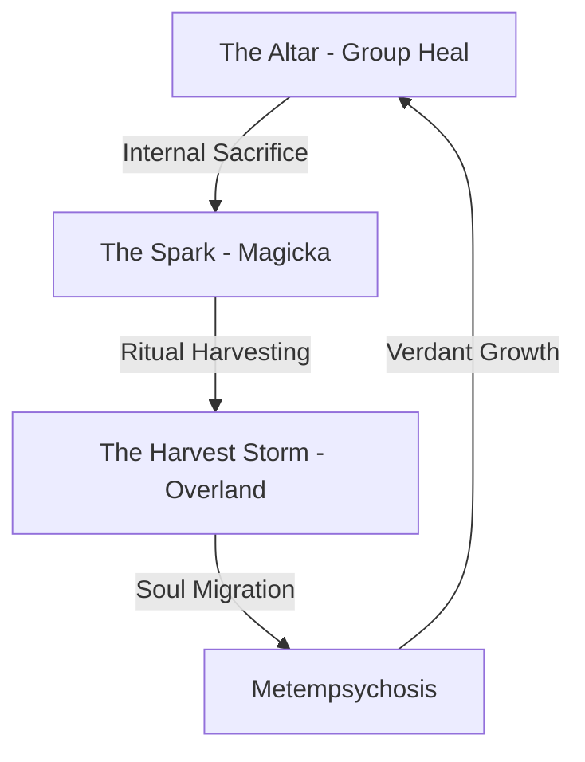
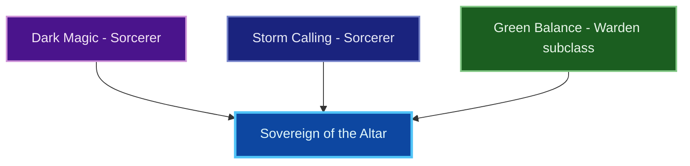
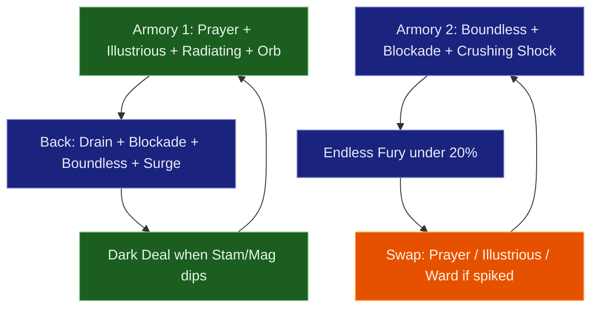

# Build Plan - Stoirmgheal: Sovereign of the Altar (Dual Armory Overland / Healer)

> **Character profile:** [stoirmgheal.md](stoirmgheal.md) — Level 50 Breton Sorcerer, CP 1042, @SOLAEGIS (NA).

Stoirmgheal is the **Sovereign of the Altar**—a Breton life-mage who walks the wilds to harvest experience and skill ranks, then returns to the altar for his allies. This guide replaces the hybrid Dual Wield "Life Mage" experiment with a **dual Armory / Wizard's Wardrobe** setup: **Armory 1 (current focus)** is a magicka-blast solo overland kit for leveling and open-world work; **Armory 2** is a flexible traditional group healer for pledges and normal trials (build later).

Both armories share one craftable body and jewelry loadout (**5 Order's Wrath + 5 Wretched Vitality**), the same Restoration + Lightning Destruction sticks, and the same Trinity (**Dark Magic + Storm Calling + Green Balance**). Skill bars and Warfare Champion Points swap; gear does not.

---

## Build at a glance

| **Attribute** | **Recommendation** |
| :--- | :--- |
| **Primary Stat** | 64 points in **Magicka** — **live:** 64 / 0 / 0 · **25,632** Magicka · **3,214** Spell Power · **18,319** Health · **12,520** Stamina · **32.5%** Spell Crit |
| **Mundus Stone** | **Armory 1 (overland):** **The Apprentice** (+Spell Damage) — **live:** The Atronach; swap when ready · **Armory 2 (healer WW):** **The Atronach** (Magicka Recovery) |
| **Vampirism** | **N/A / cured** — healer and overland fire content both prefer no vamp stages |
| **Sets** | **5 Order's Wrath + 5 Wretched Vitality** (100% craftable, shared) — **live:** OW 5/5 (+extras) · WV **2/5** · Druid's Braid 1/5 (drop) · **target:** true 5+5, Undaunted **5-1-1** |
| **Armory 1 bars** | Front: Lightning Destruction ("The Harvest Storm") · Back: Restoration ("The Verdant Refuge") — **work this first** |
| **Armory 2 bars** | Front: Restoration ("The Altar") · Back: Lightning Destruction ("The Conduit") — build after overland is solid |
| **Food** | **Witchmother's Potent Brew** or **Clockwork Citrus Filet** (Max Magicka + Magicka Recovery) · hard pulls: **Bewitched Sugar Skulls** |
| **Potion** | **Essence of Spell Power** (Major Sorcery / Prophecy / Intellect) · flex: **Tri-Restoration** / Crown Tri-Restoration |
| **Weapon Poisons** | Optional on destruction bar between overland pulls: **Gradual Ravage Health IX** |
| **Staff Enchant** | Lightning: **Infused** + **Shock Damage** (or Spell Damage) · Resto: **Powered** or **Precise** + **Absorb Magicka** / **Decrease Spell Cost** |
| **Companion** | **Primary (overland):** **Tanlorin** (tank/anchor) · **Group healer:** dismiss in organized content · companion-only gear |
| **Primary Mount** | **Faunfrolic Great Elk** (owned) · **Ideal backup:** **Sapiarchic Senche-Serval** — see [Collectibles](#collectibles) |
| **Flavor Pet** | **Ambersheen Vale Fawn** (owned) — see [Collectibles](#collectibles) |
| **Costume** | **Crystal Tower Sapiarchs' Gown** · **Alt:** **Priest of the Green** — see [Collectibles](#collectibles) |

**Read next:** [Roleplay](#roleplay-the-sovereign-of-the-altar) · [Trinity configuration](#trinity-configuration) · [Combat kit](#combat-kit-altar-and-storm) · [Gear and crafting](#gear-and-crafting-the-archons-regalia) · [Champion points](#champion-point-mapping-cp-1042) · [Companion](#companion-strategy-the-scribe-of-the-migration) · [Collectibles](#collectibles) · [Checklist](#next-steps--in-game-action-checklist)

---

## Roleplay: The Sovereign of the Altar

**Stoirmgheal** is the **Sovereign of the Altar**—master of the dual-sacrifice and the transmigration of the soul. His life is a bridge between the physical and the spirit, mediated by **Metempsychosis**.

1. **The Harvest Storm (Armory 1):** Alone on the road, he gathers sparks from the wilds to feed growth: skill ranks, Champion insight, and the slow ripening of the vessel.
2. **The Altar (Armory 2):** He stands among allies and pours the life-stream outward—prayer, grove, and orb—so the unworthy cannot break the circle.

Anchored in **Storm Calling** and sheltered by **Green Balance**, accompanied by **Tanlorin** who records the offerings, he shepherds both rituals without abandoning either.

```mermaid
graph TD
    A["The Altar - Group Heal"] -- "Internal Sacrifice" --> B["The Spark - Magicka"]
    B -- "Ritual Harvesting" --> C["The Harvest Storm - Overland"]
    C -- "Soul Migration" --> D["Metempsychosis"]
    D -- "Verdant Growth" --> A
```

> [!TIP]
> **Suggested Custom Title:** `Sovereign of the Altar`

> [!NOTE]
> **Build Notes (paste into LAM Build Notes):**
> Stoirmgheal — Sovereign of the Altar. Dual Armory Breton Sorcerer: **Storm Overland** first (lightning front / resto back) for solo leveling; **Altar Healer** second (resto front / lightning back) for pledges and normal trials. Trinity: Dark Magic + Storm Calling + Green Balance (no Daedric pets). Shared craftable **5 Order's Wrath + 5 Wretched Vitality** (5-1-1). 64 Magicka. Mundus: Apprentice on overland; Atronach on healer via Wizard's Wardrobe. Companion: Tanlorin overland (dismiss in organized groups). @masisi crafts player gear only.

> [!TIP]
> **Flavor Pet:** **Ambersheen Vale Fawn** (owned). Thematic pair: **Faunfrolic Great Elk** mount as the "grown" silhouette. See [Collectibles](#collectibles).

> [!TIP]
> **Costume:** **Crystal Tower Sapiarchs' Gown** — aristocratic Crystal Tower sage; matches the Sapiarch / Enlightened Sage silhouette (not a wild hermit). **Alt:** **Priest of the Green** for Jephre / Green Balance overland. See [Collectibles](#collectibles).

---

## Trinity configuration

By completing Bahtra at-Hunding's milestone quest **"A Study in Discipline"** at Level 50, Stoirmgheal unlocks the **Uber Tier (Triple Hybrid)** architecture. Keep native **Dark Magic** and **Storm Calling**; subclass **Green Balance** in place of **Daedric Summoning**. See [docs/subclassing.md](../../../docs/subclassing.md) for the Solaegis Trinity / subclassing model.

```mermaid
graph TD
    classDef dark fill:#4A148C,stroke:#CE93D8,stroke-width:2px,color:#F3E5F5
    classDef storm fill:#1A237E,stroke:#7986CB,stroke-width:2px,color:#E8EAF6
    classDef nature fill:#1B5E20,stroke:#81C784,stroke-width:2px,color:#E8F5E9
    classDef core fill:#0D47A1,stroke:#4FC3F7,stroke-width:3px,color:#E0F7FA

    A["Dark Magic - Sorcerer"]:::dark --> D["Sovereign of the Altar"]:::core
    B["Storm Calling - Sorcerer"]:::storm --> D
    C["Green Balance - Warden subclass"]:::nature --> D
```

| **Pillar** | **Line** | **Origin** | **Slot action** | **Function** |
| :--- | :--- | :--- | :--- | :--- |
| **The Altar** | **Dark Magic** | Sorcerer (native) | **KEEP** | **Dark Deal** battery; **Hardened Ward** overland flex; sustain engine |
| **The Surge** | **Storm Calling** | Sorcerer (native) | **KEEP** | **Boundless Storm**, **Critical Surge**, **Endless Fury**, **Energy Overload** |
| **The Chrysalis** | **Green Balance** | Warden (subclass) | **SUBCLASS** (replaces **Daedric Summoning**) | **Enchanted Growth**, **Enchanted Forest**; nature heal amp — **no Daedric pets** |

> [!IMPORTANT]
> **No Daedric summons.** Green Balance replaces Daedric Summoning. Do not plan Twilight / Atronach pets. Slot 5 is never a summon on either armory.

---

## Combat kit: Altar and Storm

Two Armory builds share weapons and skill lines. **Healer is priority.** Overland exists to level skill lines, grind Undaunted/Alchemy, and clear zones without a second gear craft.

Document **slotted morph names as shown in the skills UI**. Each morph appears at most once **per armory**. Bars must match equipped weapon types. **Live** export still runs Dual Wield + resto hybrid — treat that as Phase 0 scrap work.

### Skill bars

#### Armory 1 — Altar Healer (priority)

Flexible kit for **4-man pledges** and **normal trials**: prayer, ground HoT, radiating HoT, Energy Orb synergy, Green Balance sustain, Minor Magickasteal, Off Balance blockade, and Critical Surge healing.

##### Front Bar (Restoration Staff): "The Altar"

| **Slot** | **Class/Line** | **Base → Morph** | **Role** | **Profile** |
| :--- | :--- | :--- | :--- | :--- |
| **1** | Restoration Staff | Blessing of Protection → **Combat Prayer** | Group heal + Minor Berserk / Resolve | Live morph ✅ — reslot to resto front |
| **2** | Restoration Staff | Grand Healing → **Illustrious Healing** | Ground HoT / ritual area | Live morph ✅ |
| **3** | Restoration Staff | Regeneration → **Radiating Regeneration** | Multi-target HoT | **Healer-only** — unlock |
| **4** | Undaunted | Necrotic Orb → **Energy Orb** | Magicka synergy / group sustain | **Healer-only** — Undaunted gate |
| **5** | Green Balance (Warden) | Fungal Growth → **Enchanted Growth** | Instant heal + Major Intellect / Endurance | Live morph ✅ |
| **6 (Ult)** | Green Balance (Warden) | Secluded Grove → **Enchanted Forest** | Low-cost group salvation | Live morph ✅ |

##### Back Bar (Lightning Destruction Staff): "The Conduit"

| **Slot** | **Class/Line** | **Base → Morph** | **Role** | **Profile** |
| :--- | :--- | :--- | :--- | :--- |
| **1** | Destruction Staff | Weakness to Elements → **Elemental Drain** | Minor Magickasteal / breach support | Train Destaff |
| **2** | Destruction Staff | Wall of Elements → **Blockade of Storms** | Shock ground DoT / Off Balance | Train Destaff |
| **3** | Storm Calling (Sorc) | Lightning Form → **Boundless Storm** | Major Resolve, mobility, AoE pulse | Live ✅ |
| **4** | Dark Magic (Sorc) | Dark Exchange → **Dark Deal** | Magicka → Health + Stamina battery | Live ✅ |
| **5** | Storm Calling (Sorc) | Surge → **Critical Surge** | Crit heal-on-damage (self / splash) | **Morph if still Surge** |
| **6 (Ult)** | Assault | War Horn → **Aggressive Horn** | Major Force / Courage for group | Until unlocked: **Energy Overload** |

#### Armory 2 — Storm Overland

Magicka-blast bars on the **same craftable kit**. Front lightning clears packs; back resto covers mistakes. Reuses healer morphs; adds **Crushing Shock**, **Endless Fury**, and **Hardened Ward**.

##### Front Bar (Lightning Destruction Staff): "The Harvest Storm"

| **Slot** | **Class/Line** | **Base → Morph** | **Role** | **Profile** |
| :--- | :--- | :--- | :--- | :--- |
| **1** | Storm Calling (Sorc) | Lightning Form → **Boundless Storm** | Major Resolve + AoE shock | Shared |
| **2** | Destruction Staff | Wall of Elements → **Blockade of Storms** | Shock ground DoT | Shared |
| **3** | Destruction Staff | Force Shock → **Crushing Shock** | Magicka spammable + interrupt | **Overland-only** |
| **4** | Storm Calling (Sorc) | Mages' Fury → **Endless Fury** | Execute below 20% | **Overland-only** |
| **5** | Storm Calling (Sorc) | Surge → **Critical Surge** | Lifesteal while blasting | Shared |
| **6 (Ult)** | Storm Calling (Sorc) | Power Overload → **Energy Overload** | Direct damage / sustain ultimate | Live ✅ |

##### Back Bar (Restoration Staff): "The Verdant Refuge"

| **Slot** | **Class/Line** | **Base → Morph** | **Role** | **Profile** |
| :--- | :--- | :--- | :--- | :--- |
| **1** | Restoration Staff | Blessing of Protection → **Combat Prayer** | Self/group buff heal | Shared |
| **2** | Restoration Staff | Grand Healing → **Illustrious Healing** | Ground HoT for bosses / delves | Shared |
| **3** | Dark Magic (Sorc) | Dark Exchange → **Dark Deal** | Battery between pulls | Shared |
| **4** | Green Balance (Warden) | Fungal Growth → **Enchanted Growth** | Instant heal + sustain buffs | Shared |
| **5** | Dark Magic (Sorc) | Bound Armor → **Hardened Ward** | Burst shield | **Overland-only** |
| **6 (Ult)** | Green Balance (Warden) | Secluded Grove → **Enchanted Forest** | Emergency channel heal | Shared |

### Shared passives and skill-point budget

Spend in three buckets. **Do not invest further in Dual Wield** for this character's primary path (existing ranks are sunk cost from the hybrid experiment).

| **Bucket** | **Buy first** | **Notes** |
| :--- | :--- | :--- |
| **Shared** | Resto + Destaff passives; Dark Magic / Storm Calling / Green Balance passives; Light + Medium + Heavy (Undaunted Mettle); Alchemy **Medicinal Use**; **Combat Prayer**, **Illustrious Healing**, **Enchanted Growth**, **Dark Deal**, **Boundless Storm**, **Critical Surge**, **Elemental Drain**, **Blockade of Storms**; Assault **Continuous Attack** | Funds both armories |
| **Healer-only** | **Radiating Regeneration**; Undaunted line → **Energy Orb**; **Aggressive Horn** when Assault allows | Armory 1 priority after shared core |
| **Overland-only** | **Crushing Shock**; **Endless Fury**; **Hardened Ward** | ~3–8 skill points beyond lean shared kit |

#### Sorcerer — Dark Magic

* **Unholy Knowledge**, **Blood Magic**, **Persistence**, **Exploitation** — max.

#### Sorcerer — Storm Calling

* **Capacitor**, **Energized**, **Amplitude**, **Expert Mage** — max (**live:** already unlocked).

#### Warden — Green Balance (Subclass)

* **Accelerated Growth**, **Nature's Gift**, **Emerald Moss**, **Maturation** — finish **Maturation** (**live:** locked).

#### Weapon — Restoration Staff

* **Essence Drain**, **Restoration Expert**, **Cycle of Life**, **Absorb**, **Restoration Master** — finish remaining (**live:** Essence Drain + Restoration Expert only).

#### Weapon — Destruction Staff

* **Tri Focus**, **Penetrating Magic**, **Elemental Force**, **Ancient Knowledge**, **Destruction Expert** — all **live locked**; train the line with a lightning staff.

#### Armor

* **Light Armor:** all passives (**live:** complete).
* **Medium / Heavy:** enough for Undaunted **5-1-1** (**Dexterity**, **Wind Walker**; Heavy **Constitution**, **Revitalize**, etc.).
* **Undaunted:** **Undaunted Command**, **Undaunted Mettle**.

#### Guild / Craft / Race

* **Alchemy — Medicinal Use (3/3):** mandatory potion uptime (**live:** locked).
* **Assault — Continuous Attack:** Major Gallop for overland.
* **Psijic — Deliberation:** optional 10% damage reduction while channeling **Dark Deal**.
* **Breton:** Gift of Magnus, Spell Attunement, Magicka Mastery.

### Rotation and combat tips

```mermaid
flowchart TD
    classDef heal fill:#1B5E20,stroke:#81C784,color:#E8F5E9
    classDef storm fill:#1A237E,stroke:#7986CB,color:#E8EAF6
    classDef swap fill:#E65100,stroke:#FFB74D,color:#FFF3E3

    H1["Armory 1: Prayer + Illustrious + Radiating + Orb"]:::heal --> H2["Back: Drain + Blockade + Boundless + Surge"]:::storm
    H2 --> H3["Dark Deal when Stam/Mag dips"]:::heal
    H3 --> H1
    O1["Armory 2: Boundless + Blockade + Crushing Shock"]:::storm --> O2["Endless Fury under 20%"]:::storm
    O2 --> O3["Swap: Prayer / Illustrious / Ward if spiked"]:::swap
    O3 --> O1
```

#### Armory 1 — group healer tips

1. Pre-buff **Combat Prayer** and drop **Illustrious Healing** before heavy boss damage.
2. Keep **Energy Orb** rolling for synergy and Magicka return.
3. **Elemental Drain** stays on the boss; refresh **Blockade of Storms** for Off Balance.
4. Weave **Dark Deal** when you or the group need resources—not as a DPS filler.
5. **Enchanted Forest** for panic; **Aggressive Horn** on burn phases once unlocked.

#### Armory 2 — overland tips

1. Pull into **Blockade of Storms** + **Boundless Storm**; spam **Crushing Shock**.
2. Execute with **Endless Fury** below 20%.
3. Dip to resto for **Illustrious Healing** / **Hardened Ward** on elites and world bosses.
4. Same body gear as healer—accept "good enough" damage; clear speed comes from bars, not a second set.

### Armory + Wizard's Wardrobe setup

Create two named builds (Armory slots + matching Wizard's Wardrobe profiles):

| **Profile** | **Weapons** | **Skills** | **Warfare CP** | **Mundus** | **Gear** |
| :--- | :--- | :--- | :--- | :--- | :--- |
| **Altar Healer** | Resto front · Lightning back | Armory 1 bars | Healer Warfare set | **The Atronach** | Shared OW + WV (include or omit—identical) |
| **Storm Overland** | Lightning front · Resto back | Armory 2 bars | Overland Warfare set | **The Apprentice** | Same pieces; Armory swaps which staff is front |

Food/potion can be saved per WW profile if you use different consumables; default both to Witchmother's / Clockwork Citrus + Essence of Spell Power.

---

## Gear and crafting: "The Archon's Regalia"

Everything primary is **crafted** by **@masisi**. No overland set farming and no monster set required for v1. Both armories wear the same **5 Order's Wrath + 5 Wretched Vitality** so Magicka crit (OW) and recovery (WV) serve healer and overland blast bars.

### Set rationale

```mermaid
graph LR
    subgraph OW ["5pc Order's Wrath"]
        O1["Crit chance"]
        O2["Crit damage and healing"]
    end
    subgraph WV ["5pc Wretched Vitality"]
        W1["Major / Minor Endurance"]
        W2["Recovery package"]
    end
    subgraph Staves ["Shared staves"]
        S1["Lightning"]
        S2["Restoration"]
    end
    OW -->|"Crit heals and blast"] --> Staves
    WV -->|"Sustain for Dark Deal and spam"] --> Staves
```

| **Set** | **Role** |
| :--- | :--- |
| **Order's Wrath** | Crit chance + crit damage/healing — carries flexible healer throughput and overland burst on one kit |
| **Wretched Vitality** | Recovery / Endurance package — finishes the live **2/5** hole; supports Dark Deal and spam |

> [!NOTE]
> **Drop Druid's Braid.** At 1/5 it does nothing. Weapons become OW overflow or WV pieces so both 5-piece bonuses stay active.

> [!TIP]
> **Future optional (not checklist):** Earthgore or other monster shoulders/helm are non-crafted upgrades after the shared craftable kit is gold and both armories feel solid.

### Target loadout

| **Slot** | **Set** | **Weight** | **Trait** | **Enchantment** | **Quality** |
| :--- | :--- | :--- | :--- | :--- | :--- |
| **Head** | Order's Wrath | Light | Divines | Max Magicka | Purple → Gold |
| **Chest** | Order's Wrath | Light | Divines | Max Magicka | Purple → Gold |
| **Legs** | Order's Wrath | Light | Divines | Max Magicka | Purple → Gold |
| **Hands** | Order's Wrath | Light | Divines | Max Magicka | Purple → Gold |
| **Waist** | Order's Wrath | Light | Divines | Max Magicka | Purple → Gold |
| **Shoulders** | Wretched Vitality | Medium | Divines | Max Magicka | Purple → Gold |
| **Feet** | Wretched Vitality | Heavy | Divines | Max Magicka | Purple → Gold |
| **Necklace** | Wretched Vitality | Jewelry | Bloodthirsty or Arcane | Spell Damage | Purple → Gold |
| **Ring 1** | Wretched Vitality | Jewelry | Bloodthirsty or Arcane | Spell Damage | Purple → Gold |
| **Ring 2** | Wretched Vitality | Jewelry | Bloodthirsty or Arcane | Spell Damage / Multi-Effect | Purple → Gold |
| **Lightning Staff** | Order's Wrath (overflow) | Lightning | Infused | Shock Damage | Purple → Gold |
| **Restoration Staff** | Order's Wrath (overflow) or WV | Restoration | Powered or Precise | Absorb Magicka / Decrease Spell Cost | Purple → Gold |

**Live bridge:** Keep wearing OW pieces you already have; craft the missing **three Wretched Vitality** jewelry/armor pieces to reach 5/5; move excess OW off body into the two staves so you are not running 10 OW / 2 WV.

**Armory note:** Same twelve slots for both builds. Only which staff is **front** changes.

### Crafting handoff (@masisi)

| **Detail** | **Recommendation** |
| :--- | :--- |
| **Sets** | Finish **Wretched Vitality** to 5/5; retain **Order's Wrath**; no Julianos second kit |
| **Stations** | Order's Wrath / Wretched Vitality craftable set stations (account crafter) |
| **Weights** | Light OW body · Medium WV shoulders · Heavy WV feet (Undaunted 5-1-1) |
| **Traits** | Armor **Divines** · Jewelry **Bloodthirsty** or **Arcane** · Lightning **Infused** · Resto **Powered**/**Precise** |
| **Style (visual)** | Ancestral High Elf / Sapiarch / Stonelore body mix · **Y'ffre's Will** staves (from prior visual plan) |
| **Interim** | Live purple OW + partial WV until jewelry crafted |
| **Not for companion** | Companion gear is merchant whites + Superior+ companion drops — never player sets |

---

## Champion Point Mapping (CP 1042)

**Live:** 1,042 total · ~969 spent · **73 available** (overview: Craft 14 / Warfare 17 / Fitness 42). Fitness and Craft stay shared; **Warfare slottables swap via Wizard's Wardrobe**.

Star names match [`champion_points_reference.md`](../../templates/champion_points_reference.md). Cap: **4 slottable stars per constellation** at 900+ CP.

### Warfare (Blue) — WW dual presets

#### Altar Healer (Warfare)

| **Star** | **Type** | **Role** |
| :--- | :--- | :--- |
| **Fighting Finesse** | Slottable | Crit damage **and** critical healing |
| **Swift Renewal** | Slottable | HoT strength (**Illustrious Healing**, radiating) |
| **Soothing Tide** | Slottable | Area heal throughput |
| **Rejuvenator** | Slottable | Healing done |

Passives: **Eldritch Insight**, **Precision**, **Flawless Ritual**, **Blessed**, **Quick Recovery**, **War Mage**.

#### Storm Overland (Warfare)

| **Star** | **Type** | **Role** |
| :--- | :--- | :--- |
| **Fighting Finesse** | Slottable | Crit damage |
| **Thaumaturge** | Slottable | DoT (**Blockade of Storms**, Boundless AoE) |
| **Deadly Aim** | Slottable | Single-target (**Crushing Shock**, execute) |
| **Master-at-Arms** | Slottable | Direct damage |

Passives: same Magicka/crit baseline as healer where points allow.

### Fitness (Red) — shared

| **Star** | **Type** | **Role** |
| :--- | :--- | :--- |
| **Boundless Vitality** | Slottable | Max Health |
| **Fortified** | Slottable | Armor |
| **Rejuvenation** | Slottable | Tri-recovery |
| **Celerity** | Slottable | Move speed |

Passives: **Hero's Vigor**, **Tumbling**, **Defiance**, **Mystic Tenacity**.

### Craft (Green) — shared

| **Star** | **Type** | **Role** |
| :--- | :--- | :--- |
| **Steed's Blessing** | Slottable | Out-of-combat speed |
| **Rationer** | Slottable | Food duration |
| **Liquid Efficiency** | Slottable | Potion save chance |
| **Gifted Rider** | Slottable | Mount speed |

Passives: **Gilded Fingers**, **Fortune's Favor**, **Wanderer**, **Treasure Hunter** (optional while overland leveling).

Spend idle **Fitness** first (largest unspent pool), then Warfare presets, then Craft.

---

## Companion Strategy: "The Scribe of the Migration"

**Tanlorin** remains the thematic **Scribe of the Migration**—tank/anchor while Stoirmgheal harvests overland. In organized healer content, dismiss the companion.

### Tanlorin: Sentinel of the Cycle

| **Trait** | **Recommendation** |
| :--- | :--- |
| **When** | Storm Overland armory; optional casual pledges |
| **Mechanical role** | Crowd-control tank — hold packs in Blockade |
| **Loadout** | Heavy + shield; companion traits **Bolstered** / **Quickened** / **Aggressive** as drops allow |
| **Acquisition** | White basics from merchants; **Superior+** while Tanlorin is active — **not** @masisi player craft |
| **Group healer** | **Dismiss** in normal trials and serious dungeon runs |

> [!NOTE]
> **Live:** Tanlorin is active with **level 1 / outdated companion gear**. Upgrade Companion's pieces while overlanding—never "Companion's Order's Wrath" or other player set names.

---

## Collectibles

### Mount

| **Mount** | **Status** | **Notes** |
| :--- | :--- | :--- |
| **Faunfrolic Great Elk** | Owned ✅ | Primary — "grown" nature silhouette with the Fawn |
| **Sapiarchic Senche-Serval** | Ideal backup | Matches Sapiarch / Ancestral High Elf visual identity |

### Pet

| **Pet** | **Status** | **Notes** |
| :--- | :--- | :--- |
| **Ambersheen Vale Fawn** | Owned ✅ | Flavor pet for Metempsychosis / nature cycle |

### Costume

Full-body costume overrides armor looks. Prefer this for the Sovereign’s court/altar silhouette; use Outfit Station motifs when you want visible 5-1-1 weights.

#### Primary: Crystal Tower Sapiarchs' Gown

| **Attribute** | **Detail** |
| :--- | :--- |
| **Why** | High-status Crystal Tower scholar robes — the “Enlightened Sage” / Sovereign of the Altar look already mirrored in Sapiarch motifs. Avoids the wild-hermit read. |
| **Acquisition** | Crown Store (~1,000 Crowns when available); confirm Collections → Costumes if already unlocked on @SOLAEGIS |
| **Dye notes** | Slot 1 sleeves/center · Slot 2 body/shoes · Slot 3 gold trim — push **Arcanist Green**, **Julianos White**, **Graht-Bark Brown** |

#### Alt / situational

| **Costume** | **When to wear** |
| :--- | :--- |
| **Priest of the Green** | Harvest Storm / overland nature priest — Breton “Vicar of Jephre” + Green Balance / Y'ffre Metempsychosis |
| **None (Outfit Station only)** | When showing Ancestral High Elf / Sapiarch / Stonelore crafted motifs on the OW+WV kit |

> [!TIP]
> **Ideal costume (any source):** **Crystal Tower Sapiarchs' Gown** — best single match for aristocratic life-mage sovereignty. **Priest of the Green** is the strongest nature-ritual alternate (Wild Hunt crates / limited Crown Store returns).

### Dye and style

Use when **not** in a full costume (or for weapons/staff styles under a costume).

* **Primary:** Arcanum / Arcanist Green (life magic)
* **Secondary:** Julianos White (altar light)
* **Accent:** Graht-Bark Brown (earth)
* **Motifs (visual, via @masisi):** Ancestral High Elf, Sapiarch, Stonelore, Y'ffre's Will staves — learn chapters / Mimic Stones as needed; does not change set bonuses

---

## Next Steps & In-Game Action Checklist

### Phase 0 — Today (functional healer path)

1. Confirm subclass: **Dark Magic + Storm Calling + Green Balance** (Daedric Summoning replaced).
2. Equip **Restoration** front and **Lightning Destruction** back; unslot Dual Wield actives from the live hybrid.
3. Morph **Surge → Critical Surge** if still unmorphed; keep **Combat Prayer**, **Illustrious Healing**, **Enchanted Growth**, **Dark Deal**, **Boundless Storm**.
4. Create Armory build **Altar Healer** with the Armory 1 bars (use **Energy Overload** as back ult until Aggressive Horn).
5. Spend idle **Fitness** CP toward Boundless Vitality / Fortified / Rejuvenation / Celerity as needed.

### Phase 1 — Skill lines and healer unlocks

1. Level **Destruction Staff**; unlock and morph **Elemental Drain**, **Blockade of Storms**, **Crushing Shock**, **Endless Fury**.
2. Grind **Undaunted** → unlock **Energy Orb**; slot on Altar front.
3. Finish Alchemy **Medicinal Use (3/3)**.
4. Unlock Assault **War Horn → Aggressive Horn** when ready; replace temporary Energy Overload on healer back ult.
5. Unlock overland-only **Hardened Ward**; create Armory + WW profile **Storm Overland**.

### Phase 2 — Craft (shared kit)

1. @masisi: craft remaining **Wretched Vitality** to **5/5** (shoulders Medium, feet Heavy, jewelry).
2. Rearrange so body+jewelry = **exactly 5 OW + 5 WV**; put OW overflow on the two staves.
3. Remove **Druid's Braid** from the loadout.
4. Glyph lightning **Shock** (Infused); resto **Absorb Magicka** or **Decrease Spell Cost**.

### Phase 3 — Polish

1. Wizard's Wardrobe: save **Altar Healer** vs **Storm Overland** Warfare presets + mundus (Atronach / Apprentice).
2. Practice both rotations; use overland armory to farm skill ranks and companion gear.
3. Upgrade Tanlorin's Companion's gear (Superior+); dismiss companion for organized healing.
4. Optional visual: finish motif chapters / dyes from Collectibles.
5. Regenerate `/cm` profile when live bars and gear match this plan; refresh example export if desired.

The Altar holds. The Storm clears the road. Switch Armory—never abandon the life-stream.
