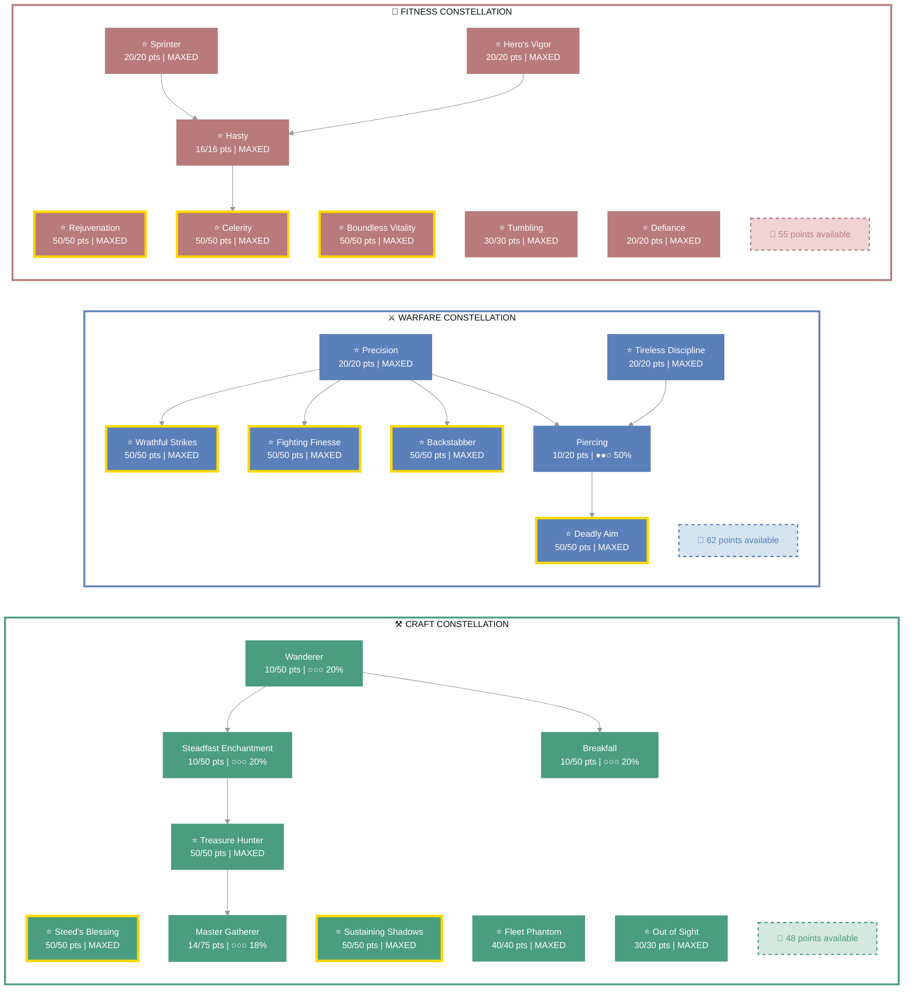

# Talon Valois (Silencer)

   

**Imperial Nightblade • Daggerfall Covenant Alliance**

---

## 📑 Table of Contents

- [📋 Overview](#overview)
  - [General](#general)
  - [Currency](#currency)
- [⚔️ Combat Arsenal](#combat-arsenal)
  - [Character Stats](#character-stats)
  - [Advanced Stats](#advanced-stats)
- [⚔️ PvP](#pvp)
  - [Alliance War Skills](#alliance-war-skills)
- [👥 Companions](#companions)
- [🎨 Collectibles](#collectibles)
- [🎒 Inventory](#inventory)
- [🏆 Achievements](#achievements)
- [🏰 Guild Membership](#guild-membership)

---

## 📋 Overview

### General

| **Attribute**               | **Value**         |
| --------------------------- | ----------------- |
| **Level**                   | 50                |
| **Champion Points**         | 935               |
| **Gender**                  | Female            |
| **Age**                     | 5d 19h 7m         |
| **Account**                 | @SOLAEGIS         |
| **ESO Plus**                | ✅ Active          |
| **Vampire/Werewolf Status** | 🧛 Vampire Stage 3 |

| **Attribute**                 | **Value**                                                |
| ----------------------------- | -------------------------------------------------------- |
| **Attributes**                | 🔵 0 / ❤️ 0 / ⚡ 64                                         |
| **🐴 Riding Skills**           | 🐴 60 / 💪 60 / 🎒 60 ✅                                     |
| **Available Champion Points** | ⚒️ 48 - ⚔️ 62 - 💪 55                                       |
| **Skill Points**              | 🎯 25 available - Ready to spend                          |
| **Race**                      | [Imperial](https://en.uesp.net/wiki/Online:Imperial)     |
| **Title**                     | [Silencer](https://en.uesp.net/wiki/Online:Silencer)     |
| **Class**                     | [Nightblade](https://en.uesp.net/wiki/Online:Nightblade) |

| **Attribute**      | **Value**                                                                                                                                                                                                                                                                                                                                         |
| ------------------ | ------------------------------------------------------------------------------------------------------------------------------------------------------------------------------------------------------------------------------------------------------------------------------------------------------------------------------------------------- |
| **Server**         | [NA Megaserver](https://en.uesp.net/wiki/Online:Megaservers)                                                                                                                                                                                                                                                                                      |
| **Location**       | [Summerset](https://en.uesp.net/wiki/Online:Summerset) (Alinor)                                                                                                                                                                                                                                                                                   |
| **🪨 Mundus Stone** | [The Shadow](https://en.uesp.net/wiki/Online:The_Shadow_(Mundus_Stone))                                                                                                                                                                                                                                                                           |
| **Alliance**       | [Daggerfall Covenant](https://en.uesp.net/wiki/Online:Daggerfall_Covenant)                                                                                                                                                                                                                                                                        |
| **🍖 Active Buffs** | Other: [Minor Protection](https://en.uesp.net/wiki/Online:Minor_Protection), [Major Savagery](https://en.uesp.net/wiki/Online:Major_Savagery), [Major Prophecy](https://en.uesp.net/wiki/Online:Major_Prophecy), [Leeching Strikes](https://en.uesp.net/wiki/Online:Leeching_Strikes), [Vampire Stage 3](https://en.uesp.net/wiki/Online:Vampire) |

### Currency

| **Attribute**            | **Value** |
| ------------------------ | --------- |
| 💰 **Gold**               | 10,000    |
| ⚔️ **Alliance Points**    | 6,648     |
| 🔮 **Tel Var**            | 430       |
| 💎 **Transmute Crystals** | 352       |
| 📜 **Writs**              | 0         |
| 🎫 **Event Tickets**      | 0         |
| 👑 **Crowns**             | 20,500    |
| 💠 **Gems**               | 184       |
| 🏅 **Seals**              | 15,605    |
| 🗝️ **Keys**               | 11        |
| 👕 **Tokens**             | 6         |
| 📚 **Fortunes**           | 0         |
| 🔹 **Fragments**          | 148       |

---

## ⚔️ Combat Arsenal

### Character Stats

| **Category**    | **Stat**     | **Value** |
| --------------- | ------------ | --------: |
| 💚 **Resources** | Health       |    20,958 |
|                 | Magicka      |    12,000 |
|                 | Stamina      |    27,070 |
| ⚔️ **Offensive** | Weapon Power |     2,757 |
|                 | Spell Power  |     2,757 |

| **Category**      | **Stat**    |     **Value** |
| ----------------- | ----------- | ------------: |
| 🎯 **Critical**    | Weapon Crit | 8,244 (37.6%) |
|                   | Spell Crit  | 8,244 (37.6%) |
| ⚔️ **Penetration** | Physical    |         3,511 |
|                   | Spell       |         3,511 |

| **Category**    | **Stat**        |    **Value** |
| --------------- | --------------- | -----------: |
| 🛡️ **Defensive** | Physical Resist | 10,704 (81%) |
|                 | Spell Resist    | 10,704 (81%) |
| ♻️ **Recovery**  | Health          |          184 |
|                 | Magicka         |          695 |
|                 | Stamina         |        1,041 |

### Advanced Stats

| **Ability**        |               **Cost/Value** |
| :----------------- | ---------------------------: |
| ⚔️ **Light Attack** |                    3,839 dmg |
| ⚔️ **Heavy Attack** |                    7,679 dmg |
| ⚔️ **Bash**         |          719 cost, 5,639 dmg |
| 🛡️ **Block**        | 1,285 cost, 50% mit, 40% spd |
| 🔓 **Break Free**   |                   4,869 cost |
| 🏃 **Dodge Roll**   |                   2,508 cost |
| 🐾 **Sneak**        |              21 cost, 0% spd |
| 🏃‍♂️ **Sprint**       |             402 cost, 0% spd |

| **Resistance** | **Value** |
| :------------- | --------: |
| 🔥 **Flame**    |     16.2% |
| ⚡ **Shock**    |     16.2% |
| ❄️ **Frost**    |     16.2% |
| 🔮 **Magic**    |     16.2% |
| 🦠 **Disease**  |     16.2% |
| ☠️ **Poison**   |     16.2% |
| 🩸 **Bleed**    |     16.2% |

| **Damage Type**       | **Bonus** |
| :-------------------- | --------: |
| 💥 **Critical Damage** |       99% |
| ⚔️ **Physical**        |        6% |
| 🔥 **Flame**           |        6% |
| ⚡ **Shock**           |        6% |
| ❄️ **Frost**           |         0 |
| 🔮 **Magic**           |        6% |
| 🦠 **Disease**         |        6% |
| ☠️ **Poison**          |        6% |
| 🩸 **Bleed**           |        6% |
| 🌌 **Oblivion**        |        6% |

| **Healing**            | **Value** |
| :--------------------- | --------: |
| 💚 **Healing Done**     |         0 |
| 💖 **Healing Taken**    |         0 |
| ✨ **Critical Healing** |       89% |

## ⚔️ Combat Arsenal

### ⚔️ ⚔️ ⚔️ Front Bar (Main Hand)

|                                **1**                                 |                               **2**                                |                              **3**                               |                      **4**                       |                                 **5**                                  |                                     **6**                                      |
| :------------------------------------------------------------------: | :----------------------------------------------------------------: | :--------------------------------------------------------------: | :----------------------------------------------: | :--------------------------------------------------------------------: | :----------------------------------------------------------------------------: |
| [Shadowy Disguise](https://en.uesp.net/wiki/Online:Shadowy_Disguise) | [Surprise Attack](https://en.uesp.net/wiki/Online:Surprise_Attack) | [Killer's Blade](https://en.uesp.net/wiki/Online:Killer's_Blade) | [Ambush](https://en.uesp.net/wiki/Online:Ambush) | [Merciless Resolve](https://en.uesp.net/wiki/Online:Merciless_Resolve) | [Incapacitating Strike](https://en.uesp.net/wiki/Online:Incapacitating_Strike) |

### 🔮 🔮 🔮 Back Bar (Backup)

|                            **1**                             |                                **2**                                 |                               **3**                                |                                **4**                                 |                                **5**                                 |                                     **6**                                      |
| :----------------------------------------------------------: | :------------------------------------------------------------------: | :----------------------------------------------------------------: | :------------------------------------------------------------------: | :------------------------------------------------------------------: | :----------------------------------------------------------------------------: |
| [Lethal Arrow](https://en.uesp.net/wiki/Online:Lethal_Arrow) | [Poison Injection](https://en.uesp.net/wiki/Online:Poison_Injection) | [Resolving Vigor](https://en.uesp.net/wiki/Online:Resolving_Vigor) | [Leeching Strikes](https://en.uesp.net/wiki/Online:Leeching_Strikes) | [Shadowy Disguise](https://en.uesp.net/wiki/Online:Shadowy_Disguise) | [Incapacitating Strike](https://en.uesp.net/wiki/Online:Incapacitating_Strike) |

---

## ⚔️ Equipment & Active Sets

| **Set**                                                                          | **Progress**                       |
| -------------------------------------------------------------------------------- | ---------------------------------- |
| 🟢 **[Night's Silence Set](https://en.uesp.net/wiki/Online:Night's_Silence_Set)** | `5/5` ██████████ 100%              |
| 🟢 **[Hunding's Rage Set](https://en.uesp.net/wiki/Online:Hunding's_Rage_Set)**   | `5/5` ██████████ 100% *(+3 extra)* |

### 📋 Equipment Details

| **Slot**               | **Item**                    | **Set**                                                                    | **Quality** | **Trait** | **Type**           | **Enchantment**             |
| ---------------------- | --------------------------- | -------------------------------------------------------------------------- | ----------- | --------- | ------------------ | --------------------------- |
| ⛑️ **Head**             | Helmet of Hunding's Rage    | [Hunding's Rage Set](https://en.uesp.net/wiki/Online:Hunding's_Rage_Set)   | ⭐ Epic      | Divines   | Medium • ⚒️ Crafted | -                           |
| 💎 **Neck**             | Necklace of Night's Silence | [Night's Silence Set](https://en.uesp.net/wiki/Online:Night's_Silence_Set) | ⭐ Epic      | Robust    | None • ⚒️ Crafted   | -                           |
| 🛡️ **Chest**            | Jack of Hunding's Rage      | [Hunding's Rage Set](https://en.uesp.net/wiki/Online:Hunding's_Rage_Set)   | ⭐ Epic      | Divines   | Medium • ⚒️ Crafted | -                           |
| 👑 **Shoulders**        | Arm Cops of Hunding's Rage  | [Hunding's Rage Set](https://en.uesp.net/wiki/Online:Hunding's_Rage_Set)   | ⭐ Epic      | Divines   | Medium • ⚒️ Crafted | -                           |
| ⚔️ **Main Hand**        | Dagger of Night's Silence   | [Night's Silence Set](https://en.uesp.net/wiki/Online:Night's_Silence_Set) | ⭐ Epic      | Sharpened | None • ⚒️ Crafted   | -                           |
| 🛡️ **Off Hand**         | Dagger of Night's Silence   | [Night's Silence Set](https://en.uesp.net/wiki/Online:Night's_Silence_Set) | ⭐ Epic      | Sharpened | None • ⚒️ Crafted   | -                           |
| ⚡ **Waist**            | Belt of Hunding's Rage      | [Hunding's Rage Set](https://en.uesp.net/wiki/Online:Hunding's_Rage_Set)   | ⭐ Epic      | Divines   | Medium • ⚒️ Crafted | -                           |
| 👖 **Legs**             | Guards of Hunding's Rage    | [Hunding's Rage Set](https://en.uesp.net/wiki/Online:Hunding's_Rage_Set)   | ⭐ Epic      | Divines   | Medium • ⚒️ Crafted | Maximum Stamina Enchantment |
| 👟 **Feet**             | Boots of Hunding's Rage     | [Hunding's Rage Set](https://en.uesp.net/wiki/Online:Hunding's_Rage_Set)   | ⭐ Epic      | Divines   | Medium • ⚒️ Crafted | -                           |
| 💍 **Ring 1**           | Ring of Night's Silence     | [Night's Silence Set](https://en.uesp.net/wiki/Online:Night's_Silence_Set) | ⭐ Epic      | Robust    | None • ⚒️ Crafted   | -                           |
| 💍 **Ring 2**           | Ring of Night's Silence     | [Night's Silence Set](https://en.uesp.net/wiki/Online:Night's_Silence_Set) | ⭐ Epic      | Robust    | None • ⚒️ Crafted   | -                           |
| ✋ **Hands**            | Bracers of Hunding's Rage   | [Hunding's Rage Set](https://en.uesp.net/wiki/Online:Hunding's_Rage_Set)   | ⭐ Epic      | Divines   | Medium • ⚒️ Crafted | -                           |
| 🔮 **Backup Main Hand** | Bow of Hunding's Rage       | [Hunding's Rage Set](https://en.uesp.net/wiki/Online:Hunding's_Rage_Set)   | ⭐ Epic      | Sharpened | None • ⚒️ Crafted   | -                           |

---

## ⭐ Champion Points

| **Total** | **Spent** | **Available** |
| :-------: | :-------: | :-----------: |
|    935    |    770    |      165      |

> ✨ **Enlightened** - 0 XP bonus remaining

| **⚒️ Craft**                                                                        | **Assigned Points** |
| ---------------------------------------------------------------------------------- | ------------------: |
| ██████████░░ 84%                                                                   |      264/312 points |
| **[Out of Sight](https://en.uesp.net/wiki/Online:Out_of_Sight)**                   |           30 points |
| **[Master Gatherer](https://en.uesp.net/wiki/Online:Master_Gatherer)**             |           14 points |
| **[Treasure Hunter](https://en.uesp.net/wiki/Online:Treasure_Hunter)**             |           50 points |
| **[Steadfast Enchantment](https://en.uesp.net/wiki/Online:Steadfast_Enchantment)** |           10 points |
| **[Wanderer](https://en.uesp.net/wiki/Online:Wanderer)**                           |           10 points |
| **[Fleet Phantom](https://en.uesp.net/wiki/Online:Fleet_Phantom)**                 |           40 points |
| **[Breakfall](https://en.uesp.net/wiki/Online:Breakfall)**                         |           10 points |
| **[Steed's Blessing](https://en.uesp.net/wiki/Online:Steed's_Blessing)**           |           50 points |
| **[Sustaining Shadows](https://en.uesp.net/wiki/Online:Sustaining_Shadows)**       |           50 points |

| **⚔️ Warfare**                                                                  | **Assigned Points** |
| ------------------------------------------------------------------------------ | ------------------: |
| █████████░░░ 80%                                                               |      250/312 points |
| **[Precision](https://en.uesp.net/wiki/Online:Precision)**                     |           20 points |
| **[Fighting Finesse](https://en.uesp.net/wiki/Online:Fighting_Finesse)**       |           50 points |
| **[Piercing](https://en.uesp.net/wiki/Online:Piercing)**                       |           10 points |
| **[Deadly Aim](https://en.uesp.net/wiki/Online:Deadly_Aim)**                   |           50 points |
| **[Wrathful Strikes](https://en.uesp.net/wiki/Online:Wrathful_Strikes)**       |           50 points |
| **[Backstabber](https://en.uesp.net/wiki/Online:Backstabber)**                 |           50 points |
| **[Tireless Discipline](https://en.uesp.net/wiki/Online:Tireless_Discipline)** |           20 points |

| **💪 Fitness**                                                                | **Assigned Points** |
| ---------------------------------------------------------------------------- | ------------------: |
| █████████░░░ 82%                                                             |      256/311 points |
| **[Sprinter](https://en.uesp.net/wiki/Online:Sprinter)**                     |           20 points |
| **[Hasty](https://en.uesp.net/wiki/Online:Hasty)**                           |           16 points |
| **[Celerity](https://en.uesp.net/wiki/Online:Celerity)**                     |           50 points |
| **[Hero's Vigor](https://en.uesp.net/wiki/Online:Hero's_Vigor)**             |           20 points |
| **[Tumbling](https://en.uesp.net/wiki/Online:Tumbling)**                     |           30 points |
| **[Defiance](https://en.uesp.net/wiki/Online:Defiance)**                     |           20 points |
| **[Rejuvenation](https://en.uesp.net/wiki/Online:Rejuvenation)**             |           50 points |
| **[Boundless Vitality](https://en.uesp.net/wiki/Online:Boundless_Vitality)** |           50 points |

### 🎯 Champion Points Visual

```mermaid
%%{init: {"theme":"base", "themeVariables": { "background":"transparent","fontSize":"12px","primaryColor":"#f0f0f0","primaryTextColor":"#333","primaryBorderColor":"#999","lineColor":"#999"}}}%%

flowchart LR

  subgraph subLEGEND["📖 LEGEND & VISUAL GUIDE"]

    LEG_STARS["Star Types"]
    LEG_S1["⭐ Gold Border = Maxed Slottable"]
    LEG_S2["🔶 Orange Border = Independent Star"]
    LEG_S3["Standard Border = In Progress"]

    LEG_FILL["Progress Indicators"]
    LEG_F1["⭐ = 100% Maxed"]
    LEG_F2["●●● = 75-99%"]
    LEG_F3["●●○ = 50-74%"]
    LEG_F4["●○○ = 25-49%"]
    LEG_F5["○○○ = 1-24%"]

    LEG_STARS --> LEG_S1 & LEG_S2 & LEG_S3
    LEG_FILL --> LEG_F1 & LEG_F2 & LEG_F3 & LEG_F4 & LEG_F5

    style LEG_STARS fill:transparent,stroke:none,color:#ccc
    style LEG_FILL fill:transparent,stroke:none,color:#ccc
    style LEG_S1 fill:#fff,stroke:#ffd700,stroke-width:3px,color:#333
    style LEG_S2 fill:#fff,stroke:#ff8c00,stroke-width:3px,color:#333
    style LEG_S3 fill:#fff,stroke:#999,stroke-width:2px,color:#333
    style LEG_F1 fill:#eee,stroke:#333,stroke-width:1px,color:#333
    style LEG_F2 fill:#eee,stroke:#333,stroke-width:1px,color:#333
    style LEG_F3 fill:#eee,stroke:#333,stroke-width:1px,color:#333
    style LEG_F4 fill:#eee,stroke:#333,stroke-width:1px,color:#333
    style LEG_F5 fill:#eee,stroke:#333,stroke-width:1px,color:#333
  end
  style subLEGEND fill:transparent,stroke:#999,stroke-width:3px
```

---

## 📜 Character Progress

### Progress Overview

| **Maxed Skill Lines** | **In Progress** | **Early Progress** | **Abilities with Morphs** | **Overall Completion** |
| --------------------: | --------------: | -----------------: | ------------------------: | ---------------------: |
|                     0 |               0 |                  0 |                         0 |                     0% |

🌿 Detailed Skill Morphs

*No morphable abilities found.*

---

---

## ⚔️ PvP

### PvP Profile

#### Alliance War Status

| **Category**    | **Value**                  |
| --------------- | -------------------------- |
| Rank            | Volunteer Grade 2 (Rank 2) |
| Alliance Points | 6,648                      |

---

## 👥 Companions

### Available Companions

- [Azandar al-Cybiades](https://en.uesp.net/wiki/Online:Azandar_al-Cybiades)
- [Bastian Hallix](https://en.uesp.net/wiki/Online:Bastian_Hallix)
- [Ember](https://en.uesp.net/wiki/Online:Ember)
- [Isobel Veloise](https://en.uesp.net/wiki/Online:Isobel_Veloise)
- [Mirri Elendis](https://en.uesp.net/wiki/Online:Mirri_Elendis)
- [Sharp-as-Night](https://en.uesp.net/wiki/Online:Sharp-as-Night)
- [Tanlorin](https://en.uesp.net/wiki/Online:Tanlorin)
- [Zerith-var](https://en.uesp.net/wiki/Online:Zerith-var)

### Active Companion

#### 🧙 [Mirri Elendis](https://en.uesp.net/wiki/Online:Mirri_Elendis)

#### Front Bar

|                           **1**                            |                                 **2**                                  |                              **3**                               |                               **4**                                |                               **5**                                |  **⚡**  |
| :--------------------------------------------------------: | :--------------------------------------------------------------------: | :--------------------------------------------------------------: | :----------------------------------------------------------------: | :----------------------------------------------------------------: | :-----: |
| [Warp Strike](https://en.uesp.net/wiki/Online:Warp_Strike) | [Masque of Torment](https://en.uesp.net/wiki/Online:Masque_of_Torment) | [Slayer's Blade](https://en.uesp.net/wiki/Online:Slayer's_Blade) | [Life Absorption](https://en.uesp.net/wiki/Online:Life_Absorption) | [Ghostly Evasion](https://en.uesp.net/wiki/Online:Ghostly_Evasion) | [Empty] |

| **Slot**        | **Item**                                      | **Quality** | **Trait**  |
| --------------- | --------------------------------------------- | ----------- | ---------- |
| ⚔️ **Main Hand** | Companion's Axe (Level 1, 🔮 Superior) ⚠️       | 🔮 Superior  | Quickened  |
| 🛡️ **Off Hand**  | Companion's Shield (Level 1, ⭐ Epic) ⚠️        | ⭐ Epic      | Quickened  |
| ⛑️ **Head**      | Companion's Helm (Level 1, ⚡ Fine) ⚠️          | ⚡ Fine      | Bolstered  |
| 🛡️ **Chest**     | Companion's Cuirass (Level 1, ⚡ Fine) ⚠️       | ⚡ Fine      | Bolstered  |
| 👑 **Shoulders** | Companion's Pauldrons (Level 1, 🔮 Superior) ⚠️ | 🔮 Superior  | Augmented  |
| ✋ **Hands**     | Companion's Gauntlets (Level 1, 🔮 Superior) ⚠️ | 🔮 Superior  | Bolstered  |
| ⚡ **Waist**     | Companion's Girdle (Level 1, ⚡ Fine) ⚠️        | ⚡ Fine      | Bolstered  |
| 👖 **Legs**      | Companion's Greaves (Level 1, 🔮 Superior) ⚠️   | 🔮 Superior  | Bolstered  |
| 👟 **Feet**      | Companion's Sabatons (Level 1, ⚡ Fine) ⚠️      | ⚡ Fine      | Shattering |

> [!WARNING]
> - 👥 **Companion underleveled**: Mirri Elendis (Level 15/20) - Needs XP
> - 👥 **Companion outdated gear**: 9 pieces below level - Upgrade equipment
> - 👥 **Companion empty ability slots**: 1 - Assign abilities

---

## 🎨 Collectibles

💁 Assistants (3 of 26)

| Progress                        |
| ------------------------------- |
| ██░░░░░░░░░░░░░░░░░░ 11% (3/26) |

- [Nuzhimeh the Merchant](https://en.uesp.net/wiki/Online:Nuzhimeh_the_Merchant)
- [Pirharri the Smuggler](https://en.uesp.net/wiki/Online:Pirharri_the_Smuggler)
- [Tythis Andromo, the Banker](https://en.uesp.net/wiki/Online:Tythis_Andromo,_the_Banker)

🖌️ Body Markings (9 of 325)

| Progress                        |
| ------------------------------- |
| ░░░░░░░░░░░░░░░░░░░░ 2% (9/325) |

- [Ancient Dragon Body Marks](https://en.uesp.net/wiki/Online:Ancient_Dragon_Body_Marks)
- [Body Imprint of the Psijic Order](https://en.uesp.net/wiki/Online:Body_Imprint_of_the_Psijic_Order)
- [Clockwork Apostle Body Imprints](https://en.uesp.net/wiki/Online:Clockwork_Apostle_Body_Imprints)
- [Fire Cyclone Body Markings](https://en.uesp.net/wiki/Online:Fire_Cyclone_Body_Markings)
- [Golden Riften Rogue Body Markings](https://en.uesp.net/wiki/Online:Golden_Riften_Rogue_Body_Markings)
- [Hagmatron's Body Markings](https://en.uesp.net/wiki/Online:Hagmatron's_Body_Markings)
- [Morag Tong Body Tattoo](https://en.uesp.net/wiki/Online:Morag_Tong_Body_Tattoo)
- [Regal Eagle Wing Body Tattoos](https://en.uesp.net/wiki/Online:Regal_Eagle_Wing_Body_Tattoos)
- [Serpent Scale Body Marking](https://en.uesp.net/wiki/Online:Serpent_Scale_Body_Marking)

👗 Costumes (48 of 317)

| Progress                          |
| --------------------------------- |
| ███░░░░░░░░░░░░░░░░░ 15% (48/317) |

- [Austere Warden Outfit](https://en.uesp.net/wiki/Online:Austere_Warden_Outfit)
- [Black Hand Robe](https://en.uesp.net/wiki/Online:Black_Hand_Robe)
- [Bloodthorn Robes](https://en.uesp.net/wiki/Online:Bloodthorn_Robes)
- [Colovian Uniform](https://en.uesp.net/wiki/Online:Colovian_Uniform)
- [Courier Uniform](https://en.uesp.net/wiki/Online:Courier_Uniform)
- [Court of Bedlam](https://en.uesp.net/wiki/Online:Court_of_Bedlam)
- [Covenant Scout](https://en.uesp.net/wiki/Online:Covenant_Scout)
- [Crown Dishdasha](https://en.uesp.net/wiki/Online:Crown_Dishdasha)
- [Cyrod Patrician Formal Gown](https://en.uesp.net/wiki/Online:Cyrod_Patrician_Formal_Gown)
- [Dark Seducer](https://en.uesp.net/wiki/Online:Dark_Seducer)
- [Dunmer Cultural Garb](https://en.uesp.net/wiki/Online:Dunmer_Cultural_Garb)
- [Elven Hero Armor](https://en.uesp.net/wiki/Online:Elven_Hero_Armor)
- [Forebear Dishdasha](https://en.uesp.net/wiki/Online:Forebear_Dishdasha)
- [Fort Amol Guard Armor](https://en.uesp.net/wiki/Online:Fort_Amol_Guard_Armor)
- [Frostedge Bandit Armor](https://en.uesp.net/wiki/Online:Frostedge_Bandit_Armor)
- [Golden Saint](https://en.uesp.net/wiki/Online:Golden_Saint)
- [Grim Harvester](https://en.uesp.net/wiki/Online:Grim_Harvester)
- [Hollow Moon Garb](https://en.uesp.net/wiki/Online:Hollow_Moon_Garb)
- [Imperial Chancellor](https://en.uesp.net/wiki/Online:Imperial_Chancellor)
- [Keeper's Garb](https://en.uesp.net/wiki/Online:Keeper's_Garb)
- [Lion Guard Knight](https://en.uesp.net/wiki/Online:Lion_Guard_Knight)
- [Mages Guild Formal Robes](https://en.uesp.net/wiki/Online:Mages_Guild_Formal_Robes)
- [Mages Guild Leggings Uniform](https://en.uesp.net/wiki/Online:Mages_Guild_Leggings_Uniform)
- [Mages Guild Research Robes](https://en.uesp.net/wiki/Online:Mages_Guild_Research_Robes)
- [Mannimarco](https://en.uesp.net/wiki/Online:Mannimarco)
- [Merchant Lord's Formal Regalia](https://en.uesp.net/wiki/Online:Merchant_Lord's_Formal_Regalia)
- [Midnight Union Garb](https://en.uesp.net/wiki/Online:Midnight_Union_Garb)
- [New Life Fish Boon Angler](https://en.uesp.net/wiki/Online:New_Life_Fish_Boon_Angler)
- [Noble Clan-Chief](https://en.uesp.net/wiki/Online:Noble_Clan-Chief)
- [Nordic Bather's Towel](https://en.uesp.net/wiki/Online:Nordic_Bather's_Towel)
- [Phaer Mercenary Armor](https://en.uesp.net/wiki/Online:Phaer_Mercenary_Armor)
- [Quendelunn Veiled Heritance Garb](https://en.uesp.net/wiki/Online:Quendelunn_Veiled_Heritance_Garb)
- [Red Rook Armor](https://en.uesp.net/wiki/Online:Red_Rook_Armor)
- [Regalia of the Scarlet Judge](https://en.uesp.net/wiki/Online:Regalia_of_the_Scarlet_Judge)
- [Satakalaaam Imperial Armor](https://en.uesp.net/wiki/Online:Satakalaaam_Imperial_Armor)
- [Sea Drake Garb](https://en.uesp.net/wiki/Online:Sea_Drake_Garb)
- [Sea Viper Armor](https://en.uesp.net/wiki/Online:Sea_Viper_Armor)
- [Servant's Outfit](https://en.uesp.net/wiki/Online:Servant's_Outfit)
- [Servant's Robes](https://en.uesp.net/wiki/Online:Servant's_Robes)
- [Seventh Legion Armor](https://en.uesp.net/wiki/Online:Seventh_Legion_Armor)
- [Shrouded Armor](https://en.uesp.net/wiki/Online:Shrouded_Armor)
- [Skald's Damask Jerkin](https://en.uesp.net/wiki/Online:Skald's_Damask_Jerkin)
- [Steel Shrike Uniform](https://en.uesp.net/wiki/Online:Steel_Shrike_Uniform)
- [Stormfist Uniform](https://en.uesp.net/wiki/Online:Stormfist_Uniform)
- [Thieves Guild Leathers](https://en.uesp.net/wiki/Online:Thieves_Guild_Leathers)
- [Upriver Striped Sash-Kilt](https://en.uesp.net/wiki/Online:Upriver_Striped_Sash-Kilt)
- [Vanguard Uniform](https://en.uesp.net/wiki/Online:Vanguard_Uniform)
- [Vulkhel Guard Marine Armor](https://en.uesp.net/wiki/Online:Vulkhel_Guard_Marine_Armor)

🗣️ Emotes (7 of 231)

| Progress                        |
| ------------------------------- |
| ░░░░░░░░░░░░░░░░░░░░ 3% (7/231) |

- [Belly Laugh](https://en.uesp.net/wiki/Online:Belly_Laugh)
- [Go Quietly](https://en.uesp.net/wiki/Online:Go_Quietly)
- [Kiss This](https://en.uesp.net/wiki/Online:Kiss_This)
- [Marshmallow Toasty Treat](https://en.uesp.net/wiki/Online:Marshmallow_Toasty_Treat)
- [Showtime](https://en.uesp.net/wiki/Online:Showtime)
- [Teatime](https://en.uesp.net/wiki/Online:Teatime)
- [Wickerman Mishap](https://en.uesp.net/wiki/Online:Wickerman_Mishap)

👓 Facial Accessories (3 of 137)

| Progress                        |
| ------------------------------- |
| ░░░░░░░░░░░░░░░░░░░░ 2% (3/137) |

- [Dremora Deceiver's Diadem](https://en.uesp.net/wiki/Online:Dremora_Deceiver's_Diadem)
- [Eternal Hunger Coronal](https://en.uesp.net/wiki/Online:Eternal_Hunger_Coronal)
- [Malign Ambitions Crown](https://en.uesp.net/wiki/Online:Malign_Ambitions_Crown)

💇 Hair Styles (0 of 155)

| Progress                        |
| ------------------------------- |
| ░░░░░░░░░░░░░░░░░░░░ 0% (0/155) |

*No hair styles owned*

🎩 Hats (22 of 165)

| Progress                          |
| --------------------------------- |
| ██░░░░░░░░░░░░░░░░░░ 13% (22/165) |

- [Arkthzand Anfractuosity Shroud](https://en.uesp.net/wiki/Online:Arkthzand_Anfractuosity_Shroud)
- [Ayleid Royal Crown](https://en.uesp.net/wiki/Online:Ayleid_Royal_Crown)
- [Brass Fortress Rebreather](https://en.uesp.net/wiki/Online:Brass_Fortress_Rebreather)
- [Colovian Filigreed Hood](https://en.uesp.net/wiki/Online:Colovian_Filigreed_Hood)
- [Colovian Fur Hood](https://en.uesp.net/wiki/Online:Colovian_Fur_Hood)
- [Crown of Misrule](https://en.uesp.net/wiki/Online:Crown_of_Misrule)
- [Firesong Obsidian Mask](https://en.uesp.net/wiki/Online:Firesong_Obsidian_Mask)
- [Flamebrow Fire Veil](https://en.uesp.net/wiki/Online:Flamebrow_Fire_Veil)
- [Flannel Forester's Hood](https://en.uesp.net/wiki/Online:Flannel_Forester's_Hood)
- [Helm of the Black Fin](https://en.uesp.net/wiki/Online:Helm_of_the_Black_Fin)
- [Hide Your Helm](https://en.uesp.net/wiki/Online:Hide_Your_Helm)
- [Inferno Facade](https://en.uesp.net/wiki/Online:Inferno_Facade)
- [Madgod's Turban](https://en.uesp.net/wiki/Online:Madgod's_Turban)
- [Malefic Standing Collar Hood](https://en.uesp.net/wiki/Online:Malefic_Standing_Collar_Hood)
- [Nightmare Daemon Mask, Khajiiti](https://en.uesp.net/wiki/Online:Nightmare_Daemon_Mask,_Khajiiti)
- [Oblivion Explorer's Headwrap](https://en.uesp.net/wiki/Online:Oblivion_Explorer's_Headwrap)
- [Plumed Wide-Brim Acorn-Warder](https://en.uesp.net/wiki/Online:Plumed_Wide-Brim_Acorn-Warder)
- [Psijic Skullcap](https://en.uesp.net/wiki/Online:Psijic_Skullcap)
- [Pumpkin Spectre Mask](https://en.uesp.net/wiki/Online:Pumpkin_Spectre_Mask)
- [Scarecrow Spectre Mask](https://en.uesp.net/wiki/Online:Scarecrow_Spectre_Mask)
- [Sideburn Skullcap](https://en.uesp.net/wiki/Online:Sideburn_Skullcap)
- [Werewolf Hunter Hat](https://en.uesp.net/wiki/Online:Werewolf_Hunter_Hat)

🖍️ Head Markings (13 of 378)

| Progress                         |
| -------------------------------- |
| ░░░░░░░░░░░░░░░░░░░░ 3% (13/378) |

- [Abyssal Embrace Face Markings](https://en.uesp.net/wiki/Online:Abyssal_Embrace_Face_Markings)
- [Ancient Dragon Face Marks](https://en.uesp.net/wiki/Online:Ancient_Dragon_Face_Marks)
- [Clockwork Apostle Face Imprints](https://en.uesp.net/wiki/Online:Clockwork_Apostle_Face_Imprints)
- [Crimson Flame Lipstick](https://en.uesp.net/wiki/Online:Crimson_Flame_Lipstick)
- [Eagle Plume Face Tattoo](https://en.uesp.net/wiki/Online:Eagle_Plume_Face_Tattoo)
- [Face Imprint of the Psijic Order](https://en.uesp.net/wiki/Online:Face_Imprint_of_the_Psijic_Order)
- [Golden Riften Rogue Face Markings](https://en.uesp.net/wiki/Online:Golden_Riften_Rogue_Face_Markings)
- [Hagmatron's Face Markings](https://en.uesp.net/wiki/Online:Hagmatron's_Face_Markings)
- [Inferno Ink Face Markings^n](https://en.uesp.net/wiki/Online:Inferno_Ink_Face_Markings^n)
- [Morag Tong Face Tattoo](https://en.uesp.net/wiki/Online:Morag_Tong_Face_Tattoo)
- [Mystic Magicka Flow Face Tattoos](https://en.uesp.net/wiki/Online:Mystic_Magicka_Flow_Face_Tattoos)
- [Scrying Eye Psijic Face Tattoo](https://en.uesp.net/wiki/Online:Scrying_Eye_Psijic_Face_Tattoo)
- [Stonelore's Legend Face Paint](https://en.uesp.net/wiki/Online:Stonelore's_Legend_Face_Paint)

🔮 Mementos (35 of 205)

| Progress                          |
| --------------------------------- |
| ███░░░░░░░░░░░░░░░░░ 17% (35/205) |

- [Almalexia's Enchanted Lantern](https://en.uesp.net/wiki/Online:Almalexia's_Enchanted_Lantern)
- [Battered Bear Trap](https://en.uesp.net/wiki/Online:Battered_Bear_Trap)
- [Blackfeather Court Whistle](https://en.uesp.net/wiki/Online:Blackfeather_Court_Whistle)
- [Blade of the Blood Oath](https://en.uesp.net/wiki/Online:Blade_of_the_Blood_Oath)
- [Bonesnap Binding Stone](https://en.uesp.net/wiki/Online:Bonesnap_Binding_Stone)
- [Breda's Bottomless Mead Mug](https://en.uesp.net/wiki/Online:Breda's_Bottomless_Mead_Mug)
- [Cherry Blossom Branch](https://en.uesp.net/wiki/Online:Cherry_Blossom_Branch)
- [Clockwork Obscuros](https://en.uesp.net/wiki/Online:Clockwork_Obscuros)
- [Coin of Illusory Riches](https://en.uesp.net/wiki/Online:Coin_of_Illusory_Riches)
- [Discourse Amaranthine](https://en.uesp.net/wiki/Online:Discourse_Amaranthine)
- [Dwarven Puzzle Orb](https://en.uesp.net/wiki/Online:Dwarven_Puzzle_Orb)
- [Fetish of Anger](https://en.uesp.net/wiki/Online:Fetish_of_Anger)
- [Finvir's Trinket](https://en.uesp.net/wiki/Online:Finvir's_Trinket)
- [Fire-Breather's Torches](https://en.uesp.net/wiki/Online:Fire-Breather's_Torches)
- [Jester's Scintillator](https://en.uesp.net/wiki/Online:Jester's_Scintillator)
- [Jubilee Cake 2017](https://en.uesp.net/wiki/Online:Jubilee_Cake_2017)
- [Jubilee Cake 2018](https://en.uesp.net/wiki/Online:Jubilee_Cake_2018)
- [Jubilee Cake 2020](https://en.uesp.net/wiki/Online:Jubilee_Cake_2020)
- [Jubilee Cake 2026](https://en.uesp.net/wiki/Online:Jubilee_Cake_2026)
- [Lena's Wand of Finding](https://en.uesp.net/wiki/Online:Lena's_Wand_of_Finding)
- [Mud Ball Pouch](https://en.uesp.net/wiki/Online:Mud_Ball_Pouch)
- [Murkmire Grave-Stake](https://en.uesp.net/wiki/Online:Murkmire_Grave-Stake)
- [Nanwen's Sword](https://en.uesp.net/wiki/Online:Nanwen's_Sword)
- [Questionable Meat Sack](https://en.uesp.net/wiki/Online:Questionable_Meat_Sack)
- [Red Revelry Bottle](https://en.uesp.net/wiki/Online:Red_Revelry_Bottle)
- [Remnant of Meridia's Light](https://en.uesp.net/wiki/Online:Remnant_of_Meridia's_Light)
- [Scalecaller Rune of Levitation](https://en.uesp.net/wiki/Online:Scalecaller_Rune_of_Levitation)
- [Sea Sload Dorsal Fin](https://en.uesp.net/wiki/Online:Sea_Sload_Dorsal_Fin)
- [Sword-Swallower's Blade](https://en.uesp.net/wiki/Online:Sword-Swallower's_Blade)
- [The Pie of Misrule](https://en.uesp.net/wiki/Online:The_Pie_of_Misrule)
- [Token of Root Sunder](https://en.uesp.net/wiki/Online:Token_of_Root_Sunder)
- [Witch's Bonfire Dust](https://en.uesp.net/wiki/Online:Witch's_Bonfire_Dust)
- [Witchmother's Whistle](https://en.uesp.net/wiki/Online:Witchmother's_Whistle)
- [Wyrd Elemental Plume](https://en.uesp.net/wiki/Online:Wyrd_Elemental_Plume)
- [Yokudan Totem](https://en.uesp.net/wiki/Online:Yokudan_Totem)

🐴 Mounts (15 of 714)

| Progress                         |
| -------------------------------- |
| ░░░░░░░░░░░░░░░░░░░░ 2% (15/714) |

- [Ashbone Sabre Cat](https://en.uesp.net/wiki/Online:Ashbone_Sabre_Cat)
- [Dwarven War Horse](https://en.uesp.net/wiki/Online:Dwarven_War_Horse)
- [Flame Atronach Senche^n](https://en.uesp.net/wiki/Online:Flame_Atronach_Senche^n)
- [Imperial Horse](https://en.uesp.net/wiki/Online:Imperial_Horse)
- [Midnight Steed](https://en.uesp.net/wiki/Online:Midnight_Steed)
- [Nightmare Senche](https://en.uesp.net/wiki/Online:Nightmare_Senche)
- [Nix-Ox War-Steed^n](https://en.uesp.net/wiki/Online:Nix-Ox_War-Steed^n)
- [Noweyr Steed](https://en.uesp.net/wiki/Online:Noweyr_Steed)
- [Psijic Escort Charger](https://en.uesp.net/wiki/Online:Psijic_Escort_Charger)
- [Rahd-m'Athra](https://en.uesp.net/wiki/Online:Rahd-m'Athra)
- [Senche-Leopard](https://en.uesp.net/wiki/Online:Senche-Leopard)
- [Skulltooth Coastal Durzog](https://en.uesp.net/wiki/Online:Skulltooth_Coastal_Durzog)
- [Sorrel Horse](https://en.uesp.net/wiki/Online:Sorrel_Horse)
- [Tessellated Guar](https://en.uesp.net/wiki/Online:Tessellated_Guar)
- [Wormwrithe Bear-Lizard](https://en.uesp.net/wiki/Online:Wormwrithe_Bear-Lizard)

🎭 Personalities (1 of 30)

| Progress                       |
| ------------------------------ |
| ░░░░░░░░░░░░░░░░░░░░ 3% (1/30) |

- [Assassin](https://en.uesp.net/wiki/Online:Assassin)

🐾 Pets (43 of 695)

| Progress                         |
| -------------------------------- |
| █░░░░░░░░░░░░░░░░░░░ 6% (43/695) |

- [Abecean Ratter Cat](https://en.uesp.net/wiki/Online:Abecean_Ratter_Cat)
- [Alik'r Dune-Hound](https://en.uesp.net/wiki/Online:Alik'r_Dune-Hound)
- [Ambersheen Vale Fawn](https://en.uesp.net/wiki/Online:Ambersheen_Vale_Fawn)
- [Big-Eared Ginger Kitten^n](https://en.uesp.net/wiki/Online:Big-Eared_Ginger_Kitten^n)
- [Blue Dragon Imp](https://en.uesp.net/wiki/Online:Blue_Dragon_Imp)
- [Bravil Retriever](https://en.uesp.net/wiki/Online:Bravil_Retriever)
- [Coldharbour Dremnaken Runt](https://en.uesp.net/wiki/Online:Coldharbour_Dremnaken_Runt)
- [Covenant Breton Terrier](https://en.uesp.net/wiki/Online:Covenant_Breton_Terrier)
- [Crimson Torchbug](https://en.uesp.net/wiki/Online:Crimson_Torchbug)
- [Dominion Breton Terrier](https://en.uesp.net/wiki/Online:Dominion_Breton_Terrier)
- [Dozen-Banded Vvardvark^n](https://en.uesp.net/wiki/Online:Dozen-Banded_Vvardvark^n)
- [Dusky Fennec Fox^n](https://en.uesp.net/wiki/Online:Dusky_Fennec_Fox^n)
- [Dwarven Spider](https://en.uesp.net/wiki/Online:Dwarven_Spider)
- [Dwarven War Dog](https://en.uesp.net/wiki/Online:Dwarven_War_Dog)
- [Echalette](https://en.uesp.net/wiki/Online:Echalette)
- [Frost Atronach Kagouti Calf^N](https://en.uesp.net/wiki/Online:Frost_Atronach_Kagouti_Calf^N)
- [Golden Eagle](https://en.uesp.net/wiki/Online:Golden_Eagle)
- [Green Dragon Imp](https://en.uesp.net/wiki/Online:Green_Dragon_Imp)
- [Grisly Banekin Mummy^N](https://en.uesp.net/wiki/Online:Grisly_Banekin_Mummy^N)
- [Haunted House Cat^n](https://en.uesp.net/wiki/Online:Haunted_House_Cat^n)
- [Hot Pepper Bantam Guar](https://en.uesp.net/wiki/Online:Hot_Pepper_Bantam_Guar)
- [Housecat](https://en.uesp.net/wiki/Online:Housecat)
- [Imgakin Monkey](https://en.uesp.net/wiki/Online:Imgakin_Monkey)
- [Infernium Dwarven Spiderling](https://en.uesp.net/wiki/Online:Infernium_Dwarven_Spiderling)
- [Jackal](https://en.uesp.net/wiki/Online:Jackal)
- [Long-Winged Bat^F](https://en.uesp.net/wiki/Online:Long-Winged_Bat^F)
- [Nibenay Mudcrab](https://en.uesp.net/wiki/Online:Nibenay_Mudcrab)
- [Noweyr Pony^n](https://en.uesp.net/wiki/Online:Noweyr_Pony^n)
- [Pact Breton Terrier](https://en.uesp.net/wiki/Online:Pact_Breton_Terrier)
- [Pocket Mammoth](https://en.uesp.net/wiki/Online:Pocket_Mammoth)
- [Pocket Salamander^n](https://en.uesp.net/wiki/Online:Pocket_Salamander^n)
- [Psijic Mascot Bear Cub^n](https://en.uesp.net/wiki/Online:Psijic_Mascot_Bear_Cub^n)
- [Psijic Mascot Guar Calf^n](https://en.uesp.net/wiki/Online:Psijic_Mascot_Guar_Calf^n)
- [Psijic Mascot Pony^n](https://en.uesp.net/wiki/Online:Psijic_Mascot_Pony^n)
- [Scintillant Dovah-Fly^n](https://en.uesp.net/wiki/Online:Scintillant_Dovah-Fly^n)
- [Spectral Mudcrab](https://en.uesp.net/wiki/Online:Spectral_Mudcrab)
- [Steam-Driven Brassilisk^n](https://en.uesp.net/wiki/Online:Steam-Driven_Brassilisk^n)
- [Sylvan Nixad](https://en.uesp.net/wiki/Online:Sylvan_Nixad)
- [Verdigris Haj Mota](https://en.uesp.net/wiki/Online:Verdigris_Haj_Mota)
- [Vermilion Scuttler](https://en.uesp.net/wiki/Online:Vermilion_Scuttler)
- [Viridescent Dragon Frog](https://en.uesp.net/wiki/Online:Viridescent_Dragon_Frog)
- [Vvardvark^n](https://en.uesp.net/wiki/Online:Vvardvark^n)
- [Wormwrithe Haj Mota Hatchling](https://en.uesp.net/wiki/Online:Wormwrithe_Haj_Mota_Hatchling)

✨ Polymorphs (1 of 44)

| Progress                       |
| ------------------------------ |
| ░░░░░░░░░░░░░░░░░░░░ 2% (1/44) |

- [Skeleton](https://en.uesp.net/wiki/Online:Skeleton)

🎭 Skins (0 of 109)

| Progress                        |
| ------------------------------- |
| ░░░░░░░░░░░░░░░░░░░░ 0% (0/109) |

*No skins owned*

---

## 🎒 Inventory

| **Storage**  | **Used** | **Max** | **Capacity**   |
| ------------ | -------: | ------: | -------------- |
| Backpack     |       29 |     170 | █░░░░░░░░░ 17% |
| Bank         |      183 |     480 | ███░░░░░░░ 38% |
| Crafting Bag |        ∞ |       ∞ | ESO Plus       |

<strong>Backpack Items</strong> (29 unique items)

#### Other (29 items)

| **Item**                            | **Stack** | **Quality** |
| ----------------------------------- | --------: | ----------- |
| 🟡 Crown Experience Scroll           |         5 | 🟡           |
| 🟣 Crown Fortifying Meal             |        21 | 🟣           |
| 🟡 Crown Lethal Poison               |      1000 | 🟡           |
| 🟡 Crown Lethal Poison               |       436 | 🟡           |
| 🔵 Crown Repair Kit                  |         5 | 🔵           |
| 🔵 Crown Soul Gem                    |         5 | 🔵           |
| 🟣 Crown Tri-Restoration Potion      |        20 | 🟣           |
| 🟡 Gold Coast Debilitating Poison    |       300 | 🟡           |
| 🟡 Gold Coast Draining Poison        |       300 | 🟡           |
| 🟣 Gold Coast Spellcaster Elixir     |        50 | 🟣           |
| 🟣 Gold Coast Swift Survivor Elixir  |        40 | 🟣           |
| 🟡 Gold Coast Trapping Poison        |       250 | 🟡           |
| ⚪ Heart of the Indrik               |         1 | ⚪           |
| ⚪ Lockpick                          |         7 | ⚪           |
| ⚪ Lockpick                          |       180 | ⚪           |
| ⚪ Pocket Knife                      |        10 | ⚪           |
| 🟢 Psijic Codex Transcription        |         1 | 🟢           |
| 🔵 Pumpkin Corn Fritters             |        20 | 🔵           |
| 🟢 Roast Pig                         |         1 | 🟢           |
| 🟡 Runebox: Cherry Blossom Branch    |         1 | 🟡           |
| 🟡 Runebox: Colovian Fur Hood        |         1 | 🟡           |
| 🟡 Runebox: Hagmatron's Face Marking |         1 | 🟡           |
| 🟡 Runebox: Mud Ball Pouch           |         1 | 🟡           |
| 🟡 Runebox: Sword-Swallower's Blade  |         1 | 🟡           |
| ⚪ Solstheim Elk and Scuttle         |         3 | ⚪           |
| ⚪ Soul Gem (Empty)                  |        28 | ⚪           |
| ⚪ The Unraveling Staff              |         1 | ⚪           |
| ⚪ Tomato Garlic Chutney             |         1 | ⚪           |
| ⚪ Vvardenfell Ash Yam Loaf          |         1 | ⚪           |

<strong>Bank Items</strong> (183 unique items)

#### Other (183 items)

| **Item**                                    | **Stack** | **Quality** |
| ------------------------------------------- | --------: | ----------- |
| ⚪ ancestor silk breeches                    |         1 | ⚪           |
| 🟡 Attunable Blacksmithing Station, Bound    |         1 | 🟡           |
| 🟡 Attunable Clothing Station, Bound         |         1 | 🟡           |
| 🟡 Attunable Woodworking Station, Bound      |         1 | 🟡           |
| 🟣 Axe of Agility                            |         1 | 🟣           |
| 🔵 Bal Foyen Treasure Map I                  |         1 | 🔵           |
| 🟢 Blueprint: High Elf Table, Sturdy Kitchen |         1 | 🟢           |
| 🟣 Bow of Hunding's Rage                     |         1 | 🟣           |
| 🔵 Clockwork City Treasure Map I             |         1 | 🔵           |
| 🔵 Companion's Boots                         |         1 | 🔵           |
| 🟢 Companion's Bow                           |         1 | 🟢           |
| 🟢 Companion's Guards                        |         1 | 🟢           |
| 🔵 Companion's Jerkin                        |         1 | 🔵           |
| 🔵 Companion's Restoration Staff             |         1 | 🔵           |
| 🔵 Companion's Restoration Staff             |         1 | 🔵           |
| 🔵 Companion's Restoration Staff             |         1 | 🔵           |
| 🔵 Companion's Restoration Staff             |         1 | 🔵           |
| 🟢 Companion's Ring                          |         1 | 🟢           |
| 🔵 Companion's Sash                          |         1 | 🔵           |
| 🟢 Companion's Sash                          |         1 | 🟢           |
| 🔵 Companion's Shield                        |         1 | 🔵           |
| 🟢 Companion's Shield                        |         1 | 🟢           |
| 🔵 Companion's Shield                        |         1 | 🔵           |
| 🔵 Companion's Shield                        |         1 | 🔵           |
| 🟣 Companion's Shield                        |         1 | 🟣           |
| 🔵 Companion's Shield                        |         1 | 🔵           |
| 🔵 Companion's Shield                        |         1 | 🔵           |
| 🔵 Companion's Sword                         |         1 | 🔵           |
| 🔵 Companion's Sword                         |         1 | 🔵           |
| 🔵 Companion's Sword                         |         1 | 🔵           |
| 🔵 Crafting Motif 1: High Elf Style          |         1 | 🔵           |
| 🔵 Crafting Motif 4: Nord Style              |         5 | 🔵           |
| 🟣 Crafting Motif 34: Assassins League Axes  |         4 | 🟣           |
| 🟣 Crafting Motif 39: Minotaur Bows          |         1 | 🟣           |
| 🟣 Crafting Motif 39: Minotaur Swords        |         1 | 🟣           |
| 🟣 Crafting Motif 40: Order Hour Axes        |         2 | 🟣           |
| 🟣 Crafting Motif 40: Order Hour Belts       |         2 | 🟣           |
| 🟣 Crafting Motif 40: Order Hour Chests      |         2 | 🟣           |
| 🟣 Crafting Motif 40: Order Hour Legs        |         1 | 🟣           |
| 🟣 Crafting Motif 40: Order Hour Maces       |         2 | 🟣           |
| 🟣 Crafting Motif 40: Order Hour Shields     |         1 | 🟣           |
| 🟣 Crafting Motif 42: Hollowjack Axes        |         5 | 🟣           |
| 🟣 Crafting Motif 42: Hollowjack Belts       |         1 | 🟣           |
| 🟣 Crafting Motif 42: Hollowjack Boots       |         2 | 🟣           |
| 🟣 Crafting Motif 42: Hollowjack Daggers     |         4 | 🟣           |
| 🟣 Crafting Motif 42: Hollowjack Gloves      |         4 | 🟣           |
| 🟣 Crafting Motif 42: Hollowjack Helmets     |         3 | 🟣           |
| 🟣 Crafting Motif 42: Hollowjack Legs        |         2 | 🟣           |
| 🟣 Crafting Motif 42: Hollowjack Maces       |         2 | 🟣           |
| 🟣 Crafting Motif 42: Hollowjack Shoulders   |         2 | 🟣           |
| 🟣 Crafting Motif 60: Worm Cult Chests       |         1 | 🟣           |
| 🟣 Crafting Motif 60: Worm Cult Daggers      |         2 | 🟣           |
| 🟣 Crafting Motif 60: Worm Cult Helmets      |         1 | 🟣           |
| 🟣 Crafting Motif 60: Worm Cult Shields      |         1 | 🟣           |
| 🟣 Crafting Motif 62: Sapiarch Legs          |         1 | 🟣           |
| 🟣 Crafting Motif 63: Dremora Axes           |         8 | 🟣           |
| 🟣 Crafting Motif 63: Dremora Belts          |         9 | 🟣           |
| 🟣 Crafting Motif 63: Dremora Boots          |         5 | 🟣           |
| 🟣 Crafting Motif 63: Dremora Daggers        |         6 | 🟣           |
| 🟣 Crafting Motif 63: Dremora Gloves         |         4 | 🟣           |
| 🟡 Crown Experience Scroll                   |        89 | 🟡           |
| 🟣 Crown Fortifying Meal                     |       170 | 🟣           |
| 🟡 Crown Lethal Poison                       |       419 | 🟡           |
| 🟡 Crown Lethal Poison                       |      1000 | 🟡           |
| 🟡 Crown Lethal Poison                       |      1000 | 🟡           |
| 🟡 Crown Mimic Stone                         |        10 | 🟡           |
| 🟣 Crown Refreshing Drink                    |        13 | 🟣           |
| 🟣 Crown Tri-Restoration Potion              |       200 | 🟣           |
| 🟣 Crown Tri-Restoration Potion              |        24 | 🟣           |
| 🟣 Crown Tri-Restoration Potion              |       200 | 🟣           |
| 🟣 Crown Tri-Restoration Potion              |       200 | 🟣           |
| 🟣 Crown Tri-Restoration Potion              |       105 | 🟣           |
| 🟣 Crown Tri-Restoration Potion              |       200 | 🟣           |
| 🟣 Crown Tri-Restoration Potion              |       200 | 🟣           |
| 🔵 Cyrodiil Treasure Map I                   |         1 | 🔵           |
| 🔵 Deep Winter Charity Writ                  |         1 | 🔵           |
| 🔵 Deep Winter Charity Writ                  |         1 | 🔵           |
| 🔵 Deep Winter Charity Writ                  |         1 | 🔵           |
| ⚪ ebonthread robe                           |         1 | ⚪           |
| 🟣 Epaulets of a Mother's Sorrow             |         1 | 🟣           |
| 🔵 Epaulets of Necropotence                  |         1 | 🔵           |
| 🟡 Fortified Brass Gloves                    |         1 | 🟡           |
| 🟡 Fortified Brass Sash                      |         1 | 🟡           |
| 🔵 Gloves of Necropotence                    |         1 | 🔵           |
| 🟡 Gold Coast Debilitating Poison            |       200 | 🟡           |
| 🟡 Gold Coast Draining Poison                |       100 | 🟡           |
| 🟡 Gold Coast Experience Scroll              |        16 | 🟡           |
| 🟣 Gold Coast Spellcaster Elixir             |        10 | 🟣           |
| 🟣 Gold Coast Swift Survivor Elixir          |       200 | 🟣           |
| 🟡 Gold Coast Trapping Poison                |       200 | 🟡           |
| 🟣 Gold Coast Warrior Elixir                 |       100 | 🟣           |
| 🟡 Grand Gold Coast Experience Scroll        |        31 | 🟡           |
| 🟢 Gryphon's Shield                          |         1 | 🟢           |
| 🔵 Gryphon's Shield                          |         1 | 🔵           |
| 🔵 Hat of Necropotence                       |         1 | 🔵           |
| 🟣 Imperial Charity Writ                     |         1 | 🟣           |
| ⚪ Lockpick                                  |       113 | ⚪           |
| 🟡 Major Gold Coast Experience Scroll        |        10 | 🟡           |
| 🟡 Major Gold Coast Experience Scroll        |         4 | 🟡           |
| 🔵 Malabal Tor Treasure Map VI               |         1 | 🔵           |
| ⚪ maple inferno staff                       |         1 | ⚪           |
| ⚪ maple inferno staff                       |         1 | ⚪           |
| 🔵 Necklace of Morihaus                      |         1 | 🔵           |
| 🟣 Necklace of Morihaus                      |         1 | 🟣           |
| 🟣 Necklace of the Seducer                   |         1 | 🟣           |
| ⚪ New Moon Acolyte's Boots                  |         1 | ⚪           |
| ⚪ New Moon Acolyte's Gloves                 |         1 | ⚪           |
| ⚪ New Moon Acolyte's Jack                   |         1 | ⚪           |
| ⚪ New Moon Acolyte's Shoes                  |         1 | ⚪           |
| 🟢 Pattern: High Elf Carpet, Rustic          |         1 | 🟢           |
| 🔵 platinum necklace of Reduce Feat Cost     |         1 | 🔵           |
| 🔵 platinum necklace of Reduce Spell Cost    |         1 | 🔵           |
| 🟢 platinum ring of Reduce Feat Cost         |         1 | 🟢           |
| 🟡 Pledge of Mara                            |         1 | 🟡           |
| 🟢 Psijic Codex Transcription                |         1 | 🟢           |
| ⚪ rawhide arm cops                          |         1 | ⚪           |
| 🔵 Recipe: Apple Baked Fish                  |         2 | 🔵           |
| 🔵 Recipe: Beet-Glazed Pork                  |         1 | 🔵           |
| 🟢 Recipe: Bitter Tea                        |         1 | 🟢           |
| 🟢 Recipe: Black Coffee                      |         1 | 🟢           |
| 🔵 Recipe: Blackwood Mint Chai               |         2 | 🔵           |
| 🔵 Recipe: Bowl of "Peeled Eyeballs"         |         1 | 🔵           |
| 🔵 Recipe: Cloudrest Clarified Coffee        |         1 | 🔵           |
| 🔵 Recipe: Cloudrest Golden Ale              |         2 | 🔵           |
| 🔵 Recipe: Crunchy Spider Skewer             |         1 | 🔵           |
| 🟢 Recipe: Flank Steak                       |         4 | 🟢           |
| 🟢 Recipe: Fredas Night Infusion             |         1 | 🟢           |
| 🔵 Recipe: Grape-Glazed Bantam Guar          |         1 | 🔵           |
| 🔵 Recipe: Grapes and Ash Yam Falafel        |         1 | 🔵           |
| 🟢 Recipe: Grilled Hare                      |         1 | 🟢           |
| 🟢 Recipe: Hagraven's Tonic                  |         1 | 🟢           |
| 🟢 Recipe: Heart's Day Rose Tea              |         1 | 🟢           |
| 🟢 Recipe: Honeyberry Tea                    |         1 | 🟢           |
| 🟢 Recipe: Hunter's Pie                      |         1 | 🟢           |
| 🟢 Recipe: Isinmate Infusion                 |         2 | 🟢           |
| 🟢 Recipe: Markarth Mead                     |         2 | 🟢           |
| 🟢 Recipe: Mate Infusion                     |         4 | 🟢           |
| 🟢 Recipe: Meady-Matey Infusion              |         1 | 🟢           |
| 🟢 Recipe: Morning Reveille Tea              |         1 | 🟢           |
| 🟢 Recipe: Pan-Fried Trout                   |         1 | 🟢           |
| 🟢 Recipe: Pumpkin Cheesecake                |         2 | 🟢           |
| 🟢 Recipe: Rabbit Millet Pilaf               |         2 | 🟢           |
| 🟢 Recipe: Rabbit Pasty                      |         1 | 🟢           |
| 🟢 Recipe: Roast Venison                     |         1 | 🟢           |
| 🔵 Recipe: Salmon with Radish Slaw           |         1 | 🔵           |
| 🟢 Recipe: Sweet Sanguine Apples             |         4 | 🟢           |
| 🟢 Recipe: Sweetsting Tea                    |         1 | 🟢           |
| 🟢 Recipe: Tonsil Tingle Tonic               |         1 | 🟢           |
| 🟣 Ring of Endurance                         |         1 | 🟣           |
| 🔵 Ring of Morihaus                          |         1 | 🔵           |
| 🟢 Ring of the Order of Diagna               |         1 | 🟢           |
| 🔵 Ritemaster's Gifted Staff                 |         1 | 🔵           |
| ⚪ rubedite helm                             |         1 | ⚪           |
| ⚪ ruby ash bow                              |         1 | ⚪           |
| ⚪ ruby ash inferno staff                    |         1 | ⚪           |
| 🔵 ruby ash lightning staff of Flame         |         1 | 🔵           |
| 🟡 Skill Respecification Scroll              |        14 | 🟡           |
| 🟢 slight Glyph of Reduce Spell Cost         |         1 | 🟢           |
| 🟢 slight Glyph of Weapon Damage             |         1 | 🟢           |
| 🟢 Soul Gem                                  |        96 | 🟢           |
| 🟢 Spirit Stone                              |         1 | 🟢           |
| 🟢 Superb Glyph of Crushing                  |         1 | 🟢           |
| 🟢 trifling Glyph of Absorb Magicka          |         1 | 🟢           |
| 🟢 trifling Glyph of Hardening               |         1 | 🟢           |
| 🟢 trifling Glyph of Hardening               |         1 | 🟢           |
| 🟢 trifling Glyph of Increase Physical Harm  |         1 | 🟢           |
| ⚪ Truly Superb Glyph of Health              |         1 | ⚪           |
| ⚪ Truly Superb Glyph of Health              |         1 | ⚪           |
| 🟡 Truly Superb Glyph of Health              |         1 | 🟡           |
| 🟡 Truly Superb Glyph of Magicka             |         1 | 🟡           |
| ⚪ Truly Superb Glyph of Shock               |         1 | ⚪           |
| 🟣 Vanus's Restoration Staff                 |         1 | 🟣           |
| 🔵 Witches Festival Writ                     |         1 | 🔵           |
| 🔵 Witches Festival Writ                     |         1 | 🔵           |
| 🔵 Witches Festival Writ                     |         1 | 🔵           |
| 🔵 Witches Festival Writ                     |         1 | 🔵           |
| 🔵 Witches Festival Writ                     |         1 | 🔵           |
| 🔵 Witches Festival Writ                     |         1 | 🔵           |
| 🔵 Witches Festival Writ                     |         1 | 🔵           |
| 🔵 Witches Festival Writ                     |         1 | 🔵           |
| 🔵 Witches Festival Writ                     |         1 | 🔵           |
| 🔵 Witches Festival Writ                     |         1 | 🔵           |
| 🔵 Witches Festival Writ                     |         1 | 🔵           |

<strong>Crafting Bag Items</strong> (402 unique items)

#### Armor Trait (9 items)

| **Item**             | **Stack** | **Quality** |
| -------------------- | --------: | ----------- |
| ⚪ Almandine          |      1080 | ⚪           |
| ⚪ Bloodstone         |      1129 | ⚪           |
| ⚪ Diamond            |       681 | ⚪           |
| ⚪ Emerald            |       624 | ⚪           |
| ⚪ Fortified Nirncrux |        11 | ⚪           |
| ⚪ Garnet             |       690 | ⚪           |
| ⚪ Quartz             |       815 | ⚪           |
| ⚪ Sapphire           |       524 | ⚪           |
| ⚪ Sardonyx           |      1141 | ⚪           |

#### Aspect Runestone (5 items)

| **Item** | **Stack** | **Quality** |
| -------- | --------: | ----------- |
| 🔵 Denata |      1371 | 🔵           |
| 🟢 Jejota |      2800 | 🟢           |
| 🟡 Kuta   |       227 | 🟡           |
| 🟣 Rekuta |       808 | 🟣           |
| ⚪ Ta     |      3972 | ⚪           |

#### Essence Runestone (18 items)

| **Item**  | **Stack** | **Quality** |
| --------- | --------: | ----------- |
| ⚪ Dekeipa |       388 | ⚪           |
| ⚪ Deni    |      1271 | ⚪           |
| ⚪ Denima  |       391 | ⚪           |
| ⚪ Deteri  |       288 | ⚪           |
| ⚪ Hakeijo |         1 | ⚪           |
| ⚪ Haoko   |       282 | ⚪           |
| ⚪ Kaderi  |       260 | ⚪           |
| ⚪ Kuoko   |       336 | ⚪           |
| ⚪ Makderi |       263 | ⚪           |
| ⚪ Makko   |      1250 | ⚪           |
| ⚪ Makkoma |       441 | ⚪           |
| ⚪ Meip    |       485 | ⚪           |
| ⚪ Oko     |      1240 | ⚪           |
| ⚪ Okoma   |       353 | ⚪           |
| ⚪ Okori   |       258 | ⚪           |
| ⚪ Oru     |       273 | ⚪           |
| ⚪ Rakeipa |       467 | ⚪           |
| ⚪ Taderi  |       332 | ⚪           |

#### Furnishing Material (8 items)

| **Item**           | **Stack** | **Quality** |
| ------------------ | --------: | ----------- |
| ⚪ Alchemical Resin |      1674 | ⚪           |
| ⚪ Bast             |       682 | ⚪           |
| ⚪ Clean Pelt       |       664 | ⚪           |
| ⚪ Decorative Wax   |       820 | ⚪           |
| ⚪ Heartwood        |       981 | ⚪           |
| ⚪ Mundane Rune     |      1897 | ⚪           |
| ⚪ Ochre            |       434 | ⚪           |
| ⚪ Regulus          |       644 | ⚪           |

#### Ingredient (53 items)

| **Item**              | **Stack** | **Quality** |
| --------------------- | --------: | ----------- |
| ⚪ Acai Berry          |      1268 | ⚪           |
| ⚪ Apples              |      1738 | ⚪           |
| ⚪ Bananas             |       649 | ⚪           |
| ⚪ Barley              |      1195 | ⚪           |
| ⚪ Beets               |       434 | ⚪           |
| 🟣 Bervez Juice        |       171 | 🟣           |
| ⚪ Bittergreen         |       584 | ⚪           |
| ⚪ Carrots             |       383 | ⚪           |
| ⚪ Cheese              |       244 | ⚪           |
| ⚪ Coffee              |      1132 | ⚪           |
| ⚪ Comberry            |       561 | ⚪           |
| ⚪ Corn                |       405 | ⚪           |
| 🟡 Cyrodiil Citrus     |         4 | 🟡           |
| ⚪ Fish                |       483 | ⚪           |
| ⚪ Flour               |       532 | ⚪           |
| 🟣 Frost Mirriam       |       137 | 🟣           |
| ⚪ Game                |       337 | ⚪           |
| ⚪ Garlic              |       354 | ⚪           |
| ⚪ Ginger              |       918 | ⚪           |
| ⚪ Ginkgo              |      1076 | ⚪           |
| ⚪ Ginseng             |      1222 | ⚪           |
| ⚪ Greens              |       633 | ⚪           |
| ⚪ Guarana             |      1149 | ⚪           |
| ⚪ Honey               |      1018 | ⚪           |
| ⚪ Isinglass           |       921 | ⚪           |
| ⚪ Jasmine             |       428 | ⚪           |
| ⚪ Jazbay Grapes       |       595 | ⚪           |
| ⚪ Lemon               |       956 | ⚪           |
| ⚪ Lotus               |       571 | ⚪           |
| ⚪ Melon               |       779 | ⚪           |
| ⚪ Metheglin           |      1038 | ⚪           |
| ⚪ Millet              |       571 | ⚪           |
| ⚪ Mint                |       514 | ⚪           |
| 🟡 Perfect Roe         |         3 | 🟡           |
| ⚪ Potato              |       311 | ⚪           |
| ⚪ Poultry             |       483 | ⚪           |
| ⚪ Pumpkin             |       613 | ⚪           |
| ⚪ Radish              |       259 | ⚪           |
| ⚪ Red Meat            |       414 | ⚪           |
| ⚪ Rice                |      1426 | ⚪           |
| ⚪ Rose                |       728 | ⚪           |
| 🟡 Rubyblossom Extract |         3 | 🟡           |
| ⚪ Rye                 |      1513 | ⚪           |
| ⚪ Saltrice            |       719 | ⚪           |
| ⚪ Seasoning           |       722 | ⚪           |
| ⚪ Seaweed             |      1064 | ⚪           |
| ⚪ Small Game          |       333 | ⚪           |
| ⚪ Surilie Grapes      |      1344 | ⚪           |
| ⚪ Tomato              |       565 | ⚪           |
| ⚪ Wheat               |      1303 | ⚪           |
| ⚪ White Meat          |       340 | ⚪           |
| ⚪ Yeast               |      1373 | ⚪           |
| ⚪ Yerba Mate          |       969 | ⚪           |

#### Ink (1 items)

| **Item**       | **Stack** | **Quality** |
| -------------- | --------: | ----------- |
| ⚪ Luminous Ink |        63 | ⚪           |

#### Jewelry Trait (5 items)

| **Item**       | **Stack** | **Quality** |
| -------------- | --------: | ----------- |
| ⚪ antimony     |        62 | ⚪           |
| ⚪ Aurbic Amber |        19 | ⚪           |
| ⚪ cobalt       |        49 | ⚪           |
| ⚪ Titanium     |        19 | ⚪           |
| ⚪ zinc         |        50 | ⚪           |

#### Lure (8 items)

| **Item**                   | **Stack** | **Quality** |
| -------------------------- | --------: | ----------- |
| ⚪ chub, Saltwater Bait     |        50 | ⚪           |
| ⚪ crawlers, Foul Bait      |      1769 | ⚪           |
| ⚪ fish roe, Foul Bait      |       130 | ⚪           |
| ⚪ guts, Lake Bait          |      1047 | ⚪           |
| ⚪ insect parts, River Bait |       456 | ⚪           |
| ⚪ minnow, Lake Bait        |       100 | ⚪           |
| ⚪ shad, River Bait         |        75 | ⚪           |
| ⚪ worms, Saltwater Bait    |      1783 | ⚪           |

#### Material (45 items)

| **Item**            | **Stack** | **Quality** |
| ------------------- | --------: | ----------- |
| ⚪ Ancestor Silk     |      3467 | ⚪           |
| ⚪ Calcinium ingot   |       415 | ⚪           |
| ⚪ copper ounce      |      2666 | ⚪           |
| ⚪ cotton            |      1809 | ⚪           |
| ⚪ dwarven ingot     |      2696 | ⚪           |
| ⚪ ebonthread        |       735 | ⚪           |
| ⚪ ebony ingot       |      1285 | ⚪           |
| ⚪ electrum ounce    |       217 | ⚪           |
| ⚪ fell hide         |       694 | ⚪           |
| ⚪ flax              |      1754 | ⚪           |
| ⚪ Galatite ingot    |       245 | ⚪           |
| ⚪ hide              |      1160 | ⚪           |
| ⚪ Iron Hide         |        86 | ⚪           |
| ⚪ Iron ingot        |      1835 | ⚪           |
| ⚪ ironthread        |        94 | ⚪           |
| ⚪ jute              |      1137 | ⚪           |
| ⚪ Kresh Fiber       |       187 | ⚪           |
| ⚪ leather           |      1538 | ⚪           |
| ⚪ orichalcum ingot  |      2713 | ⚪           |
| ⚪ pewter ounce      |      3006 | ⚪           |
| ⚪ platinum ounce    |       825 | ⚪           |
| ⚪ quicksilver ingot |       226 | ⚪           |
| ⚪ rawhide           |      3391 | ⚪           |
| ⚪ Rubedite Ingot    |      3532 | ⚪           |
| ⚪ Rubedo Leather    |       276 | ⚪           |
| ⚪ sanded ash        |       188 | ⚪           |
| ⚪ sanded beech      |      2015 | ⚪           |
| ⚪ sanded birch      |       219 | ⚪           |
| ⚪ sanded hickory    |      2245 | ⚪           |
| ⚪ sanded mahogany   |      1274 | ⚪           |
| ⚪ sanded maple      |      2677 | ⚪           |
| ⚪ sanded nightwood  |       333 | ⚪           |
| ⚪ sanded oak        |      2458 | ⚪           |
| ⚪ Sanded Ruby Ash   |      2624 | ⚪           |
| ⚪ sanded yew        |       867 | ⚪           |
| ⚪ Shadowhide        |       728 | ⚪           |
| ⚪ silver ounce      |       391 | ⚪           |
| ⚪ silverweave       |       117 | ⚪           |
| ⚪ spidersilk        |      2409 | ⚪           |
| ⚪ Steel ingot       |      2813 | ⚪           |
| ⚪ superb hide       |        87 | ⚪           |
| ⚪ thick leather     |      1286 | ⚪           |
| ⚪ topgrain hide     |        85 | ⚪           |
| ⚪ void cloth        |       651 | ⚪           |
| ⚪ voidstone ingot   |       848 | ⚪           |

#### Plating (4 items)

| **Item**           | **Stack** | **Quality** |
| ------------------ | --------: | ----------- |
| 🟡 Chromium Plating |        42 | 🟡           |
| 🔵 Iridium Plating  |       578 | 🔵           |
| 🟢 Terne Plating    |       642 | 🟢           |
| 🟣 Zircon Plating   |       116 | 🟣           |

#### Poison Solvent (9 items)

| **Item**       | **Stack** | **Quality** |
| -------------- | --------: | ----------- |
| ⚪ Alkahest     |      2178 | ⚪           |
| ⚪ Gall         |      1126 | ⚪           |
| ⚪ Grease       |      2739 | ⚪           |
| ⚪ Ichor        |      2449 | ⚪           |
| ⚪ Night-Oil    |        37 | ⚪           |
| ⚪ Pitch-Bile   |       257 | ⚪           |
| ⚪ Slime        |       458 | ⚪           |
| ⚪ Tarblack     |        91 | ⚪           |
| ⚪ Terebinthine |      1301 | ⚪           |

#### Potency Runestone (30 items)

| **Item** | **Stack** | **Quality** |
| -------- | --------: | ----------- |
| ⚪ Denara |        25 | ⚪           |
| ⚪ Edode  |        66 | ⚪           |
| ⚪ Edora  |       126 | ⚪           |
| ⚪ Hade   |       121 | ⚪           |
| ⚪ Idode  |        40 | ⚪           |
| ⚪ Itade  |       409 | ⚪           |
| ⚪ Jaera  |       137 | ⚪           |
| ⚪ Jayde  |        79 | ⚪           |
| ⚪ Jehade |       408 | ⚪           |
| ⚪ Jejora |        86 | ⚪           |
| ⚪ Jera   |       177 | ⚪           |
| ⚪ Jode   |       205 | ⚪           |
| ⚪ Jora   |       253 | ⚪           |
| ⚪ Kude   |        65 | ⚪           |
| ⚪ Kura   |        47 | ⚪           |
| ⚪ Notade |       224 | ⚪           |
| ⚪ Ode    |        84 | ⚪           |
| ⚪ Odra   |       113 | ⚪           |
| ⚪ Pode   |         5 | ⚪           |
| ⚪ Pojode |        91 | ⚪           |
| ⚪ Pojora |       109 | ⚪           |
| ⚪ Pora   |       208 | ⚪           |
| ⚪ Porade |       480 | ⚪           |
| ⚪ Rede   |        15 | ⚪           |
| ⚪ Rejera |       574 | ⚪           |
| ⚪ Rekude |        91 | ⚪           |
| ⚪ Rekura |        10 | ⚪           |
| ⚪ Repora |       766 | ⚪           |
| ⚪ Rera   |         4 | ⚪           |
| ⚪ Tade   |        63 | ⚪           |

#### Potion Solvent (9 items)

| **Item**          | **Stack** | **Quality** |
| ----------------- | --------: | ----------- |
| ⚪ cleansed water  |      1041 | ⚪           |
| ⚪ clear water     |      1029 | ⚪           |
| ⚪ cloud mist      |        88 | ⚪           |
| ⚪ filtered water  |       582 | ⚪           |
| ⚪ Lorkhan's Tears |      1006 | ⚪           |
| ⚪ natural water   |      1270 | ⚪           |
| ⚪ pristine water  |       481 | ⚪           |
| ⚪ purified water  |       138 | ⚪           |
| ⚪ Star Dew        |        69 | ⚪           |

#### Raw Material (48 items)

| **Item**               | **Stack** | **Quality** |
| ---------------------- | --------: | ----------- |
| ⚪ Ashes of Remorse     |         2 | ⚪           |
| ⚪ Calcinium ore        |         3 | ⚪           |
| ⚪ Coarse Chalk         |        16 | ⚪           |
| ⚪ copper dust          |       147 | ⚪           |
| ⚪ Dried Blood          |        11 | ⚪           |
| ⚪ dwarven ore          |        36 | ⚪           |
| ⚪ Dwemer Scrap         |         9 | ⚪           |
| ⚪ ebony ore            |        21 | ⚪           |
| ⚪ electrum dust        |         1 | ⚪           |
| ⚪ fell hide scraps     |        19 | ⚪           |
| ⚪ Galatite ore         |         5 | ⚪           |
| ⚪ Grain of Pearl Sand  |        10 | ⚪           |
| ⚪ hide scraps          |         5 | ⚪           |
| ⚪ iron hide scraps     |         7 | ⚪           |
| ⚪ iron ore             |       112 | ⚪           |
| ⚪ leather scraps       |         1 | ⚪           |
| ⚪ Malachite Shard      |        17 | ⚪           |
| ⚪ orichalcum ore       |         8 | ⚪           |
| ⚪ Oxblood Fungus Spore |         7 | ⚪           |
| ⚪ pewter dust          |       147 | ⚪           |
| ⚪ platinum dust        |      2203 | ⚪           |
| ⚪ Quicksilver ore      |         8 | ⚪           |
| ⚪ raw ancestor silk    |      2361 | ⚪           |
| ⚪ raw cotton           |         6 | ⚪           |
| ⚪ raw ebonthread       |         8 | ⚪           |
| ⚪ raw flax             |         2 | ⚪           |
| ⚪ raw jute             |       123 | ⚪           |
| ⚪ raw Kreshweed        |         3 | ⚪           |
| ⚪ raw silverweed       |         2 | ⚪           |
| ⚪ raw spidersilk       |         8 | ⚪           |
| ⚪ raw void bloom       |         2 | ⚪           |
| ⚪ rawhide scraps       |       124 | ⚪           |
| ⚪ rough ash            |         3 | ⚪           |
| ⚪ rough beech          |         3 | ⚪           |
| ⚪ rough hickory        |        69 | ⚪           |
| ⚪ rough mahogany       |         1 | ⚪           |
| ⚪ rough maple          |       217 | ⚪           |
| ⚪ rough oak            |         1 | ⚪           |
| ⚪ rough ruby ash       |      2481 | ⚪           |
| ⚪ rough yew            |        21 | ⚪           |
| ⚪ rubedite ore         |      2639 | ⚪           |
| ⚪ rubedo hide scraps   |      1673 | ⚪           |
| ⚪ shadowhide scraps    |         8 | ⚪           |
| ⚪ silver dust          |         7 | ⚪           |
| ⚪ superb hide scraps   |         6 | ⚪           |
| ⚪ thick leather scraps |         4 | ⚪           |
| ⚪ topgrain hide scraps |         2 | ⚪           |
| ⚪ Viridian Dust        |         7 | ⚪           |

#### Raw Trait (6 items)

| **Item**                    | **Stack** | **Quality** |
| --------------------------- | --------: | ----------- |
| ⚪ Pulverized Antimony       |        68 | ⚪           |
| ⚪ Pulverized Aurbic Amber   |        15 | ⚪           |
| ⚪ Pulverized Cobalt         |        79 | ⚪           |
| ⚪ Pulverized Slaughterstone |         2 | ⚪           |
| ⚪ Pulverized Titanium       |        35 | ⚪           |
| ⚪ Pulverized Zinc           |        68 | ⚪           |

#### Reagent (34 items)

| **Item**                   | **Stack** | **Quality**     |
| -------------------------- | --------: | --------------- |
| 🟢 Beetle Scuttle           |       280 | 🟢               |
| 🟢 blessed thistle          |       744 | 🟢               |
| 🟢 blue entoloma            |       596 | 🟢               |
| 🟢 bugloss                  |       978 | 🟢               |
| 🟢 Butterfly Wing           |       141 | 🟢               |
| 🟢 Chaurus Egg              |        45 | 🟢               |
| 🟢 Clam Gall                |        93 | 🟢               |
| 🟢 columbine                |       763 | 🟢               |
| 🟢 corn flower              |       855 | 🟢               |
| 🟢 Crimson Nirnroot         |        60 | 🟢               |
| 🟢 Dragon Rheum             |        45 | 🟢               |
| 🟢 Dragon's Bile            |       107 | 🟢               |
| 🟢 Dragon's Blood           |        51 | 🟢               |
| 🟢 dragonthorn              |       907 | 🟢               |
| 🟢 emetic russula           |       540 | 🟢               |
| 🟢 Fleshfly Larva           |           | Fleshfly Larvae | 534 | 🟢 |
| 🟢 imp stool                |       499 | 🟢               |
| 🟢 lady's smock             |       787 | 🟢               |
| 🟢 luminous russula         |       381 | 🟢               |
| 🟢 mountain flower          |       616 | 🟢               |
| 🟢 Mudcrab Chitin           |        53 | 🟢               |
| 🟢 namira's rot             |       515 | 🟢               |
| 🟢 Nightshade               |       562 | 🟢               |
| 🟢 nirnroot                 |       521 | 🟢               |
| 🟢 Powdered Mother of Pearl |       107 | 🟢               |
| 🟢 Scrib Jelly              |       334 | 🟢               |
| 🟢 Spider Egg               |       886 | 🟢               |
| 🟢 stinkhorn                |       529 | 🟢               |
| 🟢 Torchbug Thorax          |        69 | 🟢               |
| 🟢 Vile Coagulant           |        65 | 🟢               |
| 🟢 violet coprinus          |       435 | 🟢               |
| 🟢 water hyacinth           |       794 | 🟢               |
| 🟢 white cap                |       476 | 🟢               |
| 🟢 wormwood                 |       711 | 🟢               |

#### Resin (4 items)

| **Item** | **Stack** | **Quality** |
| -------- | --------: | ----------- |
| 🟣 mastic |       192 | 🟣           |
| 🟢 pitch  |       981 | 🟢           |
| 🟡 rosin  |        72 | 🟡           |
| 🔵 turpen |      1064 | 🔵           |

#### Style Material (89 items)

| **Item**                  | **Stack** | **Quality** |
| ------------------------- | --------: | ----------- |
| ⚪ Adamantite              |       786 | ⚪           |
| ⚪ Amber Marble            |       669 | ⚪           |
| ⚪ Ancient Sandstone       |        17 | ⚪           |
| ⚪ Argentum                |      1177 | ⚪           |
| ⚪ Arkthzand Sprocket      |        10 | ⚪           |
| ⚪ Ash Canvas              |        20 | ⚪           |
| ⚪ Auric Tusk              |        11 | ⚪           |
| ⚪ Azure Plasm             |       285 | ⚪           |
| ⚪ Bat Oil                 |         7 | ⚪           |
| ⚪ Black Beeswax           |       242 | ⚪           |
| ⚪ Blood of Sahrotnax      |         5 | ⚪           |
| ⚪ Boiled Carapace         |         2 | ⚪           |
| ⚪ Bone                    |       784 | ⚪           |
| ⚪ Bronze                  |       713 | ⚪           |
| ⚪ Brooch of Fellowship    |        47 | ⚪           |
| ⚪ Carmine Shieldsilk      |         6 | ⚪           |
| ⚪ Cassiterite             |        10 | ⚪           |
| ⚪ Chokeberry Extract      |         5 | ⚪           |
| ⚪ Consecrated Myrrh       |         5 | ⚪           |
| ⚪ Corundum                |       784 | ⚪           |
| ⚪ Crocodile Leather       |         1 | ⚪           |
| 🟡 Crown Mimic Stone       |       100 | 🟡           |
| ⚪ Culanda Lacquer         |        78 | ⚪           |
| ⚪ Daedra Heart            |       612 | ⚪           |
| ⚪ Defiled Whiskers        |         5 | ⚪           |
| ⚪ Desecrated Grave Soil   |       108 | ⚪           |
| ⚪ Dragon Scute            |        12 | ⚪           |
| ⚪ Dragonthread            |        43 | ⚪           |
| ⚪ Dwemer Frame            |        14 | ⚪           |
| ⚪ Eagle Feather           |         7 | ⚪           |
| ⚪ Engraved Leaves         |         5 | ⚪           |
| ⚪ Etched Bronze           |         1 | ⚪           |
| ⚪ Etched Molybdenum       |         2 | ⚪           |
| ⚪ Etched Nickel           |         6 | ⚪           |
| ⚪ Ferrous Salts           |        17 | ⚪           |
| ⚪ Festering Dreamcloth    |         1 | ⚪           |
| ⚪ Filed Barbs             |         5 | ⚪           |
| ⚪ Fine Chalk              |       106 | ⚪           |
| ⚪ Firesong Skarn          |        12 | ⚪           |
| ⚪ flint                   |       784 | ⚪           |
| ⚪ Funerary Wrappings      |         2 | ⚪           |
| ⚪ Gilding Salts           |         2 | ⚪           |
| ⚪ Goldscale               |         9 | ⚪           |
| ⚪ Gryphon Plume           |         7 | ⚪           |
| ⚪ Hackwing Plumage        |         4 | ⚪           |
| ⚪ Hawk Skull              |         1 | ⚪           |
| ⚪ High Isle Filigree      |         5 | ⚪           |
| ⚪ Indigo Lucent           |         7 | ⚪           |
| ⚪ Ivory Brigade Clasp     |        16 | ⚪           |
| ⚪ Laurel                  |        84 | ⚪           |
| ⚪ Lion Fang               |        11 | ⚪           |
| ⚪ Malachite               |       109 | ⚪           |
| ⚪ Manganese               |       782 | ⚪           |
| ⚪ Marsh Nettle Sprig      |        21 | ⚪           |
| ⚪ Minotaur Bezoar         |        15 | ⚪           |
| ⚪ Molybdenum              |       783 | ⚪           |
| ⚪ Moonstone               |       774 | ⚪           |
| ⚪ Nickel                  |       785 | ⚪           |
| ⚪ Oath Cord               |         5 | ⚪           |
| ⚪ Obliviate Lacquer       |         1 | ⚪           |
| ⚪ Obsidian                |       785 | ⚪           |
| ⚪ Oxblood Fungus          |       726 | ⚪           |
| ⚪ Palladium               |       879 | ⚪           |
| ⚪ Pearl Sand              |       660 | ⚪           |
| ⚪ Polished Rivets         |         5 | ⚪           |
| ⚪ Polished Scarab Elytra  |         4 | ⚪           |
| ⚪ Polished Shilling       |         7 | ⚪           |
| ⚪ Potash                  |         5 | ⚪           |
| ⚪ Pristine Shroud         |         6 | ⚪           |
| ⚪ Refined Bonemold Resin  |        21 | ⚪           |
| ⚪ Rogue's Soot            |        23 | ⚪           |
| ⚪ Sea Serpent Hide        |         3 | ⚪           |
| ⚪ Shimmering Sand         |         9 | ⚪           |
| ⚪ Splinters of Mirrormoor |         5 | ⚪           |
| ⚪ Star Sapphire           |        82 | ⚪           |
| ⚪ Starmetal               |       783 | ⚪           |
| ⚪ Stendarr Stamp          |         2 | ⚪           |
| ⚪ Tainted Blood           |        69 | ⚪           |
| ⚪ Tempered Brass          |        14 | ⚪           |
| ⚪ Tenebrous Cord          |       148 | ⚪           |
| ⚪ Thorn Sigil             |        10 | ⚪           |
| ⚪ Tide-Born Feathers      |        23 | ⚪           |
| ⚪ Umbral Droplet          |         1 | ⚪           |
| ⚪ Vibrant Tumeric         |         1 | ⚪           |
| ⚪ Vitrified Malondo       |       165 | ⚪           |
| ⚪ Volcanic Viridian       |         5 | ⚪           |
| ⚪ Warrior's Heart Ashes   |        31 | ⚪           |
| ⚪ Wolfsbane Incense       |       196 | ⚪           |
| ⚪ Wrought Ferrofungus     |        22 | ⚪           |

#### Tannin (4 items)

| **Item**         | **Stack** | **Quality** |
| ---------------- | --------: | ----------- |
| 🟡 dreugh wax     |        33 | 🟡           |
| 🟣 elegant lining |       297 | 🟣           |
| 🔵 embroidery     |      1701 | 🔵           |
| 🟢 hemming        |      1391 | 🟢           |

#### Temper (4 items)

| **Item**          | **Stack** | **Quality** |
| ----------------- | --------: | ----------- |
| 🔵 dwarven oil     |      1396 | 🔵           |
| 🟣 grain solvent   |       231 | 🟣           |
| 🟢 honing stone    |      1273 | 🟢           |
| 🟡 tempering alloy |        51 | 🟡           |

#### Weapon Trait (9 items)

| **Item**          | **Stack** | **Quality** |
| ----------------- | --------: | ----------- |
| ⚪ Amethyst        |       778 | ⚪           |
| ⚪ Carnelian       |       277 | ⚪           |
| ⚪ Chysolite       |       551 | ⚪           |
| ⚪ Citrine         |       693 | ⚪           |
| ⚪ Fire Opal       |       476 | ⚪           |
| ⚪ Jade            |       425 | ⚪           |
| ⚪ Potent Nirncrux |         5 | ⚪           |
| ⚪ Ruby            |       480 | ⚪           |
| ⚪ Turquoise       |       556 | ⚪           |

---

## 🏆 Achievement Progress

| **Total Achievements** | **Completed** | **Completion %** | **Points Earned** | **Total Points** |
| ---------------------: | ------------: | ---------------: | ----------------: | ---------------: |
|                    444 |            72 |              17% |            13,040 |           73,655 |

### 📊 Achievement Categories

<strong>🔧 Ascending Tide (5/1225 pts)</strong>

| **Veteran** |     **Value** |
| ----------- | ------------: |
| Points      |        0/1010 |
| Progress    | ░░░░░░░░░░ 0% |

<strong>🔧 Blackwood (300/1600 pts)</strong>

| **Antiquities** |     **Value** |
| --------------- | ------------: |
| Points          |         0/125 |
| Progress        | ░░░░░░░░░░ 0% |

| **Companions** |      **Value** |
| -------------- | -------------: |
| Points         |         20/120 |
| Progress       | █░░░░░░░░░ 16% |

| **Exploration** |      **Value** |
| --------------- | -------------: |
| Points          |        100/445 |
| Progress        | ██░░░░░░░░ 22% |

| **Quests** |      **Value** |
| ---------- | -------------: |
| Points     |        180/230 |
| Progress   | ███████░░░ 78% |

| **Rockgrove** |     **Value** |
| ------------- | ------------: |
| Points        |         0/420 |
| Progress      | ░░░░░░░░░░ 0% |

<strong>📈 Character (2750/5325 pts)</strong>

| **Anniversary** |     **Value** |
| --------------- | ------------: |
| Points          |         0/520 |
| Progress        | ░░░░░░░░░░ 0% |

| **Champion** |       **Value** |
| ------------ | --------------: |
| Points       |         235/235 |
| Progress     | ██████████ 100% |

| **Class** |      **Value** |
| --------- | -------------: |
| Points    |      1080/1435 |
| Progress  | ███████░░░ 75% |

| **Companions** |      **Value** |
| -------------- | -------------: |
| Points         |         55/220 |
| Progress       | ██░░░░░░░░ 25% |

| **Guilds** |      **Value** |
| ---------- | -------------: |
| Points     |        280/520 |
| Progress   | █████░░░░░ 53% |

| **Justice** |      **Value** |
| ----------- | -------------: |
| Points      |        340/420 |
| Progress    | ████████░░ 80% |

| **Scribing** |     **Value** |
| ------------ | ------------: |
| Points       |        30/505 |
| Progress     | ░░░░░░░░░░ 5% |

| **Skill Styling** |     **Value** |
| ----------------- | ------------: |
| Points            |        10/105 |
| Progress          | ░░░░░░░░░░ 9% |

| **Skyshards** |      **Value** |
| ------------- | -------------: |
| Points        |        165/475 |
| Progress      | ███░░░░░░░ 34% |

| **Trophies** |      **Value** |
| ------------ | -------------: |
| Points       |          10/80 |
| Progress     | █░░░░░░░░░ 12% |

| **Vampire** |      **Value** |
| ----------- | -------------: |
| Points      |         75/110 |
| Progress    | ██████░░░░ 68% |

| **Werewolf** |     **Value** |
| ------------ | ------------: |
| Points       |        10/105 |
| Progress     | ░░░░░░░░░░ 9% |

<strong>🔧 Clockwork City (70/960 pts)</strong>

| **Asylum Sanctorium** |     **Value** |
| --------------------- | ------------: |
| Points                |         0/425 |
| Progress              | ░░░░░░░░░░ 0% |

| **Exploration** |      **Value** |
| --------------- | -------------: |
| Points          |          55/85 |
| Progress        | ██████░░░░ 64% |

| **Quests** |     **Value** |
| ---------- | ------------: |
| Points     |         0/215 |
| Progress   | ░░░░░░░░░░ 0% |

<strong>⚒️ Crafting (2475/3400 pts)</strong>

| **Alchemy** |      **Value** |
| ----------- | -------------: |
| Points      |        420/490 |
| Progress    | ████████░░ 85% |

| **Blacksmithing** |      **Value** |
| ----------------- | -------------: |
| Points            |        215/230 |
| Progress          | █████████░ 93% |

| **Clothier** |       **Value** |
| ------------ | --------------: |
| Points       |         260/260 |
| Progress     | ██████████ 100% |

| **Enchanting** |      **Value** |
| -------------- | -------------: |
| Points         |        180/250 |
| Progress       | ███████░░░ 72% |

| **Jewelry Crafting** |      **Value** |
| -------------------- | -------------: |
| Points               |        150/165 |
| Progress             | █████████░ 90% |

| **Outfitting** |      **Value** |
| -------------- | -------------: |
| Points         |          15/95 |
| Progress       | █░░░░░░░░░ 15% |

| **Provisioning** |      **Value** |
| ---------------- | -------------: |
| Points           |        180/255 |
| Progress         | ███████░░░ 70% |

| **Woodworking** |      **Value** |
| --------------- | -------------: |
| Points          |        215/230 |
| Progress        | █████████░ 93% |

<strong>🔧 Dark Brotherhood (630/850 pts)</strong>

| **Exploration** |      **Value** |
| --------------- | -------------: |
| Points          |        230/295 |
| Progress        | ███████░░░ 77% |

| **Quests** |       **Value** |
| ---------- | --------------: |
| Points     |         180/180 |
| Progress   | ██████████ 100% |

<strong>🔧 Deadlands (5/810 pts)</strong>

| **Antiquities** |     **Value** |
| --------------- | ------------: |
| Points          |         0/105 |
| Progress        | ░░░░░░░░░░ 0% |

| **Exploration** |     **Value** |
| --------------- | ------------: |
| Points          |         5/160 |
| Progress        | ░░░░░░░░░░ 3% |

| **Quests** |     **Value** |
| ---------- | ------------: |
| Points     |         0/225 |
| Progress   | ░░░░░░░░░░ 0% |

<strong>🔧 Dragon Bones (0/875 pts)</strong>

| **Veteran** |     **Value** |
| ----------- | ------------: |
| Points      |         0/730 |
| Progress    | ░░░░░░░░░░ 0% |

<strong>🔧 Dragonhold (5/675 pts)</strong>

| **Exploration** |     **Value** |
| --------------- | ------------: |
| Points          |         5/130 |
| Progress        | ░░░░░░░░░░ 3% |

| **Quests** |     **Value** |
| ---------- | ------------: |
| Points     |         0/225 |
| Progress   | ░░░░░░░░░░ 0% |

<strong>🏰 Dungeons (545/3740 pts)</strong>

| **Group Dungeons** |     **Value** |
| ------------------ | ------------: |
| Points             |        20/390 |
| Progress           | ░░░░░░░░░░ 5% |

| **Public Dungeons** |      **Value** |
| ------------------- | -------------: |
| Points              |       250/1910 |
| Progress            | █░░░░░░░░░ 13% |

| **Trials** |     **Value** |
| ---------- | ------------: |
| Points     |        10/890 |
| Progress   | ░░░░░░░░░░ 1% |

<strong>🔧 Elsweyr (80/1340 pts)</strong>

| **Exploration** |      **Value** |
| --------------- | -------------: |
| Points          |         60/400 |
| Progress        | █░░░░░░░░░ 15% |

| **Quests** |     **Value** |
| ---------- | ------------: |
| Points     |        15/270 |
| Progress   | ░░░░░░░░░░ 5% |

| **Sunspire** |     **Value** |
| ------------ | ------------: |
| Points       |         0/400 |
| Progress     | ░░░░░░░░░░ 0% |

<strong>🗺️ Exploration (2455/4700 pts)</strong>

| **Aldmeri Dominion** |      **Value** |
| -------------------- | -------------: |
| Points               |       580/1040 |
| Progress             | █████░░░░░ 55% |

| **Coldharbour** |     **Value** |
| --------------- | ------------: |
| Points          |         5/175 |
| Progress        | ░░░░░░░░░░ 2% |

| **Craglorn** |      **Value** |
| ------------ | -------------: |
| Points       |        170/385 |
| Progress     | ████░░░░░░ 44% |

| **Cyrodiil** |      **Value** |
| ------------ | -------------: |
| Points       |         50/230 |
| Progress     | ██░░░░░░░░ 21% |

| **Daggerfall Covenant** |      **Value** |
| ----------------------- | -------------: |
| Points                  |       680/1055 |
| Progress                | ██████░░░░ 64% |

| **Dark Anchors** |      **Value** |
| ---------------- | -------------: |
| Points           |        315/410 |
| Progress         | ███████░░░ 76% |

| **Ebonheart Pact** |      **Value** |
| ------------------ | -------------: |
| Points             |       650/1050 |
| Progress           | ██████░░░░ 61% |

| **Fishing** |     **Value** |
| ----------- | ------------: |
| Points      |         0/190 |
| Progress    | ░░░░░░░░░░ 0% |

<strong>🔧 Fallen Banners (0/1320 pts)</strong>

| **General** |     **Value** |
| ----------- | ------------: |
| Points      |         0/280 |
| Progress    | ░░░░░░░░░░ 0% |

| **Veteran** |     **Value** |
| ----------- | ------------: |
| Points      |        0/1040 |
| Progress    | ░░░░░░░░░░ 0% |

<strong>🔧 Feast of Shadows (0/1390 pts)</strong>

| **Veteran** |     **Value** |
| ----------- | ------------: |
| Points      |        0/1140 |
| Progress    | ░░░░░░░░░░ 0% |

<strong>🔧 Firesong (10/700 pts)</strong>

| **Antiquities** |     **Value** |
| --------------- | ------------: |
| Points          |         0/135 |
| Progress        | ░░░░░░░░░░ 0% |

| **Exploration** |      **Value** |
| --------------- | -------------: |
| Points          |         10/100 |
| Progress        | █░░░░░░░░░ 10% |

| **Quests** |     **Value** |
| ---------- | ------------: |
| Points     |         0/205 |
| Progress   | ░░░░░░░░░░ 0% |

| **Tales of Tribute** |     **Value** |
| -------------------- | ------------: |
| Points               |          0/40 |
| Progress             | ░░░░░░░░░░ 0% |

<strong>🔧 Flames of Ambition (5/945 pts)</strong>

| **Veteran** |     **Value** |
| ----------- | ------------: |
| Points      |         0/790 |
| Progress    | ░░░░░░░░░░ 0% |

<strong>🔧 Gold Road (0/1700 pts)</strong>

| **Antiquities** |     **Value** |
| --------------- | ------------: |
| Points          |         0/110 |
| Progress        | ░░░░░░░░░░ 0% |

| **Exploration** |     **Value** |
| --------------- | ------------: |
| Points          |         0/465 |
| Progress        | ░░░░░░░░░░ 0% |

| **General** |     **Value** |
| ----------- | ------------: |
| Points      |         0/325 |
| Progress    | ░░░░░░░░░░ 0% |

| **Lucent Citadel** |     **Value** |
| ------------------ | ------------: |
| Points             |         0/400 |
| Progress           | ░░░░░░░░░░ 0% |

| **Mirrormoor Mosaics** |     **Value** |
| ---------------------- | ------------: |
| Points                 |          0/65 |
| Progress               | ░░░░░░░░░░ 0% |

| **Quests** |     **Value** |
| ---------- | ------------: |
| Points     |         0/290 |
| Progress   | ░░░░░░░░░░ 0% |

| **Tales of Tribute** |     **Value** |
| -------------------- | ------------: |
| Points               |          0/45 |
| Progress             | ░░░░░░░░░░ 0% |

<strong>🔧 Greymoor (50/2085 pts)</strong>

| **Antiquities** |     **Value** |
| --------------- | ------------: |
| Points          |        30/485 |
| Progress        | ░░░░░░░░░░ 6% |

| **Exploration** |     **Value** |
| --------------- | ------------: |
| Points          |         5/370 |
| Progress        | ░░░░░░░░░░ 1% |

| **Harrowstorms** |     **Value** |
| ---------------- | ------------: |
| Points           |        15/155 |
| Progress         | ░░░░░░░░░░ 9% |

| **Kyne's Aegis** |     **Value** |
| ---------------- | ------------: |
| Points           |         0/430 |
| Progress         | ░░░░░░░░░░ 0% |

| **Quests** |     **Value** |
| ---------- | ------------: |
| Points     |         0/255 |
| Progress   | ░░░░░░░░░░ 0% |

<strong>🔧 Harrowstorm (5/945 pts)</strong>

| **General** |     **Value** |
| ----------- | ------------: |
| Points      |         5/245 |
| Progress    | ░░░░░░░░░░ 2% |

| **Veteran** |     **Value** |
| ----------- | ------------: |
| Points      |         0/700 |
| Progress    | ░░░░░░░░░░ 0% |

<strong>🔧 High Isle (30/2320 pts)</strong>

| **Antiquities** |     **Value** |
| --------------- | ------------: |
| Points          |         0/140 |
| Progress        | ░░░░░░░░░░ 0% |

| **Companions** |     **Value** |
| -------------- | ------------: |
| Points         |         0/120 |
| Progress       | ░░░░░░░░░░ 0% |

| **Dreadsail Reef** |     **Value** |
| ------------------ | ------------: |
| Points             |         0/370 |
| Progress           | ░░░░░░░░░░ 0% |

| **Exploration** |     **Value** |
| --------------- | ------------: |
| Points          |         5/390 |
| Progress        | ░░░░░░░░░░ 1% |

| **Quests** |     **Value** |
| ---------- | ------------: |
| Points     |        20/230 |
| Progress   | ░░░░░░░░░░ 8% |

| **Tales of Tribute** |     **Value** |
| -------------------- | ------------: |
| Points               |         0/685 |
| Progress             | ░░░░░░░░░░ 0% |

| **Volcanic Vents** |     **Value** |
| ------------------ | ------------: |
| Points             |          5/90 |
| Progress           | ░░░░░░░░░░ 5% |

<strong>🔧 Holiday Events (340/1135 pts)</strong>

| **Anniversary Jubilee** |     **Value** |
| ----------------------- | ------------: |
| Points                  |         0/145 |
| Progress                | ░░░░░░░░░░ 0% |

| **Hearts Week** |     **Value** |
| --------------- | ------------: |
| Points          |          0/45 |
| Progress        | ░░░░░░░░░░ 0% |

| **Jester's Festival** |     **Value** |
| --------------------- | ------------: |
| Points                |        10/270 |
| Progress              | ░░░░░░░░░░ 3% |

| **New Life Festival** |      **Value** |
| --------------------- | -------------: |
| Points                |        165/190 |
| Progress              | ████████░░ 86% |

| **Whitestrake's Mayhem** |     **Value** |
| ------------------------ | ------------: |
| Points                   |         0/165 |
| Progress                 | ░░░░░░░░░░ 0% |

| **Witches Festival** |      **Value** |
| -------------------- | -------------: |
| Points               |        165/320 |
| Progress             | █████░░░░░ 51% |

<strong>🔧 Horns of the Reach (0/760 pts)</strong>

| **Veteran** |     **Value** |
| ----------- | ------------: |
| Points      |         0/615 |
| Progress    | ░░░░░░░░░░ 0% |

<strong>🏠 Housing (5/525 pts)</strong>

| **Decorating** |     **Value** |
| -------------- | ------------: |
| Points         |         0/150 |
| Progress       | ░░░░░░░░░░ 0% |

| **Property** |     **Value** |
| ------------ | ------------: |
| Points       |         5/325 |
| Progress     | ░░░░░░░░░░ 1% |

<strong>🔧 Imperial City (105/1205 pts)</strong>

| **Imperial City Prison** |     **Value** |
| ------------------------ | ------------: |
| Points                   |         0/300 |
| Progress                 | ░░░░░░░░░░ 0% |

| **White Gold Tower** |     **Value** |
| -------------------- | ------------: |
| Points               |         0/275 |
| Progress             | ░░░░░░░░░░ 0% |

<strong>🔧 Infinite Archive (0/1635 pts)</strong>

| **Exploration** |     **Value** |
| --------------- | ------------: |
| Points          |         0/940 |
| Progress        | ░░░░░░░░░░ 0% |

| **General** |     **Value** |
| ----------- | ------------: |
| Points      |         0/650 |
| Progress    | ░░░░░░░░░░ 0% |

| **Tales of Tribute** |     **Value** |
| -------------------- | ------------: |
| Points               |          0/45 |
| Progress             | ░░░░░░░░░░ 0% |

<strong>🔧 Lost Depths (0/1325 pts)</strong>

| **Veteran** |     **Value** |
| ----------- | ------------: |
| Points      |        0/1090 |
| Progress    | ░░░░░░░░░░ 0% |

<strong>🔧 Markarth (5/1335 pts)</strong>

| **Antiquities** |     **Value** |
| --------------- | ------------: |
| Points          |         0/130 |
| Progress        | ░░░░░░░░░░ 0% |

| **Exploration** |     **Value** |
| --------------- | ------------: |
| Points          |         5/115 |
| Progress        | ░░░░░░░░░░ 4% |

| **Quests** |     **Value** |
| ---------- | ------------: |
| Points     |         0/295 |
| Progress   | ░░░░░░░░░░ 0% |

| **Vateshran Hollows** |     **Value** |
| --------------------- | ------------: |
| Points                |         0/485 |
| Progress              | ░░░░░░░░░░ 0% |

<strong>🔧 Morrowind (135/1640 pts)</strong>

| **Exploration** |      **Value** |
| --------------- | -------------: |
| Points          |         75/380 |
| Progress        | █░░░░░░░░░ 19% |

| **Halls of Fabrication** |     **Value** |
| ------------------------ | ------------: |
| Points                   |         0/525 |
| Progress                 | ░░░░░░░░░░ 0% |

| **Quests** |      **Value** |
| ---------- | -------------: |
| Points     |         60/255 |
| Progress   | ██░░░░░░░░ 23% |

<strong>🔧 Murkmire (15/1050 pts)</strong>

| **Blackrose Prison** |     **Value** |
| -------------------- | ------------: |
| Points               |         0/445 |
| Progress             | ░░░░░░░░░░ 0% |

| **Exploration** |     **Value** |
| --------------- | ------------: |
| Points          |        10/120 |
| Progress        | ░░░░░░░░░░ 8% |

| **Quests** |     **Value** |
| ---------- | ------------: |
| Points     |         0/240 |
| Progress   | ░░░░░░░░░░ 0% |

<strong>🔧 Necrom (5/1880 pts)</strong>

| **Antiquities** |     **Value** |
| --------------- | ------------: |
| Points          |         0/170 |
| Progress        | ░░░░░░░░░░ 0% |

| **Bastion Nymic** |     **Value** |
| ----------------- | ------------: |
| Points            |         0/125 |
| Progress          | ░░░░░░░░░░ 0% |

| **Companions** |     **Value** |
| -------------- | ------------: |
| Points         |         0/120 |
| Progress       | ░░░░░░░░░░ 0% |

| **Exploration** |     **Value** |
| --------------- | ------------: |
| Points          |         5/410 |
| Progress        | ░░░░░░░░░░ 1% |

| **Quests** |     **Value** |
| ---------- | ------------: |
| Points     |         0/330 |
| Progress   | ░░░░░░░░░░ 0% |

| **Sanity's Edge** |     **Value** |
| ----------------- | ------------: |
| Points            |         0/380 |
| Progress          | ░░░░░░░░░░ 0% |

| **Tales of Tribute** |     **Value** |
| -------------------- | ------------: |
| Points               |          0/65 |
| Progress             | ░░░░░░░░░░ 0% |

<strong>🔧 Night Market (0/1110 pts)</strong>

| **Bosses** |     **Value** |
| ---------- | ------------: |
| Points     |         0/565 |
| Progress   | ░░░░░░░░░░ 0% |

| **Exploration** |     **Value** |
| --------------- | ------------: |
| Points          |         0/165 |
| Progress        | ░░░░░░░░░░ 0% |

| **General** |     **Value** |
| ----------- | ------------: |
| Points      |         0/290 |
| Progress    | ░░░░░░░░░░ 0% |

| **Quests** |     **Value** |
| ---------- | ------------: |
| Points     |          0/90 |
| Progress   | ░░░░░░░░░░ 0% |

<strong>🔧 Orsinium (255/1010 pts)</strong>

| **Exploration** |      **Value** |
| --------------- | -------------: |
| Points          |        125/425 |
| Progress        | ██░░░░░░░░ 29% |

| **Maelstrom Arena** |     **Value** |
| ------------------- | ------------: |
| Points              |         0/115 |
| Progress            | ░░░░░░░░░░ 0% |

| **Quests** |      **Value** |
| ---------- | -------------: |
| Points     |         75/170 |
| Progress   | ████░░░░░░ 44% |

<strong>🔧 Player VS Player (110/1945 pts)</strong>

| **Alliance War** |     **Value** |
| ---------------- | ------------: |
| Points           |        90/915 |
| Progress         | ░░░░░░░░░░ 9% |

| **Battlegrounds** |     **Value** |
| ----------------- | ------------: |
| Points            |         0/580 |
| Progress          | ░░░░░░░░░░ 0% |

<strong>🔧 Prologues (20/240 pts)</strong>

| **Blackwood** |     **Value** |
| ------------- | ------------: |
| Points        |          0/10 |
| Progress      | ░░░░░░░░░░ 0% |

| **Deadlands** |     **Value** |
| ------------- | ------------: |
| Points        |          0/10 |
| Progress      | ░░░░░░░░░░ 0% |

| **Dragonhold** |     **Value** |
| -------------- | ------------: |
| Points         |          0/10 |
| Progress       | ░░░░░░░░░░ 0% |

| **Elsweyr** |     **Value** |
| ----------- | ------------: |
| Points      |          0/85 |
| Progress    | ░░░░░░░░░░ 0% |

| **Galen** |     **Value** |
| --------- | ------------: |
| Points    |          0/10 |
| Progress  | ░░░░░░░░░░ 0% |

| **Gold Road** |     **Value** |
| ------------- | ------------: |
| Points        |          0/10 |
| Progress      | ░░░░░░░░░░ 0% |

| **Greymoor** |     **Value** |
| ------------ | ------------: |
| Points       |          0/10 |
| Progress     | ░░░░░░░░░░ 0% |

| **High Isle** |     **Value** |
| ------------- | ------------: |
| Points        |          0/10 |
| Progress      | ░░░░░░░░░░ 0% |

| **Markarth** |     **Value** |
| ------------ | ------------: |
| Points       |          0/10 |
| Progress     | ░░░░░░░░░░ 0% |

| **Murkmire** |      **Value** |
| ------------ | -------------: |
| Points       |          10/45 |
| Progress     | ██░░░░░░░░ 22% |

| **Necrom** |     **Value** |
| ---------- | ------------: |
| Points     |          0/10 |
| Progress   | ░░░░░░░░░░ 0% |

<strong>🔧 Quests (1230/2150 pts)</strong>

| **Aldmeri Dominion** |      **Value** |
| -------------------- | -------------: |
| Points               |        270/410 |
| Progress             | ██████░░░░ 65% |

| **Coldharbour** |      **Value** |
| --------------- | -------------: |
| Points          |          20/95 |
| Progress        | ██░░░░░░░░ 21% |

| **Craglorn** |     **Value** |
| ------------ | ------------: |
| Points       |         0/285 |
| Progress     | ░░░░░░░░░░ 0% |

| **Cyrodiil** |     **Value** |
| ------------ | ------------: |
| Points       |          0/50 |
| Progress     | ░░░░░░░░░░ 0% |

| **Daggerfall Covenant** |      **Value** |
| ----------------------- | -------------: |
| Points                  |        365/410 |
| Progress                | ████████░░ 89% |

| **Ebonheart Pact** |      **Value** |
| ------------------ | -------------: |
| Points             |        365/430 |
| Progress           | ████████░░ 84% |

| **Main Quest** |      **Value** |
| -------------- | -------------: |
| Points         |        100/160 |
| Progress       | ██████░░░░ 62% |

<strong>🔧 Scalebreaker (5/845 pts)</strong>

| **General** |     **Value** |
| ----------- | ------------: |
| Points      |         5/175 |
| Progress    | ░░░░░░░░░░ 2% |

| **Veteran** |     **Value** |
| ----------- | ------------: |
| Points      |         0/670 |
| Progress    | ░░░░░░░░░░ 0% |

<strong>🔧 Scions of Ithelia (0/1340 pts)</strong>

| **General** |     **Value** |
| ----------- | ------------: |
| Points      |         0/240 |
| Progress    | ░░░░░░░░░░ 0% |

| **Veteran** |     **Value** |
| ----------- | ------------: |
| Points      |        0/1100 |
| Progress    | ░░░░░░░░░░ 0% |

<strong>🔧 Scribes of Fate (0/1360 pts)</strong>

| **Veteran** |     **Value** |
| ----------- | ------------: |
| Points      |        0/1110 |
| Progress    | ░░░░░░░░░░ 0% |

<strong>🔧 Seasons of the Worm Cult (50/1790 pts)</strong>

| **Antiquities** |     **Value** |
| --------------- | ------------: |
| Points          |         0/125 |
| Progress        | ░░░░░░░░░░ 0% |

| **Exploration** |     **Value** |
| --------------- | ------------: |
| Points          |         0/455 |
| Progress        | ░░░░░░░░░░ 0% |

| **Ossein Cage** |     **Value** |
| --------------- | ------------: |
| Points          |         0/430 |
| Progress        | ░░░░░░░░░░ 0% |

| **Quests** |      **Value** |
| ---------- | -------------: |
| Points     |         30/265 |
| Progress   | █░░░░░░░░░ 11% |

| **Siege Camps** |     **Value** |
| --------------- | ------------: |
| Points          |          5/70 |
| Progress        | ░░░░░░░░░░ 7% |

<strong>🔧 Shadows of the Hist (0/785 pts)</strong>

| **Veteran** |     **Value** |
| ----------- | ------------: |
| Points      |         0/630 |
| Progress    | ░░░░░░░░░░ 0% |

<strong>🔧 Stonethorn (0/1055 pts)</strong>

| **General** |     **Value** |
| ----------- | ------------: |
| Points      |         0/175 |
| Progress    | ░░░░░░░░░░ 0% |

| **Veteran** |     **Value** |
| ----------- | ------------: |
| Points      |         0/880 |
| Progress    | ░░░░░░░░░░ 0% |

<strong>🔧 Summerset (755/1935 pts)</strong>

| **Abyssal Geysers** |      **Value** |
| ------------------- | -------------: |
| Points              |        135/150 |
| Progress            | █████████░ 90% |

| **Cloudrest** |     **Value** |
| ------------- | ------------: |
| Points        |         0/695 |
| Progress      | ░░░░░░░░░░ 0% |

| **Exploration** |      **Value** |
| --------------- | -------------: |
| Points          |        210/385 |
| Progress        | █████░░░░░ 54% |

| **Quests** |      **Value** |
| ---------- | -------------: |
| Points     |        325/340 |
| Progress   | █████████░ 95% |

<strong>🔧 Thieves Guild (575/1305 pts)</strong>

| **Exploration** |      **Value** |
| --------------- | -------------: |
| Points          |        125/370 |
| Progress        | ███░░░░░░░ 33% |

| **Maw of Lorkhaj** |     **Value** |
| ------------------ | ------------: |
| Points             |         0/340 |
| Progress           | ░░░░░░░░░░ 0% |

| **Quests** |      **Value** |
| ---------- | -------------: |
| Points     |        235/275 |
| Progress   | ████████░░ 85% |

<strong>🔧 Veteran Dungeons (0/4535 pts)</strong>

| **Death Challenges** |     **Value** |
| -------------------- | ------------: |
| Points               |        0/1250 |
| Progress             | ░░░░░░░░░░ 0% |

| **Slayer Challenges** |     **Value** |
| --------------------- | ------------: |
| Points                |         0/480 |
| Progress              | ░░░░░░░░░░ 0% |

| **Speed Challenges** |     **Value** |
| -------------------- | ------------: |
| Points               |        0/1250 |
| Progress             | ░░░░░░░░░░ 0% |

| **Survivor Challenges** |     **Value** |
| ----------------------- | ------------: |
| Points                  |        0/1200 |
| Progress                | ░░░░░░░░░░ 0% |

<strong>🔧 Waking Flame (0/1145 pts)</strong>

| **Veteran** |     **Value** |
| ----------- | ------------: |
| Points      |         0/890 |
| Progress    | ░░░░░░░░░░ 0% |

<strong>🔧 Wolfhunter (5/840 pts)</strong>

| **General** |     **Value** |
| ----------- | ------------: |
| Points      |         5/155 |
| Progress    | ░░░░░░░░░░ 3% |

| **Veteran** |     **Value** |
| ----------- | ------------: |
| Points      |         0/685 |
| Progress    | ░░░░░░░░░░ 0% |

<strong>🔧 Wrathstone (5/870 pts)</strong>

| **General** |     **Value** |
| ----------- | ------------: |
| Points      |         5/185 |
| Progress    | ░░░░░░░░░░ 2% |

| **Veteran** |     **Value** |
| ----------- | ------------: |
| Points      |         0/685 |
| Progress    | ░░░░░░░░░░ 0% |

### 🎉 Recent Achievements

| **Achievement**                      | **Points** | **Category** |
| ------------------------------------ | ---------: | ------------ |
| ✅ **Flames of Ambition Explorer**    |          0 | 🔧            |
| ✅ **Gold Coast Larcenist**           |          0 | 🔧            |
| ✅ **Slaughtered by Tentacles**       |          0 | 🔧            |
| ✅ **The Path to Learning**           |          0 | 🔧            |
| ✅ **Harrowstorm Champion Destroyer** |          0 | 🔧            |

---

## 🏰 Guild Membership

| **Guild Name**              | **Rank** | **Members** | **Alliance**                                                               |
| --------------------------- | -------- | ----------: | -------------------------------------------------------------------------- |
| **Alphabet Mafia**          | Member   |         475 | [Daggerfall Covenant](https://en.uesp.net/wiki/Online:Daggerfall_Covenant) |
| **Pacrooti's Hirelings NA** | Member   |         499 | [Aldmeri Dominion](https://en.uesp.net/wiki/Online:Aldmeri_Dominion)       |
| **Paradox Raiding**         | Member   |         498 | [Ebonheart Pact](https://en.uesp.net/wiki/Online:Ebonheart_Pact)           |
| **Redfur Trading Caravan**  | Member   |         467 | [Ebonheart Pact](https://en.uesp.net/wiki/Online:Ebonheart_Pact)           |

---

 

**⚔️ CharacterMarkdown by @solaegis**

Generated on 04/22/2026 • Version: 2.2.6-4-g0f377f2

