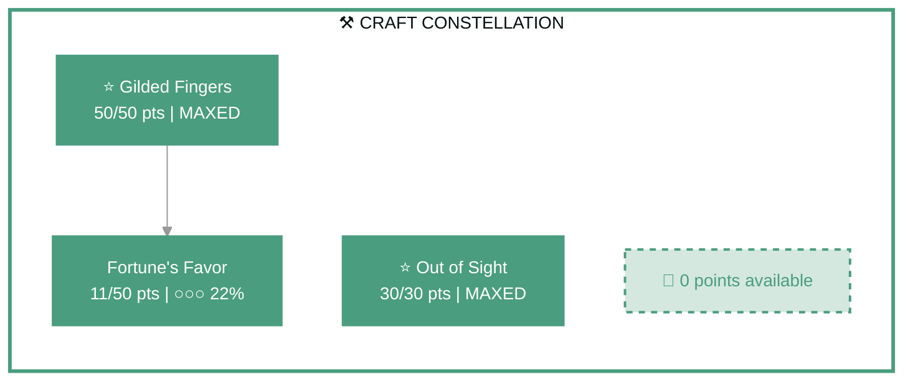

# Tziyad

   

**Dark Elf Warden • Daggerfall Covenant Alliance**

---

## 📑 Table of Contents

- [📋 Overview](#overview)
  - [General](#general)
  - [Currency](#currency)
- [⚔️ Combat Arsenal](#combat-arsenal)
  - [Character Stats](#character-stats)
  - [Advanced Stats](#advanced-stats)
- [⚔️ PvP](#pvp)
  - [Alliance War Skills](#alliance-war-skills)
- [👥 Companions](#companions)
- [🎨 Collectibles](#collectibles)
- [🎒 Inventory](#inventory)
- [🏆 Achievements](#achievements)
- [🏰 Guild Membership](#guild-membership)

---

## 📋 Overview

### General

| **Attribute**       | **Value** |
| ------------------- | --------- |
| **Level**           | 6         |
| **Champion Points** | 273       |
| **Age**             | 49m       |
| **Gender**          | Male      |
| **Account**         | @SOLAEGIS |

| **Attribute**                 | **Value**                                        |
| ----------------------------- | ------------------------------------------------ |
| **ESO Plus**                  | ✅ Active                                         |
| **Attributes**                | 🔵 6 / ❤️ 0 / ⚡ 0                                  |
| **Available Champion Points** | ⚒️ 0 - ⚔️ 91 - 💪 91                                |
| **Skill Points**              | 🎯 1 available - Ready to spend                   |
| **Class**                     | [Warden](https://en.uesp.net/wiki/Online:Warden) |

| **Attribute** | **Value**                                                                        |
| ------------- | -------------------------------------------------------------------------------- |
| **Race**      | [Dark Elf](https://en.uesp.net/wiki/Online:Dark_Elf)                             |
| **Server**    | [NA Megaserver](https://en.uesp.net/wiki/Online:Megaservers)                     |
| **Alliance**  | [Daggerfall Covenant](https://en.uesp.net/wiki/Online:Daggerfall_Covenant)       |
| **Location**  | [Alik'r Desert](https://en.uesp.net/wiki/Online:Alik'r_Desert) (Myrkwasa Dolmen) |

### Currency

| **Attribute**            | **Value** |
| ------------------------ | --------- |
| 💰 **Gold**               | 30,393    |
| ⚔️ **Alliance Points**    | 0         |
| 🔮 **Tel Var**            | 0         |
| 💎 **Transmute Crystals** | 126       |
| 📜 **Writs**              | 0         |
| 🎫 **Event Tickets**      | 6         |
| 👑 **Crowns**             | 700       |
| 💠 **Gems**               | 0         |
| 🏅 **Seals**              | 9,410     |
| 🗝️ **Keys**               | 6         |
| 👕 **Tokens**             | 3         |
| 📚 **Fortunes**           | 0         |
| 🔹 **Fragments**          | 0         |

---

## ⚔️ Combat Arsenal

### Character Stats

| **Category**    | **Stat**     | **Value** |
| --------------- | ------------ | --------: |
| 💚 **Resources** | Health       |    25,112 |
|                 | Magicka      |    23,957 |
|                 | Stamina      |    20,197 |
| ⚔️ **Offensive** | Weapon Power |     2,013 |
|                 | Spell Power  |     2,013 |

| **Category**      | **Stat**    |    **Value** |
| ----------------- | ----------- | -----------: |
| 🎯 **Critical**    | Weapon Crit | 2,181 (9.9%) |
|                   | Spell Crit  | 2,181 (9.9%) |
| ⚔️ **Penetration** | Physical    |            0 |
|                   | Spell       |            0 |

| **Category**    | **Stat**        |     **Value** |
| --------------- | --------------- | ------------: |
| 🛡️ **Defensive** | Physical Resist | 9,404 (96.9%) |
|                 | Spell Resist    | 9,404 (96.9%) |
| ♻️ **Recovery**  | Health          |           716 |
|                 | Magicka         |         1,747 |
|                 | Stamina         |         1,565 |

### Advanced Stats

| **Ability**        |               **Cost/Value** |
| :----------------- | ---------------------------: |
| ⚔️ **Light Attack** |                    2,971 dmg |
| ⚔️ **Heavy Attack** |                    5,942 dmg |
| ⚔️ **Bash**         |          719 cost, 4,163 dmg |
| 🛡️ **Block**        | 1,510 cost, 50% mit, 40% spd |
| 🔓 **Break Free**   |                   4,860 cost |
| 🏃 **Dodge Roll**   |                   3,825 cost |
| 🐾 **Sneak**        |             106 cost, 0% spd |
| 🏃‍♂️ **Sprint**       |             468 cost, 0% spd |

| **Resistance** | **Value** |
| :------------- | --------: |
| 🔥 **Flame**    |     14.2% |
| ⚡ **Shock**    |     14.2% |
| ❄️ **Frost**    |     14.2% |
| 🔮 **Magic**    |     14.2% |
| 🦠 **Disease**  |     14.2% |
| ☠️ **Poison**   |     14.2% |
| 🩸 **Bleed**    |     14.2% |

| **Damage Type**       | **Bonus** |
| :-------------------- | --------: |
| 💥 **Critical Damage** |       50% |
| ⚔️ **Physical**        |         0 |
| 🔥 **Flame**           |         0 |
| ⚡ **Shock**           |         0 |
| ❄️ **Frost**           |         0 |
| 🔮 **Magic**           |         0 |
| 🦠 **Disease**         |         0 |
| ☠️ **Poison**          |         0 |
| 🩸 **Bleed**           |         0 |
| 🌌 **Oblivion**        |         0 |

| **Healing**            | **Value** |
| :--------------------- | --------: |
| 💚 **Healing Done**     |         0 |
| 💖 **Healing Taken**    |         0 |
| ✨ **Critical Healing** |       50% |

## ⚔️ Combat Arsenal

### ⚔️ ⚔️ ⚔️ Front Bar (Main Hand)

|                           **1**                            |                    **2**                     |                      **3**                       |                     **4**                      |                             **5**                              |
| :--------------------------------------------------------: | :------------------------------------------: | :----------------------------------------------: | :--------------------------------------------: | :------------------------------------------------------------: |
| [Frost Cloak](https://en.uesp.net/wiki/Online:Frost_Cloak) | [Dive](https://en.uesp.net/wiki/Online:Dive) | [Volley](https://en.uesp.net/wiki/Online:Volley) | [Snipe](https://en.uesp.net/wiki/Online:Snipe) | [Fungal Growth](https://en.uesp.net/wiki/Online:Fungal_Growth) |

### 🔮 🔮 🔮 Back Bar (Backup)

---

## ⚔️ Equipment & Active Sets

| **Set**                                                                                                | **Progress**         |
| ------------------------------------------------------------------------------------------------------ | -------------------- |
| ⚪ **[Robes of the Withered Hand Set](https://en.uesp.net/wiki/Online:Robes_of_the_Withered_Hand_Set)** | `1/5` ██░░░░░░░░ 20% |
| ⚪ **[Broken Soul Set](https://en.uesp.net/wiki/Online:Broken_Soul_Set)**                               | `1/5` ██░░░░░░░░ 20% |
| ⚪ **[Armor of the Trainee Set](https://en.uesp.net/wiki/Online:Armor_of_the_Trainee_Set)**             | `1/5` ██░░░░░░░░ 20% |
| ⚪ **[Order of Diagna Set](https://en.uesp.net/wiki/Online:Order_of_Diagna_Set)**                       | `1/5` ██░░░░░░░░ 20% |

### 📋 Equipment Details

| **Slot**        | **Item**                        | **Set**                                                                                          | **Quality** | **Trait**    | **Type** | **Enchantment**              |
| --------------- | ------------------------------- | ------------------------------------------------------------------------------------------------ | ----------- | ------------ | -------- | ---------------------------- |
| ⛑️ **Head**      | homespun hat of Magicka         | -                                                                                                | ⚡ Fine      | None         | Light    | Maximum Magicka Enchantment  |
| 💎 **Neck**      | Necklace of the Order of Diagna | [Order of Diagna Set](https://en.uesp.net/wiki/Online:Order_of_Diagna_Set)                       | ⚡ Fine      | Healthy      | None     | Health Recovery Enchantment  |
| 🛡️ **Chest**     | rawhide jack of Health          | -                                                                                                | ⚡ Fine      | Reinforced   | Medium   | Maximum Health Enchantment   |
| 👑 **Shoulders** | rawhide arm cops of Magicka     | -                                                                                                | ⚡ Fine      | Invigorating | Medium   | Maximum Magicka Enchantment  |
| ⚔️ **Main Hand** | maple bow                       | -                                                                                                | ⚪ Normal    | None         | None     | -                            |
| ⚡ **Waist**     | iron girdle of Magicka          | -                                                                                                | ⚡ Fine      | Reinforced   | Heavy    | Maximum Magicka Enchantment  |
| 👖 **Legs**      | rawhide guards                  | -                                                                                                | ⚡ Fine      | None         | Medium   | -                            |
| 👟 **Feet**      | Shoes of the Trainee            | [Armor of the Trainee Set](https://en.uesp.net/wiki/Online:Armor_of_the_Trainee_Set)             | 🔮 Superior  | Training     | Light    | Maximum Magicka Enchantment  |
| 💍 **Ring 1**    | Ring of the Withered Hand       | [Robes of the Withered Hand Set](https://en.uesp.net/wiki/Online:Robes_of_the_Withered_Hand_Set) | ⚡ Fine      | Arcane       | None     | Magicka Recovery Enchantment |
| 💍 **Ring 2**    | Left Ring of the Broken Soul    | [Broken Soul Set](https://en.uesp.net/wiki/Online:Broken_Soul_Set)                               | ⚡ Fine      | None         | None     | -                            |
| ✋ **Hands**     | rawhide bracers of Health       | -                                                                                                | ⚡ Fine      | Well-fitted  | Medium   | Maximum Health Enchantment   |

---

## ⭐ Champion Points

| **Total** | **Spent** | **Available** |
| :-------: | :-------: | :-----------: |
|    273    |    91     |      182      |

| **⚒️ Craft**                                                            | **Assigned Points** |
| ---------------------------------------------------------------------- | ------------------: |
| ████████████ 100%                                                      |        91/91 points |
| **[Out of Sight](https://en.uesp.net/wiki/Online:Out_of_Sight)**       |           30 points |
| **[Fortune's Favor](https://en.uesp.net/wiki/Online:Fortune's_Favor)** |           11 points |
| **[Gilded Fingers](https://en.uesp.net/wiki/Online:Gilded_Fingers)**   |           50 points |

| **⚔️ Warfare**        | **Assigned Points** |
| -------------------- | ------------------: |
| ░░░░░░░░░░░░ 0%      |         0/91 points |
| *No points assigned* |                     |

| **💪 Fitness**        | **Assigned Points** |
| -------------------- | ------------------: |
| ░░░░░░░░░░░░ 0%      |         0/91 points |
| *No points assigned* |                     |

### 🎯 Champion Points Visual

```mermaid
%%{init: {"theme":"base", "themeVariables": { "background":"transparent","fontSize":"12px","primaryColor":"#f0f0f0","primaryTextColor":"#333","primaryBorderColor":"#999","lineColor":"#999"}}}%%

flowchart LR

  subgraph subLEGEND["📖 LEGEND & VISUAL GUIDE"]

    LEG_STARS["Star Types"]
    LEG_S1["⭐ Gold Border = Maxed Slottable"]
    LEG_S2["🔶 Orange Border = Independent Star"]
    LEG_S3["Standard Border = In Progress"]

    LEG_FILL["Progress Indicators"]
    LEG_F1["⭐ = 100% Maxed"]
    LEG_F2["●●● = 75-99%"]
    LEG_F3["●●○ = 50-74%"]
    LEG_F4["●○○ = 25-49%"]
    LEG_F5["○○○ = 1-24%"]

    LEG_STARS --> LEG_S1 & LEG_S2 & LEG_S3
    LEG_FILL --> LEG_F1 & LEG_F2 & LEG_F3 & LEG_F4 & LEG_F5

    style LEG_STARS fill:transparent,stroke:none,color:#ccc
    style LEG_FILL fill:transparent,stroke:none,color:#ccc
    style LEG_S1 fill:#fff,stroke:#ffd700,stroke-width:3px,color:#333
    style LEG_S2 fill:#fff,stroke:#ff8c00,stroke-width:3px,color:#333
    style LEG_S3 fill:#fff,stroke:#999,stroke-width:2px,color:#333
    style LEG_F1 fill:#eee,stroke:#333,stroke-width:1px,color:#333
    style LEG_F2 fill:#eee,stroke:#333,stroke-width:1px,color:#333
    style LEG_F3 fill:#eee,stroke:#333,stroke-width:1px,color:#333
    style LEG_F4 fill:#eee,stroke:#333,stroke-width:1px,color:#333
    style LEG_F5 fill:#eee,stroke:#333,stroke-width:1px,color:#333
  end
  style subLEGEND fill:transparent,stroke:#999,stroke-width:3px
```

---

## 📜 Character Progress

### Progress Overview

| **Maxed Skill Lines** | **In Progress** | **Early Progress** | **Abilities with Morphs** | **Overall Completion** |
| --------------------: | --------------: | -----------------: | ------------------------: | ---------------------: |
|                     0 |               0 |                  0 |                         0 |                     0% |

🌿 Detailed Skill Morphs

*No morphable abilities found.*

---

---

## ⚔️ PvP

### PvP Profile

#### Alliance War Status

| **Category** | **Value** |
| ------------ | --------- |
| Rank         | Recruit   |

---

## 👥 Companions

### Available Companions

- [Bastian Hallix](https://en.uesp.net/wiki/Online:Bastian_Hallix)
- [Mirri Elendis](https://en.uesp.net/wiki/Online:Mirri_Elendis)
- [Tanlorin](https://en.uesp.net/wiki/Online:Tanlorin)
- [Zerith-var](https://en.uesp.net/wiki/Online:Zerith-var)

---

## 🎨 Collectibles

💁 Assistants (0 of 26)

| Progress                       |
| ------------------------------ |
| ░░░░░░░░░░░░░░░░░░░░ 0% (0/26) |

*No assistants owned*

🖌️ Body Markings (1 of 321)

| Progress                        |
| ------------------------------- |
| ░░░░░░░░░░░░░░░░░░░░ 0% (1/321) |

- [Elder Dragon Body Marks](https://en.uesp.net/wiki/Online:Elder_Dragon_Body_Marks)

👗 Costumes (19 of 312)

| Progress                         |
| -------------------------------- |
| █░░░░░░░░░░░░░░░░░░░ 6% (19/312) |

- [Austere Warden Outfit](https://en.uesp.net/wiki/Online:Austere_Warden_Outfit)
- [Bloodthorn Robes](https://en.uesp.net/wiki/Online:Bloodthorn_Robes)
- [Court of Bedlam](https://en.uesp.net/wiki/Online:Court_of_Bedlam)
- [Covenant Scout](https://en.uesp.net/wiki/Online:Covenant_Scout)
- [Crown Dishdasha](https://en.uesp.net/wiki/Online:Crown_Dishdasha)
- [Dark Seducer](https://en.uesp.net/wiki/Online:Dark_Seducer)
- [Forebear Dishdasha](https://en.uesp.net/wiki/Online:Forebear_Dishdasha)
- [Golden Saint](https://en.uesp.net/wiki/Online:Golden_Saint)
- [Grim Harvester](https://en.uesp.net/wiki/Online:Grim_Harvester)
- [Imperial Chancellor](https://en.uesp.net/wiki/Online:Imperial_Chancellor)
- [Lion Guard Knight](https://en.uesp.net/wiki/Online:Lion_Guard_Knight)
- [Mages Guild Formal Robes](https://en.uesp.net/wiki/Online:Mages_Guild_Formal_Robes)
- [Mannimarco](https://en.uesp.net/wiki/Online:Mannimarco)
- [Noble Clan-Chief](https://en.uesp.net/wiki/Online:Noble_Clan-Chief)
- [Red Rook Armor](https://en.uesp.net/wiki/Online:Red_Rook_Armor)
- [Sea Drake Garb](https://en.uesp.net/wiki/Online:Sea_Drake_Garb)
- [Servant's Robes](https://en.uesp.net/wiki/Online:Servant's_Robes)
- [Shrouded Armor](https://en.uesp.net/wiki/Online:Shrouded_Armor)
- [Vulkhel Guard Marine Armor](https://en.uesp.net/wiki/Online:Vulkhel_Guard_Marine_Armor)

🗣️ Emotes (5 of 225)

| Progress                        |
| ------------------------------- |
| ░░░░░░░░░░░░░░░░░░░░ 2% (5/225) |

- [Belly Laugh](https://en.uesp.net/wiki/Online:Belly_Laugh)
- [Go Quietly](https://en.uesp.net/wiki/Online:Go_Quietly)
- [Kiss This](https://en.uesp.net/wiki/Online:Kiss_This)
- [Teatime](https://en.uesp.net/wiki/Online:Teatime)
- [Wash Your Damn Hands](https://en.uesp.net/wiki/Online:Wash_Your_Damn_Hands)

👓 Facial Accessories (1 of 135)

| Progress                        |
| ------------------------------- |
| ░░░░░░░░░░░░░░░░░░░░ 0% (1/135) |

- [Shrouded Crown](https://en.uesp.net/wiki/Online:Shrouded_Crown)

💇 Hair Styles (0 of 153)

| Progress                        |
| ------------------------------- |
| ░░░░░░░░░░░░░░░░░░░░ 0% (0/153) |

*No hair styles owned*

🎩 Hats (4 of 164)

| Progress                        |
| ------------------------------- |
| ░░░░░░░░░░░░░░░░░░░░ 2% (4/164) |

- [Crown of Misrule](https://en.uesp.net/wiki/Online:Crown_of_Misrule)
- [Hide Your Helm](https://en.uesp.net/wiki/Online:Hide_Your_Helm)
- [Madgod's Turban](https://en.uesp.net/wiki/Online:Madgod's_Turban)
- [Netch Handler Cap](https://en.uesp.net/wiki/Online:Netch_Handler_Cap)

🖍️ Head Markings (0 of 372)

| Progress                        |
| ------------------------------- |
| ░░░░░░░░░░░░░░░░░░░░ 0% (0/372) |

*No head markings owned*

🔮 Mementos (11 of 201)

| Progress                         |
| -------------------------------- |
| █░░░░░░░░░░░░░░░░░░░ 5% (11/201) |

- [Antiquarian's Eye](https://en.uesp.net/wiki/Online:Antiquarian's_Eye)
- [Blackfeather Court Whistle](https://en.uesp.net/wiki/Online:Blackfeather_Court_Whistle)
- [Breda's Bottomless Mead Mug](https://en.uesp.net/wiki/Online:Breda's_Bottomless_Mead_Mug)
- [Dragonhorn Curio](https://en.uesp.net/wiki/Online:Dragonhorn_Curio)
- [Jubilee Cake 2020](https://en.uesp.net/wiki/Online:Jubilee_Cake_2020)
- [Jubilee Cake 2021](https://en.uesp.net/wiki/Online:Jubilee_Cake_2021)
- [Remnant of Meridia's Light](https://en.uesp.net/wiki/Online:Remnant_of_Meridia's_Light)
- [Sea Sload Dorsal Fin](https://en.uesp.net/wiki/Online:Sea_Sload_Dorsal_Fin)
- [The Pie of Misrule](https://en.uesp.net/wiki/Online:The_Pie_of_Misrule)
- [Witchmother's Whistle](https://en.uesp.net/wiki/Online:Witchmother's_Whistle)
- [Wyrd Elemental Plume](https://en.uesp.net/wiki/Online:Wyrd_Elemental_Plume)

🐴 Mounts (7 of 697)

| Progress                        |
| ------------------------------- |
| ░░░░░░░░░░░░░░░░░░░░ 1% (7/697) |

- [Dwarven War Horse](https://en.uesp.net/wiki/Online:Dwarven_War_Horse)
- [Nightmare Senche](https://en.uesp.net/wiki/Online:Nightmare_Senche)
- [Noweyr Steed](https://en.uesp.net/wiki/Online:Noweyr_Steed)
- [Psijic Escort Charger](https://en.uesp.net/wiki/Online:Psijic_Escort_Charger)
- [Rahd-m'Athra](https://en.uesp.net/wiki/Online:Rahd-m'Athra)
- [Skulltooth Coastal Durzog](https://en.uesp.net/wiki/Online:Skulltooth_Coastal_Durzog)
- [Sorrel Horse](https://en.uesp.net/wiki/Online:Sorrel_Horse)

🎭 Personalities (1 of 29)

| Progress                       |
| ------------------------------ |
| ░░░░░░░░░░░░░░░░░░░░ 3% (1/29) |

- [Assassin](https://en.uesp.net/wiki/Online:Assassin)

🐾 Pets (24 of 679)

| Progress                         |
| -------------------------------- |
| ░░░░░░░░░░░░░░░░░░░░ 3% (24/679) |

- [Abecean Ratter Cat](https://en.uesp.net/wiki/Online:Abecean_Ratter_Cat)
- [Alik'r Dune-Hound](https://en.uesp.net/wiki/Online:Alik'r_Dune-Hound)
- [Ambersheen Vale Fawn](https://en.uesp.net/wiki/Online:Ambersheen_Vale_Fawn)
- [Blue Dragon Imp](https://en.uesp.net/wiki/Online:Blue_Dragon_Imp)
- [Coldharbour Bantam Guar](https://en.uesp.net/wiki/Online:Coldharbour_Bantam_Guar)
- [Crimson Torchbug](https://en.uesp.net/wiki/Online:Crimson_Torchbug)
- [Dwarven Spider](https://en.uesp.net/wiki/Online:Dwarven_Spider)
- [Dwarven War Dog](https://en.uesp.net/wiki/Online:Dwarven_War_Dog)
- [Fledgling Terror Bird](https://en.uesp.net/wiki/Online:Fledgling_Terror_Bird)
- [Golden Eagle](https://en.uesp.net/wiki/Online:Golden_Eagle)
- [Green Dragon Imp](https://en.uesp.net/wiki/Online:Green_Dragon_Imp)
- [Haunted House Cat^n](https://en.uesp.net/wiki/Online:Haunted_House_Cat^n)
- [Imgakin Monkey](https://en.uesp.net/wiki/Online:Imgakin_Monkey)
- [Infernium Dwarven Spiderling](https://en.uesp.net/wiki/Online:Infernium_Dwarven_Spiderling)
- [Jackal](https://en.uesp.net/wiki/Online:Jackal)
- [Long-Winged Bat^F](https://en.uesp.net/wiki/Online:Long-Winged_Bat^F)
- [Nenalata Ayleid Wolf Pup](https://en.uesp.net/wiki/Online:Nenalata_Ayleid_Wolf_Pup)
- [Noweyr Pony^n](https://en.uesp.net/wiki/Online:Noweyr_Pony^n)
- [Pocket Salamander^n](https://en.uesp.net/wiki/Online:Pocket_Salamander^n)
- [Psijic Mascot Bear Cub^n](https://en.uesp.net/wiki/Online:Psijic_Mascot_Bear_Cub^n)
- [Psijic Mascot Pony^n](https://en.uesp.net/wiki/Online:Psijic_Mascot_Pony^n)
- [Scintillant Dovah-Fly^n](https://en.uesp.net/wiki/Online:Scintillant_Dovah-Fly^n)
- [Vermilion Scuttler](https://en.uesp.net/wiki/Online:Vermilion_Scuttler)
- [Viridescent Dragon Frog](https://en.uesp.net/wiki/Online:Viridescent_Dragon_Frog)

✨ Polymorphs (0 of 43)

| Progress                       |
| ------------------------------ |
| ░░░░░░░░░░░░░░░░░░░░ 0% (0/43) |

*No polymorphs owned*

🎭 Skins (0 of 106)

| Progress                        |
| ------------------------------- |
| ░░░░░░░░░░░░░░░░░░░░ 0% (0/106) |

*No skins owned*

---

## 🎒 Inventory

| **Storage**  | **Used** | **Max** | **Capacity**   |
| ------------ | -------: | ------: | -------------- |
| Backpack     |       25 |      60 | ████░░░░░░ 41% |
| Bank         |       65 |     180 | ███░░░░░░░ 36% |
| Crafting Bag |        ∞ |       ∞ | ESO Plus       |

<strong>Backpack Items</strong> (25 unique items)

#### Other (25 items)

| **Item**                        | **Stack** | **Quality** |
| ------------------------------- | --------: | ----------- |
| ⚪ Bag of Letter Tiles           |         1 | ⚪           |
| ⚪ Bellows Sealant               |         1 | ⚪           |
| 🟡 Bound Crown Experience Scroll |         1 | 🟡           |
| 🟣 Bound Crown Fortifying Meal   |         1 | 🟣           |
| ⚪ Child's Drum                  |         1 | ⚪           |
| 🔵 Clockwork City Treasure Map I |         1 | 🔵           |
| 🟢 Collar of Bones               |         1 | 🟢           |
| ⚪ Coughing Tincture             |         1 | ⚪           |
| 🟢 Crude Tooth Paperweight       |         1 | 🟢           |
| 🟢 Diagram: Common Trap, Hunting |         1 | 🟢           |
| 🟢 iron greatsword of Frost      |         1 | 🟢           |
| ⚪ Lockpick                      |         6 | ⚪           |
| ⚪ maple bow                     |         1 | ⚪           |
| 🟢 rawhide bracers               |         1 | 🟢           |
| 🟢 Right Ring of the Broken Soul |         1 | 🟢           |
| 🟢 Ring of the Order of Diagna   |         1 | 🟢           |
| 🟢 Ring of the Withered Hand     |         1 | 🟢           |
| 🔵 Sash of the Trainee           |         1 | 🔵           |
| 🟢 Soul Gem                      |         5 | 🟢           |
| ⚪ Soul Gem (Empty)              |         1 | ⚪           |
| ⚪ Soul-Shriven Shirt            |         1 | ⚪           |
| 🟢 Sword-Singer's Necklace       |         1 | 🟢           |
| 🟢 trifling Glyph of Health      |         1 | 🟢           |
| ⚪ Twisted Nose Ring             |         1 | ⚪           |
| ⚪ Wax Portrait Card             |         1 | ⚪           |

<strong>Bank Items</strong> (65 unique items)

#### Other (65 items)

| **Item**                                 | **Stack** | **Quality** |
| ---------------------------------------- | --------: | ----------- |
| 🔵 Alik'r Treasure Map I                  |         1 | 🔵           |
| 🔵 Alik'r Treasure Map II                 |         1 | 🔵           |
| 🔵 Auridon Treasure Map I                 |         1 | 🔵           |
| 🔵 beech lightning staff of Shock         |         1 | 🔵           |
| 🔵 beech shield of Magicka                |         1 | 🔵           |
| 🔵 Bleakrock Treasure Map II              |         1 | 🔵           |
| 🟢 Blueprint: Dark Elf Rack, Barrel       |         1 | 🟢           |
| 🟢 Blueprint: Wood Elf Bar, Sturdy        |         1 | 🟢           |
| 🟢 Companion's Axe                        |         1 | 🟢           |
| 🟢 Companion's Bow                        |         1 | 🟢           |
| 🔵 Companion's Ice Staff                  |         1 | 🔵           |
| 🟢 Companion's Inferno Staff              |         1 | 🟢           |
| 🟢 Companion's Shield                     |         1 | 🟢           |
| 🔵 cotton hat of Magicka                  |         1 | 🔵           |
| 🔵 cotton shoes of Health                 |         1 | 🔵           |
| 🔵 Counterfeit Pardon Edict               |        13 | 🔵           |
| 🔵 Crafting Motif 5: Breton Style         |         1 | 🔵           |
| 🟡 Crown Experience Scroll                |         1 | 🟡           |
| 🟣 Crown Fortifying Meal                  |        17 | 🟣           |
| 🟡 Crown Lethal Poison                    |       305 | 🟡           |
| 🔵 Crown Soul Gem                         |        17 | 🔵           |
| 🟣 Crown Tri-Restoration Potion           |       200 | 🟣           |
| 🟣 Crown Tri-Restoration Potion           |       200 | 🟣           |
| 🟣 Crown Tri-Restoration Potion           |       190 | 🟣           |
| 🟢 Diagram: Common Trap, Hunting          |         1 | 🟢           |
| 🔵 Epaulets of the Trainee                |         1 | 🔵           |
| 🔵 Gloom-Graced Cuirass                   |         1 | 🔵           |
| 🟣 Gold Coast Spellcaster Elixir          |        30 | 🟣           |
| 🔵 Grahtwood Treasure Map III             |         1 | 🔵           |
| 🔵 Grahtwood Treasure Map IV              |         1 | 🔵           |
| 🟡 Grand Gold Coast Experience Scroll     |         1 | 🟡           |
| ⚪ homespun hat                           |         1 | ⚪           |
| 🟣 Imperial Charity Writ                  |         1 | 🟣           |
| ⚪ iron axe                               |         1 | ⚪           |
| 🔵 iron axe of Frost                      |         1 | 🔵           |
| 🔵 iron cuirass of Magicka                |         1 | 🔵           |
| 🔵 leather jack of Magicka                |         1 | 🔵           |
| ⚪ Lockpick                               |        62 | ⚪           |
| 🔵 maple ice staff of Shock               |         1 | 🔵           |
| ⚪ maple restoration staff                |         1 | ⚪           |
| 🔵 oak lightning staff of Shock           |         1 | 🔵           |
| 🔵 orichalc axe of Shock                  |         1 | 🔵           |
| 🔵 orichalc battle axe of Flame           |         1 | 🔵           |
| 🔵 Pauldron of the Order of Diagna        |         1 | 🔵           |
| 🔵 rawhide bracers of Stamina             |         1 | 🔵           |
| 🔵 rawhide helmet of Magicka              |         1 | 🔵           |
| 🟢 Recipe: Bitter Tea                     |         2 | 🟢           |
| 🟢 Recipe: Carrot Cheesecake              |         1 | 🟢           |
| 🟢 Recipe: Chicken Breast                 |         1 | 🟢           |
| 🟢 Recipe: Fishy Stick                    |         2 | 🟢           |
| 🟢 Recipe: Mazte                          |         1 | 🟢           |
| 🟢 Recipe: Stuffed Grape Leaves           |         1 | 🟢           |
| 🔵 Ring of the Trainee                    |         1 | 🔵           |
| 🔵 Ritemaster's Gifted Staff              |         1 | 🔵           |
| 🔵 Ritemaster's Memorial Battlesword      |         1 | 🔵           |
| ⚪ steel girdle                           |         1 | ⚪           |
| 🟡 Style Page: Imperial Champion Mace     |         1 | 🟡           |
| 🟡 Style Page: Imperial Champion Shield   |         1 | 🟡           |
| 🟡 Style Page: Imperial Champion Staff    |         1 | 🟡           |
| 🟡 Style Page: Imperial Champion Sword    |         1 | 🟡           |
| 🟡 Style Page: Jephrine Paladin Gauntlets |         1 | 🟡           |
| 🟡 Style Page: Jephrine Paladin Sabatons  |         2 | 🟡           |
| 🟢 Sword-Singer's Greatsword              |         1 | 🟢           |
| 🔵 Sword-Singer's Ring                    |         1 | 🔵           |
| 🔵 Vanus's Gloves                         |         1 | 🔵           |

<strong>Crafting Bag Items</strong> (339 unique items)

#### Armor Trait (9 items)

| **Item**             | **Stack** | **Quality** |
| -------------------- | --------: | ----------- |
| ⚪ Almandine          |       281 | ⚪           |
| ⚪ Bloodstone         |       239 | ⚪           |
| ⚪ Diamond            |       170 | ⚪           |
| ⚪ Emerald            |       162 | ⚪           |
| ⚪ Fortified Nirncrux |         2 | ⚪           |
| ⚪ Garnet             |       130 | ⚪           |
| ⚪ Quartz             |       164 | ⚪           |
| ⚪ Sapphire           |       128 | ⚪           |
| ⚪ Sardonyx           |       282 | ⚪           |

#### Aspect Runestone (5 items)

| **Item** | **Stack** | **Quality** |
| -------- | --------: | ----------- |
| 🔵 Denata |       294 | 🔵           |
| 🟢 Jejota |       526 | 🟢           |
| 🟡 Kuta   |        41 | 🟡           |
| 🟣 Rekuta |       211 | 🟣           |
| ⚪ Ta     |      1038 | ⚪           |

#### Essence Runestone (18 items)

| **Item**  | **Stack** | **Quality** |
| --------- | --------: | ----------- |
| ⚪ Dekeipa |        71 | ⚪           |
| ⚪ Deni    |       344 | ⚪           |
| ⚪ Denima  |       101 | ⚪           |
| ⚪ Deteri  |        79 | ⚪           |
| ⚪ Hakeijo |         3 | ⚪           |
| ⚪ Haoko   |        67 | ⚪           |
| ⚪ Kaderi  |        48 | ⚪           |
| ⚪ Kuoko   |        59 | ⚪           |
| ⚪ Makderi |        65 | ⚪           |
| ⚪ Makko   |       345 | ⚪           |
| ⚪ Makkoma |       115 | ⚪           |
| ⚪ Meip    |        85 | ⚪           |
| ⚪ Oko     |       364 | ⚪           |
| ⚪ Okoma   |        84 | ⚪           |
| ⚪ Okori   |        78 | ⚪           |
| ⚪ Oru     |        59 | ⚪           |
| ⚪ Rakeipa |        94 | ⚪           |
| ⚪ Taderi  |        65 | ⚪           |

#### Furnishing Material (8 items)

| **Item**           | **Stack** | **Quality** |
| ------------------ | --------: | ----------- |
| ⚪ Alchemical Resin |       549 | ⚪           |
| ⚪ Bast             |       394 | ⚪           |
| ⚪ Clean Pelt       |       203 | ⚪           |
| ⚪ Decorative Wax   |       194 | ⚪           |
| ⚪ Heartwood        |       405 | ⚪           |
| ⚪ Mundane Rune     |       383 | ⚪           |
| ⚪ Ochre            |       403 | ⚪           |
| ⚪ Regulus          |       509 | ⚪           |

#### Ingredient (47 items)

| **Item**         | **Stack** | **Quality** |
| ---------------- | --------: | ----------- |
| ⚪ Acai Berry     |        42 | ⚪           |
| ⚪ Apples         |        75 | ⚪           |
| ⚪ Bananas        |        21 | ⚪           |
| ⚪ Barley         |        30 | ⚪           |
| ⚪ Beets          |        17 | ⚪           |
| ⚪ Bittergreen    |        20 | ⚪           |
| ⚪ Carrots        |        14 | ⚪           |
| ⚪ Cheese         |        12 | ⚪           |
| ⚪ Coffee         |        49 | ⚪           |
| ⚪ Comberry       |        28 | ⚪           |
| ⚪ Corn           |        13 | ⚪           |
| ⚪ Fish           |        44 | ⚪           |
| ⚪ Flour          |         6 | ⚪           |
| ⚪ Garlic         |         3 | ⚪           |
| ⚪ Ginger         |        38 | ⚪           |
| ⚪ Ginkgo         |        37 | ⚪           |
| ⚪ Ginseng        |        41 | ⚪           |
| ⚪ Greens         |        12 | ⚪           |
| ⚪ Guarana        |        18 | ⚪           |
| ⚪ Honey          |        30 | ⚪           |
| ⚪ Isinglass      |        18 | ⚪           |
| ⚪ Jasmine        |        21 | ⚪           |
| ⚪ Jazbay Grapes  |        35 | ⚪           |
| ⚪ Lemon          |        22 | ⚪           |
| ⚪ Lotus          |        11 | ⚪           |
| ⚪ Melon          |        17 | ⚪           |
| ⚪ Metheglin      |        40 | ⚪           |
| ⚪ Millet         |        25 | ⚪           |
| ⚪ Mint           |        17 | ⚪           |
| ⚪ Potato         |        31 | ⚪           |
| ⚪ Poultry        |         6 | ⚪           |
| ⚪ Pumpkin        |        32 | ⚪           |
| ⚪ Radish         |        15 | ⚪           |
| ⚪ Red Meat       |         8 | ⚪           |
| ⚪ Rice           |        21 | ⚪           |
| ⚪ Rose           |        21 | ⚪           |
| ⚪ Rye            |        34 | ⚪           |
| ⚪ Saltrice       |        10 | ⚪           |
| ⚪ Seasoning      |         4 | ⚪           |
| ⚪ Seaweed        |        32 | ⚪           |
| ⚪ Small Game     |         9 | ⚪           |
| ⚪ Surilie Grapes |        34 | ⚪           |
| ⚪ Tomato         |        12 | ⚪           |
| ⚪ Wheat          |        43 | ⚪           |
| ⚪ White Meat     |        14 | ⚪           |
| ⚪ Yeast          |        44 | ⚪           |
| ⚪ Yerba Mate     |        33 | ⚪           |

#### Ink (1 items)

| **Item**       | **Stack** | **Quality** |
| -------------- | --------: | ----------- |
| ⚪ Luminous Ink |         8 | ⚪           |

#### Jewelry Trait (5 items)

| **Item**       | **Stack** | **Quality** |
| -------------- | --------: | ----------- |
| ⚪ antimony     |        31 | ⚪           |
| ⚪ Aurbic Amber |         5 | ⚪           |
| ⚪ cobalt       |        29 | ⚪           |
| ⚪ Titanium     |        11 | ⚪           |
| ⚪ zinc         |        28 | ⚪           |

#### Lure (5 items)

| **Item**                   | **Stack** | **Quality** |
| -------------------------- | --------: | ----------- |
| ⚪ crawlers, Foul Bait      |        56 | ⚪           |
| ⚪ fish roe, Foul Bait      |         2 | ⚪           |
| ⚪ guts, Lake Bait          |         5 | ⚪           |
| ⚪ insect parts, River Bait |        10 | ⚪           |
| ⚪ worms, Saltwater Bait    |        44 | ⚪           |

#### Material (45 items)

| **Item**            | **Stack** | **Quality** |
| ------------------- | --------: | ----------- |
| ⚪ Ancestor Silk     |       109 | ⚪           |
| ⚪ Calcinium ingot   |       185 | ⚪           |
| ⚪ copper ounce      |      1923 | ⚪           |
| ⚪ cotton            |       757 | ⚪           |
| ⚪ dwarven ingot     |      1558 | ⚪           |
| ⚪ ebonthread        |       545 | ⚪           |
| ⚪ ebony ingot       |      1136 | ⚪           |
| ⚪ electrum ounce    |       613 | ⚪           |
| ⚪ fell hide         |       265 | ⚪           |
| ⚪ flax              |      1055 | ⚪           |
| ⚪ Galatite ingot    |       216 | ⚪           |
| ⚪ hide              |       911 | ⚪           |
| ⚪ Iron Hide         |        34 | ⚪           |
| ⚪ Iron ingot        |       742 | ⚪           |
| ⚪ ironthread        |       201 | ⚪           |
| ⚪ jute              |       540 | ⚪           |
| ⚪ Kresh Fiber       |       106 | ⚪           |
| ⚪ leather           |       553 | ⚪           |
| ⚪ orichalcum ingot  |       759 | ⚪           |
| ⚪ pewter ounce      |      3213 | ⚪           |
| ⚪ platinum ounce    |        14 | ⚪           |
| ⚪ quicksilver ingot |       616 | ⚪           |
| ⚪ rawhide           |      1588 | ⚪           |
| ⚪ Rubedite Ingot    |       445 | ⚪           |
| ⚪ Rubedo Leather    |       165 | ⚪           |
| ⚪ sanded ash        |       170 | ⚪           |
| ⚪ sanded beech      |      1130 | ⚪           |
| ⚪ sanded birch      |       182 | ⚪           |
| ⚪ sanded hickory    |      1155 | ⚪           |
| ⚪ sanded mahogany   |       249 | ⚪           |
| ⚪ sanded maple      |      1291 | ⚪           |
| ⚪ sanded nightwood  |       383 | ⚪           |
| ⚪ sanded oak        |      1428 | ⚪           |
| ⚪ Sanded Ruby Ash   |         6 | ⚪           |
| ⚪ sanded yew        |      1406 | ⚪           |
| ⚪ Shadowhide        |       186 | ⚪           |
| ⚪ silver ounce      |       547 | ⚪           |
| ⚪ silverweave       |       194 | ⚪           |
| ⚪ spidersilk        |      1252 | ⚪           |
| ⚪ Steel ingot       |      1682 | ⚪           |
| ⚪ superb hide       |       105 | ⚪           |
| ⚪ thick leather     |       387 | ⚪           |
| ⚪ topgrain hide     |        51 | ⚪           |
| ⚪ void cloth        |       561 | ⚪           |
| ⚪ voidstone ingot   |       694 | ⚪           |

#### Plating (4 items)

| **Item**           | **Stack** | **Quality** |
| ------------------ | --------: | ----------- |
| 🟡 Chromium Plating |        32 | 🟡           |
| 🔵 Iridium Plating  |       192 | 🔵           |
| 🟢 Terne Plating    |       336 | 🟢           |
| 🟣 Zircon Plating   |       113 | 🟣           |

#### Poison Solvent (9 items)

| **Item**       | **Stack** | **Quality** |
| -------------- | --------: | ----------- |
| ⚪ Alkahest     |        54 | ⚪           |
| ⚪ Gall         |        71 | ⚪           |
| ⚪ Grease       |       395 | ⚪           |
| ⚪ Ichor        |       551 | ⚪           |
| ⚪ Night-Oil    |        15 | ⚪           |
| ⚪ Pitch-Bile   |        10 | ⚪           |
| ⚪ Slime        |       186 | ⚪           |
| ⚪ Tarblack     |         5 | ⚪           |
| ⚪ Terebinthine |        29 | ⚪           |

#### Potency Runestone (32 items)

| **Item** | **Stack** | **Quality** |
| -------- | --------: | ----------- |
| ⚪ Denara |        16 | ⚪           |
| ⚪ Derado |         1 | ⚪           |
| ⚪ Edode  |        43 | ⚪           |
| ⚪ Edora  |        48 | ⚪           |
| ⚪ Hade   |        35 | ⚪           |
| ⚪ Idode  |        17 | ⚪           |
| ⚪ Itade  |        31 | ⚪           |
| ⚪ Jaera  |        20 | ⚪           |
| ⚪ Jayde  |        35 | ⚪           |
| ⚪ Jehade |        16 | ⚪           |
| ⚪ Jejora |        82 | ⚪           |
| ⚪ Jera   |       127 | ⚪           |
| ⚪ Jode   |        54 | ⚪           |
| ⚪ Jora   |       174 | ⚪           |
| ⚪ Kedeko |         5 | ⚪           |
| ⚪ Kude   |         1 | ⚪           |
| ⚪ Kura   |         4 | ⚪           |
| ⚪ Notade |       128 | ⚪           |
| ⚪ Ode    |        57 | ⚪           |
| ⚪ Odra   |        49 | ⚪           |
| ⚪ Pode   |        10 | ⚪           |
| ⚪ Pojode |        42 | ⚪           |
| ⚪ Pojora |        39 | ⚪           |
| ⚪ Pora   |        35 | ⚪           |
| ⚪ Porade |       196 | ⚪           |
| ⚪ Rede   |         6 | ⚪           |
| ⚪ Rejera |        34 | ⚪           |
| ⚪ Rekude |        30 | ⚪           |
| ⚪ Rekura |         2 | ⚪           |
| ⚪ Repora |        43 | ⚪           |
| ⚪ Rera   |        12 | ⚪           |
| ⚪ Tade   |        29 | ⚪           |

#### Potion Solvent (5 items)

| **Item**          | **Stack** | **Quality** |
| ----------------- | --------: | ----------- |
| ⚪ cleansed water  |        16 | ⚪           |
| ⚪ clear water     |       229 | ⚪           |
| ⚪ Lorkhan's Tears |        63 | ⚪           |
| ⚪ natural water   |       158 | ⚪           |
| ⚪ pristine water  |       196 | ⚪           |

#### Raw Material (47 items)

| **Item**               | **Stack** | **Quality** |
| ---------------------- | --------: | ----------- |
| ⚪ Coarse Chalk         |         3 | ⚪           |
| ⚪ copper dust          |         5 | ⚪           |
| ⚪ Dried Blood          |         4 | ⚪           |
| ⚪ dwarven ore          |         1 | ⚪           |
| ⚪ electrum dust        |         2 | ⚪           |
| ⚪ fell hide scraps     |         7 | ⚪           |
| ⚪ Galatite ore         |         9 | ⚪           |
| ⚪ Grain of Pearl Sand  |         8 | ⚪           |
| ⚪ hide scraps          |         2 | ⚪           |
| ⚪ high iron ore        |         7 | ⚪           |
| ⚪ iron hide scraps     |         6 | ⚪           |
| ⚪ iron ore             |        10 | ⚪           |
| ⚪ leather scraps       |        11 | ⚪           |
| ⚪ Malachite Shard      |         5 | ⚪           |
| ⚪ orichalcum ore       |         8 | ⚪           |
| ⚪ Oxblood Fungus Spore |         8 | ⚪           |
| ⚪ pewter dust          |        54 | ⚪           |
| ⚪ platinum dust        |         4 | ⚪           |
| ⚪ Quicksilver ore      |         5 | ⚪           |
| ⚪ raw ancestor silk    |       184 | ⚪           |
| ⚪ raw cotton           |        17 | ⚪           |
| ⚪ raw ebonthread       |         8 | ⚪           |
| ⚪ raw flax             |         9 | ⚪           |
| ⚪ raw ironweed         |         1 | ⚪           |
| ⚪ raw jute             |         9 | ⚪           |
| ⚪ raw Kreshweed        |         2 | ⚪           |
| ⚪ raw silverweed       |         4 | ⚪           |
| ⚪ raw spidersilk       |        12 | ⚪           |
| ⚪ raw void bloom       |         7 | ⚪           |
| ⚪ rawhide scraps       |        64 | ⚪           |
| ⚪ rough ash            |         9 | ⚪           |
| ⚪ rough beech          |        14 | ⚪           |
| ⚪ rough birch          |         2 | ⚪           |
| ⚪ rough hickory        |         2 | ⚪           |
| ⚪ rough mahogany       |         7 | ⚪           |
| ⚪ rough maple          |        26 | ⚪           |
| ⚪ rough nightwood      |         8 | ⚪           |
| ⚪ rough oak            |         7 | ⚪           |
| ⚪ rough ruby ash       |        71 | ⚪           |
| ⚪ rough yew            |         1 | ⚪           |
| ⚪ rubedite ore         |        63 | ⚪           |
| ⚪ rubedo hide scraps   |        74 | ⚪           |
| ⚪ silver dust          |         2 | ⚪           |
| ⚪ superb hide scraps   |         4 | ⚪           |
| ⚪ thick leather scraps |         5 | ⚪           |
| ⚪ Viridian Dust        |         4 | ⚪           |
| ⚪ voidstone ore        |         2 | ⚪           |

#### Raw Trait (5 items)

| **Item**                  | **Stack** | **Quality** |
| ------------------------- | --------: | ----------- |
| ⚪ Pulverized Antimony     |         3 | ⚪           |
| ⚪ Pulverized Aurbic Amber |         1 | ⚪           |
| ⚪ Pulverized Cobalt       |         3 | ⚪           |
| ⚪ Pulverized Gilding Wax  |         1 | ⚪           |
| ⚪ Pulverized Titanium     |         1 | ⚪           |

#### Reagent (31 items)

| **Item**                   | **Stack** | **Quality**     |
| -------------------------- | --------: | --------------- |
| 🟢 Beetle Scuttle           |       106 | 🟢               |
| 🟢 blessed thistle          |       110 | 🟢               |
| 🟢 blue entoloma            |        63 | 🟢               |
| 🟢 bugloss                  |       191 | 🟢               |
| 🟢 Butterfly Wing           |        37 | 🟢               |
| 🟢 Clam Gall                |        28 | 🟢               |
| 🟢 columbine                |       150 | 🟢               |
| 🟢 corn flower              |       156 | 🟢               |
| 🟢 Crimson Nirnroot         |        20 | 🟢               |
| 🟢 Dragon's Bile            |        15 | 🟢               |
| 🟢 Dragon's Blood           |        16 | 🟢               |
| 🟢 dragonthorn              |       226 | 🟢               |
| 🟢 emetic russula           |        92 | 🟢               |
| 🟢 Fleshfly Larva           |           | Fleshfly Larvae | 85 | 🟢 |
| 🟢 imp stool                |       104 | 🟢               |
| 🟢 lady's smock             |       209 | 🟢               |
| 🟢 luminous russula         |        95 | 🟢               |
| 🟢 mountain flower          |       158 | 🟢               |
| 🟢 Mudcrab Chitin           |        26 | 🟢               |
| 🟢 namira's rot             |        91 | 🟢               |
| 🟢 Nightshade               |       150 | 🟢               |
| 🟢 nirnroot                 |        89 | 🟢               |
| 🟢 Powdered Mother of Pearl |        13 | 🟢               |
| 🟢 Scrib Jelly              |         9 | 🟢               |
| 🟢 Spider Egg               |       134 | 🟢               |
| 🟢 stinkhorn                |       112 | 🟢               |
| 🟢 Torchbug Thorax          |        17 | 🟢               |
| 🟢 violet coprinus          |        73 | 🟢               |
| 🟢 water hyacinth           |       150 | 🟢               |
| 🟢 white cap                |        90 | 🟢               |
| 🟢 wormwood                 |       157 | 🟢               |

#### Resin (4 items)

| **Item** | **Stack** | **Quality** |
| -------- | --------: | ----------- |
| 🟣 mastic |        53 | 🟣           |
| 🟢 pitch  |       299 | 🟢           |
| 🟡 rosin  |        35 | 🟡           |
| 🔵 turpen |       170 | 🔵           |

#### Style Material (43 items)

| **Item**                 | **Stack** | **Quality** |
| ------------------------ | --------: | ----------- |
| ⚪ Adamantite             |         7 | ⚪           |
| ⚪ Argentum               |       375 | ⚪           |
| ⚪ Ash Canvas             |         1 | ⚪           |
| ⚪ Azure Plasm            |        21 | ⚪           |
| ⚪ Black Beeswax          |         5 | ⚪           |
| ⚪ Bloodscent Dew         |         5 | ⚪           |
| ⚪ Bone                   |         5 | ⚪           |
| ⚪ Bronze                 |       295 | ⚪           |
| ⚪ Cassiterite            |         5 | ⚪           |
| ⚪ Charcoal of Remorse    |         5 | ⚪           |
| ⚪ Consecrated Myrrh      |         5 | ⚪           |
| ⚪ Corundum               |         4 | ⚪           |
| 🟡 Crown Mimic Stone      |        28 | 🟡           |
| ⚪ Culanda Lacquer        |         9 | ⚪           |
| ⚪ Daedra Heart           |        43 | ⚪           |
| ⚪ Desecrated Grave Soil  |        14 | ⚪           |
| ⚪ Dragonthread           |         2 | ⚪           |
| ⚪ Eagle Feather          |         5 | ⚪           |
| ⚪ Ferrous Salts          |         6 | ⚪           |
| ⚪ Fine Chalk             |        13 | ⚪           |
| ⚪ flint                  |         4 | ⚪           |
| ⚪ Goldscale              |         5 | ⚪           |
| ⚪ Lion Fang              |         6 | ⚪           |
| ⚪ Malachite              |        17 | ⚪           |
| ⚪ Manganese              |         4 | ⚪           |
| ⚪ Molybdenum             |         6 | ⚪           |
| ⚪ Moonstone              |         5 | ⚪           |
| ⚪ Nickel                 |        10 | ⚪           |
| ⚪ Obsidian               |         5 | ⚪           |
| ⚪ Oxblood Fungus         |         7 | ⚪           |
| ⚪ Palladium              |       324 | ⚪           |
| ⚪ Pearl Sand             |         8 | ⚪           |
| ⚪ Polished Shilling      |         5 | ⚪           |
| ⚪ Red Diamond Seal       |         5 | ⚪           |
| ⚪ Refined Bonemold Resin |         1 | ⚪           |
| ⚪ Sea Serpent Hide       |         5 | ⚪           |
| ⚪ Shimmering Sand        |         2 | ⚪           |
| ⚪ Starmetal              |         6 | ⚪           |
| ⚪ Tenebrous Cord         |        41 | ⚪           |
| ⚪ Vitrified Malondo      |        72 | ⚪           |
| ⚪ Volcanic Viridian      |         1 | ⚪           |
| ⚪ Wolfsbane Incense      |         1 | ⚪           |
| ⚪ Wrought Ferrofungus    |         7 | ⚪           |

#### Tannin (4 items)

| **Item**         | **Stack** | **Quality** |
| ---------------- | --------: | ----------- |
| 🟡 dreugh wax     |        37 | 🟡           |
| 🟣 elegant lining |        74 | 🟣           |
| 🔵 embroidery     |       221 | 🔵           |
| 🟢 hemming        |       405 | 🟢           |

#### Temper (4 items)

| **Item**          | **Stack** | **Quality** |
| ----------------- | --------: | ----------- |
| 🔵 dwarven oil     |       261 | 🔵           |
| 🟣 grain solvent   |        65 | 🟣           |
| 🟢 honing stone    |       374 | 🟢           |
| 🟡 tempering alloy |        28 | 🟡           |

#### Weapon Trait (8 items)

| **Item**    | **Stack** | **Quality** |
| ----------- | --------: | ----------- |
| ⚪ Amethyst  |        92 | ⚪           |
| ⚪ Carnelian |        71 | ⚪           |
| ⚪ Chysolite |       162 | ⚪           |
| ⚪ Citrine   |       113 | ⚪           |
| ⚪ Fire Opal |        96 | ⚪           |
| ⚪ Jade      |        96 | ⚪           |
| ⚪ Ruby      |       123 | ⚪           |
| ⚪ Turquoise |       131 | ⚪           |

---

## 🏆 Achievement Progress

| **Total Achievements** | **Completed** | **Completion %** | **Points Earned** | **Total Points** |
| ---------------------: | ------------: | ---------------: | ----------------: | ---------------: |
|                    444 |            24 |               5% |             3,920 |           72,540 |

### 📊 Achievement Categories

<strong>🔧 Ascending Tide (0/1225 pts)</strong>

| **Veteran** |     **Value** |
| ----------- | ------------: |
| Points      |        0/1010 |
| Progress    | ░░░░░░░░░░ 0% |

<strong>🔧 Blackwood (0/1600 pts)</strong>

| **Antiquities** |     **Value** |
| --------------- | ------------: |
| Points          |         0/125 |
| Progress        | ░░░░░░░░░░ 0% |

| **Companions** |     **Value** |
| -------------- | ------------: |
| Points         |         0/120 |
| Progress       | ░░░░░░░░░░ 0% |

| **Exploration** |     **Value** |
| --------------- | ------------: |
| Points          |         0/445 |
| Progress        | ░░░░░░░░░░ 0% |

| **Quests** |     **Value** |
| ---------- | ------------: |
| Points     |         0/230 |
| Progress   | ░░░░░░░░░░ 0% |

| **Rockgrove** |     **Value** |
| ------------- | ------------: |
| Points        |         0/420 |
| Progress      | ░░░░░░░░░░ 0% |

<strong>📈 Character (835/5325 pts)</strong>

| **Anniversary** |     **Value** |
| --------------- | ------------: |
| Points          |         0/520 |
| Progress        | ░░░░░░░░░░ 0% |

| **Champion** |      **Value** |
| ------------ | -------------: |
| Points       |         55/235 |
| Progress     | ██░░░░░░░░ 23% |

| **Class** |      **Value** |
| --------- | -------------: |
| Points    |       305/1435 |
| Progress  | ██░░░░░░░░ 21% |

| **Companions** |     **Value** |
| -------------- | ------------: |
| Points         |         5/220 |
| Progress       | ░░░░░░░░░░ 2% |

| **Guilds** |      **Value** |
| ---------- | -------------: |
| Points     |        115/520 |
| Progress   | ██░░░░░░░░ 22% |

| **Justice** |      **Value** |
| ----------- | -------------: |
| Points      |        155/420 |
| Progress    | ███░░░░░░░ 36% |

| **Scribing** |     **Value** |
| ------------ | ------------: |
| Points       |         0/505 |
| Progress     | ░░░░░░░░░░ 0% |

| **Skill Styling** |     **Value** |
| ----------------- | ------------: |
| Points            |         0/105 |
| Progress          | ░░░░░░░░░░ 0% |

| **Skyshards** |     **Value** |
| ------------- | ------------: |
| Points        |        45/475 |
| Progress      | ░░░░░░░░░░ 9% |

| **Trophies** |     **Value** |
| ------------ | ------------: |
| Points       |          0/80 |
| Progress     | ░░░░░░░░░░ 0% |

| **Vampire** |     **Value** |
| ----------- | ------------: |
| Points      |         0/110 |
| Progress    | ░░░░░░░░░░ 0% |

| **Werewolf** |     **Value** |
| ------------ | ------------: |
| Points       |         0/105 |
| Progress     | ░░░░░░░░░░ 0% |

<strong>🔧 Clockwork City (5/960 pts)</strong>

| **Asylum Sanctorium** |     **Value** |
| --------------------- | ------------: |
| Points                |         0/425 |
| Progress              | ░░░░░░░░░░ 0% |

| **Exploration** |     **Value** |
| --------------- | ------------: |
| Points          |          0/85 |
| Progress        | ░░░░░░░░░░ 0% |

| **Quests** |     **Value** |
| ---------- | ------------: |
| Points     |         0/215 |
| Progress   | ░░░░░░░░░░ 0% |

<strong>⚒️ Crafting (1170/3400 pts)</strong>

| **Alchemy** |      **Value** |
| ----------- | -------------: |
| Points      |        265/490 |
| Progress    | █████░░░░░ 54% |

| **Blacksmithing** |      **Value** |
| ----------------- | -------------: |
| Points            |        100/230 |
| Progress          | ████░░░░░░ 43% |

| **Clothier** |      **Value** |
| ------------ | -------------: |
| Points       |        130/260 |
| Progress     | █████░░░░░ 50% |

| **Enchanting** |      **Value** |
| -------------- | -------------: |
| Points         |         50/250 |
| Progress       | ██░░░░░░░░ 20% |

| **Jewelry Crafting** |      **Value** |
| -------------------- | -------------: |
| Points               |         85/165 |
| Progress             | █████░░░░░ 51% |

| **Outfitting** |     **Value** |
| -------------- | ------------: |
| Points         |          0/95 |
| Progress       | ░░░░░░░░░░ 0% |

| **Provisioning** |      **Value** |
| ---------------- | -------------: |
| Points           |         80/255 |
| Progress         | ███░░░░░░░ 31% |

| **Woodworking** |      **Value** |
| --------------- | -------------: |
| Points          |        100/230 |
| Progress        | ████░░░░░░ 43% |

<strong>🔧 Dark Brotherhood (240/850 pts)</strong>

| **Exploration** |      **Value** |
| --------------- | -------------: |
| Points          |        130/295 |
| Progress        | ████░░░░░░ 44% |

| **Quests** |      **Value** |
| ---------- | -------------: |
| Points     |        105/180 |
| Progress   | █████░░░░░ 58% |

<strong>🔧 Deadlands (0/810 pts)</strong>

| **Antiquities** |     **Value** |
| --------------- | ------------: |
| Points          |         0/105 |
| Progress        | ░░░░░░░░░░ 0% |

| **Exploration** |     **Value** |
| --------------- | ------------: |
| Points          |         0/160 |
| Progress        | ░░░░░░░░░░ 0% |

| **Quests** |     **Value** |
| ---------- | ------------: |
| Points     |         0/225 |
| Progress   | ░░░░░░░░░░ 0% |

<strong>🔧 Dragon Bones (0/875 pts)</strong>

| **Veteran** |     **Value** |
| ----------- | ------------: |
| Points      |         0/730 |
| Progress    | ░░░░░░░░░░ 0% |

<strong>🔧 Dragonhold (0/675 pts)</strong>

| **Exploration** |     **Value** |
| --------------- | ------------: |
| Points          |         0/130 |
| Progress        | ░░░░░░░░░░ 0% |

| **Quests** |     **Value** |
| ---------- | ------------: |
| Points     |         0/225 |
| Progress   | ░░░░░░░░░░ 0% |

<strong>🏰 Dungeons (90/3740 pts)</strong>

| **Group Dungeons** |     **Value** |
| ------------------ | ------------: |
| Points             |         0/390 |
| Progress           | ░░░░░░░░░░ 0% |

| **Public Dungeons** |     **Value** |
| ------------------- | ------------: |
| Points              |        0/1910 |
| Progress            | ░░░░░░░░░░ 0% |

| **Trials** |     **Value** |
| ---------- | ------------: |
| Points     |         0/890 |
| Progress   | ░░░░░░░░░░ 0% |

<strong>🔧 Elsweyr (65/1340 pts)</strong>

| **Exploration** |      **Value** |
| --------------- | -------------: |
| Points          |         40/400 |
| Progress        | █░░░░░░░░░ 10% |

| **Quests** |     **Value** |
| ---------- | ------------: |
| Points     |        20/270 |
| Progress   | ░░░░░░░░░░ 7% |

| **Sunspire** |     **Value** |
| ------------ | ------------: |
| Points       |         0/400 |
| Progress     | ░░░░░░░░░░ 0% |

<strong>🗺️ Exploration (560/4700 pts)</strong>

| **Aldmeri Dominion** |      **Value** |
| -------------------- | -------------: |
| Points               |       105/1040 |
| Progress             | █░░░░░░░░░ 10% |

| **Coldharbour** |     **Value** |
| --------------- | ------------: |
| Points          |         0/175 |
| Progress        | ░░░░░░░░░░ 0% |

| **Craglorn** |     **Value** |
| ------------ | ------------: |
| Points       |         0/385 |
| Progress     | ░░░░░░░░░░ 0% |

| **Cyrodiil** |     **Value** |
| ------------ | ------------: |
| Points       |         0/230 |
| Progress     | ░░░░░░░░░░ 0% |

| **Daggerfall Covenant** |      **Value** |
| ----------------------- | -------------: |
| Points                  |       270/1055 |
| Progress                | ██░░░░░░░░ 25% |

| **Dark Anchors** |      **Value** |
| ---------------- | -------------: |
| Points           |        105/410 |
| Progress         | ██░░░░░░░░ 25% |

| **Ebonheart Pact** |     **Value** |
| ------------------ | ------------: |
| Points             |       75/1050 |
| Progress           | ░░░░░░░░░░ 7% |

| **Fishing** |     **Value** |
| ----------- | ------------: |
| Points      |         0/190 |
| Progress    | ░░░░░░░░░░ 0% |

<strong>🔧 Fallen Banners (0/1320 pts)</strong>

| **General** |     **Value** |
| ----------- | ------------: |
| Points      |         0/280 |
| Progress    | ░░░░░░░░░░ 0% |

| **Veteran** |     **Value** |
| ----------- | ------------: |
| Points      |        0/1040 |
| Progress    | ░░░░░░░░░░ 0% |

<strong>🔧 Feast of Shadows (0/1390 pts)</strong>

| **Veteran** |     **Value** |
| ----------- | ------------: |
| Points      |        0/1140 |
| Progress    | ░░░░░░░░░░ 0% |

<strong>🔧 Firesong (0/700 pts)</strong>

| **Antiquities** |     **Value** |
| --------------- | ------------: |
| Points          |         0/135 |
| Progress        | ░░░░░░░░░░ 0% |

| **Exploration** |     **Value** |
| --------------- | ------------: |
| Points          |         0/100 |
| Progress        | ░░░░░░░░░░ 0% |

| **Quests** |     **Value** |
| ---------- | ------------: |
| Points     |         0/205 |
| Progress   | ░░░░░░░░░░ 0% |

| **Tales of Tribute** |     **Value** |
| -------------------- | ------------: |
| Points               |          0/40 |
| Progress             | ░░░░░░░░░░ 0% |

<strong>🔧 Flames of Ambition (0/945 pts)</strong>

| **Veteran** |     **Value** |
| ----------- | ------------: |
| Points      |         0/790 |
| Progress    | ░░░░░░░░░░ 0% |

<strong>🔧 Gold Road (0/1700 pts)</strong>

| **Antiquities** |     **Value** |
| --------------- | ------------: |
| Points          |         0/110 |
| Progress        | ░░░░░░░░░░ 0% |

| **Exploration** |     **Value** |
| --------------- | ------------: |
| Points          |         0/465 |
| Progress        | ░░░░░░░░░░ 0% |

| **General** |     **Value** |
| ----------- | ------------: |
| Points      |         0/325 |
| Progress    | ░░░░░░░░░░ 0% |

| **Lucent Citadel** |     **Value** |
| ------------------ | ------------: |
| Points             |         0/400 |
| Progress           | ░░░░░░░░░░ 0% |

| **Mirrormoor Mosaics** |     **Value** |
| ---------------------- | ------------: |
| Points                 |          0/65 |
| Progress               | ░░░░░░░░░░ 0% |

| **Quests** |     **Value** |
| ---------- | ------------: |
| Points     |         0/290 |
| Progress   | ░░░░░░░░░░ 0% |

| **Tales of Tribute** |     **Value** |
| -------------------- | ------------: |
| Points               |          0/45 |
| Progress             | ░░░░░░░░░░ 0% |

<strong>🔧 Greymoor (15/2085 pts)</strong>

| **Antiquities** |     **Value** |
| --------------- | ------------: |
| Points          |        15/485 |
| Progress        | ░░░░░░░░░░ 3% |

| **Exploration** |     **Value** |
| --------------- | ------------: |
| Points          |         0/370 |
| Progress        | ░░░░░░░░░░ 0% |

| **Harrowstorms** |     **Value** |
| ---------------- | ------------: |
| Points           |         0/155 |
| Progress         | ░░░░░░░░░░ 0% |

| **Kyne's Aegis** |     **Value** |
| ---------------- | ------------: |
| Points           |         0/430 |
| Progress         | ░░░░░░░░░░ 0% |

| **Quests** |     **Value** |
| ---------- | ------------: |
| Points     |         0/255 |
| Progress   | ░░░░░░░░░░ 0% |

<strong>🔧 Harrowstorm (0/945 pts)</strong>

| **General** |     **Value** |
| ----------- | ------------: |
| Points      |         0/245 |
| Progress    | ░░░░░░░░░░ 0% |

| **Veteran** |     **Value** |
| ----------- | ------------: |
| Points      |         0/700 |
| Progress    | ░░░░░░░░░░ 0% |

<strong>🔧 High Isle (0/2320 pts)</strong>

| **Antiquities** |     **Value** |
| --------------- | ------------: |
| Points          |         0/140 |
| Progress        | ░░░░░░░░░░ 0% |

| **Companions** |     **Value** |
| -------------- | ------------: |
| Points         |         0/120 |
| Progress       | ░░░░░░░░░░ 0% |

| **Dreadsail Reef** |     **Value** |
| ------------------ | ------------: |
| Points             |         0/370 |
| Progress           | ░░░░░░░░░░ 0% |

| **Exploration** |     **Value** |
| --------------- | ------------: |
| Points          |         0/390 |
| Progress        | ░░░░░░░░░░ 0% |

| **Quests** |     **Value** |
| ---------- | ------------: |
| Points     |         0/230 |
| Progress   | ░░░░░░░░░░ 0% |

| **Tales of Tribute** |     **Value** |
| -------------------- | ------------: |
| Points               |         0/685 |
| Progress             | ░░░░░░░░░░ 0% |

| **Volcanic Vents** |     **Value** |
| ------------------ | ------------: |
| Points             |          0/90 |
| Progress           | ░░░░░░░░░░ 0% |

<strong>🔧 Holiday Events (50/1130 pts)</strong>

| **Anniversary Jubilee** |     **Value** |
| ----------------------- | ------------: |
| Points                  |         0/140 |
| Progress                | ░░░░░░░░░░ 0% |

| **Hearts Week** |     **Value** |
| --------------- | ------------: |
| Points          |          0/45 |
| Progress        | ░░░░░░░░░░ 0% |

| **Jester's Festival** |     **Value** |
| --------------------- | ------------: |
| Points                |        15/270 |
| Progress              | ░░░░░░░░░░ 5% |

| **New Life Festival** |      **Value** |
| --------------------- | -------------: |
| Points                |         20/190 |
| Progress              | █░░░░░░░░░ 10% |

| **Whitestrake's Mayhem** |     **Value** |
| ------------------------ | ------------: |
| Points                   |         0/165 |
| Progress                 | ░░░░░░░░░░ 0% |

| **Witches Festival** |     **Value** |
| -------------------- | ------------: |
| Points               |        15/320 |
| Progress             | ░░░░░░░░░░ 4% |

<strong>🔧 Horns of the Reach (0/760 pts)</strong>

| **Veteran** |     **Value** |
| ----------- | ------------: |
| Points      |         0/615 |
| Progress    | ░░░░░░░░░░ 0% |

<strong>🏠 Housing (0/525 pts)</strong>

| **Decorating** |     **Value** |
| -------------- | ------------: |
| Points         |         0/150 |
| Progress       | ░░░░░░░░░░ 0% |

| **Property** |     **Value** |
| ------------ | ------------: |
| Points       |         0/325 |
| Progress     | ░░░░░░░░░░ 0% |

<strong>🔧 Imperial City (55/1205 pts)</strong>

| **Imperial City Prison** |     **Value** |
| ------------------------ | ------------: |
| Points                   |         0/300 |
| Progress                 | ░░░░░░░░░░ 0% |

| **White Gold Tower** |     **Value** |
| -------------------- | ------------: |
| Points               |         0/275 |
| Progress             | ░░░░░░░░░░ 0% |

<strong>🔧 Infinite Archive (0/1635 pts)</strong>

| **Exploration** |     **Value** |
| --------------- | ------------: |
| Points          |         0/940 |
| Progress        | ░░░░░░░░░░ 0% |

| **General** |     **Value** |
| ----------- | ------------: |
| Points      |         0/650 |
| Progress    | ░░░░░░░░░░ 0% |

| **Tales of Tribute** |     **Value** |
| -------------------- | ------------: |
| Points               |          0/45 |
| Progress             | ░░░░░░░░░░ 0% |

<strong>🔧 Lost Depths (0/1325 pts)</strong>

| **Veteran** |     **Value** |
| ----------- | ------------: |
| Points      |        0/1090 |
| Progress    | ░░░░░░░░░░ 0% |

<strong>🔧 Markarth (0/1335 pts)</strong>

| **Antiquities** |     **Value** |
| --------------- | ------------: |
| Points          |         0/130 |
| Progress        | ░░░░░░░░░░ 0% |

| **Exploration** |     **Value** |
| --------------- | ------------: |
| Points          |         0/115 |
| Progress        | ░░░░░░░░░░ 0% |

| **Quests** |     **Value** |
| ---------- | ------------: |
| Points     |         0/295 |
| Progress   | ░░░░░░░░░░ 0% |

| **Vateshran Hollows** |     **Value** |
| --------------------- | ------------: |
| Points                |         0/485 |
| Progress              | ░░░░░░░░░░ 0% |

<strong>🔧 Morrowind (5/1640 pts)</strong>

| **Exploration** |     **Value** |
| --------------- | ------------: |
| Points          |         5/380 |
| Progress        | ░░░░░░░░░░ 1% |

| **Halls of Fabrication** |     **Value** |
| ------------------------ | ------------: |
| Points                   |         0/525 |
| Progress                 | ░░░░░░░░░░ 0% |

| **Quests** |     **Value** |
| ---------- | ------------: |
| Points     |         0/255 |
| Progress   | ░░░░░░░░░░ 0% |

<strong>🔧 Murkmire (0/1050 pts)</strong>

| **Blackrose Prison** |     **Value** |
| -------------------- | ------------: |
| Points               |         0/445 |
| Progress             | ░░░░░░░░░░ 0% |

| **Exploration** |     **Value** |
| --------------- | ------------: |
| Points          |         0/120 |
| Progress        | ░░░░░░░░░░ 0% |

| **Quests** |     **Value** |
| ---------- | ------------: |
| Points     |         0/240 |
| Progress   | ░░░░░░░░░░ 0% |

<strong>🔧 Necrom (0/1880 pts)</strong>

| **Antiquities** |     **Value** |
| --------------- | ------------: |
| Points          |         0/170 |
| Progress        | ░░░░░░░░░░ 0% |

| **Bastion Nymic** |     **Value** |
| ----------------- | ------------: |
| Points            |         0/125 |
| Progress          | ░░░░░░░░░░ 0% |

| **Companions** |     **Value** |
| -------------- | ------------: |
| Points         |         0/120 |
| Progress       | ░░░░░░░░░░ 0% |

| **Exploration** |     **Value** |
| --------------- | ------------: |
| Points          |         0/410 |
| Progress        | ░░░░░░░░░░ 0% |

| **Quests** |     **Value** |
| ---------- | ------------: |
| Points     |         0/330 |
| Progress   | ░░░░░░░░░░ 0% |

| **Sanity's Edge** |     **Value** |
| ----------------- | ------------: |
| Points            |         0/380 |
| Progress          | ░░░░░░░░░░ 0% |

| **Tales of Tribute** |     **Value** |
| -------------------- | ------------: |
| Points               |          0/65 |
| Progress             | ░░░░░░░░░░ 0% |

<strong>🔧 Orsinium (0/1010 pts)</strong>

| **Exploration** |     **Value** |
| --------------- | ------------: |
| Points          |         0/425 |
| Progress        | ░░░░░░░░░░ 0% |

| **Maelstrom Arena** |     **Value** |
| ------------------- | ------------: |
| Points              |         0/115 |
| Progress            | ░░░░░░░░░░ 0% |

| **Quests** |     **Value** |
| ---------- | ------------: |
| Points     |         0/170 |
| Progress   | ░░░░░░░░░░ 0% |

<strong>🔧 Player VS Player (100/1945 pts)</strong>

| **Alliance War** |      **Value** |
| ---------------- | -------------: |
| Points           |        100/915 |
| Progress         | █░░░░░░░░░ 10% |

| **Battlegrounds** |     **Value** |
| ----------------- | ------------: |
| Points            |         0/580 |
| Progress          | ░░░░░░░░░░ 0% |

<strong>🔧 Prologues (0/240 pts)</strong>

| **Blackwood** |     **Value** |
| ------------- | ------------: |
| Points        |          0/10 |
| Progress      | ░░░░░░░░░░ 0% |

| **Deadlands** |     **Value** |
| ------------- | ------------: |
| Points        |          0/10 |
| Progress      | ░░░░░░░░░░ 0% |

| **Dragonhold** |     **Value** |
| -------------- | ------------: |
| Points         |          0/10 |
| Progress       | ░░░░░░░░░░ 0% |

| **Elsweyr** |     **Value** |
| ----------- | ------------: |
| Points      |          0/85 |
| Progress    | ░░░░░░░░░░ 0% |

| **Galen** |     **Value** |
| --------- | ------------: |
| Points    |          0/10 |
| Progress  | ░░░░░░░░░░ 0% |

| **Gold Road** |     **Value** |
| ------------- | ------------: |
| Points        |          0/10 |
| Progress      | ░░░░░░░░░░ 0% |

| **Greymoor** |     **Value** |
| ------------ | ------------: |
| Points       |          0/10 |
| Progress     | ░░░░░░░░░░ 0% |

| **High Isle** |     **Value** |
| ------------- | ------------: |
| Points        |          0/10 |
| Progress      | ░░░░░░░░░░ 0% |

| **Markarth** |     **Value** |
| ------------ | ------------: |
| Points       |          0/10 |
| Progress     | ░░░░░░░░░░ 0% |

| **Murkmire** |     **Value** |
| ------------ | ------------: |
| Points       |          0/45 |
| Progress     | ░░░░░░░░░░ 0% |

| **Necrom** |     **Value** |
| ---------- | ------------: |
| Points     |          0/10 |
| Progress   | ░░░░░░░░░░ 0% |

<strong>🔧 Quests (210/2150 pts)</strong>

| **Aldmeri Dominion** |     **Value** |
| -------------------- | ------------: |
| Points               |        10/410 |
| Progress             | ░░░░░░░░░░ 2% |

| **Coldharbour** |     **Value** |
| --------------- | ------------: |
| Points          |          0/95 |
| Progress        | ░░░░░░░░░░ 0% |

| **Craglorn** |     **Value** |
| ------------ | ------------: |
| Points       |         0/285 |
| Progress     | ░░░░░░░░░░ 0% |

| **Cyrodiil** |     **Value** |
| ------------ | ------------: |
| Points       |          0/50 |
| Progress     | ░░░░░░░░░░ 0% |

| **Daggerfall Covenant** |      **Value** |
| ----------------------- | -------------: |
| Points                  |         95/410 |
| Progress                | ██░░░░░░░░ 23% |

| **Ebonheart Pact** |      **Value** |
| ------------------ | -------------: |
| Points             |         55/430 |
| Progress           | █░░░░░░░░░ 12% |

| **Main Quest** |      **Value** |
| -------------- | -------------: |
| Points         |         20/160 |
| Progress       | █░░░░░░░░░ 12% |

<strong>🔧 Scalebreaker (0/845 pts)</strong>

| **General** |     **Value** |
| ----------- | ------------: |
| Points      |         0/175 |
| Progress    | ░░░░░░░░░░ 0% |

| **Veteran** |     **Value** |
| ----------- | ------------: |
| Points      |         0/670 |
| Progress    | ░░░░░░░░░░ 0% |

<strong>🔧 Scions of Ithelia (0/1340 pts)</strong>

| **General** |     **Value** |
| ----------- | ------------: |
| Points      |         0/240 |
| Progress    | ░░░░░░░░░░ 0% |

| **Veteran** |     **Value** |
| ----------- | ------------: |
| Points      |        0/1100 |
| Progress    | ░░░░░░░░░░ 0% |

<strong>🔧 Scribes of Fate (0/1360 pts)</strong>

| **Veteran** |     **Value** |
| ----------- | ------------: |
| Points      |        0/1110 |
| Progress    | ░░░░░░░░░░ 0% |

<strong>🔧 Seasons of the Worm Cult (0/1790 pts)</strong>

| **Antiquities** |     **Value** |
| --------------- | ------------: |
| Points          |         0/125 |
| Progress        | ░░░░░░░░░░ 0% |

| **Exploration** |     **Value** |
| --------------- | ------------: |
| Points          |         0/455 |
| Progress        | ░░░░░░░░░░ 0% |

| **Ossein Cage** |     **Value** |
| --------------- | ------------: |
| Points          |         0/430 |
| Progress        | ░░░░░░░░░░ 0% |

| **Quests** |     **Value** |
| ---------- | ------------: |
| Points     |         0/265 |
| Progress   | ░░░░░░░░░░ 0% |

| **Siege Camps** |     **Value** |
| --------------- | ------------: |
| Points          |          0/70 |
| Progress        | ░░░░░░░░░░ 0% |

<strong>🔧 Shadows of the Hist (0/785 pts)</strong>

| **Veteran** |     **Value** |
| ----------- | ------------: |
| Points      |         0/630 |
| Progress    | ░░░░░░░░░░ 0% |

<strong>🔧 Stonethorn (0/1055 pts)</strong>

| **General** |     **Value** |
| ----------- | ------------: |
| Points      |         0/175 |
| Progress    | ░░░░░░░░░░ 0% |

| **Veteran** |     **Value** |
| ----------- | ------------: |
| Points      |         0/880 |
| Progress    | ░░░░░░░░░░ 0% |

<strong>🔧 Summerset (485/1935 pts)</strong>

| **Abyssal Geysers** |       **Value** |
| ------------------- | --------------: |
| Points              |         150/150 |
| Progress            | ██████████ 100% |

| **Cloudrest** |     **Value** |
| ------------- | ------------: |
| Points        |         0/695 |
| Progress      | ░░░░░░░░░░ 0% |

| **Exploration** |      **Value** |
| --------------- | -------------: |
| Points          |        115/385 |
| Progress        | ██░░░░░░░░ 29% |

| **Quests** |      **Value** |
| ---------- | -------------: |
| Points     |        220/340 |
| Progress   | ██████░░░░ 64% |

<strong>🔧 Thieves Guild (35/1305 pts)</strong>

| **Exploration** |     **Value** |
| --------------- | ------------: |
| Points          |        30/370 |
| Progress        | ░░░░░░░░░░ 8% |

| **Maw of Lorkhaj** |     **Value** |
| ------------------ | ------------: |
| Points             |         0/340 |
| Progress           | ░░░░░░░░░░ 0% |

| **Quests** |     **Value** |
| ---------- | ------------: |
| Points     |         0/275 |
| Progress   | ░░░░░░░░░░ 0% |

<strong>🔧 Veteran Dungeons (0/4535 pts)</strong>

| **Death Challenges** |     **Value** |
| -------------------- | ------------: |
| Points               |        0/1250 |
| Progress             | ░░░░░░░░░░ 0% |

| **Slayer Challenges** |     **Value** |
| --------------------- | ------------: |
| Points                |         0/480 |
| Progress              | ░░░░░░░░░░ 0% |

| **Speed Challenges** |     **Value** |
| -------------------- | ------------: |
| Points               |        0/1250 |
| Progress             | ░░░░░░░░░░ 0% |

| **Survivor Challenges** |     **Value** |
| ----------------------- | ------------: |
| Points                  |        0/1200 |
| Progress                | ░░░░░░░░░░ 0% |

<strong>🔧 Waking Flame (0/1145 pts)</strong>

| **Veteran** |     **Value** |
| ----------- | ------------: |
| Points      |         0/890 |
| Progress    | ░░░░░░░░░░ 0% |

<strong>🔧 Wolfhunter (0/840 pts)</strong>

| **General** |     **Value** |
| ----------- | ------------: |
| Points      |         0/155 |
| Progress    | ░░░░░░░░░░ 0% |

| **Veteran** |     **Value** |
| ----------- | ------------: |
| Points      |         0/685 |
| Progress    | ░░░░░░░░░░ 0% |

<strong>🔧 Wrathstone (0/870 pts)</strong>

| **General** |     **Value** |
| ----------- | ------------: |
| Points      |         0/185 |
| Progress    | ░░░░░░░░░░ 0% |

| **Veteran** |     **Value** |
| ----------- | ------------: |
| Points      |         0/685 |
| Progress    | ░░░░░░░░░░ 0% |

### 🎉 Recent Achievements

| **Achievement**                  | **Points** | **Category** |
| -------------------------------- | ---------: | ------------ |
| ✅ **Crescent Dremora Destroyer** |          0 | 🔧            |

---

## 🏰 Guild Membership

| **Guild Name**              | **Rank** | **Members** | **Alliance**                                                               |
| --------------------------- | -------- | ----------: | -------------------------------------------------------------------------- |
| **Evolution Best Market I** | Member   |         259 | [Daggerfall Covenant](https://en.uesp.net/wiki/Online:Daggerfall_Covenant) |
| **Pacrooti's Hirelings**    | Member   |         499 | [Aldmeri Dominion](https://en.uesp.net/wiki/Online:Aldmeri_Dominion)       |
| **Song of Sun and Moon**    | Member   |         495 | [Ebonheart Pact](https://en.uesp.net/wiki/Online:Ebonheart_Pact)           |

---

 

**⚔️ CharacterMarkdown by @solaegis**

Generated on 01/18/2026 • Version: 2.2.5-1-gc8006c8

