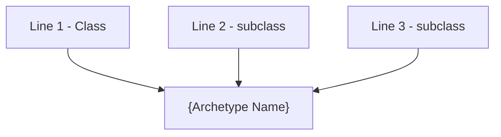
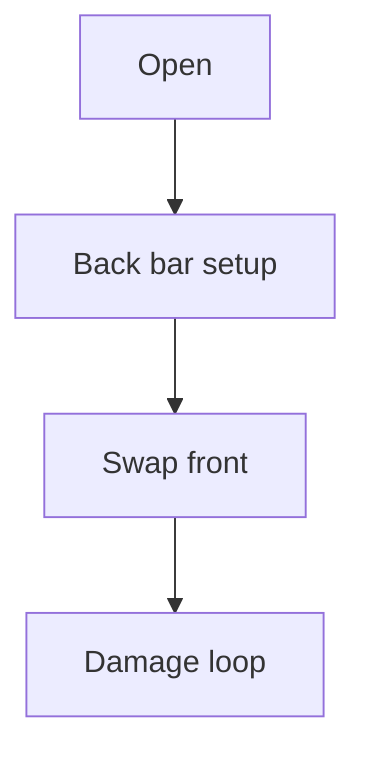
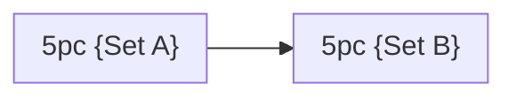

# Build Plan - {CharacterName}: {Archetype Title} ({Build Tag})

> **Character profile:** [{slug}.md](../{account}/{location}/{slug}.md) — Level {N} {Race} {Class}, CP {budget}, @{Account} ({Server}).

{One to two paragraphs: elevator pitch — what this build is, which subclass lines merge, and what content it targets (solo overland, PvP, etc.).}

---

## Build at a glance

| **Attribute** | **Recommendation** |
| :--- | :--- |
| **Primary Stat** | 64 points in **{Stat}** (Target: {resource pools at CP160}) |
| **Mundus Stone** | **{Mundus}** — {why; note current stone if changing} |
| **Vampirism** | **{Cured / Stage N}** — {rationale if relevant} |
| **Sets** | **{Set A + Set B}** (100% craftable unless exception documented) |
| **Bars** | Front: {weapon} ("{bar name}") · Back: {weapon} ("{bar name}") |
| **Food** | **{Food}** |
| **Potion** | **{Potion}** |
| **Weapon Poisons** | {poisons if applicable} |
| **Staff/Weapon Enchant** | {enchants} |
| **Companion** | **{Primary companion}** ({role}); **{Fallback}** if applicable |
| **Primary Mount** | **{Mount}** — see [Collectibles](#collectibles) |

**Read next:** [Roleplay](#roleplay) · [Trinity configuration](#trinity-configuration) · [Combat kit](#combat-kit) · [Gear and crafting](#gear-and-crafting) · [Champion points](#champion-point-mapping-cp-{budget}) · [Companion](#companion-strategy) · [Collectibles](#collectibles) · [Checklist](#next-steps--in-game-action-checklist)

---

## 🎭 Roleplay: {Identity Title}

{Character identity prose — who they are in Tamriel, how the build reads in fiction.}

> [!TIP]
> **Flavor Pet:** {Pet suggestions}. See [Collectibles](#collectibles) for mount, pet, and dye details.

---

## Trinity configuration

By completing Bahtra at-Hunding's milestone quest **"A Study in Discipline"** at Level 50, {CharacterName} unlocks the **Uber Tier (Triple Hybrid)** architecture. See [docs/subclassing.md](../../docs/subclassing.md) for the Solaegis Trinity / subclassing model.

| **Pillar** | **Line** | **Origin** | **Slot action** | **Function** |
| :--- | :--- | :--- | :--- | :--- |
| **{Pillar 1}** | **{Line}** | {Class} (native) | **KEEP** | {function} |
| **{Pillar 2}** | **{Line}** | {Class} (subclass) | **SUBCLASS** (replaces **{Native line}**) | {function} |
| **{Pillar 3}** | **{Line}** | {Class} (subclass) | **SUBCLASS** (replaces **{Native line}**) | {function} |

---

## Combat kit: {Cycle Name}

{One sentence describing bar swap logic.}

### Skill bars

#### Front Bar ({Weapon}): "{Bar Name}"
| **Slot** | **Class/Line** | **Base -> Morph** | **Role** |
| :--- | :--- | :--- | :--- |
| **1** | | | |
| **2** | | | |
| **3** | | | |
| **4** | | | |
| **5** | | | |
| **6 (Ult)** | | | |

#### Back Bar ({Weapon}): "{Bar Name}"
| **Slot** | **Class/Line** | **Base -> Morph** | **Role** |
| :--- | :--- | :--- | :--- |
| **1** | | | |
| **2** | | | |
| **3** | | | |
| **4** | | | |
| **5** | | | |
| **6 (Ult)** | | | |

### Rotation and combat tips

#### Solo combat tips
1. **{Tip 1}**
2. **{Tip 2}**

### Passive skills

You have **{N} Skill Points** available. Spend in this priority order; fully rank (Rank II/III) where noted.

#### {Class} — {Line}
*   **{Passive} (II):** {effect}

#### Weapon — {Weapon line}
*   **{Passive} (II):** {effect}

#### Guild — {Guild}
*   **{Passive} (III):** {effect}

#### Race — {Race}
*   **{Passive} (III):** {effect}

---

## Gear and crafting: "{Gear Theme Name}"

{Intro: craftable-only statement and set pairing rationale.}

### Set rationale

| **Set** | **5-Piece Bonus** | **Role in the Build** |
| :--- | :--- | :--- |
| **{Set A}** | | |
| **{Set B}** | | |

> [!NOTE]
> **Why not {Rejected set}?** {Explain non-craftable or wrong bonus — optional.}

> [!TIP]
> **Lower-trait fallback:** {Interim set if trait research incomplete — optional.}

### Target loadout

| **Slot** | **Set** | **Weight** | **Trait** | **Enchantment** | **Quality** |
| :--- | :--- | :--- | :--- | :--- | :--- |
| **Head** | | | | | |
| **...** | | | | | |

**Front bar — {Weapon}:** {one-line note}

**Back bar — {Weapon}:** {one-line note}

### Crafting handoff (@masisi)

| **Detail** | **Recommendation** |
| :--- | :--- |
| **Style** | {motif} |
| **Set station** | {location} — **{N} traits** per slot |
| **Traits** | {Divines / Arcane / etc.} |
| **Interim (pre-CP160)** | {Seducer or other bridge set} |

> [!NOTE]
> **Research gate:** Coordinate with @masisi before gold-quality CP160 work.

---

## Champion Point Mapping (CP {budget})

Full CP budget: **{Warfare} Warfare / {Craft} Craft / {Fitness} Fitness**. Slot all eight starred abilities below.

### ⚔️ Warfare (Blue — {N} Points)

| **Slotted Star** | **Spend** | **Benefit** |
| :--- | :--- | :--- |
| **{Star}** | 50 | |

**Passives (No slot needed — {remaining} points):**
*   **{Star} ({N}):** {benefit}

### 💪 Fitness (Red — {N} Points)

| **Slotted Star** | **Spend** | **Benefit** |
| :--- | :--- | :--- |
| **{Star}** | 50 | |

**Passives (No slot needed — {remaining} points):**
*   **{Star} ({N}):** {benefit}

### 🍃 Craft (Green — {N} Points)

| **Slotted Star** | **Spend** | **Benefit** |
| :--- | :--- | :--- |
| **{Star}** | 50 | |

**Passives (No slot needed — {remaining} points):**
*   **{Star} ({N}):** {benefit}

---

## 👥 Companion Strategy: "{Companion Theme}"

{Why this companion role fits the build.}

### {Companion Name}: {Subtitle}

| **Setting** | **Recommendation** |
| :--- | :--- |
| **Role** | |
| **Gear Weight** | |
| **Gear Trait** | |
| **Core Sets** | |

#### {Companion}'s Support Skill Bar:
1. **{Skill}:** {source}. {role}
2. ...

> [!TIP]
> **Fallback — {Companion}:** {when to swap}

---

## Collectibles

### Mount

{Overland travel note; primary mount recommendation.}

#### Primary: {Mount Name}

| **Attribute** | **Detail** |
| :--- | :--- |
| **Why** | |
| **Acquisition** | |
| **Dye pass** | |

#### Backups (No Crown Required)

| **Mount** | **Cost / Source** | **Why** |
| :--- | :--- | :--- |
| | | |

#### Avoid Thematically

| **Mount type** | **Reason** |
| :--- | :--- |
| | |

### Pet

| **Pet** | **Why** |
| :--- | :--- |
| | |

### Dye and style

**{Visual theme name}**

| **Slot** | **Style** | **Visual Reasoning** |
| :--- | :--- | :--- |
| | | |

**Dye palette:** {colors and meaning}

---

## ✅ Next Steps & In-Game Action Checklist

Follow this transition list to unlock the full power of **{Archetype Name}**. Gear progression phases are labeled inline — there is no separate phase table.

### Phase 0 — Today (functional build)

1. **{Step}:** {detail}
2. ...

### Phase 1 — Craft (interim)

7. **[Phase 1]** {interim craft step}

### Phase 2 — Craft (target)

8. **[Phase 2]** {target loadout craft}

### Phase 3 — Polish

10. **[Phase 3]** {transmute / gold-out}

### Finish

11. **Companion:** {configure companion}
12. **Regenerate Profile:** Run `/markdown` in-game and update [{slug}.md](../{account}/{location}/{slug}.md) when the build is live.

{Closing flavor line.}
